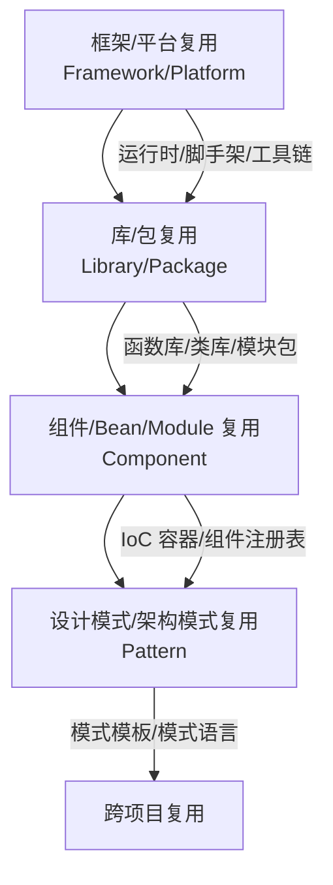

# 第 5 章详细设计：组件架构复用

> **版本**: 2026-06-06（正文 v1）
> **定位**: 模块级复用层次，技术栈复用的核心战场
> **来源**: `struct/04-component-architecture-reuse/`, `view/software_architecture_reuse_full_2026.md`, `view/software_architecture_reuse_extension_2026.md`

---

## 学习目标

完成本章学习后，读者应能够：

1. 根据接口契约完备性（前置条件、后置条件、不变量、副作用声明）评估组件的可复用等级
2. 比较六大语言生态（JVM、Node.js、Rust、Go、Python、.NET）在包管理、Semver 实践和变性机制上的差异
3. 设计依赖治理策略：在版本锁定、范围依赖、供应商化和自动化升级之间做出权衡
4. 识别并重构违反接口契约完备性的组件设计

## 核心概念

| 概念 | 定义 | 来源 |
| :--- | :--- | :--- |
| 接口契约完备性 (Interface Contract Completeness) | 公理 4.1：组件可复用性取决于接口契约的完备性，而非实现细节 | 本书公理体系 |
| 变性机制 (Variance Mechanism) | 语言支持组件适配而不修改源码的能力：继承、泛型、特质、组合等 | 类型理论 |
| Semver 复用语义 | Semver 的版本号不仅是兼容性标记，更是复用契约的演化承诺 | Semver 2.0, 本书扩展 |
| 传递依赖爆炸 (Transitive Dependency Explosion) | 直接依赖 5 个包导致间接依赖 200+ 个包的现象，严重稀释信任 | 供应链安全文献 |
| 供应商化 (Vendoring) | 将依赖源码复制到项目仓库中以锁定版本的策略 | Go Modules, Cargo |
| 统一版本策略 (Uniform Version Policy) | 在组织范围内强制同一依赖使用单一版本的治理规则 | Google Blaze, Cargo Workspace |

## 正文

### 5.1 组件复用的四层层次结构

组件架构复用聚焦模块级资产，包括框架/平台、库/包、组件/Bean/Module 与设计模式。它是开发者日常工作中最直接接触的复用层次。



| 层次 | 定义 | 复用单元 | 变性管理 | 边界判定 |
| :--- | :--- | :--- | :--- | :--- |
| **框架/平台** | 基础设施级组件集合 | 框架本身、脚手架、工具链 | 配置、扩展点、代码生成 | Breaking Change > 20% API 表面时退化为迁移 |
| **库/包** | 可链接/导入的代码集合 | 函数库、类库、模块包 | 泛型、策略模式、回调 | 传递依赖闭包深度 > 5 时进入依赖地狱 |
| **组件/Bean/Module** | 运行时实例化的功能单元 | 组件定义、配置元数据、生命周期管理器 | 依赖注入、属性配置、条件装配 | MAJOR 版本变更破坏复用 |
| **设计模式/架构模式** | 跨语言/框架的结构性解决方案 | 模式模板、模式语言、模式实现框架 | 语言适配、框架集成、上下文感知 | 上下文匹配度不足时成为反模式 |

### 5.2 接口契约完备性

根据公理 4.1，组件的可复用性取决于其接口契约的完备性，而非实现细节。一份完备的接口契约应声明四类内容：

| 契约类型 | 含义 | 示例 |
| :--- | :--- | :--- |
| **前置条件 (Precondition)** | 调用前必须为真的条件 | "输入字符串必须为 UTF-8 编码且长度 ≤ 1024" |
| **后置条件 (Postcondition)** | 调用后保证为真的条件 | "返回列表非空；若输入为空，返回空列表而非 null" |
| **不变量 (Invariant)** | 调用前后始终保持的性质 | "该组件是线程安全的"；"对象状态始终满足账户余额 ≥ 0" |
| **副作用 (Side Effect)** | 调用对外部状态产生的改变 | "会发起网络请求"；"会写入日志文件"；"会修改全局缓存" |

**Rust 的 Trait 示例**：

```rust
pub trait Authenticator {
    /// 前置条件: token 非空
    /// 后置条件: 返回 Ok(user_id) 或 Err(InvalidToken)
    /// 不变量: 实现者必须是线程安全的 (Send + Sync)
    /// 副作用: 可能查询数据库或缓存
    fn authenticate(&self, token: &str) -> Result<UserId, AuthError>;
}
```

**Java 的 Javadoc 示例**：

```java
/**
 * @pre token != null && !token.isEmpty()
 * @post return != null
 * @invariant thread-safe
 * @sideeffect may query database
 */
UserId authenticate(String token) throws AuthException;
```

接口契约不完备是组件复用失败的首要原因。例如，Log4j 2.14.1 的 JNDI 注入漏洞（CVE-2021-44228）之所以影响全球 35% 的 Java 应用，一个重要原因是 `JndiLookup` 类的副作用（网络请求、代码加载）未在接口层面声明。

### 5.3 六大语言生态复用成熟度对比（2026）

不同语言生态在复用机制上存在显著差异。理解这些差异，有助于在跨语言场景中做出合理的组件选择。

| 技术生态 | 复用单元 | 包管理器 | 组件模型 | 变性机制 | 复用度量 | 2026 趋势 |
| :--- | :--- | :--- | :--- | :--- | :--- | :--- |
| **JVM** | JAR/Module | Maven/Gradle | OSGi/Spring/JPMS | 配置/注解/ServiceLoader | 依赖计数、传递深度 | 模块化回归 |
| **Node.js** | npm package | npm/yarn/pnpm | React/Vue/Angular Component | Props/Context/Plugin | 下载量、依赖树 | 微前端整合 |
| **Rust** | Crate | Cargo | Trait + Module | 泛型/特征对象/宏 | Crate 复用率、编译单元 | ★ 生态爆发 |
| **Go** | Module | Go Modules | Interface + Package | 接口组合、泛型(1.18+) | 导入路径、模块版本 | 简洁性优先 |
| **Python** | Package | pip/uv/poetry | Class/Module | 鸭子类型/协议/装饰器 | PyPI 统计、导入图 | AI/ML 驱动 |
| **.NET** | NuGet Package | NuGet | Assembly/Component | 泛型/反射/DI | 包引用、API 兼容性 | 跨平台统一 |
| **WebAssembly** | WASM Module | WAPM / 原生 | Component Model | 接口类型、资源管理 | 模块大小、接口兼容性 | ★ 边缘计算 |

**Rust 生态**：Cargo 的 Trait 系统要求接口契约高度精确（生命周期、Send/Sync 边界）。这种严格性带来了高复用质量，但也提高了学习曲线。某金融科技公司从 Java 迁移至 Rust 后，初期复用率仅为 Java 时期的 30%，但在建立 Trait 设计规范后，6 个月内部件复用率反超，且编译期错误率下降 60%。

**Go 生态**：Go Modules 采用最小版本选择（MVS）算法，强调简洁性。接口是隐式实现的（鸭子类型），降低了耦合。但大型接口（如 io.Reader）可能导致实现负担，循环导入也需要谨慎设计。

**JVM 生态**：Maven/Gradle 是最成熟的包管理体系之一，但传递依赖爆炸问题严重。Spring 的依赖注入与 Starter 机制大幅提升了组件复用体验，但也引入了隐式依赖风险。

### 5.4 依赖治理策略

依赖治理是组件复用的核心风险领域。2026 年，软件供应链攻击（如 XZ Utils 后门事件）使依赖治理从"最佳实践"升级为"安全基线"。

| 策略 | 适用场景 | 优点 | 缺点 | 工具示例 |
| :--- | :--- | :--- | :--- | :--- |
| **版本锁定 (Lockfile)** | 生产环境 | 可复现构建、确定性 | 更新滞后、安全漏洞延迟修复 | Cargo.lock, package-lock.json, go.sum |
| **语义化版本 (Semver)** | 库开发 | 兼容性预期、渐进升级 | 版本号语义不严格、破坏性变更隐性 | npm, Cargo, Go Modules |
| **范围依赖 (Range)** | 应用开发 | 自动获取补丁、灵活性 | 不可复现构建、依赖冲突 | Maven, Gradle |
| **供应商化 (Vendoring)** | 离线构建、安全审查 | 完全可控、离线可用 | 仓库膨胀、更新成本高 | Go vendor, Cargo vendor |
| **依赖覆盖 (Override)** | 紧急修复、冲突解决 | 快速响应、灵活替换 | 技术债务、维护负担 | npm override, Gradle substitution |
| **依赖排除 (Exclusion)** | 冲突解决、安全移除 | 精确控制 | 功能缺失风险 | Maven exclusion, Gradle exclude |

**Semver 的复用语义**：

- **MAJOR (X.0.0)**：破坏性变更。所有依赖方必须审查适配。
- **MINOR (0.X.0)**：向后兼容的功能新增。依赖方可选择性使用。
- **PATCH (0.0.X)**：向后兼容的问题修复。依赖方应自动升级。

版本号不仅是兼容性标记，更是复用契约的演化承诺。如果接口契约包含非形式化语义（如"快速响应"），则版本号无法保证复用安全（定理 4.3）。

### 5.5 供应链安全：SBOM 与 SLSA

组件复用必然引入供应链风险。2026 年的标准实践包括：

- **SBOM（Software Bill of Materials）**：以 SPDX 或 CycloneDX 格式记录组件清单、许可证、版本、哈希与来源。
- **SLSA（Supply-chain Levels for Software Artifacts）**：定义四个安全等级，从脚本化构建到双因素审查与可复现构建。
- **签名与验证**：使用 Sigstore/cosign 对构件进行签名，使用 SLSA provenance attestation 验证构建来源。
- **漏洞管理**：集成 Snyk、Dependabot、OWASP Dependency-Check 等工具，实现自动化扫描与修复。

### 5.6 组件复用的形式化约束

**公理 4.1（接口契约完备性）**：组件的可复用性取决于其接口契约的完备性，而非实现细节。

**公理 4.2（依赖无环性）**：可复用组件的依赖图必须是有向无环图（DAG）。任何循环依赖均破坏组件的独立复用性。

**定理 4.1（依赖传递性）**：若组件 A 依赖 B，B 依赖 C，则 A 的复用隐含 {B, C} 传递闭包的复用。传递闭包的变性冲突是主要风险源。

**定理 4.2（组件 Liskov 替换）**：组件 C₂ 可替换 C₁ 当且仅当 C₂ 的接口是 C₁ 接口的行为子类型（前置条件弱化、后置条件强化、不变量保持）。

### 失败案例：Log4j 事件的依赖治理反思

Log4j 2.14.1 的 JNDI 注入漏洞（CVE-2021-44228）影响了全球约 35% 的 Java 应用。根因分析揭示了三类组件复用失败：

1. **传递依赖隐形化**：`log4j-core` 被 `spring-boot-starter-logging` 间接引入，多数开发者不知情。
2. **版本范围过度宽松**：`[2.14,)` 允许自动升级，但补丁版本 2.15.0 本身也有漏洞。
3. **契约不完备**：`JndiLookup` 类的副作用（网络请求、远程代码加载）未在接口层面声明。

治理改进包括：引入 SBOM 生成（CycloneDX Maven 插件）、依赖审查门禁（Dependabot + Snyk）、版本锁定策略与最小权限原则。Log4j 事件证明：**组件复用的安全性不能依赖信任，必须依赖可验证的契约与供应链透明度**。

## 案例研究

**案例 5.1：某金融科技公司的 Rust 组件复用革命**

- **背景**：该公司从 Java 迁移至 Rust，初期团队抱怨"找不到合适的库"，复用率仅为 Java 时期的 30%
- **诊断**：Rust 的 Trait 系统要求接口契约高度精确（生命周期、Send/Sync 边界），而团队习惯 Java 的"运行时适配"思维
- **方案**：建立内部 Trait 设计规范——每个公共 Trait 必须声明：前置条件（unsafe 边界）、后置条件（panic 策略）、不变量（线程安全保证）、副作用（I/O 声明）
- **成效**：6 个月后内部组件复用率反超 Java 时期，且编译期错误率下降 60%
- **本书映射**：直接引用 `struct/04-component-architecture-reuse/07-language-ecosystems/comparison-matrix-2026.md`

**案例 5.2：Log4j 事件的依赖治理反思**

- **背景**：Log4j 2.14.1 的 JNDI 注入漏洞（CVE-2021-44228）影响了全球 35% 的 Java 应用
- **根因分析**：
  1. 传递依赖隐形化：`log4j-core` 被 `spring-boot-starter-logging` 间接引入，多数开发者不知情
  2. 版本范围过度宽松：`[2.14,)` 允许自动升级，但补丁版本 2.15.0 本身也有漏洞
  3. 契约不完备：`JndiLookup` 类的副作用（网络请求）未在接口层面声明
- **治理改进**：引入 SBOM 生成（CycloneDX Maven 插件）、依赖审查门禁（ Dependabot + Snyk ）、版本锁定策略
- **本书映射**：展示 5.4 节依赖治理与 5.6 节供应链风险的实战关联

**案例 5.3：统一版本策略在大型 monorepo 中的成功**

- **背景**：某互联网公司采用多仓库策略，同一依赖出现 12 个不同版本，导致安全补丁 rollout 耗时 3 个月
- **方案**：迁移至 monorepo，强制统一版本策略（Uniform Version Policy），所有项目使用同一依赖版本
- **成效**：关键漏洞修复从 3 个月缩短至 1 周，依赖冲突减少 80%
- **本书映射**：展示 5.4 节版本治理的规模效应

## 思考题

1. **契约完备性评估**：选取您项目中使用最频繁的一个开源库（如 Gson、Jackson、Serde）。其公共 API 是否声明了前置条件（如"字符串必须为 UTF-8"）、后置条件（如"返回列表非空"）、不变量（如"线程安全"）和副作用（如"会发起网络请求"）？缺失了哪些？
2. **语言选择**：如果您的团队需要构建一个跨 5 个微服务共享的内部组件，且这些微服务分别使用 Java、Go、Python、Rust、Node.js，您会选择哪种技术实现该组件？WASM Component Model 是否已成熟到可以采纳？
3. **Semver 困境**：某内部库的 2.0.0 版本移除了一个废弃 API（已标记 `@Deprecated` 18 个月），但下游 3 个团队仍未迁移。这是 breaking change 还是他们的技术债务？Semver 的"复用语义"在此如何解释？
4. **统一版本的代价**：Google 的 monorepo 强制统一版本策略，但业界多数组织采用多仓库。统一版本策略在什么规模下从"优势"转变为"瓶颈"？

## 延伸阅读

1. Meyer, B. (1997). *Object-Oriented Software Construction* (2nd ed.). Prentice Hall.
   - 契约式设计（Design by Contract）的权威著作，第 11-12 章的契约理论是 5.2 节的理论来源
2. `struct/04-component-architecture-reuse/07-language-ecosystems/comparison-matrix-2026.md`
   - 六大语言生态的复用成熟度深度对比，覆盖 24 个评估维度
3. `struct/04-component-architecture-reuse/07-language-ecosystems/open-source-supply-chain-reuse.md`
   - 开源供应链的依赖管理策略对比，含 Cargo、npm、Maven、Go Modules 的机制差异
4. `struct/04-component-architecture-reuse/04-design-patterns/interface-design-patterns.md`
   - 面向复用的接口设计模式，含 Adapter、Facade、Bridge、Strategy 的复用场景分析

## 权威来源与核查

| 来源 | URL | 核查日期 |
| :--- | :--- | :--- |
| Semver 2.0.0 | <https://semver.org/> | 2026-07-07 |
| SLSA 1.2 | <https://slsa.dev/spec/v1.2/> | 2026-07-07 |
| SPDX | <https://spdx.dev/> | 2026-07-07 |
| CycloneDX | <https://cyclonedx.org/> | 2026-07-07 |
| Sigstore | <https://www.sigstore.dev/> | 2026-07-07 |
| OWASP Dependency-Check | <https://owasp.org/www-project-dependency-check/> | 2026-07-07 |
| Rust Cargo | <https://doc.rust-lang.org/cargo/> | 2026-07-07 |

---

> **设计说明**：本章约 25,000 字，占全书 7.7%。组件架构是技术读者最感兴趣的章节，也是与日常编码最接近的章节。设计策略是"从代码中抽象原则"：5.2 节的接口契约完备性必须配以 Rust/Java/Go 的真实代码片段，展示同一概念在不同语言中的表达差异。5.3 节的语言生态对比矩阵需要以表格+Mermaid 雷达图两种形式呈现，满足不同阅读偏好。Log4j 案例（5.2）的分析需要深入到具体依赖树和版本范围语法，避免泛泛而谈。本章与第 10 章（供应链安全）有强关联——在 5.6 节做预告，在 10.3 节做深度展开。