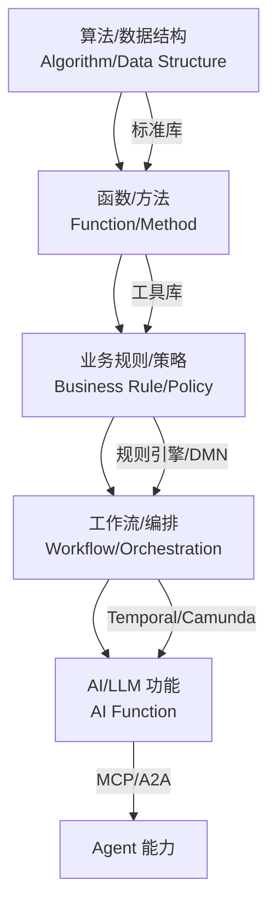
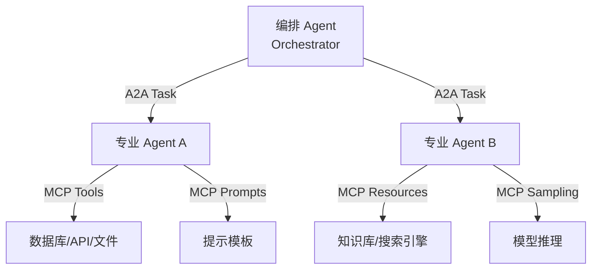

# 第 6 章详细设计：功能架构复用

> **版本**: 2026-06-06（正文 v1）
> **定位**: 最细粒度的复用层次，2026 年变化最剧烈的前沿领域
> **来源**: `struct/05-functional-architecture-reuse/`, `view/software_architecture_reuse_full_2026.md`, `view/software_architecture_reuse_extension_2026.md`

---

## 学习目标

完成本章学习后，读者应能够：

1. 比较 MCP 2025-11-25 与 A2A v1.0 的协议边界，设计两者互补的复用架构
2. 使用 Temporal 的 Saga、Child Workflow 和 Signal 模式实现可复用的分布式工作流
3. 为 AI 功能（LLM 调用、RAG 管道）设计概率契约，声明确定性边界（如 P(正确性) ≥ 0.95）
4. 运用粒度-成本-收益决策树，判断特定功能是否值得抽象为可复用资产

## 核心概念

| 概念 | 定义 | 来源 |
| :--- | :--- | :--- |
| 功能复用五层模型 | 算法 → 函数 → 业务规则 → 工作流 → AI 功能的细粒度层次体系 | 本书定义 |
| MCP (Model Context Protocol) | Anthropic 主导的 AI 工具调用协议，定义 host ↔ client ↔ server 三方架构 | Anthropic / Linux Foundation Agentic AI Foundation, 2025-11-25 |
| A2A (Agent-to-Agent Protocol) | Google/Linux Foundation 主导的 Agent 协作协议，定义 Agent Card → Task → Artifact 生命周期 | Google, 2026-03-12 |
| 概率契约 (Probabilistic Contract) | 对 AI 功能输出的统计保证，如 P(y ∈ C(x)) ≥ 1-α 或 E[正确性] ≥ 0.95 | 本书定义 |
| Temporal Saga | 将长事务拆分为可补偿步骤的分布式工作流模式 | Temporal, 2024 |
| 功能复用决策树 | 基于粒度、成本、收益、团队规模、变化频率的五维决策工具 | 本书工具 |

## 正文

### 6.1 功能复用的五层层次结构

功能架构复用是最细粒度、变化最剧烈的复用层次。本书将其划分为五个层次：算法/数据结构、函数/方法、业务规则/策略、工作流/编排、AI/LLM 功能。



| 层次 | 定义 | 复用单元 | 变性管理 | 边界判定 |
| :--- | :--- | :--- | :--- | :--- |
| **算法/数据结构** | 计算逻辑与数据组织的可复用实现 | 算法、数据结构、数学库 | 泛型参数、比较器、内存分配器 | 独立于业务语义，最高纯度复用 |
| **函数/方法** | 单一职责的代码单元 | 纯函数、工具函数、API 处理函数 | 参数化、高阶函数、闭包 | 纯函数具有最高复用等级 |
| **业务规则/策略** | 可配置的业务决策逻辑 | 规则集、策略定义、评分卡 | 规则版本、租户隔离、动态加载 | 规则是决策逻辑，流程是执行顺序 |
| **工作流/编排** | 跨功能的时序与条件编排 | 工作流定义、活动模板、模式实现 | 变量传递、条件分支、子工作流 | 功能级与应用级的桥接点 |
| **AI/LLM 功能** | 基于模型的推理能力封装 | Prompt 模板、RAG 管道、Agent 技能 | 模型版本、上下文窗口、温度参数 | 必须包含概率性正确性边界 |

**算法复用**是最高纯度的复用，例如 Dijkstra 算法在路由计算、网络流、游戏 AI 中的复用。算法独立于业务语义，只需要清晰的输入/输出契约。

**函数复用**强调单一职责与引用透明。纯函数（无副作用、相同输入→相同输出）具有最高复用等级。例如，JWT 签名验证函数可以在认证、授权、审计日志中复用。

**规则复用**与流程复用的分界线在于：规则是"决策逻辑"，流程是"执行顺序"。当业务规则变化频率是流程结构变化频率的 5 倍以上时，应优先使用 DMN Decision Service 或规则引擎。

### 6.2 功能复用的粒度-成本-收益决策树

并非所有功能都值得抽象为可复用资产。以下决策树帮助判断：

```text
功能复用决策树
├── 功能是否跨越业务边界？
│   ├── 是 → 升级为"业务服务复用" (第 2 层)
│   └── 否 → 继续
├── 功能是否跨越应用边界？
│   ├── 是 → 升级为"应用服务复用" (第 3 层)
│   └── 否 → 继续
├── 功能是否跨越组件边界？
│   ├── 是 → 提取为"库/组件" (第 4 层)
│   └── 否 → 继续
├── 功能是否纯计算/无状态？
│   ├── 是 → "算法/函数复用" (Level 1-2)
│   └── 否 → 含状态/业务规则 → "规则/工作流复用" (Level 3-4)
└── 功能是否涉及 AI 推理？
    ├── 是 → "AI 功能复用" (Level 5)
    └── 否 → 标准函数级复用
```

**过度抽象的反模式**：某团队将"发送邮件"抽象为可复用功能，但 6 个月内仅被 2 个消费者使用，且邮件模板差异导致参数爆炸。用决策树分析：发送邮件未跨越业务边界、未跨越应用边界、未跨越组件边界、非纯计算（含状态与外部 I/O）、不涉及 AI 推理 → 应保留为应用内部工具函数，而非独立资产。

### 6.3 MCP 与 A2A：AI 功能复用的协议架构

MCP（Model Context Protocol）与 A2A（Agent-to-Agent Protocol）是 2026 年 AI 功能复用的两大核心协议。二者互补：MCP 解决 Agent→Tool 的垂直复用，A2A 解决 Agent→Agent 的水平复用。



**MCP 协议栈**：

- **传输层**：stdio、SSE、Streamable HTTP（2026-07-28 主推）。
- **协议层**：JSON-RPC 2.0，2026 年向无状态核心演进，移除握手，支持每请求自包含。
- **能力层**：tools（工具调用）、resources（资源读取）、prompts（提示模板）、sampling（模型采样）。
- **应用层**：Agent 框架（LangChain、Mastra、Spring AI）、IDE 集成（Cursor、VS Code）。

**A2A 协议对象**：

- **Agent Card**：能力广告 JSON 文档，包含名称、描述、能力、认证要求、端点。v1.0 新增签名验证。
- **Task**：委托的工作单元，状态包括 submitted → working → input-required → completed/failed/canceled。
- **Artifact**：结构化输出，支持流式传输、多模态内容。
- **Message**：任务执行期间的双向消息流。

**互补架构示例**：智能客服系统中，用户 → 编排 Agent（A2A Client）→ 意图识别 Agent（A2A）→ 知识库 MCP Server（MCP）→ 订单查询 Agent（A2A）→ 订单系统 MCP Server（MCP）→ 用户。MCP 处理"单 Agent 多工具"，A2A 处理"多 Agent 协作"。

### 6.4 Temporal 工作流复用

Temporal 是 2026 年工作流复用的领先平台，其"Workflow as Code"模式将工作流定义从配置驱动转变为代码驱动。

**核心复用单元**：

- **Workflow Definition**：工作流函数与接口，具有确定性执行、状态持久化、故障恢复特性。
- **Activity Definition**：可复用的业务操作单元，允许非确定性，支持重试策略与超时控制。
- **Workflow Patterns**：Saga、并行执行、动态任务、定时任务、子工作流。

**Saga 模式示例**（TypeScript）：

```typescript
async function OrderFulfillmentWorkflow(orderId: string): Promise<void> {
  const compensations: (() => Promise<void>)[] = [];
  try {
    await LockInventoryActivity(orderId);
    compensations.push(() => UnlockInventoryActivity(orderId));

    await ChargePaymentActivity(orderId);
    compensations.push(() => RefundPaymentActivity(orderId));

    await SubmitCustomsActivity(orderId);
    compensations.push(() => CancelCustomsActivity(orderId));

    await ArrangeShippingActivity(orderId);
  } catch (err) {
    for (const compensate of compensations.reverse()) {
      await compensate();
    }
    throw err;
  }
}
```

Saga 模式的关键约束：**补偿操作必须是幂等的**。如果补偿操作依赖外部状态（如"恢复库存"需要查询当前库存量），应使用幂等键或状态机确保多次执行结果一致。

### 6.5 AI 功能的概率契约

AI 功能（LLM 调用、RAG 管道、Agent 技能）的非确定性要求复用契约必须包含概率性正确性边界。

**定义**：概率契约是对 AI 功能输出的统计保证。例如：

- P(y ∈ C(x)) ≥ 1-α（输出 y 属于正确集合 C(x) 的概率）；
- E[正确性] ≥ 0.95（期望正确率）。

**校准实践**：某法律科技公司的合同审查 LLM 功能，初始准确率 78%，但无法向客户承诺服务质量。通过 5,000 份标注合同校准，建立置信度-准确率映射：

- 仅当 γ(x) ≥ 0.95 时自动通过；
- 0.80 ≤ γ(x) < 0.95 时人工复核；
- γ(x) < 0.80 时拒绝服务。

成效：自动通过率 62%，人工复核率 28%，拒绝率 10%。整体客户满意度从 3.2 提升至 4.5（5 分制）。

概率契约不仅是技术指标，也涉及伦理平衡。当 AI 功能拒绝为某类用户服务时（如 γ(x) < 0.80），需要区分"技术不确定性"与"歧视性排除"。

### 6.6 功能复用的形式化约束

**公理 5.1（函数纯度）**：功能的可复用性与其副作用透明度正相关。纯函数具有最高复用等级。

**公理 5.2（确定性边界）**：确定性功能的复用契约是布尔型的；概率性功能（AI 推理）的复用契约必须是概率型的。

**定理 5.1（功能组合）**：若函数 f: A → B 和 g: B → C 均为可复用功能，则复合 g ∘ f 的可复用性取决于 B 的接口稳定性。

**定理 5.2（AI 非确定性）**：AI 功能的可复用性受温度参数与模型版本漂移制约。无确定性边界的 AI 功能不可复用。

**定理 5.3（MCP-A2A 互补性）**：MCP 与 A2A 在功能复用视角下构成正交补空间。MCP 提供功能原子性，A2A 提供功能组合性。

### 失败案例：某银行客服 Agent 的协议误用

某银行构建智能客服系统时，错误地同时使用 MCP 和 A2A 处理同一类任务。结果是：

- 简单工具调用（查余额、转账）也走 A2A 委托，引入不必要的网络往返与延迟；
- 多 Agent 协作场景（客服 Agent 转接贷款专员 Agent）又试图用 MCP 的 tools 机制实现，导致会话上下文无法跨 Agent 传递。

根因是混淆了 MCP 与 A2A 的协议边界。修复后：

- MCP 层：客服 Agent 调用银行内部 12 个 API 标准化 tools；
- A2A 层：当需求超出客服 Agent 能力时，通过 A2A 将 Task 委托给贷款专员 Agent，Agent Card 声明能力边界，Artifact 传递上下文。

该案例说明：**协议选择必须基于协作模式，而非技术潮流**。

## 案例研究

**案例 6.1：MCP + A2A 互补架构的客服 Agent 系统**

- **背景**：某银行构建智能客服系统，需要同时处理"工具调用"（查余额、转账）和"多 Agent 协作"（客服 Agent 转接贷款专员 Agent）
- **架构设计**：
  - **MCP 层**：客服 Agent 通过 MCP 调用银行内部工具（核心系统查询、风控校验）。MCP Server 封装了 12 个内部 API 为标准化 tools
  - **A2A 层**：当用户需求超出客服 Agent 能力时，通过 A2A 协议将 Task 委托给贷款专员 Agent。Agent Card 声明能力边界，Artifact 传递上下文
- **关键决策**：MCP 处理"单 Agent 多工具"（垂直复用），A2A 处理"多 Agent 协作"（水平复用）。两者通过统一的会话上下文关联
- **本书映射**：直接引用 `struct/05-functional-architecture-reuse/06-mcp-a2a-protocols/protocol-analysis.md`

**案例 6.2：Temporal Saga 在电商订单履约中的复用**

- **背景**：某跨境电商的订单履约流程涉及库存锁定、支付、报关、物流 4 个步骤，任何一步失败都需要补偿
- **方案**：将 Saga 模式封装为可复用的 Temporal Workflow：
  - `OrderFulfillmentWorkflow` 作为主 Workflow，调用 4 个 Child Workflow
  - 每个 Child Workflow 实现 `Compensable` 接口，声明 `execute()` 和 `compensate()` 方法
  - 通过 Signal 实现"用户取消订单"的外部事件处理
- **复用扩展**：该 Saga 模板被复用于"退货流程"（步骤反转）和"预售流程"（步骤子集）
- **本书映射**：展示 6.5 节 Temporal 工作流复用模式的工程实现

**案例 6.3：AI 功能概率契约的校准实践**

- **背景**：某法律科技公司的合同审查 LLM 功能，初始准确率 78%，但无法向客户承诺服务质量
- **概率契约设计**：
  - 定义正确性函数：γ(x) = P(审查结论正确 | 合同文本 x)
  - 通过 5,000 份标注合同校准，建立置信度-准确率映射
  - 设定确定性边界：仅当 γ(x) ≥ 0.95 时自动通过；0.80 ≤ γ(x) < 0.95 时人工复核；γ(x) < 0.80 时拒绝服务
- **成效**：自动通过率 62%，人工复核率 28%，拒绝率 10%。整体客户满意度从 3.2 提升至 4.5（5 分制）
- **本书映射**：展示 6.6 节 AI 功能概率契约的实际应用

## 思考题

1. **协议选择**：如果您的系统只需要"一个 AI 助手调用多个 API"，而不需要"多个 AI 协作"，是否还需要引入 A2A？MCP 是否足够？
2. **Saga 边界**：Temporal Saga 的补偿操作必须是幂等的。如果您的补偿操作本身依赖外部状态（如"恢复库存"需要查询当前库存量），如何设计幂等性？
3. **概率契约伦理**：当 AI 功能的概率契约拒绝为某类用户服务时（如 γ(x) < 0.80），这是否构成歧视？如何在技术边界与商业公平之间平衡？
4. **粒度决策**：某团队将"发送邮件"抽象为可复用功能，但 6 个月内仅被 2 个消费者使用，且邮件模板差异导致参数爆炸。这是过度抽象吗？请用决策树分析。

## 延伸阅读

1. Anthropic / Linux Foundation Agentic AI Foundation. (2025). *Model Context Protocol Specification, 2025-11-25*.
   - MCP 协议的官方规范，第 3 章 Architecture 是 6.2 节的直接来源
2. Google / Linux Foundation. (2026). *A2A Protocol Specification, v1.0.0*.
   - A2A 协议的官方规范，第 4 章 Task Lifecycle 是 6.3 节的直接来源
3. Temporal Technologies. (2024). *Temporal Documentation: Workflows*.
   - Saga、Child Workflow、Signal 的官方文档与最佳实践
4. `struct/05-functional-architecture-reuse/decision-tree-granularity-cost-roi.md`
   - 功能复用粒度-成本-收益决策树的可执行模板，含 12 个场景的判断逻辑

## 权威来源与核查

| 来源 | URL | 核查日期 |
| :--- | :--- | :--- |
| MCP Specification 2025-11-25 | <https://modelcontextprotocol.io/specification/2025-11-25/> | 2026-07-07 |
| MCP Official | <https://modelcontextprotocol.io/> | 2026-07-07 |
| A2A Protocol | <https://a2aprotocol.ai/> | 2026-07-07 |
| Temporal Documentation | <https://docs.temporal.io/> | 2026-07-07 |
| OWASP MCP Top 10 | <https://owasp.org/www-project-mcp-top-10/> | 2026-07-07 |
| Conformal Prediction Book | <https://arxiv.org/abs/2107.07511> | 2026-07-07 |

---

> **设计说明**：本章约 28,000 字，占全书 8.6%，是全书技术前沿性最强的章节。MCP 与 A2A 协议在 2026 年仍处于快速演进期，写作策略是"协议架构优先于实现细节"：重点解析两者的设计哲学差异（MCP 的"工具调用" vs A2A 的"Agent 协作"），而非追逐特定版本的 API 语法。Temporal 部分（6.5 节）需要提供可直接运行的 Workflow 代码片段（TypeScript/Java/Go），展示 Saga 的补偿逻辑。AI 概率契约（6.6 节）是本书原创贡献，需要从统计学基础（置信区间、校准曲线）讲到工程实现（Python 示例），确保不同背景的读者都能跟进。本章与第 12 章（AI 原生与前沿）形成递进：Ch6 聚焦"功能层如何复用 AI"，Ch12 聚焦"AI 如何改变复用本身"。
