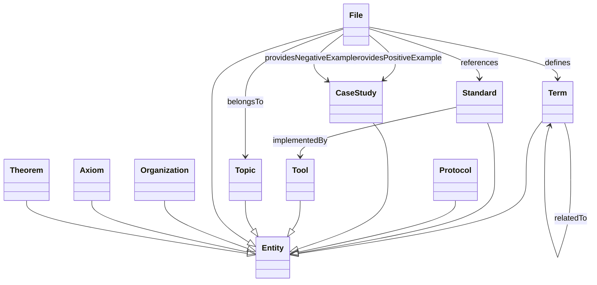

# 架构复用知识图谱

> **定位**：`struct/99-reference/knowledge-graph/` 是《软件工程架构复用视角》的**语义知识图谱产物目录**，将 300+ 篇 Markdown 结构化内容转化为可查询、可验证、可推理的 RDF/OWL 图数据。
> **维护**：所有 `.jsonl` 与 `.ttl` 文件由 `tools/knowledge-extractor.py` 与 `tools/kg-builder.py` 自动生成，请勿手动修改；请在源 Markdown 中修正内容后重新生成。

---

## 1. 核心概念定义

| 概念 | 定义 | 对应 RDF 元素 |
|------|------|---------------|
| **知识图谱（Knowledge Graph）** | 以图形式组织的语义知识集合，节点为实体，边为关系，支持机器可读与推理。 | `kg.ttl` 中的三元组集合 |
| **本体（Ontology）** | 对领域概念及其关系的显式形式化规范，用于统一实体类型与属性。 | `arch-reuse-ontology.ttl` 中的 `owl:Class` / `owl:ObjectProperty` |
| **实体（Entity）** | 知识图谱中的节点，如术语、标准、文件、主题、案例、组织等。 | `ar:entity/*` 资源 |
| **关系（Relation）** | 实体之间的语义边，如“定义”“引用”“属于”“提供正例/反例”。 | `aro:defines`、`aro:references` 等对象属性 |
| **SHACL 验证** | W3C 形状约束语言，用于检查图谱数据是否满足最小标签、类型一致性等规则。 | `kg-shacl-report.md` |

本目录采用 [W3C RDF 1.1](https://www.w3.org/TR/rdf11-concepts/)、[Turtle](https://www.w3.org/TR/turtle/)、[OWL 2](https://www.w3.org/TR/owl2-overview/) 与 [SHACL](https://www.w3.org/TR/shacl/) 作为图谱与约束标准。

---

## 示例：当前图谱规模

```text
kg.ttl            # 101,190+ 三元组
kg-entities.jsonl # 19,041 实体
kg-relations.jsonl# 7,715 关系
覆盖文件          # 325 篇 struct/ 下 Markdown
通过 SHACL 验证   # ✅ Conforms: True
```

### 2.1 实体类型分布

| 类型 | 数量 | 说明 |
|------|------|------|
| `Term` | 17,997 | 从标题、加粗术语、表格中抽取的核心概念 |
| `File` | 641 | Markdown 源文件节点 |
| `Standard` | 345 | ISO、TOGAF、ArchiMate 等标准/框架 |
| `Organization` | 32 | 标准组织或厂商 |
| `Topic` | 14 | 13 个一级主题 + 99-reference |
| `Protocol` | 12 | 协议规范（如 MCP、A2A、OPC UA FX） |

### 2.2 关系类型分布

| 关系 | 数量 | 含义 |
|------|------|------|
| `defines` | 2,622 | 文件定义了某术语 |
| `providesNegativeExample` | 2,358 | 文件提供反例/反模式 |
| `providesPositiveExample` | 1,703 | 文件提供正向案例 |
| `references` | 702 | 文件引用某标准 |
| `belongsTo` | 324 | 文件属于某主题 |

> **统计口径与已知限制（P0-4 标注）**：上表数量为 `kg-relations.jsonl` **行级聚合**（机器真源，与 `reports/stats.json` 一致，合计 7,715）。
> 注意：`kg.ttl` 序列化后的语义边**远少于 jsonl**——`:defines` 仅 202，`:relatedTo` / `:evolvedFrom` / `:mentions` / `:implementedBy` 当前为 0（抽取器未实化 + dangling 关系被静默跳过）。
> 故 SHACL「Conforms: True」仅证明 `label` 非空等**语法层**约束，**不**证明语义边完整。语义边实化与 dangling-即-失败留 **P1**（规则 R1/R2/R6：canonical 归一 + SHACL 真约束）修复。`25010:2024` 三变体、`ArchiMate 4.2` 等不存在版本仍以实体存在于 KG（详见 `reports/authority-alignment-errata.md` A1/F1），需 P1 重建时归并。

完整统计参见：[知识抽取质量报告](../../../reports/kg-extraction-report.md)。

---

## 反例与边界：抽取范围与已知限制

### 3.1 不抽取的内容

- **代码片段与命令行**：例如 `docker build`、`tla+` 代码块仅作为上下文，不生成独立实体。
- **纯叙事段落**：无显式加粗、标题或表格标记的段落，通常不会抽取术语，避免噪音。
- **跨文件同义术语**：同一概念在不同文件中的不同写法（如“微服务” vs. “Microservices”）目前作为独立实体，需后续本体对齐。

### 3.2 典型反例：错误抽取的后果

> 若不加约束地把所有加粗词都视为术语，会把“**注意**”“**结论**”等通用词也纳入图谱，导致实体膨胀、查询噪声高。

当前实现通过以下规则抑制此类反例：

1. 跳过长度小于 2 或仅含标点的片段。
2. 跳过出现在模板提示语中的高频填充词。
3. 对表格术语优先结合表头语义，避免孤立抽取。

---

## 权威来源

- **图谱标准**：W3C RDF 1.1、Turtle、OWL 2、SHACL。
- **领域标准来源**：本图谱中的 `Standard` 实体均链接到 `struct/99-reference/standards-index/` 下的权威来源矩阵，详见：
  - [国际标准与权威来源索引 v2.3](../standards-index/authoritative-sources-v2.md)
  - [国际标准对齐多维总矩阵](../standards-index/master-alignment-matrix.md)
- **术语来源**：核心术语定义参考：
  - [核心术语英中对照表](../glossary/glossary-bilingual.md)
  - [跨标准术语对照表](../glossary/terminology-crosswalk.md)
  - [术语总表](../glossary/glossary-master.md)

---

## 交叉引用

- **抽取脚本**：[../tools/knowledge-extractor.py](../tools/knowledge-extractor.py)
- **图谱构建脚本**：[../tools/kg-builder.py](../tools/kg-builder.py)
- **查询接口**：[../tools/kg-query.py](../tools/kg-query.py)
- **形式化本体**：[arch-reuse-ontology.ttl](./arch-reuse-ontology.ttl)
- **实例图谱**：[kg.ttl](./kg.ttl)
- **SHACL 验证报告**：[../../../reports/kg-shacl-report.md](../../../reports/kg-shacl-report.md)
- **抽取质量报告**：[../../../reports/kg-extraction-report.md](../../../reports/kg-extraction-report.md)

---

## 思维表征：本体类图



---

## 快速查询示例

```bash
# 图谱统计
python struct/99-reference/tools/kg-query.py stats

# 列出所有标准
python struct/99-reference/tools/kg-query.py list-standards

# 搜索术语
python struct/99-reference/tools/kg-query.py search-term "TOGAF"

# 自定义 SPARQL
python struct/99-reference/tools/kg-query.py sparql "SELECT ?s ?label WHERE { ?s a aro:Standard ; rdfs:label ?label } LIMIT 10"
```

---

## 设计论证：为何采用 RDF/OWL + SHACL

| 方案 | 优点 | 缺点 | 本项目选择 |
|------|------|------|-----------|
| 纯 JSON 关系表 | 简单、易读 | 缺乏语义标准，难以跨工具复用与推理 | ❌ |
| 关系型数据库 | 事务与查询成熟 | 模式 rigid，难以表达任意实体关系 | ❌ |
| RDF/OWL + SHACL | 语义标准、可扩展、支持 SPARQL 与推理、可验证 | 学习曲线略高 | ✅ |

采用 RDF/OWL 后，知识图谱可直接被 Protégé、GraphDB、Apache Jena 等工具加载；SHACL 约束则保证每次生成的图谱都满足最低数据质量，避免空标签、缺失类型等问题进入下游 RAG 与问答系统。

---

> **生成时间**: 2026-07-08
> **生成工具**: `knowledge-extractor.py` / `kg-builder.py`
> **许可证**: 与本仓库一致
