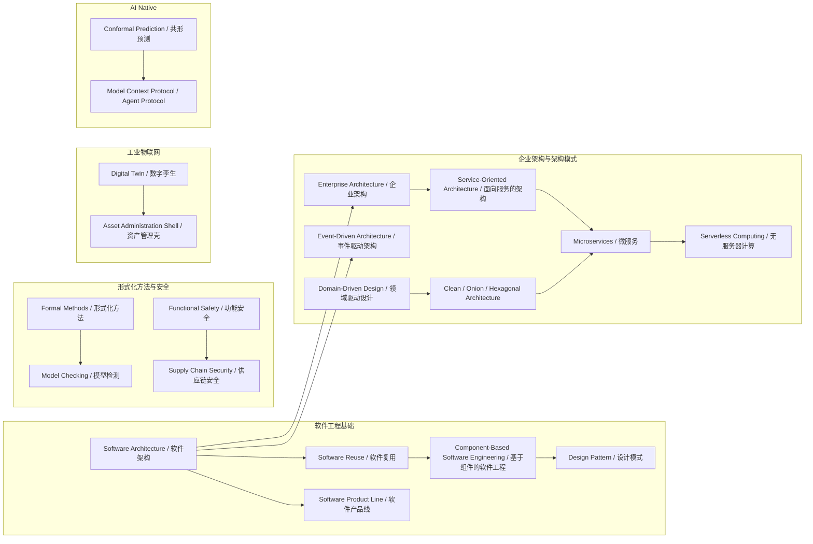

# 学术概念谱系索引（Academic Lineage Index）

> **版本**: 2026-07-07
> **定位**: 为 `e:\_src\Architecture` 项目建立核心学术概念与权威来源的映射，支撑复用知识体系的可追溯性与交叉引用。
> **对齐标准**: ISO/IEC/IEEE 42010:2022、ISO/IEC 26550:2015、IEC 63278、ISO/IEC 25010:2023、TOGAF Standard 10、OMG RAS、SLSA、NIST SSDF 等。
> **权威来源**: 见文末「权威来源与核查记录」。

---

## 目录

- [学术概念谱系索引（Academic Lineage Index）](#学术概念谱系索引academic-lineage-index)
  - [目录](#目录)
  - [1. 概念谱系总图](#1-概念谱系总图)
  - [2. 主题分组索引](#2-主题分组索引)
  - [3. 软件工程基础](#3-软件工程基础)
    - [3.1 Software Architecture / 软件架构](#31-software-architecture--软件架构)
    - [3.2 Software Reuse / 软件复用](#32-software-reuse--软件复用)
    - [3.3 Component-Based Software Engineering / 基于组件的软件工程](#33-component-based-software-engineering--基于组件的软件工程)
    - [3.4 Design Pattern / 设计模式](#34-design-pattern--设计模式)
    - [3.5 Software Product Line / 软件产品线](#35-software-product-line--软件产品线)
  - [4. 架构模式与企业架构](#4-架构模式与企业架构)
    - [4.1 Enterprise Architecture / 企业架构](#41-enterprise-architecture--企业架构)
    - [4.2 Service-Oriented Architecture / 面向服务的架构](#42-service-oriented-architecture--面向服务的架构)
    - [4.3 Microservices / 微服务](#43-microservices--微服务)
    - [4.4 Serverless Computing / 无服务器计算](#44-serverless-computing--无服务器计算)
    - [4.5 Event-Driven Architecture / 事件驱动架构](#45-event-driven-architecture--事件驱动架构)
    - [4.6 Domain-Driven Design / 领域驱动设计](#46-domain-driven-design--领域驱动设计)
    - [4.7 Clean Architecture / Onion Architecture / Hexagonal Architecture](#47-clean-architecture--onion-architecture--hexagonal-architecture)
  - [5. 形式化方法与安全](#5-形式化方法与安全)
    - [5.1 Functional Safety / 功能安全](#51-functional-safety--功能安全)
    - [5.2 Supply Chain Security / 供应链安全](#52-supply-chain-security--供应链安全)
    - [5.3 Formal Methods / 形式化方法](#53-formal-methods--形式化方法)
    - [5.4 Model Checking / 模型检测](#54-model-checking--模型检测)
  - [6. 工业物联网与数字孪生](#6-工业物联网与数字孪生)
    - [6.1 Digital Twin / 数字孪生](#61-digital-twin--数字孪生)
    - [6.2 Asset Administration Shell / 资产管理壳](#62-asset-administration-shell--资产管理壳)
  - [7. AI Native 与智能体协议](#7-ai-native-与智能体协议)
    - [7.1 Conformal Prediction / 共形预测](#71-conformal-prediction--共形预测)
    - [7.2 Model Context Protocol / Agent Protocol / 模型上下文协议与智能体协议](#72-model-context-protocol--agent-protocol--模型上下文协议与智能体协议)
  - [8. 概念定义说明](#8-概念定义说明)
  - [示例](#示例)
  - [10. 反例与边界场景](#10-反例与边界场景)
  - [11. 源流论证分析](#11-源流论证分析)
  - [12. 思维表征说明](#12-思维表征说明)
  - [13. 权威来源与核查记录](#13-权威来源与核查记录)

---

## 1. 概念谱系总图

---

## 2. 主题分组索引

| 主题 | 覆盖概念 | 项目目录 |
|------|---------|---------|
| 软件工程基础 | Software Architecture、Software Reuse、CBSE、Design Pattern、Software Product Line | `01-meta-model-standards/`、`04-component-architecture-reuse/` |
| 架构模式与企业架构 | Enterprise Architecture、SOA、Microservices、Serverless、EDA、DDD、Clean/Onion/Hexagonal | `02-business-architecture-reuse/`、`03-application-architecture-reuse/` |
| 形式化方法与安全 | Functional Safety、Supply Chain Security、Formal Methods、Model Checking | `07-formal-verification/`、`10-supply-chain-security/`、`11-industrial-iot-otit/06-functional-safety/` |
| 工业物联网 | Digital Twin、Asset Administration Shell | `11-industrial-iot-otit/` |
| AI Native | Conformal Prediction、Model Context Protocol / Agent Protocol | `12-ai-native-reuse/` |

---

## 3. 软件工程基础

### 3.1 Software Architecture / 软件架构

- **定义**：软件架构是系统的基础组织结构，包含软件元素、元素之间的关系、以及这些元素的可见属性；它同时是构建这些结构的学科及其文档化产物。高质量架构在系统早期即锁定关键决策，从而直接影响可维护性、可扩展性与复用性。
- **Wikipedia**：[Software architecture](https://en.wikipedia.org/wiki/Software_architecture)
- **学术来源**：
  - ISO/IEC/IEEE 42010:2022 *Software, systems and enterprise — Architecture description*。
  - Bass, L., Clements, P., & Kazman, R. (2012). *Software Architecture in Practice* (3rd ed.). Addison-Wesley。
  - Perry, D. E., & Wolf, A. L. (1992). Foundations for the study of software architecture. *ACM SIGSOFT Software Engineering Notes*, 17(4), 40–52。
- **项目位置**：`struct/01-meta-model-standards/01-iso-420xx-family/iso-42010-2022.md`、`struct/03-application-architecture-reuse/01-layered-architecture/layered-architecture-reuse.md`
- **上游概念**：Systems Engineering、Software Engineering、Information Systems Architecture
- **下游概念**：Software Reuse、Enterprise Architecture、Service-Oriented Architecture、Event-Driven Architecture、Software Product Line

### 3.2 Software Reuse / 软件复用

- **定义**：软件复用是在新的系统或产品中系统性地使用已有软件资产（如需求、设计、代码、测试用例、文档）的实践；其目标是通过降低重复开发成本、提升一致性与质量来改进软件开发经济学。
- **Wikipedia**：[Code reuse](https://en.wikipedia.org/wiki/Code_reuse)（涵盖软件复用核心思想）
- **学术来源**：
  - Frakes, W. B., & Kang, K. (2005). Software reuse research: Status and future. *IEEE Transactions on Software Engineering*, 31(7), 529–536。
  - ISO/IEC 26550:2015 *Software and systems engineering — Reference model for product line engineering and management*。
  - Jacobson, I., Griss, M., & Jonsson, P. (1997). *Software Reuse: Architecture, Process and Organization for Business Success*. Addison-Wesley。
- **项目位置**：`struct/01-meta-model-standards/01-iso-420xx-family/ieee-1517-reuse-processes.md`、`struct/06-cross-layer-governance/02-reuse-process/README.md`
- **上游概念**：Software Engineering、Software Architecture、Economics of Software
- **下游概念**：Component-Based Software Engineering、Software Product Line、Design Pattern、Open Source Supply Chain Reuse

### 3.3 Component-Based Software Engineering / 基于组件的软件工程

- **定义**：CBSE 是一种以可独立部署、通过接口契约交互的软件组件为构造单元的工程范式；它强调「组装而非重新编写」，使系统通过组合第三方或内部组件快速演进。
- **Wikipedia**：[Component-based software engineering](https://en.wikipedia.org/wiki/Component-based_software_engineering)
- **学术来源**：
  - Szyperski, C. (2002). *Component Software: Beyond Object-Oriented Programming* (2nd ed.). Addison-Wesley。
  - Heineman, G. T., & Councill, W. T. (Eds.). (2001). *Component-Based Software Engineering: Putting the Pieces Together*. Addison-Wesley。
  - OMG Reusable Asset Specification (RAS) v2.2。
- **项目位置**：`struct/04-component-architecture-reuse/01-component-models/component-models-reuse.md`、`struct/04-component-architecture-reuse/02-interface-contracts/interface-contracts-reuse.md`
- **上游概念**：Object-Oriented Programming、Software Reuse、Software Architecture
- **下游概念**：Design Pattern、Service-Oriented Architecture、Microservices、WebAssembly Components

### 3.4 Design Pattern / 设计模式

- **定义**：设计模式是在特定上下文下对反复出现的设计问题的经过验证的通用解决方案；它提供了共享词汇与可复用的结构/行为模板，从而提升设计沟通效率与系统可维护性。
- **Wikipedia**：[Software design pattern](https://en.wikipedia.org/wiki/Software_design_pattern)
- **学术来源**：
  - Gamma, E., Helm, R., Johnson, R., & Vlissides, J. (1994). *Design Patterns: Elements of Reusable Object-Oriented Software*. Addison-Wesley。
  - Fowler, M. (2002). *Patterns of Enterprise Application Architecture*. Addison-Wesley。
  - Buschmann, F., et al. (1996). *Pattern-Oriented Software Architecture, Volume 1*. Wiley。
- **项目位置**：`struct/04-component-architecture-reuse/04-design-patterns/pattern-selection-guide.md`、`struct/04-component-architecture-reuse/04-design-patterns/interface-design-patterns.md`
- **上游概念**：Software Architecture、Object-Oriented Design、CBSE
- **下游概念**：Architecture Pattern、Enterprise Integration Patterns、Microservices Patterns、Anti-pattern

### 3.5 Software Product Line / 软件产品线

- **定义**：软件产品线是一种通过系统性的软件复用来开发一系列相关系统的方法；它以领域工程（共性功能与资产）和应用工程（定制化产品）双轨并行的方式，在可变性管理框架下实现大规模定制。
- **Wikipedia**：[Software product line](https://en.wikipedia.org/wiki/Software_product_line)
- **学术来源**：
  - ISO/IEC 26550:2015 *Software and systems engineering — Reference model for product line engineering and management*。
  - Clements, P., & Northrop, L. (2001). *Software Product Lines: Practices and Patterns*. Addison-Wesley。
  - Pohl, K., Böckle, G., & van der Linden, F. (2005). *Software Product Line Engineering: Foundations, Principles, and Techniques*. Springer。
- **项目位置**：`struct/01-meta-model-standards/03-iso-26550-ple/ple-iso-integration.md`、`struct/04-component-architecture-reuse/05-version-strategy/version-strategy-reuse.md`
- **上游概念**：Software Reuse、Software Architecture、Domain Engineering
- **下游概念**：Product Family Engineering、Feature Model、Platform Engineering、Mass Customization

---

## 4. 架构模式与企业架构

### 4.1 Enterprise Architecture / 企业架构

- **定义**：企业架构是在组织层面描述业务、信息系统和技术基础设施之间一致性关系的整体蓝图；它通过统一框架（如 TOGAF、Zachman）帮助组织在变革中保持战略、流程与 IT 的对齐。
- **Wikipedia**：[Enterprise architecture](https://en.wikipedia.org/wiki/Enterprise_architecture)
- **学术来源**：
  - The Open Group. (2022). *TOGAF Standard, Version 10*。
  - Lankhorst, M. (2017). *Enterprise Architecture at Work: Modelling, Communication and Analysis* (4th ed.). Springer。
  - Schekkerman, J. (2004). *How to Survive in the Jungle of Enterprise Architecture Frameworks*. Trafford Publishing。
- **项目位置**：`struct/02-business-architecture-reuse/README.md`、`struct/01-meta-model-standards/02-togaf-10-alignment/togaf-enterprise-continuum-reuse.md`
- **上游概念**：Systems Architecture、Business Strategy、Software Architecture
- **下游概念**：Service-Oriented Architecture、Business Architecture、Application Architecture、Data Architecture

### 4.2 Service-Oriented Architecture / 面向服务的架构

- **定义**：SOA 是一种通过定义良好、松耦合、可互操作的服务来组织软件系统的架构风格；服务作为可复用的业务功能单元，通过标准化协议被不同消费者调用，以支持异构系统集成。
- **Wikipedia**：[Service-oriented architecture](https://en.wikipedia.org/wiki/Service-oriented_architecture)
- **学术来源**：
  - OASIS Reference Model for Service Oriented Architecture 1.0 (2006)。
  - Erl, T. (2016). *Service-Oriented Architecture: Concepts, Technology, and Design* (2nd ed.). Prentice Hall。
  - Josuttis, N. M. (2007). *SOA in Practice: The Art of Distributed System Design*. O'Reilly。
- **项目位置**：`struct/03-application-architecture-reuse/03-app-service/app-service-reuse-patterns.md`、`struct/03-application-architecture-reuse/03-app-service/service-reuse-decision-checklist.md`
- **上游概念**：Distributed Computing、Enterprise Architecture、CBSE、Object-Oriented Design
- **下游概念**：Microservices、Web Services、RESTful Architecture、Enterprise Service Bus (ESB)

### 4.3 Microservices / 微服务

- **定义**：微服务架构将应用拆分为一组小型、自治、围绕业务能力组织的服务，每个服务独立部署、独立演进，并通过轻量级通信机制（通常是 HTTP/REST 或消息）协同工作。
- **Wikipedia**：[Microservices](https://en.wikipedia.org/wiki/Microservices)
- **学术来源**：
  - Newman, S. (2021). *Building Microservices: Designing Fine-Grained Systems* (2nd ed.). O'Reilly。
  - Richardson, C. (2018). *Microservices Patterns: With examples in Java*. Manning。
  - NIST SP 800-204 *Security Strategies for Microservices-based Application Systems*。
- **项目位置**：`struct/03-application-architecture-reuse/02-microservices/microservices-reuse-patterns.md`、`struct/03-application-architecture-reuse/07-cloud-native-patterns/nist-sp-800-204-microservices-security.md`
- **上游概念**：Service-Oriented Architecture、Domain-Driven Design、Clean Architecture、Component-Based Software Engineering
- **下游概念**：Serverless Computing、Service Mesh、Cloud-Native Architecture、Modular Monolith

### 4.4 Serverless Computing / 无服务器计算

- **定义**：无服务器计算是一种云计算执行模型，云提供商动态管理计算资源的分配，开发者以函数或事件处理单元的形式提交代码，按实际调用付费，无需维护底层服务器。
- **Wikipedia**：[Serverless computing](https://en.wikipedia.org/wiki/Serverless_computing)
- **学术来源**：
  - CNCF *Serverless Whitepaper v1.0* (2019)。
  - Roberts, M. (2017). *Serverless Architectures on AWS*. Manning。
  - Baldini, I., et al. (2017). Serverless computing: Current trends and open problems. *Research Advances in Cloud Computing*, 1–20。
- **项目位置**：`struct/03-application-architecture-reuse/04-serverless/serverless-reuse-patterns.md`、`struct/05-functional-architecture-reuse/02-function-as-a-service/faas-reuse-patterns.md`
- **上游概念**：Cloud Computing、Microservices、Event-Driven Architecture、Function-as-a-Service
- **下游概念**：Edge Computing、AI LLM Functions、Event-Driven Function、FinOps Cost Allocation

### 4.5 Event-Driven Architecture / 事件驱动架构

- **定义**：事件驱动架构是一种以事件的产生、检测、消费和响应为核心组织系统行为的架构范式；它通过事件代理实现生产者和消费者的解耦，支持异步、可扩展和响应式系统。
- **Wikipedia**：[Event-driven architecture](https://en.wikipedia.org/wiki/Event-driven_architecture)
- **学术来源**：
  - Hohpe, G., & Woolf, B. (2003). *Enterprise Integration Patterns: Designing, Building, and Deploying Messaging Solutions*. Addison-Wesley。
  - Etzion, O., & Niblett, P. (2010). *Event Processing in Action*. Manning。
  - Reactive Manifesto (2014)。
- **项目位置**：`struct/03-application-architecture-reuse/06-event-driven/event-driven-reuse-patterns.md`、`struct/03-application-architecture-reuse/09-eda-cqrs/eda-cqrs-event-sourcing-patterns.md`
- **上游概念**：Software Architecture、Message-Oriented Middleware、Distributed Systems
- **下游概念**：CQRS、Event Sourcing、Stream Processing、Serverless Computing、EDA-CQRS Patterns

### 4.6 Domain-Driven Design / 领域驱动设计

- **定义**：领域驱动设计是一种通过深入理解业务领域来指导复杂软件系统设计的 methodology；它以限界上下文、实体、值对象、聚合、领域事件等概念为核心，将业务模型与代码实现紧密结合。
- **Wikipedia**：[Domain-driven design](https://en.wikipedia.org/wiki/Domain-driven_design)
- **学术来源**：
  - Evans, E. (2003). *Domain-Driven Design: Tackling Complexity in the Heart of Software*. Addison-Wesley。
  - Vernon, V. (2016). *Domain-Driven Design Distilled*. Addison-Wesley。
  - Evans, E. (2015). *Domain-Driven Design Reference: Definitions and Pattern Summaries*. Domain Language。
- **项目位置**：`struct/02-business-architecture-reuse/01-business-domain-reuse/README.md`、`struct/03-application-architecture-reuse/05-data-architecture/data-mesh-data-product-reuse.md`
- **上游概念**：Object-Oriented Analysis and Design、Software Architecture、Business Architecture
- **下游概念**：Clean Architecture、Onion Architecture、Hexagonal Architecture、Microservices、Data Mesh

### 4.7 Clean Architecture / Onion Architecture / Hexagonal Architecture

- **定义**：这三种架构均强调将业务逻辑与外部依赖（UI、数据库、框架、第三方服务）解耦，通过依赖规则使核心业务独立于实现细节；Clean Architecture 分层、Onion Architecture 以领域为核心、Hexagonal Architecture 通过端口与适配器隔离内外。
- **Wikipedia**：
  - [Hexagonal architecture (software)](https://en.wikipedia.org/wiki/Hexagonal_architecture_(software))
  - [Onion architecture](https://en.wikipedia.org/wiki/Onion_architecture)
  - [Clean architecture](https://en.wikipedia.org/wiki/Clean_architecture)
- **学术来源**：
  - Martin, R. C. (2017). *Clean Architecture: A Craftsman's Guide to Software Structure and Design*. Prentice Hall。
  - Cockburn, A. (2005). Hexagonal architecture. *Alistair Cockburn's blog*。
  - Palermo, J. (2008). The Onion Architecture. *Jeffrey Palermo's blog*。
- **项目位置**：`struct/03-application-architecture-reuse/01-layered-architecture/layered-architecture-reuse.md`、`struct/03-application-architecture-reuse/01-layered-architecture/reuse-patterns.md`
- **上游概念**：Layered Architecture、Domain-Driven Design、Dependency Inversion Principle、Ports and Adapters
- **下游概念**：Microservices、Serverless Functions、Testable Architecture、Domain-Centric Design

---

## 5. 形式化方法与安全

### 5.1 Functional Safety / 功能安全

- **定义**：功能安全是电气/电子/可编程电子系统在安全相关应用中避免由系统故障导致不可接受风险的能力；它通过危害分析、安全完整性等级（SIL/ASIL）、验证与确认来确保系统在安全生命周期内的可信赖行为。
- **Wikipedia**：[Functional safety](https://en.wikipedia.org/wiki/Functional_safety)
- **学术来源**：
  - IEC 61508:2010 *Functional safety of electrical/electronic/programmable electronic safety-related systems*（第 3 版更新中）。
  - ISO 26262:2018 *Road vehicles — Functional safety*。
  - ISO/PAS 21448:2019 *Road vehicles — Safety of the intended functionality (SOTIF)*。
- **项目位置**：`struct/11-industrial-iot-otit/06-functional-safety/iec-61508-ed3-reuse.md`、`struct/11-industrial-iot-otit/06-functional-safety/iso-26262-seooc-reuse.md`
- **上游概念**：Safety Engineering、Reliability Engineering、Risk Management
- **下游概念**：SOTIF、Cyber-Physical Systems Safety、ISO 26262 Automotive Safety、IEC 62443 Security

### 5.2 Supply Chain Security / 供应链安全

- **定义**：供应链安全是保护软件在开发、构建、分发与运行全生命周期中免受恶意篡改、漏洞传播与依赖投攻击击的一系列实践与治理框架；它强调来源证明、完整性校验与最小权限。
- **Wikipedia**：[Supply chain security](https://en.wikipedia.org/wiki/Supply_chain_security)
- **学术来源**：
  - SLSA (Supply-chain Levels for Software Artifacts) v1.1 / v1.2, OpenSSF。
  - NIST SSDF v1.1 / v1.2 *Secure Software Development Framework*。
  - ISO/IEC 5230:2021 *Information technology — OpenChain Specification*。
- **项目位置**：`struct/10-supply-chain-security/README.md`、`struct/10-supply-chain-security/01-slsa-framework/slsa-1-2-multi-track.md`、`struct/10-supply-chain-security/12-nist-ssdf-update/nist-ssdf-v1.2-reuse-update.md`
- **上游概念**：Cybersecurity、Risk Management、Software Reuse、Open Source Governance
- **下游概念**：SBOM、SLSA、Provenance Attestation、Zero Trust Supply Chain、Dependency Management

### 5.3 Formal Methods / 形式化方法

- **定义**：形式化方法是使用具有严格数学语义的语言与符号来规约、开发与验证软件和硬件系统的一类技术；它通过定理证明、模型检测、类型系统等形式化手段提供超越测试的可靠性保证。
- **Wikipedia**：[Formal methods](https://en.wikipedia.org/wiki/Formal_methods)
- **学术来源**：
  - ISO/IEC 15026:2019 *Systems and software engineering — Systems and software assurance*。
  - Bowen, J. P., & Hinchey, M. G. (1995). Ten commandments of formal methods. *Computer*, 28(4), 56–63。
  - Woodcock, J., et al. (2009). Formal methods: Practice and experience. *ACM Computing Surveys*, 41(4), 1–36。
- **项目位置**：`struct/07-formal-verification/README.md`、`struct/01-meta-model-standards/06-formal-axioms/axiom-system.md`
- **上游概念**：Mathematical Logic、Discrete Mathematics、Programming Language Semantics
- **下游概念**：Model Checking、Theorem Proving、Static Analysis、Refinement、Type Systems、TLA+

### 5.4 Model Checking / 模型检测

- **定义**：模型检测是一种自动化的形式化验证技术，它通过遍历系统的有限状态模型来判定系统是否满足给定的时序逻辑性质；若性质不成立，工具会给出反例路径以辅助调试。
- **Wikipedia**：[Model checking](https://en.wikipedia.org/wiki/Model_checking)
- **学术来源**：
  - Clarke, E. M., Grumberg, O., & Peled, D. A. (1999). *Model Checking*. MIT Press。
  - Baier, C., & Katoen, J.-P. (2008). *Principles of Model Checking*. MIT Press。
  - Holzmann, G. J. (2003). *The SPIN Model Checker*. Addison-Wesley。
- **项目位置**：`struct/07-formal-verification/01-tla-plus/mcp-capability-negotiation.md`、`struct/07-formal-verification/02-alloy/cross-layer-mapping.md`
- **上游概念**：Formal Methods、Temporal Logic、Automata Theory
- **下游概念**：TLA+、Alloy、SPIN、NuSMV、Probabilistic Model Checking、Runtime Verification

---

## 6. 工业物联网与数字孪生

### 6.1 Digital Twin / 数字孪生

- **定义**：数字孪生是物理实体或系统在数字空间中的动态虚拟映射，它通过实时数据同步与模型驱动的方法支持监控、仿真、预测与优化；数字孪生强调物理-数字闭环，而不仅仅是三维可视化。
- **Wikipedia**：[Digital twin](https://en.wikipedia.org/wiki/Digital_twin)
- **学术来源**：
  - ISO 23247 *Automation systems and integration — Digital twin framework for manufacturing*。
  - Grieves, M., & Vickers, J. (2017). Digital twin: Mitigating unpredictable, undesirable emergent behavior in complex systems. *Transdisciplinary perspectives on complex systems*, 85–113。
  - Boschert, S., & Rosen, R. (2016). Digital twin—the simulation aspect. *Mechatronic Futures*, 59–74。
- **项目位置**：`struct/11-industrial-iot-otit/08-digital-twin-general/dt-reference-architecture.md`、`struct/11-industrial-iot-otit/05-digital-twin-aas/iec-63278-roadmap.md`
- **上游概念**：Simulation、Cyber-Physical Systems、IoT、Product Lifecycle Management
- **下游概念**：Asset Administration Shell、Network Digital Twin、Digital Thread、Predictive Maintenance

### 6.2 Asset Administration Shell / 资产管理壳

- **定义**：资产管理壳（AAS）是工业 4.0 中资产的标准化数字表示，它通过统一接口向外部应用提供资产信息与服务；AAS 由元模型、子模型与交互 API 组成，是 Digital Twin 在工业自动化领域的标准化实现形态。
- **Wikipedia**：[Asset administration shell](https://en.wikipedia.org/wiki/Asset_administration_shell)
- **学术来源**：
  - IEC 63278-1:2023 *Asset Administration Shell for industrial applications — Part 1: Asset Administration Shell structure*。
  - IDTA-01001-3-0 *Specification of the Asset Administration Shell, Part 1: Metamodel*。
  - Plattform Industrie 4.0. (2021). *Details of the Asset Administration Shell*。
- **项目位置**：`struct/11-industrial-iot-otit/05-digital-twin-aas/aas-opcua-mapping.md`、`struct/11-industrial-iot-otit/05-digital-twin-aas/aas-v32-opcua-fx-2026-alignment.md`
- **上游概念**：Digital Twin、OPC UA、IEC 61360、Industrie 4.0 Component
- **下游概念**：AAS Submodel Templates、AASX Package Format、Industrial Digital Twin、RAMI 4.0

---

## 7. AI Native 与智能体协议

### 7.1 Conformal Prediction / 共形预测

- **定义**：共形预测是一种为任意基础预测器提供有限样本下覆盖率保证的统计学习框架；它通过非一致性分数与校验集构造预测集合，使得真实标签以可控概率落入预测集合内。
- **Wikipedia**：[Conformal prediction](https://en.wikipedia.org/wiki/Conformal_prediction)
- **学术来源**：
  - Vovk, V., Gammerman, A., & Shafer, G. (2022). *Algorithmic Learning in a Random World* (2nd ed.). Springer。
  - Shafer, G., & Vovk, V. (2008). A tutorial on conformal prediction. *Journal of Machine Learning Research*, 9, 371–421。
  - Angelopoulos, A. N., & Bates, S. (2023). Conformal prediction: A gentle introduction. *Foundations and Trends in Machine Learning*, 16(4), 494–591。
- **项目位置**：`struct/12-ai-native-reuse/07-conformal-prediction/cp-formal-verification.md`、`struct/12-ai-native-reuse/07-conformal-prediction/cp-code-generation.md`
- **上游概念**：Statistical Learning、Exchangeability、Algorithmic Randomness、Machine Learning
- **下游概念**：Conformal Predictive Systems、Model Calibration、Uncertainty Quantification、AI Trustworthiness

### 7.2 Model Context Protocol / Agent Protocol / 模型上下文协议与智能体协议

- **定义**：MCP 是由 Anthropic 提出并捐赠给 Agentic AI Foundation（Linux Foundation）的开放协议，它标准化了 LLM 应用如何发现、调用外部工具与资源；Agent Protocol（如 Google A2A）则进一步规范多智能体之间的能力发现、任务协商与上下文交换。
- **Wikipedia**：[Model Context Protocol](https://en.wikipedia.org/wiki/Model_Context_Protocol)
- **学术来源**：
  - Anthropic. (2025). *Model Context Protocol Specification* (2025-11-25). [modelcontextprotocol.io](https://modelcontextprotocol.io/specification/2025-11-25)。
  - Google. (2025). *Agent-to-Agent (A2A) Protocol*。
  - Wooldridge, M. (2009). *An Introduction to MultiAgent Systems* (2nd ed.). Wiley。
- **项目位置**：`struct/12-ai-native-reuse/01-mcp-protocol/mcp-2026-deep-dive.md`、`struct/12-ai-native-reuse/02-a2a-protocol/a2a-v1-authoritative.md`、`struct/05-functional-architecture-reuse/06-mcp-a2a-protocols/protocol-analysis.md`
- **上游概念**：LLM Tool Use、JSON-RPC、Agent Architecture、Service-Oriented Architecture
- **下游概念**：AI Agent Composition、MCP Gateway、Agentic Governance、Function-as-a-Service for AI

---

## 8. 概念定义说明

本索引对每个概念采用统一条目结构：中英文名称、简明定义、Wikipedia 链接、学术来源、项目位置、上游概念与下游概念。定义均控制在 2–3 句话，优先引用 ISO/IEC/IEEE 标准、权威教材与经典论文，以保证可追溯性。

---

## 示例

- **Software Reuse → CBSE**：在组织级建立可复用组件库，新项目通过标准化接口组装已有组件，从而显著缩短交付周期。
- **DDD → Microservices**：以限界上下文划分服务边界，每个微服务对应一个业务领域，降低跨服务耦合。
- **Formal Methods → Model Checking**：使用 TLA+ 对分布式协议建模并验证其安全性与活性，避免运行时才发现一致性缺陷。

---

## 10. 反例与边界场景

- **不应将 AAS 等同于简单数据库**：AAS 不仅是资产属性的存储容器，还包含语义子模型、服务能力与安全策略；若忽略元模型与接口标准，则难以实现跨厂商互操作。
- **Serverless 并非所有场景都适用**：长运行、有状态、需要细粒度资源控制的工作负载若强制 Serverless，可能导致冷启动延迟与成本不可控。
- **反模式：Big Ball of Mud 式的 Microservices**：若缺乏领域边界而按技术层拆分服务，会形成分布式单体，反而增加系统复杂度。

---

## 11. 源流论证分析

本索引的谱系关系基于以下学术共识构建：

1. **软件架构是复用的语义锚点**：ISO/IEC/IEEE 42010:2022 将架构描述为「系统的基本组织」，而复用（ISO/IEC 26550:2015）与组件化（CBSE）均需以稳定的架构边界为前提。
2. **企业架构向下演进到服务化**：TOGAF/FEA 等企业架构框架推动了业务能力的模块化，进而催生了 SOA；SOA 的轻量级化与领域驱动细化最终导向微服务与 Serverless。
3. **形式化方法为安全提供证明基础**：模型检测是形式化方法中最具工业可落地性的分支，而功能安全（IEC 61508/ISO 26262）与供应链安全（SLSA/SSDF）则从运行时风险与生命周期风险两个维度扩展了可信软件的范围。
4. **工业 4.0 与 AI Native 分别代表物理世界与智能 Agent 的复用新前沿**：Digital Twin/AAS 实现物理资产的数字封装，MCP/A2A 实现智能体能力的标准化调用，二者共同拓展了「复用」的边界。

因此，本谱系既是历史演进脉络，也是项目知识结构中跨层治理的基础。

---

## 12. 思维表征说明

本文档使用 Mermaid 流图在顶部展示 20 个核心概念的源流关系，并在主题分组索引表中以矩阵形式呈现概念与项目目录的映射。每个概念条目通过上游/下游字段形成局部子图，便于读者在更大知识体系中进行导航。

---

## 13. 权威来源与核查记录

| 来源类别 | 名称 | URL | 机构 | 核查日期 |
|----------|------|-----|------|----------|
| 标准 | ISO/IEC/IEEE 42010:2022 | <https://www.iso.org/obp/ui/#iso:std:iso-iec-ieee:42010:ed-2:v1:en> | ISO/IEC/IEEE | 2026-07-07 |
| 标准 | ISO/IEC 26550:2015 | <https://www.iso.org/standard/69529.html> | ISO/IEC | 2026-07-07 |
| 标准 | IEC 63278-1:2023 | <https://webstore.iec.ch/publication/66028> | IEC | 2026-07-07 |
| 标准 | IEC 61508:2010 | <https://webstore.iec.ch/publication/66912> | IEC | 2026-07-07 |
| 标准 | ISO 26262:2018 | <https://www.iso.org/standard/68383.html> | ISO | 2026-07-07 |
| 标准 | SLSA v1.1 / v1.2 | <https://slsa.dev/spec/v1.1/> | OpenSSF | 2026-07-07 |
| 标准 | NIST SSDF v1.1 | <https://csrc.nist.gov/publications/detail/white-paper/2023/07/06/mitigating-risk-of-software-vulnerabilities> | NIST | 2026-07-07 |
| 标准 | OASIS SOA Reference Model | <https://www.oasis-open.org/committees/tc_home.php?wg_abbrev=soa-rm> | OASIS | 2026-07-07 |
| 百科 | Software Architecture | <https://en.wikipedia.org/wiki/Software_architecture> | Wikimedia Foundation | 2026-07-07 |
| 百科 | Software Reuse / Code reuse | <https://en.wikipedia.org/wiki/Code_reuse> | Wikimedia Foundation | 2026-07-07 |
| 百科 | Component-based software engineering | <https://en.wikipedia.org/wiki/Component-based_software_engineering> | Wikimedia Foundation | 2026-07-07 |
| 百科 | Software design pattern | <https://en.wikipedia.org/wiki/Software_design_pattern> | Wikimedia Foundation | 2026-07-07 |
| 百科 | Software product line | <https://en.wikipedia.org/wiki/Software_product_line> | Wikimedia Foundation | 2026-07-07 |
| 百科 | Enterprise architecture | <https://en.wikipedia.org/wiki/Enterprise_architecture> | Wikimedia Foundation | 2026-07-07 |
| 百科 | Service-oriented architecture | <https://en.wikipedia.org/wiki/Service-oriented_architecture> | Wikimedia Foundation | 2026-07-07 |
| 百科 | Microservices | <https://en.wikipedia.org/wiki/Microservices> | Wikimedia Foundation | 2026-07-07 |
| 百科 | Serverless computing | <https://en.wikipedia.org/wiki/Serverless_computing> | Wikimedia Foundation | 2026-07-07 |
| 百科 | Event-driven architecture | <https://en.wikipedia.org/wiki/Event-driven_architecture> | Wikimedia Foundation | 2026-07-07 |
| 百科 | Domain-driven design | <https://en.wikipedia.org/wiki/Domain-driven_design> | Wikimedia Foundation | 2026-07-07 |
| 百科 | Hexagonal architecture | <https://en.wikipedia.org/wiki/Hexagonal_architecture_(software)> | Wikimedia Foundation | 2026-07-07 |
| 百科 | Functional safety | <https://en.wikipedia.org/wiki/Functional_safety> | Wikimedia Foundation | 2026-07-07 |
| 百科 | Supply chain security | <https://en.wikipedia.org/wiki/Supply_chain_security> | Wikimedia Foundation | 2026-07-07 |
| 百科 | Formal methods | <https://en.wikipedia.org/wiki/Formal_methods> | Wikimedia Foundation | 2026-07-07 |
| 百科 | Model checking | <https://en.wikipedia.org/wiki/Model_checking> | Wikimedia Foundation | 2026-07-07 |
| 百科 | Conformal prediction | <https://en.wikipedia.org/wiki/Conformal_prediction> | Wikimedia Foundation | 2026-07-07 |
| 百科 | Digital twin | <https://en.wikipedia.org/wiki/Digital_twin> | Wikimedia Foundation | 2026-07-07 |
| 百科 | Asset administration shell | <https://en.wikipedia.org/wiki/Asset_administration_shell> | Wikimedia Foundation | 2026-07-07 |
| 百科 | Model Context Protocol | <https://en.wikipedia.org/wiki/Model_Context_Protocol> | Wikimedia Foundation | 2026-07-07 |
| 规范 | Model Context Protocol Specification 2025-11-25 | <https://modelcontextprotocol.io/specification/2025-11-25> | Anthropic / Agentic AI Foundation | 2026-07-07 |
| 教材 | *Software Architecture in Practice* (3rd ed.) | <https://www.informit.com/store/software-architecture-in-practice-9780321815736> | Addison-Wesley | 2026-07-07 |
| 教材 | *Design Patterns* (GoF, 1994) | <https://www.informit.com/store/design-patterns-elements-of-reusable-object-oriented-9780201633610> | Addison-Wesley | 2026-07-07 |
| 教材 | *Domain-Driven Design* (Evans, 2003) | <https://www.dddcommunity.org/book/evans_2003/> | Addison-Wesley | 2026-07-07 |
| 教材 | *Algorithmic Learning in a Random World* (2nd ed.) | <http://www.alrw.net> | Springer | 2026-07-07 |
| 框架 | TOGAF Standard, Version 10 | <https://www.opengroup.org/togaf> | The Open Group | 2026-07-07 |

> **核查说明**：Wikipedia 链接均通过公开搜索与引用交叉验证；由于本地网络对 `en.wikipedia.org` 的 HTTPS 直连受限，部分页面通过 SearchWeb 的二次引用确认了条目存在与 URL 有效性。标准与规范链接以 ISO、IEC、NIST、OpenSSF、OMG 等官方网站或授权经销商页面为准。
