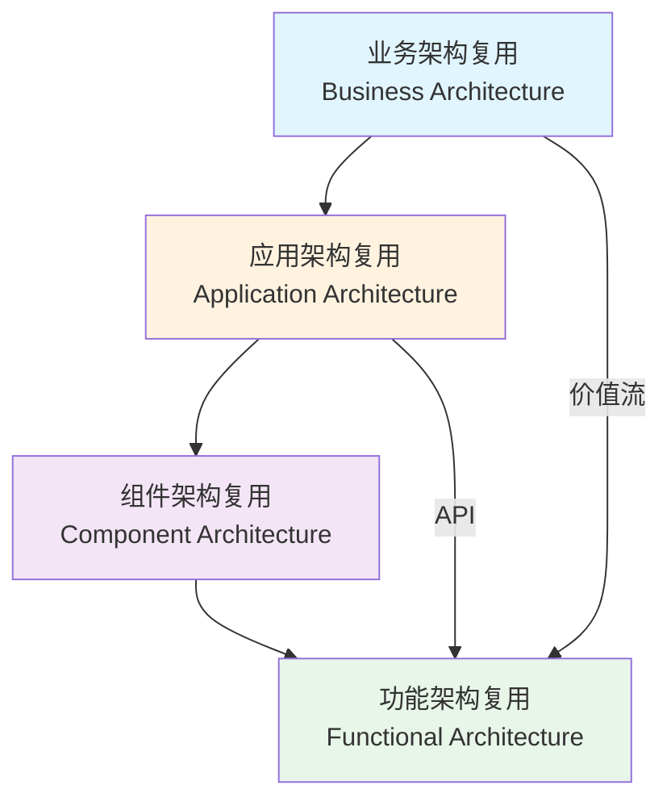
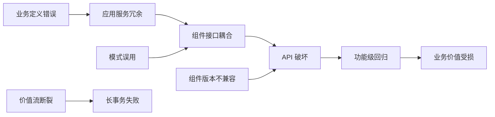

# 四层复用映射矩阵

> **版本**: 2026-07-09
> **定位**: 建立"业务架构 → 应用架构 → 组件架构 → 功能架构"四层复用资产之间的映射关系、失败传递模式与治理要点。
> **关联**: [`cross-theme-dependency-graph.md`](./cross-theme-dependency-graph.md)、[`glossary-master.md`](../glossary/glossary-master.md)、[`axiom-theorem-tree.md`](../glossary/axiom-theorem-tree.md)

---

## 1. 概念定义：四层复用视角总览

| 层次 | 核心复用资产 | 粒度 | 主要标准/框架 | 典型失败模式 |
|---|---|---|---|---|
| **业务架构** | 业务能力、价值流、业务服务、BPMN/DMN 流程 | 最粗 | TOGAF、FEA BRM、BIAN、BPMN/DMN、Zachman | 业务定义错误向下传递为应用服务冗余 |
| **应用架构** | 架构模式、应用服务、微服务、Serverless、EDA、数据架构 | 系统级 | ISO 42010、Cloud Native Patterns、Service Mesh | 模式误用导致组件接口耦合 |
| **组件架构** | 组件模型、设计模式、接口契约、语言生态包 | 模块级 | Component Model、Design Patterns、OpenAPI | 组件版本不兼容导致 API 破坏 |
| **功能架构** | API、FaaS 函数、工作流、MCP/A2A 工具、AI 功能 | 最细 | OpenAPI、AsyncAPI、Temporal、MCP、A2A | 函数级变更引发组件级回归 |

---

## 2. 层次间映射矩阵

### 2.1 上层资产 → 下层支撑资产

| 上层复用资产 | 下层支撑资产 | 映射关系 | 关键接口 | 失败传递模式 |
|---|---|---|---|---|
| 业务能力 | 应用服务 | 1:N 实现 | 服务契约 | 业务定义错误 → 应用服务冗余 |
| 价值流 | 工作流编排 + API 组合 | N:M 编排 | 编排 DSL / Temporal | 价值流断裂 → 长事务失败 |
| 业务服务 | 微服务 / Serverless | 1:N 实现 | REST/gRPC/事件 | 服务边界不清 → 分布式单体 |
| 应用架构模式 | 组件接口契约 | 模式实例化 | 组件模型 / WIT | 模式误用 → 接口耦合 |
| 组件 | 功能/API | N:M 调用 | OpenAPI / gRPC / Tool Schema | 组件版本不兼容 → API 破坏 |
| 数据架构 | API + 事件模式 | 1:N 消费 | Schema Registry | Schema 变更 → 消费者失败 |

### 2.2 下层资产 → 上层约束来源

| 下层资产 | 上层约束 | 约束类型 | 示例 |
|---|---|---|---|
| 功能/API | 业务规则 | 语义约束 | 支付 API 必须满足财务审计规则 |
| 组件 | 应用架构模式 | 结构约束 | 微服务组件必须无共享数据库 |
| 应用服务 | 业务能力 | 范围约束 | 客户认证服务必须覆盖所有渠道 |
| 数据 Schema | 价值流 | 时序约束 | 订单事件必须在发货事件之前 |

---

## 3. 层次内模型之间关系

### 3.1 业务层内模型对比

| 模型 | 关注点 | 主要元素 | 复用场景 | 与相邻模型关系 |
|---|---|---|---|---|
| 业务能力 | 企业能做什么 | 能力、子能力、能力地图 | 跨组织共享业务能力 | 被价值流消费，被应用服务实现 |
| 价值流 | 如何交付价值 | 阶段、活动、价值增量 | 端到端流程标准化 | 由业务能力组成，由业务流程实现 |
| 业务流程 | 具体执行步骤 | 任务、网关、事件、泳道 | 流程模板复用 | 被 BPMN 建模，被应用系统支撑 |
| BPMN/DMN | 流程/决策可执行规约 | 流程、任务、决策表 | 跨平台流程复用 | 是业务流程的形式化表达 |

### 3.2 应用层内模型对比

| 模型 | 关注点 | 主要元素 | 复用场景 | 与相邻模型关系 |
|---|---|---|---|---|
| 分层架构 | 职责分离 | 表示层、业务层、数据层 | 传统应用快速复用模式 | 模式被微服务/Serverless 演进 |
| 微服务 | 业务能力自治 | 服务、API、数据库、事件 | 独立团队复用服务 | 需要服务网格/网关支撑 |
| Serverless | 事件驱动函数 | 函数、触发器、事件源 | 按调用付费的细粒度复用 | 函数可被微服务调用 |
| EDA | 异步解耦 | 事件、主题、消费者 | 跨系统事件复用 | 与微服务/Serverless 互补 |

### 3.3 组件层内模型对比

| 模型 | 关注点 | 主要元素 | 复用场景 | 与相邻模型关系 |
|---|---|---|---|---|
| 组件模型 | 接口与生命周期 | 组件、接口、装配、部署 | 跨平台组件复用 | 被语言生态实现 |
| 设计模式 | 可复用解决方案 | 类/对象结构、行为 | 代码级设计复用 | 被组件内部实现使用 |
| 接口契约 | 交互约定 | 前置/后置条件、不变量 | 跨组件安全集成 | 是组件复用的法律基础 |
| 语言生态 | 包管理与运行时 | 包、模块、运行时 | 同语言生态内复用 | 决定组件模型选择 |

### 3.4 功能层内模型对比

| 模型 | 关注点 | 主要元素 | 复用场景 | 与相邻模型关系 |
|---|---|---|---|---|
| API | 同步调用契约 | 端点、方法、Schema | 跨系统功能调用 | 被组件实现，被应用编排 |
| FaaS | 事件触发函数 | 函数、触发器 | 短时任务复用 | 函数可被 API 网关暴露 |
| 工作流编排 | 长事务协调 | 工作流、活动、补偿 | 跨服务业务流程 | 编排 API/函数/事件 |
| MCP/A2A | Agent 能力交互 | Tool/Resource/Agent Card | AI Agent 复用外部能力 | 与传统 API 互补 |

---

## 4. 跨层失败传递模式

| 失败模式 | 触发层 | 影响层 | 典型症状 | 缓解策略 |
|---|---|---|---|---|
| 业务定义漂移 | 业务 | 应用/组件/功能 | 同一能力多系统重复实现 | 能力治理委员会、能力目录 |
| 价值流过度泛化 | 业务 | 应用 | 流程模板无法适配具体场景 | 变性点管理、绑定时间明确 |
| 模式误用 | 应用 | 组件 | 分布式单体、共享数据库 | 架构评审、模式选择框架 |
| 组件版本不兼容 | 组件 | 功能/API | 调用方出现破坏性变更 | SemVer、API 版本策略、兼容性测试 |
| API 过度暴露 | 功能 | 组件 | 内部实现细节泄露 | 接口契约治理、防腐层 |
| 函数粒度失衡 | 功能 | 组件 | 编排复杂或复用困难 | 粒度-成本-ROI 决策树 |
| 数据 Schema 漂移 | 数据 | 功能/API | 消费者解析失败 | Schema Registry、兼容性检查 |

---

## 5. 跨层治理要点

| 治理维度 | 业务层 | 应用层 | 组件层 | 功能层 |
|---|---|---|---|---|
| **发现** | 能力目录 | 服务目录/架构存储库 | 组件注册表 | API 门户/Tool Registry |
| **版本** | 能力版本 | 架构蓝图版本 | SemVer | API 版本/函数版本 |
| **质量** | 业务价值验证 | ATAM/架构评估 | 单元测试/集成测试 | 契约测试/模糊测试 |
| **安全** | 合规要求映射 | 威胁建模 | SBOM/漏洞扫描 | 输入校验/授权 |
| **成本** | 业务价值 | TCO | 维护成本 | 调用成本 |
| **度量** | 能力复用率 | 服务复用率 | 组件复用率 | API 调用量 |

---

## 6. 形式化表达

设四层集合为 $L = \{L_{business}, L_{application}, L_{component}, L_{function}\}$，偏序关系 $\prec$ 表示"层次低于"。

对于任意两层 $L_i, L_j \in L$，若 $L_i \prec L_j$，则存在实现关系 $R_{ij} \subseteq \mathcal{R}_{L_i} \times \mathcal{R}_{L_j}$，使得：

$$
\forall r_i \in \mathcal{R}_{L_i}: \exists R_{ij}(r_i) \subseteq \mathcal{R}_{L_j} \text{ s.t. } \mathrm{Reuse}(r_i) \Rightarrow \bigwedge_{r_j \in R_{ij}(r_i)} \mathrm{Satisfies}(r_j, \mathrm{Contract}(r_i))
$$

即：上层资产的复用要求下层实现资产满足上层定义的契约。

---

## 7. 正例

### 示例

**跨层复用成功：电商平台客户认证**

- 业务层：定义"客户身份认证"业务能力
- 应用层：采用 OAuth 2.1 + OpenID Connect 微服务架构
- 组件层：使用组织级认证组件，封装用户目录与令牌服务
- 功能层：暴露 `/auth/token`、`/auth/refresh`、`/auth/logout` 等 API

结果：20+ 业务系统复用同一认证能力，安全策略一致，审计日志统一。

---

## 8. 反例

### 反例

**跨层失败：物流系统价值流断裂**

- 业务层："订单到交付"价值流未明确异常处理分支
- 应用层：仓储系统与配送系统采用不同事件语义
- 组件层：库存组件版本升级未通知配送组件
- 功能层：配送 API 对库存"预留失败"事件处理不完善

结果：促销期间出现大量"已发货但无库存"订单，需要人工补偿。

---

## 9. 交叉引用

- [`01-meta-model-standards/06-formal-axioms/axiom-system.md`](../../01-meta-model-standards/06-formal-axioms/axiom-system.md) — 层次不可约性公理 M.3
- [`02-business-architecture-reuse`](../../02-business-architecture-reuse) — 业务层复用实践
- [`03-application-architecture-reuse`](../../03-application-architecture-reuse) — 应用层复用模式
- [`04-component-architecture-reuse`](../../04-component-architecture-reuse) — 组件层复用
- [`05-functional-architecture-reuse`](../../05-functional-architecture-reuse) — 功能层复用
- [`06-cross-layer-governance`](../../06-cross-layer-governance) — 跨层治理与度量
- [`cross-theme-dependency-graph.md`](./cross-theme-dependency-graph.md) — 13 主题依赖关系

---

## 10. 权威来源

> **权威来源**：
>
> - [ISO/IEC/IEEE 42010:2022](https://www.iso.org/standard/74393.html) — ISO（核查日期：2026-07-09）
> - [TOGAF® Standard, 10th Edition](https://www.opengroup.org/togaf) — The Open Group（核查日期：2026-07-09）
> - [ArchiMate 4.0 Specification](https://www.opengroup.org/The-Open-Group-Announces-ArchiMate%C2%AE-4-Specification) — The Open Group（2026-04-27 正式发布，Document C260；核查日期：2026-07-09）
> - [ISO/IEC 25010:2023](https://www.iso.org/standard/78176.html) — ISO（核查日期：2026-07-09）

**跨层映射权威性说明**：本矩阵的层次划分与对应关系（correspondence）直接引用 ISO/IEC/IEEE 42010:2022 的架构描述概念；业务/应用/组件/功能四层映射与 TOGAF Standard 10 的分层企业架构方法一致；质量属性（性能、安全、可靠性、碳效率）映射引用 ISO/IEC 25010:2023 的产品质量模型。矩阵的每次结构性变更应同步更新 `glossary/terminology-crosswalk.md` 与 `99-reference/CHANGELOG.md`。
