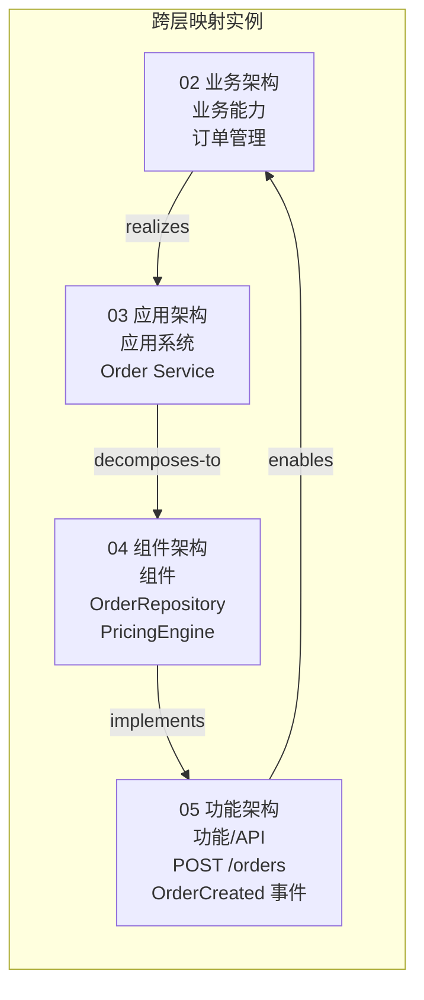

# 13 个一级主题依赖/互斥/蕴含关系图

> **版本**: 2026-07-07
> **定位**: 建立 `struct/` 13 个一级主题之间的依赖、支撑、互斥与蕴含关系，作为激进全面重构方案 A 的参考索引
> **对齐标准**: ISO/IEC/IEEE 42010:2022, ISO/IEC 26550:2015, TOGAF Standard 10, ArchiMate 4.0, SLSA 1.2, IEC 61508 Ed.3, MCP 2025-11-25, A2A v1.0
> **核查日期**: 2026-07-07

---

## 目录

- [13 个一级主题依赖/互斥/蕴含关系图](#13-个一级主题依赖互斥蕴含关系图)
  - [目录](#目录)
  - [1. 概述与核心概念定义](#1-概述与核心概念定义)
    - [1.1 关系类型定义](#11-关系类型定义)
    - [1.2 主题编码表](#12-主题编码表)
  - [2. 总关系图](#2-总关系图)
  - [3. 13 × 13 关系矩阵](#3-13--13-关系矩阵)
  - [4. 分层说明](#4-分层说明)
    - [4.1 基础层](#41-基础层)
    - [4.2 层次层](#42-层次层)
    - [4.3 治理层](#43-治理层)
    - [4.4 安全层](#44-安全层)
    - [4.5 垂直领域层](#45-垂直领域层)
    - [4.6 前沿层](#46-前沿层)
  - [5. 关键跨层映射](#5-关键跨层映射)
    - [5.1 业务能力 → 应用系统 → 组件 → 功能](#51-业务能力--应用系统--组件--功能)
    - [正向示例](#正向示例)
    - [5.2 形式化验证如何横向支撑各层](#52-形式化验证如何横向支撑各层)
    - [5.3 供应链安全如何影响 04 组件架构和 12 AI 原生](#53-供应链安全如何影响-04-组件架构和-12-ai-原生)
  - [6. 动态影响分析](#6-动态影响分析)
    - [6.1 影响传播示例](#61-影响传播示例)
    - [6.2 变更影响速查表](#62-变更影响速查表)
  - [7. 互斥/替代关系专题](#7-互斥替代关系专题)
    - [反例与失败案例](#反例与失败案例)
  - [8. 论证与推理](#8-论证与推理)
  - [9. 权威来源](#9-权威来源)

---

## 1. 概述与核心概念定义

本文档为激进全面重构方案 A 建立 13 个一级主题之间的**结构关系视图**。关系视图不替代各主题正文，而是为跨主题检索、依赖影响评估、重构优先级排序提供一张全局地图。

### 1.1 关系类型定义

| 关系类型 | 符号 | 含义 | 示例 |
|---------|------|------|------|
| **依赖** | `D` / `→` | 主题 A 的定义、方法或工件需要引用主题 B 的内容 | 02 业务架构复用依赖 01 元模型与标准对齐 |
| **被依赖** | `R` | 主题 B 被主题 A 依赖的反向表述 | 01 被 02/03/04/05/06 依赖 |
| **支撑/横向** | `S` | 主题 A 跨层为基础服务、约束或验证机制 | 07 形式化验证支撑所有层 |
| **互斥/替代** | `X` | 两种技术/范式在同一上下文中存在显著张力 | 微服务 vs 模块化单体 |
| **蕴含** | `I` | 采用主题 A 的方法论或技术，必然引入主题 B 的治理需求 | 12 AI 原生复用蕴含 05 功能架构、10 供应链安全 |
| **无关** | `-` | 当前阶段未发现显著依赖或冲突 | 11 工业 IoT 与 13 新兴趋势中部分子域 |

### 1.2 主题编码表

| 编码 | 一级主题 | 英文标识 | 核心关注点 |
|------|---------|---------|-----------|
| 01 | 元模型与标准对齐 | meta-model-standards | 概念、术语、标准族谱、公理体系 |
| 02 | 业务架构复用 | business-architecture-reuse | 业务能力、价值流、BPMN/DMN |
| 03 | 应用架构复用 | application-architecture-reuse | 系统级模式、云原生、服务网格 |
| 04 | 组件架构复用 | component-architecture-reuse | 模块、接口契约、设计模式 |
| 05 | 功能架构复用 | functional-architecture-reuse | 函数、API、MCP/A2A、工作流 |
| 06 | 跨层治理与量化 | cross-layer-governance | 度量、成熟度、FinOps、升级/降级 |
| 07 | 形式化验证 | formal-verification | TLA+、Coq、Rust、SPARK/Ada |
| 08 | 认知架构 | cognitive-architecture | ACT-R、BDI、认知负荷、AI 辅助决策 |
| 09 | 价值量化 | value-quantification | COCOMO II、ROI、战略价值 |
| 10 | 供应链安全 | supply-chain-security | SLSA、SBOM、零信任纵深防御 |
| 11 | 工业 IoT/OT-IT 融合 | industrial-iot-otit | ISA-95、OPC UA FX、功能安全 |
| 12 | AI 原生复用 | ai-native-reuse | MCP、A2A、概率契约、Conformal Prediction |
| 13 | 新兴趋势 | emerging-trends | 平台工程、模块化单体、WASM、RegTech AI |

---

## 2. 总关系图

下图以 Mermaid 绘制 13 个主题的全景关系。箭头方向表示依赖或支撑方向，虚线表示互斥/张力，双线箭头表示蕴含。

```mermaid
flowchart TB
    subgraph 基础层
        01[01 元模型与标准对齐]
        07[07 形式化验证]
        08[08 认知架构]
    end

    subgraph 层次层
        02[02 业务架构复用]
        03[03 应用架构复用]
        04[04 组件架构复用]
        05[05 功能架构复用]
    end

    subgraph 治理层
        06[06 跨层治理与量化]
        09[09 价值量化]
    end

    subgraph 安全层
        10[10 供应链安全]
    end

    subgraph 垂直领域层
        11[11 工业 IoT/OT-IT 融合]
    end

    subgraph 前沿层
        12[12 AI 原生复用]
        13[13 新兴趋势]
    end

    %% 基础层对层次层的支撑与依赖
    01 --> 02
    01 --> 03
    01 --> 04
    01 --> 05
    07 -.-> 02
    07 -.-> 03
    07 -.-> 04
    07 -.-> 05
    08 -.-> 02
    08 -.-> 03
    08 -.-> 06

    %% 层次层内部依赖
    02 --> 03
    03 --> 04
    04 --> 05
    05 --> 02
    03 -.-> 05
    04 -.-> 02

    %% 治理层横向
    06 -.-> 02
    06 -.-> 03
    06 -.-.-> 04
    06 -.-> 05
    06 --> 09
    09 --> 02
    09 --> 03
    09 --> 12

    %% 安全层贯穿
    10 --> 04
    10 --> 12
    10 -.-> 03
    10 -.-> 05
    10 -.-> 11

    %% 垂直领域层连接
    11 --> 02
    11 --> 03
    11 --> 07
    11 --> 10

    %% 前沿层连接
    12 --> 05
    12 --> 10
    12 -.-> 08
    12 --> 13
    13 --> 03
    13 --> 04
    13 -.-> 12

    %% 互斥/张力
    03 -.X.-> 13
    13 -.X.-> 03
```

**图例说明**:

- 实线箭头 `→`：直接依赖或技术依赖。
- 虚线箭头 `-→`：横向支撑、约束或间接影响。
- 双向虚线 `X`：互斥或替代张力（如 03 微服务与 13 模块化单体）。
- 所有节点按基础层、层次层、治理层、安全层、垂直领域层、前沿层分组。

---

## 3. 13 × 13 关系矩阵

矩阵中**行**为源主题，**列**为目标主题。单元格含义：`D` 依赖、`R` 被依赖、`S` 支撑、`X` 互斥、`I` 蕴含、`-` 无关。

| 源 \ 目 | 01 | 02 | 03 | 04 | 05 | 06 | 07 | 08 | 09 | 10 | 11 | 12 | 13 |
|--------|----|----|----|----|----|----|----|----|----|----|----|----|----|
| **01** | -  | R  | R  | R  | R  | S  | R  | R  | R  | R  | R  | R  | R  |
| **02** | D  | -  | R  | R  | R  | S  | -  | -  | S  | -  | -  | -  | -  |
| **03** | D  | D  | -  | R  | R  | S  | -  | -  | S  | S  | -  | -  | X  |
| **04** | D  | S  | D  | -  | R  | S  | -  | -  | S  | D  | -  | -  | S  |
| **05** | D  | S  | S  | D  | -  | S  | -  | -  | S  | S  | -  | I  | S  |
| **06** | S  | S  | S  | S  | S  | -  | S  | S  | S  | S  | S  | S  | S  |
| **07** | S  | S  | S  | S  | S  | S  | -  | -  | -  | -  | S  | -  | -  |
| **08** | S  | S  | S  | -  | -  | S  | -  | -  | -  | -  | -  | S  | -  |
| **09** | S  | S  | S  | S  | S  | S  | -  | -  | -  | -  | -  | S  | -  |
| **10** | S  | -  | S  | D  | S  | S  | -  | -  | -  | -  | S  | D  | S  |
| **11** | D  | S  | S  | -  | -  | S  | D  | -  | -  | S  | -  | -  | -  |
| **12** | D  | -  | -  | S  | I  | S  | -  | S  | S  | D  | -  | -  | S  |
| **13** | D  | -  | X  | S  | S  | S  | -  | -  | -  | S  | -  | S  | -  |

**矩阵解读要点**:

1. **01 元模型与标准对齐**是最核心的被依赖节点，几乎被所有其他主题依赖（`R` 列）。
2. **06 跨层治理与量化**横向支撑所有主题，体现治理的横向性。
3. **07 形式化验证**主要支撑层次层（02-05）和 11 工业 IoT，对治理层和前沿层支撑较弱。
4. **12 AI 原生复用**对 **05 功能架构复用**为蕴含关系（`I`），意味着采用 AI 原生复用必然重塑功能架构。
5. **03 应用架构复用**与 **13 新兴趋势**存在互斥/张力（`X`），典型场景是微服务 vs 模块化单体的架构选择。

---

## 4. 分层说明

### 4.1 基础层

基础层由 **01 元模型与标准对齐**、**07 形式化验证**、**08 认知架构** 组成。

- **01 元模型与标准对齐**：为所有其他主题提供统一术语、概念本体和标准族谱。没有 01，跨主题的引用、度量和工具链集成将失去共同语言。
- **07 形式化验证**：为正确性敏感的复用单元提供数学保证，是可信复用的基础。
- **08 认知架构**：解释开发者和架构师的决策行为，为工具设计、治理流程和 AI 辅助决策提供人因依据。

### 4.2 层次层

层次层对应 `four-layer-ontology.md` 定义的四层复用视角：

- **02 业务架构复用**：最粗粒度，回答“复用什么业务能力”。
- **03 应用架构复用**：系统级，回答“以何种系统形态承载复用”。
- **04 组件架构复用**：模块级，回答“复用哪些模块与接口”。
- **05 功能架构复用**：最细粒度，回答“复用哪些具体功能与协议”。

四层之间存在**顺序依赖**：业务能力映射到应用系统，应用系统分解为组件，组件实现功能单元。同时功能单元的变更可能反向影响业务能力（如 MCP 协议更新使能新的业务能力）。

### 4.3 治理层

治理层由 **06 跨层治理与量化** 和 **09 价值量化** 组成。

- **06 跨层治理与量化**：横向贯穿所有主题，负责复用度量、成熟度评估、FinOps 成本分摊、升级/降级决策。
- **09 价值量化**：为复用决策提供经济学依据，包括 COCOMO II 成本估算、ROI/NPV 模型、战略价值评估。

治理层不直接产生复用工件，但决定复用是否可持续。

### 4.4 安全层

安全层由 **10 供应链安全** 单独构成，但其影响贯穿所有主题。

- 对 **04 组件架构复用**影响最深：SBOM、SLSA 等级、依赖签名直接决定组件能否被复用。
- 对 **12 AI 原生复用**影响快速上升：模型权重、Agent 运行时、MCP 工具链均引入新的供应链攻击面。
- 对 **11 工业 IoT/OT-IT 融合**构成强制性约束：IEC 62443 与 IEC 61508 Ed.3 要求纵深防御。

### 4.5 垂直领域层

垂直领域层由 **11 工业 IoT/OT-IT 融合** 构成。

该层向上依赖 01（标准对齐）、02（业务能力）、03（应用架构）、07（形式化验证）、10（供应链安全），向下为工业场景提供专用复用模式（ISA-95、OPC UA FX、AAS、PLCopen）。

### 4.6 前沿层

前沿层由 **12 AI 原生复用** 和 **13 新兴趋势** 组成。

- **12 AI 原生复用**：以 MCP/A2A 协议、概率契约、Conformal Prediction 为代表，正在重塑功能架构（05）和供应链安全（10）边界。
- **13 新兴趋势**：包括平台工程、模块化单体、WASM 组件、RegTech AI、绿色软件。其中模块化单体与 03 应用架构中的微服务存在显著替代张力。

---

## 5. 关键跨层映射

### 5.1 业务能力 → 应用系统 → 组件 → 功能

该映射是四层架构复用视角的核心，也是 02→03→04→05 依赖链的具体化。



**映射规则**:

| 步骤 | 关系 | 说明 | 复用单元 |
|------|------|------|---------|
| 02 → 03 | realizes / maps-to | 业务能力由应用系统实现 | 能力目录 → 系统蓝图 |
| 03 → 04 | decomposes-to | 应用系统分解为组件 | 系统蓝图 → 组件图 |
| 04 → 05 | implements | 组件实现具体功能 | 组件图 → API 规范 |
| 05 → 02 | enables | 功能单元使能业务能力 | API → 业务能力增强 |

### 正向示例

- 业务能力“订单管理”由微服务 `Order Service` 实现。
- `Order Service` 内部包含 `OrderRepository` 和 `PricingEngine` 组件。
- `PricingEngine` 组件暴露 `calculatePrice()` 功能。
- 当新的定价规则通过 MCP 工具链发布时，`calculatePrice()` 无需变更业务能力定义即可扩展。

### 5.2 形式化验证如何横向支撑各层

**07 形式化验证**不是层次层的一部分，而是横向正确性基础设施。其在各层的作用如下：

| 目标层 | 形式化验证对象 | 典型方法 | 收益 |
|--------|---------------|---------|------|
| 02 业务架构 | 业务流程不变式、价值流一致性 | BPMN 形式语义、Alloy | 保证业务规则无歧义 |
| 03 应用架构 | 分布式协议、事件一致性 | TLA+、Coq | 避免分布式系统竞态条件 |
| 04 组件架构 | 接口契约、类型安全、内存安全 | Rust 类型系统、SPARK/Ada | 消除空指针、数据竞争 |
| 05 功能架构 | 函数正确性、协议状态机 | TLA+、Isabelle/HOL | 保证 API 行为符合规约 |
| 11 工业 IoT | 功能安全、实时调度 | B Method、Model Checking | 满足 IEC 61508 Ed.3 要求 |

形式化验证对治理层和安全层更多是**间接支撑**：通过提高工件可信度，降低 06 治理成本和 10 安全审计成本。

### 5.3 供应链安全如何影响 04 组件架构和 12 AI 原生

**10 供应链安全**对组件架构和 AI 原生复用的影响最为直接和深远。

**对 04 组件架构的影响**:

| 安全机制 | 对组件架构的要求 | 示例 |
|---------|-----------------|------|
| SBOM | 每个组件必须记录依赖图谱 | CycloneDX/SPDX 组件清单 |
| SLSA | 构建过程需满足来源可验证、构建环境隔离 | 组件需来自 SLSA L3+ 流水线 |
| 签名与校验 | 组件发布需附带 Sigstore/cosign 签名 | 拉取组件时校验 provenance |
| 漏洞管理 | 组件版本必须可追踪、可回滚 | Dependabot、OSV 扫描 |

**对 12 AI 原生复用的影响**:

| 安全机制 | 对 AI 原生复用的要求 | 示例 |
|---------|---------------------|------|
| 模型供应链 | 模型权重、训练数据需 SBOM 化 | MLflow 模型血缘 |
| Agent 运行时 | MCP/A2A 工具链需权限最小化 | OWASP MCP Top 10 控制 |
| 提示注入防护 | 功能单元（05）需输入过滤 | 提示词沙箱、输出审查 |
| 概率契约 | 复用单元需提供置信边界 | Conformal Prediction 保证 |

---

## 6. 动态影响分析

当某一主题发生重大变化时，需评估其对其他主题的级联影响。

### 6.1 影响传播示例

**示例 1：MCP 协议更新（12 AI 原生复用）**

MCP 协议从 2025-11-25 版本升级时，影响路径如下：

1. **12 → 05 功能架构复用**：MCP 工具调用语义变化直接影响功能单元的接口契约。
2. **12 → 10 供应链安全**：新协议可能引入新的 Agent 运行时攻击面，需要更新 OWASP MCP Top 10 控制。
3. **05 → 04 组件架构复用**：MCP 客户端/服务器组件需要升级版本策略。
4. **05 → 03 应用架构复用**：服务网格或 API 网关可能需要支持新的 MCP 路由。
5. **03/04/05 → 06 跨层治理**：升级/降级矩阵需要纳入 MCP 版本治理。

**示例 2：IEC 61508 Ed.3 强制实施（11 工业 IoT/OT-IT 融合）**

1. **11 → 07 形式化验证**：功能安全要求提高，形式化方法成为 SIL 高等级系统的必要手段。
2. **11 → 10 供应链安全**：工业控制系统组件需要满足 IEC 62443 与 SLSA 双重约束。
3. **11 → 02 业务架构**：安全关键业务能力需增加 SOTIF（预期功能安全）评估。

**示例 3：SLSA 1.2 Build Track 生效（10 供应链安全）**

1. **10 → 04 组件架构复用**：组件库必须拒绝 SLSA L2 以下来源的组件。
2. **10 → 03 应用架构复用**：CI/CD 流水线需集成 provenance 生成与校验。
3. **10 → 12 AI 原生复用**：模型工件和 Agent 镜像需满足 SLSA 等级要求。

### 6.2 变更影响速查表

| 变更主题 | 直接影响 | 间接影响 | 建议响应 |
|---------|---------|---------|---------|
| 01 元模型更新 | 02/03/04/05/06 术语对齐 | 11/12 标准映射 | 更新术语表、重审跨主题引用 |
| 02 业务能力调整 | 03 应用系统边界 | 04/05/06 复用范围 | 重跑价值量化（09） |
| 03 架构范式迁移 | 04 组件粒度 | 05/06/13 技术栈 | 评估微服务 vs 模块化单体 |
| 04 组件版本升级 | 05 功能接口 | 10 依赖漏洞 | 更新 SBOM、SLSA provenance |
| 05 MCP/A2A 协议更新 | 12 AI 原生复用 | 10 Agent 安全 | 升级客户端 SDK、重审权限模型 |
| 06 治理策略收紧 | 09 价值量化 | 02-05 复用门槛 | 更新成熟度评估模板 |
| 07 验证方法演进 | 04/11 正确性要求 | 09 成本模型 | 评估 TLA+/Coq 投入产出 |
| 10 安全等级提升 | 04/12 最敏感 | 03/05/11 合规 | 引入 SBOM/SLSA 强制检查 |
| 11 工业标准更新 | 07/10 强制 | 02/03 业务映射 | 跟踪 IEC 61508 Ed.3 / ISO 21448 Ed.2 |
| 12 Agent 技术突破 | 05/08/10 快速变化 | 06/13 治理模式 | 更新概率契约与 Agent 治理 |
| 13 WASM/平台工程兴起 | 03/04 部署形态 | 06/09 成本结构 | 评估 WASM Component Model |

---

## 7. 互斥/替代关系专题

互斥关系并不意味着完全不能共存，而是在同一上下文或同一阶段存在显著张力，需要显式架构决策。

| 互斥对 | 所属主题 | 张力描述 | 决策依据 |
|--------|---------|---------|---------|
| 微服务 vs 模块化单体 | 03 / 13 | 微服务强调独立部署与团队自治；模块化单体强调内部一致性与低运维负担 | 团队规模、业务能力边界、运维成熟度 |
| 强一致性 vs 最终一致性 | 03 / 05 | 强一致性简化推理但牺牲可用性；最终一致性提升扩展性但增加验证复杂度 | 业务容忍窗口、形式化验证能力 |
| 通用组件 vs 领域专用组件 | 04 / 02 | 通用组件复用率高但语义抽象；领域专用组件语义精准但复用范围窄 | 业务能力稳定性、跨领域需求 |
| Serverless 函数 vs 常驻服务 | 03 / 05 | Serverless 降低闲置成本但引入冷启动；常驻服务提供稳定延迟但资源占用高 | 调用频率、延迟 SLA |
| 黑盒复用 vs 白盒复用 | 04 / 07 | 黑盒复用快速但不可验证；白盒复用可验证但成本高 | 安全等级、形式化验证资源 |
| 集中式治理 vs 联邦式治理 | 06 / 12 | 集中式治理一致性强但抑制创新；联邦式治理灵活但增加互操作成本 | 组织规模、Agent 自治程度 |
| 确定性契约 vs 概率契约 | 05 / 12 | 确定性契约可严格验证；概率契约适应 AI 不确定性但需 Conformal Prediction | AI 参与度、风险容忍度 |

### 反例与失败案例

- **反例 1**：10 人团队为“技术先进”采用微服务，最终因运维负担过重回迁模块化单体。这属于 03 与 13 的互斥关系未充分评估。
- **反例 2**：将通用日志组件直接用于安全关键业务，未做形式化验证，导致 IEC 61508 审计失败。这属于 04 与 07 的黑盒/白盒复用决策失误。
- **反例 3**：在 AI 原生复用中直接信任外部 MCP 工具，未做权限最小化和输入校验，导致提示注入攻击。这违反了 10 供应链安全对 12 AI 原生复用的约束。

---

## 8. 论证与推理

本节给出关系图背后的核心推理链条。

**推理 1：为什么 01 是最高被依赖节点？**

因为 01 提供元模型与标准对齐。任何跨主题的复用讨论都需要统一术语和规约。如果没有 ISO/IEC/IEEE 42010:2022、TOGAF Standard 10、ArchiMate 4.0 等共同基础，02-13 的交叉引用将难以形式化。

**推理 2：为什么 07 形式化验证主要支撑层次层，而非直接治理层？**

形式化方法的作用是证明工件正确性。治理层（06/09）需要的是度量、流程和经济模型，而非数学证明。因此 07 对治理层的贡献是间接的：通过提高工件可信度降低治理成本。

**推理 3：为什么 12 AI 原生复用蕴含 05 功能架构？**

AI 原生复用的核心机制（MCP 工具调用、A2A Agent 协作、概率契约）都发生在功能单元级别。一旦采用 AI 原生复用，功能单元的接口形态、组合方式、错误处理模型都会发生根本变化，因此 12 蕴含 05。

**推理 4：为什么 10 供应链安全对 04 和 12 影响最深？**

组件架构复用的本质是引入外部依赖，而外部依赖是供应链攻击的主要载体。AI 原生复用则进一步引入模型权重、Agent 运行时、提示词等新型依赖，两者都处于供应链安全的关键路径上。

**推理 5：为什么 03 与 13 存在互斥？**

03 应用架构中的微服务强调分布式、独立部署，而 13 新兴趋势中的模块化单体强调在同一进程内实现模块边界。两者在“是否分布式”这一关键维度上存在张力，需要根据组织上下文做明确选择。

---

## 9. 权威来源

> **权威来源**:
>
> - ISO/IEC/IEEE 42010:2022. *Systems and software engineering — Architecture description*. <https://www.iso.org/standard/74296.html>
> - ISO/IEC 26550:2015. *Software engineering — Reference model for product line engineering and management*. <https://www.iso.org/standard/69529.html>
> - The Open Group. *TOGAF® Standard, 10th Edition*. <https://www.opengroup.org/togaf>
> - The Open Group. *ArchiMate® 4 Specification, Document C260* (2026-04-27 正式发布). <https://www.opengroup.org/archimate-licensed-downloads>
> - SLSA. *Supply-chain Levels for Software Artifacts v1.2*. <https://slsa.dev/spec/v1.2/>
> - IEC 61508 Ed.3（制定中，未出版；CDV 投票完成 RVC 2026-05-15）. *Functional safety of electrical/electronic/programmable electronic safety-related systems*. <https://iec.ch/dyn/www/f?p=103:23:::::FSP_ORG_ID:1369>
> - ISA-95 / IEC 62264. *Enterprise-control system integration*. <https://www.isa.org/standards-and-publications/isa-standards/isa-95>
> - Model Context Protocol. *MCP Specification 2025-11-25*. <https://modelcontextprotocol.io/specification/2025-11-25>
> - Google / LF Agentic AI Foundation. *Agent2Agent Protocol v1.0*. <https://a2aprotocol.ai/>
> - OWASP. *OWASP MCP Top 10*. <https://owasp.org/www-project-mcp-top-10/>
> - OpenSSF. *Supply Chain Security Best Practices*. <https://openssf.org/resources/guides/>
> - Carnegie Mellon SEI. *Software Architecture*. <https://www.sei.cmu.edu/our-work/software-architecture/>
> - Inria. *Aeneas: Rust Verification by Functional Translation*. <https://aeneas-verif.org/>
> - ETH Zurich. *Prusti: Static Verifier for Rust*. <https://www.pm.inf.ethz.ch/research/prusti.html>
>
> **核查日期**: 2026-07-07
