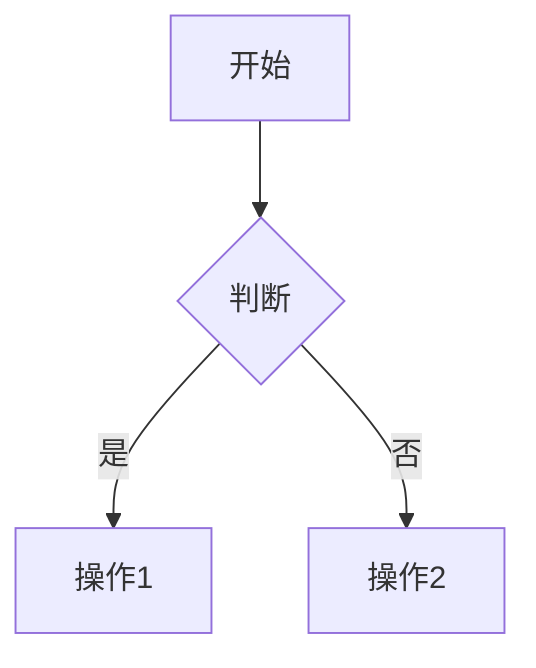

# 文档模板

> **版本**: 2026-06-06
> **用途**: 本知识体系中所有 Markdown 文档的统一模板
> **说明**: 新建文档时，复制本模板并填充内容。保持结构一致性有助于交叉引用和自动化处理。

---

## 文件头（必填）

```markdown
# [文档标题]

> **版本**: YYYY-MM-DD
> **定位**: [在一级主题中的定位，一句话]
> **对齐标准**: [相关的 ISO/IEC/IEEE/OMG 标准]
> **权威来源**:
> - [来源名称](URL) (机构, 年份)
> - [来源名称](URL) (机构, 年份)
```

---

## 目录（可选但推荐）

对于超过 1000 字的文档，必须包含自动生成的目录：

```markdown
## 目录

- [文档标题](#文档标题)
  - [1. 第一节标题](#1-第一节标题)
  - [2. 第二节标题](#2-第二节标题)
```

> 提示: VS Code 的 "Markdown All in One" 扩展可自动生成目录（快捷键: Ctrl+Shift+P → "Create Table of Contents"）。

---

## 正文结构（推荐）

### 1. 引言/背景

- 本主题在项目中的定位
- 与相邻主题的边界
- 核心问题声明

### 2. 核心内容

- 使用 Markdown 表格呈现映射关系、对比矩阵
- 使用 Mermaid 语法绘制架构图、流程图、状态机
- 使用代码块展示示例代码或配置

#### 2.1 表格规范

| 列名 | 说明 | 数据类型 |
|------|------|---------|
| 左对齐 | 默认 | 文本 |
| 数值 | 右对齐建议 | 数字 |
| 状态 | 居中 | 布尔/枚举 |

#### 2.2 Mermaid 图规范



#### 2.3 代码块规范

指定语言以获得语法高亮：

```python
def example():
    return "Hello, Reuse!"
```

### 3. 形式化定义（如适用）

```text
定义 X.1 (名称):
  形式化: ⟨字段1, 字段2, ...⟩
  约束: ∀x ∈ Domain: P(x)
```

### 4. 案例/示例

- 使用真实或假设的案例
- 标注案例来源
- 说明复用点和价值

### 5. 对齐验证

```markdown
> **对齐验证**:
> - [标准/来源名称](URL) 的 [章节/条款] 验证
> - [学术论文/书籍] 的 [页码/章节] 验证
>
> 最后更新: YYYY-MM-DD
```

---

## 术语规范

- 首次出现的英文术语，用**粗体**标注中文翻译："**Model Context Protocol (MCP)**"
- 后续使用可直接用英文缩写或中文
- 确保与 `struct/99-reference/glossary/terminology-crosswalk.md` 一致

---

## 交叉引用规范

引用其他主题的文件时，使用相对路径：

```markdown
参见 [`07-formal-verification/04-rust-type-system/formal-semantics.md`](../../07-formal-verification/04-rust-type-system/formal-semantics.md)
```

引用术语表：

```markdown
完整术语定义参见 [`glossary/terminology-crosswalk.md`](../glossary/terminology-crosswalk.md)
```

---

## 版本历史（可选）

对于频繁更新的文档，建议添加版本历史：

```markdown
## 版本历史

| 日期 | 版本 | 变更说明 | 作者 |
|------|------|---------|------|
| 2026-06-06 | v1.0 | 初始版本 | 架构复用知识体系 |
| 2026-07-15 | v1.1 | 更新 MCP 正式发布后的内容 | 架构复用知识体系 |
```

---

> **对齐验证**:
> - 本模板基于 Markdown 最佳实践和本项目写作规范制定
> - 与 `struct/README.md` 中的文件夹结构导航一致
>
> 最后更新: 2026-06-06
