# 架构复用知识体系可视化图库

> **版本**: 2026-07-07 | **生成工具**: Mermaid CLI (`mmdc`) / 原生 Mermaid 渲染 | **格式**: `.mmd` 源文件 + `.svg` 渲染图
> **分类**: 按主题思维导图 / 多维对比矩阵 / 场景决策树 / 公理化推理树 / 跨层映射图

---

## 图库总览

本目录包含 13 个一级主题的全部架构可视化图，以及跨主题综合图、决策树、推理树与跨层映射图。

| 分类 | 数量 | 子目录 | 说明 |
|---|---|---|---|
| 主题思维导图 | 13 | `mindmaps/` | 每个一级主题 1 张知识体系思维导图 |
| 多维对比矩阵 | 13 | `comparison-matrices/` | 每个一级主题 1 张标准/技术/模式对比矩阵 |
| 场景决策树 | 13 | `decision-trees/` | 每个一级主题 1 张“何时采用/不采用”决策树 |
| 公理化推理树 | 13 | `reasoning-trees/` | 每个一级主题 1 张公理→定理/原则推理树 |
| 跨层映射图 | 4 | `cross-layer-mappings/` | 四层复用映射 + 11–13 主题专属跨层映射 |
| 跨主题综合图 | 3 | 根目录 | 公理-定理全图、概念映射图、标准族谱树 |
| **合计** | **69** | — | — |

### 13 个一级主题思维导图

| # | 主题 | Mermaid 源文件 |
|---|------|---------------|
| 01 | 元模型与标准对齐 | `mindmaps/01-meta-model-standards.mmd` |
| 02 | 业务架构复用 | `mindmaps/02-business-architecture-reuse.mmd` |
| 03 | 应用架构复用 | `mindmaps/03-application-architecture-reuse.mmd` |
| 04 | 组件架构复用 | `mindmaps/04-component-architecture-reuse.mmd` |
| 05 | 功能架构复用 | `mindmaps/05-functional-architecture-reuse.mmd` |
| 06 | 跨层复用治理 | `mindmaps/06-cross-layer-governance.mmd` |
| 07 | 形式化验证 | `mindmaps/07-formal-verification.mmd` |
| 08 | 认知架构 | `mindmaps/08-cognitive-architecture.mmd` |
| 09 | 价值量化 | `mindmaps/09-value-quantification.mmd` |
| 10 | 供应链安全 | `mindmaps/10-supply-chain-security.mmd` |
| 11 | 工业 IoT/OT-IT | `mindmaps/11-industrial-iot-otit.mmd` |
| 12 | AI 原生复用 | `mindmaps/12-ai-native-reuse.mmd` |
| 13 | 前沿趋势 | `mindmaps/13-emerging-trends.mmd` |

### 跨主题综合图

| 图名 | 描述 | 文件 |
|------|------|------|
| 公理-定理全图 | 公理、定理、猜想的完整推导网络 | `axiom-theorem-full-graph.mmd` |
| 概念映射图 | 核心概念间的语义关联 | `concept-mapping.mmd` |
| 标准族谱树 | 标准的层次与依赖关系 | `standard-family-tree.mmd` |
| 知识体系总览 | 全 13 主题知识域总览 | `mindmaps/knowledge-system-mindmap.mmd` |

---

## 使用方式

### 嵌入 Markdown 文档

```markdown



```

### 修改与重渲染

```bash
cd struct/99-reference/visualizations

# 单个文件
mmdc -i mindmaps/01-meta-model-standards.mmd -o mindmaps/01-meta-model-standards.svg -b transparent

# 批量重渲染全部主题图
for f in mindmaps/*.mmd comparison-matrices/*.mmd decision-trees/*.mmd reasoning-trees/*.mmd cross-layer-mappings/*.mmd; do
  mmdc -i "$f" -o "${f%.mmd}.svg" -b transparent
done
```

---

## 设计规范

- **配色**: 每层/子图使用不同背景色区分
  - 🔵 蓝色系: 标准/协议层 / 业务层 (`#e3f2fd`)
  - 🟠 橙色系: 应用层 / 决策层 (`#fff3e0`)
  - 🟣 紫色系: 组件层 / AI 前沿层 (`#f3e5f5`)
  - 🟢 绿色系: 功能层 / 实现层 (`#e8f5e9`)
  - 🔴 红色系: 安全/反例/终止节点 (`#ffebee`)
- **布局**: 水平流 (`LR`)、垂直流 (`TD`) 或思维导图 (`mindmap`)，根据内容密度选择
- **节点**: `key["label<br/>详细说明"]` 格式，支持换行
- **版本头**: 每个 `.mmd` 文件顶部注释标注版本与状态

---

## 概念定义

**定义**：架构复用知识体系可视化图库是以 Mermaid 为源格式、按主题与类型组织的图形集合，用于将抽象概念、关系、决策逻辑与跨层映射以可视化方式表达，辅助理解、教学与决策。

## 示例

**示例**：`mindmaps/02-business-architecture-reuse.mmd` 以思维导图形式展示业务域、业务能力、价值流、业务流程、业务服务等核心概念及其复用关系。

## 反例

**反例**：可视化图仅罗列术语而无关系连接，或节点标签过长无法阅读，导致图示失去辅助理解的作用。

## 权威来源

> **权威来源**:
>
> - [Mermaid Documentation](https://mermaid.js.org/) — Mermaid
> - [ISO/IEC/IEEE 42010:2022](https://www.iso.org/standard/74296.html) — ISO
>
> **核查日期**: 2026-07-07

## 交叉引用

- [内容清单](../templates/content-checklist.md)
- [主术语表](../glossary/glossary-master.md)
- [权威来源索引](../standards-index/authoritative-sources-v2.md)
