# 架构复用知识体系可视化图库

> **版本**: 2026-07-07 | **生成工具**: Mermaid CLI (`mmdc`) / 原生 Mermaid 渲染 | **格式**: `.mmd` 源文件 + `.svg` 渲染图
> **分类**: 按主题思维导图 / 多维对比矩阵 / 场景决策树 / 公理化推理树 / 跨层映射图

---

## 图库总览

本目录包含 13 个一级主题的全部架构可视化图，以及跨主题综合图、决策树、推理树与跨层映射图。

### 13 个一级主题思维导图

| # | 主题 | Mermaid 源文件 | SVG 渲染图 |
|---|------|---------------|-----------|
| 02 | 业务架构复用 | `02-business-architecture-reuse.mmd` | `02-business-architecture-reuse.svg` |
| 03 | 应用架构复用 | `03-application-architecture-reuse.mmd` | `03-application-architecture-reuse.svg` |
| 04 | 组件架构复用 | `04-component-architecture-reuse.mmd` | `04-component-architecture-reuse.svg` |
| 05 | 功能架构复用 | `05-functional-architecture-reuse.mmd` | `05-functional-architecture-reuse.svg` |
| 06 | 跨层复用治理 | `06-cross-layer-governance.mmd` | `06-cross-layer-governance.svg` |
| 07 | 形式化验证 | `07-formal-verification.mmd` | `07-formal-verification.svg` |
| 08 | 认知架构 | `08-cognitive-architecture.mmd` | `08-cognitive-architecture.svg` |
| 09 | 价值量化 | `09-value-quantification.mmd` | `09-value-quantification.svg` |
| 10 | 供应链安全 | `10-supply-chain-security.mmd` | `10-supply-chain-security.svg` |
| 11 | 工业 IoT/OT-IT | `11-industrial-iot-otit.mmd` | `11-industrial-iot-otit.svg` |
| 12 | AI 原生复用 | `12-ai-native-reuse.mmd` | `12-ai-native-reuse.svg` |
| 13 | 前沿趋势 | `13-emerging-trends.mmd` | `13-emerging-trends.svg` |

### 多元思维表征子目录

| 子目录 | 内容类型 | 代表文件 |
|---|---|---|
| `mindmaps/` | 主题思维导图与知识体系总览 | `knowledge-system-mindmap.mmd` |
| `comparison-matrices/` | 标准/技术/模式多维对比矩阵 | `standards-comparison-matrix.mmd` |
| `decision-trees/` | 场景决策树（何时采用/不采用） | `reuse-granularity-decision-tree.mmd` |
| `reasoning-trees/` | 公理→定理推理判定树 | `axiom-to-theorem-reasoning-tree.mmd` |
| `cross-layer-mappings/` | 业务→应用→组件→功能映射 | `four-layer-reuse-mapping.mmd` |

### 跨主题综合图

| 图名 | 描述 | 文件 |
|------|------|------|
| 公理-定理全图 | 公理、定理、猜想的完整推导网络 | `axiom-theorem-full-graph.mmd` |
| 概念映射图 | 核心概念间的语义关联 | `concept-mapping.mmd` |
| 标准族谱树 | 标准的层次与依赖关系 | `standard-family-tree.mmd` |

---

## 使用方式

### 嵌入 Markdown 文档

```markdown

```

### 修改与重渲染

```bash
cd struct/99-reference/visualizations
# 单个文件
mmdc -i mindmaps/knowledge-system-mindmap.mmd -o mindmaps/knowledge-system-mindmap.svg -b transparent

# 批量重渲染全部主题图
for f in *.mmd; do
  mmdc -i "$f" -o "${f%.mmd}.svg" -b transparent
done

# 批量重渲染子目录
for dir in mindmaps comparison-matrices decision-trees reasoning-trees cross-layer-mappings; do
  for f in "$dir"/*.mmd; do
    mmdc -i "$f" -o "${f%.mmd}.svg" -b transparent
  done
done
```

---

## 设计规范

- **配色**: 每层/子图使用不同背景色区分
  - 🔵 蓝色系: 标准/协议层 / 业务层 (`#e3f2fd`)
  - 🟠 橙色系: 应用层 / 决策层 (`#fff3e0`)
  - 🟣 紫色系: 组件层 / AI 前沿层 (`#f3e5f5`)
  - 🟢 绿色系: 功能层 / 实现层 (`#e8f5e9`)
  - 🔴 红色系: 安全/反例/终止节点 (`#ffebee`)
- **布局**: 水平流 (`LR`)、垂直流 (`TD`) 或思维导图 (`mindmap`)，根据内容密度选择
- **节点**: `key["label<br/>详细说明"]` 格式，支持换行
- **版本头**: 每个 `.mmd` 文件顶部注释标注版本与状态

---

## 权威来源

> **权威来源**:
>
> - [Mermaid Documentation](https://mermaid.js.org/) — Mermaid
> - [ISO/IEC/IEEE 42010:2022](https://www.iso.org/standard/74296.html) — ISO
>
> **核查日期**: 2026-07-07


---

## 补充章节
## 概念定义

**定义**：参考层是结构化知识体系的“地图”，汇总权威来源、术语表、标准索引、课程对标与审计报告，为各主题提供可追溯的引用与一致性校验。

## 示例

**示例**：维护 authoritative-sources.md 登记所有 ISO/IEC、IEEE、NIST、CNCF 来源 URL 与核查日期，确保全书引用可验证。

## 反例

**反例**：参考层链接长期不更新，术语表与正文定义冲突，读者无法确认内容准确性与时效性。