# 软件工程架构复用视角：国际标准对齐与层次化提纲

> **版本**: 2026-06-05
> **对齐标准**: ISO/IEC/IEEE 42010:2022, ISO/IEC/IEEE 42020:2019, ISO/IEC/IEEE 42030:2019, ISO/IEC/IEEE DIS 42024, ISO/IEC/IEEE DIS 42042, ISO/IEC 25010:2023, TOGAF 10, ISO/IEC 26550:2015, ISO/IEC 26566:2026, FEA 2.0, IEEE 1517
>
> ⚠️ **勘误说明（2026-06-08）**: 本文档中 "ISO/IEC 25010:2023" 已更正为 **ISO/IEC 25010:2023**。2024 版已发布并取代 2011 版，新增 AI/ML 系统质量特性考量。正文保留早期认知记录。
> **视角**: 业务复用 → 应用复用 → 组件复用 → 功能复用
> **目标**: 建立可持续推进的精细化提纲层次，支持后续逐层深入论证

---

## 目录

- [软件工程架构复用视角：国际标准对齐与层次化提纲](#软件工程架构复用视角国际标准对齐与层次化提纲)
  - [目录](#目录)
  - [1. 元模型层：国际标准对齐与概念地基](#1-元模型层国际标准对齐与概念地基)
    - [1.1 核心标准族谱（ISO/IEC/IEEE 420xx 系列）](#11-核心标准族谱isoiecieee-420xx-系列)
    - [1.2 复用视角的元模型定义](#12-复用视角的元模型定义)
    - [1.3 TOGAF 10 与 ISO 标准的对齐映射](#13-togaf-10-与-iso-标准的对齐映射)
    - [1.4 产品线工程标准 (ISO/IEC 26550 / 26566:2026) 的复用元模型](#14-产品线工程标准-isoiec-26550--265662026-的复用元模型)
  - [2. 业务架构复用层](#2-业务架构复用层)
    - [2.1 国际标准对齐：FEA BRM + TOGAF Phase B + ArchiMate Business Layer](#21-国际标准对齐fea-brm--togaf-phase-b--archimate-business-layer)
    - [2.2 业务复用的层次结构（从粗到细）](#22-业务复用的层次结构从粗到细)
    - [2.3 业务复用的决策矩阵](#23-业务复用的决策矩阵)
    - [2.4 业务复用的形式化约束（公理-定理体系）](#24-业务复用的形式化约束公理-定理体系)
  - [3. 应用架构复用层](#3-应用架构复用层)
    - [3.1 国际标准对齐：TOGAF Phase C + FEA ARM/SRM + ISO/IEC 25010](#31-国际标准对齐togaf-phase-c--fea-armsrm--isoiec-25010)
    - [3.2 应用复用的层次结构](#32-应用复用的层次结构)
    - [3.3 应用架构模式与复用性对比矩阵](#33-应用架构模式与复用性对比矩阵)
    - [3.4 应用复用的形式化约束](#34-应用复用的形式化约束)
  - [4. 组件架构复用层](#4-组件架构复用层)
    - [4.1 国际标准对齐：ISO/IEC 26550 + IEEE 1517 + C4 Model](#41-国际标准对齐isoiec-26550--ieee-1517--c4-model)
    - [4.2 组件复用的层次结构](#42-组件复用的层次结构)
    - [4.3 组件复用的技术栈对比矩阵（2026）](#43-组件复用的技术栈对比矩阵2026)
    - [4.4 组件复用的形式化约束](#44-组件复用的形式化约束)
  - [5. 功能架构复用层](#5-功能架构复用层)
    - [5.1 国际标准对齐：ISO/IEC 25010 + IEEE 1517 + FaaS/Serverless 实践](#51-国际标准对齐isoiec-25010--ieee-1517--faasserverless-实践)
    - [5.2 功能复用的层次结构](#52-功能复用的层次结构)
    - [5.3 功能复用的粒度-成本-收益决策树](#53-功能复用的粒度-成本-收益决策树)
    - [5.4 功能复用的形式化约束](#54-功能复用的形式化约束)
  - [6. 跨层复用治理与成熟度模型](#6-跨层复用治理与成熟度模型)
    - [6.1 复用治理的国际标准框架](#61-复用治理的国际标准框架)
    - [6.2 复用成熟度五级模型（整合 RiSE / RCMM / NASA RRL）](#62-复用成熟度五级模型整合-rise--rcmm--nasa-rrl)
    - [6.3 跨层复用的决策矩阵（何时升级/降级）](#63-跨层复用的决策矩阵何时升级降级)
  - [7. 思维表征附录](#7-思维表征附录)
    - [7.1 复用视角全景思维导图（Mermaid）](#71-复用视角全景思维导图mermaid)
    - [7.2 国际标准对齐多维矩阵](#72-国际标准对齐多维矩阵)
    - [7.3 复用决策判定树（文本版）](#73-复用决策判定树文本版)
    - [7.4 公理-定理推理树（复用认识论）](#74-公理-定理推理树复用认识论)
  - [8. 持续推进路线图](#8-持续推进路线图)
    - [8.1 层次推进计划](#81-层次推进计划)
    - [8.2 每层的细化提纲模板（以业务层为例）](#82-每层的细化提纲模板以业务层为例)
  - [9. 批判性审视与边界声明](#9-批判性审视与边界声明)
    - [9.1 当前提纲的局限性](#91-当前提纲的局限性)
    - [9.2 与国际前沿的差距](#92-与国际前沿的差距)

---

## 1. 元模型层：国际标准对齐与概念地基

### 1.1 核心标准族谱（ISO/IEC/IEEE 420xx 系列）

```text
ISO/IEC/IEEE 42010:2022  ──→ 架构描述 (AD) ──→ 视图/视点/利益相关者/关注点的形式化分离
         │
         ├── ISO/IEC/IEEE 42020:2019 ──→ 架构过程 (Architecture Processes)
         │                              └── 架构开发、管理、治理的生命周期过程
         │
         ├── ISO/IEC/IEEE 42030:2019 ──→ 架构评估 (Architecture Evaluation)
         │                              └── 评估框架、准则、方法
         │
         ├── ISO/IEC/IEEE DIS 42024 ──→ 架构基础 (Architecture Fundamentals)
         │                              └── 概念、术语、原则的元定义
         │
         └── ISO/IEC/IEEE DIS 42042 ──→ 参考架构 (Reference Architectures)
                                        └── 参考架构的构建与使用规范
```

### 1.2 复用视角的元模型定义

| 元概念 | ISO/IEC/IEEE 42010:2022 定义 | 复用视角映射 |
|--------|------------------------------|--------------|
| **架构 (Architecture)** | 系统在其环境中的基本概念或属性，体现为它的元素、关系以及设计和演进的原则 | 复用不是附属特性，而是架构的**结构性约束** |
| **架构描述 (AD)** | 表达架构的工作产物 | 复用契约的载体（规格说明、接口定义、 variability 模型） |
| **视点 (Viewpoint)** | 针对利益相关者关注点的架构描述约定 | 业务视点、应用视点、组件视点、功能视点 |
| **视图 (View)** | 从特定视点生成的架构描述 | 业务架构视图、应用架构视图、组件架构视图、功能架构视图 |
| **利益相关者 (Stakeholder)** | 对系统有个人、团队或组织利益的人 | 业务分析师、应用架构师、组件工程师、功能开发者 |
| **关注点 (Concern)** | 利益相关者对系统的利益 | 业务一致性、应用可替换性、组件可组合性、功能可复用性 |

### 1.3 TOGAF 10 与 ISO 标准的对齐映射

| TOGAF 10 概念 | ISO/IEC/IEEE 42010:2022 对应 | 复用语义 |
|---------------|------------------------------|----------|
| Architecture Building Block (ABB) | 架构元素 + 约束 | **能力定义层复用**：定义"需要什么"而非"如何实现" |
| Solution Building Block (SBB) | 架构视图中的实现元素 | **实现层复用**：定义"如何构建"的具体方案 |
| Enterprise Continuum | 架构描述框架 (ADF) | 复用资产的谱系化组织（基础 → 通用 → 行业 → 特定） |
| Architecture Repository | 架构描述库 | 可复用架构资产的存储、版本、检索 |
| ADM Phase B (Business Architecture) | 业务视点 (Business Viewpoint) | 业务能力、价值流、组织的复用 |
| ADM Phase C (IS Architecture) | 应用视点 + 数据视点 | 应用组件、数据实体的复用 |
| ADM Phase D (Technology Architecture) | 技术视点 | 平台、基础设施、运行时服务的复用 |

### 1.4 产品线工程标准 (ISO/IEC 26550 / 26566:2026) 的复用元模型

```text
ISO/IEC 26550:2015
├── 领域工程 (Domain Engineering)
│   ├── 领域分析 ──→ 共性/变性识别
│   ├── 领域设计 ──→ 可复用架构 (Reference Architecture)
│   └── 领域实现 ──→ 领域资产库 (Asset Repository)
│
└── 应用工程 (Application Engineering)
    ├── 需求工程 ──→ 变性绑定 (Variability Binding)
    ├── 设计 ──→ 资产选择 + 变性配置
    ├── 实现 ──→ 组件组装 + 代码生成
    └── 验证 ──→ 共性不变性验证 + 变性正确性验证
```

**关键公理**：
> **公理 1.1** (Variability Axiom): 复用的本质是管理**共性 (Commonality)** 与**变性 (Variability)** 的分离与绑定。没有变性管理的复用是克隆，不是工程。

---

## 2. 业务架构复用层

### 2.1 国际标准对齐：FEA BRM + TOGAF Phase B + ArchiMate Business Layer

| 标准/框架 | 业务复用核心概念 | 2026 状态 |
|-----------|------------------|-----------|
| **FEA BRM** (Business Reference Model) | 业务线 (Business Line) → 子功能 (Sub-function) → 活动 (Activity) | 美国联邦政府跨机构业务复用基准 |
| **TOGAF 10** | 业务能力 (Capability) + 价值流 (Value Stream) + 组织单元 (Organization Unit) | 强调 Capability-Based Planning 作为复用单元 |
| **ArchiMate 3.2/4.0** | 业务行为元素 (Process/Function/Event) + 业务结构元素 (Actor/Role/Entity) | 统一 Service 元素跨层复用；4.0 引入 Common Domain |
| **ISO/IEC 15288:2023** | 系统生命周期过程 → 业务或任务分析过程 | 从系统工程视角定义业务需求 |

### 2.2 业务复用的层次结构（从粗到细）

```text
Level 1: 业务领域复用 (Business Domain Reuse)
    └── 定义：跨行业/跨组织的宏观业务领域（如"支付","物流","合规"）
    └── 标准对齐：FEA BRM Line of Business
    └── 复用单元：领域知识、监管框架、业务流程模板

Level 2: 业务能力复用 (Business Capability Reuse)
    └── 定义：组织执行特定业务活动的能力（如"客户身份验证","订单编排"）
    └── 标准对齐：TOGAF Capability Map
    └── 复用单元：能力定义、能力成熟度评估、能力热力图

Level 3: 价值流复用 (Value Stream Reuse)
    └── 定义：端到端业务价值交付的阶段性活动序列（如"订单到现金"）
    └── 标准对齐：TOGAF Value Stream + ArchiMate Value Stream
    └── 复用单元：价值阶段、触发事件、交付物、利益相关者

Level 4: 业务流程复用 (Business Process Reuse)
    └── 定义：可编排、可自动化的业务活动序列（如"发票审批流程"）
    └── 标准对齐：BPMN 2.0 + ISO/IEC 12207 过程定义
    └── 复用单元：流程模型、任务定义、决策规则、泳道划分

Level 5: 业务服务复用 (Business Service Reuse)
    └── 定义：对外暴露的业务能力接口（如"信用检查服务"）
    └── 标准对齐：SOA + ArchiMate Business Service
    └── 复用单元：服务契约、SLA、服务级别目标
```

### 2.3 业务复用的决策矩阵

| 复用层级 | 复用粒度 | 变性管理 | 治理强度 | 适用场景 |
|----------|----------|----------|----------|----------|
| 业务领域 | 粗 | 高（行业差异大） | 弱（参考性） | 行业解决方案架构 |
| 业务能力 | 中粗 | 中 | 中强 | 企业架构规划、并购整合 |
| 价值流 | 中 | 中 | 中 | 数字化转型、客户旅程优化 |
| 业务流程 | 中细 | 低-中 | 强 | BPM 平台、RPA、工作流引擎 |
| 业务服务 | 细 | 低（接口标准化） | 极强 | SOA/微服务/API 经济 |

### 2.4 业务复用的形式化约束（公理-定理体系）

> **公理 2.1** (Capability Atomicity): 业务能力是可复用的最小业务语义单元，其边界由**价值创造**而非**组织结构**定义。
> **定理 2.1** (Value Stream Composition): 若价值流 V 由阶段 {S₁, S₂, ..., Sₙ} 组成，且每个 Sᵢ 对应业务能力 Cᵢ，则 V 的复用等价于 {Cᵢ} 的**有序组合**加上**阶段间契约**的复用。
> **定理 2.2** (Process-Service Duality): 业务流程是**时序化**的业务服务编排；业务服务是**接口化**的业务流程封装。二者在复用视角下构成对偶关系。

---

## 3. 应用架构复用层

### 3.1 国际标准对齐：TOGAF Phase C + FEA ARM/SRM + ISO/IEC 25010

| 标准/框架 | 应用复用核心概念 | 2026 状态 |
|-----------|------------------|-----------|
| **TOGAF 10 Phase C** | 信息系统架构 = 数据架构 + 应用架构 | ABB/SBB 在应用层的映射 |
| **FEA ARM** (Application Reference Model) | 系统 (System) → 应用组件 (App Component) → 接口 (Interface) | 跨机构应用组件复用分类 |
| **FEA SRM** (Service Component Reference Model) | 水平/垂直服务域 → 服务组件 | 服务组件的政府级复用目录 |
| **ISO/IEC 25010:2023** | 软件质量模型 → 可复用性 (Reusability) 作为质量特性 | 定义复用性的质量度量维度 |
| **C4 Model** | System Context → Container → Component → Code | 可视化应用架构复用边界 |

### 3.2 应用复用的层次结构

```text
Level 1: 应用系统复用 (Application System Reuse)
    └── 定义：完整的可部署应用（如 ERP, CRM, WMS）
    └── 标准对齐：FEA ARM "System" 类别
    └── 复用模式：COTS/GOTS 采购、SaaS 订阅、多租户部署
    └── 变性管理：参数配置、扩展模块、定制开发层

Level 2: 应用组件复用 (Application Component Reuse)
    └── 定义：应用内自包含的功能模块（如"订单管理组件","库存同步组件"）
    └── 标准对齐：FEA ARM "Application Component" + ArchiMate Application Component
    └── 复用模式：组件库、内部开源、共享服务
    └── 变性管理：配置项、插件机制、策略注入

Level 3: 应用服务复用 (Application Service Reuse)
    └── 定义：应用组件暴露的接口化能力（如"支付网关服务","用户画像服务"）
    └── 标准对齐：SOA Service + ArchiMate Application Service
    └── 复用模式：API 网关、服务网格、事件总线
    └── 变性管理：版本控制、消费者驱动契约、API 组合

Level 4: 数据架构复用 (Data Architecture Reuse)
    └── 定义：数据模型、数据实体、数据服务的复用
    └── 标准对齐：FEA DRM + TOGAF Data Architecture
    └── 复用模式：主数据管理 (MDM)、数据网格、数据产品
    └── 变性管理：数据域划分、Schema 演进、多租户数据隔离
```

### 3.3 应用架构模式与复用性对比矩阵

| 架构模式 | 复用粒度 | 部署独立性 | 变性绑定时机 | 复用成熟度 | 2026 趋势 |
|----------|----------|------------|--------------|------------|-----------|
| **单体 (Monolith)** | 系统级 | 低 | 编译期 | 低 | 遗留系统 |
| **模块化单体 (Modular Monolith)** | 组件级 | 中低 | 编译/启动期 | 中 | 回归主流 (Spring Modulith) |
| **SOA (ESB 中心)** | 服务级 | 中 | 配置期 | 中高 | 企业集成骨干 |
| **微服务 (Microservices)** | 服务级 | 高 | 运行期 | 高 | 云原生默认 |
| **微前端 (Micro-frontends)** | UI 组件级 | 高 | 运行期 | 中 | 前端复用扩展 |
| **Serverless / FaaS** | 功能级 | 极高 | 运行期 | 高 | 事件驱动计算 |
| **服务网格 (Service Mesh)** | 通信模式级 | 高 | 运行期 | 中 | 基础设施复用 |

### 3.4 应用复用的形式化约束

> **公理 3.1** (Component Encapsulation): 应用组件的可复用性与其**内部状态暴露度**成反比，与**接口契约完备性**成正比。
> **定理 3.1** (Service Substitution): 若应用服务 S₁ 与 S₂ 满足同一接口契约 I，且 S₁ 的非功能属性集合 N₁ ⊆ N₂（S₂ 的能力覆盖 S₁），则 S₂ 可在任何使用 S₁ 的上下文中**无侵入替换**。
> **定理 3.2** (Data-Application Coupling): 数据架构与应用架构的复用独立当且仅当数据访问通过**抽象数据服务**而非**直接存储耦合**实现。

---

## 4. 组件架构复用层

### 4.1 国际标准对齐：ISO/IEC 26550 + IEEE 1517 + C4 Model

| 标准/框架 | 组件复用核心概念 | 2026 状态 |
|-----------|------------------|-----------|
| **ISO/IEC 26550:2015** | 领域资产 (Domain Asset) = 可复用组件 + 变性模型 | 产品线工程的组件复用基础 |
| **ISO/IEC 26566:2026** | 组件的 variability 建模、配置、绑定 | 最新产品线组件管理标准 |
| **IEEE 1517** | 软件生命周期过程中的复用过程 | 复用过程的标准化定义 |
| **C4 Model** | Component = 一组相关功能的封装 | 架构沟通的可视化标准 |
| **arc42** | 第4节 "Building Block View" | 组件视图的文档化模板 |

### 4.2 组件复用的层次结构

```text
Level 1: 框架/平台复用 (Framework/Platform Reuse)
    └── 定义：基础设施级组件集合（如 Spring Boot, React, .NET）
    └── 复用单元：框架本身、脚手架、代码生成器
    └── 变性管理：配置、扩展点、Starter/Plugin 机制

Level 2: 库/包复用 (Library/Package Reuse)
    └── 定义：可链接/导入的代码集合（如 npm package, Rust crate, Go module）
    └── 复用单元：函数库、类库、模块包
    └── 变性管理：泛型/模板、策略模式、回调/钩子

Level 3: 组件/Bean/Module 复用 (Component Reuse)
    └── 定义：运行时实例化的功能单元（如 Spring Bean, React Component, Vue Component）
    └── 复用单元：组件定义、配置元数据、生命周期管理器
    └── 变性管理：依赖注入、属性配置、条件装配

Level 4: 设计模式/架构模式复用 (Pattern Reuse)
    └── 定义：跨语言/跨框架的结构性解决方案（如 Factory, Observer, Circuit Breaker）
    └── 复用单元：模式模板、模式语言、模式实现框架
    └── 变性管理：语言适配、框架集成、上下文感知
```

### 4.3 组件复用的技术栈对比矩阵（2026）

| 技术生态 | 复用单元 | 包管理器 | 组件模型 | 变性机制 | 复用度量 |
|----------|----------|----------|----------|----------|----------|
| **JVM** | JAR/Module | Maven/Gradle | OSGi/Spring/JPMS | 配置/注解/ServiceLoader | 依赖计数、传递深度 |
| **Node.js** | npm package | npm/yarn/pnpm | React/Vue/Angular Component | Props/Context/Plugin | 下载量、依赖树 |
| **Rust** | Crate | Cargo | Trait + Module | 泛型/特征对象/宏 | Crate 复用率、编译单元 |
| **Go** | Module | Go Modules | Interface + Package | 接口组合、泛型(1.18+) | 导入路径、模块版本 |
| **Python** | Package | pip/uv/poetry | Class/Module | 鸭子类型/协议/装饰器 | PyPI 统计、导入图 |
| **.NET** | NuGet Package | NuGet | Assembly/Component | 泛型/反射/DI | 包引用、API 兼容性 |

### 4.4 组件复用的形式化约束

> **公理 4.1** (Interface Contract Completeness): 组件的可复用性取决于其**接口契约**的完备性（前置条件、后置条件、不变量、副作用声明），而非实现细节。
> **定理 4.1** (Dependency Transitivity): 若组件 A 依赖组件 B，B 依赖组件 C，则 A 的复用隐含了 {B, C} 的传递闭包的复用。传递闭包的**变性冲突**是组件复用的主要风险源。
> **定理 4.2** (Liskov Substitution for Components): 组件 C₂ 可替换 C₁ 当且仅当 C₂ 的接口是 C₁ 接口的**行为子类型**（前置条件弱化、后置条件强化、不变量保持）。

---

## 5. 功能架构复用层

### 5.1 国际标准对齐：ISO/IEC 25010 + IEEE 1517 + FaaS/Serverless 实践

| 标准/框架 | 功能复用核心概念 | 2026 状态 |
|-----------|------------------|-----------|
| **ISO/IEC 25010:2023** | 功能适合性 (Functional Suitability) + 可复用性 (Reusability) | 功能级质量度量 |
| **IEEE 1517** | 复用过程：获取、评估、适配、集成 | 功能获取的标准过程 |
| **Serverless/FaaS** | Function as a Unit of Deployment | 功能级部署与复用 |
| **Temporal/Workflow** | Workflow as Code = 可复用业务功能编排 | 2026 工作流即复用模式 |

### 5.2 功能复用的层次结构

```text
Level 1: 算法/数据结构复用 (Algorithm/Data Structure Reuse)
    └── 定义：计算逻辑与数据组织的可复用实现
    └── 复用单元：排序算法、图遍历、哈希表、树结构
    └── 载体：标准库 (STL, Rust std, Java Collections)
    └── 变性管理：泛型参数、比较器注入、内存分配器

Level 2: 函数/方法复用 (Function/Method Reuse)
    └── 定义：单一职责的代码单元
    └── 复用单元：纯函数、工具函数、API 端点处理函数
    └── 载体：工具库 (lodash, itertools, util 包)
    └── 变性管理：参数化、高阶函数、闭包

Level 3: 业务规则/策略复用 (Business Rule/Policy Reuse)
    └── 定义：可配置的业务决策逻辑
    └── 复用单元：规则集、策略定义、决策表、评分卡
    └── 载体：规则引擎 (Drools, Easy Rules), 策略引擎 (OPA)
    └── 变性管理：规则版本、租户隔离、动态加载

Level 4: 工作流/编排复用 (Workflow/Orchestration Reuse)
    └── 定义：跨功能的时序与条件编排
    └── 复用单元：工作流定义、活动模板、补偿逻辑、 saga 模式
    └── 载体：Temporal, Camunda, Airflow, Step Functions
    └── 变性管理：变量传递、条件分支、子工作流引用

Level 5: AI/LLM 功能复用 (AI Function Reuse)
    └── 定义：基于模型的推理能力封装
    └── 复用单元：Prompt 模板、RAG 管道、Agent 技能、MCP 工具
    └── 载体：MCP Server, LangChain Tool, OpenAI Function Calling
    └── 变性管理：模型版本、上下文窗口、温度参数、知识库绑定
```

### 5.3 功能复用的粒度-成本-收益决策树

```text
功能复用决策树
├── 功能是否跨越业务边界？
│   ├── 是 → 升级为"业务服务复用" (第2层)
│   └── 否 → 继续
├── 功能是否跨越应用边界？
│   ├── 是 → 升级为"应用服务复用" (第3层)
│   └── 否 → 继续
├── 功能是否跨越组件边界？
│   ├── 是 → 提取为"库/组件" (第4层)
│   └── 否 → 继续
├── 功能是否纯计算/无状态？
│   ├── 是 → "算法/函数复用" (第5层 Level 1-2)
│   └── 否 → 含状态/业务规则 → "规则/工作流复用" (第5层 Level 3-4)
└── 功能是否涉及 AI 推理？
    ├── 是 → "AI 功能复用" (第5层 Level 5)
    └── 否 → 标准函数级复用
```

### 5.4 功能复用的形式化约束

> **公理 5.1** (Function Purity): 功能的可复用性与其**副作用透明度**正相关。纯函数（无副作用、引用透明）具有最高复用等级。
> **定理 5.1** (Functional Composition): 若函数 f: A → B 和 g: B → C 均为可复用功能，则其复合 g ∘ f: A → C 的可复用性取决于**B 的接口稳定性**。
> **定理 5.2** (AI Function Non-Determinism): AI 功能（LLM 调用、模型推理）的可复用性受**温度参数 (temperature)** 和**模型版本漂移**制约。其复用契约必须包含**确定性边界**（如 "P(正确性) ≥ 0.95"）。

---

## 6. 跨层复用治理与成熟度模型

### 6.1 复用治理的国际标准框架

| 治理维度 | 标准/框架 | 核心机制 |
|----------|-----------|----------|
| **过程治理** | ISO/IEC/IEEE 42020:2019 | 架构过程的标准化、裁剪、执行 |
| **质量治理** | ISO/IEC 25010:2023 | 复用性的质量特性度量（模块化、可组合性、可替换性） |
| **评估治理** | ISO/IEC/IEEE 42030:2019 | 架构评估的准则、方法、证据 |
| **成熟度治理** | RiSE Maturity Model / RCMM | 复用能力的五级成熟度评估 |
| **资产治理** | IEEE 1517 + ISO/IEC 26550 | 复用资产的生命周期管理（获取、评估、存储、退役） |

### 6.2 复用成熟度五级模型（整合 RiSE / RCMM / NASA RRL）

| 级别 | 名称 | 特征 | 业务层表现 | 应用层表现 | 组件层表现 | 功能层表现 |
|------|------|------|------------|------------|------------|------------|
| **1** | 初始 (Initial) | 临时复用，克隆为主 | 流程复制 | 系统复制 | 代码复制 | 函数复制 |
| **2** | 管理 (Managed) | 项目级复用，有管理 | 项目模板 | 应用模板 | 内部工具库 | 共享工具函数 |
| **3** | 定义 (Defined) | 组织级复用，标准化 | 业务能力目录 | 应用组件库 | 企业级组件仓库 | 标准算法库 |
| **4** | 量化 (Quantified) | 可度量复用，优化 | 复用率 KPI、价值流度量 | 组件使用率、API 调用统计 | 依赖分析、传递闭包监控 | 函数覆盖率、性能基准 |
| **5** | 优化 (Optimizing) | 持续改进，自动复用 | AI 辅助业务架构生成 | 自动生成应用骨架 | 智能组件推荐、自动装配 | 代码补全→功能合成 |

### 6.3 跨层复用的决策矩阵（何时升级/降级）

| 触发条件 | 升级方向 | 降级方向 | 治理动作 |
|----------|----------|----------|----------|
| 功能被 3+ 应用调用 | 功能 → 应用服务 | — | 提取 API，定义契约 |
| 组件被 3+ 系统使用 | 组件 → 共享组件 | — | 组件仓库化，版本管理 |
| 业务服务跨部门使用 | 应用服务 → 业务服务 | — | 企业服务总线/API 治理 |
| 复用导致耦合度过高 | — | 业务服务 → 应用服务 | 服务拆分，领域驱动 |
| 技术栈差异过大 | — | 组件 → 功能封装 | 适配器模式，防腐层 |
| AI 功能确定性不足 | — | AI 功能 → 规则引擎 | 混合推理，人在回路 |

---

## 7. 思维表征附录

### 7.1 复用视角全景思维导图（Mermaid）

```mermaid
graph TD
    A[软件工程架构复用视角] --> B[元模型层]
    A --> C[业务架构复用]
    A --> D[应用架构复用]
    A --> E[组件架构复用]
    A --> F[功能架构复用]
    A --> G[跨层治理]

    B --> B1[ISO/IEC/IEEE 42010:2022]
    B --> B2[TOGAF 10]
    B --> B3[ISO/IEC 26550:2015]
    B --> B4[FEA 2.0]

    C --> C1[业务领域复用]
    C --> C2[业务能力复用]
    C --> C3[价值流复用]
    C --> C4[业务流程复用]
    C --> C5[业务服务复用]

    D --> D1[应用系统复用]
    D --> D2[应用组件复用]
    D --> D3[应用服务复用]
    D --> D4[数据架构复用]

    E --> E1[框架/平台复用]
    E --> E2[库/包复用]
    E --> E3[组件/Bean复用]
    E --> E4[设计模式复用]

    F --> F1[算法/数据结构复用]
    F --> F2[函数/方法复用]
    F --> F3[业务规则复用]
    F --> F4[工作流/编排复用]
    F --> F5[AI/LLM功能复用]

    G --> G1[过程治理 42020]
    G --> G2[质量治理 25010]
    G --> G3[评估治理 42030]
    G --> G4[成熟度治理 RiSE/RCMM]
    G --> G5[资产治理 IEEE 1517]
```



### 7.2 国际标准对齐多维矩阵

| 复用层次 | 核心标准 | 辅助标准 | 架构框架 | 建模语言 | 质量度量 | 过程标准 |
|----------|----------|----------|----------|----------|----------|----------|
| 业务 | FEA BRM | ISO 15288 | TOGAF Phase B | ArchiMate Business | ISO 25010 | 42020 |
| 应用 | FEA ARM/SRM | ISO 26550 | TOGAF Phase C/D | ArchiMate Application | ISO 25010 | 42020/1517 |
| 组件 | ISO 26566:2026 | IEEE 1517 | C4 Model, arc42 | UML Component | NASA RRL | 42020/12207 |
| 功能 | IEEE 1517 | ISO 25010 | Serverless, Temporal | 代码/流程图 | 复用率/覆盖率 | 12207/15504 |

### 7.3 复用决策判定树（文本版）

```text
复用决策判定树
├── 输入：待复用资产 A，目标上下文 C
│
├── 1. 语义兼容性判定
│   ├── A 的业务语义 ⊇ C 的业务需求？
│   │   ├── 否 → 拒绝复用 / 需求重构
│   │   └── 是 → 继续
│   └── A 的技术约束 ⊆ C 的技术约束？
│       ├── 否 → 适配层设计 / 拒绝复用
│       └── 是 → 继续
│
├── 2. 变性绑定判定
│   ├── A 的变性模型 V(A) 与 C 的变性需求 V(C) 可交集？
│   │   ├── 否 → 克隆/重写
│   │   └── 是 → 继续
│   └── 绑定时机：编译期/配置期/运行期/动态期？
│       └── 选择对应技术机制
│
├── 3. 质量达标判定
│   ├── A 的复用就绪等级 (RRL) ≥ C 的最低要求？
│   │   ├── 否 → 增强/测试/文档补全
│   │   └── 是 → 继续
│   └── A 的成熟度 (Maturity) ≥ C 的可靠性要求？
│       ├── 否 → 风险标记/降级使用
│       └── 是 → 继续
│
├── 4. 治理合规判定
│   ├── A 的许可证 ⊆ C 的许可证策略？
│   │   ├── 否 → 法务审查 / 替代方案
│   │   └── 是 → 继续
│   └── A 的安全等级 ≥ C 的安全要求？
│       ├── 否 → 安全加固 / 拒绝
│       └── 是 → 授权复用
│
└── 输出：复用决策 + 绑定配置 + 风险登记
```

### 7.4 公理-定理推理树（复用认识论）

```text
公理体系：软件工程复用认识论
│
├── 元公理 (Meta-Axiom)
│   └── M.1: 软件的本质是"形式化意图的可执行表征"；复用是意图的**传递性**而非代码的**复制性**。
│
├── 第一层公理：存在性公理
│   ├── A1.1 (Variability): 复用 = 共性管理 + 变性绑定
│   ├── A1.2 (Hierarchy): 复用具有层次性（业务→应用→组件→功能），层次间不可约化
│   └── A1.3 (Contextuality): 复用的价值依赖于上下文；不存在绝对可复用的资产
│
├── 第二层公理：结构性公理
│   ├── A2.1 (Interface-Impl Separation): 可复用性由接口定义，由实现兑现
│   ├── A2.2 (Compositionality): 可复用系统的整体行为由其可复用部分的行为组合决定
│   └── A2.3 (Substitutability): 可复用性的核心是替换性，替换性的核心是行为子类型
│
├── 第三层公理：过程性公理
│   ├── A3.1 (Lifecycle Coupling): 复用资产的生命周期独立于复用上下文的生命周期
│   ├── A3.2 (Governance Necessity): 无治理的复用退化为克隆；无度量的治理退化为形式
│   └── A3.3 (Maturity Evolution): 复用成熟度是组织能力的涌现属性，非技术属性的线性叠加
│
└── 定理推导
    ├── T1.1 (Capability Composition): 业务能力复用 = 能力定义 + 价值流编排 + 组织上下文绑定
    ├── T2.1 (Service Substitution): 接口契约完备 + 非功能覆盖 → 无侵入替换
    ├── T3.1 (Dependency Transitivity): 组件复用的风险 = 传递闭包中变性冲突的并集
    ├── T4.1 (Functional Purity): 纯函数具有最高复用等级，因其满足引用透明性
    └── T5.1 (AI Non-Determinism): AI 功能的复用契约必须包含概率性正确性边界
```

---

## 8. 持续推进路线图

### 8.1 层次推进计划

| 阶段 | 聚焦层次 | 核心任务 | 交付物 | 对齐标准 |
|------|----------|----------|--------|----------|
| **Phase 1** | 元模型层 | 建立标准术语、概念框架、对齐映射 | 元模型定义文档、标准对照表 | 42010/42024/TOGAF 10 |
| **Phase 2** | 业务层 | 业务能力建模、价值流分析、业务服务目录 | 能力地图、价值流模型、服务契约 | FEA BRM/TOGAF Phase B |
| **Phase 3** | 应用层 | 应用架构设计、组件划分、API 治理 | 应用架构视图、API 规范、数据模型 | TOGAF Phase C/FEA ARM/DRM |
| **Phase 4** | 组件层 | 组件库建设、包管理、依赖治理 | 组件仓库、版本策略、兼容性矩阵 | 26550/26566/1517/C4 |
| **Phase 5** | 功能层 | 函数库、规则引擎、工作流模板、AI 技能 | 功能目录、Prompt 模板、MCP 工具 | 25010/1517/Serverless |
| **Phase 6** | 治理层 | 成熟度评估、度量体系、自动化治理 | 成熟度报告、复用率 KPI、治理流水线 | 42020/42030/RiSE/RCMM |

### 8.2 每层的细化提纲模板（以业务层为例）

```text
Layer X: [层次名称]
├── X.1 国际标准对齐
│   ├── 主标准：[标准编号]
│   ├── 辅助标准：[标准编号列表]
│   └── 框架映射：[TOGAF/FEA/ArchiMate 对应概念]
│
├── X.2 复用层次结构
│   ├── Level X.1: [粗粒度复用]
│   ├── Level X.2: [中粒度复用]
│   ├── Level X.3: [细粒度复用]
│   └── Level X.4: [超细粒度复用]
│
├── X.3 复用模式与反模式
│   ├── 模式：[模式名称] - [适用场景] - [实现机制]
│   └── 反模式：[反模式名称] - [风险描述] - [规避策略]
│
├── X.4 变性管理
│   ├── 变性识别：[如何识别共性/变性]
│   ├── 变性建模：[建模语言/工具]
│   ├── 变性绑定：[绑定时机/机制]
│   └── 变性验证：[验证方法/测试策略]
│
├── X.5 质量与度量
│   ├── 质量属性：[ISO 25010 对应特性]
│   ├── 度量指标：[具体指标定义]
│   └── 评估方法：[42030 评估框架应用]
│
├── X.6 形式化约束
│   ├── 公理：[自明性命题]
│   └── 定理：[推导性命题]
│
└── X.7 案例与实证
    ├── 成功案例：[行业/公司/项目]
    └── 失败案例：[教训/根因分析]
```

---

## 9. 批判性审视与边界声明

### 9.1 当前提纲的局限性

1. **标准滞后性**：ISO/IEC/IEEE DIS 42024/42042 尚未正式发布，引用内容基于草案版本
2. **AI 复用空白**：AI/LLM 功能复用缺乏成熟标准，当前基于实践共识而非形式化规范
3. **行业特异性**：提纲以通用企业架构为主，工业控制、嵌入式、实时系统等特殊领域需额外扩展
4. **工具链缺失**：提纲未覆盖具体工具（如 Backstage、Port、Cortex 等内部开发者平台）

### 9.2 与国际前沿的差距

- **形式化验证**：当前提纲未深入探讨复用组件的形式化验证（如 Coq/Isabelle 证明、Rust 形式化语义）
- **认知架构**：未将人类认知模型（如 BDI 模型、ACT-R）与复用决策关联
- **价值量化**：复用的经济价值模型（如 COCOMO II 复用扩展、ROI 计算）需后续补充

---

> **文档结束**。本提纲为持续推进的基础框架，每层可依据上述模板独立展开为完整论证文档。
