# 软件工程架构复用视角：全面展开论证

> **版本**: 2026-06-05
> **对齐标准**: ISO/IEC/IEEE 42010:2022, 42020:2019, 42030:2019, DIS 42024, DIS 42042, 25010:2023, TOGAF 10, ArchiMate Next (Snapshot 1 → 4.0 Q2 2026), ISO/IEC 26550:2015, 26552:2019, 26553:2018, 26557:2016, 26558:2017, 26559:2017, 26560:2019, 26561:2019, 26562:2019, 26563:2022, 26564:2022, 26566:2026, 26580:2021, IEEE 1517, FEA 2.0, SWEBOK V4
> **视角**: 业务复用 → 应用复用 → 组件复用 → 功能复用
> **思维表征**: 思维导图、多维对比矩阵、公理-定理推理树、决策判定树、场景应用树、层次分解树、边界判定树

---

## 目录

- [软件工程架构复用视角：全面展开论证](#软件工程架构复用视角全面展开论证)
  - [目录](#目录)
  - [1. 元模型层：国际标准对齐与概念地基](#1-元模型层国际标准对齐与概念地基)
    - [1.1 核心标准族谱（ISO/IEC/IEEE 420xx 系列）](#11-核心标准族谱isoiecieee-420xx-系列)
    - [1.2 ISO/IEC 26550 系列：产品线工程与复用的标准族谱](#12-isoiec-26550-系列产品线工程与复用的标准族谱)
    - [1.3 复用视角的元模型定义](#13-复用视角的元模型定义)
    - [1.4 TOGAF 10 + ArchiMate Next (2026 Q2) 与 ISO 标准的对齐映射](#14-togaf-10--archimate-next-2026-q2-与-iso-标准的对齐映射)
    - [1.5 产品线工程元模型（ISO/IEC 26550:2015）](#15-产品线工程元模型isoiec-265502015)
    - [1.6 元模型层的公理-定理体系](#16-元模型层的公理-定理体系)
  - [2. 业务架构复用层](#2-业务架构复用层)
    - [2.1 国际标准对齐矩阵](#21-国际标准对齐矩阵)
    - [2.2 业务复用的五层层次结构（从粗到细）](#22-业务复用的五层层次结构从粗到细)
    - [2.3 业务复用的多维对比矩阵](#23-业务复用的多维对比矩阵)
    - [2.4 业务复用的决策判定树](#24-业务复用的决策判定树)
    - [2.5 业务复用的场景应用树](#25-业务复用的场景应用树)
    - [2.6 业务复用的形式化约束](#26-业务复用的形式化约束)
  - [3. 应用架构复用层](#3-应用架构复用层)
    - [3.1 国际标准对齐矩阵](#31-国际标准对齐矩阵)
    - [3.2 应用复用的四层层次结构](#32-应用复用的四层层次结构)
    - [3.3 应用架构模式与复用性对比矩阵](#33-应用架构模式与复用性对比矩阵)
    - [3.4 应用复用的场景应用树](#34-应用复用的场景应用树)
    - [3.5 应用复用的形式化约束](#35-应用复用的形式化约束)
  - [4. 组件架构复用层](#4-组件架构复用层)
    - [4.1 国际标准对齐矩阵](#41-国际标准对齐矩阵)
    - [4.2 组件复用的四层层次结构](#42-组件复用的四层层次结构)
    - [4.3 组件复用的技术栈对比矩阵（2026）](#43-组件复用的技术栈对比矩阵2026)
    - [4.4 组件复用的场景应用树](#44-组件复用的场景应用树)
    - [4.5 组件复用的形式化约束](#45-组件复用的形式化约束)
  - [5. 功能架构复用层](#5-功能架构复用层)
    - [5.1 国际标准对齐矩阵](#51-国际标准对齐矩阵)
    - [5.2 功能复用的五层层次结构](#52-功能复用的五层层次结构)
    - [5.3 功能复用的粒度-成本-收益决策树](#53-功能复用的粒度-成本-收益决策树)
    - [5.4 AI 功能复用的协议架构（MCP + A2A）](#54-ai-功能复用的协议架构mcp--a2a)
    - [5.5 功能复用的技术栈对比矩阵（2026）](#55-功能复用的技术栈对比矩阵2026)
    - [5.6 功能复用的场景应用树](#56-功能复用的场景应用树)
    - [5.7 功能复用的形式化约束](#57-功能复用的形式化约束)
  - [6. 跨层复用治理与成熟度模型](#6-跨层复用治理与成熟度模型)
    - [6.1 复用治理的国际标准框架](#61-复用治理的国际标准框架)
    - [6.2 复用成熟度五级模型（整合 ISO/IEC 26566:2026 / RiSE / RCMM / NASA RRL）](#62-复用成熟度五级模型整合-isoiec-265662026--rise--rcmm--nasa-rrl)
    - [6.3 跨层复用的升级/降级决策矩阵](#63-跨层复用的升级降级决策矩阵)
    - [6.4 跨层复用的治理决策树](#64-跨层复用的治理决策树)
    - [6.5 跨层复用的场景应用树](#65-跨层复用的场景应用树)
  - [7. 2026 前沿趋势：AI 原生复用与平台工程](#7-2026-前沿趋势ai-原生复用与平台工程)
    - [7.1 Agentic Infrastructure：AI 作为平台一等公民](#71-agentic-infrastructureai-作为平台一等公民)
    - [7.2 平台工程作为复用的组织化载体](#72-平台工程作为复用的组织化载体)
    - [7.3 模块化单体回归：复用的务实主义](#73-模块化单体回归复用的务实主义)
    - [7.4 WebAssembly 组件模型：跨语言复用的新边界](#74-webassembly-组件模型跨语言复用的新边界)
  - [8. 批判性审视与边界声明](#8-批判性审视与边界声明)
    - [8.1 当前框架的局限性](#81-当前框架的局限性)
    - [8.2 与国际前沿的差距分析](#82-与国际前沿的差距分析)
    - [8.3 后续推进建议](#83-后续推进建议)
  - [附录 A：思维表征全景图](#附录-a思维表征全景图)
    - [A.1 复用视角全景思维导图（Mermaid 语法）](#a1-复用视角全景思维导图mermaid-语法)
    - [A.2 国际标准对齐多维矩阵](#a2-国际标准对齐多维矩阵)
    - [A.3 公理-定理推理树（复用认识论完整版）](#a3-公理-定理推理树复用认识论完整版)
    - [A.4 持续推进路线图](#a4-持续推进路线图)

---

## 1. 元模型层：国际标准对齐与概念地基

### 1.1 核心标准族谱（ISO/IEC/IEEE 420xx 系列）

```
ISO/IEC/IEEE 42010:2022  ──→ 架构描述 (Architecture Description)
         │                    └── 视图(View)、视点(Viewpoint)、利益相关者(Stakeholder)、关注点(Concern)
         │                    └── 架构描述框架 (ADF) = 视点库 + 视图库 + 模型库 + 架构理由
         │
         ├── ISO/IEC/IEEE 42020:2019 ──→ 架构过程 (Architecture Processes)
         │   ├── 架构开发过程 (ADP)
         │   ├── 架构管理过程 (AMP)
         │   └── 架构治理过程 (AGP)
         │
         ├── ISO/IEC/IEEE 42030:2019 ──→ 架构评估 (Architecture Evaluation)
         │   ├── 评估框架 (Evaluation Framework)
         │   ├── 评估准则 (Criteria)
         │   └── 评估方法 (Methods)
         │
         ├── ISO/IEC/IEEE DIS 42024 ──→ 架构基础 (Architecture Fundamentals)
         │   └── 概念、术语、原则的元定义 (Meta-Definitions)
         │
         └── ISO/IEC/IEEE DIS 42042 ──→ 参考架构 (Reference Architectures)
             └── 参考架构的构建、描述、使用与演化规范
```

### 1.2 ISO/IEC 26550 系列：产品线工程与复用的标准族谱

```
ISO/IEC 26550:2015  ──→ 产品线工程与管理参考模型 (Reference Model for PLE)
         │
         ├── 26551:2016 ──→ 需求工程工具与方法 (Requirements Engineering)
         ├── 26552:2019 ──→ 架构设计工具与方法 (Architecture Design)
         ├── 26553:2018 ──→ 实现工具与方法 (Realization)
         ├── 26554:2018 ──→ 测试工具与方法 (Testing)
         ├── 26555:2015 ──→ 技术管理工具与方法 (Technical Management)
         ├── 26556:2018 ──→ 组织管理工具与方法 (Organizational Management)
         ├── 26557:2016 ──→ 变性机制 (Variability Mechanisms)
         ├── 26558:2017 ──→ 变性建模 (Variability Modelling)
         ├── 26559:2017 ──→ 变性追踪 (Variability Traceability)
         ├── 26560:2019 ──→ 产品管理 (Product Management)
         ├── 26561:2019 ──→ 技术探针 (Technical Probe)
         ├── 26562:2019 ──→ 过渡管理 (Transition Management)
         ├── 26563:2022 ──→ 配置管理 (Configuration Management)
         ├── 26564:2022 ──→ 度量 (Measurement)
         ├── 26566:2026 ──→ 成熟度框架 (Maturity Framework)  ★ 最新
         └── 26580:2021 ──→ 基于特征的方法 (Feature-Based Approach)
```

### 1.3 复用视角的元模型定义

| 元概念 | ISO/IEC/IEEE 42010:2022 定义 | 复用视角映射 | 形式化约束 |
|--------|------------------------------|--------------|------------|
| **架构 (Architecture)** | 系统在其环境中的基本概念或属性，体现为它的元素、关系以及设计和演进的原则 | 复用不是附属特性，而是架构的**结构性约束** | 架构 = ⟨元素, 关系, 原则, 环境⟩ |
| **架构描述 (AD)** | 表达架构的工作产物 | 复用契约的载体（规格说明、接口定义、variability 模型） | AD = ∪视图ᵢ(视点ᵢ) |
| **视点 (Viewpoint)** | 针对利益相关者关注点的架构描述约定 | 业务视点、应用视点、组件视点、功能视点 | 视点 = ⟨利益相关者, 关注点, 语言, 方法⟩ |
| **视图 (View)** | 从特定视点生成的架构描述 | 业务架构视图、应用架构视图、组件架构视图、功能架构视图 | 视图 = 视点(模型) |
| **利益相关者 (Stakeholder)** | 对系统有个人、团队或组织利益的人 | 业务分析师、应用架构师、组件工程师、功能开发者 | 利益相关者 = {业务, 应用, 组件, 功能} × {所有者, 使用者, 评估者} |
| **关注点 (Concern)** | 利益相关者对系统的利益 | 业务一致性、应用可替换性、组件可组合性、功能可复用性 | 关注点 ⊆ 质量属性 × 业务目标 |

### 1.4 TOGAF 10 + ArchiMate Next (2026 Q2) 与 ISO 标准的对齐映射

| TOGAF 10 / ArchiMate Next 概念 | ISO/IEC/IEEE 42010:2022 对应 | 复用语义 | 2026 更新 |
|-------------------------------|------------------------------|----------|-----------|
| **Architecture Building Block (ABB)** | 架构元素 + 约束 | **能力定义层复用**：定义"需要什么"而非"如何实现" | TOGAF 10 强调 ABB 的 Capability-Based 映射 |
| **Solution Building Block (SBB)** | 架构视图中的实现元素 | **实现层复用**：定义"如何构建"的具体方案 | 与 ArchiMate Next 的 "Dynamic Connection" 对齐 |
| **Enterprise Continuum** | 架构描述框架 (ADF) | 复用资产的谱系化组织（基础→通用→行业→特定） | 2026 新增 AI 资产类别 |
| **Architecture Repository** | 架构描述库 | 可复用架构资产的存储、版本、检索 | 与 Backstage IDP 集成趋势 |
| **ADM Phase B (Business Architecture)** | 业务视点 (Business Viewpoint) | 业务能力、价值流、组织的复用 | ArchiMate Next 简化业务层建模 |
| **ADM Phase C (IS Architecture)** | 应用视点 + 数据视点 | 应用组件、数据实体的复用 | 强化云原生与混合部署支持 |
| **ADM Phase D (Technology Architecture)** | 技术视点 | 平台、基础设施、运行时服务的复用 | Agentic Infrastructure 作为新类别 |
| **ArchiMate 4.0 Dynamic Connection** | 视图间关系 | 跨层动态连接，支持运行时架构可视化 | 2026 Q2 预期发布 |

### 1.5 产品线工程元模型（ISO/IEC 26550:2015）

```
ISO/IEC 26550:2015 参考模型
├── 领域工程 (Domain Engineering) ──→ "为复用而生产"
│   ├── 领域分析 ──→ 共性(Commonality)识别 + 变性(Variability)识别
│   ├── 领域设计 ──→ 可复用架构 (Reference Architecture) + 变性模型
│   └── 领域实现 ──→ 领域资产库 (Domain Asset Repository)
│       ├── 核心资产 (Core Assets): 组件、框架、工具、文档
│       └── 变性绑定机制: 编译期/配置期/运行期/动态期
│
└── 应用工程 (Application Engineering) ──→ "用复用来生产"
    ├── 需求工程 ──→ 变性绑定 (Variability Binding) + 产品配置
    ├── 设计 ──→ 资产选择 + 变性配置 + 适配器设计
    ├── 实现 ──→ 组件组装 + 代码生成 + 胶水代码
    ├── 测试 ──→ 共性不变性验证 + 变性正确性验证
    └── 维护 ──→ 共性变更传播 + 变性边界管理
```

### 1.6 元模型层的公理-定理体系

> **公理 M.1** (Architecture-Reuse Duality): 架构的本质是**约束的集合**；复用的本质是**约束的传递**。一个架构的可复用性等于其约束的**可传递性**与**可组合性**的乘积。

> **公理 M.2** (Variability Axiom): 复用的本质是管理**共性 (Commonality)** 与**变性 (Variability)** 的分离与绑定。没有变性管理的复用是克隆，不是工程。

> **公理 M.3** (Hierarchy Non-Reduction): 复用具有层次性（业务→应用→组件→功能），层次间**不可约化**。业务复用不能降维为组件复用，功能复用不能升维为应用复用。

> **定理 M.1** (Viewpoint Composition): 若视点 V₁ 覆盖关注点 C₁，V₂ 覆盖 C₂，且 C₁ ∩ C₂ ≠ ∅，则复合视点 V₁₂ = V₁ ⊗ V₂ 必须显式定义 C₁ ∩ C₂ 的**冲突消解机制**。

> **定理 M.2** (Standard Alignment Transitivity): 若标准 S₁ 对齐 S₂，S₂ 对齐 S₃，则 S₁ 与 S₃ 的对齐关系需通过 S₂ 的**概念映射表**显式定义，不可默认传递。

---

## 2. 业务架构复用层

### 2.1 国际标准对齐矩阵

| 标准/框架 | 业务复用核心概念 | 复用单元 | 变性管理 | 2026 状态 |
|-----------|------------------|----------|----------|-----------|
| **FEA BRM** (Business Reference Model) | 业务线(LoB) → 子功能 → 活动 | 业务领域模板、政府服务目录 | 机构特异性配置 | 美国联邦跨机构复用基准 |
| **TOGAF 10 Phase B** | 业务能力(Capability) + 价值流(Value Stream) + 组织单元 | 能力地图、价值流模型 | Capability-Based Planning | 强调敏捷与数字化对齐 |
| **ArchiMate 3.2/Next** | 业务行为(Process/Function/Event) + 业务结构(Actor/Role/Entity) | 业务服务、业务功能、业务事件 | 服务层跨层复用 | 4.0 简化动态连接 |
| **ISO/IEC 15288:2023** | 系统生命周期 → 业务或任务分析过程 | 任务分析模板、利益相关者需求 | 任务上下文绑定 | 系统工程视角 |
| **BPMN 2.0** | 流程、任务、网关、事件 | 流程模型、决策表、编排定义 | 流程变量、条件分支 | 与 DMN 联合使用 |
| **DMN 1.5** | 决策模型、决策表、业务知识模型 | 决策逻辑、规则集、评分卡 | 输入数据变异、规则版本 | 业务规则复用标准 |

### 2.2 业务复用的五层层次结构（从粗到细）

```
Level 1: 业务领域复用 (Business Domain Reuse)
├── 定义: 跨行业/跨组织的宏观业务领域（如"支付","物流","合规","医疗"）
├── 标准对齐: FEA BRM Line of Business
├── 复用单元: 领域知识本体、监管框架模板、行业价值链模型
├── 变性管理: 行业法规适配、地域合规差异、市场规模差异
├── 示例: 金融行业的"支付清算"领域模型在银行业、保险业、证券业的复用
└── 边界判定: 当领域间监管差异 > 共性 60% 时，降级为参考模型而非直接复用

Level 2: 业务能力复用 (Business Capability Reuse)
├── 定义: 组织执行特定业务活动的能力（如"客户身份验证","订单编排","风险定价"）
├── 标准对齐: TOGAF Capability Map + ArchiMate Capability
├── 复用单元: 能力定义、能力成熟度评估、能力热力图、能力依赖图
├── 变性管理: 能力级别差异(L1-L5)、组织规模适配、技术实现无关性
├── 示例: "客户身份验证"能力在零售、金融、政务场景的复用（KYC/实名认证）
└── 边界判定: 能力边界由价值创造定义，非组织结构定义（公理 2.1）

Level 3: 价值流复用 (Value Stream Reuse)
├── 定义: 端到端业务价值交付的阶段性活动序列（如"订单到现金"Order-to-Cash）
├── 标准对齐: TOGAF Value Stream + ArchiMate Value Stream + SAFe
├── 复用单元: 价值阶段、触发事件、交付物、利益相关者、KPI 定义
├── 变性管理: 阶段数量调整、并行/串行切换、交付物格式差异
├── 示例: " procure-to-pay" 价值流在制造业、零售业、服务业的复用
└── 边界判定: 价值流复用 = 能力的有序组合 + 阶段间契约的复用（定理 2.1）

Level 4: 业务流程复用 (Business Process Reuse)
├── 定义: 可编排、可自动化的业务活动序列（如"发票审批流程","理赔处理流程"）
├── 标准对齐: BPMN 2.0 + ISO/IEC 12207 过程定义 + OMG BPSim
├── 复用单元: 流程模型、任务定义、决策规则、泳道划分、SLA 定义
├── 变性管理: 流程变量、条件网关、子流程引用、参与者角色映射
├── 示例: 保险理赔流程在财产险、人身险、车险中的复用（差异在规则引擎层）
└── 边界判定: 流程与服务的对偶性——流程是时序化服务编排，服务是接口化流程封装（定理 2.2）

Level 5: 业务服务复用 (Business Service Reuse)
├── 定义: 对外暴露的业务能力接口（如"信用检查服务","汇率查询服务"）
├── 标准对齐: SOA + ArchiMate Business Service + OASIS SOA-RM
├── 复用单元: 服务契约、SLA、服务级别目标、服务组合模式
├── 变性管理: 服务版本、多租户隔离、协议适配（REST/GraphQL/gRPC）
├── 示例: 央行征信查询服务在贷款、信用卡、融资租赁中的复用
└── 边界判定: 业务服务是业务架构与应用架构的**桥接点**（升维/降维的临界点）
```

### 2.3 业务复用的多维对比矩阵

| 维度 | 业务领域 | 业务能力 | 价值流 | 业务流程 | 业务服务 |
|------|----------|----------|--------|----------|----------|
| **复用粒度** | 粗（跨行业） | 中粗（跨部门） | 中（跨功能） | 中细（跨任务） | 细（跨系统） |
| **变性程度** | 极高 | 高 | 中 | 低-中 | 低 |
| **治理强度** | 弱（参考性） | 中强 | 中 | 强 | 极强 |
| **标准依赖** | 行业框架 | TOGAF/ArchiMate | TOGAF/SAFe | BPMN/DMN | SOA/OASIS |
| **技术绑定** | 无 | 无 | 低 | 中 | 高 |
| **生命周期** | 年-十年 | 年 | 季度-年 | 月-季度 | 周-月 |
| **适用场景** | 行业解决方案 | 企业架构规划 | 数字化转型 | BPM/RPA | API 经济 |
| **复用度量** | 领域覆盖率 | 能力复用率 | 价值交付周期 | 流程自动化率 | API 调用量 |

### 2.4 业务复用的决策判定树

```
业务复用决策判定树
├── 输入: 业务需求 R，候选复用资产 A
│
├── 1. 语义兼容性判定
│   ├── R 的业务领域 ⊆ A 的业务领域？
│   │   ├── 否 → 拒绝复用 / 领域适配层设计
│   │   └── 是 → 继续
│   └── R 的监管约束 ⊆ A 的监管约束？
│       ├── 否 → 合规性改造 / 拒绝复用
│       └── 是 → 继续
│
├── 2. 能力匹配判定
│   ├── A 的业务能力集合 C(A) ⊇ R 的需求能力集合 C(R)？
│   │   ├── 否 → 能力缺口分析 / 部分复用
│   │   └── 是 → 继续
│   └── 能力级别匹配: L(A) ≥ L(R)？
│       ├── 否 → 能力升级 / 降级使用
│       └── 是 → 继续
│
├── 3. 价值流兼容性判定
│   ├── A 的价值阶段序列与 R 的价值阶段序列可对齐？
│   │   ├── 否 → 价值流重构
│   │   └── 是 → 继续
│   └── 阶段间契约 I(A) 与 I(R) 可交集？
│       ├── 否 → 适配器设计
│       └── 是 → 继续
│
├── 4. 流程/服务绑定判定
│   ├── 绑定时机选择:
│   │   ├── 编译期绑定 → 流程硬编码（低变性）
│   │   ├── 配置期绑定 → BPMN 模型 + 规则引擎（中变性）
│   │   ├── 运行期绑定 → 动态服务编排（高变性）
│   │   └── 动态期绑定 → 自适应流程（AI 驱动）
│   └── 输出: 绑定配置 + 变性模型
│
└── 输出: 复用决策 + 适配策略 + 风险登记
```

### 2.5 业务复用的场景应用树

```
业务复用场景树
├── 行业垂直场景
│   ├── 金融服务
│   │   ├── 核心银行系统 → 业务领域复用（核心账务、支付清算）
│   │   ├── 风控引擎 → 业务能力复用（信用评估、反欺诈）
│   │   ├── 贷款审批 → 价值流复用（申请→评估→审批→放款）
│   │   ├── 开户流程 → 业务流程复用（KYC、合规检查）
│   │   └── 征信查询 → 业务服务复用（API 调用）
│   ├── 医疗健康
│   │   ├── 电子病历 → 业务领域复用（HL7 FHIR 标准）
│   │   ├── 临床路径 → 价值流复用（诊断→治疗→康复）
│   │   └── 药品配送 → 业务流程复用（处方→审核→配送）
│   └── 智能制造
│       ├── 生产排程 → 业务能力复用（APS 高级计划）
│       ├── 质量追溯 → 价值流复用（原料→生产→质检→出货）
│       └── 设备维护 → 业务流程复用（点检→保养→维修）
│
├── 跨行业水平场景
│   ├── 客户管理 → 业务能力复用（CRM 核心能力跨行业）
│   ├── 人力资源管理 → 业务流程复用（招聘→入职→绩效→离职）
│   ├── 财务管理 → 价值流复用（预算→执行→核算→报告）
│   └── 合规审计 → 业务服务复用（监管报送 API）
│
└── 数字化转型场景
    ├──  legacy 系统现代化 → 业务能力解耦 + 服务化封装
    ├──  并购整合 → 能力地图合并 + 价值流对齐
    └──  生态扩展 → 业务服务开放 + API 经济
```

### 2.6 业务复用的形式化约束

> **公理 2.1** (Capability Atomicity): 业务能力是可复用的最小业务语义单元，其边界由**价值创造**而非**组织结构**定义。任何以组织结构（部门、团队）定义的能力边界均不可复用。

> **公理 2.2** (Value Stream Conservation): 价值流中的价值总量守恒。若阶段 Sᵢ 被替换为 S'ᵢ，则必须保证 V(S'ᵢ) ≥ V(Sᵢ)，否则价值流整体退化。

> **定理 2.1** (Value Stream Composition): 若价值流 V 由阶段 {S₁, S₂, ..., Sₙ} 组成，且每个 Sᵢ 对应业务能力 Cᵢ，则 V 的复用等价于 {Cᵢ} 的**有序组合**加上**阶段间契约**的复用。

> **定理 2.2** (Process-Service Duality): 业务流程是**时序化**的业务服务编排；业务服务是**接口化**的业务流程封装。二者在复用视角下构成对偶关系：Process = ∫Service dt; Service = dProcess/dt（在接口边界上）。

> **定理 2.3** (Business-Application Bridging): 业务服务是业务架构与应用架构的**桥接点**。当业务服务的技术实现契约稳定时，业务层与应用层解耦；当业务服务频繁变更时，两层耦合度指数上升。

---

## 3. 应用架构复用层

### 3.1 国际标准对齐矩阵

| 标准/框架 | 应用复用核心概念 | 复用单元 | 架构模式 | 2026 状态 |
|-----------|------------------|----------|----------|-----------|
| **TOGAF 10 Phase C** | 数据架构 + 应用架构 = IS 架构 | ABB/SBB、应用组件、数据实体 | 能力映射到应用 | 强化数字化与敏捷 |
| **FEA ARM** (Application Reference Model) | 系统 → 应用组件 → 接口 | 跨机构应用组件分类 | 水平/垂直分层 | 美国政府基准 |
| **FEA SRM** (Service Component Reference Model) | 服务域 → 服务组件 | 服务组件目录 | 服务组件复用 | 政府级服务目录 |
| **FEA DRM** (Data Reference Model) | 数据域 → 数据实体 → 属性 | 数据模型、主数据、交换标准 | 数据共享服务 | 跨机构数据互操作 |
| **ISO/IEC 25010:2023** | 软件质量模型 → 可复用性 | 质量特性度量 | 质量驱动复用 | 定义复用性维度 |
| **C4 Model** | System → Container → Component → Code | 可视化复用边界 | 分层可视化 | 架构沟通标准 |
| **arc42** | 第4节 "Building Block View" | 构建块文档模板 | 文档化复用 | 德语区主流 |

### 3.2 应用复用的四层层次结构

```
Level 1: 应用系统复用 (Application System Reuse)
├── 定义: 完整的可部署应用（如 ERP, CRM, WMS, TMS）
├── 标准对齐: FEA ARM "System" 类别 + TOGAF SBB
├── 复用模式:
│   ├── COTS (Commercial Off-The-Shelf): 商业软件采购
│   ├── GOTS (Government Off-The-Shelf): 政府共享软件
│   ├── SaaS (Software as a Service): 多租户订阅
│   └── 多租户部署: 单实例服务多客户
├── 变性管理:
│   ├── 参数配置: 业务规则、工作流、报表模板
│   ├── 扩展模块: 插件、Addon、Extension
│   └── 定制开发层: 客户特定代码隔离（防腐层）
├── 示例: SAP ERP 在制造业、零售业、能源业的复用（通过行业解决方案包）
└── 边界判定: 当定制代码 > 30% 核心代码时，复用退化为克隆

Level 2: 应用组件复用 (Application Component Reuse)
├── 定义: 应用内自包含的功能模块（如"订单管理组件","库存同步组件"）
├── 标准对齐: FEA ARM "Application Component" + ArchiMate Application Component
├── 复用模式:
│   ├── 组件库: 企业内部组件市场（如 Backstage Software Catalog）
│   ├── 内部开源 (InnerSource): 跨团队代码共享
│   └── 共享服务: 平台团队提供的标准化组件
├── 变性管理:
│   ├── 配置项: 属性文件、环境变量、配置中心
│   ├── 插件机制: 扩展点、SPI、Hook
│   └── 策略注入: 策略模式、规则引擎、条件装配
├── 示例: 支付网关组件在电商、订阅、捐赠场景中的复用
└── 边界判定: 组件的复用半径 = 直接依赖数 + 传递依赖数；半径 > 10 时进入"高耦合风险区"

Level 3: 应用服务复用 (Application Service Reuse)
├── 定义: 应用组件暴露的接口化能力（如"支付网关服务","用户画像服务"）
├── 标准对齐: SOA Service + ArchiMate Application Service + OASIS SOA-RA
├── 复用模式:
│   ├── API 网关: 统一入口、协议转换、流量控制
│   ├── 服务网格 (Service Mesh): 通信模式复用（mTLS、重试、熔断）
│   └── 事件总线: 异步事件驱动的服务解耦
├── 变性管理:
│   ├── 版本控制: 语义化版本、API 兼容性矩阵
│   ├── 消费者驱动契约 (CDC): Pact、Spring Cloud Contract
│   └── API 组合: BFF、GraphQL Federation、API 网关聚合
├── 示例: 用户画像服务在推荐、营销、风控、客服中的复用
└── 边界判定: 服务复用的稳定性取决于接口契约的**向后兼容性**（定理 3.1）

Level 4: 数据架构复用 (Data Architecture Reuse)
├── 定义: 数据模型、数据实体、数据服务的复用
├── 标准对齐: FEA DRM + TOGAF Data Architecture + DAMA-DMBOK
├── 复用模式:
│   ├── 主数据管理 (MDM): 客户、产品、供应商主数据统一
│   ├── 数据网格 (Data Mesh): 域导向的分布式数据架构
│   └── 数据产品 (Data Product): 可复用的数据集 + API + 文档
├── 变性管理:
│   ├── 数据域划分: 按业务域隔离数据所有权
│   ├── Schema 演进: 向前兼容、向后兼容、全兼容策略
│   └── 多租户数据隔离: 行级隔离、Schema 隔离、数据库隔离
├── 示例: 客户主数据在 CRM、ERP、营销自动化、客服系统中的复用
└── 边界判定: 数据架构与应用架构的复用独立当且仅当数据访问通过**抽象数据服务**而非**直接存储耦合**实现（定理 3.2）
```

### 3.3 应用架构模式与复用性对比矩阵

| 架构模式 | 复用粒度 | 部署独立性 | 变性绑定时机 | 复用成熟度 | 运维复杂度 | 2026 趋势 |
|----------|----------|------------|--------------|------------|------------|-----------|
| **单体 (Monolith)** | 系统级 | 低 | 编译期 | 低 | 低 | 遗留系统 |
| **模块化单体 (Modular Monolith)** | 组件级 | 中低 | 编译/启动期 | 中 | 低 | ★ 回归主流 (Spring Modulith) |
| **SOA (ESB 中心)** | 服务级 | 中 | 配置期 | 中高 | 高 | 企业集成骨干 |
| **微服务 (Microservices)** | 服务级 | 高 | 运行期 | 高 | 极高 | 云原生默认 |
| **微前端 (Micro-frontends)** | UI 组件级 | 高 | 运行期 | 中 | 中 | 前端复用扩展 |
| **Serverless / FaaS** | 功能级 | 极高 | 运行期 | 高 | 低 | 事件驱动计算 |
| **服务网格 (Service Mesh)** | 通信模式级 | 高 | 运行期 | 中 | 高 | 基础设施复用 |
| **模块化宏服务 (Modular Macroservices)** | 组件-服务级 | 中 | 编译/运行期 | 中高 | 中 | ★ 2026 新趋势 |

### 3.4 应用复用的场景应用树

```
应用复用场景树
├── 企业级应用集成
│   ├── ERP 核心 → 应用系统复用（财务、HR、供应链模块）
│   ├── CRM 扩展 → 应用组件复用（线索管理、商机跟踪、合同管理）
│   ├── 数据中台 → 数据架构复用（指标库、标签库、画像服务）
│   └── API 开放平台 → 应用服务复用（开发者生态）
│
├── 云原生应用构建
│   ├── 容器化部署 → 应用系统复用（Helm Chart、Operator）
│   ├── 服务网格 → 应用服务复用（通信模式、安全策略）
│   ├── 事件驱动架构 → 应用组件复用（事件源、CQRS、Saga）
│   └── 无服务器函数 → 功能级复用（事件处理、数据转换）
│
├── 平台工程 (Platform Engineering)
│   ├── 内部开发者平台 (IDP) → 应用组件复用（自服务模板、Golden Path）
│   ├── 可观测性平台 → 应用服务复用（日志、指标、追踪）
│   ├── 安全平台 → 应用组件复用（IAM、 secrets 管理、漏洞扫描）
│   └── AI 平台 → 应用服务复用（模型服务、向量数据库、RAG 管道）
│
└── 遗留系统现代化
    ├── 绞杀者模式 → 应用服务逐步替换单体功能
    ├── 防腐层模式 → 应用组件隔离 legacy 依赖
    └── 数据同步层 → 数据架构双写/迁移
```

### 3.5 应用复用的形式化约束

> **公理 3.1** (Component Encapsulation): 应用组件的可复用性与其**内部状态暴露度**成反比，与**接口契约完备性**成正比。形式化：Reusability(C) = 1 / (1 + StateExposure(C)) × ContractCompleteness(C)。

> **公理 3.2** (Deployment Independence): 应用组件的可复用性与其部署独立性正相关。强耦合于特定运行时（特定 K8s 版本、特定 OS、特定云厂商）的组件不可复用。

> **定理 3.1** (Service Substitution): 若应用服务 S₁ 与 S₂ 满足同一接口契约 I，且 S₁ 的非功能属性集合 N₁ ⊆ N₂（S₂ 的能力覆盖 S₁），则 S₂ 可在任何使用 S₁ 的上下文中**无侵入替换**。

> **定理 3.2** (Data-Application Coupling): 数据架构与应用架构的复用独立当且仅当数据访问通过**抽象数据服务**（如 Repository 模式、数据 API、数据网格节点）而非**直接存储耦合**（如共享数据库表、直接 SQL）实现。

> **定理 3.3** (Microservice Decomposition Limit): 微服务的分解粒度存在下限。当服务边界内代码量 < 100 LOC 或服务间通信量 > 服务内计算量时，分解产生负收益（运维复杂度 > 复用收益）。

---

## 4. 组件架构复用层

### 4.1 国际标准对齐矩阵

| 标准/框架 | 组件复用核心概念 | 复用单元 | 变性机制 | 2026 状态 |
|-----------|------------------|----------|----------|-----------|
| **ISO/IEC 26550:2015** | 领域资产 (Domain Asset) = 可复用组件 + 变性模型 | 组件框架、代码模板、测试资产 | 特征模型、绑定规则 | 产品线工程基础 |
| **ISO/IEC 26552:2019** | 产品线架构设计工具与方法 | 参考架构、架构模式 | 架构变性点 | 架构级复用 |
| **ISO/IEC 26557:2016** | 变性机制 (Variability Mechanisms) | 继承、参数化、条件编译、插件 | 绑定时机分类 | 机制标准化 |
| **ISO/IEC 26558:2017** | 变性建模 (Variability Modelling) | 特征模型、决策模型、约束模型 | 模型驱动配置 | 建模语言 |
| **ISO/IEC 26559:2017** | 变性追踪 (Variability Traceability) | 追踪链、影响分析 | 变更传播 | 可追溯性 |
| **ISO/IEC 26566:2026** | 产品线成熟度框架 | 成熟度评估、能力度量 | 过程改进 | ★ 最新 |
| **IEEE 1517** | 软件生命周期过程中的复用过程 | 复用过程定义 | 过程裁剪 | 复用过程标准 |
| **C4 Model** | Component = 一组相关功能的封装 | 可视化组件边界 | 容器/组件分层 | 架构沟通 |
| **arc42** | 第4节 "Building Block View" | 构建块文档 | 文档模板 | 德语区主流 |

### 4.2 组件复用的四层层次结构

```
Level 1: 框架/平台复用 (Framework/Platform Reuse)
├── 定义: 基础设施级组件集合（如 Spring Boot, React, .NET, Django, Rust Actix）
├── 复用单元:
│   ├── 框架本身: 运行时、依赖注入、生命周期管理
│   ├── 脚手架 (Scaffold): 项目模板、代码生成器
│   └── 工具链: 编译器、Linter、测试框架、构建工具
├── 变性管理:
│   ├── 配置: application.properties, config.yaml
│   ├── 扩展点: Starter, Plugin, Middleware, Hook
│   └── 代码生成: 模板引擎、AST 转换、宏系统
├── 示例: Spring Boot 在微服务、批处理、Web 应用中的复用（通过 Starter 机制）
└── 边界判定: 框架升级时，若 Breaking Change > 20% API 表面，则复用退化为迁移

Level 2: 库/包复用 (Library/Package Reuse)
├── 定义: 可链接/导入的代码集合（如 npm package, Rust crate, Go module, Python wheel）
├── 复用单元:
│   ├── 函数库: lodash, itertools, C++ STL algorithms
│   ├── 类库: Jackson, Gson, serde
│   └── 模块包: Python package, Java module, Go package
├── 变性管理:
│   ├── 泛型/模板: <T>, template<typename T>
│   ├── 策略模式: Comparator, Allocator, Strategy trait
│   └── 回调/钩子: Closure, Callback, Future/Promise
├── 示例: serde 库在 Rust 生态中的跨项目复用（JSON/Bincode/MsgPack 多格式）
└── 边界判定: 库的传递依赖闭包深度 > 5 时，进入"依赖地狱"风险区

Level 3: 组件/Bean/Module 复用 (Component Reuse)
├── 定义: 运行时实例化的功能单元（如 Spring Bean, React Component, Vue Component, Rust Module）
├── 复用单元:
│   ├── 组件定义: 类/函数/模块 + 元数据 + 生命周期
│   ├── 配置元数据: 注解、装饰器、属性
│   └── 生命周期管理器: IoC 容器、组件注册表、热加载
├── 变性管理:
│   ├── 依赖注入: Constructor/Setter/Field Injection
│   ├── 属性配置: @Value, env var, config map
│   └── 条件装配: @Conditional, feature flag, compile-time cfg
├── 示例: React 组件在 Web、Mobile (React Native)、Desktop (Electron) 中的复用
└── 边界判定: 组件的接口变更遵循语义化版本（MAJOR.MINOR.PATCH），MAJOR 变更破坏复用

Level 4: 设计模式/架构模式复用 (Pattern Reuse)
├── 定义: 跨语言/跨框架的结构性解决方案（如 Factory, Observer, Circuit Breaker, Saga）
├── 复用单元:
│   ├── 模式模板: 类图、序列图、协作图
│   ├── 模式语言: GoF, POSA, Enterprise Integration Patterns
│   └── 模式实现框架: Resilience4j (Circuit Breaker), Axon (CQRS), Temporal (Saga)
├── 变性管理:
│   ├── 语言适配: 同一模式在不同语言中的惯用法
│   ├── 框架集成: 模式与特定框架的绑定（如 Spring 的 @CircuitBreaker）
│   └── 上下文感知: 模式适用的前置条件、约束、反模式
├── 示例: Saga 模式在电商订单、金融交易、物流调度中的复用（通过 Temporal 工作流）
└── 边界判定: 模式复用的有效性取决于**上下文匹配度**。模式在错误上下文中的使用是反模式。
```

### 4.3 组件复用的技术栈对比矩阵（2026）

| 技术生态 | 复用单元 | 包管理器 | 组件模型 | 变性机制 | 复用度量 | 2026 趋势 |
|----------|----------|----------|----------|----------|----------|-----------|
| **JVM** | JAR/Module | Maven/Gradle | OSGi/Spring/JPMS | 配置/注解/ServiceLoader | 依赖计数、传递深度 | 模块化回归 |
| **Node.js** | npm package | npm/yarn/pnpm | React/Vue/Angular Component | Props/Context/Plugin | 下载量、依赖树 | 微前端整合 |
| **Rust** | Crate | Cargo | Trait + Module | 泛型/特征对象/宏 | Crate 复用率、编译单元 | ★ 生态爆发 |
| **Go** | Module | Go Modules | Interface + Package | 接口组合、泛型(1.18+) | 导入路径、模块版本 | 简洁性优先 |
| **Python** | Package | pip/uv/poetry | Class/Module | 鸭子类型/协议/装饰器 | PyPI 统计、导入图 | AI/ML 驱动 |
| **.NET** | NuGet Package | NuGet | Assembly/Component | 泛型/反射/DI | 包引用、API 兼容性 | 跨平台统一 |
| **WebAssembly** | WASM Module | WAPM / 原生 | Component Model | 接口类型、资源管理 | 模块大小、接口兼容性 | ★ 边缘计算 |

### 4.4 组件复用的场景应用树

```
组件复用场景树
├── 后端服务构建
│   ├── Web 框架 → 框架复用（Spring Boot, FastAPI, Actix）
│   ├── ORM/数据访问 → 库复用（Hibernate, SQLx, Prisma）
│   ├── 缓存组件 → 组件复用（Redis Client, Caffeine）
│   └── 消息队列 → 模式复用（Pub/Sub, Stream, Saga）
│
├── 前端应用构建
│   ├── UI 组件库 → 组件复用（Ant Design, Material-UI, shadcn）
│   ├── 状态管理 → 库复用（Redux, Zustand, Pinia）
│   ├── 路由管理 → 框架复用（React Router, Vue Router）
│   └── 微前端架构 → 模式复用（Module Federation, qiankun）
│
├── 基础设施组件
│   ├── 可观测性 → 库复用（OpenTelemetry, Prometheus Client）
│   ├── 安全认证 → 组件复用（OAuth2 Client, JWT Library）
│   ├── 配置管理 → 库复用（Viper, Spring Cloud Config）
│   └── 服务发现 → 模式复用（Service Registry, Sidecar）
│
├── AI/ML 组件
│   ├── 模型推理 → 库复用（ONNX Runtime, TensorFlow Lite）
│   ├── 向量检索 → 组件复用（FAISS, Milvus Client）
│   ├── 数据预处理 → 库复用（Pandas, Polars, NumPy）
│   └── 工作流编排 → 模式复用（Temporal SDK, Airflow）
│
└── 跨语言组件
    ├── gRPC/Protobuf → 模式复用（IDL 定义，多语言生成）
    ├── WebAssembly → 组件复用（Rust/C++ 编译为 WASM，多运行时）
    └── FFI/绑定 → 模式复用（C ABI 作为跨语言边界）
```

### 4.5 组件复用的形式化约束

> **公理 4.1** (Interface Contract Completeness): 组件的可复用性取决于其**接口契约**的完备性（前置条件、后置条件、不变量、副作用声明），而非实现细节。形式化：Reusability(C) = Σ(Contractᵢ) / (1 + ImplementationComplexity(C))。

> **公理 4.2** (Dependency Acyclicity): 可复用组件的依赖图必须是有向无环图 (DAG)。任何循环依赖均破坏组件的独立复用性。

> **定理 4.1** (Dependency Transitivity): 若组件 A 依赖组件 B，B 依赖组件 C，则 A 的复用隐含了 {B, C} 的传递闭包的复用。传递闭包的**变性冲突**是组件复用的主要风险源。形式化：Risk(A) = |Var(B) ∩ Var(C) ∩ Var(A)|，其中 Var(X) 为组件 X 的变性集合。

> **定理 4.2** (Liskov Substitution for Components): 组件 C₂ 可替换 C₁ 当且仅当 C₂ 的接口是 C₁ 接口的**行为子类型**（前置条件弱化、后置条件强化、不变量保持）。此即组件层面的 LSP。

> **定理 4.3** (Semantic Versioning Validity): 语义化版本 MAJOR.MINOR.PATCH 的有效性前提是接口契约的**向后兼容性**可判定。若接口契约包含非形式化语义（如"快速响应"），则版本号无法保证复用安全。

---


## 5. 功能架构复用层

### 5.1 国际标准对齐矩阵

| 标准/框架 | 功能复用核心概念 | 复用单元 | 变性管理 | 2026 状态 |
|-----------|------------------|----------|----------|-----------|
| **ISO/IEC 25010:2023** | 功能适合性 + 可复用性 | 功能级质量度量 | 功能变异度量 | 质量特性标准 |
| **IEEE 1517** | 复用过程：获取、评估、适配、集成 | 功能获取标准过程 | 适配与集成 | 过程标准 |
| **Serverless/FaaS** | Function as a Unit of Deployment | 函数部署包 | 事件触发配置 | 云原生默认 |
| **Temporal/Workflow** | Workflow as Code = 可复用业务功能编排 | 工作流定义、活动模板 | 变量传递、条件分支 | 2026 工作流即复用 |
| **MCP (Model Context Protocol)** | Agent → Tool 标准化连接 | 工具函数、资源、Prompt 模板 | 上下文配置、模型参数 | ★ 2026 爆发 |
| **A2A (Agent-to-Agent Protocol)** | Agent → Agent 协作标准 | Agent Card、Task、Artifact | 能力发现、任务委托 | ★ 2026 企业级 |
| **DMN 1.5** | 决策模型与表示法 | 决策表、业务知识模型 | 输入数据变异、规则版本 | 业务规则复用 |

### 5.2 功能复用的五层层次结构

```
Level 1: 算法/数据结构复用 (Algorithm/Data Structure Reuse)
├── 定义: 计算逻辑与数据组织的可复用实现
├── 复用单元:
│   ├── 算法: 排序、搜索、图遍历、动态规划、机器学习算法
│   ├── 数据结构: 哈希表、树、图、堆、并查集、B树、LSM树
│   └── 数学库: 线性代数、统计、优化、数值计算
├── 载体: 标准库 (STL, Rust std, Java Collections, Python stdlib)
├── 变性管理:
│   ├── 泛型参数: <T> 类型抽象
│   ├── 比较器注入: Comparator, Ord trait
│   └── 内存分配器: Allocator, GlobalAlloc
├── 示例: Dijkstra 算法在路由计算、网络流、游戏 AI 中的复用
└── 边界判定: 算法复用独立于业务语义，是最高纯度的复用

Level 2: 函数/方法复用 (Function/Method Reuse)
├── 定义: 单一职责的代码单元
├── 复用单元:
│   ├── 纯函数: 无副作用、引用透明、可测试
│   ├── 工具函数: 字符串处理、日期格式化、JSON 解析、哈希计算
│   └── API 端点处理函数: HTTP handler, gRPC service method
├── 载体: 工具库 (lodash, itertools, util 包, helpers 模块)
├── 变性管理:
│   ├── 参数化: 函数参数、默认参数、变长参数
│   ├── 高阶函数: map, filter, reduce, compose
│   └── 闭包: 词法作用域捕获、回调函数
├── 示例: JWT 签名验证函数在认证、授权、审计日志中的复用
└── 边界判定: 纯函数具有最高复用等级（公理 5.1）

Level 3: 业务规则/策略复用 (Business Rule/Policy Reuse)
├── 定义: 可配置的业务决策逻辑
├── 复用单元:
│   ├── 规则集:  if-then 规则、决策表、决策树
│   ├── 策略定义: 定价策略、路由策略、分配策略
│   └── 评分卡: 信用评分、风险评分、质量评分
├── 载体: 规则引擎 (Drools, Easy Rules, NRules), 策略引擎 (OPA, Cedar)
├── 变性管理:
│   ├── 规则版本: 版本控制、A/B 测试、灰度发布
│   ├── 租户隔离: 多租户规则空间、上下文隔离
│   └── 动态加载: 热更新、规则编译、JIT
├── 示例: 电商定价规则在促销、会员、批发、跨境场景中的复用
└── 边界判定: 规则复用与流程复用的分界线——规则是**决策逻辑**，流程是**执行顺序**

Level 4: 工作流/编排复用 (Workflow/Orchestration Reuse)
├── 定义: 跨功能的时序与条件编排
├── 复用单元:
│   ├── 工作流定义: 状态机、DAG、BPMN、Temporal Workflow
│   ├── 活动模板: 可复用的活动定义、补偿逻辑
│   └── 模式实现: Saga, CQRS, Event Sourcing, Pipeline
├── 载体: Temporal, Camunda, Airflow, AWS Step Functions, Azure Durable Functions
├── 变性管理:
│   ├── 变量传递: 工作流上下文、活动输入输出
│   ├── 条件分支: 网关条件、动态路由
│   └── 子工作流引用: 嵌套工作流、工作流库
├── 示例: Saga 模式在电商下单（库存→支付→物流→通知）中的复用
└── 边界判定: 工作流复用是**功能级**与**应用级**的桥接点

Level 5: AI/LLM 功能复用 (AI Function Reuse)
├── 定义: 基于模型的推理能力封装
├── 复用单元:
│   ├── Prompt 模板: 结构化提示词、少样本示例、思维链模板
│   ├── RAG 管道: 检索→重排序→生成→验证的流水线
│   ├── Agent 技能: 工具调用、规划、记忆、反思的封装
│   └── MCP 工具: 标准化 AI 工具接口（文件读写、API 调用、数据库查询）
├── 载体: MCP Server, LangChain Tool, OpenAI Function Calling, A2A Agent Card
├── 变性管理:
│   ├── 模型版本: GPT-4o, Claude 3.5, Llama 3 的切换与兼容性
│   ├── 上下文窗口: 输入长度、输出长度、Token 预算
│   ├── 温度参数: temperature, top_p, 确定性边界
│   └── 知识库绑定: 向量数据库、知识图谱、实时检索
├── 示例: RAG 管道在客服问答、文档审查、代码审查、合规检查中的复用
└── 边界判定: AI 功能的复用契约必须包含**概率性正确性边界**（定理 5.2）
```

### 5.3 功能复用的粒度-成本-收益决策树

```
功能复用决策树
├── 功能是否跨越业务边界？
│   ├── 是 → 升级为"业务服务复用" (第2层)
│   └── 否 → 继续
├── 功能是否跨越应用边界？
│   ├── 是 → 升级为"应用服务复用" (第3层)
│   └── 否 → 继续
├── 功能是否跨越组件边界？
│   ├── 是 → 提取为"库/组件" (第4层)
│   └── 否 → 继续
├── 功能是否纯计算/无状态？
│   ├── 是 → "算法/函数复用" (Level 1-2)
│   └── 否 → 含状态/业务规则 → "规则/工作流复用" (Level 3-4)
└── 功能是否涉及 AI 推理？
    ├── 是 → "AI 功能复用" (Level 5)
    └── 否 → 标准函数级复用
```

### 5.4 AI 功能复用的协议架构（MCP + A2A）

```
AI 功能复用协议栈（2026）
├── MCP (Model Context Protocol) ──→ Agent → Tool 层
│   ├── 工具 (Tools): 函数调用、API 执行、文件操作
│   ├── 资源 (Resources): 文档读取、数据库查询、上下文加载
│   ├── 提示模板 (Prompts): 可复用提示词、少样本模板
│   └── 2026 路线图: 无状态 HTTP 传输、.well-known 能力发现
│
└── A2A (Agent-to-Agent Protocol) ──→ Agent → Agent 层
    ├── Agent Card: 能力清单、技能描述、端点地址
    ├── Task: 任务委托、状态追踪、多轮交互
    ├── Artifact: 结构化输出、流式传输、推送通知
    └── 2026 更新: gRPC 支持、安全签名、50+ 企业合作伙伴

MCP + A2A 组合架构
├── 专业 Agent A (MCP 工具集: 数据库、API、文件)
│   └── 通过 A2A 向编排 Agent 暴露能力
├── 专业 Agent B (MCP 工具集: 代码执行、搜索、浏览器)
│   └── 通过 A2A 向编排 Agent 暴露能力
└── 编排 Agent (A2A 协调者)
    ├── 接收用户请求
    ├── 解析任务 → 分解子任务
    ├── A2A 委托 → Agent A / Agent B
    └── 聚合结果 → 返回用户
```

### 5.5 功能复用的技术栈对比矩阵（2026）

| 功能类型 | 复用单元 | 技术载体 | 变性机制 | 确定性 | 2026 趋势 |
|----------|----------|----------|----------|--------|-----------|
| **算法** | 函数/库 | 标准库、NumPy、Eigen | 泛型/参数 | 100% | 硬件加速 (GPU/TPU) |
| **工具函数** | 函数/模块 | lodash、itertools、utils | 参数/闭包 | 100% | 编译期优化 |
| **业务规则** | 规则集 | Drools、OPA、DMN | 规则版本/租户 | 100% | 规则即代码 |
| **工作流** | 工作流定义 | Temporal、Camunda、Airflow | 变量/条件 | 100% | 工作流即代码 |
| **Prompt 模板** | 提示词 | LangChain、MCP Prompts | 变量插值/少样本 | 概率性 | 模板标准化 |
| **RAG 管道** | 检索+生成 | LangChain、LlamaIndex、MCP | 知识库/模型 | 概率性 | 多模态 RAG |
| **Agent 技能** | 工具集 | MCP Tools、A2A Agent Card | 工具配置 | 概率性 | 技能市场 |
| **模型推理** | API 调用 | OpenAI、Claude、本地模型 | 温度/版本 | 概率性 | 模型路由 |

### 5.6 功能复用的场景应用树

```
功能复用场景树
├── 通用计算
│   ├── 排序/搜索 → 算法复用（标准库）
│   ├── 字符串处理 → 函数复用（正则、解析、格式化）
│   ├── 日期时间 → 函数复用（时区、格式化、计算）
│   └── 加密哈希 → 算法复用（SHA、AES、RSA）
│
├── 业务逻辑
│   ├── 定价计算 → 规则复用（策略引擎）
│   ├── 库存校验 → 规则复用（决策表）
│   ├── 权限判定 → 规则复用（RBAC/ABAC）
│   └── 工作流审批 → 工作流复用（BPMN/Temporal）
│
├── 数据工程
│   ├── ETL 管道 → 工作流复用（Airflow、Dagster）
│   ├── 数据清洗 → 函数复用（Pandas、Polars）
│   ├── 特征工程 → 算法复用（sklearn、特征库）
│   └── 模型训练 → 工作流复用（Kubeflow、MLflow）
│
├── AI/LLM 功能
│   ├── 文本生成 → Prompt 模板复用（文案、代码、邮件）
│   ├── 知识问答 → RAG 管道复用（客服、文档、合规）
│   ├── 代码审查 → Agent 技能复用（MCP 工具集）
│   ├── 多 Agent 协作 → A2A 协议复用（研究、分析、编程）
│   └── 图像识别 → 模型推理复用（视觉 API、本地模型）
│
└── 基础设施功能
    ├── 日志记录 → 函数复用（结构化日志、上下文传播）
    ├── 指标采集 → 组件复用（Prometheus Client、OTel）
    ├── 分布式追踪 → 模式复用（OpenTelemetry、Jaeger）
    └── 熔断限流 → 模式复用（Resilience4j、Sentinel）
```

### 5.7 功能复用的形式化约束

> **公理 5.1** (Function Purity): 功能的可复用性与其**副作用透明度**正相关。纯函数（无副作用、引用透明）具有最高复用等级。形式化：若 f(x) = f(x) ∀x（引用透明），则 Reusability(f) = 1；否则 Reusability(f) = 1 / (1 + |SideEffects(f)|)。

> **公理 5.2** (Determinism Boundary): 功能的可复用性与其**确定性**正相关。确定性功能（相同输入→相同输出）的复用契约是布尔型的（满足/不满足）；概率性功能（AI 推理）的复用契约必须是**概率型**的（P(正确性) ≥ θ）。

> **定理 5.1** (Functional Composition): 若函数 f: A → B 和 g: B → C 均为可复用功能，则其复合 g ∘ f: A → C 的可复用性取决于**B 的接口稳定性**。若 B 的接口变更频率 > 1/迭代周期，则复合不可复用。

> **定理 5.2** (AI Function Non-Determinism): AI 功能（LLM 调用、模型推理）的可复用性受**温度参数 (temperature)** 和**模型版本漂移**制约。其复用契约必须包含**确定性边界**（如 "P(正确性) ≥ 0.95 @ temperature=0.1"）。无确定性边界的 AI 功能不可复用。

> **定理 5.3** (MCP-A2A Complementarity): MCP 解决 Agent→Tool 的垂直复用，A2A 解决 Agent→Agent 的水平复用。二者在功能复用视角下构成**正交补空间**：MCP 提供功能原子性，A2A 提供功能组合性。缺一不可。

---

## 6. 跨层复用治理与成熟度模型

### 6.1 复用治理的国际标准框架

| 治理维度 | 标准/框架 | 核心机制 | 复用视角映射 |
|----------|-----------|----------|--------------|
| **过程治理** | ISO/IEC/IEEE 42020:2019 | 架构过程的标准化、裁剪、执行 | 复用过程嵌入 ADM |
| **质量治理** | ISO/IEC 25010:2023 | 可复用性作为质量特性 | 模块化、可组合性、可替换性度量 |
| **评估治理** | ISO/IEC/IEEE 42030:2019 | 架构评估的准则、方法、证据 | 复用资产的准入评估 |
| **成熟度治理** | ISO/IEC 26566:2026 / RiSE / RCMM | 复用能力的五级成熟度 | 组织能力进化路径 |
| **资产治理** | IEEE 1517 + ISO/IEC 26563:2022 | 复用资产的生命周期管理 | 资产库、版本、退役 |
| **配置治理** | ISO/IEC 26563:2022 | 产品线配置管理 | 变性绑定配置 |
| **度量治理** | ISO/IEC 26564:2022 | 产品线度量 | 复用率、成本节约、缺陷率 |

### 6.2 复用成熟度五级模型（整合 ISO/IEC 26566:2026 / RiSE / RCMM / NASA RRL）

| 级别 | 名称 | 特征 | 业务层 | 应用层 | 组件层 | 功能层 | 治理特征 |
|------|------|------|--------|--------|--------|--------|----------|
| **1** | 初始 (Initial) | 临时复用，克隆为主 | 流程复制 | 系统复制 | 代码复制 | 函数复制 | 无治理 |
| **2** | 管理 (Managed) | 项目级复用，有管理 | 项目模板 | 应用模板 | 内部工具库 | 共享工具函数 | 项目级资产清单 |
| **3** | 定义 (Defined) | 组织级复用，标准化 | 能力目录 | 组件库 | 企业级仓库 | 标准算法库 | 组织级标准、IDP |
| **4** | 量化 (Quantified) | 可度量复用，优化 | 复用率 KPI | API 调用统计 | 依赖分析 | 函数覆盖率 | 数据驱动、FinOps |
| **5** | 优化 (Optimizing) | 持续改进，自动复用 | AI 辅助业务生成 | 自动应用骨架 | 智能组件推荐 | 代码补全→功能合成 | Agentic 治理 |

### 6.3 跨层复用的升级/降级决策矩阵

| 触发条件 | 升级方向 | 降级方向 | 治理动作 | 风险等级 |
|----------|----------|----------|----------|----------|
| 功能被 3+ 应用调用 | 功能 → 应用服务 | — | 提取 API，定义契约 | 中 |
| 组件被 3+ 系统使用 | 组件 → 共享组件 | — | 组件仓库化，版本管理 | 中 |
| 业务服务跨部门使用 | 应用服务 → 业务服务 | — | 企业服务总线/API 治理 | 高 |
| 复用导致耦合度过高 | — | 业务服务 → 应用服务 | 服务拆分，领域驱动 | 高 |
| 技术栈差异过大 | — | 组件 → 功能封装 | 适配器模式，防腐层 | 中 |
| AI 功能确定性不足 | — | AI 功能 → 规则引擎 | 混合推理，人在回路 | 高 |
| 变性绑定冲突 | — | 运行期 → 配置期 | 重构变性模型 | 中 |
| 安全等级不匹配 | — | 降级使用/拒绝 | 安全加固、隔离 | 极高 |

### 6.4 跨层复用的治理决策树

```
跨层复用治理决策树
├── 输入: 复用资产 A，目标上下文 C，当前层级 L
│
├── 1. 层级适配判定
│   ├── A 的原始层级 L(A) = L(C)？
│   │   ├── 是 → 同层复用，继续兼容性判定
│   │   └── 否 → 跨层复用，进入升级/降级分析
│   └── 跨层方向:
│       ├── L(A) < L(C) → 升级复用（功能→组件→应用→业务）
│       │   └── 风险: 语义膨胀、过度抽象
│       └── L(A) > L(C) → 降级复用（业务→应用→组件→功能）
│           └── 风险: 语义丢失、能力裁剪
│
├── 2. 兼容性判定
│   ├── 语义兼容性: A 的语义范围 ⊇ C 的语义需求？
│   ├── 技术兼容性: A 的技术约束 ⊆ C 的技术约束？
│   ├── 质量兼容性: A 的质量等级 ≥ C 的最低要求？
│   └── 安全兼容性: A 的安全等级 ≥ C 的安全要求？
│
├── 3. 变性绑定判定
│   ├── 识别 A 的变性集合 V(A) 和 C 的变性需求 V(C)
│   ├── 交集 V(A) ∩ V(C) 是否非空？
│   ├── 绑定时机选择:
│   │   ├── 编译期: 代码生成、宏、条件编译
│   │   ├── 配置期: 配置文件、环境变量、特征选择
│   │   ├── 运行期: 依赖注入、策略模式、插件
│   │   └── 动态期: AI 自适应、热更新、自配置
│   └── 绑定验证: 单元测试、集成测试、变异测试
│
├── 4. 治理合规判定
│   ├── 许可证合规: A 的许可证 ⊆ C 的许可证策略？
│   ├── 供应链安全: SBOM 完整性、漏洞扫描
│   ├── 架构一致性: A 的架构风格与 C 的架构风格兼容？
│   └── 成本效益: 复用成本 < 重写成本？
│       ├── 复用成本 = 适配成本 + 学习成本 + 维护成本 + 风险成本
│       └── 重写成本 = 开发成本 + 测试成本 + 机会成本
│
└── 输出: 复用决策 + 层级映射 + 绑定配置 + 风险登记 + 成本分析
```

### 6.5 跨层复用的场景应用树

```
跨层复用治理场景树
├── 企业架构治理
│   ├── 业务-应用对齐 → 业务能力映射到应用组件（TOGAF ADM）
│   ├── 应用-数据对齐 → 应用服务映射到数据实体（DRM 对齐）
│   └── 技术-业务对齐 → 技术能力支撑业务能力（技术雷达）
│
├── 平台工程治理
│   ├── Golden Path 定义 → 从组件到应用的模板化路径
│   ├── 自服务门户 → 业务/应用/组件/功能的分层目录
│   ├── 成本管控 → FinOps 跨层资源计量与优化
│   └── 安全治理 → 跨层零信任、SBOM、漏洞管理
│
├── AI 治理
│   ├── 模型版本管理 → 功能层 AI 模型的版本控制
│   ├── Prompt 治理 → 功能层提示模板的标准化与审查
│   ├── Agent 编排治理 → A2A 协议下的跨 Agent 任务审计
│   └── 数据隐私治理 → RAG 管道中的数据脱敏与合规
│
└── 开源治理
    ├── 依赖管理 → 组件层传递依赖的追踪与更新
    ├── 许可证合规 → 跨层许可证兼容性检查（FOSSA、Snyk）
    ├── 漏洞响应 → 跨层漏洞影响范围分析（Log4j 类事件）
    └── 贡献管理 → 内部开源的跨层贡献流程
```

---

## 7. 2026 前沿趋势：AI 原生复用与平台工程

### 7.1 Agentic Infrastructure：AI 作为平台一等公民

2026 年平台工程的核心趋势是 **Agentic Infrastructure**——AI Agent 从实验工具升级为平台的一等公民，拥有 RBAC 权限、资源配额和治理策略。citeweb_search:4#4

```
Agentic Infrastructure 复用架构
├── Agent 身份与权限
│   ├── Agent 身份注册 → 与人员/服务同等的 IAM 实体
│   ├── RBAC 策略 → Agent 可访问的资源、API、数据范围
│   └── 资源配额 → Token 预算、计算配额、速率限制
│
├── Agent Golden Path
│   ├── 开发路径 → Agent 开发模板、SDK、测试框架
│   ├── 部署路径 → Agent 容器化、服务网格注册、A2A 暴露
│   └── 运维路径 → Agent 可观测性、日志、指标、追踪
│
├── Agent 复用模式
│   ├── MCP 工具复用 → 标准化工具接口跨 Agent 复用
│   ├── A2A 能力复用 → Agent Card 标准化跨组织 Agent 发现
│   └── 工作流复用 → Temporal 编排跨 Agent 协作流程
│
└── Agent 治理
    ├── 提示词治理 → Prompt 模板版本、审查、A/B 测试
    ├── 模型路由 → 根据任务类型自动选择模型（成本/质量权衡）
    ├── 输出验证 → 结构化输出校验、事实核查、幻觉检测
    └── 人在回路 → 高风险决策的人工审批节点
```

### 7.2 平台工程作为复用的组织化载体

Gartner 预测到 2026 年，80% 的大型软件工程组织将建立平台团队作为可复用服务、组件和工具的内部提供者。citeweb_search:4#13

```
平台工程复用栈
├── 内部开发者平台 (IDP)
│   ├── 软件目录 (Software Catalog) → 组件/服务/功能的可发现性
│   ├── 自服务模板 (Scaffold) → 从业务需求到应用骨架的自动化
│   ├── Golden Path → 标准化的开发-构建-部署-运维路径
│   └── 开发者门户 → 文档、API 浏览器、运行手册的统一入口
│
├── 可复用基础设施
│   ├── 计算平台 → K8s、Serverless、边缘计算的统一抽象
│   ├── 数据平台 → 数据湖、数据仓库、数据网格的统一接口
│   ├── AI 平台 → 模型服务、向量数据库、RAG 管道的统一暴露
│   └── 安全平台 → IAM、Secrets、Policy as Code 的统一治理
│
├── 平台即产品 (Platform as a Product)
│   ├── 产品负责人 → 平台团队的产品化管理
│   ├── 用户研究 → 开发者体验 (DevEx) 的持续优化
│   ├── 价值度量 → 平台采用率、开发效率、成本节约的量化
│   └── 反馈闭环 → 开发者反馈 → 平台迭代 → 版本发布
│
└── 2026 新趋势
    ├── 自架构 (Self-Architecture) → AI 驱动的架构自动优化
    ├── 自愈进化 → 从故障恢复扩展到架构自适应
    └── DevOps + MLOps 统一 → 单一交付管道服务应用与 AI
```

### 7.3 模块化单体回归：复用的务实主义

2026 年软件架构的显著趋势是 **模块化单体 (Modular Monolith)** 的回归——在微服务的运维复杂度与单体的耦合风险之间寻找平衡。citeweb_search:4#8

```
模块化单体复用模型
├── 内部模块化
│   ├── 领域模块 → 按业务域划分的代码模块（Spring Modulith、OSGi）
│   ├── 接口隔离 → 模块间仅通过公开 API 通信
│   └── 编译期边界 → 模块依赖在编译期 enforce（JPMS、Rust Module）
│
├── 渐进式拆分
│   ├── 识别热点模块 → 基于变更频率、团队规模的拆分决策
│   ├── 提取服务 → 将高内聚模块逐步提取为独立服务
│   └── 防腐层 → 遗留模块与新模块间的适配边界
│
├── 复用优势
│   ├── 部署简单性 → 单部署单元降低运维复杂度
│   ├── 事务一致性 → 模块内 ACID，跨模块 Saga
│   ├── 测试效率 → 集成测试在单进程内完成
│   └── 重构自由度 → 模块边界内可自由重构不影响外部
│
└── 适用边界
    ├── 团队规模 < 50 人 → 模块化单体优先
    ├── 部署频率 < 1天/次 → 无需微服务独立部署优势
    └── 模块间耦合度 < 0.3 → 可通过模块化控制
```

### 7.4 WebAssembly 组件模型：跨语言复用的新边界

WebAssembly Component Model 正在定义跨语言、跨运行时的组件复用标准，是 2026 年值得关注的复用前沿。

```
WASM 组件模型复用架构
├── 接口定义 (WIT - Wasm Interface Types)
│   ├── 函数签名 → 跨语言的标准化接口
│   ├── 资源类型 → 带生命周期管理的对象抽象
│   └── 世界 (World) → 组件的接口集合与依赖声明
│
├── 组件组合
│   ├── 静态链接 → 编译期组件组合
│   ├── 动态链接 → 运行期组件加载与组合
│   └── 虚拟化 → 组件在沙箱中的隔离执行
│
├── 复用场景
│   ├── 边缘计算 → 轻量级 WASM 组件在 CDN/边缘节点复用
│   ├── 插件系统 → 宿主应用加载 WASM 插件（安全隔离）
│   ├── 跨语言库 → Rust 算法库编译为 WASM，在 JS/Python/Go 中复用
│   └── 微服务轻量化 → WASM 运行时替代容器，启动时间 < 1ms
│
└── 2026 成熟度
    ├── 语言支持 → Rust、C/C++、Go、AssemblyScript 成熟
    ├── 运行时 → Wasmtime、WasmEdge、WAMR 生产就绪
    └── 生态 → WAPM 包管理器、组件注册中心初步形成
```

---

## 8. 批判性审视与边界声明

### 8.1 当前框架的局限性

1. **标准滞后性**：ISO/IEC/IEEE DIS 42024/42042 尚未正式发布，引用内容基于草案版本；ArchiMate 4.0 预计 2026 Q2 发布，当前基于 Snapshot 1。
2. **AI 复用空白**：AI/LLM 功能复用缺乏成熟国际标准，当前基于实践共识（MCP/A2A）而非形式化规范。
3. **行业特异性**：框架以通用企业架构为主，工业控制（OT）、嵌入式实时系统、高可靠航空电子等特殊领域需额外扩展。
4. **形式化验证缺失**：当前框架未深入探讨复用组件的形式化验证（如 Coq/Isabelle 证明、Rust 形式化语义、TLA+ 规约）。
5. **价值量化不足**：复用的经济价值模型（如 COCOMO II 复用扩展、ROI 计算、技术债务折算）需后续补充。
6. **认知架构缺失**：未将人类认知模型（如 BDI 模型、ACT-R、双系统理论）与复用决策关联。

### 8.2 与国际前沿的差距分析

| 维度 | 本框架覆盖 | 国际前沿 | 差距 |
|------|-----------|----------|------|
| **形式化方法** | 公理-定理体系（自然语言） | 形式化规约（TLA+, Coq, Alloy） | 未提供机器可验证的形式化 |
| **认知科学** | 无 | 人类复用决策的认知模型 | 未关联认知架构 |
| **价值工程** | 定性分析 | 定量 ROI、COCOMO II 复用模型 | 缺乏经济模型 |
| **安全工程** | 提及 SBOM、零信任 | 形式化安全证明、密码学协议复用 | 安全维度不足 |
| **可持续计算** | 无 | 绿色软件工程、碳足迹度量 | 可持续性缺失 |
| **量子计算** | 无 | 量子算法库、量子-经典混合架构 | 未覆盖新兴范式 |

### 8.3 后续推进建议

1. **形式化深化**：将公理-定理体系转化为形式化规约（TLA+ 或 Alloy），支持机器验证
2. **价值量化**：引入 COCOMO II 复用模型、技术债务量化、FinOps 跨层成本分摊
3. **安全加固**：补充形式化安全分析、供应链安全（SLSA）、零信任架构复用
4. **认知关联**：探索人类认知模型与 AI 复用决策的映射（认知负荷、模式识别）
5. **垂直扩展**：针对工业 IoT、金融核心、航空航天等高可靠领域的复用框架定制
6. **工具链映射**：将框架映射到具体工具（Backstage、Port、Cortex、Score、Humanitec）

---

## 附录 A：思维表征全景图

### A.1 复用视角全景思维导图（Mermaid 语法）

```mermaid
graph TD
    A[软件工程架构复用视角] --> B[元模型层]
    A --> C[业务架构复用]
    A --> D[应用架构复用]
    A --> E[组件架构复用]
    A --> F[功能架构复用]
    A --> G[跨层治理]
    A --> H[2026前沿趋势]

    B --> B1[ISO/IEC/IEEE 42010:2022]
    B --> B2[TOGAF 10 + ArchiMate Next]
    B --> B3[ISO/IEC 26550:2015]
    B --> B4[FEA 2.0]
    B --> B5[公理-定理体系]

    C --> C1[业务领域复用]
    C --> C2[业务能力复用]
    C --> C3[价值流复用]
    C --> C4[业务流程复用]
    C --> C5[业务服务复用]

    D --> D1[应用系统复用]
    D --> D2[应用组件复用]
    D --> D3[应用服务复用]
    D --> D4[数据架构复用]

    E --> E1[框架/平台复用]
    E --> E2[库/包复用]
    E --> E3[组件/Bean复用]
    E --> E4[设计模式复用]

    F --> F1[算法/数据结构复用]
    F --> F2[函数/方法复用]
    F --> F3[业务规则复用]
    F --> F4[工作流/编排复用]
    F --> F5[AI/LLM功能复用 MCP+A2A]

    G --> G1[过程治理 42020]
    G --> G2[质量治理 25010]
    G --> G3[评估治理 42030]
    G --> G4[成熟度治理 26566:2026]
    G --> G5[资产治理 IEEE 1517]

    H --> H1[Agentic Infrastructure]
    H --> H2[Platform Engineering IDP]
    H --> H3[Modular Monolith]
    H --> H4[WASM Component Model]
```



### A.2 国际标准对齐多维矩阵

| 复用层次 | 核心标准 | 辅助标准 | 架构框架 | 建模语言 | 质量度量 | 过程标准 | 2026 新增 |
|----------|----------|----------|----------|----------|----------|----------|-----------|
| 业务 | FEA BRM | ISO 15288 | TOGAF Phase B | ArchiMate Business | ISO 25010 | 42020 | ArchiMate 4.0 |
| 应用 | FEA ARM/SRM | ISO 26550 | TOGAF Phase C/D | ArchiMate Application | ISO 25010 | 42020/1517 | C4 Model |
| 组件 | ISO 26566:2026 | IEEE 1517 | C4, arc42 | UML Component | NASA RRL | 42020/12207 | WASM Component |
| 功能 | IEEE 1517 | ISO 25010 | Serverless, Temporal | 代码/流程图 | 复用率/覆盖率 | 12207/15504 | MCP/A2A |
| 治理 | ISO 26566:2026 | RiSE/RCMM | TOGAF ADM | 成熟度模型 | 26564:2022 | 42030 | Agentic Governance |

### A.3 公理-定理推理树（复用认识论完整版）

```
公理体系：软件工程复用认识论
│
├── 元公理 (Meta-Axiom)
│   └── M.1: 软件的本质是"形式化意图的可执行表征"；复用是意图的传递性而非代码的复制性。
│   └── M.2: 架构 = ⟨元素, 关系, 原则, 环境⟩；复用 = 约束的传递与组合。
│
├── 第一层公理：存在性公理
│   ├── A1.1 (Variability): 复用 = 共性管理 + 变性绑定
│   ├── A1.2 (Hierarchy): 复用具有层次性，层次间不可约化
│   └── A1.3 (Contextuality): 复用的价值依赖于上下文；不存在绝对可复用的资产
│
├── 第二层公理：结构性公理
│   ├── A2.1 (Interface-Impl Separation): 可复用性由接口定义，由实现兑现
│   ├── A2.2 (Compositionality): 可复用系统的整体行为由其可复用部分的行为组合决定
│   └── A2.3 (Substitutability): 可复用性的核心是替换性，替换性的核心是行为子类型
│
├── 第三层公理：过程性公理
│   ├── A3.1 (Lifecycle Coupling): 复用资产的生命周期独立于复用上下文的生命周期
│   ├── A3.2 (Governance Necessity): 无治理的复用退化为克隆；无度量的治理退化为形式
│   └── A3.3 (Maturity Evolution): 复用成熟度是组织能力的涌现属性，非技术属性的线性叠加
│
├── 第四层公理：AI 时代公理
│   ├── A4.1 (AI Non-Determinism): AI 功能的复用契约必须包含概率性正确性边界
│   ├── A4.2 (MCP-A2A Orthogonality): MCP 与 A2A 在功能复用视角下构成正交补空间
│   └── A4.3 (Agentic First-Class): AI Agent 是平台的一等公民，享有与人员/服务同等的治理权利
│
└── 定理推导体系
    ├── 业务层
    │   ├── T2.1 (Value Stream Composition): V = Σ(Cᵢ) + 阶段间契约
    │   ├── T2.2 (Process-Service Duality): Process = ∫Service dt; Service = dProcess/dt
    │   └── T2.3 (Business-Application Bridging): 业务服务是两层桥接点
    ├── 应用层
    │   ├── T3.1 (Service Substitution): 接口契约完备 + 非功能覆盖 → 无侵入替换
    │   ├── T3.2 (Data-Application Coupling): 数据服务抽象 → 复用独立
    │   └── T3.3 (Microservice Decomposition Limit): 分解粒度存在下限
    ├── 组件层
    │   ├── T4.1 (Dependency Transitivity): 传递闭包的变性冲突 = 主要风险源
    │   ├── T4.2 (Liskov Substitution for Components): 行为子类型 = 替换条件
    │   └── T4.3 (Semantic Versioning Validity): 版本号有效性前提 = 兼容性可判定
    ├── 功能层
    │   ├── T5.1 (Functional Composition): 复合可复用性取决于中间接口稳定性
    │   ├── T5.2 (AI Function Non-Determinism): 无确定性边界则不可复用
    │   └── T5.3 (MCP-A2A Complementarity): 二者缺一不可
    └── 治理层
        ├── T6.1 (Maturity Emergence): 成熟度 = 组织能力涌现属性
        └── T6.2 (Cost-Benefit Threshold): 复用成本 < 重写成本是复用的必要条件
```

### A.4 持续推进路线图

| 阶段 | 聚焦层次 | 核心任务 | 交付物 | 对齐标准 | 思维表征 |
|------|----------|----------|--------|----------|----------|
| **Phase 1** | 元模型层 | 建立标准术语、概念框架、对齐映射 | 元模型定义文档、标准对照表 | 42010/42024/TOGAF 10 | 概念图、族谱树 |
| **Phase 2** | 业务层 | 业务能力建模、价值流分析、服务目录 | 能力地图、价值流模型、服务契约 | FEA BRM/TOGAF Phase B | 决策树、场景树 |
| **Phase 3** | 应用层 | 应用架构设计、组件划分、API 治理 | 应用架构视图、API 规范、数据模型 | TOGAF Phase C/FEA ARM | 对比矩阵、模式图 |
| **Phase 4** | 组件层 | 组件库建设、包管理、依赖治理 | 组件仓库、版本策略、兼容性矩阵 | 26550/26566/1517/C4 | 层次树、依赖图 |
| **Phase 5** | 功能层 | 函数库、规则引擎、工作流模板、AI 技能 | 功能目录、Prompt 模板、MCP 工具 | 25010/1517/Serverless | 决策树、协议栈图 |
| **Phase 6** | 治理层 | 成熟度评估、度量体系、自动化治理 | 成熟度报告、复用率 KPI、治理流水线 | 42020/42030/RiSE/RCMM | 成熟度矩阵、治理树 |
| **Phase 7** | AI 原生层 | Agentic Infrastructure、MCP/A2A 治理、AI 功能市场 | Agent 目录、技能市场、提示词库 | MCP/A2A/平台工程 | 协议栈图、生态图 |
| **Phase 8** | 形式化层 | 形式化规约、机器验证、认知关联 | TLA+/Alloy 规约、验证报告 | 形式化方法 | 规约图、证明树 |

---

> **文档结束**。本框架为持续推进的基础，每层可依据上述模板独立展开为完整论证文档，支持递归深度扩展。
