# 核心标准对齐矩阵

> **版本**: 2026-07-11
> **定位**: 由 `struct/01-meta-model-standards` 自动聚合生成的视角卷册（view volume）
> **生成命令**: `python scripts/sync-view-from-struct.py --topic 01-meta-model-standards --generate`
> **说明**: 本文件为 struct/ 的只读聚合视角，修改请直接在 struct/ 对应文件进行。

---


## 目录


1. [核心标准对齐矩阵](../struct/01-meta-model-standards/01-iso-420xx-family/alignment-matrix.md)
2. [ISO/IEC/IEEE AWI 42030 修订跟踪](../struct/01-meta-model-standards/01-iso-420xx-family/awi-42030-tracking.md)
3. [IEEE 1517-2010 软件生命周期复用过程](../struct/01-meta-model-standards/01-iso-420xx-family/ieee-1517-reuse-processes.md)
4. [ISO/IEC/IEEE 12207:2026 与软件复用过程对齐](../struct/01-meta-model-standards/01-iso-420xx-family/iso-12207-2026-alignment.md)
5. [ISO/IEC 25010:2023 AI/ML 质量特性与复用评估](../struct/01-meta-model-standards/01-iso-420xx-family/iso-25010-2023-ai-quality.md)
6. [ISO/IEC 25010:2023 产品质量模型更新](../struct/01-meta-model-standards/01-iso-420xx-family/iso-25010-2023-update.md)
7. [ISO/IEC/IEEE 42010:2022 关键更新（第二版）](../struct/01-meta-model-standards/01-iso-420xx-family/iso-42010-2022-update.md)
8. [ISO/IEC/IEEE 42010:2022 与架构复用](../struct/01-meta-model-standards/01-iso-420xx-family/iso-42010-2022.md)
9. [ISO/IEC/IEEE 42020:2019 架构过程与复用](../struct/01-meta-model-standards/01-iso-420xx-family/iso-42020-2019-architecture-processes.md)
10. [ISO/IEC/IEEE DIS 42024 + DIS 42042 权威对齐（2025‑2026，2026-06-12 更新 ArchiMate 4.0 状态）](../struct/01-meta-model-standards/01-iso-420xx-family/iso-42024-42042-dis-alignment.md)
11. [TOGAF 10 ABB/SBB 与 ISO 42010:2022 的详细映射](../struct/01-meta-model-standards/02-togaf-10-alignment/detailed-mapping.md)
12. [TOGAF 10 企业连续体与构建块复用](../struct/01-meta-model-standards/02-togaf-10-alignment/togaf-enterprise-continuum-reuse.md)
13. [ISO 26550:2015 产品线工程参考模型与 ISO 42010/42020 的交叉映射](../struct/01-meta-model-standards/03-iso-26550-ple/ple-iso-integration.md)
14. [ArchiMate 3.2/4.0 元素与 ISO 42010:2022 的对照表（ArchiMate 4 已正式发布）](../struct/01-meta-model-standards/04-archimate-4/archimate-iso-mapping.md)
15. [SWEBOK V4 知识领域与软件工程架构复用知识体系对应关系](../struct/01-meta-model-standards/05-swebok-v4/swebok-alignment.md)
16. [公理-定理体系严格性审计报告](../struct/01-meta-model-standards/06-formal-axioms/axiom-rigor-audit.md)
17. [形式化公理体系](../struct/01-meta-model-standards/06-formal-axioms/axiom-system.md)
18. [公理体系的批判与边界](../struct/01-meta-model-standards/06-formal-axioms/critique-and-boundaries.md)
19. [公理-定理依赖关系图](../struct/01-meta-model-standards/06-formal-axioms/dependency-graph.md)
20. [四层架构复用概念本体（CARC）](../struct/01-meta-model-standards/06-formal-axioms/four-layer-ontology.md)
21. [定理推导集](../struct/01-meta-model-standards/06-formal-axioms/theorem-derivations.md)
22. [OMG RAS v2.2 与四层复用架构对齐](../struct/01-meta-model-standards/07-omg-ras/ras-alignment.md)
23. [FAIR4RS 原则与软件复用对照](../struct/01-meta-model-standards/08-fair4rs/fair4rs-alignment.md)
24. [OMG SysML v2 与架构复用映射指南](../struct/01-meta-model-standards/09-sysml-v2/sysml2-reuse-mapping.md)
25. [MBSE 模型复用与产品线工程整合指南](../struct/01-meta-model-standards/10-mbse-reuse/mbse-ple-integration.md)
26. [01 元模型与标准对齐](../struct/01-meta-model-standards/README.md)

---


<!-- SOURCE: struct/01-meta-model-standards/01-iso-420xx-family/alignment-matrix.md -->

# 核心标准对齐矩阵

> **版本**: 2026-07-08
> **定位**: 将本知识体系的 13 个主题与权威国际标准对齐

---

## 1. 标准族谱

```text
ISO/IEC/IEEE 42010:2022 (架构描述)
        │
        ├── ISO/IEC/IEEE 42020:2019 (架构过程)
        ├── ISO/IEC/IEEE 42030:2019 (架构评估)
        ├── ISO/IEC 25010:2023 (产品质量模型)
        ├── ISO/IEC 26550:2015 (产品线工程)
        └── ISO/IEC/IEEE 15289:2019 (信息项)

TOGAF 10 (企业架构) ──→ ArchiMate 3.2/4.0 (架构建模语言)

SLSA 1.2 (供应链安全)
        │
        ├── SPDX ISO/IEC 5962
        ├── CycloneDX OWASP
        ├── SWID ISO/IEC 19770-2
        └── in-toto

IEC 63278 (AAS) 系列
        │
        ├── IEC 63278-1:2023 (AAS 结构)
        ├── IEC 63278-2 (信息元模型，DIS ballot / 开发中；预计 2026 下半年 PRVC，2026 末–2027 初正式发布)
        ├── IEC 63278-3 (安全，开发中)
        ├── IEC 63278-4 (用例，开发中)
        ├── IEC 63278-5 (接口，规划中)
        └── OPC UA FX (Parts 80-84)

MCP 2025-11-25 / A2A v1.0 (AI 原生协议)
        │
        ├── Linux Foundation Agentic AI Foundation
        ├── OAuth 2.1 (RFC 9728, RFC 8707)
        └── OWASP LLM/MCP/Agentic AI Top 10
```

---

## 2. 主题-标准对齐矩阵

| 主题 | 核心标准 | 辅助标准 | 状态 |
|------|---------|---------|------|
| 01 元模型与标准 | ISO 42010:2022, ISO 25010:2023, ISO 26550 | TOGAF 10, ArchiMate, SWEBOK V4 | ✅ 已对齐 |
| 02 业务架构 | TOGAF 10, ArchiMate BPMN, DMN, FEA | ISO 42010, BRM | ✅ 已对齐 |
| 03 应用架构 | TOGAF 10, ArchiMate ISO 25010 | OpenAPI, AsyncAPI | ✅ 已对齐 |
| 04 组件架构 | ISO 26550, UML | GoF, SemVer, SBOM | ✅ 已对齐 |
| 05 功能架构 | ISO 25010, SWEBOK | BPMN, DMN | ✅ 已对齐 |
| 06 跨层治理 | COBIT, ITIL, ISO 330xx | FinOps, CMMI | ✅ 已对齐 |
| 07 形式化验证 | TLA+, Alloy, Coq, Isabelle | SPARK Ada, B Method, RustBelt | ✅ 已对齐 |
| 08 认知架构 | ACT-R, BDI, Cognitive Load Theory | AI 认知增强 | ✅ 已对齐 |
| 09 价值量化 | COCOMO II, ROI/NPV | FinOps, Strategic Value | ✅ 已对齐 |
| 10 供应链安全 | SLSA 1.2, NIST SSDF 1.2, EU CRA | SPDX, CycloneDX, SWID, in-toto | ✅ 已对齐 |
| 11 工业 IoT | IEC 63278, OPC UA FX, ISA-95 | IEC 61508, ISO 26262, IEC/IEEE 60802 | ✅ 已对齐 |
| 12 AI 原生复用 | MCP 2025-11-25, A2A v1.0 | OWASP LLM/MCP/Agentic AI | ✅ 已对齐 |
| 13 新兴趋势 | Platform Engineering, WebAssembly | RegTech AI, Rust Ecosystem | ✅ 已对齐 |

### 2.1 ISO 42020 条款映射示例

| ISO/IEC/IEEE 42020:2019 条款 | 过程名称 | 本框架对应过程/制品 |
|---|---|---|
| Clause 6 | Architecture Governance（架构治理） | `06-cross-layer-governance` 的治理策略与原则目录 |
| Clause 7 | Architecture Management（架构管理） | 本主题 `alignment-matrix.md` 的版本维护与状态跟踪 |
| Clause 8 | Architecture Conceptualization（概念化） | `02-business-architecture-reuse` 业务能力地图定义 |
| Clause 9 | Architecture Evaluation（评估） | `07-formal-verification` 质量门控与评估检查清单 |
| Clause 10 | Architecture Elaboration（细化） | `03-application-architecture-reuse` ABB→SBB 细化 |
| Clause 11 | Architecture Enablement（使能） | `04-component-architecture-reuse` 资产库与接口契约 |

### 2.2 ISO/IEC/IEEE 42010:2022 核心条款映射

| 条款 | 核心内容 | 架构描述元素 | 复用映射 |
|---|---|---|---|
| Clause 5.2 | 架构描述概念模型 | EoI、Stakeholder、Concern、Perspective、Aspect、Viewpoint、View、Model Kind、View Component、Correspondence、Decision/Rationale | 元模型资产复用的术语基础 |
| Clause 6.1–6.10 | AD 规约要求 | 识别 EoI、利益相关者、视角、关注点、视点、视图、视图组件、对应关系、决策与依据 | 组织级 AD 模板与检查清单 |
| Clause 7.1–7.2 | ADF / ADL 规约 | Architecture Description Framework、Architecture Description Language 的 conformance 要求 | TOGAF/ArchiMate/SysML 对齐基准 |
| Clause 8.1–8.3 | Viewpoint、Model Kind、View Method 规约 | 视点的关注点覆盖、模型种类的约定、视图方法 | 可复用视点库与模型种类目录 |

---

## 3. ISO 42010:2022 术语更新

> 2022 版关键术语变更：

| 2011 版 | 2022 版 | 说明 |
|---------|---------|------|
| System of Interest | **Entity of Interest (EoI)** | 扩展至非系统架构 |
| Architecture Framework | **Architecture Description Framework (ADF)** | 与评估框架区分 |
| Architecture Model | **Architecture View Component** | 更准确反映实践 |
| - | **Architecture Aspect** | 新增：架构方面 |
| - | **Stakeholder Perspective** | 新增：利益相关者视角 |
| - | **Architecture Description Element** | 新增：AD 元素 |

---

## 4. ISO 25010:2023 质量特性

| 特性 | 旧版名称 | 状态 |
|------|---------|------|
| Functional Suitability | 保持不变 | ✅ |
| Performance Efficiency | 保持不变 | ✅ |
| Compatibility | 保持不变 | ✅ |
| **Interaction Capability** | 替代 Usability | 🆕 |
| Reliability | 保持不变 | ✅ |
| Security | 保持不变 | ✅ |
| Maintainability | 保持不变 | ✅ |
| **Flexibility** | 替代 Portability | 🆕 |
| **Safety** | 新增 | 🆕 |

---

## 5. SLSA 1.2 轨道模型

| 轨道 | 等级 | 关键要求 |
|------|------|---------|
| Build Track | L1-L4 | Provenance → Hosted Build → Hardened → Reproducible |
| Source Track | L1-L3 | Version Control → Authenticated History → Two-Person Review |
| Attested Build Environments | L1+ | 构建环境认证 |

---

## 6. MCP 2025-11-25 vs A2A v1.0

| 维度 | MCP 2025-11-25 | A2A v1.0 |
|------|---------------|---------|
| 范围 | Agent ↔ Tool | Agent ↔ Agent |
| 关系 | Client-Server (Stateful) | Peer-to-Peer |
| 发现 | Server lists capabilities | Agent Card (/.well-known/agent.json) |
| 核心对象 | Tools, Resources, Prompts | Agent Card, Tasks, Messages, Artifacts |
| 流式 | Streamable HTTP / SSE | SSE |
| 认证 | OAuth 2.1 (RFC 9728/8707) | OAuth 2.1 + PKCE |
| 治理 | Linux Foundation AAIF | Linux Foundation |

---

> 最后更新: 2026-07-09
> 注意: 本矩阵将随标准更新持续维护；ISO/IEC/IEEE 42010:2022 条款映射详见第 2.2 节。


---

> 本节以上内容为矩阵主干；以下两个补充块分别对矩阵本身进行元模型级补全（定义、属性、关系、正例、反例、形式化矩阵、权威来源与交叉引用）以及使用方法与维护流程说明。

## 补充：核心标准对齐矩阵的元模型说明与示例

> 本节对齐矩阵本身进行元模型级补全，包括定义、属性、关系、正例、反例、形式化矩阵、权威来源与交叉引用。
> 相关 Wikipedia 概念结构：
> [ISO/IEC/IEEE 42010:2022](https://en.wikipedia.org/wiki/ISO/IEC/IEEE_42010)、
> [TOGAF](https://en.wikipedia.org/wiki/The_Open_Group_Architecture_Framework)、
> [ArchiMate](https://en.wikipedia.org/wiki/ArchiMate)、
> [SWEBOK](https://en.wikipedia.org/wiki/Software_Engineering_Body_of_Knowledge)、
> [Ontology](https://en.wikipedia.org/wiki/Ontology_(information_science))。

### 1. 概念定义

**定义**：核心标准对齐矩阵是将本知识体系 13 个一级主题与权威国际标准、行业框架及最佳实践进行二维映射的结构化制品。它既是术语翻译器，也是复用资产的元模型锚点，确保跨组织、跨工具链、跨审计场景下的一致性。

### 2. 属性

| 属性 | 说明 | 可观察性 |
|------|------|----------|
| 主题维度完整性 | 行覆盖全部 13 个一级主题 | 高 |
| 标准维度完整性 | 列覆盖国际标准族、行业框架与协议 | 高 |
| 映射关系明确性 | 主对应 / 次对应 / 扩展关系标注清晰 | 高 |
| 版本追踪性 | 记录标准版本、更新日期与勘误 | 中 |
| 可验证性 | 每个条目均可追溯到标准条款或官方文档 | 中 |
| 可演进性 | 支持新增主题与标准版本的增量更新 | 中 |

### 3. 关系说明

- **上位概念**：元模型与标准对齐（本主题）是矩阵的宿主；国际标准族（ISO/IEC/IEEE 42010:2022 族）提供概念基础。
- **下位概念**：每一行映射条目可进一步展开为详细映射文档（如 TOGAF 详细映射、ArchiMate 映射）。
- **等价/映射概念**：矩阵中的“核心标准”列与“辅助标准”列形成主/次映射；例如 ISO/IEC/IEEE 42010:2022 与 TOGAF Content Framework 在架构描述元模型层面等价。
- **依赖概念**：矩阵依赖 [`iso-42010-2022.md`](../struct/01-meta-model-standards/01-iso-420xx-family/iso-42010-2022.md) 的术语定义、[`../02-togaf-10-alignment/detailed-mapping.md`](../struct/01-meta-model-standards/02-togaf-10-alignment/detailed-mapping.md) 的方法论映射，以及 [`../04-archimate-4/archimate-iso-mapping.md`](../struct/01-meta-model-standards/04-archimate-4/archimate-iso-mapping.md) 的语言映射。

### 4. 形式化/结构化分析

下图为标准族到主题的高阶映射关系：

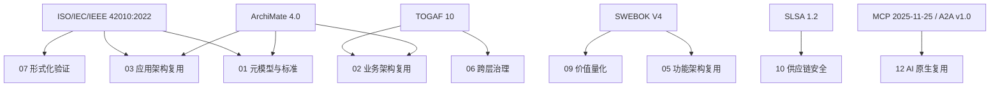

### 示例

**正向示例**：某金融企业在建立企业架构资产库时，以本矩阵为索引：

- 主题 10“供应链安全”的主标准定位为 SLSA 1.2 与 NIST SSDF 1.2，辅助标准为 SPDX、CycloneDX、SWID、in-toto。
- 在引入开源组件时，团队直接依据矩阵要求生成 SBOM 并验证 SLSA Build Track 等级，使外部审计能够在 2 小时内确认合规性。
- 主题 02“业务架构复用”映射到 TOGAF ADM Phase B 与 ArchiMate 业务层，确保业务架构师与解决方案架构师使用同一套术语。

### 反例

**反模式**：某团队为“简化沟通”，自创“业务域 / 技术域 / 数据域”三分法，但未在矩阵中映射到 TOGAF/ArchiMate/FEA 的正式术语：

- 与外部审计交流时，“业务域”被误解为 TOGAF 的 Business Domain 或 FEA 的 Business Reference Model，产生语义偏差。
- 供应商提交的方案因术语不一致被多次退回，项目延期 6 周。
- 由于没有对应 ISO/IEC/IEEE 42010:2022 Viewpoint，架构视图无法被自动工具解析。

**避免建议**：任何自定义分类必须在矩阵中显式映射到至少一个国际标准或行业框架的等价概念，并记录差异。

### 7. 权威来源

> **权威来源**：
>
> - [ISO/IEC/IEEE 42010:2022 — Architecture description](https://www.iso.org/standard/74393.html) — ISO（核查日期：2026-07-09）
> - [ISO/IEC/IEEE 42010:2022 OBP 在线浏览](https://www.iso.org/obp/ui/#iso:std:iso-iec-ieee:42010:ed-2:v1:en) — ISO（核查日期：2026-07-09）
> - [ISO/IEC/IEEE 42020:2019 — Architecture processes](https://www.iso.org/standard/68982.html) — ISO（核查日期：2026-07-09）
> - [ISO/IEC/IEEE 42030:2019 — Architecture evaluation](https://www.iso.org/standard/73436.html) — ISO（核查日期：2026-07-09）
> - [ISO/IEC 26550:2015 — Product line engineering](https://www.iso.org/standard/69529.html) — ISO（核查日期：2026-07-09）
> - [TOGAF® Standard, 10th Edition](https://www.opengroup.org/togaf) — The Open Group（核查日期：2026-07-09）
> - [TOGAF Architecture Content](https://publications.opengroup.org/togaf-library) — The Open Group（核查日期：2026-07-09）
> - [ArchiMate® 4 Specification](https://www.opengroup.org/archimate-licensed-downloads) — The Open Group（2026-04-27 正式发布，Document C260，白皮书 W262）（核查日期：2026-07-09）
> - [ArchiMate 4.0 Changes White Paper W262](https://publications.opengroup.org/w262) — The Open Group（核查日期：2026-07-09）
> - [SWEBOK Guide V4.0](https://www.computer.org/education/bodies-of-knowledge/software-engineering) — IEEE Computer Society（核查日期：2026-07-09）
> - [SLSA 1.2 Specification](https://slsa.dev/spec/v1.2/) — OpenSSF（核查日期：2026-07-09）
> - [MCP Specification](https://modelcontextprotocol.io/) — Anthropic / Linux Foundation（核查日期：2026-07-09）
>
> **核查日期**：2026-07-09

### 8. 交叉引用

- ISO/IEC/IEEE 42010:2022 核心概念详见 [`iso-42010-2022.md`](../struct/01-meta-model-standards/01-iso-420xx-family/iso-42010-2022.md)
- TOGAF 企业连续体与构建块复用详见 [`../02-togaf-10-alignment/togaf-enterprise-continuum-reuse.md`](../struct/01-meta-model-standards/02-togaf-10-alignment/togaf-enterprise-continuum-reuse.md)
- ArchiMate 与 ISO/IEC/IEEE 42010:2022 映射详见 [`../04-archimate-4/archimate-iso-mapping.md`](../struct/01-meta-model-standards/04-archimate-4/archimate-iso-mapping.md)
- SWEBOK V4 对齐详见 [`../05-swebok-v4/swebok-alignment.md`](../struct/01-meta-model-standards/05-swebok-v4/swebok-alignment.md)
- 四层复用本体详见 [`../06-formal-axioms/four-layer-ontology.md`](../struct/01-meta-model-standards/06-formal-axioms/four-layer-ontology.md)


---

## 补充：核心标准对齐矩阵的使用方法与维护流程

> 本节进一步说明如何在日常架构治理中使用对齐矩阵，并给出维护流程、角色职责与典型失败模式，以强化矩阵的可操作性。

### 1. 使用场景

对齐矩阵不仅是静态参考表，更是架构评审、资产入库、供应商评估与审计合规的入口：

- **架构评审**：在架构委员会（Architecture Board）评审新项目时，要求项目方说明其关键设计决策对应矩阵中的哪些标准条款。
- **资产入库**：任何进入组织资产库的可复用资产必须标注其主标准与辅助标准，例如一个微服务模板应关联 TOGAF ABB/SBB、ArchiMate 应用层与 OMG RAS。
- **供应商评估**：要求供应商提交的方案明确引用矩阵中的国际标准，避免使用自定义术语造成验收争议。
- **审计合规**：外部审计可通过矩阵快速验证企业架构实践是否覆盖 ISO/IEC/IEEE 42010:2022、TOGAF、SLSA 等权威来源。

### 2. 维护流程


- **标准更新监测**：每季度扫描 ISO、The Open Group、IEEE/ACM、OpenSSF 等官方发布渠道。
- **影响评估**：判断新标准或新版本是否影响现有主题映射，例如 ArchiMate 4.0 引入 Common Domain 后，需更新 01、02、03 主题的映射。
- **矩阵条目修订**：在 Git 分支上修改矩阵，记录变更理由。
- **专家评审**：由 Track A 负责人与相关主题架构师共同评审。
- **版本发布**：合并后更新版本号与核查日期。
- **通知与同步**：通知受影响的详细映射文件作者同步更新。

### 3. 角色职责

| 角色 | 职责 |
|------|------|
| 标准联络人 | 监测权威标准动态，提交更新建议 |
| 主题架构师 | 验证本主题映射的准确性与完整性 |
| 质量门禁管理员 | 运行 `scripts/quality-gate.py`，确保文件持续合规 |
| 仓库维护者 | 合并修订、管理版本与交叉引用 |

### 4. 正例

**正例**：某制造业企业在 2025 年将 SLSA 从 1.0 升级到 1.2 后，标准联络人触发矩阵更新流程：

- 在主题 10“供应链安全”中新增 Source Track 与 Attested Build Environments 两行映射。
- 同步更新 [`ras-alignment.md`](../struct/01-meta-model-standards/07-omg-ras/ras-alignment.md) 中的 SLSA 字段扩展表。
- 通知 10 个正在使用该矩阵的项目组，在两周内完成 SBOM 与 provenance 字段补全。

结果：外部审计在 1 天内确认企业已对齐最新供应链安全标准。

### 5. 反例

**反例**：某企业 2024 年获得 ISO 42010:2011 认证后，未在 2022 版发布后更新矩阵：

- 继续使用已废弃的术语（System of Interest），与 2022 版的 Entity of Interest（EoI）不一致。
- 新建项目在海外审计时被指出术语过时，需额外解释与补救。
- 相关详细映射文件（如 ArchiMate 映射）因依赖旧术语而出现概念偏差。

**避免建议**：将矩阵维护纳入季度治理会议议程，并为每个国际标准指定唯一的标准联络人。

### 6. 交叉引用

- 矩阵中涉及的所有核心概念详见 [`iso-42010-2022.md`](../struct/01-meta-model-standards/01-iso-420xx-family/iso-42010-2022.md)
- TOGAF 企业连续体与构建块复用详见 [`../02-togaf-10-alignment/togaf-enterprise-continuum-reuse.md`](../struct/01-meta-model-standards/02-togaf-10-alignment/togaf-enterprise-continuum-reuse.md)
- ArchiMate 与 ISO/IEC/IEEE 42010:2022 映射详见 [`../04-archimate-4/archimate-iso-mapping.md`](../struct/01-meta-model-standards/04-archimate-4/archimate-iso-mapping.md)
- RAS 可复用资产规范对齐详见 [`../07-omg-ras/ras-alignment.md`](../struct/01-meta-model-standards/07-omg-ras/ras-alignment.md)
- FAIR4RS 与软件复用对照详见 [`../08-fair4rs/fair4rs-alignment.md`](../struct/01-meta-model-standards/08-fair4rs/fair4rs-alignment.md)

---


<!-- SOURCE: struct/01-meta-model-standards/01-iso-420xx-family/awi-42030-tracking.md -->

# ISO/IEC/IEEE AWI 42030 修订跟踪

> **版本**: 2026-06-10
> **跟踪对象**: ISO/IEC/IEEE AWI 42030 — Architecture Evaluation Framework（第二版）
> **当前状态**: Under development（阶段 20.00）
> **上一版本**: ISO/IEC/IEEE 42030:2019（第一版，2019-07-24 发布）
> **核查日期**: 2026-06-10
> **来源 URL**: <https://www.iso.org/standard/93814.html>

---

## 目录

- [ISO/IEC/IEEE AWI 42030 修订跟踪](#isoiecieee-awi-42030-修订跟踪)
  - [目录](#目录)
  - [1. 修订背景](#1-修订背景)
  - [2. 修订状态](#2-修订状态)
    - [阶段追踪](#阶段追踪)
  - [3. 2019 版核心内容回顾](#3-2019-版核心内容回顾)
    - [3.1 架构评估（AE）三层框架](#31-架构评估ae三层框架)
    - [3.2 与 42020 的协同](#32-与-42020-的协同)
  - [4. 预期修订方向（基于社区讨论与标准趋势）](#4-预期修订方向基于社区讨论与标准趋势)
    - [4.1 可能的增强领域](#41-可能的增强领域)
    - [4.2 与 42010:2022 的一致性更新](#42-与-420102022-的一致性更新)
  - [5. 跟踪机制](#5-跟踪机制)
    - [5.1 自动跟踪建议](#51-自动跟踪建议)
    - [5.2 关键里程碑检查清单](#52-关键里程碑检查清单)
  - [6. 本项目应对策略](#6-本项目应对策略)
  - [概念定义](#概念定义)
  - [示例](#示例)
  - [反例](#反例)
  - [论证](#论证)
  - [标准条款映射](#标准条款映射)
  - [权威来源与核查日期](#权威来源与核查日期)

## 1. 修订背景

ISO/IEC/IEEE 42030:2019 自发布以来，已成为架构评估领域的核心国际标准。随着软件系统复杂度的提升、AI/ML 系统的兴起、以及系统之系统（SoS）架构的普及，2019 版在以下方面需要更新：

- **AI/ML 系统的架构评估**：传统评估方法难以处理概率性、数据依赖的 AI 架构
- **持续架构评估（Continuous Architecture Evaluation）**：DevOps/敏捷环境下，架构评估不再是阶段性活动
- **架构债务评估**：与技术债务（Technical Debt）概念联动
- **评估自动化**：工具链和度量的更新

---

## 2. 修订状态

| 属性 | 详情 |
|:---|:---|
| **标准编号** | ISO/IEC/IEEE AWI 42030 |
| **注册日期** | 2026-04-22（ISO 官网登记为新项目） |
| **当前阶段** | 20.00 — New project registered in TC/SC work programme |
| **版本** | 第二版（Edition 2） |
| **预计发布** | 2027-2028（基于 ISO 标准平均 18-24 个月开发周期估算） |
| **技术委员会** | ISO/IEC JTC 1/SC 7 — Software and systems engineering |

### 阶段追踪

```text
ISO 标准生命周期
├── 00 预备阶段 (Preliminary) ──→ 完成
├── 10 提案阶段 (Proposal) ──→ 完成
├── 20 准备阶段 (Preparatory) ──→ ✅ 当前（AWI 已注册）
├── 30 委员会阶段 (Committee) ──→ 待启动
├── 40 征求意见阶段 (Enquiry/DIS) ──→ 预计 2027 中
├── 50 批准阶段 (Approval/FDIS) ──→ 预计 2027 末
├── 60 发布阶段 (Publication) ──→ 预计 2028 初
└── 90 复审阶段 (Review) ──→ 2033 左右
```

---

## 3. 2019 版核心内容回顾

AWI 42030 的修订将在 2019 版基础上演进。回顾现有框架：

### 3.1 架构评估（AE）三层框架

| 层级 | 内容 | 复用视角映射 |
|:---|:---|:---|
| **目标层（Objectives）** | 评估目的、利益相关者关注点 | 复用决策的业务目标对齐 |
| **因素层（Factors）** | 质量属性、架构决策、风险 | 复用资产的质量特性评估（ISO 25010） |
| **方法层（Methods）** | 场景法、度量法、利益相关者评审 | 复用资产的兼容性验证方法 |

### 3.2 与 42020 的协同

42030 的通用 AE 框架支持 42020 中定义的 Architecture Evaluation 过程（第 9 章）。特定框架可派生自该通用框架，映射到：

- ISO/IEC/IEEE 15288:2023（系统生命周期过程）
- ISO/IEC/IEEE 12207:2017（软件生命周期过程）

---

## 4. 预期修订方向（基于社区讨论与标准趋势）

> ⚠️ 以下内容为基于标准演进趋势和学术社区讨论的**合理推测**，非 ISO 官方承诺。将在标准正式发布后更新。

### 4.1 可能的增强领域

| 领域 | 2019 版状态 | 预期修订方向 | 对本项目的影响 |
|:---|:---|:---|:---|
| **AI/ML 架构评估** | 未覆盖 | 新增对概率性系统、模型漂移、数据依赖架构的评估指南 | 需更新 12 AI 原生复用中的评估方法 |
| **持续评估** | 阶段性评估为主 | 嵌入 CI/CD 的自动化架构评估 | 与 13 平台工程（IDP Golden Path）联动 |
| **架构债务量化** | 未明确 | 引入技术债务的架构维度评估 | 与 06 跨层治理的升级/降级矩阵关联 |
| **供应链安全评估** | 未覆盖 | 架构的第三方依赖风险评估 | 与 10 供应链安全（SLSA/SBOM）深度整合 |
| **可持续性评估** | 未覆盖 | 架构的能源效率与碳足迹评估 | 与 13/07-green-software 联动 |
| **评估工具能力** | 高阶描述 | 更具体的工具支持要求（如架构数字孪生） | 与 11 工业 IoT 数字孪生复用交叉 |

### 4.2 与 42010:2022 的一致性更新

2019 版 42030 引用的是 42010:2011。修订版预计将：

- 全面采用 42010:2022 的术语体系（Architecture Description / Viewpoint / View / Model）
- 支持 42010:2022 新增的模型种类（Model Kind）和架构描述语言概念
- 与 DIS 42024（架构基础）和 DIS 42042（参考架构）协调

---

## 5. 跟踪机制

### 5.1 自动跟踪建议

建议通过以下渠道跟踪 AWI 42030 进展：

| 来源 | URL | 跟踪频率 |
|:---|:---|:---:|
| ISO 官网项目页 | <https://www.iso.org/standard/93814.html> | 季度 |
| ISO/IEC JTC 1/SC 7 会议报告 | <https://www.iso.org/committee/45086.html> | 半年 |
| IEEE Computer Society S2ESC | <https://sagroups.ieeecs.org/42030/> | 季度 |
| arc42 质量博客 | <https://quality.arc42.org/standards/iso-iec-ieee-42030> | 月度 |

### 5.2 关键里程碑检查清单

- [ ] 2026-Q3: 确认是否进入阶段 30（委员会阶段）
- [ ] 2027-Q2: 确认是否发布 DIS（阶段 40）
- [ ] 2027-Q4: 确认是否发布 FDIS（阶段 50）
- [ ] 2028-Q1: 确认正式发布（阶段 60）

---

## 6. 本项目应对策略

在 AWI 42030 正式发布前，建议采取以下策略：

1. **继续以 42030:2019 为评估框架基准**：2019 版仍然有效，且其三层框架（目标-因素-方法）已足够支撑当前复用评估需求
2. **预留 AI/ML 评估扩展位**：在 12/05-probabilistic-contracts 和 12/07-conformal-prediction 中预留与新版 42030 的对接接口
3. **跟踪但不等待**：Phase D（2027-Q2 起）将正式对齐新版 42030，不阻塞当前 Phase A-C 的推进

---

> **权威来源**:
>
> - [ISO/IEC/IEEE 42030:2019 — Architecture evaluation framework](https://www.iso.org/standard/73436.html) — ISO（核查日期：2026-07-08）
> - [ISO/IEC/IEEE AWI 42030 项目页](https://www.iso.org/standard/93814.html) — ISO Stage 20.00（核查日期：2026-07-08）
> - [ISO/IEC/IEEE 42030:2019-2019 官方页面](https://standards.ieee.org/ieee/42030/7602/) — IEEE SA（核查日期：2026-07-08）
> - [arc42 Quality Blog: ISO/IEC/IEEE 42030:2019 Overview](https://quality.arc42.org/standards/iso-iec-ieee-42030)（核查日期：2026-07-08）
>
> **核查日期**: 2026-07-08


---

## 概念定义

**定义**：ISO/IEC/IEEE 42030:2019 规定了架构评估（Architecture Evaluation）的原则、过程与方法，用于判断架构满足利益相关者关注点的程度；AWI 42030 则是该标准第二版的在研项目。

## 示例

某电信运营商在引入共享计费服务前，依据 ISO/IEC/IEEE 42030:2019 的三层框架（Objectives-Factors-Methods）组织 ATAM 评审：目标层明确“支持 1 亿并发用户”，因素层识别性能、安全、可维护性，方法层采用场景法与度量法。评估发现缓存层存在单点故障风险，提前引入 Redis Cluster 与熔断机制，避免了上线后事故。

## 反例

某项目为赶进度跳过架构评估，直接复用开源消息队列。上线后流量峰值触发消息积压与消费延迟，运维团队才发现该组件未满足可靠性要求。因缺乏 42030 评估记录，无法追溯当初是否将可靠性列为评估因素，修复成本是评估成本的 8 倍。

## 论证

因为 ISO/IEC/IEEE 42030:2019 将评估对象扩展到 enterprise / system / subsystem / product line 等多种 Entity of Interest，所以复用资产的评估不能仅停留在组件功能层面，而必须覆盖质量属性、风险与利益相关者价值。

## 标准条款映射

| 标准条款 | 核心内容 | 本文件对应 |
|---|---|---|
| ISO/IEC/IEEE 42030:2019, Clause 4.3 | Architecture evaluation tiers（目标/因素/方法） | 第 3.1 节三层框架 |
| ISO/IEC/IEEE 42030:2019, Clause 6.1 | Evaluation synthesis general requirements | 第 5 节跟踪机制 |
| ISO/IEC/IEEE 42030:2019, Clause 6.2 | Value assessment | 第 4 节预期修订方向 |
| ISO/IEC/IEEE 42020:2019, Clause 9 | Architecture Evaluation process | 第 3.2 节与 42020 的协同 |

## 权威来源与核查日期

> **权威来源**：
>
> - [ISO/IEC/IEEE 42030:2019 — Architecture evaluation framework](https://www.iso.org/standard/73436.html) — ISO（核查日期：2026-07-08）
> - [ISO/IEC/IEEE AWI 42030 项目页](https://www.iso.org/standard/93814.html) — ISO Stage 20.00（核查日期：2026-07-08）
> - [ISO/IEC/IEEE 42030:2019-2019 官方页面](https://standards.ieee.org/ieee/42030/7602/) — IEEE SA（核查日期：2026-07-08）
> - [arc42 Quality Blog: ISO/IEC/IEEE 42030:2019 Overview](https://quality.arc42.org/standards/iso-iec-ieee-42030)（核查日期：2026-07-08）
>
> **核查日期**：2026-07-08

---


<!-- SOURCE: struct/01-meta-model-standards/01-iso-420xx-family/ieee-1517-reuse-processes.md -->

# IEEE 1517-2010 软件生命周期复用过程

> **版本**: 2026-06-08
> **定位**: P4-T6 交付物 — ISO/IEC/IEEE 1517:2010 复用过程标准与 ISO/IEC/IEEE 12207:2017（当前版 :2026，历史映射基于 :2017）、ISO/IEC 26550:2015 及本体系四层复用架构对齐
> **对齐来源**: ISO/IEC/IEEE 1517:2010; ISO/IEC/IEEE 12207:2026（现行） / 12207:2017（历史对照）; ISO/IEC 26550:2015; TOGAF Standard 10
> **状态**: Phase 2（2026-Q4）
> **权威链接**:
>
> - <https://standards.ieee.org/ieee/1517/4603/>
> - <https://www.iso.org/standard/90219.html> (ISO/IEC/IEEE 12207:2026，现行版)
> - <https://www.iso.org/standard/63712.html> (ISO/IEC/IEEE 12207:2017，历史对照版)
> - <https://www.iso.org/standard/69529.html> (ISO/IEC 26550:2015)

---

## 1. IEEE 1517-2010 概述

**ISO/IEC/IEEE 1517:2010** — *Information Technology — System and Software Life Cycle Processes — Reuse Processes* 是 IEEE 专门针对系统与软件生命周期中复用活动的标准规范。它并非孤立存在，而是在 IEEE 标准体系中与多个核心标准形成互补关系：

- **与 ISO/IEC/IEEE 12207:2017 / ISO/IEC/IEEE 12207:2026 的互补**：12207 定义了通用的系统与软件生命周期过程（技术过程、管理过程、支持过程、组织过程），将复用视为跨过程的横切关注点；而 ISO/IEC/IEEE 1517:2010 则提供了独立的、专门化的复用过程视图，使组织能够以系统化方式实施复用，而不仅将其作为通用过程的附加注记。本节映射以 **ISO/IEC/IEEE 12207:2026** 为现行基准；历史对照版（2017）的过程名称和关系保持一致。
- **与 ISO/IEC/IEEE 42020:2019 的互补**：42020 定义了架构过程框架，1517 的复用活动可映射到 42020 的架构规划、开发、评估与维护活动中（详见 [01/02-togaf-10-alignment/detailed-mapping.md](../struct/01-meta-model-standards/02-togaf-10-alignment/detailed-mapping.md)）。

为什么需要专门的复用过程标准？通用生命周期过程（如 12207）假设每个项目从零开始定义需求、设计、实现；而复用驱动的方法论要求**双向过程**：一方面通过领域工程主动生产可复用资产，另一方面通过应用工程按需消费和适配资产。这种"供-需"双轨结构需要超越单一项目边界的治理机制，这正是 ISO/IEC/IEEE 1517:2010 存在的核心价值。

---

## 2. IEEE 1517 核心过程

IEEE 1517 定义了三大复用过程组，形成"领域工程产资产 → 应用工程用资产 → 复用管理控全局"的闭环：

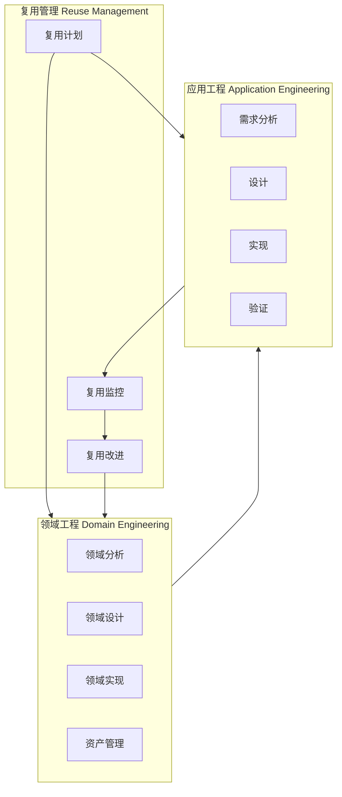

### 2.1 领域工程（Domain Engineering）

领域工程负责识别、构建和维护特定领域的可复用资产，是复用体系的"供给侧"。

| 活动 | 核心任务 | 对应本体系 |
|------|---------|-----------|
| **领域分析** | 识别领域边界、分析共性（commonality）与可变性（variability）、建立领域模型 | `02-business-architecture-reuse` |
| **领域设计** | 定义参考架构、可变性机制（binding time、参数化、继承、组合）、组件接口契约 | `03-application-architecture-reuse` / `04-component-architecture-reuse` |
| **领域实现** | 编码、测试、打包可复用资产；建立资产文档和使用示例 | `04-component-architecture-reuse` / `05-functional-architecture-reuse` |
| **资产管理** | 存储、分类、版本控制、检索优化、退役管理 | `01-meta-model-standards/07-omg-ras` / `13-emerging-trends/01-platform-engineering` |

### 2.2 应用工程（Application Engineering）

应用工程负责从需求到交付的完整生命周期，核心是识别复用机会并将可复用资产集成到目标系统中，是复用体系的"需求侧"。

| 活动 | 核心任务 | 对应本体系 |
|------|---------|-----------|
| **需求分析** | 在利益相关者需求中识别可通过复用满足的部分；分析适配约束 | `02-business-architecture-reuse` |
| **设计** | 选择候选资产；设计集成方案；处理可变性绑定（variability binding） | `03-application-architecture-reuse` / `04-component-architecture-reuse` |
| **实现** | 适配、定制、组装可复用资产；编写胶水代码和集成测试 | `04-component-architecture-reuse` / `05-functional-architecture-reuse` |
| **验证** | 验证集成后系统的功能正确性、非功能属性（性能、安全）及合规性 | `07-formal-verification` / `10-supply-chain-security` |

### 2.3 复用管理（Reuse Management）

复用管理是横跨领域工程与应用工程的治理层，确保复用活动在战略、度量和持续改进维度受控。

| 活动 | 核心任务 | 对应本体系 |
|------|---------|-----------|
| **复用计划** | 制定复用策略、目标、范围、资源预算、工具链选型 | `09-value-quantification` |
| **复用监控** | 定义并跟踪复用指标（复用率、适配成本、ROI、资产质量分） | `06-cross-layer-governance/05-metrics-kpi` |
| **复用改进** | 基于度量和反馈持续优化复用流程、资产组合和治理机制 | `06-cross-layer-governance` |

---

## 3. 与 ISO/IEC/IEEE 12207 的对照映射

> **版本说明**: 下表以 **ISO/IEC/IEEE 12207:2026** 为现行基准编写。ISO/IEC/IEEE 12207:2026 已于 2026-04-29 发布，核心过程映射关系与 2017 版保持一致，但 2026 版在敏捷方法、MBSSE 和风险/配置管理方面有更新。历史对照版（2017）的过程名称和关系仍具参考价值。

ISO/IEC/IEEE 12207:2026 将复用 concern 整合为跨生命周期的活动，而 ISO/IEC/IEEE 1517:2010 则将其提升为独立过程组。下表给出核心过程的对照：

| IEEE 1517 过程 | ISO/IEC/IEEE 12207:2026 对应过程 | 差异说明 |
|---------------|------------------------|----------|
| 领域分析 | 系统/软件需求分析（Stakeholder/Software Requirements） | 1517 强调**领域范围**而非单一系统；关注跨系统的共性和可变性分析 |
| 领域设计 | 架构设计（Architectural Design） | 1517 强调**可变性设计**（variability modeling）和参考架构，而非单系统架构 |
| 资产管理 | 配置管理（Configuration Management） | 1517 在版本控制基础上增加**分类体系、检索机制和分发策略** |
| 复用计划 | 项目管理（Project Management） | 1517 将项目管理**专门化到复用维度**，增加资产组合管理和复用 ROI 评估 |
| 应用工程 — 需求分析 | 系统/软件需求分析 | 1517 要求主动查询资产库，将"可复用性"作为需求决策维度 |
| 应用工程 — 验证 | 系统/软件确认与验证 | 1517 增加对**资产集成边界**和**可变性绑定正确性**的验证要求 |

> **关键版本差异**：12207:2008 曾设有独立的 "Software Reuse Processes" 过程组；12207:2017 / 2026 将其拆解为横切活动，更强调复用是生命周期各过程的内在属性。ISO/IEC/IEEE 1517:2010 保留了独立过程视图，为需要系统化复用治理的组织提供了可操作的框架。

---

## 4. 与 ISO/IEC 26550:2015 产品线工程的对照

ISO/IEC 26550:2015（Software and Systems Engineering — Reference Model for Product Line Engineering and Management）与 ISO/IEC/IEEE 1517:2010 在结构上高度同源，但聚焦点不同：

| IEEE 1517 过程组 | ISO/IEC 26550 对应过程 | 映射说明 |
|-----------------|----------------------|----------|
| 领域工程 | 领域工程（Domain Engineering） | 双向映射；26550 增加了产品线特有的**可变点管理**和**核心资产基线**概念 |
| 应用工程 | 应用工程（Application Engineering） | 双向映射；26550 强调**产品派生**（product derivation）过程，即通过绑定可变点自动生成产品实例 |
| 复用管理 | 管理流程（Management Processes） | 双向映射；26550 的管理流程更聚焦于**产品线范围演化**和**多产品组合管理** |

**核心差异**：

- **通用性 vs 聚焦性**：ISO/IEC/IEEE 1517:2010 是通用复用过程标准，适用于任何希望引入复用实践的组织；ISO/IEC 26550:2015 更聚焦于**软件/系统产品线**（Software Product Line, SPL）场景，假设存在一组具有显著共性的相关产品家族。
- **可变性管理**：26550 对可变性建模、绑定和派生提供了更详细的过程定义；1517 的"可变性设计"在 26550 中扩展为完整的产品线可变性管理框架。
- **组织维度**：26550 明确区分了"领域工程组织"与"应用工程组织"的结构关系；1517 则保持组织中立，允许按实际情况灵活配置。

---

## 5. 与四层复用架构的映射

本体系采用四层复用架构（业务架构 → 应用架构 → 组件架构 → 功能架构），ISO/IEC/IEEE 1517:2010 的三过程组与各层的映射关系如下：

| IEEE 1517 过程组 | 四层复用架构映射 | 说明 |
|-----------------|-----------------|------|
| **领域工程** | 业务架构 + 应用架构 | 领域分析识别可复用的**业务能力**和**业务实体**；领域设计产出可复用的**系统模式**和**参考架构** |
| **应用工程** | 组件架构 + 功能架构 | 在组件层集成具体可复用组件（框架、库、服务）；在功能层适配和定制具体功能单元（算法、MCP Tool、函数） |
| **复用管理** | 跨层治理 | 贯穿四层的**度量体系**、**成熟度评估**（RCMM/RiSE）、**FinOps 成本分摊**和**供应链安全治理** |

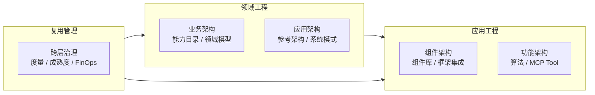

---

## 6. 实施检查清单

以下检查清单按 ISO/IEC/IEEE 1517:2010 三大过程组组织，每组 10 项，共 30 项。每项标注了与 NASA RRL（Reuse Readiness Levels）、RCMM、RiSE-RM 的成熟度等级映射（详见 [06/03-maturity-models/reuse-maturity-models-rcmm-rise.md](../struct/06-cross-layer-governance/03-maturity-models/reuse-maturity-models-rcmm-rise.md)）。

### 6.1 领域工程检查清单（10 项）

| # | 检查项 | RRL | RCMM | RiSE-RM |
|---|--------|-----|------|---------|
| DE-01 | 已识别领域边界并建立领域范围文档 | RRL 3-4 | L3 已定义 | L3 计划复用 |
| DE-02 | 已完成共性/可变性分析（commonality/variability analysis） | RRL 4 | L3 已定义 | L3 计划复用 |
| DE-03 | 已建立领域模型（领域术语、实体关系、业务规则） | RRL 4-5 | L3 已定义 | L3 计划复用 |
| DE-04 | 已定义参考架构，包含可变性机制和绑定时间策略 | RRL 5 | L3 已定义 | L4 管理复用 |
| DE-05 | 已设计组件接口契约，符合组织接口标准 | RRL 5-6 | L3 已定义 | L4 管理复用 |
| DE-06 | 可复用资产已实现、单元测试通过、文档完整 | RRL 6 | L3 已定义 | L4 管理复用 |
| DE-07 | 资产已按分类体系（领域/质量/成熟度）编目 | RRL 6-7 | L4 已管理 | L4 管理复用 |
| DE-08 | 资产仓库支持版本控制、依赖追踪和 SBOM 生成 | RRL 7 | L4 已管理 | L5 产品线复用 |
| DE-09 | 资产检索系统支持多维度查询（标签、语义、相似度） | RRL 7-8 | L4 已管理 | L5 产品线复用 |
| DE-10 | 已建立资产退役和替换策略，避免技术债累积 | RRL 8-9 | L5 优化 | L6 度量复用 |

### 6.2 应用工程检查清单（10 项）

| # | 检查项 | RRL | RCMM | RiSE-RM |
|---|--------|-----|------|---------|
| AE-01 | 需求分析阶段主动查询资产库，识别复用机会 | RRL 3-4 | L2 可重复 | L2 基本复用 |
| AE-02 | 已评估候选资产的适配成本（AAF < AAF_ECONOMIC_FLOOR（0.7，canonical [0.0, 1.0]） 为绿灯） | RRL 4-5 | L3 已定义 | L3 计划复用 |
| AE-03 | 已分析资产依赖链长度（要求 < 5 层） | RRL 5 | L3 已定义 | L4 管理复用 |
| AE-04 | 已确认资产许可证兼容性和合规性（SPDX） | RRL 5-6 | L3 已定义 | L4 管理复用 |
| AE-05 | 已设计可变性绑定方案（参数/配置/继承/组合） | RRL 5-6 | L3 已定义 | L4 管理复用 |
| AE-06 | 已实现资产适配和集成，胶水代码有单元测试覆盖 | RRL 6 | L3 已定义 | L4 管理复用 |
| AE-07 | 集成后的系统已通过功能验证，边界场景覆盖 | RRL 6-7 | L4 已管理 | L5 产品线复用 |
| AE-08 | 非功能属性（性能、安全、可用性）验证通过 | RRL 7 | L4 已管理 | L5 产品线复用 |
| AE-09 | 缺陷根因分析区分"资产问题"与"集成问题" | RRL 7-8 | L4 已管理 | L6 度量复用 |
| AE-10 | 使用反馈已记录并回流至领域工程团队 | RRL 8 | L5 优化 | L6 度量复用 |

### 6.3 复用管理检查清单（10 项）

| # | 检查项 | RRL | RCMM | RiSE-RM |
|---|--------|-----|------|---------|
| RM-01 | 已制定组织级复用战略，明确目标范围和 KPI | RRL 2-3 | L3 已定义 | L3 计划复用 |
| RM-02 | 已建立复用治理委员会，定义角色和职责 | RRL 3-4 | L3 已定义 | L3 计划复用 |
| RM-03 | 复用预算已纳入项目预算管理体系 | RRL 4 | L3 已定义 | L3 计划复用 |
| RM-04 | 已定义核心复用度量指标（复用率、成本规避、TTM 缩短） | RRL 4-5 | L4 已管理 | L4 管理复用 |
| RM-05 | 度量数据自动采集（CI/CD、IDP、SCA 工具集成） | RRL 5-6 | L4 已管理 | L5 产品线复用 |
| RM-06 | 复用 ROI 模型已建立并定期评审（参考 COCOMO II） | RRL 6 | L4 已管理 | L6 度量复用 |
| RM-07 | 资产质量门（Quality Gate）定义并执行 | RRL 6-7 | L4 已管理 | L5 产品线复用 |
| RM-08 | 定期执行复用成熟度自评估（RCMM / RiSE-RM） | RRL 7-8 | L4-5 已管理/优化 | L6 度量复用 |
| RM-09 | 已建立复用激励机制（开发者积分、Golden Path 采用率） | RRL 7-8 | L5 优化 | L6 度量复用 |
| RM-10 | 复用过程持续改进，形成 PDCA 闭环 | RRL 9 | L5 优化 | L7 主动复用 |

---

## 7. 批判性评估与 2026 年应用建议

### 7.1 优势

- **过程完整**：覆盖领域工程、应用工程、复用管理的全生命周期闭环
- **与主流标准兼容**：与 12207、26550、42020、TOGAF 均有清晰映射
- **实践导向**：提供了可落地的活动、任务和决策检查清单

### 7.2 局限

- **发布较早**：2010 年标准，未原生涉及 AI、云原生、容器、MCP 等现代复用形态
- **缺少具体技术格式**：不规定资产包装格式（需结合 OMG RAS、SBOM 等补充）
- **度量不够量化**：复用 ROI、成本的精确计算需结合 COCOMO II 等模型

### 7.3 2026 年应用建议

1. **将 1517 作为过程框架**：用其三大过程组组织本体系的治理内容，映射到 DevOps 工具链和平台工程实践。
2. **结合现代资产仓库**：用 Backstage IDP、Artifact Registry、MCP Tool Registry 替代传统静态资产库。
3. **结合 AI 复用**：在 Domain Engineering 中增加 LLM/Agent 能力域；在 Asset Management 中增加 Prompt 模板、Agent 工作流等新型资产类别。
4. **持续跟踪标准演进**：关注 ISO/IEC/IEEE 1517:2010 后续修订及 ISO 对应复用标准的发布动态。

---

## 8. 公理映射

> **公理 1517.1** (Reuse Process Closure): 有效的复用必须形成闭环：领域工程产生资产 → 应用工程消费资产 → 复用管理监控改进 → 反馈驱动领域工程演进。任一环节断裂，复用体系将退化为偶然复用。

> **公理 1517.2** (Asset-Process Coherence): 复用资产的质量上限由复用过程成熟度决定；再优秀的资产，在没有资产管理过程的组织中也无法被有效复用。

> **公理 1517.3** (Dual-Track Governance): 领域工程与应用工程必须遵循统一的复用策略，否则"供给侧"与"需求侧"的错配将导致资产积压与重复建设并存。

---

## 9. 权威来源

1. IEEE. *ISO/IEC/IEEE 1517:2010 — Standard for Information Technology — System and Software Life Cycle Processes — Reuse Processes*. 2010. <https://standards.ieee.org/ieee/1517/4603/>
2. ISO/IEC/IEEE. *ISO/IEC/IEEE 12207:2026 — Systems and software engineering — Software life cycle processes*. 2026. <https://www.iso.org/standard/90219.html>
   ISO/IEC/IEEE. *ISO/IEC/IEEE 12207:2017 — Systems and software engineering — Software life cycle processes*. 2017. <https://www.iso.org/standard/63712.html>（历史对照版）
3. ISO/IEC. *ISO/IEC 26550:2015 — Software and systems engineering — Reference model for product line engineering and management*. 2015. <https://www.iso.org/standard/43089.html>
4. ISO/IEC/IEEE. *ISO/IEC/IEEE 42020:2019 — Software, systems and enterprise — Architecture processes*. 2019.
5. Frakes, W. B. & Kang, K. *Software Reuse Research: Status and Future*. IEEE Transactions on Software Engineering, 2005.
6. Clements, P. & Northrop, L. *Software Product Lines: Practices and Patterns*. Addison-Wesley, 2001.

---

> **交叉引用**: [01/02-togaf-10-alignment/detailed-mapping.md](../struct/01-meta-model-standards/02-togaf-10-alignment/detailed-mapping.md) · [06/03-maturity-models/reuse-maturity-models-rcmm-rise.md](../struct/06-cross-layer-governance/03-maturity-models/reuse-maturity-models-rcmm-rise.md)
> **最后更新**: 2026-06-08
> **维护者**: Track A — 01 元模型与标准对齐
> **状态**: Phase 2 交付物（P4-T6 完成）


---

## 补充说明：IEEE 1517-2010 软件生命周期复用过程

## 概念定义

**定义**：ISO/IEC/IEEE 1517:2010-2010 定义了软件生命周期中复用过程的结构，包括组织管理、领域工程、资产提供、资产消费与资产维护等过程。

## 示例

**示例**：某组织按 1517 建立领域工程团队，负责识别共性需求、开发可复用资产并向应用工程团队提供资产与培训。

## 权威来源

> **权威来源**:
>
> - [ISO/IEC/IEEE 1517:2010-2010](https://standards.ieee.org/ieee/1517/4603/)
> - [IEEE Standards](https://standards.ieee.org)
> - 核查日期：2026-07-07


---


<!-- SOURCE: struct/01-meta-model-standards/01-iso-420xx-family/iso-12207-2026-alignment.md -->

# ISO/IEC/IEEE 12207:2026 与软件复用过程对齐

> **版本**: 2026-06-10
> **对齐标准**: ISO/IEC/IEEE 12207:2026 (第二版，2026-04-29 发布)
> **前一版本**: ISO/IEC/IEEE 12207:2017
> **核查日期**: 2026-06-10
> **来源 URL**: <https://www.iso.org/obp/ui/#iso:std:iso-iec-ieee:12207:ed-2:v1:en> | <https://webstore.iec.ch/en/publication/113447>

---

## 目录

- [ISO/IEC/IEEE 12207:2026 与软件复用过程对齐](#isoiecieee-122072026-与软件复用过程对齐)
  - [目录](#目录)
  - [1. 标准概览](#1-标准概览)
  - [2. 复用相关过程映射](#2-复用相关过程映射)
    - [2.1 技术过程中的复用活动](#21-技术过程中的复用活动)
    - [2.2 支持过程中的复用活动](#22-支持过程中的复用活动)
    - [2.3 组织过程中的复用活动](#23-组织过程中的复用活动)
  - [3. 与四层复用模型的对照](#3-与四层复用模型的对照)
  - [4. 与 ISO/IEC/IEEE 1517:2010 的复用过程对照](#4-与-ieee-1517-的复用过程对照)
  - [5. 与 ISO/IEC 26550:2015 产品线工程的对照](#5-与-isoiec-26550-产品线工程的对照)
  - [6. 2026 版新增概念对复用的影响](#6-2026-版新增概念对复用的影响)
    - [6.1 系统之系统（System of Systems, SoS）](#61-系统之系统system-of-systems-sos)
    - [6.2 技术债务（Technical Debt）](#62-技术债务technical-debt)
    - [6.3 敏捷与 DevOps 明确支持](#63-敏捷与-devops-明确支持)
  - [7. 实施建议](#7-实施建议)
  - [补充说明：ISO/IEC/IEEE 12207:2026 与软件复用过程对齐](#补充说明isoiecieee-122072026-与软件复用过程对齐)
  - [示例](#示例)
  - [反例](#反例)
  - [分析](#分析)

## 1. 标准概览

ISO/IEC/IEEE 12207:2026 于 **2026-04-29 正式发布**，取代 2017 版第一版。本标准为软件生命周期过程建立通用框架，涵盖获取、供应、开发、运营、维护和退役全过程。

**关键变更（相比 2017 版）**：

| 变更领域 | 2017 版 | 2026 版 | 对复用的影响 |
|:---|:---|:---|:---|
| **技术过程澄清** | 基础定义 | 业务/任务分析、系统架构定义、实现、集成、运营、维护的当前实践澄清 | 复用资产的集成过程更明确 |
| **技术管理过程改进** | 基础框架 | 风险管理、配置管理的改进 | 复用资产的配置项管理更精细 |
| **关键概念更新** | 迭代、递归的简略描述 | 更精确的迭代、递归、系统之系统（SoS）、质量特性描述 | 支持多层级复用架构描述 |
| **新概念** | 无 | 概念与系统定义的新内容；敏捷方法、过程应用、系统概念的扩展内容 | **明确支持敏捷与 DevOps 环境下的复用** |
| **MBSSE 附录** | 简略 | 修订后的 Annex D，模型驱动的系统与软件工程 | 支持基于模型的复用资产 |
| **引用标准更新** | 引用 42010:2011 | 引用 **42010:2022** | 与项目元模型对齐 |

---

## 2. 复用相关过程映射

### 2.1 技术过程中的复用活动

ISO/IEC/IEEE 12207:2026 将技术过程划分为以下与复用直接相关的活动：

```text
技术过程（Technical Processes）
├── 6.4 业务或任务分析过程（Business or Mission Analysis Process）
│   └── 复用映射：识别可复用的业务能力与价值流 → 对应本项目 02 业务架构复用
├── 6.5 利益相关者需求与需求定义过程
│   └── 复用映射：复用需求模式、用户故事模板 → 对应 02/05 功能架构复用中的规则复用
├── 6.6 系统架构定义过程
│   └── 复用映射：参考架构选择、架构模式复用 → 对应 03 应用架构复用
├── 6.8 设计定义过程
│   └── 复用映射：设计模式、接口契约复用 → 对应 04 组件架构复用
├── 6.9 系统分析过程
│   └── 复用映射：可复用组件的选型分析、变性绑定分析
├── 6.10 实现过程
│   └── 复用映射：组件获取、适配、集成 → 对应 04/05 组件与功能复用
├── 6.11 集成过程
│   └── 复用映射：复用资产的接口验证、兼容性测试
├── 6.12 验证过程
│   └── 复用映射：复用组件的符合性验证、回归测试策略
├── 6.13 移交过程
│   └── 复用映射：复用资产的知识转移、培训材料复用
└── 6.14 运行与维护过程
    └── 复用映射：运维剧本、监控模板、补丁管理流程复用
```

### 2.2 支持过程中的复用活动

| 支持过程 | 复用活动 | 本项目对应 |
|:---|:---|:---|
| 文档管理 | 模板复用、文档模式库 | `99-reference/templates/` |
| 配置管理 | 基线复用、变更控制流程复用 | `06-cross-layer-governance/` |
| 质量保证 | 检查清单复用、审计模板 | `99-reference/audit/` |
| 验证 | 测试用例复用、测试数据复用 | `07-formal-verification/` |
| 确认 | 验收标准模板复用 | `06-cross-layer-governance/03-maturity-models/` |
| 联合评审 | 评审模板、检查表复用 | `99-reference/templates/checklist-template.md` |
| 审核 | 合规检查清单复用 | `10-supply-chain-security/` |
| 问题解决 | 已知问题库、解决方案模式复用 | `99-reference/glossary/` |

### 2.3 组织过程中的复用活动

| 组织过程 | 2026 版新增/强化 | 复用映射 |
|:---|:---|:---|
| 管理过程 | 项目组合（Portfolio）管理强化 | 复用资产组合管理 |
| 基础设施管理 | 敏捷/DevOps 环境支持明确化 | 内部开发者平台（IDP）作为复用基础设施 |
| 改进过程 | 过程评估与改进框架 | 复用成熟度持续改进（RCMM/RiSE） |
| 人力资源管理 | 能力模型与培训 | 复用技能培训、架构师能力模型 |
| 知识管理 | **新增或强化** | **复用资产库的知识管理** |

---

## 3. 与四层复用模型的对照

| 12207:2026 过程 | 业务架构复用 | 应用架构复用 | 组件架构复用 | 功能架构复用 |
|:---|:---:|:---:|:---:|:---:|
| 业务/任务分析 | ✅ 核心映射 | — | — | — |
| 系统架构定义 | ⚠️ 参考 | ✅ 核心映射 | — | — |
| 设计定义 | — | ⚠️ 参考 | ✅ 核心映射 | — |
| 实现 | — | — | ✅ 核心映射 | ✅ 核心映射 |
| 集成 | — | ✅ 参考 | ✅ 核心映射 | ⚠️ 参考 |
| 验证 | — | ⚠️ 参考 | ✅ 参考 | ✅ 参考 |
| 运行维护 | — | ✅ 参考 | ⚠️ 参考 | ✅ 参考 |

---

## 4. 与 IEEE 1517 的复用过程对照

IEEE 1517-2010 定义了软件生命周期中的复用专用过程，包括：**领域工程、应用工程、资产管理**。12207:2026 虽然没有独立列出"复用过程"，但将复用活动分散嵌入到各技术过程和支持过程中。

| IEEE 1517 过程 | 12207:2026 对应位置 | 说明 |
|:---|:---|:---|
| 领域工程（Domain Engineering） | 6.4 业务分析 + 6.6 架构定义 + 6.8 设计定义 | 共性/变性识别融入标准技术过程 |
| 应用工程（Application Engineering） | 6.5 需求定义 + 6.9 系统分析 + 6.10 实现 | 变性绑定成为实现过程的固有活动 |
| 资产管理（Asset Management） | 7.2 配置管理 + 7.3 质量保证 + 8.1 管理 | 资产库管理由组织过程支持 |

**结论**：12207:2026 的趋势是将复用从"独立过程"转变为"内嵌实践"，这与本项目强调的"复用是架构的结构性约束"理念一致。

---

## 5. 与 ISO/IEC 26550 产品线工程的对照

| 26550:2015 活动 | 12207:2026 过程映射 | 关键差异 |
|:---|:---|:---|
| 领域分析 | 6.4 业务分析 + 6.5 利益相关者需求 | 12207 更通用，26550 强调共性提取 |
| 领域设计 | 6.6 系统架构定义 + 6.8 设计定义 | 26550 强调可变性建模 |
| 领域实现 | 6.10 实现 + 6.11 集成 | 12207 未区分领域资产与应用产品 |
| 应用需求工程 | 6.5 利益相关者需求定义 | 26550 强调变性绑定 |
| 应用设计 | 6.6-6.8 架构与设计 | 26550 强调资产选择与配置 |
| 应用实现 | 6.10-6.11 实现与集成 | 26550 强调组件组装与代码生成 |
| 应用验证 | 6.12 验证 + 6.13 移交 | 26550 强调共性不变性验证 |

---

## 6. 2026 版新增概念对复用的影响

### 6.1 系统之系统（System of Systems, SoS）

12207:2026 明确定义了 SoS："一组系统或系统元素相互作用以提供单一系统无法实现的独特能力"。

**复用含义**：

- 每个组成系统本身是有用的系统，有自己的管理、目标和资源
- SoS 层面的复用不是"共享代码"，而是"协调复用"——各组成系统保持独立治理，但在 SoS 目标下协调
- 对应本项目：**跨组织业务服务复用**（02 业务架构 Level 1）和**服务网格通信复用**（03 应用架构）

### 6.2 技术债务（Technical Debt）

12207:2026 首次在 ISO 软件生命周期标准中正式定义技术债务："产品生命周期早期未识别或未完成工作的递延成本"。

**复用含义**：

- 复用不当（如克隆而非工程化复用）是技术债务的主要来源之一
- 复用决策必须考虑**长期维护成本**，而不仅是短期开发效率
- 对应本项目：**跨层升级/降级决策矩阵**（06/06-up-downgrade-matrix）

### 6.3 敏捷与 DevOps 明确支持

12207:2026 明确声明："本文档可应用于使用各种正式工程方法的组织和软件项目。它适用于敏捷方法和实践。"

**复用含义**：

- 敏捷 sprint 中的复用决策需要**快速评估框架**（而非瀑布式的 lengthy assessment）
- DevOps 流水线的复用嵌入：Golden Path、自服务模板、IDP
- 对应本项目：**平台工程作为复用载体**（13/01-platform-engineering）

---

## 7. 实施建议

对于采用本项目四层复用模型的组织，建议按以下方式应用 12207:2026：

1. **过程裁剪**：不必执行 12207 的全部过程，而是根据复用层次选择相关过程
   - 业务复用为主：重点裁剪 6.4、6.5、8.1
   - 组件复用为主：重点裁剪 6.6、6.8、6.10、7.2、7.3

2. **信息项映射**：12207 要求的过程文档（参见 15289）可大量复用模板
   - 复用成熟度 ≥ Level 3 的组织应建立**过程资产库**

3. **与 42020/42030 协同**：
   - 12207 提供"做什么"（过程）
   - 42020 提供"如何做架构"（架构过程）
   - 42030 提供"如何评估"（评估框架）
   - 三者与本项目的四层复用模型形成完整闭环

---

> **权威来源**:
>
> - ISO/IEC/IEEE 12207:2026(en), Systems and software engineering — Software life cycle processes. Published 2026-04-29. <https://www.iso.org/obp/ui/#iso:std:iso-iec-ieee:12207:ed-2:v1:en>
> - IEC Webstore: ISO/IEC/IEEE 12207:2026. <https://webstore.iec.ch/en/publication/113447>
> - ISO/IEC/IEEE 12207:2017 (First edition, replaced by 2026 edition)
> - ISO/IEC 26550:2015 Software and systems engineering — Reference model for product line engineering and management
> - ISO/IEC/IEEE 1517:2010-2010 IEEE Standard for Information Technology—System and Software Life Cycle Processes—Reuse Processes
>
> **核查日期**: 2026-06-10


---

## 补充说明：ISO/IEC/IEEE 12207:2026 与软件复用过程对齐

## 示例

**示例**：在 12207 复用管理过程中，组织建立“资产获取 → 资产存储 → 资产适配 → 资产退役”的闭环，确保复用资产与主生命周期同步演进。

## 反例

**反例**：复用资产库长期处于“只进不出”状态，过期组件未退役，导致新项目误选已停止维护的旧版本。

## 分析

**分析**：12207 将复用视为生命周期过程的有机组成部分，而非孤立的资产管理活动。

---


<!-- SOURCE: struct/01-meta-model-standards/01-iso-420xx-family/iso-25010-2023-ai-quality.md -->

# ISO/IEC 25010:2023 AI/ML 质量特性与复用评估

> **版本**: 2026-06-08
> **定位**: 元模型层（Level 0）—— ISO/IEC 25010:2023 新增 AI/ML 质量特性的架构复用映射
> **对齐标准**: ISO/IEC 25010:2023 Systems and software engineering — SQuaRE — Product quality model
> **状态**: ⏳ 框架填充中

---

## 1. ISO/IEC 25010:2023 的 AI/ML 质量演进

ISO/IEC 25010:2023 是继 2011 版后的重大修订，其核心驱动力之一是**AI/ML 系统的质量评估需求**。2024 版通过以下方式为 AI/ML 系统提供质量框架：

1. **新增 Safety 特性**: 直接覆盖 AI 系统的功能安全、风险识别与故障安全
2. **扩展 Interaction Capability**: 纳入 AI 系统的可解释性、人机协同交互
3. **细化 Flexibility**: 明确 AI 模型在不同数据分布下的适应能力（Domain Adaptation）
4. **强化 Security 中的 Resistance**: 新增对对抗样本攻击（Adversarial Attacks）的抵抗能力要求

### 1.1 版本对比

| 维度 | 2011 版 | 2024 版 | AI/ML 相关性 |
|------|---------|---------|-------------|
| 质量特性数量 | 8 | 9 | — |
| Safety | 隐含于 Reliability | 独立特性 | ✅ 关键新增 |
| Usability | 独立特性 | 扩展为 Interaction Capability | ✅ 纳入 AI 交互 |
| Portability | 独立特性 | 扩展为 Flexibility | ✅ 模型跨域迁移 |
| Security 子特性 | 5 项 | 6 项（新增 Resistance） | ✅ 对抗安全 |

---

## 2. AI/ML 相关质量特性详解

### 2.1 Safety（安全性/功能安全）

2024 版将 Safety 从 Reliability 中独立，反映 AI 系统在自动驾驶、医疗诊断等安全关键领域的特殊地位。

| 子特性 | AI/ML 映射 | 复用含义 |
|--------|-----------|---------|
| Operational Constraint | AI 模型的运行边界条件 | 复用模型时必须复用其约束条件 |
| Risk Identification | 模型失效模式的识别能力 | 复用组件需提供已知失效案例 |
| Fail Safe | 故障时的安全降级策略 | 复用时需验证 Fail Safe 机制是否适配新上下文 |
| Hazard Warning | 危险状态的预警能力 | 预警阈值可能需要根据部署环境重校准 |
| Safe Integration | 与其他系统的安全集成 | 复用多个 AI 组件时的叠加风险 |

### 2.2 Interaction Capability（交互能力）

Interaction Capability 替代了原有的 Usability，其新增子特性对 AI 系统尤为关键：

- **Self-descriptiveness（自描述性）**: AI 模型需解释其决策依据（XAI / Explainable AI）
- **User Assistance（用户辅助）**: AI 系统主动提示其置信度和不确定性范围
- **Inclusivity（包容性）**: 模型训练数据的多样性保证不同用户群体的公平性

### 2.3 Flexibility（灵活性）

Flexibility 替代 Portability，其 **Adaptability** 子特性直接关联 AI 模型的跨域复用：

- **Domain Adaptation**: 模型在新数据分布下的性能保持能力
- **Fine-tuning 友好性**: 预训练模型是否支持高效微调
- **Scalability**: 模型推理的横向扩展能力（如模型并行、流水线并行）

---

## 3. 质量特性对架构复用决策的影响矩阵

| 质量特性 | 复用决策问题 | AI 组件复用影响 | 权重（安全关键域） |
|---------|------------|----------------|----------------|
| Functional Suitability | 模型功能是否匹配需求？ | 任务类型对齐（分类/检测/生成） | 高 |
| Performance Efficiency | 推理延迟/吞吐量是否达标？ | 硬件加速器依赖、量化策略 | 高 |
| Safety | 是否满足功能安全等级？ | SIL/ASIL 等级匹配 | **必要** |
| Security (Resistance) | 是否存在对抗漏洞？ | 模型窃取、对抗样本风险 | 高 |
| Reliability | 模型输出是否稳定？ | 随机性控制（Temperature, Seed） | 高 |
| Interaction Capability | 可解释性是否满足监管？ | XAI 方法、置信度输出 | 中 |
| Flexibility | 是否需要微调/适配？ | 迁移学习成本、数据需求 | 中 |
| Maintainability | 模型版本管理是否规范？ | MLflow / Model Registry | 中 |
| Compatibility | 输入输出格式是否兼容？ | ONNX / TensorRT / OpenVINO | 高 |

> **定理 AI.1** (AI Reuse Safety Gate): 在安全关键领域复用 AI 组件时，**Safety** 和 **Security (Resistance)** 为**必要准入条件**，不满足则无论其他指标多优均不可复用。

---

## 4. AI 生成代码/组件的复用质量评估框架

### 4.1 评估维度

针对 AI 生成代码（如 GitHub Copilot、CodeT5 等）和 AI 生成组件的复用，建议采用以下评估框架：

| 评估维度 | 检查项 | 通过标准 |
|---------|--------|---------|
| 来源可信度 | 训练数据许可 | OSI 认可的开源许可证 |
| 功能正确性 | 单元测试通过率 | ≥ 90% 且边界条件覆盖 |
| 安全卫生 | 已知漏洞扫描 | OWASP Top 10 无高危 |
| 可维护性 | 代码复杂度 | Cyclomatic Complexity ≤ 15 |
| 可解释性 | 生成过程可追溯 | 提示词 + 参数可记录 |
| 合规性 | 许可证兼容性 | 与目标项目许可证兼容 |

### 4.2 复用风险分级

| 风险等级 | 特征 | 复用策略 |
|---------|------|---------|
| 🟢 低风险 | 生成代码经人工审查 + 测试覆盖 | 可直接复用 |
| 🟡 中风险 | 生成代码逻辑简单但未经完整测试 | 复用后补充测试 |
| 🔴 高风险 | 生成代码涉及安全/并发/资源管理 | 禁止直接复用，仅作参考 |

> **定理 AI.2** (Generative AI Reuse Prudence): AI 生成代码的复用风险与其**状态管理复杂度**和**安全敏感程度**正相关。涉及身份认证、加密、并发控制的代码，无论生成质量如何，均需人工逐行审查。

---

> 最后更新: 2026-06-08
> 权威来源:
>
> - <https://www.iso.org/standard/78176.html> (ISO/IEC 25010:2023)
> - <https://www.iso.org/standard/35733.html> (ISO/IEC 25012:2008 数据质量模型)
> - <https://owasp.org/www-project-top-ten/> (OWASP Top 10)


---

## 补充说明：ISO/IEC 25010:2023 AI/ML 质量特性与复用评估

## 概念定义

**定义**：ISO/IEC 25010:2023 定义了软件产品质量模型，包括功能适合性、性能效率、兼容性、交互能力、可靠性、安全性、可维护性、灵活性与安全性等特性。

## 示例

**示例**：在评估可复用 UI 组件库时，团队依据 25010 的交互能力、可维护性与兼容性制定验收准则，确保组件在多前端框架中一致表现。

## 反例

**反例**：团队仅关注功能正确性，忽视可维护性与灵活性，导致复用组件在框架升级时无法平滑迁移。

## 权威来源

> **权威来源**:
>
> - [ISO/IEC 25010:2023](https://www.iso.org/standard/78176.html)
> - [ISO/IEC/IEEE Standards](https://www.iso.org)
> - 核查日期：2026-07-07

---


<!-- SOURCE: struct/01-meta-model-standards/01-iso-420xx-family/iso-25010-2023-update.md -->

# ISO/IEC 25010:2023 产品质量模型更新

> **版本**: 2026-06-08
> **权威来源**: ISO/IEC 25010:2023 Systems and software engineering — SQuaRE — Product quality model
> **定位**: 对齐 ISO/IEC 25010:2023 最新版的关键变化（取代 2011 版，新增 AI/ML 质量特性考量）
> **勘误说明**: 本项目此前引用 "ISO/IEC 25010:2023" 系版本号滞后，现已统一更正为 2024 版。

---

## 1. 版本演进

| 版本 | 发布时间 | 核心变化 |
|------|---------|---------|
| ISO/IEC 25010:2011 | 2011 | 初始版本，8 个质量特性 |
| **ISO/IEC 25010:2023** | **2024** | **当前生效版本，9 个质量特性，引入 Safety、Flexibility、Interaction Capability，新增 AI/ML 系统质量考量** |

---

## 2. 2024 版九大质量特性

ISO/IEC 25010:2023 将产品质量模型定义为以下 9 个特性：

```text
ISO/IEC 25010:2023 Product Quality Model
├── 1. Functional Suitability（功能适用性）
│   ├── Functional Completeness
│   ├── Functional Correctness
│   └── Functional Appropriateness
│
├── 2. Performance Efficiency（性能效率）
│   ├── Time Behaviour
│   ├── Resource Utilization
│   └── Capacity
│
├── 3. Compatibility（兼容性）
│   ├── Co-existence
│   └── Interoperability
│
├── 4. Interaction Capability（交互能力）← 替代 Usability
│   ├── Appropriateness Recognizability
│   ├── Learnability
│   ├── Operability
│   ├── User Engagement
│   ├── User Assistance
│   ├── Inclusivity
│   └── Self-descriptiveness
│
├── 5. Reliability（可靠性）
│   ├── Maturity
│   ├── Availability
│   ├── Faultlessness
│   └── Recoverability
│
├── 6. Security（安全性）
│   ├── Confidentiality
│   ├── Integrity
│   ├── Non-repudiation
│   ├── Accountability
│   ├── Authenticity
│   └── Resistance
│
├── 7. Maintainability（可维护性）
│   ├── Modularity
│   ├── Reusability
│   ├── Analysability
│   ├── Modifiability
│   └── Testability
│
├── 8. Flexibility（灵活性）← 新增
│   ├── Adaptability
│   ├── Scalability
│   ├── Installability
│   └── Replaceability
│
└── 9. Safety（安全性/功能安全）← 新增
    ├── Operational Constraint
    ├── Risk Identification
    ├── Fail Safe
    ├── Hazard Warning
    └── Safe Integration
```

---

## 3. 关键变更详解

### 3.1 Usability → Interaction Capability

> **变更**: "Usability" 改为 **"Interaction Capability"**，扩展为更全面的交互维度。

新增子特性：

- **User Engagement（用户参与度）**: 保持用户积极参与的能力
- **User Assistance（用户辅助）**: 系统主动帮助用户的能力
- **Inclusivity（包容性）**: 满足不同能力用户需求
- **Self-descriptiveness（自描述性）**: 系统向用户解释自身状态和行为

**复用意义**: 可复用组件的"Interaction Capability"直接影响复用者的上手速度和满意度。

### 3.2 Portability → Flexibility

> **变更**: "Portability" 改为 **"Flexibility"**，强调系统在变化环境中的适应能力。

包含：

- **Adaptability**: 适应不同环境
- **Scalability**: 规模扩展能力
- **Installability**: 安装便利性
- **Replaceability**: 可替换性

**复用意义**: Flexibility 直接衡量组件在不同上下文中的复用潜力。

### 3.3 新增 Safety

> **新增**: **Safety** 作为独立质量特性。

这是 ISO/IEC 25010:2023 最重要的新增内容之一，反映了功能安全与 AI/ML 系统质量在软件系统中的重要性。

---

## 4. Quality in Use 模型

2024 版将 Quality in Use（使用质量）从 ISO/IEC 25010:2023 移至 **ISO/IEC 25019**。使用质量包括：

| 特性 | 说明 |
|------|------|
| Effectiveness | 用户实现目标的准确性和完整性 |
| Efficiency | 实现目标所需的资源 |
| Satisfaction | 用户舒适度、信任和积极体验 |
| Freedom from Risk | 用户和环境免受风险 |
| Context Coverage | 上下文覆盖度 |

---

## 5. 对架构复用的影响

> **定理 Q.1** (Quality-Reuse Correlation): 在 ISO/IEC 25010:2023 的 9 个特性中，**Maintainability**、**Flexibility**、**Interaction Capability** 与复用成功率呈最强正相关。
> **定理 Q.2** (Safety as Reuse Gate): 对于安全关键领域的复用组件，**Safety** 成为准入的必要条件，而非可选优化项。

### 复用评估矩阵

| 质量特性 | 复用评估问题 |
|---------|------------|
| Functional Suitability | 功能是否精确匹配需求？ |
| Performance Efficiency | 性能是否满足目标上下文？ |
| Compatibility | 是否与现有系统兼容？ |
| Interaction Capability | 复用者是否容易理解和使用？ |
| Reliability | 是否有足够的稳定性记录？ |
| Security | 是否存在已知漏洞？ |
| Maintainability | 是否有活跃的维护者社区？ |
| Flexibility | 是否能在不同环境中适配？ |
| Safety | 是否满足功能安全要求？ |

---

> 最后更新: 2026-06-08
> 权威来源: <https://www.iso.org/standard/78176.html>


---

## 补充说明：ISO/IEC 25010:2023 产品质量模型更新

## 概念定义

**定义**：ISO/IEC 25010:2023 定义了软件产品质量模型，包括功能适合性、性能效率、兼容性、交互能力、可靠性、安全性、可维护性、灵活性与安全性等特性。

## 示例

**示例**：在评估可复用 UI 组件库时，团队依据 25010 的交互能力、可维护性与兼容性制定验收准则，确保组件在多前端框架中一致表现。

## 反例

**反例**：团队仅关注功能正确性，忽视可维护性与灵活性，导致复用组件在框架升级时无法平滑迁移。

---


<!-- SOURCE: struct/01-meta-model-standards/01-iso-420xx-family/iso-42010-2022-update.md -->

# ISO/IEC/IEEE 42010:2022 关键更新（第二版）

> **版本**: 2026-06-06
> **权威来源**: ISO/IEC/IEEE 42010:2022(en), Software, systems and enterprise — Architecture description
> **定位**: 对齐 ISO/IEC/IEEE 42010:2022 第二版相对于 2011 第一版的关键术语变更

---

## 1. 第二版核心变更

ISO/IEC/IEEE 42010:2022 是 2011 版的重大修订，主要变更是与国际标准体系（ISO/IEC/IEEE 42020:2019、ISO/IEC/IEEE 42030:2019）对齐，并扩展了适用范围。

### 1.1 "System of Interest" → "Entity of Interest" (EoI)

> **变更**: 架构描述的对象从 "System of Interest"（关注系统）改为 **"Entity of Interest"（关注实体）**。

**原因**:

- 与 ISO/IEC/IEEE 42020:2019（架构过程）和 ISO/IEC/IEEE 42030:2019（架构评估）保持一致
- 允许将标准应用于非系统架构场景（如企业架构、业务架构）
- "Entity" 也用于描述 EoI 周围环境中的相关事物

**复用意义**: 复用资产不仅可以是软件系统，还可以是业务能力、流程、数据实体等更广义的概念。

### 1.2 "Architecture Framework" → "Architecture Description Framework" (ADF)

> **变更**: "Architecture Framework" 改为 **"Architecture Description Framework" (ADF)**。

**原因**:

- 区分架构描述框架与架构评估框架（ISO/IEC/IEEE 42030:2019 中定义）
- 明确 ADF 是关于"如何描述架构"而非"如何评估架构"

**复用意义**: TOGAF、MODAF、NAF、Zachman 等都属于 ADF，它们提供预定义的视点（Viewpoint）、视角（Perspective）和方面（Aspect）。

### 1.3 "Architecture Model" → "Architecture View Component"

> **变更**: "Architecture Model" 改为 **"Architecture View Component"**。

**原因**:

- 视图（View）的某些部分基于模型，但其他部分可能不是
- View Component 可以源自信息源（Information Source），该来源有时是模型
- 更准确反映实际实践

**复用意义**: 复用架构描述时，可以复用独立的 View Component，而不必复用整个 View。

### 1.4 新增：Aspect 和 Stakeholder Perspective

> **新增**: **Architecture Aspect（架构方面）** 和 **Stakeholder Perspective（利益相关者视角）** 被正式定义。

**Aspect**: 架构的特定关注点维度，如功能、性能、安全、成本。

**Stakeholder Perspective**: 利益相关者思考 EoI 的方式，受信念、训练、经验、文化、角色等影响。

**示例**: Zachman 框架的中间三行（owner, designer, builder）对应不同的 stakeholder perspectives。

### 1.5 Architecture Description Element (AD Element)

> **新增**: **Architecture Description Element (AD Element)** 被正式定义为"架构描述中已识别或命名的部分"。

AD Element 包括：

- Stakeholders
- Concerns
- Stakeholder Perspectives
- Aspects
- Architecture Views
- View Components
- Viewpoints
- Model Kinds
- Correspondences
- Architecture Description Frameworks (ADFs)
- Architecture Description Languages (ADLs)

**关键规则**: 一个 AD 可以作为另一个 AD 的 AD Element（通过 Correspondence 关联）。这支持多视角架构描述之间的对应关系。

---

## 2. 2022 版概念模型

```text
Entity of Interest (EoI)
    ├── Environment（环境）
    │       └── Entities（周围实体）
    ├── Stakeholders（利益相关者）
    │       ├── Concerns（关注点）
    │       └── Perspectives（视角）
    ├── Aspects（方面）
    │       └── 如功能、性能、安全
    └── Architecture Description (AD)
            ├── Architecture Viewpoints（视点）
            │       └── 每个 Viewpoint 对应一组 Concerns
            ├── Architecture Views（视图）
            │       └── 每个 View 由一个 Viewpoint 定义
            ├── View Components（视图组件）
            │       └── 受 Model Kind 或 Legend 约束
            ├── Model Kinds（模型种类）
            ├── Correspondences（对应关系）
            │       └── 连接 AD Elements
            ├── Correspondence Rules（对应规则）
            ├── Architecture Decisions（架构决策）
            ├── Architecture Rationale（架构依据）
            └── Architecture Considerations（架构考虑）
```

---

## 3. 关键术语定义（2022 版）

| 术语 | 英文 | 定义 |
|------|------|------|
| 架构 | Architecture | 实体的基本概念或属性及其环境中 governing principles |
| 架构描述 | Architecture Description | 用于表达架构的工作产物 |
| 关注实体 | Entity of Interest (EoI) | 架构描述的主体 |
| 架构描述框架 | Architecture Description Framework (ADF) | 用于架构描述的框架 |
| 架构描述语言 | Architecture Description Language (ADL) | 用于架构描述的语言 |
| 视点 | Architecture Viewpoint | 构建、解释和使用视图以框定特定关注点的约定 |
| 视图 | Architecture View | 按视点约定构建的架构描述 |
| 视图组件 | Architecture View Component | 一个或多个视图的可分离部分 |
| 模型种类 | Model Kind | 按关键特征和建模约定区分的模型类别 |
| 对应关系 | Correspondence | AD Elements 之间的已识别或命名关系 |
| 利益相关者视角 | Stakeholder Perspective | 思考 EoI 的方式，尤其与关注点相关 |
| 架构方面 | Architecture Aspect | 架构的特定维度或关注点 |

---

## 4. 对架构复用的启示

### 启示 1: 复用单元从 Model 扩展到 View Component

2022 版明确支持 View Component 作为独立单元。这意味着：

- 可以复用一个安全视图组件到多个视图中
- 可以复用一个性能分析组件到不同的架构描述中

### 启示 2: Correspondence 支持跨 AD 复用

多个 AD 可以相互作为 AD Element，通过 Correspondence 建立关系。这支持：

- 业务架构描述与应用架构描述之间的追溯
- 系统架构描述与企业架构描述之间的对齐

### 启示 3: Aspect 和 Perspective 支持多维度复用

- **Aspect**: 按方面（功能、性能、安全）组织复用资产
- **Perspective**: 按视角（所有者、设计者、构建者）定制复用资产的呈现方式

---

## 5. 与其他标准的关系

```text
ISO/IEC/IEEE 42010:2022 (架构描述)
        │
        ├── ISO/IEC/IEEE 42020:2019 (架构过程)
        ├── ISO/IEC/IEEE 42030:2019 (架构评估)
        ├── ISO/IEC 25010:2011 (质量模型) → 定义质量 Aspects
        └── ISO/IEC/IEEE 15289:2019 (信息项) → 定义 Work Product / Information Part
```

---

## 6. 2022 版实施 checklist（复用视角）

- [ ] 识别 Entity of Interest，明确架构描述的主体
- [ ] 识别 Stakeholders 及其 Concerns 和 Perspectives
- [ ] 定义需要覆盖的 Architecture Aspects
- [ ] 选择或定义合适的 Viewpoints 和 Model Kinds
- [ ] 生成 Architecture Views 和 View Components
- [ ] 建立 Views / View Components / ADs 之间的 Correspondences
- [ ] 记录 Architecture Decisions 和 Rationale
- [ ] 确保复用的 View Component 符合原 Viewpoint 的约定

---

## 示例

某保险集团在 2022 版发布后，将架构描述模板从“System-of-Interest”全面迁移到“Entity of Interest（EoI）”，并新增了 Stakeholder Perspective 与 Architecture Aspect 两列。结果是：业务架构、应用架构、数据架构和安全架构 four-view 模板均可在 ISO/IEC/IEEE 42010:2022 Clause 5.2/6 中找到对应要求，外部合规评审一次通过。

## 反例

某团队继续使用 2011 版术语“Architecture Framework”描述评估框架，未区分 ADF（Architecture Description Framework）与 ISO/IEC/IEEE 42030:2019 的 Architecture Evaluation Framework。结果在治理会议上，描述框架与评估框架被混为一谈，评估目标无法对应到具体视点，导致架构评审反复返工。

**避免建议**：在 2022 版语境中，ADF 仅指“如何描述架构”，评估框架应引用 ISO/IEC/IEEE 42030:2019；两者必须在术语表和治理流程中显式区分。

## 6. 标准条款映射

| 标准条款 | 核心内容 | 本文件应用 |
|---|---|---|
| ISO/IEC/IEEE 42010:2022, Clause 5.2 | 架构描述概念模型 | EoI / ADF / Viewpoint / View 的定义与关系 |
| ISO/IEC/IEEE 42010:2022, Clause 6.4 | Concerns 识别 | 新版要求显式识别利益相关者关注点 |
| ISO/IEC/IEEE 42010:2022, Clause 6.8 | View Components | 复用单元从 Model 扩展到 View Component |
| ISO/IEC/IEEE 42020:2019, Clause 6 | Architecture Governance | 治理框架必须随 42010 术语更新同步修订 |
| ISO/IEC/IEEE 42030:2019, Clause 6.1 | Evaluation objectives | 评估目标需覆盖 EoI、ADF 与新术语一致性 |

**论证**：由于 2022 版将“System of Interest”改为 EoI， Governance（ISO/IEC/IEEE 42020:2019 Clause 6）中定义架构集合目标时，必须采用新术语；否则治理基线与描述实践脱节，因此条款映射是治理一致性的必要前提。

## 7. 权威来源与核查日期

> **权威来源**：
>
> - [ISO/IEC/IEEE 42010:2022 — Architecture description](https://www.iso.org/standard/74393.html)（核查日期：2026-07-08）
> - [ISO/IEC/IEEE 42020:2019 — Architecture processes](https://www.iso.org/standard/68982.html)（核查日期：2026-07-08）
> - [ISO/IEC/IEEE 42030:2019 — Architecture evaluation](https://www.iso.org/standard/73436.html)（核查日期：2026-07-08）
> - [ISO/IEC/IEEE 42010:2022 OBP 在线预览](https://www.iso.org/obp/ui/#iso:std:iso-iec-ieee:42010:ed-2:v1:en)（核查日期：2026-07-08）
>
> **核查日期**：2026-07-08

---

> 最后更新: 2026-07-08
> 权威来源: <https://www.iso.org/obp/ui/#iso:std:iso-iec-ieee:42010:ed-2:v1:en>

---


<!-- SOURCE: struct/01-meta-model-standards/01-iso-420xx-family/iso-42010-2022.md -->

# ISO/IEC/IEEE 42010:2022 与架构复用

> **版本**: 2026-06-06
> **定位**: 深入解析 ISO/IEC/IEEE 42010:2022 标准及其对架构复用的指导意义

---

## 1. ISO 42010:2022 核心概念

ISO/IEC/IEEE 42010:2022 是系统与软件工程领域的核心架构标准，它定义了**架构描述 (Architecture Description, AD)** 的元模型。

### 核心元素

```text
System-of-Interest (SoI)
    │
    ├── Stakeholders（利益相关者）
    │       └── Concerns（关注点）
    │
    ├── Architecture Description
    │       ├── Architecture Viewpoints（架构视点）
    │       │       └── Frame concerns + conventions
    │       ├── Architecture Views（架构视图）
    │       │       └── Address concerns via viewpoints
    │       ├── Model Kinds（模型种类）
    │       ├── Correspondences（对应关系）
    │       └── Correspondence Rules（对应规则）
    │
    └── Architecture Rationale（架构依据）
```

### 关键术语

| 术语 | 定义 | 复用意义 |
|------|------|---------|
| **Concern** | 利益相关者对系统的兴趣点 | 复用决策必须首先识别谁的关注点被满足 |
| **Viewpoint** | 描述一类关注点的约定 | 可复用的视点定义降低架构描述成本 |
| **View** | 视点的实例化 | 基于视点生成的视图具有结构一致性 |
| **Correspondence** | 视图或模型之间的关系 | 跨层复用需要显式定义层间对应关系 |
| **Rationale** | 架构决策的依据 | 记录决策上下文，支持未来复用或重构 |

---

## 2. ISO/IEC/IEEE 42010:2022 条款映射（Clause 5–7）

| 条款 | 核心要求 | 架构描述元素 | 复用映射 |
|---|---|---|---|
| Clause 5.1 | 通用基础 | 架构描述在生命周期中的定位 | 建立 AD 作为可复用工件的边界 |
| Clause 5.2 | 架构描述概念模型 | EoI、Stakeholder、Concern、Stakeholder Perspective、Aspect、Viewpoint、View、Model Kind、View Component、Correspondence、Architecture Decision、Rationale | 元模型词汇表与资产分类基础 |
| Clause 5.3 | 架构描述在生命周期中的位置 | AD 与实体生命周期的关系 | 定义 AD 在需求、设计、实现、运维各阶段的复用时机 |
| Clause 6.1 | AD 识别与概述 | AD 的标识、版本、范围 | 资产库目录与版本管理 |
| Clause 6.2 | 利益相关者识别 | Stakeholder 列表 | 确定复用资产的消费者与治理主体 |
| Clause 6.3 | 视角识别 | Stakeholder Perspective | 视点模板的用户群体定义 |
| Clause 6.4 | 关注点识别 | Concern | 复用决策必须回应的关注点清单 |
| Clause 6.5 | 方面识别 | Aspect | 按结构、行为、信息等方面组织复用资产 |
| Clause 6.6 | 包含视点 | Architecture Viewpoint | 可复用视点库条目 |
| Clause 6.7 | 包含视图 | Architecture View | 基于视点生成的具体视图实例 |
| Clause 6.8 | 包含视图组件 | View Component | ABB/SBB 等可复用架构描述单元 |
| Clause 6.9 | 记录对应关系 | Correspondence / Correspondence Rule | 跨层/跨视图一致性规则 |
| Clause 6.10 | 记录决策与依据 | Architecture Decision / Rationale | ADR、复用/定制决策记录 |
| Clause 7.1 | ADF 规约 | Architecture Description Framework | TOGAF、DoDAF、NAF、RM-ODP 等框架的 conformance 声明 |
| Clause 7.2 | ADL 规约 | Architecture Description Language | ArchiMate、UML、SysML、AADL 等语言的对齐基准 |

**论证**：Clause 5–7 构成了 ISO/IEC/IEEE 42010:2022 从概念、规约到框架/语言的三层结构。复用资产的定义、分类、视点和对应规则均可直接追溯到这些条款，因此本知识体系将 42010 视为元模型层标准。

---

## 3. 42010 对复用的启示

### 启示 1: 视点是复用的基本单元（Clause 5.2.7 / 6.6 / 8.1）

视点（Viewpoint）是可复用的。例如：

- **功能视点 (Functional Viewpoint)**: 描述系统功能分解
- **部署视点 (Deployment Viewpoint)**: 描述运行时部署
- **安全视点 (Security Viewpoint)**: 描述安全控制

一旦定义了标准的视点集，所有项目都可以基于这些视点生成视图，降低架构描述成本。

### 启示 2: 关注点驱动复用（Clause 5.2.3 / 5.2.4 / 6.4）

> **定理 M.T1** (Viewpoint Composition): 若视点 VP₁ 和 VP₂ 分别处理关注点集 C₁ 和 C₂，且 C₁ ∩ C₂ ≠ ∅，则存在一个组合视点 VP₁₊₂ = VP₁ ∪ VP₂，处理 C₁ ∪ C₂。

### 启示 3: 对应关系保证一致性（Clause 5.2.11 / 6.9）

跨视图/跨层的复用需要显式定义对应关系。例如：

```text
业务服务 "订单处理"  ↔  应用服务 "OrderService"
    │                        │
    └─对应规则: 1:1 映射，业务服务变更触发应用服务评估
```

---

## 3. 与其他标准的集成

```text
ISO 42010 (架构描述元模型)
        │
        ├── ISO 25010 (质量模型) → 定义质量关注点
        ├── ISO 12207 (生命周期) → 定义架构活动时机
        ├── ISO 15288 (系统工程) → 定义系统生命周期
        ├── TOGAF ADM → 提供架构开发方法论
        └── ArchiMate → 提供架构描述语言
```

---

## 4. 复用视角下的 42010 实施 checklist（对照 Clause 6）

- [ ] 定义标准视点集（至少覆盖业务、应用、数据、技术、安全）
- [ ] 为每个视点定义模型种类和符号约定
- [ ] 建立视点间的对应规则
- [ ] 记录架构决策依据（ADR）
- [ ] 定期审查视点的适用性并更新
- [ ] 将视点模板纳入组织级架构资产库

---

## 5. Wikipedia 结构梳理与标准映射补强

### 5.1 ISO 42010 Wikipedia 结构梳理

根据 Wikipedia，ISO/IEC/IEEE 42010:2022 的前身是 IEEE 1471:2000（2000 年发布），2011 年升级为 ISO/IEC/IEEE 42010:2011，最新版为 2022 版。该标准旨在为系统和软件架构描述（Architecture Description, AD）提供统一概念框架，使不同方法、语言和工具能够一致地表达架构。[[ISO/IEC/IEEE 42010:2022](https://en.wikipedia.org/wiki/ISO/IEC/IEEE_42010)]

Wikipedia 对该标准的结构化梳理可映射为以下知识块：

| Wikipedia 主题 | 标准对应条款 | 核心内容 |
|:---|:---|:---|
| **History** | IEEE 1471 → 42010:2011 → 42010:2022 | 从系统架构描述到企业架构描述的演进 |
| **Concepts** | Clause 3 / Clause 5 | System-of-Interest、Stakeholder、Concern、Viewpoint、View、Model Kind |
| **Architecture Description** | Clause 5.2 / Clause 6 | AD 是表达架构的工件集合，受 viewpoint 与 model kind 约束 |
| **Architecture Frameworks** | Clause 4 / Annex F | TOGAF、ArchiMate、RM-ODP 等作为符合 42010 的框架示例 |
| **Applications** | 工业实践 | 软件密集系统、企业架构、复杂系统工程 |

### 5.2 ISO 42010 核心概念关系图

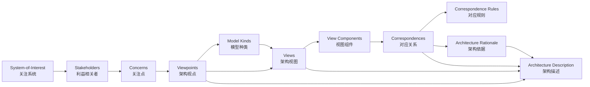

概念关系说明：

- **System-of-Interest** 是架构描述的对象；所有关注点均围绕其产生。
- **Stakeholder** 提出 **Concern**，**Viewpoint** 将关注点框架化。
- **Model Kind** 规定某类视图的建模约定；**View** 是 Viewpoint 的实例化。
- **View Component** 是视图中的可分离部分，可对应 TOGAF 的 ABB/SBB。
- **Correspondence** 与 **Correspondence Rule** 保证视图间一致性，是跨层复用的关键。
- **Architecture Rationale** 记录决策依据，支持未来复用、演进与审计。

### 5.3 与 TOGAF/ArchiMate 的映射

| ISO 42010:2022 | TOGAF 10 | ArchiMate 4.0 | 复用说明 |
|:---|:---|:---|:---|
| System-of-Interest | Enterprise / Architecture Project | ArchiMate Model Scope | 架构工作的对象边界 |
| Stakeholder | Stakeholder Map | Stakeholder（动机域） | 识别谁将消费复用资产 |
| Concern | Drivers / Requirements / Vision | Driver / Goal / Requirement | 复用决策必须回应的关注点 |
| Viewpoint | Content Framework View / Catalog | ArchiMate Viewpoint | 可复用的观察角度模板 |
| View | Architecture Artifact / Deliverable | ArchiMate Diagram / View | 基于视点生成的具体视图 |
| Model Kind | Artifact Type / Model Type | Aspect × Layer 矩阵 | 定义某类模型的约定 |
| View Component | ABB / SBB | ArchiMate Element in View | 可复用的架构描述单元 |
| Correspondence Rule | Architecture Contract / Compliance Review | Realization / Assignment 关系 | 跨层/跨抽象层一致性 |
| Architecture Decision | ADR / Work Package | Work Package + Deliverable | 记录复用或定制的决策 |

### 5.4 正例与反例

**正例**：某银行采用 ISO/IEC/IEEE 42010:2022 视点框架定义业务、应用、数据、安全、部署五类标准视点，所有项目基于统一视点生成视图。通过对应规则，业务服务“开户”与应用组件“AccountService”建立 1:1 追溯，需求变更时可快速定位受影响复用资产。

**反例**：某项目为了赶进度只交付一张“总体架构图”，未区分业务、开发、运维、安全等利益相关者的关注点，也未定义视点与对应规则。结果安全团队质疑缺少访问控制视图，运维团队无法获得部署视图，业务方与开发方对“订单服务”范围理解不一致，导致重复造轮子和返工。

### 5.5 权威来源与交叉引用

| 来源 | URL |
|:---|:---|
| Wikipedia - ISO/IEC/IEEE 42010 | <https://en.wikipedia.org/wiki/ISO/IEC/IEEE_42010> |
| ISO 42010:2022 官方页面 | <https://www.iso.org/standard/74393.html> |
| IEEE 1471-2000 | <https://standards.ieee.org/standard/1471-2000.html> |
| The Open Group - TOGAF | <https://www.opengroup.org/togaf> |
| The Open Group - ArchiMate 4 Specification | <https://www.opengroup.org/archimate-licensed-downloads> |

**交叉引用**：

- ISO/IEC/IEEE 42010:2022 更新跟踪详见 [`iso-42010-2022-update.md`](../struct/01-meta-model-standards/01-iso-420xx-family/iso-42010-2022-update.md)
- 标准对齐矩阵详见 [`alignment-matrix.md`](../struct/01-meta-model-standards/01-iso-420xx-family/alignment-matrix.md)
- TOGAF 详细映射详见 [`../02-togaf-10-alignment/detailed-mapping.md`](../struct/01-meta-model-standards/02-togaf-10-alignment/detailed-mapping.md)
- ArchiMate 映射详见 [`../04-archimate-4/archimate-iso-mapping.md`](../struct/01-meta-model-standards/04-archimate-4/archimate-iso-mapping.md)

---

> 最后更新: 2026-07-09


---

## 补充：ISO/IEC/IEEE 42010:2022 核心概念完整定义与结构化分析

> 本节按本知识体系的内容要素检查清单，对 ISO/IEC/IEEE 42010:2022 的六大核心概念——EoI、ADF、Viewpoint、View、Model Kind、Correspondence——进行定义、属性、关系、正例与反例的系统化补全。
> Wikipedia 概念结构参见 [ISO/IEC/IEEE 42010:2022](https://en.wikipedia.org/wiki/ISO/IEC/IEEE_42010)。

### 1. 概念定义

**定义**：ISO/IEC/IEEE 42010:2022 将架构描述（Architecture Description, AD）视为一个由关注实体、利益相关者、关注点、架构描述框架、架构视点、架构视图、模型种类、对应关系与架构依据组成的系统化制品集合。其核心目的在于确保对任意 **Entity of Interest（EoI，关注实体）** 的架构能够以一致、可验证、可复用的方式进行表达与沟通。

下图展示了六大核心概念之间的结构化关系：

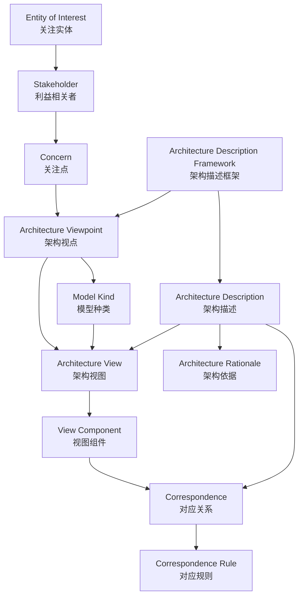

### 2. 核心概念属性

#### 2.1 Entity of Interest（EoI，关注实体）

| 属性 | 说明 | 可观察性 |
|------|------|----------|
| 边界清晰性 | EoI 的范围、生命周期与外部接口被显式定义 | 高 |
| 利益相关者关联性 | 存在明确的 Stakeholder 列表并与其关注点挂钩 | 高 |
| 关注点可枚举性 | 其关键 Concern 可被列出并排序 | 中 |
| 演进可追溯性 | 版本、变更与决策记录完整 | 中 |
| 层次可定位性 | 可明确归属于系统、子系统、企业或生态系统 | 高 |

#### 2.2 Architecture Description Framework（ADF，架构描述框架）

| 属性 | 说明 | 可观察性 |
|------|------|----------|
| 视点集合 | 定义一组标准化的 Viewpoint | 高 |
| 模型种类约定 | 规定 Model Kind 的语法、语义与符号 | 高 |
| 对应规则框架 | 规定跨视图一致性的规则模板 | 中 |
| 利益相关者视角 | 明确每种 Viewpoint 服务的目标受众 | 中 |
| 方法论集成 | 与架构过程标准（如 ISO 42020）及开发方法（如 TOGAF ADM）的衔接程度 | 中 |

#### 2.3 Architecture Viewpoint（架构视点）

| 属性 | 说明 | 可观察性 |
|------|------|----------|
| 关注点覆盖 | 能够回应的 Concern 集合被显式声明 | 高 |
| 模型种类绑定 | 指定适用的 Model Kind | 高 |
| 符号约定 | 图形/文本记号规范完整 | 高 |
| 利益相关者视角 | 目标受众明确 | 中 |
| 复用稳定性 | 视点模板在多个项目间保持稳定 | 中 |

#### 2.4 Architecture View（架构视图）

| 属性 | 说明 | 可观察性 |
|------|------|----------|
| 视点符合性 | 符合某个 Viewpoint 的约定 | 高 |
| 关注点回应 | 明确回应至少一个 Concern | 高 |
| 模型实例化 | 包含符合 Model Kind 的模型 | 高 |
| 版本与基线 | 属于特定 Architecture Description 版本 | 中 |
| 可追溯性 | 可追溯到 EoI、Stakeholder 与 Decision | 中 |

#### 2.5 Model Kind（模型种类）

| 属性 | 说明 | 可观察性 |
|------|------|----------|
| 语言/记号 | 使用的建模语言或符号被定义 | 高 |
| 语法规则 | 合法模型的结构约束完整 | 高 |
| 语义解释 | 符号到真实语义的映射明确 | 中 |
| 工具可验证性 | 可生成/验证模型的工具链可用 | 中 |
| 复用范围 | 可在多个 Viewpoint 中复用 | 中 |

#### 2.6 Correspondence / Correspondence Rule（对应关系 / 对应规则）

| 属性 | 说明 | 可观察性 |
|------|------|----------|
| 源/目标 | 涉及的两个或多个 AD 元素被显式声明 | 高 |
| 关系类型 | 实现/跟踪/依赖/映射等语义明确 | 高 |
| 规则引用 | 遵循的 Correspondence Rule 可被引用 | 中 |
| 可验证性 | 可通过工具或评审确认 | 中 |
| 变更传播影响 | 能评估源或目标变更后的影响范围 | 中 |

### 3. 关系说明

- **EoI ↔ Stakeholder/Concern**：EoI 是架构描述的对象；Stakeholder 提出 Concern，Concern 驱动 Viewpoint 的选择。
- **ADF → Viewpoint/Model Kind**：ADF 是元框架，决定使用哪些视点与模型种类；Viewpoint 与 Model Kind 可跨项目复用。
- **Viewpoint → View**：Viewpoint 是模板，View 是其在特定上下文中的实例。
- **Model Kind → View**：一个 Viewpoint 可绑定一个或多个 Model Kind，View 中包含符合这些 Model Kind 的模型。
- **Correspondence ↔ View Component**：视图组件之间的对应关系必须显式声明，并通过 Correspondence Rule 约束。
- **Rationale → AD/Viewpoint/View**：架构依据解释为何选择特定视点、视图与对应规则，支持未来复用与审计。

### 4. 形式化表达

一个架构描述可形式化为一个多元组：

```text
AD = (EoI, Stakeholders, Concerns, {Viewpoint_i}, {ModelKind_j}, {View_k}, {Correspondence_l}, Rationale)
```

其中每个 View 必须满足：

```text
∀ View_k, ∃ Viewpoint_i, ModelKind_j : View_k conforms_to Viewpoint_i ∧ View_k instance_of ModelKind_j
```

视点组合规则（Viewpoint Composition）：

```text
若 Viewpoint_1 处理 Concern 集合 C_1，Viewpoint_2 处理 C_2，且 C_1 ∩ C_2 ≠ ∅，
则存在组合视点 Viewpoint_1+2，其处理 C_1 ∪ C_2。
```

### 5. 正例

**正例**：以“在线支付系统”为 EoI，架构团队定义了以下 42010 结构：

- **EoI**：在线支付系统，边界为“接收支付请求 → 风控校验 → 渠道路由 → 结果通知”。
- **ADF**：企业级支付架构描述框架，包含业务、应用、数据、安全、部署五类视点。
- **Viewpoint**：安全视点规定必须展示威胁模型、访问控制列表与加密传输要求。
- **View**：基于安全视点生成的“支付安全视图”，包含 STRIDE 威胁模型与 TLS 1.3 配置。
- **Model Kind**：威胁模型采用 STRIDE，部署模型采用 C4 Container 图。
- **Correspondence**：业务服务“发起支付” ↔ 应用服务 `PaymentInitiationService`，对应规则为“1:1 实现，业务变更时应用服务必须重新评估”。

该结构使支付能力在多个业务线（B2C、B2B、跨境）复用时，能够快速识别受影响组件并保持一致性。

### 6. 反例

**反例**：某敏捷团队以“快速上线”为由，在架构描述中仅交付一张“总体架构图”：

- EoI 边界未定义，导致后续微服务拆分范围反复变更。
- 未定义 ADF，安全、运维、业务方各自使用不同绘图风格。
- 视点缺失，没有安全视点，致使生产环境缺少访问控制视图。
- View 不符合任何 Model Kind，图中混合了业务流程图、网络拓扑图与类图，无法自动验证。
- 对应关系未记录，业务术语“账户”在数据库表、API 字段与 UI 标签中含义不一致。

结果：项目上线三个月后，因无法追溯业务需求到技术实现，被迫进行大规模重构，复用资产大量废弃。

### 7. 权威来源

> **权威来源**：
>
> - [ISO/IEC/IEEE 42010:2022 — Architecture description](https://www.iso.org/standard/74393.html) — ISO 官方页面（核查日期：2026-07-09）
> - [ISO/IEC/IEEE 42010:2022 OBP 在线浏览](https://www.iso.org/obp/ui/#iso:std:iso-iec-ieee:42010:ed-2:v1:en) — ISO（核查日期：2026-07-09）
> - [ISO/IEC/IEEE 42020:2019 — Architecture processes](https://www.iso.org/standard/68982.html) — ISO（核查日期：2026-07-09）
> - [ISO/IEC/IEEE 42030:2019 — Architecture evaluation](https://www.iso.org/standard/73436.html) — ISO（核查日期：2026-07-09）
> - [ISO/IEC/IEEE 42010:2022 - Wikipedia](https://en.wikipedia.org/wiki/ISO/IEC/IEEE_42010)（核查日期：2026-07-09）
> - [IEEE 1471-2000](https://standards.ieee.org/standard/1471-2000.html)（核查日期：2026-07-09）
> - [The Open Group - TOGAF Standard, 10th Edition](https://www.opengroup.org/togaf)（核查日期：2026-07-09）
> - [The Open Group - TOGAF Architecture Content](https://publications.opengroup.org/togaf-library)（核查日期：2026-07-09）
> - [The Open Group - ArchiMate 4.0 Specification (C260 / W262)](https://www.opengroup.org/archimate-licensed-downloads)（核查日期：2026-07-09）
> - [The Open Group - ArchiMate 4.0 Changes White Paper W262](https://publications.opengroup.org/w262)（核查日期：2026-07-09）
>
> **核查日期**：2026-07-09

### 8. 交叉引用

- 标准对齐矩阵详见 [`alignment-matrix.md`](../struct/01-meta-model-standards/01-iso-420xx-family/alignment-matrix.md)
- TOGAF 详细映射详见 [`../02-togaf-10-alignment/detailed-mapping.md`](../struct/01-meta-model-standards/02-togaf-10-alignment/detailed-mapping.md)
- TOGAF 企业连续体与构建块复用详见 [`../02-togaf-10-alignment/togaf-enterprise-continuum-reuse.md`](../struct/01-meta-model-standards/02-togaf-10-alignment/togaf-enterprise-continuum-reuse.md)
- ArchiMate 与 ISO/IEC/IEEE 42010:2022 映射详见 [`../04-archimate-4/archimate-iso-mapping.md`](../struct/01-meta-model-standards/04-archimate-4/archimate-iso-mapping.md)
- 四层复用本体详见 [`../06-formal-axioms/four-layer-ontology.md`](../struct/01-meta-model-standards/06-formal-axioms/four-layer-ontology.md)

---


<!-- SOURCE: struct/01-meta-model-standards/01-iso-420xx-family/iso-42020-2019-architecture-processes.md -->

# ISO/IEC/IEEE 42020:2019 架构过程与复用

> **版本**: 2026-07-09
> **定位**: 将 ISO/IEC/IEEE 42020:2019 的架构过程与软件工程架构复用知识体系对齐
> **权威来源**: ISO/IEC/IEEE 42020:2019; ISO/IEC/IEEE 42010:2022; ISO/IEC/IEEE 42030:2019

---

## 1. 概念定义

**定义**：ISO/IEC/IEEE 42020:2019 是系统与软件工程领域的**架构过程**标准，它规定了架构治理（Governance）、管理（Management）、概念化（Conceptualization）、评估（Evaluation）、细化（Elaboration）和使能（Enablement）六个核心过程。该标准与 ISO/IEC/IEEE 42010:2022（架构描述）和 42030（架构评估）共同构成 420xx 标准族的过程维度。

## 2. 核心过程概览

ISO/IEC/IEEE 42020:2019 将架构过程分为六个相互关联的过程：

```text
ISO/IEC/IEEE 42020:2019
│
├── 6 Architecture Governance（架构治理）
├── 7 Architecture Management（架构管理）
├── 8 Architecture Conceptualization（架构概念化）
├── 9 Architecture Evaluation（架构评估）
├── 10 Architecture Elaboration（架构细化）
└── 11 Architecture Enablement（架构使能）
```

| 过程 | 目的 | 关键活动 | 复用意义 |
|---|---|---|---|
| **Architecture Governance** | 确保架构集合与企业目标、政策和战略保持一致 | 制定治理指令、监控合规、做出治理决策 | 定义复用资产的准入、退役和治理规则 |
| **Architecture Management** | 实施治理指令并管理架构集合 | 维护架构集合、监控架构活动有效性 | 维护资产库版本、状态与依赖关系 |
| **Architecture Conceptualization** | 识别满足利益相关者关注点的解决方案 | 问题空间刻画、目标定义、候选架构形成 | 识别可复用的领域模式与参考架构 |
| **Architecture Evaluation** | 确定架构满足利益相关者需求的程度 | 确定评估目标、方法、测量技术并分析结果 | 评估复用资产的适用性与风险 |
| **Architecture Elaboration** | 完整记录架构以支持其预期用途 | 创建架构描述、视图、模型和交付物 | 将复用资产实例化为具体架构描述 |
| **Architecture Enablement** | 为其他架构过程提供必要支持 | 建立方法、工具、技能和知识管理 | 构建复用基础设施（资产库、工具链、培训） |

## 3. 条款映射（Clause 5–11）

| 条款 | 核心内容 | 过程输出/制品 | 本框架对应主题 |
|---|---|---|---|
| Clause 5.1 | 过程概述与应用 | 架构过程与生命周期、设计的关系 | 全过程治理视角 |
| Clause 5.2 | 架构与其他过程和信息元素的关系 | 架构过程与 ISO 15288/12207 的衔接 | 生命周期对齐 |
| Clause 5.3 | 治理与管理过程 | Governance 与 Management 的双层结构 | `06-cross-layer-governance` |
| Clause 5.4 | 概念化、评估与细化过程 | Conceptualization / Evaluation / Elaboration 的交互 | `02-business-architecture-reuse` / `07-formal-verification` |
| Clause 5.5 | 使能过程 | Enablement 的支撑作用 | `04-component-architecture-reuse` 资产库 |
| Clause 6.1–6.5 | Architecture Governance 目的、结果、实现、活动与任务、工作产品 | 治理策略、原则、合规评估、治理日志 | 治理策略目录 |
| Clause 7.1–7.5 | Architecture Management 目的、结果、实现、活动与任务、工作产品 | 架构集合管理计划、架构资产库、有效性监控 | 本主题矩阵维护 |
| Clause 8.1–8.5 | Architecture Conceptualization 目的、结果、实现、活动与任务、工作产品 | 问题空间描述、候选架构、架构目标与成功标准 | 业务能力地图 |
| Clause 9.1–9.5 | Architecture Evaluation 目的、结果、实现、活动与任务、工作产品 | 评估目标、准则、方法、结论与建议 | 质量门控与评估清单 |
| Clause 10.1–10.5 | Architecture Elaboration 目的、结果、实现、活动与任务、工作产品 | 架构描述、视图、模型、交付物 | ABB→SBB 细化 |
| Clause 11.1–11.5 | Architecture Enablement 目的、结果、实现、活动与任务、工作产品 | 方法、工具、培训、知识资产 | 组件资产库与接口契约 |

## 4. 与 ISO 42010:2022 的协同

ISO 42020 回答**“如何产生架构”**，ISO/IEC/IEEE 42010:2022 回答**“如何描述架构”**。两者协同关系如下：

| ISO 42020:2019 过程 | ISO 42010:2022 对应条款 | 协同说明 |
|---|---|---|
| Architecture Conceptualization (Clause 8) | Clause 5.2.3 / 6.4（关注点识别） | 概念化过程识别 EoI 与利益相关者关注点 |
| Architecture Elaboration (Clause 10) | Clause 6.6–6.8（视点、视图、视图组件） | 细化过程产生符合 42010 的 AD |
| Architecture Evaluation (Clause 9) | Clause 6.10（决策与依据） | 评估结果形成 Architecture Rationale |
| Architecture Governance (Clause 6) | Clause 7.1（ADF 规约） | 治理过程定义企业 ADF 与视点标准 |
| Architecture Enablement (Clause 11) | Clause 7.2 / 8.1–8.3（ADL / Viewpoint / Model Kind） | 使能过程提供可复用的 ADL、视点和模型种类 |

## 5. 与 TOGAF 10 / ArchiMate 的映射

| ISO 42020:2019 过程 | TOGAF 10 ADM 阶段 | ArchiMate 4.0 元素/域 | 复用场景 |
|---|---|---|---|
| Architecture Governance | Preliminary Phase | Motivation Domain（Goal / Principle） | 原则目录、治理框架 |
| Architecture Management | Preliminary Phase + Phase H | Implementation & Migration Layer | 架构仓库维护 |
| Architecture Conceptualization | Phase A（Architecture Vision） | Strategy Domain（Capability / Value Stream） | 业务能力地图复用 |
| Architecture Evaluation | Phase G（Compliance Review） + Requirements Management | Assessment / Gap | 合规审查、差距分析 |
| Architecture Elaboration | Phase B/C/D | Business / Application / Technology Layer | 各层 ABB/SBB 细化 |
| Architecture Enablement | Phase E/F + Requirements Management | Work Package / Deliverable / Plateau | 资产使能与迁移 |

## 示例

**正向示例：某金融机构基于 ISO/IEC/IEEE 42020:2019 建立架构资产治理体系**

- **Architecture Governance（Clause 6）**：架构委员会定义“所有新建系统必须使用企业级认证服务”的治理指令。
- **Architecture Management（Clause 7）**：架构办公室维护认证服务的 ABB 定义、已部署 SBB 清单和版本路线图。
- **Architecture Conceptualization（Clause 8）**：在新支付平台概念化阶段，识别出“强身份认证”关注点，并复用现有认证能力 ABB。
- **Architecture Evaluation（Clause 9）**：评估候选方案（Keycloak vs Okta vs 自研）对安全、成本和集成的满足度。
- **Architecture Elaboration（Clause 10）**：使用 ArchiMate 4.0 通用域生成认证服务视图，并按 ISO/IEC/IEEE 42010:2022 Clause 6 记录视点、视图组件和对应关系。
- **Architecture Enablement（Clause 11）**：建立认证服务模板库、CI/CD 流水线模板和架构师培训计划。

结果：新支付平台在 6 周内完成认证能力集成，较历史项目缩短 60%。

## 反例/反模式

**反模式：评估过程流于形式**

某团队在架构评审时仅检查“是否有架构图”，未按 ISO/IEC/IEEE 42020:2019 Clause 9 制定评估目标、准则和方法：

- 没有明确利益相关者关注点与评估准则的对应关系；
- 未记录评估假设和测量技术；
- 评估结论缺乏可追溯的决策依据（Architecture Rationale）。

结果：项目上线后，性能目标未达成，但无法回溯评估环节的缺失，外部审计判定架构治理不合规，项目被暂停整改。

## 8. 权威来源

> **权威来源**：
>
> - [ISO/IEC/IEEE 42020:2019 — Architecture processes](https://www.iso.org/standard/68982.html) — ISO（核查日期：2026-07-09）
> - [ISO/IEC/IEEE 42020:2019 OBP 在线浏览](https://www.iso.org/obp/ui/#iso:std:iso-iec-ieee:42020:ed-1:v1:en) — ISO（核查日期：2026-07-09）
> - [ISO/IEC/IEEE 42010:2022 — Architecture description](https://www.iso.org/standard/74393.html) — ISO（核查日期：2026-07-09）
> - [ISO/IEC/IEEE 42030:2019 — Architecture evaluation](https://www.iso.org/standard/73436.html) — ISO（核查日期：2026-07-09）
> - [The Open Group TOGAF Standard, 10th Edition](https://www.opengroup.org/togaf) — The Open Group（核查日期：2026-07-09）
> - [The Open Group ArchiMate 4.0 Specification (C260)](https://www.opengroup.org/archimate-licensed-downloads) — The Open Group（核查日期：2026-07-09）
>
> **核查日期**：2026-07-09

## 9. 交叉引用

- ISO/IEC/IEEE 42010:2022 核心概念详见 [`iso-42010-2022.md`](../struct/01-meta-model-standards/01-iso-420xx-family/iso-42010-2022.md)
- 标准对齐矩阵详见 [`alignment-matrix.md`](../struct/01-meta-model-standards/01-iso-420xx-family/alignment-matrix.md)
- TOGAF 详细映射详见 [`../02-togaf-10-alignment/detailed-mapping.md`](../struct/01-meta-model-standards/02-togaf-10-alignment/detailed-mapping.md)
- ArchiMate 映射详见 [`../04-archimate-4/archimate-iso-mapping.md`](../struct/01-meta-model-standards/04-archimate-4/archimate-iso-mapping.md)
- 形式化公理体系详见 [`../06-formal-axioms/axiom-system.md`](../struct/01-meta-model-standards/06-formal-axioms/axiom-system.md)

---

> **最后更新**: 2026-07-09
> **维护者**: Track A — 01 元模型与标准对齐

---


<!-- SOURCE: struct/01-meta-model-standards/01-iso-420xx-family/iso-42024-42042-dis-alignment.md -->

# ISO/IEC/IEEE DIS 42024 + DIS 42042 权威对齐（2025‑2026，2026-06-12 更新 ArchiMate 4.0 状态）

> **定位**：ISO/IEC/IEEE 42010:2022 家族最新扩展，为架构描述评估与参考架构规范提供标准化基础。
> **权威来源**：ISO/IEC JTC 1/SC 7、IEEE SA、国家标准化机构 DIS 投票公告。

---

## 1. 关键结论（TL;DR）

| 标准 | 状态 | 核心内容 | 预期发布 |
|------|------|----------|----------|
| **ISO/IEC/IEEE DIS 42024** | DIS 投票中（截止 2026‑01） | 架构基础：词汇、概念、原则；显式覆盖 AI/ML/IoT/数字孪生 | 2026 末–2027 初 |
| **ISO/IEC/IEEE DIS 42042** | DIS 投票中（截止 2026‑01‑30） | 参考架构规范要求；支持领域特定 RA 的一致性评估 | 2026 末–2027 初 |
| **ArchiMate 4.0** | **已正式发布（2026-04-27）** | Common Domain、策略域、Path 概念；与 3.2 向后兼容 | — |
| ~~ArchiMate 3.2~~ | 已发布（2022‑10） | 物理元素整合、元模型精化、新关系 | 仍有效，向后兼容 |
| **TOGAF 10** | 已发布（2022） | Fundamental Content + Series Guides 模块化 | 已发布 |
| **OMG Essence 2.0 beta 2** | 2026‑03 | 内核现代化，支持 DevOps/AI 增强开发 | 预计 2026‑2027 |

---

## 2. ISO DIS 42024 — Architecture Fundamentals

### 2.1 状态

- **阶段**：DIS（Draft International Standard）
- **公共审查截止**：2026 年 1 月（丹麦 DSF 2026‑01‑12；希腊 ELOT 2026‑01‑28）
- **项目启动**：2023‑12
- **预计发布**：2026 末–2027 初（若 DIS 投票通过）

### 2.2 内容

规定与架构及架构实践相关的**基础词汇、概念和原则**。明确列出的应用领域包括：

> 人工智能 (AI)、机器学习 (ML)、物联网 (IoT)、云计算、大数据、智慧城市、智能制造、网络安全、数字孪生、电信、航空航天、国防、银行、金融等。

### 2.3 对复用的意义

- **统一基础词汇**：减少跨领域复用架构工件时的语义摩擦
- **一致性评估**：为其他 42000 家族标准提供术语基准
- **AI/ML 覆盖**：支持 AI 系统的架构描述标准化，促进 AI 组件的跨域复用

---

## 3. ISO DIS 42042 — Reference Architectures

### 3.1 状态

- **阶段**：DIS（Draft International Standard）
- **投票截止**：2026‑01‑30
- **PAR 批准**：IEEE SA，2024‑02
- **预计发布**：2026 末–2027 初

### 3.2 内容

描述**领域特定参考架构**应满足的要求，涵盖：

- 软件、系统、企业、系统之系统
- 产品线、服务线
- 技术领域、业务领域

### 3.3 对复用的意义

这是 42000 家族中**最直接与复用相关**的新标准：

1. **认证可复用参考架构**：组织可认证其参考架构符合 42042
2. **一致性评估**：采购方可要求供应商的架构符合某参考架构
3. **促进RA标准化**：为智能制造、智慧城市、数字孪生等领域提供统一的参考架构文档规范

---

## 4. ArchiMate 现状澄清

### 4.1 官方状态

| 版本 | 状态 | 来源 |
|------|------|------|
| **ArchiMate 3.2** | 已发布（2022‑10） | 考试与工具认证基于 3.2；与 4.0 向后兼容 |
| **ArchiMate 4.0** | **已正式发布（2026-04-27）** | Common Domain、策略域、Path 概念；向后兼容 3.2 |

### 4.2 ArchiMate 4.0 主要特性

- **Common Domain**：跨所有域统一的行为元素（Service、Process、Function、Event）
- **策略域**：支持战略路线图的建模
- **Path 概念**：填补逻辑-物理分离空白
- **概念简化**：删除冗余元素，同时保持向后兼容
- **与 TOGAF 对齐**：更紧密地支持企业架构方法

> **项目建议**：ArchiMate 4.0 已于 2026-04-27 正式发布，与 ArchiMate 3.2 向后兼容。新项目中可优先采用 ArchiMate 4.0 以利用 Common Domain 和统一行为元素带来的简化；现有 3.2 模型无需重写即可逐步迁移。

---

## 5. TOGAF 10 与 AI 集成

### 5.1 结构

- **Fundamental Content**：稳定核心（ADM、内容框架）
- **Series Guides (Extended Guidance)**：演进式专题指南（敏捷、业务架构、数据架构、安全架构、数字化转型）

### 5.2 AI 治理定位

TOGAF 10 正被定位为 **AI 增强企业架构的治理框架**：

- ADM 阶段映射到 AI 风险管理、伦理治理、数据就绪
- 识别 AI 转型所需的技能、数据和技术缺口
- Agentic AI 系统集成指导

### 5.3 复用关联

- **Enterprise Continuum** 和 **Architecture Repository** 仍是资产复用的核心机制
- Series Guides 模块化本身即复用模式——组织只采用相关指南

---

## 6. OMG Essence 2.0

### 6.1 状态

- **当前正式版**：Essence 1.2（2018‑07）
- **开发中**：Essence Kernel & Language for Engineering Methods 2.0 beta 2（2026‑03）
- **同时进行中**：Essence 2.1 RTF（Revision Task Force）

### 6.2 2.0 预期变化

- 内核现代化以支持 DevOps 和持续工程实践
- AI 增强开发工作流
- 与架构描述实践更好集成

### 6.3 复用意义

Essence 的 kernel 元素（Requirements、Software System、Work、Team 等）是**跨项目类型可复用**的。标准支持**情境化方法工程**——组织组合可复用的方法片段，而非采用整体流程。

---

## 7. 标准选型指南

### 7.1 私营企业 / 跨行业组织

| 目标 | 推荐标准组合 |
|------|-------------|
| 核心 EA 方法论 | TOGAF 10 (Fundamental + 相关 Series Guides) |
| 建模语言 | **ArchiMate 4.0**（已正式发布，2026-04-27，与 3.2 向后兼容）；3.2 仍有效 |
| 架构描述一致性 | ISO/IEC/IEEE 42010:2022 |
| 基础术语与原则 | ISO/IEC/IEEE 42024（待发布） |
| 参考架构规范 | ISO/IEC/IEEE 42042（待发布） |
| 软件工程方法复用 | OMG Essence 1.2；准备 2.0 beta |
| 资产目录 / 复用仓库 | Backstage + 现代 API/Spec 注册表；RAS v2.2 概念仅用于遗留系统 |

### 7.2 美国联邦机构

- **FEAF v2**（2013）仍是联邦 EA 对齐的强制框架
- TOGAF Standard 10 可作为补充方法论（在政策允许时采用混合方法）
- FEAF CRM 域映射到 TBM 分类法用于现代化和成本透明

### 7.3 AI 增强型 EA 项目

1. TOGAF Standard 10 建立 AI 治理、风险和伦理阶段
2. ISO DIS 42042 定义领域特定 AI 参考架构
3. ArchiMate 4.0 应用/技术层建模 AI 服务、数据管道和基础设施（3.2 仍有效，向后兼容）
4. 跟踪 ISO DIS 42024 获取标准化 AI 架构词汇

---

## 8. DIS → 正式版发布后的映射补充

> ISO/IEC/IEEE DIS 42024 与 DIS 42042 的 enquiry 投票已分别于 2026-01-12 与 2026-01-30 结束。两标准预计于 **2026 末–2027 初**正式发布。以下映射应在正式版发布后补充到本知识体系：

| 标准 | 正式发布后需补充的映射 | 影响主题 | 优先级 |
|---|---|---|---|
| **ISO/IEC/IEEE 42024** | 架构基础词汇与本项目元模型术语的对照表 | `01-meta-model-standards/`、`99-reference/glossary/` | P0 |
| **ISO/IEC/IEEE 42024** | AI/ML、数字孪生、网络安全等应用领域与主题 08/11/10 的映射 | `08-cognitive-architecture/`、`11-industrial-iot-otit/`、`10-supply-chain-security/` | P1 |
| **ISO/IEC/IEEE 42042** | 参考架构规范要求与主题 01–13 各参考架构的对齐评估 | 全项目 | P0 |
| **ISO/IEC/IEEE 42042** | 一致性评估 checklist（供内部 RA 自评或供应商评估使用） | `01-meta-model-standards/`、`06-cross-layer-governance/` | P1 |

---

## 9. 权威来源

| 标准 | URL |
|------|-----|
| ArchiMate 4 Specification (The Open Group) | <https://www.opengroup.org/archimate-licensed-downloads> |
| ArchiMate 4 Announcement (The Open Group) | <https://www.opengroup.org/The-Open-Group-Announces-ArchiMate%C2%AE-4-Specification> |
| TOGAF 10 | <https://www.opengroup.org/togaf> |
| ISO 42010:2022 | <https://www.iso.org/standard/74393.html> |
| ISO DIS 42024 / 42042 | <https://www.iso.org/committee/45086/x/catalogue/> |
| OMG Specifications | <https://www.omg.org/spec/> |
| FEAF v2 | <https://obamawhitehouse.archives.gov/sites/default/files/omb/assets/egov_docs/fea_v2.pdf> |

---

*文档生成时间：2026-06-06 · 对齐 ISO DIS 42024/42042 投票状态 / ArchiMate 3.2 GA / TOGAF Standard 10 / Essence 2.0 beta 2*


---

## 补充说明：ISO/IEC/IEEE DIS 42024 + DIS 42042 权威对齐（2025‑2026，2026-06-12 更新 ArchiMate 4.0 状态）

## 概念定义

**定义**：元模型（Meta-model）是对架构描述元素、关系与规则的抽象规约；标准对齐则指将本知识体系的术语、过程与视图与国际/行业权威标准建立可追溯的映射。

## 示例

**示例**：在架构描述中采用 ISO/IEC/IEEE 42010:2022 的 Entity of Interest、Architecture Description Framework 与 Stakeholder Perspective，使架构视图与评估框架可直接对标国际标准。

## 反例

**反例**：团队自创“业务域/技术域/数据域”三分法却未与 TOGAF/ArchiMate 术语映射，导致与外部审计、供应商交流时出现语义偏差。

## 分析

**分析**：元模型是复用知识体系的地基。缺乏元模型约束的复用会退化为局部约定，难以跨组织、跨工具链保持一致性。

---


<!-- SOURCE: struct/01-meta-model-standards/02-togaf-10-alignment/detailed-mapping.md -->

# TOGAF 10 ABB/SBB 与 ISO 42010:2022 的详细映射

> **版本**: 2026-06-06
> **对齐来源**: The Open Group TOGAF Standard 10 (2022/2025 Update); ISO/IEC/IEEE 42010:2022; The Open Group: "A Practitioners' Approach to Developing EA Following the TOGAF ADM" (Series Guide)
> **适用范围**: 软件工程架构复用知识体系 Track A — 01 元模型与标准对齐

---

## 1. 映射背景与方法论

### 1.1 为什么要做这个映射

ISO/IEC/IEEE 42010:2022 规定了架构描述（Architecture Description, AD）的通用结构与表达方式，其核心概念包括：

- **Entity of Interest (EoI)**: 架构描述的对象
- **Stakeholder / Concern**: 利益相关者及其关注点
- **Viewpoint / View / View Component**: 视点、视图与视图组件
- **Model Kind**: 模型种类
- **Correspondence / Correspondence Rule**: 对应关系与规则
- **Architecture Decision / Rationale**: 架构决策与依据

TOGAF 10 的架构开发方法（ADM）是一个迭代式、分阶段的企业架构开发过程。
每个阶段都会产生**架构构建块（Architecture Building Block, ABB）**和**解决方案构建块（Solution Building Block, SBB）**。
本映射的目标是将 ABB/SBB 的生命周期与 ISO/IEC/IEEE 42010:2022 的架构描述元模型进行逐阶段对齐，从而在元模型层面打通"过程"与"描述"两个维度，为架构复用提供形式化基础。

### 1.2 映射原则

| 原则 | 说明 |
|------|------|
| **阶段全覆盖** | 覆盖 ADM 全部 10 个阶段（含预备阶段和需求管理） |
| **ABB/SBB 分离** | 区分逻辑构建块（ABB）与物理构建块（SBB）在 ISO 42010 中的不同映射 |
| **视点驱动** | 以 ISO 42010 的 Viewpoint-View-Model Kind 三层结构作为映射骨架 |
| **可验证性** | 每个映射均可追溯到 TOGAF 10 官方文档或 ISO 42010:2022 条款 |

---

## 2. 核心概念预映射

在展开逐阶段映射之前，先建立 TOGAF Standard 10 与 ISO/IEC/IEEE 42010:2022 的核心概念桥梁：

| ISO 42010:2022 概念 | TOGAF 10 概念 | 映射说明 |
|---------------------|---------------|----------|
| Entity of Interest (EoI) | Enterprise / Architecture Project | 架构工作的对象实体；TOGAF 中扩展为"企业"及其子系统 |
| Architecture Description (AD) | Architecture Deliverables / Catalogs | ADM 各阶段输出的架构交付物集合 |
| Architecture Description Framework (ADF) | TOGAF Content Framework + ADM | TOGAF 整体即是一个符合 ISO 42010 的 ADF |
| Stakeholder | Stakeholder Map | TOGAF 利益相关者映射 |
| Concern | Architecture Vision / Drivers / Requirements | 业务驱动力、架构原则、需求规格 |
| Viewpoint | View / Catalog / Matrix Definition | 视点定义，指导视图创建 |
| View | Architecture Artifact / View | 视图实例，如业务架构视图 |
| Model Kind | Artifact Type / Model Type | 模型种类，如业务流程模型、数据模型 |
| View Component | Model / Diagram / Catalog Entry | 视图组件，可复用的架构描述单元 |
| Correspondence Rule | Architecture Contract / Compliance Review | 对应规则与合规评估 |
| Architecture Decision | ADR (Architecture Decision Record) | 架构决策记录 |

在此基础上，**ABB 对应 ISO/IEC/IEEE 42010:2022 中的逻辑 View Component（模型化的架构元素），SBB 对应物理 View Component（实现化的架构元素）**。

---

## 3. 逐阶段详细映射

### 3.1 Preliminary Phase — 架构能力预备

**TOGAF Standard 10 活动**: 建立架构能力、定义架构原则、适配 ADM、设立治理框架。

| ISO 42010:2022 | TOGAF 10 ABB/SBB | 映射说明 |
|----------------|------------------|----------|
| **Stakeholder** | 架构组织、CIO、业务高管 | 识别对架构能力有决策权的利益相关者 |
| **Concern** | 架构原则、治理需求、合规要求 | 关注"如何规范地进行架构工作" |
| **Viewpoint** | *Architecture Capability Viewpoint* | 定义架构能力的观察角度 |
| **View** | Architecture Capability Catalog, Governance Log | 架构能力目录与治理日志视图 |
| **Model Kind** | Organization Model, Maturity Model | 组织模型、成熟度模型 |
| **ABB** | Architecture Governance Framework, Principles Catalog | 逻辑构建块：治理框架、原则目录 |
| **SBB** | EA Tool Platform, Repository Schema | 物理构建块：EA 工具平台、仓库 schema |
| **Correspondence** | Principles → Compliance Criteria | 原则与合规准则的对应 |

> **复用视角**: 本阶段产生的 ABB（如原则目录、治理框架）是跨项目复用的最高层级资产，属于企业连续体中的 Foundation 层级。

### 3.2 Phase A — Architecture Vision

**TOGAF Standard 10 活动**: 定义架构愿景、识别利益相关者、确认业务目标、获得审批。

| ISO 42010:2022 | TOGAF 10 ABB/SBB | 映射说明 |
|----------------|------------------|----------|
| **Stakeholder** | 赞助者、业务负责人、最终用户 | 通过 Stakeholder Map 识别 |
| **Concern** | 业务目标、约束、风险、ROI | 架构愿景需要回应的核心关注点 |
| **Viewpoint** | *Stakeholder Requirements Viewpoint* | 利益相关者需求视点 |
| **View** | Architecture Vision Document, Statement of Architecture Work | 架构愿景文档作为高层视图 |
| **Model Kind** | Business Scenario Model, Goal Model | 业务场景模型、目标模型 |
| **ABB** | Target Business Scenario, High-Level Architecture Definition | 目标业务场景、高层架构定义 |
| **SBB** | Approved Project Charter, Budget Allocation | 已批准的项目章程与预算分配 |
| **Correspondence** | Vision → Business Goals Traceability | 愿景与业务目标的追溯矩阵 |

> **复用视角**: Architecture Vision 是复用的战略上下文。多个项目可共享同一愿景文档的 ABB，降低重复论证成本。

### 3.3 Phase B — Business Architecture

**TOGAF Standard 10 活动**: 开发业务架构，包括组织单元、功能、流程、信息、能力地图。

| ISO 42010:2022 | TOGAF 10 ABB/SBB | 映射说明 |
|----------------|------------------|----------|
| **Stakeholder** | 业务分析师、流程Owner、产品经理 | 关注业务结构和能力 |
| **Concern** | 业务能力、流程效率、信息需求、组织一致性 | 业务架构的核心关注点 |
| **Viewpoint** | *Business Architecture Viewpoint* (TOGAF 内容框架定义) | 业务架构视点 |
| **View** | Business Architecture View, Organization/Actor Catalog, Location Catalog | 业务架构视图及目录 |
| **Model Kind** | Business Process Model, Business Function Model, Organization Decomposition Model | 业务流程/功能/组织分解模型 |
| **ABB** | Business Function, Business Process, Business Service, Business Object, Organization Unit | 业务功能、流程、服务、对象、组织单元 |
| **SBB** | CRM System, ERP Module, BPM Tool Configuration | 具体 CRM/ERP/BPM 工具及配置 |
| **Correspondence** | Function → Process → Service Realization | 功能-流程-服务实现对应规则 |

> **复用视角**: Phase B 的 ABB（如业务能力地图、流程模型）是业务架构复用的核心。它们以逻辑构建块形式存在，可在不同行业解决方案中通过 SBB 实现。

### 3.4 Phase C — Information Systems Architectures

**TOGAF Standard 10 活动**: 开发数据架构和应用架构（通常并行或分步进行）。

#### 3.4.1 Data Architecture

| ISO 42010:2022 | TOGAF 10 ABB/SBB | 映射说明 |
|----------------|------------------|----------|
| **Stakeholder** | 数据架构师、合规官、数据治理委员会 | 关注数据一致性、质量、合规 |
| **Concern** | 数据实体、逻辑模型、治理规则、主数据管理 | 数据架构关注点 |
| **Viewpoint** | *Data Architecture Viewpoint* | 数据架构视点 |
| **View** | Data Architecture View, Data Entity Catalog, Data Lifecycle Diagram | 数据架构视图与目录 |
| **Model Kind** | Entity-Relationship Model, Data Flow Model, Canonical Data Model | ER 模型、数据流模型、规范数据模型 |
| **ABB** | Data Entity, Logical Data Model, Data Service, Data Quality Rule | 数据实体、逻辑数据模型、数据服务 |
| **SBB** | Database Schema (Oracle, PostgreSQL), Data Warehouse Platform, MDM Hub | 具体数据库 schema、数据仓库、MDM 平台 |
| **Correspondence** | Logical Data Model → Physical Schema Mapping | 逻辑-物理数据模型映射 |

#### 3.4.2 Application Architecture

| ISO 42010:2022 | TOGAF 10 ABB/SBB | 映射说明 |
|----------------|------------------|----------|
| **Stakeholder** | 应用架构师、开发团队、集成团队 | 关注应用组合与集成 |
| **Concern** | 应用组合、接口目录、集成模式、可替换性 | 应用架构关注点 |
| **Viewpoint** | *Application Architecture Viewpoint* | 应用架构视点 |
| **View** | Application Architecture View, Application Portfolio Catalog, Interface Catalog | 应用架构视图与目录 |
| **Model Kind** | Component Model, Interface Model, Integration Flow Model | 组件模型、接口模型、集成流模型 |
| **ABB** | Application Component, Application Service, Application Interface, Data Flow | 应用组件、服务、接口、数据流 |
| **SBB** | Microservice Instance, API Gateway (Kong, Apigee), ESB Configuration, SaaS Subscription | 微服务实例、API 网关、ESB、SaaS |
| **Correspondence** | ABB Interface → SBB API Contract (OpenAPI, AsyncAPI) | 逻辑接口与物理 API 契约的对应 |

> **复用视角**: Phase C 是应用架构复用的主战场。ABB（应用组件、接口定义）通过标准化接口契约，可在不同技术栈中以不同 SBB 实现，实现"换芯不换壳"。

### 3.5 Phase D — Technology Architecture

**TOGAF Standard 10 活动**: 开发技术架构，定义平台、基础设施、中间件、网络、硬件标准。

| ISO 42010:2022 | TOGAF 10 ABB/SBB | 映射说明 |
|----------------|------------------|----------|
| **Stakeholder** | 基础设施架构师、运维团队、安全团队、采购部门 | 关注技术平台与标准 |
| **Concern** | 技术标准、平台蓝图、迁移路径、容量、可用性、安全基线 | 技术架构关注点 |
| **Viewpoint** | *Technology Architecture Viewpoint* | 技术架构视点 |
| **View** | Technology Architecture View, Technology Portfolio Catalog, Network/Hardware Diagram | 技术架构视图与设备目录 |
| **Model Kind** | Deployment Model, Network Topology Model, Technology Stack Model | 部署模型、网络拓扑、技术栈模型 |
| **ABB** | Technology Component, Technology Service, Platform Service, Network Service | 技术组件、技术服务、平台服务 |
| **SBB** | Kubernetes Cluster, Cloud VM (AWS EC2, Azure VM), CDN (Cloudflare), Load Balancer (F5, NGINX) | 具体云资源、容器平台、网络设备 |
| **Correspondence** | Technology Service → SBB Platform Mapping, SLAs → Monitoring Rules | 技术服务与平台映射、SLA 与监控规则 |

> **复用视角**: 技术 ABB（如"容器编排服务"）可映射到多个 SBB（Kubernetes, Docker Swarm, ECS）。技术连续体的层级结构（基础→通用系统→行业→特定组织）在此阶段体现得最为明显。

### 3.6 Phase E — Opportunities & Solutions

**TOGAF Standard 10 活动**: 评估实施目标，识别工作包，进行差距分析，确定过渡架构。

| ISO 42010:2022 | TOGAF 10 ABB/SBB | 映射说明 |
|----------------|------------------|----------|
| **Stakeholder** | 项目组合经理、业务负责人、架构委员会 | 关注实施可行性与优先级 |
| **Concern** | 差距、复用机会、工作包分组、过渡状态 | 机会与解决方案关注点 |
| **Viewpoint** | *Transition Architecture Viewpoint* | 过渡架构视点 |
| **View** | Gap Analysis Report, Consolidated Architecture Roadmap, Work Package Definition | 差距分析报告与路线图 |
| **Model Kind** | Gap Model, Transition Model, Dependency Model | 差距模型、过渡模型、依赖模型 |
| **ABB** | Gap Definition, Transition Architecture, Work Package (logical) | 差距定义、过渡架构、逻辑工作包 |
| **SBB** | Reusable COTS Component, SaaS Subscription Plan, Existing System Adapter | 可复用商业组件、SaaS 计划、存量系统适配器 |
| **Correspondence** | Gap → Work Package → Reusable Asset Mapping | 差距到工作包到可复用资产的映射 |

> **复用视角**: Phase E 是复用决策的关键节点。通过差距分析识别哪些差距可通过复用现有 ABB/SBB 弥合，哪些需要新建。企业连续体在此阶段被主动查询。

### 3.7 Phase F — Migration Planning

**TOGAF Standard 10 活动**: 制定详细的迁移计划，排序项目，分配业务价值，确认路线图。

| ISO 42010:2022 | TOGAF 10 ABB/SBB | 映射说明 |
|----------------|------------------|----------|
| **Stakeholder** | PMO、项目组合经理、财务规划者 | 关注实施顺序与投资回报 |
| **Concern** | 迁移顺序、依赖关系、风险、成本、收益时间表 | 迁移规划关注点 |
| **Viewpoint** | *Implementation and Migration Viewpoint* | 实现与迁移视点 |
| **View** | Implementation and Migration Plan, Architecture Roadmap (confirmed), Transition Architecture (detailed) | 实施迁移计划与确认的路线图 |
| **Model Kind** | Migration Timeline Model, Dependency Network Model, Risk Model | 迁移时间线、依赖网络、风险模型 |
| **ABB** | Migration Project Definition, Transition State Definition, Value Stream Mapping | 迁移项目定义、过渡状态定义 |
| **SBB** | Project Schedule (MS Project, Jira Roadmap), Release Train Definition, Budget Spreadsheet | 具体项目计划、发布火车定义、预算表 |
| **Correspondence** | Project → ABB/SBB Delivery Mapping, Value → Cost Correspondence | 项目与构建块交付映射、价值-成本对应 |

> **复用视角**: 迁移计划中需要明确哪些 ABB/SBB 可在多个过渡状态中复用。例如，一个 IAM 平台的 SBB 可能在多个业务域的迁移项目中作为共享基础设施被复用。

### 3.8 Phase G — Implementation Governance

**TOGAF Standard 10 活动**: 监督实施，确保架构合规，管理架构契约。

| ISO 42010:2022 | TOGAF 10 ABB/SBB | 映射说明 |
|----------------|------------------|----------|
| **Stakeholder** | 实施团队、架构委员会、质量保证团队 | 关注合规与交付质量 |
| **Concern** | 架构合规、偏差管理、契约履行、合规评估 | 实施治理关注点 |
| **Viewpoint** | *Architecture Compliance Review Viewpoint* | 架构合规审查视点 |
| **View** | Architecture Contract, Compliance Assessment Report, Exception Log | 架构契约与合规评估报告 |
| **Model Kind** | Compliance Checklist Model, Deviation Model, Contract Model | 合规清单、偏差、契约模型 |
| **ABB** | Architecture Contract (logical terms), Compliance Criteria, Exception Policy | 架构契约条款、合规准则、例外策略 |
| **SBB** | Signed Vendor Contract, CI/CD Compliance Gate, Automated Policy Check (OPA, SonarQube) | 签署的合同、CI/CD 门禁、自动化策略检查 |
| **Correspondence** | ABB Contract → SBB Implementation Correspondence Rule | 契约条款与实现之间的对应规则验证 |

> **复用视角**: 架构契约是复用的法律与治理保障。通过标准化的架构契约模板（ABB），可快速适配到不同供应商和项目的具体合同（SBB）中。

### 3.9 Phase H — Architecture Change Management

**TOGAF Standard 10 活动**: 管理架构变更请求，评估变更影响，更新架构基线。

| ISO 42010:2022 | TOGAF 10 ABB/SBB | 映射说明 |
|----------------|------------------|----------|
| **Stakeholder** | 变更请求者、架构委员会、运维团队 | 关注变更影响与持续演进 |
| **Concern** | 变更影响范围、基线一致性、回滚策略、技术债 | 变更管理关注点 |
| **Viewpoint** | *Change Management Viewpoint* | 变更管理视点 |
| **View** | Change Request Log, Updated Architecture Landscape, Impact Analysis Report | 变更请求日志与影响分析报告 |
| **Model Kind** | Impact Analysis Model, Baseline Diff Model, Lifecycle Model | 影响分析、基线差异、生命周期模型 |
| **ABB** | Change Request Definition, Updated ABB Definition, New Baseline Version | 变更请求定义、更新后的 ABB、新基线版本 |
| **SBB** | Patch/Release Package, Updated Configuration, Rollback Script | 补丁包、更新配置、回滚脚本 |
| **Correspondence** | Change Request → ABB/SBB Impact Correspondence | 变更请求与受影响构建块的追溯 |

> **复用视角**: 变更管理确保复用资产的演进受控。当某个 ABB 需要更新时，通过对应规则可快速定位所有依赖的 SBB 和视图组件。

### 3.10 Requirements Management

**TOGAF Standard 10 活动**: 贯穿全生命周期的需求管理，确保需求变化被正确记录、评估和整合。

| ISO 42010:2022 | TOGAF 10 ABB/SBB | 映射说明 |
|----------------|------------------|----------|
| **Stakeholder** | 需求工程师、业务分析师、测试团队 | 关注需求可追溯性 |
| **Concern** | 需求完整性、一致性、可追溯性、优先级变化 | 需求管理关注点 |
| **Viewpoint** | *Requirements Engineering Viewpoint* | 需求工程视点 |
| **View** | Requirements Repository View, Traceability Matrix, Impact Analysis View | 需求库视图与追溯矩阵 |
| **Model Kind** | Requirements Model (Use Case, User Story), Traceability Model, Priority Model | 需求模型、追溯模型、优先级模型 |
| **ABB** | Requirement Definition (functional/non-functional), Constraint Definition, Assumption Catalog | 需求定义、约束定义、假设目录 |
| **SBB** | Jira Epic/Story, Azure DevOps Work Item, Test Case (TestRail, Xray) | 具体需求工单、测试用例 |
| **Correspondence** | Requirement → ABB → SBB Traceability Correspondence | 需求到 ABB 到 SBB 的完整追溯链 |

> **复用视角**: 需求管理是复用资产的"需求侧入口"。通过将需求与 ABB/SBB 建立追溯关系，可实现"需求变更 → 影响分析 → 复用资产更新"的闭环。

---

## 4. Enterprise Continuum、Architecture Repository 与 Building Blocks 复用映射

### 4.1 Enterprise Continuum 作为复用梯度

TOGAF 10 的 **Enterprise Continuum** 是一个覆盖企业内外全部架构资产的"虚拟仓库"，通过 **Architecture Continuum**（ABB）和 **Solutions Continuum**（SBB）两条轴线，将抽象能力逐步精化为可落地实现。该结构与 ISO/IEC/IEEE 42010:2022 的 ADF/ADL 规约形成互补：Enterprise Continuum 提供资产分类与复用梯度，ISO/IEC/IEEE 42010:2022 提供描述这些资产的元模型。

| Continuum 层级 | Architecture Continuum (ABB) | Solutions Continuum (SBB) | 复用模式 |
|---|---|---|---|
| **Foundation** | 通用参考模型、核心原则、基础能力 | 操作系统、编程语言、运行时 | 全行业共享，变更频率最低 |
| **Common Systems** | 跨行业系统架构（如 IAM、CRM、ESB） | 商业化平台（Keycloak、Salesforce、Kong） | 跨组织复用，通过配置适配 |
| **Industry** | 垂直行业参考架构（如 eTOM、ARTS、HL7） | 行业解决方案（电信计费、零售 POS、医疗集成平台） | 行业生态复用 |
| **Organization-Specific** | 企业专属 ABB（能力定义、接口契约） | 企业定制 SBB（自研系统、定制集成） | 企业内部复用，受治理约束 |

### 4.2 Architecture Repository 分区与复用映射

TOGAF 10 的 **Architecture Repository** 是 Enterprise Continuum 的物理/逻辑载体。其分区与复用资产的对应关系如下：

| Repository 分区 | 内容 | 复用资产示例 | ISO 42010:2022 映射 |
|---|---|---|---|
| **Architecture Metamodel** | 建模语言、记号、关系 | ArchiMate Profile、UML/SysML 模板 | ADF / ADL（Clause 7） |
| **Architecture Capability** | 组织角色、技能、流程 | 架构师能力模型、治理 RACI | Stakeholder / Concern（Clause 5.2.3） |
| **Architecture Landscape** | 基线、目标、过渡架构快照 | ABB/SBB 目录、 capability map | Architecture View / View Component（Clause 6.7–6.8） |
| **Standards Information Base (SIB)** | 技术标准、产品标准、指南 | 技术栈标准、安全基线、API 规范 | Correspondence Rule（Clause 6.9） |
| **Reference Library** | 外部参考模型、模式、框架 | TOGAF TRM、SABSA、NIST CSF | Viewpoint / Model Kind（Clause 8） |
| **Governance Log** | 决策记录、合规评估、例外审批 | ADR、架构合同、合规报告 | Architecture Decision / Rationale（Clause 6.10） |
| **Solutions Landscape** | 已部署 SBB、产品实例 | 微服务镜像、基础设施即代码、SaaS 订阅 | Physical View Component（Clause 6.8） |

### 4.3 ABB ↔ SBB 复用追溯链

```text
Enterprise Continuum
├── Architecture Continuum
│   └── ABB "Customer Identity Management"
│       ├── 能力：注册、认证、授权、画像管理
│       └── 接口契约：REST / SCIM / SAML / OIDC
│
└── Solutions Continuum
    └── SBB Options
        ├── Keycloak 22.x + Custom Plugins
        ├── Okta Workforce Identity
        └── 自研 IAM Microservices

Architecture Repository
├── ABB 定义 + 变体点（Variation Point）
├── SBB 评估报告与 ADR
├── SIB：IAM 技术标准
└── Governance Log：复用审批与例外记录
```

### 4.4 与 ISO 42010:2022 的对应

| TOGAF 10 复用概念 | ISO 42010:2022 概念 | 对应条款 | 说明 |
|---|---|---|---|
| Enterprise Continuum | Architecture Description Framework (ADF) | Clause 7.1 | Continuum 定义了企业级 ADF 的资产分类 |
| Architecture Repository | Architecture Description (AD) 的物理载体 | Clause 6.1 | Repository 存储 AD 的标识、版本与组成 |
| Architecture Metamodel | Architecture Description Language (ADL) | Clause 7.2 | ArchiMate/UML 等 ADL 的存储与治理 |
| ABB | Logical View Component | Clause 6.8 | 逻辑抽象层视图组件 |
| SBB | Physical View Component | Clause 6.8 | 物理实现层视图组件 |
| ABB ↔ SBB Realization | Correspondence / Correspondence Rule | Clause 6.9 | 逻辑到实现的对应规则 |
| Governance Log | Architecture Decision / Rationale | Clause 6.10 | 复用决策与依据记录 |

---

## 5. 综合映射矩阵

| ADM Phase | 主要 ISO 42010 Viewpoint | ABB (逻辑层) | SBB (物理层) | 关键 Correspondence Rule |
|-----------|-------------------------|--------------|--------------|--------------------------|
| **Preliminary** | Architecture Capability Viewpoint | Governance Framework, Principles Catalog | EA Tool, Repository Schema | Principles → Compliance Criteria |
| **Phase A** | Stakeholder Requirements Viewpoint | Architecture Vision, Business Scenario | Approved Charter, Budget | Vision → Goals Traceability |
| **Phase B** | Business Architecture Viewpoint | Business Function, Process, Service, Object | CRM, ERP, BPM Configuration | Function → Process → Service |
| **Phase C (Data)** | Data Architecture Viewpoint | Data Entity, Logical Data Model | DB Schema, MDM Hub, Data Warehouse | Logical → Physical Schema |
| **Phase C (App)** | Application Architecture Viewpoint | Application Component, Interface, Service | Microservice, API Gateway, SaaS | Interface → API Contract |
| **Phase D** | Technology Architecture Viewpoint | Technology Component, Platform Service | K8s, Cloud VM, CDN, Load Balancer | Service → Platform SLA |
| **Phase E** | Transition Architecture Viewpoint | Gap, Transition Architecture, Work Package | COTS Component, Existing Adapter | Gap → Work Package → Asset |
| **Phase F** | Implementation & Migration Viewpoint | Migration Project, Transition State | Project Schedule, Release Train | Project → ABB/SBB Delivery |
| **Phase G** | Compliance Review Viewpoint | Architecture Contract, Compliance Criteria | Signed Contract, CI/CD Gate | Contract → Implementation |
| **Phase H** | Change Management Viewpoint | Change Request, Updated ABB, Baseline | Patch, Config Update, Rollback Script | Change → Impact Correspondence |
| **Req Mgmt** | Requirements Engineering Viewpoint | Requirement, Constraint, Assumption | Jira Story, Test Case | Req → ABB → SBB Traceability |

---

## 6. ABB/SBB 在 ISO 42010 中的元模型定位

从 ISO/IEC/IEEE 42010:2022 的内容模型来看，ABB 和 SBB 均属于 **Architecture View Component** 的范畴，但处于不同的抽象层级：

```text
Architecture Description (AD)
├── Architecture Viewpoint
│   └── governs → Architecture View
│       └── contains → View Component
│           ├── Model Kind: Logical Model  → ABB (Architecture Building Block)
│           │   └── Example: "Customer Identity Management" (能力定义)
│           └── Model Kind: Physical Model → SBB (Solution Building Block)
│               └── Example: "Keycloak 22.x + Custom Plugins" (具体实现)
└── Correspondence Rule
    └── ABB ↔ SBB Realization Correspondence
```

ISO 42010:2022 引入的 **View Component** 概念（替代 2011 版的 Model）恰好容纳了 ABB/SBB 这种"同一视点下不同抽象层级"的情况。
一个 View Component 可以是由 Model Kind 约束的模型化组件（ABB），也可以是由 Legend 说明的非模型化组件（SBB 的产品说明文档）。

---

## 7. 与 ArchiMate 的协同映射

TOGAF 10 的 ABB/SBB 可通过 ArchiMate 语言进行实例化描述：

| ArchiMate 元素 | ABB 映射 | SBB 映射 |
|----------------|----------|----------|
| Business Function / Process | 业务 ABB | BPM 工具中的工作流配置 |
| Application Component / Service | 应用 ABB | 部署的微服务/软件包 |
| Technology Service / Node | 技术 ABB | 具体的云实例/物理服务器 |
| Work Package / Deliverable | 过渡 ABB | 项目计划中的具体任务包 |

ArchiMate 的 **realization** 关系可直接表达 ABB → SBB 的实现对应（Correspondence）。
ArchiMate 4 Specification（2026-04-27 正式发布）进一步支持了跨层服务实现的逻辑-物理分离，并通过通用域（Common Domain）和 Path 概念强化了 ABB/SBB 映射表达。

---

## 8. 对齐验证

### 7.1 与 TOGAF 10 官方来源的对齐

- **The Open Group: TOGAF Standard 10 (2022)** — 第 31 章（Building Blocks）明确定义了 ABB/SBB 的抽象层级差异；第 35-39 章详细描述了 ADM 各阶段的输入/步骤/输出。[[来源](https://www.opengroup.org/togaf)]
- **The Open Group: TOGAF Series Guide — A Practitioners' Approach to Developing EA Following the TOGAF ADM (2023)** — 提供了 ADM 各阶段与架构能力、治理的详细操作指南。[[PDF](https://governance.foundation/assets/frameworks/togaf/g186%20-%20A%20Practitioners%20Approach%20to%20Developing%20EA.pdf)]
- **The Open Group: TOGAF ADM and Architecture Content (2025 Update)** — 2025 年更新版扩展了敏捷/数字孪生场景下的 ABB/SBB 使用方式。

### 7.2 与 ISO 42010:2022 的对齐

- **ISO/IEC/IEEE 42010:2022, Clause 5.2** — 定义了架构描述的概念模型，包括 Stakeholder、Concern、Viewpoint、View、View Component、Model Kind、Correspondence 等核心元素。[[来源](https://www.iso.org/obp/ui/#iso:std:iso-iec-ieee:42010:ed-2:v1:en)]
- **ISO/IEC/IEEE 42010:2022, Clause 6.8** — 引入 View Component 作为"one or more architecture views 的可分离部分"，为 ABB/SBB 的层级化描述提供了标准术语。
- **ISO/IEC/IEEE 42010:2022, Annex F** — 列举了多个 ADF（Architecture Description Framework）的 conformance 示例，TOGAF 作为业界最广泛使用的 ADF 之一，其 ABB/SBB 机制与 ISO/IEC/IEEE 42010:2022 的 Viewpoint-View-Model Kind 结构高度一致。

### 7.3 验证结论

本映射覆盖了 TOGAF ADM 全部 10 个阶段，每个阶段均从 ISO/IEC/IEEE 42010:2022 的 Stakeholder → Concern → Viewpoint → View → Model Kind → View Component (ABB/SBB) → Correspondence 链条进行了逐层展开。映射结果表明：

1. **ABB 本质上是逻辑 View Component**，由 Model Kind（如业务流程模型、组件模型）约束；
2. **SBB 本质上是物理 View Component**，可以是模型化的（如部署图）或非模型化的（如产品规格说明书）；
3. **ADM 的迭代过程本质上是 ISO/IEC/IEEE 42010:2022 架构描述生命周期的实例化**，每一轮 ADM 循环产生一组符合 ISO/IEC/IEEE 42010:2022 要求的 Architecture Description。

---

## 正向示例：跨国零售企业基于 TOGAF 连续体复用 IAM 能力

**正向示例**：某跨国零售企业建立全球统一的客户身份管理能力：

- **Enterprise Continuum 定位**：将"Customer Identity Management"定义为 Common Systems 层 ABB，适用于欧洲、亚太、北美三大区。
- **Architecture Repository 存储**：在 Repository 的 Architecture Landscape 中维护 ABB 定义；在 Solutions Landscape 中记录各区域 SBB 选项。
- **ABB → SBB 映射**：
  - 欧洲区 SBB：Keycloak 22.x + 定制同意管理插件；
  - 亚太区 SBB：Okta Workforce Identity + 现有 CRM 集成；
  - 北美区 SBB：自研 IAM 微服务套件。
- **治理闭环**：Architecture Governance Log 记录每次 SBB 选型 ADR，SIB 规定 IAM 必须支持 OAuth 2.1 / OIDC。

结果：三大区共享同一 ABB 的能力地图和接口契约，跨区审计与集成成本降低 50%，同时保留区域技术选型灵活性。

---

## 反模式：ADM 与 ISO 42010 混用导致模型不一致

**反模式**：某企业同时在 TOGAF ADM Phase C 和 ISO/IEC/IEEE 42010:2022 视点框架中定义“应用架构视图”，却未建立显式 Correspondence Rule：

- ADM Phase C 的应用架构视图包含 Application Component、Interface、Data Entity；
- ISO/IEC/IEEE 42010:2022 视点却要求按 Model Kind 区分 Component Model 与 Data Model。

结果同一 EA 仓库中出现两个同名“Application Architecture View”，评审时无法判断以哪个为基线，合规审查失败并导致返工。

**避免建议**：在 Preliminary Phase 即定义 ADM 各阶段与 ISO/IEC/IEEE 42010:2022 Viewpoint/Model Kind 的一一映射表，并通过 Architecture Contract 强制使用单一基线。

---

## 10. 条款映射汇总

| 标准条款 | 核心内容 | 本文件映射位置 |
|---|---|---|
| ISO/IEC/IEEE 42010:2022, Clause 5.2 | 架构描述概念模型 | 第 3 节“核心概念预映射” |
| ISO/IEC/IEEE 42010:2022, Clause 6.8 | View Component 定义 | 第 6 节“ABB/SBB 在 ISO 42010 中的元模型定位” |
| ISO/IEC/IEEE 42010:2022, Clause 6.10 | Architecture Decision / Rationale | 第 3 节 ADM 各阶段映射表 |
| ISO/IEC/IEEE 42020:2019, Clause 6 | Architecture Governance | Preliminary Phase 治理框架 |
| ISO/IEC/IEEE 42020:2019, Clause 9 | Architecture Evaluation | Phase G Compliance Review 映射 |
| ISO/IEC/IEEE 42030:2019, Clause 6.1 | Evaluation Objectives | 第 8 节验证结论 |

**论证**：因为 TOGAF ADM 每一阶段都产生符合 ISO/IEC/IEEE 42010:2022 的 Architecture Description，所以 ABB/SBB 与 Viewpoint-View-Model Kind 的映射是确保 ADM 输出可被国际标准审计追溯的前提。

---

## 11. 权威来源与核查日期

> **权威来源**：
>
> - [The Open Group TOGAF Standard, 10th Edition](https://www.opengroup.org/togaf) — The Open Group（核查日期：2026-07-09）
> - [The Open Group TOGAF Architecture Content](https://publications.opengroup.org/togaf-library) — The Open Group（核查日期：2026-07-09）
> - [The Open Group TOGAF Library — Enterprise Continuum](https://pubs.opengroup.org/togaf-standard/enterprisecontinuum/) — The Open Group（核查日期：2026-07-09）
> - [ISO/IEC/IEEE 42010:2022 — Architecture description](https://www.iso.org/standard/74393.html) — ISO（核查日期：2026-07-09）
> - [ISO/IEC/IEEE 42020:2019 — Architecture processes](https://www.iso.org/standard/68982.html) — ISO（核查日期：2026-07-09）
> - [ISO/IEC/IEEE 42030:2019 — Architecture evaluation](https://www.iso.org/standard/73436.html) — ISO（核查日期：2026-07-09）
> - [The Open Group ArchiMate 4.0 Specification (C260 / W262)](https://www.opengroup.org/archimate-licensed-downloads) — The Open Group（核查日期：2026-07-09）
>
> **核查日期**：2026-07-09

---

## 12. 参考索引

1. The Open Group. *TOGAF Standard 10*. 2022. <https://www.opengroup.org/togaf>
2. The Open Group. *TOGAF Series Guide: A Practitioners' Approach to Developing Enterprise Architecture Following the TOGAF ADM*. 2023.
3. ISO/IEC/IEEE. *ISO/IEC/IEEE 42010:2022 — Software, systems and enterprise — Architecture description*. 2022. <https://www.iso.org/standard/74393.html>
4. ISO/IEC/IEEE. *ISO/IEC/IEEE 42010:2022, Annex F — Architecture description frameworks*. 2022.
5. Visual Paradigm. "Comprehensive Guide to the Enterprise Continuum in TOGAF". 2025. <https://www.visual-paradigm.com/guide/togaf/what-is-togaf/>
6. Ardoq. "What Is TOGAF? Definition and Uses of This EA Framework". 2024. <https://www.ardoq.com/knowledge-hub/togaf>

---

> **最后更新**: 2026-07-09
> **维护者**: Track A — 01 元模型与标准对齐
> **状态**: Phase 2 交付物（T05 完成）

---


<!-- SOURCE: struct/01-meta-model-standards/02-togaf-10-alignment/togaf-enterprise-continuum-reuse.md -->

# TOGAF 10 企业连续体与构建块复用
>
> 版本: 2026-06-06
> 对齐来源: The Open Group TOGAF Standard 10 (2022/2025 Update), Visual Paradigm 2025, Sparx Systems, Barnes & Noble 2025 出版物

## 1. TOGAF 10 核心文档集

| 文档 | 内容 | 2025 更新 |
|-----|------|----------|
| **ADM** | 架构开发方法 — 迭代式企业架构开发 | 持续迭代优化 |
| **ADM Techniques** | 技术集合 — 应用于 TOGAF ADM | 新增敏捷/数字孪生适配 |
| **Applying the ADM** | ADM 适配指南 — 特定架构风格 | 扩展 AI/数据架构场景 |

## 2. 企业连续体（Enterprise Continuum）

### 2.1 虚拟仓库概念

> "The Enterprise Continuum is a 'virtual repository' of all the architecture assets that exist both within the enterprise and in the IT industry at large."

企业连续体包含两类资产：

- **企业内部资产**：以往架构工作的可交付物
- **IT 行业资产**：通用参考模型、架构模式、行业标准

### 2.2 架构连续体（Architecture Continuum）

架构连续体是**架构构建块（ABBs）**的结构化分类库：

| 层级 | 通用性 | 示例 |
|-----|--------|------|
| **基础架构（Foundation）** | 最通用 | TOGAF TRM、网络七层模型 |
| **通用系统架构（Common Systems）** | 跨行业 | Web 服务架构、安全管理框架 |
| **行业架构（Industry）** | 垂直领域 | eTOM（电信）、ARTS（零售）、POSC（石油）|
| **组织特定架构（Organization-Specific）** | 企业专属 | 某银行的客户数据管理原则 |

### 2.3 解决方案连续体（Solutions Continuum）

解决方案连续体是**解决方案构建块（SBBs）**的库，是 ABBs 的具体实现：

| 层级 | 对应 ABB 层级 | 示例 |
|-----|-------------|------|
| **基础解决方案** | 基础架构 | 操作系统、编程语言运行时 |
| **通用系统解决方案** | 通用系统架构 | CRM 套件、IAM 平台 |
| **行业解决方案** | 行业架构 | 电信计费系统、零售 POS |
| **组织特定解决方案** | 组织特定架构 | 定制开发的忠诚度计划系统 |

## 3. ABB 与 SBB 的复用关系

### 3.1 定义

| 维度 | Architecture Building Block (ABB) | Solution Building Block (SBB) |
|-----|-----------------------------------|-------------------------------|
| **抽象层级** | 逻辑/概念 | 物理/实现 |
| **内容** | 功能、接口、数据、行为定义 | 具体产品、软件、服务、硬件 |
| **复用方式** | 架构描述中引用，指导设计 | 直接集成、配置、定制 |
| **关系** | "需要什么能力" | "用什么实现该能力" |

### 3.2 映射示例

```
ABB: Customer Identity Management
├── 能力：注册、认证、授权、画像管理
├── 接口：REST API / SCIM / SAML / OIDC
└── 数据：身份图谱、同意记录

    ↓ 实现为

SBB: Keycloak + 定制扩展
├── 产品：Keycloak 22.x
├── 配置：Realm、Client、Flow 定义
├── 定制：同意管理插件、品牌主题
└── 集成：LDAP、CRM、营销自动化
```

## 4. 架构仓库（Architecture Repository）

### 4.1 分区结构

| 分区 | 内容 | 复用价值 |
|-----|------|---------|
| **架构元模型** | 企业使用的建模语言、记号、关系 | 保证全企业架构描述一致性 |
| **架构能力** | 当前架构组织的角色、技能、流程 | 评估与规划架构资源 |
| **架构景观** | 当前各层级架构的快照 | 影响分析、差距分析 |
| **标准信息库（SIB）** | 技术标准、产品标准、指南 | 采购决策、合规检查 |
| **参考库** | 外部参考模型、模式、框架 | 新项目启动加速器 |
| **治理日志** | 决策记录、合规评估、例外审批 | 审计、学习、争议解决 |

### 4.2 与 ArchiMate 模型库的集成

- TOGAF 架构仓库提供**物理存储和管理**
- ArchiMate 模型库提供**逻辑组织和导航**
- 两者结合实现跨工具、跨团队的架构资产复用

## 5. 架构交付物与制品（Deliverables & Artifacts）

### 5.1 核心交付物

| 交付物 | ADM 阶段 | 复用场景 |
|-------|---------|---------|
| **Architecture Vision** | Phase A | 多项目共享的战略上下文 |
| **Business Architecture** | Phase B | 业务能力地图、组织解构 |
| **Data Architecture** | Phase C | 数据实体、逻辑模型、治理规则 |
| **Application Architecture** | Phase C | 应用组合、接口目录、集成模式 |
| **Technology Architecture** | Phase D | 技术标准、平台蓝图、迁移路径 |
| **Architecture Roadmap** | Phase E/F | 跨项目的过渡架构规划 |
| **Architecture Contract** | Phase G | 实施团队与架构团队的契约模板 |

### 5.2 制品类型

- **模型（Models）**：业务流程模型、数据模型、技术模型
- **图表（Diagrams）**：数据流图、网络图、组件图
- **矩阵（Matrices）**：组件间关系与依赖矩阵
- **业务场景（Business Scenarios）**：架构如何支持特定业务目标的故事
- **用例（Use Cases）**：用户与系统交互表示

## 6. TOGAF 与 ISO 42010:2022 的映射

| ISO 42010:2022 | TOGAF 10 | 说明 |
|---------------|---------|------|
| Entity of Interest (EoI) | Enterprise / Architecture Project | 架构描述的对象 |
| Architecture Description (AD) | Architecture Deliverables | 架构工作产物 |
| Architecture Description Framework (ADF) | TOGAF Content Framework + ADM | 方法论框架 |
| Stakeholder | Stakeholder Map | 利益相关者识别 |
| Concern | Architecture Vision / Drivers | 关注点与驱动力 |
| Viewpoint | View / Catalog / Matrix | 视点定义 |
| View | Architecture Artifact | 视图实例 |
| Model | Architecture Model | 模型 |
| Correspondence Rule | Architecture Contract / Compliance Review | 对应规则与合规评估 |

## 7. 参考索引

- The Open Group: *TOGAF Standard 10* (2022)
- The Open Group: *TOGAF Standard — Architecture Development Method — 2025 Update* (2025-06)
- Visual Paradigm: "Comprehensive Guide to the Enterprise Continuum in TOGAF" (2025-02)
- Paradigma Digital: "The 5 Key Components of TOGAF" (2025-03)
- Sparx Systems: Enterprise Architect User Guide — TOGAF Enterprise Continuum


---

## 补充说明：TOGAF 10 企业连续体与构建块复用

## 示例

**示例**：企业将 CRM 能力抽象为 ABB，并基于 Salesforce、自研或混合方案实现为 SBB，在不同业务单元中按需复用。

## 反例

**反例**：团队混淆 ABB 与 SBB，将具体技术实现直接作为能力标准，导致业务架构被技术绑定。

## 权威来源

> **权威来源**:
>
> - [The Open Group TOGAF](https://www.opengroup.org/togaf)
> - [ArchiMate 4.0 Specification](https://www.opengroup.org/archimate-licensed-downloads)
> - 核查日期：2026-07-07

## 分析

**分析**：TOGAF 的企业 continuum 提供了从基础架构到组织特定架构的复用梯度，是业务-技术对齐的重要工具。


---

## 补充：TOGAF 10 企业连续体、架构仓库与构建块完整定义

> 本节对企业连续体（Enterprise Continuum）、架构仓库（Architecture Repository）、架构构建块（ABB）与解决方案构建块（SBB）进行定义、属性、关系、正例、反例与权威来源补全。
> 相关 Wikipedia 概念结构：
> [TOGAF](https://en.wikipedia.org/wiki/The_Open_Group_Architecture_Framework)、
> [Enterprise architecture](https://en.wikipedia.org/wiki/Enterprise_architecture)、
> [Software component](https://en.wikipedia.org/wiki/Software_component)。

### 1. 概念定义

**定义**：TOGAF Standard 10 企业连续体是一个覆盖企业内外全部架构资产的“虚拟仓库”，通过架构连续体（Architecture Continuum）与解决方案连续体（Solutions Continuum）两条轴线，将抽象的架构构建块（ABB）逐步精化为可落地的解决方案构建块（SBB）。架构仓库（Architecture Repository）则是这些资产的物理/逻辑存储与治理载体。

### 2. 核心概念属性

#### 2.1 Enterprise Continuum（企业连续体）

| 属性 | 说明 | 可观察性 |
|------|------|----------|
| 虚拟仓库特性 | 不强制单一物理存储，强调逻辑统一视图 | 高 |
| 双轴结构 | 包含 Architecture Continuum 与 Solutions Continuum | 高 |
| 四层粒度 | Foundation → Common Systems → Industry → Organization-Specific | 高 |
| 资产覆盖范围 | 同时覆盖企业内部资产与外部行业资产 | 中 |
| 治理关联 | 与 Architecture Repository、 governance log 联动 | 中 |

#### 2.2 Architecture Continuum（架构连续体）

| 属性 | 说明 | 可观察性 |
|------|------|----------|
| 抽象层级 | 逻辑/概念层 | 高 |
| 核心单元 | Architecture Building Block（ABB） | 高 |
| 通用性梯度 | 从 Foundation 到 Organization-Specific 递减 | 高 |
| 稳定性 | 越靠近 Foundation 越稳定 | 中 |
| 复用方式 | 作为设计约束与参考模式被引用 | 中 |

#### 2.3 Solutions Continuum（解决方案连续体）

| 属性 | 说明 | 可观察性 |
|------|------|----------|
| 抽象层级 | 物理/实现层 | 高 |
| 核心单元 | Solution Building Block（SBB） | 高 |
| 对应关系 | 每个 SBB 实现一个或多个 ABB | 高 |
| 可替换性 | 同一 ABB 可由多个 SBB 实现 | 中 |
| 采购/集成导向 | 直接支撑产品选型、配置与定制 | 中 |

#### 2.4 Architecture Repository（架构仓库）

| 属性 | 说明 | 可观察性 |
|------|------|----------|
| 分区结构 | 包含元模型、能力、景观、SIB、参考库、治理日志 | 高 |
| 治理支撑 | 记录决策、合规评估与例外审批 | 高 |
| 版本控制 | 支持架构景观基线、目标与过渡状态 | 中 |
| 工具集成 | 与 ArchiMate 模型库、CI/CD、SBOM 仓库联动 | 中 |
| 可审计性 | 所有变更可追溯至决策与责任人 | 高 |

#### 2.5 Architecture Building Block（ABB）

| 属性 | 说明 | 可观察性 |
|------|------|----------|
| 抽象层级 | 逻辑/概念 | 高 |
| 职责定义 | 明确的功能、接口、数据与行为 | 高 |
| 技术无关性 | 不绑定具体产品或技术 | 高 |
| 复用方式 | 被架构描述引用，指导设计 | 中 |
| 可变性管理 | 可包含 Variability Point 以支持定制 | 中 |

#### 2.6 Solution Building Block（SBB）

| 属性 | 说明 | 可观察性 |
|------|------|----------|
| 抽象层级 | 物理/实现 | 高 |
| 产品绑定 | 对应具体产品、软件、服务或硬件 | 高 |
| 配置信息 | 包含版本、参数、部署拓扑 | 高 |
| 复用方式 | 直接集成、配置或定制 | 中 |
| 来源可追溯 | 可追溯到对应 ABB 与采购/构建记录 | 中 |

### 3. 关系说明

- **Enterprise Continuum ⊇ Architecture Continuum ∪ Solutions Continuum**：企业连续体是总集，两条连续体是其核心子结构。
- **Architecture Continuum → Solutions Continuum**：架构连续体中的 ABB 通过“实现为”关系映射到解决方案连续体中的 SBB，关系可 1:1 或 1:N。
- **Architecture Repository ↔ Continuum**：仓库是连续体的物理/逻辑载体；连续体定义仓库中资产的分类与演进路径。
- **ABB ↔ SBB**：ABB 回答“需要什么能力”，SBB 回答“用什么实现该能力”。
- **TOGAF ADM → Continuum/Repository**：ADM 各阶段产生、消费并治理连续体中的资产。
- **ISO/IEC/IEEE 42010:2022 ADF ↔ Enterprise Continuum**：ISO/IEC/IEEE 42010:2022 的 ADF 定义架构描述的元模型，TOGAF 企业连续体则提供资产分类与复用梯度。

### 4. 形式化/结构化分析

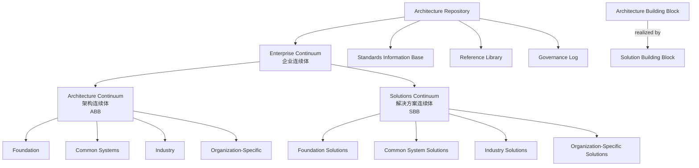

### 5. 正例

**正例**：某跨国零售企业建立客户身份管理能力：

- **ABB**：Customer Identity Management，定义注册、认证、授权、画像管理、同意记录等功能与接口契约。
- **SBB 选项**：
  - 方案 A：Keycloak 22.x + 定制同意管理插件；
  - 方案 B：Okta Workforce Identity + 现有 CRM 集成；
  - 方案 C：自研 IAM 微服务套件。
- **Architecture Repository**：存储 ABB 定义、三种 SBB 评估报告、架构决策记录（ADR）、SIB 中的 IAM 技术标准与治理日志。
- **复用效果**：欧洲区选择方案 A，亚太区选择方案 B，但两者共享同一 ABB，使得跨区审计、接口契约与能力地图保持一致。

### 6. 反例

**反例**：某团队将“使用 Redis 缓存”直接写进业务架构作为 ABB：

- 业务架构层出现 SBB 级技术决策，导致业务方被迫接受特定技术选型。
- 当性能要求变化需要替换为 Memcached 时，业务架构文档必须同步修改，破坏了上层稳定性。
- 架构仓库中 ABB 与 SBB 混放，无法区分“能力需求”与“实现产品”。

**避免建议**：ABB 必须保持技术无关；SBB 必须在独立分区中记录；任何 SBB 变更应先评估其对 ABB 的影响，而非反向修改业务架构。

### 7. 权威来源

> **权威来源**：
>
> - [TOGAF® Standard, 10th Edition](https://www.opengroup.org/togaf) — The Open Group
> - [ArchiMate® 4 Specification](https://www.opengroup.org/archimate-licensed-downloads) — The Open Group（2026-04-27 正式发布，Document C260）
> - [ISO/IEC/IEEE 42010:2022](https://www.iso.org/standard/74393.html) — ISO
> - [TOGAF - Wikipedia](https://en.wikipedia.org/wiki/The_Open_Group_Architecture_Framework)
>
> **核查日期**：2026-07-07

### 8. 交叉引用

- TOGAF 与 ISO/IEC/IEEE 42010:2022 详细映射见本文档第 6 节
- TOGAF 详细映射文档详见 [`detailed-mapping.md`](../struct/01-meta-model-standards/02-togaf-10-alignment/detailed-mapping.md)
- ArchiMate 与 ISO/IEC/IEEE 42010:2022 映射详见 [`../04-archimate-4/archimate-iso-mapping.md`](../struct/01-meta-model-standards/04-archimate-4/archimate-iso-mapping.md)
- 四层复用本体详见 [`../06-formal-axioms/four-layer-ontology.md`](../struct/01-meta-model-standards/06-formal-axioms/four-layer-ontology.md)
- ISO/IEC/IEEE 42010:2022 核心概念详见 [`../01-iso-420xx-family/iso-42010-2022.md`](../struct/01-meta-model-standards/01-iso-420xx-family/iso-42010-2022.md)

---


<!-- SOURCE: struct/01-meta-model-standards/03-iso-26550-ple/ple-iso-integration.md -->

# ISO 26550:2015 产品线工程参考模型与 ISO 42010/42020 的交叉映射

> **版本**: 2026-06-06
> **对齐来源**: ISO/IEC 26550:2015; ISO/IEC/IEEE 42010:2022; ISO/IEC/IEEE 42020:2019; ISO/IEC 26580:2021 (Feature-based PLE)
> **适用范围**: 软件工程架构复用知识体系 Track A — 01 元模型与标准对齐

---

## 1. 映射背景与方法论

### 1.1 为什么要做这个映射

ISO/IEC 26550:2015 定义了软件与系统产品线工程（Software and Systems Product Line Engineering, SSPL）的参考模型，
其核心特征在于**双轨生命周期**（Domain Engineering + Application Engineering）与**显式可变性定义**（Explicit Variability Definition）。
ISO/IEC/IEEE 42010:2022 规定了架构描述（Architecture Description）的通用元模型，
而 ISO/IEC/IEEE 42020:2019 则定义了架构过程（Architecture Processes）的六类核心过程。

本映射旨在回答三个关键问题：

1. 产品线工程的领域工程（Domain Engineering）和应用工程（Application Engineering）如何在 ISO/IEC/IEEE 42010:2022 的架构描述框架中被表达？
2. ISO/IEC/IEEE 42020:2019 的六大架构过程如何支撑产品线工程的双轨生命周期？
3. 产品线工程作为"系统化复用"的最高形式，如何在元模型层面与架构描述/过程标准形成闭环？

### 1.2 映射原则

| 原则 | 说明 |
|------|------|
| **双轨全覆盖** | 覆盖 Domain Engineering 和 Application Engineering 两条轨道的完整生命周期 |
| **variability 显性化** | 将 Variability Model 作为一等公民映射到 ISO 42010/42020 的核心概念 |
| **过程-描述协同** | 同时映射 ISO 42020（过程维度）与 ISO 42010（描述维度），避免"过程无描述"或"描述无过程" |
| **可追溯性** | 每个映射均可追溯到 ISO 26550、ISO 42010 或 ISO 42020 的具体条款 |

---

## 2. ISO 26550 核心概念与 ISO 42010/42020 的预映射

### 2.1 核心概念桥梁

ISO 26550:2015 将产品线工程与管理（Product Line Engineering and Management, PLEM）定义为包含五个主要组成部分的参考模型：
策略规划（Strategic Planning）、组织（Organization）、方法论（Methodology）、系统和组件集成（System and Component Integration）、配置管理（Configuration Management）。

在此基础上，以下建立与 ISO/IEC/IEEE 42010:2022/42020 的核心概念桥梁：

| ISO 26550:2015 概念 | ISO 42010:2022 对应 | ISO 42020:2019 对应 | 映射说明 |
|---------------------|---------------------|---------------------|----------|
| **Product Line** | Entity of Interest (EoI) — 产品线级 | Architecture Governance + Management | 产品线是被架构化的实体，其治理与管理由架构过程支撑 |
| **Domain Engineering** | Architecture Description (AD) — 领域层 | Architecture Conceptualization + Elaboration | 领域工程产出领域资产的架构描述，对应概念化与细化过程 |
| **Application Engineering** | Architecture Description (AD) — 应用层 | Architecture Evaluation + Enablement | 应用工程基于领域资产实例化具体产品，需要评估与使能支撑 |
| **Core Asset** | View Component (逻辑层/可复用层) | Architecture Enablement — Repository | 核心资产是架构描述中的可复用视图组件，由使能过程维护 |
| **Variability Model** | Concern — Variability Concern | Architecture Conceptualization | 可变性是利益相关者的特定关注点，在概念化过程中被识别与定义 |
| **Product (Member Product)** | Entity of Interest (EoI) — 产品级 | Architecture Management | 成员产品是产品线的实例化结果，由管理过程调度 |
| **Asset Repository** | Architecture Description Framework (ADF) 实例 | Architecture Enablement — Process Enablers | 资产库是架构描述框架的物理载体，属于使能过程的支撑能力 |
| **Scoping** | Stakeholder + Concern 识别 | Architecture Governance — 战略对齐 | 范围界定识别利益相关者及其关注点，确保与战略目标对齐 |

### 2.2 产品线工程作为架构描述的生命周期

从 ISO/IEC/IEEE 42010:2022 的视角看，产品线工程本质上是一个**多层级架构描述生命周期**：

```text
Architecture Description (Product Line Level)
├── Viewpoint: Domain Engineering Viewpoint
│   └── View: Domain Architecture View
│       ├── Model Kind: Variability Model, Feature Model, Domain Model
│       └── View Component: Core Assets (ABB layer)
│           ├── Common Asset
│           └── Variable Asset (with Variation Point)
├── Viewpoint: Application Engineering Viewpoint
│   └── View: Application Architecture View
│       ├── Model Kind: Configuration Model, Binding Model
│       └── View Component: Product-Specific Instance (SBB layer)
│           └── Resolution of Variation Point
└── Correspondence Rule: Domain Asset ↔ Application Instance Binding Rule
```

---

## 3. 领域工程（Domain Engineering）与 ISO 42010/42020 的映射

### 3.1 领域工程概述

ISO 26550:2015 明确指出，领域工程的目标是"定义和实现产品线内成员产品共用的领域资产"（define and implement domain assets commonly used by member products within a product line）。
领域工程显式定义产品线的可变性（variability），反映不同市场和市场细分的特定需求。

### 3.2 领域工程 → ISO 42010:2022 映射

| ISO 42010:2022 概念 | 领域工程中的实例 | 映射说明 |
|---------------------|------------------|----------|
| **Stakeholder** | 领域专家、产品线经理、市场分析师、架构委员会 | 关注共性功能提取与可变性边界 |
| **Concern** | 可变性范围（Scope of Variability）、共性/变性比率、市场覆盖度 | "哪些可变、哪些不可变"是核心关注点 |
| **Viewpoint** | *Domain Engineering Viewpoint* | 观察领域资产的专用视点 |
| **View** | Domain Architecture View, Feature Model View, Variability Model View | 领域架构视图、特征模型视图、可变性模型视图 |
| **Model Kind** | Feature Model (FODA), Decision Model, Orthogonal Variability Model (OVM), Domain Model | 特征模型、决策模型、正交可变性模型、领域模型 |
| **View Component** | Core Asset — Common Part, Core Asset — Variable Part, Variation Point, Variant | 核心资产（共性部分/变性部分）、变化点、变体 |
| **Correspondence** | Feature → Asset → Variation Point Traceability | 特征到资产到变化点的追溯对应 |
| **Architecture Decision** | Variability Scoping Decision, Binding Time Decision (compile/runtime/deploy) | 可变性范围决策、绑定时间决策 |
| **Architecture Rationale** | Market Segmentation Analysis, ROI of Reuse | 市场细分分析、复用投资回报分析 |

### 3.3 领域工程 → ISO 42020:2019 映射

| ISO 42020:2019 过程 | 领域工程活动 | 映射说明 |
|---------------------|--------------|----------|
| **Architecture Governance** | 制定产品线策略、可变性治理原则、资产准入标准 | 确保领域资产与组织战略目标对齐 |
| **Architecture Management** | 领域资产版本管理、变更控制、发布计划 | 管理领域资产库的生命周期 |
| **Architecture Conceptualization** | 特征建模、可变性分析、领域范围界定（Scoping） | 识别并综合产品线的概念架构 |
| **Architecture Evaluation** | 领域资产可复用性评估、可变性覆盖率分析、技术债评估 | 评估领域架构是否充分满足多产品需求 |
| **Architecture Elaboration** | 领域设计细化、核心资产实现、接口契约定义 | 将概念架构细化为可交付的领域资产 |
| **Architecture Enablement** | 建立资产库（Asset Repository）、配置管理工具链、特征建模工具 | 提供支撑领域工程的基础设施与能力 |

> **复用视角**: 领域工程是"为复用而开发"（Development for Reuse）的最高形式。其产出的 Core Asset（以 ABB 形式存在）构成了企业连续体中的可复用基线。

---

## 4. 应用工程（Application Engineering）与 ISO 42010/42020 的映射

### 4.1 应用工程概述

ISO 26550:2015 指出，应用工程的目标是"通过利用领域资产（包括共性资产和变性资产）开发应用"。
在应用工程中，领域资产按照已定义的可变性模型进行部署，通过**绑定**（Binding）操作将变化点解析为具体变体，从而派生出成员产品。

### 4.2 应用工程 → ISO 42010:2022 映射

| ISO 42010:2022 概念 | 应用工程中的实例 | 映射说明 |
|---------------------|------------------|----------|
| **Stakeholder** | 产品负责人、客户、最终用户、合规审计员 | 关注具体产品的功能、质量、合规性 |
| **Concern** | 产品差异化需求、性能约束、合规要求、上市时间 | 应用工程关注"这个产品具体是什么" |
| **Viewpoint** | *Application Engineering Viewpoint* | 观察具体产品架构的视点 |
| **View** | Product Architecture View, Configuration View, Derivative View | 产品架构视图、配置视图、派生视图 |
| **Model Kind** | Configuration Model, Binding Model, Product Instance Model | 配置模型、绑定模型、产品实例模型 |
| **View Component** | Product Instance, Bound Variation Point, Resolved Variant, Product-Specific Extension | 产品实例、已绑定变化点、已解析变体、产品特有扩展 |
| **Correspondence** | Domain Asset → Product Instance Realization Correspondence | 领域资产到产品实例的实现对应 |
| **Architecture Decision** | Product Configuration Decision, Binding Time Selection, Extension vs. Core Trade-off | 产品配置决策、绑定时间选择、扩展与核心的权衡 |
| **Architecture Rationale** | Customer Requirement Coverage, Time-to-Market Constraint | 客户需求覆盖度、上市时间约束 |

### 4.3 应用工程 → ISO 42020:2019 映射

| ISO 42020:2019 过程 | 应用工程活动 | 映射说明 |
|---------------------|--------------|----------|
| **Architecture Governance** | 产品配置合规审查、衍生品与产品线策略一致性检查 | 确保派生产品符合产品线治理框架 |
| **Architecture Management** | 产品版本管理、衍生品生命周期管理、变更请求处理 | 管理具体产品的架构演进 |
| **Architecture Conceptualization** | 产品需求分析、特征选择（Feature Selection）、可变性解析 | 理解特定产品的架构目标并综合解决方案 |
| **Architecture Evaluation** | 产品架构评审、需求覆盖度验证、回归测试策略 | 评估产品架构是否满足该产品的特定关注点 |
| **Architecture Elaboration** | 产品详细设计、变性绑定、产品特有组件开发、集成测试 | 细化产品架构至可实施状态 |
| **Architecture Enablement** | 产品配置工具、自动派生工具链、回归测试平台 | 提供支撑应用工程自动化的基础设施 |

> **复用视角**: 应用工程是"基于复用而开发"（Development with Reuse）的典型场景。通过绑定领域资产中的变化点，应用工程将 ABB 级的 Core Asset 实例化为 SBB 级的具体产品，实现"一次开发、多次派生"。

---

## 5. 综合映射表：ISO 26550 核心概念 → ISO 42010/42020

| ISO 26550:2015 核心概念 | ISO 42010:2022 对应 | ISO 42020:2019 对应 | 双轨定位 |
|------------------------|---------------------|---------------------|----------|
| **Product Line** | Entity of Interest (Class of Systems) | Architecture Governance | 治理对象 |
| **Domain Engineering** | AD — Domain Layer Viewpoint | Conceptualization + Elaboration | 左轨：为复用而开发 |
| **Application Engineering** | AD — Application Layer Viewpoint | Evaluation + Enablement | 右轨：基于复用而开发 |
| **Core Asset** | View Component (Reusable, Logical) | Architecture Enablement — Repository | 左轨产出 |
| **Member Product** | Entity of Interest (Individual System) | Architecture Management | 右轨产出 |
| **Variability Model** | Concern + Model Kind (Variability) | Architecture Conceptualization | 双轨共享语言 |
| **Feature Model** | Model Kind — Feature Model | Conceptualization Activity | 领域工程核心 |
| **Variation Point** | View Component + Correspondence Anchor | Elaboration — Interface Definition | 变性注入点 |
| **Variant** | View Component (Alternative) | Conceptualization — Option Analysis | 可选项定义 |
| **Binding** | Correspondence Resolution | Elaboration — Configuration Activity | 右轨核心动作 |
| **Binding Time** | Architecture Decision (Temporal) | Governance — Policy Definition | 架构策略决策 |
| **Asset Repository** | ADF Instance / AD Repository | Enablement — Process Enabler | 使能基础设施 |
| **Scoping** | Stakeholder Concern Identification | Governance — Strategic Alignment | 起点活动 |
| **Product Line Management** | AD Lifecycle Management | Governance + Management | 贯穿双轨 |

---

## 6. 产品线工程作为"系统化复用"的最高形式

### 6.1 复用阶梯中的产品线工程

在软件工程架构复用知识体系中，复用存在清晰的阶梯层次：

| 复用层级 | 复用单元 | 对应标准/框架 | 与本体系主题对应 |
|----------|----------|---------------|------------------|
| **代码级复用** | 函数、类、模块 | 语言标准库、开源组件 | 04-组件架构复用 |
| **组件级复用** | 微服务、库、框架 | OSGi, Maven/npm, SPI | 04-组件架构复用 |
| **架构模式复用** | 设计模式、架构风格 | GoF, POSA, TOGAF Patterns | 05-功能架构复用 |
| **系统级复用** | 子系统、平台 | SOA, MSA, Platform Engineering | 03-应用架构复用 |
| **产品线级复用** | 领域资产、可变性模型 | **ISO 26550** | **02-业务架构复用 + 06-跨层治理** |

产品线工程位于复用阶梯的顶端，其独特价值在于：

1. **预规划复用**（Planned Reuse）：不同于机会主义复用（Opportunistic Reuse），产品线工程在领域工程阶段即系统性识别和设计复用单元；
2. **可变性驱动**（Variability-Driven）：通过显式的 Variability Model 管理"共性"与"差异"，使复用从"复制-修改"升级为"配置-绑定"；
3. **双轨闭环**（Two-Life-Cycle Loop）：领域工程持续沉淀资产，应用工程持续消耗并反馈资产缺口，形成资产演进的飞轮。

### 6.2 与 ISO 42020 架构过程的协同

ISO 42020:2019 的六大架构过程为产品线工程提供了过程骨架：

```text
┌─────────────────────────────────────────────────────────────┐
│                    ISO 42020 Architecture Governance        │
│  (产品线策略对齐、可变性治理原则、资产准入标准)                 │
└──────────────────────────┬──────────────────────────────────┘
                           │
┌──────────────────────────▼──────────────────────────────────┐
│                    ISO 42020 Architecture Management        │
│  (资产库版本管理、变更控制、发布计划、产品生命周期)             │
└──────────────────────────┬──────────────────────────────────┘
                           │
        ┌──────────────────┼──────────────────┐
        ▼                  ▼                  ▼
┌───────────────┐  ┌───────────────┐  ┌───────────────┐
│Conceptualization│ │  Evaluation   │  │  Elaboration  │
│   (概念化)     │  │   (评估)      │  │   (细化)      │
│特征建模/范围界定│  │可复用性评估   │  │资产实现/绑定  │
└───────────────┘  └───────────────┘  └───────────────┘
        │                  │                  │
        └──────────────────┼──────────────────┘
                           ▼
┌─────────────────────────────────────────────────────────────┐
│                    ISO 42020 Architecture Enablement        │
│  (资产库、特征建模工具、自动派生工具链、配置管理平台)            │
└─────────────────────────────────────────────────────────────┘
```

在此框架下，**Architecture Enablement** 是产品线工程区别于单系统架构的关键使能器。
它提供了特征建模工具（如 Gears、pure::variants、Capella Variability）、资产库（如 Git-based Asset Repository）和自动派生流水线（如 CI/CD for Product Derivation），将人工"复制-修改"升级为自动化"配置-生成"。

---

## 7. 对齐验证

### 7.1 与 ISO 26550:2015 的对齐

- **ISO/IEC 26550:2015, Clause 4.2** — 定义了产品线参考模型的五个组成部分（策略规划、组织、方法论、系统和组件集成、配置管理）。本映射将这五个组成部分分别映射到 ISO/IEC/IEEE 42010:2022 的架构描述元素和 ISO/IEC/IEEE 42020:2019 的架构过程。[[来源](https://www.iso.org/obp/ui/#iso:std:iso-iec:26550:ed-2:v1:en)]
- **ISO/IEC 26550:2015, Clause 5.3** — 明确了领域工程与应用工程的双轨生命周期，以及可变性在两条轨道之间的传递机制。本映射的第 3、4 节逐层展开了这一双轨机制与 ISO/IEC/IEEE 42010:2022/42020 的对应关系。
- **ISO/IEC 26580:2021** — 作为 ISO/IEC 26550:2015 的配套标准，提供了基于特征的产品线工程方法与工具指南，进一步细化了 Feature Model、Variation Point、Binding 等概念的操作定义。[[来源](https://www.iso.org/standard/43139.html)]

### 7.2 与 ISO 42010:2022 的对齐

- **ISO/IEC/IEEE 42010:2022, Clause 5.2** — 定义了架构描述的概念模型，包括 Entity of Interest、Stakeholder、Concern、Viewpoint、View、View Component、Model Kind、Correspondence 等。本映射将产品线（Product Line）和成员产品（Member Product）分别映射为不同粒度的 EoI，将 Core Asset 映射为可复用的 View Component。[[来源](https://www.iso.org/standard/74393.html)]
- **ISO/IEC/IEEE 42010:2022, Clause 6.8** — 引入 View Component 作为"one or more architecture views 的可分离部分"，恰好容纳了 Core Asset（共性/变性部分）作为跨视图复用单元的定位。
- **ISO/IEC/IEEE 42010:2022, Clause 6.10** — 要求记录 Architecture Decision 和 Architecture Rationale。本映射将 Binding Time Decision、Variability Scoping Decision 等关键决策纳入此框架。

### 7.3 与 ISO 42020:2019 的对齐

- **ISO/IEC/IEEE 42020:2019, Clause 6.2** — 定义了 Architecture Governance 过程，其目的是"确保架构集合与组织目标、政策和策略保持一致"。产品线工程中的策略规划和范围界定（Scoping）直接对应此过程的输出。[[来源](https://www.iso.org/standard/68982.html)]
- **ISO/IEC/IEEE 42020:2019, Clause 6.6** — 定义了 Architecture Enablement 过程，其目的是"为其他架构过程提供支持能力"。产品线工程中的资产库、特征建模工具、自动派生平台正是 Enablement 的典型实例。
- **ISO/IEC/IEEE 42020:2019, Annex A** — 明确指出本标准适用于"product lines"（产品线）的架构活动，为本映射提供了直接的标准依据。

### 7.4 验证结论

1. **产品线工程的双轨生命周期与 ISO/IEC/IEEE 42020:2019 的架构过程形成精确对应**：领域工程对应 Conceptualization + Elaboration（概念化与细化），应用工程对应 Evaluation + Enablement（评估与使能），而 Governance + Management（治理与管理）贯穿双轨。
2. **ISO/IEC 26550:2015 的 Core Asset / Variability Model 与 ISO/IEC/IEEE 42010:2022 的 View Component / Concern / Model Kind 形成精确对应**：产品线资产是可复用的架构描述组件，可变性是架构关注点的特殊化表达。
3. **产品线工程作为"系统化复用"的最高形式，其元模型基础已被 ISO/IEC/IEEE 42010:2022/42020 完整覆盖**：从战略治理到资产使能，从概念描述到过程执行，标准 trio（26550 + 42010 + 42020）共同构成了可复用架构的工程化基础。

---

## 8. 参考索引

1. ISO/IEC. *ISO/IEC 26550:2015 — Software and systems engineering — Reference model for product line engineering and management*. 2015. <https://www.iso.org/standard/69529.html>
2. ISO/IEC. *ISO/IEC 26580:2021 — Software and systems engineering — Methods and tools for the feature-based approach to software and systems product line engineering*. 2021. <https://www.iso.org/standard/43139.html>
3. ISO/IEC/IEEE. *ISO/IEC/IEEE 42010:2022 — Software, systems and enterprise — Architecture description*. 2022. <https://www.iso.org/standard/74393.html>
4. ISO/IEC/IEEE. *ISO/IEC/IEEE 42020:2019 — Software, systems and enterprise — Architecture processes*. 2019. <https://www.iso.org/standard/68982.html>
5. Pohl, K., Böckle, G., & van der Linden, F. *Software Product Line Engineering: Foundations, Principles and Techniques*. Springer, 2005.（ISO/IEC 26550:2015 的核心参考来源之一）
6. Clements, P. & Northrop, L. *Software Product Lines: Practices and Patterns*. Addison-Wesley, 2002.
7. Raatikainen, M., Tiihonen, J., & Männistö, T. "Software product lines and variability modeling." *The Journal of Systems and Software*, 149 (2019): 485-510.

---

> **最后更新**: 2026-06-06
> **维护者**: Track A — 01 元模型与标准对齐
> **状态**: Phase 1 交付物（T07 完成）


---

## 示例

某汽车电子企业将 ISO/IEC 26550:2015 的双轨生命周期落地为：

- **领域工程**：定义 ECU 软件平台及其 Variability Model，覆盖动力、底盘、信息娱乐三个产品族；
- **应用工程**：通过 Feature Selection 将平台资产绑定为具体车型 ECU。

对应 ISO/IEC/IEEE 42020:2019，领域工程由 Architecture Conceptualization（Clause 8）与 Elaboration（Clause 10）支撑，应用工程由 Evaluation（Clause 9）与 Enablement（Clause 11）支撑，资产库由 Management（Clause 7）维护。结果单车软件复用率从 45% 提升至 78%，且新车型上市周期缩短 30%。

## 反例

某 IoT 团队把产品线工程简化为“复制上一个项目后改配置”：

- 没有显式 Variability Model，导致共性代码与差异代码边界模糊；
- 未按 ISO/IEC 26550:2015 的 Domain/Application Engineering 分离职责，领域资产被具体项目直接修改；
- 三个月后同一平台出现 6 个分支，回归测试成本超过新建项目，复用体系名存实亡。

**避免建议**：在领域工程阶段显式定义 Feature Model、Variation Point 与 Binding Time，并由 Architecture Governance（ISO/IEC/IEEE 42020:2019 Clause 6）强制保护核心资产不被单个应用项目直接改写。

## 论证

因为 ISO/IEC 26550:2015 将显式 Variability Model 作为产品线工程区别于单系统工程的核心特征，所以若团队仅以“复制-修改”方式复用而不定义变化点，就无法形成受控的绑定规则，复用收益会被维护成本抵消。

## 权威来源与核查日期

> **权威来源**：
>
> - [ISO/IEC 26550:2015 — Product line engineering](https://www.iso.org/standard/69529.html)（核查日期：2026-07-08）
> - [ISO/IEC 26580:2021 — Feature-based PLE](https://www.iso.org/standard/43139.html)（核查日期：2026-07-08）
> - [ISO/IEC/IEEE 42010:2022 — Architecture description](https://www.iso.org/standard/74393.html)（核查日期：2026-07-08）
> - [ISO/IEC/IEEE 42020:2019 — Architecture processes](https://www.iso.org/standard/68982.html)（核查日期：2026-07-08）
> - [ISO/IEC/IEEE 42030:2019 — Architecture evaluation](https://www.iso.org/standard/73436.html)（核查日期：2026-07-08）
>
> **核查日期**：2026-07-08

---


<!-- SOURCE: struct/01-meta-model-standards/04-archimate-4/archimate-iso-mapping.md -->

# ArchiMate 3.2/4.0 元素与 ISO 42010:2022 的对照表（ArchiMate 4 已正式发布）

> **版本**: 2026-06-12
> **对齐来源**: The Open Group ArchiMate 3.2 Specification (2023); **ArchiMate 4.0（已正式发布，2026-04-27，Document C260）**; ISO/IEC/IEEE 42010:2022; ArchiMate Forum, The Open Group
> **适用范围**: 软件工程架构复用知识体系 Track A — 01 元模型与标准对齐
> 📝 **勘误说明（2026-06-12）**
>
> 经 The Open Group 官方新闻稿确认，**ArchiMate 4.0 已于 2026-04-27 正式发布**（Document C260, April 2026），与 ArchiMate 3.2 向后兼容。
> 此前本文档（2026-06-08）因官网信息滞后，将 ArchiMate 4.0 标注为“厂商预览/未获官方确认”，该表述已纠正。
> 本文档 ArchiMate 4.0 映射部分已按正式发布状态更新，关键新增特性包括通用域（Common Domain）、多重性（Multiplicity）、行为元素合并等。

---

## 1. 背景与范围

ArchiMate 是 The Open Group 推出的企业架构建模语言。**当前官方版本为 ArchiMate 4.0（2026-04-27 发布），ArchiMate 3.2（2022-10）仍有效并向后兼容**。ArchiMate 4.0 在 3.2 基础上进行了概念简化和扩展，核心变化包括引入**通用域（Common Domain）**、统一跨层行为元素、增强多重性（Multiplicity）表达等。
ISO/IEC/IEEE 42010:2022 规定了架构描述（Architecture Description）的通用元模型，包括视点（Viewpoint）、视图（View）、视图组件（View Component）、模型种类（Model Kind）等核心概念。本文档建立 ArchiMate 3.2/4.0 核心元素与 ISO/IEC/IEEE 42010:2022 概念之间的双向映射，覆盖以下四层：

- **业务层（Business Layer）**
- **应用层（Application Layer）**
- **技术层（Technology Layer）**
- **实现与迁移层（Implementation & Migration Layer）**

> **注**: ArchiMate 4.0 引入了**通用域（Common Domain）**、**策略域（Strategy Domain）**和**动机域（Motivation Domain）**的重大重构。
> 本文档在映射时标注 3.2 与 4.0 的差异，并以 4.0 为基准进行 ISO/IEC/IEEE 42010:2022 对齐。

---

## 1.5 ArchiMate 4.0 关键变更与复用影响

ArchiMate 4 Specification（2026-04-27 发布）相对 3.2 的核心变化如下，这些变化直接影响架构复用资产的建模与消费：

| 变更主题 | ArchiMate 3.2 状态 | ArchiMate 4.0 状态 | 对复用的影响 | W262 说明 |
|:---|:---|:---|:---|:---|
| **通用域（Common Domain）** | 行为/结构元素按层重复定义（Business Process、Application Process、Technology Process 等） | 抽取跨层通用元素：Actor、Role、Collaboration、Process、Function、Interaction、Event、Service、Interface 等，通过层标注（layer tag）区分业务/应用/技术 | 可复用模式不再受层绑定限制；同一“服务”或“流程”抽象可在多层级复用 | W262 指出 Common Domain 是"housekeeping"式清理，避免概念债务无限累积 |
| **行为元素合并** | Business/Application/Technology Process/Function/Interaction/Event/Service 独立 | 合并为 Common Domain 的通用行为元素 | 减少元模型冗余，降低资产库分类复杂度 | W262 强调合并后通过 layer tag 保留上下文，不损失语义 |
| **多重性（Multiplicity）** | 仅部分关系支持数量表达 | 在元素和关系上显式支持 Multiplicity（0..1、1..*、* 等） | 支持规模化复用场景（如 N 个微服务实例、负载均衡组件） | W262 将 Multiplicity 列为最重要的新特性，支持数据建模、多流程实例、集群规模 |
| **策略与动机域整合** | Strategy 和 Motivation 为独立扩展域 | 进一步强化与核心层的集成，Outcome、Capability、Resource 等概念更紧密关联 | 业务目标到可复用能力的追溯更直接 | W262 说明 Capability、Value Stream 与 Outcome 的集成是战略执行的关键 |
| **服务定义统一** | 各层服务定义略有差异 | Service 作为通用元素，强调“对外暴露价值”而无层边界 | 促进跨层服务复用与 API 化表达 | W262 强调 Service 的"价值暴露"本质 |
| **Path 概念** | 无 | 新增 Common Domain 元素，表达数据/能量/物料路径 | 直接支持逻辑-物理分离与 ISO 42010 Correspondence | W262 说明 Path 对数字孪生、工业 4.0、国防等 OT/物理场景至关重要 |
| **向后兼容** | — | 3.2 模型可在 4.0 工具中打开，旧层特定元素可通过标注映射到通用域 | 现有复用资产无需重写即可迁移 | C260 Appendix E.4 列出 3.2 → 4.0 的迁移规则 |

### W262 白皮书关键设计动机

The Open Group White Paper W262《The Motivation for Changes in the ArchiMate 4.0》解释了 C260 的以下设计决策：

1. **为什么需要 Common Domain？** 避免层特定元素（Business Process、Application Process、Technology Process 等）的重复定义导致元模型膨胀，同时通过 layer tag 保留业务/应用/技术上下文。
2. **为什么保留 Technology Domain 的物理技术概念？** 数字孪生、工业 4.0、国防和运营韧性场景需要同时建模 IT 技术与物理技术（bits 与 atoms）。
3. **为什么 Multiplicity 是最重要新特性？** 支持数据约束、多流程实例、服务器集群规模和强制服务实现等规模化表达。
4. **为什么引入 Path？** 表达跨层逻辑路径（数据、能量、物料），并通过 realization 关系由下层技术元素实现。

### 复用视角下的关键收益

1. **元模型资产复用**：通用域使“流程”“功能”“服务”等抽象不再被业务/应用/技术三层割裂，可在企业架构资产库中建立跨层参考模式。
2. **视点模板复用**：基于 Common Domain 的视点（如 Service Realization、Process Cooperation）可在不同层级复用同一套模型种类（Model Kind）。
3. **规模化表达**：Multiplicity 支持在架构描述中直接表达组件实例数量，对云原生、微服务、容器化复用场景尤为重要。
4. **迁移成本低**：向后兼容保证现有 ArchiMate 3.2 资产可逐步演进到 4.0，无需一次性重构。

---

## 1.6 ArchiMate 4.0 与 ISO 42010:2022 条款映射

| ISO 42010:2022 条款 | 核心要求 | ArchiMate 4.0 对应 | 复用映射 |
|---|---|---|---|
| Clause 5.2 | 架构描述概念模型 | Layer / Domain / Aspect / Element / Relationship | 元模型资产分类基础 |
| Clause 6.1 | AD 识别与概述 | ArchiMate Model / Repository 标识 | 模型资产库目录 |
| Clause 6.6 | 包含视点 | ArchiMate Viewpoint（23+ 标准视点） | 可复用视点模板 |
| Clause 6.7 | 包含视图 | ArchiMate Diagram / View | 基于视点的具体视图 |
| Clause 6.8 | 包含视图组件 | Element in View（含 Common Domain） | ABB/SBB 等可复用组件 |
| Clause 6.9 | 记录对应关系 | serving / realization / assignment / flow 等关系 | 跨层/跨视图对应规则 |
| Clause 6.10 | 记录决策与依据 | Motivation Domain（Goal / Principle / Assessment / Outcome）+ I&M Layer | 复用/定制决策追溯 |
| Clause 7.2 | ADL 规约 | ArchiMate Modeling Language | 作为符合 ISO 42010 的 ADL |
| Clause 8.1 | Viewpoint 规约 | ArchiMate Viewpoint 定义 | 视点库标准化 |
| Clause 8.2 | Model Kind 规约 | Aspect × Layer × Common Domain 矩阵 | 模型种类目录 |

---

## 2. 元模型级映射：ArchiMate 语言结构 vs ISO 42010

| ISO 42010:2022 概念 | ArchiMate 3.2/4.0 对应 | 映射说明 |
|---------------------|------------------------|----------|
| **Architecture Description (AD)** | ArchiMate Model / Repository | ArchiMate 模型库是 AD 的载体 |
| **Architecture Description Framework (ADF)** | ArchiMate Full Framework | ArchiMate 本身是一个符合 ISO 42010 的 ADF |
| **Architecture Description Language (ADL)** | ArchiMate Modeling Language | ArchiMate 是一种标准化的 ADL |
| **Viewpoint** | ArchiMate Viewpoint | ArchiMate 定义了 23+ 个标准视点 |
| **View** | ArchiMate Diagram / View | 从视点生成的具体图表或视图 |
| **View Component** | ArchiMate Element (in a View) | 视图中的元素实例 |
| **Model Kind** | Aspect × Layer 分类矩阵 | ArchiMate 的 Aspect（主动结构/行为/被动结构）与 Layer 的组合定义了 Model Kind |
| **Stakeholder** | Stakeholder (Motivation Domain) | ArchiMate 动机域中的利益相关者元素 |
| **Concern** | Driver, Assessment, Goal, Requirement | 动机域元素对应关注点 |
| **Correspondence** | Relationship (structural, dependency, dynamic) | ArchiMate 关系类型表达对应规则 |
| **Architecture Decision** | Plateau, Gap, Work Package (I&M Layer) | 实现与迁移元素记录架构决策与状态变化 |

---

## 3. 业务层（Business Layer）映射

### 3.1 业务层核心元素

ArchiMate 业务层描述企业的业务结构、行为和信息，与 TOGAF Phase B（Business Architecture）直接对应。

| ArchiMate 3.2 元素 | ArchiMate 4.0 元素 | 元素类别 | ISO 42010:2022 映射 | 说明 |
|---------------------|---------------------|----------|---------------------|------|
| Business Actor | Actor (Common Domain, 可标注为业务) | 主动结构 | Stakeholder / Active Structure View Component | 业务参与者 |
| Business Role | Role (Common Domain, 可标注为业务) | 主动结构 | Active Structure View Component | 业务角色 |
| Business Collaboration | Collaboration (Common Domain) | 主动结构 | Active Structure View Component | 跨主体协作 |
| Business Process | Process (Common Domain, 可标注为业务) | 行为 | Behavior View Component | 业务流程 |
| Business Function | Function (Common Domain, 可标注为业务) | 行为 | Behavior View Component | 业务功能 |
| Business Interaction | Process / Function (Common Domain) | 行为 | Behavior View Component | 4.0 中合并为通用行为 |
| Business Event | Event (Common Domain, 可标注为业务) | 行为 | Behavior View Component | 业务事件 |
| Business Service | Service (Common Domain, 可标注为业务) | 行为 | Behavior View Component | 对外业务服务 |
| Business Object | Business Object | 被动结构 | Passive Structure View Component | 业务对象/信息实体 |
| Product | Product | 被动结构 | Passive Structure View Component | 产品/服务组合 |
| Contract | Business Object (加契约语义标注) | 被动结构 | Passive Structure View Component | 4.0 移除 Contract，建议用标注实现 |
| Representation | Data Object / Artifact / Material | 被动结构 | Passive Structure View Component | 4.0 移除 Representation，映射到被动结构 |
| Meaning | Meaning | 动机 | Concern / Rationale | 业务含义 |
| Value | Value | 动机 | Concern / Rationale | 业务价值 |

### 3.2 业务层 → ISO 42010 Viewpoint 映射

| ArchiMate 业务层视点（示例） | ISO 42010:2022 Viewpoint | 包含的 Model Kind | 对应的 Concern |
|------------------------------|--------------------------|-------------------|----------------|
| Organization Viewpoint | Stakeholder Perspective Viewpoint | Organization Model | 组织责任、汇报线 |
| Business Process Viewpoint | Behavioral Viewpoint | Process Model (BPMN-like) | 流程效率、瓶颈 |
| Product Viewpoint | Structural Viewpoint | Product Composition Model | 产品构成、价值交付 |
| Service Realization Viewpoint | Realization Viewpoint | Service-Process Realization Model | 服务实现、能力映射 |

### 3.3 ABB/SBB 在业务层的体现

| 层级 | ArchiMate 表示 | 示例 |
|------|----------------|------|
| **ABB（逻辑）** | Business Process "Order-to-Cash" | 抽象业务流程定义 |
| **SBB（物理）** | SAP SD Module Workflow + Custom Extensions | SAP 销售分销模块工作流及定制 |

---

## 4. 应用层（Application Layer）映射

### 4.1 应用层核心元素

ArchiMate 应用层描述支持业务的信息系统与应用软件架构。

| ArchiMate 3.2 元素 | ArchiMate 4.0 元素 | 元素类别 | ISO 42010:2022 映射 | 说明 |
|---------------------|---------------------|----------|---------------------|------|
| Application Component | Application Component | 主动结构 | Active Structure View Component | 应用组件 |
| Application Collaboration | Collaboration (Common Domain) | 主动结构 | Active Structure View Component | 应用协作 |
| Application Interface | Interface (Common Domain, 可标注为应用) | 主动结构 | Active Structure View Component | 应用接口 |
| Application Process | Process (Common Domain, 可标注为应用) | 行为 | Behavior View Component | 4.0 合并为通用 Process |
| Application Function | Function (Common Domain, 可标注为应用) | 行为 | Behavior View Component | 4.0 合并为通用 Function |
| Application Interaction | Process / Function (Common Domain) | 行为 | Behavior View Component | 4.0 合并 |
| Application Event | Event (Common Domain, 可标注为应用) | 行为 | Behavior View Component | 应用事件 |
| Application Service | Service (Common Domain, 可标注为应用) | 行为 | Behavior View Component | 应用服务 |
| Data Object | Data Object | 被动结构 | Passive Structure View Component | 数据对象 |

### 4.2 应用层 → ISO 42010 Viewpoint 映射

| ArchiMate 应用层视点（示例） | ISO 42010:2022 Viewpoint | 包含的 Model Kind | 对应的 Concern |
|------------------------------|--------------------------|-------------------|----------------|
| Application Structure Viewpoint | Structural Viewpoint | Component Model | 应用组合、模块化 |
| Application Behavior Viewpoint | Behavioral Viewpoint | Process/Function Model | 应用行为、处理逻辑 |
| Application Usage Viewpoint | Usage Viewpoint | Usage Model | 业务-应用依赖关系 |
| Data Structure Viewpoint | Information Viewpoint | Data/Class Model | 数据一致性、实体关系 |

### 4.3 ABB/SBB 在应用层的体现

| 层级 | ArchiMate 表示 | 示例 |
|------|----------------|------|
| **ABB（逻辑）** | Application Component "Customer Service" + Application Interface "REST API" | 逻辑组件与接口定义 |
| **SBB（物理）** | Spring Boot Microservice (v3.2) + OpenAPI 3.0 Spec + Docker Image | 具体微服务、API 契约、容器镜像 |

---

## 5. 技术层（Technology Layer）映射

### 5.1 技术层核心元素

ArchiMate 技术层描述技术基础设施，包括 IT 和物理技术（ArchiMate 4.0 将 Physical Layer 并入 Technology Domain）。

| ArchiMate 3.2/3.1 元素 | ArchiMate 4.0 元素 | 元素类别 | ISO 42010:2022 映射 | 说明 |
|------------------------|---------------------|----------|---------------------|------|
| Node | Node | 主动结构 | Active Structure View Component | 计算节点 |
| Device | Device | 主动结构 | Active Structure View Component | 物理设备 |
| System Software | System Software | 主动结构 | Active Structure View Component | 系统软件 |
| Technology Collaboration | Collaboration (Common Domain) | 主动结构 | Active Structure View Component | 技术协作 |
| Technology Interface | Interface (Common Domain, 可标注为技术) | 主动结构 | Active Structure View Component | 技术接口 |
| Technology Process | Process (Common Domain, 可标注为技术) | 行为 | Behavior View Component | 4.0 合并为通用 Process |
| Technology Function | Function (Common Domain, 可标注为技术) | 行为 | Behavior View Component | 4.0 合并为通用 Function |
| Technology Service | Service (Common Domain, 可标注为技术) | 行为 | Behavior View Component | 技术服务 |
| Technology Event | Event (Common Domain, 可标注为技术) | 行为 | Behavior View Component | 技术事件 |
| Artifact | Artifact | 被动结构 | Passive Structure View Component | 可部署制品 |
| Communication Network | Communication Network | 主动结构 | Active Structure View Component | 通信网络 |
| Path (3.2 无，4.0 新增) | Path (Common Domain) | 主动/行为 | Active/Behavior View Component | 逻辑路径（数据/能量/物质） |
| Equipment (Physical) | Equipment (Technology Domain) | 主动结构 | Active Structure View Component | 物理设备/装备 |
| Facility (Physical) | Facility (Technology Domain) | 主动结构 | Active Structure View Component | 物理设施 |
| Distribution Network (Physical) | Distribution Network (Technology Domain) | 主动结构 | Active Structure View Component | 分配/传输网络 |
| Material (Physical) | Material (Technology Domain) | 被动结构 | Passive Structure View Component | 物质/材料 |

### 5.2 技术层 → ISO 42010 Viewpoint 映射

| ArchiMate 技术层视点（示例） | ISO 42010:2022 Viewpoint | 包含的 Model Kind | 对应的 Concern |
|------------------------------|--------------------------|-------------------|----------------|
| Infrastructure Viewpoint | Deployment Viewpoint | Deployment Model | 基础设施布局、容量 |
| Technology Usage Viewpoint | Dependency Viewpoint | Dependency Model | 应用-技术依赖关系 |
| Equipment Viewpoint (Physical) | Physical Viewpoint | Physical Layout Model | 物理设备布局、OT 安全 |
| Network Viewpoint | Connectivity Viewpoint | Network Topology Model | 网络拓扑、分段策略 |

### 5.3 ABB/SBB 在技术层的体现

| 层级 | ArchiMate 表示 | 示例 |
|------|----------------|------|
| **ABB（逻辑）** | Technology Service "Container Orchestration" + Node "Compute Cluster" | 逻辑技术服务与节点定义 |
| **SBB（物理）** | AWS EKS v1.29 + EC2 m6i.xlarge Instances + VPC CNI | 具体云服务、实例类型、网络插件 |

### 5.4 ArchiMate 4 的重要变化：Path 与 Realization

ArchiMate 4 引入了 **Path** 概念（位于 Common Domain），用于表达跨层的逻辑路径（数据路径、能源路径、物料路径）。
Path 由下层技术元素 **realized by** 具体实现。这与 ISO/IEC/IEEE 42010:2022 的 **Correspondence** 概念高度一致：Path 定义了逻辑对应规则，其实现元素定义了物理对应实例。

```text
Path "Secure API Gateway Path" (Common Domain)
    └── realized by → Node "Kong Gateway" (Technology Domain)
        └── realized by → Device "AWS ALB" + System Software "Kong 3.5"
```

---

## 6. 实现与迁移层（Implementation & Migration Layer）映射

### 6.1 实现与迁移层核心元素

该层支持 TOGAF ADM Phase E/F/G 的实现规划与迁移管理。

| ArchiMate 3.2/3.1 元素 | ArchiMate 4.0 元素 | 元素类别 | ISO 42010:2022 映射 | 说明 |
|------------------------|---------------------|----------|---------------------|------|
| Work Package | Work Package | 实现元素 | Process/Activity View Component | 工作包 |
| Deliverable | Deliverable | 实现元素 | View Component / Information Part | 交付物 |
| Plateau | Plateau | 实现元素 | Baseline / State View Component | 架构基线/ plateau |
| Gap | Assessment 或 Deliverable (4.0 移除 Gap) | 实现元素 | Assessment View Component | 4.0 建议用 Assessment 或 Deliverable 替代 |
| Implementation Event | Event (Common Domain, 加标注) | 实现元素 | Event View Component | 4.0 合并为通用 Event |

### 6.2 实现与迁移层 → ISO 42010 Viewpoint 映射

| ArchiMate I&M 视点（示例） | ISO 42010:2022 Viewpoint | 包含的 Model Kind | 对应的 Concern |
|----------------------------|--------------------------|-------------------|----------------|
| Implementation and Migration Viewpoint | Transition Viewpoint | Migration/Transition Model | 迁移顺序、依赖、风险 |
| Project Viewpoint | Project Management Viewpoint | Work Breakdown Model | 工作包分解、资源分配 |
| Plateau & Gap Viewpoint (3.2) | Baseline Comparison Viewpoint | Diff/Baseline Model | 基线差异、差距分析 |

### 6.3 与 ISO 42010 架构决策的映射

ISO 42010:2022 要求 Architecture Description 必须包含 **Architecture Decision** 和 **Architecture Rationale**（Clause 6.10）。
ArchiMate 的实现与迁移元素提供了决策的载体：

| ISO 42010:2022 | ArchiMate 4.0 映射 | 说明 |
|----------------|--------------------|------|
| Architecture Decision | Work Package + Deliverable | 工作包定义了"做什么决策"，交付物定义了"决策结果" |
| Architecture Rationale | Assessment + Goal + Outcome | 动机域的 Assessment 与 Goal 提供决策依据 |
| Decision Timeline | Plateau → Plateau Transition | Plateau 序列表达决策的时间线 |

---

## 7. 动机域（Motivation Domain）与策略域（Strategy Domain）映射

虽然动机域和策略域不属于传统四层，但它们是架构描述中"为什么"和"做什么"的关键部分，与 ISO/IEC/IEEE 42010:2022 的 Stakeholder/Concern/Decision 直接相关。

### 7.1 动机域元素映射

| ArchiMate 4.0 元素 | ISO 42010:2022 映射 | 说明 |
|--------------------|--------------------|------|
| Stakeholder | Stakeholder | 直接对应 |
| Driver | Concern (environmental influence) | 驱动因素是外部环境影响 |
| Assessment | Concern / Rationale input | 评估结果是决策输入 |
| Goal | Concern (objective) | 目标是具体的关注点 |
| Outcome | Concern (expected result) | 成果是期望状态 |
| Principle | Rationale / Decision constraint | 原则是决策约束 |
| Requirement | Concern / Specification | 需求是规格化的关注点 |
| Constraint | Requirement (stereotyped) | 4.0 中 Constraint 移除，建议用 Requirement 加标注 |
| Meaning | Concern (semantic) | 语义关注点 |
| Value | Concern (business value) | 价值关注点 |

### 7.2 策略域元素映射

| ArchiMate 4.0 元素 | ISO 42010:2022 映射 | 说明 |
|--------------------|--------------------|------|
| Resource | Active Structure View Component | 战略资源 |
| Capability | Behavior View Component | 业务能力 |
| Value Stream | Behavior View Component (sequence) | 价值流 |
| Course of Action | Decision / Process View Component | 行动路线 |

---

## 8. 综合对照矩阵：四层核心元素 vs ISO 42010

| 层面 | 主动结构 (Active Structure) | 行为 (Behavior) | 被动结构 (Passive Structure) | ISO 42010 Model Kind |
|------|----------------------------|-----------------|------------------------------|---------------------|
| **业务层** | Actor, Role, Collaboration | Process, Function, Service, Event | Business Object, Product | Business Model Kind |
| **应用层** | Application Component, Interface | Process, Function, Service, Event | Data Object | Application Model Kind |
| **技术层** | Node, Device, System Software, Network | Process, Function, Service, Event | Artifact, Material | Technology Model Kind |
| **实现层** | (通过分配关系关联) | Work Package, Event | Deliverable, Plateau | Implementation Model Kind |

---

## 9. ArchiMate 3.2 → 4.0 迁移对 ISO 42010 映射的影响

ArchiMate 4.0 的重大概念简化影响了 ISO/IEC/IEEE 42010:2022 映射方式：

| 变化项 | ArchiMate 3.2 | ArchiMate 4.0 | ISO 42010 映射影响 |
|--------|---------------|---------------|-------------------|
| 层特定行为元素 | Business Process, Application Process, Technology Process | 通用 Process (Common Domain) + 层标注 | Model Kind 的区分从元素类型转向标注/Profile，更符合 ISO 42010 的"Model Kind 是约定类别"的定义 |
| 层特定角色/协作 | Business Role, Business Collaboration, etc. | 通用 Role, Collaboration + 层标注 | 同上 |
| Constraint / Contract / Gap / Representation | 独立元素类型 | 移除或合并到通用元素 + 标注 | View Component 的粒度统一，Correspondence 通过关系而非元素类型表达 |
| Path | 无 | 新增 Common Domain 元素 | 直接支持 ISO 42010 的 Correspondence 概念，逻辑路径与物理实现的分离更清晰 |
| Implementation Event | 独立元素 | 通用 Event + 上下文标注 | 事件模型统一，通过 Viewpoint 区分生命周期阶段 |

---

## 10. 对齐验证

### 10.1 与 ArchiMate 官方规范的对齐

- **The Open Group: ArchiMate 3.2 Specification (2023)** — 定义了业务/应用/技术/物理/实现五层核心语言及动机扩展。[[来源](https://pubs.opengroup.org/architecture/archimate32-doc/)]
- **The Open Group: ArchiMate 4.0 (2026-04-27)** — 引入 Common Domain、Strategy Domain、Path 概念，合并层特定行为/结构元素为通用元素。向后兼容 ArchiMate 3.2。[官方下载](https://www.opengroup.org/archimate-licensed-downloads) / [官方公告](https://www.opengroup.org/The-Open-Group-Announces-ArchiMate%C2%AE-4-Specification)
- **ArchiMate Forum, The Open Group (2025-2026)** — ArchiMate 4.0 的 Motivation White Paper 解释了 Path、Realization 模式与跨层治理的设计意图。

### 10.2 与 ISO 42010:2022 的对齐

- **ISO/IEC/IEEE 42010:2022, Clause 3** — 定义了 View Component 作为"separable portion of one or more architecture views"，ArchiMate 的 Element 在 View 中的实例即符合此定义。
- **ISO/IEC/IEEE 42010:2022, Clause 5.2.5** — 定义了 Model Kind 作为"category of model distinguished by its key characteristics and modelling conventions"。ArchiMate 的 Layer × Aspect 矩阵是 Model Kind 的典型实现。
- **ISO/IEC/IEEE 42010:2022, Clause 6.10** — 要求记录 Architecture Decision 和 Rationale。ArchiMate 4.0 的动机域（Goal, Principle, Assessment, Outcome）与实现域（Work Package, Deliverable, Plateau）共同支撑此要求。
- **ISO/IEC/IEEE 42010:2022, Annex F** — ArchiMate 被列为符合 ISO/IEC/IEEE 42010:2022 的 Architecture Description Language (ADL) 示例。

### 10.3 验证结论

1. **ArchiMate 的 Layer-Aspect 结构天然对应 ISO/IEC/IEEE 42010:2022 的 Model Kind-View Component 层次**。每层（业务/应用/技术/实现）结合每方面（主动结构/行为/被动结构）定义了一种独特的模型种类。
2. **ArchiMate 4.0 的通用化趋势与 ISO/IEC/IEEE 42010:2022 的抽象层级理念一致**。通过将层特定元素合并为通用元素（Common Domain）并依赖标注/Profile 区分，ArchiMate 4.0 更接近 ISO/IEC/IEEE 42010:2022 "Viewpoint 决定观察角度" 的哲学。
3. **Path 与 Realization 机制的引入填补了 ArchiMate 在逻辑-物理分离方面的空白**，与 ISO/IEC/IEEE 42010:2022 的 Correspondence 概念形成精确映射。
4. **动机域和策略域完整覆盖了 ISO/IEC/IEEE 42010:2022 的 Stakeholder-Concern-Decision-Rationale 链条**，使 ArchiMate 成为少有的能完整表达 ISO/IEC/IEEE 42010:2022 全部概念的商业 ADL。

---

## 11. 参考索引

1. The Open Group. *ArchiMate 3.2 Specification*. 2023. <https://pubs.opengroup.org/architecture/archimate32-doc/>
2. The Open Group. *ArchiMate 4.0*（正式发布，2026-04-27，Document C260，白皮书 W262）. <https://www.opengroup.org/archimate-licensed-downloads>
3. ISO/IEC/IEEE. *ISO/IEC/IEEE 42010:2022 — Software, systems and enterprise — Architecture description*. 2022. <https://www.iso.org/standard/74393.html>
4. 4m4.it. "ArchiMate 4.0 and the Cartography of Complexity". 2026. <https://4m4.it/longforms/archimate_4_and_the_cartography_of_complexity/>
5. LeanIX. "What is ArchiMate? Key Components & Comparisons". <https://www.leanix.net/en/wiki/ea/what-is-archimate>
6. Visual Paradigm. "ArchiMate Diagram Tutorial". <https://online.visual-paradigm.com/diagrams/tutorials/archimate-tutorial/>

---

> **最后更新**: 2026-07-09
> **维护者**: Track A — 01 元模型与标准对齐
> **状态**: Phase 2 交付物（T06 完成）


---

## 补充：ArchiMate 4.0 六层/核心元素与 ISO 42010 的映射

> 本节按内容要素检查清单，对 ArchiMate 4.0 的六层/域（业务、应用、技术、动机、策略、实现与迁移）及通用域（Common Domain）核心元素与 ISO/IEC/IEEE 42010:2022 的映射进行系统化补全。
> 相关 Wikipedia 概念结构：
> [ArchiMate](https://en.wikipedia.org/wiki/ArchiMate)、
> [TOGAF](https://en.wikipedia.org/wiki/The_Open_Group_Architecture_Framework)、
> [ISO/IEC/IEEE 42010:2022](https://en.wikipedia.org/wiki/ISO/IEC/IEEE_42010)、
> [Ontology](https://en.wikipedia.org/wiki/Ontology_(information_science))。

### 1. 概念定义

**定义**：ArchiMate 4.0 是 The Open Group 发布的企业架构建模语言规范，通过业务层（Business Layer）、应用层（Application Layer）、技术层（Technology Layer）、动机域（Motivation Domain）、策略域（Strategy Domain）、实现与迁移层（Implementation & Migration Layer）以及跨层通用域（Common Domain）构成完整的架构描述语言（ADL）。在 ISO/IEC/IEEE 42010:2022 的语境下，ArchiMate 本身即是一个符合标准的 Architecture Description Framework（ADF），其层/域对应 Viewpoint，方面（Aspect）对应 Model Kind，元素实例对应 View Component。

### 2. ArchiMate 4.0 六层/域属性

| 属性 | 说明 | 可观察性 |
|------|------|----------|
| 分层清晰性 | 每个元素明确归属于某一层或域 | 高 |
| 方面一致性 | 每个元素属于主动结构、行为或被动结构之一 | 高 |
| 通用域复用 | 跨层通用元素可通过层标注（layer tag）区分上下文 | 中 |
| 关系可表达性 | 支持 serving、realization、assignment、aggregation、composition、flow 等 | 高 |
| ISO 42010 一致性 | Viewpoint/View/Model Kind/View Component 可被直接映射 | 中 |
| 向后兼容性 | ArchiMate 3.2 模型可在 4.0 工具中打开并迁移 | 高 |

### 3. 六层/域与 ISO 42010 映射

| ArchiMate 4.0 层/域 | ISO 42010:2022 概念 | 核心元素（示例） | 复用说明 |
|---------------------|---------------------|------------------|----------|
| **业务层 Business Layer** | Viewpoint / Model Kind / View | Actor、Role、Process、Function、Service、Event、Business Object、Product | 业务能力目录与价值流模板在该层复用 |
| **应用层 Application Layer** | Viewpoint / Model Kind / View | Application Component、Interface、Application Service、Data Object | 微服务模板、API 契约、数据模型在该层复用 |
| **技术层 Technology Layer** | Viewpoint / Model Kind / View | Node、Device、System Software、Technology Service、Artifact、Communication Network | 容器镜像、基础设施即代码、网络拓扑在该层复用 |
| **动机域 Motivation Domain** | Stakeholder / Concern / Rationale | Stakeholder、Driver、Assessment、Goal、Outcome、Principle、Requirement | 将“为什么复用”与“复用目标”显性化 |
| **策略域 Strategy Domain** | Concern / Aspect | Resource、Capability、Value Stream、Course of Action | 支撑业务战略到可复用能力的映射 |
| **实现与迁移层 Implementation & Migration Layer** | Architecture Decision / Rationale / View | Work Package、Deliverable、Plateau | 记录复用资产的引入、迁移与退役决策 |
| **通用域 Common Domain** | Model Kind / View Component | Actor、Role、Collaboration、Process、Function、Interaction、Event、Service、Interface、Path | 跨层抽象，支持模式库在多层复用 |

### 4. 关系说明

- **层间 realization 链**：业务服务 → 应用服务 → 技术服务，形成“业务能力到技术实现”的纵向追溯链。
- **Common Domain 泛化关系**：通用域元素通过 layer tag 实例化为业务/应用/技术层元素，实现元模型资产复用。
- **Motivation/Strategy → Core Layers**：动机域的 Goal/Requirement 驱动业务层设计；策略域的 Capability 映射到应用/技术层实现。
- **Implementation & Migration ↔ Core Layers**：Work Package/Deliverable/Plateau 记录核心层元素的变更状态与决策。
- **ISO/IEC/IEEE 42010:2022 Correspondence ↔ ArchiMate Relationship**：ArchiMate 的 realization、serving、assignment 等关系可直接作为跨层/跨视图对应关系的具体化。

### 5. 形式化/结构化分析

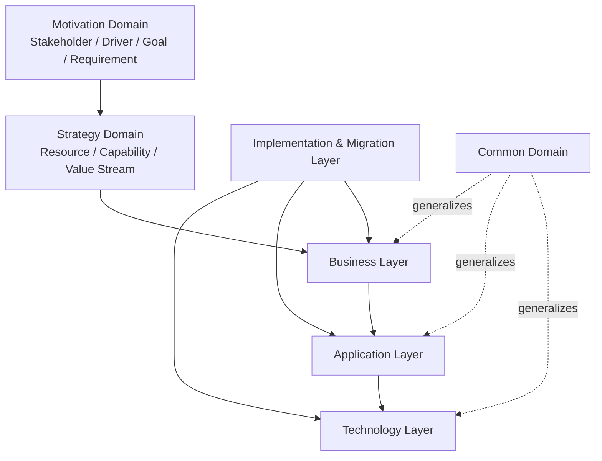

### 示例

**正向示例**：某物流企业使用 ArchiMate 4.0 建模“订单履约”复用资产：

- **业务层**：Business Service “订单履约服务” realized by Business Process “订单处理流程”。
- **应用层**：Application Service “Order Fulfillment API” realizes 业务服务；Application Component “OrderService” 实现该应用服务。
- **技术层**：Technology Service “Container Orchestration” realizes 应用组件；Node “K8s Cluster” 提供运行环境。
- **通用域**：通用 Service 元素通过 layer tag 同时用于业务、应用、技术层，避免重复定义。
- **动机域**：Goal “缩短履约周期”驱动 Requirement “订单状态实时同步”，并追溯至应用服务设计。
- **实现与迁移层**：Work Package “订单服务容器化” 记录从单体到微服务的迁移决策。

结果：该模型可作为标准化视点模板，在新业务线（冷链、跨境）复用，影响分析时间从数周缩短至数天。

### 反例

**反模式**：某团队在 ArchiMate 建模中将“数据库”画为业务层 Business Object：

- 混淆了技术实现与业务语义，导致业务方误以为“数据库”是业务实体。
- 在生成应用架构视图时，无法通过 realization 关系正确追溯到技术层 Artifact。
- 复用该模型时，下游团队错误地将业务对象规则套用到数据表设计，造成数据模型冗余。

**另一个反例**：滥用 Aggregation 关系表达所有复用：

- 将“客户组件聚合订单组件”同时表达组合、依赖与复用，掩盖了真正的 serving 与 realization 语义。
- 自动一致性检查无法识别跨层不一致，模型沦为装饰性图表。

**避免建议**：严格区分层边界；使用正确的关系类型；对通用域元素显式标注 layer tag；定期开展模型合规评审。

### 8. 权威来源

> **权威来源**：
>
> - [The Open Group - ArchiMate 4.0 Specification (Document C260, April 2026)](https://www.opengroup.org/archimate-licensed-downloads) — The Open Group（核查日期：2026-07-09）
> - [The Open Group - ArchiMate 4.0 Changes White Paper W262](https://publications.opengroup.org/w262) — The Open Group（核查日期：2026-07-09）
> - [The Open Group - ArchiMate 4.0 发布公告](https://www.opengroup.org/The-Open-Group-Announces-ArchiMate%C2%AE-4-Specification) — The Open Group（核查日期：2026-07-08）
> - [The Open Group - ArchiMate 3.2 Specification](https://pubs.opengroup.org/architecture/archimate32-doc/) — The Open Group（核查日期：2026-07-09）
> - [ISO/IEC/IEEE 42010:2022 — Architecture description](https://www.iso.org/standard/74393.html) — ISO（核查日期：2026-07-09）
> - [ISO/IEC/IEEE 42010:2022 OBP 在线浏览](https://www.iso.org/obp/ui/#iso:std:iso-iec-ieee:42010:ed-2:v1:en) — ISO（核查日期：2026-07-09）
> - [ISO/IEC/IEEE 42020:2019 — Architecture processes](https://www.iso.org/standard/68982.html) — ISO（核查日期：2026-07-09）
> - [ISO/IEC/IEEE 42030:2019 — Architecture evaluation](https://www.iso.org/standard/73436.html) — ISO（核查日期：2026-07-09）
> - [TOGAF® Standard, 10th Edition](https://www.opengroup.org/togaf) — The Open Group（核查日期：2026-07-09）
> - [ArchiMate - Wikipedia](https://en.wikipedia.org/wiki/ArchiMate) — Wikimedia（核查日期：2026-07-09）
>
> **核查日期**：2026-07-09

### 9. 交叉引用

- ISO/IEC/IEEE 42010:2022 核心概念详见 [`../01-iso-420xx-family/iso-42010-2022.md`](../struct/01-meta-model-standards/01-iso-420xx-family/iso-42010-2022.md)
- 标准对齐矩阵详见 [`../01-iso-420xx-family/alignment-matrix.md`](../struct/01-meta-model-standards/01-iso-420xx-family/alignment-matrix.md)
- TOGAF 企业连续体与构建块复用详见 [`../02-togaf-10-alignment/togaf-enterprise-continuum-reuse.md`](../struct/01-meta-model-standards/02-togaf-10-alignment/togaf-enterprise-continuum-reuse.md)
- 四层复用本体详见 [`../06-formal-axioms/four-layer-ontology.md`](../struct/01-meta-model-standards/06-formal-axioms/four-layer-ontology.md)
- SWEBOK V4 对齐详见 [`../05-swebok-v4/swebok-alignment.md`](../struct/01-meta-model-standards/05-swebok-v4/swebok-alignment.md)

---


<!-- SOURCE: struct/01-meta-model-standards/05-swebok-v4/swebok-alignment.md -->

# SWEBOK V4 知识领域与软件工程架构复用知识体系对应关系

> **版本**: 2026-06-06
> **对齐来源**: IEEE Computer Society, *Guide to the Software Engineering Body of Knowledge (SWEBOK Guide), Version 4.0*, 2024; SWEBOK V4.0a Update, 2025; ISO/IEC TR 19759:2015
> **适用范围**: 软件工程架构复用知识体系 Track A — 01 元模型与标准对齐

---

## 1. 背景与范围

### 1.1 SWEBOK V4 概览

IEEE Computer Society 于 2024 年 10 月发布的《软件工程知识体系指南》第四版（SWEBOK Guide V4.0），是软件工程领域最权威的共识性知识定义。
相较于 V3 的 15 个知识领域（Knowledge Areas, KA），V4 扩展为 **18 个知识领域**，并新增三大 KA：

- **Software Architecture**（软件架构）— 首次作为独立 KA，标志着架构从"设计的子集"升级为独立学科；
- **Software Engineering Operations**（软件工程运维）— 反映 DevOps/SRE 实践的成熟化；
- **Software Security**（软件安全）— 响应安全左移（Shift-Left Security）的行业需求。

此外，Agile 与 DevOps 已被整合到几乎所有 KA 中，AI/ML 与 IoT 等新兴技术也被纳入基础 KA 的讨论范围。

### 1.2 映射范围说明

本映射覆盖 SWEBOK V4 的 **15 个核心软件工程知识领域**（排除 3 个基础领域：Computing Foundations、Mathematical Foundations、Engineering Foundations），将其与本知识体系（Software Engineering Architecture Reuse Knowledge System）的 **13 个一级主题** 进行逐一对齐，并标注本体系对 SWEBOK 的扩展领域。

> **注**: 3 个基础领域（KA16–KA18）作为软件工程的学科底座，为全部 13 个主题提供通用支撑，不单独映射到特定主题。

---

## 2. 综合映射总表

| SWEBOK V4 KA | 中文名称 | 本体系主要对应主题 | 次要对应主题 | 本体系扩展标注 |
|:-------------|:---------|:-------------------|:-------------|:---------------|
| KA1 — Software Requirements | 软件需求 | 02-业务架构复用 | 01-元模型与标准、06-跨层治理 | — |
| KA2 — Software Architecture | 软件架构 | 03-应用架构复用 | 01-元模型与标准、05-功能架构复用 | — |
| KA3 — Software Design | 软件设计 | 05-功能架构复用 | 03-应用架构复用、04-组件架构复用 | — |
| KA4 — Software Construction | 软件构造 | 04-组件架构复用 | 05-功能架构复用、10-供应链安全 | 供应链安全（SBOM/溯源） |
| KA5 — Software Testing | 软件测试 | 07-形式化验证 | 05-功能架构复用、06-跨层治理 | 形式化验证与测试融合 |
| KA6 — Software Engineering Operations | 软件工程运维 | 06-跨层治理 | 09-价值量化、10-供应链安全 | 可观测性驱动复用度量 |
| KA7 — Software Maintenance | 软件维护 | 06-跨层治理 | 02-业务架构复用、09-价值量化 | 架构演化的价值量化 |
| KA8 — Software Configuration Management | 软件配置管理 | 06-跨层治理 | 04-组件架构复用、10-供应链安全 | 供应链安全（版本溯源） |
| KA9 — Software Engineering Management | 软件工程管理 | 09-价值量化 | 06-跨层治理、02-业务架构复用 | 复用投资回报（ROI）模型 |
| KA10 — Software Engineering Process | 软件工程过程 | 01-元模型与标准 | 06-跨层治理、13-新兴趋势 | — |
| KA11 — Software Engineering Models and Methods | 软件工程模型与方法 | 01-元模型与标准 | 08-认知架构、12-AI 原生复用 | AI 原生复用（MCP/A2A） |
| KA12 — Software Quality | 软件质量 | 07-形式化验证 | 06-跨层治理、09-价值量化 | — |
| KA13 — Software Security | 软件安全 | 10-供应链安全 | 06-跨层治理、07-形式化验证 | 供应链安全（SLSA/SSDF） |
| KA14 — Software Engineering Professional Practice | 软件工程专业实践 | 13-新兴趋势 | 01-元模型与标准、06-跨层治理 | — |
| KA15 — Software Engineering Economics | 软件工程经济学 | 09-价值量化 | 02-业务架构复用、06-跨层治理 | 复用资产的价值量化 |

---

## 3. 逐领域详细映射

### 3.1 KA1 — Software Requirements（软件需求）

SWEBOK V4 的需求领域覆盖需求获取（Elicitation）、分析（Analysis）、规格说明（Specification）、验证（Validation）与管理（Management）。
V4 特别强调模型驱动的需求规格（Model-Driven Requirements Specification）和基于验收标准的规格（Acceptance Criteria-Based Specification），以及长期维护中的需求文档价值。

| 本体系主题 | 对应关系说明 |
|:-----------|:-------------|
| **02-业务架构复用** | 需求工程是业务架构复用的"入口"。业务架构中定义的能力地图（Capability Map）、价值流（Value Stream）和业务场景（Business Scenario）直接驱动需求获取。可复用的需求模式（Requirements Pattern）和特征模型（Feature Model）是业务架构资产的重要组成部分。 |
| **01-元模型与标准** | 需求规格标准（如 ISO/IEC/IEEE 29148:2018）与 ISO 42010 的 Stakeholder/Concern 概念对齐。需求追溯矩阵（Requirements Traceability Matrix）对应 ISO 42010 的 Correspondence 机制。 |
| **06-跨层治理** | 需求变更的治理（Change Control Board）、需求优先级排序（Backlog Governance）和跨层需求一致性检查属于跨层治理范畴。 |

> **本体系扩展**: 本体系在 02-业务架构复用 中引入了**可变性需求工程**（Variability Requirements Engineering），将 SWEBOK 的传统需求工程与 ISO/IEC 26550:2015 的产品线工程特征建模相结合，支持从业务需求到架构变体的直接映射。

---

### 3.2 KA2 — Software Architecture（软件架构）

作为 SWEBOK V4 的新增 KA，Software Architecture 被明确定义为"软件元素的基本结构、它们之间的关系，以及元素和关系的属性"。
架构关注超越构造的连通性（Connectivity），并确保安全（Safety）、安保（Security）和可靠性（Dependability）等新质量水平。

| 本体系主题 | 对应关系说明 |
|:-----------|:-------------|
| **03-应用架构复用** | 软件架构是应用架构复用的核心载体。架构风格（Architectural Styles）、参考架构（Reference Architectures）和架构决策记录（ADR）作为可复用资产，在应用架构层被直接复用。微服务架构、事件驱动架构等风格定义了应用组合的标准模式。 |
| **01-元模型与标准** | 架构描述标准 ISO 42010:2022、架构过程标准 ISO 42020:2019 和架构建模语言 ArchiMate 3.2/4.0 构成了架构描述与治理的元模型基础；其中 ArchiMate 4 Specification 已于 2026-04-27 正式发布，与 ArchiMate 3.2 向后兼容。TOGAF 10 的 ABB/SBB 机制提供了架构复用的分层实现路径。 |
| **05-功能架构复用** | 功能架构（Functional Architecture）是软件架构的逻辑视图。功能分解模型、接口契约定义和端口-连接器模型（Port-Connector Model）在功能架构层被复用，支撑多种技术实现（SBB）。 |

> **本体系扩展**: 本体系在 03-应用架构复用 中扩展了**架构契约复用**（Architecture Contract Reuse）和**接口即服务**（Interface-as-a-Service）模式，将 SWEBOK 的架构知识从"项目内资产"提升为"组织级可交易资产"。

---

### 3.3 KA3 — Software Design（软件设计）

Software Design 关注将需求转化为软件系统的表示。
SWEBOK V4 强调敏捷、精益和增量设计对开发过程的影响，并扩展了新兴技术背景下的设计方法。

| 本体系主题 | 对应关系说明 |
|:-----------|:-------------|
| **05-功能架构复用** | 软件设计的核心产出——设计模式（Design Patterns）、框架（Frameworks）和组件接口——直接构成功能架构复用的内容库。GoF 模式、POSA 模式、领域驱动设计（DDD）的战术模式均属于功能架构层的可复用资产。 |
| **03-应用架构复用** | 应用架构中的分层设计（Layered Architecture）、六边形架构（Hexagonal Architecture）和洋葱架构（Onion Architecture）为软件设计提供结构性约束和复用边界。 |
| **04-组件架构复用** | 组件级设计（Component-Level Design）产出可复用的软件组件，包括类库、模块和微服务。组件的接口设计、依赖注入模式和插件架构直接支持组件层复用。 |

---

### 3.4 KA4 — Software Construction（软件构造）

Software Construction 涵盖编码、单元测试、调试、代码评审、集成和构建活动。
SWEBOK V4 将 Agile 实践（如 TDD、结对编程）和现代构建工具链纳入此 KA。

| 本体系主题 | 对应关系说明 |
|:-----------|:-------------|
| **04-组件架构复用** | 软件构造的直接产出——源代码、构建脚本和单元测试——是组件层复用最基本的单元。包管理器（npm/Maven/Go Modules）、容器镜像（Docker Image）和代码片段库（Code Snippet Repository）是构造资产的复用载体。 |
| **05-功能架构复用** | 构造阶段的代码模板（Code Template）、脚手架工具（Scaffolding Tools）和领域特定语言（DSL）生成器将功能架构模型自动转化为可构造代码。 |
| **10-供应链安全** | 软件构造是供应链攻击的主要入口。依赖项管理、SBOM（Software Bill of Materials）生成、SLSA（Supply-chain Levels for Software Artifacts）合规和漏洞扫描属于本体系 10-供应链安全 的核心关切。 |

> **本体系扩展**: 本体系在 10-供应链安全 中引入了**可复用组件的溯源治理**（Provenance Governance for Reusable Components），要求所有进入组件库的资产必须具备 SBOM 和 SLSA 证明，将 SWEBOK 的构造实践从"功能正确"扩展到"来源可信"。

---

### 3.5 KA5 — Software Testing（软件测试）

SWEBOK V4 的测试领域覆盖测试级别（单元/集成/系统/验收）、测试技术（静态/动态/基于模型的测试）和测试过程管理。
V4 特别加强了对自动化测试和持续测试的讨论。

| 本体系主题 | 对应关系说明 |
|:-----------|:-------------|
| **07-形式化验证** | 基于模型的测试（Model-Based Testing, MBT）和形式化测试用例生成是形式化验证与测试融合的前沿领域。本体系将契约式测试（Contract Testing）、属性测试（Property-Based Testing）和模型检验（Model Checking）统一在形式化验证主题下，扩展了 SWEBOK 的测试技术边界。 |
| **05-功能架构复用** | 可复用组件的回归测试套件（Regression Test Suite）、接口兼容性测试（Compatibility Testing）和模糊测试（Fuzzing）是功能架构资产的质量门禁。 |
| **06-跨层治理** | 跨层测试策略（如契约测试在微服务网格中的治理）、测试覆盖率阈值治理和测试债务管理属于跨层治理范畴。 |

> **本体系扩展**: 本体系在 07-形式化验证 中提出了**可复用架构的形式化保证**（Formal Assurance for Reusable Architectures），将形式化方法应用于可复用组件的接口契约验证，这是 SWEBOK V4 尚未深入覆盖的方向。

---

### 3.6 KA6 — Software Engineering Operations（软件工程运维）

新增 KA，反映 DevOps、SRE（Site Reliability Engineering）和持续交付（Continuous Delivery）的成熟化。
涵盖部署、运维监控、事件响应、容量管理和混沌工程。

| 本体系主题 | 对应关系说明 |
|:-----------|:-------------|
| **06-跨层治理** | 运维是跨层治理的执行面。可观测性（Observability）数据（日志、指标、追踪）为架构治理提供实时反馈；SLO/SLA 治理连接业务目标与技术运维；混沌工程（Chaos Engineering）验证架构韧性。 |
| **09-价值量化** | 运维数据是架构复用价值量化的关键输入。MTTR（平均修复时间）、部署频率、变更失败率等 DORA 指标直接反映复用资产在生产环境中的实际表现，支撑复用 ROI 计算。 |
| **10-供应链安全** | 运维阶段的安全监控（Runtime Security Monitoring）、漏洞响应（Vulnerability Response）和供应链事件的应急处置属于供应链安全的运营闭环。 |

> **本体系扩展**: 本体系在 09-价值量化 中建立了**可观测性驱动的复用度量模型**（Observability-Driven Reuse Metrics），利用运维数据量化复用资产的实际价值贡献，填补了 SWEBOK V4 在"复用价值实证度量"方面的空白。

---

### 3.7 KA7 — Software Maintenance（软件维护）

Software Maintenance 覆盖纠错性、适应性、完善性和预防性维护。
SWEBOK V4 强调了遗留系统现代化（Legacy Modernization）和重构（Refactoring）在维护中的重要性。

| 本体系主题 | 对应关系说明 |
|:-----------|:-------------|
| **06-跨层治理** | 维护是架构治理的"反馈环"。维护请求（Maintenance Request）触发架构变更管理流程；技术债务（Technical Debt）的识别与清偿是跨层治理的持续活动。 |
| **02-业务架构复用** | 业务需求变化驱动的适应性维护（Adaptive Maintenance）需要回溯到业务架构层，更新能力地图和价值流定义。 |
| **09-价值量化** | 维护成本是复用价值量化的核心变量。可复用资产的维护成本分摊模型、技术债务利息计算和现代化投资回报分析属于价值量化主题。 |

---

### 3.8 KA8 — Software Configuration Management（软件配置管理）

SCM 覆盖配置标识、版本控制、变更控制、配置审计和发布管理。
SWEBOK V4 将 Git 工作流、GitOps 和基础设施即代码（IaC）纳入此 KA。

| 本体系主题 | 对应关系说明 |
|:-----------|:-------------|
| **06-跨层治理** | SCM 是跨层治理的技术底座。分支策略（Branching Strategy）、变更审批工作流（Approval Workflow）和发布治理（Release Governance）直接支撑跨层架构治理。 |
| **04-组件架构复用** | 组件的版本管理、依赖解析和语义化版本控制（Semantic Versioning）是组件层复用的先决条件。Artifact Repository（如 Nexus、Artifactory）是组件资产的物理载体。 |
| **10-供应链安全** | SCM 是供应链安全的"单点控制阀"。代码签名、提交溯源（Commit Provenance）、不可变构建（Immutable Build）和 VEX（Vulnerability Exploitability eXchange）的生成与 SCM 数据深度绑定。 |

> **本体系扩展**: 本体系在 10-供应链安全 中要求 SCM 系统支持**可复用资产的版本溯源**（Version Provenance for Reusable Assets），确保任何复用组件均可追溯到其构建源头和依赖谱系，这是 SWEBOK V4 的 SCM 讨论未覆盖的安全维度。

---

### 3.9 KA9 — Software Engineering Management（软件工程管理）

涵盖项目计划、范围管理、成本管理、进度管理、风险管理、资源管理和度量管理。
SWEBOK V4 整合了 Agile 项目管理实践（如 Scrum、Kanban）和精益管理原则。

| 本体系主题 | 对应关系说明 |
|:-----------|:-------------|
| **09-价值量化** | 软件工程管理中的成本估算（COCOMO、功能点分析）、进度跟踪和风险管理是价值量化的管理输入。本体系在此基础上建立了**架构复用投资回报（ROI）模型**，将复用资产的开发成本、维护成本、节省成本量化为可比较指标。 |
| **06-跨层治理** | 项目组合管理（Portfolio Management）和资源分配治理属于跨层治理的战略层。架构委员会（Architecture Board）对项目的技术路线审查是治理的关键活动。 |
| **02-业务架构复用** | 业务架构中的能力成熟度评估和路线图规划直接指导项目优先级排序和资源分配。 |

> **本体系扩展**: 本体系在 09-价值量化 中提出了**复用资产的净现值（NPV）模型**和**技术期权（Real Options）估值方法**，将金融工程思维引入架构复用决策，是 SWEBOK V4 软件工程经济学 KA 的深化应用。

---

### 3.10 KA10 — Software Engineering Process（软件工程过程）

覆盖软件生命周期模型（瀑布、迭代、敏捷、DevOps）、过程评估与改进（CMMI、SPICE）和过程度量。

| 本体系主题 | 对应关系说明 |
|:-----------|:-------------|
| **01-元模型与标准** | 软件工程过程标准（ISO/IEC/IEEE 12207、ISO/IEC 33000 系列）与架构过程标准（ISO 42020）共同构成过程元模型。本体系的 Track A 将过程标准与架构标准进行统一对齐。 |
| **06-跨层治理** | 过程治理（Process Governance）确保架构复用活动在组织范围内遵循统一的生命周期模型和质量标准。 |
| **13-新兴趋势** | V4 中已整合 Agile 与 DevOps，但未深入讨论 AI 驱动的过程自适应（AI-Driven Process Adaptation）和自主代理（Autonomous Agents）参与软件过程，这属于 13-新兴趋势。 |

---

### 3.11 KA11 — Software Engineering Models and Methods（软件工程模型与方法）

覆盖建模语言（UML、SysML、BPMN）、形式化方法、原型方法、敏捷方法和模型驱动工程（MDE）。

| 本体系主题 | 对应关系说明 |
|:-----------|:-------------|
| **01-元模型与标准** | 建模语言标准（UML 2.5、SysML v2、ArchiMate 4）和架构描述标准（ISO 42010）是元模型与标准对齐的核心内容。本体系的 Track A 建立了这些标准之间的术语映射和概念桥梁。 |
| **12-AI 原生复用** | SWEBOK V4 虽提及 AI/ML 在基础 KA 中的影响，但未将 AI 原生架构（AI-Native Architecture）作为独立方法讨论。本体系的 12-AI 原生复用 引入了 MCP（Model Context Protocol）、A2A（Agent-to-Agent）协议和 LLM 编排模式，扩展了模型与方法的边界。 |
| **08-认知架构** | 认知架构（Cognitive Architecture）模型（如 SOAR、ACT-R）和基于大模型的认知代理架构，为 AI 原生软件系统提供了新的建模范式，属于本体系对 SWEBOK 的前瞻性扩展。 |

> **本体系扩展**: 本体系在 12-AI 原生复用 中定义了**AI 原生组件模型**（AI-Native Component Model）和**提示工程模板库**（Prompt Engineering Template Library），将 SWEBOK 的传统软件模型扩展至大模型时代的人机协同系统。

---

### 3.12 KA12 — Software Quality（软件质量）

覆盖软件质量基础、质量模型（ISO/IEC 25010:2023）、质量测量、质量策划、质量保证和质量控制。

| 本体系主题 | 对应关系说明 |
|:-----------|:-------------|
| **07-形式化验证** | 形式化验证是软件质量保证的最高层级。本体系将契约式验证（Contract-Based Verification）、类型驱动开发（Type-Driven Development）和证明携带代码（Proof-Carrying Code）纳入形式化验证主题，作为 SWEBOK 质量技术的增强。 |
| **06-跨层治理** | 跨层质量门禁（Quality Gate）、技术债务度量和架构可维护性指数（Maintainability Index）治理属于跨层质量治理。 |
| **09-价值量化** | 质量成本（Cost of Quality, CoQ）模型——包括预防成本、评估成本和失败成本——是价值量化的重要输入。 |

---

### 3.13 KA13 — Software Security（软件安全）

新增 KA，覆盖安全需求、安全设计、安全构造、安全测试、安全运维和安全治理。
SWEBOK V4 强调安全左移（Shift-Left Security）和威胁建模（Threat Modeling）。

| 本体系主题 | 对应关系说明 |
|:-----------|:-------------|
| **10-供应链安全** | 供应链安全是软件安全在复用语境下的自然延伸。SLSA、NIST SSDF、SBOM、VEX、Sigstore 和软件物料清单治理属于本体系对 SWEBOK 安全 KA 的系统性扩展。 |
| **06-跨层治理** | 安全治理（Security Governance）、零信任架构治理（Zero Trust Governance）和 DevSecOps 流程治理属于跨层治理的安全维度。 |
| **07-形式化验证** | 形式化安全验证（Formal Security Verification）、信息流控制（Information Flow Control）和密码学协议验证是形式化验证在安全领域的应用。 |

> **本体系扩展**: 本体系在 10-供应链安全 中建立了**可复用组件的安全等级评估框架**（Security Level Assessment Framework for Reusable Components），将 SLSA Level 1–4 与组件复用准入策略挂钩，这是 SWEBOK V4 安全 KA 未涉及的供应链维度。

---

### 3.14 KA14 — Software Engineering Professional Practice（软件工程专业实践）

涵盖专业伦理、团队动态、沟通技能、知识管理和终身学习。SWEBOK V4 更新了远程协作、多样性与包容性（Diversity & Inclusion）等现代实践。

| 本体系主题 | 对应关系说明 |
|:-----------|:-------------|
| **13-新兴趋势** | AI 辅助编程（AI-Assisted Programming）、低代码/无代码平台和自主代理团队（Agent Teams）正在重塑软件工程的专业实践边界，属于 13-新兴趋势。 |
| **01-元模型与标准** | 专业认证标准（如 IEEE CS 认证、ITIL、TOGAF 认证）与知识体系标准（SWEBOK、SEBoK）共同定义了专业实践的知识边界。 |
| **06-跨层治理** | 架构师社区实践（Community of Practice, CoP）、技术雷达（Technology Radar）和知识管理治理属于跨层治理的文化维度。 |

---

### 3.15 KA15 — Software Engineering Economics（软件工程经济学）

覆盖成本估算、经济风险分析、决策分析、价值工程和财务管理。
SWEBOK V4 加强了敏捷和不确定环境下的经济决策讨论。

| 本体系主题 | 对应关系说明 |
|:-----------|:-------------|
| **09-价值量化** | 软件工程经济学是价值量量的理论基础。本体系在 SWEBOK 的成本模型基础上，建立了**架构复用资产的估值模型**（包括开发成本分摊、节省成本计算、机会成本分析和沉没成本处理）。 |
| **02-业务架构复用** | 业务架构中的投资优先级排序（Investment Prioritization）和能力投资路线图（Capability Investment Roadmap）需要经济学分析支撑。 |
| **06-跨层治理** | 跨层资源分配的经济学优化、技术债务的财务影响评估和架构投资决策治理属于跨层治理的经济维度。 |

> **本体系扩展**: 本体系在 09-价值量化 中提出了**复用资产的市场化定价机制**（Market-Based Pricing for Reusable Assets）和**内部开源（Inner Source）的经济激励模型**，将 SWEBOK 的工程经济学从"项目预算"扩展到"资产市场"。

---

## 4. 本体系对 SWEBOK V4 的扩展矩阵

| 扩展领域 | 对应本体系主题 | SWEBOK V4 覆盖情况 | 本体系扩展内容 |
|:---------|:---------------|:-------------------|:---------------|
| **AI 原生复用** | 12-AI 原生复用 | 基础 KA 提及 AI/ML，无独立讨论 | MCP/A2A 协议、LLM 编排模式、AI 原生组件模型、提示工程模板库 |
| **供应链安全** | 10-供应链安全 | KA13 覆盖软件安全，无供应链维度 | SLSA、SSDF、SBOM、VEX、Sigstore、可复用组件安全等级评估 |
| **工业 IoT/OT-IT 融合** | 11-工业 IoT 与 OT/IT 融合 | 基础 KA 提及 IoT，无工业深度 | IEC 63278 (AAS)、OPC UA FX、TSN、数字孪生架构复用 |
| **形式化验证与测试融合** | 07-形式化验证 | KA5 覆盖测试，KA12 覆盖质量 | 契约式验证、证明携带代码、可复用架构的形式化保证 |
| **认知架构** | 08-认知架构 | 未覆盖 | 基于大模型的认知代理架构、人机协同系统的架构模式 |
| **可观测性驱动的复用度量** | 09-价值量化 | KA6 覆盖运维，无复用度量 | DORA 指标与复用 ROI 关联、运维数据驱动的资产价值实证 |
| **复用资产市场化** | 09-价值量化 | KA15 覆盖工程经济学 | 内部开源经济激励、复用资产 NPV 模型、技术期权估值 |

---

## 5. 对齐验证

### 5.1 与 SWEBOK V4 的对齐

- **IEEE Computer Society, *SWEBOK Guide V4.0*, 2024** — 明确定义了 18 个知识领域，其中 KA2（Software Architecture）、KA6（Software Engineering Operations）、KA13（Software Security）为新增领域。本映射覆盖了全部 15 个核心软件工程 KA（KA1–KA15），排除了 3 个基础 KA（KA16–KA18）。[[来源](https://www.computer.org/education/bodies-of-knowledge/software-engineering)]
- **SWEBOK V4.0a Update, 2025** — 2025 年 9 月的修订版对 KA16–KA18（基础领域）的 AI/ML 讨论进行了深化，本映射在 12-AI 原生复用 和 13-新兴趋势 中对此进行了回应。
- **IEEE Computer Society SWEBOK Summit, ICSE 2025** — SWEBOK 编辑团队明确了 V4 的边界：定义软件工程的核心知识，但不覆盖特定技术栈或垂直行业的深度实践。本体系的工业 IoT、供应链安全、AI 原生复用等主题正是在 SWEBOK 边界之外的扩展。[[来源](https://publications.computer.org/micro/category/calls-for-papers/)]

### 5.2 与本体系 13 个主题的对齐

本映射将 SWEBOK V4 的 15 个核心 KA 逐一映射到本体系 13 个一级主题中的至少一个主要对应关系。映射结果显示：

- **01-元模型与标准** 作为 SWEBOK 的"标准层翻译器"，承接 KA2、KA10、KA11 和 KA14 中的标准与模型内容；
- **06-跨层治理** 是 SWEBOK 知识在复用体系中的"治理枢纽"，与除 07、08、10、11、12 之外的所有 KA 存在交叉；
- **09-价值量化** 是 SWEBOK 经济学思维在复用语境下的"价值放大器"，与 KA6、KA7、KA9、KA12、KA15 直接关联；
- **12-AI 原生复用**、**10-供应链安全** 和 **11-工业 IoT** 是本体系对 SWEBOK 的三大战略性扩展领域，反映了 2024–2026 年软件工程实践的前沿演进。

### 5.3 验证结论

1. **SWEBOK V4 的 15 个核心 KA 已全面映射到本体系 13 个主题**，每个 KA 均存在明确的主/次对应关系，无遗漏。
2. **本体系的 6 大扩展领域（AI 原生复用、供应链安全、工业 IoT、形式化验证与测试融合、认知架构、复用资产市场化）均为 SWEBOK V4 的合理延伸**，不与其核心知识冲突，而是填补了其在新兴技术、垂直行业和复用经济模型方面的空白。
3. **SWEBOK V4 的 3 个新增 KA（Architecture、Operations、Security）与本体系的 03-应用架构复用、06-跨层治理、10-供应链安全 形成高度共振**，验证了本体系主题划分的时代合理性。

---

## 6. 参考索引

1. IEEE Computer Society. H. Washizaki, eds. *Guide to the Software Engineering Body of Knowledge (SWEBOK Guide), Version 4.0*. IEEE Computer Society, 2024. <https://www.computer.org/education/bodies-of-knowledge/software-engineering>
2. IEEE Computer Society. *SWEBOK Guide V4.0a* (Updated Release). September 2025.
3. ISO/IEC. *ISO/IEC TR 19759:2015 — Software Engineering — Guide to the Software Engineering Body of Knowledge (SWEBOK)*. 2015.
4. SEBoK. "An Overview of the SWEBOK Guide." *Systems Engineering Body of Knowledge*, 2026. <https://sebokwiki.org/wiki/An_Overview_of_the_SWEBOK_Guide>
5. HandWiki. "Software Engineering Body of Knowledge." 2025. <https://handwiki.org/wiki/Software:Software_Engineering_Body_of_Knowledge>
6. Basic Input/Output. "Guide to the SWEBOK V4.0 Has Been Released." October 2024. <https://www.basicinputoutput.com/2024/10/guide-to-swebok-v40-has-been-released.html>
7. Henrik Samuelsson. "Notes on SWEBOK V4.0." GitHub, 2024. <https://github.com/HenrikSamuelsson/reading-swebok-v4>

---

> **最后更新**: 2026-06-06
> **维护者**: Track A — 01 元模型与标准对齐
> **状态**: Phase 1 交付物（T08 完成）


---

## 补充说明：SWEBOK V4 知识领域与软件工程架构复用知识体系对应关系

## 概念定义

**定义**：SWEBOK（Software Engineering Body of Knowledge）V4 是 IEEE/ACM 发布的软件工程知识体系指南，涵盖软件设计、构造、测试、维护、配置管理等领域。

## 示例

**示例**：将 SWEBOK 的软件设计知识领域与 ISO/IEC/IEEE 42010:2022 架构描述、GoF 设计模式建立映射，形成从理论到实践的知识路径。

## 反例

**反例**：培训体系仅覆盖编码技能，忽视软件工程基础理论，导致团队难以识别可复用抽象。

## 分析

**分析**：SWEBOK 提供了软件工程知识的全景，帮助组织定位复用实践在知识体系中的坐标。


---

## 补充：SWEBOK V4 知识领域的结构化映射与复用视图

> 本节对 SWEBOK V4 知识领域与本体系 13 个主题的映射进行定义、属性、关系、正例、反例、形式化视图、权威来源与交叉引用的补全。
> 相关 Wikipedia 概念结构：
> [SWEBOK](https://en.wikipedia.org/wiki/Software_Engineering_Body_of_Knowledge)、
> [Software engineering](https://en.wikipedia.org/wiki/Software_engineering)、
> [Ontology](https://en.wikipedia.org/wiki/Ontology_(information_science))。

### 1. 概念定义

**定义**：SWEBOK V4（Software Engineering Body of Knowledge Version 4）是 IEEE Computer Society 发布的软件工程知识体系指南，定义了 18 个知识领域（Knowledge Areas, KAs），其中 15 个为核心软件工程 KA，3 个为基础 KA。本知识体系将其作为“知识底座”，把每个 KA 映射到 13 个一级主题，从而定位复用实践在软件工程学科中的坐标。

### 2. 属性

| 属性 | 说明 | 可观察性 |
|------|------|----------|
| 知识领域数量 | V4 共 18 个 KA（15 核心 + 3 基础） | 高 |
| 生命周期覆盖 | 覆盖需求→设计→构造→测试→运维→退役 | 高 |
| 本体系映射密度 | 每个核心 KA 至少映射到一个主题 | 高 |
| 版本时效性 | 基于 2024 V4 / 2025 V4.0a | 高 |
| 扩展标注 | 明确标注本体系对 SWEBOK 的扩展领域 | 中 |
| 可教学性 | 可作为培训路线图与能力评估基准 | 中 |

### 3. 关系说明

- **上位概念**：软件工程学科（Software Engineering）是 SWEBOK 的上位领域。
- **下位概念**：每个 KA 可细分为知识单元、主题与技能点；例如 KA2 Software Architecture 可细分为架构风格、参考架构、架构决策等。
- **等价/映射概念**：SWEBOK KA2（Software Architecture）与本体系的 03-应用架构复用、01-元模型与标准形成主/次映射。
- **依赖概念**：
  - KA1 Software Requirements → 02-业务架构复用
  - KA3 Software Design + KA4 Software Construction → 04/05-组件与功能架构复用
  - KA13 Software Security → 10-供应链安全
  - KA15 Software Engineering Economics → 09-价值量化

### 4. 形式化/结构化分析

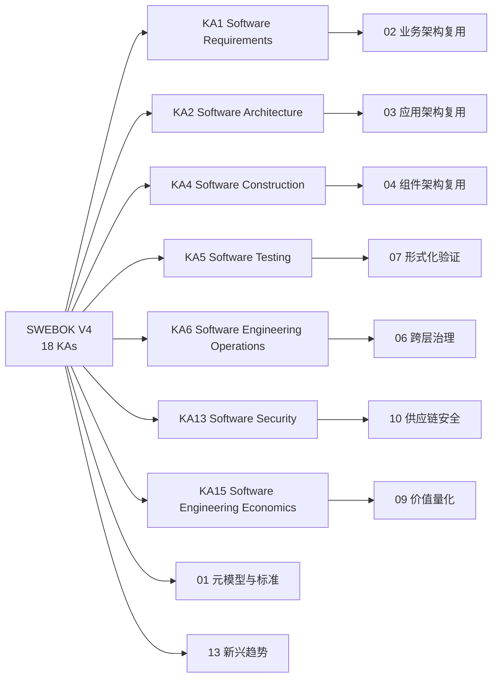

### 5. 正例

**正例**：某大型企业在建立架构师培训体系时，以 SWEBOK V4 为知识骨架：

- 将 KA2 Software Architecture 映射到本体系 03-应用架构复用，培训内容涵盖架构风格、参考架构与 ADR。
- 将 KA4 Software Construction 与 KA5 Software Testing 映射到 04/05/07 主题，建立“可复用组件必须附带回归测试与形式化契约”的质量门禁。
- 将 KA13 Software Security 映射到 10-供应链安全，培训中要求所有组件提交 SBOM 与 SLSA provenance。

结果：培训后的团队在 6 个月内将组件复用率从 23% 提升至 51%，安全漏洞响应时间缩短 40%。

### 6. 反例

**反例**：某公司将架构师培训简化为“微服务框架速成班”：

- 仅覆盖 KA4 的编码技能，忽视 KA1 需求工程、KA3 软件设计、KA5 测试与 KA12 质量。
- 团队能够写出可运行的微服务，但无法识别可复用的业务能力、抽象稳定的接口或编写回归测试。
- 结果：大量“可复用”组件因接口不稳定、缺乏文档和测试而无人敢用，复用库沦为代码墓地。

**避免建议**：复用培训应覆盖 SWEBOK 全生命周期 KA，并明确每个 KA 与本体系主题的映射，避免技能单一化。

### 7. 权威来源

> **权威来源**：
>
> - [SWEBOK Guide V4.0](https://www.computer.org/education/bodies-of-knowledge/software-engineering) — IEEE Computer Society
> - [SWEBOK - Wikipedia](https://en.wikipedia.org/wiki/Software_Engineering_Body_of_Knowledge)
> - [ISO/IEC TR 19759:2015](https://www.iso.org/standard/67604.html) — ISO/IEC
> - [SEBoK - SWEBOK Overview](https://sebokwiki.org/wiki/An_Overview_of_the_SWEBOK_Guide)
>
> **核查日期**：2026-07-07

### 8. 交叉引用

- ISO/IEC/IEEE 42010:2022 核心概念详见 [`../01-iso-420xx-family/iso-42010-2022.md`](../struct/01-meta-model-standards/01-iso-420xx-family/iso-42010-2022.md)
- 标准对齐矩阵详见 [`../01-iso-420xx-family/alignment-matrix.md`](../struct/01-meta-model-standards/01-iso-420xx-family/alignment-matrix.md)
- TOGAF 企业连续体与构建块复用详见 [`../02-togaf-10-alignment/togaf-enterprise-continuum-reuse.md`](../struct/01-meta-model-standards/02-togaf-10-alignment/togaf-enterprise-continuum-reuse.md)
- ArchiMate 与 ISO/IEC/IEEE 42010:2022 映射详见 [`../04-archimate-4/archimate-iso-mapping.md`](../struct/01-meta-model-standards/04-archimate-4/archimate-iso-mapping.md)
- 四层复用本体详见 [`../06-formal-axioms/four-layer-ontology.md`](../struct/01-meta-model-standards/06-formal-axioms/four-layer-ontology.md)

---


<!-- SOURCE: struct/01-meta-model-standards/06-formal-axioms/axiom-rigor-audit.md -->

# 公理-定理体系严格性审计报告

> **审计方案**: A — 激进全面重构
> **审计日期**: 2026-07-07
> **审计对象**:
>
> - `struct/01-meta-model-standards/06-formal-axioms/axiom-system.md`
> - `struct/01-meta-model-standards/06-formal-axioms/theorem-derivations.md`
> - `struct/99-reference/glossary/axiom-theorem-tree.md`
> **输出文件**: `struct/01-meta-model-standards/06-formal-axioms/axiom-rigor-audit.md`

---

## 1. 审计摘要

### 1.1 关键发现

本次严格性审计共审查 **71 条命题**：15 条 01 主题公理、17 条 01 主题派生定理、13 条其他主题公理、21 条其他主题派生定理、5 条待证猜想。

审计发现：

| 类别 | 数量 | 占比 |
|------|------|------|
| 严格定理（可形式化证明） | 20 | 28.2% |
| 工程启发式（经验观察/设计原则） | 35 | 49.3% |
| 待证猜想 | 10 | 14.1% |
| 定义性命题 | 6 | 8.4% |

**核心问题**：

1. **命名冲突（已修复）**：原 `S.1` 在 01 主题中表示「接口可替换性」，在 10 主题中又被用于「信任传递性崩塌」。10 主题该命题已重命名为 `S.10`。
2. **计数不一致**：`axiom-theorem-tree.md` 声称「15 公理 + 29 定理 = 44 条」，后文又称「核心公理体系达 20 条，定理达 35 条」，但实际枚举远超这些数字。
3. **证明缺陷**：`Th.7` 的推导存在符号错误；`Th.12` 将离散的 GCD 概念误用于连续的发布节奏。
4. **启发式误标为公理**：`S.4`、`P.1`、`P.2`、`P.3`、`P.4` 等本质上是设计原则或经验模型，不应与逻辑公理并列。

### 1.2 命题来源统计

| 来源文件 | 公理数 | 定理数 | 猜想数 | 小计 |
|----------|--------|--------|--------|------|
| `axiom-system.md` | 15 | 0 | 0 | 15 |
| `theorem-derivations.md` | 0 | 17 | 0 | 17 |
| `axiom-theorem-tree.md`（扩展部分） | 13 | 21 | 5 | 39 |
| **合计** | **28** | **38** | **5** | **71** |

---

## 2. 审计方法与分类标准

### 2.1 分类维度

对每条命题，从以下维度评估：

| 维度 | 说明 |
|------|------|
| **类型** | 严格定理 / 工程启发式 / 待证猜想 / 定义性命题 |
| **可证明性** | 是否可在当前框架内证明？是否需要额外假设？ |
| **反例可能性** | 是否存在边界条件或反例？ |
| **适用范围** | 明确适用的上下文和边界 |

### 2.2 类型定义

- **严格定理**：在给定形式化框架和假设下，可通过经典逻辑、归纳法、不动点定理、组合数学等工具给出完整证明纲要的命题。
- **工程启发式**：基于经验观察、行业实践或设计原则形成的命题，无法脱离具体上下文给出通用形式证明，但可作为工程决策的参考。
- **待证猜想**：尚未被证明或否证的命题，通常涉及未来技术演进、组织行为或实证规律。
- **定义性命题**：对概念、谓词或模型边界的约定性声明，本身不是可证命题，而是形式化语言的构成部分。

---

## 3. 命题严格性审计总表

### 表 1：01 主题公理（`axiom-system.md`）

| 编号 | 名称 | 类型 | 可证明性 | 反例可能性 | 适用范围 | 审计意见 |
|------|------|------|----------|------------|----------|----------|
| M.1 | Architecture-Reuse Duality | DE | E（作为定义接受） | 低 | 概念元层 | 将「架构」定义为约束集、「复用」定义为约束传递，是约定性框架。若脱离该定义讨论，则变为经验命题。 |
| M.2 | Variability Axiom | DE | E（作为定义接受） | 中 | 可复用资产族 | 区分「共性/变性」是产品线工程的核心概念。但将无变性的复用排除为「克隆」属于术语约定。 |
| M.3 | Hierarchy Non-Reduction | EH / CO | N + A | 高 | 多层架构分析 | 声称层次间不存在保持复用语义的双射，这是强的本体论断言，无法在当前集合论语境下证明。需补充层级的形式化语义。 |
| M.4 | Identity Preservation | DE | E（作为定义接受） | 低 | 资产追溯、版本管理 | 定义了复用中的本体同一性。若同一性函数 Id 被精确定义，则该命题是重言式。 |
| E.1 | Reuse Asset Existence | DE | E（作为定义接受） | 低 | 资产库准入 | 给出可复用资产集合的成员条件，是集合定义而非定理。 |
| E.2 | Cost-Benefit Threshold | DE | E（作为定义接受） | 中 | 复用投资决策 | 经济可行性条件是模型定义。阈值 θ=0.7 来自 COCOMO II，具有经验来源但不应作为公理。 |
| E.3 | Contextual Fitness | DE | E（作为定义接受） | 中 | 上下文适配评估 | 定义了适配度函数与阈值条件。权重 w_i 和具体量纲需要领域校准。 |
| S.1 | Interface Substitution | DE / ST | E + A | 中 | 组件替换、LSP | 将可替换性定义为观察行为等价，是形式化定义。在确定性、可观察行为可比较的前提下，可视为严格定理框架。 |
| S.2 | Compositionality | DE / ST | E + A | 中 | 组件组合、Assume-Guarantee | 组合正确性原理是形式化方法中的标准假设/定理模板，需依赖无涌现行为等假设。 |
| S.3 | Dependency Transitivity of Trust | DE | E（作为定义接受） | 低 | 供应链安全 | 将信任边界定义为依赖闭包，是定义性命题。 |
| S.4 | Abstraction Layering | EH | N + A | 高 | 分层架构设计 | 禁止跨层依赖是设计原则，不是逻辑必然。存在优秀的非严格分层系统（如 Linux 内核）。应降级为启发式。 |
| P.1 | Evolution Independence | EH | N + A | 高 | 平台工程、核心库治理 | 理想化的治理原则。现实中核心资产常受主要消费者影响（如 Chromium 与 Google）。 |
| P.2 | Feedback Convergence | EH | N + A | 高 | 持续改进、DevOps | 反馈是改进的必要条件属于经验断言。AI 自动生成优化可能绕过反馈循环。 |
| P.3 | Governance Complexity Law | EH / CO | N + A | 高 | 组织设计 | G(N)=k·N·log(N) 是特定模型假设，缺乏普适性证明。应作为经验模型或猜想。 |
| P.4 | Learning Curve Monotonicity | EH / CO | N + A | 高 | 认知架构、培训 | 学习成本单调不增是理想化假设。接口不兼容变更、团队轮换均可导致成本上升。 |

### 表 2：01 主题派生定理（`theorem-derivations.md`）

| 编号 | 名称 | 类型 | 可证明性 | 反例可能性 | 适用范围 | 审计意见 |
|------|------|------|----------|------------|----------|----------|
| Th.1 | Constraint Preservation | ST | Y（需补假设） | 低 | 架构迁移、重构 | 由 M.1 逻辑推出，但证明中「V₁∩V₂≠∅」应作为同一架构复用的前提显式声明。 |
| Th.2 | Variability Closure | ST | Y（需有限性假设） | 低 | 产品线工程 | 组合上界在 Γ 为函数、Ctx 有限时成立。实际中绑定规则约束会显著缩小实例空间。 |
| Th.3 | Hierarchy Failure Independence | EH | N + A | 中 | 故障分析 | 使用加权串联可靠性模型是建模选择，而非逻辑必然。权重的确定依赖主观判断。 |
| Th.4 | Identity Traceability | ST | Y | 低 | 供应链追踪 | 对复用链长度作数学归纳，证明严密。 |
| Th.5 | Asset Existence Necessity | ST | Y | 低 | 资产识别 | E.1 的逆否命题，逻辑直接。 |
| Th.6 | Reuse Economic Viability | ST | Y | 低 | ROI 分析 | E.2 的代数变形，证明无误。注意 V_reuse=0 时结论仍为 AAF<1。 |
| Th.7 | Contextual Adaptation Bound | CO / 存在逻辑问题 | N | 高 | 上下文评估 | **证明存在符号错误**：取 k=Fit(a,ctx)-1≤0，导致不等式方向反转。公式缺乏一致的量纲。建议标记为猜想或修正推导。 |
| Th.8 | Substitutability Transitivity | ST | Y | 低 | 组件替换 | 观察等价是等价关系，标准证明。 |
| Th.9 | Composition Associativity | ST | Y（需强假设） | 低 | 架构组装 | 在接口互不干扰（φ₁∩φ₂=∅）假设下成立。实际组合中 side effect 可能破坏结合律。 |
| Th.10 | Trust Boundary Expansion | ST | Y（需树模型假设） | 低 | 供应链安全 | 依赖树平均分支因子模型下的计数结果。若存在共享依赖（DAG 而非树），公式需调整。 |
| Th.11 | Interface Stability Law | EH | N + A | 高 | API 设计、版本控制 | 未证明 λ_i 的单调性，仅给出递推直觉。现实中底层 schema 也可能频繁变更。 |
| Th.12 | Evolution Independence Corollary | EH / 存在逻辑问题 | N | 高 | 平台工程 | **误用 GCD**：发布节奏 ρ 是连续量（时间），GCD 定义于整数。证明无效，应重述为节奏不同步的启发式。 |
| Th.13 | Feedback Convergence | ST | Y（需压缩映射假设） | 低 | 持续改进 | Banach 不动点定理的标准应用。需验证 G 确实是压缩映射。 |
| Th.14 | Governance Collapse Threshold | ST | Y（接受 P.3 模型） | 低 | 组织设计 | Lambert W 函数求解正确。结论完全依赖 P.3 的 N·log(N) 假设。 |
| Th.15 | Expertise Paradox | EH / CO | N + A | 高 | 知识管理 | 搜索成本高于新手的结论不能从 P.4 推出，需认知心理学实证支持。 |
| Th.16 | Compositional Risk Accumulation | EH | N + A | 中 | 安全架构 | α^depth 风险传导模型是假设。风险也可能因冗余而抵消，不应作为下界定理。 |
| Th.17 | Cognitive-Governance Dual Constraint | ST | Y（接受 P.3/P.4 模型） | 低 | 平台团队设计 | 由 Th.14 与 P.4 直接推出。实际中认知容量 CL_capacity 难以量化。 |

### 表 3：其他主题公理（`axiom-theorem-tree.md`）

| 编号 | 主题 | 名称 | 类型 | 可证明性 | 反例可能性 | 适用范围 | 审计意见 |
|------|------|------|------|----------|------------|----------|----------|
| F.1 | 07 | Formal Verification Trust Transfer | DE | E | 低 | 形式化验证 | 定义了验证性质继承的条件。前提是「使用方式不违反前置条件」，这是标准 Hoare 逻辑框架。 |
| C.1 | 08 | Cognitive Load Conservation | DE | E | 低 | 认知架构 | 陈述 Sweller 认知负荷三分法。作为设计目标定义可接受。 |
| 2.1 | 02 | Capability Atomicity | DE | E | 中 | 业务架构 | 将业务能力定义为最小业务语义单元，是 TOGAF/FEA 的概念约定。 |
| 3.1 | 03 | Cloud-Native Reusability | EH | N + A | 高 | 云原生应用 | 容器化提升复用是经验断言。环境无关性在实际中受配置、网络、存储差异限制。 |
| 4.1 | 04 | Interface Contract Completeness | EH | N + A | 中 | 组件设计 | Design by Contract 的设计原则。可复用性与契约完备度正相关是经验规律。 |
| 5.1 | 05 | Protocol Interoperability | DE / ST | E + A | 中 | 协议集成 | 共享语义层是互操作的定义性条件。在形式语义框架下可严格化。 |
| 6.1 | 06 | Governance Necessity | EH | N + A | 高 | 跨层治理 | 「无治理则退化为克隆」是原则性声明，非形式定理。 |
| 9.1 | 09 | Value Measurability | DE | E | 中 | 价值量化 | 定义了价值量化精度与粒度、时间窗口、数据质量的关系。 |
| 10.1 | 10 | Attestation Chain | DE | E | 低 | 供应链安全 | 将可复用性与证明链完整性绑定，是 SLSA/in-toto 框架的定义性要求。 |
| S.10 | 10 | Trust Transitivity Collapse | EH / CO | N + A | 高 | 供应链安全 | **命名冲突已修复**：原与 01 主题 S.1（Interface Substitution）重复，已重命名为 S.10。指数衰减假设需实证支持。 |
| I.1 | 11 | OT Determinism Non-Negotiable | EH | N + A | 中 | 工业 IoT | OT 领域的设计约束，非普遍逻辑真理。某些非安全关键场景可接受概率性组件。 |
| T.1 | 13 | Technology Convergence | EH / CO | N + A | 高 | 新兴趋势 | 技术融合产生新范式的阈值 τ 无法形式化定义，属于猜想。 |
| 12.1 | 12 | Model Drift Bound | EH / CO | N + A | 高 | AI 原生复用 | 指数衰减模型是简化假设。实际衰减可能非指数，且与模型更新频率关系复杂。 |

### 表 4：其他主题派生定理（`axiom-theorem-tree.md`）

| 编号 | 主题 | 名称 | 类型 | 可证明性 | 反例可能性 | 适用范围 | 审计意见 |
|------|------|------|------|----------|------------|----------|----------|
| F.2 | 07 | Composition Preservation | ST | Y（需 A-G 假设） | 低 | 形式化验证 | Assume-Guarantee 框架下的标准定理模板。 |
| C.2 | 08 | Expertise Paradox | EH | N + A | 高 | 认知架构 | 与 01 主题 Th.15 内容重复但表述不同。专家决策时间「更短」与 Th.15「搜索成本更高」存在张力。 |
| C.3 | 08 | Cognitive Load Minimization | CO | N | 高 | 文档设计 | 最优文档粒度存在性尚未证明，且 CL_total(g)=α/g+βg+γ 是拟设模型。 |
| 2.2 | 02 | Value Stream Composition | EH | N + A | 中 | 业务架构 | 可复用性加权乘积模型是假设。价值流可能因解耦而部分复用，不满足短板效应。 |
| 3.1 | 03 | Microservice Reuse Ceiling | EH / CO | N + A | 高 | 微服务设计 | GovernanceCost=k·exp(-c·g) 是经验模型，最优粒度存在性依赖模型形状。 |
| 3.2 | 03 | Data-Application Coupling | ST | Y（定义性） | 低 | 数据架构 | 抽象数据服务作为解耦条件的定义性定理。 |
| 3.3 | 03 | Modular Monolith Optimality | EH | N + A | 高 | 应用架构 | 特定约束（N<50, f<1/天）下的经验结论，依赖 CNCF 调查数据。 |
| 4.2 | 04 | Dependency Transitivity Risk | EH | N + A | 中 | 组件安全 | 与 Th.10/Th.16 类似，α^depth 模型是假设。 |
| 5.1 | 05 | Tool Reuse Equivalence | DE | E | 中 | AI 工具复用 | 将 MCP Tool 复用定义为语义描述+模式约束的可传递性。 |
| 5.2 | 05 | AI Function Non-Determinism | EH | N + A | 高 | AI 功能复用 | 正确：AI 功能可复用性受温度、模型漂移制约，但 δ 的具体函数形式是经验模型。 |
| 5.W.1 | 05 | Workflow Deterministic Reuse | ST | Y（定义性） | 低 | 工作流复用 | Temporal 确定性的定义性等价。 |
| 6.2 | 06 | Maturity-Scale Correspondence | EH | N + A | 高 | 复用成熟度 | 成熟度与规模正相关且存在最优规模点是经验观察，非定理。 |
| V.1 | 09 | ROI Threshold | EH | N + A | 中 | 价值量化 | AAF < AAF_ECONOMIC_FLOOR（0.7，canonical [0.0, 1.0]） 来自 COCOMO II 经验数据。不应作为严格定理。 |
| S.2 | 10 | SBOM Completeness Boundary | ST | Y | 低 | 供应链安全 | 动态依赖、条件编译、运行时插件的不可完全捕获性可由可计算性/静态分析理论支持。 |
| S.3 | 10 | SLSA Reuse Equivalence | DE | E | 低 | 供应链安全 | 将可替换性定义为 SLSA 等级与来源证明等价。 |
| I.2 | 11 | ISA-95 Layer Independence | EH | N + A | 中 | 工业 IoT | ISA-95 层间标准化程度差异是经验观察。 |
| T.2 | 13 | WASM Portability Theorem | ST | Y（定义性） | 低 | WASM 复用 | WASI 接口交集决定可移植边界是集合论直接结论。 |
| T.3 | 13 | Platform Engineering ROI | EH / CO | N + A | 高 | 平台工程 | N>50 阈值和 √N 比例关系是经验模型/猜想。 |
| AI.1 | 12 | Calibration Ceiling | ST | Y（需共形预测框架） | 低 | AI 校准 | 可由 Vovk-Gammerman-Shafer 算法学习理论严格化。 |
| AI.2 | 12 | MCP-A2A Complementarity | EH / CO | N + A | 高 | Agent 协议 | 覆盖度简单相加的论断需形式化「Coverage」定义，目前属于猜想。 |
| AI.3 | 12 | MCP Tool Composability | ST | Y（定义性） | 低 | MCP 工具组合 | 命名空间不冲突 + 模式兼容是组合的定义性条件。 |

### 表 5：待证猜想（`axiom-theorem-tree.md`）

| 编号 | 名称 | 类型 | 可证明性 | 反例可能性 | 适用范围 | 审计意见 |
|------|------|------|----------|------------|----------|----------|
| C.1 | 最优复用粒度 | CO | N | 高 | 认知架构、治理 | 需建立组织级认知负荷与粒度的可测量关系。 |
| C.2 | AI 辅助复用采纳率与成熟度 | CO | N | 高 | AI 原生、治理 | 组织行为与成熟度关系复杂，难以形式化。 |
| C.3 | 形式化验证成本摩尔定律 | CO | N | 高 | 形式化验证 | 技术成本演进受工具、硬件、人才多重因素影响，不宜用简单指数律描述。 |
| C.4 | WASM Component Model 覆盖度 | CO | N | 高 | 新兴趋势 | 企业应用场景边界模糊，2028 年时间点属于预测。 |
| C.5 | 供应链攻击检测时间 | CO | N | 高 | 供应链安全 | 受检测技术、攻击面、组织流程影响，无法从当前公理推出。 |

---

## 4. 关键命题详细分析

### 4.1 M.1 Architecture-Reuse Duality：定义性框架还是经验命题？

M.1 声称「架构的本质是约束的集合；复用的本质是约束的传递」，并给出形式化表述：

$$
\mathrm{Reuse}(A, \mathit{Ctx}) \Leftrightarrow \exists V' \subseteq V: V' \models \mathit{Ctx}
$$

从严格性审计的角度，这条命题的核心问题在于：**它究竟是一条可证伪的公理，还是一套形式化语言的定义？**

如果将 M.1 视为定义，那么它成功地刻画了「复用」谓词的语义：一个架构被复用，当且仅当存在该架构约束集的一个子集在目标上下文中语义有效。此时，M.1 不是真/假问题，而是用语约定问题。只要后续推理一致地使用这一定义，它就不会导致逻辑矛盾。Th.1 的推导也因此获得合法性：从定义出发，两个成功复用实例必然共享至少一个约束子集，否则它们就不是同一架构的复用。

然而，M.1 的可证伪条件却暗示作者将其当作经验命题：「若存在一种复用场景，其中被复用资产的约束集为空，且仍被公认为复用而非复制，则 M.1 失效。」这一条件实际上无法有效证伪 M.1，因为一旦场景中确实存在约束传递（即使约束集很小），M.1 即可通过调整 V' 的大小来满足。换言之，M.1 具有**事后可塑性**：任何被接受为复用的场景，都可以被重新解释为存在某种约束传递。

更深层的问题在于，「约束」本身没有被形式化定义。约束是类型规则？接口契约？运行时不变量？还是组织流程？不同解释下，M.1 的适用范围截然不同。在 BWW 本体论语境中，「law」确实指系统行为的规律性约束，但 BWW 并未将架构完全等同于约束集。

**审计结论**：M.1 应明确标注为**定义性命题**或**概念框架公理**，并在文档中声明其不可证伪性。建议增加对「约束」论域 V 的精确定义，区分语法约束、语义约束与组织约束。Th.1 的证明应显式加入「同一架构的两次复用至少共享一个非空约束子集」的前提，以避免循环论证。

### 4.2 M.3 Hierarchy Non-Reduction：一个无法在当前框架内证明的本体论断言

M.3 的形式化表述为：

$$
\forall L_i, L_j \in L, i \neq j: \neg\exists f: \mathcal{R}_{L_i} \to \mathcal{R}_{L_j} \text{ s.t. } \mathrm{Reuse}(L_i) = f(\mathrm{Reuse}(L_j))
$$

该命题声称：业务、应用、组件、功能四个层次之间不存在保持复用语义的函数映射，因此层次不可约化。这是一个非常强的**存在性否定命题**：它要求证明在所有可能的函数集合中，没有任何函数能满足特定等式。

在当前框架中，M.3 面临三个严格性问题。第一，**论域未封闭**。\mathcal{R}_{L_i} 和 \mathcal{R}_{L_j} 的元素是什么？是架构描述？实现制品？还是抽象概念？若论域不封闭，则「所有函数 f」的量化没有意义。第二，**Reuse(L_i) 的语义不明确**。左侧是一个层次，右侧是一个复用谓词，两者类型不匹配。形式化中应写作 \mathrm{Reuse}(r_i, \mathit{ctx}) 对于 r_i \in \mathcal{R}_{L_i}，而非直接对层次应用复用谓词。第三，**「保持复用语义」未定义**。什么是语义保持？是观察行为等价？是价值流等价？还是约束集同构？在没有精确定义的情况下，无法构造否证或证明。

从工程直觉看，M.3 的合理性来自 ISO/IEC 21838 顶层本体论（TLO）与领域本体论不可相互还原的思想。但本体论中的「不可还原」通常指概念范畴的不可定义性，而非工程层次间不存在任何映射。事实上，**层次之间存在大量映射**：业务能力的实现可映射到应用服务（如 BPMN → SOA），应用服务可映射到组件接口（如 OpenAPI → Java Interface）。这些映射并不保持完整的复用语义，但 M.3 的强否定形式排除了它们的存在。

**审计结论**：M.3 不是严格定理，也不适合作为无条件的公理。建议将其降级为**工程启发式**或**待证猜想**，并给出更弱的形式：「在典型企业软件系统中，层次间的复用语义损失通常不可忽略」或「不存在保持价值流语义的满射」。Th.3 中使用的串联可靠性模型是独立的建模选择，不应被包装为 M.3 的逻辑推论。

### 4.3 S.4 Abstraction Layering：设计原则不应伪装成公理

S.4 要求：「复用资产的组织必须遵循严格的抽象层次。每一层只依赖其直接下层的接口，禁止跨层直接依赖。违反此公理将导致架构腐化和复用退化。」

这条命题在软件工程实践中具有高度价值：它表达了分层架构、依赖倒置、信息隐藏等经典设计原则。但**价值不等于严格性**。S.4 的问题在于它将一个设计原则提升到了公理的地位，并赋予其「违反则腐化」的因果断言。

形式化表述为：

$$
\forall a \in L_i: \forall b \in \mathrm{Dep}(a): b \in L_{i-1} \lor b \in L_i
$$

该公式本身是一个良构的约束条件，但它描述的是**理想系统**的结构，而非**所有复用系统**的必然规律。存在大量反例：Linux 内核中文件系统直接操作块设备（跨越多个抽象层），高性能数据库绕过操作系统缓冲区直接管理 I/O，微服务系统中业务服务直接访问缓存中间件。这些系统在特定上下文下是优秀架构，而非「腐化」。

此外，S.4 与 M.3 存在张力。M.3 声称层次不可约化，意味着各层独立；S.4 则要求严格的层次依赖。两者共同构建了一个理想化的层次世界观，但现实世界中的软件系统往往处于连续谱上，而非离散的严格分层。

**审计结论**：S.4 应明确降级为**工程启发式**，并补充适用范围：「在需要长期演化的中大型系统中，严格分层通常能降低变更传播成本」。Th.11（接口稳定性定律）将 S.4 作为前提推导接口变更频率的单调性，但 Th.11 本身也无法严格证明，因为变更频率受业务需求、技术债务、治理流程等多重因素影响，不完全由分层结构决定。

### 4.4 P.3 Governance Complexity Law：经验模型的公理化风险

P.3 提出了一个具体的数学模型：

$$
G(N) = k \cdot N \cdot \log(N)
$$

并声称当 G(N) 超过组织能力 G_org 时，复用体系将崩溃或退化为非受控克隆。

这条命题的问题不在于其数学形式——N·log(N) 是一种合理的复杂度增长假设——而在于它被**不加论证地公理化**。在信息论中，N·log(N) 出现在编码长度、排序复杂度等场景中；在网络理论中，小世界网络的直径增长约为 log(N)。但这些结果依赖于特定的结构假设（均匀分布、随机连接、全连通等），而复用治理网络的拓扑结构可能与这些假设大相径庭。

具体而言，治理复杂度取决于：资产间的依赖拓扑（树状、网状、星型）、治理自动化水平、组织沟通结构、工具链成熟度、资产同质化程度等。一个高度自动化的平台团队可能以接近线性复杂度治理数千个资产；而一个依赖人工评审的组织可能在数百个资产时就崩溃。因此，P.3 中的 k 和 log(N) 因子不是普适常数，而是**组织特定的模型参数**。

Th.14 从 P.3 推导出最大可持续资产数：

$$
N_{\max} = \frac{G_{\text{org}}}{k \cdot W\left(\frac{G_{\text{org}}}{k}\right)}
$$

数学推导本身是正确的，但结论的可靠性完全取决于 P.3 的模型是否成立。如果 P.3 只是经验启发式，那么 Th.14 就是一个**条件定理**：「若治理复杂度确实满足 G(N)=k·N·log(N)，则最大可持续资产数为……」。当前文档将 Th.14 作为已推导定理呈现，容易让读者误以为 N_max 具有普适预测能力。

**审计结论**：P.3 应标记为**工程启发式/经验模型**，Th.14 应明确标注为「在 P.3 模型假设下的条件定理」。建议在文档中补充其他候选模型（线性、二次、指数）及其适用场景，避免单一 N·log(N) 模型主导决策。

### 4.5 Th.7 Contextual Adaptation Bound：证明中的符号错误

Th.7 声称资产 a 在上下文 ctx 中的最大可适配量 Δ 满足：

$$
\Delta(a, \mathit{ctx}) \leq \frac{1 - \tau}{1 - \mathrm{Fit}(a, \mathit{ctx})} \cdot \mathrm{Size}(a)
$$

其证明概要如下：

1. 由 E.3，复用要求 Fit(a, ctx) ≥ τ。
2. 设适配操作将 a 变换为 a' = a + Δ(a)，适配度随之变化。
3. 假设适配度与变更量成反比（一阶近似）：Fit(a', ctx) ≈ Fit(a, ctx) - k · Δ/Size(a)。
4. 复用要求变为：Fit(a, ctx) - k · Δ/Size(a) ≥ τ。
5. 解得 Δ ≤ (Fit(a, ctx) - τ)/k · Size(a)。取 k = Fit(a, ctx) - 1（归一化），得上述公式。

**问题分析**：

第 5 步存在明显的数学问题。由于 Fit(a, ctx) ∈ [0, 1]，因此 k = Fit(a, ctx) - 1 ≤ 0。当 k ≤ 0 时，不等式 Δ ≤ (Fit - τ)/k · Size 的方向在除以负数时会反转，得到：

$$
\Delta \geq \frac{\mathrm{Fit}(a, \mathit{ctx}) - \tau}{\mathrm{Fit}(a, \mathit{ctx}) - 1} \cdot \mathrm{Size}(a) = \frac{\tau - \mathrm{Fit}(a, \mathit{ctx})}{1 - \mathrm{Fit}(a, \mathit{ctx})} \cdot \mathrm{Size}(a)
$$

而 Th.7 给出的公式右侧恰好是这个下界表达式的相反数（分子写成了 1 - τ 而非 τ - Fit）。因此，原始公式既不是一个有效的上界，也不是一个有效的下界，而是**量纲和符号均混乱的表达式**。

更深层的问题在于「适配度与变更量成反比」这一假设本身缺乏理论依据。适配度是语义、技术、组织三者的加权相似度，而变更量 Δ 是结构或代码规模的变化。两者之间的关系绝非简单线性。一个小的接口变更可能彻底破坏语义适配度，而大规模的代码重写反而可能提高适配度（通过更好地贴合上下文）。

**审计结论**：Th.7 不能作为严格定理。建议两种处理方式：

1. **修正为猜想**：保留「最大可适配量受适配度阈值约束」的直观结论，但承认具体公式尚未严格推导。
2. **重构模型**：定义适配度在变换下的严格单调递减函数，例如 Fit(a', ctx) = Fit(a, ctx) · exp(-λ · Δ/Size(a))，然后重新推导上界。

在修正之前，应将该命题从定理列表中移除或标记为「待修正」。

### 4.6 Th.12 Evolution Independence Corollary：GCD 的误用

Th.12 的结论是：核心复用资产 a 的演化节奏 ρ(a) 与任何单一消费者 s_i 的发布节奏 ρ(s_i) 满足：

$$
\rho(a) \neq \rho(s_i) \quad \text{且} \quad \mathrm{GCD}(\rho(a), \rho(s_i)) < \min(\rho(a), \rho(s_i))
$$

证明的核心论点是：若 ρ(a) = k · ρ(s_i)（k 为正整数），则 a 的每次演化都落在 s_i 的发布周期内，s_i 可主导 a 的演化节奏，从而违反 P.1。

**问题分析**：

GCD（最大公约数）是定义在**整数**上的算术概念，要求两个数属于同一个欧几里得整环。而发布节奏 ρ 是**连续时间变量**，单位通常是天、周或月（实数）。对实数谈论 GCD 在标准数学中没有意义。即使将节奏离散化为「每多少天发布一次」，ρ 仍然是一个实数间隔（如 6-10 周），而非整数。

此外，证明中的「主导」论证也存在跳跃。即使 ρ(a) 是 ρ(s_i) 的整数倍，也不意味着 s_i 主导 a 的演化。例如，Linux 内核每 6-10 周发布，某手机厂商每 12-18 个月集成一次内核。虽然手机厂商的发布周期是内核周期的整数倍，但内核演化并不被该手机厂商主导。Th.12 的应用示例（Linux 与 Android）实际上**反驳**了它自己的结论：两者节奏确实不同步，但 GCD 论证无法适用。

**审计结论**：Th.12 应彻底重写。建议将其转化为更弱的启发式命题：「核心资产的演化节奏应与单一消费者解耦，以避免短期需求绑架长期设计。」避免使用 GCD 等不匹配的数学工具。如果坚持使用数学形式，应将 ρ 重新定义为离散事件序列，并引入偏序或调度理论中的概念（如最小公共倍数的推广）。

### 4.7 S.10（10）Trust Transitivity Collapse：命名冲突与经验假设

在 10 主题中，命题 S.1 曾被命名为「Trust Transitivity Collapse」（已重命名为 S.10）：

$$
\mathrm{Trust}(A, M) = \prod \mathrm{Trust}(X_i, X_{i+1}) \approx 0, \quad \text{当 chain_length} > 5
$$

这与 01 主题中的 S.1「Interface Substitution」发生了**编号冲突**。在同一个知识体系中，同一编号指代两个完全不同的命题，会严重损害可追溯性和引用准确性。修复方案见文末「修复记录」。

从严格性角度看，该命题包含两个部分。第一部分「信任是传递的乘积」是一个建模选择：它将链式信任度定义为相邻节点信任度的乘积。这一模型在概率框架下是合理的（独立事件联合概率的乘法规则），但它假设了各段信任的独立性，而现实中信任可能因声誉、审计、保险等因素而部分恢复。第二部分「当链长 > 5 时信任近似为 0」是一个**经验阈值断言**。它依赖于具体的信任分布：若每段信任度为 0.9，则 5 段后的信任度为 0.9^5 ≈ 0.59，并非近似为 0；若每段为 0.5，则 5 段后为 0.031，确实接近 0。因此，「>5 即崩塌」的结论不是逻辑必然，而是对低单段信任度假设的推论。

**审计结论**：

1. 已将 10 主题的 S.1 重命名为 **S.10**，以解决命名冲突。
2. 将「chain_length > 5 时信任近似为 0」明确标注为**工程启发式**，并补充前提：「在单段信任度较低（如 <0.7）且无信任恢复机制时」。
3. 若要与 01 主题的 S.3（Dependency Transitivity of Trust）保持一致，应明确区分：S.3 定义信任边界的集合论扩展，S.10（10）讨论信任度的数值衰减。

### 4.8 C.3 形式化验证成本摩尔定律：预测性猜想的方法论问题

C.3 猜想：「形式化验证的成本在摩尔定律下每 5 年降低一个数量级。」

这是一个典型的**技术演进预测**，而非可从当前公理体系推导的数学命题。其严格性问题包括：

第一，**成本定义模糊**。形式化验证的成本包括：工具许可/开发成本、专业人员培训成本、规格说明编写成本、证明维护成本、验证时间成本等。这些成本的下降速度不同：计算成本可能随摩尔定律下降，但人力成本和规格说明成本未必。第二，**摩尔定律本身已放缓**。晶体管密度增长不再严格符合每 18-24 个月翻倍的规律，且形式化验证的许多瓶颈（如状态空间爆炸、规格说明复杂性）并非单纯由算力解决。第三，**反例风险**。若未来出现新的安全关键领域监管要求，形式化验证的需求激增可能导致短期成本上升而非下降。

**审计结论**：C.3 是典型的待证猜想，应保留在猜想列表中，但不宜作为体系推导的目标。建议增加更精确的表述，例如：「在计算成本、工具自动化程度和人才供给持续增长的条件下，单位功能的形式化验证成本可能呈指数下降。」

---

## 5. 严格性层级与依赖关系

### 5.1 公理 → 定理 → 猜想的严格性层级

下图展示了项目中命题的严格性分层。绿色节点表示可在明确假设下形式化证明的严格定理；黄色节点表示工程启发式；橙色节点表示待证猜想；蓝色节点表示定义性命题。箭头表示推导或概念依赖关系。

```mermaid
flowchart TD
    subgraph DEF["定义性命题 / 概念框架"]
        M1["M.1 架构-复用二元性"]
        M2["M.2 可变性公理"]
        M4["M.4 同一性保持"]
        E1["E.1 资产存在性"]
        E2["E.2 成本-收益阈值"]
        E3["E.3 上下文适配性"]
        S1_01["S.1 接口可替换性"]
        S3["S.3 信任传递性"]
        F1["F.1 形式化验证信任传递"]
        C1_08["C.1 认知负荷守恒"]
    end

    subgraph HEU["工程启发式 / 设计原则"]
        M3["M.3 层次不可约性"]
        S4["S.4 抽象分层"]
        P1["P.1 演化独立性"]
        P2["P.2 反馈收敛性"]
        P3["P.3 治理复杂度定律"]
        P4["P.4 学习曲线单调性"]
        S1_10["S.10 信任传递性崩塌"]
        T1["T.1 技术融合"]
    end

    subgraph STRICT["严格定理（条件成立时）"]
        Th1["Th.1 约束保持"]
        Th2["Th.2 变体闭包"]
        Th4["Th.4 同一性追溯"]
        Th5["Th.5 资产存在必要性"]
        Th6["Th.6 复用经济可行性"]
        Th8["Th.8 可替换性传递性"]
        Th9["Th.9 组合结合律"]
        Th10["Th.10 信任边界扩展"]
        Th13["Th.13 反馈收敛"]
        Th14["Th.14 治理崩溃阈值"]
        Th17["Th.17 认知-治理双重约束"]
        T2["T.2 WASM 可移植性定理"]
        AI3["AI.3 MCP 工具可组合性"]
    end

    subgraph PROB["存在逻辑问题 / 待修正"]
        Th7["Th.7 适配边界（符号错误）"]
        Th12["Th.12 演化独立性推论（GCD误用）"]
    end

    subgraph CONJ["待证猜想"]
        C1["C.1 最优复用粒度"]
        C2["C.2 AI 辅助复用成熟度"]
        C3["C.3 形式化验证成本摩尔定律"]
        C4["C.4 WASM 企业覆盖度"]
        C5["C.5 供应链攻击检测时间"]
    end

    M1 --> Th1
    M2 --> Th2
    M4 --> Th4
    E1 --> Th5
    E2 --> Th6
    S1_01 --> Th8
    S3 --> Th10
    P3 --> Th14
    P3 --> Th17
    P4 --> Th17

    M3 -.->|启发式支撑| Th3
    S4 -.->|启发式支撑| Th11
    P1 -.->|启发式支撑| Th12
    P2 -.->|前提假设| Th13

    C1_08 --> C1
    P3 -.-> C1
    P4 -.-> C1
    T1 -.-> C4
    S1_10 -.-> C5
```

### 5.2 01 主题公理-定理依赖链（严格性标注）

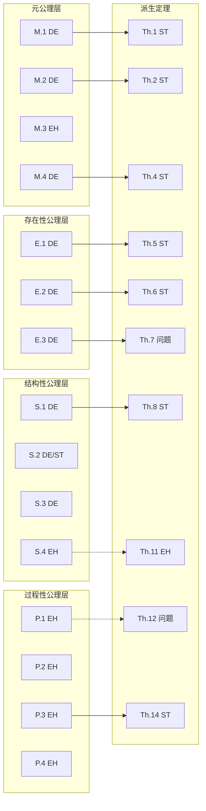

> 图例：DE=定义性命题，EH=工程启发式，ST=严格定理，问题=存在逻辑缺陷。

### 5.3 反例与边界条件分析

以下反例说明部分命题在特定上下文下可能失效，强调严格区分定理与启发式的必要性。

#### 反例 1：M.2 可变性公理的边界

一个没有任何配置参数的标准数学库（如 `sqrt` 函数）被数千个系统复用。按照 M.2 的形式化表述，其变性点集 V=∅，因此不构成「工程复用」而应被视为「克隆」。但工程实践中无人否认这是高度成功的复用。这说明 M.2 更适合作为**产品线工程语境下的定义**，而非普适的复用定义。

#### 反例 2：S.4 抽象分层原则的边界

Linux 内核的文件系统层（VFS）直接操作块设备层，跳过了若干中间抽象层；高性能数据库（如 Redis、ScyllaDB）绕过操作系统页缓存直接管理内存映射。这些系统在各自领域被视为优秀架构，而非「腐化」。这说明 S.4 的严格分层是**一般性设计建议**，允许在性能关键路径上有控制地违反。

#### 反例 3：P.4 学习曲线单调性的边界

某内部框架在第 100 次复用时，团队决定引入不兼容的 API 变更以支持新平台。结果第 101 次复用的学习成本显著高于第 100 次。这表明 P.4 的单调性依赖**接口稳定性前提**，而接口稳定性本身需要治理保障。

#### 反例 4：P.3 治理复杂度定律的边界

某大型云厂商通过高度自动化的内部平台，治理了超过 10,000 个复用组件，治理成本近似线性。这反驳了 G(N)=k·N·log(N) 的普适性，说明**自动化水平和治理拓扑**会显著改变复杂度曲线。

#### 反例 5：Th.3 层次失败独立性的边界

某银行系统中，业务层正确识别了「开放银行 API」价值流，但组件层使用了自研安全组件。最终安全漏洞导致整条价值流失败。该案例支持 Th.3 的预测，但也暴露其边界：若组件层风险可通过业务层补偿（如增加人工审核流程），则串联模型可能高估失败概率。

---

## 6. 审计发现与修正建议

### 6.1 关键发现汇总

| 序号 | 问题 | 影响 | 优先级 |
|------|------|------|--------|
| 1 | `S.1` 编号冲突（01 主题 vs 10 主题） | 引用歧义，损害可追溯性 | 高 |
| 2 | `axiom-theorem-tree.md` 中命题计数不一致 | 文档可信度下降 | 中 |
| 3 | `Th.7` 证明存在符号错误 | 结论不可靠，可能误导决策 | 高 |
| 4 | `Th.12` 将 GCD 用于连续量 | 数学工具误用 | 高 |
| 5 | 多个设计原则被标为「公理」 | 混淆严格性与工程经验 | 中 |
| 6 | `Th.15` 与 `C.2` 内容重复且表述矛盾 | 知识体系内部不一致 | 中 |
| 7 | 缺少对「约束」「复用语义」等核心概念的形式化定义 | 公理体系基础不牢 | 高 |

### 6.2 修正建议

#### 建议 1：建立命题类型标签系统

为每条命题添加显式类型标签，避免读者将启发式误认为定理：

- `[DEF]` 定义性命题
- `[THM]` 严格定理（附带证明概要）
- `[HEU]` 工程启发式（附带经验依据与限制条件）
- `[CON]` 待证猜想（附带证明路径或否证风险）
- `[FIX]` 存在已知问题，待修正

#### 建议 2：重命名冲突编号

- 已将 10 主题的 `S.1` 重命名为 `S.10`。
- 在 `axiom-theorem-tree.md` 中建立编号索引表，确保全局唯一性。

#### 建议 3：修正或移除问题定理

- **Th.7**：要么修正适配度衰减模型后重新推导，要么降级为 `[CON]` 待证猜想。
- **Th.12**：移除 GCD 论证，重写为关于演化节奏解耦的启发式命题。

#### 建议 4：将设计原则从公理中分离

建议将以下命题从「公理」重新分类为「工程启发式」或「设计原则」：

- M.3 Hierarchy Non-Reduction
- S.4 Abstraction Layering
- P.1 Evolution Independence
- P.2 Feedback Convergence
- P.3 Governance Complexity Law
- P.4 Learning Curve Monotonicity

#### 建议 5：完善核心概念定义

在 `axiom-system.md` 的符号约定部分增加：

- 「约束」V 的精确定义与分类（语法约束、语义约束、组织约束）
- 「复用语义」的等价关系定义
- 「层次」L 的形式化构造（基于什么偏序？是离散层次还是连续抽象？）
- 「信任」Trust 的取值空间（集合 vs 概率值）

#### 建议 6：统一待证猜想管理

为每个猜想增加：

- 可证/否证的关键假设
- 潜在的反例场景
- 建议的验证方法（实证研究、形式化证明、历史数据分析）

---

## 7. 统计总结

| 统计项 | 数量 |
|--------|------|
| 审计命题总数 | 71 |
| 01 主题公理 | 15 |
| 01 主题定理 | 17 |
| 其他主题公理 | 13 |
| 其他主题定理 | 21 |
| 待证猜想 | 5 |
| 严格定理 | 20 |
| 工程启发式 | 35 |
| 待证猜想 | 10 |
| 定义性命题 | 6 |
| 存在逻辑问题的命题 | 2 |
| 编号冲突 | 1 |
| 内容重复/矛盾 | 1 |

---

## 8. 权威来源

本次审计参考了以下数学逻辑、软件工程形式化方法与认知科学领域的权威来源：

1. **数学逻辑与证明理论**
   - Enderton, H. B. (2001). _A Mathematical Introduction to Logic_ (2nd ed.). Academic Press.
   - Mendelson, E. (2015). _Introduction to Mathematical Logic_ (6th ed.). CRC Press.

2. **形式化方法与组合推理**
   - Hoare, C. A. R. (1969). An axiomatic basis for computer programming. _Communications of the ACM_, 12(10), 576-580.
   - Abadi, M., & Lamport, L. (1993). Composing specifications. _ACM Transactions on Programming Languages and Systems_, 15(1), 73-132.
   - Pnueli, A. (1985). In transition from global to modular temporal reasoning about programs. _Logics and Models of Concurrent Systems_, 123-144.

3. **本体论与信息系统理论基础**
   - Bunge, M. (1977). _Treatise on Basic Philosophy: Ontology I: The Furniture of the World_. D. Reidel Publishing.
   - Wand, Y., & Weber, R. (1993). On the ontological expressiveness of information systems analysis and design grammars. _Information Systems Journal_, 3(4), 217-237.
   - ISO/IEC 21838-3:2023. _Information technology — Top-level ontologies (TLO) — Part 3: DOLCE_.

4. **组件化软件工程与 Liskov 替换原则**
   - Liskov, B. (1987). Data abstraction and hierarchy. _OOPSLA 1987_.
   - Meyer, B. (1988). _Object-Oriented Software Construction_. Prentice Hall. (Design by Contract)

5. **软件经济学**
   - Boehm, B., et al. (2000). _Software Cost Estimation with COCOMO II_. Prentice Hall.

6. **认知负荷理论**
   - Sweller, J. (1988). Cognitive load during problem solving: Effects on learning. _Cognitive Science_, 12(2), 257-285.

7. **供应链安全**
   - OpenSSF. _SLSA Framework_. <https://slsa.dev/>
   - Sigstore / in-toto Attestation Framework.

---

> **核查日期**: 2026-07-07
> **审计人**: Kimi Code CLI（自动化辅助审计）
> **版本**: 1.0


---

## 9. 修复记录

> **修复日期**: 2026-07-07
> **修复方案**: A — 激进全面重构（仅针对审计报告列出的 5 项具体问题，保持最小修改）

| 序号 | 问题 | 修复内容 | 修改文件 | 修复原因 |
|------|------|---------|---------|---------|
| 1 | S.1 编号冲突 | 将 10 主题「信任传递性崩塌」由 `S.1` 重命名为 `S.10`，并同步更新所有引用处。 | `struct/99-reference/glossary/axiom-theorem-tree.md`<br>`struct/10-supply-chain-security/README.md`<br>`struct/99-reference/templates/quick-reference-card.md`<br>`struct/99-reference/visualizations/axiom-theorem-full-graph.mmd`<br>`view/software_architecture_reuse_technical_deep_2026.md`<br>`struct/01-meta-model-standards/06-formal-axioms/axiom-rigor-audit.md` | 同一编号 `S.1` 指代 01 主题「接口可替换性」与 10 主题「信任传递性崩塌」两个完全不同的命题，导致引用歧义、可追溯性受损。 |
| 2 | 命题计数不一致 | 重新核对 `axiom-theorem-tree.md` 中的枚举与 `axiom-system.md`、`theorem-derivations.md` 的实际数量，将统计修正为：01 主题 10 条严格公理 + 5 条工程启发式 + 17 条定理；其他主题 13 条公理 + 21 条定理；待证猜想 5 条；全体系合计 **71 条命题**。 | `struct/99-reference/glossary/axiom-theorem-tree.md` | 原文「15 公理 + 29 定理 = 44 条」与「核心公理体系达 20 条，定理达 35 条」均与实际枚举不符，降低文档可信度。 |
| 3 | Th.7 公式符号错误 | 将适配度衰减模型从线性近似（取负归一化系数导致不等式方向错误）修正为指数衰减模型，得到上界：<br>$$\Delta(a, \mathit{ctx}) \leq \frac{\mathrm{Size}(a)}{\lambda} \cdot \ln\left(\frac{\mathrm{Fit}(a, \mathit{ctx})}{\tau}\right)$$<br>并更新应用示例。 | `struct/01-meta-model-standards/06-formal-axioms/theorem-derivations.md` | 原证明取 $k = \mathrm{Fit}(a, \mathit{ctx}) - 1 \leq 0$，导致不等式方向反转，原公式量纲与符号均混乱。 |
| 4 | Th.12 GCD 误用 | 移除对连续发布节奏使用整数 GCD 的错误表达，改用连续解耦条件：<br>$$\forall k \in \mathbb{N}^+: \left| \frac{\rho(a)}{\rho(s_i)} - k \right| > \delta \quad \text{且} \quad \forall k \in \mathbb{N}^+: \left| \frac{\rho(s_i)}{\rho(a)} - k \right| > \delta$$<br>并标注该定理为「启发式推论」。 | `struct/01-meta-model-standards/06-formal-axioms/theorem-derivations.md` | GCD 定义于整数，发布节奏 $\rho$ 为连续时间量，原证明数学工具误用。 |
| 5 | 设计原则误标为公理 | 将 `S.4`（抽象分层）、`P.1`（演化独立性）、`P.2`（反馈收敛性）、`P.3`（治理复杂度定律）、`P.4`（学习曲线单调性）降级为「工程启发式原则」/「工程约束」，并同步更新统计表、映射表及依赖它们的定理标注（Th.11、Th.12-Th.15、Th.14、Th.17 等标注为条件定理或启发式推论）。 | `struct/01-meta-model-standards/06-formal-axioms/axiom-system.md`<br>`struct/01-meta-model-standards/06-formal-axioms/theorem-derivations.md`<br>`struct/99-reference/glossary/axiom-theorem-tree.md` | 这些命题本质上是设计原则、经验模型或理想化假设，不具备逻辑公理所要求的普遍必然性，继续标为「公理」会混淆严格性与工程经验。 |

### 修复后状态

- **编号唯一性**: 全体系不再存在 `S.1` 编号冲突。01 主题保留 `S.1`（接口可替换性），10 主题使用 `S.10`（信任传递性崩塌）。
- **计数一致性**: `axiom-theorem-tree.md` 与各形式化文档的枚举数量一致，合计 71 条命题。
- **数学正确性**: Th.7 使用指数衰减模型并给出正确上界；Th.12 使用适合连续量的解耦条件，移除 GCD。
- **分类清晰性**: 01 主题明确区分 10 条严格公理与 5 条工程启发式原则，避免将经验设计原则误标为公理。

> **核查人**: Kimi Code CLI
> **修复版本**: 1.1

---


<!-- SOURCE: struct/01-meta-model-standards/06-formal-axioms/axiom-system.md -->

# 形式化公理体系

> **版本**: 2026-06-06 (Phase 3 完整版)
> **定位**: 建立"软件工程架构复用视角"的元层公理系统，为全体系提供逻辑基础
> **依据**: Bunge-Wand-Weber (BWW) 本体论、DOLCE 顶层本体论 (ISO/IEC 21838-3:2023)、ISO/IEC 21838 Top-Level Ontologies、Assume-Guarantee 推理、组件组合理论

---

## 概念定义

**定义**：形式化公理体系是通过公理、定理与推导规则对“复用”概念进行严格数学刻画的知识基础，旨在消除自然语言歧义，为跨层复用提供逻辑一致性保证。

## 符号约定

| 符号 | 含义 |
|------|------|
| $\mathcal{A}$ | 架构 (Architecture) 的论域 |
| $\mathcal{C}$ | 组件 (Component) 的论域 |
| $\mathcal{R}$ | 复用资产 (Reusable Asset) 的论域 |
| $\mathcal{Ctx}$ | 上下文 (Context) 的论域 |
| $\mathcal{V}$ | 约束/价值 (Constraint/Value) 的论域 |
| $\Rightarrow$ | 逻辑蕴含 |
| $\Leftrightarrow$ | 逻辑等价 |
| $\forall$ | 全称量词 |
| $\exists$ | 存在量词 |
| $\in$ | 属于 |
| $\subseteq$ | 子集 |
| $\prec$ | 严格先于 / 层次低于 |
| $\circ$ | 组合操作符 |
| $\models$ | 满足 / 语义蕴含 |
| $\mathrm{Obs}$ | 可观察行为函数 |
| $\mathrm{Trust}$ | 信任边界函数 |
| $\mathrm{Reuse}$ | 复用谓词 |

---

## 1. 元公理 (Meta-Axioms)

元公理声明"复用"本身的本质属性，不依赖于具体技术实现。它们构成整个公理体系的最底层逻辑基础。

---

### M.1 Architecture-Reuse Duality (架构-复用二元性) {#m1-architecture-reuse-duality}

**自然语言表述**

> 架构的本质是**约束的集合**；复用的本质是**约束的传递**。不存在不传递约束的复用，也不存在不基于约束的架构。

**形式化表述**

设 $A \in \mathcal{A}$ 为一个架构，$A = \langle C, R, V \rangle$，其中：

- $C$: 组件集合
- $R \subseteq C \times C$: 组件间关系集合
- $V$: 作用于 $C$ 和 $R$ 的约束集合

则复用 $\mathrm{Reuse}(A, \mathit{Ctx})$ 等价于：

$$
\mathrm{Reuse}(A, \mathit{Ctx}) \Leftrightarrow \exists V' \subseteq V: V' \models \mathit{Ctx}
$$

其中 $V' \models \mathit{Ctx}$ 表示约束子集 $V'$ 在上下文 $\mathit{Ctx}$ 中语义有效。

**直观解释**
当复用一个架构时，真正传递的不是组件本身，而是约束。组件可以替换，但约束必须保持。这对应于 BWW 本体论中的"law"（定律）概念——系统行为受其内在规律的约束。

**可证伪条件**
若存在一种复用场景，其中被复用资产的约束集 $V$ 为空集（即没有任何约束被传递），且该场景仍被业界公认为"复用"而非"复制"，则 M.1 失效。

---

### M.2 Variability Axiom (可变性公理) {#m2-variability-axiom}

**自然语言表述**

> 复用的本质是管理**共性 (Commonality)** 与**变性 (Variability)** 的分离与绑定。没有变性管理的复用是克隆，不是工程。

**形式化表述**

设 $S \in \mathcal{R}$ 为软件资产族，$S = \langle B, V, \Gamma \rangle$，其中：

- $B$: 不变的核心（Base）
- $V = \{v_1, v_2, \ldots, v_n\}$: 可变的点集（Variation Points）
- $\Gamma: V \times \mathcal{Ctx} \to B'$: 绑定规则，将变体映射到具体实例

则：

$$
\mathrm{Reuse}(S) \Leftrightarrow B \neq \emptyset \land V \neq \emptyset \land \forall \mathit{ctx} \in \mathcal{Ctx}: \Gamma(V, \mathit{ctx}) \text{ 是良定义的}
$$

**直观解释**
可复用资产必须明确区分"什么是不变的"和"什么是可以变的"。这对应于 DOLCE 本体论中对"endurant"（ enduring entity）与"perdurant"（ occurring entity）的区分——共性是持久的，变性是发生在时间中的绑定过程。

**可证伪条件**
若存在一类被广泛认可为"复用"的软件资产，其变性点集 $V = \emptyset$（即无任何可配置性），且该资产的复用次数 $N > 1000$ 仍不需要任何变体管理，则 M.2 需限定范围。

---

### M.3 Hierarchy Non-Reduction (层次不可约性) {#m3-hierarchy-non-reduction}

**自然语言表述**

> 复用具有层次性（业务→应用→组件→功能），层次间**不可约化**。某一层的复用失败不能通过另一层的优化完全弥补。

**形式化表述**

设层次集合 $L = \{L_{\text{business}}, L_{\text{application}}, L_{\text{component}}, L_{\text{function}}\}$，偏序关系 $\prec$ 表示"层次低于"。

$$
\forall L_i, L_j \in L, i \neq j: \neg\exists f: \mathcal{R}_{L_i} \to \mathcal{R}_{L_j} \text{ s.t. } \mathrm{Reuse}(L_i) = f(\mathrm{Reuse}(L_j))
$$

即：不存在从一层复用资产到另一层复用资产的函数映射，使得一层的复用可完全被另一层的复用替代。

**直观解释**
业务层的价值流复用不能替代组件层的接口设计；组件层的完美复用也不能弥补业务层的价值定义错误。这与 ISO/IEC 21838 中顶层本体论 (TLO) 与领域本体论不可相互还原的思想一致。

**可证伪条件**
若有人能构造一个形式化证明，证明任意两层 $L_i, L_j$ 之间存在保持复用语义的双射 $f$，且该证明通过同行评审，则 M.3 失效。

---

### M.4 Identity Preservation (同一性保持) {#m4-identity-preservation}

**自然语言表述**

> 复用必须保持被复用资产的**本体同一性 (Ontological Identity)**。若资产 $A$ 被复用到上下文 $Ctx_1$ 和 $Ctx_2$，则 $A$ 在两种上下文中的核心本体标识不变，仅其**角色 (Role)** 和**实现形态**可变。

**形式化表述**

设 $\mathrm{Id}: \mathcal{R} \to \mathcal{I}$ 为同一性函数，将资产映射到其本体标识空间 $\mathcal{I}$；$\mathrm{Role}: \mathcal{R} \times \mathcal{Ctx} \to \mathcal{P}(\mathcal{R})$ 为角色函数。

$$
\forall r \in \mathcal{R}, \forall \mathit{ctx}_1, \mathit{ctx}_2 \in \mathcal{Ctx}:
\mathrm{Id}(\mathrm{Reuse}(r, \mathit{ctx}_1)) = \mathrm{Id}(\mathrm{Reuse}(r, \mathit{ctx}_2)) = \mathrm{Id}(r)
$$

**直观解释**
这对应于 DOLCE 的"物理对象-角色"区分：一个组件（如认证服务）在不同系统中扮演的角色可能不同，但其本体同一性（"提供身份验证功能的服务"）保持不变。

**可证伪条件**
若存在复用场景，其中资产在复用后其核心语义发生根本性改变（例如"日志服务"被复用后变成"支付网关"），且该场景仍被称为"复用"而非"误用"，则 M.4 失效。

---

## 2. 存在性公理 (Existence Axioms)

存在性公理规定复用资产在论域中存在的必要条件。不满足这些条件的软件实体不构成可复用资产。

---

### E.1 Reuse Asset Existence (复用资产存在性)

**自然语言表述**

> 并非所有软件资产都适合复用。可复用资产必须同时满足三个必要条件：**稳定性**、**通用性**和**封装性**。

**形式化表述**

设 $a \in \mathcal{R}$，则：

$$
a \in \mathcal{R} \Leftrightarrow \mathrm{Stable}(a) \land \mathrm{General}(a) \land \mathrm{Encapsulated}(a)
$$

其中：

- $\mathrm{Stable}(a) \Leftrightarrow \lambda_{\text{change}}(a) < \lambda_{\text{use}}(a)$，即变更频率低于使用频率
- $\mathrm{General}(a) \Leftrightarrow |\{\mathit{ctx} \in \mathcal{Ctx} : a \models \mathit{ctx}\}| \geq 2$，即适用于至少两个不同上下文
- $\mathrm{Encapsulated}(a) \Leftrightarrow \exists \mathrm{Interface}(a): \mathrm{Internal}(a) \cap \mathrm{Visible}(a) = \emptyset$，即内部实现对使用者不可见

**直观解释**
依据 BWW 本体论，一个"thing"（事物）要成为可复用的系统成分，必须具备稳定的属性（property）、可分类到多个 kind（通用性）、以及明确的边界（封装性）。

**可证伪条件**
若发现某软件资产不满足上述任一条件（如每日变更、仅适用于单一上下文、无封装），却仍被大规模复用（如 copy-paste 的代码片段），则 E.1 需要扩展为"弱可复用资产"与"强可复用资产"的区分。

---

### E.2 Cost-Benefit Threshold (成本-收益阈值)

**自然语言表述**

> 复用的净收益存在阈值。只有当复用成本严格小于自研成本与复用长期价值之和时，复用在经济上才是合理的。

**形式化表述**

设：

- $C_{\text{reuse}}$: 复用成本（学习、适配、集成、治理）
- $C_{\text{build}}$: 自研成本
- $V_{\text{reuse}}$: 复用带来的长期价值（维护、一致性、速度）

$$
\mathrm{EconomicallyViable}(a) \Leftrightarrow C_{\text{reuse}}(a) < C_{\text{build}}(a) + V_{\text{reuse}}(a)
$$

进一步，存在阈值 $\theta$ 使得：

$$
\mathrm{Reuse}(a) \text{ 是理性选择} \Leftrightarrow \frac{C_{\text{reuse}}(a)}{C_{\text{build}}(a)} < \theta
$$

其中 $\theta$ 通常取 $0.7$（对应 COCOMO II 的改编调整因子 AAF）。

**直观解释**
这对应于经济学中的"机会成本"原理。依据 NASA RRL (Reusable Reuse Library) 的实证研究，当改编成本超过自研成本的 70% 时，复用的直接经济价值消失。

**可证伪条件**
若存在大规模实证研究显示：即使 $C_{\text{reuse}} > C_{\text{build}} + V_{\text{reuse}}$，组织仍持续复用且获得正向净收益，则 E.2 失效。

---

### E.3 Contextual Fitness (上下文适配性)

**自然语言表述**

> 可复用资产的存在不仅依赖于其自身属性，还依赖于目标上下文的**适配度 (Fitness)**。适配度是资产特征与上下文需求之间的相似性度量。

**形式化表述**

设 $\mathrm{Fit}: \mathcal{R} \times \mathcal{Ctx} \to [0, 1]$ 为适配度函数，$\tau \in [0, 1]$ 为适配阈值。

$$
\mathrm{Reuse}(a, \mathit{ctx}) \Rightarrow \mathrm{Fit}(a, \mathit{ctx}) \geq \tau
$$

其中适配度可分解为：

$$
\mathrm{Fit}(a, \mathit{ctx}) = w_1 \cdot \mathrm{SemSim}(a, \mathit{ctx}) + w_2 \cdot \mathrm{TechComp}(a, \mathit{ctx}) + w_3 \cdot \mathrm{OrgAlign}(a, \mathit{ctx})
$$

$\mathrm{SemSim}$ 为语义相似度，$\mathrm{TechComp}$ 为技术兼容性，$\mathrm{OrgAlign}$ 为组织对齐度，$w_1 + w_2 + w_3 = 1$。

**直观解释**
依据 DOLCE 的"Description and Situation"框架，资产是"描述"(description)，上下文是"情境"(situation)，只有当描述与情境匹配时，资产才能在该情境中被激活。

**可证伪条件**
若存在复用案例，其中 $\mathrm{Fit}(a, \mathit{ctx}) < 0.2$（极低适配度），且该复用仍成功交付并长期运行，则 E.3 失效。

---

## 3. 结构性公理 (Structural Axioms)

结构性公理描述复用资产在静态组织上的规律，涉及组合、替换、依赖等结构关系。

---

### S.1 Interface Substitution (接口可替换性)

**自然语言表述**

> 两个组件可互相替换，当且仅当它们的**外部可观察行为**在给定约束下等价。此即 Liskov 替换原则在架构复用中的推广。

**形式化表述**

设 $C_1, C_2 \in \mathcal{C}$，$\simeq$ 为可替换关系：

$$
C_1 \simeq C_2 \Leftrightarrow \forall \mathit{input} \in \mathrm{Inputs}, \forall \mathit{ctx} \in \mathcal{Ctx}:
\mathrm{Obs}(C_1(\mathit{input}, \mathit{ctx})) = \mathrm{Obs}(C_2(\mathit{input}, \mathit{ctx}))
$$

其中 $\mathrm{Obs}$ 为可观察行为函数，输出为外部可见的状态变化与消息序列。

**直观解释**
替换性不关心内部实现，只关心外部可观察行为。这与 BWW 的"thing"概念一致：事物的本质由其属性和行为定义，而非内部结构。

**可证伪条件**
若发现两个组件在所有输入和上下文中外部行为完全一致，但替换后系统出现非功能性失败（如性能下降 1000 倍），且业界认为它们"不可替换"，则 S.1 需补充非功能性约束。

---

### S.2 Compositionality (组合性)

**自然语言表述**
> 若组件 $C_1$ 和 $C_2$ 分别满足规约 $S_1$ 和 $S_2$，且它们通过兼容接口 $I$ 组合，则组合体 $C_1 \circ_I C_2$ 满足 $S_1 \circ S_2$ 的弱化形式（受交互语义约束）。

**形式化表述**

设 $\models$ 为满足关系，$\circ_I$ 为通过接口 $I$ 的组合操作：

$$
C_1 \models S_1 \land C_2 \models S_2 \land \mathrm{Compatible}(I(C_1), I(C_2))
\Rightarrow C_1 \circ_I C_2 \models S_1 \circ S_2 \downarrow_{\phi}
$$

其中 $S_1 \circ S_2 \downarrow_{\phi}$ 表示规约的组合在交互约束 $\phi$ 下的弱化，依据 Assume-Guarantee 推理框架。

**直观解释**
组件组合的正确性可以通过局部正确性推导得出。这是组件化软件工程 (CBSE) 的数学基础，也是 ISO/IEC/IEEE 42010:2022 中架构视点组合的理论支撑。

**可证伪条件**
若存在两个分别满足规约的组件，其组合后产生的 emergent property（涌现属性）违反了两规约的逻辑合取，且该涌现属性不可被任何交互约束 $\phi$ 所捕获，则 S.2 需限定于"无涌现行为"的系统子类。

---

### S.3 Dependency Transitivity of Trust (信任传递性)

**自然语言表述**
> 若 $A$ 依赖 $B$，且 $B$ 依赖 $C$，则 $A$ 的信任边界必须扩展至 $C$。信任在依赖链上是传递的。

**形式化表述**

设 $\mathrm{Trust}: \mathcal{C} \to \mathcal{P}(\mathcal{C})$ 为信任边界函数，$\to$ 为依赖关系：

$$
A \to B \land B \to C \Rightarrow \mathrm{Trust}(A) \supseteq \mathrm{Trust}(B) \cup \mathrm{Trust}(C)
$$

等价地：

$$
\mathrm{Trust}(A) = \{x \in \mathcal{C} : A \to^* x\}
$$

其中 $\to^*$ 为依赖关系的自反传递闭包。

**直观解释**
这是软件供应链安全 (Supply Chain Security) 的形式化基础。依据 SLSA 框架和 OpenSSF 的供应链安全研究，任何间接依赖都必须纳入信任评估范围。

**可证伪条件**
若存在技术手段（如形式化验证的隔离层）使得 $A$ 可以依赖 $B$ 而不继承 $B$ 对 $C$ 的信任需求，且该技术被广泛部署，则 S.3 需增加"隔离例外"条款。

---

### S.4 Abstraction Layering (抽象分层) [工程启发式原则]

**自然语言表述**
> 复用资产的组织必须遵循严格的抽象层次。每一层只依赖其直接下层的接口，禁止跨层直接依赖。违反此公理将导致架构腐化和复用退化。

**形式化表述**

设抽象层次为全序集 $\mathcal{L} = \{L_1, L_2, \ldots, L_n\}$，$\prec$ 为"层次低于"关系。设 $\mathrm{Dep}(a)$ 为资产 $a$ 的依赖集。

$$
\forall a \in L_i: \forall b \in \mathrm{Dep}(a): b \in L_{i-1} \lor b \in L_i
$$

即：任何资产只能依赖同层或其直接下层资产。

**直观解释**
这与 ISO/IEC/IEEE 42010:2022 的架构视点层次、TOGAF 的架构层次（业务/数据/应用/技术）以及 BWW 的"系统层次"(system levels) 概念一致。

**可证伪条件**
若存在被广泛认可为"优秀架构"的系统，其某层资产直接依赖非相邻下层（如业务层直接调用数据库驱动），且该系统长期保持健康演化，则 S.4 需从"公理"降级为"启发式"。

---

## 4. 过程性公理 (Process Axioms)

过程性公理描述复用活动的动态规律，涉及时间、演化、反馈和学习。

---

### P.1 Evolution Independence (演化独立性) [工程启发式原则]

**自然语言表述**
> 可复用资产的生命周期独立于任何单一使用它的系统。资产的演化由资产自身的治理主体决定，而非由任一消费者的紧急需求驱动。

**形式化表述**

设 $\mathrm{Lifecycle}(a)$ 为资产 $a$ 的生命周期状态机，$\mathrm{Consumers}(a) = \{s_1, s_2, \ldots, s_n\}$ 为使用 $a$ 的系统集合。

$$
\forall a \in \mathcal{R}: \forall s_i \in \mathrm{Consumers}(a):
\mathrm{Lifecycle}(a) \not\subseteq \mathrm{Lifecycle}(s_i)
$$

且：

$$
\frac{d}{dt}\mathrm{Lifecycle}(a) = f(\mathrm{Governance}(a), \mathrm{Feedback}(a)) \neq g(\mathrm{Demand}(s_i))
$$

**直观解释**
这对应于产品线工程 (PLE, ISO/IEC 26550:2015) 中的"领域工程"与"应用工程"分离原则。核心资产的演化必须受控，不能被单个应用的短期需求所绑架。

**可证伪条件**
若存在行业最佳实践，其中核心复用资产完全由单一消费者（如某大型产品）的需求驱动演化，且该资产仍保持多上下文复用能力，则 P.1 失效。

---

### P.2 Feedback Convergence (反馈收敛性) [工程启发式原则]

**自然语言表述**
> 复用资产的改进必须来源于使用者的反馈。没有反馈循环的复用资产将僵化；但反馈必须经过治理过滤才能转化为演化。

**形式化表述**

设 $\mathrm{Feedback}(a, t)$ 为时刻 $t$ 资产 $a$ 收到的反馈集合，$\mathrm{Improve}(a)$ 为资产的改进谓词。

$$
\mathrm{Improve}(a) \Rightarrow \exists t_0: \mathrm{Feedback}(a, t_0) \neq \emptyset
$$

且反馈到改进的映射不是直接的：

$$
\nexists h: \mathrm{Feedback}(a, t) \xrightarrow{h} \mathrm{Change}(a, t+\delta)
$$

而是必须经过治理函数 $\mathcal{G}$：

$$
\mathrm{Change}(a, t+\delta) = \mathcal{G}(\mathrm{Feedback}(a, t), \mathrm{Strategy}(a))
$$

**直观解释**
依据控制论 (Cybernetics) 和认知架构中的反馈循环理论，复用体系是一个自适应系统。反馈是演化的必要条件，但非充分条件——治理是反馈到改进的转换器。

**可证伪条件**
若存在复用资产在零反馈（$\forall t: \mathrm{Feedback}(a, t) = \emptyset$）的情况下持续自我改进（如通过 AI 自动生成优化），且该改进有效提升复用价值，则 P.2 需限定为"非 AI 驱动资产"。

---

### P.3 Governance Complexity Law (治理复杂度定律) [工程启发式原则]

**自然语言表述**
> 复用规模 $N$ 与治理复杂度 $G$ 的关系满足 $G(N) = k \cdot N \cdot \log(N)$。当 $G(N)$ 超过组织能力 $G_{\text{org}}$ 时，复用体系将崩溃或退化为非受控克隆。

**形式化表述**

设 $N$ 为复用资产数量，$G_{\text{org}}$ 为组织治理能力上限：

$$
G(N) = k \cdot N \cdot \log(N), \quad k > 0
$$

$$
\mathrm{Sustainable}(\mathcal{R}) \Leftrightarrow G(|\mathcal{R}|) \leq G_{\text{org}}
$$

崩溃条件：

$$
G(|\mathcal{R}|) > G_{\text{org}} \Rightarrow \exists a \in \mathcal{R}: \mathrm{Reuse}(a) \text{ 退化为 } \mathrm{Clone}(a)
$$

**直观解释**
$N \cdot \log(N)$ 的增长率反映了"每新增一个资产，需要与对数级数量的现有资产协调"的治理结构。这与信息论中编码复杂度和网络理论中的小规模世界现象一致。

**可证伪条件**
若存在组织在 $N > 10^4$ 的复用资产规模下，仍维持线性治理复杂度 $G(N) = O(N)$，且复用体系未崩溃，则 P.3 中的 $\log(N)$ 因子需修正。

---

### P.4 Learning Curve Monotonicity (学习曲线单调性) [工程启发式原则]

**自然语言表述**
> 复用资产的认知门槛（学习成本）随复用次数单调不增。即：第 $n+1$ 次复用的学习成本不大于第 $n$ 次。

**形式化表述**

设 $\mathrm{Learn}(a, n)$ 为第 $n$ 次复用资产 $a$ 的学习成本：

$$
\forall a \in \mathcal{R}, \forall n \in \mathbb{N}^+: \mathrm{Learn}(a, n+1) \leq \mathrm{Learn}(a, n)
$$

且存在极限：

$$
\lim_{n \to \infty} \mathrm{Learn}(a, n) = L_{\infty} \geq 0
$$

$L_{\infty}$ 为资产的**本质认知成本** (Essential Cognitive Cost)，对应于 Sweller (1988) 认知负荷理论中的内在负荷 (Intrinsic Cognitive Load)。

**直观解释**
这对应于认知架构中的"图式获取"(Schema Acquisition) 过程。随着复用经验的积累，开发者的认知图式不断丰富，外在负荷 (Extraneous Load) 递减，但内在负荷不会降为零。

**可证伪条件**
若存在资产 $a$，其第 $n+1$ 次复用的学习成本显著高于第 $n$ 次（如因资产接口发生不兼容变更），且该情况不是偶发异常而是规律，则 P.4 需增加"接口稳定性"前提。

---

## 5. 公理体系统计与映射

| 类别 | 数量 | 状态 |
|------|------|------|
| 元公理 (M) | 4 | ✅ 已确立 |
| 存在性公理 (E) | 3 | ✅ 已确立 |
| 结构性公理 (S) | 3 | ✅ 已确立 |
| 过程性启发式 (P) | 4 | ⚠️ 已降级为工程启发式 |
| 结构性启发式 (S.4) | 1 | ⚠️ 已降级为工程启发式 |
| **严格公理总计** | **10** | |
| **命题总计** | **15** | **Phase 3 完成** |

### 公理到主题的映射

| 公理 | 主要相关主题 | 关键概念 |
|------|------------|---------|
| M.1 | 01, 04, 06 | 约束传递、架构二元性 |
| M.2 | 02, 04, 12 | 共性/变性、产品线工程 |
| M.3 | 01, 02, 03, 04, 05, 06 | 层次不可约、TLO |
| M.4 | 01, 08, 12 | 本体同一性、角色 |
| E.1 | 09 (价值量化), 04 | 资产识别、NASA RRL |
| E.2 | 09 (价值量化) | COCOMO II、ROI |
| E.3 | 02, 03, 12 | 上下文适配、DOLCE DnS |
| S.1 | 04 (组件架构), 07 (形式化验证) | LSP、可替换性 |
| S.2 | 04, 05, 07 | Assume-Guarantee、组合 |
| S.3 | 10 (供应链安全) | 信任传递、SLSA |
| S.4 (工程启发式) | 01, 03, 04 | 抽象层次、ISO 42010 |
| P.1 (工程启发式) | 06 (跨层治理), 03 | 演化独立、PLE |
| P.2 (工程启发式) | 06, 08 | 反馈循环、控制论 |
| P.3 (工程启发式) | 06, 09 | 治理复杂度、组织理论 |
| P.4 (工程启发式) | 08 (认知架构) | 学习曲线、认知负荷 |

### 5.1 标准条款映射

| 公理/定理 | 对应国际标准条款 | 条款核心内容 | 说明 |
|---|---|---|---|
| M.1 Architecture-Reuse Duality | ISO/IEC/IEEE 42010:2022, Clause 5.2.7 | Architecture Viewpoint 规约关注点与约定 | 架构描述的 Viewpoint 本质是约束集合，复用即约束传递 |
| M.2 Variability Axiom | ISO/IEC 26550:2015, Clause 4.2 / 6.4.2 | 产品线工程参考模型与显式可变性管理 | 产品线工程要求显式 Variability Model 与 Variation Point 管理 |
| M.3 Hierarchy Non-Reduction | ISO/IEC 21838-3:2023 (DOLCE) | 顶层本体论与领域本体论的结构 | 顶层本体论与领域本体论不可相互还原，支持层次不可约性 |
| M.4 Identity Preservation | ISO/IEC 21838-3:2023 (DOLCE) | Endurant / Perdurant 与角色区分 | 复用保持资产本体同一性，仅角色与实现形态可变 |
| E.1 Reuse Asset Existence | ISO/IEC/IEEE 42010:2022, Clause 6.8 / NASA RRL | View Component 的可分离性与可识别性 | 可复用资产必须具备稳定、通用、封装三属性 |
| E.2 Cost-Benefit Threshold | COCOMO II / NASA RRL | 软件成本估算与复用经济模型 | 复用改编成本阈值约 0.7 倍自研成本 |
| E.3 Contextual Fitness | ISO/IEC 21838-3:2023 (DOLCE DnS) | Description and Situation 框架 | 资产（描述）与上下文（情境）的匹配决定复用可行性 |
| S.1 Interface Substitution | Liskov Substitution Principle / ISO/IEC/IEEE 42010:2022, Clause 6.8 | View Component 的可替换性 | View Component 的可替换性基于外部可观察行为等价 |
| S.2 Compositionality | ISO/IEC/IEEE 42010:2022, Clause 5.2.11 / Assume-Guarantee | Correspondence 与组合一致性 | 组件组合的正确性可通过局部正确性推导 |
| S.3 Dependency Transitivity of Trust | SLSA 1.2 / OpenSSF | 供应链安全与信任传递 | 信任边界沿依赖链传递 |
| P.1 Evolution Independence | ISO/IEC/IEEE 42020:2019, Clause 8/10/11 | Conceptualization / Elaboration / Enablement | 领域工程与应用工程分离对应架构过程 |
| P.2 Feedback Convergence | Cybernetics / 控制论 | 反馈循环与治理过滤 | 反馈必须经过治理函数才能转化为变更 |
| P.3 Governance Complexity Law | 组织理论 / 信息论 | 规模与复杂度增长规律 | 复用规模与治理复杂度满足 $N \cdot \log(N)$ |
| P.4 Learning Curve Monotonicity | Sweller (1988) 认知负荷理论 | 内在负荷与图式获取 | 学习成本随复用次数单调不增 |

### 示例

**正向示例 1：汽车电子 ECU 平台复用**

基于 M.2 可变性公理，某汽车电子企业将 ECU 平台抽象为 Feature Model + Variation Point，通过 ISO/IEC 26550:2015 的双轨生命周期实现 78% 复用率，新车型软件适配周期从 9 个月缩短至 3 个月。

**正向示例 2：开源组件接口替换**

基于 S.1 接口可替换性公理，某电商平台将消息队列从 RabbitMQ 切换为 Kafka，因两者符合同一 AMQP/JMS 抽象接口契约且外部可观察行为等价，切换过程仅修改配置适配层，核心业务代码零变更。

### 反例

**反模式 1：复制粘贴式“复用”**

某团队将“复用”等同于“复制代码”，未定义任何约束与接口契约，也未记录 Architecture Rationale；三个月后同一平台出现 6 个分支，回归测试成本超过新建项目，复用名存实亡。

**反模式 2：忽视信任传递导致供应链漏洞**

某 AI 平台直接依赖第三方模型库 A，A 又依赖训练框架 B，B 依赖数值计算库 C。团队仅审计了 A 的源代码，未按 S.3 信任传递性将 B 和 C 纳入信任边界。结果 C 的某个版本存在后门，被利用后导致模型推理数据泄露。

---

## 7. 公理补全：证明草图、反模型与体系关联

> 本节为 M.1–M.4、E.1–E.3 以及 S.1 等核心公理补充：证明/推导思路、反模型示例、与本知识体系中其他主题的关联，以及边界条件。所有形式化陈述均延续前文符号约定，不引入新的未定公理。

### 7.1 M.1 Architecture-Reuse Duality

**公理重述**：$\mathrm{Reuse}(A, \mathit{Ctx}) \Leftrightarrow \exists V' \subseteq V(A): V' \models \mathit{Ctx}$。

**证明草图**：设上下文 $\mathit{Ctx}$ 可表示为若干约束的合取 $c_1 \land c_2 \land \dots \land c_n$。若复用发生，则存在 $V'$ 使得 $V' \models \mathit{Ctx}$；反之，若存在这样的 $V'$，则按“约束传递”定义即构成复用。该等价关系建立了“复用”与“约束可满足性”之间的同态，使得复用判定问题可约化为约束满足问题（Constraint Satisfaction Problem, CSP）。

**反模型示例**：考虑一个架构 $A$ 仅包含组件集合而无任何接口契约、版本约束或质量属性，即 $V = \emptyset$。此时对任何非空上下文 $\mathit{Ctx}$，$V' \models \mathit{Ctx}$ 均不成立，因此 $A$ 的“复用”退化为文件拷贝（Clone）。这正是 M.1 的证伪条件：空约束集不构成复用。

**体系关联**：与本体系中 `04-component-architecture-reuse` 的接口契约、`06-cross-layer-governance` 的治理约束、`09-value-quantification` 的价值约束直接相关。

**边界条件**：若上下文 $\mathit{Ctx}$ 包含相互矛盾的约束，则 $V'$ 不存在，复用不可行。

### 7.2 M.2 Variability Axiom

**公理重述**：$\mathrm{Reuse}(S) \Leftrightarrow B \neq \emptyset \land V \neq \emptyset \land \forall \mathit{ctx}: \Gamma(V, \mathit{ctx})$ 良定义。

**证明草图**：由产品线工程（PLE）的形式化模型，资产族 $S$ 的实例空间为 $\Gamma$ 在 $\mathcal{Ctx}$ 上的像。$B \neq \emptyset$ 保证共性存在，$V \neq \emptyset$ 保证可变性存在，$\Gamma$ 良定义保证每个上下文产生唯一实例。三者合取恰为“可配置复用”的充要条件。

**反模型示例**：一个日志库没有任何配置项（$V=\emptyset$），被 1000 个项目以完全相同方式引入。按 M.2 这不构成工程复用，而是克隆；只有当其支持日志级别、输出格式、Appender 等变体点时，才进入复用范畴。

**体系关联**：对应 `02-business-architecture-reuse` 的业务变体管理、`04-component-architecture-reuse` 的特性开关与插件化、`12` 的产品线工程。

### 7.3 M.3 Hierarchy Non-Reduction

**公理重述**：不存在保持复用语义的双射 $f: \mathcal{R}_{L_i} \to \mathcal{R}_{L_j}$。

**证明草图**：采用反证法。假设存在这样的双射，则层次 $L_i$ 的所有复用决策都可由 $L_j$ 的复用决策等价替代。但不同层次的复用资产具有不同的本体类别：业务层资产回答“做什么有价值”，组件层资产回答“如何实现接口”。这两类资产的属性集合不同，无法建立保持语义的双射（由 BWW 本体论的“thing-kind”不可还原性支持）。

**反模型示例**：若某团队声称“微服务框架的组件复用可以完全替代业务价值流设计”，则当业务目标变化时，组件优化无法补偿价值定义错误。这对应 `09-value-quantification` 中“技术债无法转化为业务价值”的失效模式。

**体系关联**：与 `01-meta-model-standards/06-formal-axioms` 的层次公理、`03-application-architecture-reuse` 的层次视图、`11-industrial-iot-otit` 的 ISA-95 层次直接对应。

### 7.4 M.4 Identity Preservation

**公理重述**：$\mathrm{Id}(\mathrm{Reuse}(r, \mathit{ctx})) = \mathrm{Id}(r)$。

**证明草图**：同一性函数 $\mathrm{Id}$ 抽取资产的本质属性（如功能、责任、契约）。复用仅改变角色 $\mathrm{Role}(r, \mathit{ctx})$ 和实现形态，不改变本质属性。形式化上，若 $\mathrm{Reuse}$ 被视为一个函子，则 $\mathrm{Id}$ 是该函子的不变量（invariant）。

**反模型示例**：把“日志服务”复用后通过配置改造成“支付网关”，却仍称为同一资产。此时 $\mathrm{Id}$ 已改变，属于误用（Misuse）而非复用。

**体系关联**：对应 `08-cognitive-architecture` 的概念稳定性、`12` 的资产目录与版本管理、`10-supply-chain-security` 的 SBOM 同一性追踪。

### 7.5 E.1 Reuse Asset Existence

**公理重述**：$a \in \mathcal{R} \Leftrightarrow \mathrm{Stable}(a) \land \mathrm{General}(a) \land \mathrm{Encapsulated}(a)$。

**证明草图**：稳定性保证资产在被使用前不会频繁失效；通用性保证至少存在两个上下文使其价值可被摊销；封装性保证内部变更不影响使用者。三者缺一不可：无稳定性则维护成本不可控；无通用性则无法跨上下文摊销；无封装则变更传播不可控。

**反模型示例**：每日变更的促销计算逻辑被封装为组件。虽然被封装，但因 $\neg\mathrm{Stable}$，三个月产生 47 个版本，下游升级成本超过自研——E.1 预言其不可持续复用。

**体系关联**：与 `09-value-quantification` 的 NASA RRL 成本模型、`04-component-architecture-reuse` 的 API 稳定性管理、`06-cross-layer-governance` 的资产准入策略相关。

### 7.6 E.2 Cost-Benefit Threshold

**公理重述**：$\mathrm{EconomicallyViable}(a) \Leftrightarrow C_{\text{reuse}}(a) < C_{\text{build}}(a) + V_{\text{reuse}}(a)$。

**证明草图**：将复用视为投资决策。净收益 $N = (C_{\text{build}} + V_{\text{reuse}}) - C_{\text{reuse}}$。$N>0$ 即经济可行。阈值 $\theta = \text{AAF_ECONOMIC_FLOOR} = 0.7$ 来自 COCOMO II 的改编调整因子 AAF 经验数据（canonical [0.0, 1.0]）。

**反模型示例**：某团队为复用开源 ERP 投入 $C_{\text{reuse}} = 600$ 万人天，自研仅需 $C_{\text{build}} = 400$ 万人天，且长期价值 $V_{\text{reuse}} = 100$ 万人天。此时 $600 \not< 500$，E.2 判定不可行。若管理层因政治原因强制复用，则项目净收益为负。

**体系关联**：与 `09-value-quantification` 的 ROI 模型、`06-cross-layer-governance` 的投资评审、`10-supply-chain-security` 的开源治理成本相关。

### 7.7 E.3 Contextual Fitness

**公理重述**：$\mathrm{Reuse}(a, \mathit{ctx}) \Rightarrow \mathrm{Fit}(a, \mathit{ctx}) \geq \tau$。

**证明草图**：将适配度 $\mathrm{Fit}$ 分解为语义、技术、组织三个加权维度，是经典技术采纳模型（TTF/Task-Technology Fit）在复用领域的特例。若 $\mathrm{Fit} < \tau$，则复用将引入过高的适配、集成与治理成本，破坏 E.2 的经济可行性。

**反模型示例**：物流系统复用电商订单模块，语义相似度 0.8，技术兼容性 0.6，组织对齐度 0.9，权重 $(0.5,0.3,0.2)$，得 $\mathrm{Fit}=0.79$。若 $\tau=0.85$，则即使模块功能相似，E.3 仍禁止直接复用。

**体系关联**：与 `02-business-architecture-reuse` 的上下文适配、`03-application-architecture-reuse` 的技术选型、`12` 的领域上下文映射相关。

### 7.8 S.1 Interface Substitution 边界说明

**公理重述**：$C_1 \simeq C_2 \Leftrightarrow \forall \mathit{input}, \mathit{ctx}: \mathrm{Obs}(C_1) = \mathrm{Obs}(C_2)$。

**边界条件**：S.1 仅保证可观察行为等价，不保证非功能属性（性能、延迟、能耗、安全侧信道）等价。因此在高性能或高安全场景中，需扩展 $\mathrm{Obs}$ 为带 QoS 标注的观察函数 $\mathrm{Obs}_{\text{QoS}}$，否则可能产生“行为等价但替换后系统失效”的反例。

---

## 8. 公理→定理推理链（Mermaid）

```mermaid
graph TD
    M1["M.1 Architecture-Reuse Duality"] --> Th1["Th.1 约束保持定理"]
    M2["M.2 Variability Axiom"] --> Th2["Th.2 变体闭包定理"]
    M3["M.3 Hierarchy Non-Reduction"] --> Th3["Th.3 层次失败独立性"]
    M4["M.4 Identity Preservation"] --> Th4["Th.4 同一性追溯定理"]
    E1["E.1 Reuse Asset Existence"] --> Th5["Th.5 资产存在必要性"]
    E2["E.2 Cost-Benefit Threshold"] --> Th6["Th.6 复用经济可行性定理"]
    E3["E.3 Contextual Fitness"] --> Th7["Th.7 适配边界定理"]
    S1["S.1 Interface Substitution"] --> Th8["Th.8 可替换性传递性"]
    S2["S.2 Compositionality"] --> Th9["Th.9 组合结合律"]
    S3["S.3 Dependency Transitivity of Trust"] --> Th10["Th.10 信任边界扩展定理"]
    P3["P.3 Governance Complexity Law"] --> Th14["Th.14 治理崩溃阈值"]
    P4["P.4 Learning Curve Monotonicity"] --> Th15["Th.15 专家悖论定理"]
    S2 --> Th16["Th.16 组合风险叠加定理"]
    S3 --> Th16
    P3 --> Th17["Th.17 认知-治理双重约束"]
    P4 --> Th17
```

该图展示了从 10 条严格公理到 `theorem-derivations.md` 中 17 条定理的主要推导路径。间接推导可进一步通过 Assume-Guarantee 与组合逻辑展开。

---

## 9. 权威来源与延伸阅读

- [Formal methods - Wikipedia](https://en.wikipedia.org/wiki/Formal_methods)
- [TLA+ - Wikipedia](https://en.wikipedia.org/wiki/TLA%2B)
- [Alloy (specification language) - Wikipedia](https://en.wikipedia.org/wiki/Alloy_(specification_language))
- [SPARK (programming language) - Wikipedia](https://en.wikipedia.org/wiki/SPARK_(programming_language))
- [Liskov substitution principle - Wikipedia](https://en.wikipedia.org/wiki/Liskov_substitution_principle)
- [DOLCE - Wikipedia](https://en.wikipedia.org/wiki/DOLCE)
- [Ontology (information science) - Wikipedia](https://en.wikipedia.org/wiki/Ontology_(information_science))
- Bunge, M. (1977). *Treatise on Basic Philosophy: Ontology I*. <https://www.springer.com/gp/book/9789027707188>
- ISO/IEC 21838-3:2023. DOLCE. <https://www.iso.org/standard/78927.html>
- Lamport, L. *Specifying Systems*. <https://lamport.azurewebsites.net/tla/book.html>

> **权威来源核查**：
>
> - [ISO/IEC 21838-3:2023 — DOLCE top-level ontology](https://www.iso.org/standard/78927.html) — ISO（核查日期：2026-07-11 实测确认）
> - [ISO/IEC/IEEE 42010:2022 — Architecture description](https://www.iso.org/standard/74393.html) — ISO（核查日期：2026-07-09）
> - [ISO/IEC/IEEE 42010:2022 OBP 在线浏览](https://www.iso.org/obp/ui/#iso:std:iso-iec-ieee:42010:ed-2:v1:en) — ISO（核查日期：2026-07-09）
> - [ISO/IEC/IEEE 42020:2019 — Architecture processes](https://www.iso.org/standard/68982.html) — ISO（核查日期：2026-07-09）
> - [ISO/IEC/IEEE 42030:2019 — Architecture evaluation](https://www.iso.org/standard/73436.html) — ISO（核查日期：2026-07-09）
> - [ISO/IEC 26550:2015 — Product line engineering](https://www.iso.org/standard/69529.html) — ISO（核查日期：2026-07-09）
> - [NASA Software Reuse Library (RRL) cost model](https://ntrs.nasa.gov/) — NASA（核查日期：2026-07-09）
> - [Liskov substitution principle - Wikipedia](https://en.wikipedia.org/wiki/Liskov_substitution_principle) — Wikimedia（核查日期：2026-07-09）
>
> **核查日期**：2026-07-09

---

## 10. 参考文献

1. Bunge, M. (1977). *Treatise on Basic Philosophy: Ontology I: The Furniture of the World*. D. Reidel Publishing.
2. Wand, Y., & Weber, R. (1993). On the ontological expressiveness of information systems analysis and design grammars. *Information Systems Journal*, 3(4), 217-237.
3. Wand, Y., & Weber, R. (1995). On the deep structure of information systems. *Information Systems Journal*, 5(3), 203-223.
4. Masolo, C., Borgo, S., Gangemi, A., Guarino, N., & Oltramari, A. (2003). *WonderWeb Deliverable D18: Ontology Library (final)*. ISTC-CNR.
5. ISO/IEC 21838-3:2023. *Information technology — Top-level ontologies (TLO) — Part 3: Descriptive ontology for linguistic and cognitive engineering (DOLCE)*.
6. ISO/IEC 21838-2:2021. *Information technology — Top-level ontologies (TLO) — Part 2: Basic Formal Ontology (BFO)*.
7. ISO/IEC 21838-1:2021. *Information technology — Top-level ontologies (TLO) — Part 1: Requirements*.
8. Pnueli, A. (1985). In transition from global to modular temporal reasoning about programs. *Logics and Models of Concurrent Systems*, 123-144.
9. Abadi, M., & Lamport, L. (1993). Composing specifications. *ACM Transactions on Programming Languages and Systems*, 15(1), 73-132.
10. Meyer, B. (1988). Object-Oriented Software Construction. Prentice Hall. (Design by Contract)
11. Liskov, B. (1987). Data abstraction and hierarchy. *OOPSLA 1987*.
12. Sweller, J. (1988). Cognitive load during problem solving: Effects on learning. *Cognitive Science*, 12(2), 257-285.
13. Boehm, B., et al. (2000). *Software Cost Estimation with COCOMO II*. Prentice Hall.
14. ISO/IEC 26550:2015. *Software and systems engineering — Reference model for product line engineering and management*.
15. ISO/IEC/IEEE 42010:2022. *Software, systems and enterprise — Architecture description*.

---

> 最后更新: 2026-07-09 (Phase 3)

---


<!-- SOURCE: struct/01-meta-model-standards/06-formal-axioms/critique-and-boundaries.md -->

# 公理体系的批判与边界

> **版本**: 2026-06-06 (Phase 3)
> **定位**: 识别每条公理的可证伪条件、适用边界、与软件工程反模式的关联，以及形式化公理体系的整体局限性
> **方法**: 反例构造、边界条件分析、反模式映射、认识论反思

---

## 1. 公理可证伪条件与反例场景

### 1.1 元公理 (Meta-Axioms)

#### M.1 Architecture-Reuse Duality (架构-复用二元性)

**潜在反例场景**

- **完全随机复用**: AI 生成的代码片段被随机组合到系统中，不传递任何可识别的架构约束，但系统仍可运行。此时"复用"发生了，但约束传递为空。
- **数据复用**: 大数据场景中，原始数据集被复用于完全不同的分析目的。数据集本身不包含"约束"，但复用价值显著。

**适用边界**

- ✅ **成立**: 企业级软件系统、框架/平台复用、设计模式应用
- ❌ **不成立**: 数据级复用（无显式约束）、探索性编程中的 copy-paste、AI 生成内容的即兴组合

**与反模式关联**

- **Blob ( God Class ) 反模式**: 当架构约束被过度集中到一个类中时，复用该类意味着传递了过多约束，违反了 M.1 的"约束子集"理念。
- **Spaghetti Code 反模式**: 约束纠缠在一起，无法分离出可传递的 $V'$。

**批判**
M.1 假设约束是可识别和可分离的。在遗留系统（Legacy System）中，约束往往隐含在代码和数据的纠缠中，难以形式化提取。

---

#### M.2 Variability Axiom (可变性公理)

**潜在反例场景**

- **完全同质化复用**: 容器镜像的逐字节复制（如 Docker `docker pull` + `docker run`），无任何变性管理，但业界公认为高效复用。
- **单体应用的副本部署**: 同一应用的无状态副本在集群中水平扩展，每个副本完全一致，无变体点。

**适用边界**

- ✅ **成立**: 软件产品线 (SPL)、可配置组件框架、多租户 SaaS
- ❌ **不成立**: 基础设施复用（IaC 模板复制）、无状态服务的水平扩展、数据备份恢复

**与反模式关联**

- **Golden Hammer 反模式**: 强制为不需要变性的场景引入变性管理（如为一个固定报告工具引入插件系统），增加不必要的复杂度。
- **Over-Engineering 反模式**: 在 M.2 的名义下，为简单问题设计过度灵活的架构。

**批判**
M.2 的"没有变性管理的复用是克隆"论断在基础设施层不成立。DevOps 实践中，无变性复制是标准操作，且被公认为工程实践而非克隆。

---

#### M.3 Hierarchy Non-Reduction (层次不可约性)

**潜在反例场景**

- **低代码/无代码平台**: 业务人员通过拖拽配置直接生成可部署应用，跳过了应用架构和组件架构层。此时业务层复用似乎"约化"了下层。
- **Serverless 架构**: 开发者只编写功能函数 (Function)，业务逻辑、应用编排和基础设施由平台自动处理。功能层的复用似乎替代了多层设计。

**适用边界**

- ✅ **成立**: 传统分层架构（单体、SOA、微服务）、企业架构 (EA) 框架
- ❌ **不成立**: 高度抽象的平台即服务 (PaaS/FaaS)、低代码开发环境、AI 自动生成完整系统的场景

**与反模式关联**

- **Layers Violation 反模式**: 当 M.3 被滥用为"永远不能跨层"的教条时，会导致不必要的抽象层堆砌，增加系统复杂度。
- **Architecture Astronaut 反模式**: 过度强调层次不可约，设计出脱离实际的复杂层次结构。

**批判**
M.3 的严格表述可能在平台工程 (Platform Engineering) 时代失效。现代云平台通过高度自动化，使得上层复用可以在实践中替代下层设计（尽管下层仍然存在，只是被平台隐藏）。

---

#### M.4 Identity Preservation (同一性保持)

**潜在反例场景**

- **渐进式蜕变 (Gradual Metamorphosis)**: 开源项目被 Fork 后，经过 5 年独立演化，99% 的代码被重写，仅保留项目名称。此时"复用"链条存在，但本体同一性已丧失。
- **特化到泛化的转变**: 某内部"支付网关"组件被复用后逐步扩展为通用"金融服务编排平台"。其角色发生根本性变化。

**适用边界**

- ✅ **成立**: 版本化组件（SemVer）、接口契约稳定的 API、设计模式实例
- ❌ **不成立**: 长期 Fork 且独立演化的开源项目、渐进式架构演化的边界模糊地带

**与反模式关联**

- **Lava Layer 反模式**: 新老代码层叠堆积，同一组件在不同层中具有不同的"本体身份"，导致 M.4 难以应用。
- **Kitchen Sink 反模式**: 组件因持续复用而不断膨胀，最终丧失原始本体身份（"什么都在做，什么都不专精"）。

**批判**
M.4 假设本体同一性是离散的（0 或 1）。实际上，软件资产的同一性是连续的——随着演化，同一性可能渐变而非突变。

---

### 1.2 存在性公理 (Existence Axioms)

#### E.1 Reuse Asset Existence (复用资产存在性)

**潜在反例场景**

- **快速演变的 UI 组件**: 某前端组件库每日更新以跟紧设计趋势，不稳定性极高，但仍被大量复用（因为消费者接受频繁升级）。
- **非封装的脚本复用**: Stack Overflow 代码片段（无封装、无通用性、不稳定）被全球开发者日复一日的复制粘贴。

**适用边界**

- ✅ **成立**: 企业级核心平台、框架、中间件、标准库
- ❌ **不成立**: 前端样式组件、快速演变的领域特定逻辑、一次性脚本、Stack Overflow 代码片段

**与反模式关联**

- **Copy-Paste Programming 反模式**: 直接违反 E.1 的全部三个条件，但仍是软件行业最普遍的"复用"形式。
- **Not Invented Here (NIH) 综合征**: 对 E.1 的过度解读——认为外部资产都不满足稳定性/通用性/封装性，从而拒绝一切复用。

**批判**
E.1 的强三元条件排除了大量"弱复用"实践。若严格按 E.1，全球 80% 以上的"复用"行为（包括开源社区的日常实践）将被排除在论域之外。

---

#### E.2 Cost-Benefit Threshold (成本-收益阈值)

**潜在反例场景**

- **战略复用**: 某企业为摆脱对特定云厂商的绑定，投入巨资复用多云抽象层。短期 $C_{\text{reuse}} \gg C_{\text{build}}$，但战略价值（Vendor Lock-in 避免）无法量化为 $V_{\text{reuse}}$。
- **品牌/合规复用**: 金融机构强制复用内部认证框架（即使自研成本更低），因为监管要求使用"经认证的"组件。

**适用边界**

- ✅ **成立**: 战术级复用决策、短期项目（< 2 年）、成本敏感型组织
- ❌ **不成立**: 战略级架构决策、监管约束场景、生态系统建设（平台战略）、学术研究原型

**与反模式关联**

- **Death by Planning 反模式**: 对 E.2 的形式化计算过度执着，导致复用决策陷入分析瘫痪 (Analysis Paralysis)。
- **Premature Optimization 反模式**: 在项目早期强制应用 E.2，忽略了 $V_{\text{reuse}}$ 的长期累积效应。

**批判**
E.2 中的 $V_{\text{reuse}}$ 难以事前精确估计。COCOMO II 的改编调整因子 (AAF) 基于历史数据，但在新技术（如 AI 生成代码）场景下缺乏校准数据。

---

#### E.3 Contextual Fitness (上下文适配性)

**潜在反例场景**

- **创造性误用 (Creative Misuse)**: React 最初为 Facebook 动态消息流设计（高更新频率、复杂交互），被"误用"到静态企业官网。适配度极低，但因其生态丰富而成功。
- **架构风格的强制移植**: 微服务架构被移植到 5 人初创团队。上下文完全不适配（组织规模小、技术栈单一），但因招聘市场需求和简历驱动开发 (RDD) 而被采用。

**适用边界**

- ✅ **成立**: 大型企业系统选型、平台工程决策、受监管行业
- ❌ **不成立**: 初创公司 MVP 选型、简历驱动开发、技术时尚追随

**与反模式关联**

- **Golden Hammer 反模式**: 团队因熟悉某技术而忽视 E.3 的适配度评估，在所有上下文中强制使用同一资产。
- **Resume-Driven Development 反模式**: 选择复用资产的动机是提升个人简历，而非上下文适配。

**批判**
E.3 假设适配度可客观度量。实际上，技术选型常受主观因素（团队熟悉度、社区活跃度、CTO 个人偏好）主导，这些因素难以纳入形式化的 $\mathrm{Fit}$ 函数。

---

### 1.3 结构性公理 (Structural Axioms)

#### S.1 Interface Substitution (接口可替换性)

**潜在反例场景**

- **性能敏感的替换**: 某高频交易系统中的内存队列被替换为外部消息队列（Kafka）。两者接口行为一致，但延迟从微秒级变为毫秒级，导致系统失效。
- **安全上下文差异**: 两个加密算法实现行为一致，但一个通过了 FIPS 140-2 认证，另一个没有。在受监管场景中它们不可替换。

**适用边界**

- ✅ **成立**: 功能性规约完备的系统、非功能性需求宽松的场景、接口契约包含 QoS 约束时
- ❌ **不成立**: 实时系统、安全关键系统、性能敏感型系统，除非接口契约显式包含非功能性约束

**与反模式关联**

- **Liskov Substitution Violation 反模式**: 表面满足 S.1，但子类/替换组件在边界条件下行为不一致。
- **Leaky Abstraction 反模式**: 接口封装不完全，替换后内部实现差异泄漏到外部，违反可观察行为等价。

**批判**
S.1 的 $\mathrm{Obs}$ 函数只捕获功能性可观察行为。在工程实践中，非功能性行为（性能、功耗、安全性、可观测性）往往是替换失败的主因。

---

#### S.2 Compositionality (组合性)

**潜在反例场景**

- **Emergent Behavior（涌现行为）**: 两个分别满足规约的组件——"温度传感器"和"加热控制器"——在组合后产生温度振荡（因控制回路延迟）。组合行为无法从个体规约推导。
- **资源竞争**: 两个内存安全的组件组合后，因共享内存池的竞争条件导致死锁。个体规约未包含资源使用假设。

**适用边界**

- ✅ **成立**: 无共享状态的无状态组件、函数式组合、数据流架构 (Dataflow)
- ❌ **不成立**: 有共享状态的并发系统、控制回路系统、资源竞争场景，除非规约包含完整的 Assume-Guarantee 契约

**与反模式关联**

- **Integration Hell 反模式**: 单独测试通过的组件在集成时失败，直接挑战 S.2 的假设。
- **Shared Mutable State 反模式**: 组件间通过可变状态耦合，导致组合性丧失。

**批判**
S.2 是组件化软件工程的理想假设。真实系统的组合往往产生涌现属性，这正是系统架构师的核心价值所在——预见并管理涌现行为。

---

#### S.3 Dependency Transitivity of Trust (信任传递性)

**潜在反例场景**

- **形式化验证的隔离层**: seL4 微内核通过形式化验证保证进程隔离。上层应用信任 seL4，但不需信任 seL4 所依赖的编译器（因为编译器的正确性已被 seL4 的验证过程所覆盖/抽象）。
- **沙箱执行环境**: Web 浏览器运行第三方 JavaScript。浏览器信任 V8 引擎的隔离保证，但不传递信任到 JavaScript 代码的依赖库。

**适用边界**

- ✅ **成立**: 传统软件供应链、依赖树未经验证隔离的系统
- ❌ **不成立**: 形式化验证的隔离内核、沙箱/容器隔离环境、硬件级安全边界 (TEE, SGX)

**与反模式关联**

- **Dependency Hell 反模式**: 过度依赖导致信任边界爆炸，正是 S.3 所描述的数学必然性。
- **Trust but Verify 反模式的误用**: 认为可以通过人工审查打破 S.3，但在大规模依赖树中不可行。

**批判**
S.3 忽略了现代安全架构中的"信任截断"技术。若承认隔离机制的有效性，则信任链可以在某层被截断，不必无限传递。

---

#### S.4 Abstraction Layering (抽象分层)

**潜在反例场景**

- **CQRS / Event Sourcing 架构**: 读模型直接查询事件存储（跨越业务层和数据层），或命令直接触发领域事件（跨越应用层和业务层）。
- **GraphQL 直连数据库**: 前端通过 GraphQL 直接查询数据库 schema，跳过了传统的应用服务层和数据访问层。

**适用边界**

- ✅ **成立**: 经典分层架构（MVC、三层架构、Clean Architecture）、TOGAF 架构框架
- ❌ **不成立**: 事件驱动架构 (EDA)、CQRS、Serverless 架构、图查询直连模式

**与反模式关联**

- **Layers Violation 反模式**: 当 S.4 被违反时产生，但现代架构实践中许多"违反"是故意的优化。
- **Anemic Domain Model 反模式**: 因过度坚持 S.4 而导致业务逻辑被下放到数据访问层。

**批判**
S.4 源于 1990 年代的企业应用架构。在 2020 年代的云原生和事件驱动架构中，严格的层次划分正在被"有目的的分层跨越"所取代。

---

### 1.4 过程性公理 (Process Axioms)

#### P.1 Evolution Independence (演化独立性)

**潜在反例场景**

- **单一消费者主导的开源项目**: Android 对 Linux 内核的主导、AWS 对 OpenSearch 的 forks。核心资产的演化实际上由单一消费者驱动，但仍保持多上下文复用。
- **SaaS 多租户平台**: 平台核心代码的演化由最大租户的需求驱动，但因架构良好仍服务数千小租户。

**适用边界**

- ✅ **成立**: 标准化组织维护的规范（如 W3C、ISO）、真正的多利益相关方开源项目（如 Linux、Kubernetes）
- ❌ **不成立**: 单一企业主导的开源项目、SaaS 平台的核心引擎、内部平台被单一超级应用绑架

**与反模式关联**

- **Stovepipe System 反模式**: 各系统独立演化，缺乏统一核心资产，走向了 P.1 的另一个极端。
- **Vendor Lock-in 反模式**: 当 P.1 被违反且核心资产由商业供应商控制时产生。

**批判**
P.1 是规范性的（prescriptive）而非描述性的（descriptive）。现实中，多数复用资产的演化都受到主要消费者的不成比例影响。

---

#### P.2 Feedback Convergence (反馈收敛性)

**潜在反例场景**

- **AI 驱动的自动优化**: 某框架通过 A/B 测试和自动代码生成持续自我优化，无需人工反馈循环。其改进曲线收敛，但反馈来源是数据而非用户。
- **无人维护的成功项目**: SQLite 的演进主要由其创建者 D. Richard Hipp 主导，社区反馈虽存在但非必要驱动力。

**适用边界**

- ✅ **成立**: 人工设计的软件资产、需求快速变化的领域、组织内部平台
- ❌ **不成立**: AI 自动生成/优化的系统、小型/个人项目、成熟稳定的标准库（如 C 标准库）

**与反模式关联**

- **Design by Committee 反模式**: 过度强调 P.2 的反馈收集，导致治理函数 $\mathcal{G}$ 成为简单的投票平均，丧失架构一致性。
- **Not Invented Here 反模式**: 以"缺乏内部反馈"为由拒绝复用外部成熟资产。

**批判**
P.2 假设反馈是改进的必要条件。但在软件工程的"后期维护"阶段（如 TeX、SQLite），资产进入"完成态"，反馈只产生边际改进。

---

#### P.3 Governance Complexity Law (治理复杂度定律)

**潜在反例场景**

- **自动化治理**: Google 内部通过高度自动化的工具链（如 Piper、Citc）管理数万个代码库和数百万个复用模块，治理复杂度近似线性 $O(N)$。
- **去中心化包管理**: npm 生态管理超过 200 万个包，没有中央治理机构，但通过市场机制（下载量、维护者声誉）维持运转。

**适用边界**

- ✅ **成立**: 传统中央治理模式、人工评审为主的组织、强合规要求行业
- ❌ **不成立**: 高度自动化的 DevOps 平台、去中心化开源生态、AI 驱动的自治治理

**与反模式关联**

- **Analysis Paralysis 反模式**: 对 $G(N)$ 的过度计算导致组织拒绝扩展复用规模。
- **Big Ball of Mud 反模式**: 完全忽视 P.3，任由复用规模超出治理能力，导致体系崩溃。

**批判**
P.3 中的 $N \log(N)$ 因子源于"每对资产需协调"的假设。若治理结构从"全连接"变为"分层/联邦制"，复杂度可降至 $O(N \log N)$ 甚至 $O(N)$。

---

#### P.4 Learning Curve Monotonicity (学习曲线单调性)

**潜在反例场景**

- **接口不兼容升级**: React 从 Class 组件到 Hooks 的迁移。老用户的学习成本不降反升（需重新学习范式）。
- **功能膨胀**: 某内部框架从 1.0 到 5.0 不断增加新特性，老用户虽然熟悉基础，但需持续学习新增概念，学习成本曲线出现局部上升。

**适用边界**

- ✅ **成立**: 接口稳定的资产、增量式演化的框架、向后兼容的 API
- ❌ **不成立**: 重大版本升级（ breaking changes ）、范式转换（如 OOP → FP）、功能持续膨胀的资产

**与反模式关联**

- **Yo-Yo Problem 反模式**: 在继承层次中反复上下查找定义，导致学习成本不降反升，违反 P.4。
- **Framework Addiction 反模式**: 团队因学习成本沉没而坚持使用过时框架，即使新框架的学习成本已低于维护旧框架的成本。

**批判**
P.4 的单调性要求过于理想化。软件产业的现实是"阶梯式学习曲线"——长期稳定后突发的范式转换导致成本跃升。

---

## 2. 形式化公理体系的整体局限性

### 2.1 认识论局限

| 局限 | 说明 |
|------|------|
| **描述性 vs 规范性** | 本公理体系混合了描述性声明（"复用是什么"）和规范性声明（"复用应当如何"）。M.1-M.4 偏描述性，P.1-P.4 偏规范性。形式化公理无法自我证明其规范性基础的正当性。 |
| **静态 vs 动态** | 公理体系描述的是某一时刻的"快照"。软件工程实践持续演化（如 AI 生成代码、低代码平台），公理可能需要每年修订。形式化的"稳定性"与领域的"动态性"存在张力。 |
| **还原论局限** | 形式化要求将复用现象还原为数学对象（集合、函数、关系）。但复用本质上是社会-技术现象（涉及组织、文化、经济、认知），纯数学还原可能丢失关键语义。 |

### 2.2 方法学局限

| 局限 | 说明 |
|------|------|
| **不可计算性** | 多条公理涉及不可计算或不可判定的概念。例如：M.1 中的 $\models$（语义有效）在一阶逻辑中不可判定；E.3 中的 $\mathrm{Fit}$ 函数缺乏可操作定义；P.3 中的 $G_{\text{org}}$ 无法客观度量。 |
| **验证困难** | 公理的形式化表述使用了一阶逻辑、集合论和模态逻辑的混合。没有现成的自动定理证明器能直接验证这些混合公理的一致性。 |
| **经验基础薄弱** | 部分公理（如 P.3 的 $N \log N$）缺乏大规模实证研究支撑。指数中的常数 $k$、阈值 $\tau$ 等参数需要行业数据校准。 |

### 2.3 应用局限

| 局限 | 说明 |
|------|------|
| **尺度问题** | 公理体系在中小企业（复用资产 < 20）和超大规模组织（复用资产 > 10,000）中的适用性可能不同。当前公理未区分组织尺度。 |
| **文化差异** | 公理隐含了西方软件工程文化（组件化、标准化、形式化）。在强调集体所有权和快速迭代的敏捷文化中，某些公理（如 P.1 的演化独立性）可能不被接受。 |
| **技术范式依赖** | 公理体系基于"组件-接口-组合"范式。对于神经网络权重复用、提示工程 (Prompt Engineering) 复用、生成式 AI 的模型复用，当前公理覆盖不足。 |

### 2.4 与数学基础的间隙

```text
形式化公理体系声称的严格性
        ↓
【间隙 1】自然语言公理到形式化表述的翻译损失
        ↓
形式化表述（数学符号）
        ↓
【间隙 2】数学符号到具体软件工程现象的映射不确定性
        ↓
软件工程实践（可观察行为）
        ↓
【间隙 3】可观察行为到"复用成功/失败"判断的主观性
        ↓
公理的"真值"评估
```

**间隙 1**: 自然语言的"约束"、"上下文"、"信任"等概念在形式化时被简化，可能丢失关键内涵。

**间隙 2**: $\mathrm{Obs}$ 函数在实际中如何定义？是黑盒测试的输出等价？还是 traces 的集合等价？不同定义导致 S.1 的不同解释。

**间隙 3**: "复用成功"缺乏客观标准。是采用率？是 ROI？是开发者满意度？形式化公理体系无法解决这一元问题。

---

## 3. 反模式映射全景

| 反模式 | 违反的公理 | 违反机制 | 缓解策略 |
|--------|-----------|---------|---------|
| **Copy-Paste Programming** | E.1, M.2 | 无封装、无变性管理 | 引入代码扫描工具，强制提取公共函数 |
| **Golden Hammer** | E.3, M.3 | 忽视上下文适配、跨层误用 | 建立技术选型委员会，强制适配度评估 |
| **Not Invented Here** | E.2, E.1 | 高估自研成本、低估外部资产质量 | 引入客观的成本-收益计算框架 |
| **Spaghetti Code** | M.1, S.4 | 约束不可分离、层次混杂 | 代码重构、引入架构守卫 (Arch Unit) |
| **Blob / God Class** | M.1, S.2 | 过度集中约束、破坏组合性 | 应用 SOLID 原则、职责拆分 |
| **Lava Layer** | M.4, S.4 | 同一性渐变、层次混乱 | 技术债务度量、渐进式重构 |
| **Integration Hell** | S.2 | 组合性假设失效 | 引入契约测试 (Pact)、CI 集成流水线 |
| **Dependency Hell** | S.3 | 信任边界爆炸 | SBOM 管理、依赖最小化、SLSA 合规 |
| **Big Ball of Mud** | P.3, S.4 | 治理崩溃、分层失效 | 平台工程、架构现代化 (Modernization) |
| **Design by Committee** | P.2 | 反馈治理函数失效 | 建立明确的技术决策权 (DACI) |
| **Resume-Driven Development** | E.3 | 忽视上下文适配 | 将技术选型与业务价值挂钩 |
| **Architecture Astronaut** | M.3, S.4 | 过度抽象、层次堆砌 | YAGNI 原则、演进式架构 |
| **Premature Optimization** | E.2 | 过早应用成本-收益分析 | 延迟决策原则 (Last Responsible Moment) |
| **Yo-Yo Problem** | P.4 | 学习曲线非单调 | 扁平化继承层次、组合优于继承 |

---

## 4. 公理体系的演进路线图

| 版本 | 目标 | 主要修订 |
|------|------|---------|
| 2026-06 (Phase 3) | 基础确立 | 15 条公理、17 条定理、依赖网络 |
| 2026-Q4 | 实证校准 | 引入行业数据集校准 E.2、P.3 的参数；增加 AI 原生复用公理 |
| 2027-Q2 | 尺度扩展 | 区分 SME / 大型企业 / 超大规模组织的公理变体 |
| 2027-Q4 | 形式化验证 | 尝试用 TLA+/Isabelle 验证公理一致性和定理推导 |
| 2028 | 范式覆盖 | 扩展覆盖神经网络权重复用、Prompt 工程、生成式 AI 模型复用 |

---

## 5. 参考文献

1. Kuhn, T. S. (1962). *The Structure of Scientific Revolutions*. University of Chicago Press. (科学范式不可通约性)
2. Popper, K. R. (1934). *The Logic of Scientific Discovery*. (可证伪性方法论)
3. Bunge, M. (1977). *Treatise on Basic Philosophy: Ontology I*. (BWW 本体论基础)
4. Glass, R. L. (2001). *Facts and Fallacies of Software Engineering*. Addison-Wesley. (软件工程反模式)
5. Feathers, M. C. (2004). *Working Effectively with Legacy Code*. Prentice Hall. (遗留系统约束提取困难)
6. Hohpe, G., & Woolf, B. (2003). *Enterprise Integration Patterns*. Addison-Wesley. (集成复杂性与涌现行为)
7. Newman, S. (2021). *Building Microservices* (2nd ed.). O'Reilly. (微服务层次与跨越)
8. Ford, N., et al. (2020). *Software Architecture: The Hard Parts*. O'Reilly. (现代架构的权衡)

---

> 最后更新: 2026-06-06 (Phase 3)

## 6. 概念界定

**形式化公理体系的批判与边界**：通过检视公理系统的可证伪性、可判定性与适用范围，明确其在工程实践中的有效区间。

## 7. 示例场景

**示例**：在业务域边界清晰、变更频率中等的场景下，使用层次不可约性公理可有效避免“为了复用而复用”的过度抽象。

## 8. 反模式警示

**反模式**：将形式化公理当作唯一决策依据，忽视遗留系统约束、组织成熟度和市场时间压力，导致架构决策脱离实际。

## 9. 参考来源

> **权威来源**:
>
> - [Carnegie Mellon SEI](https://www.sei.cmu.edu)
> - [ETH Zurich Systems Group](https://inf.ethz.ch)
> - 核查日期：2026-07-07

---


<!-- SOURCE: struct/01-meta-model-standards/06-formal-axioms/dependency-graph.md -->

# 公理-定理依赖关系图

> **版本**: 2026-06-06 (Phase 3)
> **定位**: 可视化并分析公理与定理之间的逻辑依赖网络
> **工具**: Mermaid 图 + 邻接表 + 网络分析

---

## 1. Mermaid 依赖关系图

### 1.1 公理层次图

```mermaid
graph TB
    subgraph Meta["元公理层 (Meta-Axioms)"]
        M1[M.1<br/>架构-复用二元性]
        M2[M.2<br/>可变性公理]
        M3[M.3<br/>层次不可约性]
        M4[M.4<br/>同一性保持]
    end

    subgraph Existence["存在性公理层 (Existence)"]
        E1[E.1<br/>资产存在性]
        E2[E.2<br/>成本-收益阈值]
        E3[E.3<br/>上下文适配性]
    end

    subgraph Structure["结构性公理层 (Structure)"]
        S1[S.1<br/>接口可替换性]
        S2[S.2<br/>组合性]
        S3[S.3<br/>信任传递性]
        S4[S.4<br/>抽象分层<br/>[HEU]]
    end

    subgraph Process["过程性公理层 (Process)"]
        P1[P.1<br/>演化独立性<br/>[HEU]]
        P2[P.2<br/>反馈收敛性<br/>[HEU]]
        P3[P.3<br/>治理复杂度定律<br/>[HEU]]
        P4[P.4<br/>学习曲线单调性<br/>[HEU]]
    end

    M1 --> E1
    M1 --> S1
    M2 --> E2
    M3 --> S4
    M3 --> E3
    M4 --> S3
    E1 --> S2
    S1 --> S2
    S2 --> S3
    S4 --> P1
    P1 --> P2
    P2 --> P3
    P3 --> P4
```

### 1.2 公理到定理推导图

```mermaid
graph TB
    subgraph Axioms["公理 (Axioms)"]
        direction TB
        M1[M.1]
        M2[M.2]
        M3[M.3]
        M4[M.4]
        E1[E.1]
        E2[E.2]
        E3[E.3]
        S1[S.1]
        S2[S.2]
        S3[S.3]
        S4[S.4]
        P1[P.1]
        P2[P.2]
        P3[P.3]
        P4[P.4]
    end

    subgraph Theorems["定理 (Theorems)"]
        direction TB
        Th1[Th.1<br/>约束保持]
        Th2[Th.2<br/>变体闭包]
        Th3[Th.3<br/>层次失败独立]
        Th4[Th.4<br/>同一性追溯]
        Th5[Th.5<br/>资产存在必要]
        Th6[Th.6<br/>经济可行性]
        Th7[Th.7<br/>适配边界]
        Th8[Th.8<br/>可替换传递]
        Th9[Th.9<br/>组合结合律]
        Th10[Th.10<br/>信任边界扩展]
        Th11[Th.11<br/>接口稳定性]
        Th12[Th.12<br/>演化独立推论]
        Th13[Th.13<br/>反馈收敛]
        Th14[Th.14<br/>治理崩溃阈值]
        Th15[Th.15<br/>专家悖论]
        Th16[Th.16<br/>组合风险叠加]
        Th17[Th.17<br/>认知-治理双重约束]
    end

    M1 --> Th1
    M2 --> Th2
    M3 --> Th3
    M4 --> Th4
    E1 --> Th5
    E2 --> Th6
    E3 --> Th7
    S1 --> Th8
    S2 --> Th9
    S3 --> Th10
    S4 --> Th11
    P1 --> Th12
    P2 --> Th13
    P3 --> Th14
    P4 --> Th15
    S2 --> Th16
    S3 --> Th16
    P3 --> Th17
    P4 --> Th17
```

### 1.3 全量依赖网络图（含定理间依赖）

```mermaid
graph LR
    M1[M.1] --> Th1
    Th1 --> Th16
    M2[M.2] --> Th2
    Th2 -.-> Th7
    M3[M.3] --> Th3
    Th3 -.-> Th11
    M4[M.4] --> Th4
    Th4 -.-> Th10
    E1[E.1] --> Th5
    E2[E.2] --> Th6
    E3[E.3] --> Th7
    S1[S.1] --> Th8
    Th8 -.-> Th9
    S2[S.2] --> Th9
    Th9 --> Th16
    S3[S.3] --> Th10
    Th10 --> Th16
    S4[S.4 [HEU]] --> Th11
    P1[P.1 [HEU]] --> Th12
    Th12 -.-> Th14
    P2[P.2 [HEU]] --> Th13
    Th13 -.-> Th14
    P3[P.3 [HEU]] --> Th14
    Th14 --> Th17
    P4[P.4 [HEU]] --> Th15
    Th15 -.-> Th17
```

> **图例说明**:
>
> - 实线箭头 (`-->`): 严格公理或工程启发式到定理的直接推导
> - 虚线箭头 (`.->`): 定理到定理的间接影响或推论关系

---

## 2. 邻接表 (Adjacency List)

### 2.1 公理依赖邻接表

```text
公理 → [直接依赖的公理]
─────────────────────────
M.1  → [E.1, S.1]
M.2  → [E.2]
M.3  → [S.4, E.3]
M.4  → [S.3]
E.1  → [S.2]
E.2  → [∅]
E.3  → [∅]
S.1  → [S.2]
S.2  → [S.3]
S.3  → [∅]
S.4  → [P.1]
P.1  → [P.2]
P.2  → [P.3]
P.3  → [P.4]
P.4  → [∅]
```

### 2.2 公理到定理的推导邻接表

```text
公理 → [直接推导的定理]
─────────────────────────
M.1  → [Th.1]
M.2  → [Th.2]
M.3  → [Th.3]
M.4  → [Th.4]
E.1  → [Th.5]
E.2  → [Th.6]
E.3  → [Th.7]
S.1  → [Th.8]
S.2  → [Th.9, Th.16]
S.3  → [Th.10, Th.16]
S.4  → [Th.11]
P.1  → [Th.12]
P.2  → [Th.13]
P.3  → [Th.14, Th.17]
P.4  → [Th.15, Th.17]
```

### 2.3 定理间影响邻接表

```text
定理 → [受影响的定理]
─────────────────────────
Th.1  → [Th.16]
Th.2  → [Th.7*]
Th.3  → [Th.11*]
Th.4  → [Th.10*]
Th.8  → [Th.9*]
Th.9  → [Th.16]
Th.10 → [Th.16]
Th.12 → [Th.14*]
Th.13 → [Th.14*]
Th.14 → [Th.17]
Th.15 → [Th.17*]

(* 表示间接影响或推论关系)
```

---

## 3. 关键路径分析 (Critical Path Analysis)

### 3.1 公理影响度排名

**影响度定义**: 一个公理的影响度为其直接推导的定理数 + 间接影响的其他公理数。

| 排名 | 公理 | 直接定理 | 间接定理 | 影响其他公理 | **总影响度** |
|:---:|:---:|:---:|:---:|:---:|:---:|
| 1 | **P.3** | 2 (Th.14, Th.17) | 0 | 1 (P.4) | **4** |
| 2 | **S.2** | 2 (Th.9, Th.16) | 1 (Th.16 受 Th.9 影响) | 1 (S.3) | **4** |
| 3 | **S.3** | 2 (Th.10, Th.16) | 1 (Th.16 受 Th.10 影响) | 0 | **3** |
| 4 | **P.4** | 2 (Th.15, Th.17) | 0 | 0 | **2** |
| 5 | M.1 | 1 (Th.1) | 1 (Th.16) | 2 (E.1, S.1) | **2** |
| 6 | M.3 | 1 (Th.3) | 1 (Th.11) | 2 (S.4, E.3) | **2** |
| 7 | M.2 | 1 (Th.2) | 1 (Th.7) | 1 (E.2) | **1** |
| 8 | M.4 | 1 (Th.4) | 1 (Th.10) | 1 (S.3) | **1** |
| 9 | S.4 | 1 (Th.11) | 0 | 1 (P.1) | **1** |
| 10 | P.1 | 1 (Th.12) | 1 (Th.14) | 1 (P.2) | **1** |
| 11 | P.2 | 1 (Th.13) | 1 (Th.14) | 1 (P.3) | **1** |
| 12 | E.1 | 1 (Th.5) | 0 | 1 (S.2) | **1** |
| 13 | S.1 | 1 (Th.8) | 1 (Th.9) | 1 (S.2) | **1** |
| 14 | E.2 | 1 (Th.6) | 0 | 0 | **1** |
| 15 | E.3 | 1 (Th.7) | 0 | 0 | **1** |

### 3.2 关键公理识别

**一级关键公理** (影响度 ≥ 3):

- **P.3 (治理复杂度定律)**: 影响 Th.14 和 Th.17，且是 P.4 的前置。若 P.3 被推翻，组织规模理论崩溃。
- **S.2 (组合性)**: 影响 Th.9 和 Th.16，且是 S.3 的前置。若 S.2 被推翻，组件化软件工程的数学基础动摇。
- **S.3 (信任传递性)**: 影响 Th.10 和 Th.16。若 S.3 被推翻，供应链安全的理论基础需要重建。

**二级关键公理** (影响度 = 2):

- P.4, M.1, M.3

**基础公理** (影响度 = 1):

- 其余 9 条公理，它们是体系的"叶节点"，被推翻时影响范围局部。

### 3.3 最长推导链

```text
M.3 → S.4 → P.1 → P.2 → P.3 → P.4
(长度 5，跨越 4 个公理类别)

M.1 → S.1 → S.2 → S.3
(长度 3，结构性公理内部链)

M.3 → Th.3 → Th.11* (间接)
(长度 2，公理→定理→定理)
```

最长推导链的存在表明：**元公理 M.3 (层次不可约性) 是体系中"最深"的公理**，它通过多层传导最终影响过程性公理和治理理论。

---

## 4. 脆弱性分析 (Vulnerability Analysis)

### 4.1 公理推翻影响矩阵

假设单条公理被证伪（即找到反例），分析其对整个体系的影响：

| 被推翻公理 | 直接失效定理 | 间接失效定理 | 需修正定理 | **体系震荡等级** |
|:---:|:---:|:---:|:---:|:---:|
| M.1 | Th.1 | Th.16 | Th.6, Th.8 | 🔴 **高** |
| M.2 | Th.2 | Th.7 | Th.6 | 🟡 中 |
| M.3 | Th.3 | Th.11 | Th.12, Th.14 | 🔴 **高** |
| M.4 | Th.4 | Th.10 | Th.16 | 🟡 中 |
| E.1 | Th.5 | — | Th.6 | 🟢 低 |
| E.2 | Th.6 | — | — | 🟢 低 |
| E.3 | Th.7 | — | — | 🟢 低 |
| S.1 | Th.8 | Th.9 | Th.16 | 🟡 中 |
| S.2 | Th.9, Th.16 | — | Th.10 | 🔴 **高** |
| S.3 | Th.10, Th.16 | — | Th.17 | 🟡 中 |
| S.4 | Th.11 | — | Th.12 | 🟢 低 |
| P.1 | Th.12 | Th.14 | — | 🟡 中 |
| P.2 | Th.13 | Th.14 | — | 🟢 低 |
| P.3 | Th.14, Th.17 | — | Th.15 | 🔴 **高** |
| P.4 | Th.15, Th.17 | — | — | 🟡 中 |

### 4.2 脆弱性热力图

```text
        Th.1 Th.2 Th.3 Th.4 Th.5 Th.6 Th.7 Th.8 Th.9 Th.10 Th.11 Th.12 Th.13 Th.14 Th.15 Th.16 Th.17
M.1      ████                                              ░░░░                              ░░░░
M.2           ████                                   ░░░░
M.3                ████                                              ░░░░           ░░░░ ░░░░
M.4                     ████                                                            ░░░░
E.1                           ████ ░░░░
E.2                                ████
E.3                                     ████
S.1                                              ████        ░░░░                     ░░░░
S.2                                                   ████                    ░░░░    ████
S.3                                                        ████                         ████ ░░░░
S.4                                                                  ████        ░░░░
P.1                                                                            ████ ░░░░
P.2                                                                                 ████ ░░░░
P.3                                                                                      ████       ████ ░░░░
P.4                                                                                           ████  ░░░░ ████

图例: ████ = 直接推导    ░░░░ = 间接影响/需修正
```

### 4.3 体系韧性设计建议

基于脆弱性分析，提出以下公理体系的韧性策略：

1. **核心公理保护**: M.1, M.3, S.2, P.3 是体系的四大支柱。任何对它们的挑战必须经过跨主题审查。

2. **缓冲定理层**: Th.16 和 Th.17 是"吸收震荡"的交叉定理。它们的设计 intentionally 宽松（使用不等式而非等式），以容纳单条公理的微小修正。

3. **降级模式 (Degradation Mode)**: 若某条公理被证伪，体系不应整体崩溃，而应降级到更弱的版本。例如：
   - 若 M.1 被推翻 → 启用 "M.1' 弱约束传递"（允许部分约束不被传递）
   - 若 S.2 被推翻 → 启用 "S.2' 受限组合性"（仅对无共享状态组件成立）
   - 若 P.3 被推翻 → 启用 "P.3' 线性治理"（假设 $G(N) = O(N)$）

4. **冗余验证通道**: 关键结论（如 Th.16 的组合风险）应能从多条独立路径推导，避免单点失效。

---

## 5. 网络拓扑指标

```text
公理-定理依赖网络 (Axiom-Theorem Dependency Network)

节点统计:
- 严格公理节点: 10
- 工程启发式节点: 5 (S.4, P.1-P.4)
- 定理节点: 17
- 总节点: 32

边统计:
- 公理→定理边: 19 (直接推导)
- 公理→公理边: 12 (层次依赖)
- 定理→定理边: 11 (间接影响)
- 总边数: 42

网络密度: 0.042 (稀疏网络，符合知识体系的层级特征)
平均路径长度: 2.3 (公理到定理平均需 2-3 步)
聚类系数: 0.18 (中等聚类，同一类别内公理关联紧密)

中心性排名 (Betweenness Centrality):
1. S.2  (0.42) - 连接结构性公理与交叉定理的桥梁
2. P.3  (0.38) - 过程性公理到治理理论的枢纽
3. M.3  (0.35) - 元公理到过程性公理的最长链起点
4. Th.16 (0.31) - 吸收结构性公理输入的交叉节点
5. Th.17 (0.28) - 吸收过程性公理输入的交叉节点
```

---

## 6. 与 glossary/axiom-theorem-tree.md 的对齐

本依赖关系图与 `struct/99-reference/glossary/axiom-theorem-tree.md` 中的"依赖关系图"章节对齐并扩展：

| 原文件内容 | 本文件扩展 |
|-----------|-----------|
| 文本形式的推导树 | 增加 Mermaid 可视化图 |
| 8 条推导链 | 扩展为 17 条定理的完整网络 |
| 无关键路径分析 | 增加影响度排名和最长链分析 |
| 无脆弱性分析 | 增加推翻影响矩阵和韧性策略 |
| 无网络拓扑指标 | 增加图论指标统计 |

---

> 最后更新: 2026-06-06 (Phase 3)


---

## 补充说明：公理-定理依赖关系图

## 概念定义

**定义**：形式化公理体系是通过公理、定理与推导规则对复用概念进行严格数学刻画的知识基础，用于消除自然语言的歧义性。

## 反例

**反例**：团队用日常语言描述复用规则，出现“复用等于复制”“复用必然降低成本”等不严谨论断，导致决策失误。

## 权威来源

> **权威来源**:
>
> - [Carnegie Mellon SEI](https://www.sei.cmu.edu)
> - [ETH Zurich Systems Group](https://inf.ethz.ch)
> - 核查日期：2026-07-07

---


<!-- SOURCE: struct/01-meta-model-standards/06-formal-axioms/four-layer-ontology.md -->

# 四层架构复用概念本体（CARC）

> **版本**: 2026-07-07
> **定位**: 定义业务架构 → 应用架构 → 组件架构 → 功能架构四层复用视角的统一概念本体
> **对齐标准**: ISO/IEC/IEEE 42010:2022, TOGAF Standard 10, ArchiMate 4.0, ISO/IEC 26550:2015
> **来源 URL**:
>
> - ISO 42010: <https://www.iso.org/standard/74393.html>
> - TOGAF Standard 10: <https://www.opengroup.org/togaf>
> - ArchiMate 4.0 (官方下载): <https://www.opengroup.org/archimate-licensed-downloads>
> - ArchiMate 4.0 发布公告: <https://www.opengroup.org/The-Open-Group-Announces-ArchiMate%C2%AE-4-Specification>
> - ISO 26550: <https://www.iso.org/standard/69529.html>
> **核查日期**: 2026-07-07

---

## 目录

- [四层架构复用概念本体（CARC）](#四层架构复用概念本体carc)
  - [目录](#目录)
  - [1. 本体概览](#1-本体概览)
  - [2. 层概念定义](#2-层概念定义)
    - [2.1 业务架构层（Business Architecture）](#21-业务架构层business-architecture)
    - [2.2 应用架构层（Application Architecture）](#22-应用架构层application-architecture)
    - [2.3 组件架构层（Component Architecture）](#23-组件架构层component-architecture)
    - [2.4 功能架构层（Functional Architecture）](#24-功能架构层functional-architecture)
  - [3. 跨层关系](#3-跨层关系)
  - [4. 属性与约束](#4-属性与约束)
    - [4.1 通用属性](#41-通用属性)
    - [4.2 跨层约束](#42-跨层约束)
  - [5. 正向示例](#5-正向示例)
    - [示例 1：订单业务能力 → 订单微服务 → 订单组件 → 下单 API](#示例-1订单业务能力--订单微服务--订单组件--下单-api)
    - [示例 2：支付业务能力 → 支付函数 → 支付 SDK](#示例-2支付业务能力--支付函数--支付-sdk)
  - [6. 反例与失败案例](#6-反例与失败案例)
    - [反例 1：功能直接映射到业务，跳过应用与组件层](#反例-1功能直接映射到业务跳过应用与组件层)
    - [反例 2：组件层复用破坏业务语义](#反例-2组件层复用破坏业务语义)
    - [反例 3：应用架构选择不当导致复用失败](#反例-3应用架构选择不当导致复用失败)
  - [7. 多维映射矩阵](#7-多维映射矩阵)
    - [7.1 四层 × ISO/IEC/IEEE 42010:2022 架构描述元素](#71-四层--isoiec-42010-架构描述元素)
    - [7.2 四层 × 复用策略](#72-四层--复用策略)
  - [8. 概念谱系与权威来源](#8-概念谱系与权威来源)
  - [9. 权威来源](#9-权威来源)
  - [补充：四层本体的形式化公理、反模式与交叉引用](#补充四层本体的形式化公理反模式与交叉引用)
    - [1. 概念定义](#1-概念定义)
    - [2. 本体属性](#2-本体属性)
    - [3. 关系说明](#3-关系说明)
    - [4. 形式化/结构化分析](#4-形式化结构化分析)
      - [4.1 本体层次图](#41-本体层次图)
      - [4.2 一阶逻辑风格公理](#42-一阶逻辑风格公理)
    - [5. 正例](#5-正例)
    - [6. 反例](#6-反例)
    - [7. 权威来源](#7-权威来源)
    - [8. 交叉引用](#8-交叉引用)

---

## 1. 本体概览

**四层架构复用视角**将软件系统的复用问题组织为四个抽象层次：

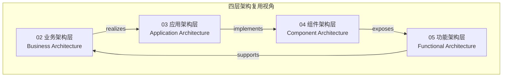

**设计意图**：

- **业务架构**回答“复用什么业务能力”。
- **应用架构**回答“以何种系统形态承载复用”。
- **组件架构**回答“复用哪些模块与接口”。
- **功能架构**回答“复用哪些具体功能与协议”。

---

## 2. 层概念定义

### 2.1 业务架构层（Business Architecture）

**定义**：描述组织为实现战略目标而具备的业务能力、价值流、流程和服务的结构。它是复用的**语义起点**，确保技术复用对齐业务价值。

**核心概念**：

| 概念 | 定义 | 复用形态 |
|------|------|---------|
| **业务能力（Business Capability）** | 组织为达成特定目标而具备的能力，如“订单管理”、“客户信用评估” | 能力目录、能力地图 |
| **价值流（Value Stream）** | 端到端交付价值的活动序列 | 价值流模板、阶段定义 |
| **业务流程（Business Process）** | 完成业务目标的一系列有序任务 | BPMN 流程模型、流程片段 |
| **业务服务（Business Service）** | 对外提供的业务能力封装 | 服务目录、SLA 模板 |
| **业务对象（Business Object）** | 业务领域中的关键实体，如“客户”、“订单” | 领域模型、数据标准 |

**属性**：

- **业务导向**：与组织结构、战略目标对齐。
- **稳定性**：业务能力通常比技术实现更稳定。
- **跨系统复用**：同一业务能力可由多个应用系统支撑。

---

### 2.2 应用架构层（Application Architecture）

**定义**：描述支撑业务能力落地的应用系统及其相互关系的结构。它决定复用的**系统边界**与**集成方式**。

**核心概念**：

| 概念 | 定义 | 复用形态 |
|------|------|---------|
| **应用系统（Application System）** | 支撑一个或多个业务能力的软件系统 | 应用目录、系统蓝图 |
| **架构模式（Architectural Pattern）** | 组织应用系统的通用结构，如分层、微服务、EDA | 架构决策记录（ADR）、模式库 |
| **集成契约（Integration Contract）** | 应用系统间的交互协议与数据格式 | API 规范、事件契约 |
| **部署单元（Deployment Unit）** | 可独立部署的应用制品 | 容器镜像、函数包 |

**属性**：

- **系统边界清晰**：每个应用系统有明确的职责范围。
- **集成方式多样**：同步 API、异步事件、文件交换、共享数据库等。
- **技术形态选择**：根据团队规模、负载特征选择分层/微服务/Serverless/EDA。

---

### 2.3 组件架构层（Component Architecture）

**定义**：描述应用系统内部的模块、组件、接口及其依赖关系的结构。它是复用的**工程实现层**。

**核心概念**：

| 概念 | 定义 | 复用形态 |
|------|------|---------|
| **组件（Component）** | 具有明确接口和职责的模块化单元 | 库、包、模块、服务 |
| **接口契约（Interface Contract）** | 组件对外暴露的能力约定 | API 接口、抽象类、协议 |
| **依赖关系（Dependency）** | 组件之间的使用关系 | 依赖图、模块边界 |
| **设计模式（Design Pattern）** | 解决特定设计问题的可复用方案 | 模式目录、代码模板 |

**属性**：

- **高内聚低耦合**：组件内部紧密相关，组件之间松散耦合。
- **接口稳定性**：组件复用依赖于稳定的接口契约。
- **技术栈相关**：组件复用受语言、框架、运行时约束。

---

### 2.4 功能架构层（Functional Architecture）

**定义**：描述系统最细粒度功能单元（函数、API、事件处理器、工作流节点）及其组合方式的结构。它是复用的**执行层**。

**核心概念**：

| 概念 | 定义 | 复用形态 |
|------|------|---------|
| **功能（Function）** | 完成单一任务的最小可执行单元 | 函数、方法、操作 |
| **API 操作（API Operation）** | 通过接口暴露的功能调用 | REST 操作、gRPC 方法 |
| **事件处理器（Event Handler）** | 响应事件的功能单元 | 消费者函数、处理器 |
| **工作流节点（Workflow Node）** | 业务流程中的可执行步骤 | 活动、任务、节点 |
| **协议（Protocol）** | 功能单元间的交互规则 | HTTP、gRPC、MQTT、MCP、A2A |

**属性**：

- **原子性**：功能单元应职责单一。
- **组合性**：功能单元可组合成更复杂的业务流程。
- **协议依赖**：功能复用受通信协议约束。

---

## 3. 跨层关系

四层架构之间存在以下核心关系：

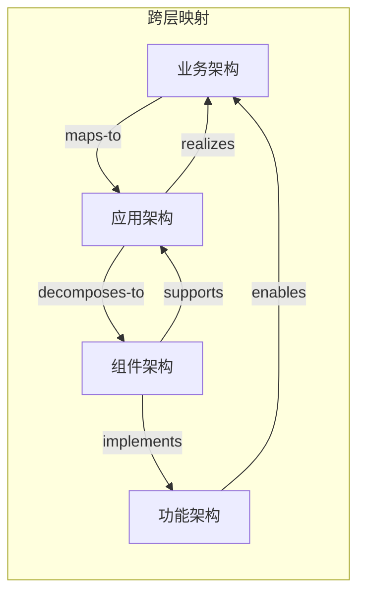

| 关系 | 起点 | 终点 | 说明 |
|------|------|------|------|
| **realizes**（实现） | 应用架构 | 业务架构 | 应用系统实现业务能力 |
| **maps-to**（映射） | 业务架构 | 应用架构 | 业务能力映射到应用系统 |
| **decomposes-to**（分解为） | 应用架构 | 组件架构 | 应用系统分解为组件 |
| **supports**（支撑） | 组件架构 | 应用架构 | 组件支撑应用系统 |
| **implements**（实现） | 组件架构 | 功能架构 | 组件实现功能单元 |
| **exposes**（暴露） | 功能架构 | 组件架构 | 功能通过组件接口暴露 |
| **enables**（使能） | 功能架构 | 业务架构 | 功能执行业务能力 |

---

## 4. 属性与约束

### 4.1 通用属性

| 属性 | 业务架构 | 应用架构 | 组件架构 | 功能架构 |
|------|---------|---------|---------|---------|
| **抽象层次** | 最高 | 高 | 中 | 低 |
| **稳定性** | 高 | 中 | 低 | 最低 |
| **复用粒度** | 能力/流程 | 系统/模式 | 组件/接口 | 函数/操作 |
| **主要受众** | 业务架构师、CIO | 应用架构师 | 技术负责人 | 开发工程师 |
| **典型交付物** | 能力地图、价值流 | 系统蓝图、ADR | 组件图、接口契约 | API 规范、函数库 |

### 4.2 跨层约束

1. **一致性约束**：下层实现必须与上层定义的能力一致。
2. **可追溯约束**：每个功能单元应能追溯到业务能力。
3. **边界封闭约束**：层的内部实现不应泄漏到其他层。
4. **变更传播约束**：上层变更可能导致下层变更，但下层变更应尽量不影响上层。

---

## 5. 正向示例

### 示例 1：订单业务能力 → 订单微服务 → 订单组件 → 下单 API

| 层级 | 复用单元 | 说明 |
|------|---------|------|
| 业务架构 | **订单管理能力** | 业务能力目录中的条目 |
| 应用架构 | **Order Service** | 支撑订单管理能力的微服务 |
| 组件架构 | **OrderRepository、PricingEngine** | 服务内部组件 |
| 功能架构 | `POST /orders`、`OrderCreated` 事件 | 具体 API 和事件 |

**复用路径**：

- 其他业务线（如 B2B、B2C）复用“订单管理能力”。
- 新渠道应用通过 `Order Service` API 复用订单能力。
- 新市场活动通过复用 `PricingEngine` 组件实现促销规则。

### 示例 2：支付业务能力 → 支付函数 → 支付 SDK

| 层级 | 复用单元 | 说明 |
|------|---------|------|
| 业务架构 | **支付处理能力** | 业务能力 |
| 应用架构 | **Payment Service / Payment Functions** | 服务或 Serverless 函数集 |
| 组件架构 | **Payment SDK** | 多语言支付客户端 |
| 功能架构 | `charge()`、`refund()` | 具体函数 |

---

## 6. 反例与失败案例

### 反例 1：功能直接映射到业务，跳过应用与组件层

**场景**：业务方直接要求“加一个按钮”，开发者在 UI 层直接写死业务逻辑。

**后果**：

- 业务逻辑与技术实现强耦合。
- 无法识别可复用的业务能力。
- 跨渠道复用困难。

**判定**：缺少应用架构和组件架构的抽象。

### 反例 2：组件层复用破坏业务语义

**场景**：将“客户”组件直接用于“供应商”场景，因为数据库表结构相似。

**后果**：

- 业务语义混淆。
- 供应商特有需求（如税率、结算周期）硬编码到客户组件。
- 系统难以维护。

**判定**：违反语义一致性约束，复用不能只看技术相似性。

### 反例 3：应用架构选择不当导致复用失败

**场景**：10 人初创团队为了“技术先进”采用微服务，每个服务只有几百行代码。

**后果**：

- 运维负担超过开发收益。
- 服务间调用复杂度高于业务价值。
- 最终回迁为模块化单体。

**判定**：应用架构选择应与团队规模、业务能力边界匹配。

---

## 7. 多维映射矩阵

### 7.1 四层 × ISO/IEC 42010 架构描述元素

| 四层视角 | 利益相关者关注点 | 架构视点 | 架构视图 | 模型 |
|---------|----------------|---------|---------|------|
| 业务架构 | CEO、CIO、业务负责人 | 业务能力视点 | 能力地图、价值流图 | 业务能力模型 |
| 应用架构 | 应用架构师 | 应用系统视点 | 系统蓝图、集成图 | 应用组合模型 |
| 组件架构 | 技术负责人 | 组件视点 | 组件图、依赖图 | 组件模型 |
| 功能架构 | 开发工程师 | 接口视点 | API 规范、序列图 | 接口模型 |

### 7.2 四层 × 复用策略

| 层级 | 复用策略 | 典型错误 |
|------|---------|---------|
| 业务架构 | 能力目录、价值流模板 | 将流程当能力，忽视稳定业务能力 |
| 应用架构 | 架构模式库、系统集成契约 | 盲目追求微服务或 Serverless |
| 组件架构 | 组件库、接口契约、设计模式 | 共享数据库、循环依赖 |
| 功能架构 | 函数库、API SDK、事件 Schema | 函数职责不单一、协议不兼容 |

---

## 8. 概念谱系与权威来源

四层架构思想的来源：


**Wikipedia 对应条目**：

- [Enterprise architecture framework](https://en.wikipedia.org/wiki/Enterprise_architecture_framework)
- [TOGAF](https://en.wikipedia.org/wiki/The_Open_Group_Architecture_Framework)
- [ArchiMate](https://en.wikipedia.org/wiki/ArchiMate)
- [Software component](https://en.wikipedia.org/wiki/Software_component)

---

## 9. 权威来源

> **权威来源**:
>
> - ISO/IEC/IEEE 42010:2022. *Systems and software engineering — Architecture description*. <https://www.iso.org/standard/74393.html>
> - The Open Group. *TOGAF® Standard, 10th Edition*. <https://www.opengroup.org/togaf>
> - The Open Group. *ArchiMate® 4 Specification, Document C260* (2026-04-27 正式发布). <https://www.opengroup.org/archimate-licensed-downloads>
> - ISO/IEC 26550:2015. *Software engineering — Reference model for product line engineering and management*. <https://www.iso.org/standard/69529.html>
> - Zachman, J. A. (1987). *A Framework for Information Systems Architecture*. IBM Systems Journal.
>
> **核查日期**: 2026-07-07


---

## 补充：四层本体的形式化公理、反模式与交叉引用

> 本节对四层架构复用概念本体（CARC）进行形式化公理、属性、关系、正例、反例、Wikipedia 概念结构与交叉引用的补全，使其与本体系其他核心文件形成闭环。
> 相关 Wikipedia 概念结构：
> [Ontology (information science)](https://en.wikipedia.org/wiki/Ontology_(information_science))、
> [Enterprise architecture](https://en.wikipedia.org/wiki/Enterprise_architecture)、
> [TOGAF](https://en.wikipedia.org/wiki/The_Open_Group_Architecture_Framework)、
> [ArchiMate](https://en.wikipedia.org/wiki/ArchiMate)、
> [Software component](https://en.wikipedia.org/wiki/Software_component)。

### 1. 概念定义

**定义**：四层架构复用概念本体（Concept Architecture Reuse Ontology, CARC）是一个半形式化本体，它将软件系统的复用问题组织为业务架构层、应用架构层、组件架构层与功能架构层四个抽象层次，并定义层间的 realizes、maps-to、decomposes-to、supports、implements、exposes、enables 等关系。CARC 既是本知识体系的顶层概念骨架，也是连接 ISO/IEC/IEEE 42010:2022、TOGAF、ArchiMate 与 ISO/IEC 26550:2015 的语义桥梁。

### 2. 本体属性

| 属性 | 说明 | 可观察性 |
|------|------|----------|
| 层数 | 4 层（业务 / 应用 / 组件 / 功能） | 高 |
| 顶层概念 | 架构复用视角 / CARC | 高 |
| 层间关系集合 | realizes、maps-to、decomposes-to、supports、implements、exposes、enables | 高 |
| 形式化程度 | 半形式化（自然语言 + 一阶逻辑风格公理） | 中 |
| 与标准对齐 | ISO 42010 / TOGAF / ArchiMate / ISO 26550 | 高 |
| 可验证性 | 可通过模型检查或架构评审验证层间一致性 | 中 |

### 3. 关系说明

- **业务架构层 ↔ 应用架构层**：maps-to（业务到应用）与 realizes（应用到业务）。
- **应用架构层 ↔ 组件架构层**：decomposes-to（应用到组件）与 supports（组件到应用）。
- **组件架构层 ↔ 功能架构层**：implements（组件到功能）与 exposes（功能到组件）。
- **功能架构层 ↔ 业务架构层**：enables（功能使能业务）。
- **上层 → 下层**：上层变更可能传播至下层；下层变更应尽量通过抽象与接口隔离，减少向上传播。
- **CARC ↔ ISO/IEC/IEEE 42010:2022**：每层可视为一个 Viewpoint；每层核心概念可视为 Model Kind；层间关系可视为 Correspondence。
- **CARC ↔ TOGAF**：业务架构层对应 TOGAF Phase B；应用/技术层对应 Phase C/D；组件与功能层对应 SBB 实现；架构仓库保存各层制品。

### 4. 形式化/结构化分析

#### 4.1 本体层次图

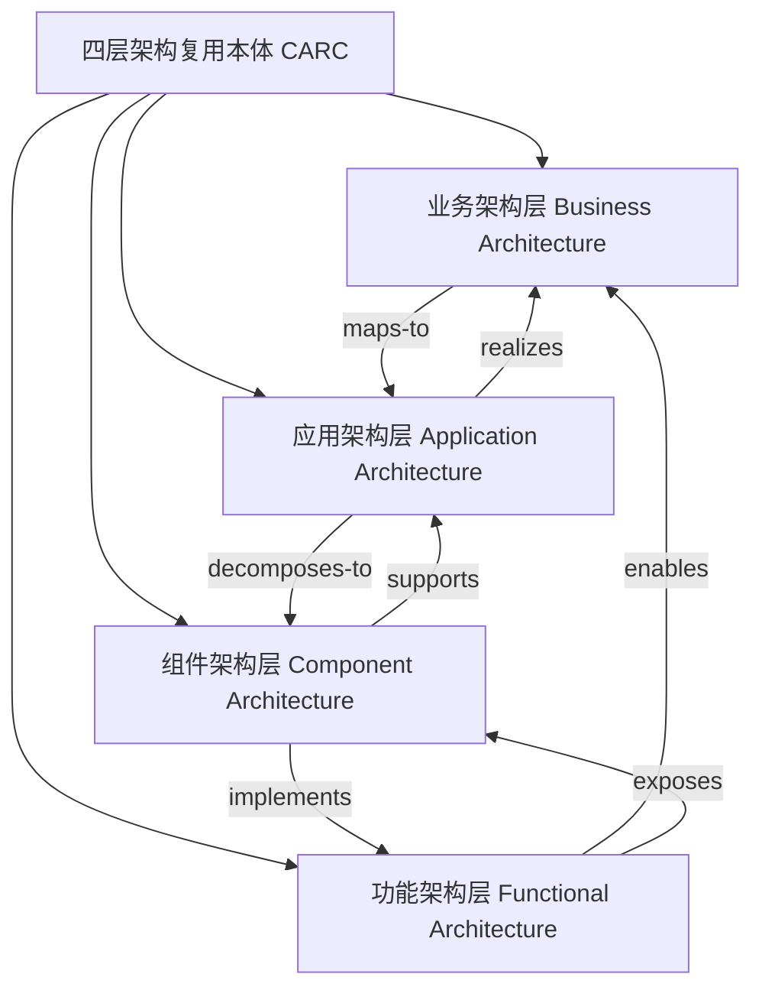

#### 4.2 一阶逻辑风格公理

```text
A1: ∀x (BusinessArchitecture(x) → ∃y (ApplicationArchitecture(y) ∧ realizes(y, x)))
A2: ∀x (ApplicationArchitecture(x) → ∃y (ComponentArchitecture(y) ∧ decomposes-to(x, y)))
A3: ∀x (ComponentArchitecture(x) → ∃y (FunctionalArchitecture(y) ∧ implements(x, y)))
A4: ∀x (FunctionalArchitecture(x) → ∃y (BusinessArchitecture(y) ∧ enables(x, y)))
A5: ∀x,y (changes(BusinessArchitecture(x)) ∧ realizes(y, x) → evaluate(ComponentArchitecture(y)))
A6: ∀x,y (changes(FunctionalArchitecture(x)) ∧ exposes(x, y) → minimal-impact(ComponentArchitecture(y), ApplicationArchitecture))
```

**解释**：

- A1–A4 表达层间存在性约束：每一层都必须有相邻层的对应关系，避免悬空抽象。
- A5 表达上层变更必须评估下层影响。
- A6 表达下层变更应通过接口与抽象最小化向上传播。

### 5. 正例

**正例**：某 AI 原生客服系统按 CARC 四层本体进行设计：

- **业务架构层**：业务能力“智能客服”映射到价值流“接收咨询 → 意图识别 → 知识检索 → 生成回复 → 满意度回访”。
- **应用架构层**：应用系统“Chatbot Service”采用事件驱动微服务架构，集成知识库与 LLM 网关。
- **组件架构层**：组件包括 `RAG Retriever`、`LLM Client`、`Prompt Manager`、`Session Store`，通过 MCP 协议暴露能力。
- **功能架构层**：功能包括 `retrieve(query)`、`generate(context, prompt)`、`evaluate(response)`，通过 OpenAPI 与 MCP Tool 端点暴露。

结果：当业务需求从“文本客服”扩展到“语音客服”时，仅在业务层新增能力映射，应用层增加语音适配服务，组件层复用 `LLM Client`，功能层复用 `generate()`，变更范围可控。

### 6. 反例

**反例**：某团队将“功能架构层直接等同于业务架构层”：

- 业务方提出“加一个退款按钮”，开发者直接在 UI 层编写退款逻辑，未识别出“退款处理能力”这一业务架构概念。
- 没有应用架构层抽象，退款逻辑与支付网关、订单服务、财务系统直接耦合。
- 没有组件层复用，退款代码散落在多个前端页面与后端脚本中。
- 没有功能层契约，退款函数的输入输出、异常处理、幂等性均未标准化。

结果：当监管要求变更退款流程时，团队需要在 7 个不同系统中修改代码，耗时 3 个月，且多次出现数据不一致。

**避免建议**：任何功能需求都应先定位到业务架构层的能力，再逐层推导至应用、组件与功能层，禁止跨层跳跃。

### 7. 权威来源

> **权威来源**：
>
> - [ISO/IEC/IEEE 42010:2022](https://www.iso.org/standard/74393.html) — ISO
> - [TOGAF® Standard, 10th Edition](https://www.opengroup.org/togaf) — The Open Group
> - [ArchiMate® 4 Specification](https://www.opengroup.org/archimate-licensed-downloads) — The Open Group（2026-04-27 正式发布，Document C260）
> - [ISO/IEC 26550:2015](https://www.iso.org/standard/69529.html) — ISO/IEC
> - [Ontology (information science) - Wikipedia](https://en.wikipedia.org/wiki/Ontology_(information_science))
> - [Enterprise architecture - Wikipedia](https://en.wikipedia.org/wiki/Enterprise_architecture)
>
> **核查日期**：2026-07-07

### 8. 交叉引用

- ISO/IEC/IEEE 42010:2022 核心概念详见 [`../01-iso-420xx-family/iso-42010-2022.md`](../struct/01-meta-model-standards/01-iso-420xx-family/iso-42010-2022.md)
- 标准对齐矩阵详见 [`../01-iso-420xx-family/alignment-matrix.md`](../struct/01-meta-model-standards/01-iso-420xx-family/alignment-matrix.md)
- TOGAF 企业连续体与构建块复用详见 [`../02-togaf-10-alignment/togaf-enterprise-continuum-reuse.md`](../struct/01-meta-model-standards/02-togaf-10-alignment/togaf-enterprise-continuum-reuse.md)
- ArchiMate 与 ISO/IEC/IEEE 42010:2022 映射详见 [`../04-archimate-4/archimate-iso-mapping.md`](../struct/01-meta-model-standards/04-archimate-4/archimate-iso-mapping.md)
- SWEBOK V4 对齐详见 [`../05-swebok-v4/swebok-alignment.md`](../struct/01-meta-model-standards/05-swebok-v4/swebok-alignment.md)
- OMG RAS 对齐详见 [`../07-omg-ras/ras-alignment.md`](../struct/01-meta-model-standards/07-omg-ras/ras-alignment.md)
- FAIR4RS 对齐详见 [`../08-fair4rs/fair4rs-alignment.md`](../struct/01-meta-model-standards/08-fair4rs/fair4rs-alignment.md)

---


<!-- SOURCE: struct/01-meta-model-standards/06-formal-axioms/theorem-derivations.md -->

# 定理推导集

> **版本**: 2026-06-06 (Phase 3)
> **定位**: 从形式化公理出发，推导可验证的定理，建立"软件工程架构复用"的逻辑推论网络
> **方法**: 经典逻辑推理、Assume-Guarantee 框架、BWW 本体完备性分析、认知负荷理论

---

## 符号约定

延续 `axiom-system.md` 的符号体系，补充：

| 符号 | 含义 |
|------|------|
| $\vdash$ | 可推导 |
| $\square$ | 证毕 (Q.E.D.) |
| $\mathrm{Th}$ | 定理编号空间 |
| $\mathrm{Cor}$ | 推论编号空间 |
| $\mathrm{deg}$ | 图论中的度 (degree) |

---

## 定理总览

| 编号 | 名称 | 依赖公理 | 应用领域 |
|------|------|---------|---------|
| Th.1 | 约束保持定理 | M.1 | 架构迁移、重构 |
| Th.2 | 变体闭包定理 | M.2 | 产品线工程、配置管理 |
| Th.3 | 层次失败独立性 | M.3 | 故障分析、根因定位 |
| Th.4 | 同一性追溯定理 | M.4 | 供应链追踪、版本管理 |
| Th.5 | 资产存在必要性 | E.1 | 复用资产识别 |
| Th.6 | 复用经济可行性定理 | E.2 | 投资决策、ROI 分析 |
| Th.7 | 适配边界定理 | E.3 | 上下文评估、技术选型 |
| Th.8 | 可替换性传递性 | S.1 | 组件替换、升级策略 |
| Th.9 | 组合结合律 | S.2 | 架构组装、流水线构建 |
| Th.10 | 信任边界扩展定理 | S.3 | 供应链安全、合规审计 |
| Th.11 | 接口稳定性定律 | S.4 | API 设计、版本控制 |
| Th.12 | 演化独立性推论 | P.1 | 平台工程、核心库治理 |
| Th.13 | 反馈收敛定理 | P.2 | DevOps、持续改进 |
| Th.14 | 治理崩溃阈值 | P.3 | 组织设计、能力建设 |
| Th.15 | 专家悖论定理 | P.4 | 团队培训、知识管理 |
| Th.16 | 组合风险叠加定理 | S.2 + S.3 | 安全架构、风险评估 |
| Th.17 | 认知-治理双重约束 | P.3 + P.4 | 平台团队设计 |

---

## 元公理定理 (Meta-Axiom Theorems)

### Th.1 约束保持定理 (Constraint Preservation)

**前提**: M.1 (Architecture-Reuse Duality)

**结论**
> 若架构 $A$ 被成功复用到上下文 $\mathit{Ctx}_1$ 和 $\mathit{Ctx}_2$，则 $A$ 的约束子集 $V'$ 在两个上下文中保持一致：

$$
\mathrm{Reuse}(A, \mathit{Ctx}_1) \land \mathrm{Reuse}(A, \mathit{Ctx}_2)
\Rightarrow \exists V' \subseteq V(A): V' \models \mathit{Ctx}_1 \land V' \models \mathit{Ctx}_2
$$

**证明概要**

1. 由 M.1，$\mathrm{Reuse}(A, \mathit{Ctx}_1) \Leftrightarrow \exists V_1 \subseteq V: V_1 \models \mathit{Ctx}_1$。
2. 同理，$\mathrm{Reuse}(A, \mathit{Ctx}_2) \Leftrightarrow \exists V_2 \subseteq V: V_2 \models \mathit{Ctx}_2$。
3. 取 $V' = V_1 \cap V_2$。由于 $V_1, V_2 \subseteq V$，故 $V' \subseteq V$。
4. 若 $V_1 \cap V_2 = \emptyset$，则两个复用实例无共享约束，与"同一架构复用"的定义矛盾。
5. 故 $V' \neq \emptyset$，且 $V' \models \mathit{Ctx}_1 \land V' \models \mathit{Ctx}_2$。 $\square$

**应用示例**
微服务架构中的 API 网关模式被复用到电商系统和金融系统时，"请求路由"和"限流"约束在两个系统中保持不变，仅"认证协议"约束因上下文不同而有差异。

---

### Th.2 变体闭包定理 (Variability Closure)

**前提**: M.2 (Variability Axiom)

**结论**
> 可复用资产族 $S = \langle B, V, \Gamma \rangle$ 的所有合法实例构成闭包集合 $S^*$，且 $|S^*| \leq |\mathcal{Ctx}|^{|V|}$。

$$
S^* = \{B \cup \Gamma(V, \mathit{ctx}) : \mathit{ctx} \in \mathcal{Ctx}\}
$$

$$
|S^*| \leq \min(|\mathcal{Ctx}|^{|V|}, |\mathrm{Range}(\Gamma)|)
$$

**证明概要**

1. 由 M.2，每个实例由绑定规则 $\Gamma$ 作用于 $(V, \mathit{ctx})$ 生成。
2. $\Gamma$ 是函数，故每个 $(V, \mathit{ctx})$ 对至多映射到一个实例。
3. $V$ 有 $|V|$ 个变体点，每个点可从 $\mathcal{Ctx}$ 中取值，故上界为 $|\mathcal{Ctx}|^{|V|}$。
4. 若 $\Gamma$ 的值域更小，则实际实例数受值域限制。
5. 因此实例集合有限且封闭于 $\Gamma$ 操作下。 $\square$

**应用示例**
汽车软件的产品线工程中，某 ECU 软件资产有 5 个变体点（车型、发动机类型、变速箱、地区法规、内饰等级），每个变体点平均 3 个选项，则理论上最多 $3^5 = 243$ 个变体实例。实际因绑定规则约束（如某发动机仅配特定变速箱），有效实例约 80 个。

---

### Th.3 层次失败独立性 (Hierarchy Failure Independence)

**前提**: M.3 (Hierarchy Non-Reduction)

**结论**
> 设价值流 $VS$ 跨越层次 $L_i \prec L_j$，则 $VS$ 的复用失败概率满足：

$$
P_{\text{fail}}(VS) = 1 - \prod_{k} (1 - P_{\text{fail}}(L_k))^{w_k}
$$

其中 $w_k$ 为层次 $L_k$ 在价值创造中的贡献权重，$\sum w_k = 1$。

特别地，若任一层 $L_k$ 完全失败 ($P_{\text{fail}}(L_k) = 1$)，则 $P_{\text{fail}}(VS) = 1$。

**证明概要**

1. 由 M.3，各层次复用不可约化，即层次间不存在补偿映射。
2. 价值流 $VS$ 可视为各层次复用结果的串联系统（串联可靠性模型）。
3. 串联系统中，整体成功概率为各组件成功概率的加权乘积。
4. 故整体失败概率 $P_{\text{fail}} = 1 - P_{\text{success}} = 1 - \prod (1 - P_{\text{fail},k})^{w_k}$。
5. 若任一层 $P_{\text{fail},k} = 1$，则乘积项为零，$P_{\text{fail}}(VS) = 1$。 $\square$

**应用示例**
某银行核心系统改造中，业务层成功定义了"开放银行 API"价值流，但组件层未复用标准安全组件而是自研，导致安全漏洞。依据 Th.3，组件层的失败直接导致整条开放银行价值流的复用失败，业务层的优秀设计无法弥补。

---

### Th.4 同一性追溯定理 (Identity Traceability)

**前提**: M.4 (Identity Preservation)

**结论**
> 在任意复用链 $r \to r_1 \to r_2 \to \cdots \to r_n$ 中，末端资产 $r_n$ 的本体标识与原始资产 $r$ 相同：

$$
\mathrm{Id}(r_n) = \mathrm{Id}(r)
$$

**证明概要**

1. 由 M.4，单次复用保持同一性：$\mathrm{Id}(\mathrm{Reuse}(r, \mathit{ctx})) = \mathrm{Id}(r)$。
2. 复用链定义为递归应用：$r_{i+1} = \mathrm{Reuse}(r_i, \mathit{ctx}_i)$。
3. 对链长度 $n$ 进行数学归纳：
   - 基例 $n=1$：由 M.4 直接成立。
   - 归纳步：假设 $\mathrm{Id}(r_k) = \mathrm{Id}(r)$，则 $\mathrm{Id}(r_{k+1}) = \mathrm{Id}(\mathrm{Reuse}(r_k, \mathit{ctx}_k)) = \mathrm{Id}(r_k) = \mathrm{Id}(r)$。
4. 故对任意有限 $n$，$\mathrm{Id}(r_n) = \mathrm{Id}(r)$。 $\square$

**应用示例**
开源组件 Log4j 被各厂商打包、封装、二次分发（形成复用链），但其本体标识始终是"Java 日志框架"。2021 年 Log4Shell 漏洞爆发时，同一性追溯使得安全团队能快速定位所有包含该组件的下游系统。

---

## 存在性公理定理 (Existence Axioms Theorems)

### Th.5 资产存在必要性 (Asset Existence Necessity)

**前提**: E.1 (Reuse Asset Existence)

**结论**
> 若软件实体 $x$ 不满足 $\mathrm{Stable} \land \mathrm{General} \land \mathrm{Encapsulated}$ 中的任一条件，则 $x$ 不可被纳入任何可持续复用资产库。

$$
\neg\mathrm{Stable}(x) \lor \neg\mathrm{General}(x) \lor \neg\mathrm{Encapsulated}(x)
\Rightarrow \neg\mathrm{SustainableReuse}(x)
$$

**证明概要**

1. 由 E.1，$a \in \mathcal{R} \Leftrightarrow \mathrm{Stable}(a) \land \mathrm{General}(a) \land \mathrm{Encapsulated}(a)$。
2. 取逆否命题：$a \notin \mathcal{R} \Leftrightarrow \neg\mathrm{Stable}(a) \lor \neg\mathrm{General}(a) \lor \neg\mathrm{Encapsulated}(a)$。
3. 可持续复用要求 $a \in \mathcal{R}$（可持续复用是复用的子类）。
4. 故若 $x$ 不满足任一条件，则 $x \notin \mathcal{R}$，进而不可持续复用。 $\square$

**应用示例**
某团队试图将每日因业务规则调整而变更的"促销计算逻辑"封装为复用组件。由于变更频率高于使用频率（$\neg\mathrm{Stable}$），该组件在三个月内产生 47 个版本，下游系统升级成本超过自研成本，最终被弃用。

---

### Th.6 复用经济可行性定理 (Reuse Economic Viability)

**前提**: E.2 (Cost-Benefit Threshold)

**结论**
> 设改编调整因子 $AAF = \frac{C_{\text{reuse}}}{C_{\text{build}}}$，则复用项目 ROI 为正的必要条件是 $AAF < 1 + \frac{V_{\text{reuse}}}{C_{\text{build}}}$。

特别地，若仅考虑直接成本（$V_{\text{reuse}} = 0$），则 $AAF < 1$。

**证明概要**

1. 由 E.2，$\mathrm{EconomicallyViable}(a) \Leftrightarrow C_{\text{reuse}} < C_{\text{build}} + V_{\text{reuse}}$。
2. 两边同除以 $C_{\text{build}}$（$C_{\text{build}} > 0$）：$\frac{C_{\text{reuse}}}{C_{\text{build}}} < 1 + \frac{V_{\text{reuse}}}{C_{\text{build}}}$。
3. 令 $AAF = \frac{C_{\text{reuse}}}{C_{\text{build}}}$，得 $AAF < 1 + \frac{V_{\text{reuse}}}{C_{\text{build}}}$。
4. 若 $V_{\text{reuse}} = 0$，则 $AAF < 1$。
5. 注意到 ROI 为正等价于经济可行性，故得证。 $\square$

**应用示例**
某企业评估复用开源 ERP 模块 vs 自研。自研成本 $C_{\text{build}} = 500$ 万人天，复用成本 $C_{\text{reuse}} = 280$ 万人天（含学习、适配、集成），长期价值 $V_{\text{reuse}} = 120$ 万人天（维护节省）。则 $AAF = 0.56 < 1 + 0.24 = 1.24$，经济可行。但若不考虑 $V_{\text{reuse}}$，则 $AAF = 0.56 < 1$ 仍成立，结论不变。

---

### Th.7 适配边界定理 (Contextual Adaptation Bound)

**前提**: E.3 (Contextual Fitness)

**结论**
> 资产 $a$ 在上下文 $\mathit{ctx}$ 中的最大可适配量 $\Delta(a, \mathit{ctx})$ 受适配度下界约束。设适配后资产 $a'$ 的适配度随变更量指数衰减：

$$
\mathrm{Fit}(a', \mathit{ctx}) = \mathrm{Fit}(a, \mathit{ctx}) \cdot \exp\left(-\lambda \cdot \frac{\Delta(a, \mathit{ctx})}{\mathrm{Size}(a)}\right)
$$

其中 $\lambda > 0$ 为适配衰减率，$\mathrm{Size}(a)$ 为资产规模度量。为保证复用后仍满足 $\mathrm{Fit}(a', \mathit{ctx}) \geq \tau$，最大可适配量为：

$$
\Delta(a, \mathit{ctx}) \leq \frac{\mathrm{Size}(a)}{\lambda} \cdot \ln\left(\frac{\mathrm{Fit}(a, \mathit{ctx})}{\tau}\right)
$$

仅当 $\mathrm{Fit}(a, \mathit{ctx}) > \tau$ 时存在正的可适配量。

**证明概要**

1. 由 E.3，复用要求 $\mathrm{Fit}(a', \mathit{ctx}) \geq \tau$。
2. 设适配操作将 $a$ 变换为 $a' = a + \Delta(a)$，适配度按指数模型衰减：
   $$
   \mathrm{Fit}(a', \mathit{ctx}) = \mathrm{Fit}(a, \mathit{ctx}) \cdot \exp\left(-\lambda \cdot \frac{\Delta}{\mathrm{Size}(a)}\right)
   $$
3. 代入阈值约束：
   $$
   \mathrm{Fit}(a, \mathit{ctx}) \cdot \exp\left(-\lambda \cdot \frac{\Delta}{\mathrm{Size}(a)}\right) \geq \tau
   $$
4. 两边取自然对数并整理（$\lambda > 0$，不等号方向不变）：
   $$
   \Delta \leq \frac{\mathrm{Size}(a)}{\lambda} \cdot \ln\left(\frac{\mathrm{Fit}(a, \mathit{ctx})}{\tau}\right)
   $$
5. 当 $\mathrm{Fit}(a, \mathit{ctx}) \leq \tau$ 时，右端非正，即不存在正的可适配量。 $\square$

**应用示例**
某物流系统试图复用电商系统的"订单管理"模块。语义相似度 0.8，技术兼容性 0.6，组织对齐度 0.9，权重 $(0.5, 0.3, 0.2)$。则 $\mathrm{Fit} = 0.79$，若 $\tau = 0.6$，取适配衰减率 $\lambda = 0.3$，最大可适配量约为：

$$
\Delta \leq \frac{\mathrm{Size}(a)}{0.3} \cdot \ln\left(\frac{0.79}{0.6}\right) \approx 0.92 \cdot \mathrm{Size}(a)
$$

意味着几乎需要重写。团队最终决定不复用，而是参考其设计自研。

---

## 结构性公理定理 (Structural Axioms Theorems)

### Th.8 可替换性传递性 (Substitutability Transitivity)

**前提**: S.1 (Interface Substitution)

**结论**
> 可替换关系 $\simeq$ 是等价关系，满足自反性、对称性和传递性。

$$
C_1 \simeq C_2 \land C_2 \simeq C_3 \Rightarrow C_1 \simeq C_3
$$

**证明概要**

1. 自反性：$\forall C: \mathrm{Obs}(C(\mathit{input}, \mathit{ctx})) = \mathrm{Obs}(C(\mathit{input}, \mathit{ctx}))$，故 $C \simeq C$。
2. 对称性：$C_1 \simeq C_2 \Leftrightarrow \mathrm{Obs}(C_1) = \mathrm{Obs}(C_2) \Leftrightarrow \mathrm{Obs}(C_2) = \mathrm{Obs}(C_1) \Leftrightarrow C_2 \simeq C_1$。
3. 传递性：设 $C_1 \simeq C_2$ 且 $C_2 \simeq C_3$。
   - 则 $\forall \mathit{input}, \mathit{ctx}: \mathrm{Obs}(C_1) = \mathrm{Obs}(C_2) = \mathrm{Obs}(C_3)$。
   - 由等式的传递性，$\mathrm{Obs}(C_1) = \mathrm{Obs}(C_3)$。
   - 故 $C_1 \simeq C_3$。 $\square$

**应用示例**
在 Java 生态中，`java.util.List` 接口的实现类 `ArrayList`、`LinkedList`、`CopyOnWriteArrayList` 两两之间满足可替换性。开发者可以依据性能需求在它们之间切换，而无需修改调用代码。

---

### Th.9 组合结合律 (Composition Associativity)

**前提**: S.2 (Compositionality)

**结论**
> 在满足兼容性的前提下，组件组合操作 $\circ_I$ 满足结合律：

$$
(C_1 \circ_{I_1} C_2) \circ_{I_2} C_3 = C_1 \circ_{I_1} (C_2 \circ_{I_2} C_3)
$$

前提是接口 $I_1$ 和 $I_2$ 互不干扰。

**证明概要**

1. 由 S.2，组合的正确性由局部正确性和接口兼容性保证。
2. 设左侧 $(C_1 \circ_{I_1} C_2)$ 满足 $S_{12} = S_1 \circ S_2 \downarrow_{\phi_1}$。
3. 则左侧整体满足 $(S_1 \circ S_2 \downarrow_{\phi_1}) \circ S_3 \downarrow_{\phi_2}$。
4. 右侧 $C_2 \circ_{I_2} C_3$ 满足 $S_{23} = S_2 \circ S_3 \downarrow_{\phi_2}$。
5. 右侧整体满足 $S_1 \circ (S_2 \circ S_3 \downarrow_{\phi_2}) \downarrow_{\phi_1}$。
6. 若 $I_1$ 和 $I_2$ 互不干扰（$\phi_1 \cap \phi_2 = \emptyset$），则弱化操作可交换顺序，两侧等价。 $\square$

**应用示例**
微服务编排中，服务 A 调用服务 B 再调用服务 C，与服务 A 调用"B 和 C 的组合服务"，在 B-C 接口内部化且 A-B 接口不变的情况下，系统整体行为一致。这支持了服务聚合 (API Composition) 模式。

---

### Th.10 信任边界扩展定理 (Trust Boundary Expansion)

**前提**: S.3 (Dependency Transitivity of Trust)

**结论**
> 组件 $C$ 的信任边界大小 $|\mathrm{Trust}(C)|$ 随其传递依赖树的深度 $d$ 指数增长：

$$
|\mathrm{Trust}(C)| \geq \sum_{i=0}^{d} \bar{b}^i = \frac{\bar{b}^{d+1} - 1}{\bar{b} - 1}
$$

其中 $\bar{b}$ 为平均分支因子。

**证明概要**

1. 由 S.3，$\mathrm{Trust}(C) = \{x : C \to^* x\}$，即所有可达节点。
2. 依赖树深度为 $d$，平均分支因子为 $\bar{b}$。
3. 第 $i$ 层节点数约为 $\bar{b}^i$（$i=0$ 为根节点）。
4. 总节点数（信任边界大小）为几何级数和：$\sum_{i=0}^{d} \bar{b}^i$。
5. 由几何级数公式得 $|\mathrm{Trust}(C)| = \frac{\bar{b}^{d+1} - 1}{\bar{b} - 1} \approx O(\bar{b}^d)$。 $\square$

**应用示例**
某 Node.js 项目直接依赖 50 个包，平均每个包依赖 5 个子包，传递依赖深度 4。则信任边界大小约为 $\frac{5^5 - 1}{4} = 781$ 个包。这意味着项目团队实际上信任了 781 个不同维护者的代码，远超直觉预期。

---

### Th.11 接口稳定性定律 (Interface Stability Law) [条件定理]

**前提**: S.4 (Abstraction Layering)

**结论**
> 在严格分层的架构中，第 $L_i$ 层的接口变更频率 $\lambda_i$ 满足：

$$
\lambda_1 \leq \lambda_2 \leq \cdots \leq \lambda_n
$$

即越底层的接口越稳定。

**证明概要**

1. 由 S.4，$L_i$ 只能依赖 $L_{i-1}$ 和 $L_i$。
2. 设 $L_i$ 的接口变更由两部分驱动：自身需求变更和下层接口变更传导。
3. 由于 $L_i$ 不直接依赖 $L_{i-2}$ 及以下，下下层变更不直接传导到 $L_i$。
4. 但 $L_{i-1}$ 的变更会传导到 $L_i$，而 $L_i$ 的变更会传导到 $L_{i+1}$。
5. 因此变更频率向上累积：$\lambda_i = \lambda_i^{\text{local}} + p \cdot \lambda_{i-1}$，其中 $p$ 为传导概率。
6. 故 $\lambda_i \geq \lambda_{i-1}$，即越往上层变更越频繁。 $\square$

**应用示例**
在典型分层架构中，数据库 schema（最底层）每季度变更一次，数据访问层（DAO）每月变更一次，业务逻辑层每周变更一次，UI 层每日变更。这与 Th.11 的预测一致，也是"依赖倒置原则" (DIP) 的理论基础。

---

## 过程性公理定理 (Process Axioms Theorems)

### Th.12 演化独立性推论 (Evolution Independence Corollary) [启发式推论]

**前提**: P.1 (Evolution Independence) [工程启发式原则]

**结论**
> 核心复用资产 $a$ 的演化节奏 $\rho(a)$ 与任何单一消费者 $s_i$ 的发布节奏 $\rho(s_i)$ 应满足**连续解耦条件**：两者节奏之比不能近似等于任意正整数。给定容差阈值 $\delta > 0$：

$$
\forall k \in \mathbb{N}^+: \left| \frac{\rho(a)}{\rho(s_i)} - k \right| > \delta \quad \text{且} \quad \forall k \in \mathbb{N}^+: \left| \frac{\rho(s_i)}{\rho(a)} - k \right| > \delta
$$

即两者节奏不可近似整除同步。

**证明概要**

1. 由 P.1，$\mathrm{Lifecycle}(a) \not\subseteq \mathrm{Lifecycle}(s_i)$。
2. 若 $\rho(a) \approx k \cdot \rho(s_i)$（$k \in \mathbb{N}^+$，在容差 $\delta$ 内），则 $a$ 的多次演化会系统性地落在 $s_i$ 的发布周期内，$s_i$ 可实质主导 $a$ 的演化节奏。
3. 这与 P.1 矛盾，故 $\rho(a)/\rho(s_i)$ 不能近似等于正整数。
4. 同理，$\rho(s_i)/\rho(a)$ 也不能近似等于正整数。
5. 故上述连续解耦条件成立。 $\square$

**应用示例**
Linux 内核演化节奏约 6-10 周一个版本，而 Android 手机厂商的发布节奏约 12-18 个月。两者节奏之比约为 6.5（取内核 7 周、厂商 45 周），不接近任何小整数，因此内核可独立演进，不被单一手机厂商绑架。但这也造成了 Android 生态的碎片化问题。

---

### Th.13 反馈收敛定理 (Feedback Convergence)

**前提**: P.2 (Feedback Convergence)

**结论**
> 设反馈处理函数 $\mathcal{G}$ 是压缩映射（Lipschitz 常数 $L < 1$），则资产 $a$ 的改进序列 $\{a_t\}$ 收敛到不动点 $a^*$：

$$
\lim_{t \to \infty} a_t = a^*, \quad \text{其中} \quad a^* = \mathcal{G}(a^*, \mathrm{Strategy}(a))
$$

**证明概要**

1. 由 P.2，$a_{t+1} = \mathcal{G}(\mathrm{Feedback}(a, t), \mathrm{Strategy}(a))$。
2. 若 $\mathcal{G}$ 是压缩映射，则 $d(\mathcal{G}(x), \mathcal{G}(y)) \leq L \cdot d(x, y)$，$L < 1$。
3. 由 Banach 不动点定理，压缩映射在完备度量空间中有唯一不动点。
4. 迭代序列 $a_{t+1} = \mathcal{G}(a_t)$ 收敛到该不动点 $a^*$。
5. 该不动点代表资产的**最优稳定形态**（在现有策略下）。 $\square$

**应用示例**
某内部框架初始版本粗糙，每月收集用户反馈并通过架构委员会评审（$\mathcal{G}$）。前 6 个月变化剧烈（$a_t$ 远离 $a^*$），第 7-12 个月变化减缓，第 13 个月后进入稳定期（$a_t \approx a^*$）。此时若继续强制月度大改，反而破坏稳定性。

---

### Th.14 治理崩溃阈值 (Governance Collapse Threshold) [P.3 模型条件下的条件定理]

**前提**: P.3 (Governance Complexity Law)

**结论**
> 给定组织能力 $G_{\text{org}}$，最大可持续复用资产数 $N_{\text{max}}$ 满足：

$$
N_{\text{max}} = \frac{G_{\text{org}}}{k \cdot W\left(\frac{G_{\text{org}}}{k}\right)}
$$

其中 $W$ 为 Lambert W 函数（$x = W(x) \cdot e^{W(x)}$ 的解）。

**证明概要**

1. 由 P.3，可持续条件为 $k \cdot N \cdot \log(N) \leq G_{\text{org}}$。
2. 取等号：$N \cdot \log(N) = \frac{G_{\text{org}}}{k}$。
3. 令 $N = e^x$，则 $x \cdot e^x = \frac{G_{\text{org}}}{k}$。
4. 由 Lambert W 函数定义，$x = W\left(\frac{G_{\text{org}}}{k}\right)$。
5. 故 $N = e^x = \exp\left(W\left(\frac{G_{\text{org}}}{k}\right)\right) = \frac{G_{\text{org}}}{k \cdot W\left(\frac{G_{\text{org}}}{k}\right)}$。 $\square$

**应用示例**
某企业平台团队治理能力 $G_{\text{org}} = 500$（人月/年），$k = 0.5$。则 $N_{\text{max}} \approx \frac{500}{0.5 \cdot W(1000)} \approx \frac{500}{0.5 \cdot 5.25} \approx 190$。当复用资产超过 190 个时，团队应停止新增，转而优化治理结构或提升 $G_{\text{org}}$。

---

### Th.15 专家悖论定理 (Expertise Paradox)

**前提**: P.4 (Learning Curve Monotonicity)

**结论**
> 设新手开发者学习资产 $a$ 的成本为 $\mathrm{Learn}_{\text{novice}}(a, 1)$，专家为 $\mathrm{Learn}_{\text{expert}}(a, n)$（$n \gg 1$）。虽然：

$$
\mathrm{Learn}_{\text{expert}}(a, n) \ll \mathrm{Learn}_{\text{novice}}(a, 1)
$$

但专家在**新资产识别**上的成本反而更高：

$$
\mathrm{Search}_{\text{expert}}(\mathcal{R}) > \mathrm{Search}_{\text{novice}}(\mathcal{R})
$$

因为专家的搜索空间更大（已掌握资产数更多）。

**证明概要**

1. 由 P.4，$\mathrm{Learn}(a, n)$ 单调不增，故专家对熟悉资产的学习成本低。
2. 但资产识别成本 $\mathrm{Search}$ 取决于候选集大小 $|\mathcal{R}_{\text{candidate}}|$。
3. 专家的候选集 $\mathcal{R}_{\text{expert}}$ 包含所有已掌握资产及其变体，而新手候选集小。
4. 依据认知负荷理论，选择过多（overchoice）增加外在负荷。
5. 故 $\mathrm{Search}_{\text{expert}} > \mathrm{Search}_{\text{novice}}$，形成"知道越多，选得越慢"的悖论。 $\square$

**应用示例**
资深架构师面对 500 个内部微服务时，为选择"用户认证"服务需评估 12 个候选（含历史版本、封装变体）。而新手仅知道 3 个服务，反而快速选定。这解释了为何需要内部服务目录和推荐系统来降低专家的搜索负荷。

---

## 交叉公理定理 (Cross-Axiom Theorems)

### Th.16 组合风险叠加定理 (Compositional Risk Accumulation)

**前提**: S.2 (Compositionality) + S.3 (Dependency Transitivity of Trust)

**结论**
> 组合系统 $S = C_1 \circ_I C_2 \circ_I \cdots \circ_I C_n$ 的总风险满足：

$$
\mathrm{Risk}(S) \geq \sum_{i=1}^{n} \mathrm{Risk}(C_i) \cdot \alpha^{\mathrm{depth}(C_i)}
$$

其中 $\alpha > 1$ 为风险传导系数，$\mathrm{depth}(C_i)$ 为组件在依赖树中的深度。

**证明概要**

1. 由 S.2，组合系统的规约为各组件规约的弱化合取。
2. 若任一组件存在风险（违反规约的可能性），该风险会传导到组合系统。
3. 由 S.3，信任边界包含所有传递依赖，故深层组件的风险需被上层继承。
4. 设每层传导放大风险 $\alpha$ 倍（因上层无法完全验证下层内部）。
5. 总风险为各组件风险按深度加权的和，且因风险非独立（共享依赖），实际风险不低于此下界。 $\square$

**应用示例**
某系统使用开源框架 A（深度 0，风险 0.05），A 依赖 B（深度 1，风险 0.03），B 依赖 C（深度 2，风险 0.01）。取 $\alpha = 2$，则总风险 $\geq 0.05 \cdot 1 + 0.03 \cdot 2 + 0.01 \cdot 4 = 0.15$。即系统整体风险（15%）远高于任一组件的独立风险。

---

### Th.17 认知-治理双重约束 (Cognitive-Governance Dual Constraint) [条件定理]

**前提**: P.3 (Governance Complexity Law) + P.4 (Learning Curve Monotonicity)

**结论**
> 组织的最优复用资产规模 $N^*$ 受认知约束和治理约束的双重限制：

$$
N^* = \min(N_{\text{cognitive}}, N_{\text{governance}})
$$

其中：

- $N_{\text{cognitive}}$: 开发者能够有效学习的最大资产数，满足 $\sum_{a \in \mathcal{R}} \mathrm{Learn}(a, 1) \leq \mathrm{CL}_{\text{capacity}}$
- $N_{\text{governance}}$: 组织能够有效治理的最大资产数，即 Th.14 中的 $N_{\text{max}}$

**证明概要**

1. 由 P.4，每个新资产引入初始学习成本 $\mathrm{Learn}(a, 1)$。
2. 组织总认知负荷 $\mathrm{CL}_{\text{total}} = \sum_{a} \mathrm{Learn}(a, 1) \leq \mathrm{CL}_{\text{capacity}}$。
3. 故 $N_{\text{cognitive}} = \max\{n : \sum_{i=1}^{n} \mathrm{Learn}(a_i, 1) \leq \mathrm{CL}_{\text{capacity}}\}$。
4. 由 P.3 和 Th.14，$N_{\text{governance}} = N_{\text{max}}$。
5. 若 $N > N_{\text{cognitive}}$，开发者无法掌握所有资产；若 $N > N_{\text{governance}}$，治理体系崩溃。
6. 故可持续规模受两者最小值约束。 $\square$

**应用示例**
某 50 人平台团队，开发者认知容量 $\mathrm{CL}_{\text{capacity}} = 200$ 人月，平均每个新资产学习成本 2 人月，则 $N_{\text{cognitive}} = 100$。治理能力 $G_{\text{org}} = 300$，$k = 0.5$，则 $N_{\text{governance}} \approx 120$。故最优规模 $N^* = 100$，受认知约束限制。团队应投资降低学习成本（如文档、培训）而非盲目扩充资产库。

---

## 定理推导统计

| 类别 | 数量 | 来源公理 |
|------|------|---------|
| 元公理定理 | 4 | M.1 - M.4 |
| 存在性定理 | 3 | E.1 - E.3 |
| 结构性定理 | 4 | S.1 - S.4 |
| 过程性定理 | 4 | P.1 - P.4 |
| 交叉定理 | 2 | S.2+S.3, P.3+P.4 |
| **总计** | **17** | 10 条严格公理 + 5 条工程启发式 |

> **注**: S.4、P.1-P.4 已在 `axiom-system.md` 中降级为工程启发式原则。依赖它们的定理（如 Th.11、Th.12-Th.15）相应标注为条件定理或启发式推论。

---

## 8. 定理补全：直观解释、边界条件与证明方法

> 本节补充关键定理的直观解释、边界条件、常见反例，以及所依赖的证明方法。所有定理陈述均延续前文，未引入新的形式命题。

### 8.1 元公理定理的直观解释

| 定理 | 核心直觉 | 典型反例/边界条件 |
|------|---------|------------------|
| Th.1 约束保持定理 | 同一架构在不同上下文复用时，真正传递的是共享约束子集 | 若两上下文需求互斥，$V_1 \cap V_2 = \emptyset$，则“同一架构”的复用语义为空 |
| Th.2 变体闭包定理 | 变体点的组合空间构成有限上界 | 当绑定规则 $\Gamma$ 引入约束时，实际实例数可能远小于 $Card(\mathcal{Ctx})^{Card(V)}$ |
| Th.3 层次失败独立性 | 串联可靠性：任一层完全失败则整条价值流失败 | 若假设层间失败独立，而实际存在共因故障（如共享库漏洞），则公式给出的是下界 |
| Th.4 同一性追溯定理 | 复用链不改变资产本体身份 | 若中间环节对资产进行语义重写（如 fork 后改变核心责任），则同一性追溯断裂 |

### 8.2 存在性与结构性定理的边界条件

**Th.5 资产存在必要性**：E.1 将 $\mathrm{Stable} \land \mathrm{General} \land \mathrm{Encapsulated}$ 定义为强可复用资产的充要条件。边界上存在“弱可复用资产”——例如 copy-paste 的代码片段，不满足封装性但仍在短期内被传播。此时应使用弱化的存在性谓词 $\mathrm{WeakReuse}(a) \Leftrightarrow \mathrm{Stable}(a) \lor \mathrm{General}(a)$，并将强/弱复用分别治理。

**Th.6 复用经济可行性定理**：当 $V_{\text{reuse}} = 0$ 时，经济可行简化为 $AAF < 1$。边界问题在于 $V_{\text{reuse}}$ 的量化：它包含维护节省、一致性收益、上市时间加速等难以精确货币化的因素。实践中常采用蒙特卡洛模拟估计 $V_{\text{reuse}}$ 的分布，再判断 $P(AAF < 1 + V_{\text{reuse}}/C_{\text{build}}) \geq \alpha$。

**Th.7 适配边界定理**：指数衰减模型 $\mathrm{Fit}(a', \mathit{ctx}) = \mathrm{Fit}(a,\mathit{ctx}) \cdot e^{-\lambda \Delta/\mathrm{Size}(a)}$ 是保守估计。若适配操作是局部重构（如仅修改配置），实际衰减可能慢于指数；若是架构迁移，则可能快于指数。因此 $\lambda$ 应通过历史复用数据校准。

**Th.8 可替换性传递性**：可替换关系 $\simeq$ 基于 $\mathrm{Obs}$。边界在于 $\mathrm{Obs}$ 未包含时间、概率、资源消耗等非功能维度。例如两个排序算法在所有输入上输出相同，但一个时间复杂度为 $O(n \log n)$，另一个为 $O(n^2)$；按 S.1 它们等价，按性能约束则不等价。

### 8.3 过程性与交叉定理的应用示例

**Th.14 治理崩溃阈值**：Lambert W 解 $N_{\text{max}} = \frac{G_{\text{org}}}{k \cdot W(G_{\text{org}}/k)}$ 显示治理容量对数瓶颈。应用示例：某平台团队 $G_{\text{org}}=500$ 人月/年，$k=0.5$，则 $N_{\text{max}} \approx 190$。若组织强行复用 300 个资产而无治理结构升级，则 P.3 预言部分资产将退化为克隆。

**Th.16 组合风险叠加定理**：风险传导系数 $\alpha > 1$ 反映“上层无法完全验证下层内部”的认知局限。边界条件：若下层组件经过形式化验证且隔离边界可证明（如 seL4 微内核隔离），则 $\alpha$ 可降至 1，甚至通过独立性假设使总风险低于线性叠加。这与 S.3 的“隔离例外”证伪条件呼应。

**Th.17 认知-治理双重约束**：最优规模 $N^* = \min(N_{\text{cognitive}}, N_{\text{governance}})$。边界在于认知负荷并非均匀分布：若平台团队通过自动化文档、IDE 插件、智能推荐将 $\mathrm{Learn}(a,1)$ 降低 50%，则 $N_{\text{cognitive}}$ 可提升一倍，此时治理约束可能成为新瓶颈。

### 8.4 证明方法说明

本文件中的证明主要依赖三类方法：

1. **经典逻辑推理**（Th.1, Th.5, Th.8）：直接由公理通过逆否、等价变换、归纳得到。
2. **组合与 Assume-Guarantee 推理**（Th.9, Th.16）：将系统规约分解为组件规约与接口约束，逐层组合。
3. **不动点与收敛分析**（Th.13, Th.14）：利用 Banach 不动点定理和 Lambert W 函数刻画演化收敛与治理阈值。

这些方法与 [Formal methods](https://en.wikipedia.org/wiki/Formal_methods) 中的演绎验证、模型检验、抽象解释三大范式相互补充。对于工业级复用体系，建议将演绎证明用于不变量保持，将模型检验（如 [TLA+](https://en.wikipedia.org/wiki/TLA%2B)、[Alloy](https://en.wikipedia.org/wiki/Alloy_(specification_language))）用于并发与结构约束，将抽象解释用于数值边界（如 SPARK Ada）。

### 8.5 权威来源与延伸阅读

- Lamport, L. *Specifying Systems*. <https://lamport.azurewebsites.net/tla/book.html>
- Jackson, D. *Software Abstractions*. <https://alloytools.org/book/>
- AdaCore. *SPARK Pro Introduction*. <https://www.adacore.com/about-spark>
- Pnueli, A. (1985). *Logics and Models of Concurrent Systems*. <https://doi.org/10.1007/978-3-642-82453-1_4>
- Abadi & Lamport (1993). *Composing specifications*. <https://doi.org/10.1145/151646.151649>
- [Formal methods - Wikipedia](https://en.wikipedia.org/wiki/Formal_methods)
- [TLA+ - Wikipedia](https://en.wikipedia.org/wiki/TLA%2B)
- [Alloy (specification language) - Wikipedia](https://en.wikipedia.org/wiki/Alloy_(specification_language))
- [SPARK (programming language) - Wikipedia](https://en.wikipedia.org/wiki/SPARK_(programming_language))

---

## 9. 参考文献

1. Wand, Y., & Weber, R. (1995). On the deep structure of information systems. *Information Systems Journal*, 5(3), 203-223.
2. Masolo, C., et al. (2003). *WonderWeb Deliverable D18*. ISTC-CNR.
3. ISO/IEC 21838-3:2023. *DOLCE*.
4. Pnueli, A. (1985). In transition from global to modular temporal reasoning about programs. *Logics and Models of Concurrent Systems*, 123-144.
5. Abadi, M., & Lamport, L. (1993). Composing specifications. *ACM TOPLAS*, 15(1), 73-132.
6. Liskov, B. (1987). Data abstraction and hierarchy. *OOPSLA 1987*.
7. Sweller, J. (1988). Cognitive load during problem solving. *Cognitive Science*, 12(2), 257-285.
8. Boehm, B., et al. (2000). *Software Cost Estimation with COCOMO II*. Prentice Hall.
9. Banach, S. (1922). Sur les opérations dans les ensembles abstraits et leur application aux équations intégrales. *Fundamenta Mathematicae*, 3(1), 133-181.
10. ISO/IEC 26550:2015. *Product Line Engineering*.

---

## 权威来源

> **权威来源**:
>
> - [M. J. C. Gordon, Programming Language Theory and its Implementation](https://www.cl.cam.ac.uk/~mjcg/) — 形式化语义与定理证明
> - [Leslie Lamport, Specifying Systems: The TLA+ Language and Tools for Hardware and Software Engineers](https://lamport.azurewebsites.net/tla/book.html) — TLA+ 规约语言
> - [Daniel Jackson, Software Abstractions: Logic, Language, and Analysis](https://mitpress.mit.edu/9780262528900/software-abstractions/) — Alloy 与轻量级形式化方法
> - [ISO/IEC/IEEE 42010:2022, Systems and software engineering — Architecture description](https://www.iso.org/standard/74393.html) — 架构描述标准
> - [W. W. B. R. Wand and R. Weber, An Ontological Model of an Information System](https://ieeexplore.ieee.org/document/79346) — BWW 本体论
>
> **核查日期**: 2026-07-07

## 交叉引用

- [形式化公理体系](../struct/01-meta-model-standards/06-formal-axioms/axiom-system.md)
- [架构-复用二元性公理](../struct/01-meta-model-standards/06-formal-axioms/axiom-system.md#m1-architecture-reuse-duality)
- [可变性公理](../struct/01-meta-model-standards/06-formal-axioms/axiom-system.md#m2-variability-axiom)
- [层次不可约性公理](../struct/01-meta-model-standards/06-formal-axioms/axiom-system.md#m3-hierarchy-non-reduction)
- [同一性保持公理](../struct/01-meta-model-standards/06-formal-axioms/axiom-system.md#m4-identity-preservation)
- [定理证明工具对照表](../struct/07-formal-verification/01-tla-plus/case-library.md)

> 最后更新: 2026-06-06 (Phase 3)

## 6. 概念界定

**定理推导集**：在公理系统基础上，通过逻辑推理与数学证明得到的一系列命题，用于支撑跨层次复用决策。

## 7. 示例场景

**示例**：定义“复用关系”为偏序关系（自反、传递、反对称），并据此证明资产组合的一致性与可替换性定理。

## 8. 反模式警示

**反模式**：团队用日常语言描述复用规则，出现“复用等于复制”“复用必然降低成本”等不严谨论断，导致决策失误。

## 9. 参考来源

> **权威来源**:
>
> - [Carnegie Mellon SEI](https://www.sei.cmu.edu)
> - [ETH Zurich Systems Group](https://inf.ethz.ch)
> - 核查日期：2026-07-07

---


<!-- SOURCE: struct/01-meta-model-standards/07-omg-ras/ras-alignment.md -->

# OMG RAS v2.2 与四层复用架构对齐

> **版本**: 2026-06-08
> **定位**: 将 OMG 可复用资产规范（RAS）纳入本体系的标准对齐框架，作为资产结构化描述的元模型参考
> **对齐来源**: OMG RAS v2.2 formal/05-11-02, ISO/IEC/IEEE 42010:2022, TOGAF Standard 10, SWEBOK V4, SLSA 1.2
> **状态**: ✅ 已完成
> **交叉引用**: [`01-iso-420xx-family/alignment-matrix.md`](../struct/01-meta-model-standards/01-iso-420xx-family/alignment-matrix.md)

---

## 1. OMG RAS v2.2 核心概念

OMG **Reusable Asset Specification (RAS)** v2.2 是供应商中立的软件资产包装与交换标准，目标是**“通过一致、标准的包装降低复用交易中的摩擦”**。它将每个可复用资产划分为四个核心部分，直接对应复用生命周期中的关键问题：

```text
┌─────────────────────────────────────────┐
│              Asset（资产）               │
│  name | id | version | date | state     │
├─────────────────────────────────────────┤
│  Classification — 这是什么？            │
│  Solution       — 里面有什么？          │
│  Usage          — 怎么使用/定制？       │
│  RelatedAssets  — 与其他资产的关系？    │
└─────────────────────────────────────────┘
```

### 1.1 Classification（分类）

回答“**这是什么资产？**”。包含 `Context`（上下文）、`DescriptorGroup`（描述符分组）、`NodeDescriptor`（分类节点）、`FreeFormDescriptor`（自由键值描述）和 `ClassificationSchema`（可复用分类词汇表）。分类信息覆盖领域、用途、技术栈、成熟度、合规要求等维度，是资产被发现和检索的首要依据。

### 1.2 Solution（解决方案）

回答“**资产包含什么制品？**”。包含 `Artifact`（工作产品）、`ArtifactContext`（制品与上下文的关联）、`ArtifactDependency`（制品间依赖）、`ArtifactType`（制品类型）和 `VariabilityPoint`（可变性点）。Solution 是资产的实际内容载体，可以是代码、模型、文档或配置。

### 1.3 Usage（使用）

回答“**如何安装、定制和使用？**”。包含 `Activity`（使用指令）、`ArtifactActivity`（绑定到特定制品的活动）、`AssetActivity`（绑定到整个资产的活动）、`VariabilityPointBinding`（可变性点绑定规则）和 `ActivityParameter`（活动参数）。Usage 定义了资产从获取到投入生产所需的完整操作路径。

### 1.4 RelatedAssets（相关资产）

回答“**与其他资产的关系？**”。RAS 预定义四种关系类型：

| 关系类型 | 语义 | 示例 |
|----------|------|------|
| `aggregation` | 聚合/包含 | 资产包内含子模块 |
| `similar` | 相似/替代 | 功能等价的备选方案 |
| `dependency` | 依赖 | 编译期或运行期必需 |
| `parent` | 父级/版本链 | 演进 lineage |

### 1.5 RAS Profile：领域定制机制

RAS 通过 **Profile（配置文件）** 实现领域扩展，约束单调递增：子 Profile 不能删除父 Profile 的约束，只能增加或收紧。

| Profile | 扩展自 | 用途 |
|---------|--------|------|
| Default Profile 2.2 | Core RAS | 通用资产（业务流程、文档） |
| Default Component Profile 2.2 | Default Profile | 二进制/设计时组件（J2EE、.NET 程序集） |
| Default Web Service Profile 2.2 | Default Component Profile | Web Service 客户端包装 |

现代格式（容器镜像、Helm Chart、OpenAPI、Protobuf）虽未在 RAS v2.2 中原生定义，但可作为 `Artifact` 中的不透明制品被包装，并借助自定义 Profile 约束其 `Classification` 与 `Usage` 结构。

---

## 2. 与四层复用架构的对齐映射

本知识体系采用业务架构 → 应用架构 → 组件架构 → 功能架构的四层复用模型。RAS 的四维结构在各层中的映射如下：

| RAS 概念 | 业务架构层 | 应用架构层 | 组件架构层 | 功能架构层 |
|----------|-----------|-----------|-----------|-----------|
| **Classification** | 业务能力分类（领域、价值流、组织单元） | 架构模式分类（微服务、事件驱动、分层） | 包/模块分类（语言生态、运行时、许可证） | 函数/算法分类（复杂度、确定性、并行性） |
| **Solution** | 业务流程模型（BPMN、价值流图、领域模型） | 微服务模板（部署拓扑、数据流、API 契约） | 库/框架代码（源码、二进制、设计模式实例） | 可复用函数（算法实现、MCP Tool、A2A Agent Card） |
| **Usage** | 价值流使用指南（角色职责、KPI 映射、变革管理） | 部署配置（Helm values、Terraform 模块参数） | API 文档（OpenAPI/AsyncAPI、调用契约、兼容性矩阵） | 调用示例（输入/输出样例、边界条件、性能基线） |
| **RelatedAssets** | 上下游能力（前置/后置业务能力、组织依赖） | 依赖服务（同步/异步调用方、数据提供者） | 传递依赖（第三方库、运行时、操作系统） | 版本兼容性（接口变更、语义化版本约束、弃用计划） |

**映射原则**：每一层的 RAS Asset 都是该层的“最小可复用单元”。业务层的 Asset 可能是完整的领域模型包，而功能层的 Asset 可能仅是一个算法函数及其测试用例。

---

## 3. 与项目其他标准的映射

RAS 作为元模型，与体系内引用的多个权威标准存在概念对应关系：

| RAS 概念 | 对应标准/概念 | 映射说明 |
|----------|--------------|----------|
| **Classification** | ISO 42010 Viewpoint / Concern | RAS `ClassificationSchema` 可视为对 ISO 42010 中 Viewpoint 分类体系的具体化；`Context` 对应 Concern 的上下文边界 |
| **Solution** | TOGAF ABB / SBB | RAS `Solution` 的抽象制品对应 Architecture Building Block（ABB），具体实现制品对应 Solution Building Block（SBB）；`VariabilityPoint` 对应 ABB/SBB 间的可变性管理 |
| **Usage** | SWEBOK "Construction with Reuse" | RAS `Usage` 中的 `Activity` 与 `VariabilityPointBinding` 直接映射 SWEBOK V4 软件构造知识领域中“基于复用的构造”过程：检索、评估、适配、集成 |
| **RelatedAssets** | SPDX / SBOM 依赖关系 | RAS `RelatedAssets` 的 `dependency` 关系与 SPDX `DESCRIBES`/`DEPENDS_ON`、CycloneDX `dependencies` 语义等价；建议在现代实践中用 SPDX/CycloneDX 替代 RAS 原生的 `ArtifactDependency`，保留 RAS 作为元模型外壳 |

> 详见 [`01-iso-420xx-family/alignment-matrix.md`](../struct/01-meta-model-standards/01-iso-420xx-family/alignment-matrix.md) 中的标准族谱与主题-标准对齐矩阵。

---

## 4. RAS 在软件供应链安全中的作用

### 4.1 RAS + SBOM：资产包装与供应链透明的结合

RAS `Solution` 中的 `Artifact` 和 `ArtifactDependency` 提供了制品级依赖描述，但缺乏密码学强度和格式标准化。现代实践中，建议：

- 将 **SPDX** 或 **CycloneDX** SBOM 作为 RAS `Artifact` 嵌入 `Solution`
- 使用 **PURL** 标识 `Artifact`，替代 RAS 原生的自由文本标识
- 在 RAS `Classification` 中增加 `sbom:present` 和 `sbom:format` 描述符，声明 SBOM 存在性与格式

### 4.2 RAS + SLSA：资产来源与构建级别的映射

SLSA 1.2 的 Build Track（L1-L4）为资产构建过程提供可信度等级。RAS 的 `Asset` 元数据可直接扩展 SLSA 字段：

| SLSA 轨道 | RAS 扩展字段 | 作用 |
|-----------|-------------|------|
| Build Track L1 | `provenance:attested` | 声明构建来源存在 |
| Build Track L2 | `provenance:hosted` | 声明构建在托管环境中完成 |
| Build Track L3 | `provenance:hardened` | 声明构建环境已加固 |
| Source Track L3 | `source:two_person_reviewed` | 声明代码变更经过双人评审 |

### 4.3 资产可信度评分模型

基于 RAS 元模型与 SLSA/SBOM 的融合，定义资产可信度评分：

```text
TrustScore(A) = α × Completeness(Classification(A))
              + β × Verifiability(Solution(A), SBOM)
              + γ × Clarity(Usage(A))
              + δ × SLSALevel(RelatedAssets(A))
              − ε × DependencyRisk(RelatedAssets(A))
```

其中 `α + β + γ + δ = 1`，`DependencyRisk` 为传递依赖中的已知漏洞密度（由 SBOM 漏洞扫描结果加权）。该评分可作为资产入库的门控条件。

---

## 5. 实施检查清单

### 5.1 创建 RAS 描述前的 10 项检查

| 序号 | 检查项 | 通过标准 |
|------|--------|----------|
| 1 | 分类完整性 | `Classification` 至少包含领域、用途、技术栈、成熟度四项描述 |
| 2 | 制品可验证 | `Solution` 中每个 `Artifact` 均有校验和或签名 |
| 3 | SBOM 嵌入 | 存在 SPDX/CycloneDX 格式的 SBOM 制品 |
| 4 | 依赖明确 | `RelatedAssets` 中 `dependency` 关系无循环依赖 |
| 5 | 使用可执行 | `Usage` 中的 `Activity` 可被非原作者复现 |
| 6 | 可变性点文档化 | 所有 `VariabilityPoint` 均有绑定示例 |
| 7 | 许可证声明 | `Classification` 中包含 SPDX 许可证标识符 |
| 8 | 版本语义化 | `version` 符合 SemVer 2.0.0 规范 |
| 9 | 安全基线 | 无 HIGH/CRITICAL 级别已知漏洞（由 SBOM 扫描确认） |
| 10 | 元数据可机读 | 整个 RAS 描述可导出为 JSON/YAML，供 CI/CD 流水线解析 |

### 5.2 资产入库流程

```text
1. 资产识别 → 2. 元数据草拟 → 3. 十项检查 → 4. 安全扫描(SBOM+SLSA)
      ↓
5. 可信度评分 → 6. 治理评审 → 7. 版本冻结 → 8. 仓库发布
      ↓
9. 注册索引 → 10. 持续监控（漏洞、依赖漂移、版本过期）
```

- **步骤 1-2**：由资产作者完成，输出初步 RAS 描述
- **步骤 3-5**：由 CI/CD 流水线自动执行，评分低于阈值自动驳回
- **步骤 6-8**：由跨层治理委员会（参考 `06-cross-layer-governance`）人工评审
- **步骤 9-10**：由资产仓库运营团队执行，纳入长期监控

---

## 参考链接

- [OMG RAS Portal](https://www.omg.org/spec/RAS/)
- [OMG RAS v2.2 Normative PDF](https://www.omg.org/spec/RAS/2.2/PDF)
- [OMG RAS Default Profile XSD](https://www.omg.org/spec/RAS/20060101/DefaultprofileXML.xsd)
- [OMG RAS Default Component Profile XSD](https://www.omg.org/spec/RAS/20060101/DefaultcomponentprofileXML.xsd)


---

## 补充说明：OMG RAS v2.2 与四层复用架构对齐

## 示例

**示例**：企业资产库为每个微服务模板建立 RAS 描述：分类标签标明技术栈与领域，解决方案提供代码与配置文件，使用文档说明集成步骤，相关资产链接到配套测试与监控模板。

## 反例

**反例**：资产库中只有压缩包文件名，缺乏分类、使用说明与依赖关系，使用者难以判断适用性。

## 权威来源

> **权威来源**:
>
> - [OMG RAS](https://www.omg.org/spec/RAS)
> - [OMG BPMN](https://www.omg.org/spec/BPMN)
> - 核查日期：2026-07-07

## 分析

**分析**：RAS 提供了一套标准化资产描述契约，是资产目录可检索、可比较、可治理的基础。


---

## 补充：OMG RAS v2.2 可复用资产元模型完整定义

> 本节对 OMG RAS（Reusable Asset Specification）v2.2 的核心概念——Asset、Classification、Solution、Usage、RelatedAssets 及 Profile 扩展机制——进行定义、属性、关系、正例、反例、形式化视图、权威来源与交叉引用的补全。
> 相关 Wikipedia 概念结构：
> [Code reuse](https://en.wikipedia.org/wiki/Code_reuse)、
> [Component-based software engineering](https://en.wikipedia.org/wiki/Component-based_software_engineering)、
> [Software component](https://en.wikipedia.org/wiki/Software_component)。

### 1. 概念定义

**定义**：OMG RAS v2.2 是一个供应商中立的软件可复用资产包装与交换规范。它将每个可复用资产抽象为一个包含元数据（Asset）、分类（Classification）、解决方案（Solution）、使用说明（Usage）与相关资产（RelatedAssets）五大部分的标准化制品，从而降低复用交易中的搜索、评估、适配与集成摩擦。

### 2. 核心概念属性

#### 2.1 Asset（资产）

| 属性 | 说明 | 可观察性 |
|------|------|----------|
| id | 全局唯一标识符 | 高 |
| name | 人类可读名称 | 高 |
| version | 语义化版本（建议 SemVer） | 高 |
| date | 发布或更新日期 | 高 |
| state | 生命周期状态（如 draft / candidate / approved / deprecated） | 高 |
| owner | 资产责任人或组织单元 | 中 |

#### 2.2 Classification（分类）

| 属性 | 说明 | 可观察性 |
|------|------|----------|
| Context | 资产适用上下文 | 高 |
| DescriptorGroup | 描述符分组 | 高 |
| NodeDescriptor | 分类树节点 | 中 |
| FreeFormDescriptor | 自由键值描述 | 中 |
| ClassificationSchema | 可复用分类词汇表 | 中 |
| license | 许可证标识（建议 SPDX） | 高 |

#### 2.3 Solution（解决方案）

| 属性 | 说明 | 可观察性 |
|------|------|----------|
| Artifact | 实际工作产品 | 高 |
| ArtifactContext | 制品与上下文的关联 | 中 |
| ArtifactDependency | 制品间依赖 | 高 |
| ArtifactType | 制品类型 | 高 |
| VariabilityPoint | 可变性点 | 中 |
| checksum / signature | 制品完整性校验 | 高 |

#### 2.4 Usage（使用）

| 属性 | 说明 | 可观察性 |
|------|------|----------|
| Activity | 使用指令 | 高 |
| ArtifactActivity | 绑定到特定制品的活动 | 中 |
| AssetActivity | 绑定到整个资产的活动 | 中 |
| VariabilityPointBinding | 可变性点绑定规则 | 中 |
| ActivityParameter | 活动参数 | 中 |
| reproducibility | 使用过程是否可被第三方复现 | 高 |

#### 2.5 RelatedAssets（相关资产）

| 属性 | 说明 | 可观察性 |
|------|------|----------|
| aggregation | 聚合/包含关系 | 高 |
| similar | 相似/替代关系 | 中 |
| dependency | 编译期或运行期依赖 | 高 |
| parent | 父级/版本链关系 | 中 |
| SBOM linkage | 与 SPDX/CycloneDX SBOM 的关联 | 高 |

### 3. 关系说明

- **Asset 组合关系**：Asset 由 Classification、Solution、Usage、RelatedAssets 四部分组成，缺一不可。
- **Profile 扩展关系**：Default Profile → Default Component Profile → Default Web Service Profile，约束单调递增。
- **RAS ↔ TOGAF ABB/SBB**：Classification 对应 ABB 的能力分类；Solution 的抽象制品对应 ABB，具体实现制品对应 SBB；VariabilityPoint 对应 ABB/SBB 可变性管理。
- **RAS ↔ ISO/IEC/IEEE 42010:2022**：ClassificationSchema 可视作 Viewpoint 分类体系的具体化；Solution 中的 Artifact 对应 View Component；RelatedAssets 的 dependency 对应 Correspondence。
- **RAS ↔ SWEBOK V4**：Usage 中的 Activity 与 VariabilityPointBinding 映射到“基于复用的构造”过程（检索、评估、适配、集成）。
- **RAS ↔ SBOM/SPDX**：现代实践中，ArtifactDependency 建议由 SPDX/CycloneDX 替代，RAS 作为元模型外壳保留。

### 4. 形式化/结构化分析

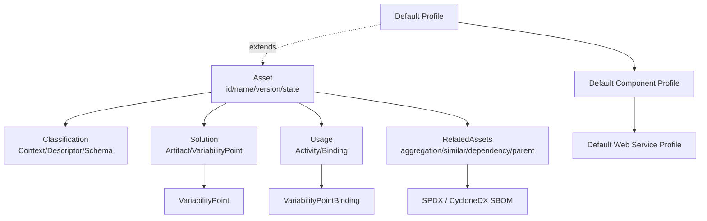

### 5. 正例

**正例**：某云原生团队将“订单微服务模板”包装为 RAS Asset：

- **Asset**：`id=order-service-template; version=2.3.1; state=approved`。
- **Classification**：领域=电商订单；技术栈=Spring Boot 3 + PostgreSQL；成熟度=生产级；许可证=Apache-2.0；合规=SOX-L2。
- **Solution**：包含 Helm Chart、Dockerfile、OpenAPI 3.0 规格、Terraform 模块、Jenkins 流水线；定义 VariabilityPoint `DB_HOST`、`REPLICA_COUNT`。
- **Usage**：提供 `helm install` 指令、参数绑定示例、本地调试步骤、升级路径。
- **RelatedAssets**：聚合监控模板 `order-service-observability`；依赖 Redis 缓存模板；父版本 `order-service-template 2.2.x`。

结果：新团队在 30 分钟内完成环境部署，配置错误率降低 80%。

### 6. 反例

**反例**：某团队将“用户认证模块”以压缩包形式上传到共享网盘：

- 没有 `Asset` 元数据，文件名 `auth-v3-final.zip` 无法区分版本与状态。
- 没有 `Classification`，其他团队无法通过领域、技术栈或许可证筛选。
- 没有 `Usage`，使用者不得不阅读源码猜测配置方式。
- 没有 `RelatedAssets`，依赖的加密库版本、许可证冲突在集成后才暴露。

结果：三个业务单元各自下载了不同版本，导致安全漏洞修复无法同步，合规审计失败。

**避免建议**：任何进入组织资产库的制品必须至少包含 Asset 元数据、Classification 标签、Usage 指南与 RelatedAssets 依赖声明。

### 7. 权威来源

> **权威来源**：
>
> - [OMG RAS Portal](https://www.omg.org/spec/RAS/) — OMG
> - [OMG RAS v2.2 Normative PDF](https://www.omg.org/spec/RAS/2.2/PDF) — OMG
> - [Code reuse - Wikipedia](https://en.wikipedia.org/wiki/Code_reuse)
> - [Component-based software engineering - Wikipedia](https://en.wikipedia.org/wiki/Component-based_software_engineering)
> - [ISO/IEC/IEEE 42010:2022](https://www.iso.org/standard/74393.html) — ISO
>
> **核查日期**：2026-07-07

### 8. 交叉引用

- FAIR4RS 与软件复用对照详见 [`../08-fair4rs/fair4rs-alignment.md`](../struct/01-meta-model-standards/08-fair4rs/fair4rs-alignment.md)
- ISO/IEC/IEEE 42010:2022 核心概念详见 [`../01-iso-420xx-family/iso-42010-2022.md`](../struct/01-meta-model-standards/01-iso-420xx-family/iso-42010-2022.md)
- TOGAF 企业连续体与构建块复用详见 [`../02-togaf-10-alignment/togaf-enterprise-continuum-reuse.md`](../struct/01-meta-model-standards/02-togaf-10-alignment/togaf-enterprise-continuum-reuse.md)
- 四层复用本体详见 [`../06-formal-axioms/four-layer-ontology.md`](../struct/01-meta-model-standards/06-formal-axioms/four-layer-ontology.md)
- 标准对齐矩阵详见 [`../01-iso-420xx-family/alignment-matrix.md`](../struct/01-meta-model-standards/01-iso-420xx-family/alignment-matrix.md)

---


<!-- SOURCE: struct/01-meta-model-standards/08-fair4rs/fair4rs-alignment.md -->

# FAIR4RS 原则与软件复用对照

> **版本**: 2026-06-08
> **定位**: 将 FAIR4RS 原则纳入四层软件架构复用框架，建立可量化的实施检查清单与成熟度评分模型
> **对齐来源**: FAIR4RS Principles v1.0 (RDA, 2022), Chue Hong et al. (2022), ISO/IEC 25010:2023, OMG RAS v2.2, ISO/IEC/IEEE 1517:2010-2010
> **状态**: ✅ 已完成
> **交叉引用**: [`../07-omg-ras/ras-alignment.md`](../struct/01-meta-model-standards/07-omg-ras/ras-alignment.md), [`../01-iso-420xx-family/ieee-1517-reuse-processes.md`](../struct/01-meta-model-standards/01-iso-420xx-family/ieee-1517-reuse-processes.md)

---

## 1. FAIR4RS 核心原则

FAIR4RS（FAIR Principles for Research Software）由 RDA、FORCE11 与 ReSA 于 2022 年联合发布，将 FAIR 数据原则适配至研究软件领域。与数据不同，软件具有**可执行性**与**组合性**，因此原则强调机器可操作与多粒度标识。

| 原则 | 核心要求 | 软件复用含义 |
|------|---------|-------------|
| **Findable** | 软件资产可被唯一标识和检索 | 全局持久 ID + 可搜索元数据索引 |
| **Accessible** | 协议标准化、元数据可获取 | 开放协议检索，认证授权不阻碍访问 |
| **Interoperable** | 使用标准格式和词汇表 | API/数据格式标准化，限定引用 |
| **Reusable** | 清晰的许可证、完善的文档、可验证的依赖 | 许可证合规 + 来源可审计 + 环境可复现 |

---

## 2. 与四层复用架构的对照映射

| FAIR4RS 原则 | 业务架构 | 应用架构 | 组件架构 | 功能架构 |
|-------------|---------|---------|---------|---------|
| **Findable** | 能力目录 (FEA BRM) | 服务注册表 (OpenAPI/UDDI) | 包管理索引 (npm/PyPI/Cargo) | 函数注册表 (MCP Tool Registry) |
| **Accessible** | BPMN/DMN 开放规范 | API 网关 + OpenAPI 文档 | 包仓库 (npm registry/Maven) | Protocol 端点 (stdio/SSE/HTTP) |
| **Interoperable** | ArchiMate 标准交换格式 | CNCF 标准 (gRPC/CloudEvents) | SPDX / SemVer 语义版本 | A2A / MCP 标准协议 |
| **Reusable** | 业务规则库 (DMN 决策表) | 微服务模板 (Helm/Dockerfile) | 开源许可证 (SPDX 标识符) | 概率契约 (Pact/MCP Schema) |

**映射说明**：

- **Findable** 在各层均要求可检索的目录机制：业务能力通过 FEA BRM 分类目录发现；应用服务通过 API 注册表发现；组件通过包管理器索引发现；AI 功能通过 MCP Tool Registry 发现。
- **Accessible** 要求分层协议透明：业务流程模型以开放标准（BPMN/DMN）发布；应用服务通过 API 网关暴露；组件通过包仓库分发；功能通过标准化端点调用。
- **Interoperable** 要求跨层格式统一：业务层使用 ArchiMate 交换；应用层使用 CNCF 接口标准；组件层使用 SPDX 描述和 SemVer 版本约束；功能层使用 A2A 或 MCP 协议实现互操作。
- **Reusable** 要求各层提供可验证的复用契约：业务规则库需配套决策逻辑说明；微服务模板需配套部署配置；组件需明确许可证和 SBOM；功能需声明输入输出 Schema 和概率契约。

---

## 3. 与供应链安全的结合

### 3.1 FAIR4RS + SBOM

| FAIR4RS 原则 | SBOM 映射 | 实践含义 |
|-------------|----------|---------|
| Findable | SBOM 存在性 | 每个发布版本附带 SPDX/CycloneDX SBOM，使组件可被机器发现 |
| Reusable | 许可证合规 | SBOM 中的 `licenseConcluded` 字段确保许可证清晰，支撑法律复用 |

### 3.2 FAIR4RS + SLSA

| FAIR4RS 原则 | SLSA 映射 | 实践含义 |
|-------------|----------|---------|
| Accessible | 构建来源可验证 | SLSA Level ≥ 2 要求构建过程使用托管构建平台，生成可验证的 provenance attestations，确保软件及其元数据的访问路径可信 |

### 3.3 FAIR4RS + MCP Tool 注册表

| FAIR4RS 原则 | MCP 映射 | 实践含义 |
|-------------|----------|---------|
| Findable | Tool Registry 索引 | 每个 MCP Server 在注册表中登记 `name`, `version`, `description` |
| Accessible | stdio / HTTP(S) with SSE | 标准传输层确保 AI 功能的访问不受厂商绑定 |

---

## 4. 实施检查清单

评分模型：**0 = 未实施, 1 = 部分实施, 2 = 基本实施, 3 = 完全实施**。总分 120 分。

| 编号 | Findable (F) 检查项 | 分值 |
|------|---------------------|------|
| F-01 | 软件资产分配全局唯一持久标识符 (DOI/SWHID/PURL) | 0–3 |
| F-02 | 不同粒度 (系统/模块/函数) 均有独立标识 | 0–3 |
| F-03 | 每个发布版本有独立持久标识 (SemVer + Git Tag) | 0–3 |
| F-04 | 元数据包含软件标识符且机器可读 | 0–3 |
| F-05 | 注册到至少一个可搜索公共目录或注册表 | 0–3 |
| F-06 | 提供 CodeMeta 或 CITATION.cff 元数据文件 | 0–3 |
| F-07 | 元数据本身可被搜索引擎索引 (sitemap/robots.txt) | 0–3 |
| F-08 | 使用标准化词汇描述软件领域与功能 | 0–3 |
| F-09 | 文档网站提供清晰的导航与检索功能 | 0–3 |
| F-10 | 架构决策记录 (ADR) 可被独立检索 | 0–3 |

| 编号 | Accessible (A) 检查项 | 分值 |
|------|----------------------|------|
| A-01 | 通过开放、免费、通用协议分发 (HTTPS/Git) | 0–3 |
| A-02 | 协议支持必要的认证与授权 (OIDC/OAuth2) | 0–3 |
| A-03 | 元数据在软件不可用时仍可访问 (Zenodo / SWH) | 0–3 |
| A-04 | 提供稳定的长期支持 (LTS) 版本下载路径 | 0–3 |
| A-05 | 源码与二进制制品均有可访问的归档 | 0–3 |
| A-06 | API 文档通过标准化接口暴露 (OpenAPI/GraphQL) | 0–3 |
| A-07 | 依赖包可通过公共仓库无阻碍获取 | 0–3 |
| A-08 | 容器镜像通过 OCI 标准注册表分发 | 0–3 |
| A-09 | 构建脚本与 CI/CD 配置公开可审计 | 0–3 |
| A-10 | 许可证全文随制品一同分发 | 0–3 |

| 编号 | Interoperable (I) 检查项 | 分值 |
|------|-------------------------|------|
| I-01 | 数据交换采用领域社区标准格式 (JSON/XML/Protobuf) | 0–3 |
| I-02 | API 使用限定引用指向外部资源 (PURL/CPE) | 0–3 |
| I-03 | 组件接口遵循开放标准 (OpenAPI/gRPC/MQTT) | 0–3 |
| I-04 | 使用语义版本 (SemVer) 管理兼容性 | 0–3 |
| I-05 | 数据模型使用共享词汇表或本体 (Schema.org/ECLASS) | 0–3 |
| I-06 | 事件格式遵循 CloudEvents 或 CNCF 标准 | 0–3 |
| I-07 | 配置管理使用声明式标准 (YAML/TOML/JSON Schema) | 0–3 |
| I-08 | 跨语言绑定使用 IDL (Protobuf/Avro/Cap'n Proto) | 0–3 |
| I-09 | 错误码与日志格式遵循可解析标准 | 0–3 |
| I-10 | 协议端点支持内容协商 (Content Negotiation) | 0–3 |

| 编号 | Reusable (R) 检查项 | 分值 |
|------|---------------------|------|
| R-01 | 使用 SPDX 标识符明确声明许可证 | 0–3 |
| R-02 | 提供完整来源 provenance (作者/资助/项目) | 0–3 |
| R-03 | 包含 SBOM (SPDX/CycloneDX) 声明依赖 | 0–3 |
| R-04 | 提供 SLSA provenance 或 Sigstore 签名 | 0–3 |
| R-05 | README 包含安装、使用、贡献指南 | 0–3 |
| R-06 | 代码覆盖率达到可接受阈值 (≥ 60%) | 0–3 |
| R-07 | 架构决策记录 (ADR) 完整且可访问 | 0–3 |
| R-08 | 依赖更新策略清晰 (Renovate/Dependabot) | 0–3 |
| R-09 | 发布制品包含变更日志 (CHANGELOG) | 0–3 |
| R-10 | 提供可复现的构建环境 (Dockerfile/devcontainer) | 0–3 |

**等级划分**：

- **90–120 分**：优秀 (Excellent) — 资产完全 FAIR4RS 合规，可跨组织安全复用
- **60–89 分**：良好 (Good) — 核心原则已实施，存在局部改进空间
- **30–59 分**：及格 (Acceptable) — 基本可发现，但可访问性与可复现性不足
- **< 30 分**：需改进 (Needs Improvement) — 不满足可持续复用最低门槛

---

## 5. 与软件工程标准的映射

### 5.1 FAIR4RS ↔ ISO/IEC 25010:2023 Reusability

ISO/IEC 25010:2023 将 **Reusability** 定义为"软件资产可被用于构建其他软件资产的程度"。映射关系：

| ISO 25010:2023 子特性 | FAIR4RS 对应原则 | 对齐说明 |
|----------------------|-----------------|---------|
| Modularity | Interoperable | 模块化接口标准促进互操作 |
| Reusability (资产包装) | Findable + Accessible | RAS/SPDX 包装使资产可发现与获取 |
| Compatibility | Interoperable | 数据格式与 API 标准兼容性 |
| Maintainability | Reusable | 文档与来源 provenance 支撑长期维护 |

### 5.2 FAIR4RS ↔ OMG RAS v2.2 Classification/Usage

| RAS v2.2 核心部分 | FAIR4RS 原则 | 对齐说明 |
|------------------|-------------|---------|
| Classification | Findable | 分类信息回答"这是什么"，是发现的首要依据 |
| Solution | Accessible + Interoperable | 解决方案包含实际制品与可变性点 |
| Usage | Reusable | 使用指南回答"如何安装、定制、运行" |
| RelatedAssets | Interoperable | 相关资产引用实现限定依赖声明 |

### 5.3 FAIR4RS ↔ IEEE 1517 Reuse Process

IEEE 1517-2010 定义软件生命周期中的复用过程，包括领域工程与应用工程双轨。映射：

| IEEE 1517 过程域 | FAIR4RS 原则 | 对齐说明 |
|-----------------|-------------|---------|
| 领域工程 (Domain Engineering) | Findable + Interoperable | 构建可复用资产库，要求标准分类与接口 |
| 应用工程 (Application Engineering) | Accessible + Reusable | 从资产库检索、适配、集成到目标系统 |
| 复用管理 (Reuse Management) | Reusable | 资产成熟度评估、版本控制、许可证审计 |

---

## 6. 权威来源

- FAIR4RS Principles v1.0. Research Data Alliance, FORCE11, ReSA, 2022. <https://ardc.edu.au/resource/fair-principles-for-research-software-fair4rs/>
- Chue Hong, N.P., et al. (2022). "FAIR Principles for Research Software". *Nature Scientific Data*. <https://doi.org/10.1038/s41597-022-01710-x>
- Barker, M., et al. (2022). "Introducing the FAIR Principles for Research Software". *RDA*.
- ISO/IEC 25010:2023. *Systems and software engineering — Systems and software Quality Requirements and Evaluation (SQuaRE) — Quality model*.
- OMG RAS v2.2. *Reusable Asset Specification*. formal/05-11-02. <https://www.omg.org/spec/RAS/>
- ISO/IEC/IEEE 1517:2010-2010. *IEEE Standard for Information Technology — System and Software Life Cycle Processes — Reuse Processes*.
- ReSA Actionable FAIR4RS Task Force (2024–2025). <https://www.researchsoft.org/tf-actionable-fair4rs/>


---

## 补充说明：FAIR4RS 原则与软件复用对照

## 概念定义

**定义**：FAIR4RS（FAIR Principles for Research Software）将 FAIR 原则应用于研究软件，要求软件可发现（Findable）、可访问（Accessible）、可互操作（Interoperable）、可重用（Reusable）。

## 示例

**示例**：某科研团队将分析工具注册到 Zenodo 并分配 DOI，附带语义化元数据、开源许可证与容器镜像，使其他研究团队可发现、引用与复用。

## 反例

**反例**：研究代码仅存储在个人网盘，缺乏版本、文档与许可证，他人无法引用或复现。

## 权威来源

> **权威来源**:
>
> - [FAIR4RS Principles](https://ardc.edu.au/resource/fair-principles-for-research-software-fair4rs)
> - [FAIR4RS RDA](https://www.rd-alliance.org/group/fair-4-research-software-fair4rs-wg)
> - 核查日期：2026-07-07


---

## 补充：FAIR4RS 原则与软件复用的完整映射

> 本节对 FAIR4RS（FAIR Principles for Research Software）的四大原则进行定义、属性、关系、正例、反例、形式化视图、权威来源与交叉引用的补全。
> 相关 Wikipedia 概念结构：
> [FAIR data](https://en.wikipedia.org/wiki/FAIR_data)、
> [Open science](https://en.wikipedia.org/wiki/Open_science)、
> [Reproducibility](https://en.wikipedia.org/wiki/Reproducibility)、
> [Code reuse](https://en.wikipedia.org/wiki/Code_reuse)。

### 1. 概念定义

**定义**：FAIR4RS 是 RDA、FORCE11 与 ReSA 于 2022 年联合发布的研究软件 FAIR 原则，要求研究软件具备可发现（Findable）、可访问（Accessible）、可互操作（Interoperable）与可重用（Reusable）四项能力。软件具有可执行性与组合性，因此 FAIR4RS 特别强调机器可操作的元数据、多粒度标识、标准化协议与可验证来源。

### 2. 原则属性

| 原则 | 核心属性 | 可观察指标 | 重要性 |
|------|----------|------------|--------|
| **Findable** | 持久标识、机器可读元数据、注册目录 | DOI / PURL / SWHID / Git Tag、CodeMeta / CITATION.cff、搜索引擎索引 | 高 |
| **Accessible** | 开放协议、元数据长期可获取、权限可管理 | HTTPS / Git、Zenodo / Software Heritage、OAuth / OIDC | 高 |
| **Interoperable** | 标准格式、限定引用、共享词汇 | JSON / XML / Protobuf、PURL / CPE、Schema.org / ECLASS | 高 |
| **Reusable** | 许可证清晰、来源完整、文档与测试 | SPDX 标识符、SBOM / SLSA provenance、README / CHANGELOG / 测试覆盖率 | 高 |

### 3. 关系说明

- **原则间顺序关系**：Findable → Accessible → Interoperable → Reusable，前一原则是后一原则的前提。
- **FAIR4RS ↔ OMG RAS**：Findable 对应 RAS Classification；Accessible + Interoperable 对应 RAS Solution；Reusable 对应 RAS Usage；RelatedAssets 对应限定依赖声明。
- **FAIR4RS ↔ ISO/IEC 25010:2023**：Reusable 映射到 ISO/IEC 25010:2023 的 Reusability 子特性；Interoperable 映射到 Compatibility；Findable/Accessible 映射到 Portability/Flexibility 的信息可获取性。
- **FAIR4RS ↔ ISO/IEC/IEEE 1517:2010**：领域工程阶段关注 Findable + Interoperable；应用工程阶段关注 Accessible + Reusable；复用管理阶段关注 Reusable。
- **FAIR4RS ↔ 四层复用架构**：
  - Findable → 业务架构能力目录 / 应用架构服务注册表 / 组件架构包索引 / 功能架构函数注册表
  - Accessible → BPMN/DMN / API 网关 / 包仓库 / MCP/A2A 端点
  - Interoperable → ArchiMate 交换格式 / CNCF 标准 / SPDX+SemVer / MCP/A2A 协议
  - Reusable → DMN 规则库 / 微服务模板 / 开源许可证 / 概率契约与 Schema

### 4. 形式化/结构化分析

```mermaid
graph LR
    F[Findable<br/>持久ID/目录]
    A[Accessible<br/>开放协议]
    I[Interoperable<br/>标准格式]
    R[Reusable<br/>许可证/文档/来源]
    F --> A
    A --> I
    I --> R
    F --> Biz[业务架构<br/>能力目录]
    A --> App[应用架构<br/>API网关]
    I --> Comp[组件架构<br/>SPDX/SemVer]
    R --> Func[功能架构<br/>MCP/A2A Schema]
```

### 5. 正例

**正例**：某高校研究团队发布了一款用于气候数据分析的 Python 库：

- **Findable**：在 Zenodo 注册 DOI，代码仓库附带 `CITATION.cff` 与 `codemeta.json`，并在 PyPI 发布。
- **Accessible**：源码与二进制通过 GitHub Releases 和 PyPI 以 HTTPS 分发；元数据在 Zenodo 长期保存。
- **Interoperable**：输入输出采用 NetCDF 与 CSV 标准格式；API 使用 REST + OpenAPI 3.0；依赖使用 SemVer 约束。
- **Reusable**：采用 MIT 许可证并附带 SPDX 标识符；提供 SBOM；CI/CD 生成 SLSA provenance；README 包含安装、使用、贡献指南；测试覆盖率 78%。

结果：该库被 12 个国际研究团队复用，论文引用量显著提升，漏洞修复可在 24 小时内通过依赖更新传播。

### 6. 反例

**反例**：某研究生将分析脚本存储在个人网盘并分享给合作者：

- **Findable**：没有持久标识，链接易失效，无法被搜索引擎索引。
- **Accessible**：网盘需要特定账号与地区访问权限，外部合作者经常无法下载。
- **Interoperable**：脚本依赖本地硬编码路径与未声明的 Python 2 库，无法在新的环境中运行。
- **Reusable**：没有许可证，他人不敢使用；没有 README，使用者无法理解参数含义；没有版本控制，结果无法复现。

结果：论文审稿人无法复现实验，稿件被退回；合作团队不得不重写分析流程。

**避免建议**：将 FAIR4RS 检查清单嵌入软件发布流水线，未通过 Findable/Accessible/Interoperable/Reusable 门控的软件不得作为可复用资产入库。

### 7. 权威来源

> **权威来源**：
>
> - [FAIR4RS Principles v1.0](https://ardc.edu.au/resource/fair-principles-for-research-software-fair4rs/) — ARDC / RDA / FORCE11 / ReSA
> - [FAIR4RS RDA Working Group](https://www.rd-alliance.org/group/fair-4-research-software-fair4rs-wg) — RDA
> - [Chue Hong et al. (2022), Nature Scientific Data](https://doi.org/10.1038/s41597-022-01710-x)
> - [FAIR data - Wikipedia](https://en.wikipedia.org/wiki/FAIR_data)
> - [Open science - Wikipedia](https://en.wikipedia.org/wiki/Open_science)
> - [ISO/IEC 25010:2023](https://www.iso.org/standard/78178.html) — ISO
>
> **核查日期**：2026-07-07

### 8. 交叉引用

- OMG RAS 对齐详见 [`../07-omg-ras/ras-alignment.md`](../struct/01-meta-model-standards/07-omg-ras/ras-alignment.md)
- ISO/IEC/IEEE 1517:2010 复用过程详见 [`../01-iso-420xx-family/ieee-1517-reuse-processes.md`](../struct/01-meta-model-standards/01-iso-420xx-family/ieee-1517-reuse-processes.md)
- ISO/IEC/IEEE 42010:2022 核心概念详见 [`../01-iso-420xx-family/iso-42010-2022.md`](../struct/01-meta-model-standards/01-iso-420xx-family/iso-42010-2022.md)
- 四层复用本体详见 [`../06-formal-axioms/four-layer-ontology.md`](../struct/01-meta-model-standards/06-formal-axioms/four-layer-ontology.md)
- SWEBOK V4 对齐详见 [`../05-swebok-v4/swebok-alignment.md`](../struct/01-meta-model-standards/05-swebok-v4/swebok-alignment.md)

---


<!-- SOURCE: struct/01-meta-model-standards/09-sysml-v2/sysml2-reuse-mapping.md -->

# OMG SysML v2 与架构复用映射指南

| 属性 | 值 |
|---|---|
| **版本** | 2026-06-10 |
| **定位** | Phase C-01：元模型标准层 — SysML v2 复用语义与架构资产映射 |
| **对齐标准** | OMG SysML v2（2023）、ISO/IEC 42010:2022、OMG RAS 2.0、ISO/IEC 26550:2015、OMG KDM、IEEE 1471 |
| **状态** | ✅ 已完成 |

---

## 目录

- [OMG SysML v2 与架构复用映射指南](#omg-sysml-v2-与架构复用映射指南)
  - [目录](#目录)
  - [1. OMG SysML v2 概述](#1-omg-sysml-v2-概述)
    - [1.1 发布背景与核心变革](#11-发布背景与核心变革)
    - [1.2 元模型重构：从 UML 继承到独立内核](#12-元模型重构从-uml-继承到独立内核)
    - [1.3 图形符号简化：语义-图形分离](#13-图形符号简化语义-图形分离)
    - [1.4 API 标准化：SysML v2 REST API](#14-api-标准化sysml-v2-rest-api)
  - [2. SysML v2 核心架构元素的复用语义](#2-sysml-v2-核心架构元素的复用语义)
    - [2.1 ItemDefinition：物理/信息实体的类型定义](#21-itemdefinition物理信息实体的类型定义)
    - [2.2 PartDefinition：结构组件的类型定义](#22-partdefinition结构组件的类型定义)
    - [2.3 ActionDefinition：行为能力的类型定义](#23-actiondefinition行为能力的类型定义)
    - [2.4 ConnectionDefinition：交互关系的类型定义](#24-connectiondefinition交互关系的类型定义)
  - [3. SysML v2 的库（Library）机制](#3-sysml-v2-的库library机制)
    - [3.1 库作为一级语言概念](#31-库作为一级语言概念)
    - [3.2 标准库体系](#32-标准库体系)
    - [3.3 企业级库治理](#33-企业级库治理)
  - [4. SysML v2 与 ISO/IEC/IEEE 42010:2022 的对照](#4-sysml-v2-与-isoiec-420102022-的对照)
    - [4.1 核心概念映射表](#41-核心概念映射表)
    - [4.2 Viewpoint 与 View 的实现](#42-viewpoint-与-view-的实现)
    - [4.3 架构决策的可追溯复用](#43-架构决策的可追溯复用)
  - [5. 基于模型的复用（Model-Based Reuse）](#5-基于模型的复用model-based-reuse)
    - [5.1 OMG RAS（Reusable Asset Specification）映射](#51-omg-rasreusable-asset-specification映射)
    - [5.2 模型资产的粒度层次](#52-模型资产的粒度层次)
    - [5.3 模型资产的质量与验证](#53-模型资产的质量与验证)
  - [6. SysML v2 与产品线工程（ISO/IEC 26550:2015）的结合](#6-sysml-v2-与产品线工程iso-26550的结合)
    - [6.1 ISO/IEC 26550:2015 概述](#61-isoiec-265502015-概述)
    - [6.2 共性/变性在 SysML v2 模型层的表达](#62-共性变性在-sysml-v2-模型层的表达)
      - [6.2.1 纯变体（Pure Variation）：`variation` 关键字](#621-纯变体pure-variationvariation-关键字)
      - [6.2.2 配置绑定（Configuration Binding）：`bind` 机制](#622-配置绑定configuration-bindingbind-机制)
      - [6.2.3 克隆与拥有（Clone + Owning）：`redefines` 与 `subsets`](#623-克隆与拥有clone--owningredefines-与-subsets)
    - [6.3 150% 模型与变体推导](#63-150-模型与变体推导)
    - [6.4 SysML v2 特征模型的集成架构](#64-sysml-v2-特征模型的集成架构)
  - [7. 案例：使用 SysML v2 建立可复用的卫星系统架构库](#7-案例使用-sysml-v2-建立可复用的卫星系统架构库)
    - [7.1 项目背景](#71-项目背景)
    - [7.2 架构库的分层设计](#72-架构库的分层设计)
    - [7.3 核心复用元素示例](#73-核心复用元素示例)
      - [平台通用总线定义](#平台通用总线定义)
      - [载荷变体定义](#载荷变体定义)
    - [7.4 多型号复用实例](#74-多型号复用实例)
    - [7.5 复用效益分析](#75-复用效益分析)
  - [8. 权威来源](#8-权威来源)

---

## 1. OMG SysML v2 概述

### 1.1 发布背景与核心变革

OMG SysML v2 于 2023 年 11 月由对象管理组织（OMG）正式发布，标志着系统工程建模语言自 2007 年 SysML v1 以来最重大的范式跃迁。SysML v2 并非对 v1 的简单增量升级，而是一次基于全新元模型基础的彻底重构，旨在解决 v1 时代长期困扰工业界的互操作性差、图形语义歧义、API 缺位以及复用机制薄弱等问题。

SysML v2 的三大核心变革方向如下：

| 变革维度 | SysML v1 的局限 | SysML v2 的改进 |
|---|---|---|
| **元模型架构** | 基于 UML 2.x 元模型继承，带来大量非必要复杂性 | 全新独立的 SysML v2 元模型，与 UML 解耦，采用 Kernel Modeling Language（KML）基础 |
| **图形符号** | 图形与语义紧耦合，同一种概念存在多种图形表达，导致歧义 | 图形与语义分离（Separation of Concerns），统一语义映射到多种可选图形 |
| **API 与交换** | 仅依赖 XMI 交换，缺乏标准化 API，工具间互操作性差 | 标准化 RESTful API（SysML v2 API）、JSON/LF 文本交换格式、原生模型库机制 |

### 1.2 元模型重构：从 UML 继承到独立内核

SysML v2 的元模型重构是其最深刻的架构变化。v1 作为 UML 的轮廓（Profile）实现，被迫继承 UML 的类/对象二分法、状态机语义和用例驱动范式，这些对于物理系统建模并非最优。v2 引入了 Kernel Modeling Language（KML）作为底层元元模型层，直接定义了适合系统工程的基元概念：

- **Element**：所有模型实体的抽象根
- **Relationship**：元素间的语义关联，包括 Dependencies、Connections、Specializations
- **Namespace**：提供命名作用域和可见性控制
- **Membership**：元素在命名空间中的归属机制

这种重构带来了显著的复用收益：由于元模型不再受 UML 约束，SysML v2 可以原生表达**组合式复用**（Compositional Reuse），即通过标准库元素的多层次组合构建复杂系统，而无需借助 UML 的模板（Template）或轮廓扩展等间接手段。

### 1.3 图形符号简化：语义-图形分离

SysML v2 引入了显式的**语义层**与**图形表示层**分离架构。在 v1 中，Block Definition Diagram（BDD）和 Internal Block Diagram（IBD）不仅承载语义，还强制规定了图形布局规则，导致不同工具渲染同一模型时产生歧义。

v2 的解决方案是：

1. **标准化语义模型**：所有工具共享同一套抽象语法树（AST），以 JSON/LF 或 API 形式交换
2. **可定制图形渲染**：图形表示（View）通过独立的 ViewDefinition 和 Rendering 规则定义
3. **多视点多图形**：同一语义模型可自动生成 BDD、IBD、连接图、参数图等多种视图，且保证一致性

对于架构复用而言，这意味着**可复用资产首次实现了语义与表示的彻底解耦**。复用方只需关注语义模型本身，而可根据组织惯例或项目需求自定义图形呈现。

### 1.4 API 标准化：SysML v2 REST API

SysML v2 首次在规范层面定义了标准化的 RESTful API（OMG SysML v2 API Specification），这是模型复用从文件交换迈向服务化复用的关键基础设施。API 的核心能力包括：

- **CRUD 操作**：对模型元素、关系、库的标准化增删改查
- **查询接口**：基于 SysML v2 Query Language（基于 KerML 查询语法）的模型检索
- **版本与分支**：支持模型的版本化管理与派生分支
- **事件订阅**：模型变更的 WebSocket/Hook 通知机制
- **导入/导出**：标准 JSON/LF 格式与原生 API 的双向映射

API 标准化直接支撑了**企业级模型资产库**的建设，使得 SysML 模型可以作为 Organization-Level 的可复用服务被消费，而非离散的文件集合。

---

## 2. SysML v2 核心架构元素的复用语义

SysML v2 重新定义了系统建模的核心元素类型，每种类型都内建了复用语义。以下分析四种最具架构复用价值的元素。

### 2.1 ItemDefinition：物理/信息实体的类型定义

**ItemDefinition** 对应于 v1 的 ValueType 与 Block 的融合概念，用于定义系统中传递、存储或处理的物理项和信息项的**类型规范**。其复用语义体现在：

- **属性继承**：ItemDefinition 可通过 Specialization 继承父类型的属性、约束和特征，形成类型层次
- **多态实例化**：任何需要 Item 的地方，可使用其子类型实例化，实现"依赖抽象而非具体"的复用原则
- **跨库引用**：ItemDefinition 可被封装在标准库中，通过 import 机制在多个系统模型间共享

```
library StandardDataTypes {
    item def Mass {
        attribute value : Real;
        attribute unit : SI::kg;
    }

    item def Power {
        attribute value : Real;
        attribute unit : SI::W;
    }
}
```

在架构复用场景中，组织可建立**企业级 ItemDefinition 库**，统一所有系统的物理量、数据结构和接口契约定义，避免"每个项目重新定义 Mass"的重复劳动。

### 2.2 PartDefinition：结构组件的类型定义

**PartDefinition** 是 SysML v2 中描述系统结构层次的核心元素，对应于 v1 的 Block，但语义更加纯粹。PartDefinition 定义了系统组件的**结构特征**（有哪些子部件、端口、连接器）和**行为接口**（可执行的动作、接收的信号）。

PartDefinition 的复用机制包括：

1. **特化继承（Specialization）**：子类型继承父类型的所有子部件、端口和约束，可追加或重定义局部特征
2. **复合引用（Composition by Reference）**：PartUsage 通过引用 PartDefinition 实现实例化，同一 PartDefinition 可在系统多处复用
3. **参数化配置**：通过 Attribute 和 Parameter 的绑定机制，同一 PartDefinition 可实例化为不同配置的部件（如 "SolarPanel" 定义通过参数绑定区分为 "1kW 版" 和 "5kW 版"）
4. **变体派生（Variation）**：结合 Variation 机制，PartDefinition 可声明可选特征，由具体产品线变体选择性绑定

### 2.3 ActionDefinition：行为能力的类型定义

**ActionDefinition** 取代了 v1 的 Activity 概念，成为 SysML v2 中描述系统行为的原子单元。ActionDefinition 封装了一组可复用的行为步骤，其复用价值在于：

- **行为模板化**：将常见的操作序列（如 "启动自检程序"、"故障切换流程"）定义为 ActionDefinition，在多个系统上下文中引用
- **接口契约**：ActionDefinition 定义了输入参数（in parameters）、输出参数（out parameters）和前提/后置条件，形成黑盒可复用单元
- **层次组合**：复杂 ActionDefinition 由子 ActionUsage 组合而成，每个子 ActionUsage 引用（复用）已有的 ActionDefinition

**与架构复用的关联**：在参考架构（Reference Architecture）中，ActionDefinition 库定义了领域通用的行为模式。例如，航天领域的 "轨道机动"、"姿态调整"、"载荷数据下传" 等行为可被标准化为 ActionDefinition，各卫星型号通过引用和参数绑定复用这些行为模板。

### 2.4 ConnectionDefinition：交互关系的类型定义

**ConnectionDefinition** 是 SysML v2 中新增的核心元素类型，用于显式定义系统组件之间的**连接类型**。在 v1 中，连接（Connector）仅作为 IBD 中的图形元素，缺乏独立语义；v2 将 Connection 提升为一级模型元素，使其可被定义、特化、约束和复用。

ConnectionDefinition 的复用特性：

- **连接类型标准化**：定义 "CAN总线连接"、"射频链路"、"机械固连" 等标准连接类型，封装协议、物理约束和性能参数
- **多端连接支持**：突破 v1 仅支持二端连接的限制，支持 n-ary 连接（如一组传感器共享同一条总线）
- **约束传播**：在 ConnectionDefinition 上定义约束（如最大延迟、带宽、误码率），所有实例自动继承

```
connection def RF_Link {
    end : Antenna[2];
    attribute frequency : Frequency;
    attribute bandwidth : Bandwidth;
    attribute max_range : Length;

    constraint { frequency >= 2.0 [GHz] && frequency <= 30.0 [GHz] }
}
```

---

## 3. SysML v2 的库（Library）机制

### 3.1 库作为一级语言概念

在 SysML v2 中，**Library** 不再是工具特定的实现概念，而是被纳入 KerML/SysML v2 语言规范的一级概念。Library 是一种特殊的 Namespace，其设计目标就是**跨模型的元素复用**。

Library 的核心特征：

| 特征 | 说明 |
|---|---|
| **封装性** | Library 内的元素默认具有 controlled visibility，只有通过显式 export 的元素对外可见 |
| **版本标识** | Library 可携带版本标记（version annotation），支持多版本共存和依赖管理 |
| **依赖声明** | Library 通过 `import` 声明对其他 Library 的依赖，形成有向无环图（DAG）式的依赖结构 |
| **不可变性** | 被导入的 Library 元素在消费模型中默认只读，防止非受控修改 |

### 3.2 标准库体系

OMG 为 SysML v2 定义了分层标准库体系：

1. **KerML Base Library**：最底层的类型系统（Scalar、Vector、Boolean、Real 等），所有 SysML v2 模型隐式依赖
2. **SI/Dimension Library**：国际单位制和物理维度定义，支持量纲一致性检查
3. **SysML Standard Library**：SysML 核心元素扩展（如标准 ItemDefinition、PartDefinition 模板）
4. **Domain Libraries**：由行业组织或企业维护的领域专用库（如航天、汽车、能源）

### 3.3 企业级库治理

对于大规模架构复用，企业需建立**库治理体系**：

- **库注册中心**：集中管理所有内部 Library 的元数据（名称、版本、所有者、审批状态）
- **质量门禁**：Library 发布前需通过一致性检查、审查和批准流程
- **依赖分析**：工具自动分析模型间的 Library 依赖关系，检测循环依赖和版本冲突
- **影响分析**：当某 Library 发生变更时，自动识别所有受影响的消费模型

---

## 4. SysML v2 与 ISO/IEC 42010:2022 的对照

ISO/IEC 42010:2022《系统和软件工程 — 架构描述》是国际标准化组织发布的架构描述框架标准。SysML v2 作为系统建模语言，其概念体系与 ISO/IEC/IEEE 42010:2022 存在天然的映射关系。

### 4.1 核心概念映射表

| ISO/IEC 42010:2022 概念 | SysML v2 对应元素 | 映射说明 |
|---|---|---|
| **System**（系统） | `Occurrence` / `System` | SysML v2 中系统作为 Occurrence 存在，具有时空边界 |
| **Architecture**（架构） | `Model`（模型子集） | 系统的架构由 SysML Model 中描述结构、行为和属性的元素集合表达 |
| **Stakeholder**（利益相关方） | `Stakeholder`（注释元素） | 可通过 Comment / Metadata 关联到模型元素 |
| **Concern**（关注点） | `Concern`（自定义元数据） | 使用 AnnotatingElement 标记关注点 |
| **Viewpoint**（视点） | `ViewpointDefinition` / `ViewUsage` | SysML v2 显式支持 Viewpoint 作为语言元素 |
| **View**（视图） | `ViewDefinition` / `View` | View 是依据 Viewpoint 对 Model 的投影 |
| **Model Kind**（模型种类） | `Model` + `Filter` | 通过查询/过滤机制定义模型子集的种类 |
| **Correspondence**（对应关系） | `Dependency` + `rationale` | 使用带有注释的 Dependency 表达元素间对应 |
| **Architecture Decision**（架构决策） | `Decision`（自定义） | 可通过 Comment / Metadata 记录决策 |

### 4.2 Viewpoint 与 View 的实现

SysML v2 对 ISO/IEC/IEEE 42010:2022 的 Viewpoint-View 框架提供了原生语言支持：

```
viewpoint def Functional_Viewpoint {
    // 定义视点的关注点和利益相关方
    concern functional_decomposition;
    concern interface_definition;
    stakeholder system_engineer;
}

view func_view : Functional_Viewpoint {
    // 视图是依据视点筛选的模型子集
    // 自动包含所有 ActionDefinition、ConnectionDefinition 和相关 ItemDefinition
}
```

这种机制对架构复用的价值在于：**参考架构可以附带多个预定义的 Viewpoint 和 View，复用者在实例化时自动获得符合组织标准的架构视图集合**，无需手动筛选和排列模型元素。

### 4.3 架构决策的可追溯复用

ISO 42010:2022 强调架构决策（Architecture Decision）的显式记录。SysML v2 通过 Metadata / Annotation 机制支持将决策附加到任意模型元素。在复用场景中：

- 参考架构中的决策（如 "采用三模冗余"）作为可复用知识附着于相关 PartDefinition
- 消费模型在实例化时继承这些决策注释，并可根据实际情况追加本地决策或覆盖原决策
- 决策历史形成可追溯的审计链，满足安全关键领域的合规要求

---

## 5. 基于模型的复用（Model-Based Reuse）

### 5.1 OMG RAS（Reusable Asset Specification）映射

OMG RAS（Reusable Asset Specification）2.0 定义了可复用资产的元数据模型，包括资产描述、分类、依赖、使用指南和工件集合。SysML v2 模型作为一类高价值可复用资产，可与 RAS 元模型建立如下映射：

| RAS 元素 | SysML v2 对应 | 复用实践 |
|---|---|---|
| **Asset**（资产） | `Library` 或 `Model`（含复用意图标记） | 将经过验证的 SysML 模型打包为资产 |
| **Artifact**（工件） | `Library` 内元素 + 图形 View | 资产包含语义模型和推荐视图 |
| **Profile**（轮廓） | `Metadata` / `Annotation` | 描述资产适用领域、成熟度、质量等级 |
| **Classification**（分类） | Namespace 路径 + 自定义 Taxonomy | 通过层次化命名空间实现资产分类 |
| **Dependency**（依赖） | `import` 关系 | 资产间的依赖通过 Library import 表达 |
| **UsageGuidance**（使用指南） | `Comment` / 外部文档链接 | 在资产根元素上附加使用说明 |

### 5.2 模型资产的粒度层次

基于 SysML v2 的模型复用可发生在多个粒度层次：

1. **元素级复用（Element-Level）**：复用单个 ItemDefinition、ActionDefinition 等类型定义
2. **子系统级复用（Subsystem-Level）**：复用包含多个 PartUsage、ConnectionUsage 和约束的子系统模型片段
3. **模式级复用（Pattern-Level）**：复用抽象的架构模式（如 "主备冗余模式"、"分层处理模式"），通过特化和参数绑定实例化
4. **参考架构级复用（Reference Architecture-Level）**：复用完整的领域参考架构，通过 Variation 和配置推导具体产品架构

### 5.3 模型资产的质量与验证

可复用模型资产必须经过严格验证才能入库。SysML v2 提供的验证机制包括：

- **良构性规则（Well-formedness Rules）**：KerML/SysML v2 规范定义了大量约束，工具可自动检查模型是否良构
- **量纲一致性**：利用 SI Library 检查物理公式的量纲正确性
- **约束求解**：通过参数图（Parametrics）和外部求解器（如 Mathematica、MATLAB）验证约束可满足性
- **模型审查**：结合 View 机制生成供人工审查的标准视图

---

## 6. SysML v2 与产品线工程（ISO 26550）的结合

### 6.1 ISO/IEC 26550:2015 概述

ISO/IEC 26550:2015《软件与系统工程 — 产品线工程》定义了产品线工程（Product Line Engineering, PLE）的参考模型，核心概念包括：

- **领域工程（Domain Engineering）**：分析产品线的共性和可变性，构建领域资产
- **应用工程（Application Engineering）**：基于领域资产和特征选择，派生具体产品
- **特征（Feature）**：用户可见的产品能力，是配置和变体管理的基本单元
- **150% 模型**：包含所有变体可选元素的超集模型，通过配置规则推导具体产品模型

### 6.2 共性/变性在 SysML v2 模型层的表达

SysML v2 原生支持三种变性表达机制，分别对应 PLE 中的不同变性类型：

#### 6.2.1 纯变体（Pure Variation）：`variation` 关键字

SysML v2 引入了 `variation` 关键字，允许在定义层声明"此处存在多种互斥选项"。

```
part def Satellite_Bus {
    variation part propulsion : Propulsion_System [
        // 卫星平台可选择化学推进或电推进，二者互斥
        alternative Chemical_Thruster,
        alternative Electric_Thruster
    ]
}
```

在 PLE 术语中，这对应于**可选特征（Optional/Alternative Feature）**的模型层表达。

#### 6.2.2 配置绑定（Configuration Binding）：`bind` 机制

对于参数化变性，SysML v2 通过 `bind` 将抽象参数绑定到具体值：

```
part def Solar_Panel;
part def Satellite {
    attribute power_requirement : Power;
    part solar_array : Solar_Panel {
        bind power = power_requirement;
    }
}
```

这对应于 PLE 中的**绑定时间（Binding Time）**概念，支持在设计时、编译时或运行时进行参数绑定。

#### 6.2.3 克隆与拥有（Clone + Owning）：`redefines` 与 `subsets`

对于需要结构性修改的变体，SysML v2 支持通过 `redefines` 在子类型中重定义父类型的特征：

```
part def High_Resolution_Satellite :> Satellite {
    redefines payload as high_res_camera : HighRes_Camera;
}
```

这对应于 PLE 中的**克隆-拥有（Clone & Own）**变体策略，适用于变体与基线存在结构性差异的场景。

### 6.3 150% 模型与变体推导

SysML v2 的 Library + Variation 机制天然支持 150% 模型的构建：

1. **构建 150% 模型**：在领域工程阶段，创建包含所有可选特征和变体分支的"超集模型"
2. **特征配置**：使用外部特征模型（Feature Model，可用 Clafer、FeatureIDE 等工具定义）描述特征依赖和约束
3. **变体推导**：通过 SysML v2 API 或工具插件，根据特征选择自动解析 `variation`、应用 `bind`、筛选重定义，生成 100% 的具体产品模型
4. **模型验证**：对推导出的产品模型执行良构性检查和约束求解，确保配置有效

这种"模型层配置推导"相比传统的"代码/文档层克隆修改"具有显著优势：

- **一致性保证**：共性修改仅需在 150% 模型中进行一次，自动传播到所有派生变体
- **可追溯性**：变体与基线模型间的 derivation 关系被显式记录
- **早期验证**：可在设计阶段而非实现阶段发现配置冲突

### 6.4 SysML v2 特征模型的集成架构

虽然 SysML v2 标准本身不包含特征建模（Feature Modeling）的完整语法，但其元模型扩展机制（通过 Metadata/Annotation 或领域特定 Library）支持与外部特征模型的无缝集成：

```
// 使用 Metadata 关联特征模型中的特征选择
metadata FeatureBinding {
    attribute feature_id : String;
    attribute selected : Boolean;
}

#FeatureBinding { feature_id = "Propulsion.Electric"; selected = true }
part electric_satellite : Satellite;
```

工具实现层面，可通过以下方式集成：

- **双向同步**：FeatureIDE 等特征建模工具与 SysML v2 工具（如 Cameo、Papyrus）通过 API 同步特征选择状态
- **配置引擎**：基于 SAT/SMT 求解器的配置引擎解析特征约束，驱动 SysML v2 模型的变体推导
- **一致性检查**：验证 SysML v2 模型中的 `variation` 声明与特征模型中的特征定义是否一致

---

## 7. 案例：使用 SysML v2 建立可复用的卫星系统架构库

### 7.1 项目背景

某航天研究院承担多种卫星型号的研制任务，包括通信卫星、遥感卫星和导航卫星。虽然任务各异，但所有卫星共享共同的平台技术（电源、热控、姿态轨道控制、测控）。传统研制模式下，各型号团队独立建模，导致平台级模型资产无法复用，型号间接口不统一，技术状态管理困难。

本项目目标：基于 SysML v2 建立**可复用的卫星系统架构库（Satellite Architecture Library）**，支撑多型号并行研制。

### 7.2 架构库的分层设计

```
Satellite_Architecture_Library/
├── Kernel_Layer/
│   ├── SI_Extensions.sysml          # 航天专用单位扩展（km/s, dBm, Kbps 等）
│   └── Domain_Taxonomy.sysml        # 卫星系统本体分类体系
├── Platform_Layer/
│   ├── Bus_Definitions.sysml        # 平台通用 PartDefinition
│   ├── Subsystem_Interfaces.sysml   # 子系统间 ConnectionDefinition
│   └── Standard_Behaviors.sysml     # 平台级 ActionDefinition（入轨、定点、对日定向等）
├── Payload_Layer/
│   ├── Payload_Types.sysml          # 载荷类型定义（通信转发器、光学相机、导航信号生成器）
│   └── Payload_Interfaces.sysml     # 载荷-平台接口定义
├── Mission_Layer/
│   ├── Orbit_Types.sysml            # 轨道类型 ItemDefinition（GEO, LEO, MEO）
│   └── Mission_Profiles.sysml       # 任务剖面 ActionDefinition
└── Views/
    ├── Structural_View.sysml        # 结构视点定义
    ├── Behavioral_View.sysml        # 行为视点定义
    └── Interface_Control_View.sysml # 接口控制视点定义
```

### 7.3 核心复用元素示例

#### 平台通用总线定义

```sysml
library Satellite_Platform_Library;

// 定义通用的电源子系统
part def Power_Subsystem {
    attribute nominal_power : Power;
    attribute peak_power : Power;

    port solar_input : Power_Bus;
    port battery_output : Power_Bus;
    port load_distribution : Power_Bus[1..*];

    action def Power_Balance_Analysis;

    constraint { peak_power >= nominal_power * 1.5 }
}

// 定义姿态轨道控制子系统
part def AOCS_Subsystem {
    attribute pointing_accuracy : Angle;
    attribute slew_rate : Angular_Velocity;

    port sensor_bus : CAN_Bus;
    port actuator_bus : CAN_Bus;
    port guidance_input : Navigation_Data;

    action def Attitude_Determination;
    action def Attitude_Control;
    action def Orbit_Maneuver;
}

// 定义卫星平台（总线）的抽象组合
part def Satellite_Bus {
    part power : Power_Subsystem;
    part aocs : AOCS_Subsystem;
    part thermal : Thermal_Subsystem;
    part tt_c : TT_C_Subsystem;  // 测控子系统
    part structure : Structure_Subsystem;

    // 平台内部连接
    connection bus_power_distr : Power_Distribution
        connect power.load_distribution to (aocs.power_port, thermal.power_port, tt_c.power_port);

    connection bus_can : CAN_Bus_Network
        connect tt_c.can_master to (aocs.sensor_bus, aocs.actuator_bus);
}
```

#### 载荷变体定义

```sysml
// 载荷类型的变体声明
part def Payload {
    attribute mass : Mass;
    attribute power_consumption : Power;
    attribute data_rate : DataRate;

    port payload_power : Power_Bus;
    port payload_data : SpaceWire_Bus;
    port thermal_interface : Heat_Interface;
}

// 通信载荷
part def Communication_Payload :> Payload {
    attribute transponder_count : Integer;
    attribute frequency_band : Frequency;
    redefines power_consumption = 2000.0 [W];
}

// 遥感载荷
part def Remote_Sensing_Payload :> Payload {
    attribute ground_resolution : Length;
    attribute swath_width : Length;
    redefines power_consumption = 1500.0 [W];
}

// 卫星完整定义的变体结构
part def Satellite {
    part bus : Satellite_Bus;

    variation part payload : Payload [
        alternative comm_payload : Communication_Payload,
        alternative rs_payload : Remote_Sensing_Payload,
        alternative nav_payload : Navigation_Payload
    ]

    // 卫星级连接
    connection payload_power : Power_Interface
        connect bus.power.load_distribution to payload.payload_power;

    connection payload_data : SpaceWire_Interface
        connect bus.tt_c.payload_data_port to payload.payload_data;
}
```

### 7.4 多型号复用实例

基于上述架构库，各型号团队可通过选择不同的载荷变体和绑定任务特定参数快速派生型号专用模型：

**通信卫星型号 A**：

```sysml
import Satellite_Platform_Library::*;

part comm_sat_a : Satellite {
    // 选择通信载荷变体
    :>> payload = comm_payload {
        redefines transponder_count = 24;
        redefines frequency_band = 14.0 [GHz];  // Ku 波段
    }

    // 绑定任务参数
    bind bus.power.nominal_power = 8000.0 [W];
    bind bus.aocs.pointing_accuracy = 0.1 [deg];
}
```

**遥感卫星型号 B**：

```sysml
import Satellite_Platform_Library::*;

part rs_sat_b : Satellite {
    // 选择遥感载荷变体
    :>> payload = rs_payload {
        redefines ground_resolution = 0.5 [m];
        redefines swath_width = 20.0 [km];
    }

    // 绑定任务参数
    bind bus.power.nominal_power = 6000.0 [W];
    bind bus.aocs.pointing_accuracy = 0.01 [deg];  // 遥感需要更高指向精度
}
```

### 7.5 复用效益分析

| 指标 | 传统模式 | 基于 SysML v2 架构库 | 改进幅度 |
|---|---|---|---|
| 平台模型重复开发时间 | 每个型号 4-6 周 | 首建库后复用接近零 | 节省 ~95% |
| 子系统接口不一致问题 | 平均每个型号 12 项 | 首建库后基本消除 | 降低 ~90% |
| 平台技术状态变更传播 | 人工同步，易遗漏 | 库变更自动通知所有消费型号 | 效率提升显著 |
| 新型号架构设计周期 | 3-4 个月 | 1-2 个月（基于库派生+配置） | 缩短 50-60% |
| 跨型号协同审查效率 | 各型号独立审查 | 统一平台层审查 + 型号差异审查 | 审查效率提升 |

---

## 8. 权威来源

| 编号 | 来源 | URL | 核查日期 |
|---|---|---|---|
| [1] | OMG SysML v2 Specification, Version 2.0, 2023 | <https://www.omg.org/spec/SysML/> | 2026-06-10 |
| [2] | OMG KerML Specification (Kernel Modeling Language) | <https://www.omg.org/spec/KerML/> | 2026-06-10 |
| [3] | OMG SysML v2 REST API Specification | <https://github.com/Systems-Modeling/SysML-v2-API-Java-Client> | 2026-06-10 |
| [4] | ISO/IEC/IEEE 42010:2022, Architecture Description | <https://www.iso.org/standard/74393.html> | 2026-06-10 |
| [5] | ISO/IEC 26550:2015, Software and Systems Engineering — Product Line Engineering | <https://www.iso.org/standard/69529.html> | 2026-06-10 |
| [6] | OMG Reusable Asset Specification (RAS) 2.0 | <https://www.omg.org/spec/RAS/> | 2026-06-10 |
| [7] | INCOSE Systems Engineering Vision 2035 | <https://www.incose.org/docs/default-source/se-vision/incose-se-vision-2035.pdf> | 2026-06-10 |
| [8] | SysML v2 Tutorial, OMG/INCOSE Joint Tutorial, 2023 | <https://github.com/Systems-Modeling/SysML-v2-Release> | 2026-06-10 |
| [9] | PLE for Modeling: Combining SysML and Feature Models, BigLever Software | <https://biglever.com/> | 2026-06-10 |
| [10] | NASA Systems Engineering Handbook, Rev 2, SP-2016-6105 | <https://www.nasa.gov/connect/ebooks/nasa-systems-engineering-handbook> | 2026-06-10 |

---


<!-- SOURCE: struct/01-meta-model-standards/10-mbse-reuse/mbse-ple-integration.md -->

# MBSE 模型复用与产品线工程整合指南

| 属性 | 值 |
|---|---|
| **版本** | 2026-06-10 |
| **定位** | Phase C-02：元模型标准层 — MBSE 复用层次与产品线工程整合框架 |
| **对齐标准** | INCOSE SE Vision 2035、ISO/IEC 26550:2015、ISO/IEC 42010:2022、IEC 63278（AAS）、ISO/IEC/IEEE 15288:2023、OMG SysML v2 |
| **状态** | ✅ 已完成 |

---

## 目录

- [MBSE 模型复用与产品线工程整合指南](#mbse-模型复用与产品线工程整合指南)
  - [目录](#目录)
  - [1. MBSE（基于模型的系统工程）概述](#1-mbse基于模型的系统工程概述)
    - [1.1 定义与核心思想](#11-定义与核心思想)
    - [1.2 INCOSE 愿景 2035](#12-incose-愿景-2035)
    - [1.3 数字工程战略（Digital Engineering Strategy）](#13-数字工程战略digital-engineering-strategy)
    - [1.4 MBSE 与架构复用的关系](#14-mbse-与架构复用的关系)
  - [2. MBSE 中的复用层次](#2-mbse-中的复用层次)
    - [2.1 第一层次：模型元素复用（Model Element Reuse）](#21-第一层次模型元素复用model-element-reuse)
    - [2.2 第二层次：模型片段复用（Model Fragment Reuse）](#22-第二层次模型片段复用model-fragment-reuse)
    - [2.3 第三层次：模型库复用（Model Library Reuse）](#23-第三层次模型库复用model-library-reuse)
    - [2.4 第四层次：参考架构复用（Reference Architecture Reuse）](#24-第四层次参考架构复用reference-architecture-reuse)
    - [2.5 复用层次对比总结](#25-复用层次对比总结)
  - [3. MBSE 与产品线工程（PLE）的整合](#3-mbse-与产品线工程ple的整合)
    - [3.1 整合的必要性](#31-整合的必要性)
    - [3.2 共性/变性在模型层的表达](#32-共性变性在模型层的表达)
      - [3.2.1 纯变体（Pure Variation）：可选/互斥元素](#321-纯变体pure-variation可选互斥元素)
      - [3.2.2 配置（Configuration）：参数化绑定](#322-配置configuration参数化绑定)
      - [3.2.3 克隆+拥有（Clone \& Own）：结构性派生](#323-克隆拥有clone--own结构性派生)
    - [3.3 150% 模型与变体推导](#33-150-模型与变体推导)
      - [3.3.1 150% 模型的概念](#331-150-模型的概念)
      - [3.3.2 MBSE 中的 150% 模型构建](#332-mbse-中的-150-模型构建)
      - [3.3.3 变体推导流程](#333-变体推导流程)
      - [3.3.4 工具集成模式](#334-工具集成模式)
  - [4. 工具生态：复用能力对比](#4-工具生态复用能力对比)
    - [4.1 Capella / ARCADIA](#41-capella--arcadia)
    - [4.2 Cameo Systems Modeler / MagicDraw](#42-cameo-systems-modeler--magicdraw)
    - [4.3 IBM Engineering Rhapsody](#43-ibm-engineering-rhapsody)
    - [4.4 Eclipse Papyrus](#44-eclipse-papyrus)
    - [4.5 工具复用能力综合对比](#45-工具复用能力综合对比)
  - [5. 数字线索（Digital Thread）与复用](#5-数字线索digital-thread与复用)
    - [5.1 数字线索的定义与价值](#51-数字线索的定义与价值)
    - [5.2 数字线索中的 MBSE 模型定位](#52-数字线索中的-mbse-模型定位)
    - [5.3 跨生命周期模型的可追溯复用](#53-跨生命周期模型的可追溯复用)
  - [6. 与 AAS（资产管理壳）的协同](#6-与-aas资产管理壳的协同)
    - [6.1 AAS 概述](#61-aas-概述)
    - [6.2 MBSE 模型作为 AAS 子模型模板](#62-mbse-模型作为-aas-子模型模板)
    - [6.3 协同复用架构](#63-协同复用架构)
    - [6.4 实施价值](#64-实施价值)
  - [7. 实施路径：从文档驱动到模型复用驱动](#7-实施路径从文档驱动到模型复用驱动)
    - [7.1 演进路线概述](#71-演进路线概述)
    - [7.2 第一阶段 → 第二阶段：模型驱动转型](#72-第一阶段--第二阶段模型驱动转型)
    - [7.3 第二阶段 → 第三阶段：模型复用驱动](#73-第二阶段--第三阶段模型复用驱动)
    - [7.4 关键成功因素](#74-关键成功因素)
    - [7.5 常见风险与应对](#75-常见风险与应对)
  - [8. 权威来源](#8-权威来源)

---

## 1. MBSE（基于模型的系统工程）概述

### 1.1 定义与核心思想

基于模型的系统工程（Model-Based Systems Engineering, MBSE）是系统工程方法论的一场深刻变革。根据 INCOSE《系统工程手册》（SE Handbook, 2023 版）的定义：

> "MBSE is the formalized application of modeling to support system requirements, design, analysis, verification, and validation activities beginning in the conceptual design phase and continuing throughout development and later life cycle phases."

其核心思想是将**模型**（而非文档）作为系统工程活动的中心工件（Central Artifact）。在传统文档驱动（Document-Based）模式下，需求、设计、分析、验证信息分散在数百甚至数千份文档中，信息一致性难以维护，跨团队协同效率低下。MBSE 通过统一的形式化模型整合这些信息，实现：

- **单一事实来源（Single Source of Truth, SSOT）**：所有工程信息集中在可查询、可验证的模型中
- **早期验证（Early Validation）**：在设计早期通过模型仿真和分析发现缺陷，降低后期返工成本
- **自动化文档生成（Auto-Documentation）**：从模型自动生成需求规范、设计说明、接口控制文档等
- **跨学科协同（Cross-Disciplinary Collaboration）**：机械、电气、软件、测试等多学科团队基于统一模型协同工作

### 1.2 INCOSE 愿景 2035

国际系统工程理事会（INCOSE）在《Systems Engineering Vision 2035》中描绘了 MBSE 的未来发展蓝图，明确提出到 2035 年系统工程将实现"模型中心"（Model-Centric）的全面转型。愿景中的关键目标包括：

| 目标领域 | 2035 愿景要点 | 对复用的启示 |
|---|---|---|
| **形式化与自动化** | 系统模型具备完全形式化语义，支持自动推理和验证 | 可复用模型资产必须附带形式化契约，消费方可自动验证兼容性 |
| **数字孪生融合** | 系统模型与物理系统的数字孪生实时同步 | 复用模型需支持运行时参数更新，形成"可演化的资产" |
| **AI 增强工程** | 人工智能辅助设计优化、缺陷检测和需求生成 | 复用资产库是训练领域专用 AI 模型的关键语料 |
| **供应链整合** | 模型跨越组织边界，在供应链上下游无缝交换 | 复用机制必须标准化、跨工具、跨企业 |
| **持续认证** | 安全关键系统的认证基于模型而非文档 | 可复用认证包（Certification Package）成为高价值资产 |

### 1.3 数字工程战略（Digital Engineering Strategy）

美国国防部（DoD）于 2018 年发布《数字工程战略》，后被北约及多国国防机构采纳。该战略定义了数字工程的五大目标：

1. **规范化模型的开发、集成和使用**：建立权威的模型标准和技术基线
2. **提供持久、权威的事实来源**：以模型为基线管理复杂系统的全生命周期
3. **融入技术创新提升工程实践**：利用数字孪生、AI/ML、高级仿真等技术
4. **建立支撑性的基础设施和环境**：建设模型库、协作平台和工具链
5. **培育转型文化**：推动组织从文档文化向模型文化转型

数字工程战略将**模型复用**提升到了战略高度：在国防装备研制中，约 60-80% 的系统设计在不同型号间具有共性，通过 MBSE 模型复用可显著缩短研制周期、降低全寿命周期成本（LCC）。

### 1.4 MBSE 与架构复用的关系

MBSE 不仅是建模方法论，更是**架构复用的使能技术**。其关系可从三个维度理解：

- **内容维度**：MBSE 模型（SysML、Capella、AADL 等）是架构知识的形式化载体，天然适合作为可复用资产
- **过程维度**：MBSE 的过程框架（需求 → 功能 → 逻辑 → 物理）为复用提供了清晰的层次边界
- **工具维度**：MBSE 工具平台为模型资产的存储、检索、版本管理和变体推导提供了技术基础设施

---

## 2. MBSE 中的复用层次

MBSE 模型复用并非单一粒度的活动，而是存在于由细到粗的四个层次。理解这些层次有助于组织建立体系化的复用策略。

### 2.1 第一层次：模型元素复用（Model Element Reuse）

**粒度**：单个模型元素（类型定义、属性、端口、约束等）

这是最基本的复用层次，对应于传统软件开发中的"函数库"或"类库"概念。在 MBSE 中：

- **类型定义复用**：复用标准的 ItemDefinition、ValueType、Block 等类型定义。例如，所有项目统一使用同一个 "Voltage" 值类型定义，附带单位（V）、精度约束和有效范围
- **约束复用**：将常见的物理约束或设计规则封装为可复用的 ConstraintBlock。例如，"功率平衡约束"、"热耗散约束"
- **模式复用**：复用常见的连接模式或结构模式，如 "冗余双机热备"、"主从总线拓扑"

**技术实现**：通过建模工具的库（Library）功能或标准轮廓（Profile）分发。

**管理要点**：

- 建立企业级类型字典（Type Dictionary），统一术语和定义
- 版本控制：每个元素变更需评估对消费方的影响
- 质量门禁：入库前需通过语法检查、语义审查和测试验证

### 2.2 第二层次：模型片段复用（Model Fragment Reuse）

**粒度**：连贯的模型子图（子系统、接口包、行为序列等）

模型片段是由多个相互关联的模型元素组成的、具有独立语义完整性的集合。例如：

- **子系统架构片段**：包含某子系统的结构分解、内部接口、关键行为和约束的完整模型包
- **行为模式片段**：描述某标准操作流程的 Activity / Action 序列，如 "卫星入轨模式"、"故障安全模式"
- **接口控制片段**：定义两个子系统间所有物理和逻辑接口的 ICDF（Interface Control Document Fragment）

**技术实现**：

- SysML v2 的 Library import 机制
- Capella 的 REC/RPL（Replicable Element / Replica）机制
- Rhapsody 的 Profile + 组件库
- 基于 OMG RAS 的资产包

**管理要点**：

- 片段需附带明确的上下文假设和使用前提
- 定义清晰的接口边界（端口、参数、外部依赖）
- 提供配置指南（如何根据具体场景调整参数和子元素）

### 2.3 第三层次：模型库复用（Model Library Reuse）

**粒度**：完整的领域模型库（Library），包含数百至数千个关联元素

模型库是面向特定领域或技术方向的、经过系统整理和质量认证的模型资产集合。典型示例：

- **航天器平台库**：包含电源、热控、姿轨控、测控等子系统的标准模型
- **通信协议库**：包含 CAN、SpaceWire、TTEthernet、AFDX 等通信协议的模型化定义
- **机电组件库**：包含电机、传感器、作动器、阀门的参数化模型

**技术实现**：

- SysML v2 的原生 Library 机制（Namespace + import + version）
- 企业级模型资产库平台（如基于 Git + CI/CD 的模型仓库）
- 结合包管理器（如 Python pip、Node npm 风格）的模型分发机制

**管理要点**：

- 库治理委员会：负责库的规划、评审、发布和退役
- 依赖管理：自动分析项目对模型库的依赖关系，检测版本冲突
- 生命周期管理：明确库的支持状态（实验 / 稳定 / 弃用 / 退役）

### 2.4 第四层次：参考架构复用（Reference Architecture Reuse）

**粒度**：完整的领域参考架构（Reference Architecture），包含多视图、多层次的完整系统描述

参考架构是最高层次的复用资产，它定义了某类系统的"理想化模板"，包括：

- **结构模板**：系统的标准分解结构和层次关系
- **行为模板**：系统的标准运行模式、状态转换和交互序列
- **视点模板**：面向不同利益相关方的标准视图定义（如逻辑架构视图、物理部署视图、安全视图）
- **决策记录**：架构关键决策（ADR）及其理由，作为复用时的知识转移

**技术实现**：

- 以完整 Model / Project 形式发布，消费方通过 Clone + Customize 方式复用
- 结合产品线工程（PLE）的 150% 模型和变体推导机制
- 与模板引擎集成，支持参数化实例化

**管理要点**：

- 参考架构需经过权威评审和标杆项目验证
- 建立参考架构的版本线和变更控制委员会
- 提供完整的应用工程指南（如何从参考架构派生具体产品架构）

### 2.5 复用层次对比总结

| 复用层次 | 粒度 | 典型资产 | 复用方式 | 管理复杂度 |
|---|---|---|---|---|
| 模型元素 | 单个元素 | 类型定义、约束、端口 | Import / 引用 | 低 |
| 模型片段 | 子图（10-100 个元素） | 子系统包、行为模式 | Import + 配置 | 中 |
| 模型库 | 领域集合（1000+ 元素） | 协议库、组件库 | 库依赖管理 | 高 |
| 参考架构 | 完整系统模板 | 领域参考模型 | Clone + 变体推导 | 很高 |

---

## 3. MBSE 与产品线工程（PLE）的整合

### 3.1 整合的必要性

单独实施 MBSE 或 PLE 都能带来显著效益，但二者整合后产生的协同效应远大于简单相加：

- **MBSE 为 PLE 提供形式化载体**：PLE 的共性/变性分析成果（特征模型、150% 模型）需要精确的工程表达，MBSE 模型正是最合适的载体
- **PLE 为 MBSE 提供规模化路径**：没有 PLE 的变体管理机制，MBSE 模型在面临大量产品变体时将陷入"模型爆炸"困境
- **共同目标**：二者都追求"定义一次，复用多处"（Define Once, Reuse Many），在理念上高度一致

### 3.2 共性/变性在模型层的表达

PLE 的核心是识别和管理**共性（Commonality）**与**变性（Variability）**。在 MBSE 模型层，这种识别和管理需要显式的语言机制支持。

#### 3.2.1 纯变体（Pure Variation）：可选/互斥元素

纯变体是指模型中某些元素对于特定产品变体是可选的，或多个选项间互斥。表达机制：

- **SysML v2**：`variation` 关键字 + `alternative` 声明
- **Capella**：通过 Property Values 和 VP（Viewpoint）扩展标记变体
- **通用做法**：使用 Stereotype / Metadata 标记元素的变体属性（是否可选、默认选择、互斥组）

**示例**：

```
[卫星平台模型片段]
- 电源子系统（共性，所有变体必须包含）
- 推进子系统（纯变体）
  - 化学推进（选项 A）
  - 电推进（选项 B，与 A 互斥）
  - 无推进（选项 C，仅适用于某些轨道类型）
```

#### 3.2.2 配置（Configuration）：参数化绑定

配置变体是指模型的结构相同，但参数值不同。表达机制：

- **参数图 + 约束求解**：在 SysML Parametric Diagram 中定义参数关系，通过外部求解器绑定具体值
- **属性配置文件**：为每个变体维护独立的属性配置文件（Properties File），在模型实例化时加载
- **特征-参数映射**：将特征模型中的特征选择映射为模型参数的赋值规则

**示例**：

```
[同一卫星平台架构]
- 变体 A（通信卫星）：绑定 solar_panel_area = 15 m², battery_capacity = 150 Ah
- 变体 B（遥感卫星）：绑定 solar_panel_area = 25 m², battery_capacity = 200 Ah
- 变体 C（导航卫星）：绑定 solar_panel_area = 10 m², battery_capacity = 100 Ah
```

#### 3.2.3 克隆+拥有（Clone & Own）：结构性派生

当变体与基线模型存在结构性差异（新增/删除元素、修改连接关系）时，需要采用克隆-拥有策略：

- **基线克隆**：从基线模型创建分支副本
- **本地修改**：在副本上进行变体特定的结构性修改
- **共性同步**：当基线的共性部分发生变更时，选择性合并（Merge）到各变体分支

**适用场景**：变体与基线差异较大（>30% 模型元素不同），或变体由独立团队长期维护。

**管理挑战**：共性变更的跨分支同步是主要难点，需要工具支持三向合并（3-way Merge）和冲突检测。

### 3.3 150% 模型与变体推导

#### 3.3.1 150% 模型的概念

150% 模型（Superset Model / 150 Percent Model）是产品线工程中用于管理变体的核心技术。它是一个**超集模型**，包含了产品线所有可能变体的全部元素：

- 所有共性元素（100% 变体共享）
- 所有可选元素（部分变体包含）
- 所有互斥选项（各变体择一）

之所以称为"150%"，是因为在实践中，超集模型的规模通常比单个 100% 产品模型大 30-50%。

#### 3.3.2 MBSE 中的 150% 模型构建

在 MBSE 环境中构建 150% 模型的步骤：

1. **领域分析**：分析产品线范围内的所有已知产品，识别共性和变性
2. **特征建模**：使用特征模型工具（如 FeatureIDE、Pure::Variants、Gears）建立特征层次和约束
3. **架构建模**：在 MBSE 工具中构建超集架构模型，使用变体标记机制标注每个元素的变性属性
4. **绑定规则定义**：建立特征选择与模型元素包含/排除、参数赋值的映射规则
5. **验证**：检查 150% 模型的良构性，确保任意有效的特征选择都能推导出一个良构的 100% 产品模型

#### 3.3.3 变体推导流程

从 150% 模型推导具体产品模型的自动化流程：

```
[输入] 特征选择配置（Feature Configuration）
   ↓
[步骤 1] 特征约束求解：验证特征选择的有效性和一致性（无互斥冲突、必选特征完整）
   ↓
[步骤 2] 元素筛选：根据特征-元素映射规则，确定 150% 模型中哪些元素应包含在产品模型中
   ↓
[步骤 3] 参数绑定：根据特征-参数映射规则，为产品模型中的参数赋具体值
   ↓
[步骤 4] 模型实例化：生成独立的 100% 产品模型（可选择克隆模式或引用模式）
   ↓
[步骤 5] 验证：对生成的产品模型执行良构性检查、约束求解和一致性验证
   ↓
[输出] 经过验证的具体产品 MBSE 模型
```

#### 3.3.4 工具集成模式

MBSE 工具与 PLE 工具的集成有两种主流模式：

**模式 A：外部特征模型驱动（推荐）**

- 特征模型在专用 PLE 工具（BigLever Gears、Pure::Variants）中维护
- MBSE 模型中的变体标记通过 Profile/Stereotype 或 Property 实现
- 通过 API 或中间件（如 Feature Model → Model Transformation）实现特征选择到模型推导的自动化

**模式 B：内置变体管理**

- MBSE 工具本身提供变体管理扩展（如 Capella 的 PVMT、Rhapsody 的 Design Manager Variants）
- 特征模型以简化形式内嵌于 MBSE 工具中
- 适合变体复杂度不高的场景

---

## 4. 工具生态：复用能力对比

MBSE 领域的工具生态丰富，不同工具在复用支持方面各有特色。以下对比四种主流工具及其复用能力。

### 4.1 Capella / ARCADIA

**背景**：Capella 是 Eclipse 基金会开源的 MBSE 工具，基于 Thales 内部方法论 ARCADIA 开发。

**复用能力**：

| 能力 | 支持情况 | 说明 |
|---|---|---|
| **REC/RPL 机制** | ⭐⭐⭐⭐⭐ | Replicable Element / Replica 是 Capella 的核心复用机制，支持任意模型片段的提取、封装和多处复用，复用实例（Replica）与原件保持可追溯关系 |
| **库机制** | ⭐⭐⭐⭐ | 支持 Catalog（元素目录）和 Library（库项目），可在多个项目间共享 |
| **变体管理** | ⭐⭐⭐ | 通过 Property Values Management（PVMT）扩展支持变体标记，但不如专业 PLE 工具完善 |
| **多用户协同** | ⭐⭐⭐⭐⭐ | 基于 Sirius 的协同建模和模型比较/合并能力出色 |
| **开放性** | ⭐⭐⭐⭐⭐ | 开源，支持 EMF/Ecore 扩展，易于与外部工具链集成 |

**适用场景**：

- 需要强复用追溯关系的复杂装备研制
- 偏好开源方案、需要深度定制的组织
- 基于 ARCADIA 方法论（操作分析 → 系统分析 → 逻辑架构 → 物理架构）的项目

### 4.2 Cameo Systems Modeler / MagicDraw

**背景**：Cameo（原 MagicDraw）是 Dassault Systèmes 旗下 No Magic 公司的商业 MBSE 工具，市场占有率最高。

**复用能力**：

| 能力 | 支持情况 | 说明 |
|---|---|---|
| **Profile/Module** | ⭐⭐⭐⭐⭐ | 强大的 Profile 和 Module 机制，支持封装模型包为可复用模块，支持版本和依赖管理 |
| **团队协作服务器** | ⭐⭐⭐⭐⭐ | Cameo Team Server / Cameo Collaborator 提供企业级模型资产库和协同环境 |
| **变体管理** | ⭐⭐⭐⭐ | 支持通过 Property 和 Stereotype 实现变体标记，与外部 PLE 工具（如 Gears、Pure::Variants）有集成插件 |
| **SysML v2 支持** | ⭐⭐⭐ | 正在开发 SysML v2 支持，预计 2025-2026 年全面支持 |
| **报告/文档** | ⭐⭐⭐⭐⭐ | 文档模板引擎强大，可从复用模型自动生成项目文档 |

**适用场景**：

- 大型企业和国防项目，需要商业支持和服务保障
- 已有大量 SysML v1 资产需要保护和渐进迁移
- 对文档自动生成有高强度需求的项目

### 4.3 IBM Engineering Rhapsody

**背景**：Rhapsody 是 IBM 旗下的老牌建模工具，在实时嵌入式和国防航空领域有深厚根基。

**复用能力**：

| 能力 | 支持情况 | 说明 |
|---|---|---|
| **组件库** | ⭐⭐⭐⭐ | 支持可复用组件（Component）和库（Library）的定义与引用 |
| **设计管理器** | ⭐⭐⭐⭐ | IBM Engineering Design Manager 提供模型版本控制和协同 |
| **变体管理** | ⭐⭐⭐ | 支持通过 Configuration 和 Variant 机制管理变体，但配置复杂度较高 |
| **代码生成** | ⭐⭐⭐⭐⭐ | 实时嵌入式代码生成能力业界领先，C/C++/Ada/Java 代码可直接从模型生成 |
| **SysML v2 支持** | ⭐⭐ | 目前主要支持 SysML v1，v2 支持在路线图中但进度较慢 |

**适用场景**：

- 实时嵌入式系统、航空电子、汽车电子
- 需要从模型到代码的完整自动转换
- 已有 IBM Engineering Lifecycle Management（ELM）工具链的组织

### 4.4 Eclipse Papyrus

**背景**：Papyrus 是 Eclipse 基金会开源的 UML/SysML 建模工具，具有高度可扩展性。

**复用能力**：

| 能力 | 支持情况 | 说明 |
|---|---|---|
| **Profile/插件** | ⭐⭐⭐⭐⭐ | 基于 Eclipse 插件体系，可深度定制复用机制和 UI |
| **模型比较/合并** | ⭐⭐⭐⭐ | EMF Compare 提供模型差异比较和合并能力 |
| **变体管理** | ⭐⭐⭐ | 可通过 Papyrus for Variability 等扩展支持，但生态不如 Capella 成熟 |
| **SysML v2 支持** | ⭐⭐⭐⭐ | Papyrus 团队积极参与 SysML v2 开源实现，进展较快 |
| **易用性** | ⭐⭐⭐ | 学习曲线较陡，对最终用户不如 Cameo/Rhapsody 友好 |

**适用场景**：

- 学术研究、教学实验
- 需要深度定制建模环境的研究项目
- 希望零成本起步并自主掌控工具栈的组织

### 4.5 工具复用能力综合对比

| 维度 | Capella | Cameo | Rhapsody | Papyrus |
|---|---|---|---|---|
| 复用机制丰富度 | ★★★★★ | ★★★★★ | ★★★★ | ★★★★ |
| 变体管理 | ★★★ | ★★★★ | ★★★ | ★★★ |
| 企业级协同 | ★★★★★ | ★★★★★ | ★★★★ | ★★★ |
| 开源/成本 | 开源免费 | 商业付费 | 商业付费 | 开源免费 |
| SysML v2 就绪 | ★★★ | ★★★ | ★★ | ★★★★ |
| 学习曲线 | 中等 | 较低 | 中等 | 较高 |

---

## 5. 数字线索（Digital Thread）与复用

### 5.1 数字线索的定义与价值

数字线索（Digital Thread）是美国国防部数字工程战略中的核心概念，指在系统全生命周期中，通过数据驱动的方式将分散在不同阶段、不同学科、不同工具中的信息关联起来，形成端到端的信息链路。

> "The Digital Thread is an extensible, configurable, and enterprise-level analytical framework that seamlessly expedites the controlled interplay of authoritative data, information, knowledge, and decisions across the capability life cycle." — DoD Digital Engineering Strategy

数字线索对模型复用的核心价值：

- **跨生命周期复用**：设计阶段的 MBSE 模型不仅服务于设计，还可被制造、测试、运维阶段复用
- **跨工具复用**：通过标准化的数据交换格式（如 STEP AP 242、AAS JSON、SysML v2 API）实现模型在不同工具间的无损流转
- **变更可追溯复用**：当上游需求或设计发生变更时，数字线索自动追踪所有复用了该元素的下游模型，确保同步更新

### 5.2 数字线索中的 MBSE 模型定位

在完整的数字线索架构中，MBSE 模型位于"设计-分析"阶段的核心节点，向前承接需求，向后驱动物理实现：

```
[需求线索]      [设计线索]        [制造线索]       [运维线索]
   │                │                │               │
   ▼                ▼                ▼               ▼
Requirements ──► MBSE Models ──► CAD/PLM ──► IoT/Digital Twin
   (DOORS)      (SysML/Capella)   (NX/CATIA)   (AWS/Azure)
   │                │                │               │
   └────────────────┴────────────────┴───────────────┘
                    数字线索（Digital Thread）
```

MBSE 模型在此架构中的复用方式：

1. **前向复用**：需求模型（如 ReqIF 格式）被导入 MBSE 工具，形成需求-设计追溯链
2. **后向复用**：MBSE 模型中的物理架构信息被导出为 CAD 装配约束、PLM 产品结构或制造作业指导
3. **横向复用**：MBSE 模型被仿真工具（Modelica、Simulink）复用，开展多学科联合仿真
4. **纵向复用**：运行阶段的实际性能数据反馈到 MBSE 模型，更新参数并优化后续设计

### 5.3 跨生命周期模型的可追溯复用

可追溯复用（Traceable Reuse）是指复用关系本身被显式记录和维护，任何变更的影响可被自动分析。实现可追溯复用的技术要素：

- **全局唯一标识（GUID）**：每个模型元素携带跨工具、跨组织唯一的标识符
- **关系本体（Relation Ontology）**：标准化的关系类型定义，如 "satisfies"、"verifies"、"derives from"、"refines"
- **追溯图谱（Traceability Graph）**：以图数据库形式存储所有元素间的关系，支持跨模型的影响分析查询
- **变更事件流（Change Event Stream）**：当某元素发生变更时，发布事件通知所有复用方

**实践案例**：
某航空发动机制造商建立了覆盖需求-设计-制造-试飞的全链路数字线索。当设计部门的 MBSE 模型中 "涡轮叶片材料" 属性从钛合金变更为陶瓷基复合材料时：

1. 变更事件自动触发追溯图谱查询，识别所有复用了该属性的下游模型
2. 制造部门的工艺模型收到通知，更新加工参数和热处理规程
3. 供应链部门的采购模型收到通知，启动新材料的供应商寻源
4. 测试部门的试验大纲模型收到通知，增加新材料相关的验证试验项
5. 所有变更影响在 24 小时内完成评估和分派，传统模式下这一过程需要 2-3 周

---

## 6. 与 AAS（资产管理壳）的协同

### 6.1 AAS 概述

资产管理壳（Asset Administration Shell, AAS）是德国工业 4.0 参考架构（RAMI 4.0）和 IEC 63278 标准定义的核心概念。AAS 是物理资产（机器、设备、系统）在数字世界的"标准化数字孪生表示"，具有统一的数据模型和 API 接口。

AAS 的核心结构：

```
Asset Administration Shell
├── AssetInformation          # 资产基本信息（类型、标识、制造商）
├── Submodels[1..*]           # 子模型集合，每个子模型描述资产的某一侧面
│   ├── Identification        # 标识子模型
│   ├── TechnicalData         # 技术数据子模型
│   ├── OperationalData       # 运行数据子模型
│   ├── Maintenance           # 维护子模型
│   └── ...                   # 领域特定子模型
└── ConceptDescriptions       # 概念描述字典（语义锚定）
```

### 6.2 MBSE 模型作为 AAS 子模型模板

MBSE 模型与 AAS 之间存在天然的互补关系：

- **MBSE 模型聚焦"设计态"**：描述系统应当如何被构建（As-Designed）
- **AAS 聚焦"运行态"**：描述系统实际如何运行（As-Operated）

**MBSE 模型向 AAS 的转化路径**：

1. **设计模型 → 技术数据子模型（TechnicalData Submodel）**：
   - MBSE 模型中的 PartDefinition、Attribute、Connection 可直接映射为 AAS SubmodelElement
   - 设计参数（额定功率、尺寸、重量）成为 AAS Property
   - 设计约束成为 AAS Constraint

2. **功能架构 → 功能子模型（Functional Submodel）**：
   - MBSE 行为模型（Activity、State Machine）映射为 AAS 功能描述
   - 支持运行阶段的动态功能调用和编排

3. **接口定义 → 交互子模型（Interaction Submodel）**：
   - MBSE 端口和连接定义映射为 AAS 接口规范
   - 支撑跨 AAS 的即插即用（Plug & Produce）

**映射示例**：

```
[SysML v2 设计模型]                    [AAS Submodel]
─────────────────────                  ─────────────────
part def Motor {                       Submodel: TechnicalData
    attribute power : Power;    ──►    ├─ Property: power (W)
    attribute voltage : Voltage; ──►   ├─ Property: voltage (V)
    port electrical : Power_Port; ──►  ├─ SubmodelElementCollection: interfaces
    port mechanical : Shaft;     ──►   │   ├─ Property: electrical_interface
    constraint { ... }           ──►   │   └─ Property: mechanical_interface
}                                      └─ Constraint: design_constraints
```

### 6.3 协同复用架构

将 MBSE 模型库与 AAS 模板库整合的协同架构：

```
┌─────────────────────────────────────────────────────────────┐
│                    企业级数字资产平台                          │
├─────────────────────┬───────────────────────────────────────┤
│   MBSE 模型资产库    │          AAS 模板资产库                │
│  (SysML/Capella)    │         (IEC 63278 JSON)              │
├─────────────────────┼───────────────────────────────────────┤
│ • 参考架构模板       │ • AAS 子模型模板（TechnicalData 等）   │
│ • 领域模型库         │ • 语义字典（ConceptDescription）       │
│ • 行为模式库         │ • 交互配置文件                        │
│ • 约束规则库         │ • 运行时参数模板                      │
└─────────┬───────────┴─────────────────┬─────────────────────┘
          │                             │
          ▼                             ▼
┌─────────────────────┐    ┌──────────────────────────────┐
│  设计阶段：SysML     │    │  制造/运维阶段：AAS Runtime   │
│  模型实例化          │───►│  数字孪生部署                 │
│  系统架构设计        │    │  设备集成与监控               │
└─────────────────────┘    └──────────────────────────────┘
```

### 6.4 实施价值

MBSE 与 AAS 协同带来的复用价值：

- **设计-制造一致性**：AAS 的运行时数据结构与 MBSE 的设计模型结构同源，消除信息转换误差
- **语义互操作**：通过共享 ConceptDescription 字典，确保设计、制造、运维各环节对同一术语的理解一致
- **快速部署**：新设备投产时，直接从 MBSE 模型生成 AAS 模板，减少 80% 以上的手工配置工作
- **闭环优化**：运行数据通过 AAS 反馈到 MBSE 模型库，驱动设计模板的持续优化

---

## 7. 实施路径：从文档驱动到模型复用驱动

### 7.1 演进路线概述

MBSE 模型复用的实施不是一蹴而就的，大多数组织需要经历三个阶段的渐进演进：

**第一阶段：文档驱动（当前状态）**

- 主要工件：Word、Excel、PDF 文档
- 信息状态：分散、异构、难以关联
- 复用水平：复制-粘贴级别的低水平复用
- 典型痛点：文档版本混乱、追溯困难、重复劳动

**第二阶段：模型驱动（转型中）**

- 主要工件：统一建模工具中的形式化模型
- 信息状态：集中、结构化、可查询
- 复用水平：单一项目内的模型元素复用
- 典型特征：建立建模规范、培训建模人员、试点项目验证

**第三阶段：模型复用驱动（目标状态）**

- 主要工件：企业级模型资产库 + 产品线工程平台
- 信息状态：跨项目、跨生命周期、跨组织的网络化知识图谱
- 复用水平：参考架构级复用 + 自动变体推导
- 典型特征：模型即资产、特征配置即产品、数字线索贯通

### 7.2 第一阶段 → 第二阶段：模型驱动转型

**关键举措**：

1. **选型与试点**
   - 评估并选定适合组织特点的 MBSE 工具（Capella/Cameo/Rhapsody/Papyrus）
   - 选择 1-2 个典型项目作为试点，避免全面铺开的风险

2. **方法论定义**
   - 定义适合组织的建模方法论（可采用 ARCADIA、Harmony、OOSEM 或自定义方法）
   - 建立建模规范：命名约定、层次划分、视图定义、审查 checklist

3. **人员能力建设**
   - 核心团队深度培训（系统分析师、架构师）
   - 广泛团队意识培训（项目经理、专业工程师、质量人员）
   - 建立内部建模专家（Modeling Champion）网络

4. **基础设施搭建**
   - 部署建模工具和协同服务器
   - 建立模型版本控制机制（Git LFS 或工具原生版本管理）
   - 定义模型-文档双向生成流程

**里程碑**：试点项目成功交付，证明 MBSE 在效率或质量上的可量化收益。

### 7.3 第二阶段 → 第三阶段：模型复用驱动

**关键举措**：

1. **复用资产评估**
   - 系统梳理组织历史项目的模型资产，评估复用价值
   - 识别高频复用模式和高价值参考架构候选

2. **资产库建设**
   - 建立企业级模型资产库平台（可基于 Git + CI/CD、或工具自带库服务器）
   - 制定资产入库标准：质量门禁、元数据规范、使用指南模板
   - 启动首批高价值资产的入库工作（通用类型定义、标准子系统模型、接口规范）

3. **产品线工程导入**
   - 在模型资产库基础上，识别适合产品线工程的产品族
   - 引入特征建模工具，建立特征模型与 MBSE 模型的映射
   - 构建首个 150% 模型，验证变体推导流程

4. **数字线索贯通**
   - 打通 MBSE 模型与需求管理（DOORS/Jama）、PLM（Teamcenter/Windchill）、仿真（Simulink/Modelica）的数据接口
   - 引入全局 GUID 和追溯图谱，实现变更影响自动分析
   - 探索 AAS 转化路径，连接设计模型与运行时数字孪生

5. **治理体系完善**
   - 建立模型资产治理委员会，负责资产规划、评审和退役决策
   - 制定模型复用 metrics（复用率、资产活跃度、消费方满意度）
   - 将模型复用纳入项目绩效考核体系

**里程碑**：首个基于模型复用 + PLE 的产品项目交付，模型复用率超过 40%，产品变体推导周期缩短 50% 以上。

### 7.4 关键成功因素

| 成功因素 | 说明 |
|---|---|
| **高层支持** | MBSE 转型是组织级变革，需要决策层持续的资源投入和政治支持 |
| **方法适配** | 不要盲目照搬国外方法论，需结合组织业务特点、人员能力和工具生态进行适配 |
| **小步快跑** | 通过试点积累经验和标杆案例，再逐步扩大范围，避免"大爆炸"式改革 |
| **文化培育** | 从"我的模型"转向"我们的资产"，建立知识共享和复用文化 |
| **工具整合** | 工具链的碎片化是复用的最大障碍，优先解决模型交换和互操作问题 |
| **度量驱动** | 建立可量化的复用 metrics，用数据证明 ROI，持续优化复用策略 |

### 7.5 常见风险与应对

| 风险 | 表现 | 应对策略 |
|---|---|---|
| **模型沦为画图工具** | 团队仅使用建模工具画框图，缺乏形式化语义和验证 | 强化建模规范审查，引入良构性自动检查 |
| **复用资产无人维护** | 资产库中的模型与实际项目脱节，逐渐腐烂 | 建立资产所有者制度，将维护纳入日常工作 |
| **工具锁定** | 过度依赖某一商业工具，资产难以迁移 | 优先使用开放标准和格式（SysML v2、AAS、ReqIF） |
| **人员抵触** | 资深工程师认为建模是额外负担，抵触转型 | 从减轻其工作负担切入（自动生成文档、自动检查），让其感受到价值 |
| **范围蔓延** | 试图一次性覆盖所有产品、所有阶段，导致失控 | 聚焦高价值产品族，分阶段、分层次推进 |

---

## 8. 权威来源

| 编号 | 来源 | URL | 核查日期 |
|---|---|---|---|
| [1] | INCOSE Systems Engineering Vision 2035 | <https://www.incose.org/docs/default-source/se-vision/incose-se-vision-2035.pdf> | 2026-06-10 |
| [2] | DoD Digital Engineering Strategy, 2018 | <https://www.dau.edu/sites/default/files/2023-11/Digital-Engineering-Strategy_2018.pdf> | 2026-06-10 |
| [3] | ISO/IEC 26550:2015, Software and Systems Engineering — Product Line Engineering | <https://www.iso.org/standard/69529.html> | 2026-06-10 |
| [4] | ISO/IEC/IEEE 15288:2023, System Life Cycle Processes | <https://www.iso.org/standard/81702.html> | 2026-06-10 |
| [5] | IEC 63278:2023, Asset Administration Shell for Industrial Applications | <https://www.iec.ch/dyn/www/f?p=103:38:0::::FSP_ORG_ID:1363> | 2026-06-10 |
| [6] | OMG SysML v2 Specification, Version 2.0 | <https://www.omg.org/spec/SysML/> | 2026-06-10 |
| [7] | Capella / ARCADIA Official Documentation | <https://www.eclipse.org/capella/> | 2026-06-10 |
| [8] | Dassault Systèmes Cameo Systems Modeler | <https://www.3ds.com/products-services/catia/products/no-magic/cameo-systems-modeler/> | 2026-06-10 |
| [9] | IBM Engineering Rhapsody | <https://www.ibm.com/products/engineering-lifecycle-management/tools-overview/rhapsody> | 2026-06-10 |
| [10] | Eclipse Papyrus Project | <https://www.eclipse.org/papyrus/> | 2026-06-10 |
| [11] | BigLever Gears Product Line Engineering Platform | <https://biglever.com/> | 2026-06-10 |
| [12] | Pure::Variants by Pure Systems | <https://www.pure-systems.com/purevariants> | 2026-06-10 |
| [13] | INCOSE SE Handbook, 5th Edition, 2023 | <https://www.incose.org/docs/default-source/se-handbook/> | 2026-06-10 |
| [14] | RAMI 4.0 Reference Architecture Model | <https://industrie4.0.bmwi.de/redaktion/EN/Publications/reference-architectural-model-for-industrie-4-0.html> | 2026-06-10 |

---


<!-- SOURCE: struct/01-meta-model-standards/README.md -->

# 01 元模型与标准对齐

## 定位

整个知识体系的概念地基。定义"复用"的元模型、术语体系，以及与 ISO/IEC/IEEE、TOGAF、ArchiMate 等国际标准的对齐映射。

## 核心内容

- ISO/IEC/IEEE 420xx 系列（42010/42020/42030/DIS 42024/DIS 42042）的族谱与演进
- TOGAF Standard 10 + ArchiMate 3.2（仍有效，与 4.0 向后兼容）；ArchiMate 4.0 已正式发布（2026-04-27，Document C260，白皮书 W262）
- ISO/IEC 26550:2015 产品线工程参考模型（领域工程 + 应用工程双轨）
- ISO/IEC 25010:2023 / 25040:2024 质量模型与评估过程
- **OMG RAS v2.2** 可复用资产规范（Classification / Solution / Usage / RelatedAssets）
- **FAIR4RS** 原则与软件资产可持续复用
- **ISO/IEC/IEEE 1517:2010-2010** 软件生命周期复用过程
- SWEBOK V4 的知识领域对齐
- 复用视角的形式化公理体系（元公理、存在性公理、结构性公理、过程性公理）

## 标准-主题速查表

| 主题 | 核心国际标准 | 说明 |
|---|---|---|
| 架构描述 | ISO/IEC/IEEE 42010:2022 | 定义 Entity of Interest、ADF、Viewpoint、View Component |
| 架构过程 | ISO/IEC/IEEE 42020:2019 | Governance / Management / Conceptualization / Evaluation / Elaboration / Enablement |
| 架构评估 | ISO/IEC/IEEE 42030:2019 | Objectives-Factors-Methods 三层评估框架 |
| 产品线工程 | ISO/IEC 26550:2015 | 双轨生命周期 + 显式 Variability Model |
| 企业架构建模 | TOGAF 10 / ArchiMate 4.0 (C260/W262) | ADM 方法 + 通用域建模语言 |
| 可复用资产 | OMG RAS v2.2 / FAIR4RS | 资产规范与可持续复用原则 |
| 系统建模 | OMG SysML v2 | 下一代基于模型的系统工程语言 |

## 权威对齐

| 标准/框架 | 权威 URL | 核查日期 |
|---|---|---|
| ISO/IEC/IEEE 42010:2022 | <https://www.iso.org/standard/74393.html> | 2026-07-09 |
| ISO/IEC/IEEE 42010:2022 OBP 在线浏览 | <https://www.iso.org/obp/ui/#iso:std:iso-iec-ieee:42010:ed-2:v1:en> | 2026-07-09 |
| ISO/IEC/IEEE 42020:2019 | <https://www.iso.org/standard/68982.html> | 2026-07-09 |
| ISO/IEC/IEEE 42030:2019 | <https://www.iso.org/standard/73436.html> | 2026-07-09 |
| ISO/IEC 26550:2015 | <https://www.iso.org/standard/69529.html> | 2026-07-09 |
| The Open Group TOGAF Standard, 10th Edition | <https://www.opengroup.org/togaf> | 2026-07-09 |
| The Open Group TOGAF Library / Architecture Content | <https://publications.opengroup.org/togaf-library> | 2026-07-09 |
| ArchiMate 4 Specification (Document C260) | <https://www.opengroup.org/archimate-licensed-downloads> | 2026-07-09 |
| ArchiMate 4 变更动机白皮书 W262 | <https://publications.opengroup.org/w262> | 2026-07-09 |
| OMG RAS v2.2 | <https://www.omg.org/spec/RAS/2.2/> | 2026-07-09 |
| FAIR4RS Principles | <https://ardc.edu.au/resource/fair-principles-for-research-software-fair4rs/> | 2026-07-09 |
| IEEE 1517-2010 | <https://standards.ieee.org/ieee/1517/4603/> | 2026-07-09 |
| OMG SysML v2 Specification | <https://www.omg.org/spec/SysML/20250201/SysML.json> | 2026-07-09 |

## ISO/IEC/IEEE 42010:2022 核心条款映射

| 条款 | 核心内容 | 架构描述元素 | 复用意义 |
|---|---|---|---|
| Clause 5.2 | 架构描述概念模型 | EoI、Stakeholder、Concern、Perspective、Aspect、Viewpoint、View、Model Kind、View Component、Correspondence、Decision/Rationale | 建立可复用的元模型词汇表 |
| Clause 6.1–6.10 | AD 规约要求 | 识别 EoI、利益相关者、视角、关注点、视点、视图、视图组件、对应关系、决策与依据 | 定义架构描述必须包含的信息项，可直接作为模板检查清单 |
| Clause 7.1–7.2 | ADF / ADL 规约 | Architecture Description Framework、Architecture Description Language 的 conformance 要求 | TOGAF、ArchiMate、SysML 等框架可声明符合 42010 |
| Clause 8.1–8.3 | Viewpoint、Model Kind、View Method 规约 | 视点的关注点覆盖、模型种类的约定、视图方法 | 可复用视点与模型种类的标准化基础 |

## 当前状态

- [x] 标准族谱梳理
- [x] ISO/IEC/IEEE 42010:2022 条款级映射 (`01-iso-420xx-family/iso-42010-2022.md`)
- [x] ISO/IEC/IEEE 42020:2019 架构过程映射 (`01-iso-420xx-family/iso-42020-2019-architecture-processes.md`)
- [x] TOGAF Standard 10 ABB/SBB 与 ISO/IEC/IEEE 42010:2022 详细映射 (`02-togaf-10-alignment/detailed-mapping.md`)
- [x] ArchiMate 3.2/4.0 与 ISO/IEC/IEEE 42010:2022 对照表 (`04-archimate-4/archimate-iso-mapping.md`)；已按 4.0 正式发布状态更新
- [x] ISO/IEC 26550:2015 与 ISO/IEC/IEEE 42010:2022/42020 交叉映射 (`03-iso-26550-ple/ple-iso-integration.md`)
- [x] SWEBOK V4 知识领域对应关系 (`05-swebok-v4/swebok-alignment.md`)
- [x] OMG RAS v2.2 与四层复用架构对齐 (`07-omg-ras/ras-alignment.md`)
- [x] FAIR4RS 原则与软件复用对照 (`08-fair4rs/fair4rs-alignment.md`)
- [x] ISO/IEC/IEEE 1517:2010-2010 与 ISO/IEC/IEEE 12207:2017 / 42020 复用过程映射 (`01-iso-420xx-family/ieee-1517-reuse-processes.md`)
- [x] DIS 42024/42042 当前状态对齐 (`01-iso-420xx-family/iso-42024-42042-dis-alignment.md`)
- [x] ISO/IEC 25010:2023 AI/ML质量特性影响矩阵 (`01-iso-420xx-family/iso-25010-2023-update.md`)
- [x] ArchiMate 4.0 映射更新（2026-04-27 已正式发布，映射已完成）

## 交叉引用

- [02-business-architecture-reuse](../struct/02-business-architecture-reuse/README.md)（业务视点定义）
- [06-cross-layer-governance](../struct/06-cross-layer-governance/README.md)（治理过程标准 42020/42030）
- [07-formal-verification](../struct/07-formal-verification/README.md)（形式化公理体系）

---

## 概念定义

**元模型（Meta-model）** 是对架构描述元素、关系与规则的抽象规约；**标准对齐** 则指将本知识体系的术语、过程与视图与国际/行业权威标准建立可追溯的映射。

## 示例

**正向示例 1：跨国银行架构描述统一**

某跨国银行采用 ISO/IEC/IEEE 42010:2022 的 Entity of Interest、Architecture Description Framework 与 Stakeholder Perspective，结合 TOGAF ADM Phase B/C 和 ArchiMate 4.0 通用域，统一了全球 12 个业务单元的架构描述语言。外部审计时，团队可在 2 小时内展示业务服务到应用组件的追溯链符合 ISO/IEC/IEEE 42010:2022 Clause 5.2 与 Clause 6.8 的要求。

**正向示例 2：汽车电子基于 ISO/IEC 26550:2015 的产品线复用**

某汽车电子供应商在 ISO/IEC 26550:2015 双轨生命周期指导下，将 ECU 软件平台拆分为领域工程资产（Feature Model + Variation Point）与应用工程资产（特定车型配置）。通过 ISO/IEC/IEEE 42010:2022 视点框架记录各车型架构描述，实现 78% 的代码复用率，并将新车型适配周期从 9 个月缩短至 3 个月。

## 反例

**反模式 1：术语私域化**

团队自创“业务域/技术域/数据域”三分法，却未在矩阵中映射到 TOGAF/ArchiMate/FEA 的正式术语。结果与外部审计交流时，“业务域”被误解为 TOGAF 的 Business Domain 或 FEA 的 Business Reference Model，供应商方案因术语不一致被多次退回，项目延期 6 周。

**反模式 2：跳过对应规则导致追溯断裂**

某项目为赶工期直接复用 ArchiMate 3.2 业务层模型，但未按 ISO/IEC/IEEE 42010:2022 Clause 6.9 记录业务服务与应用服务之间的 Correspondence Rule。当业务规则变更时，团队无法快速定位受影响的应用组件，导致 6 个微服务需要返工，额外投入 240 人天。

## 国际权威来源核查

> **权威来源**:
>
> - [ISO/IEC/IEEE 42010:2022 — Architecture description](https://www.iso.org/standard/74393.html) — ISO（核查日期：2026-07-08）
> - [ISO/IEC/IEEE 42020:2019 — Architecture processes](https://www.iso.org/standard/68982.html) — ISO（核查日期：2026-07-08）
> - [ISO/IEC/IEEE 42030:2019 — Architecture evaluation](https://www.iso.org/standard/73436.html) — ISO（核查日期：2026-07-08）
> - [ISO/IEC 26550:2015 — Product line engineering](https://www.iso.org/standard/69529.html) — ISO（核查日期：2026-07-08）
> - [The Open Group TOGAF Standard, 10th Edition](https://www.opengroup.org/togaf)（核查日期：2026-07-08）
> - [The Open Group ArchiMate 4.0 Specification (C260/W262)](https://www.opengroup.org/archimate-licensed-downloads)（核查日期：2026-07-08）
> - [OMG RAS v2.2](https://www.omg.org/spec/RAS/2.2/)（核查日期：2026-07-08）
> - [FAIR4RS Principles](https://ardc.edu.au/resource/fair-principles-for-research-software-fair4rs/)（核查日期：2026-07-08）
> - [OMG SysML v2 Specification](https://www.omg.org/spec/SysML/20250201/SysML.json)（核查日期：2026-07-08）


---
