# 分层架构复用模式

> **版本**: 2026-07-08
> **定位**: 由 `struct/03-application-architecture-reuse` 自动聚合生成的视角卷册（view volume）
> **生成命令**: `python scripts/sync-view-from-struct.py --topic 03-application-architecture-reuse --generate`
> **说明**: 本文件为 struct/ 的只读聚合视角，修改请直接在 struct/ 对应文件进行。

---


## 目录


1. [分层架构复用模式](../struct/03-application-architecture-reuse/01-layered-architecture/layered-architecture-reuse.md)
2. [01 分层架构复用](../struct/03-application-architecture-reuse/01-layered-architecture/README.md)
3. [分层架构复用模式](../struct/03-application-architecture-reuse/01-layered-architecture/reuse-patterns.md)
4. [微服务架构复用模式](../struct/03-application-architecture-reuse/02-microservices/microservices-reuse-patterns.md)
5. [02 微服务架构复用](../struct/03-application-architecture-reuse/02-microservices/README.md)
6. [微服务架构复用模式](../struct/03-application-architecture-reuse/02-microservices/reuse-patterns.md)
7. [应用服务复用模式](../struct/03-application-architecture-reuse/03-app-service/app-service-reuse-patterns.md)
8. [03 应用服务复用](../struct/03-application-architecture-reuse/03-app-service/README.md)
9. [应用服务复用决策检查清单](../struct/03-application-architecture-reuse/03-app-service/service-reuse-decision-checklist.md)
10. [03 Serverless 架构复用](../struct/03-application-architecture-reuse/04-serverless/README.md)
11. [Serverless 架构复用模式](../struct/03-application-architecture-reuse/04-serverless/reuse-patterns.md)
12. [Serverless 架构复用模式](../struct/03-application-architecture-reuse/04-serverless/serverless-reuse-patterns.md)
13. [Data Mesh 与数据产品复用架构](../struct/03-application-architecture-reuse/05-data-architecture/data-mesh-data-product-reuse.md)
14. [事件驱动架构（EDA）复用模式](../struct/03-application-architecture-reuse/06-event-driven/event-driven-reuse-patterns.md)
15. [04 事件驱动架构复用](../struct/03-application-architecture-reuse/06-event-driven/README.md)
16. [事件驱动架构复用模式](../struct/03-application-architecture-reuse/06-event-driven/reuse-patterns.md)
17. [NIST SP 800-204 微服务安全策略与架构复用](../struct/03-application-architecture-reuse/07-cloud-native-patterns/nist-sp-800-204-microservices-security.md)
18. [云原生架构复用模式](../struct/03-application-architecture-reuse/07-cloud-native-patterns/README.md)
19. [云原生架构模式复用性矩阵 2026 版](../struct/03-application-architecture-reuse/07-cloud-native-patterns/reusability-matrix-2026.md)
20. [Gateway API、GAMMA 与服务网格演进 2026](../struct/03-application-architecture-reuse/08-service-mesh/gateway-api-gamma-2026.md)
21. [服务网格通信模式复用（Istio/Envoy/Cilium）](../struct/03-application-architecture-reuse/08-service-mesh/service-mesh-communication-patterns.md)
22. [事件驱动架构（EDA）、CQRS 与事件溯源复用模式](../struct/03-application-architecture-reuse/09-eda-cqrs/eda-cqrs-event-sourcing-patterns.md)
23. [TOSCA v2.0 + DMN 1.6 + Platform Engineering 权威对齐（2025‑2026）](../struct/03-application-architecture-reuse/10-tosca-dmn-platform/tosca-v20-dmn16-alignment.md)
24. [Backstage / Port / Cortex IDP 复用实践](../struct/03-application-architecture-reuse/11-idp-practices/backstage-port-cortex.md)
25. [03 应用架构复用](../struct/03-application-architecture-reuse/README.md)

---


<!-- SOURCE: struct/03-application-architecture-reuse/01-layered-architecture/layered-architecture-reuse.md -->

# 分层架构复用模式

> **版本**: 2026-06-10
> **定位**: 应用架构层（Level 2）—— 经典与现代分层架构的复用边界、模式与反模式
> **对齐标准**: ISO/IEC/IEEE 42010:2022, SWEBOK v4, ISO/IEC 12207:2026
> **状态**: ✅ 已完成（Phase A 深化 + 内容要素补全）
> **字数**: ~7000字

---

## 目录

- [分层架构复用模式](#分层架构复用模式)
  - [目录](#目录)
  - [0. 概念定义](#0-概念定义)
  - [0.1 属性与特征](#01-属性与特征)
  - [0.2 关系与映射](#02-关系与映射)
  - [0.3 解释：分层架构为什么能促进复用](#03-解释分层架构为什么能促进复用)
    - [核心矛盾：稳定性与灵活性的平衡](#核心矛盾稳定性与灵活性的平衡)
    - [复用价值分布](#复用价值分布)
    - [何时使用分层架构复用](#何时使用分层架构复用)
    - [MVC、三层与 N 层的演变关系](#mvc三层与-n-层的演变关系)
  - [1. 核心概念](#1-核心概念)
    - [1.1 经典分层 vs. 现代演进](#11-经典分层-vs-现代演进)
  - [2. 复用模式](#2-复用模式)
    - [2.1 层内模块复用（Intra-layer Reuse）](#21-层内模块复用intra-layer-reuse)
    - [2.2 层间接口复用（Inter-layer Reuse）](#22-层间接口复用inter-layer-reuse)
    - [2.3 领域核心复用（Domain Core Reuse）](#23-领域核心复用domain-core-reuse)
  - [3. 四种架构的复用决策矩阵](#3-四种架构的复用决策矩阵)
  - [4. 实践约束](#4-实践约束)
  - [5. 现代演进：更多分层模式](#5-现代演进更多分层模式)
    - [5.1 DCI（Data-Context-Interaction）架构](#51-dcidata-context-interaction架构)
    - [5.2 Vertical Slice Architecture（垂直切片架构）](#52-vertical-slice-architecture垂直切片架构)
    - [5.3 Modular Monolith（模块化单体）](#53-modular-monolith模块化单体)
  - [6. 分层与 ISO 42010:2022 视图映射](#6-分层与-iso-420102022-视图映射)
    - [6.1 逻辑视图（Logical View）映射](#61-逻辑视图logical-view映射)
    - [6.2 开发视图（Development View）映射](#62-开发视图development-view映射)
    - [6.3 过程视图与物理视图的边界](#63-过程视图与物理视图的边界)
  - [7. 分层架构的复用反模式](#7-分层架构的复用反模式)
    - [7.0 反例：分层架构复用失败模式总览](#70-反例分层架构复用失败模式总览)
    - [7.1 Blob 层（The Blob Layer）](#71-blob-层the-blob-layer)
    - [7.2 循环依赖层（Layer Cyclic Dependency）](#72-循环依赖层layer-cyclic-dependency)
    - [7.3 Leaking Abstraction（泄漏抽象）](#73-leaking-abstraction泄漏抽象)
    - [7.4 Anemic Domain Model（贫血领域模型）](#74-anemic-domain-model贫血领域模型)
  - [8. 分层架构的演化路径](#8-分层架构的演化路径)
    - [8.1 单体 → 模块化单体](#81-单体--模块化单体)
    - [8.2 模块化单体 → 微服务](#82-模块化单体--微服务)
    - [8.3 演化过程中的不可逆约束](#83-演化过程中的不可逆约束)
  - [9. 代码级复用示例](#9-代码级复用示例)
    - [9.1 领域层契约（最内层，最高复用价值）](#91-领域层契约最内层最高复用价值)
    - [9.2 应用层契约（用例编排层，通常不复用）](#92-应用层契约用例编排层通常不复用)
    - [9.3 基础设施层契约（适配器实现，可复用模式）](#93-基础设施层契约适配器实现可复用模式)
    - [9.4 层间复用的关键点](#94-层间复用的关键点)
  - [10. 测试策略与复用](#10-测试策略与复用)
    - [10.1 领域层测试：单元测试密集型](#101-领域层测试单元测试密集型)
    - [10.2 应用层测试：用例级集成测试](#102-应用层测试用例级集成测试)
    - [10.3 基础设施层测试：适配器契约测试](#103-基础设施层测试适配器契约测试)
    - [10.4 表示层测试：端到端/API 契约测试](#104-表示层测试端到端api-契约测试)
    - [10.5 测试策略与复用的协同矩阵](#105-测试策略与复用的协同矩阵)
  - [11. 分层架构的性能权衡](#11-分层架构的性能权衡)
    - [11.1 层间调用开销分析](#111-层间调用开销分析)
    - [11.2 复用收益与开销的量化模型](#112-复用收益与开销的量化模型)
    - [11.3 性能优化策略（不破坏分层边界）](#113-性能优化策略不破坏分层边界)
  - [12. 案例研究](#12-案例研究)
    - [12.1 成功案例：Spotify 的模块化单体与分层复用](#121-成功案例spotify-的模块化单体与分层复用)
    - [12.2 失败案例：某金融核心系统的分层泄漏](#122-失败案例某金融核心系统的分层泄漏)
  - [13. 总结与决策指南](#13-总结与决策指南)
  - [14. 交叉引用](#14-交叉引用)
  - [15. 分层架构复用决策与演化 Mermaid 图](#15-分层架构复用决策与演化-mermaid-图)
    - [15.1 模式选型决策树](#151-模式选型决策树)
    - [15.2 经典分层与 Clean Architecture 的复用边界对比](#152-经典分层与-clean-architecture-的复用边界对比)

## 0. 概念定义

**定义**：分层架构（Layered Architecture）是一种按照职责垂直切分软件系统的结构化组织方式：系统被划分为若干相互独立的层（Layer），每层仅通过显式接口与直接相邻层交互，且依赖方向遵循外层依赖内层、内层不依赖外层的规则。在本知识体系中，分层架构的层边界被视为天然复用边界——变更频率低、外部依赖少的内层（如领域层、实体层）具有最高复用价值；而直接面向技术栈与具体用例的外层（如表示层、基础设施适配器）复用价值较低。

> **形式化表达**：设系统为 $S$，层集合为 $L = \\{L_1, L_2, ..., L_n\\}$，其中 $L_1$ 为最内层（领域层），$L_n$ 为最外层（表示/外部适配层）。分层架构的依赖约束可表示为：
> $$\\forall i < j, \\text{AllowDep}(L_j \\rightarrow L_i) = \\text{true}; \\quad \\forall i < j, \\text{AllowDep}(L_i \\rightarrow L_j) = \\text{false}$$
> 即只允许外层依赖内层，禁止反向依赖。

Wikipedia 对应条目：

- [Software architecture](https://en.wikipedia.org/wiki/Software_architecture)
- [Multilayered architecture](https://en.wikipedia.org/wiki/Multilayered_architecture)
- [Model–view–controller](https://en.wikipedia.org/wiki/Model%E2%80%93view%E2%80%93controller)

---

## 0.1 属性与特征

| 属性 | 说明 | 重要性 |
|---|---|---|
| **职责隔离** | 每层只负责一类职责（表示、应用、领域、基础设施），避免混杂 | 高 |
| **依赖方向约束** | 外层 → 内层，禁止反向依赖，确保内层稳定 | 高 |
| **接口契约稳定性** | 层间接口变更频率低于层内实现，契约稳定是复用前提 | 高 |
| **可测试性** | 内层无外部依赖，可用纯单元测试覆盖 | 中 |
| **可替换性** | 符合契约的实现可在不影响上层的情况下替换 | 高 |
| **可演化性** | 层边界为架构演化（单体 → 模块化单体 → 微服务）提供清晰中间状态 | 中 |

---

## 0.2 关系与映射

| 关系类型 | 目标概念 | 说明 |
|---|---|---|
| **上位概念** | [Software architecture](https://en.wikipedia.org/wiki/Software_architecture) | 分层架构是软件架构的一种经典组织风格 |
| **下位概念** | 三层架构 / MVC / MVP / MVVM / N-tier | 经典分层模式的具体实现 |
| **下位概念** | Clean Architecture / Onion Architecture / Hexagonal Architecture | 现代分层演进，强调领域核心 |
| **等价/映射概念** | ISO/IEC/IEEE 42010:2022 Architecture View | 每层可映射为 Architecture View Component；逻辑视图、开发视图、过程视图、物理视图均与层存在对应关系 |
| **映射概念** | TOGAF® ADM | 业务架构 → 信息系统架构（应用/数据） → 技术架构 的层级映射与分层架构同构 |
| **依赖概念** | 模块化单体、微服务、事件驱动 | 分层可存在于单体、模块、服务内部，是更粗粒度架构样式的内部组织方式 |
| **依赖概念** | 依赖倒置原则（DIP）、单一职责原则（SRP）、接口隔离原则（ISP） | 分层是这些设计原则在架构层面的结构化表达 |

---

## 0.3 解释：分层架构为什么能促进复用

分层架构之所以成为软件复用的经典组织方式，根源在于它通过**职责隔离**将系统内部不同变化速率的部分分离到不同层中。根据 David Parnas 的信息隐藏原则（Information Hiding），模块边界应围绕"可能发生变化的设计决策"来划分；分层架构正是这一原则在架构层面的结构化表达。

### 核心矛盾：稳定性与灵活性的平衡

分层架构面临的核心矛盾是：**越靠近业务核心的层越需要稳定，越靠近技术边界的层越需要灵活**。如果将所有代码混在一起，任何技术栈的变更（如数据库替换、UI 框架升级）都可能波及业务规则，导致业务逻辑无法被稳定复用。分层通过将业务规则隔离到内层，使其免受外层技术波动的影响。

### 复用价值分布

| 层级 | 复用价值 | 原因 |
|---|---|---|
| 领域层 / 实体层 | 最高 | 直接承载业务规则，技术无关，变更频率低 |
| 应用层 / 用例层 | 中低 | 与特定业务流程绑定，跨系统复用需抽象 |
| 基础设施层 | 中 | 适配器模式使同一抽象可在不同技术实现间切换 |
| 表示层 | 低 | 与前端框架、用户交互强绑定 |

### 何时使用分层架构复用

- 需要跨项目复用核心业务规则时
- 系统需要长期演化，且技术栈可能更换时
- 团队规模较大，需要明确的代码所有权边界时
- 需要为单体、模块化单体、微服务提供一致的内部结构时

> **定理 L.0** (Layer Reuse Value): 分层架构的复用价值 $V$ 与层的稳定性 $S$ 成正比，与层的技术无关性 $I$ 成正比，即 $V(L_i) \\propto S(L_i) \\times I(L_i)$。

### MVC、三层与 N 层的演变关系

MVC（Model-View-Controller）起源于 1970 年代的 Smalltalk 用户界面框架，其核心是将数据（Model）、表现（View）与控制（Controller）分离。随着企业应用的复杂化，MVC 演化为经典三层架构（Presentation / Business / Data），并在大型系统中进一步扩展为 N 层架构（表示层、应用层、领域层、基础设施层等）。Clean Architecture、Onion Architecture 和 Hexagonal Architecture 可以视为 N 层架构在现代面向对象语言中的精炼：它们将"业务逻辑层"进一步拆分为应用层与领域层，并显式引入端口-适配器边界，以最大化领域核心的复用潜力。

---

## 1. 核心概念

分层架构（Layered Architecture）是应用架构中最经典的组织模式，其核心思想是**将系统按职责垂直划分为若干层，每层仅与直接相邻层交互**。从复用视角看，分层架构的边界定义了复用粒度的自然切割面。

ISO/IEC/IEEE 42010:2022 将架构描述的基本单元定义为 **Architecture View Component**，而分层架构中的每一层（Layer）本质上就是一个可复用的 View Component。SWEBOK v4 在软件设计中进一步强调：层的独立性是复用可行性的前提条件。

### 1.1 经典分层 vs. 现代演进

| 模式 | 核心边界 | 复用单元 | 耦合特征 |
|------|---------|---------|---------|
| 经典三层架构 (Presentation/Business/Data) | 技术职责 | 层内模块 | 上层依赖下层 |
| Clean Architecture (Uncle Bob) | 业务逻辑为中心 | Use Case / Entity | 依赖规则指向内层 |
| Onion Architecture (Palermo) | 领域模型为核心 | Domain Service | 外层依赖内层 |
| Ports & Adapters (Hexagonal) | 端口-适配器边界 | Port / Adapter | 业务核心零外部依赖 |

---

## 2. 复用模式

### 2.1 层内模块复用（Intra-layer Reuse）

同一层内的模块通过**共享库（Shared Library）**或**内部开源（Inner Source）**实现复用。

- **适用场景**: 工具类、基础实体定义、通用校验逻辑
- **边界判定**: 当模块被 ≥3 个同层服务依赖时，应当提取为共享库
- **风险**: 隐式共享状态导致层内耦合上升

### 2.2 层间接口复用（Inter-layer Reuse）

通过**严格定义的层间契约**实现跨层复用。Clean Architecture 中的 **Interface Adapter** 层即为此模式的典型实现。

> **定理 L.1** (Layer Interface Stability): 分层架构的复用稳定性与层间接口的变更频率成反比。若某层接口在 6 个月内变更次数 > 3，则该层不适合作为复用边界。

### 2.3 领域核心复用（Domain Core Reuse）

Onion Architecture 和 Hexagonal Architecture 将**领域模型**置于最内层，该层具备最高的复用价值：

1. **业务规则实体（Entity）**: 跨项目复用，零外部依赖
2. **领域服务（Domain Service）**: 跨应用复用，仅依赖实体和值对象
3. **应用服务（Application Service）**: 通常不复用，因与特定用例绑定

---

## 3. 四种架构的复用决策矩阵

| 复用目标 | 经典三层 | Clean Architecture | Onion Architecture | Ports & Adapters |
|---------|---------|-------------------|-------------------|-----------------|
| 领域模型跨系统复用 | ⚠️ 困难（与数据层耦合） | ✅ 推荐 | ✅ 推荐 | ✅ 推荐 |
| 数据库适配器复用 | ✅ 容易 | ✅ 容易 | ✅ 容易 | ✅ 推荐 |
| UI/接口层复用 | ✅ 容易 | ⚠️ 需通过适配器 | ⚠️ 需通过适配器 | ⚠️ 需通过端口 |
| 跨技术栈迁移 | ❌ 困难 | ✅ 推荐 | ✅ 推荐 | ✅ 推荐 |

---

## 4. 实践约束

- **依赖方向不可违反**: 无论选择哪种分层模式，外层 → 内层的依赖方向是强制约束
- **层厚度控制**: 单层的代码量建议控制在总代码量的 20%-35%，过厚的层暗示职责未充分分离
- **测试金字塔对齐**: 内层应有最高的单元测试密度，外层以集成/E2E测试为主

---

## 5. 现代演进：更多分层模式

随着业务复杂度的提升和领域驱动设计（DDD）思想的普及，分层架构在 2010 年代后出现了多种新的演进形态。这些模式并非对经典分层的否定，而是在特定上下文下的细化与重构。

### 5.1 DCI（Data-Context-Interaction）架构

DCI 由 Trygve Reenskaug 提出，旨在解决传统分层架构中**领域模型贫血化**与**行为分散**的问题。DCI 将系统划分为三个核心概念：

- **Data（数据）**: 即领域对象，仅承载状态，行为被剥离到角色（Role）中
- **Context（上下文）**: 定义用例场景，负责将对象映射为特定角色并编排交互
- **Interaction（交互）**: 角色中的算法与行为，在特定用例下动态注入对象

从复用视角看，DCI 的价值在于：

1. **Data 层复用**: 领域对象作为纯粹的数据结构，可跨项目复用
2. **Role 层复用**: 行为按用例聚类，相似业务场景的角色可共享
3. **Context 层复用**: 用例编排模式可作为模板复用

> **复用约束**: DCI 对语言特性要求较高（如 Ruby 的 Mixin、C# 的扩展方法或动态代理），在静态类型语言中实现成本较大。若团队技术栈不支持动态行为注入，DCI 的复用收益将被实现复杂度抵消。

### 5.2 Vertical Slice Architecture（垂直切片架构）

Vertical Slice Architecture 由 Jimmy Bogard 推广，其核心思想是**按功能特性而非技术职责进行纵向切割**。每个切片（Slice）包含从 UI/API 到数据库访问的完整技术栈，但仅服务于单一业务用例。

```
传统分层（横向切割）          Vertical Slice（纵向切割）
┌─────────────┐              ┌─────┬─────┬─────┐
│  Presentation│              │Slice│Slice│Slice│
├─────────────┤              │  A  │  B  │  C  │
│   Business   │              ├─────┼─────┼─────┤
├─────────────┤              │  UI │  UI │  UI │
│     Data     │              │ App │ App │ App │
└─────────────┘              │ Dom │ Dom │ Dom │
                             │ Inf │ Inf │ Inf │
                             └─────┴─────┴─────┘
```

复用模式在 Vertical Slice 中发生了显著变化：

- **切片内复用**: 每个切片内部的层次依然保持，但层间契约极度简化（通常仅在本切片内使用）
- **跨切片复用**: 通过**共享内核（Shared Kernel）**或**内部 NuGet/NPM 包**提取通用逻辑
- **用例边界**: 每个切片对应一个用例，天然符合复用的业务边界

> **定理 L.2** (Slice Reuse Threshold): 当两个切片共享的代码超过各自代码量的 30% 时，应将共享部分提取为横向层；否则维持纵向切片的独立性更有利。

### 5.3 Modular Monolith（模块化单体）

模块化单体是介于传统单体与微服务之间的架构形态。它在**部署单元上保持单一进程**，但在**代码组织上严格划分模块边界**。每个模块拥有独立的分层结构（Presentation / Application / Domain / Infrastructure）。

模块化单体的复用策略：

1. **模块内分层复用**: 遵循经典分层复用模式（见第 2 节）
2. **模块间契约复用**: 模块间通过**公共 API 层（Public API Layer）**或**事件总线（Event Bus）**交互，公共 API 定义即为复用契约
3. **平台层复用**: 基础设施层（如数据库连接、消息队列客户端、日志框架）作为平台层被所有模块复用

模块化单体的核心优势在于**渐进式拆分**：当某个模块的复用需求跨越部署边界时，可以低摩擦地将其拆分为独立微服务，而模块内部的分层结构无需重构。

| 模式 | 复用粒度 | 部署独立性 | 适用阶段 |
|------|---------|-----------|---------|
| 经典分层 | 层内模块 | 无 | 小型项目 |
| DCI | 角色/上下文 | 无 | 复杂行为建模 |
| Vertical Slice | 切片内核 | 无 | 中型产品 |
| Modular Monolith | 模块/平台层 | 模块级隔离 | 大型系统初期 |
| 微服务 | 服务级 | 完全独立 | 大型系统成熟期 |

---

## 6. 分层与 ISO 42010:2022 视图映射

ISO/IEC/IEEE 42010:2022 定义了架构描述的框架，其中**架构视图（Architecture View）**是关注特定利益相关方关注点的系统表示。分层架构与标准视图之间存在明确的映射关系，这种映射为复用提供了元数据层面的依据。

### 6.1 逻辑视图（Logical View）映射

逻辑视图关注系统的功能需求与静态结构。在分层架构中：

- **领域层（Domain Layer）**对应逻辑视图中的**核心功能元素**，其类图、状态机、领域模型图均属于此视图
- **应用层（Application Layer）**对应逻辑视图中的**用例实现**，活动图、序列图中描述用例编排的部分属于此视图
- **基础设施层（Infrastructure Layer）**在逻辑视图中通常被抽象为**技术服务**，不作为功能核心展示

复用映射：逻辑视图中的领域层元素具有最高的跨系统复用潜力，因为它们与具体技术实现解耦。

### 6.2 开发视图（Development View）映射

开发视图关注软件在开发环境中的静态组织（模块、包、库）。

- **层（Layer）**对应开发视图中的**包（Package）或项目（Project）**
- **层间接口**对应开发视图中的**模块依赖关系（Module Dependency）**
- **层内模块**对应开发视图中的**子包或组件**

复用映射：开发视图定义了编译时和构建时的复用边界。若两个系统在开发视图中共享相同的领域层包结构，则它们可以复用相同的二进制构件（如 JAR、NuGet 包、Wheel）。

### 6.3 过程视图与物理视图的边界

- **过程视图（Process View）**: 描述运行时进程与线程结构。分层架构中的层在运行时可以映射为同一进程内的不同线程池，也可以映射为独立的进程（如微服务）
- **物理视图（Physical View）/部署视图**: 描述硬件映射。分层架构本身不强制物理部署方式，但层的划分会影响部署单元的粒度

> **复用启示**: ISO 42010:2022 要求架构描述中明确视图之间的**一致性规则（Consistency Rules）**。在分层架构中，一致性规则体现为：逻辑视图中的领域层边界必须与开发视图中的包边界对齐，否则复用将因视图不一致而产生摩擦。

---

## 7. 分层架构的复用反模式

### 7.0 反例：分层架构复用失败模式总览

反例（Counter-example）与反模式（Anti-pattern）是理解分层架构复用边界的镜子：它们展示了当层边界、依赖方向或接口契约被错误处理时，复用如何从"资产"退化为"负债"。本节通过四个典型反模式与两个真实案例，说明复用失败的根因、后果与修复路径。

反模式（Anti-pattern）是看似合理实则导致负面后果的解决方案。在分层架构的复用实践中，以下四种反模式尤为常见。

### 7.1 Blob 层（The Blob Layer）

**症状**: 某一层的代码量超过总代码量的 50%，承担了过多的职责。常见表现为：

- 业务逻辑层（BLL）同时处理验证、转换、计算、编排、通知等所有非 UI 职责
- 基础设施层包含了业务规则（如存储过程中的复杂计算）

**对复用的影响**: Blob 层的内部耦合极高，任何小的修改都可能引发连锁反应，导致层作为复用单元的稳定性丧失。

**重构策略**:

1. 识别 Blob 层中不同变化速率的代码（参考康威定律和单一职责原则）
2. 将变化速率差异 > 2 倍的代码拆分为新的子层或模块
3. 引入应用服务层与领域服务层的显式分离

### 7.2 循环依赖层（Layer Cyclic Dependency）

**症状**: 通过依赖注入或事件机制，层 A 间接依赖于层 B，同时层 B 也依赖于层 A，形成循环。典型场景：

- 领域层通过领域事件订阅了应用层的处理逻辑
- 基础设施层回调了业务逻辑层的接口，而该接口又依赖基础设施类型

**对复用的影响**: 循环依赖使得层无法被独立提取为复用单元。提取领域层时，必须连带提取应用层，违背了分层解耦的初衷。

**检测与修复**:

- 使用静态分析工具（如 NDepend、ArchUnit、jQAssistant）检测循环依赖
- 引入**事件总线（Event Bus）**或**消息队列**打破直接依赖
- 将循环依赖点提取为独立的**共享内核（Shared Kernel）**模块

### 7.3 Leaking Abstraction（泄漏抽象）

**症状**: 上层代码依赖于下层实现的细节，而非抽象契约。常见表现：

- 应用层直接传递 ORM 实体（如 Hibernate Entity、EF Core Entity）给表示层
- 领域层抛出了基础设施异常（如 `SQLException`、`HttpTimeoutException`）
- 层间接口的参数类型包含下层特定的库类型（如 `JPA Pageable`、`IQueryable`）

**对复用的影响**: 当需要替换下层实现（如从 Oracle 迁移到 PostgreSQL，或从 REST 迁移到 gRPC）时，上层代码必须同步修改，复用契约失效。

**防御策略**:

- 层间数据传输对象（DTO）必须使用纯语言原生类型（POJO / POCO / Struct）
- 异常必须在边界处转换（如通过 Anti-Corruption Layer）
- 接口定义遵循**最小知识原则（Law of Demeter）**

### 7.4 Anemic Domain Model（贫血领域模型）

**症状**: 领域对象仅有 getter/setter，所有业务逻辑位于应用服务或事务脚本中。这是经典三层架构最常见的反模式。

**对复用的影响**: 领域层失去了行为，退化为数据传输结构。此时所谓的"领域复用"仅仅是数据结构复用，业务规则（最核心的复用资产）被分散在应用层中，无法跨系统复用。

**重构路径**:

1. 将事务脚本中的条件判断与计算逻辑迁移到领域对象的方法中
2. 识别**值对象（Value Object）**，将相关属性封装为不可变对象
3. 引入**领域事件（Domain Event）**表达跨聚合的业务规则
4. 当领域行为涉及多个聚合时，使用**领域服务（Domain Service）**

---

## 8. 分层架构的演化路径

软件系统的架构并非一成不变。分层架构的优势之一在于它为架构演化提供了清晰的中间状态。

### 8.1 单体 → 模块化单体

**触发条件**: 代码量超过 10 万行；团队规模超过 15 人；构建时间超过 10 分钟。

**分层保持策略**:

- 保持单一部署单元，但将代码库拆分为若干**模块（Module）**
- 每个模块拥有独立的内部分层（Controller → Service → Repository）
- 引入**模块注册表（Module Registry）**管理模块间依赖，禁止模块间直接访问 Repository
- 数据库保持共享，但每个模块拥有独立的 Schema 或表前缀

**复用变化**: 从"层内模块复用"演进为"跨模块平台层复用"，数据库访问框架、安全框架、消息总线等作为平台层被所有模块共享。

### 8.2 模块化单体 → 微服务

**触发条件**: 特定模块的变更频率是其他模块的 5 倍以上；不同模块的伸缩需求差异显著（如 QPS 相差 10 倍）；团队需要独立的发布节奏。

**分层保持策略**:

- 将被拆分的模块整体提取为独立进程，保持其内部分层结构不变
- 原系统中与该模块的交互点，替换为**HTTP/gRPC 客户端适配器**或**消息生产者**
- 领域层中的共享内核（如 `UserId`、`Money` 等值对象）提取为独立的**共享库（Shared Library）**
- 禁止微服务间直接访问数据库（每个服务拥有独立数据存储）

**复用变化**:

- 领域模型复用方式从"直接引用类库"变为"通过 API 契约复用"
- 共享内核以库形式复用（语义版本控制）
- 基础设施层完全独立，不再共享

### 8.3 演化过程中的不可逆约束

在演化过程中，以下约束一旦破坏将难以恢复：

1. **数据库所有权**: 从模块化单体向微服务过渡时，必须明确每个表的唯一所有者服务
2. **事务边界**: 模块化单体中的本地事务在微服务化后必须显式重构为 Saga 或 TCC 模式
3. **领域层纯度**: 无论在哪一阶段，领域层不得依赖 HTTP、SQL、ORM 等外部框架

```
演化路径与复用单元变化

单体                模块化单体              微服务
┌─────────────┐     ┌─────────────┐       ┌─────────────┐
│   Layered   │ ──> │  Module A   │ ──>   │  Service A  │
│   Monolith  │     │  Module B   │       │  Service B  │
│             │     │  Platform   │       │ Shared Lib  │
└─────────────┘     └─────────────┘       └─────────────┘

复用单元:            复用单元:              复用单元:
- 层内模块           - 平台层               - 共享内核库
- 工具类             - 共享领域库           - API 契约
                                          - 事件 Schema
```

---

## 9. 代码级复用示例

以下伪代码展示层间接口契约的定义方式，以 Clean Architecture 风格为例，说明如何通过接口契约实现层间复用。

### 9.1 领域层契约（最内层，最高复用价值）

```pseudo
// Domain Layer: 零外部依赖，可跨项目复用
package domain

// 实体：纯业务对象
class Order {
    OrderId id
    CustomerId customerId
    List<OrderLine> lines
    Money totalAmount
    OrderStatus status

    // 领域行为封装在实体中
    method pay(payment: Payment) : Result<OrderPaidEvent> {
        if this.status != PENDING {
            return Failure("Only pending order can be paid")
        }
        this.status = PAID
        return Success(new OrderPaidEvent(this.id, payment.amount))
    }

    method cancel() : Result<OrderCancelledEvent> {
        if this.status == SHIPPED {
            return Failure("Cannot cancel shipped order")
        }
        this.status = CANCELLED
        return Success(new OrderCancelledEvent(this.id))
    }
}

// 值对象：不可变，跨项目复用
class Money {
    BigDecimal amount
    Currency currency

    method add(other: Money) : Money {
        require(this.currency == other.currency)
        return new Money(this.amount + other.amount, this.currency)
    }
}

// 领域服务：跨聚合业务逻辑
interface OrderPricingService {
    method calculateTotal(lines: List<OrderLine>) : Money
}
```

### 9.2 应用层契约（用例编排层，通常不复用）

```pseudo
// Application Layer: 定义用例，依赖领域层
package application

// 输入端口（接口）：表示层必须实现的契约
interface PlaceOrderUseCase {
    method execute(request: PlaceOrderRequest) : Result<OrderDto>
}

// 输出端口（接口）：基础设施必须实现的契约
interface OrderRepository {
    method save(order: Order) : Result<void>
    method findById(id: OrderId) : Result<Order>
    method findPendingByCustomer(customerId: CustomerId) : List<Order>
}

interface PaymentGateway {
    method charge(amount: Money, token: PaymentToken) : Result<TransactionId>
}

// 用例实现：仅在此应用中复用
class PlaceOrderService implements PlaceOrderUseCase {
    // 依赖通过构造函数注入（依赖倒置）
    OrderRepository orderRepo
    PaymentGateway paymentGateway
    OrderPricingService pricingService

    constructor(repo, gateway, pricing) {
        this.orderRepo = repo
        this.paymentGateway = gateway
        this.pricingService = pricing
    }

    method execute(request: PlaceOrderRequest) : Result<OrderDto> {
        // 1. 构建领域对象
        lines = request.items.map(i => new OrderLine(i.productId, i.quantity, i.unitPrice))
        total = pricingService.calculateTotal(lines)
        order = new Order(new OrderId(), request.customerId, lines, total, PENDING)

        // 2. 执行业务逻辑
        paymentResult = paymentGateway.charge(total, request.paymentToken)
        if paymentResult.isFailure() {
            return Failure("Payment failed")
        }

        payResult = order.pay(new Payment(paymentResult.value))
        if payResult.isFailure() {
            // 补偿：退款
            paymentGateway.refund(paymentResult.value)
            return Failure(payResult.error)
        }

        // 3. 持久化
        orderRepo.save(order)
        return Success(OrderDto.from(order))
    }
}
```

### 9.3 基础设施层契约（适配器实现，可复用模式）

```pseudo
// Infrastructure Layer: 实现应用层定义的输出端口
package infrastructure.persistence

class SqlOrderRepository implements OrderRepository {
    DatabaseConnection db
    OrderMapper mapper

    method save(order: Order) : Result<void> {
        // 将领域对象映射为持久化模型（ORM 或手动映射）
        entity = mapper.toEntity(order)
        db.execute("INSERT INTO orders ... ON CONFLICT UPDATE ...", entity)
        return Success()
    }

    method findById(id: OrderId) : Result<Order> {
        row = db.queryOne("SELECT * FROM orders WHERE id = ?", id.value)
        if row == null {
            return Failure("Order not found")
        }
        return Success(mapper.toDomain(row))
    }
}

package infrastructure.gateway

class StripePaymentGateway implements PaymentGateway {
    StripeClient client

    method charge(amount: Money, token: PaymentToken) : Result<TransactionId> {
        try {
            stripeCharge = client.charges.create({
                amount: amount.toCents(),
                currency: amount.currency.toLowerCase(),
                source: token.value
            })
            return Success(new TransactionId(stripeCharge.id))
        } catch (StripeException e) {
            return Failure(e.message)
        }
    }
}
```

### 9.4 层间复用的关键点

| 复用层级 | 复用单元 | 依赖方向 | 契约形式 |
|---------|---------|---------|---------|
| 领域层 | Entity / Value Object / Domain Service | 零依赖 | 纯类库 |
| 应用层 | Use Case Interface (Input/Output Port) | 仅依赖领域层 | 接口定义 |
| 基础设施层 | Adapter 实现 | 依赖应用层接口 | 接口实现 |
| 表示层 | Controller / Presenter | 依赖应用层接口 | 接口调用 |

---

## 10. 测试策略与复用

分层架构的测试策略直接影响复用单元的可信度。每层应拥有独立的测试策略，形成**测试金字塔**与**架构层次**的对齐。

### 10.1 领域层测试：单元测试密集型

领域层是纯业务逻辑，不依赖外部框架，因此应达到**最高测试密度**。

- **测试类型**: 单元测试（Unit Test）
- **覆盖率目标**: 分支覆盖率 ≥ 90%，变异测试（Mutation Testing）分数 ≥ 80%
- **复用关联**: 领域层作为核心复用单元，其单元测试本身就是复用资产的"质量证明书"。当领域库被跨项目复用时，附带的单元测试套件确保接收方对质量有量化信心。
- **测试替身**: 无需 Mock（除领域服务接口外），直接实例化实体与值对象

```pseudo
// 领域层测试示例
test "Order.pay should succeed when order is pending" {
    order = new Order(id, customerId, [line], Money.of(100, USD), PENDING)
    result = order.pay(Payment.of(Money.of(100, USD)))

    assert result.isSuccess()
    assert order.status == PAID
    assert result.value instanceof OrderPaidEvent
}

test "Order.pay should fail when order is already paid" {
    order = new Order(id, customerId, [line], Money.of(100, USD), PAID)
    result = order.pay(Payment.of(Money.of(100, USD)))

    assert result.isFailure()
    assert result.error == "Only pending order can be paid"
}
```

### 10.2 应用层测试：用例级集成测试

应用层编排领域对象与基础设施端口，测试重点是**用例路径的完整性**。

- **测试类型**: 集成测试（Integration Test）或契约测试（Contract Test）
- **覆盖率目标**: 所有用例的 Happy Path + 主要异常路径
- **复用关联**: 应用层的输出端口（Repository、Gateway 接口）契约是基础设施层复用的前提。应用层测试通过**内存实现（In-memory Implementation）**验证接口契约的正确性，这些内存实现本身可作为测试辅助库复用。

```pseudo
// 应用层测试：使用 In-memory Repository
test "PlaceOrderService should create and pay order" {
    repo = new InMemoryOrderRepository()
    gateway = new FakePaymentGateway(alwaysSucceeds: true)
    pricing = new DefaultOrderPricingService()
    service = new PlaceOrderService(repo, gateway, pricing)

    request = PlaceOrderRequest.of(customerId, [item], paymentToken)
    result = service.execute(request)

    assert result.isSuccess()
    assert repo.findById(result.value.id).isSuccess()
}
```

### 10.3 基础设施层测试：适配器契约测试

基础设施层的测试重点是**适配器是否正确实现了应用层定义的契约**。

- **测试类型**: 集成测试（连接真实数据库/外部服务）或**测试容器测试（Testcontainers）**
- **覆盖率目标**: 所有 CRUD 操作、错误转换、连接恢复逻辑
- **复用关联**: 当多个应用复用同一个基础设施适配器（如通用的 `SqlOrderRepository`）时，适配器自带的集成测试确保其在不同上下文中的行为一致性。

### 10.4 表示层测试：端到端/API 契约测试

- **测试类型**: E2E 测试、API 契约测试（Pact）
- **覆盖率目标**: 关键用户旅程（Critical User Journey）
- **复用关联**: API 契约测试定义了表示层与应用层之间的契约，当 UI 被复用（如跨平台的 API 消费者）时，Pact 契约文件作为机器可读的复用规范。

### 10.5 测试策略与复用的协同矩阵

| 架构层 | 测试类型 | 复用单元 | 测试作为复用资产 |
|--------|---------|---------|-----------------|
| 领域层 | 单元测试 | 领域库 | 测试套件随库分发 |
| 应用层 | 集成测试 | 用例模板 | In-memory 实现作为测试工具库 |
| 基础设施层 | 容器化集成测试 | 适配器库 | 适配器测试证明跨项目兼容性 |
| 表示层 | E2E / Pact | API 消费者 | Pact 契约文件作为复用规范 |

---

## 11. 分层架构的性能权衡

分层架构引入了明确的抽象边界，但抽象必然带来运行时开销。理解层间调用开销与复用收益之间的权衡，是架构决策的关键。

### 11.1 层间调用开销分析

| 调用类型 | 典型延迟 | 主要开销来源 | 优化方向 |
|---------|---------|-------------|---------|
| 同进程方法调用 | 1-10 ns | 栈帧切换、参数传递 | JIT 内联、值类型传递 |
| 跨层 DTO 映射 | 0.1-1 ms | 反射/属性拷贝、内存分配 | 编译时代码生成（MapStruct、AutoMapper） |
| 进程间通信（IPC） | 1-10 ms | 序列化、网络栈、上下文切换 | gRPC + Protobuf、共享内存 |
| 网络调用（服务间） | 10-100 ms | TCP 握手、负载均衡、重试 | 连接池、缓存、异步化 |

### 11.2 复用收益与开销的量化模型

假设某层接口被 N 个消费者复用，每个消费者避免了重复实现成本 C_implementation，但需要承担每次调用的性能开销 C_overhead，以及学习成本 C_learning。

**净复用收益** = N × C_implementation - (N × Call_Volume × C_overhead) - (N × C_learning)

**决策规则**:

- 当 N ≥ 3 且 Call_Volume < 10^6 次/天时，层间调用的性能开销通常可被复用收益覆盖
- 当 Call_Volume > 10^8 次/天（如高频交易、实时竞价），即使 N 很大，也应考虑**内联（Inlining）**或**编译时复用**（如 C++ 模板、Rust 泛型）而非运行时分层调用

### 11.3 性能优化策略（不破坏分层边界）

1. **只读模型绕过**: 对于复杂查询，允许应用层直接查询只读投影（Read Model），绕过领域模型的完整 hydration
2. **批量端口**: 在层间接口中增加批量操作（如 `saveAll` 替代多次 `save`），减少跨层调用次数
3. **缓存层（Caching Layer）**: 在基础设施层之上引入透明缓存层，对领域层不可见，但减少数据库访问
4. **异步事件**: 对非强一致性要求的操作，通过领域事件实现异步处理，降低调用链的同步延迟

> **定理 L.3** (Layer Performance Invariant): 任何性能优化不得使领域层产生对外部框架的依赖。缓存、异步、批量的实现细节必须限制在应用层或基础设施层。

---

## 12. 案例研究

### 12.1 成功案例：Spotify 的模块化单体与分层复用

Spotify 在 2010 年代初期经历了从单体到模块化单体的演化，其架构实践是分层复用的典范。

**背景**: Spotify 早期是一个标准的 Java 单体应用（"The Beast"），随着功能增长，构建时间和部署风险急剧上升。

**分层策略**:

1. **模块化**: 将单体拆分为约 100 个模块，每个模块拥有独立的分层结构（API / Service / Domain / Persistence）
2. **共享内核**: 提取 `spotify-common` 库，包含领域值对象（如 `TrackId`、`UserUri`）和基础工具
3. **协议复用**: 模块间通过定义良好的 Protocol Buffer 契约通信，这些契约文件作为独立仓库管理，被服务端和客户端共同复用
4. **分层保持**: 即使在模块化后，每个模块内部依然保持 Clean Architecture 风格的分层，领域层独立且无外部依赖

**复用成果**:

- `spotify-common` 被 100+ 模块复用，避免了每个模块重复定义领域语义类型
- Protocol Buffer 契约的复用确保了服务端与客户端（iOS、Android、桌面、Web）的类型安全
- 当某些模块最终拆分为独立微服务时，其内部分层结构无需重构，实现了**平滑演化**

**关键经验**: 分层架构的复用价值在演化过程中被放大。早期对领域层纯度的投资，在后期微服务化时获得了指数级回报。

### 12.2 失败案例：某金融核心系统的分层泄漏

某大型银行在 2018 年重建核心账务系统时，采用了经典三层架构，但在复用实践中遭遇了严重失败。

**背景**: 系统需要支持存款、贷款、支付、清算四个业务线，计划通过"共享业务逻辑层"实现跨业务线复用。

**失败根因**:

1. **Blob 层**: 业务逻辑层（BLL）膨胀至 40 万行代码，包含了四个业务线的所有规则，内部耦合极高
2. **Leaking Abstraction**: BLL 直接暴露 MyBatis Mapper 对象给表示层，导致前端代码中出现了 SQL 片段和数据库方言
3. **贫血领域模型**: 领域对象仅有 getter/setter，所有业务逻辑位于 BLL 的 `Service` 类中，以数千行的"事务脚本"形式存在
4. **循环依赖**: 存款模块的业务逻辑直接调用了贷款模块的 Service，反之亦然，形成复杂的循环依赖网

**后果**:

- **复用失败**: 当支付业务线需要复用"账户余额校验"逻辑时，发现该逻辑与存款业务的特定流程（如利息计算）耦合在一起，无法独立提取
- **发布瘫痪**: 任何业务线的修改都需要全量回归测试，发布时间从每周一次恶化为每季度一次
- **技术债务**: 三年后，团队不得不启动"核心重构"项目，将 Blob 层拆分为四个独立的限界上下文（Bounded Context），重构成本约为原始开发成本的 1.5 倍

**教训总结**:

- **没有边界的复用不是复用，而是耦合**。四个业务线的业务逻辑在物理上处于同一层，但逻辑上并不属于同一领域
- **贫血领域模型 + 事务脚本 = 伪分层**。虽然代码目录结构看起来是分层，但业务规则的分散使得领域层名存实亡
- **层间接口的稳定性需要主动设计**，而非自然涌现。该系统从未定义过层间 DTO，导致表示层与数据层形成了隐式契约

---

## 13. 总结与决策指南

分层架构的复用本质上是**通过职责隔离降低变更传播范围**的工程实践。无论选择经典三层、Clean Architecture、Onion、Hexagonal，还是现代演进的 DCI、Vertical Slice 或 Modular Monolith，以下原则始终成立：

1. **领域层纯度优先**: 领域层的零外部依赖是最高优先级的架构约束，它是复用价值的蓄水池
2. **接口即契约**: 层间接口的变更频率决定了复用边界的稳定性，低变更频率的接口才是值得复用的
3. **反模式零容忍**: Blob 层、循环依赖、泄漏抽象、贫血模型是复用的四大杀手，必须通过静态分析工具持续检测
4. **演化为先**: 选择支持渐进式演化的分层模式（如模块化单体），避免在业务未验证时过度拆分
5. **测试即文档**: 每层的测试策略不仅是质量保障，更是复用单元的活文档，接收方通过测试理解契约语义

---

---

## 14. 交叉引用

- [02 业务架构复用](../struct/02-business-architecture-reuse/README.md)：业务能力如何映射为领域层与限界上下文
- [04 Serverless 架构复用模式](../struct/03-application-architecture-reuse/04-serverless/serverless-reuse-patterns.md)：分层思想在 FaaS 函数内部的应用
- [06 事件驱动架构复用模式](../struct/03-application-architecture-reuse/06-event-driven/reuse-patterns.md)：事件驱动与分层架构的互补关系
- [模块化单体复用策略](../struct/03-application-architecture-reuse/01-layered-architecture/reuse-patterns.md)：模块化单体内部的分层复用策略
- [07 云原生模式](../struct/03-application-architecture-reuse/07-cloud-native-patterns/README.md)：服务网格、网关与分层边界的协同

---

## 15. 分层架构复用决策与演化 Mermaid 图

### 15.1 模式选型决策树

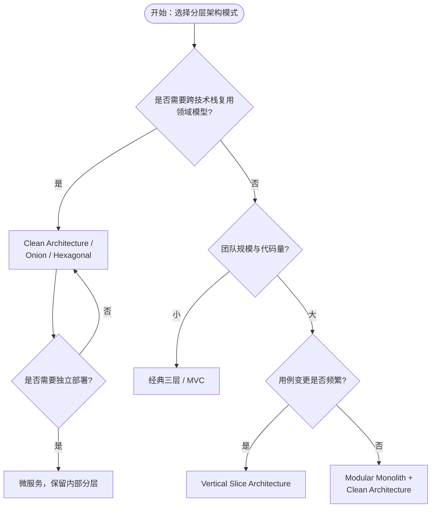

### 15.2 经典分层与 Clean Architecture 的复用边界对比

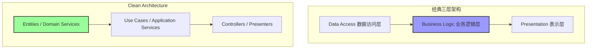

---

> 最后更新: 2026-07-07
> 权威来源:
>
> - [ISO/IEC/IEEE 42010:2022](https://www.iso.org/standard/74296.html) — ISO (核查日期: 2026-07-07)
> - [TOGAF® Standard, 10th Edition](https://www.opengroup.org/togaf) — The Open Group (核查日期: 2026-07-07)
> - [Software architecture - Wikipedia](https://en.wikipedia.org/wiki/Software_architecture) (核查日期: 2026-07-07)
> - [Multilayered architecture - Wikipedia](https://en.wikipedia.org/wiki/Multilayered_architecture) (核查日期: 2026-07-07)
> - Clean Architecture: <https://blog.cleancoder.com/uncle-bob/2012/08/13/the-clean-architecture.html> (核查日期: 2026-07-07)
> - Onion Architecture: <https://jeffreypalermo.com/2008/07/the-onion-architecture-part-1/> (核查日期: 2026-07-07)
> - DCI Architecture: <https://fulloo.info/Documents/ArtimaDCI/> (核查日期: 2026-07-07)
> - Vertical Slice Architecture: <https://www.jimmybogard.com/vertical-slice-architecture/> (核查日期: 2026-07-07)
> - Modular Monolith: <https://www.milanjovanovic.tech/blog/what-is-a-modular-monolith> (核查日期: 2026-07-07)
> - Spotify Engineering: <https://engineering.atspotify.com/2014/03/building-products-at-spotify/> (核查日期: 2026-07-07)
> - SWEBOK v4: <https://www.computer.org/education/bodies-of-knowledge/software-engineering> (核查日期: 2026-07-07)
> - ISO/IEC 12207:2026: <https://iso.org/standard/85683.html> (核查日期: 2026-07-07)


---


<!-- SOURCE: struct/03-application-architecture-reuse/01-layered-architecture/README.md -->

# 01 分层架构复用

> **版本**: 2026-07-07
> **定位**: 03 应用架构复用的基础子主题 — 分层架构的复用模式与决策
> **对齐**: ISO/IEC/IEEE 42010:2022, SWEBOK v4, TOGAF 10
> **状态**: ✅ 核心内容已填充

---

## 核心内容

1. **概念定义（CARC 本体）**：分层架构、层、接口契约、单向依赖、可替换性。
2. **概念谱系**：从 Dijkstra 的分层系统到 Clean Architecture、Onion Architecture、Ports & Adapters。
3. **核心复用模式**：严格分层、松散分层、Clean Architecture、Onion Architecture、Ports & Adapters。
4. **层间依赖规则**：依赖方向、循环依赖禁止、接口稳定性约束。
5. **示例与反例**：Repository 跨项目复用、Controller 直接调用 DAO、框架注解污染领域对象。
6. **多维矩阵**：分层模式 × 复用维度、分层架构 vs 微服务 vs Serverless vs EDA。
7. **场景决策树**：根据团队规模、DDD 熟悉度、UI/数据库多样性选择分层模式。

## 主文档

- **[reuse-patterns.md](../struct/03-application-architecture-reuse/01-layered-architecture/reuse-patterns.md)** — 分层架构复用模式完整指南

## 关联主题

- `03/02-microservices`（分层到微服务的演进）
- `03/07-cloud-native-patterns`（云原生模式对比）
- `04/04-design-patterns`（层内设计模式）
- `01-meta-model-standards/06-formal-axioms/four-layer-ontology.md`（四层架构概念本体）

---

> **权威来源**:
>
> - Buschmann et al. (1996). *Pattern-Oriented Software Architecture, Volume 1*.
> - Martin, R. C. (2012). *The Clean Architecture*.
> - ISO/IEC/IEEE 42010:2022.
>
> **核查日期**: 2026-07-07


---

## 补充说明：01 分层架构复用

## 概念定义

**定义**：分层架构将系统划分为表示层、应用层、领域层与基础设施层等水平层次，每层通过稳定接口向上层提供服务，实现层内复用与层间解耦。

## 示例

**示例**：电商平台将订单领域层封装为独立模块，供 Web、App、小程序等表示层复用，业务规则只需在领域层维护一份。

## 反例

**反例**：表示层直接访问数据库，绕过领域层，导致业务规则散落于多个层次，无法复用和一致性维护。

## 分析

**分析**：分层架构复用的有效性取决于层间依赖规则的严格执行，否则容易退化为“大泥球”。


---


<!-- SOURCE: struct/03-application-architecture-reuse/01-layered-architecture/reuse-patterns.md -->

# 分层架构复用模式

> **版本**: 2026-07-07
> **定位**: 03 应用架构复用的基础子主题 —— 分层架构（Layered Architecture）的复用模式、边界与决策
> **对齐标准**: ISO/IEC/IEEE 42010:2022, SWEBOK v4, TOGAF 10
> **来源 URL**:
>
> - ISO 42010: <https://www.iso.org/standard/74296.html>
> - SWEBOK V4: <https://www.computer.org/education/bodies-of-knowledge/software-engineering>
> - TOGAF 10: <https://www.opengroup.org/togaf>
> **核查日期**: 2026-07-07

---

## 目录

- [分层架构复用模式](#分层架构复用模式)
  - [目录](#目录)
  - [1. 概念定义（CARC 本体）](#1-概念定义carc-本体)
    - [1.1 分层架构（Layered Architecture）](#11-分层架构layered-architecture)
    - [1.2 复用单元在分层架构中的形态](#12-复用单元在分层架构中的形态)
  - [2. 概念谱系与学术来源](#2-概念谱系与学术来源)
  - [3. 核心复用模式](#3-核心复用模式)
    - [3.1 严格分层（Strict Layering）](#31-严格分层strict-layering)
    - [3.2 松散分层（Relaxed Layering）](#32-松散分层relaxed-layering)
    - [3.3 Clean Architecture / Onion Architecture](#33-clean-architecture--onion-architecture)
    - [3.4 端口与适配器（Ports \& Adapters / Hexagonal Architecture）](#34-端口与适配器ports--adapters--hexagonal-architecture)
  - [4. 层间依赖规则与复用边界](#4-层间依赖规则与复用边界)
    - [4.1 通用四层参考模型](#41-通用四层参考模型)
    - [4.2 复用边界判定](#42-复用边界判定)
  - [5. 正向示例](#5-正向示例)
    - [示例 1：Repository 模式跨项目复用](#示例-1repository-模式跨项目复用)
    - [示例 2：Clean Architecture 模板作为新项目脚手架](#示例-2clean-architecture-模板作为新项目脚手架)
  - [6. 反例与失败案例](#6-反例与失败案例)
    - [反例 1：表示层直接调用数据访问层](#反例-1表示层直接调用数据访问层)
    - [反例 2：将框架注解污染领域对象](#反例-2将框架注解污染领域对象)
    - [反例 3：名为分层实为“大泥球”](#反例-3名为分层实为大泥球)
  - [7. 多维对比矩阵](#7-多维对比矩阵)
    - [7.1 分层模式 × 复用维度](#71-分层模式--复用维度)
    - [7.2 分层架构 vs 其他应用架构模式](#72-分层架构-vs-其他应用架构模式)
  - [8. 场景决策树](#8-场景决策树)
  - [9. 与四层架构的关系](#9-与四层架构的关系)
  - [10. 权威来源](#10-权威来源)

---

## 1. 概念定义（CARC 本体）

### 1.1 分层架构（Layered Architecture）

**定义**：分层架构是一种将软件系统组织为多个水平层次的架构模式，每一层只依赖于其下方的层，并通过定义良好的接口向上方层暴露服务。其核心思想是**关注点分离（Separation of Concerns）**与**抽象层次递进**。

**属性**：

| 属性 | 说明 |
|------|------|
| **层（Layer）** | 一组职责相关的组件集合，如表示层、业务逻辑层、数据访问层 |
| **单向依赖** | 高层可依赖低层，低层不应依赖高层 |
| **接口契约** | 层与层之间通过抽象接口交互，隐藏实现细节 |
| **可替换性** | 同一层内的实现可在不影响其他层的前提下替换 |

**关系**：

- **uses**（使用）：上层使用下层提供的服务。
- **implements**（实现）：具体实现类实现层接口。
- **maps to**（映射）：分层架构可映射到 ISO/IEC/IEEE 42010:2022 的架构视点（Viewpoint）与模型（Model）。

**约束**：

1. **依赖方向约束**：依赖只能自上而下（Strict Layering）或有限跨层（Relaxed Layering）。
2. **循环依赖禁止**：任意两层之间不得出现循环依赖。
3. **接口稳定性约束**：下层接口一旦发布，应保持稳定或遵循语义化版本控制。

---

### 1.2 复用单元在分层架构中的形态

在分层架构中，可复用单元并非整个应用，而是**层内的模块、接口契约或横切关注点**：

| 复用单元 | 示例 | 复用层级 |
|---------|------|---------|
| **层接口** | Repository 接口、Service 接口 | 组件级 |
| **通用组件** | 日志、配置、校验框架 | 组件级 / 横切 |
| **领域模型** | DTO、Value Object、领域事件 | 模型级 |
| **模板项目** | Clean Architecture 模板、Onion Architecture 模板 | 项目级 |

---

## 2. 概念谱系与学术来源

分层思想并非软件工程独有，其学术谱系可追溯至：

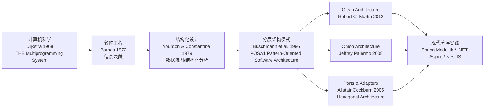

**Wikipedia 对应条目**：

- [Multilayered architecture](https://en.wikipedia.org/wiki/Multilayered_architecture)
- [Hexagonal architecture](https://en.wikipedia.org/wiki/Hexagonal_architecture_(software))
- [Clean architecture](https://en.wikipedia.org/wiki/Clean_architecture)

---

## 3. 核心复用模式

### 3.1 严格分层（Strict Layering）

**定义**：每一层只能直接依赖其紧邻的下一层，禁止跨层调用。

**适用场景**：

- 中小型系统（< 50 人团队）
- 对代码可维护性要求高
- 团队对架构纪律有共识

**复用收益**：

- 层边界清晰，便于独立测试。
- 下层服务可被多个上层复用。

**复用成本**：

- 新增功能可能需要穿越多层，导致样板代码增多。
- 过度严格可能降低开发效率。

### 3.2 松散分层（Relaxed Layering）

**定义**：允许高层跳过相邻层直接调用更底层，但禁止逆向依赖。

**适用场景**：

- 遗留系统现代化过程中
- 性能敏感场景（避免不必要的数据转换）

**复用收益**：

- 减少中间层代理，提升性能。

**复用成本**：

- 层边界模糊，长期可能导致“大泥球”。

### 3.3 Clean Architecture / Onion Architecture

**定义**：将领域逻辑置于架构中心，基础设施、UI、框架等作为外层依赖核心。

**核心规则（依赖规则）**：

> 源代码依赖只能指向内部，不能指向外部。

**复用收益**：

- 领域层完全独立于框架、UI 和数据库，可跨项目复用。
- 便于单元测试，无需启动数据库或 Web 服务器。

### 3.4 端口与适配器（Ports & Adapters / Hexagonal Architecture）

**定义**：通过“端口”定义应用与外部世界的交互契约，通过“适配器”实现具体技术细节。

**复用收益**：

- 同一领域逻辑可适配多种 UI（Web、CLI、批处理）。
- 同一数据库端口可适配 PostgreSQL、MongoDB 或内存存储。

---

## 4. 层间依赖规则与复用边界

### 4.1 通用四层参考模型

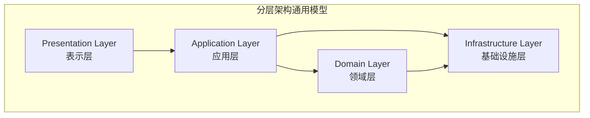

### 4.2 复用边界判定

| 判定问题 | 可复用 | 不可复用 |
|---------|--------|---------|
| 是否跨越层边界？ | 否，复用应发生在层内或通过接口 | 是，直接依赖其他层的内部实现 |
| 是否依赖具体框架？ | 否，应依赖抽象 | 是，框架版本锁定导致不可迁移 |
| 是否包含业务规则？ | 领域层规则可复用 | 表示层逻辑通常不可复用 |
| 是否有稳定接口？ | 是 | 否 |

---

## 5. 正向示例

### 示例 1：Repository 模式跨项目复用

**场景**：一个电商系统的 `ProductRepository` 接口定义了商品的增删改查操作。

**复用方式**：

- 接口定义在领域层，不依赖具体 ORM。
- 项目 A 使用 JPA/Hibernate 实现。
- 项目 B 使用 MyBatis 实现。
- 领域服务代码完全相同，实现可替换。

**关键成功因素**：

1. 接口仅暴露领域概念（Product、ProductId）。
2. 返回类型为领域对象，而非数据库实体。
3. 接口契约稳定，遵循语义化版本。

### 示例 2：Clean Architecture 模板作为新项目脚手架

**场景**：团队维护一个基于 Clean Architecture 的 Java 模板项目。

**复用方式**：

- 新项目通过 Cookiecutter / Maven Archetype / Backstage Scaffolder 生成初始结构。
- 所有新项目共享相同的包结构、依赖注入配置、测试基类。

**关键成功因素**：

1. 模板中不包含具体业务逻辑。
2. 文档明确说明每层允许放置的代码类型。
3. CI 流水线自动检查层间依赖方向。

---

## 6. 反例与失败案例

### 反例 1：表示层直接调用数据访问层

**场景**：为了“省事”，Controller 直接注入 `JdbcTemplate` 执行 SQL。

**后果**：

- 业务逻辑泄漏到表示层。
- 数据访问实现变更时，所有 Controller 都需要修改。
- 无法在不启动 Web 容器的情况下测试业务逻辑。

**判定**：违反分层依赖规则，不可复用。

### 反例 2：将框架注解污染领域对象

**场景**：领域对象直接添加 JPA `@Entity`、Jackson `@JsonProperty`、Spring `@Component` 注解。

**后果**：

- 领域层依赖 Spring、Jackson、JPA，无法独立复用。
- 切换技术栈时，领域对象需要重写。

**判定**：违反 Clean Architecture 依赖规则，领域层不应依赖外部框架。

### 反例 3：名为分层实为“大泥球”

**场景**：项目目录结构存在 `controller/`、`service/`、`dao/`，但 Service 之间存在大量横向调用，DAO 之间也存在循环依赖。

**后果**：

- 层形同虚设，系统退化为按技术角色组织的“大泥球”。
- 任何修改都可能引发级联故障。

**判定**：仅有目录分层而无语义分层，复用性极低。

---

## 7. 多维对比矩阵

### 7.1 分层模式 × 复用维度

| 模式 | 代码复用 | 团队复用 | 知识复用 | 测试复用 | 适用团队规模 |
|------|---------|---------|---------|---------|------------|
| **严格分层** | 中 | 高 | 高 | 高 | 10–50 人 |
| **松散分层** | 中 | 中 | 中 | 中 | 5–30 人 |
| **Clean Architecture** | 高 | 高 | 高 | 极高 | 20–100 人 |
| **Onion Architecture** | 高 | 高 | 高 | 极高 | 20–100 人 |
| **Ports & Adapters** | 高 | 中 | 高 | 高 | 10–80 人 |
| **传统三层（Controller/Service/DAO）** | 低 | 低 | 低 | 低 | < 10 人 |

### 7.2 分层架构 vs 其他应用架构模式

| 维度 | 分层架构 | 微服务 | Serverless | 事件驱动 |
|------|---------|--------|-----------|---------|
| **复用粒度** | 层/模块 | 服务 | 函数 | 事件处理器 |
| **部署独立性** | 低 | 高 | 极高 | 高 |
| **技术栈自由度** | 低（通常单一栈） | 高 | 中（受平台约束） | 高 |
| **数据一致性** | ACID / 本地事务 | Saga / 最终一致 | 最终一致 | 最终一致 |
| **运维复杂度** | 低 | 高 | 低 | 中 |
| **典型入口** | 单进程应用 | 分布式服务网格 | 函数即服务 | 消息代理 |

---

## 8. 场景决策树

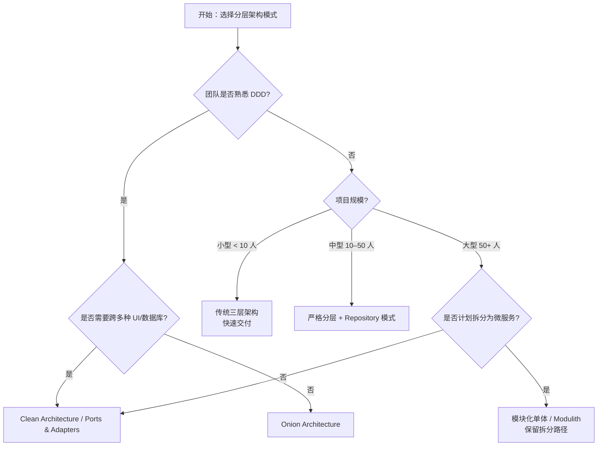

---

## 9. 与四层架构的关系

分层架构位于 **03 应用架构复用层**，向上支撑 **04 组件架构复用层** 的接口契约与设计模式，向下承接 **02 业务架构复用层** 的业务能力与价值流：

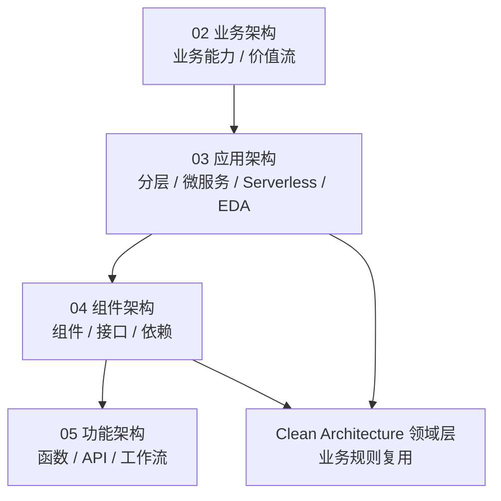

**映射说明**：

- 业务能力（Business Capability）可映射为应用架构中的应用层/领域层服务。
- 分层架构中的“领域层”可作为组件架构中可复用组件的逻辑边界。
- 分层架构的接口契约（如 Repository、Service）属于功能架构复用中的 API 设计范畴。

---

## 10. 权威来源

> **权威来源**:
>
> - Buschmann, F., Meunier, R., Rohnert, H., Sommerlad, P., & Stal, M. (1996). *Pattern-Oriented Software Architecture, Volume 1: A System of Patterns*. Wiley.（Layer 模式原始定义）
> - Martin, R. C. (2012). *The Clean Architecture*. blog.cleancoder.com. <https://blog.cleancoder.com/uncle-bob/2012/08/13/the-clean-architecture.html>
> - Palermo, J. (2008). *The Onion Architecture*. <https://jeffreypalermo.com/2008/07/the-onion-architecture-part-1/>
> - Cockburn, A. (2005). *Hexagonal Architecture*. <https://alistair.cockburn.us/hexagonal-architecture/>
> - ISO/IEC/IEEE 42010:2022. *Systems and software engineering — Architecture description*. <https://www.iso.org/standard/74296.html>
> - SWEBOK V4. *Software Engineering Body of Knowledge*. IEEE Computer Society. <https://www.computer.org/education/bodies-of-knowledge/software-engineering>
>
> **核查日期**: 2026-07-07


---


<!-- SOURCE: struct/03-application-architecture-reuse/02-microservices/microservices-reuse-patterns.md -->

# 微服务架构复用模式

> **版本**: 2026-06-10
> **定位**: 应用架构层（Level 2）—— 微服务粒度边界、复用模式与治理实践
> **对齐标准**: CNCF Cloud Native Trail Map, NIST SP 800-204, ISO/IEC 12207:2026
> **状态**: ✅ 已完成（Phase A 深化）
> **字数**: ~6500字

---

## 目录

- [微服务架构复用模式](#微服务架构复用模式)
  - [目录](#目录)
  - [0. 概念定义](#0-概念定义)
  - [0.1 属性与特征](#01-属性与特征)
  - [0.2 关系与映射](#02-关系与映射)
  - [0.3 解释：微服务复用为什么以契约为核心](#03-解释微服务复用为什么以契约为核心)
    - [核心矛盾：自治与共享的平衡](#核心矛盾自治与共享的平衡)
    - [契约的多层含义](#契约的多层含义)
    - [Bounded Context 与 API 版本策略](#bounded-context-与-api-版本策略)
    - [分布式单体：微服务复用的典型反例](#分布式单体微服务复用的典型反例)
  - [1. 核心概念](#1-核心概念)
    - [1.1 复用粒度边界](#11-复用粒度边界)
  - [2. 核心复用模式](#2-核心复用模式)
    - [2.1 Sidecar 模式](#21-sidecar-模式)
    - [2.2 Ambassador 模式](#22-ambassador-模式)
    - [2.3 Anti-Corruption Layer (ACL)](#23-anti-corruption-layer-acl)
    - [2.4 Strangler Fig 模式](#24-strangler-fig-模式)
  - [3. API 契约复用](#3-api-契约复用)
  - [4. 安全复用约束（NIST SP 800-204 对齐）](#4-安全复用约束nist-sp-800-204-对齐)
  - [5. 更多微服务复用模式](#5-更多微服务复用模式)
    - [5.1 Backend-for-Frontend (BFF) 模式](#51-backend-for-frontend-bff-模式)
    - [5.2 Saga 模式（编排 vs 编舞）](#52-saga-模式编排-vs-编舞)
    - [5.3 CQRS 微服务模式](#53-cqrs-微服务模式)
    - [5.4 API 组合层 (API Composition)](#54-api-组合层-api-composition)
    - [5.5 GraphQL 联邦 (GraphQL Federation)](#55-graphql-联邦-graphql-federation)
  - [6. 微服务拆分与复用决策](#6-微服务拆分与复用决策)
    - [6.1 领域驱动设计 (DDD) 与 Bounded Context](#61-领域驱动设计-ddd-与-bounded-context)
    - [6.2 康威定律与团队结构](#62-康威定律与团队结构)
  - [7. 多语言微服务的复用边界](#7-多语言微服务的复用边界)
    - [7.1 Polyglot Persistence 对复用的影响](#71-polyglot-persistence-对复用的影响)
    - [7.2 Polyglot Programming 对复用的影响](#72-polyglot-programming-对复用的影响)
  - [8. 服务网格 (Service Mesh) 与复用](#8-服务网格-service-mesh-与复用)
    - [8.1 服务网格作为通信模式复用层](#81-服务网格作为通信模式复用层)
    - [8.2 Istio 与 Linkerd 的复用特性对比](#82-istio-与-linkerd-的复用特性对比)
    - [8.3 服务网格中的复用治理](#83-服务网格中的复用治理)
  - [9. 微服务反模式](#9-微服务反模式)
    - [9.1 分布式单体 (Distributed Monolith)](#91-分布式单体-distributed-monolith)
    - [9.2 共享数据库反模式](#92-共享数据库反模式)
    - [9.3 过度拆分 (Nano-services)](#93-过度拆分-nano-services)
    - [9.4 版本地狱 (Version Hell)](#94-版本地狱-version-hell)
  - [10. 事件驱动微服务](#10-事件驱动微服务)
    - [10.1 事件总线作为跨服务复用基础设施](#101-事件总线作为跨服务复用基础设施)
    - [10.2 事件溯源 (Event Sourcing)](#102-事件溯源-event-sourcing)
    - [10.3 事件驱动与请求-驱动的选型](#103-事件驱动与请求-驱动的选型)
  - [11. 微服务治理与复用](#11-微服务治理与复用)
    - [11.1 服务目录 (Service Catalog)](#111-服务目录-service-catalog)
    - [11.2 API 网关治理](#112-api-网关治理)
    - [11.3 消费者驱动契约 (CDC) 实践](#113-消费者驱动契约-cdc-实践)
    - [11.4 标准化运维与 SRE 实践](#114-标准化运维与-sre-实践)
  - [12. 案例研究](#12-案例研究)
    - [12.1 Netflix：从单体到全球微服务平台的复用演进](#121-netflix从单体到全球微服务平台的复用演进)
    - [12.2 Amazon：API 契约驱动的内部服务市场](#122-amazonapi-契约驱动的内部服务市场)
    - [12.3 Uber：从多语言混沌到统一平台的标准化复用](#123-uber从多语言混沌到统一平台的标准化复用)
  - [13. 总结与决策框架](#13-总结与决策框架)
  - [14. 交叉引用](#14-交叉引用)
  - [15. 微服务复用架构与限界上下文 Mermaid 图](#15-微服务复用架构与限界上下文-mermaid-图)
    - [15.1 基于服务目录的微服务复用拓扑](#151-基于服务目录的微服务复用拓扑)
    - [15.2 限界上下文映射与服务复用决策树](#152-限界上下文映射与服务复用决策树)

## 0. 概念定义

**定义**：微服务架构（Microservices Architecture）是一种将单一应用程序构建为**围绕业务能力组织、可独立部署、自治且通过轻量级通信机制协作**的服务集合的架构风格。从复用视角看，微服务的复用单元不再是源代码或类库，而是**服务契约（Service Contract）**：包括 API 定义、事件 Schema、版本约定、SLA 以及运行实例本身。服务的边界应由领域驱动设计（DDD）中的**限界上下文（Bounded Context）**界定，跨边界的复用只能通过显式契约实现，禁止绕过契约直接共享数据库或代码库。

> **形式化表达**：设服务集合为 $M = \\{m_1, m_2, ..., m_k\\}$，每个服务 $m_i$ 拥有独立的数据存储 $D_i$、部署单元 $U_i$ 与公开契约 $C_i$。微服务复用的合法性条件为：
> $$\\text{Reuse}(m_i, m_j) \\Leftrightarrow \\exists C_{ij} \\subseteq C_i \\cap C_j \\land \\nexists D_{ij} \\neq \\emptyset \\land \\nexists U_{ij} \\neq \\emptyset$$
> 即复用仅通过契约交集发生，不允许共享数据存储或部署单元。

Wikipedia 对应条目：

- [Microservices](https://en.wikipedia.org/wiki/Microservices)
- [Service-oriented architecture](https://en.wikipedia.org/wiki/Service-oriented_architecture)
- [Domain-driven design](https://en.wikipedia.org/wiki/Domain-driven_design)

---

## 0.1 属性与特征

| 属性 | 说明 | 重要性 |
|---|---|---|
| **业务能力对齐** | 每个服务对应一个业务能力或限界上下文，边界清晰 | 高 |
| **独立部署** | 服务可独立构建、测试、发布与回滚，变更影响范围可控 | 高 |
| **契约驱动** | 服务间交互必须通过 API 契约或事件契约，契约是复用的唯一合法接口 | 高 |
| **数据自治** | 每个服务拥有独立数据存储，禁止跨服务直接访问数据库 | 高 |
| **版本化兼容** | 契约变更遵循 SemVer 与向后兼容策略，避免版本地狱 | 高 |
| **组织映射** | 服务边界与团队边界对齐，平台团队负责高复用性服务 | 中 |
| **故障隔离** | 单个服务故障不应导致级联崩溃，依赖关系需显式治理 | 中 |

---

## 0.2 关系与映射

| 关系类型 | 目标概念 | 说明 |
|---|---|---|
| **上位概念** | [Service-oriented architecture](https://en.wikipedia.org/wiki/Service-oriented_architecture) | 微服务是 SOA 的轻量级、去 ESB 化演进 |
| **上位概念** | [Distributed computing](https://en.wikipedia.org/wiki/Distributed_computing) | 微服务本质上是遵循特定组织原则的分布式系统 |
| **下位概念** | Bounded Context、Aggregate、Domain Event | 来自 DDD，用于界定服务边界与内部结构 |
| **下位概念** | API Gateway、Service Mesh、Sidecar、BFF | 支撑微服务通信与横切关注点复用的技术模式 |
| **等价/映射概念** | Modular Monolith | 模块化单体是微服务的前置演化形态，二者在内部边界上同构 |
| **依赖概念** | Serverless / FaaS | 微服务可进一步拆分为事件驱动的函数，或反过来由函数组合成服务 |
| **依赖概念** | Event-Driven Architecture | 事件驱动是微服务解耦的核心机制之一 |
| **映射概念** | NIST SP 800-204 | 定义微服务安全策略与服务间通信复用约束 |

---

## 0.3 解释：微服务复用为什么以契约为核心

微服务架构将系统拆分为自治服务后，复用的最大障碍不再是"代码能否共享"，而是"服务能否在保持独立演进的同时被安全复用"。代码级复用（如共享库）在微服务中会引发版本依赖、语言锁定和部署耦合；因此，微服务的复用必须退回到**契约级复用**。

### 核心矛盾：自治与共享的平衡

微服务强调每个服务拥有独立的数据、团队和发布节奏。如果两个服务共享代码库或数据库，它们的边界就被人为打通，自治性随之丧失。复用的正确方式是通过**显式、稳定、可验证的契约**（API、事件 Schema、SLA）实现"松耦合的共享"。

### 契约的多层含义

| 契约层级 | 示例 | 复用含义 |
|---|---|---|
| 协议契约 | REST / gRPC / GraphQL | 决定消费者与服务的技术交互方式 |
| 接口契约 | OpenAPI / Protobuf | 生成类型安全的客户端与服务器 Stub |
| 数据契约 | JSON Schema / Avro | 保证跨服务的数据语义一致 |
| 行为契约 | Pact / CDC | 在 CI 中验证提供者变更不会破坏消费者 |
| 运维契约 | SLA / SLO / 错误预算 | 定义复用服务的可用性与支持责任 |

### Bounded Context 与 API 版本策略

限界上下文是微服务边界的领域语义基础。一个 Bounded Context 内的服务共享同一领域语言，跨 Bounded Context 的复用必须通过"发布语言（Published Language）"——即标准化的 API 或事件 Schema。

API 版本策略应遵循：

1. **向后兼容优先**：新增可选字段，不删除、不修改已有字段语义
2. **SemVer Major 版本**：仅在破坏性变更时提升 Major 版本
3. **弃用窗口**：旧版本至少保留 6-12 个月，并通过监控确认无消费者后下线
4. **消费者驱动契约**：由消费者定义期望，提供者在发布前自动验证兼容性

> **定理 M.0** (Contract Stability): 微服务复用的净收益 $R$ 与契约稳定时间 $T_s$ 成正比，与契约消费者数量 $N$ 成正比，即 $R \\propto T_s \\times N$。

### 分布式单体：微服务复用的典型反例

当多个服务在物理上独立部署，但逻辑上通过共享数据库、同步调用链或共享代码库高度耦合时，就形成了"分布式单体"。这种反例的危害在于：团队承担了微服务的运维复杂度（多服务监控、多流水线、分布式调试），却未获得微服务的自治与复用收益。任何变更仍需协调多个服务同时发布，复用契约形同虚设。避免分布式单体的关键在于：每个服务必须拥有独立的数据存储，服务间交互必须通过 API 或事件契约，禁止绕过契约直接访问对方数据。

---

## 1. 核心概念

微服务架构将应用拆分为**围绕业务能力组织、可独立部署的服务集合**。
与单体架构相比，微服务的复用逻辑发生了本质变化：复用单元从"代码库"转变为"服务契约 + 运行实例"。

NIST SP 800-204 (Security Strategies for Microservices-based Application Systems) 指出：
微服务复用的核心挑战在于**如何在保持服务自治的前提下实现安全、可控的跨团队复用**。

### 1.1 复用粒度边界

| 粒度 | 复用单元 | 适用场景 | 反模式 |
|------|---------|---------|--------|
| 细粒度（函数/类） | 共享 SDK / Sidecar | 横切关注点（日志、监控、认证） | 分布式单体 |
| 中粒度（服务/模块） | 完整微服务 | 用户服务、订单服务、支付服务 | 共享数据库 |
| 粗粒度（服务组/API） | API 网关聚合层 | BFF (Backend for Frontend) | 过度聚合 |

> **定理 M.1** (Service Reuse Granularity): 微服务的复用价值在服务粒度达到"一个业务能力 = 一个服务"时最大。粒度过细导致编排成本超过复用收益；粒度过粗则退化为分布式单体。

---

## 2. 核心复用模式

### 2.1 Sidecar 模式

将横切关注点（如日志、监控、TLS、服务发现）从主服务中剥离，以**独立进程**形式部署在同一 Pod/主机中。

- **复用边界**: Sidecar 二进制镜像
- **典型实现**: Envoy (服务代理), Fluent Bit (日志), OAuth2 Proxy (认证)
- **对齐**: CNCF 推荐的云原生基础模式

### 2.2 Ambassador 模式

Sidecar 的变体，专门用于**代理主服务与外部资源的连接**。例如：主服务通过本地 Ambassador 访问外部数据库，Ambassador 处理连接池、重试、断路等逻辑。

- **复用价值**: 连接逻辑与业务逻辑解耦，同一 Ambassador 可复用于多个服务
- **与 Sidecar 的区别**: Ambassador 代理出向连接，Sidecar 通常代理入向/双向

### 2.3 Anti-Corruption Layer (ACL)

当复用一个遗留系统或外部服务时，在边界处引入**防腐层**，将外部模型转换为内部领域模型。

- **复用价值**: 保护领域模型不被外部变更污染
- **成本**: 需要维护翻译映射，增加一层间接性
- **决策点**: 当外部系统变更频率 > 每季度一次时，ACL 的 ROI 为正

### 2.4 Strangler Fig 模式

逐步用微服务替换遗留系统的功能，通过**拦截层**将流量路由到新服务或旧系统。

- **复用路径**: 旧系统的部分功能被新服务替代后，新服务可被其他业务线复用
- **风险控制**: 回退机制确保替换失败时可切回旧系统

---

## 3. API 契约复用

微服务的真正复用边界是 **API 契约**，而非代码实现。

| 契约层级 | 形式 | 复用方式 |
|---------|------|---------|
| 协议 | REST / gRPC / GraphQL | 技术栈无关复用 |
| 接口定义 | OpenAPI / Protobuf Schema | 生成客户端/服务端 Stub |
| 数据模型 | JSON Schema / DTO | 跨服务共享领域语言 |
| 行为契约 | Pact / Consumer-Driven Contract | 运行时兼容性验证 |

> **定理 M.2** (API Contract Stability): API 契约的复用价值与其稳定性正相关。遵循**语义化版本控制（SemVer）**的 API，其 Major 版本变更应 ≤ 每年 1 次。

---

## 4. 安全复用约束（NIST SP 800-204 对齐）

- **零信任边界**: 即使内部复用，服务间通信也应经过 mTLS + 认证
- **最小权限 Sidecar**: Sidecar 不应拥有超出其代理范围的权限
- **API 网关作为安全复用层**: 统一处理速率限制、审计、威胁检测

---

## 5. 更多微服务复用模式

### 5.1 Backend-for-Frontend (BFF) 模式

BFF 模式由 Sam Newman 和 Phil Calçado 等人推广，其核心思想是为每一种前端体验（Web、iOS、Android、IoT）配置一个专属的后端服务层。该层负责聚合多个下游微服务的调用结果，转换为前端所需的数据模型，并处理前端特有的横切关注点（如缓存策略、数据裁剪、认证适配）。

- **复用边界**: BFF 本身作为复用下游服务的聚合层存在，其复用单元是"面向前端体验的服务编排逻辑"
- **复用收益**: 下游核心服务（用户、订单、库存）无需感知前端差异，实现一次开发、多处复用
- **治理要点**: BFF 不应包含业务逻辑，仅允许数据转换与聚合；禁止在 BFF 中直接访问数据库
- **版本策略**: BFF 与前端应用通常同步发版，采用相同的版本节奏；下游服务变更通过适配层隔离

> **定理 M.3** (BFF Isolation): BFF 的引入将前端变更频率与后端核心服务解耦。当某前端平台（如移动端）迭代周期 < 1 周时，BFF 的 ROI 显著为正。

### 5.2 Saga 模式（编排 vs 编舞）

在微服务架构中，跨服务的业务事务无法依赖传统的 ACID 数据库事务，Saga 模式通过一系列本地事务的协调来实现最终一致性。Saga 的实现方式分为两类：

**编排式 Saga (Orchestration)**

由中央协调器（Orchestrator）统一调度各参与服务执行本地事务，并根据执行结果决定下一步操作或补偿回滚。

- **复用特征**: 协调器脚本（如 Camunda、Netflix Conductor 的流程定义）可在多个业务流程间复用
- **优势**: 流程清晰可见，易于监控与审计；集中式错误处理逻辑统一
- **劣势**: 协调器成为潜在单点瓶颈；新增服务需修改协调器逻辑
- **适用场景**: 流程步骤固定、强监管要求的金融交易、订单履约链路

**编舞式 Saga (Choreography)**

各服务通过事件总线自主响应状态变更，无中央协调器。每个服务完成本地事务后发布领域事件，下游服务监听事件并触发下一步操作。

- **复用特征**: 领域事件（如 `OrderCreated`、`PaymentProcessed`）成为跨服务复用的核心契约
- **优势**: 服务间松耦合，新增服务只需订阅/发布事件即可接入；天然契合事件驱动架构
- **劣势**: 全局事务状态难以追踪；循环依赖与事件风暴风险高；调试复杂度随服务数量指数增长
- **适用场景**: 高吞吐量、低延迟要求的实时系统；服务数量多且演化频繁的平台

| 维度 | 编排式 Saga | 编舞式 Saga |
|------|------------|------------|
| 耦合度 | 协调器与各服务紧耦合 | 服务间通过事件松耦合 |
| 可观测性 | 高（中央状态机） | 低（需分布式链路追踪） |
| 复用单元 | 协调器流程模板 | 领域事件契约 |
| 扩展性 | 受协调器吞吐限制 | 受事件总线吞吐限制 |
| 典型工具 | Camunda, Conductor, Temporal | Kafka, NATS, EventBridge |

> **决策框架**: 当 saga 涉及服务数 ≤ 5 且事务成功率要求 ≥ 99.9% 时，优先选择编排式；当服务数 > 5 且事件契约已标准化时，优先选择编舞式。

### 5.3 CQRS 微服务模式

命令查询职责分离（Command Query Responsibility Segregation, CQRS）将数据写模型与读模型分离，允许为不同访问模式独立优化存储与接口。

- **复用边界**: 读模型（Projection）可被多个前端/BFF 复用，写模型（Aggregate）作为领域核心仅由命令服务维护
- **实现路径**:
  1. 写端接收命令，验证业务规则，持久化事件至事件存储（Event Store）
  2. 事件通过变更数据捕获（CDC）或事件总线同步至读端
  3. 读端根据查询需求构建物化视图（Materialized View），可采用与写端不同的数据库技术
- **复用风险**: 读模型与写模型的最终一致性窗口（通常为毫秒至秒级）需在前端/BFF 层做适配；读模型 schema 变更需与事件 schema 变更联动
- **对齐标准**: ISO/IEC 12207:2026 中关于数据视图分离的架构原则

### 5.4 API 组合层 (API Composition)

API 组合层是 BFF 的泛化形式，不仅面向前端，也面向外部合作伙伴与内部其他系统。其核心职责是将多个细粒度微服务的 API 聚合成一个粗粒度的、符合特定业务场景的复合 API。

- **复用模式**: 组合层作为下游服务的"消费者"，其复用单元是"聚合逻辑 + 缓存策略 + 降级策略"
- **性能考量**: 串行调用下游服务的延迟呈线性累加，需采用并行异步调用（如 Java CompletableFuture、Go goroutines、Python asyncio）或响应式编程（Reactor、RxJava）
- **容错机制**: 组合层必须实现熔断（Circuit Breaker）、舱壁隔离（Bulkhead）与优雅降级（Graceful Degradation），避免单个下游故障导致整体组合层不可用
- **缓存策略**: 对读密集型组合结果实施多级缓存（本地 Caffeine + 分布式 Redis），缓存失效策略需与下游数据变更事件联动

### 5.5 GraphQL 联邦 (GraphQL Federation)

GraphQL Federation 允许将多个独立的 GraphQL 服务（Subgraph）组合成一个统一的 Supergraph，客户端通过单一端点查询跨服务的数据关系。

- **复用边界**: 每个 Subgraph 的 Schema 及其解析器（Resolver）是复用单元；Supergraph 网关作为组合与路由层
- **核心概念**:
  - **@key**: 定义实体在 Subgraph 间共享的主键
  - **@extends / @external**: 允许一个 Subgraph 扩展另一个 Subgraph 的实体类型
  - **Gateway**: Apollo Router 或 Netflix DGS GraphQL Gateway 负责查询规划与分布式执行
- **复用优势**: 前端通过一个 GraphQL 查询即可获取跨服务的关联数据，避免了传统 REST 的 N+1 请求问题；Subgraph 可独立演进，只要满足联邦契约
- **治理挑战**: Schema 冲突检测、查询复杂度限制（Query Cost Analysis）、联邦网关的单点故障风险
- **安全约束**: 网关层需实施查询深度限制、字段级访问控制（Field-Level Authorization）与查询成本配额，防止恶意复杂查询耗尽后端资源

---

## 6. 微服务拆分与复用决策

### 6.1 领域驱动设计 (DDD) 与 Bounded Context

领域驱动设计（Domain-Driven Design）为微服务拆分提供了理论根基。Bounded Context（限界上下文）是 DDD 的核心战略模式，它定义了领域模型的显式边界，在该边界内领域术语、业务规则与数据模型保持一致。

- **复用边界 = Bounded Context 边界**: 一个 Bounded Context 对应一个微服务（或一个服务组），这是复用的天然粒度。跨 Bounded Context 的复用不通过共享数据库或共享代码实现，而只能通过显式的 API 契约或事件契约。
- **上下文映射 (Context Mapping)**: 不同 Bounded Context 之间的集成关系决定了复用模式的选择：
  - **合作关系 (Partnership)**: 双向依赖，双方团队协同演进，适合核心域之间
  - **共享内核 (Shared Kernel)**: 共享部分领域模型代码，适用于紧密关联的子域，但需严格控制变更流程
  - **客户-供应商 (Customer-Supplier)**: 下游作为客户对上游提出需求，上游服务优先保障下游契约稳定
  - **防腐层 (ACL)**: 上游模型与下游模型差异较大时，下游引入 ACL 进行模型翻译
  - **开放主机服务 (Open Host Service)**: 上游通过标准化的 API（如 REST/OpenAPI）对外暴露服务，便于多下游复用
  - **发布语言 (Published Language)**: 与开放主机服务配合，提供稳定、文档化的交换格式（如 Protobuf、JSON Schema）
- **战略复用原则**: 核心域（Core Domain）内的服务复用价值最高，应投入最多治理资源；通用子域（Generic Subdomain）可考虑外购 SaaS 或采用标准化开源方案，避免自建；支撑子域（Supporting Subdomain）应最小化投入，内部复用即可。

> **定理 M.4** (Bounded Context Reuse): 当两个微服务共享同一数据库 schema 或同一领域模型代码库时，它们本质上属于同一个 Bounded Context，复用边界已失效。

### 6.2 康威定律与团队结构

Melvin Conway 于 1967 年提出："设计系统的组织，其产生的设计等同于组织之间的沟通结构。"在微服务架构中，康威定律意味着服务的边界往往会映射为团队的边界。

- **逆康威定律 (Inverse Conway Maneuver)**: 有意识地调整团队结构以塑造期望的架构。若希望某服务被多个业务线复用，则应将该服务的维护团队设为独立平台团队（Platform Team），而非隶属于某一业务线。
- **团队拓扑 (Team Topologies)**:
  - **业务流团队 (Stream-aligned Team)**: 面向特定业务价值流，端到端负责功能交付，复用平台团队提供的服务
  - **平台团队 (Platform Team)**: 提供高复用性的内部服务（如用户中心、支付网关、消息推送），以产品思维运营内部平台
  - **赋能团队 (Enabling Team)**: 帮助业务流团队掌握新技术（如 DDD、SRE、安全），不直接交付业务功能
  - **复杂子系统团队 (Complicated Subsystem Team)**: 负责需要深度专业知识的组件（如推荐算法引擎、视频编解码），以服务的形式对外输出能力
- **复用组织保障**: 跨团队复用需要明确的内部服务级别协议（Internal SLA），包括可用性目标（SLO）、错误预算（Error Budget）、响应时间（SLI）与升级路径（Escalation Path）。没有组织契约保障的复用是不可持续的。
- **康威定律的约束**: 若组织内部存在严重的部门墙与信息孤岛，微服务拆分过细将导致跨团队协调成本急剧上升，最终退化为"分布式单体"——物理上独立部署，逻辑上高度耦合。

---

## 7. 多语言微服务的复用边界

### 7.1 Polyglot Persistence 对复用的影响

Polyglot Persistence 指根据数据访问模式选择最适合的存储技术。微服务架构天然支持这一策略，因为每个服务拥有独立的数据存储。

- **复用单元变化**: 复用不再局限于"共享数据库表"，而是"共享数据契约（事件/API）+ 独立存储实现"
- **典型存储映射**:

  | 数据特征 | 推荐存储 | 适用服务 |
  |---------|---------|---------|
  | 强事务关系型数据 | PostgreSQL, CockroachDB | 订单、支付、账务 |
  | 高吞吐键值访问 | Redis, DynamoDB | 会话、缓存、购物车 |
  | 文档型半结构化数据 | MongoDB, Couchbase | 内容管理、商品目录 |
  | 图关系查询 | Neo4j, Amazon Neptune | 社交网络、推荐关系 |
  | 时序数据 | TimescaleDB, InfluxDB | 监控、IoT 遥测 |
  | 搜索与分析 | Elasticsearch, OpenSearch | 全文检索、日志分析 |

- **复用风险**: 跨服务的数据一致性需通过 Saga 或事件溯源保证；运维复杂度随存储种类增加而上升；团队需掌握多种数据库的运维与调优技能
- **治理策略**: 建立组织级的"技术雷达"，明确允许使用的存储技术清单（Technology Radar Approved List）；平台团队提供标准化的数据库即服务（DBaaS）接口与备份恢复方案，降低业务团队采用新存储的门槛

### 7.2 Polyglot Programming 对复用的影响

Polyglot Programming 指在微服务架构中使用多种编程语言，允许团队根据服务特性选择最适合的语言运行时。

- **复用挑战**: 语言异构导致代码级复用（如共享库、SDK）极为困难。同一认证逻辑在 Java、Go、Python、Node.js 中需分别实现，增加了安全漏洞与行为不一致的风险。
- **复用策略转换**:
  - **从代码复用转向 Sidecar 复用**: 将语言无关的能力（如 mTLS、认证、日志、指标采集）下沉至 Sidecar 代理（Envoy + WASM 扩展），实现跨语言复用
  - **从共享库转向 API 契约复用**: 通过 gRPC/Protobuf 或 OpenAPI 定义跨语言的服务边界，利用代码生成工具生成各语言的客户端 Stub
  - **标准化运行时框架**: 组织层面规定每种语言的标准框架（如 Java → Spring Boot + Micrometer, Go → Gin/gRPC + OpenTelemetry, Python → FastAPI + Pydantic），框架内置横切关注点实现，减少重复造轮子
- **决策原则**: 当某语言生态在组织内维护者 < 3 人时，禁止新增该语言的服务；存量异构语言服务应通过 Sidecar 和标准化 API 接入统一治理体系，而非强制重写。

---

## 8. 服务网格 (Service Mesh) 与复用

### 8.1 服务网格作为通信模式复用层

服务网格（Service Mesh）将服务间通信的横切关注点（如负载均衡、服务发现、熔断、重试、超时、 mTLS、可观测性）从应用代码中完全剥离，下沉至基础设施层（Sidecar 代理或 eBPF 内核扩展）。

- **复用范式变革**: 传统微服务中，每个服务需自行实现或引入客户端库（如 Hystrix、Ribbon、Feign）来处理通信逻辑；服务网格将这些逻辑统一为平台级复用层，应用服务仅需关注业务逻辑。
- **核心控制平面**: Istio（基于 Envoy）、Linkerd（轻量级 Rust 实现）、Consul Connect 提供流量管理、策略执行与遥测收集的统一控制平面。
- **数据平面复用**: 数据平面代理（Sidecar 或 Proxyless gRPC）作为所有服务间通信的媒介，其实现可被全集群服务无差别复用。

### 8.2 Istio 与 Linkerd 的复用特性对比

| 维度 | Istio | Linkerd |
|------|-------|---------|
| 架构复杂度 | 高（多组件：istiod、Ingress Gateway、Egress Gateway） | 低（单控制平面组件） |
| 资源开销 | 较高（Envoy 内存占用 ~50-150MB/实例） | 较低（Rust 原生代理 ~10-30MB/实例） |
| 功能丰富度 | 丰富（Wasm 扩展、多集群、金丝雀发布、A/B 测试） | 适中（聚焦核心连通性、安全性、可靠性） |
| 复用适用场景 | 大规模、多集群、多租户云平台 | 中小规模、资源敏感、快速落地的平台 |
| mTLS 默认开启 | 是（自动证书轮转） | 是（自动证书轮转） |
| 流量策略 | VirtualService / DestinationRule 精细控制 | ServiceProfile 简洁配置 |

### 8.3 服务网格中的复用治理

- **可观测性复用**: 服务网格自动生成统一的 L7 指标（请求率、延迟、错误率、饱和度，即 RED 指标）与分布式追踪上下文注入，无需应用代码修改即可实现全链路可观测性
- **安全策略复用**: 通过 AuthorizationPolicy 定义服务间访问控制（如 "支付服务仅允许订单服务调用"），策略作为可版本化的 YAML 资源在集群间复用
- **流量管理复用**: 金丝雀发布、蓝绿部署、故障注入（Chaos Engineering）的流量规则可在多个服务间复用同一套模板
- **成本考量**: Sidecar 模式带来的资源 overhead（通常为业务容器内存的 20%-50%）需纳入容量规划；对于超高吞吐服务（>10万 RPS），可考虑 Proxyless 模式（gRPC 直连控制平面）或 eBPF 方案（Cilium Service Mesh）以降低延迟。

> **定理 M.5** (Mesh Reuse Threshold): 当微服务数量 > 20 且跨服务调用占比 > 40% 时，引入服务网格的运维收益将超过其部署与运维成本。

---

## 9. 微服务反模式

### 9.1 分布式单体 (Distributed Monolith)

分布式单体是微服务拆分失败的典型结果：服务虽独立部署，但存在高度耦合的代码依赖、数据库共享或同步调用链，导致任何单一服务的变更都可能引发级联修改与协同发布。

- **识别信号**:
  - 修改一个服务需要同时发布 3 个以上其他服务
  - 服务间存在共享代码库（非标准化 SDK）
  - 存在跨服务数据库 join 查询或外键约束
  - 端到端测试覆盖全部服务链路，无法独立服务测试
- **复用危害**: 表面上实现了服务复用，实际上复用的是"耦合的代码与数据"，变更成本与单体相当，但运维复杂度远高于单体
- **治理策略**: 逐步引入 ACL 隔离共享模型；将同步调用转换为异步事件；通过 Strangler Fig 模式解耦紧密耦合的服务组

### 9.2 共享数据库反模式

多个微服务直接访问同一数据库 schema，绕过了服务边界与 API 契约。

- **复用假象**: 团队误以为"共享表 = 复用数据"，实际上丧失了服务的自治性、独立扩展能力与独立技术演进能力
- **风险传导**: 一个服务的慢查询或长事务会拖垮其他服务的可用性；schema 变更需协调所有相关服务同时发布
- **纠正路径**: 为每个服务分配独立的数据库实例或逻辑隔离的 schema；通过 CDC（Debezium、AWS DMS）将数据变更发布为事件，供其他服务订阅

### 9.3 过度拆分 (Nano-services)

将微服务拆分得过于细粒度，单个服务仅包含极少数 API 端点或函数，导致编排与通信成本远超业务价值。

- **识别标准**: 当服务的平均代码量 < 1000 行、API 端点 < 3 个、且 50% 以上请求为跨服务调用时，存在过度拆分
- **成本分析**: 每个独立服务都需要 CI/CD 流水线、监控告警、日志收集、安全配置、版本管理，边际成本随服务数量线性增长
- **复用困境**: 过度细粒度的服务难以被其他团队直接复用，因为组合成本过高；应向上聚合为具有完整业务能力的"业务能力服务"

### 9.4 版本地狱 (Version Hell)

当服务的多个 Major 版本同时在线，且各下游消费者分散在不同版本时，维护成本呈指数级增长。

- **成因**: API 设计初期未遵循向后兼容原则；缺少消费者驱动契约（CDC）验证；缺乏弃用（Deprecation）与迁移计划
- **症状**: 同一服务需维护 v1/v2/v3 三套实现；数据库 schema 需同时兼容多个版本的读写模式；消费者团队拒绝迁移至新版本
- **治理策略**:
  - 所有 API 变更遵循**扩展-弃用-移除**三阶段生命周期（至少保留 2 个 Major 版本）
  - 引入 API 网关进行版本路由，隐藏后端版本差异
  - 强制实施语义化版本（SemVer），并在 CI 中集成向后兼容性检查工具（如 breaking-change-detector、buf breaking）
  - 通过 CDC（Pact、Spring Cloud Contract）确保新版本的发布不会破坏现有消费者

---

## 10. 事件驱动微服务

### 10.1 事件总线作为跨服务复用基础设施

事件总线（Event Bus）是事件驱动微服务架构的核心基础设施，它解耦了服务的生产与消费关系，使事件成为跨服务复用的第一类契约。

- **复用单元**: 领域事件（Domain Event）的 Schema 与语义定义
- **核心能力**:
  - **发布-订阅 (Pub/Sub)**: 一个事件可被多个独立消费者订阅，实现"一次生产、多处复用"
  - **事件持久化**: Kafka、Pulsar 等日志型消息系统提供高吞吐、高可用的持久化事件流，支持事件回溯与重放
  - **Schema 治理**: 通过 Schema Registry（Confluent Schema Registry、AWS Glue Schema Registry）管理 Avro/Protobuf/JSON Schema 的演进，防止生产者与消费者之间的 schema 不兼容
- **事件设计原则**:
  - **事件命名**: 采用过去时态动词 + 领域名词（如 `OrderPlaced`、`InventoryReserved`），明确表达"已发生的业务事实"
  - **事件负载**: 包含事件元数据（eventId、timestamp、correlationId、sourceService）与业务负载；避免在事件中嵌入过多嵌套实体，保持扁平化
  - **不可变性**: 领域事件一旦发布即不可修改，错误修正通过补偿事件实现

### 10.2 事件溯源 (Event Sourcing)

事件溯源将系统状态的变化建模为一系列不可变的事件，系统的当前状态可通过重放所有历史事件推导得出。

- **复用优势**: 事件日志成为系统演化的完整审计轨迹，可被新服务消费以构建自己的物化视图；历史事件重放支持系统状态的任意时间点恢复（Time Travel）
- **架构组件**:
  - **事件存储 (Event Store)**: 专用数据库（EventStoreDB）或 Kafka 主题，保证事件的顺序性与不可变性
  - **聚合根 (Aggregate)**: 通过加载历史事件并应用事件处理器来恢复当前状态
  - **投影器 (Projector)**: 监听事件流并更新读端物化视图
- **复用风险**: 事件 schema 的演进需要极其谨慎，因为历史事件不可修改；schema 变更需同时支持旧事件格式的反序列化与新事件格式的序列化；全局快照（Snapshot）策略需平衡存储与恢复性能

### 10.3 事件驱动与请求-驱动的选型

| 维度 | 请求-驱动 (REST/gRPC) | 事件驱动 (Message Queue/Event Bus) |
|------|----------------------|-----------------------------------|
| 耦合度 | 紧耦合（调用方需知道被调用方地址） | 松耦合（仅依赖事件 schema） |
| 实时性 | 同步响应，低延迟 | 最终一致性，延迟取决于消息传递 |
| 复用模式 | 点对点调用 | 一对多广播 |
| 容错性 | 被调用方故障直接影响调用方 | 消费者可离线，消息持久化后可恢复 |
| 调试难度 | 低（调用链清晰） | 高（需分布式追踪与事件审计日志） |
| 典型场景 | 查询、实时交易验证 | 状态通知、异步处理、数据同步 |

> **混合模式**: 大多数生产级微服务平台采用请求-驱动与事件驱动的混合架构。命令（写操作）通过事件驱动实现最终一致性，查询（读操作）通过 REST/gRPC 实现同步响应。

---

## 11. 微服务治理与复用

### 11.1 服务目录 (Service Catalog)

服务目录是微服务治理的基础设施，它提供全组织范围内所有服务的统一发现、文档与元数据管理能力。

- **核心功能**:
  - **服务注册**: 自动从 Kubernetes、服务网格或 CI/CD 流水线中同步服务清单，包括服务名称、所有者、技术栈、依赖关系、API 端点
  - **API 文档聚合**: 自动收集各服务的 OpenAPI、AsyncAPI、GraphQL Schema，提供统一检索入口
  - **依赖图谱**: 可视化服务间的调用关系与事件订阅关系，识别循环依赖与单点故障
  - **所有权映射**: 明确每个服务的开发团队、值班轮次（On-call Rotation）、SLA 等级
- **开源/商业方案**: Backstage（Spotify 开源，CNCF 孵化项目）、Port、OpsLevel、Cortex
- **复用价值**: 降低服务发现成本，新团队或新项目可通过服务目录快速识别可复用的内部服务；避免重复建设功能等价的服务

### 11.2 API 网关治理

API 网关不仅是流量入口，更是微服务复用的治理枢纽。

- **网关分层策略**:
  - **边缘网关 (Edge Gateway)**: 面向外部客户端，处理 TLS 终止、DDoS 防护、Bot 检测、全局速率限制
  - **内部网关 (Internal Gateway)**: 面向服务间通信，处理认证授权、内部路由、服务级别速率限制
  - **BFF 网关 (Experience Gateway)**: 面向特定前端平台，处理协议适配、数据聚合、缓存策略
- **治理实践**:
  - **统一认证**: 通过网关集成 OAuth2/OIDC，向下游服务传递标准化身份令牌（如 JWT），避免每个服务独立实现认证
  - **速率限制分级**: 按消费者类型（外部合作伙伴、内部业务线、平台服务）设置不同的配额策略
  - **API 生命周期管理**: 在网关层实施版本路由、弃用通知、灰度发布与流量镜像
  - **可观测性**: 网关作为所有请求的必经节点，天然适合收集全量访问日志、延迟分布、错误率趋势
- **技术选型**: Kong、Tyk、Apache APISIX（开源）；AWS API Gateway、Azure API Management、Google Cloud Endpoints（托管）；Envoy Gateway、Istio Ingress Gateway（云原生）

### 11.3 消费者驱动契约 (CDC) 实践

消费者驱动契约（Consumer-Driven Contracts, CDC）是一种验证服务间兼容性的方法论：消费者定义其对提供者 API 的期望契约，契约测试在提供者的 CI 流水线中运行，确保提供者的变更不会破坏任何消费者。

- **核心流程**:
  1. 消费者编写契约文件（Pact 文件），描述其对提供者 API 的请求与期望响应
  2. 契约上传至 Pact Broker（契约仓库），Pact Broker 维护消费者与提供者的版本兼容矩阵
  3. 提供者在 CI 中运行契约验证（Provider Verification），验证其实际实现是否满足所有消费者的契约期望
  4. 部署前通过 Pact Broker 的"Can I Deploy"检查，确认待部署版本与消费者现有版本的兼容性
- **复用保障**: CDC 将兼容性验证左移至 CI 阶段，避免不兼容的 API 变更流入生产环境；消费者可安全地复用提供者的服务，因为契约提供了可自动验证的兼容性保证
- **事件驱动 CDC**: Pact 不仅支持 REST/HTTP 契约，也支持消息契约（Message Pact），用于验证事件生产者与消费者之间的 schema 与语义一致性
- **组织实践**: 建立"契约即代码"文化，契约文件与业务代码同一仓库管理，变更需经过代码评审；平台团队维护 Pact Broker 与契约测试模板，降低业务团队的接入门槛

### 11.4 标准化运维与 SRE 实践

微服务的复用不仅涉及开发阶段，更涉及运维阶段的可靠性保障。

- **标准化可观测性**: 所有服务统一暴露 RED 指标（Rate, Errors, Duration）与 USE 指标（Utilization, Saturation, Errors），使用 OpenTelemetry 采集 traces、logs、metrics，接入统一的可观测性平台（Grafana Stack、Datadog、New Relic）
- **混沌工程**: 通过 Chaos Mesh、Litmus、Gremlin 定期对服务进行故障注入（网络延迟、服务宕机、CPU/内存压力），验证复用链路的容错能力与降级策略
- **容量规划**: 建立基于历史流量趋势与业务增长的容量规划模型，为高频复用的核心服务预留足够的弹性伸缩空间
- **事故响应**: 标准化的事故响应流程（Incident Response Runbook），明确跨团队复用服务发生故障时的升级路径与回滚策略

---

## 12. 案例研究

### 12.1 Netflix：从单体到全球微服务平台的复用演进

Netflix 是微服务架构的先驱之一，其技术演进为大规模微服务复用提供了经典范本。

- **演进路径**: 2008 年因数据库 corruption 导致 DVD 租赁业务中断 3 天，Netflix 启动从单体 Oracle 架构向 AWS 云原生微服务的迁移，至 2016 年完成全面微服务化。
- **复用基础设施**:
  - **Eureka**: 服务注册与发现，支持数千个服务的动态寻址
  - **Hystrix**: 熔断器模式的开源实现，将容错逻辑标准化为可复用的客户端库（后演进为 resilience4j 及自适应并发限制）
  - **Zuul**: API 网关，处理边缘路由、认证、负载削减（Load Shedding）
  - **Conductor**: 微服务编排引擎，支持复杂 Saga 工作流的可视化定义与执行
  - **Spinnaker**: 多云持续交付平台，将部署流水线标准化为可复用的模板
- **关键经验**:
  - 平台团队（Platform Team）模式是内部复用可持续的组织保障；Netflix 的平台团队以服务化方式提供上述基础设施，业务团队按需接入
  - "共享库优于共享服务"在早期加速了复用，但也带来了版本升级困难；Netflix 后来将更多横切关注点下沉至 Sidecar 与服务网格
  - 混沌工程（Chaos Engineering）成为验证跨服务复用链路韧性的标准实践，Simian Army（后演进为 Chaos Monkey、Chaos Kong）定期随机终止实例以检验系统自愈能力

### 12.2 Amazon：API 契约驱动的内部服务市场

Amazon 在 2002 年通过 Jeff Bezos 的"API 宣言"（API Mandate）强制要求所有团队通过服务接口暴露功能，奠定了其微服务与内部复用的文化基础。

- **API 宣言核心原则**:
  - 所有团队必须通过服务接口暴露其数据与功能
  - 团队间禁止通过数据库或其他后端通道直接通信
  - 所有服务接口必须设计成可外部化（即未来可开放给外部开发者）
  - 不遵守以上规则者将被解雇
- **内部服务市场**: Amazon 内部形成了庞大的服务目录，团队可像"购物"一样发现与复用其他团队的服务。AWS 本身即是 Amazon 内部基础设施服务外部化的产物（EC2 源于内部计算平台，S3 源于内部存储平台）。
- **两披萨团队 (Two-Pizza Team)**: 团队规模控制在两张披萨能喂饱的人数（6-10 人），确保团队规模与服务边界匹配，降低跨团队协调成本
- **关键经验**:
  - 强制的 API 契约文化是实现大规模跨团队复用的前提；没有契约，就没有可复用的服务边界
  - 内部服务的"产品化"思维至关重要：每个服务必须有明确的文档、SLA、定价模型（内部转移定价）与技术支持渠道
  - Amazon 的 API Gateway、AWS App Mesh 等云产品直接来源于其内部微服务治理实践的外部化

### 12.3 Uber：从多语言混沌到统一平台的标准化复用

Uber 的早期快速增长导致技术栈极度分散（Python、Node.js、Go、Java 并存），服务间缺乏统一标准，形成了典型的分布式单体困境。

- **问题诊断**:
  - 数百个微服务使用 7+ 种编程语言，共享库无法跨语言复用
  - 服务间通过多种协议（HTTP JSON、gRPC、Thrift）通信，缺乏统一的流量管理、认证与可观测性
  - 添加一个新的横切关注点（如 GDPR 数据删除）需要修改数百个服务的代码，实施周期长达数月
- **治理转型**: Uber 启动"统一平台"（Unified Platform）计划：
  - **语言收敛**: 后端服务统一至 Go（高吞吐）与 Java（复杂业务），禁止新增其他语言的新服务
  - **标准化框架**: 推出适用于 Go 和 Java 的内部框架（如 Go 的 Fx 框架、Java 的 UForward 框架），内置日志、指标、追踪、配置管理、服务发现
  - **通用工作流平台**: 基于 Cadence（后开源为 Temporal）构建统一的 Saga 编排平台，替代各业务线自研的分散工作流实现
  - **统一网关**: 将所有服务接入统一的内部网关层，实现标准化的认证、授权、速率限制与流量管控
- **关键经验**:
  - 多语言异构在初期提供了灵活性，但在规模扩大后成为复用与治理的最大障碍；标准化与收敛是大规模复用的必经之路
  - 平台团队提供的标准化框架比强制规范更有效，因为框架将最佳实践编码为默认行为
  - 存量异构服务的治理应采用渐进式策略（Strangler Fig），而非大爆炸式重写；Uber 通过 Sidecar 代理将存量服务逐步接入统一治理体系

---

## 13. 总结与决策框架

微服务架构中的复用是一项系统性工程，涉及技术边界、组织协同与治理机制的多维平衡。以下决策框架可指导实践：

| 决策场景 | 推荐策略 | 关键考量 |
|---------|---------|---------|
| 横切关注点（认证、日志、监控） | Sidecar / Service Mesh 复用 | 语言无关、运维集中、版本统一 |
| 跨团队业务能力复用（用户、支付） | 标准化 API 契约 + 内部 SLA | 组织保障、平台团队、服务目录 |
| 遗留系统逐步现代化 | Strangler Fig + ACL | 风险控制、回退机制、渐进迁移 |
| 前端体验多样化 | BFF + API 组合层 | 前端-后端解耦、缓存与降级 |
| 复杂跨服务事务 | Saga（编排或编舞） | 一致性要求、可观测性、补偿设计 |
| 数据访问模式差异大 | CQRS + Polyglot Persistence | 读写分离、最终一致性窗口 |
| 多语言服务生态 | 标准化 API + Sidecar + 框架模板 | 语言收敛计划、平台团队支持 |
| 大规模服务治理 | Service Mesh + 服务目录 + CDC | 基础设施成本、组织成熟度 |

> **最终原则**: 微服务的复用不是"共享代码越多越好"，而是"在正确的边界上以正确的契约实现可控的复用"。复用的目标是降低变更成本与交付周期，而非追求形式上的代码共享。

---

---

## 14. 交叉引用

- [01 分层架构复用模式](../struct/03-application-architecture-reuse/01-layered-architecture/layered-architecture-reuse.md)：微服务内部仍可保留 Clean / Onion 分层
- [04 Serverless 架构复用模式](../struct/03-application-architecture-reuse/04-serverless/serverless-reuse-patterns.md)：微服务与 Serverless/FaaS 的混合复用策略
- [06 事件驱动架构复用模式](../struct/03-application-architecture-reuse/06-event-driven/reuse-patterns.md)：事件驱动作为微服务解耦与复用的核心机制
- [08 服务网格通信模式](../struct/03-application-architecture-reuse/08-service-mesh/service-mesh-communication-patterns.md)：服务网格对微服务通信模式的复用
- [09 EDA/CQRS 事件溯源模式](../struct/03-application-architecture-reuse/09-eda-cqrs/eda-cqrs-event-sourcing-patterns.md)：微服务中的 CQRS 与 Event Sourcing 复用
- [11 IDP 实践](../struct/03-application-architecture-reuse/11-idp-practices/backstage-port-cortex.md)：服务目录与内部开发者平台对微服务复用的治理支撑

---

## 15. 微服务复用架构与限界上下文 Mermaid 图

### 15.1 基于服务目录的微服务复用拓扑

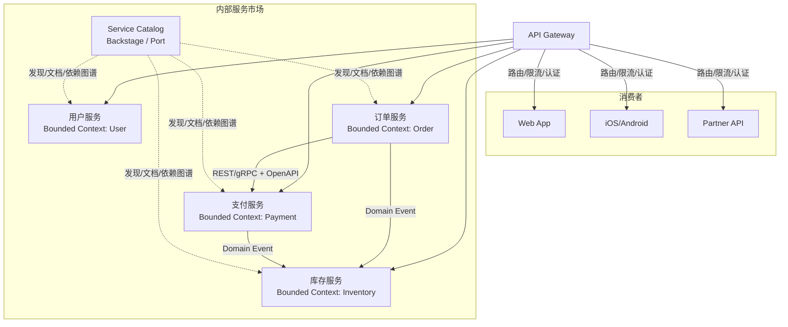

### 15.2 限界上下文映射与服务复用决策树

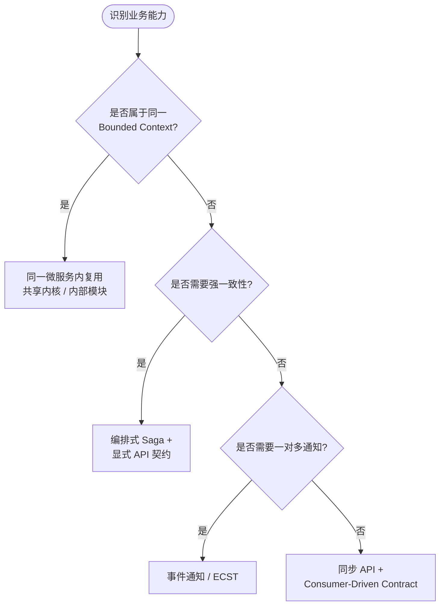

---

> **版本**: 2026-07-07
> **最后更新**: 2026-07-07
> **状态**: ✅ 已完成（Phase A 深化 + 内容要素补全）
> **字数**: ~6500字
>
> 权威来源:
>
> - [Microservices - Wikipedia](https://en.wikipedia.org/wiki/Microservices) (核查日期: 2026-07-07)
> - [Service-oriented architecture - Wikipedia](https://en.wikipedia.org/wiki/Service-oriented_architecture) (核查日期: 2026-07-07)
> - [Domain-driven design - Wikipedia](https://en.wikipedia.org/wiki/Domain-driven_design) (核查日期: 2026-07-07)
> - <https://landscape.cncf.io> (CNCF Cloud Native Trail Map, 核查日期: 2026-07-07)
> - <https://csrc.nist.gov/publications/detail/sp/800-204/final> (NIST SP 800-204 Security Strategies for Microservices-based Application Systems, 核查日期: 2026-07-07)
> - <https://docs.microsoft.com/en-us/azure/architecture/patterns/anti-corruption-layer> (Microsoft Azure Architecture Patterns - Anti-Corruption Layer, 核查日期: 2026-07-07)
> - <https://microservices.io/patterns/> (Microservices.io - Patterns Catalog by Chris Richardson, 核查日期: 2026-07-07)
> - <https://martinfowler.com/bliki/BoundedContext.html> (Martin Fowler - Bounded Context, 核查日期: 2026-07-07)
> - <https://istio.io/latest/docs/> (Istio Documentation, 核查日期: 2026-07-07)
> - <https://linkerd.io/2.14/overview/> (Linkerd Documentation, 核查日期: 2026-07-07)
> - <https://netflixtechblog.com/> (Netflix Tech Blog - Microservices and Platform Engineering, 核查日期: 2026-07-07)
> - <https://www.uber.com/en-US/blog/unified-platform/> (Uber Engineering Blog - Unified Platform, 核查日期: 2026-07-07)
> - <https://docs.pact.io/> (Pact - Consumer Driven Contracts, 核查日期: 2026-07-07)
> - <https://backstage.io/docs/> (Backstage - Service Catalog and Developer Portal, 核查日期: 2026-07-07)
> - <https://docs.confluent.io/platform/current/schema-registry/index.html> (Confluent Schema Registry, 核查日期: 2026-07-07)
> - <https://docs.temporal.io/> (Temporal - Microservices Orchestration Platform, 核查日期: 2026-07-07)
> - <https://www.apollographql.com/docs/federation/> (Apollo GraphQL Federation, 核查日期: 2026-07-07)
> - <https://teamtopologies.com/> (Team Topologies - Organizing Business and Technology Teams, 核查日期: 2026-07-07)
> - <https://www.amazon.com/Building-Microservices-Designing-Fine-Grained-Systems/dp/1492034029> (Sam Newman - Building Microservices, 2nd Edition, O'Reilly Media, 2021)


---


<!-- SOURCE: struct/03-application-architecture-reuse/02-microservices/README.md -->

# 02 微服务架构复用

> **版本**: 2026-07-07
> **定位**: 03 应用架构复用的基础子主题 — 微服务架构的复用模式
> **对齐**: CNCF, NIST SP 800-204, ISO/IEC 25010:2023
> **状态**: ✅ 核心内容已填充

---

## 核心内容

1. **概念定义（CARC 本体）**：微服务、独立部署、去中心化数据、轻量级通信、容错设计。
2. **概念谱系**：从 SOA、REST、Amazon 服务化到 Netflix OSS、Kubernetes、Service Mesh。
3. **核心复用模式**：API 契约复用、Sidecar/Ambassador、Anti-Corruption Layer、Strangler Fig、BFF、Saga。
4. **服务边界与粒度**：实体级、聚合级、业务能力级、子域级服务的取舍。
5. **示例与反例**：支付服务复用、共享数据库反模式、分布式单体、过度拆分。
6. **多维矩阵**：微服务设计模式 × 适用场景、微服务 vs 分层架构 vs 模块化单体。
7. **场景决策树**：根据团队规模、业务边界清晰度、DevOps 能力选择是否采用微服务。

## 主文档

- **[reuse-patterns.md](../struct/03-application-architecture-reuse/02-microservices/reuse-patterns.md)** — 微服务架构复用模式完整指南

## 关联主题

- `03/01-layered-architecture`（从单体分层到微服务的拆分）
- `03/08-service-mesh`（服务网格通信复用）
- `04/07-language-ecosystems`（多语言微服务的组件复用）
- `01-meta-model-standards/06-formal-axioms/four-layer-ontology.md`（四层架构概念本体）

---

> **权威来源**:
>
> - Fowler, M., & Lewis, J. (2014). *Microservices*.
> - Newman, S. (2021). *Building Microservices* (2nd ed.).
> - Richardson, C. (2018). *Microservices Patterns*.
> - NIST SP 800-204.
>
> **核查日期**: 2026-07-07


---

## 补充说明：02 微服务架构复用

## 概念定义

**定义**：微服务架构将系统拆分为围绕业务能力组织、可独立部署的小服务，服务间通过轻量级机制通信；微服务复用强调跨团队共享服务与 API 契约。

## 示例

**示例**：企业将用户画像、消息通知、文件存储构建为独立微服务，通过OpenAPI 契约供各业务线复用，降低重复开发。

## 反例

**反例**：为追求复用将两个高内聚但变更频率不同的业务能力强行合并为一个微服务，导致发布耦合与团队摩擦。

## 分析

**分析**：微服务复用需要清晰的领域边界与版本治理，否则共享服务会成为跨团队协作瓶颈。


---


<!-- SOURCE: struct/03-application-architecture-reuse/02-microservices/reuse-patterns.md -->

# 微服务架构复用模式

> **版本**: 2026-07-07
> **定位**: 03 应用架构复用的基础子主题 —— 微服务架构（Microservices Architecture）的复用模式、边界与决策
> **对齐标准**: CNCF, NIST SP 800-204, ISO/IEC 25010:2023
> **来源 URL**:
>
> - CNCF: <https://www.cncf.io/>
> - NIST SP 800-204: <https://csrc.nist.gov/publications/detail/sp/800-204/final>
> - ISO 25010: <https://www.iso.org/standard/78175.html>
> **核查日期**: 2026-07-07

---

## 目录

- [微服务架构复用模式](#微服务架构复用模式)
  - [1. 概念定义（CARC 本体）](#1-概念定义carc-本体)
  - [2. 概念谱系与学术来源](#2-概念谱系与学术来源)
  - [3. 核心复用模式](#3-核心复用模式)
  - [4. 服务边界与复用粒度](#4-服务边界与复用粒度)
  - [5. 正向示例](#5-正向示例)
  - [6. 反例与失败案例](#6-反例与失败案例)
  - [7. 多维对比矩阵](#7-多维对比矩阵)
  - [8. 场景决策树](#8-场景决策树)
  - [9. 与四层架构的关系](#9-与四层架构的关系)
  - [10. 权威来源](#10-权威来源)

---

## 1. 概念定义（CARC 本体）

### 1.1 微服务架构（Microservices Architecture）

**定义**：微服务架构是一种将单一应用程序构建为**一组小型服务**的架构风格，每个服务运行在自己的进程中，服务间通过轻量级机制（通常是 HTTP/REST 或消息传递）通信。每个服务围绕**业务能力**构建，可独立部署、扩展和演化。

**属性**：

| 属性 | 说明 |
|------|------|
| **服务（Service）** | 围绕业务能力组织的自治单元 |
| **独立部署** | 每个服务可独立构建、测试、部署 |
| **去中心化数据管理** | 每个服务拥有并管理自己的数据 |
| **轻量级通信** | HTTP/gRPC/消息代理，避免重量级 ESB |
| **容错设计** | 服务故障应隔离，不影响整体可用性 |

**关系**：

- **owns**（拥有）：服务拥有其数据存储。
- **calls**（调用）：服务通过同步或异步方式调用其他服务。
- **shares**（共享）：服务通过事件或 API 共享业务能力。
- **composes**（组合）：多个服务组合成更高层业务能力。

**约束**：

1. **单一职责约束**：每个服务应只负责一个业务能力。
2. **接口契约约束**：服务间通信必须基于稳定的 API 契约。
3. **数据隔离约束**：禁止服务直接访问其他服务的数据库。
4. **失败隔离约束**：单个服务故障不应级联扩散。

---

### 1.2 微服务中的复用单元

| 复用单元 | 示例 | 复用层级 |
|---------|------|---------|
| **服务接口契约** | OpenAPI 规范、gRPC proto | 功能架构级 |
| **服务模板/脚手架** | Spring Cloud 模板、Dapr 服务模板 | 项目级 |
| **Sidecar / Ambassador** | Envoy、Dapr sidecar | 组件级 |
| **微服务设计模式** | Circuit Breaker、Saga、BFF | 模式级 |
| **可观测性配置** | 统一的日志、指标、追踪配置 | 基础设施级 |

---

## 2. 概念谱系与学术来源

微服务并非凭空出现，其思想脉络可追溯至：

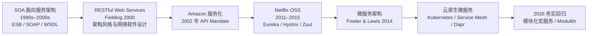

**Wikipedia 对应条目**：

- [Microservices](https://en.wikipedia.org/wiki/Microservices)
- [Service-oriented architecture](https://en.wikipedia.org/wiki/Service-oriented_architecture)
- [Representational state transfer](https://en.wikipedia.org/wiki/Representational_state_transfer)

---

## 3. 核心复用模式

### 3.1 API 契约复用

**定义**：将服务的输入/输出、错误码、版本策略以 OpenAPI、gRPC proto 或 GraphQL Schema 形式标准化，供多个消费者复用。

**关键实践**：

- 契约由服务提供方拥有，存入版本控制系统或 API Portal（如 Backstage、SwaggerHub）。
- 使用代码生成工具从契约生成服务端骨架和客户端 SDK。
- 契约变更遵循兼容性规则（向后兼容、弃用策略）。

### 3.2 Sidecar 与 Ambassador 模式

**定义**：将横切关注点（日志、配置、服务发现、熔断、重试）从业务服务中剥离，由 Sidecar 代理统一处理。

**复用收益**：

- 业务代码无需关心服务发现、TLS、熔断逻辑。
- 同一 Sidecar 配置可复用于多个服务。

**典型实现**：Envoy、Istio Sidecar、Dapr Sidecar。

### 3.3 Anti-Corruption Layer（防腐层）

**定义**：在遗留系统与新微服务之间引入一层适配器，隔离不同模型和协议，避免新系统被遗留系统模型污染。

**复用收益**：

- 新服务的领域模型保持纯净。
- 遗留系统替换时，只需修改防腐层实现。

### 3.4 Strangler Fig（绞杀榕）模式

**定义**：逐步用新微服务替换遗留单体功能，通过路由层将流量逐渐从旧系统切换到新服务。

**复用收益**：

- 降低一次性重构风险。
- 新服务可逐步独立演进和复用。

### 3.5 Backends for Frontends（BFF）

**定义**：为不同前端（Web、Mobile、IoT）创建专门的后端服务，聚合多个底层服务。

**复用收益**：

- 底层核心服务保持稳定。
- 前端特定逻辑集中在 BFF，避免污染核心服务。

---

## 4. 服务边界与复用粒度

### 4.1 粒度选择：服务 vs 聚合 vs 实体

| 粒度 | 说明 | 复用性 | 复杂度 |
|------|------|--------|--------|
| **实体级服务** | 每个数据库表一个服务 | 低（过度碎片化） | 极高 |
| **聚合级服务** | 围绕 DDD 聚合根划分 | 高 | 中 |
| **业务能力级服务** | 围绕业务边界（如订单、库存、支付） | 高 | 中 |
| **子域级服务** | 围绕 DDD 子域划分 | 高 | 中-高 |

**推荐粒度**：以**业务能力**或**聚合根**为服务边界，避免过细或过粗。

### 4.2 服务边界判定 checklist

| 判定问题 | 是 = 适合独立服务 | 否 = 留在当前服务 |
|---------|------------------|------------------|
| 是否有独立部署需求？ | 是 | 否 |
| 是否有独立扩缩容需求？ | 是 | 否 |
| 是否围绕单一业务能力？ | 是 | 否 |
| 是否有独立团队负责？ | 是 | 否 |
| 是否存在大量跨服务调用？ | 否 | 是 |

---

## 5. 正向示例

### 示例 1：支付服务作为可复用业务能力

**场景**：电商平台中，订单服务、订阅服务、退款服务都需要“支付”能力。

**复用方式**：

- 抽取独立的 `Payment Service`，暴露 `charge`、`refund`、`capture` 等 API。
- 所有上层服务通过 OpenAPI 客户端调用 Payment Service。
- Payment Service 内部封装 Stripe、PayPal、Alipay 等多种支付渠道。

**关键成功因素**：

1. 接口契约稳定，版本管理清晰。
2. 不暴露内部支付渠道细节。
3. 提供幂等性保证（idempotency key）。

### 示例 2：统一认证服务跨系统复用

**场景**：企业内有 ERP、CRM、OA 等多个系统，都需要用户认证与授权。

**复用方式**：

- 构建独立的 `Identity Service`，基于 OAuth 2.0 / OIDC。
- 所有系统通过 JWT token 验证用户身份。
- 权限策略集中管理，服务间共享 RBAC/ABAC 模型。

**关键成功因素**：

1. 采用标准协议（OAuth 2.0 / OIDC）。
2. 提供多语言 SDK。
3. 支持单点登录（SSO）与会话联邦。

---

## 6. 反例与失败案例

### 反例 1：分布式单体（Distributed Monolith）

**场景**：系统被拆分为多个服务，但所有服务必须同时部署，数据库变更需要同步修改多个服务。

**后果**：

- 失去了微服务的独立部署优势。
- 故障排查困难，依赖关系复杂。
- 变更成本高于未拆分前。

**判定**：服务边界划分错误，服务间耦合过高。

### 反例 2：共享数据库反模式

**场景**：多个微服务直接访问同一个数据库，通过表关联实现查询。

**后果**：

- 服务间产生隐式耦合。
- 任何 schema 变更影响多个服务。
- 无法独立扩展和演化。

**判定**：违反微服务数据隔离约束。

### 反例 3：过度拆分导致“微服务地狱”

**场景**：团队将每个实体都拆分为独立服务，完成一个业务操作需要调用 10+ 个服务。

**后果**：

- 分布式事务复杂，Saga 编排困难。
- 网络延迟和故障概率成倍增加。
- 开发效率反而下降。

**判定**：服务粒度过细，应考虑合并或采用模块化宏服务。

### 案例：Amazon Prime Video 微服务回迁单体（2023）

**背景**：Prime Video 的音频/视频质量监控服务最初采用分布式组件架构。

**结果**：迁移为单进程单体后，基础设施成本降低 90%。

**教训**：微服务并非银弹，对于高吞吐、低延迟、紧耦合的工作负载，单体或模块化单体可能更合适。

---

## 7. 多维对比矩阵

### 7.1 微服务设计模式 × 适用场景

| 模式 | 解决的问题 | 复用对象 | 复杂度 | 典型工具 |
|------|-----------|---------|--------|---------|
| **API 契约** | 接口不一致 | OpenAPI / gRPC / GraphQL Schema | 低 | SwaggerHub, Backstage |
| **Sidecar** | 横切关注点多处重复 | 代理、可观测性、安全配置 | 中 | Envoy, Dapr |
| **Ambassador** | 客户端复杂 | 连接池、重试、认证 | 中 | Envoy, Linkerd |
| **Anti-Corruption Layer** | 遗留系统污染 | 适配器、翻译器 | 中 | 自定义适配层 |
| **Strangler Fig** | 遗留系统替换 | 路由、新服务 | 高 | API Gateway, Feature Flag |
| **BFF** | 前端需求差异 | 聚合服务 | 中 | Node.js, GraphQL Federation |
| **Saga** | 分布式事务 | 事务编排/协同逻辑 | 高 | Temporal, Camunda |

### 7.2 微服务 vs 分层架构 vs 模块化单体

| 维度 | 微服务 | 分层架构 | 模块化单体 |
|------|--------|---------|-----------|
| **复用粒度** | 服务级 | 层/模块级 | 模块级 |
| **部署独立性** | 高 | 低 | 低 |
| **团队自治度** | 高 | 中 | 中 |
| **通信开销** | 高（网络） | 低（进程内） | 低（进程内） |
| **数据一致性** | 最终一致 | ACID | ACID（模块内） |
| **适用规模** | 大型组织 | 中小系统 | 中小到中型 |

---

## 8. 场景决策树

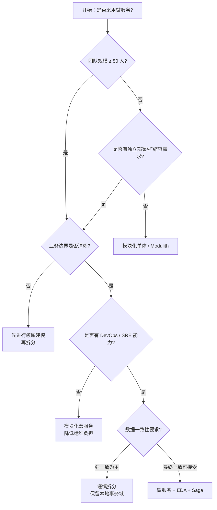

---

## 9. 与四层架构的关系

微服务架构位于 **03 应用架构复用层**，与上下层存在如下映射：

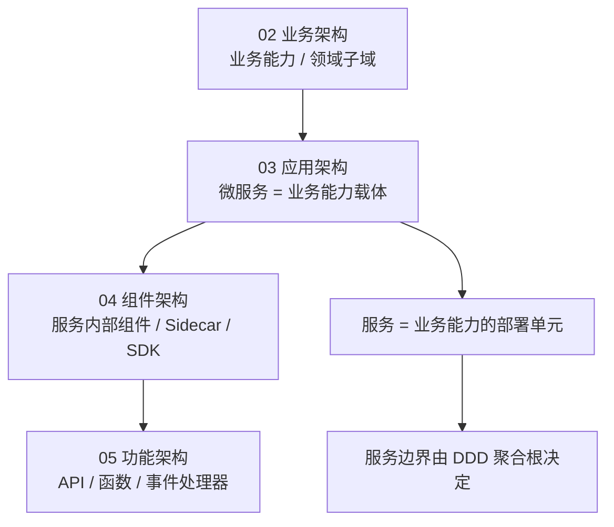

**映射说明**：

- 业务能力（Business Capability）通常映射为一个或多个微服务。
- 微服务内部的 Clean Architecture / 分层架构属于 04 组件架构复用范畴。
- 微服务暴露的 API、事件、函数属于 05 功能架构复用范畴。

---

## 10. 权威来源

> **权威来源**:
>
> - Fowler, M., & Lewis, J. (2014). *Microservices: A definition of this new architectural term*. Martin Fowler. <https://martinfowler.com/articles/microservices.html>
> - Newman, S. (2021). *Building Microservices* (2nd ed.). O'Reilly.
> - Richardson, C. (2018). *Microservices Patterns*. Manning.
> - Fielding, R. T. (2000). *Architectural Styles and the Design of Network-based Software Architectures* (PhD thesis). UC Irvine.（REST 原始定义）
> - NIST SP 800-204. *Security Strategies for Microservices-based Application Systems*. <https://csrc.nist.gov/publications/detail/sp/800-204/final>
> - CNCF. *Cloud Native Definition*. <https://www.cncf.io/about/who-we-are/>
>
> **核查日期**: 2026-07-07


---


<!-- SOURCE: struct/03-application-architecture-reuse/03-app-service/app-service-reuse-patterns.md -->

# 应用服务复用模式

> **版本**: 2026-07-07
> **定位**: 03 应用架构复用层核心子主题 —— 应用服务（Application Service）的复用模式、契约治理与边界决策
> **对齐标准**: SOA, OASIS SOA Reference Architecture, ArchiMate 4.0 Application Service, NIST SP 800-204, ISO/IEC/IEEE 42010:2022
> **来源 URL**:
>
> - OASIS SOA Reference Architecture: <https://www.oasis-open.org/committees/tc_home.php?wg_abbrev=soa-ra>
> - ArchiMate 4.0: <https://www.opengroup.org/archimate>
> - NIST SP 800-204: <https://csrc.nist.gov/publications/detail/sp/800-204/final>
> - ISO 42010: <https://www.iso.org/standard/74296.html>
> **核查日期**: 2026-07-07

---

## 目录

- [应用服务复用模式](#应用服务复用模式)
  - [目录](#目录)
  - [1. 概念定义（CARC 本体）](#1-概念定义carc-本体)
    - [1.1 应用服务（Application Service）](#11-应用服务application-service)
    - [1.2 服务契约（Service Contract）](#12-服务契约service-contract)
    - [1.3 服务目录（Service Catalog）](#13-服务目录service-catalog)
    - [1.4 API 网关（API Gateway）](#14-api-网关api-gateway)
    - [1.5 服务门面（Service Facade）与组合服务（Composite Service）](#15-服务门面service-facade与组合服务composite-service)
  - [2. 概念谱系与学术来源](#2-概念谱系与学术来源)
  - [3. 核心复用模式](#3-核心复用模式)
    - [3.1 服务目录驱动复用](#31-服务目录驱动复用)
    - [3.2 共享 API 网关](#32-共享-api-网关)
    - [3.3 服务门面（Service Facade）](#33-服务门面service-facade)
    - [3.4 组合服务（Composite Service）](#34-组合服务composite-service)
    - [3.5 服务编排与协同](#35-服务编排与协同)
    - [3.6 防腐层（Anti-Corruption Layer, ACL）](#36-防腐层anti-corruption-layer-acl)
  - [4. 服务契约设计](#4-服务契约设计)
    - [4.1 契约要素](#41-契约要素)
    - [4.2 兼容性规则](#42-兼容性规则)
  - [5. 正向示例](#5-正向示例)
    - [示例 1：用户画像服务跨系统复用](#示例-1用户画像服务跨系统复用)
    - [示例 2：支付网关服务在多渠道复用](#示例-2支付网关服务在多渠道复用)
  - [6. 反例与失败案例](#6-反例与失败案例)
    - [反例 1：共享数据库作为集成方式](#反例-1共享数据库作为集成方式)
    - [反例 2：ESB 成为“智能管道”瓶颈](#反例-2esb-成为智能管道瓶颈)
    - [案例：某企业 SOA 治理过度导致复用停滞](#案例某企业-soa-治理过度导致复用停滞)
  - [7. 多维对比矩阵](#7-多维对比矩阵)
    - [7.1 应用服务复用 vs 微服务复用](#71-应用服务复用-vs-微服务复用)
    - [7.2 应用服务复用模式 × 场景适配](#72-应用服务复用模式--场景适配)
    - [7.3 服务契约成熟度 × 复用就绪度](#73-服务契约成熟度--复用就绪度)
  - [8. 场景决策树与决策分析](#8-场景决策树与决策分析)
    - [8.1 决策分析](#81-决策分析)
  - [9. 与四层架构的关系](#9-与四层架构的关系)
  - [10. 权威来源](#10-权威来源)

---

## 1. 概念定义（CARC 本体）

### 1.1 应用服务（Application Service）

**定义**：应用服务是应用架构层中**面向业务能力**的可复用服务单元，它将业务能力封装为标准化接口，供其他应用系统或组件通过同步/异步方式调用。应用服务介于业务服务（业务语义）与组件/功能（技术实现）之间，强调通过契约实现跨应用集成。

**属性**：

| 属性 | 说明 |
|------|------|
| **业务对齐** | 应用服务通常对应一个业务能力子集，如"支付网关服务"、"用户画像服务" |
| **接口契约** | 通过 OpenAPI、AsyncAPI、WSDL、GraphQL Schema 等定义 |
| **可编排性** | 多个应用服务可按流程组合为更高层业务服务 |
| **可治理性** | 通过服务目录、版本策略、SLA 进行生命周期管理 |

**关系**：

- **realizes（实现）**：应用服务实现业务架构中的业务服务。
- **exposes（暴露）**：应用服务通过 API 网关或消息总线暴露给消费方。
- **composes（组合）**：多个应用服务组合为复合服务或业务流程。
- **governs（治理）**：服务目录和治理策略管理应用服务的复用。

**约束**：

1. **契约稳定约束**：应用服务一旦发布，接口变更必须遵循兼容性规则。
2. **存储隔离约束**：应用服务应通过自身接口暴露数据，禁止消费方直接访问其底层数据库。
3. **单一职责约束**：一个应用服务应围绕一个明确的业务能力边界。

### 1.2 服务契约（Service Contract）

**定义**：服务契约是服务提供方与消费方之间的正式协议，规定接口、数据格式、错误码、质量属性、安全要求和版本策略。

### 1.3 服务目录（Service Catalog）

**定义**：服务目录是组织级应用服务的统一注册与发现机制，记录服务名称、版本、所有者、SLA、依赖关系和消费方清单。

### 1.4 API 网关（API Gateway）

**定义**：API 网关是应用服务的统一入口，提供认证、限流、缓存、协议转换、灰度发布和版本路由等横切能力。

### 1.5 服务门面（Service Facade）与组合服务（Composite Service）

- **服务门面**：为复杂遗留系统提供简化、稳定的对外契约。
- **组合服务**：将多个细粒度服务聚合为粗粒度可复用服务，降低消费方调用复杂度。

---

## 2. 概念谱系与学术来源


**权威条目**：

- [Service-oriented architecture](https://en.wikipedia.org/wiki/Service-oriented_architecture)
- [OASIS SOA Reference Architecture](https://www.oasis-open.org/committees/tc_home.php?wg_abbrev=soa-ra)
- [ArchiMate Application Service](https://pubs.opengroup.org/architecture/archimate3-doc/chap09.html)

---

## 3. 核心复用模式

### 3.1 服务目录驱动复用

建立组织级应用服务目录，包含：

- 服务名称、版本、所有者、SLA。
- 接口规范（OpenAPI/AsyncAPI/WSDL）。
- 依赖关系与消费方清单。
- 合规状态（安全扫描、许可证检查）。

**复用收益**：消费方可在目录中发现已有服务，避免重复建设；平台团队可通过目录分析复用热点和耦合风险。

### 3.2 共享 API 网关

通过 API 网关暴露可复用服务：

- 统一认证、限流、缓存。
- 协议转换（REST/gRPC/SOAP）。
- 灰度发布与版本路由。

**复用收益**：横切关注点从各服务中剥离，作为基础设施复用；消费方只需关心业务契约。

### 3.3 服务门面（Service Facade）

为复杂遗留系统提供简化门面：

- 隐藏内部复杂性。
- 提供稳定契约。
- 支持新旧系统共存。

**复用收益**：新系统无需理解遗留模型，遗留系统替换时只需修改门面实现。

### 3.4 组合服务（Composite Service）

将多个细粒度服务组合为粗粒度可复用服务：

- 降低消费方调用复杂度。
- 聚合跨域数据。
- 通过缓存提升性能。

**典型场景**：订单详情服务组合用户服务、商品服务、库存服务、物流服务。

### 3.5 服务编排与协同

- **编排（Orchestration）**：由中央编排器按顺序调用多个应用服务完成业务流程，如 BPMN、Temporal。
- **协同（Choreography）**：应用服务通过事件总线自主响应，如 Saga、EDA。

**复用收益**：业务流程逻辑以编排定义或事件契约复用，服务本身保持自治。

### 3.6 防腐层（Anti-Corruption Layer, ACL）

在遗留系统与新应用服务之间引入适配层，隔离不同模型和协议。

**复用收益**：新服务的领域模型保持纯净；遗留系统替换时影响范围可控。

---

## 4. 服务契约设计

### 4.1 契约要素

| 要素 | 内容 | 示例 |
|------|------|------|
| **接口操作** | HTTP 方法/路径、gRPC 方法、消息类型 | `POST /api/v1/payments` |
| **请求/响应 Schema** | 字段、类型、必填项、示例 | OpenAPI Schema |
| **错误码** | 标准错误码与业务错误码 | `400 PAYMENT_DECLINED` |
| **质量属性** | 超时、重试、幂等性、限流 | idempotency-key |
| **安全要求** | 认证、授权、审计 | OAuth2 + RBAC |
| **版本策略** | 向后兼容、弃用窗口 | `/v1`, `/v2` |

### 4.2 兼容性规则

- **向后兼容（Backward Compatible）**：旧消费方无需修改即可使用新版本。
- **向前兼容（Forward Compatible）**：新消费方可读取旧版本响应。
- **破坏性变更**：必须升级主版本号，并提供迁移窗口。

---

## 5. 正向示例

### 示例 1：用户画像服务跨系统复用

**场景**：企业内有 CRM、营销自动化、客服、风控四个系统，都需要用户画像数据。

**复用方式**：

- 构建独立的 `User Profile Service`，聚合客户主数据、行为标签、风险评分。
- 暴露 REST API 和 gRPC 两种接口，分别供 Web 和内部微服务使用。
- 通过 API 网关统一认证、限流和缓存。

**关键成功因素**：

1. 用户画像服务不暴露底层 MDM 数据库，所有访问通过服务契约。
2. 采用 CQRS 分离读写：写模型同步更新主数据，读模型通过缓存支持高并发。
3. 版本策略明确，v1 保留 12 个月，v2 逐步迁移。

**复用收益**：

- 四个系统无需各自维护用户数据副本，数据一致性显著提升。
- 新应用接入用户画像服务平均只需 1 天。
- 营销转化率提升 12%，客服响应速度提升 20%。

### 示例 2：支付网关服务在多渠道复用

**场景**：电商平台需要在网站、移动 App、小程序、订阅服务、B2B 采购平台中统一支付能力。

**复用方式**：

- 构建 `Payment Gateway Service`，封装 Stripe、PayPal、Alipay、WeChat Pay 等渠道。
- 暴露统一支付、退款、对账、查询接口。
- 各渠道通过 SDK 或 API 网关调用支付服务。

**关键成功因素**：

1. 接口契约屏蔽渠道差异，新增支付方式不影响消费方。
2. 所有支付操作使用 idempotency-key 保证幂等性。
3. 通过服务目录发布，各团队可自助发现接口和 SLA。

**复用收益**：

- 支付能力在 5 个业务线复用，避免每个渠道重复对接支付提供商。
- 新支付渠道上线时间从 2 个月缩短至 2 周。
- 对账和财务审计集中化，合规成本降低 40%。

---

## 6. 反例与失败案例

### 反例 1：共享数据库作为集成方式

**场景**：多个应用系统直接访问同一个数据库，通过表关联实现查询和数据共享。

**后果**：

- 应用间产生隐式耦合，任何 schema 变更影响多个系统。
- 无法独立扩展和演化，数据所有权模糊。
- 服务契约被 SQL 表结构替代，业务语义泄露。

**判定**：违反应用服务复用的**存储隔离约束**。应通过应用服务接口暴露数据，而非共享数据库。

### 反例 2：ESB 成为“智能管道”瓶颈

**场景**：某大型企业将所有业务逻辑放入 ESB 中进行编排和转换。

**后果**：

- ESB 成为单点故障和性能瓶颈。
- 任何新服务上线都需要 ESB 团队排期配置。
- 业务逻辑分散在 ESB 和服务中，调试困难。

**判定**：ESB 应作为**传输与协议适配层**，而非业务逻辑容器。应用服务复用应通过清晰的契约和轻量级编排实现。

### 案例：某企业 SOA 治理过度导致复用停滞

**背景**：某金融企业建立庞大 SOA 治理委员会，所有服务发布需经过多轮评审。

**失败原因**：

- 服务发布周期长达 3 个月，开发团队选择绕过治理自行实现。
- 治理规则过于僵化，无法适应敏捷迭代。
- 服务目录缺乏自动化，信息严重过时。

**教训**：应用服务复用需要在**治理**与**效率**之间取得平衡。自动化契约校验、自助目录注册、分级治理是更可持续的模式。


## 7. 多维对比矩阵

### 7.1 应用服务复用 vs 微服务复用

| 维度 | 应用服务复用 | 微服务复用 |
|:---|:---|:---|
| **粒度** | 较粗，可对应一个应用或子系统 | 较细，独立部署单元 |
| **部署** | 可内嵌于应用，也可独立部署 | 必须独立部署 |
| **治理重点** | 服务目录、契约、编排、API 网关 | 边界、自治、版本、服务网格 |
| **技术栈约束** | 可跨多种运行时，强调契约 | 通常与容器/Kubernetes 绑定 |
| **数据一致性** | 依赖编排或分布式事务 | 通常采用 Saga / 最终一致 |
| **适用场景** | 企业应用集成、SOA、遗留系统现代化 | 云原生、DevOps、快速迭代 |

### 7.2 应用服务复用模式 × 场景适配

| 场景 | 推荐模式 | 次选模式 | 不推荐 | 关键理由 |
|-----|---------|---------|--------|---------|
| 跨系统共享业务能力 | 服务目录 + API 网关 | 组合服务 | 共享数据库 | 契约驱动，避免存储耦合 |
| 遗留系统对外暴露 | 服务门面 + 防腐层 | API 网关 | 直接暴露原接口 | 稳定契约，隔离 legacy |
| 复杂业务流程 | 服务编排 | 事件协同 | 硬编码调用链 | 流程可管理、可观测 |
| 跨域数据聚合 | 组合服务 + BFF | GraphQL Federation | 单次多服务调用 | 降低消费方复杂度 |
| 高并发读场景 | API 网关 + 缓存 | CQRS 读服务 | 直接查主库 | 提升性能，保护主服务 |

### 7.3 服务契约成熟度 × 复用就绪度

| 契约要素 | Level 1（临时） | Level 2（定义） | Level 3（自动化） | Level 4（治理驱动） |
|---------|---------------|---------------|-----------------|-------------------|
| **接口规范** | 口头约定 | OpenAPI 文档 | 代码生成 + 校验 | 目录自动发现 |
| **版本策略** | 无 | 语义化版本 | 兼容性自动化检测 | 弃用策略自动执行 |
| **质量属性** | 无 | SLA 文档 | 监控告警 | SLO 驱动自动扩缩容 |
| **安全要求** | 硬编码 | 统一认证 | OAuth2/OIDC 标准化 | 策略即代码 |

---

## 8. 场景决策树与决策分析

### 8.1 决策分析

应用服务复用的核心决策是**"新建 vs 复用"**以及**"内嵌 vs 独立"**。决策应基于业务能力范围、消费方数量、变更频率和治理成熟度。

| 决策问题 | 选择复用 | 选择新建 | 选择内嵌 |
|---------|---------|---------|---------|
| 业务能力是否跨系统？ | 是 | 否 | 仅当前系统 |
| 消费方数量是否 ≥ 2？ | 是 | 否 | 否 |
| 变更频率是否稳定？ | 是 | 否（快速试错） | 是 |
| 是否需要独立 SLA？ | 是 | 否 | 否 |
| 治理平台是否成熟？ | 是 | 暂不独立 | 是 |

**关键洞察**：应用服务复用不是越细越好。当服务能力被 3 个以上应用消费、且需要独立演化时，才适合提升为独立应用服务；否则保留为应用内部模块更有利于降低治理成本。

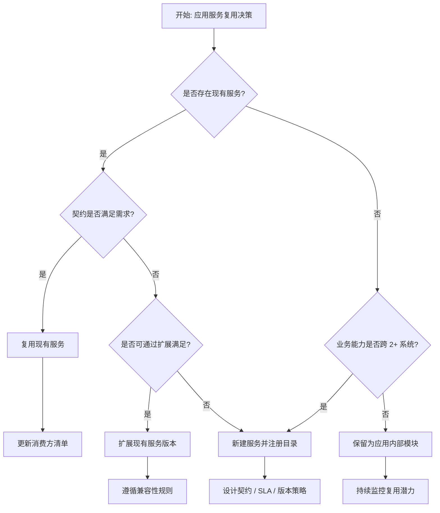

---

## 9. 与四层架构的关系

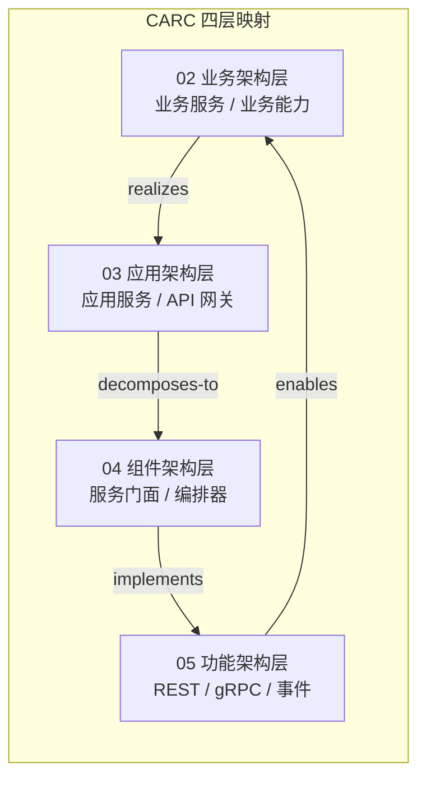

- **业务架构层**：定义业务能力（如"处理支付"），对应应用服务的服务边界。
- **应用架构层**：应用服务、API 网关、服务目录承载复用。
- **组件架构层**：服务门面、组合服务、编排器、防腐层是复用组件。
- **功能架构层**：REST/gRPC 操作、事件类型、消息格式是具体复用接口。

---

## 10. 权威来源

- OASIS SOA Reference Architecture: <https://www.oasis-open.org/committees/tc_home.php?wg_abbrev=soa-ra>
- OASIS SOA Reference Model: <https://www.oasis-open.org/committees/tc_home.php?wg_abbrev=soa-rm>
- ArchiMate 4.0 — Application Service: <https://pubs.opengroup.org/architecture/archimate3-doc/chap09.html>
- TOGAF 10 — Application Architecture: <https://www.opengroup.org/togaf>
- NIST SP 800-204 — Security Strategies for Microservices-based Application Systems: <https://csrc.nist.gov/publications/detail/sp/800-204/final>
- ISO/IEC/IEEE 42010:2022 — Architecture description: <https://www.iso.org/standard/74296.html>
- OpenAPI Specification: <https://spec.openapis.org/oas/latest.html>
- AsyncAPI Specification: <https://www.asyncapi.com/en/spec-list>

**核查日期**: 2026-07-07


---


<!-- SOURCE: struct/03-application-architecture-reuse/03-app-service/README.md -->

# 03 应用服务复用

> **版本**: 2026-06-12
> **定位**: 03-application-architecture-reuse / 03-app-service
> **对齐标准**: SOA, OASIS SOA Reference Architecture, NIST SP 800-204

---

## 核心内容

- 应用服务复用模式（服务目录、API 网关、门面、组合服务）
- 应用服务与微服务复用的关系与边界
- 服务契约与 SLA 治理

---

## 文档导航

| 文件 | 主题 |
|:---|:---|
| `app-service-reuse-patterns.md` | 应用服务复用模式与检查清单 |
| `service-reuse-decision-checklist.md` | 服务复用决策检查清单 |

---

## 关联主题

- `02-business-architecture-reuse/05-business-service-reuse/` — 业务服务复用
- `03-application-architecture-reuse/02-microservices/` — 微服务架构复用模式
- `03-application-architecture-reuse/08-service-mesh/` — 服务网格通信复用


---

## 补充说明：03 应用服务复用

## 概念定义

**定义**：应用服务复用是在应用层将通用能力（如认证、通知、支付、搜索）封装为服务目录，通过 API 网关与服务契约实现跨应用复用。

## 示例

**示例**：企业通过 API 网关暴露统一的支付服务，移动 App、Web 端与合作伙伴系统均调用同一服务，确保支付逻辑与合规要求一致。

## 反例

**反例**：各应用自行实现支付逻辑，导致费率计算、对账与风控规则不一致，财务审计困难。

## 权威来源

> **权威来源**:
>
> - [NIST](https://www.nist.gov)
> - [OASIS SOA Reference Architecture](https://www.oasis-open.org/committees/tc_home.php?wg_abbrev=soa-rm)
> - 核查日期：2026-07-07

## 分析

**分析**：应用服务复用的收益与治理成本成正比，需要通过服务目录、SLA 与成熟度评估控制范围。


---


<!-- SOURCE: struct/03-application-architecture-reuse/03-app-service/service-reuse-decision-checklist.md -->

# 应用服务复用决策检查清单

> **版本**: 2026-06-12
> **定位**: 03-application-architecture-reuse / 03-app-service
> **用途**: 在应用架构层面评估一个服务是否适合作为可复用资产

---

## 决策维度

| 维度 | 权重 | 问题 | 评分（1-5） |
|:---|:---:|:---|:---:|
| **业务稳定性** | 高 | 该服务对应的业务能力是否稳定、跨项目存在？ | |
| **复用潜力** | 高 | 预计有多少个消费方会在未来 12 个月内复用该服务？ | |
| **接口契约清晰度** | 高 | 服务的输入/输出、错误码、SLA 是否已明确定义？ | |
| **技术可移植性** | 中 | 服务是否依赖特定技术栈或部署环境？ | |
| **治理成本** | 中 | 维护该可复用服务所需的版本、文档、支持成本是否可接受？ | |
| **安全与合规** | 高 | 服务是否处理敏感数据？是否满足访问控制和审计要求？ | |

---

## 决策规则

- **总分 ≥ 22 且高权重项均 ≥ 4**: 推荐作为组织级可复用服务
- **总分 16–21**: 可作为项目级复用或进一步孵化
- **总分 < 16**: 建议不抽象为独立复用服务，保持本地化实现

---

## 输出模板

```markdown
## 服务复用评估：{服务名}

- **评估日期**: YYYY-MM-DD
- **评估人**:
- **消费方数量**:
- **总分**: /30
- **决策**: 组织级复用 / 项目级复用 / 不复用

### 关键假设
1.
2.

### 风险与缓解
| 风险 | 缓解措施 |
|:---|:---|
| | |
```

---

## 关联主题

- `02-business-architecture-reuse/05-business-service-reuse/` — 业务服务复用视角
- `05-functional-architecture-reuse/01-api-design/` — API 设计与服务契约


---

## 补充说明：应用服务复用决策检查清单

## 概念定义

**定义**：应用服务复用是在应用层将通用能力（如认证、通知、支付、搜索）封装为服务目录，通过 API 网关与服务契约实现跨应用复用。

## 示例

**示例**：企业通过 API 网关暴露统一的支付服务，移动 App、Web 端与合作伙伴系统均调用同一服务，确保支付逻辑与合规要求一致。

## 反例

**反例**：各应用自行实现支付逻辑，导致费率计算、对账与风控规则不一致，财务审计困难。

## 权威来源

> **权威来源**:
>
> - [NIST](https://www.nist.gov)
> - [OASIS SOA Reference Architecture](https://www.oasis-open.org/committees/tc_home.php?wg_abbrev=soa-rm)
> - 核查日期：2026-07-07

## 分析

**分析**：应用服务复用的收益与治理成本成正比，需要通过服务目录、SLA 与成熟度评估控制范围。


---


<!-- SOURCE: struct/03-application-architecture-reuse/04-serverless/README.md -->

# 03 Serverless 架构复用

> **版本**: 2026-07-07
> **定位**: 03 应用架构复用的基础子主题 — Serverless / FaaS 架构的复用模式
> **对齐**: CNCF Serverless Whitepaper v2, AWS/Azure/GCP 官方文档
> **状态**: ✅ 核心内容已填充

---

## 核心内容

1. **概念定义（CARC 本体）**：Serverless、FaaS、BaaS、事件驱动、自动扩缩容、冷启动。
2. **概念谱系**：从 CGI/PaaS 到 AWS Lambda、EventBridge、Cloud Run、Knative。
3. **核心复用模式**：Lambda Layer、事件源复用、Serverless 工作流、BaaS 复用、Serverless→容器化升级路径。
4. **函数边界与粒度**：单操作函数、单业务步骤、聚合功能函数的取舍。
5. **示例与反例**：图片处理流水线、定时同步、函数中保存会话状态、忽视冷启动成本。
6. **多维矩阵**：Serverless 平台能力对比、Serverless vs 微服务 vs 分层架构。
7. **场景决策树**：根据负载特征、执行时间、延迟要求、成本选择 Serverless 形态。

## 主文档

- **[reuse-patterns.md](../struct/03-application-architecture-reuse/04-serverless/reuse-patterns.md)** — Serverless 架构复用模式完整指南

## 关联主题

- `03/02-microservices`（Serverless 作为微服务的极端粒度）
- `05/02-function-as-a-service`（功能层的 FaaS 复用）
- `06/04-finops-cost`（Serverless 成本分摊模型）
- `01-meta-model-standards/06-formal-axioms/four-layer-ontology.md`（四层架构概念本体）

---

> **权威来源**:
>
> - CNCF. *Serverless Whitepaper v2*.
> - AWS. *AWS Lambda Developer Guide*.
> - Microsoft. *Azure Functions Documentation*.
> - Roberts, M. (2018). *Serverless Architectures*.
>
> **核查日期**: 2026-07-07


---

## 补充说明：03 Serverless 架构复用

## 概念定义

**定义**：Serverless 架构复用是利用函数即服务（FaaS）与托管服务，将无状态计算、事件处理与后端能力封装为可复用函数与模板。

## 示例

**示例**：团队将图片处理、PDF 生成、Webhook 转换实现为标准 Lambda/Cloud Function 模板，新项目通过配置环境变量即可部署。

## 反例

**反例**：在 Serverless 函数中保留大量长连接与本地状态，导致冷启动时间长、成本高且难以扩展。

## 分析

**分析**：Serverless 复用适合事件驱动、短时无状态任务，需警惕供应商锁定与隐藏成本。


---


<!-- SOURCE: struct/03-application-architecture-reuse/04-serverless/reuse-patterns.md -->

# Serverless 架构复用模式

> **版本**: 2026-07-07
> **定位**: 03 应用架构复用的基础子主题 —— Serverless / FaaS 架构的复用模式、边界与决策
> **对齐标准**: CNCF Serverless Whitepaper v2, AWS/Azure/GCP 官方文档, ISO/IEC 25010:2023
> **来源 URL**:
>
> - CNCF Serverless Whitepaper v2: <https://github.com/cncf/wg-serverless>
> - AWS Lambda: <https://docs.aws.amazon.com/lambda/>
> - Azure Functions: <https://learn.microsoft.com/en-us/azure/azure-functions/>
> **核查日期**: 2026-07-07

---

## 目录

- [Serverless 架构复用模式](#serverless-架构复用模式)
  - [目录](#目录)
  - [1. 概念定义（CARC 本体）](#1-概念定义carc-本体)
    - [1.1 Serverless 架构](#11-serverless-架构)
    - [1.2 Serverless 中的复用单元](#12-serverless-中的复用单元)
  - [2. 概念谱系与学术来源](#2-概念谱系与学术来源)
  - [3. 核心复用模式](#3-核心复用模式)
    - [3.1 Lambda Layer / 函数层复用](#31-lambda-layer--函数层复用)
    - [3.2 事件源复用模式](#32-事件源复用模式)
    - [3.3 Serverless 工作流复用](#33-serverless-工作流复用)
    - [3.4 BaaS 服务复用](#34-baas-服务复用)
    - [3.5 Serverless 到容器化的升级路径](#35-serverless-到容器化的升级路径)
  - [4. 函数边界与复用粒度](#4-函数边界与复用粒度)
    - [4.1 函数粒度选择](#41-函数粒度选择)
    - [4.2 函数边界判定 checklist](#42-函数边界判定-checklist)
  - [5. 正向示例](#5-正向示例)
    - [示例 1：图片处理流水线](#示例-1图片处理流水线)
    - [示例 2：定时数据同步任务](#示例-2定时数据同步任务)
  - [6. 反例与失败案例](#6-反例与失败案例)
    - [反例 1：将单体直接切分为数百个函数](#反例-1将单体直接切分为数百个函数)
    - [反例 2：在函数中保存会话状态](#反例-2在函数中保存会话状态)
    - [反例 3：忽视冷启动成本](#反例-3忽视冷启动成本)
    - [案例：Serverless 成本失控](#案例serverless-成本失控)
  - [7. 多维对比矩阵](#7-多维对比矩阵)
    - [7.1 Serverless 平台能力对比](#71-serverless-平台能力对比)
    - [7.2 Serverless vs 微服务 vs 分层架构](#72-serverless-vs-微服务-vs-分层架构)
  - [8. 场景决策树](#8-场景决策树)
  - [9. 与四层架构的关系](#9-与四层架构的关系)
  - [10. 权威来源](#10-权威来源)

---

## 1. 概念定义（CARC 本体）

### 1.1 Serverless 架构

**定义**：Serverless（无服务器）是一种云计算执行模型，云提供商动态管理计算资源分配，开发者只需关注业务逻辑，无需关心服务器运维、容量规划和扩展。狭义上常指 **FaaS（Function as a Service）**；广义上还包括 BaaS（Backend as a Service）和容器化 Serverless（如 AWS Fargate、Google Cloud Run）。

**属性**：

| 属性 | 说明 |
|------|------|
| **事件驱动** | 函数由事件触发（HTTP、队列、定时、存储变更） |
| **自动扩缩容** | 平台根据请求量自动扩展至零或无限 |
| **按使用付费** | 按调用次数和执行时间计费 |
| **无状态** | 函数实例通常无状态，状态需外置到存储或缓存 |
| **冷启动** | 闲置后首次调用存在延迟惩罚 |

**关系**：

- **triggered by**（被触发）：函数由事件源触发。
- **uses**（使用）：函数使用 BaaS 服务（数据库、消息队列、对象存储）。
- **composes**（组合）：多个函数通过事件或工作流组合成业务流程。
- **deployed on**（部署于）：函数部署在 Serverless 平台上。

**约束**：

1. **执行时间约束**：函数执行通常有最大超时限制（如 AWS Lambda 15 分钟）。
2. **状态外置约束**：函数内部不应保存会话状态。
3. **包大小约束**：部署包大小受平台限制。
4. **启动延迟约束**：冷启动时间影响实时性要求高的场景。

---

### 1.2 Serverless 中的复用单元

| 复用单元 | 示例 | 复用层级 |
|---------|------|---------|
| **函数模板** | Lambda 层（Layer）、函数模板 | 功能架构级 |
| **事件源映射** | S3 → Lambda、EventBridge → Lambda | 集成模式级 |
| **共享库/层** | 日志、监控、认证 SDK 层 | 组件级 |
| **BaaS 服务** | DynamoDB、Firebase、Auth0 | 服务级 |
| **Serverless 框架模板** | Serverless Framework、SAM、Terraform Module | 项目级 |

---

## 2. 概念谱系与学术来源

Serverless 的发展脉络：

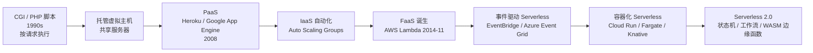

**Wikipedia 对应条目**：

- [Serverless computing](https://en.wikipedia.org/wiki/Serverless_computing)
- [Function as a service](https://en.wikipedia.org/wiki/Function_as_a_service)
- [Backend as a service](https://en.wikipedia.org/wiki/Backend_as_a_service)

---

## 3. 核心复用模式

### 3.1 Lambda Layer / 函数层复用

**定义**：将共享依赖（库、运行时、配置）打包为 Layer，供多个函数引用，减少重复部署包大小。

**复用收益**：

- 减少每个函数的部署包体积。
- 统一依赖版本，便于安全更新。
- 多个函数共享同一层，降低维护成本。

**典型实现**：AWS Lambda Layers、Azure Functions Proxies。

### 3.2 事件源复用模式

**定义**：将同一事件源（如 S3 上传、消息队列消息）路由到多个函数或目标。

**常见模式**：

| 事件源 | 触发场景 | 复用方式 |
|--------|---------|---------|
| **HTTP API Gateway** | REST/HTTP 请求 | 多个函数共享同一 API 路由规则 |
| **对象存储事件** | 文件上传 | 同一上传事件触发缩略图、病毒扫描、元数据提取 |
| **消息队列** | 异步任务 | 多个消费者订阅同一主题 |
| **定时触发** | Cron 作业 | 同一调度规则触发多个函数 |
| **数据库变更流** | CDC | 同一变更事件触发缓存更新、搜索索引、通知 |

### 3.3 Serverless 工作流复用

**定义**：将多个函数通过状态机或工作流编排成可复用的业务流程。

**典型实现**：AWS Step Functions、Azure Durable Functions、Google Workflows。

**复用收益**：

- 业务流程可复用、可监控、可回滚。
- 错误处理、重试、并行执行由平台托管。

### 3.4 BaaS 服务复用

**定义**：将认证、数据库、文件存储、推送通知等通用能力交给托管服务，避免自建。

**复用收益**：

- 减少运维负担。
- 快速集成标准能力。

**典型实现**：Firebase Authentication、AWS Cognito、Auth0、Supabase。

### 3.5 Serverless 到容器化的升级路径

**定义**：当函数复杂度增长或冷启动成为瓶颈时，将函数迁移到容器化 Serverless（如 Cloud Run、Fargate）。

**复用收益**：

- 保留 Serverless 的自动扩缩容优势。
- 获得更长的执行时间和更大的资源灵活性。

---

## 4. 函数边界与复用粒度

### 4.1 函数粒度选择

| 粒度 | 说明 | 复用性 | 复杂度 |
|------|------|--------|--------|
| **单操作函数** | 每个 CRUD 操作一个函数 | 中 | 高（函数数量多） |
| **单业务步骤** | 每个业务流程步骤一个函数 | 高 | 中 |
| **聚合功能函数** | 一个函数处理多个相关操作 | 低 | 低 |

**推荐粒度**：以**单一业务步骤**或**单一责任**为函数边界。

### 4.2 函数边界判定 checklist

| 判定问题 | 是 = 适合函数化 | 否 = 留在服务/单体中 |
|---------|----------------|---------------------|
| 执行时间是否短暂？ | 是 | 否 |
| 是否事件驱动？ | 是 | 否 |
| 负载是否突发或稀疏？ | 是 | 否 |
| 是否有状态外置方案？ | 是 | 否 |
| 是否需要长时间运行？ | 否 | 是 |

---

## 5. 正向示例

### 示例 1：图片处理流水线

**场景**：用户上传图片后，需要生成缩略图、提取 EXIF、写入数据库、触发通知。

**复用方式**：

- S3 上传事件触发 `Thumbnail Function`。
- 同一事件通过 EventBridge 路由到 `Metadata Extraction Function` 和 `Notification Function`。
- 共享的图像处理库打包为 Lambda Layer。

**关键成功因素**：

1. 每个函数只负责一个处理步骤。
2. 事件契约统一（S3 Event / CloudEvents）。
3. 失败处理使用死信队列（DLQ）。

### 示例 2：定时数据同步任务

**场景**：每天凌晨将 CRM 数据同步到数据仓库。

**复用方式**：

- 使用 EventBridge Scheduler 定时触发 `Sync Function`。
- 函数读取 CRM API，写入 Snowflake/BigQuery。
- 同一同步模板可复用于 ERP、HR 系统。

**关键成功因素**：

1. 函数幂等性设计（防止重复执行）。
2. 执行时间控制在平台限制内。
3. 错误告警与重试机制。

---

## 6. 反例与失败案例

### 反例 1：将单体直接切分为数百个函数

**场景**：团队将传统 MVC 应用的每个 Service 方法都迁移为独立 Lambda 函数。

**后果**：

- 函数数量爆炸，管理困难。
- 大量函数间调用导致延迟和成本上升。
- 调试和监控复杂化。

**判定**：函数粒度过细，未按业务能力或事件边界划分。

### 反例 2：在函数中保存会话状态

**场景**：为了“简化”，函数将用户会话保存在内存中。

**后果**：

- 函数实例无状态，会话丢失。
- 自动扩缩容时状态不一致。

**判定**：违反 Serverless 无状态约束。

### 反例 3：忽视冷启动成本

**场景**：将高频、低延迟的 API 全部迁移到 Lambda，未考虑冷启动。

**后果**：

- 用户请求响应时间波动大。
- 使用 Provisioned Concurrency 后成本反而高于容器。

**判定**：Serverless 不适合所有工作负载，需评估延迟要求。

### 案例：Serverless 成本失控

**背景**：某初创公司将所有后端 API 迁移到 Lambda，初期按调用付费看似低廉。

**结果**：随着流量增长，API Gateway + Lambda 调用费用超过 ECS/Fargate 方案 3 倍。

**教训**：Serverless 在稀疏流量下成本低，但在高稳定流量下可能不如预留资源经济。

---

## 7. 多维对比矩阵

### 7.1 Serverless 平台能力对比

| 能力 | AWS Lambda | Azure Functions | Google Cloud Functions | Cloud Run / Fargate |
|------|-----------|-----------------|------------------------|---------------------|
| **执行时长** | 15 分钟 | 10 分钟（消费版） | 60 分钟 | 无限制 |
| **运行时选择** | 多 | 多 | 多 | 容器任意 |
| **冷启动** | 中 | 中 | 中 | 低 |
| **VPC 支持** | 有 | 有 | 有 | 有 |
| **按调用计费** | 是 | 是 | 是 | 按实例时间 |
| **容器化** | 否（原生） | 否（原生） | 否（原生） | 是 |

### 7.2 Serverless vs 微服务 vs 分层架构

| 维度 | Serverless | 微服务 | 分层架构 |
|------|-----------|--------|---------|
| **复用粒度** | 函数级 | 服务级 | 层/模块级 |
| **运维负担** | 极低 | 高 | 低 |
| **扩展速度** | 毫秒-秒 | 秒-分钟 | 分钟（单应用） |
| **状态管理** | 外置 | 服务内/外置 | 应用内 |
| **成本模型** | 按调用 | 按资源 | 按资源 |
| **适用负载** | 突发/稀疏 | 稳定高吞吐 | 中小规模 |

---

## 8. 场景决策树

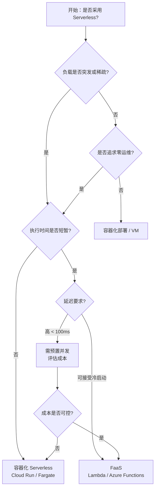

---

## 9. 与四层架构的关系

Serverless 架构位于 **03 应用架构复用层**，其函数边界与功能架构层直接对应：

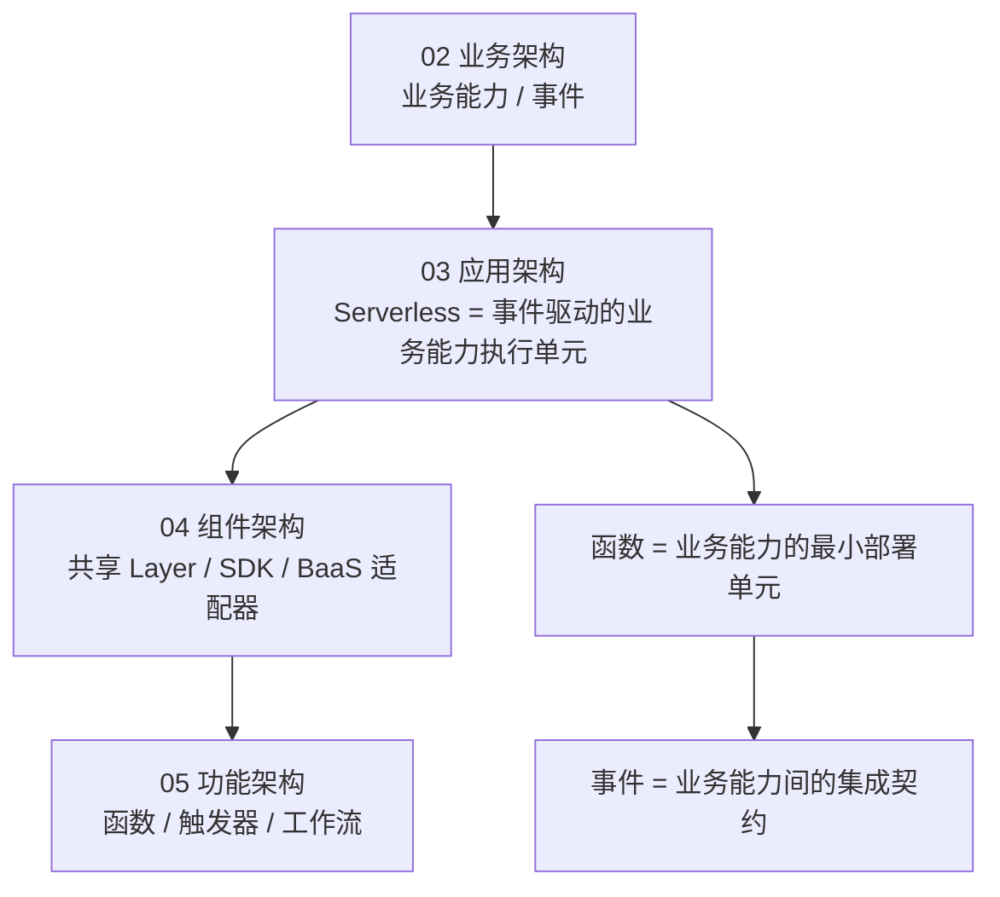

**映射说明**：

- 业务能力可通过一个或多个 Serverless 函数实现。
- 函数内部可采用 Clean Architecture / 分层架构（属于 04 组件架构）。
- 函数、触发器、事件契约属于 05 功能架构复用范畴。
- Serverless 的成本模型由 06 跨层治理 / 09 价值量化支撑。

---

## 10. 权威来源

> **权威来源**:
>
> - CNCF. *Serverless Whitepaper v2*. <https://github.com/cncf/wg-serverless/tree/master/whitepapers/serverless-overview>
> - AWS. *AWS Lambda Developer Guide*. <https://docs.aws.amazon.com/lambda/latest/dg/welcome.html>
> - Microsoft. *Azure Functions Documentation*. <https://learn.microsoft.com/en-us/azure/azure-functions/functions-overview>
> - Google Cloud. *Cloud Functions Documentation*. <https://cloud.google.com/functions/docs>
> - Roberts, M. (2018). *Serverless Architectures*. Martin Fowler. <https://martinfowler.com/articles/serverless.html>
> - ISO/IEC 25010:2023. *Systems and software engineering — Quality models*. <https://www.iso.org/standard/78175.html>
>
> **核查日期**: 2026-07-07


---


<!-- SOURCE: struct/03-application-architecture-reuse/04-serverless/serverless-reuse-patterns.md -->

# Serverless 架构复用模式

> **版本**: 2026-06-10
> **定位**: 应用架构层（Level 2）—— Serverless/FaaS 复用边界、模式与成本优化
> **对齐标准**: CNCF Serverless Whitepaper v2, ISO/IEC 12207:2026
> **状态**: ✅ 已完成（Phase A 深化 + 内容要素补全）
> **字数**: ~10000字

---

## 目录

- [Serverless 架构复用模式](#serverless-架构复用模式)
  - [目录](#目录)
  - [0. 概念定义](#0-概念定义)
    - [0.1 属性与特征](#01-属性与特征)
    - [0.2 关系与映射](#02-关系与映射)
    - [0.3 解释：Serverless 复用的核心矛盾](#03-解释serverless-复用的核心矛盾)
    - [矛盾一：无状态与有状态需求](#矛盾一无状态与有状态需求)
    - [矛盾二：冷启动与低延迟](#矛盾二冷启动与低延迟)
    - [矛盾三：平台抽象与供应商锁定](#矛盾三平台抽象与供应商锁定)
    - [FaaS 与 Serverless 的再澄清](#faas-与-serverless-的再澄清)
  - [1. 核心概念](#1-核心概念)
    - [1.1 函数复用的层次](#11-函数复用的层次)
  - [2. 核心复用模式](#2-核心复用模式)
    - [2.1 函数即复用单元（Function-as-Reuse-Unit）](#21-函数即复用单元function-as-reuse-unit)
    - [2.2 事件源复用模式](#22-事件源复用模式)
    - [2.3 层（Layer）与镜像复用](#23-层layer与镜像复用)
  - [3. 冷启动与性能权衡](#3-冷启动与性能权衡)
    - [3.1 预置并发（Provisioned Concurrency）的复用经济学](#31-预置并发provisioned-concurrency的复用经济学)
  - [4. 跨平台复用约束](#4-跨平台复用约束)
  - [5. 扩展 Serverless 复用模式](#5-扩展-serverless-复用模式)
    - [5.1 工作流即复用单元：Step Functions 与 Durable Functions](#51-工作流即复用单元step-functions-与-durable-functions)
      - [5.1.1 AWS Step Functions 复用模式](#511-aws-step-functions-复用模式)
      - [5.1.2 Azure Durable Functions 复用模式](#512-azure-durable-functions-复用模式)
      - [5.1.3 工作流复用的设计原则](#513-工作流复用的设计原则)
    - [5.2 Kubernetes 原生 Serverless：Knative 复用模式](#52-kubernetes-原生-serverlessknative-复用模式)
      - [5.2.1 Knative Serving 复用单元](#521-knative-serving-复用单元)
      - [5.2.2 Knative Eventing 复用模式](#522-knative-eventing-复用模式)
      - [5.2.3 Knative 与 FaaS 的对比复用决策](#523-knative-与-faas-的对比复用决策)
    - [5.3 Edge Functions：边缘 Serverless 复用模式](#53-edge-functions边缘-serverless-复用模式)
      - [5.3.1 Cloudflare Workers 复用生态](#531-cloudflare-workers-复用生态)
      - [5.3.2 Vercel Edge Functions 复用模式](#532-vercel-edge-functions-复用模式)
      - [5.3.3 Edge Functions 的复用边界](#533-edge-functions-的复用边界)
  - [6. Serverless 与微服务的混合架构](#6-serverless-与微服务的混合架构)
    - [6.1 决策框架：何时选择 Serverless vs 容器 vs VM](#61-决策框架何时选择-serverless-vs-容器-vs-vm)
      - [6.1.1 决策矩阵](#611-决策矩阵)
      - [6.1.2 混合架构模式](#612-混合架构模式)
    - [6.2 混合架构中的复用治理](#62-混合架构中的复用治理)
  - [7. Serverless 安全边界](#7-serverless-安全边界)
    - [7.1 函数隔离模型](#71-函数隔离模型)
    - [7.2 IAM 最小权限原则](#72-iam-最小权限原则)
      - [7.2.1 函数级最小权限](#721-函数级最小权限)
      - [7.2.2 跨账户复用中的权限委托](#722-跨账户复用中的权限委托)
    - [7.3 密钥与配置安全管理](#73-密钥与配置安全管理)
    - [7.4 网络隔离与私有连接](#74-网络隔离与私有连接)
    - [7.5 事件管道的安全边界](#75-事件管道的安全边界)
  - [8. Serverless 成本模型与复用经济学](#8-serverless-成本模型与复用经济学)
    - [8.1 计费维度拆解](#81-计费维度拆解)
      - [8.1.1 请求计费（Invocation Cost）](#811-请求计费invocation-cost)
      - [8.1.2 执行时间计费（Duration Cost）](#812-执行时间计费duration-cost)
      - [8.1.3 内存/资源配置计费](#813-内存资源配置计费)
    - [8.2 预置并发与预留实例的成本权衡](#82-预置并发与预留实例的成本权衡)
    - [8.3 复用带来的成本乘数效应](#83-复用带来的成本乘数效应)
    - [8.4 成本可观测性](#84-成本可观测性)
  - [9. Serverless 可观测性复用](#9-serverless-可观测性复用)
    - [9.1 分布式跟踪的标准化注入](#91-分布式跟踪的标准化注入)
      - [9.1.1 OpenTelemetry 在 Serverless 中的实践](#911-opentelemetry-在-serverless-中的实践)
      - [9.1.2 跟踪数据的后端复用](#912-跟踪数据的后端复用)
    - [9.2 结构化日志复用模式](#92-结构化日志复用模式)
      - [9.2.1 JSON 结构化日志标准](#921-json-结构化日志标准)
      - [9.2.2 日志聚合与告警](#922-日志聚合与告警)
    - [9.3 指标收集的轻量化模式](#93-指标收集的轻量化模式)
    - [9.4 健康检查与探针](#94-健康检查与探针)
  - [10. Serverless 反模式](#10-serverless-反模式)
    - [10.1 巨型 Lambda（Monolithic Lambda / Lambda-lith）](#101-巨型-lambdamonolithic-lambda--lambda-lith)
    - [10.2 缺乏错误处理与重试风暴](#102-缺乏错误处理与重试风暴)
    - [10.3 硬编码配置与环境漂移](#103-硬编码配置与环境漂移)
    - [10.4 忽视冷启动的架构设计](#104-忽视冷启动的架构设计)
    - [10.5 函数间紧耦合](#105-函数间紧耦合)
    - [10.6 供应商锁定（Vendor Lock-in）](#106-供应商锁定vendor-lock-in)
  - [11. 多云 Serverless 复用策略](#11-多云-serverless-复用策略)
    - [11.1 Serverless Framework：声明式复用](#111-serverless-framework声明式复用)
    - [11.2 Terraform CDK：类型安全的多云编排](#112-terraform-cdk类型安全的多云编排)
    - [11.3 Pulumi：云原生编程模型](#113-pulumi云原生编程模型)
    - [11.4 多云抽象层的设计原则](#114-多云抽象层的设计原则)
  - [12. 案例研究](#12-案例研究)
    - [12.1 AWS Lambda 大规模复用：Netflix 的工程实践](#121-aws-lambda-大规模复用netflix-的工程实践)
      - [12.1.1 背景与规模](#1211-背景与规模)
      - [12.1.2 复用架构](#1212-复用架构)
      - [12.1.3 成本优化实践](#1213-成本优化实践)
      - [12.1.4 关键启示](#1214-关键启示)
    - [12.2 Vercel Edge Functions 生态系统：前端驱动的 Serverless 复用](#122-vercel-edge-functions-生态系统前端驱动的-serverless-复用)
      - [12.2.1 背景与生态定位](#1221-背景与生态定位)
      - [12.2.2 复用模式](#1222-复用模式)
      - [12.2.3 性能与成本权衡](#1223-性能与成本权衡)
      - [12.2.4 关键启示](#1224-关键启示)
  - [13. 结论与行动建议](#13-结论与行动建议)
  - [14. 交叉引用](#14-交叉引用)
  - [15. Serverless 复用架构与决策 Mermaid 图](#15-serverless-复用架构与决策-mermaid-图)
    - [15.1 事件驱动的 Serverless 复用管道](#151-事件驱动的-serverless-复用管道)
    - [15.2 Serverless vs 容器 vs VM 复用决策树](#152-serverless-vs-容器-vs-vm-复用决策树)

## 0. 概念定义

**定义**：Serverless 架构是一种云计算执行模型，开发者将业务逻辑封装为**事件触发、无状态、短时运行**的函数或容器化工作负载，由云供应商完全管理服务器、运行时、自动伸缩与容量调度。从复用视角看，Serverless 的复用单元从传统"服务"进一步细化为**函数（Function）、事件源模式（Event Source Pattern）、层/镜像（Layer/Image）、工作流模板（Workflow Template）以及基础设施即代码模块（IaC Module）**。

**Function-as-a-Service（FaaS）**是 Serverless 计算的最常见形态，但并非全部。FaaS 强调以函数为部署和计费单元；而更广义的 Serverless 还包括托管后端服务（BaaS，如 Serverless 数据库、对象存储、消息队列）、Serverless 容器（如 Google Cloud Run、Knative）以及 Edge Functions。二者的关系可表述为：**FaaS ⊂ Serverless**。

> **形式化表达**：设 Serverless 平台提供的事件源集合为 $E$，函数集合为 $F$，则一个 Serverless 应用可表示为从事件到函数的有向图：
> $$G = (F \\cup E, \\{(e, f) \\mid e \\in E \\text{ 可触发 } f \\in F\\})$$
> 复用边界由事件 Schema、函数输入/输出契约与 IAM 权限策略共同定义。

Wikipedia 对应条目：

- [Serverless computing](https://en.wikipedia.org/wiki/Serverless_computing)
- [Function as a service](https://en.wikipedia.org/wiki/Function_as_a_service)
- [Cloud computing](https://en.wikipedia.org/wiki/Cloud_computing)

---

### 0.1 属性与特征

| 属性 | 说明 | 重要性 |
|---|---|---|
| **事件驱动** | 函数由事件触发执行，事件源是复用的第一类契约 | 高 |
| **无状态** | 函数实例不保留调用间状态，状态需外置到存储/缓存 | 高 |
| **短时运行** | 单次执行有明确上限（如 Lambda 15 分钟），超时设计影响复用粒度 | 高 |
| **自动伸缩** | 平台按请求量自动扩展，复用单元需幂等且可并行 | 高 |
| **按调用计费** | 成本与调用次数和执行时长直接挂钩，复用带来成本乘数效应 | 中 |
| **冷启动敏感** | 实例初始化延迟是性能与成本的核心权衡点 | 高 |
| **平台抽象** | 开发者不管理服务器，但需管理事件契约、IAM、可观测性 | 中 |

---

### 0.2 关系与映射

| 关系类型 | 目标概念 | 说明 |
|---|---|---|
| **上位概念** | [Cloud computing](https://en.wikipedia.org/wiki/Cloud_computing) / [Utility computing](https://en.wikipedia.org/wiki/Cloud_computing#Utility_computing) | Serverless 是云计算按用量计费理念的极致形态 |
| **下位概念** | Function-as-a-Service（FaaS） | Serverless 的最小复用单元，事件触发、无状态函数 |
| **下位概念** | Backend-as-a-Service（BaaS） | 托管数据库、对象存储、消息队列等 Serverless 后端服务 |
| **下位概念** | Serverless Containers / Knative / Cloud Run | 介于 FaaS 与容器之间的 Serverless 形态，支持自定义运行时 |
| **等价/映射概念** | 事件驱动架构（EDA） | Serverless 天然适合事件驱动，函数即事件消费者 |
| **依赖概念** | 微服务架构 | 微服务可拆分为 Serverless 函数，或 Serverless 函数组合为服务 |
| **依赖概念** | API Gateway、Event Bridge、Message Queue | 触发函数的事件源与入口层 |
| **映射概念** | CNCF Serverless Whitepaper v2 | 定义 Serverless 的核心特征与复用边界 |

---

### 0.3 解释：Serverless 复用的核心矛盾

Serverless 的复用逻辑与传统架构存在本质差异：函数实例是短暂的、事件触发的、无状态的。这种"用完即走"的模型带来了极致的弹性与成本效率，但也引入了三个核心矛盾。

### 矛盾一：无状态与有状态需求

函数被设计为无状态，但许多业务场景需要跨调用保持状态（如会话、购物车、工作流状态）。复用有状态逻辑时，必须将状态外置到托管数据库、缓存或 Durable Objects / Durable Entities 中，而不能依赖函数实例的内存或本地磁盘。

### 矛盾二：冷启动与低延迟

冷启动是 Serverless 按用量计费模型的必然产物。对于延迟敏感型业务（如在线支付、实时推荐），冷启动可能不可接受；预置并发（Provisioned Concurrency）可以消除冷启动，但将计费模型从"纯按调用"转变为"按调用 + 按容量预留"，降低了 Serverless 在低频场景下的成本优势。

### 矛盾三：平台抽象与供应商锁定

Serverless 平台提供的高级抽象（事件源、IAM、可观测性）显著提高了开发效率，但也带来供应商锁定风险。复用单元越深入平台专有特性，迁移成本越高。缓解策略是在应用层采用 CloudEvents、OpenTelemetry、JWT 等中立标准，将平台特性限制在基础设施层适配器中。

### FaaS 与 Serverless 的再澄清

| 维度 | FaaS | 广义 Serverless |
|---|---|---|
| 复用单元 | 函数代码 / Layer | 函数、容器、工作流、BaaS 服务 |
| 运行时控制 | 受限 | 较灵活（Serverless Containers） |
| 状态模型 | 无状态为主 | 可包含有状态托管服务 |
| 典型平台 | AWS Lambda、Azure Functions | Lambda + DynamoDB + S3 + API Gateway 等组合 |

> **定理 S.0** (Serverless Reuse Trade-off): Serverless 复用价值 $V$ 与事件契约稳定性 $S$、函数无状态纯度 $P$ 成正比，与平台专有依赖 $D$ 成反比，即 $V \\propto \\frac{S \\times P}{D}$。

---

## 1. 核心概念

Serverless 架构将计算抽象为**事件触发的无状态函数**，开发者无需管理服务器生命周期。从复用视角看，Serverless 的复用单元从"服务"进一步细化为"函数"和"事件处理管道"。

CNCF Serverless Whitepaper v2 定义了 Serverless 的核心特征：**自动伸缩、按调用计费、无服务器管理、事件驱动**。这些特征直接影响复用策略：函数的短暂生命周期要求复用单元必须是**快速初始化、无状态、幂等**的。

### 1.1 函数复用的层次

| 层次 | 复用单元 | 生命周期 | 典型示例 |
|------|---------|---------|---------|
| 函数代码 | 单一处理逻辑 | 毫秒级 | 图片缩略图生成 |
| 函数层/Layer | 共享依赖库 | 部署级 | 认证 SDK、监控 Agent |
| 事件管道 | 触发器→函数→输出 | 流级 | S3 上传 → Lambda → DynamoDB |
| 应用模板 | 完整 Serverless 应用骨架 | 项目级 | SAM / Terraform 模板 |

---

## 2. 核心复用模式

### 2.1 函数即复用单元（Function-as-Reuse-Unit）

单个函数在满足以下条件时可作为跨项目复用单元：

- **纯函数特性**: 输出仅取决于输入事件 + 环境变量，无隐式状态
- **幂等性**: 同一事件多次触发产生相同结果（应对至少一次交付语义）
- **超时可控**: 执行时间 < 平台限制（AWS Lambda: 15 min, Azure Functions: 无默认限制）

> **定理 S.1** (Serverless Reuse Threshold): 一个 Serverless 函数的复用收益为正当且仅当其**冷启动延迟 + 执行时间 < 调用方可容忍的响应时间上限**。

### 2.2 事件源复用模式

Serverless 的复用不仅限于代码，更包括**事件源（Event Source）与事件模式的复用**。

| 事件源类型 | 复用模式 | 典型场景 |
|-----------|---------|---------|
| 对象存储事件 | S3/ Blob 触发器模板 | 文件处理流水线 |
| 消息队列事件 | Kafka / SQS / Event Hubs 触发 | 异步任务消费 |
| HTTP API 事件 | API Gateway → Function 路由 | REST/GraphQL 后端 |
| 定时事件 | Cron 触发器模板 | 批处理、数据同步 |
| 数据库变更事件 | CDC (Change Data Capture) | 数据复制、缓存失效 |

**事件契约复用**: 定义标准的事件 Schema（如 CloudEvents 规范），使同一函数可消费来自不同源的事件。

### 2.3 层（Layer）与镜像复用

- **函数层**: 将公共依赖（如 AWS SDK、数据处理库）打包为层，供多个函数挂载
- **容器镜像**: 对于需要自定义运行时的场景，使用 OCI 镜像作为复用单元（AWS Lambda / Azure Functions / Knative 均支持）

---

## 3. 冷启动与性能权衡

冷启动（Cold Start）是 Serverless 复用决策的核心约束。

| 运行时类型 | 冷启动延迟 | 复用建议 |
|-----------|-----------|---------|
| 原生运行时 (Go, Rust) | 10-100 ms | 高并发场景首选，复用价值最高 |
| JIT 运行时 (Java, .NET) | 1-5 s | 使用 SnapStart / Provisioned Concurrency |
| 解释型 (Node.js, Python) | 100-500 ms | 通用场景，平衡开发效率与性能 |
| 自定义容器 | 2-10 s | 仅当原生运行时无法满足依赖需求时使用 |

### 3.1 预置并发（Provisioned Concurrency）的复用经济学

预置并发通过**保持函数实例常驻**消除冷启动，但将计费模型从"纯按调用"转变为"按调用 + 按容量预留"。

- **决策公式**: 当函数调用频率 > 阈值时，预置并发的单位调用成本低于冷启动的延迟惩罚成本
- **复用启示**: 高频复用的函数应配置预置并发；低频复用的函数接受冷启动

---

## 4. 跨平台复用约束

| 约束维度 | 影响 |
|---------|------|
| 事件格式 | 不同云平台的事件 Schema 差异（需 CloudEvents 抽象层） |
| 执行环境变量 | 密钥管理、配置注入机制各异 |
| 并发限制 | 平台级并发配额影响复用规模 |
| 最大执行时长 | 长任务需拆分为 Step Functions / Durable Functions |

---

## 5. 扩展 Serverless 复用模式

### 5.1 工作流即复用单元：Step Functions 与 Durable Functions

当单一函数的执行时长超过平台限制（如 AWS Lambda 15 分钟）或业务逻辑需要跨多个函数编排时，**工作流引擎**成为更高层次的复用单元。

#### 5.1.1 AWS Step Functions 复用模式

AWS Step Functions 提供状态机编排能力，将多个 Lambda 函数组合为可复用的工作流模板：

- **标准工作流（Standard）**: 适用于长时间运行、需要精确一次执行语义的业务流程，如订单履约、用户注册审批。状态转换持久化，可跨天执行，支持 1 年历史保留。
- **快速工作流（Express）**: 适用于高并发、短时长（<5 分钟）的事件处理，如 IoT 数据清洗、实时日志过滤。按执行次数与持续时间计费，成本较标准工作流降低达 95%。
- **复用策略**: 将通用业务状态机（如"审批流"、"补偿事务 Saga"）抽象为 JSON ASL（Amazon States Language）模板，通过参数化输入输出路径实现跨业务复用。例如，电商领域的库存扣减 Saga 模式可在多个子系统中复用同一状态机定义，仅需替换具体的 Lambda ARN 与重试策略。

> **定理 S.2** (Workflow Reuse Composability): 可复用的工作流状态机必须满足**状态节点幂等性**与**外部服务调用幂等性**的双重约束，否则幂等性将仅停留在函数级别而无法扩展到事务边界。

#### 5.1.2 Azure Durable Functions 复用模式

Azure Durable Functions 基于**事件溯源（Event Sourcing）**与**任务编排（Task Orchestration）**模式，提供代码优先的工作流定义：

- **编排器函数（Orchestrator）**: 以确定性代码编写工作流逻辑，禁止非确定性操作（如 DateTime.Now、随机数、I/O），平台通过重放（Replay）机制保证状态一致性。
- **实体函数（Entity Functions）**: 提供有状态 Actor 模型，适用于需要跨调用保持状态的场景（如计数器、会话状态），是对传统无状态函数模型的有力补充。
- **复用模式**: 将通用的编排模式（如"扇出-扇入"、"人机交互"、"外部事件等待"）封装为 NuGet/npm 包，开发者仅需实现具体的活动函数（Activity Function），无需重复编写状态机管理代码。

#### 5.1.3 工作流复用的设计原则

| 原则 | 说明 |
|------|------|
| 状态机与业务解耦 | 将状态转换逻辑与业务处理逻辑分离，前者作为模板复用，后者作为插件注入 |
| 错误边界标准化 | 定义统一的重试、回退、死信队列（DLQ）策略，避免每个工作流重复配置 |
| 输入输出契约 | 工作流级别的输入输出 Schema 应保持向后兼容，遵循 CloudEvents 规范 |

### 5.2 Kubernetes 原生 Serverless：Knative 复用模式

Knative 作为 Kubernetes 上的 Serverless 扩展，填补了"纯 FaaS"与"容器编排"之间的空白，提供了跨云、跨集群的 Serverless 复用能力。

#### 5.2.1 Knative Serving 复用单元

Knative Serving 将 Serverless 的自动伸缩与流量管理能力带入 Kubernetes 生态：

- **Service 资源**: 作为可复用的部署单元，Service 同时管理 Revision（不可变版本）、Route（流量分配）与 Configuration（配置模板）。一个 Knative Service 模板可在不同命名空间、不同集群间复用，仅需调整环境变量与资源配额。
- **Revision 不可变性**: 每次部署产生新的 Revision，旧版本保持可回滚。这种不可变性天然支持蓝绿部署、金丝雀发布，复用单元从"函数"扩展到"服务版本"。
- **自动缩容至零**: 当无流量时缩容至零 Pod，节省资源；有请求时通过 Activator 组件快速拉起（冷启动时间取决于容器镜像拉取速度，通常在秒级）。

#### 5.2.2 Knative Eventing 复用模式

Knative Eventing 提供与云平台无关的事件基础设施：

- **Broker-Trigger 模型**: Broker 作为事件总线，Trigger 根据 CloudEvents 属性过滤并路由事件到对应的 Knative Service。此模型实现了**事件生产者与消费者的完全解耦**，同一事件源可被多个消费者复用。
- **Source 抽象**: Knative 提供 30+ 种事件源实现（GitHub、Kafka、SQS、Pub/Sub 等），开发者无需为每种云平台编写自定义的事件适配器，直接复用社区维护的 Source 组件。
- **通道复用**: 使用 Kafka 通道或内存通道作为事件传输层，实现跨命名空间的事件共享，适用于多租户场景下的数据管道复用。

#### 5.2.3 Knative 与 FaaS 的对比复用决策

| 维度 | Knative | AWS Lambda / Azure Functions |
|------|---------|------------------------------|
| 复用单元 | 容器镜像 + Helm Chart | 函数代码 + Layer |
| 运行时限制 | 无硬性超时（受 K8s 配置约束） | 15 分钟（Lambda）/ 无默认限制（Functions） |
| 冷启动 | 秒级（受镜像大小影响） | 毫秒级（原生运行时）至秒级（容器镜像） |
| 事件生态 | CloudEvents + 社区 Source | 平台原生事件源 |
| 适用场景 | 需要自定义运行时、复杂依赖、GPU 支持的 Serverless 工作负载 | 事件驱动的轻量级计算、快速原型 |

### 5.3 Edge Functions：边缘 Serverless 复用模式

随着 CDN 向计算平台演进，Edge Functions 成为 Serverless 的新 frontier，将函数执行从区域数据中心下沉到全球边缘节点。

#### 5.3.1 Cloudflare Workers 复用生态

Cloudflare Workers 基于 V8 Isolate 技术，在毫秒级冷启动与极低资源开销（128MB 内存限制）下运行 JavaScript/WebAssembly 函数：

- **隔离模型**: 不同于 Lambda 的容器/微虚拟机隔离，Workers 使用 V8 Isolate 实现进程内轻量级隔离。隔离强度低于容器，但启动速度提升两个数量级（<1ms）。
- **Durable Objects**: 为有状态边缘计算提供单例 Actor 模型，同一 Durable Object 的所有请求由特定边缘节点处理，保证状态一致性。适用于实时协作（如在线文档编辑）、游戏状态同步。
- **复用模式**: Cloudflare 的 Workers 生态以 npm 包形式共享中间件（如 JWT 验证、A/B 测试路由、地理围栏），开发者通过 `wrangler` CLI 一键复用社区模板。由于 Workers 的 API 兼容 Web 标准（Fetch API、WebCrypto），大量浏览器端库可直接复用。

#### 5.3.2 Vercel Edge Functions 复用模式

Vercel Edge Functions 基于 Edge Runtime（基于 V8 的轻量级运行时），深度集成前端框架（Next.js、SvelteKit、Nuxt）：

- **中间件复用**: Edge Functions 作为请求/响应的中间件层，可复用通用的 A/B 测试、身份验证、本地化、机器人检测逻辑。这些中间件以框架无关的方式编写，可在 Next.js、Astro、Remix 之间迁移。
- **边缘缓存与函数协同**: 通过 `Cache-Control` 与 `Vercel-CDN-Cache-Control` 头，Edge Functions 可动态决定缓存策略，实现"计算+缓存"的复用组合。
- **Streaming SSR**: Edge Functions 支持 React 18+ 的流式服务端渲染（Streaming SSR），将组件级复用从浏览器扩展到边缘节点，首字节时间（TTFB）较传统 SSR 降低 50% 以上。

#### 5.3.3 Edge Functions 的复用边界

| 约束 | 影响 |
|------|------|
| 运行时限制 | CPU 时间 < 50ms（Cloudflare Workers 免费层），内存 < 128MB |
| 兼容层 | 不支持 Node.js 原生模块（如 `fs`、`crypto` 的部分 API），需使用 Web 标准替代 |
| 状态持久化 | 无本地文件系统，状态需通过 Durable Objects/KV/D1 等边缘存储持久化 |
| 调试复杂度 | 边缘节点分布全球，本地调试工具（如 `wrangler dev`、`next dev`）与生产环境存在行为差异 |

---

## 6. Serverless 与微服务的混合架构

### 6.1 决策框架：何时选择 Serverless vs 容器 vs VM

在 enterprise 架构中，Serverless 并非银弹。理性的复用策略要求根据工作负载特征选择最合适的计算抽象。

#### 6.1.1 决策矩阵

| 评估维度 | Serverless (FaaS) | 容器 (K8s/Container Apps) | 虚拟机 (VM/VMSS) |
|---------|-------------------|---------------------------|------------------|
| **请求模式** | 稀疏、突发、不可预测 | 中等并发、可预测波动 | 持续高负载、稳定流量 |
| **执行时长** | < 15 分钟的短任务 | 长时间运行的服务 | 常驻后台进程、遗留系统 |
| **启动延迟要求** | 可接受 100ms-1s 冷启动 | 可接受秒级滚动更新 | 分钟级启动可接受 |
| **状态管理** | 无状态为主 | 有状态/无状态均可 | 有状态（本地磁盘、数据库） |
| **运行时控制** | 受限（平台提供运行时） | 完全控制（自定义镜像） | 完全控制（操作系统级） |
| **资源粒度** | 128MB-10GB 内存，细粒度 | GB 级内存，中等粒度 | TB 级内存/GPU，粗粒度 |
| **成本模型** | 按调用 + 执行时间，低利用率高性价比 | 按资源预留，中等利用率高性价比 | 按实例计费，高利用率高性价比 |
| **团队运维能力** | 低（平台托管） | 中（需管理编排与镜像） | 高（需管理 OS、补丁、高可用） |

#### 6.1.2 混合架构模式

**模式 A：API 网关分层**

- 边缘层：Cloudflare Workers / Vercel Edge Functions 处理身份验证、速率限制、Geo 路由
- 应用层：AWS Lambda / Azure Functions 处理业务逻辑（BFF 模式）
- 服务层：Kubernetes 部署核心微服务（用户服务、订单服务），通过 gRPC 内部通信
- 数据层：托管数据库（RDS、Cosmos DB）与缓存（ElastiCache、Redis Enterprise）

此模式的复用价值在于：每一层均可独立演进与替换。当某一层的技术债务累积时，仅需替换该层而不影响上下游。

**模式 B：事件驱动桥接**

- 容器化服务产生业务事件（如订单创建）到 Kafka / EventBridge
- Serverless 函数作为事件消费者，执行异步处理（发送邮件、更新搜索索引、生成报表）
- 当异步处理逻辑需要复用时，将函数代码与事件 Schema 打包为模板，供多个业务域订阅

**模式 C：扩展点模式（Extension Point Pattern）**

- 核心系统以容器/VM 形式部署，提供稳定的 API 与数据模型
- 扩展功能（如自定义工作流、第三方集成、报表生成）以 Serverless 函数形式部署
- 优势：核心系统的变更频率低，扩展点的迭代频率高；Serverless 的独立部署特性使扩展点可快速上线而不影响核心系统稳定性

### 6.2 混合架构中的复用治理

在混合架构中，复用的最大挑战不再是技术，而是**跨抽象边界的治理**：

- **统一可观测性**: 无论工作负载运行在 Lambda、Kubernetes 还是 VM 上，必须复用同一套分布式追踪（OpenTelemetry）、日志聚合（Fluent Bit/Vector）与指标采集（Prometheus）标准。
- **统一身份与授权**: 通过 Service Mesh（Istio/Linkerd）或 API 网关的统一认证层，确保 Serverless 函数与容器服务使用相同的 JWT/OAuth2 验证逻辑。
- **统一配置管理**: 使用外部化配置中心（AWS AppConfig、Azure App Configuration、Kubernetes ConfigMap/Secret），避免 Serverless 函数与容器服务各自维护配置副本。

---

## 7. Serverless 安全边界

Serverless 的安全模型与传统计算模型存在本质差异：攻击面从操作系统层上移至函数运行时层与事件管道层。

### 7.1 函数隔离模型

| 隔离技术 | 实现平台 | 隔离强度 | 启动延迟 |
|---------|---------|---------|---------|
| 硬件虚拟化 (Firecracker) | AWS Lambda | 强（VM 级） | 125ms |
| 轻量虚拟化 (gVisor) | Google Cloud Run | 中强（用户态内核） | 200ms |
| 容器命名空间隔离 | Azure Functions (容器模式) | 中（进程级 + namespace） | 秒级 |
| V8 Isolate | Cloudflare Workers | 中（进程内隔离） | <1ms |

**复用安全启示**: 当多个租户复用同一函数层或镜像时，隔离技术的强度决定了多租户部署的可行性。对于金融、医疗等高合规行业，优先选择 VM 级隔离（Firecracker）；对于面向公众的轻量计算，Isolate 隔离在性能与成本上更具优势。

### 7.2 IAM 最小权限原则

Serverless 函数的权限模型遵循"默认拒绝、显式允许"原则，但实践中常出现过度授权。

#### 7.2.1 函数级最小权限

- **执行角色（Execution Role）**: 每个函数应拥有独立的 IAM Role，权限粒度细化到资源 ARN 与操作列表。例如，图片处理函数仅需 `s3:GetObject` 与 `s3:PutObject` 权限，而非通配符 `s3:*`。
- **权限边界（Permissions Boundary）**: 为开发团队设置权限边界策略，防止单个函数的 IAM Role 被恶意扩展为管理员权限。
- **临时凭证**: 函数应通过平台提供的临时凭证（如 AWS STS、Azure Managed Identity）访问资源，禁止将长期访问密钥硬编码到函数代码或环境变量中。

#### 7.2.2 跨账户复用中的权限委托

当 Serverless 函数需要跨 AWS 账户或跨 Azure 订阅访问资源时：

- **AWS**: 使用 IAM Role 的跨账户 AssumeRole，结合外部 ID 防止混淆代理攻击（Confused Deputy Problem）。
- **Azure**: 使用 Managed Identity 的联邦身份（Federated Identity）或 Service Principal 的 Multi-Tenant 应用注册。
- **GCP**: 使用 Service Account 的跨项目 IAM 绑定与条件性访问（Conditional IAM）。

### 7.3 密钥与配置安全管理

Serverless 函数的短暂生命周期使传统的"配置文件+密钥文件"模式失效。

| 管理方式 | 安全等级 | 适用场景 |
|---------|---------|---------|
| 环境变量明文 | 低 | 仅用于非敏感配置（如日志级别、功能开关） |
| 平台密钥服务（AWS Secrets Manager / Azure Key Vault） | 高 | 数据库密码、API 密钥、OAuth 客户端密钥 |
| 参数存储（AWS Systems Manager Parameter Store） | 中高 | 配置项与低敏感密钥的分层管理 |
| 加密环境变量（KMS/CMEK） | 高 | 合规要求下的端到端加密 |

**密钥复用策略**: 将通用密钥（如监控平台的 API Key、共享数据库的只读凭证）存储在集中式密钥管理服务中，通过 IAM 策略控制哪些函数有权访问。避免在每个函数中重复创建相同的密钥副本。

### 7.4 网络隔离与私有连接

- **VPC 集成**: 当函数需要访问私有子网中的资源（如 RDS、ElastiCache、内部 API）时，通过 VPC 对等连接或 Private Link 建立安全通道。注意 VPC 集成会显著增加冷启动时间（ENI 创建延迟），需评估是否在函数级别预置 ENI（如 AWS Lambda 的 VPC Lattice 集成）。
- **私有端点**: 使用 Azure Private Endpoint、AWS VPC Endpoint、GCP Private Service Connect 将函数对托管服务的访问限制在私有网络内，避免流量经过公网。
- **出站过滤**: 通过安全组（Security Group）与网络 ACL 限制函数的出站连接，仅允许访问已知的目的地端口与 IP 范围，降低数据泄露风险。

### 7.5 事件管道的安全边界

事件源是 Serverless 架构中常被忽视的攻击面：

- **事件注入**: 恶意构造的事件负载可能触发函数的异常行为（如 SQL 注入、命令注入）。所有事件输入必须经过 Schema 验证与 sanitization。
- **重放攻击**: 攻击者截获合法事件并重放。通过事件中的唯一标识符（如 `idempotency-key`）与幂等性设计防御。
- **事件源伪造**: 确保事件源（如 API Gateway、S3）的身份验证不可绕过。使用平台提供的签名验证机制（如 AWS SNS 的签名验证、GitHub Webhook 的 HMAC 签名）。

---

## 8. Serverless 成本模型与复用经济学

### 8.1 计费维度拆解

Serverless 的成本模型由三个核心维度构成，理解每个维度的边际成本是复用决策的基础。

#### 8.1.1 请求计费（Invocation Cost）

- **模型**: 每次函数调用产生固定费用，与执行时长、内存占用无关。
- **平台差异**: AWS Lambda 每月前 100 万次请求免费，超出后 $0.20/百万次；Azure Functions Consumption 计划类似；Google Cloud Functions $0.40/百万次。
- **复用影响**: 将高频调用的通用逻辑（如认证、参数校验）下沉到 API 网关层或边缘函数，可减少后端函数的调用次数，直接降低请求计费成本。

#### 8.1.2 执行时间计费（Duration Cost）

- **模型**: 按 "GB-秒"（内存配置 × 执行秒数）计费。内存配置越高，单位时间成本越高，但 CPU 配额相应增加。
- **优化策略**:
  - **内存调优**: 通过 AWS Lambda Power Tuning 等工具寻找成本最优的内存配置。对于 CPU 密集型任务，增加内存可能缩短执行时间，使总成本反而下降。
  - **异步化**: 将同步阻塞操作（如发送邮件、调用第三方 API）转换为异步事件，释放函数实例，减少计费时长。
  - **连接复用**: 在函数实例生命周期内复用数据库连接、HTTP 连接池，避免每次调用重新建立连接的延迟与计费时间浪费。

#### 8.1.3 内存/资源配置计费

- **模型**: 内存配置决定 CPU、网络带宽与临时磁盘（`/tmp`）的配额。平台按配置的内存上限计费，而非实际使用量。
- **复用启示**: 当多个函数复用同一 Layer 或镜像时，Layer 的体积影响函数的初始化时间，进而影响执行时长计费。将大型依赖（如机器学习模型、原生库）预置到 Layer 中，可减少函数包的体积，缩短冷启动与执行时间。

### 8.2 预置并发与预留实例的成本权衡

| 模式 | 成本构成 | 适用场景 |
|------|---------|---------|
| 按需（On-Demand） | 仅请求 + 执行时间 | 低频、不可预测流量 |
| 预置并发（Provisioned Concurrency） | 请求 + 执行时间 + 容量预留费 | 高频、低延迟要求（如 API 后端） |
| 预留实例（Savings Plans / Reserved Capacity） | 承诺 1-3 年计算量，换取折扣 | 稳定基线负载 |

**决策公式**: 设函数月均调用次数为 N，平均执行时间为 T（秒），内存配置为 M（GB）：

- 按需月度成本 ≈ N × ($0.20/10⁶ + M × T × $0.0000166667)
- 预置并发月度成本 ≈ N × $0.20/10⁶ + M × 预置实例数 × 720h × $0.0000041667

当预置并发的总成本 < 按需成本且延迟 SLA 满足时，选择预置并发。

### 8.3 复用带来的成本乘数效应

Serverless 的复用不仅降低开发成本，更通过以下机制影响运行时成本：

- **Layer 复用降低存储成本**: AWS Lambda Layer 的存储按版本计费。将 10 个函数各自打包 50MB 依赖，总存储 500MB；复用同一 Layer 后，总存储降至 50MB + 少量函数代码。
- **事件管道复用降低调用次数**: 将多个消费者整合为单一事件过滤函数，通过内部路由分发，可减少 Broker 到函数的调用次数。例如，使用 EventBridge 的规则引擎在服务端过滤事件，仅将匹配事件传递给目标函数，避免函数被无关事件唤醒。
- **工作流复用降低编排成本**: Step Functions 的标准工作流按状态转换次数计费。将高频的短工作流模板化为 Express 工作流，或内联到父工作流中，可减少独立工作流的启动开销。

### 8.4 成本可观测性

建立 Serverless 成本基准需要跨维度关联：

- **按函数成本分解**: 使用 AWS Cost Allocation Tags / Azure Cost Management 标签，将成本归因到具体函数、项目或团队。
- **按业务场景成本分解**: 将多个函数与事件源按业务域分组（如"用户注册流程"包含 API Gateway + Lambda + DynamoDB + SNS），计算端到端成本。
- **成本异常检测**: 设置预算告警（AWS Budgets / Azure Budgets），当单日调用量或执行时长偏离基线 ±30% 时触发调查流程，防止循环调用、无限重试等导致的成本失控。

---

## 9. Serverless 可观测性复用

Serverless 的可观测性面临独特挑战：函数实例短暂、执行环境无文件系统、多服务边界模糊。标准化的可观测性复用模式是生产级 Serverless 的必备能力。

### 9.1 分布式跟踪的标准化注入

#### 9.1.1 OpenTelemetry 在 Serverless 中的实践

OpenTelemetry（OTel）已成为跨平台分布式跟踪的事实标准。在 Serverless 环境中，OTel 的复用策略包括：

- **自动探针（Auto-Instrumentation）**: 使用 OTel 的 Lambda Layer（AWS）或 Functions Extension（Azure），在不修改函数代码的情况下自动捕获 HTTP 请求、数据库调用、消息队列操作的 Span。Layer 形式的探针可在数十个函数间复用，保持 SDK 版本一致性。
- **手动 Span 注入**: 对于复杂业务逻辑，在函数代码中显式创建 Span，标记业务里程碑（如"验证用户身份"、"调用支付网关"）。将手动注入的代码封装为可复用的中间件/装饰器模式。
- **上下文传播**: 确保 trace context 跨事件边界传播。当函数 A 通过 SNS/SQS 触发函数 B 时，trace ID 与 parent span ID 必须嵌入消息属性中，避免跟踪链路断裂。

#### 9.1.2 跟踪数据的后端复用

- **统一后端**: 无论函数运行在 AWS、Azure 还是 Knative， traces 均导出到同一后端（Jaeger、Tempo、AWS X-Ray、Azure Monitor Application Insights）。通过 OTel Collector 的管道复用，实现跨云跟踪聚合。
- **采样策略**: 高频函数（如每秒数万次）采用头部一致性采样（Head-based Sampling）或尾部采样（Tail-based Sampling），避免存储成本爆炸。采样规则作为配置模板复用于同类函数。

### 9.2 结构化日志复用模式

#### 9.2.1 JSON 结构化日志标准

Serverless 函数的日志输出应遵循统一结构，便于机器解析与告警：

```json
{
  "timestamp": "2026-06-10T12:34:56.789Z",
  "level": "INFO",
  "service": "payment-service",
  "function": "process-payment",
  "version": "v1.2.3",
  "trace_id": "abc123",
  "span_id": "def456",
  "message": "Payment processed successfully",
  "attributes": {
    "order_id": "ORD-789",
    "amount": 99.99,
    "currency": "USD"
  }
}
```

**复用策略**: 将日志格式化逻辑封装为各语言的标准库（Python decorator、Node.js middleware、Go helper），所有函数复用同一日志 Schema，确保跨服务的日志关联与查询一致性。

#### 9.2.2 日志聚合与告警

- **统一日志管道**: 使用 Fluent Bit（作为 Lambda Extension 或 Sidecar）将函数日志实时投递到集中式日志平台（Loki、Elasticsearch、CloudWatch Logs Insights、Log Analytics）。
- **告警即代码**: 将通用告警规则（如错误率 > 1%、P99 延迟 > 2s、内存使用率 > 90%）定义为 Terraform/Pulumi 模板，随函数部署同步创建。告警规则的复用降低了运维配置的碎片化。

### 9.3 指标收集的轻量化模式

Serverless 函数的短暂生命周期不适合传统的"拉取（Pull）"指标模型，应采用"推送（Push）"或"代理汇聚"模式：

- **StatsD / DogStatsD**: 函数通过 UDP 将指标发送到本地代理（如 Lambda Extension 中的 StatsD agent），代理批量推送到后端（Datadog、Graphite）。UDP 的无状态特性完美契合函数的短暂生命周期。
- **OTel Metrics**: 使用 OpenTelemetry 的指标 API 记录业务指标（如"订单处理数量"、"支付成功率"），通过 OTel Collector 导出到 Prometheus Remote Write 或云托管指标服务。
- **自定义 CloudWatch/Monitor 指标**: 将指标直接写入平台原生服务（AWS Embedded Metric Format、Azure Monitor custom metrics），减少中间依赖，但需警惕 API 调用成本。

### 9.4 健康检查与探针

虽然 Serverless 平台托管了基础设施健康，但函数级别的健康状态仍需关注：

- **深度健康检查**: 函数暴露 `/health` 端点，不仅返回 HTTP 200，还验证下游依赖（数据库连接、缓存可达性、外部 API 状态）。 unhealthy 的函数实例应被平台快速替换。
- **死信队列（DLQ）监控**: 将函数的错误事件路由到 SQS DLQ 或 Service Bus Dead Letter Queue，通过 DLQ 深度指标监控系统的隐性故障。
- **Canary 分析**: 新版本的函数先接收 5% 流量，对比错误率、延迟、成本的基线差异，自动决策是否全量发布或回滚。Canary 分析流水线作为模板复用于所有关键函数。

---

## 10. Serverless 反模式

在 Serverless 复用实践中，以下反模式反复出现，严重削弱复用价值并引入技术债务。

### 10.1 巨型 Lambda（Monolithic Lambda / Lambda-lith）

**症状**: 单个函数处理过多职责（如一个 Lambda 同时处理用户注册、登录、密码重置、权限更新），代码体积超过 50MB，初始化时间长达数秒。

**危害**:

- 违反单一职责原则，代码变更引入回归风险
- 权限膨胀：函数 IAM Role 必须授权所有下游资源的访问，违反最小权限
- 无法独立扩展：登录接口的高并发导致密码重置接口的资源争抢

**修复策略**:

- 按业务边界拆分函数（一个函数一个 API 端点或一个事件处理器）
- 复用共享的认证中间件与数据库连接层（通过 Layer 或库包）
- 使用 API Gateway 的路由功能将请求分发到专用函数

### 10.2 缺乏错误处理与重试风暴

**症状**: 函数未捕获异常直接崩溃，平台自动重试导致级联失败；或函数在部分成功状态下重试，造成数据重复（如重复扣款、重复发送邮件）。

**危害**:

- 重试风暴耗尽并发配额，影响同一账户下的其他函数
- 数据不一致：无幂等性保证的重复执行破坏业务状态
- 成本失控：每次重试均产生请求与执行时间计费

**修复策略**:

- 所有函数必须实现**幂等性**：通过 DynamoDB 条件写入、数据库唯一约束、或 Redis 分布式锁防止重复处理。
- 定义显式死信队列（DLQ）：函数失败 3 次后投递到 DLQ，由人工或独立补偿函数处理，而非无限重试。
- 区分可重试错误（下游服务超时）与不可重试错误（输入验证失败），后者直接拒绝而不触发重试。

### 10.3 硬编码配置与环境漂移

**症状**: 数据库连接字符串、API 端点、功能开关直接写死在代码中；不同环境（dev/staging/prod）通过代码分支区分而非配置注入。

**危害**:

- 同一函数代码无法跨环境复用，每个环境构建独立的部署包
- 密钥泄露风险：硬编码的密钥可能随代码提交到版本控制
- 环境漂移：生产环境的配置与测试环境不一致，导致"在我机器上能跑"的生产故障

**修复策略**:

- 使用环境变量 + 平台配置服务（AWS AppConfig、Azure App Configuration）管理所有可变配置
- 敏感配置通过 Secrets Manager / Key Vault 注入，函数代码仅引用密钥的 ARN/URI
- 部署包（ZIP/容器镜像）在不同环境间完全不变，仅通过配置区分环境

### 10.4 忽视冷启动的架构设计

**症状**: 将需要 <100ms 响应的 API 后端部署到未优化冷启动的 Java Lambda；在并发突增场景下，新实例的冷启动导致大量请求超时。

**危害**:

- 用户体验恶化：API 延迟从预期的 50ms 飙升至 5 秒
- 业务损失：电商结算页面冷启动导致的购物车放弃率上升
- 资源浪费：为缓解冷启动而过度预置并发，产生大量闲置容量成本

**修复策略**:

- **运行时选择**: 对延迟敏感路径使用 Go、Rust 或 Node.js（ warmed 状态下）；对吞吐量敏感路径使用 Java + SnapStart / CRIU 检查点技术。
- **预置并发**: 为关键函数配置 Provisioned Concurrency，但定期评估利用率，避免过度预置。
- **初始化优化**: 将 heavy lifting（SDK 初始化、数据库连接建立、缓存预热）移到函数初始化阶段（handler 外），而非每次调用时重复执行。
- **池化与保持活跃**: 对无法使用预置并发的场景，通过 CloudWatch/EventBridge 定时触发（Keep-alive Ping）保持函数实例温热。注意此方法仅适用于低并发场景，高频函数的成本效益不如预置并发。

### 10.5 函数间紧耦合

**症状**: 函数 A 直接通过 HTTP 调用函数 B 的同步端点，形成深层调用链；或函数间通过共享文件系统/临时存储传递状态。

**危害**:

- 级联故障：函数 B 超时导致函数 A 超时，进而触发 A 的重试，放大故障影响
- 调试困难：同步调用链的分布式跟踪复杂，问题定位耗时
- 复用受阻：函数 A 与 B 形成强绑定，无法独立演进或替换

**修复策略**:

- 优先使用异步事件（SQS、EventBridge、Event Hubs）解耦函数间通信
- 如需同步调用，通过 API Gateway 或内部负载均衡器代理，而非直接调用函数 ARN
- 状态传递通过持久化存储（DynamoDB、Cosmos DB、Redis）而非内存或临时文件

### 10.6 供应商锁定（Vendor Lock-in）

**症状**: 函数代码、事件源、IAM 策略、可观测性配置深度绑定某一云平台的专有 API 与数据格式；当需要迁移至另一云平台或采用多云策略时，发现大量逻辑需要重写。

**典型反例场景**:

- 函数直接解析 AWS Lambda 事件对象的结构（如 `event.Records[0].s3.bucket.name`），并将该结构透传到业务逻辑中
- 使用平台专有 SDK（如 `boto3`）完成所有存储访问，未抽象出存储端口
- 工作流定义使用 AWS States Language（ASL），未提供可移植的抽象层
- 可观测性仅依赖 AWS X-Ray 或 Azure Monitor，未采用 OpenTelemetry 等中立标准

**后果**:

- 迁移成本：从一个云平台迁移到另一个平台的成本可能相当于重新开发 30%-50% 的函数与管道
- 议价能力丧失：被锁定后难以利用多云竞价或区域容灾优势
- 合规受限：某些行业要求数据主权或多云部署，平台锁定直接阻碍合规

**避免策略**:

- **事件抽象**: 采用 CloudEvents 规范封装平台原生事件，函数入口层负责将平台事件转换为 CloudEvents
- **端口-适配器模式**: 将外部服务访问抽象为应用层端口，云平台 SDK 仅出现在适配器实现中
- **IaC 抽象**: 使用 Serverless Framework、Terraform CDK 或 Pulumi 的多云构造库，将基础设施描述与具体 provider 解耦
- **可观测性中立**: 统一使用 OpenTelemetry、结构化日志 Schema 与 Prometheus 指标，避免依赖平台原生监控

---

## 11. 多云 Serverless 复用策略

企业采用多云或混合云策略时，Serverless 的复用面临"平台锁定"与"抽象泄漏"的双重挑战。通过基础设施即代码（IaC）与平台抽象层，可在保持复用价值的同时管理多云复杂性。

### 11.1 Serverless Framework：声明式复用

Serverless Framework（v3/v4）作为最早的开源 Serverless 部署工具，提供了跨云提供商的声明式抽象：

- **服务定义复用**: 通过 `serverless.yml` 定义函数、事件源、IAM 策略与资源，同一配置模板可通过插件适配 AWS、Azure、GCP 或 Knative。
- **插件生态**: 社区提供了 500+ 插件，覆盖认证（`serverless-offline-ssm`）、监控（`serverless-plugin-datadog`）、安全（`serverless-iam-roles-per-function`）。团队可将通用插件列表打包为内部脚手架模板，确保新项目复用最佳实践。
- **Compose 模式**: Serverless Framework v4 引入 `compose` 能力，允许将大型 Serverless 应用拆分为多个子服务，独立部署但共享配置与插件。

**局限性**: Serverless Framework 的抽象仍基于各平台的原生资源模型，跨云迁移时需重写事件源与 IAM 配置部分。

### 11.2 Terraform CDK：类型安全的多云编排

Terraform CDK（CDKTF）允许使用 TypeScript、Python、Java 等编程语言生成 Terraform 配置，将 Serverless 基础设施以面向对象的方式复用：

- **构造库（Construct Library）**: 将"Lambda + API Gateway + DynamoDB"的常见组合封装为一个可复用的 CDKTF Construct，暴露简化的配置接口（如 `memorySize`、`routePath`、`enableCors`）。
- **多提供商模块**: 通过 Terraform Provider 的统一接口，同一套 CDKTF 代码可生成 AWS、Azure、GCP 的资源定义。例如，`cdktf_cdktf_provider_aws` 与 `cdktf_cdktf_provider_azurerm` 的模块可并行存在于同一仓库，通过工厂模式选择目标平台。
- **状态管理复用**: Terraform 的状态后端（S3 + DynamoDB、Azure Storage、Terraform Cloud）作为共享基础设施，所有 Serverless 项目复用同一状态锁定与加密策略。

### 11.3 Pulumi：云原生编程模型

Pulumi 以通用编程语言（TypeScript、Python、Go、C#）直接编排云资源，提供了比 Terraform 更细粒度的复用能力：

- **组件资源（Component Resources）**: 将一组相关的 Serverless 资源（函数、角色、触发器、告警）封装为 Pulumi 组件，内部封装实现细节，对外暴露语义化接口。例如，`EventDrivenFunction` 组件自动创建 SQS 队列、Lambda 函数、死信队列与 CloudWatch 告警。
- **策略即代码（CrossGuard）**: 通过 Pulumi Policy Pack 定义组织级的安全与合规规则（如"所有函数必须启用 X-Ray 跟踪"、"函数内存不得超过 3GB"），所有项目的 Serverless 部署自动接受策略校验，将治理规则复用于整个组织。
- **自动化 API**: Pulumi 的 Automation API 允许在应用代码中内嵌基础设施生命周期管理，实现"基础设施与应用代码同仓"的 GitOps 模式。

### 11.4 多云抽象层的设计原则

| 原则 | 实践 |
|------|------|
| 事件抽象 | 统一使用 CloudEvents 规范作为事件 Schema，通过适配器转换平台原生事件格式 |
| 身份抽象 | 在应用层使用 JWT/OAuth2 进行服务间身份验证，将平台 IAM 限制为基础设施权限管理 |
| 配置抽象 | 使用外部化配置中心（如 Consul、etcd、AWS AppConfig）而非平台特定环境变量机制 |
| 可观测性抽象 | 统一使用 OpenTelemetry 作为数据平面，避免依赖平台原生监控工具（X-Ray、Monitor） |
| 部署抽象 | IaC 代码按平台分离为 provider-specific 模块，但应用代码与业务逻辑保持平台无关 |

---

## 12. 案例研究

### 12.1 AWS Lambda 大规模复用：Netflix 的工程实践

Netflix 作为 AWS Lambda 的早期大规模采用者，其 Serverless 复用策略为行业提供了可复制的范本。

#### 12.1.1 背景与规模

- **规模**: Netflix 运行数千个 Lambda 函数，日均调用量数十亿次，覆盖媒体转码、A/B 测试、安全检测、个性化推荐等多个业务域。
- **组织挑战**: 数百名工程师同时开发部署函数，如何避免重复造轮子、确保安全性与成本可控成为核心问题。

#### 12.1.2 复用架构

**内部 Serverless 平台（Spinnaker + Lambda 平台）**

Netflix 构建了一套内部平台，将 Lambda 的部署与治理标准化：

- **黄金路径模板**: 提供预认证的函数模板（Python/Node.js/Java），内置 Netflix 的标准日志库（Spectator）、分布式跟踪（Mantis）、密钥管理（Confidant）与错误处理模式。工程师选择模板后，仅需填充业务逻辑。
- **Layer 中心化**: 将数百个内部库（认证客户端、监控 Agent、配置客户端）打包为标准化 Lambda Layer，由平台团队维护版本与兼容性。函数开发者无需关心依赖安装，仅声明所需的 Layer ARN 与版本号。
- **事件 Schema 注册表**: 建立内部 CloudEvents 注册表，所有生产者发布事件前必须注册 Schema，消费者通过 Schema 生成类型安全的解析代码。此机制使跨团队的事件复用成为可能，避免因 Schema 变更导致的生产故障。

#### 12.1.3 成本优化实践

- **动态预置并发**: 基于历史流量模式与实时队列深度，自动调整预置并发数量。在流量低谷期缩容至零，高峰期提前扩容，避免静态预置带来的资源浪费。
- **Graviton2 迁移**: 将兼容的函数从 x86 架构迁移至 AWS Graviton2（ARM），获得 20-34% 的成本降低与性能提升，而业务代码无需修改（仅需重新部署）。
- **异步批处理**: 对于日志处理、指标聚合等高吞吐场景，使用 SQS 批处理（Batch Size 10000）与 Lambda 的并行化（Parallelization Factor 10），将单位事件的 Lambda 调用成本降低两个数量级。

#### 12.1.4 关键启示

- **平台化是复用的前提**: 没有内部平台的治理，Serverless 的灵活性会迅速演变为碎片化与重复建设。
- **Layer 是跨函数复用的关键杠杆**: 将横切关注点（cross-cutting concerns）下沉到 Layer，使业务函数保持精简。
- **成本优化是持续过程**: 通过自动化工具（如 AWS Lambda Power Tuning）持续寻找内存配置与架构选择的最优解。

### 12.2 Vercel Edge Functions 生态系统：前端驱动的 Serverless 复用

Vercel Edge Functions 代表了前端工程与 Serverless 融合的新范式，其复用模式与传统后端 FaaS 有显著差异。

#### 12.2.1 背景与生态定位

- **定位**: Vercel Edge Functions 不是通用计算平台，而是**前端架构的扩展层**，运行在全球边缘节点，靠近最终用户。
- **技术栈**: 基于 Edge Runtime（V8 Isolate），兼容 Web 标准 API（Fetch、Headers、URL、WebCrypto），原生支持 TypeScript 与 React Server Components。

#### 12.2.2 复用模式

**中间件即服务（Middleware as a Service）**

Vercel 的中间件（`middleware.ts`）是一种特殊的 Edge Function，在请求到达页面或 API 路由之前执行：

- **认证中间件复用**: 社区提供 `next-auth`、`@clerk/nextjs` 等中间件，实现基于 JWT 或会话的认证。开发者通过 npm 安装并复用，无需编写自定义认证逻辑。
- **A/B 测试与灰度发布**: 通过 `@vercel/edge-config` 读取功能开关，在中间件层动态路由用户到不同版本的页面。A/B 测试逻辑作为可复用的模板，在多个项目间拷贝。
- **地理围栏与合规**: 根据用户的 `cf-ipcountry` 头，中间件自动路由到符合当地数据主权要求的 API 端点或展示合规提示。此类逻辑可复用于所有面向多国家用户的应用。

**React Server Components（RSC）的组件级复用**

RSC 允许组件在服务器（包括边缘节点）上执行数据获取与渲染，将传统的"客户端组件库"复用模式扩展到服务端：

- **数据获取抽象**: `async` 组件直接在服务端获取数据，避免客户端的瀑布式请求。通用的数据获取模式（如 SWR 的服务端等效、GraphQL 查询）封装为可复用的 Server Component。
- **流式传输**: 组件级的 Suspense 边界允许边缘节点流式返回 HTML，优先展示关键内容。Suspense 回退 UI 作为组件库的一部分被复用。

#### 12.2.3 性能与成本权衡

- **边缘缓存**: Edge Functions 的响应可通过 `Cache-Control` 缓存在 Vercel 的 CDN 边缘节点。对于读多写少的场景（如商品详情页、博客文章），缓存命中率可达 99% 以上，函数实际执行次数极低，成本趋近于零。
- **降级策略**: 当边缘函数执行超时或出错时，Vercel 自动降级为静态生成（ISR）或客户端渲染，确保可用性。降级逻辑作为平台能力被所有函数复用。

#### 12.2.4 关键启示

- **边缘计算的复用单元是"中间件"与"组件"**: 相较于后端 FaaS 的"函数"复用，边缘计算更强调请求处理管道中的横切逻辑复用。
- **Web 标准是跨平台复用的基石**: Edge Runtime 对 Web 标准的兼容性使浏览器端代码可直接在边缘运行，复用范围从服务端扩展到边缘。
- **框架集成降低复用门槛**: Vercel Edge Functions 深度集成 Next.js 的约定（文件系统路由、中间件位置、RSC 规范），开发者无需学习新的部署模型即可自然复用生态资源。

---

## 13. 结论与行动建议

Serverless 架构的复用已从早期的"代码片段共享"演进为多层次的系统工程，涵盖函数代码、事件契约、工作流模板、层/镜像、可观测性配置与基础设施即代码模块。有效的 Serverless 复用需要组织在以下层面建立能力：

1. **标准化层**: 建立内部的函数模板、Layer 仓库、事件 Schema 注册表与 IaC 模块库，降低重复建设。
2. **治理层**: 通过策略即代码（Policy as Code）与成本归因机制，确保复用不牺牲安全与成本可控性。
3. **可观测性层**: 统一采用 OpenTelemetry、结构化日志与标准化指标，使跨函数、跨平台的运行时可观测。
4. **决策层**: 建立 Serverless vs 容器 vs VM 的决策框架，避免"为了 Serverless 而 Serverless"的架构偏差。

---

## 14. 交叉引用

- [01 分层架构复用模式](../struct/03-application-architecture-reuse/01-layered-architecture/layered-architecture-reuse.md)：函数内部仍可遵循分层/端口-适配器思想
- [02 微服务架构复用模式](../struct/03-application-architecture-reuse/02-microservices/microservices-reuse-patterns.md)：Serverless 函数与微服务的混合复用策略
- [06 事件驱动架构复用模式](../struct/03-application-architecture-reuse/06-event-driven/reuse-patterns.md)：事件源、事件契约与 Serverless 函数的关系
- [10 TOSCA/DMN 平台](../struct/03-application-architecture-reuse/10-tosca-dmn-platform/tosca-v20-dmn16-alignment.md)：Serverless 工作流与声明式编排标准的映射
- [12/02 A2A 协议](../struct/12-ai-native-reuse/02-a2a-protocol/a2a-reuse-analysis.md)：Agent-to-Agent 协议中的事件/函数交互

---

## 15. Serverless 复用架构与决策 Mermaid 图

### 15.1 事件驱动的 Serverless 复用管道

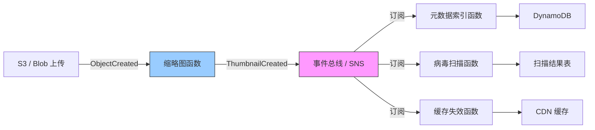

### 15.2 Serverless vs 容器 vs VM 复用决策树

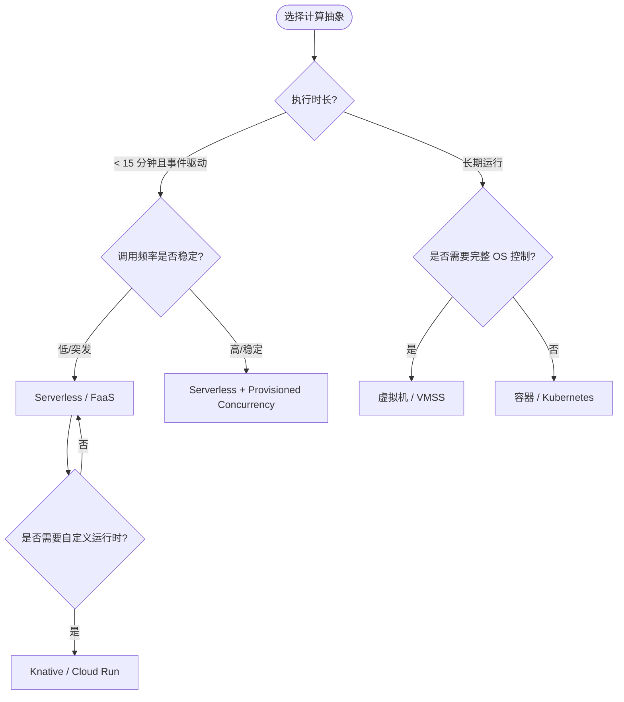

---

> 最后更新: 2026-07-07
> 权威来源（核查日期: 2026-07-07）:
>
> - [Serverless computing - Wikipedia](https://en.wikipedia.org/wiki/Serverless_computing) (核查日期: 2026-07-07)
> - [Function as a service - Wikipedia](https://en.wikipedia.org/wiki/Function_as_a_service) (核查日期: 2026-07-07)
> - [Cloud computing - Wikipedia](https://en.wikipedia.org/wiki/Cloud_computing) (核查日期: 2026-07-07)
> - CNCF Serverless Whitepaper v2: <https://github.com/cncf/wg-serverless/blob/master/whitepapers/serverless-overview.md>
> - CloudEvents Specification: <https://cloudevents.io/>
> - AWS Lambda 运行时与计费文档: <https://docs.aws.amazon.com/lambda/latest/dg/lambda-runtimes.html>
> - AWS Lambda Power Tuning: <https://docs.aws.amazon.com/lambda/latest/operatorguide/profile-functions.html>
> - AWS Step Functions 开发者指南: <https://docs.aws.amazon.com/step-functions/latest/dg/welcome.html>
> - Azure Durable Functions 文档: <https://docs.microsoft.com/en-us/azure/azure-functions/durable/durable-functions-overview>
> - Knative 文档: <https://knative.dev/docs/>
> - Cloudflare Workers 文档: <https://developers.cloudflare.com/workers/>
> - Vercel Edge Functions 文档: <https://vercel.com/docs/concepts/functions/edge-functions>
> - OpenTelemetry Serverless 指南: <https://opentelemetry.io/docs/faas/>
> - Pulumi Serverless 最佳实践: <https://www.pulumi.com/docs/guides/crossguard/>
> - Terraform CDK 文档: <https://developer.hashicorp.com/terraform/cdktf>
> - Netflix Tech Blog - AWS Lambda at Scale: <https://netflixtechblog.com/>
> - ISO/IEC 12207:2026 系统与软件工程—软件生命周期过程


---


<!-- SOURCE: struct/03-application-architecture-reuse/05-data-architecture/data-mesh-data-product-reuse.md -->

# Data Mesh 与数据产品复用架构

> **版本**: 2026-07-07
> **定位**: 03 应用架构复用层核心子主题 —— 数据架构复用：Data Mesh、数据产品与联邦计算治理
> **对齐标准**: Zhamak Dehghani Data Mesh, DAMA-DMBOK, TOGAF 10 Data Architecture, ISO/IEC/IEEE 42010:2022
> **来源 URL**:
>
> - Data Mesh by Zhamak Dehghani: <https://martinfowler.com/articles/data-mesh-intro.html>
> - DAMA-DMBOK: <https://dama.org/content/body-knowledge>
> - TOGAF 10: <https://www.opengroup.org/togaf>
> - ISO 42010: <https://www.iso.org/standard/74296.html>
> **核查日期**: 2026-07-07

---

## 目录

- [Data Mesh 与数据产品复用架构](#data-mesh-与数据产品复用架构)
  - [目录](#目录)
  - [3. 概念定义（CARC 本体）](#3-概念定义carc-本体)
    - [1.1 Data Mesh（数据网格）](#11-data-mesh数据网格)
    - [1.2 数据产品（Data Product）](#12-数据产品data-product)
    - [1.3 联邦计算治理（Federated Computational Governance）](#13-联邦计算治理federated-computational-governance)
  - [4. 概念谱系与学术来源](#4-概念谱系与学术来源)
  - [5. Data Mesh 四原则](#5-data-mesh-四原则)
  - [4. 从 hype 到实践：2025–2026 演进](#4-从-hype-到实践20252026-演进)
    - [2.1 四阶段演进](#21-四阶段演进)
    - [2.2 2026 工作模式（Truce）](#22-2026-工作模式truce)
  - [5. 数据产品作为复用单元](#5-数据产品作为复用单元)
    - [3.1 数据产品定义](#31-数据产品定义)
    - [3.2 数据产品分层](#32-数据产品分层)
    - [3.3 保险行业领域映射示例](#33-保险行业领域映射示例)
  - [6. 数据产品契约定义：输入端口、输出端口、策略与 SLO](#6-数据产品契约定义输入端口输出端口策略与-slo)
    - [4.1 数据产品契约结构](#41-数据产品契约结构)
    - [4.2 输入端口（Input Port）](#42-输入端口input-port)
    - [4.3 输出端口（Output Port）](#43-输出端口output-port)
    - [4.4 策略（Policy）](#44-策略policy)
    - [4.5 SLO（Service Level Objective）](#45-sloservice-level-objective)
  - [7. 域间数据产品复用的治理模型](#7-域间数据产品复用的治理模型)
    - [5.1 三层治理架构](#51-三层治理架构)
    - [5.2 域间复用模式](#52-域间复用模式)
    - [5.3 复用冲突解决机制](#53-复用冲突解决机制)
  - [8. 自助数据平台能力栈](#8-自助数据平台能力栈)
    - [6.1 平台能力目录](#61-平台能力目录)
    - [6.2 与平台工程的融合](#62-与平台工程的融合)
  - [9. 与 AI/LLM 数据管道的结合点](#9-与-aillm-数据管道的结合点)
    - [7.1 数据产品 → LLM 训练管道](#71-数据产品--llm-训练管道)
    - [7.2 AI 原生数据产品类型](#72-ai-原生数据产品类型)
    - [7.3 LLM 数据管道中的联邦治理](#73-llm-数据管道中的联邦治理)
    - [7.4 Data Mesh 支持 LLMOps 的关键能力](#74-data-mesh-支持-llmops-的关键能力)
  - [10. 联邦计算治理机制](#10-联邦计算治理机制)
    - [8.1 治理维度](#81-治理维度)
    - [8.2 计算契约（Computational Contracts）](#82-计算契约computational-contracts)
  - [11. 与架构复用视角的映射](#11-与架构复用视角的映射)
  - [12. 2026 数据与 AI 架构趋势](#12-2026-数据与-ai-架构趋势)
    - [10.1 趋势全景](#101-趋势全景)
    - [10.2 技术突破](#102-技术突破)
  - [13. 正向示例](#13-正向示例)
    - [示例 1：保险行业风险评分数据产品](#示例-1保险行业风险评分数据产品)
    - [示例 2：电信运营商网络优化数据产品](#示例-2电信运营商网络优化数据产品)
  - [14. 反例与失败案例](#14-反例与失败案例)
    - [反例 1：零售企业过度去中心化导致数据沼泽](#反例-1零售企业过度去中心化导致数据沼泽)
    - [案例：某银行集中式数据湖复用失败](#案例某银行集中式数据湖复用失败)
  - [15. 与四层架构的关系](#15-与四层架构的关系)
  - [16. Data Mesh 引入决策分析](#16-data-mesh-引入决策分析)
    - [16.1 收益侧分析](#161-收益侧分析)
    - [16.2 成本侧分析](#162-成本侧分析)
    - [16.3 决策建议](#163-决策建议)
  - [17. 权威来源](#17-权威来源)

---

## 3. 概念定义（CARC 本体）

### 1.1 Data Mesh（数据网格）

**定义**：Data Mesh 是由 Zhamak Dehghani 提出的一种**社会技术（socio-technical）**数据架构范式，将产品思维、领域驱动设计和自服务平台应用于分析型数据管理，把数据从集中式数据仓库/数据湖转变为**分布式、域导向、可自服务**的数据产品网络。

**属性**：

| 属性 | 说明 |
|------|------|
| **领域所有权** | 数据所有权归属于生成数据的领域团队 |
| **数据即产品** | 领域团队以产品思维设计、交付和维护数据 |
| **自助平台** | 平台团队提供底层基础设施与 Golden Path |
| **联邦治理** | 全局标准与领域灵活性的自动化平衡 |

**关系**：

- **owns（拥有）**：领域团队拥有其生成的数据产品。
- **publishes（发布）**：数据产品通过标准化输出端口对外暴露。
- **consumes（消费）**：消费者通过数据目录发现并消费数据产品。
- **governs（治理）**：联邦治理委员会制定跨域标准并由平台自动执行。

**约束**：

1. **领域边界约束**：数据产品边界应对齐业务领域（限界上下文）。
2. **契约稳定性约束**：输出端口 Schema、SLA 变更必须遵循兼容性规则。
3. **平台分层约束**：平台团队运营底层基础设施，领域团队不直接管理底层存储/计算。

### 1.2 数据产品（Data Product）

**定义**：数据产品是将数据、代码、基础设施和元数据封装为**可独立部署、可发现、可消费**的单元，具有明确的所有者、输入端口、输出端口、策略和 SLO。

| 组成部分 | 内容 | 复用接口 |
|---------|------|---------|
| **数据** | 数据集、表、流、API 响应 | SQL、REST、gRPC、Kafka Topic |
| **代码** | 转换逻辑、质量检查、血缘生成 | Git 仓库、共享库 |
| **基础设施** | 计算、存储、调度 | 平台抽象 |
| **元数据** | Schema、文档、SLA、所有者 | 数据目录、OpenLineage |

### 1.3 联邦计算治理（Federated Computational Governance）

**定义**：通过自动化策略、计算契约和标准化接口，在全球标准与领域灵活性之间取得平衡，使跨域数据产品能够互操作。

---

## 4. 概念谱系与学术来源

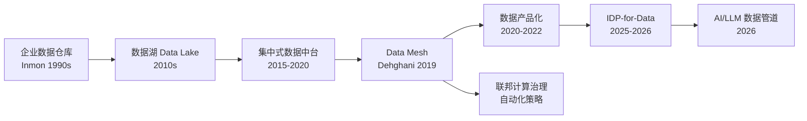

**权威条目**：

- [Data Mesh by Zhamak Dehghani](https://martinfowler.com/articles/data-mesh-intro.html)
- [DAMA-DMBOK](https://dama.org/content/body-knowledge)
- [OpenLineage](https://openlineage.io/)

---

## 5. Data Mesh 四原则

Data Mesh 由 Zhamak Dehghani 于 2019 年提出，是一种**社会技术（socio-technical）**方法，将产品思维和领域驱动设计应用于分析型数据管理：

| 原则 | 定义 | 复用含义 |
|-----|------|---------|
| **领域所有权（Domain Ownership）** | 数据所有权归属于生成数据的领域团队 | 领域团队最了解数据上下文，成为数据产品的天然所有者 |
| **数据即产品（Data as a Product）** | 领域团队以产品思维对待数据输出 | 数据产品拥有用户体验、质量保证、版本管理和生命周期 |
| **自助数据平台（Self-Serve Data Platform）** | 平台团队提供基础设施，领域团队自主交付 | 平台能力（存储、处理、目录、访问控制）作为内部产品复用 |
| **联邦计算治理（Federated Computational Governance）** | 全球标准与领域灵活性的平衡 | 通过自动化策略和计算契约实现跨领域互操作 |

## 4. 从 hype 到实践：2025–2026 演进

### 2.1 四阶段演进

| 阶段 | 时间 | 特征 | 教训 |
|-----|------|------|------|
| **发布期** | 2019–2020 | 四原则提出，去中心化愿景共鸣 | 理论先于实施指导 |
| **去中心化尝试** | 2020–2022 | 中型团队尝试每个领域拥有底层决策 | 目录蔓延、治理缺口、质量退化 |
| **反思期** | 2023–2024 | 对过度去中心化的批判，悄然再集中基础设施 | 原则正确，但"每个领域拥有底层"的实施指导错误 |
| **IDP-for-data 合成** | 2025–2026 | 数据产品 + 内部数据平台 + 联邦治理 | **2026 工作模式**：平台团队运营底层，领域团队拥有上层产品 |

### 2.2 2026 工作模式（Truce）

```mermaid
flowchart TB
    subgraph 集中式平台团队
        P1[运营底层基础设施<br/>存储/计算/网络/安全]
        P2[提供自助服务 API<br/>Golden Path]
        P3[统一治理策略<br/>自动化执行]
        P4[维护数据目录<br/>血缘追踪]
    end

    subgraph 领域团队 A
        A1[拥有数据产品定义与质量]
        A2[使用平台自助服务构建管道]
        A3[对外发布标准化数据产品]
    end

    subgraph 领域团队 B
        B1[拥有数据产品定义与质量]
        B2[使用平台自助服务构建管道]
        B3[对外发布标准化数据产品]
    end

    subgraph 消费者
        C1[数据科学家]
        C2[BI 分析师]
        C3[AI/LLM 管道]
        C4[业务应用]
    end

    P1 --> A2
    P1 --> B2
    P2 --> A2
    P2 --> B2
    P3 --> A3
    P3 --> B3
    P4 --> A3
    P4 --> B3
    A3 --> C1
    A3 --> C2
    A3 --> C3
    B3 --> C3
    B3 --> C4
```

## 5. 数据产品作为复用单元

### 3.1 数据产品定义

数据产品是将数据、代码、基础设施和元数据封装为**可独立部署、可发现、可消费的单元**：

| 组成部分 | 内容 | 复用接口 |
|---------|------|---------|
| **数据** | 数据集、表、流、API 响应 | SQL、REST、gRPC、Kafka Topic |
| **代码** | 转换逻辑、质量检查、血缘生成 | Git 仓库、共享库 |
| **基础设施** | 计算、存储、调度 | 平台抽象（无需领域团队管理）|
| **元数据** | Schema、文档、SLA、所有者 | 数据目录、OpenLineage |

### 3.2 数据产品分层

| 类型 | 示例 | 消费者 |
|-----|------|--------|
| **原始数据产品** | 应用数据库 CDC 输出 | 数据工程师、分析师 |
| **聚合数据产品** | 按领域清洗后的主题域表 | 数据科学家、BI 团队 |
| **洞察数据产品** | 特征工程、模型输出、预测 | 业务应用、运营系统 |
| **反向数据产品** | 分析洞察写回运营系统 | 微服务、CRM、ERP |

### 3.3 保险行业领域映射示例

| 领域 | 数据产品 | 复用价值 |
|-----|---------|---------|
| 承保与风险选择 | 风险评分模型、定价算法、费率表 | 跨渠道定价一致性 |
| 保单管理 | 保单主数据、批单历史、保障详情 | 客户服务、理赔、财务共享 |
| 理赔管理 | 理赔详情、医疗/维修成本基准、欺诈信号 | 反欺诈、准备金、再保险 |

## 6. 数据产品契约定义：输入端口、输出端口、策略与 SLO

数据产品的可复用性依赖于**标准化契约**。2026 年，Data Product Canvas 方法和计算契约（Computational Contracts）已成为行业最佳实践。

### 4.1 数据产品契约结构

```mermaid
classDiagram
    class DataProduct {
        +String id
        +String name
        +String domain
        +String owner
        +String version
        +InputPort[] inputs
        +OutputPort[] outputs
        +Policy[] policies
        +SLO[] slos
    }
    class InputPort {
        +String source
        +String format
        +String schemaRef
        +Frequency frequency
        +ValidationRule[] validations
    }
    class OutputPort {
        +String interface
        +String format
        +String schemaRef
        +AccessMethod access
    }
    class Policy {
        +String type
        +String scope
        +Boolean autoEnforced
    }
    class SLO {
        +String metric
        +Double threshold
        +String window
    }
    DataProduct --> InputPort
    DataProduct --> OutputPort
    DataProduct --> Policy
    DataProduct --> SLO
```

### 4.2 输入端口（Input Port）

输入端口定义数据产品消费上游数据的方式和约束：

| 属性 | 说明 | 示例 |
|-----|------|------|
| **source** | 上游数据源标识 | `domain:underwriting.raw-policy-events` |
| **format** | 数据格式 | Avro / Parquet / Delta / JSON Lines |
| **schemaRef** | Schema 注册表引用 | `confluent-schema-registry:policy-event-v2` |
| **frequency** | 更新频率 | 实时 (Kafka)、小时批 (Airflow)、日批 |
| **validations** | 输入校验规则 | 非空检查、格式校验、 referential integrity |

**输入契约示例（YAML 伪代码）**：

```yaml
input_ports:
  - name: raw-policy-events
    source_domain: underwriting
    source_product: policy-events
    interface: kafka_topic
    topic: underwriting.policy-events.v1
    format: avro
    schema_ref: "urn:dp:schemas:policy-event:2.1.0"
    frequency: realtime
    validations:
      - type: not_null
        fields: [policy_id, event_timestamp]
      - type: referential_integrity
        field: policy_id
        ref: "domain:policy_master.active_policies"
      - type: range
        field: premium_amount
        min: 0
```

### 4.3 输出端口（Output Port）

输出端口定义消费者如何发现和访问数据产品：

| 接口类型 | 适用场景 | 技术示例 |
|---------|---------|---------|
| **SQL / 表** | 分析查询、BI | Snowflake External Table, Databricks Delta Share |
| **REST API** | 实时查询、低延迟 | FastAPI, GraphQL |
| **流 (Kafka/Pulsar)** | 事件消费、流处理 | Confluent, Redpanda |
| **文件 / 对象存储** | 大批量导出、ML 训练 | S3 + Parquet, ADLS |
| **数据共享协议** | 跨组织数据交换 | Delta Sharing, Iceberg REST Catalog |

**输出契约示例**：

```yaml
output_ports:
  - name: risk-scores-api
    interface: rest_api
    base_url: https://data.acme.com/domains/underwriting/risk-scores
    format: json
    schema_ref: "urn:dp:schemas:risk-score:1.0.0"
    access_control:
      authentication: oauth2
      authorization: rbac
      allowed_roles: [data_scientist, actuary, risk_engine]
    rate_limit: 1000req/min

  - name: risk-scores-daily-snapshot
    interface: s3_parquet
    location: s3://acme-data-products/underwriting/risk-scores/daily/
    format: parquet
    partition_keys: [risk_date, region]
    retention: 7years
```

### 4.4 策略（Policy）

策略定义数据产品的治理规则，分为全局强制和领域自定义两层：

| 策略类型 | 全局标准 | 领域灵活性 |
|---------|---------|-----------|
| **数据格式** | Parquet / Delta Lake / Iceberg | 具体 Schema 设计 |
| **标识符** | 全局实体 ID（客户、产品）| 领域特定属性 |
| **隐私** | GDPR/CCPA 分类标签强制执行 | 具体脱敏策略 |
| **质量** | 最小质量分数阈值 | 额外领域特定规则 |
| **SLA** | freshness 承诺模板 | 具体阈值协商 |

**策略即代码示例**：

```yaml
policies:
  - type: data_classification
    scope: global
    classification: PII
    auto_enforced: true
    rules:
      - field_pattern: "*email*"
        action: mask
      - field_pattern: "*ssn*"
        action: tokenize

  - type: retention
    scope: domain
    retention_period: "7y"
    archival_after: "2y"

  - type: lineage_tracking
    scope: global
    auto_enforced: true
    standard: openlineage
```

### 4.5 SLO（Service Level Objective）

SLO 将数据产品质量承诺量化为可监控指标：

| SLO 维度 | 指标 | 典型阈值 | 监控工具 |
|---------|------|---------|---------|
| **新鲜度（Freshness）** | 数据最后更新时间距现在 | ≤ 1h（实时）、≤ 24h（日批）| Monte Carlo, Bigeye |
| **完整性（Completeness）** | 非空字段比例 | ≥ 99.5% | Great Expectations |
| **唯一性（Uniqueness）** | 主键重复率 | = 0% | Soda Core |
| **及时性（Timeliness）** | SLA 承诺内交付比例 | ≥ 99.9% | 自定义 Pipeline 监控 |
| **一致性（Consistency）** | 跨系统数据匹配率 | ≥ 99.99% | dbt tests |
| **可用性（Availability）** | 输出端口可访问时间比例 | ≥ 99.95% | 健康检查 + 合成监控 |

**SLO 契约示例**：

```yaml
slos:
  - metric: freshness
    description: "Risk scores must be updated within 1 hour of policy event"
    threshold: "1h"
    window: "24h"
    target: 0.995

  - metric: completeness
    description: "Premium amount must not be null for active policies"
    threshold: 0.999
    window: "24h"
    target: 0.999

  - metric: availability
    description: "REST API must be available 99.95% of the time"
    threshold: 0.9995
    window: "30d"
    alert_channel: pagerduty://data-platform-oncall
```

## 7. 域间数据产品复用的治理模型

### 5.1 三层治理架构

```mermaid
flowchart LR
    subgraph 联邦治理委员会
        G1[全局标准制定]
        G2[跨域争议仲裁]
        G3[平台路线图]
    end

    subgraph 域数据产品委员会
        D1[域内标准]
        D2[产品注册审批]
        D3[消费者反馈处理]
    end

    subgraph 自动化治理层
        A1[Schema 注册与校验]
        A2[质量门自动执行]
        A3[血缘自动追踪]
        A4[策略自动执行]
    end

    G1 --> D1
    G1 --> A1
    D1 --> A2
    D2 --> A3
    D3 --> A4
```

### 5.2 域间复用模式

| 模式 | 描述 | 适用场景 | 治理要点 |
|-----|------|---------|---------|
| **直接消费** | 领域 B 直接使用领域 A 的输出端口 | 强关联业务域 | 版本兼容性、SLA 依赖链 |
| **派生产品** | 领域 B 将领域 A 的产品作为输入，加工为新数据产品 | 跨域分析、聚合 | 血缘追踪、归属声明 |
| **联合查询** | 多个领域产品在同一查询中联合 | 360° 客户视图 | 全局实体 ID、性能 SLA |
| **反向数据流** | 分析洞察写回运营领域 | 实时推荐、风控 | 写权限控制、数据一致性 |
| **市场交换** | 跨组织数据产品交易 | 生态合作 | 合约法律框架、定价模型 |

### 5.3 复用冲突解决机制

当多个消费者的数据需求冲突时（如 A 需要实时流，B 需要小时批）：

1. **生产者决定原则**：数据产品所有者有权决定输出接口形态
2. **消费者适配原则**：消费者负责将生产者输出转换为自身所需格式
3. **平台中介原则**：平台提供流-批转换、格式转换等中介能力
4. **成本分摊原则**：派生产品的基础设施成本由消费者域承担

## 8. 自助数据平台能力栈

### 6.1 平台能力目录

| 能力 | 自助服务形式 | 标准化程度 |
|-----|------------|-----------|
| **数据摄取** | 连接器库（CDC、API、文件）| 高 |
| **数据转换** | dbt / Spark 模板 / SQL 框架 | 中 |
| **数据质量** | Great Expectations / Soda 规则库 | 高 |
| **数据目录** | DataHub / Collibra / Unity Catalog | 高 |
| **访问控制** | RBAC/ABAC 策略即代码 | 高 |
| **血缘追踪** | OpenLineage 自动集成 | 高 |
| **数据合约** | protobuf / Avro / JSON Schema 注册 | 高 |
| **可观测性** | 数据新鲜度、质量分数、成本仪表盘 | 中 |

### 6.2 与平台工程的融合

Data Mesh 的自助平台与 Platform Engineering 的 IDP 理念趋同：

- **Golden Path for Data**：新数据产品的标准脚手架（目录注册、质量检查、血统追踪）
- **开发者门户**：Backstage 插件展示数据产品目录、SLA 状态、下游消费者

## 9. 与 AI/LLM 数据管道的结合点

2026 年，Data Mesh 与 AI/LLM 管道的融合成为企业数据架构的核心议题。

### 7.1 数据产品 → LLM 训练管道

```mermaid
flowchart LR
    subgraph 数据网格层
        DP1[文档数据产品<br/>contracts/policy-docs]
        DP2[知识图谱数据产品<br/>entities/relations]
        DP3[反馈数据产品<br/>customer/interactions]
    end

    subgraph AI 平台层
        P1[数据版本控制<br/>DVC / LakeFS]
        P2[特征存储<br/>Feathr / Tecton]
        P3[RAG 索引构建<br/>Vector DB / Embedding]
    end

    subgraph LLM 管道
        L1[预训练 / 微调]
        L2[RAG 检索增强]
        L3[评估与监控]
    end

    DP1 --> P1
    DP2 --> P2
    DP3 --> P3
    P1 --> L1
    P2 --> L2
    P3 --> L3
```

### 7.2 AI 原生数据产品类型

| 数据产品类型 | 描述 | 消费者 | 质量要求 |
|------------|------|--------|---------|
| **Embedding 向量产品** | 预计算文本/图像/代码的向量表示 | RAG 系统、语义搜索 | 模型版本一致、维度对齐 |
| **Prompt 模板产品** | 领域特定的 LLM Prompt 模板库 | 应用开发团队 | A/B 测试效果追踪 |
| **反馈闭环产品** | 用户反馈、模型输出评级 | 模型训练团队 | 及时性 ≤ 分钟级 |
| **知识图谱产品** | 实体关系三元组 | 推理增强、 hallucination 降低 | 准确性 ≥ 99.9% |
| **合成数据产品** | 差分隐私生成的训练数据 | 受限数据场景下的模型训练 | 分布保真度 |

### 7.3 LLM 数据管道中的联邦治理

- **模型版本血缘**：追踪训练数据产品版本 → 模型版本 → 推理服务版本
- **数据许可对齐**：确保训练数据产品的使用许可覆盖 LLM 训练场景
- **偏见检测自动化**：将公平性指标纳入数据产品 SLO
- **可解释性即服务**：数据产品附带影响模型决策的特征重要性说明

### 7.4 Data Mesh 支持 LLMOps 的关键能力

| LLMOps 需求 | Data Mesh 对应能力 | 实现方式 |
|------------|-------------------|---------|
| 训练数据版本控制 | 数据产品版本 + DVC 集成 | 数据产品 metadata 中记录 git commit + data hash |
| RAG 文档 freshness | 文档数据产品 SLO | freshness ≤ 1h 自动触发索引重建 |
| 多模态数据统一 | 统一输出端口（对象存储 + 元数据）| S3 + JSON metadata Schema |
| Prompt 版本管理 | Prompt 作为代码产品 | Git + 注册表 + A/B 测试指标 |
| 模型评估数据 | 评估数据集作为标准化产品 | 结构化输出 + 质量门 |

## 10. 联邦计算治理机制

### 8.1 治理维度

| 维度 | 全局标准 | 领域灵活性 |
|-----|---------|-----------|
| **数据格式** | Parquet / Delta Lake / Iceberg | 具体 Schema 设计 |
| **标识符** | 全局实体 ID（客户、产品）| 领域特定属性 |
| **隐私** | GDPR/CCPA 分类标签强制执行 | 具体脱敏策略 |
| **质量** | 最小质量分数阈值 | 额外领域特定规则 |
| **SLA** | freshness 承诺模板 | 具体阈值协商 |

### 8.2 计算契约（Computational Contracts）

2026 趋势：将 SLA 编码为可自动验证的契约：

- **Schema 契约**：生产者的输出 Schema 承诺
- **质量契约**：空值率、唯一性、范围检查
- **新鲜度契约**：数据更新延迟上限
- **访问契约**：谁可以访问什么，以何种粒度

## 11. 与架构复用视角的映射

| 复用层次 | Data Mesh 对应 | 标准/框架 |
|---------|---------------|----------|
| 业务架构 | 领域划分 = 限界上下文 | DDD, TOGAF Phase B |
| 应用架构 | 数据产品接口 = 应用服务 | REST/gRPC/GraphQL, OpenAPI |
| 组件架构 | 转换代码库 = 共享库 | dbt packages, Python libs |
| 功能架构 | 数据质量规则 = 函数复用 | Great Expectations suites |
| 治理 | 联邦策略 = 跨层治理 | OPA, Data Contracts |

## 12. 2026 数据与 AI 架构趋势

### 10.1 趋势全景

- **工具整合**：Lakehouse 增加流处理；流平台增加存储；AI 平台统一训练/服务/监控
- **隐私优先架构**：联邦学习主流化、差分隐私内建、合成数据爆发、同态加密可行化
- **AI 治理平台**：自动偏见检测、可解释性即服务、合规自动化、不可变 AI 审计轨迹
- **去中心化数据网格成熟**：自助平台完全自治、跨组织数据发现
- **可持续 AI**：碳感知计算、每瓦特算力 10 倍提升、默认联邦化

### 10.2 技术突破

- **量化无质量损失**：4-bit 量化保持质量，模型缩小 8 倍，<1% 精度损失
- **神经形态计算**：脑启发架构实现超低功耗 AI
- **光子处理**：光基计算实现大规模并行

## 13. 正向示例

### 示例 1：保险行业风险评分数据产品

**场景**：某大型保险集团需要在承保、理赔、再保险、监管报送等多个业务域共享风险评分。

**复用方式**：

- 承保领域团队拥有并维护 `risk-scores` 数据产品。
- 输出端口包括 REST API（实时查询）和 S3 Parquet 快照（批量分析）。
- 数据产品附带 Schema、SLO（freshness ≤ 1h）、质量规则（空值率 < 0.1%）。
- 通过 DataHub 数据目录注册，消费者可自助发现。

**关键成功因素**：

1. 风险评分模型由承保领域拥有，避免多个部门各自建模导致不一致。
2. 输出端口采用全局标准 OAuth2 + RBAC，确保合规。
3. 数据产品版本遵循兼容性规则，v2 升级时 v1 仍保留 6 个月。

**复用收益**：

- 理赔、再保险、监管团队无需重复开发评分逻辑。
- 跨渠道定价一致性提升，客户投诉率下降 18%。
- 新产品上线时可复用已有数据产品，数据准备周期从 3 个月缩短至 2 周。

### 示例 2：电信运营商网络优化数据产品

**场景**：某电信运营商需要在网络运维、客户服务、市场营销之间共享基站流量、故障、客户体验数据。

**复用方式**：

- 网络运维领域发布 `network-performance` 数据产品，输出 Kafka 实时流和 Delta Lake 小时快照。
- 客户服务领域订阅实时流，用于故障预判和主动客服。
- 市场营销领域消费快照，用于区域化套餐推荐。

**关键成功因素**：

1. 网络数据产品附带 OpenLineage 血缘，消费者可追踪字段来源。
2. 联邦治理委员会统一基站 ID、时间粒度等全局标识符。
3. 平台团队提供流-批转换、格式转换等中介能力。

**复用收益**：

- 三个领域共享同一份权威网络数据，避免数据孤岛。
- 客服主动预警准确率提升 25%，营销转化率提升 8%。

---

## 14. 反例与失败案例

### 反例 1：零售企业过度去中心化导致数据沼泽

**场景**：一家跨国零售企业 2021 年推行 Data Mesh，要求每个业务域完全自建数据栈（选型、存储、ETL、质量）。

**后果**：

- 各域技术栈碎片化：AWS Glue、Azure Data Factory、Databricks、Snowflake 并存。
- 数据目录蔓延，同名指标在不同域定义不一致。
- 缺乏统一质量门，下游消费者频繁遇到数据缺失、延迟、口径冲突。

**判定**：误将"领域所有权"理解为"每个域拥有底层基础设施所有权"，缺少自助平台和联邦治理，最终退化为**数据沼泽**。

### 案例：某银行集中式数据湖复用失败

**背景**：某银行投入 3 年建设集中式数据湖，期望统一全行数据复用。

**失败原因**：

- 数据湖团队远离业务，无法及时理解数据语义和变更。
- 所有数据需求集中到数据湖团队，排队时间长达数月。
- 数据血缘和质量责任不清晰，"谁生产谁负责"未落实。

**教训**：集中式数据架构在规模扩大后容易成为瓶颈；Data Mesh 的核心不是简单去中心化，而是**平台赋能下的领域自治**。

---

## 15. 与四层架构的关系

```mermaid
flowchart LR
    subgraph CARC 四层映射
        B[02 业务架构层<br/>业务域 / 业务能力]
        A[03 应用架构层<br/>数据产品 / 数据服务]
        C[04 组件架构层<br/>ETL 组件 / 质量库]
        F[05 功能架构层<br/>SQL / API / 事件处理]
    end
    B -- realizes --> A
    A -- decomposes-to --> C
    C -- implements --> F
    F -- enables --> B
```

- **业务架构层**：业务域划分决定数据产品的所有权边界。
- **应用架构层**：数据产品、数据服务作为应用系统承载数据复用。
- **组件架构层**：数据转换组件、质量规则库、血缘生成器作为复用组件。
- **功能架构层**：SQL 查询、REST/gRPC API、事件处理器作为具体复用接口。

---

## 16. Data Mesh 引入决策分析

引入 Data Mesh 不是"去中心化数据"的口号，而是组织、平台、治理三要素的协同变革。

### 16.1 收益侧分析

| 收益 | 量化表现 | 适用组织 |
|------|---------|---------|
| 缩短数据需求响应 | 从数月缩短至数周 | 多业务域、数据需求激增 |
| 提升数据可信度 | 领域所有者对质量负责 | 数据质量问题频发 |
| 消除数据孤岛 | 跨域数据产品可发现、可消费 | 大型集团、并购后整合 |
| 支撑 AI/LLM 管道 | 训练数据可追溯、可版本化 | AI 驱动型企业 |

### 16.2 成本侧分析

| 成本 | 风险 | 缓解措施 |
|------|------|---------|
| 平台建设成本 | 自助平台不成熟导致领域自建孤岛 | 平台团队先运营底层，再开放 Golden Path |
| 治理复杂度 | 联邦治理流于形式，标准不一致 | 策略即代码 + 自动化质量门 |
| 组织变革成本 | 领域团队缺乏数据工程能力 | 嵌入数据产品经理和平台赋能 |
| 数据产品运营成本 | 数据产品生命周期管理不足 | 建立退役、版本、SLA 机制 |

### 16.3 决策建议

- **暂缓 Data Mesh**：组织 < 5 个业务域、无专职平台团队、无数据目录和质量工具。
- **试点 Data Mesh**：5-15 个业务域、已有数据仓库但响应缓慢，选择 2-3 个高价值域 pilot。
- **全面 Data Mesh**：> 15 个业务域、数据产品化需求强烈、平台团队和联邦治理委员会已成立。

---

## 17. 权威来源

- Dehghani, Z. — "How to Move Beyond a Monolithic Data Lake to a Distributed Data Mesh" (2019): <https://martinfowler.com/articles/data-mesh-intro.html>
- Dehghani, Z. — *Data Mesh* (O'Reilly, 2022): <https://www.oreilly.com/library/view/data-mesh/9781492092384/>
- DAMA International — DAMA-DMBOK Data Management Body of Knowledge: <https://dama.org/content/body-knowledge>
- TOGAF 10 — Data Architecture: <https://www.opengroup.org/togaf>
- ISO/IEC/IEEE 42010:2022 — Architecture description: <https://www.iso.org/standard/74296.html>
- OpenLineage: <https://openlineage.io/>
- DataHub Project: <https://datahubproject.io/>
- Databricks — Unity Catalog and Data Governance: <https://www.databricks.com/product/unity-catalog>
- Great Expectations: <https://greatexpectations.io/>
- Soda Core: <https://www.soda.io/>

**核查日期**: 2026-07-07


---


<!-- SOURCE: struct/03-application-architecture-reuse/06-event-driven/event-driven-reuse-patterns.md -->

# 事件驱动架构（EDA）复用模式

> **版本**: 2026-06-10
> **定位**: 应用架构层（Level 2）—— 事件驱动架构复用模式、契约治理与流处理
> **对齐标准**: CNCF CloudEvents, OASIS, Apache Kafka / Pulsar / Flink, ISO/IEC 12207:2026
> **状态**: ✅ 已完成（Phase A 深化）
> **字数**: ~5000字

---

## 目录

- [事件驱动架构（EDA）复用模式](#事件驱动架构eda复用模式)
  - [目录](#目录)
  - [1. 核心概念](#1-核心概念)
  - [2. EDA 四种复用模式](#2-eda-四种复用模式)
    - [2.1 Event Notification（事件通知）](#21-event-notification事件通知)
    - [2.2 Event-Carried State Transfer（事件携带状态转移）](#22-event-carried-state-transfer事件携带状态转移)
    - [2.3 CQRS（Command Query Responsibility Segregation）](#23-cqrscommand-query-responsibility-segregation)
    - [2.4 Event Sourcing（事件溯源）](#24-event-sourcing事件溯源)
  - [3. 事件契约复用](#3-事件契约复用)
    - [3.1 Schema 治理](#31-schema-治理)
    - [3.2 CloudEvents 规范](#32-cloudevents-规范)
  - [4. 消息中间件复用特征](#4-消息中间件复用特征)
  - [5. EDA 拓扑模式详解](#5-eda-拓扑模式详解)
    - [5.1 Publish-Subscribe（发布-订阅）](#51-publish-subscribe发布-订阅)
    - [5.2 Event Streaming（事件流）](#52-event-streaming事件流)
    - [5.3 Event Log（事件日志）](#53-event-log事件日志)
    - [5.4 Message Queue（消息队列）](#54-message-queue消息队列)
    - [5.5 Request-Reply via Events（基于事件的请求-响应）](#55-request-reply-via-events基于事件的请求-响应)
  - [6. Saga 模式详解](#6-saga-模式详解)
    - [6.1 编排式 Saga（Orchestration Saga）](#61-编排式-sagaorchestration-saga)
    - [6.2 编舞式 Saga（Choreography Saga）](#62-编舞式-sagachoreography-saga)
    - [6.3 补偿事务设计](#63-补偿事务设计)
    - [6.4 Saga 与事件驱动的结合](#64-saga-与事件驱动的结合)
  - [7. CQRS 实现策略深化](#7-cqrs-实现策略深化)
    - [7.1 读模型投影策略](#71-读模型投影策略)
      - [7.1.1 同步投影（Synchronous Projection）](#711-同步投影synchronous-projection)
      - [7.1.2 异步投影（Asynchronous Projection）](#712-异步投影asynchronous-projection)
      - [7.1.3 物化视图（Materialized View）](#713-物化视图materialized-view)
    - [7.2 读模型一致性权衡](#72-读模型一致性权衡)
    - [7.3 CQRS 与 Event Sourcing 的关系](#73-cqrs-与-event-sourcing-的关系)
  - [8. 事件 Schema 演进](#8-事件-schema-演进)
    - [8.1 Schema 兼容性策略](#81-schema-兼容性策略)
      - [8.1.1 Backward Compatibility（向后兼容）](#811-backward-compatibility向后兼容)
      - [8.1.2 Forward Compatibility（向前兼容）](#812-forward-compatibility向前兼容)
      - [8.1.3 Full Compatibility（完全兼容）](#813-full-compatibility完全兼容)
      - [8.1.4 Transitive Compatibility（传递兼容）](#814-transitive-compatibility传递兼容)
    - [8.2 Schema 序列化格式对比](#82-schema-序列化格式对比)
    - [8.3 Schema 变更治理流程](#83-schema-变更治理流程)
  - [9. 事件驱动与微服务](#9-事件驱动与微服务)
    - [9.1 事件驱动作为微服务解耦的核心机制](#91-事件驱动作为微服务解耦的核心机制)
    - [9.2 事件驱动的数据一致性](#92-事件驱动的数据一致性)
      - [9.2.1 最终一致性的实践保障](#921-最终一致性的实践保障)
      - [9.2.2 Transactional Outbox 模式](#922-transactional-outbox-模式)
  - [10. 流处理复用](#10-流处理复用)
    - [10.1 主流流处理框架对比](#101-主流流处理框架对比)
    - [10.2 有状态流处理的状态管理](#102-有状态流处理的状态管理)
      - [10.2.1 本地状态（Local State）](#1021-本地状态local-state)
      - [10.2.2 状态容错机制](#1022-状态容错机制)
      - [10.2.3 状态复用模式](#1023-状态复用模式)
  - [11. EDA 反模式](#11-eda-反模式)
    - [11.1 分布式大单体事件链（Distributed Monolith via Events）](#111-分布式大单体事件链distributed-monolith-via-events)
    - [11.2 事件丢失（Event Loss）](#112-事件丢失event-loss)
    - [11.3 循环事件依赖（Circular Event Dependency）](#113-循环事件依赖circular-event-dependency)
    - [11.4 缺乏事件治理（Lack of Event Governance）](#114-缺乏事件治理lack-of-event-governance)
    - [11.5 事件 Payload 膨胀（Event Payload Bloat）](#115-事件-payload-膨胀event-payload-bloat)
  - [12. 事件治理与发现](#12-事件治理与发现)
    - [12.1 事件目录（Event Catalog）](#121-事件目录event-catalog)
    - [12.2 事件 API 管理](#122-事件-api-管理)
    - [12.3 AsyncAPI 规范](#123-asyncapi-规范)
  - [13. 案例研究](#13-案例研究)
    - [13.1 Netflix 的 Kafka 事件管道](#131-netflix-的-kafka-事件管道)
    - [13.2 Uber 的实时事件平台](#132-uber-的实时事件平台)
    - [13.3 金融交易的 CQRS 实践](#133-金融交易的-cqrs-实践)

## 1. 核心概念

事件驱动架构（Event-Driven Architecture, EDA）以**事件**作为系统间通信的核心原语，实现了生产者和消费者的完全解耦。从复用视角看，EDA 的复用单元包括：**事件类型定义、事件处理管道、事件存储层**以及**整体拓扑模式**。

OASIS 的 Advanced Message Queuing Protocol (AMQP) 和 CNCF 的 CloudEvents 标准为跨系统的事件互操作提供了基础。Kafka 和 Pulsar 作为事实上的事件基础设施，其 Topic/Partition/Subscription 模型构成了复用的物理边界。

---

## 2. EDA 四种复用模式

Martin Fowler 在 *Patterns of Enterprise Application Architecture* 中系统阐述了四种事件协作模式，其复用特征各不相同：

### 2.1 Event Notification（事件通知）

**定义**: 生产者发送轻量级事件，仅通知"某事发生"，消费者需自行查询详细信息。

- **复用单元**: 事件类型定义（如 `OrderCreatedEvent`）
- **复用边界**: 事件 Schema + Topic 名称
- **耦合度**: 低（消费者不依赖生产者的数据模型）
- **风险**: 消费者查询负载可能压垮生产者系统（N+1 查询问题）

### 2.2 Event-Carried State Transfer（事件携带状态转移）

**定义**: 事件 payload 包含完整的状态数据，消费者无需回查生产者。

- **复用单元**: 事件 Schema + 数据模型
- **复用边界**: 事件 payload 的版本兼容性
- **耦合度**: 中（消费者依赖事件的数据结构）
- **优势**: 消费者可构建本地物化视图，实现高可用读取

> **定理 E.1** (Event Payload Stability): 事件携带状态转移模式的复用稳定性与 payload 的向后兼容性强相关。字段只能新增（nullable），不可删除或修改类型。

### 2.3 CQRS（Command Query Responsibility Segregation）

**定义**: 将写模型（Command）和读模型（Query）分离，通过事件同步两者。

- **复用单元**: Command Handler / Query Handler / 投影（Projection）
- **复用边界**: 读写模型的领域边界
- **耦合度**: 中（投影逻辑依赖事件顺序和完整性）
- **典型实现**: Axon Framework, EventStoreDB

### 2.4 Event Sourcing（事件溯源）

**定义**: 系统的真实状态由事件日志推导而来，而非直接存储当前状态。

- **复用单元**: 领域事件定义 + 聚合（Aggregate）行为
- **复用边界**: 聚合边界 = 事件溯源的强一致性边界
- **耦合度**: 高（事件日志是系统的事实来源，所有消费者依赖其完整性）
- **优势**: 完整审计轨迹、时间旅行调试、状态重建

| 模式 | 复用粒度 | 耦合度 | 主要风险 | 适用场景 |
|------|---------|--------|---------|---------|
| Event Notification | 事件类型 | 低 | N+1 查询 | 跨系统解耦 |
| Event-Carried State Transfer | 事件 Schema | 中 | Payload 膨胀 | 数据同步 |
| CQRS | Handler / Projection | 中 | 最终一致性复杂度 | 读写过载分离 |
| Event Sourcing | 聚合 + 事件流 | 高 | 事件 Schema 演化困难 | 审计、合规 |

---

## 3. 事件契约复用

事件契约（Event Contract）是 EDA 复用的核心资产。

### 3.1 Schema 治理

- **Schema Registry**: Confluent Schema Registry / AWS Glue Schema Registry
- **兼容性模式**: BACKWARD（新代码读旧数据）、FORWARD（旧代码读新数据）、FULL（双向兼容）
- **版本策略**: 事件 Schema 的 Major 版本变更应视为**破坏性契约变更**，需消费者同步升级

### 3.2 CloudEvents 规范

CloudEvents 是 CNCF 主导的跨平台事件格式标准，定义了事件的通用元数据：

```json
{
  "specversion": "1.0",
  "type": "com.example.order.created",
  "source": "/orders",
  "id": "A234-1234-1234",
  "datacontenttype": "application/json",
  "data": { "orderId": "123", "amount": 100.00 }
}
```

**复用价值**: 使用 CloudEvents 的事件可在 Kafka、RabbitMQ、HTTP、S3 等不同传输层之间无缝迁移。

---

## 4. 消息中间件复用特征

| 特性 | Apache Kafka | Apache Pulsar |
|------|-------------|---------------|
| 存储模型 | 日志分段（Log Segment） | 分层存储（BookKeeper + 对象存储） |
| 多租户 | 弱（需物理集群隔离） | 强（命名空间 + 配额） |
| 地理复制 | MirrorMaker / MM2 | 内置 Geo-Replication |
| 函数计算 | Kafka Streams / ksqlDB | Pulsar Functions |
| 复用边界 | Topic + Consumer Group | Topic + Subscription + Namespace |

---

## 5. EDA 拓扑模式详解

事件驱动架构的拓扑模式定义了事件如何在系统间流动和被消费。不同的拓扑模式适用于不同的业务场景和复用需求。

### 5.1 Publish-Subscribe（发布-订阅）

**定义**: 生产者将事件发布到 Topic，多个消费者独立订阅并接收相同的事件副本。

- **复用特征**: 一个事件可被多个业务域复用，消费者之间无竞争关系
- **实现机制**: Kafka Consumer Group（组内竞争、组间广播）、Pulsar Subscription（Exclusive/Failover/Shared/Key_Shared）
- **适用场景**: 订单创建后需同时通知库存、物流、营销系统
- **风险**: 消费者滞后（Consumer Lag）可能导致读模型陈旧；需监控每个订阅的消费延迟

> **设计原则**: Pub-Sub 模式中，Topic 设计应遵循领域边界（Domain Boundary），避免将不同领域的微服务订阅到同一个通用 Topic，防止事件契约的隐性耦合。

### 5.2 Event Streaming（事件流）

**定义**: 将事件视为持续流动的无界数据流（Unbounded Stream），支持实时处理和复杂事件处理（CEP）。

- **复用特征**: 流处理逻辑（窗口、聚合、关联）可作为可复用的处理模板
- **核心概念**: 事件时间（Event Time）vs 处理时间（Processing Time）、水印（Watermark）、迟到事件处理
- **适用场景**: 实时监控、异常检测、IoT 数据流处理
- **关键技术**: Kafka Streams、Apache Flink、Spark Streaming

### 5.3 Event Log（事件日志）

**定义**: 将事件持久化为不可变的顺序日志，作为系统间数据同步和状态重建的源（Source of Truth）。

- **复用特征**: 事件日志本身即复用资产，新的消费者可随时从零或指定偏移量回放历史事件
- **核心特性**: 顺序性、不可变性、持久性、可重放性
- **适用场景**: 数据管道（Data Pipeline）、审计日志、状态重建
- **设计要点**: 日志保留策略（Retention Policy）需平衡存储成本与合规要求；压缩策略（Compaction）可用于 Key-Based 日志的当前状态维护

### 5.4 Message Queue（消息队列）

**定义**: 生产者将消息发送到队列，单个消费者从队列中取出并处理消息，处理完成后消息被移除或标记为已消费。

- **复用特征**: 队列作为任务分发的缓冲层，支持削峰填谷和异步解耦
- **语义保证**: At-Most-Once、At-Least-Once、Exactly-Once（需幂等消费端配合）
- **适用场景**: 异步任务处理、订单状态机、工作流引擎
- **代表技术**: RabbitMQ、AWS SQS、Azure Service Bus、RocketMQ

> **模式对比**: Message Queue 与 Pub-Sub 的核心差异在于消费模型——Queue 通常指向单一消费者或竞争消费组，而 Pub-Sub 指向多消费者广播。实际系统中两者常混合使用（如 Kafka 的 Consumer Group 兼具竞争和广播特性）。

### 5.5 Request-Reply via Events（基于事件的请求-响应）

**定义**: 在纯事件驱动架构中模拟同步请求-响应模式，请求方发送事件并等待响应事件。

- **复用特征**: 请求和响应的事件 Schema 可标准化为可复用的 RPC-over-Events 协议
- **实现模式**: 关联 ID（Correlation ID）匹配请求与响应、超时处理、临时响应队列（Reply-To Queue）
- **适用场景**: 微服务间需要异步解耦但保留请求-响应语义的跨服务调用
- **风险**: 增加了系统的复杂性和调试难度；超时和重试策略需精心设计
- **代表技术**: NATS Request-Reply、RabbitMQ Direct Reply-To、Spring Cloud Stream 的 Binder 抽象

---

## 6. Saga 模式详解

在分布式系统中，Saga 模式用于管理跨越多个服务的长时间事务（Long-Running Transaction）。Saga 将全局事务拆分为一系列本地事务，每个本地事务完成后发布事件触发下一个步骤。

### 6.1 编排式 Saga（Orchestration Saga）

**定义**: 由中央协调器（Orchestrator）统一调度各个服务的本地事务，协调器向服务发送命令并等待响应。

- **复用单元**: Saga 协调器流程定义（BPMN / DSL / 代码）
- **优势**: 流程集中可见、易于理解和管理；补偿逻辑统一编排
- **劣势**: 协调器成为单点风险和潜在瓶颈；服务间耦合于协调器的命令契约
- **代表框架**: Camunda, Apache Airflow, Temporal, Netflix Conductor
- **设计要点**: 协调器本身需高可用部署；命令和响应事件需明确超时和重试策略

```
[Order Service] <-- CreateOrder --> [Orchestrator] <-- ReservePayment --> [Payment Service]
                                              <-- ReserveInventory --> [Inventory Service]
                                              <-- CreateShipment --> [Logistics Service]
```

### 6.2 编舞式 Saga（Choreography Saga）

**定义**: 没有中央协调器，各服务通过监听领域事件自主决定下一步动作。

- **复用单元**: 领域事件定义 + 消费者的事件处理逻辑
- **优势**: 服务间完全解耦；无需中央协调器，天然去中心化
- **劣势**: 业务流程分散在各服务中，全局视图难以获取；循环依赖和级联故障风险
- **设计要点**: 需严格定义事件契约和状态机；建议结合事件存储（Event Store）追踪 Saga 执行轨迹

```
[Order Service] -- OrderCreated --> [Payment Service] -- PaymentReserved --> [Inventory Service]
                                                                         -- InventoryReserved --> [Logistics Service]
```

### 6.3 补偿事务设计

Saga 不具备传统 ACID 事务的隔离性，当某个步骤失败时需执行**补偿事务（Compensating Transaction）**撤销已完成的操作。

- **补偿设计原则**:
  - 补偿操作必须是幂等的（可被安全地重复执行）
  - 补偿操作本身可能失败，需记录补偿状态并支持人工介入
  - 业务上需区分可补偿操作（如取消订单）与不可逆操作（如已发货的实物商品）

- **语义补偿 vs 物理补偿**:
  - **语义补偿**: 通过业务操作撤销（如退款、库存释放）
  - **物理补偿**: 通过反向事件日志实现状态回滚（多见于 Event Sourcing 场景）

### 6.4 Saga 与事件驱动的结合

Saga 天然依赖于可靠的事件传递机制。在实际落地中，需确保：

1. **事件持久化**: Saga 步骤产生的事件必须持久化，防止协调器宕机后状态丢失
2. **幂等性**: 每个 Saga 参与者必须幂等处理命令/事件，防止网络重试导致重复执行
3. **可见性**: 通过 Saga 实例 ID 贯穿全程，建立分布式追踪（Distributed Tracing）链路
4. **超时治理**: 为每个 Saga 步骤设置合理的超时阈值，超时后触发补偿或告警

> **最佳实践**: 对于复杂业务流程（>5 个步骤或存在复杂分支条件），优先选择编排式 Saga；对于简单线性流程或强解耦需求，选择编舞式 Saga。

---

## 7. CQRS 实现策略深化

CQRS 不仅是一种模式，更是一套需要深思熟虑的实现策略体系。读模型和写模型的分离程度、同步机制的选择直接影响系统的可维护性和性能。

### 7.1 读模型投影策略

#### 7.1.1 同步投影（Synchronous Projection）

写操作完成后立即同步更新读模型，通常在同一个事务或分布式事务中完成。

- **优势**: 读模型强一致性，无延迟
- **劣势**: 写操作延迟增加；跨数据源事务复杂度高（需 2PC 或 Saga）
- **适用场景**: 读模型与写模型存储于同一数据库；一致性要求极高的金融场景

#### 7.1.2 异步投影（Asynchronous Projection）

写操作完成后通过事件机制异步更新读模型。

- **优势**: 写操作延迟低；读模型可独立扩展和技术选型
- **劣势**: 最终一致性窗口；需处理事件乱序、重复和丢失
- **实现方式**: 变更数据捕获（CDC, Change Data Capture）、应用层事件发布、数据库触发器

#### 7.1.3 物化视图（Materialized View）

预先将复杂查询结果计算并存储为独立表/索引，读模型直接查询物化视图。

- **优势**: 查询性能极高；可针对特定查询场景优化存储结构
- **劣势**: 维护成本高；视图更新延迟
- **适用场景**: 报表系统、搜索索引、聚合大屏、推荐系统
- **技术选型**: Elasticsearch（全文搜索）、ClickHouse（OLAP 分析）、Redis（缓存视图）、MongoDB（文档视图）

### 7.2 读模型一致性权衡

| 一致性级别 | 延迟 | 复杂度 | 适用场景 |
|-----------|------|--------|---------|
| 强一致性 | 高 | 高 | 资金交易、库存扣减 |
| 会话一致性 | 中 | 中 | 用户操作后的即时反馈 |
| 最终一致性 | 低 | 低 | 报表、推荐、非关键读场景 |
| 单调读一致性 | 低 | 低 | 大多数读密集型微服务 |

> **设计原则**: 写模型保持领域纯粹性（Rich Domain Model），读模型可完全扁平化为 DTO（Data Transfer Object）。允许读模型冗余和反规范化，以空间换时间。

### 7.3 CQRS 与 Event Sourcing 的关系

CQRS 和 Event Sourcing 经常被同时使用，但二者并非绑定关系：

- **CQRS 无 Event Sourcing**: 写模型持久化状态到关系数据库，通过 CDC 或双写同步读模型
- **CQRS + Event Sourcing**: 写模型将变更记录为领域事件，读模型通过事件回放构建投影
- **Event Sourcing 无 CQRS**: 理论上可行，但实践中事件存储的查询能力极弱，通常仍配合读模型使用

---

## 8. 事件 Schema 演进

事件 Schema 的演进能力是事件驱动架构长期可维护性的关键。Schema 一旦发布，即成为多团队共享的契约，其变更必须遵循严格的兼容性策略。

### 8.1 Schema 兼容性策略

#### 8.1.1 Backward Compatibility（向后兼容）

新 Schema 可被旧消费者读取。实现方式：仅新增可选字段（nullable / with default），不删除或修改现有字段。

- **适用场景**: 最常见的兼容性要求，确保已有消费者不因 Schema 升级而崩溃
- **验证方式**: Schema Registry 的 BACKWARD 模式强制检查

#### 8.1.2 Forward Compatibility（向前兼容）

旧 Schema 可被新消费者读取。实现方式：新代码需处理可能缺失的字段（defensive coding）。

- **适用场景**: 允许消费者先升级，生产者后升级；滚动升级场景

#### 8.1.3 Full Compatibility（完全兼容）

同时满足向后兼容和向前兼容。这是最理想的模式，但约束最强。

- **实现方式**: 仅新增带有默认值的字段；不修改字段语义

#### 8.1.4 Transitive Compatibility（传递兼容）

要求不仅当前版本与上一版本兼容，还需与所有历史版本兼容。

- **适用场景**: 消费者版本高度分散的系统（如 IoT 设备固件、移动端应用）
- **挑战**: 随着版本增加，约束呈指数级累积，需定期强制消费者升级至基线版本

### 8.2 Schema 序列化格式对比

| 特性 | Avro | Protobuf | JSON Schema |
|------|------|----------|-------------|
| Schema 演进支持 | 优秀（内置 Evoluion） | 优秀（字段编号机制） | 良好（需显式定义） |
| 二进制体积 | 小（无字段名） | 小（无字段名） | 大（含字段名） |
| 可读性 | 差（二进制） | 差（二进制） | 优（纯文本） |
| 动态解析能力 | 强（Schema 与数据分离） | 弱（需编译代码） | 强（自描述） |
| Schema Registry 集成 | 原生支持 | 社区支持 | 新兴支持 |
| 强类型约束 | 强 | 强 | 中 |
| 适用场景 | 大数据管道、Kafka | 微服务 gRPC、内部通信 | 跨组织集成、Webhook |

> **选型建议**: 内部高吞吐系统优先 Avro 或 Protobuf；需要跨组织互操作或与前端集成的场景优先 JSON Schema + CloudEvents。

### 8.3 Schema 变更治理流程

1. **变更提案**: 事件所有者提交 Schema 变更提案（SCP, Schema Change Proposal）
2. **兼容性分析**: 自动化工具分析变更对现有消费者的影响范围
3. **消费者通知**: 通过事件目录（Event Catalog）通知所有订阅方
4. **灰度验证**: 在测试环境验证 Schema 变更不会导致消费端序列化失败
5. **版本发布**: Schema Registry 注册新版本，生产者切换至新版本
6. **消费者迁移**: 给予消费者合理的迁移窗口（通常 2-4 个 Sprint）
7. **旧版本废弃**: 监控旧版本消费流量归零后，标记为 Deprecated

---

## 9. 事件驱动与微服务

### 9.1 事件驱动作为微服务解耦的核心机制

微服务架构的核心挑战之一是服务间的耦合。事件驱动通过以下机制实现深度解耦：

- **时间解耦**: 生产者无需等待消费者处理完成即可继续执行
- **空间解耦**: 生产者无需知道消费者的存在和位置（通过消息中间件间接通信）
- **同步解耦**: 生产者和消费者可使用不同的技术栈、部署节奏和扩展策略

> **架构原则**: 微服务间的调用应遵循"尽可能异步，必要时同步"的原则。同步调用（REST/gRPC）保留给强一致性读场景和实时用户交互，异步事件用于状态变更通知和后台处理。

### 9.2 事件驱动的数据一致性

微服务架构中，每个服务拥有独立的数据库，分布式事务成为常态。事件驱动架构通过**最终一致性（Eventual Consistency）**解决这一问题。

#### 9.2.1 最终一致性的实践保障

1. **可靠事件发布**: 采用 Transactional Outbox 模式或 CDC 确保"数据库更新 + 事件发布"的原子性
2. **幂等消费**: 消费者通过唯一键（Unique Key）或去重表（Deduplication Table）防止事件重复处理
3. **有序消费**: 同一聚合实例的事件必须按产生顺序被消费（Partition Key = Aggregate ID）
4. **死信队列**: 消费失败的事件进入 Dead Letter Queue（DLQ），人工或自动重试

#### 9.2.2 Transactional Outbox 模式

将待发布的事件写入业务数据库的 Outbox 表，与业务数据在同一本地事务中提交。独立的 Relay 进程轮询 Outbox 表并将事件发布至消息中间件。

```
[Business Transaction] -> Write Data + Write Outbox (同一事务)
[Outbox Relay] -> Poll Outbox -> Publish to Kafka -> Mark as Sent
```

- **优势**: 保证数据变更和事件发布的原子性，无需分布式事务
- **实现工具**: Debezium, Maxwell, LinkedIn Databus, 自定义 Relay 服务

---

## 10. 流处理复用

流处理（Stream Processing）是事件驱动架构的高阶形态，支持对无界事件流进行实时计算和状态化分析。

### 10.1 主流流处理框架对比

| 特性 | Kafka Streams | Apache Flink | Spark Streaming |
|------|---------------|--------------|-----------------|
| 处理语义 | At-Least-Once / Exactly-Once | Exactly-Once | Exactly-Once (Micro-batch) |
| 状态管理 | 内置 RocksDB State Store | 分布式 Checkpoint | 基于 RDD Checkpoint |
| 延迟 | 毫秒 ~ 秒 | 毫秒 | 秒 ~ 分钟 (Micro-batch) |
| 窗口支持 | 滚动 / 跳跃 / 会话窗口 | 丰富（Event Time 原生支持） | 基于时间窗口 |
| SQL 支持 | ksqlDB | Flink SQL | Spark SQL |
| 与 Kafka 集成 | 原生（同一生态） | 优秀（Source/Sink Connector） | 良好 |
| 部署模式 | 嵌入式 / 独立应用 | 集群（Standalone/Yarn/K8s） | Spark Cluster |
| 适用场景 | Kafka 生态内轻量处理 | 复杂事件处理、CEP、实时分析 | 批流一体、大规模离线+实时 |

### 10.2 有状态流处理的状态管理

有状态流处理（Stateful Stream Processing）的核心挑战是状态的一致性和容错。

#### 10.2.1 本地状态（Local State）

流处理任务在本地维护状态（如 Kafka Streams 的 RocksDB、Flink 的 Keyed State），通过事件驱动的更新保证低延迟。

- **优势**: 状态访问延迟极低（内存/本地磁盘级别）
- **挑战**: 任务失败时状态恢复；任务重分配时状态的重新分布

#### 10.2.2 状态容错机制

- **Checkpointing**: 定期将本地状态快照持久化到分布式存储（HDFS / S3 / GCS）
- **Incremental Checkpoint**: 仅持久化状态变更增量，减少 I/O 开销
- **State Backend**: 支持 Memory / Filesystem / RocksDB 等不同后端，权衡性能与容量

#### 10.2.3 状态复用模式

- **Queryable State**: 允许外部系统直接查询流处理任务的本地状态（如 Kafka Streams Interactive Queries）
- **状态即服务**: 将流处理产生的状态物化为独立的 Key-Value 服务，供读模型直接查询
- **共享状态存储**: 多个流处理作业共享同一状态存储后端（如 RocksDB / Redis），实现状态层面的复用

> **复用建议**: 流处理作业的拓扑结构（Topology）和转换逻辑（Transformation）应参数化配置，支持通过配置文件或 DSL 复用同一处理框架处理不同业务流。

---

## 11. EDA 反模式

事件驱动架构在带来解耦优势的同时，也引入了独特的复杂性和陷阱。识别并避免以下反模式是 EDA 成功的关键。

### 11.1 分布式大单体事件链（Distributed Monolith via Events）

**症状**: 微服务间通过事件紧密耦合，形成长链条的事件依赖。一个服务的宕机导致整个事件链断裂。

- **根源**: 错误地将同步调用直接替换为事件通知，但未真正拆分领域边界
- **后果**: 系统表面上是微服务，实际上是"分布式大单体"，调试和发布依然需要全链路协调
- **对策**: 重新审视领域边界（Bounded Context）；引入 Saga 超时和熔断机制；减少事件链长度

### 11.2 事件丢失（Event Loss）

**症状**: 关键业务事件在生产者发布或消费者处理过程中丢失，导致数据不一致。

- **根源**: 未启用消息持久化；消费者自动确认（Auto-Commit）模式下处理失败；未配置死信队列
- **后果**: 订单已支付但库存未扣减；用户已注册但权益未发放
- **对策**: 启用生产者确认（Producer Ack）和消费者手动确认；配置 At-Least-Once 语义；实施 Transactional Outbox 模式

### 11.3 循环事件依赖（Circular Event Dependency）

**症状**: 服务 A 监听服务 B 的事件，服务 B 又监听服务 A 的事件，形成循环触发。

- **根源**: 编舞式 Saga 缺乏全局视图；领域边界划分不清
- **后果**: 事件风暴（Event Storming）——系统进入无限循环，资源耗尽
- **对策**: 编排式 Saga 替代编舞式；建立事件依赖图谱检测循环；引入 Saga 实例状态机防止重复触发

### 11.4 缺乏事件治理（Lack of Event Governance）

**症状**: 事件 Schema 随意变更；事件目录缺失；团队不清楚已有哪些事件可被复用。

- **根源**: EDA 采用初期未建立治理机制；事件被视为"内部实现细节"
- **后果**: 重复造轮子（多个团队定义语义相同的事件）；Schema 变更导致生产事故；消费者与新事件无法发现彼此
- **对策**: 建立事件目录（Event Catalog）和 Schema Registry；定义事件所有权（Event Ownership）模型；实施 Schema 变更审批流程

### 11.5 事件 Payload 膨胀（Event Payload Bloat）

**症状**: 事件携带过多无关数据，导致网络带宽浪费、序列化开销增加、Schema 频繁变更。

- **对策**: 遵循最小必要原则（Minimum Necessary Data）；区分 Event Notification（轻量）和 Event-Carried State Transfer（完整）；通过事件关联 ID 允许消费者按需查询扩展数据

---

## 12. 事件治理与发现

### 12.1 事件目录（Event Catalog）

事件目录是事件驱动架构的"服务注册中心"，提供事件的统一发现、文档和订阅管理。

- **核心功能**:
  - 事件注册与发现：事件生产者注册事件 Schema、语义、SLA
  - 订阅管理：消费者注册订阅意图，目录验证兼容性
  - 影响分析：Schema 变更时自动分析受影响消费者列表
  - 血缘追踪：追踪事件从生产者到消费者的完整流转链路

- **代表工具**: EventCatalog（开源）、Confluent Data Portal、AWS EventBridge Schema Registry、Backstage 事件插件

### 12.2 事件 API 管理

将事件视为一等 API 资源进行管理：

- **事件契约即 API 契约**: 事件 Schema 的变更需遵循 API 版本管理规范
- **SLA 定义**: 为事件定义可用性、延迟、顺序保证等服务等级协议
- **访问控制**: 基于角色的访问控制（RBAC）限制哪些服务可发布/订阅敏感事件
- **速率限制**: 防止消费者过度消费或生产者过度发布

### 12.3 AsyncAPI 规范

AsyncAPI 是 OpenAPI 的异步等价物，用于标准化描述事件驱动 API。

```yaml
asyncapi: '2.6.0'
info:
  title: Order Service Events
  version: '1.0.0'
channels:
  order/created:
    publish:
      message:
        contentType: application/json
        payload:
          type: object
          properties:
            orderId:
              type: string
            amount:
              type: number
```

**复用价值**:

- 代码生成：从 AsyncAPI 定义生成消费者/生产者骨架代码
- 文档生成：自动生成事件交互文档和拓扑图
- 契约测试：基于 AsyncAPI 进行消费者驱动的契约测试（CDCT）
- 治理集成：与 CI/CD 流水线集成，Schema 变更时自动验证 AsyncAPI 兼容性

---

## 13. 案例研究

### 13.1 Netflix 的 Kafka 事件管道

Netflix 是全球规模最大的 Kafka 使用者之一，其事件管道支撑着每日数万亿级的事件流转。

- **架构特征**:
  - 多区域 Kafka 集群部署，通过 MirrorMaker 2 实现跨区域复制
  - 自建 Kafka 基础设施（非托管服务），深度定制 broker 和客户端
  - 事件作为微服务间通信的核心机制，替代了大部分同步 RPC 调用

- **复用实践**:
  - 标准化的事件 Schema 和 CloudEvents 格式，确保跨团队事件互操作
  - Kafka Streams 用于实时推荐、异常检测和监控告警
  - 统一的 Schema Registry 和事件发现平台，降低跨团队集成成本

- **关键经验**: 规模化的 EDA 必须投资于可观测性（Observability）——Netflix 建立了完整的事件链路追踪和消费延迟监控体系。

### 13.2 Uber 的实时事件平台

Uber 的业务高度依赖实时数据——从司机位置更新到动态定价，事件驱动架构是其技术栈的核心。

- **架构演进**:
  - 早期：单一 Kafka 集群支撑全公司业务
  - 中期：按业务域拆分集群（打车、外卖、货运），引入多租户隔离
  - 当前：自研事件流处理平台，集成 Flink 和 Kafka，支持复杂的实时地理围栏和动态定价算法

- **技术亮点**:
  - **exactly-once 语义**: 通过 Flink 的 Checkpoint 机制确保计费事件的精确处理
  - **Schema 治理**: 强制所有生产事件注册 Schema，禁止无 Schema 的野生事件（Wild Events）
  - **事件血缘**: 建立从数据采集到业务决策的完整事件血缘图谱，满足审计和合规要求

### 13.3 金融交易的 CQRS 实践

某国际投资银行在其核心交易系统重构中采用了 CQRS + Event Sourcing 架构。

- **业务背景**:
  - 交易指令的写入吞吐量高（每秒数万笔），但查询模式多样（按客户、按产品、按风险敞口）
  - 监管要求完整的交易审计轨迹，支持任意历史时间点的状态重建

- **架构设计**:
  - **写模型**: Event Sourcing 存储所有交易指令的领域事件，聚合根（Aggregate Root）保证业务不变量
  - **读模型**: 多个物化视图分别服务于不同查询场景——Risk View（风险视图）、Client View（客户视图）、Regulatory View（监管视图）
  - **投影策略**: 异步投影为主，关键风险指标采用近实时（Near-Real-Time）同步投影

- **实施经验**:
  - 读模型的构建允许 1-3 秒的延迟（最终一致性），但需向用户界面明确提示"数据同步中"
  - Event Store 的容量规划至关重要——历史事件归档到对象存储（S3），热数据保留在 SSD
  - 团队结构调整为"领域流团队（Stream-Aligned Team）"，每个团队负责一个 Bounded Context 的完整读写模型

---

> 最后更新: 2026-06-10
> 权威来源（核查日期: 2026-06-10）:
>
> - <https://cloudevents.io/> (CloudEvents Specification, CNCF)
> - <https://martinfowler.com/articles/201701-event-driven.html> (What do you mean by "Event-Driven"?, Martin Fowler)
> - <https://kafka.apache.org/documentation/> (Apache Kafka Documentation)
> - <https://pulsar.apache.org/docs/> (Apache Pulsar Documentation)
> - <https://nightlies.apache.org/flink/flink-docs-stable/> (Apache Flink Documentation)
> - <https://www.asyncapi.com/> (AsyncAPI Specification)
> - <https://www.confluent.io/blog/> (Confluent Blog: Schema Evolution and Compatibility)
> - <https://netflixtechblog.com/> (Netflix Tech Blog: Kafka and Event-Driven Architecture)
> - <https://www.uber.com/blog/> (Uber Engineering Blog: Real-time Event Platform)
> - <https://docs.axoniq.io/reference-guide/> (Axon Framework Reference Guide)
> - <https://microservices.io/patterns/data/saga.html> (Saga Pattern, Chris Richardson)
> - <https://docs.temporal.io/> (Temporal Documentation: Orchestration Platform)


---


<!-- SOURCE: struct/03-application-architecture-reuse/06-event-driven/README.md -->

# 04 事件驱动架构复用

> **版本**: 2026-07-07
> **定位**: 03 应用架构复用的基础子主题 — 事件驱动架构（EDA）的复用模式
> **对齐**: CNCF, OASIS, CloudEvents, ISO/IEC/IEEE 42010:2022
> **状态**: ✅ 核心内容已填充

---

## 核心内容

1. **概念定义（CARC 本体）**：事件、生产者、消费者、代理、事件契约、不可变性、最终一致性。
2. **概念谱系**：从观察者模式、发布-订阅、EIP、CEP 到 Kafka、CloudEvents、Event Mesh。
3. **核心复用模式**：Event Notification、Event-Carried State Transfer、Event Sourcing、CQRS、Saga、Event Mesh。
4. **事件契约与 Schema 治理**：CloudEvents 规范、Schema Registry、向后兼容。
5. **示例与反例**：电商订单事件流、IoT 遥测处理、EDA 当作 RPC、缺乏 Schema 治理。
6. **多维矩阵**：EDA 模式 × 适用场景、EDA vs 同步 API vs 批处理。
7. **场景决策树**：根据解耦需求、事实 vs 命令、审计需求选择 EDA 模式。

## 主文档

- **[reuse-patterns.md](../struct/03-application-architecture-reuse/06-event-driven/reuse-patterns.md)** — 事件驱动架构复用模式完整指南

## 关联主题

- `03/09-eda-cqrs`（EDA/CQRS 深度内容）
- `05/03-event-functions`（功能层的事件函数复用）
- `12/02-a2a-protocol`（A2A 协议中的事件/消息交互）
- `01-meta-model-standards/06-formal-axioms/four-layer-ontology.md`（四层架构概念本体）

---

> **权威来源**:
>
> - Hohpe, G., & Woolf, B. (2003). *Enterprise Integration Patterns*.
> - CNCF. *CloudEvents Specification*.
> - Kleppmann, M. (2017). *Designing Data-Intensive Applications*.
> - ISO/IEC/IEEE 42010:2022.
>
> **核查日期**: 2026-07-07


---

## 补充说明：04 事件驱动架构复用

## 概念定义

**定义**：事件驱动架构（EDA）通过事件的生产、检测、消费与响应解耦系统组件，事件模式与 Schema 的复用是实现跨系统互操作的关键。

## 示例

**示例**：零售企业定义标准“订单已创建”事件 Schema，并在事件总线注册，库存、物流、营销系统均按同一 Schema 消费，避免重复集成。

## 反例

**反例**：各团队自行定义“订单”事件格式，导致同一业务事件在系统间传递时需要多次格式转换与映射。

## 分析

**分析**：事件 Schema 治理是 EDA 复用的核心，Schema Registry 与版本兼容策略不可或缺。


---


<!-- SOURCE: struct/03-application-architecture-reuse/06-event-driven/reuse-patterns.md -->

# 事件驱动架构复用模式

> **版本**: 2026-07-07
> **定位**: 03 应用架构复用的基础子主题 —— 事件驱动架构（Event-Driven Architecture, EDA）的复用模式、边界与决策
> **对齐标准**: CNCF, OASIS, ISO/IEC/IEEE 42010:2022
> **来源 URL**:
>
> - CNCF: <https://www.cncf.io/>
> - OASIS: <https://www.oasis-open.org/>
> - CloudEvents: <https://cloudevents.io/>
> **核查日期**: 2026-07-07

---

## 目录

- [事件驱动架构复用模式](#事件驱动架构复用模式)
  - [目录](#目录)
  - [1. 概念定义（CARC 本体）](#1-概念定义carc-本体)
    - [1.1 事件驱动架构（Event-Driven Architecture, EDA）](#11-事件驱动架构event-driven-architecture-eda)
    - [1.2 EDA 中的复用单元](#12-eda-中的复用单元)
    - [1.3 属性与特征](#13-属性与特征)
  - [2. 概念谱系与学术来源](#2-概念谱系与学术来源)
  - [3. 核心复用模式](#3-核心复用模式)
    - [3.1 事件通知（Event Notification）](#31-事件通知event-notification)
    - [3.2 事件携带状态转移（Event-Carried State Transfer, ECST）](#32-事件携带状态转移event-carried-state-transfer-ecst)
    - [3.3 事件溯源（Event Sourcing）](#33-事件溯源event-sourcing)
    - [3.4 命令查询职责分离（CQRS）](#34-命令查询职责分离cqrs)
    - [3.5 Saga 模式](#35-saga-模式)
    - [3.6 事件网格（Event Mesh）](#36-事件网格event-mesh)
  - [4. 事件契约与 Schema 治理](#4-事件契约与-schema-治理)
    - [4.1 事件 Schema 设计原则](#41-事件-schema-设计原则)
    - [4.2 CloudEvents 规范](#42-cloudevents-规范)
  - [5. 正向示例](#5-正向示例)
    - [示例 1：电商订单事件流](#示例-1电商订单事件流)
    - [示例 2：物联网设备遥测处理](#示例-2物联网设备遥测处理)
  - [6. 反例与失败案例](#6-反例与失败案例)
    - [反例 1：将 EDA 当作远程过程调用（RPC）](#反例-1将-eda-当作远程过程调用rpc)
    - [反例 2：缺乏 Schema 治理](#反例-2缺乏-schema-治理)
    - [反例 3：忽视事件顺序和幂等性](#反例-3忽视事件顺序和幂等性)
    - [案例：分布式 Saga 补偿失败](#案例分布式-saga-补偿失败)
    - [6.5 分析：反例根因总结](#65-分析反例根因总结)
  - [7. 多维对比矩阵](#7-多维对比矩阵)
    - [7.1 EDA 模式 × 适用场景](#71-eda-模式--适用场景)
    - [7.2 EDA vs 同步 API vs 批处理](#72-eda-vs-同步-api-vs-批处理)
  - [8. 场景决策树](#8-场景决策树)
  - [9. 关系与映射](#9-关系与映射)
    - [9.1 与四层架构的关系](#91-与四层架构的关系)
    - [9.2 与微服务架构的关系](#92-与微服务架构的关系)
    - [9.3 与 Serverless / FaaS 的关系](#93-与-serverless--faas-的关系)
    - [9.4 与同步 API、批处理的关系](#94-与同步-api批处理的关系)
    - [9.5 概念谱系关系](#95-概念谱系关系)
  - [10. EDA 与微服务/Serverless 协同 Mermaid 图](#10-eda-与微服务serverless-协同-mermaid-图)
  - [11. 交叉引用](#11-交叉引用)
  - [12. 权威来源](#12-权威来源)

---

## 1. 概念定义（CARC 本体）

### 1.1 事件驱动架构（Event-Driven Architecture, EDA）

**定义**：事件驱动架构是一种以**事件（Event）**为核心通信单元的架构风格。系统中的组件通过**生成、检测、消费事件**进行异步解耦协作。事件是对已发生事实的不可变记录，代表系统状态的变化。

**属性**：

| 属性 | 说明 |
|------|------|
| **事件（Event）** | 已发生事实的不可变记录，如 `OrderCreated`、`PaymentReceived` |
| **事件生产者（Producer）** | 生成并发布事件的组件 |
| **事件消费者（Consumer）** | 订阅并处理事件的组件 |
| **事件代理（Broker）** | 路由和暂存事件消息的中间件，如 Kafka、RabbitMQ、EventBridge |
| **事件契约（Schema）** | 事件的数据结构、语义和版本约定 |

**关系**：

- **produces**（生成）：生产者生成事件。
- **consumes**（消费）：消费者消费事件。
- **routes**（路由）：代理将事件路由到感兴趣的消费者。
- **triggers**（触发）：事件触发后续处理动作。

**约束**：

1. **不可变性约束**：事件一旦发布，不应被修改。
2. **最终一致性约束**：消费者看到的系统状态 eventual consistent。
3. **契约稳定约束**：事件 Schema 变更需保持向后兼容。
4. **幂等性约束**：消费者应能安全地重复处理同一事件。

---

### 1.2 EDA 中的复用单元

| 复用单元 | 示例 | 复用层级 |
|---------|------|---------|
| **事件契约** | CloudEvents、Avro Schema、Protobuf | 功能架构级 |
| **事件处理函数** | 消费者函数模板 | 功能架构级 |
| **拓扑模式** | Pub/Sub、Event Bus、Event Mesh | 模式级 |
| **Saga 编排** | 分布式事务工作流 | 业务流程级 |
| **Schema Registry** | Confluent Schema Registry、AWS Glue Schema Registry | 治理级 |

### 1.3 属性与特征

| 属性 | 说明 | 重要性 |
|---|---|---|
| **异步解耦** | 生产者与消费者无需同时在线，降低系统间直接依赖 | 高 |
| **事件不可变** | 事件代表已发生事实，发布后不可修改，支持审计与重放 | 高 |
| **契约驱动** | 事件 Schema 是跨系统复用的核心契约，需版本治理 | 高 |
| **最终一致性** | 消费者看到的系统状态 eventual consistent，需幂等性与顺序控制 | 高 |
| **一对多广播** | 同一事件可被多个独立消费者订阅，实现一次生产、多处复用 | 高 |
| **可观测性要求高** | 异步链路的调试复杂度高于同步调用，需分布式追踪与事件审计 | 中 |

---

## 2. 概念谱系与学术来源

事件驱动思想的演进：

```mermaid
flowchart LR
    A[观察者模式<br/>GoF 1994] --> B[发布-订阅模式<br/>POSA1 1996]
    B --> C[消息队列中间件<br/>MQSeries / TIBCO 1990s]
    C --> D[企业集成模式<br/>Hohpe & Woolf 2003<br/>EIP]
    D --> E[复杂事件处理<br/>CEP / Esper 2000s]
    E --> F[流处理平台<br/>Kafka 2011 / Pulsar 2018]
    F --> G[CloudEvents 规范<br/>CNCF 2018]
    G --> H[事件网格 / Event Mesh<br/>Solace / NATS 2020s]
```

**Wikipedia 对应条目**：

- [Event-driven architecture](https://en.wikipedia.org/wiki/Event-driven_architecture)
- [Publish–subscribe pattern](https://en.wikipedia.org/wiki/Publish%E2%80%93subscribe_pattern)
- [Complex event processing](https://en.wikipedia.org/wiki/Complex_event_processing)

---

## 3. 核心复用模式

### 3.1 事件通知（Event Notification）

**定义**：生产者发布轻量级事件，仅通知消费者“某事发生”，消费者需自行查询详情。

**复用收益**：

- 事件体积小，代理压力低。
- 消费者按需获取数据，避免信息过载。

**代价**：

- 消费者需要额外查询，增加延迟和耦合。

### 3.2 事件携带状态转移（Event-Carried State Transfer, ECST）

**定义**：事件携带完整状态或足够上下文，消费者无需再查询生产者。

**复用收益**：

- 消费者可独立处理，降低对生产者的依赖。
- 适合构建本地物化视图（Materialized View）。

**代价**：

- 事件体积大，网络和存储成本高。
- 数据一致性维护复杂。

### 3.3 事件溯源（Event Sourcing）

**定义**：将系统状态变化记录为一系列不可变事件，而非仅保存当前状态。

**复用收益**：

- 完整审计轨迹。
- 可重建任意时刻状态。
- 事件流可被多个消费者复用。

**代价**：

- 查询复杂，通常需配合 CQRS。
- 事件 Schema 演化困难。

### 3.4 命令查询职责分离（CQRS）

**定义**：将读模型和写模型分离，写模型通过事件同步到读模型。

**复用收益**：

- 读/写可独立优化和扩展。
- 读模型可根据消费者需求定制。

**代价**：

- 最终一致性增加系统复杂度。
- 读/写模型同步逻辑需维护。

### 3.5 Saga 模式

**定义**：将长事务拆分为多个本地事务，通过事件协调各参与方，失败时执行补偿操作。

**两种实现**：

| 类型 | 说明 | 适用场景 |
|------|------|---------|
| **编排式 Saga（Choreography）** | 每个服务完成本地事务后发布事件，触发下一个服务 | 简单流程 |
| **编排式 Saga（Orchestration）** | 中央协调器发送命令给各服务 | 复杂流程 |

### 3.6 事件网格（Event Mesh）

**定义**：跨云、跨地域、跨协议的事件路由层，使事件可在异构环境中流动。

**复用收益**：

- 统一事件入口和出口。
- 跨云、跨部门事件共享。

---

## 4. 事件契约与 Schema 治理

### 4.1 事件 Schema 设计原则

| 原则 | 说明 |
|------|------|
| **自描述** | 事件包含类型、来源、时间、ID 等元数据 |
| **向后兼容** | 新增字段可选，不删除/修改已有字段 |
| **领域语义** | 事件名使用业务语言，避免技术术语 |
| **不可变** | 事件代表已发生事实，不应被修改 |

### 4.2 CloudEvents 规范

**定义**：CNCF 推出的标准化事件封装格式，提供跨平台的事件互操作性。

**核心属性**：

| 属性 | 说明 |
|------|------|
| `specversion` | CloudEvents 版本 |
| `type` | 事件类型，如 `com.example.order.created` |
| `source` | 事件来源 URI |
| `id` | 事件唯一标识 |
| `time` | 事件发生时间 |
| `datacontenttype` | 数据内容类型 |
| `data` | 事件载荷 |

---

## 5. 正向示例

### 示例 1：电商订单事件流

**场景**：用户下单后，库存、支付、物流、通知等服务需要协同处理。

**事件设计**：

```text
OrderCreated ──> InventoryReserved ──> PaymentProcessed ──> OrderShipped
                    │                        │
                    ▼                        ▼
            NotificationSent        InvoiceGenerated
```

**复用方式**：

- `OrderCreated` 事件被库存服务、支付服务、通知服务共同消费。
- 每个服务基于事件构建本地物化视图。
- 事件 Schema 使用 CloudEvents 规范，跨团队共享。

**关键成功因素**：

1. 事件命名使用业务语言。
2. Schema 变更遵循向后兼容原则。
3. 消费者实现幂等性处理。

### 示例 2：物联网设备遥测处理

**场景**：数百万 IoT 设备持续上报遥测数据。

**复用方式**：

- 设备数据以 `DeviceTelemetry` 事件形式进入 Kafka。
- 实时流处理（Flink/Spark）消费事件进行异常检测。
- 时序数据库消费事件写入长期存储。
- 告警服务消费事件触发阈值告警。

**关键成功因素**：

1. 事件分区策略（按 deviceId）保证顺序性。
2. 消费者组实现水平扩展。
3. Schema Registry 管理事件版本。

---

## 6. 反例与失败案例

### 反例 1：将 EDA 当作远程过程调用（RPC）

**场景**：团队用事件传递命令，如 `CreateOrderCommand`，并要求同步等待响应。

**后果**：

- 失去异步解耦优势。
- 增加超时、重试、死信处理复杂度。

**判定**：混淆了事件（已发生事实）与命令（请求动作）。

### 反例 2：缺乏 Schema 治理

**场景**：各团队自由定义事件格式，无 Schema Registry 和版本管理。

**后果**：

- 消费者频繁因字段变更而中断。
- 事件解析逻辑分散，难以维护。

**判定**：事件契约未作为一等公民管理。

### 反例 3：忽视事件顺序和幂等性

**场景**：消费者未考虑事件乱序和重复投递。

**后果**：

- 同一订单被处理多次。
- 状态机因乱序事件进入非法状态。

**判定**：违反 EDA 基本约束。

### 案例：分布式 Saga 补偿失败

**背景**：旅游预订系统使用编排式 Saga 处理机票+酒店+租车组合订单。

**问题**：支付成功后酒店预订失败，补偿机票退订时航空公司 API 不可用。

**教训**：

- Saga 补偿操作也可能失败，需要重试、人工干预和审计机制。
- 需设计“不确定状态”的处理策略。

### 6.5 分析：反例根因总结

上述反例与失败案例的共同根因可归纳为四类：

1. **语义混淆**：将事件（事实）与命令（请求）混用，破坏了 EDA 的异步解耦语义。
2. **契约缺失**：事件 Schema 未作为一等公民治理，导致消费者与生产者之间的隐性依赖。
3. **顺序与幂等性假设错误**：未对乱序、重复投递等分布式消息基本特性做防御性设计。
4. **补偿机制不完善**： Saga 等长事务模式未充分考虑补偿操作自身的失败场景。

避免这些根因的关键在于：将事件契约、Schema 治理、幂等性设计纳入架构评审的必检项，并在 CI 中通过契约测试与兼容性检查持续验证。

---

## 7. 多维对比矩阵

### 7.1 EDA 模式 × 适用场景

| 模式 | 解耦程度 | 一致性 | 复杂度 | 复用对象 | 典型工具 |
|------|---------|--------|--------|---------|---------|
| **Event Notification** | 高 | 最终一致 | 低 | 事件类型定义 | SNS, Webhook |
| **Event-Carried State Transfer** | 高 | 最终一致 | 中 | 事件 Schema | Kafka, Pulsar |
| **Event Sourcing** | 极高 | 最终一致 | 高 | 事件流 | EventStoreDB |
| **CQRS** | 高 | 最终一致 | 高 | 读/写模型 | Axon, Marten |
| **Choreography Saga** | 高 | 最终一致 | 中 | 事件链 | Kafka, NATS |
| **Orchestration Saga** | 中 | 最终一致 | 高 | 工作流定义 | Temporal, Camunda |

### 7.2 EDA vs 同步 API vs 批处理

| 维度 | EDA | 同步 API | 批处理 |
|------|-----|---------|--------|
| **耦合度** | 低 | 高 | 低 |
| **响应性** | 近实时 | 即时 | 延迟 |
| **一致性** | 最终一致 | 强一致 | 最终一致 |
| **故障隔离** | 高 | 低 | 高 |
| **调试难度** | 高 | 低 | 中 |
| **适用场景** | 解耦集成、流处理 | 请求-响应、事务 | 大数据、报表 |

---

## 8. 场景决策树

```mermaid
flowchart TD
    Start[开始：是否采用 EDA?] --> Q1{是否需要系统间解耦?}
    Q1 -->|否| Q2{是否需要实时响应?}
    Q1 -->|是| Q3{处理的是事实还是命令?}
    Q2 -->|否| A1[批处理 / 定时任务]
    Q2 -->|是| A2[同步 API]
    Q3 -->|命令| A3[使用命令消息<br/>或同步 API]
    Q3 -->|事实| Q4{是否需要完整审计轨迹?}
    Q4 -->|是| A4[事件溯源 + CQRS]
    Q4 -->|否| Q5{消费者是否需要完整状态?}
    Q5 -->|是| A5[Event-Carried State Transfer]
    Q5 -->|否| A6[Event Notification]
```

---

## 9. 关系与映射

### 9.1 与四层架构的关系

事件驱动架构位于 **03 应用架构复用层**，是连接业务能力与功能实现的集成纽带：

```mermaid
flowchart TB
    B[02 业务架构<br/>业务能力 / 领域事件] --> A[03 应用架构<br/>EDA = 业务能力的事件化集成]
    A --> C[04 组件架构<br/>事件生产者 / 消费者 / Schema Registry]
    C --> F[05 功能架构<br/>事件处理函数 / Saga / CQRS 处理器]
    A --> D[领域事件 = 业务能力变化的语义化表达]
    D --> E[事件契约 = 跨服务复用的接口]
```

**映射说明**：

- 业务能力的状态变化可建模为领域事件（Domain Event）。
- 领域事件是 EDA 中的核心复用单元，可被多个服务消费。
- 事件处理函数、Saga、CQRS 处理器属于 05 功能架构复用范畴。
- Schema Registry 和事件治理属于 06 跨层治理范畴。

### 9.2 与微服务架构的关系

微服务架构将系统拆分为围绕业务能力自治的服务；事件驱动是微服务间实现松耦合复用的首选机制。在微服务上下文中：

- **领域事件**作为跨服务契约，替代了部分同步 REST/gRPC 调用；
- **Saga 模式**利用事件协调分布式长事务；
- **CQRS**通过事件将写模型同步到多个读模型；
- **事件总线 / Kafka**成为服务间共享的基础设施，实现"一次生产、多处复用"。

当两个微服务需要共享数据时，优先选择事件驱动的数据同步（Event-Carried State Transfer）而非共享数据库，以保持服务自治。

### 9.3 与 Serverless / FaaS 的关系

Serverless 函数天然适合事件驱动模型：

- 函数由事件源触发，事件 Schema 即函数输入契约；
- 事件 broker（EventBridge、EventGrid、Kafka）解耦函数生产与消费；
- 函数的无状态、短时运行特性与事件的不可变、异步语义高度契合；
- Serverless 函数可作为 EDA 中的轻量级消费者或处理器，快速扩展事件处理管道的计算能力。

### 9.4 与同步 API、批处理的关系

| 维度 | EDA | 同步 API | 批处理 |
|---|---|---|---|
| 耦合度 | 低 | 高 | 低 |
| 实时性 | 近实时 | 即时 | 延迟 |
| 一致性 | 最终一致 | 强一致 | 最终一致 |
| 故障隔离 | 高 | 低 | 高 |
| 调试难度 | 高 | 低 | 中 |
| 适用场景 | 解耦集成、流处理 | 请求-响应、事务 | 大数据、报表 |

### 9.5 概念谱系关系

| 关系类型 | 目标概念 | 说明 |
|---|---|---|
| 上位概念 | [Event-driven architecture - Wikipedia](https://en.wikipedia.org/wiki/Event-driven_architecture) | EDA 是软件架构风格的一种 |
| 下位概念 | Publish-Subscribe、Message Queue、Event Streaming | EDA 的具体拓扑实现 |
| 下位概念 | Event Sourcing、CQRS、Saga | EDA 在数据一致性与事务领域的深化模式 |
| 等价概念 | Complex Event Processing（CEP） | 从事件流中识别复杂模式的技术 |
| 依赖概念 | Microservices、Serverless、Service Mesh | EDA 为这些架构样式提供解耦与复用机制 |
| 映射概念 | CloudEvents、AsyncAPI、ISO/IEC/IEEE 42010:2022 | 事件契约的标准化描述框架 |

---

## 10. EDA 与微服务/Serverless 协同 Mermaid 图

```mermaid
graph TB
    subgraph 微服务层
        S1[订单服务]
        S2[支付服务]
        S3[库存服务]
    end
    subgraph Serverless 函数层
        F1[邮件通知函数]
        F2[缓存失效函数]
        F3[审计日志函数]
    end
    EB[事件总线 / Kafka / EventBridge]
    S1 -->|OrderCreated| EB
    S2 -->|PaymentProcessed| EB
    EB -->|订阅| S3
    EB -->|触发| F1 & F2 & F3
    F1 --> SES[SES / SendGrid]
    F2 --> Redis[Redis Cache]
    F3 --> S3Obj[S3 / 审计存储]
```

---

## 11. 交叉引用

- [02 微服务架构复用模式](../struct/03-application-architecture-reuse/02-microservices/microservices-reuse-patterns.md)：微服务间通过事件实现解耦与复用
- [04 Serverless 架构复用模式](../struct/03-application-architecture-reuse/04-serverless/serverless-reuse-patterns.md)：Serverless 函数作为事件消费者的设计
- [09 EDA/CQRS 事件溯源模式](../struct/03-application-architecture-reuse/09-eda-cqrs/eda-cqrs-event-sourcing-patterns.md)：CQRS 与 Event Sourcing 的深度复用模式
- [01 分层架构复用模式](../struct/03-application-architecture-reuse/01-layered-architecture/layered-architecture-reuse.md)：分层架构与事件驱动在边界上的互补
- [05 数据架构复用](../struct/03-application-architecture-reuse/05-data-architecture/data-mesh-data-product-reuse.md)：数据网格中事件作为数据产品的集成界面

---

## 12. 权威来源

> **权威来源**:
>
> - [Event-driven architecture - Wikipedia](https://en.wikipedia.org/wiki/Event-driven_architecture) (核查日期: 2026-07-07)
> - [Publish–subscribe pattern - Wikipedia](https://en.wikipedia.org/wiki/Publish%E2%80%93subscribe_pattern) (核查日期: 2026-07-07)
> - [Complex event processing - Wikipedia](https://en.wikipedia.org/wiki/Complex_event_processing) (核查日期: 2026-07-07)
> - Hohpe, G., & Woolf, B. (2003). *Enterprise Integration Patterns: Designing, Building, and Deploying Messaging Solutions*. Addison-Wesley.
> - Fowler, M. (2005). *Event-Driven Architecture*. Martin Fowler. <https://martinfowler.com/articles/201701-event-driven.html>
> - CNCF. *CloudEvents Specification*. <https://cloudevents.io/>
> - Kleppmann, M. (2017). *Designing Data-Intensive Applications*. O'Reilly.（Chapter 11: Stream Processing）
> - ISO/IEC/IEEE 42010:2022. *Systems and software engineering — Architecture description*. <https://www.iso.org/standard/74296.html>
>
> **核查日期**: 2026-07-07


---


<!-- SOURCE: struct/03-application-architecture-reuse/07-cloud-native-patterns/nist-sp-800-204-microservices-security.md -->

# NIST SP 800-204 微服务安全策略与架构复用
>
> 版本: 2026-06-06
> 对齐来源: NIST SP 800-204/204A/204B/204C/204D (2025-02 更新), Tetrate 技术博客, PCI DSS 4.0 参考

## 1. NIST SP 800-204 系列概览

| 出版物 | 主题 | 核心贡献 |
|-------|------|---------|
| **SP 800-204** | 微服务安全策略 | 技术背景、威胁分析、核心安全特性 |
| **SP 800-204A** | 服务网格架构 | Kubernetes + Istio 参考平台、数据平面/控制平面 |
| **SP 800-204B** | ABAC 访问控制 | 基于属性的细粒度授权、NGAC 模型 |
| **SP 800-204C** | DevSecOps 实施 | 五种代码类型、C-ATO 持续授权 |
| **SP 800-204D** | 供应链安全集成 | CI/CD 流水线中的软件供应链安全 |
| **SP 800-233** | 服务网格代理模型 | 云原生应用代理架构 |

## 2. 微服务设计驱动因素与安全原则

### 2.1 四大设计驱动

1. **单一功能（Single Function）**：每个微服务在限定上下文内运行单一功能
2. **生命周期独立（Lifecycle Independence）**：服务间解耦，独立开发部署
3. **容忍持续故障与恢复（Constant Failure & Recovery）**：面向状态lessness 设计
4. **复用可信的状态管理服务（Reuse Trusted Services for State）**

### 2.2 衍生的设计原则

| 原则 | 复用含义 |
|-----|---------|
| **自治（Autonomy）** | 服务独立演进，内部实现可替换 |
| **可发现性（Discoverability）** | 服务注册中心支持动态复用 |
| **容错（Fault Tolerance）** | 熔断器、重试、超时模式复用 |
| **可复用性（Reusability）** | 核心服务（认证、日志、配置）跨应用复用 |
| **可组合性（Composability）** | 微服务编排为更高阶业务能力 |
| **松耦合（Loose Coupling）** | 接口契约稳定，实现细节隐藏 |
| **API 与业务流程对齐** | 领域驱动设计（DDD）的边界上下文 |

## 3. 核心安全特性（MS-SS 系列策略）

### 3.1 认证（MS-SS-1）

- **禁止单独使用 API Key**：认证令牌必须数字签名或由权威源验证
- **令牌类型**：Handle-based、Signed、HMAC 保护
- **API Key 范围限制**：范围与应用和 API 集合匹配，与保证级别相称
- **无状态令牌**：过期时间尽可能短；密钥为动态环境变量，存储于数据保险箱（Data Vault）

### 3.2 访问管理（MS-SS-2）

- 策略定义于**访问服务器**，边缘网关执行粗粒度策略，靠近微服务处执行细粒度策略
- 缓存策略数据仅在访问服务器不可用时使用，需设置合适过期策略
- 访问决策通过**标准化令牌**（OAuth 2.0）以**平台无关格式**（JSON）传递
- 内部授权令牌遵循**最小权限原则**

### 3.3 服务发现（MS-SS-3）

- 服务注册功能应在专用服务器或服务网格上运行
- 服务注册网络需高可用和弹性
- 注册通信必须安全
- **禁止服务自注册/自注销**：采用第三方注册模式，注册更新依赖健康检查
- 大型应用使用分布式注册时需确保数据一致性

### 3.4 安全通信（MS-SS-4）

- 外部客户端入站调用通过**网关 URL** 路由，不直接访问单个微服务
- 服务间通信默认使用 **mTLS**

### 3.5 可用性与弹性（MS-SS-5 ~ MS-SS-7）

- 负载均衡、限流、熔断器模式
- 重试与超时策略
- 故障注入与处理

### 3.6 限流（MS-SS-8）

- 基于**基础设施**和**应用需求**双维度设置限制
- 定义明确的 **API 使用计划**
- 高安全微服务必须实现**重放检测（Replay Detection）**

### 3.7 新版本完整性保证（MS-SS-9）

- 蓝绿部署时，流量通过**中心节点**路由以监控过渡风险
- 基于**使用监控**和**性能/功能正确性评估**逐步增加新版本流量
- 考虑客户端对特定版本的偏好

### 3.8 会话持久性（MS-SS-10）

- 客户端会话数据必须安全存储
- 绑定服务器信息受保护
- 内部授权令牌**不得返回给用户**；用户会话令牌**不得超出网关**用于策略决策

### 3.9 凭证滥用防护（MS-SS-11）

- 运行时预防优于离线策略：设定阈值，在既定时间窗口内认证尝试次数超限触发预防措施
- **凭证填充检测**：对照被盗凭证数据库检查用户登录，警告合法用户
- 文件上传和容器内存/文件系统扫描驻留恶意软件

## 4. 参考平台：Kubernetes + Istio

### 4.1 服务网格组件

| 组件 | 功能 |
|-----|------|
| **数据平面（Data Plane）** | Envoy 代理实例集合，作为 Sidecar 与每个服务实例并排部署；也可作为 Ingress/Egress Controller |
| **控制平面（Control Plane）** | 控制和配置整个网格的数据平面行为 |

### 4.2 数据平面能力

- **认证与授权**：证书生成、密钥管理、黑白名单、SSO 令牌、API Key
- **安全服务发现**：专用服务注册表
- **安全通信**：mTLS、加密、动态路由生成、多协议支持与协议转换
- **网络弹性**：熔断器、重试、超时、故障注入/处理、负载均衡、故障转移、限流、请求镜像
- **可观测性/监控数据**：日志、指标、分布式追踪

### 4.3 Ingress Controller

- 所有客户端的**统一外部 API**，屏蔽服务网格内部 API
- 协议转换：HTTP/S → RPC/gRPC/REST
- 入站请求分解为多个服务调用的**结果组合**
- 负载均衡、公共 TLS 终止

### 4.4 Egress Controller

- 集中式**白名单外部工作负载**（主机和 IP）
- 内部/外部身份凭证交换，隔离外部凭证
- 协议转换回 Web 友好协议

## 5. 五种代码类型与 DevSecOps

SP 800-204C 将云原生应用环境涉及的源码分为五类：

1. **Application Code**：业务逻辑
2. **Application Services Code**：服务网格、API 网关等基础设施代码
3. **Infrastructure as Code**：Terraform、CloudFormation、Crossplane 等
4. **Policy as Code**：OPA、Kyverno 等安全策略
5. **Observability as Code**：监控、告警、SLO 定义

> **复用视角**：第 2–5 类代码是跨应用的标准化复用资产，构成内部平台的核心交付物。

## 6. ABAC 与服务网格（SP 800-204B）

### 6.1 为什么 ABAC 适合微服务

- **可扩展性**：满足云原生应用大规模变量集的精度需求
- **表达性**：策略以主体、客体、环境属性的逻辑表达式表示，无需绑定特定主体或客体
- **先验无关性**：无需预先了解大量用户和资源即可表达策略

### 6.2 NIST NGAC（Next Generation Access Control）

- 标准化的 ABAC 模型表示
- 在服务网格中实现细粒度动态认证与授权

## 7. 与零信任架构（ZT）的关系

SP 800-204 系列与 SP 800-207（零信任架构）形成互补：

- **SP 800-207**：企业级零信任原则（不分具体技术）
- **SP 800-204 系列**：微服务/云原生场景的具体实现指南

## 8. 参考索引

- NIST SP 800-204: *Security Strategies for Microservices-based Application Systems* (2019, Updated 2025)
- NIST SP 800-204A: *Building Secure Microservices-Based Applications Using Service Mesh Architecture*
- NIST SP 800-204B: *Attribute-based Access Control for Microservices-based Applications Using a Service Mesh*
- NIST SP 800-204C: *Implementation of DevSecOps for a Microservices-based Application with Service Mesh*
- NIST SP 800-204D: *Strategies for the Integration of Software Supply Chain Security in DevSecOps CI/CD Pipelines*
- NIST SP 800-233: *Service Mesh Proxy Models for Cloud-Native Applications*
- NIST SP 800-207: *Zero Trust Architecture*
- PCI DSS 4.0 实施参考


---

## 补充说明：NIST SP 800-204 微服务安全策略与架构复用

## 概念定义

**定义**：微服务架构将系统拆分为围绕业务能力组织、可独立部署的小服务，服务间通过轻量级机制通信；微服务复用强调跨团队共享服务与 API 契约。

## 示例

**示例**：企业将用户画像、消息通知、文件存储构建为独立微服务，通过OpenAPI 契约供各业务线复用，降低重复开发。

## 反例

**反例**：为追求复用将两个高内聚但变更频率不同的业务能力强行合并为一个微服务，导致发布耦合与团队摩擦。

## 权威来源

> **权威来源**:
>
> - [Microservices by Martin Fowler](https://martinfowler.com/articles/microservices.html)
> - [CNCF](https://www.cncf.io)
> - 核查日期：2026-07-07

## 分析

**分析**：微服务复用需要清晰的领域边界与版本治理，否则共享服务会成为跨团队协作瓶颈。


---


<!-- SOURCE: struct/03-application-architecture-reuse/07-cloud-native-patterns/README.md -->

# 云原生架构复用模式

> **版本**: 2026-07-07
> **定位**: 应用架构层云原生模式（服务网格、网关、容器化、Serverless、可观测性）的可复用设计指南
> **对齐标准**: NIST SP 800-204 系列、Kubernetes Gateway API、SLSA 1.2

---

## 概念定义

**定义**：云原生架构复用模式是在容器化、微服务、不可变基础设施与声明式 API 基础上，将通用能力（服务发现、流量治理、安全策略、可观测性）封装为可跨应用复用的平台级资产。

## 示例

**示例**：某电商平台通过服务网格（Istio/Linkerd）将 mTLS、熔断、重试、流量镜像能力下沉到平台层，20+ 微服务无需修改业务代码即可获得统一通信治理。

## 反例

**反例**：团队将 Kubernetes YAML、Istio VirtualService 与业务部署脚本混放在应用仓库，导致每个服务重复定义相似策略，升级平台能力时需逐个仓库修改。

## 目录

- [云原生架构复用性雷达矩阵](../struct/03-application-architecture-reuse/07-cloud-native-patterns/reusability-matrix-2026.md)
- [微服务安全架构（NIST SP 800-204）](../struct/03-application-architecture-reuse/07-cloud-native-patterns/nist-sp-800-204-microservices-security.md)

## 权威来源

> **权威来源**:
>
> - [NIST SP 800-204, Security Strategies for Microservices-based Application Systems](https://csrc.nist.gov/publications/detail/sp/800-204/final)
> - [Kubernetes Gateway API](https://gateway-api.sigs.k8s.io)
> - [Istio Service Mesh](https://istio.io)
> - [CNCF Cloud Native Definition](https://github.com/cncf/toc/blob/main/DEFINITION.md)
>
> **核查日期**: 2026-07-07

## 交叉引用

- [03 应用架构复用总览](../struct/03-application-architecture-reuse/README.md)
- [分层架构复用](../struct/03-application-architecture-reuse/01-layered-architecture/layered-architecture-reuse.md)
- [服务网格通信模式](../struct/03-application-architecture-reuse/08-service-mesh/service-mesh-communication-patterns.md)


---


<!-- SOURCE: struct/03-application-architecture-reuse/07-cloud-native-patterns/reusability-matrix-2026.md -->

# 云原生架构模式复用性矩阵 2026 版

> **版本**: 2026-07-07
> **定位**: 03 应用架构复用层核心子主题 —— 云原生架构模式（单体、模块化单体、SOA、微服务、微前端、Serverless、服务网格、EDA、模块化宏服务）的复用性矩阵与决策框架
> **对齐标准**: ISO/IEC/IEEE 42010:2022, CNCF Cloud Native Trail Map, NIST SP 800-204 系列
> **来源 URL**:
>
> - ISO 42010: <https://www.iso.org/standard/74296.html>
> - CNCF: <https://www.cncf.io/>
> - CNCF Cloud Native Landscape: <https://landscape.cncf.io/>
> - NIST SP 800-204: <https://csrc.nist.gov/publications/detail/sp/800-204/final>
> - Spring Modulith: <https://spring.io/projects/spring-modulith>
> - Istio: <https://istio.io/latest/docs/ops/deployment/architecture/>
> **核查日期**: 2026-07-07

---

## 目录

- [云原生架构模式复用性矩阵 2026 版](#云原生架构模式复用性矩阵-2026-版)
  - [目录](#目录)
  - [1. 概念定义（CARC 本体）](#1-概念定义carc-本体)
    - [1.1 云原生架构模式（Cloud-Native Architectural Pattern）](#11-云原生架构模式cloud-native-architectural-pattern)
    - [1.2 复用维度（Reusability Dimension）](#12-复用维度reusability-dimension)
  - [2. 概念谱系与学术来源](#2-概念谱系与学术来源)
  - [3. 2026 架构格局概览](#3-2026-架构格局概览)
  - [4. 复用性矩阵：9 种架构模式 × 8 维度](#4-复用性矩阵9-种架构模式--8-维度)
  - [5. 维度详解](#5-维度详解)
    - [5.1 复用粒度](#51-复用粒度)
    - [5.2 部署独立性](#52-部署独立性)
    - [5.3 团队自治度（康威定律对齐）](#53-团队自治度康威定律对齐)
    - [5.4 数据一致性策略](#54-数据一致性策略)
  - [6. 2026 关键趋势解读](#6-2026-关键趋势解读)
    - [6.1 模块化单体回归（The Modulith Renaissance）](#61-模块化单体回归the-modulith-renaissance)
    - [6.2 WebAssembly 组件化（WASM Component Model 3.0）](#62-webassembly-组件化wasm-component-model-30)
    - [6.3 Sidecar-less 服务网格](#63-sidecar-less-服务网格)
  - [7. 正向示例](#7-正向示例)
    - [示例 1：SaaS 企业采用 Spring Modulith 构建模块化单体](#示例-1saas-企业采用-spring-modulith-构建模块化单体)
    - [示例 2：电商平台以微服务 + 服务网格支撑大促](#示例-2电商平台以微服务--服务网格支撑大促)
    - [示例 3：AI 推理服务采用 Serverless + WASM 组件](#示例-3ai-推理服务采用-serverless--wasm-组件)
  - [8. 反例与失败案例](#8-反例与失败案例)
    - [反例 1：初创公司盲目采用微服务导致"分布式单体"](#反例-1初创公司盲目采用微服务导致分布式单体)
    - [反例 2：某电商平台过早引入服务网格引发观测盲区](#反例-2某电商平台过早引入服务网格引发观测盲区)
    - [案例：Amazon Prime Video 微服务回迁单体（2023）](#案例amazon-prime-video-微服务回迁单体2023)
  - [9. 多维对比矩阵](#9-多维对比矩阵)
    - [9.1 架构模式 × 复用维度](#91-架构模式--复用维度)
    - [9.2 架构模式 × 团队规模 / 场景适配](#92-架构模式--团队规模--场景适配)
  - [10. 场景决策树](#10-场景决策树)
  - [11. 与 NIST SP 800-204 的对齐](#11-与-nist-sp-800-204-的对齐)
  - [12. 与四层架构的关系](#12-与四层架构的关系)
  - [13. 权威来源](#13-权威来源)

---

## 1. 概念定义（CARC 本体）

### 1.1 云原生架构模式（Cloud-Native Architectural Pattern）

**定义**：云原生架构模式是一组在分布式、可弹性扩展、可观测、可快速演化的运行时环境中组织软件系统的结构范式。它回答应用架构层（CARC 第三层）的**系统形态**问题，即业务能力应以何种部署与集成单元被复用。

**属性**：

| 属性 | 说明 |
|------|------|
| **复用粒度** | 系统、模块、服务、函数、事件或通信模式 |
| **部署独立性** | 单元能否独立构建、发布、回滚 |
| **技术栈约束** | 对语言、框架、运行时的锁定程度 |
| **弹性绑定时机** | 架构决策在编译期、启动期还是运行期生效 |
| **运维复杂度** | 运行期需要投入的治理与 SRE 成本 |

**关系**：

- **realizes（实现）**：云原生模式实现业务架构中的业务能力。
- **decomposes-to（分解为）**：应用系统按模式分解为组件、服务或函数。
- **supports（支撑）**：底层基础设施（Kubernetes、Service Mesh、API 网关）支撑模式运行。

**约束**：

1. **康威定律约束**：架构边界应与团队沟通边界对齐。
2. **可观测性约束**：运行期必须暴露指标、日志、追踪。
3. **可演进约束**：模式选择应保留从粗粒度到细粒度的渐进拆分路径。

### 1.2 复用维度（Reusability Dimension）

在云原生架构模式中，复用不是单一指标，而是**多维度权衡**的结果：

| 维度 | 含义 | 在 CARC 中的映射 |
|------|------|-----------------|
| **复用粒度** | 可被复用的最小单元大小 | 应用系统 → 组件 → 功能 |
| **部署独立性** | 单元独立发布的能力 | 应用架构的部署单元属性 |
| **团队自治度** | 团队对技术选型和发布节奏的控制权 | 业务架构的组织映射 |
| **技术栈约束** | 对语言、框架、中间件的锁定 | 组件架构的技术边界 |
| **数据一致性策略** | 单元间事务边界与一致性模型 | 数据架构与应用架构解耦 |
| **运维复杂度** | 运行期治理、可观测性、安全成本 | 跨层治理能力 |
| **成本模型** | 固定成本还是按用量计费 | 价值量化层 |
| **2026 成熟度** | 技术、生态、人才的可获得性 | 应用架构决策风险 |

---

## 2. 概念谱系与学术来源

```mermaid
flowchart LR
    A[单体 Monolith<br/>1960s-] --> B[分层架构<br/>Dijkstra/Parnas 1970s]
    B --> C[SOA / ESB<br/>1990s-2000s]
    C --> D[REST / 微服务<br/>Fielding 2000 / Fowler 2014]
    D --> E[云原生 Cloud Native<br/>CNCF 2015]
    E --> F[服务网格 Service Mesh<br/>Istio 2017]
    E --> G[Serverless / FaaS<br/>AWS Lambda 2014]
    E --> H[事件驱动 EDA<br/>Kafka 2011]
    D --> I[模块化单体 Modulith<br/>Spring Modulith 2022]
    E --> J[WebAssembly 组件<br/>W3C Component Model 2023]
    F --> K[Ambient / eBPF Mesh<br/>2024-2026]
```

**Wikipedia / 权威条目**：

- [Cloud-native computing](https://en.wikipedia.org/wiki/Cloud-native_computing)
- [Microservices](https://en.wikipedia.org/wiki/Microservices)
- [Serverless computing](https://en.wikipedia.org/wiki/Serverless_computing)
- [Service mesh](https://en.wikipedia.org/wiki/Service_mesh)

---

## 3. 2026 架构格局概览

2024–2026 年，云原生架构经历了从"微服务默认"到"务实回归"的范式转换。
CNCF Q1 2026 报告显示：39% 后端开发者采用微服务，但 42% 的团队正在回归模块化单体（Modular Monolith）；
Serverless 持续稳健增长；
服务网格进入 Sidecar-less 时代；
WebAssembly Component Model 3.0（2025-12 发布）为跨语言组件复用开辟新边界。

```mermaid
flowchart TB
    subgraph 架构演进 2024-2026
        A[传统单体] --> B[模块化单体]
        B --> C[SOA]
        C --> D[微服务]
        D --> E[服务网格]
        E --> F[Serverless / FaaS]
        D --> G[微前端]
        D --> H[事件驱动架构 EDA]
        F --> I[WASM 组件化]
        B --> J[模块化宏服务 Modulith]
    end
```

---

## 4. 复用性矩阵：9 种架构模式 × 8 维度

| 架构模式 | 复用粒度 | 部署独立性 | 团队自治度 | 技术栈约束 | 数据一致性策略 | 运维复杂度 | 2026 适用场景 |
|---------|---------|-----------|-----------|-----------|-------------|-----------|-------------|
| **传统单体** | 应用级 | 无 | 低 | 单一栈强约束 | ACID / 本地事务 | 低 | 初创团队 MVP、遗留系统维护 |
| **模块化单体 (Modulith)** | 模块级 | 无（单制品） | 中 | 单一运行时，多技术受限 | 模块内 ACID，模块间最终一致 | 低-中 | 5–100 人团队、千万级用户、成本敏感型 |
| **SOA (ESB)** | 服务级 | 中 | 中 | ESB 平台绑定 | 分布式事务 / 补偿 | 高 | 企业遗留集成、BPM 编排 |
| **微服务** | 服务级 | 高 | 高 | 服务内自由，接口契约约束 | Saga / TCC / 最终一致 | 高 | 百人以上团队、十亿级请求、独立扩缩容需求 |
| **微前端** | 组件级 | 中（独立构建） | 中 | 框架无关，运行时隔离 | 通常无状态 | 中 | 大型 Web 应用、多团队并行交付 |
| **Serverless / FaaS** | 函数级 | 极高（自动） | 高 | 运行时强约束（冷启动限制） | 事件源 / 无状态 | 低（托管） | 突发流量、ETL、Webhook、AI 推理 |
| **服务网格 (Service Mesh)** | 通信模式级 | 基础设施层独立 | 高 | 数据平面透明 | 不处理，透传 | 高（Sidecar）→ 中（Ambient） | 多语言微服务、零信任安全、流量治理 |
| **EDA (事件驱动)** | 事件级 | 高（消费者独立） | 高 | 消息协议约束 | 最终一致 / CQRS | 中-高 | 实时流处理、解耦集成、日志审计 |
| **模块化宏服务 (Modular Macro-services)** | 域级 | 中（域级独立部署） | 中-高 | 域内自由 | 域内 ACID，域间 Saga | 中 | 中大型企业（10-50 人/域）、单体到微服务过渡 |

---

## 5. 维度详解

### 5.1 复用粒度

- **应用级**：整个应用作为复用单元（如 SaaS 多租户）。
- **模块级**：应用内部模块通过 API 复用（Spring Modulith 模块）。
- **服务级**：独立服务通过 API/事件复用。
- **函数级**：单个函数通过触发器复用。
- **通信模式级**：mTLS、熔断、重试等策略作为可复用配置。

### 5.2 部署独立性

| 等级 | 含义 | 回滚影响范围 |
|------|------|-------------|
| **无** | 单体应用整体部署 | 全系统 |
| **中** | 部分独立（如微前端可独立构建，但需集成部署）| 集成边界 |
| **高** | 服务级独立 CI/CD | 单个服务或域 |
| **极高** | 函数级自动扩缩容，按调用计费 | 单个函数 |

### 5.3 团队自治度（康威定律对齐）

| 模式 | 团队结构 | 沟通开销 |
|-----|---------|---------|
| 单体 | 功能团队 | 高（代码冲突） |
| 模块化单体 | 功能/特性混合 | 中（边界内自治） |
| 微服务 | 披萨团队（2-pizza） | 低（接口契约） |
| Serverless | 小型特性团队 | 低（事件契约） |

### 5.4 数据一致性策略

| 策略 | 适用模式 | 2026 工具/框架 |
|-----|---------|---------------|
| ACID | 单体、模块化单体、宏服务域内 | 本地数据库事务 |
| Saga (编排/协同) | 微服务、EDA | Camunda, Temporal, Netflix Conductor |
| TCC (Try-Confirm-Cancel) | 微服务 | Seata, Atomikos |
| 事件源 | EDA、Serverless | Kafka, EventStoreDB, AWS EventBridge |
| CQRS | EDA、微服务 | Axon Framework, Marten |

---

## 6. 2026 关键趋势解读

### 6.1 模块化单体回归（The Modulith Renaissance）

2026 年最显著的架构趋势是模块化单体的强势回归。Spring Modulith、.NET Aspire、NestJS 模块等框架使模块化单体成为一等公民：

- **Spring Modulith**：提供模块验证（测试时检测非法跨模块依赖）、事件驱动模块通信、自动模块交互文档生成。
- **数据库策略**：单实例内 schema-per-module，模块拥有独立 schema，禁止跨 schema 查询。
- **提取路径**：当某模块确有独立扩缩容需求时，基于已有接口和 schema 提取为微服务。

> **Amazon Prime Video 案例（2023-03）**：将分布式微服务迁移为单进程单体，基础设施成本降低 90%，消除 S3 往返。这一事件成为"微服务并非万能"的标志性验证。[^1]

### 6.2 WebAssembly 组件化（WASM Component Model 3.0）

2025-12 发布的 WebAssembly 3.0 与 Component Model 将 WASM 从浏览器推向云原生核心：

| 指标 | 2026 数据 |
|-----|----------|
| 云原生开发者使用率 | 31% |
| 计划 12 个月内采用 | 37% |
| 视为颠覆性技术 | 70% |
| 主要驱动 | 可移植性 78%、性能提升 ≥10% 占 37% |

**复用边界**：WASM 组件通过 WIT（WASM Interface Types）定义接口，实现跨语言复用（Rust/Go/JavaScript/Java 等）。适用于插件架构、Serverless 运行时、边缘计算。

### 6.3 Sidecar-less 服务网格

| 模式 | 特点 | 2026 状态 |
|-----|------|----------|
| Sidecar | 每 Pod 注入 Envoy | 成熟但成本高，不推荐新集群 |
| Ambient (Istio) | ztunnel (L4) + waypoint (L7) | GA（v1.24, 2024-11），推荐新集群 |
| eBPF (Cilium) | 内核级 L4，无代理 | Cisco 收购 Isovalent 后加速 |

---

## 7. 正向示例

### 示例 1：SaaS 企业采用 Spring Modulith 构建模块化单体

**场景**：一家 60 人的 B2B SaaS 公司需要支撑 500 万日活，团队以功能特性组织，但独立部署需求有限。

**复用方式**：

- 采用 Spring Modulith 将系统划分为订单、计费、客户、权限等模块。
- 每个模块拥有独立包、独立 schema、独立事件发布。
- 模块间通过内部事件异步通信，模块内保持 ACID。

**关键成功因素**：

1. 模块边界与团队边界对齐，减少跨模块提交。
2. 模块验证 CI 阶段禁止非法依赖，保持架构纪律。
3. 保留从模块到微服务的提取路径，避免一次性大重构。

**复用收益**：

- 单制品部署降低 CI/CD 复杂度 60%。
- 模块级代码复用率提升（通用工具、权限校验被多个模块消费）。
- 当计费模块需要独立扩缩容时，按已有接口提取为服务，迁移成本低。

### 示例 2：电商平台以微服务 + 服务网格支撑大促

**场景**：头部电商平台在 618、双 11 期间流量波动剧烈，支付、库存、物流必须独立扩缩容。

**复用方式**：

- 业务能力（订单、支付、库存、物流）拆分为微服务。
- Istio Ambient 提供全链路 mTLS、熔断、重试、金丝雀发布。
- Gateway API 统一入口，按域名和权重分发流量。

**关键成功因素**：

1. 服务间通过 OpenAPI/gRPC 契约通信，禁止直接访问对方数据库。
2. 可观测性平台（OpenTelemetry + Prometheus + Jaeger）全覆盖。
3. 大促前通过故障注入和流量镜像进行压测验证。

**复用收益**：

- 通信模式（mTLS、熔断、重试）以服务网格配置复用，业务代码零侵入。
- 库存服务在大促期间独立扩容 10 倍，不影响其他服务。
- 金丝雀发布将新版本故障影响面控制在 5% 以内。

### 示例 3：AI 推理服务采用 Serverless + WASM 组件

**场景**：一家 AI 创业公司需要为不同客户提供多语言模型推理，流量稀疏但突发。

**复用方式**：

- 将预处理（tokenization）、推理（ONNX Runtime）、后处理封装为 WASM 组件。
- 通过 Knative / AWS Lambda 按请求自动扩缩容。
- 组件接口使用 WIT 定义，支持 Rust 编写核心逻辑、JavaScript 编写适配层。

**关键成功因素**：

1. WASM 组件沙箱隔离，不同租户模型运行时互不干扰。
2. 冷启动时间通过提前编译（AOT）控制在百毫秒级。
3. 推理组件可在边缘节点和中心云之间无差异复用。

**复用收益**：

- 同一份 WASM 组件在本地开发、测试、生产、边缘复用。
- 函数级计费避免长期持有 GPU 资源，成本降低 70%。

---

## 8. 反例与失败案例

### 反例 1：初创公司盲目采用微服务导致"分布式单体"

**场景**：一家 15 人的初创公司在产品未验证前，将系统拆分为 12 个微服务，希望"为 future scale 做准备"。

**后果**：

- 完成一次用户注册需要调用 5 个服务，本地开发需要启动 8 个进程。
- 服务间共享数据库，schema 变更需同步修改多个服务。
- 每次发布必须按固定顺序部署多个服务，失去独立部署优势。

**判定**：违反微服务的数据隔离约束和团队自治约束，形成**分布式单体**。应优先采用模块化单体，待团队规模和流量增长后再拆分。

### 反例 2：某电商平台过早引入服务网格引发观测盲区

**场景**：一家年交易额百亿级的电商在团队尚未建立可观测性体系时，全面上线 Istio Sidecar。

**后果**：

- Sidecar 资源消耗占节点内存 25%，成本激增。
- envoy 配置错误导致部分流量被静默丢弃，故障定位耗时 6 小时。
- 开发团队不理解网格行为，将本应由业务层处理的超时逻辑下沉到网格，出现重复重试。

**判定**：服务网格是**运行期基础设施复用**，必须在可观测性、SRE 能力、团队培训到位后引入；否则会将局部问题放大为系统性风险。

### 案例：Amazon Prime Video 微服务回迁单体（2023）

**背景**：Prime Video 的音频/视频质量监控服务最初采用分布式组件架构。

**失败原因**：

- 分布式步骤间的 S3 往返和 Step Functions 调用成本过高。
- 每个步骤独立部署并未带来业务收益，反而增加延迟和费用。

**改进**：团队将服务合并为单进程单体，在内存中处理数据流，基础设施成本降低 90%。

**教训**：架构模式选择应基于**实际工作负载特征**和**成本结构**，而非默认采用最新模式。

---

## 9. 多维对比矩阵

### 9.1 架构模式 × 复用维度

| 模式 | 代码复用 | 团队复用 | 基础设施复用 | 知识复用 | 平均 |
|-----|---------|---------|------------|---------|------|
| 传统单体 | 2 | 1 | 1 | 2 | 1.5 |
| 模块化单体 | 4 | 3 | 3 | 4 | 3.5 |
| SOA | 3 | 2 | 2 | 2 | 2.25 |
| 微服务 | 3 | 4 | 4 | 3 | 3.5 |
| 微前端 | 4 | 3 | 3 | 3 | 3.25 |
| Serverless | 2 | 3 | 5 | 2 | 3.0 |
| 服务网格 | 5 | 4 | 5 | 3 | 4.25 |
| EDA | 3 | 4 | 4 | 3 | 3.5 |
| 模块化宏服务 | 4 | 4 | 4 | 4 | **4.0** |

> **洞察**：服务网格在"基础设施复用"维度得分最高（通信模式作为平台能力复用）；模块化宏服务在均衡性上表现最佳，是 2026 年务实架构的首选。

### 9.2 架构模式 × 团队规模 / 场景适配

| 场景 | 推荐模式 | 关键理由 | 不推荐模式 |
|-----|---------|---------|-----------|
| 初创公司 MVP，< 10 人 | 模块化单体 | 最大化开发速度，保留未来拆分路径 | 微服务、服务网格 |
| 中型 SaaS，50 人，月活百万 | 模块化单体 → 宏服务 | 80% 微服务收益，20% 成本 | 全面微服务 |
| 金融核心系统，强合规 | 微服务 + 服务网格 | mTLS、细粒度授权、审计追踪 | 单体 |
| 电商平台，大促突发流量 | 微服务 + Serverless + EDA | 独立扩缩容 + 事件解耦 | 模块化单体 |
| AI 推理服务，多语言模型 | Serverless + WASM | 冷启动优化，跨语言组件复用 | 传统单体 |
| 遗留系统集成 | SOA / API 网关 + 宏服务 | ESB 渐进替代，避免大爆炸重构 | 直接微服务化 |
| 大型 Web 应用，多前端团队 | 微前端 + BFF 微服务 | 独立构建部署，运行时集成 | 单体前端 |

---

## 10. 场景决策树

```mermaid
flowchart TD
    Start[开始: 选择架构模式] --> Q1{团队规模?}

    Q1 -->|≤ 20 人| Q2{部署频率?}
    Q1 -->|20–100 人| Q3{数据一致性要求?}
    Q1 -->|≥ 100 人| Q4{多语言需求?}

    Q2 -->|每周 ≤ 2 次| A1[模块化单体<br/>Modulith]
    Q2 -->|每日多次| A2[模块化单体 +<br/>独立模块提取路径]

    Q3 -->|强事务一致性| A3[模块化宏服务<br/>Domain 内 ACID]
    Q3 -->|最终一致可接受| Q5{合规要求?}

    Q5 -->|高合规 (金融/医疗)| A4[微服务 + 服务网格<br/>mTLS + 审计]
    Q5 -->|标准合规| A5[EDA + 微服务<br/>事件源 + Saga]

    Q4 -->|单语言主导| Q6{流量模式?}
    Q4 -->|多语言必须| A6[服务网格 + 微服务<br/>Ambient / Cilium]

    Q6 -->|突发/不可预测| A7[Serverless / FaaS<br/>+ WASM 组件]
    Q6 -->|稳定高吞吐| A8[微服务 + EDA<br/>Kafka + 服务网格]

    A1 --> A9[框架: Spring Modulith / .NET Aspire / NestJS]
    A3 --> A10[框架: Spring Boot + Modulith / DDD 分层]
    A4 --> A11[框架: Istio Ambient + OPA / Envoy Gateway]
    A5 --> A12[框架: Kafka + Temporal + Axon]
    A6 --> A13[框架: Cilium Mesh / Istio Ambient]
    A7 --> A14[框架: AWS Lambda + spin / wasmCloud]
    A8 --> A15[框架: Kubernetes + Kafka + Istio]
```

---

## 11. 与 NIST SP 800-204 的对齐

NIST SP 800-204 系列定义的微服务安全策略可直接映射到本矩阵的多个维度：

| NIST 策略 | 对应矩阵维度 | 复用含义 |
|----------|------------|---------|
| MS-SS-1 认证 | 技术栈约束 | 标准化令牌（OAuth 2.0）跨模式复用 |
| MS-SS-4 安全通信 | 服务网格 | mTLS 作为可复用基础设施能力 |
| MS-SS-5~7 弹性 | 运维复杂度 | 熔断、重试、超时模式跨服务复用 |
| MS-SS-9 版本完整性 | 部署独立性 | 金丝雀/蓝绿作为部署模式复用 |

---

## 12. 与四层架构的关系

```mermaid
flowchart LR
    subgraph CARC 四层映射
        B[02 业务架构层<br/>业务能力]
        A[03 应用架构层<br/>云原生模式]
        C[04 组件架构层<br/>服务/模块]
        F[05 功能架构层<br/>函数/API]
    end
    B -- realizes --> A
    A -- decomposes-to --> C
    C -- implements --> F
    A -- realizes --> B
```

- **业务架构层**：决定需要复用的业务能力（如订单、支付）。
- **应用架构层**：选择承载能力的云原生模式（单体、微服务、Serverless）。
- **组件架构层**：在选定模式下划分模块、服务、Sidecar、函数。
- **功能架构层**：暴露具体 API、事件、函数供消费方复用。

---

## 13. 权威来源

- ISO/IEC/IEEE 42010:2022 — Systems and software engineering — Architecture description: <https://www.iso.org/standard/74296.html>
- CNCF — Cloud Native Computing Foundation: <https://www.cncf.io/>
- CNCF Cloud Native Landscape: <https://landscape.cncf.io/>
- NIST SP 800-204 — Security Strategies for Microservices-based Application Systems: <https://csrc.nist.gov/publications/detail/sp/800-204/final>
- NIST SP 800-204A — Building Secure Microservices-Based Applications Using Service Mesh Architecture: <https://csrc.nist.gov/publications/detail/sp/800-204a/final>
- Spring Modulith: <https://spring.io/projects/spring-modulith>
- Istio — Service Mesh Architecture: <https://istio.io/latest/docs/ops/deployment/architecture/>
- Cilium Service Mesh: <https://cilium.io/use-cases/service-mesh/>
- Kubernetes Gateway API: <https://gateway-api.sigs.k8s.io/>
- WebAssembly Component Model: <https://component-model.bytecodealliance.org/>
- Amazon Prime Video — Scaling up the Prime Video audio/video monitoring service and reducing costs by 90% (2023-03): <https://www.primevideotech.com/video-streaming/scaling-up-the-prime-video-audio-video-monitoring-service-and-reducing-costs-by-90>

**核查日期**: 2026-07-07

---

[^1]: 需注意该案例针对特定工作负载（视频质量分析），不代表 Amazon 全面放弃微服务。其微服务架构仍主导电商、AWS 等核心业务。


---


<!-- SOURCE: struct/03-application-architecture-reuse/08-service-mesh/gateway-api-gamma-2026.md -->

# Gateway API、GAMMA 与服务网格演进 2026
>
> 版本: 2026-06-06
> 对齐来源: CNCF、Kubernetes SIG Network、Istio 2026-03 公告、SMI 归档声明

## 1. 服务网格标准化演进时间线

| 时间 | 事件 | 意义 |
|-----|------|------|
| 2017 | Istio、Linkerd 等项目诞生 | 服务网格概念普及 |
| 2019-05 | SMI 在 KubeCon EU 发布 | 试图统一服务网格 API |
| 2020-03 | SMI 加入 CNCF Sandbox | 多网格互操作愿景 |
| 2022-07 | SMI 宣布与 Gateway API GAMMA 合作 | 标准重心转移 |
| 2023-09 | SMI 被 CNCF 归档 | 维护者推荐迁移至 GAMMA |
| 2024–2025 | Gateway API 成为 Kubernetes 主流 | Ingress 替代方案成熟 |
| 2026-03 | Istio Ambient Multicluster Beta | 无 Sidecar 多集群服务网格 |

## 2. SMI 的归档与教训

### 2.1 SMI 终结原因

- **生态碎片化**：各服务网格（Istio、Linkerd、Consul、Kuma 等）API 差异大
- **功能竞赛**：SMI 最小公分母定位无法满足高级需求
- **Kubernetes 原生标准化**：Gateway API + GAMMA 提供了更底层的统一接口

### 2.2 对架构复用的启示

> "SMI 的归档不是失败，而是开源项目生命周期的自然演进。"

- **接口标准应嵌入主流平台**：Gateway API 作为 Kubernetes 原生扩展，比独立规范更有生命力
- **避免过早抽象**：在生态未稳定时制定通用抽象，往往落后于实际发展

## 3. Gateway API：Kubernetes 路由新标准

### 3.1 核心资源模型

```
GatewayClass
└── Gateway (外部入口)
    ├── HTTPRoute
    ├── TCPRoute
    ├── TLSRoute
    ├── GRPCRoute
    └── UDPRoute
```

### 3.2 与 Ingress 的对比

| 能力 | Ingress | Gateway API |
|-----|---------|-------------|
| 路由类型 | 仅 HTTP | HTTP、TCP、TLS、gRPC、UDP |
| 角色分离 | 无 | Gateway(基础设施) ↔ Route(应用) |
| 跨 Namespace | 受限 | 原生支持 |
| 多集群 | 需额外方案 | Gateway + Istio Ambient 支持 |
| 协议转换 | 有限 | 原生支持 |

### 3.3 CKA 考试更新（2025–2026）

- **旧焦点**：Ingress 作为主要外部路由；Pod Security Policies
- **新焦点**：
  - Gateway API 用于高级路由
  - Pod Security Standards（通过 Namespace Label 实施）
  - containerd / CRI-O 容器运行时
  - Kubernetes 1.29–1.30

## 4. GAMMA（Gateway API for Mesh Management and Administration）

### 4.1 定位

GAMMA 是 Kubernetes SIG Network  initiative，将 Gateway API 扩展至**服务网格内部流量管理**：

- 服务间路由（East-West Traffic）
- 流量分割（Traffic Splitting / Canary）
- 重试、超时、故障注入
- 策略附着（Policy Attachment）

### 4.2 GAMMA 与 Sidecar-less 架构

| 模式 | 特点 | 代表 |
|-----|------|------|
| **Sidecar** | 每个 Pod 注入 Envoy 代理；功能完整但资源开销大 | 传统 Istio |
| **Ambient Mesh** | 无 Sidecar；分层架构：ztunnel（L4）+ waypoint proxy（L7）| Istio 2023+ |
| **Proxyless** | 直接 SDK 集成；最高性能但语言绑定 | gRPC xDS |

### 4.3 Istio Ambient Multicluster Beta（2026-03）

- **多集群无 Sidecar 路由**：跨集群流量无需 Sidecar，简化部署管理
- **目标**：团队跨区域/云运行应用时，获得规模和弹性优势
- **与 Gateway API Inference Extension 集成**：将 ML 推理直接纳入网格流量流

## 5. 服务网格的 AI 时代演进

### 5.1 Gateway API Inference Extension（Beta, 2026-03）

- 将机器学习推理直接集成到**网格流量流**中
- 为熟悉 Kubernetes 标准的平台团队提供一致的开发者体验（DevEx）
- 推理请求路由、负载均衡、可观测性统一处理

### 5.2 Agentgateway（实验性，2026-03）

- 源自 Solo.io（现为 Linux Foundation 项目）
- 设计用于管理**动态 AI 驱动流量模式**
- Istio 数据平面实验性集成，支持新兴 AI 用例，同时保持与现有部署兼容

### 5.3 行业数据

- CNCF 年度调查：66% 组织在 Kubernetes 上运行 GenAI 工作负载
- 仅 7% 实现 AI 工作负载的每日部署
- 创新者比探索者运行生产级服务网格的可能性高近 3 倍

## 6. 服务网格复用模式

### 6.1 能力即服务

| 能力 | 复用形式 | 接口标准 |
|-----|---------|---------|
| 流量路由 | Gateway / HTTPRoute | Gateway API |
| 流量分割 | TrafficSplit (已归档) → HTTPRoute 权重 | Gateway API |
| 安全通信 | ztunnel mTLS | Istio Ambient |
| 可观测性 | Telemetry API | OpenTelemetry |
| 授权策略 | AuthorizationPolicy | Istio / Gateway API Policy |

### 6.2 平台工程集成

- **Golden Path 模板**：新微服务自动获得服务网格注入/ Ambient 标签
- **开发者门户**：Backstage 中展示服务网格拓扑、流量分布、SLO 状态

## 7. 选型指南（2026）

| 场景 | 推荐方案 | 理由 |
|-----|---------|------|
| 纯 Kubernetes，追求简单 | Linkerd | 轻量、安全、易操作 |
| 多云/混合/VM + K8s | Istio (Ambient Mode) | 最灵活，无 Sidecar 简化运维 |
| 公有云原生 | 厂商方案（ASM / App Mesh）| 托管减少运维负担 |
| 高性能 gRPC | Proxyless（xDS SDK）| 零代理开销 |

## 8. 参考索引

- Kubernetes Gateway API: [gateway-api.sigs.k8s.io](https://gateway-api.sigs.k8s.io)
- GAMMA Initiative: Kubernetes SIG Network
- Istio: [istio.io](https://istio.io) (Ambient Mesh, 2026-03 Multicluster Beta)
- CNCF: "CNCF Archives the Service Mesh Interface (SMI) Project" (2023-10-03)
- CNCF: "Istio Brings Future Ready Service Mesh to the AI Era" (2026-03-25)
- CKA Curriculum Changes 2025-2026


---

## 补充说明：Gateway API、GAMMA 与服务网格演进 2026

## 概念定义

**定义**：服务网格（Service Mesh）将服务间通信能力（流量管理、安全、可观测性）从应用代码中剥离，作为基础设施层统一复用。

## 示例

**示例**：企业采用 Istio 作为服务网格，所有微服务自动获得 mTLS、金丝雀发布、重试与分布式追踪能力，无需修改业务代码。

## 反例

**反例**：每个微服务自行实现重试、熔断与认证逻辑，导致代码冗余、行为不一致且难以统一升级。

## 权威来源

> **权威来源**:
>
> - [Kubernetes Gateway API](https://gateway-api.sigs.k8s.io)
> - [Istio](https://istio.io)
> - 核查日期：2026-07-07

## 分析

**分析**：服务网格将横切关注点下沉到基础设施，是应用层复用的重要补充，但需权衡性能与运维复杂度。


---


<!-- SOURCE: struct/03-application-architecture-reuse/08-service-mesh/service-mesh-communication-patterns.md -->

# 服务网格通信模式复用（Istio/Envoy/Cilium）

> **版本**: 2026-07-07
> **定位**: 03 应用架构复用层核心子主题 —— 服务网格将分布式通信模式沉淀为平台级可复用能力
> **对齐标准**: CNCF, NIST SP 800-204A, ISO/IEC/IEEE 42010:2022
> **来源 URL**:
>
> - Istio: <https://istio.io/latest/docs/ops/deployment/architecture/>
> - Cilium Service Mesh: <https://cilium.io/use-cases/service-mesh/>
> - Envoy Gateway: <https://gateway.envoyproxy.io/>
> - Kubernetes Gateway API: <https://gateway-api.sigs.k8s.io/>
> - NIST SP 800-204A: <https://csrc.nist.gov/publications/detail/sp/800-204a/final>
> **核查日期**: 2026-07-07

---

## 目录

- [服务网格通信模式复用（Istio/Envoy/Cilium）](#服务网格通信模式复用istioenvoycilium)
  - [目录](#目录)
  - [1. 概念定义（CARC 本体）](#1-概念定义carc-本体)
    - [1.1 服务网格（Service Mesh）](#11-服务网格service-mesh)
    - [1.2 通信模式（Communication Pattern）](#12-通信模式communication-pattern)
    - [1.3 数据平面与控制平面](#13-数据平面与控制平面)
  - [2. 概念谱系与学术来源](#2-概念谱系与学术来源)
  - [3. 2026 服务网格格局](#3-2026-服务网格格局)
  - [2. 可复用通信模式总览](#2-可复用通信模式总览)
  - [3. 通信模式详解与配置模板](#3-通信模式详解与配置模板)
    - [3.1 mTLS（双向 TLS）](#31-mtls双向-tls)
    - [3.2 流量镜像（Traffic Mirroring）](#32-流量镜像traffic-mirroring)
    - [3.3 熔断（Circuit Breaker）](#33-熔断circuit-breaker)
    - [3.4 重试（Retry）](#34-重试retry)
    - [3.5 超时（Timeout）](#35-超时timeout)
    - [3.6 A/B 测试（Header-based Routing）](#36-ab-测试header-based-routing)
    - [3.7 金丝雀发布（Canary Deployment）](#37-金丝雀发布canary-deployment)
    - [3.8 故障注入（Fault Injection）](#38-故障注入fault-injection)
  - [4. 模式选择决策矩阵](#4-模式选择决策矩阵)
  - [7. 正向示例](#7-正向示例)
    - [示例 1：金融支付平台的全链路 mTLS 与零信任](#示例-1金融支付平台的全链路-mtls-与零信任)
    - [示例 2：电商库存服务的流量镜像与熔断保护](#示例-2电商库存服务的流量镜像与熔断保护)
  - [8. 反例与失败案例](#8-反例与失败案例)
    - [反例 1：未建立可观测性即全面启用复杂网格策略](#反例-1未建立可观测性即全面启用复杂网格策略)
    - [案例：某企业未评估 Sidecar 资源成本导致集群过载](#案例某企业未评估-sidecar-资源成本导致集群过载)
  - [9. 2026 平台工程集成](#9-2026-平台工程集成)
    - [9.1 Golden Path 模板](#91-golden-path-模板)
    - [9.2 开发者门户集成](#92-开发者门户集成)
  - [10. 多维对比矩阵](#10-多维对比矩阵)
    - [10.1 服务网格实现方案性能对比](#101-服务网格实现方案性能对比)
    - [10.2 通信模式 × 运维能力需求](#102-通信模式--运维能力需求)
  - [11. 与四层架构的关系](#11-与四层架构的关系)
  - [13. 服务网格引入决策分析](#13-服务网格引入决策分析)
    - [13.1 收益侧分析](#131-收益侧分析)
    - [13.2 成本侧分析](#132-成本侧分析)
    - [13.3 决策建议](#133-决策建议)
  - [14. 权威来源](#14-权威来源)

---

## 1. 概念定义（CARC 本体）

### 1.1 服务网格（Service Mesh）

**定义**：服务网格是一种专门处理服务间通信的**基础设施层**，通过轻量级网络代理（Sidecar 或 Sidecar-less）将负载均衡、服务发现、加密、认证授权、可观测性、流量治理等横切关注点从应用代码中剥离，使其成为平台级可复用能力。

**属性**：

| 属性 | 说明 |
|------|------|
| **透明性** | 对应用代码无侵入或低侵入 |
| **语言无关** | 数据平面代理与业务服务语言解耦 |
| **策略集中** | 控制平面统一分发证书、路由、安全策略 |
| **可观测性** | 自动生成指标、日志、链路追踪 |

**关系**：

- **intercepts（拦截）**：数据平面代理拦截进出服务的网络流量。
- **enforces（执行）**：控制平面将策略下发到代理执行。
- **observes（观测）**：代理向可观测性后端输出遥测数据。

**约束**：

1. **零信任约束**：服务间默认不信任，必须 mTLS + 身份认证。
2. **策略一致性约束**：同一命名空间/域内的安全策略必须一致下发。
3. **可观测性约束**：未接入可观测性栈前不应在生产环境启用复杂策略。

### 1.2 通信模式（Communication Pattern）

在云原生架构中，通信模式是服务网格的核心**复用单元**：

| 复用单元 | 示例 | 复用层级 |
|---------|------|---------|
| **安全模式** | mTLS、JWT 验证、授权策略 | 基础设施级 |
| **流量管理模式** | 负载均衡、金丝雀、A/B 测试、流量镜像 | 配置模板级 |
| **弹性模式** | 重试、超时、熔断、故障注入 | 配置模板级 |
| **可观测模式** | 指标标注、链路追踪、访问日志 | 基础设施级 |

### 1.3 数据平面与控制平面

```mermaid
flowchart TB
    subgraph 控制平面
        CP1[服务发现]
        CP2[证书管理]
        CP3[策略配置]
        CP4[可观测性聚合]
    end
    subgraph 数据平面
        DP1[Sidecar / ztunnel / eBPF]
        DP2[Envoy / Cilium Agent]
    end
    subgraph 业务服务
        S1[服务 A]
        S2[服务 B]
        S3[服务 C]
    end
    CP1 --> DP1
    CP2 --> DP1
    CP3 --> DP1
    DP1 --> S1
    DP1 --> S2
    DP1 --> S3
    S1 <-- 业务流量 --> DP2
    S2 <-- 业务流量 --> DP2
    S3 <-- 业务流量 --> DP2
```

---

## 2. 概念谱系与学术来源

```mermaid
flowchart LR
    A[分布式系统通信<br/>RPC / 负载均衡 1990s] --> B[ESB / SOA 治理<br/>2000s]
    B --> C[微服务 + 客户端库<br/>Netflix OSS 2011]
    C --> D[Sidecar 代理模式<br/>Envoy 2016]
    D --> E[Istio Service Mesh<br/>2017]
    E --> F[Sidecar-less Mesh<br/>Ambient / eBPF 2024]
    D --> G[NIST SP 800-204A<br/>服务网格安全 2020]
    F --> H[2026 平台工程默认<br/>Golden Path + IDP]
```

**权威条目**：

- [Service mesh](https://en.wikipedia.org/wiki/Service_mesh)
- [Envoy proxy](https://www.envoyproxy.io/)
- [Istio](https://istio.io/)
- [Cilium Service Mesh](https://cilium.io/use-cases/service-mesh/)

---

## 3. 2026 服务网格格局

服务网格在 2024–2026 年间经历了从 Sidecar 到 Sidecar-less 的范式迁移：

| 模式 | 代表 | 2026 状态 | 适用场景 |
|-----|------|----------|---------|
| **Sidecar** | 传统 Istio, Linkerd 2 | 成熟但成本高，不推荐新集群 | 遗留集群、StatefulSet 工作负载 |
| **Ambient** | Istio Ambient (ztunnel + waypoint) | GA，推荐新集群 | 通用微服务、多语言环境 |
| **eBPF** | Cilium Service Mesh | 成熟，Cisco/Isovalent 加持 | 性能敏感、CNI 统一 |

> **2026 共识**：新集群应选择 Ambient 或 eBPF；Sidecar 时代已结束。[^1]

```mermaid
flowchart TB
    subgraph Sidecar 模式 已过时
        S1[App Pod] --- S2[Envoy Sidecar]
        S3[App Pod] --- S4[Envoy Sidecar]
    end

    subgraph Ambient 模式 Istio
        A1[App Pod] --> A2[ztunnel<br/>per-node L4]
        A3[App Pod] --> A2
        A2 --> A4[waypoint proxy<br/>per-namespace L7<br/>按需]
    end

    subgraph eBPF 模式 Cilium
        E1[App Pod] --> E2[cilium-agent<br/>eBPF kernel L4]
        E3[App Pod] --> E2
        E2 --> E4[Envoy DaemonSet<br/>per-node L7<br/>按需]
    end
```

## 2. 可复用通信模式总览

服务网格将分布式系统的通信模式沉淀为**平台级可复用能力**，应用代码零侵入即可获得：

| 模式 | 类型 | Istio Ambient | Cilium | 复用层级 |
|-----|------|--------------|--------|---------|
| **mTLS** | 安全 | ztunnel HBONE | eBPF + WireGuard / native TLS | 基础设施 |
| **流量镜像 (Traffic Mirroring)** | 流量管理 | waypoint Envoy | Envoy DaemonSet | 配置模板 |
| **熔断 (Circuit Breaker)** | 弹性 | waypoint Envoy | Envoy DaemonSet | 配置模板 |
| **重试 (Retry)** | 弹性 | waypoint Envoy | Envoy DaemonSet | 配置模板 |
| **超时 (Timeout)** | 弹性 | waypoint Envoy | Envoy DaemonSet | 配置模板 |
| **A/B 测试** | 流量管理 | Gateway API HTTPRoute | Gateway API HTTPRoute | 配置模板 |
| **金丝雀发布** | 流量管理 | Gateway API HTTPRoute 权重 | Gateway API HTTPRoute 权重 | 配置模板 |
| **故障注入** | 弹性/测试 | waypoint Envoy | Envoy DaemonSet | 配置模板 |
| **限流 (Rate Limit)** | 安全/弹性 | Envoy + RL 服务 | Envoy + RL 服务 | 配置模板 |
| **负载均衡** | 流量管理 | ztunnel / waypoint | eBPF maglev / Envoy | 基础设施 |

## 3. 通信模式详解与配置模板

### 3.1 mTLS（双向 TLS）

**模式描述**：服务间通信自动加密并双向认证，实现零信任安全模型。

**2026 实现差异**：

| 实现 | L4 处理 | 证书管理 | 性能影响 |
|-----|---------|---------|---------|
| Istio Ambient | ztunnel (Rust, userspace) | istiod 自动轮换 | ~0.3-0.6ms p50 |
| Cilium eBPF | eBPF kernel + WireGuard | cert-manager / SPIFFE | ~0.05-0.15ms p50 |

**Istio Ambient 配置**：

```yaml
# mTLS 在 Ambient 模式下默认启用，无需额外配置
# 仅当需要禁用特定流量时：
apiVersion: security.istio.io/v1beta1
kind: PeerAuthentication
metadata:
  name: default
  namespace: production
spec:
  mtls:
    mode: STRICT  # 强制 mTLS；PERMISSIVE 允许明文
---
# 命名空间级授权：仅允许同一 trust domain 内访问
apiVersion: security.istio.io/v1beta1
kind: AuthorizationPolicy
metadata:
  name: allow-same-namespace
  namespace: production
spec:
  action: ALLOW
  rules:
    - from:
        - source:
            namespaces: ["production"]
```

**Cilium eBPF 配置**：

```yaml
# Cilium mTLS 通过 WireGuard 或 native TLS 实现
# CiliumNetworkPolicy 自动处理加密
apiVersion: cilium.io/v2
kind: CiliumNetworkPolicy
metadata:
  name: encrypt-internal
  namespace: production
spec:
  endpointSelector:
    matchLabels:
      app: payment-service
  ingress:
    - fromEndpoints:
        - matchLabels:
            app: order-service
      toPorts:
        - ports:
            - port: "8080"
              protocol: TCP
          rules:
            http:
              - method: POST
                path: "/api/v1/payments"
  # WireGuard 加密在 Cilium ConfigMap 中全局启用
  # encryption.enabled=true, encryption.type=wireguard
```

### 3.2 流量镜像（Traffic Mirroring）

**模式描述**：将生产流量实时复制到测试/影子环境，用于新版本验证而不影响生产响应。

```yaml
# Istio Ambient: 通过 VirtualService + waypoint 实现
apiVersion: networking.istio.io/v1beta1
kind: VirtualService
metadata:
  name: payment-mirror
  namespace: production
spec:
  hosts:
    - payment-service
  http:
    - match:
        - uri:
            prefix: /api/v1/payments
      route:
        - destination:
            host: payment-service
            subset: stable
          weight: 100
      mirror:
        host: payment-service
        subset: canary   # 影子版本
      mirrorPercentage:
        value: 100.0     # 镜像 100% 流量
---
# Gateway API 风格（GAMMA 兼容）
apiVersion: gateway.networking.k8s.io/v1
kind: HTTPRoute
metadata:
  name: payment-route
  namespace: production
spec:
  parentRefs:
    - name: production-waypoint
      kind: Gateway
  rules:
    - matches:
        - path:
            type: PathPrefix
            value: /api/v1/payments
      backendRefs:
        - name: payment-service-stable
          port: 8080
          weight: 100
        - name: payment-service-shadow
          port: 8080
          weight: 0   # 主路由权重为 0，仅镜像
```

### 3.3 熔断（Circuit Breaker）

**模式描述**：当下游服务错误率/延迟超过阈值时，快速失败以避免级联故障。

```yaml
# Istio: DestinationRule 定义熔断策略
apiVersion: networking.istio.io/v1beta1
kind: DestinationRule
metadata:
  name: inventory-circuit-breaker
  namespace: production
spec:
  host: inventory-service
  trafficPolicy:
    connectionPool:
      tcp:
        maxConnections: 100
      http:
        http1MaxPendingRequests: 50
        http2MaxRequests: 100
        maxRequestsPerConnection: 10
        maxRetries: 3
    outlierDetection:
      consecutive5xxErrors: 5      # 连续 5 个 5xx 触发熔断
      interval: 30s                # 检测窗口
      baseEjectionTime: 30s        # 初始逐出时间
      maxEjectionPercent: 50       # 最大逐出比例
      consecutiveGatewayErrors: 3   # 网关错误阈值
---
# Cilium: 通过 Envoy Config 实现（CiliumEnvoyConfig CRD）
apiVersion: cilium.io/v2alpha1
kind: CiliumEnvoyConfig
metadata:
  name: inventory-circuit-breaker
  namespace: production
spec:
  services:
    - name: inventory-service
      namespace: production
  resources:
    - "@type": type.googleapis.com/envoy.config.cluster.v3.Cluster
      name: inventory-service
      connect_timeout: 5s
      circuit_breakers:
        thresholds:
          - priority: DEFAULT
            max_connections: 100
            max_pending_requests: 50
            max_requests: 100
            max_retries: 3
      outlier_detection:
        consecutive_5xx: 5
        interval: 30s
        base_ejection_time: 30s
        max_ejection_percent: 50
```

### 3.4 重试（Retry）

**模式描述**：对瞬时故障自动重试，配合指数退避避免惊群效应。

```yaml
# Istio Ambient: VirtualService 重试策略
apiVersion: networking.istio.io/v1beta1
kind: VirtualService
metadata:
  name: notification-retry
  namespace: production
spec:
  hosts:
    - notification-service
  http:
    - route:
        - destination:
            host: notification-service
      retries:
        attempts: 3                 # 最多重试 3 次
        perTryTimeout: 2s           # 每次重试超时
        retryOn: gateway-error,connect-failure,refused-stream
        # 可选: 退避策略
        backoff:
          baseInterval: 100ms
          maxInterval: 10s
---
# Gateway API 重试（通过 HTTPRoute 扩展，2026 实验性）
apiVersion: gateway.networking.k8s.io/v1
kind: HTTPRoute
metadata:
  name: notification-route
  annotations:
    experimental.gateway.networking.k8s.io/retry: |
      {
        "attempts": 3,
        "perTryTimeout": "2s",
        "retryOn": ["gateway-error", "connect-failure"]
      }
spec:
  parentRefs:
    - name: production-waypoint
  rules:
    - backendRefs:
        - name: notification-service
          port: 8080
```

### 3.5 超时（Timeout）

**模式描述**：为请求设置最大等待时间，防止长时间阻塞消耗资源。

```yaml
# Istio: VirtualService 超时配置
apiVersion: networking.istio.io/v1beta1
kind: VirtualService
metadata:
  name: report-timeout
  namespace: production
spec:
  hosts:
    - report-service
  http:
    - match:
        - uri:
            prefix: /api/v1/reports
      route:
        - destination:
            host: report-service
      timeout: 5s                  # 总超时 5 秒
      retries:
        attempts: 2
        perTryTimeout: 2s          # 每次尝试 2 秒
---
# 同时配合 DestinationRule 连接超时
apiVersion: networking.istio.io/v1beta1
kind: DestinationRule
metadata:
  name: report-connection-timeout
spec:
  host: report-service
  trafficPolicy:
    connectionPool:
      tcp:
        connectTimeout: 500ms      # TCP 连接建立超时
```

### 3.6 A/B 测试（Header-based Routing）

**模式描述**：根据请求头将流量路由到不同版本，用于用户体验实验。

```yaml
# Gateway API: HTTPRoute 头匹配
apiVersion: gateway.networking.k8s.io/v1
kind: HTTPRoute
metadata:
  name: checkout-ab-test
  namespace: production
spec:
  parentRefs:
    - name: external-gateway
      namespace: gateway-system
  hostnames:
    - checkout.example.com
  rules:
    # A/B 组: 实验版本
    - matches:
        - headers:
            - name: x-experiment-id
              value: checkout-v2
      backendRefs:
        - name: checkout-service-v2
          port: 8080
    # 默认: 稳定版本
    - backendRefs:
        - name: checkout-service-v1
          port: 8080
---
# Istio: 更复杂的权重 + 头组合
apiVersion: networking.istio.io/v1beta1
kind: VirtualService
metadata:
  name: checkout-ab
spec:
  hosts:
    - checkout-service
  http:
    - match:
        - headers:
            x-device-type:
              exact: mobile
      route:
        - destination:
            host: checkout-service
            subset: mobile-optimized
          weight: 90
        - destination:
            host: checkout-service
            subset: mobile-experimental
          weight: 10
    - route:
        - destination:
            host: checkout-service
            subset: stable
          weight: 95
        - destination:
            host: checkout-service
            subset: experimental
          weight: 5
```

### 3.7 金丝雀发布（Canary Deployment）

**模式描述**：逐步将流量从旧版本迁移到新版本，配合指标监控实现安全发布。

```yaml
# Gateway API: HTTPRoute 权重分配（GAMMA 标准）
apiVersion: gateway.networking.k8s.io/v1
kind: HTTPRoute
metadata:
  name: payment-canary
  namespace: production
spec:
  parentRefs:
    - name: production-waypoint
      kind: Gateway
  rules:
    - backendRefs:
        - name: payment-service-stable
          port: 8080
          weight: 90     # 90% 稳定版本
        - name: payment-service-canary
          port: 8080
          weight: 10     # 10% 金丝雀版本
---
# 配合自动渐进（需 Argo Rollouts / Flagger）
# 以下为 Istio 原生渐进示例
apiVersion: networking.istio.io/v1beta1
kind: VirtualService
metadata:
  name: payment-progressive
spec:
  hosts:
    - payment-service
  http:
    - route:
        - destination:
            host: payment-service
            subset: stable
          weight: 80
        - destination:
            host: payment-service
            subset: canary
          weight: 20
```

### 3.8 故障注入（Fault Injection）

**模式描述**：在测试环境主动注入延迟或错误，验证系统弹性。

```yaml
# Istio: VirtualService 故障注入
apiVersion: networking.istio.io/v1beta1
kind: VirtualService
metadata:
  name: chaos-test
  namespace: staging
spec:
  hosts:
    - inventory-service
  http:
    - fault:
        delay:
          percentage:
            value: 10.0           # 10% 请求注入延迟
          fixedDelay: 5s          # 延迟 5 秒
        abort:
          percentage:
            value: 1.0            # 1% 请求直接失败
          httpStatus: 503         # 返回 503
      route:
        - destination:
            host: inventory-service
```

## 4. 模式选择决策矩阵

| 场景 | 首选模式 | 次选模式 | 不推荐 | 关键考量 |
|-----|---------|---------|--------|---------|
| 零信任安全基线 | mTLS (Ambient/eBPF) | — | Sidecar mTLS | 性能、运维复杂度 |
| 新版本阴影验证 | 流量镜像 | 金丝雀 1% | A/B 测试 | 不阻塞生产响应 |
| 下游服务故障保护 | 熔断 + 重试 | 超时 | 无限重试 | 避免级联故障 |
| 用户体验实验 | A/B 测试 (Header) | 金丝雀权重 | 流量镜像 | 用户分组精确性 |
| 低风险渐进发布 | 金丝雀 (5%→50%→100%) | 蓝绿部署 | 直接全量 | 回滚速度 |
| 混沌工程验证 | 故障注入 | 生产流量镜像 | 金丝雀 | 隔离性 |
| 高并发 API 保护 | 限流 + 熔断 | 负载均衡 | 仅重试 | 资源保护 |
| 长事务处理 | 超时 + 重试(幂等) | 熔断 | 无超时 | 资源释放 |

## 7. 正向示例

### 示例 1：金融支付平台的全链路 mTLS 与零信任

**场景**：一家跨国支付公司需要满足 PCI-DSS 与多国金融监管要求，服务间通信必须加密、认证、可审计。

**复用方式**：

- 采用 Istio Ambient 模式，默认启用 STRICT mTLS。
- 通过 AuthorizationPolicy 限制每个服务只能访问其依赖的白名单服务。
- 所有网格流量通过 OpenTelemetry 自动输出链路追踪到 Jaeger，审计日志保存 7 年。

**关键成功因素**：

1. 服务账号与 Kubernetes ServiceAccount 一一对应，实现身份即代码。
2. 策略以 GitOps 管理，变更需代码审查并自动下发。
3. 可观测性在启用网格前已建设完成，避免"黑盒运行"。

**复用收益**：

- 安全模式（mTLS + 授权）以服务网格配置复用，业务服务无需修改。
- 新服务加入网格即自动继承零信任基线，上市时间从 2 周缩短至 1 天。
- 审计需求通过集中式遥测满足，避免每个服务重复实现日志埋点。

### 示例 2：电商库存服务的流量镜像与熔断保护

**场景**：电商大促前需要验证新版库存算法，同时防止下游价格服务故障拖垮订单链路。

**复用方式**：

- 使用 Istio VirtualService 将 100% 生产流量镜像到新版库存服务影子集群。
- 对价格服务配置 DestinationRule 熔断：连续 5 个 5xx 触发 30 秒逐出。
- 对库存查询设置 200ms 超时 + 最多 2 次重试。

**关键成功因素**：

1. 影子集群与生产集群数据隔离，避免镜像流量污染生产状态。
2. 熔断阈值经过生产基线压测校准，避免过于敏感。
3. 重试仅针对幂等查询，非幂等写操作不启用自动重试。

**复用收益**：

- 通信模式（镜像、熔断、超时）以配置模板复用，其他服务直接套用。
- 大促期间价格服务故障被熔断隔离，订单链路可用性保持在 99.95%。
- 新版库存算法通过影子流量验证，缺陷在上线前被发现，避免生产事故。

---

## 8. 反例与失败案例

### 反例 1：未建立可观测性即全面启用复杂网格策略

**场景**：一家物流公司在生产集群直接启用 Istio Sidecar、AuthorizationPolicy、速率限制，但未接入 Prometheus/Grafana 链路追踪。

**后果**：

- 某次 AuthorizationPolicy 配置误将健康检查流量拒绝，导致滚动发布失败。
- 由于缺乏网格级指标，团队花费 4 小时才定位到策略冲突。
- Sidecar 内存占用使节点资源利用率飙升，触发扩缩容震荡。

**判定**：服务网格是**运行期基础设施复用**，必须在可观测性、SRE 流程、团队培训就绪后引入；否则策略错误会被基础设施放大为全局故障。

### 案例：某企业未评估 Sidecar 资源成本导致集群过载

**背景**：一家大型零售企业在数千 Pod 上启用 Istio Sidecar，期望获得零信任和流量治理。

**失败原因**：

- 未在上线前评估每个 Pod 约 70MB Sidecar 内存开销。
- 节点规格未调整，导致集群内存耗尽、调度失败。
- 开发团队不理解 Envoy 配置，出现重复重试 + 业务重试叠加，引发级联超时。

**改进**：迁移到 Istio Ambient 模式后，每节点固定开销取代每 Pod 开销，内存压力缓解 60%。

**教训**：网格模式选择必须基于**实际工作负载密度**和**团队成熟度**，不能仅因技术潮流引入。

---

## 9. 2026 平台工程集成

### 9.1 Golden Path 模板

新微服务自动获得服务网格能力：

```yaml
# 平台团队提供的 Golden Path 模板（简化）
apiVersion: v1
kind: Namespace
metadata:
  name: ${SERVICE_NAMESPACE}
  labels:
    istio.io/dataplane-mode: ambient   # 或 cilium-mesh: enabled
---
# 应用团队只需关注业务配置
apiVersion: gateway.networking.k8s.io/v1
kind: HTTPRoute
metadata:
  name: ${SERVICE_NAME}-route
spec:
  parentRefs:
    - name: shared-waypoint
  rules:
    - backendRefs:
        - name: ${SERVICE_NAME}
          port: 8080
```

### 9.2 开发者门户集成

- **Backstage 插件**：展示服务网格拓扑、流量分布、SLO 状态
- **统一策略注册**：OPA/Gatekeeper 验证通信策略合规性
- **可观测性打通**：OpenTelemetry 自动收集网格指标、链路追踪

---

## 10. 多维对比矩阵

### 10.1 服务网格实现方案性能对比

| 指标 | 无网格 | Istio Sidecar | Istio Ambient | Cilium eBPF | Linkerd |
|-----|--------|--------------|---------------|-------------|---------|
| **p50 延迟** | 1.2ms | 3.8ms | 2.1ms | 1.4ms | 2.0ms |
| **p99 延迟** | 4.5ms | 12.3ms | 6.8ms | 5.1ms | 6.2ms |
| **每 Pod 内存** | 0 | ~70MB | 0 | 0 | ~20MB |
| **每节点内存** | 0 | 0 | ~50MB | ~100MB | 0 |
| **RPS 损耗** | Baseline | -15% | -5% | -2% | -4% |

> 数据来源为多源公开基准测试汇总，实际性能受工作负载、实例类型、网络拓扑影响，建议在生产环境进行实际测试验证。

### 10.2 通信模式 × 运维能力需求

| 通信模式 | 安全需求 | 可观测性需求 | 运维熟练度 | 推荐网格模式 |
|---------|---------|-------------|-----------|-------------|
| mTLS | 高 | 中 | 中 | Ambient / eBPF |
| 流量镜像 | 中 | 高 | 高 | Ambient + waypoint |
| 熔断 | 低 | 高 | 高 | 任意 L7 代理 |
| A/B 测试 | 中 | 中 | 中 | Gateway API |
| 限流 | 中 | 高 | 高 | Envoy + RL 服务 |

---

## 11. 与四层架构的关系

```mermaid
flowchart LR
    subgraph CARC 四层映射
        B[02 业务架构层<br/>业务能力]
        A[03 应用架构层<br/>微服务/Serverless]
        C[04 组件架构层<br/>Sidecar / 网关]
        F[05 功能架构层<br/>mTLS / 熔断 / 重试]
    end
    B -- realizes --> A
    A -- decomposes-to --> C
    C -- implements --> F
    F -- enables --> B
```

- **业务架构层**：定义需要保护的业务能力（如支付、风控）。
- **应用架构层**：选择微服务、Serverless 等形态承载业务。
- **组件架构层**：服务网格代理、API 网关作为复用组件插入服务间通信。
- **功能架构层**：mTLS、熔断、重试等具体功能以配置形式复用。

---

## 13. 服务网格引入决策分析

引入服务网格是**成本-收益权衡**的决策，不能简单以"技术先进"作为唯一判据。

### 13.1 收益侧分析

| 收益 | 量化指标 | 适用场景 |
|------|---------|---------|
| 安全基线统一 | 减少 80% 以上的服务级 TLS 实现 | 多租户、金融、医疗 |
| 通信模式复用 | 新服务 0 代码侵入获得熔断/重试 | 微服务数量 > 20 |
| 流量治理 | 金丝雀发布影响面可控制在 5% 以内 | 高频发布、高可用要求 |
| 可观测性补齐 | 自动注入 tracing，减少 50% 埋点成本 | 缺乏统一观测体系 |

### 13.2 成本侧分析

| 成本 | 表现形式 | 缓解措施 |
|------|---------|---------|
| 性能损耗 | Sidecar 增加 1-3ms 延迟 | 采用 Ambient / eBPF |
| 资源开销 | 每 Pod 或每节点固定内存 | 合理规划节点规格 |
| 认知负荷 | 开发团队需理解 Envoy、Gateway API | 平台工程 + Golden Path |
| 故障放大 | 配置错误可影响全集群 | GitOps + 策略审计 + 灰度 |

### 13.3 决策建议

- **暂不引入**：服务数量 < 10、团队无专职 SRE、无统一可观测性。
- **试点引入**：服务数量 10-30、多语言环境、有合规需求，选择 Ambient 模式试点。
- **全面引入**：服务数量 > 30、高频发布、强合规，配套 IDP 和 Golden Path。

---

## 14. 权威来源

- NIST SP 800-204 — Security Strategies for Microservices-based Application Systems: <https://csrc.nist.gov/publications/detail/sp/800-204/final>
- NIST SP 800-204A — Building Secure Microservices-Based Applications Using Service Mesh Architecture: <https://csrc.nist.gov/publications/detail/sp/800-204a/final>
- Istio — Service Mesh Architecture: <https://istio.io/latest/docs/ops/deployment/architecture/>
- Cilium Service Mesh: <https://cilium.io/use-cases/service-mesh/>
- Envoy Proxy: <https://www.envoyproxy.io/>
- Envoy Gateway: <https://gateway.envoyproxy.io/>
- Kubernetes Gateway API: <https://gateway-api.sigs.k8s.io/>
- CNCF — Cloud Native Computing Foundation: <https://www.cncf.io/>
- Linkerd: <https://linkerd.io/>
- OpenTelemetry: <https://opentelemetry.io/>

**核查日期**: 2026-07-07

---

[^1]: youngju.dev, "Service Mesh in 2026" (2026-05-16); Open Service Mesh 和 AWS App Mesh 已分别于 2024-01 和 2024-10 停止维护。


---


<!-- SOURCE: struct/03-application-architecture-reuse/09-eda-cqrs/eda-cqrs-event-sourcing-patterns.md -->

# 事件驱动架构（EDA）、CQRS 与事件溯源复用模式
>
> 版本: 2026-06-06
> 对齐来源: Microsoft Azure Patterns & Practices, Red Hat, CNCF, 2025 学术研究（WJAETS/WJARR）

## 1. 核心概念三角

```text
Event-Driven Architecture (EDA)
├── Event Notification（事件通知）
├── Event-Carried State Transfer（事件携带状态转移）
└── Event Sourcing（事件溯源）
    └── CQRS（命令查询职责分离）
```

| 模式 | 定义 | 复用层级 |
|-----|------|---------|
| **EDA** | 以事件的生产、检测和消费为中心的系统行为建模 | 应用架构 |
| **CQRS** | 读操作与写操作使用分离的接口和模型 | 应用/组件架构 |
| **Event Sourcing** | 系统状态变化以事件序列存储，支持状态重建 | 数据/组件架构 |

## 2. EDA 核心模式

### 2.1 事件通知（Event Notification）

- 服务发布事件表示某事发生，不携带完整状态
- 消费者收到通知后需查询源服务获取详情
- **适用**：松耦合、低带宽场景

### 2.2 事件携带状态转移（Event-Carried State Transfer, ECST）

- 事件包含消费者所需的完整状态快照
- 消费者无需回调查询源服务
- **适用**：高可用、断网容错、缓存预填充

### 2.3 事件溯源（Event Sourcing）

- 不存储实体当前状态，而是存储导致状态变化的**事件日志**
- 当前状态通过重放事件序列计算得出
- **优势**：
  - 完整审计追踪
  - 时间旅行查询（Point-in-time 重建）
  - 复杂事件处理（CEP）基础

## 3. CQRS 架构详解

### 3.1 基本分离

```text
Command Side（写模型）
├── 业务规则验证
├── 聚合根（Aggregate Root）
├── 事务一致性
└── 发布领域事件

Query Side（读模型）
├── 优化的查询模式
├── 物化视图（Materialized View）
├── 最终一致性
└── 专用数据存储（如搜索引擎、缓存）
```

### 3.2 与 Event Sourcing 的集成

```text
Command → Aggregate → 生成 Event → Event Store
                                        ↓
                                    Event Bus
                                        ↓
                              Projector → 更新 Read Model
```

### 3.3 常见挑战与缓解

| 挑战 | 缓解策略 |
|-----|---------|
| 最终一致性延迟 | 读取自写（Read-your-writes）模式、缓存标记 |
| 事件顺序与乱序 | 分区键保证顺序、版本号/序列号检测 |
| 幂等消费 | 消费者端幂等键、去重表 |
| 分布式追踪 | OpenTelemetry 跨异步边界传播 Trace Context |
| 事件 Schema 演化 | Schema Registry（Avro/Protobuf/JSON Schema）|

## 4. Saga 协调模式

在微服务事务中，Saga 将长事务拆分为本地事务序列，通过补偿事务处理失败：

| 类型 | 协调方式 | 适用场景 |
|-----|---------|---------|
| **编排式 Saga（Choreography）** | 每个服务完成本地事务后发送事件，触发下一个服务 | 简单流程、松耦合优先 |
| **编排式 Saga（Orchestration）** | 中央协调器（Saga Orchestrator）指挥各服务步骤 | 复杂流程、需要可见性 |

## 5. 技术实现栈

### 5.1 消息代理

| 系统 | 定位 | 复用特征 |
|-----|------|---------|
| **Apache Kafka** | 分布式日志、高吞吐 | 分区顺序保证、Schema Registry、Connect |
| **RabbitMQ** | 传统消息队列、灵活路由 | 交换机拓扑复用、死信队列 |
| **NATS / NATS JetStream** | 轻量、云原生 | 主题层级、流持久化 |
| **Pulsar** | 分层存储、多租户 | 统一消息与流、Geo-replication |

### 5.2 事件存储

| 系统 | 定位 |
|-----|------|
| **EventStoreDB** | 专用事件溯源数据库 |
| **Axon Server** | CQRS/ES 专用平台 |
| **PostgreSQL + 扩展** | 通用数据库 + 事件表 + 发布逻辑 |

### 5.3 框架与库

| 语言/平台 | 框架 | 能力 |
|----------|------|------|
| Java | Axon Framework | Saga、聚合、事件存储 |
| .NET | MassTransit / MediatR | 发布/订阅、Saga、Outbox |
| Go | Watermill / Eventus | 消息路由、CQRS 构建块 |
| TypeScript/NestJS | @nestjs/cqrs | 命令/查询总线、事件处理器 |

## 6. 与 DDD 的协同

EDA/CQRS/ES 与领域驱动设计（DDD）天然契合：

| DDD 概念 | EDA/CQRS 映射 |
|---------|--------------|
| 限界上下文（Bounded Context） | 微服务边界；上下文间通过事件集成 |
| 聚合（Aggregate） | 命令侧一致性边界；事件发布单位 |
| 领域事件（Domain Event） | 业务发生的事实；系统间契约 |
|  ubiquitous Language | 事件命名即业务语言 |

## 7. 云原生最佳实践

### 7.1 Outbox 模式

确保数据库事务与事件发布的原子性：

1. 业务数据变更与事件记录在同一数据库事务中写入 Outbox 表
2. 独立进程轮询 Outbox 表，将事件发布到消息代理
3. 发布成功后删除/标记 Outbox 记录

### 7.2 Materialized View 模式

- 读模型非实时计算，而是定期或事件触发更新预计算视图
- 支持复杂查询场景（如搜索、报表）而不影响写性能

### 7.3 Compensating Transaction 模式

- Saga 失败时执行补偿操作撤销已完成的步骤
- 补偿本身也是事件，需设计为幂等

## 8. 参考索引

- Microsoft Azure: *Cloud Application Architecture Guide* — CQRS / Event Sourcing / Materialized View
- Red Hat: *Illustrated CQRS*
- Martin Fowler: "Event Sourcing", "CQRS"
- Greg Young: "Why use Event Sourcing?"
- WJAETS 2025: "Event-Driven Microservices Architectures: Principles, Patterns and Best Practices"
- WJARR 2025: "Demystifying cloud-native enterprise architecture"
- Axon Framework: [axoniq.io](https://axoniq.io)
- EventStoreDB: [eventstore.com](https://eventstore.com)


---

## 补充说明：事件驱动架构（EDA）、CQRS 与事件溯源复用模式

## 示例

**示例**：金融交易系统采用事件溯源记录所有账户变更事件，支持任意时间点的状态重建、审计追踪与多视图投影。

## 反例

**反例**：在简单的 CRUD 场景中强行引入 CQRS 与事件溯源，增加开发复杂度与数据一致性挑战，得不偿失。

## 权威来源

> **权威来源**:
>
> - [Martin Fowler - CQRS](https://martinfowler.com/bliki/CQRS.html)
> - [EventStoreDB](https://www.eventstore.com)
> - 核查日期：2026-07-07

## 分析

**分析**：CQRS/事件溯源是高杠杆但高复杂度的模式，适用于需要完整审计、复杂查询或事件驱动集成的场景。


---


<!-- SOURCE: struct/03-application-architecture-reuse/10-tosca-dmn-platform/tosca-v20-dmn16-alignment.md -->

# TOSCA v2.0 + DMN 1.6 + Platform Engineering 权威对齐（2025‑2026）

> **定位**：云原生应用架构复用层中，拓扑编排、决策自动化与平台工程最新标准基准。
> **权威来源**：OASIS、OMG、CNCF、CNOE、The Open Group。

---

## 1. 关键结论（TL;DR）

| 标准/项目 | 最新状态 | 对复用的核心意义 |
|-----------|----------|------------------|
| **TOSCA v2.0** | OASIS Standard (2025‑07‑22) | 图原生的可移植服务蓝图，多云部署描述符复用 |
| **DMN 1.6** | OMG Beta1 (2024‑06 批准) | **`ONNX` 加入 `functionKind`** — 业务规则 + ML 模型统一可复用决策资产 |
| **Backstage** | CNCF Incubation，贡献量 2025 翻倍 | 内部开发者门户 = 组件目录 + Golden Path 模板 = 复用基座 |
| **Crossplane** | CNCF Graduated (2025‑11) | 基础设施即可复用 Kubernetes API (XRD) |
| **Dapr** | CNCF Graduated | Sidecar  building blocks = 语言无关的可复用分布式能力 |
| **OpenTofu** | >23k stars，>2,000 providers | Terraform 模块复用的开源继承者 |

---

## 2. OASIS TOSCA v2.0

### 2.1 状态

- **OASIS Standard**：2025 年 7 月 22 日
- 取代 TOSCA v1.0 及 TOSCA Simple Profile in YAML v1.3
- **Statements of Use**：Ericsson 及独立实现者

### 2.2 核心变化

| 特性 | 说明 |
|------|------|
| **模型驱动 + 编排统一** | 服务拓扑描述与生命周期管理编排合并为单一规范 |
| **图原生建模** | 显式基于图，通过可组合的服务模板促进复用和模块化 |
| **域无关** | 不绑定任何特定云厂商或编排引擎 |

### 2.3 复用架构意义

TOSCA 2.0 实现**可移植、可复用的服务蓝图**：

```yaml
# 示例：可复用的数据库服务模板片段
tosca_definitions_version: tosca_2_0

capability_types:
  reuse.capabilities.Database:
    derived_from: tosca.capabilities.Root
    properties:
      engine: string
      version: string

node_types:
  reuse.nodes.PostgreSQL:
    derived_from: tosca.nodes.Root
    capabilities:
      database: reuse.capabilities.Database
    requirements:
      - host: tosca.capabilities.Compute
```

企业可将 TOSCA 服务模板作为**多云部署描述符**复用，消除供应商锁定。

---

## 3. OMG DMN 1.5 / 1.6

### 3.1 状态

- **DMN 1.5**：2024‑08 OMG 采纳
- **DMN 1.6**：Beta1 已发布；最显著变化是 **`ONNX` 加入 `functionKind` 枚举**

### 3.2 DMN 1.6 + ONNX：决策资产复用革命

```text
传统 DMN 决策表
    │
    ▼
业务规则（确定性）
    │
    └── 无法直接调用 ML 模型

DMN 1.6 + ONNX
    │
    ▼
决策表 / DRD
    ├── 业务规则（确定性）
    └── ML 模型推理（预测性）← ONNX runtime
```

**复用价值**：

- 决策逻辑从应用代码中解耦，成为**可交换、可审计、可移植的资产**
- 预测性 ML 模型嵌入标准化决策表，保持可解释性
- 同一 DMN 模型可在 KIE/Drools、Camunda、IBM ODM 等不同引擎运行

### 3.3 BPMN + Agentic 扩展

虽然没有官方 BPMN 2.1，但 2025‑2026 出现关键扩展：

| 扩展 | 说明 |
|------|------|
| **Agentic Lanes/Pools** | 为 AI Agent 建模，附带信任评分 |
| **Agentic Gateways** | 协作策略（投票、角色、辩论、竞争） |
| **Reflection & Self-Review** | Agent 检查自身或他人输出 |
| **Camunda Agentic Orchestration** | Camunda 8.7/8.8 引入 AI Agent Connector、MCP/A2A 协议连接器 |

**复用意义**：BPMN 成为“人类 + AI”混合工作流的**可复用编排脚手架**。

---

## 4. Platform Engineering & CNCF 生态

### 4.1 Backstage / CNOE

| 项目 | 角色 | 复用机制 |
|------|------|----------|
| **Backstage** | CNCF 孵化，IDP 事实标准 | Software Catalog = 服务/库/API 可复用清单；Software Templates = Golden Path 可复用脚手架 |
| **CNOE** | 企业共享最佳实践组织 | 提供 AWS/Azure/GCP 多云参考实现 + `idpbuilder` (Docker 本地一键启动) |
| **CAIPE** | CNOE 社区 AI 平台工程 | 多 Agent 系统的平台化 |

### 4.2 Crossplane（CNCF Graduated 2025‑11）

```yaml
# Crossplane CompositeResourceDefinition (XRD)
apiVersion: apiextensions.crossplane.io/v1
kind: CompositeResourceDefinition
metadata:
  name: xpostgresqls.reuse.example.org
spec:
  group: reuse.example.org
  names:
    kind: XPostgreSQL
  claimNames:
    kind: PostgreSQL
  versions:
    - name: v1
      schema:
        openAPIV3Schema:
          type: object
          properties:
            spec:
              type: object
              properties:
                storageGB:
                  type: integer
```

**复用意义**：平台工程师定义 `XDatabase` 复合资源一次；开发者像消费任何 K8s 资源一样消费它 —— 基础设施组件的真正复用。

### 4.3 OAM / KubeVela

- **Component**（开发者关注）+ **Trait**（平台关注）+ **Application**（部署边界）
- CUE-based 抽象模板：平台团队注册 `WorkloadDefinition` / `TraitDefinition`
- **复用模式**：平台发布一次“Web Service”或“Cloud RDS” Trait；开发团队通过声明式 AppFile 复用

### 4.4 Dapr

- CNCF Graduated；新增 **Workflow** 和 **Agentic AI APIs**
- Sidecar 提供 state、pub/sub、secret、service invocation、bindings
- **复用意义**：应用逻辑与基础设施解耦，状态存储、消息代理**可插拔、跨语言复用**

---

## 5. IaC 2026 趋势

| 趋势 | 说明 |
|------|------|
| **OpenTofu 崛起** | >23k stars，>2,000 providers；~34% 评估团队完成从 Terraform 全量迁移 |
| **Pulumi 成熟** | 原生 HCL 支持；Terraform/OpenTofu state 后端管理；Automation API 嵌入门户 |
| **AI 辅助 IaC** | ~25% 新基础设施代码由 AI 生成；Checkov/Terrascan 验证成为必需 |
| **Policy-as-Code 基线** | OPA / Sentinel 作为强制门禁 |
| **FinOps 左移** | 预部署成本门禁和标签策略即代码 |

### 5.1 复用映射

```
平台团队
├── 发布 Golden Terraform/OpenTofu Module
│   └── 安全、合规、成本优化内建
├── 发布 Crossplane XRD
│   └── 基础设施即 Kubernetes API
├── 发布 Backstage Software Template
│   └── 开发者一键生成标准服务脚手架
└── 发布 DMN 决策服务
    └── 业务规则与 ML 推理统一封装
```

---

## 6. Gartner 2025‑2026 预测

| 预测 | 时间线 |
|------|--------|
| 80% 大型软件组织拥有专职平台工程团队 | 2026 末 |
| 40% 企业应用嵌入任务型 AI Agent | 2026 末 |
| AI 支出达 $1.5T (2025) → $2.0T (2026) | 2025‑2026 |
| >40% Agentic AI 项目因 ROI/治理缺口被取消 | 2027 |
| 领域特定 LLM 驱动 50% 企业 GenAI Agent | 2028‑2029 |

---

## 7. 与项目既有结构的映射

| 项目目录 | 云原生 / 平台工程角色 |
|----------|------------------------|
| `struct/03-application-architecture-reuse/` | TOSCA = 可移植应用拓扑；DMN = 可复用决策服务 |
| `struct/04-component-architecture-reuse/` | OAM/KubeVela Component = 平台级组件复用；Dapr Sidecar = 分布式能力复用 |
| `struct/06-cross-layer-governance/` | Backstage Catalog = 治理层组件目录；S2C2F = 供应链消费治理 |
| `struct/13-emerging-trends/` | Crossplane XRD、Agentic BPMN、OpenTofu 模块 = 前沿复用模式 |

---

## 8. 权威来源

| 标准/项目 | URL |
|-----------|-----|
| TOSCA v2.0 OASIS | <https://docs.oasis-open.org/tosca/TOSCA/v2.0/os/TOSCA-v2.0-os.html> |
| DMN 1.6 Beta1 | <https://www.omg.org/spec/DMN/1.6/Beta1> |
| Backstage | <https://github.com/backstage/backstage> |
| CNOE | <https://github.com/cnoe-io> |
| Crossplane | <https://www.crossplane.io/> |
| KubeVela | <https://kubevela.io/> |
| Dapr | <https://docs.dapr.io/> |
| OpenTofu | <https://opentofu.org/> |
| Camunda Agentic | <https://camunda.com/de/solutions/agentic-orchestration/> |
| BPMN Agentic Extension | <https://modeling-languages.com/modeling-human-agent-collaborative-workflows-extending-bpmn/> |

---

---

## 9. 概念定义

- **TOSCA (Topology and Orchestration Specification for Cloud Applications)**：OASIS 制定的面向云应用的拓扑与编排规范，以声明式、图原生的服务模板描述应用组件、关系及生命周期操作。
- **DMN (Decision Model and Notation)**：OMG 制定的决策建模与标记规范，将业务规则、决策逻辑与执行语义分离，支持在异构引擎间交换决策资产。
- **Platform Engineering**：构建自助式内部开发者平台（IDP）的学科，通过 Golden Path、可复用模板和标准化 API 降低认知负载并提升交付效率。
- **Golden Path**：平台团队推荐的默认路径/模板，内建安全、合规、可观测性最佳实践，允许开发团队在受控边界内快速复用。

---

## 10. 反例/反模式

- **反模式 1：将 TOSCA 模板与特定云厂商强耦合**。若 `node_types` 直接使用 `aws.ec2.Instance`，则模板的可移植性被摧毁，TOSCA 的核心价值丧失。
- **反模式 2：把 DMN 决策表当作万能规则引擎**。在需要复杂流程编排、长时间运行的场景强行使用 DMN，会导致模型膨胀、性能下降。
- **反模式 3：平台工程做成“中央集权”**。平台团队过度控制技术选型、禁止开发者自定义，会扼杀创新并导致 Shadow IT 泛滥。

---

## 11. 论证分析

TOSCA v2.0、DMN 1.6 与 Platform Engineering 的协同，本质上是将“基础设施描述—业务决策逻辑—组织交付流程”三条独立演进的主线统一到可复用资产视角：

1. **横向可移植**：TOSCA 2.0 的图原生模型与 DMN 的标准化决策表，分别降低了部署描述和决策逻辑对特定运行时/引擎的依赖。
2. **纵向可治理**：Backstage Catalog、Crossplane XRD、OpenTofu Module 在平台层形成可发现、可版本化、可审计的复用资产清单。
3. **风险平衡**：DMN 1.6 引入 ONNX 虽增强预测能力，但也带来模型解释性与合规性挑战，需配套 MLOps 治理与决策可解释性审计。

*文档生成时间：2026-06-06 · 对齐 TOSCA v2.0 OASIS Standard / DMN 1.6 Beta1 / Crossplane Graduated / Backstage CNCF*


---


<!-- SOURCE: struct/03-application-architecture-reuse/11-idp-practices/backstage-port-cortex.md -->

# Backstage / Port / Cortex IDP 复用实践

> **版本**: 2026-07-07
> **定位**: 03 应用架构复用层核心子主题 —— 内部开发者平台（IDP）作为平台工程与架构复用的核心载体
> **对齐标准**: CNCF Platform Engineering Maturity Model, ISO/IEC/IEEE 42010:2022, NASA RRL / RCMM
> **来源 URL**:
>
> - Backstage Documentation: <https://backstage.io/docs>
> - Backstage Plugins: <https://backstage.io/plugins>
> - Port Documentation: <https://docs.getport.io/>
> - Cortex Documentation: <https://docs.cortex.io/>
> - CNCF Platform Engineering Maturity Model: <https://tag-app-delivery.cncf.io/whitepapers/platform-eng-maturity/>
> - NASA RRL: <https://www.nasa.gov/reference/reuse-readiness-levels/>
> **核查日期**: 2026-07-07

---

## 目录

- [Backstage / Port / Cortex IDP 复用实践](#backstage--port--cortex-idp-复用实践)
  - [目录](#目录)
  - [1. 概念定义（CARC 本体）](#1-概念定义carc-本体)
    - [1.1 内部开发者平台（IDP, Internal Developer Platform）](#11-内部开发者平台idp-internal-developer-platform)
    - [1.2 Golden Path（黄金路径）](#12-golden-path黄金路径)
    - [1.3 Software Catalog（软件目录）](#13-software-catalog软件目录)
    - [1.4 Scorecard（评分卡）](#14-scorecard评分卡)
  - [2. 概念谱系与学术来源](#2-概念谱系与学术来源)
  - [3. IDP 市场格局（2026）](#3-idp-市场格局2026)
    - [3.1 核心玩家概览](#31-核心玩家概览)
    - [3.2 选型对比矩阵](#32-选型对比矩阵)
    - [3.3 选型决策建议](#33-选型决策建议)
  - [4. Golden Path 作为复用载体](#4-golden-path-作为复用载体)
    - [4.1 Scaffolder 模板复用](#41-scaffolder-模板复用)
    - [4.2 Golden Path 生命周期](#42-golden-path-生命周期)
  - [5. Software Catalog 作为资产目录](#5-software-catalog-作为资产目录)
  - [6. TechDocs 作为知识复用](#6-techdocs-作为知识复用)
  - [7. 平台工程成熟度](#7-平台工程成熟度)
    - [7.1 CNCF 五维度模型](#71-cncf-五维度模型)
    - [7.2 2026 刷新中的 AI 集成内容](#72-2026-刷新中的-ai-集成内容)
  - [8. 复用度量指标](#8-复用度量指标)
    - [8.1 IDP 原生度量](#81-idp-原生度量)
    - [8.2 与 NASA RRL / RCMM 的映射](#82-与-nasa-rrl--rcmm-的映射)
  - [9. 正向示例](#9-正向示例)
    - [示例 1：Spotify Backstage 支撑千级工程师复用](#示例-1spotify-backstage-支撑千级工程师复用)
    - [示例 2：金融科技公司采用 Port 快速落地 IDP](#示例-2金融科技公司采用-port-快速落地-idp)
  - [10. 反例与失败案例](#10-反例与失败案例)
    - [反例 1：平台团队自研门户脱离开发者需求](#反例-1平台团队自研门户脱离开发者需求)
    - [反例 2：过度强制 Golden Path 抑制创新](#反例-2过度强制-golden-path-抑制创新)
    - [案例：某企业 IDP 数据模型混乱导致目录失效](#案例某企业-idp-数据模型混乱导致目录失效)
  - [11. 多维对比与决策分析](#11-多维对比与决策分析)
    - [11.1 IDP 平台选型矩阵](#111-idp-平台选型矩阵)
    - [11.2 平台能力 × 复用成熟度](#112-平台能力--复用成熟度)
    - [11.3 选型决策分析](#113-选型决策分析)
  - [12. 实施路线图建议](#12-实施路线图建议)
  - [13. 与四层架构的关系](#13-与四层架构的关系)
  - [14. 权威来源](#14-权威来源)

---

## 1. 概念定义（CARC 本体）

### 1.1 内部开发者平台（IDP, Internal Developer Platform）

**定义**：IDP 是由平台工程团队构建的**自服务层**，将基础设施、工具链、最佳实践和治理策略封装为可复用的产品化能力，使应用开发者能够以最小认知负荷获取、组合和交付软件系统。

**属性**：

| 属性 | 说明 |
|------|------|
| **自服务性** | 开发者通过门户或 API 自助获取资源，无需工单 |
| **产品化** | 平台能力以产品形式运营，关注用户体验和反馈 |
| **可复用性** | Golden Path、模板、组件库、策略可在多个团队复用 |
| **治理性** | 通过 Scorecards、策略即代码保证合规 |

**关系**：

- **provides（提供）**：IDP 向应用团队提供计算、存储、网络、安全、可观测性能力。
- **encapsulates（封装）**：IDP 将基础设施复杂度封装为抽象接口。
- **measures（度量）**：IDP 收集复用率、成熟度、DORA 等指标。

**约束**：

1. **以开发者为中心**：平台设计必须基于开发者真实工作流，而非基础设施团队便利。
2. **可选而非强制**：Golden Path 是推荐路径，但必须允许合理偏离。
3. **持续演进**：平台能力必须随技术栈和组织需求迭代。

### 1.2 Golden Path（黄金路径）

**定义**：Golden Path 是将组织内最佳实践编码为**一键生成的项目模板**，覆盖代码骨架、CI/CD、安全扫描、可观测性、文档等全生命周期。

### 1.3 Software Catalog（软件目录）

**定义**：Software Catalog 是组织级软件资产的统一目录，描述系统、服务、API、资源、团队及其关系，是架构复用的**发现层**。

### 1.4 Scorecard（评分卡）

**定义**：Scorecard 是对服务成熟度、合规状态、复用就绪度进行量化评分的机制，常用于驱动架构治理。

---

## 2. 概念谱系与学术来源

```mermaid
flowchart LR
    A[DevOps 运动<br/>2009] --> B[平台工程 Platform Engineering<br/>2017]
    B --> C[Spotify 内部门户<br/>2015-2018]
    C --> D[Backstage 开源<br/>2020]
    D --> E[Golden Path + Scaffolder]
    D --> F[Software Catalog]
    E --> G[Port / Cortex / Humanitec<br/>SaaS IDP]
    F --> G
    G --> H[CNCF 平台工程成熟度模型<br/>2024-2026]
    H --> I[AI-Native IDP<br/>Agent / Copilot / 模型目录]
```

**权威条目**：

- [Backstage](https://backstage.io/)
- [CNCF Platform Engineering](https://tag-app-delivery.cncf.io/)
- [Platform Engineering Maturity Model](https://tag-app-delivery.cncf.io/whitepapers/platform-eng-maturity/)

---

## 3. IDP 市场格局（2026）

### 3.1 核心玩家概览

| 平台 | 模式 | 目标规模 | 核心定位 |
|------|------|---------|---------|
| **Backstage** | 开源（Apache 2.0） | 1000+ 工程师 | 可定制开发者门户，生态最丰富 |
| **Port** | SaaS / 私有化 | 200-2000 工程师 | 低代码 IDP，快速上线 |
| **Cortex** | SaaS / 私有化 | 全规模 | Scorecards + 服务成熟度追踪 |

### 3.2 选型对比矩阵

| 维度 | Backstage | Port | Cortex |
|------|-----------|------|--------|
| **成本结构** | 自托管基础设施 + 维护人力 | SaaS 订阅（按开发者计费） | SaaS 订阅 + 专业服务 |
| **上线时间** | 3-6 个月（需团队投入） | 2-4 周（开箱即用） | 4-8 周（侧重成熟度） |
| **定制性** | ★★★★★（代码级定制） | ★★★☆☆（配置 + 低代码） | ★★★☆☆（模板 + API） |
| **插件/集成生态** | 200+ 社区插件 | 100+ 原生集成 | 80+ 集成（聚焦 DevOps 工具链） |
| **Software Catalog** | 核心能力（YAML 定义） | 核心能力（UI + API） | 辅助能力（自动发现为主） |
| **Scaffolder** | 内置（模板引擎） | 内置（工作流编排） | 较弱（依赖外部 CI） |
| **TechDocs** | 内置（MKDocs 集成） | 基础文档支持 | 较弱 |
| **Scorecards** | 需插件（如 Soundcheck） | 内置 | **核心能力** |

### 3.3 选型决策建议

- **选择 Backstage**：组织已有前端/Node.js 团队、需要深度定制、工程师规模大于 500 人、愿意长期投入平台工程人力。
- **选择 Port**：需要快速验证 IDP 价值、工程师规模在 200 到 1000 人之间、偏好 SaaS 免运维模式。
- **选择 Cortex**：已有成熟 CI/CD 但缺乏服务治理、需要强制的成熟度评分和合规追踪能力。

**混合策略**：部分大型组织采用 **Backstage 作为主门户 + Cortex 作为成熟度数据源** 的架构，通过 Backstage 插件集成 Cortex Scorecards，兼顾定制性和治理深度。这种混合架构允许平台团队在保留 Backstage 强大扩展性的同时，复用 Cortex 成熟的评分引擎和合规报告能力。

---

## 4. Golden Path 作为复用载体

### 4.1 Scaffolder 模板复用

Golden Path 是 IDP 的核心复用机制——它将"最佳实践"编码为可一键生成的项目模板。Golden Path 的本质是**将隐性知识显性化、将最佳实践标准化、将标准执行自动化**。

**Backstage Scaffolder 模板结构**：

```yaml
apiVersion: scaffolder.backstage.io/v1beta3
kind: Template
metadata:
  name: microservice-golden-path
  title: "标准微服务 Golden Path"
  description: "包含 CI/CD、可观测性、安全扫描的标准模板"
spec:
  owner: platform-team
  type: service
  parameters:
    - title: 基础配置
      required: [serviceName, language]
      properties:
        serviceName:
          type: string
          description: 服务名称
        language:
          type: string
          enum: [go, rust, python, java]
  steps:
    - id: fetch-base
      name: 获取基础代码骨架
      action: fetch:template
      input:
        url: ./skeleton
        values:
          name: ${{ parameters.serviceName }}
          language: ${{ parameters.language }}
    - id: ci-cd
      name: 生成 CI/CD 流水线
      action: fetch:template
      input:
        url: ./templates/cicd
    - id: register
      name: 注册到 Software Catalog
      action: catalog:register
      input:
        repoContentsUrl: ${{ steps.fetch-base.output.repoContentsUrl }}
```

**复用价值**：

- 新服务创建时间从 2 周缩短至 10 分钟。
- 强制包含安全扫描（SAST/DAST）、可观测性（OpenTelemetry）、文档（TechDocs）。
- 模板版本化管理，升级时批量推送至基于该模板创建的服务。
- 降低认知负荷：开发者无需了解底层基础设施细节，专注于业务逻辑。

### 4.2 Golden Path 生命周期

```mermaid
flowchart LR
    A[识别最佳实践] --> B[编码为模板]
    B --> C[发布到 IDP]
    C --> D[团队使用]
    D --> E[收集反馈]
    E --> F[模板迭代]
    F --> B
```

---

## 5. Software Catalog 作为资产目录

Software Catalog 是组织级软件资产的统一目录，其复用价值体现在跨团队的知识共享和依赖关系透明化：

| 层级 | 实体类型 | 复用场景 |
|------|---------|---------|
| **系统层** | System | 业务域边界定义，复用系统架构认知 |
| **服务层** | Component/Service | API 契约发现、依赖关系可视化 |
| **资源层** | Resource | 数据库、消息队列等基础设施的共享状态 |
| **API 层** | API | OpenAPI 规范集中托管，跨团队契约复用 |
| **用户层** | User/Group | 组织关系映射，所有权自动分配 |

**关键实践**：将 Catalog 中的 API 实体与 NASA RRL（Reuse Readiness Level）评级关联，标记每个 API 的复用成熟度。高 RRL 等级的 API 应在 Catalog 中标注为"推荐复用"，并在开发者门户首页优先展示。

---

## 6. TechDocs 作为知识复用

Backstage 的 TechDocs 将文档与代码仓库绑定，实现"文档即代码"（Docs as Code）：

- **mkdocs.yml** 定义文档结构，与代码同版本管理。
- **文档内嵌组件**自动读取 Software Catalog 元数据（所有者、SLA、依赖）。
- **搜索聚合**跨所有服务文档提供统一检索入口。
- **文档健康度评分**自动检查必填章节（架构概述、API 参考、运行手册、故障排查）的完整性。

**复用度量**：文档健康度 =（必填章节完成数 / 总必填章节数）× 100%。纳入服务成熟度评分。

---

## 7. 平台工程成熟度

### 7.1 CNCF 五维度模型

CNCF Platform Engineering Maturity Model（2026 年刷新中）定义了五个评估维度：

| 维度 | Level 1（临时） | Level 2（可复现） | Level 3（可扩展） | Level 4（优化） |
|------|---------------|-----------------|-----------------|---------------|
| **Investment（投入）** | 自愿贡献 | 专用平台团队 | 平台即产品 | 平台生态共建 |
| **Adoption（采用）** | 口头推广 | 文档化路径 | 强制 Golden Path | 自服务度量驱动 |
| **Interfaces（接口）** | 工单驱动 | 脚本/CLI | 开发者门户（IDP） | API + 生态集成 |
| **Operations（运维）** | 手工运维 | IaC 自动化 | 平台 SRE + 可观测性 | 自愈 + 混沌工程 |
| **Measurement（度量）** | 无度量 | 基础指标 | 平台 ROI + DORA | 预测性分析 |

### 7.2 2026 刷新中的 AI 集成内容

2026 年 CNCF 刷新版本新增了 **AI-Native Platform** 维度，核心关注点包括：

- **Agent 托管**：IDP 是否提供 Agent 注册、发现、治理能力。
- **AI 辅助开发**：Copilot 集成、代码生成模板、智能文档补全。
- **模型服务目录**：将 ML 模型纳入 Software Catalog 统一管理。
- **AI 成本可见性**：GPU/Token 消耗在开发者门户中的实时展示。

**建议**：组织在评估当前成熟度时，应将 AI 维度作为**增量评估项**，而非独立维度，避免与现有五维体系割裂。建议从 Level 2 可复现阶段开始同步建设 AI 能力，避免平台工程与 AI 工程形成组织孤岛。

---

## 8. 复用度量指标

### 8.1 IDP 原生度量

| 指标 | 定义 | 目标值 | 采集方式 |
|------|------|--------|---------|
| **模板使用率** | 新服务通过 Golden Path 创建的比例 | 大于 80% | Scaffolder 日志统计 |
| **目录覆盖率** | 生产服务在 Software Catalog 中的注册率 | 100% | Catalog API 定期扫描 |
| **文档健康度** | 服务文档必填章节完成率 | 大于 90% | TechDocs 构建结果分析 |
| **自助服务率** | 开发者无需平台团队介入完成的操作比例 | 大于 70% | IDP 审计日志分析 |
| **路径偏离率** | 服务偏离 Golden Path 的告警比例 | 小于 10% | Scorecard 规则引擎 |
| **复用请求数** | 月度通过 Catalog 发现并复用的 API/组件数 | 逐月增长 | API 网关调用链分析 |

### 8.2 与 NASA RRL / RCMM 的映射

NASA 的复用成熟度模型可与 IDP 度量体系建立对照：

| NASA RRL 等级 | RCMM 阶段 | IDP 映射 | 判定标准 |
|--------------|----------|---------|---------|
| RRL 1-2（概念/开发中） | 初始 | Catalog 中标记为 experimental | 无 Golden Path，仅原型 |
| RRL 3-4（验证/集成中） | 可重复 | Catalog 中标记为 beta | 有对应 Golden Path 模板 |
| RRL 5-6（已验证/已发布） | 已定义 | Catalog 中标记为 production | 模板使用率大于 50%，文档健康度大于 80% |
| RRL 7-8（已采用/已维护） | 已管理 | Scorecard 评分大于 80 | 自助服务率大于 70%，路径偏离率小于 10% |
| RRL 9（已优化） | 优化 | 跨组织外部共享 | 组件被外部团队或开源社区复用 |

**自动化映射**：在 Backstage 中通过自定义 Processor 自动将 Catalog 实体的元数据（生命周期、Scorecard 评分、使用统计）映射为 RRL 等级，展示在实体卡片中。这消除了人工评估的主观性，使复用成熟度成为客观可度量的指标。


## 9. 正向示例

### 示例 1：Spotify Backstage 支撑千级工程师复用

**场景**：Spotify 拥有数千名工程师和数百个服务，需要统一服务发现、文档、模板和所有权。

**复用方式**：

- 开源 Backstage，将 Software Catalog 作为唯一事实来源。
- 每个服务必须注册到 Catalog，包含 owner、docs、API、依赖。
- 通过 Scaffolder 提供标准服务模板，覆盖 CI/CD、监控、安全扫描。

**关键成功因素**：

1. Catalog 与代码仓库绑定，确保信息实时同步。
2. 模板由平台团队与领域专家共同维护，保证最佳实践持续更新。
3. 插件生态允许各团队按需求扩展，避免平台过度集中。

**复用收益**：

- 服务发现时间从数小时缩短至分钟级。
- 新服务上线标准流程化，安全与可观测性不再依赖个人经验。
- 跨团队复用 API 和组件的可见性显著提升。

### 示例 2：金融科技公司采用 Port 快速落地 IDP

**场景**：一家拥有 400 名工程师的金融科技公司需要在 1 个月内验证 IDP 价值，但缺少专职平台前端团队。

**复用方式**：

- 选择 Port SaaS IDP，快速导入 GitHub、Kubernetes、Jenkins 等数据源。
- 定义 Scorecards 强制要求生产服务必须具备 SLO、文档、安全扫描。
- 通过低代码界面构建开发者自助工作流（申请数据库、创建服务、开通权限）。

**关键成功因素**：

1. 从最小可行场景切入（服务目录 + 创建服务），避免一次性堆砌功能。
2. 平台团队与开发者共同定义 Scorecards 规则，确保规则可执行。
3. 将 IDP 集成到现有 Slack/Opsgenie 工作流，降低切换成本。

**复用收益**：

- 服务创建自助率达到 85%，平台团队工单减少 60%。
- 生产服务合规率从 45% 提升至 92%。
- 新工程师 onboarding 时间从 2 周缩短至 3 天。

---

## 10. 反例与失败案例

### 反例 1：平台团队自研门户脱离开发者需求

**场景**：某大型银行投入 2 年自研开发者门户，集成大量内部工具，但开发者使用率不足 20%。

**后果**：

- 门户界面以基础设施视角组织，开发者难以找到常用功能。
- 创建服务仍需线下审批，自助流程名存实亡。
- 平台团队以"上线功能数"考核，忽视开发者满意度。

**判定**：IDP 是**面向开发者的产品**，必须以用户研究、反馈闭环和产品运营为核心；否则将沦为**shelveshelfware（搁置软件）**。

### 反例 2：过度强制 Golden Path 抑制创新

**场景**：某互联网公司要求所有新服务必须使用唯一 Golden Path，禁止任何偏离。

**后果**：

- 实验性项目被迫使用重型模板，启动成本过高。
- 技术栈无法随业务需求演进，部分服务为规避限制而绕过 IDP。
- 平台团队成为瓶颈，开发者满意度下降。

**判定**：Golden Path 是**推荐路径而非强制路径**。应允许合理偏离，并通过 Scorecards 识别和治理高风险偏离。

### 案例：某企业 IDP 数据模型混乱导致目录失效

**背景**：一家制造企业快速导入数千个仓库到 Software Catalog，但未统一实体模型和所有权规则。

**失败原因**：

- 同一服务在 Catalog 中出现多个重复条目，依赖关系混乱。
- 所有权字段随意填写，无法找到实际负责人。
- 缺乏自动化校验，Catalog 数据迅速过时。

**教训**：Software Catalog 的价值取决于**数据质量**。必须建立所有权规范、自动化导入校验和定期治理机制。

---

## 11. 多维对比与决策分析

### 11.1 IDP 平台选型矩阵

| 维度 | Backstage | Port | Cortex | 混合方案 |
|------|-----------|------|--------|---------|
| **上线速度** | 慢 | 快 | 中 | 中 |
| **定制深度** | 极高 | 中 | 中 | 高 |
| **治理强度** | 中（需插件） | 中 | 高 | 高 |
| **运维成本** | 高 | 低 | 低 | 中 |
| **适用规模** | > 500 人 | 200-2000 人 | 全规模 | > 1000 人 |
| **最佳组合** | Catalog + Scaffolder | 快速门户 | Scorecards | Backstage + Cortex |

### 11.2 平台能力 × 复用成熟度

| 平台能力 | Level 1 | Level 2 | Level 3 | Level 4 |
|---------|---------|---------|---------|---------|
| **Golden Path** | 无 | 少量脚本模板 | 多语言模板库 | 模板推荐 + 自动升级 |
| **Software Catalog** | 手工表格 | 自动导入 | 与 CI/CD 联动 | 驱动架构治理 |
| **Scorecards** | 无 | 手动评分 | 自动规则评分 | 预测性治理建议 |
| **TechDocs** | 无文档 | 分散文档 | 统一搜索 | AI 辅助补全 |
| **自助服务** | 工单 | CLI/脚本 | 门户工作流 | 智能 Agent |

### 11.3 选型决策分析

- **如果组织需要快速验证且人力有限**：选择 Port 或 Cortex SaaS，3-4 周内上线首批 Scorecards 或服务目录。
- **如果组织有大型工程团队和定制需求**：选择 Backstage，配合专职平台产品团队和前端工程师。
- **如果治理合规是首要目标**：选择 Cortex 作为评分引擎，必要时通过 Backstage 插件展示 Scorecards。
- **如果追求长期生态**：以 Backstage 为主门户，Port/Cortex 作为数据源或补充能力，形成**可扩展的 IDP 生态**。

---

## 12. 实施路线图建议

| 阶段 | 时间 | 目标 | 关键动作 |
|------|------|------|---------|
| **奠基期** | 0-2 月 | 搭建 Catalog，导入现有服务 | 批量导入 YAML、定义所有权模型、建立实体关系 |
| **模板期** | 2-4 月 | 上线 3-5 条 Golden Path | 覆盖主流服务类型（API、前端、Job、ML 推理） |
| **治理期** | 4-6 月 | 引入 Scorecards，建立度量 | 定义成熟度规则、集成 CI/CD 数据源、设置告警 |
| **扩展期** | 6-12 月 | 生态集成、AI 能力接入 | 插件开发、Copilot 集成、模型目录、Agent 注册 |

---

## 13. 与四层架构的关系

```mermaid
flowchart LR
    subgraph CARC 四层映射
        B[02 业务架构层<br/>业务能力 / 组织]
        A[03 应用架构层<br/>IDP / 平台服务]
        C[04 组件架构层<br/>Golden Path / 插件 / Scorecard]
        F[05 功能架构层<br/>Scaffolder / Catalog API]
    end
    B -- realizes --> A
    A -- decomposes-to --> C
    C -- implements --> F
    F -- enables --> B
```

- **业务架构层**：业务能力和组织结构决定平台需要支撑的开发者角色和交付路径。
- **应用架构层**：IDP 作为应用系统（平台），承载自服务、目录、治理等应用服务。
- **组件架构层**：Golden Path 模板、Software Catalog 插件、Scorecard 引擎是可复用组件。
- **功能架构层**：Scaffolder 工作流、Catalog API、TechDocs 构建是具体功能接口。

---

## 14. 权威来源

- Backstage Documentation: <https://backstage.io/docs>
- Backstage Plugins Marketplace: <https://backstage.io/plugins>
- Backstage GitHub Repository: <https://github.com/backstage/backstage>
- Port Documentation: <https://docs.getport.io/>
- Cortex Documentation: <https://docs.cortex.io/>
- CNCF — Cloud Native Computing Foundation: <https://www.cncf.io/>
- CNCF Platform Engineering Maturity Model: <https://tag-app-delivery.cncf.io/whitepapers/platform-eng-maturity/>
- CNCF Platform Engineering White Paper: <https://tag-app-delivery.cncf.io/whitepapers/platform-engineering/>
- NASA Reuse Readiness Levels (RRL): <https://www.nasa.gov/reference/reuse-readiness-levels/>
- NASA Reuse Capability Maturity Model (RCMM): <https://www.nasa.gov/reference/reuse-capability-maturity-model/>
- DORA — DevOps Research and Assessment: <https://dora.dev/>

**核查日期**: 2026-07-07


---


<!-- SOURCE: struct/03-application-architecture-reuse/README.md -->

# 03 应用架构复用

## 定位

系统级复用层次。覆盖从单体到 Serverless 的完整云原生架构模式，以及数据架构复用。

## 核心内容

- **Level 1**: 应用系统复用（COTS/GOTS/SaaS/多租户）
- **Level 2**: 应用组件复用（内部开源、组件库、共享服务）
- **Level 3**: 应用服务复用（API 网关、服务网格、事件总线）
- **Level 4**: 数据架构复用（MDM、数据网格、数据产品）
- **四层架构概念本体（CARC）**: [`01-meta-model-standards/06-formal-axioms/four-layer-ontology.md`](../struct/01-meta-model-standards/06-formal-axioms/four-layer-ontology.md)
- 云原生架构模式复用性矩阵（2026 版）
  - 单体 / 模块化单体 / SOA / 微服务 / 微前端 / Serverless / 服务网格 / EDA / 模块化宏服务
- 服务网格 (Istio/Envoy/Cilium) 的通信模式复用
- 事件驱动架构 (EDA) 的四种复用模式
- 数据网格 (Data Mesh) 的域导向复用

## 权威对齐

- [CNCF Cloud Native Trail Map](https://landscape.cncf.io)
- [Spring Modulith](https://spring.io/projects/spring-modulith) (模块化单体)
- [Istio Architecture](https://istio.io/latest/docs/ops/deployment/architecture/)
- [Data Mesh by Zhamak Dehghani](https://martinfowler.com/articles/data-mesh-intro.html)

## 关键定理
>
> **定理 3.2** (Data-Application Coupling): 数据架构与应用架构的复用独立当且仅当数据访问通过**抽象数据服务**而非**直接存储耦合**实现。

## 当前状态

- [x] 架构模式对比矩阵
- [x] 场景应用树
- [x] 2026 云原生架构模式复用性矩阵 (`07-cloud-native-patterns/reusability-matrix-2026.md`)
- [x] 服务网格通信模式复用 (`08-service-mesh/service-mesh-communication-patterns.md`)
- [x] Data Mesh 域导向复用深化 (`05-data-architecture/data-mesh-data-product-reuse.md`)
- [x] 分层架构复用框架 (`01-layered-architecture/`)
- [x] 微服务架构复用框架 (`02-microservices/`)
- [x] 应用服务复用框架 (`03-app-service/`)
- [x] Serverless 架构复用框架 (`04-serverless/`)
- [x] 事件驱动架构复用框架 (`06-event-driven/`)
- [x] 具体平台（Backstage、Port、Cortex）的 IDP 复用实践 (`11-idp-practices/backstage-port-cortex.md`)

## 子目录导航

| 子目录 | 主题 | 核心文档 | 状态 |
|:---|:---|:---|:---:|
| `01-layered-architecture/` | 分层架构复用模式 | [`reuse-patterns.md`](../struct/03-application-architecture-reuse/01-layered-architecture/reuse-patterns.md) | ✅ 已填充 |
| `02-microservices/` | 微服务架构复用模式 | [`reuse-patterns.md`](../struct/03-application-architecture-reuse/02-microservices/reuse-patterns.md) | ✅ 已填充 |
| `03-app-service/` | 应用服务复用 | — | ✅ 核心文档 |
| `04-serverless/` | Serverless/FaaS 复用模式 | [`reuse-patterns.md`](../struct/03-application-architecture-reuse/04-serverless/reuse-patterns.md) | ✅ 已填充 |
| `05-data-architecture/` | 数据架构复用（Data Mesh） | — | ✅ 核心文档 |
| `06-event-driven/` | 事件驱动架构复用模式 | [`reuse-patterns.md`](../struct/03-application-architecture-reuse/06-event-driven/reuse-patterns.md) | ✅ 已填充 |
| `07-cloud-native-patterns/` | 云原生架构模式复用性矩阵 | [`reusability-matrix-2026.md`](../struct/03-application-architecture-reuse/07-cloud-native-patterns/reusability-matrix-2026.md) | ✅ |
| `08-service-mesh/` | 服务网格通信复用 | — | ✅ |
| `09-eda-cqrs/` | EDA/CQRS 深度内容 | — | ✅ |
| `10-tosca-dmn-platform/` | TOSCA v2.0 / DMN 1.6 平台对齐 | — | ✅ |
| `11-idp-practices/` | IDP（Backstage/Port/Cortex）复用实践 | [`backstage-port-cortex.md`](../struct/03-application-architecture-reuse/11-idp-practices/backstage-port-cortex.md) | ✅ 已填充 |

## 关联主题

- `01-meta-model-standards/06-formal-axioms/four-layer-ontology.md`（四层架构概念本体）
- `04-component-architecture-reuse`（应用组件降维到组件层）
- `05-functional-architecture-reuse`（Serverless/FaaS 功能级复用）


---

## 补充说明：03 应用架构复用

## 概念定义

**定义**：应用架构复用是在系统层面复用应用、服务、模式与基础设施配置，包括分层架构、微服务、Serverless、事件驱动、服务网格等形态。

## 示例

**示例**：某 SaaS 企业建立内部平台团队，提供可复用的 CI/CD 流水线、可观测性套件与多租户数据隔离模板，新产品团队可在数天内搭建生产级服务。

## 反例

**反例**：各产品团队独立选型技术栈与部署模式，导致安全补丁、监控与容量管理无法统一治理。

## 权威来源

> **权威来源**:
>
> - [CNCF](https://www.cncf.io)
> - [NIST](https://www.nist.gov)
> - 核查日期：2026-07-07


---
