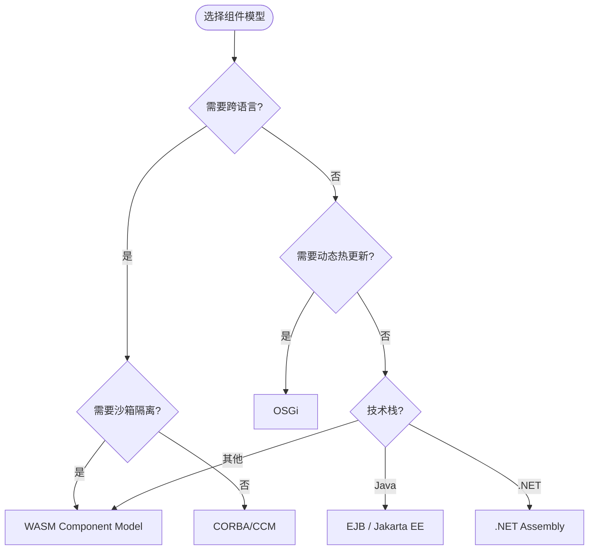
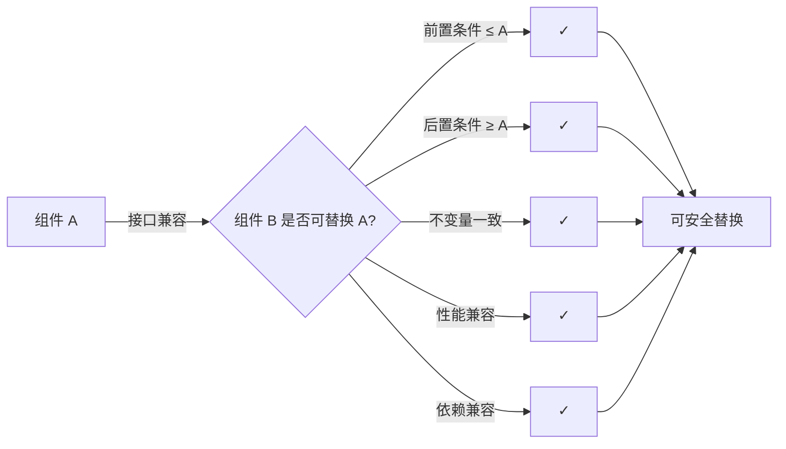
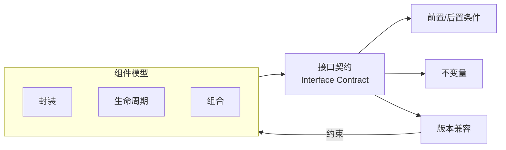
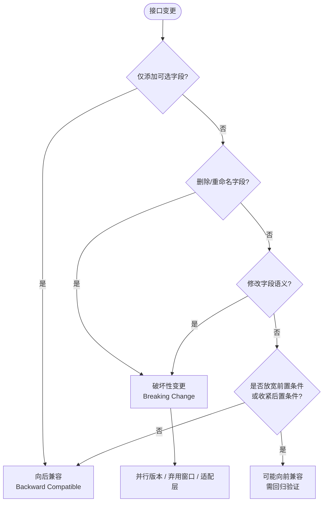
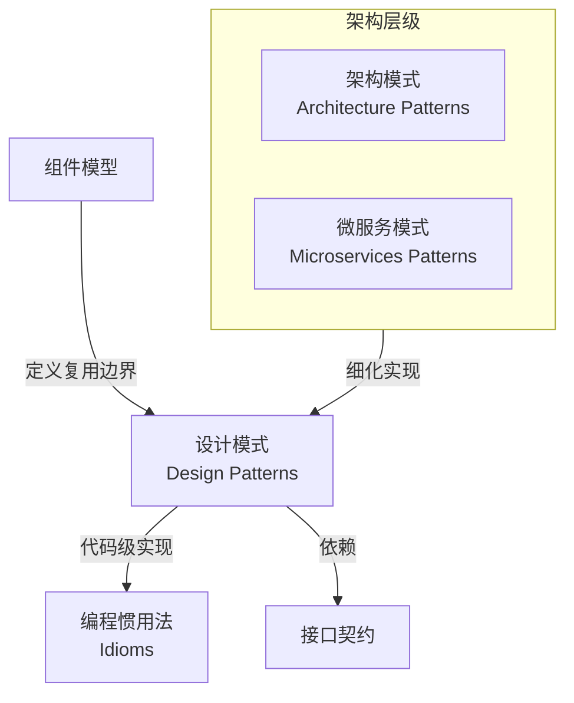
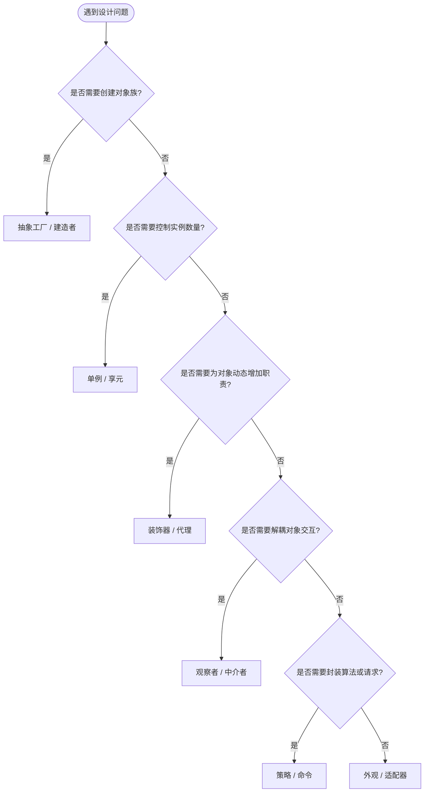
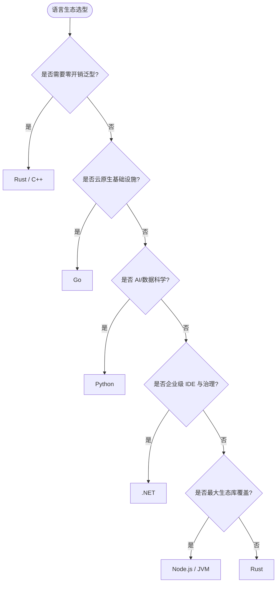

# 组件模型与架构复用

> **版本**: 2026-07-09
> **定位**: 由 `struct/04-component-architecture-reuse` 自动聚合生成的视角卷册（view volume）
> **生成命令**: `python scripts/sync-view-from-struct.py --topic 04-component-architecture-reuse --generate`
> **说明**: 本文件为 struct/ 的只读聚合视角，修改请直接在 struct/ 对应文件进行。

---


## 目录


1. [组件模型与架构复用](../struct/04-component-architecture-reuse/01-component-models/component-models-reuse.md)
2. [接口契约与架构复用](../struct/04-component-architecture-reuse/02-interface-contracts/interface-contracts-reuse.md)
3. [依赖管理与架构复用](../struct/04-component-architecture-reuse/03-dependency-management/dependency-management-reuse.md)
4. [组件接口契约设计模式](../struct/04-component-architecture-reuse/04-design-patterns/interface-design-patterns.md)
5. [组件设计模式选择指南](../struct/04-component-architecture-reuse/04-design-patterns/pattern-selection-guide.md)
6. [版本策略与架构复用](../struct/04-component-architecture-reuse/05-version-strategy/version-strategy-reuse.md)
7. [Gateway API + Istio Ambient 可复用部署模板](../struct/04-component-architecture-reuse/06-cloud-native-networking/examples/README.md)
8. [Gateway API v1.5 + GAMMA + Service Mesh 权威对齐（2025‑2026）](../struct/04-component-architecture-reuse/06-cloud-native-networking/gateway-api-v15-gamma-alignment.md)
9. [6大语言生态组件复用成熟度深度对比 2026](../struct/04-component-architecture-reuse/07-language-ecosystems/comparison-matrix-2026.md)
10. [开源语言生态与供应链复用治理](../struct/04-component-architecture-reuse/07-language-ecosystems/open-source-supply-chain-reuse.md)
11. [04 组件架构复用](../struct/04-component-architecture-reuse/README.md)

---


<!-- SOURCE: struct/04-component-architecture-reuse/01-component-models/component-models-reuse.md -->

# 组件模型与架构复用

> **版本**: 2026-07-08
> **定位**: 组件架构层 —— 组件模型的演进与跨语言组件复用的现代实践
> **对齐标准**: UML 2.5.1 Components, WASM Component Model, OSGi, JPMS, .NET Assembly, OMG CORBA/CCM
> **状态**: ✅ 已完成

---

## 目录

- [组件模型与架构复用](#组件模型与架构复用)
  - [目录](#目录)
  - [1. 组件模型演进](#1-组件模型演进)
    - [1.1 历史脉络](#11-历史脉络)
    - [1.2 组件模型的核心概念](#12-组件模型的核心概念)
  - [2. 现代组件模型对比](#2-现代组件模型对比)
    - [2.1 语言级组件模型](#21-语言级组件模型)
    - [2.2 跨语言组件模型：WASM Component Model](#22-跨语言组件模型wasm-component-model)
    - [2.3 企业级组件模型对比：CORBA / EJB / OSGi / WASM Component Model](#23-企业级组件模型对比corba--ejb--osgi--wasm-component-model)
      - [选型决策矩阵](#选型决策矩阵)
  - [3. 组件模型的复用语义](#3-组件模型的复用语义)
    - [3.1 兼容性判定](#31-兼容性判定)
    - [3.2 组件组合与替换条件](#32-组件组合与替换条件)
  - [4. WASM Component Model：跨语言复用的未来](#4-wasm-component-model跨语言复用的未来)
    - [4.1 当前状态（2026-06）](#41-当前状态2026-06)
    - [4.2 复用场景](#42-复用场景)
  - [5. 权威来源](#5-权威来源)
  - [6. 组件模型复用：深层分析与选型权衡](#6-组件模型复用深层分析与选型权衡)
    - [概念定义](#概念定义)
    - [核心属性](#核心属性)
    - [与其他概念的关系](#与其他概念的关系)
    - [解释：为什么组件模型决定复用边界](#解释为什么组件模型决定复用边界)
    - [组件模型选型权衡矩阵](#组件模型选型权衡矩阵)
    - [正例：跨框架 UI 组件库](#正例跨框架-ui-组件库)
    - [反例：框架特性硬编码的“伪组件”](#反例框架特性硬编码的伪组件)
    - [反例 2：忽视组件生命周期管理](#反例-2忽视组件生命周期管理)
    - [正例 2：OSGi 动态插件系统](#正例-2osgi-动态插件系统)
    - [形式化分析：组件替换条件](#形式化分析组件替换条件)
  - [7. 标准条款映射](#7-标准条款映射)
  - [8. 权威来源与交叉引用](#8-权威来源与交叉引用)

---

## 1. 组件模型演进

### 1.1 历史脉络

| 时代 | 技术 | 复用粒度 | 关键特征 |
|:---|:---|:---|:---|
| 1960s | 子程序/函数库 | 代码片段 | 静态链接 |
| 1980s | 对象/类库 | 对象 | 继承、多态 |
| 1990s | COM/DCOM, EJB, CORBA | 二进制组件 | 接口契约、远程调用 |
| 2000s | OSGi, .NET Assembly, SOA | 模块化组件 | 动态加载、服务发现 |
| 2010s | npm, Maven, Docker Image | 包/容器 | 依赖管理、版本控制 |
| **2020s** | **WASM Component Model** | **跨语言纳米服务** | **WIT 接口、沙箱安全** |

### 1.2 组件模型的核心概念

```text
组件模型核心要素
├── 接口（Interface）
│   ├── 操作签名（函数名、参数、返回值）
│   ├── 前置/后置条件
│   └── 不变量
├── 实现（Implementation）
│   ├── 隐藏内部状态
│   └── 实现接口承诺的行为
├── 部署单元（Deployment Unit）
│   ├── 独立分发和安装
│   └── 版本标识
├── 生命周期（Lifecycle）
│   ├── 安装、启动、停止、卸载
│   └── 依赖解析和激活
└── 元数据（Metadata）
    ├── 依赖声明
    ├── 配置参数
    └── 能力声明
```

---

## 2. 现代组件模型对比

### 2.1 语言级组件模型

| 语言/平台 | 组件单元 | 接口定义 | 依赖管理 | 运行时特性 |
|:---|:---|:---|:---|:---|
| **Java** | JPMS Module / OSGi Bundle | `module-info.java` / OSGi manifest | Maven/Gradle | 动态加载、服务注册 |
| **.NET** | Assembly | `public` 接口 + XML 文档 | NuGet | 强命名、版本策略 |
| **Rust** | Crate | `pub` 接口 + Trait | Cargo | 零成本抽象、编译时检查 |
| **Python** | Package / Namespace Package | `__init__.py` + 类型注解 | pip/uv/poetry | 动态导入、猴子补丁 |
| **JavaScript** | ES Module / npm Package | `export` + JSDoc/TypeScript | npm/pnpm | 动态加载、Tree Shaking |
| **Go** | Package / Module | `interface` + `go doc` | Go Modules | 静态链接、编译速度 |

### 2.2 跨语言组件模型：WASM Component Model

**核心创新**: 允许用不同语言编写的组件通过标准化的 WIT（WASM Interface Types）接口互操作。

```text
WASM Component Model 架构
├── WIT（WASM Interface Types）
│   ├── 语言无关的接口定义语言
│   ├── 支持 records、variants、resources、futures、streams
│   └── 编译为目标语言的绑定（Rust、Python、JavaScript 等）
├── Component
│   ├── 封装一个或多个 WASM Core Modules
│   ├── 通过 WIT 接口暴露功能
│   └── 可组合（Composition）形成更大组件
└── Runtime
    ├── Wasmtime（Bytecode Alliance）
    ├── WasmEdge
    └── 浏览器 WASM 引擎
```

**复用优势**:

- 语言无关：Rust 实现、Python 消费，无需 FFI
- 沙箱安全：WASM 的沙箱隔离比传统进程更安全
- 可组合性：组件可像乐高积木一样组合
- 可移植性：一次编译，到处运行（服务器、边缘、浏览器）

### 2.3 企业级组件模型对比：CORBA / EJB / OSGi / WASM Component Model

| 模型 | 代表技术 | 接口定义 | 运行时 | 生命周期 | 动态性 | 主要适用场景 |
|---|---|---|---|---|---|---|
| **CORBA/CCM** | OMG CORBA, IDL | OMG IDL | ORB（对象请求代理） | 安装→注册→激活→销毁 | 弱 | 1990s 企业分布式对象 |
| **EJB** | Java EE / Jakarta EE | Java 接口/注解 | EJB 容器 | 容器管理生命周期 | 中等 | 2000s 大型企业 Java 应用 |
| **OSGi** | Eclipse Equinox, Apache Felix | Java 接口 + Bundle Manifest | OSGi Framework | 安装→解析→启动→停止→更新→卸载 | **强** | 动态模块化系统、IDE 插件 |
| **.NET Assembly** | .NET Framework / Core | `public` 接口 + 元数据 | CLR / CoreCLR | 加载→执行→卸载（AssemblyLoadContext） | 中等 | 企业 .NET 应用、插件系统 |
| **WASM Component Model** | WIT + Component | `.wit` | Wasmtime / WasmEdge / 浏览器 | 实例化→链接→调用→释放 | 中等 | 跨语言纳米服务、边缘、插件 |

#### 选型决策矩阵

| 选型维度 | CORBA | EJB | OSGi | .NET Assembly | WASM Component Model |
|---|---|---|---|---|---|
| 跨语言互操作 | 强（多语言 IDL） | 弱（仅 Java） | 弱（仅 JVM） | 中等（多语言 .NET） | **强** |
| 运行时隔离 | 进程级 | 容器级 | 模块级 | AppDomain/进程级 | **沙箱级** |
| 动态加载/热更新 | 弱 | 中等 | **强** | 中等 | 中等 |
| 企业治理与监控 | 成熟 | **强** | 中等 | **强** | 发展中 |
| 云原生/轻量部署 | 弱 | 弱 | 中等 | 中等 | **强** |
| 现代工具链活跃度 | 低 | 中 | 中 | 高 | **高** |

> **选型建议**：遗留企业集成可选 CORBA/EJB；需要动态模块更新选 OSGi；.NET 企业生态选 Assembly；追求跨语言、沙箱安全与云原生部署选 WASM Component Model。



---

## 3. 组件模型的复用语义

### 3.1 兼容性判定

| 兼容类型 | 定义 | 判定方法 |
|:---|:---|:---|
| **二进制兼容** | 新组件可替换旧组件而无需重新编译消费者 | 检查 ABI 稳定性 |
| **源码兼容** | 消费者源码无需修改即可编译 | 检查 API 签名变化 |
| **语义兼容** | 新组件行为与旧组件一致 | 回归测试 + 形式化验证 |

### 3.2 组件组合与替换条件

```text
组件 A 可被组件 B 替换的条件
├── 接口兼容
│   ├── B 实现 A 的所有接口（或超集）
│   └── B 的前置条件不比 A 更严格
├── 行为兼容
│   ├── B 的后置条件不比 A 更弱
│   └── B 的不变量与 A 一致
├── 性能兼容
│   └── B 的性能特征在可接受范围内
└── 依赖兼容
    └── B 的依赖树与目标环境兼容
```

---

## 4. WASM Component Model：跨语言复用的未来

### 4.1 当前状态（2026-06）

| 项目 | 状态 | 说明 |
|:---|:---|:---|
| **WASI 0.3** | 2026-02 正式发布 | 原生异步 I/O（futures/streams） |
| **WASI 1.0** | 预期 2026 末-2027 初 | 企业级稳定性保证 |
| **wasm-pkg-tools** | 活跃开发 | OCI 兼容的 WASM 包管理 |
| **Component Model** | Phase 2+ | 可组合性提升 |
| **Wasmtime LTS** | 2026 启动 | 2 年安全支持 |

### 4.2 复用场景

```text
场景 1: 跨语言算法库复用
├── Rust 实现高性能图像处理算法
├── 编译为 WASM Component
├── Python 数据科学团队复用（无需重写）
└── JavaScript 前端团队复用（在浏览器中运行）

场景 2: 插件架构
├── 核心系统用 Go 编写
├── 插件接口用 WIT 定义
├── 第三方开发者可用任何支持语言编写插件
└── 插件在 WASM 沙箱中运行，保证系统安全

场景 3: 边缘计算
├── 一次编写业务逻辑组件
├── 部署到云服务器（Wasmtime）
├── 部署到边缘设备（WasmEdge）
└── 部署到浏览器（原生 WASM）
```

---

## 5. 权威来源

| 来源 | URL | 核查日期 |
|:---|:---|:---|
| OMG UML 2.5.1 Components | <https://www.omg.org/spec/UML/2.5.1/> | 2026-07-08 |
| WASM Component Model | <https://component-model.bytecodealliance.org/> | 2026-07-08 |
| WIT 规范 | <https://github.com/WebAssembly/component-model/blob/main/design/mvp/WIT.md> | 2026-07-08 |
| Wasmtime | <https://wasmtime.dev/> | 2026-07-08 |
| wasm-pkg-tools | <https://github.com/bytecodealliance/wasm-pkg-tools> | 2026-07-08 |
| OSGi Alliance | <https://www.osgi.org/> | 2026-07-08 |
| JPMS (Java 9+) | <https://openjdk.org/projects/jigsaw/> | 2026-07-08 |
| ISO/IEC/IEEE 42010:2022 | <https://www.iso.org/standard/74296.html> | 2026-07-08 |


---

## 6. 组件模型复用：深层分析与选型权衡

### 概念定义

**定义**：组件模型（Component Model）是定义软件组件的接口规范、封装边界、生命周期、组合规则与交互语义的抽象框架。它使组件能够作为独立部署单元被开发、分发、组合和替换，是 [Component-based software engineering](https://en.wikipedia.org/wiki/Component-based_software_engineering) 的核心支撑机制。

形式化上，一个组件模型可表示为五元组：

$$M = (I,\ Impl,\ D,\ L,\ Meta)$$

其中：

- $I$：接口集合，包含操作签名与契约；
- $Impl$：实现集合，对外部隐藏；
- $D$：部署单元（如 JAR、Assembly、WASM Component）；
- $L$：生命周期状态机（安装→启动→停止→卸载）；
- $Meta$：元数据（依赖、能力、配置）。

### 核心属性

| 属性 | 说明 | 重要性 |
|---|---|---|
| **封装性** | 内部实现对使用者不可见，仅通过显式接口交互 | 高 |
| **可替换性** | 满足接口与行为兼容的组件可互相替换 | 高 |
| **可组合性** | 小组件可通过组合形成更大组件或系统 | 高 |
| **部署独立性** | 组件可作为独立单元分发、版本化、安装 | 高 |
| **契约显式性** | 接口契约明确前置/后置条件与不变量 | 中 |

### 与其他概念的关系

- **上位概念**：[Component-based software engineering](https://en.wikipedia.org/wiki/Component-based_software_engineering)（基于组件的软件工程）；
- **下位概念**：具体技术模型，如 CORBA CCM、EJB、OSGi、.NET Assembly、WASM Component Model；
- **依赖概念**：[接口契约](../struct/04-component-architecture-reuse/02-interface-contracts/interface-contracts-reuse.md) 定义组件间交互规则；[设计模式](../struct/04-component-architecture-reuse/04-design-patterns/pattern-selection-guide.md) 解决组件内部结构问题；
- **映射概念**：组件模型与 [6大语言生态组件复用成熟度深度对比 2026](../struct/04-component-architecture-reuse/07-language-ecosystems/comparison-matrix-2026.md) 中的语言级模块系统存在实现映射。

### 解释：为什么组件模型决定复用边界

组件模型的选择直接决定复用的**范围、成本与演进灵活性**。强组件模型（如 OSGi、WASM Component Model）通过显式接口与生命周期管理，使组件可在运行时替换；弱组件模型（如传统 JavaScript 文件）虽然分发灵活，但缺乏编译期边界保障，容易出现隐式依赖与破坏性变更。

核心矛盾在于：**封装越强，复用越安全，但引入的运行时与治理成本也越高**。因此选型需在动态性、安全性、工具链成熟度与团队能力之间权衡。

### 组件模型选型权衡矩阵

| 关注点 | 强组件模型（OSGi/WASM） | 弱组件模型（脚本/简单包） | 权衡建议 |
|---|---|---|---|
| **运行时动态性** | 支持热更新、服务注册与发现 | 通常需重启进程 | 需要 7×24 在线更新的系统选强模型 |
| **编译期安全性** | 接口与依赖在编译/链接期可验证 | 依赖运行时解析，错误延迟暴露 | 大型团队协作优先强模型 |
| **部署粒度** | 组件独立部署，版本隔离 | 包级或应用级部署 | 微服务/插件架构优先组件级 |
| **治理成本** | 需要元数据、生命周期管理、兼容性审查 | 治理简单，版本控制即可 | 团队成熟度低时避免引入过重模型 |
| **跨语言支持** | WASM Component Model 提供原生跨语言 | 通常需 HTTP/gRPC/FFI 桥接 | 多语言混合系统优先 WASM |

> **选型原则**：在满足当前复用场景的前提下，选择团队能够持续维护的最小强度组件模型；避免为“未来可能的需求”提前引入 OSGi 或 WASM 的完整复杂度。

### 正例：跨框架 UI 组件库

**示例**：

**背景**：企业级中后台系统同时存在 React、Vue 与 Angular 应用，需要统一的设计组件库。

**做法**：采用 Web Components 标准（Custom Elements + Shadow DOM）构建基础组件，各前端框架通过包装器复用。

**效果**：

- 同一按钮/表单组件被三套技术栈复用，视觉与交互一致；
- 组件内部状态封装在 Shadow DOM 中，避免框架 CSS 污染；
- 新增框架时只需编写薄适配层，核心组件无需重写。

### 反例：框架特性硬编码的“伪组件”

**场景**：某团队将 React Hooks 与 Redux 状态管理直接写入“可复用组件”内部，组件 props 深层依赖 Redux Store 结构。

**后果**：

- 组件无法在 Vue/Angular 项目中复用；
- 每次 Redux Store 结构调整都导致组件修改；
- 单元测试需要挂载完整 Store，测试成本高昂。

**避免方法**：

- 组件只依赖 props/events 接口，不依赖框架状态管理；
- 将框架特定逻辑抽到适配层或 Container 组件中；
- 使用 [接口契约](../struct/04-component-architecture-reuse/02-interface-contracts/interface-contracts-reuse.md) 明确 props 类型、事件契约与生命周期。

### 反例 2：忽视组件生命周期管理

**场景**：某微服务框架允许动态加载 jar 包作为插件，但缺少明确的安装、启动、停止、卸载生命周期。插件作者直接在静态初始化块中启动线程和数据库连接。

**后果**：

1. 插件升级时无法安全停止旧版本线程，导致内存泄漏与连接池耗尽；
2. 旧插件的类加载器无法被回收，出现元空间（Metaspace）溢出；
3. 系统无法判断插件是否处于可用状态，启动顺序依赖隐式约定。

**正确做法**：

- 为组件定义清晰的生命周期接口（如 OSGi 的 `BundleActivator` 或 WASM 的 `wasi:cli/run`）；
- 在停止阶段释放所有资源，避免依赖线程被动终止；
- 通过健康检查与就绪探针暴露组件状态，让编排器按依赖顺序启动。

### 正例 2：OSGi 动态插件系统

**示例**：

**背景**：某企业级 IDE 需要支持第三方插件在不重启核心进程的情况下安装、升级与卸载，同时保证插件崩溃不会影响整个 IDE。

**做法**：采用 OSGi 作为组件模型，每个插件打包为 Bundle，通过 `BundleContext` 注册和发现服务。核心平台定义稳定的扩展点接口（Extension Point），插件通过实现接口接入。

**效果**：

- 插件可独立发布版本，用户可在运行时 marketplace 中安装；
- 核心平台与插件之间通过 OSGi Service Registry 解耦，插件替换无需修改平台代码；
- Bundle 的类加载隔离避免插件间依赖冲突，单个 Bundle 异常可被框架捕获并单独停用。

### 形式化分析：组件替换条件



> **结论**：组件替换不仅是接口签名匹配，还必须保证行为语义、性能特征与依赖环境的兼容性。

## 7. 标准条款映射

| 本主题概念 | 对应标准条款 | 映射说明 |
|:---|:---|:---|
| 组件（Component） | UML 2.5.1 §11 Components | 组件通过 Provided/Required Interface 定义可替换边界 |
| 组件图 | UML 2.5.1 §19.3 Component Diagrams | 描述组件、端口、接口与依赖关系的结构视图 |
| 组件替换条件 | Liskov Substitution Principle | 前置条件弱化、后置条件强化、不变量保持 |
| 架构描述视图 | ISO/IEC/IEEE 42010:2022 §5.4 | 组件与连接器（C&C）视图是架构描述的典型视图 |
| 跨语言组件 | WASM Component Model + WIT | 通过 WIT 接口实现语言无关的组件组合 |
| 动态模块 | OSGi R8 Core Specification | Bundle 生命周期、服务注册与动态热更新 |

## 8. 权威来源与交叉引用

> **权威来源**:
>
> - [OMG UML 2.5.1 Specification](https://www.omg.org/spec/UML/2.5.1/) — UML 组件与组件图；核查日期：2026-07-08
> - [ISO/IEC/IEEE 42010:2022](https://www.iso.org/standard/74296.html) — 架构描述标准；核查日期：2026-07-08
> - [WASM Component Model](https://component-model.bytecodealliance.org/) — Bytecode Alliance；核查日期：2026-07-08
> - [OSGi Alliance](https://www.osgi.org/) — OSGi R8 规范；核查日期：2026-07-08
> - [JPMS (Java 9+)](https://openjdk.org/projects/jigsaw/) — Java Platform Module System；核查日期：2026-07-08
> - [Component-based software engineering — Wikipedia](https://en.wikipedia.org/wiki/Component-based_software_engineering) — 组件工程概述；核查日期：2026-07-08
>
> **核查日期**: 2026-07-08

**交叉引用**

- [接口契约与架构复用](../struct/04-component-architecture-reuse/02-interface-contracts/interface-contracts-reuse.md) — 组件间交互的显式约定
- [组件设计模式选择指南](../struct/04-component-architecture-reuse/04-design-patterns/pattern-selection-guide.md) — 组件内部结构复用
- [6大语言生态组件复用成熟度深度对比 2026](../struct/04-component-architecture-reuse/07-language-ecosystems/comparison-matrix-2026.md) — 语言级组件模型能力对比
- [软件架构复用框架总览](../struct/README.md) — 知识体系全局视图


---


<!-- SOURCE: struct/04-component-architecture-reuse/02-interface-contracts/interface-contracts-reuse.md -->

# 接口契约与架构复用

> **版本**: 2026-07-08
> **定位**: 组件架构层 —— 接口契约驱动的复用：从 IDL 到 OpenAPI 到 WIT 的演进
> **对齐标准**: UML 2.5.1 Interfaces, ISO/IEC/IEEE 42010, OpenAPI 3.1, gRPC Protobuf, AsyncAPI, WIT, Pact, Spring Cloud Contract
> **状态**: ✅ 已完成

---

## 目录

- [接口契约与架构复用](#接口契约与架构复用)
  - [目录](#目录)
  - [1. 接口契约演进](#1-接口契约演进)
    - [1.1 历史脉络](#11-历史脉络)
    - [1.2 现代接口契约技术对比](#12-现代接口契约技术对比)
    - [1.3 接口契约的形式化定义](#13-接口契约的形式化定义)
    - [1.4 接口契约的核心属性](#14-接口契约的核心属性)
    - [1.5 接口契约与组件模型的关系](#15-接口契约与组件模型的关系)
    - [解释：接口契约为何是复用的安全边界](#解释接口契约为何是复用的安全边界)
    - [1.6 隐式契约反例：没有文档的“常识”](#16-隐式契约反例没有文档的常识)
    - [1.7 前置/后置条件与不变量的设计示例](#17-前置后置条件与不变量的设计示例)
    - [1.8 契约变更与版本兼容性的最佳实践](#18-契约变更与版本兼容性的最佳实践)
    - [1.9 接口契约与隐式依赖的治理](#19-接口契约与隐式依赖的治理)
  - [2. 契约驱动的复用](#2-契约驱动的复用)
    - [2.1 Consumer-Driven Contracts（CDC）](#21-consumer-driven-contractscdc)
    - [2.2 契约作为复用单元](#22-契约作为复用单元)
  - [3. 接口版本策略](#3-接口版本策略)
    - [3.1 向后兼容（Backward Compatible）](#31-向后兼容backward-compatible)
    - [3.2 向前兼容（Forward Compatible）](#32-向前兼容forward-compatible)
    - [3.3 破坏性变更管理](#33-破坏性变更管理)
    - [3.4 兼容性判定决策树](#34-兼容性判定决策树)
    - [分析](#分析)
  - [4. 契约测试在复用流水线中的位置](#4-契约测试在复用流水线中的位置)
  - [5. 案例：基于 OpenAPI + Pact 的微服务契约复用](#5-案例基于-openapi--pact-的微服务契约复用)
    - [5.1 场景](#51-场景)
    - [5.2 契约定义](#52-契约定义)
    - [5.3 Pact 契约测试](#53-pact-契约测试)
    - [5.4 复用价值](#54-复用价值)
  - [6. 标准条款映射](#6-标准条款映射)
  - [7. 权威来源](#7-权威来源)
  - [8. 交叉引用](#8-交叉引用)

---

## 1. 接口契约演进

### 1.1 历史脉络

| 时代 | 技术 | 用途 | 复用粒度 |
|:---|:---|:---|:---|
| 1990s | CORBA IDL | 分布式对象 | 对象方法 |
| 2000s | WSDL | Web Service | 服务操作 |
| 2010s | Swagger/OpenAPI | REST API | HTTP 端点 |
| 2010s | Protobuf/gRPC | 高性能 RPC | 服务方法 |
| 2020s | AsyncAPI | 异步消息 | 事件通道 |
| **2020s** | **WIT** | **WASM 组件** | **组件接口** |

### 1.2 现代接口契约技术对比

| 技术 | 协议 | 序列化 | 流支持 | 代码生成 | 主要场景 |
|:---|:---|:---|:---:|:---:|:---|
| **OpenAPI 3.1** | HTTP/REST | JSON/XML | ❌ | ✅ | Web API、微服务 |
| **gRPC + Protobuf** | HTTP/2 | Protobuf | ✅ | ✅ | 内部服务、高性能 |
| **GraphQL** | HTTP | JSON | ❌ | ✅ | 客户端驱动查询 |
| **AsyncAPI** | MQTT/AMQP/Kafka | JSON/Avro/Protobuf | ✅ | ✅ | 事件驱动架构 |
| **WIT** | 组件导入/导出 | 语言原生 | ✅ (WASI 0.3) | ✅ | 跨语言组件 |
| **tRPC** | HTTP | JSON | ❌ | ✅ | 全栈 TypeScript |

---

### 1.3 接口契约的形式化定义

**定义**：接口契约（Interface Contract）是组件或服务之间为实现可预期交互而显式约定的语法、语义与质量约束集合。它规定了调用者必须满足的前置条件（precondition）、被调用者必须保证的后置条件（postcondition），以及跨越多次调用的不变量（invariant）。该概念是 [Design by contract](https://en.wikipedia.org/wiki/Design_by_contract) 在组件接口层面的工程化表达。

形式化上，可将接口契约视为对操作语义的约束三元组：

$$C(o) = (Pre(o),\ Post(o),\ Inv(o))$$

其中：

- $Pre(o) \subseteq InputState$：调用者进入操作 $o$ 前必须满足的状态集合；
- $Post(o) \subseteq InputState \times OutputState$：操作 $o$ 完成后调用者可观察的状态转移集合；
- $Inv(o) \subseteq State$：在对象/组件生命周期内始终保持的全局不变量。

可替换性判定（Liskov 替换原则的契约视角）：

> 若组件 $B$ 替换组件 $A$，则 $B$ 的前置条件不得比 $A$ 更严格，后置条件不得比 $A$ 更弱，且不变量必须保持。

### 1.4 接口契约的核心属性

| 属性 | 说明 | 重要性 |
|---|---|---|
| **显式性** | 契约以 IDL/OpenAPI/WIT 等可机读形式声明，避免“口头约定” | 高 |
| **可验证性** | 可通过契约测试、静态检查或模型检验验证调用双方是否履约 | 高 |
| **稳定性** | 契约变更频率应低于实现变更频率，且遵循版本兼容策略 | 高 |
| **可组合性** | 多个契约可组合为更大的服务契约或业务契约 | 中 |
| **版本兼容性** | 契约演进需明确向后/向前兼容规则，避免消费者断裂 | 高 |

### 1.5 接口契约与组件模型的关系

接口契约位于 [组件模型](../struct/04-component-architecture-reuse/01-component-models/component-models-reuse.md) 与外部世界之间，是组件“可替换性”的判据。组件模型回答“如何封装与组合”，接口契约回答“如何安全地交互”。



### 解释：接口契约为何是复用的安全边界

接口契约的本质是把“假设”变成“承诺”。在没有契约的情况下，消费者只能基于对实现的观察编写代码，任何内部变化都可能成为破坏性变更；而显式契约把双方的责任边界固定下来，使提供者可以在不通知所有消费者的情况下进行安全演进。

这一机制解决了复用中的两个根本矛盾：

1. **封装与可见性的矛盾**：组件需要隐藏实现细节，但消费者又需要足够信息来正确使用；
2. **稳定与演进的矛盾**：接口需要长期稳定以支持复用，但业务需求又要求持续变化。

通过前置条件、后置条件、不变量与版本策略，接口契约在上述矛盾之间建立了可验证的平衡点。它不仅是技术文档，更是跨团队、跨系统复用时的法律依据。

### 1.6 隐式契约反例：没有文档的“常识”

**反例**：

**场景**：某内部 REST 服务在实现中约定 `GET /orders/{id}` 返回字段 `orderStatus` 取值为 `PAID`、`SHIPPED`、`DONE`。但 OpenAPI 仅声明 `status` 为字符串，未给出枚举约束。消费者 A 自行将 `DONE` 视为终态；三个月后服务端新增 `REFUNDED`，消费者 A 的状态机崩溃，导致订单重复发货。

**错误根因**：

1. 把实现细节（当前枚举值）当作隐式契约；
2. 缺少不变量声明：订单状态机必须满足 `PAID → SHIPPED → {DONE, REFUNDED}` 的偏序关系；
3. 变更未通过契约测试验证消费者影响。

**后果**：生产事故、回滚、消费者信任下降。

**避免方法**：

- 在 schema 中显式声明枚举与状态转换规则；
- 使用 Pact/Spring Cloud Contract 将隐式期望固化为可执行契约；
- 引入 [Design by contract](https://en.wikipedia.org/wiki/Design_by_contract) 思想，把不变量写入接口文档或断言。

### 1.7 前置/后置条件与不变量的设计示例

以电商系统中的“订单取消”操作为例，说明如何在接口契约中显式声明前置条件、后置条件与不变量。

**操作签名**：

```http
POST /orders/{orderId}/cancel
Authorization: Bearer <token>
```

**前置条件（Precondition）**：

1. 订单 `orderId` 必须存在；
2. 当前订单状态必须为 `PENDING` 或 `PAID`，已发货或已完成的订单不可取消；
3. 调用者必须是订单所有者或具备 `ORDER_CANCEL` 权限的角色。

**后置条件（Postcondition）**：

1. 订单状态转移为 `CANCELLED`；
2. 若订单已支付，则触发退款流程，退款金额等于订单实付金额；
3. 占用的库存必须在 5 分钟内释放回可用库存池。

**不变量（Invariant）**：

1. 订单 ID 在生命周期内不可变更；
2. 订单总金额 `totalAmount` 始终为非负数；
3. 状态转换必须满足偏序关系：`PENDING → PAID → SHIPPED → DONE`，取消只能从 `PENDING` 或 `PAID` 进入 `CANCELLED`。

**契约声明方式**：

- 在 OpenAPI 中通过 `x-preconditions`、`x-postconditions` 扩展字段记录；
- 在代码中使用断言或防御式编程校验前置条件；
- 在事件日志或状态机测试中验证不变量。

> **价值**：当多个团队（订单、支付、库存、物流）围绕同一订单服务集成时，显式契约让每个消费者都能准确推断自己在何种状态下可以调用何种操作，避免状态机冲突与资损风险。

### 1.8 契约变更与版本兼容性的最佳实践

接口契约一旦发布，就会被多个消费者依赖，因此变更管理是契约复用的核心挑战。以下实践可帮助在演进契约的同时保护既有消费者：

1. **优先扩展而非修改**：在 OpenAPI/Protobuf/WIT 中新增可选字段、新增端点或新增枚举值，通常比修改现有字段更安全；
2. **显式标注弃用**：使用 `deprecated: true` 或 `@Deprecated` 标注即将移除的字段，并给出替代方案与时间表；
3. **保持后置条件不弱化**：即使新增字段，也不应改变原有字段的语义或取值范围。例如，原字段 `quantity` 表示“可用库存”，不能在某版本中突然改为“已售库存”；
4. **前置条件不放松也不随意收紧**：放宽前置条件可能导致旧实现无法处理新输入；收紧前置条件则可能导致旧消费者调用失败；
5. **利用契约测试回归验证**：在 CI 中运行 Pact 或 Spring Cloud Contract 验证，确保提供者变更不会破坏已发布的消费者期望；
6. **记录不变量与状态机**：把订单、支付、库存等核心业务对象的状态转换规则写入接口文档或独立的业务规则仓库，使契约变更审查有据可依。

> **核心原则**：接口契约的演进应遵循“加法优先、语义稳定、兼容验证、透明弃用”的十六字方针。

### 1.9 接口契约与隐式依赖的治理

除了显式声明的 schema 与操作签名，接口之间还存在大量隐式依赖：时序假设、副作用顺序、幂等性约定、错误码语义、超时与重试策略等。这些隐式依赖如果不被治理，会成为复用中的“暗礁”。

治理建议包括：

- **把幂等性写入契约**：在 HTTP 接口中通过 `Idempotency-Key` 头部或操作签名显式声明；
- **统一错误模型**：定义标准的错误码结构、重试策略与降级行为，避免消费者自行解读；
- **记录时序与副作用**：使用序列图或状态机说明操作的先决条件与后续影响；
- **契约注册中心**：通过 Pact Broker、SwaggerHub 或内部 API Portal 集中管理契约版本与依赖关系，使隐式依赖可视化。

> **目标**：让任何接口消费者都能通过阅读契约文档，独立判断“在什么情况下、以什么顺序、调用什么操作”是安全的。

## 2. 契约驱动的复用

### 2.1 Consumer-Driven Contracts（CDC）

**核心理念**: 由消费者定义期望的契约，提供者确保满足这些契约。

```
CDC 工作流程
├── 消费者团队编写契约测试
│   └── 定义期望的请求/响应格式
├── 契约发布到共享注册中心（Pact Broker）
├── 提供者团队拉取契约并验证
│   └── 在 CI 中运行提供者验证测试
└── 双方契约兼容时才能部署
```

### 2.2 契约作为复用单元

| 契约类型 | 复用内容 | 复用方式 |
|:---|:---|:---|
| **OpenAPI Spec** | API 定义、数据模型、示例 | 共享规范文件、代码生成 |
| **Protobuf** | 消息格式、服务定义 | 共享 `.proto` 文件、编译为各语言绑定 |
| **AsyncAPI** | 事件 schema、通道定义 | 共享 AsyncAPI 文档、生成发布/订阅代码 |
| **Pact 契约** | 消费者期望的交互模式 | 共享 Pact 文件、双向验证 |
| **WIT** | 组件接口、类型定义 | 共享 `.wit` 文件、生成语言绑定 |

---

## 3. 接口版本策略

### 3.1 向后兼容（Backward Compatible）

**安全变更**（消费者无需修改）:

- 添加新的可选字段
- 添加新的端点/操作
- 放宽输入验证规则
- 缩小输出范围（更具体）

### 3.2 向前兼容（Forward Compatible）

**安全变更**（旧消费者可处理新响应）:

- 使用 extensible 的 schema 设计
- 忽略未知字段
- 使用默认值处理缺失字段

### 3.3 破坏性变更管理

```
破坏性变更处理策略
├── 策略 1: 并行版本（URL 版本）
│   └── /v1/users → /v2/users
├── 策略 2: 内容协商（Header 版本）
│   └── Accept: application/vnd.api.v2+json
├── 策略 3: 弃用窗口
│   └── 发布 v2 后，v1 维护 6-12 个月
├── 策略 4: 兼容性层
│   └── v2 服务内部调用 v1 适配器
└── 策略 5: 消费者通知
    └── 自动化分析哪些消费者受影响
```

### 3.4 兼容性判定决策树



### 分析

判断变更是否安全，不能只看 schema 结构，还需检查前置条件、后置条件与不变量的强弱变化。

> **结论**：接口变更的兼容性最终取决于契约语义约束的强弱变化，而非仅取决于 schema 结构是否变化。

---

## 4. 契约测试在复用流水线中的位置

```
复用流水线中的契约测试
├── 开发阶段
│   ├── 消费者编写契约测试（Pact/WireMock）
│   └── 提供者实现接口并通过契约验证
├── 集成阶段
│   ├── CI 中运行契约验证（can-i-deploy 检查）
│   └── 契约兼容方可合并
├── 部署阶段
│   ├── 部署前验证生产环境契约兼容性
│   └── 契约破坏阻断部署
└── 运营阶段
    ├── 持续监控实际交互是否符合契约
    └── 契约漂移告警
```

---

## 5. 案例：基于 OpenAPI + Pact 的微服务契约复用

### 5.1 场景

电商系统中有三个微服务：

- **订单服务**（消费者）→ 调用 → **库存服务**（提供者）
- **支付服务**（消费者）→ 调用 → **库存服务**（提供者）

### 5.2 契约定义

```yaml
# OpenAPI 规范（库存服务接口）
openapi: 3.1.0
info:
  title: Inventory API
  version: 1.0.0
paths:
  /products/{id}/availability:
    get:
      parameters:
        - name: id
          in: path
          required: true
          schema:
            type: string
      responses:
        '200':
          description: 库存可用性
          content:
            application/json:
              schema:
                type: object
                properties:
                  available:
                    type: boolean
                  quantity:
                    type: integer
                    minimum: 0
```

### 5.3 Pact 契约测试

```javascript
// 订单服务消费者测试
const { PactV3 } = require('@pact-foundation/pact');

describe('Inventory API contract', () => {
  const provider = new PactV3({
    consumer: 'order-service',
    provider: 'inventory-service'
  });

  it('returns product availability', () => {
    provider
      .given('product exists')
      .uponReceiving('get product availability')
      .withRequest({
        method: 'GET',
        path: '/products/PROD-123/availability'
      })
      .willRespondWith({
        status: 200,
        body: {
          available: true,
          quantity: 100
        }
      });
  });
});
```

### 5.4 复用价值

- 库存服务接口契约被两个消费者复用
- 契约测试确保任何接口变更不会破坏现有消费者
- Pact Broker 作为契约注册中心，支持契约的版本管理和兼容性检查

---

## 6. 标准条款映射

| 本主题概念 | 对应标准条款 | 映射说明 |
|:---|:---|:---|
| 接口 / 接口实现 | UML 2.5.1 §10.4 Interfaces | 接口定义操作集合，组件通过 Interface Realization 实现接口 |
| 组件图接口 | UML 2.5.1 §19.3 Component Diagrams | Provided/Required Interface 描述组件间供需关系 |
| 架构视图 | ISO/IEC/IEEE 42010:2022 §5.4, §6.4 | 接口契约视图作为架构描述的模型种类之一 |
| 架构描述实践 | IEEE 1471:2000 | 架构描述中 Viewpoint 与 View 的区分影响接口契约的稳定性 |
| 契约设计 | Design by Contract (Meyer, 1988) | 前置条件、后置条件、不变量是接口契约的语义基础 |
| REST API 契约 | OpenAPI 3.1.0 | HTTP 接口的语法契约标准 |
| RPC 接口契约 | gRPC + Protobuf | 高性能服务间接口契约标准 |
| 异步事件契约 | AsyncAPI 3.x | 事件驱动架构的通道与消息契约标准 |
| 跨语言组件契约 | WIT (WASM Interface Types) | WASM Component Model 的接口定义语言 |
| 消费者驱动契约 | Pact Specification | 消费者与提供者之间的双向契约验证 |

## 7. 权威来源

| 来源 | URL | 核查日期 |
|:---|:---|:---|
| OMG UML 2.5.1 | <https://www.omg.org/spec/UML/2.5.1/> | 2026-07-08 |
| ISO/IEC/IEEE 42010:2022 | <https://www.iso.org/standard/74296.html> | 2026-07-08 |
| IEEE 1471:2000 | <https://standards.ieee.org/standard/1471-2000.html> | 2026-07-08 |
| OpenAPI Specification 3.1 | <https://spec.openapis.org/oas/v3.1.0> | 2026-07-08 |
| gRPC / Protocol Buffers | <https://grpc.io/> | 2026-07-08 |
| AsyncAPI | <https://www.asyncapi.com/> | 2026-07-08 |
| Pact (Consumer-Driven Contracts) | <https://pact.io/> | 2026-07-08 |
| Spring Cloud Contract | <https://spring.io/projects/spring-cloud-contract> | 2026-07-08 |
| WIT (WASM Interface Types) | <https://component-model.bytecodealliance.org/design/wit.html> | 2026-07-08 |
| Design by Contract — Wikipedia | <https://en.wikipedia.org/wiki/Design_by_contract> | 2026-07-08 |
| Component-based Software Engineering — Wikipedia | <https://en.wikipedia.org/wiki/Component-based_software_engineering> | 2026-07-08 |
| Liskov Substitution Principle — Wikipedia | <https://en.wikipedia.org/wiki/Liskov_substitution_principle> | 2026-07-08 |

## 8. 交叉引用

- [组件模型与架构复用](../struct/04-component-architecture-reuse/01-component-models/component-models-reuse.md) — 组件封装、生命周期与可替换性判定
- [组件设计模式选择指南](../struct/04-component-architecture-reuse/04-design-patterns/pattern-selection-guide.md) — 通过模式降低接口契约的复杂度
- [6大语言生态组件复用成熟度深度对比 2026](../struct/04-component-architecture-reuse/07-language-ecosystems/comparison-matrix-2026.md) — 不同语言生态对接口契约工具链的支持差异
- [软件架构复用框架总览](../struct/README.md) — 本知识体系的全局视图


---


<!-- SOURCE: struct/04-component-architecture-reuse/03-dependency-management/dependency-management-reuse.md -->

# 依赖管理与架构复用

> **版本**: 2026-06-10
> **定位**: 组件架构层 —— 依赖解析、锁定与治理：复用组件的供应链基础
> **对齐标准**: Semver 2.0.0, SPDX, CycloneDX, SLSA 1.2, OpenSSF OSPS Baseline
> **状态**: ✅ 已完成

---

## 目录

- [依赖管理与架构复用](#依赖管理与架构复用)
  - [目录](#目录)
  - [1. 依赖管理演进](#1-依赖管理演进)
    - [1.1 历史脉络](#11-历史脉络)
    - [1.2 现代依赖管理工具对比](#12-现代依赖管理工具对比)
  - [2. 依赖解析算法](#2-依赖解析算法)
    - [2.1 版本冲突](#21-版本冲突)
    - [2.2 传递依赖深度](#22-传递依赖深度)
  - [3. 依赖锁定机制](#3-依赖锁定机制)
    - [3.1 Lockfile 的复用保证作用](#31-lockfile-的复用保证作用)
    - [3.2 Lockfile 与 SBOM 的关系](#32-lockfile-与-sbom-的关系)
  - [4. 依赖升级策略](#4-依赖升级策略)
    - [4.1 自动化升级工具](#41-自动化升级工具)
    - [4.2 升级策略矩阵](#42-升级策略矩阵)
  - [5. 依赖复用的风险](#5-依赖复用的风险)
    - [5.1 依赖膨胀（Dependency Bloat）](#51-依赖膨胀dependency-bloat)
    - [5.2 供应链攻击面](#52-供应链攻击面)
    - [5.3 许可证冲突](#53-许可证冲突)
  - [6. 权威来源](#6-权威来源)
  - [补充说明：依赖管理与架构复用](#补充说明依赖管理与架构复用)
  - [概念定义](#概念定义)
  - [示例](#示例)
  - [反例](#反例)
  - [分析](#分析)

---

## 1. 依赖管理演进

### 1.1 历史脉络

| 时代 | 工具/机制 | 创新 | 局限 |
|:---|:---|:---|:---|
| 1990s | 手动 JAR / `#include` | 简单直接 | 版本冲突、传递依赖地狱 |
| 2000s | Maven / Ivy | 中央仓库、传递依赖自动解析 | XML 繁琐、版本冲突 |
| 2010s | npm / Bundler / pip | 语义化版本、lockfile | 依赖膨胀、left-pad 事件 |
| 2010s | Go Modules / Cargo | 最小版本选择、原生支持 | 生态迁移成本 |
| 2020s | pnpm / uv / Yarn Berry | 内容寻址存储、零安装 | 工具链碎片化 |
| **2020s** | **SBOM + SLSA** | **供应链安全 + 溯源** | **adoption 进行中** |

### 1.2 现代依赖管理工具对比

| 工具 | 生态 | 锁文件 |  workspaces | 内容寻址 | 安全扫描 |
|:---|:---|:---:|:---:|:---:|:---:|
| **Maven** | Java | `pom.xml` + lock plugin | ✅ | ❌ | 插件支持 |
| **Gradle** | Java/Kotlin/Android | `gradle.lockfile` | ✅ | ❌ | 插件支持 |
| **npm** | JavaScript | `package-lock.json` | ✅ | ❌ | `npm audit` |
| **pnpm** | JavaScript | `pnpm-lock.yaml` | ✅ | ✅ | `pnpm audit` |
| **Yarn Berry** | JavaScript | `yarn.lock` | ✅ | ✅ | `yarn npm audit` |
| **pip** | Python | `requirements.txt` / `poetry.lock` | ✅ (Poetry) | ❌ | `pip-audit` |
| **uv** | Python | `uv.lock` | ✅ | ✅ | `uv pip audit` |
| **Cargo** | Rust | `Cargo.lock` | ✅ (workspace) | ❌ | `cargo audit` |
| **Go Modules** | Go | `go.sum` | ✅ | ❌ | `govulncheck` |

---

## 2. 依赖解析算法

### 2.1 版本冲突

**钻石依赖问题（Diamond Dependency Problem）**:

```
        App
       /   \
    Lib A   Lib B
       \   /
      Lib C v1.0  vs  Lib C v2.0
```

**解决策略**:

| 策略 | 工具 | 说明 |
|:---|:---|:---|
| **最近优先** | npm | 选择离根最近的版本 |
| **最高满足** | Maven | 选择满足约束的最高版本 |
| **最小版本** | Go Modules, Cargo | 选择满足约束的最低版本 |
| **强制统一** | Maven Enforcer | 构建失败，要求人工解决 |
| **多版本共存** | npm, pnpm | 允许同一包多版本并存 |

### 2.2 传递依赖深度

```
传递依赖风险评估
├── 深度 1-2: 低风险
│   └── 直接依赖和一层传递依赖
├── 深度 3-5: 中风险
│   └── 需要 SBOM 追踪
└── 深度 >5: 高风险
    └── 依赖膨胀、难以审计
    └── 建议：定期审查和裁剪
```

---

## 3. 依赖锁定机制

### 3.1 Lockfile 的复用保证作用

Lockfile 是依赖管理的"**时间机器**"，确保：

- **可重现构建**: 任何时间、任何环境构建结果一致
- **安全基线**: 已知无漏洞的依赖组合
- **审计追踪**: 精确知道构建中包含哪些组件

### 3.2 Lockfile 与 SBOM 的关系

```
Lockfile vs SBOM
├── Lockfile
│   ├── 面向: 构建工具
│   ├── 目的: 可重现构建
│   └── 格式: 工具特定（package-lock.json, Cargo.lock）
└── SBOM
    ├── 面向: 安全审计和合规
    ├── 目的: 供应链透明
    └── 格式: 标准化（SPDX, CycloneDX, SWID）

关系: Lockfile 是 SBOM 的输入之一
      最佳实践: 从 Lockfile 自动生成 SBOM
```

---

## 4. 依赖升级策略

### 4.1 自动化升级工具

| 工具 | 功能 | 集成方式 |
|:---|:---|:---|
| **Dependabot** | GitHub 原生，自动 PR | GitHub 集成 |
| **Renovate** | 多平台，高度可配置 | CLI / CI / 托管 |
| **Snyk** | 安全导向的升级建议 | CLI / IDE / CI |
| **FOSSA** | 许可证 + 安全双检查 | CI 集成 |

### 4.2 升级策略矩阵

| 变更类型 | Semver | 自动升级 | 人工审查 | 回滚计划 |
|:---|:---:|:---:|:---:|:---:|
| Patch (bugfix) | x.x.Z | ✅ 自动 | ❌ | 自动 |
| Minor (feature) | x.Y.x | ⚠️ 条件自动 | ⚠️ 快速审查 | 自动 |
| Major (breaking) | X.x.x | ❌ 禁止自动 | ✅ 详细审查 | 手动 |
| Security | 任意 | ✅ 紧急自动 | ✅ 事后审查 | 自动 |

---

## 5. 依赖复用的风险

### 5.1 依赖膨胀（Dependency Bloat）

**现象**: 项目引入大量不必要的依赖。

**影响**:

- 构建时间增加
- 部署包体积膨胀
- 攻击面扩大
- 碳足迹增加

**缓解措施**:

- 定期使用 `depcheck` 等工具检测未使用依赖
- 优先选择零依赖或轻依赖的库
- 评估"微包"（如 left-pad）是否值得引入

### 5.2 供应链攻击面

每个依赖都是潜在的攻击入口：

- 恶意包（typosquatting、账户劫持）
- 漏洞传递（传递依赖中的 CVE）
- 构建时攻击（安装脚本执行恶意代码）

### 5.3 许可证冲突

**常见冲突**:

- GPL 传染性: 复用 GPL 组件可能导致整个项目需开源
- 商业许可证: 超出免费使用范围
- 专利条款: 某些许可证（如 Apache 2.0）的专利授权条款

**缓解措施**:

- 使用 `license-checker`、`FOSSA` 等工具扫描
- 建立组织许可证策略（允许/禁止/需审批列表）
- 在复用决策中纳入许可证合规检查

---

## 6. 权威来源

| 来源 | URL | 核查日期 |
|:---|:---|:---|
| Semver 2.0.0 | <https://semver.org/> | 2026-06-10 |
| SPDX | <https://spdx.dev/> | 2026-06-10 |
| CycloneDX | <https://cyclonedx.org/> | 2026-06-10 |
| SLSA 1.2 | <https://slsa.dev/spec/v1.2/> | 2026-06-10 |
| OpenSSF OSPS | <https://baseline.openssf.org> | 2026-06-10 |
| OWASP Dependency-Check | <https://owasp.org/www-project-dependency-check/> | 2026-06-10 |
| Renovate | <https://docs.renovatebot.com/> | 2026-06-10 |


---

## 补充说明：依赖管理与架构复用

## 概念定义

**定义**：依赖管理复用是通过包管理器、版本锁定、仓库镜像与 SBOM 等手段，安全、可重复地复用外部与内部组件。

## 示例

**示例**：团队使用 lockfile 锁定所有依赖版本，并通过内部镜像仓库缓存公共包，确保构建可重现并降低供应链攻击面。

## 反例

**反例**：项目使用“*”版本范围安装依赖，导致构建在不同时间拉取不同版本，出现不可预期的破坏性变更。

## 分析

**分析**：依赖管理是组件复用的风险控制点，需平衡更新灵活性与构建可重现性。


---


<!-- SOURCE: struct/04-component-architecture-reuse/04-design-patterns/interface-design-patterns.md -->

# 组件接口契约设计模式

> **版本**: 2026-07-08
> **定位**: 将组件复用的接口设计模式系统化，支持从语法契约到语义契约的演进
> **对齐标准**: GoF Design Patterns, UML 2.5.1, SOLID Principles, Enterprise Integration Patterns

---

## 目录

- [组件接口契约设计模式](#组件接口契约设计模式)
  - [目录](#目录)
  - [1. 接口契约的层次](#1-接口契约的层次)
  - [2. 核心设计模式](#2-核心设计模式)
    - [模式 1: Stable Abstraction Principle (SAP)](#模式-1-stable-abstraction-principle-sap)
    - [模式 2: Interface Segregation Principle (ISP)](#模式-2-interface-segregation-principle-isp)
    - [模式 3: Dependency Inversion Principle (DIP)](#模式-3-dependency-inversion-principle-dip)
    - [模式 4: Liskov Substitution for Components](#模式-4-liskov-substitution-for-components)
    - [模式 5: Semantic Versioning (SemVer)](#模式-5-semantic-versioning-semver)
    - [模式 6: Consumer-Driven Contracts (CDC)](#模式-6-consumer-driven-contracts-cdc)
  - [3. 反模式与重构](#3-反模式与重构)
  - [4. 评估清单](#4-评估清单)
  - [5. 跨语言设计模式实现对比](#5-跨语言设计模式实现对比)
    - [Strategy 模式](#strategy-模式)
    - [Adapter 模式](#adapter-模式)
    - [Factory 模式](#factory-模式)
  - [6. 接口契约完备性检查清单](#6-接口契约完备性检查清单)
    - [6.1 语法层（Syntax Layer）—— 权重 15%](#61-语法层syntax-layer-权重-15)
    - [6.2 前置/后置层（Pre/Post Layer）—— 权重 25%](#62-前置后置层prepost-layer-权重-25)
    - [6.3 协议层（Protocol Layer）—— 权重 30%](#63-协议层protocol-layer-权重-30)
    - [6.4 语义层（Semantic Layer）—— 权重 30%](#64-语义层semantic-layer-权重-30)
    - [6.5 契约强度评分计算](#65-契约强度评分计算)
  - [7. 反模式深度分析](#7-反模式深度分析)
    - [反模式 1: 接口膨胀 (Interface Bloat)](#反模式-1-接口膨胀-interface-bloat)
    - [反模式 2: 循环依赖 (Circular Dependency)](#反模式-2-循环依赖-circular-dependency)
    - [反模式 3: 隐式契约 (Implicit Contract)](#反模式-3-隐式契约-implicit-contract)
  - [8. 标准条款映射](#8-标准条款映射)
  - [9. 权威来源](#9-权威来源)

---

## 核心概念定义

组件接口契约设计模式是指为提高组件可复用性而对接口进行的结构化设计约定，涵盖语法契约、前置/后置条件、协议契约与语义契约四个层次，并通过稳定抽象、接口隔离、依赖倒置、里氏替换等原则降低耦合。

## 1. 接口契约的层次

组件接口契约不是单一事物，而是由浅入深的四个层次：

```text
Layer 1: 语法契约 (Syntax Contract)
    └── "调用的形状是什么"
    └── 方法签名、参数类型、返回类型、异常声明

Layer 2: 前置/后置契约 (Pre/Post Condition)
    └── "调用前后必须满足什么"
    └── @Requires, @Ensures, 不变量

Layer 3: 协议契约 (Protocol Contract)
    └── "调用顺序必须是什么"
    └── 状态机、时序约束、调用顺序规则

Layer 4: 语义契约 (Semantic Contract)
    └── "调用意味着什么"
    └── 业务语义、领域不变量、SLA/SLO
```

**定义 C.1** (Contract Strength): 接口契约的强度 S 定义为上述四个层级的覆盖完整性：

```text
S = (s_syntax × 0.15) + (s_prepost × 0.25) + (s_protocol × 0.30) + (s_semantic × 0.30)

其中 s ∈ [0, 1]
```

> **定理 4.1** (Reuse Confidence-Contract Monotonicity): 给定相同的功能正确性，接口契约强度 S 越高，复用者对该组件的信任度 T 越高，且呈单调不减关系：T ∝ S。

---

## 2. 核心设计模式

### 模式 1: Stable Abstraction Principle (SAP)

**描述**: 包的抽象程度应与其稳定性成正比。稳定的包应更抽象，易变的包可以更具体。

```text
抽象性 A = 抽象类数 / 总类数
不稳定性 I = 出向依赖数 / (出向依赖数 + 入向依赖数)

理想关系: A + I ≈ 1
```

**复用意义**: 稳定且抽象的组件是最佳复用目标。不稳定或具体的组件复用价值低，易随需求变更而失效。

### 模式 2: Interface Segregation Principle (ISP)

**描述**: 客户端不应依赖它们不使用的接口。一个组件应暴露多个小接口，而非一个大接口。

**复用意义**: 小接口降低复用者的认知负担和依赖范围。大接口强制复用者接受不必要的约束。

### 模式 3: Dependency Inversion Principle (DIP)

**描述**: 高层模块不应依赖低层模块，二者都应依赖抽象。

**复用意义**: 抽象是复用的媒介。依赖具体实现导致替换成本高昂。

### 模式 4: Liskov Substitution for Components

**描述**: 子类型（或替代组件）必须能够替换其基类型（或被替代组件）而不破坏程序正确性。

**形式化**:

```text
Let C 是组件，C' 是 C 的替代。
C' ⊑ C  iff
    Pre(C') ⊆ Pre(C)   (弱化前置条件)
    Post(C') ⊇ Post(C) (强化后置条件)
    Invariant(C') ⊇ Invariant(C)
```

> **定理 4.2** (Component Liskov Substitution): 若 C' ⊑ C，则在任何正确调用 C 的上下文中，C' 可安全替换 C 而不引入新的失败模式。

### 模式 5: Semantic Versioning (SemVer)

**描述**: MAJOR.MINOR.PATCH 版本号明确表达兼容性语义。

**复用意义**: SemVer 是复用者信任机制的一部分。稳定的版本策略允许复用者安全升级。

### 模式 6: Consumer-Driven Contracts (CDC)

**描述**: 由消费者定义其期望的契约，供应商确保满足这些契约。

**复用意义**: 复用者（消费者）主动表达需求，避免供应商单方面设计接口导致的适配成本。

---

## 3. 反模式与重构

| 反模式 | 症状 | 重构策略 |
|--------|------|---------|
| **God Interface** | 一个接口有 50+ 方法 | 拆分为角色接口 |
| **Leaky Abstraction** | 实现细节暴露到接口 | 增加适配层或抽象层 |
| **Tight Coupling** | 调用者与被调用者共享状态 | 引入事件/消息/依赖注入 |
| **Fragile Base** | 基组件的修改导致所有复用者失效 | 强化契约，使用 SemVer |
| **Version Confusion** | 多个不兼容版本共存 | 命名空间隔离、虚拟依赖 |
| **False Semantic** | 接口名称与实际行为不符 | 重命名接口或拆分功能 |
| **Interface Bloat** | 接口方法数持续增长，职责发散 | 按角色拆分接口（ISP 应用） |
| **Circular Dependency** | 组件 A→B→C→A 的循环引用 | 引入抽象层或依赖倒置 |
| **Implicit Contract** | 未文档化的前置/副作用假设 | 显式契约文档 + 契约测试 |

---

## 4. 评估清单

**接口契约质量检查表**:

- [ ] 语法层：参数类型、返回值、异常是否完整文档化？
- [ ] 前置/后置层：关键方法是否有前置条件和后置条件？
- [ ] 协议层：调用顺序是否通过状态机或时序图说明？
- [ ] 语义层：业务语义是否与领域术语对齐？
- [ ] 版本层：是否遵循 SemVer，并在变更时更新版本号？
- [ ] 测试层：是否通过 CDC 或契约测试保证兼容性？
- [ ] 治理层：接口所有者是否明确，变更审批流程是否清晰？

---

## 5. 跨语言设计模式实现对比

GoF 设计模式在 2026 年已超越单一语言边界。不同语言的类型系统特性深刻影响模式的实现方式与复用效率。以下以 **Strategy**、**Adapter**、**Factory** 三个高频模式为例，对比六大连生态的实现差异。

### Strategy 模式

**意图**：定义算法族，分别封装起来，让它们可以互相替换。

| 语言 | 实现机制 | 代码示例 | 复用特点 |
|------|---------|---------|---------|
| **Java** | `interface` + 多态实现 | `interface PaymentStrategy { void pay(BigDecimal amount); }` | 运行时动态绑定，需依赖注入框架（Spring）管理生命周期 |
| **Rust** | `trait` + 泛型参数 / `dyn Trait` | `trait PaymentStrategy { fn pay(&self, amount: Decimal); }` | **零开销抽象**：泛型单态化消除动态分发；`dyn` 显式装箱 |
| **Go** | `interface`（隐式实现） | `type PaymentStrategy interface { Pay(amount float64) }` | 隐式满足降低耦合，但无编译期契约检查 |
| **Python** | `Protocol` / 鸭子类型 | `class PaymentStrategy(Protocol): def pay(self, amount: Decimal) -> None: ...` | 运行时检查，`mypy` 提供静态验证 |
| **C#** | `interface` + 委托 / `Func<T>` | `interface IPaymentStrategy { Task PayAsync(decimal amount); }` | 委托提供轻量级策略表达式，LINQ 风格链式组合 |
| **TypeScript** | `interface` / 联合类型 | `type PaymentStrategy = (amount: number) => void;` | 函数式表达简洁，但运行时无类型保障 |

**复用效率评估**：

```mermaid
radar
    title Strategy 模式跨语言复用效率
    axis Java Rust Go Python "C#" TypeScript
    axis 编译期安全 3 5 3 2 4 3
    axis 运行时性能 4 5 4 2 4 2
    axis 表达简洁性 3 3 4 5 4 5
    axis  IDE 支持 5 4 3 3 5 4
```

### Adapter 模式

**意图**：将一个类的接口转换成客户希望的另外一个接口。

| 语言 | 实现机制 | 复用场景 |
|------|---------|---------|
| **Java** | 类适配器（继承）/ 对象适配器（组合） | 遗留系统 API 现代化，如 `InputStreamReader` |
| **Rust** | `From` / `Into` trait + 新类型模式（Newtype） | `From<ExternalError> for MyError` 实现错误链转换 |
| **Go** | 结构体嵌入（Struct Embedding）+ 接口实现 | `io.Reader` 适配器生态，`io.MultiReader` 等 |
| **Python** | 包装类 + `__getattr__` 委托 | 第三方 SDK 适配，如 boto3 的资源/客户端双层设计 |
| **C#** | 显式接口实现（Explicit Interface Implementation） | `IEnumerable<T>` 与遗留 `IEnumerator` 的兼容层 |
| **TypeScript** | 交叉类型（`&`）+ 类型断言 | GraphQL Resolver 与 REST DTO 的类型适配 |

**关键洞察**：Rust 的 `From`/`Into` trait 将 Adapter 模式**内建为语言惯用法**，任何满足 `impl From<A> for B` 的类型可在泛型上下文中自动适配，复用成本趋近于零。

### Factory 模式

**意图**：定义一个用于创建对象的接口，让子类决定实例化哪一个类。

| 语言 | 实现机制 | 2026 演进趋势 |
|------|---------|--------------|
| **Java** | `abstract class Factory` + 反射 / `Supplier<T>` | 向 `Sealed Class` + `Record` + `switch` 模式匹配演进 |
| **Rust** | 关联函数（Associated Functions）+ `Box<dyn Trait>` | `enum` + `impl Trait` 取代部分 Factory 需求 |
| **Go** | 工厂函数（Factory Function）返回接口 | Go 1.18+ 泛型工厂：`func NewStore[T any]() Store[T]` |
| **Python** | `__new__` / 类方法 / `typing.TypeVar` | Pydantic v2 的 `model_validator` 作为声明式工厂 |
| **C#** | `static class Factory` + `ActivatorUtilities` | 源生成器（Source Generators）编译期生成工厂代码 |
| **TypeScript** | 简单工厂函数 / 映射对象 | 类型谓词（Type Predicates）+ 联合类型收窄 |

**依赖注入框架 2026 对比**：

| 框架 | 语言 | 特性 | 成熟度 |
|------|------|------|--------|
| Spring IoC | Java | 注解驱动、AOP 集成、条件装配 | 5/5 |
| `dashmap` + 手动注入 | Rust | 无运行时 DI 框架，编译期组合为主 | 3/5 |
| Wire (Google) | Go | 编译期代码生成，无反射开销 | 4/5 |
| `dependency-injector` | Python | 容器化装配，支持多种作用域 | 4/5 |
| Microsoft.Extensions.DI | C# | 原生集成 ASP.NET Core，源生成器优化 | 5/5 |
| TSyringe / InversifyJS | TypeScript | 装饰器驱动，实验性阶段 | 3/5 |

---

## 6. 接口契约完备性检查清单

基于第 1 节契约四层次模型，以下检查清单用于评估组件接口是否达到**生产级复用标准**。

### 6.1 语法层（Syntax Layer）—— 权重 15%

| 检查项 | 通过标准 | 工具辅助 |
|--------|---------|---------|
| 参数类型完整 | 所有参数均有显式类型声明 | IDE 静态分析、编译器 |
| 返回类型明确 | 无隐式返回；`void`/`Unit` 显式标注 | Linter |
| 异常/错误声明 | 方法签名声明可能抛出的异常或返回的错误类型 | Java: `throws`; Rust: `Result<T,E>` |
| 空值语义 | 可空类型明确标注（`?` / `Option<T>` / `@Nullable`） | Null 安全分析器 |
| 文档注释 | 所有公共 API 均有 `/** */` / `///` 文档 | `rustdoc`, `javadoc`, `pdoc` |

### 6.2 前置/后置层（Pre/Post Layer）—— 权重 25%

| 检查项 | 通过标准 | 工具辅助 |
|--------|---------|---------|
| 前置条件文档化 | 参数有效范围、非空约束、状态前提明确记录 | Design-by-Contract 库 |
| 后置条件文档化 | 返回值保证、副作用声明、状态变更说明 | Assert 语句、Property Testing |
| 不变量声明 | 对象生命周期内始终为真的条件 | `invariant` 关键字（部分语言） |
| 边界行为 | 空输入、极大值、并发访问的行为定义 | 模糊测试（Fuzzing） |

### 6.3 协议层（Protocol Layer）—— 权重 30%

| 检查项 | 通过标准 | 工具辅助 |
|--------|---------|---------|
| 调用顺序约束 | 方法调用必须通过状态机或时序图说明 | State Machine 图、序列图 |
| 资源生命周期 | `open` → `use` → `close` 等模式明确 | RAII（Rust）、`try-with-resources`（Java） |
| 线程安全协议 | 并发访问的许可模式（Send/Sync、线程安全注解） | 静态并发分析器 |
| 回调/事件顺序 | 异步操作的完成顺序、错误传播路径 | 时序逻辑验证（TLA+） |

### 6.4 语义层（Semantic Layer）—— 权重 30%

| 检查项 | 通过标准 | 工具辅助 |
|--------|---------|---------|
| 领域术语对齐 | 接口命名与 Ubiquitous Language 一致 | 领域词典、Code Review |
| SLA/SLO 声明 | 响应时间、吞吐量、可用性指标文档化 | 性能基准测试 |
| 幂等性保证 | 重复调用是否产生相同效果 | 契约测试（Pact） |
| 业务不变量 | 操作前后领域规则是否保持 | 单元测试、集成测试 |

### 6.5 契约强度评分计算

```
S_total = (S_syntax × 0.15) + (S_prepost × 0.25) + (S_protocol × 0.30) + (S_semantic × 0.30)

评级：
- S_total ≥ 0.90: A级（生产级复用就绪）
- 0.75 ≤ S_total < 0.90: B级（基本可复用，需补充文档）
- 0.60 ≤ S_total < 0.75: C级（需谨慎复用，风险可控）
- S_total < 0.60: D级（不建议复用）
```

---

## 7. 反模式深度分析

### 反模式 1: 接口膨胀 (Interface Bloat)

**症状**：

- 接口方法数持续增长（>20 个方法）
- 新增方法往往只服务于单一调用者
- 接口版本升级导致所有实现类被迫修改

**根因**：

- 违反 Interface Segregation Principle (ISP)
- 将"相关但不同角色"的职责塞进同一接口
- 缺乏接口治理流程

**量化指标**：

```
接口膨胀指数 IBI = 方法总数 / 独立角色数

IBI > 10 视为严重膨胀
```

**重构策略**：

```java
// 重构前：God Interface
interface UserService {
    User createUser(...);
    User updateUser(...);
    User deleteUser(...);
    List<Order> getUserOrders(...);      // 订单相关
    Invoice generateInvoice(...);        // 发票相关
    void sendNotification(...);          // 通知相关
}

// 重构后：角色接口拆分
interface UserRepository { User create(...); User update(...); }
interface OrderQueryService { List<Order> getByUser(Long userId); }
interface InvoiceService { Invoice generate(...); }
interface NotificationService { void send(...); }
```

### 反模式 2: 循环依赖 (Circular Dependency)

**症状**：

- 组件 A 依赖 B，B 依赖 C，C 又依赖 A
- 编译/构建顺序不确定
- 单元测试需要同时加载多个组件

**根因**：

- 领域边界划分不清
- 共享领域对象被多个组件持有
- 缺乏防腐层（Anti-Corruption Layer）

**检测方法**：

```bash
# JVM: Maven Dependency Plugin
mvn dependency:analyze -DoutputType=dot

# Rust: cargo-cycle
cargo tree -e normal --prefix none | grep -E "(├|└)"

# Node.js
madge --circular src/

# Go
go mod graph | awk '{print $1, $2}' | tsort 2>&1 | grep -i cycle
```

**重构策略**：

1. **提取共享契约**：将循环依赖点提取为独立的 `shared-contracts` 模块
2. **依赖倒置**：高层与低层共同依赖抽象接口
3. **事件驱动**：将直接调用改为异步事件/消息

```rust
// 重构前：循环依赖
// crate-a/src/lib.rs 依赖 crate-b
// crate-b/src/lib.rs 依赖 crate-a

// 重构后：提取共享 trait 到 crate-contracts
crate-contracts/src/lib.rs:
    pub trait Processor { fn process(&self, data: Data) -> Result; }

crate-a/src/lib.rs:
    use crate_contracts::Processor;
    pub struct A;
    impl Processor for A { ... }

crate-b/src/lib.rs:
    use crate_contracts::Processor;
    pub struct B<P: Processor> { processor: P }
```

### 反模式 3: 隐式契约 (Implicit Contract)

**症状**：

- 方法行为依赖于未文档化的前置条件
- "调用前必须先调用 X 方法" 仅在代码注释中说明
- 副作用未在接口文档中声明

**根因**：

- 开发者假设复用者会阅读实现源码
- 快速迭代中契约文档滞后
- 缺乏契约测试（Contract Testing）

**典型案例**：

```python
# 隐式契约：调用 process() 前必须先调用 authenticate()
# 若未满足，process() 不会报错，但返回错误结果
class DataProcessor:
    def authenticate(self, token: str) -> None:
        self._token = token

    def process(self, data: bytes) -> bytes:
        # 隐式依赖 self._token 已设置
        # 未设置时行为未定义（可能返回空、可能抛异常、可能静默失败）
        return self._encrypt(data, self._token)
```

**修复方案**：

```python
from typing import Protocol

# 显式契约：将状态依赖转换为类型状态（Typestate）
class Unauthenticated:
    def authenticate(self, token: str) -> "Authenticated":
        return Authenticated(token)

class Authenticated:
    def __init__(self, token: str): self._token = token
    def process(self, data: bytes) -> bytes:
        # 编译期保证：只有 Authenticated 实例可调用 process
        return self._encrypt(data, self._token)
```

**检测清单**：

- [ ] 是否存在"必须先调用 X 再调用 Y"的未文档化约束？
- [ ] 方法是否有隐藏的副作用（修改全局状态、写日志、发事件）？
- [ ] 空输入/异常输入的行为是否在所有文档中一致声明？
- [ ] 并发调用是否安全？是否有隐藏的线程安全前提？
- [ ] 返回值中的 `null` / `None` / `Err` 语义是否完整覆盖？

---

## 正向复用案例

某金融支付平台将“令牌服务”抽象为稳定且高抽象度的组件：接口仅暴露 `tokenize`、`detokenize`、`rotate` 三个操作，并通过版本化 OpenAPI 契约与 Consumer-Driven Contract 测试保证向后兼容。新渠道接入时复用该组件，集成周期从 4 周缩短至 3 天，且三年未发生破坏性变更。

---

## 8. 标准条款映射

| 本主题概念 | 对应标准/文献 | 映射说明 |
|:---|:---|:---|
| 接口隔离原则（ISP） | SOLID Principles | 客户端不应依赖其不使用的接口 |
| 依赖倒置原则（DIP） | SOLID Principles | 高层模块与低层模块均依赖抽象 |
| 里氏替换原则（LSP） | Liskov Substitution Principle | 子类型必须可替换基类型而不破坏正确性 |
| 设计模式目录 | GoF (1994) | 创建型、结构型、行为型 23 种模式 |
| 策略 / 适配器 / 工厂 | GoF §4/§5 | 组件接口设计与实现解耦的核心模式 |
| 接口与实现关系 | UML 2.5.1 §10.4 Interfaces | 接口定义操作，类/组件通过 Interface Realization 实现 |
| 集成模式 | Enterprise Integration Patterns (Hohpe & Woolf, 2003) | 消息路由、转换、端点模式支撑组件间交互 |
| 稳定抽象原则（SAP） | Robert C. Martin | 包抽象程度与稳定性成正比 |
| 语义版本控制 | SemVer 2.0.0 | MAJOR.MINOR.PATCH 表达兼容性语义 |

## 9. 权威来源

> **权威来源**:
>
> - [GoF Design Patterns — Wikipedia](https://en.wikipedia.org/wiki/Design_Patterns) — 23 种经典设计模式；核查日期：2026-07-08
> - [Enterprise Integration Patterns](https://www.enterpriseintegrationpatterns.com/) — Hohpe & Woolf 集成模式目录；核查日期：2026-07-08
> - [OMG UML 2.5.1 Specification](https://www.omg.org/spec/UML/2.5.1/) — UML 接口与组件规范；核查日期：2026-07-08
> - [Semantic Versioning 2.0.0](https://semver.org/) — 语义化版本控制；核查日期：2026-07-08
> - [Liskov Substitution Principle — Wikipedia](https://en.wikipedia.org/wiki/Liskov_substitution_principle) — 里氏替换原则；核查日期：2026-07-08
> - [Design by Contract — Wikipedia](https://en.wikipedia.org/wiki/Design_by_contract) — 契约式设计；核查日期：2026-07-08
>
> **核查日期**: 2026-07-08


---


<!-- SOURCE: struct/04-component-architecture-reuse/04-design-patterns/pattern-selection-guide.md -->

# 组件设计模式选择指南

> **版本**: 2026-06-12
> **定位**: 04-component-architecture-reuse / 04-design-patterns
> **用途**: 根据复用场景选择合适的设计模式

---

## 模式选择矩阵

| 复用场景 | 推荐模式 | 关键考量 |
|:---|:---|:---|
| 需要统一创建一组相关对象 | **抽象工厂（Abstract Factory）** | 产品族一致性、跨平台适配 |
| 需要延迟对象创建并集中管理 | **工厂方法（Factory Method）** | 子类化扩展、单一职责 |
| 需要确保全局唯一实例 | **单例（Singleton）** | 线程安全、测试性、可配置性 |
| 需要为对象添加职责而不改变其结构 | **装饰器（Decorator）** | 运行时组合、开闭原则 |
| 需要为多个对象提供统一接口 | **外观（Facade）** | 简化调用、降低耦合 |
| 需要在对象间解耦发布-订阅 | **观察者（Observer）** | 事件驱动、可扩展性 |
| 需要将算法族封装并可互换 | **策略（Strategy）** | 消除条件分支、运行时选择 |
| 需要将请求封装为对象 | **命令（Command）** | 撤销/重做、队列、日志 |
| 需要按步骤构建复杂对象 | **建造者（Builder）** | 构造过程复用、参数可读性 |
| 需要共享大量细粒度对象 | **享元（Flyweight）** | 内存优化、状态外化 |

---

## 决策流程

```text
是否需要统一创建一组相关对象？
    ├── 是 → 抽象工厂
    └── 否 → 是否需要延迟/集中单个对象创建？
            ├── 是 → 工厂方法 / 建造者
            └── 否 → 是否需要控制实例数量？
                    ├── 是 → 单例 / 享元
                    └── 否 → 是否需要为对象动态添加职责？
                            ├── 是 → 装饰器
                            └── 否 → 是否需要解耦对象间交互？
                                    ├── 是 → 观察者 / 中介者
                                    └── 否 → 是否需要封装算法或请求？
                                            ├── 是 → 策略 / 命令
                                            └── 否 → 是否需要简化复杂子系统接口？
                                                    └── 是 → 外观
```

---

## 反模式警示

| 反模式 | 表现 | 风险 |
|:---|:---|:---|
| **上帝对象（God Object）** | 一个类包含过多职责 | 难以复用、测试和维护 |
| **过度工程（Over-Engineering）** | 为简单场景引入复杂模式 | 增加认知负担，降低复用性 |
| **模式贫血（Anemic Pattern）** | 仅套用模式结构，无实际抽象价值 | 虚假复用，增加代码量 |
| **隐式依赖（Hidden Dependency）** | 通过全局状态或静态方法耦合 | 破坏可测试性和可移植性 |

---

## 检查清单

- [ ] 所选模式是否解决了明确的复用问题？
- [ ] 是否避免了过度设计？
- [ ] 模式实现是否遵循接口契约？
- [ ] 是否记录了模式选择 rationale？
- [ ] 是否评估了对测试和可移植性的影响？

---

## 关联主题

- `04-component-architecture-reuse/02-interface-contracts/` — 接口契约设计
- `04-component-architecture-reuse/03-dependency-management/` — 依赖管理策略


---

## 补充说明：组件设计模式选择指南

### 概念定义

**定义**：设计模式（Design Pattern）是在特定上下文下，针对反复出现的设计问题所总结出的可复用解决方案模板。它描述了一组相互协作的类、对象或组件之间的关系与职责划分，并给出适用场景、优缺点与实现要点。在软件架构复用知识体系中，设计模式是连接[组件模型](../struct/04-component-architecture-reuse/01-component-models/component-models-reuse.md)与[接口契约](../struct/04-component-architecture-reuse/02-interface-contracts/interface-contracts-reuse.md)的“中层语言”，用于在保持实现可变的前提下固化结构复用。

Wikipedia 对[Software design pattern](https://en.wikipedia.org/wiki/Software_design_pattern)的定义强调：模式不是可以直接转化的最终设计或实现，而是对“在某种情境下反复出现的问题”的通用描述。

### 核心属性

| 属性 | 说明 | 重要性 |
|---|---|---|
| **情境性** | 模式只在特定上下文（forces）中才有价值，脱离上下文会失效 | 高 |
| **可复用结构** | 提供类/对象/组件间的稳定协作结构，可被多次实例化 | 高 |
| **开闭原则** | 对扩展开放、对修改关闭，新增变体不破坏既有代码 | 高 |
| **命名与沟通** | 模式名称成为团队共享词汇，降低设计沟通成本 | 中 |
| **可测试性** | 模式应提高而非降低单元测试与集成测试的可行性 | 中 |

### 与其他概念的关系



- **上位概念**：[Software design pattern](https://en.wikipedia.org/wiki/Software_design_pattern) 是总称；架构模式（如分层、微内核、事件驱动）粒度更大。
- **下位概念**：编程惯用法（Idioms）是语言特定的实现技巧，如 Python 的 context manager、Rust 的 RAII。
- **等价/映射概念**：GoF 的 23 个模式与微服务/云原生模式存在映射：
  - 工厂方法 / 抽象工厂 → 服务工厂、Sidecar 注入；
  - 适配器 / 外观 → API Gateway、BFF；
  - 观察者 → 事件总线、发布-订阅；
  - 策略 → Feature Toggle、A/B 测试路由。

### GoF 分类与典型模式映射

| GoF 分类 | 典型模式 | 架构/微服务映射 | 复用场景 |
|---|---|---|---|
| **创建型** | 工厂方法、抽象工厂、建造者、单例、原型 | 服务实例化、对象池、依赖注入容器 | 统一创建一族相关服务 |
| **结构型** | 适配器、桥接、组合、装饰器、外观、享元、代理 | API Gateway、Sidecar、Adapter Service、BFF | 接口适配与职责扩展 |
| **行为型** | 观察者、策略、命令、迭代器、中介者、状态、访问者 | Saga、CQRS、事件总线、路由策略 | 解耦对象交互与算法切换 |

### 架构模式与微服务模式的映射实例

设计模式并非孤立存在，它们常常作为更 coarse-grained 架构模式的实现基础。下表给出常见映射关系：

| 架构/微服务模式 | 底层设计模式组合 | 说明 |
|---|---|---|
| **API Gateway** | 外观（Facade）+ 适配器（Adapter）+ 代理（Proxy） | 统一封装后端服务差异，对外提供一致入口 |
| **BFF（Backend for Frontend）** | 外观 + 策略 | 针对不同前端定制聚合逻辑，策略切换视图模型 |
| **Saga / 分布式事务** | 命令（Command）+ 中介者（Mediator） | 将本地事务封装为命令，由 Saga 编排器协调 |
| **CQRS** | 命令 + 观察者 | 写模型与读模型分离，通过事件同步状态 |
| **Sidecar / Ambassador** | 装饰器（Decorator）+ 代理 | 在不侵入主容器的情况下附加日志、监控、安全能力 |
| **事件溯源（Event Sourcing）** | 命令 + 观察者 + 备忘录 | 状态变更以事件形式持久化，观察者消费事件重建视图 |

理解这些映射有助于在架构评审时把高层决策（“采用 API Gateway”）与低层实现（“使用外观模式”）对应起来，避免架构与代码脱节。

### 模式组合与过度设计的边界

在复杂系统中，单一模式往往不足以解决问题，需要组合使用多个模式。例如，一个典型的订单处理服务可能同时用到：

- **工厂方法**创建策略实例；
- **策略模式**封装不同的优惠计算规则；
- **装饰器**附加日志、幂等、限流等横切能力；
- **观察者**发布订单状态变更事件。

然而，模式组合并非越多越好。判断是否过度设计的三个信号：

1. **抽象层数超过领域复杂度**：如果一个 CRUD 操作经过 5 层抽象才能到达数据库，说明间接层过多；
2. **模式名称无法解释业务意图**：当代码评审中需要反复强调“这是装饰器模式”而不是“这是缓存层”时，抽象已经偏离业务语义；
3. **单元测试需要大量 mock**：过度组合导致每个测试需要 mock 工厂、策略、装饰器、观察者等多个对象，测试脆弱度上升。

**建议**：从最直接、最简单的实现开始，只有当出现以下迹象时才引入模式：同一结构重复出现、扩展点明确、测试或集成痛苦已经产生。模式是“浮现”出来的，而不是预先“设计”出来的。

### 设计评审时的快速提问

在引入或评审模式选择时，可以用以下问题快速检验决策质量：

1. **这个问题是否真实存在？** 如果没有模式，当前代码会遇到什么具体痛苦？
2. **模式是否降低了修改成本？** 新增需求时，是否需要修改现有类，还是只需新增类？
3. **是否提高了可测试性？** 是否可以独立测试各个角色，而无需搭建完整环境？
4. **团队是否能理解并维护？** 引入的模式是否超出了团队的平均水平，导致知识孤岛？
5. **是否与接口契约一致？** 模式引入的抽象是否遵循已定义的接口契约，避免破坏既有消费者？

如果上述问题中有两个以上回答为“否”，则应该重新审视当前的模式选择，考虑更简单或更熟悉的方案。

### 解释：为什么需要模式选择框架

设计模式的价值不在于“使用更多模式”，而在于**用经过验证的结构解决真实问题**。缺乏选择框架时，团队容易陷入两种极端：

1. **模式饥饿**：所有业务逻辑堆在一个类中，导致上帝对象与重复代码；
2. **模式过度使用**：为简单 CRUD 引入抽象工厂 + 策略 + 访问者，造成“间接层地狱”。

模式选择框架通过“复用场景 → 结构问题 → 推荐模式 → 反例警示”的链路，帮助团队在**复用收益**与**认知负担**之间取得平衡。

### 正例：电商定价引擎的模式组合

**示例**：

**背景**：某电商平台需要支持会员价、限时折扣、拼团价等多种定价策略，并支持未来新增策略。

**模式组合**：

- **策略模式（Strategy）**：将 `PricingStrategy` 抽象为接口，各策略独立实现；
- **工厂方法（Factory Method）**：根据订单上下文创建对应的策略实例；
- **观察者模式（Observer）**：价格变更时通知缓存与搜索索引刷新。

```java
public interface PricingStrategy {
    BigDecimal calculate(Order order);
}

public class MemberPricingStrategy implements PricingStrategy { ... }

public class PricingStrategyFactory {
    public PricingStrategy create(Order order) {
        if (order.isGroupBuy()) return new GroupBuyPricingStrategy();
        if (order.getMemberLevel() > 0) return new MemberPricingStrategy();
        return new DefaultPricingStrategy();
    }
}
```

**效果**：新增“秒杀价”只需新增一个策略类并在工厂中注册，订单核心逻辑零修改，符合开闭原则。

### 正例 2：API Gateway 作为外观模式

**背景**：某公司的订单、库存、支付、物流服务分别由不同团队维护，接口风格各异：有的使用 REST，有的使用 gRPC，字段命名也不一致。前端团队在集成时需要编写大量适配代码。

**做法**：引入 API Gateway 作为系统外观，内部使用适配器模式对接各微服务，对外暴露统一的 REST/GraphQL 接口。

```java
public class OrderFacade {
    private final OrderServiceClient orderClient;
    private final InventoryServiceClient inventoryClient;
    private final PaymentServiceClient paymentClient;

    public OrderDetail getOrderDetail(String orderId) {
        var order = orderClient.getOrder(orderId);
        var inventory = inventoryClient.getAvailability(order.getItems());
        var payment = paymentClient.getPaymentStatus(orderId);
        return OrderDetailComposer.compose(order, inventory, payment);
    }
}
```

**效果**：前端只需对接 Gateway，无需关注后端服务的技术差异；当某个后端服务升级时，只需修改 Gateway 中的适配器，消费者不受影响。

### 反例：常见误用与反模式

#### 反例 1：单例模式滥用

```java
public class OrderService {
    private static final OrderService INSTANCE = new OrderService();
    private OrderService() {}
    public static OrderService getInstance() { return INSTANCE; }
}
```

**问题**：全局状态导致测试难以并行，单元测试需要反射重置状态；微服务多实例部署时单例失效。

**正确做法**：通过依赖注入容器管理生命周期，按需配置作用域（singleton / scoped / transient）。

#### 反例 2：为简单场景引入抽象工厂

某工具类仅有一个实现，却被包装成 `IToolFactory` + `ToolFactoryImpl` + `ToolFactoryFactory`。

**问题**：抽象工厂解决的是“产品族”创建问题，单一产品使用工厂方法或直接 new 即可。过度抽象增加了不必要的间接层，降低可读性。

**正确做法**：遵循 YAGNI，先直接创建；当存在多个产品族或需要跨平台适配时，再引入抽象工厂。

#### 反例 3：贫血模式（Anemic Pattern）

仅把类命名为 `Strategy`/`Decorator`，但内部仍是过程式代码，无多态、无组合。

**问题**：模式名称成为“标签”，未带来结构复用价值，反而增加代码量。

**正确做法**：确保模式引入真正的抽象与多态，且能通过新增类而非修改旧类来扩展行为。

### 形式化分析：模式选择决策图



该决策树与正文中的模式选择矩阵、决策流程相互补充，可作为团队设计评审时的检查工具。

### 权威来源

> **权威来源**:
>
> - [Software design pattern — Wikipedia](https://en.wikipedia.org/wiki/Software_design_pattern)
> - [Design Patterns: Elements of Reusable Object-Oriented Software — Wikipedia](https://en.wikipedia.org/wiki/Design_Patterns)
> - [Component-based software engineering — Wikipedia](https://en.wikipedia.org/wiki/Component-based_software_engineering)
> - [Refactoring Guru: Design Patterns](https://refactoring.guru/design-patterns)
> - [Microservices Patterns — Chris Richardson](https://microservices.io/patterns/)
>
> **核查日期**: 2026-07-07

### 交叉引用

- [组件模型与架构复用](../struct/04-component-architecture-reuse/01-component-models/component-models-reuse.md) — 组件边界与可替换性
- [接口契约与架构复用](../struct/04-component-architecture-reuse/02-interface-contracts/interface-contracts-reuse.md) — 模式实现需遵循的接口契约
- [6大语言生态组件复用成熟度深度对比 2026](../struct/04-component-architecture-reuse/07-language-ecosystems/comparison-matrix-2026.md) — 不同语言生态对设计模式实现机制的支持
- [软件架构复用框架总览](../struct/README.md) — 知识体系总览


---


<!-- SOURCE: struct/04-component-architecture-reuse/05-version-strategy/version-strategy-reuse.md -->

# 版本策略与架构复用

> **版本**: 2026-06-10
> **定位**: 组件架构层 —— 版本策略的选择、演进与复用决策的关系
> **对齐标准**: Semver 2.0.0, CalVer, HashVer, ZeroVer, Kubernetes API Versioning
> **状态**: ✅ 已完成

---

## 目录

- [版本策略与架构复用](#版本策略与架构复用)
  - [目录](#目录)
  - [1. 版本策略概述](#1-版本策略概述)
    - [1.1 主流版本策略对比](#11-主流版本策略对比)
    - [1.2 Semver 2.0.0 详解](#12-semver-200-详解)
  - [2. 版本策略与复用决策的关系](#2-版本策略与复用决策的关系)
    - [2.1 版本变更的复用风险映射](#21-版本变更的复用风险映射)
    - [2.2 版本策略作为复用契约](#22-版本策略作为复用契约)
  - [3. 多版本共存策略](#3-多版本共存策略)
    - [3.1 Side-by-Side 安装](#31-side-by-side-安装)
    - [3.2 Shading / Relocation](#32-shading--relocation)
  - [4. 版本弃用与 Sunset 策略](#4-版本弃用与-sunset-策略)
    - [4.1 弃用通知机制](#41-弃用通知机制)
    - [4.2 Sunset 时间线模板](#42-sunset-时间线模板)
  - [5. 案例：Kubernetes API 版本演进与客户端库复用策略](#5-案例kubernetes-api-版本演进与客户端库复用策略)
    - [5.1 Kubernetes API 版本策略](#51-kubernetes-api-版本策略)
    - [5.2 API 版本与复用策略](#52-api-版本与复用策略)
    - [5.3 客户端库复用教训](#53-客户端库复用教训)
  - [6. 权威来源](#6-权威来源)

---

## 1. 版本策略概述

### 1.1 主流版本策略对比

| 策略 | 格式 | 代表项目 | 优点 | 缺点 |
|:---|:---|:---|:---|:---|
| **Semver** | `MAJOR.MINOR.PATCH` | npm, Cargo, Maven | 语义清晰、兼容性强 | 主观判断 breaking |
| **CalVer** | `YYYY.MM.MICRO` | Ubuntu, pip, Chrome | 时间线清晰 | 无兼容语义 |
| **HashVer** | `git-sha` | Docker 镜像、Go | 精确对应源码 | 无可读性 |
| **ZeroVer** | `0.x.x` 长期 | 早期 npm 包 | 灵活 | 无稳定承诺 |
| **Marketing** | `v2024`, `v5` | Windows, Office | 市场友好 | 无技术语义 |

### 1.2 Semver 2.0.0 详解

```
Semver 格式: MAJOR.MINOR.PATCH

MAJOR: 破坏性变更（Breaking Change）
├── 删除功能
├── 修改现有行为
├── 移除已弃用的功能
└── 变更接口签名

MINOR: 向后兼容的功能添加
├── 新增功能
├── 新增可选参数
├── 性能优化（不改变行为）
└── 新增弃用警告

PATCH: 向后兼容的问题修复
├── Bug 修复
├── 安全补丁
├── 文档更新
└── 性能微调

预发布: 1.0.0-alpha, 1.0.0-beta.2, 1.0.0-rc.1
构建元数据: 1.0.0+build.123
```

---

## 2. 版本策略与复用决策的关系

### 2.1 版本变更的复用风险映射

| 变更类型 | Semver | 复用风险 | 决策建议 |
|:---|:---:|:---|:---|
| **Patch** | x.x.Z | 🟢 低 | 自动升级，安全复用 |
| **Minor** | x.Y.x | 🟡 中 | 条件复用，回归测试后升级 |
| **Major** | X.x.x | 🔴 高 | 详细审查，制定迁移计划 |
| **预发布** | -alpha/-beta | 🟠 高 | 仅开发/测试环境使用 |

### 2.2 版本策略作为复用契约

```
版本策略 = 复用契约的社会契约
├── Semver 承诺: 遵守版本语义
│   └── 消费者信任: MINOR/PATCH 可安全升级
├── 变更日志: 透明沟通变更内容
│   └── 消费者决策依据
└── 弃用策略: 提供迁移窗口
    └── 消费者规划升级时间

违背版本契约的后果:
├── 消费者信任丧失
├── 锁定在旧版本（技术债务）
└── 社区分裂（fork）
```

---

## 3. 多版本共存策略

### 3.1 Side-by-Side 安装

**场景**: 同一系统需要复用同一组件的两个 Major 版本。

| 语言/平台 | 实现方式 |
|:---|:---|
| **Java** | 不同 ClassLoader（OSGi、JPMS） |
| **.NET** | 强命名 + GAC / 本地复制 |
| **Node.js** | npm 的嵌套 node_modules |
| **Python** | 虚拟环境 / namespace packages |
| **Rust** | Cargo 自动处理多版本 |
| **WASM** | 组件隔离（天然沙箱） |

### 3.2 Shading / Relocation

**定义**: 将依赖的类/符号重命名，避免版本冲突。

**工具**:

- Java: Maven Shade Plugin
- .NET: ILMerge, ILRepack

**风险**:

- 破坏依赖的依赖（传递依赖问题）
- 安全补丁无法自动应用
- 调试困难

---

## 4. 版本弃用与 Sunset 策略

### 4.1 弃用通知机制

```
弃用通知最佳实践
├── 代码层面
│   ├── 添加 `@Deprecated` 注解 / `[Obsolete]` 属性
│   ├── 编译时/运行时警告
│   └── 指向替代方案的文档链接
├── 文档层面
│   ├── CHANGELOG 明确标注弃用
│   ├── 迁移指南
│   └── 弃用时间线
├── 通信层面
│   ├── 邮件列表/Discord 公告
│   ├── 博客文章
│   └── 会议/Webinar
└── 工具层面
    ├── 弃用 API 的 lint 规则
    └── 自动化迁移工具（如 codemod）
```

### 4.2 Sunset 时间线模板

```
Sunset Timeline
├── T0: 宣布弃用
│   └── 提供完整迁移指南
├── T0 + 3 个月: 添加运行时警告
├── T0 + 6 个月: 停止新功能开发
├── T0 + 12 个月: 停止安全补丁（Critical 除外）
├── T0 + 18 个月: 最终版本发布
└── T0 + 24 个月: 完全退役
```

---

## 5. 案例：Kubernetes API 版本演进与客户端库复用策略

### 5.1 Kubernetes API 版本策略

Kubernetes 采用三级版本策略：

| 级别 | 含义 | 稳定性 |
|:---|:---|:---:|
| **Alpha** | 默认禁用，可能有 Bug | ❌ 不稳定 |
| **Beta** | 默认启用，经过测试 | ⚠️ 可能变更 |
| **GA (Stable)** | 生产就绪，长期支持 | ✅ 稳定 |

### 5.2 API 版本与复用策略

```
Kubernetes API 版本演进
├── v1beta1 → v1beta2 → v1
│   └── Deployment API 的演进路径
├── 多版本同时服务
│   └── API Server 同时支持多个版本
├── 存储版本（Storage Version）
│   └── etcd 中存储为单一版本
└── 客户端库复用策略
    ├── 使用官方 generated 客户端
    ├── 关注 API 版本兼容性矩阵
    └── 规划 Major 版本升级（每年）
```

### 5.3 客户端库复用教训

- **官方客户端优先**: 社区维护的客户端往往版本滞后
- **版本矩阵管理**: 明确应用版本、客户端版本、集群版本的兼容关系
- **渐进升级**: 先升级客户端，验证后再升级集群

---

## 6. 权威来源

| 来源 | URL | 核查日期 |
|:---|:---|:---|
| Semver 2.0.0 | <https://semver.org/> | 2026-06-10 |
| CalVer | <https://calver.org/> | 2026-06-10 |
| Kubernetes API Versioning | <https://kubernetes.io/docs/reference/using-api/api-overview/> | 2026-06-10 |
| ZeroVer (讽刺网站) | <https://0ver.org/> | 2026-06-10 |


---


<!-- SOURCE: struct/04-component-architecture-reuse/06-cloud-native-networking/examples/README.md -->

# Gateway API + Istio Ambient 可复用部署模板

> **定位**：云原生网络组件复用的可执行基线，覆盖 ingress、mesh、安全、多集群模式。
> **对齐**：Gateway API v1.5、Istio Ambient 1.24+、GAMMA Initiative。

---

## 1. 示例清单

| 文件 | 说明 |
|------|------|
| `istio-ambient-gateway-api-kind.yaml` | Kind 集群最小可运行部署；含 GatewayClass、Gateway、HTTPRoute、金丝雀、GAMMA Producer Route、AuthorizationPolicy、BackendTLSPolicy |

---

## 2. 快速开始

### 前提

- [kind](https://kind.sigs.k8s.io/) 或 minikube
- [kubectl](https://kubectl.docs.kubernetes.io/)
- [istioctl](https://istio.io/latest/docs/setup/getting-started/)

### 部署步骤

```bash
# 1. 创建 Kind 集群
cat > kind-config.yaml <<EOF
kind: Cluster
apiVersion: kind.x-k8s.io/v1alpha4
nodes:
  - role: control-plane
  - role: worker
  - role: worker
EOF
kind create cluster --config kind-config.yaml

# 2. 安装 Gateway API CRDs (v1.2 Standard)
kubectl apply -f https://github.com/kubernetes-sigs/gateway-api/releases/download/v1.2.0/standard-install.yaml

# 3. 安装 Istio Ambient
istioctl install --set profile=ambient -y

# 4. 部署示例
kubectl create namespace payment
kubectl apply -f istio-ambient-gateway-api-kind.yaml

# 5. 验证
kubectl get gateway
kubectl get httproute
kubectl get authorizationpolicy
```

---

## 3. 可复用模式

### 3.1 平台团队发布的 Golden Path

| 模板 | 复用价值 |
|------|----------|
| **GatewayClass 模板** | 定义批准的控制器类型（`istio`、`envoy`、`cilium`） |
| **HTTPRoute 标准模板** | 重试预算、CORS、超时默认值内建 |
| **GAMMA Producer Route** | 命名空间级服务默认路由策略 |
| **ReferenceGrant 模板** | 安全的跨命名空间服务消费授权 |
| **BackendTLSPolicy 模板** | 强制网关到后端 TLS |
| **AuthorizationPolicy 模板** | 基于服务身份的零信任访问控制 |

### 3.2 应用团队消费方式

```yaml
# 应用团队只需填写业务相关的路由规则
apiVersion: gateway.networking.k8s.io/v1
kind: HTTPRoute
metadata:
  name: my-app-route
spec:
  parentRefs:
    - name: public-gateway  # 平台提供
  hostnames:
    - "my-app.example.com"
  rules:
    - backendRefs:
        - name: my-app-service
          port: 8080
```

---

## 4. 与项目结构的映射

| 项目目录 | 云原生网络角色 |
|----------|----------------|
| `struct/04-component-architecture-reuse/` | HTTPRoute/BackendTLSPolicy = 可复用网络组件 |
| `struct/06-cross-layer-governance/` | AuthorizationPolicy = 跨层安全治理 |
| `struct/10-supply-chain-security/` | mTLS + SPIFFE = 零信任供应链安全 |
| `struct/13-emerging-trends/` | Ambient Mesh / eBPF = 前沿网络架构 |

---

*文档生成时间：2026-06-06 · 对齐 Gateway API v1.5 / Istio Ambient / GAMMA*


---

## 补充说明：Gateway API + Istio Ambient 可复用部署模板

## 概念定义

**定义**：组件架构复用是在模块/组件层面复用设计模式、接口契约、依赖管理与版本策略，以实现代码级与二进制级的高效复用。

## 示例

**示例**：团队将日志、配置、缓存、健康检查等横切关注点封装为内部 SDK 组件，各微服务通过引入统一版本依赖复用，减少重复代码。

## 反例

**反例**：项目直接复制开源库源码到代码库，未通过包管理器跟踪版本与漏洞，导致安全补丁无法及时同步。

## 权威来源

> **权威来源**:
>
> - [CNCF](https://www.cncf.io)
> - [OpenSSF](https://openssf.org)
> - 核查日期：2026-07-07

## 分析

**分析**：组件复用关注依赖管理、接口稳定性与供应链安全，是现代软件工程的基础能力。


---


<!-- SOURCE: struct/04-component-architecture-reuse/06-cloud-native-networking/gateway-api-v15-gamma-alignment.md -->

# Gateway API v1.5 + GAMMA + Service Mesh 权威对齐（2025‑2026）

> **定位**：Kubernetes 网络与服务网格层的最新标准基准，指导云原生组件复用中的流量管理策略。
> **权威来源**：Kubernetes SIG Network、Gateway API 官方文档、Istio/Cilium/Linkerd 项目博客。

---

## 1. 关键结论（TL;DR）

| 标准/项目 | 最新状态 | 核心意义 |
|-----------|----------|----------|
| **Gateway API v1.5** | 2026‑02 发布，最大 GA 版本 | ListenerSet、TLSRoute、CORS Filter、Client Cert Validation 全部进入 Standard 通道 |
| **GAMMA** | Gateway API 子项目，Experimental | 将 HTTPRoute/GRPCRoute 附加到 **Service**（非 Gateway），统一东西/南北向流量 |
| **SMI** | 实质上被 GAMMA 取代 | 2022 年 SMI 社区正式加入 GAMMA；无独立重大发布 |
| **Istio Ambient** | GA (1.24+)；1.27 多集群 Ambient Alpha | Sidecar-less：Ztunnel (L4) + Waypoint Proxy (L7)；mTLS 延迟开销 8% vs sidecar 166% |
| **Cilium** | 1.19 最新稳定；1.18 支持 Gateway API v1.3 + GAMMA | eBPF L3/L4 + 共享 Envoy L7；Cluster Mesh 多集群 |
| **Linkerd** | 2.19 稳定；2.20+ 原生 Sidecar GA | 后量子密码、FIPS 140-3；HTTPRoute 作为 AuthorizationPolicy targetRef |

---

## 2. Gateway API 版本时间线

```text
v1.0  (2023-10)  Gateway/GatewayClass/HTTPRoute 进入 v1 Stable
v1.1  (2024-05)  Service Mesh 支持；GRPCRoute Standard
v1.2  (2024-11)  WebSockets、Timeouts、Retries
v1.3  (2025-06)  Request Mirroring、CORS Filter、Gateway Merging、BackendTLSPolicy (Experimental)
v1.4  (2025-10)  BackendTLSPolicy (Standard)、supportedFeatures、Mesh resource (Experimental)
v1.5  (2026-02)  **最大 GA 版本**：ListenerSet、TLSRoute、CORS Filter、Client Cert Validation、Certificate Selection、ReferenceGrant → Standard
```

### 2.1 发布模式变化（v1.5+）

Gateway API 采用**发布列车模式**（类似 Kubernetes）：

- **Standard 通道**：4 个月发布周期
- **Experimental 快照**：每月发布（`monthly-2026.05` 等）
- 功能在冻结日就绪则上车；文档未就绪则等待下一班

### 2.2 合规实现（v1.4+）

截至 2025 末，**7 个实现**通过 Gateway API v1.4 合规测试：

- Envoy Gateway、GKE Gateway、Istio、kgateway、Traefik Proxy、Agent Gateway、Airlock Microgateway

---

## 3. GAMMA：Gateway API for Mesh

### 3.1 核心概念

Gateway API 原本为南北向（ingress）设计。**GAMMA** 将其语义扩展到**东西向（服务间）流量**，允许 Route 资源附加到 **Kubernetes Service** 作为 `parentRef`。

```yaml
# GAMMA 风格 HTTPRoute（东西向）
apiVersion: gateway.networking.k8s.io/v1
kind: HTTPRoute
metadata:
  name: color-canary
  namespace: faces
spec:
  parentRefs:
    - name: color        # ← 引用 Service，非 Gateway
      kind: Service
      group: ""
      port: 80
  rules:
  - backendRefs:
    - name: color
      port: 80
      weight: 50
    - name: color2
      port: 80
      weight: 50
```

### 3.2 Producer vs. Consumer Routes

- **Producer Route**：Route 与 Service **同命名空间**；服务所有者定义入站规则。无需 ReferenceGrant。
- **Consumer Route**：Route 在 Service **不同命名空间**；消费者定义调用方式。需要 ReferenceGrant 授权。

### 3.3 当前状态

- GAMMA 在 v1.4/v1.5 中仍处于 **Experimental 通道**
- `Mesh` 资源配置实验性引入（v1.4）
- Cilium 1.18 起支持 GAMMA reconciler（多 HTTPRoute per Service）

---

## 4. Service Mesh 现状：Sidecar vs Sidecar-less

### 4.1 三种架构对比

| 维度 | Istio Ambient | Cilium (eBPF) | Linkerd (Sidecar) |
|------|---------------|---------------|-------------------|
| **L4 处理** | Ztunnel (每节点，用户空间) | eBPF + WireGuard (内核) | Rust micro-proxy (每 Pod) |
| **L7 处理** | Waypoint Proxy (每服务账号) | 每节点共享 Envoy | 每 Pod Rust proxy |
| **mTLS 延迟开销** | ~8% | ~99% (WireGuard) | 低 |
| **内存成本** | ~26MB/节点 | ~95MB/节点 | ~30MB/Pod |
| **规模上限** | 50K pods 稳定测试 | 1K+ 节点 API server 压力 | 中等规模 |
| **最佳场景** | 大规模混合 L4/L7 | 纯 L3/L4、<500 节点 | 极简运维、合规隔离 |

### 4.2 eBPF 的影响

eBPF 正在变成**云原生 2.0 的基础设施**，但**不是用户空间代理的完整替代**：

- L3/L4：eBPF 完全替代 iptables/kube-proxy
- L7：仍需 Envoy 等用户空间代理
- **混合模型**（eBPF for L4 + 用户空间 for L7）正在胜出

---

## 5. 多集群网络

### 5.1 Multi-Cluster Services (MCS) API

- 状态：Beta（KEP-1645）
- CRD：`ServiceExport`、`ServiceImport`
- DNS：`<svc>.<ns>.svc.clusterset.local`

### 5.2 Gateway API + 多集群 (GEP-1748)

```yaml
apiVersion: gateway.networking.k8s.io/v1
kind: HTTPRoute
metadata:
  name: rebel-base-mcsapi
spec:
  parentRefs:
  - kind: Gateway
    name: my-gateway
  rules:
  - backendRefs:
    - group: multicluster.x-k8s.io
      kind: ServiceImport      # ← 多集群后端
      name: rebel-base
      port: 80
```

- GEP-1748 状态：Experimental
- GKE 已有生产级多集群 Gateway controller
- Cilium Cluster Mesh 提供独立于 MCS 的全球服务发现

---

## 6. 安全：mTLS 自动化与 SPIFFE/SPIRE

### 6.1 服务网格自动 mTLS

- **Istio**：Auto-mTLS（sidecar 和 ambient）
- **Cilium**：WireGuard pod-to-pod 加密
- **Linkerd**：自动 mTLS；2.19 引入后量子密码

### 6.2 SPIFFE/SPIRE (CNCF Graduated)

- SPIRE Agent 证明工作负载（K8s service account、容器镜像等）
- SPIRE Server 颁发 **SPIFFE ID** + 短期 X.509 证书
- **服务网格集成**：
  - Istio：通过 SDS 集成 SPIRE
  - Cilium：Cilium Network Policy 可引用 SPIFFE ID
  - Envoy/HAProxy：原生支持 SPIFFE/SPIRE

**收益**：消除静态证书和手动轮换；实现跨集群的零信任工作负载身份。

---

## 7. 平台工程与组件复用意义

### 7.1 可复用流量管理模式

Gateway API 的**角色导向设计**使平台团队能提供自服务网络：

| 角色 | 资源 | 复用模式 |
|------|------|----------|
| 基础设施提供商 | GatewayClass | 定义批准的控制器类型（如 "internal-l7"、"public-l7"） |
| 集群运维 | Gateway | 配置 TLS、IP、监听器；团队附加路由 |
| 应用开发者 | HTTPRoute/GRPCRoute | 附加到 Gateway 或 Service (GAMMA)；定义金丝雀、重试、认证 |

### 7.2 Golden Path 策略包

平台团队可创建**可复用策略包**：

- 标准 HTTPRoute 模板（重试预算、CORS、超时默认）
- GAMMA Producer Route 作为命名空间级服务默认值
- ReferenceGrant 模板实现安全的跨命名空间服务消费
- BackendTLSPolicy 强制网关到后端的 TLS

### 7.3 组件复用使能器

1. **API 可移植性**：单个 HTTPRoute 跨 Envoy Gateway、Istio、Cilium、Traefik、GKE 工作 —— 减少供应商锁定
2. **关注点分离**：Gateway 所有者管理 TLS 和入口；应用团队管理路由规则，无需 cluster-admin
3. **Mesh + Ingress 融合**：相同 API 技能适用于南北向和东西向流量
4. **Sidecar-less**：降低 "mesh tax"，使服务网格成为更多工作负载的默认平台能力
5. **SPIFFE/SPIRE**：身份和安全策略跨集群可移植

---

## 8. 选型决策框架

| 场景 | 推荐 |
|------|------|
| Greenfield 简单 L7 Ingress | Gateway API + Envoy Gateway 或 Cilium Gateway API |
| Ingress + Service Mesh, <500 节点 | Cilium（CNI + Gateway API + GAMMA Mesh 一体） |
| 大规模、多集群、企业级 | Istio Ambient（最佳多集群、成熟生态） |
| 最大 simplicity、最小开销 | Linkerd（成熟 sidecar、最易运维） |
| 高合规 / 隔离要求 | Istio sidecar 模式（每 Pod 隔离、成熟工具） |
| AI/ML 工作负载、内核可观测性 | Cilium（eBPF + Hubble 零插桩可观测性） |

### 迁移路径

1. **立即**：Gateway API 替代 Ingress + 供应商特定 API
2. **短期**：在新服务上实验 GAMMA 东西向流量
3. **中期**：评估 sidecar-less 选项（Istio Ambient 或 Cilium）降低 mesh 开销
4. **长期**：Gateway API 标准化覆盖 ingress、mesh、多集群（GEP-1748）

---

## 9. 权威来源

| 资源 | URL |
|------|-----|
| Gateway API v1.5 Blog | <https://kubernetes.io/blog/2026/04/21/gateway-api-v1-5/> |
| Gateway API v1.4 Blog | <https://kubernetes.io/blog/2025/11/06/gateway-api-v1-4/> |
| GAMMA Initiative | <https://gateway-api.sigs.k8s.io/mesh/gamma/> |
| GEP-1748 (Multi-cluster) | <https://gateway-api.sigs.k8s.io/geps/gep-1748/> |
| Istio Roadmap 2025 | <https://istio.io/latest/blog/2025/roadmap/> |
| Cilium 1.18 | <https://isovalent.com/blog/post/cilium-1-18/> |
| Linkerd 2.19 | <https://linkerd.io/2025/10/31/announcing-linkerd-2-19/> |
| SMI → GAMMA (2022) | <https://smi-spec.io/blog/announcing-smi-gateway-api-gamma/> |
| SPIFFE/SPIRE | <https://spiffe.io> |

---

*文档生成时间：2026-06-06 · 对齐 Gateway API v1.5 / GAMMA / Istio Ambient / Cilium 1.19 / Linkerd 2.19*


---

## 补充说明：Gateway API v1.5 + GAMMA + Service Mesh 权威对齐（2025‑2026）

## 示例

**示例**：平台团队提供标准 Gateway API 路由模板，自动配置 TLS 终止、速率限制与可观测性，业务团队只需声明主机与后端服务。

## 反例

**反例**：各服务使用自定义 Ingress 注解与网络策略，迁移到新集群时需要大量手工调整。

## 分析

**分析**：云原生网络复用需要抽象底层实现差异，Gateway API 提供了跨 Ingress 控制器的可移植接口。


---


<!-- SOURCE: struct/04-component-architecture-reuse/07-language-ecosystems/comparison-matrix-2026.md -->

# 6大语言生态组件复用成熟度深度对比 2026

> **版本**: 2026-06-06
> **定位**: 从包管理器特性、组件模型、变性机制、供应链安全四个维度，对主流语言生态的组件级复用能力进行系统性量化评估
> **对齐来源**: Sonatype 2026 State of the Software Supply Chain Report, OpenSSF Scorecard, 各语言官方文档与 2026 年 registry 统计数据

---

## 目录

- [6大语言生态组件复用成熟度深度对比 2026](#6大语言生态组件复用成熟度深度对比-2026)
  - [目录](#目录)
  - [1. 执行摘要与总览雷达图](#1-执行摘要与总览雷达图)
  - [2. JVM 生态 (Maven / Gradle)](#2-jvm-生态-maven--gradle)
    - [2.1 包管理器特性](#21-包管理器特性)
    - [2.2 组件模型](#22-组件模型)
    - [2.3 变性机制](#23-变性机制)
    - [2.4 供应链安全](#24-供应链安全)
    - [2.5 2026 复用成熟度评分](#25-2026-复用成熟度评分)
  - [3. Node.js 生态 (npm / pnpm / Yarn)](#3-nodejs-生态-npm--pnpm--yarn)
    - [3.1 包管理器特性](#31-包管理器特性)
    - [3.2 组件模型](#32-组件模型)
    - [3.3 变性机制](#33-变性机制)
    - [3.4 供应链安全](#34-供应链安全)
    - [3.5 2026 复用成熟度评分](#35-2026-复用成熟度评分)
  - [4. Rust 生态 (Cargo / crates.io)](#4-rust-生态-cargo--cratesio)
    - [4.1 包管理器特性](#41-包管理器特性)
    - [4.2 组件模型](#42-组件模型)
    - [4.3 变性机制](#43-变性机制)
    - [4.4 供应链安全](#44-供应链安全)
    - [4.5 2026 复用成熟度评分](#45-2026-复用成熟度评分)
  - [5. Go 生态 (Go Modules)](#5-go-生态-go-modules)
    - [5.1 包管理器特性](#51-包管理器特性)
    - [5.2 组件模型](#52-组件模型)
    - [5.3 变性机制](#53-变性机制)
    - [5.4 供应链安全](#54-供应链安全)
    - [5.5 2026 复用成熟度评分](#55-2026-复用成熟度评分)
  - [6. Python 生态 (pip / Poetry / uv)](#6-python-生态-pip--poetry--uv)
    - [6.1 包管理器特性](#61-包管理器特性)
    - [6.2 组件模型](#62-组件模型)
    - [6.3 变性机制](#63-变性机制)
    - [6.4 供应链安全](#64-供应链安全)
    - [6.5 2026 复用成熟度评分](#65-2026-复用成熟度评分)
  - [7. .NET 生态 (NuGet)](#7-net-生态-nuget)
    - [7.1 包管理器特性](#71-包管理器特性)
    - [7.2 组件模型](#72-组件模型)
    - [7.3 变性机制](#73-变性机制)
    - [7.4 供应链安全](#74-供应链安全)
    - [7.5 2026 复用成熟度评分](#75-2026-复用成熟度评分)
  - [8. 六维总对比矩阵](#8-六维总对比矩阵)
  - [9. 2026 复用成熟度评分与趋势预测](#9-2026-复用成熟度评分与趋势预测)
    - [9.1 评分矩阵](#91-评分矩阵)
    - [9.2 趋势预测（2026-2028）](#92-趋势预测2026-2028)
  - [10. 选型决策树](#10-选型决策树)
  - [11. 参考索引](#11-参考索引)
  - [补充说明：6大语言生态组件复用成熟度深度对比 2026](#补充说明6大语言生态组件复用成熟度深度对比-2026)
    - [概念定义](#概念定义)
    - [核心属性](#核心属性)
    - [与其他概念的关系](#与其他概念的关系)
    - [解释：为什么需要跨语言生态复用](#解释为什么需要跨语言生态复用)
    - [正例：多语言数据平台](#正例多语言数据平台)
    - [反例：为统一技术栈强制单一语言](#反例为统一技术栈强制单一语言)
    - [形式化分析：语言生态选型决策树](#形式化分析语言生态选型决策树)
    - [权威来源](#权威来源)
    - [交叉引用](#交叉引用)

---

## 1. 执行摘要与总览雷达图

2026 年，全球主流包注册中心（Maven Central、npm Registry、PyPI、crates.io、NuGet、Go proxy）合计承载超过 **9.8 万亿次年下载量**（Sonatype 2026 报告）。然而，下载量不等于复用成熟度。本报告从**包管理器特性、组件模型、变性机制、供应链安全、生态规模、工具链完整性**六个维度，对六大语言生态进行深度对比。

```mermaid
radar
    title 2026 语言生态复用成熟度雷达图（1-5分）
    axis JVM "Node.js" "Rust" "Go" "Python" ".NET"
    axis 包管理器特性 4 4 5 4 4 4
    axis 组件模型 4 3 5 4 3 4
    axis 变性机制 4 3 5 3 3 4
    axis 供应链安全 4 3 4 4 4 4
    axis 生态规模 5 5 3 3 5 4
    axis 工具链完整性 4 4 5 4 4 4
```

**关键发现**：

1. **Rust (Cargo)** 在组件模型与变性机制维度取得满分，但其生态规模（ crates.io 约 17 万 crate）仍显著小于 Maven Central（1000 万+ artifacts）和 npm（400 万+ packages）。
2. **npm** 生态规模最大，但供应链安全事件同样最多：2025 年新增恶意包 454,600 个，其中 99% 针对 npm（Sonatype 2026）。
3. **Go Modules** 的 Minimal Version Selection (MVS) 提供了唯一的线性时间依赖解析保证，但牺牲了版本选择的灵活性。
4. **Python** 生态在 2026 年经历工具链洗牌：`uv`（Astral，Rust 编写）以 10-100 倍速度优势快速取代 pip/poetry，成为 CI 环境首选。
5. **.NET (NuGet)** 在企业级治理与 IDE 集成方面保持领先，Visual Studio 2026 内置 NuGet MCP Server 实现 AI 驱动的依赖升级。

---

## 2. JVM 生态 (Maven / Gradle)

### 2.1 包管理器特性

| 特性 | Maven | Gradle |
|------|-------|--------|
| **版本锁定** | `pom.xml` + `dependencyManagement` 集中版本控制；Gradle 支持 `gradle.lockfile` | 支持依赖锁定与校验和验证（Dependency Verification） |
| **Semver 支持** | 原生支持版本范围（`[1.0,2.0)`、`LATEST`、`RELEASE`） | 支持动态版本与自定义解析策略 |
| **范围依赖** | 通过 `<scope>`（compile/test/provided/runtime）精细控制传递性 | `implementation`/`api` 分离，Compile Avoidance 优化 |
| **供应商化** | 不支持原生 vendor；依赖本地/远程仓库 | 不支持原生 vendor；可通过 `flatDir` 模拟 |

Maven Central 2026 年托管超过 **1000 万个 artifacts**，仍是企业级 Java 复用的基石。Gradle 在构建性能上持续领先：增量构建可将单次变更编译时间从 Maven 的 35 秒压缩至 8 秒（CloudRepo 2026 基准测试）。

### 2.2 组件模型

JVM 的组件模型建立在 **JAR + 包（package）** 之上，通过 `public`/`protected`/`private` 实现可见性控制。Java 9 引入的 **JPMS（Java Platform Module System）** 通过 `module-info.java` 提供了编译期模块边界：

```java
module com.example.service {
    requires com.example.core;
    exports com.example.service.api;  // 仅导出 API 包
}
```

**复用意义**：JPMS 的强封装性使组件复用者只能访问显式导出的 API，实现细节（`internal` 包）被编译器强制隔离。

### 2.3 变性机制

| 机制 | 支持情况 | 复用影响 |
|------|---------|---------|
| **泛型（Generics）** | 类型擦除（Type Erasure） | 运行时无类型信息，限制反射复用 |
| **JIT 编译** | HotSpot / GraalVM | 运行时优化，跨组件边界内联 |
| **宏 / 元编程** | 注解处理器（Annotation Processor） | 编译期代码生成，如 Lombok、MapStruct |
| **Monomorphization** | 不支持（泛型擦除） | 无法为零开销抽象提供保证 |

### 2.4 供应链安全

| 能力 | 工具/机制 |
|------|----------|
| SBOM 生成 | CycloneDX Maven Plugin, Syft |
| 签名验证 | GPG 签名（Maven Central 强制要求） |
| 漏洞扫描 | OWASP Dependency-Check, Snyk, Mend |
|  provenance | Gradle Dependency Verification (`verification-metadata.xml`) |

### 2.5 2026 复用成熟度评分

| 维度 | 评分 (1-5) | 说明 |
|------|-----------|------|
| 包管理器特性 | 4 | 锁定与校验机制成熟，但缺乏原生 vendor 支持 |
| 组件模型 | 4 | JPMS 提供强封装，但采用率仍在提升中 |
| 变性机制 | 4 | JIT 强大，但类型擦除限制泛型复用深度 |
| 供应链安全 | 4 | GPG + SBOM 完善，但传递依赖审查工具化不足 |
| **综合** | **4.0** | 企业级复用的"安全选择" |

---

## 3. Node.js 生态 (npm / pnpm / Yarn)

### 3.1 包管理器特性

2026 年 Node.js 包管理器格局呈现**三足鼎立**：npm（默认）、pnpm（新兴默认）、Yarn Berry v4（Plug'n'Play）。

| 特性 | npm 11 | pnpm 10 | Yarn 4 (Berry) |
|------|--------|---------|----------------|
| **版本锁定** | `package-lock.json` (JSON) | `pnpm-lock.yaml` (YAML) | `yarn.lock` (自定义格式) |
| **Semver 支持** | `^`、`~`、范围原生支持 | 同 npm | 同 npm |
| **范围依赖** | 扁平化 `node_modules`，存在 phantom deps 风险 | 内容寻址存储 + 严格隔离 | PnP 零 `node_modules`，严格解析 |
| **供应商化** | `npm shrinkwrap`（已废弃） | 不支持原生 vendor | Zero-installs（提交缓存） |

**关键数据**（2026-04）：

- npm CLI 周下载量：~1376 万
- pnpm 周下载量：~6550 万（CI 场景主导）
- Yarn 周下载量：~866 万（含 Classic 1.x）

pnpm 的**严格依赖隔离**（strict dependency isolation）在 2026 年被安全团队广泛认可：默认禁用生命周期脚本（lifecycle scripts disabled by default since v10.0），大幅降低安装时恶意代码执行风险。

### 3.2 组件模型

Node.js 组件模型基于 **CommonJS / ES Module**：

```javascript
// ES Module: 显式导出/导入
export { api } from './api.js';
import { utils } from './utils.js';
```

可见性控制完全依赖**文件系统边界**（不导出的符号对外不可见），无编译期强制。TypeScript 通过 `private`/`protected` 提供语法层约束，但编译为 JS 后消失。

### 3.3 变性机制

| 机制 | 支持情况 | 复用影响 |
|------|---------|---------|
| **泛型** | TypeScript 编译期泛型（擦除为 JS） | 类型复用仅在编译期有效 |
| **JIT 编译** | V8 引擎 | 运行时优化，但跨模块边界内联受限 |
| **宏 / 元编程** | Babel / SWC / esbuild 转换 | 编译期代码生成，生态丰富 |
| **Monomorphization** | 不支持 | 运行时类型动态分发，性能损耗 |

### 3.4 供应链安全

Node.js 是 2026 年供应链攻击的**重灾区**：

- 2025 年新增恶意包 454,600 个，累计已知恶意包超 123 万（Sonatype 2026）
- npm provenance 支持 SLSA Build L3（Sigstore 集成）
- Socket.dev、Snyk 提供实时恶意包检测

| 能力 | 工具/机制 |
|------|----------|
| SBOM 生成 | `npm sbom`, CycloneDX Node, Syft |
| 签名验证 | npm provenance (Sigstore / SLSA L3) |
| 漏洞扫描 | `npm audit`, Socket.dev, Snyk |
| 私有仓库 | npm Enterprise, Verdaccio |

### 3.5 2026 复用成熟度评分

| 维度 | 评分 (1-5) | 说明 |
|------|-----------|------|
| 包管理器特性 | 4 | pnpm 解决 phantom deps，但 npm 默认行为仍宽松 |
| 组件模型 | 3 | 无编译期模块边界，运行时错误风险高 |
| 变性机制 | 3 | TS 类型擦除，无零开销抽象 |
| 供应链安全 | 3 | 规模最大但攻击面最大，provenance 推广中 |
| **综合** | **3.25** | 生态丰富但安全基线偏低 |

---

## 4. Rust 生态 (Cargo / crates.io)

### 4.1 包管理器特性

Cargo 是 Rust 的官方构建系统与包管理器，2026 年已全面采用 **PubGrub 依赖解析算法**（CDCL SAT Solver 的变种）。

| 特性 | Cargo |
|------|-------|
| **版本锁定** | `Cargo.lock`（TOML 格式，跨平台确定性构建） |
| **Semver 支持** | 严格 Semver，`^` 为默认，支持 `=`/`>=`/`~` 范围 |
| **范围依赖** | 支持复杂范围（`>=1.0, <3.0`），允许同一 crate 多版本共存 |
| **供应商化** | `cargo vendor` 原生支持，生成 `vendor/` 目录 |

**关键数据**（2026-01 crates.io 开发更新）：

- crates.io 通过 Fastly CDN 每月服务约 **11 亿次请求**，传输 **1.6 PB** 数据
- 新增 Security Tab 显示 RustSec Advisory DB 漏洞
- Trusted Publishing 支持 GitHub Actions 与 GitLab CI/CD

### 4.2 组件模型

Rust 的组件模型是**类型系统驱动**的：

```rust
// Trait 定义接口契约
pub trait Repository<T> {
    fn find(&self, id: u64) -> Option<T>;
    fn save(&mut self, entity: T) -> Result<(), Error>;
}

// 可见性控制：pub / pub(crate) / pub(super) / private
pub struct UserService<R: Repository<User>> {
    repo: R,  // 泛型参数，编译期单态化
}
```

**复用意义**：

- **Trait** 提供零开销抽象（Zero-Cost Abstraction），编译期单态化生成专用代码
- `pub(crate)` 限制可见性为当前 crate，实现编译期封装
- 所有权（Ownership）与生命周期（Lifetime）系统在编译期防止资源泄漏

### 4.3 变性机制

| 机制 | 支持情况 | 复用影响 |
|------|---------|---------|
| **泛型** | 编译期单态化（Monomorphization） | 零开销抽象，每个实例化生成独立机器码 |
| **JIT 编译** | 不支持 | 纯 AOT，无运行时优化 |
| **宏 / 元编程** | 声明宏（`macro_rules!`）+ 过程宏（Procedural Macros） | 编译期元编程，如 `serde_derive`、`async_trait` |
| **Monomorphization** | **原生支持** | 泛型代码在编译期展开为具体类型，性能与手写等价 |

### 4.4 供应链安全

Rust 生态在安全方面处于**领先地位**：

| 能力 | 工具/机制 |
|------|----------|
| SBOM 生成 | `cargo-cyclonedx`, `cargo-spdx`, `cargo-sbom` |
| 签名验证 | crates.io 发布令牌 + Trusted Publishing (OIDC) |
| 漏洞扫描 | `cargo-audit`（RustSec Advisory DB） |
|  provenance | Sigstore 集成实验性推进中 |

 crates.io 2026 年新增功能：

- **Trusted Publishing Only Mode**：强制禁用 API Token，仅允许 OIDC 发布
- **Blocked Triggers**：禁用 `pull_request_target` 等高风险 GitHub Actions 触发器
- **Publication Time in Index**：支持按发布时间冷却期（cooldown）

### 4.5 2026 复用成熟度评分

| 维度 | 评分 (1-5) | 说明 |
|------|-----------|------|
| 包管理器特性 | 5 | PubGrub 解析器 + `Cargo.lock` 确定性 + 原生 vendor |
| 组件模型 | 5 | Trait + 所有权系统提供编译期强契约 |
| 变性机制 | 5 | 单态化 + 宏系统，零开销抽象 |
| 供应链安全 | 4 | Trusted Publishing 领先，但生态规模小导致审计覆盖面有限 |
| **综合** | **4.75** | 技术层面最成熟的复用生态 |

---

## 5. Go 生态 (Go Modules)

### 5.1 包管理器特性

Go Modules 采用独特的 **Minimal Version Selection (MVS)** 算法，这是所有主流包管理器中唯一的**线性时间**依赖解析策略。

| 特性 | Go Modules |
|------|------------|
| **版本锁定** | `go.mod`（最小版本声明）+ `go.sum`（校验和锁定） |
| **Semver 支持** | 强制 Semver，主版本号作为模块路径的一部分（`v2`+ 需显式路径变更） |
| **范围依赖** | **不支持范围**：仅声明最小版本，MVS 自动选择满足所有约束的最大最小版本 |
| **供应商化** | `go mod vendor` 原生支持，`vendor/` 目录自动识别 |

**MVS 核心逻辑**：

```
若模块 A 依赖 D@v1.1.0，模块 B 依赖 D@v1.2.0，模块 C 依赖 D@v1.2.3
MVS 选择：max(v1.1.0, v1.2.0, v1.2.3) = v1.2.3
```

MVS 的假设是：**Semver 被严格遵守**，任何 minor/patch 升级都向后兼容。若实践中出现不兼容，Go 的立场是"联系模块作者修复"，而非在工具层妥协。

### 5.2 组件模型

Go 的组件模型极简：**包（package）= 目录**，通过首字母大小写控制可见性：

```go
// api.go
package service

func PublicAPI() {}      // 大写开头 = 导出
func internalHelper() {} // 小写开头 = 包内私有
```

无泛型之前的 Go 依赖**接口隐式实现**（Structural Typing）：

```go
type Reader interface {
    Read(p []byte) (n int, err error)
}

// 任何实现 Read 方法的类型自动满足 Reader 接口，无需显式声明
```

Go 1.18+ 引入泛型，但使用相对保守，接口仍是组件复用的核心媒介。

### 5.3 变性机制

| 机制 | 支持情况 | 复用影响 |
|------|---------|---------|
| **泛型** | Go 1.18+ 支持，基于 GC Shape Stenciling | 编译期部分单态化，仍有接口装箱 fallback |
| **JIT 编译** | 不支持 | 纯 AOT 编译 |
| **宏 / 元编程** | `go generate` + 代码生成工具 | 无编译期宏，依赖外部代码生成 |
| **Monomorphization** | 部分支持（GC Shape Stenciling） | 相同 shape 的类型共享一份代码，非完全单态化 |

### 5.4 供应链安全

| 能力 | 工具/机制 |
|------|----------|
| SBOM 生成 | `syft`（Go 二进制支持原生 SBOM 嵌入） |
| 签名验证 | `proxy.golang.org` + 校验和数据库（`sum.golang.org`） |
| 漏洞扫描 | `govulncheck`（Go 官方，基于调用图精确分析） |
| 私有代理 | `GOPROXY` 支持私有代理，模块镜像不可变 |

**2026 年安全更新**：CVE-2026-42501 修复了恶意模块代理绕过校验和数据库验证的漏洞，强化了对非信任代理的防御。

### 5.5 2026 复用成熟度评分

| 维度 | 评分 (1-5) | 说明 |
|------|-----------|------|
| 包管理器特性 | 4 | MVS 确定性高但灵活性低；原生 vendor 优秀 |
| 组件模型 | 4 | 隐式接口简洁，但缺乏显式契约声明 |
| 变性机制 | 3 | 泛型实现较晚，宏机制薄弱 |
| 供应链安全 | 4 | 校验和数据库 + govulncheck 精准分析 |
| **综合** | **3.75** | 简洁与确定性的极致，但表达能力受限 |

---

## 6. Python 生态 (pip / Poetry / uv)

### 6.1 包管理器特性

2026 年是 Python 包管理器的**分水岭**：`uv`（Astral，Rust 编写）以压倒性性能优势快速取代传统工具。

| 特性 | pip | Poetry | uv |
|------|-----|--------|-----|
| **版本锁定** | `requirements.txt`（无原生 lock） | `poetry.lock`（完整锁定） | `uv.lock`（TOML，哈希校验） |
| **Semver 支持** | 通过 `pip` 版本说明符 | 原生 Semver | 原生 Semver |
| **范围依赖** | 支持 | 支持 | 支持 |
| **供应商化** | `pip download` 近似 | 不支持原生 vendor | 不支持原生 vendor |

**性能对比**（Python Package Manager Shootout 2026，Sentry 依赖集）：

| 操作 | pip-tools | Poetry | uv |
|------|-----------|--------|-----|
| 冷安装（lockfile） | ~33s | ~11s | **~3s** |
| Lock 文件生成 | ~35s | ~22s | **~8s** |
| 添加单个包 | ~6s | ~3s | **<1s** |

uv 2026 年月下载量约 **7500 万**，已超越 Poetry（约 6600 万）。

### 6.2 组件模型

Python 的组件模型基于**模块（module）= 文件 + 包（package）= 目录**：

```python
# service/api.py
from typing import Protocol

class Repository(Protocol):  # 结构子类型（Structural Subtyping）
    def find(self, id: int) -> object: ...

# 可见性：下划线前缀约定（_internal），无编译期强制
```

Python 3.8+ 的 `typing.Protocol` 提供了类似 Go 隐式接口的能力，但仍是**鸭子类型**的增强版，无编译器验证。

### 6.3 变性机制

| 机制 | 支持情况 | 复用影响 |
|------|---------|---------|
| **泛型** | `typing.Generic`（运行时不检查，mypy/pyright 静态检查） | 类型信息运行时擦除 |
| **JIT 编译** | CPython 无 JIT；PyPy 支持 tracing JIT | 主流仍依赖 CPython 解释器 |
| **宏 / 元编程** | 装饰器（Decorator）、元类（Metaclass） | 运行时元编程，灵活但难以追踪 |
| **Monomorphization** | 不支持 | 运行时动态分发 |

### 6.4 供应链安全

Python 生态 2026 年供应链安全能力**大幅提升**：

| 能力 | 工具/机制 |
|------|----------|
| SBOM 生成 | `cyclonedx-py`, `syft` |
| 签名验证 | Sigstore（PyPI 支持 Trusted Publishing + 包证明） |
| 漏洞扫描 | `pip-audit`, `uv-secure`, Snyk |
| 冷却期 | `uv --exclude-newer`, `pip --uploaded-prior-to` |

PyPI 2025 年处理超过 2000 起恶意包报告，66% 在 4 小时内响应。PyPI 的**隔离系统**（quarantine）可在不删除包的情况下冻结可疑包供调查。

### 6.5 2026 复用成熟度评分

| 维度 | 评分 (1-5) | 说明 |
|------|-----------|------|
| 包管理器特性 | 4 | uv 带来质的飞跃，但历史包袱（pip 兼容性）仍在 |
| 组件模型 | 3 | Protocol 进步显著，但无编译期强制 |
| 变性机制 | 3 | 运行时类型系统，JIT 未普及 |
| 供应链安全 | 4 | Sigstore + Trusted Publishing + 冷却期，进步最快 |
| **综合** | **3.5** | 工具链正在现代化，组件模型仍是短板 |

---

## 7. .NET 生态 (NuGet)

### 7.1 包管理器特性

NuGet 是 .NET 的官方包管理器，2026 年深度集成于 Visual Studio 2026 与 .NET SDK。

| 特性 | NuGet |
|------|-------|
| **版本锁定** | `packages.lock.json`（MSBuild 项目支持） |
| **Semver 支持** | 原生 Semver 2.0，`^` 通过 MSBuild 属性模拟 |
| **范围依赖** | `[1.0, 2.0)` 等区间表示法 |
| **供应商化** | 不支持原生 vendor；依赖私有 feed |

**2026 年新特性**：

- **NuGet MCP Server**：内置 Visual Studio 2026，使用 Microsoft Research 的 NuGetSolver 算法进行 AI 驱动的依赖冲突解决
- **NuGetSolver**：基于 SMT 的依赖求解器，处理复杂版本约束
- 私有 registry 支持企业级命名空间保留（`YourCompany.*` prefix reservation）

### 7.2 组件模型

.NET 组件模型基于**程序集（Assembly）+ 命名空间（Namespace）**：

```csharp
// 可见性控制：public / internal / protected / private
public interface IRepository<T>
{
    Task<T?> FindAsync(int id);
}

internal class SqlRepository<T> : IRepository<T>
{
    // internal = 程序集内可见
}
```

C# 的 `internal` 关键字使组件边界与物理程序集对齐，`InternalsVisibleTo` 属性允许测试程序集访问内部实现。

### 7.3 变性机制

| 机制 | 支持情况 | 复用影响 |
|------|---------|---------|
| **泛型** | 运行时类型保留（Reified Generics） | 泛型类型信息运行时可用，支持 `typeof(List<int>)` |
| **JIT 编译** | RyuJIT / Tiered Compilation | 跨程序集边界内联优化 |
| **宏 / 元编程** | Source Generators（源生成器） | 编译期代码生成，Roslyn 驱动 |
| **Monomorphization** | 不支持（JIT 处理泛型） | 运行时生成特化代码，首次调用有预热成本 |

### 7.4 供应链安全

| 能力 | 工具/机制 |
|------|----------|
| SBOM 生成 | `dotnet sbom`（官方 CLI），Syft |
| 签名验证 | NuGet 包签名（X.509 证书），NuGet.org 强制签名 |
| 漏洞扫描 | `dotnet audit`, GitGuardian, Snyk |
|  provenance | SLSA provenance 支持（NuGet.org Build Service） |

### 7.5 2026 复用成熟度评分

| 维度 | 评分 (1-5) | 说明 |
|------|-----------|------|
| 包管理器特性 | 4 | 锁定与求解器成熟，NuGetSolver AI 集成领先 |
| 组件模型 | 4 | 程序集边界清晰，internal 访问控制有效 |
| 变性机制 | 4 | Source Generators + Reified Generics 强大 |
| 供应链安全 | 4 | 签名强制 + SBOM 原生支持 |
| **综合** | **4.0** | 企业级 IDE 集成最优，跨平台能力持续增强 |

---

## 8. 六维总对比矩阵

| 维度 | JVM (Maven/Gradle) | Node.js (npm/pnpm) | Rust (Cargo) | Go (Modules) | Python (pip/Poetry/uv) | .NET (NuGet) |
|------|:------------------:|:------------------:|:------------:|:------------:|:----------------------:|:------------:|
| **包管理器：版本锁定** | `pom.xml` + Gradle lockfile | `package-lock.json` / `pnpm-lock.yaml` | `Cargo.lock` | `go.mod` + `go.sum` | `uv.lock` / `poetry.lock` | `packages.lock.json` |
| **包管理器：范围依赖** | Maven 范围 / Gradle 配置 | `^` / `~` / 范围 | `^` / `>=` / 复杂范围 | **仅最小版本**（MVS） | 版本说明符 | `[min, max)` 区间 |
| **包管理器：供应商化** | ❌ 不支持 | ❌ 不支持（pnP 缓存近似） | ✅ `cargo vendor` | ✅ `go mod vendor` | ❌ 不支持 | ❌ 不支持 |
| **组件模型：模块系统** | JPMS (Java 9+) | ES Module / CommonJS | Crate + Module | Package + Module | Module + Package | Assembly + Namespace |
| **组件模型：接口定义** | `interface` 关键字 | TypeScript `interface` | Trait (显式实现) | Interface (隐式实现) | `Protocol` (结构子类型) | `interface` 关键字 |
| **组件模型：可见性控制** | `public`/`protected`/`private` | 文件系统边界 | `pub`/`pub(crate)` | 首字母大小写 | 下划线约定 | `public`/`internal` |
| **变性：泛型** | 类型擦除 | TS 编译期擦除 | **编译期单态化** | GC Shape Stenciling | 运行时擦除 | **运行时类型保留** |
| **变性：JIT** | HotSpot / GraalVM | V8 | ❌ 无 | ❌ 无 | CPython 无 / PyPy 有 | RyuJIT |
| **变性：宏/元编程** | 注解处理器 | Babel / SWC | 过程宏 / 声明宏 | `go generate` | 装饰器 / 元类 | Source Generators |
| **变性：Monomorphization** | ❌ | ❌ | ✅ | 部分 | ❌ | ❌ |
| **安全：SBOM 生成** | CycloneDX Maven Plugin | `npm sbom` / Syft | `cargo-cyclonedx` | `syft` | `cyclonedx-py` | `dotnet sbom` |
| **安全：签名验证** | GPG 强制 | npm provenance (Sigstore) | Trusted Publishing (OIDC) | 校验和数据库 | Sigstore (PyPI) | X.509 强制 |
| **安全：漏洞扫描** | OWASP DC / Snyk | `npm audit` / Socket.dev | `cargo-audit` | `govulncheck` | `pip-audit` / `uv-secure` | `dotnet audit` |
| **安全：依赖解析算法** | SAT / 图遍历 | npm: 树遍历 / pnpm: 严格图 | **PubGrub (CDCL SAT)** | **MVS (线性时间)** | uv: **PubGrub** / pip: resolvelib | NuGetSolver (SMT) |
| **生态规模** | 1000万+ artifacts | 400万+ packages | ~17万 crates | ~70万 modules | 50万+ packages | 40万+ packages |
| **2026 综合评分** | **4.0** | **3.25** | **4.75** | **3.75** | **3.5** | **4.0** |

---

## 9. 2026 复用成熟度评分与趋势预测

### 9.1 评分矩阵

```mermaid
quadrantChart
    title 2026 语言生态复用成熟度：技术深度 vs 生态广度
    x-axis 生态规模（小 -> 大）
    y-axis 技术深度（低 -> 高）
    quadrant-1 理想目标区
    quadrant-2 技术精英区
    quadrant-3 新兴培育区
    quadrant-4 规模领先区
    "Rust": [0.25, 0.95]
    "Go": [0.30, 0.75]
    "Python": [0.85, 0.55]
    "Node.js": [0.95, 0.50]
    "JVM": [0.90, 0.80]
    ".NET": [0.70, 0.80]
```

### 9.2 趋势预测（2026-2028）

| 生态 | 预测趋势 | 关键驱动力 |
|------|---------|-----------|
| **Rust** | 持续上升 | WASM Component Model、嵌入式、Linux 内核接纳 |
| **Go** | 稳步上升 | 云原生基础设施主导、泛型生态成熟 |
| **Python** | 快速上升 | uv 工具链统一、AI/ML 生态不可替代 |
| **Node.js** | 平稳 | 前端绑定、全栈开发，但安全事件持续施压 |
| **JVM** | 平稳 | 企业级存量巨大，Kotlin 带来新活力 |
| **.NET** | 稳步上升 | 跨平台成熟、AI 集成（MCP Server）、云原生推进 |

---

## 10. 选型决策树

```text
开始选型
    │
    ├── 是否需要零开销泛型复用？
    │       ├── 是 → Rust（单态化）/ C++
    │       └── 否 → 继续
    │
    ├── 是否需要确定性依赖解析（拒绝依赖地狱）？
    │       ├── 是 → Go（MVS）/ Rust（PubGrub）
    │       └── 否 → 继续
    │
    ├── 是否需要最大生态库覆盖？
    │       ├── 是 → Node.js（npm）/ Python（PyPI）/ JVM（Maven）
    │       └── 否 → 继续
    │
    ├── 是否需要企业级 IDE 与治理集成？
    │       ├── 是 → .NET（NuGet + VS）/ JVM（IntelliJ 生态）
    │       └── 否 → 继续
    │
    └── 默认推荐：Rust（新项目）/ Go（云原生）/ Python（AI/数据）
```

---

## 11. 参考索引

1. Sonatype, *2026 State of the Software Supply Chain Report* — 9.8 万亿下载量、454,600 新恶意包统计
2. crates.io Development Update, 2026-01-21 — Trusted Publishing、Security Tab、Fastly CDN 数据
3. Python Package Manager Shootout (2026) — uv / Poetry / pip-tools 性能基准
4. CloudRepo, *Gradle vs Maven in 2026* — 构建性能基准与生态规模
5. PkgPulse, *pnpm vs npm vs Yarn vs Bun in 2026* — 包管理器下载量与功能对比
6. Ryan Freumh, *Package Calculus* (2026) — MVS、PubGrub、SAT 求解器的形式化对比
7. OpenSSF / SLSA.dev — SLSA 1.0 框架与 npm provenance 集成
8. PyPI Security Best Practices (2026-03) — Sigstore、Trusted Publishing、冷却期策略
9. Go Issue #79070 / CVE-2026-42501 — Go 校验和数据库安全修复
10. NuGet MCP Server & NuGetSolver, Microsoft Research (2026) — AI 驱动依赖求解

---

> 最后更新: 2026-06-06
> 关联主题: `10-supply-chain-security`（SLSA、SBOM、漏洞管理）, `07-formal-verification`（Rust 类型系统形式化）


---

## 补充说明：6大语言生态组件复用成熟度深度对比 2026

### 概念定义

**定义**：语言生态复用（Language Ecosystem Reuse）是在共同接口与数据契约约束下，依据性能、安全性、生产力与可维护性等目标，选择并组合不同编程语言及其包管理器、组件模型、变性机制与供应链安全工具链的复用策略。它是 [Component-based software engineering](https://en.wikipedia.org/wiki/Component-based_software_engineering) 在多语言工程环境中的具体实践。

### 核心属性

| 属性 | 说明 | 重要性 |
|---|---|---|
| **包管理成熟度** | 版本锁定、范围依赖、依赖解析算法与供应商化能力 | 高 |
| **组件模型强度** | 模块边界、可见性控制、接口定义与编译期检查 | 高 |
| **变性机制** | 泛型、JIT、宏/元编程、单态化等提升复用表达力的机制 | 中 |
| **供应链安全** | SBOM、签名验证、漏洞扫描、来源证明与冷却期 | 高 |
| **生态规模** | 可用包/模块数量、社区活跃度与商业支持 | 中 |
| **工具链完整性** | IDE 集成、CI/CD 插件、审计与治理工具覆盖度 | 中 |

### 与其他概念的关系

- **上位概念**：[Component-based software engineering](https://en.wikipedia.org/wiki/Component-based_software_engineering) 提供基于组件复用的通用方法论；
- **下位概念**：具体语言生态（JVM、Node.js、Rust、Go、Python、.NET）的复用实践；
- **依赖概念**：[组件模型](../struct/04-component-architecture-reuse/01-component-models/component-models-reuse.md) 决定语言内组件的封装与组合方式；[接口契约](../struct/04-component-architecture-reuse/02-interface-contracts/interface-contracts-reuse.md) 支撑跨语言/跨服务复用；
- **映射概念**：各生态的组件模型、包管理器特性与本文件六维评分矩阵形成量化映射。

### 解释：为什么需要跨语言生态复用

单一语言难以在所有维度取得最优：Rust 擅长高性能与安全，Python 擅长 AI/数据科学，Go 擅长云原生基础设施，.NET 擅长企业级 IDE 与治理。通过跨语言生态复用，组织可以在**共同契约**（如 gRPC/Protobuf、OpenAPI、WIT）下，将最适合的语言用于最适合的领域，同时通过标准化接口控制集成复杂度。

核心矛盾是：**语言多样性带来领域最优解，但也带来工具链异构、技能分散与供应链攻击面扩大**。因此，跨语言复用必须伴随统一的依赖治理、SBOM 管理与接口契约规范。

### 正例：多语言数据平台

**示例**：

**背景**：某金融科技公司构建实时风控平台。

**做法**：

- 用 Rust 实现高性能规则引擎与网络组件；
- 用 Python 实现模型训练与特征工程流水线；
- 用 Go 实现高并发网关与配置中心；
- 各服务通过 gRPC + Protobuf 共享数据契约，使用统一的 SLSA/SBOM 流程管理依赖。

**效果**：在性能、算法迭代速度与运维成本之间取得平衡，各团队使用最擅长的语言，同时通过接口契约保证集成一致性。

### 反例：为统一技术栈强制单一语言

**场景**：某企业要求所有新项目使用 Java，即使实时计算与数据科学团队明显更适合 Scala/Python。

**后果**：

- 实时计算组件被迫用 Java 重写，丢失 Scala 的函数式抽象与 Spark 原生生态优势；
- 数据科学家用 Java 写算法原型，迭代速度下降 50% 以上；
- 团队士气下降，优秀人才流失。

**正确做法**：在统一接口契约、安全治理与 CI/CD 标准的前提下，允许团队根据领域特征选择最优语言。

### 形式化分析：语言生态选型决策树



该决策树与正文第 10 节的选型决策树、第 8 节的六维总对比矩阵相互印证。

### 权威来源

> **权威来源**:
>
> - [Component-based software engineering — Wikipedia](https://en.wikipedia.org/wiki/Component-based_software_engineering)
> - [Rust Programming Language](https://www.rust-lang.org/) — 官方站点
> - [The Go Programming Language](https://go.dev/) — 官方站点
> - [Python.org](https://www.python.org/) — 官方站点
> - [Node.js](https://nodejs.org/) — 官方站点
> - [.NET](https://dotnet.microsoft.com/) — 官方站点
> - [OpenJDK](https://openjdk.org/) — Java 官方
> - [Sonatype 2026 State of the Software Supply Chain Report](https://www.sonatype.com/state-of-the-software-supply-chain) — 供应链安全趋势
> - [OpenSSF Scorecard](https://scorecard.dev/) — 开源安全基线
>
> **核查日期**: 2026-07-07

### 交叉引用

- [组件模型与架构复用](../struct/04-component-architecture-reuse/01-component-models/component-models-reuse.md) — 语言内组件模型对比
- [接口契约与架构复用](../struct/04-component-architecture-reuse/02-interface-contracts/interface-contracts-reuse.md) — 跨语言复用的接口契约
- [组件设计模式选择指南](../struct/04-component-architecture-reuse/04-design-patterns/pattern-selection-guide.md) — 语言无关的结构复用模式
- [软件架构复用框架总览](../struct/README.md) — 知识体系总览


---


<!-- SOURCE: struct/04-component-architecture-reuse/07-language-ecosystems/open-source-supply-chain-reuse.md -->

# 开源语言生态与供应链复用治理
>
> 版本: 2026-06-06
> 对齐来源: NIST SP 800-161r1 (供应链风险管理), OWASP SCVS, OpenSSF, SLSA, CISA SBOM, PyPI/npm/Maven Central 实践

## 1. 开源复用的双面性

### 1.1 价值

- **时间压缩**：现代应用 80–90% 代码来自开源依赖
- **创新加速**：站在巨人肩膀上，聚焦差异化业务逻辑
- **生态网络效应**：广泛使用的库获得更快漏洞修复和功能迭代

### 1.2 风险

| 风险类型 | 示例 | 影响 |
|---------|------|------|
| 已知漏洞 | Log4Shell (CVE-2021-44228) | 远程代码执行 |
| 恶意包 | typosquatting, dependency confusion | 供应链攻击 |
| 维护者流失 | left-pad 事件 | 构建中断 |
| 许可证冲突 | GPL 污染 | 法律风险 |
| 版本漂移 | 依赖地狱 | 兼容性灾难 |

## 2. 供应链风险管理框架

### 2.1 NIST SP 800-161r1 Supply Chain Risk Management

- **识别**：软件组件来源、供应商、传输路径
- **评估**：威胁、漏洞、影响分析
- **缓解**：合同条款、技术控制、监控
- **响应**：事件响应、恢复、持续改进

### 2.2 OWASP Software Component Verification Standard (SCVS)

| 控制域 | 目标 |
|-------|------|
| **V1: 清单** | 维护准确的软件组件清单（SBOM）|
| **V2: SBOM 完整性** | SBOM 完整、准确、及时更新 |
| **V3: 构建环境** | 构建过程可复现、可验证 |
| **V4: 包管理** | 依赖解析安全、包来源可信 |
| **V5: 组件分析** | 漏洞、许可证、质量分析 |
| **V6: 漏洞管理** | 已知漏洞的识别与修复流程 |

## 3. 语言生态供应链实践

### 3.1 Java / JVM（Maven Central）

| 实践 | 工具/机制 |
|-----|----------|
| 依赖锁定 | `pom.xml` + Maven Enforcer Plugin |
| 漏洞扫描 | OWASP Dependency-Check, Snyk, Mend |
| 签名验证 | GPG 签名（Maven Central 要求）|
| SBOM 生成 | CycloneDX Maven Plugin |
| 私有仓库 | Nexus / Artifactory |

### 3.2 JavaScript / TypeScript（npm）

| 实践 | 工具/机制 |
|-----|----------|
| 依赖锁定 | `package-lock.json` / `yarn.lock` / `pnpm-lock.yaml` |
| 漏洞扫描 | `npm audit`, Snyk, Socket.dev |
| 签名验证 | npm provenance (SLSA Build L3) |
| SBOM 生成 | `npm sbom`, CycloneDX Node |
| 私有仓库 | npm Enterprise / Verdaccio |

### 3.3 Python（PyPI）

| 实践 | 工具/机制 |
|-----|----------|
| 依赖锁定 | `requirements.txt` + `pip-compile` / `poetry.lock` |
| 漏洞扫描 | `pip-audit`, Safety, Snyk |
| 签名验证 | Sigstore (`pypi.org` 支持) |
| SBOM 生成 | `cyclonedx-py` |
| 私有仓库 | PyPI Cloud / Devpi |

### 3.4 Rust（crates.io）

| 实践 | 工具/机制 |
|-----|----------|
| 依赖锁定 | `Cargo.lock` |
| 漏洞扫描 | `cargo-audit` (RustSec Advisory DB) |
| SBOM 生成 | `cargo-cyclonedx`, `cargo-spdx` |
| 供应链 | crates.io 发布令牌、API 令牌轮换 |

### 3.5 Go（pkg.go.dev）

| 实践 | 工具/机制 |
|-----|----------|
| 依赖锁定 | `go.mod` + `go.sum` |
| 漏洞扫描 | `govulncheck` (Go 官方) |
| SBOM 生成 | `syft` |
| 模块代理 | `proxy.golang.org`, 校验和数据库 |

## 4. 依赖解析算法深度对比

依赖解析是组件复用的核心技术环节。不同语言生态选择了截然不同的算法策略，直接影响依赖地狱（Dependency Hell）的出现概率与构建确定性。

### 4.1 算法谱系

| 算法 | 代表生态 | 时间复杂度 | 多版本共存 | 核心哲学 |
|------|---------|-----------|-----------|---------|
| **SAT / CDCL 求解** | Cargo (PubGrub), Poetry, npm (部分) | NP-完全（实践可接受） | ✅ 允许 | 在满足所有约束的前提下选择最新兼容版本 |
| **Minimal Version Selection (MVS)** | Go Modules | **O(n)** 线性 | ❌ 同一模块仅一个版本 | 选择满足所有最小约束的**最保守**版本 |
| **图遍历 + 启发式** | pip (legacy), npm (legacy) | 多项式（但可能非终止） | ✅ 允许 | 贪心选择，局部最优 |
| **SMT 求解** | NuGet (NuGetSolver) | NP-完全 | ✅ 允许 | 多目标优化（最小化版本漂移、最大化安全性） |

### 4.2 SAT / CDCL 与 PubGrub

**PubGrub** 是当前最先进的依赖解析算法之一，被 Cargo（2026 年已采用）、Poetry、Bundler、SwiftPM 使用。其核心是 **Conflict-Driven Clause Learning (CDCL)** 的变种：

```text
1. 迭代选择包版本（按版本号降序优先）
2. 推导该版本引入的约束
3. 若发生冲突，记录"不兼容性"（incompatibility）并回溯
4. 利用已记录的不兼容性剪枝搜索空间
5. 重复直至找到满足解或证明无解
```

**PubGrub 优势**：

- **错误消息质量高**：能精确指出冲突根因（"X 需要 Y≥2.0，但 Z 需要 Y<2.0"）
- **可复用性**：`pubgrub-rs` 作为独立 crate 被 uv 等工具复用
- **完备性**：总能找到满足解（若存在），或精确报告不可满足

**Cargo 的扩展**：Rust 1.93 (2026) 的 PubGrub 实现增加了 **MSRV (Minimum Supported Rust Version)** 感知，确保解析出的依赖树与目标 Rust 版本兼容。

### 4.3 Minimal Version Selection (MVS)

Go Modules 的 MVS 是**唯一提供线性时间保证**的算法：

```text
MVS(G, R):
    G = 模块依赖图
    R = 所有 require 语句中的最小版本集合

    对每个模块 M:
        selected[M] = max{R 中所有对 M 的最小版本要求}

    返回 selected
```

**MVS 的假设与代价**：

- **假设**：Semver 被严格遵守，minor/patch 不会破坏兼容性
- **代价**：无法表达"我需要 X<2.0"的上界约束；若上游违反 Semver，工具无法保护
- **收益**：解析结果完全确定性，无"解析抖动"；同一 go.mod 永远产生相同结果

### 4.4 算法选择对复用安全的影响

| 场景 | 推荐算法 | 理由 |
|------|---------|------|
| 需要严格版本上限约束 | PubGrub / SAT | MVS 不支持上限表达 |
| 追求极致构建确定性 | MVS | 线性时间，零随机性 |
| 大型 monorepo（1000+ 依赖） | PubGrub | 冲突学习加速大规模求解 |
| 需要多目标优化（安全>新功能） | SMT (NuGetSolver) | 可编码优先级约束 |

```mermaid
graph LR
    A[依赖解析算法] --> B[SAT/CDCL<br/>PubGrub]
    A --> C[MVS<br/>Go Modules]
    A --> D[SMT<br/>NuGetSolver]
    B --> E[灵活但复杂<br/>NP-Complete]
    C --> F[极简但受限<br/>O(n)]
    D --> G[多目标优化<br/>企业级治理]
```

---

## 5. 版本锁定策略（Lockfile）安全性分析

Lockfile 是组件复用确定性的基石，但其本身也成为攻击面。

### 5.1 Lockfile 安全属性

| 属性 | 说明 | 风险 |
|------|------|------|
| **完整性** | Lockfile 包含所有传递依赖的精确版本 | 攻击者篡改 lockfile 可注入恶意版本 |
| **可验证性** | 是否包含密码学哈希（hash）校验 | 无哈希的 lockfile 无法检测包篡改 |
| **不可伪造性** | 生成过程是否可信 | CI 环境被入侵可生成恶意 lockfile |
| **时效性** | 更新频率与漏洞响应速度 | 长期不更新的 lockfile 累积已知漏洞 |

### 5.2 各生态 Lockfile 安全能力对比

| 生态 | Lockfile 格式 | 哈希校验 | 生成者验证 | 2026 安全增强 |
|------|--------------|---------|-----------|--------------|
| **Rust (Cargo)** | `Cargo.lock` (TOML) | ✅ SHA-256 | Cargo 官方 | MSRV 感知解析、Trusted Publishing |
| **Go** | `go.sum` | ✅ SHA-256 | Go 官方 + 校验和数据库 | CVE-2026-42501 修复校验和验证 |
| **Node.js (npm)** | `package-lock.json` | ✅ SHA-512 | npm CLI | provenance attestation (SLSA L3) |
| **Node.js (pnpm)** | `pnpm-lock.yaml` | ✅ SHA-512 | pnpm CLI | v10 默认禁用生命周期脚本 |
| **Python (uv)** | `uv.lock` (TOML) | ✅ SHA-256 | uv CLI | `--frozen` 严格模式、hash 验证 |
| **Python (Poetry)** | `poetry.lock` | ✅ SHA-256 | Poetry CLI | 依赖组隔离、审计日志 |
| **JVM (Gradle)** | `gradle.lockfile` | ✅ SHA-256 | Gradle CLI | Dependency Verification XML |
| **.NET (NuGet)** | `packages.lock.json` | ✅ SHA-512 | NuGet CLI | 签名验证 + lockfile 审计 |

### 5.3 Lockfile 攻击向量与防御

**攻击向量 1: Lockfile 注入**

- **方式**：攻击者通过 compromised PR 修改 lockfile，将良性包替换为恶意版本
- **防御**：PR 审查时强制 lockfile diff 审查；CI 中 `cargo vet` / `npm audit` 自动扫描

**攻击向量 2: 哈希碰撞/降级**

- **方式**：利用弱哈希算法或 registry 重放旧版本
- **防御**：使用 SHA-256/SHA-512；启用 registry 不可变性（immutable packages）

**攻击向量 3: 传递依赖劫持**

- **方式**：通过直接依赖的传递依赖注入恶意包（如 event-stream 事件）
- **防御**：定期运行 `cargo tree` / `npm ls` / `go mod graph` 审查传递树；使用 Dependabot/Renovate 自动更新

**最佳实践**：

```bash
# Rust: 锁定 + 审计
 cargo generate-lockfile && cargo audit

# Node.js: 确定性安装 + 审计
 npm ci --ignore-scripts && npm audit --audit-level=moderate

# Go: 校验和验证
 go mod verify

# Python (uv): 严格冻结模式
 uv sync --frozen

# .NET: 锁定 + 审计
 dotnet restore --locked-mode && dotnet list package --vulnerable
```

---

## 6. 供应商化（Vendoring）vs 代理仓库选择矩阵

当组织需要控制外部依赖的来源与可用性时，面临两种核心策略：**供应商化**（将源码纳入项目仓库）与**代理仓库**（通过内部 registry 缓存/审批）。

### 6.1 策略定义

| 策略 | 定义 | 代表工具/命令 |
|------|------|-------------|
| **Vendoring** | 将依赖源码复制到项目 `vendor/` 目录，纳入版本控制 | `go mod vendor`, `cargo vendor`, `npm shrinkwrap`（已废弃） |
| **Proxy Registry** | 部署内部 registry 代理/缓存公共 registry，支持审批流程 | Nexus, Artifactory, Cloudsmith, Verdaccio, Devpi |

### 6.2 决策矩阵

| 评估维度 | Vendoring | Proxy Registry |
|---------|:---------:|:--------------:|
| **构建可复现性** | ⭐⭐⭐⭐⭐ 无需网络 | ⭐⭐⭐⭐ 需内部网络 |
| **依赖审查便利性** | ⭐⭐⭐⭐⭐ 源码即 diff | ⭐⭐⭐ 需额外工具 |
| **仓库大小** | ⭐⭐ 仓库膨胀 | ⭐⭐⭐⭐⭐ 无膨胀 |
| **更新效率** | ⭐⭐ 手动执行 vendor | ⭐⭐⭐⭐ 自动代理同步 |
| **多项目共享** | ⭐⭐ 每项目独立拷贝 | ⭐⭐⭐⭐⭐ 全局缓存 |
| **安全隔离** | ⭐⭐⭐⭐⭐ 完全离线 | ⭐⭐⭐⭐ 可控出网 |
| **合规审计** | ⭐⭐⭐⭐ 源码级审计 | ⭐⭐⭐⭐⭐ 集中审计日志 |
| **CI/CD 复杂度** | ⭐⭐⭐⭐ 简单（无下载） | ⭐⭐⭐ 需配置代理 |
| **适用生态** | Go, Rust（原生支持） | Java, Node.js, Python, .NET |

### 6.3 混合策略：分层防御

2026 年最佳实践推荐**分层组合策略**：

```text
Layer 1: Proxy Registry（第一道防线）
    └── 缓存公共 registry
    └── 自动漏洞扫描（上传时触发）
    └── 命名空间隔离（防止 dependency confusion）

Layer 2: 审批工作流（第二道防线）
    └── 新包/新版本需安全团队审批
    └── 延迟摄取（7天冷却期，社区充当金丝雀）

Layer 3: Lockfile + 哈希（第三道防线）
    └── 精确版本锁定
    └── 密码学哈希验证

Layer 4: Vendoring（可选终极防线）
    └── 关键系统（金融、军工）完全离线构建
    └── 源码级补丁能力
```

### 6.4 各生态具体实践

| 生态 | Vendoring 命令 | Proxy Registry 工具 | 推荐场景 |
|------|---------------|---------------------|---------|
| **Go** | `go mod vendor` + `-mod=vendor` | `Athens`, `GOPROXY` 私有代理 | 云原生基础设施（Kubernetes 采用 vendor） |
| **Rust** | `cargo vendor` + `[source.crates-io]` 替换 | `cloudsmith`, `Artifactory` | 嵌入式/离线环境 |
| **Node.js** | 不推荐原生 vendor；使用 `pnpm` 离线缓存 | `Verdaccio`, `npm Enterprise` | 前端工程化 |
| **Python** | `pip download` 近似 | `Devpi`, `Nexus`, `PyPI Cloud` | 数据科学/AI 流水线 |
| **JVM** | 不支持 | `Nexus`, `Artifactory` | 企业级微服务 |
| **.NET** | 不支持 | `NuGet.Server`, `Artifactory` | Windows 生态企业 |

**关键洞察**：Go 和 Rust 对 vendoring 提供**一等语言支持**（官方工具链原生集成），而 Java、Node.js、Python、.NET 生态更依赖代理仓库。这反映了系统编程语言对"可自包含构建"的更强诉求。

---

## 7. 依赖治理策略

### 4.1 最小权限依赖原则

- **直接依赖最小化**：仅引入必要的直接依赖
- **传递依赖审查**：定期分析传递依赖树，识别冗余和冲突
- **可选依赖审慎**：避免可选依赖带来的隐性复杂度

### 4.2 版本策略

| 策略 | 说明 | 适用 |
|-----|------|------|
| **Pin（锁定）** | 精确版本，确定性构建 | 生产发布 |
| **SemVer 范围** | `^1.2.3` 允许兼容更新 | 开发阶段 |
| **Renovate/Bot** | 自动创建升级 PR，CI 验证后合并 | 持续维护 |

### 4.3 内部源（Private Registry）模式

```text
Public Registry (npm/pypi/crates.io)
    ↓ 拉取并审查
Internal Registry (Nexus/Artifactory/Cloudsmith)
    ↓ 代理/缓存/审批
Build Pipeline
    ↓ 锁定 + SBOM 生成
Artifact Repository
```

## 5. SBOM 全生命周期

### 5.1 生成阶段

| 阶段 | 工具 | 输出格式 |
|-----|------|---------|
| 构建时 | CycloneDX plugins, Syft, SPDX tools | CycloneDX JSON/XML, SPDX Tag/JSON/RDF |
| 容器镜像 | Syft, Trivy, Grype | CycloneDX, SPDX |
| 运行时 | 运维平台导出 | VEX (Vulnerability Exploitability eXchange) |

### 5.2 分发阶段

- 随 release artifact 分发 SBOM
- 符合 EU CRA、NIST SSDF、EO 14028 要求

### 5.3 消费阶段

- 采购时要求供应商提供 SBOM
- 漏洞爆发时快速影响分析（"我是否受影响？"）

## 6. 复用质量评估模型

| 维度 | 指标 | 评估方法 |
|-----|------|---------|
| **健康度** | 星标、贡献者数量、最近提交、Issue 响应时间 | OpenSSF Scorecard |
| **安全性** | 已知 CVE、恶意代码历史、签名状态 | Snyk / OSV / NVD |
| **合规性** | SPDX 许可证标识、许可证兼容性 | FOSSology / ScanCode |
| **活跃度** | 版本发布频率、维护者数量 | GitHub API / Libraries.io |
| **可持续性** | 资金/赞助情况、基金会归属 | OpenSSF / CHAOSS |

## 7. 参考索引

- NIST SP 800-161r1: *Cybersecurity Supply Chain Risk Management Practices*
- OWASP SCVS (Software Component Verification Standard)
- OpenSSF Scorecard: [github.com/ossf/scorecard](https://github.com/ossf/scorecard)
- OpenSSF SLSA: [slsa.dev](https://slsa.dev)
- CISA: SBOM 共享与消费实践
- CycloneDX: [cyclonedx.org](https://cyclonedx.org)
- SPDX: [spdx.dev](https://spdx.dev)
- OSV (Open Source Vulnerabilities): [osv.dev](https://osv.dev)


---

## 补充说明：开源语言生态与供应链复用治理

## 示例

**示例**：企业使用 Rust 构建高性能网络组件，使用 Python 构建数据科学流水线，通过 gRPC/Protobuf 实现跨语言复用。

## 反例

**反例**：为统一技术栈，强制所有项目使用不擅长特定领域的语言，导致开发效率与运行时性能双重损失。

## 权威来源

> **权威来源**:
>
> - [Rust](https://www.rust-lang.org)
> - [CNCF](https://www.cncf.io)
> - 核查日期：2026-07-07


---


<!-- SOURCE: struct/04-component-architecture-reuse/README.md -->

# 04 组件架构复用

## 定位

模块级复用层次。覆盖框架、库、包、组件、设计模式的技术栈复用。

## 核心概念定义

组件架构复用是指在组件层对框架、库、包、组件、设计模式等模块级资产进行识别、封装、版本化与依赖治理，使其可在多个应用或系统中安全复用的实践。

## 核心内容

- **Level 1**: 框架/平台复用（Spring Boot, React, .NET, Django, Actix）
- **Level 2**: 库/包复用（npm, Cargo, Go Modules, Maven, NuGet）
- **Level 3**: 组件/Bean/Module 复用（Spring Bean, React Component, Vue Component）
- **Level 4**: 设计模式/架构模式复用（GoF, POSA, Enterprise Integration Patterns）
- 依赖管理策略深度对比（版本锁定、Semver、范围依赖、供应商化）
- 供应链安全：SBOM (SPDX/CycloneDX/SWID) + SLSA 四级框架
- 组件版本策略（Semver 的复用语义）
- 各语言生态复用成熟度矩阵（2026）
  - JVM / Node.js / Rust / Go / Python / .NET / WebAssembly

## 权威对齐

| 标准/框架 | 版本 | 核心条款/内容 | URL | 核查日期 |
|:---|:---|:---|:---|:---|
| UML | 2.5.1 | §11 Components, §19.3 Component Diagrams | <https://www.omg.org/spec/UML/2.5.1/> | 2026-07-08 |
| ISO/IEC/IEEE 42010 | 2022 | Architecture Description: Viewpoint, View, Correspondence | <https://www.iso.org/standard/74296.html> | 2026-07-08 |
| IEEE 1471 | 2000 | Recommended Practice for Architectural Description | <https://standards.ieee.org/standard/1471-2000.html> | 2026-07-08 |
| GoF Design Patterns | 1994 | 23 Creational/Structural/Behavioral Patterns | <https://en.wikipedia.org/wiki/Design_Patterns> | 2026-07-08 |
| Enterprise Integration Patterns | 2003/2024 | 65 Messaging Patterns (Hohpe & Woolf) | <https://www.enterpriseintegrationpatterns.com/> | 2026-07-08 |
| SLSA | 1.0 | Supply-chain Levels for Software Artifacts | <https://slsa.dev/spec/v1.0/> | 2026-07-08 |
| SPDX | 2.3 | Software Package Data Exchange | <https://spdx.dev/specifications/> | 2026-07-08 |
| CycloneDX | 1.6 | Bill of Materials Standard | <https://cyclonedx.org/specification/overview/> | 2026-07-08 |

## 关键公理

> **公理 4.1** (Interface Contract Completeness): 组件的可复用性取决于其**接口契约**的完备性（前置条件、后置条件、不变量、副作用声明），而非实现细节。

## 正向复用案例

**跨团队共享的内部 SDK 组件**：某公司将日志、配置、缓存、健康检查、异常处理等横切关注点封装为内部 SDK 组件，通过私有 Maven/NuGet 仓库分发。各微服务引入统一版本依赖，重复代码减少 60%，安全补丁可在 1 天内全量推送。

## 反例

**源码复制式复用**：某项目将开源日志库的源码直接复制到代码库，未通过包管理器跟踪版本与漏洞。一年后该库出现高危 CVE，团队无法通过 `npm audit`/`cargo audit` 等工具感知，安全补丁滞后 4 个月，最终在生产环境被利用。

## 标准条款映射

| 本主题概念 | 对应标准条款 | 映射说明 |
|:---|:---|:---|
| 组件 / 接口 | UML 2.5.1 §11 Components | 组件通过提供的/需要的接口定义边界 |
| 组件图 | UML 2.5.1 §19.3 Component Diagrams | 可视化组件、接口与依赖关系 |
| 架构描述 | ISO/IEC/IEEE 42010:2022 §5.4 | 组件视图作为架构描述的一种视图 |
| 设计模式复用 | GoF (1994) | 创建型、结构型、行为型模式解决组件内部结构问题 |
| 集成模式复用 | Hohpe & Woolf (2003) | 消息路由、转换、端点模式解决组件间集成问题 |
| 供应链安全 | SLSA 1.0 | Build / Provenance / Source 等级保障组件来源可信 |

## 当前状态

- [x] 技术栈对比矩阵
- [x] 依赖治理框架
- [x] 6大语言生态复用成熟度深度对比 2026 (`07-language-ecosystems/comparison-matrix-2026.md`)
- [x] 设计模式与接口设计模式复用 (`04-design-patterns/interface-design-patterns.md`)
- [x] 依赖管理策略深度对比 (`07-language-ecosystems/open-source-supply-chain-reuse.md`)
- [ ] Rust 生态深度形式化（所有权、Trait、Cargo SAT 求解）(07-formal-verification 进行中)
- [ ] WASM Component Model 跨语言复用分析 (P1, 2026-Q4)

## 交叉引用

- `10-supply-chain-security`（SBOM、SLSA、漏洞管理）
- `07-formal-verification`（Rust 类型系统形式化）


---
