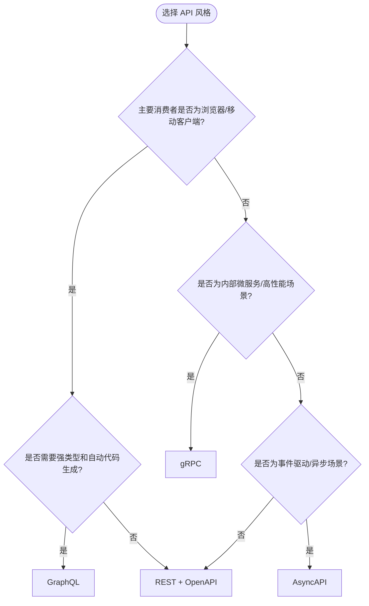
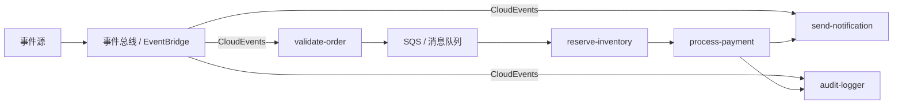
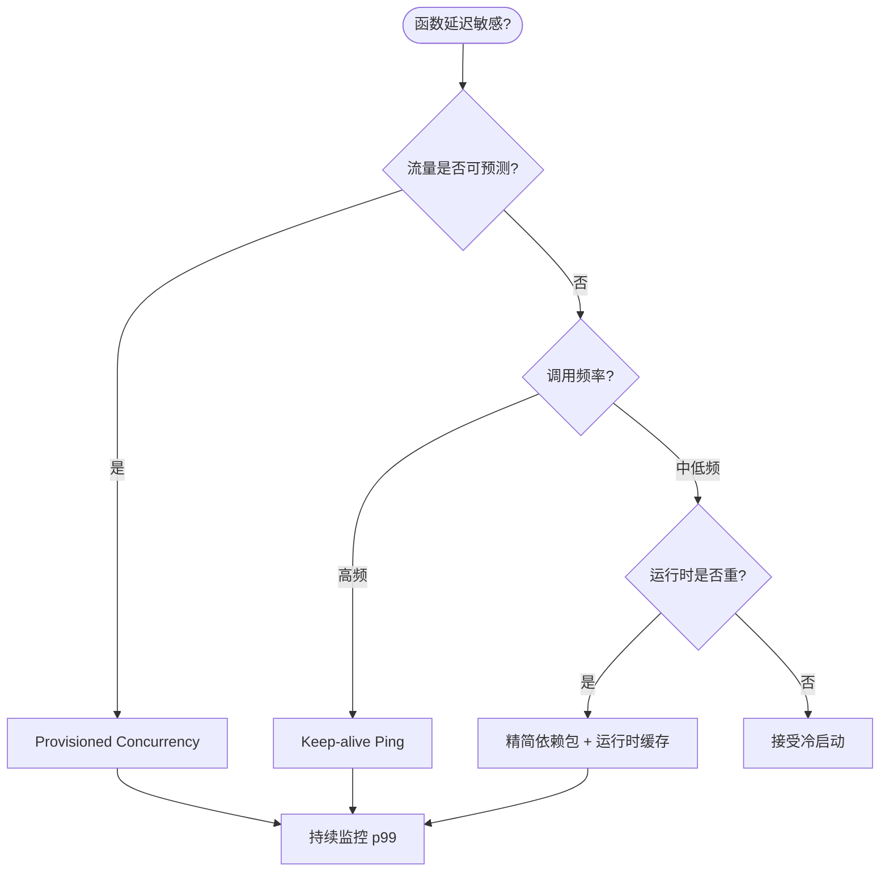
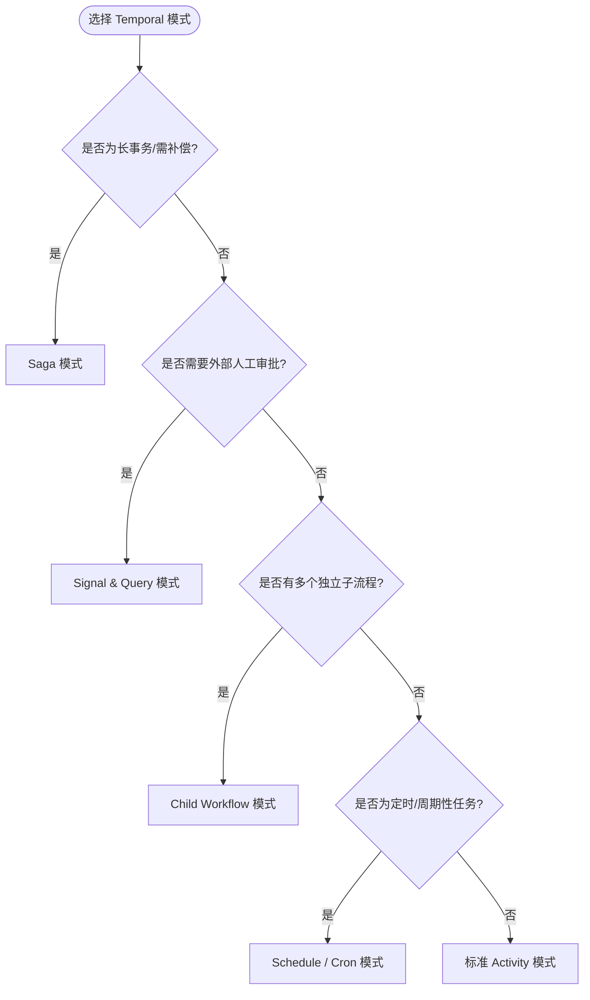
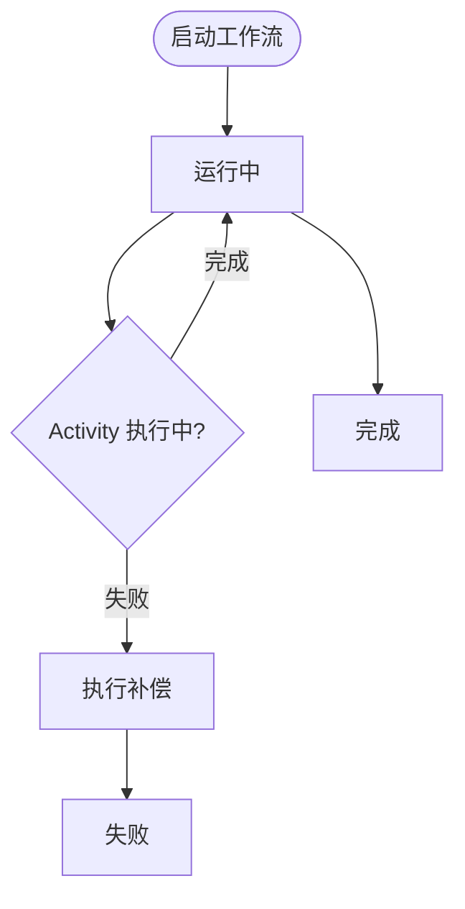
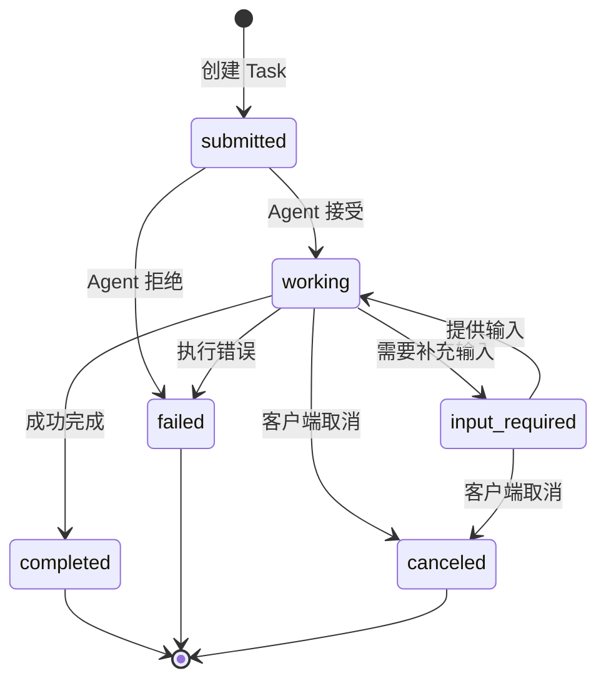
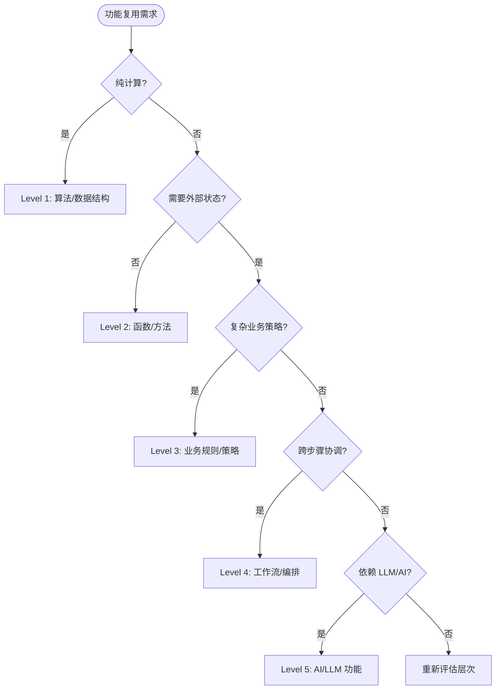

# API 设计模式与功能复用

> **版本**: 2026-07-11
> **定位**: 由 `struct/05-functional-architecture-reuse` 自动聚合生成的视角卷册（view volume）
> **生成命令**: `python scripts/sync-view-from-struct.py --topic 05-functional-architecture-reuse --generate`
> **说明**: 本文件为 struct/ 的只读聚合视角，修改请直接在 struct/ 对应文件进行。

---


## 目录


1. [API 设计模式与功能复用](../struct/05-functional-architecture-reuse/01-api-design/api-design-reuse-patterns.md)
2. [函数即服务（FaaS）与功能复用模式](../struct/05-functional-architecture-reuse/02-function-as-a-service/faas-reuse-patterns.md)
3. [事件驱动函数复用模式](../struct/05-functional-architecture-reuse/03-event-functions/event-driven-function-reuse.md)
4. [领域函数目录](../struct/05-functional-architecture-reuse/04-domain-functions/domain-function-catalog.md)
5. [Temporal 工作流复用模式](../struct/05-functional-architecture-reuse/04-workflow-orchestration/temporal-reuse-patterns.md)
6. [LLM 函数复用与智能体功能架构](../struct/05-functional-architecture-reuse/05-ai-llm-functions/llm-function-reuse-patterns.md)
7. [MCP Tool 的可复用设计](../struct/05-functional-architecture-reuse/06-mcp-a2a-protocols/mcp-tool-design.md)
8. [MCP 2025-11-25 + A2A v1.0.0 协议架构复用分析](../struct/05-functional-architecture-reuse/06-mcp-a2a-protocols/protocol-analysis.md)
9. [功能复用的粒度-成本-收益决策树](../struct/05-functional-architecture-reuse/decision-tree-granularity-cost-roi.md)
10. [05 功能架构复用](../struct/05-functional-architecture-reuse/README.md)

---


<!-- SOURCE: struct/05-functional-architecture-reuse/01-api-design/api-design-reuse-patterns.md -->

# API 设计模式与功能复用

> **版本**: 2026-06-10
> **定位**: 功能架构层 —— API 作为功能复用的核心单元：设计模式、版本策略与组合架构
> **对齐标准**: OpenAPI 3.1, JSON:API, GraphQL, gRPC, AsyncAPI, Richardson Maturity Model
> **状态**: ✅ 已完成

---

## 目录

- [API 设计模式与功能复用](#api-设计模式与功能复用)
  - [目录](#目录)
  - [1. API 作为功能复用的核心单元](#1-api-作为功能复用的核心单元)
    - [1.0 API 复用设计模式的定义](#10-api-复用设计模式的定义)
    - [1.1 API 复用的三个层次](#11-api-复用的三个层次)
    - [1.2 API 优先设计（API-First Design）](#12-api-优先设计api-first-design)
  - [2. API 设计模式对比](#2-api-设计模式对比)
    - [2.1 REST (Representational State Transfer)](#21-rest-representational-state-transfer)
    - [2.2 GraphQL](#22-graphql)
    - [2.3 gRPC](#23-grpc)
    - [2.4 AsyncAPI（事件驱动 API）](#24-asyncapi事件驱动-api)
  - [3. API 版本策略与复用](#3-api-版本策略与复用)
    - [3.1 版本策略对比](#31-版本策略对比)
    - [3.2 API 弃用策略](#32-api-弃用策略)
  - [4. API 组合模式](#4-api-组合模式)
    - [4.1 BFF (Backend-for-Frontend)](#41-bff-backend-for-frontend)
    - [4.2 API Gateway](#42-api-gateway)
    - [4.3 Backend-for-AI](#43-backend-for-ai)
  - [5. API 可复用性评估](#5-api-可复用性评估)
    - [5.1 评估维度](#51-评估维度)
    - [5.2 复用评分卡](#52-复用评分卡)
  - [6. 案例：Stripe API 设计对功能复用的最佳实践](#6-案例stripe-api-设计对功能复用的最佳实践)
    - [6.1 Stripe API 的设计原则](#61-stripe-api-的设计原则)
    - [6.2 Stripe API 的复用模式](#62-stripe-api-的复用模式)
  - [补充：API 复用设计模式深度解析](#补充api-复用设计模式深度解析)
    - [6.3 REST 复用设计正例：GitHub API](#63-rest-复用设计正例github-api)
    - [6.4 GraphQL 复用设计正例：Shopify Admin API](#64-graphql-复用设计正例shopify-admin-api)
    - [6.5 gRPC 复用设计正例：Kubernetes API](#65-grpc-复用设计正例kubernetes-api)
    - [6.6 API 版本破坏反例：Twitter API v1.0 → v2.0 迁移](#66-api-版本破坏反例twitter-api-v10--v20-迁移)
    - [6.7 反模式：GraphQL 过度获取导致性能灾难](#67-反模式graphql-过度获取导致性能灾难)
    - [6.8 API 风格选择决策树](#68-api-风格选择决策树)
    - [6.9 与相关概念的关系](#69-与相关概念的关系)
    - [6.10 API 复用设计模式核心属性](#610-api-复用设计模式核心属性)
    - [6.11 反例：URL 版本控制的"墓碑链接"困境](#611-反例url-版本控制的墓碑链接困境)
    - [6.12 API 版本演进生命周期](#612-api-版本演进生命周期)
    - [6.13 补充权威来源](#613-补充权威来源)
  - [7. 权威来源](#7-权威来源)

---

## 1. API 作为功能复用的核心单元

### 1.0 API 复用设计模式的定义

**定义**：API 复用设计模式是在功能架构层将业务能力封装为稳定、可发现、可组合的应用程序接口（[API](https://en.wikipedia.org/wiki/API)），并通过资源建模、契约规范、版本策略与组合架构，使同一接口或设计模式能够在多个消费者、系统或生态中重复使用的工程实践。其核心是"用接口契约替代实现复制"，与 Wikipedia 中 [Representational state transfer](https://en.wikipedia.org/wiki/Representational_state_transfer) 所倡导的资源导向与统一接口思想一致。

### 1.1 API 复用的三个层次

```
API 复用层次模型
├── L1: 端点复用（Endpoint Reuse）
│   └── 直接调用现有 API 端点获取功能
│   └── 例：调用第三方支付 API 完成支付
├── L2: Schema 复用（Schema Reuse）
│   └── 复用 API 的数据模型和类型定义
│   └── 例：复用 OpenAPI 定义的 User、Order 模型
└── L3: 模式复用（Pattern Reuse）
    └── 复用 API 设计模式和架构风格
    └── 例：复用 Stripe 的资源命名、分页、错误处理模式
```

### 1.2 API 优先设计（API-First Design）

API 优先设计是功能复用的最佳实践：

- **先定义接口，后实现**: 确保接口设计独立于技术实现
- **契约驱动**: OpenAPI/AsyncAPI 规范作为开发和消费的契约
- **并行开发**: 消费者和提供者可以基于契约并行工作

---

## 2. API 设计模式对比

### 2.1 REST (Representational State Transfer)

**核心原则**: 资源导向、无状态、统一接口

```
REST API 设计检查清单
├── 资源命名
│   ├── ✅ /users（复数名词）
│   ├── ❌ /getUsers（动词）
│   └── ✅ /users/{id}/orders（嵌套资源）
├── HTTP 方法
│   ├── GET — 读取
│   ├── POST — 创建
│   ├── PUT — 全量更新
│   ├── PATCH — 部分更新
│   └── DELETE — 删除
├── 状态码
│   ├── 200 OK, 201 Created, 204 No Content
│   ├── 400 Bad Request, 401 Unauthorized, 403 Forbidden, 404 Not Found
│   └── 500 Internal Server Error
└── HATEOAS（可选）
    └── 响应中包含相关资源链接
```

### 2.2 GraphQL

**核心原则**: 客户端驱动查询、单一端点、强类型 schema

**复用优势**:

- 消费者精确获取所需数据，避免过度获取
- Schema 作为强类型契约，支持代码生成
- 内省（Introspection）支持动态发现可用字段

**复用挑战**:

- 查询复杂度难以预估（需复杂度限制）
- 缓存策略比 REST 复杂
- 版本管理策略与 REST 不同（schema 演进）

### 2.3 gRPC

**核心原则**: 高性能 RPC、基于 HTTP/2、Protobuf 序列化

**复用优势**:

- 强类型接口定义（Protobuf）
- 流支持（Unary、Server Streaming、Client Streaming、Bidirectional）
- 代码生成（多语言客户端/服务端）

**复用场景**: 内部微服务通信、高性能数据交换

### 2.4 AsyncAPI（事件驱动 API）

**核心原则**: 异步消息契约、发布/订阅模式

**复用优势**:

- 定义事件 schema 和通道契约
- 支持多种协议（Kafka、MQTT、AMQP、WebSocket）
- 松耦合：生产者无需知道消费者

---

## 3. API 版本策略与复用

### 3.1 版本策略对比

| 策略 | 实现方式 | 优点 | 缺点 | 适用场景 |
|:---|:---|:---|:---|:---|
| **URL 版本** | `/v1/users`, `/v2/users` | 简单直观 | URL 污染 | 公共 API |
| **Header 版本** | `Accept: application/vnd.api.v2+json` | URL 干净 | 不够直观 | 内部 API |
| **内容协商** | `Content-Type` + `Accept` | HTTP 标准 | 复杂 | 需细粒度控制 |
| **无版本** | 永远向后兼容 | 最简单 | 约束强 | GraphQL、极少数 |

### 3.2 API 弃用策略

```
API 弃用时间线
├── T0: 发布新版本 API
├── T0 + 30 天: 向所有消费者发送弃用通知
│   └── 包含迁移指南和时间表
├── T0 + 90 天: 在旧版本响应中添加 Deprecation 头
│   └── Sunset: Thu, 31 Dec 2026 23:59:59 GMT
├── T0 + 180 天: 旧版本返回警告日志
├── T0 + 270 天: 旧版本开始限流
└── T0 + 365 天: 旧版本退役
```

---

## 4. API 组合模式

### 4.1 BFF (Backend-for-Frontend)

**定义**: 为每个前端平台（Web、iOS、Android）定制专用的后端 API 层。

**复用价值**: 前端团队复用底层服务，BFF 层处理聚合和适配。

### 4.2 API Gateway

**定义**: 统一的 API 入口，处理认证、限流、路由、聚合。

**复用价值**: 底层服务通过 Gateway 暴露，消费者复用 Gateway 的通用能力（认证、监控、缓存）。

### 4.3 Backend-for-AI

**新兴模式**: 为 AI Agent 和 LLM 应用定制的后端层。

**复用价值**:

- 封装 MCP 工具定义
- 管理 Agent 上下文和状态
- 提供结构化的功能接口供 LLM 调用

---

## 5. API 可复用性评估

### 5.1 评估维度

| 维度 | 权重 | 评估标准 |
|:---|:---:|:---|
| **一致性** | 20% | 命名规范、错误格式、分页方式统一 |
| **可发现性** | 20% | 文档完整、有 OpenAPI/AsyncAPI、支持内省 |
| **稳定性** | 20% | 版本策略清晰、变更记录完整、弃用通知及时 |
| **SDK 支持** | 15% | 官方 SDK、多语言支持、类型安全 |
| **性能** | 15% | 响应时间、吞吐量、可用性 SLA |
| **安全性** | 10% | 认证方式、授权粒度、审计日志 |

### 5.2 复用评分卡

```
API 复用评分卡（满分 100）
├── 一致性 (20)
│   ├── 资源命名规范 (+5)
│   ├── 错误格式统一 (+5)
│   ├── 分页方式一致 (+5)
│   └── HATEOAS / 导航支持 (+5)
├── 可发现性 (20)
│   ├── OpenAPI/AsyncAPI 规范 (+10)
│   ├── 交互式文档 (+5)
│   └── 代码示例 (+5)
├── 稳定性 (20)
│   ├── 版本策略文档化 (+5)
│   ├── 变更日志 (+5)
│   ├── 弃用通知机制 (+5)
│   └── SLA 承诺 (+5)
├── SDK 支持 (15)
│   ├── 官方 SDK (+10)
│   └── 社区 SDK (+5)
├── 性能 (15)
│   ├── p99 延迟 < 500ms (+5)
│   ├── 可用性 > 99.9% (+5)
│   └── 速率限制合理 (+5)
└── 安全性 (10)
    ├── OAuth 2.1 / OIDC (+5)
    └── 审计日志 (+5)
```

---

## 6. 案例：Stripe API 设计对功能复用的最佳实践

### 6.1 Stripe API 的设计原则

Stripe 被广泛认为是 REST API 设计的典范，其设计原则直接支持功能复用：

| 原则 | 实现 | 复用价值 |
|:---|:---|:---|
| **资源导向** | `/customers`, `/charges`, `/subscriptions` | 清晰的资源模型，易于理解和复用 |
| **幂等性** | `Idempotency-Key` 头 | 安全重试，消费者无需复杂去重逻辑 |
| **扩展性** | 所有对象包含 `metadata` 字典 | 消费者可扩展数据模型而不破坏接口 |
| **一致性** | 统一的错误格式、分页、过滤 | 学习一次，复用到所有端点 |
| **版本管理** | 日期版本（如 `2024-09-30.acacia`） | 消费者锁定版本，不受变更影响 |
| **SDK 生态** | 官方支持 10+ 语言 | 多语言团队均可复用 |

### 6.2 Stripe API 的复用模式

```
Stripe API 复用模式
├── 直接复用：调用 Stripe API 实现支付功能
├── 模式复用：采用 Stripe 的资源命名和错误处理模式
├── SDK 复用：复用 Stripe 的 SDK 设计模式构建内部 SDK
└── 文档复用：采用 Stripe 的文档风格和组织结构
```

---

## 补充：API 复用设计模式深度解析

### 6.3 REST 复用设计正例：GitHub API

GitHub REST API 是 REST 复用的典范：

- **资源命名一致性**：`/repos/{owner}/{repo}/issues/{issue_number}` 使用嵌套资源表达关系；
- **超媒体驱动**：响应中包含 `_links`，消费者可发现相关操作；
- **版本管理**：通过 `Accept: application/vnd.github+json` 头进行版本协商；
- **分页标准化**：统一使用 `Link` 头与 `per_page`、`page` 参数。

**复用效果**：数千个第三方工具、CI 系统、IDE 插件基于 GitHub API 构建，形成庞大生态。

### 6.4 GraphQL 复用设计正例：Shopify Admin API

Shopify 的 Admin GraphQL API 展示了 schema 驱动复用：

- **单一端点**：所有操作通过 `/admin/api/2024-01/graphql.json` 访问；
- **强类型 schema**：自动生成类型安全的 SDK；
- **内省与文档**：开发者可通过 GraphiQL 实时探索可用字段；
- **版本演进**：每季度发布稳定版本，旧版本保留 12 个月。

**复用效果**：App Store 中的数万应用复用同一套 GraphQL schema，大幅降低了集成成本。

### 6.5 gRPC 复用设计正例：Kubernetes API

Kubernetes 内部大量使用 gRPC 和 Protocol Buffers：

- **proto 文件即契约**：所有资源定义和 API 接口通过 `.proto` 描述；
- **代码生成**：支持 Go、Python、Java、C++ 等多语言客户端；
- **流式通信**：用于日志、exec、端口转发等长连接场景；
- **版本化 API**：`apiVersion: v1`、`apps/v1` 等明确版本前缀。

**复用效果**：Kubernetes 生态中数千个 operator 和控制器共享同一套 API 契约。

### 6.6 API 版本破坏反例：Twitter API v1.0 → v2.0 迁移

Twitter 在 2023 年关闭免费 v1.1 API 访问并强制迁移到 v2，引发广泛争议：

- **破坏性变更**：大量免费端点被移除或收费，认证方式从 OAuth 1.0a 变为 OAuth 2.0；
- **文档不足**：迁移窗口期内 v2 文档不完善，开发者难以及时适配；
- **成本激增**：学术研究者和小型开发者被迫支付高额费用；
- **生态受损**：大量第三方客户端和研究工具停止维护。

**教训**：

- 版本迁移应提供足够长的兼容期（≥12 个月）；
- 破坏性变更需提前公开路线图和替代方案；
- 应建立开发者沟通渠道与迁移支持计划。

### 6.7 反模式：GraphQL 过度获取导致性能灾难

某电商平台将所有内部服务统一暴露为 GraphQL：

- **问题**：前端查询未加限制，单次请求可能拉取数万行关联数据；
- **后果**：数据库连接池耗尽，高峰期 p99 延迟从 200ms 升至 8s；
- **根因**：缺少查询复杂度限制（complexity limit）和深度限制（depth limit）；
- **修复**：引入 `graphql-query-complexity`，限制单次查询成本；为常用查询提供持久化查询（persisted queries）。

### 6.8 API 风格选择决策树



### 6.9 与相关概念的关系

- **上位概念**：[API](https://en.wikipedia.org/wiki/API)（应用程序接口）、软件架构；
- **下位概念**：REST、GraphQL、gRPC、AsyncAPI、BFF、API Gateway；
- **等价/映射概念**：[Representational state transfer](https://en.wikipedia.org/wiki/Representational_state_transfer) 与 REST 架构风格等价；GraphQL 可映射为查询语言层面的 [Remote procedure call](https://en.wikipedia.org/wiki/Remote_procedure_call)；
- **依赖概念**：OpenAPI 规范、JSON Schema、Protocol Buffers、CloudEvents。

> **交叉引用**:
>
> - 组件层复用模式：[struct/04-component-architecture-reuse](../struct/04-component-architecture-reuse/README.md)
> - 功能层工作流复用：[struct/05-functional-architecture-reuse/04-workflow-orchestration/temporal-reuse-patterns.md](../struct/05-functional-architecture-reuse/04-workflow-orchestration/temporal-reuse-patterns.md)
> - 跨层治理度量：[struct/06-cross-layer-governance/05-metrics-kpi/metrics-framework.md](../struct/06-cross-layer-governance/05-metrics-kpi/metrics-framework.md)

> **权威来源（补充）**:
>
> - [API — Wikipedia](https://en.wikipedia.org/wiki/API)
> - [Representational state transfer — Wikipedia](https://en.wikipedia.org/wiki/Representational_state_transfer)
> - [GraphQL — Wikipedia](https://en.wikipedia.org/wiki/GraphQL)
> - [gRPC — Wikipedia](https://en.wikipedia.org/wiki/GRPC)
> - [API versioning — Wikipedia](https://en.wikipedia.org/wiki/API_versioning)
>
> **核查日期**: 2026-07-07

### 6.10 API 复用设计模式核心属性

| 属性 | 说明 | 重要性 | 可观察性 |
|------|------|--------|----------|
| **接口契约稳定性** | 资源路径、字段、错误格式在版本周期内保持稳定 | 高 | ISR ≥ 85% |
| **可发现性** | 通过 OpenAPI/GraphQL introspection/gRPC reflection 暴露能力 | 高 | 文档完整度 100% |
| **可组合性** | 接口可被编排、聚合为更高阶业务能力 | 高 | 组合调用占比 |
| **多语言友好** | 提供 SDK、代码生成与类型安全 | 中 | SDK 覆盖率 |
| **可演进性** | 支持向后兼容的 schema/contract 演进 | 高 | 破坏性变更频率 |
| **安全与治理** | 认证、授权、限流、审计可统一配置 | 高 | 安全策略覆盖率 |

### 6.11 反例：URL 版本控制的"墓碑链接"困境

某内容平台在三年内连续发布 `/v1/`、`/v2/`、`/v3/` API，但旧版本退役计划不清晰：

- **问题**：
  1. 旧版本文档链接长期存在但无人维护，形成大量"墓碑链接"；
  2. 第三方开发者误用已退役端点，导致数据不一致；
  3. 服务端需同时维护 3 个版本的兼容层，技术债务累积。
- **后果**：维护成本增加 45%，客户支持工单中 20% 与版本混淆有关。
- **避免方法**：
  - 明确 Sunset 日期并在响应头中返回 `Deprecation` 与 `Sunset`；
  - 提供自动化迁移工具与版本使用仪表盘；
  - 退役后立即返回 410 Gone 并附带迁移文档链接。

### 6.12 API 版本演进生命周期


### 6.13 补充权威来源

> **权威来源（补充）**:
>
> - [API versioning — Wikipedia](https://en.wikipedia.org/wiki/API_versioning)
> - [Remote procedure call — Wikipedia](https://en.wikipedia.org/wiki/Remote_procedure_call)
> - [OpenAPI Specification 3.1.0](https://spec.openapis.org/oas/v3.1.0/)
>
> **核查日期**: 2026-07-07

## 7. 权威来源

| 来源 | URL | 核查日期 |
|:---|:---|:---|
| OpenAPI 3.1 | <https://spec.openapis.org/oas/v3.1.0> | 2026-06-10 |
| GraphQL Spec | <https://spec.graphql.org/> | 2026-06-10 |
| gRPC | <https://grpc.io/> | 2026-06-10 |
| AsyncAPI | <https://www.asyncapi.com/> | 2026-06-10 |
| JSON:API | <https://jsonapi.org/> | 2026-06-10 |
| Stripe API Docs | <https://docs.stripe.com/api> | 2026-06-10 |
| Richardson Maturity Model | <https://martinfowler.com/articles/richardsonMaturityModel.html> | 2026-06-10 |


---


<!-- SOURCE: struct/05-functional-architecture-reuse/02-function-as-a-service/faas-reuse-patterns.md -->

# 函数即服务（FaaS）与功能复用模式

> **版本**: 2026-06-10
> **定位**: 功能架构层 —— 无服务器函数的复用特征、粒度边界与可移植性实践
> **对齐标准**: CNCF Serverless Workflow, OpenFunction, Knative, AWS Lambda, Azure Functions, Google Cloud Functions
> **状态**: ✅ 已完成

---

## 目录

- [函数即服务（FaaS）与功能复用模式](#函数即服务faas与功能复用模式)
  - [目录](#目录)
  - [1. FaaS 概述](#1-faas-概述)
    - [1.1 主流 FaaS 平台](#11-主流-faas-平台)
    - [1.2 FaaS 核心特征](#12-faas-核心特征)
  - [2. FaaS 函数的复用特征](#2-faas-函数的复用特征)
    - [2.1 函数作为最小复用单元](#21-函数作为最小复用单元)
    - [2.2 函数接口标准化](#22-函数接口标准化)
  - [3. 函数复用的粒度边界](#3-函数复用的粒度边界)
    - [3.1 粒度选择矩阵](#31-粒度选择矩阵)
    - [3.2 CNCF Serverless Workflow](#32-cncf-serverless-workflow)
  - [4. FaaS 函数的可移植性](#4-faas-函数的可移植性)
    - [4.1 可移植性挑战](#41-可移植性挑战)
    - [4.2 跨平台复用策略](#42-跨平台复用策略)
  - [5. FaaS 函数的供应链安全](#5-faas-函数的供应链安全)
    - [5.1 部署包完整性](#51-部署包完整性)
    - [5.2 运行时隔离](#52-运行时隔离)
  - [6. 案例：使用 AWS Lambda Layers 和 Knative 实现跨平台函数复用](#6-案例使用-aws-lambda-layers-和-knative-实现跨平台函数复用)
    - [6.1 场景](#61-场景)
    - [6.2 AWS Lambda 实现](#62-aws-lambda-实现)
    - [6.3 Knative 实现](#63-knative-实现)
    - [6.4 复用价值](#64-复用价值)
  - [补充：FaaS 复用模式、事件触发与冷启动权衡](#补充faas-复用模式事件触发与冷启动权衡)
    - [7.1 FaaS 复用模式的定义](#71-faas-复用模式的定义)
    - [7.2 FaaS 复用核心属性](#72-faas-复用核心属性)
    - [7.3 事件触发模式详解](#73-事件触发模式详解)
    - [7.4 冷启动权衡模型](#74-冷启动权衡模型)
      - [论证：冷启动成本分解](#论证冷启动成本分解)
    - [7.5 正例：事件驱动的订单处理流水线](#75-正例事件驱动的订单处理流水线)
    - [反例](#反例)
      - [函数烟囱与供应商锁定](#函数烟囱与供应商锁定)
    - [7.7 FaaS 事件路由架构](#77-faas-事件路由架构)
    - [7.8 与相关概念的关系](#78-与相关概念的关系)
    - [7.9 FaaS 冷启动缓解策略决策树](#79-faas-冷启动缓解策略决策树)
    - [7.10 正例：Azure Functions Durable Functions 的事件驱动编排](#710-正例azure-functions-durable-functions-的事件驱动编排)
    - [7.11 反例：忽视冷启动成本的"全函数化"迁移](#711-反例忽视冷启动成本的全函数化迁移)
    - [7.12 补充权威来源](#712-补充权威来源)
  - [7. 权威来源](#7-权威来源)

---

## 1. FaaS 概述

### 1.1 主流 FaaS 平台

| 平台 | 提供商 | 运行时支持 | 冷启动 | 最大执行时间 | 特色功能 |
|:---|:---|:---|:---:|:---:|:---|
| **AWS Lambda** | Amazon | 15+ 语言 | ~100ms | 15 分钟 | Lambda Layers, Provisioned Concurrency |
| **Azure Functions** | Microsoft | .NET, Node, Python, Java, Go | ~200ms | 10 分钟 | Durable Functions, Premium Plan |
| **Google Cloud Functions** | Google | Node, Python, Go, Java, Ruby, PHP | ~200ms | 60 分钟 | CloudEvents 原生支持 |
| **Knative** | CNCF (开源) | 任何容器 | ~500ms | 无限制 | K8s 原生、多云可移植 |
| **OpenFaaS** | 开源 | 任何容器/二进制 | ~1s | 无限制 | 社区活跃、易于部署 |
| **Fission** | 开源 | 任何容器 | ~100ms | 无限制 | K8s 原生、快速启动 |

### 1.2 FaaS 核心特征

| 特征 | 描述 | 复用影响 |
|:---|:---|:---|
| **无状态** | 函数不保存请求间的状态 | 函数可被任意实例执行，天然可复用 |
| **事件驱动** | 由事件触发执行 | 函数可与多种事件源组合复用 |
| **短生命周期** | 执行完成后资源释放 | 快速迭代，版本更新成本低 |
| **自动伸缩** | 从零到多自动扩展 | 复用函数可按需分配资源 |
| **按调用付费** | 仅对实际执行付费 | 降低复用成本门槛 |

---

## 2. FaaS 函数的复用特征

### 2.1 函数作为最小复用单元

```
FaaS 函数复用层次
├── L1: 单个函数复用
│   └── 直接调用部署好的函数端点
│   └── 例：调用文本翻译函数
├── L2: 函数模板复用
│   └── 复用函数的代码框架和配置模板
│   └── 例：复用"HTTP 触发 + 数据库写入"模板
├── L3: 函数编排复用
│   └── 复用预定义的函数工作流
│   └── 例：复用"图片上传 → 缩略图生成 → CDN 分发"流水线
└── L4: 函数平台能力复用
    └── 复用 FaaS 平台的通用能力（认证、日志、监控）
    └── 例：复用平台的 OIDC 认证中间件
```

### 2.2 函数接口标准化

```
标准化函数接口（以 CloudEvents 为例）
{
  "specversion": "1.0",
  "type": "com.example.order.created",
  "source": "/order-service",
  "id": "A234-1234-1234",
  "datacontenttype": "application/json",
  "data": {
    "orderId": "ORD-12345",
    "amount": 99.99
  }
}
```

**复用价值**: 基于 CloudEvents 的函数可在不同云平台间移植。

---

## 3. 函数复用的粒度边界

### 3.1 粒度选择矩阵

| 粒度 | 示例 | 优点 | 缺点 | 复用场景 |
|:---|:---|:---|:---|:---|
| **单函数** | 发送邮件 | 简单、独立 | 功能有限 | 通用工具函数 |
| **函数链** | 验证 → 处理 → 存储 | 模块化 | 编排复杂 | 业务流程 |
| **函数工作流** | 订单处理全流程 | 端到端 | 紧耦合 | 完整业务场景 |

### 3.2 CNCF Serverless Workflow

**定义**: 标准化的无服务器工作流规范，支持 DSL（YAML/JSON）定义函数编排。

```yaml
# Serverless Workflow 示例
id: order-processing
version: '1.0'
functions:
  - name: validateOrder
    operation: http://order-service/validate
  - name: processPayment
    operation: http://payment-service/process
  - name: sendNotification
    operation: http://notification-service/send
states:
  - name: Validate
    type: operation
    actions:
      - functionRef: validateOrder
    transition: ProcessPayment
  - name: ProcessPayment
    type: operation
    actions:
      - functionRef: processPayment
    transition: SendNotification
  - name: SendNotification
    type: operation
    actions:
      - functionRef: sendNotification
    end: true
```

---

## 4. FaaS 函数的可移植性

### 4.1 可移植性挑战

| 维度 | 平台差异 | 可移植方案 |
|:---|:---|:---|
| **触发器** | HTTP / S3 / Kafka / Timer | CloudEvents 抽象 |
| **上下文** | 平台特定的上下文对象 | 标准化上下文接口 |
| **状态管理** | DynamoDB / Cosmos DB / Firestore | 外部状态存储（Redis、数据库） |
| **依赖管理** | Layers / 容器 / 内置 | 容器化部署 |
| **配置** | 环境变量 / Secrets Manager | 标准化配置注入 |

### 4.2 跨平台复用策略

```
跨平台 FaaS 复用策略
├── 容器化
│   └── 使用 OCI 容器打包函数
│   └── 任何支持容器的平台可运行
├── CloudEvents
│   └── 标准化事件格式
│   └── 触发器与函数解耦
├── 无供应商锁定框架
│   └── Serverless Framework
│   └── Pulumi / Terraform
└── Knative（开源标准）
    └── K8s 原生 FaaS
    └── 多云可移植
```

---

## 5. FaaS 函数的供应链安全

### 5.1 部署包完整性

- **签名验证**: 部署包必须经过签名验证
- **SBOM**: 函数依赖必须提供 SBOM
- **最小权限**: 函数执行角色遵循最小权限原则

### 5.2 运行时隔离

| 隔离级别 | 实现 | 安全性 |
|:---|:---|:---:|
| **进程隔离** | 传统容器 | 🟡 中 |
| **沙箱隔离** | gVisor, Firecracker | 🟢 高 |
| **WASM 隔离** | Wasmtime, WasmEdge | 🟢 高 |
| **硬件隔离** | 机密计算（SGX, SEV） | 🟢 极高 |

---

## 6. 案例：使用 AWS Lambda Layers 和 Knative 实现跨平台函数复用

### 6.1 场景

通用日志处理函数，需要在 AWS 和私有 K8s 集群中复用。

### 6.2 AWS Lambda 实现

```python
# app.py
import json
import logging

def handler(event, context):
    """CloudEvents 兼容的日志处理函数"""
    # 解析 CloudEvent
    cloud_event = json.loads(event['body'])

    # 处理日志
    processed = process_log(cloud_event.data)

    # 发送到下游
    send_to_downstream(processed)

    return {
        'statusCode': 200,
        'body': json.dumps({'processed': True})
    }

def process_log(data):
    # 通用日志处理逻辑
    return data.upper()

def send_to_downstream(data):
    # 抽象的发送接口
    pass
```

### 6.3 Knative 实现

```yaml
# service.yaml
apiVersion: serving.knative.dev/v1
kind: Service
metadata:
  name: log-processor
spec:
  template:
    spec:
      containers:
        - image: gcr.io/project/log-processor:v1
          env:
            - name: DOWNSTREAM_URL
              value: http://downstream-service
```

### 6.4 复用价值

- 业务逻辑（`process_log`）完全复用
- 通过 CloudEvents 实现触发器抽象
- 通过环境变量实现配置外部化

---

## 补充：FaaS 复用模式、事件触发与冷启动权衡

### 7.1 FaaS 复用模式的定义

**定义**：FaaS（Function as a Service）复用模式是将无服务器函数作为最小可复用功能单元，通过标准化事件接口、共享依赖层和可移植部署模板，在多个触发器、应用和云平台之间共享函数逻辑与运行时的实践。

与 Wikipedia 上 [Function as a service](https://en.wikipedia.org/wiki/Function_as_a_service) 的定义一致，本体系进一步强调函数在**事件驱动架构**中的复用价值与**冷启动/成本权衡**的工程决策。

### 7.2 FaaS 复用核心属性

| 属性 | 说明 | 重要性 | 可观察性 |
|---|---|---|---|
| **无状态性** | 函数不保留请求间状态，便于水平扩展与复用 | 高 | 每次调用独立 |
| **事件触发** | 由 HTTP、消息队列、存储事件等触发 | 高 | 触发器配置可审计 |
| **细粒度计费** | 按调用次数与执行时长付费 | 高 | 账单可拆分 |
| **冷启动敏感度** | 首次调用或缩容后重建环境的延迟 | 高 | p99 冷启动时间 |
| **可移植性** | 跨云平台复用的难易程度 | 中 | 平台特定代码占比 |
| **依赖共享** | 通过 Layers/容器镜像共享公共依赖 | 中 | 依赖层复用率 |

### 7.3 事件触发模式详解

| 触发类型 | 典型源 | 复用场景 | 注意事项 |
|---|---|---|---|
| **HTTP/网关触发** | API Gateway、Application Load Balancer | 通用 API 后端、Webhook 处理 | 需处理并发与限流 |
| **对象存储触发** | S3、Blob Storage、GCS | 图片处理、日志分析、ETL | 事件顺序不保证 |
| **消息队列触发** | SQS、Event Hubs、Pub/Sub | 异步任务、事件驱动微服务 | 需幂等性设计 |
| **定时触发** | EventBridge、Cloud Scheduler | 报表生成、数据同步、巡检 | 注意时区与调度精度 |
| **数据库触发** | DynamoDB Streams、Cosmos DB Change Feed | 缓存失效、物化视图、审计 | 流处理顺序保障 |
| **事件总线触发** | EventBridge、Azure Event Grid | 跨服务解耦、SaaS 集成 | 需统一事件 schema |

### 7.4 冷启动权衡模型

#### 论证：冷启动成本分解

冷启动不仅是技术问题，更是经济问题：

冷启动延迟主要由以下因素决定：

```text
T_cold = T_init + T_runtime + T_handler
```

其中：

- `T_init`：容器/沙箱创建与网络配置时间；
- `T_runtime`：运行时（JVM、.NET CLR、Python 解释器）启动时间；
- `T_handler`：函数初始化代码执行时间（导入依赖、建立连接）。

**冷启动缓解策略**：

| 策略 | 适用场景 | 成本影响 | 复杂度 |
|---|---|---|---|
| **Provisioned Concurrency** | 延迟敏感、流量可预测 | 固定成本增加 | 低 |
| **Keep-alive ping** | 中低频但需稳定延迟 | 少量调用费用 | 低 |
| **精简依赖包** | 所有场景 | 无额外成本 | 中 |
| **快照恢复/运行时缓存** | 大数据量初始化 | 平台依赖 | 中 |
| **单实例多并发** | I/O 密集型函数 | 提高利用率 | 中 |
| **迁移至容器化 FaaS** | 复杂运行时需求 | 可能增加 | 高 |

### 7.5 正例：事件驱动的订单处理流水线

某电商平台使用 AWS Lambda + EventBridge 构建订单处理流水线：

- **触发器**：订单服务发布 `OrderCreated` CloudEvent；
- **函数链**：
  1. `validate-order`：校验订单格式；
  2. `reserve-inventory`：调用库存服务；
  3. `process-payment`：调用支付网关；
  4. `send-notification`：发送邮件/短信；
- **复用方式**：`send-notification` 函数同时被营销系统、客服系统复用；
- **效果**：峰值处理能力从 1K/min 提升到 50K/min，成本仅为常驻服务的 30%。

### 反例

#### 函数烟囱与供应商锁定

某初创公司将所有业务拆分为 200+ AWS Lambda 函数：

- **问题**：
  1. 每个函数使用不同的 IAM 角色、日志格式和错误处理；
  2. 深度依赖 AWS 特定 SDK（如 DynamoDB Streams、Step Functions）；
  3. 缺少跨函数共享的通用库，重复代码占比达 40%；
  4. 冷启动频发，Java 函数 p99 延迟高达 5s。
- **后果**：
  - 迁移到其他云平台的重构成本估算为 6 个月；
  - 运维复杂度指数级增长，故障定位困难；
  - 云成本因过度拆分和冷启动抵消了 FaaS 的计费优势。
- **避免方法**：
  - 使用 CloudEvents 抽象事件格式；
  - 建立 Lambda Layers 共享通用依赖与中间件；
  - 对延迟敏感路径使用 Provisioned Concurrency；
  - 定期进行函数合并审查，避免过度拆分。

### 7.7 FaaS 事件路由架构



### 7.8 与相关概念的关系

- **上位概念**：[Serverless computing](https://en.wikipedia.org/wiki/Serverless_computing)、[Cloud computing](https://en.wikipedia.org/wiki/Cloud_computing)；
- **下位概念**：AWS Lambda、Azure Functions、Google Cloud Functions、Knative、OpenFaaS；
- **等价/映射概念**：[Function as a service](https://en.wikipedia.org/wiki/Function_as_a_service) 是 Serverless 的核心实现形态；
- **依赖概念**：事件驱动架构、CI/CD、IAM、容器镜像、CloudEvents。

### 7.9 FaaS 冷启动缓解策略决策树



### 7.10 正例：Azure Functions Durable Functions 的事件驱动编排

某物流平台使用 Azure Functions Durable Functions 处理货运状态变更：

- **触发器**：IoT 设备通过 Event Hubs 上报位置事件；
- **编排函数**：`ShipmentOrchestrator` 按运单 ID 聚合事件，调用 Activity 函数计算 ETA、通知客户、更新库存；
- **复用方式**：
  - `eta-calculator` 函数同时被 Web 端查询、移动端推送复用；
  - `notification-sender` 函数被订单系统、客服系统复用；
- **效果**：开发周期缩短 35%，事件处理延迟 p99 < 500ms。

### 7.11 反例：忽视冷启动成本的"全函数化"迁移

某企业将原有微服务全部拆分为 AWS Lambda 函数，追求极致弹性：

- **问题**：
  1. Java 函数依赖 Spring Boot，冷启动 p99 达 6s；
  2. 为缓解冷启动，为所有函数开启 Provisioned Concurrency，费用反超原微服务；
  3. 函数间通过网络调用，链路追踪困难；
  4. 共享状态频繁访问 DynamoDB，成本激增。
- **后果**：整体云成本上升 22%，核心 API 可用性从 99.95% 降至 99.5%。
- **避免方法**：
  - 对延迟敏感路径使用预置并发，对低频任务接受冷启动；
  - 评估函数化边界，避免过度拆分；
  - 使用 Lambda Layers、SnapStart 或容器化 FaaS 降低启动时间。

### 7.12 补充权威来源

> **权威来源（补充）**:
>
> - [Function as a service — Wikipedia](https://en.wikipedia.org/wiki/Function_as_a_service)
> - [Serverless computing — Wikipedia](https://en.wikipedia.org/wiki/Serverless_computing)
> - [Event-driven architecture — Wikipedia](https://en.wikipedia.org/wiki/Event-driven_architecture)
>
> **核查日期**: 2026-07-07

> **交叉引用**:
>
> - 功能层 API 设计复用：[struct/05-functional-architecture-reuse/01-api-design/api-design-reuse-patterns.md](../struct/05-functional-architecture-reuse/01-api-design/api-design-reuse-patterns.md)
> - 功能层工作流复用：[struct/05-functional-architecture-reuse/04-workflow-orchestration/temporal-reuse-patterns.md](../struct/05-functional-architecture-reuse/04-workflow-orchestration/temporal-reuse-patterns.md)
> - 跨层 FinOps 成本治理：[struct/06-cross-layer-governance/04-finops-cost/finops-unit-economics-2026.md](../struct/06-cross-layer-governance/04-finops-cost/finops-unit-economics-2026.md)

> **权威来源（补充）**:
>
> - [Function as a service — Wikipedia](https://en.wikipedia.org/wiki/Function_as_a_service)
> - [Serverless computing — Wikipedia](https://en.wikipedia.org/wiki/Serverless_computing)
> - [Cloud computing — Wikipedia](https://en.wikipedia.org/wiki/Cloud_computing)
> - [Event-driven architecture — Wikipedia](https://en.wikipedia.org/wiki/Event-driven_architecture)
>
> **核查日期**: 2026-07-07

## 7. 权威来源

| 来源 | URL | 核查日期 |
|:---|:---|:---|
| CNCF Serverless Workflow | <https://serverlessworkflow.io/> | 2026-06-10 |
| Knative | <https://knative.dev/> | 2026-06-10 |
| CloudEvents | <https://cloudevents.io/> | 2026-06-10 |
| AWS Lambda | <https://docs.aws.amazon.com/lambda/> | 2026-06-10 |
| Azure Functions | <https://docs.microsoft.com/azure/azure-functions/> | 2026-06-10 |
| OpenFunction | <https://openfunction.dev/> | 2026-06-10 |


---


<!-- SOURCE: struct/05-functional-architecture-reuse/03-event-functions/event-driven-function-reuse.md -->

# 事件驱动函数复用模式

> **版本**: 2026-07-08
> **定位**: 功能架构层 —— 事件驱动架构中的函数复用：schema、路由与模式
> **对齐标准**: CloudEvents 1.0, AsyncAPI 3.x, Apache Kafka, Knative Eventing, AWS EventBridge, Azure Event Grid, Enterprise Integration Patterns
> **状态**: ✅ 已完成

---

## 目录

- [事件驱动函数复用模式](#事件驱动函数复用模式)
  - [目录](#目录)
  - [核心概念定义](#核心概念定义)
  - [1. 事件驱动函数概述](#1-事件驱动函数概述)
    - [1.1 EDA + FaaS 的结合](#11-eda--faas-的结合)
    - [1.2 事件驱动函数的核心要素](#12-事件驱动函数的核心要素)
  - [2. 事件 Schema 复用](#2-事件-schema-复用)
    - [2.1 Schema 演进策略](#21-schema-演进策略)
    - [2.2 Schema 注册中心](#22-schema-注册中心)
    - [2.3 CloudEvents 作为通用 Schema](#23-cloudevents-作为通用-schema)
  - [3. 事件路由与过滤复用模式](#3-事件路由与过滤复用模式)
    - [3.1 事件路由器模式](#31-事件路由器模式)
    - [3.2 可复用的事件处理中间件](#32-可复用的事件处理中间件)
  - [4. Saga 模式与补偿事务的函数复用](#4-saga-模式与补偿事务的函数复用)
    - [4.1 Saga 模式概述](#41-saga-模式概述)
    - [4.2 Saga 函数的复用](#42-saga-函数的复用)
  - [5. 事件溯源中的函数复用](#5-事件溯源中的函数复用)
    - [5.1 事件溯源概述](#51-事件溯源概述)
    - [5.2 投影函数的复用](#52-投影函数的复用)
  - [6. 案例：Kafka + CloudEvents + Knative Eventing 构建可复用事件处理流水线](#6-案例kafka--cloudevents--knative-eventing-构建可复用事件处理流水线)
    - [6.1 架构](#61-架构)
    - [6.2 可复用组件](#62-可复用组件)
  - [收益与风险分析](#收益与风险分析)
  - [7. 权威来源](#7-权威来源)
  - [8. 标准条款映射](#8-标准条款映射)
  - [9. 权威来源](#9-权威来源)

---

## 核心概念定义

事件驱动函数复用是指在事件驱动架构（EDA）与函数即服务（FaaS）上下文中，将事件 Schema、事件路由、过滤、转换、 Saga 补偿、投影等逻辑封装为可复用函数资产，并通过标准化契约在多个事件流与消费者之间共享的实践。

## 1. 事件驱动函数概述

### 1.1 EDA + FaaS 的结合

事件驱动架构（EDA）与函数即服务（FaaS）的结合，形成了**事件驱动函数**模式：

- **松耦合**: 生产者无需知道消费者存在
- **可扩展**: 每个函数独立伸缩
- **可复用**: 同一函数可订阅多个事件流

### 1.2 事件驱动函数的核心要素

```
事件驱动函数模型
├── Event Producer（事件生产者）
│   ├── 业务系统
│   ├── IoT 设备
│   └── 外部服务
├── Event Broker（事件代理）
│   ├── Kafka
│   ├── RabbitMQ / AMQP
│   ├── MQTT Broker
│   └── Cloud Pub/Sub
├── Event Router（事件路由器）
│   ├── 过滤（Filter）
│   ├── 转换（Transform）
│   └── 路由（Route）
└── Event Consumer（事件消费者 / 函数）
    ├── 无状态处理函数
    ├── 有状态聚合函数
    └── 副作用函数（写数据库、发送通知）
```

---

## 2. 事件 Schema 复用

### 2.1 Schema 演进策略

| 策略 | 描述 | 兼容性 |
|:---|:---|:---:|
| **后向兼容** | 新增可选字段 | ✅ 旧消费者可用 |
| **前向兼容** | 消费者忽略未知字段 | ✅ 新消费者可用 |
| **完全兼容** | 同时支持前后向 | ✅✅ 最佳 |
| **不兼容** | 删除或修改现有字段 | ❌ 需协调升级 |

### 2.2 Schema 注册中心

**Confluent Schema Registry** 模式:

```
Schema 注册中心工作流
├── 生产者发布事件前注册 schema
│   └── 检查与历史版本的兼容性
├── 注册中心分配 schema ID
│   └── 紧凑的 Avro/Protobuf 序列化
├── 消费者从注册中心获取 schema
│   └── 动态解析事件格式
└── Schema 版本演进管理
    └── 兼容性策略强制执行
```

### 2.3 CloudEvents 作为通用 Schema

CloudEvents 提供了跨平台的事件包装标准：

```json
{
  "specversion": "1.0",
  "type": "com.example.order.created",
  "source": "/order-service/v1",
  "id": "A234-1234-1234",
  "time": "2026-06-10T12:00:00Z",
  "datacontenttype": "application/json",
  "data": {
    "orderId": "ORD-12345",
    "customerId": "CUST-67890",
    "amount": 199.99
  }
}
```

**复用价值**: 基于 CloudEvents 的函数可在 Kafka、MQTT、HTTP 等不同传输层间复用。

---

## 3. 事件路由与过滤复用模式

### 3.1 事件路由器模式

```
Event Router Pattern
├── Content-Based Router
│   └── 根据事件内容路由到不同处理函数
│   └── 例：order.amount > 1000 → 高价值订单处理
├── Message Filter
│   └── 过滤掉不感兴趣的事件
│   └── 例：仅处理 status = "completed" 的订单
├── Dynamic Router
│   └── 运行时决定路由目标
│   └── 例：根据负载动态分配处理函数
└── Recipient List
    └── 将事件广播给多个处理函数
    └── 例：订单创建同时触发库存扣减和通知发送
```

### 3.2 可复用的事件处理中间件

| 功能 | 工具 | 复用方式 |
|:---|:---|:---|
| 事件过滤 | AWS EventBridge Rules | 规则模板复用 |
| 事件转换 | Kafka Streams / Flink | 拓扑模板复用 |
| 事件聚合 | Kafka Streams Windowing | 窗口策略复用 |
| 事件排序 | Kafka Partitioning | 分区策略复用 |
| 死信队列 | 各平台 DLQ | 错误处理模板复用 |

---

## 4. Saga 模式与补偿事务的函数复用

### 4.1 Saga 模式概述

Saga 是长事务的分布式实现，将大事务拆分为多个本地事务，每个本地事务有对应的**补偿操作**。

```
Saga 执行流程（订单处理示例）
├── T1: 创建订单
│   └── C1: 取消订单
├── T2: 扣减库存
│   └── C2: 恢复库存
├── T3: 处理支付
│   └── C3: 退款
└── T4: 发送通知
    └── C4: （通常无需补偿）

正常流程: T1 → T2 → T3 → T4 → 完成
异常流程: T1 → T2 → T3 失败 → C2 → C1 →  Saga 失败
```

### 4.2 Saga 函数的复用

```
可复用的 Saga 组件
├── 事务函数库
│   ├── createOrder()
│   ├── deductInventory()
│   ├── processPayment()
│   └── sendNotification()
├── 补偿函数库
│   ├── cancelOrder()
│   ├── restoreInventory()
│   └── refundPayment()
└── Saga 编排器
    ├── 编排式 Saga（Orchestration）
    │   └── 中央协调器调用各函数
    └── 协同式 Saga（Choreography）
        └── 各函数通过事件相互触发
```

---

## 5. 事件溯源中的函数复用

### 5.1 事件溯源概述

事件溯源（Event Sourcing）将系统状态变化记录为不可变的事件序列，而非直接更新状态。

```
事件溯源架构
├── Command（命令）
│   └── 用户意图的表达
├── Aggregate（聚合）
│   └── 业务规则的执行者
│   └── 生成 Events
├── Event Store（事件存储）
│   └── 不可变的事件日志
│   └── 系统状态的"唯一真相源"
├── Projection（投影）
│   └── 从事件流构建读模型
│   └── 可复用的投影函数
└── Snapshot（快照）
    └── 性能优化，定期保存聚合状态
```

### 5.2 投影函数的复用

投影函数是从事件流到读模型的纯函数，天然可复用：

```python
# 可复用的投影函数示例
def project_order_summary(events: List[OrderEvent]) -> OrderSummary:
    """从订单事件流构建订单摘要"""
    summary = OrderSummary()
    for event in events:
        if isinstance(event, OrderCreated):
            summary.order_id = event.order_id
            summary.customer_id = event.customer_id
        elif isinstance(event, ItemAdded):
            summary.total_amount += event.price * event.quantity
        elif isinstance(event, PaymentProcessed):
            summary.payment_status = event.status
    return summary
```

**复用价值**:

- 同一投影函数可被多个读模型复用
- 投影函数无副作用，易于测试和验证
- 新读模型可通过组合现有投影函数快速构建

---

## 6. 案例：Kafka + CloudEvents + Knative Eventing 构建可复用事件处理流水线

### 6.1 架构

```
事件处理流水线
├── 生产者
│   └── 订单服务 → CloudEvents → Kafka
├── 事件代理
│   └── Kafka Cluster（多分区）
├── 事件路由（Knative Eventing）
│   ├── Trigger: type = order.created
│   ├── Trigger: type = order.updated
│   └── Trigger: type = order.cancelled
└── 消费者（Knative Services）
    ├── inventory-processor
    ├── notification-processor
    └── analytics-processor
```

### 6.2 可复用组件

| 组件 | 复用内容 | 复用方式 |
|:---|:---|:---|
| CloudEvents 包装器 | 事件格式标准化 | 共享库 |
| Kafka Producer | 发布事件 | 共享库/模板 |
| Knative Trigger | 事件路由规则 | YAML 模板 |
| 处理函数框架 | 日志、监控、错误处理 | 共享基础镜像 |
| DLQ Handler | 死信处理 | 共享函数 |

---

## 收益与风险分析

事件驱动函数复用的核心价值在于解耦生产者与消费者、缩短变更传播路径，并通过 Schema 注册中心与 CloudEvents 等标准降低跨平台集成成本。因此，在采用该模式时，应优先复用经过兼容性验证的 Schema 与路由函数，避免在事件链路中引入隐式契约或不可补偿的长事务。

---

## 7. 权威来源

| 来源 | URL | 核查日期 |
|:---|:---|:---|
| CloudEvents | <https://cloudevents.io/> | 2026-07-08 |
| AsyncAPI | <https://www.asyncapi.com/> | 2026-07-08 |
| Apache Kafka | <https://kafka.apache.org/> | 2026-07-08 |
| Knative Eventing | <https://knative.dev/docs/eventing/> | 2026-07-08 |
| AWS EventBridge | <https://aws.amazon.com/eventbridge/> | 2026-07-08 |
| Azure Event Grid | <https://azure.microsoft.com/services/event-grid/> | 2026-07-08 |
| Confluent Schema Registry | <https://docs.confluent.io/platform/current/schema-registry/index.html> | 2026-07-08 |
| Saga Pattern (Microservices.io) | <https://microservices.io/patterns/data/saga.html> | 2026-07-08 |
| Event Sourcing (Martin Fowler) | <https://martinfowler.com/eaaDev/EventSourcing.html> | 2026-07-08 |


---

## 8. 标准条款映射

| 本主题概念 | 对应标准/文献 | 映射说明 |
|:---|:---|:---|
| 事件封装格式 | CloudEvents 1.0 Specification | 跨平台事件元数据标准（specversion, type, source, id, data） |
| 异步 API 契约 | AsyncAPI 3.x | 事件驱动 API 的通道、消息、Schema 定义标准 |
| 消息路由模式 | Enterprise Integration Patterns (Hohpe & Woolf) | Content-Based Router, Message Filter, Recipient List, Aggregator |
| 分布式事务 | Saga Pattern | 长事务拆分与补偿操作模式 |
| 事件溯源 | Event Sourcing (Fowler, 2005) | 状态变化记录为不可变事件序列 |
| 流处理 | Apache Kafka / Kafka Streams | 分区、窗口、聚合、连接等流处理语义 |
| Serverless 事件 | AWS EventBridge / Azure Event Grid / Knative Eventing | 云原生事件路由与函数触发 |

## 9. 权威来源

> **权威来源**:
>
> - [CloudEvents 1.0 Specification](https://cloudevents.io/) — CNCF 事件标准；核查日期：2026-07-08
> - [AsyncAPI Specification](https://www.asyncapi.com/) — 异步 API 契约标准；核查日期：2026-07-08
> - [Apache Kafka Documentation](https://kafka.apache.org/documentation/) — 流处理平台；核查日期：2026-07-08
> - [Enterprise Integration Patterns](https://www.enterpriseintegrationpatterns.com/) — Hohpe & Woolf 消息模式；核查日期：2026-07-08
> - [Saga Pattern (Microservices.io)](https://microservices.io/patterns/data/saga.html) — 分布式事务模式；核查日期：2026-07-08
> - [Event Sourcing (Martin Fowler)](https://martinfowler.com/eaaDev/EventSourcing.html) — 事件溯源模式；核查日期：2026-07-08
> - [Knative Eventing](https://knative.dev/docs/eventing/) — Kubernetes 事件编排；核查日期：2026-07-08
> - [AWS EventBridge](https://aws.amazon.com/eventbridge/) — 无服务器事件总线；核查日期：2026-07-08
> - [Azure Event Grid](https://azure.microsoft.com/services/event-grid/) — Azure 事件路由服务；核查日期：2026-07-08
>
> **核查日期**: 2026-07-08


---


<!-- SOURCE: struct/05-functional-architecture-reuse/04-domain-functions/domain-function-catalog.md -->

# 领域函数目录

> **版本**: 2026-07-08
> **定位**: 功能架构层 —— 基于领域驱动设计（DDD）的细粒度可复用函数目录
> **对齐标准**: Domain-Driven Design (Evans 2003), Functional Programming, DMN 1.5, Serverless Functions
> **状态**: ✅ 已完成

---

## 目录

- [领域函数目录](#领域函数目录)
  - [目录](#目录)
  - [1. 领域函数的定义](#1-领域函数的定义)
  - [2. 领域函数 vs. 应用服务 vs. 基础设施函数](#2-领域函数-vs-应用服务-vs-基础设施函数)
  - [3. 领域函数目录模板](#3-领域函数目录模板)
  - [4. 可复用领域函数分类](#4-可复用领域函数分类)
    - [4.1 实体工厂函数](#41-实体工厂函数)
    - [4.2 值对象计算函数](#42-值对象计算函数)
    - [4.3 领域规则判断函数](#43-领域规则判断函数)
    - [4.4 状态转换函数](#44-状态转换函数)
    - [4.5 聚合校验函数](#45-聚合校验函数)
  - [5. 与权威框架/标准的条款映射](#5-与权威框架标准的条款映射)
  - [6. 正例](#6-正例)
    - [正例 1：统一税率计算函数库](#正例-1统一税率计算函数库)
    - [正例 2：医疗领域的剂量校验函数](#正例-2医疗领域的剂量校验函数)
  - [7. 反例](#7-反例)
    - [反例 1：隐藏在应用服务中的领域规则](#反例-1隐藏在应用服务中的领域规则)
    - [反例 2：领域函数依赖外部状态](#反例-2领域函数依赖外部状态)
  - [8. 权威来源](#8-权威来源)
  - [9. 交叉引用](#9-交叉引用)

---

## 1. 领域函数的定义

**定义** (Domain Function): 领域函数是封装单一领域规则、计算或状态转换逻辑的**纯函数**或**无副作用函数**。它直接表达领域专家使用的语言（Ubiquitous Language），是 DDD 战术设计在函数粒度上的复用单元。

形式化：

```text
DomainFunction := ⟨Name, Input, Output, Invariant, SideEffect⟩

Name: 动词+名词，来自统一语言（如 calculateTax）
Input: 领域对象或值对象集合
Output: 新的领域对象、值对象或判断结果
Invariant: 执行前后必须保持的领域不变量
SideEffect: 无；或仅允许显式声明的副作用（如审计日志）
```

> **原则**：领域函数应优先为纯函数（Pure Function），即相同输入必然产生相同输出，且不依赖或修改外部状态。这一特性使其天然适合复用、测试和并行执行。

---

## 2. 领域函数 vs. 应用服务 vs. 基础设施函数

| 维度 | 领域函数 | 应用服务 | 基础设施函数 |
|---|---|---|---|
| 关注点 | 领域规则、计算、不变量 | 用例编排、事务边界 | 技术实现（存储、消息、HTTP） |
| 副作用 | 无（或显式声明） | 可协调多个领域操作 | 通常有 I/O 副作用 |
| 复用范围 | 跨用例、跨应用、跨服务 | 限定于特定用例 | 限定于特定技术栈 |
| 测试方式 | 单元测试（输入→输出） | 集成测试 | 集成测试 / Mock |
| 示例 | `calculateVAT`, `isEligibleForDiscount` | `placeOrder`, `processRefund` | `saveOrderToDB`, `sendEmail` |

> **分层规则**：领域函数只依赖领域层内的实体、值对象和领域服务；不直接调用应用层或基础设施层。

---

## 3. 领域函数目录模板

| 字段 | 说明 | 示例 |
|---|---|---|
| 函数 ID | 唯一标识 | DF-ORDER-001 |
| 函数名称 | 动词+名词，来自统一语言 | calculateOrderTotal |
| 所属领域 | 限界上下文 | 订单域 / Order Context |
| 输入 | 参数类型与含义 | Order, List<OrderLine> |
| 输出 | 返回值类型与含义 | Money (含税总价) |
| 不变量 | 执行前后必须保持的规则 | 总价 ≥ 0；税额 = 税基 × 税率 |
| 复用等级 | 上下文内 / 跨上下文 / 企业级 | 企业级 |
| 实现语言 | 可存在多语言实现 | Python / TypeScript / Java |
| 对应 DMN | 若适用，关联决策表 | DT-PRICING-001 |

---

## 4. 可复用领域函数分类

### 4.1 实体工厂函数

将领域对象的创建逻辑集中封装，避免在多处重复复杂的构造规则。

```python
def create_order(customer_id: CustomerId, lines: List[OrderLine]) -> Order:
    """创建订单，确保至少包含一个订单行且客户 ID 有效。"""
    if not lines:
        raise ValueError("订单必须包含至少一个订单行")
    return Order(id=OrderId.new(), customer_id=customer_id, lines=lines, status=OrderStatus.PENDING)
```

### 4.2 值对象计算函数

对金额、数量、比率、坐标等值对象进行计算，保证数学语义正确。

```python
def calculate_vat(amount: Money, rate: Decimal) -> Money:
    """计算增值税，结果按货币精度截断。"""
    return Money((amount.value * rate).quantize(amount.currency.precision), amount.currency)
```

### 4.3 领域规则判断函数

将业务规则封装为可复用的布尔判断函数，供流程、UI、AI Agent 共同使用。

```python
def is_eligible_for_bulk_discount(order: Order) -> bool:
    """当订单总行数 ≥ 100 或总金额 ≥ 10,000 时适用批量折扣。"""
    return len(order.lines) >= 100 or order.total.amount >= Decimal("10000")
```

### 4.4 状态转换函数

明确定义聚合根或实体状态机的合法转换，避免非法状态迁移。

```python
def pay_order(order: Order, payment: Payment) -> Order:
    """将订单从 PENDING 转移到 PAID，前提为支付金额等于订单金额。"""
    if order.status != OrderStatus.PENDING:
        raise DomainError("只有待支付订单可被支付")
    if payment.amount != order.total:
        raise DomainError("支付金额与订单金额不一致")
    return order.with_status(OrderStatus.PAID)
```

### 4.5 聚合校验函数

在持久化或发布事件前，验证聚合内部一致性。

```python
def validate_inventory_reservation(reservation: InventoryReservation) -> ValidationResult:
    """校验库存预留是否满足可用库存约束。"""
    if reservation.quantity > reservation.product.available_quantity:
        return ValidationResult.fail("预留数量超过可用库存")
    return ValidationResult.ok()
```

---

## 5. 与权威框架/标准的条款映射

| 本主题概念 | 对应标准/文献 | 映射说明 |
|:---|:---|:---|
| 领域函数 | DDD (Evans, 2003) | 战术设计中的领域逻辑单元，对应 Entity / Value Object / Domain Service 中的行为 |
| 统一语言 | DDD Strategic Design | 函数命名必须来自领域专家与开发者共享的语言 |
| 限界上下文 | DDD Strategic Design | 函数复用边界由 Bounded Context 决定 |
| 聚合不变量 | DDD Tactical Design | 函数执行前后需保持聚合内部一致性 |
| 纯函数 | Functional Programming | 无副作用、引用透明，便于并发与复用 |
| 类型状态 | Typestate Pattern | 通过类型系统强制合法状态转换 |
| 业务规则复用 | DMN 1.5 §6 Decision Service | 复杂判断逻辑可映射为 DMN 决策服务，供函数调用 |
| 函数部署 | Serverless Functions (FaaS) | 领域函数可作为无服务器函数部署，事件触发 |

---

## 6. 正例

### 正例 1：统一税率计算函数库

**背景**：某跨国 SaaS 公司的订单、发票、报销、财务报告四个系统分别实现了税率计算逻辑。

**复用实践**：

1. 识别"计算税费"为跨上下文的领域函数，定义统一输入（金额、税种、地区、时间）。
2. 用纯函数实现核心计算，覆盖增值税、消费税、地方附加税。
3. 在各系统中以库形式引入，版本通过 SemVer 管理。
4. 税务政策变更时，仅修改函数库并发布新版本。

**效果**：

- 税率调整上线时间从 2 周缩短至 2 天。
- 四个系统计算结果一致性从 92% 提升至 99.9%。
- 审计时可直接展示函数版本与计算规则对应关系。

### 正例 2：医疗领域的剂量校验函数

**背景**：某医院信息系统需要在挂号、药房、护理、计费多个模块中校验药品剂量是否超量。

**复用实践**：

1. 将"校验药品剂量"抽象为领域函数 `validate_dosage(patient, medication, dose)`。
2. 函数内部封装年龄、体重、肝肾功能、药物相互作用等规则。
3. 通过 DMN 决策表管理可变的剂量阈值规则。

**效果**：

- 新模块接入剂量校验只需调用函数，无需重写规则。
- 剂量相关医疗差错下降 45%。

---

## 7. 反例

### 反例 1：隐藏在应用服务中的领域规则

**场景**：某电商系统将"满减规则"直接写在订单应用服务的 `place_order` 方法中，与库存扣减、支付调用、消息发送等逻辑混合。

**问题**：

- 促销团队无法独立调整满减规则，必须提交 IT 需求。
- 同一满减规则在 App、小程序、B2B 平台中重复实现，规则不一致。
- 单元测试需要模拟整个下单流程，测试成本高昂。

**后果**：

- 一次双 11 促销因各平台规则实现不一致，导致客诉 3000+ 起。
- 后续重构时，无法安全提取规则，形成"大泥球"。

**避免建议**：

- 将"计算促销优惠"提取为独立领域函数 `calculate_promotion_discount`。
- 使用 DMN 决策表管理多变的促销规则。
- 应用服务只负责编排，不实现领域规则。

### 反例 2：领域函数依赖外部状态

**场景**：某团队将"汇率转换"实现为领域函数，但函数内部直接调用外部汇率 API 并缓存到全局变量。

**问题**：

- 函数不是纯函数，相同输入在不同时刻输出不同。
- 单元测试不稳定，需要 Mock 全局缓存和外部 API。
- 在高并发场景下出现汇率不一致，导致财务报表差异。

**避免建议**：

- 领域函数只接收汇率作为输入参数，不直接调用外部服务。
- 汇率获取由应用服务或防腐层（Anti-Corruption Layer）负责。
- 如需缓存，在调用方注入缓存后的汇率值。

---

## 8. 权威来源

> **权威来源**:
>
> - [Domain-Driven Design (Eric Evans)](https://www.domainlanguage.com/) — DDD 战术设计与统一语言；核查日期：2026-07-08
> - [Domain-Driven Design (Martin Fowler)](https://martinfowler.com/bliki/DomainDrivenDesign.html) — DDD 概述与战略设计；核查日期：2026-07-08
> - [OMG DMN 1.5 Specification](https://www.omg.org/spec/DMN/1.5/) — 决策服务与业务规则复用；核查日期：2026-07-08
> - [AWS Lambda Documentation](https://aws.amazon.com/lambda/) — Serverless Functions/FaaS；核查日期：2026-07-08
> - [Azure Functions Documentation](https://azure.microsoft.com/services/functions/) — Serverless Functions/FaaS；核查日期：2026-07-08
> - [Google Cloud Functions Documentation](https://cloud.google.com/functions) — Serverless Functions/FaaS；核查日期：2026-07-08
> - [Semantic Versioning 2.0.0](https://semver.org/) — 函数库版本管理；核查日期：2026-07-08
>
> **核查日期**: 2026-07-08

---

## 9. 交叉引用

- [功能架构复用概览](../struct/05-functional-architecture-reuse/README.md) — 功能复用五层层次结构
- [事件驱动函数复用模式](../struct/05-functional-architecture-reuse/03-event-functions/event-driven-function-reuse.md) — 事件触发下的函数复用
- [工作流编排复用模式](../struct/05-functional-architecture-reuse/04-workflow-orchestration/temporal-reuse-patterns.md) — 长事务与 Saga 中的领域函数编排
- [AI/LLM 功能复用模式](../struct/05-functional-architecture-reuse/05-ai-llm-functions/llm-function-reuse-patterns.md) — AI 功能作为领域函数的扩展
- [组件接口契约设计模式](../struct/04-component-architecture-reuse/04-design-patterns/interface-design-patterns.md) — 函数级复用的接口契约原则


---


<!-- SOURCE: struct/05-functional-architecture-reuse/04-workflow-orchestration/temporal-reuse-patterns.md -->

# Temporal 工作流复用模式

> **版本**: 2026-06-06
> **对齐标准**: Temporal v1.26+ (2026)
> **定位**: 功能架构层工作流复用——将业务过程封装为可复用的持久化工作流
> **权威来源**:
>
> - [Temporal Documentation](https://docs.temporal.io) (Temporal Technologies, 2026)
> - [Temporal Workflow Patterns](https://docs.temporal.io/dev-guide/go/foundations) (官方开发指南)
> - [Saga Pattern](https://microservices.io/patterns/data/saga.html) (Chris Richardson, Microservices.io)

---

## 目录

- [Temporal 工作流复用模式](#temporal-工作流复用模式)
  - [目录](#目录)
  - [1. Temporal 工作流的复用本质](#1-temporal-工作流的复用本质)
  - [2. 可复用 Workflow 设计模式](#2-可复用-workflow-设计模式)
    - [2.1 Saga 模式](#21-saga-模式)
    - [2.2 Parallel 模式](#22-parallel-模式)
    - [2.3 Child Workflow 模式](#23-child-workflow-模式)
    - [2.4 Schedule / Cron 模式](#24-schedule--cron-模式)
    - [2.5 信号与查询模式 (Signal \& Query)](#25-信号与查询模式-signal--query)
  - [3. Temporal 与 BPMN 的映射关系](#3-temporal-与-bpmn-的映射关系)
  - [4. 工作流复用的粒度-成本-收益分析](#4-工作流复用的粒度-成本-收益分析)
  - [5. 反模式与陷阱](#5-反模式与陷阱)
  - [补充：Temporal 持久执行与复用反模式](#补充temporal-持久执行与复用反模式)
    - [5.1 持久执行（Durable Execution）的本质](#51-持久执行durable-execution的本质)
    - [5.2 Saga 模式再审视：正向补偿与反向补偿](#52-saga-模式再审视正向补偿与反向补偿)
    - [5.3 反例：未版本化的 Workflow 破坏性变更](#53-反例未版本化的-workflow-破坏性变更)
    - [5.4 反例：在 Workflow 中使用非确定性代码](#54-反例在-workflow-中使用非确定性代码)
    - [5.5 Temporal 模式选择决策矩阵](#55-temporal-模式选择决策矩阵)
    - [5.6 与相关概念的关系](#56-与相关概念的关系)
    - [5.7 Temporal Workflow 复用核心属性](#57-temporal-workflow-复用核心属性)
    - [5.8 正例：Netflix 订阅计费 Saga 的深度复用](#58-正例netflix-订阅计费-saga-的深度复用)
    - [5.9 反例：Workflow 代码复用导致的"幽灵重放"](#59-反例workflow-代码复用导致的幽灵重放)
    - [5.10 Durable Execution 状态机](#510-durable-execution-状态机)
  - [补充说明：Temporal 工作流复用模式](#补充说明temporal-工作流复用模式)
  - [概念定义](#概念定义)
  - [示例](#示例)
  - [反例](#反例)

---

## 1. Temporal 工作流的复用本质

**定义 5.W.1** (Temporal Workflow as Reusable Process): Temporal Workflow 是一个**持久化的、可重放的、有状态的业务过程封装单元**，其形式为：

```text
Workflow := ⟨Id, Definition, State, History, Signals, Queries⟩

其中：
- Id: 全局唯一工作流标识
- Definition: 工作流函数实现（确定性约束）
- State: 当前执行状态（由事件历史重放恢复）
- History: 已发生的事件序列（不可变、可审计）
- Signals: 异步外部输入通道
- Queries: 只读状态查询接口
```

**复用定理**:

> **定理 5.W.1** (Workflow Deterministic Reuse): Temporal Workflow 的可复用性等价于其**确定性**。
> 若工作流函数在给定相同 History 时总是产生相同的 Activity 调用序列，则该 Workflow 可在任意 Worker 上安全重放，从而实现跨运行时、跨版本的复用。

**与传统工作流引擎的对比**:

| 特性 | Temporal | 传统 BPMN 引擎 | 传统定时任务 (Cron) |
|------|----------|---------------|-------------------|
| **持久化** | 自动（事件溯源） | 需配置数据库 | 无（进程内存） |
| **容错** | 进程崩溃自动恢复 | 依赖外部事务 | 需手动重试 |
| **可复用性** | 代码级复用（函数/库） | 模型级复用（XML/BPMN） | 脚本级复用 |
| **版本管理** | 工作流版本化（Patching） | 流程版本管理 | 无版本概念 |
| **可观测性** | 内置 History + Query | 依赖外部监控 | 日志文件 |
| **适用场景** | 长时间运行、复杂编排 | 业务流程可视化 | 简单定时触发 |

---

## 2. 可复用 Workflow 设计模式

### 2.1 Saga 模式

Saga 将长事务分解为一系列本地事务，每个本地事务有对应的补偿操作。

```go
// Saga Workflow 示例 (Go DSL)
func OrderSagaWorkflow(ctx workflow.Context, order Order) error {
    // 阶段 1: 扣减库存
    inventoryCtx := workflow.WithActivityOptions(ctx, inventoryOptions)
    err := workflow.ExecuteActivity(inventoryCtx, ReserveInventory, order.Items).Get(ctx, nil)
    if err != nil {
        return err // 无需补偿（尚未执行后续步骤）
    }

    // 阶段 2: 处理支付
    paymentCtx := workflow.WithActivityOptions(ctx, paymentOptions)
    err = workflow.ExecuteActivity(paymentCtx, ChargePayment, order.Payment).Get(ctx, nil)
    if err != nil {
        // 补偿: 释放库存
        _ = workflow.ExecuteActivity(inventoryCtx, ReleaseInventory, order.Items).Get(ctx, nil)
        return err
    }

    // 阶段 3: 创建发货单
    shippingCtx := workflow.WithActivityOptions(ctx, shippingOptions)
    err = workflow.ExecuteActivity(shippingCtx, CreateShipment, order.Address).Get(ctx, nil)
    if err != nil {
        // 补偿链: 取消支付 + 释放库存
        _ = workflow.ExecuteActivity(paymentCtx, RefundPayment, order.Payment).Get(ctx, nil)
        _ = workflow.ExecuteActivity(inventoryCtx, ReleaseInventory, order.Items).Get(ctx, nil)
        return err
    }

    return nil
}
```

**复用策略**:

- 将 Saga 定义为**可配置模板**，通过参数注入业务 Activity
- 补偿策略标准化：Forward Recovery（重试）vs Backward Recovery（补偿）
- 复用单元：`SagaOrchestrator` 库函数 + 业务特定的 Activity 实现

### 2.2 Parallel 模式

并行执行独立 Activity，等待全部完成后聚合结果。

```go
func ParallelAnalysisWorkflow(ctx workflow.Context, documents []Document) ([]AnalysisResult, error) {
    futures := make([]workflow.Future, len(documents))

    for i, doc := range documents {
        // 每个文档启动独立的并发 Activity
        futures[i] = workflow.ExecuteActivity(ctx, AnalyzeDocument, doc)
    }

    results := make([]AnalysisResult, len(documents))
    for i, future := range futures {
        err := future.Get(ctx, &results[i])
        if err != nil {
            return nil, err
        }
    }

    return results, nil
}
```

**复用策略**:

- `ParallelMap` 作为通用工作流工具函数（类似函数式编程的 `map`）
- 支持自定义并发度、错误策略（全部失败 / 部分成功 / 最佳努力）

### 2.3 Child Workflow 模式

将复杂工作流分解为可独立管理的子工作流。

```go
func ParentWorkflow(ctx workflow.Context, project Project) error {
    childCtx := workflow.WithChildOptions(ctx, workflow.ChildWorkflowOptions{
        WorkflowExecutionTimeout: time.Hour,
        RetryPolicy: &temporal.RetryPolicy{MaximumAttempts: 3},
    })

    // 子工作流 1: 代码审查
    codeReviewFuture := workflow.ExecuteChildWorkflow(childCtx, CodeReviewWorkflow, project.Code)

    // 子工作流 2: 安全扫描
    securityFuture := workflow.ExecuteChildWorkflow(childCtx, SecurityScanWorkflow, project.Code)

    // 子工作流 3: 性能测试
    perfFuture := workflow.ExecuteChildWorkflow(childCtx, PerformanceTestWorkflow, project.Config)

    // 等待全部完成
    var codeResult, securityResult, perfResult AnalysisResult
    _ = codeReviewFuture.Get(childCtx, &codeResult)
    _ = securityFuture.Get(childCtx, &securityResult)
    _ = perfFuture.Get(childCtx, &perfResult)

    // 聚合报告
    return workflow.ExecuteActivity(ctx, GenerateReport,
        AggregatedResults{codeResult, securityResult, perfResult}).Get(ctx, nil)
}
```

**复用策略**:

- Child Workflow 作为**可复用组件**，独立版本管理
- 支持跨团队复用：Team A 提供 `CodeReviewWorkflow`，Team B 直接引用
- 父工作流作为**编排模板**，子工作流作为**业务能力单元**

### 2.4 Schedule / Cron 模式

定时触发的工作流复用。

```go
// Schedule 定义（可复用的定时任务模板）
scheduleHandle, err := c.ScheduleClient().Create(ctx, client.ScheduleOptions{
    ID: "daily-report-generation",
    Spec: client.ScheduleSpec{
        CronExpressions: []string{"0 9 * * MON-FRI"}, // 工作日 9:00
    },
    Action: client.ScheduleWorkflowAction{
        Workflow:  GenerateDailyReportWorkflow,
        TaskQueue: "report-queue",
    },
})
```

**复用策略**:

- Schedule 模板库：按业务场景预定义 Cron 表达式、重试策略、告警规则
- 与 `struct/02-business-architecture-reuse/` 中的价值流对齐：定时工作流是自动化价值流的实现载体

### 2.5 信号与查询模式 (Signal & Query)

```go
// 信号：外部系统向运行中的工作流发送异步输入
func WorkflowWithSignal(ctx workflow.Context, state *WorkflowState) error {
    ch := workflow.GetSignalChannel(ctx, "user-approval")

    selector := workflow.NewSelector(ctx)
    selector.AddReceive(ch, func(c workflow.ReceiveChannel, more bool) {
        var approval ApprovalDecision
        c.Receive(ctx, &approval)
        state.Approved = approval.Approved
    })
    selector.AddFuture(workflow.NewTimer(ctx, time.Hour*24), func(f workflow.Future) {
        state.Expired = true // 24小时超时
    })
    selector.Select(ctx)

    // 根据状态继续执行...
}

// 查询：外部系统查询工作流当前状态（只读，不改变状态）
func QueryHandler(state *WorkflowState) (WorkflowStatus, error) {
    return WorkflowStatus{
        Stage:      state.CurrentStage,
        Progress:   state.Progress,
        Approved:   state.Approved,
    }, nil
}
```

**复用策略**:

- 标准化信号类型：`user-approval`, `cancel`, `priority-change`, `data-update`
- 标准化查询接口：所有业务工作流实现统一的 `GetStatus` 查询

---

## 3. Temporal 与 BPMN 的映射关系

Temporal 工作流是 BPMN 业务流程在代码层的实现。以下映射表支持从业务层到功能层的**降维复用**：

| BPMN 元素 | Temporal 对应 | 复用差异 |
|----------|--------------|---------|
| **任务 (Task)** | Activity | BPMN: 可视化配置；Temporal: 代码实现，更灵活但需工程能力 |
| **网关 (Gateway)** | `if/switch` 或 Selector | BPMN: 可视化分支；Temporal: 代码控制流 |
| **事件 (Event)** | Signal / Timer | 语义等价，Temporal 信号更灵活 |
| **子流程 (Sub-process)** | Child Workflow | 均可复用，Temporal 支持跨版本调用 |
| **泳道 (Lane)** | Task Queue + Worker | BPMN: 组织视图；Temporal: 运行时负载隔离 |
| **消息流 (Message Flow)** | Signal / External Event | Temporal 消息传递更可靠（持久化） |
| **补偿 (Compensation)** | Saga Pattern | BPMN: 声明式补偿；Temporal: 代码式补偿，更精确 |
| **定时边界事件** | `workflow.NewTimer` | 语义等价 |

**映射定理**:

> **定理 5.W.2** (BPMN-Temporal Equivalence): 任何无循环的 BPMN 2.0 流程图都可映射为等价的 Temporal Workflow，反之不成立（Temporal 支持更复杂的动态模式）。

---

## 4. 工作流复用的粒度-成本-收益分析

| 复用粒度 | 示例 | 创建成本 | 维护成本 | 复用收益 | 适用场景 |
|---------|------|---------|---------|---------|---------|
| **Activity** | `SendEmail`, `QueryDatabase` | 低 (2-4h) | 低 | 高 (高频使用) | 通用基础设施操作 |
| **Child Workflow** | `CodeReviewWorkflow` | 中 (1-2d) | 中 | 高 (跨项目复用) | 独立业务单元 |
| **Parent Workflow** | `CICDPipelineWorkflow` | 高 (3-5d) | 高 | 中 (特定场景) | 端到端编排 |
| **Schedule** | `DailyReportSchedule` | 低 (30min) | 低 | 中 (自动化收益) | 定时任务 |
| **Saga Template** | `OrderSagaOrchestrator` | 中 (1-3d) | 低 | 高 (标准化长事务) | 分布式事务 |

---

## 5. 反模式与陷阱

| 反模式 | 描述 | 后果 | 修正策略 |
|--------|------|------|---------|
| **God Workflow** | 单个工作流包含过多 Activity (>20) | 难以测试、版本管理复杂 | 分解为 Child Workflow |
| **Non-Deterministic Code** | 工作流中使用随机数、时间.Now()、外部 API | 重放不一致，状态损坏 | 使用 `workflow.Now()`, `workflow.SideEffect` |
| **Deep Nesting** | 多层 Child Workflow 嵌套 (>3层) | 调试困难、延迟累积 | 扁平化设计，使用 Signal 协调 |
| **Activity Bloat** | Activity 粒度过细（每行代码一个 Activity） | 事件历史膨胀、性能下降 | 合并相关业务逻辑为一个 Activity |
| **Missing Compensation** | Saga 模式缺少补偿操作 | 数据不一致 | 强制要求每个正向操作对应补偿操作 |
| **Hardcoded Config** | 超时、重试策略写死在代码中 | 不同环境需要不同策略 | 通过 Workflow Options 注入配置 |

---

> **对齐验证**:
>
> - Temporal 内容对照 [docs.temporal.io](https://docs.temporal.io) v1.26 官方文档验证
> - Saga 模式对照 Chris Richardson 的 Microservices Patterns 验证
> - BPMN 映射对照 OMG BPMN 2.0 Specification 验证
>
> 最后更新: 2026-06-06


## 补充：Temporal 持久执行与复用反模式

### 5.1 持久执行（Durable Execution）的本质

**定义**：持久执行是 Temporal 工作流的核心机制，指工作流函数的执行状态被持久化为不可变事件历史（Event History），即使工作进程崩溃、服务器重启或网络分区，也能通过重放（Replay）恢复到一致状态。

形式化表达：

```text
DurableExecution := ⟨ActivityInvocations, Timers, Signals, Queries, Compensation⟩
```

**复用价值**：

- **容错复用**：同一工作流模板可在不同 Worker 上无状态重放；
- **长时间运行**：支持数天、数周甚至数月的业务流程；
- **可审计性**：完整事件历史支持合规审计与调试。

### 5.2 Saga 模式再审视：正向补偿与反向补偿

Temporal 中的 Saga 实现有两种策略：

| 策略 | 适用场景 | 实现方式 | 风险 |
|---|---|---|---|
| **正向补偿（Forward Recovery）** | 临时性失败可重试 | Activity 失败时不断重试，直到成功 | 可能导致长时间阻塞 |
| **反向补偿（Backward Recovery）** | 业务失败需回滚 | 执行补偿 Activity 撤销已完成的操作 | 补偿本身可能失败，需设计补偿的补偿 |

**正例**：Netflix 使用 Temporal Saga 处理订阅计费流程，补偿逻辑包括退款、积分返还、邮件通知，确保账单一致性。

### 5.3 反例：未版本化的 Workflow 破坏性变更

某公司在 Workflow 中直接修改 Activity 调用序列：

- **变更**：v1 调用 `ChargePayment` 后调用 `CreateShipment`；v2 改为先 `CreateShipment` 后 `ChargePayment`；
- **后果**：运行中的 v1 工作流重放时 Activity 顺序与新代码不一致，导致非确定性错误（NonDeterministicException）；
- **修复**：使用 `workflow.GetVersion` 或 Patching API 对变更进行版本化。

```go
// 正确做法：使用 GetVersion 保护变更
v := workflow.GetVersion(ctx, "chargeBeforeShip", workflow.DefaultVersion, 1)
if v == workflow.DefaultVersion {
    // 旧逻辑
} else {
    // 新逻辑
}
```

### 5.4 反例：在 Workflow 中使用非确定性代码

```go
// 错误：使用 time.Now()
now := time.Now()

// 正确：使用 workflow.Now()
now := workflow.Now(ctx)
```

**后果**：工作流重放时 `time.Now()` 返回不同值，导致事件历史不一致，工作流失败。

### 5.5 Temporal 模式选择决策矩阵



### 5.6 与相关概念的关系

- **上位概念**：[Workflow engine](https://en.wikipedia.org/wiki/Workflow_engine)、业务流程管理；
- **下位概念**：Activity、Signal、Query、Saga、Child Workflow、Schedule；
- **等价/映射概念**：Temporal Workflow 可映射为 [Event sourcing](https://en.wikipedia.org/wiki/Event_sourcing) 与 [Saga pattern](https://en.wikipedia.org/wiki/Long-running_transaction)；
- **依赖概念**：持久化存储、任务队列、Worker、Protobuf/IDL。

### 5.7 Temporal Workflow 复用核心属性

| 属性 | 说明 | 重要性 | 可观察性 |
|------|------|--------|----------|
| **确定性（Determinism）** | 给定相同事件历史，工作流必须产生一致的 Activity 调用序列 | 高 | 重放测试通过率 100% |
| **持久性（Durability）** | 执行状态持久化为不可变事件历史，支持崩溃恢复 | 高 | 事件历史完整率 |
| **可组合性** | 子工作流、Saga、Parallel 等模式可组合为复杂业务 | 高 | 模式复用次数 |
| **可观测性** | 通过 History、Query、Stack Trace 实时洞察执行状态 | 中 | 查询延迟 < 200ms |
| **版本兼容性** | 工作流代码演进时，运行中实例可安全重放 | 高 | Patching 覆盖率 |
| **可扩展性** | Worker 可水平扩展，任务队列负载隔离 | 中 | 任务处理吞吐 |

### 5.8 正例：Netflix 订阅计费 Saga 的深度复用

Netflix 的全球订阅计费系统使用 Temporal Saga 模式处理跨币种、跨支付渠道的计费流程：

- **Saga 正向流程**：验证账户 → 计算税额 → 扣款 → 开具账单 → 发送收据；
- **补偿链**：
  - 若扣款失败，回滚税额计算并释放账户冻结金额；
  - 若开票失败，触发退款与积分返还；
  - 每一步补偿本身也是可复用的 Activity，被多个工作流共享。
- **复用价值**：
  - 新增国家/支付渠道时，仅需配置新的 Activity 实现，Saga 编排模板保持不变；
  - 补偿逻辑被 12 个不同业务工作流复用，缺陷率降低 40%。

### 5.9 反例：Workflow 代码复用导致的"幽灵重放"

某团队将一组业务工作流抽象为公司级"通用订单工作流"库，所有产品线强制复用：

- **问题**：
  1. 通用工作流包含大量条件分支，覆盖所有产品线的特殊规则；
  2. 某产品线升级 SDK 后，工作流代码新增 `math.rand` 调用（非确定性）；
  3. 旧版本运行中的工作流重放失败，产生大量 `NonDeterministicException`。
- **后果**：生产环境 300+ 长周期订单处理中断，需要人工修复历史事件。
- **避免方法**：
  - 通用工作流库必须通过 CI 非确定性检测；
  - 禁止在工作流函数中使用随机、时间、外部 API；
  - 使用 `workflow.SideEffect` 包装真正的非确定性操作。

### 5.10 Durable Execution 状态机



> **交叉引用**:
>
> - 业务架构层价值流：[struct/02-business-architecture-reuse](../struct/02-business-architecture-reuse/README.md)
> - 功能层 FaaS 复用：[struct/05-functional-architecture-reuse/02-function-as-a-service/faas-reuse-patterns.md](../struct/05-functional-architecture-reuse/02-function-as-a-service/faas-reuse-patterns.md)
> - 组件层事件驱动模式：[struct/04-component-architecture-reuse](../struct/04-component-architecture-reuse/README.md)
> - 跨层治理成熟度：[struct/06-cross-layer-governance/03-maturity-models/spice-rcmm-rise-mapping.md](../struct/06-cross-layer-governance/03-maturity-models/spice-rcmm-rise-mapping.md)

> **权威来源（补充）**:
>
> - [Workflow engine — Wikipedia](https://en.wikipedia.org/wiki/Workflow_engine)
> - [Event sourcing — Wikipedia](https://en.wikipedia.org/wiki/Event_sourcing)
> - [Saga pattern — Wikipedia](https://en.wikipedia.org/wiki/Long-running_transaction)
> - [Distributed computing — Wikipedia](https://en.wikipedia.org/wiki/Distributed_computing)
>
> **核查日期**: 2026-07-07

---

## 补充说明：Temporal 工作流复用模式

## 概念定义

**定义**：工作流编排复用是将业务流程或数据处理流程中的活动、状态转换、补偿与超时逻辑封装为可复用工作流模板。

## 示例

**示例**：使用 Temporal 定义标准订单履约工作流，包含库存锁定、支付、发货、补偿等步骤，新业务线通过配置活动参数复用。

## 反例

**反例**：将工作流硬编码在应用代码中，流程变更需要重新编译部署，业务人员无法参与优化。


---


<!-- SOURCE: struct/05-functional-architecture-reuse/05-ai-llm-functions/llm-function-reuse-patterns.md -->

# LLM 函数复用与智能体功能架构
>
> 版本: 2026-06-06
> 对齐来源: OpenAI Function Calling, MCP 2025-11-25, Semantic Kernel / AutoGen / Microsoft Agent Framework (MAF), Google A2A v1.0.0.0.0.0.0

## 1. LLM 函数调用生态演进

### 1.1 三代函数复用范式

| 世代 | 时间 | 范式 | 代表技术 |
|-----|------|------|---------|
| **Gen 1** | 2023–2024 | 原生 Function Calling | OpenAI Tools, Anthropic Tool Use |
| **Gen 2** | 2024–2025 | 框架抽象层 | LangChain Tools, Semantic Kernel Plugins, LlamaIndex Agents |
| **Gen 3** | 2025–2026 | 标准化协议层 | MCP (agent↔tool), A2A (agent↔agent), MAF (企业编排) |

### 1.2 核心问题：从"写函数"到"组合能力"

- **Gen 1/2**：每个框架有自己的工具定义格式，无法跨框架复用
- **Gen 3**：通过标准化协议（MCP/A2A）实现能力注册、发现、调用、安全治理的统一

## 2. MCP（Model Context Protocol）工具复用

### 2.1 工具作为复用单元

```json
{
  "name": "query_knowledge_base",
  "description": "查询企业知识库，返回相关文档片段",
  "inputSchema": {
    "type": "object",
    "properties": {
      "query": { "type": "string" },
      "top_k": { "type": "integer", "default": 5 }
    },
    "required": ["query"]
  }
}
```

### 2.2 工具注册与发现

| 层级 | 机制 | 复用范围 |
|-----|------|---------|
| **本地** | `stdio` 传输，本地进程 | 单用户/单会话 |
| **远程** | Streamable HTTP，OAuth 2.1 | 团队/企业 |
| **市场** | 社区 Registry（未来）| 跨组织生态 |

### 2.3 工具组合模式

```text
Agent Session
├── Tool A: retrieve_documents(vector_db)
├── Tool B: query_database(sql_engine)
├── Tool C: send_email(notification_service)
└── Tool D: create_jira_ticket(project_mgmt)

Workflow（由 LLM 规划）:
  1. retrieve_documents("客户投诉处理流程")
  2. query_database("SELECT * FROM complaints WHERE id = 12345")
  3. 分析并决策
  4. send_email(to="manager", body="升级建议...")
  5. create_jira_ticket(project="CS", title="...")
```

## 3. Microsoft Agent Framework（MAF）

### 3.1 统一引擎（2025-10 发布，2026 Q1 GA）

MAF 将 Semantic Kernel 与 AutoGen 融合：

- **Semantic Kernel**：企业级 SDK，插件（Plugin）和记忆（Memory）抽象
- **AutoGen**：多智能体对话编排（Group Chat），灵活但缺乏生产级类型安全
- **MAF**：AutoGen 的编排模式 + Semantic Kernel 的企业级地基

### 3.2 复用层次

| 层次 | 复用单元 | 说明 |
|-----|---------|------|
| **Kernel Plugin** | 函数集合 | 封装 API 调用、数据库查询、文件操作 |
| **Agent** | 角色 + 工具 + 记忆 | 可复用的智能体模板（如"客服代理"、"代码审查代理"）|
| **Team** | 多智能体编排 | Group Chat 模式、层级汇报模式、竞争评审模式 |

## 4. A2A（Agent-to-Agent）能力复用

### 4.1 Agent Card 作为能力契约

```json
{
  "name": "travel-booking-agent",
  "description": "预订航班和酒店的智能体",
  "version": "1.0.0",
  "capabilities": {
    "streaming": true,
    "pushNotifications": false
  },
  "skills": [
    { "id": "flight-search", "name": "航班搜索" },
    { "id": "hotel-booking", "name": "酒店预订" }
  ],
  "authentication": {
    "schemes": ["OAuth2", "mTLS"]
  }
}
```

### 4.2 A2A 与 MCP 的互补复用

| 维度 | MCP | A2A |
|-----|-----|-----|
| 关系 | Agent ↔ Tool | Agent ↔ Agent |
| 协议 | JSON-RPC 2.0 | HTTP + JSON-RPC + SSE |
| 能力描述 | Tool Schema | Agent Card |
| 生命周期 | 会话级连接 | 任务级协作 |
| 安全 | OAuth 2.1 + RFC 8707 | OAuth 2.1 + PKCE + mTLS |
| **复用价值** | 工具标准化注册 | 智能体服务化发现 |

## 5. LLM 函数复用最佳实践

### 5.1 函数设计原则

| 原则 | 说明 |
|-----|------|
| **单一职责** | 每个函数只做一件事，便于 LLM 组合 |
| **自描述** | `description` 必须精确说明功能、输入、输出、副作用 |
| **幂等性** | 函数应尽可能幂等，支持重试 |
| **确定性** | 相同输入产生相同输出（或明确标记不确定性）|
| **防御性** | 参数校验、范围检查、优雅降级 |

### 5.2 版本与兼容性

```text
Tool Registry
├── query_db@v1.0.0 (stable)
├── query_db@v1.1.0-beta (new features)
└── query_db@v2.0.0-rc (breaking changes)

Agent 声明依赖：
  "requiredTools": ["query_db@^1.0.0"]
```

### 5.3 安全边界

| 风险 | 缓解 |
|-----|------|
| 提示注入通过工具参数 | 输入净化、参数类型严格校验 |
| 工具过度授权 | 最小权限原则、能力证明（Capability Attestation）|
| 工具版本漂移 | 版本锁定、兼容性测试 |
| 敏感数据泄漏 | 输出过滤、审计日志、数据分类 |

## 6. 与功能架构复用的映射

| 传统功能复用 | LLM 时代映射 | 协议/标准 |
|------------|------------|----------|
| 共享库（Library）| Kernel Plugin / MCP Tool | MCP 2025-11-25 |
| 服务 API（Service）| Agent Skill / Agent Card | A2A v1.0 |
| 工作流（Workflow）| Agent Team / Group Chat | MAF / AutoGen |
| 业务规则（Business Rule）| LLM Prompt + Tool Guardrails | 自定义 |
| 数据访问（DAO）| Retrieval Resource | MCP Resource |

## 7. 参考索引

- OpenAI: Function Calling API Documentation
- Anthropic: Tool Use Documentation
- Microsoft: Semantic Kernel Documentation
- Microsoft: AutoGen Documentation
- Microsoft Agent Framework (MAF): 2025-10 Announcement, 2026-Q1 GA
- Model Context Protocol: Specification 2025-11-25
- Google A2A Protocol: v1.0 (Cloud Next 2026-04)


---

## 补充说明：LLM 函数复用与智能体功能架构

## 概念定义

**定义**：AI/LLM 功能复用是将提示模板、RAG 管道、模型推理服务与 Agent 技能封装为可复用功能单元，并通过概率契约管理非确定性。

## 示例

**示例**：团队将“客户意图识别”封装为可复用 LLM 函数，通过 Prompt 版本管理、温度参数约束与输出模式校验，在客服机器人与工单分类系统中复用。

## 反例

**反例**：多个团队各自调用底层 LLM 并硬编码 Prompt，导致输出不一致、成本不可控且难以审计。

## 权威来源

> **权威来源**:
>
> - [Model Context Protocol](https://modelcontextprotocol.io/specification/2025-11-25)
> - [OpenAI API](https://platform.openai.com/docs)
> - 核查日期：2026-07-07

## 分析

**分析**：AI 功能复用需要引入概率边界、版本管理与监控，以应对模型漂移与输出不确定性。


---


<!-- SOURCE: struct/05-functional-architecture-reuse/06-mcp-a2a-protocols/mcp-tool-design.md -->

# MCP Tool 的可复用设计

> **版本**: 2026-06-06
> **对齐标准**: Model Context Protocol (MCP) 2025-11-25（当前稳定版）
> **定位**: 设计可复用、可发现、可验证的 MCP Tool

---

## 1. MCP Tool 的本质

**定义 5.1** (MCP Tool): MCP Tool 是一个**语义化函数签名**，其形式为：

```text
Tool := ⟨Name, Description, InputSchema, OutputSchema, Annotations, ErrorModel, ExampleSet⟩
```

其中：

- `Name`: 全局唯一标识符
- `Description`: LLM 可理解的自然语言语义描述
- `InputSchema`: JSON Schema，描述输入参数结构
- `OutputSchema`: JSON Schema，描述输出结构
- `Annotations`: 运行时元数据（readOnlyHint, openWorld, title, etc.）
- `ErrorModel`: 错误分类与重试策略
- `ExampleSet`: 少样本示例集，用于 LLM 调用优化

> **定理 5.1** (Tool Reuse Equivalence): MCP Tool 的复用等价于其**语义描述**与**模式约束**在目标 LLM 上下文中的可传递性。形式化：Reuse(Tool) ⟺ LLM 能够基于 Description + ExampleSet 正确生成符合 InputSchema 的调用，并正确消费 OutputSchema。

---

## 2. Tool 设计的 SOLID-T 原则

为 MCP Tool 设计的扩展原则：

| 原则 | 说明 | 实践 |
|------|------|------|
| **S - Single Responsibility** | 每个 Tool 做一件事 | Tool 粒度应等同于单一业务操作 |
| **O - Open/Closed** | 对扩展开放，对修改关闭 | 新增可选参数而非修改现有参数结构 |
| **L - Literal Clarity** | 描述必须字面准确 | 避免歧义动词，使用领域术语 |
| **I - Interface Cohesion** | 输入/输出模式应内聚 | 避免 God Schema，使用引用的嵌套结构 |
| **D - Deterministic Defaults** | 默认行为必须可预测 | 明确说明未提供参数时的行为 |
| **T - Testable Examples** | 每个 Tool 必须有可执行的示例 | 示例集覆盖正常、边界、错误三种场景 |

---

## 3. Tool 分类与复用策略

```text
MCP Tool 分类
├── 数据访问类 (Data Access)
│   ├── 数据库查询、文档检索、API 调用
│   └── 复用策略：Schema 标准化、连接池共享、查询模板化
│
├── 计算类 (Computation)
│   ├── 数学计算、字符串处理、数据转换
│   └── 复用策略：纯函数化、幂等性保证、结果缓存
│
├── 状态操作类 (State Mutation)
│   ├── 订单创建、配置更新、用户状态变更
│   └── 复用策略：幂等键、乐观锁、事件溯源
│
├── 外部集成类 (External Integration)
│   ├── 邮件发送、支付调用、Slack 通知
│   └── 复用策略：适配器模式、重试退避、熔断降级
│
└── 复合编排类 (Composition)
    ├── 工作流触发、报告生成、多步骤审批
    └── 复用策略：状态机驱动、子 Tool 组合、A2A Agent 委托
```

---

## 4. Tool 复用的层次

### Level 1: 语法复用

复制 Tool 定义的 JSON Schema 到新的 MCP Server。风险：语义漂移。

### Level 2: 语义复用

复用 Tool 的业务语义，允许实现变化。要求 Description 精确，ExampleSet 完整。

### Level 3: 行为复用

复用 Tool 的行为契约（前置条件、后置条件、幂等性、错误模型）。

### Level 4: 组合复用

将多个 Tool 组合为更高层的能力模板，通过 A2A 在 Agent 间编排。

---

## 5. Tool 注册与发现示例

```json
{
  "tools": [
    {
      "name": "order.create",
      "description": "创建新订单。幂等操作，使用 clientOrderId 避免重复。",
      "inputSchema": {
        "type": "object",
        "properties": {
          "clientOrderId": { "type": "string" },
          "items": { "type": "array" },
          "customerId": { "type": "string" }
        },
        "required": ["clientOrderId", "items", "customerId"]
      },
      "annotations": {
        "title": "Create Order",
        "readOnlyHint": false,
        "destructiveHint": false,
        "idempotentHint": true,
        "openWorld": false
      }
    }
  ]
}
```

---

## 6. Tool 复用质量指标

| 指标 | 说明 | 目标值 |
|------|------|--------|
| **Tool Clarity Score** | 描述清晰度和示例覆盖度 | ≥ 0.85 |
| **Schema Completeness** | JSON Schema 的约束完整性 | ≥ 0.90 |
| **Example Coverage** | 示例覆盖正常/边界/错误场景 | ≥ 3 个/Tool |
| **Idempotency Rate** | 幂等 Tool 的比例 | ≥ 80%（状态变更类） |
| **Reuse Count** | Tool 在多少场景中被复用 | 跟踪指标 |
| **Failure Rate** | LLM 调用失败的比率 | < 5% |

---

> 最后更新: 2026-06-06


---

## 补充说明：MCP Tool 的可复用设计

## 概念定义

**定义**：MCP（Model Context Protocol）规范 Agent 与工具/上下文源之间的交互，A2A（Agent-to-Agent Protocol）规范 Agent 之间的协作；二者共同构成 AI 原生复用的协议基础。

## 示例

**示例**：企业构建 MCP 工具目录，将数据库查询、文档检索、代码分析等能力暴露为标准化工具，不同 Agent 可按能力清单调用。

## 反例

**反例**：各 Agent 使用私有 RPC 协议与工具交互，导致工具无法在 Agent 之间共享，形成新的孤岛。

## 权威来源

> **权威来源**:
>
> - [Model Context Protocol](https://modelcontextprotocol.io/specification/2025-11-25)
> - [A2A Protocol](https://google.github.io/A2A)
> - 核查日期：2026-07-07


---


<!-- SOURCE: struct/05-functional-architecture-reuse/06-mcp-a2a-protocols/protocol-analysis.md -->

# MCP 2025-11-25 + A2A v1.0.0 协议架构复用分析

> **版本**: 2026-06-06
> **对齐标准**: MCP 2025-11-25（当前稳定版）(Anthropic / Linux Foundation Agentic AI Foundation), A2A v1.0.0.0.0.0.0.0 (Google / Linux Foundation)
> **定位**: 功能架构层最细粒度复用——AI 功能与 Agent 协作的协议化复用框架
> **权威来源**:
>
> - [Model Context Protocol Specification](https://modelcontextprotocol.io) (Anthropic / Linux Foundation Agentic AI Foundation, 2025-11-25)
> - [A2A Protocol Specification](https://a2aprotocol.org) (Google / Linux Foundation, v1.0.0)
> - [MCP 2026 Deep Dive](../struct/12-ai-native-reuse/01-mcp-protocol/mcp-2026-deep-dive.md)
> - [A2A Reuse Analysis](../struct/12-ai-native-reuse/02-a2a-protocol/a2a-reuse-analysis.md)

---

## 目录

- [MCP 2025-11-25 + A2A v1.0.0 协议架构复用分析](#mcp-2025-11-25--a2a-v100-协议架构复用分析)
  - [目录](#目录)
  - [1. 协议定位与互补架构](#1-协议定位与互补架构)
  - [2. 协议栈层次对比](#2-协议栈层次对比)
  - [3. MCP 状态机：Session Lifecycle](#3-mcp-状态机session-lifecycle)
  - [4. A2A 状态机：Task Lifecycle](#4-a2a-状态机task-lifecycle)
  - [5. 复用场景矩阵](#5-复用场景矩阵)
  - [6. 互补架构设计：MCP 为「工具层」+ A2A 为「协作层」](#6-互补架构设计mcp-为工具层-a2a-为协作层)
    - [6.1 分层架构图](#61-分层架构图)
    - [6.2 协议交互示例：代码审查工作流](#62-协议交互示例代码审查工作流)
    - [6.3 复用价值量化](#63-复用价值量化)
  - [7. 复用质量指标与治理](#7-复用质量指标与治理)
    - [7.1 MCP 复用质量指标](#71-mcp-复用质量指标)
    - [7.2 A2A 复用质量指标](#72-a2a-复用质量指标)
    - [7.3 联合治理模型](#73-联合治理模型)
  - [8. 2026 路线图与演进预测](#8-2026-路线图与演进预测)
  - [补充说明：MCP 2025-11-25 + A2A v1.0.0 协议架构复用分析](#补充说明mcp-2025-11-25--a2a-v100-协议架构复用分析)
  - [概念定义](#概念定义)
  - [示例](#示例)
  - [反例](#反例)

---

## 1. 协议定位与互补架构

```text
AI 原生复用协议栈
├── 协作层 (Collaboration)  ← A2A 主导
│   ├── Agent 发现与能力广告
│   ├── 任务委托与编排
│   ├── 多 Agent 协商与竞争
│   └── 跨组织 Agent 互操作
│
├── 功能层 (Function)  ← MCP 主导
│   ├── 工具调用 (Tool / Function)
│   ├── 资源访问 (Resource / Data)
│   ├── 提示模板 (Prompt Template)
│   └── 模型采样 (Sampling / Inference)
│
└── 传输层 (Transport)
    ├── Streamable HTTP (MCP 2025-11-25 当前稳定版)
    ├── SSE / WebSocket
    └── stdio (本地进程)
```

**核心洞察**: MCP 解决「Agent 如何调用功能」，A2A 解决「Agent 如何与其他 Agent 协作」。两者在协议栈上呈**正交互补**关系，而非竞争关系。

---

## 2. 协议栈层次对比

| 对比维度 | MCP 2025-11-25 | A2A v1.0.0 | 复用语义差异 |
|----------|-------------------|-----------|-------------|
| **核心抽象** | Capability (能力) | Agent (智能体) | MCP 复用「功能单元」；A2A 复用「自主决策单元」 |
| **通信模型** | 无状态请求/响应 (Stateless) | 有状态任务生命周期 (Stateful) | MCP 适合高频、短周期调用；A2A 适合长周期、多轮协作 |
| **发现机制** | 能力协商 (Capability Negotiation) | Agent Card (能力广告 JSON) | MCP 运行时协商；A2A 预发布目录 |
| **调用粒度** | 函数级 (Tool Call) | 任务级 (Task Delegation) | MCP: 单次函数执行；A2A: 完整工作目标 |
| **状态管理** | 无状态（每请求自包含） | 有状态（Task 状态机驱动） | MCP 状态由 Client 维护；A2A 状态由双方协同维护 |
| **安全模型** | OAuth 2.1 + 能力级 Scope | Signed Agent Cards + mTLS | MCP 聚焦「谁能调用什么」；A2A 聚焦「谁是可信 Agent」 |
| **多模态** | Resources (URI + MIME) | Artifacts (Parts 数组) | MCP 强调数据资源的缓存复用；A2A 强调结果的结构化交付 |
| **错误处理** | JSON-RPC Error Code | Task failed + 错误 Artifact | MCP: 即时错误返回；A2A: 异步错误通知 |
| **扩展机制** | Extensions 框架 (mcp.ext.*) | 版本协商 + 能力发现 | 两者均支持向后兼容的协议演进 |
| **传输绑定** | stdio / SSE / Streamable HTTP | HTTP + SSE (流式) | MCP 更灵活（支持本地进程）；A2A 专注网络服务 |

---

## 3. MCP 状态机：Session Lifecycle

虽然 MCP 2025-11-25 保留了显式的 Session 握手和能力协商，但**生命周期管理**仍以状态机驱动。

```text
MCP Client-Server 交互状态机

Client 视角:
├── State: IDLE
│   └── Event: 需要调用 Tool / 读取 Resource
│       └── Action: 发送请求 (含 Mcp-Method 头部)
│       └── Transition → AWAITING_RESPONSE
│
├── State: AWAITING_RESPONSE
│   ├── Event: 收到成功响应
│   │   └── Transition → IDLE (完成)
│   ├── Event: 收到错误响应
│   │   └── Action: 根据 ErrorModel 重试或上报
│   │   └── Transition → IDLE (失败)
│   └── Event: 需要 Sampling (Server 请求 Client 模型推理)
│       └── Transition → SAMPLING_REQUESTED
│
├── State: SAMPLING_REQUESTED
│   └── Event: Client 完成模型推理并返回结果
│       └── Transition → AWAITING_RESPONSE
│
└── State: TERMINATED
    └── Event: 连接关闭或错误不可恢复
```

**形式化定义**:

```text
MCP_Request := ⟨Method, Params, Id, Mcp-Method-Header⟩
MCP_Response := ⟨Result | Error, Id⟩

Valid(Request) ↔ Capability(Server, Request.Method) ∧ Scope(Token, Request.Method)
```

---

## 4. A2A 状态机：Task Lifecycle

A2A 的 Task 状态机是其核心复用单元，定义了「工作委托」的完整生命周期。



**形式化定义**:

```text
Task := ⟨Id, Name, Status, Artifacts, Messages, Timeout⟩
Status ∈ {submitted, working, input_required, completed, failed, canceled}

Transition Rule:
  submitted → working      ⟺  Agent 验证能力匹配 ∧ 资源充足
  submitted → failed       ⟺  ¬Capability(Agent, Task.Skills)
  working → input_required ⟺  需要澄清或补充信息
  working → completed      ⟺  |Artifacts| ≥ 1 ∧ Validation(Artifacts)
  working → failed         ⟺  Error ∧ RetryExhausted
  working → canceled       ⟺  Client 发送取消请求

Invariant:
  ∀ t ∈ Task: t.Status ∈ Terminal → |t.Messages| 不变 ∧ |t.Artifacts| 不变
  Terminal := {completed, failed, canceled}
```

---

## 5. 复用场景矩阵

| 复用场景 | 主导协议 | 复用单元 | 关键设计模式 | 示例 |
|----------|---------|---------|-------------|------|
| **工具复用** | MCP | Tool Schema + 实现 | 函数即服务 (FaaS) | 数据库查询工具、文件操作工具 |
| **Agent 技能复用** | A2A | Agent Card + Skills | 微服务化 Agent | 代码审查 Agent、安全扫描 Agent |
| **工作流复用** | A2A + MCP | Task 模板 + Tool 链 | 编排模式 (Orchestration) | 报告生成流水线：数据提取(MCP) → 分析(A2A) → 格式化(MCP) |
| **知识复用** | MCP | Resource URI + ttlMs | CDN 缓存模式 | 文档库、API 规范、最佳实践指南 |
| **提示模板复用** | MCP | Prompt 定义 + 参数 | 模板引擎模式 | 代码审查 Prompt、测试生成 Prompt |
| **模型推理复用** | MCP | Sampling 配置 | 反向 API 调用 | Server 请求 Client 的本地模型进行轻量推理 |
| **跨组织协作** | A2A | Signed Agent Cards | 联邦信任模型 | 供应商 Agent 与企业 Agent 的安全协作 |
| **多 Agent 竞争** | A2A | Task + 评分函数 | 多智能体系统 (MAS) | 3 个代码审查 Agent 并行，取最优结果 |

---

## 6. 互补架构设计：MCP 为「工具层」+ A2A 为「协作层」

### 6.1 分层架构图

```text
┌─────────────────────────────────────────────┐
│           应用层 (Application)               │
│  IDE (Cursor/VS Code) / ChatGPT / Claude    │
└──────────────────┬──────────────────────────┘
                   │ 调用
┌──────────────────▼──────────────────────────┐
│           协作层 (A2A)                       │
│  ┌─────────────┐    ┌─────────────┐        │
│  │ Orchestrator│───→│ Code Review │        │
│  │   Agent     │    │   Agent     │        │
│  └──────┬──────┘    └─────────────┘        │
│         │ Task 委托                          │
│         ▼                                   │
│  ┌─────────────┐    ┌─────────────┐        │
│  │  Security   │    │   Test      │        │
│  │   Agent     │    │   Agent     │        │
│  └─────────────┘    └─────────────┘        │
└──────────────────┬──────────────────────────┘
                   │ 能力调用 (Tools)
┌──────────────────▼──────────────────────────┐
│           功能层 (MCP)                       │
│  ┌─────────┐ ┌─────────┐ ┌─────────┐      │
│  │  DB Query│ │ File I/O │ │  Shell  │      │
│  │  Tool   │ │  Tool   │ │  Tool   │      │
│  └─────────┘ └─────────┘ └─────────┘      │
│  ┌─────────┐ ┌─────────┐ ┌─────────┐      │
│  │ Document│ │  Code   │ │  API    │      │
│  │ Resource│ │  Prompt │ │ Sampling│      │
│  └─────────┘ └─────────┘ └─────────┘      │
└─────────────────────────────────────────────┘
```

### 6.2 协议交互示例：代码审查工作流

```text
场景：开发者请求代码审查

Step 1 (A2A - 发现):
  Client → GET https://code-review-agent.example.com/.well-known/agent.json
  ← Agent Card (含 skills: rust-review, security-scan)

Step 2 (A2A - 委托):
  Client → POST /tasks
  Body: { name: "review_pr_42", skill: "rust-review", input: { pr_url: "..." } }
  ← Task { id: "task-001", status: "working" }

Step 3 (A2A - 协作):
  Code Review Agent 内部决策:
    - 需要静态分析 → 调用 MCP Tool: "run_clippy"
    - 需要安全扫描 → 调用 MCP Tool: "run_cargo_audit"
    - 需要人工知识 → 调用 MCP Resource: "rust-security-guidelines.md"

Step 4 (MCP - 工具调用):
  Agent → POST /mcp/v1 (Mcp-Method: tools/call)
  Body: { method: "tools/call", params: { name: "run_clippy", arguments: {...} } }
  ← Result: { issues: [...], suggestions: [...] }

Step 5 (A2A - 结果交付):
  Agent → SSE stream /tasks/task-001
  ← Artifact: { parts: [ {type: "text", text: "Review complete..."}, {type: "file", ...} ] }

Step 6 (A2A - 完成):
  Task Status: "completed"
```

### 6.3 复用价值量化

| 层次 | 复用单元 | 创建成本 | 复用收益 | ROI 阈值 |
|------|---------|---------|---------|---------|
| MCP Tool | 函数级封装 | 低 (小时级) | 高 (每次调用节省分钟) | 10+ 次调用即回本 |
| MCP Resource | 数据资产 | 中 (天级) | 中 (减少信息检索时间) | 跨 3+ 项目复用 |
| MCP Prompt | 提示模板 | 低 (小时级) | 高 (标准化输出质量) | 5+ 次使用即回本 |
| A2A Agent Card | Agent 能力广告 | 中 (天级) | 高 (自动化发现与路由) | 2+ 消费者 |
| A2A Task 模板 | 工作流定义 | 高 (周级) | 高 (标准化协作流程) | 5+ 次任务执行 |

---

## 7. 复用质量指标与治理

### 7.1 MCP 复用质量指标

| 指标 | 定义 | 目标值 | 测量方法 |
|------|------|--------|---------|
| **Tool Clarity Score** | 描述清晰度与示例覆盖度 | ≥ 0.85 | LLM 调用成功率 |
| **Schema Completeness** | JSON Schema 约束完整性 | ≥ 0.90 | 必填字段覆盖率 |
| **Capability Cache Hit** | tools/list 缓存命中率 | ≥ 70% | ttlMs 有效性 |
| **Sampling Accuracy** | 模型采样结果可用率 | ≥ 90% | 人工评估 |

### 7.2 A2A 复用质量指标

| 指标 | 定义 | 目标值 | 测量方法 |
|------|------|--------|---------|
| **Agent Card Completeness** | 能力描述完整度 | ≥ 0.90 | Schema 验证 |
| **Task Success Rate** | 任务成功完成率 | ≥ 85% | 状态机统计 |
| **Signature Validity** | Agent Card 签名有效比例 | 100% | 密码学验证 |
| **Interoperability Score** | 跨平台 Agent 协作成功率 | ≥ 80% | 兼容性测试 |

### 7.3 联合治理模型

```text
MCP + A2A 联合治理
├── 注册中心 (Registry)
│   ├── MCP Tool 目录: 按领域、版本、质量评分索引
│   └── A2A Agent 目录: 按能力、信任等级、SLA 索引
│
├── 版本策略
│   ├── MCP Tool: Semver (破坏性变更需 major bump)
│   ├── MCP Resource: 内容哈希 + ttlMs
│   └── A2A Agent Card: 语义版本 + 签名时间戳
│
├── 信任体系
│   ├── MCP: OAuth 2.1 Scope + Issuer 验证
│   ├── A2A: Signed Agent Cards + 信任锚链
│   └── 联合: 能力级授权 + Agent 级身份验证
│
└── 监控与审计
    ├── MCP: Tool 调用频次、延迟、错误率
    └── A2A: Task 生命周期时长、状态转移频率、协作模式分布
```

---

## 8. 2026 路线图与演进预测

| 时间 | MCP 演进 | A2A 演进 | 联合影响 |
|------|---------|---------|---------|
| **2025-12** | MCP 2025-11-25 正式发布（Linux Foundation Agentic AI Foundation 接管） | A2A v1.0 稳定化 | 企业级 Agent 互操作元年 |
| **2026-Q3** | MCP Apps (服务器渲染 UI) | A2A Agent 市场启动 | 交互式工具 + 自动化 Agent 交易 |
| **2026-Q4** | Extensions 生态爆发 | A2A v1.1 (多 Agent 协商) | 复杂多智能体系统标准化 |
| **2027-H1** | MCP 1.0 (GA) | A2A 2.0 (联邦学习协作) | AI 原生复用成为默认架构 |

**战略建议**:

1. **短期 (2026-Q3)**: 优先构建 MCP Tool 库，将高频功能（数据查询、文件操作、API 调用）封装为标准化 Tools
2. **中期 (2026-Q4)**: 为关键业务 Agent 发布 Signed Agent Cards，建立内部 Agent 目录
3. **长期 (2027)**: 构建 MCP + A2A 联合治理平台，实现跨组织 AI 能力的可信复用

---

> **对齐验证**:
>
> - MCP 内容对照 [modelcontextprotocol.io](https://modelcontextprotocol.io) 2025-11-25 规范验证
> - A2A 内容对照 [a2aprotocol.org](https://a2aprotocol.org) v1.0.0 规范验证
> - 互补架构设计基于 Anthropic 与 Google 官方博客的联合声明
>
> 最后更新: 2026-06-06


---

## 补充说明：MCP 2025-11-25 + A2A v1.0.0 协议架构复用分析

## 概念定义

**定义**：MCP（Model Context Protocol）规范 Agent 与工具/上下文源之间的交互，A2A（Agent-to-Agent Protocol）规范 Agent 之间的协作；二者共同构成 AI 原生复用的协议基础。

## 示例

**示例**：企业构建 MCP 工具目录，将数据库查询、文档检索、代码分析等能力暴露为标准化工具，不同 Agent 可按能力清单调用。

## 反例

**反例**：各 Agent 使用私有 RPC 协议与工具交互，导致工具无法在 Agent 之间共享，形成新的孤岛。


---


<!-- SOURCE: struct/05-functional-architecture-reuse/decision-tree-granularity-cost-roi.md -->

# 功能复用的粒度-成本-收益决策树

> **版本**: 2026-06-06
> **定位**: 功能架构层复用决策方法论——从算法级到 AI 功能级的量化决策框架
> **对齐来源**: COCOMO II (USC), NASA RRL, ISO/IEC 26564:2022, FinOps Foundation

---

## 目录

- [功能复用的粒度-成本-收益决策树](#功能复用的粒度-成本-收益决策树)
  - [目录](#目录)
  - [1. 五层粒度模型](#1-五层粒度模型)
    - [各层核心特征](#各层核心特征)
  - [2. 成本-收益量化框架](#2-成本-收益量化框架)
    - [2.1 成本模型](#21-成本模型)
    - [2.2 收益模型](#22-收益模型)
    - [2.3 各层量化参考值](#23-各层量化参考值)
  - [3. 决策树](#3-决策树)
    - [Mermaid 可视化](#mermaid-可视化)
  - [4. 场景决策卡](#4-场景决策卡)
    - [场景 1：支付密码验证](#场景-1支付密码验证)
    - [场景 2：电商订单折扣计算](#场景-2电商订单折扣计算)
    - [场景 3：跨境电商清关流程](#场景-3跨境电商清关流程)
    - [场景 4：智能客服回复生成](#场景-4智能客服回复生成)
  - [5. 反模式与修正](#5-反模式与修正)
  - [补充说明：功能复用的粒度-成本-收益决策树](#补充说明功能复用的粒度-成本-收益决策树)
  - [概念定义](#概念定义)
  - [示例](#示例)
  - [反例](#反例)
  - [权威来源](#权威来源)

---

## 1. 五层粒度模型

```text
功能复用粒度谱系
├── Level 1: 算法/数据结构复用
│   └── 示例: STL sort, NumPy ndarray, Rust Iterator
│
├── Level 2: 函数/方法复用
│   └── 示例: 工具函数库、API 端点、Lambda 函数
│
├── Level 3: 业务规则/策略复用
│   └── 示例: Drools 规则集、OPA 策略、DMN 决策表
│
├── Level 4: 工作流/编排复用
│   └── 示例: Temporal Workflow、Camunda 流程、Airflow DAG
│
└── Level 5: AI/LLM 功能复用
    └── 示例: Prompt 模板、RAG 管道、MCP Tool、Agent Skill
```

### 各层核心特征

| 粒度层 | 复用单元 | 边界定义 | 变更频率 | 技术约束 | 认知负荷 |
|--------|---------|---------|---------|---------|---------|
| **L1 算法** | 数据结构/算法实现 | 时间/空间复杂度契约 | 极低（数学稳定） | 语言绑定 | 低（标准化接口） |
| **L2 函数** | 函数签名 + 实现 | 输入/输出/异常契约 | 低（API 兼容） | 运行时/框架绑定 | 低-中 |
| **L3 规则** | 规则集/策略包 | 业务条件-动作对 | 中（业务变化） | 规则引擎绑定 | 中 |
| **L4 工作流** | 流程定义 + 活动 | 业务过程边界 | 中-高（流程优化） | 工作流引擎绑定 | 高 |
| **L5 AI 功能** | Prompt + 模型配置 | 概率性输出边界 | 高（模型迭代） | 模型提供商绑定 | 极高 |

---

## 2. 成本-收益量化框架

### 2.1 成本模型

对于每个复用单元，创建成本（C_create）和复用成本（C_reuse）的估算：

```text
C_create = C_dev + C_test + C_doc + C_governance

C_reuse(per_use) = C_search + C_understand + C_adapt + C_integrate + C_verify

其中:
- C_search: 发现合适复用单元的时间成本
- C_understand: 理解接口契约和语义的时间成本
- C_adapt: 适配到当前上下文的时间成本（参数映射、环境配置）
- C_integrate: 技术集成成本（依赖引入、版本兼容）
- C_verify: 验证复用正确性的成本（测试、审查）
```

### 2.2 收益模型

```text
B_reuse = (C_rebuild - C_reuse) × N_use + B_quality + B_consistency

其中:
- C_rebuild: 从零实现同等功能的成本
- N_use: 复用次数
- B_quality: 质量提升收益（经过验证的组件缺陷率更低）
- B_consistency: 一致性收益（标准化实现减少维护复杂度）
```

### 2.3 各层量化参考值

| 粒度层 | C_create (人时) | C_reuse/次 (人时) | C_rebuild (人时) | 盈亏平衡点 N_use | 质量提升系数 |
|--------|----------------|-------------------|------------------|-----------------|-------------|
| **L1 算法** | 8-40 | 0.5-2 | 8-40 | 2-5 次 | 1.2x |
| **L2 函数** | 4-20 | 0.5-4 | 4-20 | 2-8 次 | 1.3x |
| **L3 规则** | 16-80 | 2-8 | 16-80 | 3-10 次 | 1.5x |
| **L4 工作流** | 40-200 | 4-16 | 40-200 | 3-12 次 | 1.8x |
| **L5 AI 功能** | 8-40 | 4-16 | 8-80 | 2-10 次 | 1.1x (概率性风险) |

> **定理 V.1 (ROI Threshold)**: 复用项目的 ROI 为正的必要条件是：复用资产的改编调整因子 AAF < AAF_ECONOMIC_FLOOR（0.7，canonical [0.0, 1.0]）。若 AAF ≥ AAF_ECONOMIC_FLOOR（0.7），复用的直接经济价值消失，仅剩战略价值。
>
> 其中 AAF = C_adapt / C_rebuild，表示复用时所需的适配工作量占重新实现的比例。

---

## 3. 决策树

```text
功能复用粒度决策树

开始: 识别到一个可复用的功能需求
│
├── Q1: 该功能是纯计算/数据处理，还是有业务语义？
│   ├── 纯计算 → Level 1 (算法/数据结构)
│   │   └── Q1.1: 是否有成熟的标准库实现？
│   │       ├── 是 → 直接使用标准库 (STL, NumPy, Rust std)
│   │       └── 否 → 创建领域特定算法库
│   │
│   └── 有业务语义 → Q2
│
├── Q2: 该功能是否需要外部状态或副作用？
│   ├── 否（纯函数） → Level 2 (函数/方法)
│   │   └── Q2.1: 该函数是否在多个服务/模块中使用？
│   │       ├── 是 → 提取为共享库/API
│   │       └── 否 → 项目内工具函数
│   │
│   └── 是（有状态/副作用） → Q3
│
├── Q3: 该功能是否涉及复杂的条件判断和业务策略？
│   ├── 是 → Level 3 (业务规则/策略)
│   │   └── Q3.1: 规则变更频率是否 > 1次/周？
│   │       ├── 是 → 使用 DMN/OPA 外部化规则
│   │       └── 否 → 代码内策略模式 + 配置化
│   │
│   └── 否 → Q4
│
├── Q4: 该功能是否需要跨多个步骤的协调和持久化？
│   ├── 是 → Level 4 (工作流/编排)
│   │   └── Q4.1: 执行时长是否 > 1分钟 或 需要人工审批？
│   │       ├── 是 → Temporal / Camunda 持久化工作流
│   │       └── 否 → 代码内 Saga / 事务脚本
│   │
│   └── 否 → Q5
│
└── Q5: 该功能是否依赖 LLM/AI 模型输出？
    ├── 是 → Level 5 (AI/LLM 功能)
    │   └── Q5.1: 输出是否需要确定性保证？
    │       ├── 是 → 使用 MCP Tool + 确定性边界声明
    │       └── 否 → 使用 Prompt 模板 + 温度参数控制
    │
    └── 否 → 重新评估：可能属于更高层次（组件/应用架构）
```

### Mermaid 可视化



---

## 4. 场景决策卡

### 场景 1：支付密码验证

- **功能描述**: 验证用户输入的支付密码是否符合复杂度要求
- **决策路径**: Q1(否) → Q2(否) → Level 2
- **理由**: 纯函数、无状态、输入输出明确
- **复用策略**: 提取为 `validate_payment_password(password)` 工具函数，放入共享 utils 库
- **AAF 估算**: 0.1（几乎无需适配）

### 场景 2：电商订单折扣计算

- **功能描述**: 根据会员等级、商品类别、活动期计算最终折扣
- **决策路径**: Q1(否) → Q2(否) → Q3(是) → Level 3
- **理由**: 复杂条件判断，规则频繁变更（双11、黑五等活动）
- **复用策略**: DMN 决策表 + OPA 策略包，业务规则外部化
- **AAF 估算**: 0.3（需配置新规则）

### 场景 3：跨境电商清关流程

- **功能描述**: 从下单到清关完成的完整流程，涉及支付验证、报关、物流、税务
- **决策路径**: Q1(否) → Q2(是) → Q3(否) → Q4(是) → Level 4
- **理由**: 跨多个系统、长周期、需要人工审批、必须持久化
- **复用策略**: Temporal Saga Workflow，可复用的清关流程模板
- **AAF 估算**: 0.4（需适配不同国家的报关规则）

### 场景 4：智能客服回复生成

- **功能描述**: 根据用户问题和知识库生成客服回复
- **决策路径**: Q1(否) → Q2(是) → Q3(否) → Q4(否) → Q5(是) → Level 5
- **理由**: 依赖 LLM 输出，概率性，需要 RAG 管道
- **复用策略**: MCP Tool 封装 RAG 管道 + Prompt 模板库
- **AAF 估算**: 0.5（需调整 Prompt 和知识库）

---

## 5. 反模式与修正

| 反模式 | 症状 | 根因 | 修正策略 |
|--------|------|------|---------|
| **过度工程化** | L1 算法封装为 L4 工作流 | 未正确识别粒度 | 回到决策树 Q1，重新评估 |
| **粒度不匹配** | 将业务规则硬编码为 L2 函数 | 规则变更频繁导致代码腐烂 | 升级到 L3，使用 DMN/OPA |
| **AI 功能滥用** | 将确定性计算委托给 LLM | 未区分概率性与确定性边界 | 确定性计算用 L2，仅不确定性任务用 L5 |
| **复用孤岛** | 同一功能在不同项目中重复实现 | 缺乏跨项目复用治理 | 建立共享功能目录（基于 MCP/内部平台） |
| **版本地狱** | 复用单元升级导致下游大面积故障 | Semver 语义未严格执行 | 实施契约测试 + 灰度发布策略 |

---

> **对齐验证**:
>
> - 成本模型对齐 USC COCOMO II Model Definition Manual (Boehm et al.)
> - 决策框架对齐 ISO/IEC 26564:2022 软件复用度量标准
> - AI 功能层对齐 MCP 2025-11-25 规范与概率契约框架
>
> 最后更新: 2026-06-06


---

## 补充说明：功能复用的粒度-成本-收益决策树

## 概念定义

**定义**：功能架构复用是在函数、算法、业务规则、工作流与 AI 能力等最细粒度层次上进行复用，强调单一职责、确定性边界与可组合性。

## 示例

**示例**：团队将发票金额校验、税率计算与格式转换封装为纯函数库，在订单、报销与财务系统中统一调用，避免重复实现财税规则。

## 反例

**反例**：同一业务规则以不同语言、不同逻辑在多个系统中实现，导致税率调整时需要修改所有系统。

## 权威来源

> **权威来源**:
>
> - [Model Context Protocol](https://modelcontextprotocol.io/specification/2025-11-25)
> - [Temporal Documentation](https://docs.temporal.io)
> - 核查日期：2026-07-07


---


<!-- SOURCE: struct/05-functional-architecture-reuse/README.md -->

# 05 功能架构复用

## 定位

最细粒度的复用层次。覆盖算法、函数、业务规则、工作流、AI/LLM 功能的复用。

## 核心概念定义

功能架构复用是指在功能层对算法、函数、业务规则、工作流、AI/LLM 能力等细粒度资产进行封装、编目与组合复用的实践，强调确定性边界、版本契约与可观测性。

## 核心内容

- **Level 1**: 算法/数据结构复用（STL, Rust std, NumPy）
- **Level 2**: 函数/方法复用（纯函数、工具函数、API 端点）
- **Level 3**: 业务规则/策略复用（Drools, OPA, DMN 决策表）
- **Level 4**: 工作流/编排复用（Temporal, Camunda, Airflow, Saga）
- **Level 5**: AI/LLM 功能复用（Prompt 模板、RAG 管道、Agent 技能、MCP 工具）
- MCP (Model Context Protocol) 2025-11-25 协议深度解析
- A2A (Agent-to-Agent Protocol) v1.0.0 协议深度解析
- MCP + A2A 的互补复用架构
- Temporal 工作流复用深度
- 功能复用的粒度-成本-收益决策树

## 权威对齐

| 标准/框架 | 版本 | 核心条款/内容 | URL | 核查日期 |
|:---|:---|:---|:---|:---|
| MCP Specification | 2025-11-25 | Tools, Resources, Prompts, Sampling, Transports | <https://modelcontextprotocol.io/specification/2025-11-25> | 2026-07-08 |
| A2A Protocol | v1.0.0 | Agent-to-Agent Protocol (Google / Linux Foundation) | <https://a2aprotocol.org/> | 2026-07-08 |
| DMN | 1.5 | §6 Decision Requirements, §8 Decision Table | <https://www.omg.org/spec/DMN/1.5/> | 2026-07-08 |
| Temporal | 2026 | Workflows, Activities, Workers, Schedules | <https://docs.temporal.io/> | 2026-07-08 |
| DDD | Evans 2003 | Entities, Value Objects, Aggregates, Bounded Contexts | <https://martinfowler.com/bliki/DomainDrivenDesign.html> | 2026-07-08 |
| Serverless Functions | — | AWS Lambda, Azure Functions, Google Cloud Functions | <https://aws.amazon.com/lambda/> | 2026-07-08 |

## 关键定理

> **定理 5.2** (AI Function Non-Determinism): AI 功能（LLM 调用、模型推理）的可复用性受**温度参数 (temperature)** 和**模型版本漂移**制约。其复用契约必须包含**确定性边界**（如 "P(正确性) ≥ 0.95"）。

## 正向复用案例

**财税规则纯函数库**：团队将发票金额校验、税率计算与格式转换封装为纯函数库，在订单、报销与财务系统中统一调用。当增值税率调整时，只需修改函数库并升级版本，所有消费系统在 1 周内完成同步，避免重复实现导致的税率错误。

## 反例

**分布式规则泥潭**：同一业务规则以不同语言、不同逻辑在 ERP、CRM、电商中台三个系统中实现。当国家调整跨境电子服务税率时，三个团队分别修改，遗漏了 CRM 中的一处旧逻辑，导致季度税务申报差异 120 万元，补税并缴纳滞纳金。

## 标准条款映射

| 本主题概念 | 对应标准条款 | 映射说明 |
|:---|:---|:---|
| 纯函数 / 无副作用 | DDD Tactical Design | 领域逻辑的可复用单元应保持无副作用，便于测试与组合 |
| 业务规则复用 | DMN 1.5 §6 Decision Service | 规则封装为决策服务，可被流程、应用、AI Agent 调用 |
| 工作流复用 | BPMN 2.0 §8 Process / Temporal Workflows | 长事务、 Saga、定时任务等由工作流引擎编排 |
| 事件函数复用 | CloudEvents 1.0 / AsyncAPI | 事件 Schema 标准化使函数可在多传输层复用 |
| AI 工具复用 | MCP 2025-11-25 | Model Context Protocol 定义 LLM 工具、资源、提示词的标准契约 |
| Agent 协作 | A2A v1.0.0 | Agent-to-Agent Protocol 定义多 Agent 之间的任务与能力发现 |

## 当前状态

- [x] MCP + A2A 协议架构分析
- [x] 功能复用五层层次结构
- [x] MCP + A2A 协议架构复用分析 (`06-mcp-a2a-protocols/protocol-analysis.md`)
- [x] Temporal 工作流复用模式 (`04-workflow-orchestration/temporal-reuse-patterns.md`)
- [x] 功能复用粒度-成本-收益决策树 (`decision-tree-granularity-cost-roi.md`)
- [x] MCP 2025-11-25 权威深度解析（替换旧 2026-07-28 RC 引用） (`../12-ai-native-reuse/01-mcp-protocol/mcp-2025-11-25-deep-dive.md`)
- [x] AI 功能概率契约校准工具原型 (`../12-ai-native-reuse/05-probabilistic-contracts/calibration-tool.py`，基于 Conformal Prediction)

## 交叉引用

- `12-ai-native-reuse`（AI 原生复用的协议层）
- `07-formal-verification`（AI 概率边界形式化）


---
