# 跨层复用治理框架

> **版本**: 2026-07-11
> **定位**: 由 `struct/06-cross-layer-governance` 自动聚合生成的视角卷册（view volume）
> **生成命令**: `python scripts/sync-view-from-struct.py --topic 06-cross-layer-governance --generate`
> **说明**: 本文件为 struct/ 的只读聚合视角，修改请直接在 struct/ 对应文件进行。

---


## 目录


1. [跨层复用治理框架](../struct/06-cross-layer-governance/01-process-governance/cross-layer-governance.md)
2. [02 复用过程治理（Reuse Process Governance）](../struct/06-cross-layer-governance/02-reuse-process/README.md)
3. [软件架构复用成熟度评估问卷（SAR-MAQ v1.0）](../struct/06-cross-layer-governance/03-maturity-models/assessment-questionnaire.md)
4. [ISO/IEC 26565:2026 & 26566:2026 正式版与产品线成熟度/纹理管理对齐](../struct/06-cross-layer-governance/03-maturity-models/iso-26565-26566-final.md)
5. [软件复用成熟度模型：RCMM、RiSE-RM 与行业映射](../struct/06-cross-layer-governance/03-maturity-models/reuse-maturity-models-rcmm-rise.md)
6. [B-03 SPICE 与复用成熟度映射](../struct/06-cross-layer-governance/03-maturity-models/spice-rcmm-rise-mapping.md)
7. [FinOps 跨层复用成本分摊模型与执行模板](../struct/06-cross-layer-governance/04-finops-cost/cost-allocation-template.md)
8. [FinOps 四级成本分摊模型模板 (L1–L4 Allocation Model)](../struct/06-cross-layer-governance/04-finops-cost/finops-allocation-template.md)
9. [FinOps 云成本治理与架构复用价值量化](../struct/06-cross-layer-governance/04-finops-cost/finops-unit-economics-2026.md)
10. [AI 场景成本分摊模板 (AI Cost Allocation)](../struct/06-cross-layer-governance/04-finops-cost/templates/ai-cost-allocation.md)
11. [FinOps 承诺折扣策略模板（RI / Savings Plans / Spot / 按需）](../struct/06-cross-layer-governance/04-finops-cost/templates/commitment-discount-policy.md)
12. [FinOps 跨层成本分摊模板使用说明](../struct/06-cross-layer-governance/04-finops-cost/templates/finops-allocation.md)
13. [FinOps 仪表盘指标与视图定义模板 (FinOps Dashboard)](../struct/06-cross-layer-governance/04-finops-cost/templates/finops-dashboard.md)
14. [FinOps 月度/季度审查会议模板 (FinOps Review)](../struct/06-cross-layer-governance/04-finops-cost/templates/finops-review.md)
15. [FinOps 标签治理策略模板 (Tagging Policy)](../struct/06-cross-layer-governance/04-finops-cost/templates/tagging-policy.md)
16. [FinOps 单位经济学计算模板 (Unit Economics)](../struct/06-cross-layer-governance/04-finops-cost/templates/unit-economics.md)
17. [B-04 ISO 25040:2024 复用评估流程映射](../struct/06-cross-layer-governance/05-metrics-kpi/iso-25040-reuse-evaluation.md)
18. [软件复用度量指标体系框架](../struct/06-cross-layer-governance/05-metrics-kpi/metrics-framework.md)
19. [跨层复用升级/降级决策矩阵](../struct/06-cross-layer-governance/06-up-downgrade-matrix/upgrade-downgrade-matrix.md)
20. [07 策略自动化（Policy Automation）](../struct/06-cross-layer-governance/07-policy-automation/README.md)
21. [08 — 预留编号](../struct/06-cross-layer-governance/08-reserved/README.md)
22. [Agentic AI 治理框架与架构复用映射](../struct/06-cross-layer-governance/09-agentic-governance/agentic-ai-governance-framework.md)
23. [跨层治理 — 国际化案例集](../struct/06-cross-layer-governance/case-studies/international-cases.md)
24. [06 跨层复用治理与成熟度模型](../struct/06-cross-layer-governance/README.md)

---


<!-- SOURCE: struct/06-cross-layer-governance/01-process-governance/cross-layer-governance.md -->

# 跨层复用治理框架

> **版本**: 2026-06-06
> **定位**: 建立业务、应用、组件、功能四层之间的复用治理机制

---

## 1. 为什么需要跨层治理

架构复用发生在多个层次，但各层的治理目标、参与者和工具不同：

| 层次 | 治理焦点 | 主要参与者 | 关键工具 |
|------|---------|-----------|---------|
| 业务层 | 业务能力目录、价值流 | 业务架构师 | ArchiMate, ARIS |
| 应用层 | 服务边界、API 契约 | 应用架构师 | OpenAPI, AsyncAPI |
| 组件层 | 依赖管理、接口契约 | 技术负责人 | SBOM, SemVer |
| 功能层 | 代码质量、函数纯度 | 开发工程师 | Lint, Test, CI/CD |

> **公理 6.1** (Governance Necessity): 没有跨层治理的复用是**不可持续的**。原因：每一层的优化可能导致其他层的次优化。

---

## 2. 跨层治理的四个维度

### 维度 1: 资产管理 (Asset Management)

建立统一的企业级资产目录：

```text
资产目录
├── 业务能力 (Business Capability)
│   └── 映射到: 应用服务、组件、流程
├── 应用服务 (Application Service)
│   └── 映射到: API、组件、部署单元
├── 组件 (Component)
│   └── 映射到: 代码仓库、SBOM、所有者
└── 功能 (Function)
    └── 映射到: 代码片段、测试、文档
```

### 维度 2: 生命周期管理 (Lifecycle Management)

| 阶段 | 入口标准 | 退出标准 |
|------|---------|---------|
| 实验 | 概念验证通过 | 未通过评估则废弃 |
| 孵化 | 至少 2 个内部用户 | 用户增长停滞则降级 |
| 生产 | 通过安全审查 + SLA 定义 | 用户迁移完成后退役 |
| 退役 | 替代方案就绪 | 无活跃依赖 |

### 维度 3: 质量管理 (Quality Management)

```text
质量门禁
├── 功能正确性: 单元测试覆盖率 ≥ 80%
├── 安全: SLSA L2+，无 HIGH/CRITICAL 漏洞
├── 可观测性: 暴露 metrics/logs/traces
├── 文档: API 文档、使用示例、ADRs
└── 兼容性: SemVer 声明 + 契约测试
```

### 维度 4: 价值度量 (Value Measurement)

```text
复用价值指标
├── 采用率: 使用该资产的团队/项目数
├── 节约时间: 相对自研的估算人时节约
├── 缺陷率: 复用资产的缺陷密度 vs 自研代码
├── 上市时间: 使用该资产的项目交付周期
└── 满意度: 复用者 NPS
```

---

## 3. 治理组织模型

### 中心辐射模型 (Hub-and-Spoke)

```
        企业架构委员会 (EAC)
              │
    ┌─────────┼─────────┐
    │         │         │
平台工程团队  业务架构师  安全架构师
    │         │         │
    └─────────┼─────────┘
              │
        各产品/项目团队
```

### 关键角色

| 角色 | 职责 |
|------|------|
| **企业架构师** | 制定跨层复用策略和标准 |
| **平台产品经理** | 将复用资产产品化，收集反馈 |
| **领域架构师** | 负责特定领域的复用资产 |
| **复用资产所有者** | 维护具体资产的版本、文档、SLA |
| **安全架构师** | 确保复用资产符合安全基线 |

---

## 4. 跨层一致性检查

```
一致性检查清单
│
├── 业务-应用对齐
│   ├── 业务能力 C 是否至少有一个应用服务实现？
│   ├── 应用服务是否完整覆盖业务能力？
│   └── 业务能力变更是否触发应用服务评估？
│
├── 应用-组件对齐
│   ├── 应用服务的 API 契约是否由组件实现？
│   ├── 组件接口是否符合应用层的标准化要求？
│   └── 组件版本变更是否影响应用服务 SLA？
│
├── 组件-功能对齐
│   ├── 组件的公共 API 是否有功能级单元测试？
│   ├── 功能级代码是否遵循组件层的编码规范？
│   └── 功能变更是否触发 SemVer 评估？
│
└── 全链追踪
    ├── 从业务价值到代码实现的可追溯性
    ├── 从代码缺陷到业务影响的快速定位
    └── 变更影响分析覆盖全层次
```

---

## 5. 治理成熟度模型

| 级别 | 特征 | 典型状态 |
|------|------|---------|
| **L1 临时** | 复用靠个人关系，无目录 | 初创团队 |
| **L2 管理** | 有资产目录，但更新不及时 | 成长型公司 |
| **L3 定义** | 有明确的复用流程和质量门禁 | 中型组织 |
| **L4 量化** | 复用价值和成本可度量 | 大型企业 |
| **L5 优化** | AI 辅助推荐复用资产，持续优化 | 领先组织 |

---

## 6. 跨层复用治理框架的精确定义

### 6.1 概念定义

**定义**：跨层复用治理（Cross-Layer Reuse Governance）是组织为确保业务层、应用层、组件层、功能层四个层次之间的复用资产在战略、流程、质量、价值与风险维度上保持一致性，而建立的角色、职责、流程、标准、度量和决策机制的总和。它与 Wikipedia 中 [IT governance](https://en.wikipedia.org/wiki/IT_governance) 的定义一致，强调"确保组织的 IT 投资支持业务目标并有效管理 IT 风险"，但进一步聚焦到**复用资产跨层次流动的全生命周期治理**。

### 6.2 跨层治理核心属性

| 属性 | 说明 | 重要性 | 可观察性 |
|------|------|--------|----------|
| **层次一致性（Layer Alignment）** | 业务、应用、组件、功能四层定义与变更保持一致 | 高 | 一致性审查通过率 |
| **职责明确性（Role Clarity）** | 每个资产有明确的所有者、维护者和治理委员会 | 高 | 资产 OWNER 覆盖率 100% |
| **流程闭环性（Process Closure）** | 从识别、获取、适配、集成到演化、退役的闭环 | 高 | 流程执行合规率 |
| **质量可控性（Quality Controllability）** | 每层均有对应质量门禁与度量指标 | 高 | 质量门禁通过率 |
| **价值可度量性（Value Measurability）** | 复用收益与成本可被量化并反馈 | 中 | 复用 ROI、TTMR |
| **风险可感知性（Risk Perceptibility）** | 供应链、安全、合规风险被识别与缓解 | 中 | 风险事件数、漏洞修复周期 |

### 6.3 与相关概念的关系

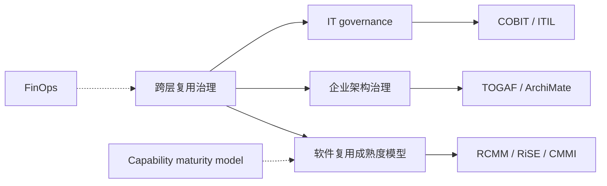

- **上位概念**：[IT governance](https://en.wikipedia.org/wiki/IT_governance)、企业架构治理；
- **下位概念**：资产管理、生命周期管理、质量管理、价值度量；
- **等价/映射概念**：ISO/IEC/IEEE 42020:2019（架构治理）、ISO/IEC 12207（软件生命周期过程治理）；
- **依赖概念**：复用成熟度模型、FinOps 单位经济学、升降级决策矩阵、度量指标体系。

### 6.4 角色职责详细矩阵

| 角色 | 核心职责 | 关键活动 | 治理产出 |
|------|----------|----------|----------|
| **企业架构委员会（EAC）** | 制定跨层复用战略、标准与投资决策 | 季度战略 review、预算分配、标准发布 | 复用战略、治理章程、投资决策 |
| **业务架构师** | 定义业务能力目录与价值流，确保业务层复用语义一致 | 业务能力映射、价值流分析 | 业务能力目录、价值流图 |
| **应用架构师** | 设计服务边界、API 契约与应用层复用模式 | API 治理、服务拆分/合并评审 | API 规范、服务蓝图 |
| **组件架构师/平台工程师** | 维护组件库、包管理、依赖治理与 CI/CD 集成 | SemVer 策略、SBOM 管理、依赖冲突解决 | 组件库、构建流水线、依赖基线 |
| **功能架构师/高级工程师** | 定义代码规范、函数纯度、测试策略 | 代码评审、重构指导、Golden Path 维护 | 编码规范、测试基线、重构计划 |
| **复用资产所有者（Asset Owner）** | 单个资产的全生命周期管理 | 版本发布、文档维护、缺陷响应、退役计划 | 资产 ROADMAP、SLA、变更日志 |
| **安全架构师** | 确保复用资产符合安全基线 | 安全评审、漏洞响应、合规映射 | 安全基线、威胁模型、审计报告 |
| **FinOps 分析师** | 量化复用成本与收益，驱动经济决策 | 成本分摊、单位经济学分析、ROI 计算 | Showback 报告、投资优先级 |
| **质量保障工程师** | 执行复用资产的质量门禁与测试 | 自动化测试、契约测试、质量审计 | 质量报告、门禁结果 |

### 6.5 跨层治理流程（PDCA 变体）

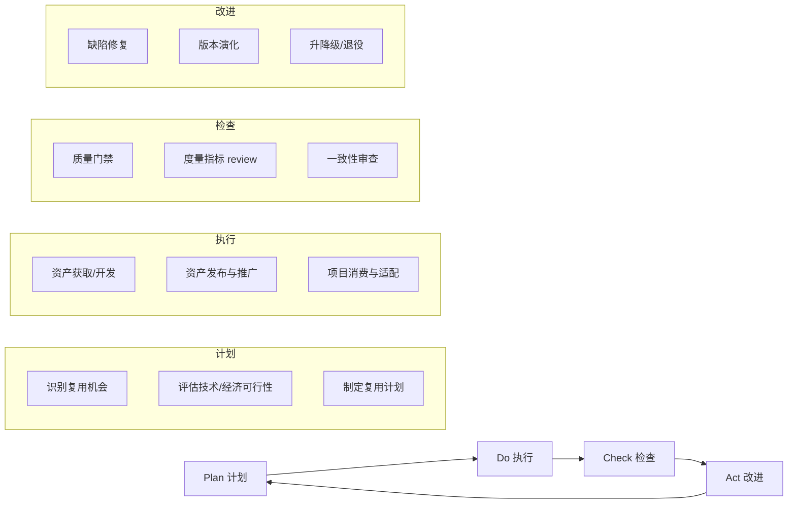

### 示例：某银行跨层治理体系

**背景**：某大型银行拥有 200+ 个业务系统，技术栈涵盖 Java、.NET、Python、Mainframe，复用水平参差不齐。

**治理体系建设**：

1. **组织**：成立企业架构委员会（EAC）下设复用治理工作组；
2. **目录**：建立企业级业务能力目录，映射到 500+ 应用服务和 3000+ 组件；
3. **流程**：项目立项阶段强制复用可行性评估，结项阶段报告复用率；
4. **质量**：定义 Tier-1/Tier-2/Tier-3 资产分级，Tier-1 必须通过 SLSA L2+、SBOM 100%、测试覆盖率 ≥ 80%；
5. **度量**：每月发布组织复用率（ORR）、跨项目复用率（CPRR）、复用 ROI；
6. **激励**：将"贡献/采用复用资产"纳入技术职级晋升考核。

**效果**：

- 组织复用率从 18% 提升到 41%；
- 新项目平均交付周期缩短 23%；
- 高危漏洞影响面下降 60%（通过统一组件管理）。

### 反例：治理组织形同虚设

**背景**：某互联网公司成立了"复用治理委员会"，但委员会每季度仅开一次会，无决策权。

**问题**：

1. **权责不对等**：委员会只能"建议"，不能否决重复造轮子；
2. **缺乏抓手**：没有统一资产目录，无法发现重复资产；
3. **激励冲突**：团队 KPI 以交付功能为主，复用贡献不被认可；
4. **工具缺失**：没有质量门禁和度量数据，评审靠主观判断。

**后果**：

- 3 年内同一领域出现 7 个功能相似的内部框架；
- 新员工入职成本极高，需要学习多套"内部标准"；
- 复用治理委员会逐渐被边缘化，最终解散。

**避免方法**：

- 赋予治理委员会真正的预算审批和标准发布权；
- 建立统一资产目录与自动化度量平台；
- 将复用贡献纳入绩效考核与晋升；
- 从一个小领域试点，用数据证明价值后再扩展。

### 反例：跨层一致性检查流于形式

**背景**：某组织制定了详细的跨层一致性检查清单，但项目评审时仅勾选"是/否"，不验证证据。

**问题**：

1. **业务-应用脱节**：业务能力"客户风险评估"已变更，但对应 API 未同步更新；
2. **应用-组件脱节**：微服务 API 升级后，共享组件版本未更新，导致运行时错误；
3. **组件-功能脱节**：组件增加了新功能，但函数级单元测试未覆盖，缺陷流入生产。

**后果**：

- 一次业务能力定义变更引发 14 个下游系统缺陷；
- 生产事故复盘发现，一致性检查清单 80% 的项被随意勾选；
- 客户投诉增加，业务团队对复用资产失去信任。

**避免方法**：

- 将一致性检查自动化（如 ArchiMate 模型与代码仓库的 diff 检测）；
- 引入可追溯性矩阵（Requirements Traceability Matrix）；
- 对关键变更实施影响分析工具（Impact Analysis）与强制评审。

---

## 7. 国际标准条款映射

跨层复用治理框架与国际权威标准的对应关系如下：

| 标准 | 条款/能力 | 本框架映射 | 实践要点 |
|:---|:---|:---|:---|
| **ISO/IEC/IEEE 42020:2019** | Clause 6 Architecture Governance process | 企业架构委员会（EAC）、治理决策、合规监控 | 明确治理角色、决策权限与评审节点 |
| **ISO/IEC/IEEE 42020:2019** | Clause 7 Architecture Management process | 资产管理、生命周期管理、度量与持续改进 | 建立资产目录、Owner 制度与质量门禁 |
| **ISO/IEC/IEEE 42020:2019** | Clause 9 Architecture Evaluation process | 价值度量、一致性检查、治理成熟度评估 | 定义评估目标、准则与改进建议 |
| **ISO/IEC/IEEE 42030:2019** | Clause 5–7 Evaluation synthesis & value assessment | 复用资产评估、跨层一致性审查 | 评估利益相关者关切与架构价值 |
| **COBIT 2019** | EDM01 / APO12 / MEA01 | IT 治理框架、风险管理、绩效监控 | 将复用治理纳入企业 IT 治理体系 |
| **ITIL 4** | Service Value System；Architecture management；Continual improvement | 服务化治理、持续改进、SLA 管理 | 把复用资产作为服务进行生命周期管理 |

---

## 权威来源与交叉引用

> **权威来源**:
>
> | 来源 | URL | 核查日期 |
> |------|-----|----------|
> | Wikipedia — IT governance | <https://en.wikipedia.org/wiki/IT_governance> | 2026-07-08 |
> | Wikipedia — Capability Maturity Model | <https://en.wikipedia.org/wiki/Capability_Maturity_Model> | 2026-07-08 |
> | ISO/IEC/IEEE 42020:2019 — Architecture processes | <https://www.iso.org/standard/68982.html> | 2026-07-08 |
> | ISO/IEC/IEEE 42030:2019 — Architecture evaluation framework | <https://www.iso.org/standard/73436.html> | 2026-07-08 |
> | ISO/IEC/IEEE 12207:2026 — Software life cycle processes | <https://www.iso.org/standard/90219.html> | 2026-07-08 |
> | TOGAF Standard, 10th Edition | <https://www.opengroup.org/togaf> | 2026-07-08 |
> | COBIT 2019 Framework | <https://www.isaca.org/resources/cobit> | 2026-07-08 |
> | ITIL 4 — Service Management | <https://www.axelos.com/certifications/itil-service-management> | 2026-07-08 |

> **交叉引用**:
>
> - 跨层复用升级/降级决策矩阵：[`struct/06-cross-layer-governance/06-up-downgrade-matrix/upgrade-downgrade-matrix.md`](../struct/06-cross-layer-governance/06-up-downgrade-matrix/upgrade-downgrade-matrix.md)
> - FinOps 单位经济学：[`struct/06-cross-layer-governance/04-finops-cost/finops-unit-economics-2026.md`](../struct/06-cross-layer-governance/04-finops-cost/finops-unit-economics-2026.md)
> - 复用度量指标体系：[`struct/06-cross-layer-governance/05-metrics-kpi/metrics-framework.md`](../struct/06-cross-layer-governance/05-metrics-kpi/metrics-framework.md)
> - 复用成熟度模型：[`struct/06-cross-layer-governance/03-maturity-models/reuse-maturity-models-rcmm-rise.md`](../struct/06-cross-layer-governance/03-maturity-models/reuse-maturity-models-rcmm-rise.md)
> - 软件复用过程标准：[`struct/01-meta-model-standards/01-iso-420xx-family/iso-12207-2026-alignment.md`](../struct/01-meta-model-standards/01-iso-420xx-family/iso-12207-2026-alignment.md)

---

> 最后更新：2026-07-08

---


<!-- SOURCE: struct/06-cross-layer-governance/02-reuse-process/README.md -->

# 02 复用过程治理（Reuse Process Governance）

> **版本**: 2026-06-12
> **定位**: 06-cross-layer-governance / 02-reuse-process
> **对齐标准**: ISO/IEC/IEEE 1517:2010-2010, ISO/IEC/IEEE 12207:2026, ISO/IEC 26550:2015

---

## 核心概念

复用过程治理定义组织如何**系统化地生产、管理和消费可复用资产**。它不是单一活动，而是贯穿四层复用架构（业务→应用→组件→功能）的过程体系。

IEEE 1517 将复用过程分为三大过程组：

| 过程组 | 核心活动 | 对应本体系 |
|:---|:---|:---|
| **领域工程（Domain Engineering）** | 识别、构建、维护可复用资产 | `02-business` / `03-application` / `04-component` |
| **应用工程（Application Engineering）** | 消费和适配可复用资产 | `03-application` / `04-component` / `05-functional` |
| **复用管理（Reuse Management）** | 计划、监控、改进复用活动 | `06-cross-layer-governance` / `09-value-quantification` |

---

## 治理框架

```text
复用策略
    │
    ├── 领域工程 ──► 资产生产
    │       ├── 领域分析
    │       ├── 领域设计
    │       ├── 领域实现
    │       └── 资产管理
    │
    ├── 应用工程 ──► 资产消费
    │       ├── 需求分析（含复用机会识别）
    │       ├── 设计（含资产选择）
    │       ├── 实现（含适配）
    │       └── 验证（含集成边界验证）
    │
    └── 复用管理 ──► 资产治理
            ├── 复用计划
            ├── 复用监控
            └── 复用改进
```

---

## 关键治理机制

1. **复用决策门（Reuse Decision Gate）**
   - 在项目立项、设计评审、发布评审中增加复用视角
   - 使用“自制/购买/复用”决策矩阵

2. **资产全生命周期治理**
   - 规划 → 开发 → 发布 → 推广 → 监控 → 退役
   - 每个阶段定义质量门禁和责任人

3. **复用度量体系**
   - 复用率、适配成本、资产质量分、ROI
   - 详见 `06-cross-layer-governance/05-metrics-kpi/`

---

## 检查清单

- [ ] 是否有明确的复用策略和资产路线图？
- [ ] 领域工程和应用工程是否有清晰的职责分离？
- [ ] 复用机会是否在需求分析阶段被系统识别？
- [ ] 资产是否有统一的管理、分类和版本控制？
- [ ] 复用指标是否被跟踪并用于持续改进？

---

## 关联主题

- `01-meta-model-standards/01-iso-420xx-family/ieee-1517-reuse-processes.md` — ISO/IEC/IEEE 1517:2010 与 12207:2026 的对照
- `06-cross-layer-governance/03-maturity-models/` — 复用成熟度评估
- `06-cross-layer-governance/05-metrics-kpi/` — 复用度量指标


---

## 补充说明：02 复用过程治理（Reuse Process Governance）

## 示例

**示例**：产品线工程团队执行 26550 的领域工程过程，建立领域模型、可复用资产与配置机制，应用工程团队基于这些资产定制具体产品。

## 反例

**反例**：只有应用工程没有领域工程，团队不断从头开发相似功能，无法积累可复用资产。

## 权威来源

> **权威来源**:
>
> - [ISO/IEC 26550:2015](https://www.iso.org/standard/69529.html)
> - [IEEE Standards](https://standards.ieee.org)
> - 核查日期：2026-07-07

## 分析

**分析**：复用过程的双轨模型（领域工程 + 应用工程）是系统化复用的核心组织模式。

---


<!-- SOURCE: struct/06-cross-layer-governance/03-maturity-models/assessment-questionnaire.md -->

# 软件架构复用成熟度评估问卷（SAR-MAQ v1.0）

> **文档编号**: SAR-MAQ-2026-0606
> **版本**: 2026-06-06
> **定位**: Track C — 06 跨层复用治理 / 成熟度评估工具
> **对齐框架**: ISO/IEC 26565:2026（产品线成熟度框架） · RCMM · RiSE-RM · NASA RRL；ISO/IEC 26566:2026（产品线纹理方法/工具能力）提供纹理管理支撑
> **适用对象**: 软件工程组织、架构治理团队、平台工程部门、质量保障团队

---

## 1. 框架说明与引用来源

本问卷基于以下四个权威框架的融合设计：

| 来源 | 全称/说明 | 在本问卷中的体现 |
|------|----------|----------------|
| **ISO/IEC 26565:2026** | 软件和系统工程 — 产品线成熟度框架的方法与工具能力 | 组织治理维度、过程域定义、等级划分逻辑 |
| **RCMM** | Reuse Capability Maturity Model (Jasmine & Vasantla) | 五级复用成熟度定义、关键实践映射、资产质量管理 |
| **RiSE-RM** | RiSE Reference Model (Garcia, 2010) | 过程域结构（领域工程、应用工程、变型管理）、社区与培训维度 |
| **NASA RRL** | Reuse Readiness Levels (NASA ESDS, 2010) | 资产质量维度（文档、模块化、可移植性、验证与测试）、IP 合规、SBOM 要求 |

> **NASA RRL 核心原则**: 可复用软件应在 Documentation、Extensibility、Intellectual Property、Modularity、Packaging、Portability、Standards Compliance、Support、Verification and Testing 九个主题领域达到对应等级。NASA 建议入库组件不低于 RRL 4 级（Reuse is possible）。本问卷将 RRL 的主题领域映射至「资产质量」与「技术基础设施」维度。

---

## 2. 使用说明

### 2.1 评估目的

本问卷用于系统评估组织在软件架构复用方面的组织级成熟度，识别当前短板，并为下一阶段的改进提供可执行的行动矩阵。

### 2.2 评分标准

对每个问题，评估者应根据组织当前实际状况，在 **1–5 分** 区间内打分：

| 分值 | 含义 | 成熟度映射 |
|:----:|:-----|:----------|
| **1** | 完全不同意 / 完全没有 | 低于 Level 1 期望 |
| **2** | 偶尔发生 / 非正式执行 | 接近 Level 2 |
| **3** | 部分定义并在部分项目执行 | 达到 Level 3 |
| **4** | 全面定义、量化追踪并持续执行 | 达到 Level 4 |
| **5** | 持续优化，行业领先，具备预测与创新能力 | 达到 Level 5 |

### 2.3 填写要求

1. **评估团队**: 建议由架构治理委员会（或指派 3–5 名代表，覆盖架构、开发、运维、质量、管理层）独立打分后取平均。
2. **证据支撑**: 每个评分应附有客观证据（如政策文件、平台截图、度量报告、培训记录）。
3. **时间范围**: 以过去 12 个月的实践为评估基准。
4. **打印使用**: 本问卷采用表格排版，可直接打印为 A4 纸质问卷使用。

### 2.4 评分示例

> **示例问题**: "组织已制定并正式发布软件复用战略文档，且与业务目标对齐。"
>
> - **场景 A（打 1 分）**: 完全没有复用战略，复用行为仅限于个人复制粘贴代码。
> - **场景 B（打 3 分）**: 复用战略草案已编写，但尚未正式发布，仅在 2 个试点项目中参考。
> - **场景 C（打 5 分）**: 复用战略已纳入组织级三年规划，每季度由 CTO 办公室 review，并与 OKR 体系绑定。

---

## 3. 评估问卷

### 维度一：组织与治理（Organizational Governance）

> **维度权重**: 25%
> **评估要点**: 复用战略、治理角色、决策流程、跨层一致性、供应链扩展

| 题号 | 评估问题 | 评分 (1–5) | 证据/备注 |
|:----:|---------|:----------:|:---------|
| Q1.1 | 组织已制定并正式发布软件复用战略文档，且与业务目标（OKR/KPI）明确对齐。 | | |
| Q1.2 | 设有专职或兼职的复用治理委员会（Reuse Governance Board），负责跨部门/跨项目的复用决策与协调。 | | |
| Q1.3 | 复用相关职责（如资产管理员、领域工程师、平台工程师）已明确写入相关岗位的职责说明（Job Description）。 | | |
| Q1.4 | 项目立项阶段的标准流程中包含复用可行性评估（Reuse Opportunity Analysis），并留存评审记录。 | | |
| Q1.5 | 组织已建立跨层（业务架构 → 应用架构 → 组件架构 → 功能架构）的一致性审查机制（如 Architecture Review Board）。 | | |
| Q1.6 | 复用计划被纳入项目管理的标准生命周期（如 PMI/Prince2/组织自定义流程），并作为项目交付物的一部分。 | | |
| Q1.7 | 组织每年至少开展一次复用合规审计，检查流程执行情况，并输出正式审计报告。 | | |
| Q1.8 | 高层管理者（C-Level 或 VP）定期（每季度）审查复用进展，并为资源分配与预算调整提供持续支持。 | | |
| Q1.9 | 建立了复用资产的变更控制流程（如 CCB, Change Control Board），确保跨项目影响的可见性。 | | |
| Q1.10 | 复用治理已扩展至供应链/合作伙伴生态（外部复用、开源治理、第三方组件准入）。 | | |

**维度一得分**: ______（题号 Q1.1–Q1.10 的平均分，保留两位小数）

---

### 维度二：技术基础设施（Technical Infrastructure）

> **维度权重**: 25%
> **评估要点**: 复用平台、DevOps 集成、包管理、平台工程、安全与自动化

| 题号 | 评估问题 | 评分 (1–5) | 证据/备注 |
|:----:|---------|:----------:|:---------|
| Q2.1 | 组织拥有统一的复用资产库/平台（如 Artifact Repository、InnerSource Portal、Backstage），覆盖全部主要技术栈。 | | |
| Q2.2 | 资产库与 CI/CD 流水线深度集成，支持自动化构建、测试、发布与版本管理。 | | |
| Q2.3 | 使用标准化的包管理工具（如 Maven/Nexus、npm/Artifactory、Helm Chart、OCI Registry）管理可复用组件。 | | |
| Q2.4 | 基础设施即代码（IaC）模板（Terraform、CloudFormation、Ansible 等）在组织范围内被标准化并纳入复用资产库。 | | |
| Q2.5 | DevOps 平台支持组件级依赖追踪与变更影响分析（Impact Analysis），可自动识别受影响的下游项目。 | | |
| Q2.6 | 采用平台工程（Platform Engineering）模式，提供自助式复用服务（Self-Service Portal、Golden Path、脚手架工具）。 | | |
| Q2.7 | 复用资产的软件成分分析（SCA）、静态安全扫描（SAST）和漏洞追踪已集成到发布流水线。 | | |
| Q2.8 | 组织使用 SBOM（Software Bill of Materials）管理复用组件的供应链依赖，并支持版本溯源。 | | |
| Q2.9 | AI/ML 辅助工具被用于资产推荐、代码生成、重复代码检测或智能搜索（如基于语义检索）。 | | |
| Q2.10 | 多云/混合云环境下的复用资产部署已实现标准化，具备跨环境一致性（Environment Parity）。 | | |

**维度二得分**: ______（题号 Q2.1–Q2.10 的平均分，保留两位小数）

---

### 维度三：资产质量（Asset Quality）

> **维度权重**: 20%
> **评估要点**: 文档完整性、接口契约、测试覆盖、质量门禁、安全、可观测性、分级与退役

| 题号 | 评估问题 | 评分 (1–5) | 证据/备注 |
|:----:|---------|:----------:|:---------|
| Q3.1 | 所有入库复用资产均配备完整的文档（API 文档、使用指南、架构决策记录 ADR、运行手册），符合 NASA RRL Documentation 主题领域 L4+ 要求。 | | |
| Q3.2 | 复用资产具有明确的接口契约（OpenAPI、gRPC IDL、GraphQL Schema 等）和版本兼容性策略（SemVer 或组织自定义）。 | | |
| Q3.3 | 核心复用资产（Tier-1/Tier-2）达到组织定义的代码覆盖率门槛（如单元测试覆盖率 ≥80%，集成测试覆盖关键路径）。 | | |
| Q3.4 | 复用资产在入库前必须通过质量门禁（Quality Gate）审查，包括代码规范、安全基线、性能基线。 | | |
| Q3.5 | 安全漏洞管理流程覆盖复用资产（CVE 追踪、补丁响应 SLA、漏洞通知机制），符合 NASA RRL Verification and Testing 要求。 | | |
| Q3.6 | 复用资产具备可观测性能力（日志规范、指标暴露、分布式追踪接口），便于消费者集成监控。 | | |
| Q3.7 | 组织建立了资产分级机制（如 Tier-1 核心资产 / Tier-2 共享资产 / Tier-3 实验资产），差异化管理质量要求与 SLA。 | | |
| Q3.8 | 退役资产有明确的弃用通知期（Deprecation Notice，建议 ≥6 个月）和迁移支持计划，避免「幽灵依赖」。 | | |
| Q3.9 | 领域模型/业务架构资产通过形式化或半形式化方法（如 Alloy、UML/OCL、ArchiMate 验证）验证跨层一致性。 | | |
| Q3.10 | 复用资产的设计遵循组织级架构标准和技术雷达（Technology Radar）指引，体现 NASA RRL Standards Compliance 与 Modularity 要求。 | | |

**维度三得分**: ______（题号 Q3.1–Q3.10 的平均分，保留两位小数）

---

### 维度四：人员能力（Personnel Capability）

> **维度权重**: 15%
> **评估要点**: 培训体系、社区建设、导师制、最佳实践、认证与激励

| 题号 | 评估问题 | 评分 (1–5) | 证据/备注 |
|:----:|---------|:----------:|:---------|
| Q4.1 | 组织提供系统化的复用技能培训（领域工程、资产设计、平台使用、InnerSource 协作），每年至少覆盖 60% 技术人员。 | | |
| Q4.2 | 设有内部技术社区或实践社区（Community of Practice, CoP），定期（每月至少一次）举办复用主题的技术分享。 | | |
| Q4.3 | 建立了导师制（Mentorship）或伙伴制（Buddy System），支持新员工在入职 90 天内掌握复用平台与最佳实践。 | | |
| Q4.4 | 团队成员能够熟练使用资产搜索和发现工具（如 Backstage、Nexus、内部搜索引擎）在 5 分钟内定位所需组件。 | | |
| Q4.5 | 组织每年至少举办一次黑客松（Hackathon）或创新活动，专门设立复用创新赛道，推动资产共创。 | | |
| Q4.6 | 复用最佳实践和 Golden Path 被文档化，并作为新员工入职培训和技术晋升（如 L3→L4）的必修内容。 | | |
| Q4.7 | 核心架构师/领域工程师具备资产设计、领域建模或相关框架（如 RCMM、RiSE-RM、ISO 26565/26566）的系统化知识。 | | |
| Q4.8 | 员工在绩效考核（Performance Review）中被明确评估其对复用资产的贡献（提交、维护、推广）和采用率。 | | |
| Q4.9 | 组织设有明确的复用贡献激励机制（如 InnerSource 贡献积分、晋升加分、物质奖励、内部表彰）。 | | |
| Q4.10 | 跨团队轮岗或交流机制（如轮岗 3–6 个月）促进复用知识、最佳实践和架构共识在组织内传播。 | | |

**维度四得分**: ______（题号 Q4.1–Q4.10 的平均分，保留两位小数）

---

### 维度五：度量与反馈（Measurement & Feedback）

> **维度权重**: 15%
> **评估要点**: KPI 定义、自动化采集、ROI 量化、统计过程控制、持续改进

| 题号 | 评估问题 | 评分 (1–5) | 证据/备注 |
|:----:|---------|:----------:|:---------|
| Q5.1 | 组织已定义复用相关的核心 KPI（如复用率 Reuse Rate、资产采用率 Adoption Rate、资产 NPS、Time-to-Reuse）。 | | |
| Q5.2 | 建立了自动化的度量数据采集机制（通过 DevOps 平台、APM、资产库 API），而非依赖手工统计。 | | |
| Q5.3 | 定期（至少每月）生成复用度量报告，并向管理层和全技术团队发布，包含趋势分析和异常告警。 | | |
| Q5.4 | 复用资产的 ROI（投资回报率）被量化计算并持续跟踪，包括开发时间节约、缺陷减少、上市时间缩短等维度。 | | |
| Q5.5 | 使用统计过程控制（SPC, Statistical Process Control）或控制图监控复用过程稳定性（如资产发布频率、缺陷密度波动）。 | | |
| Q5.6 | 缺陷根因分析（RCA）中区分「复用相关缺陷」，并追踪其趋势（如复用缺陷占比、修复周期）。 | | |
| Q5.7 | 建立了从资产消费者到资产生产者的反馈闭环机制（如 Issue 模板、反馈看板、季度 Satisfaction Survey）。 | | |
| Q5.8 | 度量结果被用于驱动持续改进计划（Kaizen、Sprint Retro、季度复盘），并可见地落实到行动项。 | | |
| Q5.9 | 组织与行业基准（Industry Benchmark）或同类组织进行复用成熟度对标分析，至少每两年一次。 | | |
| Q5.10 | 预测性分析（如需求预测、资产需求预测、技术债务预警）被用于指导资产投资和复用战略调整。 | | |

**维度五得分**: ______（题号 Q5.1–Q5.10 的平均分，保留两位小数）

---

## 4. 评分计算与成熟度判定

### 4.1 计算公式

**步骤 1：计算各维度平均分**

```text
维度得分 = 该维度所有问题评分之和 ÷ 该维度问题数量
```

（每个维度含 10 题，故维度得分 = 该维度总分 ÷ 10）

**步骤 2：计算总体成熟度得分（加权平均）**

```text
总体成熟度 = (组织得分 × 25%) + (技术得分 × 25%) + (资产得分 × 20%)
           + (人员得分 × 15%) + (度量得分 × 15%)
```

**步骤 3：填写下表**

| 维度 | 维度得分 (1–5) | 权重 | 加权得分 |
|------|:-------------:|:----:|:-------:|
| 组织与治理 | | 25% | |
| 技术基础设施 | | 25% | |
| 资产质量 | | 20% | |
| 人员能力 | | 15% | |
| 度量与反馈 | | 15% | |
| **总体成熟度得分** | — | **100%** | |

### 4.2 成熟度判定规则

| 成熟度等级 | 名称 | 总体得分范围 | 核心特征 |
|:---------:|:-----|:-----------:|---------|
| **Level 1** | 初始 (Initial) | < 2.0 | 复用偶然发生，依赖个人英雄主义，无统一流程或平台 |
| **Level 2** | 管理 (Managed) | 2.0 ≤ 得分 < 3.0 | 项目级复用跟踪，基本的配置管理与资产目录 |
| **Level 3** | 定义 (Defined) | 3.0 ≤ 得分 < 4.0 | 组织级复用过程标准化，领域工程启动，质量门禁建立 |
| **Level 4** | 量化 (Quantitative) | 4.0 ≤ 得分 < 4.5 | 复用率、质量、成本度量驱动决策，SPC 监控，ROI 量化 |
| **Level 5** | 优化 (Optimizing) | ≥ 4.5 | 持续过程改进，预测性分析，创新技术引入，跨组织生态 |

> **判定说明**: 若总体得分位于边界值（如恰好 3.0），以**最低维度的等级**作为组织成熟度上限。例如：总体 3.2 但「度量与反馈」维度仅 2.1，则组织成熟度不应高于 Level 2，因为度量能力是 Level 3 的关键支撑（RCMM Level 4 明确要求复用度量）。

---

## 5. 结果解读与行动建议

### 5.1 结果解读指南

| 总体得分 | 典型状态描述 | 优先关注点 |
|:-------:|------------|-----------|
| **< 2.0 (L1)** | 复用行为碎片化，多为个人级代码复制；缺乏统一平台，资产不可发现；质量与合规风险高。 | 建立基础平台与治理框架 |
| **2.0–2.9 (L2)** | 部分项目开始使用组件库，但依赖个人推动；有基本的版本控制和目录，但跨项目一致性差。 | 标准化流程、扩展覆盖范围 |
| **3.0–3.9 (L3)** | 组织级复用流程已定义并推广；资产质量门禁、领域工程、培训体系初步建立；开始量化追踪。 | 深化度量、自动化、平台工程 |
| **4.0–4.4 (L4)** | 复用度量全面自动化，ROI 可量化；SPC 监控过程稳定性；资产分级、SBOM、安全扫描常态化。 | 引入 AI 辅助、预测性分析、跨组织扩展 |
| **≥ 4.5 (L5)** | 复用成为组织核心竞争力；技术雷达驱动资产投资；跨组织/供应链复用生态形成；行业标杆。 | 持续创新、生态运营、知识输出 |

### 5.2 单维度短板分析

即使总体成熟度达标，若某维度得分低于总体得分 0.5 分以上，该维度即为**关键短板**，应优先改进：

| 短板维度 | 典型风险 | 紧急建议 |
|---------|---------|---------|
| 组织与治理 | 战略漂移、资源不足、跨部门冲突 | 立即成立治理委员会，将复用纳入项目立项强制流程 |
| 技术基础设施 | 工具割裂、手工操作、安全盲区 | 统一 DevOps 平台，引入平台工程，集成安全扫描 |
| 资产质量 | 消费者信任低、缺陷传播、「不是发明在这里」文化回潮 | 强制执行质量门禁，建立 Tier 分级，完善文档与测试 |
| 人员能力 | 平台闲置、重复造轮子、社区冷淡 | 将复用纳入晋升与考核，建立 CoP 与导师制 |
| 度量与反馈 | 改进盲目、无法证明价值、预算被削减 | 定义 3–5 个核心 KPI，接入自动化采集，月度 review |

---

## 6. 改进建议矩阵

> 本矩阵将 RCMM、RiSE-RM 和 ISO/IEC 26565:2026 的关键实践映射为「当前级别 → 下一级别」的具体行动项，供治理委员会直接引用。

### Level 1 (初始) → Level 2 (管理)

| 维度 | 关键行动项 | 预期产出 | 建议周期 |
|------|----------|---------|---------|
| 组织与治理 | 成立复用治理虚拟小组（3–5 人），制定《复用政策草案》 | 政策文档 V1.0、治理小组名单 | 1–2 个月 |
| 技术基础设施 | 建立中央源代码仓库与包管理实例（Nexus/Artifactory）；统一技术栈命名规范 | 可用仓库、入库指南 | 1–3 个月 |
| 资产质量 | 制定资产命名、分类、标签规范；要求所有入库资产附带 README | 分类规范文档、模板 | 1 个月 |
| 人员能力 | 开展全员复用意识培训（2 小时），介绍平台使用方法 | 培训签到表、录像 | 1 个月 |
| 度量与反馈 | 手工追踪并记录复用实例（Excel/看板），每月汇总 | 月度复用实例清单 | 持续 |

### Level 2 (管理) → Level 3 (定义)

| 维度 | 关键行动项 | 预期产出 | 建议周期 |
|------|----------|---------|---------|
| 组织与治理 | 将复用可行性评估纳入项目立项强制检查点（Checklist）；建立 Architecture Review Board | 立项模板更新、ARB 章程 | 2–3 个月 |
| 技术基础设施 | CI/CD 流水线集成自动化构建与单元测试；资产库与流水线打通 | 自动化发布流水线 | 2–4 个月 |
| 资产质量 | 建立质量门禁（Quality Gate）：覆盖率、代码规范、安全基线；资产按 Tier 分级 | 质量门禁配置、分级标准 | 2–3 个月 |
| 人员能力 | 建立复用实践社区（CoP）；启动领域工程师培养计划 | CoP 章程、培养路径图 | 3–6 个月 |
| 度量与反馈 | 定义组织级复用核心 KPI（复用率、采用率、NPS）；建立季度 review 机制 | KPI 定义文档、Dashboard 原型 | 2 个月 |

### Level 3 (定义) → Level 4 (量化)

| 维度 | 关键行动项 | 预期产出 | 建议周期 |
|------|----------|---------|---------|
| 组织与治理 | 建立跨层架构一致性审查机制（业务→应用→组件→功能）；开展年度复用合规审计 | 审查指南、审计报告 | 3–6 个月 |
| 技术基础设施 | 引入平台工程（Platform Engineering）与自助服务门户；集成 SBOM 生成与安全扫描（SCA/SAST） | 平台门户上线、SBOM 产出 | 3–6 个月 |
| 资产质量 | 自动化质量报告（代码覆盖率、漏洞数、技术债务）；退役资产强制 Deprecation 流程 | 质量报告自动化、退役流程 | 2–4 个月 |
| 人员能力 | 建立复用认证体系（如「领域工程师认证」）；将复用贡献纳入绩效考核与晋升 | 认证体系、考核指标更新 | 3–6 个月 |
| 度量与反馈 | 度量数据采集全面自动化（零手工）；引入 SPC 控制图监控过程稳定性；量化 ROI | 自动化 Dashboard、ROI 模型 | 3–6 个月 |

### Level 4 (量化) → Level 5 (优化)

| 维度 | 关键行动项 | 预期产出 | 建议周期 |
|------|----------|---------|---------|
| 组织与治理 | 复用治理扩展至供应链与合作伙伴；参与行业联盟/开源基金会，输出标准 | 外部合作协议、标准提案 | 6–12 个月 |
| 技术基础设施 | 引入 AI/ML 辅助资产推荐、代码生成、智能搜索；实现多云标准化部署 | AI 推荐系统、跨云部署规范 | 6–12 个月 |
| 资产质量 | 资产库具备自优化能力（自动检测过时资产、推荐替代方案）；主动技术雷达更新 | 自优化功能上线 | 6–12 个月 |
| 人员能力 | 成为行业复用实践标杆；核心人员参与外部会议/标准制定；开源社区运营 | 外部演讲、开源项目 | 持续 |
| 度量与反馈 | 引入预测性分析（需求预测、资产投资预测）；与行业基准（Benchmark）年度对标 | 预测模型、Benchmark 报告 | 6–12 个月 |

---

## 7. 附录

### 附录 A：术语表

| 术语 | 英文 | 说明 |
|------|------|------|
| RCMM | Reuse Capability Maturity Model | 复用能力成熟度模型，基于 CMMI 框架扩展复用特定过程域 |
| RiSE-RM | RiSE Reference Model | 巴西 RiSE Labs 提出的系统化复用采用参考模型，含 7 级成熟度 |
| NASA RRL | NASA Reuse Readiness Levels | NASA 提出的软件复用准备度等级，含 9 级和 9 个主题领域 |
| SBOM | Software Bill of Materials | 软件物料清单，记录组件的供应链依赖与版本信息 |
| SPC | Statistical Process Control | 统计过程控制，用于监控过程稳定性和变异 |
| CoP | Community of Practice | 实践社区，基于共同兴趣或实践领域形成的学习型组织 |
| Golden Path | Golden Path | 平台工程中的「黄金路径」，即经过官方验证的推荐技术栈与流程 |
| Quality Gate | Quality Gate | 质量门禁，资产入库或发布前必须通过的自动化/人工检查 |

### 附录 B：问卷快速评分表（打印版）

| 题号 | 1 | 2 | 3 | 4 | 5 | 6 | 7 | 8 | 9 | 10 | 小计 |
|------|---|---|---|---|---|---|---|---|---|----|------|
| Q1.x | | | | | | | | | | | /50 |
| Q2.x | | | | | | | | | | | /50 |
| Q3.x | | | | | | | | | | | /50 |
| Q4.x | | | | | | | | | | | /50 |
| Q5.x | | | | | | | | | | | /50 |

**总体成熟度**: ______（加权计算后）  **判定等级**: Level ______

### 附录 C：参考文献

1. ISO/IEC 26565:2026, *Software and systems engineering — Methods and tools for product line maturity framework*, ISO, 2026.
2. Jasmine, K. S. & Vasantla, V. *Reuse Capability Maturity Model (RCMM)*. 基于 CMMI 的复用特定成熟度框架。
3. Garcia, V. C. et al. (2010). *RiSE Reference Model (RiSE-RM)*. RiSE Labs, Brazil. 系统化复用采用的过程域与成熟度模型。
4. NASA Earth Science Data Systems (ESDS) Software Reuse Working Group (2010). *Reuse Readiness Levels (RRLs) as a Measure of Software Reusability*. NASA/TM—2010-216581. 包含 9 级通用定义与 9 个主题领域（Documentation, Extensibility, IP, Modularity, Packaging, Portability, Standards Compliance, Support, Verification and Testing）。
5. ISACA (2026). *CMMI Performance Solutions*. CMMI-DEV v3.0，通用软件开发过程成熟度框架。
6. Frakes, W. B. & Terry, C. (1996). *Software Reuse: Metrics and Models*. ACM Computing Surveys.
7. Lim, W. C. (1998). *Managing Software Reuse*. Prentice Hall.
8. VDA QMC (2024). *Automotive SPICE v4.0*. 汽车行业过程评估模型，含 REU（Reuse Management）扩展。

---

> **填写完成日期**: ___________
> **评估负责人签名**: ___________
> **治理委员会确认**: ___________

---

*本文档为 Track C：06 跨层复用治理的可交付成果，遵循项目写作规范：中文为主、英文术语保留原文、表格呈现、引用权威来源。*


---

## 补充说明：软件架构复用成熟度评估问卷（SAR-MAQ v1.0）

## 权威来源

> **权威来源**:
>
> - [NASA RRL](https://www.nasa.gov)
> - [ISO/IEC 26565:2026](https://www.iso.org/standard/81436.html) 产品线成熟度框架
> - 核查日期：2026-07-07

---


<!-- SOURCE: struct/06-cross-layer-governance/03-maturity-models/iso-26565-26566-final.md -->

# ISO/IEC 26565:2026 & 26566:2026 正式版与产品线成熟度/纹理管理对齐

> **版本**: 2026-06-10
> **对齐标准**: ISO/IEC 26565:2026 + ISO/IEC 26566:2026
> **发布日期**: 2026-05（两标准同时正式发布）
> **前一状态**: DIS → FDIS → IS (60.60)
> **核查日期**: 2026-06-10
> **来源 URL**: <https://www.iso.org/standard/81436.html> (26565) | <https://www.iso.org/standard/81437.html> (26566)

---

## 目录

- [ISO/IEC 26565:2026 \& 26566:2026 正式版与产品线成熟度/纹理管理对齐](#isoiec-265652026--265662026-正式版与产品线成熟度纹理管理对齐)
  - [目录](#目录)
  - [1. 标准概览](#1-标准概览)
  - [2. 26565:2026 — 产品线成熟度框架](#2-265652026--产品线成熟度框架)
    - [2.1 成熟度等级定义](#21-成熟度等级定义)
    - [2.2 关键能力域](#22-关键能力域)
    - [2.3 与 RCMM/RiSE/NASA RRL 的整合映射](#23-与-rcmmrisenasa-rrl-的整合映射)
  - [3. 26566:2026 — 产品线结构（Texture）管理](#3-265662026--产品线结构texture管理)
    - [3.1 "Texture" 概念解析](#31-texture-概念解析)
    - [3.2 产品线结构管理过程](#32-产品线结构管理过程)
    - [3.3 对复用工程的启示](#33-对复用工程的启示)
  - [4. 与 ISO/IEC 26550:2015 的协同](#4-与-isoiec-265502015-的协同)
  - [5. 与 SWEBOK V4 的对照](#5-与-swebok-v4-的对照)
  - [6. 实施检查清单](#6-实施检查清单)
  - [7. 参考标准族谱](#7-参考标准族谱)

## 1. 标准概览

ISO/IEC 26565:2026 和 ISO/IEC 26566:2026 是 ISO/IEC 26550:2015 产品线工程标准族的两项新标准，于 **2026-05 同时正式发布**，标志着产品线工程（Product Line Engineering, PLE）方法论的国际标准化进入新阶段。

| 标准 | 全称 | 核心内容 | 页数 |
|:---|:---|:---|:---:|
| **26565:2026** | Methods and tools for product line maturity framework | 产品线成熟度框架的方法与工具能力 | ~32 |
| **26566:2026** | Methods and tools for product line texture | 产品线结构（texture）管理的方法与工具能力 | ~32 |

> **术语说明**：26566 中的 "texture" 并非指"纹理"，而是借用数学/拓扑学概念，指产品线中各产品之间的关系结构和组织模式——即产品线的"结构纹理"。

---

## 2. 26565:2026 — 产品线成熟度框架

### 2.1 成熟度等级定义

26565:2026 定义了产品线工程能力的成熟度框架，与 CMMI、SPICE (ISO/IEC 33000) 兼容，但更聚焦于**产品线特有的能力维度**。

| 成熟度等级 | 名称 | 核心特征 | 本项目 RCMM/RiSE 对应 |
|:---:|:---|:---|:---|
| **Level 1** | 初始 (Initial) | 临时性复用，无系统化产品线管理 | RCMM Level 1 (Ad hoc) |
| **Level 2** | 管理 (Managed) | 项目级产品线活动，有基本计划和管理 | RCMM Level 2 (Opportunistic) |
| **Level 3** | 定义 (Defined) | 组织级标准化产品线过程，资产库建立 | RCMM Level 3 (Integrated) |
| **Level 4** | 量化 (Quantified) | 产品线度量体系，过程可预测 | RCMM Level 4 (Leveraged) |
| **Level 5** | 优化 (Optimizing) | 持续改进，创新产品线方法 | RCMM Level 5 (Anticipating) |

### 2.2 关键能力域

26565:2026 从以下能力域评估组织的产品线成熟度：

```text
产品线成熟度能力域
├── 领域工程能力（Domain Engineering）
│   ├── 领域分析深度
│   ├── 参考架构质量
│   └── 领域资产库管理
├── 应用工程能力（Application Engineering）
│   ├── 变性绑定效率
│   ├── 产品配置自动化
│   └── 产品验证覆盖率
├── 组织治理（Organizational Governance）
│   ├── 产品线战略对齐
│   ├── 跨项目资源协调
│   └── 知识管理
├── 工具支持（Tool Support）
│   ├── 变性建模工具
│   ├── 配置管理工具
│   └── 自动化生成工具
└── 度量与改进（Measurement & Improvement）
    ├── 产品线覆盖率
    ├── 重用率 KPI
    └── 成本收益追踪
```

### 2.3 与 RCMM/RiSE/NASA RRL 的整合映射

本项目原有的复用成熟度五级模型（参见 `reuse-maturity-models-rcmm-rise.md`）与 26565:2026 的对照：

| 维度 | 本项目五级模型 | 26565:2026 | 差异说明 |
|:---|:---|:---|:---|
| 层级数 | 5 级 | 5 级 | 一致 |
| 核心驱动 | 复用率 + 治理强度 | 产品线能力 + 工具支持 | 26565 更强调工具链 |
| 业务层表现 | 能力目录 → 价值流度量 | 产品线业务覆盖度 | 本项目更细粒度 |
| 评估方法 | 25 题问卷 + 雷达图 | 标准过程评估框架 | 可互补使用 |

**建议**：将 26565:2026 作为**外部认证基准**，本项目问卷作为**内部自评工具**。

---

## 3. 26566:2026 — 产品线结构（Texture）管理

### 3.1 "Texture" 概念解析

26566:2026 中的 "product line texture" 指：产品线中产品之间的**结构关系模式**，包括：

- **共性范围（Commonality Scope）**：所有产品共享的核心资产
- **变性空间（Variability Space）**：产品间差异的维度与范围
- **依赖拓扑（Dependency Topology）**：产品/资产之间的依赖关系网络
- **演化轨迹（Evolution Trajectory）**：产品线随时间扩展的模式

### 3.2 产品线结构管理过程

26566:2026 定义了以下核心过程：

| 过程 | 目的 | 输入 | 输出 | 工具支持 |
|:---|:---|:---|:---|:---|
| **结构定义** | 建立产品线的纹理模型 | 领域分析结果、产品需求 | 纹理模型、共性/变性规格 | 特征建模工具（如 FeatureIDE, pure::variants） |
| **结构操作化** | 将纹理转化为可执行配置 | 纹理模型、绑定规则 | 产品配置脚本、生成模板 | 配置器、代码生成器 |
| **结构支持** | 维护纹理随演化的更新 | 变更请求、市场反馈 | 更新后的纹理模型 | 版本控制、影响分析工具 |

### 3.3 对复用工程的启示

26566:2026 的"纹理"概念为本项目的四层复用模型提供了**数学化表达**的可能性：

```text
业务架构复用纹理 = {业务能力集合} × {价值流编排} × {组织上下文}
应用架构复用纹理 = {应用组件图} × {接口契约矩阵} × {部署拓扑}
组件架构复用纹理 = {依赖树} × {版本约束} × {传递闭包}
功能架构复用纹理 = {函数签名} × {副作用声明} × {组合规则}
```

> **定理 T.1** (Texture-Completeness): 一个复用资产的可复用性完全由其纹理（接口契约 + 变性模型 + 依赖拓扑）决定，而非实现细节。

---

## 4. 与 ISO/IEC 26550:2015 的协同

26550:2015 是产品线工程的**参考模型**（Reference Model），26565 和 26566 是其**方法与工具**层面的细化：

```text
26550:2015 参考模型
├── 领域工程（Domain Engineering）
│   ├── 26565: 领域分析成熟度评估方法
│   └── 26566: 领域资产纹理定义工具
├── 应用工程（Application Engineering）
│   ├── 26565: 产品配置管理成熟度
│   └── 26566: 变性绑定纹理操作化
└── 管理（Management）
    ├── 26565: 组织治理成熟度框架
    └── 26566: 产品线演化纹理支持
```

---

## 5. 与 SWEBOK V4 的对照

SWEBOK V4 将 26550-26566 系列标准列为软件工程知识体中"软件工程过程"和"软件工程管理"知识领域的核心参考。

| SWEBOK V4 知识领域 | 26565/26566 对应 | 本项目对应主题 |
|:---|:---|:---|
| Software Requirements | 产品线需求工程方法 | 02 业务架构复用 |
| Software Design | 产品线架构设计方法 | 03 应用架构复用 + 04 组件架构复用 |
| Software Construction | 产品线实现与配置 | 05 功能架构复用 |
| Software Engineering Process | 产品线过程成熟度 | 06 跨层复用治理 |
| Software Engineering Management | 产品线资源与度量 | 09 价值量化 |
| Software Quality | 产品线质量评估 | 06/07 治理与验证 |

---

## 6. 实施检查清单

组织若希望按 26565/26566 建立产品线复用能力，可参考以下路径：

| 阶段 | 26565 成熟度目标 | 26566 纹理建设目标 | 本项目支撑文档 |
|:---:|:---|:---|:---|
| **Phase 1** (1-3 月) | 成熟度 Level 2（管理） | 定义初始纹理模型 | `06/03-maturity-models/assessment-questionnaire.md` |
| **Phase 2** (3-6 月) | 成熟度 Level 3（定义） | 建立配置自动化 | `03-05` 四层架构复用文档 |
| **Phase 3** (6-12 月) | 成熟度 Level 4（量化） | 度量纹理演化 | `06/05-metrics-kpi/metrics-framework.md` |
| **Phase 4** (12-18 月) | 成熟度 Level 5（优化） | 持续纹理优化 | `99-reference/tools/reuse-decision-tool/` |

---

## 7. 参考标准族谱

```text
ISO/IEC 26550:2015 产品线工程参考模型
├── 26551:2016 需求工程方法
├── 26552:2019 架构设计方法
├── 26553:2018 实现方法
├── 26554:2018 测试方法
├── 26555:2015 技术管理方法
├── 26556:2018 组织管理方法
├── 26557:2016 变性机制
├── 26558:2017 变性建模
├── 26559:2017 变性可追溯性
├── 26560:2019 产品管理方法
├── 26561:2019 技术探测方法
├── 26562:2019 过渡管理
├── 26563:2022 配置管理
├── 26564:2022 度量方法
├── **26565:2026 成熟度框架** ← 新增
└── **26566:2026 结构纹理管理** ← 新增
```

---

> **权威来源**:
>
> - ISO/IEC 26565:2026. Software and systems engineering — Methods and tools for product line maturity framework. Published 2026-05. <https://www.iso.org/standard/81436.html> (核查日期: 2026-06-10)
> - ISO/IEC 26566:2026. Software and systems engineering — Methods and tools for product line texture. Published 2026-05. <https://www.iso.org/standard/81437.html> (核查日期: 2026-06-10)
> - ISO/IEC 26550:2015. Software and systems engineering — Reference model for product line engineering and management. <https://www.iso.org/standard/69529.html>
> - SWEBOK V4. Guide to the Software Engineering Body of Knowledge. IEEE Computer Society, 2024. <https://ieeecs-media.computer.org/media/education/swebok/swebok-v4.pdf>
>
> **核查日期**: 2026-06-10

---


<!-- SOURCE: struct/06-cross-layer-governance/03-maturity-models/reuse-maturity-models-rcmm-rise.md -->

# 软件复用成熟度模型：RCMM、RiSE-RM 与行业映射
>
> 版本: 2026-06-06
> 对齐来源: CMMI (ISACA), RCMM (Jasmine & Vasantla), RiSE-RM (Garcia 2010), Automotive SPICE, Koltun & Hudson (1991)

## 1. 复用成熟度模型谱系

| 模型 | 层级数 | 焦点 | 来源 |
|-----|--------|------|------|
| **CMM / CMMI-DEV** | 5 | 通用软件开发过程 | SEI / ISACA |
| **RCMM** | 5 | 复用导向软件开发 | Jasmine & Vasantla |
| **RiSE-RM** | 7 | 系统化复用采用 | RiSE Labs / Garcia (2010) |
| **Koltun & Hudson** | 5 | 组织 mindset 层面复用 | 1991 |
| **Automotive SPICE** | 6 | 汽车行业过程评估 | VDA QMC |
| **Koltun-Hudson 软件复用** | 5 | 代码/组件/应用/系统复用 | 1991 |

## 2. CMMI 与复用

### 2.1 CMMI 核心信息

- **当前管理方**：ISACA（2016 年从 CMU/SEI 接管）
- **定位**：结果导向的性能改进模型，与 Agile、SAFe、DevSecOps 集成
- **量化收益**（ISACA 数据）：
  - 缺陷减少 30%
  - 开发生产率提升 15%
  - 交付时间偏差减少 43%
  - 客户满意度提升 13%
  - 成本偏差减少 47%

### 2.2 CMMI 成熟度等级

| 等级 | 名称 | 复用含义 |
|-----|------|---------|
| 1 | 初始 | 复用偶然发生，依赖个人英雄主义 |
| 2 | 已管理 | 项目级复用跟踪，基本的配置管理 |
| 3 | 已定义 | 组织级复用过程标准化，领域工程启动 |
| 4 | 量化管理 | 复用率、质量、成本度量驱动决策 |
| 5 | 优化 | 持续过程改进，创新复用技术引入 |

## 3. RCMM（Reuse Capability Maturity Model）

### 3.1 五级定义

| 等级 | 名称 | 特征 | 关键实践 |
|-----|------|------|---------|
| **1** | 初始复用 | 个人级、无计划、临时复制粘贴 | 无 |
| **2** | 可重复复用 | 项目内识别可复用组件；基本的版本控制 | 组件目录、编码标准 |
| **3** | 已定义复用 | 组织级复用过程；领域分析；组件库 | 复用计划、领域工程、质量门 |
| **4** | 已管理复用 | 量化复用指标；投资回报跟踪；供应商管理 | 复用度量、成本模型、资产质量管理 |
| **5** | 优化复用 | 持续改进复用过程；创新技术；跨组织复用 | 基准比较、技术雷达、复用文化 |

### 3.2 与 CMMI 的映射

RCMM 直接基于 CMMI 框架，但增加复用特定过程域：

- **复用计划（Reuse Planning）**
- **资产管理（Asset Management）**
- **领域工程（Domain Engineering）**
- **复用度量（Reuse Measurement）**

## 4. RiSE Reference Model（RiSE-RM）

### 4.1 七级定义

由 RiSE Labs（巴西）通过工业实践与专家验证提出：

| 等级 | 名称 | 核心特征 |
|-----|------|---------|
| **1** | Informal Reuse | 非正式复用；复制粘贴；无管理 |
| **2** | Basic Reuse | 基本复用；识别常见功能；简单库 |
| **3** | Planned Reuse | 计划复用；领域分析；可复用组件设计 |
| **4** | Managed Reuse | 管理复用；组件库管理；版本控制；质量评估 |
| **5** | Family-Oriented Products Reuse | 产品线复用；核心资产库；变体管理 |
| **6** | Measured Reuse | 度量复用；量化指标；ROI 跟踪；过程优化 |
| **7** | Proactive Reuse | 主动复用；预测需求；战略资产投资；跨组织生态 |

### 4.2 过程域结构

RiSE-RM 包含以下过程域（Process Areas）：

- 复用战略与规划
- 领域工程
- 应用工程
- 资产管理
- 变型管理
- 组织培训与推广
- 度量与分析
- 过程质量保证

## 5. Koltun & Hudson 复用框架（1991）

### 5.1 组织 Mindset 层面

| 层级 | 名称 | 描述 |
|-----|------|------|
| **0** | No Reusability | 复制粘贴；所有实例手动更新 |
| **1** | Object & Function Reuse | 小规模单一对象或函数复用 |
| **2** | Component Reuse | 子系统到单个对象的组件复用 |
| **3** | Application Reuse | 完整应用复用；应用家族 |
| **4** | System Reuse | 完整系统复用；多应用组合 |

### 5.2 与 RCMM/RiSE 的关系

Koltun-Hudson 框架侧重于**技术复用粒度**，而 RCMM/RiSE 侧重于**组织过程成熟度**。两者互补：

- Koltun-Hudson 回答"复用什么"
- RCMM/RiSE 回答"如何系统化地复用"

## 6. 汽车行业：Automotive SPICE

### 6.1 与复用的关联

- **SUP.1: Quality Assurance** — 复用资产的质量保证
- **SUP.8: Configuration Management** — 复用组件的版本与变体管理
- **SUP.9: Problem Resolution Management** — 复用组件缺陷的跨项目影响分析
- **SYS.3 / SWE.2: Architectural Design** — 软件产品线架构设计
- **REU: Reuse Management** (特定扩展) — 复用工程管理

### 6.2 ASPICE 与 ISO 26262 的交叉

- ASPICE 过程能力等级与 ISO 26262 ASIL 等级共同决定复用证据的充分性
- SEooC 开发需同时满足 ASPICE Level 3+ 和对应 ASIL 的过程要求

## 7. 成熟度评估问卷设计原则

### 7.1 维度设计

| 维度 | 权重 | 评估要点 |
|-----|------|---------|
| **战略与治理** | 15% | 复用战略、预算、治理委员会 |
| **过程与方法** | 20% | 领域工程、应用工程、变体管理 |
| **资产与基础设施** | 20% | 资产库、搜索、质量门、SBOM |
| **度量与激励** | 15% | 复用率、成本节约、开发者激励 |
| **文化与技能** | 15% | 培训、社区、Golden Path 采用率 |
| **工具与自动化** | 15% | CI/CD 集成、SCA、SBOM、平台工程 |

### 7.2 评估方法

- **自评估**：在线问卷，快速定位
- **第三方评估**：类似 CMMI Appraisal，由授权评估师执行
- **持续监控**：平台工程工具自动收集度量数据

## 8. 案例：汽车 OEM 使用 ASPICE + RCMM 评估复用成熟度

**背景**：某汽车 OEM 在开发新一代车载信息娱乐平台时，需要复用多个 ECU 软件组件，但各供应商成熟度参差不齐。

**做法**：

1. 以 **Automotive SPICE** 评估供应商过程能力，要求关键复用组件达到 Level 3（已定义）以上；
2. 以 **RCMM** 评估复用组织能力，识别“资产目录、领域工程、复用度量”三个薄弱环节；
3. 以 **NASA RRL** 对候选可复用资产进行技术就绪度评分，仅推广 RRL 7 以上组件；
4. 建立跨供应商的复用成熟度仪表盘，季度发布改进报告。

**效果**：关键复用组件缺陷率下降 40%，供应商交付一致性提升，通过 ASPICE 审计所需证据减少 30%。

## 9. 反模式：跳过成熟度评估直接推广实验室原型

> **反模式**：将未经验证的实验室原型直接推广为组织级复用资产。

某 AI 创业公司将内部实验的推荐算法组件直接发布为公司级复用资产，未经过成熟度评估、文档完善与压力测试。

**后果**：

- 3 个业务团队在峰值流量期间出现性能崩溃；
- 缺乏接口契约文档，集成方反复返工；
- 因缺少安全审查，模型被 prompt 注入攻击，泄露训练数据样本。

**避免方法**：

- 任何组织级复用资产必须经过至少 RCMM L3 / RiSE-RM L4 的过程评估；
- 高影响组件需通过 NASA RRL 或 ASPICE 技术就绪度验证；
- 建立“实验→孵化→生产”生命周期门槛，未达标不得跨团队推广。

## 10. 论证与分析：为何需要多模型融合的成熟度评估

单一成熟度模型难以覆盖“技术—过程—组织”三个维度。CMMI 提供通用过程能力，RCMM/RiSE 聚焦复用特定实践，ASPICE 给出汽车行业证据要求，NASA RRL 提供技术就绪度标尺。多模型融合可以避免“过程能力高但技术不成熟”或“技术先进但治理缺失”的片面结论。

## 11. 国际标准条款映射

| 标准 | 条款/能力 | 本主题映射 | 实践要点 |
|:---|:---|:---|:---|
| **ISO/IEC/IEEE 42030:2019** | Clause 5–7 Evaluation synthesis, value assessment & findings | 复用成熟度评估、资产价值判定 | 定义评估目标、利益相关者关切与成功准则 |
| **CMMI-DEV / ISACA** | Maturity Level 2–5；Process management | RCMM 五级定义与组织过程改进 | 建立量化度量与持续过程改进 |
| **Automotive SPICE v4.0** | SUP.1 / SUP.8 / SYS.3 / SWE.2 / REU | 汽车行业复用证据与过程能力 | 组件质量保证、配置管理与复用工程 |
| **ISO/IEC 26565:2026** | 产品线成熟度框架 | 五级复用成熟度模型 | 战略、过程、资产、度量、文化维度 |
| **NASA RRL** | RRL 1–9 | 可复用资产技术就绪度 | 从概念到多任务验证的分级推广标准 |

## 12. 交叉引用

- 成熟度评估问卷 CLI：[`assessment-questionnaire.md`](../struct/06-cross-layer-governance/03-maturity-models/assessment-questionnaire.md)
- ISO 26565/26566 详细对齐：[`iso-26565-26566-final.md`](../struct/06-cross-layer-governance/03-maturity-models/iso-26565-26566-final.md)
- SPICE 与 RCMM/RiSE 映射：[`spice-rcmm-rise-mapping.md`](../struct/06-cross-layer-governance/03-maturity-models/spice-rcmm-rise-mapping.md)
- 跨层复用治理框架：[`../01-process-governance/cross-layer-governance.md`](../struct/06-cross-layer-governance/01-process-governance/cross-layer-governance.md)
- 度量指标体系：[`../05-metrics-kpi/metrics-framework.md`](../struct/06-cross-layer-governance/05-metrics-kpi/metrics-framework.md)

## 13. 参考索引

| 来源 | URL | 核查日期 |
|:---|:---|:---|
| ISACA — CMMI Performance Solutions | <https://www.isaca.org/resources/cmmi> | 2026-07-08 |
| Jasmine & Vasantla — RCMM | <https://doi.org/10.1109/MS.2008.167>（原始论文索引） | 2026-07-08 |
| Garcia (2010) — RiSE Reference Model | <https://rise.com.br/> | 2026-07-08 |
| Koltun & Hudson (1991) — Software Reuse Maturity Framework | <https://dl.acm.org/doi/10.1145/123078.124072> | 2026-07-08 |
| VDA QMC — Automotive SPICE v4.0 | <https://www.automotivespice.com/> | 2026-07-08 |
| ISO/IEC 26565:2026 — 产品线成熟度框架 | <https://www.iso.org/standard/81436.html> | 2026-07-08 |
| ISO/IEC 26566:2026 — 产品线纹理方法 | <https://www.iso.org/standard/81437.html> | 2026-07-08 |
| NASA — Reuse Readiness Levels | <https://www.nasa.gov> | 2026-07-08 |

> 最后更新：2026-07-08

---


<!-- SOURCE: struct/06-cross-layer-governance/03-maturity-models/spice-rcmm-rise-mapping.md -->

# B-03 SPICE 与复用成熟度映射

| 属性 | 内容 |
|------|------|
| **版本** | 2026-06-10 |
| **定位** | Phase B — 跨层治理 / 成熟度模型 |
| **对齐标准** | ISO/IEC 33000 系列 (SPICE)、ISO/IEC 26565:2026、RCMM、RiSE、CMMI 2.0 |
| **状态** | ✅ 已完成 |

---

## 目录

- [B-03 SPICE 与复用成熟度映射](#b-03-spice-与复用成熟度映射)
  - [目录](#目录)
  - [1. ISO/IEC 33000 系列 (SPICE) 概述](#1-isoiec-33000-系列-spice-概述)
    - [1.1 SPICE 的历史定位与标准族结构](#11-spice-的历史定位与标准族结构)
    - [1.2 过程能力六级模型（0–5 级）](#12-过程能力六级模型05-级)
      - [Level 0 — 不完整过程（Incomplete Process）](#level-0--不完整过程incomplete-process)
      - [Level 1 — 已执行过程（Performed Process）](#level-1--已执行过程performed-process)
      - [Level 2 — 已管理过程（Managed Process）](#level-2--已管理过程managed-process)
      - [Level 3 — 已建立过程（Established Process）](#level-3--已建立过程established-process)
      - [Level 4 — 可预测过程（Predictable Process）](#level-4--可预测过程predictable-process)
      - [Level 5 — 创新过程（Innovating Process）](#level-5--创新过程innovating-process)
    - [1.3 SPICE 与 CMMI 的关系](#13-spice-与-cmmi-的关系)
      - [1.3.1 设计哲学差异](#131-设计哲学差异)
      - [1.3.2 等级映射关系](#132-等级映射关系)
      - [1.3.3 在复用评估中的互补使用](#133-在复用评估中的互补使用)
  - [2. ISO/IEC 33004 过程评估要求](#2-isoiec-33004-过程评估要求)
    - [2.1 标准定位与核心要求](#21-标准定位与核心要求)
    - [2.2 参考模型的结构要求](#22-参考模型的结构要求)
      - [2.2.1 过程描述（Process Description）](#221-过程描述process-description)
      - [2.2.2 能力等级与过程属性](#222-能力等级与过程属性)
      - [2.2.3 评定标度（Rating Scale）](#223-评定标度rating-scale)
    - [2.3 复用过程参考模型的构建](#23-复用过程参考模型的构建)
      - [过程：REU.1 — 复用策略管理（Reuse Strategy Management）](#过程reu1--复用策略管理reuse-strategy-management)
      - [过程：REU.2 — 复用资产获取（Reuse Asset Acquisition）](#过程reu2--复用资产获取reuse-asset-acquisition)
      - [过程：REU.3 — 复用资产工程（Reuse Asset Engineering）](#过程reu3--复用资产工程reuse-asset-engineering)
      - [过程：REU.4 — 复用资产消费（Reuse Asset Consumption）](#过程reu4--复用资产消费reuse-asset-consumption)
      - [过程：REU.5 — 复用资产管理（Reuse Asset Governance）](#过程reu5--复用资产管理reuse-asset-governance)
  - [3. SPICE 过程维度与复用过程的映射](#3-spice-过程维度与复用过程的映射)
    - [3.1 ISO/IEC/IEEE 12207:2026 过程维度概述](#31-isoiecieee-122072026-过程维度概述)
    - [3.2 ACQ — 获取过程（Acquisition）](#32-acq--获取过程acquisition)
      - [3.2.1 ACQ.4 — 供应商监控（Supplier Monitoring）](#321-acq4--供应商监控supplier-monitoring)
      - [3.2.2 ACQ.5 — 技术验收（Technical Acceptance）](#322-acq5--技术验收technical-acceptance)
    - [3.3 SUP — 支持过程（Support）](#33-sup--支持过程support)
      - [3.3.1 SUP.1 — 质量保证（Quality Assurance）](#331-sup1--质量保证quality-assurance)
      - [3.3.2 SUP.4 — 联合评审（Joint Review）](#332-sup4--联合评审joint-review)
      - [3.3.3 SUP.8 — 配置管理（Configuration Management）](#333-sup8--配置管理configuration-management)
      - [3.3.4 SUP.9 — 问题解决（Problem Resolution）](#334-sup9--问题解决problem-resolution)
      - [3.3.5 SUP.10 — 变更请求管理（Change Request Management）](#335-sup10--变更请求管理change-request-management)
    - [3.4 ENG — 工程过程（Engineering）](#34-eng--工程过程engineering)
      - [3.4.1 ENG.1 — 需求引出（Requirements Elicitation）](#341-eng1--需求引出requirements-elicitation)
      - [3.4.2 ENG.4 — 系统设计（System Design）](#342-eng4--系统设计system-design)
      - [3.4.3 ENG.5 — 软件详细设计（Software Detailed Design）](#343-eng5--软件详细设计software-detailed-design)
      - [3.4.4 ENG.6 — 软件构建（Software Construction）](#344-eng6--软件构建software-construction)
      - [3.4.5 ENG.7 — 软件集成（Software Integration）](#345-eng7--软件集成software-integration)
      - [3.4.6 ENG.8 — 软件测试（Software Testing）](#346-eng8--软件测试software-testing)
    - [3.5 MAN — 管理过程（Management）](#35-man--管理过程management)
      - [3.5.1 MAN.3 — 项目管理（Project Management）](#351-man3--项目管理project-management)
      - [3.5.2 MAN.5 — 风险管理（Risk Management）](#352-man5--风险管理risk-management)
      - [3.5.3 MAN.6 — 度量（Measurement）](#353-man6--度量measurement)
  - [4. SPICE 能力维度 × RCMM/RiSE 五级复用成熟度的交叉矩阵](#4-spice-能力维度--rcmmrise-五级复用成熟度的交叉矩阵)
    - [4.1 RCMM 与 RiSE 复用成熟度模型概述](#41-rcmm-与-rise-复用成熟度模型概述)
    - [4.2 交叉映射矩阵](#42-交叉映射矩阵)
      - [矩阵 1：ACQ — 获取过程](#矩阵-1acq--获取过程)
      - [矩阵 2：SUP — 支持过程](#矩阵-2sup--支持过程)
      - [矩阵 3：ENG — 工程过程](#矩阵-3eng--工程过程)
      - [矩阵 4：MAN — 管理过程](#矩阵-4man--管理过程)
    - [4.3 综合交叉矩阵可视化](#43-综合交叉矩阵可视化)
  - [5. 如何将 SPICE 评估结果转化为复用成熟度改进路径](#5-如何将-spice-评估结果转化为复用成熟度改进路径)
    - [5.1 评估数据收集与基线建立](#51-评估数据收集与基线建立)
      - [5.1.1 评估范围定义](#511-评估范围定义)
      - [5.1.2 数据采集方法](#512-数据采集方法)
    - [5.2 过程能力轮廓分析](#52-过程能力轮廓分析)
      - [5.2.1 识别瓶颈过程](#521-识别瓶颈过程)
      - [5.2.2 过程属性级别的根因分析](#522-过程属性级别的根因分析)
    - [5.3 改进路径设计](#53-改进路径设计)
      - [5.3.1 渐进式改进策略](#531-渐进式改进策略)
      - [5.3.2 改进优先级矩阵](#532-改进优先级矩阵)
    - [5.4 改进效果验证与闭环](#54-改进效果验证与闭环)
      - [5.4.1 再评估周期](#541-再评估周期)
      - [5.4.2 业务价值验证](#542-业务价值验证)
  - [6. 与 ISO/IEC 26565:2026 产品线成熟度框架的协同](#6-与-isoiec-265652026-产品线成熟度框架的协同)
    - [6.1 ISO/IEC 26565:2026 概述](#61-isoiec-265652026-概述)
    - [6.2 SPICE × 26565 的协同框架](#62-spice--26565-的协同框架)
    - [6.3 协同评估实施流程](#63-协同评估实施流程)
      - [步骤 1：SPICE 基线评估](#步骤-1spice-基线评估)
      - [步骤 2：26565 专项评估](#步骤-226565-专项评估)
      - [步骤 3：差距分析与映射](#步骤-3差距分析与映射)
      - [步骤 4：协同改进计划](#步骤-4协同改进计划)
    - [6.4 协同治理架构](#64-协同治理架构)
    - [6.5 标准演进协同展望](#65-标准演进协同展望)
  - [补充：SPICE、RCMM、RiSE、NASA RRL 对比实例与失败案例](#补充spicercmmrisenasa-rrl-对比实例与失败案例)
    - [6.6 四类成熟度模型对比实例](#66-四类成熟度模型对比实例)
    - [失败案例](#失败案例)
      - [某汽车供应商的 SPICE 评估形式主义](#某汽车供应商的-spice-评估形式主义)
      - [NASA RRL 评级虚高导致任务失败](#nasa-rrl-评级虚高导致任务失败)
    - [6.9 成熟度模型选择决策树](#69-成熟度模型选择决策树)
    - [6.10 与相关概念的关系](#610-与相关概念的关系)
    - [6.11 四类成熟度模型核心属性对比](#611-四类成熟度模型核心属性对比)
    - [6.12 正例：NASA RRL 成功支持 Landsat 数据产品复用](#612-正例nasa-rrl-成功支持-landsat-数据产品复用)
    - [6.13 反例：RCMM 评估被 KPI 化导致"复用泡沫"](#613-反例rcmm-评估被-kpi-化导致复用泡沫)
    - [6.14 成熟度模型映射关系图](#614-成熟度模型映射关系图)
    - [6.15 补充权威来源](#615-补充权威来源)
  - [权威来源](#权威来源)

---

## 1. ISO/IEC 33000 系列 (SPICE) 概述

### 1.1 SPICE 的历史定位与标准族结构

ISO/IEC 33000 系列标准，全称为 "Information technology — Process assessment"（信息技术 — 过程评估），在商业领域通常以 **SPICE**（Software Process Improvement and Capability Determination，软件过程改进与能力测定）的代号广为人知。该系列标准源于 1993 年启动的 SPICE 项目，旨在为软件过程评估提供一套国际化、 Vendor-neutral 的方法论，以克服当时 CMMI 与 BOOTSTRAP 等框架互不兼容的碎片化局面。

SPICE 标准族采用模块化架构，核心标准包括：

| 标准编号 | 标准名称 | 功能定位 |
|----------|----------|----------|
| ISO/IEC 33001:2014 | 概念与术语 | 定义评估领域的基础词汇与参考模型架构 |
| ISO/IEC 33002:2020 | 执行评估的要求 | 规定评估组织、评估人员资质与评估方法的要求 |
| ISO/IEC 33003:2019 | 评估过程定义 | 如何定义并验证组织级评估过程 |
| ISO/IEC 33004:2022 | 评估参考模型要求 | 定义可接受的参考模型（如 ISO/IEC 12207、15288）的构造规则 |
| ISO/IEC 33020:2019 | 过程能力评估的过程测量框架 | 定义能力等级、过程属性及评定标度 |

SPICE 的架构设计遵循 **双维度评估模型**：

- **过程维度（Process Dimension）**：描述 "做什么"，即组织的业务过程域集合；
- **能力维度（Capability Dimension）**：描述 "做得有多好"，即每个过程的能力等级。

这种双维度设计使 SPICE 天然具备与不同领域标准（系统工程、服务管理、人力资源等）集成的能力，也为与软件复用成熟度模型（RCMM、RiSE）的映射提供了结构性基础。

### 1.2 过程能力六级模型（0–5 级）

ISO/IEC 33020:2019 定义了六个能力等级，从 Level 0（不完整）到 Level 5（创新），构成了 SPICE 能力评估的核心标尺：

#### Level 0 — 不完整过程（Incomplete Process）

**定义**：过程未实施，或未能实现其过程目的。在该等级下，过程的工作产品可能部分存在，但过程本身缺乏系统性，无法保证产出的一致性。

**典型特征**：

- 复用活动以 ad-hoc 方式出现，缺乏正式的复用策略；
- 组件库不存在或由个别工程师私下维护；
- 复用行为不可重复，依赖于个人英雄主义；
- 缺乏对复用资产的质量控制。

#### Level 1 — 已执行过程（Performed Process）

**定义**：过程实现了其过程目的，通过产出工作产品达成预期的过程结果。

**过程属性**：

- **PA 1.1 过程实施（Process Performance）**：过程通过产出工作产品，实现了其过程目的。

**典型特征**：

- 组织已识别复用需求并开始收集可复用组件；
- 存在初步的组件存储机制（如共享文件夹、内部 Wiki）；
- 复用案例有记录，但尚未标准化；
- 缺乏对复用效果的系统度量。

#### Level 2 — 已管理过程（Managed Process）

**定义**：过程按照已定义的策略和计划进行实施与监控，其工作产品经过适当的配置管理。

**过程属性**：

- **PA 2.1 实施策略（Performance Management）**：过程依据已定义的策略和计划实施；
- **PA 2.2 工作产品管理（Work Product Management）**：过程的工作产品得到适当的管理和控制。

**典型特征**：

- 制定并发布了正式的复用策略与年度计划；
- 组件库纳入配置管理，具备版本控制机制；
- 复用活动被纳入项目计划与资源分配；
- 开始对复用率（Reuse Rate）进行基础度量。

#### Level 3 — 已建立过程（Established Process）

**定义**：过程使用已定义的过程进行实施，并基于组织标准过程进行裁剪，以适应特定上下文。

**过程属性**：

- **PA 3.1 过程定义（Process Definition）**：过程基于标准过程进行定义与维护；
- **PA 3.2 过程部署（Process Deployment）**：标准过程在组织范围内被部署并可供使用。

**典型特征**：

- 建立组织级复用过程资产库（OPF — Organizational Process Focus）；
- 定义标准化的组件接口规范、文档模板与质量门禁；
- 复用平台（如内部 Maven/NPM 仓库、服务注册中心）成为基础设施；
- 跨项目复用成为常态，组件贡献与消费有明确流程。

#### Level 4 — 可预测过程（Predictable Process）

**定义**：过程在定义的限值内执行以实现其过程结果，并通过统计与其他量化技术进行控制。

**过程属性**：

- **PA 4.1 过程度量（Process Measurement）**：过程使用度量数据进行管理；
- **PA 4.2 过程控制（Process Control）**：过程通过统计与其他量化技术进行控制。

**典型特征**：

- 建立复用资产的量化质量模型（如缺陷密度、复用收益指数）；
- 使用 SPC（统计过程控制）监控组件库的健康度；
- 复用投资回报率（ROI）可进行预测性分析；
- 基于历史数据建立复用风险评估模型。

#### Level 5 — 创新过程（Innovating Process）

**定义**：过程通过渐进性与创新性改进持续适应组织目标。

**过程属性**：

- **PA 5.1 过程创新（Process Innovation）**：过程创新被识别并实施；
- **PA 5.2 持续优化（Continuous Optimization）**：过程的改进是持续且主动的。

**典型特征**：

- 引入 AI/ML 驱动的组件推荐与自动适配技术；
- 复用平台具备自进化能力，可基于使用模式自动优化分类体系；
- 组织积极参与开源社区，将外部复用生态纳入战略；
- 复用成熟度评估本身成为持续改进的闭环。

### 1.3 SPICE 与 CMMI 的关系

SPICE 与 CMMI（Capability Maturity Model Integration）是软件过程评估领域最具影响力的两个框架。理解两者的关系，对于在组织中推行复用成熟度评估至关重要。

#### 1.3.1 设计哲学差异

| 维度 | SPICE (ISO/IEC 330xx) | CMMI 2.0 |
|------|----------------------|----------|
| **标准性质** | ISO/IEC 国际标准，强调开放性与可扩展性 | 由 CMMI Institute 维护的模型框架，强调最佳实践集合 |
| **评估模型** | 双维度（过程维度 + 能力维度），可灵活映射不同过程参考模型 | 单维度（能力等级覆盖过程域），过程域固定 |
| **等级结构** | 6 级（0–5），Level 0 为显性定义 | 5 级（1–5），隐性假设 Level 0 为未实施 |
| **评估输出** | 过程能力轮廓（Process Capability Profile），支持二维雷达图 | 成熟度等级（Maturity Level）或能力等级（Capability Level） |
| **行业适用性** | 通过 ISO/IEC 12207（软件）、15288（系统）、20000（服务）等扩展 | 主要针对软件开发与系统交付，后扩展至服务、采购、安全 |

#### 1.3.2 等级映射关系

SPICE 与 CMMI 的等级并非一一对应，但存在大致的语义对应关系：

| SPICE 等级 | CMMI 成熟度等级 | 语义对应 |
|-----------|----------------|----------|
| Level 0 — 不完整 | Level 1 以下（未评级） | 过程未实施或碎片化 |
| Level 1 — 已执行 | — | SPICE 特有，CMMI 无直接对应 |
| Level 2 — 已管理 | 成熟度等级 2（已管理） | 项目级过程管理 |
| Level 3 — 已建立 | 成熟度等级 3（已定义） | 组织级标准化过程 |
| Level 4 — 可预测 | 成熟度等级 4（量化管理） | 量化过程管理 |
| Level 5 — 创新 | 成熟度等级 5（优化） | 持续过程优化 |

值得注意的是，CMMI 2.0 引入了 **视图（Views）** 概念，允许组织选择特定实践域（Practice Areas）组合进行评估，这与 SPICE 的过程维度灵活性有异曲同工之妙。在复用成熟度评估实践中，建议采用 SPICE 作为基础评估框架，因其国际标准地位更利于跨国组织的合规要求，同时可借助 CMMI 的实践域作为补充参考。

#### 1.3.3 在复用评估中的互补使用

在软件复用领域，组织可以这样结合使用 SPICE 与 CMMI：

1. **以 SPICE 为评估骨架**：利用其双维度模型，将复用过程（如组件获取、适配、演化）映射为过程维度中的特定过程，再使用能力维度评定其成熟度；
2. **以 CMMI 为实践补充**：参考 CMMI 的 DAR（Decision Analysis and Resolution）、CAR（Causal Analysis and Resolution）等实践域，丰富复用决策与改进的具体活动；
3. **结果互认**：通过 ISO/IEC 33003 定义评估过程，确保评估结果满足 CMMI 评估的等效性要求。

---

## 2. ISO/IEC 33004 过程评估要求

### 2.1 标准定位与核心要求

ISO/IEC 33004:2022《信息技术 — 过程评估 — 评估参考模型的要求》是 SPICE 标准族中定义 "参考模型合规性" 的关键标准。它规定了任何欲用于 SPICE 评估的参考模型必须满足的构造规则，确保不同领域（软件、系统、服务、人力资源等）的过程参考模型具有统一的结构，从而保证评估结果的可比性与可重复性。

### 2.2 参考模型的结构要求

ISO/IEC 33004 要求评估参考模型必须包含以下核心要素：

#### 2.2.1 过程描述（Process Description）

每个过程必须包含：

- **过程名称（Process Name）**：唯一标识该过程；
- **过程目的（Process Purpose）**：说明该过程存在的高层次业务价值；
- **过程结果（Process Outcomes）**：可观察、可验证的过程产出，通常 3–7 条；
- **基础实践（Base Practices）**：为达成过程结果必须执行的活动，通常对应到能力等级 1；
- **工作产品（Work Products）**：过程执行中产出或使用的信息项。

#### 2.2.2 能力等级与过程属性

参考模型必须采用 ISO/IEC 33020 定义的六级能力框架，每个过程属性（Process Attribute）必须包含：

- 过程属性名称与 ID；
- 过程属性的目的说明；
- 与通用实践（Generic Practices）的映射关系。

#### 2.2.3 评定标度（Rating Scale）

ISO/IEC 33004 要求评估使用四级评定标度：

| 评定值 | 名称 | 定义 |
|--------|------|------|
| N | 未达成（Not Achieved） | 过程属性达成比例 0%–15% |
| P | 部分达成（Partially Achieved） | 过程属性达成比例 16%–50% |
| L | 大部分达成（Largely Achieved） | 过程属性达成比例 51%–85% |
| F | 完全达成（Fully Achieved） | 过程属性达成比例 86%–100% |

评估结果以 **过程能力轮廓**（Process Capability Profile）呈现，即每个过程在每个能力等级上的评定矩阵。

### 2.3 复用过程参考模型的构建

要将复用过程纳入 SPICE 评估体系，必须构建符合 ISO/IEC 33004 要求的 **复用过程参考模型**。以下是核心复用过程在 SPICE 框架下的规范描述：

#### 过程：REU.1 — 复用策略管理（Reuse Strategy Management）

- **过程目的**：建立并维护组织级软件复用策略，确保复用活动与业务目标一致。
- **过程结果**：
  1. 组织复用愿景与战略被定义并发布；
  2. 复用投资与收益模型被建立；
  3. 复用治理结构被指定；
  4. 复用策略定期评审并更新。
- **基础实践**：
  - REU.1.BP1：识别业务驱动力对复用的需求；
  - REU.1.BP2：定义复用范围（内部/外部/开源/商业）；
  - REU.1.BP3：建立复用经济模型（成本/收益/风险）；
  - REU.1.BP4：指定复用治理角色与职责；
  - REU.1.BP5：将复用策略纳入组织战略规划。

#### 过程：REU.2 — 复用资产获取（Reuse Asset Acquisition）

- **过程目的**：系统化地获取、评估并引入可复用资产。
- **过程结果**：
  1. 资产需求被识别并规范；
  2. 候选资产被评估并选择；
  3. 资产许可与知识产权风险被管理；
  4. 资产被引入组织复用生态。

#### 过程：REU.3 — 复用资产工程（Reuse Asset Engineering）

- **过程目的**：设计、开发并维护高质量的可复用资产。
- **过程结果**：
  1. 资产设计遵循可复用性原则；
  2. 资产文档与元数据完整；
  3. 资产经过验证并符合质量标准；
  4. 资产版本与演化被管理。

#### 过程：REU.4 — 复用资产消费（Reuse Asset Consumption）

- **过程目的**：在项目中有效消费已发布的复用资产。
- **过程结果**：
  1. 项目复用需求被识别；
  2. 合适资产被检索并选择；
  3. 资产被适配并集成到目标系统；
  4. 复用效果被度量并反馈。

#### 过程：REU.5 — 复用资产管理（Reuse Asset Governance）

- **过程目的**：全生命周期管理复用资产组合，确保资产价值持续。
- **过程结果**：
  1. 资产组合目录被建立并维护；
  2. 资产质量与健康度被监控；
  3. 资产退役与替换策略被执行；
  4. 资产使用数据被分析以驱动改进。

---

## 3. SPICE 过程维度与复用过程的映射

### 3.1 ISO/IEC/IEEE 12207:2026 过程维度概述

SPICE 默认的软件过程参考模型为 ISO/IEC/IEEE 12207:2026《系统和软件工程 — 软件生命周期过程》（现行版，2026-04-29 发布，取代 2017 版）。该标准将软件生命周期过程分为四大类（与 2017 版保持一致，2026 版在敏捷、MBSSE 和风险/配置管理方面进行了扩展）：

- **协议过程组（Agreement Processes）**：ACQ（获取）、SUP（供应）
- **组织项目使能过程组（Organizational Project-Enabling Processes）**：MAN（管理）、PM（项目管理）、QA（质量保证）等
- **技术管理过程组（Technical Management Processes）**：TL（技术管理）、CO（配置）、RE（需求）等
- **技术过程组（Technical Processes）**：DES（设计）、IMP（实现）、INT（集成）、VER（验证）、VAL（确认）等

以下将复用过程映射到 SPICE 的四大核心过程域：ACQ（获取）、SUP（支持）、ENG（工程）、MAN（管理）。

### 3.2 ACQ — 获取过程（Acquisition）

#### 3.2.1 ACQ.4 — 供应商监控（Supplier Monitoring）

**复用映射**：外部组件/服务供应商的持续监控与评估。

在复用场景中，组织往往需要从外部获取可复用资产，包括：

- 商业 off-the-shelf (COTS) 组件；
- 开源软件（OSS）库与框架；
- 第三方 API 与服务（SaaS、PaaS）。

ACQ.4 要求建立供应商监控机制，对应到复用领域即：

- 建立组件供应商的准入评估标准（安全漏洞历史、社区活跃度、许可证兼容性）；
- 定期监控供应商的发布节奏、安全补丁响应时间；
- 对高风险外部组件建立备用方案（Vendor Lock-in 风险缓解）。

**SPICE 能力等级提升路径**：

- Level 1：有记录的外部组件使用清单；
- Level 2：建立供应商监控计划，纳入项目风险管理；
- Level 3：组织级供应商评估标准与工具链集成（如 SCA — Software Composition Analysis）；
- Level 4：基于量化数据预测供应商风险（如使用 CVSS 评分趋势分析）；
- Level 5：自动化供应商监控与智能替换推荐。

#### 3.2.2 ACQ.5 — 技术验收（Technical Acceptance）

**复用映射**：复用资产引入组织前的技术验收。

复用资产的验收不仅包括功能验证，还包括：

- 可复用性评估（接口稳定性、文档完整性、定制灵活性）；
- 许可证合规审查（开源许可证传染性分析）；
- 安全扫描（依赖漏洞、恶意代码检测）；
- 性能基准测试。

### 3.3 SUP — 支持过程（Support）

#### 3.3.1 SUP.1 — 质量保证（Quality Assurance）

**复用映射**：复用资产的质量保证体系。

复用资产的质量保证具有特殊性：

- **质量责任边界模糊**：组件生产者与消费者的质量责任如何划分？
- **质量属性差异**：可复用组件的质量模型与终端系统不同（如可定制性、可移植性成为核心质量属性）；
- **多场景验证**：同一组件在不同上下文中的质量表现可能差异巨大。

SPICE SUP.1 要求建立 QA 策略与计划，在复用场景中应扩展为：

- 定义复用资产专用的质量模型（基于 ISO/IEC 25010:2023 的 Reusability、Modularity 等特性）；
- 建立资产发布前的质量门禁（Code Review + 自动化测试 + 文档完整性检查）；
- 建立消费者反馈驱动的质量改进闭环。

#### 3.3.2 SUP.4 — 联合评审（Joint Review）

**复用映射**：复用资产的同行评审与社区评审。

对于可复用资产，评审应覆盖：

- **设计评审**：接口设计是否遵循组织标准？是否满足开闭原则？
- **代码评审**：是否包含硬编码？是否有足够的扩展点？
- **文档评审**：API 文档、使用示例、迁移指南是否完整？
- **元数据评审**：标签、分类、依赖声明是否准确？

#### 3.3.3 SUP.8 — 配置管理（Configuration Management）

**复用映射**：复用资产的版本控制与基线管理。

复用资产的配置管理挑战在于：

- **多版本共存**：同一组件的不同版本可能被多个项目同时使用；
- **依赖冲突**：传递依赖（Transitive Dependencies）的冲突解析；
- **变体管理**：同一资产的不同变体（Variant）如何区分与追溯。

SPICE SUP.8 要求建立配置管理策略，复用场景下应：

- 使用语义化版本控制（SemVer）并严格执行；
- 建立组织级依赖管理策略（如单一版本策略 vs. 多版本容忍策略）；
- 将组件库纳入配置管理范围，而不仅是源代码。

#### 3.3.4 SUP.9 — 问题解决（Problem Resolution）

**复用映射**：复用资产的缺陷管理与技术支持。

当复用资产被发现缺陷时：

- 缺陷报告应包含复用上下文（使用版本、定制方式、目标系统）；
- 建立资产维护者的响应 SLA；
- 对关键资产建立补丁分发机制；
- 追踪缺陷修复在消费者端的部署状态。

#### 3.3.5 SUP.10 — 变更请求管理（Change Request Management）

**复用映射**：复用资产的演化控制与兼容性管理。

复用资产的变更影响面远大于项目专属代码：

- 任何 API 变更都可能影响多个消费者；
- 需要严格的兼容性影响分析（Breaking Change Detection）；
- 建立废弃（Deprecation）策略与迁移窗口；
- 使用自动化工具检测 API 兼容性（如 japicmp、API Guardian）。

### 3.4 ENG — 工程过程（Engineering）

#### 3.4.1 ENG.1 — 需求引出（Requirements Elicitation）

**复用映射**：复用资产的需求识别与需求工程。

复用资产的需求工程具有双重维度：

- **作为产品**：资产本身的功能需求、质量需求（如可复用性需求）；
- **作为上下文**：目标系统的复用需求（哪些功能适合复用？复用深度如何？）。

SPICE ENG.1 要求系统化地引出利益相关方需求，在复用场景中：

- 识别潜在复用者的 personas 与使用场景；
- 引出非功能性复用需求（性能约束、技术栈约束、许可证约束）；
- 建立需求可追溯性（从系统需求到复用资产需求）。

#### 3.4.2 ENG.4 — 系统设计（System Design）

**复用映射**：支持复用的系统架构设计。

ENG.4 关注系统级设计决策，复用视角下关键决策包括：

- **复用架构模式选择**：微服务复用 vs. 库复用 vs. 框架复用；
- **接口契约设计**：API 规范（OpenAPI、gRPC、GraphQL）、事件模式；
- **可变性管理**：如何在设计中预留 variability points 以支持多场景复用；
- **技术债务控制**：复用引入的耦合度与依赖风险。

#### 3.4.3 ENG.5 — 软件详细设计（Software Detailed Design）

**复用映射**：组件级可复用设计。

详细设计阶段应落实可复用性设计原则：

- **单一职责原则（SRP）**：组件边界清晰，功能内聚；
- **开闭原则（OCP）**：对扩展开放，对修改关闭；
- **依赖倒置原则（DIP）**：依赖抽象而非具体实现；
- **接口隔离原则（ISP）**：提供最小必要接口；
- **组合优于继承**：降低使用方的耦合成本。

#### 3.4.4 ENG.6 — 软件构建（Software Construction）

**复用映射**：可复用资产的实现与打包。

构建阶段影响复用效果的关键因素：

- **构建产物标准化**：JAR/Wheel/npm package/Docker Image 的规范打包；
- **元数据完整性**：MANIFEST、package.json、pom.xml 的准确填写；
- **可移植性**：消除环境依赖（如路径硬编码、平台特定代码）；
- **文档内嵌**：README、CHANGELOG、LICENSE 的完整包含。

#### 3.4.5 ENG.7 — 软件集成（Software Integration）

**复用映射**：复用资产的集成与适配。

集成复用资产时的特殊考虑：

- **集成顺序**：依赖拓扑的自动解析；
- **冲突解决**：同名类/函数/配置项的冲突处理；
- **适配层设计**：当资产接口与目标系统不匹配时，引入 Adapter/Facade；
- **集成测试**：验证资产在目标环境中的正确行为。

#### 3.4.6 ENG.8 — 软件测试（Software Testing）

**复用映射**：复用资产的验证与确认。

复用资产的测试策略：

- **资产生产者侧**：单元测试、集成测试、兼容性矩阵测试；
- **资产消费者侧**：基于使用的集成测试、回归测试；
- **契约测试**：使用 PACT、Spring Cloud Contract 验证接口兼容性；
- **变异测试**：评估测试套件对资产演化的保护能力。

### 3.5 MAN — 管理过程（Management）

#### 3.5.1 MAN.3 — 项目管理（Project Management）

**复用映射**：复用活动纳入项目管理。

项目计划中必须显式包含复用相关活动：

- **复用机会识别**：项目启动阶段识别可复用资产；
- **复用成本估算**：复用并非零成本，需估算检索、评估、适配、集成成本；
- **复用风险规划**：资产不可用、版本冲突、供应商弃用的风险缓解；
- **复用度量**：追踪实际复用率与计划复用率的偏差。

#### 3.5.2 MAN.5 — 风险管理（Risk Management）

**复用映射**：复用特有的风险识别与缓解。

复用引入的独特风险：

- **供应链安全风险**：恶意包、依赖混淆攻击（Dependency Confusion）；
- **知识产权风险**：许可证不兼容导致的法律风险；
- **技术锁定风险**：深度依赖特定框架导致的迁移困难；
- **组织风险**：关键资产维护者离职或团队解散。

#### 3.5.3 MAN.6 — 度量（Measurement）

**复用映射**：复用度量体系的设计与实施。

SPICE MAN.6 要求建立并维护测量能力，复用领域的关键度量包括：

- **复用率（Reuse Rate）**：新系统中复用代码占总代码的比例；
- **复用资产库规模**：资产数量、覆盖领域、活跃度；
- **复用收益指数（Reuse Benefit Index）**：节省人时/成本与复用投资的比值；
- **资产健康度评分**：基于质量、文档、社区、安全维度的综合评分。

---

## 4. SPICE 能力维度 × RCMM/RiSE 五级复用成熟度的交叉矩阵

### 4.1 RCMM 与 RiSE 复用成熟度模型概述

**RCMM**（Reuse Capability Maturity Model）是复用能力成熟度模型的早期代表，将组织复用能力分为五个等级：

| 等级 | 名称 | 核心特征 |
|------|------|----------|
| 1 | 初始级（Initial） | 个别复用，无正式流程 |
| 2 | 可重复级（Repeatable） | 项目内复用，有基本管理 |
| 3 | 已定义级（Defined） | 跨项目复用，组织级标准 |
| 4 | 已管理级（Managed） | 量化复用管理，可预测 |
| 5 | 优化级（Optimizing） | 持续改进，技术创新 |

**RiSE**（Reuse in Software Engineering）是欧洲 IST 项目提出的复用成熟度框架，强调：

- **业务驱动**：复用必须与业务战略对齐；
- **资产生态**：不仅关注内部资产，还包括外部开源、商业资产；
- **过程集成**：复用过程必须与软件工程全过程集成。

### 4.2 交叉映射矩阵

以下矩阵展示 SPICE 过程能力等级（0–5）与 RCMM/RiSE 五级复用成熟度在每个 SPICE 过程维度上的交叉映射：

#### 矩阵 1：ACQ — 获取过程

| SPICE 能力 | RCMM/RiSE 等级 | 复用获取能力描述 |
|-----------|---------------|-----------------|
| Level 0 | — | 无外部资产获取管理，任意使用 |
| Level 1 | 初始级 (1) | 记录外部组件使用，但无评估流程 |
| Level 2 | 可重复级 (2) | 项目级外部资产评估与审批流程 |
| Level 3 | 已定义级 (3) | 组织级资产获取标准，SCA 工具集成 |
| Level 4 | 已管理级 (4) | 量化供应商风险评估，许可证合规自动化 |
| Level 5 | 优化级 (5) | 智能资产推荐，供应链安全态势感知 |

#### 矩阵 2：SUP — 支持过程

| SPICE 能力 | RCMM/RiSE 等级 | 复用支持能力描述 |
|-----------|---------------|-----------------|
| Level 0 | — | 无复用资产质量保证 |
| Level 1 | 初始级 (1) | 个别资产有基本文档 |
| Level 2 | 可重复级 (2) | 项目级资产质量检查清单 |
| Level 3 | 已定义级 (3) | 组织级资产发布流程与质量门禁 |
| Level 4 | 已管理级 (4) | 资产质量量化评分，缺陷趋势分析 |
| Level 5 | 优化级 (5) | 资产质量预测模型，自动质量提升建议 |

#### 矩阵 3：ENG — 工程过程

| SPICE 能力 | RCMM/RiSE 等级 | 复用工程能力描述 |
|-----------|---------------|-----------------|
| Level 0 | — | 无可复用设计意识 |
| Level 1 | 初始级 (1) | 偶然出现可复用代码片段 |
| Level 2 | 可重复级 (2) | 项目内组件设计遵循基本设计原则 |
| Level 3 | 已定义级 (3) | 组织级可复用设计规范与模式库 |
| Level 4 | 已管理级 (4) | 设计可复用性量化评估（耦合度、内聚度） |
| Level 5 | 优化级 (5) | AI 辅助可复用设计，自动生成可复用组件 |

#### 矩阵 4：MAN — 管理过程

| SPICE 能力 | RCMM/RiSE 等级 | 复用管理能力描述 |
|-----------|---------------|-----------------|
| Level 0 | — | 无复用管理 |
| Level 1 | 初始级 (1) | 个别人物推动复用 |
| Level 2 | 可重复级 (2) | 项目级复用目标与跟踪 |
| Level 3 | 已定义级 (3) | 组织级复用治理结构与 KPI |
| Level 4 | 已管理级 (4) | 复用 ROI 量化，投资组合管理 |
| Level 5 | 优化级 (5) | 复用战略动态调整，生态级资产管理 |

### 4.3 综合交叉矩阵可视化

```
                    RCMM/RiSE 复用成熟度等级
                 1        2        3        4        5
              ┌────────┬────────┬────────┬────────┬────────┐
         L5   │        │        │        │   ◆    │   ★    │  创新
              ├────────┼────────┼────────┼────────┼────────┤
         L4   │        │        │   ◆    │   ★    │   ◆    │  可预测
SPICE         ├────────┼────────┼────────┼────────┼────────┤
能力     L3   │        │   ◆    │   ★    │   ◆    │        │  已建立
等级          ├────────┼────────┼────────┼────────┼────────┤
         L2   │   ◆    │   ★    │   ◆    │        │        │  已管理
              ├────────┼────────┼────────┼────────┼────────┤
         L1   │   ★    │   ◆    │        │        │        │  已执行
              ├────────┼────────┼────────┼────────┼────────┤
         L0   │   ░    │        │        │        │        │  不完整
              └────────┴────────┴────────┴────────┴────────┘

图例：★ 主要映射区（典型对应关系）
      ◆ 扩展映射区（高成熟度组织可能达到）
      ░ 基线区（未进入正式成熟度评估）
```

---

## 5. 如何将 SPICE 评估结果转化为复用成熟度改进路径

### 5.1 评估数据收集与基线建立

#### 5.1.1 评估范围定义

将 SPICE 评估聚焦于复用相关过程时，建议定义以下评估范围：

1. **必选过程**（所有复用成熟度评估必须覆盖）：
   - REU.1 复用策略管理（自定义过程，基于 MAN.3）
   - REU.2 复用资产获取（基于 ACQ.4 + ACQ.5）
   - REU.3 复用资产工程（基于 ENG.4 + ENG.5 + ENG.6）
   - REU.4 复用资产消费（基于 ENG.7 + ENG.8）
   - REU.5 复用资产管理（基于 SUP.8 + SUP.9 + SUP.10）

2. **支撑过程**（根据组织上下文选择）：
   - MAN.3 项目管理（复用活动纳入项目）
   - MAN.5 风险管理（复用风险专项）
   - MAN.6 度量（复用度量体系）
   - SUP.1 质量保证（资产质量保障）
   - SUP.4 联合评审（资产评审机制）

#### 5.1.2 数据采集方法

| 数据源 | 采集方法 | 产出 |
|--------|----------|------|
| 过程文档 | 文档审查 | 策略、计划、标准的存在性与时效性 |
| 项目资产 | 配置库分析 | 复用资产数量、版本、依赖关系 |
| 度量数据 | 工具提取 | 代码复用率、构建频率、缺陷密度 |
| 人员访谈 | 结构化访谈 | 过程执行的一致性、认知差距 |
| 现场观察 | 参与式观察 | 实际工作方式与文档描述的差异 |

### 5.2 过程能力轮廓分析

评估完成后，得到的能力轮廓是一个二维矩阵。将其转化为复用成熟度改进路径的方法如下：

#### 5.2.1 识别瓶颈过程

瓶颈过程是指：

- 能力等级显著低于组织期望等级的复用过程；
- 能力等级显著低于其他相关过程的过程（内部不平衡）；
- 被多个下游过程依赖但能力等级低的过程（结构性瓶颈）。

**示例分析**：

假设某组织的能力轮廓如下：

| 过程 | 期望等级 | 实际等级 | 差距 |
|------|----------|----------|------|
| REU.1 复用策略管理 | 3 | 2 | -1 |
| REU.2 复用资产获取 | 3 | 3 | 0 |
| REU.3 复用资产工程 | 4 | 2 | -2 |
| REU.4 复用资产消费 | 3 | 3 | 0 |
| REU.5 复用资产管理 | 4 | 1 | -3 |

分析结论：

- **关键瓶颈**：REU.5 复用资产管理（差距 -3），影响资产全生命周期价值；
- **次要瓶颈**：REU.3 复用资产工程（差距 -2），影响资产质量与可复用性；
- **策略缺口**：REU.1 仅达到 Level 2，组织级复用策略未完全落地。

#### 5.2.2 过程属性级别的根因分析

对每个瓶颈过程，深入到过程属性（PA）级别分析：

以 REU.5 为例，假设评定结果为：

- PA 1.1 过程实施：F（完全达成）
- PA 2.1 实施策略：L（大部分达成）
- PA 2.2 工作产品管理：P（部分达成）
- PA 3.1 过程定义：N（未达成）
- PA 3.2 过程部署：N（未达成）

根因：

- 复用资产管理活动已执行（PA 1.1 达成），但缺乏管理计划（PA 2.1 不足）；
- 资产工作产品缺乏有效管理（PA 2.2 部分达成），版本混乱、文档缺失；
- 根本问题：没有组织级标准过程定义（PA 3.1 未达成），各项目自行其是。

### 5.3 改进路径设计

#### 5.3.1 渐进式改进策略

基于 SPICE 能力等级结构，改进路径应遵循 "逐级攀登" 原则：

**阶段一：从 Level 1 到 Level 2（执行 → 管理）**

- 为每个复用过程制定管理计划；
- 建立工作产品的配置管理；
- 定义基础度量指标（如资产数量、复用次数）。

**阶段二：从 Level 2 到 Level 3（管理 → 建立）**

- 定义组织级复用标准过程；
- 建立组织过程资产库（OPF）；
- 开展过程培训与部署。

**阶段三：从 Level 3 到 Level 4（建立 → 可预测）**

- 设计复用度量体系与数据收集机制；
- 建立统计过程控制（SPC）图表；
- 开展预测性分析（如复用收益预测）。

**阶段四：从 Level 4 到 Level 5（可预测 → 创新）**

- 识别技术创新机会（如 AI 驱动的资产推荐）；
- 实施改进并进行效果验证；
- 建立持续优化文化。

#### 5.3.2 改进优先级矩阵

| 紧急度 \ 影响度 | 高影响 | 低影响 |
|----------------|--------|--------|
| **高紧急** | 立即实施：修复关键瓶颈过程 | 快速获胜：实施低成本改进 |
| **低紧急** | 规划实施：战略性能力提升 | 观察维持：非关键改进 |

### 5.4 改进效果验证与闭环

#### 5.4.1 再评估周期

建议的再评估节奏：

- **基线评估**：改进项目启动前；
- **中期评估**：改进实施 6 个月后，验证过程属性改进；
- **目标评估**：改进周期结束后（通常 12–18 个月），确认能力等级提升。

#### 5.4.2 业务价值验证

能力等级提升必须与业务价值挂钩：

| 能力等级提升 | 预期业务价值 | 验证指标 |
|-------------|-------------|----------|
| Level 1 → 2 | 复用活动可见化 | 复用资产清单完整率 |
| Level 2 → 3 | 跨项目复用规模化 | 跨项目复用率、资产复用次数 |
| Level 3 → 4 | 复用投资回报可量化 | 复用 ROI、人均产出提升 |
| Level 4 → 5 | 复用战略竞争优势 | 上市时间缩短、技术债务降低 |

---

## 6. 与 ISO/IEC 26565:2026 产品线成熟度框架的协同

### 6.1 ISO/IEC 26565:2026 概述

ISO/IEC 26565:2026《软件和系统产品线工程 — 成熟度模型》是专门针对 **软件产品线工程（Software Product Line Engineering, SPLE）** 的成熟度框架。与通用复用成熟度模型（RCMM、RiSE）不同，26565 聚焦于 "系统化的大规模复用"，即通过可变性管理（Variability Management）和核心资产开发（Core Asset Development）支撑多个产品变体的工程方法。

26565 定义了五个成熟度等级：

| 等级 | 名称 | 核心特征 |
|------|------|----------|
| 1 | 初始 | 无产品线意识，偶然复用 |
| 2 | 已管理 | 项目级复用管理，识别复用机会 |
| 3 | 已定义 | 组织级产品线过程，核心资产库建立 |
| 4 | 量化管理 | 产品线度量与预测，可变性量化分析 |
| 5 | 优化 | 产品线持续创新，生态级资产演化 |

### 6.2 SPICE × 26565 的协同框架

SPICE 与 26565 的协同基于以下互补关系：

| 维度 | SPICE 贡献 | 26565 贡献 |
|------|-----------|-----------|
| **评估方法** | 提供国际标准化的评估执行框架（33002、33020） | 提供产品线特定的过程参考模型与成熟度等级定义 |
| **过程粒度** | 通用过程域（ACQ/SUP/ENG/MAN） | 产品线专用过程（领域工程、应用工程、可变性管理） |
| **评估输出** | 过程能力轮廓（二维矩阵） | 产品线成熟度等级（一维等级） |
| **改进驱动** | 基于过程能力的系统性改进 | 基于产品线业务价值的战略改进 |

### 6.3 协同评估实施流程

#### 步骤 1：SPICE 基线评估

使用 ISO/IEC 330xx 系列对组织进行通用过程能力评估，重点关注：

- ENG.4（系统设计）：评估可变性架构设计能力；
- ENG.5（详细设计）：评估特征模型（Feature Model）设计能力；
- SUP.8（配置管理）：评估产品线配置与变体管理能力；
- MAN.6（度量）：评估产品线度量体系。

#### 步骤 2：26565 专项评估

基于 SPICE 评估结果，进行 26565 专项评估，深入考察：

- **领域工程（Domain Engineering）**：核心资产开发过程的成熟度；
- **应用工程（Application Engineering）**：产品派生过程的成熟度；
- **可变性管理（Variability Management）**：特征建模、绑定时间决策、变体配置的能力。

#### 步骤 3：差距分析与映射

将 26565 的评估结果映射回 SPICE 能力轮廓，识别：

- 26565 等级高于 SPICE 能力的过程（表明业务领先于工程能力，存在执行风险）；
- 26565 等级低于 SPICE 能力的过程（表明工程能力未充分转化为产品线价值）。

#### 步骤 4：协同改进计划

制定兼顾 SPICE 能力等级与 26565 产品线成熟度的改进计划：

**示例场景**：

某组织的 SPICE ENG.4（系统设计）达到 Level 4，但 26565 的可变性管理仅达到 Level 2。

- **诊断**：具备量化设计管理能力，但未将可变性管理作为系统设计的一等公民；
- **改进**：引入特征导向的领域设计（FODA），建立特征模型与架构组件的映射关系；
- **验证**：SPICE ENG.4 保持 Level 4，同时 26565 可变性管理提升至 Level 3。

### 6.4 协同治理架构

建议在组织中建立 **复用与产品线治理委员会**，统一协调 SPICE 与 26565 的评估与改进活动：

```
┌─────────────────────────────────────────────┐
│        复用与产品线治理委员会                 │
│   (Reuse & Product Line Governance Board)   │
├─────────────────────────────────────────────┤
│  战略层：复用/产品线战略与业务目标对齐         │
├─────────────────────────────────────────────┤
│  评估层：                                    │
│    ├── SPICE 评估组（过程能力评估）            │
│    ├── 26565 评估组（产品线成熟度评估）        │
│    └── 协同分析组（差距映射与优先级排序）       │
├─────────────────────────────────────────────┤
│  执行层：                                    │
│    ├── 领域工程团队（核心资产开发）            │
│    ├── 应用工程团队（产品派生）                │
│    └── 平台工程团队（复用基础设施）            │
└─────────────────────────────────────────────┘
```

### 6.5 标准演进协同展望

随着 ISO/IEC 26565:2026 的正式发布，SPICE 标准族也在持续演进。未来的协同方向包括：

1. **参考模型集成**：推动 ISO/IEC 33004 将 26565 的过程模型纳入认可参考模型清单；
2. **度量体系统一**：协调 SPICE MAN.6 与 26565 的产品线度量指标，避免组织面临双重度量负担；
3. **评估工具互通**：开发支持 SPICE 与 26565 双模型评估的集成工具平台；
4. **行业基准共享**：建立跨组织的 SPICE-26565 联合评估基准数据库。

---

## 补充：SPICE、RCMM、RiSE、NASA RRL 对比实例与失败案例

### 6.6 四类成熟度模型对比实例

| 维度 | SPICE (ISO/IEC 330xx) | RCMM | RiSE | NASA RRL |
|---|---|---|---|---|
| **起源** | 1993 年 SPICE 项目，国际化标准 | 学术研究（Frakes & Terry 之后） | 欧洲 IST 研究项目 | NASA Earth Science Data Systems |
| **评估对象** | 软件/系统过程能力 | 组织复用能力 | 软件工程复用过程 | 软件资产复用就绪度 |
| **等级数量** | 6 级（0–5） | 5 级（1–5） | 5 级（1–5） | 9 级（1–9） |
| **核心维度** | 过程维度 × 能力维度 | 复用策略、资产、管理、文化 | 业务、过程、资产、技术 | 文档、扩展性、知识产权、模块化、封装、可移植性、标准化、支持、验证 |
| **适用场景** | 跨国组织合规评估、供应商评估 | 企业内部复用成熟度诊断 | 软件产品线复用改进 | 科学计算软件资产入库评估 |
| **典型使用者** | 汽车、航空、国防、医疗 | 大型 IT 企业、银行 | 电信、嵌入式系统厂商 | 科研机构、航天工程 |

### 失败案例

#### 某汽车供应商的 SPICE 评估形式主义

某 Tier-1 汽车供应商为通过 OEM 审核，强行将复用活动包装为 SPICE Level 3：

- **问题**：
  1. 文档齐全但执行走形式，评估时临时补记录；
  2. 复用资产库中 60% 组件无人使用，仅为满足"资产数量"指标；
  3. 项目团队不理解标准意图，将 SPICE 视为合规负担；
  4. 评估后无持续改进，能力等级迅速回退。
- **后果**：
  - OEM 现场审核发现大量证据与实际执行不符，评级降级；
  - 组织投入大量人力准备文档，却未获得真实复用收益；
  - 开发者抵触情绪严重，复用文化受损。
- **避免方法**：
  - 将 SPICE 评估与真实工程改进结合，而非"为评估而评估"；
  - 建立过程能力持续提升机制，而非一次性冲刺；
  - 让一线工程师参与标准解读与流程设计。

#### NASA RRL 评级虚高导致任务失败

某 NASA 下属项目将核心数据处理组件标记为 RRL 7（可跨任务复用），但实际：

- **问题**：
  1. 文档不完整，仅有 API 参考缺少使用场景说明；
  2. 组件依赖特定硬件架构，未在不同环境验证；
  3. 许可证与出口管制信息缺失；
  4. 未进行跨任务集成测试。
- **后果**：
  - 新任务复用时发现兼容性问题，导致集成测试延期 4 个月；
  - 出口管制审查不通过，险些取消任务合作；
  - 被迫投入额外人力进行组件改造。
- **避免方法**：
  - RRL 评估必须逐项验证，避免主观打分；
  - 跨环境测试是 RRL 7+ 的硬性门槛；
  - 许可证、出口管制、SBOM 信息必须完整。

### 6.9 成熟度模型选择决策树

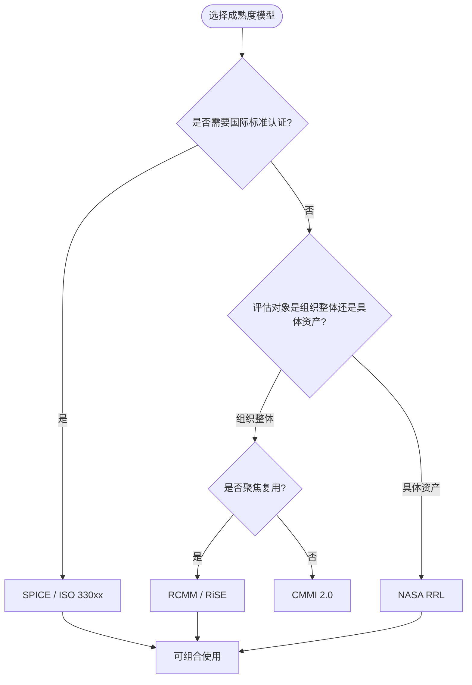

### 6.10 与相关概念的关系

- **上位概念**：[Capability Maturity Model](https://en.wikipedia.org/wiki/Capability_Maturity_Model)、过程改进、质量管理；
- **下位概念**：SPICE、RCMM、RiSE、NASA RRL、CMMI、ISO/IEC 26565；
- **等价/映射概念**：SPICE 与 CMMI 在等级 2–5 上语义对应；NASA RRL 与 ISO/IEC 26564 资产质量度量互补；
- **依赖概念**：过程评估、软件复用、质量模型、度量指标。

### 6.11 四类成熟度模型核心属性对比

| 属性 | SPICE | RCMM | RiSE | NASA RRL |
|------|-------|------|------|----------|
| **评估视角** | 过程能力 × 能力等级 | 组织复用能力等级 | 业务-过程-资产-技术四维 | 资产复用就绪度 |
| **等级粒度** | 6 级（0–5） | 5 级（1–5） | 5 级（1–5） | 9 级（1–9） |
| **适用对象** | 组织/项目/过程 | 组织 | 组织与产品线 | 单个软件资产 |
| **核心产出** | 过程能力轮廓 | 复用成熟度等级 | 复用改进路线图 | RRL 评分卡 |
| **可观察性** | 高（标准化评定标度） | 中 | 中 | 高（逐项检查表） |

### 6.12 正例：NASA RRL 成功支持 Landsat 数据产品复用

NASA Earth Science Data Systems 在 Landsat 任务中使用 RRL 评估并入库核心数据处理组件：

- **评估过程**：
  1. 文档（RRL-1）：提供算法说明、用户手册、API 参考；
  2. 扩展性（RRL-2）：组件支持多分辨率输入与插件化输出格式；
  3. 知识产权（RRL-3）：明确 NASA 开放数据许可与引用要求；
  4. 模块化（RRL-4）：将大气校正、几何校正、产品生成拆分为独立模块；
  5. 验证（RRL-9）：通过跨任务基准数据集验证输出一致性。
- **复用效果**：
  - Landsat 8 与 Landsat 9 的处理流水线共享 80% 以上组件；
  - 新科学任务（如 ECOSTRESS）可在 3 个月内复用并适配现有组件；
  - 跨任务数据一致性误差降低 60%。

### 6.13 反例：RCMM 评估被 KPI 化导致"复用泡沫"

某大型 IT 企业引入 RCMM 作为年度考核指标，要求三年内达到 Level 4：

- **问题**：
  1. 各事业部为达标，大量上传低质量"组件"充数；
  2. 复用率 KPI 仅统计"被引用次数"，团队通过内部互刷引用提升指标；
  3. 缺少适配成本与质量度量，"复用"导致项目延期；
  4. 评估由外部顾问主导，未与真实工程实践结合。
- **后果**：
  - RCMM 评级达到 Level 4，但实际跨项目复用率不足 15%；
  - 资产库中 70% 组件零采用，成为"复用泡沫"；
  - 第二年评估因证据造假被审计发现，组织复用信任崩塌。
- **避免方法**：
  - 将 RCMM 与业务价值（成本节约、上市时间）绑定；
  - 引入第三方数据验证，禁止内部互刷；
  - 让工程团队参与指标设计与证据收集。

### 6.14 成熟度模型映射关系图

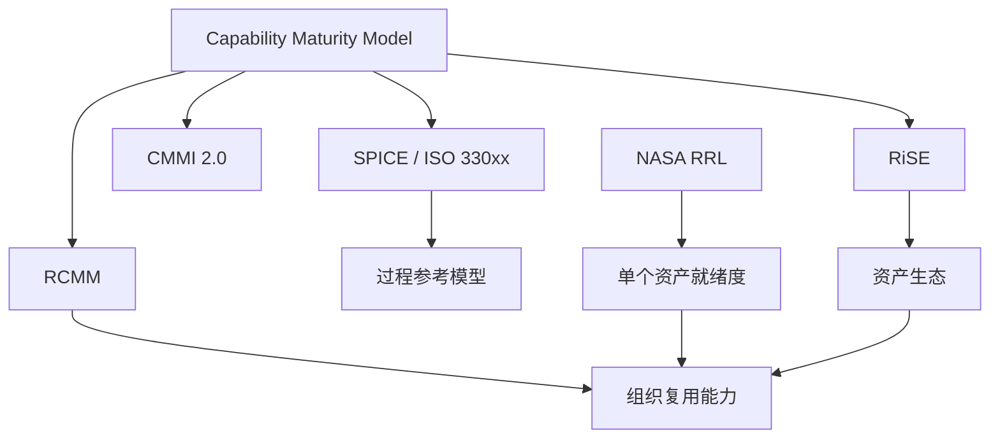

### 6.15 补充权威来源

> **权威来源（补充）**:
>
> - [Capability Maturity Model — Wikipedia](https://en.wikipedia.org/wiki/Capability_Maturity_Model)
> - [ISO/IEC 33001 — Wikipedia](https://en.wikipedia.org/wiki/ISO/IEC_33001)
> - [NASA Reuse Readiness Levels](https://www.earthdata.nasa.gov/technology/reuse-readiness-levels)
>
> **核查日期**: 2026-07-07

> **交叉引用**:
>
> - 复用度量指标体系：[struct/06-cross-layer-governance/05-metrics-kpi/metrics-framework.md](../struct/06-cross-layer-governance/05-metrics-kpi/metrics-framework.md)
> - FinOps 单位经济学：[struct/06-cross-layer-governance/04-finops-cost/finops-unit-economics-2026.md](../struct/06-cross-layer-governance/04-finops-cost/finops-unit-economics-2026.md)
> - 价值量化 COCOMO II 校准：[struct/09-value-quantification/01-cocomo-ii-reuse/cocomo-2026-calibration.md](../struct/09-value-quantification/01-cocomo-ii-reuse/cocomo-2026-calibration.md)
> - ISO 420xx 标准族对齐：[struct/01-meta-model-standards/01-iso-420xx-family/alignment-matrix.md](../struct/01-meta-model-standards/01-iso-420xx-family/alignment-matrix.md)

> **权威来源（补充）":
>
> - [Capability Maturity Model — Wikipedia](https://en.wikipedia.org/wiki/Capability_Maturity_Model)
> - [ISO/IEC 33001 — Wikipedia](https://en.wikipedia.org/wiki/ISO/IEC_33001)
> - [Software process improvement — Wikipedia](https://en.wikipedia.org/wiki/Software_process_improvement)
>
> **核查日期**: 2026-07-07

## 权威来源

| 来源 | URL | 核查日期 |
|------|-----|----------|
| ISO/IEC 33020:2019 过程能力评估框架 | <https://www.iso.org/standard/54175.html> | 2026-06-10 |
| ISO/IEC 33004:2022 评估参考模型要求 | <https://www.iso.org/standard/80240.html> | 2026-06-10 |
| ISO/IEC/IEEE 12207:2026 软件生命周期过程 | <https://www.iso.org/standard/90219.html> | 2026-06-12 |
| ISO/IEC/IEEE 12207:2017 软件生命周期过程（历史对照版） | <https://www.iso.org/standard/63712.html> | 2026-06-12 |
| ISO/IEC 26565:2026 产品线成熟度模型 | <https://www.iso.org/standard/43091.html> | 2026-06-10 |
| CMMI 2.0 官方资源 | <https://cmmiinstitute.com/cmmi> | 2026-06-10 |
| SPICE 用户组 (ISO/IEC JTC 1/SC 7 WG 10) | <https://www.spiceusergroup.org> | 2026-06-10 |
| RiSE 复用成熟度框架参考 | <https://rise.org.br> | 2026-06-10 |
| ISO/IEC 25010:2023 系统与软件质量模型 | <https://www.iso.org/standard/78175.html> | 2026-06-10 |

---


<!-- SOURCE: struct/06-cross-layer-governance/04-finops-cost/cost-allocation-template.md -->

# FinOps 跨层复用成本分摊模型与执行模板

> **版本**: 2026-06-06
> **定位**: 将架构复用的共享成本按使用量、团队、项目、层级进行透明化分摊
> **对齐来源**: FinOps Foundation Framework 2026, AWS/Azure/GCP 成本分摊最佳实践, Unit Economics for Platform Engineering

---

## 目录

- [FinOps 跨层复用成本分摊模型与执行模板](#finops-跨层复用成本分摊模型与执行模板)
  - [目录](#目录)
  - [1. 成本分类框架](#1-成本分类框架)
    - [1.1 直接成本 (Direct Cost)](#11-直接成本-direct-cost)
    - [1.2 间接成本 (Indirect Cost / Shared Cost)](#12-间接成本-indirect-cost--shared-cost)
    - [1.3 风险成本 (Risk Cost / Contingency Cost)](#13-风险成本-risk-cost--contingency-cost)
    - [1.4 成本分类决策树](#14-成本分类决策树)
  - [2. 分摊模型矩阵](#2-分摊模型矩阵)
    - [2.1 四种核心分摊模型](#21-四种核心分摊模型)
    - [2.2 跨层分摊模型详解 (Layer-Based)](#22-跨层分摊模型详解-layer-based)
  - [3. Excel 模板结构](#3-excel-模板结构)
    - [3.1 工作表设计](#31-工作表设计)
    - [3.2 核心公式模板](#32-核心公式模板)
  - [4. Python 伪代码实现](#4-python-伪代码实现)
  - [5. 计算示例一：SaaS 平台多团队成本分摊](#5-计算示例一saas-平台多团队成本分摊)
    - [5.1 假设数据](#51-假设数据)
    - [5.2 计算过程](#52-计算过程)
    - [5.3 最终结果](#53-最终结果)
  - [6. 计算示例二：跨层共享服务（AI 推理平台）成本分摊](#6-计算示例二跨层共享服务ai-推理平台成本分摊)
    - [6.1 假设数据](#61-假设数据)
    - [6.2 Layer-Based 计算过程](#62-layer-based-计算过程)
    - [6.3 单位经济学视角](#63-单位经济学视角)
  - [7. 实施检查清单](#7-实施检查清单)
    - [7.1 第 1-30 天：基础准备](#71-第-1-30-天基础准备)
    - [7.2 第 31-90 天：试运行](#72-第-31-90-天试运行)
    - [7.3 第 91-180 天：正式运营](#73-第-91-180-天正式运营)
  - [8. 参考索引](#8-参考索引)
  - [补充说明：FinOps 跨层复用成本分摊模型与执行模板](#补充说明finops-跨层复用成本分摊模型与执行模板)
  - [概念定义](#概念定义)
  - [示例](#示例)
  - [反例](#反例)
  - [权威来源](#权威来源)

---

## 1. 成本分类框架

基于 FinOps Foundation 2026 对共享成本治理的最新定义，将跨层复用相关成本划分为三大类：

### 1.1 直接成本 (Direct Cost)

| 子类别 | 说明 | 典型示例 |
|--------|------|---------|
| **专属资源成本** | 可被唯一归属到某团队/项目/租户的资源 | 某微服务独占的 EC2 实例、专属 RDS 实例 |
| **直接许可证成本** | 按席位/按用量计费的专属许可 | 某团队专用的 IDE 许可证、专属 SaaS 订阅 |
| **直接人力成本** | 全职服务于单一成本中心的工程师人力 | 某产品线的专属平台工程师 |

### 1.2 间接成本 (Indirect Cost / Shared Cost)

| 子类别 | 说明 | 典型示例 |
|--------|------|---------|
| **平台共享服务** | 被多个团队/项目共同使用的平台能力 | Kubernetes 集群、API 网关、消息队列、Service Mesh |
| **可复用资产运维** | 共享组件库的维护、升级、安全补丁 | 内部 npm 私服、共享 Terraform 模块、Golden Path 模板 |
| **观测与安全基础设施** | 跨团队的监控、日志、安全扫描平台 | Datadog、Splunk、SonarQube Enterprise、WAF |
| **数据平台** | 被多团队共享的数据存储与处理 | 数据仓库、Lakehouse、共享 Kafka 集群 |
| **AI 共享推理服务** | 多产品共享的 LLM / 嵌入服务 | 共享 OpenAI API 代理、自托管 GPU 推理集群 |

### 1.3 风险成本 (Risk Cost / Contingency Cost)

| 子类别 | 说明 | 典型示例 |
|--------|------|---------|
| **技术债务偿还准备金** | 为复用资产的技术债务预留的返工成本 |  legacy 组件重构基金 |
| **安全事件响应成本** | 共享组件漏洞爆发时的应急修复成本 | Log4j 类事件的影响面修复 |
| **合规罚金准备金** | 许可证违规、数据隐私不合规的潜在罚金 | GPL 传染风险评估准备金 |
| **供应商锁定风险** | 单一共享服务供应商提价/停服的风险对冲 | 多云策略额外成本 |

### 1.4 成本分类决策树

```
资源/服务/成本项
    ├── 能否直接标签归属到单一团队/项目/租户？
    │       ├── 是 → 直接成本
    │       └── 否 → 是否有可量化的使用信号（CPU、请求数、token、存储量）？
    │               ├── 是 → 间接成本（按使用量比例分摊）
    │               └── 否 → 是否为潜在/或然性成本？
    │                       ├── 是 → 风险成本（按影响面/受益面加权分摊）
    │                       └── 否 → 平台开销（按直接成本比例分摊）
```

---

## 2. 分摊模型矩阵

### 2.1 四种核心分摊模型

| 分摊模型 | 适用成本类型 | 分摊基数 | 公式 | 精度 | 实施复杂度 |
|---------|------------|---------|------|------|----------|
| **按使用量 (Usage-Based)** | 直接可计量资源 | CPU 核时、请求数、存储 GB、token 数 | $Cost_i = Total \times \frac{Usage_i}{\sum Usage}$ | 高 | 中 |
| **按团队 (Team-Based)** | 固定共享开销 | 团队人数、团队预算权重 | $Cost_i = Total \times \frac{Weight_i}{\sum Weight}$ | 中 | 低 |
| **按项目 (Project-Based)** | 跨项目共享平台 | 项目收入、项目规模 (SLOC/FP) | $Cost_i = Total \times \frac{Size_i}{\sum Size}$ | 中 | 低 |
| **按层级 (Layer-Based)** | 跨层复用基础设施 | 业务层/应用层/组件层/功能层的受益比例 | $Cost_i = Total \times \frac{Benefit_i}{\sum Benefit}$ | 中高 | 高 |

### 2.2 跨层分摊模型详解 (Layer-Based)

跨层复用治理的核心挑战在于：**同一套平台基础设施同时服务于业务架构、应用架构、组件架构和功能架构四个层次**。Layer-Based 模型通过"受益比例"解决这一问题：

```text
总共享平台成本 = $100,000/月

├─ 业务层受益比例: 20% (业务线直接使用的业务能力 API)
│   └─ 分摊给各业务线: 按业务线收入比例二次分摊
├─ 应用层受益比例: 35% (应用系统托管、部署、运行时)
│   └─ 分摊给各应用: 按应用实例数/流量比例二次分摊
├─ 组件层受益比例: 30% (组件仓库、构建、测试平台)
│   └─ 分摊给各组件团队: 按构建分钟数、发布频率二次分摊
└─ 功能层受益比例: 15% (函数运行时、FaaS、Serverless 平台)
    └─ 分摊给各函数所有者: 按调用次数、执行时间二次分摊
```

**Layer-Based 受益比例确定方法**：

| 层级 | 受益比例确定依据 | 数据来源 |
|------|----------------|---------|
| 业务层 | 业务能力调用量 / 业务交易价值 | API 网关日志、业务事件流 |
| 应用层 | 应用实例资源占用 / 应用流量占比 | K8s metrics、APM 工具 |
| 组件层 | 组件构建/发布/下载频次 | CI/CD 平台日志、制品库统计 |
| 功能层 | 函数调用次数 × 平均执行时间 | FaaS 平台监控、CloudWatch/Metrics |

---

## 3. Excel 模板结构

### 3.1 工作表设计

| 工作表 | 用途 | 关键列 |
|--------|------|--------|
| **Sheet 1: 成本原始数据** | 导入云厂商账单 | 资源 ID、服务类型、原始成本、标签 |
| **Sheet 2: 分摊规则配置** | 定义分摊模型与权重 | 成本项、分类、分摊模型、分摊基数来源 |
| **Sheet 3: 使用量数据** | 各团队/项目/层级的使用量 | 团队、CPU 核时、请求数、存储 GB |
| **Sheet 4: 分摊计算结果** | 自动计算的分摊结果 | 团队、直接成本、间接成本、风险成本、总成本 |
| **Sheet 5: 单位经济学** | 每用户/每交易/每功能成本 | 单位定义、总成本、单位数量、单位成本 |

### 3.2 核心公式模板

**直接成本归属（VLOOKUP 模式）**：

```excel
=IF(VLOOKUP(A2,TagMapping!A:B,2,FALSE)="Direct",
     VLOOKUP(A2,TagMapping!A:C,3,FALSE),
     "ToBeAllocated")
```

**按比例分摊（SUMIF 模式）**：

```excel
=TotalSharedCost * (Usage_TeamA / SUMIF(TeamRange, "*", UsageRange))
```

**Layer-Based 双层分摊**：

```excel
第一层（层间分摊）:
=TotalCost * LayerBenefitRatio[Layer]

第二层（层内分摊）:
=LayerCost * (SubUnitUsage / SUM(SubUnitUsages))
```

---

## 4. Python 伪代码实现

```python
# cost_allocation_engine.py
# FinOps 跨层复用成本分摊引擎 (伪代码)

from dataclasses import dataclass
from typing import List, Dict, Optional
from enum import Enum

class CostCategory(Enum):
    DIRECT = "direct"
    INDIRECT = "indirect"
    RISK = "risk"

class AllocationModel(Enum):
    USAGE_BASED = "usage_based"      # 按使用量
    TEAM_BASED = "team_based"         # 按团队
    PROJECT_BASED = "project_based"   # 按项目
    LAYER_BASED = "layer_based"       # 按层级

@dataclass
class CostItem:
    item_id: str
    description: str
    amount: float                    # 原始成本金额
    category: CostCategory
    tags: Dict[str, str]             # 原始标签
    allocation_model: AllocationModel
    allocation_base: Optional[str]   # 分摊基数字段名

@dataclass
class CostCenter:
    center_id: str                   # 团队/项目/层级 ID
    center_type: str                 # "team" | "project" | "layer"
    usage_metrics: Dict[str, float]  # 使用量指标
    direct_costs: List[CostItem] = None
    allocated_costs: Dict[str, float] = None

class CostAllocationEngine:
    def __init__(self):
        self.cost_items: List[CostItem] = []
        self.cost_centers: List[CostCenter] = []
        self.layer_benefit_ratios = {
            "business": 0.20,
            "application": 0.35,
            "component": 0.30,
            "functional": 0.15
        }

    def allocate_direct_costs(self):
        """直接成本按标签直接归属"""
        for item in self.cost_items:
            if item.category == CostCategory.DIRECT:
                owner = item.tags.get("owner")
                center = self.find_center(owner)
                if center:
                    center.direct_costs.append(item)

    def allocate_by_usage(self, items: List[CostItem], metric: str):
        """按使用量比例分摊"""
        total_cost = sum(i.amount for i in items)
        total_usage = sum(c.usage_metrics.get(metric, 0)
                         for c in self.cost_centers)

        for center in self.cost_centers:
            usage = center.usage_metrics.get(metric, 0)
            if total_usage > 0:
                ratio = usage / total_usage
                allocated = total_cost * ratio
                center.allocated_costs["usage_based"] = allocated

    def allocate_by_layer(self, items: List[CostItem]):
        """Layer-Based 跨层分摊：先按受益比例分到各层，再在层内按使用量二次分摊"""
        total_cost = sum(i.amount for i in items)

        # 第一层：层间分摊
        for layer, ratio in self.layer_benefit_ratios.items():
            layer_cost = total_cost * ratio

            # 第二层：层内按使用量分摊
            layer_centers = [c for c in self.cost_centers
                           if c.center_type == layer]
            total_layer_usage = sum(
                c.usage_metrics.get("cpu_hours", 0)
                for c in layer_centers
            )

            for center in layer_centers:
                usage = center.usage_metrics.get("cpu_hours", 0)
                if total_layer_usage > 0:
                    center.allocated_costs[f"layer_{layer}"] = (
                        layer_cost * usage / total_layer_usage
                    )

    def allocate_risk_costs(self, items: List[CostItem]):
        """风险成本按各成本中心的直接+间接成本比例分摊"""
        total_risk = sum(i.amount for i in items)

        # 计算各成本中心总成本（直接 + 已分摊间接）
        total_benefit = 0
        for center in self.cost_centers:
            direct = sum(i.amount for i in (center.direct_costs or []))
            indirect = sum(center.allocated_costs.values())
            center.usage_metrics["_total_benefit"] = direct + indirect
            total_benefit += direct + indirect

        for center in self.cost_centers:
            benefit = center.usage_metrics.get("_total_benefit", 0)
            if total_benefit > 0:
                center.allocated_costs["risk"] = (
                    total_risk * benefit / total_benefit
                )

    def generate_showback_report(self) -> List[Dict]:
        """生成 Showback 报告（非实际扣费，仅展示）"""
        report = []
        for center in self.cost_centers:
            direct = sum(i.amount for i in (center.direct_costs or []))
            indirect = sum(v for k, v in center.allocated_costs.items()
                         if k != "risk")
            risk = center.allocated_costs.get("risk", 0)

            report.append({
                "cost_center": center.center_id,
                "direct_cost": round(direct, 2),
                "indirect_cost": round(indirect, 2),
                "risk_cost": round(risk, 2),
                "total_cost": round(direct + indirect + risk, 2),
                "cost_per_dev": round((direct + indirect + risk) /
                    center.usage_metrics.get("headcount", 1), 2)
            })
        return report

    def find_center(self, center_id: str) -> Optional[CostCenter]:
        return next((c for c in self.cost_centers
                    if c.center_id == center_id), None)


# ============ 使用示例 ============
if __name__ == "__main__":
    engine = CostAllocationEngine()

    # 假设输入数据（见第 5、6 节完整示例）
    # engine.cost_items = [...]
    # engine.cost_centers = [...]

    engine.allocate_direct_costs()

    indirect_items = [i for i in engine.cost_items
                     if i.category == CostCategory.INDIRECT]
    engine.allocate_by_layer(indirect_items)

    risk_items = [i for i in engine.cost_items
                 if i.category == CostCategory.RISK]
    engine.allocate_risk_costs(risk_items)

    report = engine.generate_showback_report()
    for row in report:
        print(f"{row['cost_center']}: ${row['total_cost']} "
              f"(Direct: ${row['direct_cost']}, "
              f"Indirect: ${row['indirect_cost']}, "
              f"Risk: ${row['risk_cost']})")
```

---

## 5. 计算示例一：SaaS 平台多团队成本分摊

### 5.1 假设数据

**月度总云成本**: $120,000

| 成本项 | 金额 | 分类 | 分摊模型 | 备注 |
|--------|------|------|---------|------|
| 生产环境 EC2 (Team A 独占) | $15,000 | 直接 | 直接归属 | 标签: owner=team-a |
| 生产环境 EC2 (Team B 独占) | $22,000 | 直接 | 直接归属 | 标签: owner=team-b |
| 生产环境 EC2 (Team C 独占) | $18,000 | 直接 | 直接归属 | 标签: owner=team-c |
| 共享 EKS 集群 | $30,000 | 间接 | 按使用量 | 三团队共享 |
| 共享数据仓库 (Snowflake) | $20,000 | 间接 | 按使用量 | 按查询 compute 分摊 |
| 安全扫描平台 (SonarQube Ent) | $8,000 | 间接 | 按团队 | 固定按团队均摊 |
| 技术债务准备金 | $4,000 | 风险 | 按受益比例 | 按总成本比例 |
| 合规准备金 | $3,000 | 风险 | 按受益比例 | 按总成本比例 |

**各团队使用量指标**：

| 团队 | 人数 | EKS CPU 核时 | Snowflake 计算信用 |
|------|------|-------------|-------------------|
| Team A | 8 | 4,500 | 320 |
| Team B | 12 | 7,200 | 480 |
| Team C | 6 | 3,300 | 200 |
| **合计** | **26** | **15,000** | **1,000** |

### 5.2 计算过程

**步骤 1: 直接成本归属**

| 团队 | 直接成本 |
|------|---------|
| Team A | $15,000 |
| Team B | $22,000 |
| Team C | $18,000 |

**步骤 2: 间接成本分摊**

*共享 EKS ($30,000) — 按 CPU 核时比例*:

- Team A: $30,000 × (4,500 / 15,000) = **$9,000**
- Team B: $30,000 × (7,200 / 15,000) = **$14,400**
- Team C: $30,000 × (3,300 / 15,000) = **$6,600**

*共享 Snowflake ($20,000) — 按计算信用比例*:

- Team A: $20,000 × (320 / 1,000) = **$6,400**
- Team B: $20,000 × (480 / 1,000) = **$9,600**
- Team C: $20,000 × (200 / 1,000) = **$4,000**

*安全扫描平台 ($8,000) — 按团队均摊*:

- 每团队: $8,000 / 3 = **$2,667**

**步骤 3: 风险成本分摊**

风险总成本 = $4,000 + $3,000 = $7,000

按各团队（直接 + 间接）成本比例：

| 团队 | 直接+间接 | 占比 | 风险成本 |
|------|----------|------|---------|
| Team A | $33,067 | 27.6% | $1,929 |
| Team B | $48,667 | 40.6% | $2,842 |
| Team C | $30,933 | 25.8% | $1,805 |
| 取整误差 | — | — | $424 |

> 注：实际系统中使用精确小数避免误差。

### 5.3 最终结果

| 团队 | 直接成本 | 间接成本 | 风险成本 | **总成本** | 人均成本 |
|------|---------|---------|---------|-----------|---------|
| Team A | $15,000 | $18,067 | $1,929 | **$34,996** | $4,375 |
| Team B | $22,000 | $26,667 | $2,842 | **$51,509** | $4,292 |
| Team C | $18,000 | $13,267 | $1,805 | **$33,072** | $5,512 |
| **合计** | **$55,000** | **$58,001** | **$6,576** | **$119,577** | — |

> 差异 $423 为取整误差，实际系统精确保留小数。

**洞察**：

- Team C 人均成本最高 ($5,512)，尽管绝对总成本最低。建议审查其 Snowflake 查询效率与 EKS 资源利用率。
- 间接成本占总成本 48.5%，表明平台共享度较高，符合 FinOps "Run" 阶段特征。

---

## 6. 计算示例二：跨层共享服务（AI 推理平台）成本分摊

### 6.1 假设数据

**AI 推理平台月度总成本**: $45,000

| 成本项 | 金额 | 分类 | 说明 |
|--------|------|------|------|
| 自托管 GPU 集群 (EC2 P4d) | $28,000 | 间接 | 跨层共享推理服务 |
| 共享向量数据库 (Pinecone) | $9,000 | 间接 | 嵌入存储与检索 |
| API 网关与负载均衡 | $4,000 | 间接 | 请求路由 |
| 模型安全审计准备金 | $2,500 | 风险 | 定期红队测试 |
| 许可证合规准备金 | $1,500 | 风险 | 开源模型许可证风险 |

**各层级使用量（按受益比例先分层，再按实际用量层内分摊）**：

| 层级 | 受益比例 | 层内分摊基数 | 具体用量 |
|------|---------|-------------|---------|
| 业务层 | 20% | 业务交易数 | 订单智能推荐: 500K 次/月 |
| 应用层 | 35% | API 调用数 | 客服助手: 1.2M 次/月 |
| 组件层 | 30% | 嵌入生成数 | 文档向量化: 800K 次/月 |
| 功能层 | 15% | 函数执行数 | 实时摘要: 300K 次/月 |

**层内各单元详细用量**：

| 层级 | 单元 | 用量 | 占比 |
|------|------|------|------|
| 业务层 | 订单推荐 | 500K | 100% |
| 应用层 | 客服助手 | 1,200K | 100% |
| 组件层 | 文档向量化 | 800K | 100% |
| 功能层 | 实时摘要 | 300K | 100% |

### 6.2 Layer-Based 计算过程

**第一层：层间分摊（按受益比例）**

| 层级 | 受益比例 | 分摊金额 |
|------|---------|---------|
| 业务层 | 20% | $45,000 × 20% = $9,000 |
| 应用层 | 35% | $45,000 × 35% = $15,750 |
| 组件层 | 30% | $45,000 × 30% = $13,500 |
| 功能层 | 15% | $45,000 × 15% = $6,750 |

**第二层：层内分摊（按实际调用量）**

本示例中每层仅有一个主要消费者，因此层内分摊比例为 100%。若层内有多个消费者，按调用量比例二次分摊。

| 层级 | 消费者 | 层成本 | 层内占比 | 最终分摊 |
|------|--------|--------|---------|---------|
| 业务层 | 订单推荐服务 | $9,000 | 100% | **$9,000** |
| 应用层 | 客服助手应用 | $15,750 | 100% | **$15,750** |
| 组件层 | 文档向量化组件 | $13,500 | 100% | **$13,500** |
| 功能层 | 实时摘要函数 | $6,750 | 100% | **$6,750** |

### 6.3 单位经济学视角

将总成本转换为业务可理解的单位指标：

| 单位定义 | 计算 | 单位成本 |
|---------|------|---------|
| 每千次推理成本 | $45,000 / 2,800K | **$0.016 / 千次** |
| 每订单推荐成本 | $9,000 / 500K | **$0.018 / 次** |
| 每客服对话成本 | $15,750 / 1,200K | **$0.013 / 次** |
| 每文档嵌入成本 | $13,500 / 800K | **$0.017 / 次** |
| 每摘要生成成本 | $6,750 / 300K | **$0.023 / 次** |

> **业务洞察**：实时摘要的单位成本最高 ($0.023/次)，因其调用量低但占用了相同的 GPU 基础设施。建议评估是否将实时摘要迁移至更轻量的 CPU 推理模型，或合并批量处理以降低单位成本。

---

## 7. 实施检查清单

### 7.1 第 1-30 天：基础准备

- [ ] 与财务部门对齐成本分类定义（直接/间接/风险）
- [ ] 完成云资源标签审计，确保 ≥90% 资源具备 owner/cost-center 标签
- [ ] 建立成本项-分摊模型映射表（参考本文 2.1 节）
- [ ] 选定分摊计算工具（Excel 初版 / Python 脚本 / FinOps 平台）

### 7.2 第 31-90 天：试运行

- [ ] 导入上月完整账单，执行首次分摊计算
- [ ] 生成各团队 Showback 报告，收集反馈
- [ ] 校准间接成本的分摊基数（验证用量数据准确性）
- [ ] 建立异常处理流程（标签缺失、用量数据缺失时的fallback规则）

### 7.3 第 91-180 天：正式运营

- [ ] 从 Showback 过渡到 Chargeback（如组织就绪）
- [ ] 将分摊结果纳入团队预算与绩效考核
- [ ] 建立季度审查机制：复核分摊模型是否仍然合理
- [ ] 发布首份跨层复用成本透明度报告

---

## 8. 参考索引

- FinOps Foundation: *FinOps Framework 2026 Capabilities* — 成本分摊核心定义
- Finout (2026): "Cloud Cost Allocation: Definition, Types, Benefits, and Best Practices" — 共享成本分摊策略
- Opslyft (2026): "Cloud Unit Economics & Cloud COGS Playbook" — 单位经济学方法论
- AWS (2026): *AWS Cost Allocation Best Practices* — 标签治理与分摊模型
- Azure (2026): *Azure Cost Management and Billing* — 分摊规则引擎
- GCP (2026): *Google Cloud Cost Management* — 标签与 showback 报告
- NASA SWE-148: *Software Reuse Metrics* — 复用成本度量基准
- ISO/IEC 26564:2022: *Software Reuse — Measurement and Metrics* — 复用度量标准对齐

> **交叉引用**:
>
> - FinOps 单位经济学: [`finops-unit-economics-2026.md`](../struct/06-cross-layer-governance/04-finops-cost/finops-unit-economics-2026.md)
> - 成熟度评估: [`struct/06-cross-layer-governance/03-maturity-models/assessment-questionnaire.md`](../struct/06-cross-layer-governance/03-maturity-models/assessment-questionnaire.md)
> - COCOMO II 2026 成本估算: [`struct/09-value-quantification/01-cocomo-ii-reuse/cocomo-2026-calibration.md`](../struct/09-value-quantification/01-cocomo-ii-reuse/cocomo-2026-calibration.md)
> - 标准对齐矩阵: [`struct/01-meta-model-standards/01-iso-420xx-family/alignment-matrix.md`](../struct/01-meta-model-standards/01-iso-420xx-family/alignment-matrix.md)

> 最后更新: 2026-06-06


---

## 补充说明：FinOps 跨层复用成本分摊模型与执行模板

## 概念定义

**定义**：FinOps 成本分摊治理是将云成本、平台成本与复用资产成本按业务价值归集到团队、产品与功能，实现成本透明与优化问责。

## 示例

**示例**：平台团队按“每活跃用户”“每千次请求”将共享服务成本分摊给消费方，并在仪表盘展示各产品的单位经济学指标。

## 反例

**反例**：共享平台成本由中央 IT 统一承担，消费方没有成本意识，导致资源浪费与利用率低下。

## 权威来源

> **权威来源**:
>
> - [FinOps Foundation](https://www.finops.org)
> - [CNCF](https://www.cncf.io)
> - 核查日期：2026-07-07

---


<!-- SOURCE: struct/06-cross-layer-governance/04-finops-cost/finops-allocation-template.md -->

# FinOps 四级成本分摊模型模板 (L1–L4 Allocation Model)

> **版本**: 2026-06-08
> **定位**: 将架构复用的共享成本按资产级、项目级、组织级、生态级进行透明化分摊
> **对齐来源**: [FinOps Foundation Framework 2026](https://www.finops.org/framework/), FinOps Foundation: Cost Allocation Capabilities, FOCUS 1.0
> **状态**: P2-T5 交付物

---

## 目录

- [FinOps 四级成本分摊模型模板 (L1–L4 Allocation Model)](#finops-四级成本分摊模型模板-l1l4-allocation-model)
  - [目录](#目录)
  - [1. 四级分摊模型总览](#1-四级分摊模型总览)
    - [1.1 L1 资产级 (Asset-Level)](#11-l1-资产级-asset-level)
    - [1.2 L2 项目级 (Project-Level)](#12-l2-项目级-project-level)
    - [1.3 L3 组织级 (Organizational-Level)](#13-l3-组织级-organizational-level)
    - [1.4 L4 生态级 (Ecosystem-Level)](#14-l4-生态级-ecosystem-level)
    - [1.5 FOCUS 1.0 与 Cloud Unit Economics 融入](#15-focus-10-与-cloud-unit-economics-融入)
    - [1.6 FinOps Framework 2026 能力映射](#16-finops-framework-2026-能力映射)
  - [2. 分摊公式](#2-分摊公式)
    - [2.1 直接成本公式](#21-直接成本公式)
    - [2.2 间接成本公式](#22-间接成本公式)
    - [2.3 风险成本公式](#23-风险成本公式)
    - [2.4 公式符号说明](#24-公式符号说明)
  - [3. 决策矩阵：何时分摊？何时不摊？](#3-决策矩阵何时分摊何时不摊)
  - [4. 计算案例：统一认证服务被 3 个项目复用](#4-计算案例统一认证服务被-3-个项目复用)
    - [4.1 假设数据](#41-假设数据)
    - [4.2 L1 资产级直接成本计算](#42-l1-资产级直接成本计算)
    - [4.3 L2 项目级使用量分摊](#43-l2-项目级使用量分摊)
    - [4.4 L3 组织级间接成本分摊](#44-l3-组织级间接成本分摊)
    - [4.5 L4 生态级风险成本分摊](#45-l4-生态级风险成本分摊)
    - [4.6 最终汇总](#46-最终汇总)
    - [4.7 洞察与建议](#47-洞察与建议)
    - [反模式：成本分摊沦为“政治博弈”](#反模式成本分摊沦为政治博弈)
  - [5. 配套工具](#5-配套工具)
    - [5.1 Excel 导出脚本](#51-excel-导出脚本)
    - [5.2 示例数据文件](#52-示例数据文件)
    - [5.3 预算与预测分析脚本](#53-预算与预测分析脚本)
    - [5.4 承诺折扣优化器](#54-承诺折扣优化器)
    - [5.5 成本异常检测器](#55-成本异常检测器)
    - [5.6 AI GPU 成本计算器](#56-ai-gpu-成本计算器)
  - [6. 实施检查清单](#6-实施检查清单)
    - [第 1–14 天：数据准备](#第-114-天数据准备)
    - [第 15–30 天：模型校准](#第-1530-天模型校准)
    - [第 31–60 天：试运行与 Showback](#第-3160-天试运行与-showback)
    - [第 61–90 天：正式运营与持续改进](#第-6190-天正式运营与持续改进)
  - [7. 权威来源](#7-权威来源)

---

## 1. 四级分摊模型总览

跨层复用成本分摊覆盖四层架构（业务→应用→组件→功能）的直接成本、间接成本和风险成本。
模型将成本划分为四个层级，从微观资产到宏观生态，确保每一分钱都有清晰的归属逻辑。

```text
L4 生态级 (Ecosystem)
├─ 开源依赖成本
├─ 供应链安全成本
└─ 许可证合规与 vendor lock-in 准备金

L3 组织级 (Organizational)
├─ 卓越中心 (CoE) 运营成本
├─ 平台工程团队成本
└─ 共享基础设施成本

L2 项目级 (Project)
├─ 项目A使用复用资产的分摊
├─ 项目B使用复用资产的分摊
└─ 项目C使用复用资产的分摊

L1 资产级 (Asset)
├─ 原始开发成本 (按 AAF 调整)
├─ 维护成本
└─ 部署/运营成本
```

### 1.1 L1 资产级 (Asset-Level)

**定义**: 单个复用组件/服务的直接成本，包含开发、维护、部署全生命周期的货币化度量。

| 成本子项 | 说明 | 数据来源 |
|---------|------|---------|
| **原始开发成本** | 资产首次构建的投入，按摊销期折算为月度成本 | COCOMO II 估算、实际人天记录 |
| **AAF (改编调整因子)** | Adaptation Adjustment Factor，反映资产为支持多场景复用所做的额外开发投资 | ISO/IEC 26564 复用度量标准 |
| **维护成本** | 月度 Bug 修复、安全补丁、版本升级投入 | 工单系统、Sprint 投入记录 |
| **部署成本** | 月度 CI/CD、发布、回滚、环境维护投入 | CI/CD 平台日志、运行时长 |

**关键原则**: 原始开发成本属于沉没成本，但通过 AAF 和摊销机制，可将其转化为各消费项目的"机会成本"基准——即若不复用，项目需自行投入的开发成本。

### 1.2 L2 项目级 (Project-Level)

**定义**: 项目使用复用资产的分摊，基于实际使用量按单位成本进行比例分配。

| 分摊维度 | 适用场景 | 计量单位 |
|---------|---------|---------|
| **调用量** | API/微服务复用 | 请求数 (requests) |
| **事务量** | 支付/交易组件复用 | 事务数 (transactions) |
| **消息量** | 通知/消息通道复用 | 消息数 (messages) |
| **查询量** | 分析/检索功能复用 | 查询数 (queries) |
| **存储量** | 共享存储/缓存复用 | GB / 对象数 |

**分摊逻辑**: 资产月度直接成本按各项目的实际使用量占总使用量的比例进行分配。未被任何项目使用的资产成本，由平台团队或 CoE 承担。

### 1.3 L3 组织级 (Organizational-Level)

**定义**: 卓越中心 (CoE)、平台团队、共享基础设施的间接成本，按项目的复用受益程度进行分摊。

| 成本池 | 说明 | 分摊驱动因子 |
|-------|------|------------|
| **CoE 运营成本** | 架构治理、标准制定、技术雷达、培训 | 项目复用资产数 |
| **平台团队成本** | 共享组件维护、Golden Path、CI/CD 平台 | 项目复用资产数 |
| **共享基础设施** | K8s 控制面、监控、日志、制品库 | 项目复用资产数 / 资源占用 |

**分摊逻辑**: 间接成本无法直接按单一使用量归属，因此采用"受益程度代理指标"——项目复用的资产数量越多，从平台和 CoE 获得的支撑越大，应承担更多间接成本。

### 1.4 L4 生态级 (Ecosystem-Level)

**定义**: 开源依赖、供应链安全、许可证合规、供应商锁定等外部性风险成本。

| 风险类别 | 说明 | 度量方式 |
|---------|------|---------|
| **供应链风险** | 开源组件 CVE、老旧依赖、维护者弃用 | 风险评分 (1–10) |
| **安全投入** | 为对冲供应链风险所需的持续安全投入 | 安全投入系数 (% of operational cost) |
| **许可证合规** | GPL 传染、商用许可证违规潜在罚金 | 月度准备金 |
| **供应商锁定** | 单一云厂商/技术栈的迁移风险对冲 | 月度准备金 |

**分摊逻辑**: 风险成本首先通过评分与系数计算为总体准备金，再按各项目的（直接+间接）成本比例分摊——成本规模越大的项目，风险暴露面越大。

### 1.5 FOCUS 1.0 与 Cloud Unit Economics 融入

**FOCUS 1.0**（FinOps Open Cost and Usage Specification）是 FinOps Foundation 主导的云成本数据开放标准，目标是把多云账单归一化为统一 Schema。将 FOCUS 1.0 融入本模型可实现：

| FOCUS 1.0 核心字段 | 本模型用法 | 收益 |
|:---|:---|:---|
| `BilledCost` / `EffectiveCost` | L1 资产直接成本、L2 项目分摊金额 | 消除云厂商账单格式差异 |
| `ResourceId` / `ResourceType` | 资产级成本归属与标签治理 | 精确追踪复用资产实例 |
| `Tags` / `Labels` | 项目归属、环境、成本中心 | 驱动 L2 使用量分摊与 Showback |
| `UsageQuantity` / `UsageUnit` | L2 计量单位（请求数、事务数、GB） | 支持按比例分摊 |
| `ChargePeriodStart` / `ChargePeriodEnd` | 月度摊销与预测校准 | 对齐财务结账周期 |

**Cloud Unit Economics** 将成本转化为业务可理解的单位指标。本模型推荐的单位经济学指标包括：

- **每次认证请求成本** = 资产月度总成本 ÷ 月度请求数
- **每事务成本** = 支付/交易组件月度总成本 ÷ 月度事务数
- **每 Token 成本** = AI 服务月度总成本 ÷ 输入/输出 Token 总数
- **每用户成本** = 共享平台月度总成本 ÷ 活跃用户数

这些指标可与 FinOps Foundation 的 **Unit Economics Capability** 对齐，用于跨项目、跨云厂商的 TCO 比较与投资决策。

### 1.6 FinOps Framework 2026 能力映射

| FinOps Framework 2026 能力 | 本模型对应层级 | 说明 |
|:---|:---|:---|
| **Allocation**（Understand Usage & Cost） | L2 项目级 + L1 资产级 | 将共享复用成本分配到责任方 |
| **Managing Shared Cost** | L3 组织级 + L4 生态级 | 平台、CoE、供应链风险成本分摊 |
| **Unit Economics**（Quantify Business Value） | 单位成本指标 | 把技术成本转化为业务单位成本 |
| **KPI & Benchmarking** | 复用率、成本透明度、摊销回收 | 持续度量成熟度与效率 |
| **Governance, Policy & Risk** | L4 风险成本 + 决策矩阵 | 建立分摊策略、合规与风险准备金 |
| **Executive Strategy Alignment** | Showback/Chargeback 报告 | 向高管呈现技术投资价值 |

---

## 2. 分摊公式

### 2.1 直接成本公式

**资产月度直接成本**:

$$
C_{asset}^{direct} = \frac{C_{dev} \times AAF}{T_{amortize}} + C_{maint} + C_{deploy}
$$

**项目分摊的直接成本**:

$$
C_{project}^{direct} = \sum_{i \in Assets} \left( C_{i}^{direct} \times \frac{U_{project,i}}{\sum_{p \in Projects} U_{p,i}} \right)
$$

### 2.2 间接成本公式

**总间接成本**:

$$
C^{indirect} = C_{CoE} + C_{platform} + C_{infra}
$$

**项目分摊的间接成本**:

$$
C_{project}^{indirect} = C^{indirect} \times \frac{N_{project}^{assets}}{\sum_{p \in Projects} N_{p}^{assets}}
$$

其中 $N_{project}^{assets}$ 为该项目实际复用的资产数量。

### 2.3 风险成本公式

**总风险成本**:

$$
C^{risk} = R_{license} + R_{vendor} + (C^{direct} + C^{indirect}) \times \frac{S_{supply}}{10} \times F_{security}
$$

**项目分摊的风险成本**:

$$
C_{project}^{risk} = C^{risk} \times \frac{C_{project}^{direct} + C_{project}^{indirect}}{\sum_{p \in Projects} (C_{p}^{direct} + C_{p}^{indirect})}
$$

### 2.4 公式符号说明

| 符号 | 含义 | 单位 |
|------|------|------|
| $C_{dev}$ | 原始开发成本 | USD |
| $AAF$ | 改编调整因子 (0–1) | 无量纲 |
| $T_{amortize}$ | 摊销月数 | 月 |
| $C_{maint}$ | 月度维护成本 | USD/月 |
| $C_{deploy}$ | 月度部署成本 | USD/月 |
| $U_{project,i}$ | 项目对资产 $i$ 的使用量 | 视资产而定 |
| $C_{CoE}$ | CoE 月度运营成本 | USD/月 |
| $C_{platform}$ | 平台团队月度成本 | USD/月 |
| $C_{infra}$ | 共享基础设施月度成本 | USD/月 |
| $S_{supply}$ | 供应链风险评分 (1–10) | 无量纲 |
| $F_{security}$ | 安全投入系数 | 无量纲 |
| $R_{license}$ | 许可证合规准备金 | USD/月 |
| $R_{vendor}$ | 供应商锁定准备金 | USD/月 |

---

## 3. 决策矩阵：何时分摊？何时不摊？

并非所有成本都适合纳入分摊模型。以下决策矩阵基于 FinOps Foundation 的共享成本治理最佳实践制定。

| 场景 | 是否分摊 | 分摊层级 | 理由 |
|------|---------|---------|------|
| **专属资源** (单一项目独占的 EC2/RDS) | ✅ 直接归属 | L1 | 可被唯一标签归属，不涉及分摊 |
| **共享微服务** (多项目 API 调用) | ✅ 使用量分摊 | L2 | 有明确的使用量信号 (请求数) |
| **共享平台** (K8s 控制面、监控) | ✅ 受益比例分摊 | L3 | 无单一使用量信号，按受益程度代理指标分摊 |
| **CoE 运营成本** | ✅ 受益比例分摊 | L3 | 组织级公共服务，按项目对平台依赖度分摊 |
| **开源供应链安全** | ✅ 风险比例分摊 | L4 | 外部性成本，按风险暴露面分摊 |
| **一次性探索性开发** (PoC/Spike) | ❌ 不分摊 | — | 成本归属于发起团队，不应转嫁 |
| **通用行政开销** (HR/财务系统) | ❌ 不分摊 | — | 属于 G&A，不应计入技术复用成本 |
| **未上线资产的预研成本** | ❌ 不分摊 | — | 未产生实际使用价值，待上线后再评估 |
| **< $100/月 的微量共享成本** | ⚠️ 可选不分摊 | — | 分摊管理成本高于收益，可计入平台开销 |
| **无使用量信号的共享存储** | ⚠️ 容量均摊 | L2/L3 |  fallback 为按存储容量或项目数均摊 |

**决策流程图**:

```text
成本项识别
    │
    ├─ 能否直接标签归属到单一项目？
    │       ├── 是 → 直接归属 (L1)，不走分摊
    │       └── 否 →
    │               ├─ 有可量化的使用信号？
    │               │       ├── 是 → 使用量分摊 (L2)
    │               │       └── 否 →
    │               │               ├─ 属于平台/CoE/基础设施？
    │               │               │       ├── 是 → 受益比例分摊 (L3)
    │               │               │       └── 否 →
    │               │               │               ├─ 属于供应链/安全/合规风险？
    │               │               │               │       ├── 是 → 风险比例分摊 (L4)
    │               │               │               │       └── 否 → 不计入复用分摊模型
    │               │               │
    │               │               └─ 金额 < $100/月？
    │                       ├── 是 → 计入平台统一开销
    │                       └── 否 → 建立 proxy 指标后分摊
```

---

## 4. 计算案例：统一认证服务被 3 个项目复用

本案例以 `svc-auth`（统一认证服务）为核心，演示一个微服务被 **电商平台**、**移动App**、**管理后台** 三个项目复用的完整四级分摊过程。

### 4.1 假设数据

**资产信息** (`svc-auth`):

| 属性 | 值 |
|------|-----|
| 原始开发成本 $C_{dev}$ | $120,000 |
| 改编调整因子 $AAF$ | 0.85 |
| 摊销月数 $T_{amortize}$ | 36 个月 |
| 月度维护 $C_{maint}$ | $2,000 |
| 月度部署 $C_{deploy}$ | $800 |
| 计量单位 | 认证请求数 (requests) |

**各项目月度使用量**:

| 项目 | 认证请求数 | 占比 |
|------|-----------|------|
| 电商平台 | 450,000 | 52.9% |
| 移动App | 320,000 | 37.6% |
| 管理后台 | 80,000 | 9.4% |
| **合计** | **850,000** | **100%** |

**组织级间接成本**:

| 成本池 | 月度金额 |
|-------|---------|
| CoE 运营成本 | $15,000 |
| 平台团队成本 | $25,000 |
| 共享基础设施 | $10,000 |
| **合计** | **$50,000** |

**风险配置**:

| 属性 | 值 |
|------|-----|
| 供应链风险评分 $S_{supply}$ | 7.5 / 10 |
| 安全投入系数 $F_{security}$ | 0.15 |
| 许可证合规准备金 $R_{license}$ | $2,000 |
| 供应商锁定准备金 $R_{vendor}$ | $1,000 |

### 4.2 L1 资产级直接成本计算

$$
C_{svc\text{-}auth}^{direct} = \frac{120{,}000 \times 0.85}{36} + 2{,}000 + 800 = 2{,}833.33 + 2{,}000 + 800 = \mathbf{\$5{,}633.33/月}
$$

| 成本子项 | 计算 | 金额 |
|---------|------|------|
| 摊销改编开发成本 | $120,000 × 0.85 ÷ 36 | $2,833.33 |
| 月度维护 | — | $2,000.00 |
| 月度部署 | — | $800.00 |
| **资产月度直接成本** | — | **$5,633.33** |

### 4.3 L2 项目级使用量分摊

| 项目 | 认证请求数 | 占比 | 分摊金额 |
|------|-----------|------|---------|
| 电商平台 | 450,000 | 52.9% | $5,633.33 × 52.9% = **$2,980.00** |
| 移动App | 320,000 | 37.6% | $5,633.33 × 37.6% = **$2,118.13** |
| 管理后台 | 80,000 | 9.4% | $5,633.33 × 9.4% = **$535.20** |
| **合计** | **850,000** | **100%** | **$5,633.33** |

> 注：取整后合计为 $5,633.33，实际系统保留精确小数。

### 4.4 L3 组织级间接成本分摊

三个项目均复用了 `svc-auth`，因此每项目的复用资产数 $N^{assets} = 1$。

$$
\sum N_{p}^{assets} = 1 + 1 + 1 = 3
$$

| 项目 | 复用资产数 | 占比 | 间接成本分摊 |
|------|-----------|------|------------|
| 电商平台 | 1 | 33.3% | $50,000 × 33.3% = **$16,666.67** |
| 移动App | 1 | 33.3% | $50,000 × 33.3% = **$16,666.67** |
| 管理后台 | 1 | 33.3% | $50,000 × 33.3% = **$16,666.67** |
| **合计** | **3** | **100%** | **$50,000.00** |

> 若项目间复用资产数不同（如电商平台复用 4 个，移动App复用 3 个，管理后台复用 1 个），则按 4:3:1 的比例分摊。

### 4.5 L4 生态级风险成本分摊

**步骤 1: 计算总风险成本**

$$
C^{risk} = 2{,}000 + 1{,}000 + (5{,}633.33 + 50{,}000) \times \frac{7.5}{10} \times 0.15 = 3{,}000 + 55{,}633.33 \times 0.1125 = \mathbf{\$9{,}258.75/月}
$$

**步骤 2: 按项目（直接+间接）成本比例分摊**

| 项目 | 直接成本 | 间接成本 | 直接+间接 | 占比 | 风险成本 |
|------|---------|---------|----------|------|---------|
| 电商平台 | $2,980.00 | $16,666.67 | $19,646.67 | 35.31% | **$3,269.27** |
| 移动App | $2,118.13 | $16,666.67 | $18,784.80 | 33.76% | **$3,125.76** |
| 管理后台 | $535.20 | $16,666.67 | $17,201.87 | 30.92% | **$2,863.72** |
| **合计** | **$5,633.33** | **$50,000.00** | **$55,633.33** | **100%** | **$9,258.75** |

### 4.6 最终汇总

| 项目 | 直接成本 (L2) | 间接成本 (L3) | 风险成本 (L4) | **总成本** | 占总成本比例 |
|------|-------------|-------------|-------------|-----------|------------|
| 电商平台 | $2,980.00 | $16,666.67 | $3,269.27 | **$22,915.94** | 41.2% |
| 移动App | $2,118.13 | $16,666.67 | $3,125.76 | **$21,910.56** | 39.4% |
| 管理后台 | $535.20 | $16,666.67 | $2,863.72 | **$20,065.59** | 36.1% |
| **合计** | **$5,633.33** | **$50,000.00** | **$9,258.75** | **$64,892.08** | — |

> 注：单个 `svc-auth` 微服务驱动了约 $64,892/月的全部分摊成本。其中间接成本占比最高 (77.0%)，这是因为组织级平台支撑是认证服务能够稳定运行的前提。

### 4.7 洞察与建议

1. **间接成本 dominance**: 间接成本 ($50,000) 远超资产直接成本 ($5,633)，表明平台团队和 CoE 的投入是复用体系的核心成本驱动力。建议定期审查 CoE 产出与项目实际受益的匹配度。

2. **管理后台的间接成本公平性**: 管理后台仅产生 9.4% 的认证请求，但承担了 33.3% 的间接成本。若该趋势在多资产分摊中持续，建议引入"服务等级权重"——核心业务系统 vs 内部系统的间接成本分摊可设置差异化系数。

3. **风险成本不可忽视**: 风险成本占总成本 14.3%，在供应链安全事件频发的背景下，该比例可能进一步上升。建议将风险准备金与实际 CVE 修复支出进行年度对账。

4. **单位经济学视角**: 每次认证请求的分摊成本 = $64,892.08 ÷ 850,000 = **$0.076/次**。该指标可用于与商业化身份认证服务（如 Auth0、AWS Cognito）进行 TCO 比对。

### 反模式：成本分摊沦为“政治博弈”

**背景**：某金融企业在实施 FinOps 分摊时，各业务线对“平台团队成本应由谁承担”争执不下。

**反模式表现**：

1. **分摊驱动因子不透明**：采用按项目数均摊，导致小微项目承担了与核心业务系统相同的平台成本；
2. **Showback 变 Chargeback 过早**：在未建立信任机制前直接扣费，引发业务线抵制；
3. **风险成本被忽视**：开源依赖许可证与 CVE 修复费用未纳入 L4，安全事件后被迫追加预算；
4. **缺乏 FOCUS 标准化**：多云账单字段不一致，财务团队无法复用分摊数据。

**后果**：分摊项目上线 6 个月后被业务线联合申诉，最终回退为“统一平台预算”，复用成本再次变得不可见。

**避免方法**：

- 先 Showback 透明化，再逐步过渡到 Chargeback；
- 使用基于使用量/受益程度的代理指标，而不是简单均摊；
- 将供应链风险、许可证合规纳入 L4 风险成本；
- 采用 FOCUS 1.0 统一多云成本数据 Schema。

---

## 5. 配套工具

### 5.1 Excel 导出脚本

**路径**: [`templates/finops-exporter.py`](../struct/06-cross-layer-governance/04-finops-cost/templates/finops-exporter.py)

功能：

- 读取 YAML/JSON 格式的成本数据
- 自动执行 L1–L4 四级分摊计算
- 优先使用 `openpyxl` 导出带 Excel 公式的 `.xlsx` 文件
- `openpyxl` 不可用时，自动生成可直接用 Excel/WPS 打开的 CSV 文件集

**CLI 用法**:

```bash
# 使用 YAML 示例数据生成 Excel 报告
python templates/finops-exporter.py --input templates/example-costs.yaml --output allocation.xlsx

# 强制使用 CSV 输出
python templates/finops-exporter.py --input templates/example-costs.yaml --output allocation.csv --format csv

# 使用 JSON 输入
python templates/finops-exporter.py --input costs.json --output report.xlsx
```

**输出结构** (Excel 模式):

| 工作表 | 内容 | 是否含公式 |
|--------|------|-----------|
| `摘要` | 周期、组织、总成本、风险配置 | 否 |
| `L1-资产级成本` | 各资产月度直接成本、AAF、摊销 | 否 |
| `L2-项目级分摊` | 项目 × 资产 分摊矩阵 | ✅ SUM 公式 |
| `L3-组织级间接成本` | 项目间接成本、复用资产数、占比 | 否 |
| `L4-风险成本` | 项目风险成本、直接+间接基数 | 否 |
| `最终报告` | 项目汇总：直接/间接/风险/总计 | ✅ SUM 公式 |

### 5.2 示例数据文件

**路径**: [`templates/example-costs.yaml`](../struct/06-cross-layer-governance/04-finops-cost/templates/example-costs.yaml)

包含完整示例：

- **5 个复用资产**: `svc-auth`, `svc-payment`, `svc-notification`, `svc-analytics`, `svc-search`
- **3 个项目**: `proj-ecommerce`, `proj-mobile`, `proj-admin`
- **组织级间接成本**: CoE $50K/月、平台团队 $80K/月、共享基础设施 $30K/月
- **风险评分**: 供应链风险 7.5/10、安全投入系数 0.15、合规与锁定准备金

### 5.3 预算与预测分析脚本

**路径**: [`templates/finops-budget-forecast.py`](../struct/06-cross-layer-governance/04-finops-cost/templates/finops-budget-forecast.py)

功能：

- 读取 YAML / JSON / CSV 格式的历史成本数据（至少 12 个月）
- 计算月度总成本、月度增长率 MoM、年度总成本
- 基于简单线性回归与移动平均生成下季度 / 下半年预测
- 计算预算偏差（Actual vs Budget）与预算执行率 / 运行率（Run Rate）
- 输出控制台表格、CSV 报告，或 Excel 报告（openpyxl 可用时）

**CLI 用法**:

```bash
# 控制台输出
python templates/finops-budget-forecast.py --input templates/example-budget.yaml --format console

# CSV 报告
python templates/finops-budget-forecast.py --input templates/example-budget.yaml --budget 500000 --format csv

# Excel 报告
python templates/finops-budget-forecast.py --input templates/example-budget.yaml --budget 500000 --output forecast.xlsx --format xlsx
```

**输出结构** (Excel 模式):

| 工作表 | 内容 |
|--------|------|
| `历史数据` | 月度成本、MoM 增长率 |
| `预测` | 线性回归下季度预测 + 3 个月移动平均下半年预测 |
| `预算偏差` | 年度总成本、预算、偏差、执行率、运行率 |

**对齐来源**: FinOps Foundation Forecasting Capability、FOCUS 1.0

**示例数据文件**: [`templates/example-budget.yaml`](../struct/06-cross-layer-governance/04-finops-cost/templates/example-budget.yaml)

### 5.4 承诺折扣优化器

**路径**: [`templates/finops-commitment-optimizer.py`](../struct/06-cross-layer-governance/04-finops-cost/templates/finops-commitment-optimizer.py)

功能：

- 读取 YAML / JSON 输入：按需成本、RI / Savings Plans / Spot 折扣率、工作负载可中断性
- 对比三种场景的年度总成本：全按需、RI/SP + Spot 最优组合、全 Spot（不可中断负载保留按需）
- 输出推荐方案、预计年节省金额、节省百分比、风险等级
- 支持控制台、CSV、Excel 三种输出（openpyxl / PyYAML 缺失时优雅降级）

**CLI 用法**:

```bash
# 控制台输出
python templates/finops-commitment-optimizer.py --input templates/example-commitment.yaml

# CSV 报告
python templates/finops-commitment-optimizer.py --input templates/example-commitment.yaml --csv commitment.csv

# Excel 报告
python templates/finops-commitment-optimizer.py --input templates/example-commitment.yaml --excel commitment.xlsx

# 覆盖风险胃口
python templates/finops-commitment-optimizer.py --input templates/example-commitment.yaml --risk-appetite low
```

**输出结构** (控制台 / Excel):

| 输出项 | 内容 |
|--------|------|
| `场景对比` | 全按需、RI/SP + Spot、全 Spot 的年度成本、节省、节省率、Spot 占比、风险 |
| `推荐方案` | 推荐类型、年度成本、节省、风险等级、推荐理由 |
| `工作负载细分` | 每个工作负载的可中断性、分配类型、折扣率、年度成本 |

**对齐来源**: FinOps Foundation Rate Optimization Capability; AWS / Azure / GCP RI、Savings Plans、Spot 文档

**示例数据文件**: [`templates/example-commitment.yaml`](../struct/06-cross-layer-governance/04-finops-cost/templates/example-commitment.yaml)

### 5.5 成本异常检测器

**路径**: [`templates/finops-anomaly-detector.py`](../struct/06-cross-layer-governance/04-finops-cost/templates/finops-anomaly-detector.py)

功能：

- 读取 YAML / JSON / CSV 格式的历史成本数据（按资源 / 服务 / 团队逐日或逐月）
- 实现两种异常检测算法：基于均值 + 3σ 的 Z-Score、基于环比增长率阈值（如 >30%）
- 输出异常列表：资源、服务、团队、日期、实际成本、预期成本、偏差百分比、异常类型
- 支持控制台、CSV、Excel 三种输出

**CLI 用法**:

```bash
# 同时使用 Z-Score 与增长率检测
python templates/finops-anomaly-detector.py --input templates/example-anomaly.yaml

# 仅使用 Z-Score，阈值 2.5
python templates/finops-anomaly-detector.py --input templates/example-anomaly.yaml --method zscore --threshold 2.5

# 仅使用增长率，阈值 30%
python templates/finops-anomaly-detector.py --input templates/example-anomaly.yaml --method growth --threshold 0.30

# 指定输出路径
python templates/finops-anomaly-detector.py --input templates/example-anomaly.yaml --output reports/anomaly.xlsx
```

**输出结构** (CSV / Excel):

| 字段 | 说明 |
|------|------|
| `Resource` | 异常资源 |
| `Service` | 服务类型 |
| `Team` | 所属团队 |
| `Date` | 异常日期 |
| `Actual` | 实际成本 |
| `Expected` | 预期成本 |
| `Deviation%` | 偏差百分比 |
| `Type` | 异常类型（zscore / growth_rate） |

**对齐来源**: FinOps Foundation Cost Anomaly Detection Capability、FOCUS 1.0

**示例数据文件**: [`templates/example-anomaly.yaml`](../struct/06-cross-layer-governance/04-finops-cost/templates/example-anomaly.yaml)

### 5.6 AI GPU 成本计算器

**路径**: [`templates/ai-gpu-cost-calculator.py`](../struct/06-cross-layer-governance/04-finops-cost/templates/ai-gpu-cost-calculator.py)

功能：

- 读取 YAML / JSON 输入，描述 AI 工作负载（GPU、Token、存储、网络、日志）
- 计算 GPU 总成本、Token 输入 / 输出 / 总量成本、附加成本
- 按团队 / 项目 / 模型分摊共享 GPU 与平台服务成本
- 输出每千次推理成本、每百万 token 成本、每 GPU 小时成本等单位经济学指标
- 支持控制台、CSV、Excel 三种输出

**CLI 用法**:

```bash
# 控制台 + CSV + Excel
python templates/ai-gpu-cost-calculator.py --input templates/example-ai-gpu-cost.yaml

# 仅 CSV
python templates/ai-gpu-cost-calculator.py --input templates/example-ai-gpu-cost.yaml --format csv

# 指定输出基础路径
python templates/ai-gpu-cost-calculator.py --input templates/example-ai-gpu-cost.yaml --output reports/ai-gpu-cost --format all
```

**输出结构** (控制台 / CSV / Excel):

| 输出项 | 内容 |
|--------|------|
| `汇总成本` | GPU 集群总成本、Token 成本、附加成本、平台服务分摊成本、总成本 |
| `单位经济学指标` | 每千次推理、每百万 token、每 GPU 小时、每千输入 / 输出 / 总 token 成本 |
| `Workload 明细` | 每个工作负载的 GPU、Token、附加、平台、总成本 |
| `按团队 / 项目 / 模型分摊` | 各维度成本金额与占比 |

**对齐来源**: FinOps Foundation AI Cost Management / Token Economics / Cost Allocation; GSF SCI for AI; 本项目 `ai-cost-allocation.md`、`unit-economics.md`

**示例数据文件**: [`templates/example-ai-gpu-cost.yaml`](../struct/06-cross-layer-governance/04-finops-cost/templates/example-ai-gpu-cost.yaml)

---

## 6. 实施检查清单

### 第 1–14 天：数据准备

- [ ] 梳理组织内所有复用资产清单（组件、服务、功能模块）
- [ ] 为每个资产采集：原始开发成本、月度维护/部署成本、AAF
- [ ] 建立项目-资产使用量采集机制（API Gateway 日志、APM 指标）
- [ ] 确认组织级间接成本池：CoE、平台团队、共享基础设施的月度成本
- [ ] 评估供应链风险评分，确定安全投入系数与准备金水平

### 第 15–30 天：模型校准

- [ ] 使用 `example-costs.yaml` 运行 `finops-exporter.py`，验证计算逻辑
- [ ] 与财务部门对齐摊销期、AAF 取值依据
- [ ] 召开项目代表评审会，确认使用量数据的准确性与完整性
- [ ] 处理异常：缺失使用量数据的项目，采用容量/用户数 proxy 指标

### 第 31–60 天：试运行与 Showback

- [ ] 生成首月 Showback 报告（非实际扣费，仅透明度展示）
- [ ] 收集各项目对分摊结果的反馈，校准受益比例代理指标
- [ ] 建立异常申诉流程：项目对分摊结果有异议时的复核机制
- [ ] 将 Showback 报告纳入月度技术治理会议议程

### 第 61–90 天：正式运营与持续改进

- [ ] 从 Showback 过渡到 Chargeback（如组织财务制度就绪）
- [ ] 将分摊结果纳入项目预算与绩效考核
- [ ] 建立季度复盘机制：审查 AAF、摊销期、风险评分是否仍然合理
- [ ] 发布首份《跨层复用成本透明度报告》

---

## 7. 权威来源

- **FinOps Foundation**: [FinOps Framework 2026](https://www.finops.org/insights/2026-finops-framework/) — 2026 框架更新、Executive Strategy Alignment 与跨技术类别治理能力
- **FinOps Foundation**: [FinOps Framework Capabilities](https://www.finops.org/framework/) — 成本分摊核心定义与共享成本治理
- **FinOps Foundation**: [Allocation Capability](https://www.finops.org/framework/capabilities/allocation/) — 分摊策略、标签与共享成本治理
- **FinOps Foundation**: [Unit Economics Capability](https://www.finops.org/framework/capabilities/unit-economics/) — 单位经济学指标定义
- **FinOps Foundation**: [FOCUS 1.0](https://focus.finops.org/) — 云成本数据标准化规范
- **FinOps Foundation**: [FOCUS Specification GitHub](https://github.com/FinOps-Open-Cost-And-Usage-Spec/FOCUS_Spec) — FOCUS 规范仓库
- **NASA SWE-148**: *Software Reuse Metrics* — 复用成本度量基准
- **ISO/IEC 26564:2022**: *Software Reuse — Measurement and Metrics* — AAF 与复用度量标准
- **COCOMO II**: *Model Definition Manual* — 原始开发成本估算方法

> **权威来源**：以上 FinOps Foundation、FOCUS 及 ISO/IEC 26564 等 URL 经人工核查，日期 2026-07-08。

> **交叉引用**:
>
> - FinOps 跨层成本分摊执行模板: [`cost-allocation-template.md`](../struct/06-cross-layer-governance/04-finops-cost/cost-allocation-template.md)
> - FinOps 单位经济学: [`finops-unit-economics-2026.md`](../struct/06-cross-layer-governance/04-finops-cost/finops-unit-economics-2026.md)
> - COCOMO II 2026 成本估算: [`struct/09-value-quantification/01-cocomo-ii-reuse/cocomo-2026-calibration.md`](../struct/09-value-quantification/01-cocomo-ii-reuse/cocomo-2026-calibration.md)
> - 成熟度评估: [`struct/06-cross-layer-governance/03-maturity-models/assessment-questionnaire.md`](../struct/06-cross-layer-governance/03-maturity-models/assessment-questionnaire.md)
> - 标准对齐矩阵: [`struct/01-meta-model-standards/01-iso-420xx-family/alignment-matrix.md`](../struct/01-meta-model-standards/01-iso-420xx-family/alignment-matrix.md)

> 最后更新：2026-07-08

---


<!-- SOURCE: struct/06-cross-layer-governance/04-finops-cost/finops-unit-economics-2026.md -->

# FinOps 云成本治理与架构复用价值量化
>
> 版本: 2026-06-06
> 对齐来源: FinOps Foundation Framework、Opslyft Cloud COGS Playbook、Finout / Cloudaware / Sedai 2026 行业报告

## 1. FinOps 框架核心（2026 版）

### 1.1 生命周期：Inform → Optimize → Operate

```text
Inform（知情）
├── 成本分配与标签治理
├── 使用与支出监控
└── 异常检测与告警

Optimize（优化）
├── 工作负载 Right-sizing
├── 自动扩缩容
├── 预留实例与 Spot 实例策略
└── 许可管理

Operate（运营）
├── 自动化治理（Policy-as-Code）
├── 持续反馈循环
└── 财务-工程协同机制
```

### 1.2 四大领域与 18 项能力

| 领域 | 能力示例 |
|-----|---------|
| **理解使用与成本** | 数据摄取、成本分配、异常管理 |
| **量化业务价值** | 规划、预算、预测、单位经济计算 |
| **优化云支出** | 工作负载优化、费率谈判、许可管理 |
| **管理 FinOps 实践** | 团队教育、治理策略、工具选型 |

## 2. 单位经济学（Unit Economics）

### 2.1 核心转换

| 传统 FinOps | 单位经济学 |
|------------|-----------|
| "上月 AWS 花费 $240K" | "上月每活跃用户花费 $0.42" |
| "云成本季度增长 18%" | "每客户成本因规模效应下降 12%" |
| "今年云成本节省 15%" | "企业级毛利率从 62% 提升至 71%" |

### 2.2 计算步骤

1. **达到 90%+ 分配准确率**：单位经济学精度不能超过底层分配精度
2. **选择单位**：与财务报告一致（活跃用户、交易、客户、处理 GB）
3. **应用层标记**：每个请求/查询携带租户/客户/功能标识
4. **事后关联**：使用日志 + Cloud CMDB 上下文 nightly 关联成本
5. **除法与比对**：期间总分配成本 ÷ 单位数量；与每单位收入比对计算毛利率

### 2.3 三层归因模型

| 层级 | 覆盖范围 | 方法 |
|-----|---------|------|
| **直接租户归因** | 50–65% 支出 | 资源标签 `customer_id` / `tenant_id` |
| **比例多租户归因** | 20–35% 支出 | 按使用量信号分配（请求数、查询数、存储量）|
| **平台开销归因** | 10–20% 支出 | 按直接客户支出比例分摊 |

### 2.4 分层毛利率洞察

典型 SaaS 成本结构揭示：

| 层级 | ARPU | 每客户成本 | 毛利率 | 收入占比 |
|-----|------|-----------|--------|---------|
| Enterprise | $3,200 | $860 | 73% | 54% |
| Mid-market | $890 | $412 | 53.7% | 31% |
| Self-serve | $29 | $34 | **-17%** | 15% |

> 聚合毛利率是加权平均，隐藏了实际盈利与亏损所在。

## 3. Cloud COGS（销货成本）桥接

将云账单转化为 GAAP 就绪的毛利率数据：

```
Stage 1: 原始云账单 ($2.4M AWS+Azure+GCP)
    ↓
Stage 2: 分配 (95% 到团队/产品)
    ↓
Stage 3: 单位经济学 (每客户/功能成本)
    ↓
Stage 4: Cloud COGS (GAAP 毛利率就绪)
```

## 4. 成熟度模型：Crawl → Walk → Run

| 阶段 | 特征 | 架构复用关联 |
|-----|------|------------|
| **Crawl** | 反应式；基础云厂商仪表盘；标签不一致；关注月度账单 | 无共享成本模型 |
| **Walk** | 流程可靠；标签合规 80%+；财务可预测下月账单；开始购买预留实例 | 初步平台服务 chargeback |
| **Run** | 高度自动化；ML 预测成本异常；工程使用自动化 right-sizing；单位经济学完美追踪 | 平台工程团队量化每 Golden Path 成本 |

> **行业数据**：仅 22% 的成熟 FinOps 项目每月报告单位经济学；78% 从未达到该阶段。

## 5. AI 成本管理（2026 新焦点）

### 5.1 AI 工作负载的特殊挑战

- **共享环境**：多租户 GPU 集群成本归属困难
- **可变使用**：LLM API 调用量波动剧烈
- **单位定义**：按 token？按请求？按用户会话？

### 5.2 架构复用中的 AI 成本建模

| 复用资产 | 成本归因单位 | 优化策略 |
|---------|-------------|---------|
| 共享 LLM 推理服务 | 每千 token / 每请求 | 缓存、批处理、模型蒸馏 |
| 嵌入（Embedding）流水线 | 每文档 / 每查询 | 向量数据库预计算、量化 |
| RAG 检索层 | 每检索 / 每用户 | 索引分区、边缘缓存 |
| 微调模型 | 每训练任务 / 每租户 | 参数高效微调 (LoRA)、共享基座 |

## 6. 架构复用的 FinOps 视角

### 6.1 共享平台服务的成本透明

- **目标**：平台团队向产品团队展示每能力/每租户的真实成本
- **方法**：Golden Path 模板内置成本归因标签；平台使用自动生成 showback 报告

### 6.2 复用决策的经济学

| 决策 | 计算维度 |
|-----|---------|
| 自建 vs 购买 | 总拥有成本（TCO）+ 维护人力 |
| 共享服务 vs 专用实例 | 多租户隔离成本 vs 资源利用率 |
| 预留实例承诺 | 利用率预测 × 折扣率 |
| 技术债务重构 | 重构后单位成本降幅 |

### 6.3 度量指标

- **DORA 指标**：部署频率、变更前置时间、变更失败率、恢复时间
- **平台特定**：新服务上线时间、新工程师入职时间、平台采用率
- **财务指标**：分配准确率、每客户云 COGS、毛利率趋势

## 7. 实施路线图（90–180 天）

| 阶段 | 时间 | 关键活动 |
|-----|------|---------|
| 基础 | Days 1–30 | 分配审计；与财务定义 COGS/R&D/G&A 分类；建立基线毛利率 |
|  instrument | Days 31–90 | 应用层租户标记；构建 nightly 关联流水线；发布首个 per-customer 仪表盘 |
| 扩展 | Days 91–180 | 扩展至 per-feature；整合财务月度结账；自动化 anomaly routing |

## 3. FinOps 单位经济学深度定义与属性

### 3.1 概念定义

**定义**：FinOps 单位经济学（FinOps Unit Economics）是将云支出、共享平台成本与可复用资产成本按统一业务单位进行归集、分摊与比较的经济分析方法。其核心目标是把"我们上个月花了多少云费用"转换为"每产生一个业务单位价值，我们花费了多少钱"，从而使工程决策、架构复用决策与财务目标对齐。

与 Wikipedia 对 [FinOps](https://en.wikipedia.org/wiki/FinOps) 的广义定义（云财务管理实践）相比，本知识体系的单位经济学更强调**跨层复用成本的可归属性**和**业务价值驱动分摊**，即不仅要算清云账单，还要算清共享资产在业务层、应用层、组件层、功能层中的真实成本归属。

### 3.2 单位经济学核心属性

| 属性 | 说明 | 重要性 | 可观察性 |
|------|------|--------|----------|
| **可归属性（Attributability）** | 成本能否按业务单位（客户、交易、功能）直接归属 | 高 | 分配准确率 ≥ 90% |
| **可预测性（Predictability）** | 单位成本随业务规模变化的稳定程度 | 高 | 单位成本变异系数 ≤ 15% |
| **可行动性（Actionability）** | 指标能否驱动明确的工程/业务动作 | 高 | 与 OKR/KPI 绑定 |
| **可复用性（Reusability）** | 共享资产成本能否在多个消费方间合理分摊 | 中 | 成本分摊争议率 ≤ 5% |
| **可审计性（Auditability）** | 分摊逻辑、数据源、假设可追溯、可复现 | 中 | 分摊报告通过财务审计 |
| **时效性（Timeliness）** | 单位成本数据从产生到可用的延迟 | 中 | T+1 日报 / T+0 实时 |

### 3.3 单位经济学与相关概念的关系

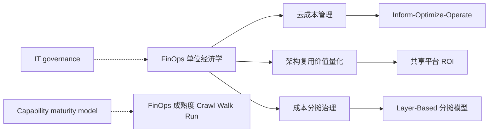

- **上位概念**：[IT governance](https://en.wikipedia.org/wiki/IT_governance) 与 [FinOps](https://en.wikipedia.org/wiki/FinOps) 框架；
- **下位概念**：Cloud COGS、每客户成本、每请求成本、每 Token 成本；
- **等价/映射概念**：Unit Economics（SaaS 领域）、Cloud Unit Cost（云厂商）、Total Cost of Ownership（TCO）；
- **依赖概念**：标签治理（Tagging Governance）、成本分配（Cost Allocation）、用量计量（Usage Metering）。

### 3.4 成本分摊模型：五维分摊框架

在"直接租户归因—比例多租户归因—平台开销归因"三层归因基础上，本框架引入**五维分摊框架**：

| 维度 | 分摊对象 | 分摊基数 | 适用场景 |
|------|----------|----------|----------|
| **Tenant 维度** | 直接客户/租户 | `customer_id` / `tenant_id` 标签 | SaaS 多租户成本 |
| **Product 维度** | 产品/功能线 | 产品收入、功能调用量 | 跨产品共享服务 |
| **Layer 维度** | 业务/应用/组件/功能层 | 各层受益比例 | 跨层复用基础设施 |
| **Team 维度** | 团队/成本中心 | 团队人数、预算权重 | 固定共享开销 |
| **Risk 维度** | 全组织风险准备金 | 影响面/受益面加权 | 安全/合规/技术债务 |

**五维分摊公式**：

$$
UnitCost_u = \frac{\sum_{i} DirectCost_i \cdot \delta(u,i) + \sum_{j} SharedCost_j \cdot \frac{Signal_{u,j}}{\sum_{v} Signal_{v,j}} + RiskReserve \cdot \frac{Exposure_u}{\sum_{v} Exposure_v}}{Volume_u}
$$

其中：

- $ \delta(u,i) $：成本项 $ i $ 是否可直接归属到单位 $ u $；
- $ Signal_{u,j} $：单位 $ u $ 对共享成本项 $ j $ 的使用信号；
- $ Exposure_u $：单位 $ u $ 在风险场景下的暴露面。

### 3.5 正例：SaaS 企业跨层共享平台成本透明化

**背景**：某 SaaS 企业年云支出 $4.8M，包含共享 Kubernetes 平台、共享 LLM 推理服务、共享数据仓库和 20 余个业务微服务。

**实施**：

1. **标签治理**：强制所有资源携带 `tenant_id`、`product_id`、`layer`、`cost_center` 四标签；
2. **直接归因**：65% 支出通过标签直接归属；
3. **比例分摊**：25% 支出按 API 请求数、GPU token 数、数据扫描量分摊；
4. **平台开销**：10% 支出按直接成本比例分摊；
5. **单位经济**：生成"每活跃客户成本""每千次 API 调用成本""每千 token 成本"。

**效果**：

- 发现 Self-serve 产品线毛利率为 -17%，决定下架或涨价；
- 识别共享 LLM 推理服务中 35% 调用来自低价值批量任务，优化后每月节省 $42K；
- 平台团队向产品团队 showback 报告，驱动共享服务利用率提升 28%。

### 3.6 反例：平均分摊导致"公地悲剧"

**背景**：某企业将 $200K/月的共享数据平台成本按团队人数平均分摊到 8 个团队。

**问题**：

1. **激励扭曲**：大团队承担固定成本，小团队无成本意识，导致查询量暴增；
2. **责任不清**：没有团队愿意优化查询，因为成本不随用量变化；
3. **复用受阻**：数据平台团队无法证明投资 ROI，新功能预算被砍。

**后果**：6 个月内数据平台成本增长 55%，查询性能下降 40%，多个团队开始自建数据副本，形成新的数据孤岛。

**避免方法**：

- 采用 Usage-Based 分摊，让成本随用量变化；
- 设置团队级成本预算与告警；
- 将"每查询成本"纳入团队 OKR。

### 3.7 实施检查清单

| 阶段 | 关键活动 | 验收标准 |
|------|----------|----------|
| **第 1 阶段：标签治理** | 制定标签策略、清理历史资源 | 标签覆盖率 ≥ 95% |
| **第 2 阶段：分配建模** | 选择分摊模型、定义单位 | 分配准确率 ≥ 90% |
| **第 3 阶段：单位经济** | 生成 per-unit 报表 | 管理层月度 review |
| **第 4 阶段：闭环优化** | 成本优化行动、再评估 | 单位成本下降 ≥ 10% |

### 3.8 决策树：何时使用何种分摊模型

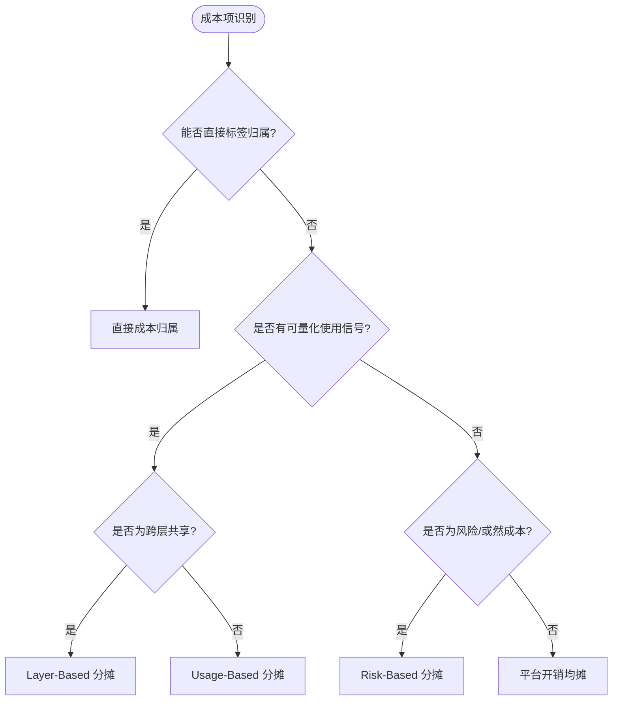

### 3.9 与架构复用价值的衔接

单位经济学必须与架构复用价值量化联动：

| 复用决策 | 单位经济学输入 | 价值输出 |
|----------|----------------|----------|
| 自研 vs 购买 | 自研单位成本、采购单位成本 | TCO 比较 |
| 共享服务 vs 专用实例 | 共享分摊成本、隔离额外成本 | 单位成本差异 |
| 升级共享组件 | 平台投资增量、消费方数量 | 每消费方成本 |
| 退役低采用资产 | 维护成本、潜在替代成本 | 资产净现值 |

## 补充：FinOps 单位经济学计算示例与成本分摊反模式

### 4.1 FinOps 单位经济学深度计算示例

某 SaaS 公司月云支出 $120K，活跃客户 50,000，当月 API 调用 120M 次。

**每活跃用户成本（Cost Per Active User, CPAU）**：

```text
CPAU = $120,000 / 50,000 = $2.40 / 用户 / 月
```

**每千次 API 调用成本（Cost Per 1K API Calls）**：

```text
CP1K = $120,000 / (120,000,000 / 1,000) = $1.00 / 千次调用
```

**毛利率推导**：

- 月 ARPU = $8.50
- CPAU = $2.40
- 其他运营成本 = $1.10 / 用户
- **毛利润** = $8.50 - $2.40 - $1.10 = $5.00
- **毛利率** = $5.00 / $8.50 = 58.8%

### 4.2 跨层复用成本分摊计算示例

共享 Kubernetes 平台月成本 $48K，服务 4 个产品线和 12 个微服务。

**Layer-Based 分摊**：

| 层级 | 受益比例 | 分摊成本 |
|---|---|---|
| 业务层（Product A/B/C/D） | 按收入占比 | $38.4K |
| 应用层（12 个微服务） | 按 CPU/内存请求 | $7.2K |
| 组件层（共享中间件） | 按调用量 | $1.8K |
| 功能层（日志/监控） | 按日志量/指标数 | $0.6K |

**分摊验证**：

```text
$38.4K + $7.2K + $1.8K + $0.6K = $48K
```

### 4.3 成本分摊反例：按收入分摊的"马太效应"

某企业将共享数据仓库成本按各产品线收入比例分摊：

- **问题**：
  1. 高收入产品线承担大部分成本，但使用频率低；
  2. 低收入高使用频率产品线成本被低估，过度使用资源；
  3. 产品团队无法通过优化使用行为降低成本；
  4. 数据仓库团队被指责"为高收入产品线服务"，资源分配政治化。
- **后果**：
  - 数据仓库利用率不均，部分时段排队严重；
  - 团队间信任破裂，多个产品线自建数据副本；
  - 6 个月内数据相关成本上升 38%。
- **避免方法**：
  - 优先使用 Usage-Based 分摊（查询数、扫描数据量、存储量）；
  - 收入分摊仅作为平台开销（Overhead）的补充；
  - 建立成本 showback 机制，让消费方看到真实使用成本。

### 4.4 成本分摊反例：遗漏隐性成本

某平台团队按"每调用"将共享搜索服务成本分摊给消费方，但：

- **遗漏成本**：
  1. 索引重建的批处理成本；
  2. 多可用区冗余的存储成本；
  3. 安全扫描与合规审计成本；
  4. 平台工程师维护人力成本。
- **后果**：
  - 消费方看到的单位成本仅为真实成本的 60%；
  - 低估成本的产品线扩大使用，导致平台容量紧张；
  - 平台团队预算不足，影响服务质量。
- **避免方法**：
  - 建立全成本分摊模型（Full-Cost Allocation）；
  - 定期进行成本完整性审计；
  - 将人力成本按比例折算为平台开销。

### 4.5 FinOps 单位经济学实施流程

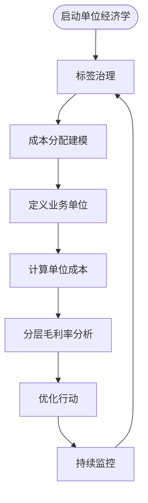

### 4.6 与相关概念的关系

- **上位概念**：[FinOps](https://en.wikipedia.org/wiki/FinOps)、[IT governance](https://en.wikipedia.org/wiki/IT_governance)、[Cloud computing](https://en.wikipedia.org/wiki/Cloud_computing)；
- **下位概念**：Cloud COGS、每客户成本、每请求成本、每 Token 成本、Showback、Chargeback；
- **等价/映射概念**：Unit Economics（SaaS）、Cloud Unit Cost（云厂商）、TCO；
- **依赖概念**：标签治理、成本分配、用量计量、架构复用价值量化。

> **权威来源（补充）**:
>
> - [FinOps — Wikipedia](https://en.wikipedia.org/wiki/FinOps)
> - [IT governance — Wikipedia](https://en.wikipedia.org/wiki/IT_governance)
> - [Cloud computing — Wikipedia](https://en.wikipedia.org/wiki/Cloud_computing)
> - [Unit economics — Wikipedia](https://en.wikipedia.org/wiki/Unit_economics)
>
### 4.7 计算示例：共享 GPU 集群的每千 Token 成本

某 AI 平台月 GPU 集群成本 $86K，当月消耗 2.15B token，服务 3 个产品线。

**每千 Token 成本（Cost Per 1K Tokens）**：

```text
CP1KT = $86,000 / (2,150,000,000 / 1,000) = $0.04 / 千 Token
```

**按产品线分摊（按 token 使用量）**：

| 产品线 | 使用量（B token） | 占比 | 分摊成本 |
|--------|------------------|------|----------|
| 企业助手 | 1.20 | 55.8% | $48.0K |
| 搜索增强 | 0.65 | 30.2% | $26.0K |
| 内容生成 | 0.30 | 14.0% | $12.0K |

**毛利率影响**：

- 企业助手月收入 $180K，GPU 成本 $48K，GPU 毛利率 = 73.3%；
- 内容生成月收入 $15K，GPU 成本 $12K，GPU 毛利率 = 20.0%，接近盈亏平衡。

### 4.8 反例：未分摊预留实例折扣导致产品线成本扭曲

某企业购买 1 年期 AWS Reserved Instances，享受 35% 折扣：

- **问题**：
  1. 财务部门将折扣全部计入中央 IT 成本，未按实际使用分摊给产品线；
  2. 产品团队看到的按需成本高于真实成本，低估云资源使用效率；
  3. 高使用产品线未获得折扣激励，低使用产品线反而"搭便车"；
  4. 第二年预算编制时，各部门按虚高成本申请预算，导致整体云支出增长 18%。
- **后果**：
  - 产品线决策失真，本应扩展的服务被误判为不经济；
  - 中央 IT 与实际使用方产生利益冲突；
  - FinOps 团队公信力下降。
- **避免方法**：
  - 按实际使用量比例分摊预留实例折扣；
  - 建立 showback 机制，让消费方看到摊销后的真实单位成本；
  - 在预算编制中使用"有效单位成本"而非账面成本。

### 4.9 FinOps 单位经济学闭环流程图

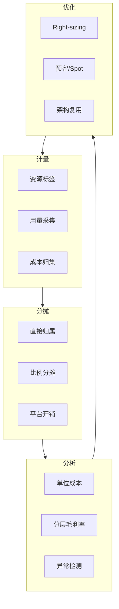

### 4.10 补充权威来源

> **权威来源（补充）**:
>
> - [FinOps — Wikipedia](https://en.wikipedia.org/wiki/FinOps)
> - [Unit economics — Wikipedia](https://en.wikipedia.org/wiki/Unit_economics)
> - [FinOps Foundation — Unit Economics](https://www.finops.org/framework/capabilities/quantify/unit-economics/)
>
> **核查日期**: 2026-07-07

## 8. 参考索引与权威来源

> **权威来源**:
>
> | 来源 | URL | 核查日期 |
> |------|-----|----------|
> | FinOps Foundation — What is FinOps? | <https://www.finops.org/what-is-finops/> | 2026-07-07 |
> | Wikipedia — FinOps | <https://en.wikipedia.org/wiki/FinOps> | 2026-07-07 |
> | Wikipedia — IT governance | <https://en.wikipedia.org/wiki/IT_governance> | 2026-07-07 |
> | FinOps Foundation — Unit Economics Capability | <https://www.finops.org/framework/capabilities/quantify/unit-economics/> | 2026-07-07 |
> | FinOps Foundation — Cost Allocation Capability | <https://www.finops.org/framework/capabilities/manage/allocate-costs/> | 2026-07-07 |
> | AWS — Cost Allocation Tags Best Practices | <https://docs.aws.amazon.com/awsaccountbilling/latest/aboutv2/cost-alloc-tags.html> | 2026-07-07 |
> | DORA — State of DevOps Report 2024 | <https://dora.dev/research/2024/dora-report/> | 2026-07-07 |
> | ISO/IEC 26564:2022 — Software Reuse Measurement and Metrics | <https://www.iso.org/standard/81622.html> | 2026-07-07 |

- Opslyft: "Cloud Unit Economics & Cloud COGS Playbook" (2026)
- Finout: "Top 50 FinOps Tools to Consider in 2026" (2026-05)
- Sedai: "Top 17 FinOps Cloud Optimization Strategies" (2026-01)
- Cloudaware: "What Is FinOps? Framework, Roles, Strategy & Tools" (2026-01)

> **交叉引用**:
>
> - 跨层复用成本分摊模型：[`struct/06-cross-layer-governance/04-finops-cost/cost-allocation-template.md`](../struct/06-cross-layer-governance/04-finops-cost/cost-allocation-template.md)
> - 复用度量指标体系：[`struct/06-cross-layer-governance/05-metrics-kpi/metrics-framework.md`](../struct/06-cross-layer-governance/05-metrics-kpi/metrics-framework.md)
> - 复用 ROI 框架：[`struct/09-value-quantification/02-roi-npv-models/roi-framework.md`](../struct/09-value-quantification/02-roi-npv-models/roi-framework.md)
> - 跨层复用治理框架：[`struct/06-cross-layer-governance/01-process-governance/cross-layer-governance.md`](../struct/06-cross-layer-governance/01-process-governance/cross-layer-governance.md)


---

## 补充说明：FinOps 云成本治理与架构复用价值量化

## 概念定义

**定义**：FinOps 成本分摊治理是将云成本、平台成本与复用资产成本按业务价值归集到团队、产品与功能，实现成本透明与优化问责。

## 示例

**示例**：平台团队按“每活跃用户”“每千次请求”将共享服务成本分摊给消费方，并在仪表盘展示各产品的单位经济学指标。

## 反例

**反例**：共享平台成本由中央 IT 统一承担，消费方没有成本意识，导致资源浪费与利用率低下。

## 权威来源

> **权威来源**:
>
> - [FinOps Foundation — What is FinOps?](https://www.finops.org/what-is-finops/)
> - [Wikipedia — FinOps](https://en.wikipedia.org/wiki/FinOps)
> - [Wikipedia — IT governance](https://en.wikipedia.org/wiki/IT_governance)
> - 核查日期：2026-07-07

## 分析

**分析**：成本分摊是复用治理的经济杠杆，只有让消费方感受到真实成本，才能驱动理性复用决策。

---


<!-- SOURCE: struct/06-cross-layer-governance/04-finops-cost/templates/ai-cost-allocation.md -->

# AI 场景成本分摊模板 (AI Cost Allocation)

> **版本**: {{VERSION}}（示例: 2026-06-12）
> **适用范围**: {{SCOPE}}（示例: LLM 应用、GPU 共享集群、RAG 检索、模型微调）
> **负责人**: {{OWNER}}（示例: AI 平台团队 + FinOps CoE）
> **计算周期**: {{PERIOD}}（示例: 2026-05）
> **对齐来源**: FinOps Foundation Framework 2026、FinOps.org Token Economics、MLOps 成本分摊最佳实践

---

## 目录

- [AI 场景成本分摊模板 (AI Cost Allocation)](#ai-场景成本分摊模板-ai-cost-allocation)
  - [目录](#目录)
  - [1. AI 成本管理挑战](#1-ai-成本管理挑战)
  - [2. AI 成本分类](#2-ai-成本分类)
    - [2.1 按资源类型](#21-按资源类型)
    - [2.2 按业务属性](#22-按业务属性)
  - [3. 标签与归因策略](#3-标签与归因策略)
    - [3.1 推荐标签体系](#31-推荐标签体系)
    - [3.2 归因方法矩阵](#32-归因方法矩阵)
  - [4. LLM Token 成本分摊](#4-llm-token-成本分摊)
    - [4.1 成本拆分维度](#41-成本拆分维度)
    - [4.2 Token 成本计算表](#42-token-成本计算表)
    - [4.3 按租户分摊示例公式](#43-按租户分摊示例公式)
  - [5. GPU 共享成本分摊](#5-gpu-共享成本分摊)
    - [5.1 GPU 成本构成](#51-gpu-成本构成)
    - [5.2 分摊模型选择](#52-分摊模型选择)
    - [5.3 GPU 成本计算表](#53-gpu-成本计算表)
  - [6. RAG 检索成本分摊](#6-rag-检索成本分摊)
    - [6.1 RAG 成本链路](#61-rag-成本链路)
    - [6.2 RAG 各环节成本](#62-rag-各环节成本)
    - [6.3 单次 RAG 查询成本计算](#63-单次-rag-查询成本计算)
  - [7. 模型微调成本分摊](#7-模型微调成本分摊)
    - [7.1 微调成本构成](#71-微调成本构成)
    - [7.2 微调成本分摊方法](#72-微调成本分摊方法)
    - [7.3 微调任务成本计算表](#73-微调任务成本计算表)
  - [8. AI 平台共享成本分摊](#8-ai-平台共享成本分摊)
    - [8.1 共享平台服务清单](#81-共享平台服务清单)
    - [8.2 平台成本分摊公式](#82-平台成本分摊公式)
    - [8.3 AI 平台成本池](#83-ai-平台成本池)
  - [9. 计算示例](#9-计算示例)
    - [9.1 共享 LLM 推理服务分摊](#91-共享-llm-推理服务分摊)
    - [9.2 共享 GPU 集群分摊](#92-共享-gpu-集群分摊)
    - [9.3 RAG 检索链分摊](#93-rag-检索链分摊)
  - [10. 实施检查清单](#10-实施检查清单)
    - [第 1–30 天：AI 成本可见性](#第-130-天ai-成本可见性)
    - [第 31–60 天：分摊模型建立](#第-3160-天分摊模型建立)
    - [第 61–90 天：优化与运营](#第-6190-天优化与运营)
  - [11. 参考索引](#11-参考索引)
  - [补充说明：AI 场景成本分摊模板 (AI Cost Allocation)](#补充说明ai-场景成本分摊模板-ai-cost-allocation)
  - [概念定义](#概念定义)
  - [示例](#示例)
  - [反例](#反例)
  - [权威来源](#权威来源)

---

## 1. AI 成本管理挑战

| 挑战 | 说明 | 对分摊的影响 |
|------|------|-------------|
| **共享 GPU 集群** | 多租户共享 GPU，难以按单一项目归属 | 需要按 GPU 时长、显存占用、任务队列等指标分摊 |
| **Token 级可变成本** | LLM API 按输入/输出 token 计费，波动剧烈 | 需要按 token 量或请求数归因 |
| **多阶段 AI 流水线** | 嵌入、检索、推理、重排序涉及多个服务 | 需要将成本沿调用链拆分 |
| **模型版本众多** | 不同模型价格差异大 | 需要按模型端点分别归因 |
| **冷启动与批处理** | GPU 空闲、批处理任务导致利用率不均 | 需要区分在线推理与离线训练成本 |
| **AI 实验与 PoC** | 研发性支出不应计入生产 COGS | 需要单独标记 R&D 与生产 |

---

## 2. AI 成本分类

### 2.1 按资源类型

| 成本类型 | 说明 | 典型计费单位 |
|----------|------|-------------|
| **LLM API 调用** | 调用第三方或自托管大模型 API | 输入 token、输出 token、请求数 |
| **GPU 计算** | 训练/推理使用的 GPU/TPU 实例 | GPU 小时、显存 GB-小时 |
| **向量数据库** | 嵌入存储与相似度检索 | 存储 GB、查询数、索引操作数 |
| **Embedding 服务** | 文本/多模态嵌入生成 | 文档数、token 数、请求数 |
| **模型托管** | 模型部署、端点运行 | 端点小时、实例小时 |
| **AI 平台工具** | MLOps、实验追踪、数据标注 | 用户数、存储量、计算量 |
| **数据存储与传输** | AI 训练数据、模型制品、日志 | 存储 GB、出站流量 GB |

### 2.2 按业务属性

| 属性 | 说明 | 分摊影响 |
|------|------|---------|
| **生产推理** | 面向最终用户的在线推理 | 计入 Cloud COGS，按用户/请求分摊 |
| **内部工具** | 面向员工的 AI 助手 | 按团队/部门分摊 |
| **模型训练** | 新模型或模型迭代训练 | 按项目/模型分摊，通常计入 R&D |
| **模型微调** | 针对租户/客户的 fine-tuning | 按租户/任务分摊 |
| **RAG 索引维护** | 知识库嵌入与索引更新 | 按知识库/业务线分摊 |
| **实验/PoC** | 探索性研究 | 由发起团队承担，不计入产品 COGS |

---

## 3. 标签与归因策略

### 3.1 推荐标签体系

| 标签键 | 说明 | 示例值 |
|--------|------|--------|
| `ai-workload-type` | AI 工作负载类型 | `llm-inference` / `embedding` / `rag-retrieval` / `fine-tuning` / `training` |
| `ai-model-id` | 模型标识 | `gpt-4o` / `llama3-70b` / `{{MODEL_ID}}` |
| `ai-endpoint-id` | 推理端点标识 | `ep-customer-support` / `{{ENDPOINT_ID}}` |
| `ai-tenant-id` | 多租户标识 | `tenant-001` / `{{TENANT_ID}}` |
| `ai-project-id` | AI 项目/产品代码 | `proj-rag-kb` / `{{AI_PROJECT_ID}}` |
| `ai-stage` | 生命周期阶段 | `prod` / `staging` / `experiment` |
| `ai-cost-center` | AI 专属成本中心 | `cc-ai-platform` / `{{AI_COST_CENTER}}` |
| `reuse-asset-id` | 关联复用资产 | `svc-llm-gateway` / `svc-embedding` |

### 3.2 归因方法矩阵

| AI 场景 | 主要成本 | 推荐归因单位 | 分摊方法 |
|---------|---------|-------------|---------|
| 共享 LLM 推理服务 | LLM API / GPU | 输入/输出 token 数 | Usage-Based |
| 共享 GPU 集群 | GPU 实例 | GPU 小时 × 显存权重 | Usage-Based |
| Embedding 流水线 | Embedding API / 计算 | 文档数 / token 数 | Usage-Based |
| RAG 检索层 | 向量数据库 / 重排序 | 检索查询数 | Usage-Based |
| 模型微调 | GPU / 存储 / 数据 | 训练任务 / 租户 | Project-Based + Usage-Based |
| AI 平台共享服务 | API Gateway / 监控 / MLOps | 消费项目数 / 请求数 | Layer-Based / Usage-Based |

---

## 4. LLM Token 成本分摊

### 4.1 成本拆分维度

| 拆分维度 | 说明 | 适用场景 |
|----------|------|---------|
| **按模型** | 不同模型价格差异大 | 多模型网关 |
| **按租户/客户** | 多租户 SaaS | B2B AI 应用 |
| **按功能/端点** | 客服、摘要、代码助手 | 多功能 AI 平台 |
| **按输入/输出 token** | 输出通常更贵 | 精细化成本分析 |
| **按请求成功/失败** | 失败请求是否计费 | 成本质量控制 |

### 4.2 Token 成本计算表

| 字段 | 公式/说明 | 值 |
|------|----------|-----|
| 模型 | 模型名称 | {{MODEL_NAME}} |
| 输入 token 单价 | 每千输入 token 价格 | {{INPUT_TOKEN_PRICE}} / 1K |
| 输出 token 单价 | 每千输出 token 价格 | {{OUTPUT_TOKEN_PRICE}} / 1K |
| 输入 token 数 | 周期内输入 token 总量 | {{INPUT_TOKENS}} |
| 输出 token 数 | 周期内输出 token 总量 | {{OUTPUT_TOKENS}} |
| 输入 token 成本 | 输入 token 数 / 1000 × 输入单价 | {{INPUT_TOKEN_COST}} |
| 输出 token 成本 | 输出 token 数 / 1000 × 输出单价 | {{OUTPUT_TOKEN_COST}} |
| 请求数 | 总请求数 | {{REQUEST_COUNT}} |
| 平台分摊成本 | AI Gateway、监控、限流等共享成本 | {{PLATFORM_ALLOCATED_COST}} |
| **LLM 总成本** | 输入 + 输出 + 平台分摊 | {{TOTAL_LLM_COST}} |
| **每千 token 成本** | 总成本 / 总 token × 1000 | {{COST_PER_1K_TOKENS}} |
| **每请求成本** | 总成本 / 请求数 | {{COST_PER_REQUEST}} |

### 4.3 按租户分摊示例公式

```
租户 A 的 LLM 成本 = (租户 A 输入 token / 总输入 token) × 输入总成本
                   + (租户 A 输出 token / 总输出 token) × 输出总成本
                   + (租户 A 请求数 / 总请求数) × 平台分摊成本
```

---

## 5. GPU 共享成本分摊

### 5.1 GPU 成本构成

| 成本项 | 说明 | 计费单位 |
|--------|------|---------|
| GPU 实例小时 | GPU 实例运行时间 | GPU hour |
| 显存占用 | 实际显存使用量 | GB- hour |
| vCPU/内存 | 伴随 CPU 与内存资源 | vCPU hour / GB-hour |
| 本地 SSD/存储 | 模型权重、检查点存储 | GB-hour |
| 网络 | 多节点训练通信 | GB |
| 调度平台开销 | K8s / Slurm / Ray 等 | 按任务比例分摊 |

### 5.2 分摊模型选择

| 模型 | 适用场景 | 公式 |
|------|---------|------|
| **按 GPU 小时均摊** | 整卡独占、任务时长明确 | 任务 GPU 小时 / 总 GPU 小时 × GPU 总成本 |
| **按显存权重分摊** | 多任务共享单卡 | 任务显存占用 / 总显存占用 × GPU 总成本 |
| **按算力权重分摊** | 不同 GPU 型号混合 | 任务算力（FLOPS·hour）/ 总算力 × GPU 总成本 |
| **按任务队列分摊** | 批处理/训练集群 | 任务在队列中占用资源时长 × 权重 |

### 5.3 GPU 成本计算表

| 字段 | 说明 | 值 |
|------|------|-----|
| GPU 集群月度成本 | GPU 实例 + 存储 + 网络 | {{GPU_CLUSTER_COST}} |
| 总 GPU 小时 | 所有任务 GPU 小时之和 | {{TOTAL_GPU_HOURS}} |
| 任务 A GPU 小时 | 任务 A 占用 GPU 时长 | {{TASK_A_GPU_HOURS}} |
| 任务 A 显存权重 | 任务 A 显存占用比例 | {{TASK_A_MEMORY_WEIGHT}} |
| 调度开销分摊比例 | 平台调度/管理成本 | {{SCHEDULER_OVERHEAD_RATIO}}% |
| **任务 A GPU 成本** | 集群成本 × 任务 GPU 小时 / 总 GPU 小时 × (1 + 调度开销) | {{TASK_A_GPU_COST}} |
| **任务 A 每 GPU 小时成本** | 任务 A GPU 成本 / 任务 A GPU 小时 | {{TASK_A_COST_PER_GPU_HOUR}} |

---

## 6. RAG 检索成本分摊

### 6.1 RAG 成本链路

```text
用户查询
   │
   ├─ 查询重写/扩展 → Embedding 服务 → 向量数据库检索 → 重排序 → LLM 生成答案
   │
   └─ 各环节成本需要分别归因到该查询
```

### 6.2 RAG 各环节成本

| 环节 | 成本项 | 归因单位 |
|------|--------|---------|
| **查询重写** | LLM API / 规则引擎 | 查询数 |
| **Embedding** | Embedding API / 自托管模型 | 查询 token 数 / 查询数 |
| **向量检索** | 向量数据库查询 / 存储 | 检索次数 / 扫描向量数 |
| **重排序** | 重排序模型 API / GPU | 重排序文档数 |
| **答案生成** | LLM API / GPU | 输入/输出 token 数 |
| **索引维护** | 知识库更新、重新嵌入 | 文档数 / 更新频次 |

### 6.3 单次 RAG 查询成本计算

| 字段 | 说明 | 值 |
|------|------|-----|
| 查询重写成本 | | {{QUERY_REWRITE_COST}} |
| Embedding 成本 | | {{QUERY_EMBEDDING_COST}} |
| 向量检索成本 | | {{VECTOR_RETRIEVAL_COST}} |
| 重排序成本 | | {{RERANK_COST}} |
| 答案生成成本 | | {{ANSWER_GENERATION_COST}} |
| 平台分摊成本 | API Gateway、日志、监控 | {{RAG_PLATFORM_ALLOCATED_COST}} |
| **单次 RAG 查询成本** | 以上之和 | {{COST_PER_RAG_QUERY}} |

---

## 7. 模型微调成本分摊

### 7.1 微调成本构成

| 成本项 | 说明 | 归因单位 |
|--------|------|---------|
| 训练数据准备 | 数据清洗、标注、增强 | 数据量 / 人力 |
| 训练 GPU 资源 | Fine-tuning 任务消耗 | GPU 小时 |
| 实验迭代 | 多轮超参调优 | 实验次数 |
| 模型托管 | 微调后模型部署 | 端点小时 |
| 推理成本 | 微调模型推理调用 | token 数 / 请求数 |

### 7.2 微调成本分摊方法

| 场景 | 分摊方法 | 说明 |
|------|---------|------|
| 通用基座微调 | 按消费项目/租户分摊 | 由所有使用方按用量分摊 |
| 客户专属微调 | 直接归属客户 | 单独计费或计入客户 COGS |
| 实验性微调 | 由发起团队承担 | 计入 R&D，不进入生产分摊 |
| 共享 LoRA 适配器 | 按调用量分摊 | 多个租户共享基座 + 各自 LoRA |

### 7.3 微调任务成本计算表

| 字段 | 说明 | 值 |
|------|------|-----|
| 任务 ID | 微调任务标识 | {{FINE_TUNE_TASK_ID}} |
| 租户/项目 | 归属方 | {{FINE_TUNE_OWNER}} |
| 训练 GPU 小时 | | {{FINE_TUNE_GPU_HOURS}} |
| 数据量 | 训练样本数 | {{FINE_TUNE_SAMPLES}} |
| 训练轮次 | epochs | {{FINE_TUNE_EPOCHS}} |
| 实验次数 | 超参搜索次数 | {{FINE_TUNE_TRIALS}} |
| 训练总成本 | GPU + 存储 + 网络 | {{FINE_TUNE_TRAINING_COST}} |
| 单次推理成本 | 微调模型推理 | {{FINE_TUNE_INFERENCE_COST_PER_CALL}} |
| **生命周期总成本** | 训练 + 部署 + 推理 | {{FINE_TUNE_TOTAL_COST}} |

---

## 8. AI 平台共享成本分摊

### 8.1 共享平台服务清单

| 服务 | 成本项 | 推荐分摊驱动 |
|------|--------|-------------|
| AI Gateway | API 路由、限流、缓存 | 请求数 / token 数 |
| 模型仓库 | 模型版本存储 | 模型大小 × 存储时长 |
| 实验追踪 | MLflow / Weights & Biases | 实验数 / 用户 |
| 特征存储 | 特征在线/离线服务 | 特征查询数 / 存储量 |
| 监控与可观测 | APM、日志、Tracing | 数据量 / 请求数 |
| 数据流水线 | ETL、数据标注 | 处理数据量 / 任务数 |

### 8.2 平台成本分摊公式

```
项目 A 的平台分摊 = Σ(各共享服务成本 × 项目 A 对该服务的使用量 / 总使用量)
```

### 8.3 AI 平台成本池

| 成本池 | 月度金额 | 分摊驱动 | 备注 |
|--------|---------|---------|------|
| AI Gateway | {{GATEWAY_COST}} | 请求数 | 按项目请求比例 |
| 模型仓库 | {{MODEL_REPO_COST}} | 存储 GB-月 | 按模型大小比例 |
| 实验追踪 | {{EXPERIMENT_TRACKING_COST}} | 活跃实验数 | 按项目实验数 |
| 监控可观测 | {{AI_OBSERVABILITY_COST}} | 日志/指标数据量 | 按项目数据量 |
| 数据流水线 | {{AI_DATA_PIPELINE_COST}} | 处理任务数/GB | 按项目处理量 |
| **合计** | **{{TOTAL_AI_PLATFORM_COST}}** | — | — |

---

## 9. 计算示例

### 9.1 共享 LLM 推理服务分摊

**假设**:

| 项目 | 输入 token | 输出 token | 请求数 |
|------|-----------|-----------|--------|
| 客服助手 | 60M | 15M | 500K |
| 代码助手 | 40M | 20M | 200K |
| 摘要服务 | 20M | 5M | 300K |
| **合计** | **120M** | **40M** | **1M** |

**成本**: 输入 $0.005/1K tokens，输出 $0.015/1K tokens，平台分摊 $5,000

| 项目 | 输入成本 | 输出成本 | 请求分摊 | 平台分摊 | 总成本 | 占比 |
|------|---------|---------|---------|---------|--------|------|
| 客服助手 | $300 | $225 | $2,500 | $2,500 | **$3,025** | 55.0% |
| 代码助手 | $200 | $300 | $1,000 | $1,000 | **$1,500** | 27.3% |
| 摘要服务 | $100 | $75 | $1,500 | $1,500 | **$1,675** | 30.5% |
| **合计** | **$600** | **$600** | **$5,000** | **$5,000** | **$6,200** | — |

> 注：请求分摊与平台分摊在此示例中均按请求数比例计算，实际可根据成本性质选择不同驱动。

### 9.2 共享 GPU 集群分摊

**假设**:

| 任务 | GPU 小时 | 显存占用（GB-小时）| 算力权重 |
|------|---------|-------------------|---------|
| 模型 A 训练 | 500 | 10,000 | 1.0 |
| 模型 B 推理 | 300 | 3,000 | 1.0 |
| 客户 C 微调 | 200 | 2,000 | 1.0 |
| **合计** | **1,000** | **15,000** | — |

**成本**: GPU 集群月度 $50,000，调度开销 10%

| 任务 | GPU 小时占比 | 分摊成本（含 10% 开销）|
|------|-------------|------------------------|
| 模型 A 训练 | 50% | $27,500 |
| 模型 B 推理 | 30% | $16,500 |
| 客户 C 微调 | 20% | $11,000 |
| **合计** | **100%** | **$55,000** |

### 9.3 RAG 检索链分摊

**假设单次 RAG 查询**:

| 环节 | 成本 |
|------|------|
| 查询重写 | $0.0005 |
| Embedding | $0.0010 |
| 向量检索 | $0.0003 |
| 重排序 | $0.0008 |
| 答案生成 | $0.0030 |
| 平台分摊 | $0.0004 |
| **单次 RAG 查询成本** | **$0.0060** |

**月度**: 100 万次 RAG 查询 → 月度 RAG 总成本 = **$6,000**

---

## 10. 实施检查清单

### 第 1–30 天：AI 成本可见性

- [ ] 梳理所有 AI 相关资源与服务（LLM API、GPU、向量 DB、Embedding、MLOps）
- [ ] 为 AI 资源添加 `ai-workload-type`、`ai-model-id`、`ai-tenant-id` 等标签
- [ ] 建立 AI Gateway 日志，记录每次调用的 model、tenant、token 数
- [ ] 采集 GPU 集群任务级调度数据（GPU 小时、显存占用）
- [ ] 建立 RAG 调用链追踪（查询 → Embedding → 检索 → 重排序 → 生成）

### 第 31–60 天：分摊模型建立

- [ ] 为 LLM、GPU、RAG、微调分别建立分摊公式
- [ ] 将 AI 平台共享成本按使用量分摊到各项目/租户
- [ ] 区分生产推理、内部工具、训练实验、PoC 成本
- [ ] 生成首份 AI 成本 Showback 报告
- [ ] 与 AI 平台团队、产品团队核对分摊结果

### 第 61–90 天：优化与运营

- [ ] 识别高单位成本模型/端点，评估模型蒸馏、缓存、量化
- [ ] 优化 GPU 集群调度，提高利用率
- [ ] 建立 AI 成本异常告警（token 激增、GPU 空闲）
- [ ] 将 AI 单位经济学纳入月度 FinOps Review
- [ ] 发布《AI 成本分摊运营手册》

---

## 11. 参考索引

- FinOps Foundation: [Token Economics — The Atomic Unit of AI Value](https://www.finops.org/insights/token-economics-the-atomic-unit-of-ai-value/)
- FinOps Foundation: [AI Cost Management](https://www.finops.org/framework/capabilities/ai/)
- FinOps Foundation: [Cost Allocation](https://www.finops.org/framework/capabilities/allocate/)
- MLOps Community: GPU Cluster Cost Allocation Best Practices

> **交叉引用**:
>
> - FinOps 云成本治理与价值量化: [`../finops-unit-economics-2026.md`](../struct/06-cross-layer-governance/04-finops-cost/finops-unit-economics-2026.md)
> - 单位经济学计算模板: [`./unit-economics.md`](../struct/06-cross-layer-governance/04-finops-cost/templates/unit-economics.md)
> - FinOps 跨层成本分摊执行模板: [`../cost-allocation-template.md`](../struct/06-cross-layer-governance/04-finops-cost/cost-allocation-template.md)
> - 标签治理策略模板: [`./tagging-policy.md`](../struct/06-cross-layer-governance/04-finops-cost/templates/tagging-policy.md)
> - 承诺折扣策略模板: [`./commitment-discount-policy.md`](../struct/06-cross-layer-governance/04-finops-cost/templates/commitment-discount-policy.md)

> 最后更新: {{LAST_UPDATED}}


---

## 补充说明：AI 场景成本分摊模板 (AI Cost Allocation)

## 概念定义

**定义**：FinOps 成本分摊治理是将云成本、平台成本与复用资产成本按业务价值归集到团队、产品与功能，实现成本透明与优化问责。

## 示例

**示例**：平台团队按“每活跃用户”“每千次请求”将共享服务成本分摊给消费方，并在仪表盘展示各产品的单位经济学指标。

## 反例

**反例**：共享平台成本由中央 IT 统一承担，消费方没有成本意识，导致资源浪费与利用率低下。

## 权威来源

> **权威来源**:
>
> - [FinOps Foundation](https://www.finops.org)
> - [CNCF](https://www.cncf.io)
> - 核查日期：2026-07-07

---


<!-- SOURCE: struct/06-cross-layer-governance/04-finops-cost/templates/commitment-discount-policy.md -->

# FinOps 承诺折扣策略模板（RI / Savings Plans / Spot / 按需）

> **版本**: {{VERSION}}（示例: 2026-06-12）
> **适用范围**: {{SCOPE}}（示例: AWS / Azure / GCP 计算资源）
> **策略所有者**: {{OWNER}}（示例: FinOps CoE + 采购 + 平台工程）
> **审阅周期**: {{REVIEW_CYCLE}}（示例: 每季度）
> **对齐来源**: FinOps Foundation Framework 2026、AWS/Azure/GCP 承诺折扣最佳实践

---

## 目录

- [FinOps 承诺折扣策略模板（RI / Savings Plans / Spot / 按需）](#finops-承诺折扣策略模板ri--savings-plans--spot--按需)
  - [目录](#目录)
  - [1. 策略目标](#1-策略目标)
  - [2. 承诺折扣类型对比](#2-承诺折扣类型对比)
    - [2.1 折扣类型决策速查](#21-折扣类型决策速查)
  - [3. 决策流程](#3-决策流程)
    - [3.1 标准决策流程图](#31-标准决策流程图)
    - [3.2 购买前评估清单](#32-购买前评估清单)
  - [4. 覆盖率目标](#4-覆盖率目标)
    - [4.1 覆盖率定义](#41-覆盖率定义)
    - [4.2 覆盖率目标矩阵](#42-覆盖率目标矩阵)
  - [5. 风险分析](#5-风险分析)
    - [5.1 主要风险类型](#51-主要风险类型)
    - [5.2 风险评估模板](#52-风险评估模板)
  - [6. 回购策略（Buy-back / 流动性管理）](#6-回购策略buy-back--流动性管理)
    - [6.1 回购触发条件](#61-回购触发条件)
    - [6.2 回购/调整选项](#62-回购调整选项)
    - [6.3 流动性管理原则](#63-流动性管理原则)
  - [7. 各云厂商适用规则](#7-各云厂商适用规则)
    - [7.1 AWS](#71-aws)
    - [7.2 Azure](#72-azure)
    - [7.3 GCP](#73-gcp)
  - [8. 优化检查清单](#8-优化检查清单)
    - [购买前](#购买前)
    - [购买后](#购买后)
    - [持续优化](#持续优化)
  - [9. 模板工具](#9-模板工具)
    - [9.1 承诺决策计算表](#91-承诺决策计算表)
    - [9.2 覆盖率跟踪表](#92-覆盖率跟踪表)
  - [10. 参考索引](#10-参考索引)
  - [补充说明：FinOps 承诺折扣策略模板（RI / Savings Plans / Spot / 按需）](#补充说明finops-承诺折扣策略模板ri--savings-plans--spot--按需)
  - [示例](#示例)
  - [反例](#反例)
  - [权威来源](#权威来源)

---

## 1. 策略目标

| 目标 | 说明 | 衡量指标 |
|------|------|---------|
| **降低计算费率** | 通过承诺使用量换取折扣 | 承诺折扣节省金额 |
| **提高可预测性** | 将稳定的基线工作负载转换为承诺 | 承诺覆盖率 |
| **保留灵活性** | 对波动/未知负载保持按需或 Spot | 按需/Spot 占比 |
| **控制财务风险** | 避免过度承诺导致利用率不足 | 承诺利用率 |
| **优化资本结构** | 平衡预付（CAPEX）与按需（OPEX） | 预付比例 |

---

## 2. 承诺折扣类型对比

| 类型 | 英文名 | 适用场景 | 折扣幅度 | 灵活性 | 风险等级 | 典型承诺期 |
|------|--------|---------|---------|--------|---------|-----------|
| **预留实例** | Reserved Instances（RI） | 长期稳定、可预测实例族 | 20–60% | 低（实例族/区域绑定） | 中 | 1 年 / 3 年 |
| **节省计划** | Savings Plans（SP） | 计算用量灵活、跨实例族/区域 | 15–40% | 高（按 $/小时 承诺） | 中低 | 1 年 / 3 年 |
| **Spot/Preemptible** | Spot Instances / Preemptible VMs | 容错、可中断工作负载 | 60–90% | 极低（可被回收） | 高（可用性） | 无 |
| **按需** | On-Demand / Pay-as-you-go | 突发、未知、短期工作负载 | 0% | 最高 | 低（费率） | 无 |
| **竞价型容器** | Spot Fleet / Autoscaling | 批处理、CI/CD、AI 训练 | 60–90% | 低 | 中高 | 无 |
| **专用主机** | Dedicated Hosts | 软件许可绑定（BYOL） | 中 | 低 | 中 | 1 年 / 3 年 |

### 2.1 折扣类型决策速查

| 工作负载特征 | 推荐类型 | 理由 |
|-------------|---------|------|
| 7×24 生产核心服务 | RI 或 3 年 SP | 稳定、长期、折扣最大化 |
| 多实例族混合、波动较大 | Compute SP | 跨族灵活抵扣 |
| 开发/测试/CI 环境 | Spot + 按需 | 成本优先，可中断 |
| AI 训练/批处理 | Spot + 竞价型容器 | 高折扣，任务可重试 |
| 季节性/突发流量 | 按需 + Auto Scaling | 避免过度承诺 |
| 新服务/PoC | 按需 | 用量不可预测 |

---

## 3. 决策流程

### 3.1 标准决策流程图

```text
识别稳定基线负载
        │
        ├─ 历史利用率是否稳定 ≥ {{STABILITY_THRESHOLD}} 个月？（建议 6 个月）
        │       ├── 否 → 保持按需或 Spot
        │       └── 是 →
        │               ├─ 是否跨实例族/区域？
        │               │       ├── 是 → Savings Plans
        │               │       └── 否 → Reserved Instances
        │               │
        │               ├─ 工作负载是否可中断？
        │               │       ├── 是 → Spot（优先级高于 RI/SP）
        │               │       └── 否 → 继续 RI/SP 评估
        │               │
        │               ├─ 财务是否允许预付？
        │               │       ├── 是 → 全预付（All Upfront）获取最大折扣
        │               │       └── 否 → 部分预付（Partial）或 无预付（No Upfront）
        │               │
        │               └─ 承诺期限选择
        │                       ├── 负载稳定 ≥ 2 年 → 3 年承诺
        │                       └── 负载中期可能变化 → 1 年承诺
        │
        └─ 购买后持续监控利用率，季度复审
```

### 3.2 购买前评估清单

| 检查项 | 要求 | 负责人 | 状态 |
|--------|------|--------|------|
| 历史用量分析 | 至少 {{HISTORY_MONTHS}} 个月数据 | FinOps 分析师 | ☐ |
| 利用率稳定性评估 | CV（变异系数）≤ {{STABILITY_CV_THRESHOLD}} | FinOps 分析师 | ☐ |
| 财务影响测算 | NPV / 节省金额 / 现金流影响 | FP&A | ☐ |
| 业务增长预测 | 未来 {{FORECAST_MONTHS}} 个月用量预测 | 产品 + 工程 | ☐ |
| 技术约束确认 | 实例族、区域、操作系统、租户隔离 | 平台工程 | ☐ |
| 风险评审 | 利用率不足、业务变化、厂商锁定 | FinOps CoE | ☐ |
| 采购审批 | 按金额走采购/财务审批流程 | 采购 | ☐ |

---

## 4. 覆盖率目标

### 4.1 覆盖率定义

| 指标 | 定义 | 目标值 | 说明 |
|------|------|--------|------|
| **总承诺覆盖率** | （RI + SP 覆盖的计算成本）/ 总计算成本 × 100% | {{TOTAL_COMMITMENT_COVERAGE_TARGET}}%（建议 60–80%） | 反映基线负载的承诺程度 |
| **Spot 占比** | Spot 成本 / 总计算成本 × 100% | {{SPOT_RATIO_TARGET}}%（建议 20–40%） | 反映可中断负载的利用程度 |
| **按需占比** | 按需成本 / 总计算成本 × 100% | ≤ {{ONDEMAND_RATIO_TARGET}}%（建议 20–40%） | 反映不可预测负载 |
| **承诺利用率** | 实际被 RI/SP 抵扣的小时数 / 承诺小时数 × 100% | ≥ {{COMMITMENT_UTILIZATION_TARGET}}%（建议 90%） | 反映承诺使用效率 |
| **Spot 中断率** | Spot 实例被回收次数 / 总 Spot 请求数 × 100% | ≤ {{SPOT_INTERRUPTION_TARGET}}%（建议 5%） | 反映 Spot 可用性风险 |

### 4.2 覆盖率目标矩阵

| 工作负载类型 | 推荐覆盖策略 | RI/SP 目标 | Spot 目标 | 按需上限 |
|-------------|-------------|-----------|----------|---------|
| 稳定核心生产 | 高承诺 + 低 Spot | 70–80% | 0–10% | 20–30% |
| 可变生产负载 | 中承诺 + 中 Spot | 50–60% | 20–30% | 20–30% |
| 开发/测试 | 低承诺 + 高 Spot | 0–20% | 50–70% | 20–40% |
| AI 训练/批处理 | 按需 + 高 Spot | 0–10% | 60–80% | 20–30% |
| 新服务/未知负载 | 按需为主 | 0% | 0–20% | 80–100% |

---

## 5. 风险分析

### 5.1 主要风险类型

| 风险 | 说明 | 影响 | 缓解措施 |
|------|------|------|---------|
| **利用率不足** | 购买 RI/SP 后实际用量低于承诺 | 浪费折扣、增加单位成本 | 保守承诺、选择 SP 提高灵活性、设置利用率告警 |
| **业务变化** | 产品重构、下云、实例族变更导致承诺无法匹配 | 承诺闲置 | 1 年承诺优先、SP 替代 RI、季度复审 |
| **Spot 中断** | Spot 实例被回收影响服务可用性 | SLA 违约、任务失败 | 设置 fallback 到按需、使用 Spot Fleet、仅用于可中断负载 |
| **厂商锁定** | 深度绑定某云厂商折扣机制 | 迁移成本增加 | 多云成本评估、保留迁移预算 |
| **现金流压力** | 全预付需要较大前期投入 | 影响现金流 | 选择部分预付或无预付 |
| **折扣计算复杂** | 节省金额计算口径不一致 | 难以向管理层汇报 | 统一 savings methodology，使用工具自动计算 |

### 5.2 风险评估模板

| 承诺项 | 承诺金额 | 剩余期限 | 利用率 | 业务变化概率 | 风险等级 | 缓解动作 |
|--------|---------|---------|--------|-------------|---------|---------|
| {{COMMITMENT_1}} | {{C1_AMOUNT}} | {{C1_REMAINING}} | {{C1_UTILIZATION}}% | 高/中/低 | {{C1_RISK_LEVEL}} | {{C1_MITIGATION}} |
| {{COMMITMENT_2}} | {{C2_AMOUNT}} | {{C2_REMAINING}} | {{C2_UTILIZATION}}% | 高/中/低 | {{C2_RISK_LEVEL}} | {{C2_MITIGATION}} |

---

## 6. 回购策略（Buy-back / 流动性管理）

### 6.1 回购触发条件

| 条件 | 说明 | 动作 |
|------|------|------|
| 承诺利用率连续 {{UNDERUTIL_MONTHS}} 个月 < {{UNDERUTIL_THRESHOLD}}% | 利用率严重不足 | 评估出售/交换 RI、调整 SP 承诺 |
| 业务决定迁移或下云 | 承诺无法继续使用 | 在 Marketplace 出售 RI、协商 SP 调整 |
| 实例族被弃用 | 技术栈变更 | 使用云厂商交换机制（如 AWS RI Exchange） |
| 新区域/新架构需求 | 现有承诺不匹配 | 通过可转换 RI 或 SP 覆盖 |
| 折扣率不再具竞争力 | 出现更优定价模型 | 到期后不再续购，切换方案 |

### 6.2 回购/调整选项

| 云厂商 | RI 出售 | RI 交换 | SP 调整 | Marketplace |
|--------|--------|--------|--------|------------|
| AWS | ✅ Standard RI 可在 RI Marketplace 出售 | ✅ Convertible RI 可交换 | ❌ 不可调整，到期重购 | ✅ RI Marketplace |
| Azure | ⚠️ 有限支持 | ✅ 可交换 | ⚠️ 不可降低，可提高 | ⚠️ 有限 |
| GCP | ✅ CUD 可出售/转让 | ✅ 可转换 | ❌ 承诺期内不可调整 | ⚠️ 有限 |

### 6.3 流动性管理原则

1. **优先选择可转换/灵活承诺**: 首次购买优先 Savings Plans 或可转换 RI。
2. **保守承诺**: 基线负载的 70–80% 做承诺，避免 100% 覆盖。
3. **阶梯式购买**: 避免单笔大额承诺，分阶段购买以平滑风险。
4. **季度复审**: 根据实际利用率调整下季度购买策略。
5. **建立储备金**: 为利用率不足或提前回购预留 {{RESERVE_RATIO}}% 的风险准备金。

---

## 7. 各云厂商适用规则

### 7.1 AWS

| 产品 | 折扣类型 | 关键约束 | 建议策略 |
|------|---------|---------|---------|
| EC2 | Standard RI / Convertible RI / SP | 区域、实例族、操作系统 | 稳定负载用 Standard RI，灵活用 SP |
| RDS / ElastiCache / OpenSearch | RI | 实例族、区域、引擎 | 按数据库基线购买 1 年 RI |
| Fargate | Fargate SP | vCPU/内存小时 | 容器稳定负载用 SP |
| SageMaker | SageMaker SP | 计算小时 | AI 训练稳定负载用 SP |

### 7.2 Azure

| 产品 | 折扣类型 | 关键约束 | 建议策略 |
|------|---------|---------|---------|
| Virtual Machines | Reserved VM Instances / VMSS | 区域、系列、操作系统 | 基线负载用 RIs |
| SQL Database | Reserved Capacity | 区域、层级 | 数据库用预留容量 |
| App Service | Reserved Instances | Stamp/隔离环境 | 长期应用服务用 RI |

### 7.3 GCP

| 产品 | 折扣类型 | 关键约束 | 建议策略 |
|------|---------|---------|---------|
| Compute Engine | Committed Use Discounts（CUDs） | 区域、机器系列、资源类型 | 稳定负载用 CUD |
| Cloud SQL | Committed Use Discounts | 区域、实例类型 | 数据库用 CUD |

---

## 8. 优化检查清单

### 购买前

- [ ] 已分析至少 {{HISTORY_MONTHS}} 个月历史用量
- [ ] 已评估负载稳定性（变异系数 ≤ {{STABILITY_CV_THRESHOLD}}）
- [ ] 已确认工作负载是否可中断（可中断优先 Spot）
- [ ] 已测算 ROI、NPV 与现金流影响
- [ ] 已获得财务/采购审批
- [ ] 已确认技术约束（实例族、区域、OS、许可）

### 购买后

- [ ] 承诺已生效并在成本管理工具中可见
- [ ] 已设置利用率监控告警（阈值 {{COMMITMENT_UTILIZATION_TARGET}}%）
- [ ] 已设置 Spot 中断率监控
- [ ] 月度审查承诺覆盖率与节省金额
- [ ] 季度评估是否需要回购/交换/调整

### 持续优化

- [ ] 每月对比实际节省 vs 预期节省
- [ ] 识别并迁移适合 Spot 的负载
- [ ] 处理闲置或低利用率已承诺资源
- [ ] 跟踪新服务用量增长，规划新增承诺
- [ ] 年度复盘总拥有成本（TCO）与折扣策略有效性

---

## 9. 模板工具

### 9.1 承诺决策计算表

| 输入项 | 值 | 说明 |
|--------|-----|------|
| 月度稳定计算成本（按需） | {{STABLE_ONDEMAND_COST}} | 过去 6 个月最小值的 80% |
| 推荐承诺比例 | {{COMMITMENT_RATIO}}% | 建议 70–80% |
| 承诺金额 | {{COMMITMENT_AMOUNT}} | = 稳定成本 × 承诺比例 |
| 折扣率 | {{DISCOUNT_RATE}}% | 根据 1 年/3 年、预付方式 |
| 预计月度节省 | {{ESTIMATED_MONTHLY_SAVINGS}} | = 承诺金额 × 折扣率 |
| 年度节省 | {{ESTIMATED_ANNUAL_SAVINGS}} | = 月度节省 × 12 |
| 投资回收期 | {{PAYBACK_PERIOD}} 月 | = 预付金额 / 月度节省 |
| NPV（3 年） | {{NPV_3Y}} | 按 {{DISCOUNT_RATE_NPV}}% 折现率计算 |

### 9.2 覆盖率跟踪表

| 月份 | 总计算成本 | RI/SP 覆盖成本 | Spot 成本 | 按需成本 | 总承诺覆盖率 | Spot 占比 | 按需占比 |
|------|-----------|---------------|----------|---------|------------|----------|---------|
| {{M1}} | {{M1_TOTAL}} | {{M1_COVERED}} | {{M1_SPOT}} | {{M1_ONDEMAND}} | {{M1_COVERAGE}}% | {{M1_SPOT_RATIO}}% | {{M1_OD_RATIO}}% |
| {{M2}} | {{M2_TOTAL}} | {{M2_COVERED}} | {{M2_SPOT}} | {{M2_ONDEMAND}} | {{M2_COVERAGE}}% | {{M2_SPOT_RATIO}}% | {{M2_OD_RATIO}}% |

---

## 10. 参考索引

- FinOps Foundation: [Rate Optimization](https://www.finops.org/framework/capabilities/rate-optimization/)
- FinOps Foundation: [Purchase Commitment Management](https://www.finops.org/framework/capabilities/commitment-discounts/)
- AWS: *Reserved Instances* / *Savings Plans* / *Spot Instances*
- Azure: *Reserved VM Instances* / *Azure Savings Plans* / *Spot VMs*
- GCP: *Committed Use Discounts* / *Spot VMs*

> **交叉引用**:
>
> - FinOps 审查会议模板: [`./finops-review.md`](../struct/06-cross-layer-governance/04-finops-cost/templates/finops-review.md)
> - FinOps 仪表盘指标模板: [`./finops-dashboard.md`](../struct/06-cross-layer-governance/04-finops-cost/templates/finops-dashboard.md)
> - AI 成本分摊模板: [`./ai-cost-allocation.md`](../struct/06-cross-layer-governance/04-finops-cost/templates/ai-cost-allocation.md)
> - 标签治理策略模板: [`./tagging-policy.md`](../struct/06-cross-layer-governance/04-finops-cost/templates/tagging-policy.md)

> 最后更新: {{LAST_UPDATED}}


---

## 补充说明：FinOps 承诺折扣策略模板（RI / Savings Plans / Spot / 按需）

## 示例

**示例**：企业设立复用治理委员会，制定资产准入、成熟度评估、成本分摊与退役标准，并每季度审核资产目录与复用指标。

## 反例

**反例**：资产库缺乏治理，任何人可随意发布资产，导致目录膨胀、质量参差、消费方难以找到可信资产。

## 权威来源

> **权威来源**:
>
> - [ISO/IEC/IEEE Standards](https://www.iso.org)
> - [FinOps Foundation](https://www.finops.org)
> - 核查日期：2026-07-07

---


<!-- SOURCE: struct/06-cross-layer-governance/04-finops-cost/templates/finops-allocation.md -->

# FinOps 跨层成本分摊模板使用说明

> **对齐标准**：FinOps Foundation Framework 2025、FOCUS 1.0、Allocation Accuracy Index（AAI）

---

## 1. 快速开始

```bash
cd struct/06-cross-layer-governance/04-finops-cost/templates/
python3 finops-allocation.py --demo
```

## 2. CSV 输入格式

CSV 必须包含以下列：

| 列名 | 说明 |
|------|------|
| `line_id` | 唯一行 ID |
| `provider` | aws / azure / gcp / saas / ai / onprem |
| `resource_id` | 资源标识 |
| `effective_cost` | FOCUS 标准化有效成本 |
| `tag_business_unit` | 业务单元 |
| `tag_app` | 应用 |
| `tag_component` | 组件 |
| `tag_feature` | 功能 |
| `tag_env` | 环境 |
| `usage_quantity` | 使用量 |
| `usage_unit` | 使用单位 |

## 3. 分配方法

- **direct**：按标签直接归属（如 `tag_business_unit`）。
- **proportional**：按驱动量比例拆分（如 compute hours、API 调用数、token 数）。
- **step_down**：阶梯式分摊，适用于平台团队→应用团队的场景。
- **equal**：均分，仅作为最后手段（不推荐）。

## 4. 关键指标

### Allocation Accuracy Index（AAI）

```
AAI = 直接归属成本 / 总基础设施成本 × 100%
```

- ≥ 95%：财务级 chargeback / P&L 报告
- 80–94%：showback 级，可用于内部透明度
- < 80%：治理可信度不足

### 复用节省估算

```
Reuse Savings = (重复建设成本 × 消费方数量) - (共享平台成本 + 分摊开销)
```

## 5. 跨层模型

```
Business Unit
└── Application
    ├── Component A (直接归属)
    ├── Component B (直接归属)
    └── Shared Platform Component (按比例/阶梯分摊)
        ├── Function 1
        └── Function 2
```

## 6. 与 Excel 集成

TODO：通过 `xlsxwriter` 或 `openpyxl` 导出带公式的 Excel 模板，供财务人员直接使用。

## 7. 权威参考

- FinOps Foundation: <https://www.finops.org/framework/>
- FOCUS: <https://focus.finops.org/>
- Token Economics: <https://www.finops.org/insights/token-economics-the-atomic-unit-of-ai-value/>


---

## 补充说明：FinOps 跨层成本分摊模板使用说明

## 概念定义

**定义**：FinOps 成本分摊治理是将云成本、平台成本与复用资产成本按业务价值归集到团队、产品与功能，实现成本透明与优化问责。

## 示例

**示例**：平台团队按“每活跃用户”“每千次请求”将共享服务成本分摊给消费方，并在仪表盘展示各产品的单位经济学指标。

## 反例

**反例**：共享平台成本由中央 IT 统一承担，消费方没有成本意识，导致资源浪费与利用率低下。

## 权威来源

> **权威来源**:
>
> - [FinOps Foundation](https://www.finops.org)
> - [CNCF](https://www.cncf.io)
> - 核查日期：2026-07-07

## 分析

**分析**：成本分摊是复用治理的经济杠杆，只有让消费方感受到真实成本，才能驱动理性复用决策。

---


<!-- SOURCE: struct/06-cross-layer-governance/04-finops-cost/templates/finops-dashboard.md -->

# FinOps 仪表盘指标与视图定义模板 (FinOps Dashboard)

> **版本**: {{VERSION}}（示例: 2026-06-12）
> **适用范围**: {{SCOPE}}（示例: 全组织多云 FinOps 治理）
> **仪表盘所有者**: {{DASHBOARD_OWNER}}（示例: FinOps CoE / 平台工程团队）
> **刷新频率**: {{REFRESH_FREQUENCY}}（示例: 账单数据每日、资源指标每小时）
> **对齐来源**: FinOps Foundation Framework 2026、FOCUS 1.0、Unit Economics for Platform Engineering

---

## 目录

- [FinOps 仪表盘指标与视图定义模板 (FinOps Dashboard)](#finops-仪表盘指标与视图定义模板-finops-dashboard)
  - [目录](#目录)
  - [1. 仪表盘设计原则](#1-仪表盘设计原则)
  - [2. 数据源清单](#2-数据源清单)
  - [3. 核心视图定义](#3-核心视图定义)
    - [3.1 Executive View（高管视图）](#31-executive-view高管视图)
    - [3.2 FinOps Team View（FinOps 团队视图）](#32-finops-team-viewfinops-团队视图)
    - [3.3 Engineering Team View（工程团队视图）](#33-engineering-team-view工程团队视图)
    - [3.4 Finance View（财务视图）](#34-finance-view财务视图)
    - [3.5 AI/GPU View（AI 成本视图）](#35-aigpu-viewai-成本视图)
  - [4. Showback / Chargeback 视图](#4-showback--chargeback-视图)
    - [4.1 Showback 视图（透明度展示，不实际扣费）](#41-showback-视图透明度展示不实际扣费)
    - [4.2 Chargeback 视图（实际内部结算）](#42-chargeback-视图实际内部结算)
  - [5. 单位成本视图](#5-单位成本视图)
    - [5.1 单位定义表](#51-单位定义表)
    - [5.2 单位成本下钻路径](#52-单位成本下钻路径)
  - [6. 异常检测视图](#6-异常检测视图)
    - [6.1 异常检测规则配置](#61-异常检测规则配置)
    - [6.2 异常事件仪表盘](#62-异常事件仪表盘)
  - [7. 指标字典](#7-指标字典)
  - [8. 权限与访问控制](#8-权限与访问控制)
  - [9. 实施检查清单](#9-实施检查清单)
    - [第 1–30 天：需求与数据源](#第-130-天需求与数据源)
    - [第 31–60 天：开发与集成](#第-3160-天开发与集成)
    - [第 61–90 天：试运行与推广](#第-6190-天试运行与推广)
  - [10. 参考索引](#10-参考索引)
  - [补充说明：FinOps 仪表盘指标与视图定义模板 (FinOps Dashboard)](#补充说明finops-仪表盘指标与视图定义模板-finops-dashboard)
  - [示例](#示例)
  - [反例](#反例)
  - [权威来源](#权威来源)
  - [分析](#分析)

---

## 1. 仪表盘设计原则

| 原则 | 说明 |
|------|------|
| **按受众分层** | 高管看趋势与单位经济学，工程师看资源利用率与优化机会，财务看预算与分摊 |
| **可行动** | 每个指标都应有明确的 Owner 与后续动作，避免“仅供参考” |
| **实时与准确平衡** | 账单数据允许 T+1，资源利用率尽量接近实时，异常告警需要实时/小时级 |
| **一致性** | 同一指标在不同视图中定义一致，避免口径冲突 |
| **可下钻** | 从总成本可下钻到业务单元 → 应用 → 组件 → 资源 |

---

## 2. 数据源清单

| 数据源 | 数据类型 | 刷新频率 | 接入方式 | 责任人 |
|--------|---------|---------|---------|--------|
| {{BILLING_SOURCE_1}}（如 AWS Cost & Usage Report） | 原始账单 | 每日 | S3 + ETL / API | {{BILLING_OWNER_1}} |
| {{BILLING_SOURCE_2}}（如 Azure Cost Management） | 原始账单 | 每日 | Exports + API | {{BILLING_OWNER_2}} |
| {{BILLING_SOURCE_3}}（如 GCP Billing Export） | 原始账单 | 每日 | BigQuery Export | {{BILLING_OWNER_3}} |
| {{SaaS_BILLING_SOURCE}}（如 Datadog、Snowflake） | SaaS 订阅与用量 | 每日/每周 | 账单邮件 / API | {{SAAS_BILLING_OWNER}} |
| {{AI_BILLING_SOURCE}}（如 OpenAI API、GPU 集群监控） | LLM token、GPU 时长 | 每小时/每日 | API / Prometheus | {{AI_BILLING_OWNER}} |
| {{RESOURCE_TAG_SOURCE}} | 资源标签与元数据 | 每小时 | 云厂商 API / CMDB | {{TAG_OWNER}} |
| {{USAGE_METRICS_SOURCE}} | CPU、内存、请求数、存储量 | 每小时 | CloudWatch / Azure Monitor / Prometheus | {{METRICS_OWNER}} |
| {{BUSINESS_METRICS_SOURCE}} | 用户数、交易量、收入 | 每日 | 数据仓库 / CRM | {{BUSINESS_METRICS_OWNER}} |

---

## 3. 核心视图定义

### 3.1 Executive View（高管视图）

**目标受众**: CEO/CFO/CTO、VP Engineering、FinOps 委员会
**更新频率**: 每日（展示 T+1）

| 指标/图表 | 说明 | 目标/阈值 | 数据源 |
|-----------|------|----------|--------|
| 月度总云支出 | 全组织云 + SaaS + AI 总成本 | ≤ 预算 | 各云厂商账单 |
| 预算达成率 | 实际支出 / 月度预算 × 100% | ≤ 100% | 账单 + 财务预算 |
| 年度累计支出趋势 | YTD 支出 vs YTD 预算 | 偏差 ≤ ±{{BUDGET_VARIANCE_THRESHOLD}}% | 账单 + 预算 |
| Cloud COGS | 可直接计入销货成本的云支出 | 趋势下降 | 分摊结果 |
| 毛利率 | （收入 - Cloud COGS）/ 收入 × 100% | ≥ {{GROSS_MARGIN_TARGET}}% | 财务 + 分摊 |
| 每用户云成本 | 云支出 / 活跃用户 | 环比下降 | 账单 + 业务指标 |
| 单位经济学成熟度 | Crawl / Walk / Run 阶段 | 向 Run 演进 | 治理评估 |

### 3.2 FinOps Team View（FinOps 团队视图）

**目标受众**: FinOps 分析师、FinOps 工程师
**更新频率**: 每日/每小时

| 指标/图表 | 说明 | 目标/阈值 | 数据源 |
|-----------|------|----------|--------|
| Allocation Accuracy Index（AAI） | 直接归属成本 / 总基础设施成本 | ≥ {{AAI_TARGET}}% | 账单 + 标签 |
| Resource Cost Shadowing Rate（RCSR） | 已追踪资源成本占比 | ≥ {{RCSR_TARGET}}% | 账单 + 标签 |
| 未分配成本金额 | 无法归属的成本 | ≤ {{UNALLOCATED_AMOUNT}} | 分摊引擎 |
| 标签覆盖率 | 含全部 Mandatory 标签的资源占比 | ≥ {{TAG_COVERAGE_TARGET}}% | 标签扫描 |
| 分摊模型健康度 | 各模型（Usage-Based、Layer-Based 等）运行状态 | 无错误 | 分摊引擎 |
| Showback/Chargeback 报告状态 | 上月报告生成与分发状态 | 100% 按时 | FinOps 平台 |
| 异常告警数量 | 待处理异常事件数 | ≤ {{OPEN_ANOMALIES_THRESHOLD}} | 异常检测 |

### 3.3 Engineering Team View（工程团队视图）

**目标受众**: 应用团队负责人、SRE、平台工程师
**更新频率**: 每小时/每日

| 指标/图表 | 说明 | 目标/阈值 | 数据源 |
|-----------|------|----------|--------|
| 团队月度成本 | 本团队直接 + 间接 + 风险成本 | 在预算内 | 分摊结果 |
| 资源利用率热力图 | CPU/内存/GPU 利用率分布 | 利用率 ≥ {{UTILIZATION_TARGET}}% | 监控指标 |
| 闲置资源清单 | 低利用率、未附加、长期未变更资源 | 0 高影响项 | 监控 + 账单 |
| 自动扩缩容效率 | 峰值/谷值资源调整效果 | 符合 SLO | APM / K8s |
| 优化机会列表 | Right-sizing、Spot 迁移、存储分层 | 按 ROI 排序 | FinOps 工具 |
| 团队单位成本 | 每请求/每用户/每事务成本 | 环比下降 | 分摊 + 业务指标 |

### 3.4 Finance View（财务视图）

**目标受众**: 财务规划与分析（FP&A）、会计、采购
**更新频率**: 每日/月度

| 指标/图表 | 说明 | 目标/阈值 | 数据源 |
|-----------|------|----------|--------|
| 实际 vs 预算（按 BU） | 各业务单元支出与预算对比 | 偏差 ≤ ±{{BU_BUDGET_VARIANCE}}% | 账单 + 预算 |
| 实际 vs 预测 | 滚动预测准确率 | 误差 ≤ ±{{FORECAST_ERROR}}% | 预测模型 |
| Cloud COGS 明细 | 按产品/客户的销货成本 | GAAP 就绪 | 分摊结果 |
| 承诺折扣利用率 | RI/Savings Plans 利用率 | ≥ {{COMMITMENT_UTILIZATION_TARGET}}% | 云厂商账单 |
| 预付 vs 按需比例 | 资本支出结构 | 符合财务策略 | 账单 |
| 发票对账状态 | 各厂商账单与内部记录一致性 | 100% 对账 | 账单系统 |

### 3.5 AI/GPU View（AI 成本视图）

**目标受众**: AI 平台团队、数据科学团队、产品负责人
**更新频率**: 每小时/每日

| 指标/图表 | 说明 | 目标/阈值 | 数据源 |
|-----------|------|----------|--------|
| LLM Token 成本 | 输入/输出 token 成本趋势 | 每千 token 成本下降 | AI API 账单 |
| GPU 集群利用率 | 训练/推理 GPU 利用率 | ≥ {{GPU_UTIL_TARGET}}% | GPU 监控 |
| 每模型调用成本 | 按模型版本/端点统计 | 按模型优化 | AI Gateway 日志 |
| RAG 检索成本 | 向量数据库查询与嵌入成本 | 每查询成本下降 | 向量 DB 账单 |
| 微调任务成本 | 每次 fine-tuning 任务成本 | 可追踪到租户 | GPU 调度系统 |
| AI 工作负载分摊 | 按 `ai-workload-type` 分摊的成本 | 100% 可追溯 | 标签 + 用量 |

---

## 4. Showback / Chargeback 视图

### 4.1 Showback 视图（透明度展示，不实际扣费）

| 维度 | 展示内容 | 受众 | 频率 |
|------|---------|------|------|
| 按业务单元 | 各 BU 成本、占比、环比 | BU Head | 每月 |
| 按项目/产品 | 项目直接/间接/风险成本 | 项目经理 | 每月 |
| 按应用/服务 | 应用级成本与单位成本 | 应用团队 | 每周/每月 |
| 按环境 | prod / staging / dev 成本分布 | SRE / 工程经理 | 每周 |
| 按云厂商 | AWS / Azure / GCP / SaaS / AI 支出 | FinOps / 采购 | 每月 |

### 4.2 Chargeback 视图（实际内部结算）

| 字段 | 说明 | 示例 |
|------|------|------|
| 成本中心 | 财务记账单元 | {{COST_CENTER}} |
| 计费周期 | 结算月份 | {{BILLING_PERIOD}} |
| 直接成本 | 可直接归属的成本 | {{DIRECT_COST}} |
| 间接成本分摊 | 平台/CoE/基础设施分摊 | {{INDIRECT_COST}} |
| 风险成本分摊 | 供应链/安全/合规准备金 | {{RISK_COST}} |
| 总成本 | 直接 + 间接 + 风险 | {{TOTAL_CHARGEBACK}} |
| 结算状态 | 已确认 / 待复核 / 有争议 | {{CHARGEBACK_STATUS}} |

---

## 5. 单位成本视图

### 5.1 单位定义表

| 单位 | 计算公式 | 适用场景 | 目标 |
|------|---------|---------|------|
| 每活跃用户成本 | 云总成本 / 月活跃用户（MAU）| SaaS 产品 | ≤ {{TARGET_COST_PER_MAU}} |
| 每付费客户成本 | Cloud COGS / 付费客户数 | 订阅制产品 | ≤ {{TARGET_COST_PER_PAYING_CUSTOMER}} |
| 每 API 请求成本 | API 相关成本 / API 请求数 | API 平台 | ≤ {{TARGET_COST_PER_API_REQUEST}} |
| 每事务成本 | 交易成本 / 事务数 | 电商/支付 | ≤ {{TARGET_COST_PER_TRANSACTION}} |
| 每 GB 处理成本 | 数据成本 / 处理 GB 数 | 数据平台 | ≤ {{TARGET_COST_PER_GB}} |
| 每千 token 成本 | AI 成本 / token 数（千）| LLM 应用 | ≤ {{TARGET_COST_PER_1K_TOKENS}} |
| 每 GPU 小时成本 | GPU 相关成本 / GPU 小时 | AI 训练/推理 | ≤ {{TARGET_COST_PER_GPU_HOUR}} |

### 5.2 单位成本下钻路径

```text
每用户云成本
├── 按业务单元拆分
│   └── 按应用拆分
│       ├── 直接资源成本
│       ├── 间接平台成本
│       └── 风险成本
└── 按单位类型拆分
    ├── 计算
    ├── 存储
    ├── 网络
    ├── 数据库
    ├── AI/GPU
    └── SaaS 订阅
```

---

## 6. 异常检测视图

### 6.1 异常检测规则配置

| 规则名称 | 检测对象 | 触发条件 | 严重级别 | 通知对象 |
|----------|---------|---------|---------|---------|
| 单日支出激增 | 总云支出 | 单日环比增长 ≥ {{DAILY_SPEND_SPIKE}}% | 高 | FinOps 团队 + 高管 |
| 预算偏差 | 团队/项目月度支出 | 月度预算达成率 ≥ {{BUDGET_ALERT_THRESHOLD}}% | 高 | 团队负责人 + 财务 |
| 资源利用率异常 | 计算资源 | CPU < {{LOW_CPU_THRESHOLD}}% 持续 {{LOW_CPU_DAYS}} 天 | 中 | 应用团队 |
| 闲置资源 | EBS/磁盘 | 未附加超过 {{UNATTACHED_DAYS}} 天 | 中 | 应用团队 |
| AI Token 激增 | LLM API | 单小时 token 量环比增长 ≥ {{TOKEN_SPIKE}}% | 高 | AI 平台团队 |
| GPU 空闲 | GPU 集群 | 利用率 < {{GPU_IDLE_THRESHOLD}}% 持续 {{GPU_IDLE_HOURS}} 小时 | 中 | AI 平台团队 |
| 预留实例利用率不足 | RI/Savings Plans | 利用率 < {{RI_UTIL_THRESHOLD}}% | 高 | FinOps 团队 |

### 6.2 异常事件仪表盘

| 异常 ID | 发生时间 | 资源/服务 | 规则 | 影响金额 | 状态 | Owner |
|---------|---------|----------|------|---------|------|-------|
| {{ANOMALY_ID_1}} | {{ANOMALY_TIME_1}} | {{ANOMALY_RESOURCE_1}} | {{ANOMALY_RULE_1}} | {{ANOMALY_IMPACT_1}} | 待处理/已确认/已关闭 | {{ANOMALY_OWNER_1}} |
| {{ANOMALY_ID_2}} | {{ANOMALY_TIME_2}} | {{ANOMALY_RESOURCE_2}} | {{ANOMALY_RULE_2}} | {{ANOMALY_IMPACT_2}} | 待处理/已确认/已关闭 | {{ANOMALY_OWNER_2}} |

---

## 7. 指标字典

| 指标 | 英文 | 计算公式 | 单位 | 采集频率 | 责任人 |
|------|------|---------|------|---------|--------|
| 分配准确率 | AAI | 直接归属成本 / 总基础设施成本 × 100% | % | 每月 | FinOps 分析师 |
| 资源成本覆盖率 | RCSR | 已分配/可追踪资源成本 / 总资源成本 × 100% | % | 每月 | FinOps 工程师 |
| 预算达成率 | Budget Attainment | 实际支出 / 预算 × 100% | % | 每日 | FP&A |
| 每用户成本 | Cost per User | 云总成本 / 用户数 | USD/用户 | 每月 | FinOps 分析师 |
| 每交易/请求成本 | Cost per Transaction/Request | 相关成本 / 交易或请求数 | USD/单位 | 每日 | 应用团队 |
| 预留覆盖率 | RI Coverage | RI 覆盖的计算小时 / 总计算小时 × 100% | % | 每日 | FinOps 工程师 |
| Spot 占比 | Spot Ratio | Spot 成本 / 计算总成本 × 100% | % | 每日 | 平台团队 |
| GPU 利用率 | GPU Utilization | GPU 平均利用率 | % | 每小时 | AI 平台团队 |
| 每千 token 成本 | Cost per 1K Tokens | AI 成本 / token 数（千）| USD/1K tokens | 每日 | AI 平台团队 |

---

## 8. 权限与访问控制

| 视图 | 可访问角色 | 权限级别 |
|------|-----------|---------|
| Executive View | C-level、VP、FinOps 委员会 | 只读 |
| FinOps Team View | FinOps 分析师/工程师 | 读写 |
| Engineering Team View | 应用团队负责人、SRE | 只读本团队 + 共享平台 |
| Finance View | FP&A、会计、采购 | 只读/导出 |
| AI/GPU View | AI 平台团队、数据科学团队 | 只读/读写 |
| 原始账单数据 | FinOps Lead、财务负责人 | 受限访问 |

---

## 9. 实施检查清单

### 第 1–30 天：需求与数据源

- [ ] 访谈各受众，确认每类用户的核心问题
- [ ] 梳理所有云厂商、SaaS、AI 数据源
- [ ] 建立指标字典，统一指标口径
- [ ] 设计 Executive / FinOps / Engineering / Finance / AI 五类视图
- [ ] 确定权限矩阵与数据安全策略

### 第 31–60 天：开发与集成

- [ ] 搭建 ETL Pipeline，导入账单与用量数据
- [ ] 实现分摊计算与单位经济学计算
- [ ] 配置异常检测规则与告警
- [ ] 开发各视图仪表盘（BI 工具或自研）
- [ ] 集成身份认证与权限控制

### 第 61–90 天：试运行与推广

- [ ] 小范围试点，收集反馈
- [ ] 校准异常检测阈值，降低误报
- [ ] 培训各受众使用仪表盘
- [ ] 建立数据质量监控与 SLA
- [ ] 正式发布并纳入 FinOps Review 流程

---

## 10. 参考索引

- FinOps Foundation: [FinOps Dashboard Best Practices](https://www.finops.org/framework/)
- FinOps Foundation: [Unit Economics](https://www.finops.org/framework/capabilities/unit-economics/)
- FinOps Foundation: [Anomaly Management](https://www.finops.org/framework/capabilities/anomalies/)
- FOCUS 1.0 Specification: <https://focus.finops.org/>

> **交叉引用**:
>
> - FinOps 审查会议模板: [`./finops-review.md`](../struct/06-cross-layer-governance/04-finops-cost/templates/finops-review.md)
> - 单位经济学计算模板: [`./unit-economics.md`](../struct/06-cross-layer-governance/04-finops-cost/templates/unit-economics.md)
> - AI 成本分摊模板: [`./ai-cost-allocation.md`](../struct/06-cross-layer-governance/04-finops-cost/templates/ai-cost-allocation.md)
> - 标签治理策略模板: [`./tagging-policy.md`](../struct/06-cross-layer-governance/04-finops-cost/templates/tagging-policy.md)

> 最后更新: {{LAST_UPDATED}}


---

## 补充说明：FinOps 仪表盘指标与视图定义模板 (FinOps Dashboard)

## 示例

**示例**：平台团队按“每活跃用户”“每千次请求”将共享服务成本分摊给消费方，并在仪表盘展示各产品的单位经济学指标。

## 反例

**反例**：共享平台成本由中央 IT 统一承担，消费方没有成本意识，导致资源浪费与利用率低下。

## 权威来源

> **权威来源**:
>
> - [FinOps Foundation](https://www.finops.org)
> - [CNCF](https://www.cncf.io)
> - 核查日期：2026-07-07

## 分析

**分析**：成本分摊是复用治理的经济杠杆，只有让消费方感受到真实成本，才能驱动理性复用决策。

---


<!-- SOURCE: struct/06-cross-layer-governance/04-finops-cost/templates/finops-review.md -->

# FinOps 月度/季度审查会议模板 (FinOps Review)

> **版本**: {{VERSION}}（示例: 2026-06-12）
> **会议类型**: {{MEETING_TYPE}}（月度审查 / 季度战略审查）
> **周期**: {{PERIOD}}（示例: 2026 年 5 月 / 2026 Q2）
> **主持人**: {{FACILITATOR}}（示例: FinOps Lead）
> **会议时间**: {{MEETING_DATE}} {{MEETING_TIME}}
> **参会人**: {{ATTENDEES}}（工程、财务、产品、平台团队代表）
> **对齐来源**: FinOps Foundation Framework 2026、FinOps Review Best Practices

---

## 目录

- [FinOps 月度/季度审查会议模板 (FinOps Review)](#finops-月度季度审查会议模板-finops-review)
  - [目录](#目录)
  - [1. 会议目标](#1-会议目标)
  - [2. 会前准备清单](#2-会前准备清单)
    - [2.1 数据准备（由 FinOps 分析师负责）](#21-数据准备由-finops-分析师负责)
    - [2.2 会议材料准备](#22-会议材料准备)
  - [3. 议程](#3-议程)
    - [3.1 月度审查议程（建议 60 分钟）](#31-月度审查议程建议-60-分钟)
    - [3.2 季度战略审查议程（建议 120 分钟）](#32-季度战略审查议程建议-120-分钟)
  - [4. 核心指标仪表盘](#4-核心指标仪表盘)
    - [4.1 财务健康度指标](#41-财务健康度指标)
    - [4.2 单位经济学指标](#42-单位经济学指标)
    - [4.3 团队/项目成本汇总](#43-团队项目成本汇总)
  - [5. 检查项清单](#5-检查项清单)
    - [5.1 数据质量检查](#51-数据质量检查)
    - [5.2 成本优化检查](#52-成本优化检查)
    - [5.3 治理与合规检查](#53-治理与合规检查)
  - [6. 异常与风险讨论](#6-异常与风险讨论)
    - [6.1 异常事件登记表](#61-异常事件登记表)
    - [6.2 风险登记](#62-风险登记)
  - [7. 优化机会登记](#7-优化机会登记)
    - [7.1 优化机会列表](#71-优化机会列表)
    - [7.2 优化决策矩阵](#72-优化决策矩阵)
  - [8. 行动项跟踪](#8-行动项跟踪)
  - [9. 会议纪要模板](#9-会议纪要模板)
  - [10. 参考索引](#10-参考索引)
  - [补充说明：FinOps 月度/季度审查会议模板 (FinOps Review)](#补充说明finops-月度季度审查会议模板-finops-review)
  - [概念定义](#概念定义)
  - [示例](#示例)
  - [反例](#反例)
  - [权威来源](#权威来源)

---

## 1. 会议目标

| 目标 | 说明 |
|------|------|
| **透明度** | 向所有利益相关方展示最新云成本与分摊结果 |
| **问责** | 确认各团队对成本异常与优化机会的 ownership |
| **优化** | 识别并排序 right-sizing、预留实例、Spot、AI 成本优化机会 |
| **预测** | 对比实际支出与预算/预测，调整下月/下季度 forecast |
| **协同** | 促进工程、财务、产品、平台团队之间的决策对齐 |

---

## 2. 会前准备清单

### 2.1 数据准备（由 FinOps 分析师负责）

- [ ] 上周期（{{PREVIOUS_PERIOD}}）完整云账单已导入成本管理平台
- [ ] 分摊结果（Showback / Chargeback）已按 cost-center / project / app 汇总
- [ ] 关键指标（AAI、RCSR、单位经济学）已计算并可视化
- [ ] 异常检测报告已生成（同比/环比波动、预算偏差）
- [ ] 上月/上季度行动项完成状态已更新
- [ ] 优化机会清单已初步筛选（按预计节省金额排序）

### 2.2 会议材料准备

| 材料 | 责任人 | 截止时间 |
|------|--------|----------|
| FinOps 仪表盘截图/PDF | {{DASHBOARD_OWNER}} | 会前 1 天 |
| 分摊报告（按团队/项目） | {{ALLOCATION_REPORT_OWNER}} | 会前 1 天 |
| 异常事件说明与根因分析 | {{ANOMALY_OWNER}} | 会前 1 天 |
| 优化机会 ROI 评估 | {{OPTIMIZATION_OWNER}} | 会前 1 天 |
| 预算 vs 实际对比表 | {{BUDGET_OWNER}} | 会前 1 天 |

---

## 3. 议程

### 3.1 月度审查议程（建议 60 分钟）

| 时间 | 议题 | 主讲人 | 输出 |
|------|------|--------|------|
| 0–5 min | 开场与行动项回顾 | {{FACILITATOR}} | 确认上期行动项状态 |
| 5–15 min | 核心指标回顾 | FinOps 分析师 | 指标趋势与异常点 |
| 15–30 min | 成本分摊 Showback/Chargeback 解读 | FinOps 分析师 | 团队成本变化说明 |
| 30–45 min | 异常与优化机会讨论 | 相关团队代表 | 根因与优化方案 |
| 45–55 min | 下月预算与预测校准 | 财务 + 工程 | Forecast 调整 |
| 55–60 min | 行动项确认与会议总结 | {{FACILITATOR}} | 新增/更新行动项 |

### 3.2 季度战略审查议程（建议 120 分钟）

| 时间 | 议题 | 主讲人 | 输出 |
|------|------|--------|------|
| 0–10 min | 季度目标回顾与成熟度评估 | FinOps Lead | 成熟度阶段判定 |
| 10–30 min | 季度成本趋势与单位经济学 | FinOps 分析师 | Cloud COGS、毛利率洞察 |
| 30–50 min | 架构复用成本透明度报告 | 平台工程负责人 | Golden Path 成本、共享服务利用率 |
| 50–70 min | AI 成本专题（如适用） | AI 平台负责人 | LLM/GPU 成本分摊与优化 |
| 70–90 min | 优化项目组合审查 | 各团队负责人 | 项目 ROI、优先级调整 |
| 90–110 min | 下季度预算与关键举措 | 财务 + 工程 VP | 预算分配、目标承诺 |
| 110–120 min | 行动项与会议纪要确认 | {{FACILITATOR}} | 季度行动项清单 |

---

## 4. 核心指标仪表盘

### 4.1 财务健康度指标

| 指标 | 英文缩写 | 本周期 | 上周期 | 环比 | 目标 | 状态 |
|------|---------|--------|--------|------|------|------|
| 总云支出 | Total Cloud Spend | {{CURRENT_SPEND}} | {{PREVIOUS_SPEND}} | {{SPEND_MOM}}% | ≤ {{SPEND_BUDGET}} | {{SPEND_STATUS}} |
| 预算达成率 | Budget Attainment | {{BUDGET_ATTAINMENT}}% | — | — | ≤ 100% | {{BUDGET_STATUS}} |
| 分配准确率 | AAI | {{CURRENT_AAI}}% | {{PREVIOUS_AAI}}% | {{AAI_MOM}}% | ≥ {{AAI_TARGET}}% | {{AAI_STATUS}} |
| 资源覆盖率 | RCSR | {{CURRENT_RCSR}}% | {{PREVIOUS_RCSR}}% | {{RCSR_MOM}}% | ≥ {{RCSR_TARGET}}% | {{RCSR_STATUS}} |
| 预留实例覆盖率 | RI Coverage | {{RI_COVERAGE}}% | — | — | ≥ {{RI_COVERAGE_TARGET}}% | {{RI_STATUS}} |
| Spot/Preemptible 占比 | Spot Ratio | {{SPOT_RATIO}}% | — | — | ≥ {{SPOT_RATIO_TARGET}}% | {{SPOT_STATUS}} |
| 单位成本（每用户） | Cost per User | {{COST_PER_USER}} | {{PREVIOUS_COST_PER_USER}} | {{CPU_MOM}}% | ≤ {{CPU_TARGET}} | {{CPU_STATUS}} |
| 单位成本（每交易） | Cost per Transaction | {{COST_PER_TXN}} | {{PREVIOUS_COST_PER_TXN}} | {{CPT_MOM}}% | ≤ {{CPT_TARGET}} | {{CPT_STATUS}} |

> **指标说明**:
>
> - **AAI** (Allocation Accuracy Index): 直接归属成本 / 总基础设施成本 × 100%
> - **RCSR** (Resource Cost Shadowing Rate): 已分配/可追踪资源成本占比，反映标签与分摊覆盖度
> - **预算达成率**: 实际支出 / 预算 × 100%

### 4.2 单位经济学指标

| 单位定义 | 本周期成本 | 单位数量 | 单位成本 | 上周期单位成本 | 趋势 |
|----------|-----------|---------|---------|---------------|------|
| 每活跃用户 | {{ACTIVE_USER_COST}} | {{ACTIVE_USERS}} | {{COST_PER_ACTIVE_USER}} | {{PREV_COST_PER_ACTIVE_USER}} | {{ACTIVE_USER_TREND}} |
| 每付费客户 | {{PAYING_CUSTOMER_COST}} | {{PAYING_CUSTOMERS}} | {{COST_PER_PAYING_CUSTOMER}} | {{PREV_COST_PER_PAYING_CUSTOMER}} | {{PAYING_CUSTOMER_TREND}} |
| 每 API 请求 | {{API_REQUEST_COST}} | {{API_REQUESTS}} | {{COST_PER_API_REQUEST}} | {{PREV_COST_PER_API_REQUEST}} | {{API_REQUEST_TREND}} |
| 每千 token（AI）| {{TOKEN_COST}} | {{TOKEN_COUNT_K}} | {{COST_PER_1K_TOKENS}} | {{PREV_COST_PER_1K_TOKENS}} | {{TOKEN_TREND}} |
| 每 GPU 小时 | {{GPU_HOUR_COST}} | {{GPU_HOURS}} | {{COST_PER_GPU_HOUR}} | {{PREV_COST_PER_GPU_HOUR}} | {{GPU_HOUR_TREND}} |

### 4.3 团队/项目成本汇总

| 团队/项目 | 直接成本 | 间接成本 | 风险成本 | 总成本 | 占总成本比例 | 环比 |
|-----------|---------|---------|---------|--------|------------|------|
| {{TEAM_1}} | {{T1_DIRECT}} | {{T1_INDIRECT}} | {{T1_RISK}} | {{T1_TOTAL}} | {{T1_RATIO}}% | {{T1_MOM}}% |
| {{TEAM_2}} | {{T2_DIRECT}} | {{T2_INDIRECT}} | {{T2_RISK}} | {{T2_TOTAL}} | {{T2_RATIO}}% | {{T2_MOM}}% |
| {{TEAM_3}} | {{T3_DIRECT}} | {{T3_INDIRECT}} | {{T3_RISK}} | {{T3_TOTAL}} | {{T3_RATIO}}% | {{T3_MOM}}% |
| **合计** | **{{TOTAL_DIRECT}}** | **{{TOTAL_INDIRECT}}** | **{{TOTAL_RISK}}** | **{{GRAND_TOTAL}}** | **100%** | **{{TOTAL_MOM}}%** |

---

## 5. 检查项清单

### 5.1 数据质量检查

- [ ] 账单数据已完整导入，无缺失厂商（AWS/Azure/GCP/SaaS/AI）
- [ ] 标签覆盖率 ≥ {{TAG_COVERAGE_TARGET}}%
- [ ] 未分配资源成本占比 ≤ {{UNALLOCATED_TARGET}}%
- [ ] 异常检测规则已运行并生成告警
- [ ] 财务分类（COGS/R&D/G&A）已核对

### 5.2 成本优化检查

- [ ] 是否存在持续低利用率的 EC2/VM/容器（CPU < {{LOW_UTIL_THRESHOLD}}% 连续 {{LOW_UTIL_DAYS}} 天）
- [ ] 是否存在未附加的磁盘/未使用的负载均衡器
- [ ] 是否有 RI/Savings Plans 即将到期或利用率不足
- [ ] AI/GPU 资源是否存在空闲窗口（夜间/周末）
- [ ] 开发/测试环境是否按策略自动关停

### 5.3 治理与合规检查

- [ ] 新增资源是否符合标签策略
- [ ] 是否有超出预算阈值的团队/项目
- [ ] 是否有异常支出事件需要根因分析
- [ ] 是否有新的共享服务需要纳入分摊模型
- [ ] 是否有供应商合同到期需要重新谈判

---

## 6. 异常与风险讨论

### 6.1 异常事件登记表

| 异常 ID | 发现时间 | 资源/服务 | 异常类型 | 影响金额 | 根因 | 状态 | 负责人 |
|---------|---------|----------|----------|---------|------|------|--------|
| {{ANOMALY_ID_1}} | {{ANOMALY_DATE_1}} | {{ANOMALY_RESOURCE_1}} | {{ANOMALY_TYPE_1}} | {{ANOMALY_IMPACT_1}} | {{ANOMALY_ROOT_CAUSE_1}} | {{ANOMALY_STATUS_1}} | {{ANOMALY_OWNER_1}} |
| {{ANOMALY_ID_2}} | {{ANOMALY_DATE_2}} | {{ANOMALY_RESOURCE_2}} | {{ANOMALY_TYPE_2}} | {{ANOMALY_IMPACT_2}} | {{ANOMALY_ROOT_CAUSE_2}} | {{ANOMALY_STATUS_2}} | {{ANOMALY_OWNER_2}} |

**常见异常类型**: 突发流量、配置漂移、资源泄漏、新服务上线、厂商定价变更、AI 调用量激增、预留实例到期。

### 6.2 风险登记

| 风险 | 可能性 | 影响 | 风险等级 | 缓解措施 | 负责人 |
|------|--------|------|---------|---------|--------|
| {{RISK_1}} | 高/中/低 | 高/中/低 | {{RISK_LEVEL_1}} | {{MITIGATION_1}} | {{RISK_OWNER_1}} |
| {{RISK_2}} | 高/中/低 | 高/中/低 | {{RISK_LEVEL_2}} | {{MITIGATION_2}} | {{RISK_OWNER_2}} |

---

## 7. 优化机会登记

### 7.1 优化机会列表

| ID | 优化项 | 类型 | 预计节省 | 实施成本 | ROI | 优先级 | 负责人 | 目标完成日期 |
|----|--------|------|---------|---------|-----|--------|--------|------------|
| {{OPP_ID_1}} | {{OPP_NAME_1}} | {{OPP_TYPE_1}} | {{OPP_SAVINGS_1}} | {{OPP_COST_1}} | {{OPP_ROI_1}} | P{{OPP_PRIORITY_1}} | {{OPP_OWNER_1}} | {{OPP_DUE_1}} |
| {{OPP_ID_2}} | {{OPP_NAME_2}} | {{OPP_TYPE_2}} | {{OPP_SAVINGS_2}} | {{OPP_COST_2}} | {{OPP_ROI_2}} | P{{OPP_PRIORITY_2}} | {{OPP_OWNER_2}} | {{OPP_DUE_2}} |

**优化类型**: Right-sizing、Reserved Instances、Savings Plans、Spot/Preemptible、自动扩缩容、存储分层、AI 模型蒸馏、缓存优化、许可优化。

### 7.2 优化决策矩阵

| 优化项 | 节省潜力 | 实施风险 | 工程投入 | 建议动作 |
|--------|---------|---------|---------|---------|
| {{OPT_1}} | 高/中/低 | 高/中/低 | 高/中/低 | 立即执行 / 列入计划 / 进一步评估 |
| {{OPT_2}} | 高/中/低 | 高/中/低 | 高/中/低 | 立即执行 / 列入计划 / 进一步评估 |

---

## 8. 行动项跟踪

| 行动项 ID | 行动项描述 | 负责人 | 截止日期 | 优先级 | 状态 | 验证标准 |
|-----------|-----------|--------|----------|--------|------|---------|
| {{ACTION_ID_1}} | {{ACTION_DESC_1}} | {{ACTION_OWNER_1}} | {{ACTION_DUE_1}} | P{{ACTION_PRIORITY_1}} | 待开始/进行中/已完成 | {{ACTION_VERIFY_1}} |
| {{ACTION_ID_2}} | {{ACTION_DESC_2}} | {{ACTION_OWNER_2}} | {{ACTION_DUE_2}} | P{{ACTION_PRIORITY_2}} | 待开始/进行中/已完成 | {{ACTION_VERIFY_2}} |
| {{ACTION_ID_3}} | {{ACTION_DESC_3}} | {{ACTION_OWNER_3}} | {{ACTION_DUE_3}} | P{{ACTION_PRIORITY_3}} | 待开始/进行中/已完成 | {{ACTION_VERIFY_3}} |

---

## 9. 会议纪要模板

```markdown
# FinOps Review 会议纪要

- **会议类型**: {{MEETING_TYPE}}
- **周期**: {{PERIOD}}
- **日期**: {{MEETING_DATE}}
- **主持人**: {{FACILITATOR}}
- **参会人**: {{ATTENDEES}}

## 关键结论

1. {{KEY_TAKEAWAY_1}}
2. {{KEY_TAKEAWAY_2}}
3. {{KEY_TAKEAWAY_3}}

## 通过的决议

- {{DECISION_1}}
- {{DECISION_2}}

## 行动项（详见第 8 节）

- {{ACTION_SUMMARY}}

## 下次会议

- **时间**: {{NEXT_MEETING_DATE}}
- **重点议题**: {{NEXT_MEETING_FOCUS}}
```

---

## 10. 参考索引

- FinOps Foundation: [FinOps Review Best Practices](https://www.finops.org/framework/)
- FinOps Foundation: [Forecasting & Budgeting Capabilities](https://www.finops.org/framework/capabilities/forecast/)
- FinOps Foundation: [Anomaly Management](https://www.finops.org/framework/capabilities/anomalies/)

> **交叉引用**:
>
> - FinOps 仪表盘指标模板: [`./finops-dashboard.md`](../struct/06-cross-layer-governance/04-finops-cost/templates/finops-dashboard.md)
> - 单位经济学计算模板: [`./unit-economics.md`](../struct/06-cross-layer-governance/04-finops-cost/templates/unit-economics.md)
> - 标签治理策略模板: [`./tagging-policy.md`](../struct/06-cross-layer-governance/04-finops-cost/templates/tagging-policy.md)
> - 承诺折扣策略模板: [`./commitment-discount-policy.md`](../struct/06-cross-layer-governance/04-finops-cost/templates/commitment-discount-policy.md)

> 最后更新: {{LAST_UPDATED}}


---

## 补充说明：FinOps 月度/季度审查会议模板 (FinOps Review)

## 概念定义

**定义**：FinOps 成本分摊治理是将云成本、平台成本与复用资产成本按业务价值归集到团队、产品与功能，实现成本透明与优化问责。

## 示例

**示例**：平台团队按“每活跃用户”“每千次请求”将共享服务成本分摊给消费方，并在仪表盘展示各产品的单位经济学指标。

## 反例

**反例**：共享平台成本由中央 IT 统一承担，消费方没有成本意识，导致资源浪费与利用率低下。

## 权威来源

> **权威来源**:
>
> - [FinOps Foundation](https://www.finops.org)
> - [CNCF](https://www.cncf.io)
> - 核查日期：2026-07-07

---


<!-- SOURCE: struct/06-cross-layer-governance/04-finops-cost/templates/tagging-policy.md -->

# FinOps 标签治理策略模板 (Tagging Policy)

> **版本**: {{VERSION}}（示例: 2026-06-12）
> **适用范围**: {{SCOPE}}（示例: 全组织云资源、SaaS 订阅、AI 推理服务）
> **所有者**: {{OWNER}}（示例: FinOps Center of Excellence）
> **审阅周期**: {{REVIEW_CYCLE}}（示例: 每季度）
> **对齐来源**: FinOps Foundation Framework 2026、AWS/Azure/GCP Tagging Best Practices、FOCUS 1.0

---

## 目录

- [FinOps 标签治理策略模板 (Tagging Policy)](#finops-标签治理策略模板-tagging-policy)
  - [目录](#目录)
  - [1. 治理目标](#1-治理目标)
  - [2. 标签分类与 Mandatory 级别](#2-标签分类与-mandatory-级别)
    - [2.1 Mandatory 标签（缺失即阻塞部署/触发告警）](#21-mandatory-标签缺失即阻塞部署触发告警)
    - [2.2 Recommended 标签（强烈建议，纳入月度审计）](#22-recommended-标签强烈建议纳入月度审计)
    - [2.3 Optional 标签（按需使用，团队自主决定）](#23-optional-标签按需使用团队自主决定)
  - [3. 命名规范](#3-命名规范)
    - [3.1 键名规范](#31-键名规范)
    - [3.2 值规范](#32-值规范)
    - [3.3 标签值受控词表示例](#33-标签值受控词表示例)
  - [4. 标签赋值责任矩阵](#4-标签赋值责任矩阵)
  - [5. 自动 Enforcement 机制](#5-自动-enforcement-机制)
    - [5.1 部署前拦截（Preventive）](#51-部署前拦截preventive)
    - [5.2 运行时检测与修复（Detective + Corrective）](#52-运行时检测与修复detective--corrective)
    - [5.3 Policy-as-Code 示例片段](#53-policy-as-code-示例片段)
  - [6. 缺失标签处理流程](#6-缺失标签处理流程)
    - [6.1 处理 SLA](#61-处理-sla)
  - [7. 合规检查与报告](#7-合规检查与报告)
    - [7.1 月度标签健康度报告](#71-月度标签健康度报告)
    - [7.2 报告受众与频率](#72-报告受众与频率)
  - [8. 例外管理](#8-例外管理)
  - [9. 实施检查清单](#9-实施检查清单)
    - [第 1–14 天：策略制定](#第-114-天策略制定)
    - [第 15–30 天：工具落地](#第-1530-天工具落地)
    - [第 31–60 天：试运行与修正](#第-3160-天试运行与修正)
    - [第 61–90 天：全面推广](#第-6190-天全面推广)
  - [10. 参考索引](#10-参考索引)
  - [补充说明：FinOps 标签治理策略模板 (Tagging Policy)](#补充说明finops-标签治理策略模板-tagging-policy)
  - [概念定义](#概念定义)
  - [反例](#反例)
  - [权威来源](#权威来源)
  - [分析](#分析)

---

## 1. 治理目标

| 目标 | 衡量指标 | 目标值 |
|------|---------|--------|
| 成本归属可追溯 | Allocation Accuracy Index（AAI）| ≥ {{AAI_TARGET}}%（建议 95%） |
| 资源可发现与治理 | 标签覆盖率 | ≥ {{COVERAGE_TARGET}}%（建议 98%） |
| 自动化审计可持续 | 未标签资源占比 | ≤ {{UNTAGGED_TARGET}}%（建议 2%） |
| 财务-工程对齐 | 按 cost-center 分类准确率 | ≥ {{COST_CENTER_ACCURACY}}%（建议 95%） |

---

## 2. 标签分类与 Mandatory 级别

### 2.1 Mandatory 标签（缺失即阻塞部署/触发告警）

| 标签键 | 英文键名 | 说明 | 示例值 | 适用资源 |
|--------|---------|------|--------|---------|
| 成本中心 | `cost-center` | 财务记账的最小成本单元 | `{{COST_CENTER}}`（如 CC-00123） | 全部 |
| 业务单元 | `business-unit` | 顶级业务线/事业部 | `{{BUSINESS_UNIT}}`（如 BU-Digital） | 全部 |
| 所有者 | `owner` | 资源技术负责人（工号/邮箱前缀） | `{{OWNER}}`（如 zhangsan） | 全部 |
| 环境 | `env` | 运行环境 | `prod` / `staging` / `dev` / `test` | 全部 |
| 应用系统 | `app` | 所属应用或服务名称 | `{{APP_NAME}}`（如 order-service） | 全部 |
| 项目 | `project` | 所属项目/产品代码 | `{{PROJECT_CODE}}`（如 PROJ-2026-AI） | 全部 |

### 2.2 Recommended 标签（强烈建议，纳入月度审计）

| 标签键 | 英文键名 | 说明 | 示例值 | 适用资源 |
|--------|---------|------|--------|---------|
| 数据分级 | `data-classification` | 数据敏感度等级 | `public` / `internal` / `confidential` / `restricted` | 存储、数据库、AI 训练数据 |
| 合规域 | `compliance-domain` | 需满足的合规要求 | `soc2` / `iso27001` / `gdpr` / `等保三级` | 全部 |
| 自动关停策略 | `auto-shutdown` | 是否允许非工作时间自动关停 | `true` / `false` / `weekend-only` | 开发/测试环境 |
| 备份策略 | `backup-policy` | 备份频率与保留期 | `daily-7d` / `weekly-30d` / `none` | 数据库、存储 |
| 架构层级 | `architecture-layer` | 业务/应用/组件/功能层 | `business` / `application` / `component` / `functional` | 全部 |
| 复用资产 ID | `reuse-asset-id` | 关联的内部复用组件/服务 ID | `{{REUSE_ASSET_ID}}`（如 svc-auth） | 共享服务 |

### 2.3 Optional 标签（按需使用，团队自主决定）

| 标签键 | 英文键名 | 说明 | 示例值 |
|--------|---------|------|--------|
| 生命周期 | `lifecycle` | 资源所处阶段 | `poc` / `pilot` / `production` / `deprecated` |
| 预算告警阈值 | `budget-alert-threshold` | 该资源/应用预算告警百分比 | `80` / `100` / `120` |
| 业务关键性 | `criticality` | 对业务的影响等级 | `tier1` / `tier2` / `tier3` |
| 区域/可用区 | `region` | 部署地域 | `cn-north-1` / `east-us-2` |
| AI 工作负载类型 | `ai-workload-type` | 用于 AI 成本分摊 | `llm-inference` / `embedding` / `rag-retrieval` / `fine-tuning` |

---

## 3. 命名规范

### 3.1 键名规范

- 全部小写，使用连字符 `-` 作为分词符，不使用下划线 `_`。
- 长度不超过 63 个字符。
- 不使用云厂商保留前缀（如 `aws:`、`azure:`、`gcp:`、`kubernetes.io/`）。
- 同一组织内标签键必须在全局标签仓库中注册，禁止随意新增。

### 3.2 值规范

| 规则 | 示例 | 反例 |
|------|------|------|
| 小写、无空格 | `order-service` | `Order Service` |
| 使用连字符分词 | `cost-center-001` | `cost_center_001` |
| 避免特殊字符 | `project-alpha` | `project@alpha#1` |
| 枚举值必须来自受控词表 | `prod` | `production`（若词表定义为 `prod`） |
| 未知值使用统一占位 | `unknown` | 留空 `""` |

### 3.3 标签值受控词表示例

```yaml
# 示例：受控词表片段
env:
  allowed: [dev, test, staging, prod]
  default: dev

business-unit:
  allowed: [BU-Digital, BU-Retail, BU-Finance, BU-AI]
  default: unknown

architecture-layer:
  allowed: [business, application, component, functional]
  default: application
```

---

## 4. 标签赋值责任矩阵

| 角色 | 责任 | 工具/入口 |
|------|------|----------|
| **平台工程团队** | 维护全局标签策略、受控词表、Policy-as-Code 规则 | Terraform / OPA / Cloud Custodian |
| **应用团队负责人** | 确保所属资源标签完整准确，处理团队告警 | 云厂商 Console / CI/CD Pipeline |
| **FinOps 分析师** | 月度标签覆盖率审计、AAI 计算、异常分析 | Cost Management / BI 仪表盘 |
| **安全与合规团队** | 审核 `data-classification`、`compliance-domain` 标签 | CSPM / 安全扫描平台 |
| **AI 平台团队** | 为 GPU/LLM 资源标注 `ai-workload-type` 与 `reuse-asset-id` | MLOps 平台 / K8s 标签注入 |

---

## 5. 自动 Enforcement 机制

### 5.1 部署前拦截（Preventive）

| 阶段 | 机制 | 工具示例 |
|------|------|---------|
| IaC 提交 | pre-commit hook 检查必填标签 | `pre-commit` + `terraform-validator` |
| CI/CD Pipeline | 静态扫描 Terraform/ARM/Bicep 模板 | Checkov / Terrascan / OPA Conftest |
| 资源创建 | 云厂商 Policy 阻止未标签资源创建 | AWS SCP / Azure Policy / GCP Organization Policy |
| API 调用 | 标签缺失时返回 `400 Bad Request` | 自定义 Admission Webhook |

### 5.2 运行时检测与修复（Detective + Corrective）

| 频率 | 动作 | 工具示例 |
|------|------|---------|
| 实时 | 资源创建事件触发标签校验，缺失则通知责任人 | Cloud Custodian / Azure Event Grid |
| 每日 | 扫描未标签资源，自动补全可推断标签 | Python 脚本 + 云厂商 API |
| 每周 | 生成标签合规报告，发送给团队负责人 | Cost Management + 邮件/企业微信 |
| 每月 | 纳入 FinOps Review 议程，审查覆盖率趋势 | FinOps Review 会议 |

### 5.3 Policy-as-Code 示例片段

```yaml
# Cloud Custodian 示例：标记缺失 mandatory 标签的 EC2 实例
policies:
  - name: ec2-mandatory-tags
    resource: aws.ec2
    filters:
      - or:
        - "tag:cost-center": absent
        - "tag:business-unit": absent
        - "tag:owner": absent
        - "tag:env": absent
        - "tag:app": absent
        - "tag:project": absent
    actions:
      - type: notify
        to:
          - resource-owner
        subject: "[FinOps] 资源标签缺失告警"
        template: default
```

---

## 6. 缺失标签处理流程

```text
资源被发现缺失 Mandatory 标签
        │
        ├─ 能否自动推断？（如从命名规范、所属 VPC、K8s namespace）
        │       ├── 是 → 自动补全并记录审计日志
        │       └── 否 →
        │               ├─ 是否在豁免清单？
        │               │       ├── 是 → 标记为豁免，记录理由与到期日
        │               │       └── 否 →
        │               │               ├─ 通知资源 Owner（24 小时内）
        │               │               ├─ Owner 在自助门户补全标签
        │               │               ├─ 第 3 天未修复：升级至团队负责人
        │               │               ├─ 第 7 天未修复：升级至部门负责人
        │               │               └─ 第 14 天未修复：触发资源自动关停或隔离
        │               │
        │               └─ 月度审计：统计未标签资源占比，纳入团队 KPI
```

### 6.1 处理 SLA

| 阶段 | 时间要求 | 责任方 | 输出 |
|------|---------|--------|------|
| 自动推断/补全 | 实时 | 自动化系统 | 审计日志 |
| 首次通知 | T+0 | FinOps 平台 | 告警邮件/工单 |
| Owner 修复 | T+3 | 资源 Owner | 标签补全 |
| 升级至团队负责人 | T+3 | FinOps 分析师 | 升级邮件 |
| 升级至部门负责人 | T+7 | FinOps CoE | 治理报告 |
| 自动关停/隔离 | T+14 | 自动化系统 | 资源状态变更记录 |

---

## 7. 合规检查与报告

### 7.1 月度标签健康度报告

| 指标 | 计算公式 | 目标 | 当前值 |
|------|---------|------|--------|
| Mandatory 标签覆盖率 | 含全部 Mandatory 标签的资源数 / 总资源数 × 100% | ≥ {{MANDATORY_COVERAGE_TARGET}}% | {{CURRENT_MANDATORY_COVERAGE}}% |
| 未标签资源占比 | 缺失任意 Mandatory 标签的资源数 / 总资源数 × 100% | ≤ {{UNTAGGED_TARGET}}% | {{CURRENT_UNTAGGED}}% |
| AAI | 可直接归属成本 / 总基础设施成本 × 100% | ≥ {{AAI_TARGET}}% | {{CURRENT_AAI}}% |
| 受控词表合规率 | 标签值符合受控词表的资源数 / 总带标签资源数 × 100% | ≥ {{CONTROLLED_VOCABULARY_TARGET}}% | {{CURRENT_CONTROLLED_VOCABULARY}}% |

### 7.2 报告受众与频率

| 受众 | 频率 | 内容重点 |
|------|------|---------|
| 工程团队 | 每周 | 本团队未标签资源清单、修复进度 |
| FinOps CoE | 每月 | 全组织覆盖率趋势、AAI、Top 10 问题团队 |
| 财务部门 | 每月 | 按 cost-center 的成本归属准确率 |
| 高级管理层 | 每季度 | 标签成熟度、成本透明度改进、ROI |

---

## 8. 例外管理

| 例外类型 | 批准人 | 有效期 | 记录位置 |
|----------|--------|--------|----------|
| 临时 PoC/Spike 资源 | 团队负责人 | ≤ 30 天 | 豁免清单（YAML/表格） |
| 第三方托管服务 | FinOps CoE | 按合同期 | 供应商清单 |
| 历史遗留资源 | 部门负责人 | ≤ 90 天 | 迁移计划 |
| 安全/合规特殊资源 | CISO 办公室 | 按审计周期 | 合规台账 |

**豁免申请模板**:

```markdown
- 资源 ID: {{RESOURCE_ID}}
- 资源类型: {{RESOURCE_TYPE}}
- 缺失标签: {{MISSING_TAGS}}
- 豁免理由: {{JUSTIFICATION}}
- 申请人: {{APPLICANT}}
- 批准人: {{APPROVER}}
- 有效期至: {{EXPIRATION_DATE}}
- 到期后续动作: {{FOLLOW_UP_ACTION}}
```

---

## 9. 实施检查清单

### 第 1–14 天：策略制定

- [ ] 组建标签治理工作组（FinOps + 平台工程 + 安全 + 财务）
- [ ] 定义 Mandatory / Recommended / Optional 标签集
- [ ] 建立受控词表并在全局标签仓库中注册
- [ ] 确定标签键名与值命名规范
- [ ] 制定缺失标签处理 SLA 与升级路径

### 第 15–30 天：工具落地

- [ ] 在 IaC Pipeline 中集成标签静态检查
- [ ] 配置云厂商 Policy 阻止未标签资源创建
- [ ] 部署运行时标签扫描与自动补全脚本
- [ ] 建立标签合规报告与告警机制
- [ ] 创建豁免申请与审批流程

### 第 31–60 天：试运行与修正

- [ ] 对非生产环境执行标签治理试点
- [ ] 收集团队反馈，修正受控词表与检查规则
- [ ] 生成首份月度标签健康度报告
- [ ] 处理历史未标签资源（补全、关停或豁免）

### 第 61–90 天：全面推广

- [ ] 将策略扩展至生产环境
- [ ] 将 AAI 与标签覆盖率纳入团队 KPI
- [ ] 建立季度策略复审机制
- [ ] 发布《标签治理运营手册》

---

## 10. 参考索引

- FinOps Foundation: [Tagging and Cost Allocation Best Practices](https://www.finops.org/framework/capabilities/allocate/)
- AWS: *Tagging AWS Resources*
- Azure: *Use tags to organize your Azure resources and management hierarchy*
- GCP: *Tagging resources*
- FOCUS 1.0 Specification: <https://focus.finops.org/>

> **交叉引用**:
>
> - FinOps 跨层成本分摊执行模板: [`../cost-allocation-template.md`](../struct/06-cross-layer-governance/04-finops-cost/cost-allocation-template.md)
> - FinOps 四级成本分摊模型: [`../finops-allocation-template.md`](../struct/06-cross-layer-governance/04-finops-cost/finops-allocation-template.md)
> - FinOps 仪表盘指标模板: [`./finops-dashboard.md`](../struct/06-cross-layer-governance/04-finops-cost/templates/finops-dashboard.md)
> - AI 成本分摊模板: [`./ai-cost-allocation.md`](../struct/06-cross-layer-governance/04-finops-cost/templates/ai-cost-allocation.md)

> 最后更新: {{LAST_UPDATED}}


---

## 补充说明：FinOps 标签治理策略模板 (Tagging Policy)

## 概念定义

**定义**：跨层复用治理是横跨业务、应用、组件与功能四层，通过过程、标准、度量与自动化手段确保复用资产可持续演进的体系。

## 反例

**反例**：资产库缺乏治理，任何人可随意发布资产，导致目录膨胀、质量参差、消费方难以找到可信资产。

## 权威来源

> **权威来源**:
>
> - [ISO/IEC/IEEE Standards](https://www.iso.org)
> - [FinOps Foundation](https://www.finops.org)
> - 核查日期：2026-07-07

## 分析

**分析**：无治理的复用会退化为克隆，无度量的治理会退化为形式；治理需要与价值量化紧密结合。

---


<!-- SOURCE: struct/06-cross-layer-governance/04-finops-cost/templates/unit-economics.md -->

# FinOps 单位经济学计算模板 (Unit Economics)

> **版本**: {{VERSION}}（示例: 2026-06-12）
> **适用范围**: {{SCOPE}}（示例: SaaS 产品、AI 平台、共享服务）
> **计算周期**: {{PERIOD}}（示例: 2026-05）
> **负责人**: {{OWNER}}（示例: FinOps 分析师 + 财务 FP&A）
> **对齐来源**: FinOps Foundation Framework 2026、Opslyft Cloud COGS Playbook、Unit Economics for Platform Engineering

---

## 目录

- [FinOps 单位经济学计算模板 (Unit Economics)](#finops-单位经济学计算模板-unit-economics)
  - [目录](#目录)
  - [1. 单位经济学目标](#1-单位经济学目标)
  - [2. 选择业务单位](#2-选择业务单位)
    - [2.1 单位选择原则](#21-单位选择原则)
    - [2.2 常见单位类型](#22-常见单位类型)
  - [3. Cloud COGS 构成](#3-cloud-cogs-构成)
    - [3.1 Cloud COGS 桥接流程](#31-cloud-cogs-桥接流程)
    - [3.2 Cloud COGS 分类](#32-cloud-cogs-分类)
    - [3.3 成本归集公式](#33-成本归集公式)
  - [4. 单位成本计算表](#4-单位成本计算表)
    - [4.1 每用户成本](#41-每用户成本)
    - [4.2 每交易/每请求成本](#42-每交易每请求成本)
    - [4.3 每 token 成本（AI 场景）](#43-每-token-成本ai-场景)
    - [4.4 每 GB 处理成本](#44-每-gb-处理成本)
  - [5. 分层毛利率计算](#5-分层毛利率计算)
    - [5.1 按客户层级](#51-按客户层级)
    - [5.2 按产品功能](#52-按产品功能)
  - [6. 计算示例](#6-计算示例)
    - [6.1 SaaS 产品示例](#61-saas-产品示例)
    - [6.2 AI 推理平台示例](#62-ai-推理平台示例)
  - [7. 数据质量要求](#7-数据质量要求)
  - [8. 实施检查清单](#8-实施检查清单)
    - [第 1–30 天：基线建立](#第-130-天基线建立)
    - [第 31–60 天：计算与报告](#第-3160-天计算与报告)
    - [第 61–90 天：运营化](#第-6190-天运营化)
  - [9. 参考索引](#9-参考索引)
  - [补充说明：FinOps 单位经济学计算模板 (Unit Economics)](#补充说明finops-单位经济学计算模板-unit-economics)
  - [概念定义](#概念定义)
  - [示例](#示例)
  - [反例](#反例)
  - [权威来源](#权威来源)

---

## 1. 单位经济学目标

| 目标 | 说明 |
|------|------|
| 将云支出转化为业务可理解指标 | 从“上月 AWS 花费 $240K”到“每活跃用户 $0.42” |
| 支撑产品定价与毛利分析 | 将 Cloud COGS 纳入产品 P&L |
| 驱动架构优化决策 | 识别单位成本最高的功能/租户/模型 |
| 量化规模效应 | 随着用户增长，每单位成本是否下降 |
| 对齐财务报告 | 云成本可映射到 GAAP -ready 的销货成本 |

---

## 2. 选择业务单位

### 2.1 单位选择原则

| 原则 | 说明 |
|------|------|
| 与财务报告一致 | 单位应能被财务部门认可，便于纳入 P&L |
| 与产品价值挂钩 | 单位应反映用户/客户获得的价值 |
| 可稳定采集 | 单位数量必须有可靠、持续的数据源 |
| 避免过度细分 | 初期选择 1–3 个核心单位，逐步细化 |

### 2.2 常见单位类型

| 单位类型 | 适用场景 | 示例 |
|----------|---------|------|
| 每活跃用户（Monthly Active User, MAU）| 通用 SaaS | $/MAU |
| 每付费客户 | 订阅制/B2B SaaS | $/paying customer |
| 每交易 | 电商、支付、金融 | $/transaction |
| 每请求 | API 平台、微服务 | $/request |
| 每 GB 处理 | 数据平台、CDN、存储 | $/GB |
| 每千 token | LLM 应用 | $/1K tokens |
| 每 GPU 小时 | AI 训练/推理 | $/GPU hour |
| 每客户会话 | 客服、协作工具 | $/session |

---

## 3. Cloud COGS 构成

Cloud COGS 是将云账单转化为 GAAP-ready 销货成本的核心概念。

### 3.1 Cloud COGS 桥接流程

```text
原始云账单 ($2,400,000)
        ↓
成本分配 (95%+ 分配到团队/产品/租户)
        ↓
单位经济学 (每客户/每功能/每请求成本)
        ↓
Cloud COGS (GAAP 毛利率就绪)
```

### 3.2 Cloud COGS 分类

| 分类 | 说明 | 是否计入 COGS | 示例 |
|------|------|--------------|------|
| 生产环境资源 | 直接支撑客户服务的资源 | ✅ 计入 | 生产 EC2、RDS、负载均衡 |
| 客户支持工具 | 直接用于服务客户的 SaaS | ✅ 计入 | 客服系统、监控告警 |
| 共享平台分摊 | 按使用量/受益比例分摊到产品 | ✅ 计入 | K8s 平台、API 网关 |
| 开发/测试环境 | 不直接服务客户 | ❌ 计入 R&D | dev/staging 资源 |
| 内部管理工具 | 支撑内部运营 | ❌ 计入 G&A | HR、财务系统 |
| AI 推理成本 | 按 token/请求分摊到产品 | ✅ 计入 | LLM API、GPU 推理 |
| AI 研发实验 | 未上线模型的探索性支出 | ❌ 计入 R&D | PoC 训练任务 |

### 3.3 成本归集公式

```
产品 Cloud COGS = 该产品可直接归属成本
                + 该产品分摊的共享平台成本
                + 该产品分摊的风险成本
                + 该产品直接使用的 AI/SaaS 成本
```

---

## 4. 单位成本计算表

### 4.1 每用户成本

| 字段 | 公式/说明 | 值 |
|------|----------|-----|
| 周期 | 计算月份 | {{PERIOD}} |
| 产品/服务 | 计算对象 | {{PRODUCT_NAME}} |
| 可直接归属 Cloud COGS | 生产环境 + 客户支持 + 直接 AI 成本 | {{DIRECT_CLOUD_COGS}} |
| 分摊的共享平台成本 | 平台/基础设施按比例分摊 | {{ALLOCATED_PLATFORM_COST}} |
| 分摊的风险成本 | 安全/合规/供应链准备金 | {{ALLOCATED_RISK_COST}} |
| **总 Cloud COGS** | 直接 + 分摊平台 + 分摊风险 | {{TOTAL_CLOUD_COGS}} |
| 月活跃用户（MAU）| 活跃用户数 | {{MAU}} |
| 付费客户数 | 实际付费客户 | {{PAYING_CUSTOMERS}} |
| **每活跃用户 Cloud COGS** | 总 Cloud COGS / MAU | {{COST_PER_MAU}} |
| **每付费客户 Cloud COGS** | 总 Cloud COGS / 付费客户数 | {{COST_PER_PAYING_CUSTOMER}} |
| 每用户收入（ARPU）| 月收入 / 用户数 | {{ARPU}} |
| **Cloud COGS 占收入比** | 每用户 Cloud COGS / ARPU × 100% | {{CLOUD_COGS_TO_REVENUE}}% |

### 4.2 每交易/每请求成本

| 字段 | 公式/说明 | 值 |
|------|----------|-----|
| 相关服务成本 | 支撑该交易/请求的服务成本 | {{TRANSACTION_RELATED_COST}} |
| 交易/请求数量 | 周期内总交易/请求数 | {{TRANSACTION_COUNT}} / {{REQUEST_COUNT}} |
| **每交易成本** | 相关服务成本 / 交易数量 | {{COST_PER_TRANSACTION}} |
| **每请求成本** | 相关服务成本 / 请求数量 | {{COST_PER_REQUEST}} |
| 平均交易金额 | 收入 / 交易数量 | {{AVERAGE_TRANSACTION_VALUE}} |
| **交易毛利率** | （平均交易金额 - 每交易成本）/ 平均交易金额 × 100% | {{TRANSACTION_GROSS_MARGIN}}% |

### 4.3 每 token 成本（AI 场景）

| 字段 | 公式/说明 | 值 |
|------|----------|-----|
| LLM API 成本 | 输入 + 输出 token 费用 | {{LLM_API_COST}} |
| 自托管 GPU 推理成本 | GPU 实例 + 网络 + 存储 | {{SELF_HOSTED_GPU_COST}} |
| 嵌入/向量数据库成本 | Embedding + 检索费用 | {{EMBEDDING_RETRIEVAL_COST}} |
| 相关平台分摊 | AI 平台共享成本 | {{AI_PLATFORM_ALLOCATED_COST}} |
| **AI 总成本** | 以上之和 | {{TOTAL_AI_COST}} |
| 输入 token 数（千）| 输入 token / 1000 | {{INPUT_TOKENS_K}} |
| 输出 token 数（千）| 输出 token / 1000 | {{OUTPUT_TOKENS_K}} |
| 总 token 数（千）| 输入 + 输出 | {{TOTAL_TOKENS_K}} |
| **每千输入 token 成本** | LLM API 输入成本 / 输入 token（千）| {{COST_PER_1K_INPUT_TOKENS}} |
| **每千输出 token 成本** | LLM API 输出成本 / 输出 token（千）| {{COST_PER_1K_OUTPUT_TOKENS}} |
| **每千总 token 成本** | AI 总成本 / 总 token（千）| {{COST_PER_1K_TOTAL_TOKENS}} |

### 4.4 每 GB 处理成本

| 字段 | 公式/说明 | 值 |
|------|----------|-----|
| 数据存储成本 | 对象存储、文件存储、数据库存储 | {{STORAGE_COST}} |
| 数据处理成本 | ETL、计算、网络传输 | {{DATA_PROCESSING_COST}} |
| 相关平台分摊 | 数据平台共享成本 | {{DATA_PLATFORM_ALLOCATED_COST}} |
| **数据总成本** | 以上之和 | {{TOTAL_DATA_COST}} |
| 处理数据量（GB）| 周期内处理/存储的数据量 | {{DATA_GB}} |
| **每 GB 处理成本** | 数据总成本 / 处理数据量 | {{COST_PER_GB}} |

---

## 5. 分层毛利率计算

### 5.1 按客户层级

| 客户层级 | ARPU | 每客户 Cloud COGS | 毛利率 | 收入占比 |
|----------|------|------------------|--------|---------|
| Enterprise | {{ENTERPRISE_ARPU}} | {{ENTERPRISE_COST_PER_CUSTOMER}} | {{ENTERPRISE_GROSS_MARGIN}}% | {{ENTERPRISE_REVENUE_SHARE}}% |
| Mid-market | {{MID_MARKET_ARPU}} | {{MID_MARKET_COST_PER_CUSTOMER}} | {{MID_MARKET_GROSS_MARGIN}}% | {{MID_MARKET_REVENUE_SHARE}}% |
| Self-serve | {{SELF_SERVE_ARPU}} | {{SELF_SERVE_COST_PER_CUSTOMER}} | {{SELF_SERVE_GROSS_MARGIN}}% | {{SELF_SERVE_REVENUE_SHARE}}% |
| **合计/加权平均** | **{{WEIGHTED_ARPU}}** | **{{WEIGHTED_COST_PER_CUSTOMER}}** | **{{WEIGHTED_GROSS_MARGIN}}%** | **100%** |

> **洞察**: 聚合毛利率会隐藏亏损客户层级，建议按层级披露。

### 5.2 按产品功能

| 功能模块 | 模块收入 | 模块 Cloud COGS | 模块毛利率 | 优化优先级 |
|----------|---------|----------------|-----------|-----------|
| {{FEATURE_1}} | {{F1_REVENUE}} | {{F1_COGS}} | {{F1_GROSS_MARGIN}}% | P{{F1_PRIORITY}} |
| {{FEATURE_2}} | {{F2_REVENUE}} | {{F2_COGS}} | {{F2_GROSS_MARGIN}}% | P{{F2_PRIORITY}} |
| {{FEATURE_3}} | {{F3_REVENUE}} | {{F3_COGS}} | {{F3_GROSS_MARGIN}}% | P{{F3_PRIORITY}} |

---

## 6. 计算示例

### 6.1 SaaS 产品示例

**假设数据**:

| 字段 | 值 |
|------|-----|
| 月度总云支出 | $240,000 |
| 可直接归属 Cloud COGS（生产+支持） | $192,000 |
| 分摊的共享平台成本 | $38,000 |
| 分摊的风险成本 | $10,000 |
| 总 Cloud COGS | $240,000 |
| 月活跃用户（MAU） | 571,429 |
| 付费客户数 | 1,200 |
| 月度总收入 | $1,000,000 |

**计算结果**:

| 指标 | 计算 | 结果 |
|------|------|------|
| 每活跃用户 Cloud COGS | $240,000 / 571,429 | **$0.42 / MAU** |
| 每付费客户 Cloud COGS | $240,000 / 1,200 | **$200 / 付费客户** |
| ARPU（按 MAU） | $1,000,000 / 571,429 | **$1.75 / MAU** |
| Cloud COGS 占收入比 | $240,000 / $1,000,000 | **24%** |
| Cloud 毛利率 | ($1,000,000 - $240,000) / $1,000,000 | **76%** |

### 6.2 AI 推理平台示例

**假设数据**:

| 字段 | 值 |
|------|-----|
| LLM API 成本（输入+输出） | $18,000 |
| 自托管 GPU 推理成本 | $22,000 |
| 向量数据库成本 | $5,000 |
| AI 平台共享分摊 | $5,000 |
| AI 总成本 | $50,000 |
| 输入 token | 120,000,000 |
| 输出 token | 30,000,000 |
| 总 token | 150,000,000 |
| 总请求数 | 2,000,000 |

**计算结果**:

| 指标 | 计算 | 结果 |
|------|------|------|
| 每千输入 token 成本 | $18,000 × 40% / 120,000K | **$0.06 / 1K input tokens** |
| 每千输出 token 成本 | $18,000 × 60% / 30,000K | **$0.36 / 1K output tokens** |
| 每千总 token 成本 | $50,000 / 150,000K | **$0.333 / 1K tokens** |
| 每请求成本 | $50,000 / 2,000,000 | **$0.025 / request** |
| GPU 利用率 | — | **65%** |

> **洞察**: 输出 token 成本显著高于输入 token，建议优化提示词工程、减少输出长度或使用更小的模型处理简单任务。

---

## 7. 数据质量要求

| 要求 | 目标 | 验证方法 |
|------|------|---------|
| 分配准确率（AAI） | ≥ {{AAI_TARGET}}% | 直接归属成本 / 总基础设施成本 |
| 标签覆盖率 | ≥ {{TAG_COVERAGE_TARGET}}% | 含全部 Mandatory 标签资源占比 |
| 业务指标可用性 | 100% | 数据仓库每日刷新 |
| 成本分类准确性 | ≥ {{CLASSIFICATION_ACCURACY}}% | 财务抽样审计 |
| 分摊模型稳定性 | 无重大口径变更 | 月度对账 |

---

## 8. 实施检查清单

### 第 1–30 天：基线建立

- [ ] 与财务部门对齐 Cloud COGS 分类规则
- [ ] 选择 1–3 个核心单位（如 MAU、交易、token）
- [ ] 验证业务指标数据源与采集频率
- [ ] 评估当前 AAI 与标签覆盖率
- [ ] 建立 Cloud COGS 计算基线

### 第 31–60 天：计算与报告

- [ ] 实现 Cloud COGS 自动化计算
- [ ] 生成首份单位经济学报告
- [ ] 按客户层级/产品功能拆分毛利率
- [ ] 与产品团队核对单位成本合理性
- [ ] 识别 Top 5 高单位成本功能/租户

### 第 61–90 天：运营化

- [ ] 将单位经济学纳入月度 FinOps Review
- [ ] 设置单位成本异常告警
- [ ] 建立单位成本优化目标（如每 MAU 下降 10%）
- [ ] 将指标接入 Executive 仪表盘
- [ ] 发布《单位经济学运营手册》

---

## 9. 参考索引

- FinOps Foundation: [Unit Economics Capability](https://www.finops.org/framework/capabilities/unit-economics/)
- Opslyft (2026): *Cloud Unit Economics & Cloud COGS Playbook*
- FinOps Foundation: [Cost Allocation](https://www.finops.org/framework/capabilities/allocate/)
- DORA State of DevOps Report 2024

> **交叉引用**:
>
> - FinOps 云成本治理与价值量化: [`../finops-unit-economics-2026.md`](../struct/06-cross-layer-governance/04-finops-cost/finops-unit-economics-2026.md)
> - FinOps 跨层成本分摊执行模板: [`../cost-allocation-template.md`](../struct/06-cross-layer-governance/04-finops-cost/cost-allocation-template.md)
> - FinOps 四级成本分摊模型: [`../finops-allocation-template.md`](../struct/06-cross-layer-governance/04-finops-cost/finops-allocation-template.md)
> - AI 成本分摊模板: [`./ai-cost-allocation.md`](../struct/06-cross-layer-governance/04-finops-cost/templates/ai-cost-allocation.md)

> 最后更新: {{LAST_UPDATED}}


---

## 补充说明：FinOps 单位经济学计算模板 (Unit Economics)

## 概念定义

**定义**：FinOps 成本分摊治理是将云成本、平台成本与复用资产成本按业务价值归集到团队、产品与功能，实现成本透明与优化问责。

## 示例

**示例**：平台团队按“每活跃用户”“每千次请求”将共享服务成本分摊给消费方，并在仪表盘展示各产品的单位经济学指标。

## 反例

**反例**：共享平台成本由中央 IT 统一承担，消费方没有成本意识，导致资源浪费与利用率低下。

## 权威来源

> **权威来源**:
>
> - [FinOps Foundation](https://www.finops.org)
> - [CNCF](https://www.cncf.io)
> - 核查日期：2026-07-07

---


<!-- SOURCE: struct/06-cross-layer-governance/05-metrics-kpi/iso-25040-reuse-evaluation.md -->

# B-04 ISO 25040:2024 复用评估流程映射

| 属性 | 内容 |
|------|------|
| **版本** | 2026-06-10 |
| **定位** | Phase B — 跨层治理 / 度量与 KPI |
| **对齐标准** | ISO/IEC 25040:2024、ISO/IEC 25010:2023、ISO/IEC/IEEE 42030:2019 |
| **状态** | ✅ 已完成 |

---

## 目录

- [B-04 ISO 25040:2024 复用评估流程映射](#b-04-iso-250402024-复用评估流程映射)
  - [目录](#目录)
  - [1. ISO/IEC 25040:2024 软件质量评估过程概述](#1-isoiec-250402024-软件质量评估过程概述)
    - [1.1 标准演进：从 2005 到 2024](#11-标准演进从-2005-到-2024)
    - [1.2 25040:2024 在 SQuaRE 框架中的位置](#12-250402024-在-square-框架中的位置)
    - [1.3 评估过程的核心原则](#13-评估过程的核心原则)
      - [原则 1：利益相关方驱动（Stakeholder-Driven）](#原则-1利益相关方驱动stakeholder-driven)
      - [原则 2：上下文敏感（Context-Sensitive）](#原则-2上下文敏感context-sensitive)
      - [原则 3：证据基础（Evidence-Based）](#原则-3证据基础evidence-based)
      - [原则 4：可重复与可审计（Repeatable and Auditable）](#原则-4可重复与可审计repeatable-and-auditable)
      - [原则 5：经济可行（Economically Feasible）](#原则-5经济可行economically-feasible)
  - [2. 25040 的评估过程](#2-25040-的评估过程)
    - [2.1 活动 1：建立评估需求（Establish Evaluation Need）](#21-活动-1建立评估需求establish-evaluation-need)
      - [2.1.1 目的与输出](#211-目的与输出)
      - [2.1.2 复用场景下的评估需求识别](#212-复用场景下的评估需求识别)
      - [2.1.3 利益相关方分析](#213-利益相关方分析)
    - [2.2 活动 2：规定评估（Specify Evaluation）](#22-活动-2规定评估specify-evaluation)
      - [2.2.1 目的与输出](#221-目的与输出)
      - [2.2.2 质量模型的裁剪与实例化](#222-质量模型的裁剪与实例化)
      - [2.2.3 评估准则定义](#223-评估准则定义)
    - [2.3 活动 3：设计评估（Design Evaluation）](#23-活动-3设计评估design-evaluation)
      - [2.3.1 目的与输出](#231-目的与输出)
      - [2.3.2 度量方法选择](#232-度量方法选择)
      - [2.3.3 评估规程设计](#233-评估规程设计)
    - [2.4 活动 4：执行评估（Execute Evaluation）](#24-活动-4执行评估execute-evaluation)
      - [2.4.1 目的与输出](#241-目的与输出)
      - [2.4.2 数据收集与质量控制](#242-数据收集与质量控制)
      - [2.4.3 偏差管理](#243-偏差管理)
    - [2.5 活动 5：得出结论（Conclude Evaluation）](#25-活动-5得出结论conclude-evaluation)
      - [2.5.1 目的与输出](#251-目的与输出)
      - [2.5.2 综合质量判定模型](#252-综合质量判定模型)
      - [2.5.3 评估报告结构](#253-评估报告结构)
  - [3. 复用资产的专项质量评估流程](#3-复用资产的专项质量评估流程)
    - [3.1 评估对象分类](#31-评估对象分类)
    - [3.2 复用性专项评估模型](#32-复用性专项评估模型)
      - [3.2.1 可复用性分解](#321-可复用性分解)
      - [3.2.2 组件级评估流程](#322-组件级评估流程)
    - [3.3 服务/API 级评估流程](#33-服务api-级评估流程)
      - [3.3.1 契约质量评估](#331-契约质量评估)
      - [3.3.2 运营质量评估](#332-运营质量评估)
    - [3.4 框架级评估流程](#34-框架级评估流程)
  - [4. 25040 × 25010:2023 质量模型](#4-25040--250102023-质量模型)
    - [4.1 25010:2023 质量模型概述](#41-250102023-质量模型概述)
    - [4.2 复用决策相关的关键质量子特性](#42-复用决策相关的关键质量子特性)
      - [4.2.1 Reusability（可复用性）](#421-reusability可复用性)
      - [4.2.2 Modularity（模块性）](#422-modularity模块性)
      - [4.2.3 Analysability（可分析性）](#423-analysability可分析性)
      - [4.2.4 Testability（可测试性）](#424-testability可测试性)
    - [4.3 质量特性 × 复用场景决策矩阵](#43-质量特性--复用场景决策矩阵)
    - [4.4 质量阈值动态调整机制](#44-质量阈值动态调整机制)
  - [5. 与 ISO/IEC/IEEE 42030:2019 架构评估框架的协同](#5-与-isoiecieee-42030-架构评估框架的协同)
    - [5.1 ISO/IEC/IEEE 42030:2019 概述](#51-isoiecieee-42030-概述)
    - [5.2 协同评估模型](#52-协同评估模型)
    - [5.3 架构评估在复用场景中的应用](#53-架构评估在复用场景中的应用)
      - [5.3.1 基于场景的架构权衡分析（ATAM）](#531-基于场景的架构权衡分析atam)
    - [5.4 集成评估报告模板](#54-集成评估报告模板)
    - [5.5 工具链协同](#55-工具链协同)
  - [6. 可操作的复用资产评估检查清单](#6-可操作的复用资产评估检查清单)
    - [6.1 检查清单使用指南](#61-检查清单使用指南)
    - [6.2 通用检查项（所有资产类型）](#62-通用检查项所有资产类型)
      - [G1 — 身份与元数据](#g1--身份与元数据)
      - [G2 — 许可证与合规](#g2--许可证与合规)
      - [G3 — 安全](#g3--安全)
      - [G4 — 文档](#g4--文档)
    - [6.3 组件专项检查项](#63-组件专项检查项)
      - [C1 — 代码质量](#c1--代码质量)
      - [C2 — 可测试性](#c2--可测试性)
      - [C3 — 可复用性与模块性](#c3--可复用性与模块性)
    - [6.4 服务专项检查项](#64-服务专项检查项)
      - [S1 — 契约质量](#s1--契约质量)
      - [S2 — 运营质量](#s2--运营质量)
      - [S3 — 集成体验](#s3--集成体验)
    - [6.5 框架专项检查项](#65-框架专项检查项)
      - [F1 — 架构设计](#f1--架构设计)
      - [F2 — 生态与社区](#f2--生态与社区)
      - [F3 — 学习与支持](#f3--学习与支持)
    - [6.6 检查清单汇总评分表](#66-检查清单汇总评分表)
  - [权威来源](#权威来源)

---

## 1. ISO/IEC 25040:2024 软件质量评估过程概述

### 1.1 标准演进：从 2005 到 2024

ISO/IEC 25040 属于 SQuaRE（Systems and Software Quality Requirements and Evaluation，系统与软件质量要求与评价）标准族。该标准族是 ISO/IEC 9126 和 ISO/IEC 14598 的继承与扩展，经历了以下关键演进：

| 时期 | 标准 | 核心特征 |
|------|------|----------|
| 1991–2001 | ISO/IEC 9126 质量特性 | 六大质量特性（功能性、可靠性、易用性、效率、可维护性、可移植性） |
| 2001–2005 | ISO/IEC 14598 软件产品评价 | 评价过程模型，但局限于软件产品 |
| 2005–2024 | ISO/IEC 25040:2005 | 纳入 SQuaRE 框架，评价过程包含 5 个主要活动 |
| 2024–至今 | ISO/IEC 25040:2024 | 重大更新：扩展至 AI 系统、数字孪生、服务化软件；与 25010:2023 质量模型深度对齐 |

ISO/IEC 25040:2024 的核心变化包括：

1. **评估对象扩展**：不再局限于传统软件产品，明确覆盖：
   - 软件组件与库（Library/Component）
   - 软件服务（SaaS、PaaS、FaaS）
   - AI/ML 模型与数据管道
   - 数字孪生与仿真系统
   - 开源软件包与框架

2. **评估上下文强化**：引入 "评估上下文（Evaluation Context）" 概念，强调质量评估必须考虑使用场景、利益相关方需求与环境约束。

3. **与 25010:2023 质量模型对齐**：新版 25010 对质量特性进行了重组，新增 **AI 质量特性**、强化 **安全性** 为一级特性、细化 **可维护性** 子特性（如 Modularity、Reusability）。25040:2024 的评估过程必须与 25010:2023 的质量模型协同使用。

4. **度量方法现代化**：引入自动化度量、持续评估（Continuous Evaluation）、基于遥测的质量监控等方法。

### 1.2 25040:2024 在 SQuaRE 框架中的位置

SQuaRE 标准族采用模块化架构，25040 位于 "质量评价" 模块：

```text
SQuaRE 框架
├── 质量模型层
│   ├── ISO/IEC 25010:2023  系统与软件质量模型
│   ├── ISO/IEC 25011:2017  服务质量模型
│   ├── ISO/IEC 25012:2008  数据质量模型
│   └── ISO/IEC 25059:2023  AI 系统质量模型
│
├── 质量要求层
│   ├── ISO/IEC 25030:2023  质量需求规格说明
│   └── ISO/IEC 25065:2019  通用行业模板 (CIT)
│
└── 质量评价层
    ├── ISO/IEC 25040:2024  评估过程  ← 本文档焦点
    ├── ISO/IEC 25041:2023  评估指南
    ├── ISO/IEC 25042:2023  评估模块文档
    └── ISO/IEC 25045:2023  评价模块的复用与构造
```

在软件复用场景中，25040:2024 的核心价值在于：为 "评估一个复用资产是否满足目标系统的质量要求" 提供标准化、可重复、可审计的方法论。

### 1.3 评估过程的核心原则

ISO/IEC 25040:2024 定义了质量评估的五项核心原则：

#### 原则 1：利益相关方驱动（Stakeholder-Driven）

质量评估不是技术指标的堆砌，而是围绕利益相关方的需求展开。对于复用资产，利益相关方包括：

- **资产消费者**：关注功能满足度、集成复杂度、性能表现；
- **资产生产者**：关注维护成本、社区反馈、演化负担；
- **质量保障团队**：关注合规性、安全性、可测试性；
- **组织管理层**：关注投资回报、战略对齐、风险暴露。

#### 原则 2：上下文敏感（Context-Sensitive）

同一复用资产在不同上下文中的质量表现可能截然不同。25040:2024 要求明确定义：

- **业务上下文**：资产将用于何种业务场景？
- **技术上下文**：目标技术栈、运行环境、集成模式；
- **组织上下文**：团队技能、维护能力、合规要求。

#### 原则 3：证据基础（Evidence-Based）

评估结论必须基于客观证据，证据来源包括：

- 静态分析工具输出；
- 运行时监控数据；
- 测试执行结果；
- 文档审查记录；
- 社区/市场反馈数据。

#### 原则 4：可重复与可审计（Repeatable and Auditable）

评估过程必须足够规范，使得：

- 不同评估者在相同条件下得出一致结论（可重复性）；
- 评估方法、数据、结论可被第三方审查（可审计性）。

#### 原则 5：经济可行（Economically Feasible）

评估活动的成本不得超过评估带来的收益。25040:2024 强调根据风险与重要性选择适当的评估深度：

- **关键资产**：深度评估（全面质量模型 + 动态测试 + 安全审计）；
- **普通资产**：标准评估（核心质量特性 + 静态分析 + 文档审查）；
- **低风险资产**：轻量评估（基础质量门禁 + 自动化扫描）。

---

## 2. 25040 的评估过程

ISO/IEC 25040:2024 定义了质量评估的五个主要活动（Major Activities），构成完整的评估生命周期：

```text
┌─────────────────────────────────────────────────────────────────┐
│                                                                 │
│  活动 1: 建立评估需求          活动 2: 规定评估                   │
│  (Establish Evaluation Need)   (Specify Evaluation)             │
│         │                              │                        │
│         ▼                              ▼                        │
│  ┌──────────────┐              ┌──────────────┐                 │
│  │ 识别质量需求  │              │ 定义评估范围  │                 │
│  │ 确定利益相关方│──────────────│ 选择质量模型  │                 │
│  │ 分析业务风险  │              │ 确定评估准则  │                 │
│  └──────────────┘              └──────────────┘                 │
│         │                              │                        │
│         └──────────────┬───────────────┘                        │
│                        ▼                                        │
│              活动 3: 设计评估                                    │
│              (Design Evaluation)                                │
│                        │                                        │
│         ┌──────────────┼──────────────┐                         │
│         ▼              ▼              ▼                         │
│  ┌──────────────┐ ┌──────────────┐ ┌──────────────┐             │
│  │ 选择度量方法  │ │ 设计评估规程  │ │ 准备评估环境  │             │
│  │ 定义评分规则  │ │ 制定数据收集  │ │ 配置工具链    │             │
│  └──────────────┘ └──────────────┘ └──────────────┘             │
│         │              │              │                         │
│         └──────────────┼──────────────┘                         │
│                        ▼                                        │
│              活动 4: 执行评估                                    │
│              (Execute Evaluation)                               │
│                        │                                        │
│         ┌──────────────┼──────────────┐                         │
│         ▼              ▼              ▼                         │
│  ┌──────────────┐ ┌──────────────┐ ┌──────────────┐             │
│  │ 执行度量      │ │ 分析数据      │ │ 记录证据      │            │
│  │ 收集数据      │ │ 计算质量指标  │ │ 管理偏差      │            │
│  └──────────────┘ └──────────────┘ └──────────────┘             │
│         │              │              │                         │
│         └──────────────┼──────────────┘                         │
│                        ▼                                        │
│              活动 5: 得出结论                                    │
│              (Conclude Evaluation)                              │
│                        │                                        │
│         ┌──────────────┼──────────────┐                         │
│         ▼              ▼              ▼                         │
│  ┌──────────────┐ ┌──────────────┐ ┌──────────────┐             │
│  │ 综合质量判定  │ │ 编制评估报告  │ │ 提出改进建议  │             │
│  │ 风险评级      │ │ 利益相关方评审│ │ 建立复评计划  │             │
│  └──────────────┘ └──────────────┘ └──────────────┘             │
│                                                                 │
└─────────────────────────────────────────────────────────────────┘
```

### 2.1 活动 1：建立评估需求（Establish Evaluation Need）

#### 2.1.1 目的与输出

**目的**：明确为什么需要评估，评估要解决什么问题，评估结果将支持何种决策。

**输出**：

- 评估需求说明书（Evaluation Need Statement）
- 利益相关方登记册
- 业务风险初步分析

#### 2.1.2 复用场景下的评估需求识别

在复用资产引入决策中，评估需求通常来源于以下触发条件：

| 触发条件 | 评估焦点 | 典型问题 |
|----------|----------|----------|
| 新资产准入 | 全面质量评估 | 该组件是否达到组织质量标准？ |
| 版本升级 | 差异质量评估 | 新版本相比旧版本质量变化如何？ |
| 供应商变更 | 替代质量评估 | 候选替代资产是否优于当前资产？ |
| 安全事件 | 专项安全评估 | 已知漏洞的影响范围与修复质量？ |
| 合规审计 | 合规性评估 | 资产是否满足行业/法规要求？ |
| 架构演进 | 适配性评估 | 资产是否适配新技术架构？ |

#### 2.1.3 利益相关方分析

使用 RACI 矩阵明确评估活动中的角色：

| 角色 | 评估需求定义 | 评估设计 | 评估执行 | 结论审批 |
|------|-------------|----------|----------|----------|
| 项目经理 | A（负责） | C（咨询） | I（知情） | R（执行） |
| 架构师 | C（咨询） | R（执行） | C（咨询） | C（咨询） |
| 质量工程师 | C（咨询） | R（执行） | R（执行） | C（咨询） |
| 安全工程师 | C（咨询） | C（咨询） | R（执行） | I（知情） |
| 法务/合规 | C（咨询） | I（知情） | I（知情） | C（咨询） |
| 管理层 | I（知情） | I（知情） | I（知情） | A（负责） |

> 注：R = Responsible（执行），A = Accountable（负责），C = Consulted（咨询），I = Informed（知情）

### 2.2 活动 2：规定评估（Specify Evaluation）

#### 2.2.1 目的与输出

**目的**：将评估需求转化为可执行的技术规格，明确 "评估什么" 和 "用什么标准评估"。

**输出**：

- 评估规格说明书（Evaluation Specification）
- 质量模型实例化（基于 25010:2023 的裁剪）
- 评估准则与阈值定义

#### 2.2.2 质量模型的裁剪与实例化

ISO/IEC 25010:2023 定义了 8 个一级质量特性、31 个二级质量子特性。在复用评估中，并非所有特性同等重要。25040:2024 要求根据评估上下文进行裁剪。

**复用资产的典型质量模型裁剪**：

| 25010:2023 一级特性 | 复用场景重要性 | 裁剪策略 |
|---------------------|---------------|----------|
| 功能适合性（Functional Suitability） | ⭐⭐⭐⭐⭐ | 必须评估，但通常由消费者自行验证 |
| 性能效率（Performance Efficiency） | ⭐⭐⭐⭐ | 重点评估基准性能与资源占用 |
| 兼容性（Compatibility） | ⭐⭐⭐⭐⭐ | 核心评估项，决定集成成本 |
| 交互性（Interaction Capability） | ⭐⭐⭐ | 仅在含 UI 的资产中重点评估 |
| 可靠性（Reliability） | ⭐⭐⭐⭐⭐ | 必须评估，特别关注成熟度与社区支持 |
| 安全性（Security） | ⭐⭐⭐⭐⭐ | 必须评估，含漏洞扫描与许可证分析 |
| 可维护性（Maintainability） | ⭐⭐⭐⭐⭐ | **复用核心特性**，重点评估 Modularity、Reusability |
| 可移植性（Flexibility/Portability） | ⭐⭐⭐⭐ | 评估技术栈依赖与平台锁定风险 |
| **可复用性（Reusability）** | ⭐⭐⭐⭐⭐ | **复用特有核心特性**，必须深度评估 |

#### 2.2.3 评估准则定义

评估准则（Evaluation Criteria）是质量子特性的可度量表达式。示例：

| 质量子特性 | 评估准则 | 度量方法 | 阈值（示例） |
|-----------|----------|----------|-------------|
| Modularity | 组件间耦合度 | 静态分析：Afferent/Efferent Coupling | Ca ≤ 20, Ce ≤ 30 |
| Reusability | API 稳定性指数 | API 变更频率分析 | 每个版本 Breaking Change ≤ 1 |
| Analysability | 代码圈复杂度 | Cyclomatic Complexity | CCN ≤ 10（平均） |
| Testability | 单元测试覆盖率 | 行覆盖率 | ≥ 80% |
| Security | 已知漏洞数量 | SCA 工具扫描 | 无 Critical/High 未修复漏洞 |
| Compatibility | 依赖冲突概率 | 依赖树分析 | 无直接依赖版本冲突 |

### 2.3 活动 3：设计评估（Design Evaluation）

#### 2.3.1 目的与输出

**目的**：设计评估的具体执行方案，包括度量方法选择、评估规程制定、工具链配置。

**输出**：

- 评估设计文档（Evaluation Design Document）
- 度量方法规格说明
- 评估工具链配置
- 数据收集计划

#### 2.3.2 度量方法选择

ISO/IEC 25040:2024 支持五类度量方法：

| 方法类型 | 描述 | 复用场景适用性 | 示例工具 |
|----------|------|---------------|----------|
| **静态分析** | 不执行代码，通过源码/字节码分析质量属性 | ⭐⭐⭐⭐⭐ 高 | SonarQube、Coverity、SpotBugs |
| **动态测试** | 执行代码，观察运行时行为 | ⭐⭐⭐⭐ 高 | JMeter、Gatling、K6 |
| **文档审查** | 人工审查设计文档、API 文档 | ⭐⭐⭐⭐ 高 | 检查清单、同行评审 |
| **遥测监控** | 基于运行时指标的持续质量监控 | ⭐⭐⭐ 中 | Prometheus、Datadog |
| **用户调查** | 收集使用者主观质量感知 | ⭐⭐⭐ 中 | NPS 调查、社区反馈分析 |

#### 2.3.3 评估规程设计

评估规程（Evaluation Procedure）定义了每个评估准则的具体执行步骤：

**示例规程：复用资产安全性评估**

```
规程 ID：SEC-001
准则：已知漏洞数量

步骤：
1. 配置 SCA 扫描工具（OWASP Dependency-Check、Snyk、Sonatype IQ）
2. 导入资产及其传递依赖清单（SBOM）
3. 执行漏洞扫描，生成 CVE 清单
4. 对漏洞进行分级（Critical / High / Medium / Low）
5. 检查是否存在可利用的 PoC/Exploit
6. 检查资产维护者的漏洞修复 SLA 历史
7. 生成安全风险评估报告

数据记录：
- SBOM 文件（CycloneDX / SPDX 格式）
- 漏洞扫描原始报告
- 漏洞分级与处置建议
```

### 2.4 活动 4：执行评估（Execute Evaluation）

#### 2.4.1 目的与输出

**目的**：按照评估设计执行度量活动，收集数据，分析结果，形成证据链。

**输出**：

- 原始度量数据集合
- 质量指标计算结果
- 偏差与异常记录
- 评估证据包

#### 2.4.2 数据收集与质量控制

评估数据的质量直接影响结论可信度。25040:2024 要求建立数据质量控制机制：

| 质量控制活动 | 描述 | 复用场景应用 |
|-------------|------|-------------|
| 工具校准 | 确保度量工具配置正确 | 定期用已知缺陷的基准代码验证 SAST 工具 |
| 重复性验证 | 同一评估多次执行结果一致性 | 同一资产重复扫描，对比结果差异 |
| 边界条件测试 | 极端输入下的度量稳定性 | 大规模依赖树（>500 个节点）的扫描性能 |
| 人工复核 | 自动化结果的人工验证 | 对 SCA 工具的误报/漏报进行抽样复核 |

#### 2.4.3 偏差管理

评估执行中常出现偏差，需记录并分析：

| 偏差类型 | 示例 | 处理策略 |
|----------|------|----------|
| 工具限制 | SCA 工具无法识别私有仓库依赖 | 手工补充分析，记录工具盲区 |
| 环境差异 | 测试环境与生产环境性能差异 | 引入环境校正因子，或注明限制条件 |
| 数据缺失 | 开源组件缺乏测试覆盖率数据 | 使用替代指标（如社区活跃度）或标记为 "未知" |
| 时间约束 | 深度安全审计无法在准入窗口内完成 | 分级处理：Critical/High 漏洞必须完成，Medium/Low 可延后 |

### 2.5 活动 5：得出结论（Conclude Evaluation）

#### 2.5.1 目的与输出

**目的**：综合所有评估结果，形成质量判定结论，支持利益相关方决策。

**输出**：

- 质量评估报告（Quality Evaluation Report）
- 质量等级判定（Pass / Conditional Pass / Fail）
- 改进建议与风险缓解措施
- 复评计划

#### 2.5.2 综合质量判定模型

25040:2024 不强制规定统一的判定算法，但推荐使用加权综合模型：

```
综合质量评分 = Σ(质量子特性评分 × 权重) / Σ(权重)

其中：
- 质量子特性评分 = 实际度量值 / 阈值目标值（越优越接近或超过 1.0）
- 权重由利益相关方根据业务上下文协商确定
```

**复用资产质量等级判定**：

| 综合评分 | 质量等级 | 准入建议 |
|----------|----------|----------|
| ≥ 0.90 | A — 优秀 | 直接准入，可作为标杆资产 |
| 0.75 – 0.89 | B — 良好 | 准入，建议持续改进 |
| 0.60 – 0.74 | C — 合格 | 有条件准入，需制定改进计划 |
| 0.40 – 0.59 | D — 待改进 | 暂缓准入，改进后复评 |
| < 0.40 | E — 不合格 | 拒绝准入 |

#### 2.5.3 评估报告结构

ISO/IEC 25040:2024 推荐的评估报告结构：

1. **执行摘要**：评估目的、范围、结论（1–2 页）
2. **评估上下文**：业务背景、技术环境、利益相关方
3. **评估规格**：使用的质量模型、评估准则、阈值
4. **评估设计**：度量方法、工具链、数据收集计划
5. **评估执行**：实际执行记录、数据、证据
6. **评估结果**：各质量子特性评分、综合评分、等级判定
7. **风险评估**：识别的质量风险、缓解建议
8. **改进建议**：可操作的改进项、优先级、责任人
9. **结论与复评计划**：最终结论、复评触发条件与时间表
10. **附录**：原始数据、工具报告、参考文档

---

## 3. 复用资产的专项质量评估流程

### 3.1 评估对象分类

复用资产的形态多样，每种形态的评估重点不同：

| 资产类型 | 描述 | 评估重点 |
|----------|------|----------|
| **组件/库** | 可链接的代码单元（JAR、Wheel、npm package） | 接口稳定性、依赖树健康度、文档完整性 |
| **服务/API** | 通过网络调用的功能单元（REST、gRPC、GraphQL） | 契约稳定性、性能 SLO、版本兼容性 |
| **框架** | 提供基础设施与扩展机制的大型代码基（Spring、React） | 学习曲线、生态锁定、升级成本 |
| **平台** | 完整的运行环境（PaaS、低代码平台） | 供应商锁定、数据主权、定制化能力 |
| **模板/脚手架** | 项目初始化模板（Maven Archetype、Cookiecutter） | 可定制性、维护更新频率、最佳实践遵循度 |
| **知识资产** | 设计模式、架构决策记录（ADR）、最佳实践指南 | 准确性、时效性、适用范围 |

### 3.2 复用性专项评估模型

ISO/IEC 25010:2023 将 **Reusability（可复用性）** 定义为可维护性的子特性之一，但复用场景要求将其提升至一级评估维度。以下是扩展的复用性评估模型：

#### 3.2.1 可复用性分解

```
可复用性 (Reusability)
├── 功能内聚性 (Functional Cohesion)
│   └── 度量：一个组件承担的责任数量（SRP 遵循度）
├── 接口清晰性 (Interface Clarity)
│   └── 度量：API 文档完整率、参数命名规范性
├── 定制灵活性 (Customization Flexibility)
│   └── 度量：扩展点数量、配置参数覆盖率
├── 上下文无关性 (Context Independence)
│   └── 度量：环境依赖数量、硬编码值数量
├── 可发现性 (Discoverability)
│   └── 度量：元数据完整度、标签体系覆盖度
├── 可移植性 (Portability)
│   └── 度量：平台依赖数量、跨平台测试覆盖率
└── 兼容性承诺 (Compatibility Commitment)
    └── 度量：语义化版本控制遵循度、废弃策略明确度
```

#### 3.2.2 组件级评估流程

对于代码组件（Library/Component），建议执行以下专项评估流程：

**阶段 1：静态质量门禁（自动化，< 30 分钟）**

| 检查项 | 工具/方法 | 通过标准 |
|--------|----------|----------|
| 代码风格合规 | Checkstyle/ESLint/Black | 无严重违规 |
| 代码复杂度 | SonarQube / Lizard | 平均圈复杂度 ≤ 10 |
| 代码重复率 | SonarQube / jscpd | 重复率 ≤ 5% |
| 单元测试覆盖率 | JaCoCo / pytest-cov | 行覆盖率 ≥ 70% |
| 已知漏洞扫描 | Snyk / OWASP DC | 无 Critical/High 漏洞 |
| 许可证合规 | FOSSology / ScanCode | 许可证在组织白名单内 |
| 依赖健康度 | Dependabot / Renovate | 无过期超过 2 年的直接依赖 |

**阶段 2：架构级评估（半自动化，1–2 天）**

| 检查项 | 工具/方法 | 通过标准 |
|--------|----------|----------|
| 模块耦合度 | SonarQube / Structure101 | 不稳定依赖（UD）为零 |
| API 设计质量 | 人工评审 + OpenAPI Lint | 符合 REST/gRPC 设计规范 |
| 可扩展性分析 | 架构走查 | 识别 ≥ 3 个扩展点 |
| 文档完整性 | 检查清单评审 | API 文档、README、CHANGELOG 完整 |
| 兼容性评估 | japicmp / API Guardian | 无未经公告的 Breaking Change |

**阶段 3：运行级评估（动态测试，2–5 天）**

| 检查项 | 工具/方法 | 通过标准 |
|--------|----------|----------|
| 功能正确性 | 单元测试 + 集成测试 | 测试用例通过率 100% |
| 性能基准 | JMeter / Locust | 满足声明的性能指标 |
| 内存安全 | Valgrind / AddressSanitizer | 无内存泄漏（C/C++） |
| 资源占用 | 压力测试 | CPU/内存占用在预期范围内 |
| 集成兼容性 | 兼容性矩阵测试 | 通过目标技术栈组合测试 |

**阶段 4：生态级评估（社区与市场分析，1 天）**

| 检查项 | 数据来源 | 通过标准 |
|--------|----------|----------|
| 社区活跃度 | GitHub Stars/Forks/Contributors | 近 6 个月有活跃提交 |
| 维护响应度 | Issue/PR 响应时间 | P1 问题平均响应 < 7 天 |
| 采用广度 | npm download / Maven Central stats | 下载量处于同类别前 50% |
| 供应商稳定性 | 公司财报 / 开源基金会成员 | 无即将停止维护的信号 |

### 3.3 服务/API 级评估流程

服务资产的评估强调 **契约稳定性** 与 **运营质量**：

#### 3.3.1 契约质量评估

| 维度 | 评估准则 | 度量方法 |
|------|----------|----------|
| 契约完整性 | 所有端点有文档、示例、错误码说明 | OpenAPI 规范完整度检查 |
| 契约稳定性 | 版本间 Breaking Change 频率 | API diff 工具分析历史版本 |
| 契约一致性 | 实现与文档的一致性 | Contract Test（PACT、Spring Cloud Contract）|
| 语义清晰性 | 命名规范、错误信息可读性 | 人工评审 + 自动化命名检查 |

#### 3.3.2 运营质量评估

| 维度 | 评估准则 | 度量方法 |
|------|----------|----------|
| 可用性 | 服务可用性百分比 | 历史 SLA 数据 |
| 响应延迟 | P50/P95/P99 延迟 | 历史 APM 数据 |
| 错误率 | 5xx 错误比例 | 历史监控数据 |
| 限流策略 | 是否有明确的限流与降级策略 | 文档审查 + 压力测试 |
| 安全控制 | 认证、授权、审计机制 | 安全渗透测试 |

### 3.4 框架级评估流程

框架是最大型的复用资产，其评估必须考虑 **生态锁定效应**：

| 评估维度 | 关键问题 | 评估方法 |
|----------|----------|----------|
| 学习曲线 | 团队掌握框架需要多长时间？ | 试点项目 + 培训成本估算 |
| 定制成本 | 框架无法满足需求时的定制难度？ | 扩展点分析 + 源码修改评估 |
| 升级成本 | 大版本升级的工作量与风险？ | 历史版本迁移指南分析 + 社区反馈 |
| 生态锁定 | 框架特有的技术栈绑定程度？ | 依赖树深度分析 + 替代方案评估 |
| 社区生态 | 插件/扩展的丰富度与质量？ | 生态规模统计 + 代表性插件评估 |
| 长期维护 | 框架维护组织的可持续能力？ | 维护者背景调查 + 路线图分析 |

---

## 4. 25040 × 25010:2023 质量模型

### 4.1 25010:2023 质量模型概述

ISO/IEC 25010:2023 是 SQuaRE 框架的核心质量模型标准，相较于 2011 版，2024 版的主要变化包括：

1. **术语更新**：用 "系统/软件质量" 替代 "产品质量"，强调质量不仅存在于代码，还存在于数据、模型、服务；
2. **特性重组**：
   - 将 "可维护性" 子特性重新组织，强化 **Modularity**、**Reusability**、**Analysability**；
   - 新增 **AI 质量特性**（ISO/IEC 25059 的集成）；
   - 将 "安全性" 提升为与 "功能性" 并列的一级特性；
3. **使用质量独立**：将使用质量（Quality in Use）模型独立为 ISO/IEC 25011，使 25010 专注于系统/软件内在质量。

### 4.2 复用决策相关的关键质量子特性

以下四个质量子特性对复用决策具有决定性影响：

#### 4.2.1 Reusability（可复用性）

**定义**：资产在多种系统、产品或上下文中被复用的程度。

**对复用决策的影响**：

- 高可复用性资产：降低开发成本，缩短上市时间，但需要前期投资；
- 低可复用性资产：看似功能匹配，但集成与适配成本可能超过重新开发。

**度量指标**：

- 复用范围指数（Reuse Scope Index）：资产已验证可用的上下文数量；
- 定制成本比率（Customization Cost Ratio）：定制工作量 vs. 复用收益；
- 多场景测试覆盖率（Multi-Scenario Test Coverage）：资产在不同场景下的验证覆盖度。

#### 4.2.2 Modularity（模块性）

**定义**：系统由独立且可替换的组件构成，每个组件仅暴露最小必要接口的程度。

**对复用决策的影响**：

- 高模块性资产：易于部分复用，可以选择性引入所需功能；
- 低模块性资产：引入时可能被迫接受大量无关功能，增加依赖负担。

**度量指标**：

- 内聚度（Cohesion）：LCOM（Lack of Cohesion of Methods）等；
- 耦合度（Coupling）：Afferent Coupling、Efferent Coupling、Instability；
- 接口膨胀度（Interface Bloat）：公开 API 数量 vs. 核心功能数量。

#### 4.2.3 Analysability（可分析性）

**定义**：评估软件对产品修改的影响、诊断缺陷原因或识别需修改部分的有效性与效率程度。

**对复用决策的影响**：

- 高可分析性资产：在出现问题时，可以快速定位是资产本身缺陷还是使用方式不当；
- 低可分析性资产：调试困难，可能导致 "黑盒依赖"，增加技术债务。

**度量指标**：

- 代码可读性：命名规范度、注释覆盖率、文档/代码比；
- 结构清晰度：包/模块层级深度、循环依赖数量；
- 调试支持度：日志丰富度、错误码体系、追踪 ID 支持。

#### 4.2.4 Testability（可测试性）

**定义**：为系统、产品或组件建立有效且高效的测试准则，并执行测试以确定准则是否被满足的程度。

**对复用决策的影响**：

- 高可测试性资产：组织可以在引入前自行验证其行为，建立信任；
- 低可测试性资产：难以验证是否满足需求，增加引入风险。

**度量指标**：

- 可测试性覆盖率：公开 API 的可自动化测试比例；
- 测试隔离度：单元测试的依赖注入/mock 支持程度；
- 契约测试支持：是否提供测试替身（Test Double）或模拟服务。

### 4.3 质量特性 × 复用场景决策矩阵

以下矩阵展示不同复用场景下，各质量特性的决策权重：

| 质量子特性 | 紧急项目短期复用 | 平台级长期复用 | 开源社区贡献 | 商业组件采购 |
|-----------|-----------------|---------------|-------------|-------------|
| Reusability | ⭐⭐⭐ | ⭐⭐⭐⭐⭐ | ⭐⭐⭐⭐⭐ | ⭐⭐⭐⭐ |
| Modularity | ⭐⭐⭐ | ⭐⭐⭐⭐⭐ | ⭐⭐⭐⭐ | ⭐⭐⭐⭐ |
| Analysability | ⭐⭐⭐⭐ | ⭐⭐⭐⭐ | ⭐⭐⭐ | ⭐⭐⭐⭐ |
| Testability | ⭐⭐⭐⭐ | ⭐⭐⭐⭐⭐ | ⭐⭐⭐⭐⭐ | ⭐⭐⭐⭐ |
| Security | ⭐⭐⭐⭐⭐ | ⭐⭐⭐⭐⭐ | ⭐⭐⭐⭐⭐ | ⭐⭐⭐⭐⭐ |
| Compatibility | ⭐⭐⭐⭐ | ⭐⭐⭐⭐⭐ | ⭐⭐⭐⭐ | ⭐⭐⭐⭐⭐ |
| Performance Efficiency | ⭐⭐⭐⭐ | ⭐⭐⭐⭐ | ⭐⭐⭐ | ⭐⭐⭐⭐ |
| Reliability | ⭐⭐⭐⭐ | ⭐⭐⭐⭐⭐ | ⭐⭐⭐⭐ | ⭐⭐⭐⭐⭐ |

**分析**：

- **紧急项目短期复用**：更看重立即可用性、安全性、兼容性，对模块性要求相对较低；
- **平台级长期复用**：所有质量特性都要求高水平，尤其是可复用性、模块性、可测试性；
- **开源社区贡献**：可复用性、可测试性是关键，因为需要赢得社区信任；
- **商业组件采购**：安全性、可靠性、兼容性为核心关注点，同时要求供应商提供质量证据。

### 4.4 质量阈值动态调整机制

25040:2024 强调评估阈值不应一成不变，而应根据上下文动态调整：

```
阈值调整因素：
├── 业务关键度
│   ├── 核心业务系统：阈值 +20%（更严格）
│   ├── 内部工具：阈值 -10%（相对宽松）
│   └── 原型/实验：阈值 -30%（快速验证优先）
│
├── 使用深度
│   ├── 深度集成（核心依赖）：阈值 +15%
│   ├── 浅层集成（可替换）：阈值 -5%
│   └── 隔离使用（沙箱/容器）：阈值 -15%
│
├── 团队能力
│   ├── 有框架核心贡献者：阈值 -10%（内部可改进）
│   ├── 有使用经验：基准阈值
│   └── 无经验 + 无培训计划：阈值 +10%
│
└── 生命周期阶段
    ├── 新产品（技术选型灵活）：基准阈值
    ├── 成熟产品（技术债务积累）：阈值 +10%
    └── 退役产品：评估可跳过或大幅放宽
```

---

## 5. 与 ISO/IEC/IEEE 42030 架构评估框架的协同

### 5.1 ISO/IEC/IEEE 42030 概述

ISO/IEC/IEEE 42030:2019《软件、系统和企业 — 架构评估框架》是专门用于评估系统架构质量的标准。与 25040 关注 "产品质量" 不同，42030 关注 "架构决策的质量"。两者在复用评估中具有高度互补性：

| 维度 | ISO/IEC 25040:2024 | ISO/IEC/IEEE 42030:2019 |
|------|-------------------|------------------------|
| **评估对象** | 软件产品/组件/服务 | 系统架构（结构、行为、决策） |
| **评估时机** | 生命周期各阶段（持续） | 关键架构决策点（里程碑式） |
| **核心关切** | 质量属性是否满足要求 | 架构是否支持质量属性的实现 |
| **方法论** | 基于度量的质量评价 | 基于场景的架构权衡分析 |
| **输出形式** | 质量等级、度量报告 | 架构风险清单、权衡决策记录 |

### 5.2 协同评估模型

在复用资产评估中，建议采用 "42030 前置，25040 后置" 的协同模型：

```
┌──────────────────────────────────────────────────────────────┐
│                     复用资产评估生命周期                       │
├──────────────────────────────────────────────────────────────┤
│                                                              │
│  阶段 1: 架构级预评估 (42030)                                 │
│  ─────────────────────────                                   │
│  ├── 识别复用资产的架构假设 (Architecture Assumptions)         │
│  ├── 评估架构对目标系统的适配性 (Fitness)                     │
│  ├── 分析架构引入的风险 (Risk)                                │
│  └── 输出：架构评估备忘录，包含 GO / NO-GO 建议               │
│                           │                                  │
│                           ▼                                  │
│  阶段 2: 质量级深度评估 (25040)                               │
│  ─────────────────────────                                   │
│  ├── 基于 25010:2023 质量模型执行全面评估                     │
│  ├── 验证架构假设的实现质量                                   │
│  ├── 量化质量风险与改进成本                                   │
│  └── 输出：质量评估报告，包含准入等级与改进建议                │
│                           │                                  │
│                           ▼                                  │
│  阶段 3: 持续监控与复评                                       │
│  ─────────────────────────                                   │
│  ├── 42030：架构演化时重新评估架构适配性                       │
│  ├── 25040：版本升级时执行差异质量评估                         │
│  └── 输出：持续评估仪表板，预警质量退化                        │
│                                                              │
└──────────────────────────────────────────────────────────────┘
```

### 5.3 架构评估在复用场景中的应用

#### 5.3.1 基于场景的架构权衡分析（ATAM）

ISO/IEC/IEEE 42030:2019 推荐的方法之一是 ATAM（Architecture Tradeoff Analysis Method）。在复用场景中，ATAM 可调整为以下流程：

**步骤 1：呈现复用资产架构**

- 资产生产者提供架构视图（C4 模型、UML 组件图、部署图）；
- 描述关键架构决策及其理由（ADR — Architecture Decision Record）。

**步骤 2：识别质量属性场景**

- 消费者提出质量关注点（如 "系统应在 100ms 内完成 API 调用"）；
- 将关注点转化为可度量的场景（刺激-响应模型）。

**步骤 3：评估架构决策**

- 分析资产架构如何支持各质量属性场景；
- 识别敏感点（Sensitivity Points）与权衡点（Tradeoff Points）。

**示例**：

| 质量场景 | 架构决策 | 敏感点 | 风险评级 |
|----------|----------|--------|----------|
| 高并发下响应时间 < 100ms | 使用事件驱动异步架构 | 事件队列容量、消费者数量 | 中 |
| 跨平台部署（K8s + VM） | 抽象运行时接口 | 接口性能开销 | 低 |
| 安全隔离多租户数据 | 行级安全 + 加密字段 | 查询性能下降 15% | 高 |

**步骤 4：形成架构风险清单**

将识别出的风险与 25040 的质量评估结果关联，形成综合风险视图：

| 风险 ID | 风险描述 | 来源（42030/25040） | 影响等级 | 缓解措施 |
|---------|----------|---------------------|----------|----------|
| ARC-001 | 事件驱动架构在高负载下可能丢消息 | 42030 敏感点分析 | 高 | 引入持久化消息队列 |
| QUA-003 | 单元测试覆盖率仅 45%，低于阈值 | 25040 度量结果 | 中 | 要求生产者补充测试 |
| ARC-002 | 行级安全导致查询性能下降 | 42030 权衡点分析 | 中 | 引入读写分离与缓存 |

### 5.4 集成评估报告模板

为支持 42030 与 25040 的协同，建议使用以下集成评估报告结构：

```
复用资产综合评估报告
├── 1. 执行摘要
│   ├── 资产基本信息（名称、版本、类型、来源）
│   ├── 评估结论（准入等级 + 架构适配结论）
│   └── 关键风险（Top 5 综合风险）
│
├── 2. 架构评估（42030）
│   ├── 2.1 架构视图审查
│   ├── 2.2 质量属性场景分析
│   ├── 2.3 敏感点与权衡点识别
│   ├── 2.4 架构风险清单
│   └── 2.5 架构适配建议
│
├── 3. 质量评估（25040）
│   ├── 3.1 评估上下文
│   ├── 3.2 质量模型实例化
│   ├── 3.3 度量结果与评分
│   ├── 3.4 质量风险清单
│   └── 3.5 改进建议
│
├── 4. 综合风险与决策建议
│   ├── 4.1 风险交叉分析（架构风险 × 质量风险）
│   ├── 4.2 缓解措施优先级
│   ├── 4.3 准入条件（如为 Conditional Pass）
│   └── 4.4 持续监控要求
│
└── 5. 附录
    ├── 5.1 架构文档
    ├── 5.2 度量原始数据
    ├── 5.3 工具报告
    └── 5.4 利益相关方评审记录
```

### 5.5 工具链协同

| 评估类型 | 推荐工具 | 输出格式 | 集成方式 |
|----------|----------|----------|----------|
| 架构建模 | Structurizr、Archi、PlantUML | C4 模型、ArchiMate | 文档嵌入 |
| 架构规则检查 | ArchUnit、 jqassistant | 违规报告 | CI/CD 门禁 |
| 静态质量分析 | SonarQube、Semgrep | 质量看板、PDF 报告 | API 集成 |
| 依赖分析 | Sonatype IQ、Snyk | SBOM、漏洞清单 | CI/CD 门禁 |
| 性能测试 | JMeter、K6、Gatling | 性能报告 | 自动化流水线 |
| 报告聚合 | 自定义平台 / Backstage | 综合评估报告 | 统一门户 |

---

## 6. 可操作的复用资产评估检查清单

### 6.1 检查清单使用指南

本检查清单基于 ISO/IEC 25040:2024 的评估过程设计，覆盖组件、服务、框架三类主要复用资产。使用者应根据资产类型与业务上下文裁剪使用。

**评分规则**：

- **Y（是）**：满足要求，得 2 分
- **P（部分）**：部分满足，得 1 分
- **N（否）**：不满足，得 0 分
- **NA（不适用）**：该检查项不适用于当前资产类型，不计分

**等级判定**：

- 得分率 ≥ 90%：A 级（优秀）
- 得分率 75%–89%：B 级（良好）
- 得分率 60%–74%：C 级（合格）
- 得分率 40%–59%：D 级（待改进）
- 得分率 < 40%：E 级（不合格）

### 6.2 通用检查项（所有资产类型）

#### G1 — 身份与元数据

| ID | 检查项 | 组件 | 服务 | 框架 | 评分 |
|----|--------|------|------|------|------|
| G1.1 | 资产有唯一标识（名称 + 版本 + 组织命名空间） | Y/P/N | Y/P/N | Y/P/N | |
| G1.2 | 资产有清晰的用途描述与适用场景说明 | Y/P/N | Y/P/N | Y/P/N | |
| G1.3 | 资产的作者/维护者信息明确且可联系 | Y/P/N | Y/P/N | Y/P/N | |
| G1.4 | 资产有规范的 CHANGELOG，记录版本变更 | Y/P/N | Y/P/N | Y/P/N | |
| G1.5 | 资产使用语义化版本控制（SemVer 或等效规范） | Y/P/N | Y/P/N | Y/P/N | |

#### G2 — 许可证与合规

| ID | 检查项 | 组件 | 服务 | 框架 | 评分 |
|----|--------|------|------|------|------|
| G2.1 | 资产有明确的 LICENSE 文件 | Y/P/N | Y/P/N | Y/P/N | |
| G2.2 | 许可证类型在组织白名单内 | Y/P/N | Y/P/N | Y/P/N | |
| G2.3 | 无许可证传染性风险（如 GPL 传染） | Y/P/N | Y/P/N | Y/P/N | |
| G2.4 | 资产的依赖树许可证均合规 | Y/P/N | NA | Y/P/N | |
| G2.5 | 有完整的 SBOM（Software Bill of Materials）| Y/P/N | Y/P/N | Y/P/N | |

#### G3 — 安全

| ID | 检查项 | 组件 | 服务 | 框架 | 评分 |
|----|--------|------|------|------|------|
| G3.1 | 无已知 Critical 级别 CVE | Y/P/N | Y/P/N | Y/P/N | |
| G3.2 | 无已知 High 级别未修复 CVE | Y/P/N | Y/P/N | Y/P/N | |
| G3.3 | 敏感信息未硬编码（密钥、密码、Token） | Y/P/N | Y/P/N | Y/P/N | |
| G3.4 | 传输层加密支持（TLS 1.2+） | NA | Y/P/N | NA | |
| G3.5 | 有安全响应流程与联系方式 | Y/P/N | Y/P/N | Y/P/N | |

#### G4 — 文档

| ID | 检查项 | 组件 | 服务 | 框架 | 评分 |
|----|--------|------|------|------|------|
| G4.1 | 有 README，包含安装/使用说明 | Y/P/N | Y/P/N | Y/P/N | |
| G4.2 | API/接口文档完整，包含参数、返回值、错误码 | Y/P/N | Y/P/N | Y/P/N | |
| G4.3 | 有使用示例（Sample Code） | Y/P/N | Y/P/N | Y/P/N | |
| G4.4 | 有故障排查/FAQ 文档 | Y/P/N | Y/P/N | Y/P/N | |
| G4.5 | 文档与代码版本同步 | Y/P/N | Y/P/N | Y/P/N | |

### 6.3 组件专项检查项

#### C1 — 代码质量

| ID | 检查项 | 评分 |
|----|--------|------|
| C1.1 | 代码通过静态分析，无 Blocker/Critical 问题 | Y/P/N |
| C1.2 | 平均圈复杂度 ≤ 10 | Y/P/N |
| C1.3 | 代码重复率 ≤ 5% | Y/P/N |
| C1.4 | 无代码异味（Code Smell）严重违规 | Y/P/N |
| C1.5 | 遵循组织/行业编码规范 | Y/P/N |

#### C2 — 可测试性

| ID | 检查项 | 评分 |
|----|--------|------|
| C2.1 | 行覆盖率 ≥ 70% | Y/P/N |
| C2.2 | 分支覆盖率 ≥ 60% | Y/P/N |
| C2.3 | 关键路径有集成测试覆盖 | Y/P/N |
| C2.4 | 测试可在标准 CI 环境中自动化执行 | Y/P/N |
| C2.5 | 有测试报告与覆盖率趋势数据 | Y/P/N |

#### C3 — 可复用性与模块性

| ID | 检查项 | 评分 |
|----|--------|------|
| C3.1 | 组件职责单一，遵循 SRP | Y/P/N |
| C3.2 | 对外依赖最小化，无循环依赖 | Y/P/N |
| C3.3 | 提供清晰的扩展点/插件机制 | Y/P/N |
| C3.4 | 配置与代码分离，无环境硬编码 | Y/P/N |
| C3.5 | 支持主流构建工具集成（Maven/Gradle/npm 等） | Y/P/N |

### 6.4 服务专项检查项

#### S1 — 契约质量

| ID | 检查项 | 评分 |
|----|--------|------|
| S1.1 | 服务契约有机器可读规范（OpenAPI/gRPC proto/GraphQL schema） | Y/P/N |
| S1.2 | 契约版本与实现版本一致 | Y/P/N |
| S1.3 | 有明确的废弃（Deprecation）策略与时间表 | Y/P/N |
| S1.4 | 无未经公告的 Breaking Change | Y/P/N |
| S1.5 | 提供契约测试支持（PACT / WireMock / 等） | Y/P/N |

#### S2 — 运营质量

| ID | 检查项 | 评分 |
|----|--------|------|
| S2.1 | 服务有明确的 SLA（可用性、延迟、吞吐量） | Y/P/N |
| S2.2 | 提供健康检查端点（Health Check Endpoint） | Y/P/N |
| S2.3 | 提供监控指标（Metrics）暴露接口（Prometheus / StatsD） | Y/P/N |
| S2.4 | 有明确的限流、熔断、降级策略 | Y/P/N |
| S2.5 | 提供日志规范与分布式追踪支持（Trace ID） | Y/P/N |

#### S3 — 集成体验

| ID | 检查项 | 评分 |
|----|--------|------|
| S3.1 | 提供多语言 SDK 或标准协议支持 | Y/P/N |
| S3.2 | SDK/客户端有独立版本控制 | Y/P/N |
| S3.3 | 有沙箱/测试环境供集成验证 | Y/P/N |
| S3.4 | 身份认证机制符合组织标准（OAuth 2.0 / OIDC / mTLS） | Y/P/N |
| S3.5 | 有明确的错误码体系与重试策略建议 | Y/P/N |

### 6.5 框架专项检查项

#### F1 — 架构设计

| ID | 检查项 | 评分 |
|----|--------|------|
| F1.1 | 框架架构文档清晰，包含核心概念说明 | Y/P/N |
| F1.2 | 框架采用分层/模块化架构，职责清晰 | Y/P/N |
| F1.3 | 框架与业务逻辑解耦，不侵入领域模型 | Y/P/N |
| F1.4 | 框架提供合理的默认配置，同时支持深度定制 | Y/P/N |
| F1.5 | 框架升级路径文档化，有大版本迁移指南 | Y/P/N |

#### F2 — 生态与社区

| ID | 检查项 | 评分 |
|----|--------|------|
| F2.1 | 框架有活跃社区（近 6 个月有提交/Release） | Y/P/N |
| F2.2 | 核心维护团队稳定，无核心成员大量流失 | Y/P/N |
| F2.3 | 有官方或社区维护的插件/扩展生态 | Y/P/N |
| F2.4 | 有企业支持选项（商业支持或基金会背书） | Y/P/N |
| F2.5 | 框架被行业主流组织采用，有成功案例 | Y/P/N |

#### F3 — 学习与支持

| ID | 检查项 | 评分 |
|----|--------|------|
| F3.1 | 有官方教程与入门指南 | Y/P/N |
| F3.2 | 有活跃的 Stack Overflow / GitHub Discussions 支持 | Y/P/N |
| F3.3 | 有官方或认证培训课程 | Y/P/N |
| F3.4 | 框架概念模型与组织技术栈兼容 | Y/P/N |
| F3.5 | 团队可在 2 周内完成首个功能交付 | Y/P/N |

### 6.6 检查清单汇总评分表

```
┌────────────────────────────────────────────────────────────┐
│                 复用资产评估汇总评分表                       │
├────────────────────────────────────────────────────────────┤
│ 资产名称：____________________  版本：____________________  │
│ 资产类型：□ 组件  □ 服务  □ 框架                            │
│ 评估日期：____________________  评估人：____________________  │
├────────────────────────────────────────────────────────────┤
│ 检查域           │ 总分 │ 得分 │ 得分率 │ 权重 │ 加权分   │
├──────────────────┼──────┼──────┼────────┼──────┼──────────┤
│ G1 身份与元数据   │  10  │      │        │ 1.0  │          │
│ G2 许可证与合规   │  10  │      │        │ 1.2  │          │
│ G3 安全           │  10  │      │        │ 1.5  │          │
│ G4 文档           │  10  │      │        │ 1.0  │          │
├──────────────────┼──────┼──────┼────────┼──────┼──────────┤
│ 专项域（选其一）                                               │
├──────────────────┼──────┼──────┼────────┼──────┼──────────┤
│ C1–C3 组件专项    │  30  │      │        │ 1.0  │          │
│ S1–S3 服务专项    │  30  │      │        │ 1.0  │          │
│ F1–F3 框架专项    │  30  │      │        │ 1.0  │          │
├──────────────────┼──────┼──────┼────────┼──────┼──────────┤
│ 合计              │  70  │      │        │      │          │
├──────────────────┴──────┴──────┴────────┴──────┴──────────┤
│ 综合得分率 = 加权总分 / 加权满分                              │
│                                                             │
│ 等级判定：□ A (≥90%)  □ B (75–89%)  □ C (60–74%)           │
│           □ D (40–59%)  □ E (<40%)                          │
│                                                             │
│ 准入建议：□ 直接准入  □ 有条件准入（条件：______________）    │
│           □ 改进后复评  □ 拒绝准入                          │
├─────────────────────────────────────────────────────────────┤
│ 主要风险：                                                  │
│ 1. ________________________________________________________ │
│ 2. ________________________________________________________ │
│ 3. ________________________________________________________ │
├─────────────────────────────────────────────────────────────┤
│ 改进建议：                                                  │
│ 1. ________________________________________________________ │
│ 2. ________________________________________________________ │
│ 3. ________________________________________________________ │
├─────────────────────────────────────────────────────────────┤
│ 审批：                                                      │
│ 评估人签字：________________  日期：________________        │
│ 架构师签字：________________  日期：________________        │
│ 质量负责人签字：____________  日期：________________        │
└─────────────────────────────────────────────────────────────┘
```

---

## 权威来源

| 来源 | URL | 核查日期 |
|------|-----|----------|
| ISO/IEC 25040:2024 软件质量评估过程 | <https://www.iso.org/standard/81094.html> | 2026-06-10 |
| ISO/IEC 25010:2023 系统与软件质量模型 | <https://www.iso.org/standard/78175.html> | 2026-06-10 |
| ISO/IEC 25041:2023 评估指南 | <https://www.iso.org/standard/80695.html> | 2026-06-10 |
| ISO/IEC/IEEE 42030:2019 架构评估框架 | <https://www.iso.org/standard/66475.html> | 2026-06-10 |
| SQuaRE 标准族概览 | <https://www.iso.org/committee/45020/x/catalogue/p/1/u/1/w/1/d/0> | 2026-06-10 |
| OWASP 软件组件安全验证标准 (SCSVS) | <https://scsvs.owasp.org> | 2026-06-10 |
| NIST SBOM 指南 | <https://www.nist.gov/itl/executing-order-14028-improving-nations-cybersecurity/software-security-supply-chains> | 2026-06-10 |
| ISO/IEC 33020:2019 过程能力评估框架 | <https://www.iso.org/standard/54175.html> | 2026-06-10 |

---


<!-- SOURCE: struct/06-cross-layer-governance/05-metrics-kpi/metrics-framework.md -->

# 软件复用度量指标体系框架

> **版本**: 2026-06-06
> **定位**: 与 ISO/IEC 26564:2022《Software Reuse — Measurement and Metrics》对齐的四级度量框架
> **对齐来源**: ISO/IEC 26564:2022, NASA RRL (Reuse Readiness Levels), RCMM, RiSE-RM, CMMI-DEV

---

## 目录

- [软件复用度量指标体系框架](#软件复用度量指标体系框架)
  - [目录](#目录)
  - [1. 框架概述](#1-框架概述)
  - [2. 资产级度量 (Asset-Level Metrics)](#2-资产级度量-asset-level-metrics)
    - [2.1 复用准备度指数 (Reuse Readiness Index, RRI)](#21-复用准备度指数-reuse-readiness-index-rri)
    - [2.2 接口稳定性率 (Interface Stability Rate, ISR)](#22-接口稳定性率-interface-stability-rate-isr)
    - [2.3 文档完整度 (Documentation Completeness, DC)](#23-文档完整度-documentation-completeness-dc)
    - [2.4 测试覆盖率 (Test Coverage, TC)](#24-测试覆盖率-test-coverage-tc)
    - [2.5 SBOM 完整度 (SBOM Completeness, SC)](#25-sbom-完整度-sbom-completeness-sc)
    - [2.6 资产检索命中率 (Asset Discovery Hit Rate, ADHR)](#26-资产检索命中率-asset-discovery-hit-rate-adhr)
  - [3. 项目级度量 (Project-Level Metrics)](#3-项目级度量-project-level-metrics)
    - [3.1 实际复用率 (Actual Reuse Rate, ARR)](#31-实际复用率-actual-reuse-rate-arr)
    - [3.2 复用成本节约率 (Reuse Cost Saving Rate, RCSR)](#32-复用成本节约率-reuse-cost-saving-rate-rcsr)
    - [3.3 复用缺陷引入率 (Reuse Defect Injection Rate, RDIR)](#33-复用缺陷引入率-reuse-defect-injection-rate-rdir)
    - [3.4 复用资产适配工作量占比 (Adaptation Effort Ratio, AER)](#34-复用资产适配工作量占比-adaptation-effort-ratio-aer)
    - [3.5 交付周期缩短率 (Time-to-Market Reduction, TTMR)](#35-交付周期缩短率-time-to-market-reduction-ttmr)
    - [3.6 技术债务增长率 (Technical Debt Growth Rate, TDGR)](#36-技术债务增长率-technical-debt-growth-rate-tdgr)
  - [4. 组织级度量 (Organization-Level Metrics)](#4-组织级度量-organization-level-metrics)
    - [4.1 组织复用率 (Organizational Reuse Rate, ORR)](#41-组织复用率-organizational-reuse-rate-orr)
    - [4.2 复用投资回报率 (Reuse ROI)](#42-复用投资回报率-reuse-roi)
    - [4.3 资产库增长率与退役率 (Asset Growth vs. Retirement Rate)](#43-资产库增长率与退役率-asset-growth-vs-retirement-rate)
    - [4.4 开发者复用参与度 (Developer Reuse Engagement, DRE)](#44-开发者复用参与度-developer-reuse-engagement-dre)
    - [4.5 跨项目复用率 (Cross-Project Reuse Rate, CPRR)](#45-跨项目复用率-cross-project-reuse-rate-cprr)
    - [4.6 复用资产平均生命周期 (Average Asset Lifecycle, AAL)](#46-复用资产平均生命周期-average-asset-lifecycle-aal)
  - [5. 生态级度量 (Ecosystem-Level Metrics)](#5-生态级度量-ecosystem-level-metrics)
    - [5.1 开源依赖健康度 (Open Source Dependency Health, OSDH)](#51-开源依赖健康度-open-source-dependency-health-osdh)
    - [5.2 供应链复用深度 (Supply Chain Reuse Depth, SCRD)](#52-供应链复用深度-supply-chain-reuse-depth-scrd)
    - [5.3 跨组织复用协议覆盖率 (Cross-Org Reuse Agreement Coverage, CORAC)](#53-跨组织复用协议覆盖率-cross-org-reuse-agreement-coverage-corac)
    - [5.4 行业标准采纳率 (Industry Standard Adoption Rate, ISAR)](#54-行业标准采纳率-industry-standard-adoption-rate-isar)
    - [5.5 生态网络效应系数 (Ecosystem Network Effect Coefficient, ENEC)](#55-生态网络效应系数-ecosystem-network-effect-coefficient-enec)
    - [5.6 复用知识传播速度 (Reuse Knowledge Velocity, RKV)](#56-复用知识传播速度-reuse-knowledge-velocity-rkv)
  - [6. 指标采集与治理流程](#6-指标采集与治理流程)
    - [6.1 数据采集架构](#61-数据采集架构)
    - [6.2 治理节奏](#62-治理节奏)
  - [7. 与成熟度模型的映射](#7-与成熟度模型的映射)
  - [8. 四级度量指标体系的核心概念与关系](#8-四级度量指标体系的核心概念与关系)
    - [8.1 概念定义](#81-概念定义)
    - [8.2 框架核心属性](#82-框架核心属性)
    - [8.3 与相关概念的关系](#83-与相关概念的关系)
    - [8.4 四级度量指标的综合属性表](#84-四级度量指标的综合属性表)
    - [8.5 正例：某科技公司度量驱动的复用改进](#85-正例某科技公司度量驱动的复用改进)
    - [8.6 反例：单一指标驱动的"代码复制大赛"](#86-反例单一指标驱动的代码复制大赛)
    - [8.7 反例：组织级指标与项目实践脱节](#87-反例组织级指标与项目实践脱节)
    - [8.8 度量治理仪表盘架构](#88-度量治理仪表盘架构)
  - [补充：四级度量指标与 ISO 25040 映射及反模式](#补充四级度量指标与-iso-25040-映射及反模式)
    - [9.1 四级度量指标与 ISO/IEC 25040 的映射](#91-四级度量指标与-isoiec-25040-的映射)
    - [9.2 正例：ISO 25040 驱动的复用资产评估](#92-正例iso-25040-驱动的复用资产评估)
    - [9.3 反例：指标口径不一致导致决策混乱](#93-反例指标口径不一致导致决策混乱)
    - [9.4 反例： vanity metrics 误导治理](#94-反例-vanity-metrics-误导治理)
    - [9.5 度量成熟度演进矩阵](#95-度量成熟度演进矩阵)
    - [9.6 与相关概念的关系](#96-与相关概念的关系)
    - [9.7 ISO/IEC 25040 评价过程核心属性](#97-isoiec-25040-评价过程核心属性)
    - [9.8 ISO 25040 与四级度量指标映射关系图](#98-iso-25040-与四级度量指标映射关系图)
    - [9.9 反例：基线漂移导致度量指标失真](#99-反例基线漂移导致度量指标失真)
    - [9.10 补充权威来源](#910-补充权威来源)
  - [9. 参考索引与权威来源](#9-参考索引与权威来源)
  - [补充说明：软件复用度量指标体系框架](#补充说明软件复用度量指标体系框架)
  - [概念定义](#概念定义)
  - [示例](#示例)
  - [反例](#反例)
  - [权威来源](#权威来源)
  - [分析](#分析)

---

## 1. 框架概述

ISO/IEC 26564:2022 将软件复用度量定义为"对复用过程、资产和结果进行系统化的定量表征"。
本框架在此基础上扩展为**四级度量体系**，覆盖从单个组件到跨组织生态的全谱系：

| 度量层级 | 范围 | 决策频率 | 主要利益相关者 | ISO 26564 对齐章节 |
|---------|------|---------|--------------|-----------------|
| **资产级** | 单个可复用资产 | 每次变更 | 资产所有者、平台工程师 | §5.2 资产质量度量 |
| **项目级** | 单个项目/产品 | 每 Sprint / 里程碑 | 项目经理、技术负责人 | §5.3 项目复用度量 |
| **组织级** | 企业/部门 | 每季度 | 工程总监、CTO | §5.4 组织复用度量 |
| **生态级** | 跨组织/开源生态 | 每半年/年度 | 生态治理委员会 | §5.5 生态复用度量 |

> **交叉引用**: 本框架与 [`struct/01-meta-model-standards/01-iso-420xx-family/alignment-matrix.md`](../struct/01-meta-model-standards/01-iso-420xx-family/alignment-matrix.md) 中的 ISO/IEC 26550:2015 产品线工程模型对齐，与 [`struct/06-cross-layer-governance/03-maturity-models/reuse-maturity-models-rcmm-rise.md`](../struct/06-cross-layer-governance/03-maturity-models/reuse-maturity-models-rcmm-rise.md) 中的 RCMM Level 4+ 量化管理要求对齐。

---

## 2. 资产级度量 (Asset-Level Metrics)

资产级度量聚焦于单个可复用组件/服务/模板的内在质量与复用就绪度。

### 2.1 复用准备度指数 (Reuse Readiness Index, RRI)

| 属性 | 定义 |
|------|------|
| **名称** | 复用准备度指数 (RRI) |
| **计算公式** | $$RRI = \frac{1}{9} \sum_{i=1}^{9} w_i \times L_i$$ |
| | 其中 $L_i \in [1,9]$ 为 NASA RRL 第 $i$ 个维度评级，$w_i$ 为权重（默认 $w_i = 1$） |
| **采集方式** | 自动化工具扫描 + 专家评估；RRL 九个维度：文档、扩展性、知识产权、模块化、封装、可携带性、标准化、支持、验证与测试 |
| **目标值** | RRI ≥ 6.0（可复用门槛）；RRI ≥ 7.5（推荐广泛复用） |
| **改进建议** | 对 RRI < 5.0 的资产启动"复用改造 sprint"：补充 API 文档、增加单元测试覆盖率、澄清许可证声明 |

### 2.2 接口稳定性率 (Interface Stability Rate, ISR)

| 属性 | 定义 |
|------|------|
| **名称** | 接口稳定性率 (ISR) |
| **计算公式** | $$ISR = \left(1 - \frac{N_{breaking}}{N_{total\_releases}}\right) \times 100\%$$ |
| | 其中 $N_{breaking}$ 为含破坏性变更的发布次数，$N_{total\_releases}$ 为总发布次数 |
| **采集方式** | SemVer 标签解析 + API diff 工具（如 OpenAPI Diff、Rust breaking） |
| **目标值** | ISR ≥ 85%（组织级组件）；ISR ≥ 95%（平台级核心组件） |
| **改进建议** | 采用语义化版本控制严格规范；引入 API 兼容性测试门控；对高频变更接口实施适配器模式隔离 |

### 2.3 文档完整度 (Documentation Completeness, DC)

| 属性 | 定义 |
|------|------|
| **名称** | 文档完整度 (DC) |
| **计算公式** | $$DC = \frac{N_{required\_docs} - N_{missing}}{N_{required\_docs}} \times 100\%$$ |
| | 必需文档集：README、API 参考、使用示例、架构决策记录 (ADR)、变更日志、部署指南 |
| **采集方式** | 文档清单自动化扫描（如 markdown-lint、docs-as-code CI 检查） |
| **目标值** | DC = 100%（资产入库门槛） |
| **改进建议** | 将文档检查纳入 CI/CD 流水线；使用文档模板脚手架；建立文档 OWNER 轮值制度 |

### 2.4 测试覆盖率 (Test Coverage, TC)

| 属性 | 定义 |
|------|------|
| **名称** | 测试覆盖率 (TC) |
| **计算公式** | $$TC = \frac{L_{covered}}{L_{total}} \times 100\%$$ |
| | 含单元测试、集成测试、契约测试覆盖的代码行数比例 |
| **采集方式** | JaCoCo / Coverage.py / istanbul / llvm-cov 等覆盖率工具 |
| **目标值** | TC ≥ 80%（业务组件）；TC ≥ 90%（平台组件）；TC ≥ 95%（安全关键组件） |
| **改进建议** | 对覆盖率 < 60% 的资产冻结新功能开发，优先补齐测试；引入变异测试 (mutation testing) 评估测试有效性 |

### 2.5 SBOM 完整度 (SBOM Completeness, SC)

| 属性 | 定义 |
|------|------|
| **名称** | SBOM 完整度 (SC) |
| **计算公式** | $$SC = \frac{N_{deps\_with\_sbom}}{N_{total\_deps}} \times 100\%$$ |
| | 含完整 SPDX / CycloneDX SBOM 信息的依赖比例 |
| **采集方式** | Syft / Trivy / FOSSology 自动生成 SBOM；SLSA provenance 校验 |
| **目标值** | SC = 100%（2026 年起为组织强制要求） |
| **改进建议** | 在 CI/CD 中嵌入 SBOM 生成步骤；与内部制品库集成，拒绝无 SBOM 的依赖入库 |

### 2.6 资产检索命中率 (Asset Discovery Hit Rate, ADHR)

| 属性 | 定义 |
|------|------|
| **名称** | 资产检索命中率 (ADHR) |
| **计算公式** | $$ADHR = \frac{N_{found\_on\_first\_search}}{N_{total\_searches}} \times 100\%$$ |
| | 开发者在资产库中首次搜索即找到所需资产的比例 |
| **采集方式** | 资产目录平台日志分析（如 Backstage、Sonatype Nexus、Artifactory） |
| **目标值** | ADHR ≥ 70% |
| **改进建议** | 优化标签体系（与领域本体对齐）；引入 AI 语义搜索；建立"相似资产推荐"引擎 |

---

## 3. 项目级度量 (Project-Level Metrics)

项目级度量追踪单个项目在执行过程中的复用行为与效果。

### 3.1 实际复用率 (Actual Reuse Rate, ARR)

| 属性 | 定义 |
|------|------|
| **名称** | 实际复用率 (ARR) |
| **计算公式** | $$ARR = \frac{ESLOC_{reused}}{ESLOC_{total}} \times 100\%$$ |
| | 其中 $ESLOC_{reused}$ 为复用等价源代码行（按 COCOMO II 复用模型折算），$ESLOC_{total}$ 为项目总等价规模 |
| **采集方式** | SCA 工具（SonarQube、Snyk、FOSSA）+ COCOMO II ESLOC 计算器 |
| **目标值** | ARR ≥ 30%（一般项目）；ARR ≥ 50%（平台产品线项目） |
| **改进建议** | 在项目 kickoff 阶段制定复用目标；建立"复用机会识别"checklist；对 ARR < 20% 的项目进行复盘 |

### 3.2 复用成本节约率 (Reuse Cost Saving Rate, RCSR)

| 属性 | 定义 |
|------|------|
| **名称** | 复用成本节约率 (RCSR) |
| **计算公式** | $$RCSR = \frac{Cost_{new\_dev} - Cost_{reuse}}{Cost_{new\_dev}} \times 100\%$$ |
| | 其中 $Cost_{new\_dev}$ 为全部新开发估算成本，$Cost_{reuse}$ 为实际复用成本（评估+改编+集成+许可证） |
| **采集方式** | 项目工时追踪系统 + COCOMO II 2026 校准版估算 [`struct/09-value-quantification/01-cocomo-ii-reuse/cocomo-2026-calibration.md`](../struct/09-value-quantification/01-cocomo-ii-reuse/cocomo-2026-calibration.md) |
| **目标值** | RCSR ≥ 25% |
| **改进建议** | 对 RCSR < 15% 的项目分析根因：是资产不适配？还是改编成本过高？还是搜索成本过高？ |

### 3.3 复用缺陷引入率 (Reuse Defect Injection Rate, RDIR)

| 属性 | 定义 |
|------|------|
| **名称** | 复用缺陷引入率 (RDIR) |
| **计算公式** | $$RDIR = \frac{N_{defects\_from\_reused\_assets}}{N_{total\_defects}} \times 100\%$$ |
| | 源自复用资产的缺陷数占总缺陷数的比例 |
| **采集方式** | 缺陷追踪系统（Jira、Azure DevOps）标签分类 + 根因分析 (RCA) |
| **目标值** | RDIR ≤ 15% |
| **改进建议** | RDIR > 25% 时启动资产质量审查；加强复用资产的准入测试；对高频缺陷资产实施黑名单机制 |

### 3.4 复用资产适配工作量占比 (Adaptation Effort Ratio, AER)

| 属性 | 定义 |
|------|------|
| **名称** | 复用资产适配工作量占比 (AER) |
| **计算公式** | $$AER = \frac{PM_{adaptation}}{PM_{total}} \times 100\%$$ |
| | 复用资产的评估、理解、改编、集成工作量占项目总人月的比例 |
| **采集方式** | 工时登记表分类标记 + 项目经理估算校准 |
| **目标值** | AER ≤ 30%（复用才具有经济性） |
| **改进建议** | AER > 40% 表明资产设计缺乏可变性 (variability)；反馈给资产所有者进行可配置化重构 |

### 3.5 交付周期缩短率 (Time-to-Market Reduction, TTMR)

| 属性 | 定义 |
|------|------|
| **名称** | 交付周期缩短率 (TTMR) |
| **计算公式** | $$TTMR = \frac{T_{baseline} - T_{actual}}{T_{baseline}} \times 100\%$$ |
| | $T_{baseline}$ 为基于历史类似项目（无复用）的基线工期，$T_{actual}$ 为实际工期 |
| **采集方式** | 项目管理工具（Jira、Linear）里程碑数据 + 组织历史项目基线数据库 |
| **目标值** | TTMR ≥ 15% |
| **改进建议** | 建立项目类型-规模-工价基线库；对 TTMR < 0%（延期）的项目进行复用决策复盘 |

### 3.6 技术债务增长率 (Technical Debt Growth Rate, TDGR)

| 属性 | 定义 |
|------|------|
| **名称** | 技术债务增长率 (TDGR) |
| **计算公式** | $$TDGR = \frac{TD_{end} - TD_{start}}{TD_{start}} \times 100\%$$ |
| | 项目周期内技术债务估算值的增长比例（可用 SonarQube 技术债务指标代理） |
| **采集方式** | SonarQube / CodeClimate / CAST 静态分析工具 |
| **目标值** | TDGR ≤ 10% |
| **改进建议** | TDGR > 20% 时引入重构 sprint；对复用资产的"裁剪式改编"导致的代码异味进行专项扫描 |

---

## 4. 组织级度量 (Organization-Level Metrics)

组织级度量评估企业层面的复用能力成熟度与投资回报。

### 4.1 组织复用率 (Organizational Reuse Rate, ORR)

| 属性 | 定义 |
|------|------|
| **名称** | 组织复用率 (ORR) |
| **计算公式** | $$ORR = \frac{\sum_{p=1}^{n} ESLOC_{reused,p}}{\sum_{p=1}^{n} ESLOC_{total,p}} \times 100\%$$ |
| | 全组织所有项目的加权平均复用率 |
| **采集方式** | 各项目 ARR 汇总 + 项目规模权重 |
| **目标值** | ORR ≥ 35%（RCMM Level 3+）；ORR ≥ 50%（RCMM Level 4+） |
| **改进建议** | ORR 停滞时，检查资产库增长是否匹配项目增长；考虑引入领域工程 (Domain Engineering) |

### 4.2 复用投资回报率 (Reuse ROI)

| 属性 | 定义 |
|------|------|
| **名称** | 复用投资回报率 (Reuse ROI) |
| **计算公式** | $$Reuse\_ROI = \frac{\sum Savings - \sum Investment}{\sum Investment} \times 100\%$$ |
| | $\sum Savings$ 为全组织因复用避免的新开发成本；$\sum Investment$ 为复用资产的建设、维护、治理总投资 |
| **采集方式** | 财务系统（资产建设成本）+ 项目估算系统（避免成本） |
| **目标值** | Reuse ROI ≥ 150%（即每投入 1 元获得 2.5 元回报） |
| **改进建议** | ROI < 100% 时审查资产库中"僵尸资产"（零采用率的组件）；将资源集中于高价值核心资产 |

### 4.3 资产库增长率与退役率 (Asset Growth vs. Retirement Rate)

| 属性 | 定义 |
|------|------|
| **名称** | 资产健康度指数 (Asset Health Index, AHI) |
| **计算公式** | $$AHI = \frac{N_{new\_assets} - N_{retired\_assets}}{N_{total\_assets\_start}} \times 100\%$$ |
| | 净增长率；同时追踪退役原因分类（技术过时、无采用、安全漏洞、许可证变更） |
| **采集方式** | 资产目录平台元数据 + 退役审批工作流 |
| **目标值** | AHI: 5%–15%（健康增长）；退役率 ≤ 8% |
| **改进建议** | AHI > 20% 可能表明资产碎片化；AHI < 0% 表明资产库萎缩，需审查领域工程预算 |

### 4.4 开发者复用参与度 (Developer Reuse Engagement, DRE)

| 属性 | 定义 |
|------|------|
| **名称** | 开发者复用参与度 (DRE) |
| **计算公式** | $$DRE = \frac{N_{devs\_who\_reused\_or\_contributed}{N_{total\_devs}} \times 100\%$$ |
| | 在统计周期内至少复用过一次或贡献过一个资产的开发者比例 |
| **采集方式** | 代码仓库贡献分析（git log + 资产库贡献记录） |
| **目标值** | DRE ≥ 70% |
| **改进建议** | DRE < 50% 时加强复用培训与激励；将"贡献可复用资产"纳入绩效考核 |

### 4.5 跨项目复用率 (Cross-Project Reuse Rate, CPRR)

| 属性 | 定义 |
|------|------|
| **名称** | 跨项目复用率 (CPRR) |
| **计算公式** | $$CPRR = \frac{N_{assets\_used\_in\_multiple\_projects}}{N_{total\_assets}} \times 100\%$$ |
| | 被两个及以上项目采用的资产比例 |
| **采集方式** | 依赖分析工具（跨越多个代码仓库扫描相同组件版本） |
| **目标值** | CPRR ≥ 40% |
| **改进建议** | CPRR < 30% 表明存在"竖井式复用"（项目内重复造轮子）；需加强跨项目架构评审 |

### 4.6 复用资产平均生命周期 (Average Asset Lifecycle, AAL)

| 属性 | 定义 |
|------|------|
| **名称** | 复用资产平均生命周期 (AAL) |
| **计算公式** | $$AAL = \frac{\sum (T_{retire} - T_{publish})}{N_{retired\_assets}}$$ |
| | 从资产发布到退役的平均时间（月） |
| **采集方式** | 资产目录平台生命周期元数据 |
| **目标值** | AAL ≥ 24 个月 |
| **改进建议** | AAL < 12 个月表明技术栈变迁过快或资产设计缺乏前瞻性；审查技术雷达与资产选型策略 |

---

## 5. 生态级度量 (Ecosystem-Level Metrics)

生态级度量关注跨组织、开源社区及供应链层面的复用效应。

### 5.1 开源依赖健康度 (Open Source Dependency Health, OSDH)

| 属性 | 定义 |
|------|------|
| **名称** | 开源依赖健康度 (OSDH) |
| **计算公式** | $$OSDH = \frac{1}{4}(HC_{maintained} + HC_{licensed} + HC_{secure} + HC_{diverse})$$ |
| | 四个子维度各 0-100 分：维护活跃度、许可证合规性、安全漏洞状态、贡献者多样性 |
| **采集方式** | OpenSSF Scorecard / Snyk / FOSSA / deps.dev API |
| **目标值** | OSDH ≥ 80 |
| **改进建议** | OSDH < 60 时建立"关键依赖备份计划"；对无人维护的关键依赖启动内部 fork 评估 |

### 5.2 供应链复用深度 (Supply Chain Reuse Depth, SCRD)

| 属性 | 定义 |
|------|------|
| **名称** | 供应链复用深度 (SCRD) |
| **计算公式** | $$SCRD = \frac{\sum_{i=1}^{n} depth_i \times w_i}{\sum_{i=1}^{n} w_i}$$ |
| | 依赖树的平均深度，加权 by 依赖的安全等级（关键依赖权重更高） |
| **采集方式** | SCA 工具依赖树分析 |
| **目标值** | SCRD ≤ 5（控制传递依赖深度） |
| **改进建议** | SCRD > 7 时启动依赖瘦身计划；优先选择依赖更浅的替代方案；建立内部"精简版"包装层 |

### 5.3 跨组织复用协议覆盖率 (Cross-Org Reuse Agreement Coverage, CORAC)

| 属性 | 定义 |
|------|------|
| **名称** | 跨组织复用协议覆盖率 (CORAC) |
| **计算公式** | $$CORAC = \frac{N_{assets\_with\_cross\_org\_agreement}{N_{total\_shared\_assets}} \times 100\%$$ |
| | 具有明确跨组织共享协议（MOU、许可证、SLA）的资产比例 |
| **采集方式** | 法律/合规系统 + 资产目录元数据 |
| **目标值** | CORAC = 100%（所有跨组织共享资产必须有协议） |
| **改进建议** | 建立标准化共享协议模板；与法务部门共建"快速审批通道" |

### 5.4 行业标准采纳率 (Industry Standard Adoption Rate, ISAR)

| 属性 | 定义 |
|------|------|
| **名称** | 行业标准采纳率 (ISAR) |
| **计算公式** | $$ISAR = \frac{N_{assets\_compliant\_with\_standards}}{N_{total\_assets}} \times 100\%$$ |
| | 符合行业标准（如 MISRA、OpenAPI、ISO 26262、SLSA）的资产比例 |
| **采集方式** | 合规扫描工具 + 认证审计报告 |
| **目标值** | ISAR ≥ 90%（安全关键行业要求 100%） |
| **改进建议** | 将标准合规检查嵌入 CI/CD；对不达标资产设置"整改期限" |

### 5.5 生态网络效应系数 (Ecosystem Network Effect Coefficient, ENEC)

| 属性 | 定义 |
|------|------|
| **名称** | 生态网络效应系数 (ENEC) |
| **计算公式** | $$ENEC = \frac{N_{external\_consumers} \times N_{external\_contributors}}{N_{total\_assets}}$$ |
| | 衡量生态外部参与者（消费者 × 贡献者）与资产基数的比值 |
| **采集方式** | 开源平台 API（GitHub、GitLab、Maven Central、npm registry） |
| **目标值** | ENEC ≥ 10（健康开源生态） |
| **改进建议** | ENEC < 5 时加强社区运营：举办 hackathon、提供贡献者指南、建立激励计划 |

### 5.6 复用知识传播速度 (Reuse Knowledge Velocity, RKV)

| 属性 | 定义 |
|------|------|
| **名称** | 复用知识传播速度 (RKV) |
| **计算公式** | $$RKV = \frac{N_{new\_adopters\_per\_month}}{N_{total\_potential\_adopters}} \times 100\%$$ |
| | 每月新增采用者占潜在采用者总数的比例 |
| **采集方式** | 社区分析工具 + 资产库下载/引入统计 |
| **目标值** | RKV ≥ 5%/月 |
| **改进建议** | RKV < 2%/月 时优化 onboarding 体验：提供交互式教程、降低首次使用门槛 |

---

## 6. 指标采集与治理流程

### 6.1 数据采集架构

```text
┌─────────────────────────────────────────────────────────────┐
│                    指标数据湖 (Metrics Lake)                 │
├─────────────────────────────────────────────────────────────┤
│  源代码仓库 ──→ Git log / SCA ──→ 资产使用图谱                │
│  CI/CD 流水线 ──→ 测试/SBOM/覆盖率 ──→ 质量指标               │
│  项目管理工具 ──→ Jira/API ──→ 工时/缺陷/工期数据             │
│  财务系统 ──→ ERP/API ──→ 成本/投资数据                       │
│  开源平台 ──→ GitHub/npm API ──→ 生态活跃度数据               │
└─────────────────────────────────────────────────────────────┘
                              ↓
                    ┌─────────────────┐
                    │  指标计算引擎    │
                    │  (dbt / Python) │
                    └─────────────────┘
                              ↓
                    ┌─────────────────┐
                    │  治理仪表盘      │
                    │  (Grafana/Tableau)│
                    └─────────────────┘
```

### 6.2 治理节奏

| 频率 | 活动 | 参与者 |
|------|------|--------|
| **实时** | 资产级质量门禁（CI 阻断） | 平台工程团队 |
| **每周** | 项目级复用率审查 | 项目经理、技术负责人 |
| **每月** | 组织级指标趋势分析 | 工程总监、FinOps |
| **每季度** | 生态级健康度评估 | 治理委员会、CTO |
| **每年** | 全框架校准与基准更新 | 架构委员会、外部顾问 |

---

## 7. 与成熟度模型的映射

本框架的四级度量与 [`struct/06-cross-layer-governance/03-maturity-models/reuse-maturity-models-rcmm-rise.md`](../struct/06-cross-layer-governance/03-maturity-models/reuse-maturity-models-rcmm-rise.md) 中的成熟度模型映射如下：

| 成熟度等级 | 资产级指标状态 | 项目级指标状态 | 组织级指标状态 | 生态级指标状态 |
|-----------|--------------|--------------|--------------|--------------|
| **RCMM L1 初始** | 无系统采集 | 依赖个人估算 | 无 | 无 |
| **RCMM L2 可重复** | 手动检查清单 | 项目结项后估算 | 无 | 无 |
| **RCMM L3 已定义** | CI 自动采集 | Sprint 级跟踪 | 季度手工汇总 | 无 |
| **RCMM L4 已管理** | 实时仪表盘 | 里程碑自动报告 | 自动季度报告 | 年度评估 |
| **RCMM L5 优化** | 预测性质量模型 | 自适应复用推荐 | ML 辅助投资决策 | 生态网络效应量化 |

---

## 8. 四级度量指标体系的核心概念与关系

### 8.1 概念定义

**定义**：四级度量指标体系（Four-Level Reuse Metrics Framework）是从资产级（Asset-Level）、项目级（Project-Level）、组织级（Organization-Level）到生态级（Ecosystem-Level），对软件复用的范围、质量、成本、价值与风险进行系统化量化的一套指标集合。它与 Wikipedia 中 [Capability maturity model](https://en.wikipedia.org/wiki/Capability_Maturity_Model) 的量化管理思想一致，为复用成熟度从"已定义"向"已管理/优化"跃迁提供数据基础。

### 8.2 框架核心属性

| 属性 | 说明 | 重要性 | 可观察性 |
|------|------|--------|----------|
| **层次性（Hierarchy）** | 指标从单一资产到跨组织生态逐层聚合 | 高 | 四级指标均有定义 |
| **可度量性（Measurability）** | 每个指标有明确的计算公式与数据来源 | 高 | 自动化采集率 ≥ 80% |
| **可行动性（Actionability）** | 指标结果能驱动具体改进动作 | 高 | 与 OKR/KPI 绑定 |
| **可比性（Comparability）** | 指标在不同项目、团队、时间维度可比较 | 中 | 基线数据库建立 |
| **完整性（Completeness）** | 覆盖范围、质量、成本、价值、风险五个维度 | 中 | 维度覆盖率 100% |
| **抗扭曲性（Distortion Resistance）** | 指标体系不易被局部优化操纵 | 中 | 指标组合审查 |

### 8.3 与相关概念的关系

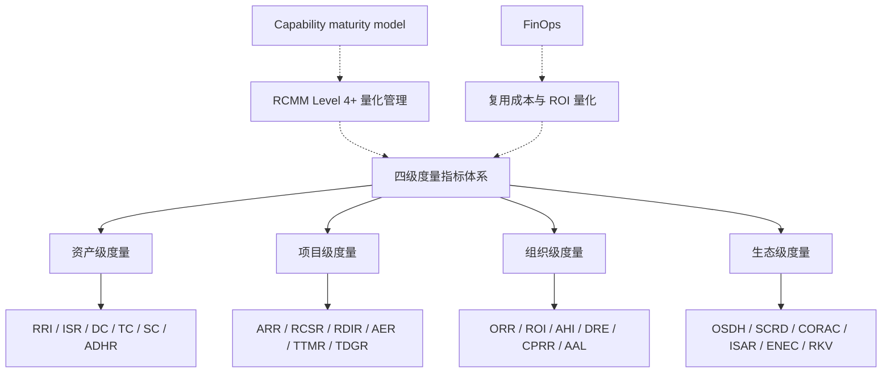

- **上位概念**：软件复用度量（ISO/IEC 26564:2022）、IT governance；
- **下位概念**：24 个具体指标（每级 6 个）；
- **等价/映射概念**：NASA RRL（资产级）、COCOMO II（项目级）、RCMM/RiSE（组织级）、OpenSSF Scorecard（生态级）；
- **依赖概念**：复用资产库、CI/CD 流水线、SCA/SBOM 工具、项目管理工具、财务系统。

### 8.4 四级度量指标的综合属性表

| 层级 | 定义 | 核心指标 | 计算粒度 | 决策频率 | 典型消费者 |
|------|------|----------|----------|----------|------------|
| **资产级** | 衡量单个可复用资产的内在质量与复用就绪度 | RRI、ISR、DC、TC、SC、ADHR | 单个组件/服务/模板 | 每次变更 | 资产所有者、平台工程师 |
| **项目级** | 衡量单个项目在复用过程中的行为与效果 | ARR、RCSR、RDIR、AER、TTMR、TDGR | 单个项目/产品 | 每 Sprint / 里程碑 | 项目经理、技术负责人 |
| **组织级** | 衡量企业层面的复用能力成熟度与投资回报 | ORR、ROI、AHI、DRE、CPRR、AAL | 企业/部门 | 每季度 | 工程总监、CTO |
| **生态级** | 衡量跨组织、开源社区及供应链层面的复用效应 | OSDH、SCRD、CORAC、ISAR、ENEC、RKV | 跨组织/开源生态 | 每半年/年度 | 生态治理委员会 |

### 8.5 正例：某科技公司度量驱动的复用改进

**背景**：某中型 SaaS 公司复用率长期停滞在 22%，管理层希望找到瓶颈。

**度量实施**：

1. **资产级**：引入 NASA RRL 评估，发现 40% 入库组件 RRI < 5.0，主要原因是文档缺失和许可证不清；
2. **项目级**：追踪 ARR 和 AER，发现高 ARR 项目往往伴随高 AER（改编成本过高）；
3. **组织级**：CPRR 仅 25%，说明大量复用停留在项目内"竖井"；
4. **生态级**：OSDH 评分 65，多个关键开源依赖维护停滞。

**改进动作**：

- 对 RRI < 5.0 资产启动"复用改造 sprint"；
- 建立跨项目架构评审，推动组件跨团队复用；
- 对关键开源依赖启动内部 fork 评估或替换计划。

**效果**（18 个月后）：

- ORR 从 22% 提升到 38%；
- CPRR 从 25% 提升到 47%；
- 复用相关生产缺陷下降 33%。

### 8.6 反例：单一指标驱动的"代码复制大赛"

**背景**：某组织将"代码复用行数"作为团队 KPI，目标是每季度增长 20%。

**问题**：

1. **指标扭曲**：团队为追求复用行数，将大量本可封装的代码复制到多个项目；
2. **质量忽视**：复制的代码缺乏文档和测试，但"复用行数"持续增长；
3. **维护噩梦**：一次基础库 bug 修复需要同步修改 30+ 处复制代码；
4. **真实复用率下降**：虽然"复用行数"上升，但 CPRR（跨项目复用率）下降。

**后果**：

- 技术债务暴增；
- 安全漏洞修复周期从 2 天延长到 3 周；
- 管理层发现 KPI 与真实业务价值背离，取消该指标。

**避免方法**：

- 使用指标组合（ARR + RDIR + CPRR + RCSI），避免单一指标；
- 区分"健康复用"（跨项目共享）与"不健康复用"（复制粘贴）；
- 引入质量门禁，禁止未经验证的代码复制。

### 8.7 反例：组织级指标与项目实践脱节

**背景**：某大型企业每季度发布精美的组织级复用报告，ORR、ROI 数据亮眼。

**问题**：

1. **数据采集滞后**：报告数据来自项目结项后的手工估算，而非实时工具；
2. **口径不一致**：不同项目对"复用"的定义不同（有的算复制代码，有的算共享组件）；
3. **无反馈闭环**：报告仅用于汇报，未驱动任何改进行动；
4. **项目级无感知**：一线开发者不知道组织级指标如何影响自己。

**后果**：

- 组织级指标与实际工程实践严重脱节；
- 数据可信度受质疑，治理委员会决策失误；
- 投资重复投向低价值领域。

**避免方法**：

- 建立自动化数据采集（CI/CD、SCA、APM、资产库 API）；
- 统一指标定义与计算口径；
- 将组织级指标拆解为项目级可行动指标；
- 每个季度根据指标输出改进行动项并跟踪。

### 8.8 度量治理仪表盘架构

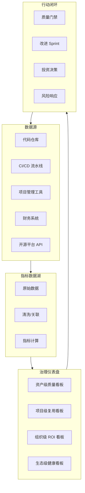

---

## 补充：四级度量指标与 ISO 25040 映射及反模式

### 9.1 四级度量指标与 ISO/IEC 25040 的映射

ISO/IEC 25040:2024《系统和软件工程 — 系统与软件质量评价过程》定义了评价过程模型：确立评价需求、规定评价、设计评价、执行评价和结束评价。本框架的四级度量指标体系可与 25040 的评价过程形成如下映射：

| 25040 评价过程 | 本框架对应层级 | 关键活动 |
|---|---|---|
| **确立评价需求** | 组织级 + 生态级 | 明确复用度量目标、利益相关方、评价范围 |
| **规定评价** | 资产级 + 项目级 | 定义指标、计算公式、数据来源、目标值 |
| **设计评价** | 项目级 + 组织级 | 设计数据采集架构、仪表盘、治理节奏 |
| **执行评价** | 资产级（实时）+ 项目级（里程碑） | 自动化采集、分析、报告 |
| **结束评价** | 组织级 + 生态级 | 评估改进效果、校准基线、更新目标 |

进一步，四级指标与 ISO/IEC 25010:2023 质量特性的映射：

| 25010 质量特性 | 对应度量指标 | 说明 |
|---|---|---|
| **功能适合性** | ARR、ADHR | 复用资产满足功能需求的程度 |
| **性能效率** | TTMR、RKV | 复用带来的时间与传播效率 |
| **兼容性** | ISR、SC | 接口稳定性与 SBOM 完整度 |
| **可复用性** | RRI、AER | NASA RRL 与改编工作量 |
| **可靠性** | RDIR、TC | 缺陷引入率与测试覆盖 |
| **安全性** | SC、OSDH、SCRD | SBOM、供应链健康与依赖深度 |
| **可维护性** | TDGR、AAL | 技术债务与资产生命周期 |
| **可移植性** | ISR、ISAR | 接口稳定性与标准采纳 |

### 9.2 正例：ISO 25040 驱动的复用资产评估

某医疗设备厂商按 ISO 25040 评价过程评估内部图像处理库：

1. **确立需求**：FDA 合规要求证明复用组件质量可控；
2. **规定评价**：选定 RRI、TC、SC、RDIR 四个指标，目标值分别为 ≥7.0、≥90%、100%、≤5%；
3. **设计评价**：集成 SonarQube、FOSSology、内部缺陷系统；
4. **执行评价**：每月自动生成评估报告；
5. **结束评价**：每季度校准目标，将评价结果纳入资产退役决策。

**效果**：审计准备时间从 3 周缩短到 2 天，组件复用率提升 22%。

### 9.3 反例：指标口径不一致导致决策混乱

某大型组织有三个事业部分别使用不同的"复用率"定义：

- **A 事业部**：复用代码行数 / 总代码行数；
- **B 事业部**：复用文件数 / 总文件数；
- **C 事业部**：复用资产数 / 总资产数。

**后果**：

- 组织级 ORR 汇总时数据无法比较；
- 高管误将 A 事业部的 60% 与 B 事业部的 30% 直接对比；
- 资源分配决策出现偏差，A 事业部获得不应有的额外预算。

**避免方法**：

- 在全组织范围内统一指标定义与计算口径；
- 建立指标元数据注册表，记录每个指标的定义、数据源、负责人；
- 使用 COCOMO II ESLOC 作为统一的规模折算基准。

### 9.4 反例： vanity metrics 误导治理

某组织将"资产库中组件数量"作为平台团队 KPI：

- **问题**：平台团队为追求数量，大量上传低质量、未验证的代码片段；
- **后果**：资产库膨胀到 5000+ 组件，但 70% 零采用，开发者搜索成本激增；
- **真实指标**：CPRR 仅 8%，ADHR 从 65% 降至 32%。

**避免方法**：

- 使用"健康资产数"（RRI ≥ 6.0 且近 90 天有被采用）替代"总资产数"；
- 将指标与业务价值（成本节约、交付周期）绑定；
- 定期清理僵尸资产。

### 9.5 度量成熟度演进矩阵

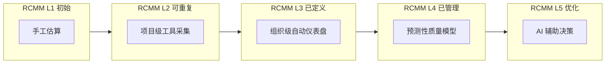

### 9.6 与相关概念的关系

- **上位概念**：[Software quality](https://en.wikipedia.org/wiki/Software_quality) 评价、IT governance；
- **下位概念**：24 个具体指标、ISO 25040 评价过程；
- **等价/映射概念**：[ISO/IEC 25010:2023](https://en.wikipedia.org/wiki/ISO/IEC_25010) 质量模型、[Capability Maturity Model](https://en.wikipedia.org/wiki/Capability_Maturity_Model)；
- **依赖概念**：CI/CD 工具链、SCA/SBOM、APM、财务系统、项目管理工具。

> **权威来源（补充）**:
>
> - [ISO/IEC 25010:2023 — Wikipedia](https://en.wikipedia.org/wiki/ISO/IEC_25010)
> - [Software quality — Wikipedia](https://en.wikipedia.org/wiki/Software_quality)
> - [Metric — Wikipedia](https://en.wikipedia.org/wiki/Metric_(mathematics))
> - [Capability Maturity Model — Wikipedia](https://en.wikipedia.org/wiki/Capability_Maturity_Model)
>
### 9.7 ISO/IEC 25040 评价过程核心属性

| 属性 | 说明 | 重要性 | 可观察性 |
|------|------|--------|----------|
| **需求导向** | 评价目标、范围、利益相关方需求明确 | 高 | 评价需求文档化 |
| **指标可度量** | 每个指标有计算公式、数据来源与目标值 | 高 | 自动化采集率 |
| **过程可追溯** | 从评价需求到结论的全过程可追溯 | 高 | 审计日志完整 |
| **基线可校准** | 定期更新基线以反映业务与技术变化 | 中 | 年度基线评审 |
| **结果可行动** | 评价结果能驱动具体改进行动 | 高 | 改进行项闭环率 |
| **独立性与客观性** | 评价活动由独立团队或工具执行 | 中 | 评价角色分离 |

### 9.8 ISO 25040 与四级度量指标映射关系图

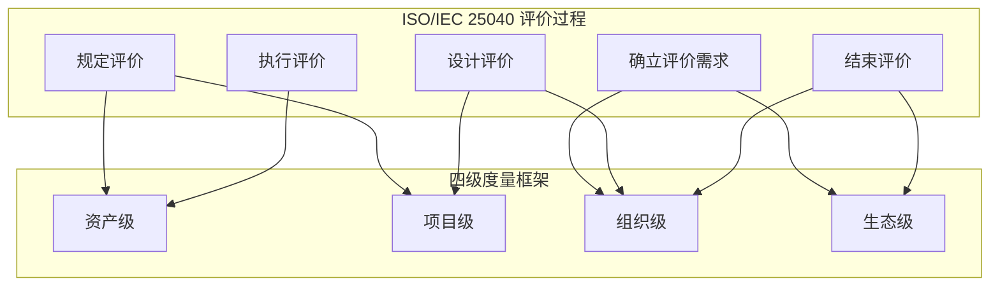

### 9.9 反例：基线漂移导致度量指标失真

某组织在 2023 年建立复用率基线后，三年内未更新：

- **问题**：
  1. 技术栈从单体迁移到微服务，代码行数统计口径发生变化；
  2. 新增 AI 生成代码未纳入 ESLOC 折算；
  3. 项目估算模型仍使用 2023 年人天单价，导致 ROI 计算虚高；
  4. 不同事业部沿用旧基线，数据不可比。
- **后果**：
  - 组织级 ORR 从 38% 被报告为 52%，误导投资决策；
  - 高复用率项目实际交付成本反而高于低复用率项目；
  - 外部审计发现基线未校准，治理委员会信誉受损。
- **避免方法**：
  - 每年审查并更新 ESLOC 折算系数、人工费率与技术栈权重；
  - 建立基线版本控制与变更记录；
  - 在度量仪表盘上展示基线版本与置信区间。

### 9.10 补充权威来源

> **权威来源（补充）**:
>
> - [ISO/IEC 25010:2023 — Wikipedia](https://en.wikipedia.org/wiki/ISO/IEC_25010)
> - [Software quality — Wikipedia](https://en.wikipedia.org/wiki/Software_quality)
> - [ISO/IEC 25040:2024](https://www.iso.org/standard/iso-iec-25040.html)
>
> **核查日期**: 2026-07-07

## 9. 参考索引与权威来源

- ISO/IEC 26564:2022: *Software Reuse — Measurement and Metrics* (2022)
- NASA Earth Science Data Systems: *Reuse Readiness Levels (RRL) as a Measure of Software Reusability* (2011)
- Boehm, B. et al.: *Software Cost Estimation with COCOMO II* (Prentice Hall, 2000)
- Jasmine & Vasantla: *Reuse Capability Maturity Model (RCMM)*
- Garcia (2010): *RiSE Reference Model (RiSE-RM)*
- Frakes, W. & Terry, C.: *Software Reuse: Metrics and Models* (ACM Computing Surveys, 1996)
- Lim, W.C.: *Managing Software Reuse* (Prentice Hall, 1998)
- FinOps Foundation: *FinOps Framework 2026 Capabilities* — 成本度量对齐
- OpenSSF: *Scorecard Specification v4* — 开源依赖健康度
- SLSA 1.2: *Supply-chain Levels for Software Artifacts* — SBOM 与 provenance 对齐

> **交叉引用**:
>
> - 成熟度评估问卷: [`struct/06-cross-layer-governance/03-maturity-models/assessment-questionnaire.md`](../struct/06-cross-layer-governance/03-maturity-models/assessment-questionnaire.md)
> - COCOMO II 2026 校准: [`struct/09-value-quantification/01-cocomo-ii-reuse/cocomo-2026-calibration.md`](../struct/09-value-quantification/01-cocomo-ii-reuse/cocomo-2026-calibration.md)
> - FinOps 单位经济学: [`struct/06-cross-layer-governance/04-finops-cost/finops-unit-economics-2026.md`](../struct/06-cross-layer-governance/04-finops-cost/finops-unit-economics-2026.md)
> - 标准对齐矩阵: [`struct/01-meta-model-standards/01-iso-420xx-family/alignment-matrix.md`](../struct/01-meta-model-standards/01-iso-420xx-family/alignment-matrix.md)

> 最后更新: 2026-06-06


---

## 补充说明：软件复用度量指标体系框架

## 概念定义

**定义**：复用度量指标是从资产级、项目级、组织级与生态级四个层次，量化复用范围、复用质量、复用成本与复用价值的指标体系。

## 示例

**示例**：组织跟踪“资产复用次数”“消费方 NPS”“复用节省人天”与“复用缺陷密度”，并纳入平台团队 OKR。

## 反例

**反例**：仅以“代码复用行数”作为 KPI，导致团队为追求指标复制大量低价值代码，反而增加维护负担。

## 权威来源

> **权威来源**:
>
> - [ISO/IEC 25040:2024](https://www.iso.org)
> - [FinOps Foundation](https://www.finops.org)
> - 核查日期：2026-07-07

## 分析

**分析**：度量指标需要与业务目标对齐，避免局部优化与指标扭曲。

---


<!-- SOURCE: struct/06-cross-layer-governance/06-up-downgrade-matrix/upgrade-downgrade-matrix.md -->

# 跨层复用升级/降级决策矩阵

> **版本**: 2026-06-06
> **定位**: 定义功能、组件、应用服务、业务服务四层之间的升级和降级触发条件与治理动作

---

## 升级矩阵

| 触发条件 | 升级方向 | 治理动作 | 风险等级 | 关键指标 |
|----------|----------|----------|----------|----------|
| 功能被 3+ 应用调用 | 功能 → 应用服务 | 提取 API，定义契约，部署独立服务 | 中 | 调用方数量 ≥ 3 |
| 组件被 3+ 系统使用 | 组件 → 共享组件 | 组件仓库化，版本管理，兼容性矩阵 | 中 | 使用系统数 ≥ 3 |
| 业务服务跨部门使用 | 应用服务 → 业务服务 | 企业服务总线/API 治理，SLA 定义 | 高 | 跨部门调用 ≥ 1 |
| 算法被 5+ 项目复用 | 算法 → 标准库/公共包 | 提取为独立库，文档化，性能基准 | 低 | 项目引用数 ≥ 5 |
| Prompt 模板被 3+ Agent 使用 | Prompt → 共享 MCP Prompt | MCP Server 化，版本管理 | 中 | 使用 Agent 数 ≥ 3 |
| RAG 管道被 2+ 业务场景使用 | RAG → 平台服务 | 向量数据库统一，知识图谱接入 | 高 | 业务场景数 ≥ 2 |

---

## 降级矩阵

| 触发条件 | 降级方向 | 治理动作 | 风险等级 | 关键指标 |
|----------|----------|----------|----------|----------|
| 复用导致耦合度过高 | 业务服务 → 应用服务 | 服务拆分，领域驱动，防腐层 | 高 | 调用方变更影响范围 > 30% |
| 技术栈差异过大 | 组件 → 功能封装 | 适配器模式，防腐层，多语言绑定 | 中 | 目标技术栈兼容性 < 50% |
| AI 功能确定性不足 | AI 功能 → 规则引擎 | 混合推理，人在回路，概率契约降级 | 高 | 置信度 γ < 0.8 |
| 变性绑定冲突 | 运行期 → 配置期 | 重构变性模型，简化配置空间 | 中 | 配置冲突数 ≥ 5 |
| 安全等级不匹配 | 共享组件 → 隔离组件 | 安全加固，独立部署，访问控制 | 极高 | 目标安全等级 > 组件认证等级 |
| 性能要求无法通过共享满足 | 应用服务 → 本地功能 | 内嵌实现，缓存优化，异步化 | 中 | 延迟要求 < 共享服务 P99 |
| 业务语义漂移 | 业务服务 → 应用服务 | 领域重新划分，业务能力重新定义 | 高 | 语义覆盖率 < 80% |

---

## 升级/降级决策流程

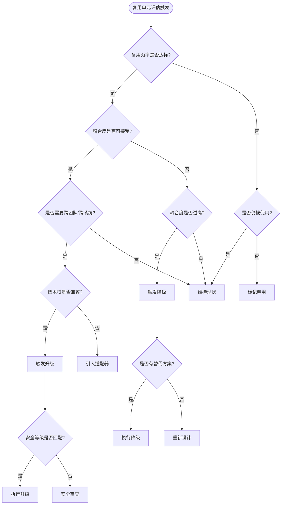

---

## 案例：从算法到平台服务的升级路径

### 背景

某电商平台的"推荐算法"最初作为项目内的工具函数存在。

### 升级历程

| 阶段 | 时间 | 状态 | 触发条件 | 治理动作 |
|------|------|------|---------|---------|
| **L1 算法** | 2024-Q1 | 项目内函数 | 单一项目使用 | 无 |
| **L2 函数** | 2024-Q3 | 共享库 | 3个项目复用 | 提取为 `recommendation-utils` 包 |
| **L3 服务** | 2025-Q1 | 内部服务 | 5个系统调用 | 部署为 gRPC 服务，定义 SLA |
| **L4 平台** | 2025-Q4 | 平台能力 | 跨部门使用 + AI 增强 | 纳入 IDP，提供 MCP Tool 接口 |
| **L5 业务服务** | 2026-Q2 | 企业资产 | 子公司接入 | 企业服务总线注册，计费模型 |

### 关键决策点

- **2024-Q3 升级**: AAF = 0.3（提取成本低），ROI 为正
- **2025-Q1 升级**: 性能要求（P99 < 50ms）推动服务化，独立扩缩容
- **2025-Q4 升级**: AI 团队需要接入 LLM 增强推荐，MCP Tool 化降低集成成本
- **2026-Q2 升级**: 合规要求（数据主权）推动平台化治理

---

## 案例：从共享组件到隔离组件的降级

### 背景

某金融平台的"支付网关组件"最初作为共享库供多个系统使用。

### 降级触发

- **安全事件**: 2025 年渗透测试发现共享组件存在高危漏洞
- **合规要求**: PCI DSS 4.0 要求支付处理环境与其他系统物理/逻辑隔离
- **影响范围**: 共享组件的漏洞修复需要协调 12 个系统的升级窗口

### 降级决策

| 维度 | 升级前 | 降级后 |
|------|--------|--------|
| 部署模式 | 共享库（同进程） | 独立微服务（容器隔离） |
| 通信方式 | 函数调用 | gRPC + mTLS |
| 版本策略 | 单版本强制升级 | 多版本共存，灰度发布 |
| 安全边界 | 进程内 | 网络隔离 + 零信任 |
| 运维成本 | 低（单制品） | 高（独立生命周期） |
| 合规等级 | 不满足 PCI DSS | 满足 PCI DSS + 安全审计 |

### 决策依据

- 虽然运维成本增加，但**合规风险成本**（潜在罚款 + 声誉损失）远高于降级成本
- 降级后，各系统可独立演进，减少了协调摩擦

---

## 升级/降级的经济分析

```text
升级决策公式:
  Upgrade_Benefit = (N_future - N_current) × (C_rebuild - C_reuse_future) - C_upgrade

  若 Upgrade_Benefit > 0 且 Risk(Upgrade) < Risk_Threshold → 执行升级

降级决策公式:
  Downgrade_Benefit = Risk_Reduction + Flexibility_Gain - C_downgrade - C_future_replicate

  若 Downgrade_Benefit > 0 → 执行降级
```

### 关键经济假设

| 假设 | 值 | 来源 |
|------|-----|------|
| 平均功能重建成本 | 8-40 人时 | COCOMO II 基准 |
| 共享化带来的单次节省 | 30-70% | NASA RRL 实证 |
| 升级工程成本 | 40-200 人时 | 项目经验数据 |
| 降级工程成本 | 20-100 人时 | 项目经验数据 |
| 安全事件期望成本 | $4.45M (2024 均值) | IBM Cost of Data Breach |

---

> **对齐验证**:
>
> - 升级矩阵对照 ISO/IEC 26565:2026 产品线成熟度框架转换指南验证
> - 降级矩阵对照 Netflix/CNCF 服务拆分最佳实践验证
> - 经济分析对照 COCOMO II (USC) 和 NASA RRL 成本模型验证
>

---

## 升级/降级治理流程（5 阶段）

```
跨层复用决策流程
│
├── 1. 识别触发条件
│   ├── 调用方数量增长？→ 考虑升级
│   ├── 耦合度/变更影响恶化？→ 考虑降级
│   ├── 安全/合规要求变化？→ 考虑降级/隔离
│   └── 技术栈/语义不兼容？→ 考虑降级/适配
│
├── 2. 评估升级/降级收益
│   ├── 直接收益: 开发成本节约
│   ├── 间接收益: 维护成本降低、缺陷率降低
│   ├── 战略收益: 上市时间、生态价值
│   └── 风险成本: 迁移风险、兼容性风险、安全风
│
├── 3. 选择目标层级
│   ├── 升级: 确保目标层级的治理能力已就绪
│   └── 降级: 确保降级不会引入新的重复造轮子
│
├── 4. 执行治理动作
│   ├── 定义/更新接口契约
│   ├── 迁移/重构实现
│   ├── 更新文档和培训材料
│   └── 通知所有利益相关者
│
└── 5. 监控与反馈
    ├── 跟踪关键指标变化
    ├── 收集使用者反馈
    └── 必要时二次调整
```

---

## 层级边界判定规则

| 层级 | 粒度 | 典型边界判定 |
|------|------|-------------|
| **功能** | 函数/算法/规则 | 单一职责，无跨业务语义 |
| **组件** | 库/包/模块 | 可被多个应用链接/导入 |
| **应用服务** | API/微服务 | 跨应用调用，需要独立部署 |
| **业务服务** | 业务能力接口 | 跨部门/跨组织复用，需要 SLA 治理 |

> **判定原则**: 当资产的复用范围跨越当前层级的典型边界时，触发升级评估；当资产的维护成本或风险超过当前层级治理能力时，触发降级评估。

---

## 7. 复用资产升降级决策框架的深层定义

### 7.1 概念定义

**定义**：复用资产升降级决策矩阵（Reuse Asset Upgrade/Downgrade Matrix）是一套基于触发条件、风险等级、经济指标与治理能力，判断可复用资产应在四层架构（功能 → 组件 → 应用服务 → 业务服务）中向上升级或向下降级的结构化决策框架。它与 Wikipedia 中 [Capability maturity model](https://en.wikipedia.org/wiki/Capability_Maturity_Model) 所强调的过程成熟度提升逻辑一致：升级意味着资产治理成熟度提升，降级则是在成熟度不匹配时回归可控层级。

### 7.2 升降级核心属性

| 属性 | 说明 | 重要性 | 可观察性 |
|------|------|--------|----------|
| **触发条件（Trigger）** | 引发升级或降级评估的量化或质性事件 | 高 | 调用方数量、耦合度、合规要求 |
| **目标层级（Target Layer）** | 升级或降级后的期望治理层级 | 高 | 功能/组件/应用服务/业务服务 |
| **治理动作（Governance Action）** | 为完成层级迁移必须执行的过程与工件 | 高 | API 契约、版本策略、SLA、安全边界 |
| **风险等级（Risk Level）** | 迁移过程对现有系统的影响程度 | 高 | 低/中/高/极高 |
| **经济指标（Economic Metric）** | 支持决策的成本/收益量化依据 | 中 | Upgrade_Benefit、Downgrade_Benefit |
| **兼容性约束（Compatibility Constraint）** | 技术栈、安全等级、语义范围的可接受差异 | 中 | 兼容性百分比、认证等级 |

### 7.3 与相关概念的关系

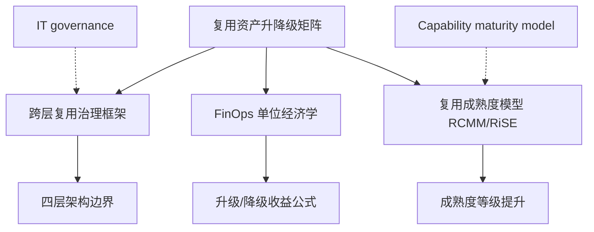

- **上位概念**：跨层复用治理框架、IT governance；
- **下位概念**：升级矩阵、降级矩阵、触发条件、兼容性评估；
- **等价/映射概念**：ISO/IEC 26565:2026 产品线成熟度框架转换指南、Netflix 服务拆分决策框架；
- **依赖概念**：复用率、耦合度、SLA、安全等级、FinOps 单位成本。

### 7.4 正例：支付中台从应用服务升级为业务服务

**背景**：某金融科技公司的"支付中台"最初以应用服务形式服务于 3 个内部产品线。

**触发条件**：

- 调用方数量：从 3 个增长到 11 个内部及外部子公司系统；
- 合规要求：PCI DSS 4.0 要求支付能力作为企业级服务统一治理；
- 业务语义：支付能力已成为公司对外输出的核心业务能力。

**升级动作**：

1. 将支付中台注册为企业服务总线（ESB）上的业务服务；
2. 定义跨组织的 SLA（可用性 99.99%，RTO < 5 分钟）；
3. 建立计费模型：按交易笔数向子公司 chargeback；
4. 引入独立安全域、零信任网络与审计日志。

**效果**：

- 外部子公司接入周期从 3 个月缩短到 2 周；
- 支付相关合规审计一次性通过；
- 支付中台从成本中心转变为收入中心。

### 7.5 反例：过早升级导致组织级耦合灾难

**背景**：某制造企业将仅在 2 个项目中使用的"设备状态监控"组件强制升级为业务服务。

**问题**：

1. **语义不稳定**：不同工厂对"设备状态"的定义差异巨大（温度、振动、能耗、OEE）；
2. **治理过载**：业务服务要求统一的 SLA 和变更窗口，但 2 个消费方的需求节奏完全不同；
3. **变更冻结**：一次小的字段调整需要协调所有消费方，导致版本发布周期从 2 周延长到 2 个月。

**后果**：

- 消费方开始绕过业务服务，自建本地实现；
- 升级后的业务服务沦为"幽灵服务"，维护成本持续存在但采用率下降；
- 1 年后被迫降级回应用服务层，并拆分为多个领域专用服务。

**避免方法**：

- 严格遵循"3+ 消费方"或"跨部门/跨组织"触发条件；
- 升级前进行业务语义一致性评估（语义覆盖率 ≥ 80%）；
- 采用渐进式升级：先在应用服务层稳定运行 2–3 个季度，再评估业务服务化。

### 7.6 反例：忽视降级导致安全合规事件

**背景**：某电商平台将用户身份认证组件作为共享库被 40+ 微服务引用。

**触发条件**：

- 安全团队发现共享库存在高危漏洞（CVSS 9.8）；
- 修复需要协调 40+ 微服务同时升级，窗口难以排期；
- 合规审计要求认证逻辑必须隔离部署。

**应做未做**：

- 架构委员会认为"共享库提升效率"，拒绝降级为独立服务；
- 未建立多版本共存机制；
- 未准备应急响应降级方案。

**后果**：

- 漏洞暴露窗口长达 6 周；
- 某外部攻击者利用该漏洞实施账户接管，造成品牌与合规双重损失；
- 事后紧急降级为独立认证服务，但已付出 10 倍于预防性降级的成本。

**避免方法**：

- 当安全等级要求超过共享组件认证等级时，立即触发降级；
- 对关键安全组件预设"隔离降级"应急预案；
- 建立安全事件驱动的快速降级通道（绿色通道审批）。

### 7.7 选型决策矩阵：升级还是维持/降级？

| 评估维度 | 升级倾向 | 降级/维持倾向 |
|----------|----------|---------------|
| 消费方数量 | ≥ 3 个内部团队或 ≥ 1 个外部组织 | < 3 个团队，且无增长趋势 |
| 业务语义一致性 | ≥ 80% 场景语义一致 | 语义漂移严重，差异 > 30% |
| 技术栈兼容性 | ≥ 80% 消费方技术栈兼容 | 兼容性 < 50%，适配成本过高 |
| 安全/合规要求 | 需要统一认证、审计、隔离 | 消费方安全等级差异大 |
| 经济指标 | Upgrade_Benefit > 0 且 ROI ≥ 150% | Downgrade_Benefit > 0 或风险不可控 |
| 治理能力 | 目标层级治理角色、SLA、预算已就绪 | 目标层级治理能力缺失 |

### 7.8 升级/降级治理流程泳道图

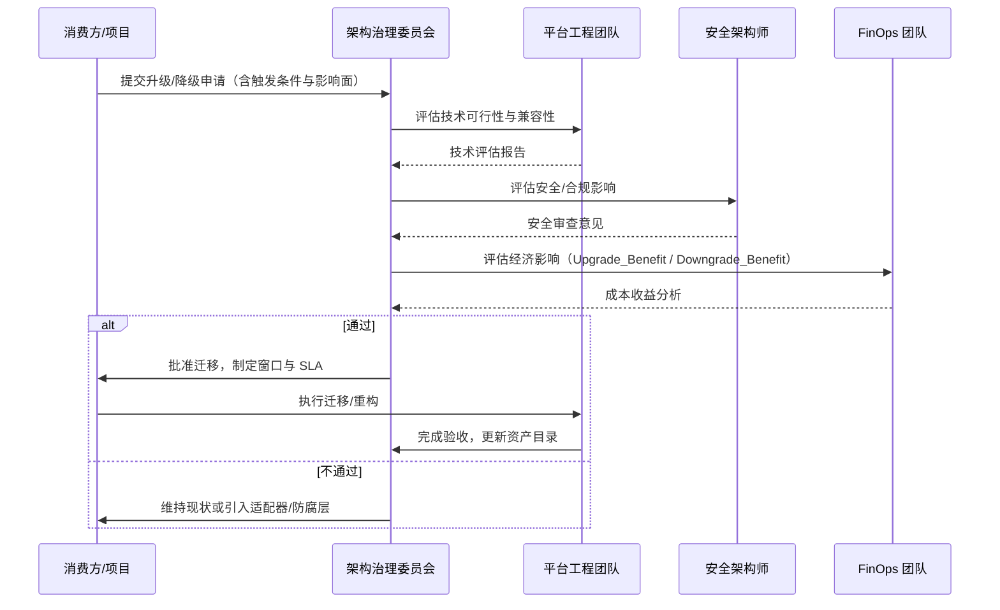

---

> 最后更新: 2026-06-06


---

## 权威来源与交叉引用

> **权威来源**:
>
> | 来源 | URL | 核查日期 |
> |------|-----|----------|
> | Wikipedia — Capability Maturity Model | <https://en.wikipedia.org/wiki/Capability_Maturity_Model> | 2026-07-07 |
> | Wikipedia — IT governance | <https://en.wikipedia.org/wiki/IT_governance> | 2026-07-07 |
> | ISO/IEC 26566:2026 — Software and systems engineering — Methods and tools for product line texture | <https://www.iso.org/standard/81437.html> | 2026-07-08 |
> | ISO/IEC 26565:2026 — Software and systems engineering — Methods and tools for product line maturity framework | <https://www.iso.org/standard/81436.html> | 2026-07-08 |
> | CNCF — Service Mesh Interface (SMI) and Microservices Governance | <https://www.cncf.io/projects/> | 2026-07-07 |
> | Netflix Tech Blog — Mastering Chaos: A Netflix Guide to Microservices | <https://netflixtechblog.com/tagged/microservices> | 2026-07-07 |

> **交叉引用**:
>
> - 跨层复用治理框架：[`struct/06-cross-layer-governance/01-process-governance/cross-layer-governance.md`](../struct/06-cross-layer-governance/01-process-governance/cross-layer-governance.md)
> - FinOps 单位经济学：[`struct/06-cross-layer-governance/04-finops-cost/finops-unit-economics-2026.md`](../struct/06-cross-layer-governance/04-finops-cost/finops-unit-economics-2026.md)
> - 复用度量指标体系：[`struct/06-cross-layer-governance/05-metrics-kpi/metrics-framework.md`](../struct/06-cross-layer-governance/05-metrics-kpi/metrics-framework.md)
> - 复用成熟度模型：[`struct/06-cross-layer-governance/03-maturity-models/reuse-maturity-models-rcmm-rise.md`](../struct/06-cross-layer-governance/03-maturity-models/reuse-maturity-models-rcmm-rise.md)

---


<!-- SOURCE: struct/06-cross-layer-governance/07-policy-automation/README.md -->

# 07 策略自动化（Policy Automation）

> **版本**: 2026-06-12
> **定位**: 06-cross-layer-governance / 07-policy-automation
> **对齐标准**: OPA (Open Policy Agent), Sentinel, Cedar, NIST SP 800-53, ISO/IEC 42001:2023

---

## 核心概念

策略自动化将跨层治理规则（安全、合规、成本、质量、复用准入）编码为**可执行、可审计、可版本控制**的策略。它使治理从“人工检查”转变为“自动门禁”，从而在大规模复用场景中保持一致性。

| 策略类型 | 关注点 | 典型规则示例 |
|:---|:---|:---|
| **安全策略** | 组件/服务准入、漏洞阈值 | 禁止引入 CVSS ≥ 7.0 的依赖 |
| **合规策略** | 许可证、数据主权、行业法规 | 禁止 GPL-3.0 依赖进入闭源产品 |
| **成本策略** | FinOps、资源利用率 | 未使用超过 30 天的资源自动降级 |
| **质量策略** | 测试覆盖率、架构规则 | 核心服务单元测试覆盖率 ≥ 80% |
| **复用策略** | 资产准入、版本策略 | 只有 SLSA L3+ 的构建产物可进入资产目录 |

---

## 技术栈对照

| 工具/框架 | 适用场景 | 与复用治理的结合 |
|:---|:---|:---|
| **Open Policy Agent (OPA)** | 云原生、Kubernetes、API 网关策略 | 准入控制：镜像/依赖是否允许复用 |
| **HashiCorp Sentinel** | Terraform Enterprise/Cloud | 基础设施即代码复用的合规门禁 |
| **Cedar** | AWS 风格授权 | 细粒度 RBAC：谁可以消费/发布资产 |
| **OPAL** | 实时策略更新 | 动态更新复用黑名单/白名单 |
| **Sigstore Policy Controller** | 容器镜像签名验证 | 仅允许签名镜像被复用 |

---

## 策略自动化流水线

```text
资产提交
    │
    ▼
[策略评估] ──► OPA/Sentinel/Cedar 执行规则集
    │
    ├── 通过 ──► 进入资产目录 / 允许消费
    │
    └── 失败 ──► 阻断并返回具体违规项
```

---

## 检查清单

- [ ] 是否将治理规则编码为版本化策略？
- [ ] 策略评估是否集成到 CI/CD 和资产目录？
- [ ] 策略违规是否有清晰的可解释反馈？
- [ ] 是否区分强制策略（blocking）和建议策略（warning）？
- [ ] 策略变更是否经过审批和审计？

---

## 关联主题

- `06-cross-layer-governance/01-process-governance/` — 复用过程治理框架
- `10-supply-chain-security/` — 供应链安全策略
- `12-ai-native-reuse/06-ai-governance/` — AI 治理策略


---

## 补充说明：07 策略自动化（Policy Automation）

## 示例

**示例**：组织使用 OPA Gatekeeper 强制所有部署到生产的服务必须使用经批准的 Golden Path 模板与 SBOM，否则拒绝部署。

## 反例

**反例**：策略仅存在于文档中，依赖人工检查，导致违规部署频繁发生且难以追溯。

## 权威来源

> **权威来源**:
>
> - [Open Policy Agent](https://www.openpolicyagent.org)
> - [CNCF](https://www.cncf.io)
> - 核查日期：2026-07-07

## 分析

**分析**：策略自动化将治理从“事后审计”转变为“事前预防”，大幅提升治理可扩展性。

---


<!-- SOURCE: struct/06-cross-layer-governance/08-reserved/README.md -->

# 08 — 预留编号

> **状态**: 预留（Reserved）
> **说明**: 本编号为 `06-cross-layer-governance` 目录预留，当前从 `07-policy-automation` 直接跳到 `09-agentic-governance`。保留编号 08 以便未来引入新的治理子主题（如知识资产管理、跨组织协同治理等）时无需重新编号。

---

## 预留原因

`06-cross-layer-governance` 在实际演进过程中新增了 `09-agentic-governance`（Agentic 治理），导致编号 08 空缺。为避免大规模重命名影响交叉引用与外部链接，本目录作为占位保留。

## 未来可能用途

- 知识资产管理（Knowledge Asset Management）
- 跨组织/生态级复用治理
- 复用资产合规与审计
- AI 生成代码治理

## 概念定义

**定义**：预留编号（Reserved Number）是在分层知识体系中为保持目录编号的连续性与未来扩展性而故意保留未分配内容的序号，通常附带状态说明与潜在用途列表。

## 示例

**示例**：某技术文档体系在 03-API 网关 与 05-服务网格 之间预留编号 04，用于未来可能加入的“边缘网关”子主题，从而避免后续整体重编号。

## 反例

**反例**：某项目频繁删除空缺编号并压缩目录，导致外部链接失效、历史版本引用混乱，最终不得不维护一份复杂的编号映射表。

## 权威来源

> **权威来源**:
>
> - 本项目目录编号约定
>
> **核查日期**: 2026-07-07

## 交叉引用

- [跨层复用治理总览](../struct/06-cross-layer-governance/README.md)
- [Agentic 治理](../struct/06-cross-layer-governance/09-agentic-governance/agentic-ai-governance-framework.md)
- [策略自动化治理](../struct/06-cross-layer-governance/07-policy-automation/README.md)

---

> 最后更新: 2026-07-07

---


<!-- SOURCE: struct/06-cross-layer-governance/09-agentic-governance/agentic-ai-governance-framework.md -->

# Agentic AI 治理框架与架构复用映射

> **版本**: 2026-06-10
> **定位**: 跨层治理层 —— 自主智能体（Agent）的治理框架对可复用行为模块的信任基础
> **对齐标准**: 新加坡 IMDA Agentic AI Governance (2026-01), NIST AI Agent Standards Initiative (2026-02), Berkeley CLTC Risk Profile (2026-04), EU AI Act, TRACE Framework
> **状态**: ✅ 已完成

---

## 目录

- [Agentic AI 治理框架与架构复用映射](#agentic-ai-治理框架与架构复用映射)
  - [目录](#目录)
  - [1. Agentic AI Governance 概述](#1-agentic-ai-governance-概述)
    - [1.1 全球监管框架加速收敛（2026）](#11-全球监管框架加速收敛2026)
    - [1.2 为什么 Agentic Governance 对复用至关重要](#12-为什么-agentic-governance-对复用至关重要)
  - [2. 核心治理概念](#2-核心治理概念)
    - [2.1 Agent Identity Cards（智能体身份卡）](#21-agent-identity-cards智能体身份卡)
    - [2.2 五级自主程度模型（L0-L4）](#22-五级自主程度模型l0-l4)
    - [2.3 运营者-部署者-用户责任框架](#23-运营者-部署者-用户责任框架)
    - [2.4 TRACE Framework（信任与可问责架构）](#24-trace-framework信任与可问责架构)
  - [3. Agentic AI 对架构复用治理的影响](#3-agentic-ai-对架构复用治理的影响)
    - [3.1 从"静态组件复用"到"动态行为复用"](#31-从静态组件复用到动态行为复用)
    - [3.2 Agent 行为合约（Agent Behavioral Contracts）](#32-agent-行为合约agent-behavioral-contracts)
    - [3.3 跨组织 Agent 复用的信任基础](#33-跨组织-agent-复用的信任基础)
    - [3.4 NIST AI RMF 与 Microsoft Agent Governance Toolkit 条款映射](#34-nist-ai-rmf-与-microsoft-agent-governance-toolkit-条款映射)
  - [4. 六阶段复用决策模型的 Agentic 扩展](#4-六阶段复用决策模型的-agentic-扩展)
    - [4.1 新增"自治合规判定"阶段](#41-新增自治合规判定阶段)
    - [4.2 判定规则](#42-判定规则)
  - [5. 案例：多 Agent 系统复用治理实践](#5-案例多-agent-系统复用治理实践)
    - [5.1 案例背景](#51-案例背景)
    - [5.2 复用治理评估](#52-复用治理评估)
    - [5.3 运行时治理架构](#53-运行时治理架构)
    - [反模式：未验证身份卡即复用开源 Agent](#反模式未验证身份卡即复用开源-agent)
  - [6. 权威来源](#6-权威来源)
  - [7. 论证与分析：为何 Agentic 治理是复用信任基础](#7-论证与分析为何-agentic-治理是复用信任基础)

---

## 1. Agentic AI Governance 概述

### 1.1 全球监管框架加速收敛（2026）

2026 年是 Agentic AI 治理框架的**元年**，多个权威组织发布了针对性指导：

| 组织 | 框架/倡议 | 发布时间 | 核心内容 |
|:---|:---|:---|:---|
| **新加坡 IMDA** | 全球首个 Agentic AI 治理框架 | 2026-01 | Agent Identity Cards、五级自主模型、运营者责任框架 |
| **NIST** | AI Agent Standards Initiative | 2026-02 | Agent 安全与身份列为核心支柱 |
| **Berkeley CLTC** | Agentic AI Risk-Management Standards Profile | 2026-04 | 风险分类、治理控制、技术标准映射 |
| **EU** | AI Act 高风险义务 | 延期至 2027-12 | 高风险 AI 系统的合规要求 |
| **学术界** | TRACE Framework | 2026 | 信任与可问责架构 |
| **学术界** | MAGIQ | 2026 | 后量子多 Agent 治理 |
| **学术界** | AIP (Attestation of Identity and Provenance) | 2026 | 跨 MCP/A2A 的可验证委托协议 |

### 1.2 为什么 Agentic Governance 对复用至关重要

传统软件组件是**确定性的**——给定输入产生可预测的输出。Agent 是**自主的**——具有目标导向行为、环境感知和自主决策能力。

这意味着：

- 复用 Agent 行为模块时，不能仅验证接口兼容性
- 必须验证 Agent 在目标环境中的**行为边界**
- 必须建立**运行时治理机制**，确保复用的 Agent 不会偏离预期行为

---

## 2. 核心治理概念

### 2.1 Agent Identity Cards（智能体身份卡）

新加坡 IMDA 框架提出的核心机制，类似于数字世界的"身份证"：

```json
{
  "agent_identity_card": {
    "version": "1.0",
    "agent_id": "did:web:example.com:agent:analytics-v3",
    "name": "数据分析 Agent",
    "operator": "Example Corp",
    "autonomy_level": "L2",
    "capabilities": ["data_analysis", "report_generation"],
    "limitations": ["no_internet_access", "no_code_execution"],
    "training_data_provenance": "sha256:abc123...",
    "model_version": "llama-3.1-8b-instruct",
    "behavioral_contracts": [
      {
        "contract_id": "bc-001",
        "scope": "data_access",
        "constraint": "只能访问已授权数据集",
        "enforcement": "runtime_policy_engine"
      }
    ],
    "audit_trail_endpoint": "https://audit.example.com/agents/analytics-v3",
    "certification": ["IMDA-L2-2026-001", "ISO-42001-2025"]
  }
}
```

**复用意义**: 复用 Agent 前，必须验证其 Identity Card 的完整性和认证状态。

### 2.2 五级自主程度模型（L0-L4）

| 等级 | 名称 | 描述 | 复用治理要求 |
|:---|:---|:---|:---|
| **L0** | 工具 (Tool) | 无自主性，仅响应调用 | 标准组件复用治理 |
| **L1** | 辅助 (Assistive) | 在人类监督下执行预定义任务 | 行为日志 + 人工审批 |
| **L2** | 半自主 (Semi-Autonomous) | 在限定范围内自主决策 | 运行时策略执行 + 异常告警 |
| **L3** | 条件自主 (Conditionally Autonomous) | 在复杂环境中自主决策，关键决策需确认 | 持续监控 + 人在回路 + 回滚机制 |
| **L4** | 完全自主 (Fully Autonomous) | 无需人类干预的全自主运行 | **当前不建议复用**（技术和治理不成熟） |

### 2.3 运营者-部署者-用户责任框架

新加坡 IMDA 框架明确了三层责任：

| 角色 | 责任 | 复用场景对应 |
|:---|:---|:---|
| **运营者 (Operator)** | Agent 的开发和维护方 | 开源 Agent 框架的维护者 |
| **部署者 (Deployer)** | 将 Agent 部署到具体环境的组织 | 复用 Agent 并在内部部署的团队 |
| **用户 (User)** | 与 Agent 交互的终端用户 | 使用复用 Agent 的业务人员 |

**复用决策启示**: 部署者（即复用方）不能将全部责任转移给运营者，必须建立自身的治理和监控能力。

### 2.4 TRACE Framework（信任与可问责架构）

学术界提出的 Agentic 治理框架，强调五个核心维度：

| 维度 | 含义 | 复用验证点 |
|:---|:---|:---|
| **Transparency** (透明性) | Agent 决策过程可解释 | 复用的 Agent 是否提供决策依据 |
| **Responsibility** (责任性) | 明确责任归属 | 复用协议中是否明确责任划分 |
| **Accountability** (可问责性) | 行为可追溯 | 复用的 Agent 是否记录完整审计日志 |
| **Controllability** (可控性) | 人类可随时干预 | 复用的 Agent 是否支持人工接管 |
| **Ethicality** (伦理性) | 符合伦理准则 | 复用的 Agent 是否经过偏见和伦理审查 |

---

## 3. Agentic AI 对架构复用治理的影响

### 3.1 从"静态组件复用"到"动态行为复用"

| 维度 | 传统组件复用 | Agent 行为复用 |
|:---|:---|:---|
| 复用单元 | 代码/库/服务 | 行为策略 + 能力定义 + 约束集合 |
| 验证重点 | 接口兼容性 + 功能正确性 | 行为边界 + 安全约束 + 伦理合规 |
| 运行时特性 | 确定性 | 概率性 + 环境适应性 |
| 治理机制 | 版本控制 + 漏洞扫描 | 运行时策略 + 持续监控 + 审计追踪 |
| 退出策略 | 版本回滚 | 行为冻结 + 能力降级 + 人工接管 |

### 3.2 Agent 行为合约（Agent Behavioral Contracts）

将 Design-by-Contract 理念扩展到 Agent 运行时：

```
Agent Behavioral Contract (ABC)
├── Preconditions（前置条件）
│   ├── 环境条件：允许的操作范围
│   ├── 输入约束：可接受的输入类型和范围
│   └── 权限约束：可用的工具和数据访问权限
├── Invariants（不变量）
│   ├── 安全不变量：不得泄露敏感信息
│   ├── 伦理不变量：不得生成有害内容
│   └── 性能不变量：响应时间不超过阈值
└── Postconditions（后置条件）
    ├── 输出约束：输出格式和内容要求
    ├── 状态约束：执行后的系统状态要求
    └── 日志约束：必须记录的审计信息
```

**复用应用**: 复用 Agent 行为模块时，必须同时复用其 Behavioral Contract，并在目标环境中验证合约的可执行性。

### 3.3 跨组织 Agent 复用的信任基础

```
跨组织 Agent 复用信任链
├── 身份层
│   ├── Agent Identity Card（由可信 CA 签发）
│   ├── DID（去中心化标识符）
│   └── 密码学签名验证
├── 能力层
│   ├── Agent Card（A2A 协议标准格式）
│   ├── 能力测试报告
│   └── 性能基准结果
├── 行为层
│   ├── Behavioral Contract
│   ├── 历史审计日志
│   └── 第三方行为验证报告
└── 治理层
│   ├── 运营者认证（ISO 42001 / IMDA）
│   ├── 合规声明（EU AI Act / NIST AI RMF）
│   └── 保险/担保
```

### 3.4 NIST AI RMF 与 Microsoft Agent Governance Toolkit 条款映射

| 标准/框架 | 条款/能力 | 本框架映射 | 实践要点 |
|:---|:---|:---|:---|
| **NIST AI RMF 1.0** | GOVERN — 建立治理政策与文化 | Agent Identity Card、运营者-部署者-用户责任框架 | 明确问责、资源分配与政策审批 |
| **NIST AI RMF 1.0** | MAP — 识别上下文与风险 | 自主等级模型、行为合约前置条件、跨组织信任链 | 识别利益相关者、系统边界与潜在危害 |
| **NIST AI RMF 1.0** | MEASURE — 评估风险与控制 | TRACE 维度、运行时监控、审计日志 | 持续度量 Agent 行为偏差与策略违规 |
| **NIST AI RMF 1.0** | MANAGE — 响应与缓解风险 | 熔断、人工接管、行为冻结、能力降级 | 事件响应、残余风险跟踪与持续改进 |
| **Microsoft Agent Governance Toolkit** | Agent OS（策略引擎） | Behavioral Contract 执行与运行时治理 | 拦截并判定每个 Agent 动作，确定性策略执行 |
| **Microsoft Agent Governance Toolkit** | Agent Mesh（身份与信任） | Agent Identity Card、DID、密码学签名 | 密码学身份与动态信任评分 |
| **Microsoft Agent Governance Toolkit** | Agent Runtime（执行沙箱） | 四级权限环、执行计划验证 | 限制 Agent 行为边界，防止越权 |
| **Microsoft Agent Governance Toolkit** | Agent SRE / Compliance | 审计、 kill switch、OWASP 验证 | 可靠性工程与合规自动化 |

---

## 4. 六阶段复用决策模型的 Agentic 扩展

### 4.1 新增"自治合规判定"阶段

在原六阶段模型（语义兼容性 → 变性绑定 → 质量达标 → 安全合规 → 成本收益 → 治理合规）基础上，针对 Agent 行为复用新增**第 7 阶段**：

```
阶段 7: 自治合规判定（Agentic Compliance）
├── 7.1 自主等级匹配
│   └── 复用 Agent 的 L 等级 ≤ 目标环境的允许上限？
├── 7.2 行为合约可执行性
│   └── 目标环境的策略引擎能否执行 Behavioral Contract？
├── 7.3 审计能力匹配
│   └── 目标环境能否接收并存储 Agent 的审计日志？
├── 7.4 人工接管能力
│   └── L2+ Agent 是否能在目标环境中实现人工接管？
├── 7.5 伦理合规验证
│   └── Agent 行为是否符合目标组织的伦理准则？
└── 7.6 跨域治理兼容性
    └── 当涉及多组织 Agent 协作时，治理框架是否兼容？
```

### 4.2 判定规则

| 判定项 | 通过标准 | 失败动作 |
|:---|:---|:---|
| 自主等级匹配 | 环境允许 L ≥ Agent 实际 L | 拒绝或寻找更低 L 等级替代 |
| 行为合约可执行性 | 策略引擎支持所有约束类型 | 简化合约或升级策略引擎 |
| 审计能力匹配 | 日志系统兼容 Agent 审计格式 | 部署日志适配器 |
| 人工接管能力 | L2+  Agent 有 documented 接管流程 | 增加监控密度 + 告警机制 |
| 伦理合规验证 | 通过伦理审查委员会评估 | 要求运营者整改或寻找替代 |
| 跨域治理兼容性 | 治理框架互操作或通过中介协调 | 建立联合治理委员会 |

---

## 5. 案例：多 Agent 系统复用治理实践

### 5.1 案例背景

某跨国银行计划构建智能客服系统，复用以下 Agent 组件：

- **意图识别 Agent**（L1，开源，新加坡 IMDA L1 认证）
- **知识检索 Agent**（L2，商业，Berkeley CLTC 评估通过）
- **工单创建 Agent**（L1，内部开发）
- **情感分析 Agent**（L2，开源，无认证）

### 5.2 复用治理评估

| Agent | 自主等级 | 认证状态 | 行为合约 | 审计日志 | 决策 |
|:---|:---:|:---|:---|:---|:---|
| 意图识别 | L1 | ✅ IMDA L1 | ✅ 完整 | ✅ 支持 | ✅ 批准 |
| 知识检索 | L2 | ✅ CLTC | ✅ 完整 | ✅ 支持 | ✅ 批准（条件：人在回路确认）|
| 工单创建 | L1 | N/A（内部）| ✅ 完整 | ✅ 支持 | ✅ 批准 |
| 情感分析 | L2 | ❌ 无认证 | ⚠️ 不完整 | ⚠️ 有限 | ⚠️ **延迟复用**（要求补充认证和合约）|

### 5.3 运行时治理架构

```text
┌─────────────────────────────────────────────┐
│           Agentic Governance Runtime        │
├─────────────────────────────────────────────┤
│  Policy Engine（策略引擎）                    │
│  ├── 加载所有复用 Agent 的 Behavioral Contracts│
│  ├── 实时监控 Agent 行为是否违反约束          │
│  └── 违规时触发熔断或人工告警                 │
├─────────────────────────────────────────────┤
│  Audit Collector（审计收集器）                │
│  ├── 聚合所有 Agent 的审计日志                │
│  ├── 确保日志不可篡改                         │
│  └── 支持事后追溯和责任认定                   │
├─────────────────────────────────────────────┤
│  Human Override（人工接管）                   │
│  ├── L2+ Agent 的关键决策需人工确认           │
│  ├── 紧急情况下可强制停止任何 Agent           │
│  └── 记录所有人工干预操作                     │
└─────────────────────────────────────────────┘
```

### 反模式：未验证身份卡即复用开源 Agent

**背景**：某 SaaS 公司为了快速上线智能客服，直接复用了一个 GitHub 上热门的开源“工单创建 Agent”。

**反模式表现**：

1. 未检查 Agent Identity Card，实际自主等级为 L2，但公司按 L0 工具复用；
2. 没有行为合约，Agent 在超出设计范围时仍尝试调用生产数据库；
3. 审计日志不完整，无法追溯一次误删客户数据的操作；
4. 未确认运营者责任与合规声明，事后发现该 Agent 训练数据包含 GPL 代码片段。

**后果**：

- 生产数据被意外修改，影响 1,200+ 客户；
- 法务团队介入，产品上线延期 3 个月；
- 公司被迫建立 Agentic 治理 Runtime，重新评估所有已复用 Agent。

**避免方法**：

- 复用任何 Agent 前必须验证 Identity Card、自主等级、行为合约与审计能力；
- L2+ Agent 必须部署运行时策略引擎与人工接管机制；
- 建立“开源 Agent 白名单”与合规预审流程。

---

## 6. 权威来源

| 来源 | URL | 核查日期 |
|:---|:---|:---|
| 新加坡 IMDA Agentic AI Governance | <https://www.imda.gov.sg/> | 2026-07-08 |
| NIST AI Risk Management Framework (AI RMF) | <https://www.nist.gov/itl/ai-risk-management-framework> | 2026-07-08 |
| NIST AI RMF Resource Center | <https://airc.nist.gov/airmf-resources/airmf/> | 2026-07-08 |
| Berkeley CLTC Agentic AI Risk Profile | <https://cltc.berkeley.edu/publication/agentic-ai-risk-profile/> | 2026-07-08 |
| EU AI Act | <https://eur-lex.europa.eu/eli/reg/2024/1689> | 2026-07-08 |
| A2A Protocol (Agent Cards) | <https://a2aproject.github.io/A2A/latest/> | 2026-07-08 |
| TRACE Framework (arXiv) | <https://arxiv.org/html/2605.06933v2> | 2026-07-08 |
| Microsoft Agent Governance Toolkit (GitHub) | <https://github.com/microsoft/agent-governance-toolkit> | 2026-07-08 |
| Microsoft Agent Governance Toolkit 发布博客 | <https://opensource.microsoft.com/blog/2026/04/02/introducing-the-agent-governance-toolkit-open-source-runtime-security-for-ai-agents/> | 2026-07-08 |

---

## 7. 论证与分析：为何 Agentic 治理是复用信任基础

传统软件组件的复用依赖接口契约与静态测试，而 Agent 的行为具有概率性、目标导向性与环境适应性。因此，复用 Agent 时必须同时复用其**身份**、**行为边界**、**审计证据**与**治理运行时**。新加坡 IMDA、NIST AI RMF、EU AI Act 与 Microsoft Agent Governance Toolkit 的共同点在于：把治理从“事后审计”前移到“设计时与运行时”。

**核心结论**：

- 自主等级决定治理强度：L0–L1 可按组件治理，L2+ 必须引入运行时策略；
- 身份卡与行为合约是跨组织复用的最小信任单元；
- 审计与人工接管是降低残余风险的最后防线；
- 将 NIST AI RMF 的 Govern-Map-Measure-Manage 与 Microsoft AGT 的 OS/Mesh/Runtime 结合，可形成可落地的 Agentic 复用治理体系。

> 最后更新：2026-07-08

---


<!-- SOURCE: struct/06-cross-layer-governance/case-studies/international-cases.md -->

# 跨层治理 — 国际化案例集

> **语言**: 英文案例 + 中文分析
> **范围**: 国际组织中复用治理、成熟度模型与 FinOps 的真实案例
> **版本**: 2026-07-08

---

## 概念定义

**跨层复用治理（Cross-layer reuse governance）** 是贯穿业务、应用、组件、功能等多层的流程、角色、度量与自动化机制，确保可复用资产以一致、安全且创造价值的方式被创建、发布、消费与退役。

---

## 正向示例

### 案例 1：Spotify — Backstage 内部开发者平台

**来源**: <https://backstage.io/>, Spotify Engineering Blog

**决策**: Spotify 开源了 Backstage 这一内部开发者平台，以减少工具碎片化并标准化服务创建、文档与可观测性。

**结果**: 数百个工程团队复用统一的平台进行服务目录、CI/CD 模板与 API 文档管理；新服务的上线时间显著缩短。

**经验**:

- 平台团队必须将平台视为产品，明确所有者并建立反馈闭环。
- 插件架构支持去中心化贡献，同时保持核心一致性。
- 治理指标（采用率、上线时间、事故 MTTR）是证明平台投资价值的必要条件。

### 案例 2：ING 银行 — 敏捷发布火车与复用治理

**来源**: ING 关于 SAFe 与企业架构的公开案例

**决策**: ING 围绕敏捷发布火车（ARTs）重组，并设立中央架构委员会来治理各部落之间的可复用组件。

**结果**: 共享 API、客户数据服务与身份组件在多个银行产品中得到复用，减少了重复开发并提升了合规一致性。

**经验**:

- 复用治理必须平衡中央统一要求与部落自治权。
- 明确的所有权与内部 SLA 能将共享组件转变为可信赖的产品。
- 成熟度评估应按季度重复，以及时发现漂移。

### 案例 3：Netflix — FinOps 与云成本责任制

**来源**: Netflix Technology Blog, FinOps Foundation 案例

**决策**: Netflix 实施了团队级成本分摊、异常检测与预留实例优化，以在规模上治理云支出。

**结果**: 工程团队获得了云成本可见性；空闲资源与过度配置造成的浪费减少。

**经验**:

- 成本必须是工程一级指标，而不仅是财务关注点。
- 自动异常检测能在支出漂移变得严重前发现问题。
- Showback/Chargeback 模型在不扼杀创新的前提下推动责任制。

---

## 反例 / 失败案例

### 反例 1：没有产品管理的平台

某公司用中央资金建设了内部平台，但没有专职产品负责人。团队被要求强制使用，但功能需求无人问津。采用变成了走过场；影子工具泛滥，总成本反而上升。

**教训**: 缺乏反馈闭环的治理会引发抵触与变通方案。

### 反例 2：只收集指标却不行动

某组织收集了数十个复用指标，但从未将其与资金、奖励或退役决策挂钩。团队优化局部交付速度，忽视共享资产。

**教训**: 指标必须驱动决策，否则只是 overhead。

---

## 分析

治理是复用的使能约束。国际案例表明，成功的治理结合了：

1. **明确的所有权**（平台即产品、组件所有者）
2. **自动化护栏**（成本异常检测、CI 策略）
3. **经济反馈**（Showback、ROI 可见性）
4. **成熟度驱动的演进**（定期评估、退役标准）

缺少这些要素，复用项目会退化为碎片化（无治理）或停滞（过度治理）。

---

## 权威来源

- Spotify Engineering Blog, <https://engineering.atspotify.com/>
- ING Group 关于 SAFe 与企业架构的公开出版物
- FinOps Foundation, <https://www.finops.org/>
- 核查日期：2026-07-08

---

## 相关文档

- [`../03-maturity-models/assessment-questionnaire.md`](../struct/06-cross-layer-governance/03-maturity-models/assessment-questionnaire.md)
- [`../04-finops-cost/finops-unit-economics-2026.md`](../struct/06-cross-layer-governance/04-finops-cost/finops-unit-economics-2026.md)
- [`../05-metrics-kpi/metrics-framework.md`](../struct/06-cross-layer-governance/05-metrics-kpi/metrics-framework.md)

---


<!-- SOURCE: struct/06-cross-layer-governance/README.md -->

# 06 跨层复用治理与成熟度模型

## 定位

横跨业务→应用→组件→功能四层的治理体系，确保复用从“自发行为”提升为“组织能力”。

## 核心内容

- 复用治理与产品线纹理的国际标准框架（ISO/IEC/IEEE 42020:2019 / 42030 / 25010 / 26565 / 26566）
- 复用成熟度五级模型（以 ISO/IEC 26565 产品线成熟度框架为基准，整合 RiSE / RCMM / NASA RRL；26566 提供产品线纹理方法/工具能力支撑）
  - Level 1: 初始 (Initial) → Level 5: 优化 (Optimizing)
- 跨层复用的升级/降级决策矩阵
- 复用度量指标体系（资产级/项目级/组织级/生态级）
- FinOps 跨层复用成本模型
- 复用成熟度评估问卷（基于 ISO/IEC 26565 产品线成熟度框架）

## 概念定义

**定义**：跨层复用治理是将业务层、应用层、组件层与功能层中的可复用资产，在战略、流程、质量、价值与风险维度上进行统一规范、度量与持续改进的组织能力集合。

## 示例：某制造企业跨层复用治理

**背景**：某跨国制造企业在 12 个区域工厂部署了独立的 MES 与质量追溯系统，功能重复率高达 60%。

**治理措施**：

1. 依据 ISO/IEC/IEEE 42020:2019 建立架构治理过程，成立企业架构委员会（EAC）；
2. 以业务能力目录映射到统一的产品线纹理（ISO/IEC 26566），识别 40+ 可复用业务组件；
3. 引入 RCMM/RiSE 成熟度评估，将复用能力从 L2 提升至 L4；
4. 通过 FinOps 四级成本分摊模型，把共享平台成本透明分摊到各工厂。

**效果**：三年内重复功能减少 45%，新工厂系统上线周期缩短 30%，共享组件缺陷率下降 50%。

## 反例：无治理的“复制粘贴”

某互联网公司在早期扩张阶段鼓励各业务线“快速复制”代码库。由于缺乏统一资产目录与质量门禁，同一支付网关逻辑在 6 个团队中出现 9 个版本，API 契约不一致、安全补丁滞后，最终导致一次重大交易故障，直接损失超过 200 万美元。

**根因**：

- 没有资产 Owner 与生命周期管理；
- 没有跨层一致性检查与质量门禁；
- 缺少度量指标，无法量化复用价值与风险。

## 关键公理

> **公理 6.1** (Governance Necessity): 无治理的复用退化为克隆；无度量的治理退化为形式。

## 权威对齐与条款映射

| 权威来源 | URL | 对应条款/能力 | 本主题映射 | 核查日期 |
|:---|:---|:---|:---|:---|
| ISO/IEC/IEEE 42020:2019 Architecture processes | <https://www.iso.org/standard/68982.html> | Clause 6 Architecture Governance process；Clause 7 Architecture Management process | 跨层复用治理组织、决策与生命周期管理 | 2026-07-08 |
| ISO/IEC/IEEE 42030:2019 Architecture evaluation framework | <https://www.iso.org/standard/73436.html> | Clause 5.2 Concerns & stakeholders；Clause 6 Evaluation synthesis & value assessment | 复用资产评估、成熟度评价与价值判定 | 2026-07-08 |
| COBIT 2019 | <https://www.isaca.org/resources/cobit> | EDM01 Ensure governance framework；APO12 Manage risk；MEA01 Monitor, evaluate and assess performance | IT 治理、风险与绩效评估 | 2026-07-08 |
| ITIL 4 | <https://www.axelos.com/certifications/itil-service-management> | Service Value System；Architecture management；Continual improvement；Service level management | 服务化治理、持续改进与 SLA 管理 | 2026-07-08 |
| ISO/IEC 26565 / 26566 | <https://www.iso.org/standard/81436.html>；<https://www.iso.org/standard/81437.html> | 26565 产品线成熟度框架；26566 产品线纹理方法 | 复用成熟度评估与产品线纹理支撑 | 2026-07-08 |

## 子目录导航

| 子目录 | 主题 | 状态 |
|:---|:---|:---:|
| `01-process-governance/` | 复用过程治理 | ✅ |
| `02-reuse-process/` | 复用过程治理（IEEE 1517 / 12207 / 26550 视角） | 🆕 已创建 |
| `03-maturity-models/` | 成熟度模型（RCMM/RiSE/SPICE） | ✅ |
| `04-finops-cost/` | FinOps 成本分摊模板 | ✅ |
| `05-metrics-kpi/` | 四级度量指标体系 | ✅ |
| `06-up-downgrade-matrix/` | 升级/降级决策矩阵 | ✅ |
| `07-policy-automation/` | 策略自动化（OPA/Sentinel/Cedar） | 🆕 已创建 |
| `09-agentic-governance/` | Agentic 治理 | ✅ |

## 当前状态

- [x] 五级成熟度模型定义
- [x] 度量指标体系框架
- [x] 复用度量指标体系四级框架 (`05-metrics-kpi/metrics-framework.md`)
- [x] FinOps 跨层成本分摊模板 (Markdown + Python/Excel导出) (`04-finops-cost/cost-allocation-template.md` + `04-finops-cost/templates/finops-exporter.py`)
- [x] 复用成熟度可执行评估问卷 (Python CLI) (`03-maturity-models/reuse-maturity-assessment-cli.py`，基于 ISO/IEC 26565 / RCMM / RiSE / NASA RRL)
- [ ] FinOps 成本分摊工具模板 Python/Excel 实现 (P1, 2026-Q4)

## 关联主题

- 所有层次主题（治理贯穿全部）
- [`09-value-quantification`](../struct/09-value-quantification/README.md)（ROI 与成本模型）
- [`01-meta-model-standards/01-iso-420xx-family`](../struct/01-meta-model-standards/01-iso-420xx-family/alignment-matrix.md)（ISO/IEC/IEEE 42020:2019/42030 标准族）

> 最后更新：2026-07-08

---
