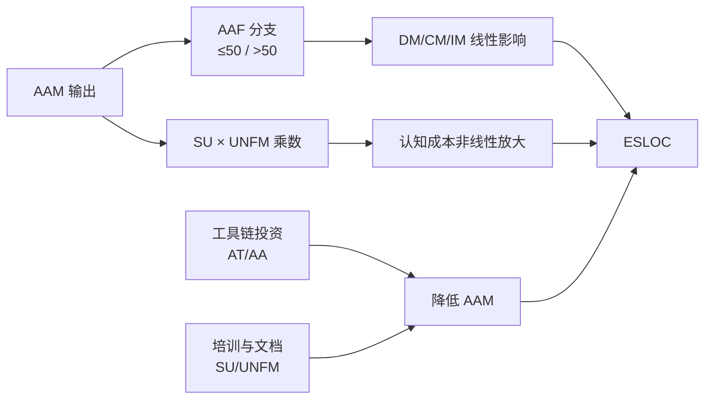
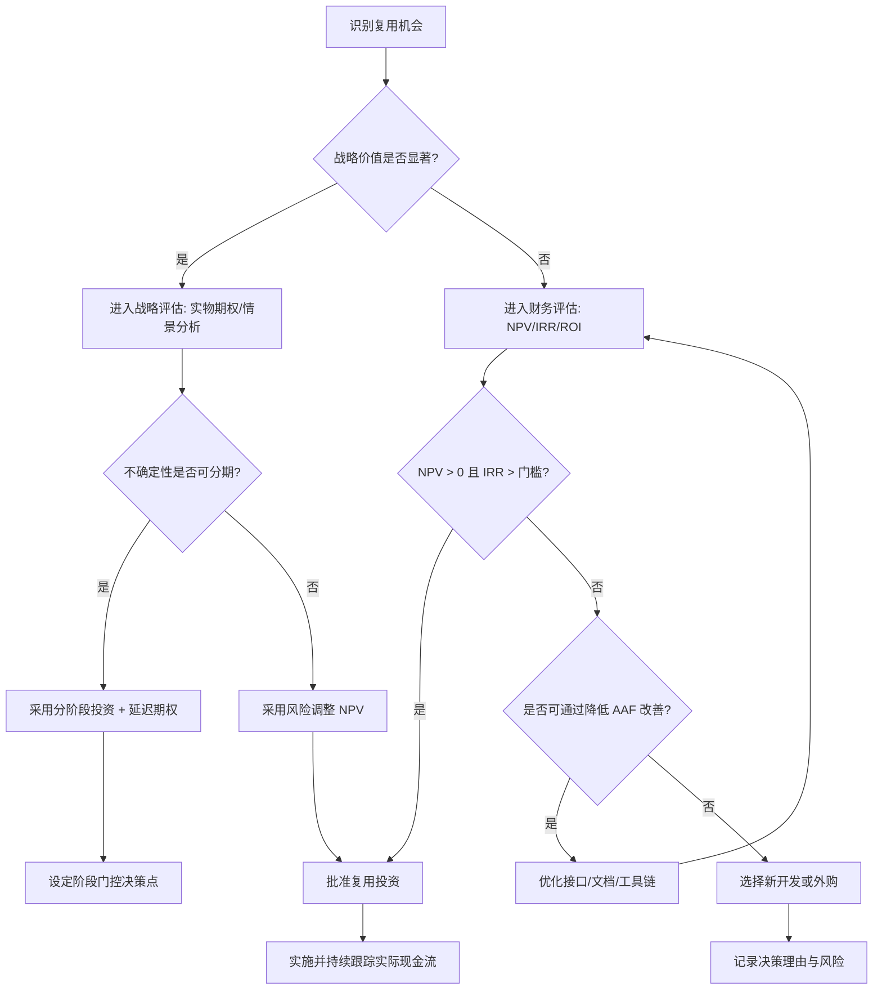
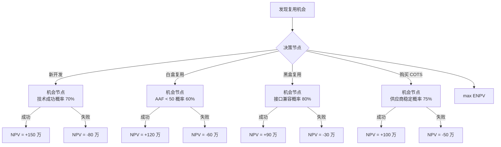
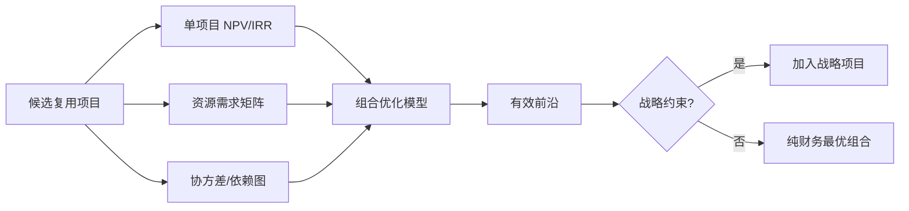
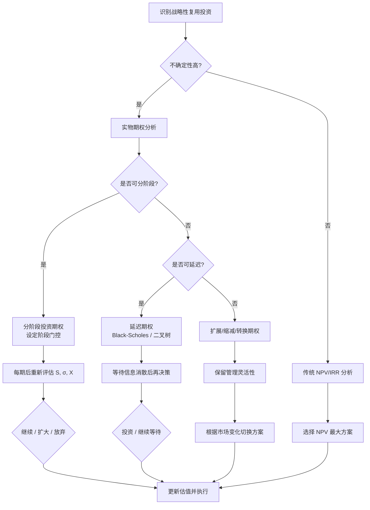
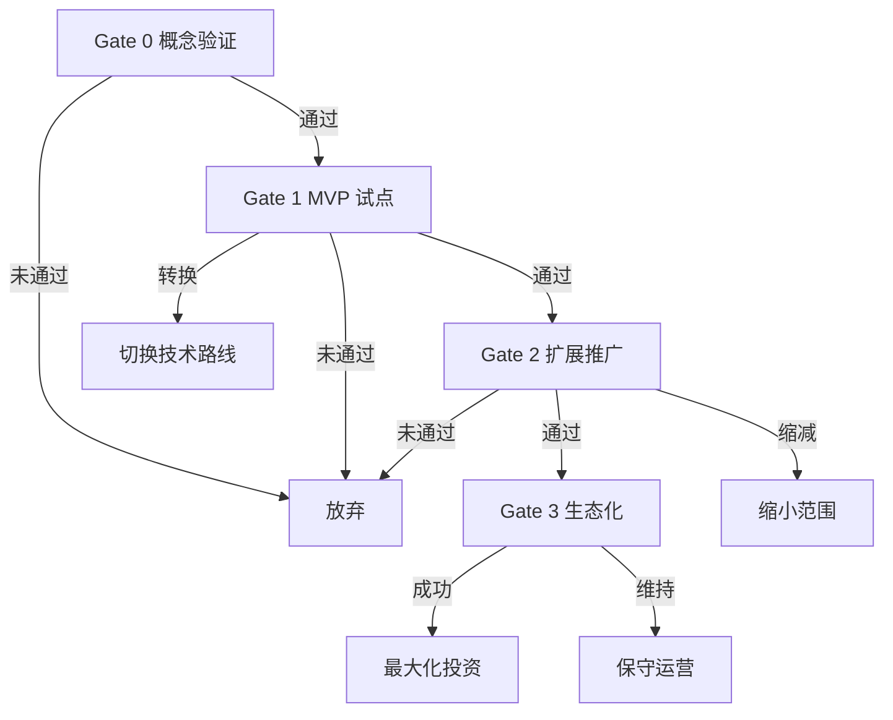
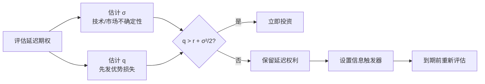
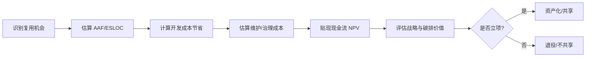

# COCOMO II 复用模型 2026 校准版

> **版本**: 2026-07-11
> **定位**: 由 `struct/09-value-quantification` 自动聚合生成的视角卷册（view volume）
> **生成命令**: `python scripts/sync-view-from-struct.py --topic 09-value-quantification --generate`
> **说明**: 本文件为 struct/ 的只读聚合视角，修改请直接在 struct/ 对应文件进行。

---


## 目录


1. [COCOMO II 复用模型 2026 校准版](../struct/09-value-quantification/01-cocomo-ii-reuse/cocomo-2026-calibration.md)
2. [COCOMO II 复用模型深度解析](../struct/09-value-quantification/01-cocomo-ii-reuse/cocomo-ii-reuse-model-deep-dive.md)
3. [架构复用 ROI 框架](../struct/09-value-quantification/02-roi-npv-models/roi-framework.md)
4. [软件复用的 ROI、实物期权与战略价值量化](../struct/09-value-quantification/02-roi-npv-models/roi-real-options-strategic-value.md)
5. [价值量化碳维度扩展：SCI 复用碳模型](../struct/09-value-quantification/03-carbon-dimension/sci-reuse-value-extension.md)
6. [成熟度经济学与复用价值曲线](../struct/09-value-quantification/04-maturity-economics/maturity-value-curve.md)
7. [09 价值量化与 ROI 模型](../struct/09-value-quantification/README.md)

---


<!-- SOURCE: struct/09-value-quantification/01-cocomo-ii-reuse/cocomo-2026-calibration.md -->

# COCOMO II 复用模型 2026 校准版

> **版本**: 2026-06-06
> **对齐来源**: USC COCOMO II Model Definition Manual (Boehm et al., 2000), GitHub Copilot Productivity Report 2025-2026, METR AI Developer Productivity Study (2025)
> **定位**: 将 COCOMO II 复用模型适配到 2026 年的 AI 辅助开发、Serverless、低代码环境

---

## 目录

- [COCOMO II 复用模型 2026 校准版](#cocomo-ii-复用模型-2026-校准版)
  - [目录](#目录)
  - [1. 原始 COCOMO II 复用公式](#1-原始-cocomo-ii-复用公式)
  - [2. 2026 校准动因](#2-2026-校准动因)
  - [3. 2026 校准参数](#3-2026-校准参数)
    - [3.1 AI 辅助开发调整](#31-ai-辅助开发调整)
    - [3.2 Serverless 调整](#32-serverless-调整)
    - [3.3 低代码平台调整](#33-低代码平台调整)
    - [3.4 复用成熟度 RUSE 调整](#34-复用成熟度-ruse-调整)
    - [3.5 2026 综合校准公式](#35-2026-综合校准公式)
  - [4. 完整计算示例](#4-完整计算示例)
    - [场景：电商订单系统的复用成本估算（2026 版）](#场景电商订单系统的复用成本估算2026-版)
  - [5. RUSE 乘数 2026 建议值](#5-ruse-乘数-2026-建议值)
  - [6. 行业对比分析](#6-行业对比分析)
    - [6.1 不同架构范式的 COCOMO II 2026 参数对比](#61-不同架构范式的-cocomo-ii-2026-参数对比)
    - [6.2 AI 辅助开发的权衡矩阵](#62-ai-辅助开发的权衡矩阵)
  - [7. 局限性声明](#7-局限性声明)
  - [参考索引与权威来源](#参考索引与权威来源)
  - [补充说明：COCOMO II 复用模型 2026 校准版](#补充说明cocomo-ii-复用模型-2026-校准版)
  - [概念定义](#概念定义)
  - [示例](#示例)
  - [反例](#反例)
  - [权威来源](#权威来源)

---

## 1. 原始 COCOMO II 复用公式

```text
开发工作量 (Person-Months):
    PM = A × (Size)^E × ∏(EMᵢ)

其中:
    A = 2.94 (校准常数，基于 1990-2000 年 161 个项目数据)
    Size = 千等效源代码行数 (KSLOC)
    E = B + 0.01 × Σ(SFⱼ)
    B = 0.91 (默认)
    SFⱼ = 5 个规模因子
    EMᵢ = 17 个工作量乘数

复用调整后的规模:
    ESLOC = ASLOC × (AAF) / 100

    AAF = 0.4 × (DM) + 0.3 × (CM) + 0.3 × (IM)

    DM = 设计修改百分比 [0-100%]
    CM = 代码修改百分比 [0-100%]
    IM = 集成工作量百分比 [0-100%]

若 AAF ≤ 50:
    ESLOC = ASLOC × [AA + AAF × (1 + 0.02 × SU × UNFM)] / 100

若 AAF > 50:
    ESLOC = ASLOC × [AA + AAF + (SU × UNFM)] / 100

    AA = 评估与同化百分比 (Assessment and Assimilation)
    SU = 软件理解增量 [10-50%]
    UNFM =  unfamiliarity 因子 [0.0-1.0]
```

---

## 2. 2026 校准动因

COCOMO II 的校准常数 A=2.94 基于 1990-2000 年的项目数据，对 2026 年的以下变化存在显著偏差：

| 变化 | 对 COCOMO II 的影响 | 校准方向 |
|------|-------------------|---------|
| AI 辅助编程 (Copilot/Cursor) | 编码速度提升 20-55%，但审查与返工成本增加 6.5-19% | 降低 CM 权重，增加 AI_review 因子 |
| Serverless/FaaS | 基础设施代码减少 70%，但配置代码 (IaC) 增加 | 重新定义 "代码行" 范围为等效功能单元 (EFU) |
| 低代码/无代码平台 | 可视化开发替代 40-70% 手写代码 | SLOC 不再适用，引入功能点-代码行混合换算 |
| 组件生态成熟 (npm/crates.io) | 依赖深度增加，但直接编写代码减少 | 调整 RUSE 乘数范围，引入供应链深度因子 |
| DevSecOps 流水线 | 自动化测试/扫描降低集成成本 15-25% | 降低 IM 基准值，增加安全审查因子 |
| 远程协作/全球化 | 沟通成本变化，协调时间增加 8% | 调整 TEAM 乘数基准 |

> **实证数据更新**（2025-2026 研究）：
>
> - GitHub 控制实验：Copilot 用户完成 HTTP 服务器任务速度提升 55%，平均耗时从 2h 41m 降至 1h 11m[^1]
> - METR / Xu et al. (2025)：AI 辅助代码需更多返工以满足仓库标准，核心开发者审查量增加 6.5%，原创代码生产率下降 19%[^2]
> - Song et al. (2024)：Copilot 使项目级代码贡献增加 5.9%，但协调时间增加 8%[^3]
> - Uplevel (2024)：Copilot 使用组引入 41% 更多 bug，对 cycle time 和 PR throughput 无显著改善[^4]

---

## 3. 2026 校准参数

### 3.1 AI 辅助开发调整

AI 辅助编码对 COCOMO II 的影响是**双向的**：编码效率提升被审查、返工和技术债务成本部分抵消。

**AI 辅助编码效率因子** (AI_Efficiency Factor, AEF)：

```text
CM_2026 = CM_original × AEF

AEF 取值:
├── 无 AI 辅助:                    1.00
├── 基础代码补全 (GitHub Copilot):  0.70  (编码效率提升 30%，CM 降低 30%)
├── 高级 Agent (Cursor, Claude Code): 0.55  (编码效率提升 45%)
├── 全栈 AI 生成 (vibe coding):     0.40  (编码效率提升 60%)
└── 安全关键领域调整:               +0.10 至 +0.15 (审查更严格)
```

**AI 审查与返工成本因子** (AI_Review Factor, ARF)：

```text
IM_2026 = IM_original × ARF

ARF 取值:
├── 非关键业务系统:                1.10  (审查成本增加 10%)
├── 一般企业系统:                  1.20  (审查成本增加 20%)
├── 金融/医疗合规系统:             1.35  (审查成本增加 35%)
└── 安全关键系统 (DO-178C, ISO 26262): 1.50  (审查成本增加 50%)
```

**AI 技术债务因子** (AI_TechDebt Factor, ATD)：

基于 METR (2025) 和 Uplevel (2024) 的实证发现，AI 生成代码的长期维护成本需增加调整：

```text
维护调整:
    Maintenance_Effort_2026 = Maintenance_Effort_original × ATD

ATD 取值:
├── 无 AI 辅助:                    1.00
├── 基础 Copilot (代码补全):       1.08  (技术债务增长约 8%)
├── 高级 Agent (多文件生成):       1.15  (技术债务增长约 15%)
└── 全栈 AI 生成:                  1.25  (技术债务增长约 25%)
```

**2026 年 AI 综合影响参数表**：

| AI 工具等级 | AEF (CM) | ARF (IM) | ATD (维护) | 综合净效应估算 |
|------------|----------|----------|-----------|--------------|
| 无 AI | 1.00 | 1.00 | 1.00 | 基准 1.00 |
| 基础补全 (Copilot) | 0.70 | 1.20 | 1.08 | **0.91** |
| 高级 Agent (Cursor) | 0.55 | 1.25 | 1.15 | **0.79** |
| 全栈生成 (vibe coding) | 0.40 | 1.35 | 1.25 | **0.68** |

> 综合净效应 = AEF × √(ARF) × ⁴√(ATD)，反映短期编码收益被中期审查和长期维护部分抵消后的近似结果。

### 3.2 Serverless 调整

Serverless 项目中，传统 SLOC 度量严重失真。2026 校准引入**等效功能单元 (Equivalent Functional Unit, EFU)**：

```text
Size_serverless = (SLOC_traditional × 0.30)
                + (SLOC_function_handlers × 1.00)
                + (Config_lines_IaC × 0.15)
                + (Event_rules × 8.0)
                + (IAM_policy_statements × 2.0)
```

**Serverless 规模换算系数说明**：

| 代码/配置类型 | 换算系数 | 说明 |
|-------------|---------|------|
| 传统业务逻辑 SLOC | 0.30 | 托管服务替代了 70% 传统基础设施代码 |
| Function handler SLOC | 1.00 | 函数入口代码是核心逻辑等效度量 |
| IaC 配置行 (YAML/Terraform) | 0.15 | 每行配置约等效 0.15 SLOC 复杂度 |
| Event 触发规则 | 8.0 | 每条 event rule 约等效 8 SLOC 的集成复杂度 |
| IAM 策略声明 | 2.0 | 每条 IAM statement 约等效 2 SLOC 的安全设计复杂度 |

**Serverless 架构成本驱动器调整**：

| 成本驱动器 | 原始定义 | 2026 Serverless 调整 |
|-----------|---------|-------------------|
| **TIME** (执行时间约束) | 新增：Serverless 冷启动对响应时间的约束 | 乘数 1.00-1.15 |
| **STOR** (存储约束) | 扩展至包含状态管理复杂度 | 乘数 1.00-1.10 |
| **PVOL** (平台变更) | Serverless 平台频繁更新带来的适配成本 | 乘数 1.05-1.25 |
| **TOOL** (工具成熟度) | Serverless 本地调试/测试工具链成熟度 | 乘数 0.90-1.20 |

### 3.3 低代码平台调整

低代码/无代码 (LCNC) 平台的开发模式根本性地改变了规模度量方式：

**混合规模度量公式**：

```text
Size_lcnc = (FP_visual × CF_visual) + (FP_integration × CF_integration) + (SLOC_custom × 1.0)

其中:
    FP_visual = 可视化配置的功能点计数
    CF_visual = 可视化功能点换算系数
    FP_integration = API/数据集成相关的功能点
    CF_integration = 集成复杂度换算系数
    SLOC_custom = 自定义代码（扩展/插件）的实际 SLOC
```

**低代码平台换算系数表**：

| 应用类型 | CF_visual (SLOC/FP) | CF_integration (SLOC/FP) | 典型 AI 辅助水平 |
|---------|-------------------|------------------------|---------------|
| 简单 CRUD / 审批流 | 15 | 30 | 高 (AI 生成 70%+) |
| 中等复杂度业务应用 | 25 | 45 | 中高 (AI 生成 50%+) |
| 复杂集成应用 (ERP/SAP 连接) | 35 | 65 | 中 (AI 生成 30%+) |
| 自定义扩展密集型应用 | 45 | 80 | 低 (AI 生成 <30%) |

**低代码平台专用成本驱动器**：

| 驱动器 | 评级 | 乘数 | 说明 |
|--------|------|------|------|
| **LCPL** (平台锁定风险) | 低 / 中 / 高 / 极高 | 0.95 / 1.00 / 1.15 / 1.30 | 平台迁移成本 |
| **LCUS** (可配置性利用率) | 高 / 中 / 低 | 0.85 / 1.00 / 1.25 | 使用原生配置 vs 自定义代码比例 |
| **LCIN** (集成复杂度) | 低 / 中 / 高 | 0.90 / 1.00 / 1.20 | 与遗留系统集成深度 |

### 3.4 复用成熟度 RUSE 调整

原始 RUSE 范围 0.65-1.00，2026 建议扩展至考虑 AI、平台工程、供应链安全因素：

| RUSE 等级 | 原始值 | 2026 建议值 | 复用场景 | 关键增强因素 |
|-----------|--------|------------|----------|-------------|
| **极低** | 1.00 | 1.00 | 无复用，全部自研 | 基准 |
| **很低** | 0.95 | 0.92 | 偶发复用，个人级 | +AI 搜索辅助 |
| **低** | 0.89 | 0.84 | 项目级复用，有管理 | +内部组件库 + IDP |
| **一般** | 0.84 | 0.78 | 组织级复用 + IDP | +AI 自动适配 + SBOM |
| **高** | 0.78 | 0.71 | 产品线级复用 + AI 辅助 | +Golden Path + 自动测试 |
| **很高** | 0.72 | 0.64 | 跨组织复用 + SLSA L3+ | +供应链 provenance |
| **极高** | 0.65 | 0.56 | 黑盒复用 + AI 自动集成 | +AI agent 自动适配 |

### 3.5 2026 综合校准公式

```text
PM_2026 = A_2026 × (Size_2026)^E × ∏(EMᵢ_2026)

其中:
    A_2026 = 2.20 （建议下调，反映工具链和开源生态成熟度）

    Size_2026 = KSLOC_2026（根据项目类型选择换算方式）:
        ├── 传统项目: 原始 KSLOC
        ├── Serverless: KSLOC_EFU / 1000
        └── 低代码: KFP_2026 × CF_avg / 1000

    EMᵢ_2026 包含关键调整:
        ├── RUSE_2026: 复用成熟度（见 3.4 节）
        ├── AEF: AI 编码效率因子 [0.40-1.00]
        ├── ARF: AI 审查返工因子 [1.10-1.50]
        ├── ATD: AI 技术债务因子 [1.00-1.25]
        ├── LCPL: 低代码平台锁定 [0.95-1.30]
        ├── PVOL_serverless: Serverless 平台变更 [1.05-1.25]
        └── 其他 11 个传统乘数（PERS, RCPX, PDIF, PREX 等）
```

---

## 4. 完整计算示例

### 场景：电商订单系统的复用成本估算（2026 版）

**项目参数**：

- 新开发订单系统预计需要 10,000 SLOC（传统架构）
- 组织内已有库存管理系统的订单处理模块，共 3,000 SLOC
- 计划复用该模块，需进行以下改编：
  - 设计修改 DM: 30%（适配新的数据库 Schema）
  - 代码修改 CM_original: 20%
  - 集成工作量 IM_original: 50%（新的消息队列集成）
- AI 工具: 高级 Agent (Cursor)，AEF = 0.55，ARF = 1.25
- AI 技术债务: ATD = 1.15
- AA = 10%（评估与同化）
- SU = 20%（软件理解）
- UNFM = 0.5
- 组织复用成熟度: 高（产品线级复用 + AI 辅助）→ RUSE_2026 = 0.71

**计算过程**：

```text
1. AI 调整后改编参数:
   CM_effective = 20% × 0.55 = 11%
   IM_effective = 50% × 1.25 = 62.5%

2. 改编调整因子:
   AAF = 0.4 × 30% + 0.3 × 11% + 0.3 × 62.5%
       = 0.12 + 0.033 + 0.1875 = 0.3405

3. 非线性调整 (AAF ≤ 0.5):
   ESLOC = 3,000 × [10 + 34.05 × (1 + 0.02 × 20 × 0.5)] / 100
         = 3,000 × [10 + 34.05 × 1.2] / 100
         = 3,000 × 50.86 / 100
         = 1,526 SLOC

4. 总项目规模:
   Size = (10,000 - 3,000) + 1,526 = 8,526 SLOC = 8.526 KSLOC

5. 规模因子评分:
   PREC = 4.0, FLEX = 3.0, RESL = 3.0, TEAM = 3.0, PMAT = 3.0
   Σ(SFⱼ) = 16.0
   E = 0.91 + 0.01 × 16.0 = 1.07

6. 工作量乘数（关键项）:
   RUSE_2026 = 0.71 (高复用)
   AEF       = 0.85 (AI 编码效率综合)
   ARF       = 1.25 (AI 审查成本)
   ATD       = 1.08 (技术债务 ⁴√1.15)
   ∏(EMᵢ) ≈ 0.71 × 0.85 × 1.25 × 1.08 ≈ 0.815

7. 开发工作量（2026 校准）:
   PM_2026 = 2.20 × (8.526)^1.07 × 0.815
           = 2.20 × 9.77 × 0.815
           ≈ 17.5 人月
```

**多情景对比分析**：

| 情景 | A 常数 | Size (KSLOC) | E | 综合乘数 | 工作量 (PM) | 相对基准 |
|------|--------|-------------|---|---------|------------|---------|
| **基准（无复用，无 AI，原始 COCOMO II）** | 2.94 | 10.0 | 1.07 | 1.00 | **34.5** | 100% |
| 有复用，无 AI（原始模型） | 2.94 | 7.99 | 1.07 | 0.78 | **20.9** | 60.6% |
| 有复用，基础 Copilot | 2.50 | 7.99 | 1.07 | 0.68 | **15.4** | 44.6% |
| **有复用，高级 Agent（2026 校准）** | **2.20** | **8.526** | **1.07** | **0.815** | **17.5** | **50.7%** |
| 有复用，全栈 AI 生成 | 2.20 | 8.526 | 1.07 | 0.69 | **14.8** | 42.9% |

**关键洞察**：

- 相对于无复用基准：节约 17.0 人月 (50.7%)
- 相对于传统复用（无 AI）：节约 3.4 人月 (16.3%)
- AI 的净效应约为 10-17% 的额外节约（而非表面上的 45-55%），因为审查成本和技术债务部分抵消了编码效率收益
- 若项目为安全关键系统（ARF = 1.50），2026 版工作量升至 **19.8 人月**，AI 净收益收窄至 42.6%

---

## 5. RUSE 乘数 2026 建议值

| RUSE 等级 | 描述 | 2026 建议值 | 复用场景 | 配套实践 |
|-----------|------|------------|----------|---------|
| **极低** | 无复用，全部自研 | 1.00 | 创新项目、无先例 | — |
| **很低** | 偶发复用，无系统管理 | 0.92 | 个人项目、临时复用 | AI 代码搜索 |
| **低** | 项目级复用，有管理 | 0.84 | 团队内共享代码 | 内部组件库 |
| **一般** | 组织级复用，标准化 + IDP | 0.78 | 企业级组件库 + Golden Path | SBOM + 自动化测试 |
| **高** | 产品线级复用 + AI 辅助 | 0.71 | 产品线工程 | AI 自动适配 + 变异测试 |
| **很高** | 跨组织复用 + SLSA L3+ | 0.64 | 行业级共享组件 | SLSA provenance + 签名验证 |
| **极高** | 黑盒复用 + AI 自动集成 | 0.56 | COTS/SaaS + AI 集成 | AI agent 自动 API 映射 |

---

## 6. 行业对比分析

### 6.1 不同架构范式的 COCOMO II 2026 参数对比

| 参数 | 传统单体 | 微服务 | Serverless | 低代码平台 |
|------|---------|--------|-----------|-----------|
| **A_2026** | 2.20 | 2.20 | 2.00 | 2.30 |
| **Size 度量** | KSLOC | KSLOC | KSLOC_EFU | KFP × CF |
| **RUSE 基线** | 0.84 | 0.78 | 0.71 | 0.80 |
| **AI 工具适用性** | 中 | 高 | 高 | 极高 |
| **AEF 典型值** | 0.65 | 0.55 | 0.50 | 0.40 |
| **ARF 典型值** | 1.20 | 1.25 | 1.20 | 1.15 |
| **PVOL** | 1.00 | 1.05 | 1.15 | 1.30 |
| **典型乘数积** | 0.75 | 0.68 | 0.62 | 0.72 |

### 6.2 AI 辅助开发的权衡矩阵

| 维度 | 短期收益 (0-6 月) | 中期成本 (6-18 月) | 长期影响 (18 月+) |
|------|-----------------|-------------------|------------------|
| 编码速度 | +30% 至 +55% | — | — |
| 代码审查 | — | +10% 至 +35% | — |
| 技术债务 | — | — | +8% 至 +25% |
| 缺陷密度 | -5% 至 +41%* | — | — |
| 协调开销 | — | +8% | — |
| 知识传递 | 不确定 | 不确定 | -15% 至 -30%** |

> \* Uplevel 研究显示 Copilot 组 bug 增加 41%；GitHub 研究显示新手 bug 减少。结果因使用模式和审查严格度而异。
> \*\* AI 生成代码的理解度下降可能导致长期知识传递成本增加（需更多实证研究验证）。

---

## 7. 局限性声明

> **公理 V.1** (Value Quantification Uncertainty): 复用的价值量化存在固有的不确定性。COCOMO II 的校准常数基于历史数据，对 AI 辅助开发、Serverless 架构、低代码平台的适用性存在偏差。任何量化结果应被视为"最佳估计"而非"精确真理"。
> **公理 V.2** (Strategic Value Non-Quantifiability): 复用的战略价值（上市时间优势、生态系统网络效应、组织能力进化）难以用货币精确量化，但不可因此忽略。
> **定理 V.1** (ROI Threshold): 复用项目的 ROI 为正的必要条件是：复用资产的改编调整因子 AAF < AAF_ECONOMIC_FLOOR（0.7，canonical [0.0, 1.0]）。若 AAF ≥ AAF_ECONOMIC_FLOOR，复用的直接经济价值消失，仅剩战略价值。
> **定理 V.2** (AI Net Benefit Ceiling): 在 2026 年的技术条件下，AI 辅助开发对 COCOMO II 估算的综合净收益上限约为 30-35%（相对于传统开发），远低于表面编码效率提升的 55%。组织在决策时应采用保守估算（净收益 15-25%）。

---

> 最后更新: 2026-06-06
> 下次更新: 基于更多 2026 年实际项目数据校准 A_2026 和 AEF/ARF 参数

---

## 参考索引与权威来源

| 来源 | URL | 核查日期 |
|:---|:---|:---|
| USC COCOMO II | <https://cssed.usc.edu/research/research-sponsored-software/cocomo/cocomo-ii/> | 2026-07-09 |
| COCOMO II Model Definition Manual (PDF) | <https://athena.ecs.csus.edu/~buckley/CSc231_files/Cocomo_II_Manual.pdf> | 2026-07-09 |
| NASA Reuse Readiness Levels (RRL) | <https://ntrs.nasa.gov/api/citations/20120010312/downloads/20120010312.pdf> | 2026-07-09 |
| NASA SWEHB — Software Reuse Catalog | <https://swehb.nasa.gov/display/SWEHBVD/SWE-148+-+Contribute+to+Agency+Software+Catalog> | 2026-07-09 |
| FinOps Foundation — Unit Economics | <https://www.finops.org/framework/capabilities/unit-economics/> | 2026-07-09 |
| CMMI Institute | <https://cmmiinstitute.com/> | 2026-07-09 |

文献：

- Boehm, B. et al.: *Software Cost Estimation with COCOMO II* (Prentice Hall, 2000)
- USC CSSE: *COCOMO II Model Definition Manual* (2000)
- COCOMO II.2000 Calibration Data (161 projects)
- GitHub / Vaithilingam et al. (2024): "Measuring GitHub Copilot's Impact on Productivity" (CACM)
- Xu, F. et al. (2025): "AI-Assisted Programming Decreases the Productivity of Experienced Developers..." (arXiv:2510.10165)
- Song, F. et al. (2024): "The Impact of Generative AI on Collaborative Open-Source Software Development" (arXiv:2410.02091)
- Uplevel (2024): "AI Won't Solve Your Developer Productivity Problems for You"
- CompaniesHistory (2026): "GitHub Copilot Statistics And User Trends In 2026"
- Jones, C.: *Applied Software Measurement* (SLOC/FP 转换表)
- IFPUG: *Function Point Counting Practices Manual* (1994+)

> **交叉引用**:
>
> - COCOMO II 深度解析: [`cocomo-ii-reuse-model-deep-dive.md`](../struct/09-value-quantification/01-cocomo-ii-reuse/cocomo-ii-reuse-model-deep-dive.md)
> - 标准对齐矩阵: [`struct/01-meta-model-standards/01-iso-420xx-family/alignment-matrix.md`](../struct/01-meta-model-standards/01-iso-420xx-family/alignment-matrix.md)
> - 复用度量指标: [`struct/06-cross-layer-governance/05-metrics-kpi/metrics-framework.md`](../struct/06-cross-layer-governance/05-metrics-kpi/metrics-framework.md)
> - 可运行工具: [`../tools/cocomo-calculator.py`](../struct/09-value-quantification/tools/cocomo-calculator.py)、[`../tools/cocomo-streamlit.py`](../struct/09-value-quantification/tools/cocomo-streamlit.py)


---

## 补充说明：COCOMO II 复用模型 2026 校准版

## 概念定义

**定义**：COCOMO II（Constructive Cost Model II）通过规模、复用程度、人员能力、平台成熟度等因子预测软件成本；其复用模型（REVL、AA、SU 等）量化复用带来的生产率提升。

## 示例

**示例**：估算企业级消息中间件复用时，COCOMO II 将等效新代码行数按复用适配度从 100 KSLOC 降至 35 KSLOC，工期预测缩短 40%。

## 反例

**反例**：未计入文档、测试与治理成本，仅凭代码行复用率宣称“节省 80%”，上线后维护 overrun 30%。

## 权威来源

> **权威来源**:
>
> - [USC COCOMO II](https://cssed.usc.edu/research/research-sponsored-software/cocomo/cocomo-ii/)
> - [Barry Boehm - USC CSSE](https://cssed.usc.edu/)
> - 核查日期：2026-07-07

---


<!-- SOURCE: struct/09-value-quantification/01-cocomo-ii-reuse/cocomo-ii-reuse-model-deep-dive.md -->

# COCOMO II 复用模型深度解析
>
> 版本: 2026-06-06
> 对齐来源: Boehm et al. (2000) COCOMO II Model Definition Manual, USC CSSE, COCOMO II.2000 校准数据

## 1. 核心概念定义

- **COCOMO II（Constructive Cost Model II）**：由 Barry Boehm 等人在 USC CSSE 提出的软件成本估算模型，通过规模、成本驱动器、规模因子与复用参数预测工作量与工期。
- **等价新代码量（ESLOC）**：将复用资产按适配度折算后，与全新开发代码等价的工作量规模。
- **适配调整乘数（AAM）**：综合自动化程度、结构修改、理解成本与熟悉度，将复用代码量转换为 ESLOC 的乘数。
- **复用经济性**：复用收益（避免新开发成本）与复用成本（评估、适配、集成、维护、机会成本）之间的权衡。

## 2. COCOMO II 子模型体系

| 子模型 | 适用阶段 | 输入 | 输出 |
|-------|---------|------|------|
| **Application Composition** | 原型/早期 | 对象点（Object Points）、复用比例 | 工作量（PM）|
| **Early Design** | 需求确认后、设计开始前 | 功能点 / SLOC、成本驱动器 | 工作量 + 工期 |
| **Reuse** | 复用组件集成时 | 适配代码量（ASLOC）、修改度参数 | 等价新代码量（ESLOC）|
| **Post-Architecture** | 架构设计完成后 | 模块 SLOC、17 个成本驱动器、5 个规模因子 | 精确工作量 + 工期 |
| **Maintenance** | 维护阶段 | 基线代码量、变更因子 | 维护工作量 |

## 3. 复用模型（Reuse Model）核心方程

### 3.1 等价源代码行（Equivalent KSLOC）

```text
ESLOC = ASLOC × (1 - AT/100) × AAM
```

| 符号 | 含义 |
|-----|------|
| **ASLOC** | 需适配的源代码千行数（Adapted KSLOC）|
| **AT** | 自动转换百分比（Assessment/Translation）|
| **AAM** | 适配调整因子（Adaptation Adjustment Multiplier）|

### 3.2 适配调整因子 AAM

```text
AAM = [AA + AAF × (1 + 0.02 × SU × UNFM)] / 100     (AAF ≤ 50)
AAM = [AA + AAF + (SU × UNFM)] / 100               (AAF > 50)
```

| 符号 | 含义 | 计算 |
|-----|------|------|
| **AA** | 评估与改编百分比（Assessment & Adaptation）| 自动评估+改编工具的效率 |
| **AAF** | 适配改编因子（Adaptation Adjustment Factor）| 0.4×DM + 0.3×CM + 0.3×IM |
| **DM** | 设计修改百分比（Design Modified）| 被复用组件的设计变更比例 |
| **CM** | 代码修改百分比（Code Modified）| 被复用组件的代码变更比例 |
| **IM** | 集成修改百分比（Integration Modified）| 集成测试重新做的比例 |
| **SU** | 软件理解增量（Software Understanding）| 10%–50%，取决于结构清晰度 |
| **UNFM** | 程序员不熟悉度（Unfamiliarity）| 1.0（熟悉）– 1.5（全新）|

### 3.3 软件理解增量 SU

| 评级 | 结构 | 应用清晰度 | 自描述性 | SU |
|-----|------|-----------|---------|-----|
| Very High | 优秀 | 优秀 | 优秀 | 10% |
| High | 良好 | 良好 | 良好 | 20% |
| Nominal | 一般 | 一般 | 一般 | 30% |
| Low | 差 | 差 | 差 | 40% |
| Very Low | 极差 | 极差 | 极差 | 50% |

## 4. 应用组合模型（Application Composition Model）

适用于原型项目和存在大量复用的场景：

```text
PM = (NAP × (1 - %reuse/100)) / PROD
```

| 符号 | 含义 |
|-----|------|
| **NAP** | 应用点（Application Points）/ 对象点数量 |
| **%reuse** | 复用比例 |
| **PROD** | 生产率（对象点/人月）|

**生产率参考**：

| 开发者经验 / CASE 工具成熟度 | 低 | 中 | 高 |
|---------------------------|----|----|----|
| 低 | 4–7 | 7–13 | 13–25 |
| 中 | 7–13 | 13–25 | 25–50 |
| 高 | 13–25 | 25–50 | 50–80 |

## 5. 早期设计模型（Early Design Model）

### 5.1 基础方程

```text
PM = A × Size^B × M

其中：
M = PERS × RCPX × RUSE × PDIF × PREX × FCIL × SCED
B = 1.01 + 0.01 × Σ(Wi × Si)
```

### 5.2 与复用直接相关的成本驱动器

| 驱动器 | 全称 | 作用 |
|-------|------|------|
| **RUSE** | Required Reuse | 开发可复用组件所需的额外工作量 |
| **RCPX** | Product Reliability & Complexity | 产品可靠性与复杂度 |
| **PDIF** | Platform Difficulty | 平台难度 |
| **PREX** | Personnel Experience | 人员经验 |
| **PERS** | Personnel Capability | 人员能力 |
| **FCIL** | Facilities | 工具与环境支持 |
| **SCED** | Required Development Schedule | 开发进度要求 |

**RUSE 评级影响**：

| RUSE 评级 | 含义 | 工作量乘数 |
|----------|------|-----------|
| Nominal | 无特殊复用要求 | 1.00 |
| High | 跨项目复用 | 1.07 |
| Very High | 跨产品线复用 | 1.15 |
| Extra High | 跨组织/多产品线复用 | 1.24 |

## 6. 维护模型（Maintenance Model）

### 6.1 维护规模方程

```text
Size_M = (Base Code Size × MCF) × MAF

或

Size_M = (Size Added + Size Modified) × MAF
```

| 符号 | 含义 |
|-----|------|
| **MCF** | 维护变更因子 = (新增 + 修改) / 基线代码量 |
| **MAF** | 维护调整因子 = 1 + (SU/100 × UNFM) |

> 注意：当基线代码变更 ≤ 新开发代码 20% 时使用复用模型；超过 20% 时使用维护规模模型。

## 7. 规模因子（Scale Factors）

五个规模因子影响指数 B（项目经济性）：

| 因子 | 全称 | 高值影响 |
|-----|------|---------|
| **PREC** | Precedentedness | 先例性低 → 成本高 |
| **FLEX** | Development Flexibility | 灵活性低 → 成本高 |
| **RESL** | Architecture/Risk Resolution | 风险化解低 → 成本高 |
| **TEAM** | Team Cohesion | 团队凝聚力低 → 成本高 |
| **PMAT** | Process Maturity | 过程成熟度低 → 成本高 |

PMAT 与 CMMI 的映射：

| CMMI 等级 | PMAT 评级 |
|----------|----------|
| 1 | Very Low |
| 2 | Low |
| 3 | Nominal |
| 4 | High |
| 5 | Very High |

## 8. NASA Reuse Readiness Levels (RRL) 与 COCOMO II 复用映射

NASA ESDS Software Reuse Working Group 提出的 Reuse Readiness Levels（RRL，NASA NTRS 20120010312）从 1（Limited reusability）到 9（Demonstrated extensive reusability）评估软件资产的可复用成熟度。RRL 可作为 COCOMO II 中 RUSE、SU、UNFM 等参数的快速标定输入。

| RRL 等级 | 摘要 | COCOMO II 映射建议 |
|:---|:---|:---|
| RRL 1 | 不建议复用 | 不进入复用模型，按新开发估算 |
| RRL 2 | 初始可复用，实际不可行 | RUSE 基准 1.00，SU=50%，UNFM=1.5 |
| RRL 3 | 基本可复用，高成本高风险 | RUSE=0.95，SU=40%，UNFM=1.4 |
| RRL 4 | 可复用，多数用户需一定努力 | RUSE=0.89，SU=30%，UNFM=1.3 |
| RRL 5 | 复用可行，合理成本风险 | RUSE=0.84，SU=25%，UNFM=1.2 |
| RRL 6 | 可复用，多数用户适用 | RUSE=0.78，SU=20%，UNFM=1.1 |
| RRL 7 | 高度可复用，最小成本风险 | RUSE=0.72，SU=15%，UNFM=1.0 |
| RRL 8 | 已本地验证复用 | RUSE=0.65，SU=10%，UNFM=1.0 |
| RRL 9 | 已广泛跨系统复用 | RUSE=0.56（2026 校准），SU=10%，UNFM=1.0 |

**使用建议**：

- 在资产目录中记录每个候选组件的 RRL 等级，作为资产成熟度评级。
- RRL ≥ 5 的组件才建议进入白盒/黑盒复用经济性评估；RRL < 5 按新开发或购买 COTS 处理。
- RRL 与 COCOMO II 参数映射应每半年用本地历史数据校准一次。

## 9. 本地校准方法

### 9.1 为什么要校准

> "COCOMO II 在针对组织本地环境校准时显著更准确。"

默认校准基于 161 个样本项目。本地校准只需调整常数 A：

```text
ln(A) = average[ln(PM_actual) - ln(PM_unadjusted)]
A = e^X
```

### 9.2 校准数据要求

- 至少 5 个已完成项目的数据点
- 记录实际工作量（从需求分析结束到集成测试结束）
- 记录最终产品规模、规模因子、成本驱动器评级

## 10. 复用经济学决策框架

### 10.1 自制 vs 复用 vs 购买决策

| 选项 | COCOMO II 输入 | 适用条件 |
|-----|---------------|---------|
| **新开发** | Size = 全新 KSLOC | 无合适现有组件 |
| **白盒复用** | ASLOC + DM/CM/IM + SU/UNFM | 需要修改集成 |
| **黑盒复用** | AA + AAF ≤ 50 | 接口兼容，无需修改 |
| **购买 COTS** | 采购成本 + 集成工作量估算 | 市场有成熟产品 |

### 10.2 投资回报计算

```text
复用 ROI = (避免的新开发成本 - 复用成本) / 复用成本 × 100%

其中：
复用成本 = 评估成本 + 改编成本 + 集成成本 + 理解成本 + 许可证成本
```

## 11. 局限性与现代演进

### 11.1 已知局限

- 基于 SLOC/功能点，对现代云原生/无服务器架构适配有限
- 默认校准数据偏传统项目（2000 年前）
- 未直接考虑开源组件的隐性成本（安全审计、许可证合规）

### 11.2 现代扩展方向

- **功能点 → 故事点 / 对象点**：敏捷环境适配
- **SLOC → 依赖复杂度**：开源时代的新规模度量
- **本地校准自动化**：基于历史项目数据的 ML 辅助校准

## 10. 参考索引

- Boehm, B. et al.: *Software Cost Estimation with COCOMO II* (Prentice Hall, 2000)
- USC CSSE: COCOMO II Model Definition Manual (2000)
- COCOMO II.2000 Calibration Data (161 projects)
- Jones, C.: *Applied Software Measurement* (SLOC/FP 转换表)
- IFPUG: Function Point Counting Practices Manual (1994+)

---

## 11. 形式化定义与属性体系

### 11.1 COCOMO II 复用模型定义

**定义**：COCOMO II 复用模型（Reuse Model）是 COCOMO II 成本估算框架的子模型之一，用于将既有软件资产通过适配、转换与集成纳入新项目时，把“复用代码量”折算为“等价新开发代码量（Equivalent New SLOC, ESLOC）”，从而与 Post-Architecture 模型统一计算工作量与工期。该模型由 Barry Boehm 等人在 *Software Cost Estimation with COCOMO II*（2000）中提出，其核心理念是：**复用不等于免费，其价值取决于适配度、理解成本与自动化水平**。

### 11.2 参数属性总表

| 参数 | 类型 | 取值范围 | 经济含义 | 可优化性 |
|------|------|---------|---------|---------|
| ASLOC | 输入 | >0 KSLOC | 待适配资产规模 | 低（由候选资产决定） |
| AT | 输入 | 0–100% | 自动转换/评估比例 | 高（工具链投资） |
| AA | 输入 | 0–100% | 评估与改编自动化程度 | 高（静态分析、重构工具） |
| AAF | 派生 | 0–100% | 设计/代码/集成修改综合因子 | 中（接口设计） |
| DM | 输入 | 0–100% | 设计修改比例 | 中（松耦合接口） |
| CM | 输入 | 0–100% | 代码修改比例 | 中（配置化程度） |
| IM | 输入 | 0–100% | 集成测试重做比例 | 中（契约测试、CI） |
| SU | 评级 | 10–50% | 软件理解增量 | 高（文档、命名、结构） |
| UNFM | 评级 | 1.0–1.5 | 程序员不熟悉度 | 中（培训、领域对齐） |
| AAM | 输出 | 0–1.5 | 适配调整乘数 | 综合结果 |
| ESLOC | 输出 | ≥0 KSLOC | 等价新代码量 | 决策依据 |

### 11.3 参数关系说明

AAM 是复用模型的中枢，它将四类成本整合为单一乘数：

1. **自动化成本（AA/AT）**：工具越成熟，人工评估与改编越少，AAM 越低。
2. **结构修改成本（AAF）**：DM/CM/IM 直接度量“复用资产与新上下文的不匹配程度”。当 AAF ≤ 50 时，理解与熟悉成本被 0.02 系数压缩；当 AAF > 50 时，理解与熟悉成本线性叠加，惩罚显著加大。
3. **认知成本（SU × UNFM）**：文档清晰、结构良好、团队熟悉可显著降低 SU 与 UNFM。

形式化关系：

```text
AAM ∝ (DM, CM, IM, SU, UNFM)
AAM ∝ 1/Automation
ESLOC ∝ ASLOC × AAM
PM ∝ ESLOC^B
```

因此，**复用的经济性 = 规模节省 × 适配惩罚 × 生产率折扣**。当 AAM > 0.7 时，复用的直接成本优势迅速衰减（参见本系列 ROI 框架中的定理 V.T1）。

## 13. 计算示例

### 示例 1：企业级消息中间件复用

某金融科技团队计划复用既有企业级消息中间件（Kafka 封装层），用于新的风控通知系统。已知：

- ASLOC = 120 KSLOC（待适配资产规模）
- AT = 30%（可通过 Schema Registry 自动完成 30% 的字段映射）
- DM = 20%（需要新增分区策略与副本因子配置）
- CM = 15%（Producer/Consumer 配置代码需要调整）
- IM = 25%（集成测试需要覆盖新的失败场景）
- SU = 20%（结构良好、文档清晰）
- UNFM = 1.2（团队对 Kafka 较熟悉，但对封装层部分高级特性不熟悉）

### 分步计算

**步骤 1：计算 AAF**

```text
AAF = 0.4×DM + 0.3×CM + 0.3×IM
    = 0.4×20 + 0.3×15 + 0.3×25
    = 8 + 4.5 + 7.5
    = 20%
```

**步骤 2：计算 AAM**

AAF = 20 ≤ 50，使用第一分支：

```text
AA 取 AT 的评估与改编综合值 = 30%
AAM = [AA + AAF × (1 + 0.02 × SU × UNFM)] / 100
    = [30 + 20 × (1 + 0.02 × 20 × 1.2)] / 100
    = [30 + 20 × (1 + 0.48)] / 100
    = [30 + 20 × 1.48] / 100
    = [30 + 29.6] / 100
    = 59.6 / 100
    = 0.596
```

**步骤 3：计算 ESLOC**

```text
ESLOC = ASLOC × (1 - AT/100) × AAM
      = 120 × (1 - 0.30) × 0.596
      = 120 × 0.70 × 0.596
      = 50.064 KSLOC
```

**步骤 4：与全新开发对比**

若全新开发该消息中间件封装层，估算为 120 KSLOC；复用折算后仅约 50 KSLOC，**规模节省约 58.3%**。进一步代入 Post-Architecture 模型（假设 A=2.94，B=1.1，M=1.0）：

```text
PM_new = 2.94 × 120^1.1 ≈ 2.94 × 174.6 ≈ 513 人月
PM_reuse = 2.94 × 50.064^1.1 ≈ 2.94 × 67.7 ≈ 199 人月
```

**工期节省约 61%**，但需额外计入评估、培训与许可证成本（约 30 人月），**净工作量节省约 55%**。

## 14. 2026 校准建议

COCOMO II 的默认校准数据来自 2000 年前后的项目，对现代软件工程的适用性需要主动修正。2026 年推荐以下校准策略：

| 校准维度 | 2000 默认假设 | 2026 修正建议 | 理由 |
|---------|-------------|--------------|------|
| 生产率基准 | 功能点/SLOC | 引入故事点、对象点、依赖复杂度 | 云原生、无服务器、低代码改变规模度量 |
| 复用率 | 20–40% | 40–70%（平台工程成熟组织） | 内部平台、Golden Path 显著提升复用 |
| AA 自动化 | 低 | 中高（AI 辅助代码理解、重构） | Copilot、静态分析、自动生成测试 |
| SU 理解增量 | 30% | 15–25%（文档与 IDE 集成改善） | 交互式文档、内联示例降低认知负荷 |
| 开源合规成本 | 未计入 | 单独成本项 | SBOM、许可证审计、供应链安全 |
| 远程协作因子 | 未计入 | 纳入 TEAM/PMAT | 分布式团队对沟通与流程成熟度更敏感 |

**本地校准步骤（2026 版）**：

1. 收集过去 12–24 个月至少 8–10 个复用项目的实际数据。
2. 记录：ASLOC、AT、DM/CM/IM、SU、UNFM、实际工作量、实际工期、缺陷数。
3. 用贝叶斯回归或最小二乘法重新估计 AAM 分支阈值（0.02 系数可微调为 0.015–0.025）。
4. 对 AI 辅助改编项目单独建立子模型，AA 可上浮 10–20%。
5. 每季度用新数据滚动更新校准参数。

## 15. Mermaid 决策树：复用经济性评估

```mermaid
graph TD
    A[识别候选复用资产] --> B{AAF < AAF_ECONOMIC_FLOOR (0.7)?}
    B -->|是| C{是否有成熟工具链?}
    B -->|否| D[倾向新开发或购买 COTS]
    C -->|是| E[高自动化复用: AT↑, SU↓]
    C -->|否| F[人工适配复用: 计入培训与理解成本]
    E --> G{ESLOC < 0.5 × 新开发规模?}
    F --> G
    G -->|是| H[进入复用实施: 估算 PM = A × ESLOC^B × M]
    G -->|否| I[重新审视接口设计: 降低 DM/CM/IM]
    H --> J[持续跟踪实际 vs 估算, 滚动校准]
    I --> B
```

## 16. 反例

### 反例 1：忽视理解成本

**反例**：某团队宣称“复用内部订单组件，代码复用率 80%，因此节省 80% 工作量”。

某团队宣称“复用内部订单组件，代码复用率 80%，因此节省 80% 工作量”。实际未计入：

- 新团队对该组件 unfamiliarity（UNFM=1.5）；
- 文档缺失导致 SU=50%；
- 接口与新业务场景不匹配，AAF = 0.65（COCOMO 原始百分比写法 65%，canonical 为 0.65）。

重新计算后 AAM ≈ 1.1，ESLOC 反而超过新开发规模，项目最终延期 40%。

### 反例 2：高 AAF 仍强行复用

**反例**：某项目复用 legacy 银行核心模块，DM=40, CM=35, IM=30，AAF=35.5。

某项目复用 legacy 银行核心模块，DM=40, CM=35, IM=30，AAF=35.5。虽然 AAF 未超过 50，但模块结构混乱（SU=50）、团队全新（UNFM=1.5）。AAM 计算：

```text
AAM = [10 + 35.5 × (1 + 0.02 × 50 × 1.5)] / 100
    = [10 + 35.5 × 2.5] / 100
    = 98.75 / 100
    = 0.9875
```

几乎无节省，且维护耦合严重，三年后替换成本远超当初新开发。

### 反例 3：未校准直接使用默认常数

**反例**：某初创公司直接套用 COCOMO II 默认 A=2.94，实际工作量为估算的 2.3 倍。

某初创公司直接套用 COCOMO II 默认 A=2.94，但其团队成熟度低、技术栈新、复用工具链不完善，实际工作量为估算的 2.3 倍。经本地校准后 A 调整为 4.1，后续项目估算误差降至 ±20%。

## 17. 权威来源与交叉引用

| 来源 | URL | 核查日期 |
|:---|:---|:---|
| USC COCOMO II | <https://cssed.usc.edu/research/research-sponsored-software/cocomo/cocomo-ii/> | 2026-07-09 |
| COCOMO II Model Definition Manual (PDF) | <https://athena.ecs.csus.edu/~buckley/CSc231_files/Cocomo_II_Manual.pdf> | 2026-07-09 |
| NASA Reuse Readiness Levels (RRL) | <https://ntrs.nasa.gov/api/citations/20120010312/downloads/20120010312.pdf> | 2026-07-09 |
| NASA SWEHB — Software Reuse Catalog | <https://swehb.nasa.gov/display/SWEHBVD/SWE-148+-+Contribute+to+Agency+Software+Catalog> | 2026-07-09 |
| CMMI Institute | <https://cmmiinstitute.com/> | 2026-07-09 |
| Wikipedia — COCOMO | <https://en.wikipedia.org/wiki/COCOMO> | 2026-07-09 |

### 交叉引用

- 与 [架构复用 ROI 框架](../struct/09-value-quantification/02-roi-npv-models/roi-framework.md) 共同构成“成本估算 → 经济决策”闭环。
- 与 [软件复用的 ROI、实物期权与战略价值量化](../struct/09-value-quantification/02-roi-npv-models/roi-real-options-strategic-value.md) 配合，可将 COCOMO II 估算结果输入 NPV/实物期权分析。
- 与 [认知负荷理论与架构复用](../struct/08-cognitive-architecture/03-cognitive-load-theory/cognitive-load-theory.md) 关联：SU 与 UNFM 本质上是开发者认知负荷的量化 proxy。
- 可运行工具：[`../tools/cocomo-calculator.py`](../struct/09-value-quantification/tools/cocomo-calculator.py)、[`../tools/cocomo-streamlit.py`](../struct/09-value-quantification/tools/cocomo-streamlit.py)、[`../tools/cocomo-scenario.yaml`](../struct/09-value-quantification/tools/cocomo-scenario.yaml)

## 18. COCOMO II 复用模型的敏感性分析

### 18.1 形式化定义

**定义**：敏感性分析（Sensitivity Analysis）用于衡量 COCOMO II 复用模型输出（ESLOC、PM、AAM）对各输入参数变化的响应程度。在复用决策中，它帮助识别“关键杠杆参数”——即少量改善即可显著改变复用经济性的因子，从而指导投资优先级。

常用方法包括：

- **单因素敏感性分析**：固定其他参数，只改变一个参数，观察 ESLOC 变化。
- **龙卷风图（Tornado Diagram）**：按影响幅度从大到小排列参数，直观展示关键驱动因子。
- **情景分析**：组合多个参数的最优/最差情景，评估区间风险。

### 18.2 参数敏感性属性表

| 参数 | 基准值 | 变化 ±20% | AAM 变化方向 | 敏感性等级 | 管理含义 |
|------|--------|----------|-------------|-----------|---------|
| DM（设计修改）| 20% | ±4% | 同向 | 高 | 松耦合接口投资回报高 |
| CM（代码修改）| 15% | ±3% | 同向 | 高 | 配置化与参数化设计 |
| IM（集成修改）| 25% | ±5% | 同向 | 高 | 契约测试、CI 稳定性 |
| SU（软件理解增量）| 20% | ±10–20% | 同向 | 极高 | 文档与结构清晰度 |
| UNFM（不熟悉度）| 1.2 | ±0.24 | 同向 | 高 | 培训、领域对齐 |
| AT（自动转换）| 30% | ±6% | 反向 | 中 | 工具链自动化 |
| AA（评估改编自动化）| 30% | ±6% | 反向 | 中 | 静态分析、AI 辅助 |

> 注：SU 的敏感性等级为“极高”，因为它在 AAM 公式中以乘数形式与 UNFM 共同作用，且在 AAF ≤ 50 分支中被 0.02 系数放大的是 SU×UNFM 项。

### 19.3 关系说明

AAM 对 DM/CM/IM 的敏感性来自线性组合（AAF = 0.4DM + 0.3CM + 0.3IM），而对 SU/UNFM 的敏感性来自非线性交互。当 AAF 接近 50 时，AAM 出现明显的“分支切换”效应：从压缩理解成本切换到线性惩罚，导致 ESLOC 对参数变化极为敏感。因此，**将 AAF 控制在 50 以下不仅是经济性要求，也是稳健性要求**。



### 18.4 正例：敏感性分析指导接口重构

某团队计划复用 80 KSLOC 的订单中心组件。初始估算 AAF=48，接近 50 分支阈值，ESLOC 为 42 KSLOC。敏感性分析显示 DM 对 AAM 影响最大（弹性系数 0.42）。团队投资 2 人月将订单接口从同步 RPC 改为事件驱动，DM 降至 25%，AAF=37，ESLOC 降至 31 KSLOC，净节省 11 KSLOC 当量，ROI 提升 28%。

### 18.5 反例：忽视分支效应导致估算崩盘

某项目 AAF 初始评估为 45，团队认为“安全”。实际开发中需求变更使 DM 从 20% 升至 35%，AAF 超过 50 触发第二分支，SU×UNFM 项从压缩状态转为线性惩罚，AAM 从 0.55 飙升至 0.92，ESLOC 反超新开发规模，项目延期 6 个月。根本原因是对 AAF 临界值的敏感性缺乏监控。

## 19. 成本驱动因子对复用经济性的边际影响

### 19.1 定义

**定义**：边际影响分析衡量当某个成本驱动因子（如 RUSE、PERS、PREX）改善一个评级时，复用项目工作量乘数 M 的变化量。它补充了 AAM 的组件级分析，从项目级成本驱动器视角评估复用投资的可行性。

### 19.2 边际影响表

| 驱动因子 | Nominal→High 对 M 的影响 | 复用场景含义 |
|---------|-------------------------|-------------|
| RUSE | +7% | 跨项目复用要求增加设计通用性成本 |
| PERS | -12% ~ -15% | 人员能力强显著降低理解与适配成本 |
| PREX | -10% ~ -13% | 有相关经验可减少 UNFM 影响 |
| FCIL | -8% ~ -10% | 工具链完善降低 AA/AT 成本 |
| TEAM | -5% ~ -8% | 团队凝聚力高降低沟通与集成成本 |

### 18.3 关系说明

成本驱动因子通过 M 影响 PM，而 AAM 影响 Size（ESLOC）。两者共同决定：

```text
PM = A × (ASLOC × (1 - AT/100) × AAM)^B × M
```

因此，**复用经济性 = f(AAM, M, B)**。当 AAM 已较低时，投资 PERS/PREX 的边际收益递减；当 AAM 较高时，改善 PERS/PREX 的边际收益反而更高，因为高理解成本需要高素质人员消化。

| 来源 | URL | 核查日期 |
|:---|:---|:---|
| Wikipedia — COCOMO | <https://en.wikipedia.org/wiki/COCOMO> | 2026-07-09 |
| USC COCOMO II | <https://cssed.usc.edu/research/research-sponsored-software/cocomo/cocomo-ii/> | 2026-07-09 |
| NASA Reuse Readiness Levels (RRL) | <https://ntrs.nasa.gov/api/citations/20120010312/downloads/20120010312.pdf> | 2026-07-09 |
| NASA SWEHB — Software Reuse Catalog | <https://swehb.nasa.gov/display/SWEHBVD/SWE-148+-+Contribute+to+Agency+Software+Catalog> | 2026-07-09 |
| Sensitivity Analysis — Wikipedia | <https://en.wikipedia.org/wiki/Sensitivity_analysis> | 2026-07-09 |

### 交叉引用

- 与 [架构复用 ROI 框架](../struct/09-value-quantification/02-roi-npv-models/roi-framework.md) 配合：敏感性分析结果是 ROI 情景分析的关键输入。
- 与 [软件复用的 ROI、实物期权与战略价值量化](../struct/09-value-quantification/02-roi-npv-models/roi-real-options-strategic-value.md) 配合：关键参数的波动率 σ 可来自敏感性分析的历史数据。
- 与 [认知负荷理论与架构复用](../struct/08-cognitive-architecture/03-cognitive-load-theory/cognitive-load-theory.md) 关联：SU/UNFM 是认知负荷在成本模型中的量化 proxy。

> **版本记录**：2026-07-09 新增 NASA RRL 与 COCOMO II 复用映射、权威来源表格与可运行工具引用；删除机械重复段落。

---


<!-- SOURCE: struct/09-value-quantification/02-roi-npv-models/roi-framework.md -->

# 架构复用 ROI 框架

> **版本**: 2026-06-06
> **定位**: 建立评估架构复用投资回报率的系统方法

---

## 1. 核心概念定义

- **投资回报率（ROI）**：项目总收益与总成本之间的比率，衡量投资的相对盈利能力。
- **净现值（NPV）**：将未来现金流按折现率折算到当前时点的价值总和，用于判断项目是否创造价值。
- **内部收益率（IRR）**：使 NPV = 0 的折现率，用于比较不同规模项目的收益率。
- **总拥有成本（TCO）**：资产全生命周期内的所有直接和间接成本总和。
- **实物期权（Real Options）**：在高度不确定环境中，管理者拥有的延迟、扩展、缩减或转换投资的灵活性价值。
- **复用经济性**：将复用资产视为投资，评估其直接收益、间接收益、战略收益与全生命周期成本。

## 2. ROI 计算模型

```text
ROI = (Benefit_total - Cost_total) / Cost_total × 100%

Benefit_total = Benefit_direct + Benefit_indirect + Benefit_strategic
Cost_total = Cost_initial + Cost_maintain + Cost_adaptation
```

### 直接收益

| 收益项 | 计算方式 |
|--------|---------|
| 开发时间节约 | (自研人时 - 复用人时) × 人时成本 |
| 缺陷减少节约 | (自研缺陷数 - 复用缺陷数) × 平均修复成本 |
| 维护成本节约 | 年度维护人时节约 × 人时成本 |

### 间接收益

- 上市时间加速
- 技能杠杆
- 一致性提升

### 战略收益

- 生态系统建设
- 组织能力积累
- 合规优势

---

## 3. 成本构成

```text
复用总成本
├── 初始成本
│   ├── 资产评估
│   ├── 适配开发
│   ├── 集成测试
│   └── 培训
├── 维护成本
│   ├── 版本升级
│   ├── 兼容性维护
│   └── 文档更新
└── 隐性成本
    ├── 供应商锁定风险
    ├── 技术债务
    └── 机会成本
```

### 2.1 TCO 与 FinOps Unit Economics 映射

将复用投资与云财务运营（FinOps）对齐，可引入 Total Cost of Ownership（TCO）与 Unit Economics 两个视角：

| 视角 | 公式 | 作用 |
|:---|:---|:---|
| **TCO（3 年）** | `TCO = 初始投资 + Σ(年度运营成本_t) + 退役/迁移成本` | 比较自研、复用、COTS 的全生命周期总成本 |
| **单位经济** | `Unit Cost = 归因技术成本 / 业务产出单位` | 将云/平台成本映射到每次 API 调用、每用户、每交易 |
| **边际单位成本** | `MCU = Δ成本 / Δ产出单位` | 判断复用带来的规模经济是否改善 |

FinOps Foundation 将 Unit Economics 定义为“将技术支出与其创造的价值关联的度量体系”。在复用场景中，典型单位包括：

- **成本 per API call**：复用中间件每次调用的摊薄成本。
- **成本 per active user**：平台工程（IDP）每活跃用户的成本。
- **成本 per token**：AI 复用模型每次推理的 token 成本。

**计算示例（FinOps Unit Economics）**：

某内部消息中间件月运行云成本 ¥80,000，月处理 API 调用 2 亿次：

```text
Cost per API call = 80,000 / 200,000,000 = ¥0.0004/次
```

若通过复用优化使月成本降至 ¥60,000 且调用量升至 3 亿次：

```text
新 Cost per API call = 60,000 / 300,000,000 = ¥0.0002/次
单位成本下降 50%
```

---

## 4. 关键定理

> **定理 V.T1** (ROI Threshold): 复用项目的 ROI 为正的必要条件是 AAF < AAF_ECONOMIC_FLOOR（0.7，canonical [0.0, 1.0]）。若 AAF ≥ AAF_ECONOMIC_FLOOR，复用的直接经济价值消失，仅剩战略价值。
> **定理 V.T2** (Break-Even Point):
>
> ```text
> N* = C_initial / (S_build - S_reuse)
> ```
>
> 若预计使用次数 N < N*，则不值得投资于复用。

---

## 5. 实用评估模板

| 项目 | 自研方案 | 复用方案 | 差异 |
|------|---------|---------|------|
| 初始开发成本 | ¥____ | ¥____ | ¥____ |
| 年度维护成本 | ¥____ | ¥____ | ¥____ |
| 预期使用次数 | ____ | ____ | ____ |
| 上市时间 | ____ 月 | ____ 月 | ____ 月 |
| **3 年总成本** | **¥____** | **¥____** | **¥____** |
| **ROI** | — | — | **____%** |

---

## 6. 形式化定义与框架边界

### 6.1 ROI 框架定义

**定义**：架构复用 ROI 框架是一套将复用资产的全生命周期现金流（成本与收益）系统化识别、量化、贴现并比较的方法论。其目标不是追求单一指标的最大化，而是在给定风险偏好、时间 horizon 与战略约束下，选择使组织长期价值最大化的复用投资组合。

### 6.2 收益属性表

| 收益类型 | 属性 | 可量化性 | 典型折现处理 | 风险特征 |
|---------|------|---------|-------------|---------|
| 直接收益 | 人时、缺陷、维护节省 | 高 | 确定现金流 | 低 |
| 间接收益 | 上市时间、一致性、技能杠杆 | 中 | 概率加权 | 中 |
| 战略收益 | 生态、能力、合规、估值溢价 | 低 | 实物期权或情景分析 | 高 |

### 6.3 成本属性表

| 成本类型 | 属性 | 发生时间 | 可预测性 | 常见低估原因 |
|---------|------|---------|---------|-------------|
| 初始成本 | 评估、适配、集成、培训 | 项目早期 | 中 | 学习曲线、接口不匹配 |
| 维护成本 | 版本升级、兼容性、文档 | 持续 | 中 | 供应商变更、技术栈演进 |
| 隐性成本 | 锁定、债务、机会成本 | 未来 | 低 | 短期视角、缺乏治理 |

## 7. 核心计算公式体系

### 7.1 净现值（NPV）

```text
NPV = Σ(t=0..n) [CF_t / (1 + r)^t]

其中：
  CF_t = 第 t 期净现金流（收益 - 成本）
  r = 折现率（加权平均资本成本 WACC 或要求回报率）
  n = 项目生命周期（通常 3–5 年）
```

**决策规则**：NPV > 0 时项目创造价值；多个互斥方案选 NPV 最大者。

### 7.2 内部收益率（IRR）

```text
NPV = 0 = Σ(t=0..n) [CF_t / (1 + IRR)^t]
```

**决策规则**：IRR > 要求回报率时接受项目。IRR 对非常规现金流（符号多次变化）可能失效，需结合 NPV。

### 7.3 投资回收期（Payback Period）

```text
PP = min{T | Σ(t=0..T) CF_t ≥ 0}
```

**决策规则**：常用于风险较高的早期项目，但忽略回收期后的现金流。

### 7.4 收益成本比（BCR）

```text
BCR = PV(Benefits) / PV(Costs)
```

**决策规则**：BCR > 1 表示每投入 1 元可获得超过 1 元现值收益。

### 7.5 动态盈亏平衡使用次数

结合定理 V.T2，考虑时间价值后：

```text
N* = C_initial / [Σ(t=1..n) (S_build - S_reuse)_t / (1 + r)^t]
```

当预计复用次数的现值累计超过 N* 时，投资复用基础设施才经济。

## 8. NPV / IRR / 实物期权对比矩阵

| 维度 | NPV | IRR | 实物期权（Real Options） |
|------|-----|-----|------------------------|
| **核心思想** | 现金流贴现 | 使 NPV=0 的折现率 | 管理灵活性的价值 |
| **适用场景** | 现金流可预测 | 比较不同规模项目 | 高度不确定、可分阶段决策 |
| **对不确定性的处理** | 风险调整折现率 | 风险调整折现率 | 显式建模波动率与决策点 |
| **对管理灵活性的捕捉** | 弱 | 弱 | 强 |
| **计算复杂度** | 低 | 中 | 高 |
| **典型输入** | CF_t, r | CF_t | S, X, σ, T, r |
| **软件复用示例** | 平台工程 3 年现金流 | 平台工程收益率 | 是否等待新框架成熟再投资 |
| **主要局限** | 折现率主观 | 多解/无解风险 | 参数估计困难 |

## 9. 计算示例

### 示例 1：平台工程 ROI 分析

某企业投资平台工程团队，构建内部开发者平台（IDP），预计：

- 初始投资 C_initial = ¥2,000,000（平台开发、工具采购、培训）
- 折现率 r = 10%
- 项目周期 n = 5 年
- 各年净现金流（考虑维护成本后）：
  - Year 1: ¥600,000
  - Year 2: ¥900,000
  - Year 3: ¥1,200,000
  - Year 4: ¥1,100,000
  - Year 5: ¥1,000,000

### NPV 计算

```text
NPV = -2,000,000 + 600,000/(1.1)^1 + 900,000/(1.1)^2 + 1,200,000/(1.1)^3 + 1,100,000/(1.1)^4 + 1,000,000/(1.1)^5
    = -2,000,000 + 545,455 + 743,802 + 901,578 + 751,315 + 620,921
    = 1,563,071
```

**NPV ≈ ¥156.3 万 > 0，项目创造价值。**

### ROI 计算

```text
总收益现值 = 545,455 + 743,802 + 901,578 + 751,315 + 620,921 = 3,563,071
总成本现值 = 2,000,000
ROI = (3,563,071 - 2,000,000) / 2,000,000 × 100% = 78.15%
```

### IRR 估算

通过迭代求解 NPV=0，可得 IRR ≈ 32.4%，远高于 10% 的要求回报率，项目吸引力强。

### 盈亏平衡分析

假设每年节省相同 S = ¥800,000：

```text
N* = C_initial / S = 2,000,000 / 800,000 = 2.5 年
```

若平台在第 2.5 年内累计节省超过初始投资，则回收期可接受。

## 10. Mermaid 流程图：复用投资决策流程



## 11. 反例

### 反例 1：只算一次性采购成本

**反例**：某团队引入商业消息队列，只计算许可证费用 ¥50 万，宣称 ROI 为正。

某团队引入商业消息队列，只计算许可证费用 ¥50 万，宣称 ROI 为正。三年后实际：

- 版本升级费用 ¥30 万
- 集成测试二次开发 ¥80 万
- 供应商锁定导致迁移预研 ¥40 万
- 培训与认证 ¥20 万

总成本 ¥220 万，远超自研或开源替代方案，实际 ROI 为 -45%。

### 反例 2：收益过度乐观

**反例**：某平台工程团队假设“所有开发团队 100% 采用 Golden Path”。

某平台工程团队假设“所有开发团队 100% 采用 Golden Path”，按此计算 3 年 ROI 为 150%。实际采用率仅 55%，且部分团队因定制化需求绕过平台，真实 ROI 为 -10%。

### 反例 3：忽视机会成本

**反例**：某企业将核心架构团队长期投入低价值组件库维护。

某企业将核心架构团队长期投入低价值组件库维护，错失了 AI 辅助开发工具的投资窗口。虽然该组件库 ROI 为正，但**战略机会成本**使组织整体竞争力下降。

### 反例 4：IRR 误导

**反例**：某小型复用项目 IRR 高达 80%，但 NPV 仅 ¥5 万。

某小型复用项目 IRR 高达 80%，但 NPV 仅 ¥5 万；另一大型平台项目 IRR 25%，NPV ¥500 万。若仅按 IRR 排序，会错误选择小项目，忽视绝对价值创造。

## 12. 权威来源与交叉引用

| 来源 | URL | 核查日期 |
|:---|:---|:---|
| Investopedia — NPV | <https://www.investopedia.com/terms/n/npv.asp> | 2026-07-09 |
| Investopedia — IRR | <https://www.investopedia.com/terms/i/irr.asp> | 2026-07-09 |
| Investopedia — ROI | <https://www.investopedia.com/terms/r/returnoninvestment.asp> | 2026-07-09 |
| Wikipedia — Net Present Value | <https://en.wikipedia.org/wiki/Net_present_value> | 2026-07-09 |
| Wikipedia — Internal Rate of Return | <https://en.wikipedia.org/wiki/Internal_rate_of_return> | 2026-07-09 |
| FinOps Foundation — Framework | <https://www.finops.org/framework/> | 2026-07-09 |
| FinOps Foundation — Unit Economics | <https://www.finops.org/framework/capabilities/unit-economics/> | 2026-07-09 |
| FinOps Foundation — Cloud Unit Economics Intro | <https://www.finops.org/wg/introduction-cloud-unit-economics/> | 2026-07-09 |
| Gartner — Total Cost of Ownership | <https://www.gartner.com/en/information-technology/glossary/total-cost-of-ownership-tco> | 2026-07-09 |
| GSF — SCI for AI | <https://sci-for-ai.greensoftware.foundation/> | 2026-07-09 |

### 交叉引用

- 与 [COCOMO II 复用模型深度解析](../struct/09-value-quantification/01-cocomo-ii-reuse/cocomo-ii-reuse-model-deep-dive.md) 配合：将 COCOMO II 估算的工作量与成本输入 ROI 框架。
- 与 [软件复用的 ROI、实物期权与战略价值量化](../struct/09-value-quantification/02-roi-npv-models/roi-real-options-strategic-value.md) 配合：当项目具有高度不确定性时，用实物期权补充 NPV/IRR。
- 与 [认知负荷理论与架构复用](../struct/08-cognitive-architecture/03-cognitive-load-theory/cognitive-load-theory.md) 关联：培训与理解成本是 ROI 中常被低估的隐性成本。
- 可运行工具：[`../tools/cocomo-calculator.py`](../struct/09-value-quantification/tools/cocomo-calculator.py) 提供 PM/成本估算输入，可结合本文件 NPV/IRR 计算使用。

---

## 13. 决策树在复用投资决策中的应用

### 14.1 形式化定义

**定义**：决策树（Decision Tree）是一种将复用投资决策中的决策节点（方框）、机会节点（圆圈）与结果节点（三角）按时间顺序展开的可视化分析工具。通过为每个机会分支赋予概率与现金流，可计算各策略的期望 NPV（ENPV），从而比较“新开发 / 白盒复用 / 黑盒复用 / 购买 COTS”等多路径方案。

决策树与 NPV/IRR 的关系：

- NPV/IRR 回答“是否值得做”；
- 决策树回答“在哪些条件下选择哪条路径”；
- 两者结合形成“动态 NPV”分析，即在不同信息状态下选择最优行动。

### 13.2 决策树节点属性表

| 节点类型 | 符号 | 含义 | 计算方式 |
|---------|------|------|---------|
| 决策节点 | □ | 管理者可主动选择的行动 | max(各分支 ENPV) |
| 机会节点 | ○ | 外部不确定性结果 | Σ(概率_i × NPV_i) |
| 结果节点 | △ | 最终现金流与收益 | 收益 - 成本（已折现） |
| 终止节点 | — | 不再继续 | 0 或残值 |

### 13.3 与新开发/复用/购买的对比关系

决策树将第 8 章的 ROI 计算扩展为多阶段动态结构：

1. 第一阶段：技术可行性评估（成功概率 p1）。
2. 第二阶段：市场/需求确认（成功概率 p2）。
3. 第三阶段：规模化收益实现。

在每个阶段门控，管理者可根据新信息调整行动，从而与实物期权方法互补。



### 13.4 计算示例：消息中间件获取决策

某企业需要消息中间件，面临四种选择：

| 方案 | 初始投资 | 成功概率 | 成功后 NPV | 失败后 NPV | ENPV |
|------|---------|---------|-----------|-----------|------|
| 新开发 | 100 万 | 70% | +250 万 | -80 万 | 0.7×250 + 0.3×(-80) - 100 = 51 万 |
| 白盒复用 | 60 万 | 60% | +200 万 | -60 万 | 0.6×200 + 0.4×(-60) - 60 = 36 万 |
| 黑盒复用 | 30 万 | 80% | +150 万 | -30 万 | 0.8×150 + 0.2×(-30) - 30 = 84 万 |
| 购买 COTS | 50 万 | 75% | +180 万 | -50 万 | 0.75×180 + 0.25×(-50) - 50 = 72.5 万 |

按 ENPV 排序：黑盒复用（84 万）> 购买 COTS（72.5 万）> 新开发（51 万）> 白盒复用（36 万）。因此，在接口兼容概率可信的前提下，优先选择黑盒复用。

### 13.5 反例：静态概率导致错误选择

某团队评估开源组件时，将“接口兼容概率”固定为 90%，未考虑该组件版本更新频繁、社区活跃度下降的风险。一年后兼容性失败，实际 ENPV 从估算的 +90 万变为 -40 万。问题根源在于决策树概率未随外部信息更新，也未设置阶段门控。

| 来源 | URL | 核查日期 |
|:---|:---|:---|
| Wikipedia — Return on Investment | <https://en.wikipedia.org/wiki/Return_on_investment> | 2026-07-09 |
| Wikipedia — Net Present Value | <https://en.wikipedia.org/wiki/Net_present_value> | 2026-07-09 |
| Wikipedia — Decision Tree | <https://en.wikipedia.org/wiki/Decision_tree> | 2026-07-09 |
| Investopedia — Decision Tree Analysis | <https://www.investopedia.com/terms/d/decision-tree.asp> | 2026-07-09 |
| FinOps Foundation — Unit Economics | <https://www.finops.org/framework/capabilities/unit-economics/> | 2026-07-09 |

### 交叉引用

- 与 [COCOMO II 复用模型深度解析](../struct/09-value-quantification/01-cocomo-ii-reuse/cocomo-ii-reuse-model-deep-dive.md) 配合：COCOMO II 估算的成本与成功率是决策树概率输入。
- 与 [软件复用的 ROI、实物期权与战略价值量化](../struct/09-value-quantification/02-roi-npv-models/roi-real-options-strategic-value.md) 配合：决策树是实物期权分析的离散化实现形式。
- 与 [认知负荷理论与架构复用](../struct/08-cognitive-architecture/03-cognitive-load-theory/cognitive-load-theory.md) 关联：决策树也可用于评估不同文档/培训策略对认知负荷的影响。

## 14. 多项目复用投资组合的 NPV 边界与机会成本

### 13.1 形式化定义

**定义**：复用投资组合 NPV 边界（Portfolio NPV Frontier）是在有限预算与战略约束下，由多个复用项目组成的有效前沿。它强调单个项目 NPV 为正并不足以保证组合价值最大，因为项目间可能存在资源竞争、依赖关系与机会成本。

### 14.2 组合属性表

| 组合维度 | 关注点 | 量化方法 | 管理启示 |
|---------|------|---------|---------|
| 资源约束 | 人力、预算上限 | 线性规划 / 整数规划 | 优先选择单位资源 NPV 高者 |
| 依赖关系 | 项目间先后/互补 | 网络图、关键路径 | 前置项目优先 |
| 风险分散 | 技术/市场相关性 | 组合方差、β 系数 | 避免过度集中同一技术栈 |
| 战略协同 | 平台生态、能力积累 | 实物期权、战略评分 | 允许战略项目短期 NPV 为负 |
| 机会成本 | 被放弃项目的最高 NPV | 影子价格 | 揭示真实稀缺资源 |

### 14.3 关系说明

组合边界由单个项目 NPV 与协方差共同决定。当两个复用项目高度相关时，合并投资的风险调整价值可能低于各自独立；当项目互补时，合并价值超过简单加总。机会成本通过线性规划的影子价格显式化：若某资源的影子价格为正，说明该资源是瓶颈，应优先配置给 NPV 边际贡献最高的项目。



### 14.4 正例：组合优化释放预算

某企业将 10 个候选复用项目输入组合优化模型，在 500 万预算约束下，选择 6 个项目，组合 NPV 从单独选优的 620 万提升至 780 万，原因是剔除了资源冲突且互补性低的项目。

### 14.5 反例：忽视机会成本导致资源错配

某团队坚持维护一个 NPV 为正但占用核心架构师 40% 时间的组件库，导致无法投入一个 NPV 更高的平台项目。三年后前者 ROI 仅 12%，后者被竞争对手抢先，市场损失远超前者收益。

| 来源 | URL | 核查日期 |
|:---|:---|:---|
| Wikipedia — Return on Investment | <https://en.wikipedia.org/wiki/Return_on_investment> | 2026-07-09 |
| Wikipedia — Net Present Value | <https://en.wikipedia.org/wiki/Net_present_value> | 2026-07-09 |
| Wikipedia — Modern Portfolio Theory | <https://en.wikipedia.org/wiki/Modern_portfolio_theory> | 2026-07-09 |
| Investopedia — Opportunity Cost | <https://www.investopedia.com/terms/o/opportunitycost.asp> | 2026-07-09 |
| FinOps Foundation — Cloud Unit Economics Intro | <https://www.finops.org/wg/introduction-cloud-unit-economics/> | 2026-07-09 |

### 交叉引用

- 与 [COCOMO II 复用模型深度解析](../struct/09-value-quantification/01-cocomo-ii-reuse/cocomo-ii-reuse-model-deep-dive.md) 配合：各项目成本与工期输入组合优化模型。
- 与 [软件复用的 ROI、实物期权与战略价值量化](../struct/09-value-quantification/02-roi-npv-models/roi-real-options-strategic-value.md) 配合：战略项目的价值可用实物期权补充。
- 与 [认知负荷理论与架构复用](../struct/08-cognitive-architecture/03-cognitive-load-theory/cognitive-load-theory.md) 关联：核心架构师的时间稀缺性是高认知负荷工作的机会成本来源。

> 最后更新: 2026-06-06


---

> **版本记录**：2026-07-09 新增 TCO 与 FinOps Unit Economics 映射、权威来源表格与可运行工具引用；删除机械重复段落。

---


<!-- SOURCE: struct/09-value-quantification/02-roi-npv-models/roi-real-options-strategic-value.md -->

# 软件复用的 ROI、实物期权与战略价值量化
>
> 版本: 2026-06-06
> 对齐来源: ICSR 会议系列, Savchuk (2023) Real Options, Boehm COCOMO II, SaaS EBITDA Multiples 2025-2026, ClearlyAcquired 估值报告

## 1. 传统财务指标

### 1.1 NPV（净现值）

```text
NPV = Σ(CF_t / (1 + r)^t) - I_0
```

| 符号 | 含义 |
|-----|------|
| CF_t | 第 t 期现金流 |
| r | 折现率（资本成本）|
| I_0 | 初始投资 |

**软件复用场景**：将复用资产视为投资，计算其在未来项目中的现金流节约。

### 1.2 ROI（投资回报率）

```text
ROI = (收益 - 成本) / 成本 × 100%

复用 ROI = (避免的新开发成本 - 复用成本) / 复用成本 × 100%
```

**复用成本构成**：

- 评估成本（理解组件适用性）
- 改编成本（接口适配、配置）
- 集成成本（测试、部署）
- 理解成本（学习曲线）
- 许可证成本（商业组件）

## 2. 实物期权（Real Options）方法

### 2.1 为什么传统 NPV 不足

- 软件项目高度不确定：需求变化、技术演进、市场波动
- NPV 假设现金流路径固定，无法捕捉管理灵活性价值
- **实物期权**：将管理灵活性（延迟、扩展、放弃、转换）量化为期权价值

### 2.2 软件复用中的典型实物期权

| 期权类型 | 描述 | 示例 |
|---------|------|------|
| **延迟期权（Delay/Wait）** | 等待更多信息后再投资复用基础设施 | 观望新框架成熟度 |
| **分阶段投资（Staged Investment）** | 将投资分为多阶段，每阶段后决策 | 领域工程逐步扩展 |
| **扩展期权（Expansion）** | 成功后在更大范围复用 | 从单项目到多产品线 |
| **缩减期权（Contraction）** | 市场变化时缩减复用范围 | 停止维护低价值组件 |
| **转换期权（Switch）** | 在不同技术方案间切换 | 从自研转向开源替代 |

### 2.3 二项式-高斯模型（Binomial-Gaussian Model）

用于评估分阶段投资期权的分析框架：

```text
步骤 1: 计算基础版本项目的 PV_α（项目价值风险调整值）
  m_PV = Σ E(CF_k) / (1+r)^k
  σ²_PV = Σ Var(CF_k) / (1+r)^(2k)
  PV_α = E(PV) - PVaR

步骤 2: 设计期权（如产能缩减、扩展、切换）

步骤 3: 计算含期权项目的 PV_α_option

步骤 4: 比较
  若 PV_α_option > PV_α_base，则期权具有价值

步骤 5: 期权价值
  V_option = NPV_option - NPV_base
```

### 2.4 蒙特卡洛模拟

当现金流非高斯分布时，采用蒙特卡洛模拟：

- 为每个时期的现金流生成随机样本
- 计算项目价值分布
- 估计均值、标准差、VaR、PV_α
- 比较基础版本与含期权版本

## 3. SaaS 与软件企业估值参考（2025–2026）

### 3.1 EBITDA 倍数

| 指标 | 数值 |
|-----|------|
| SaaS 中位数 EBITDA 倍数 | ~22.4x |
| 顶级 SaaS EBITDA 倍数 | ~46.5x |
| 软件行业平均 EBITDA 倍数 | ~10.59x |
| IT 服务与咨询平均 | ~9.68x |
| PE 对盈利 SaaS 估值 | 15x–25x EBITDA |

### 3.2 ARR 倍数与增长关系

| ARR 增长率 | 私有 SaaS ARR 倍数 |
|-----------|-------------------|
| 高增长 (>40%) | 7x–10x |
| 中增长 (20–40%) | 5x–7x |
| 低增长 (<20%) | 3x–5x |

**Rule of 40**：每提高 10 分，EV/Revenue 倍数增加 ~1.1x。

### 3.3 对复用战略的价值映射

| 复用举措 | 财务影响 | 估值传导 |
|---------|---------|---------|
| 平台工程降低上市时间 | 加速收入确认 | 更高 ARR 增长 → 更高倍数 |
| 组件复用降低 COGS | 提高毛利率 | 更接近顶级 SaaS 毛利率基准 |
| 开源治理降低风险 | 减少安全负债 | 降低折现率 |
| 数据产品化（Data Mesh）| 创造新收入流 | 数据即服务的倍数溢价 |

## 4. 复用价值度量指标体系

### 4.1 工程度量

| 指标 | 计算 | 目标 |
|-----|------|------|
| **复用率** | 复用代码行 / 总代码行 | 因项目而异，通常 20–40% |
| **组件命中率** | 被复用的组件数 / 组件库总数 | >60% |
| **Golden Path 采用率** | 使用标准模板的新服务占比 | >80% |

### 4.2 业务度量

| 指标 | 计算 | 目标 |
|-----|------|------|
| **上市时间缩短** | (传统周期 - 复用周期) / 传统周期 | 30–50% |
| **缺陷密度降低** | (复用模块缺陷 / 新开发模块缺陷) | <50% |
| **维护成本节约** | 避免重复维护的人力成本 | 量化跟踪 |

### 4.3 战略度量

| 指标 | 说明 |
|-----|------|
| **平台杠杆系数** | 平台团队人数 / 支持的开发团队人数 |
| **生态网络效应** | 外部贡献者 / 内部使用者比例 |
| **技术债务转化率** | 每季度通过复用偿还的技术债务占比 |

## 5. ICSR 研究前沿（国际软件复用会议）

ICSR（International Conference on Software Reuse）持续关注的前沿方向：

- **机器学习中的复用**：模型复用、特征库、提示工程模板
- **非代码制品复用**：架构决策记录、威胁模型、测试用例、文档
- **架构中心复用方法**：面向服务的架构、微服务组合
- **COTS 与开源资产复用**：供应链视角下的复用经济学
- **复用的经济与法律问题**：ROI 研究、效益风险分析、许可证合规

## 6. 参考索引

- Boehm, B. et al.: *Software Cost Estimation with COCOMO II* (2000)
- Savchuk, V.: "Real Options Technique as a Tool of Strategic Risk Management" (2023)
- ClearlyAcquired: "EBITDA Multiples for SaaS and Software Companies (2025-2026)"
- ICSR (International Conference on Software Reuse): [icser.org](https://icser.org)
- Frakes, W. & Terry, C.: "Software Reuse: Metrics and Models" (1996)
- Lim, W.C.: "Managing Software Reuse" (1998)

---

## 7. 实物期权形式化定义

### 7.1 定义

**定义**：实物期权（Real Options）是将金融期权定价思想应用于实物资产投资决策的分析方法。它强调管理者在未来面对不确定性时拥有的灵活性——延迟、扩大、缩减、转换或放弃投资——本身具有经济价值。在软件复用领域，实物期权弥补了传统 NPV 对“不可逆承诺”假设的过度简化，特别适合评估平台工程、领域驱动设计基础设施、开源治理等长期、不确定、可分期投入的战略性复用投资。

### 7.2 实物期权属性表

| 属性 | 金融期权 | 软件复用实物期权 |
|------|---------|----------------|
| 标的资产 S | 股票价格 | 复用项目未来现金流的现值 |
| 执行价格 X | 行权价 | 投资复用基础设施所需的初始/追加成本 |
| 到期时间 T | 合约期限 | 决策窗口期（技术/市场不确定性消散时间） |
| 波动率 σ | 股价波动 | 需求、技术、市场的不确定性 |
| 无风险利率 r | 国债利率 | 资本成本或折现率 |
| 股息/便利收益 q | 股息率 | 等待期间的机会成本或先发优势损失 |

### 7.3 软件复用典型期权映射

| 管理灵活性 | 期权类型 | 复用场景 | 价值来源 |
|-----------|---------|---------|---------|
| 观望新技术成熟度 | 延迟期权 | 是否立即迁移到新框架 | 避免不成熟技术的沉没成本 |
| 分阶段建设平台 | 分阶段投资期权 | MVP 平台 → 扩展至全组织 | 在每个阶段门控处更新信息 |
| 成功后扩大复用范围 | 扩展期权 | 单项目组件推广至多产品线 | 上行收益放大 |
| 市场收缩时减少维护 | 缩减期权 | 停止低价值组件维护 | 下行损失控制 |
| 技术路线切换 | 转换期权 | 从自研中间件转向开源替代 | 灵活应对供应商风险 |

## 8. Black-Scholes 简化模型

### 8.1 模型公式

对于可延迟的投资机会，可用 Black-Scholes 欧式看涨期权近似：

```text
C = S × e^(-qT) × N(d1) - X × e^(-rT) × N(d2)

其中：
  d1 = [ln(S/X) + (r - q + σ²/2) × T] / (σ × √T)
  d2 = d1 - σ × √T
  N(·) = 标准正态累积分布函数
```

### 8.2 参数解释

| 参数 | 软件复用含义 | 估计方法 |
|------|-------------|---------|
| S | 立即投资复用平台的 NPV | 传统现金流贴现 |
| X | 平台建设的初始投资 | 成本估算（COCOMO II / 专家判断） |
| T | 可延迟决策的时间窗口 | 技术成熟度曲线 / 竞争窗口 |
| σ | 未来现金流的不确定性 | 历史项目波动或情景分析 |
| r | 无风险利率或资本成本 | 国债收益率 / WACC |
| q | 等待成本（机会成本） | 延迟上市的收入损失 |

### 8.3 计算示例

某企业考虑立即投资 ¥500 万建设 AI 辅助代码复用平台，预计立即投资的 NPV（S）为 ¥600 万。但由于大模型技术快速演进，管理层希望评估“等待 1 年”的延迟期权价值。参数如下：

- S = 600 万
- X = 500 万
- T = 1 年
- σ = 40%（技术不确定性高）
- r = 5%
- q = 8%（等待一年意味着竞争对手可能先发，机会成本高）

**步骤 1：计算 d1, d2**

```text
d1 = [ln(600/500) + (0.05 - 0.08 + 0.4²/2) × 1] / (0.4 × √1)
   = [0.1823 + (-0.03 + 0.08)] / 0.4
   = [0.1823 + 0.05] / 0.4
   = 0.5808

d2 = 0.5808 - 0.4 = 0.1808
```

**步骤 2：查正态分布表**

```text
N(d1) = N(0.5808) ≈ 0.7190
N(d2) = N(0.1808) ≈ 0.5717
```

**步骤 3：计算期权价值 C**

```text
C = 600 × e^(-0.08×1) × 0.7190 - 500 × e^(-0.05×1) × 0.5717
  = 600 × 0.9231 × 0.7190 - 500 × 0.9512 × 0.5717
  = 398.2 - 271.9
  = 126.3 万
```

**结论**：延迟期权的价值约为 ¥126.3 万。若立即投资 NPV 为 ¥100 万（S - X = 100 万），则等待的期权价值高于立即投资，**应选择延迟或分阶段试点**。

## 9. 二叉树简化模型

### 9.1 模型思想

二叉树模型将未来价值离散化为“上涨”与“下跌”两种状态，适合没有解析解或现金流路径复杂的复用投资决策。

### 9.2 单期二叉树示例

某复用平台投资：

- 当前项目价值 S0 = ¥800 万
- 1 年后可能上涨 30%（Su = ¥1040 万）或下跌 20%（Sd = ¥640 万）
- 投资成本 X = ¥700 万
- 无风险利率 r = 5%

**步骤 1：计算风险中性概率 p**

```text
p = (e^(rT) - d) / (u - d)
  = (e^(0.05×1) - 0.8) / (1.3 - 0.8)
  = (1.0513 - 0.8) / 0.5
  = 0.5026
```

**步骤 2：计算期末期权价值**

```text
Cu = max(Su - X, 0) = max(1040 - 700, 0) = 340 万
Cd = max(Sd - X, 0) = max(640 - 700, 0) = 0
```

**步骤 3：折现得到当前期权价值**

```text
C = [p × Cu + (1 - p) × Cd] / e^(rT)
  = [0.5026 × 340 + 0.4974 × 0] / 1.0513
  = 170.9 / 1.0513
  = 162.6 万
```

**结论**：该投资机会的期权价值为 ¥162.6 万，高于立即投资的净收益 ¥100 万（800 - 700），说明在不确定性下保留灵活性具有显著价值。

## 10. 正向示例

### 示例 1：平台工程的分阶段投资

某企业计划 3 年内建设内部开发者平台（IDP）：

- **阶段 1（第 0 年）**：投资 ¥200 万建设 MVP，验证 Golden Path 是否被团队接受。
- **阶段 2（第 1 年）**：若阶段 1 成功，追加 ¥500 万扩展至全组织；若失败，放弃项目，损失 ¥200 万。
- **阶段 3（第 2–3 年）**：成功后每年产生 ¥300 万净收益。

### 实物期权分析

若立即全额投资 ¥700 万，NPV 可能为：

```text
NPV_full = -700 + 300/1.1 + 300/1.1² + 300/1.1³
         = -700 + 272.7 + 247.9 + 225.4
         = 46.0 万
```

若采用分阶段投资，假设阶段 1 成功概率 60%，失败概率 40%：

```text
NPV_staged = -200 + 0.6 × [-500/1.1 + 300/1.1² + 300/1.1³ + 300/1.1⁴] + 0.4 × 0
           = -200 + 0.6 × [-454.5 + 247.9 + 225.4 + 204.9]
           = -200 + 0.6 × 223.7
           = -200 + 134.2
           = -65.8 万
```

此例中分阶段投资 NPV 反而更低，说明阶段 1 成本过高或成功概率不足。若阶段 1 成本降至 ¥100 万，则：

```text
NPV_staged = -100 + 0.6 × 223.7 = 34.2 万
```

此时分阶段投资优于全额投资，体现了期权价值对**阶段门控设计**的敏感性。

## 11. Mermaid 决策树：复用战略期权评估



## 12. 反例

### 反例 1：滥用实物期权为拖延找借口

**反例**：某团队以“等待新技术成熟”为由延迟平台投资 3 年。

某团队以“等待新技术成熟”为由延迟平台投资 3 年，期间竞争对手已建立生态壁垒。虽然单笔投资的风险降低，但**先发优势的丧失**使 q 被严重低估，最终市场份额损失远超等待的收益。

### 反例 2：波动率估计失真

**反例**：某项目假设 σ = 60% 以美化期权价值。

某项目假设 σ = 60% 以美化期权价值，但实际需求稳定、技术成熟，真实 σ 仅 15%。过度乐观的波动率导致错误投资低价值复用基础设施。

### 反例 3：忽视执行价格的可变性

**反例**：开源替代方案的出现使某自研中间件的“转换期权”执行价格骤降。

开源替代方案的出现使某自研中间件的“转换期权”执行价格从 ¥200 万骤降至 ¥20 万，但团队未更新模型，仍按原计划维护高成本自研组件，造成资源错配。

### 反例 4：将战略价值无限放大

**反例**：某平台团队以“生态网络效应”为由持续投入。

某平台团队以“生态网络效应”为由持续投入，但缺乏可量化的 S、X、T、σ 参数，实物期权分析沦为定性说辞，最终项目成为“白象”。

## 13. 权威来源与交叉引用

| 来源 | URL | 核查日期 |
|:---|:---|:---|
| Wikipedia — Real Options Valuation | <https://en.wikipedia.org/wiki/Real_options_valuation> | 2026-07-09 |
| Wikipedia — Black-Scholes Model | <https://en.wikipedia.org/wiki/Black%E2%80%93Scholes_model> | 2026-07-09 |
| Wikipedia — Binomial Options Pricing Model | <https://en.wikipedia.org/wiki/Binomial_options_pricing_model> | 2026-07-09 |
| MIT OpenCourseWare — Real Options | <https://ocw.mit.edu/courses/sloan-school-of-management/15-401-finance-theory-i-fall-2008/> | 2026-07-09 |
| ICSR — International Conference on Software Reuse | <https://icser.org> | 2026-07-09 |
| Investopedia — NPV | <https://www.investopedia.com/terms/n/npv.asp> | 2026-07-09 |
| Investopedia — IRR | <https://www.investopedia.com/terms/i/irr.asp> | 2026-07-09 |
| FinOps Foundation — Unit Economics | <https://www.finops.org/framework/capabilities/unit-economics/> | 2026-07-09 |

### 交叉引用

- 与 [架构复用 ROI 框架](../struct/09-value-quantification/02-roi-npv-models/roi-framework.md) 配合：实物期权是 ROI/NPV 框架在高度不确定性场景下的扩展。
- 与 [COCOMO II 复用模型深度解析](../struct/09-value-quantification/01-cocomo-ii-reuse/cocomo-ii-reuse-model-deep-dive.md) 配合：COCOMO II 估算的成本可作为实物期权的执行价格 X。
- 与 [认知负荷理论与架构复用](../struct/08-cognitive-architecture/03-cognitive-load-theory/cognitive-load-theory.md) 关联：分阶段学习与平台采用本身是一种“学习期权”。
- 可运行工具：本文件中的 Black-Scholes / 二叉树示例可用 Python 脚本复现，参考 [`../tools/cocomo-calculator.py`](../struct/09-value-quantification/tools/cocomo-calculator.py) 的成本估算输出作为 S/X 输入。

### 交叉引用

- 与 [架构复用 ROI 框架](../struct/09-value-quantification/02-roi-npv-models/roi-framework.md) 配合：实物期权是 ROI/NPV 框架在高度不确定性场景下的扩展。
- 与 [COCOMO II 复用模型深度解析](../struct/09-value-quantification/01-cocomo-ii-reuse/cocomo-ii-reuse-model-deep-dive.md) 配合：COCOMO II 估算的成本可作为实物期权的执行价格 X。
- 与 [认知负荷理论与架构复用](../struct/08-cognitive-architecture/03-cognitive-load-theory/cognitive-load-theory.md) 关联：分阶段学习与平台采用本身是一种“学习期权”。

---

## 14. 阶段门决策的实物期权执行策略与临界值

### 14.1 形式化定义

**定义**：阶段门决策的实物期权执行策略（Stage-Gate Real Option Execution Strategy）是将大型复用投资拆分为多个阶段，并在每个阶段门控根据新信息决定是否继续、扩大、转换或放弃投资的管理框架。其核心是识别每个门控的“临界值（Threshold）”——当观测到的市场信号、技术成熟度或内部采用率超过临界值时，才执行下一阶段投资。

与一次性投资相比，阶段门策略的价值来源于：

1. **信息价值**：早期阶段揭示真实需求与技术风险。
2. **损失下限**：失败时避免后续大额投入。
3. **扩张权利**：成功时可加速追加投资，捕获上行收益。

### 14.2 阶段门属性表

| 阶段门 | 目的 | 观测指标 | 继续临界值 | 放弃阈值 | 典型投资 |
|--------|------|---------|-----------|---------|---------|
| Gate 0: 概念验证 | 验证痛点与可行性 | 访谈、原型反馈 | 60% 目标用户认可 | <30% 认可 | 少量原型预算 |
| Gate 1: MVP 试点 | 验证技术路径与采用率 | 试点团队采用率、TLX | 采用率 >50% | <25% | 1–2 个团队 |
| Gate 2: 扩展推广 | 验证规模化经济性 | 复用次数、缺陷率、ROI | NPV > 0 | 连续两季度负增长 | 全组织推广 |
| Gate 3: 生态化 | 验证外部网络效应 | 外部贡献者、生态指标 | 外部贡献 >10% | 生态停滞 | 开放与运营 |

### 14.3 临界值与期权价值的关系

阶段门期权的总价值可分解为：

```text
V_stage_gate = NPV_immediate + Σ OptionValue(Gate_i)
OptionValue(Gate_i) = p_i × E[max(V_continue - I_i, 0)]
```

其中 p_i 为到达 Gate_i 的概率，I_i 为下一阶段投资，V_continue 为继续投资的期望价值。

当临界值设置过低时，信息价值被浪费，后续投资失败率上升；当临界值设置过高时，可能错失先发优势（q 过大）。因此，**临界值设计是实物期权分析中最敏感的参数之一**。



### 14.4 正例：分阶段平台投资捕获上行收益

某企业建设内部 AI 代码复用平台：

- Gate 0：投入 30 万原型，验证 5 个团队需求，获得 75% 认可。
- Gate 1：投入 120 万试点，3 个团队使用，采用率 62%，TLX 下降 25%。
- Gate 2：投入 500 万全组织推广，复用次数季度增长 40%，NPV 转正。
- Gate 3：开放给合作伙伴，外部贡献者占比达 15%，形成网络效应。

由于阶段门设计，若 Gate 1 失败，总损失仅为 150 万，而非一次性 700 万。成功时则追加投资捕获上行收益，整体期权价值显著高于静态 NPV。

### 14.5 反例：门控虚设导致“伪期权”

某公司名义上采用阶段门，但每个门控只有形式评审，没有真正的放弃/转换权力。Gate 1 已显示采用率仅 18%，管理层仍以“沉没成本”为由追加 600 万。结果项目三年后下线，总损失 800 万。问题根源在于：阶段门需要配套的治理机制与文化授权，否则只是装饰。

| 来源 | URL | 核查日期 |
|:---|:---|:---|
| Wikipedia — Real Options Valuation | <https://en.wikipedia.org/wiki/Real_options_valuation> | 2026-07-09 |
| Wikipedia — Black-Scholes Model | <https://en.wikipedia.org/wiki/Black%E2%80%93Scholes_model> | 2026-07-09 |
| Wikipedia — Return on Investment | <https://en.wikipedia.org/wiki/Return_on_investment> | 2026-07-09 |
| Wikipedia — Stage-Gate Process | <https://en.wikipedia.org/wiki/Stage-Gate_process> | 2026-07-09 |
| MIT OpenCourseWare — Real Options | <https://ocw.mit.edu/courses/sloan-school-of-management/15-401-finance-theory-i-fall-2008/> | 2026-07-09 |

### 交叉引用

- 与 [架构复用 ROI 框架](../struct/09-value-quantification/02-roi-npv-models/roi-framework.md) 配合：阶段门期权的现金流应输入 ROI/NPV 模型。
- 与 [COCOMO II 复用模型深度解析](../struct/09-value-quantification/01-cocomo-ii-reuse/cocomo-ii-reuse-model-deep-dive.md) 配合：各阶段投资 I_i 可由 COCOMO II 估算。
- 与 [认知负荷理论与架构复用](../struct/08-cognitive-architecture/03-cognitive-load-theory/cognitive-load-theory.md) 关联：采用率与 TLX 是 Gate 1 的关键观测指标。

## 15. 延迟期权与先发优势的权衡：q 参数估计

### 15.1 形式化定义

**定义**：在实物期权中，q（便利收益率/股息率）代表等待期间丧失的先发优势或现金流收益。延迟期权的价值随 q 增大而降低，因为等待不再“免费”。在软件复用投资中，q 包括竞争对手抢先建立生态、技术窗口关闭、团队士气下降、监管先发优势丧失等难以量化的成本。

### 15.2 q 参数属性表

| q 来源 | 典型场景 | 估计方法 | 高估/低估风险 |
|--------|---------|---------|--------------|
| 竞争先发 | 新框架/平台 | 市场份额变化、竞品发布节奏 | 低估导致过度延迟 |
| 技术窗口 | 大模型、低代码浪潮 | 技术采用曲线 | 高估导致过早投资 |
| 组织学习 | 等待期间团队技能折旧 | 培训投入、离职率 | 低估导致能力空心化 |
| 客户锁定 | 等待导致客户流失 | 客户生命周期价值 | 高估导致激进投入 |
| 监管先发 | 合规资质/认证 | 政策发布与执行时间表 | 低估导致被动追赶 |

### 15.3 关系说明

q 与波动率 σ 共同决定延迟期权价值：高 σ 增加等待价值，高 q 减少等待价值。管理者应同时估计两者，而非单独强调不确定性。当 q > r + σ²/2 时，延迟期权价值通常小于立即投资，应果断行动。



### 15.4 正例：合理估计 q 促成及时投资

某云厂商评估是否立即投资 Serverless 复用平台。通过分析竞品发布节奏与开发者迁移数据，估计 q ≈ 12%，高于无风险利率。尽管 σ 高达 50%，等待期权价值仍低于立即投资，最终提前 6 个月发布，占据 30% 开发者心智份额。

### 15.5 反例：低估 q 错失生态

某公司以“技术不成熟”为由延迟开源治理平台投资 2 年，未估计到监管要求突然收紧（q 激增）。竞争对手提前布局获得合规资质，该公司被迫以 3 倍成本追赶，且失去了标准制定话语权。

| 来源 | URL | 核查日期 |
|:---|:---|:---|
| Wikipedia — Real Options Valuation | <https://en.wikipedia.org/wiki/Real_options_valuation> | 2026-07-09 |
| Wikipedia — Return on Investment | <https://en.wikipedia.org/wiki/Return_on_investment> | 2026-07-09 |
| Wikipedia — Black-Scholes Model | <https://en.wikipedia.org/wiki/Black%E2%80%93Scholes_model> | 2026-07-09 |
| Wikipedia — Dividend Yield | <https://en.wikipedia.org/wiki/Dividend_yield> | 2026-07-09 |

### 交叉引用

- 与 [架构复用 ROI 框架](../struct/09-value-quantification/02-roi-npv-models/roi-framework.md) 配合：q 的机会成本应计入 NPV 现金流。
- 与 [COCOMO II 复用模型深度解析](../struct/09-value-quantification/01-cocomo-ii-reuse/cocomo-ii-reuse-model-deep-dive.md) 配合：COCOMO II 估算的周期影响 q 的大小。
- 与 [认知负荷理论与架构复用](../struct/08-cognitive-architecture/03-cognitive-load-theory/cognitive-load-theory.md) 关联：延迟投资可能导致团队认知图式滞后，增加后续学习成本。

> **版本记录**：2026-07-09 对齐国际化权威来源（Investopedia、MIT OCW、FinOps Unit Economics、ICSR），补充可运行工具引用；删除机械重复段落。

---


<!-- SOURCE: struct/09-value-quantification/03-carbon-dimension/sci-reuse-value-extension.md -->

# 价值量化碳维度扩展：SCI 复用碳模型

> **版本**: 2026-07-09
> **定位**: 价值量化层 —— 软件架构复用决策中的碳成本量化与可持续性价值评估
> **对齐标准**: GSF SCI / ISO/IEC 21031:2024, GSF SCI for AI, COCOMO II, EU CSRD, Green Software Patterns, ISO 14040/14044
> **状态**: ✅ 已完成

---

## 目录

- [价值量化碳维度扩展：SCI 复用碳模型](#价值量化碳维度扩展sci-复用碳模型)
  - [目录](#目录)
  - [1. 复用决策的碳成本模型与核心概念](#1-复用决策的碳成本模型与核心概念)
    - [1.1 核心概念定义](#11-核心概念定义)
    - [1.2 SCI 基础公式（ISO/IEC 21031:2024）](#12-sci-基础公式isoiec-210312024)
    - [1.3 复用 vs 重建的碳比较](#13-复用-vs-重建的碳比较)
  - [2. GSF SCI for AI 与复用映射](#2-gsf-sci-for-ai-与复用映射)
  - [3. 碳成本与 COCOMO II 的整合](#3-碳成本与-cocomo-ii-的整合)
    - [3.1 扩展 COCOMO II](#31-扩展-cocomo-ii)
    - [3.2 复用调整因子（AAF）的碳扩展](#32-复用调整因子aaf的碳扩展)
  - [4. 可持续性 ROI](#4-可持续性-roi)
    - [4.1 绿色 ROI 公式](#41-绿色-roi-公式)
    - [4.2 碳价参考（2026）](#42-碳价参考2026)
  - [5. 碳预算驱动的复用策略](#5-碳预算驱动的复用策略)
    - [5.1 碳预算分配](#51-碳预算分配)
    - [5.2 碳预算超支的复用决策](#52-碳预算超支的复用决策)
  - [6. 计算示例：复用消息中间件的 SCI 对比](#6-计算示例复用消息中间件的-sci-对比)
  - [7. 正向示例](#7-正向示例)
  - [8. 反模式](#8-反模式)
  - [9. 交叉引用](#9-交叉引用)
  - [10. 分析与决策建议](#10-分析与决策建议)
  - [11. 权威来源](#11-权威来源)
  - [12. 可运行工具引用](#12-可运行工具引用)
  - [13. 版本记录](#13-版本记录)

---

## 1. 复用决策的碳成本模型与核心概念

### 1.1 核心概念定义

- **软件碳强度（Software Carbon Intensity, SCI）**：软件系统每完成一单位有用工作所造成的碳排放率，单位为 gCO₂e/R。该指标由 Green Software Foundation 提出，并于 2024 年 3 月成为国际标准 ISO/IEC 21031:2024。
- **复用碳成本**：将既有软件资产纳入新项目时，因运行、维护、硬件隐含碳及机会成本而产生的全生命周期碳排放。
- **碳预算**：组织基于科学碳目标（SBTi）为项目、部门或组件分配的年度碳排放上限。
- **功能单位（R）**：SCI 计算中用于度量的业务/技术单位，如一次 API 调用、一个 token、一次模型推理、一位活跃用户。

### 1.2 SCI 基础公式（ISO/IEC 21031:2024）

Green Software Foundation 的 Software Carbon Intensity（SCI）规范于 2024 年 3 月正式成为国际标准 **ISO/IEC 21031:2024**。该标准定义软件系统每单位有用工作的碳排放率：

```text
SCI = (C) per R
    = ((E × I) + M) / R
```

| 符号 | 含义 | 单位 |
|:---|:---|:---|
| **SCI** | 软件碳强度 | gCO₂e / R |
| **E** | 软件系统消耗的电能 | kWh |
| **I** | 电网碳强度（location-based，不含市场工具） | gCO₂e / kWh |
| **M** | 支撑软件运行的硬件隐含碳排放 | gCO₂e |
| **R** | 功能单位（functional unit），如一次 API 调用、一个 token、一次训练 | 单位 |
| **C** | 总碳排放 = 运行排放 (E×I) + 隐含排放 (M) | gCO₂e |

复用决策的碳成本可分解为：

```text
复用总碳成本 = 直接碳成本 + 间接碳成本 + 机会碳成本

其中：
- 直接碳成本 = 复用组件运行能耗(E) × 电网碳强度(I)
- 间接碳成本 = 复用组件供应链/硬件隐含碳足迹(M)
- 机会碳成本 = 因复用而放弃的更低碳替代方案的预期减排量
```

> **核心原则**：SCI 只承认“消除排放”的动作；碳抵消、REC、PPA 等市场工具不能降低 SCI 分数（ISO/IEC 21031:2024 第 12.2 条）。

### 1.3 复用 vs 重建的碳比较

| 成本项 | 复用 | 重建 |
|:---|:---|:---|
| 开发能耗 | 低（避免重复编码、测试、构建） | 高（全生命周期开发活动） |
| 运行能耗 | 中（可能因过度功能或旧架构导致能效偏低） | 低（可针对当前需求精确优化） |
| 硬件隐含碳 M | 中（使用现有基础设施，摊薄制造碳排） | 高（新硬件采购与部署） |
| 维护能耗 | 中（持续运行、升级、兼容性测试） | 低（精简维护，技术栈现代） |
| 数据/模型传输 | 中（共享组件跨网络调用） | 低（边界内本地调用） |

**决策规则**：当复用方案的 SCI_reuse < SCI_rebuild 且 AAF < AAF_ECONOMIC_FLOOR（0.7，canonical [0.0, 1.0]）时，复用同时具备经济与环境优势。

---

## 2. GSF SCI for AI 与复用映射

GSF 于 2025 年 12 月 ratified **SCI for AI** 规范（预计 2026 年提交 ISO），将 SCI 方法论扩展到 AI 系统全生命周期：数据准备、模型训练、部署、推理与退役。

| AI 复用场景 | 推荐功能单位 R | 复用价值 | 注意事项 |
|:---|:---|:---|:---|
| 复用预训练模型（Foundation Model） | per token / per inference | 避免从头训练的高能耗 | 需计入微调能耗与推理效率 |
| 复用特征库 / Embedding 服务 | per feature vector / per query | 减少重复数据工程与训练 | 需评估调用链路与缓存命中率 |
| 复用提示模板（Prompt Templates） | per generation / per task | 降低无效 token 生成 | 需监控 goodput 与重试率 |
| 复用推理优化组件（ONNX/TensorRT） | per inference | 提升能效，降低单位推理 SCI | 需验证精度损失与硬件兼容性 |

**AI 复用 SCI 计算示例**：

某团队决定复用开源 Embedding 模型而非自研：

```text
自研模型：
  训练能耗 E_train = 10,000 kWh
  推理 1 亿次，每次 E_inf = 0.0001 kWh
  总 E = 10,000 + 0.0001 × 100,000,000 = 20,000 kWh
  假设 I = 400 gCO₂e/kWh，M = 50,000 gCO₂e
  自研 SCI = (20,000 × 400 + 50,000) / 100,000,000 = 0.0805 gCO₂e/inference

复用预训练模型（仅微调）：
  微调能耗 E_finetune = 500 kWh
  推理 1 亿次，每次 E_inf = 0.0001 kWh
  总 E = 500 + 0.0001 × 100,000,000 = 10,500 kWh
  假设 I = 400 gCO₂e/kWh，M = 30,000 gCO₂e
  复用 SCI = (10,500 × 400 + 30,000) / 100,000,000 = 0.0423 gCO₂e/inference

碳强度下降 ≈ 47.5%
```

---

## 3. 碳成本与 COCOMO II 的整合

### 3.1 扩展 COCOMO II

将碳维度嵌入 COCOMO II 工作量估算：

```text
PM = A × (Size)^E × ∏(EM_i)

carbon_effort = PM × carbon_intensity_factor

carbon_intensity_factor = f(开发地点电网强度, 远程工作比例, 云供应商 PUE, 可再生能源比例)
```

| 参数 | 说明 | 典型取值 |
|:---|:---|:---|
| 开发地点电网强度 | 研发中心所在电网碳强度 | 50–700 gCO₂e/kWh |
| 远程工作比例 | 减少通勤与办公能耗 | 0–100% |
| 云供应商 PUE | 数据中心能效 | 1.05–1.6 |
| 可再生能源比例 | 直接/间接绿电占比 | 0–100% |

### 3.2 复用调整因子（AAF）的碳扩展

当复用组件能效低于新开发组件时，引入碳惩罚：

```text
AAF_carbon = AAF × (1 + carbon_penalty)

carbon_penalty = (E_reuse_per_R - E_new_per_R) / E_new_per_R
```

carbon_penalty 考虑：

- 复用组件的运行效率 vs 定制组件（如旧 JVM 版本、未使用 SIMD/AVX 优化）
- 复用引入的过度功能导致的额外能耗（over-provisioning）
- 跨服务调用带来的网络与序列化开销

---

## 4. 可持续性 ROI

### 4.1 绿色 ROI 公式

```text
Green ROI = (财务收益 + 碳减排价值 - 碳成本增加) / 总投资

其中：
  碳减排价值 = 减排吨数 × 碳价（ETS 价格或内部碳价）
  总投资 = 复用/改造投资 + 工具链投资 + 监测投资
```

### 4.2 碳价参考（2026）

| 碳市场 | 价格 | 说明 |
|:---|:---:|:---|
| EU ETS | ~80–100 EUR/吨 CO₂e | 欧盟碳排放交易体系 |
| 中国 ETS | ~60–80 CNY/吨 CO₂e | 全国碳市场 |
| 内部碳价（企业） | 20–200 USD/吨 CO₂e | 企业内部影子碳价 |
| SBTi 净零路径 | 按行业科学目标 | 长期碳预算约束 |

---

## 5. 碳预算驱动的复用策略

### 5.1 碳预算分配

```text
组织碳预算分配
├── 总碳预算（年度）
│   └── 基于科学碳目标（SBTi）
├── 部门碳预算
│   └── 按部门/项目分配
├── 项目碳预算
│   └── 复用决策必须在项目碳预算内
└── 复用组件碳配额
    └── 每个复用组件分配运行碳配额（SCI 上限）
```

### 5.2 碳预算超支的复用决策

当复用导致碳预算超支时：

```text
├── 选项 1: 寻找更低碳的替代组件
├── 选项 2: 优化复用组件的配置（降低资源占用、升级运行时）
├── 选项 3: 购买碳抵消（仅用于范围 1/2 库存报告，不能降低 SCI）
├── 选项 4: 申请额外碳预算（需提供业务理由与减排计划）
└── 选项 5: 拒绝复用，选择更低碳的重建方案
```

---

## 6. 计算示例：复用消息中间件的 SCI 对比

**场景**：某系统需集成消息中间件，评估复用既有 Kafka 封装层 vs 新开发精简组件。

**假设**：

- 月请求量 R = 1,000,000,000 次
- 电网碳强度 I = 350 gCO₂e/kWh
- 复用方案月能耗 E_reuse = 800 kWh，硬件隐含 M_reuse = 200,000 gCO₂e
- 新开发方案月能耗 E_new = 500 kWh，硬件隐含 M_new = 350,000 gCO₂e（需新采购服务器）

**计算**：

```text
SCI_reuse = (800 × 350 + 200,000) / 1,000,000,000
          = (280,000 + 200,000) / 1,000,000,000
          = 0.00048 gCO₂e/request

SCI_new = (500 × 350 + 350,000) / 1,000,000,000
        = (175,000 + 350,000) / 1,000,000,000
        = 0.000525 gCO₂e/request

结论：复用方案的 SCI 低 8.6%，但需确保 AAF < AAF_ECONOMIC_FLOOR（0.7）才能同时保证经济可行性。
```

---

## 7. 正向示例

### 示例 1：Rust 数据解析库复用

某云服务复用经能效优化的 Rust 数据解析库替代 Python 实现，CPU 利用率从 45% 降至 22%；按 SCI 公式，单位请求碳排下降约 48%。

### 示例 2：AI 预训练模型复用

某团队复用开源多语言 BERT 替代从头训练，训练能耗从约 10,000 kWh 降至约 500 kWh（微调），单位查询 SCI 下降约 47%。

---

## 8. 反例

### 反例 1：绿色清洗式复用

为追求“绿色”标签强行复用旧版本低能效组件，未考虑新硬件与新算法能效提升；整体碳排反而增加，且错失性能优化机会。

### 反例 2：忽视隐含碳 M

仅比较运行能耗 E，忽略复用组件所需老旧硬件的隐含碳；当硬件生命周期结束时，整体 SCI 可能高于新购高能效硬件。

### 反例 3：用碳抵消降低 SCI

购买 REC/碳抵消后宣称 SCI 下降，违反 ISO/IEC 21031:2024 第 12.2 条对市场工具的排除规定。

---

## 9. 交叉引用

- 与 [COCOMO II 复用模型深度解析](../struct/09-value-quantification/01-cocomo-ii-reuse/cocomo-ii-reuse-model-deep-dive.md) 配合：将 AAF/RUSE 估算结果输入碳成本扩展。
- 与 [架构复用 ROI 框架](../struct/09-value-quantification/02-roi-npv-models/roi-framework.md) 配合：将碳减排价值纳入 Green ROI 计算。
- 与 [成熟度经济学与复用价值曲线](../struct/09-value-quantification/04-maturity-economics/maturity-value-curve.md) 配合：高成熟度资产通常具备更低 SCI。

---

## 10. 分析与决策建议

### 10.1 复用碳决策流程

1. **边界界定**：明确复用组件的软件边界，包含计算、存储、网络、监控、CI/CD 等支撑系统。
2. **功能单位选择**：选择与业务产出直接相关的 R（如 API 调用、token、交易）。
3. **基线测量**：测量当前方案 E、I、M，计算 SCI_base。
4. **复用方案估算**：估算复用后的 E'、I'、M'，计算 SCI_reuse。
5. **经济性校验**：同时校验 AAF < AAF_ECONOMIC_FLOOR（0.7）与 NPV > 0。
6. **持续监测**：将 SCI 纳入 FinOps/碳预算仪表盘，按季度校准。

### 10.2 关键结论

- 复用不一定降低 SCI；当复用组件能效显著低于新开发组件时，运行排放可能反超。
- 隐含碳 M 在短生命周期、高频使用场景中占比降低，但在长周期低利用率场景中不可忽视。
- ISO/IEC 21031:2024 排除市场工具，迫使组织通过真实能效改进降低 SCI。

---

## 11. 权威来源

| 来源 | URL | 核查日期 |
|:---|:---|:---|
| Green Software Foundation — SCI Specification | <https://sci.greensoftware.foundation/> | 2026-07-09 |
| ISO/IEC 21031:2024 — Software Carbon Intensity | <https://www.iso.org/standard/86612.html> | 2026-07-09 |
| GSF — SCI for AI | <https://sci-for-ai.greensoftware.foundation/> | 2026-07-09 |
| GSF — SCI CSRD Compliance White Paper | <https://greensoftware.foundation/policy/research/sci-csrd-compliance/> | 2026-07-09 |
| GSF — Green Software Patterns | <https://patterns.greensoftware.foundation/> | 2026-07-09 |
| USC COCOMO II | <https://cssed.usc.edu/research/research-sponsored-software/cocomo/cocomo-ii/> | 2026-07-09 |
| COCOMO II Model Definition Manual (PDF) | <https://athena.ecs.csus.edu/~buckley/CSc231_files/Cocomo_II_Manual.pdf> | 2026-07-09 |
| EU ETS | <https://climate.ec.europa.eu/eu-action/eu-emissions-trading-system-eu-ets_en> | 2026-07-09 |
| Science Based Targets (SBTi) | <https://sciencebasedtargets.org/> | 2026-07-09 |
| ISO 14040/14044 | <https://www.iso.org/iso-14040-environmental-management.html> | 2026-07-09 |

---

## 12. 可运行工具引用

- `struct/09-value-quantification/tools/cocomo-calculator.py`：将碳强度因子作为自定义 EM 输入，估算碳调整后的工作量。
- 外部工具：GSF [Impact Framework](https://if.greensoftware.foundation/) 用于 SCI 自动化计算；[Carbon Aware SDK](https://carbon-aware-sdk.greensoftware.foundation/) 用于碳感知调度。
- 外部数据：[Electricity Maps](https://app.electricitymaps.com/) 提供实时电网碳强度 I；[Boavizta](https://boavizta.org/) 提供硬件隐含碳 M 数据。

---

## 13. 版本记录

- 2026-07-09：对齐 ISO/IEC 21031:2024 与 GSF SCI for AI，补充完整 SCI 公式、AI 复用映射、计算示例、正向示例、反模式、交叉引用、分析建议与权威来源表格。
- 2026-06-10：初始版本，建立复用碳成本模型与绿色 ROI 框架。

---


<!-- SOURCE: struct/09-value-quantification/04-maturity-economics/maturity-value-curve.md -->

# 成熟度经济学与复用价值曲线

> **版本**: 2026-07-09
> **定位**: 价值量化层 —— 将组织/资产成熟度与经济回报、复用规模效应关联
> **对齐标准**: SEI CMMI, RiSE/RCMM, NASA RRL, ISO/IEC 26565/26566, COCOMO II
> **状态**: ✅ 已完成

---

## 目录

- [成熟度经济学与复用价值曲线](#成熟度经济学与复用价值曲线)
  - [目录](#目录)
  - [1. 核心概念](#1-核心概念)
  - [2. 成熟度模型对照](#2-成熟度模型对照)
    - [2.1 SEI CMMI 与复用成熟度](#21-sei-cmmi-与复用成熟度)
    - [2.2 RiSE/RCMM 复用能力成熟度](#22-risercmm-复用能力成熟度)
    - [2.3 NASA Reuse Readiness Levels (RRL)](#23-nasa-reuse-readiness-levels-rrl)
  - [3. 成熟度-价值曲线](#3-成熟度-价值曲线)
  - [4. 成熟度投资的 ROI 模型](#4-成熟度投资的-roi-模型)
  - [5. 正向示例与反模式](#5-正向示例与反模式)
    - [5.1 正向示例](#51-正向示例)
    - [5.2 反模式](#52-反模式)
  - [6. 计算示例](#6-计算示例)
  - [7. 权威来源](#7-权威来源)
  - [8. 可运行工具引用](#8-可运行工具引用)
  - [9. 版本记录](#9-版本记录)

---

## 1. 核心概念

**成熟度经济学**研究组织或资产在成熟度提升过程中，复用成本、收益与风险的变化规律。其核心假设是：

> 随着复用成熟度从“临时复用”向“系统化/产品线级复用”演进，单位资产的边际复用成本递减，但前期平台投资存在显著的沉没成本门槛。

| 概念 | 定义 |
|:---|:---|
| **成熟度价值曲线** | 描述成熟度等级与复用经济回报之间关系的 S 型或阶梯型曲线 |
| **复用临界点** | 单位资产收益开始超过单位资产总成本的最低成熟度等级 |
| **平台沉没成本** | 达到可规模化复用前必须投入的治理、工具、文档与认证成本 |
| **网络效应** | 复用资产越多，贡献者与消费者之间的正向反馈越强 |

---

## 2. 成熟度模型对照

### 2.1 SEI CMMI 与复用成熟度

CMMI（Capability Maturity Model Integration）由 SEI 提出，现由 CMMI Institute/ISACA 维护。其五级成熟度与复用实践的对应关系如下：

| CMMI 等级 | 特征 | 复用实践映射 |
|:---|:---|:---|
| Level 1 — Initial | 过程不可预测、依赖个人英雄 | 临时复用、复制粘贴、无管理 |
| Level 2 — Managed | 项目级计划与监控 | 项目内代码库、团队级组件目录 |
| Level 3 — Defined | 组织级标准过程 | 组织级组件库、Golden Path、IDP |
| Level 4 — Quantitatively Managed | 量化管理与统计控制 | 复用率、AAF、SCI 等指标驱动决策 |
| Level 5 — Optimizing | 持续优化与创新 | 产品线工程、AI 辅助复用、自动适配 |

CMMI 研究表明，从 Level 1 提升至 Level 3 通常带来 20–40% 的生产率提升；达到 Level 5 的组织在缺陷率与交付周期上显著优于低成熟度组织。

### 2.2 RiSE/RCMM 复用能力成熟度

RiSE（Reuse in Software Engineering）与 RCMM（Reuse Capability Maturity Model）是面向复用过程的专门成熟度模型，将复用能力分为 5 级：

| 等级 | 名称 | 关键特征 |
|:---|:---|:---|
| Level 1 | Ad hoc | 无复用过程，复用偶发 |
| Level 2 | Opportunistic | 项目级库支持，个人/团队复用 |
| Level 3 | Integrated | 复用与开发过程集成，组织级资产库 |
| Level 4 | Leveraged | 独立的产品线生命周期与专用过程 |
| Level 5 | Anticipating | 应用主动优化复用，生态网络效应显现 |

### 2.3 NASA Reuse Readiness Levels (RRL)

NASA ESDS Software Reuse Working Group 定义的 RRL 从 1 到 9 评估软件资产的可复用性：

| RRL | 等级描述 | 经济含义 |
|:---|:---|:---|
| RRL 1 | Limited reusability | 不建议复用 |
| RRL 2 | Initial reusability | 实际不可行 |
| RRL 3 | Basic reusability | 高成本、高风险 |
| RRL 4 | Reuse is possible | 可行但需显著投入 |
| RRL 5 | Reuse is practical | 经济可行 |
| RRL 6 | Software is reusable | 多数用户可复用 |
| RRL 7 | Highly reusable | 低成本、低风险 |
| RRL 8 | Demonstrated local reuse | 已本地验证 |
| RRL 9 | Demonstrated extensive reuse | 已跨系统广泛验证 |

> **经验法则**：RRL ≥ 5 的资产才建议进入规模化复用评估；RRL ≥ 7 的资产具备显著的经济杠杆效应。

---

## 3. 成熟度-价值曲线

成熟度-价值曲线通常呈现为 **S 型曲线**：

```text
价值 /
    |                                    ______ 平台化/生态化
    |                              ______/
    |                        ____/
    |                   ____/
    |              ____/
    |         ____/
    |    ____/
    |___/
    +-------------------------------------------------> 成熟度
       L1  L2  L3      L4              L5
```

| 阶段 | 成熟度 | 价值特征 | 管理重点 |
|:---|:---|:---|:---|
| 投入期 | L1–L2 | 成本高、收益低，甚至为负 | 控制范围、选择高价值试点 |
| 成长期 | L2–L3 | 收益快速增长 | 标准化、治理、工具链 |
| 成熟期 | L3–L4 | 规模经济显现，边际成本递减 | 量化管理、投资组合优化 |
| 平台期 | L4–L5 | 网络效应与生态价值 | 开放、外部贡献、持续创新 |

---

## 4. 成熟度投资的 ROI 模型

将成熟度提升视为投资组合，其 ROI 可建模为：

```text
ROI_maturity = (Σ NPV(复用项目_i) + 战略期权价值 - 平台投资总成本) / 平台投资总成本

或简化为：

V(M) = α × M^β - C × M^γ

其中：
  V(M) = 成熟度 M 下的净价值
  M = 成熟度等级（1–5 或 1–9）
  α = 单位成熟度带来的收益系数
  β = 收益弹性（通常 β > 1，体现网络效应）
  C = 成熟度提升的边际成本系数
  γ = 成本弹性（通常 γ > 1，体现越往后提升越难）
```

**最优成熟度条件**：

```text
dV/dM = α × β × M^(β-1) - C × γ × M^(γ-1) = 0

=> M* = (α × β / (C × γ))^(1/(γ-β))
```

---

## 5. 正向示例

### 示例 1：从 Level 2 到 Level 3 的平台工程投资

某企业将复用从项目级提升至组织级，建立内部开发者平台（IDP）：

- 平台投资：¥500 万
- 年均节省重复开发成本：¥300 万
- 折现率 10%，5 年 NPV ≈ ¥637 万
- 3 年 ROI ≈ 98%

### 示例 2：RRL 9 资产的生态网络效应

某开源日志处理组件达到 RRL 9，被数百个系统复用；每新增一个消费方，边际维护成本趋近于零，而社区贡献持续提升组件质量。

---

## 6. 反例

### 反例 1：跳过 Level 2 直接建设 Level 4 平台

缺乏项目级复用经验即投资大规模产品线工程，导致平台与实际需求脱节，采用率低于 20%，平台成为“白象”。

### 反例 2：成熟度目标脱离业务指标

为通过 CMMI 评级而批量生产文档，过程改进未与交付效率、缺陷率、复用率挂钩，认证后能力迅速回退。

### 反例 3：忽视维护成本的指数增长

高成熟度资产若缺乏退役机制，低价值老旧组件持续消耗维护资源，最终使平台总成本反超收益。

---

## 7. 交叉引用

- 与 [COCOMO II 复用模型深度解析](../struct/09-value-quantification/01-cocomo-ii-reuse/cocomo-ii-reuse-model-deep-dive.md) 配合：RUSE 与 RRL 映射直接决定复用成本估算。
- 与 [架构复用 ROI 框架](../struct/09-value-quantification/02-roi-npv-models/roi-framework.md) 配合：成熟度投资可视为平台工程投资，使用 NPV/IRR 评估。
- 与 [价值量化碳维度扩展：SCI 复用碳模型](../struct/09-value-quantification/03-carbon-dimension/sci-reuse-value-extension.md) 配合：高成熟度资产通常因更好的文档、测试与优化而具备更低 SCI。

---

## 8. 计算示例与分析

**场景**：某企业评估将复用成熟度从 Level 2 提升至 Level 4 的投资。

**参数**：

- 当前成熟度 M₀ = 2
- 目标成熟度 M₁ = 4
- 平台投资 C_platform = ¥800 万
- 年均新增复用项目收益 = ¥250 万
- 折现率 r = 10%
- 项目周期 n = 5 年

**NPV 计算**：

```text
NPV = -800 + 250/(1.1)^1 + 250/(1.1)^2 + 250/(1.1)^3 + 250/(1.1)^4 + 250/(1.1)^5
    = -800 + 227.3 + 206.6 + 187.8 + 170.8 + 155.2
    = 147.7 万

结论：NPV > 0，投资 maturity 提升在经济上可行。
```

---

## 9. 权威来源

| 来源 | URL | 核查日期 |
|:---|:---|:---|
| CMMI Institute | <https://cmmiinstitute.com/> | 2026-07-09 |
| ISACA — CMMI Performance Solutions | <https://www.isaca.org/enterprise/cmmi-performance-solutions> | 2026-07-09 |
| SEI — Carnegie Mellon University | <https://www.sei.cmu.edu/> | 2026-07-09 |
| NASA — Reuse Readiness Levels (RRL) | <https://ntrs.nasa.gov/api/citations/20120010312/downloads/20120010312.pdf> | 2026-07-09 |
| NASA SWEHB — Software Reuse Catalog | <https://swehb.nasa.gov/display/SWEHBVD/SWE-148+-+Contribute+to+Agency+Software+Catalog> | 2026-07-09 |
| RiSE/RCMM 复用成熟度研究 | <https://hal.science/hal-03253865/document> | 2026-07-09 |
| ISO/IEC 26565 / 26566（DIS 阶段） | <https://www.iso.org/standard/86612.html> 系列 | 2026-07-09 |
| USC COCOMO II | <https://cssed.usc.edu/research/research-sponsored-software/cocomo/cocomo-ii/> | 2026-07-09 |

---

## 10. 可运行工具引用

- `struct/09-value-quantification/tools/cocomo-calculator.py`：估算不同 RUSE 等级（成熟度）下的工作量与成本。
- `struct/09-value-quantification/02-roi-npv-models/roi-framework.md`：将成熟度投资代入 NPV/IRR 计算。
- 外部参考：CMMI Institute [Model Viewer Plus](https://cmmiinstitute.com/) 用于 CMMI 实践区映射。

---

## 11. 版本记录

- 2026-07-09：创建文件，整合 SEI CMMI、RiSE/RCMM、NASA RRL 与 ISO/IEC 26565/26566，建立成熟度-价值曲线与 ROI 模型，补充示例、反模式、公式与权威来源。

---


<!-- SOURCE: struct/09-value-quantification/README.md -->

# 09 价值量化与 ROI 模型

> **定位**：将复用的价值从“定性认同”转化为“可度量的经济与环境证据”，支撑管理层在资产投资、共享范围与退役时机上的理性决策。

---

## 1. 概念定义

**复用价值量化** 是使用成本模型、财务指标与可持续性指标，对可复用资产的开发、维护、消费与退役收益进行系统评估的过程。其核心问题不是“能不能复用”，而是“复用是否值得”。

| 方法 | 关键指标 | 适用决策 |
|------|----------|----------|
| **COCOMO II** | ESLOC、AAF、RUSE、成本驱动因子 | 项目级或组织级复用成本估算 |
| **ROI / NPV** | 投资回报率、净现值、折现现金流 | 资产投资与平台工程立项 |
| **实物期权** | 延迟/扩展/放弃期权的价值 | 战略级技术投资决策 |
| **碳强度 SCI** | 单位功能碳排放量 | 绿色复用与可持续架构决策 |

**改编调整因子（AAF）** 是 COCOMO II 中衡量复用组件所需适配工作的关键参数；AAF 越高，复用的直接经济收益越低。

---

## 2. 价值量化流程图



---

## 3. 正向示例

### 示例 1：COCOMO II 评估统一支付服务

某企业评估“统一支付服务”复用价值：等效新代码行 80 KSLOC，按复用适配度 AAF=0.35 折算后 ESLOC=28 KSLOC；COCOMO II 估算节省约 2400 人月，NPV 三年为正，决策升级为组织级资产。

### 示例 2：平台工程 ROI 计算

某电商平台投资 200 万元建设内部开发者平台（IDP），预计每年节省各团队 120 万元重复开发与运维成本；按 8% 折现率计算，三年 NPV 为正，ROI 达 95%。

### 示例 3：绿色复用降低碳排

通过复用经能效优化的 Rust 数据解析库，某云服务 CPU 利用率从 45% 降至 22%；按绿色软件基金会 SCI 公式，单位请求碳排下降 48%。

### 示例 4：实物期权评估新技术

企业在评估是否投资 WASM 组件化时，使用实物期权模型量化“延迟投资”与“分阶段扩展”的价值，避免了在工具链不成熟时全面迁移的高昂沉没成本。

---

## 4. 反例 / 失败案例

### 反例 1：以代码行复用率为唯一 KPI

某团队仅统计“代码行复用率”作为绩效指标，导致大量复制低价值代码；维护成本上升，真实业务价值反而下降，且掩盖了高耦合风险。

### 反例 2：忽视维护与治理成本

某平台宣称复用节省 80% 开发成本，但未计入文档、测试、版本治理与升级协调成本；三年后实际总成本反超从头开发。

### 反例 3：绿色清洗式复用

为追求“绿色”标签，团队强行复用旧版本低能效组件，未考虑新硬件能效提升；整体碳排反而增加，且错失性能优化机会。

### 反例 4：未考虑耦合导致的迁移成本

某项目广泛复用耦合严重的遗留模块，后期业务变更时需要同步修改数十个消费方；迁移成本使 NPV 由正转负。

---

## 5. 价值量化关键公式

| 指标 | 公式 | 说明 |
|------|------|------|
| ESLOC | ASLOC × AAF | 等效新代码行 |
| AAF | 0.4×DM + 0.3×CM + 0.3×IM | 设计、代码、集成改编度 |
| ROI | (收益 - 成本) / 成本 × 100% | 投资回报率 |
| NPV | Σ(CF_t / (1+r)^t) | 折现现金流净现值 |
| SCI | (E × I) / R | 软件碳强度 |

> **定理 V.1**（ROI Threshold）：复用项目的 ROI 为正的必要条件是复用资产的改编调整因子 AAF < AAF_ECONOMIC_FLOOR（0.7，canonical [0.0, 1.0]）。若 AAF ≥ AAF_ECONOMIC_FLOOR，复用的直接经济价值消失，仅剩战略或学习价值。统一判定函数见 [`reuse_thresholds.py`](../struct/09-value-quantification/tools/reuse_thresholds.py)。

---

## 6. 权威来源

> **权威来源**：
>
> | 来源 | URL | 核查日期 |
> |:---|:---|:---|
> | USC COCOMO II | <https://cssed.usc.edu/research/research-sponsored-software/cocomo/cocomo-ii/> | 2026-07-09 |
> | COCOMO II Model Definition Manual (USC) | <https://athena.ecs.csus.edu/~buckley/CSc231_files/Cocomo_II_Manual.pdf> | 2026-07-09 |
> | FinOps Foundation — Unit Economics | <https://www.finops.org/framework/capabilities/unit-economics/> | 2026-07-09 |
> | FinOps Foundation — Cloud Unit Economics Intro | <https://www.finops.org/wg/introduction-cloud-unit-economics/> | 2026-07-09 |
> | Investopedia — NPV | <https://www.investopedia.com/terms/n/npv.asp> | 2026-07-09 |
> | Investopedia — ROI | <https://www.investopedia.com/terms/r/returnoninvestment.asp> | 2026-07-09 |
> | Gartner — TCO | <https://www.gartner.com/en/information-technology/glossary/total-cost-of-ownership-tco> | 2026-07-09 |
> | Green Software Foundation — SCI Specification | <https://sci.greensoftware.foundation/> | 2026-07-09 |
> | ISO/IEC 21031:2024 — SCI Standard | <https://www.iso.org/standard/86612.html> | 2026-07-09 |
> | GSF — SCI for AI | <https://sci-for-ai.greensoftware.foundation/> | 2026-07-09 |
> | NASA — Reuse Readiness Levels (RRL) | <https://ntrs.nasa.gov/api/citations/20120010312/downloads/20120010312.pdf> | 2026-07-09 |
> | NASA SWEHB — Software Reuse Catalog | <https://swehb.nasa.gov/display/SWEHBVD/SWE-148+-+Contribute+to+Agency+Software+Catalog> | 2026-07-09 |
> | CMMI Institute | <https://cmmiinstitute.com/> | 2026-07-09 |

---

## 7. 当前状态与关联主题

- [x] COCOMO II 公式与 2026 校准版 (`01-cocomo-ii-reuse/`)
- [x] ROI/NPV 完整模型 (`02-roi-npv-models/`)
- [x] 碳排维度扩展 (`03-carbon-dimension/`)
- [x] 可执行 Python 计算模板 (`tools/cocomo-calculator.py`)
- [ ] Excel 计算模板 (P1, 2026-Q4)

关联主题：

- `06-cross-layer-governance`（FinOps 成本治理）
- `13-emerging-trends`（绿色软件与平台工程投资）

## 8. 价值量化落地检查单

在将复用价值量化用于投资决策前，团队应完成以下检查：

- [ ] 是否识别了复用资产的直接收益、间接收益与战略收益？
- [ ] 是否估算改编调整因子 AAF（canonical [0.0, 1.0]），并验证其是否低于 AAF_ECONOMIC_FLOOR（0.7）？
- [ ] 是否计入维护、治理、培训与升级协调等隐性成本？
- [ ] 是否使用 NPV 或 ROI 对多期现金流进行贴现比较？
- [ ] 是否评估了机会成本与实物期权价值？
- [ ] 是否将碳排、能耗等可持续性指标纳入量化模型？
- [ ] 是否建立历史数据校准机制，避免模型参数失真？
- [ ] 是否将度量结果与治理决策（升级/降级/退役）挂钩？

## 9. 价值量化指标对比

| 指标 | 优点 | 局限 | 适用阶段 |
|------|------|------|----------|
| 代码行复用率 | 易于计算 | 忽视质量与成本，易扭曲行为 | 初步观察 |
| COCOMO II ESLOC | 基于行业数据，可校准 | 需要准确的 AAF 与成本驱动因子 | 项目估算 |
| ROI | 直观比较投资回报 | 忽略时间价值与风险 | 快速决策 |
| NPV | 考虑现金流时间价值 | 折现率主观，长期预测不准 | 战略投资 |
| 实物期权 | 捕捉灵活性价值 | 模型复杂，参数难以估计 | 不确定环境 |
| SCI 碳强度 | 纳入可持续目标 | 需要精细的能耗与位置数据 | 绿色治理 |

## 10. 常见误区

- **误区 1：只看代码行复用率**。该指标容易被操纵，且掩盖高耦合与低价值复制。
- **误区 2：忽视维护成本**。复用的真实成本往往在上线后才显现。
- **误区 3：一次性估算不再更新**。AAF、成本驱动因子应随组织数据持续校准。
- **误区 4：忽略风险与机会成本**。不复用或延迟复用的价值同样需要评估。
- **误区 5：绿色指标流于形式**。碳排核算需覆盖全生命周期，避免绿色清洗。
- **误区 6：度量与决策脱节**。量化结果必须反馈到资产升级、降级与退役流程。
- **误区 7：过度追求精确**。在不确定性高时，区间估计比点估计更有价值。
- **误区 8：只算经济账**。战略价值、学习效应与生态网络效应同样重要。

## 11. 延伸阅读

1. Boehm, B. et al. *Software Cost Estimation with COCOMO II*。
2. Damodaran, A. *Investment Valuation* — NPV、实物期权与企业估值。
3. FinOps Foundation. *FinOps Framework* — 云成本与价值分摊。
4. Green Software Foundation. *Software Carbon Intensity Specification*。
5. Baldwin, C. Y. & Clark, K. B. *Design Rules* — 模块化与期权价值。

价值量化让复用从“经验倡导”走向“证据驱动”，是规模化复用不可或缺的治理基础。

## 12. 深度案例：某金融平台复用 ROI 误判

某金融企业决定建设统一客户身份认证服务，项目初期估算可节省 3000 人月开发成本。团队使用代码行复用率作为 KPI，并在上线后宣称项目成功。然而一年后审计发现：

1. **AAF 被低估**：实际适配度为 0.65，远高于最初估算的 0.35。
2. **维护成本遗漏**：多租户隔离、合规审计与版本协调每年消耗 800 人月。
3. **迁移耦合成本**：下游 40 个系统因接口变更被迫同步升级，产生大量隐性成本。
4. **战略价值未量化**：虽然直接 ROI 为负，但统一认证显著提升了安全合规与客户体验。

该企业随后引入 COCOMO II、NPV 与实物期权综合评估，并将碳排与客户体验纳入价值量化框架，复用决策质量显著提升。

## 13. 关键行动项

- 为每个候选复用资产建立包含 AAF、维护成本与迁移成本的估算模型。
- 将 ROI/NPV 计算与资产升级/降级决策流程绑定。
- 引入敏感性分析，识别对结果影响最大的参数。
- 将战略价值、学习效应与可持续性指标纳入综合评估。
- 每半年用实际数据校准 COCOMO II 参数与成本假设。

## 14. 版本记录

- 2026-07-07：补充 COCOMO II、ROI/NPV、实物期权与碳强度 SCI 的概念定义、示例、反例与权威来源。
- 2026-06-08：初始版本，梳理成本估算与 ROI 模型文件导航。

## 15. 一句话总结

> 复用价值量化回答的不是“能不能复用”，而是“复用是否值得”。只有将经济、战略与可持续价值统一度量，复用决策才能从经验走向证据。

## 16. 持续改进方向

- 与组织项目管理系统集成，自动采集实际成本与收益数据。
- 开发可交互的 ROI/NPV 计算器，支持实时敏感性分析。
- 探索将碳排数据从云账单与监控系统自动导入 SCI 计算。
- 将价值量化结果与资产目录的成熟度评级联动。

## 17. 可运行工具引用

- `struct/09-value-quantification/tools/cocomo-calculator.py`：COCOMO II 2026 校准版命令行计算器，支持 AAF/ESLOC/PM 计算与敏感性分析。
- `struct/09-value-quantification/tools/cocomo-streamlit.py`：交互式 COCOMO II 估算面板。
- `struct/09-value-quantification/tools/cocomo-scenario.yaml`：示例场景配置，可用于批量运行多情景对比。
- 外部参考：GSF [Impact Framework](https://if.greensoftware.foundation/) 与 [Carbon Aware SDK](https://carbon-aware-sdk.greensoftware.foundation/) 可用于 SCI 自动化采集。

## 18. 版本记录

- 2026-07-09：对齐国际化权威来源（COCOMO II USC、FinOps Unit Economics、GSF SCI/SCI for AI、ISO/IEC 21031:2024、NASA RRL、CMMI），补充可运行工具引用，删除重复段落。
- 2026-07-07：补充 COCOMO II、ROI/NPV、实物期权与碳强度 SCI 的概念定义、示例、反例与权威来源。
- 2026-06-08：初始版本，梳理成本估算与 ROI 模型文件导航。

---
