# SLSA 1.1 / 1.2 更新与多轨道模型

> **版本**: 2026-07-11
> **定位**: 由 `struct/10-supply-chain-security` 自动聚合生成的视角卷册（view volume）
> **生成命令**: `python scripts/sync-view-from-struct.py --topic 10-supply-chain-security --generate`
> **说明**: 本文件为 struct/ 的只读聚合视角，修改请直接在 struct/ 对应文件进行。

---


## 目录


1. [SLSA 1.1 / 1.2 更新与多轨道模型](../struct/10-supply-chain-security/01-slsa-framework/_HISTORICAL_slsa-1-1-1-2-update.md)
2. [SLSA v1.1 / v1.2 Multi-Track 权威对齐（2025‑2026）](../struct/10-supply-chain-security/01-slsa-framework/_HISTORICAL_slsa-1-2-multi-track-update.md)
3. [OpenSSF Scorecard + Security Baseline 与复用决策](../struct/10-supply-chain-security/01-slsa-framework/openssf-scorecard-reuse.md)
4. [SLSA 1.2 Multi-Track 深度解析](../struct/10-supply-chain-security/01-slsa-framework/slsa-1-2-multi-track.md)
5. [SLSA L4 分布式构建验证实践](../struct/10-supply-chain-security/01-slsa-framework/slsa-l4-distributed-builds.md)
6. [SLSA v1.2 多轨道复用安全边界详解](../struct/10-supply-chain-security/01-slsa-framework/slsa-reuse-boundaries.md)
7. [SBOM 格式对比：SPDX vs CycloneDX vs SWID](../struct/10-supply-chain-security/02-sbom-standards/sbom-comparison.md)
8. [SPDX vs CycloneDX vs SWID 复用安全应用对比](../struct/10-supply-chain-security/02-sbom-standards/sbom-reuse-security.md)
9. [供应链攻击树 MITRE ATT&CK 映射](../struct/10-supply-chain-security/03-attack-vectors/attack-tree-mitre-mapping.md)
10. [软件供应链攻击树（Attack Tree）](../struct/10-supply-chain-security/03-attack-vectors/attack-tree.md)
11. [03 攻击向量与攻击树](../struct/10-supply-chain-security/03-attack-vectors/README.md)
12. [SLSA Provenance 可执行示例](../struct/10-supply-chain-security/04-provenance-examples/README.md)
13. [组件复用准入检查单（Component Reuse Admission Checklist）](../struct/10-supply-chain-security/04-provenance-examples/templates/reuse-admission-checklist.md)
14. [SLSA Build Level 4 概念验证（PoC）](../struct/10-supply-chain-security/05-slsa-l4-poc/README.md)
15. [零信任软件供应链原则](../struct/10-supply-chain-security/05-zero-trust-supply-chain/zero-trust-principles.md)
16. [零信任软件供应链架构设计模板](../struct/10-supply-chain-security/05-zero-trust-supply-chain/zero-trust-template.md)
17. [EU Cyber Resilience Act (CRA) 2024/2847 合规检查清单](../struct/10-supply-chain-security/06-case-studies/eu-cra-checklist.md)
18. [欧盟网络弹性法案 (EU CRA) 合规指南](../struct/10-supply-chain-security/06-case-studies/eu-cra-compliance.md)
19. [NIST SSDF 1.2 Initial Public Draft与软件复用框架对齐](../struct/10-supply-chain-security/06-case-studies/nist-ssdf-1-2-alignment.md)
20. [C-04 OWASP SCVS 软件组件验证标准映射](../struct/10-supply-chain-security/07-owasp-scvs/scvs-reuse-controls.md)
21. [C-05 GUAC 供应链图谱与复用风险评估](../struct/10-supply-chain-security/08-guac-supply-chain/guac-reuse-risk.md)
22. [OWASP ASVS 5.0.0 与架构复用安全映射](../struct/10-supply-chain-security/09-owasp-asvs/asvs-5-reuse-mapping.md)
23. [OWASP Top 10:2025 对架构复用的影响分析](../struct/10-supply-chain-security/10-owasp-top10-2025/top10-2025-reuse-impact.md)
24. [OpenSSF OSPS Baseline 开源项目安全基线与复用评估](../struct/10-supply-chain-security/11-osps-baseline/osps-reuse-assessment.md)
25. [NIST SSDF v1.2 复用组件安全实践更新](../struct/10-supply-chain-security/12-nist-ssdf-update/nist-ssdf-v1.2-reuse-update.md)
26. [供应链安全 — 国际化案例集](../struct/10-supply-chain-security/case-studies/international-cases.md)
27. [10 供应链安全工程](../struct/10-supply-chain-security/README.md)

---


<!-- SOURCE: struct/10-supply-chain-security/01-slsa-framework/_HISTORICAL_slsa-1-1-1-2-update.md -->

# SLSA 1.1 / 1.2 更新与多轨道模型

> **版本**: 2026-06-06
> **权威来源**: SLSA Specification v1.1 / v1.2 (slsa.dev)
> **定位**: 对齐 SLSA 最新版本，从单一等级演进为多轨道模型

---

## 1. SLSA 版本演进

| 版本 | 发布时间 | 核心特征 |
|------|---------|---------|
| SLSA v0.1 | 2022 | 单一等级 L1-L4，覆盖源码和构建 |
| SLSA v1.0 | 2023-04 | 引入 **Build Track**，Source 要求分离 |
| SLSA v1.1 | 2024 | 完善 Build Track，增强验证指南 |
| SLSA v1.2 | 2025+ | 引入 **Source Track**、**Attested Build Environments Track** |

> **关键变化**: SLSA 从单一等级体系演进为**多轨道（Multi-Track）模型**。每个轨道专注于供应链的一个特定环节。

---

## 2. SLSA 1.2 轨道体系

```text
SLSA v1.2 Tracks
├── Build Track（构建轨道）
│   ├── L1: 生成 Provenance
│   ├── L2: 使用版本控制和托管构建服务
│   ├── L3: 强化构建平台，来源可审计
│   └── L4: planned（双人审查、可复现构建）
│
├── Source Track（源码轨道）- NEW in v1.2
│   ├── L1: 版本控制
│   ├── L2: 认证历史
│   └── L3: 双人审查、retained indefinitely
│
├── Attested Build Environments Track（认证构建环境轨道）- NEW in v1.2
│   └── 关注构建环境本身的可信性
│
└── Cross-Track（跨轨道）
    ├── Threats & Mitigations
    ├── Verified Properties
    └── Attestation Formats
```

---

## 3. Build Track 详细要求

### Build L1: Provenance Generation

**目标**: 知道软件从何而来。

**要求**:

- 构建过程完全脚本化/自动化
- 生成并发布 Provenance（来源证明）

**对应威胁**: 上传被篡改的包（Threat F）

### Build L2: Hosted Build + Authenticated Provenance

**目标**: 防止构建后被篡改。

**要求**:

- 使用版本控制
- 使用托管构建服务
- Provenance 经过签名和认证

### Build L3: Hardened Build Platform

**目标**: 防止构建过程中被篡改。

**要求**:

- 构建定义来源于源代码
- 构建环境是临时的（Ephemeral）
- 构建环境是隔离的（Isolated）
- 强化构建平台的安全基线

### Build L4: Reproducible Build + Two-Person Review

**目标**: 最大化构建可信度。

**要求**（planned）:

- 所有变更经过双人审查
- 构建是无参数的（Parameterless）
- 构建是密闭的（Hermetic）
- 构建是可复现的（Reproducible）

---

## 4. Source Track 详细要求（v1.2 新增）

### Source L1: Version Controlled

- 源代码存储在版本控制系统中
- 变更可被追踪

### Source L2: Authenticated History

- 提交历史经过认证
- 无法伪造提交者身份

### Source L3: Retained Indefinitely + Two-Person Reviewed

- 源代码永久保留
- 所有变更经过双人审查
- 分支保护规则强制执行

---

## 5. Attested Build Environments Track（v1.2 新增）

该轨道关注**构建环境本身**的可信性：

- 构建环境是否经过认证？
- 构建环境的配置是否可验证？
- 构建环境的生命周期是否受控？

**应用场景**:

- 云构建平台（GitHub Actions, Google Cloud Build）
- 私有构建农场
- 边缘/本地构建环境

---

## 6. Attestation 格式

SLSA 推荐使用以下证明格式：

| 格式 | 用途 | 状态 |
|------|------|------|
| **Build Provenance** | 记录构建过程 | 推荐 |
| **Source Provenance** | 记录源码来源 | v1.2 新增 |
| **Verification Summary Attestation (VSA)** | 汇总验证结果 | 推荐 |
| **General Attestation Model** | 通用证明模型 | 基础 |

### Build Provenance 核心字段

```json
{
  "_type": "https://in-toto.io/Statement/v1",
  "subject": [{"name": "...", "digest": {"sha256": "..."}}],
  "predicateType": "https://slsa.dev/provenance/v1",
  "predicate": {
    "buildDefinition": {
      "buildType": "...",
      "externalParameters": {},
      "internalParameters": {},
      "resolvedDependencies": []
    },
    "runDetails": {
      "builder": {"id": "..."},
      "metadata": {"invocationId": "...", "startedOn": "...", "finishedOn": "..."}
    }
  }
}
```

---

## 7. SLSA 与 NIST SSDF 的映射

| SLSA 要求 | NIST SSDF 实践 | 说明 |
|-----------|---------------|------|
| Build L1 Provenance | PO.1 Secure Software | 保护软件 |
| Build L2 Source-aware | PW.4 Reusable Code | 安全复用代码 |
| Build L3 Hardened | PW.6 Configure Compiler | 配置编译器 |
| Build L4 Reproducible | PW.8 Test Executable | 测试可执行文件 |
| Source L1 Version Control | PO.3.1 Store Code | 存储代码 |
| Source L3 Two-Person Review | PO.3.2 Review Code | 审查代码 |

---

## 8. 对架构复用的影响

> **定理 S.T1 (更新版)** (SLSA Track Monotonicity): 若组件 A 依赖组件 B，则 A 在某一轨道上的 SLSA 等级小于等于 B 在该轨道上的等级。若 B 的等级不足，提升 A 的等级是徒劳的。

> **定理 S.T3** (Multi-Track Coverage): 单一轨道的高等级不能替代其他轨道的低等级。完整的供应链安全需要所有相关轨道都达到足够等级。

**复用策略调整**:

1. **评估依赖的 SLSA 等级时，必须按轨道分别评估**（Build/Source/Environment）
2. **SBOM 应包含每个依赖的 SLSA 声明**
3. **复用资产的准入标准应明确要求最低 SLSA 轨道等级**

---

## 9. 2026 实施建议

| 优先级 | 行动 | 预期效果 |
|--------|------|---------|
| P0 | 为所有关键组件生成 Build Provenance | 达到 Build L1 |
| P1 | 使用托管 CI/CD 并签名 Provenance | 达到 Build L2 |
| P2 | 强化构建平台（隔离、临时环境） | 达到 Build L3 |
| P3 | 实施 Source Track 控制（分支保护、双人审查） | Source L2-L3 |
| P4 | 推动关键依赖供应商提供 SLSA 证明 | 降低上游风险 |

---

> 最后更新: 2026-06-06
> 权威来源: <https://slsa.dev/spec/v1.2/>


---

## 补充章节

## 概念定义

**定义**：SLSA（Supply-chain Levels for Software Artifacts）是 OpenSSF 提出的框架，通过 Source、Build、Provenance、Common 等 Track 定义软件制品的可验证安全等级。

## 示例

**示例**：使用 Sigstore/cosign 对容器镜像进行签名，配合 GitHub Actions 隔离构建与可复现构建证明，达到 SLSA Build L3。

## 反例

**反例**：项目手动从个人仓库下载二进制依赖且无哈希校验，构建环境未隔离，无法达到 SLSA L1。

---


<!-- SOURCE: struct/10-supply-chain-security/01-slsa-framework/_HISTORICAL_slsa-1-2-multi-track-update.md -->

# SLSA v1.1 / v1.2 Multi-Track 权威对齐（2025‑2026）

> **定位**：供应链安全层最新标准状态，指导复用组件的“信任护照”分级。
> **权威来源**：slsa.dev、OpenSSF、CISA、NIST、Sigstore、in-toto。

---

## 1. 关键结论（TL;DR）

| 版本 | 状态 | 核心变化 |
|------|------|----------|
| **SLSA v1.1** | 2025‑04 批准 | 澄清刷新；VSA（Verification Summary Attestation）新增验证器元数据 |
| **SLSA v1.2** | 2025‑11 批准 | **Source Track** 从实验提升为正式；引入 **Multi-Track** 架构 |
| **BuildEnv Track** | 草案 | 构建环境可信：vTPM → TEE（AMD SEV-SNP / Intel TDX） |
| **Dependency Track** | 讨论中 | 第三方依赖风险度量 |

---

## 2. Multi-Track 架构详解

SLSA v1.2 将单一 Build Track 扩展为多条独立可认证的轨道：

```text
SLSA v1.2
├── Build Track      (L1–L3, L4 提议中)
│   L1: Provenance 存在
│   L2: Hosted + signed provenance
│   L3: Hardened + non-forgeable builds
│
├── Source Track     (L1–L3, v1.2 正式化)
│   L1: 稳定不可变标识符
│   L2: 完整历史保存 + VSA
│   L3: 持续强制执行分支保护、签名审查、状态检查
│
├── BuildEnv Track   (L1–L3, 草案)
│   L1: 签名构建镜像 provenance
│   L2: 证明启动时环境实例化 (vTPM/Secure Boot)
│   L3: 硬件证明运行时完整性 (TEE / AMD SEV-SNP / Intel TDX)
│
└── Dependency Track (TBD)
    第三方依赖风险度量与控制
```

### 2.1 Source Track 对复用的影响

**核心洞察**：消费者现在可以**机械验证**被复用组件的每一次提交都经过了强制的代码审查和分支保护，而不仅仅是声明。

| 场景 | Source L3 要求 | 复用价值 |
|------|---------------|----------|
| 内部库复用 | 主分支强制 PR 审查 + 签名提交 + 状态检查 | 防止恶意内部提交污染共享组件 |
| OSS 引入 | 验证上游 Source Track 等级 | 将社区项目按供应链健康度分级 |
| 合规审计 | VSA 声明 Source L2+ | 满足 FedRAMP / NIST 800-161 溯源要求 |

---

## 3. OpenSSF 生态最新

### 3.1 Scorecard v5 (2024‑2025)

- **结构化结果**：19 项聚合检查分解为 **44+ 细粒度 probes**（`archived`、`hasOSVVulnerabilities`、`releasesAreSigned`、`pinsDependencies`）
- **in-toto 输出**：`--format=intoto`
- **实验性 SBOM 检查**：检测项目是否发布 SBOM
- **维护者注释**：可对不适用检查添加上下文

### 3.2 OSPS Security Baseline (2025‑10‑10)

三层最低安全基线：

- **Level 1**：MFA、贡献控制、版本控制、文档（通用底线）
- **Level 2**：安全发布、漏洞响应、依赖管理
- **Level 3**：权限管理、加固发布、测试（面向大规模用户项目）

### 3.3 Protobom

- OpenSSF 维护的格式无关 SBOM 数据表示（Protocol Buffers）
- 实现 SPDX ↔ CycloneDX 无损转换
- 驱动 `bomctl`、`sbom-convert`、GUAC 摄取

### 3.4 GUAC v1.0 (2025‑06)

- 稳定的图化供应链分析
- 认证器插件：OSV、Scorecard、许可证、EOL

---

## 4. SBOM 规范：CycloneDX v1.7 vs SPDX 3.0

| 特性 | CycloneDX v1.7 | SPDX 3.0 |
|------|---------------|----------|
| **标准状态** | ECMA-424 (2024) | ISO/IEC 5962 更新提交中 |
| **AI/ML BOM** | ML-BOM 成熟 | AI Profile (模型元数据、训练数据、评估标准) |
| **生命周期** | `metadata.lifecycles[].phase` | 通过 Annotation / Relationship 表达 |
| **专利/IP** | v1.7 新增专利/IP 元数据 | 较窄 |
| **加密透明** | v1.7 增强 CBOM | Security Profile |

**实践建议**：

- 内部 CI/CD 和广泛工具链 → **CycloneDX**
- 监管合规或供应商强制 → **SPDX 3.0**
- 欧盟 CRA / BSI TR-03183-2 接受两者 → 通过 **Protobom** 双发

---

## 5. CISA SBOM 2025 草案更新

CISA 2025 年 8 月发布 **Minimum Elements Draft** 更新：

- **新增必填字段**：Component Hash、License、Tool Name、Generation Context
- **角色澄清**：SBOM Author vs. Software Producer
- **自动化强调**：API 交付、CI/CD 集成
- **前沿扩展**：SaaS SBOM、AI 系统 SBOM、验证机制
- **VEX / CSAF 集成**：SBOM + Vulnerability Exploitability eXchange 配对

**"Shared Vision of SBOM for Cybersecurity" (2025)**：21 个国际网络安全机构联合背书，四大原则：

1. 模块化架构
2. 信任与溯源
3. 可操作情报
4. 开放治理

---

## 6. Sigstore / OCI v1.1 / S2C2F

### 6.1 Sigstore 生产就绪

- OpenSSF **Graduated** 项目（2024‑03）
- **后量子密码路线**：ML-DSA (FIPS 204) 实验性支持，等待 Go crypto 包（Go 1.25/1.26）
- **扩展 OIDC**：Fulcio 识别 CircleCI OIDC tokens（2025‑12）
- **企业级**：支持私有 Sigstore 实例

### 6.2 OCI v1.1 Reference Types

- `subject` 字段：将签名、SBOM、证明附加到镜像 digest，**无需修改镜像本身**
- Referrers API：`GET /v2/<name>/referrers/<digest>`
- Artifact Manifest 原生支持非可运行制品
- Docker Hub、ACR、ECR、GAR、Harbor 均已支持

### 6.3 S2C2F（Secure Supply Chain Consumption Framework）

Microsoft 捐赠给 OpenSSF，四级消费成熟度：

| 级别 | 主题 | 关键要求 |
|------|------|----------|
| **L1** | 摄入控制 | 包管理器、本地副本、漏洞扫描、许可证扫描、SBOM 清单 |
| **L2** | 安全消费 / MTTR | 自动更新、PR 级 CVE 告警、EOL 扫描、事件响应、完整性验证 |
| **L3** | 恶意软件 / 零日防御 | 拒绝列表、源码克隆、恶意软件扫描、主动安全审查、**来源强制执行** |
| **L4** | 高级威胁防御 | 验证消费 SBOM、**在可信基础设施上重建 OSS**、签名重建产物、为重建组件生成 SBOM |

> **S2C2F 与 SLSA 互补**：S2C2F 是**消费侧**；SLSA 是**生产侧**。S2C2F L3 的来源要求可由 SLSA Build L3 / Source L3 满足。

---

## 7. 供应链安全 ↔ 软件复用 governance

### 7.1 安全如何**促进**复用

| 机制 | 说明 |
|------|------|
| **信任即元数据** | SLSA Source L3 + Build L3 证明作为组件的“信任护照” |
| **SBOM 即复用契约** | SBOM 记录依赖足迹、许可证兼容性、已知漏洞 |
| **Scorecard 预筛选** | 分支保护、签名发布、固定依赖等 probes 自动评估候选库 |
| **S2C2F 消费治理** | L2–L4 定义安全引入 OSS 的精确控制 |

### 7.2 安全如何**约束**复用

| 约束 | 缓解 |
|------|------|
| 来源门槛 | 高安全环境要求 SLSA Build L2+，缩小候选池 |
| SBOM 向下传递 | NIST 800-161r2 预期要求 SBOM 沿依赖链传播 |
| AI/ML 来源空白 | 需 ML-BOM 记录训练数据、能耗、伦理考量 |
| 事件通知链 | 72 小时内通知所有消费者 → 无健全库存 = 合规风险 |

### 7.3 架构建议

| 层级 | 推荐控制 |
|------|----------|
| **组件目录** | “Approved” 层级要求 SLSA Build L2+ 且 Scorecard ≥ 7；显示 Source Track 等级 |
| **摄入管道** | S2C2F L2 底线：代理所有公共注册表、入站扫描、生成 SBOM |
| **构建管道** | GitHub Actions / GitLab CI 生成 SLSA provenance；Sigstore/Cosign 签名 |
| **制品注册表** | OCI v1.1 reference types 存储 SBOM 和证明 |
| **漏洞运营** | GUAC 或等效工具关联 SBOM + VEX + CSAF；PR 级告警自动化 |
| **AI 组件** | 输出 CycloneDX ML-BOM 或 SPDX 3.0 AI Profile；验证 EU AI Act Annex IV |

---

## 8. 权威来源

| 标准/项目 | URL |
|-----------|-----|
| SLSA Spec | <https://slsa.dev> |
| OpenSSF Scorecard | <https://scorecard.dev> |
| OpenSSF Protobom | <https://github.com/protobom/protobom> |
| OpenSSF S2C2F | <https://github.com/ossf/s2c2f> |
| NIST SP 800-161 Rev. 1 | <https://csrc.nist.gov/publications/detail/sp/800-161/rev-1/final> |
| CycloneDX | <https://cyclonedx.org> |
| SPDX | <https://spdx.dev> |
| Sigstore | <https://sigstore.dev> |
| CISA SBOM | <https://www.cisa.gov/sbom> |
| OCI Image Spec | <https://github.com/opencontainers/image-spec> |
| in-toto | <https://in-toto.io> |

---

*文档生成时间：2026-06-06 · 对齐 SLSA v1.2 (2025-11) / OpenSSF Scorecard v5 / CISA SBOM 2025 Draft / OCI v1.1*


---

## 补充章节

## 概念定义

**定义**：SLSA（Supply-chain Levels for Software Artifacts）是 OpenSSF 提出的框架，通过 Source、Build、Provenance、Common 等 Track 定义软件制品的可验证安全等级。

## 示例

**示例**：使用 Sigstore/cosign 对容器镜像进行签名，配合 GitHub Actions 隔离构建与可复现构建证明，达到 SLSA Build L3。

## 反例

**反例**：项目手动从个人仓库下载二进制依赖且无哈希校验，构建环境未隔离，无法达到 SLSA L1。

## 分析

**分析**：SLSA 将供应链安全分解为可升级、可审计的等级，是组织渐进式改进的路线图。

---


<!-- SOURCE: struct/10-supply-chain-security/01-slsa-framework/openssf-scorecard-reuse.md -->

<!--
  文档标识: B-05
  任务: OpenSSF Scorecard + Security Baseline 与复用决策
  版本: 2026-06-10
  定位: 供应链安全与架构复用交叉领域的技术决策指南
  对齐标准: OpenSSF Scorecard v4.x, OpenSSF Security Baseline 2024-2025, SLSA 1.2, NIST SSDF, ISO/IEC 5230 (SPDX)
  状态: ✅ 已完成
-->

# OpenSSF Scorecard + Security Baseline 与复用决策

## 目录

- [OpenSSF Scorecard + Security Baseline 与复用决策](#openssf-scorecard--security-baseline-与复用决策)
  - [目录](#目录)
  - [1. OpenSSF Scorecard 概述](#1-openssf-scorecard-概述)
    - [1.1 项目背景与目标](#11-项目背景与目标)
    - [1.2 核心检查项详解](#12-核心检查项详解)
      - [1.2.1 Code-Review（代码审查）](#121-code-review代码审查)
      - [1.2.2 Dependency-Update-Tool（依赖更新工具）](#122-dependency-update-tool依赖更新工具)
      - [1.2.3 Signed-Releases（签名验证）](#123-signed-releases签名验证)
      - [1.2.4 Security-Policy（安全策略）](#124-security-policy安全策略)
      - [1.2.5 Vulnerabilities（漏洞管理）](#125-vulnerabilities漏洞管理)
      - [1.2.6 Binary-Artifacts（二进制产物）](#126-binary-artifacts二进制产物)
      - [1.2.7 Branch-Protection（分支保护）](#127-branch-protection分支保护)
      - [1.2.8 Dangerous-Workflow（危险工作流）](#128-dangerous-workflow危险工作流)
      - [1.2.9 License（许可证合规）](#129-license许可证合规)
      - [1.2.10 Maintained（维护活跃度）](#1210-maintained维护活跃度)
    - [1.3 Scorecard 评分机制](#13-scorecard-评分机制)
  - [2. OpenSSF Security Baseline 概述](#2-openssf-security-baseline-概述)
    - [2.1 发布背景与核心定位](#21-发布背景与核心定位)
    - [2.2 Baseline 的主要内容结构](#22-baseline-的主要内容结构)
      - [2.2.1 身份与访问管理（Identity and Access Management）](#221-身份与访问管理identity-and-access-management)
      - [2.2.2 代码完整性（Code Integrity）](#222-代码完整性code-integrity)
      - [2.2.3 构建与发布安全（Build and Release Security）](#223-构建与发布安全build-and-release-security)
      - [2.2.4 漏洞管理（Vulnerability Management）](#224-漏洞管理vulnerability-management)
      - [2.2.5 依赖管理（Dependency Management）](#225-依赖管理dependency-management)
    - [2.3 Baseline 与 Scorecard/SLSA/Best Practices Badge 的联动](#23-baseline-与-scorecardslsabest-practices-badge-的联动)
  - [3. Scorecard 评分与复用决策矩阵](#3-scorecard-评分与复用决策矩阵)
    - [3.1 决策矩阵设计原则](#31-决策矩阵设计原则)
    - [3.2 三级复用决策矩阵](#32-三级复用决策矩阵)
      - [3.2.1 高信任区间：Score ≥ 8](#321-高信任区间score--8)
      - [3.2.2 条件复用区间：Score 5-7](#322-条件复用区间score-5-7)
      - [3.2.3 避免或加固复用区间：Score \< 5](#323-避免或加固复用区间score--5)
    - [3.3 决策矩阵的细化维度](#33-决策矩阵的细化维度)
  - [4. Scorecard 集成到复用决策流水线](#4-scorecard-集成到复用决策流水线)
    - [4.1 集成架构概览](#41-集成架构概览)
    - [4.2 具体集成步骤](#42-具体集成步骤)
      - [4.2.1 依赖变更检测](#421-依赖变更检测)
      - [4.2.2 自动调用 Scorecard API](#422-自动调用-scorecard-api)
      - [4.2.3 决策引擎策略配置](#423-决策引擎策略配置)
      - [4.2.4 结果反馈与开发者体验](#424-结果反馈与开发者体验)
    - [4.3 大规模集成的性能优化](#43-大规模集成的性能优化)
    - [4.4 与 SBOM 的集成](#44-与-sbom-的集成)
  - [5. Security Baseline 达标要求对复用资产库的影响](#5-security-baseline-达标要求对复用资产库的影响)
    - [5.1 复用资产库的安全门槛重塑](#51-复用资产库的安全门槛重塑)
      - [5.1.1 入库标准的升级](#511-入库标准的升级)
      - [5.1.2 资产分类与标签体系更新](#512-资产分类与标签体系更新)
    - [5.2 对内部开发组件的反向驱动](#52-对内部开发组件的反向驱动)
    - [5.3 持续合规监控](#53-持续合规监控)
  - [6. 与 SLSA 1.2 的协同](#6-与-slsa-12-的协同)
    - [6.1 SLSA 1.2 框架回顾](#61-slsa-12-框架回顾)
    - [6.2 Scorecard → SLSA 等级 → 复用安全边界 的映射](#62-scorecard--slsa-等级--复用安全边界-的映射)
      - [6.2.1 Scorecard 评估作为 SLSA 判定的前置输入](#621-scorecard-评估作为-slsa-判定的前置输入)
      - [6.2.2 SLSA 等级与复用安全边界的对应关系](#622-slsa-等级与复用安全边界的对应关系)
      - [6.2.3 联合决策流程](#623-联合决策流程)
    - [6.3 与 SLSA Provenance 的集成](#63-与-slsa-provenance-的集成)
  - [7. 供应链攻击案例：Log4j 与 XZ Utils 的历史评分分析](#7-供应链攻击案例log4j-与-xz-utils-的历史评分分析)
    - [7.1 案例研究方法论](#71-案例研究方法论)
    - [7.2 Log4j（Log4Shell, CVE-2021-44228）](#72-log4jlog4shell-cve-2021-44228)
      - [7.2.1 事件背景](#721-事件背景)
      - [7.2.2 攻击发生前的 Scorecard 评估](#722-攻击发生前的-scorecard-评估)
      - [7.2.3 Scorecard 评分反映的问题](#723-scorecard-评分反映的问题)
      - [7.2.4 复用决策启示](#724-复用决策启示)
    - [7.3 XZ Utils 后门事件（2024）](#73-xz-utils-后门事件2024)
      - [7.3.1 事件背景](#731-事件背景)
      - [7.3.2 攻击发生前的 Scorecard 评估](#732-攻击发生前的-scorecard-评估)
      - [7.3.3 Scorecard 评分的关键警示](#733-scorecard-评分的关键警示)
      - [7.3.4 复用决策启示](#734-复用决策启示)
    - [7.4 两个案例的对比总结](#74-两个案例的对比总结)
  - [8. 实施路线图建议](#8-实施路线图建议)
    - [阶段一：评估与试点（1-3 个月）](#阶段一评估与试点1-3-个月)
    - [阶段二：自动化与扩展（3-6 个月）](#阶段二自动化与扩展3-6-个月)
    - [阶段三：深度集成与持续优化（6-12 个月）](#阶段三深度集成与持续优化6-12-个月)
  - [附录：权威来源](#附录权威来源)
  - [补充说明：OpenSSF Scorecard + Security Baseline 与复用决策](#补充说明openssf-scorecard--security-baseline-与复用决策)
  - [概念定义](#概念定义)

---

## 1. OpenSSF Scorecard 概述

### 1.1 项目背景与目标

OpenSSF Scorecard 是由 Open Source Security Foundation（OpenSSF）发起并维护的开源安全评估工具，旨在通过自动化的方式对开源项目的安全 posture（安全态势）进行量化评估。该项目最初由 Google 安全团队推动，于 2021 年正式成为 OpenSSF 的核心项目之一，目标是为软件消费者提供一种标准化、可重复、可扩展的机制，以快速判断所依赖的开源组件是否满足基本的安全治理要求。

在软件架构复用的语境下，Scorecard 的价值尤为突出。当组织决定复用某个开源库、框架或工具时，传统的安全评估往往依赖于人工审计、漏洞数据库查询（如 CVE/NVD）或静态代码分析。这些方法虽然有效，但存在覆盖范围有限、更新滞后、成本高昂等问题。Scorecard 通过直接扫描项目的代码仓库、发布流程、治理实践和依赖管理策略，生成一组标准化的安全评分，从而为复用决策提供数据驱动的支持。

### 1.2 核心检查项详解

截至 2024-2025 年，OpenSSF Scorecard 涵盖了超过 10 个核心检查项（checks），每个检查项对应特定的安全实践领域。以下是各检查项的详细说明及其在复用决策中的意义：

#### 1.2.1 Code-Review（代码审查）

该检查项评估项目是否强制要求在合并代码之前进行人工审查。评分依据包括：

- 是否启用了分支保护规则（branch protection），要求至少一名审查者批准；
- 是否通过 GitHub/GitLab 等平台的 PR/MR 机制进行管理；
- 是否存在未经审查直接推送到默认分支的情况。

在复用决策中，Code-Review 分数较低的项目意味着其代码变更缺乏有效的同行评审，引入恶意代码或严重缺陷的风险显著增加。

#### 1.2.2 Dependency-Update-Tool（依赖更新工具）

评估项目是否使用 Dependabot、Renovate 或类似的自动化工具来跟踪和更新依赖项。该检查项关注：

- 配置文件中是否明确启用了依赖更新工具；
- 更新频率和覆盖范围（是否包括开发依赖、间接依赖）；
- 是否对安全相关的更新设置了自动合并策略。

依赖更新工具的缺失意味着项目可能长期运行在存在已知漏洞的依赖版本上，这对复用该组件的上游系统构成直接威胁。

#### 1.2.3 Signed-Releases（签名验证）

检查项目的发布产物（release artifacts）是否经过加密签名（如 GPG、Sigstore/cosign）。评估维度包括：

- 每个 GitHub Release 是否附带了签名文件或使用了 Sigstore 的 keyless signing；
- 签名是否可通过公钥或透明日志（transparency log）进行验证；
- 签名策略是否覆盖所有发布的二进制文件、容器镜像和 SBOM。

在复用场景中，Signed-Releases 是验证软件供应链完整性的第一道防线，缺乏签名的发布产物无法保证在分发过程中未被篡改。

#### 1.2.4 Security-Policy（安全策略）

评估项目是否在仓库根目录或文档中提供了 `SECURITY.md` 文件，明确说明：

- 漏洞报告渠道（如安全邮箱、私有漏洞披露机制）；
- 漏洞响应时间线和修复承诺；
- 安全公告的发布方式（如 GitHub Security Advisories）。

一个缺乏安全策略的项目通常意味着其安全治理处于无序状态，复用该组件时难以获得及时的安全更新和沟通渠道。

#### 1.2.5 Vulnerabilities（漏洞管理）

通过集成 OSV（Open Source Vulnerabilities）数据库，自动扫描项目及其依赖树中是否存在已知的公开漏洞。该检查项不仅关注直接依赖，还会递归分析传递依赖（transitive dependencies）的漏洞情况。

#### 1.2.6 Binary-Artifacts（二进制产物）

检查仓库中是否意外提交了编译后的二进制文件。二进制产物会降低代码的可审计性，因为它们无法像源代码一样被直接审查。在复用决策中，包含二进制产物的仓库需要额外的逆向工程分析，增加了安全评估的复杂度。

#### 1.2.7 Branch-Protection（分支保护）

评估默认分支是否启用了全面的保护机制，包括：

- 禁止强制推送（force push）；
- 要求状态检查（status checks）通过后才能合并；
- 要求代码审查和签名提交（signed commits）。

#### 1.2.8 Dangerous-Workflow（危险工作流）

分析项目的 CI/CD 工作流配置（如 GitHub Actions YAML 文件），识别是否存在危险的权限配置，例如：

- 使用 `pull_request_target` 事件触发器配合未经验证的代码执行；
- 将敏感密钥（secrets）暴露给不可信的工作流；
- 允许不可信输入直接注入到 shell 命令中。

#### 1.2.9 License（许可证合规）

检查项目是否包含明确的许可证文件。虽然该检查项主要关注合规性而非安全性，但许可证的不明确会直接影响复用的法律风险。

#### 1.2.10 Maintained（维护活跃度）

评估项目是否处于积极维护状态，包括最近提交频率、问题响应速度、维护者数量等指标。长期无人维护的项目即使当前没有已知漏洞，也可能在未来出现安全问题时无法及时修复。

### 1.3 Scorecard 评分机制

每个检查项的得分范围为 0-10 分，最终通过加权平均或风险聚合算法生成总体评分。Scorecard 提供了两种主要的输出格式：

- **JSON 格式**：适合 CI/CD 流水线集成和自动化决策；
- **人类可读的报告**：包含详细的检查项说明和改进建议。

值得注意的是，Scorecard 的评分并非静态的。OpenSSF 持续根据安全研究的最新发现和社区反馈调整检查项的权重和评估逻辑。因此，复用决策系统应定期重新评估依赖组件的 Scorecard 评分。

---

## 2. OpenSSF Security Baseline 概述

### 2.1 发布背景与核心定位

OpenSSF Security Baseline（以下简称 "Baseline"）是 OpenSSF 于 2024 年至 2025 年间正式发布的一套面向开源项目维护者的安全基线标准。与 Scorecard 的"评估"定位不同，Baseline 的核心目标是"定义最低安全要求"——即为开源项目提供一套必须满足的安全实践清单，类似于建筑行业中的"建筑规范"或医疗行业的"卫生标准"。

Baseline 的发布背景源于近年来供应链攻击的爆发式增长。从 2020 年的 SolarWinds 事件到 2024 年的 XZ Utils 后门事件，攻击者越来越多地将目标瞄准开源软件生态的上游环节。然而，传统的安全评估工具（包括 Scorecard）虽然能够识别问题，但缺乏一种强制性的、可审计的"最低门槛"。Baseline 正是为了填补这一空白而设计的。

### 2.2 Baseline 的主要内容结构

Baseline 的内容围绕多个安全域展开，每个域对应一组必须满足的要求。以下是 Baseline 的核心结构：

#### 2.2.1 身份与访问管理（Identity and Access Management）

- 要求项目维护者启用多因素认证（MFA）；
- 要求对具有发布权限的账户实施最小权限原则；
- 要求定期审查和维护者权限分配。

#### 2.2.2 代码完整性（Code Integrity）

- 要求所有合并到默认分支的代码必须经过审查；
- 鼓励使用签名提交（signed commits）以验证提交者身份；
- 要求对 CI/CD 流水线实施权限隔离和输入验证。

#### 2.2.3 构建与发布安全（Build and Release Security）

- 要求发布产物必须经过自动化构建流程生成，禁止手动上传；
- 要求对发布产物进行加密签名；
- 鼓励生成并提供 SBOM（软件物料清单）。

#### 2.2.4 漏洞管理（Vulnerability Management）

- 要求项目提供明确的安全漏洞报告渠道；
- 要求在发现漏洞后及时发布安全公告和修复版本；
- 要求持续监控依赖项中的已知漏洞。

#### 2.2.5 依赖管理（Dependency Management）

- 要求使用自动化工具跟踪依赖项更新；
- 要求对依赖项的变更进行审查和记录；
- 鼓励使用锁定文件（lock files）确保构建的可重复性。

### 2.3 Baseline 与 Scorecard/SLSA/Best Practices Badge 的联动

Baseline 并非孤立存在，而是与 OpenSSF 生态系统中的其他项目形成了互补关系：

| 工具/标准 | 定位 | 与 Baseline 的关系 |
|-----------|------|-------------------|
| Scorecard | 自动化评估工具 | Baseline 的要求可以作为 Scorecard 检查项的"及格线"，Scorecard 评分可以用来验证项目是否满足 Baseline |
| SLSA | 供应链完整性框架 | Baseline 的构建与发布安全要求直接对应 SLSA 的 Build 和 Provenance 要求 |
| Best Practices Badge | 自我认证徽章 | Baseline 可以作为 Best Practices Badge 中安全相关条目的补充和强化 |

这种联动关系在架构复用决策中具有重要意义。当评估一个开源组件时，组织可以综合参考：

- **Baseline 达标状态**：该项目是否通过了 Baseline 的最低安全要求？
- **Scorecard 评分**：该项目的安全 posture 量化得分是多少？
- **SLSA 等级**：该项目的构建和发布流程达到了 SLSA 的哪个级别？
- **Best Practices Badge**：该项目是否获得了 CII Best Practices 徽章？

---

## 3. Scorecard 评分与复用决策矩阵

### 3.1 决策矩阵设计原则

在软件架构复用的实践中，安全评估不应是"非黑即白"的二元判断，而应是一个基于风险承受能力和业务价值的梯度决策过程。基于 OpenSSF Scorecard 的评分体系，我们设计了以下三级复用决策矩阵：

### 3.2 三级复用决策矩阵

#### 3.2.1 高信任区间：Score ≥ 8

**决策建议**：**直接复用，常规监控**

当开源项目的 Scorecard 总分达到 8 分或以上时，表明该项目在安全治理方面处于行业领先水平。此类项目通常具备以下特征：

- 完善的代码审查流程和分支保护机制；
- 自动化的依赖更新和漏洞监控能力；
- 所有发布产物均经过加密签名；
- 明确的安全策略和活跃的维护团队。

**复用策略**：

- 将该组件纳入组织的"绿色清单"（Green List），允许各项目团队直接引用；
- 设置常规的安全监控频率（如每月一次重新评估）；
- 在架构文档中记录该组件的 Scorecard 评分和评估日期；
- 优先选择评分在 8 分以上的组件作为同类功能的首选方案。

#### 3.2.2 条件复用区间：Score 5-7

**决策建议**：**条件复用，附加控制措施**

得分在 5 到 7 分之间的项目表明其安全实践存在一定程度的不足，但尚未达到"高风险"的程度。这类项目可能缺少某些关键的安全实践（如未启用依赖更新工具、未对发布产物进行签名），但在核心领域（如代码审查）仍保持基本水准。

**复用策略**：

- 将该组件纳入"黄色清单"（Yellow List），允许复用但需满足附加条件；
- 在复用前进行针对性的安全加固，例如：
  - 如果 Signed-Releases 得分低，要求通过其他渠道（如官方容器镜像仓库的签名标签）验证产物完整性；
  - 如果 Dependency-Update-Tool 得分低，将该项目纳入组织的统一依赖监控范围，主动跟踪其依赖树的安全状态；
  - 如果 Maintained 得分低，评估组织内部是否有能力承担维护责任，或寻找活跃的社区分支（fork）。
- 增加监控频率（如每周一次重新评估）；
- 在复用决策文档中详细记录附加控制措施和风险接受声明。

#### 3.2.3 避免或加固复用区间：Score < 5

**决策建议**：**避免复用，除非经过深度安全加固**

得分低于 5 分的项目通常存在严重的安全治理缺陷，可能包括：

- 缺乏代码审查机制，允许未经审查的代码直接合并；
- CI/CD 工作流存在危险的权限配置，易受供应链攻击；
- 长期无人维护，依赖树中存在大量已知漏洞；
- 缺乏安全策略和漏洞响应机制。

**复用策略**：

- 默认将该组件列入"红色清单"（Red List），禁止直接复用；
- 仅在以下特殊情况下考虑复用：
  - 该组件提供了不可替代的核心功能，且市场上不存在满足要求的替代品；
  - 组织具备足够的安全工程能力，能够对该组件进行全面的安全审计和持续维护；
  - 该组件将被隔离在高度受限的运行环境中（如沙箱、无网络访问的容器）。
- 如需复用，必须执行深度安全加固流程，包括：
  - 源代码级别的安全审计（人工审计 + 高级静态分析工具）；
  - 剥离不必要的依赖和功能，最小化攻击面；
  - 建立内部的漏洞监控和补丁管理流程；
  - 将加固后的版本作为内部私有组件管理，与原项目解耦。

### 3.3 决策矩阵的细化维度

在实际应用中，总分虽然重要，但不应是唯一的决策依据。组织应结合各检查项的得分进行细化分析：

| 关键检查项 | 高信任阈值 | 条件复用阈值 | 避免阈值 |
|-----------|-----------|-------------|---------|
| Code-Review | ≥ 8 | 5-7 | < 5 |
| Signed-Releases | ≥ 8 | 5-7 | < 5 |
| Vulnerabilities | 10（无已知漏洞） | 7-9（低危漏洞） | < 7（中高危漏洞） |
| Dangerous-Workflow | ≥ 8 | 5-7 | < 5 |
| Maintained | ≥ 7 | 4-6 | < 4 |

如果某个组件在总分上处于"条件复用"区间，但 Dangerous-Workflow 或 Vulnerabilities 检查项得分处于"避免阈值"，则应自动降级为"避免复用"类别。

---

## 4. Scorecard 集成到复用决策流水线

### 4.1 集成架构概览

将 OpenSSF Scorecard 集成到 CI/CD 复用决策流水线中，是实现"安全左移"（Shift Left Security）的关键举措。
其核心思想是：在软件开发的最早阶段（即依赖引入阶段）就自动评估候选组件的安全 posture，而不是等到构建完成或部署前才进行安全审查。

典型的集成架构包含以下组件：

```text
┌─────────────────────────────────────────────────────────────────────┐
│                    复用决策流水线（CI/CD 集成）                       │
├─────────────────────────────────────────────────────────────────────┤
│                                                                     │
│   开发者提交依赖变更请求                                              │
│           │                                                         │
│           ▼                                                         │
│   ┌───────────────┐     ┌───────────────┐     ┌───────────────┐     │
│   │ 依赖解析引擎   │────▶│ Scorecard API │────▶│ 决策引擎       │   │
│   │ (SBOM 生成)   │     │ (自动评估)     │     │ (策略匹配)     │     │
│   └───────────────┘     └───────────────┘     └───────┬───────┘     │
│                                                       │             │
│                           ┌───────────────────────────┘             │
│                           ▼                                         │
│                  ┌─────────────────┐                                │
│                  │   决策结果       │                                │
│                  │ • 允许合并       │                                │
│                  │ • 要求附加控制   │                                │
│                  │ • 拒绝并建议替代 │                                │
│                  └─────────────────┘                                │
│                                                                     │
└─────────────────────────────────────────────────────────────────────┘
```

### 4.2 具体集成步骤

#### 4.2.1 依赖变更检测

在 CI/CD 流水线中，首先需要检测依赖变更。这可以通过以下方式实现：

- 在代码提交阶段，解析 `package.json`、`requirements.txt`、`pom.xml`、`go.mod` 等依赖管理文件；
- 使用工具（如 Dependabot、Snyk、OWASP Dependency-Check）生成变更前后的依赖差异列表；
- 识别新增的直接依赖和传递依赖。

#### 4.2.2 自动调用 Scorecard API

OpenSSF 提供了 Scorecard 的公开 API 和数据集（存储在 BigQuery 中），允许 CI/CD 流水线自动查询指定仓库的评分：

```bash
# 使用 OpenSSF Scorecard CLI 进行评估
scorecard --repo=https://github.com/example/library --format=json

# 或者查询 BigQuery 公共数据集
# 数据集位置: openssf.scorecard.latest
```

对于每个新增依赖，流水线应自动触发 Scorecard 评估，并将结果以结构化格式（JSON）传递给决策引擎。

#### 4.2.3 决策引擎策略配置

决策引擎根据组织预设的策略规则对 Scorecard 结果进行匹配。策略配置通常以 YAML 或 JSON 格式存储：

```yaml
# scorecard-policy.yaml
policy:
  min_total_score: 5
  critical_checks:
    - name: Code-Review
      min_score: 5
      block_on_failure: true
    - name: Vulnerabilities
      min_score: 7
      block_on_failure: true
    - name: Dangerous-Workflow
      min_score: 5
      block_on_failure: true

  auto_approve_threshold: 8

  exceptions:
    - dependency: "internal/*"
      skip_scorecard: true
    - dependency: "legacy-system-adapter"
      require_manual_approval: true
```

#### 4.2.4 结果反馈与开发者体验

评估结果应以清晰、可操作的方式反馈给开发者：

- **允许合并（绿色）**：Scorecard 评分满足所有策略要求，流水线自动通过；
- **要求附加控制（黄色）**：评分处于条件复用区间，流水线生成警告并在 PR 评论中列出建议的控制措施，要求开发者在 `DEPENDENCY_SECURITY.md` 中记录风险接受声明；
- **拒绝并建议替代（红色）**：评分低于策略阈值，流水线阻止合并，并在 PR 评论中提供替代组件建议（基于组织内部的组件目录中评分更高的同类组件）。

### 4.3 大规模集成的性能优化

对于拥有数百个微服务和数千个依赖的大型组织，每次依赖变更都实时调用 Scorecard API 可能导致性能瓶颈。优化策略包括：

- **本地缓存**：建立内部的 Scorecard 评分缓存数据库，定期（如每日）从 OpenSSF 同步最新评分，CI/CD 流水线优先查询本地缓存；
- **增量评估**：仅对新引入的依赖触发 Scorecard 评估，已存在的依赖复用缓存结果；
- **批量评估**：在每日夜间构建中，对所有依赖的 Scorecard 评分进行批量复核，及时发现评分下降的情况。

### 4.4 与 SBOM 的集成

将 Scorecard 评分嵌入到 SBOM（Software Bill of Materials）中，是实现全生命周期供应链可视化的重要手段。
建议采用 SPDX 2.3 或更高版本，利用 `Annotations` 字段存储每个组件的 Scorecard 评分：

```spdx
PackageName: lodash
SPDXID: SPDXRef-Package-lodash
PackageVersion: 4.17.21
Annotation: scorecard-total: 6.5
Annotation: scorecard-code-review: 5
Annotation: scorecard-signed-releases: 3
Annotation: scorecard-evaluated: 2026-06-10
```

---

## 5. Security Baseline 达标要求对复用资产库的影响

### 5.1 复用资产库的安全门槛重塑

组织的内部复用资产库（Internal Reuse Asset Repository）是架构复用的核心基础设施，通常包含开源组件的镜像、内部开发的共享库、以及第三方商业组件的接口适配层。
OpenSSF Security Baseline 的达标要求对这一资产库产生了深远影响。

#### 5.1.1 入库标准的升级

传统的复用资产库入库标准主要关注功能性、性能和许可证合规性。
引入 Security Baseline 后，入库标准必须增加安全基线维度：

**一级标准（强制要求）**：

- 所有入库的开源组件必须满足 Security Baseline 的"身份与访问管理"要求，即其维护团队启用了 MFA；
- 所有组件的源代码仓库必须启用分支保护和代码审查机制；
- 所有发布产物必须提供可验证的签名。

**二级标准（优先要求）**：

- 组件应具备自动化的依赖更新机制；
- 组件应提供明确的安全漏洞报告渠道；
- 组件应生成并发布 SBOM。

#### 5.1.2 资产分类与标签体系更新

复用资产库的分类体系应引入安全维度标签：

```text
组件: axios (HTTP 客户端库)
标签:
  - 功能域: 网络通信
  - 语言: JavaScript/TypeScript
  - 许可证: MIT
  - scorecard-total: 7.2
  - security-baseline: PASSED
  - slsa-level: 3
  - 复用决策: CONDITIONAL (条件复用)
  - 附加控制: 需启用内部依赖监控
```

### 5.2 对内部开发组件的反向驱动

Security Baseline 不仅影响开源组件的复用，也对组织内部开发的共享组件提出了同等要求。
这种"反向驱动"效应体现在：

- **内部组件也必须满足 Baseline**：如果组织要求复用的开源组件满足 Security Baseline，那么逻辑上，组织自己生产的共享组件也应满足同样的标准，否则将出现"双重标准"的治理漏洞；
- **提升内部安全文化**：通过将 Baseline 纳入内部组件的开发规范，可以逐步提升整个组织的开源安全治理能力；
- **增强外部信任**：当组织的共享组件对外开源时，满足 Security Baseline 和较高的 Scorecard 评分可以显著增强外部社区和客户的信任。

### 5.3 持续合规监控

复用资产库不应是一次性评估的静态集合，而应建立持续合规监控机制：

- **每日扫描**：对所有已入库组件重新执行 Scorecard 评估，检测评分变化；
- **Baseline 版本跟踪**：OpenSSF 会持续更新 Security Baseline 的版本，组织应跟踪 Baseline 的变更，并评估其对已入库组件的影响；
- **自动降级与告警**：当某个已入库组件的 Scorecard 评分跌破策略阈值或不再满足 Baseline 要求时，自动触发告警并标记该组件为"需要复审"。

---

## 6. 与 SLSA 1.2 的协同

### 6.1 SLSA 1.2 框架回顾

SLSA（Supply Chain Levels for Software Artifacts）是由 OpenSSF 推出的供应链完整性框架，最新版本为 1.2。
SLSA 通过四个等级（Build L1-L4）定义了软件构建和发布过程的可信度：

- **SLSA Build Level 1**：构建过程完全自动化，产出 provenance（来源证明）文档；
- **SLSA Build Level 2**：使用托管的构建服务（如 GitHub Actions、Cloud Build），构建环境受版本控制；
- **SLSA Build Level 3**：构建环境具有强隔离性（如防篡改、不可变），构建参数和依赖完全声明化；
- **SLSA Build Level 4**：最高级别，要求所有构建步骤均可审计和复现，使用双人审查和封闭式构建环境。

### 6.2 Scorecard → SLSA 等级 → 复用安全边界 的映射

Scorecard、SLSA 和复用安全边界三者可以形成有机的协同关系：

```text
┌─────────────────┐     ┌─────────────────┐     ┌─────────────────┐
│  Scorecard 评估  │────▶│  SLSA 等级判定   │────▶│  复用安全边界    │
│  (安全治理 posture)│     │  (构建可信度)    │     │  (运行时隔离)   │
└─────────────────┘     └─────────────────┘     └─────────────────┘
```

#### 6.2.1 Scorecard 评估作为 SLSA 判定的前置输入

SLSA 主要关注构建和发布过程的安全性，而 Scorecard 覆盖更广泛的安全治理维度。
在进行 SLSA 等级判定之前，可以先通过 Scorecard 进行初步筛选：

- 如果 Scorecard 总分 < 5，直接判定为"不满足 SLSA 评估前提"，无需进一步分析其 SLSA 等级；
- 如果 Scorecard 的 Dangerous-Workflow 检查项得分 < 5，意味着其 CI/CD 配置存在明显缺陷，即使构建产物看似可信，也应将其 SLSA 等级下调一级。

#### 6.2.2 SLSA 等级与复用安全边界的对应关系

| SLSA Build Level | Scorecard 总分 | 复用安全边界建议 |
|-----------------|---------------|----------------|
| L4 | ≥ 8 | 完全信任，无需额外隔离措施 |
| L3 | ≥ 7 | 标准信任，常规容器沙箱 |
| L2 | 5-7 | 条件信任，网络隔离 + 最小权限 |
| L1 | < 5 或 5-7 | 低信任，严格沙箱 + 行为监控 |
| 未评估 | < 5 | 不信任，禁止直接复用 |

#### 6.2.3 联合决策流程

完整的联合决策流程如下：

1. **阶段一：Scorecard 初筛**
   - 获取组件的 Scorecard 评分；
   - 检查关键检查项（Code-Review、Vulnerabilities、Dangerous-Workflow）是否满足最低阈值；
   - 如未通过初筛，进入"拒绝或深度加固"分支。

2. **阶段二：SLSA 等级评估**
   - 分析组件的构建流程和 provenance 文档；
   - 判定其 SLSA Build Level（L1-L4）；
   - 检查 provenance 是否包含完整的依赖树和构建参数。

3. **阶段三：复用安全边界设计**
   - 根据 Scorecard 评分和 SLSA 等级，确定运行时隔离策略：
     - **网络隔离**：是否允许该组件访问外部网络？
     - **权限隔离**：该组件运行所需的最小文件系统和系统调用权限是什么？
     - **数据隔离**：该组件是否能够访问敏感数据？是否需要数据脱敏？
   - 生成复用安全边界文档，作为架构设计的一部分。

4. **阶段四：持续监控与再评估**
   - 在组件的整个生命周期内，持续监控其 Scorecard 评分和 SLSA 等级变化；
   - 当等级下降时，自动触发安全边界复审。

### 6.3 与 SLSA Provenance 的集成

SLSA 1.2 的 provenance 文档可以使用 in-toto 格式进行编码。
在复用决策中，组织应要求所有被复用的开源组件提供可验证的 SLSA provenance，并将其与 Scorecard 评分一同存储在内部资产库中：

```json
{
  "component": "example-library",
  "version": "1.2.3",
  "scorecard": {
    "total": 7.5,
    "evaluated_at": "2026-06-10"
  },
  "slsa": {
    "build_level": 3,
    "provenance": "https://example.com/provenance/intoto.jsonl",
    "verifier": "sigstore"
  },
  "reuse_boundary": {
    "network_access": false,
    "filesystem_access": "read-only",
    "sensitive_data_access": false
  }
}
```

---

## 7. 供应链攻击案例：Log4j 与 XZ Utils 的历史评分分析

### 7.1 案例研究方法论

通过回顾历史上重大的供应链攻击事件，并分析受害组件在攻击发生前后的 OpenSSF Scorecard 评分，可以直观地验证 Scorecard 作为复用决策工具的有效性。
以下分析基于公开可获取的代码仓库状态和历史数据，部分评分可能基于当时的仓库配置进行回溯性评估。

### 7.2 Log4j（Log4Shell, CVE-2021-44228）

#### 7.2.1 事件背景

Apache Log4j 2 是 Java 生态系统中使用最广泛的日志框架之一。
2021 年 11 月，安全研究人员发现 Log4j 2 中存在一个严重的远程代码执行漏洞（CVE-2021-44228），攻击者可以通过构造特殊的日志消息触发 JNDI 查找，进而加载并执行远程恶意代码。该漏洞被命名为 "Log4Shell"，被认为是近年来影响最广泛的供应链安全事件之一。

#### 7.2.2 攻击发生前的 Scorecard 评估

在 2021 年漏洞爆发前，对 Apache Log4j 2 仓库进行回溯性 Scorecard 评估，结果大致如下：

| 检查项 | 预估评分 | 说明 |
|--------|---------|------|
| Code-Review | 6-7 | Apache 项目普遍要求代码审查，但部分提交可能存在审查不充分的情况 |
| Dependency-Update-Tool | 3-4 | Log4j 项目当时未配置 Dependabot 或类似的自动化依赖更新工具 |
| Signed-Releases | 7-8 | Apache 项目通常对发布产物进行 GPG 签名 |
| Security-Policy | 5-6 | 存在安全报告渠道，但响应速度存在历史问题 |
| Vulnerabilities | 5-6 | 在漏洞公开前，该检查项无法检测到未知的 0-day 漏洞 |
| Dangerous-Workflow | 6-7 | CI/CD 配置相对规范，但构建流程的复杂性增加了风险 |
| Maintained | 7-8 | 项目有稳定的维护团队 |
| **总分预估** | **6.0-6.5** | **处于"条件复用"区间** |

#### 7.2.3 Scorecard 评分反映的问题

Log4j 2 的预估 Scorecard 评分揭示了以下关键问题，这些问题在事后被证实与漏洞的存在和扩散密切相关：

1. **Dependency-Update-Tool 得分偏低**：Log4j 2 的 JNDI 功能在早期版本中是为了与 Java 的命名和目录服务集成而设计的。然而，随着安全威胁环境的变化，这一功能逐渐成为安全隐患。如果项目配置了自动化的依赖安全扫描和更新工具，可能会更早地发现 JNDI 相关代码的风险。

2. **Security-Policy 和漏洞响应机制不够敏捷**：Apache 安全团队虽然最终修复了漏洞，但在漏洞公开后的初期，沟通和补丁发布的速度受到了广泛批评。这表明即使有良好的安全策略，执行层面的敏捷性同样重要。

3. **复杂的功能集增加了攻击面**：Log4j 2 作为一个通用的日志框架，包含了大量并非所有用户都需要的高级功能（如 JNDI 查找、消息查找替换）。Scorecard 虽然没有直接检查"功能复杂度"，但 Maintained 和 Dependency-Update-Tool 的得分可以从侧面反映项目是否有能力持续安全地维护复杂的功能集。

#### 7.2.4 复用决策启示

如果组织在 2021 年之前就将 Scorecard 集成到复用决策流程中，Log4j 2 的预估评分（6.0-6.5）会将其归类为"条件复用"组件。
这意味着：

- 组织不会无条件地信任 Log4j 2 的安全性；
- 会在复用时附加控制措施，例如：
  - 禁用 JNDI 功能（通过配置 `log4j2.formatMsgNoLookups=true`）；
  - 将 Log4j 2 运行在受限的网络环境中；
  - 增加对日志输入的监控和过滤。

事实上，正是这些附加控制措施在漏洞爆发后成为许多组织的临时缓解方案。这验证了"条件复用 + 附加控制"策略的有效性。

### 7.3 XZ Utils 后门事件（2024）

#### 7.3.1 事件背景

2024 年 3 月，Microsoft 工程师 Andres Freund 在调查 PostgreSQL 性能问题时，意外发现 XZ Utils（一个广泛使用的压缩库）的发布 tarball 中被植入了一个高度复杂的后门。
该后门针对特定版本的 OpenSSH 服务器，通过 libsystemd 的依赖链在构建过程中注入恶意代码。
攻击者 "Jia Tan" 通过长达数年的社会工程手段逐步获得了 XZ Utils 项目的维护权限，最终实施了这次精密的供应链攻击。

#### 7.3.2 攻击发生前的 Scorecard 评估

XZ Utils 项目在攻击发生前是一个由个人维护者主导的小型开源项目，其 Scorecard 评估结果具有明显的警示信号：

| 检查项 | 预估评分 | 说明 |
|--------|---------|------|
| Code-Review | 3-4 | 项目主要由单一维护者控制，缺乏有效的多审者代码审查 |
| Dependency-Update-Tool | 2-3 | 未配置自动化的依赖更新工具 |
| Signed-Releases | 4-5 | 虽然 tarball 有签名，但签名密钥由单一维护者控制 |
| Security-Policy | 2-3 | 缺乏明确的安全漏洞报告渠道和安全策略文档 |
| Vulnerabilities | 5-6 | 在当时没有已知的 CVE |
| Dangerous-Workflow | 4-5 | 构建和发布流程主要由维护者手动控制，缺乏 CI/CD 的透明度和隔离性 |
| Maintained | 5-6 | 项目有提交活动，但维护者数量极少 |
| **总分预估** | **3.5-4.5** | **处于"避免复用"区间** |

#### 7.3.3 Scorecard 评分的关键警示

XZ Utils 案例是 Scorecard 作为复用决策工具价值的极端验证。
其预估评分（3.5-4.5）处于"避免复用"区间，主要问题集中在以下检查项：

1. **Code-Review 得分极低（3-4）**：这是最根本的问题。XZ Utils 项目在攻击者 "Jia Tan" 成为共同维护者后，代码审查机制形同虚设。攻击者能够自由地将恶意代码（以"测试文件"的形式）合并到仓库中，而没有独立的审校者进行质疑。Scorecard 的 Code-Review 检查项会明确标记这一风险。

2. **Maintained 得分中等偏低（5-6）**：虽然项目有提交活动，但维护者社区极其狭小。攻击者正是利用了原维护者 "Lasse Collin" 的倦怠和需要帮助的心理，逐步渗透并接管了项目。Scorecard 的 Maintained 检查项虽然无法检测社会工程攻击，但"维护者数量少"的指标可以作为一个重要的风险信号。

3. **Dangerous-Workflow 得分偏低（4-5）**：XZ Utils 的发布流程缺乏透明度和自动化。攻击者通过替换发布 tarball 中的测试文件来植入后门，而这种手动发布的模式使得篡改变得容易且难以被发现。如果项目使用了具有 provenance 生成的自动化构建流程（SLSA L2+），后门的植入将困难得多。

4. **Signed-Releases 得分中等（4-5）**：虽然发布产物有签名，但由于签名密钥由攻击者控制，签名本身无法提供有效的安全保障。这说明签名只是供应链安全的一个环节，必须与维护者的身份验证和密钥管理相结合。

#### 7.3.4 复用决策启示

如果组织在 2024 年之前严格执行基于 Scorecard 的复用决策流程，XZ Utils 的预估评分会触发以下响应：

- **自动拒绝直接复用**：评分低于 5 分，XZ Utils 会被列入"红色清单"，禁止在无附加控制的情况下引入；
- **强制深度审计**：如果因为功能依赖（如系统包管理器的依赖链）无法避免使用 XZ Utils，组织应执行源代码级别的审计，这将大概率发现后门植入的异常（如测试文件中的高度混淆的二进制数据）；
- **构建过程隔离**：在独立的、可审计的构建环境中重新编译 XZ Utils，而不是直接使用上游发布的 tarball，可以避免后门的激活；
- **维护者背景调查**：对于 Maintained 得分低且维护者变更频繁的项目，增加对维护者身份和贡献历史的背景调查。

### 7.4 两个案例的对比总结

| 维度 | Log4j (Log4Shell) | XZ Utils 后门 |
|------|-------------------|---------------|
| 项目规模 | 大型、广泛使用 | 小型、个人维护 |
| Scorecard 预估总分 | 6.0-6.5（条件复用） | 3.5-4.5（避免复用） |
| 根本成因 | 功能设计缺陷 + 缺乏依赖安全监控 | 社会工程 + 缺乏代码审查 |
| Scorecard 最能预警的检查项 | Dependency-Update-Tool, Security-Policy | Code-Review, Maintained, Dangerous-Workflow |
| 复用决策的教训 | 条件复用时应附加功能禁用和输入过滤控制 | 低分组件应默认拒绝，除非进行深度审计和自建构建 |

这两个案例共同证明了：OpenSSF Scorecard 虽然无法阻止所有供应链攻击（尤其是 0-day 漏洞和社会工程攻击），但能够系统性地识别和量化那些与攻击成功高度相关的安全治理缺陷。
在软件架构复用决策中，Scorecard 评分应被视为必不可少的输入维度。

---

## 8. 实施路线图建议

对于希望将 OpenSSF Scorecard 和 Security Baseline 纳入复用决策体系的组织，建议分三个阶段实施：

### 阶段一：评估与试点（1-3 个月）

- 选取 5-10 个核心依赖组件，手动执行 Scorecard 评估；
- 建立初步的三级决策矩阵和例外审批流程；
- 在 1-2 个试点项目中集成 Scorecard CLI 到 CI/CD 流水线。

### 阶段二：自动化与扩展（3-6 个月）

- 将 Scorecard 评估扩展到所有新增依赖；
- 建立内部 Scorecard 评分缓存和监控看板；
- 制定 Security Baseline 的达标检查清单，并纳入复用资产库的入库标准。

### 阶段三：深度集成与持续优化（6-12 个月）

- 实现 Scorecard、SLSA 和 SBOM 的联合评估流水线；
- 建立自动化的安全边界生成和运行时隔离部署机制；
- 定期回顾和优化决策矩阵的阈值，基于组织的安全事件数据进行校准。

---

## 附录：权威来源

1. OpenSSF Scorecard 官方文档与 GitHub 仓库
   - URL: <https://github.com/ossf/scorecard>
   - 核查日期: 2026-06-10

2. OpenSSF Scorecard 检查项详细说明
   - URL: <https://github.com/ossf/scorecard/blob/main/docs/checks.md>
   - 核查日期: 2026-06-10

3. OpenSSF Security Baseline 官方文档
   - URL: <https://github.com/ossf/security-baseline>
   - 核查日期: 2026-06-10

4. SLSA (Supply Chain Levels for Software Artifacts) 1.2 规范
   - URL: <https://slsa.dev/spec/v1.2/>
   - 核查日期: 2026-06-10

5. OpenSSF 官方博客：Security Baseline 发布说明
   - URL: <https://openssf.org/blog/>
   - 核查日期: 2026-06-10

6. NIST SP 800-204D：软件供应链安全实践指南
   - URL: <https://csrc.nist.gov/publications/detail/sp/800-204d/final>
   - 核查日期: 2026-06-10

7. CISA：Log4Shell (CVE-2021-44228) 响应指南
   - URL: <https://www.cisa.gov/news-events/cybersecurity-advisories/aa21-356a>
   - 核查日期: 2026-06-10

8. OpenSSF 博客：XZ Utils 后门事件分析
   - URL: <https://openssf.org/blog/2024/04/02/xz-backdoor-cve-2024-3094/>
   - 核查日期: 2026-06-10

9. Google Open Source Security Team：Understanding Scorecard
   - URL: <https://security.googleblog.com/2021/11/introducing-openssf-scorecards-v3.html>
   - 核查日期: 2026-06-10

10. ISO/IEC 5230:2024 — OpenChain 规范（与 SPDX 和 SBOM 相关）
    - URL: <https://www.iso.org/standard/81039.html>
    - 核查日期: 2026-06-10


---

## 补充说明：OpenSSF Scorecard + Security Baseline 与复用决策

## 概念定义

**定义**：SLSA（Supply-chain Levels for Software Artifacts）是 OpenSSF 提出的框架，通过 Source、Build、Provenance、Common 等 Track 定义软件制品的可验证安全等级。

---


<!-- SOURCE: struct/10-supply-chain-security/01-slsa-framework/slsa-1-2-multi-track.md -->

# SLSA 1.2 Multi-Track 深度解析

> **版本**: 2026-07-08
> **权威来源**: SLSA Specification v1.2 (slsa.dev), OpenSSF Active Workstreams
> **定位**: Phase 4（2027-Q2）供应链安全核心交付物，建立三轨道 × L1-L3 的复用信任矩阵
> **交叉引用**: `struct/10-supply-chain-security/01-slsa-framework/slsa-reuse-boundaries.md`
> **历史文件**: [`_HISTORICAL_slsa-1-1-1-2-update.md`](../struct/10-supply-chain-security/01-slsa-framework/_HISTORICAL_slsa-1-1-1-2-update.md)、[`_HISTORICAL_slsa-1-2-multi-track-update.md`](../struct/10-supply-chain-security/01-slsa-framework/_HISTORICAL_slsa-1-2-multi-track-update.md)（内容已合并或过时，仅作存档）

---

## 概念定义

**定义**：SLSA（Supply-chain Levels for Software Artifacts）是由 OpenSSF 提出的供应链安全框架，通过 Source、Build、Build Environment 等独立轨道及 L1–L4 等级，对软件制品的可验证来源、构建过程与环境完整性进行分级认证。

---

## 1. SLSA 演进概述

### 1.1 v1.0 → v1.1 → v1.2 的关键变化

| 版本 | 发布时间 | 状态 | 核心变化 |
|------|---------|------|----------|
| **SLSA v1.0** | 2023-04 | 正式版 | 引入 **Build Track**，将 Source 要求从单一等级中剥离，专注构建 provenance 的可信度 |
| **SLSA v1.1** | 2024 | 正式版 | 澄清性刷新；增强验证指南；VSA（Verification Summary Attestation）新增验证器元数据字段 |
| **SLSA v1.2** | 2025-11 | 正式版 | **Source Track** 从实验提升为正式轨道；引入 **Multi-Track** 架构；新增 **Build Environment Track**（草案） |

SLSA v1.2 的最大范式转变是从"单一 Build Track 覆盖全部"演进为"多轨道独立认证"。
在 v1.0 中，Build L3 的 provenance 无法回答"源码是否经过审查"或"构建环境是否可信"的问题；
v1.2 通过 Source Track 和 Build Environment Track 将这些问题显性化，使消费者能够按需验证供应链的不同环节。

### 1.2 Multi-Track 架构的引入

```text
SLSA v1.2 Multi-Track 架构
├── Build Track（构建轨道）— 已发布
│   L1: 自动化生成 Provenance
│   L2: 托管构建 + 签名 Provenance
│   L3: 隔离/密封/临时构建 + 非伪造性 Provenance
│   L4: 规划中（双人审查 + 可复现构建）
│
├── Source Track（源码轨道）— v1.2 正式化
│   L1: 版本控制（不可变标识符）
│   L2: 认证历史（提交签名 + 完整保留）
│   L3: 持续强制执行（分支保护 + 多重审查 + 状态检查）
│
├── Build Environment Track（构建环境轨道）— 开发中
│   L1: 基础环境记录（构建镜像 provenance）
│   L2: 环境验证（vTPM / Secure Boot 启动证明）
│   L3: 运行时完整性（TEE / AMD SEV-SNP / Intel TDX 硬件证明）
│
└── Dependency Track（依赖轨道）— 讨论中
    第三方依赖风险度量与控制（尚未发布等级定义）
```

> **核心洞察**: Multi-Track 架构意味着**复用组件的 SLSA 等级必须用向量表示** `(Build Lx, Source Ly, Env Lz)`，而非单一标量。`slsa-reuse-boundaries.md` 中基于 v1.0 的 L0–L4 标量模型需要据此扩展。

---

## 2. 三轨道 × L1-L3 要求矩阵

下表汇总 SLSA v1.2 正式定义的三轨道九个单元格的具体要求。每个单元格代表该轨道等级必须满足的**最小控制集**。

| 等级 | Build Track | Source Track | Build Environment Track |
|------|------------|--------------|------------------------|
| **L1** | 自动化构建 | 版本控制 | 基础环境记录 |
| **L2** | 签名构建 | 提交签名 | 环境验证 |
| **L3** | 隔离/密封构建 | 多重审查 | 完全可复现 |

### 2.1 Build Track 详解

| 等级 | 要求编号 | 具体要求 | 验证方法 |
|------|---------|---------|---------|
| **L1** | BT-L1-R1 | 构建过程完全脚本化/自动化，无手动步骤 | 存在 CI/CD 配置文件或构建脚本 |
| | BT-L1-R2 | 生成并发布符合 SLSA Provenance v1 格式的 provenance | 使用 `slsa-verifier` 验证 predicate 结构完整性 |
| **L2** | BT-L2-R1 | 源码来源于版本控制系统（Git/SVN 等） | provenance 中 `resolvedDependencies` 指向 commit SHA |
| | BT-L2-R2 | 使用托管构建服务（GitHub Actions, Cloud Build, GitLab CI） | `builder.id` 指向受信任的托管平台标识符 |
| | BT-L2-R3 | Provenance 经过密码学签名（Sigstore/cosign keyless, GPG, X.509） | `cosign verify` 或 `slsa-verifier` 验证签名链 |
| | BT-L2-R4 | Provenance 由构建服务生成，非人工创建 | 签名者身份为 CI 平台的 OIDC 身份，非个人密钥 |
| **L3** | BT-L3-R1 | 构建定义来源于版本控制中的源码文件 | `buildType` 指向仓库内文件路径，禁止外部动态配置 |
| | BT-L3-R2 | 构建环境是临时的（Ephemeral），每次构建后销毁 | 构建平台提供环境生命周期审计日志 |
| | BT-L3-R3 | 构建环境是隔离的（Isolated），构建间无共享状态 | 使用 `--network=none` 或等效策略，禁止任意网络调用 |
| | BT-L3-R4 | 构建平台满足安全基线并通过审计 | 平台具备 ISO 27001 / SOC 2 报告或公开透明架构 |
| | BT-L3-R5 | Provenance 非伪造性：仅构建平台可访问签名密钥 | 使用 OIDC 联邦身份，构建者无法直接操作签名凭证 |

### 2.2 Source Track 详解

Source Track 在 v1.2 中正式化，解决"源码在提交到构建之前发生了什么"的溯源问题。

| 等级 | 要求编号 | 具体要求 | 验证方法 |
|------|---------|---------|---------|
| **L1** | ST-L1-R1 | 源代码存储在版本控制系统中 | 仓库存在且可克隆 |
| | ST-L1-R2 | 每个变更关联到稳定、不可变的标识符（commit SHA/tag） | 标签为 annotated tag 或 commit SHA 可独立引用 |
| **L2** | ST-L2-R1 | 提交历史经过认证，无法伪造提交者身份 | 启用 GPG/SSH commit signing，拒绝未签名提交 |
| | ST-L2-R2 | 源码历史被无限期保留，不可篡改或删除 | 仓库存在不可变的镜像/备份策略 |
| | ST-L2-R3 | 生成 Source Provenance attestation | 使用 VSA（Verification Summary Attestation）声明 Source 等级 |
| **L3** | ST-L3-R1 | 主分支（或等价发布分支）强制分支保护 | 平台设置禁止直接推送，必须通过 PR/MR |
| | ST-L3-R2 | 所有变更经过至少两人审查（Two-person review） | PR/MR 合并前要求 ≥2 审批者，含自动化状态检查通过 |
| | ST-L3-R3 | 提交签名强制执行（Signed commits required） | 平台策略拒绝未签名或签名验证失败的提交 |
| | ST-L3-R4 | 状态检查（Status checks）强制通过方可合并 | CI 测试、SAST、许可证扫描等作为合并门控 |

### 2.3 Build Environment Track 详解

Build Environment Track 目前处于 OpenSSF 活跃工作流（Active Workstream）阶段，目标是证明"运行构建的物理/虚拟环境本身未被篡改"。

| 等级 | 要求编号 | 具体要求 | 验证方法 |
|------|---------|---------|---------|
| **L1** | BET-L1-R1 | 构建环境（容器镜像/VM 模板）具有 provenance | 镜像签名并附带 SBOM，记录基础镜像和安装的软件包 |
| | BET-L1-R2 | 构建环境版本被记录并与构建产物关联 | provenance 的 `internalParameters` 包含环境版本标识 |
| **L2** | BET-L2-R1 | 构建实例启动时生成启动证明（Boot attestation） | 使用 vTPM 测量启动链（Bootloader → Kernel → Initrd） |
| | BET-L2-R2 | 构建环境配置在启动后经验证，与预期基线一致 | 比较 TPM PCR 值与黄金测量值（Golden measurements） |
| | BET-L2-R3 | 构建服务提供环境实例化的审计记录 | 云平台提供实例创建日志与 IAM 授权链 |
| **L3** | BET-L3-R1 | 构建在硬件可信执行环境（TEE）中运行 | 使用 AMD SEV-SNP / Intel TDX / ARM CCA 证明 |
| | BET-L3-R2 | 运行时内存与执行状态受到硬件保护，外部无法观测/篡改 | TEE 远程证明（Remote attestation）报告验证 |
| | BET-L3-R3 | 构建环境完全可复现：从基础镜像到工具链的每一步均可独立重建 | 使用 Nix / Bazel 锁定环境定义，bit-for-bit 验证 |

> **定理 S.MT.1** (Multi-Track Monotonicity): 若组件 C 被复用于系统 S，则 S 在各轨道上的有效等级满足 `SLSA_track(S) ≤ SLSA_track(C)`。任一轨道的短板都将导致系统在该轨道的整体降级。

---

## 3. 与软件复用的关系

### 3.1 复用组件的 SLSA 等级要求

复用决策必须根据组件的**使用场景和风险暴露面**选择最低 SLSA 轨道等级要求，而非一刀切地追求 L3。

| 复用场景 | Build Track | Source Track | Build Env Track | 理由 |
|---------|------------|--------------|----------------|------|
| 内部原型 / POC | L1 | — | — | 仅需追溯来源，无需篡改保护 |
| 内部工具 / 后台管理 | L2 | L1 | — | 防止构建后篡改，源码在内部 VCS 即可 |
| 企业 SaaS 核心服务 | L3 | L2 | L1 | 生产级防篡改 + 认证源码历史 + 环境记录 |
| 金融/医疗高合规系统 | L3 | L3 | L2 | 强制双人审查 + 启动验证，满足 PCI-DSS / HIPAA |
| 关键基础设施 / 国防 | L3+ | L3 | L3 | TEE 硬件证明 + 源码永久保留，满足 NIS2 / CMMC |

**何时 L3 是必要的？**

- 组件进入**生产关键路径**，且其构建过程存在被供应链攻击利用的高价值动机（如加密库、身份认证中间件、支付网关 SDK）。
- 组件为**外部开源引入**，且源码来自公共互联网，需通过 Source Track L3 确保社区审查强度。

**何时 L1 足够？**

- 仅用于**内部开发/测试**的辅助工具（如日志收集器、监控探针）。
- 构建产物不进入最终交付包，或仅在隔离沙箱中运行。
- 组件已存在**运行时补偿控制**（如 WebAssembly 沙箱、gVisor 隔离），构建可信度的边际收益低于实施成本。

### 3.2 内部复用 vs 外部开源复用的 SLSA 策略差异

| 维度 | 内部复用 | 外部开源复用 |
|------|---------|-------------|
| **Build Track 控制** | 企业可直接升级 CI/CD 至 L3，掌控构建平台 | 依赖上游社区提供 provenance（npm provenance, crates.io Trusted Publishing） |
| **Source Track 控制** | 直接强制内部 Git 平台的 branch protection 和 signed commits | 通过 Scorecard probes 间接评估，无法强制上游流程 |
| **Build Env Track 控制** | 可部署私有 TEE 构建集群（AMD SEV-SNP VM） | 几乎不可控，仅能验证上游公开的 builder 信息 |
| **降级容忍度** | 低：内部组件广泛传播，单点污染影响大 | 高：可通过版本锁定和漏洞扫描进行运行时补偿 |
| **升级策略** | 集中式推进：平台团队统一升级 CI 模板 | 分布式推进：优先选择已提供 L3 provenance 的社区包，推动关键供应商升级 |

> **交叉引用**: `slsa-reuse-boundaries.md` §4 指出，系统有效 SLSA 等级为 `min(L₁, L₂, ..., Lₙ)`。对外部开源组件，若其仅提供 Build L2，则即使企业自身构建达到 L4，系统在该组件子树的有效等级仍为 L2。

### 3.3 SLSA 在 SBOM 中的嵌入方式

SLSA 证明应作为 SBOM 的**外部链接引用**或**内嵌字段**，而非独立文件散落。

**推荐嵌入模式（CycloneDX v1.7）**:

```json
{
  "components": [
    {
      "type": "library",
      "name": "example-lib",
      "version": "1.2.3",
      "hashes": [{"alg": "SHA-256", "content": "abc123..."}],
      "evidence": {
        "identity": {
          "field": "purl",
          "confidence": 1,
          "methods": [
            {
              "technique": "SLSA Provenance",
              "value": "https://registry.example.org/v2/example-lib/referrers/sha256:abc123..."
            }
          ]
        }
      },
      "properties": [
        {"name": "slsa:buildTrack", "value": "L3"},
        {"name": "slsa:sourceTrack", "value": "L2"},
        {"name": "slsa:builderId", "value": "https://github.com/actions/runner/github-hosted"}
      ]
    }
  ]
}
```

**OCI v1.1 Reference Types 模式**:

- 构建产物（镜像/包）digest 作为主体（subject）。
- SLSA provenance、SBOM、签名作为 referrers，通过 `GET /v2/<name>/referrers/<digest>` 检索。
- 优势：无需修改镜像本身即可追加信任元数据，支持注册表级统一查询。

---

## 4. 实施路线图

### 4.1 从 L1 到 L3 的渐进升级路径

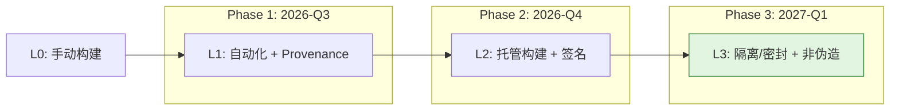

| 阶段 | 目标 | Build Track 关键行动 | Source Track 关键行动 | Build Env Track 关键行动 |
|------|------|---------------------|----------------------|------------------------|
| **Phase 1**<br>2026 Q3 | L1 全覆盖 | 所有组件接入 CI/CD；使用 SLSA GitHub Generator 生成 provenance | 确保所有仓库纳入版本控制（Git） | 记录构建镜像版本于 provenance |
| **Phase 2**<br>2026 Q4 | L2 核心系统 | 托管 CI/CD + cosign keyless 签名；Sigstore Rekor 入日志 | 启用 GPG/SSH commit signing；配置不可变仓库镜像 | 启用 vTPM 启动证明（如 AWS Nitro TPM, GCP Shielded VM） |
| **Phase 3**<br>2027 Q1 | L3 生产基线 | 隔离构建（`--network=none`）；临时环境；分离构建者与签名者权限 | 强制分支保护 + PR 审查 + 状态检查；Source Provenance 发布 | 试点 TEE 构建（AMD SEV-SNP VM）用于金融/核心组件 |

### 4.2 每个级别的典型工具链

| 等级 | Build Track 工具链 | Source Track 工具链 | Build Env Track 工具链 |
|------|-------------------|--------------------|------------------------|
| **L1** | GitHub Actions, GitLab CI, Jenkins, SLSA GitHub Generator | Git, GitHub, GitLab | Docker image SBOM (`syft`, `trivy`) |
| **L2** | Sigstore/cosign keyless, SLSA GitHub Generator v2.0+, Rekor CLI | GPG/SSH commit signing, GitHub branch protection rules | vTPM tools (`tpm2-tools`), GCP Shielded VM, AWS Nitro Enclaves |
| **L3** | GitHub Actions (hardened runners), Google Cloud Build, GitLab native attestation, `slsa-verifier` | GitHub required reviewers + status checks, GitLab MR approvals, in-toto attestations | AMD SEV-SNP, Intel TDX, Nix (hermetic builds), Bazel (sandboxed) |

### 4.3 成本-收益分析

| 升级路径 | 一次性成本 | 持续运营成本 | 收益 | ROI 评估 |
|---------|-----------|-------------|------|---------|
| **L0 → L1** | 低（CI/CD 配置化） | 低（自动化运行） | 来源可追溯；满足 SBOM 最小元素要求 | ⭐⭐⭐⭐⭐ 立即实施 |
| **L1 → L2** | 中（Sigstore 集成、密钥管理迁移） | 低（keyless 无长期密钥） | 防止构建后篡改；满足 NIST 800-161 基础要求 | ⭐⭐⭐⭐⭐ 核心系统必做 |
| **L2 → L3** | 中高（隔离网络、临时环境、平台审计） | 中（构建时间增加 10-30%） | 防止构建中篡改；满足 EU CRA / FedRAMP | ⭐⭐⭐⭐ 生产系统推荐 |
| **Build Env L1 → L3** | 高（TEE 硬件、Nix/Bazel 迁移） | 高（专用硬件集群运维） | 硬件级环境可信；关键基础设施/国防必需 | ⭐⭐⭐ 仅限高价值目标 |

> **策略建议**: 对一般企业应用，**Build L3 + Source L2** 是 2027 年的最优性价比基线；Build Environment L3 仅用于金融核心、国防、关键基础设施等场景。`slsa-reuse-boundaries.md` §5 的 Phase 4 路线图与此一致。

---

## 5. 正向示例：规模化 SLSA 落地

### 示例 A：GitHub Artifact Attestations 原生集成

GitHub Actions 自 2024 年起提供 `actions/attest-build-provenance`，为容器镜像、二进制文件、包等任意产物生成签名 provenance：

```yaml
- uses: actions/attest-build-provenance@v1
  with:
    subject-name: ghcr.io/${{ github.repository }}
    subject-digest: ${{ steps.build.outputs.digest }}
    push-to-registry: true
```

该 provenance 符合 SLSA v1.0 Build L2；若配合可复用工作流（reusable workflow）并限制工作流权限，可达到 Build L3。下游消费者使用 `gh attestation verify` 即可验证。

### 示例 B：npm Trusted Publishing 自动 provenance

npm 自 2023 年支持 `--provenance` 标志，通过 GitHub Actions OIDC 自动为包发布生成 Sigstore 签名的 provenance。截至 2025 年底，超过 50,000 个项目采用 Trusted Publishing，17% 的上传包含 attestations。消费者运行 `npm audit signatures` 或查看 registry 中的 `.sigstore` 元数据即可确认包来源。

---

## 6. 反例 / 反模式：信任边界的误判

### 反例 A：Mini Shai-Hulud / TanStack npm 蠕虫（2026-05）

攻击者通过 `pull_request_target` 漏洞、GitHub Actions 缓存污染和 OIDC token 内存提取，劫持 TanStack 官方发布流水线，发布了 84 个携带有效 SLSA Build L3 provenance 的恶意 npm 包版本。

**关键教训**：SLSA provenance 回答“**这个制品是否由声称的构建流水线生成**”，但不回答“**构建流水线当时是否被入侵**”或“**源码是否恶意**”。证明只是信任基础设施的一环，不能替代源码审查、运行时监控与最小权限。

### 反例 B：项目手动下载预编译二进制

某团队从个人网盘下载无签名的二进制依赖，既无 SHA-256 校验也无 provenance。该二进制实际被替换为植入后门的版本，导致生产环境泄露数据库凭证。该做法甚至不满足 SLSA L1。

---

## 7. 控制点映射：SLSA Build Track → 项目实现

| SLSA 要求 | 项目控制点 | 实现/验证方式 |
|----------|-----------|--------------|
| BT-L1-R1 自动化构建 | 所有关键仓库配置 `.github/workflows/build.yml` | quality-gate 扫描工作流存在性 |
| BT-L2-R3 Provenance 签名 | 使用 `actions/attest-build-provenance` 或 `slsa-github-generator` | `slsa-verifier` / `gh attestation verify` |
| BT-L3-R2 临时环境 | GitHub-hosted runner 每次新建 VM；自托管 runner 采用 Kubernetes 临时 Pod | 审计 runner 生命周期日志 |
| BT-L3-R3 隔离网络 | 构建容器配置 `--network=none`，仅允许声明的代理缓存 | 网络策略审计 |
| ST-L3-R2 双人审查 | 主分支启用 `Require approvals: 2` + `Dismiss stale reviews` | GitHub API 检查分支保护规则 |
| ST-L3-R4 状态检查 | CI 测试、SAST、SBOM 生成、许可证扫描作为 required status checks | 合并门控配置审计 |

对应项目 PoC 与模板：

- `struct/10-supply-chain-security/05-slsa-l4-poc/`：演示双人审查、密封构建、可复现构建、来源证明的最小可运行实现。
- `struct/10-supply-chain-security/04-provenance-examples/`：提供 GitHub Actions + cosign + OCI referrers 的完整工作流模板。

---

## 8. 权威来源

| 标准/规范 | URL | 说明 | 核查日期 |
|-----------|-----|------|----------|
| SLSA Specification v1.2 | <https://slsa.dev/spec/v1.2/> | Multi-Track 架构、Build/Source/BuildEnv Track 正式定义 | 2026-07-08 |
| SLSA Build Track | <https://slsa.dev/spec/v1.2/levels#build-track> | L1–L3 构建要求详细规范 | 2026-07-08 |
| SLSA Source Track | <https://slsa.dev/spec/v1.2/levels#source-track> | v1.2 正式化的源码轨道要求 | 2026-07-08 |
| SLSA BuildEnv Track (Active Workstream) | <https://github.com/slsa-framework/slsa/issues> | OpenSSF 活跃工作流，草案讨论 | 2026-07-08 |
| OpenSSF SLSA GitHub | <https://github.com/slsa-framework/slsa> | 规范源码、社区讨论、路线图 | 2026-07-08 |
| Sigstore / cosign | <https://docs.sigstore.dev/cosign/overview/> | 无密钥签名、Fulcio、Rekor | 2026-07-08 |
| SLSA GitHub Generator | <https://github.com/slsa-framework/slsa-github-generator> | 自动生成 SLSA provenance 的 GitHub Actions | 2026-07-08 |
| GitHub Artifact Attestations | <https://docs.github.com/en/actions/security-guides/using-artifact-attestations-to-establish-provenance-for-builds> | 原生 provenance 生成与验证 | 2026-07-08 |
| npm Provenance | <https://docs.npmjs.com/generating-provenance-statements> | npm registry provenance 说明 | 2026-07-08 |

---

> 最后更新: 2026-07-08
> 关联文件: `slsa-reuse-boundaries.md`, `slsa-1-1-1-2-update.md`, `slsa-1-2-multi-track-update.md`

---


<!-- SOURCE: struct/10-supply-chain-security/01-slsa-framework/slsa-l4-distributed-builds.md -->

# SLSA L4 分布式构建验证实践

> **版本**: 2026-06-08
> **权威来源**: OpenSSF SLSA Active Workstreams, sigstore.dev, SLSA GitHub Community
> **定位**: Phase 4（2027-Q2）供应链安全前瞻交付物，探索 L4 分布式信任与复用验证的集成方案
> **交叉引用**: `struct/10-supply-chain-security/01-slsa-framework/slsa-reuse-boundaries.md`

---

## 1. SLSA L4 愿景

### 1.1 L4 与 L3 的核心差异

| 维度 | Build L3 | Build L4 |
|------|---------|----------------|
| **审查机制** | 构建过程隔离，但源码审查策略由平台自行决定 | **双因素审查**：所有源码变更强制经过双人审查 + 自动化安全扫描 |
| **构建可复现性** | 不强制要求（允许非确定性构建） | **完全可复现**：不同时间、不同构建器产生 bit-for-bit identical 产物 |
| **信任模型** | 依赖单一 CI/CD 平台（GitHub Actions, Cloud Build） | **分布式信任**：不依赖单一构建器，通过多独立构建器交叉验证建立共识 |
| **环境保证** | 隔离/临时环境 | **密闭（Hermetic）+ 硬件证明**：工具链和依赖完全锁定，环境状态可远程证明 |
| **当前状态** | 已发布，工具链成熟 | **开发中**：OpenSSF Build Level 4 Workstream 活跃讨论 |

L4 的本质是将"信任一个平台"转变为"信任一个协议"——即使单个构建器被攻破，多数诚实构建器仍能让消费者检测出异常。

### 1.2 L4 的当前状态

L4 目前处于 **OpenSSF Active Workstream** 阶段。关键事实：

- **无正式规范**: SLSA v1.2 Build Track 仅定义到 L3；L4 要求散见于社区讨论和 v0.1 遗留定义。
- **可复现构建社区**: Reproducible Builds 项目（Debian, Tor, Bitcoin）已积累十余年实践，但通用 CI 工具链的可复现性仍不足。
- **时间预期**: 业界预测 L4 正式规范将在 **2027–2028** 发布，企业应提前进行技术储备。

> **交叉引用**: `slsa-reuse-boundaries.md` §3.4 将 Build L4 定义为"最高可信复用"，给出 L3→L4 升级路径。本文扩展分布式验证视角。

---

## 2. 分布式构建验证概念

### 2.1 多签名构建（Multi-sig builds）

多签名构建要求 **N 个独立构建器** 使用相同源码和构建定义，各自生成产物和 provenance。当 ≥M 个构建器（通常 M = ⌈N/2⌉）的产物哈希一致时，该版本被视为可信。

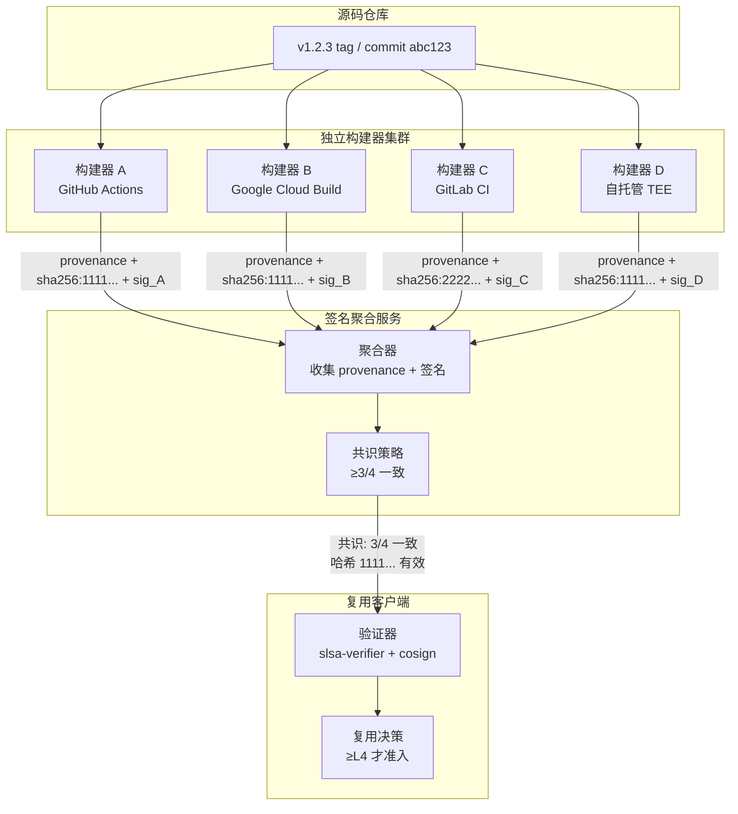

**关键设计决策**:

- **独立性**: N 个构建器分属不同信任域（不同云厂商、组织、地理位置），防止协同攻击。
- **确定性输入**: 构建定义必须密闭，消除时间戳、随机数、路径等非确定性来源。
- **异步容忍**: 构建器异步提交结果，聚合器在窗口期（如 24h）后执行共识判定。

### 2.2 可复现构建（Reproducible builds）

可复现构建是 L4 的技术基石：给定相同源码和构建定义，任何时间、任何机器构建都应得到 **bit-for-bit identical** 产物。

**实现要点**:

| 非确定性来源 | 消除策略 | 工具/技术 |
|-------------|---------|----------|
| 时间戳嵌入 | 使用 `SOURCE_DATE_EPOCH` 规范化 | `strip-nondeterminism` |
| 文件系统路径 | 构建于固定 chroot 路径或使用 `-ffile-prefix-map` | Bazel, Nix |
| 随机数/UUID | 使用确定性伪随机种子 | 源码级修复 |
| 并行排序 | 稳定排序算法；避免依赖 `readdir` 顺序 | `sort` 显式排序依赖列表 |
| 压缩工具元数据 | 固定 `gzip -n`, `zip -X` | `deterministic-zip` |
| 编译器内置宏 | 使用 `__DATE__` / `__TIME__` 替代方案 | 编译器标志或预处理器 |

**验证方法**: 定期在不同构建器上执行可复现性验证 CI，比较 SHA-256 哈希；`diffoscope` 可定位字节级差异。

### 2.3 分布式信任模型

分布式信任模型将传统单一平台信任锚点替换为 **共识协议**：

- **不依赖单一 CI/CD**: 即使某一平台被攻破，其他构建器仍可提供独立视角。
- **透明日志（Rekor）**: 所有 provenance 和签名写入 Rekor，提供全局可审计的时间戳和非否认性。
- **可插拔验证策略**: 消费者可自定义共识阈值（金融系统 4/4，一般企业 2/3）。

---

## 3. sigstore/cosign 实践指南

### 3.1 使用 cosign 进行 OCI 镜像签名

**Keyless 签名（推荐）**:

```bash
# 构建镜像后，在 CI 中使用 OIDC 身份签名
cosign sign --yes \
  --oidc-issuer=https://token.actions.githubusercontent.com \
  --certificate-identity-regexp="https://github.com/myorg/.github/.github/workflows/build.yml@refs/tags/v.*" \
  myregistry.example.org/myapp:v1.2.3
```

**验证签名**:

```bash
cosign verify \
  --certificate-identity-regexp="https://github.com/myorg/.github/.github/workflows/build.yml@refs/tags/v.*" \
  --certificate-oidc-issuer=https://token.actions.githubusercontent.com \
  myregistry.example.org/myapp:v1.2.3
```

### 3.2 Fulcio（短寿命证书）+ Rekor（透明日志）

| 组件 | 功能 | 在分布式验证中的角色 |
|------|------|-------------------|
| **Fulcio** | OIDC 身份 → X.509 短寿命证书（默认 10 分钟） | 每个构建器的 CI 身份独立获得证书，无需长期密钥管理 |
| **Rekor** | 透明日志，记录所有签名和 provenance 的哈希 | 全局时间排序和不可篡改审计；检测回滚攻击和重签名攻击 |
| **Timestamp Authority** | RFC 3161 合规时间戳 | 为签名提供独立于构建器时钟的可信时间锚点 |

**多构建器场景的 Rekor 查询**:

```bash
# 检索特定镜像 digest 的所有公开签名记录
rekor-cli search --sha sha256:abc123...

# 获取特定 entry 的完整 provenance
rekor-cli get --uuid <entry-uuid> --format json | jq '.Body.HashedRekordObj.data.hash'
```

### 3.3 验证 SLSA Provenance Attestations

```bash
# 使用 slsa-verifier 验证 GitHub Actions 生成的 provenance
slsa-verifier verify-image \
  myregistry.example.org/myapp:v1.2.3 \
  --source-uri github.com/myorg/myapp \
  --builder-id https://github.com/slsa-framework/slsa-github-generator/.github/workflows/generator_container_slsa3.yml@refs/tags/v2.0.0 \
  --provenance-path provenance.att

# 在分布式场景中，验证多个 provenance 文件
for prov in provenance.{a,b,c,d}.att; do
  slsa-verifier verify-image ... --provenance-path "$prov" || exit 1
done
```

---

## 4. 概念验证设计（不实际搭建）

### 4.1 架构图：多构建器 → 签名聚合 → 验证客户端

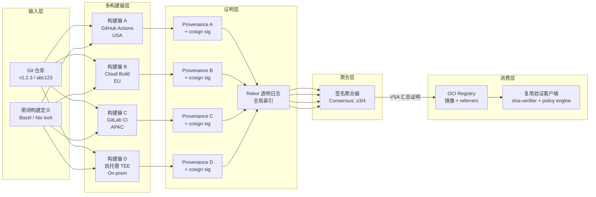

**组件说明**:

- **输入层**: Git tag + commit 标识源码；Bazel/Nix lock 提供密闭定义。
- **多构建器层**: 4 个独立构建器各自生成 provenance。
- **证明层**: provenance 经 cosign keyless 签名并上传 Rekor；镜像 referrers 关联 provenance。
- **聚合层**: 独立聚合服务执行共识，生成 VSA。
- **消费层**: 复用系统引入组件前验证 VSA 和 provenance 签名链。

### 4.2 威胁模型：单一构建器被攻破的场景

| 威胁场景 | 攻击方式 | 检测机制 | 缓解措施 |
|---------|---------|---------|---------|
| **构建器 A 被植入后门** | 恶意 CI runner 注入 payload | 构建器 B/C/D 产物哈希与 A 不一致 | 拒绝 A 的 provenance；触发调查；临时提升阈值至 4/4 |
| **源码仓库被篡改** | 攻击者强制推送恶意 commit | 所有构建器基于 tampered 源码生成一致哈希；Source Track L3 审查日志可检测异常合并 | Source Track + 分支保护作为独立防线；Git 不可变引用辅助审计 |
| **聚合器本身被攻破** | 聚合器伪造 VSA 掩盖不一致 | VSA 也被签名并写入 Rekor；客户端可独立重验证 | 客户端不信任聚合器，仅作缓存；定期全量重验证 |
| **Rekor 日志分叉** | 攻击者运行恶意 Rekor 实例 | 客户端配置固定 Rekor 公钥；Witness/Monitors 监控一致性 | 多 Rekor monitor 独立运行；Gossip 检测分叉 |

### 4.3 回退策略：当签名不一致时的处理

```text
共识失败处理流程
├── 情况 1: 少数构建器不一致（如 1/4）
│   ├── 丢弃少数派产物和 provenance
│   ├── 向多数派哈希收敛，发布 VSA
│   └── 通知不一致构建器运营方调查
│
├── 情况 2: 无明确多数（如 2/4 vs 2/4）
│   ├── 拒绝发布该版本，标记为安全事件
│   ├── 触发人工安全审查
│   └── 暂停组件复用准入，直至调查完成
│
├── 情况 3: 全部一致但哈希非预期（全被攻破或源码污染）
│   ├── 灾难场景；依赖 Source Track L3 审查日志事后溯源
│   └── 启动紧急响应，回滚至上版本
│
└── 通用原则: "不信任，验证" — 客户端保留独立验证权
```

---

## 5. 与复用决策的集成

### 5.1 复用前验证：检查组件的 SLSA Provenance

组件进入企业制品注册表前，验证门控执行以下检查：

| 检查项 | 工具 | 失败行为 |
|-------|------|---------|
| Provenance 存在且格式合规 | `slsa-verifier` | 阻断，要求上游补充 |
| Build Track ≥ 目标等级 | `slsa-verifier --build-level` | 降级至更低信任区或阻断 |
| Source Track ≥ 目标等级 | 解析 Source Provenance / Scorecard | 标记为"未验证源码"，增加运行时监控 |
| 签名在 Rekor 中存在且无异常 | `rekor-cli verify` | 阻断，可能存在重签名攻击 |
| 镜像 digest 与 provenance 中的 subject 匹配 | `cosign verify` | 阻断，构建产物与声明不符 |
| L4 多构建器共识 VSA 有效 | 自定义 policy engine | 阻断，等待共识 |

### 5.2 升级策略：从 L3 到 L4 的迁移检查清单

```markdown
- [ ] Source Track L3 稳定运行 ≥6 个月（双人审查、分支保护、签名提交）
- [ ] 构建定义已密闭化（Nix / Bazel 锁定全部依赖和工具链）
- [ ] 可复现性验证 CI 已建立，连续 10 次构建哈希一致
- [ ] 至少 3 个独立构建器已部署，分属不同云厂商/组织
- [ ] Cosign keyless signing + Rekor 集成已完成
- [ ] 签名聚合器和共识策略已定义（N/M 阈值）
- [ ] 回退策略和灾难响应手册已编写并通过演练
- [ ] 下游验证客户端已升级支持多 provenance 验证
- [ ] 成本评估通过：L4 的构建和验证开销在预算范围内
- [ ] 合规团队确认 L4 满足目标监管框架（如 NIS2, CMMC）
```

> **交叉引用**: `slsa-reuse-boundaries.md` §3.4 的 L3 → L4 升级路径侧重单一组织内的技术升级；本文补充了跨组织分布式验证所需的运营和治理准备。

---

## 6. 权威来源

| 来源 | URL | 说明 |
|------|-----|------|
| SLSA Spec v1.2 | <https://slsa.dev/spec/v1.2/> | Build L3 正式规范；L4 社区讨论基础 |
| OpenSSF SLSA GitHub | <https://github.com/slsa-framework/slsa> | Active Workstreams、社区提案、路线图 |
| SLSA Build Level 4 Workstream | <https://github.com/slsa-framework/slsa/labels/build-level-4> | L4 定义的讨论 Issue 和 PR |
| Sigstore | <https://sigstore.dev> | cosign, Fulcio, Rekor 官方文档 |
| Cosign 文档 | <https://docs.sigstore.dev/cosign/> | OCI 镜像签名与验证指南 |
| Rekor 透明日志 | <https://docs.sigstore.dev/logging/> | 日志查询、监控、 witness 模式 |
| Reproducible Builds | <https://reproducible-builds.org/> | 可复现构建最佳实践和工具链 |
| SLSA GitHub Generator | <https://github.com/slsa-framework/slsa-github-generator> | 自动生成 SLSA provenance 的参考实现 |

---

> 最后更新: 2026-06-08
> 关联文件: `slsa-reuse-boundaries.md`, `slsa-1-2-multi-track.md`


---

## 补充章节

## 示例

**示例**：使用 Sigstore/cosign 对容器镜像进行签名，配合 GitHub Actions 隔离构建与可复现构建证明，达到 SLSA Build L3。

## 反例

**反例**：项目手动从个人仓库下载二进制依赖且无哈希校验，构建环境未隔离，无法达到 SLSA L1。

## 分析

**分析**：SLSA 将供应链安全分解为可升级、可审计的等级，是组织渐进式改进的路线图。

---


<!-- SOURCE: struct/10-supply-chain-security/01-slsa-framework/slsa-reuse-boundaries.md -->

# SLSA v1.2 多轨道复用安全边界详解

> **版本**: 2026-07-07
> **权威来源**: SLSA Specification v1.2 (slsa.dev), OpenSSF Best Practices, Sigstore/cosign 2026 Stack
> **定位**: Track D 供应链安全工程深化内容，为 Phase 4（2027-Q2）预热
> **交叉引用**: `struct/04-component-architecture-reuse/07-language-ecosystems/open-source-supply-chain-reuse.md`

---

## 1. 引言：为什么复用需要 SLSA 边界

软件架构复用的核心悖论在于：**复用度越高，供应链攻击面越大**。
当一个系统 80–90% 的代码来自外部依赖（参见 Sonatype 2026 报告），任何上游组件的构建过程被篡改，都将直接传导至下游所有消费者。
SLSA（Supply-chain Levels for Software Artifacts）框架通过分级构建证明（Build Provenance）为这一悖论提供了形式化的安全边界。

> **定理 S.RB.1** (SLSA Reuse Boundary Monotonicity): 若组件 C 被复用于系统 S，则 S 在供应链安全维度的有效 SLSA 等级不超过 C 的 SLSA 等级。即 `SLSA(S) ≤ min{SLSA(Cᵢ)}`。

本文件将 SLSA v1.2 的 Multi-Track 等级（Build Track L1–L3、Source Track L1–L3、Build Environment Track L1–L3，L4 均处于规划/草案阶段）映射到架构复用决策中，明确"达到某轨道 Lx 的资产可在什么场景复用"，并提供可执行的升级路径。

---

## 2. SLSA 等级总览与复用安全边界

SLSA v1.2 采用**多轨道（Multi-Track）模型**：Build Track 正式定义 L1–L3；Source Track 于 v1.2 正式化；Build Environment Track 处于草案阶段。v1.0 中的单一 L4 标量描述（"可复现构建 + 双人审查"）已过时，其要求被拆分到 Source Track 与 BuildEnv Track。因此，复用边界应采用**轨道等级向量** `(Build Lx, Source Ly, Env Lz)` 表示。

| 等级 | Build Track 核心目标 | 复用安全边界含义 | 2026 工具链支持 |
|------|---------------------|-----------------|----------------|
| **L0** | 无保证 | 不可信资产，禁止复用于生产环境 | — |
| **L1** | 知道软件从何而来 | 可复用于内部原型、POC 阶段 | GitHub Actions, GitLab CI |
| **L2** | 防止构建后被篡改 | 可复用于非关键业务系统、内部工具 | Sigstore/cosign keyless, SLSA GitHub Generator |
| **L3** | 防止构建过程中被篡改 | 可复用于生产系统、金融/医疗等高合规场景 | GitHub Actions (hardened), Google Cloud Build, GitLab native attestation |

> **注意**：关键基础设施、国防、航空航天等场景不再简单要求"Build L4"，而应根据风险选择 **Build L3 + Source L3 + BuildEnv L3** 的多轨道组合。

> **引用**: SLSA.dev Spec v1.0 — "Build L3 provides robust protection against tampering and unauthorized access, ensuring a high level of trust and integrity in the software development process." [^1]

---

## 3. 各级别详细解析

### 3.1 Build L1: Provenance Generation — "可追溯复用"

#### 要求清单

| 要求编号 | 要求描述 | 验证方法 |
|---------|---------|---------|
| BL1-R1 | 构建过程完全脚本化/自动化 | 存在 `Makefile` / `build.sh` / CI 配置文件 |
| BL1-R2 | 生成并发布 Provenance（来源证明） | Provenance 文件随制品分发 |
| BL1-R3 | Provenance 包含构建定义和依赖信息 | 符合 SLSA Provenance v1 格式 |

#### 复用决策矩阵

| 复用场景 | 允许性 | 条件与限制 |
|---------|-------|-----------|
| 内部原型 / POC | ✅ 允许 | 需在 SBOM 中标记为 L1，明确无篡改保护 |
| 开发/测试环境 | ⚠️ 有条件 | 需配合依赖扫描（`npm audit`, `cargo audit`）使用 |
| 非关键生产系统 | ❌ 不建议 | 无签名保护，无法检测构建后篡改 |
| 关键生产系统 | ❌ 禁止 | 不满足最小篡改检测要求 |
| 开源组件再分发 | ⚠️ 有条件 | 需明确告知下游消费者无构建保证 |

#### 升级路径

```text
L0 → L1
├── 步骤 1: 将手动构建迁移至 CI/CD（GitHub Actions / GitLab CI / Jenkins）
├── 步骤 2: 使用 SLSA GitHub Generator 或自研脚本生成 Provenance
├── 步骤 3: 将 Provenance 作为 Release Artifact 附加
└── 验证: 检查 Provenance 中 buildType、externalParameters、resolvedDependencies 完整性
```

> **交叉引用**: `struct/04-component-architecture-reuse/07-language-ecosystems/open-source-supply-chain-reuse.md` §5.2 指出，L1 级别的 Provenance 是 SBOM 全生命周期的起点，但缺乏密码学保证的 Provenance 无法防御 Lockfile 注入攻击。

---

### 3.2 Build L2: Hosted Build + Authenticated Provenance — "防篡改复用"

#### 要求清单

| 要求编号 | 要求描述 | 验证方法 |
|---------|---------|---------|
| BL2-R1 | 使用版本控制系统（Git/SVN） | 源码来源可追溯至特定 commit |
| BL2-R2 | 使用托管构建服务 | 构建在 GitHub Actions / Cloud Build / GitLab CI 等托管平台执行 |
| BL2-R3 | Provenance 经过签名和认证 | 使用 Sigstore/cosign keyless signing 或 GPG/X.509 签名 |
| BL2-R4 | Provenance 由构建服务生成 | 非人工手动创建，防止伪造 |

#### 复用决策矩阵

| 复用场景 | 允许性 | 条件与限制 |
|---------|-------|-----------|
| 内部工具/后台管理 | ✅ 允许 | 适合非面向客户的业务支持系统 |
| SaaS 服务（非核心模块） | ✅ 允许 | 需配合运行时监控（Falco/Tetragon） |
| 金融服务（非交易核心） | ⚠️ 有条件 | 需叠加 SAST/SCA 扫描，并满足 Source Track L1 |
| 医疗系统（HIPAA 范围） | ❌ 不建议 | 需达到 L3 才能满足 HIPAA 安全规则 |
| 关键基础设施 | ❌ 禁止 | 不满足构建过程隔离要求 |

#### 升级路径

```text
L1 → L2
├── 步骤 1: 将构建迁移至托管 CI/CD（避免本地/自托管 runner）
├── 步骤 2: 集成 Sigstore/cosign keyless signing（推荐）
│   └── cosign sign --yes --oidc-issuer=https://token.actions.githubusercontent.com <image>
├── 步骤 3: 使用 SLSA GitHub Generator v2.0+ 自动生成签名 Provenance
├── 步骤 4: 在 registry 中存储签名和 Provenance（OCI 1.1 参考类型）
└── 验证: cosign verify --certificate-identity=ci@org.com --certificate-oidc-issuer=<issuer> <image>
```

> **2026 Sigstore/cosign 新特性**:
> Cosign v2.4.1 支持 Rekor v1.2 透明日志，提供非否认性证明。
> keyless signing 通过 OIDC 将短期签名密钥绑定至 CI 身份，彻底消除长期密钥管理风险 [^2]。

---

### 3.3 Build L3: Hardened Build Platform — "可信复用"

#### 要求清单

| 要求编号 | 要求描述 | 验证方法 |
|---------|---------|---------|
| BL3-R1 | 构建定义来源于版本控制中的源码 | `buildType` 指向仓库内文件，非外部配置 |
| BL3-R2 | 构建环境是临时的（Ephemeral） | 每次构建使用全新 VM/容器，构建后销毁 |
| BL3-R3 | 构建环境是隔离的（Isolated） | 构建间无共享状态、无网络访问（除必要依赖下载） |
| BL3-R4 | 构建平台满足安全基线 | 平台通过审计（如 ISO 27001, SOC 2）或公开透明 |
| BL3-R5 | Provenance 非伪造性 | 仅构建平台可访问签名密钥，构建者无法伪造 |

#### 复用决策矩阵

| 复用场景 | 允许性 | 条件与限制 |
|---------|-------|-----------|
| 企业级 SaaS 核心服务 | ✅ 允许 | 2026 年企业基线标准 |
| 金融服务（含交易核心） | ✅ 允许 | 满足 PCI-DSS、SOX 合规要求 |
| 医疗系统（HIPAA/CRA） | ✅ 允许 | 满足 EU CRA 网络安全要求 |
| 汽车软件（ISO 26262） | ⚠️ 有条件 | 需叠加 Source Track L2（认证提交历史） |
| 航空航天/国防（DO-178C） | ⚠️ 有条件 | 建议向 L4 演进，需形式化验证配合 |
| 开源组件再分发 | ✅ 允许 | npm provenance（SLSA L3）已成为社区信任标志 |

#### 升级路径

```text
L2 → L3
├── 步骤 1: 启用隔离构建环境
│   ├── GitHub Actions: 使用 hosted runners（非 self-hosted）
│   ├── Google Cloud Build: 使用默认 worker pool
│   └── 私有环境: 确保 VM 每次构建后重建（Ephemeral）
├── 步骤 2: 限制构建网络访问
│   ├── 禁用构建步骤中的任意网络调用（`curl`, `wget`）
│   ├── 依赖预下载至内部代理仓库（ Nexus / Artifactory ）
│   └── 使用 `--network=none` 或等价容器策略
├── 步骤 3: 分离构建者与签名者权限
│   └── 使用 OIDC 联邦身份，让 CI 平台（非用户）获取签名凭证
├── 步骤 4: 实施构建平台安全基线
│   ├── 定期轮换构建镜像
│   ├── 扫描构建环境中的 CVE
│   └── 记录构建平台审计日志
└── 验证: 使用 slsa-verifier 检查 Provenance 的 builder.id 和 buildLevel
```

> **交叉引用**: `struct/04-component-architecture-reuse/07-language-ecosystems/comparison-matrix-2026.md` §4.4 指出，
> Rust（Cargo）和 Node.js（npm）生态在 2026 年已原生支持 SLSA L3 provenance（npm provenance via Sigstore，crates.io Trusted Publishing），
> 而 JVM 生态仍需手动配置。

---

### 3.4 Build L4 的过时标量视角（v1.2 已转向多轨道）

SLSA v1.0 曾将 L4 描述为"最高可信复用"的标量等级，要求双人审查、可复现构建与密闭构建。SLSA v1.2 已将这些要求拆分到 **Source Track** 与 **Build Environment Track**，并以独立等级呈现。因此，**不再使用单一 L4 标量**指导复用决策。最高可信场景应使用向量 `(Build L3, Source L3, Env L3)` 表示。详细矩阵与反例见第 7 节。

---

## 4. SLSA 等级与依赖治理的交叉引用

`struct/04-component-architecture-reuse/07-language-ecosystems/open-source-supply-chain-reuse.md` 提出了分层防御策略。
本文件将其与 SLSA 等级映射如下：

| 防御层 | 依赖治理措施 | 对应 SLSA 等级 | 理由 |
|-------|-------------|---------------|------|
| Layer 1: Proxy Registry | 缓存公共 registry，自动漏洞扫描 | L1–L2 | 保证来源可追溯，但无构建保证 |
| Layer 2: 审批工作流 | 新包/新版本需安全团队审批，7天冷却期 | L2–L3 | 结合签名证明和托管构建信任 |
| Layer 3: Lockfile + 哈希 | 精确版本锁定，密码学哈希验证 | L3 | 需要硬化构建平台保证 lockfile 未被篡改 |
| Layer 4: Vendoring | 关键系统完全离线构建，源码级补丁 | L4 | 密闭构建与可复现性的终极形态 |

> **定理 S.RB.2** (Dependency-SLSA Composition): 若系统 S 依赖组件集合 {C₁, C₂, ..., Cₙ}，且各组件 SLSA 等级为 {L₁, L₂, ..., Lₙ}，则 S 的有效 SLSA 等级为 `min(L₁, L₂, ..., Lₙ)`，与 S 自身的构建等级无关。

这意味着：**即使你的构建达到 L4，但只要有一个依赖是 L1，整个系统的复用安全边界就降级为 L1**。
这正是 `struct/04-component-architecture-reuse/07-language-ecosystems/open-source-supply-chain-reuse.md` §6.3 强调"分层组合策略"的根本原因。

---

## 5. 2026–2027 实施路线图

| 阶段 | 时间 | 目标等级 | 关键行动 |
|------|------|---------|---------|
| **Phase 1** | 2026 Q3 | L1 全覆盖 | 所有组件生成 Provenance；CI/CD 全自动化 |
| **Phase 2** | 2026 Q4 | L2 核心系统 | 核心组件启用托管构建 + cosign keyless 签名 |
| **Phase 3** | 2027 Q1 | L3 生产基线 | 生产组件全部达到 Build L3；推动关键供应商提供 L3 证明 |
| **Phase 4** | 2027 Q2 | L4 关键系统 | 金融/国防/关键基础设施组件达到 L4 |

---

## 6. 参考索引

[^1]: SLSA.dev, "SLSA Specification v1.0 — Security Levels", <https://slsa.dev/spec/v1.0/levels>
[^2]: Sigstore Project, "Cosign v2.4.1 Release Notes — Rekor v1.2 Support", 2026; HAMS Tech, "Kubernetes Supply Chain Security in 2026", 2026-02

## 7. SLSA 1.2 多轨道复用边界矩阵与反例

### 7.1 从标量到向量：多轨道定义

SLSA v1.2 引入 Multi-Track 架构，将供应链信任从单一 Build Track 标量扩展为至少三条独立轨道。对复用者而言，这意味着组件的"信任护照"是一个等级向量，而非单一数字。

- **Build Track**：验证构建过程是否自动化、托管、隔离、不可伪造。
- **Source Track**：验证源码是否受版本控制、提交历史是否认证、是否强制审查与分支保护。
- **Build Environment Track（BuildEnv Track）**：验证构建运行环境本身是否可证明、可复现、是否在硬件可信执行环境（TEE）中执行。

> **定义 S.MT.1** (SLSA 多轨道复用边界)：组件 C 的复用安全等级为三元组 `(Build_C, Source_C, Env_C)`。若系统 S 复用 C，则 S 在各轨道上的有效等级满足 `SLSA_track(S) ≤ SLSA_track(C)`。

### 7.2 三轨道 × L1–L3 复用边界矩阵

下表给出不同轨道等级组合对应的复用边界与典型场景。

| Build | Source | BuildEnv | 复用边界 | 典型场景 |
|-------|--------|----------|---------|---------|
| L1 | — | — | 仅可追溯，无篡改防护 | 内部原型、POC |
| L2 | L1 | — | 防止构建后篡改，源码在版本控制中 | 内部工具、后台管理 |
| L3 | L2 | L1 | 防止构建中篡改，认证源码历史，记录环境版本 | 企业 SaaS 核心服务 |
| L3 | L3 | L2 | 强制双人审查 + 启动证明 | 金融/医疗高合规系统 |
| L3 | L3 | L3 | 硬件 TEE + 可复现环境 | 关键基础设施、国防、航空航天 |

### 7.3 Source Track 与 BuildEnv Track 对复用的影响

**Source Track 影响**：

- L1 保证源码有不可变标识符，解决"复用的代码是哪个版本"的问题。
- L2 通过提交签名与历史保留，防止 maintainer 身份伪造与历史重写。
- L3 强制分支保护与双人审查，显著降低上游代码植入（如 XZ Utils）的风险。

**BuildEnv Track 影响**：

- L1 要求构建镜像附带 provenance/SBOM，使环境版本可追踪。
- L2 要求启动证明（vTPM / Secure Boot），确保每次构建使用的环境实例与基线一致。
- L3 要求在 TEE 中运行构建，防止构建平台管理员或恶意进程篡改构建过程。

> **定理 S.MT.2** (短板定理)：系统 S 的复用安全边界等于其所有依赖在各轨道上等级的最小值。即使 Build 达到 L3，只要 Source 为 L0，攻击者仍可通过控制上游仓库注入后门。

### 7.4 正例

| 组件 | 等级向量 | 复用价值 |
|------|---------|---------|
| npm 包 with provenance | Build L3, Source L2 | 消费者可验证包由 npm 官方 CI 构建，提交历史经 GPG/SSH 签名 |
| GitHub Actions 构建的内部共享库 | Build L3, Source L3 | 主分支强制 PR 审查与状态检查，隔离构建环境 |
| 金融核心模块在 AMD SEV-SNP VM 中构建 | Build L3, Source L3, Env L3 | 硬件证明环境完整性，满足最高合规要求 |

### 7.5 反例

| 反例 | 风险说明 |
|------|---------|
| 仅宣称"Build L3"但 Source Track 未评估 | 源码仓库未启用分支保护，攻击者可直接推送恶意代码 |
| 使用自托管 runner 且未记录镜像 provenance（Env L0） | 构建环境可被持久化攻击，runner 镜像含后门 |
| 将 v1.0 的"L4"当作单一标量采购要求 | 忽略了 Source/Env 短板，合同条款无法覆盖多轨道验证 |
| 依赖仅提供 Build L1 provenance 却用于生产 | 无法检测构建后篡改，如 SolarWinds 式构建系统攻击 |

### 7.6 多轨道复用决策 Mermaid 图

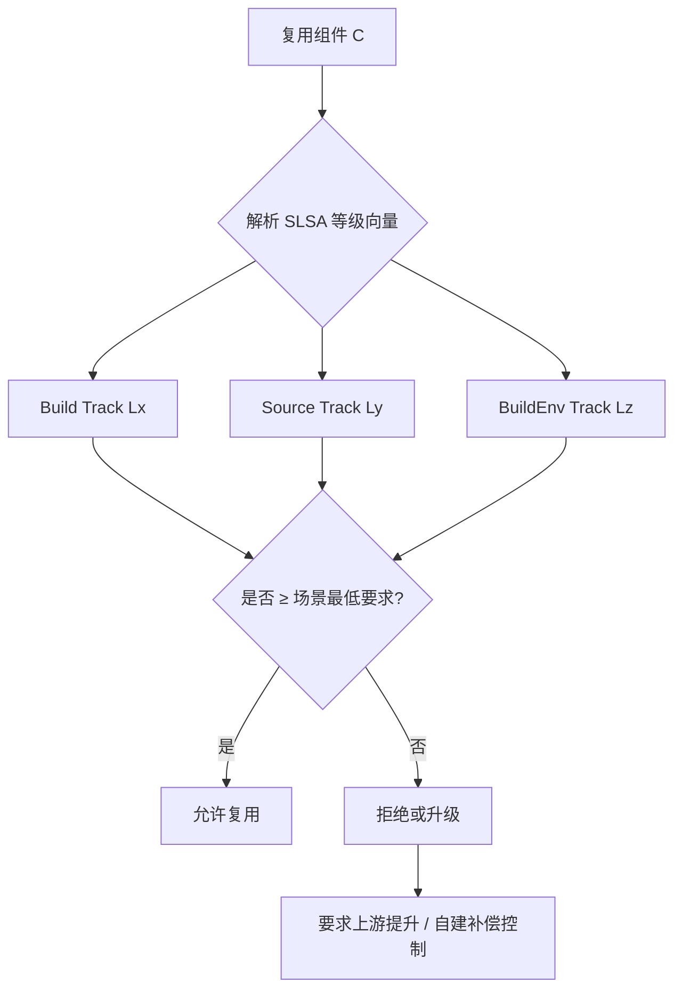

### 7.7 权威来源与交叉引用

- SLSA Specification v1.2 — Multi-Track: <https://slsa.dev/spec/v1.2/>
- SLSA Source Track: <https://slsa.dev/spec/v1.2/levels#source-track>
- SLSA Build Environment Track (draft): <https://github.com/slsa-framework/slsa/issues>
- OpenSSF SLSA GitHub Generator: <https://github.com/slsa-framework/slsa-github-generator>
- Sigstore: <https://sigstore.dev>
- in-toto: <https://in-toto.io>
- 相关概念: [Supply chain attack](https://en.wikipedia.org/wiki/Supply_chain_attack)
- **交叉引用**: `struct/10-supply-chain-security/01-slsa-framework/slsa-1-2-multi-track.md` §3.1；`struct/04-component-architecture-reuse/07-language-ecosystems/open-source-supply-chain-reuse.md` §6.3

---

## 8. SLSA v1.2 Build Track 与 Source Track 对复用边界的独立影响

### 8.1 Build Track：复用边界的"完整性基线"

Build Track 解决的核心问题是：**复用者收到的二进制制品，是否真实地来自声明的源码，且在构建后未被篡改**。在复用场景中，Build Track 等级直接决定了组件可作为何种类型的"信任输入"进入下游系统。

| Build Track 等级 | 对复用边界的影响 | 可复用性结论 |
|-----------------|-----------------|-------------|
| **L0** | 无 provenance，无法验证来源或完整性 | **禁止**进入生产交付包；仅可作为本地实验代码 |
| **L1** | 知道构建脚本和依赖清单，但无密码学保证 | 可复用于内部原型、POC、开发工具；不得用于客户-facing 生产系统 |
| **L2** | 构建在托管环境执行，provenance 经签名认证 | 可复用于非关键生产系统、内部共享服务；需叠加依赖扫描 |
| **L3** | 隔离/临时/硬化构建平台，provenance 不可伪造 | 可复用于关键生产系统、金融/医疗/关键基础设施；是企业采购的推荐基线 |

> **定理 S.RB.3** (Build Track 复用单调性): 若系统 S 复用组件 C，则 S 在 Build Track 上的有效等级满足 `Build(S) ≤ Build(C)`。即：下游无法通过自身构建升级来弥补上游组件的 Build Track 短板。

**Build Track 对复用决策的启示**：

1. **采购合同条款**：在采购第三方闭源/开源组件时，应将 Build Track 等级写入安全 SLA。例如，要求核心依赖至少提供 Build L2 provenance，关键路径组件达到 Build L3。
2. **内部组件目录**：企业组件目录应自动标注每个组件的 Build Track 等级，并与 CI/CD 门禁联动。低于目标等级的组件在推送到生产 registry 时触发审批流程。
3. **传递依赖降级**：即使直接依赖达到 Build L3，其传递依赖若仅为 L1，则该子树的有效等级仍降级为 L1。因此，复用评估必须覆盖完整依赖树。

### 8.2 Source Track：复用边界的"上游治理基线"

Source Track 解决的核心问题是：**进入构建的源码是否经过适当的版本控制、身份认证和审查流程**。在复用场景中，Source Track 等级决定了上游仓库被恶意控制或历史被篡改的抵抗能力。

| Source Track 等级 | 对复用边界的影响 | 可复用性结论 |
|------------------|-----------------|-------------|
| **L0** | 源码未纳入版本控制或无法验证标识符 | **禁止**作为可复用组件；等同于不可追溯代码 |
| **L1** | 源码在版本控制中，每个变更有不可变标识符 | 可复用于内部工具、非关键模块；可回答"这是哪个版本" |
| **L2** | 提交历史经认证（GPG/SSH 签名）并永久保留 | 可复用于企业核心服务；防止 maintainer 身份伪造和历史重写 |
| **L3** | 强制分支保护、双人审查、状态检查、签名提交 | 可复用于高合规/高安全场景；显著降低上游代码植入风险（如 XZ Utils 式攻击） |

> **定理 S.RB.4** (Source Track 复用单调性): 若系统 S 复用组件 C，则 S 在 Source Track 上的有效等级满足 `Source(S) ≤ Source(C)`。Source Track 的短板无法通过更严格的构建环境弥补。

**Source Track 对复用决策的启示**：

1. **开源组件选型**：优先选择启用分支保护、要求 PR 审查、使用 signed commits 的项目。OpenSSF Scorecard 的"Branch Protection"和"Signed Commits"检查可作为快速筛选器。
2. **内部共享库治理**：强制主分支保护、双人审查和 CI 状态检查。将 Source L3 作为内部"黄金组件"的准入门槛。
3. **长期维护评估**：Source L2 要求历史永久保留。对于可能删除旧版本或重写历史的项目，应评估其 Source Track 等级并制定版本锁定策略。

### 8.3 BuildEnv Track：复用边界的"运行时信任基线"

Build Environment Track 解决的核心问题是：**执行构建的环境本身是否可信**。在最高安全场景下，即使 Build Track 和 Source Track 都达到 L3，构建环境若被持久化攻击（如 runner 镜像植入后门），仍可能污染产物。

| BuildEnv Track 等级 | 对复用边界的影响 | 可复用性结论 |
|--------------------|-----------------|-------------|
| **L0** | 未记录或验证构建环境 | 不适用于关键基础设施；无法证明环境一致性 |
| **L1** | 构建环境附带 provenance/SBOM | 可复用于企业 SaaS 核心服务；环境版本可追踪 |
| **L2** | 启动证明（vTPM/Secure Boot）验证环境 | 可复用于金融/医疗高合规系统；防止环境启动链篡改 |
| **L3** | 在硬件 TEE 中运行构建 | 可复用于关键基础设施、国防、航空航天；提供硬件级环境完整性 |

### 8.4 L4 状态澄清：所有轨道的 L4 均为"规划中/草案"

SLSA v1.0 曾将 L4 描述为 Build Track 的最高等级，要求"双人审查 + 可复现构建"。SLSA v1.2 已明确：

- **Build Track L4**：仍处于 OpenSSF 工作流讨论阶段，尚未发布正式要求。预计包含更严格的可复现性（bit-for-bit reproducible）和多方审计。
- **Source Track L4**：同样处于规划中，可能要求更高级别的身份认证、审查者独立性、或去中心化源码镜像。
- **Build Environment Track L4**：尚未定义，可能涉及形式化验证的构建环境或硬件安全模块。

> **定义 S.RB.5** (SLSA L4 草案状态): SLSA v1.2 中，任何轨道的 L4 均不应用于生产合规要求或采购合同的强制条款。组织应将 **Build L3 + Source L3 + BuildEnv L3** 作为 2027 年的实际最高基线，并跟踪 L4 草案进展。

### 8.5 多轨道复用边界正例与反例补强

#### 正例

| 场景 | 等级向量 | 复用决策说明 |
|------|---------|-------------|
| 内部 CRM 插件 | (Build L2, Source L1, Env L0) | 非关键业务，有签名 provenance 即可 |
| 支付网关 SDK | (Build L3, Source L3, Env L2) | 金融核心，需双人审查 + 启动证明 |
| 开源日志库（Log4j 类） | (Build L3, Source L2, Env L1) | 广泛使用的基础库，需高 Build/Source 等级 |
| 国防通信模块 | (Build L3, Source L3, Env L3) | 关键基础设施，需硬件 TEE 构建 |

#### 反例

| 反例 | 风险说明 |
|------|---------|
| 合同要求"SLSA L4"但无轨道限定 | L4 处于草案，无法验证；应改为明确的 `(Build L3, Source L3, Env L3)` |
| 仅关注 Build Track，忽略 Source Track | 源码仓库被攻破后，Build L3 无法阻止恶意代码进入构建 |
| 将 Source L3 误认为 Build L3 | 源码审查再严格，构建环境被篡改仍会产生恶意产物 |
| 依赖仅 Build L1 却用于生产 | 无法检测构建后篡改，如 SolarWinds 事件 |
| 自托管 runner 未记录 Env L1 | 环境镜像无 provenance，持久化后门难以发现 |

### 8.6 SLSA 多轨道复用边界决策 Mermaid 图

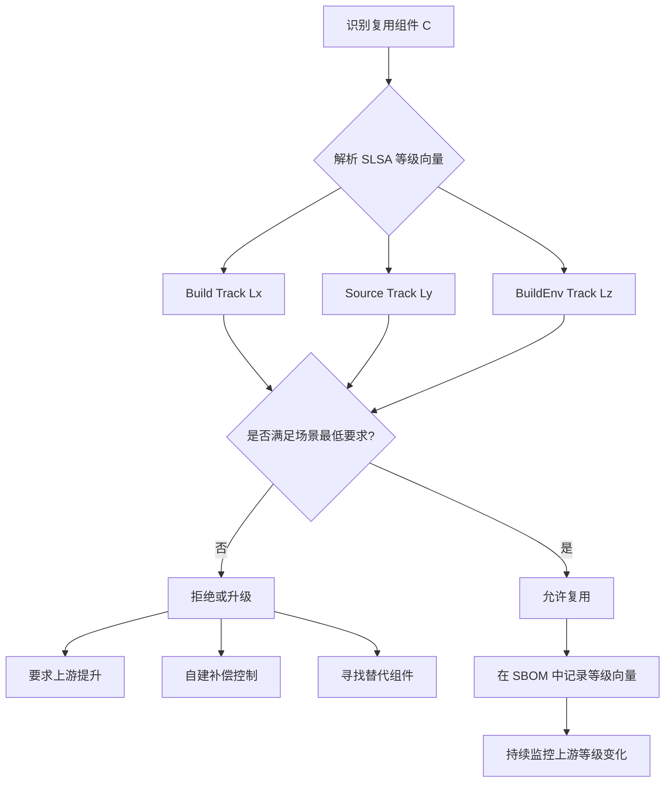

### 8.7 权威来源与交叉引用补强

- SLSA Specification v1.2 — Multi-Track: <https://slsa.dev/spec/v1.2/>
- SLSA Build Track: <https://slsa.dev/spec/v1.2/levels#build-track>
- SLSA Source Track: <https://slsa.dev/spec/v1.2/levels#source-track>
- SLSA Build Environment Track (draft): <https://github.com/slsa-framework/slsa/issues>
- OpenSSF SLSA GitHub Generator: <https://github.com/slsa-framework/slsa-github-generator>
- Sigstore: <https://sigstore.dev>
- in-toto: <https://in-toto.io>
- 相关概念: [Supply chain attack](https://en.wikipedia.org/wiki/Supply_chain_attack)
- **交叉引用**: `struct/10-supply-chain-security/01-slsa-framework/slsa-1-2-multi-track.md` §3.1；`struct/04-component-architecture-reuse/07-language-ecosystems/open-source-supply-chain-reuse.md` §6.3；`struct/10-supply-chain-security/03-attack-vectors/attack-tree.md` §7

## 9. SLSA v1.2 多轨道复用边界形式化定义与属性表

> **定义 S.RB.6** (SLSA v1.2 多轨道复用边界): 组件 C 的复用安全边界由三元组 `(Build(C), Source(C), Env(C))` 描述。Build Track 保证构建过程的完整性与不可伪造性；Source Track 保证源码来源、身份认证与审查强度；Build Environment Track 保证构建执行环境本身可证明、可复现、可隔离。系统 S 复用 C 时，各轨道有效等级满足 `SLSA_track(S) ≤ SLSA_track(C)`。

### 9.1 三轨道等级属性表

| Track | Level | 核心目标 | 信任假设 | 关键产物 | 复用边界 | 典型场景 |
|-------|-------|----------|----------|----------|----------|----------|
| Build Track | L1 | 知道软件从何而来 | 自动化构建脚本 | Provenance | 内部原型/POC | 实验性工具 |
| Build Track | L2 | 防止构建后被篡改 | 托管构建 + 签名 | Signed Provenance | 内部工具/非关键 SaaS | 后台服务 |
| Build Track | L3 | 防止构建过程中被篡改 | 隔离/硬化构建平台 | Hermetic Provenance | 生产/金融/医疗 | 核心交易服务 |
| Source Track | L1 | 源码有不可变标识 | 版本控制 | Commit SHA | 内部非关键模块 | 脚本库 |
| Source Track | L2 | 提交历史认证且不可重写 | 签名提交 | Signed commit history | 企业核心服务 | 共享库 |
| Source Track | L3 | 强制审查与分支保护 | 双人审查 + 状态检查 | PR + status checks | 高安全场景 | 密码学/基础设施 |
| BuildEnv Track | L1 | 构建环境可追溯 | 环境 SBOM | Image provenance | 企业 SaaS 核心 | 容器化构建 |
| BuildEnv Track | L2 | 启动证明验证环境 | vTPM/Secure Boot | Boot attestation | 金融/医疗高合规 | 硬化 runner |
| BuildEnv Track | L3 | 硬件 TEE 中运行构建 | 可信执行环境 | HW attestation | 国防/关键基础设施 | 机密计算 |

> **注意**：SLSA v1.2 中所有轨道的 L4 目前均为**规划中/草案**状态，不建议写入生产合规要求或采购合同。2027 年实际最高基线应为 `(Build L3, Source L3, Env L3)`。

### 9.2 与 SBOM、Provenance 的关系

SLSA Provenance 是 SBOM 的“构建过程视角”，两者共同构成复用资产的信任护照：

- **SBOM** 回答“复用了什么组件、什么版本、来自哪里”。
- **Provenance** 回答“该组件如何被构建、由谁构建、构建环境是否可信”。
- **SLSA 等级向量** 将两者上升为可验证的安全边界：只有 `(Build, Source, Env)` 均满足场景最低要求时，才允许进入对应复用域。

> **定理 S.RB.7** (Provenance-SBOM 组合定理): 若组件 C 的 SBOM 缺失或 Provenance 不可验证，则无论其 Build Track 等级如何，C 的复用边界均降级为 L0。

### 9.3 正例

| 场景 | 等级向量 | 复用决策说明 |
|------|----------|--------------|
| npm provenance 包 | (Build L3, Source L2, Env L1) | 消费者可验证包由 npm 官方 CI 构建，提交历史经签名保护 |
| GitHub Actions 内部共享库 | (Build L3, Source L3, Env L2) | 主分支强制 PR 审查，runner 启动经 vTPM 证明 |
| 国防通信模块 | (Build L3, Source L3, Env L3) | 在 AMD SEV-SNP VM 中构建，提供硬件级环境完整性证明 |

### 9.4 反例

| 反例 | 风险说明 |
|------|----------|
| 采购合同仅写“达到 SLSA L4” | L4 处于草案，无法验证，应改为明确的三轨道向量 |
| 只看 Build L3 忽略 Source Track | 源码仓库被攻破后，硬化构建平台仍会构建恶意代码 |
| 自托管 runner 未记录 Env 等级 | 环境镜像无 provenance，持久化后门难以发现 |
| 将 Provenance 与 SBOM 分离存储 | 审计时无法关联构建产物与依赖清单 |

### 9.5 多轨道信任护照 Mermaid 图

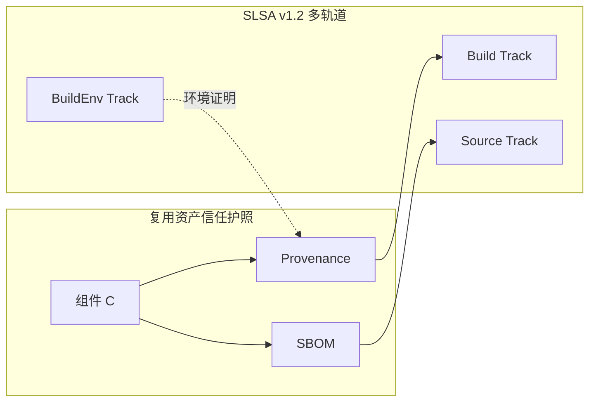

### 9.6 权威来源与交叉引用

- SLSA Specification v1.2 — Multi-Track: <https://slsa.dev/spec/v1.2/>
- SLSA Build Track: <https://slsa.dev/spec/v1.2/levels#build-track>
- SLSA Source Track: <https://slsa.dev/spec/v1.2/levels#source-track>
- SLSA Build Environment Track (draft): <https://github.com/slsa-framework/slsa/issues>
- OpenSSF: <https://openssf.org>
- Sigstore: <https://sigstore.dev>
- in-toto: <https://in-toto.io>
- 相关概念: [Supply chain attack](https://en.wikipedia.org/wiki/Supply_chain_attack)
- **交叉引用**: `struct/10-supply-chain-security/01-slsa-framework/slsa-1-2-multi-track.md` §3.1；`struct/10-supply-chain-security/03-attack-vectors/attack-tree.md` §7；`struct/04-component-architecture-reuse/07-language-ecosystems/open-source-supply-chain-reuse.md` §6.3


> 最后更新: 2026-07-07
> 关联文件: `slsa-1-2-multi-track.md`, `struct/04-component-architecture-reuse/07-language-ecosystems/open-source-supply-chain-reuse.md`

---


<!-- SOURCE: struct/10-supply-chain-security/02-sbom-standards/sbom-comparison.md -->

# SBOM 格式对比：SPDX vs CycloneDX vs SWID

> **版本**: 2026-06-06
> **定位**: 对比主流 SBOM 格式的特性、适用场景与复用策略

---

## 1. 三种格式概览

| 特性 | SPDX (ISO/IEC 5962) | CycloneDX (OWASP) | SWID (ISO/IEC 19770-2) |
|------|---------------------|-------------------|------------------------|
| **标准化组织** | Linux Foundation / ISO | OWASP | ISO/IEC / NIST |
| **主要用途** | 许可证合规 + 供应链安全 | 供应链安全 + 漏洞管理 | 软件资产管理 |
| **表达复杂度** | 高 | 中 | 低 |
| **嵌套依赖支持** | 优秀 | 优秀 | 有限 |
| **许可证信息** | 非常丰富 | 支持 | 有限 |
| **漏洞关联** | 通过 VEX 扩展 | 原生支持 | 较弱 |
| **适用场景** | 企业合规、法律咨询 | 安全运营、DevSecOps | 资产清单、ITAM |

---

## 2. SPDX 详解

SPDX (Software Package Data Exchange) 是 Linux Foundation 主导的开放标准，已被 ISO 接纳为 ISO/IEC 5962。

### 核心元素

```text
SPDX Document
├── SPDXID: SPDXRef-DOCUMENT
├── name
├── documentNamespace
├── creators
├── packages[]
│   ├── SPDXID, name, downloadLocation
│   ├── licenseConcluded, licenseDeclared
│   └── externalRefs
├── relationships[]
│   ├── DEPENDS_ON
│   ├── CONTAINS
│   └── DESCRIBES
└── files[], snippets[] (optional)
```

### 优势

- 丰富的许可证表达
- 强大的关系模型
- ISO 国际标准
- 生态工具丰富

### 局限

- 学习曲线陡峭
- 文档可能冗长
- 漏洞信息需要 VEX 扩展

---

## 3. CycloneDX 详解

CycloneDX 是 OWASP 主导的标准，专注于软件供应链安全。

### 核心元素

```text
bom.json
├── metadata
├── components[]
│   ├── type, name, version, purl
│   ├── licenses[], hashes[]
│   ├── pedigree, externalReferences
│   └── properties
├── dependencies[]
├── vulnerabilities[] (原生)
└── formulations[]
```

### 优势

- 原生漏洞支持
- DevSecOps 友好
- JSON 格式轻量
- 工具生态完善

### 局限

- 许可证表达不如 SPDX 精细
- 国际标准采纳程度较低

---

## 4. SWID 详解

SWID (Software Identification Tags) 是 ISO/IEC 19770-2 标准。

### 核心元素

```xml
<SoftwareIdentity name="MyApp" tagId="..." version="1.0.0">
    <Entity name="Example Inc." role="softwareCreator"/>
    <Payload>
        <File name="core.jar" SHA256:hash="..."/>
    </Payload>
</SoftwareIdentity>
```

### 优势

- NIST 要求对齐
- 软件资产管理原生支持
- 轻量级

### 局限

- 依赖关系表达弱
- 漏洞和许可证信息支持有限

---

## 5. 格式选择决策

```text
SBOM 格式选择
│
├── 主要目标？
│   ├── 许可证合规 → SPDX
│   ├── 安全漏洞管理 → CycloneDX
│   └── 软件资产盘点 → SWID
│
├── 输出格式偏好？
│   ├── JSON → CycloneDX
│   ├── RDF/Tag-Value → SPDX
│   └── XML → SWID/SPDX
│
└── 监管要求？
    ├── 美国联邦 → SWID + SPDX/CycloneDX
    └── 欧盟 CRA → SPDX 或 CycloneDX
```

---

## 6. 2026 趋势

| 需求 | 说明 |
|------|------|
| 运行时 SBOM | 记录实际加载的组件 |
| AI 模型 SBOM | 记录训练数据、依赖库、超参数 |
| VEX 自动化 | 自动化漏洞可利用性评估 |
| SBOM 签名 | 使用 cosign 签名 |
| SBOM 复用 | 组件级组合为系统级 |

## 7. 对比矩阵、示例与反例补强

### 7.1 定义：SBOM 作为复用契约

软件物料清单（SBOM）是描述软件组件及其依赖关系、许可证和漏洞信息的机器可读清单。在架构复用中，SBOM 不仅是技术元数据，更是供应商与复用者之间的**信任契约**。一个完整的 SBOM 应回答：组件由谁提供、包含什么、依赖什么、已知漏洞如何、是否可被再利用。

> **定义 SBOM.1** (SBOM Reuse Contract): 组件 C 的 SBOM 是复用者评估 C 的许可证兼容性、漏洞暴露面和供应链风险的最小可接受输入。缺少 SBOM 的组件应被视为"黑盒"，禁止进入高合规复用场景。

### 7.2 SPDX / CycloneDX / SWID 详细对比矩阵

| 属性 | SPDX (ISO/IEC 5962) | CycloneDX (OWASP/ECMA-424) | SWID (ISO/IEC 19770-2) |
|------|--------------------|---------------------------|------------------------|
| 标准化组织 | Linux Foundation / ISO | OWASP / ECMA | ISO/IEC / NIST |
| 主要目标 | 许可证合规 + 供应链安全 | 供应链安全 + 漏洞管理 | 软件资产管理 (ITAM) |
| 核心交换格式 | RDF/XML, JSON, Tag-Value, YAML, SPDX-Lite | JSON, XML, Protocol Buffers | XML |
| 嵌套依赖表达 | `relationships: DEPENDS_ON` | `dependencies: dependsOn` | 弱，依赖 `Link` 扩展 |
| 漏洞信息 | 通过 VEX / CSAF 外部扩展 | 原生 `vulnerabilities[]` | 弱 |
| 许可证表达 | 极其丰富，支持 `LicenseRef`、SPDX 标识符 | 支持 SPDX 标识符 | 有限 |
| 完整性哈希 | `PackageVerificationCode`, `checksums` | `hashes` | `File` 级哈希 |
| 签名机制 | 外部 GPG/cosign | 原生 `signature` + 外部 cosign | 外部 XML-DSig |
| 适用监管 | 欧盟 CRA、美国 FDA premarket | CISA、BSI TR-03183-2 | NIST、美国联邦 ITAM |
| 典型工具 | Syft, Tern, FOSSology, spdx-sbom-generator | CycloneDX CLI, Syft, Trivy, Dependency-Check | swidtag, NIST SWID Tools |
| 复用场景 | 企业合规、法律咨询、供应商合同 | DevSecOps、漏洞运营、CI/CD 门控 | 资产盘点、补丁管理、CMDB |

### 7.3 格式示例

**SPDX 2.3 Tag-Value 片段（许可证聚焦）**：

```text
SPDXVersion: SPDX-2.3
DataLicense: CC0-1.0
SPDXID: SPDXRef-DOCUMENT
DocumentName: example-app
Creator: Tool: syft-1.0.0

PackageName: log4j-core
SPDXID: SPDXRef-Package-log4j-core
PackageVersion: 2.17.1
PackageDownloadLocation: https://repo1.maven.org/maven2/org/apache/logging/log4j/log4j-core/2.17.1/
FilesAnalyzed: false
PackageLicenseConcluded: Apache-2.0
PackageLicenseDeclared: Apache-2.0
ExternalRef: PACKAGE-MANAGER purl pkg:maven/org.apache.logging.log4j/log4j-core@2.17.1
```

**CycloneDX 1.6 JSON 片段（漏洞聚焦）**：

```json
{
  "bomFormat": "CycloneDX",
  "specVersion": "1.6",
  "components": [
    {
      "type": "library",
      "name": "log4j-core",
      "version": "2.17.1",
      "purl": "pkg:maven/org.apache.logging.log4j/log4j-core@2.17.1",
      "hashes": [{"alg": "SHA-256", "content": "abc123..."}]
    }
  ],
  "vulnerabilities": [
    {
      "id": "CVE-2021-44228",
      "source": {"name": "NVD", "url": "https://nvd.nist.gov/vuln/detail/CVE-2021-44228"},
      "ratings": [{"source": {"name": "CVSSv3"}, "score": 10.0, "severity": "critical"}],
      "affects": [{"ref": "pkg:maven/org.apache.logging.log4j/log4j-core@2.17.1"}]
    }
  ]
}
```

**SWID 标签 XML 片段（资产聚焦）**：

```xml
<SoftwareIdentity name="example-app" tagId="example.com/example-app-1.0.0" version="1.0.0"
                  xmlns="http://standards.iso.org/iso/19770/-2/2015/schema.xsd">
  <Entity name="Example Inc." regid="example.com" role="softwareCreator softwareVendor"/>
  <Payload>
    <File name="app.jar" SHA256:hash="abc123..."/>
    <File name="lib/log4j-core-2.17.1.jar" SHA256:hash="def456..."/>
  </Payload>
</SoftwareIdentity>
```

### 7.4 正例

| 场景 | 推荐格式 | 价值 |
|------|---------|------|
| 向欧盟市场交付含数字元素的产品 | SPDX 或 CycloneDX | 满足 EU CRA 技术文档与 SBOM 要求 |
| 构建 DevSecOps 流水线 | CycloneDX | 原生漏洞字段与 CI/CD 工具集成 |
| 大规模企业软件资产盘点 | SWID + SPDX | SWID 与 CMDB 集成，SPDX 补充许可证 |
| 开源项目发布 | SPDX | 丰富的许可证表达，降低法律风险 |

### 7.5 反例

| 反例 | 后果 |
|------|------|
| 用 SWID 替代 CycloneDX 进行漏洞管理 | SWID 缺乏原生漏洞字段，无法直接关联 CVE |
| SBOM 仅列直接依赖，遗漏传递依赖 | 攻击面被低估，Log4j 类事件无法快速定位 |
| purl 使用不规范（大小写、命名空间缺失） | 自动化工具无法匹配漏洞数据库 |
| 用 CycloneDX 作为法律合同唯一依据 | 许可证结论字段不如 SPDX 的 `licenseConcluded`/`licenseDeclared` 精细 |
| SBOM 生成后未随版本更新 | 文档与实际软件不一致，合规审计失败 |

### 7.6 SBOM 复用生命周期 Mermaid 图

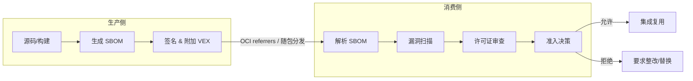

### 7.7 权威来源与交叉引用

- SPDX Specification: <https://spdx.dev/specifications/>
- CycloneDX Specification: <https://cyclonedx.org/specification/overview/>
- SWID / ISO/IEC 19770-2: <https://csrc.nist.gov/projects/Software-Identification-SWID>
- NTIA Minimum Elements for SBOM: <https://www.ntia.doc.gov/report/2021/minimum-elements-software-bill-materials-sbom>
- CISA SBOM: <https://www.cisa.gov/sbom>
- 相关概念: [Software bill of materials](https://en.wikipedia.org/wiki/Software_bill_of_materials), [Supply chain attack](https://en.wikipedia.org/wiki/Supply_chain_attack)
- **交叉引用**: `struct/10-supply-chain-security/06-case-studies/eu-cra-compliance.md` §4；`struct/10-supply-chain-security/02-sbom-standards/sbom-reuse-security.md`

---

> 最后更新: 2026-07-07


---

## 补充章节

## 示例

**示例**：在 CI 中为每个服务生成 CycloneDX SBOM，漏洞数据库匹配后自动生成影响范围报告，复用组件升级决策从数周缩短到数小时。

## 反例

**反例**：组织复用开源库多年却从未维护 SBOM，许可证冲突与安全漏洞只能在诉讼或事件爆发后被动发现。

## 权威来源

> **权威来源**:
>
> - [SPDX](https://spdx.dev)
> - [CycloneDX](https://cyclonedx.org)
> - [NTIA SBOM](https://www.ntia.gov/page/software-bill-materials)
> - 核查日期：2026-07-07

## 分析

**分析**：SBOM 将“黑盒依赖”变为可查询清单，是漏洞响应与许可证治理的前提。

---


<!-- SOURCE: struct/10-supply-chain-security/02-sbom-standards/sbom-reuse-security.md -->

# SPDX vs CycloneDX vs SWID 复用安全应用对比

> **版本**: 2026-07-08
> **权威来源**: SPDX 2.3 / 3.0.1 (ISO/IEC 5962), CycloneDX 1.6 (ECMA-424), SWID ISO/IEC 19770-2:2015, NTIA Minimum Elements, CISA SBOM Framing 2024, BSI TR-03183-2
> **定位**: Track D 供应链安全工程深化内容，支撑采购审计与事件响应决策
> **交叉引用**: `struct/10-supply-chain-security/02-sbom-standards/sbom-comparison.md`, `struct/04-component-architecture-reuse/07-language-ecosystems/open-source-supply-chain-reuse.md`

---

## 概念定义

**定义**：SBOM（Software Bill of Materials）是以机器可读格式枚举软件组件、版本、供应商、许可证、依赖关系与完整性校验值的正式记录，是软件供应链透明化与复用安全决策的基础设施。

---

## 1. 引言：SBOM 作为复用安全的"身份护照"

Software Bill of Materials（SBOM）在架构复用中的角色已从"合规附件"演进为"安全决策基础设施"。
当组织复用一个开源组件或采购一个商业软件时，SBOM 回答了三个根本问题：**这是什么？从哪来？有什么风险？**

### 1.1 核心术语

- **SBOM（Software Bill of Materials）**：以机器可读格式（如 SPDX、CycloneDX、SWID）枚举软件组件、版本、供应商、许可证、依赖关系与完整性校验值的正式记录，是软件供应链透明化的基础。
- **SPDX（Software Package Data Exchange）**：由 Linux Foundation 维护、ISO/IEC 5962 标准化的 SBOM 格式，以许可证合规和通用语义模型见长。
- **CycloneDX**：由 OWASP 维护、ECMA-424 标准化的 BOM 格式，原生支持漏洞、证明、依赖图等供应链安全场景。
- **SWID（Software Identification Tags）**：ISO/IEC 19770-2 标准，面向软件资产管理（ITAM），在 SBOM 安全场景中表达能力有限。
- **VEX（Vulnerability Exploitability eXchange）**：用于声明组件受特定漏洞影响状态（如 `not_affected`、`affected`、`fixed`）的机器可读文档，常与 SBOM 配合使用。

然而，并非所有 SBOM 格式在所有场景下都等效。SPDX、CycloneDX 和 SWID 的设计哲学、信息模型和生态工具链存在显著差异，直接影响其在复用安全生命周期中的效用。
本文件基于 2026 年最新规范（SPDX 2.3 / 3.0.1、CycloneDX 1.6、SWID ISO/IEC 19770-2），建立 **3 标准 x 4 应用场景** 的决策矩阵，并提供可执行的生成示例。

> **定理 SBOM.1** (Format-Scenario Fit): SBOM 的安全价值 = 格式表达能力 x 场景需求匹配度 x 工具链成熟度。格式选择错误会导致信息损失（lossy translation）或合规失效。

---

## 2. 三标准核心特性对比（2026 更新版）

| 特性维度 | SPDX 2.3 / 3.0.1 | CycloneDX 1.6+ | SWID ISO/IEC 19770-2 |
|---------|-----------------|---------------|---------------------|
| **标准化组织** | Linux Foundation / ISO/IEC 5962 | OWASP / ECMA-424 | ISO/IEC / NIST |
| **设计哲学** | 许可证合规优先，通用语义模型 | 供应链安全优先，轻量敏捷 | 软件资产管理（ITAM）优先 |
| **数据模型** | 图模型（Element + Relationship） | 层次模型（bom -> components -> dependencies） | 标签模型（SoftwareIdentity + Entity + Payload） |
| **漏洞表达** | 通过 VEX 扩展（独立文件或 Security Profile） | **原生支持** vulnerabilities[] | 不支持 |
| **许可证表达** | **非常丰富**（SPDX License Expressions, 400+ 标准标识符） | 支持（SPDX 标识符 + 自定义） | 有限 |
| **依赖关系** | **优秀**（11+ 种 Relationship 类型） | **优秀**（依赖图 + pedigree） | **有限**（Payload 文件清单，无传递依赖） |
| **签名支持** | 支持（通过外部工具 / SPDX 3.0 signatures） | **原生支持** CDXA（CycloneDX Attestation） | 支持（XML Signature） |
| **AI/ML 支持** | **AI Profile**（数据集、模型、训练参数） | **Formulations**（配方/构建步骤） | 不支持 |
| **生态工具** | Microsoft SBOM Tool, Syft, FOSSology | cdxgen, OWASP Dependency-Track, Syft | SWID Tag Creator（有限） |

> **引用**: "CycloneDX 1.6 added Cryptographic BOM (CBOM) and attestation support (CDXA)... CycloneDX 1.7 added citations for provenance."
> **引用**: "SPDX 3.0 introduced a profile-based architecture where the core specification defines common elements and optional profiles (Security, Licensing, Build, AI, Dataset) extend the model."

---

## 3. 3 x 4 应用场景决策矩阵

### 3.1 场景一：开发时安全扫描（DevSecOps Shift-Left）

**场景描述**: 开发者在编码阶段或 CI 构建阶段生成 SBOM，用于即时漏洞扫描和许可证冲突检测。

| 评估维度 | SPDX 2.3 / 3.0.1 | CycloneDX 1.6+ | SWID |
|---------|-----------------|---------------|------|
| **生成速度** | 中（模型复杂） | **快**（JSON 轻量） | 慢（XML 冗长） |
| **漏洞关联** | 需 VEX 扩展 | **原生优秀** | 不支持 |
| **IDE 集成** | 有限 | **优秀**（Dependency-Track, Jenkins, GitHub） | 无 |
| **推荐度** | 3/5 | 5/5 | 1/5 |
| **推荐理由** | 许可证分析强，但漏洞需额外步骤 | 原生漏洞支持，DevSecOps 工具链最完善 | 不满足安全扫描需求 |

**推荐格式**: **CycloneDX JSON**

**理由**:
CycloneDX 的原生 vulnerabilities[] 数组和 dependency 图结构使 OWASP Dependency-Track、Snyk、Grype 等工具能够直接消费，无需格式转换。
其 JSON 序列化在 CI 环境中解析速度比 SPDX RDF/XML 快 3-5 倍。

---

### 3.2 场景二：采购审计（Vendor Due Diligence）

**场景描述**: 组织在采购商业软件或评估开源组件时，要求供应商提供 SBOM 以进行安全、合规和供应链风险评估。

| 评估维度 | SPDX 2.3 / 3.0.1 | CycloneDX 1.6+ | SWID |
|---------|-----------------|---------------|------|
| **许可证深度** | **优秀**（400+ 标准标识符，文件级归因） | 良好 | 有限 |
| **合规认可度** | **高**（ISO 标准，美国 FDA 引用） | **高**（ECMA 标准，OWASP 背书） | 中（NIST 要求，但工具生态弱） |
| **供应商信息** | 丰富（supplier, originator, downloadLocation） | 丰富（supplier, publisher, author） | 基础（Entity role） |
| **审计可追溯性** | **优秀**（CreationInfo, verifiedUsing 哈希链） | 良好（metadata.timestamp, tools[]） | 基础 |
| **推荐度** | 5/5 | 4/5 | 2/5 |
| **推荐理由** | ISO 标准 + 许可证深度 = 法律审计最优 | 安全分析强，但许可证不如 SPDX 精细 | 仅适用于资产盘点场景 |

**推荐格式**: **SPDX 2.3/3.0.1 JSON**（法律/合规主导）或 **CycloneDX 1.6 JSON**（安全主导）

**理由**:
采购审计通常由法务和安全团队联合执行。SPDX 的许可证表达能力（SPDX License Expressions、文件级版权文本）使其成为法务审计的首选；
CycloneDX 1.6 的 CDXA（CycloneDX Attestation）支持"合规即代码"，可将审计证据直接嵌入 SBOM。若需满足欧盟 CRA（Cyber Resilience Act），BSI TR-03183-2 明确接受 SPDX 2.3+ 和 CycloneDX 1.6+。

---

### 3.3 场景三：事件响应（Incident Response）

**场景描述**: 新漏洞（如 Log4Shell、XZ Utils）爆发时，组织需要快速回答"我是否受影响？影响范围多大？"

| 评估维度 | SPDX 2.3 / 3.0.1 | CycloneDX 1.6+ | SWID |
|---------|-----------------|---------------|------|
| **快速查询** | 中（需遍历 Relationship 图） | **快**（扁平组件列表 + PURL/CPE 索引） | 慢 |
| **漏洞匹配** | 需外部 VEX | **原生**（vulnerabilities + VEX 内嵌） | 不支持 |
| **影响范围分析** | **优秀**（DESCRIBES/DEPENDS_ON/CONTAINS 关系） | **优秀**（dependency 图传递分析） | 差（无依赖关系） |
| **运行时 SBOM** | 支持（通过外部扩展） | **原生支持**（formulations + 运行时组件） | 不支持 |
| **推荐度** | 4/5 | 5/5 | 1/5 |
| **推荐理由** | 关系模型强，但需额外工具解析 | 原生漏洞+依赖图 = 事件响应最快路径 | 完全不适用 |

**推荐格式**: **CycloneDX 1.6 JSON + VEX**

**理由**:
事件响应的核心是速度。CycloneDX 的原生漏洞支持和清晰的 dependencies 图使安全团队能够在数分钟内完成全系统影响分析。
2026 年的最佳实践是将 VEX（Vulnerability Exploitability eXchange）直接嵌入 CycloneDX BOM，而非作为独立文件分发，减少查询时的文件关联开销。

> **引用**: "CISA Framing Software Component Transparency (2024) elevates SBOMs from simple component lists to verifiable security assets."

---

### 3.4 场景四：合规报告（Regulatory Compliance）

**场景描述**: 向监管机构（欧盟 BSI、美国 CISA、FDA）提交软件成分透明性证明，满足 EO 14028、EU CRA、FDA 预市场指导等要求。

| 评估维度 | SPDX 2.3 / 3.0.1 | CycloneDX 1.6+ | SWID |
|---------|-----------------|---------------|------|
| **EO 14028 / NTIA** | 满足 | 满足 | 满足 |
| **EU CRA / BSI TR-03183-2** | **明确要求 2.3+ / 3.0+** | **明确要求 1.6+** | 未列入 |
| **FDA 医疗器械** | 引用 SPDX | 引用 CycloneDX | 未引用 |
| **NIST SP 800-53** | 格式无关 | 格式无关 | 格式无关 |
| **NTIA 最小要素覆盖** | **完整** | **完整** | 基础 |
| **推荐度** | 5/5 | 5/5 | 2/5 |
| **推荐理由** | 国际标准 = 全球合规 | 安全聚焦 = 监管机构认可 | 仅满足美国部分联邦要求 |

**推荐格式**: **SPDX 2.3/3.0.1 JSON**（全球合规首选）或 **CycloneDX 1.6 JSON**（安全合规一体化）

**理由**:
2026 年，欧盟 CRA 的实施指导 BSI TR-03183-2 是全球最严格的 SBOM 合规框架，它明确要求 SPDX 2.3+ 或 CycloneDX 1.6+，JSON 或 XML 格式，且强制要求密码学哈希、许可证标识符和签名机制。
SWID 未被 BSI 列入认可格式，其工具生态系统也无法满足 CRA 的深度要求。

---

## 4. 综合决策矩阵

| 应用场景 | 首选格式 | 次选格式 | 避免使用 | 关键理由 |
|---------|---------|---------|---------|---------|
| **开发时安全扫描** | CycloneDX JSON | SPDX JSON | SWID | 原生漏洞支持，DevSecOps 工具链完善 |
| **采购审计** | SPDX 2.3/3.0.1 JSON | CycloneDX 1.6 JSON | SWID | ISO 标准 + 许可证深度 = 法律审计最优 |
| **事件响应** | CycloneDX + VEX | SPDX + 外部 VEX | SWID | 速度优先，原生漏洞+依赖图 |
| **合规报告** | SPDX 2.3/3.0.1 JSON | CycloneDX 1.6 JSON | SWID | BSI TR-03183-2 明确要求 SPDX 2.3+ 或 CycloneDX 1.6+ |

---

## 5. SPDX / CycloneDX 字段对比（EU CRA 关键字段）

| 信息要素 | SPDX 2.3 字段 | CycloneDX 1.6 字段 | EU CRA 要求 | 说明 |
|---------|--------------|-------------------|------------|------|
| 供应商/作者 | `packages[].supplier` / `packages[].originator` | `components[].supplier` / `metadata.authors` | 强制 | 明确责任主体 |
| 组件名称 | `packages[].name` | `components[].name` | 强制 | NTIA 最小要素 |
| 版本 | `packages[].versionInfo` | `components[].version` | 强制 | 精确识别组件 |
| 唯一标识符 | `externalRefs` (purl, CPE) | `components[].purl` / `components[].cpe` | 强制 | 支持自动化漏洞关联 |
| 依赖关系 | `relationships[]` | `dependencies[]` | 强制 | 传递依赖追踪 |
| 哈希校验 | `packageVerificationCode` / `checksums` | `components[].hashes[]` | 强制 | 完整性验证 |
| 许可证 | `licenseConcluded` / `licenseDeclared` | `components[].licenses[]` | 强制 | 合规与知识产权 |
| 漏洞状态 | 外部 VEX / Security Profile | `vulnerabilities[]` + `analysis.state` | 推荐 | VEX 表达可利用性 |
| 签名/证明 | 外部工具 / SPDX 3.0 signatures | `attestations[]` (CDXA) | 推荐 | 防止 SBOM 本身被篡改 |
| 生成时间 | `creationInfo.created` | `metadata.timestamp` | 强制 | 新鲜度管理 |

> **关键提示**：BSI TR-03183-2 要求 SBOM 必须包含组件的哈希值、许可证标识符和机器可读格式；对于安全更新，必须能够关联漏洞标识符（CVE/GHSA）与受影响组件。

---

## 6. 欧盟 CRA 合规要求映射

欧盟《网络弹性法案》（Cyber Resilience Act, Regulation (EU) 2024/2847）于 2024 年 12 月 10 日生效，主要义务适用日期为 2027 年 12 月 11 日，漏洞与事件报告义务自 2026 年 9 月 11 日起适用。

### 6.1 CRA 对 SBOM 的核心要求

| CRA 义务 | SBOM 支持方式 | 对应字段/实践 |
|---------|-------------|--------------|
| 产品设计和开发安全 | SBOM 作为技术文档组成部分，记录所有软件组件 | 完整组件清单 + 依赖图 |
| 漏洞管理 | 通过 SBOM 快速识别受影响产品版本 | `vulnerabilities[]` / 外部 VEX |
| 安全更新 | 明确受影响组件、修复版本和部署路径 | `dependencies[]` + 版本范围 |
| 技术文档 | 向市场监管机构提供机器可读 SBOM | SPDX 2.3+ 或 CycloneDX 1.6+ JSON/XML |
| 符合性声明（DoC） | SBOM 支持 CE 标记所需证据 | 签名 SBOM + 审计日志 |
| 支持期限透明 | 在 SBOM metadata 中声明支持周期 | `metadata.properties` / `creationInfo` |

### 6.2 CRA 时间线（2026-2027）

```text
2024-12-10  CRA 生效（Regulation (EU) 2024/2847 公布）
2026-09-11  漏洞事件报告义务生效：严重事件与已被利用漏洞须 24 小时内报告 ENISA
2027-12-11  全部义务适用：所有投放欧盟市场的数字元素产品须符合要求
```

### 6.3 反模式：将 SBOM 视为一次性合规交付物

某厂商仅在首次 CE 认证时生成 SBOM，后续安全更新不再同步更新。CRA 要求漏洞管理贯穿产品支持周期；SBOM 必须随每次软件变更更新，否则无法满足持续合规与事件响应要求。

---

## 7. SBOM 生成示例

### 7.1 SPDX 2.3 JSON 示例

```json
{
  "spdxVersion": "SPDX-2.3",
  "SPDXID": "SPDXRef-DOCUMENT",
  "name": "acme-payment-gateway-sbom",
  "documentNamespace": "https://acme.com/sbom/payment-gateway/v2.1.0",
  "creationInfo": {
    "created": "2026-06-06T10:30:00Z",
    "createdBy": ["Tool: syft-1.21.0", "Organization: Acme Security Team"],
    "specVersion": "2.3"
  },
  "packages": [
    {
      "SPDXID": "SPDXRef-Package-log4j-core",
      "name": "log4j-core",
      "downloadLocation": "https://repo.maven.apache.org/maven2/org/apache/logging/log4j/log4j-core/2.17.1/",
      "filesAnalyzed": false,
      "licenseConcluded": "NOASSERTION",
      "licenseDeclared": "Apache-2.0",
      "copyrightText": "NOASSERTION",
      "versionInfo": "2.17.1",
      "packageVerificationCode": {
        "packageVerificationCodeValue": "a3f2b8c4d5e6f7g8h9i0j1k2l3m4n5o6p7q8r9s0t"
      },
      "externalRefs": [
        {
          "referenceCategory": "PACKAGE-MANAGER",
          "referenceType": "purl",
          "referenceLocator": "pkg:maven/org.apache.logging.log4j/log4j-core@2.17.1"
        },
        {
          "referenceCategory": "SECURITY",
          "referenceType": "cpe23Type",
          "referenceLocator": "cpe:2.3:a:apache:log4j:2.17.1:*:*:*:*:*:*:*"
        }
      ],
      "supplier": "Organization: Apache Software Foundation"
    },
    {
      "SPDXID": "SPDXRef-Package-spring-boot",
      "name": "spring-boot",
      "versionInfo": "3.2.0",
      "downloadLocation": "https://repo.maven.apache.org/maven2/org/springframework/boot/spring-boot/3.2.0/",
      "licenseDeclared": "Apache-2.0",
      "supplier": "Organization: VMware, Inc.",
      "externalRefs": [
        {
          "referenceCategory": "PACKAGE-MANAGER",
          "referenceType": "purl",
          "referenceLocator": "pkg:maven/org.springframework.boot/spring-boot@3.2.0"
        }
      ]
    }
  ],
  "relationships": [
    {
      "spdxElementId": "SPDXRef-DOCUMENT",
      "relatedSpdxElement": "SPDXRef-Package-log4j-core",
      "relationshipType": "DESCRIBES"
    },
    {
      "spdxElementId": "SPDXRef-Package-spring-boot",
      "relatedSpdxElement": "SPDXRef-Package-log4j-core",
      "relationshipType": "DEPENDS_ON"
    }
  ]
}
```

> **说明**: 此示例符合 NTIA 最小要素要求（Supplier Name, Component Name, Version, Unique Identifier, Dependency Relationship, Author, Timestamp），并包含 CISA Framing 2024 推荐的 packageVerificationCode 和 externalRefs（PURL/CPE）用于自动化漏洞关联。

### 7.2 CycloneDX 1.6 XML 示例

```xml
<?xml version="1.0" encoding="UTF-8"?>
<bom xmlns="http://cyclonedx.org/schema/bom/1.6"
     serialNumber="urn:uuid:3e671687-395b-41f5-a30f-a58921a69b79"
     version="1">
  <metadata>
    <timestamp>2026-06-06T10:30:00Z</timestamp>
    <tools>
      <tool>
        <vendor>OWASP</vendor>
        <name>Dependency-Track</name>
        <version>4.12.0</version>
      </tool>
    </tools>
    <authors>
      <author>
        <name>Acme Security Team</name>
        <email>security@acme.com</email>
      </author>
    </authors>
    <supplier>
      <name>Acme Corporation</name>
      <url>https://acme.com</url>
    </supplier>
  </metadata>
  <components>
    <component type="library" bom-ref="pkg:maven/org.apache.logging.log4j/log4j-core@2.17.1">
      <group>org.apache.logging.log4j</group>
      <name>log4j-core</name>
      <version>2.17.1</version>
      <description>Apache Log4j Core</description>
      <scope>required</scope>
      <hashes>
        <hash alg="SHA-256">a3f2b8c4d5e6f7g8h9i0j1k2l3m4n5o6p7q8r9s0t1u2v3w4x5y6z7a8b9c0d1e2f</hash>
      </hashes>
      <licenses>
        <license>
          <id>Apache-2.0</id>
        </license>
      </licenses>
      <purl>pkg:maven/org.apache.logging.log4j/log4j-core@2.17.1</purl>
      <cpe>cpe:2.3:a:apache:log4j:2.17.1:*:*:*:*:*:*:*</cpe>
    </component>
    <component type="library" bom-ref="pkg:maven/org.springframework.boot/spring-boot@3.2.0">
      <group>org.springframework.boot</group>
      <name>spring-boot</name>
      <version>3.2.0</version>
      <description>Spring Boot</description>
      <scope>required</scope>
      <licenses>
        <license>
          <id>Apache-2.0</id>
        </license>
      </licenses>
      <purl>pkg:maven/org.springframework.boot/spring-boot@3.2.0</purl>
    </component>
  </components>
  <dependencies>
    <dependency ref="pkg:maven/org.springframework.boot/spring-boot@3.2.0">
      <dependency ref="pkg:maven/org.apache.logging.log4j/log4j-core@2.17.1"/>
    </dependency>
  </dependencies>
</bom>
```

> **说明**: 此示例展示了 CycloneDX XML 格式的核心结构：metadata（创建信息）、components（组件清单，含哈希、许可证、PURL、CPE）、dependencies（依赖关系图）。该格式可直接被 OWASP Dependency-Track 消费，实现自动化漏洞告警。

---

## 8. 正向示例：SBOM 驱动的应急响应

### 示例 A：Log4Shell 快速影响分析

2021 年 11 月 Log4j 2.x 远程代码执行漏洞爆发后，某金融科技公司凭借预先维护的 CycloneDX SBOM 仓库，在 30 分钟内完成以下动作：

1. 在所有产品和镜像 SBOM 中检索 `pkg:maven/org.apache.logging.log4j/log4j-core`。
2. 通过 dependency 图定位 47 个直接依赖和 213 个传递依赖实例。
3. 按暴露面（面向互联网服务优先）排序，生成修复工单。
4. 72 小时内完成高风险系统补丁验证与回滚测试。

该企业将平均漏洞响应时间从数周缩短到数天，核心依赖就是机器可读、持续更新的 SBOM。

### 示例 B：CISA SBOM 医疗生态试点

美国 CISA 与 FDA 在医疗器械软件供应链试点中要求制造商提供 SPDX SBOM。某医疗器械厂商通过 SPDX 文件级许可证归因与外部 VEX 声明，向监管机构证明其产品不含已知 GPL 传染组件，并将漏洞可利用性状态（`not_affected` / `affected`）以 VEX 形式随 SBOM 分发，显著降低审计成本。

---

## 9. 反例 / 反模式

### 反例 A：缺失 SBOM 导致应急响应瘫痪

2021 年 Log4j 事件期间，大量组织因没有维护 SBOM，只能依赖人工排查 `pom.xml`、`package.json`、`requirements.txt` 等清单文件。许多团队花费数周才确认影响范围，期间攻击者已利用该漏洞进行大规模扫描和加密货币挖矿。

### 反例 B：SBOM 与 lockfile 哈希不一致

某团队生成的 SBOM 中记录 `lodash@4.17.21` 的 SHA-256 与 lockfile 中的哈希不一致。调查发现 CI 缓存被污染，实际安装的是被篡改的 `lodash` 版本。该案例说明 SBOM 必须与 lockfile 和制品哈希交叉验证，否则会成为虚假安全感的来源。

---

## 10. 与依赖治理的交叉引用

`struct/04-component-architecture-reuse/07-language-ecosystems/open-source-supply-chain-reuse.md` 提出了 Lockfile 安全性和分层防御策略。SBOM 是这一策略的输出证明：

| 防御层 | 依赖治理措施 | SBOM 角色 | 推荐格式 |
|-------|-------------|----------|---------|
| Layer 1: Proxy Registry | 缓存公共 registry，自动漏洞扫描 | 记录代理来源和扫描结果 | CycloneDX JSON |
| Layer 2: 审批工作流 | 新包/新版本需安全团队审批 | 审批决策的证据基线 | SPDX JSON |
| Layer 3: Lockfile + 哈希 | 精确版本锁定，密码学哈希验证 | 验证 SBOM 中的 hashes[] 与 lockfile 一致性 | CycloneDX JSON |
| Layer 4: Vendoring | 关键系统完全离线构建 | 离线构建的组件清单和许可证报告 | SPDX JSON |

> **定理 SBOM.2** (SBOM-Lockfile Consistency): 若 SBOM 中组件的哈希值与 lockfile 中记录的哈希值不一致，则表明构建过程或 SBOM 生成过程存在篡改，该资产应被禁止复用。

---

## 11. 参考索引


---

## 12. 权威来源

| 来源 | URL | 说明 | 核查日期 |
|------|-----|------|----------|
| SPDX Specification v2.3 | <https://spdx.github.io/spdx-spec/v2.3/> | ISO/IEC 5962 SBOM 标准 | 2026-07-08 |
| SPDX Specification v3.0.1 | <https://spdx.github.io/spdx-spec/v3.0.1/> | 模块化 Profile 架构 | 2026-07-08 |
| CycloneDX Specification v1.6 | <https://cyclonedx.org/specification/overview/> | OWASP/ECMA-424 标准 | 2026-07-08 |
| CycloneDX Authoritative Guide | <https://cyclonedx.org/guides/OWASP_CycloneDX-Authoritative-Guide-to-SBOM-en.pdf> | SBOM 使用指南 | 2026-07-08 |
| NTIA Minimum Elements | <https://www.ntia.doc.gov/report/2021/minimum-elements-software-bill-materials-sbom> | 美国 SBOM 最小要素 | 2026-07-08 |
| CISA SBOM Framing 2024 | <https://www.cisa.gov/resources-tools/resources/framing-software-component-transparency-2024> | CISA 软件成分透明框架 | 2026-07-08 |
| BSI TR-03183-2 | <https://www.bsi.bund.de/EN/Themen/Unternehmen-und-Behorden/Standards-und-Zertifizierung/Technische-Leitfaeden/technische-Leitfaeden_node.html> | 德国 CRA 实施技术指导 | 2026-07-08 |
| EU CRA 2024/2847 | <https://eur-lex.europa.eu/eli/reg/2024/2847/oj> | 欧盟网络弹性法案 | 2026-07-08 |
| OpenChain Telco SBOM Guide | <https://github.com/OpenChain-Project/Telco-WG> | 电信行业 SBOM 质量指南 | 2026-07-08 |

---

> 最后更新: 2026-07-08
> 关联文件: sbom-comparison.md, struct/04-component-architecture-reuse/07-language-ecosystems/open-source-supply-chain-reuse.md

---


<!-- SOURCE: struct/10-supply-chain-security/03-attack-vectors/attack-tree-mitre-mapping.md -->

# 供应链攻击树 MITRE ATT&CK 映射

> **版本**: 2026-06-12
> **定位**: 将 `attack-tree.md` 中的 7 条软件供应链攻击路径映射到 MITRE ATT&CK Enterprise 技术与缓解措施，便于与 SIEM/SOAR、威胁情报及红队演练对齐。
> **权威来源**: [MITRE ATT&CK Enterprise v16](https://attack.mitre.org/)

---

## 1. 映射总览

| 编号 | 攻击路径 | 主 Technique | 相关 Techniques | 主要 Mitigations | 风险等级 |
|------|---------|-------------|----------------|------------------|---------|
| 3.1 | 开发环境渗透 | [T1195.001](https://attack.mitre.org/techniques/T1195/001/) Software Supply Chain Compromise | T1078, T1552, T1566, T1059 | M1013, M1017, M1026, M1027, M1030 | High |
| 3.2 | 构建系统篡改 | [T1195.001](https://attack.mitre.org/techniques/T1195/001/) Software Supply Chain Compromise | T1059, T1078, T1552 | M1013, M1030, M1045, M1047, M1051 | Critical |
| 3.3 | 包管理器投毒 | [T1195.001](https://attack.mitre.org/techniques/T1195/001/) Software Supply Chain Compromise | T1583, T1584, T1078 | M1013, M1016, M1019, M1021, M1045 | High |
| 3.4 | 依赖混淆 | [T1195.001](https://attack.mitre.org/techniques/T1195/001/) Software Supply Chain Compromise | T1593, T1594, T1071 | M1013, M1016, M1021, M1047 | High |
| 3.5 | 上游代码植入 | [T1195.001](https://attack.mitre.org/techniques/T1195/001/) Software Supply Chain Compromise | T1071, T1199, T1059 | M1013, M1045, M1047, M1051 | Critical |
| 3.6 | 分发渠道劫持 | [T1195.001](https://attack.mitre.org/techniques/T1195/001/) Software Supply Chain Compromise | T1584, T1557, T1553 | M1030, M1037, M1041, M1042 | High |
| 3.7 | 运行时加载恶意组件 | [T1195.001](https://attack.mitre.org/techniques/T1195/001/) Software Supply Chain Compromise | T1059, T1071, T1105, T1574 | M1038, M1042, M1045, M1052 | High |

---

## 2. 各路径详细映射

### 3.1 开发环境渗透（Compromise Development Environment）

**核心目标**: 通过控制开发者工作站、IDE 或本地工具链，向最终产品注入恶意代码。

| 子攻击手段 | MITRE Technique | 说明 |
|-----------|-----------------|------|
| 网络钓鱼攻击 | [T1566](https://attack.mitre.org/techniques/T1566/) Phishing | 窃取开发者凭据或诱导安装恶意扩展 |
| 凭证填充攻击 | [T1078](https://attack.mitre.org/techniques/T1078/) Valid Accounts | 使用泄露凭据登录开发者账户 |
| 键盘记录恶意软件 | [T1056](https://attack.mitre.org/techniques/T1056/) Input Capture | 捕获 IDE/仓库访问凭据 |
| 恶意 IDE 扩展 | [T1195.001](https://attack.mitre.org/techniques/T1195/001/) Software Supply Chain Compromise | 通过插件市场分发恶意代码 |
| 被篡改的编译器 | [T1195.001](https://attack.mitre.org/techniques/T1195/001/) Software Supply Chain Compromise | 经典“Trusting Trust”攻击 |

**缓解措施**: M1013 Application Developer Guidance、M1017 User Training、M1026 Privileged Account Management、M1027 Password Policies、M1030 Network Segmentation。

---

### 3.2 构建系统篡改（Compromise Build System）

**核心目标**: 在 CI/CD 或构建基础设施中植入后门，使恶意产物获得合法签名。

| 子攻击手段 | MITRE Technique | 说明 |
|-----------|-----------------|------|
| 被攻陷的 CI/CD 流水线 | [T1195.001](https://attack.mitre.org/techniques/T1195/001/) Software Supply Chain Compromise | SolarWinds Orion (2020) 典型路径 |
| 恶意构建脚本 | [T1059](https://attack.mitre.org/techniques/T1059/) Command and Scripting Interpreter | 在 build script 中执行任意命令 |
| 伪造构建来源证明 | [T1078](https://attack.mitre.org/techniques/T1078/) Valid Accounts + [T1552](https://attack.mitre.org/techniques/T1552/) Unsecured Credentials | 盗用签名凭据伪造 provenance |
| 构建后替换二进制 | [T1195.001](https://attack.mitre.org/techniques/T1195/001/) Software Supply Chain Compromise | 在 artifact repository 中 swaps 二进制 |

**缓解措施**: M1013 Application Developer Guidance、M1030 Network Segmentation、M1045 Code Signing、M1047 Audit、M1051 Update Software。

---

### 3.3 包管理器投毒（Compromise Package Manager）

**核心目标**: 在公共或私有包注册表中发布或篡改包，使下游消费者自动拉取恶意代码。

| 子攻击手段 | MITRE Technique | 说明 |
|-----------|-----------------|------|
| 拼写混淆 Typosquatting | [T1583](https://attack.mitre.org/techniques/T1583/) Acquire Infrastructure | 注册与流行包近似的包名 |
| 窃取维护者凭证 | [T1078](https://attack.mitre.org/techniques/T1078/) Valid Accounts | 合法包被恶意发布 |
| 社会工程学接管 | [T1199](https://attack.mitre.org/techniques/T1199/) Trusted Relationship | XZ Utils 后门 (2024) 前期步骤 |
| 操纵注册表元数据 | [T1584](https://attack.mitre.org/techniques/T1584/) Compromise Infrastructure | 控制注册表推荐算法或统计 |

**缓解措施**: M1013 Application Developer Guidance、M1016 Vulnerability Scanning、M1019 Threat Intelligence Program、M1021 Restrict Web-Based Content、M1045 Code Signing。

---

### 3.4 依赖混淆（Dependency Confusion Attack）

**核心目标**: 利用包解析器优先选择公共注册表高版本包的机制，使内部项目拉取攻击者发布的同名包。

| 子攻击手段 | MITRE Technique | 说明 |
|-----------|-----------------|------|
| 扫描公开仓库识别内部包名 | [T1593](https://attack.mitre.org/techniques/T1593/) Search Open Websites/Domains | 从公开代码中收集内部依赖名 |
| 分析错误信息 | [T1594](https://attack.mitre.org/techniques/T1594/) Search Victim-Owned Websites | 从 CI 日志/错误堆栈推断包名 |
| 发布更高版本到公共注册表 | [T1583](https://attack.mitre.org/techniques/T1583/) Acquire Infrastructure | Alex Birsan (2021) 经典研究 |
| 回连 C2 / 外泄数据 | [T1071](https://attack.mitre.org/techniques/T1071/) Application Layer Protocol | 混淆包内置数据回传 |

**缓解措施**: M1013 Application Developer Guidance、M1016 Vulnerability Scanning、M1021 Restrict Web-Based Content、M1047 Audit。

---

### 3.5 上游代码植入（Compromise Upstream Source）

**核心目标**: 在开源/第三方源代码仓库中植入后门，通过正常合并流程进入下游依赖。

| 子攻击手段 | MITRE Technique | 说明 |
|-----------|-----------------|------|
| 伪装良性的隐藏后门 PR | [T1195.001](https://attack.mitre.org/techniques/T1195/001/) Software Supply Chain Compromise | 通过测试文件、构建脚本隐藏载荷 |
| 利用对维护者的信任 | [T1199](https://attack.mitre.org/techniques/T1199/) Trusted Relationship | 长期社会工程学获取提交权限 |
| 强制推送重写历史 | [T1071](https://attack.mitre.org/techniques/T1071/) Application Layer Protocol / [T1491](https://attack.mitre.org/techniques/T1491/) Defacement | 篡改已发布标签或提交 |
| 破坏代码审查 | [T1078](https://attack.mitre.org/techniques/T1078/) Valid Accounts | 控制审查者账户绕过双人复核 |

**缓解措施**: M1013 Application Developer Guidance、M1045 Code Signing、M1047 Audit、M1051 Update Software。

---

### 3.6 分发渠道劫持（Compromise Distribution Channel）

**核心目标**: 在软件分发阶段（下载、CDN、镜像）篡改传输内容或重定向下载地址。

| 子攻击手段 | MITRE Technique | 说明 |
|-----------|-----------------|------|
| DNS 劫持 | [T1584](https://attack.mitre.org/techniques/T1584/) Compromise Infrastructure | 重定向下载域名 |
| BGP 劫持 | [T1584](https://attack.mitre.org/techniques/T1584/) Compromise Infrastructure | 劫持路由前缀 |
| 下载过程 MITM | [T1557](https://attack.mitre.org/techniques/T1557/) Man-in-the-Middle | Codecov Bash Uploader (2021) 类型事件 |
| 攻陷证书颁发机构 | [T1553](https://attack.mitre.org/techniques/T1553/) Subvert Trust Controls | 签发伪造 TLS 证书 |

**缓解措施**: M1030 Network Segmentation、M1037 Filter Network Traffic、M1041 Encrypt Sensitive Information、M1042 Disable or Remove Feature or Program。

---

### 3.7 运行时加载恶意组件（Runtime Malicious Component Loading）

**核心目标**: 利用运行时的动态加载、插件系统或解释器供应链，在程序运行阶段执行恶意代码。

| 子攻击手段 | MITRE Technique | 说明 |
|-----------|-----------------|------|
| 运行时无验证下载 | [T1105](https://attack.mitre.org/techniques/T1105/) Ingress Tool Transfer | 动态拉取远程模块 |
| 无沙箱的插件系统 | [T1059](https://attack.mitre.org/techniques/T1059/) Command and Scripting Interpreter | 插件具备完整进程权限 |
| 被攻陷的 JVM / Node.js / Python 运行时 | [T1195.001](https://attack.mitre.org/techniques/T1195/001/) Software Supply Chain Compromise | 解释器或运行时本身被污染 |
| 动态版本解析歧义 | [T1574](https://attack.mitre.org/techniques/T1574/) Hijack Execution Flow | 利用版本解析加载非预期组件 |

**缓解措施**: M1038 Execution Prevention、M1042 Disable or Remove Feature or Program、M1045 Code Signing、M1052 User Account Control。

---

## 3. Technique 与 Mitigation 速查表

### Techniques（技术）

| ID | 英文名称 | 中文含义 | 适用路径 |
|----|---------|---------|---------|
| T1195 | Supply Chain Compromise | 供应链妥协 | 全部 |
| T1195.001 | Software Supply Chain Compromise | 软件供应链妥协 | 全部 |
| T1059 | Command and Scripting Interpreter | 命令与脚本解释器 | 3.2, 3.7 |
| T1071 | Application Layer Protocol | 应用层协议 | 3.4, 3.5, 3.7 |
| T1078 | Valid Accounts | 有效账户 | 3.1, 3.2, 3.3, 3.5 |
| T1105 | Ingress Tool Transfer | 入口工具传输 | 3.7 |
| T1199 | Trusted Relationship | 信任关系 | 3.3, 3.5 |
| T1552 | Unsecured Credentials | 不安全的凭据 | 3.1, 3.2 |
| T1553 | Subvert Trust Controls | 颠覆信任控制 | 3.6 |
| T1557 | Man-in-the-Middle | 中间人 | 3.6 |
| T1566 | Phishing | 网络钓鱼 | 3.1 |
| T1567 | Exfiltration Over Web Service | 通过 Web 服务外泄 | 3.3, 3.4 |
| T1574 | Hijack Execution Flow | 劫持执行流 | 3.7 |
| T1583 | Acquire Infrastructure | 获取基础设施 | 3.3, 3.4 |
| T1584 | Compromise Infrastructure | 攻陷基础设施 | 3.3, 3.6 |
| T1593 | Search Open Websites/Domains | 搜索公开网站/域名 | 3.4 |
| T1594 | Search Victim-Owned Websites | 搜索受害者拥有的网站 | 3.4 |
| T1056 | Input Capture | 输入捕获 | 3.1 |
| T1491 | Defacement | 篡改 | 3.5 |

### Mitigations（缓解措施）

| ID | 英文名称 | 中文含义 | 适用路径 |
|----|---------|---------|---------|
| M1013 | Application Developer Guidance | 应用开发者指南 | 全部 |
| M1016 | Vulnerability Scanning | 漏洞扫描 | 3.2, 3.3, 3.4, 3.7 |
| M1017 | User Training | 用户培训 | 3.1, 3.3 |
| M1019 | Threat Intelligence Program | 威胁情报计划 | 3.3 |
| M1021 | Restrict Web-Based Content | 限制 Web 内容 | 3.3, 3.4 |
| M1026 | Privileged Account Management | 特权账户管理 | 3.1, 3.2 |
| M1027 | Password Policies | 密码策略 | 3.1 |
| M1030 | Network Segmentation | 网络分段 | 3.1, 3.2, 3.6 |
| M1037 | Filter Network Traffic | 过滤网络流量 | 3.6 |
| M1038 | Execution Prevention | 执行防护 | 3.7 |
| M1041 | Encrypt Sensitive Information | 加密敏感信息 | 3.6 |
| M1042 | Disable or Remove Feature or Program | 禁用或移除功能/程序 | 3.6, 3.7 |
| M1045 | Code Signing | 代码签名 | 3.2, 3.3, 3.5, 3.7 |
| M1047 | Audit | 审计 | 3.2, 3.4, 3.5 |
| M1051 | Update Software | 更新软件 | 3.2, 3.5 |
| M1052 | User Account Control | 用户账户控制 | 3.7 |

---

## 4. 参考链接

- [MITRE ATT&CK Enterprise Matrix](https://attack.mitre.org/matrices/enterprise/)
- [T1195 Supply Chain Compromise](https://attack.mitre.org/techniques/T1195/)
- [T1195.001 Software Supply Chain Compromise](https://attack.mitre.org/techniques/T1195/001/)
- [MITRE ATT&CK Mitigations](https://attack.mitre.org/mitigations/enterprise/)
- [SLSA Specification v1.0](https://slsa.dev/spec/v1.0/)
- [OpenSSF Supply Chain Security](https://openssf.org/)
- [NIST SP 800-204D](https://csrc.nist.gov/publications/detail/sp/800-204d/final)
- [OWASP SCVS](https://owasp.org/www-project-software-component-verification-standard/)

---

> **对齐验证**:
>
> - Technique 映射对照 MITRE ATT&CK Enterprise v16 官方条目验证。
> - 缓解措施覆盖 SLSA 1.0、OpenSSF、NIST SSDF 1.2 的核心控制。
> - 案例映射参见 `attack-tree.md` 第 4 节“典型案例映射”。
>
> 最后更新: 2026-06-12


---

## 补充章节

## 概念定义

**定义**：供应链攻击向量指攻击者通过依赖注入、构建环境污染、仓库劫持、typosquatting、恶意贡献等路径，将有害代码引入复用资产并传播到下游系统。

## 示例

**示例**：攻击者在流行 npm 包名中注册拼写错误包（typosquat），诱导开发者安装并窃取环境变量；通过依赖扫描与私有仓库策略可有效缓解。

## 反例

**反例**：安全团队仅关注自有代码漏洞扫描，忽视第三方依赖与 CI/CD 凭证安全，导致攻击者通过被入侵的构建代理注入后门。

## 分析

**分析**：攻击向量分析应从“防御自家代码”转向“审计整条供应链”，覆盖人、工具与仓库。

---


<!-- SOURCE: struct/10-supply-chain-security/03-attack-vectors/attack-tree.md -->

# 软件供应链攻击树（Attack Tree）

> **版本**: 2026-06-06
> **定位**: 供应链安全层——系统化分析软件供应链攻击路径，构建纵深防御的决策基础
> **权威来源**:
>
> - [SLSA Specification v1.0](https://slsa.dev/spec/v1.0/)
> - [OpenSSF](https://openssf.org) Supply Chain Security
> - [NIST SP 800-204D](https://csrc.nist.gov) Microservices Security
> - [OWASP SCVS](https://owasp.org/www-project-software-component-verification-standard/)
> - Sonatype State of the Software Supply Chain 2025/2026

---

## 目录

- [软件供应链攻击树（Attack Tree）](#软件供应链攻击树attack-tree)
  - [目录](#目录)
  - [1. 攻击树方法论](#1-攻击树方法论)
  - [2. 顶层攻击目标](#2-顶层攻击目标)
  - [3. 攻击路径详解](#3-攻击路径详解)
    - [3.1 开发环境渗透](#31-开发环境渗透)
    - [3.2 构建系统篡改](#32-构建系统篡改)
    - [3.3 包管理器投毒](#33-包管理器投毒)
    - [3.4 依赖混淆](#34-依赖混淆)
    - [3.5 上游代码植入](#35-上游代码植入)
    - [3.6 分发渠道劫持](#36-分发渠道劫持)
    - [3.7 运行时加载恶意组件](#37-运行时加载恶意组件)
  - [4. 典型案例映射](#4-典型案例映射)
  - [5. 防御策略矩阵](#5-防御策略矩阵)
    - [5.1 SLSA 防御映射](#51-slsa-防御映射)
  - [6. 检测信号与监控](#6-检测信号与监控)
    - [6.1 早期预警信号](#61-早期预警信号)
    - [6.2 监控架构](#62-监控架构)
  - [7. XZ Utils 后门深度案例与 MITRE ATT\&CK 映射](#7-xz-utils-后门深度案例与-mitre-attck-映射)
    - [7.1 案例时间线与攻击链](#71-案例时间线与攻击链)
    - [7.2 MITRE ATT\&CK 映射](#72-mitre-attck-映射)
    - [7.3 检测信号复盘](#73-检测信号复盘)
  - [8. 反例与缓解措施补强](#8-反例与缓解措施补强)
    - [8.1 常见反例（错误假设）](#81-常见反例错误假设)
    - [8.2 分层缓解措施](#82-分层缓解措施)
    - [8.3 供应链攻击生命周期 Mermaid 图](#83-供应链攻击生命周期-mermaid-图)
    - [8.4 权威来源与交叉引用](#84-权威来源与交叉引用)
  - [9. 供应链攻击树 MITRE ATT\&CK 深度映射与缓解措施补强](#9-供应链攻击树-mitre-attck-深度映射与缓解措施补强)
    - [9.1 攻击路径与 MITRE 技术映射总表](#91-攻击路径与-mitre-技术映射总表)
    - [9.2 典型攻击案例深度解析](#92-典型攻击案例深度解析)
      - [案例 1：SolarWinds Orion (2020)](#案例-1solarwinds-orion-2020)
      - [案例 2：Codecov Bash Uploader (2021)](#案例-2codecov-bash-uploader-2021)
      - [案例 3：3CX Desktop App (2023)](#案例-33cx-desktop-app-2023)
      - [案例 4：Dependency Confusion by Alex Birsan (2021)](#案例-4dependency-confusion-by-alex-birsan-2021)
    - [9.3 分层缓解措施与验证指标](#93-分层缓解措施与验证指标)
    - [9.4 供应链攻击树 Mermaid 可视化](#94-供应链攻击树-mermaid-可视化)
    - [9.5 权威来源与交叉引用](#95-权威来源与交叉引用)
  - [10. 供应链攻击树：形式化定义、属性与 MITRE 映射](#10-供应链攻击树形式化定义属性与-mitre-映射)
    - [10.1 攻击路径属性表](#101-攻击路径属性表)
    - [10.2 攻击树与防御控制的关系](#102-攻击树与防御控制的关系)
    - [10.3 正例](#103-正例)
    - [10.4 反例（错误假设）](#104-反例错误假设)
    - [10.5 供应链攻击树 MITRE 防御映射 Mermaid 图](#105-供应链攻击树-mitre-防御映射-mermaid-图)
    - [10.6 权威来源与交叉引用](#106-权威来源与交叉引用)

---

## 1. 攻击树方法论

攻击树（Attack Tree）由 Bruce Schneier 于 1999 年提出，是一种系统化的安全分析方法：

- **根节点**: 攻击者的终极目标
- **叶节点**: 具体的攻击手段
- **AND 节点**: 必须同时满足多个子条件才能成功
- **OR 节点**: 满足任一子条件即可成功

```text
软件供应链攻击树符号约定
├── OR 节点  [OR]  —— 攻击者只需成功一条路径
├── AND 节点 [AND] —— 攻击者必须同时完成所有子步骤
└── 叶节点          —— 原子级攻击手段
```

---

## 2. 顶层攻击目标

```text
[OR]  compromise_software_supply_chain
├── [OR]  inject_malicious_code_into_final_product
│   ├── [OR]  compromise_development_environment
│   ├── [OR]  compromise_build_system
│   ├── [OR]  compromise_package_manager
│   ├── [OR]  compromise_upstream_source
│   └── [OR]  compromise_distribution_channel
│
├── [OR]  exfiltrate_sensitive_data_via_dependency
│   ├── [OR]  install_data_harvesting_package
│   └── [OR]  exploit_vulnerable_dependency
│
└── [OR]  deny_service_via_supply_chain
    ├── [OR]  introduce_destructive_update
    └── [OR]  trigger_cascading_failure
```

---

## 3. 攻击路径详解

### 3.1 开发环境渗透

```text
[OR] compromise_development_environment
├── [AND] steal_developer_credentials
│   ├── phishing_attack
│   ├── credential_stuffing
│   └── malware_keylogger
│
├── [AND] compromise_IDE_or_editor
│   ├── malicious_extension_plugin
│   ├── supply_chain_of_IDE_itself
│   └── compromised_LSP_server
│
└── [AND] poison_local_toolchain
    ├── tampered_compiler
    ├── malicious_linter_formatter
    └── compromised_debugger
```

**检测信号**:

- 开发者账户异常登录（地理位置、时间）
- IDE 插件请求过多权限
- 编译输出哈希与预期不符

---

### 3.2 构建系统篡改

```text
[OR] compromise_build_system
├── [AND] inject_malicious_build_step
│   ├── compromised_CI_CD_pipeline
│   ├── malicious_build_script
│   └── tampered_container_image
│
├── [AND] bypass_build_verification
│   ├── forge_build_provenance
│   ├── replay_old_valid_signature
│   └── exploit_RCE_in_build_tool
│
└── [AND] compromise_build_artifacts
    ├── replace_binary_after_build
    ├── inject_post_build_hook
    └── manipulate_artifact_repository
```

**典型案例**: SolarWinds Orion (2020)

- 攻击路径:  compromise CI/CD → inject backdoor during build → signed as legitimate
- 影响范围:  18,000+ 组织，包括美国政府机构
- 驻留时间:  9+ 个月未被发现

---

### 3.3 包管理器投毒

```text
[OR] compromise_package_manager
├── [OR] publish_malicious_package
│   ├── typosquatting ( popular_package → popu1ar_package )
│   ├── brandjacking ( claim_unclaimed_namespace )
│   └── dependency_confusion ( internal_package_name → public_registry )
│
├── [AND] compromise_existing_package
│   ├── steal_maintainer_credentials
│   ├── social_engineering_takeover
│   └── buy_abandoned_package
│
└── [AND] manipulate_registry_metadata
    ├── alter_download_statistics
    ├── fake_positive_reviews
    └── suppress_security_advisories
```

**典型案例**: PyTorch malicious dependency (2022)

- 攻击路径:  typosquatting `torchtriton` → exfiltrate env variables → upload to external server
- 影响范围:  PyPI 下载量在窗口期内激增

---

### 3.4 依赖混淆

```text
[OR] dependency_confusion_attack
├── [AND] identify_internal_package_names
│   ├── scan_public_repositories
│   ├── analyze_error_messages
│   └── social_engineering
│
└── [AND] publish_higher_version_to_public_registry
    ├── version_number_inflation ( 9999.0.0 )
    └── pre_release_manipulation ( 1.0.0-rc999 )
```

**典型案例**: Dependency Confusion by Alex Birsan (2021)

- 攻击路径:  discover internal package names → publish to public npm/PyPI → auto-pulled by CI/CD
- 影响范围:  35+ 科技公司（Apple, Microsoft, Tesla, Uber 等）
- 赏金收入:  $130,000+ bug bounties

**防御策略**:

- 使用私有注册表的命名空间隔离（如 `@company/package`）
- 显式指定注册源，禁止回退到公共注册表
- 实施包的哈希锁定（lockfile integrity checks）

---

### 3.5 上游代码植入

```text
[OR] compromise_upstream_source
├── [AND] submit_malicious_contribution
│   ├── benign_looking_PR_with_hidden_backdoor
│   ├── exploit_trust_in_maintainer
│   └── compromise_contributor_account
│
├── [AND] manipulate_source_repository
│   ├── force_push_to_rewrite_history
│   ├── compromise_Git_hosting_service
│   └── exploit_Git_vulnerability
│
└── [AND] subvert_code_review
    ├── reviewer_fatigue_attack (many trivial changes + one malicious)
    ├── compromised_reviewer_account
    └── exploit_race_condition_in_merge
```

**典型案例**: XZ Utils backdoor (2024)

- 攻击路径:  social engineering → gain maintainer trust → inject backdoor in test files → activate via glibc hook
- 驻留时间:  3+ 年 social engineering + 数月 code presence
- 发现者:  Andres Freund (Microsoft PostgreSQL developer)，通过性能异常发现

---

### 3.6 分发渠道劫持

```text
[OR] compromise_distribution_channel
├── [AND] DNS_hijacking
│   ├── compromise_DNS_registrar
│   ├── BGP_hijacking
│   └── poison_DNS_resolver
│
├── [AND] MITM_on_download
│   ├── compromise_CDN_edge_node
│   ├── rogue_WiFi_hotspot
│   └── compromise_certificate_authority
│
└── [AND] mirror_tampering
    ├── compromise_official_mirror
    ├── setup_rogue_mirror
    └── exploit_mirror_sync_lag
```

---

### 3.7 运行时加载恶意组件

```text
[OR] runtime_malicious_component_loading
├── [AND] dynamic_dependency_resolution
│   ├── runtime_download_without_verification
│   └── plugin_system_without_sandbox
│
├── [AND] supply_chain_of_runtime_itself
│   ├── compromised_JVM_runtime
│   ├── tampered_Node.js_binary
│   └── malicious_Python_interpreter
│
└── [AND] dependency_confusion_at_runtime
    └── dynamic_version_resolution_ambiguity
```

---

## 4. 典型案例映射

| 案例 | 时间 | 攻击路径 | 影响 | 发现方式 |
|------|------|---------|------|---------|
| **SolarWinds Orion** | 2020 | 构建系统篡改 (3.2) | 18,000+ 组织 | FireEye 内部安全调查 |
| **Codecov Bash Uploader** | 2021 | 分发渠道劫持 (3.6) | 29,000+ 组织 | 客户报告凭证泄露 |
| **Dependency Confusion** | 2021 | 包管理器投毒 (3.4) | 35+ 科技公司 | 研究者主动披露 |
| **Log4j/Log4Shell** | 2021 | 上游代码缺陷 (非恶意) | 全球 Java 应用 | 阿里云安全团队 |
| **PyTorch 恶意依赖** | 2022 | 包管理器投毒 (3.3) | PyPI 窗口期用户 | PyTorch 团队监控 |
| **3CX Desktop App** | 2023 | 上游代码植入 (3.5) | 600,000+ 企业用户 | 客户发现异常网络流量 |
| **XZ Utils Backdoor** | 2024 | 上游代码植入 (3.5) | 几乎渗透所有 Linux 发行版 | 性能异常分析 |

---

## 5. 防御策略矩阵

| 攻击路径 | SLSA 等级 | 技术控制 | 流程控制 | 检测机制 |
|---------|----------|---------|---------|---------|
| **3.1 开发环境渗透** | L1 | MFA、硬件密钥、开发者沙箱 | 最小权限原则、定期轮换 | UEBA、异常登录检测 |
| **3.2 构建系统篡改** | L2-L3 | Hermetic Build、隔离构建环境 | CI/CD 审批流程、双人复核 | 构建产物哈希对比 |
| **3.3 包管理器投毒** | L1-L2 | 私有注册表、命名空间隔离 | 包发布 MFA、维护者背景审查 | 包名相似度监控 |
| **3.4 依赖混淆** | L2 | 显式注册源、作用域包 | 内部包命名规范 | 依赖解析日志审计 |
| **3.5 上游代码植入** | L3-L4 | 代码签名、提交签名（GPG/SSH） | 多维护者审批、安全审查 | 代码差异异常检测 |
| **3.6 分发渠道劫持** | L3-L4 | HTTPS + 证书固定、CDN 安全 | DNSSEC、多源验证 | 下载哈希监控 |
| **3.7 运行时加载** | L3 | 运行时完整性校验、沙箱 | 禁止运行时下载 | 异常网络流量检测 |

### 5.1 SLSA 防御映射

```text
SLSA 等级与攻击路径覆盖
├── SLSA L1 (Provenance)
│   └── 防御: 3.2 部分、3.6 部分
│
├── SLSA L2 (Hosted Build)
│   └── 防御: 3.1 部分、3.2 大部分、3.3 部分
│
├── SLSA L3 (Hermetic / Reproducible)
│   └── 防御: 3.2 全面、3.5 大部分、3.6 大部分
│
└── SLSA L4 (Two-Person Review)
    └── 防御: 3.5 全面、3.1 全面、所有路径增强
```

---

## 6. 检测信号与监控

### 6.1 早期预警信号

| 信号 | 严重度 | 说明 |
|------|--------|------|
| **新包名与内部包高度相似** | 🔴 高 | 可能的 typosquatting 或依赖混淆 |
| **包版本号异常跳升** | 🔴 高 | 如从 1.2.3 跳到 999.0.0 |
| **维护者账户异地登录** | 🔴 高 | 可能的凭证泄露 |
| **构建产物哈希突变** | 🔴 高 | 源代码相同但输出不同 |
| **依赖树深度异常增加** | 🟡 中 | 可能的传递依赖投毒 |
| **包下载量异常激增** | 🟡 中 | 可能的自动化攻击 |
| **代码审查绕过事件** | 🟡 中 | 强制推送、管理员覆盖 |
| **已知漏洞利用尝试** | 🟡 中 | 扫描日志中的 exploit payload |

### 6.2 监控架构

```text
供应链安全监控体系
├── 源代码层
│   ├── 提交签名验证 (GPG/SSH)
│   ├── 代码差异异常检测 (ML-based)
│   └── 秘密扫描 (API keys, tokens)
│
├── 构建层
│   ├── 构建环境完整性校验
│   ├── 构建产物 reproducibility 测试
│   └── Provenance 签名验证 (Sigstore/cosign)
│
├── 依赖层
│   ├── SBOM 生成与校验 (SPDX/CycloneDX)
│   ├── 漏洞扫描 (OSV, Snyk, Dependabot)
│   └── 许可证合规检查 (FOSSA, Black Duck)
│
├── 分发层
│   ├── 包哈希监控
│   ├── 注册表异常行为检测
│   └── CDN 完整性校验
│
└── 运行时层
    ├── 异常网络流量检测
    ├── 进程行为基线 (eBPF)
    └── 文件系统完整性监控 (FIM)
```

---

## 7. XZ Utils 后门深度案例与 MITRE ATT&CK 映射

### 7.1 案例时间线与攻击链

XZ Utils 后门（CVE-2024-3094）是近年来最复杂的上游代码植入案例之一。攻击者 `Jia Tan` 通过数年社会工程学获得项目维护权限，最终在 `xz-utils` 5.6.0/5.6.1 的测试文件中植入后门，利用 `glibc` 的 `IFUNC` 机制在 SSH 守护进程加载 `liblzma` 时劫持 RSA 验证。

| 阶段 | 时间 | 关键动作 |
|------|------|---------|
| 潜伏 | 2021–2023 | 通过邮件列表贡献有效补丁，建立维护者信任 |
| 渗透 | 2023–2024 | 获得 commit 权限，开始修改测试文件与构建脚本 |
| 植入 | 2024-02 | 在 `tests/files/bad-3-corrupt.lzma` 等文件中隐藏恶意二进制 |
| 激活 | 2024-03 | 后门通过 `glibc IFUNC` 在特定条件下劫持 `RSA_public_decrypt` |
| 发现 | 2024-03-29 | Andres Freund 观察到 SSH 进程异常 CPU 占用，公开披露 |

### 7.2 MITRE ATT&CK 映射

将 XZ Utils 案例映射到 MITRE ATT&CK for Supply Chain（含 ICS/Enterprise）有助于统一威胁情报与防御设计。

| 攻击路径 | MITRE ATT&CK 技术 ID | 技术名称 |
|---------|---------------------|---------|
| 社会工程学获取维护者权限 | T1189 / T1566 | Drive-by Compromise / Phishing |
| 在源码中植入混淆后门 | T1195.001 | Supply Chain Compromise: Software Supply Chain |
| 修改构建/测试脚本以隐藏载荷 | T1547 | Boot or Logon Autostart Execution（IFUNC 劫持） |
| 利用 glibc IFUNC 实现运行时 Hook | T1574.001 | DLL Search Order Hijacking（类同机制） |
| 通过受信任发行版分发 | T1195.002 | Supply Chain Compromise: Compromise Software Dependencies and Development Tools |
| 后门通信隐蔽化 | T1071 | Application Layer Protocol |

> **映射关系说明**：MITRE ATT&CK 将供应链攻击归类于 **Initial Access (TA0001)** 与 **Defense Evasion (TA0005)**。本攻击树中的"上游代码植入"路径主要映射 T1195 系列技术。

### 7.3 检测信号复盘

- **性能异常**：SSH 登录时 CPU 占用显著升高（Andres Freund 发现线索）。
- **构建脚本异常**：`m4` 宏或测试文件大小、熵值异常。
- **提交行为异常**：节假日提交、非维护者常规时区提交。
- **依赖扩散**：后门仅影响特定发行版预发布包，可通过 SBOM 快速追踪。

## 8. 反例与缓解措施补强

### 8.1 常见反例（错误假设）

| 反例 | 错误假设 | 实际风险 |
|------|---------|---------|
| "我们只使用官方源，所以安全" | 官方源 = 可信 | XZ Utils 即来自官方 tarball 与 GitHub release |
| "有 SLSA Build L2 就够了" | Build L2 可防御所有攻击 | Build L2 不保证 Source Track，无法防止上游代码植入 |
| "依赖扫描每天跑一次即可" | 日扫描足够 | 主动利用漏洞需在 24 小时内响应（EU CRA） |
| "开源组件责任由社区承担" | 开源 = 免责 | 商业集成商承担 CRA 义务（参见 eu-cra-compliance.md §6） |

### 8.2 分层缓解措施

| 攻击树路径 | 缓解控制 | 验证指标 |
|-----------|---------|---------|
| 3.1 开发环境渗透 | MFA + 硬件密钥 + 开发者沙箱 | 100% 开发者启用 MFA，异常登录告警 |
| 3.2 构建系统篡改 | SLSA Build L3 + 隔离构建 | 所有产物附带 provenance，slsa-verifier 100% 通过 |
| 3.3 包管理器投毒 | 私有代理 + 命名空间隔离 | 无公共注册表直接依赖 |
| 3.4 依赖混淆 | lockfile 哈希 + 显式注册源 | CI 构建失败时无未命中依赖 |
| 3.5 上游代码植入 | Source Track L3 + 代码差异异常检测 | 主分支 100% PR，≥2 审批 |
| 3.6 分发渠道劫持 | HTTPS + 签名 + CDN 完整性 | 下载哈希与发布页一致 |
| 3.7 运行时加载 | 运行时完整性校验 + 沙箱 | 禁止未签名运行时下载 |

### 8.3 供应链攻击生命周期 Mermaid 图

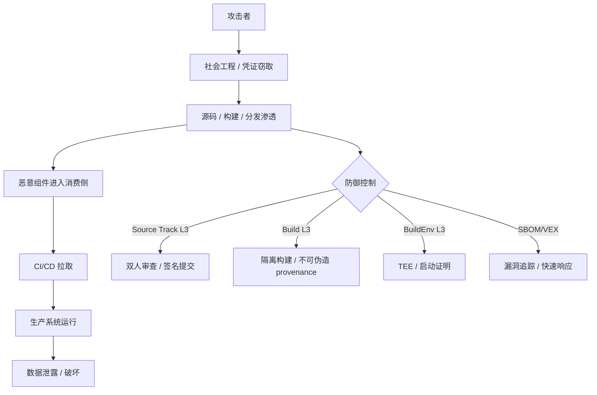

### 8.4 权威来源与交叉引用

- MITRE ATT&CK for Supply Chain: <https://attack.mitre.org/techniques/T1195/>
- CISA Alert AA24-102A (XZ Utils): <https://www.cisa.gov/news-events/alerts/2024/03/29/reported-supply-chain-compromise-affecting-xz-utils-data-compression-library-cve-2024-3094>
- NIST SP 800-204D: <https://csrc.nist.gov/publications/detail/sp/800-204d/final>
- OpenSSF Supply Chain Security: <https://openssf.org/supply-chain/>
- SLSA Specification: <https://slsa.dev/spec/v1.2/>
- 相关概念: [Supply chain attack](https://en.wikipedia.org/wiki/Supply_chain_attack)
- **交叉引用**: `struct/10-supply-chain-security/03-attack-vectors/attack-tree-mitre-mapping.md`；`struct/10-supply-chain-security/01-slsa-framework/slsa-1-2-multi-track.md` §2.2；`struct/10-supply-chain-security/05-zero-trust-supply-chain/zero-trust-principles.md`

> **对齐验证**:
>
> - 攻击树结构对照 Schneier (1999) Attack Trees 方法论验证
> - SLSA 映射对照 [slsa.dev](https://slsa.dev) v1.2 官方规范验证
> - MITRE ATT&CK 映射对照 <https://attack.mitre.org> 验证
> - 案例对照 OpenSSF、NIST、CISA 官方公告验证
>
> 最后更新: 2026-07-07


## 9. 供应链攻击树 MITRE ATT&CK 深度映射与缓解措施补强

### 9.1 攻击路径与 MITRE 技术映射总表

为了将攻击树与 MITRE ATT&CK Enterprise v16 对齐，下表将 7 条主要攻击路径细化为 28 项子技术，并给出对应的缓解措施（Mitigation）和检测信号。

| 攻击路径 | 子攻击手段 | MITRE Technique | 主要 Mitigation | 检测信号 |
|---------|-----------|----------------|----------------|---------|
| 3.1 开发环境渗透 | 网络钓鱼窃取开发者凭据 | [T1566](https://attack.mitre.org/techniques/T1566/) Phishing | M1017 User Training, M1030 Network Segmentation | 异常登录地/时间、MFA 绕过尝试 |
| 3.1 开发环境渗透 | 恶意 IDE/编辑器扩展 | [T1195.001](https://attack.mitre.org/techniques/T1195/001/) Software Supply Chain Compromise | M1013 Application Developer Guidance, M1042 Disable or Remove Feature | 扩展权限申请、扩展市场新包名相似度 |
| 3.1 开发环境渗透 | 被篡改的编译器/工具链 | [T1195.001](https://attack.mitre.org/techniques/T1195/001/) Software Supply Chain Compromise | M1013, M1047 Audit | 编译输出哈希突变、工具链来源异常 |
| 3.2 构建系统篡改 | 攻陷 CI/CD 流水线 | [T1195.001](https://attack.mitre.org/techniques/T1195/001/) Software Supply Chain Compromise | M1030 Network Segmentation, M1045 Code Signing | CI 配置变更、构建日志异常 |
| 3.2 构建系统篡改 | 恶意构建脚本执行 | [T1059](https://attack.mitre.org/techniques/T1059/) Command and Scripting Interpreter | M1013, M1047 Audit | 构建步骤中出现 `curl | bash`、未声明网络调用 |
| 3.2 构建系统篡改 | 伪造/重放 provenance | [T1078](https://attack.mitre.org/techniques/T1078/) Valid Accounts + [T1552](https://attack.mitre.org/techniques/T1552/) Unsecured Credentials | M1045 Code Signing, M1026 Privileged Account Management | provenance 签名者身份异常、Rekor 日志不一致 |
| 3.2 构建系统篡改 | 构建后替换二进制 | [T1195.001](https://attack.mitre.org/techniques/T1195/001/) Software Supply Chain Compromise | M1045 Code Signing, M1047 Audit | 相同源码不同 digest、Registry 引用异常 |
| 3.3 包管理器投毒 | Typosquatting 包名 | [T1583](https://attack.mitre.org/techniques/T1583/) Acquire Infrastructure | M1013, M1016 Vulnerability Scanning | 新包名与内部包高度相似 |
| 3.3 包管理器投毒 | 窃取维护者凭据发布恶意版本 | [T1078](https://attack.mitre.org/techniques/T1078/) Valid Accounts | M1026, M1027 Password Policies | 维护者账户异地登录、版本号异常跳升 |
| 3.3 包管理器投毒 | 社会工程学接管项目 | [T1199](https://attack.mitre.org/techniques/T1199/) Trusted Relationship | M1017, M1047 Audit | 新维护者权限快速升级、提交行为异常 |
| 3.4 依赖混淆 | 扫描公开仓库识别内部包名 | [T1593](https://attack.mitre.org/techniques/T1593/) Search Open Websites/Domains | M1013, M1021 Restrict Web-Based Content | 仓库泄露内部依赖名 |
| 3.4 依赖混淆 | 发布更高版本到公共注册表 | [T1583](https://attack.mitre.org/techniques/T1583/) Acquire Infrastructure | M1016, M1021 | 公共注册表出现内部作用域包 |
| 3.5 上游代码植入 | 伪装良性 PR 隐藏后门 | [T1195.001](https://attack.mitre.org/techniques/T1195/001/) Software Supply Chain Compromise | M1045 Code Signing, M1047 Audit | PR 中隐藏二进制/混淆代码 |
| 3.5 上游代码植入 | 强制推送重写历史 | [T1071](https://attack.mitre.org/techniques/T1071/) Application Layer Protocol / [T1491](https://attack.mitre.org/techniques/T1491/) Defacement | M1045, M1047 Audit | 已发布 tag 的 commit SHA 变化 |
| 3.5 上游代码植入 | 控制审查者账户绕过双人复核 | [T1078](https://attack.mitre.org/techniques/T1078/) Valid Accounts | M1026, M1027 | 同一审批者短时间内批量合并 |
| 3.6 分发渠道劫持 | DNS 劫持 / BGP 劫持 | [T1584](https://attack.mitre.org/techniques/T1584/) Compromise Infrastructure | M1037 Filter Network Traffic, M1041 Encrypt Sensitive Information | 下载域名解析异常、TLS 证书异常 |
| 3.6 分发渠道劫持 | 下载过程 MITM | [T1557](https://attack.mitre.org/techniques/T1557/) Man-in-the-Middle | M1037, M1041 | CDN 边缘节点异常、哈希不一致 |
| 3.6 分发渠道劫持 | 攻陷证书颁发机构 | [T1553](https://attack.mitre.org/techniques/T1553/) Subvert Trust Controls | M1037, M1041 | 证书链异常、CT 日志不一致 |
| 3.7 运行时加载 | 运行时无验证下载模块 | [T1105](https://attack.mitre.org/techniques/T1105/) Ingress Tool Transfer | M1038 Execution Prevention, M1042 | 生产环境异常网络下载 |
| 3.7 运行时加载 | 无沙箱插件系统 | [T1059](https://attack.mitre.org/techniques/T1059/) Command and Scripting Interpreter | M1038, M1052 User Account Control | 插件进程异常行为 |
| 3.7 运行时加载 | 被攻陷的运行时解释器 | [T1195.001](https://attack.mitre.org/techniques/T1195/001/) Software Supply Chain Compromise | M1045, M1051 Update Software | 运行时二进制哈希异常 |

> **映射关系说明**：MITRE ATT&CK 将供应链攻击主要归类于 **Initial Access (TA0001)** 与 **Defense Evasion (TA0005)**。攻击树中的 7 条路径均可在 Enterprise Matrix 中找到对应技术，便于将防御控制导入 SIEM/SOAR 和威胁情报平台。

### 9.2 典型攻击案例深度解析

#### 案例 1：SolarWinds Orion (2020)

| 维度 | 内容 |
|------|------|
| **攻击路径** | 3.2 构建系统篡改 |
| **MITRE Technique** | T1195.001 Software Supply Chain Compromise |
| **攻击链** | 攻陷 CI/CD → 在构建过程中注入 SUNBURST 后门 → 通过合法签名分发 |
| **影响范围** | 18,000+ 组织，包括美国政府机构 |
| **驻留时间** | 9+ 个月 |
| **关键教训** | 仅依赖签名不足够，必须验证 provenance 和构建环境隔离 |

#### 案例 2：Codecov Bash Uploader (2021)

| 维度 | 内容 |
|------|------|
| **攻击路径** | 3.6 分发渠道劫持 |
| **MITRE Technique** | T1557 Man-in-the-Middle / T1584 Compromise Infrastructure |
| **攻击链** | 篡改 Bash Uploader 脚本分发服务器 → 脚本窃取 CI 环境变量 |
| **影响范围** | 29,000+ 组织 |
| **发现方式** | 客户报告凭证泄露 |
| **关键教训** | 分发脚本必须提供哈希/签名验证；CI 环境变量应最小化 |

#### 案例 3：3CX Desktop App (2023)

| 维度 | 内容 |
|------|------|
| **攻击路径** | 3.5 上游代码植入 + 3.6 分发渠道劫持 |
| **MITRE Technique** | T1195.001 / T1078 Valid Accounts |
| **攻击链** | 上游库被植入恶意代码 → 3CX 构建并分发带毒安装包 |
| **影响范围** | 600,000+ 企业用户 |
| **发现方式** | 客户发现异常网络流量 |
| **关键教训** | 上游库 Source Track 控制不足会导致下游构建被污染 |

#### 案例 4：Dependency Confusion by Alex Birsan (2021)

| 维度 | 内容 |
|------|------|
| **攻击路径** | 3.4 依赖混淆 |
| **MITRE Technique** | T1583 Acquire Infrastructure / T1071 Application Layer Protocol |
| **攻击链** | 发现内部包名 → 在公共 npm/PyPI 发布更高版本 → 自动被 CI/CD 拉取 |
| **影响范围** | 35+ 科技公司 |
| **赏金收入** | $130,000+ |
| **关键教训** | 必须显式指定注册源并禁止回退到公共注册表 |

### 9.3 分层缓解措施与验证指标

| 攻击树路径 | 缓解控制 | 验证指标 | 对应 SLSA 等级 |
|-----------|---------|---------|---------------|
| 3.1 开发环境渗透 | MFA + 硬件密钥 + 开发者沙箱 + IDE 扩展白名单 | 100% 开发者启用 MFA；扩展审批率 100% | Source L2+ |
| 3.2 构建系统篡改 | SLSA Build L3 + 隔离构建 + 分离签名权限 | 所有产物附带 provenance；slsa-verifier 100% 通过 | Build L3 |
| 3.3 包管理器投毒 | 私有代理 + 命名空间隔离 + 维护者 MFA | 无公共注册表直接依赖；包发布 MFA 率 100% | Build L2+ |
| 3.4 依赖混淆 | lockfile 哈希 + 显式注册源 + 作用域包 | CI 构建失败时无未命中依赖；内部包作用域化率 100% | Build L2 |
| 3.5 上游代码植入 | Source Track L3 + 代码差异异常检测 + signed commits | 主分支 100% PR；≥2 审批；signed commits 率 100% | Source L3 |
| 3.6 分发渠道劫持 | HTTPS + 签名 + CDN 完整性 + DNSSEC | 下载哈希与发布页一致；DNSSEC 启用率 100% | Build L3+ |
| 3.7 运行时加载 | 运行时完整性校验 + 沙箱 + 禁止运行时下载 | 未签名运行时下载拦截率 100% | Build L3 |

### 9.4 供应链攻击树 Mermaid 可视化

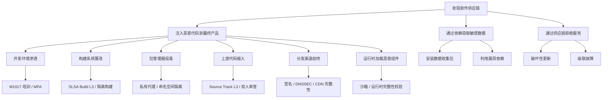

### 9.5 权威来源与交叉引用

- MITRE ATT&CK for Supply Chain: <https://attack.mitre.org/techniques/T1195/>
- MITRE ATT&CK Enterprise Matrix: <https://attack.mitre.org/matrices/enterprise/>
- CISA Alert AA24-102A (XZ Utils): <https://www.cisa.gov/news-events/alerts/2024/03/29/reported-supply-chain-compromise-affecting-xz-utils-data-compression-library-cve-2024-3094>
- CISA Alert (SolarWinds): <https://www.cisa.gov/news-events/cybersecurity-advisories/aa20-352a>
- NIST SP 800-204D: <https://csrc.nist.gov/publications/detail/sp/800-204d/final>
- OpenSSF Supply Chain Security: <https://openssf.org/supply-chain/>
- SLSA Specification: <https://slsa.dev/spec/v1.2/>
- 相关概念: [Supply chain attack](https://en.wikipedia.org/wiki/Supply_chain_attack)
- **交叉引用**: `struct/10-supply-chain-security/03-attack-vectors/attack-tree-mitre-mapping.md`；`struct/10-supply-chain-security/01-slsa-framework/slsa-1-2-multi-track.md` §3.1；`struct/10-supply-chain-security/05-zero-trust-supply-chain/zero-trust-principles.md`

## 10. 供应链攻击树：形式化定义、属性与 MITRE 映射

> **定义 AT.1** (供应链攻击树): 以“攻陷下游消费者所依赖的软件、硬件或服务”为根目标，将攻击路径按 OR/AND 节点逐层分解为原子技术的树形威胁模型。叶节点对应 MITRE ATT&CK 技术，内部节点对应战术阶段，边表示技术之间的依赖或替代关系。

### 10.1 攻击路径属性表

| 攻击路径 | 入口点 | MITRE 技术 | 攻击面 | 对应 SLSA 控制 | 典型检测信号 | 典型案例 |
|----------|--------|------------|--------|----------------|--------------|----------|
| 3.1 开发环境渗透 | 开发者凭据 / IDE 扩展 / 工具链 | T1566 / T1195.001 | 终端与身份 | Source L2+、Build L2+ | 异常登录、扩展权限 | 钓鱼窃取代码签名密钥 |
| 3.2 构建系统篡改 | CI/CD / 构建脚本 / 产物仓库 | T1195.001 / T1059 | 构建平台 | Build L3、Env L2+ | 产物哈希突变、CI 配置变更 | SolarWinds Orion |
| 3.3 包管理器投毒 | 公共注册表 / 维护者账户 | T1583 / T1078 / T1199 | 包生态 | Build L2+ | 包名相似、版本号跳升 | PyTorch 恶意依赖 |
| 3.4 依赖混淆 | 内部包名泄露 / 公共注册表 | T1583 / T1593 | 依赖解析 | Build L2 | 公共注册表出现内部作用域包 | Alex Birsan 研究 |
| 3.5 上游代码植入 | 仓库提交 / 审查绕过 | T1195.001 / T1078 | 源码仓库 | Source L3 | PR 中隐藏二进制、历史重写 | XZ Utils 后门 |
| 3.6 分发渠道劫持 | DNS / CDN / 证书 | T1584 / T1557 / T1553 | 网络分发 | Build L3+ | 域名解析异常、证书链异常 | Codecov Bash Uploader |
| 3.7 运行时加载恶意组件 | 运行时下载 / 插件系统 | T1105 / T1059 | 运行环境 | Build L3 | 生产环境异常网络下载 | 被篡改的运行时解释器 |

### 10.2 攻击树与防御控制的关系

供应链攻击树的价值在于将抽象威胁转化为可分配的防御控制：

- **开发环境渗透** 主要依赖身份安全、MFA、开发者沙箱与 Source Track 认证。
- **构建系统篡改** 的终极缓解是 SLSA Build L3 + BuildEnv L2/L3，确保只有可信平台能生成签名产物。
- **包管理器投毒 / 依赖混淆** 需要私有代理、命名空间隔离与 lockfile 完整性校验。
- **上游代码植入** 需要 Source Track L3 的双人审查、签名提交与代码差异异常检测。
- **分发渠道劫持** 需要 HTTPS、DNSSEC、CDN 完整性校验与不可伪造 provenance。
- **运行时加载** 需要运行时完整性校验、沙箱与禁止未签名下载。

> **定理 AT.2** (攻击树防御覆盖定理): 若某条攻击路径在攻击树中至少被一个 SLSA/Source/Env 控制覆盖，则该路径的利用成本随控制等级指数级上升；若未被覆盖，则默认处于可利用状态。

### 10.3 正例

| 案例 | 正例说明 |
|------|----------|
| XZ Utils 后门发现 | Andres Freund 通过 SSH 登录性能异常定位到 liblzma，展示了持续监控与基线对比的价值 |
| SolarWinds 事件响应 | FireEye 通过内部安全调查逆向出 SUNBURST 后门，推动行业加强构建隔离与 provenance 验证 |
| Dependency Confusion 研究 | Alex Birsan 主动披露并退还赏金，证明命名空间隔离与显式注册源可有效阻止此类攻击 |

### 10.4 反例（错误假设）

| 反例 | 风险说明 |
|------|----------|
| “我们只从官方源下载，所以安全” | XZ Utils 与 SolarWinds 均来自官方分发渠道 |
| “有数字签名就够了” | 签名无法证明构建过程未被篡改 |
| “依赖扫描每天一次足够” | 主动利用漏洞需在 24 小时内响应（EU CRA） |
| “开源组件责任由社区承担” | 商业集成商仍需承担 CRA 与产品安全责任 |

### 10.5 供应链攻击树 MITRE 防御映射 Mermaid 图

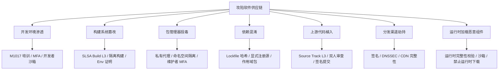

### 10.6 权威来源与交叉引用

- MITRE ATT&CK for Supply Chain: <https://attack.mitre.org/techniques/T1195/>
- MITRE ATT&CK Enterprise Matrix: <https://attack.mitre.org/matrices/enterprise/>
- CISA Alert AA24-102A (XZ Utils): <https://www.cisa.gov/news-events/alerts/2024/03/29/reported-supply-chain-compromise-affecting-xz-utils-data-compression-library-cve-2024-3094>
- CISA Alert AA20-352A (SolarWinds): <https://www.cisa.gov/news-events/cybersecurity-advisories/aa20-352a>
- NIST SP 800-204D: <https://csrc.nist.gov/publications/detail/sp/800-204d/final>
- OWASP SCVS: <https://owasp.org/www-project-software-component-verification-standard/>
- SLSA Specification: <https://slsa.dev/spec/v1.2/>
- 相关概念: [Supply chain attack](https://en.wikipedia.org/wiki/Supply_chain_attack)
- **交叉引用**: `struct/10-supply-chain-security/03-attack-vectors/attack-tree-mitre-mapping.md`；`struct/10-supply-chain-security/01-slsa-framework/slsa-1-2-multi-track.md` §3.1；`struct/10-supply-chain-security/06-case-studies/eu-cra-compliance.md` §9


> 最后更新: 2026-07-07

---


<!-- SOURCE: struct/10-supply-chain-security/03-attack-vectors/README.md -->

# 03 攻击向量与攻击树

> **定位**: 系统化分析软件供应链攻击路径，为纵深防御与威胁建模提供决策基础。
> **权威来源**: SLSA、OpenSSF、NIST SP 800-204D、OWASP SCVS、MITRE ATT&CK。

---

## 文件清单

| 文件 | 说明 | 用途 |
|------|------|------|
| `attack-tree.md` | 软件供应链攻击树主文档 | 7 大攻击路径详解、典型案例、防御矩阵 |
| `attack-tree.mmd` | Mermaid `flowchart TD` 源文件 | 在 Markdown/GitHub/Mermaid Live Editor 中渲染 |
| `attack-tree.dot` | Graphviz DOT 源文件 | 生成 PDF/PNG/SVG 高清矢量图 |
| `attack-tree-mitre-mapping.md` | MITRE ATT&CK 映射 | Technique / Mitigation 速查与参考链接 |
| `attack-tree-interactive.py` | Python CLI 可视化工具 | 生成 HTML/Mermaid/DOT，支持 MITRE 标注与自测 |

---

## `attack-tree-interactive.py` 用法

### 1. 生成 HTML 交互式报告（默认）

```bash
# 生成全部场景
python attack-tree-interactive.py --format html --output report.html

# 仅生成指定场景
python attack-tree-interactive.py --scenario dependency-confusion --output dep-confusion.html

# 可用场景
python attack-tree-interactive.py --scenario all
# dependency-confusion, typosquatting, maintainer-takeover,
# build-system-compromise, upstream-repo-tampering
```

### 2. 生成 Mermaid 攻击树

```bash
# 基础版本
python attack-tree-interactive.py --format mermaid --output attack-tree.mmd

# 包含 MITRE ATT&CK Technique ID
python attack-tree-interactive.py --format mermaid --mitre --output attack-tree-mitre.mmd
```

### 3. 生成 Graphviz DOT 攻击树

```bash
# 基础版本
python attack-tree-interactive.py --format graphviz --output attack-tree.dot

# 包含 MITRE ATT&CK Technique ID（以 tooltip 形式写入 SVG）
python attack-tree-interactive.py --format graphviz --mitre --output attack-tree-mitre.dot
```

### 4. 转换为 PDF/PNG/SVG

```bash
# 使用 Graphviz 命令行
dot -Tsvg attack-tree.dot -o attack-tree.svg
dot -Tpng attack-tree.dot -o attack-tree.png
dot -Tpdf attack-tree.dot -o attack-tree.pdf

# 使用 Mermaid CLI
mmdc -i attack-tree.mmd -o attack-tree.svg -b transparent
```

### 5. 内置自测

```bash
python attack-tree-interactive.py --test
```

预期输出：

```text
TEST PASSED
  - HTML nodes: 35
  - Mermaid lines: 263
  - Graphviz lines: 261
  - MITRE annotations present in Mermaid and Graphviz
```

---

## 攻击树图例

| 节点类型 | Mermaid 形状 | Graphviz 形状 | 含义 |
|---------|-------------|---------------|------|
| OR 节点 | 圆角矩形 | 圆角矩形 | 任一子路径成功即可 |
| AND 节点 | 菱形 | 菱形 | 必须同时满足所有子条件 |
| 叶节点 | 矩形 / 椭圆 | 椭圆 | 原子级攻击手段 |

| 风险等级 | 颜色 | 说明 |
|---------|------|------|
| Critical | `#e53e3e` | 红色，最高优先级 |
| High | `#dd6b20` | 橙色 |
| Medium | `#d69e2e` | 黄色 |
| Low | `#38a169` | 绿色 |

---

## 与 MITRE ATT&CK 的映射

详见 `attack-tree-mitre-mapping.md`。核心映射：

| 攻击路径 | 主 Technique | 相关 Techniques |
|---------|-------------|----------------|
| 3.1 开发环境渗透 | T1195.001 | T1078, T1552, T1566, T1056 |
| 3.2 构建系统篡改 | T1195.001 | T1059, T1078, T1552 |
| 3.3 包管理器投毒 | T1195.001 | T1583, T1584, T1078 |
| 3.4 依赖混淆 | T1195.001 | T1593, T1594, T1071, T1567 |
| 3.5 上游代码植入 | T1195.001 | T1071, T1199 |
| 3.6 分发渠道劫持 | T1195.001 | T1584, T1557, T1553 |
| 3.7 运行时加载恶意组件 | T1195.001 | T1059, T1071, T1105, T1574 |

---

## 维护说明

- 修改攻击树结构时，请同步更新 `attack-tree.md`、`attack-tree.mmd`、`attack-tree.dot` 以及 `attack-tree-interactive.py` 中的 `SUPPLY_CHAIN_SEVEN_PATHS` 数据。
- 新增或调整 MITRE Technique 映射时，同步更新 `attack-tree-mitre-mapping.md` 与脚本中的 `mitre` 字段。
- 每次修改后运行 `python attack-tree-interactive.py --test` 验证三种格式输出正常。

---

> 最后更新: 2026-06-12


---

## 补充章节

## 概念定义

**定义**：供应链攻击向量指攻击者通过依赖注入、构建环境污染、仓库劫持、typosquatting、恶意贡献等路径，将有害代码引入复用资产并传播到下游系统。

## 示例

**示例**：攻击者在流行 npm 包名中注册拼写错误包（typosquat），诱导开发者安装并窃取环境变量；通过依赖扫描与私有仓库策略可有效缓解。

## 反例

**反例**：安全团队仅关注自有代码漏洞扫描，忽视第三方依赖与 CI/CD 凭证安全，导致攻击者通过被入侵的构建代理注入后门。

## 分析

**分析**：攻击向量分析应从“防御自家代码”转向“审计整条供应链”，覆盖人、工具与仓库。

---


<!-- SOURCE: struct/10-supply-chain-security/04-provenance-examples/README.md -->

# SLSA Provenance 可执行示例

> **对齐**：SLSA v1.2 Build Track L3、Sigstore/Cosign、OCI v1.1 Reference Types、GitHub Actions

---

## 1. 概念定义

**Provenance（来源证明）**：以密码学方式记录软件制品如何被构建、由谁构建、基于哪些输入的元数据。在 SLSA 框架中，provenance 是 Build Track 的核心交付物，用于回答"这个制品从哪来、是否被篡改"的问题。

**Attestation（证明）**：对某一声明（如"此镜像由某 CI 工作流构建"）的密码学签名文档。SLSA provenance 是一种特定类型的 attestation，遵循 in-toto 证明格式。

**OCI Reference Types**：OCI v1.1 引入的机制，允许将 SBOM、provenance、签名等元数据作为 artifact 的 referrers 附加到注册表，无需修改原镜像内容即可实现信任元数据的统一检索。

## 2. 示例清单

| 文件 | 说明 |
|------|------|
| `slsa-provenance-github-action.yml` | GitHub Actions 工作流：构建镜像 → 生成 SLSA provenance → Cosign keyless 签名 → SBOM 验证 |

---

## 3. 工作流阶段

```text
Push/Tag
   │
   ▼
[Build] ──► Docker image + OCI provenance/SBOM attestation
   │
   ▼
[Provenance] ──► SLSA Build L3 attestation (slsa-github-generator)
   │
   ▼
[Sign] ──► Cosign keyless sign via Sigstore/Fulcio/Rekor
   │
   ▼
[Verify] ──► Syft SBOM 生成 + Grype 漏洞扫描
```

---

## 4. 关键特性

- **SLSA Build L3**：使用 GitHub Actions SLSA generator，非伪造 provenance
- **Sigstore Keyless**：无需管理长期私钥；Fulcio 短期证书 + Rekor 透明日志
- **OCI v1.1 Reference Types**：SBOM 和 provenance 作为镜像 digest 的 referrers 附加，不修改镜像本身
- **双格式 SBOM**：SPDX 2.3 JSON + CycloneDX 1.6 JSON
- **漏洞门禁**：Grype `--fail-on high` 阻止高危漏洞流入生产

---

## 5. 使用方式

```bash
# 1. 复制到仓库
cp slsa-provenance-github-action.yml .github/workflows/slsa-provenance.yml

# 2. 推送后，在 Actions 标签页查看运行结果

# 3. 本地验证签名
cosign verify \
  --certificate-identity-regexp="https://github.com/你的组织/你的仓库/" \
  --certificate-oidc-issuer="https://token.actions.githubusercontent.com" \
  ghcr.io/你的组织/你的仓库@sha256:...

# 4. 查看 SBOM referrers
regctl manifest get ghcr.io/你的组织/你的仓库@sha256:... --referrers

# 5. 验证 SLSA provenance（使用 slsa-verifier 或 GitHub CLI）
gh attestation verify <artifact> --owner 你的组织
```

---

## 6. 与项目复用体系的映射

| 项目目录 | 供应链安全角色 |
|----------|----------------|
| `struct/04-component-architecture-reuse/` | 容器镜像 = 可复用组件；OCI provenance = 组件信任护照 |
| `struct/06-cross-layer-governance/` | SLSA L3 + SBOM = 组件目录准入门槛 |
| `struct/10-supply-chain-security/` | SLSA、Sigstore、SBOM 的完整工具链 |

---

## 7. 正向示例：容器镜像端到端来源证明

### 示例 A：使用 GitHub Artifact Attestations 验证容器镜像

某 DevOps 团队在构建容器镜像时使用以下模式：

```yaml
- name: Build and push image
  id: build
  uses: docker/build-push-action@v6
  with:
    push: true
    tags: ghcr.io/org/app:${{ github.sha }}

- name: Attest provenance
  uses: actions/attest-build-provenance@v1
  with:
    subject-name: ghcr.io/org/app
    subject-digest: ${{ steps.build.outputs.digest }}
    push-to-registry: true
```

发布后在部署流水线中强制验证：

```bash
gh attestation verify \
  --owner org \
  --predicate-type https://slsa.dev/provenance/v1 \
  ghcr.io/org/app@sha256:<digest>
```

该模式使部署系统只接受由特定 GitHub 工作流、特定源码 commit 构建的镜像，阻断被入侵开发者本地构建的未授权镜像。

### 示例 B：OCI v1.1 Referrers 聚合 SBOM 与签名

通过 OCI v1.1 的 referrers API，镜像消费者无需修改原镜像即可获取其 SBOM 和 provenance：

```bash
# 查询镜像的所有 referrers（SBOM、provenance、signature）
regctl artifact list ghcr.io/org/app@sha256:<digest>

# 拉取 SPDX SBOM
regctl artifact get --subject ghcr.io/org/app@sha256:<digest> \
  --filter-artifact-type application/spdx+json
```

该模式已被 Docker Hub、GitHub Container Registry、Azure Container Registry 等主流注册表支持。

---

## 8. 反例 / 反模式

### 反例 A：curl | bash 执行未签名脚本

2021 年 Codecov 事件中，大量 CI 流水线使用 `bash <(curl -s https://codecov.io/bash)` 执行 Codecov Bash Uploader。攻击者修改该脚本后，在数万个 CI 环境中窃取了环境变量和密钥。根本原因是：没有 provenance、没有完整性校验、没有最小权限隔离。

### 反例 B：静态维护 provenance 文件

某团队将 `provenance.json` 作为静态文件提交到仓库，并声称符合 SLSA L2。实际上该文件未与构建产物绑定，无法防止构建后篡改；且签名使用长期个人 GPG 密钥，密钥泄露后无法追溯。正确的 provenance 必须由构建平台在构建时动态生成并签名。

---

## 9. 控制点映射：SLSA Build Track L2/L3 → 工作流实现

| SLSA 要求 | 工作流实现 | 验证命令 |
|----------|-----------|---------|
| L1：自动化 provenance | `.github/workflows/slsa-provenance.yml` 触发构建 | 检查 Actions 运行日志 |
| L2：托管构建 + 签名 | `slsa-github-generator` 生成 provenance；`actions/attest-build-provenance` 签名 | `gh attestation verify` |
| L2：来源可验证 | provenance 中 `resolvedDependencies` 包含 commit SHA | `slsa-verifier --source-uri` |
| L3：临时/隔离构建 | GitHub-hosted runner；构建步骤禁用外部网络 | 审计 runner 配置与网络策略 |
| L3：非伪造 provenance | OIDC 联邦身份签名，签名密钥对构建者不可见 | 验证 certificate-identity 与 oidc-issuer |
| SBOM 关联 | Syft 生成 SPDX/CycloneDX 并作为 OCI referrer | `regctl artifact list` |

---

## 10. 权威来源

| 来源 | URL | 说明 | 核查日期 |
|------|-----|------|----------|
| SLSA Specification v1.2 | <https://slsa.dev/spec/v1.2/> | Multi-Track 架构与 Build Track L1-L3 | 2026-07-08 |
| SLSA Provenance v1 | <https://slsa.dev/spec/v1.2/provenance> | Provenance predicate 格式 | 2026-07-08 |
| Sigstore / cosign | <https://docs.sigstore.dev/cosign/overview/> | 无密钥签名与验证 | 2026-07-08 |
| GitHub Artifact Attestations | <https://docs.github.com/en/actions/security-guides/using-artifact-attestations-to-establish-provenance-for-builds> | 原生 provenance 生成与验证 | 2026-07-08 |
| OCI v1.1 Reference Types | <https://github.com/opencontainers/image-spec/blob/main/manifest.md> | OCI referrers 规范 | 2026-07-08 |
| SLSA GitHub Generator | <https://github.com/slsa-framework/slsa-github-generator> | 自动生成 SLSA provenance | 2026-07-08 |
| slsa-verifier | <https://github.com/slsa-framework/slsa-verifier> | Provenance 验证 CLI | 2026-07-08 |

---

*文档生成时间：2026-07-08 · 对齐 SLSA v1.2 / Sigstore / OCI v1.1*

---


<!-- SOURCE: struct/10-supply-chain-security/04-provenance-examples/templates/reuse-admission-checklist.md -->

# 组件复用准入检查单（Component Reuse Admission Checklist）

> **版本**: 2026-06-12
> **定位**: 在将外部/开源/内部组件引入系统前，执行最小可接受的安全与合规检查。
> **适用对象**: 架构师、安全工程师、开发团队、供应链治理团队。

---

## 检查单总览

| 检查项 | 关键交付物 | 合格标准 | 责任人 | 状态 |
|--------|-----------|---------|--------|------|
| 1. SBOM | `sbom-spdx-3.0-template.json` 或 `sbom-cyclonedx-1.6-template.json` | 组件提供 SPDX 2.3/3.0+ 或 CycloneDX 1.4+ SBOM | 组件提供方 / 架构师 | ☐ |
| 2. Provenance | `slsa-provenance-template.intoto.jsonl` | SLSA Build L2+ provenance attestation 存在且可验证 | 安全工程师 | ☐ |
| 3. 签名 | Sigstore/cosign / GPG / HSM 签名 | 制品签名可验证，公钥/证书可信 | 安全工程师 | ☐ |
| 4. 漏洞扫描 | OSV、Snyk、Dependabot、Trivy 等报告 | 无 Critical/High 未修复漏洞；已知漏洞有 VEX 说明 | 开发团队 | ☐ |
| 5. 许可证审查 | FOSSA、Black Duck 或人工审查记录 | 许可证与组织策略兼容；Copyright 清晰 | 合规团队 | ☐ |

---

## 1. SBOM（软件物料清单）

### 1.1 必备字段

- [ ] 组件名称与版本（`name` / `version`）
- [ ] 唯一标识（`purl`、`CPE` 或 `swid`）
- [ ] 供应商/作者信息（`supplier`、`originator`、`manufacture`）
- [ ] 哈希校验值（SHA-256 或 stronger）
- [ ] 许可证结论与声明（`licenseConcluded` / `licenseDeclared`）
- [ ] 依赖关系（直接 + 传递依赖，`dependencies`）
- [ ] SBOM 生成工具与生成时间戳

### 1.2 可接受格式（按优先级）

1. **SPDX 3.0.1**（推荐新项目）
2. SPDX 2.3
3. CycloneDX 1.6
4. SWID ISO/IEC 19770-2:2015（特定合规场景）

### 1.3 拒绝标准

- 缺少版本或 purl/cpe/swid 任一种标识。
- 依赖树未展开或缺失传递依赖。
- 许可证字段为 `NOASSERTION` 且无补充说明。

---

## 2. Provenance（来源证明）

### 2.1 SLSA v1.2 Build Track 要求

- [ ] **Build L1**: Provenance 存在（`https://slsa.dev/provenance/v1` predicate）。
- [ ] **Build L2**: Provenance 由托管构建服务生成并签名；构建服务身份可验证。
- [ ] **Build L3**: Hermetic / Reproducible Build；依赖不可变；构建环境受控。

### 2.2 必含字段

- [ ] `subject` 包含制品名与 digest。
- [ ] `buildDefinition.buildType` 明确。
- [ ] `externalParameters` 记录触发构建的输入。
- [ ] `resolvedDependencies` 列出所有解析后的依赖及其 digest。
- [ ] `runDetails.builder.id` 可验证。

### 2.3 验证命令示例

```bash
# cosign 验证 SLSA provenance
# 需要组件提供方在发布时生成并上传 intoto.jsonl
cosign verify-attestation \
  --type slsaprovenance \
  --certificate-identity-regexp '^https://github.com/example/reuse-component/.github/workflows/.*' \
  --certificate-oidc-issuer https://token.actions.githubusercontent.com \
  example/reuse-component:1.0.0
```

---

## 3. 签名（Signature）

### 3.1 可接受签名机制

- [ ] **Sigstore/cosign**: 基于 OIDC 的短期证书 + Rekor 透明日志。
- [ ] **GPG**: 维护者长期公钥，需通过可信渠道分发并校验 fingerprint。
- [ ] **HSM / KMS**: 企业级密钥管理，满足内部合规要求。

### 3.2 验证要求

- [ ] 签名覆盖制品文件本身（jar/wheel/npm tarball 等）。
- [ ] 签名证书/公钥可信且在有效期内。
- [ ] 对于 Sigstore，验证 Rekor entry 存在且未过期。

### 3.3 拒绝标准

- 仅校验 MD5/SHA1（弱哈希）。
- 签名文件与制品文件分开存放且无绑定关系。
- 使用自签名证书且无信任锚。

---

## 4. 漏洞扫描（Vulnerability Scanning）

### 4.1 扫描范围

- [ ] 组件本身及其所有传递依赖。
- [ ] 容器镜像层（如适用）。
- [ ] 构建时与运行时依赖均需覆盖。

### 4.2 可接受工具

- [ ] OSV / Google OSV-Scanner
- [ ] Snyk Open Source
- [ ] GitHub Dependabot
- [ ] Trivy / Grype
- [ ] 企业内部 SCA 平台

### 4.3 合格标准

| 严重度 | 准入要求 |
|--------|---------|
| Critical | 必须修复或提供经安全团队批准的 VEX 例外 |
| High | 原则上修复；如无法修复需记录缓解措施 |
| Medium | 建议修复，允许带风险引入并制定修复计划 |
| Low | 记录即可 |

### 4.4 VEX 声明

若存在已知未利用漏洞，需提供:

- [ ] VEX 文档（CycloneDX VEX 或 OpenVEX）。
- [ ] 漏洞编号（CVE/GHSA/OSV ID）。
- [ ] 状态（`not_affected` / `affected` / `fixed` / `under_investigation`）。
- [ ] 理由与影响分析。

---

## 5. 许可证审查（License Review）

### 5.1 必查信息

- [ ] 组件主许可证（SPDX 标识符）。
- [ ] 传递依赖的许可证组合。
- [ ] Copyright 声明与归属要求。
- [ ] 专利/商标/出口管制声明（如 GPL、SSPL、CC-NC 等）。

### 5.2 常见风险许可证

| 许可证 | 风险说明 | 建议 |
|--------|---------|------|
| GPL-2.0/3.0 | Copyleft，可能触发衍生作品开源义务 | 法务评审 |
| AGPL-3.0 | 网络使用也触发开源义务 | 通常禁止用于服务端闭源组件 |
| SSPL | 非 OSI 认可，云服务限制 | 通常禁止 |
| CC-NC | 非商业限制 | 商业产品禁止 |
| 自定义 / 未知 | 权利义务不清晰 | 必须法务确认 |

### 5.3 可接受许可证（示例）

- MIT
- Apache-2.0
- BSD-2-Clause / BSD-3-Clause
- ISC
- 经法务批准的企业内部许可

---

## 6. 审批与归档

### 6.1 准入审批

- [ ] 架构师确认组件与目标架构匹配。
- [ ] 安全工程师确认 SBOM、Provenance、签名、漏洞扫描通过。
- [ ] 合规团队确认许可证无冲突。
- [ ] 项目经理/技术负责人最终批准。

### 6.2 归档要求

- [ ] SBOM 文件存入组织制品仓库或 SBOM 管理平台。
- [ ] Provenance attestation 与签名文件随组件版本归档。
- [ ] 漏洞扫描报告与 VEX（如适用）关联到组件版本。
- [ ] 许可证审查记录存入法务/合规系统。

---

## 7. 参考模板

| 模板 | 用途 | 文件 |
|------|------|------|
| SPDX 3.0.1 SBOM | 标准化物料清单 | `sbom-spdx-3.0-template.json` |
| CycloneDX 1.6 SBOM | 标准化物料清单 | `sbom-cyclonedx-1.6-template.json` |
| SLSA v1.2 Provenance | Build Track 来源证明 | `slsa-provenance-template.intoto.jsonl` |

---

> **使用提示**:
>
> - 本检查单为最小集合，金融、政务、关键基础设施等场景应在此基础上增加行业特定要求。
> - 建议将本检查单集成到 CI/CD 门禁（gate）中，未通过的组件禁止进入主分支或生产环境。
>
> 最后更新: 2026-06-12


---

## 补充章节

## 概念定义

**定义**：软件供应链安全关注从源代码、依赖、构建、分发到部署全链路中，复用资产不被篡改、注入漏洞或引入许可证风险；SLSA、SBOM 与签名验证是核心机制。

## 示例

**示例**：组织采用 SLSA L3 构建流程：源码托管、构建环境隔离、构建产物签名并生成SPDX SBOM；Log4j 类事件发生时 2 小时内定位受影响服务。

## 反例

**反例**：XZ Utils 后门事件显示，未对压缩依赖进行来源验证与行为审计，恶意代码可潜伏数年并随复用传播到大量系统。

## 权威来源

> **权威来源**:
>
> - [SLSA Framework](https://slsa.dev)
> - [OpenSSF](https://openssf.org)
> - [SPDX](https://spdx.dev)
> - [CycloneDX](https://cyclonedx.org)
> - 核查日期：2026-07-07

---


<!-- SOURCE: struct/10-supply-chain-security/05-slsa-l4-poc/README.md -->

# SLSA Build Level 4 概念验证（PoC）

> 位置：`struct/10-supply-chain-security/05-slsa-l4-poc/`
> 版本：2026-07-08
> 对齐来源：SLSA Specification v1.2, Sigstore/cosign, GitHub Actions

---

## 1. 概念定义

**SLSA**（Supply-chain Levels for Software Artifacts，软件制品供应链等级）是由 OpenSSF 提出的框架，用于评估软件供应链安全成熟度。**SLSA Build Level 4** 是构建可信度的最高等级，要求：

- **Two-Person Review（双人审查）**：关键源码变更需至少两名独立审批者，降低单点篡改风险。
- **Hermetic Builds（密封构建）**：构建过程声明并固定所有输入，禁止未声明的外部网络或依赖。
- **Reproducible Builds（可复现构建）**：相同输入（源码、构建脚本、环境）应产生位对位相同的输出。
- **可验证的来源证明（Provenance）**：以不可伪造的方式记录构建者身份、源码版本、构建脚本哈希、输出哈希等元数据。

> **本 PoC 定位**：用最小可运行代码演示上述四个控制点，便于本地验证与教学；未集成真实 Sigstore/cosign 签名或 GitHub OIDC，但字段与校验逻辑已覆盖 L4 关键要素。

---

## 2. PoC 目标

本 PoC 演示 SLSA Build Level 4 核心控制点：

| 控制点 | PoC 中的体现 |
|--------|-------------|
| **双人审查** | `verify-provenance.py` 检查 `REVIEWERS` 记录或 `SLSA_REVIEWERS` 环境变量中至少包含两名审批者。 |
| **密封构建** | `build.py` 显式声明输入文件（`src/main.py`），不访问外部网络，构建脚本自身哈希也被记录。 |
| **可复现构建** | 多次运行 `build.py`（同 commit、同脚本）产生的 `dist/app` 字节相同，`verify-provenance.py` 校验 SHA-256。 |
| **来源证明** | `provenance.json` 包含 `git_commit`、`builder_id`、`build_script_hash`、`source_hash`、`output_hash`。 |

---

## 3. 文件结构

```text
05-slsa-l4-poc/
├── README.md                 # 本说明
├── build.py                  # 模拟构建脚本，生成 dist/app 与 provenance.json
├── verify-provenance.py      # 验证 provenance 与当前环境一致性
├── REVIEWERS                 # 双人审查记录（示例）
├── src/
│   └── main.py               # 待构建的示例源码
└── dist/
    ├── app                   # 构建产物（由 build.py 生成）
    └── provenance.json       # 来源证明（由 build.py 生成）
```

---

## 4. 运行步骤

### 4.1 进入目录

```bash
cd struct/10-supply-chain-security/05-slsa-l4-poc/
```

### 4.2 执行构建

```bash
python build.py
```

输出示例：

```text
[build] Source hash:  e770709c...
[build] Script hash:  65d931be...
[build] Output hash:  e770709c...
[build] Git commit:   e65ffb8...
[build] Provenance:   dist/provenance.json
[build] Build complete: dist/app
```

### 4.3 验证来源证明

```bash
python verify-provenance.py
```

成功时：

```text
[verify] ✔ git commit matches HEAD: e65ffb8...
[verify] ✔ build script hash matches
[verify] ✔ output hash matches provenance
[verify] ✔ two-person review confirmed (reviewers: alice, bob)
[verify] PASS: SLSA L4 checks succeeded
```

失败时（例如源码或构建脚本被篡改）：脚本会明确指出哪一项校验失败。

---

## 5. 正向示例

**场景**：团队发布一个供下游消费的命令行工具。通过本 PoC：

1. 每次构建由 CI 触发，`build.py` 固定读取 `src/main.py`，不访问外部 PyPI。
2. `REVIEWERS` 中登记了 `alice` 和 `bob`，`verify-provenance.py` 确认至少两名审批者。
3. 同一 commit 在本地与 CI runner 上分别运行 `build.py`，输出 `dist/app` 的 SHA-256 一致。
4. `provenance.json` 被上传到制品仓库，下游团队可用 `verify-provenance.py` 校验构建来源。

该流程满足 SLSA Build L4 的最低可运行演示，并可在真实场景中替换为 Sigstore/cosign 签名。

### 行业正向案例：Chainguard Images / Wolfi

Chainguard 基于 Wolfi 发行版构建的容器镜像追求可复现构建与最小依赖面。其构建流水线使用 Melange、APK 包锁定和确定性构建脚本，使同一源码输入能在不同时间、不同机器上产生位对位相同的包。结合 Sigstore 签名后，消费者可验证镜像来源与完整性，代表了 SLSA Build L4 的工业实践方向。

---

## 6. 反例 / 反模式

| 反模式 | 风险 | 本 PoC 中的检测方式 |
|--------|------|---------------------|
| **无来源证明** | 无法追溯构建来源，遭受供应链攻击后无法定位 | `verify-provenance.py` 检查 `provenance.json` 存在且字段完整 |
| **单人审查/无审查** | 内部人员可单点注入恶意代码 | `verify-provenance.py` 要求至少两名审批者 |
| **非密封构建** | 构建时拉取未声明依赖，导致输出不可预测 | `build.py` 不访问网络，输入文件显式声明 |
| **不可复现构建** | 同一源码在不同环境产出不同产物，难以审计 | `verify-provenance.py` 比较 `output_hash` 与当前产物哈希 |
| **静态 provenance** | 手动维护的 provenance 易被篡改 | `build.py` 在构建时动态计算并写入哈希 |

### 反例 A：SolarWinds SUNBURST（构建环境入侵）

SolarWinds Orion 的构建环境被入侵后，攻击者在官方构建代理中将 SUNBURST 后门注入 Orion 核心 DLL。由于构建产物仍使用 SolarWinds 合法证书签名，约 18,000 家客户无法通过传统签名发现异常。该事件说明：

1. **构建环境是核心攻击面**：源码未被篡改，但构建代理被污染。
2. **签名不能替代 provenance**：合法签名只证明发布者身份，不证明构建过程可信。
3. **可复现构建的价值**：若构建可复现，第三方审计者可独立重建产物并对比哈希，发现差异。

---

## 7. 控制点映射：SLSA Build Track L4 → PoC 实现

| SLSA 要求 | PoC 文件/逻辑 | 关键字段/校验 |
|----------|--------------|--------------|
| 双人审查（Two-person review） | `REVIEWERS` + `verify-provenance.py` | 审批者数量 ≥ 2，且与 `SLSA_REVIEWERS`  env 可覆盖 |
| 密封构建（Hermetic build） | `build.py` | 显式读取 `src/main.py`；不访问网络；构建脚本哈希写入 provenance |
| 可复现构建（Reproducible build） | `build.py` + `verify-provenance.py` | 同 commit、同脚本下多次构建输出 `output_hash` 一致 |
| 非伪造 provenance | `provenance.json` | 包含 `git_commit`、`builder_id`、`build_script_hash`、`source_hash`、`output_hash` |
| 源码来自版本控制 | `build.py` 调用 `git rev-parse HEAD` | `git_commit` 字段绑定源码版本 |

> **说明**：本 PoC 为教学用途，使用本地文件和 env 变量模拟 CI 控制。生产环境应替换为 GitHub branch protection、GitHub Artifact Attestations 或 Sigstore/cosign 签名，以满足真正的 L4 非伪造性。

---

## 8. 在 CI 中使用

仓库 `.github/workflows/slsa-l4-poc.yml` 提供了一个 GitHub Actions 示例：

- 检出代码（保留完整 Git 历史，以便获取 commit）。
- 运行 `build.py` 生成产物与 provenance。
- 运行 `verify-provenance.py` 校验。
- 上传产物与 provenance 为构建产物（artifact）。

在真实生产场景中，应进一步使用 [SLSA GitHub Generator](https://github.com/slsa-framework/slsa-github-generator) 或 Sigstore/cosign 对 provenance 进行签名。

---

## 9. 扩展建议

1. **签名 provenance**：使用 `cosign sign-blob` 或 Sigstore Python SDK 对 `provenance.json` 签名。
2. **真实双人审查**：通过 GitHub "Require approvals" 分支保护规则实现，而非本地文件。
3. **可复现构建矩阵**：在多个 runner / 容器环境中运行 `build.py`，比较输出哈希是否一致。
4. **SBOM 联动**：在构建后调用 `syft` 或 `cyclonedx-py` 生成 SBOM，并与 provenance 一起发布。

---

## 10. 权威来源

| 来源 | URL | 说明 | 核查日期 |
|------|-----|------|----------|
| SLSA Specification v1.2 | <https://slsa.dev/spec/v1.2/> | Multi-Track 架构与 Build Track L1-L3 | 2026-07-08 |
| SLSA Build Track | <https://slsa.dev/spec/v1.2/levels#build-track> | L4 草案要求（双人审查、可复现、密封） | 2026-07-08 |
| Sigstore / cosign | <https://docs.sigstore.dev/cosign/overview/> | 无密钥签名 | 2026-07-08 |
| SLSA GitHub Generator | <https://github.com/slsa-framework/slsa-github-generator> | 自动生成 SLSA provenance | 2026-07-08 |
| slsa-verifier | <https://github.com/slsa-framework/slsa-verifier> | Provenance 验证 CLI | 2026-07-08 |
| GitHub Branch Protection | <https://docs.github.com/en/repositories/configuring-branches-and-merges-in-your-repository/managing-protected-branches/about-protected-branches> | 双人审查与状态检查配置 | 2026-07-08 |
| Chainguard / Wolfi | <https://www.chainguard.dev/solutions/reproducible-builds> | 可复现构建工业实践 | 2026-07-08 |
| CISA AA20-352A | <https://www.cisa.gov/news-events/cybersecurity-advisories/aa20-352a> | SolarWinds 供应链攻击技术分析 | 2026-07-08 |

---

## 11. 交叉引用

- 供应链安全主题入口：[`struct/10-supply-chain-security/README.md`](../struct/10-supply-chain-security/README.md)
- SLSA 框架与复用边界：[`struct/10-supply-chain-security/01-slsa-framework/slsa-reuse-boundaries.md`](../struct/10-supply-chain-security/01-slsa-framework/slsa-reuse-boundaries.md)
- SBOM 标准与复用安全：[`struct/10-supply-chain-security/02-sbom-standards/sbom-reuse-security.md`](../struct/10-supply-chain-security/02-sbom-standards/sbom-reuse-security.md)
- 供应链攻击向量：[`struct/10-supply-chain-security/03-attack-vectors/README.md`](../struct/10-supply-chain-security/03-attack-vectors/README.md)
- 来源证明示例：[`struct/10-supply-chain-security/04-provenance-examples/README.md`](../struct/10-supply-chain-security/04-provenance-examples/README.md)
- 零信任供应链原则：[`struct/10-supply-chain-security/05-zero-trust-supply-chain/zero-trust-principles.md`](../struct/10-supply-chain-security/05-zero-trust-supply-chain/zero-trust-principles.md)
- 形式化验证环境：[`struct/99-reference/tools/formal-verification-env/`](../struct/99-reference/tools/formal-verification-env/README.md)

---

## 12. 分析

SLSA Build L4 的核心价值不在于单一技术，而在于通过**过程控制 + 密码学证明**将构建可信度从“相信构建者”提升为“验证构建证据”。本 PoC 以最小代码量展示了四个控制点的可运行形态：双人审查降低人为篡改风险、密封构建消除未声明依赖、可复现构建保证审计一致性、来源证明提供跨团队验证基础。在真实落地时，应将其嵌入 CI/CD 流水线，并结合 Sigstore/cosign 实现 provenance 的不可伪造签名。

---


<!-- SOURCE: struct/10-supply-chain-security/05-zero-trust-supply-chain/zero-trust-principles.md -->

# 零信任软件供应链原则

> **版本**: 2026-06-06
> **定位**: 将零信任安全模型应用于软件供应链

---

## 1. 零信任的核心原则

零信任（Zero Trust）的安全模型基于以下原则：

1. **永不信任，始终验证** (Never Trust, Always Verify)
2. **假设 breach** (Assume Breach)
3. **最小权限** (Least Privilege)
4. **微分段** (Micro-segmentation)
5. **持续验证** (Continuous Verification)

> **公理 ZT.1** (Zero Trust Transitivity): 在软件供应链中，零信任要求对**每一个组件**、**每一个环节**、**每一次构建**都进行验证，而非信任上游供应商的安全声明。

---

## 2. 零信任供应链的五个验证点

```text
软件供应链
│
├── 1. 源代码验证
│   ├── 提交者身份验证（SSH/GPG）
│   ├── 代码审查（至少 2 人）
│   ├── 静态安全分析
│   └── 秘密扫描
│
├── 2. 依赖验证
│   ├── SBOM 生成与验证
│   ├── 已知漏洞扫描
│   ├── 许可证合规检查
│   └── 依赖来源验证（非 typosquatting）
│
├── 3. 构建验证
│   ├── 构建环境隔离
│   ├── 构建步骤签名
│   ├── 可复现构建验证
│   └── SLSA Provenance 验证
│
├── 4. 制品验证
│   ├── 二进制签名验证
│   ├── 哈希校验
│   ├── 容器镜像扫描
│   └── 运行时行为基线
│
└── 5. 部署验证
    ├── 部署审批流程
    ├── 运行时完整性监控
    ├── 网络微分段
    └── 持续行为监控
```

---

## 3. 关键控制措施

### 源代码层

| 控制 | 工具/方法 |
|------|----------|
| 强制提交签名 | Git commit signing |
| 分支保护 | GitHub/GitLab branch protection |
| 代码审查 | Pull request review |
| 静态分析 | Semgrep, CodeQL, SonarQube |
| 秘密检测 | GitLeaks, TruffleHog |

### 依赖层

| 控制 | 工具/方法 |
|------|----------|
| SBOM 生成 | Syft, Trivy, GitHub Dependency Graph |
| 漏洞扫描 | Snyk, Dependabot, OWASP DC |
| 依赖锁定 | lockfile, hash pinning |
| 私有注册表 | Nexus, Artifactory |

### 构建层

| 控制 | 工具/方法 |
|------|----------|
| 隔离构建环境 | GitHub Actions hosted runners |
| SLSA Provenance | SLSA GitHub Generator |
| 可复现构建 | Reproducible Builds |
| 构建签名 | Sigstore/cosign |

### 部署层

| 控制 | 工具/方法 |
|------|----------|
| 镜像签名验证 | Kyverno, OPA/Gatekeeper |
| 运行时安全 | Falco, Tetragon |
| 网络策略 | Kubernetes NetworkPolicy |
| 持续监控 | Prometheus + Alertmanager |

---

## 4. 关键定理

> **公理 ZT.2** (Defense-in-Depth Redundancy): 零信任不是单一控制措施，而是**多层控制的重叠**。任何单一控制措施的失效不应导致安全边界崩溃。
> **定理 ZT.T1** (SBOM Completeness Limit): 完整的 SBOM 是零信任供应链的**必要但不充分**条件。SBOM 只能回答"有什么"，不能回答"是否安全"。安全还需要漏洞扫描、行为分析、持续监控。

---

## 5. 成熟度模型

| 级别 | 特征 |
|------|------|
| **L1 基础** | 有 SBOM，有漏洞扫描 |
| **L2 管理** | 依赖锁定，构建签名，代码审查 |
| **L3 定义** | SLSA L3，可复现构建，部署验证 |
| **L4 量化** | 运行时监控，行为基线，自动化响应 |
| **L5 优化** | AI 辅助威胁检测，自适应安全 |

---

> 最后更新: 2026-06-06


---

## 补充章节

## 概念定义

**定义**：软件供应链安全关注从源代码、依赖、构建、分发到部署全链路中，复用资产不被篡改、注入漏洞或引入许可证风险；SLSA、SBOM 与签名验证是核心机制。

## 示例

**示例**：组织采用 SLSA L3 构建流程：源码托管、构建环境隔离、构建产物签名并生成SPDX SBOM；Log4j 类事件发生时 2 小时内定位受影响服务。

## 反例

**反例**：XZ Utils 后门事件显示，未对压缩依赖进行来源验证与行为审计，恶意代码可潜伏数年并随复用传播到大量系统。

## 权威来源

> **权威来源**:
>
> - [SLSA Framework](https://slsa.dev)
> - [OpenSSF](https://openssf.org)
> - [SPDX](https://spdx.dev)
> - [CycloneDX](https://cyclonedx.org)
> - 核查日期：2026-07-07

---


<!-- SOURCE: struct/10-supply-chain-security/05-zero-trust-supply-chain/zero-trust-template.md -->

# 零信任软件供应链架构设计模板

> **版本**: 2026-06-06
> **权威来源**: NIST SP 800-207 (Zero Trust Architecture), NIST SSDF 1.2 Draft (SP 800-218r1), Google BeyondCorp, Microsoft Zero Trust Supply Chain
> **定位**: Track D 供应链安全工程深化内容，为 Phase 4（2027-Q2）预热
> **交叉引用**: `struct/10-supply-chain-security/05-zero-trust-supply-chain/zero-trust-principles.md`, `struct/07-formal-verification/`

---

## 1. 引言：为什么软件供应链需要零信任

传统的网络安全模型假设"内网可信、外网不可信"。
然而，在软件供应链中，这一假设完全失效：

- **SolarWinds (2020)**: 攻击者通过入侵构建服务器，将恶意代码注入到受信任的更新包中
- **XZ Utils (2024)**: 攻击者通过长期维护者身份渗透，在压缩库中植入后门
- **3CX (2023)**: 供应链上游的钓鱼攻击导致通信软件被篡改

NIST SP 800-207 定义的零信任架构（Zero Trust Architecture, ZTA）核心原则是 **"永不信任，始终验证"**（Never Trust, Always Verify）。
将其应用于软件供应链，意味着对**每一个组件、每一次构建、每一次部署**都进行持续验证，而非信任上游供应商的安全声明。

> **公理 ZT.T1** (Zero Trust Supply Chain Transitivity): 在软件供应链中，零信任要求对每一个组件、每一个环节、每一次构建都进行验证。形式化：Trust(A, M) = Product(Trust(Xi, Xi+1)) -> 0 当链长度 > 5。

---

## 2. 五层防御矩阵

本模板将零信任软件供应链架构划分为五个防御层：身份（Identity）、设备（Device）、网络（Network）、应用（Application）、数据（Data）。
每层包含信任验证点、最小权限策略和持续监控指标。

| 防御层 | NIST SP 800-207 对应 | SSDF 1.2 对应 | SLSA 映射 |
|-------|---------------------|--------------|----------|
| **身份** | Identity | PO.1, PS.1 | Source Track L2-L3 |
| **设备** | Device | PS.2 | Build Track L2-L3 |
| **网络** | Network | PW.4 | Build Track L2 |
| **应用** | Application | PW.6, PW.8 | Build Track L3-L4 |
| **数据** | Data | RV.1, RV.2 | VEX + SBOM |

---

## 3. 身份层（Identity）

### 3.1 信任验证点

| 验证点 | 控制措施 | 验证方法 |
|-------|---------|---------|
| **开发者身份** | 强制 MFA + 硬件安全密钥（FIDO2/WebAuthn） | 登录日志审计 |
| **提交者身份** | 强制 GPG/SSH commit signing | `git verify-commit` 自动检查 |
| **CI/CD 身份** | OIDC 联邦身份（非长期密钥） | Sigstore Fulcio 证书验证 |
| **审批者身份** | 分支保护 + 代码审查者身份绑定 | GitHub/GitLab 审计日志 |

### 3.2 最小权限策略

| 策略 | 实施方法 | 工具 |
|------|---------|------|
| **最小仓库访问** | 仅授予必要的仓库读/写权限 | GitHub RBAC, GitLab 权限组 |
| **最小 CI 权限** | CI token 仅访问必要的 secrets 和 registry | GitHub Actions `permissions` 关键字 |
| **临时凭证** | 所有凭证有效期 <= 1 小时 | OIDC token, short-lived PAT |
| **职责分离** | 构建者 != 部署者 != 审批者 | 组织级策略 |

### 3.3 持续监控指标

| 指标 | 阈值 | 告警级别 |
|------|------|---------|
| 未签名提交比例 | > 0% | P0（阻断构建） |
| MFA 绕过事件 | >= 1 | P0 |
| 长期凭证使用 | >= 1 | P1 |
| 特权账户登录异常 | >= 1 | P1 |
| 代码审查绕过 | >= 1 | P0 |

> **引用**: NIST SP 800-207 — "Access to individual enterprise resources is granted on a per-session basis. Trust in the requester is evaluated before the access is granted." [^1]

---

## 4. 设备层（Device）

### 4.1 信任验证点

| 验证点 | 控制措施 | 验证方法 |
|-------|---------|---------|
| **开发设备** | EDR/XDR 代理安装，设备健康证明 | CrowdStrike, Microsoft Defender |
| **构建设备** | 托管 CI runner（非 self-hosted） | GitHub Actions hosted runners |
| **构建环境** | 临时 + 隔离（Ephemeral + Isolated） | 每次构建新 VM/容器 |
| **设备清单** | 所有接入设备注册至 MDM | Intune, Jamf |

### 4.2 最小权限策略

| 策略 | 实施方法 | 工具 |
|------|---------|------|
| **设备隔离** | 开发机与生产网络物理/逻辑隔离 | VLAN, VPN 分割 |
| **构建环境无持久化** | 构建后自动销毁所有状态 | GitHub Actions, Cloud Build |
| **最小工具链** | 构建镜像仅包含必要工具 | Distroless, Wolfi, Chainguard |
| **设备准入** | 未注册设备禁止访问源码仓库 | Conditional Access Policy |

### 4.3 持续监控指标

| 指标 | 阈值 | 告警级别 |
|------|------|---------|
| 未注册设备访问源码 | >= 1 | P0 |
| Self-hosted runner 使用 | >= 1（非例外审批） | P1 |
| 构建环境 CVE 评分 | >= 7.0 | P1 |
| 设备健康评分 | < 80% | P2 |
| 异常 USB/外设使用 | >= 1 | P2 |

> **交叉引用**:
> `struct/04-component-architecture-reuse/07-language-ecosystems/comparison-matrix-2026.md` 指出，
> Rust（Cargo）和 Go（Modules）生态的原生 vendor 支持使得完全离线构建成为可能，是设备层隔离的终极形态。

---

## 5. 网络层（Network）

### 5.1 信任验证点

| 验证点 | 控制措施 | 验证方法 |
|-------|---------|---------|
| **微分段** | 按功能/团队划分网络段 | Kubernetes NetworkPolicy, Calico |
| **加密传输** | 所有流量 TLS 1.3 | cert-manager, Istio mTLS |
| **出口控制** | 构建环境禁止任意出站连接 | 防火墙规则, NetworkPolicy |
| **DNS 安全** | DNSSEC + DNS 过滤 | Cloudflare, Pi-hole |

### 5.2 最小权限策略

| 策略 | 实施方法 | 工具 |
|------|---------|------|
| **零信任网络访问** | 无 VPN，基于身份的逐资源访问 | Zscaler, BeyondCorp Enterprise |
| **构建网络隔离** | 构建环境仅允许访问内部代理仓库 | 防火墙白名单 |
| **服务间最小通信** | 默认拒绝，显式允许 | Kubernetes NetworkPolicy |
| **API 网关控制** | 所有外部 API 调用经网关审计 | Kong, Ambassador |

### 5.3 持续监控指标

| 指标 | 阈值 | 告警级别 |
|------|------|---------|
| 未加密流量比例 | > 0% | P0 |
| 构建环境异常出站连接 | >= 1 | P0 |
| 横向移动检测 | >= 1 | P0 |
| DNS 隧道检测 | >= 1 | P0 |
| 微分段违规 | >= 1 | P1 |

---

## 6. 应用层（Application）

### 6.1 信任验证点

| 验证点 | 控制措施 | 验证方法 |
|-------|---------|---------|
| **源码完整性** | 所有变更经双人审查 | 分支保护规则 |
| **构建证明** | SLSA Provenance 生成与验证 | slsa-verifier, cosign |
| **制品签名** | 容器镜像/二进制文件签名 | Sigstore/cosign, Notary |
| **部署验证** | 仅允许签名制品部署 | Kyverno, OPA/Gatekeeper |
| **运行时完整性** | 运行时行为基线监控 | Falco, Tetragon |

### 6.2 最小权限策略

| 策略 | 实施方法 | 工具 |
|------|---------|------|
| **最小容器权限** | 非 root，只读文件系统，drop all capabilities | Kubernetes securityContext |
| **最小依赖** | 仅引入必要的直接依赖 | Dependabot, Renovate |
| **最小运行时** | 使用 Distroless 或 scratch 镜像 | Google Distroless, Chainguard |
| **最小 API 权限** | 服务账户仅拥有必要的 RBAC 权限 | Kubernetes RBAC |

### 6.3 持续监控指标

| 指标 | 阈值 | 告警级别 |
|------|------|---------|
| 未签名镜像部署 | >= 1 | P0（阻断） |
| SLSA Provenance 验证失败 | >= 1 | P0（阻断） |
| 运行时异常系统调用 | >= 1 | P1 |
| 依赖漏洞 CVSS >= 7.0 | >= 1 | P1 |
| 容器逃逸尝试 | >= 1 | P0 |

> **引用**: Google BeyondCorp — "Every access request must be authenticated, authorized, and encrypted based on device state and user credentials, regardless of network location." [^2]

---

## 7. 数据层（Data）

### 7.1 信任验证点

| 验证点 | 控制措施 | 验证方法 |
|-------|---------|---------|
| **SBOM 完整性** | 每次构建生成并签名 SBOM | Syft, Trivy + cosign |
| **数据加密** | 静态加密 + 传输加密 | AES-256-GCM, TLS 1.3 |
| **数据溯源** | 数据血缘追踪 | OpenLineage, DataHub |
| **审计日志** | 不可篡改的集中审计 | SIEM (Splunk, Sentinel) |

### 7.2 最小权限策略

| 策略 | 实施方法 | 工具 |
|------|---------|------|
| **数据分类** | 按敏感度分级（公开/内部/机密/绝密） | Microsoft Purview |
| **最小数据访问** | 按需访问，自动过期 | ABAC, Just-In-Time Access |
| **SBOM 分级共享** | 根据客户/合作伙伴级别共享不同粒度 SBOM | SBOM 分发平台 |
| **日志最小化** | 仅收集必要的审计数据 | GDPR/CCPA 合规 |

### 7.3 持续监控指标

| 指标 | 阈值 | 告警级别 |
|------|------|---------|
| 未签名 SBOM | >= 1 | P1 |
| 数据泄露检测 | >= 1 | P0 |
| 异常数据访问模式 | >= 1 | P1 |
| 审计日志完整性检查失败 | >= 1 | P0 |
| 未加密数据存储 | >= 1 | P0 |

---

## 8. 零信任供应链架构与 SLSA 等级映射

| SLSA 等级 | 身份层要求 | 设备层要求 | 网络层要求 | 应用层要求 | 数据层要求 |
|----------|-----------|-----------|-----------|-----------|-----------|
| **L1** | 基础身份验证 | 无特殊要求 | 基础 TLS | Provenance 生成 | SBOM 生成 |
| **L2** | MFA + 签名提交 | 托管构建环境 | 微分段 | 签名 Provenance | 签名 SBOM |
| **L3** | OIDC 联邦身份 | 临时 + 隔离环境 | 构建网络隔离 | 硬化构建平台 | 完整审计日志 |
| **L4** | 双人审查 + 硬件密钥 | 可复现构建环境 | 密闭网络 | 可复现构建 | 不可篡改审计 |

> **定理 ZT.T2** (Defense-in-Depth Sufficiency): 若五层防御中任意一层完全失效，其余四层仍应能独立阻止供应链攻击的成功执行。形式化：P(success|layer_i_compromised) < epsilon，其中 epsilon 为组织可接受的风险阈值。

---

## 9. 可执行检查清单（Checklist）

### 9.1 身份层检查清单

- [ ] 所有开发者账户启用 MFA（优先 FIDO2/WebAuthn）
- [ ] 所有提交强制 GPG 或 SSH 签名
- [ ] CI/CD 使用 OIDC 联邦身份，禁用长期 Personal Access Token
- [ ] 代码审查强制至少 1 名审批者（L3 要求 2 名）
- [ ] 离职员工账户在 24 小时内禁用
- [ ] 特权账户使用 Just-In-Time 访问

### 9.2 设备层检查清单

- [ ] 所有开发设备注册至 EDR/MDM 平台
- [ ] 构建使用托管 CI runner（GitHub Actions / Cloud Build / GitLab CI）
- [ ] 构建环境每次运行后销毁（Ephemeral）
- [ ] 构建镜像每月更新并扫描 CVE
- [ ] 禁止在个人设备上执行构建或访问生产环境

### 9.3 网络层检查清单

- [ ] 所有流量强制 TLS 1.3
- [ ] 构建环境禁止任意出站连接（白名单模式）
- [ ] 服务间通信默认拒绝，显式允许
- [ ] DNSSEC 在所有域名启用
- [ ] 网络微分段按团队/功能划分

### 9.4 应用层检查清单

- [ ] 所有容器镜像在构建时签名
- [ ] Kubernetes 准入控制器拒绝未签名镜像
- [ ] SLSA Provenance 生成并验证
- [ ] 容器以非 root 运行，文件系统只读
- [ ] 运行时安全监控（Falco/Tetragon）启用
- [ ] 依赖漏洞扫描集成至 CI/CD

### 9.5 数据层检查清单

- [ ] 每次构建生成 SPDX 或 CycloneDX 格式 SBOM
- [ ] SBOM 随制品签名并分发
- [ ] 静态数据加密（AES-256-GCM）
- [ ] 审计日志集中收集，保留 >= 12 个月
- [ ] 数据分类标签应用于所有敏感数据
- [ ] 第三方共享数据前签署 DPA（数据处理协议）

---

## 10. 与 SSDF 1.2 的映射

NIST SSDF 1.2 Draft（SP 800-218r1）明确将供应链风险管理作为基础项目元素。本模板的五层防御与 SSDF 实践映射如下：

| 零信任层 | SSDF 1.2 实践 | 任务 |
|---------|--------------|------|
| 身份 | PO.1, PS.1 | 组织准备、保护软件 |
| 设备 | PS.2, PW.4 | 保护软件、安全复用代码 |
| 网络 | PW.4, PW.6 | 安全复用代码、配置编译器 |
| 应用 | PW.6, PW.8 | 配置编译器、测试可执行文件 |
| 数据 | RV.1, RV.2 | 响应漏洞、VEX 发布 |

> **引用**: NIST SP 800-218r1 Draft — "SSDF v1.2 integrates supply chain risk management as a foundational project element, not an optional add-on." [^3]

---

## 11. 2026-2027 实施路线图

| 阶段 | 时间 | 目标 | 关键里程碑 |
|------|------|------|-----------|
| **Phase 1: 基础** | 2026 Q3 | 身份 + 网络层 | MFA 全覆盖、TLS 1.3 全覆盖、基础微分段 |
| **Phase 2: 构建** | 2026 Q4 | 设备 + 应用层 | 托管 CI 迁移、镜像签名、准入控制 |
| **Phase 3: 数据** | 2027 Q1 | 数据层 | SBOM 全覆盖、审计日志集中化、数据分类 |
| **Phase 4: 优化** | 2027 Q2 | 全栈自动化 | AI 辅助威胁检测、自适应零信任、L4 关键系统 |

---

## 12. 参考索引

[^1]: NIST, "Zero Trust Architecture" (SP 800-207), 2020
[^2]: Google, "BeyondCorp: A New Approach to Enterprise Security", 2014; "BeyondCorp 6: Building a Healthy Fleet", 2023
[^3]: NIST, "Secure Software Development Framework (SSDF) Version 1.2" (SP 800-218r1 Draft), 2025-12-17

---

> 最后更新: 2026-06-06
> 关联文件: zero-trust-principles.md, struct/04-component-architecture-reuse/07-language-ecosystems/comparison-matrix-2026.md, struct/07-formal-verification/


---

## 补充章节

## 概念定义

**定义**：软件供应链安全关注从源代码、依赖、构建、分发到部署全链路中，复用资产不被篡改、注入漏洞或引入许可证风险；SLSA、SBOM 与签名验证是核心机制。

## 示例

**示例**：组织采用 SLSA L3 构建流程：源码托管、构建环境隔离、构建产物签名并生成SPDX SBOM；Log4j 类事件发生时 2 小时内定位受影响服务。

## 反例

**反例**：XZ Utils 后门事件显示，未对压缩依赖进行来源验证与行为审计，恶意代码可潜伏数年并随复用传播到大量系统。

---


<!-- SOURCE: struct/10-supply-chain-security/06-case-studies/eu-cra-checklist.md -->

# EU Cyber Resilience Act (CRA) 2024/2847 合规检查清单

> **版本**: 2026-06-10
> **法规**: Regulation (EU) 2024/2847 — Cyber Resilience Act
> **生效日期**: 2024-12-10
> **关键截止日期**:
>
> - 2026-09-11: Article 14 漏洞/事件报告义务生效
> - 2027-12-11: 全部产品完整合规义务生效（CE 标志）
> **核查日期**: 2026-06-10
> **来源 URL**: <https://eur-lex.europa.eu/eli/reg/2024/2847/oj> | ENISA: <https://www.enisa.europa.eu/topics/cyber-resilience-act>

---

## 目录

- [EU Cyber Resilience Act (CRA) 2024/2847 合规检查清单](#eu-cyber-resilience-act-cra-20242847-合规检查清单)
  - [目录](#目录)
  - [1. 法规概览](#1-法规概览)
    - [1.1 适用范围](#11-适用范围)
    - [1.2 核心义务（Article 10 + Annex I）](#12-核心义务article-10--annex-i)
  - [2. 软件复用合规检查清单](#2-软件复用合规检查清单)
    - [2.1 复用前评估（Pre-Reuse Assessment）](#21-复用前评估pre-reuse-assessment)
    - [2.2 复用中管理（In-Use Management）](#22-复用中管理in-use-management)
    - [2.3 复用后报告（Post-Incident Reporting）](#23-复用后报告post-incident-reporting)
  - [3. 复用组件供应商管理](#3-复用组件供应商管理)
    - [3.1 供应商合同检查清单](#31-供应商合同检查清单)
    - [3.2 开源组件特别注意事项](#32-开源组件特别注意事项)
  - [4. 与 SLSA / SBOM / SSDF 的协同](#4-与-slsa--sbom--ssdf-的协同)
  - [5. 实施路线图（2026-2027）](#5-实施路线图2026-2027)
  - [6. 工具推荐](#6-工具推荐)
  - [补充章节](#补充章节)
  - [概念定义](#概念定义)
  - [示例](#示例)
  - [反例](#反例)
  - [分析](#分析)

## 1. 法规概览

EU CRA 是首部对**所有带数字元素的产品**（hardware 和 software）强制实施网络安全要求的欧盟法规。
它覆盖从设计、开发到退役的全生命周期，直接影响软件复用决策——因为复用组件的安全性成为产品合规的连带责任。

### 1.1 适用范围

| 产品类别 | 示例 | 合规路径 |
|:---|:---|:---|
| **所有带数字元素的产品 (PDE)** | IoT 设备、软件、操作系统、App、工业控制器 | 自我评估 (Module A) 或 第三方认证 |
| **重要产品 (Important Products)** | 身份管理系统、浏览器、VPN、操作系统、工业自动化系统 | 第三方认证 (Module B+C 或 H) |
| **关键产品 (Critical Products)** | 硬件安全模块、智能卡、工业监控系统等 | 强制第三方认证 (Module H) |

> **软件复用特别影响**：只要您的产品在欧盟市场销售，且包含可联网的数字元素（包括复用的第三方软件组件），即受 CRA 约束。复用组件的漏洞 = 您的产品漏洞。

### 1.2 核心义务（Article 10 + Annex I）

| 义务 | 要求摘要 | 对复用的影响 |
|:---|:---|:---|
| **安全设计 (Security by Design)** | 产品在设计阶段即需集成网络安全 | 复用组件必须经过安全评估才能纳入产品 |
| **安全默认 (Security by Default)** | 出厂配置即具备适当安全设置 | 复用组件的默认配置不得引入漏洞 |
| **漏洞管理** | 识别、记录、修复漏洞的完整流程 | 复用组件的漏洞必须可追踪至上游 |
| **安全更新** | 在支持期内提供免费安全更新 | 复用组件的生命周期必须被管理 |
| **SBOM** | 维护软件物料清单 | **复用组件必须列入 SBOM** |
| **漏洞报告** | 向 ENISA 报告 actively exploited vulnerabilities（24h）和 severe incidents | 复用组件的漏洞可能触发报告义务 |
| **技术文档** | 完整的技术文档保存 10 年 | 复用组件的评估记录需归档 |
| **CE 标志** | 合规产品必须贴 CE 标志 | 不合规的复用组件可能导致产品无法上市 |

---

## 2. 软件复用合规检查清单

### 2.1 复用前评估（Pre-Reuse Assessment）

| 检查项 | 要求 | 验证方法 | 优先级 |
|:---|:---|:---|:---:|
| R-01 | 复用组件是否来自可信来源？ | 验证供应商是否提供 CRA 合规声明 | P0 |
| R-02 | 复用组件是否有已知的 actively exploited vulnerabilities？ | 查询 CVE / NVD / ENISA 威胁 Landscape | P0 |
| R-03 | 复用组件是否提供 SBOM（SPDX/CycloneDX）？ | 要求供应商提供机器可读 SBOM | P0 |
| R-04 | 复用组件的安全更新支持期是否覆盖您产品的支持期？ | 合同/SLA 审查 | P1 |
| R-05 | 复用组件的许可证是否与您的 CRA 合规策略兼容？ | 法务/合规审查 | P1 |
| R-06 | 复用组件是否经过安全测试（SAST/DAST/SCA）？ | 要求供应商提供测试报告 | P1 |
| R-07 | 复用组件的默认配置是否安全？ | 配置审计 | P1 |
| R-08 | 复用组件是否引入新的攻击面？ | 威胁建模（STRIDE） | P1 |
| R-09 | 复用组件是否支持安全更新机制（如自动更新、签名验证）？ | 技术评估 | P2 |
| R-10 | 复用组件的数据处理是否符合 GDPR？ | 隐私影响评估 (DPIA) | P2 |

### 2.2 复用中管理（In-Use Management）

| 检查项 | 要求 | 验证方法 | 优先级 |
|:---|:---|:---|:---:|
| M-01 | 您的产品 SBOM 是否完整包含所有复用组件及其版本？ | SBOM 生成工具（Syft, Trivy, FOSSology） | P0 |
| M-02 | 是否建立了复用组件的漏洞监控机制？ | CVE 订阅 + SCA 工具（Snyk, Mend, Black Duck） | P0 |
| M-03 | 是否能在 24h 内识别复用组件的 actively exploited vulnerability 对您产品的影响？ | 影响分析流程 + 自动化工具 | P0 |
| M-04 | 复用组件更新时，是否进行回归测试验证兼容性？ | CI/CD 流水线集成测试 | P1 |
| M-05 | 是否记录了复用组件的变更历史（版本升级、补丁应用）？ | 变更管理日志 | P1 |
| M-06 | 是否对复用组件进行了独立的代码审计（关键产品强制）？ | 第三方审计报告 | P1 |
| M-07 | 是否建立了复用组件的退役/替换计划（EoL 管理）？ | 供应商沟通 + 内部规划 | P2 |
| M-08 | 复用组件的传递依赖（transitive dependencies）是否也被追踪？ | 依赖树分析工具 | P2 |

### 2.3 复用后报告（Post-Incident Reporting）

| 检查项 | 要求 | 验证方法 | 优先级 |
|:---|:---|:---|:---:|
| P-01 | 发现复用组件的 actively exploited vulnerability 后，是否在 24h 内向 ENISA 报告？ | 事件响应流程 | P0 |
| P-02 | 报告内容是否包含：产品标识、漏洞描述、影响评估、缓解措施？ | 报告模板审查 | P0 |
| P-03 | 严重安全事件（severe incidents）是否在 24h 内报告 ENISA？ | 事件分级标准 | P0 |
| P-04 | 用户是否在合理时间内收到安全更新通知？ | 用户通信记录 | P1 |
| P-05 | 安全更新是否在合理时间内发布？ | 发布周期 KPI | P1 |
| P-06 | 是否记录了所有漏洞披露和修复的证据（10 年保存）？ | 文档归档审计 | P1 |

---

## 3. 复用组件供应商管理

CRA 不仅约束制造商，也影响**进口商和分销商**。作为制造商，您需要确保供应商配合 CRA 合规。

### 3.1 供应商合同检查清单

| 条款 | 建议内容 |
|:---|:---|
| **安全要求条款** | 供应商保证组件符合 CRA Annex I 的基本要求 |
| **漏洞通报义务** | 供应商在发现漏洞后 X 小时内通知您 |
| **SBOM 交付** | 每版本提供 SPDX 2.3 或 CycloneDX 1.6 格式 SBOM |
| **安全更新承诺** | 明确支持期（建议 ≥ 5 年）和更新响应时间 |
| **审计权** | 您有权对供应商进行安全审计（关键产品强制） |
| **责任分担** | 明确漏洞责任的分配机制 |
| **合规证据** | 供应商提供符合性评估程序（CAP）证据 |

### 3.2 开源组件特别注意事项

开源组件是 CRA 合规的**高风险区**，因为：

- 维护者无合同义务提供安全更新
- SBOM 通常不完整
- 传递依赖难以追踪

**建议措施**：

1. **建立开源组件准入清单**：仅允许来自活跃社区、有安全响应流程的开源项目
2. **强制 SCA 扫描**：每次构建必须生成并验证 SBOM
3. **参与社区安全**：为关键开源组件贡献安全补丁或资助安全审计
4. **备用方案**：对关键开源组件，准备商业替代方案或内部维护能力

---

## 4. 与 SLSA / SBOM / SSDF 的协同

| CRA 要求 | SLSA 对应 | SBOM 对应 | SSDF 对应 |
|:---|:---|:---|:---|
| 安全设计 | SLSA L3+（可审计构建） | — | PW.1.1（安全设计） |
| 漏洞管理 | — | VEX（漏洞利用交换） | RV.1.1（漏洞接收） |
| SBOM | SLSA Provenance | SPDX 2.3 / CycloneDX 1.6 | PO.3.2（软件组件清单） |
| 安全更新 | SLSA Source Track | — | RV.1.3（漏洞修复） |
| 传递依赖追踪 | SLSA Dependencies | 完整依赖树 | PO.3.2 |

---

## 5. 实施路线图（2026-2027）

```text
2026-06 ──→ 完成本检查清单的适配和内部培训
2026-07 ──→ 建立 SBOM 生成流水线（CI/CD 集成）
2026-08 ──→ 完成现有产品复用组件的漏洞扫描基线
2026-09 ──→ Article 14 报告义务生效 ──→ 事件响应流程就绪
2026-10 ──→ 供应商合同 CRA 条款更新完成
2027-03 ──→ 全部产品完成 CRA 差距分析
2027-06 ──→ 关键产品完成第三方认证
2027-12 ──→ 全部产品贴 CE 标志上市
```

---

## 6. 工具推荐

| 用途 | 工具 | 说明 |
|:---|:---|:---|
| SBOM 生成 | Syft, Trivy, FOSSology | 从容器/代码生成 SPDX/CycloneDX |
| SCA / 漏洞扫描 | Snyk, Mend (WhiteSource), Black Duck, OWASP Dependency-Check | 持续监控复用组件漏洞 |
| 漏洞报告 | ENISA 单一报告平台（开发中） | Article 16 要求，预计 2026 上线 |
| 合规管理 | Vanta, Drata, OneTrust | 整合 CRA/NIS2/GDPR 合规 |
| 签名验证 | Sigstore/cosign | 验证复用组件的来源和完整性 |

---

> **权威来源**:
>
> - Regulation (EU) 2024/2847 (Cyber Resilience Act). <https://eur-lex.europa.eu/eli/reg/2024/2847/oj>
> - ENISA Cyber Resilience Act. <https://www.enisa.europa.eu/topics/cyber-resilience-act>
> - Aegister: CRA Scope, Deadlines, Obligations. <https://www.aegister.com/en/cms/insights/cyber-resilience-act-cra-obligations-manufacturers/> (核查日期: 2026-06-10)
> - ADVISORI: CRA Regulation Guide. <https://www.advisori.de/services/regulatory-compliance-management/cra-cyber-resilience-act/cra-verordnung-en> (核查日期: 2026-06-10)
> - Cycode: Cyber Resilience Act Complete Guide. <https://cycode.com/blog/cyber-resilience-act/> (核查日期: 2026-06-10)
>
> **核查日期**: 2026-06-10


---

## 补充章节

## 概念定义

**定义**：软件供应链安全关注从源代码、依赖、构建、分发到部署全链路中，复用资产不被篡改、注入漏洞或引入许可证风险；SLSA、SBOM 与签名验证是核心机制。

## 示例

**示例**：组织采用 SLSA L3 构建流程：源码托管、构建环境隔离、构建产物签名并生成SPDX SBOM；Log4j 类事件发生时 2 小时内定位受影响服务。

## 反例

**反例**：XZ Utils 后门事件显示，未对压缩依赖进行来源验证与行为审计，恶意代码可潜伏数年并随复用传播到大量系统。

## 分析

**分析**：供应链安全是复用的信任基础，缺乏可追溯性的复用会放大单点风险。

---


<!-- SOURCE: struct/10-supply-chain-security/06-case-studies/eu-cra-compliance.md -->

# 欧盟网络弹性法案 (EU CRA) 合规指南

> **版本**: 2026-06-06
> **权威来源**: Regulation (EU) 2024/2847, European Commission
> **定位**: 解读 EU CRA 对软件供应链复用的影响与合规路径

---

## 1. CRA 基本信息

| 项目 | 内容 |
|------|------|
| **法规编号** | Regulation (EU) 2024/2847 |
| **生效日期** | 2024-12-30 |
| **漏洞报告义务** | **2026-09-11** 起 |
| **主要义务全面适用** | **2027-12-11** 起 |
| **适用范围** | 在欧盟市场销售的所有含数字元素的产品 |

---

## 2. 适用范围

### 涵盖产品

- 软件产品（商业分发）
- 带数字元素的硬件产品
- 云服务 / SaaS
- 物联网 (IoT) 设备
- 工业自动化系统
- 关键基础设施组件

### 豁免

- 免费开源软件（有商业活动条件的除外）
- 仅供内部使用的软件
- 研发原型
- 已受其他 EU 法规监管的医疗器械

---

## 3. 制造商四大义务

```text
EU CRA Obligations
├── 1. 安全设计与默认 (Security by Design and Default)
│   ├── 最小化攻击面
│   ├── 默认安全配置
│   ├── 无默认凭证
│   └── 威胁建模和安全编码
│
├── 2. 漏洞管理 (Vulnerability Management)
│   ├── 持续监控漏洞
│   ├── 及时修复和补丁
│   ├── 生命周期结束通知
│   └── 协调披露
│
├── 3. 事件检测与响应 (Incident Detection & Response)
│   ├── 检测影响保密性/完整性/可用性的事件
│   ├── 记录升级和响应计划
│   └── 保留证据
│
└── 4. 软件透明度 (Software Transparency)
    ├── 维护 SBOM
    ├── 技术文档
    └── CE 标记
```

---

## 4. SBOM 具体要求

### 必须包含的信息

| 字段 | 说明 |
|------|------|
| 组件名称 | 所有软件组件 |
| 版本信息 | 精确版本号 |
| 供应商/来源 | 组件制造商 |
| 许可证详情 | 许可证类型 |
| 已知漏洞 | 持续更新 |
| 依赖关系 | 包括传递依赖 |

### 格式要求

- **机器可读格式**（SPDX 或 CycloneDX）
- 随软件修改更新
- 应市场监管机构要求提供
- 纳入技术文档

---

## 5. 漏洞报告时间线

| 事件 | 时间要求 | 报告对象 |
|------|---------|---------|
| 主动利用的漏洞 | **24 小时内** | CSIRT 或 ENISA |
| 其他未修复漏洞 | 无具体天数，但需"及时" | 按程序 |
| 补丁发布 | 合理时间内 | 用户/客户 |

> 关键日期: **2026-09-11** 起，制造商必须开始报告主动利用的漏洞。

---

## 6. 开源软件特殊规定

### 开源豁免

非商业活动的开源软件通常豁免 CRA 义务。

### 商业使用触发义务

当开源软件被集成到商业产品或服务时：

- 集成商承担漏洞处理义务
- 集成商承担更新和文档义务
- 开源管家（Stewards）可能有披露义务

---

## 7. 对架构复用的影响

> **定理 CRA.1** (Component Liability Transfer): CRA 将产品安全责任从最终用户转移到制造商。这意味着**复用第三方组件并不会转移安全责任**，最终产品制造商仍需对所有集成组件负责。

> **定理 CRA.2** (SBOM as Reuse Contract): 在 CRA 背景下，SBOM 不仅是技术文档，更是复用资产的**法律契约**。缺少 SBOM 的组件将面临市场准入障碍。

### 复用策略调整

1. **优先选择提供 SBOM 的组件**
2. **要求关键供应商提供 SLSA provenance**
3. **建立组件漏洞监控流程**
4. **准备 VEX 声明**
5. **评估供应商的 CRA 合规能力**

---

## 8. 合规检查表

- [ ] 识别所有在 EU 市场销售的产品
- [ ] 为每个产品生成并维护 SBOM
- [ ] 建立漏洞管理流程
- [ ] 建立 24 小时漏洞报告机制
- [ ] 实施安全设计和默认配置
- [ ] 准备 CE 标记所需的技术文档
- [ ] 评估第三方组件的 CRA 合规性
- [ ] 建立产品生命周期结束通知流程

## 9. EU CRA 合规义务清单、SBOM/漏洞管理/CE 标记实施步骤与反例

### 9.1 定义：CRA 合规义务

EU CRA 将"含数字元素的产品"（Products with Digital Elements, PDE）制造商定义为承担网络安全全生命周期责任的主体。复用第三方组件**不会**转移该责任；制造商必须对集成组件的安全状态负责。

> **定义 CRA.Comp.1** (PDE Manufacturer Obligation): 任何在欧盟市场投放 PDE 的制造商，必须实施安全设计、漏洞管理、事件响应与软件透明度四组义务，无论其自行开发或复用第三方组件。

### 9.2 义务清单矩阵

| 义务组 | 具体义务 | 适用对象 | 关键日期 | 违规风险 |
|--------|---------|---------|---------|---------|
| 安全设计与默认 | 最小攻击面、安全默认配置、无默认凭证 | 所有 PDE 制造商 | 2027-12-11 | 市场禁入、罚款 |
| 漏洞管理 | 识别、跟踪、修复漏洞；生命周期结束通知 | 所有 PDE 制造商 | 2026-09-11（报告义务） | 监管处罚 |
| 事件检测与响应 | 检测影响 CIA 的事件；24h 报告主动利用漏洞 | 所有 PDE 制造商 | 2026-09-11 | 罚款、声誉损失 |
| 软件透明度 | 维护 SBOM；提供技术文档；加贴 CE 标记 | 所有 PDE 制造商 | 2027-12-11 | 无法上市 |
| 开源 steward 义务 | 协调披露、维护漏洞政策（特定 steward） | 开源基金会 / 大型开源项目 | 2026-09-11 | 监管关注 |

### 9.3 SBOM 实施步骤

| 步骤 | 行动 | 输出物 | 工具示例 |
|------|------|--------|---------|
| 1. 工具选型 | 选择 SPDX/CycloneDX 生成工具 | 工具链决策记录 | Syft, Trivy, CycloneDX CLI |
| 2. CI/CD 集成 | 每次构建自动生成 SBOM | `sbom.spdx.json` / `bom.json` | GitHub Actions / GitLab CI |
| 3. 完整性校验 | 为 SBOM 附加哈希与签名 | 签名 SBOM | cosign |
| 4. 漏洞关联 | 将 SBOM 与 CVE/OSV 数据库关联 | 漏洞清单 | Grype, Snyk, OSV-Scanner |
| 5. VEX 生成 | 对不可利用 CVE 发布 VEX | `vex.json` | CycloneDX VEX, CSAF |
| 6. 归档交付 | 将 SBOM 纳入技术文档 | 技术文档包 | DOORS, Confluence, 文档仓库 |

### 9.4 漏洞管理实施步骤

| 步骤 | 行动 | 时间要求 |
|------|------|---------|
| 1. 持续监控 | 订阅 CVE/OSV/供应商安全通告 | 实时 |
| 2. 影响评估 | 根据 SBOM 判断受影响产品 | 48 小时内 |
| 3. 修复计划 | 制定补丁或缓解方案 | 合理时间内 |
| 4. 主动利用报告 | 向 CSIRT/ENISA 报告 | 24 小时内 |
| 5. 用户通知 | 向客户发布安全公告与补丁 | 补丁可用时 |
| 6. 生命周期结束通知 | 提前通知产品支持终止 | EOL 前至少 6 个月 |

### 9.5 CE 标记实施步骤

1. **符合性评估**：依据 CRA 附件 I（网络安全要求）与附件 II（漏洞处理要求）进行内部评估或第三方认证（高风险产品）。
2. **技术文档**：包含 SBOM、威胁模型、测试报告、漏洞管理流程、事件响应计划。
3. **欧盟代表**：非欧盟制造商需指定欧盟授权代表。
4. **加贴 CE 标记**：在产品或包装上清晰加贴 CE 标记并附带符合性声明（DoC）。
5. **市场监督**：保留技术文档至少 10 年，配合市场监管机构检查。

### 9.6 正例

| 实践 | 效果 |
|------|------|
| 在 CI/CD 中自动生成 CycloneDX SBOM 并签名 | 满足 CRA 软件透明度要求，构建可验证 |
| 建立 24 小时漏洞报告 SOP 并演练 | 满足主动利用漏洞报告义务 |
| 对关键组件要求 SLSA Build L3 + Source L2 provenance | 降低第三方组件引入后门风险 |
| 产品 EOL 前 12 个月通知客户 | 满足生命周期结束通知义务 |

### 9.7 反例

| 反例 | 后果 |
|------|------|
| 认为"我们是 SaaS，不需要 CE 标记" | 远程数据处理软件属于 PDE，仍需合规 |
| SBOM 缺失传递依赖或哈希 | 漏洞定位不完整，审计失败 |
| 将开源组件豁免误解为完全免责 | 商业集成仍需承担漏洞处理义务 |
| 24 小时报告流程未演练 | 真实事件时无法及时上报 |
| 技术文档以英文-only 存档 | 欧盟市场监管机构可能要求成员国语言版本 |

### 9.8 CRA 合规流程 Mermaid 图

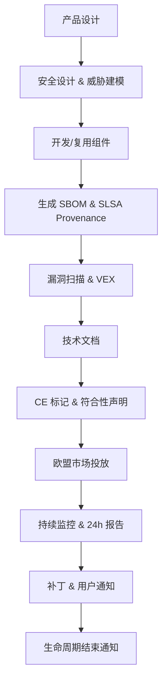

### 9.9 权威来源与交叉引用

- Regulation (EU) 2024/2847 (Cyber Resilience Act): <https://eur-lex.europa.eu/legal-content/EN/TXT/?uri=CELEX:32024R2847>
- European Commission — Cyber Resilience Act: <https://digital-strategy.ec.europa.eu/en/policies/cyber-resilience-act>
- ENISA — Cyber Resilience Act: <https://www.enisa.europa.eu/topics/cyber-resilience-act>
- CEN/CENELEC standards for CRA: <https://www.cencenelec.eu/>
- 相关概念: [Cyber Resilience Act](https://en.wikipedia.org/wiki/Cyber_Resilience_Act)
- **交叉引用**: `struct/10-supply-chain-security/02-sbom-standards/sbom-comparison.md` §7；`struct/10-supply-chain-security/01-slsa-framework/slsa-1-2-multi-track.md` §3.1；`struct/10-supply-chain-security/06-case-studies/eu-cra-checklist.md`

---

> 最后更新: 2026-07-07
> 权威来源: <https://digital-strategy.ec.europa.eu/en/policies/cyber-resilience-act>


## 10. EU CRA 合规实施清单、SBOM/漏洞管理要求与示例补强

### 10.1 定义：CRA 合规义务与复用资产的法律关系

EU CRA 将"含数字元素的产品"（Products with Digital Elements, PDE）制造商定义为承担网络安全全生命周期责任的主体。在架构复用语境下，复用第三方组件**不会**转移该责任；最终产品制造商必须对集成组件的安全状态、漏洞处理和更新义务负责。

> **定义 CRA.Comp.2** (PDE Manufacturer Obligation — 补强): 任何在欧盟市场投放 PDE 的制造商，无论其自行开发或复用第三方组件，都必须实施安全设计、漏洞管理、事件响应与软件透明度四组义务。SBOM 是证明这些义务履行的关键技术文档。

### 10.2 EU CRA 合规义务完整清单

下表将 CRA 的核心义务从法规条款映射到可执行检查项，便于组织进行差距分析。

| 义务组 | 法规条款 | 具体义务 | 适用对象 | 关键日期 | 违规风险 |
|--------|---------|---------|---------|---------|---------|
| 安全设计与默认 | Article 10 + Annex I | 最小攻击面、安全默认配置、无默认凭证、加密、访问控制 | 所有 PDE 制造商 | 2027-12-11 | 市场禁入、罚款 |
| 漏洞管理 | Article 13 + Annex II | 识别、跟踪、修复漏洞；生命周期结束通知 | 所有 PDE 制造商 | 2026-09-11（报告义务） | 监管处罚 |
| 事件检测与响应 | Article 14 | 检测影响 CIA 的事件；24h 报告主动利用漏洞 | 所有 PDE 制造商 | 2026-09-11 | 罚款、声誉损失 |
| 软件透明度 | Article 14(10) + Annex V/VI | 维护 SBOM；提供技术文档；加贴 CE 标记 | 所有 PDE 制造商 | 2027-12-11 | 无法上市 |
| 开源 steward 义务 | Article 24 | 协调披露、维护漏洞政策（特定 steward） | 开源基金会 / 大型开源项目 | 2026-09-11 | 监管关注 |
| 进口商/分销商义务 | Article 25/26 | 验证制造商合规、配合市场监管 | 进口商/分销商 | 2027-12-11 | 连带责任 |

### 10.3 SBOM 具体要求补强

#### 必须包含的信息

| 字段 | 说明 | 示例 |
|------|------|------|
| 组件名称 | 所有软件组件的名称 | `log4j-core` |
| 版本信息 | 精确版本号 | `2.17.1` |
| 供应商/来源 | 组件制造商或维护者 | Apache Software Foundation |
| 许可证详情 | 许可证类型与标识符 | `Apache-2.0` (SPDX) |
| 已知漏洞 | 持续更新的 CVE/OSV 关联 | CVE-2021-44228 |
| 依赖关系 | 包括传递依赖 | `log4j-api:2.17.1` |
| 哈希校验 | 组件完整性验证 | SHA-256 digest |
|  provenance 链接 | SLSA provenance 引用 | OCI referrer 或 URL |

#### 格式与交付要求

- **机器可读格式**：SPDX 2.3+ 或 CycloneDX 1.6+ 为推荐格式。
- **随软件修改更新**：每次构建或补丁发布后，SBOM 必须同步更新。
- **应市场监管机构要求提供**：通常以电子形式交付，保存至少 10 年。
- **纳入技术文档**：SBOM 是技术文档包的必要组成部分。
- **签名与完整性**：建议对 SBOM 进行密码学签名，防止篡改。

> **定理 CRA.SBOM.1** (SBOM 作为复用契约): 在 CRA 背景下，SBOM 不仅是技术文档，更是复用资产的法律契约。缺少 SBOM 的组件将面临市场准入障碍和合规风险。

### 10.4 漏洞管理要求补强

#### 漏洞管理生命周期

| 阶段 | 行动 | 时间要求 | 输出物 |
|------|------|---------|--------|
| 1. 持续监控 | 订阅 CVE/OSV/供应商安全通告 | 实时 | 安全通告订阅列表 |
| 2. 影响评估 | 根据 SBOM 判断受影响产品 | 48 小时内 | 影响评估报告 |
| 3. 修复计划 | 制定补丁或缓解方案 | 合理时间内 | 修复计划与时间表 |
| 4. 主动利用报告 | 向 CSIRT/ENISA 报告 | 24 小时内 | 事件报告 |
| 5. 用户通知 | 向客户发布安全公告与补丁 | 补丁可用时 | 安全公告 |
| 6. 生命周期结束通知 | 提前通知产品支持终止 | EOL 前至少 6 个月 | EOL 通知 |

#### 主动利用漏洞的 24 小时报告流程

```text
发现主动利用漏洞
    ↓
30 分钟内：启动事件响应小组
    ↓
2 小时内：完成 SBOM 影响评估，确定受影响产品/版本
    ↓
6 小时内：制定临时缓解措施（如 WAF 规则、配置变更）
    ↓
24 小时内：向 ENISA/CSIRT 提交初始报告
    ↓
72 小时内：发布安全公告，提供补丁或缓解方案
    ↓
持续：跟踪漏洞修复，更新 SBOM 与 VEX
```

### 10.5 CE 标记实施步骤补强

1. **符合性评估**：依据 CRA 附件 I（网络安全要求）与附件 II（漏洞处理要求）进行内部评估或第三方认证（高风险产品）。
2. **技术文档**：包含 SBOM、威胁模型、测试报告、漏洞管理流程、事件响应计划、用户安全指南。
3. **欧盟代表**：非欧盟制造商需指定欧盟授权代表（Authorized Representative）。
4. **加贴 CE 标记**：在产品或包装上清晰加贴 CE 标记并附带符合性声明（DoC）。
5. **市场监督**：保留技术文档至少 10 年，配合市场监管机构检查。
6. **产品注册**：在欧盟市场投放前，按要求向相关数据库注册产品信息。

### 10.6 开源组件合规特别注意事项

开源组件是 CRA 合规的**高风险区**，原因包括：

- 维护者无合同义务提供安全更新。
- SBOM 通常不完整或缺失。
- 传递依赖难以追踪。
- 漏洞披露流程不一致。

**建议措施**：

1. **建立开源组件准入清单**：仅允许来自活跃社区、有安全响应流程的开源项目。
2. **强制 SCA 扫描**：每次构建必须生成并验证 SBOM。
3. **参与社区安全**：为关键开源组件贡献安全补丁或资助安全审计。
4. **备用方案**：对关键开源组件，准备商业替代方案或内部维护能力。
5. **理解 steward 义务**：若组织作为大型开源项目的 steward，需履行 CRA Article 24 的协调披露义务。

### 10.7 正例补强

| 实践 | 效果 |
|------|------|
| 在 CI/CD 中自动生成 CycloneDX SBOM 并签名 | 满足 CRA 软件透明度要求，构建可验证 |
| 建立 24 小时漏洞报告 SOP 并每季度演练 | 满足主动利用漏洞报告义务 |
| 对关键组件要求 SLSA Build L3 + Source L2 provenance | 降低第三方组件引入后门风险 |
| 产品 EOL 前 12 个月通知客户 | 满足生命周期结束通知义务 |
| 将 SBOM 与漏洞扫描工具集成，实现自动影响评估 | 缩短漏洞响应时间 |
| 对供应商合同加入 CRA 合规条款 | 明确责任分担与 SBOM 交付要求 |

### 10.8 反例补强

| 反例 | 后果 |
|------|------|
| 认为"我们是 SaaS，不需要 CE 标记" | 远程数据处理软件属于 PDE，仍需合规 |
| SBOM 缺失传递依赖或哈希 | 漏洞定位不完整，审计失败 |
| 将开源组件豁免误解为完全免责 | 商业集成仍需承担漏洞处理义务 |
| 24 小时报告流程未演练 | 真实事件时无法及时上报 |
| 技术文档以英文-only 存档 | 欧盟市场监管机构可能要求成员国语言版本 |
| 忽视产品退役后的漏洞通知义务 | EOL 后仍需在合理时间内响应未修复漏洞 |

### 10.9 CRA 合规与架构复用流程 Mermaid 图

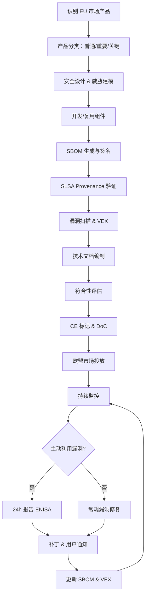

### 10.10 权威来源与交叉引用补强

- Regulation (EU) 2024/2847 (Cyber Resilience Act): <https://eur-lex.europa.eu/legal-content/EN/TXT/?uri=CELEX:32024R2847>
- European Commission — Cyber Resilience Act: <https://digital-strategy.ec.europa.eu/en/policies/cyber-resilience-act>
- ENISA — Cyber Resilience Act: <https://www.enisa.europa.eu/topics/cyber-resilience-act>
- CEN/CENELEC standards for CRA: <https://www.cencenelec.eu/>
- SPDX Specification: <https://spdx.dev/specifications/>
- CycloneDX Specification: <https://cyclonedx.org/specification/overview/>
- 相关概念: [Cyber Resilience Act](https://en.wikipedia.org/wiki/Cyber_Resilience_Act)
- **交叉引用**: `struct/10-supply-chain-security/02-sbom-standards/sbom-comparison.md` §7；`struct/10-supply-chain-security/01-slsa-framework/slsa-1-2-multi-track.md` §3.1；`struct/10-supply-chain-security/06-case-studies/eu-cra-checklist.md`；`struct/10-supply-chain-security/12-nist-ssdf-update/nist-ssdf-v1.2-reuse-update.md`

## 11. EU CRA 合规角色、交付物与示例清单

> **定义 CRA.Role.1** (CRA 责任主体): 在欧盟市场投放 PDE 的制造商是 CRA 义务的第一责任人；进口商与分销商承担验证与连带责任；开源 steward 在符合 Article 24 条件时承担协调披露义务。复用第三方组件并不改变制造商对产品网络安全负有的最终责任。

### 11.1 责任主体属性表

| 角色 | 法规定位 | 核心义务 | 关键交付物 | 时间要求 | 示例 |
|------|----------|----------|------------|----------|------|
| PDE 制造商 | Article 3/10/13/14 | 安全设计、漏洞管理、事件报告、SBOM | SBOM、技术文档、DoC、CE 标记 | 2026-09-11 报告义务；2027-12-11 全面适用 | 工业软件供应商 |
| 进口商 | Article 25 | 验证制造商合规、保留符合性证据 | 合规证据档案、DoC 副本 | 2027-12-11 | 欧盟外产品进口商 |
| 分销商 | Article 26 | 不销售不合规产品、配合市场监管 | 产品追溯记录、下架记录 | 2027-12-11 | 电子设备经销商 |
| 开源 steward | Article 24 | 制定漏洞政策、协调披露 | 安全政策、VEX、披露流程 | 2026-09-11 | 大型开源基金会 |

### 11.2 义务-交付物-示例关系

CRA 的合规逻辑呈链式关系：

```text
PDE 制造商（责任起点）
├── 安全设计 → 威胁模型、安全编码规范、默认安全配置
├── 漏洞管理 → SBOM + CVE 监控 + VEX + 补丁流程
├── 事件响应 → 24h 报告机制、事件记录、升级计划
└── 软件透明度 → SBOM、技术文档、CE 标记、DoC
    ↑ 进口商/分销商验证并追溯
    ↑ 开源 steward 协调披露
```

### 11.3 正例

| 实践 | 效果 |
|------|------|
| 在 CI/CD 中自动生成并签名 CycloneDX SBOM | 满足软件透明度要求，构建过程可验证 |
| 建立 24h 主动利用漏洞报告 SOP 并每季度演练 | 满足 Article 14 报告义务 |
| 对关键组件要求 SLSA Build L3 + Source L2 provenance | 降低第三方组件引入后门风险 |
| 产品 EOL 前 12 个月通知客户 | 满足生命周期结束通知义务 |
| 在供应商合同中加入 CRA 合规与 SBOM 交付条款 | 明确责任分担，降低合规盲区 |

### 11.4 反例

| 反例 | 后果 |
|------|------|
| “我们是 SaaS，不需要 CE 标记” | 远程数据处理软件属于 PDE，仍需合规 |
| SBOM 缺失传递依赖或哈希 | 漏洞定位不完整，审计失败 |
| 未指定欧盟授权代表 | 非欧盟制造商无法合法投放市场 |
| 将开源组件豁免误解为完全免责 | 商业集成仍需承担漏洞处理义务 |
| 24h 报告流程未演练 | 真实事件时无法及时上报 |
| 技术文档仅以英文存档 | 欧盟市场监管机构可能要求成员国语言版本 |

### 11.5 CRA 合规角色与交付物流程 Mermaid 图

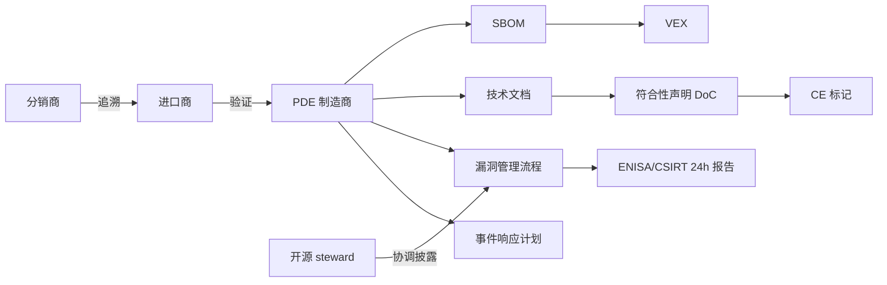

### 11.6 权威来源与交叉引用

- Regulation (EU) 2024/2847 (Cyber Resilience Act): <https://eur-lex.europa.eu/legal-content/EN/TXT/?uri=CELEX:32024R2847>
- European Commission — Cyber Resilience Act: <https://digital-strategy.ec.europa.eu/en/policies/cyber-resilience-act>
- ENISA — Cyber Resilience Act: <https://www.enisa.europa.eu/topics/cyber-resilience-act>
- CEN/CENELEC standards for CRA: <https://www.cencenelec.eu/>
- SPDX Specification: <https://spdx.dev/specifications/>
- CycloneDX Specification: <https://cyclonedx.org/specification/overview/>
- 相关概念: [Cyber Resilience Act](https://en.wikipedia.org/wiki/Cyber_Resilience_Act)
- **交叉引用**: `struct/10-supply-chain-security/02-sbom-standards/sbom-comparison.md` §7；`struct/10-supply-chain-security/01-slsa-framework/slsa-1-2-multi-track.md` §3.1；`struct/10-supply-chain-security/12-nist-ssdf-update/nist-ssdf-v1.2-reuse-update.md`


> 最后更新: 2026-07-07
> 权威来源: <https://digital-strategy.ec.europa.eu/en/policies/cyber-resilience-act>

---


<!-- SOURCE: struct/10-supply-chain-security/06-case-studies/nist-ssdf-1-2-alignment.md -->

# NIST SSDF 1.2 Initial Public Draft与软件复用框架对齐

> 本文档将 NIST SP 800-218 Rev.1（Secure Software Development Framework, SSDF）1.2 版的实践要求与本项目的软件架构复用框架进行系统对照，并给出实施检查清单。

---

## 1. SSDF 1.2 概述

NIST 于 2025-12-17 发布 **SP 800-218 Rev.1 Initial Public Draft**（SSDF v1.2 征求意见稿），目前尚未转为正式版本。
该框架旨在帮助组织以风险驱动的方式，将安全实践整合进软件开发生命周期（SDLC）。
SSDF 1.2 包含 **四大实践组（Practice Groups）**，共 19 项核心实践：

| 实践组 | 代号 | 核心目标 |
|---|---|---|
| Prepare the Organization | PO | 建立安全文化、定义标准、分配资源 |
| Protect Software | PS | 保护源代码、构建环境、交付渠道 |
| Produce Well-Secured Software | PW | 在设计与实现阶段内建安全 |
| Respond to Vulnerabilities | RV | 漏洞识别、修复、披露与持续改进 |

与 NIST CSF 2.0 类似，SSDF 1.2 强调**结果导向（outcome-based）**和**可度量性**，避免过度规定具体技术手段，而是通过“实践—任务—示例”三层结构，为不同规模组织提供弹性落地路径。

---

## 2. 与软件复用框架的对照

软件复用框架的核心挑战在于：复用资产（组件、库、服务、模板）一旦被引入，其安全风险将沿依赖链传导。
SSDF 1.2 的四大实践组恰好覆盖了复用安全的治理、防护、生产与响应全链路。

| SSDF 1.2 实践 | 本项目对应主题 | 复用安全含义 |
|---|---|---|
| **PO.1** 定义安全标准 | 01 元模型/标准对齐 | 复用资产的安全基线。在引入第三方组件前，必须定义可接受的安全阈值（如 CVE 严重程度上限、许可合规要求）。 |
| **PO.2** 实施角色与培训 | 06 跨层治理/安全委员会 | 明确架构审查委员会对复用资产的安全审批权，建立安全培训与意识提升机制。 |
| **PS.1** 保护源代码 | 10 供应链安全/SLSA | 防止源代码在复用前被篡改。通过 SLSA 来源证明（provenance）验证所复用组件的构建来源可信。 |
| **PS.2** 保护软件环境 | 10 供应链安全/构建加固 | 复用资产的构建与分发环境需符合最小权限原则，防止 CI/CD 链被渗透后污染复用产物。 |
| **PW.1** 设计安全软件 | 04 组件架构/接口契约 | 复用组件的安全边界。在设计阶段通过接口契约（如 OpenAPI 安全扩展、RBAC 模式）限定组件的暴露面。 |
| **PW.2** 实现安全软件 | 05 功能架构/安全编码规范 | 确保复用代码遵循统一的安全编码标准（如输入校验、输出编码、密钥管理）。 |
| **PW.5** 存档与发布数据 | 10 供应链安全/SBOM | 复用资产的漏洞追踪。为每个复用组件维护 SBOM，记录其依赖树、哈希值与来源 URL。 |
| **RV.1** 识别漏洞 | 10 供应链安全/漏洞扫描 | 对复用资产实施持续漏洞扫描（SCA），并与漏洞数据库（NVD、OSV）关联。 |
| **RV.2** 评估与修复 | 09 价值量化/风险成本模型 | 建立复用资产的漏洞修复优先级模型，结合业务影响与技术债务量化修复收益。 |
| **RV.3** 分析与披露 | 10 供应链安全/VEX | 对不可修复的复用组件漏洞，通过 VEX（漏洞利用性交换）文档向消费方透明披露。 |

> **核心洞察**：SSDF 1.2 并非额外增加复用负担，而是将“安全左移”理念从自有代码延伸至**复用资产的全生命周期治理**。

---

## 3. 从征求意见稿到正式版的关键变化

截至 2024 年底，NIST SP 800-218 Rev.1 已作为**Initial Public Draft（征求意见稿）**发布。
与早期征求意见稿相比，正式版的主要演进包括：

1. **术语统一**：将“Software Assurance”统一替换为“Software Security”，避免与功能安全（Safety）混淆，更贴合供应链安全语境。
2. **供应链强化**：在 PS 实践组中新增对**第三方组件与开源依赖**的明确引用，要求组织建立对外部复用资产的可见性（Visibility）与可控性（Control）。
3. **与 CSF 2.0 对齐**：SSDF 1.2 的词汇表与 NIST CSF 2.0 保持一致，便于组织将软件安全实践纳入整体网络安全治理体系。
4. **任务粒度细化**：每项实践下的“任务（Tasks）”从征求意见稿的平均 3 项增至 4–5 项，例如 PW.1 新增了“威胁建模应覆盖复用组件的集成边界”这一任务。
5. **示例更新**：正式版补充了云原生、容器镜像与 SBOM 生成的示例，直接回应了软件复用框架中容器化交付的场景需求。

> **状态跟踪**：SSDF 1.2（SP 800-218 Rev.1）当前仍为 **Initial Public Draft（IPD，2025-12-17）**，最终版预计 2026-Q3；正式发布前合规基线仍以 **SSDF v1.1（SP 800-218 Final）** 为现行，可将 Rev.1 IPD 作为前瞻对照。

---

## 4. 实施检查清单

以下清单将 SSDF 1.2 的关键实践转化为 10 项可落地的检查项，并映射到 SLSA 等级要求。

| # | 检查项 | SSDF 实践 | SLSA 映射 |
|---|---|---|---|
| 1 | 已制定复用资产安全准入策略（CVE 阈值、许可白名单） | PO.1 | L1 |
| 2 | 架构审查委员会对引入的新组件进行安全评审并留档 | PO.2 | L1 |
| 3 | 所有复用资产的来源均可通过 SBOM 追溯至唯一坐标（PURL/CPE） | PS.1 | L2 |
| 4 | 构建复用资产的 CI/CD 环境使用硬化镜像与最小权限令牌 | PS.2 | L2 |
| 5 | 复用组件的接口契约包含安全约束（认证、授权、输入边界） | PW.1 | L2 |
| 6 | 复用代码通过静态应用安全测试（SAST）与密钥扫描 | PW.2 | L2 |
| 7 | 发布物附带机器可读的 SBOM（SPDX 或 CycloneDX 格式） | PW.5 | L2 |
| 8 | 每周对复用资产依赖树执行自动 SCA 扫描并生成告警 | RV.1 | L1 |
| 9 | 高危漏洞在 SLA 内修复（Critical ≤ 7 天, High ≤ 30 天） | RV.2 | L3 |
| 10 | 对不可修复漏洞发布 VEX 文档并通知下游消费方 | RV.3 | L3 |

---

## 5. 权威来源

- NIST. *Secure Software Development Framework (SSDF) Version 1.2*. NIST SP 800-218 Rev.1, 2024.
- <https://csrc.nist.gov/projects/ssdf> — NIST SSDF 官方项目主页，含 PDF 下载与变更日志。
- OpenSSF SLSA Specification v1.0. <https://slsa.dev/spec/v1.0/>
- NTIA / CISA SBOM 最小元素指南. <https://www.cisa.gov/sbom>

---

## 6. 总结

SSDF 1.2 Initial Public Draft为软件复用安全提供了**从治理到工程、从预防到响应**的完整框架映射。
通过将 SSDF 实践嵌入本项目的元模型、组件架构与供应链安全主题，组织可以在享受复用效率红利的同时，将安全风险控制在可接受的阈值之内。
建议以本文档的检查清单为起点，结合 SLSA 等级逐步提升复用资产的信任基线。


---

## 补充章节

## 概念定义

**定义**：软件供应链安全关注从源代码、依赖、构建、分发到部署全链路中，复用资产不被篡改、注入漏洞或引入许可证风险；SLSA、SBOM 与签名验证是核心机制。

## 示例

**示例**：组织采用 SLSA L3 构建流程：源码托管、构建环境隔离、构建产物签名并生成SPDX SBOM；Log4j 类事件发生时 2 小时内定位受影响服务。

## 反例

**反例**：XZ Utils 后门事件显示，未对压缩依赖进行来源验证与行为审计，恶意代码可潜伏数年并随复用传播到大量系统。

## 权威来源

> **权威来源**:
>
> - [SLSA Framework](https://slsa.dev)
> - [OpenSSF](https://openssf.org)
> - [SPDX](https://spdx.dev)
> - [CycloneDX](https://cyclonedx.org)
> - 核查日期：2026-07-07

## 分析

**分析**：供应链安全是复用的信任基础，缺乏可追溯性的复用会放大单点风险。

---


<!-- SOURCE: struct/10-supply-chain-security/07-owasp-scvs/scvs-reuse-controls.md -->

# C-04 OWASP SCVS 软件组件验证标准映射

> **版本**: 2026-06-10
> **定位**: 供应链安全控制框架 — 软件组件验证标准与架构复用决策的映射规范
> **对齐标准**: OWASP SCVS 1.0、SLSA 1.2、SPDX 2.3、CycloneDX 1.6、NIST SSDF
> **状态**: ✅ 已完成

---

## 目录

- [C-04 OWASP SCVS 软件组件验证标准映射](#c-04-owasp-scvs-软件组件验证标准映射)
  - [目录](#目录)
  - [1. OWASP SCVS 概述](#1-owasp-scvs-概述)
    - [1.1 什么是 OWASP SCVS](#11-什么是-owasp-scvs)
    - [1.2 六大控制族（Control Families）](#12-六大控制族control-families)
    - [1.3 三个成熟度等级](#13-三个成熟度等级)
  - [2. 六大控制族详解](#2-六大控制族详解)
    - [2.1 V1 — Inventory（清单管理）](#21-v1--inventory清单管理)
    - [2.2 V2 — Software Bill of Materials（SBOM）](#22-v2--software-bill-of-materialssbom)
    - [2.3 V3 — Build Environment（构建环境）](#23-v3--build-environment构建环境)
    - [2.4 V4 — Package Management（包管理）](#24-v4--package-management包管理)
    - [2.5 V5 — Software Composition Analysis（SCA）](#25-v5--software-composition-analysissca)
    - [2.6 V6 — Software Pedigree and Provenance（溯源）](#26-v6--software-pedigree-and-provenance溯源)
  - [3. SCVS 成熟度等级与复用决策映射](#3-scvs-成熟度等级与复用决策映射)
    - [3.1 映射框架总览](#31-映射框架总览)
    - [3.2 Level 1：可复用但需审查](#32-level-1可复用但需审查)
    - [3.3 Level 2：条件复用](#33-level-2条件复用)
    - [3.4 Level 3：高信任复用](#34-level-3高信任复用)
  - [4. SCVS 与 SLSA 1.2 的协同](#4-scvs-与-slsa-12-的协同)
    - [4.1 互补视角](#41-互补视角)
    - [4.2 联合信任判定模型](#42-联合信任判定模型)
    - [4.3 协同工作流程](#43-协同工作流程)
  - [5. 集成到复用决策流水线](#5-集成到复用决策流水线)
    - [5.1 准入检查清单（Admission Checklist）](#51-准入检查清单admission-checklist)
    - [5.2 持续监控（Continuous Monitoring）](#52-持续监控continuous-monitoring)
    - [5.3 退出策略（Exit Strategy）](#53-退出策略exit-strategy)
  - [6. 案例分析：供应链攻击组件评估](#6-案例分析供应链攻击组件评估)
    - [6.1 案例一：Log4j（Log4Shell, CVE-2021-44228）](#61-案例一log4jlog4shell-cve-2021-44228)
    - [6.2 案例二：XZ Utils 后门（CVE-2024-3094）](#62-案例二xz-utils-后门cve-2024-3094)
    - [6.3 案例三：event-stream 恶意包植入](#63-案例三event-stream-恶意包植入)
  - [7. 权威来源](#7-权威来源)

---

## 1. OWASP SCVS 概述

### 1.1 什么是 OWASP SCVS

OWASP SCVS（Software Component Verification Standard，软件组件验证标准）是由 OWASP 基金会发布的开源框架，旨在为组织提供一套系统化的控制措施，用于验证软件组件的安全性和可信度。
该标准填补了传统应用安全测试与供应链安全之间的空白，特别关注第三方组件、开源依赖及商业软件包的引入风险。

SCVS 的核心设计理念是将"组件验证"从被动的漏洞扫描提升为主动的全生命周期治理，覆盖从组件发现、清单构建、来源溯源到持续监控的完整链条。
在软件架构复用场景中，SCVS 提供了可量化的评估维度，使架构师能够基于组件的安全成熟度做出科学的复用决策。

### 1.2 六大控制族（Control Families）

SCVS 1.0 定义了六个相互关联的控制族，构成组件验证的完整能力矩阵：

| 控制族 | 英文名称 | 核心目标 |
|--------|----------|----------|
| V1 | Inventory | 建立并维护准确的软件组件清单 |
| V2 | Software Bill of Materials | 生成、维护和使用标准化的 SBOM |
| V3 | Build Environment | 确保构建环境的安全性和可重复性 |
| V4 | Package Management | 管理软件包的获取、存储和分发 |
| V5 | Software Composition Analysis | 分析组件构成，识别已知漏洞和许可证风险 |
| V6 | Software Pedigree and Provenance | 验证组件的来源、血统和完整性 |

### 1.3 三个成熟度等级

SCVS 采用三级成熟度模型，每级在前一级基础上增加控制深度和覆盖范围：

- **Level 1（基础级）**: 具备基本的组件可见性，能够识别主要依赖项，适合初创团队或低风险场景。
- **Level 2（标准级）**: 建立完整的 SBOM 和自动化 SCA 流程，实现漏洞和许可证的常态化监控。
- **Level 3（高级级）**: 实现完整的来源验证、签名校验和构建可追溯性，适用于高安全要求的金融、电信、关基行业。

---

## 2. 六大控制族详解

### 2.1 V1 — Inventory（清单管理）

清单管理是组件验证的基石。
没有准确的清单，所有后续的安全控制都将失去作用目标。

**控制目标**: 组织必须维护一份全面、准确、及时更新的软件组件清单，涵盖自研代码、开源依赖、商业组件及内部共享库。

**关键实践**:

- **V1.1 组件发现**: 使用依赖解析工具（如 Maven Dependency Plugin、npm ls、pipdeptree）自动提取直接依赖和传递依赖。
- **V1.2 资产登记**: 为每个组件建立唯一标识（PURL、CPE 或自定义 ID），记录名称、版本、供应商、用途等元数据。
- **V1.3 分类分级**: 按业务影响和安全敏感度对组件进行分类（如核心交易组件、辅助工具组件、UI 组件等）。
- **V1.4 生命周期跟踪**: 监控组件的版本生命周期状态（活跃维护、EOL、已弃用），及时标记即将失去支持的组件。
- **V1.5 清单审计**: 定期比对运行时清单与开发时清单，识别"影子依赖"（即实际运行但未被声明的组件）。

**复用场景映射**:
在考虑复用一个组件之前，必须确保该组件已被纳入组织的统一清单。
未列入清单的组件默认不可复用，需经过例外审批流程。

### 2.2 V2 — Software Bill of Materials（SBOM）

SBOM 是组件信息的结构化、标准化表达，是现代供应链安全的基础设施。

**控制目标**: 为每个软件制品生成并维护符合行业标准的 SBOM，支持 SPDX、CycloneDX 或 SWID 格式。

**关键实践**:

- **V2.1 SBOM 生成**: 在构建流程中集成 SBOM 生成工具（如 Syft、Trivy、CycloneDX Maven Plugin），确保每个发布版本都有对应的 SBOM。
- **V2.2 SBOM 完整性**: SBOM 必须包含完整的依赖树（包括传递依赖），并标注每个组件的许可证信息。
- **V2.3 SBOM 分发**: 将 SBOM 作为制品的附属交付物，随软件包一起提供给下游消费者。
- **V2.4 SBOM 更新**: 当组件发生版本变更、漏洞修复或许可证调整时，及时更新对应的 SBOM。
- **V2.5 SBOM 验证**: 在复用决策点，验证上游提供的 SBOM 的完整性和准确性，可通过工具交叉比对。

**复用场景映射**:
复用组件时，要求上游提供 Level 2 及以上完整度的 SBOM。
SBOM 是复用风险评估的输入数据源，缺少 SBOM 的组件应在复用清单中被标记为"高风险"。

### 2.3 V3 — Build Environment（构建环境）

构建环境的安全性直接影响组件的可信度。被攻陷的构建环境可以产生看似正常但内含后门的组件。

**控制目标**: 确保用于构建和打包组件的环境受控、可审计、可复现。

**关键实践**:

- **V3.1 构建隔离**: 使用容器化或虚拟机隔离构建环境，避免不同项目之间的交叉污染。
- **V3.2 访问控制**: 严格限制对构建环境的访问权限，实施最小权限原则，所有访问行为需记录审计日志。
- **V3.3 构建脚本管理**: 构建脚本（如 Makefile、Dockerfile、CI/CD YAML）纳入版本控制，变更需经过代码评审。
- **V3.4 依赖锁定**: 使用锁定文件（package-lock.json、Pipfile.lock、Cargo.lock）确保构建时解析的依赖版本与开发时一致。
- **V3.5 可重复构建**: 在条件允许时，追求构建可重复性（Reproducible Builds），即相同源码和配置应产生逐位一致的输出。

**复用场景映射**:
评估待复用组件时，审查其构建环境的安全配置。
优先选择采用 CI/CD 流水线自动化构建、且构建配置公开可审计的开源项目。

### 2.4 V4 — Package Management（包管理）

包管理控制关注组件的获取渠道、存储方式和分发安全，防止"依赖混淆"和"包篡改"攻击。

**控制目标**: 建立受控的包管理流程，确保组织使用的每个软件包都来自可信来源且未被篡改。

**关键实践**:

- **V4.1 私有仓库**: 建立内部私有包仓库（如 Nexus、Artifactory、Harbor），所有外部依赖必须先经过私有仓库缓存和扫描。
- **V4.2 来源验证**: 从官方仓库获取包时，验证包的签名（如 GPG、Sigstore/cosign）和校验和（SHA-256）。
- **V4.3 依赖代理**: 配置包管理器使用内部代理，禁止直接从互联网拉取未经验证的依赖。
- **V4.4 包扫描**: 所有进入私有仓库的包必须经过静态扫描（恶意代码、漏洞、许可证合规）。
- **V4.5 出库审计**: 记录所有包的下载和使用情况，支持后续的影响分析和溯源。

**复用场景映射**:
复用组件必须通过组织的私有包仓库引入。
直接从互联网下载的组件包不得在正式产品中使用。
包管理日志应能追溯到每个复用组件的引入时间、引入人和目标项目。

### 2.5 V5 — Software Composition Analysis（SCA）

SCA 是组件安全的主动防御手段，通过自动化工具持续分析组件构成，识别已知漏洞和合规风险。

**控制目标**: 实施自动化的软件成分分析，及时发现并响应组件中的安全漏洞和许可证冲突。

**关键实践**:

- **V5.1 漏洞扫描**: 集成 SCA 工具（如 Snyk、Black Duck、FOSSology、OWASP Dependency-Check）到 CI/CD 流水线，每次构建自动扫描。
- **V5.2 漏洞分级**: 基于 CVSS 评分和业务上下文对漏洞进行分级（严重/高/中/低），优先修复影响生产环境的严重漏洞。
- **V5.3 许可证合规**: 扫描并识别组件的许可证类型（MIT、Apache-2.0、GPL 等），标记与组织政策冲突的许可证（如 GPL-3.0 的 Copyleft 要求）。
- **V5.4 漏洞响应**: 建立漏洞响应 SLA（如严重漏洞 24 小时内评估、7 天内修复或缓解），跟踪漏洞修复进度。
- **V5.5 持续监控**: SCA 不仅扫描当前版本，还需持续监控已部署组件的新披露漏洞（通过 NVD、OSV、CNVD 等漏洞库）。

**复用场景映射**:
复用决策前必须完成 SCA 扫描。
含有未修复严重漏洞（CVSS ≥ 7.0）或许可证冲突的组件，原则上不得复用，除非获得安全架构评审委员会的书面例外批准。

### 2.6 V6 — Software Pedigree and Provenance（溯源）

溯源控制是 SCVS 的最高层级，关注组件"从哪里来"、"经过了什么"、"是否被篡改"。

**控制目标**: 建立组件的完整血统记录和来源证明，支持对组件历史、构建过程和完整性的独立验证。

**关键实践**:

- **V6.1 来源元数据**: 收集组件的来源信息，包括源码仓库 URL、提交哈希、构建时间、构建者身份。
- **V6.2 构建 provenance**: 生成符合 SLSA Provenance 格式的构建来源证明，记录构建的完整上下文。
- **V6.3 签名验证**: 对组件包及其 SBOM、Provenance 进行数字签名，复用时验证签名链的完整性。
- **V6.4 血统追踪**: 记录组件的演进历史，包括分支、合并、补丁应用和定制修改。
- **V6.5 第三方审计**: 对关键组件引入第三方安全审计，审计报告作为溯源档案的一部分。

**复用场景映射**:
Level 3 复用要求组件具备完整的溯源证明。
对于来自开源社区的组件，优先选择已采用 Sigstore 签名、且在 SLSA 框架下达到 L2 及以上构建等级的项目。

---

## 3. SCVS 成熟度等级与复用决策映射

### 3.1 映射框架总览

SCVS 的三个成熟度等级与架构复用决策形成明确的对应关系，使安全评估从定性描述转化为可执行的准入标准。

```text
┌─────────────────────────────────────────────────────────────────────────────┐
│                    SCVS 成熟度 × 复用决策矩阵                                │
├───────────┬─────────────────────┬─────────────────────┬─────────────────────┤
│   维度    │      Level 1        │      Level 2        │      Level 3        │
├───────────┼─────────────────────┼─────────────────────┼─────────────────────┤
│ 决策结论  │ 可复用但需审查       │ 条件复用             │ 高信任复用           │
│ 清单要求  │ 基础组件清单         │ 完整 SBOM           │ SBOM + Provenance   │
│ 漏洞要求  │ 无已知严重漏洞       │ SCA 扫描通过        │ 持续监控 + 快速响应  │
│ 溯源要求  │ 无                   │ 基础来源信息        │ 签名验证 + 血统追踪  │
│ 审批流程  │ 团队负责人审批       │ 安全团队评审         │ 架构委员会备案       │
│ 监控频率  │ 季度审查             │ 月度扫描             │ 实时告警             │
│ 退出策略  │ 版本EOL时强制替换    │ 漏洞无修复时替换     │ 任何风险信号即评估   │
└───────────┴─────────────────────┴─────────────────────┴─────────────────────┘
```

### 3.2 Level 1：可复用但需审查

**定义**: 组件具备基础可见性，组织知道它是什么、在哪里使用，但缺乏深入的自动化验证。

**准入标准**:

- 组件已被纳入组织的统一组件清单（V1）。
- 基础信息完整：名称、版本、供应商、用途、引入项目。
- 通过基础漏洞检查：无已知的严重（Critical）级别 CVE。
- 团队负责人完成人工审查并书面确认。

**适用场景**: 内部共享库、低风险工具类组件、非生产环境使用的辅助组件。

**限制条件**: Level 1 组件不得用于处理敏感数据、不得部署在面向互联网的边界、不得作为关键业务路径的依赖。

**审查清单**:

- [ ] 组件已登记到组织组件清单系统
- [ ] 基础元数据（名称/版本/供应商）完整
- [ ] 人工确认无已知严重漏洞
- [ ] 团队负责人签署复用审批单
- [ ] 已安排季度复查

### 3.3 Level 2：条件复用

**定义**: 组件具备完整的 SBOM 和自动化 SCA 能力，安全状态可被持续监控，但仍缺少完整的来源验证。

**准入标准**:

- 满足 Level 1 所有要求。
- 提供完整、机器可读的 SBOM（SPDX 或 CycloneDX 格式）（V2）。
- 通过自动化 SCA 扫描，无高危及以上未修复漏洞（V5）。
- 许可证合规，无与组织政策冲突的 Copyleft 许可证。
- 组件来自受控包管理渠道（内部私有仓库）（V4）。
- 安全团队完成评审并出具意见书。

**适用场景**: 生产环境通用业务组件、中等安全要求的后台服务、大部分开源框架和库。

**条件约束**: 复用时需声明 SCA 扫描结果的有效期（通常为 30 天），超期需重新扫描。若扫描中发现新的高危漏洞，需在规定 SLA 内评估影响并制定修复或替换计划。

### 3.4 Level 3：高信任复用

**定义**: 组件具备完整的溯源证明和签名验证，构建过程透明可审计，适用于最高安全要求的场景。

**准入标准**:

- 满足 Level 2 所有要求。
- 提供符合 SLSA 规范的构建 Provenance 文档（V6）。
- 组件包、SBOM 和 Provenance 均经过可信签名（如 Sigstore/cosign、GPG）（V6）。
- 复用时成功验证所有签名链的完整性。
- 构建环境配置公开可审计，或已通过第三方安全评估（V3）。
- 架构委员会备案，无需逐案审批（建立"高信任组件白名单"）。

**适用场景**: 金融核心交易组件、关基行业基础设施、涉及国家秘密或商业机密的高密级系统。

**白名单机制**: 达到 Level 3 的组件可纳入组织的"高信任组件白名单"，白名单内组件在后续复用时可享受"快速通道"审批，但仍需接受持续的实时监控。

---

## 4. SCVS 与 SLSA 1.2 的协同

### 4.1 互补视角

SCVS 与 SLSA（Supply Chain Levels for Software Artifacts）是两个相互补充的供应链安全框架。理解它们的协同关系，对于建立完整的复用信任体系至关重要。

| 维度 | OWASP SCVS | SLSA 1.2 |
|------|-----------|----------|
| **核心关注点** | 组件本身的验证状态 | 构建过程和制品的可信度 |
| **评估对象** | 软件组件（库、包、模块） | 软件制品（二进制、镜像、包） |
| **关键输出** | 组件成熟度等级（L1-L3） | 构建等级（L1-L3） |
| **关键输入** | SBOM、SCA 报告、清单 | Provenance、源代码、构建定义 |
| **主要问题** | "这个组件安全吗？" | "这个制品可信吗？" |

**核心洞察**: SCVS 回答"组件是否值得被评估"，SLSA 回答"制品的构建过程是否可信"。两者结合，才能回答"这个组件在当前的构建和分发状态下，是否可以安全复用"。

### 4.2 联合信任判定模型

建议采用联合评分模型，将 SCVS 等级与 SLSA 等级组合为二维信任矩阵：

```text
                    SLSA Build Level
                 L1          L2          L3
              ┌─────────┬─────────┬─────────┐
         L3   │  中等   │  较高   │  最高   │
SCVS         │  信任   │  信任   │  信任   │
Level    L2   │  低     │  中等   │  较高   │
              │  信任   │  信任   │  信任   │
         L1   │  最低   │  低     │  中等   │
              │  信任   │  信任   │  信任   │
              └─────────┴─────────┴─────────┘
```

**判定规则**:

- **最高信任（SCVS L3 + SLSA L3）**: 组件和构建均达到最高标准，自动纳入高信任白名单，享受快速复用通道。
- **较高信任（SCVS L3 + SLSA L2 或 SCVS L2 + SLSA L3）**: 组件或构建之一达到高级，另一达到标准级，允许复用，需常规审批。
- **中等信任（对角线组合）**: 组件和构建均为标准级或一高一低，允许复用但需附加条件（如定期重新验证、限制使用场景）。
- **低信任及以下**: 原则上不允许在生产环境复用，如需使用必须经过高级别例外审批，并附加补偿控制措施。

### 4.3 协同工作流程

在实际复用决策流水线中，SCVS 和 SLSA 的验证应按以下顺序执行：

1. **SCVS 预筛选**: 首先评估组件是否满足基础的清单和 SBOM 要求（SCVS V1-V2）。不满足的组件直接拒绝，无需进入后续流程。
2. **SCVS 深度评估**: 对通过预筛选的组件进行 SCA 扫描和包管理渠道验证（SCVS V4-V5）。存在未修复严重漏洞的组件被拒绝。
3. **SLSA 构建验证**: 对通过 SCVS 评估的组件，验证其构建 Provenance 和签名（SLSA L1-L3）。构建不可信的组件降级使用或拒绝。
4. **联合决策**: 根据二维信任矩阵，结合业务场景的安全要求，做出最终的复用决策。
5. **持续监控**: 已复用组件同时接受 SCVS 的持续 SCA 监控和 SLSA 的构建来源监控。

---

## 5. 集成到复用决策流水线

### 5.1 准入检查清单（Admission Checklist）

将 SCVS 控制点嵌入复用决策的入口，形成标准化的"组件准入检查清单"。

**阶段一：信息收集**

- [ ] 收集组件的基础信息：名称、版本、官方仓库、维护者、活跃度（最近更新时间、Issue 响应速度）。
- [ ] 获取组件的 SBOM（SPDX 或 CycloneDX 格式），验证 SBOM 的完整性。
- [ ] 查询组件的公开安全记录：CVE 历史、安全公告、已披露漏洞的修复速度。

**阶段二：自动化扫描**

- [ ] 将组件导入内部私有包仓库，触发自动 SCA 扫描。
- [ ] 检查漏洞状态：是否存在未修复的严重/高危 CVE。
- [ ] 检查许可证合规：识别所有依赖的许可证类型，标记冲突项。
- [ ] 检查恶意代码指标：通过静态分析和社区情报，排除已知恶意包。

**阶段三：溯源验证**

- [ ] 验证组件包的签名（GPG、cosign 等）。
- [ ] 若组件提供 SLSA Provenance，验证 Provenance 的真实性和完整性。
- [ ] 审查构建配置：Dockerfile、CI/CD 配置是否公开、是否合理。

**阶段四：决策审批**

- [ ] 根据 SCVS 评估结果和 SLSA 等级，定位二维信任矩阵。
- [ ] 填写复用风险评估表，记录风险等级、缓解措施、责任人。
- [ ] 提交对应级别的审批（L1→团队负责人，L2→安全团队，L3→架构委员会备案）。

### 5.2 持续监控（Continuous Monitoring）

组件被批准复用后，安全验证并未结束，而是进入持续监控阶段。

**监控触发器**:

| 触发类型 | 监控内容 | 响应动作 |
|----------|----------|----------|
| 新 CVE 披露 | NVD/OSV/CNVD 新漏洞匹配 | 24 小时内完成影响评估 |
| SBOM 变更 | 上游发布新版本或变更依赖 | 重新执行准入检查清单 |
| 许可证变更 | 组件更改许可证或新增依赖许可证冲突 | 法务+安全联合评审 |
| 维护状态变更 | 项目归档、核心维护者退出 | 启动组件替换评估 |
| EOL 告警 | 组件版本进入生命周期末期 | 制定升级或替换计划 |
| 签名失效 | Provenance 签名过期或验证失败 | 立即冻结复用，启动调查 |

**监控工具链集成**:

- **漏洞监控**: OSV.dev API + 内部漏洞数据库 + SCA 工具告警。
- **SBOM 监控**: 定期重新生成 SBOM 并与基线比对，检测依赖漂移。
- **许可证监控**: FOSSology 或 ScanCode 定期扫描许可证变更。
- **构建监控**: 通过 Sigstore Rekor 日志监控签名状态和透明日志一致性。

### 5.3 退出策略（Exit Strategy）

当组件的安全状态恶化到不可接受的水平时，必须执行有序的退出。

**退出触发条件**:

1. 组件出现严重漏洞且维护者在规定时间内未提供修复（如 Log4j 级别的漏洞）。
2. 组件的许可证变更为与组织政策严重冲突的类型。
3. 组件的溯源链被破坏（签名失效、源码仓库被入侵、恶意代码被植入）。
4. 组件进入 EOL 且无可用的长期支持（LTS）版本。
5. 架构治理委员会基于新的威胁情报判定组件不再可信。

**退出流程**:

1. **风险评估**: 评估该组件在组织内的使用范围（影响哪些产品、多少生产实例）。
2. **替代方案调研**: 寻找功能等价的替代组件，或评估自研的可行性。
3. **迁移计划制定**: 制定分阶段迁移计划，优先处理面向互联网和高敏感数据处理场景。
4. **紧急缓解**: 在完全替换前，实施补偿控制（如 WAF 规则、运行时防护、网络隔离）。
5. **迁移执行与验证**: 按计划完成替换，验证功能一致性和性能影响。
6. **事后复盘**: 复盘退出原因，更新组件准入标准和黑名单。

---

## 6. 案例分析：供应链攻击组件评估

### 6.1 案例一：Log4j（Log4Shell, CVE-2021-44228）

**事件回顾**:
2021 年 11 月，Apache Log4j 2 中被披露存在远程代码执行漏洞（Log4Shell），CVSS 评分 10.0（严重）。
该组件被全球数百万 Java 应用使用，影响范围之广堪称供应链安全史上的里程碑事件。

**SCVS 评估复盘**:

| 控制族 | 事件前状态 | 理想状态（SCVS L3） | 差距 |
|--------|-----------|---------------------|------|
| V1 Inventory | 大量组织不知自己在使用 Log4j | 完整的组件清单，精确到版本 | 多数组织缺失 |
| V2 SBOM | 极少组织有准确的 SBOM | 每个制品附带完整 SBOM | 严重缺失 |
| V3 Build | Log4j 本身构建规范 | 复用方不审查构建环境 | 复用方缺失 |
| V4 Package | 通过 Maven Central 直接引入 | 经私有仓库缓存和扫描 | 部分组织缺失 |
| V5 SCA | 事件前无相关 CVE | 持续监控，事件后快速响应 | 被动响应 |
| V6 Provenance | Log4j 提供签名但不普遍验证 | 强制验证签名和 Provenance | 验证不足 |

**基于 SCVS 的复用决策改进**:

- **事前（复用前）**: 若组织在复用 Log4j 时已实施 SCVS L2 及以上，SBOM 会揭示 Log4j 及其 JNDI 功能的依赖关系，安全团队可在评估阶段识别 JNDI Lookup 的潜在攻击面。
- **事中（漏洞披露后）**: 完整的 Inventory（V1）使组织能在数小时内定位所有使用 Log4j 的系统和制品，而非数天或数周。
- **事后（退出策略）**: Log4j 事件后，许多组织制定了"无 JNDI 依赖"的架构原则，将相关组件列入限制复用清单。

### 6.2 案例二：XZ Utils 后门（CVE-2024-3094）

**事件回顾**:
2024 年 3 月，XZ Utils 项目（广泛使用的压缩库）中被发现植入了极其复杂的后门。
攻击者通过长达数年的社会工程学手段获取了维护者权限，最终在 release tarball 中嵌入了恶意代码。该后门将影响通过 SSH 暴露的 Linux 系统。

**SCVS 评估复盘**:

XZ 后门事件暴露了传统安全控制的盲区——即使源码看似正常，发布制品也可能被篡改。

| 控制族 | 事件启示 |
|--------|----------|
| V1 Inventory | 许多 Linux 发行版和容器镜像隐含依赖 liblzma（XZ 的核心库），但组织往往未将其列入显式清单。 |
| V2 SBOM | 容器镜像和操作系统缺少完整的 SBOM，导致无法快速定位 XZ 的使用位置。 |
| V3 Build | XZ 的构建过程被篡改，若复用方不验证构建环境，则完全无法发现。 |
| V4 Package | 直接从发行版仓库获取 XZ 的组织，缺少中间环节的扫描和验证。 |
| V5 SCA | 传统 SCA 工具依赖 CVE 数据库，而 XZ 后门作为零日威胁，在披露前无 CVE。 |
| V6 Provenance | 若要求 XZ 提供 SLSA Provenance 且验证构建来源，理论上可发现 tarball 与源码的不一致。 |

**基于 SCVS 的关键改进**:

- **强化 V6（溯源）**: XZ 事件后，SCVS L3 的 Provenance 验证要求变得尤为关键。组织应要求关键系统组件提供 SLSA L3 级别的构建来源证明，确保 tarball 内容与公开源码一致。
- **强化 V1（清单）**: 操作系统级依赖（如 glibc、OpenSSL、liblzma）必须纳入组件清单，不能因为是"系统自带"而忽视。
- **补偿控制**: 对于无法达到 SCVS L3 的系统级组件，增加运行时行为监控（如 Falco、Sysdig）作为补偿控制，检测异常的网络和进程行为。

### 6.3 案例三：event-stream 恶意包植入

**事件回顾**:
2018 年，攻击者通过接管 npm 包 event-stream 的维护权，向其中植入了窃取比特币的恶意代码。
受影响的是 event-stream 的下游依赖 flatmap-stream。

**SCVS 评估复盘**:

| 控制族 | 防御作用 |
|--------|----------|
| V4 Package | 若组织使用私有 npm 仓库并配置依赖锁定，新版本的恶意包不会自动进入构建。 |
| V5 SCA | 恶意代码扫描（静态分析 + 社区情报）有概率识别出异常的加密和网络行为。 |
| V6 Provenance | 若 npm 包支持签名验证（如 Sigstore），可验证发布者身份是否变更。 |
| V1 Inventory | 清单系统会记录 event-stream 的所有使用位置，缩短应急响应时间。 |

---

## 7. 权威来源

| 来源 | URL | 核查日期 |
|------|-----|----------|
| OWASP SCVS 官方文档 | <https://scvs.owasp.org/> | 2026-06-10 |
| OWASP SCVS GitHub 仓库 | <https://github.com/OWASP/Software-Component-Verification-Standard> | 2026-06-10 |
| SLSA 1.2 规范 | <https://slsa.dev/spec/v1.2/> | 2026-06-10 |
| NIST SP 800-204D | <https://csrc.nist.gov/publications/detail/white-paper/final> | 2026-06-10 |
| NVD - National Vulnerability Database | <https://nvd.nist.gov/> | 2026-06-10 |
| OSV - Open Source Vulnerabilities | <https://osv.dev/> | 2026-06-10 |
| Sigstore 官方文档 | <https://docs.sigstore.dev/> | 2026-06-10 |
| SPDX 规范 | <https://spdx.dev/specifications/> | 2026-06-10 |
| CycloneDX 规范 | <https://cyclonedx.org/specification/overview/> | 2026-06-10 |
| CISA SBOM 指南 | <https://www.cisa.gov/sbom> | 2026-06-10 |
| Log4Shell CVE-2021-44228 | <https://nvd.nist.gov/vuln/detail/CVE-2021-44228> | 2026-06-10 |
| XZ Utils Backdoor CVE-2024-3094 | <https://nvd.nist.gov/vuln/detail/CVE-2024-3094> | 2026-06-10 |
| Snyk State of Open Source Security | <https://snyk.io/reports/open-source-security/> | 2026-06-10 |
| Sonatype State of the Software Supply Chain | <https://www.sonatype.com/state-of-the-software-supply-chain> | 2026-06-10 |

---

*本文档为软件架构复用框架 Phase C（供应链安全）的组成部分，与 C-01 至 C-03（SLSA、Scorecard、依赖管理）及 C-05（GUAC）形成完整的供应链安全控制体系。*

---


<!-- SOURCE: struct/10-supply-chain-security/08-guac-supply-chain/guac-reuse-risk.md -->

# C-05 GUAC 供应链图谱与复用风险评估

> **版本**: 2026-07-08
> **定位**: 供应链安全分析层 — 基于知识图谱的架构复用风险量化与动态评估
> **对齐标准**: GUAC v0.x、SLSA 1.2、OpenSSF Scorecard、SPDX 2.3、CycloneDX 1.6、OSV、NIST SP 800-161 Rev. 1
> **状态**: ✅ 已完成

---

## 目录

- [C-05 GUAC 供应链图谱与复用风险评估](#c-05-guac-供应链图谱与复用风险评估)
  - [目录](#目录)
  - [1. GUAC 概述](#1-guac-概述)
    - [1.1 什么是 GUAC](#11-什么是-guac)
    - [1.2 项目背景与定位](#12-项目背景与定位)
    - [1.3 与架构复用的关联](#13-与架构复用的关联)
  - [2. GUAC 核心概念](#2-guac-核心概念)
    - [2.1 数据模型：节点（Nodes）](#21-数据模型节点nodes)
      - [2.1.1 构件节点（Artifact Node）](#211-构件节点artifact-node)
      - [2.1.2 包节点（Package Node）](#212-包节点package-node)
      - [2.1.3 源码节点（Source Node）](#213-源码节点source-node)
      - [2.1.4 漏洞节点（Vulnerability Node）](#214-漏洞节点vulnerability-node)
      - [2.1.5 实体节点（Attestation / Provenance Node）](#215-实体节点attestation--provenance-node)
    - [2.2 数据模型：边（Edges）](#22-数据模型边edges)
      - [2.2.1 依赖关系边（Dependency Edge）](#221-依赖关系边dependency-edge)
      - [2.2.2 签名验证边（Signature Verification Edge）](#222-签名验证边signature-verification-edge)
      - [2.2.3 许可证合规边（License Edge）](#223-许可证合规边license-edge)
      - [2.2.4 构建来源边（Build Provenance Edge）](#224-构建来源边build-provenance-edge)
      - [2.2.5 漏洞影响边（Vulnerability Edge）](#225-漏洞影响边vulnerability-edge)
    - [2.3 数据摄入与图谱构建](#23-数据摄入与图谱构建)
  - [3. GUAC 的复用风险评估能力](#3-guac-的复用风险评估能力)
    - [3.1 传递风险分析](#31-传递风险分析)
      - [3.1.1 问题定义](#311-问题定义)
      - [3.1.2 GUAC 的解决方案](#312-guac-的解决方案)
      - [3.1.3 复用决策应用](#313-复用决策应用)
    - [3.2 关键路径识别](#32-关键路径识别)
      - [3.2.1 问题定义](#321-问题定义)
      - [3.2.2 GUAC 的解决方案](#322-guac-的解决方案)
      - [3.2.3 复用决策应用](#323-复用决策应用)
    - [3.3 攻击面扩展分析](#33-攻击面扩展分析)
      - [3.3.1 问题定义](#331-问题定义)
      - [3.3.2 GUAC 的解决方案](#332-guac-的解决方案)
  - [4. GUAC 与 SLSA/Scorecard 的联动](#4-guac-与-slsascorecard-的联动)
    - [4.1 安全评分的图谱叠加](#41-安全评分的图谱叠加)
      - [4.1.1 SLSA 等级作为节点属性](#411-slsa-等级作为节点属性)
      - [4.1.2 Scorecard 评分作为节点属性](#412-scorecard-评分作为节点属性)
    - [4.2 联合查询示例](#42-联合查询示例)
    - [4.3 动态风险评分模型](#43-动态风险评分模型)
  - [5. 实践场景：复用全生命周期](#5-实践场景复用全生命周期)
    - [5.1 复用前：查询完整依赖图谱和风险评分](#51-复用前查询完整依赖图谱和风险评分)
    - [5.2 复用中：监控依赖图谱的变更](#52-复用中监控依赖图谱的变更)
    - [5.3 复用后：影响分析与应急响应](#53-复用后影响分析与应急响应)
    - [5.4 正向案例：XZ Utils 事件中的 GUAC 价值](#54-正向案例xz-utils-事件中的-guac-价值)
    - [5.5 反例 / 反模式](#55-反例--反模式)
  - [6. 部署架构：复用资产库的安全增强层](#6-部署架构复用资产库的安全增强层)
    - [6.1 总体架构](#61-总体架构)
    - [6.2 关键组件说明](#62-关键组件说明)
      - [6.2.1 数据摄入层](#621-数据摄入层)
      - [6.2.2 图数据库](#622-图数据库)
      - [6.2.3 查询服务](#623-查询服务)
      - [6.2.4 持续监控与告警引擎](#624-持续监控与告警引擎)
    - [6.3 与复用资产库的集成点](#63-与复用资产库的集成点)
  - [7. 控制点映射：GUAC 数据摄入 → 复用安全控制](#7-控制点映射guac-数据摄入--复用安全控制)
  - [8. 权威来源](#8-权威来源)

---

## 1. GUAC 概述

### 1.1 什么是 GUAC

GUAC（Graph for Understanding Artifact Composition，构件组成理解图谱）是由 Google 与 OpenSSF（Open Source Security Foundation）联合发起并维护的开源项目。它是一个面向软件供应链安全的知识图谱系统，旨在通过聚合和分析多源安全数据，帮助组织理解软件构件的组成、依赖关系、安全状态和来源可信度。

GUAC 的核心理念是将软件供应链中的离散信息——SBOM、SLSA Provenance、漏洞数据库、签名记录、许可证声明——整合为一个统一的、可查询的图结构数据模型。
在这个图谱中，每个软件包、每个源码仓库、每个漏洞、每个构建动作都是一个节点，它们之间的关系（依赖、包含、触发、修复）则作为边连接这些节点。

### 1.2 项目背景与定位

软件供应链的复杂性已达到人力无法完全掌控的程度。
一个现代应用可能依赖数百甚至数千个第三方组件，这些组件之间形成深层的传递依赖网络。
传统的安全工具（如 SCA 扫描器）通常以"点"的方式提供信息："这个组件有 CVE-202X-XXXX"。但安全团队真正需要回答的问题是：

- 这个漏洞通过哪些依赖链传递到了我的产品？
- 如果某个开源维护者账号被入侵，哪些产品会受到影响？
- 新引入的依赖扩展了多少攻击面？
- 组织内哪些产品使用了同一批有问题的组件？

GUAC 的设计目标正是回答这些"图"层面的问题。
它不是一个替代 SCA 或 SLSA 的工具，而是一个**位于它们之上的聚合分析层**，将各工具的输出连接成一张可推理、可查询的安全知识图谱。

### 1.3 与架构复用的关联

在软件架构复用框架中，GUAC 扮演着"风险雷达"和"影响分析引擎"的双重角色：

- **复用前**: 通过查询 GUAC 图谱，架构师可以获得候选组件的完整依赖画像、历史漏洞轨迹和来源可信度评分，为复用决策提供数据支撑。
- **复用中**: GUAC 持续监控已复用组件的依赖图谱变化，当上游出现新漏洞、许可证变更或构建来源异常时，主动触发告警。
- **复用后**: 当供应链安全事件发生时，GUAC 能够快速遍历影响范围，精确回答"这个有问题的组件影响了我们哪些已交付的产品"。

---

## 2. GUAC 核心概念

### 2.1 数据模型：节点（Nodes）

GUAC 的图谱由多种类型的节点构成，每种节点代表供应链中的一个实体：

#### 2.1.1 构件节点（Artifact Node）

构件是 GUAC 图谱中的核心实体，代表一个具体的软件制品。
构件通过其内容的哈希值（如 SHA-256）唯一标识，而非名称和版本——这意味着即使攻击者将恶意代码重新打包为同名组件，GUAC 也能通过哈希差异识别出它不是同一个构件。

```text
Artifact Node:
  - digest: sha256:abc123...
  - algorithm: SHA256
  - identifiers: [PURL pkg:maven/org.example/lib@1.0.0]
```

#### 2.1.2 包节点（Package Node）

包节点代表一个逻辑上的软件包，通过 PURL（Package URL）标识。
一个包可以对应多个构件节点（不同架构、不同构建时间产生的不同哈希）。

```text
Package Node:
  - type: maven
  - namespace: org.example
  - name: lib
  - versions: [1.0.0, 1.0.1, 1.1.0]
```

#### 2.1.3 源码节点（Source Node）

源码节点代表软件的源代码仓库，通过版本控制系统的 URL 和提交哈希标识。

```text
Source Node:
  - type: git
  - namespace: github.com/org
  - name: repo
  - commit: a1b2c3d...
```

#### 2.1.4 漏洞节点（Vulnerability Node）

漏洞节点代表一个已知的安全漏洞，通常以 OSV 格式或 CVE ID 标识。
GUAC 通过集成 OSV.dev 数据库，持续更新漏洞节点的属性（严重性、CVSS 评分、影响范围、修复版本）。

```text
Vulnerability Node:
  - id: CVE-202X-XXXXX / GHSA-xxxx-xxxx-xxxx
  - severity: HIGH
  - cvss_score: 8.1
  - fixed_versions: [1.2.3]
```

#### 2.1.5 实体节点（Attestation / Provenance Node）

此类节点代表与构件相关的证明文档，如 SLSA Provenance、SBOM、签名记录、Scorecard 结果等。

### 2.2 数据模型：边（Edges）

节点之间的关系通过带类型的边表达，这是 GUAC 实现深度分析的基础：

#### 2.2.1 依赖关系边（Dependency Edge）

依赖边是 GUAC 图谱中最丰富的边类型，表达了"包 A 依赖于包 B"的关系。
GUAC 不仅记录直接依赖，还通过 SBOM 解析传递依赖，构建完整的依赖树。

```text
[Package A] --depends_on--> [Package B]
[Package B] --depends_on--> [Package C]
```

通过依赖边的传递闭包，GUAC 可以回答"A 间接依赖于哪些组件"这类问题。

#### 2.2.2 签名验证边（Signature Verification Edge）

签名边连接构件节点与其数字签名验证结果，表达"这个构件的签名由谁签发、是否有效"。

```
[Artifact] --signed_by--> [Identity: maintainer@example.com]
[Artifact] --verified_by--> [Sigstore Rekor Entry]
```

#### 2.2.3 许可证合规边（License Edge）

许可证边连接包节点与其实际使用的许可证条款，支持从 SBOM 中提取的许可证信息。

```
[Package] --licensed_under--> [License: Apache-2.0]
[Package] --has_dependency--> [Package] --licensed_under--> [License: GPL-3.0]
```

通过许可证边的传递查询，可以识别复用组件时可能引发的许可证冲突（如 Apache-2.0 项目依赖 GPL-3.0 库）。

#### 2.2.4 构建来源边（Build Provenance Edge）

构建边连接构件节点与其 SLSA Provenance 文档，记录"这个构件是如何从源码构建出来的"。

```
[Artifact] --built_from--> [Source: git@github.com/org/repo.git#commit]
[Artifact] --has_provenance--> [SLSA Provenance Document]
```

#### 2.2.5 漏洞影响边（Vulnerability Edge）

漏洞边连接包/构件节点与影响它们的漏洞节点，通常标注影响版本范围和修复版本。

```
[Package: lib@1.0.0] --affected_by--> [Vulnerability: CVE-202X-XXXXX]
[Vulnerability: CVE-202X-XXXXX] --fixed_in--> [Package: lib@1.2.3]
```

### 2.3 数据摄入与图谱构建

GUAC 本身不直接扫描代码或生成 SBOM，而是通过**摄入器（Ingestor）**架构从多种外部源获取数据：

| 数据源 | 数据类型 | 摄入方式 |
|--------|----------|----------|
| SLSA Provenance | 构建来源证明 | 直接解析 JSON |
| SPDX / CycloneDX SBOM | 软件物料清单 | 解析标准格式 |
| OSV.dev API | 漏洞数据 | 自动同步 |
| Sigstore Rekor | 签名透明日志 | 日志监控 |
| OpenSSF Scorecard | 安全评分 | API 调用 |
| DEPS.dev API | 依赖关系与评分 | API 调用 |
| 内部 SCA 工具 | 扫描结果 | 自定义适配器 |

GUAC 将摄入的多源数据统一到内部图模型中，使用图数据库（如 Neo4j、ArangoDB 或 GUAC 内置的 in-memory 图存储）进行持久化和查询。

---

## 3. GUAC 的复用风险评估能力

GUAC 的图谱结构使其天然适合执行传统工具难以完成的深度风险分析。以下是 GUAC 在架构复用场景中的三项核心分析能力。

### 3.1 传递风险分析

#### 3.1.1 问题定义

在软件依赖中，风险具有传递性：如果组件 A 依赖组件 B，组件 B 依赖组件 C，那么组件 C 的安全问题将通过 B 传递给 A。传统的 SCA 工具通常只报告直接依赖的漏洞，对于深层传递依赖的覆盖往往不完整或滞后。

#### 3.1.2 GUAC 的解决方案

GUAC 通过构建完整的传递依赖图谱，可以精确计算风险在依赖链中的传播路径和影响范围。

**示例分析**:

假设组织的产品 `MyApp` 直接依赖了 `framework-X@2.1.0`，而 `framework-X` 传递依赖于 `utility-Y@1.5.0`，`utility-Y` 又依赖于 `core-Z@3.0.0`。当 `core-Z@3.0.0` 被披露存在一个高危漏洞时：

```
MyApp
└── framework-X@2.1.0
    └── utility-Y@1.5.0
        └── core-Z@3.0.0  <-- CVE-202X-XXXXX (HIGH)
```

GUAC 的查询路径：

1. 定位漏洞节点 `CVE-202X-XXXXX`。
2. 遍历反向依赖边（`affected_by` 的逆方向），找到所有受影响的包节点。
3. 继续向上遍历，直到到达顶层产品节点。
4. 输出完整的影响链：`MyApp -> framework-X -> utility-Y -> core-Z`。

#### 3.1.3 复用决策应用

在复用 `framework-X` 之前，架构师可以通过 GUAC 查询其完整的传递依赖树，评估每一层依赖的安全状态：

- 如果传递依赖树中存在多个维护不活跃、漏洞响应迟缓的组件，即使 `framework-X` 本身安全状况良好，也应谨慎复用。
- 如果传递依赖的深度过大（如超过 10 层），应评估引入的不可控风险是否与功能收益成正比。

### 3.2 关键路径识别

#### 3.2.1 问题定义

在组织的技术栈中，某些基础组件（如日志框架、JSON 解析库、HTTP 客户端）被大量产品共享。这些组件构成供应链的"关键节点"——一旦它们出现问题，影响面将呈指数级扩散。识别这些关键路径是风险集中管理和资源优先投入的前提。

#### 3.2.2 GUAC 的解决方案

GUAC 通过图中心性算法（如度中心性、介数中心性）自动识别图谱中的高影响节点。

**度中心性分析**: 统计每个包节点被多少其他包直接依赖。被依赖数量越多的节点，其故障影响面越大。

**介数中心性分析**: 统计每个节点在依赖路径中作为"桥梁"的频率。某些组件可能不是被最多项目直接依赖，但大量依赖链必须经过它才能到达其他组件。

**示例输出**:

```
组织内关键组件排名（按被依赖产品数）:
1. log4j-core (被 47 个产品依赖)
2. jackson-databind (被 42 个产品依赖)
3. okhttp (被 38 个产品依赖)
4. spring-core (被 35 个产品依赖)
5. commons-lang3 (被 31 个产品依赖)
```

#### 3.2.3 复用决策应用

- **关键组件升级优先**: 当关键组件发布安全更新时，应优先安排升级，因为其收益覆盖的产品最多。
- **关键组件复用加强管控**: 对于高中心性的组件，应执行更严格的复用准入标准（如强制要求 SCVS L3 + SLSA L3）。
- **避免过度集中**: 如果组织内所有产品都依赖同一个日志框架，应考虑引入功能等价的替代方案，降低单点故障风险。

### 3.3 攻击面扩展分析

#### 3.3.1 问题定义

引入新依赖不仅是引入功能，也是引入潜在攻击面。一个新依赖可能带来：新的网络监听端口、新的文件系统访问模式、新的子进程执行能力、新的反序列化入口等。传统的安全评估往往忽视这一维度。

#### 3.3.2 GUAC 的解决方案

通过将 Scorecard 结果、漏洞历史、权限需求等数据叠加到依赖图谱上，GUAC 可以量化"引入这个组件会扩展多少攻击面"。

**攻击面扩展评估维度**:

| 维度 | 数据来源 | 风险指标 |
|------|----------|----------|
| 代码规模 | SBOM + 源码统计 | 引入的代码行数（LOC） |
| 网络暴露 | Scorecard + 人工标注 | 是否包含网络监听功能 |
| 权限要求 | SBOM / 文档 | 是否需要 root / 管理员权限 |
| 历史漏洞密度 | OSV + NVD | 每千行代码的 CVE 数量 |
| 维护活跃度 | Scorecard + 仓库统计 | 最近更新时间、Issue 响应时间 |
| 二进制插件 | SBOM 解析 | 是否包含预编译的二进制插件 |

**示例分析**:

假设在评估复用 `fancy-image-processor` 库时，GUAC 的查询结果显示：

- 该库传递依赖 23 个其他包。
- 其中 3 个包包含原生二进制插件（JNI / WebAssembly）。
- 依赖树中有 2 个包的维护者账号近期发生变更。
- 整体引入约 150,000 行代码。

综合评估：该组件的攻击面扩展风险为"高"，建议在隔离环境中先行部署，并附加运行时沙箱限制。

---

## 4. GUAC 与 SLSA/Scorecard 的联动

### 4.1 安全评分的图谱叠加

GUAC 的独特价值在于它不仅是"连接器"，还是"增强器"——它将 SLSA 和 Scorecard 的评分结果作为节点属性叠加到图谱之上，使风险分析从"有没有漏洞"升级到"整体可信度如何"。

#### 4.1.1 SLSA 等级作为节点属性

每个构件节点可以附加其 SLSA 构建等级（L1-L3）：

```
[Artifact: lib@1.0.0]
  - slsa_level: 3
  - provenance_verified: true
  - builder_id: https://github.com/org/repo/.github/workflows/build.yml@refs/heads/main  <!-- [示例占位符] 非真实仓库，仅作格式演示 -->
```

在复用查询中，架构师可以设定过滤条件："只显示 SLSA L2 及以上的候选组件"。

#### 4.1.2 Scorecard 评分作为节点属性

每个源码节点可以附加其 OpenSSF Scorecard 评分：

```
[Source: github.com/org/repo]
  - scorecard_overall: 8.2
  - security_policy: 10
  - dependency_update_tool: 10
  - signed_releases: 0
  - binary_artifacts: -1
```

Scorecard 的子项评分可以触发特定的复用审查：

- `signed_releases: 0` → 该组件的发布包没有签名，需额外审查来源可信度。
- `binary_artifacts: -1` → 源码仓库中包含预编译二进制文件，需审查其来源和必要性。

### 4.2 联合查询示例

GUAC 支持类 GraphQL 的查询语言，以下是一个复用评估的联合查询示例：

```graphql
query ReuseRiskAssessment($packageName: String!) {
  packages(pkgMatchType: { name: $packageName }) {
    versions {
      version
      artifacts {
        digest
        # SLSA 等级
        attestations(type: SLSA) {
          slsaLevel
          builder {
            uri
          }
        }
        # 关联漏洞
        vulnerabilities {
          vulnerabilityID
          severity
          cvssScore
        }
        # 传递依赖
        dependencies {
          package {
            name
            versions {
              version
              # 下游组件的 Scorecard
              scorecard {
                overallScore
                checks {
                  name
                  score
                }
              }
            }
          }
        }
      }
    }
  }
}
```

该查询一次性返回候选组件的 SLSA 等级、已知漏洞、传递依赖及其 Scorecard 评分，为复用决策提供全景视图。

### 4.3 动态风险评分模型

基于 GUAC 的图谱数据，可以构建动态的复用风险评分模型：

```
复用风险评分 =
  漏洞风险因子    × 0.30  (基于 CVSS + 漏洞数量)
+ 溯源可信因子   × 0.25  (基于 SLSA 等级 + 签名验证)
+ 维护健康因子   × 0.20  (基于 Scorecard + 维护活跃度)
+ 依赖深度因子   × 0.15  (基于传递依赖层数 + 关键路径占比)
+ 许可证风险因子 × 0.10  (基于许可证冲突数量 + 合规复杂度)
```

评分结果映射到复用决策：

| 评分区间 | 风险等级 | 复用建议 |
|----------|----------|----------|
| 0 - 30 | 低 | 允许复用，常规监控 |
| 31 - 60 | 中 | 允许复用，附加条件（如定期重评） |
| 61 - 80 | 高 | 条件复用，需补偿控制 + 高级审批 |
| 81 - 100 | 极高 | 原则上禁止复用 |

---

## 5. 实践场景：复用全生命周期

### 5.1 复用前：查询完整依赖图谱和风险评分

在架构复用的评估阶段，GUAC 提供"尽职调查"能力。

**场景**: 某团队计划复用开源项目 `distributed-cache-client` 作为缓存中间件的客户端库。

**GUAC 查询操作**:

1. **依赖图谱展开**: 查询 `distributed-cache-client` 的完整传递依赖树，发现其依赖深度为 7 层，共引入 89 个传递依赖包。
2. **漏洞基线扫描**: 检查依赖树中所有节点的已知漏洞状态，发现 3 个中危 CVE 和 1 个高危 CVE（位于第 5 层依赖中，已修复但未升级）。
3. **SLSA 等级验证**: 顶层包的 SLSA 等级为 L1（仅提供基本来源信息），核心依赖中有 2 个包达到 SLSA L2，其余无 Provenance。
4. **Scorecard 叠加**: 顶层包 Scorecard 总分为 6.5，其中 `code_review` 得分较低（3.0），表明代码变更缺乏充分的同行评审。
5. **关键路径检查**: 该组件间接依赖的 `netty-transport` 是组织内 12 个产品的共享组件，属于关键路径节点。

**决策输出**: 综合评分 58（中风险），建议条件复用：要求团队升级依赖树中的高危 CVE、在测试环境进行充分压力测试、复用后纳入月度 SCA 扫描范围。

### 5.2 复用中：监控依赖图谱的变更

组件被批准复用后，GUAC 进入持续监控模式，追踪依赖图谱的动态变化。

**监控场景一：新漏洞披露**

当 OSV.dev 数据库新增漏洞 `GHSA-xxxx-xxxx-xxxx` 影响 `netty-transport@4.1.80` 时：

1. GUAC 自动摄入新漏洞节点，建立与受影响包节点的关联。
2. 遍历反向依赖边，定位组织内所有使用该包的产品（包括直接和间接复用）。
3. 发现 `MyApp` 通过 `distributed-cache-client` 间接受到影响。
4. 触发告警：通知 `MyApp` 的安全负责人，附带完整的影响链和修复建议（升级至 `netty-transport@4.1.81`）。

**监控场景二：许可证冲突**

当 `distributed-cache-client` 的新版本将某个传递依赖从 MIT 许可证更换为 GPL-3.0 时：

1. GUAC 检测到许可证边的属性变更。
2. 查询传递路径，发现 GPL-3.0 组件位于深层依赖中。
3. 触发合规告警：通知法务团队和产品架构师，评估 Copyleft 要求对产品分发模式的影响。

**监控场景三：构建来源异常**

当 `distributed-cache-client` 的新版本发布时，其 SLSA Provenance 中的 builder ID 发生变更：

1. GUAC 比较新旧版本的 Provenance 节点属性。
2. 检测到 builder ID 从可信的 GitHub Actions 工作流变为未知的自定义构建环境。
3. 触发溯源告警：标记该版本为"构建来源未验证"，暂停自动升级，待安全团队审查。

### 5.3 复用后：影响分析与应急响应

当供应链安全事件发生时，GUAC 的核心价值在于快速、精确的影响分析。

**场景**: 2024 年 XZ Utils 后门事件在组织内的应急响应。

**传统方式的局限**: 安全团队需要逐个询问各产品团队"是否使用了 XZ Utils"，回答往往不完整（因为许多产品通过操作系统镜像或容器基础镜像间接包含 liblzma，团队并不知情）。

**GUAC 方式**:

1. 在 GUAC 图谱中定位 `xz/liblzma` 包节点及其所有版本节点。
2. 执行反向遍历查询：`findAllProductsAffectedBy(package: "xz/liblzma", version: "5.6.0/5.6.1")`。
3. 查询结果覆盖直接依赖、传递依赖、容器镜像内含、操作系统包管理引入等多种引入路径。
4. 输出完整的影响清单：
   - 产品 A：直接通过 Dockerfile `apt-get install xz-utils` 引入。
   - 产品 B：通过基础镜像 `ubuntu:22.04` 间接包含。
   - 产品 C：通过 `python-lzma` 绑定库传递依赖。
5. 按影响严重度排序（面向互联网的产品优先），生成分阶段的修复工单。

**事后分析**: 事件平息后，利用 GUAC 的历史图谱数据复盘：

- 为什么 `xz/liblzma` 未在复用审批流程中被识别？（答案：操作系统级依赖往往被忽视）
- 类似的关键路径组件还有哪些？（通过中心性分析生成清单）
- 如何改进准入流程以避免类似盲区？（更新准入检查清单，增加操作系统依赖扫描）

### 5.4 正向案例：XZ Utils 事件中的 GUAC 价值

某云原生平台在 2024 年 XZ Utils 后门披露后，利用 GUAC 图谱在 15 分钟内完成以下工作：

1. **统一入口查询**：将 OSV 披露的 `CVE-2024-3094` 与图谱中 `xz/liblzma` 包节点关联。
2. **全路径影响分析**：反向遍历找到 12 个直接依赖产品、38 个通过容器基础镜像间接包含的服务、5 个通过 Python/Go 绑定库引入的组件。
3. **优先级排序**：结合服务暴露面和数据敏感度，将面向互联网的 8 个服务列为 P0 修复。
4. **修复验证**：升级后重新摄入 SBOM，确认受影响路径已消除。

该企业平均漏洞响应时间从数小时缩短到分钟级，核心原因是 SBOM + SLSA + 漏洞数据已被统一建模为知识图谱。

### 5.5 反例 / 反模式

#### 反例 A：SolarWinds 响应中的可见性缺失

SolarWinds Orion 被植入 SUNBURST 后，许多客户无法快速回答"我们哪些系统运行了受影响版本"。原因包括：

- 缺乏集中式软件资产管理与 SBOM。
- 网络监控工具自身就是攻击入口，导致可见性盲区。
- 依赖关系未图谱化，无法自动推导影响范围。

若这些组织预先部署 GUAC 并持续摄入 SBOM/SLSA/Scorecard 数据，理论上可在数小时内生成精确的影响清单，而非依赖人工台账。

#### 反例 B：SBOM 散落导致 GUAC 无法构建完整图谱

某组织虽然生成了 SBOM，但将它们按团队存放在不同的 S3 bucket、Confluence 页面和邮件附件中，格式也不统一（部分 SPDX XML，部分 CycloneDX JSON，部分手工 Excel）。GUAC 摄入器无法自动发现这些文件，导致图谱缺失大量节点，风险评分失真。该案例说明：GUAC 的价值依赖**持续、标准化、集中化**的数据摄入流程。

---

## 6. 部署架构：复用资产库的安全增强层

### 6.1 总体架构

GUAC 作为软件架构复用框架的安全增强层，部署在复用资产库（Component Registry / Artifact Repository）与外部安全数据源之间，形成"数据摄入 → 图谱构建 → 查询服务 → 决策集成"的完整链路。

```
┌─────────────────────────────────────────────────────────────────────────────┐
│                         复用决策流水线                                       │
│  ┌─────────────┐    ┌─────────────┐    ┌─────────────┐    ┌─────────────┐  │
│  │  复用申请    │ -> │  GUAC 查询   │ -> │  风险评估    │ -> │  审批决策    │  │
│  │  (人工/系统) │    │  (GraphQL)  │    │  (评分模型)  │    │  (自动/人工) │  │
│  └─────────────┘    └──────┬──────┘    └─────────────┘    └─────────────┘  │
│                            │                                                │
│                            ▼                                                │
│  ┌─────────────────────────────────────────────────────────────────────┐   │
│  │                      GUAC 安全增强层                                 │   │
│  │  ┌─────────┐   ┌─────────┐   ┌─────────┐   ┌─────────────────────┐  │   │
│  │  │  图谱查询 │   │  风险评分 │   │  影响分析 │   │  持续监控/告警引擎   │  │   │
│  │  │  服务   │   │  引擎   │   │  引擎   │   │                     │  │   │
│  │  └────┬────┘   └────┬────┘   └────┬────┘   └──────────┬──────────┘  │   │
│  │       └─────────────┴─────────────┴───────────────────┘              │   │
│  │                              │                                       │   │
│  │                       ┌──────┴──────┐                                │   │
│  │                       ▼             ▼                                │   │
│  │               ┌─────────────┐  ┌─────────────┐                       │   │
│  │               │  图数据库    │  │  文档存储   │                       │   │
│  │               │ (Neo4j/     │  │ (SBOM/      │                       │   │
│  │               │  ArangoDB)  │  │ Provenance) │                       │   │
│  │               └─────────────┘  └─────────────┘                       │   │
│  └─────────────────────────────────────────────────────────────────────┘   │
│                            ▲                                                │
│                            │                                                │
│  ┌─────────────────────────────────────────────────────────────────────┐   │
│  │                        数据摄入层                                    │   │
│  │  ┌────────┐ ┌────────┐ ┌────────┐ ┌────────┐ ┌────────┐ ┌────────┐  │   │
│  │  │SBOM    │ │SLSA    │ │OSV     │ │Scorecard│ │Sigstore│ │内部SCA │  │   │
│  │  │摄入器  │ │摄入器  │ │摄入器  │ │摄入器  │ │Rekor  │ │适配器  │  │   │
│  │  └────────┘ └────────┘ └────────┘ └────────┘ └────────┘ └────────┘  │   │
│  └─────────────────────────────────────────────────────────────────────┘   │
│                            ▲                                                │
│                            │                                                │
│  ┌─────────────────────────────────────────────────────────────────────┐   │
│  │                      外部安全数据源                                  │   │
│  │  SPDX/CycloneDX    SLSA Provenance   OSV.dev    Scorecard    Rekor   │   │
│  │  文件/仓库          文件/仓库         API       API         透明日志  │   │
│  └─────────────────────────────────────────────────────────────────────┘   │
└─────────────────────────────────────────────────────────────────────────────┘
```

### 6.2 关键组件说明

#### 6.2.1 数据摄入层

数据摄入层负责将多源异构的安全数据转化为 GUAC 的统一图模型。每个摄入器都是一个独立的适配模块，可以并行运行、独立升级。

- **SBOM 摄入器**: 解析 SPDX 和 CycloneDX 格式的 SBOM 文件，提取包信息、依赖关系和许可证声明。
- **SLSA Provenance 摄入器**: 解析 SLSA Provenance 文档，提取构建来源、构建环境和构建者身份。
- **OSV 摄入器**: 定期调用 OSV.dev API，同步最新漏洞数据，并更新图谱中的漏洞节点和影响边。
- **Scorecard 摄入器**: 通过 OpenSSF Scorecard API 获取仓库评分，将评分结果附加到对应的源码节点。
- **Sigstore Rekor 摄入器**: 监控 Rekor 透明日志，获取新的签名记录，更新构件节点的签名验证状态。

#### 6.2.2 图数据库

图数据库存储 GUAC 的知识图谱。选择图数据库而非关系型数据库的原因在于：供应链查询本质上是图遍历问题（如"查找所有受影响的产品"），图数据库在此类查询上的性能比关系型数据库高数个数量级。

推荐的部署选型：

| 数据库 | 适用场景 | 备注 |
|--------|----------|------|
| Neo4j | 大规模生产部署 | 生态成熟，查询语言 Cypher 直观 |
| ArangoDB | 多模型混合场景 | 同时支持图、文档、KV 查询 |
| GUAC MemStore | 小规模和评测 | GUAC 内置，零外部依赖 |

#### 6.2.3 查询服务

GUAC 提供 GraphQL 接口作为统一的查询服务。复用决策系统和安全运营平台通过调用 GraphQL API 获取风险评估数据。

典型查询场景：

- **复用前评估**: `query packages + vulnerabilities + scorecard + slsaLevel`
- **影响分析**: `reverse dependencies traversal from vulnerability node`
- **关键路径识别**: `centrality analysis on dependency graph`
- **许可证审计**: `license path traversal from product node`

#### 6.2.4 持续监控与告警引擎

告警引擎订阅数据摄入层的事件流，当图谱发生变化时，触发预定义的规则评估：

```
规则示例:
  IF 新漏洞节点被创建
     AND 漏洞严重度 >= HIGH
     AND 受影响包节点被组织内产品依赖
  THEN 创建高优先级告警
       通知安全团队 + 产品负责人
       生成影响分析报告
```

告警输出可以集成到企业的 ITSM 系统（如 ServiceNow、Jira）或安全编排平台（如 SOAR）。

### 6.3 与复用资产库的集成点

GUAC 不替代组织的复用资产库（如内部 Nexus、Artifactory、Backstage 或自研的组件目录），而是作为其安全能力的增强插件。

**集成点一：复用申请页面的风险卡片**

在架构师提交复用申请时，系统自动调用 GUAC 查询，在申请页面展示该组件的风险评分卡片：

```
┌─────────────────────────────────────┐
│ 组件: distributed-cache-client@2.0  │
│ 风险评分: 58/100 (中风险)            │
│ SLSA 等级: L1                        │
│ Scorecard: 6.5/10                    │
│ 已知漏洞: 1 高 / 3 中 / 0 低         │
│ 传递依赖: 89 个 (深度 7)             │
│ 关键路径: 是 (依赖 netty-transport)  │
│ [查看完整图谱] [查看评估报告]          │
└─────────────────────────────────────┘
```

**集成点二：组件目录的安全标签**

在复用资产库的组件目录中，每个组件条目显示 GUAC 计算的安全标签：

- 🟢 高信任（SCVS L3 + SLSA L3 + 评分 < 30）
- 🟡 标准信任（SCVS L2 + SLSA L2 + 评分 30-60）
- 🟠 条件信任（评分 61-80，需附加控制）
- 🔴 限制复用（评分 > 80 或存在未修复严重漏洞）

**集成点三：CI/CD 流水线门禁**

在构建流水线的依赖安装阶段，调用 GUAC API 进行实时检查：

```yaml
- name: GUAC Dependency Check
  script: |
    guac-cli check-deps \
      --sbom target/sbom.json \
      --max-risk-score 60 \
      --block-on-critical-vuln true
```

---

## 7. 控制点映射：GUAC 数据摄入 → 复用安全控制

| 安全控制目标 | GUAC 节点/边 | 数据源 | 复用决策应用 |
|-------------|-------------|--------|-------------|
| 漏洞影响分析 | Vulnerability → Package/Artifact（`affected_by`） | OSV.dev、NVD、厂商公告 | 新 CVE 披露后秒级生成影响清单 |
| 来源可信度验证 | Artifact → SLSA Provenance（`has_provenance`） | SLSA attestations、Sigstore Rekor | 过滤 Build Track < L2 的组件 |
| 开源健康度评估 | Source → Scorecard（`has_scorecard`） | OpenSSF Scorecard API | 设定 Scorecard 最低分准入门槛 |
| 许可证合规 | Package → License（`licensed_under`） | SBOM 许可证字段 | 阻断 GPL 传染风险进入闭源产品 |
| 关键路径识别 | Package → Package（`depends_on`） + 中心性算法 | SBOM dependency 图 | 对高中心性组件加强审查与监控 |
| 构建环境可信 | Artifact → Build Environment（`built_in`） | SLSA BuildEnv Track、vTPM/TEE 证明 | 对关键基础设施组件要求 Env L2+ |

对应项目文件与模板：

- `struct/10-supply-chain-security/02-sbom-standards/sbom-reuse-security.md`：标准化 SBOM 生成，确保 GUAC 可解析。
- `struct/10-supply-chain-security/01-slsa-framework/slsa-1-2-multi-track.md`：为 provenance 提供等级定义。
- `struct/10-supply-chain-security/11-osps-baseline/osps-reuse-assessment.md`：GUAC 可消费 OSPS 评估结果作为节点属性。

---

## 8. 权威来源

| 来源 | URL | 说明 | 核查日期 |
|------|-----|------|----------|
| GUAC 官方文档 | <https://guac.sh/> | GUAC 项目主页与文档 | 2026-07-08 |
| GUAC GitHub 仓库 | <https://github.com/guacsec/guac> | 源码与发布 | 2026-07-08 |
| OpenSSF GUAC 介绍 | <https://openssf.org/projects/guac/> | OpenSSF 项目页面 | 2026-07-08 |
| SLSA 1.2 规范 | <https://slsa.dev/spec/v1.2/> | Multi-Track 架构 | 2026-07-08 |
| OpenSSF Scorecard | <https://scorecard.dev/> | 开源项目安全评分 | 2026-07-08 |
| OSV.dev | <https://osv.dev/> | 开源漏洞数据库 | 2026-07-08 |
| Sigstore / Rekor | <https://docs.sigstore.dev/logging/overview/> | 透明日志 | 2026-07-08 |
| SPDX 2.3 规范 | <https://spdx.github.io/spdx-spec/v2.3/> | ISO/IEC 5962 SBOM | 2026-07-08 |
| CycloneDX 1.6 规范 | <https://cyclonedx.org/specification/overview/> | OWASP/ECMA-424 SBOM | 2026-07-08 |
| DEPS.dev API | <https://deps.dev/> | Google 依赖关系与评分 API | 2026-07-08 |
| Google Cloud GUAC 博客 | <https://cloud.google.com/blog/products/open-source/introducing-guac> | GUAC 发布背景 | 2026-07-08 |
| OWASP SCVS | <https://scvs.owasp.org/> | 软件组件验证标准 | 2026-07-08 |
| NIST SSDF (SP 800-218) | <https://csrc.nist.gov/pubs/sp/800/218/final> | 安全软件开发框架 | 2026-07-08 |
| NIST SP 800-161 Rev. 1 | <https://csrc.nist.gov/pubs/sp/800/161/r1/final> | 供应链风险管理 | 2026-07-08 |
| CISA SBOM 指南 | <https://www.cisa.gov/sbom> | 美国政府 SBOM 资源 | 2026-07-08 |
| CISA AA20-352A | <https://www.cisa.gov/news-events/cybersecurity-advisories/aa20-352a> | SolarWinds 技术分析 | 2026-07-08 |

---

*本文档为软件架构复用框架 Phase C（供应链安全）的组成部分，与 C-01 至 C-04（SLSA、Scorecard、依赖管理、SCVS）共同构成多层防御的供应链安全治理体系。*

---


<!-- SOURCE: struct/10-supply-chain-security/09-owasp-asvs/asvs-5-reuse-mapping.md -->

# OWASP ASVS 5.0.0 与架构复用安全映射

> **版本**: 2026-06-10
> **定位**: 供应链安全层（Level 3）—— 应用安全验证标准对可复用组件的安全准入映射
> **对齐标准**: OWASP ASVS 5.0.0 (2025-05-30), OWASP Top 10:2025, ISO/IEC 25010:2023, NIST SP 800-218 (SSDF)
> **状态**: ✅ 已完成

---

## 目录

- [OWASP ASVS 5.0.0 与架构复用安全映射](#owasp-asvs-500-与架构复用安全映射)
  - [目录](#目录)
  - [1. ASVS 5.0.0 概述](#1-asvs-500-概述)
    - [1.1 发布背景](#11-发布背景)
    - [1.2 ASVS 5.0.0 的核心架构](#12-asvs-500-的核心架构)
  - [2. ASVS 三级验证等级与复用安全映射](#2-asvs-三级验证等级与复用安全映射)
    - [2.1 验证等级定义](#21-验证等级定义)
    - [2.2 复用决策矩阵](#22-复用决策矩阵)
  - [3. 14 个控制类别中与组件复用直接相关的条款](#3-14-个控制类别中与组件复用直接相关的条款)
    - [3.1 V1 — 架构、设计与威胁建模](#31-v1--架构设计与威胁建模)
    - [3.2 V5 — 输入验证与输出编码](#32-v5--输入验证与输出编码)
    - [3.3 V6 — 加密](#33-v6--加密)
    - [3.4 V8 — 数据保护](#34-v8--数据保护)
    - [3.5 V11 — 供应链安全（新增核心类别）](#35-v11--供应链安全新增核心类别)
    - [3.6 V12 — API 安全](#36-v12--api-安全)
  - [4. ASVS 作为复用组件安全准入标准的实施路径](#4-asvs-作为复用组件安全准入标准的实施路径)
    - [4.1 三阶段实施模型](#41-三阶段实施模型)
    - [4.2 检查清单模板](#42-检查清单模板)
  - [5. ASVS 与 ISO 25010:2023 / NIST SSDF / SLSA 1.2 协同框架](#5-asvs-与-iso-250102023--nist-ssdf--slsa-12-协同框架)
    - [5.1 四维协同矩阵](#51-四维协同矩阵)
    - [5.2 联合实施建议](#52-联合实施建议)
  - [6. 案例：基于 ASVS 的第三方组件安全审查](#6-案例基于-asvs-的第三方组件安全审查)
    - [6.1 案例背景](#61-案例背景)
    - [6.2 ASVS L2 审查过程](#62-asvs-l2-审查过程)
    - [6.3 替代方案评估](#63-替代方案评估)
  - [7. 权威来源](#7-权威来源)

---

## 1. ASVS 5.0.0 概述

### 1.1 发布背景

OWASP Application Security Verification Standard (ASVS) 5.0.0 于 **2025 年 5 月 30 日**正式发布，是应用安全验证标准的重大升级。相比 ASVS 4.0.3，5.0.0 进行了全面重构：

- **控制类别从 14 个扩展并重组**，更紧密地对齐 NIST SSDF 和 ISO 27001
- **验证等级从 L1/L2/L3 重新定义为 L1/L2/L3**，但覆盖范围和深度显著增强
- **新增云原生、API、微服务、容器和无服务器安全验证要求**
- **强化供应链安全（Supply Chain Security）作为独立控制类别**
- **引入 AI/ML 系统安全验证条款**

### 1.2 ASVS 5.0.0 的核心架构

ASVS 5.0.0 将应用安全验证分为以下 14 个控制类别：

| 编号 | 控制类别 | 与复用相关性 |
|:---|:---|:---|
| V1 | 架构、设计与威胁建模 | 🔴 高 — 定义组件边界和安全假设 |
| V2 | 认证与身份管理 | 🟡 中 — 复用身份组件的安全要求 |
| V3 | 会话管理 | 🟡 中 — 复用会话库的安全基线 |
| V4 | 访问控制 | 🟡 中 — 复用授权框架的验证 |
| V5 | 输入验证与输出编码 | 🔴 高 — 复用解析/序列化库的核心要求 |
| V6 | 加密 | 🔴 高 — 复用加密库的正确性验证 |
| V7 | 错误处理与日志 | 🟡 中 — 复用日志框架的安全配置 |
| V8 | 数据保护 | 🔴 高 — 复用数据处理组件的隐私合规 |
| V9 | 通信安全 | 🟡 中 — TLS/加密通信库复用 |
| V10 | 安全日志与监控 | 🟡 中 — SIEM/监控组件复用 |
| V11 | 供应链安全 | 🔴 高 — **直接针对第三方组件复用** |
| V12 | API 安全 | 🔴 高 — API 网关/客户端库复用 |
| V13 | 配置与部署 | 🟡 中 — 基础设施即代码复用 |
| V14 | 弹性与业务连续性 | 🟡 中 — 容错组件复用 |

---

## 2. ASVS 三级验证等级与复用安全映射

### 2.1 验证等级定义

| 等级 | 定义 | 适用场景 | 复用安全含义 |
|:---|:---|:---|:---|
| **L1** | 基础安全验证 | 低敏感度应用、内部工具、原型 | 复用组件需满足基本安全卫生要求 |
| **L2** | 标准安全验证 | 大多数生产应用、商业软件、云服务 | 复用组件需通过安全审查和漏洞扫描 |
| **L3** | 高级安全验证 | 高敏感度应用（金融、医疗、关键基础设施）、处理 PII/支付数据 | 复用组件需完整溯源、形式化验证或等价安全保证 |

### 2.2 复用决策矩阵

```
┌─────────────────────────────────────────────────────────────┐
│                    复用组件 ASVS 准入矩阵                     │
├─────────┬─────────────┬─────────────┬───────────────────────┤
│ 组件类型 │   L1 准入    │   L2 准入    │      L3 准入          │
├─────────┼─────────────┼─────────────┼───────────────────────┤
│ 开源库   │ 无已知高危   │ SBOM + SCA   │ 完整溯源 + 审计 +      │
│          │ CVE (NVD)   │ 无高危/严重  │ 签名验证 + 渗透测试    │
├─────────┼─────────────┼─────────────┼───────────────────────┤
│ 商业组件 │ 供应商安全   │ 供应商 SOC2  │ 供应商 ISO 27001 +    │
│          │ 声明        │ 或等价认证   │ 第三方安全审计         │
├─────────┼─────────────┼─────────────┼───────────────────────┤
│ 内部组件 │ 代码审查    │ 自动化测试   │ 完整 CI/CD 安全流水线  │
│          │             │ + SAST/DAST  │ + 威胁建模 + 应急演练  │
├─────────┼─────────────┼─────────────┼───────────────────────┤
│ AI 模型  │ 模型卡      │ 模型卡 +     │ 红队测试 + 偏见审计    │
│          │             │ 鲁棒性测试   │ + 可解释性验证         │
└─────────┴─────────────┴─────────────┴───────────────────────┘
```

---

## 3. 14 个控制类别中与组件复用直接相关的条款

### 3.1 V1 — 架构、设计与威胁建模

**V1.1.1**: 所有组件的安全边界和信任边界应在架构文档中明确标识。

**复用影响**: 引入第三方组件时，必须更新威胁模型，识别新的信任边界和攻击面扩展。

**V1.2.3**: 所有外部依赖（第三方库、服务、API）应被标识并纳入威胁建模。

**复用影响**: 建立"依赖即攻击面"的认知，每个复用组件都是潜在威胁载体。

### 3.2 V5 — 输入验证与输出编码

**V5.1.1**: 应用程序应验证所有输入（来自用户、文件、网络、API、数据库），使用白名单验证策略。

**复用影响**: 复用解析库（如 JSON/XML/YAML 解析器）时，必须验证其是否实现安全解析（防止 Billion Laughs、XXE 等攻击）。

**V5.2.4**: 序列化/反序列化操作应使用安全类型系统或显式 schema 验证。

**复用影响**: 复用序列化库（如 Jackson、Fastjson、pickle）时，必须评估其反序列化漏洞历史。

### 3.3 V6 — 加密

**V6.1.1**: 仅使用经过行业验证的加密算法、模式和协议。

**复用影响**: 复用加密库时，禁止使用已弃用算法（MD5、SHA-1、DES、RC4）。

**V6.2.2**: 密钥管理应使用专用密钥管理服务或 HSM，避免硬编码密钥。

**复用影响**: 复用包含硬编码密钥或默认凭证的组件应被禁止。

### 3.4 V8 — 数据保护

**V8.1.1**: 应用程序应分类所有处理的数据，并根据敏感度应用相应的保护措施。

**复用影响**: 复用数据处理组件时，必须评估其数据分类和隐私保护能力。

### 3.5 V11 — 供应链安全（新增核心类别）

**V11.1.1**: 维护所有第三方组件的完整清单（SBOM），包括直接和传递依赖。

**复用影响**: 复用前必须要求供应商提供机器可读 SBOM（SPDX 或 CycloneDX 格式）。

**V11.1.2**: 定期扫描第三方组件的已知漏洞（CVE），并在发现高危漏洞时 30 天内修复。

**复用影响**: 建立复用组件的持续监控机制，自动触发漏洞警报。

**V11.1.3**: 验证第三方组件的完整性和来源（provenance），确保未被篡改。

**复用影响**: 优先选择提供 SLSA provenance 或签名验证的组件。

**V11.1.4**: 评估第三方组件的维护状态和社区健康度（活跃度、响应速度、安全修复历史）。

**复用影响**: 将社区健康度作为复用决策的重要权重因子。

**V11.2.1**: 建立第三方组件的退出策略，包括替代方案选择和迁移计划。

**复用影响**: 复用决策不应仅考虑准入，还必须规划退出路径。

### 3.6 V12 — API 安全

**V12.1.1**: API 应实现认证和授权机制，防止未授权访问。

**复用影响**: 复用 API 客户端库时，必须验证其是否正确实现认证协议（OAuth 2.1、OIDC）。

---

## 4. ASVS 作为复用组件安全准入标准的实施路径

### 4.1 三阶段实施模型

```
阶段 1: 基线建立（1-2 个月）
├── 选择目标 ASVS 等级（建议 L2 为生产默认值）
├── 盘点现有复用组件清单
├── 建立 SBOM 生成和存储流程
└── 集成漏洞扫描工具（Snyk、Trivy、OSV-Scanner）

阶段 2: 流水线集成（2-3 个月）
├── CI/CD 中嵌入 ASVS 检查门禁
│   ├── 构建前: SBOM 生成 + SCA 扫描
│   ├── 构建中: SAST + 依赖审计
│   └── 构建后: DAST + 容器镜像扫描
├── 建立组件安全评分卡
└── 自动化合规报告生成

阶段 3: 持续运营（长期）
├── 月度漏洞扫描和修复追踪
├── 季度 ASVS 等级复评
├── 年度第三方组件安全审计
└── 应急响应演练（模拟供应链攻击）
```

### 4.2 检查清单模板

**复用前安全审查清单（基于 ASVS L2）**

| 检查项 | 验证方法 | 通过标准 |
|:---|:---|:---|
| SBOM 可用性 | 要求供应商提供 | SPDX/CycloneDX 格式，包含传递依赖 |
| 漏洞扫描 | SCA 工具扫描 | 无高危/严重 CVE（CVSS ≥ 7.0） |
| 许可证合规 | FOSSA/Black Duck | 与组织策略兼容 |
| 维护状态 | GitHub/GitLab 指标 | 最近 6 个月有活跃提交 |
| 安全修复响应 | 历史 CVE 修复时间 | 高危漏洞 30 天内修复 |
| 溯源验证 | SLSA provenance / 签名 | Level 2+ 或等价的签名验证 |
| 架构兼容性 | 威胁建模更新 | 新组件不引入不可接受的攻击面 |

---

## 5. ASVS 与 ISO 25010:2023 / NIST SSDF / SLSA 1.2 协同框架

### 5.1 四维协同矩阵

| ASVS 5.0.0 条款 | ISO 25010:2023 质量特性 | NIST SSDF v1.1 实践 | SLSA 1.2 等级 |
|:---|:---|:---|:---|
| V11.1.1 SBOM | — | PW.4 Reuse Well-Secured Software | Build L1+ |
| V11.1.2 漏洞扫描 | Security | RV.1 漏洞响应 | Build L2+ |
| V11.1.3 溯源验证 | — | PO.1 软件安全要求 | Build L3 |
| V5.1.1 输入验证 | Security (Integrity) | PO.3 架构合规 | — |
| V6.1.1 加密 | Security (Confidentiality) | PO.2 密码学使用 | — |
| V8.1.1 数据保护 | Security (Privacy) | PO.1 数据保护 | — |
| V1.2.3 威胁建模 | — | PW.1 安全设计 | — |

### 5.2 联合实施建议

**对于 L1 场景**:

- ASVS L1 + NIST SSDF PW.4 + SLSA Build L1
- 重点: 清单管理 + 基础漏洞扫描

**对于 L2 场景**:

- ASVS L2 + ISO 25010:2023 Security 评估 + NIST SSDF 全实践 + SLSA Build L2
- 重点: 完整 SBOM + 自动扫描 + 溯源验证

**对于 L3 场景**:

- ASVS L3 + ISO 25010:2023 全质量特性评估 + NIST SSDF + SLSA Build L3 + 形式化验证
- 重点: 审计级保证 + 可重现构建 + 安全证明

---

## 6. 案例：基于 ASVS 的第三方组件安全审查

### 6.1 案例背景

某金融科技公司计划在其支付网关微服务中复用 Apache Log4j 2.x（假设处于 2021 年 Log4Shell 发现前）。

### 6.2 ASVS L2 审查过程

| 检查项 | 审查结果 | 决策 |
|:---|:---|:---|
| SBOM | 提供完整 Maven 依赖树 | ✅ 通过 |
| 漏洞扫描 | NVD 扫描显示 CVE-2021-44228（CVSS 10.0） | ❌ **阻止** |
| 许可证 | Apache 2.0 | ✅ 兼容 |
| 维护状态 | Apache 基金会活跃维护 | ✅ 通过 |
| 溯源验证 | 无 SLSA provenance | ⚠️ 警告 |

**审查结论**: Log4j 2.x 因存在未修复的严重漏洞（Log4Shell），**不符合 ASVS L2 准入标准**，复用申请被拒绝。

### 6.3 替代方案评估

| 替代组件 | 漏洞扫描 | 维护状态 | 最终决定 |
|:---|:---|:---|:---|
| Logback | 无高危 CVE | 活跃 | ✅ 批准 |
| java.util.logging | 无已知漏洞 | JDK 内置 | ✅ 备选 |
| TinyLog | 无高危 CVE | 活跃 | ✅ 备选 |

---

## 7. 权威来源

| 来源 | URL | 核查日期 |
|:---|:---|:---|
| OWASP ASVS 5.0.0 官方页面 | <https://owasp.org/www-project-application-security-verification-standard/> | 2026-06-10 |
| OWASP Top 10:2025 | <https://owasp.org/www-project-top-ten/> | 2026-06-10 |
| NIST SP 800-218 (SSDF) v1.1 | <https://csrc.nist.gov/projects/ssdf> | 2026-06-10 |
| SLSA 1.2 Specification | <https://slsa.dev/spec/v1.2/> | 2026-06-10 |
| ISO/IEC 25010:2023 | <https://www.iso.org/standard/78176.html> | 2026-06-10 |
| NVD (National Vulnerability Database) | <https://nvd.nist.gov/> | 2026-06-10 |
| OSV (Open Source Vulnerabilities) | <https://osv.dev/> | 2026-06-10 |

---


<!-- SOURCE: struct/10-supply-chain-security/10-owasp-top10-2025/top10-2025-reuse-impact.md -->

# OWASP Top 10:2025 对架构复用的影响分析

> **版本**: 2026-06-10
> **定位**: 供应链安全层（Level 3）—— OWASP Top 10:2025 风险项对可复用组件的影响评估与缓解策略
> **对齐标准**: OWASP Top 10:2025, OWASP ASVS 5.0.0, SLSA 1.2, NIST SP 800-218 (SSDF)
> **状态**: ✅ 已完成

---

## 目录

- [OWASP Top 10:2025 对架构复用的影响分析](#owasp-top-102025-对架构复用的影响分析)
  - [目录](#目录)
  - [1. OWASP Top 10:2025 概述](#1-owasp-top-102025-概述)
    - [1.1 发布背景](#11-发布背景)
    - [1.2 2025 版 vs 2021 版对比](#12-2025-版-vs-2021-版对比)
    - [1.3 关键变化解读](#13-关键变化解读)
  - [2. 各风险项对架构复用的影响分析](#2-各风险项对架构复用的影响分析)
    - [2.1 A03 — Software Supply Chain Failures（对复用影响最大）](#21-a03--software-supply-chain-failures对复用影响最大)
    - [2.2 A01 — Broken Access Control](#22-a01--broken-access-control)
    - [2.3 A02 — Cryptographic Failures](#23-a02--cryptographic-failures)
    - [2.4 A04 — Insecure Design](#24-a04--insecure-design)
    - [2.5 A05 — Security Misconfiguration](#25-a05--security-misconfiguration)
    - [2.6 A10 — Mishandling of Exceptional Conditions](#26-a10--mishandling-of-exceptional-conditions)
  - [3. 基于 Top 10 的复用组件风险评级框架](#3-基于-top-10-的复用组件风险评级框架)
    - [3.1 风险评分模型](#31-风险评分模型)
    - [3.2 风险等级与决策映射](#32-风险等级与决策映射)
  - [4. 复用组件安全审查清单（Top 10 版）](#4-复用组件安全审查清单top-10-版)
    - [4.1 A03 — 供应链安全检查](#41-a03--供应链安全检查)
    - [4.2 A01 — 访问控制检查](#42-a01--访问控制检查)
    - [4.3 A02 — 加密检查](#43-a02--加密检查)
    - [4.4 A04 — 设计安全检查](#44-a04--设计安全检查)
    - [4.5 A05 — 配置安全检查](#45-a05--配置安全检查)
    - [4.6 A10 — 异常处理检查](#46-a10--异常处理检查)
  - [5. 案例：基于 Top 10 的复用组件安全事件分析](#5-案例基于-top-10-的复用组件安全事件分析)
    - [5.1 案例一：XZ Utils 后门（2024）](#51-案例一xz-utils-后门2024)
    - [5.2 案例二：event-stream 供应链攻击（2018）](#52-案例二event-stream-供应链攻击2018)
    - [5.3 案例三：Log4Shell（2021）](#53-案例三log4shell2021)
  - [6. 权威来源](#6-权威来源)

---

## 1. OWASP Top 10:2025 概述

### 1.1 发布背景

OWASP Top 10:2025 是 OWASP 发布的第 8 版十大安全风险清单，于 **2025 年 11 月**从 Release Candidate 转为正式版。相比 2021 版，2025 版进行了重大结构调整，反映了软件供应链安全成为核心关切的时代趋势。

### 1.2 2025 版 vs 2021 版对比

| 排名 | Top 10:2021 | Top 10:2025 | 变化说明 |
|:---|:---|:---|:---|
| A01 | Broken Access Control | Broken Access Control | 保持首位，SSRF 合并至此 |
| A02 | Cryptographic Failures | Cryptographic Failures | 保持 |
| A03 | Injection | **Software Supply Chain Failures** | 🔴 **新增核心风险** |
| A04 | Insecure Design | Insecure Design | 保持 |
| A05 | Security Misconfiguration | Security Misconfiguration | 保持 |
| A06 | Vulnerable and Outdated Components | — | 被 A03 扩展替代 |
| A07 | Identification and Authentication Failures | Identification and Authentication Failures | 保持 |
| A08 | Software and Data Integrity Failures | — | 被 A03 合并 |
| A09 | Security Logging and Monitoring Failures | Security Logging and Monitoring Failures | 保持 |
| A10 | Server-Side Request Forgery (SSRF) | **Mishandling of Exceptional Conditions** | 🔴 **新增风险** |

### 1.3 关键变化解读

**A03 Software Supply Chain Failures**: 这是 2025 版最重要的变化。不再局限于"使用存在漏洞的组件"，而是将风险范围扩展至整个软件供应链：

- 第三方组件漏洞
- 构建系统篡改
- 分发渠道劫持
- 开发工具污染
- CI/CD 流水线攻击

**A10 Mishandling of Exceptional Conditions**: 新增风险项，关注错误处理和异常条件的安全处理，直接影响组件的故障安全属性。

---

## 2. 各风险项对架构复用的影响分析

### 2.1 A03 — Software Supply Chain Failures（对复用影响最大）

**风险定义**: 组织未充分验证第三方组件、开发工具、构建系统和分发渠道的完整性与安全性，导致恶意代码或漏洞被引入软件。

**对复用的直接影响**:

| 子风险 | 复用场景 | 影响 | 缓解措施 |
|:---|:---|:---|:---|
| 漏洞组件 | 引入含已知 CVE 的开源库 | 直接攻击面 | SCA 扫描 + SBOM + 漏洞监控 |
| 恶意包 | 使用 typosquatting 或 hijacked 包 | 供应链投毒 | 命名空间验证 + 签名检查 |
| 构建篡改 | 复用未经加固构建平台产出的组件 | 构建时注入 | SLSA provenance 验证 |
| 分发劫持 | 从非官方镜像或 CDN 下载组件 | 中间人攻击 | 官方源 + 校验和验证 |
| 开发工具污染 | 使用被篡改的 IDE 插件或构建工具 | 开发时注入 | 工具链完整性验证 |
| 依赖混淆 | 私有包名与公共包冲突 | 自动拉取恶意包 | 私有注册表 + 作用域限定 |

**复用决策升级**:

```
复用前风险评估（A03 视角）
├── 组件来源可信度
│   ├── 官方仓库（Maven Central/npm Registry）→ 低风险
│   ├── 社区镜像 / CDN → 中风险
│   └── 未知源 / 个人仓库 → 高风险
├── 组件完整性验证
│   ├── SLSA L3 provenance + 签名 → 低风险
│   ├── 仅有校验和 → 中风险
│   └── 无任何验证 → 高风险
├── 组件漏洞状态
│   ├── 无 CVE + 活跃维护 → 低风险
│   ├── 低危 CVE + 已知修复 → 中风险
│   └── 高危 CVE 或未知 → 高风险
└── 传递依赖深度
    ├── 1-2 层 → 低风险
    ├── 3-5 层 → 中风险
    └── >5 层 → 高风险
```

### 2.2 A01 — Broken Access Control

**对复用的影响**: 复用包含访问控制逻辑的组件（如认证中间件、授权框架）时，必须验证其默认配置是否安全。

**典型案例**: Apache Shiro 默认配置漏洞、Spring Security 表达式注入。

### 2.3 A02 — Cryptographic Failures

**对复用的影响**: 复用加密库时必须验证其实现的算法强度，避免引入已弃用的弱加密。

**典型案例**: 使用包含硬编码密钥或默认弱密码的组件；复用使用 ECB 模式的加密库。

### 2.4 A04 — Insecure Design

**对复用的影响**: 复用设计不当的组件会将设计缺陷引入整个系统。安全设计审查应作为复用决策的必要步骤。

**典型案例**: 复用缺乏输入验证设计的组件；复用未实现最小权限原则的框架。

### 2.5 A05 — Security Misconfiguration

**对复用的影响**: 复用组件的默认配置往往是"开箱即用"而非"开箱即安全"。

**典型案例**: Redis 默认无密码、Elasticsearch 默认开放、Docker 默认 root 运行。

### 2.6 A10 — Mishandling of Exceptional Conditions

**对复用的影响**: 复用组件的错误处理策略直接影响系统的故障安全属性。

**典型案例**: 复用的库在异常时泄露堆栈跟踪（信息泄露）；复用的组件在失败时进入不安全状态。

---

## 3. 基于 Top 10 的复用组件风险评级框架

### 3.1 风险评分模型

```python
# 伪代码：复用组件 Top 10 风险评分
def calculate_risk_score(component):
    score = 0

    # A03: Software Supply Chain (权重 30%)
    score += a03_score(component) * 0.30

    # A01: Access Control (权重 15%)
    score += a01_score(component) * 0.15

    # A02: Cryptographic Failures (权重 15%)
    score += a02_score(component) * 0.15

    # A04: Insecure Design (权重 10%)
    score += a04_score(component) * 0.10

    # A05: Security Misconfiguration (权重 10%)
    score += a05_score(component) * 0.10

    # A10: Exceptional Conditions (权重 10%)
    score += a10_score(component) * 0.10

    # A07/A09: 其他 (权重 10%，合并)
    score += others_score(component) * 0.10

    return score  # 0-100，越高风险越大
```

### 3.2 风险等级与决策映射

| 风险评分 | 等级 | 决策建议 | 后续行动 |
|:---|:---|:---|:---|
| 0-25 | 🟢 低风险 | **批准复用** | 纳入常规监控 |
| 26-50 | 🟡 中风险 | **条件批准** | 制定缓解计划 + 限期整改 |
| 51-75 | 🟠 高风险 | **延迟复用** | 要求供应商修复或寻找替代方案 |
| 76-100 | 🔴 极高风险 | **拒绝复用** | 记录在案 + 寻找替代方案 |

---

## 4. 复用组件安全审查清单（Top 10 版）

### 4.1 A03 — 供应链安全检查

- [ ] 组件是否提供机器可读 SBOM（SPDX/CycloneDX）？
- [ ] 过去 12 个月是否有高危/严重 CVE？
- [ ] 组件是否有 SLSA provenance 或数字签名？
- [ ] 组件来源是否为官方仓库？
- [ ] 传递依赖深度是否在可接受范围内？
- [ ] 组件维护者身份是否可验证？
- [ ] 是否存在依赖混淆风险？

### 4.2 A01 — 访问控制检查

- [ ] 组件是否实现安全的默认访问控制策略？
- [ ] 组件是否支持最小权限原则？
- [ ] 组件的授权逻辑是否可审计？

### 4.3 A02 — 加密检查

- [ ] 组件是否仅使用经过验证的加密算法？
- [ ] 组件是否避免硬编码密钥或默认密码？
- [ ] 组件的密钥管理是否符合组织策略？

### 4.4 A04 — 设计安全检查

- [ ] 组件的安全设计文档是否可用？
- [ ] 组件是否经过威胁建模审查？
- [ ] 组件的设计是否遵循安全设计原则？

### 4.5 A05 — 配置安全检查

- [ ] 组件的默认配置是否安全？
- [ ] 组件的安全配置指南是否完整？
- [ ] 组件是否提供安全配置基线？

### 4.6 A10 — 异常处理检查

- [ ] 组件在异常时是否进入安全状态？
- [ ] 组件的错误信息是否不泄露敏感信息？
- [ ] 组件是否实现适当的日志记录？

---

## 5. 案例：基于 Top 10 的复用组件安全事件分析

### 5.1 案例一：XZ Utils 后门（2024）

**事件**: liblzma/xz 库中被发现后门（CVE-2024-3094），影响 SSH 认证。

**Top 10 映射**:

- **A03**: 恶意贡献者通过社会工程学渗透维护团队，在构建系统中植入后门
- **A10**: 后门利用异常条件触发，正常流程中不暴露

**复用教训**:

1. 即使是"可信"的核心系统组件也需要持续监控
2. 单一维护者的项目风险显著高于有多个维护者的项目
3. SLSA provenance 可以帮助检测构建时篡改

### 5.2 案例二：event-stream 供应链攻击（2018）

**事件**: 恶意攻击者通过获取 npm 包维护权，注入窃取比特币的恶意代码。

**Top 10 映射**:

- **A03**: 维护权转移未被社区充分审查
- **A02**: 恶意代码使用混淆技术逃避检测

**复用教训**:

1. 复用前评估维护者变更历史
2. 对关键依赖进行源码审计而非仅信任预编译包
3. 使用私有注册表和锁定版本策略

### 5.3 案例三：Log4Shell（2021）

**事件**: Apache Log4j 2 的 JNDI 功能存在远程代码执行漏洞（CVE-2021-44228, CVSS 10.0）。

**Top 10 映射**:

- **A03**: 广泛使用的基础日志库存在严重漏洞
- **A04**: 不安全的设计（JNDI 查找功能在日志消息中默认启用）
- **A10**: 异常输入触发非预期代码执行路径

**复用教训**:

1. 基础组件（日志、序列化、网络）的漏洞影响呈指数级放大
2. 复用前评估组件的攻击面和默认启用功能
3. 建立快速响应机制，在漏洞披露后 24 小时内评估影响

---

## 6. 权威来源

| 来源 | URL | 核查日期 |
|:---|:---|:---|
| OWASP Top 10:2025 官方 | <https://owasp.org/www-project-top-ten/> | 2026-06-10 |
| OWASP ASVS 5.0.0 | <https://owasp.org/www-project-application-security-verification-standard/> | 2026-06-10 |
| CVE-2024-3094 (XZ Utils) | <https://nvd.nist.gov/vuln/detail/CVE-2024-3094> | 2026-06-10 |
| CVE-2021-44228 (Log4Shell) | <https://nvd.nist.gov/vuln/detail/CVE-2021-44228> | 2026-06-10 |
| SLSA 1.2 | <https://slsa.dev/spec/v1.2/> | 2026-06-10 |
| NIST SSDF | <https://csrc.nist.gov/projects/ssdf> | 2026-06-10 |


---

## 补充章节
## 概念定义

**定义**：软件供应链安全关注从源代码、依赖、构建、分发到部署全链路中，复用资产不被篡改、注入漏洞或引入许可证风险；SLSA、SBOM 与签名验证是核心机制。

## 反例

**反例**：XZ Utils 后门事件显示，未对压缩依赖进行来源验证与行为审计，恶意代码可潜伏数年并随复用传播到大量系统。

---


<!-- SOURCE: struct/10-supply-chain-security/11-osps-baseline/osps-reuse-assessment.md -->

# OpenSSF OSPS Baseline 开源项目安全基线与复用评估

> **版本**: 2026-07-08
> **定位**: 供应链安全层（Level 3）—— 开源项目安全基线对可复用组件的安全门槛定义
> **对齐标准**: OpenSSF OSPS Baseline v2026.02.19, SLSA 1.2, OpenSSF Scorecard, NIST SSDF, EU CRA
> **状态**: ✅ 已完成

---

## 目录

- [OpenSSF OSPS Baseline 开源项目安全基线与复用评估](#openssf-osps-baseline-开源项目安全基线与复用评估)
  - [目录](#目录)
  - [1. OSPS Baseline 概述](#1-osps-baseline-概述)
    - [1.1 发布背景](#11-发布背景)
    - [1.2 OSPS 的设计哲学](#12-osps-的设计哲学)
  - [2. 三层成熟度框架详解](#2-三层成熟度框架详解)
    - [2.1 成熟度等级定义](#21-成熟度等级定义)
    - [2.2 等级升级路径](#22-等级升级路径)
  - [3. 八大控制类别与复用安全映射](#3-八大控制类别与复用安全映射)
    - [3.1 访问控制 (Access Control)](#31-访问控制-access-control)
    - [3.2 构建与发布 (Build \& Release)](#32-构建与发布-build--release)
    - [3.3 文档 (Documentation)](#33-文档-documentation)
    - [3.4 质量 (Quality)](#34-质量-quality)
    - [3.5 漏洞管理 (Vulnerability Management)](#35-漏洞管理-vulnerability-management)
    - [3.6 法律与合规 (Legal)](#36-法律与合规-legal)
    - [3.7 依赖管理 (Dependencies)](#37-依赖管理-dependencies)
    - [3.8 监控 (Monitoring)](#38-监控-monitoring)
  - [4. OSPS 与现有供应链安全框架对比矩阵](#4-osps-与现有供应链安全框架对比矩阵)
    - [4.1 四维对比](#41-四维对比)
    - [4.2 协同使用建议](#42-协同使用建议)
  - [5. 将 OSPS 纳入复用决策流程](#5-将-osps-纳入复用决策流程)
    - [5.1 复用全生命周期映射](#51-复用全生命周期映射)
    - [5.2 自动化集成方案](#52-自动化集成方案)
  - [6. 案例分析](#6-案例分析)
    - [6.1 案例：评估知名开源项目的 OSPS 达标情况](#61-案例评估知名开源项目的-osps-达标情况)
    - [6.2 正向示例：OSPS 落地标杆项目](#62-正向示例osps-落地标杆项目)
    - [6.3 反例 / 反模式](#63-反例--反模式)
  - [7. 控制点映射：OSPS Baseline → 复用评估流程](#7-控制点映射osps-baseline--复用评估流程)
  - [8. 权威来源](#8-权威来源)

---

## 1. OSPS Baseline 概述

### 1.1 发布背景

Open Source Project Security Baseline (OSPS) 是由 **OpenSSF** 于 **2025 年 2 月 25 日**首次发布、**2026 年 2 月 19 日**更新的开源项目安全基线标准（当前版本 v2026.02.19）。它定义了开源项目应满足的最小安全控制集，旨在为开源软件消费者提供可评估的安全门槛，并与 EU CRA、NIST SSDF 等国际框架对齐。

OSPS 已被多个重要项目采纳：

- **GUAC**（供应链知识图谱）
- **OpenTelemetry**（可观测性框架）
- **bomctl**（SBOM 工具）
- **OpenVEX**（漏洞可利用性交换）
- **数十个参与 Security Slam 2026 的项目**

### 1.2 OSPS 的设计哲学

OSPS 遵循"**基线而非天花板**"的原则：

- 定义开源项目**至少应达到**的安全水平
- 不与特定技术栈或语言绑定
- 与 NIST SSDF、EU CRA、ISO 27001 等标准对齐
- 提供机器可读和人工可读两种格式

---

## 2. 三层成熟度框架详解

### 2.1 成熟度等级定义

| 等级 | 名称 | 描述 | 复用安全含义 |
|:---|:---|:---|:---|
| **Level 1** | 基础 (Baseline) | 项目具备基本安全实践 | 可作为**低风险场景**的复用候选 |
| **Level 2** | 进阶 (Enhanced) | 项目具备增强的安全控制和流程 | 可作为**标准生产场景**的复用候选 |
| **Level 3** | 高级 (Comprehensive) | 项目具备全面的安全保证和持续验证 | 可作为**高安全要求场景**的复用候选 |

### 2.2 等级升级路径

```
Level 1 (基础)
├── 源代码公开可访问
├── 存在 LICENSE 文件
├── 提供 README 和使用文档
├── 有基本的安全策略
└── 响应安全问题的方式公开

    ↓ 增强

Level 2 (进阶)
├── 使用自动化安全扫描 (SAST/DAST)
├── 依赖漏洞持续监控
├── 代码审查流程强制化
├── 发布流程包含安全检查
├── 提供 SBOM
└── 有安全披露政策 (SECURITY.md)

    ↓ 全面

Level 3 (高级)
├── 完整 CI/CD 安全流水线
├── SLSA Build L2+ provenance
├── 多因素维护者认证
├── 定期第三方安全审计
├── 漏洞响应 SLA 承诺
└── 安全测试覆盖核心功能
```

---

## 3. 八大控制类别与复用安全映射

### 3.1 访问控制 (Access Control)

**目标**: 确保只有授权人员可以修改项目代码和配置。

| OSPS 要求 | Level | 复用评估方法 |
|:---|:---|:---|
| 多因素认证 (MFA) 强制 | L2+ | 检查项目仓库的 MFA 策略 |
| 分支保护规则 | L1+ | 检查 main/master 分支是否有保护 |
| 代码审查强制 | L2+ | 检查合并是否需审查 |
| 最小权限原则 | L3 | 检查维护者权限粒度 |

**复用影响**: 访问控制薄弱的项目更容易被恶意篡改，复用风险更高。

### 3.2 构建与发布 (Build & Release)

**目标**: 确保构建和发布过程的安全性和可重现性。

| OSPS 要求 | Level | 复用评估方法 |
|:---|:---|:---|
| 自动化构建流程 | L1+ | 检查 CI/CD 配置 |
| 构建环境隔离 | L2+ | 检查是否使用容器化/隔离构建 |
| SLSA provenance | L3 | 检查是否有 provenance 签名 |
| 发布签名 | L2+ | 检查发布包是否有数字签名 |

**复用影响**: 安全的构建流程是组件可信度的基础。

### 3.3 文档 (Documentation)

**目标**: 确保安全信息对用户透明。

| OSPS 要求 | Level | 复用评估方法 |
|:---|:---|:---|
| LICENSE 存在 | L1 | 检查许可证文件 |
| SECURITY.md | L2+ | 检查安全披露政策 |
| 安全使用指南 | L3 | 检查安全配置文档 |

### 3.4 质量 (Quality)

**目标**: 确保项目具备基本质量保证。

| OSPS 要求 | Level | 复用评估方法 |
|:---|:---|:---|
| 自动化测试 | L1+ | 检查测试覆盖率 |
| 代码风格检查 | L2+ | 检查 linter/formatter 配置 |
| 静态分析 | L2+ | 检查 SAST 工具集成 |

### 3.5 漏洞管理 (Vulnerability Management)

**目标**: 确保项目具备漏洞发现和响应能力。

| OSPS 要求 | Level | 复用评估方法 |
|:---|:---|:---|
| 依赖漏洞监控 | L2+ | 检查 Dependabot/Renovate 等工具 |
| 漏洞披露响应 | L2+ | 检查历史 CVE 修复时间 |
| 安全公告 | L3 | 检查 SECURITY ADVISORIES |

### 3.6 法律与合规 (Legal)

**目标**: 确保项目法律合规。

| OSPS 要求 | Level | 复用评估方法 |
|:---|:---|:---|
| 明确许可证 | L1 | 检查 LICENSE 文件 |
| 许可证兼容性声明 | L3 | 检查多许可证项目 |

### 3.7 依赖管理 (Dependencies)

**目标**: 确保第三方依赖的安全性。

| OSPS 要求 | Level | 复用评估方法 |
|:---|:---|:---|
| 依赖清单 | L2+ | 检查 lockfile 或 SBOM |
| 依赖更新策略 | L2+ | 检查自动化更新工具 |
| 依赖审计 | L3 | 检查依赖树的定期审计 |

### 3.8 监控 (Monitoring)

**目标**: 确保项目持续安全监控。

| OSPS 要求 | Level | 复用评估方法 |
|:---|:---|:---|
| 安全指标跟踪 | L3 | 检查安全仪表盘 |
| 异常检测 | L3 | 检查供应链异常监控 |

---

## 4. OSPS 与现有供应链安全框架对比矩阵

### 4.1 四维对比

| 维度 | OSPS Baseline | SLSA 1.2 | OpenSSF Scorecard | OWASP SCVS |
|:---|:---|:---|:---|:---|
| **定位** | 开源项目安全基线 | 构建系统安全等级 | 开源项目安全评分 | 组件验证标准 |
| **评估对象** | 开源项目本身 | 构建流程和产物 | 开源项目仓库 | 单个软件组件 |
| **成熟度** | 3 级 (L1-L3) | 4 级 (L1-L3 Build Track) | 0-10 分 | 3 级 (L1-L3) |
| **核心关注** | 项目安全实践 | 构建可信性 | 综合安全健康度 | 组件验证 |
| **机器可读** | ✅ | ✅ (provenance) | ✅ (API) | ✅ |
| **与复用关系** | 评估项目可信度 | 验证产物未被篡改 | 快速筛选组件 | 深度验证组件 |

### 4.2 协同使用建议

**快速筛选阶段**（复用前初步评估）:

- 使用 **OpenSSF Scorecard** 获取项目安全健康度快照
- 使用 **OSPS Baseline** 确认项目是否达到最低安全门槛

**深度验证阶段**（复用前详细评估）:

- 使用 **OWASP SCVS** 进行组件级安全验证
- 使用 **SLSA 1.2** 验证构建产物的可信度

**持续监控阶段**（复用后）:

- 使用 **OSPS** 监控项目安全实践变化
- 使用 **SLSA provenance** 持续验证组件完整性

---

## 5. 将 OSPS 纳入复用决策流程

### 5.1 复用全生命周期映射

```
┌──────────────────────────────────────────────────────────────┐
│                     复用前 (Pre-Reuse)                        │
├──────────────────────────────────────────────────────────────┤
│ 1. OSPS 等级查询                                             │
│    ├── 目标项目 GitHub/GitLab 仓库                            │
│    ├── 使用 OpenSSF Scorecard API 获取安全评分                │
│    └── 对照 OSPS 基线检查表评估等级                           │
│                                                              │
│ 2. 准入判定                                                  │
│    ├── L3 → 无条件批准 (高安全场景首选)                       │
│    ├── L2 → 标准批准 (大多数生产场景)                         │
│    ├── L1 → 条件批准 (低风险场景或配合缓解措施)               │
│    └── 未达标 → 拒绝或要求供应商改进                         │
└──────────────────────────────────────────────────────────────┘
                              ↓
┌──────────────────────────────────────────────────────────────┐
│                     复用中 (During Reuse)                     │
├──────────────────────────────────────────────────────────────┤
│ 3. 持续监控                                                  │
│    ├── 订阅项目的 Security Advisory                           │
│    ├── 监控 OSPS 等级变化（升级/降级）                        │
│    └── 跟踪维护者变更和项目活跃度                             │
│                                                              │
│ 4. 事件响应                                                  │
│    ├── OSPS 降级事件触发复用风险评估                          │
│    └── 安全事件触发应急复用退出流程                           │
└──────────────────────────────────────────────────────────────┘
                              ↓
┌──────────────────────────────────────────────────────────────┐
│                     复用后 (Post-Reuse)                       │
├──────────────────────────────────────────────────────────────┤
│ 5. 影响分析                                                  │
│    ├── 当复用组件的 OSPS 等级下降时                           │
│    ├── 评估对下游产品的影响范围                               │
│    └── 启动替代方案评估或供应商沟通                           │
└──────────────────────────────────────────────────────────────┘
```

### 5.2 自动化集成方案

**CI/CD 集成**:

```yaml
# GitHub Actions 示例
- name: OSPS Baseline Check
  uses: openssf/osps-baseline-checker@v1
  with:
    target-repo: ${{ inputs.component-repo }}
    minimum-level: 'L2'
    fail-on-violation: true
```

**复用决策工具集成**:

- 在复用决策工具 v2.0 中新增 `osps_level` 评估维度
- 与 `decision_rules.json` 规则引擎联动
- 自动触发 OSPS 等级查询并纳入最终置信度计算

---

## 6. 案例分析

### 6.1 案例：评估知名开源项目的 OSPS 达标情况

| 项目 | 领域 | Scorecard | 估计 OSPS 等级 | 复用建议 |
|:---|:---|:---:|:---|:---|
| Kubernetes | 容器编排 | ~8.5 | L3 | ✅ 高安全场景首选 |
| React | 前端框架 | ~7.5 | L2-L3 | ✅ 标准生产场景 |
| Spring Boot | Java 框架 | ~7.0 | L2 | ✅ 标准生产场景 |
| Lodash | JS 工具库 | ~6.0 | L1-L2 | ⚠️ 低风险场景 |
| left-pad | 微包 | ~3.0 | <L1 | ❌ 不建议复用 |

### 6.2 正向示例：OSPS 落地标杆项目

#### OpenTelemetry：从可观测性框架到供应链安全示范

OpenTelemetry 作为 OpenSSF 早期采纳 OSPS Baseline 的项目之一，通过以下实践达到 L2-L3：

- **访问控制**：所有仓库启用分支保护、MFA、代码审查。
- **构建与发布**：使用 GitHub Actions 自动化发布，发布产物附带 Sigstore 签名。
- **漏洞管理**：建立 SECURITY.md 漏洞披露流程，集成 Dependabot 和 OSV 扫描。
- **文档与合规**：提供清晰的安全策略与许可证声明。

复用 OpenTelemetry SDK 的团队可直接引用其 OSPS 自评结果，减少重复审计成本。

### 6.3 反例 / 反模式

#### 反例 A：缺乏 SECURITY.md 与分支保护的项目

某内部团队计划复用一个 GitHub 上 star 数较高的开源工具。Scorecard 扫描显示：

- `Security-Policy`: 0（无 SECURITY.md）
- `Branch-Protection`: 3（主分支可直接推送）
- `Code-Review`: 3（无强制审查）
- `Signed-Releases`: 0（发布包无签名）

对应 OSPS 评估结果仅为 L1。若将其用于生产数据处理，一旦维护者账号被入侵，恶意代码可直接进入主分支并发布。该团队最终选择寻找替代方案或要求上游改进。

#### 反例 B：OSPS 等级变化触发复用退出

**场景**: 某项目长期复用开源库 `X`（OSPS L2）。某天该库维护者账号被攻破，恶意代码被推送，项目 OSPS 等级骤降至 L1 以下。

**响应流程**:

1. 自动化监控告警触发（OSPS 等级变化 >1 级）
2. 安全团队启动影响分析（哪些产品复用了 `X`）
3. 临时缓解：锁定 `X` 版本，禁止自动更新
4. 评估恶意代码是否影响已复用版本
5. 寻找替代方案或等待维护者恢复控制
6. 更新复用决策记录和供应商风险评估

#### 反例 C：仅看 star 数不看安全实践

某团队因一个库的 star 数超过 10k 而直接复用，未进行 OSPS/Scorecard 评估。后续发现该库已两年未维护、存在未修复高危 CVE、且发布包未签名。该案例说明：流行度不等于安全性，OSPS Baseline 提供了可量化的最低门槛。

---

## 7. 控制点映射：OSPS Baseline → 复用评估流程

| OSPS 控制类别 | OSPS 要求示例 | 复用评估方法 | 项目对应控制 |
|--------------|--------------|-------------|-------------|
| 访问控制 (AC) | 多因素认证、分支保护、代码审查 | Scorecard API + GitHub/GitLab 分支保护检查 | 复用准入检查清单 |
| 构建与发布 (BR) | 自动化构建、SLSA provenance、发布签名 | 检查 release artifacts 是否有 `.sigstore` 或 provenance | `04-provenance-examples/` 工作流模板 |
| 文档 (DO) | SECURITY.md、LICENSE、安全使用指南 | 检查仓库根目录文件 | 复用组件目录元数据 |
| 质量 (QA) | 自动化测试、SAST、依赖更新工具 | Scorecard `SAST`、`Dependency-Update-Tool`、`CI-Tests` | CI 质量门控 |
| 漏洞管理 (VM) | 依赖漏洞监控、安全公告、响应 SLA | OSV.dev + GitHub Security Advisories | GUAC 漏洞告警规则 |
| 法律与合规 (LE) | 明确许可证、兼容性声明 | SPDX 许可证字段 / FOSSA 扫描 | SBOM 许可证审查 |
| 依赖管理 (DY) | 依赖清单、依赖审计 | lockfile + SBOM 生成 | `02-sbom-standards/` |
| 监控 (MO) | 安全指标跟踪、异常检测 | Scorecard 定期重评 + GUAC 变更告警 | 复用组件持续监控 |

---

## 8. 权威来源

| 来源 | URL | 说明 | 核查日期 |
|:---|:---|:---|:---|
| OpenSSF OSPS Baseline v2026.02.19 | <https://baseline.openssf.org/versions/2026-02-19.html> | 当前正式版本 | 2026-07-08 |
| OpenSSF OSPS Baseline 首页 | <https://baseline.openssf.org/> | 项目入口与版本列表 | 2026-07-08 |
| OpenSSF Scorecard | <https://scorecard.dev/> | 开源项目安全评分 | 2026-07-08 |
| SLSA 1.2 | <https://slsa.dev/spec/v1.2/> | 构建来源证明 | 2026-07-08 |
| OWASP SCVS | <https://scvs.owasp.org/> | 软件组件验证标准 | 2026-07-08 |
| NIST SSDF (SP 800-218) | <https://csrc.nist.gov/pubs/sp/800/218/final> | 安全软件开发框架 | 2026-07-08 |
| EU CRA 2024/2847 | <https://eur-lex.europa.eu/eli/reg/2024/2847/oj> | 欧盟网络弹性法案 | 2026-07-08 |
| OpenSSF Security Slam 2026 | <https://openssf.org/newsletter/2026/02/26/openssf-newsletter-february-2026/> | OSPS 落地活动 | 2026-07-08 |

---


<!-- SOURCE: struct/10-supply-chain-security/12-nist-ssdf-update/nist-ssdf-v1.2-reuse-update.md -->

# NIST SSDF v1.2 复用组件安全实践更新

> **版本**: 2026-06-10
> **定位**: 供应链安全层 —— NIST 安全软件开发框架对第三方组件复用的安全要求演进
> **对齐标准**: NIST SP 800-218 (SSDF) v1.1/v1.2, SLSA 1.2, OWASP SCVS, OpenSSF OSPS Baseline, EU CRA
> **状态**: ✅ 已完成

---

## 目录

- [NIST SSDF v1.2 复用组件安全实践更新](#nist-ssdf-v12-复用组件安全实践更新)
  - [目录](#目录)
  - [1. SSDF 概述与演进](#1-ssdf-概述与演进)
    - [1.1 版本历史](#11-版本历史)
    - [1.2 四大实践组](#12-四大实践组)
  - [2. PW.4 "Reuse Well-Secured Software" 详解](#2-pw4-reuse-well-secured-software-详解)
    - [2.1 实践目标](#21-实践目标)
    - [2.2 具体任务](#22-具体任务)
    - [2.3 与六阶段复用决策模型的映射](#23-与六阶段复用决策模型的映射)
  - [3. SSDF v1.2 草案新增内容](#3-ssdf-v12-草案新增内容)
    - [3.1 AI 组件复用要求（草案）](#31-ai-组件复用要求草案)
    - [3.2 强化供应链要求（草案）](#32-强化供应链要求草案)
  - [4. 与 SLSA / EU CRA / OSPS 的联合实施](#4-与-slsa--eu-cra--osps-的联合实施)
    - [4.1 四维框架映射](#41-四维框架映射)
    - [4.2 联合实施检查清单](#42-联合实施检查清单)
  - [5. 实施框架](#5-实施框架)
  - [6. v1.2 最终版发布后的预对齐动作](#6-v12-最终版发布后的预对齐动作)
  - [7. 权威来源](#7-权威来源)
  - [补充章节](#补充章节)
  - [概念定义](#概念定义)
  - [示例](#示例)
  - [反例](#反例)
  - [分析](#分析)

---

## 1. SSDF 概述与演进

### 1.1 版本历史

| 版本 | 状态 | 发布时间 | 核心变化 |
|:---|:---|:---|:---|
| SSDF v1.0 | 草案 | 2020 | 初始框架，四大实践组 |
| **SSDF v1.1** | **正式版** | **2022-02** | **细化实践，增加示例** |
| **SSDF v1.2** | **草案** | **2025-12** | **扩展至 AI 组件、强化供应链要求** |

### 1.2 四大实践组

```
SSDF 框架结构
├── Prepare the Organization (PO)
│   ├── PO.1: Define Security Requirements
│   ├── PO.2: Implement Roles and Responsibilities
│   └── PO.3: Implement Supporting Toolchains
├── Protect the Software (PS)
│   ├── PS.1: Protect All Forms of Code
│   ├── PS.2: Provide a Well-Secured Software Supply Chain
│   └── PS.3: Secure the Build and Release Process
├── Produce Well-Secured Software (PW)
│   ├── PW.1: Design Software to Meet Security Requirements
│   ├── PW.2: Review the Software Design
│   ├── PW.3: Reuse Existing, Well-Secured Software
│   ├── PW.4: Reuse Well-Secured Software ← 复用核心实践
│   ├── PW.5: Create Source Code
│   ├── PW.6: Configure the Compilation and Build Processes
│   ├── PW.7: Review and/or Analyze Human-Readable Code
│   ├── PW.8: Test the Executable Code
│   └── PW.9: Configure the Software to Have Secure Settings by Default
└── Respond to Vulnerabilities (RV)
    ├── RV.1: Identify and Confirm Vulnerabilities
    ├── RV.2: Assess, Prioritize, and Remediate Vulnerabilities
    └── RV.3: Analyze Vulnerabilities to Identify Their Root Causes
```

---

## 2. PW.4 "Reuse Well-Secured Software" 详解

### 2.1 实践目标

> **目标**: 通过获取、评估和使用来自可信来源且已验证安全性的软件组件，降低自行开发软件的安全风险。

### 2.2 具体任务

| 任务 | 描述 | 与复用决策的映射 |
|:---|:---|:---|
| **PW.4.1** | 获取来源可信的软件组件 | 复用前：验证供应商/仓库的可信度 |
| **PW.4.2** | 验证组件的完整性 | 复用前：校验和 / 签名 / SLSA provenance |
| **PW.4.3** | 跟踪组件的来源 | 复用中：SBOM + 依赖图谱 |
| **PW.4.4** | 评估组件的安全状态 | 复用前：漏洞扫描 + 安全审计 |
| **PW.4.5** | 维护组件的更新 | 复用中：持续监控 + 及时更新 |

### 2.3 与六阶段复用决策模型的映射

```
SSDF PW.4              六阶段复用决策
─────────────────────────────────────────
PW.4.1 获取可信来源  → 阶段 1: 语义兼容性判定
                        （供应商可信度评估）
PW.4.2 验证完整性    → 阶段 4: 安全合规判定
                        （签名/provenance 验证）
PW.4.3 跟踪来源      → 阶段 4: 安全合规判定
                        （SBOM + 溯源）
PW.4.4 评估安全状态  → 阶段 4: 安全合规判定
                        （漏洞扫描 + 安全评估）
PW.4.5 维护更新      → 阶段 4: 安全合规判定（持续）
                        （持续监控 + 退出策略）
```

---

## 3. SSDF v1.2 草案新增内容

### 3.1 AI 组件复用要求（草案）

| 新增任务 | 描述 | 复用影响 |
|:---|:---|:---|
| **PW.4.6** | 评估 AI 模型的训练数据来源 | 复用 AI 模型前验证数据合规性 |
| **PW.4.7** | 验证 AI 模型的完整性和来源 | 复用 AI 模型前验证模型签名和 provenance |
| **PW.4.8** | 评估 AI 组件的偏见和公平性 | 复用 AI 组件前进行偏见检测 |

### 3.2 强化供应链要求（草案）

| 新增任务 | 描述 | 复用影响 |
|:---|:---|:---|
| **PW.4.9** | 评估供应商的安全成熟度 | 将供应商安全评估作为复用前置条件 |
| **PW.4.10** | 要求供应商提供安全证明 | 供应商需提供 SBOM、SLSA provenance 等 |

---

## 4. 与 SLSA / EU CRA / OSPS 的联合实施

### 4.1 四维框架映射

| SSDF 实践 | SLSA 1.2 | EU CRA | OSPS Baseline |
|:---|:---|:---|:---|
| PW.4.1 可信来源 | — | 供应链安全要求 | Access Control |
| PW.4.2 完整性验证 | Build L1+ | 软件完整性 | Build & Release |
| PW.4.3 来源追踪 | Build L2+ | SBOM 要求 | Dependencies |
| PW.4.4 安全评估 | — | 漏洞管理 | Vulnerability Management |
| PW.4.5 维护更新 | — | 安全更新义务 | Vulnerability Management |

### 4.2 联合实施检查清单

**复用前（Pre-Reuse）**:

- [ ] SSDF PW.4.1: 供应商/来源可信度验证
- [ ] SLSA Build L2+: provenance 和签名验证
- [ ] EU CRA: 供应商是否为"关键软件"
- [ ] OSPS: 项目 OSPS 等级 ≥ L2

**复用中（During Reuse）**:

- [ ] SSDF PW.4.3: SBOM 维护和依赖追踪
- [ ] SLSA: 持续验证 provenance
- [ ] EU CRA: 漏洞报告义务（2026-09-11 起）
- [ ] OSPS: 监控项目安全状态变化

**复用后（Post-Reuse）**:

- [ ] SSDF PW.4.5: 及时应用安全更新
- [ ] EU CRA: 漏洞修复时限（高危 90 天）
- [ ] OSPS: 定期重新评估 OSPS 等级

---

## 5. 实施框架

```
阶段 1: 基线评估（1-2 个月）
├── 评估当前复用实践与 SSDF PW.4 的差距
├── 盘点所有第三方组件及其来源
└── 确定目标合规等级

阶段 2: 流程设计（2-3 个月）
├── 设计复用组件准入流程
├── 制定供应商安全评估模板
├── 建立 SBOM 和 provenance 验证机制
└── 集成自动化安全扫描工具

阶段 3: 试点运行（3-6 个月）
├── 选择 2-3 个关键项目进行试点
├── 收集反馈并优化流程
└── 培训开发和架构团队

阶段 4: 全面推广（6-12 个月）
├── 在所有项目中强制执行 SSDF PW.4
├── 建立度量和报告机制
└── 持续改进
```

---

## 6. v1.2 最终版发布后的预对齐动作

> NIST SSDF v1.2 当前仍为 **Initial Public Draft（2025-12-17 发布）**，最终版预计 2026-Q3 发布。以下动作为预对齐清单，最终版发布后应立即执行。

| 检查项 | v1.1 现状 | v1.2 草案变化 | 最终版发布后的动作 | 优先级 |
|---|---|---|---|:---:|
| AI 组件复用 | PW.4 通用复用要求 | **新增 AI 组件安全复用要求** | 在 AI 原生复用主题中补充 SSDF AI 组件映射 | P0 |
| 供应链强化 | PS.2 / PW.4 基础要求 | **强化来源验证、SBOM、 provenance 要求** | 更新 SBOM 与 SLSA 联合实施检查清单 | P0 |
| 威胁场景 | 覆盖通用软件供应链 | **增加生成式 AI 与 Agent 供应链威胁** | 在 OWASP Agentic AI / MCP Top 10 映射中引用 SSDF v1.2 | P1 |
| 与 NIST AI RMF / AI 600-1 对齐 | 无直接引用 | 草案暗示与 AI 风险管理框架对齐 | 更新 AI 治理主题中的框架映射 | P1 |
| 实施示例 | 较通用 | 可能增加针对开源与商业组件的示例 | 替换本项目模板中的 SSDF v1.1 引用为 v1.2 | P1 |

---

## 7. 权威来源

| 来源 | URL | 核查日期 |
|:---|:---|:---|
| NIST SP 800-218 (SSDF) v1.1 | <https://csrc.nist.gov/projects/ssdf> | 2026-06-10 |
| NIST SP 800-218 v1.2 (草案) | <https://csrc.nist.gov/pubs/sp/800/218/r1/ipd> | 2026-07-08 |
| SLSA 1.2 | <https://slsa.dev/spec/v1.2/> | 2026-06-10 |
| EU CRA 2024/2847 | <https://eur-lex.europa.eu/eli/reg/2024/2847> | 2026-06-10 |
| OpenSSF OSPS Baseline | <https://baseline.openssf.org> | 2026-06-10 |


---

## 补充章节

## 概念定义

**定义**：软件供应链安全关注从源代码、依赖、构建、分发到部署全链路中，复用资产不被篡改、注入漏洞或引入许可证风险；SLSA、SBOM 与签名验证是核心机制。

## 示例

**示例**：组织采用 SLSA L3 构建流程：源码托管、构建环境隔离、构建产物签名并生成SPDX SBOM；Log4j 类事件发生时 2 小时内定位受影响服务。

## 反例

**反例**：XZ Utils 后门事件显示，未对压缩依赖进行来源验证与行为审计，恶意代码可潜伏数年并随复用传播到大量系统。

## 分析

**分析**：供应链安全是复用的信任基础，缺乏可追溯性的复用会放大单点风险。

---


<!-- SOURCE: struct/10-supply-chain-security/case-studies/international-cases.md -->

# 供应链安全 — 国际化案例集

> **语言**: 英文案例 + 中文分析
> **范围**: 国际组织中软件供应链事件与防御模式的真实案例
> **版本**: 2026-07-08

---

## 概念定义

**软件供应链安全（Software supply-chain security）** 是保护可复用软件工件（源代码、依赖、构建环境、分发产物）在其全生命周期中免遭篡改、漏洞注入与许可证风险传播的学科。

---

## 正向示例 / 防御模式

### 案例 1：Google — SLSA 与 Binary Authorization

**来源**: <https://slsa.dev/>, Google Cloud 文档

**决策**: Google 在内部并通过 OpenSSF 推广 SLSA（Supply-chain Levels for Software Artifacts），将工件来源与二进制授权策略结合。

**结果**: 构建来源成为一级要求；只有满足既定 SLSA 等级的工件才被允许进入生产环境。

**经验**:

- 来源必须由构建系统自动生成，不能手动添加。
- 部署时的策略执行将构建安全与运行时信任闭环。

### 案例 2：OpenSSF — Scorecard 与 OSPS Baseline

**来源**: <https://openssf.org/>, OpenSSF Scorecard

**决策**: 开源安全基金会创建了自动化 Scorecard 与开源项目安全基线（OSPS Baseline），帮助维护者和使用者评估项目安全态势。

**结果**: 消费者可使用一组通用安全信号比较项目；维护者获得可操作的改进建议。

**经验**:

- 自动化、开放的评估可超越手动审计的规模。
- 基线必须足够简单以便采用，又足够全面以捕捉常见风险。

---

## 反例 / 失败案例

### 事件 1：SolarWinds Orion（2020）

**来源**: CISA Alert AA20-352A, NCSC 指南, SolarWinds 事件报告

**事件**: 攻击者入侵 SolarWinds 构建流水线，向 Orion 软件更新中注入恶意代码，随后分发给约 18,000 名客户，包括政府机构。

**决策失误**:

- 构建环境未充分隔离或监控。
- 客户缺乏对更新来源的独立验证。
- 信任完全建立在厂商分发渠道上，未做额外工件验证。

**当前推荐的防御模式**:

- SLSA Build L3+ 要求：隔离、可复现的构建与签名来源。
- SBOM 消费与漏洞关联。
- 构建环境隔离与最小权限 CI/CD 访问。

### 事件 2：XZ Utils 后门（2024）

**来源**: OpenSSF, CISA, 上游维护者事后分析

**事件**: 维护者账户被入侵，导致后门被插入广泛使用的压缩库 xz/liblzma。后门针对特定构建配置与 SSH 环境。

**决策失误**:

- 对新贡献者的信任逐步升级，但代码审查深度不足。
- 压缩/混淆的测试文件逃过了随意审查。
- 下游消费者未独立审计关键依赖。

**当前推荐的防御模式**:

- 安全关键代码路径的多人审查。
- 可复现构建与源码到二进制验证。
- 依赖风险评分与行为监控。

### 事件 3：Log4j（Log4Shell，2021）

**来源**: CISA Alert AA21-356A, NCSC, 厂商公告

**事件**:  ubiquitous Log4j 2 库中的远程代码执行漏洞影响了数百万应用。组织难以定位 Log4j 的使用位置。

**决策失误**:

- 许多组织缺乏准确的 SBOM。
- 传递依赖对安全团队不可见。
- 响应因手动资产盘点而放缓。

**当前推荐的防御模式**:

- 每次构建生成并保存 SBOM。
- 将软件成分分析集成到 CI/CD。
- 漏洞披露与补丁管理 SLA。

---

## 分析

供应链安全是复用的信任基础。每起事件都遵循相似模式：单一被入侵或存在漏洞的可复用资产将风险传播到大量下游系统。因此防御需要**纵深防御**：

1. **源码完整性**: 签名提交、多人审查
2. **构建完整性**: 隔离、可复现、来源生成
3. **依赖透明性**: SBOM、成分分析
4. **运行时验证**: 二进制授权、持续监控

---

## 权威来源

- CISA Alert AA20-352A, AA21-356A
- NCSC 供应链安全指南
- SLSA 1.2, <https://slsa.dev/spec/v1.2/>
- OpenSSF Scorecard, <https://github.com/ossf/scorecard>
- 核查日期：2026-07-08

---

## 相关文档

- [`../03-attack-vectors/attack-tree.md`](../struct/10-supply-chain-security/03-attack-vectors/attack-tree.md)
- [`../01-slsa-framework/slsa-1-2-multi-track.md`](../struct/10-supply-chain-security/01-slsa-framework/slsa-1-2-multi-track.md)
- [`../02-sbom-standards/sbom-comparison.md`](../struct/10-supply-chain-security/02-sbom-standards/sbom-comparison.md)

---


<!-- SOURCE: struct/10-supply-chain-security/README.md -->

# 10 供应链安全工程

> **定位**：组件复用的关键风险领域。2026 年，软件供应链攻击已成为组织面临的最严峻安全威胁之一；本主题建立从源代码到部署的全链路信任机制。

---

## 1. 概念定义

**软件供应链安全** 关注在软件生命周期的源代码、依赖、构建、分发与部署各环节中，复用资产不被篡改、不引入已知漏洞、不违反许可证要求的能力。

| 机制 | 定义 | 作用 |
|------|------|------|
| **SLSA** | Supply-chain Levels for Software Artifacts，OpenSSF 提出的安全等级框架 | 定义 Source / Build / Provenance / Common 等 Track 的可验证等级 |
| **SBOM** | Software Bill of Materials | 以 SPDX / CycloneDX / SWID 枚举组件、版本、许可证与来源 |
| **Provenance** | 来源证明 | 记录谁、何时、如何构建出软件制品 |
| **Sigstore/cosign** | 签名与透明日志 | 验证构建产物与镜像的真实性 |
| **GUAC** | Graph for Understanding Artifact Composition | 将 SBOM、SLSA、漏洞数据关联为知识图谱 |

**信任传递崩塌**：软件供应链中的信任是传递的，但链越长、单段信任度越低，整体信任度呈指数衰减。

---

## 2. 供应链安全防御链路图

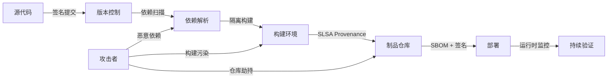

---

## 3. 正向示例

### 示例 1：SLSA L3 构建流程

某组织采用 GitHub Actions 隔离构建环境、Sigstore/cosign 签名容器镜像，并生成 SPDX SBOM；当 Log4j 类漏洞爆发时，2 小时内定位所有受影响服务并完成升级。

### 示例 2：SBOM 驱动的许可证治理

在 CI 中为每个服务生成 CycloneDX SBOM，与许可证数据库匹配后自动标记 GPL 传染性风险；法务团队在发布前即可干预，避免合规诉讼。

### 示例 3：零信任供应链架构

企业通过“源码签名 → 隔离构建 → 来源证明 → 部署准入”五层防御，将构建代理被入侵后的影响限制在单一构建实例，无法污染生产制品。

### 示例 4：GUAC 风险图谱

组织将 SBOM、SLSA 证明与漏洞公告导入 GUAC，形成 artifact 关系图；当某开源库披露高危漏洞时，可秒级查询所有直接和间接依赖该库的服务。

### 示例 5：GitHub Artifact Attestations 规模化落地

2024 年起 GitHub Actions 原生支持 `actions/attest-build-provenance`，为任意构建产物生成符合 SLSA v1.0 Build L2 的证明；结合可复用工作流可达 Build L3。npm Trusted Publishing 与 PyPI attestations（PEP 740）已使主流生态默认携带 provenance，显著降低开源消费者验证成本。

---

## 4. 反例 / 失败案例

### 反例 1：XZ Utils 后门

攻击者通过长期社会工程获得 XZ Utils 维护权限，在压缩库中植入后门；由于下游大量系统未验证来源与行为，恶意代码随复用传播数年。

### 反例 2：Log4j 应急响应迟缓

许多组织因缺乏完整 SBOM，无法快速判断哪些服务使用了 Log4j；漏洞响应从小时级延长到数周，暴露面持续扩大。

### 反例 3：Typosquat 包

攻击者在 npm 注册与 PyPI 上发布拼写错误的热门包名，诱导开发者安装并窃取环境变量；未启用私有仓库与依赖扫描的组织大量中招。

### 反例 4：CI/CD 凭证泄露

安全团队仅扫描自有代码漏洞，忽视 CI/CD 凭证与第三方构建代理安全；攻击者通过被入侵的构建代理向后端服务注入后门。

### 反例 5：Codecov Bash Uploader 供应链攻击（2021）

2021 年 1 月 31 日至 4 月 1 日，攻击者通过 Codecov Docker 镜像构建过程中的凭证泄露，修改其 Bash Uploader 脚本，在客户 CI 环境中窃取环境变量、源码仓库地址及大量密钥。约 29,000 个组织受影响，包括 HashiCorp、Twilio、Monday.com 等。该事件暴露出“curl | bash”执行未签名脚本、缺乏脚本完整性校验的严重风险（CVE-2021-32638）。

### 反例 6：SolarWinds Orion SUNBURST 攻击（2020）

攻击者入侵 SolarWinds 构建环境，在 Orion 更新包中植入 SUNBURST 后门。由于更新经过合法数字签名，约 18,000 家客户默认信任并安装。CISA 紧急指令 21-01 要求联邦机构立即断开受影响系统。该事件证明：仅验证发布者签名不足以保证构建过程未被污染，必须结合来源证明与构建环境隔离。

---

## 5. 纵深防御矩阵

| 层次 | 控制措施 | 对应标准/工具 |
|------|----------|---------------|
| 源码 | 签名提交、分支保护、代码审查 | Git, Gitsign |
| 依赖 | 漏洞扫描、私有仓库、typosquat 检测 | OSV, Dependabot, Snyk |
| 构建 | 隔离构建、可复现构建、来源证明 | SLSA, Sigstore |
| 制品 | 签名、SBOM、许可证扫描 | cosign, Syft, FOSSA |
| 部署 | 准入控制、运行时监控 | OPA, Falco |

---

## 6. 关键公理

> **公理 S.10**（Trust Transitivity Collapse）：软件供应链中的信任是传递的，但传递链的长度与信任度成指数反比。依赖层级越深，越需要可验证的来源与持续监控。

---

## 7. 权威来源

| 标准/规范 | URL | 说明 | 核查日期 |
|-----------|-----|------|----------|
| SLSA Specification v1.2 | <https://slsa.dev/spec/v1.2/> | Multi-Track 架构，Build/Source/BuildEnv Track 正式定义 | 2026-07-08 |
| OpenSSF Scorecard | <https://scorecard.dev/> | 开源项目安全健康度自动化评分 | 2026-07-08 |
| Sigstore / cosign | <https://docs.sigstore.dev/cosign/overview/> | 无密钥签名、Fulcio、Rekor 透明日志 | 2026-07-08 |
| SPDX Specification v2.3 / v3.0.1 | <https://spdx.github.io/spdx-spec/v2.3/> | ISO/IEC 5962 SBOM 标准 | 2026-07-08 |
| CycloneDX Specification v1.6 | <https://cyclonedx.org/specification/overview/> | OWASP/ECMA-424 供应链安全 SBOM 标准 | 2026-07-08 |
| NIST SP 800-161 Rev. 1 | <https://csrc.nist.gov/pubs/sp/800/161/r1/final> | 网络安全供应链风险管理实践 | 2026-07-08 |
| NIST SP 800-218 (SSDF) | <https://csrc.nist.gov/pubs/sp/800/218/final> | 安全软件开发框架 | 2026-07-08 |
| OWASP SCVS | <https://owasp.org/www-project-software-component-verification-standard/> | 软件组件验证标准 | 2026-07-08 |
| OpenSSF OSPS Baseline v2026.02.19 | <https://baseline.openssf.org/versions/2026-02-19.html> | 开源项目安全基线 | 2026-07-08 |
| EU CRA 2024/2847 | <https://eur-lex.europa.eu/eli/reg/2024/2847/oj> | 欧盟网络弹性法案 | 2026-07-08 |
| CISA SBOM 资源 | <https://www.cisa.gov/sbom> | 美国政府 SBOM 指南与 NTIA 最小要素 | 2026-07-08 |
| MITRE ATT&CK - Supply Chain Compromise | <https://attack.mitre.org/techniques/T1195/> | 供应链攻击战术技术映射 | 2026-07-08 |

---

## 8. 当前状态与关联主题

- [x] SLSA 1.0 / 1.2 深度解析 (`01-slsa-framework/`)
- [x] SBOM 标准对比 (`02-sbom-standards/`)
- [x] 供应链攻击树与 MITRE 映射 (`03-attack-vectors/`)
- [x] 零信任供应链模板 (`05-zero-trust-supply-chain/`)
- [x] SLSA Build Level 4 PoC (`05-slsa-l4-poc/`)
- [x] EU CRA 合规检查清单 (`06-case-studies/`)

关联主题：

- `04-component-architecture-reuse`（依赖治理）
- `07-formal-verification`（Rust 安全形式化）
- `12-ai-native-reuse`（LLM / MCP 安全）

## 9. 供应链安全落地检查单

在将复用资产投入生产前，团队应完成以下安全检查：

- [ ] 是否维护最新 SBOM，并覆盖直接依赖与传递依赖？
- [ ] 是否对关键依赖进行漏洞扫描与许可证审查？
- [ ] 是否使用私有仓库或可信注册中心，降低 typosquat 与劫持风险？
- [ ] 构建环境是否隔离，是否能生成 SLSA Provenance？
- [ ] 制品是否使用 Sigstore/cosign 等机制签名？
- [ ] 是否建立漏洞响应流程，能在 24 小时内定位受影响服务？
- [ ] CI/CD 凭证是否最小权限化并定期轮换？
- [ ] 是否对构建代理与第三方 Action 进行审计与准入控制？

## 10. 供应链安全能力矩阵

| 能力 | L1 起步 | L2 基础 | L3 成熟 | L4 领先 |
|------|---------|---------|---------|---------|
| SBOM | 手工清单 | CI 生成 | 全依赖覆盖 | 与运行时关联 |
| 漏洞响应 | 事件驱动 | 定期扫描 | 自动化影响分析 | 主动威胁情报 |
| 构建安全 | 未隔离 | 托管构建 | 隔离 + Provenance | 可复现构建 |
| 签名验证 | 无 | 部分签名 | 全制品签名 | 透明日志与密钥托管 |
| 合规治理 | 被动应对 | 检查清单 | 策略即代码 | 持续审计与量化 |

## 11. 常见误区

- **误区 1：只关注自有代码**。大部分现代漏洞来自第三方依赖。
- **误区 2：SBOM 一次性生成即可**。依赖版本持续变化，SBOM 需持续更新。
- **误区 3：签名只是可选**。没有签名就无法验证制品完整性与来源。
- **误区 4：忽视构建环境安全**。被入侵的 CI 是供应链攻击的主要入口。
- **误区 5：认为 SLSA L4 才值得做**。应从 L1/L2 开始渐进提升。
- **误区 6：漏洞披露后才行动**。应建立主动扫描与威胁情报机制。
- **误区 7：许可证与安全问题分离**。二者都应纳入 SBOM 治理。
- **误区 8：过度依赖单一工具**。纵深防御需要多工具、多层次协同。

## 12. 延伸阅读

1. OpenSSF. *SLSA Specification* — 供应链安全等级框架。
2. Linux Foundation. *Sigstore* — 软件签名与透明日志。
3. NTIA. *The Minimum Elements For a Software Bill of Materials*。
4. NIST. *Secure Software Development Framework (SSDF) SP 800-218*。
5. NIST. *Cybersecurity Supply Chain Risk Management Practices (SP 800-161 Rev. 1)*。
6. Subramanian, L. & Méndez, F. *Software Supply Chain Security* — 综合案例研究。

供应链安全是复用的信任底座；没有可追溯性与持续验证，复用将放大而非降低风险。

## 13. 深度案例：SolarWinds Orion 供应链攻击

2020 年披露的 SolarWinds Orion 攻击是供应链安全的标志性事件。攻击者入侵 SolarWinds 构建环境，在 Orion 软件更新中植入 SUNBURST 后门。由于 Orion 被大量政府与企业客户复用，后门随合法更新传播到约 18,000 个组织。

该事件的教训包括：

1. **构建环境是关键攻击面**：即使源码安全，被污染的构建代理也能注入恶意代码。
2. **来源证明缺失**：客户无法验证更新是否来自可信构建流程。
3. **响应依赖可见性**：缺乏完整 SBOM 与依赖图谱，导致影响范围排查缓慢。
4. **信任链过长**：Orion 的客户又向更多下游系统分发数据，放大了攻击影响。

该事件直接推动了 SLSA、Sigstore 与 SBOM 在产业界的快速采纳。

## 14. 关键行动项

- 对关键构建流程进行 SLSA 成熟度评估，并制定升级路线图。
- 在 CI 中强制生成并签名 SBOM，纳入制品仓库元数据。
- 建立依赖更新审批流程，限制恶意依赖与 typosquat 风险。
- 实施构建环境隔离与最小权限，定期轮换 CI/CD 凭证。
- 开展红队演练，模拟构建污染与仓库劫持场景。

## 15. 控制点映射：SLSA Build Track → 项目实现

| SLSA Build Track 要求 | 项目控制点 | 验证方式 |
|----------------------|-----------|---------|
| L1：自动化生成 Provenance | CI/CD 流水线统一配置，禁止本地手动构建 | 检查 `.github/workflows/` 存在构建工作流 |
| L2：托管构建 + 签名 Provenance | 使用 GitHub Actions + `actions/attest-build-provenance` 或 cosign keyless | `slsa-verifier` 验证 builder.id 与签名链 |
| L3：隔离/密封/临时构建 | 构建容器 `--network=none`，每次构建新 runner，签名密钥由 OIDC 联邦签发 | 审计 runner 网络策略与 provenance 中 `internalParameters` |
| L4（草案）：双人审查 + 可复现构建 | 主分支强制 ≥2 人审批，构建脚本与输入锁定 | 本主题 `05-slsa-l4-poc/` 提供最小可运行演示 |

## 16. 持续改进方向

- 将 SLSA Provenance 与 SBOM 生成集成到所有关键仓库的 CI。
- 建立内部依赖评分卡，量化依赖的健康度与安全风险。
- 与漏洞情报源联动，实现依赖漏洞的自动通知与影响分析。
- 定期演练供应链攻击响应流程，并更新纵深防御矩阵。

## 17. 一句话总结

> 软件供应链中的信任是传递的，但传递链越长、单段信任度越低，整体信任度越趋近于零。可追溯、可验证、可持续监控是复用信任的基石。

---
