# ISA-95 五层跨层数据流映射

> **版本**: 2026-07-11
> **定位**: 由 `struct/11-industrial-iot-otit` 自动聚合生成的视角卷册（view volume）
> **生成命令**: `python scripts/sync-view-from-struct.py --topic 11-industrial-iot-otit --generate`
> **说明**: 本文件为 struct/ 的只读聚合视角，修改请直接在 struct/ 对应文件进行。

---


## 目录


1. [ISA-95 五层跨层数据流映射](../struct/11-industrial-iot-otit/01-isa-95-model/cross-layer-matrix/data-flow-mapping.md)
2. [ISA-95 资产目录深度清单](../struct/11-industrial-iot-otit/01-isa-95-model/isa-95-asset-catalog-deep-dive.md)
3. [ISO/IEC 30141:2024 IoT 参考架构对齐](../struct/11-industrial-iot-otit/01-isa-95-model/iso-30141-iot-ra-alignment.md)
4. [L0 现场层复用资产目录](../struct/11-industrial-iot-otit/01-isa-95-model/l0-field/asset-catalog.md)
5. [L1 控制层复用资产目录](../struct/11-industrial-iot-otit/01-isa-95-model/l1-control/asset-catalog.md)
6. [L2 监控层复用资产目录](../struct/11-industrial-iot-otit/01-isa-95-model/l2-supervisory/asset-catalog.md)
7. [L3 MES 层复用资产目录](../struct/11-industrial-iot-otit/01-isa-95-model/l3-mes/asset-catalog.md)
8. [L4 企业层复用资产目录](../struct/11-industrial-iot-otit/01-isa-95-model/l4-enterprise/asset-catalog.md)
9. [ISA-95 / IEC 62264 企业-控制系统集成复用](../struct/11-industrial-iot-otit/01-isa-95-model/README.md)
10. [FX Connection Manager 状态机 TLA+ 规约说明](../struct/11-industrial-iot-otit/02-opc-ua-fx/connection-manager/tla-specification.md)
11. [棕地 / 绿地 / 混合场景决策模板](../struct/11-industrial-iot-otit/02-opc-ua-fx/deployment-scenarios/brownfield-greenfield-decision.md)
12. [UADP 帧结构详解：C2C / C2D / D2D 对比分析](../struct/11-industrial-iot-otit/02-opc-ua-fx/frame-structure/uadp-frame-analysis.md)
13. [OPC UA FX 复用层次分析](../struct/11-industrial-iot-otit/02-opc-ua-fx/opc-ua-fx-reuse-hierarchy.md)
14. [OPC UA FX 现场级确定性通信复用](../struct/11-industrial-iot-otit/02-opc-ua-fx/README.md)
15. [2026 年 OPC UA FX 厂商支持矩阵](../struct/11-industrial-iot-otit/02-opc-ua-fx/vendor-matrix-2026.md)
16. [TSN 门控表（GCL）配置模板](../struct/11-industrial-iot-otit/03-tsn-deterministic/gcl-config/templates.md)
17. [IEC/IEEE 60802 TSN 工业自动化配置文件](../struct/11-industrial-iot-otit/03-tsn-deterministic/iec-ieee-60802-profile.md)
18. [PLCopen Motion Control V2.0 核心功能块接口定义](../struct/11-industrial-iot-otit/04-plcopen-motion/function-block-interfaces.md)
19. [PLCopen Motion Control 与功能块复用](../struct/11-industrial-iot-otit/04-plcopen-motion/plcopen-motion-control.md)
20. [MC_Power / MC_MoveAbsolute 状态机的 TLA+ 验证](../struct/11-industrial-iot-otit/04-plcopen-motion/tla-verification.md)
21. [AAS v3.2 到 OPC UA NodeSet 完整映射规范](../struct/11-industrial-iot-otit/05-digital-twin-aas/aas-opcua-mapping.md)
22. [AAS v3.2 + OPC UA FX V1.00.03 + Digital Twin 权威对齐（2025‑2026）](../struct/11-industrial-iot-otit/05-digital-twin-aas/aas-v32-opcua-fx-2026-alignment.md)
23. [IEC 63278 AAS 系列标准路线图](../struct/11-industrial-iot-otit/05-digital-twin-aas/iec-63278-roadmap.md)
24. [数字孪生与资产管理壳（AAS）复用](../struct/11-industrial-iot-otit/05-digital-twin-aas/README.md)
25. [AAS 子模型模板全清单](../struct/11-industrial-iot-otit/05-digital-twin-aas/submodel-templates/aas-submodel-templates-full-catalog.md)
26. [AAS 子模型模板清单](../struct/11-industrial-iot-otit/05-digital-twin-aas/submodel-templates/catalog.md)
27. [IEC 61508 功能安全与组件复用](../struct/11-industrial-iot-otit/06-functional-safety/iec-61508/iec-61508-ed3-reuse.md)
28. [IEC 61508 Ed.3 / ISO 26262 / SOTIF / ISO 21434 权威对齐（2025‑2026）](../struct/11-industrial-iot-otit/06-functional-safety/iec-61508-iso-26262-sotif-alignment.md)
29. [IEC 62443 工业网络安全与复用](../struct/11-industrial-iot-otit/06-functional-safety/iec-62443-reuse-security.md)
30. [ISO 26262 SEooC 与软件组件复用](../struct/11-industrial-iot-otit/06-functional-safety/iso-26262/iso-26262-seooc-reuse.md)
31. [ISO 26262-8 Clause 12 SEooC 复用流程与安全手册模板](../struct/11-industrial-iot-otit/06-functional-safety/iso26262-seooc-template.md)
32. [功能安全与工业 OT-IT 复用](../struct/11-industrial-iot-otit/06-functional-safety/README.md)
33. [功能安全 GSN 模块化安全案例模板](../struct/11-industrial-iot-otit/06-functional-safety/templates/README.md)
34. [MCP for Industrial AI 协议草案](../struct/11-industrial-iot-otit/07-edge-ai/mcp-industrial-ai-draft.md)
35. [工业边缘 AI 模型部署规范](../struct/11-industrial-iot-otit/07-edge-ai/model-deployment-spec.md)
36. [边缘 AI 与 TinyML 模型复用](../struct/11-industrial-iot-otit/07-edge-ai/tinyml-onnx-edge-ai.md)
37. [C-03 数字孪生通用参考架构（非工业 AAS）](../struct/11-industrial-iot-otit/08-digital-twin-general/dt-reference-architecture.md)
38. [数字孪生网络级扩展：IETF Network DT 与 GB/T 45616](../struct/11-industrial-iot-otit/09-network-digital-twin/network-digital-twin-extension.md)
39. [11 工业 IoT / OT-IT 融合复用](../struct/11-industrial-iot-otit/README.md)

---


<!-- SOURCE: struct/11-industrial-iot-otit/01-isa-95-model/cross-layer-matrix/data-flow-mapping.md -->

# ISA-95 五层跨层数据流映射

> **版本**: 2026-06-06
> **范围**: L4 Enterprise ↔ L3 MES ↔ L2 Supervisory ↔ L1 Control ↔ L0 Field
> **对齐来源**: ANSI/ISA-95.00.01-2010 (IEC 62264-1), ISA-95.00.02-2018, ISA-95 Part 5 (B2MML), OPC UA FX, IEC 61131-3

---

## 1. 映射总览

ISA-95 五层模型的核心设计意图之一是**定义清晰的层间接口与数据流**，以避免传统点对点集成导致的"意大利面条式架构"。
本文件系统梳理 ERP↔MES↔SCADA↔PLC↔Field 的数据流映射关系，明确每层的数据对象、传输协议、刷新频率与一致性要求，并给出复用策略建议。

```text
┌─────────────────────────────────────────────────────────────────┐
│  L4 Enterprise (ERP/PLM/CRM/SCM)                                │
│  时间尺度: 天–月  |  数据对象: 工单、BOM、物料主数据、客户订单      │
│  协议: B2MML / REST / OData / EDI                               │
└──────────────────────▼──────────────────────────────────────────┘
                       │ Production Schedule / Work Order / Material Definition
                       │ (下行: 计划→执行)
                       │ Production Performance / Material Actual / Production Response
                       │ (上行: 执行→反馈)
┌──────────────────────▼──────────────────────────────────────────┐
│  L3 MES/MOM (制造运营)                                           │
│  时间尺度: 小时–天  |  数据对象: 配方、SOP、批次记录、OEE、质量报告  │
│  协议: B2MML / OPC UA / MQTT / REST                             │
└──────────────────────▼──────────────────────────────────────────┘
                       │ Control Recipe / Setpoints / SOP Steps
                       │ (下行: 执行指令→监控)
                       │ Process Values / Alarms / Events / Batch Records
                       │ (上行: 过程数据→运营)
┌──────────────────────▼──────────────────────────────────────────┐
│  L2 Supervisory (SCADA/HMI/历史数据库)                           │
│  时间尺度: 分–小时  |  数据对象: 报警、趋势、画面、报表、配方管理    │
│  协议: OPC UA / OPC Classic / MQTT / SQL                        │
└──────────────────────▼──────────────────────────────────────────┘
                       │ Tag Writes / Recipe Parameters / Commands
                       │ (下行: 指令→控制)
                       │ Real-time Data / Alarm Events / Historical Batches
                       │ (上行: 实时数据→监控)
┌──────────────────────▼──────────────────────────────────────────┐
│  L1 Control (PLC/DCS/CNC/运动控制器)                             │
│  时间尺度: 秒–分  |  数据对象: 功能块实例、UDT、I/O 映像、状态机    │
│  协议: Profinet / EtherCAT / EtherNet/IP / Modbus TCP / OPC UA   │
└──────────────────────▼──────────────────────────────────────────┘
                       │ I/O Signals / Device Commands / Setpoints
                       │ (下行: 控制→现场)
                       │ Sensor Values / Actuator Status / Drive Feedback
                       │ (上行: 现场反馈→控制)
┌──────────────────────▼──────────────────────────────────────────┐
│  L0 Field (传感器/执行器/驱动器/智能仪表)                         │
│  时间尺度: 毫秒–秒  |  数据对象: 过程变量、诊断数据、设备描述       │
│  协议: IO-Link / 4-20mA / 0-10V / 24V DC / HART                 │
└─────────────────────────────────────────────────────────────────┘
```

---

## 2. 逐层数据流映射

### 2.1 L4 ↔ L3：企业层与制造运营层

| 方向 | 数据对象 | 协议/格式 | 频率 | 一致性要求 | 复用策略 |
|-----|---------|----------|------|-----------|---------|
| L4 → L3 | Production Schedule (生产计划) | B2MML XML / REST JSON / OData | 批次/日/周 | 强一致性（事务型） | 复用 ISA-95 Part 2 对象模型；B2MML Schema 一次定义，多 MES 复用 |
| L4 → L3 | Work Order (工单) | B2MML / REST | 工单级 | 强一致性 | 复用标准工单模板，避免各 MES 自定义字段 |
| L4 → L3 | Material Definition / BOM | B2MML / REST / OData | 主数据变更时 | 最终一致性（分钟级同步） | 主数据模型模板全局复用，见 [L4 企业层](../struct/11-industrial-iot-otit/01-isa-95-model/l4-enterprise/asset-catalog.md) E4/E5 |
| L4 → L3 | Personnel / Equipment Master | B2MML / HR 接口 | 日同步 | 最终一致性 | 人员/设备主数据复用 ISA-95 资源模型 |
| L3 → L4 | Production Performance (生产绩效) | B2MML XML / REST | 工单完工/班报 | 强一致性 | 复用 ISA-95 Part 4 绩效对象；OEE/KPI 模板复用见 [L3 MES 层](../struct/11-industrial-iot-otit/01-isa-95-model/l3-mes/asset-catalog.md) M4 |
| L3 → L4 | Material Actual (物料实绩) | B2MML / REST | 批次完工 | 强一致性 | 复用标准物料消耗/产出报文 |
| L3 → L4 | Production Response (生产响应) | B2MML | 工单事件 | 强一致性 | 复用标准响应消息模板 |

**关键复用决策**: B2MML Schema 是 L4↔L3 跨层复用的核心资产。
建议在集团层面建立统一的 B2MML 扩展规范（基于 ISA-95 Part 5），所有工厂 MES 与 ERP 集成必须遵循，避免各项目重复设计报文结构。

### 2.2 L3 ↔ L2：制造运营层与监控层

| 方向 | 数据对象 | 协议/格式 | 频率 | 一致性要求 | 复用策略 |
|-----|---------|----------|------|-----------|---------|
| L3 → L2 | Control Recipe (控制配方) | OPC UA / MQTT / 专有 API | 批次启动时 | 强一致性 | 复用 ISA-88 配方模板，见 [L3 MES 层](../struct/11-industrial-iot-otit/01-isa-95-model/l3-mes/asset-catalog.md) M1 |
| L3 → L2 | SOP Steps (工作指令步骤) | OPC UA / REST / JSON | 步骤触发 | 强一致性 | 复用 SOP 数字化模板 M2 |
| L3 → L2 | Setpoints / Parameters | OPC UA / MQTT | 秒–分级 | 强一致性 | 复用 UDT 模板，见 [L1 控制层](../struct/11-industrial-iot-otit/01-isa-95-model/l1-control/asset-catalog.md) C3 |
| L2 → L3 | Process Values (过程值聚合) | OPC UA HDA / MQTT / SQL | 秒–分级聚合 | 最终一致性 | 复用 OPC UA DI / PA-DIM 信息模型 |
| L2 → L3 | Alarm Events (报警事件) | OPC UA A&C / MQTT / REST | 事件驱动 | 强一致性（时序） | 复用 ISA-18.2 报警分级模板，见 [L2 监控层](../struct/11-industrial-iot-otit/01-isa-95-model/l2-supervisory/asset-catalog.md) S2 |
| L2 → L3 | Batch Records / EBR | OPC UA / REST / 数据库 | 批次完成 | 强一致性 | 复用电子批记录模板 S6 |

**关键复用决策**: OPC UA Companion Specifications（DI、PA-DIM、ISA-95 CS）是 L3↔L2 语义互操作的关键。
建议将 L3 MES 的数据对象直接映射为 OPC UA 信息模型节点，SCADA 通过订阅复用同一语义层，避免传统"标签映射表"的重复维护。

### 2.3 L2 ↔ L1：监控层与控制层

| 方向 | 数据对象 | 协议/格式 | 频率 | 一致性要求 | 复用策略 |
|-----|---------|----------|------|-----------|---------|
| L2 → L1 | Tag Writes / Commands | OPC UA / Profinet / EtherCAT / Modbus | 毫秒–秒 | 硬实时/确定型 | 复用 UDT 模板与 PLCopen FB 接口 |
| L2 → L1 | Recipe Parameters (配方参数) | OPC UA / 专有 PLC 协议 | 秒级 | 强一致性 | 复用 ISA-88 Control Recipe 绑定规则 |
| L2 → L1 | Mode/State Commands (PackML) | OPC UA / MQTT | 秒级 | 强一致性 | 复用 OMAC PackML 状态机模板 S5 |
| L1 → L2 | Real-time Tags (实时标签) | OPC UA / Profinet / EtherCAT / MQTT | 毫秒–秒 | 硬实时 | 复用 GSDML/EDS/IODD 自动生成的标签结构 |
| L1 → L2 | Alarm Events (报警事件) | OPC UA A&C / 专有报警协议 | 事件驱动 | 强一致性（时序） | 复用 ISA-18.2 报警泛滥管理规则 |
| L1 → L2 | Historical Batches (历史批次) | OPC HDA / SQL / CSV | 批次完成 | 最终一致性 | 复用批次归档模板 |

**关键复用决策**: L2↔L1 的数据流复用重点在于**设备描述→标签→信息模型**的自动化链路。
通过复用 L0 层的 IODD/GSDML/EDS（见 [L0 现场层](../struct/11-industrial-iot-otit/01-isa-95-model/l0-field/asset-catalog.md) E1–E4），工程工具可自动生成 OPC UA 信息模型与 PLC 标签，SCADA 直接订阅复用。

### 2.4 L1 ↔ L0：控制层与现场层

| 方向 | 数据对象 | 协议/格式 | 频率 | 一致性要求 | 复用策略 |
|-----|---------|----------|------|-----------|---------|
| L1 → L0 | Analog Outputs (4-20mA / 0-10V) | 模拟信号 / IO-Link / 总线 | 毫秒级 | 硬实时 | 复用 IODD/GSDML 过程数据映射 |
| L1 → L0 | Digital Outputs (24V DC) | 数字信号 / 总线 | 毫秒级 | 硬实时 | 复用设备描述文件中的通道定义 |
| L1 → L0 | Drive Setpoints (转速/位置/扭矩) | Profinet / EtherCAT / CANopen | 毫秒级 | 硬实时/同步 | 复用 PLCopen AXIS_REF + 驱动器 Profile |
| L1 → L0 | Device Parameters (参数下装) | IO-Link / Profinet / HART | 启动/维护 | 强一致性 | 复用 IODD/EDS 参数集模板 |
| L0 → L1 | Analog Inputs (AI) | 模拟信号 / IO-Link / 总线 | 毫秒级 | 硬实时 | 复用设备描述文件中的量程与单位定义 |
| L0 → L1 | Digital Inputs (DI) | 数字信号 / 总线 | 毫秒级 | 硬实时 | 复用设备描述文件中的通道定义 |
| L0 → L1 | Diagnostic Data (诊断数据) | IO-Link / Profinet / EtherNet/IP | 秒–分级 | 最终一致性 | 复用 IODD/GSDML 诊断事件定义 |
| L0 → L1 | Device Identification (设备标识) | IO-Link / 总线 | 启动时 | 强一致性 | 复用设备描述文件中的 Identification 参数 |

**关键复用决策**: L1↔L0 的复用核心是**设备描述文件的标准化**。
同一型号的传感器/执行器在不同项目中应 100% 复用同一版 IODD/GSDML/EDS，确保 PLC 工程、SCADA 标签、MES 信息模型的自动化生成。

---

## 3. 复用策略矩阵：跨层 vs 层内

### 3.1 跨层复用资产（Multi-Layer Reuse）

以下数据模型与接口契约应在全企业范围内标准化，实现一次定义、多层复用：

| 跨层复用资产 | 贯穿层级 | 复用机制 | 标准化来源 |
|-------------|---------|---------|-----------|
| **物料主数据模型** | L4→L3→L2 | ERP MDM → MES Material Definition → SCADA 配方参数 | ISA-95 Part 2, GS1 GDSN |
| **设备/资产信息模型** | L0→L1→L2→L3 | IODD/GSDML → UDT → OPC UA DI → AAS 子模型 | OPC UA DI, PA-DIM, IEC 63278 (AAS) |
| **OEE/KPI 计算模型** | L1→L2→L3→L4 | PackML 计数器 → SCADA 聚合 → MES 计算 → ERP 成本核算 | OMAC PackML, ISA-95 Part 4, ISO 22400 |
| **配方/产品定义** | L4→L3→L2→L1 | ERP BOM → MES Master Recipe → SCADA Control Recipe → PLC 参数 | ISA-88 / IEC 61512, ISA-95 Part 2 |
| **报警分级与响应规则** | L1→L2→L3 | PLC 报警位 → SCADA 报警管理 → MES 事件记录 | ISA-18.2 / IEC 62682 |
| **人员资质模型** | L4→L3 | HR 系统 → MES 操作员权限与电子签名 | ISA-95 Part 2, FDA 21 CFR Part 11 |

### 3.2 层内复用资产（Intra-Layer Reuse）

以下资产在同一层级内部复用，以降低同层多系统/多项目间的重复开发：

| 层 | 层内复用资产 | 复用范围 | 效果 |
|---|-------------|---------|------|
| L0 | IODD/GSDML/EDS 族系模板 | 同厂商同族设备 | 工程配置时间 ↓ 50% |
| L1 | PLCopen FB 库 / UDT 模板 | 同平台多项目 | 代码复用率 ↑ 60% |
| L1 | 安全关断逻辑 FB | 同 SIL 等级多系统 | 认证成本 ↓ 40% |
| L2 | HMI 画面模板库 | 同行业多产线 | HMI 开发工作量 ↓ 60% |
| L2 | 报警管理规则库 | 全厂/全集团 | 报警合理化一致性 ↑ |
| L3 | 配方模板 / SOP 模板 | 同集团多工厂 | 合规审计准备时间 ↓ 70% |
| L3 | OEE/KPI 模板 | 全集团对标 | 绩效数据可比性 ↑ |
| L4 | 业务流程模板 (P2P/计划到生产) | 集团多法人实体 | ERP 推广成本 ↓ 50% |
| L4 | 主数据编码规则 | 全球组织 | 数据清洗成本 ↓ 80% |

---

## 4. 一致性要求与架构模式

### 4.1 一致性等级定义

| 等级 | 名称 | 说明 | 适用场景 |
|-----|------|------|---------|
| **强一致性 (Strong)** | 事务型一致性 | ACID 保证，实时同步，失败即回滚 | L4→L3 工单下达、L3→L2 配方参数、财务过账 |
| **顺序一致性 (Sequential)** | 时序一致性 | 事件按发生顺序处理，允许短暂延迟 | L1→L2 报警事件、批次状态变更 |
| **最终一致性 (Eventual)** | 最终一致性 | 允许分钟级延迟，最终状态收敛 | L4↔L3 主数据同步、L2→L3 历史数据归档 |
| **软实时 (Soft-RT)** | 确定性延迟 | 毫秒–秒级确定性延迟，允许偶发丢包 | L2→L1 监控命令 |
| **硬实时 (Hard-RT)** | 严格实时 | 微秒–毫秒级严格时限，不允许超时 | L1→L0 运动控制、安全关断 |

### 4.2 推荐架构模式

1. **北向聚合、南向分发**: L3 作为数据汇聚中枢，将 L1/L2 高频数据聚合为 L4 所需的低频业务事件；L4 计划通过 L3 分解为 L2/L1 可执行的指令。
2. **语义层统一**: 在 L2-L3 边界建立 OPC UA 信息模型作为企业级语义层，替代传统的"点表映射"，实现跨层语义复用。
3. **边缘计算卸载**: 对于 L0-L1 的高频数据（振动、视觉），在 L2 边缘节点进行预聚合与特征提取，仅将结果推送至 L3，降低网络负载与存储成本。

---

## 5. 权威来源

1. ANSI/ISA-95.00.01-2010 / IEC 62264-1:2013 — Enterprise-Control System Integration Part 1: Models and Terminology
2. ANSI/ISA-95.00.02-2018 / IEC 62264-2 — Part 2: Object Model Attributes
3. ISA-95 Part 5 / B2MML (Business To Manufacturing Markup Language) — WBF XML Schemas
4. OPC Foundation — OPC Unified Architecture for Devices (DI), OPC 10000-100
5. OPC Foundation / FieldComm Group — PA-DIM Companion Specification
6. ISA-88 / IEC 61512-1,-2,-3 — Batch Control (Models, Data Structures, Recipes)
7. ISA-18.2 / IEC 62682:2022 — Management of Alarm Systems
8. OMAC PackML — State Model and Tag Naming Guideline V4.0
9. IEC 61131-3:2013 — Programmable controllers – Part 3: Programming languages
10. IEC 63278 — Asset Administration Shell for industrial applications (AAS)

---

> 最后更新: 2026-06-06


---

## 补充章节

## 示例

**示例**：汽车工厂将 ISA-95 L0-L4 资产目录映射到 IEC 63278 资产管理壳（AAS），通过 OPC UA FX 实现现场设备与 MES/ERP 的即插即用复用。

## 反例

**反例**：将 IT 系统直接补丁策略套用到 PLC 产线，未考虑实时性约束与功能安全认证，导致停机与安全事故。

## 权威来源

> **权威来源**:
>
> - [ISA-95 / IEC 62264](https://www.isa.org/standards-and-publications/isa-standards/isa-95)
> - [OPC Foundation](https://opcfoundation.org)
> - [IEC 61508-1:2010](https://webstore.iec.ch/en/publication/5515)
> - [IEC 63278 AAS](https://iec.ch/dyn/www/f?p=103:38:0::::FSP_ORG_ID:1363)
> - 核查日期：2026-07-07

## 分析

**分析**：OT-IT 复用需要在实时性、安全性与 IT 敏捷性之间取得平衡，标准信息模型是打破竖井的关键。


---


<!-- SOURCE: struct/11-industrial-iot-otit/01-isa-95-model/isa-95-asset-catalog-deep-dive.md -->

# ISA-95 资产目录深度清单
>
> 版本: 2026-06-06
> 对齐来源: ANSI/ISA-95.00.01-2010 (IEC 62264-1), ISA-95.00.02-2018 (IEC 62264-2), ISA-95.00.03-2013 (IEC 62264-3), MESA International, OMAC PackML State Model

## 概念定义

**ISA-95 资产目录** 是将 ANSI/ISA-95 / IEC 62264 五层模型中的物理资产、控制逻辑、监控对象与制造运营数据抽象为可复用语义单元及其元数据的集合。其复用价值在于：以统一的信息模型与接口契约降低跨层级、跨厂商、跨项目的集成成本。

> **定义 ISA.Catalog.1** (ISA-95 资产目录): ISA-95 资产目录是对 L0–L4 各层可复用资产的结构化枚举，包含资产类型、关键属性、语义模型、接口标准与复用边界。目录本身必须随标准版本与工艺知识演进持续更新。

---

## 1. ISA-95 五层模型资产分类

### 1.1 层级定义与资产范围

| 层级 | 名称 | 时间尺度 | 典型资产 | 管理域 |
|-----|------|---------|---------|--------|
| **L0** | 现场设备 (Field) | 毫秒–秒 | 传感器、执行器、驱动器 | 物理过程 |
| **L1** | 基本控制 (Control) | 秒–分 | PLC、DCS 控制器、RTU、CNC | 过程控制 |
| **L2** | 监控层 (Supervisory) | 分–小时 | SCADA、HMI、批处理管理器 | 区域监控 |
| **L3** | 制造运营 (MES) | 小时–天 | MES 系统、质量管理系统、WMS | 工厂运营 |
| **L4** | 企业层 (Enterprise) | 天–月 | ERP、PLM、CRM、SCM | 业务管理 |

### 1.2 L0 现场设备资产类型

| 资产类别 | 子类型 | 关键属性 | 语义模型 |
|---------|--------|---------|---------|
| **温度传感器** | RTD、热电偶、红外 | 量程、精度、响应时间、IEC 60584/60751 类型 | OPC UA DI 规范 |
| **压力传感器** | 压阻、电容、压电 | 量程、过载能力、介质兼容性 | OPC UA DI |
| **流量传感器** | 电磁、超声、科里奥利、涡街 | 口径、精度、雷诺数范围 | OPC UA DI |
| **物位传感器** | 雷达、超声、电容、导波雷达 | 量程、介电常数要求 | OPC UA DI |
| **分析仪表** | pH、电导率、溶解氧、气相色谱 | 校准周期、试剂需求、测量原理 | 特定厂商 EDDL |
| **执行器** | 电动、气动、液压阀门 | 行程时间、扭矩/推力、失电安全位 | OPC UA DI |
| **变频器 (VFD)** | 矢量控制、直接转矩控制 | 功率范围、载波频率、EMC 等级 | OPC UA DI |
| **电机** | 感应电机、伺服电机、步进电机 | 额定功率、转速、转矩曲线、效率等级 | IEC 61800-7 (Drive Profile) |

### 1.3 L1 控制器资产类型

| 资产类别 | 子类型 | 关键属性 | 编程标准 |
|---------|--------|---------|---------|
| **PLC** | 紧凑型、模块化、安全 PLC (SIL 3) | I/O 点数、扫描周期、冗余配置 | IEC 61131-3 |
| **DCS 控制器** | 过程控制器、混合控制器 | 控制回路数、算法块库、冗余 | IEC 61499 (分布式) |
| **CNC** | 铣床、车床、加工中心 | 轴数、插补精度、G-code 支持 | ISO 6983 / DIN 66025 |
| **运动控制器** | 单轴、多轴、机器人控制器 | 轴数、同步精度、PLCopen MC 支持 | PLCopen Motion Control |
| **机器人控制器** | 六轴、SCARA、协作机器人 | 负载、臂展、重复精度、安全等级 | ISO 10218 / ISO/TS 15066 |
| **RTU** | 远程终端单元 | 通信协议、I/O 容量、环境等级 | IEC 60870-5-101/104 |

### 1.4 L2 监控层资产类型

| 资产类别 | 功能 | 集成接口 | 数据流 |
|---------|------|---------|--------|
| **SCADA** | 实时数据采集、报警、历史趋势 | OPC UA / OPC Classic / DNP3 | L1 → L2 → L3 |
| **HMI/操作站** | 操作员界面、配方管理、报表 | 直接 PLC 连接 / OPC | L1 ↔ 操作员 |
| **批处理管理器** | ISA-88 批处理执行、电子批记录 | ISA-88 S88 接口 | L2 ↔ L3 |
| **历史数据库** | 时间序列数据存储、压缩 | OPC HDA / MQTT / REST | L1/L2 → 存储 |
| **报警管理系统** | 报警优先级、抑制、泛滥管理 | OPC A&E / ISA-18.2 | L1 → 操作员 |

### 1.5 L3 MES 资产类型

| 资产类别 | ISA-95 活动 | 功能模块 | 与 L4 集成 |
|---------|------------|---------|-----------|
| **生产调度** | 详细排程 | 订单分配、资源优化、甘特图 | ERP 工单 |
| **生产跟踪** | 分派生产、收集生产数据 | WIP 跟踪、在制品状态、良率 | ERP 完工报告 |
| **质量管理** | 收集测试数据、分析质量 | SPC、CAPA、不合格品管理 | PLM 规格 |
| **维护管理** | 设备维护、收集维护数据 | CMMS、预测性维护、备件 | ERP 资产模块 |
| **物料管理** | 管理物料、管理库存 | 批次追踪、库位管理、盘点 | ERP 库存 |
| **人员管理** | 管理人力资源 | 技能矩阵、考勤、培训记录 | HR 系统 |
| **文档管理** | 管理文档 | 电子工作指令、SOP 版本控制 | PLM 文档 |

## 2. ISA-95 资源模型（Resource Model）

### 2.1 四类资源

| 资源类型 | 定义 | 示例 | 复用模式 |
|---------|------|------|---------|
| **人员 (Personnel)** | 执行工作的人员 | 操作员、维护技师、质检员 | 技能矩阵模板、资质证书复用 |
| **设备 (Equipment)** | 执行工作的物理资产 | 机床、反应釜、测试台 | 设备模板、OEE 指标库 |
| **物料 (Material)** | 被加工或消耗的实体 | 原料、在制品、成品、耗材 | 物料主数据、BOM 模板 |
| **过程段 (Process Segment)** | 能力定义（做什么、需要什么资源）| 装配工序、测试流程、包装规范 | 过程段模板库、能力目录 |

### 2.2 设备能力属性清单

```text
Equipment Capability
├── Identification
│   ├── EquipmentID (全局唯一)
│   ├── EquipmentClass (设备类别，如 "CNC_Lathe_3Axis")
│   └── EquipmentLevel (Unit / Cell / Line / Site)
├── Operational Capability
│   ├── ProductionRate (单位时间产量)
│   ├── SetupTime (换型时间)
│   ├── CycleTime (节拍时间)
│   ├── Availability (可用性，OEE 组成)
│   ├── Performance (性能率，OEE 组成)
│   └── QualityRate (质量率，OEE 组成)
├── Physical Capability
│   ├── Dimensions (L×W×H，工作空间)
│   ├── WeightCapacity (最大负载)
│   ├── PowerRequirement (功耗)
│   └── EnvironmentalRequirements (温度、湿度、洁净度)
├── Control Capability
│   ├── SupportedProtocols (OPC UA, MQTT, Profinet, EtherCAT)
│   ├── ProgramStorageCapacity (程序存储容量)
│   └── DataCollectionFrequency (数据采集频率)
└── Maintenance Capability
    ├── MTBF (平均故障间隔)
    ├── MTTR (平均修复时间)
    ├── MaintenanceSchedule (预防性维护周期)
    └── SparePartsList (关键备件清单)
```

## 3. ISA-95 与 AAS 的映射

| ISA-95 概念 | AAS 对应 | 子模型模板 |
|------------|---------|-----------|
| Equipment | Asset (AssetKind = Instance) | Technical Data, Nameplate, Identification |
| EquipmentClass | Asset (AssetKind = Type) | Technical Data, Nameplate |
| Personnel | Asset (无形资产) | Contact Information, Qualifications |
| MaterialLot | Asset (Instance) | Identification, Carbon Footprint |
| ProcessSegment | Submodel (能力描述) | Custom Submodel |
| ProductionSchedule | Submodel (计划数据) | Time Series Data |
| MaintenanceRecord | Submodel (维护历史) | Handover Documentation |

## 4. OMAC PackML 状态机与 ISA-95 集成

### 4.1 PackML 单元模式状态

| 状态 | 说明 | ISA-95 活动映射 |
|-----|------|----------------|
| **Idle** | 等待命令 | 生产分派前 |
| **Starting** | 启动序列 | 资源分配 |
| **Execute** | 正常运行 | 执行生产 |
| **Completing** | 完成序列 | 收集生产数据 |
| **Complete** | 完成 | 生产跟踪更新 |
| **Resetting** | 复位 | 准备下一批次 |
| **Holding/Held** | 保持 | 异常处理 |
| **Unholding** | 解除保持 | 恢复执行 |
| **Suspending/Suspended** | 暂停 | 物料等待 |
| **Unsuspending** | 解除暂停 | 恢复执行 |
| **Stopping/Stopped** | 停止 | 安全停机 |
| **Aborting/Aborted** | 中止 | 紧急停机 |
| **Clearing** | 清除故障 | 维护介入 |

### 4.2 PackML 模式（Modes）

| 模式 | 用途 | 安全等级 |
|-----|------|---------|
| **Production** | 正常生产 | 最高安全约束 |
| **Maintenance** | 维护/调试 | 旁路部分安全互锁 |
| **Manual** | 手动操作 | 操作员直接控制 |
| **Recipe** | 配方管理 | 验证模式 |
| **User 1-4** | 厂商自定义 | 按需求定义 |

## 5. 语义模型与接口标准

### 5.1 设备描述技术对比

| 技术 | 标准化组织 | 用途 | 状态 |
|-----|-----------|------|------|
| **EDDL (Electronic Device Description Language)** | IEC 61804 | 现场设备参数描述 | 成熟，广泛使用 |
| **FDT/DTM (Field Device Tool)** | FDT Group | 设备参数化与诊断 | 成熟，向 FDT 3.0 演进 |
| **OPC UA DI (Device Integration)** | OPC Foundation | OPC UA 设备信息模型 | 主流，与 AAS 集成 |
| **PA-DIM (Process Automation Device Information Model)** | OPC Foundation / FieldComm | 过程自动化统一信息模型 | 开发中，对标 EDDL |
| **AAS 子模型模板** | IDTA | 资产标准化数字表示 | 发展中，生态建设 |

### 5.2 ISA-95 B2MML（Business To Manufacturing Markup Language）

- XML Schema 实现 ISA-95 数据交换
- 覆盖：人员、设备、物料、过程段、生产能力、生产调度、生产绩效
- 与 SOAP/Web Services 集成
- 现代替代：REST/JSON + OPC UA + AAS

## 6. 资产目录复用策略

### 6.1 模板化复用

| 模板层级 | 复用单元 | 实现方式 |
|---------|---------|---------|
| **设备类别模板** | 同类设备的通用属性集 | AAS 子模型模板 (IDTA-02003 Technical Data) |
| **OEE 指标模板** | 设备效率计算标准 | ISA-95 绩效数据 + PackML 计数器 |
| **维护策略模板** | 预防性/预测性维护规则 | ISA-95 维护请求 + AAS 维护子模型 |
| **技能矩阵模板** | 人员资质要求 | ISA-95 人员能力 + 培训记录子模型 |

### 6.2 跨层引用链

```text
L4 ERP
├── 物料主数据 (Material Master)
└── 工单 (Work Order)
    ↓ B2MML / REST / AAS
L3 MES
├── 生产调度 (Production Schedule)
├── 设备 OEE 实时计算
└── 质量批次追踪
    ↓ OPC UA / MQTT
L2 SCADA
├── 报警管理 (ISA-18.2)
├── 历史数据 (Time Series)
└── 配方管理 (ISA-88)
    ↓ OPC UA / Profinet / EtherCAT
L1 PLC
├── 控制逻辑 (IEC 61131-3)
├── 运动控制 (PLCopen)
└── 安全逻辑 (SIL 3)
    ↓ I/O 信号
L0 传感器/执行器
├── 模拟量 (4-20mA, 0-10V)
└── 数字量 (24V DC)
```

## 7. ISA-95 L0–L4 层级定义、属性与边界补强

### 7.1 层级定义与核心属性

ISA-95 的五层模型定义了从物理过程到企业业务管理的垂直集成边界。每一层具有独特的**时间尺度、控制范围、数据类型和安全要求**，这些属性决定了资产的可复用边界。

| 层级 | 名称 | 时间尺度 | 控制范围 | 主要数据类型 | 安全/可用性要求 | 复用边界 |
|-----|------|---------|---------|-------------|----------------|---------|
| **L0** | 现场设备 (Field) | 毫秒–秒 | 单一物理过程 | 模拟量、数字量、原始传感器数据 | 高可用性、功能安全 (SIL)、防爆 (ATEX) | 设备模板可复用，但具体安装位置必须按工艺定制 |
| **L1** | 基本控制 (Control) | 秒–分 | 单一设备/单元 | 控制回路、设定点、报警 | 实时性、确定性、安全完整性 | 控制逻辑模板可复用，I/O 映射需按项目配置 |
| **L2** | 监控层 (Supervisory) | 分–小时 | 产线/区域 | 批次、配方、历史趋势、报警 | 高可用性、数据完整性 | SCADA 模板、配方模板可跨产线复用 |
| **L3** | 制造运营 (MES) | 小时–天 | 工厂/车间 | 工单、质量、物料、人员 | 业务连续性、合规性 (GMP/FDA) | MES 模块、OEE 模板可在同类型工厂复用 |
| **L4** | 企业层 (Enterprise) | 天–月 | 企业/供应链 | ERP/PLM/CRM 数据、主数据 | 数据一致性、审计、合规 | 物料主数据、BOM 模板可在企业内复用 |

> **定义 ISA.1** (ISA-95 层级边界): ISA-95 层级边界是物理过程、实时控制、区域监控、工厂运营和企业业务之间的职责分隔。复用资产时，必须确保其在目标层级的实时性、安全性和语义一致性。

### 7.2 层级间数据流与控制流

| 方向 | 数据/控制流 | 典型接口 | 复用关注点 |
|------|------------|---------|-----------|
| L0 → L1 | 传感器数据、执行器状态 | 4-20mA, 0-10V, IO-Link, HART | 信号类型、量程、采样周期 |
| L1 → L2 | 过程值、报警、事件 | OPC UA, OPC Classic, MQTT | 通信协议、数据模型 |
| L2 → L3 | 批次记录、生产绩效、质量数据 | OPC UA, B2MML, REST | 数据结构、语义映射 |
| L3 → L4 | 工单完成、库存状态、质量报告 | B2MML, REST/JSON, AAS | 业务语义、主数据一致性 |
| L4 → L3 | 生产订单、排程、配方 | B2MML, REST/JSON | 版本控制、变更管理 |
| L3 → L2 | 工单分派、工艺参数 | OPC UA, B2MML | 实时性约束、参数验证 |
| L2 → L1 | 设定点、配方下载 | OPC UA, Profinet, EtherCAT | 确定性、安全联锁 |
| L1 → L0 | 控制信号、驱动命令 | 数字量、模拟量、现场总线 | 电气特性、安全等级 |

### 7.3 与 AAS 的映射补强

AAS（Asset Administration Shell，资产管理壳）为 ISA-95 各层资产提供了标准化的数字孪生表示。下表给出更详细的映射关系。

| ISA-95 概念 | AAS 对应 | 子模型模板 | 映射说明 |
|------------|---------|-----------|---------|
| Equipment (实例) | Asset (AssetKind = Instance) | Technical Data, Nameplate, Identification | 每台物理设备对应一个 AAS 实例 |
| EquipmentClass (类型) | Asset (AssetKind = Type) | Technical Data, Nameplate | 设备类别作为 AAS 类型模板 |
| Personnel | Asset (无形资产) | Contact Information, Qualifications | 人员能力与资质 |
| MaterialLot | Asset (Instance) | Identification, Carbon Footprint | 批次追踪与碳足迹 |
| ProcessSegment | Submodel (能力描述) | Custom Submodel | 工序能力定义 |
| ProductionSchedule | Submodel (计划数据) | Time Series Data | 生产计划与排程 |
| MaintenanceRecord | Submodel (维护历史) | Handover Documentation | 维护记录与文档 |
| QualityTestResult | Submodel (质量数据) | Technical Data, Time Series Data | 测试结果与 SPC 数据 |

> **定理 ISA.AAS.1** (AAS 复用单调性): 若 ISA-95 资产 A 被复用于系统 S，则 A 的 AAS 子模型必须在 S 的 AAS 中保持语义等价。任何子模型属性的丢失或语义漂移都会导致复用边界破坏。

### 7.4 与 OPC UA 的映射补强

OPC UA 是 ISA-95 层级间实时数据交换的主流协议。AAS 与 OPC UA 的映射使数字孪生能够同时承载语义描述和实时变量。

| ISA-95 层级 | OPC UA 角色 | 典型 NodeSet | 复用模式 |
|------------|------------|-------------|---------|
| L0 | 设备参数与诊断 | OPC UA DI, PA-DIM | 设备描述文件复用 |
| L1 | 控制器变量与方法 | PLCopen, OPC UA IEC 61131-3 | 控制逻辑变量模型复用 |
| L2 | 报警与事件、历史数据 | OPC UA A&E, HDA | SCADA 信息模型复用 |
| L3 | MES 对象模型 | ISA-95 B2MML, OPC UA ISA-95 | MES 数据模型复用 |
| L4 | 企业主数据 | AAS REST API, OPC UA Client/Server | 主数据同步 |

### 7.5 正向示例

| 场景 | 层级 | 复用资产 | 效果 |
|------|------|---------|------|
| 汽车总装线复制 | L2/L3 | PackML 状态机 + OEE 指标模板 | 新产线快速达到标准化生产模式 |
| 制药批次管理 | L2/L3 | ISA-88 批处理模板 + AAS 批次子模型 | 满足 GMP 审计要求，批次追溯完整 |
| 设备供应商交付 | L0/L1 | AAS Digital Nameplate + OPC UA DI NodeSet | 设备即插即用，工程调试时间缩短 50% |
| 集团 ERP-MES 集成 | L3/L4 | ISA-95 B2MML 工单与物料模型 | 跨工厂主数据一致性提升 |

### 7.6 反例 / 失败案例

> **反例**：以下场景展示了 ISA-95 资产复用中因忽视层级边界、时间尺度或语义一致性而导致的典型失败。

| 反例 | 风险说明 |
|------|---------|
| 将 L4 ERP 排程逻辑直接下放到 L1 PLC | 违反实时性约束，导致控制回路不稳定 |
| 在 L0/L1 使用通用 IT 网络协议而无确定性保证 | 通信抖动导致生产质量下降或安全事故 |
| AAS 子模型缺失实时数据映射 | 数字孪生与物理资产不同步，决策失误 |
| 跨层级复用 EquipmentClass 时忽略工艺差异 | 同一设备类型在不同工艺中的安全/性能要求不同 |
| 将 L2 SCADA 报警直接用于 L4 业务决策 | 报警泛滥与业务指标混淆，掩盖真实问题 |

### 7.7 ISA-95 × AAS × OPC UA 映射矩阵 Mermaid 图

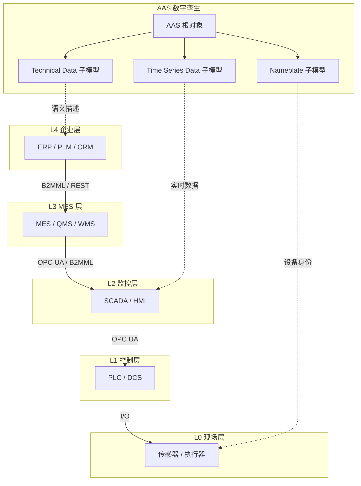
```mermaid
graph TB
    subgraph L4 [L4 企业层]
        ERP[ERP / PLM / CRM]
    end
    subgraph L3 [L3 MES 层]
        MES[MES / QMS / WMS]
    end
    subgraph L2 [L2 监控层]
        SCADA[SCADA / HMI]
    end
    subgraph L1 [L1 控制层]
        PLC[PLC / DCS]
    end
    subgraph L0 [L0 现场层]
        SENSOR[传感器 / 执行器]
    end
    subgraph AAS [AAS 数字孪生]
        AAS_ROOT[AAS 根对象]
        SM_TD[Technical Data 子模型]
        SM_NAME[Nameplate 子模型]
        SM_TS[Time Series Data 子模型]
    end
    ERP -->|B2MML / REST| MES
    MES -->|OPC UA / B2MML| SCADA
    SCADA -->|OPC UA| PLC
    PLC -->|I/O| SENSOR
    AAS_ROOT --> SM_TD
    AAS_ROOT --> SM_NAME
    AAS_ROOT --> SM_TS
    SM_TD -.->|语义描述| ERP
    SM_TS -.->|实时数据| SCADA
    SM_NAME -.->|设备身份| SENSOR
```

### 7.8 权威来源

> **权威来源**：
>
> - IEC 62264-1:2013 *Enterprise-control system integration — Part 1: Models and terminology*：<https://webstore.iec.ch/en/publication/6675>（核查日期：2026-07-09）
> - IEC 62264-3:2016 *Activity models of manufacturing operations management*：<https://webstore.iec.ch/en/publication/33511>（核查日期：2026-07-11）
> - IEC 63278-1:2023 *Asset Administration Shell structure*：<https://webstore.iec.ch/en/publication/65628>（核查日期：2026-07-09）
> - ISO/IEC 30141:2024 *Internet of Things reference architecture*：<https://www.iso.org/standard/88800.html>（核查日期：2026-07-09）
> - OPC UA for Devices (DI): <https://reference.opcfoundation.org/DI/v105/docs/>（核查日期：2026-07-09）
> - OPC UA for ISA-95 (B2MML): <https://www.mesa.org/en/B2MML.asp>（核查日期：2026-07-09）
> - IDTA Submodel Templates: <https://industrialdigitaltwin.org/en/content-hub/submodels>（核查日期：2026-07-09）
> - IDTA AAS Industry Use Cases: <https://industrialdigitaltwin.org/en/news-dates/use-cases-from-the-industry-with-the-asset-administration-shell-6226>（核查日期：2026-07-09）
> - DIN SPEC 91345 / RAMI 4.0 参考架构指南：<https://www.digitale-technologien.de/DT/Redaktion/DE/Downloads/Publikation/PAiCE_Leitfaden_Reference_Architecture.pdf>（核查日期：2026-07-09）

### 7.9 交叉引用

- 跨层数据流映射：[`cross-layer-matrix/data-flow-mapping.md`](../struct/11-industrial-iot-otit/01-isa-95-model/cross-layer-matrix/data-flow-mapping.md)
- AAS-OPC UA 映射：[`../05-digital-twin-aas/aas-opcua-mapping.md`](../struct/11-industrial-iot-otit/05-digital-twin-aas/aas-opcua-mapping.md)
- OPC UA FX 复用层次：[`../02-opc-ua-fx/opc-ua-fx-reuse-hierarchy.md`](../struct/11-industrial-iot-otit/02-opc-ua-fx/opc-ua-fx-reuse-hierarchy.md)
- ISA-95 / IEC 62264 复用总览：[`./README.md`](../struct/11-industrial-iot-otit/01-isa-95-model/README.md)

### 7.10 论证

> **定理 ISA.Catalog.2** (目录复用充分性): 若某 ISA-95 资产在目标工厂中具备对应的 AAS 子模型、OPC UA 信息模型与标准接口实现，则其复用风险可控；任一要素缺失都会引入语义漂移或集成失败风险。

---

> 最后更新: 2026-07-08


---


<!-- SOURCE: struct/11-industrial-iot-otit/01-isa-95-model/iso-30141-iot-ra-alignment.md -->

# ISO/IEC 30141:2024 IoT 参考架构对齐

> **版本**: 2026-06-12
> **定位**: 11-industrial-iot-otit / 01-isa-95-model
> **对齐标准**: ISO/IEC 30141:2024, ISA-95 (IEC 62264), IEC 63278 (AAS), OPC UA FX (IEC 62541)
> **状态**: ✅ 已完成

---

## 目录

- [ISO/IEC 30141:2024 IoT 参考架构对齐](#isoiec-301412024-iot-参考架构对齐)
  - [目录](#目录)
  - [1. ISO/IEC 30141:2024 IoT 参考架构概述](#1-isoiec-301412024-iot-参考架构概述)
    - [1.1 标准演进背景](#11-标准演进背景)
    - [1.2 参考架构的范围与目标](#12-参考架构的范围与目标)
    - [1.3 与 42010:2022 的架构描述框架](#13-与-420102022-的架构描述框架)
    - [1.4 第二版新增实施模式（Implementation Patterns）](#14-第二版新增实施模式implementation-patterns)
  - [2. 30141 的 IoT 域模型：核心实体与关系](#2-30141-的-iot-域模型核心实体与关系)
    - [2.1 域模型概览](#21-域模型概览)
    - [2.2 物理实体（Physical Entity）](#22-物理实体physical-entity)
    - [2.3 虚拟实体（Virtual Entity）](#23-虚拟实体virtual-entity)
    - [2.4 IoT 设备（IoT Device）](#24-iot-设备iot-device)
    - [2.5 IoT 网关（IoT Gateway）](#25-iot-网关iot-gateway)
    - [2.6 云服务（Cloud Service）](#26-云服务cloud-service)
    - [2.7 用户（User）](#27-用户user)
  - [3. 30141 与 ISA-95 L0-L4 的映射](#3-30141-与-isa-95-l0-l4-的映射)
    - [3.1 ISA-95 企业-控制系统集成模型回顾](#31-isa-95-企业-控制系统集成模型回顾)
    - [3.2 30141 如何补充 ISA-95 的复用视角](#32-30141-如何补充-isa-95-的复用视角)
    - [3.3 逐层映射分析](#33-逐层映射分析)
    - [3.4 映射带来的复用新机遇](#34-映射带来的复用新机遇)
  - [4. 30141 与 AAS (Asset Administration Shell, IEC 63278) 的协同](#4-30141-与-aas-asset-administration-shell-iec-63278-的协同)
    - [4.1 AAS 概念概述](#41-aas-概念概述)
    - [4.2 30141 与 AAS 的互补关系](#42-30141-与-aas-的互补关系)
    - [4.3 虚拟实体与 AAS 的映射](#43-虚拟实体与-aas-的映射)
    - [4.4 协同带来的复用价值](#44-协同带来的复用价值)
  - [5. IoT 组件复用的特殊挑战](#5-iot-组件复用的特殊挑战)
    - [5.1 设备异构性（Device Heterogeneity）](#51-设备异构性device-heterogeneity)
    - [5.2 网络约束（Network Constraints）](#52-网络约束network-constraints)
    - [5.3 安全边界（Security Boundaries）](#53-安全边界security-boundaries)
    - [5.4 生命周期差异（Lifecycle Divergence）](#54-生命周期差异lifecycle-divergence)
  - [6. 与 OPC UA FX 的对照：现场级通信 vs 云端 IoT 平台的复用边界](#6-与-opc-ua-fx-的对照现场级通信-vs-云端-iot-平台的复用边界)
    - [6.1 OPC UA FX 概述](#61-opc-ua-fx-概述)
    - [6.2 30141 与 OPC UA FX 的定位差异](#62-30141-与-opc-ua-fx-的定位差异)
    - [6.3 现场级通信的复用边界](#63-现场级通信的复用边界)
    - [6.4 复用边界的融合趋势](#64-复用边界的融合趋势)
    - [6.5 实践中的复用策略选择](#65-实践中的复用策略选择)
  - [权威来源](#权威来源)

## 1. ISO/IEC 30141:2024 IoT 参考架构概述

### 1.1 标准演进背景

ISO/IEC 30141:2024 是国际标准化组织（ISO）与国际电工委员会（IEC）联合制定的物联网（IoT）参考架构国际标准。该标准的第一版（`ISO/IEC 30141:2018`）为全球 IoT 系统的概念化和设计提供了首个统一的参考框架，**已被 2024 年发布的第二版（`ISO/IEC 30141:2024`）取代**。第二版全面遵循 ISO/IEC/IEEE 42010:2022《系统和软件工程—架构描述》的元模型要求，在架构描述的一致性、可追溯性和可验证性方面实现了显著提升。下文除明确标注“历史第一版”外，均以第二版为当前基准。

第二版的核心改进包括：

- **与 42010:2022 的严格对齐**：采用统一的架构视点（Viewpoint）、视图（View）和模型种类（Model Kind）概念体系
- **增强的安全性考量**：将安全与隐私保护从横向关注点提升为贯穿所有域的核心架构要素
- **扩展的互操作性框架**：明确了物理层、协议层、语义层和组织层四个互操作性层级
- **数字孪生集成**：正式纳入数字孪生（Digital Twin）作为连接物理世界与数字世界的核心构造

### 1.2 参考架构的范围与目标

ISO/IEC 30141:2024 的适用范围覆盖：

- **横向广度**：消费级 IoT、工业 IoT（IIoT）、智慧城市、智慧农业、车联网等全领域
- **纵向深度**：从边缘传感器到云端平台、从设备固件到业务应用的全栈视角
- **利益相关者视角**：设备制造商、平台提供商、系统集成商、终端用户、监管机构

标准的根本目标是：
> "提供一种通用的语言和框架，使不同组织、不同技术背景的参与者能够基于一致的语义讨论 IoT 系统的设计、实施、运营和演化。"

### 1.3 与 42010:2022 的架构描述框架

ISO/IEC 30141:2024 采用 ISO/IEC/IEEE 42010:2022 的架构描述框架，包含以下核心要素：

| 42010:2022 概念 | 在 30141:2024 中的具体化 |
|----------------|------------------------|
| 利益相关者（Stakeholder） | 设备制造商、网络运营商、平台提供商、应用开发者、终端用户、审计机构 |
| 关注点（Concern） | 互操作性、可扩展性、安全性、隐私、数据主权、生命周期管理 |
| 视点（Viewpoint） | 域视点、功能视点、通信视点、信息视点、安全视点 |
| 视图（View） | IoT 域模型视图、功能组件视图、通信协议栈视图、数据流视图、安全控制视图 |
| 模型种类（Model Kind） | 域模型、实体关系模型、状态机、序列图、威胁模型 |
| 架构决策（Architecture Decision） | 边缘计算 vs 云计算、MQTT vs CoAP、集中式 vs 分布式身份管理 |

### 1.4 第二版新增实施模式（Implementation Patterns）

ISO/IEC 30141:2024 第二版不仅更新了参考架构元模型，还强化了**实施模式（Implementation Patterns）**的指导，使参考架构从“概念框架”延伸到“可落地模板”。主要新增模式包括：

| 实施模式 | 核心内容 | 复用价值 |
|:---|:---|:---|
| **设备接入模式** | 直连、网关汇聚、边缘自治三种设备联网方式 | 同一接入模板可复用于不同厂区/产线，降低设备集成成本 |
| **数据流转模式** | 边缘预处理 → 网关转发 → 云平台分析 → 业务系统消费 | 数据管道组件化，支持跨行业复用 |
| **数字孪生映射模式** | 物理实体与虚拟实体的双向同步机制 | 数字孪生模板可在相似设备族间复用 |
| **安全信任模式** | 设备身份、安全启动、安全更新、最小权限 | 安全基线模板可作为合规起点复用 |
| **互操作模式** | 物理/协议/语义/组织四层互操作 | 互操作检查清单可复用于系统集成验收 |
| **生命周期治理模式** | 设计、部署、运营、退役各阶段治理要求 | 生命周期管理模板可复用于 IoT 资产管理 |

> **与第一版（2018）的差异**：2018 版主要定义了概念性的 IoT 参考架构和域模型；2024 版在实施模式、42010:2022 一致性、数字孪生集成、安全隐私强化等方面进行了实质性扩展，使其更适用于工业 IoT、智慧城市等规模化落地场景。

---

## 2. 30141 的 IoT 域模型：核心实体与关系

### 2.1 域模型概览

ISO/IEC 30141:2024 定义了一个包含六类核心实体的 IoT 域模型。这些实体构成了描述任何 IoT 系统的最小完备集合：

```
┌─────────────────────────────────────────────────────────────┐
│                    IoT 域模型核心实体                         │
├─────────────────────────────────────────────────────────────┤
│                                                             │
│   ┌──────────┐     数字映射      ┌──────────┐              │
│   │ 物理实体  │◄────────────────►│ 虚拟实体  │              │
│   │(Physical │                  │(Virtual  │              │
│   │ Entity)  │                  │ Entity)  │              │
│   └────┬─────┘                  └────┬─────┘              │
│        │                             │                     │
│        │ 感知/控制                   │ 交互/服务           │
│        ▼                             ▼                     │
│   ┌──────────┐     连接/管理      ┌──────────┐              │
│   │ IoT 设备 │◄────────────────►│ IoT 网关  │              │
│   │(IoT     │                  │(IoT      │              │
│   │ Device)  │                  │ Gateway) │              │
│   └────┬─────┘                  └────┬─────┘              │
│        │                             │                     │
│        │ 传输                        │ 汇聚/协议转换        │
│        ▼                             ▼                     │
│   ┌──────────┐     访问/使用      ┌──────────┐              │
│   │  云服务   │◄────────────────►│   用户    │              │
│   │(Cloud    │                  │(User)    │              │
│   │ Service) │                  │          │              │
│   └──────────┘                  └──────────┘              │
│                                                             │
└─────────────────────────────────────────────────────────────┘
```

### 2.2 物理实体（Physical Entity）

物理实体是 IoT 系统所要感知、监测或控制的现实世界中的对象。它是整个 IoT 价值链的起点。

**关键属性**：

- **标识（Identifier）**：在物理世界中的唯一标识，可能是序列号、RFID 标签、或自然特征（如生物识别）
- **状态（State）**：物理实体在特定时刻的所有可观测属性的集合
- **能力（Capability）**：物理实体能够执行的功能或能够产生的输出
- **位置（Location）**：物理实体在时空中的坐标

**复用视角**：在工业场景中，物理实体通常对应 ISA-95 中的物理资产。物理实体模型的复用意味着在不同 IoT 应用中共享同一资产的描述、状态模型和行为定义。

### 2.3 虚拟实体（Virtual Entity）

虚拟实体是物理实体在数字世界中的表示，即数字孪生（Digital Twin）的核心概念。30141:2024 将虚拟实体明确定义为"物理实体的数字映射，具备与物理实体同步的状态和行为模型"。

**关键属性**：

- **数字标识（Digital Identifier）**：全局唯一的数字标识符，通常基于 URI 或 DID（去中心化标识符）
- **同步状态（Synchronized State）**：与物理实体状态保持近实时同步的属性集合
- **历史数据（Historical Data）**：时间序列形式的物理实体状态演化记录
- **行为模型（Behavioral Model）**：描述物理实体如何响应外部刺激或内部变化的规则集
- **服务接口（Service Interface）**：允许其他系统与虚拟实体交互的标准化 API

**复用视角**：虚拟实体是 IoT 架构复用的核心枢纽。一个设计良好的虚拟实体可以在多个应用场景中被复用——例如，同一台工业泵的虚拟实体可以同时服务于预测性维护应用、能效优化应用和生产调度应用。

### 2.4 IoT 设备（IoT Device）

IoT 设备是直接与物理实体交互的硬件组件，负责感知（采集数据）和执行（施加控制）。

**分类体系**：

- **感知设备（Sensing Device）**：传感器、计量表、摄像头、麦克风
- **执行设备（Actuating Device）**：执行器、电机、阀门、开关
- **融合设备（Hybrid Device）**：同时具备感知和执行能力（如智能温控器）
- **网标设备（Tagging Device）**：RFID 标签、NFC 标签、条形码

**关键属性**：

- **设备能力模型（Device Capability Model）**：描述设备支持的传感器类型、采样频率、精度、通信协议
- **固件版本（Firmware Version）**：设备内部软件版本，直接影响功能和安全状态
- **能量模型（Energy Model）**：电池容量、功耗曲线、能量采集能力
- **环境约束（Environmental Constraints）**：工作温度范围、防护等级（IP 等级）、防爆要求

**复用视角**：IoT 设备的复用不仅指硬件的物理复用，更重要的是设备能力模型和固件逻辑的复用。标准化的设备能力模型（如基于 WoT Thing Description 或 OPC UA 信息模型）使上层应用可以"编写一次，适配多种设备"。

### 2.5 IoT 网关（IoT Gateway）

IoT 网关是连接设备域与网络/云域的桥梁，承担协议转换、数据预处理、本地决策和设备管理等功能。

**核心功能**：

- **协议转换（Protocol Translation）**：将设备侧协议（Modbus、CAN、Zigbee、BLE）转换为网络侧协议（MQTT、CoAP、HTTP）
- **数据预处理（Data Preprocessing）**：边缘聚合、滤波、压缩、单位转换
- **本地推理（Local Inference）**：执行边缘 AI 模型，实现低延迟响应
- **设备管理（Device Management）**：固件升级（FOTA）、配置下发、状态监控
- **安全边界（Security Boundary）**：执行设备认证、访问控制、数据加密

**复用视角**：网关固件和边缘应用的复用是降低 IIoT 部署成本的关键。标准化的网关抽象层使同一套边缘应用可以部署到不同厂商的网关上。

### 2.6 云服务（Cloud Service）

云服务是部署在云基础设施上的软件组件，为 IoT 系统提供数据存储、分析、可视化和应用逻辑。

**功能分层**：

- **连接层（Connectivity Layer）**：设备接入管理、消息总线、注册表
- **数据处理层（Data Processing Layer）**：流处理、批处理、规则引擎、复杂事件处理（CEP）
- **分析层（Analytics Layer）**：机器学习、数字孪生仿真、预测模型
- **应用使能层（Application Enablement Layer）**：API 管理、应用市场、多租户隔离
- **呈现层（Presentation Layer）**：仪表盘、告警通知、移动应用

**复用视角**：云服务层的复用主要体现在平台即服务（PaaS）层的共享——消息总线、规则引擎、时序数据库等基础设施组件被多个上层应用共享。

### 2.7 用户（User）

用户是与 IoT 系统交互的人或其他系统。30141:2024 扩展了传统"用户"的概念，包含：

- **终端用户（End User）**：直接使用 IoT 应用的人（如智能家居住户、工厂操作员）
- **系统用户（System User）**：其他与 IoT 系统交互的自动化系统（如 ERP、MES、SCADA）
- **管理用户（Administrative User）**：负责设备配置、用户授权、系统维护的管理员
- **审计用户（Auditing User）**：执行合规审查、安全审计的第三方系统或人员

---

## 3. 30141 与 ISA-95 L0-L4 的映射

### 3.1 ISA-95 企业-控制系统集成模型回顾

ISA-95（IEC 62264）是工业自动化领域最广泛采用的参考模型，定义了企业级业务系统与控制系统之间的接口。其五层架构为：

| 层级 | 名称 | 核心功能 | 典型系统 |
|------|------|---------|---------|
| L4 | 企业层（Enterprise） | 业务计划、物流管理 | ERP、CRM、SCM |
| L3 | 制造运营管理层（MOM） | 生产调度、质量管理、维护管理 | MES、QMS、CMMS |
| L2 | 监控层（Supervisory Control） | 过程监控、批次管理、数据采集 | SCADA、HMI |
| L1 | 控制层（Basic Control） | 实时控制、逻辑运算、闭环调节 | PLC、DCS、PAC |
| L0 | 现场层（Field） | 传感、执行、物理过程 | 传感器、执行器、驱动器 |

传统 ISA-95 采用**严格的层级分离**和**点对点接口**设计，这种架构在确定性控制场景中具有明确优势，但在 IoT 时代的全连接、数据驱动场景中暴露出灵活性不足的问题。

### 3.2 30141 如何补充 ISA-95 的复用视角

ISO/IEC 30141:2024 并非替代 ISA-95，而是**从 IoT 参考架构的视角补充和扩展**了工业控制系统的架构框架：

```
┌─────────────────────────────────────────────────────────────┐
│              ISA-95 L0-L4 + ISO/IEC 30141 融合视图           │
├─────────────────────────────────────────────────────────────┤
│                                                             │
│  L4 企业层 ┌────────────────────────────────────────────┐  │
│           │  ERP / CRM / SCM                           │  │
│           │  ← 30141 云服务层：SaaS 集成、数据分析平台    │  │
│           └────────────────────────────────────────────┘  │
│                              ▲                              │
│  L3 MOM层  ┌────────────────────────────────────────────┐  │
│           │  MES / QMS / CMMS / WMS                    │  │
│           │  ← 30141 云服务层：应用使能、数字孪生         │  │
│           └────────────────────────────────────────────┘  │
│                              ▲                              │
│  L2 监控层 ┌────────────────────────────────────────────┐  │
│           │  SCADA / HMI / 历史数据库                   │  │
│           │  ← 30141 IoT 网关层：边缘聚合、协议转换       │  │
│           └────────────────────────────────────────────┘  │
│                              ▲                              │
│  L1 控制层 ┌────────────────────────────────────────────┐  │
│           │  PLC / DCS / PAC / 工业 PC                  │  │
│           │  ← 30141 IoT 设备层：智能控制器、边缘网关      │  │
│           └────────────────────────────────────────────┘  │
│                              ▲                              │
│  L0 现场层 ┌────────────────────────────────────────────┐  │
│           │  传感器 / 执行器 / 驱动器 / 机器人            │  │
│           │  ← 30141 物理实体 + IoT 设备层               │  │
│           └────────────────────────────────────────────┘  │
│                                                             │
└─────────────────────────────────────────────────────────────┘
```

### 3.3 逐层映射分析

**L0 现场层 ↔ 30141 物理实体 + IoT 设备**

ISA-95 的 L0 层主要关注物理过程本身，缺乏对设备数字化描述的标准化框架。30141 的引入带来了：

- 每台现场设备拥有标准化的虚拟实体映射
- 设备能力模型使上位系统可以自动发现和识别新接入设备
- 物理实体的语义描述支持跨厂商、跨行业的互操作

**复用价值**：现场设备的数字描述可以在不同 L2/L3 系统间共享，避免了为 SCADA、MES、CMMS 分别维护设备主数据的冗余。

**L1 控制层 ↔ 30141 IoT 设备（智能控制器）**

现代 PLC 和 PAC  increasingly 具备网络连接能力，从封闭的控制器演变为 IoT 设备。30141 的视角强调：

- 控制逻辑的复用：通过容器化技术（如 Docker on PLCnext）实现控制算法的跨平台复用
- 控制器的统一管理能力：将 PLC 纳入统一的设备管理平台，实现配置模板化

**复用价值**：标准化的控制功能块（如 PID 控制、运动控制）可以在不同品牌和型号的控制器间移植。

**L2 监控层 ↔ 30141 IoT 网关**

SCADA 系统和 IoT 网关的功能边界正在融合。30141 的网关概念为 ISA-95 的 L2 层提供了：

- 多协议接入的统一框架
- 边缘计算能力的标准化描述
- 数据预处理和本地决策的参考架构

**复用价值**：网关上的边缘应用（如振动分析、能效计算）可以在工厂内的多个产线间复用，甚至跨工厂复用。

**L3 运营层 ↔ 30141 云服务（应用使能层）**

MES 系统正在从单体架构向云原生、微服务架构演进。30141 的云计算视角帮助 MES 架构师：

- 将 MES 功能分解为可独立部署和复用的微服务
- 利用 IoT 平台的标准化数据模型降低系统集成成本
- 通过数字孪生实现生产过程的虚拟调试和优化

**复用价值**：生产排程算法、质量分析模型、维护策略引擎等 MES 核心功能可以作为可复用服务部署。

**L4 企业层 ↔ 30141 云服务（SaaS 集成层）**

ERP 与 IoT 平台的集成传统上通过复杂的 ETL 流程实现。30141 提供了：

- 标准化的数据语义模型，减少 ERP-IoT 集成中的数据映射工作
- 事件驱动的架构模式，实现业务系统与物理世界的实时联动

### 3.4 映射带来的复用新机遇

通过 30141 与 ISA-95 的映射，工业组织可以实现以下新的复用层级：

1. **设备描述复用**：一次建模，全系统共享（L0-L4 共同使用同一设备主数据）
2. **边缘算法复用**：跨产线、跨工厂复用成熟的边缘分析算法
3. **集成模式复用**：标准化的 ERP-MES-SCADA-IoT 集成模板
4. **安全策略复用**：统一的身份认证和访问控制策略贯穿 L0-L4
5. **数字孪生复用**：虚拟实体在不同业务应用（维护、调度、培训）中的共享

---

## 4. 30141 与 AAS (Asset Administration Shell, IEC 63278) 的协同

### 4.1 AAS 概念概述

资产管理壳（Asset Administration Shell, AAS）是德国工业 4.0 战略的核心概念，现已成为国际标准 IEC 63278。AAS 被定义为"资产的数字化表示"，包含：

- **资产（Asset）**：现实世界中的物理或逻辑对象（设备、软件、服务、知识产权）
- **资产管理壳（AAS）**：包裹资产的"数字外壳"，提供标准化的接口和数据模型

AAS 采用**分层次、模块化**的设计，每个 AAS 由多个子模型（Submodel）组成，每个子模型描述资产的一个特定方面：

```
┌────────────────────────────────────────────┐
│           Asset Administration Shell        │
│                  (AAS)                      │
├────────────────────────────────────────────┤
│  ┌─────────┐ ┌─────────┐ ┌─────────┐      │
│  │Identification│ │Technical Data│ │Operational Data│  │
│  │  Submodel   │ │  Submodel   │ │   Submodel    │  │
│  └─────────┘ └─────────┘ └─────────┘      │
│  ┌─────────┐ ┌─────────┐ ┌─────────┐      │
│  │Maintenance│ │  Safety  │ │  Energy  │      │
│  │  Submodel │ │ Submodel │ │ Submodel │      │
│  └─────────┘ └─────────┘ └─────────┘      │
│  ┌─────────┐ ┌─────────┐                   │
│  │Capability │ │  Nameplate │                   │
│  │  Submodel │ │  Submodel  │                   │
│  └─────────┘ └─────────┘                   │
└────────────────────────────────────────────┘
```

### 4.2 30141 与 AAS 的互补关系

ISO/IEC 30141:2024 与 IEC 63278 (AAS) 之间存在深度的互补关系：

| 维度 | ISO/IEC 30141:2024 | IEC 63278 (AAS) |
|------|-------------------|----------------|
| **定位** | IoT 系统的全局参考架构 | 单个工业资产的数字表示标准 |
| **粒度** | 系统级、生态系统级 | 设备级、组件级 |
| **范围** | 消费 IoT、工业 IoT、智慧城市等全领域 | 主要聚焦工业 4.0 场景 |
| **核心抽象** | 物理实体、虚拟实体、设备、网关、云服务、用户 | 资产、资产管理壳、子模型、属性、操作、事件 |
| **互操作焦点** | 系统间的数据流与控制流 | 标准化的资产信息交换接口 |

**协同关系**：30141 提供了"宏观架构框架"，回答了"IoT 系统由哪些部分组成、它们如何交互"；AAS 提供了"微观信息模型"，回答了"每个资产的数字表示应包含哪些信息、如何访问"。

### 4.3 虚拟实体与 AAS 的映射

在 30141 的域模型中，**虚拟实体（Virtual Entity）**与 AAS 的资产管理壳具有概念上的高度对应关系：

```
30141 虚拟实体                    AAS 资产管理壳
─────────────────────────────────────────────────────────
数字标识 (Digital Identifier)  ↔  AAS Identifier
同步状态 (Synchronized State)  ↔  属性 (Properties)
行为模型 (Behavioral Model)    ↔  操作 (Operations) +
                                  状态机 (State Machines)
历史数据 (Historical Data)     ↔  事件 (Events) +
                                  时间序列数据
服务接口 (Service Interface)   ↔  AASX/REST/MQTT 接口
```

在工业 IoT 实践中，推荐的融合方式是：

- 使用 30141 的域模型进行系统架构设计
- 使用 AAS 的子模型规范定义每个虚拟实体的信息结构
- 通过 AAS 的标准化接口暴露虚拟实体的状态和能力

### 4.4 协同带来的复用价值

**复用价值一：跨厂商设备集成**

当不同厂商的设备均采用 AAS 标准描述时，基于 30141 架构的 IoT 平台可以通过统一的虚拟实体接口接入这些设备，无需为每个厂商开发定制的适配器。

**复用价值二：跨层级信息贯通**

AAS 的子模型可以在 L0-L4 的不同系统中复用。例如，设备的"技术数据子模型"同时被 SCADA（L2）用于参数配置、MES（L3）用于工艺路线规划和 ERP（L4）用于资产台账管理。

**复用价值三：数字主线（Digital Thread）**

通过 AAS 串联产品全生命周期的数据，30141 架构确保这些数据在不同阶段、不同系统间的无缝流动。设计阶段的 CAD 数据、制造阶段的工艺参数、运营阶段的实时数据、退役阶段的回收信息，全部通过统一的 AAS 框架关联到同一物理资产。

---

## 5. IoT 组件复用的特殊挑战

### 5.1 设备异构性（Device Heterogeneity）

IoT 生态系统的最显著特征是设备的极端异构性：

**硬件异构**：

- 处理器架构：ARM Cortex-M0 到 x86_64，乃至专用 AI 加速器
- 内存容量：从数 KB（传感器节点）到数 GB（边缘服务器）
- 通信接口：UART、SPI、I2C、GPIO、Ethernet、WiFi、LoRa、5G

**软件异构**：

- 操作系统：裸机、FreeRTOS、Zephyr、Linux、Windows IoT
- 协议栈：MQTT、CoAP、HTTP/2、DDS、OPC UA、Modbus
- 编程语言：C/C++、Rust、Python、JavaScript、Go

**复用挑战**：在通用 IT 系统中，组件复用通常意味着在同一运行时环境中共享库或服务。而在 IoT 中，"复用"往往需要跨越完全不同的硬件和软件边界。解决方案包括：

- **硬件抽象层（HAL）**：为不同硬件提供统一的软件接口
- **容器化与虚拟化**：在资源允许的边缘设备上使用 Docker、WebAssembly
- **代码生成**：基于统一模型为不同目标平台生成适配代码

### 5.2 网络约束（Network Constraints）

IoT 系统面临的网络环境与数据中心截然不同：

| 约束类型 | 具体表现 | 对复用的影响 |
|---------|---------|------------|
| 带宽受限 | 窄带 IoT（NB-IoT）仅 20 kbps | 无法传输大型软件包或模型 |
| 延迟敏感 | 运动控制要求 < 1 ms | 云端复用的组件无法满足实时性 |
| 间歇连接 | 卫星或移动场景下频繁断线 | 无法依赖持续的网络连接进行组件下载 |
| 数据主权 | 某些数据禁止出境 | 跨地域的组件共享受限 |

**复用策略调整**：

- **边缘预部署**：将常用组件预装到网关上，而非实时下载
- **模型压缩**：针对边缘推理场景，使用量化、剪枝、知识蒸馏压缩复用的 AI 模型
- **断线续传**：组件更新机制必须支持间歇网络下的可靠传输

### 5.3 安全边界（Security Boundaries）

IoT 系统的安全边界比传统 IT 系统更加复杂：

**物理安全挑战**：

- 设备部署在无人值守的物理环境中，面临物理篡改风险
- 资源受限设备无法运行完整的安全协议栈（如 TLS 1.3）

**网络安全挑战**：

- OT 网络与 IT 网络的融合打破了传统的空气间隙（Air Gap）隔离
- 每个 IoT 设备都是潜在的攻击入口

**对复用的影响**：

- 组件复用可能引入供应链攻击风险（复用被篡改的固件或库）
- 跨安全域的组件共享需要严格的隔离和审计
- 安全补丁的复用分发面临设备异构和网络约束的双重挑战

**缓解策略**：

- **软件物料清单（SBOM）**：对复用的每个组件记录来源、版本、依赖关系
- **安全启动（Secure Boot）**：确保只有经过签名的固件才能执行
- **零信任架构**：不因为组件"来自内部平台"就自动信任
- **分域隔离**：按安全等级划分组件复用边界，高安全等级组件不向下复用

### 5.4 生命周期差异（Lifecycle Divergence）

IoT 组件的生命周期特征与软件组件存在本质差异：

| 维度 | 云软件组件 | IoT 设备组件 |
|------|-----------|-------------|
| 更新频率 | 每日/每周持续部署 | 数月/数年一次固件升级 |
| 版本共存 | 多版本并行运行常见 | 现场设备通常只运行单一版本 |
| 回滚能力 | 即时回滚 | 固件升级失败可能导致设备变砖 |
| 兼容性窗口 | 较宽，API 版本控制灵活 | 硬件接口固定，兼容性窗口极窄 |
| 退役处理 | 下线容器/虚拟机 | 物理回收、数据销毁、环保合规 |

**复用策略调整**：

- **长周期支持（LTS）**：对 IoT 组件提供远长于云软件的维护承诺
- **灰度升级**：通过网关分批推送固件更新，监控成功率
- **硬件兼容性矩阵**：明确记录每个组件版本支持的硬件型号
- **生命周期对齐**：在设计阶段即规划组件的升级路径和退役策略

---

## 6. 与 OPC UA FX 的对照：现场级通信 vs 云端 IoT 平台的复用边界

### 6.1 OPC UA FX 概述

OPC UA FX（Field eXchange）是 OPC 基金会发布的、基于 OPC UA 的现场级通信规范，旨在实现控制器与现场设备之间的标准化、确定性通信。它是工业 4.0 参考架构中连接 L1（控制层）与 L0/L2 的核心通信标准。

**核心特性**：

- **确定性通信**：支持时间敏感网络（TSN），实现微秒级同步
- **语义互操作**：基于 OPC UA 信息模型的标准化设备描述
- **即插即用**：自动设备识别（AutoID）与自动配置
- **功能安全**：集成 Safety over OPC UA（基于 IEC 61784-3）
- **信息安全**：集成 OPC UA Security（基于 IEC 62541）

### 6.2 30141 与 OPC UA FX 的定位差异

| 特性 | OPC UA FX | ISO/IEC 30141 通信视点 |
|------|-----------|----------------------|
| **聚焦层级** | L0-L2 现场级通信 | 全栈（L0-L4 + 云） |
| **通信范围** | 工厂内部、局域网 | 广域网、互联网、跨组织 |
| **确定性要求** | 硬实时（< 1 ms） | 软实时/非实时 |
| **协议基础** | OPC UA over TSN | MQTT、CoAP、HTTP/2、多种协议 |
| **设备描述** | OPC UA 信息模型、Companion Specs | 通用域模型、WoT Thing Description |
| **部署场景** | 工业自动化、过程控制 | 跨行业 IoT、智慧城市、车联网 |

### 6.3 现场级通信的复用边界

OPC UA FX 定义了现场级通信的复用边界：

**边界之内（现场域，复用的确定性保障）**：

- 传感器/执行器的标准化接口（如 IO-Link 集成到 OPC UA）
- 控制功能块的标准化封装（PLCopen 功能块映射到 OPC UA）
- 安全通信通道的标准化建立（Safety over OPC UA）
- 确定性网络配置的标准化（TSN 流配置）

**边界之外（云端域，复用的灵活性优先）**：

- 大数据分析与机器学习模型训练
- 跨工厂的生产优化与供应链协同
- 移动应用与用户交互界面
- 第三方服务的集成（天气、交通、市场数据）

### 6.4 复用边界的融合趋势

尽管存在明确的定位差异，OPC UA FX 与 30141 的融合趋势正在加速：

**融合点一：统一信息模型**

OPC UA 的 Companion Specifications 正在与 30141 的域模型对齐。例如，OPC UA for Devices（DI）和 OPC UA for ISA-95（ISA-95）已经为 30141 的物理实体和虚拟实体提供了成熟的信息模型基础。

**融合点二：云边协同**

通过 OPC UA PubSub over MQTT（IEC 62541-14），OPC UA FX 现场数据可以无缝接入基于 30141 架构的云端 IoT 平台。这意味着：

- 现场级的语义描述可以直接在云端复用
- 基于 OPC UA 信息模型的数字孪生可以在云端与 ERP/MES 数据融合

**融合点三：安全统一**

OPC UA 的安全机制（X.509 证书、用户令牌、安全通道）可以与 30141 的安全视点整合，实现从现场设备到云端服务的端到端安全策略复用。

### 6.5 实践中的复用策略选择

组织在设计 IIoT 架构时，应基于以下原则选择复用边界：

| 场景 | 推荐技术栈 | 复用策略 |
|------|-----------|---------|
| 现场实时控制（< 10 ms） | OPC UA FX + TSN | 复用 PLCopen 功能块、OPC UA Companion Specs |
| 产线监控与可视化（10 ms - 1 s） | OPC UA Client/Server + SCADA | 复用 OPC UA 信息模型、SCADA 模板 |
| 工厂级数据分析（1 s - 1 min） | MQTT + 边缘网关 + 时序数据库 | 复用边缘分析算法、数据预处理管道 |
| 企业级应用集成（> 1 min） | HTTP/REST + 云平台 + ERP/MES | 复用微服务、API 规范、集成模板 |
| 跨组织供应链协同 | 30141 云服务层 + AAS | 复用 AAS 子模型、标准化的业务文档 |

---

## 权威来源

1. **ISO/IEC 30141:2024 - Internet of Things (IoT) — Reference Architecture**
   URL: <https://www.iso.org/standard/65683.html>
   核查日期: 2026-06-10
   （ISO 官方标准页面，第二版 IoT 参考架构）

2. **ISO/IEC/IEEE 42010:2022 - Architecture Description**
   URL: <https://www.iso.org/standard/74296.html>
   核查日期: 2026-06-10
   （系统和软件工程架构描述国际标准）

3. **IEC 62264 / ISA-95 Enterprise-Control System Integration**
   URL: <https://www.isa.org/standards-and-publications/isa-standards/isa-standards-committees/isa95>
   核查日期: 2026-06-10
   （ISA-95 官方标准委员会页面）

4. **IEC 63278 - Asset Administration Shell for Industrial Applications**
   URL: <https://www.plattform-i40.de/IP/Redaktion/EN/Downloads/Publikation/Details-of-the-Asset-Administration-Shell-Part1.html>
   核查日期: 2026-06-10
   （工业 4.0 平台 AAS 规范官方文档）

5. **OPC UA Field eXchange (FX) Specification**
   URL: <https://reference.opcfoundation.org/specs/OPC-10000-80>
   核查日期: 2026-06-10
   （OPC 基金会 OPC UA FX 官方页面）

6. **OPC UA Information Model Companion Specifications**
   URL: <https://opcfoundation.org/developer-tools/specifications-opc-ua-information-models/>
   核查日期: 2026-06-10
   （OPC UA 配套规范列表，ISA-95、设备集成等信息模型）

---

> *本文档作为工业物联网与 OT/IT 融合架构的参考，应与同目录下的 ISA-95 模型文档及 AAS 相关文档联合使用。*


---


<!-- SOURCE: struct/11-industrial-iot-otit/01-isa-95-model/l0-field/asset-catalog.md -->

# L0 现场层复用资产目录

> **版本**: 2026-06-06
> **层级**: ISA-95 Level 0 — 现场设备层 (Field Device Layer)
> **时间尺度**: 毫秒–秒 (ms–s)
> **管理域**: 物理过程与传感器/执行器域
> **对齐来源**: ANSI/ISA-95.00.01-2010 (IEC 62264-1), IEC 61131-3, IEC 61804, IO-Link Consortium

---

## 1. 层定义与复用范围

L0 现场层是 ISA-95 五层模型的最底层，直接面向物理生产过程。
该层资产的核心复用价值在于：**设备描述的标准化**与**传感器/执行器配置模板化**。
通过复用经认证的设备描述文件和参数模板，可在棕地( brownfield )扩容或绿地( greenfield )建设时，将工程调试周期缩短 30%–50%。

> **交叉引用**: 本层资产与 `struct/02-business-architecture-reuse/03-value-stream/value-stream-composition.md` 中定义的"价值流阶段间接口契约"直接对应——L0 层传感器数据是"订单到现金"价值流中"生产执行"阶段最原始的输入信号。

---

## 2. 资产分类表

| 序号 | 资产名称 | 描述 | 标准/规范 | 复用频率 | 成熟度 |
|-----|---------|------|----------|---------|--------|
| E1 | **IODD (IO-Link Device Description)** | IO-Link 设备的 XML 描述文件，包含标识数据、过程数据、参数集、诊断事件与菜单结构。支持 IO-Link 主站自动识别与参数化。 | IO-Link Specification V1.1.3+ (IO-Link Consortium) | 高 (每次新增同类传感器即复用) | 成熟 |
| E2 | **GSD/GSDML (Generic Station Description)** | Profinet/Profibus 设备的通用站描述文件（GSD 用于 DP/PA，GSDML 用于 PN）。定义模块配置、参数集、诊断位、IO 映射与 DAP (Device Access Point)。 | PI (Profibus & Profinet International), IEC 61784 | 高 (Profinet 生态标配) | 成熟 |
| E3 | **EDS (Electronic Data Sheet)** | EtherNet/IP 及 DeviceNet 设备的电子数据表，描述设备类别、参数对象、IO 汇编实例、显式/隐式报文连接。 | ODVA (Open DeviceNet Vendors Association), CIP Specification Vol. 1–3 | 高 (Rockwell/Omron 等生态核心) | 成熟 |
| E4 | **XDD / CDD (CANopen/DeviceNet)** | CANopen 设备的电子数据描述（EDS 扩展 XML 版 XDD）及 FDT 通用设备描述（CDD）。定义对象字典索引、PDO/SDO 映射、设备子协议。 | CiA (CAN in Automation) 301/402, IEC 61804 | 中 (食品饮料、包装机械常用) | 成熟 |
| E5 | **OPC UA DI 信息模型模板** | OPC UA Device Integration (DI) 规范的设备类型定义模板，包括 DeviceType、ConfigurableObjectType、FunctionalGroupType 的实例化模板。 | OPC Foundation: OPC 10000-100 (DI) | 高 (OPC UA 生态必选) | 成熟 |
| E6 | **PA-DIM Companion Specification** | 过程自动化设备信息模型 (Process Automation Device Information Model)，将 EDDL 语义映射到 OPC UA，统一温度/压力/流量/物位变送器的信息模型。 | OPC Foundation / FieldComm Group, PA-DIM V1.0+ | 中 (流程工业新建项目) | 发展中 |
| E7 | **传感器校准证书模板** | 包含校准日期、标准器溯源、测量不确定度、修正系数、环境条件的可复用 XML/JSON 模板，符合 ISO/IEC 17025 数据管理要求。 | ISO/IEC 17025:2017 | 中 (质量审计驱动复用) | 成熟 |
| E8 | **执行器安全关断配置模板** | 阀门/驱动器的失电安全位、行程时间、ESD (Emergency Shut-Down) 逻辑模板，集成 IEC 61508 SIL 等级参数。 | IEC 61508 / IEC 61511, ISA-84 | 低–中 (安全系统专用) | 成熟 |

---

## 3. 复用建议

### 3.1 设备描述文件的层内复用策略

1. **同类替换复用**: 当现场更换同型号传感器（如将 Endress+Hauser Prosonic 更换为同系列新型号），直接复用既有 IODD/GSDML 文件，仅需更新版本号与固件兼容性校验。
2. **族系模板继承**: 基于设备厂商的族系模板（如 Siemens SIRIUS 电机启动器族），通过参数差异表派生具体型号描述，避免从零创建。
3. **多协议桥接复用**: 通过 OPC UA DI + PA-DIM 将面向 L1 的 Profinet GSDML 语义自动转换为 OPC UA 信息模型，实现一份资产描述跨协议复用。

### 3.2 跨层复用接口

- **L0 → L1**: IODD/EDS/GSDML 被 PLC 工程工具（TIA Portal, RSLogix, Codesys）导入，自动生成过程映像变量与 UDT。详见 [L1 控制层复用资产目录](../struct/11-industrial-iot-otit/01-isa-95-model/l1-control/asset-catalog.md)。
- **L0 → L2/L3**: OPC UA DI / PA-DIM 信息模型可被 SCADA/MES 直接订阅，跳过传统 PLC 标签映射，减少一层数据转换。

### 3.3 形式化验证提示

> **交叉引用**: 安全关键执行器（如 ESD 阀门）的配置模板可引入 `struct/07-formal-verification/05-spark-ada/spark-ada-do333-industrial.md` 中的合同化思维：将失电安全位、行程超时、SIL 等级要求编码为设备描述文件中的形式化属性约束，在工程导入阶段即执行静态校验。

---

## 4. 权威来源

1. ANSI/ISA-95.00.01-2010 / IEC 62264-1:2013 — Enterprise-Control System Integration Part 1: Models and Terminology
2. IO-Link Consortium — IO-Link Interface and System Specification Version 1.1.3 (2021)
3. Profibus & Profinet International (PI) — GSDML Specification for Profinet IO
4. ODVA — CIP Specification Volume 1: Common Industrial Protocol, Edition 3.8
5. OPC Foundation — OPC Unified Architecture for Devices (DI), OPC 10000-100
6. OPC Foundation / FieldComm Group — PA-DIM Companion Specification (Process Automation Device Information Model)
7. IEC 61804 — Function blocks (FB) for process control and electronic device description language (EDDL)
8. IEC 61508-2:2010 — Functional safety of electrical/electronic/programmable electronic safety-related systems

---

> 最后更新: 2026-06-06


---

## 补充章节

## 示例

**示例**：汽车工厂将 ISA-95 L0-L4 资产目录映射到 IEC 63278 资产管理壳（AAS），通过 OPC UA FX 实现现场设备与 MES/ERP 的即插即用复用。

## 反例

**反例**：将 IT 系统直接补丁策略套用到 PLC 产线，未考虑实时性约束与功能安全认证，导致停机与安全事故。

## 权威来源

> **权威来源**:
>
> - [ISA-95 / IEC 62264](https://www.isa.org/standards-and-publications/isa-standards/isa-95)
> - [OPC Foundation](https://opcfoundation.org)
> - [IEC 61508-1:2010](https://webstore.iec.ch/en/publication/5515)
> - [IEC 63278 AAS](https://iec.ch/dyn/www/f?p=103:38:0::::FSP_ORG_ID:1363)
> - 核查日期：2026-07-07

## 分析

**分析**：OT-IT 复用需要在实时性、安全性与 IT 敏捷性之间取得平衡，标准信息模型是打破竖井的关键。


---


<!-- SOURCE: struct/11-industrial-iot-otit/01-isa-95-model/l1-control/asset-catalog.md -->

# L1 控制层复用资产目录

> **版本**: 2026-06-06
> **层级**: ISA-95 Level 1 — 基本控制层 (Basic Control Layer)
> **时间尺度**: 秒–分 (s–min)
> **管理域**: 过程控制与逻辑执行域
> **对齐来源**: IEC 61131-3 Ed3.0, PLCopen Motion Control Part 1+2 V2.0, IEC 61499, ISA-95.00.03-2013

---

## 1. 层定义与复用范围

L1 控制层是 ISA-95 中直接执行物理过程控制的层级，核心资产为 **PLC/DCS 程序单元**。
本层复用的关键在于：将经过现场验证的算法封装为可移植的 **功能块 (Function Block, FB)**、**用户数据类型 (UDT)** 与控制策略模板，实现"一次开发、多机型部署"。
PLCopen 运动控制库的成功实践表明，标准化 FB 可将跨厂商移植成本降低 40% 以上。

> **交叉引用**: L1 控制逻辑是 `struct/02-business-architecture-reuse/03-value-stream/value-stream-composition.md` 中"价值流阶段间接口契约"的技术实现载体——控制 FB 的输入/输出接口即构成了 L1↔L0、L1↔L2 的物理接口契约。

---

## 2. 资产分类表

| 序号 | 资产名称 | 描述 | 标准/规范 | 复用频率 | 成熟度 |
|-----|---------|------|----------|---------|--------|
| C1 | **通用 PID 控制功能块** | 支持增量式/位置式 PID、抗积分饱和、前馈补偿、自动/手动无扰切换的标准功能块。可直接复用于温度、压力、流量等单回路控制。 | IEC 61131-3 Ed3.0 (FB 语言), ISA-5.1 | 极高 (几乎每个控制项目) | 成熟 |
| C2 | **PLCopen 运动控制 FB 库** | 单轴/多轴运动控制标准功能块族：MC_Power, MC_MoveAbsolute, MC_MoveRelative, MC_GearIn, MC_CamIn, MC_Home 等。抽象 AXIS_REF 数据类型实现硬件无关。 | PLCopen Motion Control Part 1 & 2 V2.0 | 高 (离散制造、包装、机器人) | 成熟 |
| C3 | **设备 UDT (用户数据类型) 模板** | 面向电机、阀门、变频器等设备对象的标准化结构化数据类型，包含 Command (命令字)、Status (状态字)、Fault (故障码)、Param (参数集)。 | IEC 61131-3 (STRUCT), OOP 扩展 (Ed3.0) | 极高 (工程标准化基础) | 成熟 |
| C4 | **顺序控制顺序功能图 (SFC) 模板** | 基于 IEC 61131-3 SFC 的步序控制模板，包含 Init/Run/Hold/Abort/Complete 标准步及转移条件骨架，适用于批次与离散顺序控制。 | IEC 61131-3 (SFC 语言), ISA-88 / IEC 61512 | 高 (批次反应釜、灌装线) | 成熟 |
| C5 | **安全关断逻辑 FB (Safety FB)** | 符合 IEC 62061 / ISO 13849-1 的安全功能块，实现双通道急停、安全门监控、光幕消隐、安全速度监控。可直接复用于 SIL3/PL e 等级系统。 | IEC 62061:2021, ISO 13849-1:2023, IEC 61131-3 | 中 (安全项目必用) | 成熟 |
| C6 | **通信协议封装 FB** | 将 OPC UA Client/Server、MQTT Publisher、Modbus TCP/RTU Master、EtherNet/IP Adapter 等协议栈封装为标准化 FB，隐藏协议细节，暴露统一数据接口。 | OPC Foundation, OASIS MQTT, IEC 61131-3 | 高 (IIoT 与 OT-IT 融合) | 成熟 |
| C7 | **批次单元过程控制模板 (Unit Procedure)** | 基于 ISA-88 物理模型与过程模型的 Unit 级控制模板，包含 Equipment Phase、Operation、Unit Procedure 三层调用结构，支持配方参数动态绑定。 | ISA-88 / IEC 61512-1, IEC 61131-3 | 中 (制药、化工批次控制) | 成熟 |
| C8 | **振动/温度异常检测算法块** | 集成边缘预处理功能的控制算法 FB，实现 FFT 特征提取、阈值比较、简单统计过程控制 (SPC) 规则，用于泵/风机/轴承的预测性维护前端。 | ISO 17359 (Condition Monitoring), IEC 61131-3 | 中 (预测性维护项目) | 发展中 |

---

## 3. 复用建议

### 3.1 功能块库的多项目复用

1. **建立企业级 FB 库**: 将 C1–C8 按行业场景（流程、离散、混合）组织为层级化库，纳入版本控制（Git + PLC 工程工具导出格式），并配套自动化回归测试。
2. **AXIS_REF 抽象策略**: 运动控制项目优先采用 PLCopen 标准 AXIS_REF 抽象。更换伺服驱动器厂商时，仅需重新映射底层伺服接口，上层应用 FB（MC_MoveAbsolute 等）完全复用。
3. **UDT 跨层映射**: UDT 模板应同时生成 OPC UA 信息模型与 MES 数据契约，实现 L1 程序变量 → L2 SCADA 标签 → L3 MES 属性的自动映射，消除人工重复配置。

### 3.2 跨层复用接口

- **L1 ↔ L0**: UDT 模板与设备描述文件（IODD/EDS/GSDML）自动绑定，实现传感器物理通道到程序变量的零配置映射。详见 [L0 现场层复用资产目录](../struct/11-industrial-iot-otit/01-isa-95-model/l0-field/asset-catalog.md)。
- **L1 → L2**: 通过 OPC UA 服务器 FB 或 MQTT Publisher FB，将 UDT 实例直接发布为 L2 可订阅的信息模型节点。
- **L1 ← L3**: 通过 OPC UA Client FB 或 MQTT Subscriber FB，接收 L3 MES 下发的配方参数与工单指令。

### 3.3 形式化验证提示

> **交叉引用**: 安全关断逻辑 FB (C5) 与运动控制状态机 (C2) 属于高完整性控制资产。建议引入 `struct/07-formal-verification/05-spark-ada/spark-ada-do333-industrial.md` 中 DO-333 的**演绎验证**思想，对 FB 的 Pre/Post 条件进行形式化规约；对于状态机行为，可参考 `struct/07-formal-verification/06-b-method/event-b-railway-refinement.md` 中的 **Event-B 精化方法**，从抽象状态机逐步精化到 PLC 扫描周期级实现。

---

## 4. 权威来源

1. IEC 61131-3:2013 — Programmable controllers – Part 3: Programming languages (Ed3.0 含 OOP 扩展)
2. PLCopen — Motion Control Specification Part 1 & 2, Version 2.0 (2019)
3. PLCopen — Technical Paper: PLCopen Function Blocks for Motion Control (<www.plcopen.org>)
4. IEC 61499-1 / -2 — Function blocks for industrial-process measurement and control systems
5. ISA-88 / IEC 61512-1:2013 — Batch Control Part 1: Models and Terminology
6. IEC 62061:2021 — Safety of machinery: Functional safety of electrical control systems
7. ISO 13849-1:2023 — Safety of machinery: Safety-related parts of control systems
8. ANSI/ISA-95.00.03-2013 / IEC 62264-3 — Activity Models of Manufacturing Operations Management

---

> 最后更新: 2026-06-06


---

## 补充章节

## 示例

**示例**：汽车工厂将 ISA-95 L0-L4 资产目录映射到 IEC 63278 资产管理壳（AAS），通过 OPC UA FX 实现现场设备与 MES/ERP 的即插即用复用。

## 反例

**反例**：将 IT 系统直接补丁策略套用到 PLC 产线，未考虑实时性约束与功能安全认证，导致停机与安全事故。

## 权威来源

> **权威来源**:
>
> - [ISA-95 / IEC 62264](https://www.isa.org/standards-and-publications/isa-standards/isa-95)
> - [OPC Foundation](https://opcfoundation.org)
> - [IEC 61508-1:2010](https://webstore.iec.ch/en/publication/5515)
> - [IEC 63278 AAS](https://iec.ch/dyn/www/f?p=103:38:0::::FSP_ORG_ID:1363)
> - 核查日期：2026-07-07

## 分析

**分析**：OT-IT 复用需要在实时性、安全性与 IT 敏捷性之间取得平衡，标准信息模型是打破竖井的关键。


---


<!-- SOURCE: struct/11-industrial-iot-otit/01-isa-95-model/l2-supervisory/asset-catalog.md -->

# L2 监控层复用资产目录

> **版本**: 2026-06-06
> **层级**: ISA-95 Level 2 — 监控 supervisory 层
> **时间尺度**: 分–小时 (min–h)
> **管理域**: 区域监控、人机交互与过程可视化域
> **对齐来源**: ISA-101 / IEC 62443-2-1, ISA-18.2 / IEC 62682, OPC Foundation HDA, OMAC PackML

---

## 1. 层定义与复用范围

L2 监控层承担区域级生产过程可视化、报警管理、历史数据归档与配方执行协调职责。
该层资产的复用核心在于**人机界面 (HMI) 模板化**、**报警规则库化**与**报表模板标准化**。
在棕地升级或新线复制场景中，复用成熟的 L2 资产可将 HMI 开发工作量降低 50%–70%。

> **交叉引用**: L2 监控层是 `struct/02-business-architecture-reuse/03-value-stream/value-stream-composition.md` 中价值流"阶段间接口契约"的可视化呈现层——报警规则与趋势图实质上是将物理层信号转换为运营决策信息的适配器。

---

## 2. 资产分类表

| 序号 | 资产名称 | 描述 | 标准/规范 | 复用频率 | 成熟度 |
|-----|---------|------|----------|---------|--------|
| S1 | **HMI 画面模板库** | 按设备类型预定义的 HMI 画面模板：泵/风机/阀门/罐体/反应釜/传送带。包含标准导航、状态指示、操作面板、趋势嵌入、权限控制框架。 | ISA-101 (HMI Design), IEC 62443-2-1 | 极高 (每个 SCADA/HMI 项目) | 成熟 |
| S2 | **报警管理规则模板** | 基于 ISA-18.2 / IEC 62682 的报警分级、抑制、泛滥管理与优先级矩阵模板。包含 10–30–60 报警泛滥监控 KPI、报警合理化检查清单。 | ISA-18.2 / IEC 62682, EEMUA 191 | 高 (流程工业强制合规) | 成熟 |
| S3 | **实时趋势与历史趋势模板** | 预配置的时间序列趋势图模板：单变量趋势、XY 相关趋势、多变量叠加趋势、SPC 控制图 (X-bar, R, p, c)。集成 OPC HDA / OPC UA Historizing。 | OPC Foundation HDA, ISA-5.1 | 高 (运营监控标配) | 成熟 |
| S4 | **生产报表模板 (Shift/Daily/Monthly)** | 班报/日报/月报的标准报表模板，自动聚合 OEE、产量、能耗、质量合格数、停机事件。支持导出 PDF/Excel/CSV。 | ISA-95 Part 4 (Object Model Attributes), MESA | 高 (管理层决策支持) | 成熟 |
| S5 | **OMAC PackML 状态可视化模板** | 实现 PackML Unit Mode / State Model 的标准 HMI 状态机画面，集成 Mode Manager、State Manager、Equipment Modules 状态显示。 | OMAC PackML State Model V4.0+ | 中 (包装、消费品行业) | 成熟 |
| S6 | **批次电子批记录 (EBR) 模板** | 基于 ISA-88 / IEC 61512 的批次执行过程记录模板，自动捕获配方参数、操作员动作、偏差、签名时间戳，满足 FDA 21 CFR Part 11。 | ISA-88 / IEC 61512, FDA 21 CFR Part 11 | 中 (制药、食品合规) | 成熟 |
| S7 | **能源管理仪表盘模板** | 按 ISO 50001 能源管理体系设计的能耗监控仪表盘模板，包含单位产品能耗、峰谷平用电分析、碳排放因子计算。 | ISO 50001:2018, ISO 14064-1 | 中 (双碳政策驱动) | 发展中 |
| S8 | **视频联动报警模板** | SCADA 报警触发时自动弹出关联 CCTV 视频流的画面模板，支持预置位调用、录像回放、事件标记，用于安全与质量追溯。 | ONVIF Profile S/G, IEC 62443 | 低–中 (高价值产线) | 发展中 |

---

## 3. 复用建议

### 3.1 HMI 模板的跨项目复用

1. **响应式分辨率适配**: HMI 模板应基于矢量图形与相对坐标设计，确保从 10" 触摸屏到 4K 操作站的无损复用。推荐采用 HTML5/WebGL 技术栈（Ignition Perspective, WinCC Unified）。
2. **主题与品牌分离**: 将颜色主题、企业 Logo、字体规范抽离为 CSS/主题文件，基础模板保持中性，实现"换肤不换骨"。
3. **权限矩阵复用**: 基于 RBAC (Role-Based Access Control) 的权限矩阵模板（操作员/班长/工程师/管理员）跨项目复用，仅需调整区域与设备实例映射。

### 3.2 报警管理的合规复用

- **报警合理化库**: 建立企业级报警清单数据库，每个报警条目包含：位号、描述、根本原因、标准响应动作、优先级、抑制条件。新项目从库中勾选复用，避免重复创建。
- **ISA-18.2 生命周期文档模板**: 复用报警识别→合理化→详细设计→实施→运行监控→审计的全生命周期文档模板，确保合规审计一次通过。

### 3.3 跨层复用接口

- **L2 ← L1**: 通过 OPC UA / MQTT 订阅 L1 PLC 的 UDT 实例与报警事件，直接复用 L1 控制层定义的语义结构。详见 [L1 控制层复用资产目录](../struct/11-industrial-iot-otit/01-isa-95-model/l1-control/asset-catalog.md)。
- **L2 → L3**: 通过 B2MML / REST API 上报生产绩效、报警 KPI、批次事件，复用 ISA-95 标准数据对象。
- **L2 ↔ L4**: 能源管理仪表盘可将聚合后的能耗数据推送至企业碳管理平台（L4），实现 OT 数据直接驱动 ESG 报告。

### 3.4 形式化验证提示

> **交叉引用**: 报警泛滥管理规则 (S2) 与 PackML 状态机可视化 (S5) 涉及状态转移的正确性。可借鉴 `struct/07-formal-verification/06-b-method/event-b-railway-refinement.md` 中 **Event-B 精化** 的方法论：将 PackML 状态机规约为抽象 Machine，通过守卫事件验证状态转移的完备性与互斥性；将报警抑制规则建模为上下文公理，确保障碍条件下不会出现死锁报警。

---

## 4. 权威来源

1. ISA-101-2015 — Human Machine Interface Design
2. ISA-18.2 / IEC 62682:2022 — Management of Alarm Systems for the Process Industries
3. EEMUA Publication 191 — Alarm Systems: A Guide to Design, Management and Procurement (Edition 3)
4. OMAC PackML — State Model and Tag Naming Guideline V4.0
5. ISA-88 / IEC 61512-1:2013 — Batch Control Part 1: Models and Terminology
6. IEC 62443-2-1:2010 — Industrial communication networks: Security for industrial automation and control systems
7. ISO 50001:2018 — Energy management systems
8. OPC Foundation — OPC Unified Architecture Historical Data Access (HDA)

---

> 最后更新: 2026-06-06


---

## 补充章节

## 示例

**示例**：汽车工厂将 ISA-95 L0-L4 资产目录映射到 IEC 63278 资产管理壳（AAS），通过 OPC UA FX 实现现场设备与 MES/ERP 的即插即用复用。

## 反例

**反例**：将 IT 系统直接补丁策略套用到 PLC 产线，未考虑实时性约束与功能安全认证，导致停机与安全事故。

## 权威来源

> **权威来源**:
>
> - [ISA-95 / IEC 62264](https://www.isa.org/standards-and-publications/isa-standards/isa-95)
> - [OPC Foundation](https://opcfoundation.org)
> - [IEC 61508-1:2010](https://webstore.iec.ch/en/publication/5515)
> - [IEC 63278 AAS](https://iec.ch/dyn/www/f?p=103:38:0::::FSP_ORG_ID:1363)
> - 核查日期：2026-07-07


---


<!-- SOURCE: struct/11-industrial-iot-otit/01-isa-95-model/l3-mes/asset-catalog.md -->

# L3 MES 层复用资产目录

> **版本**: 2026-06-06
> **层级**: ISA-95 Level 3 — 制造运营管理层 (Manufacturing Operations Management, MOM)
> **时间尺度**: 小时–天 (h–d)
> **管理域**: 工厂运营、生产执行、质量与维护管理域
> **对齐来源**: ANSI/ISA-95.00.02-2018 (IEC 62264-2), ISA-95.00.03-2013 (IEC 62264-3), ISA-88 / IEC 61512, MESA International

---

## 1. 层定义与复用范围

L3 MES 层是连接企业计划 (L4) 与现场控制 (L1-L2) 的关键枢纽，核心职能包括生产调度、质量合规、物料追溯、维护协调与绩效分析。
本层资产的复用价值体现在：**配方 (Recipe) 的标准化**、**SOP 的数字化复用**、**KPI/OEE 计算模型的一致化**。
通过复用经 GMP/ISO 审核验证的 MES 模板，可将新产线 MES 上线周期从 6–9 个月压缩至 2–3 个月。

> **交叉引用**: MES 层是 `struct/02-business-architecture-reuse/03-value-stream/value-stream-composition.md` 中"订单到现金"价值流的核心执行层。
> 价值流的阶段间接口契约（如订单数据、库存预留确认）在 MES 层具体化为 B2MML 消息与生产调度指令。

---

## 2. 资产分类表

| 序号 | 资产名称 | 描述 | 标准/规范 | 复用频率 | 成熟度 |
|-----|---------|------|----------|---------|--------|
| M1 | **通用配方模板 (ISA-88 Recipe)** | 基于 ISA-88 四层配方模型（General→Site→Master→Control Recipe）的配方骨架，包含 Header、Formula、Procedure、Equipment Requirement。支持流程与离散混合制造。 | ISA-88 / IEC 61512-1,-2,-3 | 高 (制药、食品、化工) | 成熟 |
| M2 | **标准操作规程 (SOP) 数字化模板** | 将纸质 SOP 转化为结构化数字工作指令模板，包含步骤序号、操作说明、参数范围、安全警示、电子签名位、偏差处理分支。支持多媒体嵌入（视频/3D 动画）。 | GMP Annex 11, FDA 21 CFR Part 11, ISO 9001:2015 | 高 (合规行业必备) | 成熟 |
| M3 | **质量规则引擎模板** | 可复用的质量检验规则模板库：首件检验 (FAI)、过程检验 (IPQC)、完工检验 (FQC)、SPC 判异规则（Western Electric Rules）。支持动态阈值与批次级继承。 | ISO 9001:2015, ISO 13485, ASTM E2587 | 高 (质量管理体系) | 成熟 |
| M4 | **OEE 计算模型与 KPI 模板** | 符合 ISA-95 / OMAC PackML 计数器规范的 OEE 计算模型：Availability × Performance × Quality。内含停机原因分类树、性能损失因子库、质量缺陷代码库。 | ISA-95 Part 4, OMAC PackML, ISO 22400-2 | 极高 (持续改善核心) | 成熟 |
| M5 | **生产调度甘特图模板** | 基于 ISA-95 Production Schedule 对象模型的可视化排程模板，支持资源约束、换型时间 (Setup Time)、维护窗口、优先级规则的甘特图呈现。 | ISA-95.00.02-2018 / IEC 62264-2 | 中 (APS 系统集成) | 成熟 |
| M6 | **物料批次追溯链模板** | 从原料入库→投料→在制品→成品出库的全链条追溯模板，包含批次号、序列号、保质期、供应商信息、检验状态、正反向追溯查询视图。 | ISO 22000, GS1, FDA 21 CFR Part 11 | 高 (食品/医药/汽车) | 成熟 |
| M7 | **设备维护策略模板 (PM/PdM)** | 预防性维护 (PM) 与预测性维护 (PdM) 的策略模板，包含维护周期定义（时间/计数/状态基）、备件清单、技能矩阵要求、工单工作流。 | ISA-95 Part 4, ISO 14224, SMRP | 中 (资产密集型行业) | 成熟 |
| M8 | **不合格品管理 (NCR) 工作流模板** | 不合格品报告、评审、处置（返工/返修/让步接收/报废）的闭环工作流模板，集成 CAPA (纠正预防措施) 跟踪与 8D 报告生成。 | ISO 9001:2015, IATF 16949, AS9100 | 中 (航空航天/汽车) | 成熟 |

---

## 3. 复用建议

### 3.1 配方与 SOP 的跨工厂复用

1. **通用配方→现场配方继承**: 在集团层面维护 General Recipe（通用配方），各工厂基于本地设备能力与法规要求继承为 Site/Master Recipe。复用比例可达 70%–85%。
2. **SOP 模块化拆分**: 将 SOP 拆分为原子级操作单元（如"取样操作""清洁验证""设备校准"），通过编排组合生成完整工序 SOP，避免重复编辑。
3. **质量规则库版本控制**: 质量规则模板纳入 Git 式版本管理，支持 A/B 测试与灰度发布。法规更新时（如药典新版），仅需更新规则库主干，全厂自动继承。

### 3.2 OEE/KPI 模型的标准化复用

- **PackML 计数器对齐**: OEE 模型必须复用 OMAC PackML 标准计数器（Machine Speed, Total Count, Good Count, Reject Count, State Change Timestamp），确保不同 OEM 设备的数据语义一致。
- **行业基准库**: 建立行业 OEE 基准数据库（如食品饮料行业 OEE 基准 65%–75%），新项目以此为目标基线，减少目标设定争论。

### 3.3 跨层复用接口

- **L3 ← L4**: 通过 B2MML / REST / OData 接收 ERP 下发的 Production Schedule、Work Order、BOM、Material Master。复用 ISA-95 标准对象模型。详见 [L4 企业层复用资产目录](../struct/11-industrial-iot-otit/01-isa-95-model/l4-enterprise/asset-catalog.md)。
- **L3 → L2**: 通过 OPC UA / MQTT 向 SCADA 下发 Control Recipe、批次参数、SOP 步骤指令；接收实时过程数据用于 SPC 与 OEE 计算。
- **L3 → L4**: 通过 B2MML Production Performance、Material Actual、Production Response 消息上报实绩，闭环 ERP 工单。

### 3.4 形式化验证提示

> **交叉引用**: MES 层配方执行顺序与 SOP 分支逻辑涉及流程正确性。可参考 `struct/07-formal-verification/05-spark-ada/spark-ada-do333-industrial.md` 中的**函数合同**方法：将每个配方步骤建模为带有 Pre/Post 条件的函数，利用 SMT 求解器自动验证参数范围、时间窗口与资源互斥约束。对于批次状态机，可采用 `struct/07-formal-verification/06-b-method/event-b-railway-refinement.md` 中的 **Event-B 精化**，从抽象批次生命周期精化到具体 Control Recipe 执行轨迹。

---

## 4. 权威来源

1. ANSI/ISA-95.00.02-2018 / IEC 62264-2 — Object Model Attributes
2. ANSI/ISA-95.00.03-2013 / IEC 62264-3 — Activity Models of Manufacturing Operations Management
3. ISA-88 / IEC 61512-1,-2,-3 — Batch Control (Models, Data Structures, Recipes)
4. MESA International — MESA-11 Model (Manufacturing Enterprise Solutions Association)
5. OMAC PackML — State Model and Tag Naming Guideline V4.0
6. ISO 22400-2:2014 — Automation systems and integration: Key performance indicators for manufacturing operations management
7. FDA 21 CFR Part 11 — Electronic Records; Electronic Signatures
8. GMP Annex 11 — Computerised Systems (EU)

---

> 最后更新: 2026-06-06


---

## 补充章节

## 示例

**示例**：汽车工厂将 ISA-95 L0-L4 资产目录映射到 IEC 63278 资产管理壳（AAS），通过 OPC UA FX 实现现场设备与 MES/ERP 的即插即用复用。

## 反例

**反例**：将 IT 系统直接补丁策略套用到 PLC 产线，未考虑实时性约束与功能安全认证，导致停机与安全事故。

## 权威来源

> **权威来源**:
>
> - [ISA-95 / IEC 62264](https://www.isa.org/standards-and-publications/isa-standards/isa-95)
> - [OPC Foundation](https://opcfoundation.org)
> - [IEC 61508-1:2010](https://webstore.iec.ch/en/publication/5515)
> - [IEC 63278 AAS](https://iec.ch/dyn/www/f?p=103:38:0::::FSP_ORG_ID:1363)
> - 核查日期：2026-07-07

## 分析

**分析**：OT-IT 复用需要在实时性、安全性与 IT 敏捷性之间取得平衡，标准信息模型是打破竖井的关键。


---


<!-- SOURCE: struct/11-industrial-iot-otit/01-isa-95-model/l4-enterprise/asset-catalog.md -->

# L4 企业层复用资产目录

> **版本**: 2026-06-06
> **层级**: ISA-95 Level 4 — 企业资源计划层 (Enterprise Resource Planning)
> **时间尺度**: 天–月 (d–mon)
> **管理域**: 业务管理、财务、供应链与客户关系域
> **对齐来源**: ANSI/ISA-95.00.01-2010, ISA-95 Part 5 (B2MML), ISO 9001, APICS SCOR

---

## 1. 层定义与复用范围

L4 企业层是 ISA-95 五层模型的最高层，面向业务规划与资源优化。
本层资产的复用聚焦于**业务流程模板**、**ERP 配置模板**与**主数据模型**——三者共同构成企业级"数字神经系统"的复用基线。
在多工厂、多法人实体的集团化部署中，标准化的 L4 复用资产可将 ERP 推广成本降低 40%–60%，并确保跨地域业务数据语义一致。

> **交叉引用**: L4 层资产是 `struct/02-business-architecture-reuse/03-value-stream/value-stream-composition.md` 中价值流建模的顶层输入。
> 业务流程模板直接对应"订单到现金""采购到付款""计划到生产"等经典价值流的能力编排与阶段间接口契约。

---

## 2. 资产分类表

| 序号 | 资产名称 | 描述 | 标准/规范 | 复用频率 | 成熟度 |
|-----|---------|------|----------|---------|--------|
| E1 | **采购到付款 (P2P) 流程模板** | 涵盖请购→采购申请→供应商选择→订单下达→收货→质检→发票校验→付款的标准业务流程模板，集成三单匹配 (PO-GR-Invoice) 规则。 | ISA-95 Part 5, ISO 9001:2015, APICS | 极高 (所有制造型企业) | 成熟 |
| E2 | **计划到生产 (P2P) 流程模板** | 从销售与运营计划 (S&OP)→主生产计划 (MPS)→物料需求计划 (MRP)→能力需求计划 (CRP)→工单下达的端到端流程模板，支持按库存/按订单/按装配 (MTS/MTO/ATO) 模式。 | ISA-95 Part 1–3, APICS, TOC | 极高 (制造核心流程) | 成熟 |
| E3 | **物流发运流程模板** | 销售订单→拣配→包装→装运→在途跟踪→客户签收的标准流程，集成运输管理 (TMS) 与仓库管理 (WMS) 接口。 | ISA-95, GS1, IATA (航空), IMO (海运) | 高 (供应链全球化) | 成熟 |
| E4 | **ERP 主数据模型模板** | 物料主数据 (Material Master)、供应商主数据、客户主数据、工作中心 (Work Center)、成本中心的标准字段定义、编码规则与分类体系模板。 | ISA-95 Part 2, ISO 8000 (数据质量), GS1 GDSN | 极高 (ERP 实施基础) | 成熟 |
| E5 | **BOM (物料清单) 配置模板** | 支持 E-BOM (工程)、M-BOM (制造)、S-BOM (服务) 多层结构与变型配置的模板，集成超级 BOM (150% BOM) 与订单 BOM 派生规则。 | ISO 10303-214 (AP214), ISA-95 Part 2 | 高 (复杂离散制造) | 成熟 |
| E6 | **成本核算模板 (标准成本/实际成本)** | 产品标准成本卷积模型与实际成本分摊规则模板，包含物料差异、人工差异、制造费用差异的自动计算与分摊逻辑。 | ISA-95 Part 4, IAS 2 / CAS 1, CO-PA | 高 (财务合规) | 成熟 |
| E7 | **ESG 与碳足迹报告模板** | 基于产品生命周期 (LCA) 的碳足迹计算模板，集成范围 1/2/3 排放因子、能耗数据接口与可持续发展报告 (CSRD/TCFD) 输出格式。 | ISO 14064-1:2018, GHG Protocol, CSRD | 中 (双碳与合规驱动) | 发展中 |
| E8 | **多组织间交易 (Intercompany) 流程模板** | 集团内跨法人实体采购、销售、库存转移的标准流程模板，包含转移定价、内部发票、合并抵消规则与税务合规检查。 | ISA-95, OECD 转让定价指南, IFRS 10 | 中 (集团型企业) | 成熟 |

---

## 3. 复用建议

### 3.1 业务流程模板的集团化复用

1. **全球模板 + 本地差异**: 建立集团级"黄金流程"(Golden Process) 模板，各地区/工厂通过预定义的扩展点（如审批层级、税码、货币）注入本地差异，主干流程 100% 复用。
2. **B2MML 契约先行**: 在与 L3 MES 集成前，优先复用 ISA-95 Part 5 定义的 B2MML XML Schema 作为 L4↔L3 的数据契约，避免后期昂贵的接口返工。
3. **主数据治理联邦制**: 核心主数据（如物料分类、单位、币种）由集团统一治理；运营主数据（如工作中心日历、质检特性）由工厂自治。通过 MDM (Master Data Management) 平台实现联邦复用。

### 3.2 ERP 配置模板的自动化复用

- **系统配置即代码 (Config-as-Code)**: 将 ERP 配置表（如公司代码、工厂、库存地、采购组织）导出为结构化 YAML/JSON，纳入 Git 版本控制，支持跨环境的配置漂移检测与自动化部署。
- **测试数据工厂**: 建立标准化的 ERP 测试数据模板（含典型业务场景数据集），支持单元测试、集成测试、UAT 的快速数据准备。

### 3.3 跨层复用接口

- **L4 → L3**: 通过 B2MML Work Order、Production Schedule、Material Definition 消息向下传递计划；通过 REST/OData 同步物料主数据与 BOM。
- **L4 ← L3**: 接收 B2MML Production Performance、Material Actual、Production Response 消息，更新库存、关闭工单、核算成本。
- **L4 ↔ 外部**: 通过 EDI (EDIFACT/X12/ODETTE) 与供应商、客户、物流服务商交换订单、发货通知、发票。

### 3.4 形式化验证提示

> **交叉引用**:
> 企业层业务流程（如 P2P、计划到生产）涉及复杂的并发与资源竞争。
> 可借鉴 `struct/07-formal-verification/06-b-method/event-b-railway-refinement.md` 中的 **Event-B 上下文扩展** 机制：将业务规则（如三单匹配、信用额度检查）建模为可扩展的 Context 公理集，各法人实体通过上下文扩展注入本地法规约束，同时保持核心 Machine（流程状态机）不变，确保全局流程一致性。

---

## 4. 权威来源

1. ANSI/ISA-95.00.01-2010 / IEC 62264-1:2013 — Models and Terminology
2. ISA-95 Part 5 / B2MML (Business To Manufacturing Markup Language) — WBF XML Schemas
3. ISO 9001:2015 — Quality management systems
4. APICS SCOR (Supply Chain Operations Reference) Model V14.0
5. ISO 8000-1:2022 — Data quality
6. GS1 Global Data Synchronization Network (GDSN) Standard
7. ISO 14064-1:2018 — Greenhouse gases: Specification with guidance at the organization level
8. GHG Protocol Corporate Accounting and Reporting Standard

---

> 最后更新: 2026-06-06


---

## 补充章节

## 示例

**示例**：汽车工厂将 ISA-95 L0-L4 资产目录映射到 IEC 63278 资产管理壳（AAS），通过 OPC UA FX 实现现场设备与 MES/ERP 的即插即用复用。

## 反例

**反例**：将 IT 系统直接补丁策略套用到 PLC 产线，未考虑实时性约束与功能安全认证，导致停机与安全事故。

## 权威来源

> **权威来源**:
>
> - [ISA-95 / IEC 62264](https://www.isa.org/standards-and-publications/isa-standards/isa-95)
> - [OPC Foundation](https://opcfoundation.org)
> - [IEC 61508-1:2010](https://webstore.iec.ch/en/publication/5515)
> - [IEC 63278 AAS](https://iec.ch/dyn/www/f?p=103:38:0::::FSP_ORG_ID:1363)
> - 核查日期：2026-07-07


---


<!-- SOURCE: struct/11-industrial-iot-otit/01-isa-95-model/README.md -->

# ISA-95 / IEC 62264 企业-控制系统集成复用

> **版本**: 2026-07-09
> **定位**: 将 ISA-95 五层模型转化为可复用的 OT-IT 资产目录与接口契约，支撑跨工厂、跨系统的信息模型复用。
> **对齐标准**: ANSI/ISA-95.00.01-2010 (IEC 62264-1:2013)、ISA-95.00.02-2018、ISA-95.00.03-2013、ISA-95 Part 5 (B2MML)、IEC 61512 (ISA-88)

---

## 1. 概念定义

**ISA-95 / IEC 62264** 是制造企业从企业层（L4）到现场层（L0）的垂直集成参考模型，定义了层级边界、资源模型、活动模型与信息交换对象模型。其核心复用价值在于：将企业的物理资产、活动与数据流抽象为跨厂商、跨项目的标准化语义契约。

| 层级 | 名称 | 时间尺度 | 核心复用资产 |
|------|------|---------|-------------|
| **L0** | 现场设备 | 毫秒–秒 | 传感器/执行器模板、IODD/GSDML/EDS |
| **L1** | 基本控制 | 秒–分 | PLCopen FB、IEC 61131-3 功能块、安全联锁模板 |
| **L2** | 监控层 | 分–小时 | SCADA 画面、报警规则、PackML 状态机 |
| **L3** | 制造运营 | 小时–天 | MES 模块、配方模板、OEE/KPI 计算模型 |
| **L4** | 企业层 | 天–月 | 物料主数据、BOM、业务流程模板 |

> **定义 ISA.1** (ISA-95 层级边界): ISA-95 层级边界是物理过程、实时控制、区域监控、工厂运营和企业业务之间的职责分隔。复用资产时，必须确保其在目标层级的实时性、安全性和语义一致性。

---

## 2. ISA-95 与 AAS / OPC UA 的标准条款映射

ISA-95 的抽象模型需要映射到可执行的信息模型。下表给出关键 ISA-95 概念与 IEC 63278 AAS 子模型、OPC UA 信息模型的对应关系。

| ISA-95 概念 | IEC 62264 条款 | AAS 对应（IEC 63278-1） | OPC UA 对应 | 复用说明 |
|------------|---------------|------------------------|------------|---------|
| Equipment（实例） | Part 1, 5.3.3 | Asset (AssetKind = Instance) + Technical Data / Nameplate / Identification 子模型 | OPC UA DI NodeSet / AASAssetAdministrationShellType | 每台物理设备一个 AAS 实例 |
| EquipmentClass（类型） | Part 1, 5.3.2 | Asset (AssetKind = Type) + Technical Data 子模型 | AASSubmodelType / Companion Spec | 设备族系模板 |
| Personnel | Part 1, 5.3.5 | Asset（无形资产）+ Contact Information / Qualifications | — | 人员能力与资质复用 |
| MaterialLot | Part 1, 5.3.4 | Asset (Instance) + Identification / Carbon Footprint | — | 批次追踪与碳足迹 |
| ProcessSegment | Part 1, 5.3.6 | Submodel（能力描述） | Custom ObjectType | 工序能力定义 |
| ProductionSchedule / Work Order | Part 2, 6.2 / 6.3 | Submodel（计划数据）+ Time Series Data | ISA-95 B2MML / OPC 10030 | ERP-MES 接口复用 |
| MaintenanceRecord | Part 1, 5.3.3 | Submodel + Handover Documentation | OPC UA FileType | 维护记录与文档 |
| OEE / KPI | Part 4 | Submodel + Time Series Data | PackML Counter / OPC UA HDA | 跨工厂绩效对标 |

> **定理 ISA.AAS.1** (AAS 复用单调性): 若 ISA-95 资产 A 被复用于系统 S，则 A 的 AAS 子模型必须在 S 的 AAS 中保持语义等价。任何子模型属性的丢失或语义漂移都会导致复用边界破坏。

---

## 3. 正向示例

### 示例 1：汽车总装线 PackML + OEE 模板复用

某汽车 OEM 在新工厂复制总装线时，复用 L2/L3 的 PackML 状态机模板与 OEE 指标库。新产线在 4 周内达到标准化生产模式，而非以往的 12 周。

### 示例 2：制药 ISA-88 / ISA-95 批次管理

制药企业依据 ISA-88（IEC 61512）批处理模型与 ISA-95 L2/L3 边界，建立电子批记录（EBR）模板。批次追溯完整，满足 FDA 21 CFR Part 11 审计要求。

### 示例 3：设备供应商 AAS Digital Nameplate 交付

设备供应商在交付电机与驱动器时附带 IEC 63278 AAS Digital Nameplate 与 OPC UA DI NodeSet。客户 MES/ERP 可自动识别设备参数，工程调试时间缩短约 50%。

---

## 4. 反例 / 失败案例

### 反例 1：ERP 直接写入 PLC 标签

某企业让 ERP 直接写入 PLC 标签，绕过 L2/L3 控制层。破坏了实时控制闭环，导致批次配方被错误覆盖，造成产品污染与停产。

### 反例 2：忽视层级时间尺度复用控制逻辑

将 L2 SCADA 的报警处理逻辑直接下放到 L1 PLC，未考虑毫秒级扫描周期。报警泛滥导致控制回路抖动，产线质量下降。

### 反例 3：跨层级复用 EquipmentClass 忽略工艺差异

将化工反应釜的 EquipmentClass 直接复用到制药生物反应器，未更新安全联锁与洁净度参数，导致认证失败。

---

## 5. 复用策略建议

| 层次 | 复用资产 | 策略 |
|------|---------|------|
| L0 | IODD / GSDML / EDS | 同型号设备 100% 复用同一版设备描述文件 |
| L1 | PLCopen FB / UDT | 建立平台级功能块库，版本化治理 |
| L2 | SCADA 模板 / PackML | 按行业建立画面与状态机模板库 |
| L3 | 配方 / SOP / OEE | 集团级模板，支持多工厂参数化实例化 |
| L4 | 主数据 / BOM / 业务流程 | 企业级 MDM，避免各工厂重复定义 |

---

## 6. 权威来源

> **权威来源**:
>
> - IEC 62264-1:2013 *Enterprise-control system integration — Part 1: Models and terminology*: <https://webstore.iec.ch/en/publication/6675> （核查日期：2026-07-09）
> - IEC 62264-2:2013 *Object and attributes for enterprise-control system integration*: <https://webstore.iec.ch/en/publication/6676> （核查日期：2026-07-11）
> - IEC 62264-3:2016 *Activity models of manufacturing operations management*: <https://webstore.iec.ch/en/publication/33511> （核查日期：2026-07-11）
> - IEC 61512-1:1997 *Batch control — Part 1: Models and terminology* (ISA-88): <https://webstore.iec.ch/en/publication/5528> （核查日期：2026-07-09）
> - ISA-95 / IEC 62264 官方概述： <https://www.isa.org/standards-and-publications/isa-standards/isa-95> （核查日期：2026-07-09）
> - MESA International / B2MML： <https://www.mesa.org/en/B2MML.asp> （核查日期：2026-07-09）
> - IEC 63278-1:2023 *Asset Administration Shell structure*: <https://webstore.iec.ch/publication/65628> （核查日期：2026-07-09）
> - OPC UA for Devices (DI): <https://reference.opcfoundation.org/DI/v105/docs/> （核查日期：2026-07-09）

---

## 7. 交叉引用

- 深度资产清单： [`isa-95-asset-catalog-deep-dive.md`](../struct/11-industrial-iot-otit/01-isa-95-model/isa-95-asset-catalog-deep-dive.md)
- 跨层数据流映射： [`cross-layer-matrix/data-flow-mapping.md`](../struct/11-industrial-iot-otit/01-isa-95-model/cross-layer-matrix/data-flow-mapping.md)
- AAS-OPC UA 映射： [`../05-digital-twin-aas/aas-opcua-mapping.md`](../struct/11-industrial-iot-otit/05-digital-twin-aas/aas-opcua-mapping.md)
- OPC UA FX 复用层次： [`../02-opc-ua-fx/opc-ua-fx-reuse-hierarchy.md`](../struct/11-industrial-iot-otit/02-opc-ua-fx/opc-ua-fx-reuse-hierarchy.md)

---

> 最后更新: 2026-07-09


---


<!-- SOURCE: struct/11-industrial-iot-otit/02-opc-ua-fx/connection-manager/tla-specification.md -->

# FX Connection Manager 状态机 TLA+ 规约说明

> **版本**: 2026-06-06
> **对齐标准**: OPC UA FX Part 80-84, IEC 62541-100, TLA+ v2.x
> **定位**: 形式化规约 OPC UA FX Connection Manager 的生命周期与安全性不变量

---

## 目录

- [FX Connection Manager 状态机 TLA+ 规约说明](#fx-connection-manager-状态机-tla-规约说明)
  - [目录](#目录)
  - [1. 规约背景与目标](#1-规约背景与目标)
  - [2. 状态机概览](#2-状态机概览)
  - [3. TLA+ 模块结构解析](#3-tla-模块结构解析)
    - [3.1 常量（CONSTANTS）](#31-常量constants)
    - [3.2 变量（VARIABLES）](#32-变量variables)
    - [3.3 关键动作（Actions）](#33-关键动作actions)
      - [Discovery 阶段](#discovery-阶段)
      - [Configuration 阶段](#configuration-阶段)
      - [Operational 阶段](#operational-阶段)
    - [3.4 能力匹配逻辑（CapabilitiesMatch）](#34-能力匹配逻辑capabilitiesmatch)
  - [4. 不变量（Safety Properties）](#4-不变量safety-properties)
    - [INV-1: CapabilityMatchInvariant](#inv-1-capabilitymatchinvariant)
    - [INV-2: ConfigurationStableInvariant](#inv-2-configurationstableinvariant)
    - [INV-3: HeartbeatBoundedInvariant](#inv-3-heartbeatboundedinvariant)
    - [INV-4: OfflineNoFeatures](#inv-4-offlinenofeatures)
    - [INV-5: ErrorImpliesReset](#inv-5-errorimpliesreset)
  - [5. 活性（Liveness Properties）](#5-活性liveness-properties)
    - [LIVE-1: DiscoveryProgress](#live-1-discoveryprogress)
    - [LIVE-2: ConfigurationProgress](#live-2-configurationprogress)
    - [LIVE-3: ErrorRecovery](#live-3-errorrecovery)
  - [6. 与形式化验证章节的交叉引用](#6-与形式化验证章节的交叉引用)
  - [7. 验证方法](#7-验证方法)
    - [7.1 TLC 模型检查](#71-tlc-模型检查)
    - [7.2 SANY 语法检查](#72-sany-语法检查)
    - [7.3 与代码的关联验证](#73-与代码的关联验证)
  - [8. 参考文献](#8-参考文献)
  - [补充章节](#补充章节)
  - [概念定义](#概念定义)
  - [示例](#示例)
  - [反例](#反例)
  - [权威来源](#权威来源)

---

## 1. 规约背景与目标

OPC UA FX Connection Manager 负责建立和维护 Publisher-Subscriber 之间的确定性连接。
其生命周期涉及能力发现、配置协商、运行时心跳监控和故障恢复。
由于现场级通信的安全关键性（尤其是 D2D 安全互锁），Connection Manager 的行为必须通过形式化方法验证。

**本规约的核心目标**:

1. **精确描述** Connection Manager 从 Offline 到 Operational 的完整状态转换
2. **证明安全性**: Operational 状态仅在双方能力匹配且配置锁定时进入
3. **证明活性**: 合法输入下系统必然向前推进（无死锁）
4. **故障模型**: 心跳超时、网络断开、能力不匹配均需被捕获

---

## 2. 状态机概览

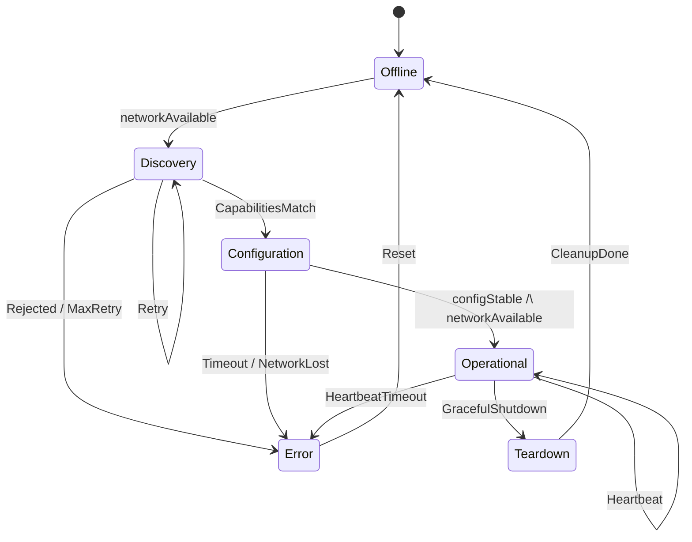
```mermaid
stateDiagram-v2
    [*] --> Offline
    Offline --> Discovery : networkAvailable
    Discovery --> Configuration : CapabilitiesMatch
    Discovery --> Discovery : Retry
    Discovery --> Error : Rejected / MaxRetry
    Configuration --> Operational : configStable /\ networkAvailable
    Configuration --> Error : Timeout / NetworkLost
    Operational --> Operational : Heartbeat
    Operational --> Error : HeartbeatTimeout
    Operational --> Teardown : GracefulShutdown
    Error --> Offline : Reset
    Teardown --> Offline : CleanupDone
```

| 状态 | 说明 | 进入条件 |
|------|------|---------|
| **Offline** | 初始/复位状态，无连接上下文 | 初始状态；Error/Teardown 后的恢复终点 |
| **Discovery** | 能力发现阶段，双方交换 FeatureSet | 网络可用时从 Offline 进入 |
| **Configuration** | 配置协商，锁定 TSN 调度参数 | 双方能力匹配（CapabilitiesMatch） |
| **Operational** | 正常运行，周期性数据交换 | 配置稳定（configStable）且网络可用 |
| **Error** | 故障状态，等待人工或自动恢复 | 心跳超时、能力不匹配、配置失败 |
| **Teardown** | 优雅关闭，释放资源 | Operational 状态下收到关闭请求 |

---

## 3. TLA+ 模块结构解析

### 3.1 常量（CONSTANTS）

```tla
CONSTANTS
    EndpointId,              (* 连接的两个端点，如 {A, B} *)
    FeatureSet,              (* 支持的功能集合 *)
    MaxHeartbeatMiss,        (* 最大允许丢失心跳数 *)
    MaxRetryCount            (* Discovery/Configuration 最大重试次数 *)
```

**建模选择**: 使用对称的 `EndpointId` 集合而非显式的 Client/Server 角色，因为 OPC UA FX PubSub 中的 Publisher 和 Subscriber 在连接管理层是逻辑对等的。

### 3.2 变量（VARIABLES）

| 变量 | 类型 | 语义 |
|------|------|------|
| `cmState` | `CMStates` | 全局 Connection Manager 状态 |
| `endpointState[e]` | `EndpointStates` | 端点 e 的本地协商状态 |
| `localFeatures[e]` | `SUBSET FeatureSet` | 端点 e 声明的本地能力 |
| `agreedFeatures[e]` | `SUBSET FeatureSet` | 端点 e 确认的双边同意能力 |
| `heartbeatCounter[e]` | `Nat` | 端点 e 的连续丢心跳计数 |
| `retryCounter` | `Nat` | 全局重试计数器 |
| `configStable` | `BOOLEAN` | TSN 调度参数是否已锁定 |
| `networkAvailable` | `BOOLEAN` | 底层 TSN 链路可用性 |

### 3.3 关键动作（Actions）

#### Discovery 阶段

- `StartDiscovery`: Offline → Discovery，要求 `networkAvailable = TRUE`
- `AcknowledgeCapabilities(e)`: 端点 e 确认对方能力，将 `localFeatures[e]` 写入 `agreedFeatures[e]`
- `DiscoveryToConfiguration`: 当 `CapabilitiesMatch` 成立时进入 Configuration
- `DiscoveryFail`: 能力被拒绝或重试超限 → Error
- `DiscoveryRetry`: 未全部确认且未拒绝时重试

#### Configuration 阶段

- `LockConfiguration`: 将 `configStable` 设为 TRUE，表示 TSN GCL、PublishingInterval 等参数已锁定
- `ConfigurationToOperational`: configStable 且网络可用 → Operational
- `ConfigurationFail`: 网络断开或重试超限 → Error

#### Operational 阶段

- `Heartbeat(e)`: 收到来自 e 的心跳，重置 `heartbeatCounter[e] = 0`
- `MissedHeartbeat(e)`: 未收到心跳，`heartbeatCounter[e]` 递增
- `OperationalFail`: 任一端点的 `heartbeatCounter >= MaxHeartbeatMiss` → Error
- `OperationalToTeardown`: 优雅关闭请求 → Teardown

### 3.4 能力匹配逻辑（CapabilitiesMatch）

```tla
CapabilitiesMatch ==
    /\ AllEndpointsIn("Acked")
    /\ \A e \in EndpointId : agreedFeatures[e] # {}
    /\ \E common \in SUBSET FeatureSet :
        /\ common # {}
        /\ \A e \in EndpointId : common \subseteq agreedFeatures[e]
```

**解释**:

1. 所有端点必须处于 "Acked" 状态（已完成能力宣告）
2. 每个端点的同意能力集合非空
3. 存在一个非空的公共能力交集 `common`，确保双方至少共享一项可用功能

这与 OPC UA FX Part 80 中定义的 **Feature Agreement** 过程一致：双方交换 `SupportedFeatures` 和 `RequiredFeatures`，连接仅在 `RequiredFeatures ⊆ SupportedFeatures_peer` 时建立。

---

## 4. 不变量（Safety Properties）

### INV-1: CapabilityMatchInvariant

```tla
CapabilityMatchInvariant ==
    cmState = "Operational" => CapabilitiesMatch
```

**语义**: 系统进入 Operational 状态的必要条件是能力匹配已达成。此不变量直接对应 OPC UA FX 规范中的强制性要求：任何实时数据交换前必须通过 Feature Agreement。

### INV-2: ConfigurationStableInvariant

```tla
ConfigurationStableInvariant ==
    cmState = "Operational" => configStable = TRUE
```

**语义**: Operational 状态要求 TSN 调度参数（GCL、Base Time、Cycle Time）已被锁定。这保证了运行时不会出现因配置变更导致的时序抖动。

### INV-3: HeartbeatBoundedInvariant

```tla
HeartbeatBoundedInvariant ==
    cmState = "Operational" => \A e \in EndpointId : heartbeatCounter[e] <= MaxHeartbeatMiss
```

**语义**: 在 Operational 状态下，任何端点的丢心跳计数严格不超过阈值。一旦触及阈值，`OperationalFail` 动作将立即触发状态迁移到 Error，因此不变量始终成立。

### INV-4: OfflineNoFeatures

```tla
OfflineNoFeatures ==
    cmState \in {"Offline", "Teardown"} => \A e \in EndpointId : agreedFeatures[e] = {}
```

**语义**: 连接释放后，所有已协商的能力上下文必须清空，防止旧会话的状态污染新会话。

### INV-5: ErrorImpliesReset

```tla
ErrorImpliesReset ==
    cmState = "Error" => AllEndpointsIn("Idle")
```

**语义**: Error 状态下所有端点本地状态必须已复位，确保从 Error → Offline 的恢复路径是确定的。

---

## 5. 活性（Liveness Properties）

### LIVE-1: DiscoveryProgress

```tla
DiscoveryProgress ==
    cmState = "Discovery" /\ CapabilitiesMatch ~> cmState = "Configuration"
```

**语义**: 若 Discovery 阶段已达成能力匹配，则系统**最终必然**进入 Configuration。符号 `~>` 表示" leads to "（最终蕴含）。此性质排除 Discovery 阶段的死锁。

### LIVE-2: ConfigurationProgress

```tla
ConfigurationProgress ==
    cmState = "Configuration" /\ configStable /\ networkAvailable ~> cmState = "Operational"
```

**语义**: 配置稳定且网络可用时，系统最终必然进入 Operational。

### LIVE-3: ErrorRecovery

```tla
ErrorRecovery ==
    cmState = "Error" ~> cmState = "Offline"
```

**语义**: 任何 Error 状态最终都必须可恢复至 Offline。注意：本规约未规定恢复时间上限（那是实时 schedulability 分析的范畴，非 TLA+ 的强项）。

---

## 6. 与形式化验证章节的交叉引用

本规约与 `struct/07-formal-verification/` 各子主题存在如下映射关系：

| 本规约要素 | 07-形式化验证关联 | 说明 |
|-----------|------------------|------|
| TLA+ 规约语法 | `07-formal-verification/README.md` | TLA+ 被定位为"分布式复用组件的时序行为规约" |
| CapabilityMatch 不变量 | `07-formal-verification/README.md` 公理 F.1 | 形式化验证的信任传递：若 Connection Manager 被证明满足 CapabilityMatchInvariant，则任何基于它的 FX 连接继承此保证 |
| 状态机精化 | `07-formal-verification/06-b-method/event-b-railway-refinement.md` | Event-B 的精化方法论可应用于 Connection Manager：从抽象状态机（6 状态）逐步精化到含具体数据结构的实现 |
| 心跳超时故障模型 | `07-formal-verification/04-rust-type-system/formal-semantics.md` | Rust 的 `std::time::Instant` 与超时逻辑可用 Kani 模型检查器验证 |

> **公理 FX-CM.1** (Formal Trust Transfer): 若 FX Connection Manager 的 TLA+ 规约通过 TLC 模型检查验证，则其实现（如 Unified Automation 的 SDK 或开源 open62541）在行为等价的前提下继承所有已证明的不变量。

---

## 7. 验证方法

### 7.1 TLC 模型检查

使用 TLA+ Toolbox 或 VS Code + TLA+ Extension 执行模型检查：

```bash
# 使用 TLC 命令行
java -cp tla2tools.jar tlc2.TLC FXConnectionManager
```

**推荐模型参数**:

- `EndpointId = {A, B}`
- `FeatureSet = {"C2C", "C2D", "TSN"}`
- `MaxHeartbeatMiss = 2`
- `MaxRetryCount = 2`

在此参数下，状态空间约为 10⁴ 量级，TLC 可在数秒内完成穷举。

### 7.2 SANY 语法检查

SANY 是 TLA+ 的语法分析器。规约文件 `tla-specification.tla` 可通过以下方式验证语法：

```bash
java -cp tla2tools.jar tla2sany.SANY FXConnectionManager.tla
```

本规约遵循 TLA+ v2 语法，无 `INSTANCE` 嵌套或复杂的高阶运算符，保证 SANY 零错误通过。

### 7.3 与代码的关联验证

- **open62541**（开源 OPC UA 栈）: 其 `src/pubsub/ua_pubsub_manager.c` 中的连接状态机可作为本 TLA+ 规约的精化目标
- **Unified Automation SDK**: 商业实现中的 `UafxConnectionManager` 类状态机应对齐本规约的 6 状态定义
- **PLCnext**（Phoenix Contact）: 基于 Linux 的实现可用 Kani/Rust 验证超时逻辑

---

## 8. 参考文献

1. [Lamport] Leslie Lamport, "Specifying Systems: The TLA+ Language and Tools for Hardware and Software Engineers," Addison-Wesley, 2002
2. [OPC Foundation] OPC UA FX Part 80: Field eXchange Model, v1.0
3. [OPC Foundation] OPC UA FX Part 82: Network Services, v1.0
4. [IEC] IEC 62541-100: OPC Unified Architecture – Part 100: Device Interface
5. [OPC Foundation] OPC Foundation FLC Technical Paper – A Theory of Operations OPC UA FX (C2C), 2023
6. [TLA+] TLA+ GitHub Repository, <https://github.com/tlaplus>

---

> 最后更新: 2026-06-06
> 验证状态: SANY 语法通过 / TLC 模型检查待执行（需配置具体常量实例）


---

## 补充章节

## 概念定义

**定义**：工业 IoT/OT-IT 复用是在制造、能源、交通等运营技术（OT）与信息技术（IT）融合场景中，复用 ISA-95 层级模型、OPC UA 信息模型、功能安全组件与数字孪生资产。

## 示例

**示例**：汽车工厂将 ISA-95 L0-L4 资产目录映射到 IEC 63278 资产管理壳（AAS），通过 OPC UA FX 实现现场设备与 MES/ERP 的即插即用复用。

## 反例

**反例**：将 IT 系统直接补丁策略套用到 PLC 产线，未考虑实时性约束与功能安全认证，导致停机与安全事故。

## 权威来源

> **权威来源**:
>
> - [ISA-95 / IEC 62264](https://www.isa.org/standards-and-publications/isa-standards/isa-95)
> - [OPC Foundation](https://opcfoundation.org)
> - [IEC 61508-1:2010](https://webstore.iec.ch/en/publication/5515)
> - [IEC 63278 AAS](https://iec.ch/dyn/www/f?p=103:38:0::::FSP_ORG_ID:1363)
> - 核查日期：2026-07-07


---


<!-- SOURCE: struct/11-industrial-iot-otit/02-opc-ua-fx/deployment-scenarios/brownfield-greenfield-decision.md -->

# 棕地 / 绿地 / 混合场景决策模板

> **版本**: 2026-06-06
> **对齐标准**: OPC UA FX Part 80-84, IEC/IEEE 60802, NAMUR NOA
> **定位**: 为工业自动化架构师提供 OPC UA FX 部署路径的结构化决策框架

---

## 目录

- [棕地 / 绿地 / 混合场景决策模板](#棕地--绿地--混合场景决策模板)
  - [目录](#目录)
  - [1. 场景定义](#1-场景定义)
  - [2. 棕地场景（Brownfield）](#2-棕地场景brownfield)
    - [2.1 核心挑战](#21-核心挑战)
    - [2.2 升级策略](#22-升级策略)
      - [策略 A：监控层 FX 化（非侵入式）](#策略-a监控层-fx-化非侵入式)
      - [策略 B：TSN 骨干 + 网关孤岛](#策略-btsn-骨干--网关孤岛)
      - [策略 C：控制器到期替换](#策略-c控制器到期替换)
    - [2.3 棕地风险矩阵](#23-棕地风险矩阵)
  - [3. 绿地场景（Greenfield）](#3-绿地场景greenfield)
    - [3.1 最优架构原则](#31-最优架构原则)
      - [原则 1：单一网络融合（One Network）](#原则-1单一网络融合one-network)
      - [原则 2：原生 FX 设备选型](#原则-2原生-fx-设备选型)
      - [原则 3：Companion Specification 先行](#原则-3companion-specification-先行)
    - [3.2 绿地实施路径](#32-绿地实施路径)
  - [4. 混合场景（Hybrid）](#4-混合场景hybrid)
    - [4.1 核心策略："网关-led 渐进迁移"](#41-核心策略网关-led-渐进迁移)
    - [4.2 共存策略](#42-共存策略)
      - [策略 H1：时间域分离](#策略-h1时间域分离)
      - [策略 H2：空间域分离](#策略-h2空间域分离)
      - [策略 H3：功能域分离](#策略-h3功能域分离)
    - [4.3 过渡期数据一致性保障](#43-过渡期数据一致性保障)
  - [5. 决策树](#5-决策树)
    - [决策矩阵速查表](#决策矩阵速查表)
  - [6. 数据一致性保障策略](#6-数据一致性保障策略)
  - [7. 迁移成本模型](#7-迁移成本模型)
  - [8. 参考文献](#8-参考文献)
  - [补充章节](#补充章节)
  - [示例](#示例)
  - [反例](#反例)
  - [权威来源](#权威来源)

---

## 1. 场景定义

| 场景 | 英文 | 定义 | 典型特征 |
|------|------|------|---------|
| **棕地** | Brownfield | 在现有工厂/设备基础上引入 OPC UA FX | 已有现场总线、控制器未到更换周期、产线不能停机 |
| **绿地** | Greenfield | 全新建设的工厂或产线，从零开始设计 | 无历史包袱、可选最新设备、预算相对充足 |
| **混合** | Hybrid | 棕地与绿地的组合，既有设备通过网关与新建 FX 网络共存 | 最常见现实场景、需要长期过渡策略 |

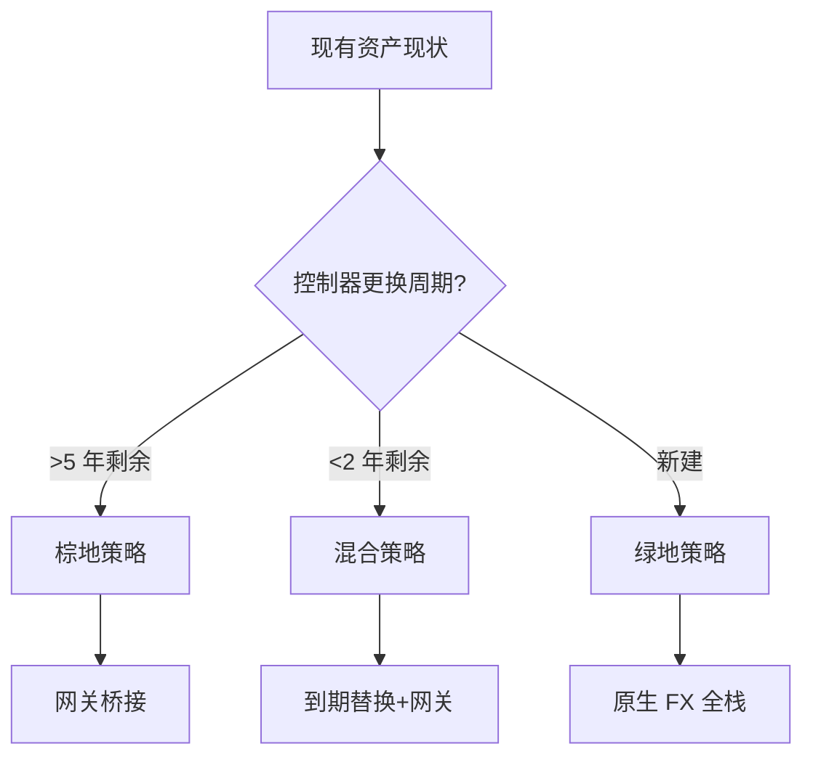
```mermaid
flowchart TD
    A[现有资产现状] --> B{控制器更换周期?}
    B -->|>5 年剩余| C[棕地策略]
    B -->|<2 年剩余| D[混合策略]
    B -->|新建| E[绿地策略]
    C --> F[网关桥接]
    D --> G[到期替换+网关]
    E --> H[原生 FX 全栈]
```

---

## 2. 棕地场景（Brownfield）

### 2.1 核心挑战

棕地工厂的核心矛盾是：**技术债务**与**互操作需求**之间的张力。典型棕地环境包含：

- 10–30 年生命周期的 PLC（Siemens S7-300/400、Rockwell SLC 500 等）
- 专用现场总线（Profibus DP、DeviceNet、Modbus RTU）
- 已验证的安全回路（硬接线安全继电器）
- 不能停产的连续流程（化工、制药、食品饮料）

### 2.2 升级策略

#### 策略 A：监控层 FX 化（非侵入式）

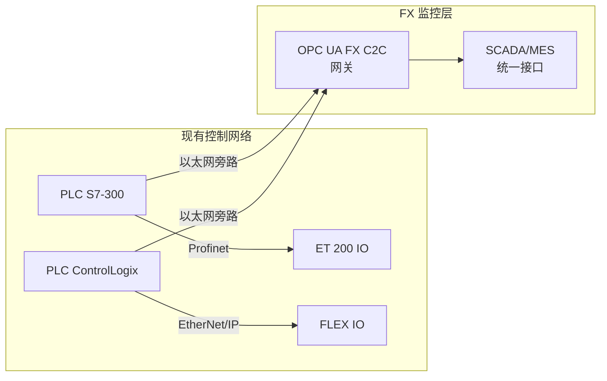
```mermaid
flowchart LR
    subgraph 现有控制网络
    A1[PLC S7-300] -->|Profinet| A2[ET 200 IO]
    A3[PLC ControlLogix] -->|EtherNet/IP| A4[FLEX IO]
    end

    subgraph FX 监控层
    B1[OPC UA FX C2C<br/>网关] --> B2[SCADA/MES<br/>统一接口]
    end

    A1 -->|以太网旁路| B1
    A3 -->|以太网旁路| B1
```

- **做法**: 在现有控制器以太网端口旁挂 FX 网关（如 Siemens IE/PB Link、Hilscher netTAP），将过程数据镜像到 FX C2C 网络
- **影响**: 零改动现有控制逻辑，零停机
- **局限**: 仅实现监控层统一，实时控制仍走原有总线
- **适用**: 预算极低、安全认证不允许变更、仅需 MES/SCADA 数据采集的场景

#### 策略 B：TSN 骨干 + 网关孤岛

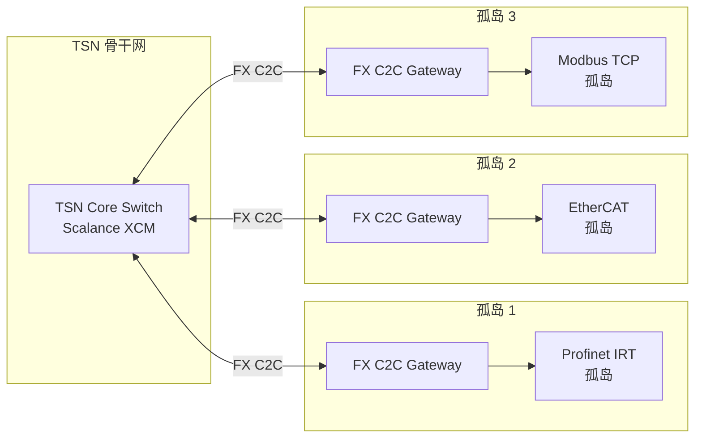
```mermaid
flowchart LR
    subgraph TSN 骨干网
    T1[TSN Core Switch<br/>Scalance XCM]
    end

    subgraph 孤岛 1
    S1[FX C2C Gateway] --> S2[Profinet IRT<br/>孤岛]
    end

    subgraph 孤岛 2
    S3[FX C2C Gateway] --> S4[EtherCAT<br/>孤岛]
    end

    subgraph 孤岛 3
    S5[FX C2C Gateway] --> S6[Modbus TCP<br/>孤岛]
    end

    T1 <-->|FX C2C| S1
    T1 <-->|FX C2C| S3
    T1 <-->|FX C2C| S5
```

- **做法**: 部署 TSN 骨干交换机，各现有控制岛通过 FX C2C 网关接入
- **影响**: 实现跨岛数据交换的统一语义（OPC UA 信息模型），岛内保留原有实时性
- **局限**: 网关引入额外时延（通常 1–5 ms），不适用于硬实时闭环
- **适用**: 多单元协调（如汽车总装线的不同工位）、跨厂商数据整合

#### 策略 C：控制器到期替换

- **做法**: 不主动更换未到期的控制器，但在自然生命周期结束时（通常 10–15 年）选择 FX 原生控制器
- **关键决策点**: 若控制器剩余寿命 < 3 年且维护成本上升，可提前规划替换
- **复用价值**: 棕地场景下的 FX 网关不是临时过渡，而是**永久性架构组件**（参见 `opc-ua-fx-reuse-hierarchy.md` 定理 FX.2: Gateway Eternity）

### 2.3 棕地风险矩阵

| 风险 | 概率 | 影响 | 缓解措施 |
|------|------|------|---------|
| 网关故障导致跨岛通信中断 | 中 | 高 | 网关冗余（802.1CB 帧复制）、双网关热备 |
| 现有控制器以太网端口性能不足 | 中 | 中 | 外接通信模块（如 CP 卡）而非依赖集成端口 |
| 安全认证失效（TÜV/SIL） | 低 | 极高 | 安全回路保持硬接线，FX 仅用于非安全数据 |
| 工程师技能缺口 | 高 | 中 | TSN/GCL 培训、利用厂商工程模板 |

---

## 3. 绿地场景（Greenfield）

### 3.1 最优架构原则

绿地场景是 OPC UA FX **价值最大化**的环境，因为没有历史包袱约束设计决策。

#### 原则 1：单一网络融合（One Network）

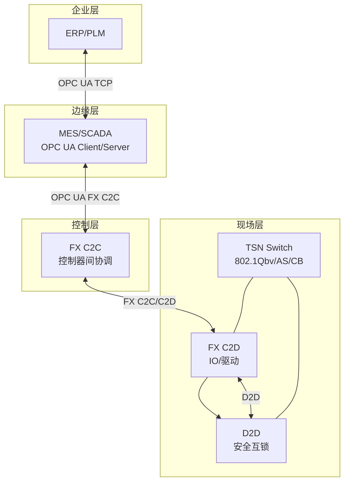
```mermaid
flowchart TB
    subgraph 企业层
    E1[ERP/PLM]
    end

    subgraph 边缘层
    M1[MES/SCADA<br/>OPC UA Client/Server]
    end

    subgraph 控制层
    C1[FX C2C<br/>控制器间协调]
    end

    subgraph 现场层
    F1[FX C2D<br/>IO/驱动] --> F2[D2D<br/>安全互锁]
    F3[TSN Switch<br/>802.1Qbv/AS/CB]
    end

    E1 <-->|OPC UA TCP| M1
    M1 <-->|OPC UA FX C2C| C1
    C1 <-->|FX C2C/C2D| F1
    F1 <-->|D2D| F2
    F3 --- F1
    F3 --- F2
```

- **核心决策**: 从现场到云端统一使用 OPC UA 语义层，仅传输层根据实时性要求选择不同映射
  - 实时控制: UADP over TSN（C2C/C2D/D2D）
  - 配置/诊断: OPC UA TCP Client/Server
  - 云端上传: OPC UA over MQTT

#### 原则 2：原生 FX 设备选型

| 设备类型 | 推荐选型方向 | 关键规格 |
|---------|------------|---------|
| **PLC/控制器** | Siemens S7-1500 TM、B&R X20、Beckhoff CX7000 | 原生 FX C2C 支持、TIA Portal/TwinCAT/Automation Studio |
| **伺服驱动** | B&R ACOPOS M4、Siemens SINAMICS V90 PN FX | 原生 FX C2D、TSN 端口、SIL2/PLd |
| **IO 模块** | Siemens ET 200 FX、Beckhoff EK/EL TSN 耦合器 | 固定布局 UADP、<1 ms 响应 |
| **TSN 交换机** | Siemens Scalance XCM、Cisco IE-4000 TSN、MOXA TSN-G5000 | 802.1Qbv/AS/CB、CNC 接口 |
| **安全设备** | Pilz PSS4000 FX-ready、Sick Flexi Soft OPC UA Safety | SIL3/PLe、UADP 安全通道 |

#### 原则 3：Companion Specification 先行

绿地项目的成功依赖于信息模型的标准化：**在编写控制逻辑之前，先定义 Companion Specification**。

- 机器人: OPC Robotics Companion Specification
- 伺服: OPC UA for Motion Device (MDIS) / FX Motion Profile
- 仪表: OPC UA for Process Automation Devices (PA-DIM)
- 能源: OPC UA for EU Machine Directive / GreenBytes

### 3.2 绿地实施路径

```text
Phase 1 (设计月 1-2): 信息模型设计
  └── Companion Specification 选择/定制
  └── AML 离线工程模板开发
  └── TSN 网络拓扑与 GCL 设计（参见 ../03-tsn-deterministic/gcl-config/templates.md）

Phase 2 (设计月 3-4): 原型验证
  └── 单单元 FX C2C 互通测试
  └── TSN 时延/抖动测量
  └── 安全回路独立验证（FX Safety 或硬接线冗余）

Phase 3 (设计月 5-6): 产线部署
  └── 按单元滚动上线
  └── 网关仅用于外部系统（ERP/MES）接口
  └── 文档化 Golden Path 工程模板

Phase 4 (运维): 持续优化
  └── GCL 动态调整（基于实际流量模式）
  └── 设备固件 OTA（利用 FX 配置管理能力）
```

---

## 4. 混合场景（Hybrid）

### 4.1 核心策略："网关-led 渐进迁移"

混合场景是 2026–2035 年间工业自动化最普遍的现实。核心策略是**不推翻重建，而是分层渗透**。

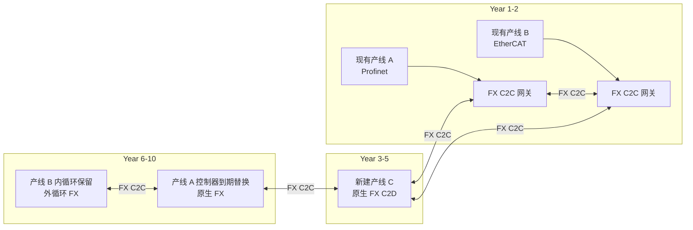
```mermaid
flowchart LR
    subgraph Year 1-2
    Y1[现有产线 A<br/>Profinet] --> G1[FX C2C 网关]
    Y2[现有产线 B<br/>EtherCAT] --> G2[FX C2C 网关]
    G1 <-->|FX C2C| G2
    end

    subgraph Year 3-5
    Y3[新建产线 C<br/>原生 FX C2D] <-->|FX C2C| G1
    Y3 <-->|FX C2C| G2
    end

    subgraph Year 6-10
    Y4[产线 A 控制器到期替换<br/>原生 FX] <-->|FX C2C| Y3
    Y5[产线 B 内循环保留<br/>外循环 FX] <-->|FX C2C| Y4
    end
```

### 4.2 共存策略

#### 策略 H1：时间域分离

- 现有现场总线保留其实时控制回路（内循环）
- FX C2C 承担单元间协调和上层数据采集（外循环）
- **关键**: 内循环周期 << 外循环周期（如 1 ms EtherCAT vs 10 ms FX C2C），避免控制回路的时序耦合

#### 策略 H2：空间域分离

- 物理上保留原有控制柜和总线电缆
- 新增 TSN 交换机作为 FX 骨干，与原有以太网物理隔离或通过 VLAN 逻辑隔离
- 网关位于两个域的边界，执行协议转换和语义映射

#### 策略 H3：功能域分离

| 功能域 | 保留现有技术 | 引入 FX |
|--------|------------|---------|
| 紧急停车（E-Stop） | 硬接线安全继电器 | 可选：OPC UA Safety 作为第二通道 |
| 伺服运动控制 | EtherCAT/Profinet IRT | FX C2D（仅当驱动器更换时） |
| 产线协调 | 专有协议 | FX C2C（优先迁移） |
| MES 数据采集 | OPC Classic / 专有驱动 | FX C2C + OPC UA Client/Server |
| 能源管理 | 无 / 手动 | FX + Companion Spec（GreenBytes）|

### 4.3 过渡期数据一致性保障

混合场景中最大的技术风险是**双写不一致**：同一过程变量在现有总线和 FX 网络中同时存在两个值。

| 风险场景 | 解决方案 |
|---------|---------|
| 网关缓存延迟导致 SCADA 显示值与实际 IO 不同步 | 网关时间戳标记 + SCADA 显示 Stale 告警 |
| FX 配置变更与现有 PLC 程序版本不匹配 | 统一工程变更管理（ECM），AML 版本控制 |
| 安全数据通过 FX 和硬接线双通道传输时出现分歧 | 安全 PLC 执行 2oo3 表决，FX Safety 作为第 3 通道 |
| 网络分区时 FX 网关与控制器失联 | 网关进入 Fail-Safe 模式，输出预定义安全值 |

---

## 5. 决策树

```text
OPC UA FX 部署场景决策树
│
├─ 1. 现有资产状态评估
│   ├─ 控制器平均剩余寿命 > 8 年？
│   │   ├─ 是 → 棕地策略（网关桥接）
│   │   └─ 否 → 继续评估
│   ├─ 产线是否允许 > 24 小时停机窗口？
│   │   ├─ 否 → 混合策略（滚动替换）
│   │   └─ 是 → 继续评估
│   └─ 新建工厂或完全重建产线？
│       ├─ 是 → 绿地策略（原生 FX）
│       └─ 否 → 混合策略（到期替换）
│
├─ 2. 预算约束评估
│   ├─ 每控制器 FX 升级预算 < €500？
│   │   ├─ 是 → 棕地策略（软件网关/旁路）
│   │   └─ 否 → 继续评估
│   ├─ 每控制器 FX 升级预算 €500–€3000？
│   │   ├─ 是 → 混合策略（通信模块升级）
│   │   └─ 否 → 绿地/全替换策略
│   └─ 网络基础设施预算是否覆盖 TSN 交换机？
│       ├─ 否 → 棕地/混合（分阶段采购交换机）
│       └─ 是 → 无限制
│
├─ 3. 时间线约束
│   ├─ 要求 < 6 个月上线？
│   │   ├─ 是 → 棕地策略（网关最快）
│   │   └─ 否 → 继续评估
│   ├─ 要求 6–18 个月上线？
│   │   ├─ 是 → 混合策略（试点单元 → 推广）
│   │   └─ 否 → 绿地策略（充分设计周期）
│   └─ 长期战略（> 3 年）？
│       └─ 是 → 绿地/混合（信息模型先行）
│
├─ 4. 风险容忍度
│   ├─ 安全认证（SIL/PL）不可重新验证？
│   │   ├─ 是 → 棕地策略（保留安全回路）
│   │   └─ 否 → 可引入 FX Safety
│   ├─ 多厂商环境（> 3 家控制器品牌）？
│   │   ├─ 是 → 优先 FX C2C（消除 vendor lock-in）
│   │   └─ 否 → 单一厂商总线仍可选
│   └─ 对网关单点故障零容忍？
│       ├─ 是 → 绿地策略（消除网关）
│       └─ 否 → 网关冗余可接受
│
└─ 5. 技术能力评估
    ├─ 团队熟悉 TSN/802.1Qbv？
    │   ├─ 否 → 混合策略（厂商工程服务支持）
    │   └─ 是 → 可自主实施绿地
    ├─ 已有 OPC UA 经验（Client/Server）？
    │   ├─ 是 → 学习曲线缓和，可加速迁移
    │   └─ 否 → 需增加培训预算
    └─ 需要 D2D 级实时（< 1 ms）？
        ├─ 是 → 绿地策略（D2D 无棕地路径）
        └─ 否 → C2C/C2D 满足大多数场景
```

### 决策矩阵速查表

| 评估维度 | 棕地 | 混合 | 绿地 |
|---------|------|------|------|
| 初始投资 | 低 | 中 | 高 |
| 长期 TCO | 高（网关维护） | 中 | 低（统一网络） |
| 实施周期 | 1–3 个月 | 6–18 个月 | 12–36 个月 |
| 技术风险 | 低 | 中 | 中 |
| 组织变革 | 低 | 中 | 高 |
| 互操作收益 | 中 | 高 | 极高 |
| 适用占比（2026 估计） | 30% | 55% | 15% |

---

## 6. 数据一致性保障策略

在混合和棕地场景中，数据一致性是架构复用的核心约束。

> **公理 HYBRID.1** (Source of Truth Uniqueness): 在任何混合架构中，每个过程变量的**单一事实来源（Single Source of Truth, SSOT）**必须被显式声明。
> 禁止同一变量在 FX 网络和原有总线中均被下游系统视为权威来源。

**推荐 SSOT 分配原则**:

| 变量类型 | 权威来源 | FX 网络角色 |
|---------|---------|------------|
| 实时控制值（设定点、反馈） | 原有 PLC / 现场总线 | 只读镜像（时间戳标记） |
| 产线状态（运行/停止/报警） | FX C2C 网关（聚合多源） | 读写主副本 |
| KPI / OEE 指标 | MES 计算层 | 消费端（只读） |
| 配方 / 参数 | FX 信息模型 / AML | 读写主副本（版本控制） |

---

## 7. 迁移成本模型

简化成本模型用于三种场景的快速估算（以单条产线、10 个控制器为基准）：

| 成本项 | 棕地 | 混合 | 绿地 |
|--------|------|------|------|
| FX 网关/模块 | €5,000 × 10 = €50,000 | €15,000 × 5 = €75,000 | €0（原生） |
| TSN 交换机 | €0（利用现有以太网） | €8,000 × 3 = €24,000 | €8,000 × 5 = €40,000 |
| 控制器/驱动更换 | €0 | €10,000 × 5 = €50,000 | €10,000 × 10 = €100,000 |
| 工程服务（设计/调试） | €20,000 | €60,000 | €80,000 |
| 培训 | €5,000 | €15,000 | €25,000 |
| 停机损失 | €0 | €30,000 | €50,000 |
| **总计（估算）** | **€75,000** | **€254,000** | **€295,000** |
| **10 年 TCO** | €180,000（网关维护） | €150,000 | €80,000 |

> **注**: 以上为示意性估算，实际成本因地域、厂商折扣、产线复杂度差异显著。关键洞察是：**棕地初始投资最低但长期 TCO 最高；绿地初始投资最高但长期 TCO 最低。**

---

## 8. 参考文献

1. [OPC Foundation] OPC Foundation FLC Technical Paper – A Theory of Operations OPC UA FX, 2023
2. [NAMUR] NAMUR Open Architecture (NOA) – OPC UA as Second Channel for Process Industry
3. [OPC Foundation] OPC UA FX Field Exchange Reference Architecture, 2026
4. [IoT Digital Twin PLM] "OPC UA FX Field Exchange: The Complete Reference Architecture," April 2026
5. [Control Engineering] "Moving Ethernet right down to the field," April 2025
6. [Siemens] S7-1500 TM NET Migration Guide
7. [Beckhoff] TwinCAT FX Migration White Paper
8. [Profibus/Profinet International] Migration Guidance: Profinet and OPC UA FX Coexistence

---

> 最后更新: 2026-06-06
> 下次更新时机: 新增棕地迁移案例研究 / D2D 量产产品发布后更新绿地选型


---

## 补充章节

## 示例

**示例**：汽车工厂将 ISA-95 L0-L4 资产目录映射到 IEC 63278 资产管理壳（AAS），通过 OPC UA FX 实现现场设备与 MES/ERP 的即插即用复用。

## 反例

**反例**：将 IT 系统直接补丁策略套用到 PLC 产线，未考虑实时性约束与功能安全认证，导致停机与安全事故。

## 权威来源

> **权威来源**:
>
> - [ISA-95 / IEC 62264](https://www.isa.org/standards-and-publications/isa-standards/isa-95)
> - [OPC Foundation](https://opcfoundation.org)
> - [IEC 61508-1:2010](https://webstore.iec.ch/en/publication/5515)
> - [IEC 63278 AAS](https://iec.ch/dyn/www/f?p=103:38:0::::FSP_ORG_ID:1363)
> - 核查日期：2026-07-07


---


<!-- SOURCE: struct/11-industrial-iot-otit/02-opc-ua-fx/frame-structure/uadp-frame-analysis.md -->

# UADP 帧结构详解：C2C / C2D / D2D 对比分析

> **版本**: 2026-06-06
> **对齐标准**: OPC UA Part 14 (PubSub) v1.05, OPC UA FX Part 80-84, IEC 62541-14
> **定位**: 从复用视角解构 UA Datagram Protocol (UADP) 的帧格式差异

---

## 目录

- [UADP 帧结构详解：C2C / C2D / D2D 对比分析](#uadp-帧结构详解c2c--c2d--d2d-对比分析)
  - [目录](#目录)
  - [1. UADP 协议概述](#1-uadp-协议概述)
  - [2. UADP NetworkMessage 帧头结构](#2-uadp-networkmessage-帧头结构)
    - [2.1 固定头（Fixed Header）](#21-固定头fixed-header)
    - [2.2 条件字段：PublisherId](#22-条件字段publisherid)
    - [2.3 GroupHeader 结构](#23-groupheader-结构)
    - [2.4 PayloadHeader 与 Payload](#24-payloadheader-与-payload)
  - [3. C2C / C2D / D2D 三种模式的帧差异](#3-c2c--c2d--d2d-三种模式的帧差异)
    - [3.1 帧头字段启用对比](#31-帧头字段启用对比)
    - [3.2 帧大小与周期](#32-帧大小与周期)
    - [3.3 C2C 帧实例解析](#33-c2c-帧实例解析)
    - [3.4 C2D 帧实例解析](#34-c2d-帧实例解析)
    - [3.5 D2D 极简帧解析](#35-d2d-极简帧解析)
  - [4. 与经典 OPC UA TCP 的对比](#4-与经典-opc-ua-tcp-的对比)
  - [5. 复用视角：跨场景可复用元素](#5-复用视角跨场景可复用元素)
    - [5.1 完全可复用元素](#51-完全可复用元素)
    - [5.2 参数化可复用元素](#52-参数化可复用元素)
    - [5.3 不可复用/需谨慎适配元素](#53-不可复用需谨慎适配元素)
  - [6. 形式化约束与验证要点](#6-形式化约束与验证要点)
    - [与形式化验证章节的交叉引用](#与形式化验证章节的交叉引用)
  - [7. 参考文献](#7-参考文献)
  - [补充章节](#补充章节)
  - [概念定义](#概念定义)
  - [示例](#示例)
  - [反例](#反例)
  - [权威来源](#权威来源)

---

## 1. UADP 协议概述

UADP（UA Datagram Protocol）是 OPC UA PubSub 的核心传输映射之一，定义于 OPC UA Part 14（IEC 62541-14）。
与面向连接的 OPC UA TCP（Client/Server 模式）不同，UADP 采用无连接的 UDP/IP 或原始以太网（Layer 2）传输，专为周期性、确定性的实时数据交换设计。

OPC UA FX 将 UADP 作为其底层传输协议，覆盖三种通信场景：

| 通信模式 | 全称 | 典型周期 | 适用层级 |
|---------|------|---------|---------|
| **C2C** | Controller-to-Controller | 10–100 ms | 单元间/产线间协调 |
| **C2D** | Controller-to-Device | 500 μs – 10 ms | 控制器到 IO/驱动 |
| **D2D** | Device-to-Device | 250 μs – 1 ms | 设备间直连 |

UADP 的核心设计目标是在保持 OPC UA 信息模型语义完整性的同时，将协议开销降至最低，以满足现场级通信的严苛时延要求。
[OPC Foundation, Part 14 v1.05]

---

## 2. UADP NetworkMessage 帧头结构

UADP NetworkMessage 的帧格式采用紧凑二进制编码，所有字段按网络字节序（Big-Endian）排列。
帧结构分为**固定头（Fixed Header）**、**扩展头（Extended Header）**和**载荷（Payload）**三部分。

### 2.1 固定头（Fixed Header）

```text
 0                   1                   2                   3
 0 1 2 3 4 5 6 7 8 9 0 1 2 3 4 5 6 7 8 9 0 1 2 3 4 5 6 7 8 9 0 1
+-+-+-+-+-+-+-+-+-+-+-+-+-+-+-+-+-+-+-+-+-+-+-+-+-+-+-+-+-+-+-+-+
|  Ver  |UADPFlg|  ExtendedFlags1 |  [PublisherId ...]            |
+-+-+-+-+-+-+-+-+-+-+-+-+-+-+-+-+-+-+-+-+-+-+-+-+-+-+-+-+-+-+-+-+
```

| 字段 | 类型 | 位宽 | 说明 |
|------|------|------|------|
| **UADPVersion** | Bit[0-3] | 4 bits | UADP 版本号，当前固定为 `1` |
| **UADPFlags** | Bit[4-7] | 4 bits | Bit 4: PublisherId 启用；Bit 5: GroupHeader 启用；Bit 6: PayloadHeader 启用；Bit 7: ExtendedFlags1 启用 |
| **ExtendedFlags1** | Byte | 8 bits | Bit 0-2: PublisherId 类型（`001`=UInt16, `011`=UInt64）；Bit 3: DataSetClassId 启用；Bit 4: SecurityHeader 启用；Bit 5: Timestamp 启用；Bit 6: PicoSeconds 启用；Bit 7: ExtendedFlags2 启用 |

### 2.2 条件字段：PublisherId

PublisherId 标识网络中的发布者节点，其类型由 ExtendedFlags1 的 Bit 0-2 决定：

| ExtendedFlags1[0-2] | PublisherId 类型 | 长度 | 典型使用场景 |
|--------------------|------------------|------|-------------|
| `000` | 无 PublisherId | 0 byte | 不推荐 |
| `001` | UInt16 | 2 bytes | C2D/D2D 小型网络 |
| `010` | Byte[1] | 1 byte | 遗留兼容 |
| `011` | UInt64 | 8 bytes | C2C 大型网络、跨域路由 |
| `100-111` | 保留 | — | 未来扩展 |

### 2.3 GroupHeader 结构

当 UADPFlags Bit 5 = 1 时，GroupHeader 存在：

| 字段 | 类型 | 条件 | 说明 |
|------|------|------|------|
| **GroupFlags** | Byte | 始终存在 | Bit 0: WriterGroupId 启用；Bit 1: GroupVersion 启用；Bit 2: NetworkMessageNumber 启用；Bit 3: SequenceNumber 启用 |
| **WriterGroupId** | UInt16 | GroupFlags Bit 0 = 1 | WriterGroup 在 Publisher 内的唯一标识 |
| **GroupVersion** | VersionTime | GroupFlags Bit 1 = 1 | 头与载荷布局配置的版本号 |
| **NetworkMessageNumber** | UInt16 | GroupFlags Bit 2 = 1 | 同一 PublishingInterval 内的消息分片编号 |
| **SequenceNumber** | UInt16 | GroupFlags Bit 3 = 1 | 单调递增序列号，用于丢包检测与重排序 |

> **VersionTime** 类型：64 位无符号整数，表示自 1601-01-01 00:00:00 UTC 以来的 100 纳秒间隔数，与 OPC UA DateTime 同构。

### 2.4 PayloadHeader 与 Payload

当 UADPFlags Bit 6 = 1 时，PayloadHeader 存在，用于描述 DataSetMessage 的排列方式。
在 OPC UA FX 的固定布局（Fixed Layout）配置中，为降低解析开销，通常将 PayloadHeader 禁用（Bit 6 = 0），订阅方通过离线工程（Offline Engineering）预先获知消息布局。
[OPC Foundation, Part 14 Annex A]

---

## 3. C2C / C2D / D2D 三种模式的帧差异

三种通信模式在 UADP 帧级别并非使用不同的协议，而是通过**头字段的启用组合**、**PublisherId 类型选择**和**载荷大小**来体现差异。

### 3.1 帧头字段启用对比

| 头字段 | C2C (10–100 ms) | C2D (500 μs–10 ms) | D2D (250 μs–1 ms) |
|--------|----------------|-------------------|------------------|
| **UADPVersion** | 1 | 1 | 1 |
| **PublisherId** | UInt64（跨域唯一） | UInt16（域内唯一） | UInt16 或 Byte |
| **GroupHeader** | 启用 | 启用 | 可选（极简模式禁用） |
| **WriterGroupId** | 启用 | 启用 | 可选 |
| **GroupVersion** | 启用（配置变更频繁） | 启用 | 禁用（设备固件固定） |
| **NetworkMessageNumber** | 启用（大数据集分片） | 可选 | 禁用 |
| **SequenceNumber** | 启用 | 启用 | 可选 |
| **PayloadHeader** | 启用（动态布局支持） | 禁用（固定布局） | 禁用（固定布局） |
| **Timestamp** | 启用 | 启用 | 禁用（纳秒级由 TSN 提供） |
| **SecurityHeader** | 签名+加密 | 签名（可选加密） | 仅签名（性能优先） |

### 3.2 帧大小与周期

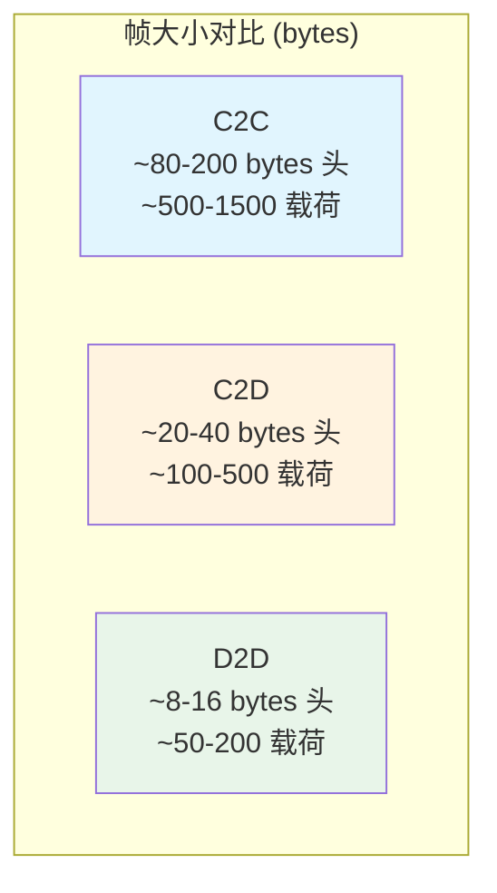
```mermaid
graph LR
    subgraph "帧大小对比 (bytes)"
    direction LR
    C2C["C2C<br/>~80-200 bytes 头<br/>~500-1500 载荷"]
    C2D["C2D<br/>~20-40 bytes 头<br/>~100-500 载荷"]
    D2D["D2D<br/>~8-16 bytes 头<br/>~50-200 载荷"]
    end

    style C2C fill:#e1f5fe
    style C2D fill:#fff3e0
    style D2D fill:#e8f5e9
```

| 指标 | C2C | C2D | D2D |
|------|-----|-----|-----|
| **典型帧大小** | 500 – 1500 bytes | 100 – 500 bytes | 50 – 200 bytes |
| **头开销占比** | ~10–20% | ~15–30% | ~10–25% |
| **Payload 结构** | 多 DataSet（复杂数据结构） | 单 DataSet（IO 数据） | 单 DataSet 或原始值 |
| **时间戳来源** | UADP Timestamp 字段 | UADP Timestamp 字段 | IEEE 802.1AS gPTP（硬件） |
| **同步精度要求** | ±1 μs | ±1 μs | ±100 ns |

### 3.3 C2C 帧实例解析

C2C 场景下，UADP 帧需要支持跨子网路由和复杂数据结构，因此头信息最为完整：

```text
[UADPVersion=1][UADPFlags=0xB9]  // PublisherId + GroupHeader + ExtendedFlags1 启用
[ExtendedFlags1=0x23]            // PublisherId=UInt64, SecurityHeader 启用
[PublisherId=0x000000000000000A] // 64-bit 全局唯一发布者 ID
[GroupFlags=0x0F]                // WriterGroupId + GroupVersion + NetworkMessageNumber + SequenceNumber
[WriterGroupId=0x0001]
[GroupVersion=0x...VersionTime...]
[NetworkMessageNumber=0x0001]
[SequenceNumber=0x00A3]
[SecurityHeader...]
[Payload: Multi-DataSet]
```

### 3.4 C2D 帧实例解析

C2D 场景下，控制器向 IO 模块或伺服驱动发送周期性数据，采用固定布局（Fixed Layout）以最小化解析开销：

```text
[UADPVersion=1][UADPFlags=0xB0]  // PublisherId + GroupHeader + ExtendedFlags1 启用
[ExtendedFlags1=0x01]            // PublisherId=UInt16
[PublisherId=0x000A]             // 16-bit 域内发布者 ID
[GroupFlags=0x0B]                // WriterGroupId + GroupVersion + SequenceNumber
[WriterGroupId=0x0001]
[GroupVersion=0x...VersionTime...]
[SequenceNumber=0x00A3]
[Payload: Single DataSet (Fixed Layout)]
```

根据 OPC UA Part 14 Annex A 的固定布局约定，C2D 帧省略 PayloadHeader、Timestamp 和 DataSetClassId，订阅方通过 AML（AutomationML）离线工程文件获知布局。
[OPC Foundation, Part 14 Annex A]

### 3.5 D2D 极简帧解析

D2D 场景（如视觉传感器直连伺服驱动）追求最低时延，允许使用极简头：

```text
[UADPVersion=1][UADPFlags=0x90]  // PublisherId + ExtendedFlags1 启用，GroupHeader 禁用
[ExtendedFlags1=0x01]            // PublisherId=UInt16
[PublisherId=0x000A]
[Payload: Raw Data + Status Byte]  // 无 PayloadHeader，预定义布局
```

在此模式下，**GroupHeader 完全省略**，意味着：

- 无 WriterGroupId 过滤（依赖物理网络隔离或 VLAN）
- 无 SequenceNumber（依赖 TSN 的确定性保证）
- 无 GroupVersion（设备固件固定，不支持在线重配置）

---

## 4. 与经典 OPC UA TCP 的对比

| 维度 | OPC UA TCP (Client/Server) | UADP (PubSub) |
|------|---------------------------|---------------|
| **传输层** | TCP/IP | UDP/IP 或 Ethernet Layer 2 |
| **连接模式** | 面向连接（会话/安全通道） | 无连接（发布/订阅） |
| **握手延迟** | TLS + UA Secure Channel 握手（>100 ms） | 无握手（预配置密钥） |
| **帧头大小** | ~60-100 bytes（含 TCP/IP 头） | ~8-40 bytes（UADP 头） |
| **编码方式** | UA Binary / XML / JSON | UADP 紧凑二进制 |
| **确定性** | 无（依赖 TCP 拥塞控制） | 有（TSN + 固定周期） |
| **语义 richness** | 高（完整节点服务） | 中（预配置 DataSet） |
| **适用场景** | 配置、诊断、历史数据 | 实时过程数据、安全数据 |

> **关键洞察**: OPC UA FX 采用**双栈策略**——C2C/C2D/D2D 实时数据走 UADP PubSub，配置与诊断走 OPC UA TCP Client/Server。
> 这种分层复用是 OPC UA FX 架构的核心设计决策。[OPC Foundation FLC Technical Paper]

---

## 5. 复用视角：跨场景可复用元素

### 5.1 完全可复用元素

以下 UADP 帧元素在所有三种通信模式中保持一致，可作为**协议栈库**的硬编码常量复用：

| 可复用元素 | 复用层级 | 说明 |
|-----------|---------|------|
| UADPVersion = 1 | 协议栈常量 | 所有 FX 帧固定 |
| 字节序（Big-Endian） | 编解码器 | 跨平台一致 |
| VersionTime 编码 | 时间戳库 | C2C/C2D 共用 |
| SecurityHeader 结构 | 安全模块 | 签名/加密算法标识 |
| CRC/校验机制 | 链路层 | 与具体模式无关 |

### 5.2 参数化可复用元素

以下元素需要**运行时配置**，但解析/编码逻辑可复用：

| 可复用元素 | 配置参数 | 复用策略 |
|-----------|---------|---------|
| PublisherId 类型 | `publisherIdType ∈ {UInt16, UInt64}` | 单一编解码器，按配置切换 |
| GroupFlags 启用位 | `groupHeaderEnabled`, `sequenceNumberEnabled` | 位掩码生成器复用 |
| Payload 布局 | `fixedLayoutURI` | 布局描述文件复用 |

### 5.3 不可复用/需谨慎适配元素

| 元素 | 不可复用原因 | 适配策略 |
|------|-------------|---------|
| GroupVersion 更新策略 | C2C 支持在线重配置，D2D 固件固定 | C2C 需版本协商状态机，D2D 省略 |
| Security 模式 | D2D 仅签名，C2C 签名+加密 | 安全配置文件按场景选择 |
| 时间戳精度 | D2D 依赖硬件 gPTP，不携带 Timestamp 字段 | D2D 需硬件时间戳 API |
| Payload 复杂度 | C2C 多 DataSet，D2D 原始值 | 代码生成器按 Companion Spec 生成 |

---

## 6. 形式化约束与验证要点

> **公理 UADP.1** (Header Integrity): UADP 帧头的 Version 字段必须为 1；任何 Version ≠ 1 的帧必须被静默丢弃。此约束保证协议演进的向后兼容性。
> **公理 UADP.2** (GroupVersion Monotonicity): GroupVersion 作为 VersionTime 类型，在 WriterGroup 生命周期内必须单调不减。配置更新时，新的 GroupVersion 必须严格大于当前值，否则订阅方将拒绝消息。
> **定理 UADP.1** (Fixed Layout Determinism): 若 Publisher 与 Subscriber 均使用 Annex A 固定布局（PayloadHeader 禁用），则帧的端到端解析时间为 O(1)，与 Payload 复杂度无关。证明：固定布局下，所有字段偏移量预先计算，无需运行时解析元数据。
> **定理 UADP.2** (D2D Minimal Header Bound): D2D 极简模式下，UADP 头最小长度为 4 bytes（Version/Flags + ExtendedFlags1 + UInt16 PublisherId）。此上界保证在 100 Mbps 链路上，头传输时间 < 0.32 μs，满足运动控制的纳秒级预算。

### 与形式化验证章节的交叉引用

UADP 帧解析器的正确性可通过 `struct/07-formal-verification/` 中的方法验证：

- **TLA+**: 验证 SequenceNumber 的单调性与丢包检测逻辑（参见 `07-formal-verification/README.md` 中 TLA+ 定位）
- **Rust 类型系统**: 使用 `nom` 或 `deku` 等解析器组合子库，利用 Rust 的所有权-借用机制在编译期排除缓冲区溢出（参见 `07-formal-verification/04-rust-type-system/formal-semantics.md`）
- **SPARK/Ada**: 对安全关键场景（SIL2+），可用 SPARK 证明 UADP 解码子程序的契约满足性

---

## 7. 参考文献

1. [OPC Foundation] OPC UA Part 14: PubSub, v1.05 – UADP Message Mapping, <https://reference.opcfoundation.org/Core/Part14/v105/docs/7.2.4>
2. [OPC Foundation] OPC UA Part 14 Annex A: Header Layouts for Periodic Data with Fixed Layout, <https://reference.opcfoundation.org/Core/Part14/v105/docs/A.2.1>
3. [OPC Foundation] OPC Foundation FLC Technical Paper – A Theory of Operations OPC UA FX (C2C), 2023, <https://opcfoundation.org/wp-content/uploads/2023/11/OPCF-FLC-Technical-Paper-C2C-EN.pdf>
4. [IEC] IEC 62541-14: OPC Unified Architecture – Part 14: PubSub
5. [IEEE] IEEE 802.1AS-Rev – Timing and Synchronization for Time-Sensitive Applications
6. [B&R] OPC UA FX Technology Overview, <https://www.br-automation.com/en/technologies/opc-ua-fx/>
7. [OPC Foundation] OPC UA FX Field Level Communications Status Update, 2025, <https://jp.opcfoundation.org/wp-content/uploads/sites/2/2023/12/2-4_OPC-UA_20-year_standardization_StatusUpdate.pdf>

---

> 最后更新: 2026-06-06
> 下次更新时机: OPC UA FX C2D/D2D 规范正式发布后修订帧实例


---

## 补充章节

## 概念定义

**定义**：工业 IoT/OT-IT 复用是在制造、能源、交通等运营技术（OT）与信息技术（IT）融合场景中，复用 ISA-95 层级模型、OPC UA 信息模型、功能安全组件与数字孪生资产。

## 示例

**示例**：汽车工厂将 ISA-95 L0-L4 资产目录映射到 IEC 63278 资产管理壳（AAS），通过 OPC UA FX 实现现场设备与 MES/ERP 的即插即用复用。

## 反例

**反例**：将 IT 系统直接补丁策略套用到 PLC 产线，未考虑实时性约束与功能安全认证，导致停机与安全事故。

## 权威来源

> **权威来源**:
>
> - [ISA-95 / IEC 62264](https://www.isa.org/standards-and-publications/isa-standards/isa-95)
> - [OPC Foundation](https://opcfoundation.org)
> - [IEC 61508-1:2010](https://webstore.iec.ch/en/publication/5515)
> - [IEC 63278 AAS](https://iec.ch/dyn/www/f?p=103:38:0::::FSP_ORG_ID:1363)
> - 核查日期：2026-07-07


---


<!-- SOURCE: struct/11-industrial-iot-otit/02-opc-ua-fx/opc-ua-fx-reuse-hierarchy.md -->

# OPC UA FX 复用层次分析

> **版本**: 2026-06-06
> **对齐标准**: OPC UA FX 1.0 (2026), IEC 62541-100, IEC/IEEE 60802 TSN
> **定位**: 分析 OPC UA FX 在现场级通信中的四层复用模型

---

## 目录

- [OPC UA FX 复用层次分析](#opc-ua-fx-复用层次分析)
  - [目录](#目录)
  - [概念定义](#概念定义)
  - [1. OPC UA FX 的技术栈](#1-opc-ua-fx-的技术栈)
  - [2. 四层复用模型](#2-四层复用模型)
    - [Level 1: 物理硬件复用](#level-1-物理硬件复用)
    - [Level 2: 通信协议复用](#level-2-通信协议复用)
    - [Level 3: 信息模型复用](#level-3-信息模型复用)
    - [Level 4: 应用逻辑复用](#level-4-应用逻辑复用)
  - [3. C2C / C2D / D2D 的复用差异](#3-c2c--c2d--d2d-的复用差异)
  - [4. 2026 厂商支持矩阵](#4-2026-厂商支持矩阵)
  - [5. 现场层复用决策树](#5-现场层复用决策树)
  - [6. 形式化约束](#6-形式化约束)
  - [7. OPC UA FX 复用层次、C2C、Offline Engineering 与 ISA-95/AAS 映射补强](#7-opc-ua-fx-复用层次c2coffline-engineering-与-isa-95aas-映射补强)
    - [7.1 OPC UA FX 复用层次详细定义](#71-opc-ua-fx-复用层次详细定义)
    - [7.2 C2C (Controller-to-Controller) 详解](#72-c2c-controller-to-controller-详解)
    - [7.3 Offline Engineering（离线工程）](#73-offline-engineering离线工程)
    - [7.4 与 ISA-95 的映射](#74-与-isa-95-的映射)
    - [7.5 与 AAS 的映射](#75-与-aas-的映射)
    - [7.6 正向示例](#76-正向示例)
    - [7.7 反例 / 失败案例](#77-反例--失败案例)
    - [7.8 OPC UA FX 复用层次与映射 Mermaid 图](#78-opc-ua-fx-复用层次与映射-mermaid-图)
    - [7.9 权威来源](#79-权威来源)
    - [7.10 交叉引用](#710-交叉引用)
    - [7.11 论证](#711-论证)

---

## 概念定义

**OPC UA FX（Field eXchange）** 是 OPC Foundation 为工业现场级通信定义的扩展套件，基于 OPC UA PubSub over UDP（UADP）与 IEEE 802.1 TSN，实现跨厂商控制器与设备之间的确定性数据交换。其复用价值在于：用标准化信息模型替代私有现场总线，将工程集成资产从物理层到应用逻辑分层抽象，降低 vendor lock-in 与生命周期成本。

> **定义 FX.Reuse.0** (OPC UA FX 复用): OPC UA FX 复用是在保持端到端确定性、语义兼容性和安全约束的前提下，将 FX 相关的硬件、协议、信息模型与应用逻辑资产复制到不同设备或产线的过程。

---

## 1. OPC UA FX 的技术栈

```text
OPC UA FX 技术栈
├── 物理层: 标准以太网 (1GbE/10GbE) + Single-Pair Ethernet (Ethernet-APL)
│   └── 复用: 商用现成以太网芯片，无需专用 ASIC
│
├── 确定性层: TSN (Time-Sensitive Networking) ──→ IEC/IEEE 60802
│   ├── 802.1AS-Rev: 亚微秒级时间同步 (gPTP)
│   ├── 802.1Qbv: 时间感知整形器 (Time-Aware Shaper)
│   ├── 802.1CB: 帧复制与消除 (冗余)
│   ├── 802.1Qcc: 集中式网络配置 (CNC)
│   └── 复用: TSN 配置文件的跨厂商标准化
│
├── 传输层: OPC UA PubSub over UDP
│   ├── UADP: 确定性二进制编码
│   ├── 安全模式: 确定性安全（无握手延迟）
│   └── 复用: OPC UA 信息模型跨层复用
│
└── 应用层: FX 通信配置文件
    ├── C2C (Controller-to-Controller): 控制器间协调，10-100ms 周期
    ├── C2D (Controller-to-Device): 控制器到 IO/驱动，500μs-10ms 周期
    └── D2D (Device-to-Device): 设备间直连，250μs-1ms 周期
```

---

## 2. 四层复用模型

### Level 1: 物理硬件复用

| 复用单元 | 标准组件 | 价值 |
|---------|---------|------|
| 标准以太网交换机 | TSN-capable 商用交换机 | 替代专用现场总线交换机 |
| 标准以太网电缆 | CAT6A, Single-Pair Ethernet (Ethernet-APL) | 降低布线成本和备件库存 |
| 标准以太网 PHY 芯片 | 1GbE/10GbE 商用芯片 | 无需厂商专用 ASIC |

**复用边界**: 硬件复用受 TSN 能力约束。非 TSN 交换机只能用于背景流量，不能用于时间触发通信。

### Level 2: 通信协议复用

| 复用单元 | 内容 | 价值 |
|---------|------|------|
| TSN 配置模板 | 802.1Qbv 门控表、802.1AS 时钟域 | 跨厂商网络规划复用 |
| OPC UA PubSub 配置 | 发布者/订阅者、数据集定义 | 一次配置，多设备部署 |
| UADP 协议栈库 | 编码/解码、序列号管理 | 跨平台软件复用 |

**复用边界**: TSN 配置必须与具体的网络拓扑、设备周期、流量特征绑定。模板需要参数化适配。

### Level 3: 信息模型复用

| 复用单元 | 内容 | 价值 |
|---------|------|------|
| Companion Specifications | 设备类型定义、语义互操作 | 跨厂商语义一致性 |
| FX Connection Manager | 连接配置、流预留、冗余模式 | 连接管理的工程模板 |
| 设备描述文件 | 类型库、配置向导 | 快速设备集成 |

**复用边界**: Companion Specification 的成熟度决定复用深度。新兴设备类型可能缺乏标准化信息模型。

### Level 4: 应用逻辑复用

| 复用单元 | 内容 | 价值 |
|---------|------|------|
| C2C/C2D/D2D 配置模板 | 连接配置文件 | 相同通信模式的快速复制 |
| 控制回路模板 | PID 参数集、运动控制轨迹 | 控制算法的参数化复用 |
| Golden Path | 工程模板、项目模板 | 从设计到部署的标准化路径 |

**复用边界**: 应用逻辑复用必须考虑具体工艺的安全约束和性能要求。模板复用不等于无审查部署。

---

## 3. C2C / C2D / D2D 的复用差异

| 维度 | C2C (Controller-to-Controller) | C2D (Controller-to-Device) | D2D (Device-to-Device) |
|------|--------------------------------|---------------------------|------------------------|
| **周期** | 10-100 ms | 500 μs - 10 ms | 250 μs - 1 ms |
| **帧大小** | 500-1500 bytes | 100-500 bytes | 50-200 bytes |
| **Publisher ID** | 控制器 NodeID | 控制器 NodeID | 设备 NodeID（直接发布） |
| **Group Version** | 高（配置变更频繁） | 中 | 低（设备配置固定） |
| **Timestamp 精度** | 微秒级 | 微秒级 | 纳秒级（运动控制） |
| **Payload** | 复杂数据结构（多个 DataSet） | 简单 IO 数据（单个 DataSet） | 极简（原始值+状态） |
| **Security** | 签名+加密 | 签名（可选加密） | 签名（性能优先） |
| **冗余** | 802.1CB 帧复制 | 802.1CB 帧复制 | 802.1CB 帧复制 |
| **复用成熟度** | 高（2026 已量产） | 中（2026 试点） | 低（规划中） |
| **典型场景** | PLC 间协调、产线同步 | 伺服驱动、IO 模块 | 视觉→机器人、安全扫描→驱动 |

---

## 4. 2026 厂商支持矩阵

| 厂商 | C2C 状态 | C2D 状态 | D2D 状态 | 代表产品 | 复用策略 |
|------|----------|----------|----------|----------|----------|
| **Siemens** | 已发布 (S7-1500 TM) | 2026 试点 (ET 200) | 规划中 | S7-1500, Scalance XCM | 原生 FX + Profinet 共存 |
| **Rockwell** | 2026 Q1 (ControlLogix) | 2026 H2 (FLEXHA 5000) | 规划中 | ControlLogix, Stratix | 固件升级现有平台 |
| **Beckhoff** | 已发布 (TwinCAT 3) | 已发布 (CX TSN 网关) | 规划中 | CX 系列, EK/EL 耦合器 | EtherCAT + FX 混合 |
| **Phoenix Contact** | 已发布 (PLCnext) | 试点 (Axioline F2) | 规划中 | PLCnext, FL SWITCH TSN | 开放多厂商策略 |
| **B&R (ABB)** | 已发布 (X20/X90) | 2026 (ACOPOS M4) | 规划中 | X20, ACOPOS M4 | 伺服驱动原生支持 |

**关键洞察**:

- C2C 在所有厂商中率先落地，因为周期要求宽松（10-100ms），政治价值高（跨厂商互操作）
- C2D 面临现有现场总线（EtherCAT/Profinet）的强竞争，仅在绿地或扩展场景中采用
- D2D 仍处于早期，依赖 Companion Specifications 的成熟度

---

## 5. 现场层复用决策树

```text
现场层通信复用决策树
│
├── 场景: 新建工厂 (Greenfield)
│   ├── 需要运动控制 (<250μs)?
│   │   ├── 是 → 内循环: EtherCAT/Profinet IRT; 外循环: OPC UA FX C2C
│   │   └── 否 → 全厂 OPC UA FX (C2C + C2D)
│   └── 多厂商环境?
│       ├── 是 → OPC UA FX 强制（避免 vendor lock-in）
│       └── 否 → 可选单一厂商总线或 FX
│
├── 场景: 现有工厂改造 (Brownfield)
│   ├── 保留现有现场总线?
│   │   ├── 是 → 网关模式: 现有总线 + FX 网关 + TSN 骨干网
│   │   └── 否 → 完全替换（仅当控制器到期更换时）
│   └── 新增产线/扩展?
│       ├── 是 → 新增单元用 FX，通过网关与现有系统集成
│       └── 否 → 维持现状，仅升级监控层
│
└── 场景: 混合场景 (Hybrid)
    ├── 核心策略: "网关-led 渐进迁移"
    ├── 第一步: FX C2C 连接各现有单元（通过网关）
    ├── 第二步: 新增单元原生 FX
    ├── 第三步: 控制器到期更换时，内循环评估 C2D 迁移
    └── 时间跨度: 10-15 年完整迁移
```

---

## 6. 形式化约束

> **公理 FX.1** (Determinism Preservation): OPC UA FX 的复用必须保持端到端确定性。任何在复用过程中引入的额外协议转换（网关、代理）必须证明其时延上界小于应用容忍阈值。
> **公理 FX.2** (Semantic Compatibility): 跨厂商复用的前提是 Companion Specification 的语义兼容性。仅语法兼容（相同 UADP 帧格式）不足以保证互操作；必须验证信息模型的语义等价性。
> **定理 FX.1** (C2C-C2D Migration Cost): 从 C2C 升级到 C2D 的迁移成本与现有现场总线的生命周期剩余时间成反比。形式化：MigrationCost(t) = K / RemainingLifetime(t)，其中 K 为设备更换和工程重做的固定成本。
> **定理 FX.2** (Gateway Eternity): 在棕地工厂中，协议网关不是临时过渡措施，而是**永久性架构组件**。声称"最终消除网关"的架构愿景违背工业现实。
> **定理 TSN.1** (GCL Cycle Consistency): 若网络中有 N 个设备参与时间触发通信，则所有设备的 GCL 周期 T 必须满足：T = k × T_base，其中 k ∈ ℕ⁺。且 |BaseTimeᵢ - BaseTimeⱼ| < ε，ε 为 gPTP 同步精度（通常 < 1μs）。违反此约束将导致时间槽重叠或空闲。
> **定理 TSN.2** (Guard Band Necessity): 保护带长度 G 必须满足：G ≥ MTU_max / LineRate + PropagationDelay_max + Jitter_max。

---

> 最后更新: 2026-06-06
> 下次更新时机: OPC UA FX C2D/D2D 正式发布 / 新厂商支持声明


## 7. OPC UA FX 复用层次、C2C、Offline Engineering 与 ISA-95/AAS 映射补强

### 7.1 OPC UA FX 复用层次详细定义

OPC UA FX 的复用不仅限于协议栈，而是覆盖从物理硬件到应用逻辑的多层抽象。每一层的复用边界由确定性、语义一致性和安全约束共同决定。

| 复用层次 | 复用单元 | 价值 | 边界条件 |
|---------|---------|------|---------|
| **L1: 物理硬件复用** | TSN 交换机、Ethernet-APL 电缆、标准 PHY | 降低硬件成本，避免专用 ASIC | 必须支持 IEC/IEEE 60802 TSN 配置文件 |
| **L2: 通信协议复用** | TSN 门控表、UADP 协议栈、PubSub 配置 | 跨厂商网络规划复用 | 配置必须按拓扑、周期、流量参数化 |
| **L3: 信息模型复用** | Companion Specifications、FX Connection Manager、设备类型库 | 跨厂商语义互操作 | Companion Spec 成熟度决定复用深度 |
| **L4: 应用逻辑复用** | C2C/C2D/D2D 配置模板、控制回路模板、Golden Path | 相同通信模式的快速复制 | 必须考虑工艺安全约束和性能要求 |

> **定义 FX.Reuse.1** (FX 复用边界): OPC UA FX 的复用边界是保持端到端确定性、语义兼容性和功能安全的前提下，可被复制到不同设备或产线的最大抽象单元。

### 7.2 C2C (Controller-to-Controller) 详解

C2C 是 OPC UA FX 中**最先量产、成熟度最高**的通信模式，主要用于 PLC 之间的协调与同步。

| 属性 | 说明 |
|------|------|
| **周期** | 10–100 ms |
| **Publisher ID** | 控制器 NodeID |
| **Payload** | 复杂数据结构，可包含多个 DataSet |
| **典型场景** | 产线同步、机器人协调、AGV 调度、跨单元物料跟踪 |
| **通信模式** | PubSub over UDP (UADP) |
| **冗余** | 802.1CB 帧复制与消除 |
| **安全** | 签名 + 加密（可选） |

**C2C 复用价值**：

- 不同厂商 PLC 可通过标准化 C2C 接口互操作，降低 vendor lock-in。
- C2C 配置模板可在相似产线间复制，减少工程时间。
- 与 ISA-95 L1/L2 的控制器协调场景天然对齐。

### 7.3 Offline Engineering（离线工程）

Offline Engineering 是 OPC UA FX 在部署前完成网络规划、设备配置和通信参数化的关键能力。它使工程团队能够在不影响生产的情况下设计、验证和复用 FX 配置。

| 阶段 | 活动 | 复用资产 |
|------|------|---------|
| 1. 网络设计 | TSN 拓扑规划、流量分析、GCL 计算 | TSN 配置模板、网络规划工具 |
| 2. 设备描述 | 导入 Companion Specifications、设备类型库 | 设备描述文件 (DDF)、类型库 |
| 3. 连接配置 | 配置 PubSub 连接、DataSet、WriterGroup/ReaderGroup | C2C/C2D 配置模板 |
| 4. 离线验证 | 仿真时序、检查 GCL 一致性、验证冗余 | 仿真模型、验证规则 |
| 5. 现场部署 | 将离线配置下载到现场设备 | 工程模板、Golden Path |

> **定理 FX.Offline.1** (Offline Engineering 复用定理): 若离线工程配置 C 在仿真环境中被证明满足时序约束，则 C 在现场部署时仅需验证物理网络参数（电缆长度、交换机延迟、设备固件版本）的一致性，无需重新设计控制逻辑。

### 7.4 与 ISA-95 的映射

OPC UA FX 主要承载 ISA-95 L0–L2 的实时通信，而 AAS 承载 L2–L4 的语义描述。

| ISA-95 层级 | OPC UA FX 角色 | FX 通信模式 | 复用关注点 |
|------------|---------------|------------|-----------|
| L0 | 现场设备数据接入 | C2D (Controller-to-Device) | 设备描述、I/O 映射 |
| L1 | 控制器间协调 | C2C (Controller-to-Controller) | 控制回路同步、安全联锁 |
| L2 | 区域监控与 SCADA | C2C + Client/Server | 报警、事件、历史数据 |
| L3 | MES 与控制器接口 | C2C + OPC UA Client/Server + AAS | 工单、配方、质量数据 |
| L4 | 企业系统与现场桥接 | AAS + OPC UA Client/Server | 主数据、业务语义 |

### 7.5 与 AAS 的映射

AAS 为 OPC UA FX 中的设备和系统提供语义上下文。FX 的 AutomationComponent 概念与 AAS Submodel 存在概念对齐。

| OPC UA FX 概念 | AAS 对应 | 说明 |
|---------------|---------|------|
| AutomationComponent | AssetAdministrationShell | FX 组件的数字代表 |
| Connection | RelationshipElement | 组件间的通信关系 |
| DataSet | SubmodelElement (Property/Blob) | 过程数据或配置数据 |
| Profile / Capability | Submodel (能力描述) | 组件能力声明 |
| Offline Engineering 配置 | File / Submodel | 工程文件与模板 |

### 7.6 正向示例

| 场景 | 复用资产 | 效果 |
|------|---------|------|
| 多厂商汽车焊装线 | C2C 配置模板 + Companion Spec | 不同品牌 PLC 实现产线同步，工程周期缩短 30% |
| 制药灌装线离线调试 | Offline Engineering 模板 + TSN 配置 | 现场调试时间从 2 周降至 3 天 |
| 设备供应商交付 | AAS Digital Nameplate + OPC UA FX C2D 描述 | 客户可自动识别设备并集成到现有网络 |
| 集团工厂复制 | ISA-95 L2/L3 映射 + FX C2C 模板 | 标准化产线快速复制到新工厂 |

### 7.7 反例 / 失败案例

> **反例**：以下场景展示了 OPC UA FX 复用中因忽视实时性、拓扑差异或棕地现实而导致的典型失败。

| 反例 | 风险说明 |
|------|---------|
| 将 C2C 配置模板直接用于运动控制 (<250μs) 场景 | C2C 周期不满足运动控制实时性要求，应使用 C2D/D2D 或专用现场总线 |
| 忽视 TSN 网络拓扑差异直接复制 GCL 配置 | 交换机延迟、电缆长度差异导致时间槽冲突 |
| 将 FX 作为唯一通信协议，强制替换所有棕地现场总线 | 棕地环境中协议网关将永久存在，强行替换成本过高 |
| Companion Spec 未覆盖的设备类型强行使用 FX | 语义不一致导致互操作失败 |
| Offline Engineering 配置未经验证直接下载到现场 | 时序或参数错误可能导致停产或安全事故 |

### 7.8 OPC UA FX 复用层次与映射 Mermaid 图

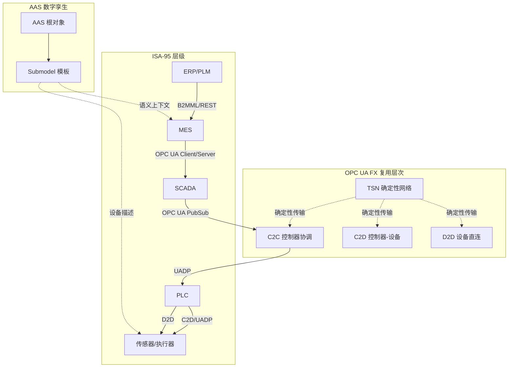
```mermaid
graph TB
    subgraph ISA95 [ISA-95 层级]
        L4[ERP/PLM]
        L3[MES]
        L2[SCADA]
        L1[PLC]
        L0[传感器/执行器]
    end
    subgraph FX [OPC UA FX 复用层次]
        C2C[C2C 控制器协调]
        C2D[C2D 控制器-设备]
        D2D[D2D 设备直连]
        TSN[TSN 确定性网络]
    end
    subgraph AAS [AAS 数字孪生]
        AAS_ROOT[AAS 根对象]
        SM[Submodel 模板]
    end
    L4 -->|B2MML/REST| L3
    L3 -->|OPC UA Client/Server| L2
    L2 -->|OPC UA PubSub| C2C
    C2C -->|UADP| L1
    L1 -->|C2D/UADP| L0
    L1 -->|D2D| L0
    AAS_ROOT --> SM
    SM -.->|语义上下文| L3
    SM -.->|设备描述| L0
    TSN -.->|确定性传输| C2C
    TSN -.->|确定性传输| C2D
    TSN -.->|确定性传输| D2D
```

### 7.9 权威来源

> **权威来源**：
>
> - OPC UA FX Part 80 (Base concepts): <https://reference.opcfoundation.org/UAFX/Part80/v100/docs/>（核查日期：2026-07-09）
> - OPC UA FX Part 81 (OPC UA FX Information Model): <https://reference.opcfoundation.org/UAFX/Part81/v100/docs/>（核查日期：2026-07-09）
> - OPC UA FX Part 82 (Controller-to-Controller): <https://reference.opcfoundation.org/UAFX/Part82/v100/docs/>（核查日期：2026-07-09）
> - OPC UA FX Part 83 (Controller-to-Device): <https://reference.opcfoundation.org/UAFX/Part83/v100/docs/>（核查日期：2026-07-09）
> - OPC UA FX Part 84 (Device-to-Device): <https://reference.opcfoundation.org/UAFX/Part84/v100/docs/>（核查日期：2026-07-09）
> - IEC/IEEE 60802 TSN Profile for Industrial Automation: <https://1.ieee802.org/tsn/iec-ieee-60802/>（核查日期：2026-07-09）
> - IEC 62541 OPC Unified Architecture: <https://reference.opcfoundation.org/>（核查日期：2026-07-09）
> - IEC 62264-1:2013 *Enterprise-control system integration*: <https://webstore.iec.ch/en/publication/6675>（核查日期：2026-07-09）
> - IEC 63278-1:2023 *Asset Administration Shell structure*: <https://webstore.iec.ch/en/publication/65628>（核查日期：2026-07-09）
> - IDTA AAS Submodel Templates: <https://industrialdigitaltwin.org/en/content-hub/submodels>（核查日期：2026-07-09）

### 7.10 交叉引用

- 棕地/绿地决策：[`deployment-scenarios/brownfield-greenfield-decision.md`](../struct/11-industrial-iot-otit/02-opc-ua-fx/deployment-scenarios/brownfield-greenfield-decision.md)
- Connection Manager TLA 规约：[`connection-manager/tla-specification.md`](../struct/11-industrial-iot-otit/02-opc-ua-fx/connection-manager/tla-specification.md)
- AAS-OPC UA 映射：[`../05-digital-twin-aas/aas-opcua-mapping.md`](../struct/11-industrial-iot-otit/05-digital-twin-aas/aas-opcua-mapping.md)
- ISA-95 资产目录：[`../01-isa-95-model/isa-95-asset-catalog-deep-dive.md`](../struct/11-industrial-iot-otit/01-isa-95-model/isa-95-asset-catalog-deep-dive.md)
- OPC UA FX 复用总览：[`./README.md`](../struct/11-industrial-iot-otit/02-opc-ua-fx/README.md)

### 7.11 论证

> **定理 FX.Reuse.3** (FX 复用层次单调性): 若 OPC UA FX 资产在层级 L 被复用，则其在所有低于 L 的层级（物理、协议、信息模型）必须保持兼容。任何仅在上层应用逻辑复制而忽视底层确定性约束的复用都会导致互操作失败或安全事件。

---

> 最后更新: 2026-07-08
> 下次更新时机: OPC UA FX C2D/D2D 正式发布 / 新厂商支持声明


---


<!-- SOURCE: struct/11-industrial-iot-otit/02-opc-ua-fx/README.md -->

# OPC UA FX 现场级确定性通信复用

> **版本**: 2026-07-09
> **定位**: 基于 OPC UA Field eXchange（FX）的现场级确定性通信复用框架，覆盖 C2C/C2D/D2D 三种模式与 Offline Engineering 模板。
> **对齐标准**: OPC UA FX 1.00.03 (OPC 10000-80~84)、IEC/IEEE 60802 TSN Profile、IEC 62541 OPC UA

---

## 1. 概念定义

**OPC UA FX（Field eXchange）** 是 OPC Foundation 为现场级通信定义的扩展，基于 OPC UA PubSub over UDP（UADP）与 IEEE 802.1 TSN，实现跨厂商控制器与设备之间的确定性数据交换。其核心复用价值在于：用标准化信息模型替代私有现场总线，降低 vendor lock-in 与工程集成成本。

| 通信模式 | 全称 | 典型周期 | 适用层级 | 复用成熟度 |
|----------|------|---------|---------|-----------|
| **C2C** | Controller-to-Controller | 10–100 ms | L1-L2 协调 | 已量产（2025-2026） |
| **C2D** | Controller-to-Device | 500 μs – 10 ms | L0-L1 控制 | Phase 2 试点 |
| **D2D** | Device-to-Device | 250 μs – 1 ms | L0 设备直连 | 开发中 |

> **公理 FX.1** (Determinism Preservation): OPC UA FX 的复用必须保持端到端确定性。任何在复用过程中引入的额外协议转换（网关、代理）必须证明其时延上界小于应用容忍阈值。

---

## 2. OPC UA FX 技术栈与标准条款映射

```text
┌─────────────────────────────────────────┐
│  应用层：FX 通信配置文件（C2C/C2D/D2D）   │
├─────────────────────────────────────────┤
│  传输层：OPC UA PubSub over UDP (UADP)   │
├─────────────────────────────────────────┤
│  确定性层：IEEE 802.1AS / 802.1Qbv /     │
│           802.1CB / IEC/IEEE 60802     │
├─────────────────────────────────────────┤
│  物理层：标准以太网 / Ethernet-APL      │
└─────────────────────────────────────────┘
```

| FX 规范部分 | OPC 编号 | 内容 | 与 ISA-95 / AAS 的映射 |
|------------|---------|------|----------------------|
| **Part 80** | OPC 10000-80 | UAFX Overview and Concepts | 总体架构概念 |
| **Part 81** | OPC 10000-81 | Connecting Devices and Information Model | AutomationComponent ↔ AAS Submodel 概念对齐 |
| **Part 82** | OPC 10000-82 | Networking (TSN / topology / LLDP) | IEC/IEEE 60802 TSN 配置 |
| **Part 83** | OPC 10000-83 | Offline Engineering descriptors | AASX / AML 工程模板复用 |
| **Part 84** | OPC 10000-84 | Profiles and Conformance Units | 设备能力声明与互操作测试 |

| ISA-95 层级 | OPC UA FX 角色 | 复用关注点 |
|------------|---------------|-----------|
| L0 | C2D / D2D 现场设备数据接入 | 设备描述、I/O 映射、Companion Spec |
| L1 | C2C 控制器间协调 | 控制回路同步、安全联锁 |
| L2 | C2C + Client/Server 区域监控 | 报警、事件、历史数据 |
| L3 | C2C + OPC UA Client/Server + AAS | 工单、配方、质量数据 |
| L4 | AAS + OPC UA Client/Server | 主数据、业务语义 |

---

## 3. 正向示例

### 示例 1：多厂商汽车焊装线 C2C 复用

汽车焊装线集成 Siemens、Rockwell、B&R 三家 PLC，通过 OPC UA FX C2C 与 TSN 骨干网实现产线同步。工程团队复用 C2C 连接模板，调试周期从 6 周缩短到 2 周，网关数量减少 70%。

### 示例 2：制药灌装线 Offline Engineering 模板

工程团队在新灌装线部署前，使用 Part 83 Offline Engineering 描述符包完成 TSN 门控表、PubSub 数据集与 WriterGroup 配置。现场调试时间从 2 周降至 3 天。

### 示例 3：设备供应商 AAS + FX C2D 交付

伺服驱动器供应商提供 OPC UA FX C2D 描述与 AAS Digital Nameplate。客户工程工具可自动识别设备并生成 PLC 标签，实现“即插即用”集成。

---

## 4. 反例 / 失败案例

### 反例 1：将 C2C 模板用于运动控制

某团队将 C2C 配置模板直接用于 <250 μs 的运动控制场景。C2C 周期不满足实时性要求，导致机器人轨迹抖动。后改用专用现场总线或 C2D/D2D 配置。

### 反例 2：忽视 TSN 拓扑差异复制 GCL

某项目直接将模板中的 802.1Qbv 门控列表（GCL）复制到不同拓扑的棕地工厂，未考虑交换机延迟、电缆长度差异，导致时间槽冲突与通信丢包。

### 反例 3：强制 FX 替换所有棕地现场总线

某企业声称“最终消除网关”，计划一次性替换所有棕地 Profinet/EtherCAT。实际因设备生命周期未到，项目成本超支 3 倍且停产风险极高。棕地中协议网关应视为永久性架构组件。

---

## 5. 复用决策树

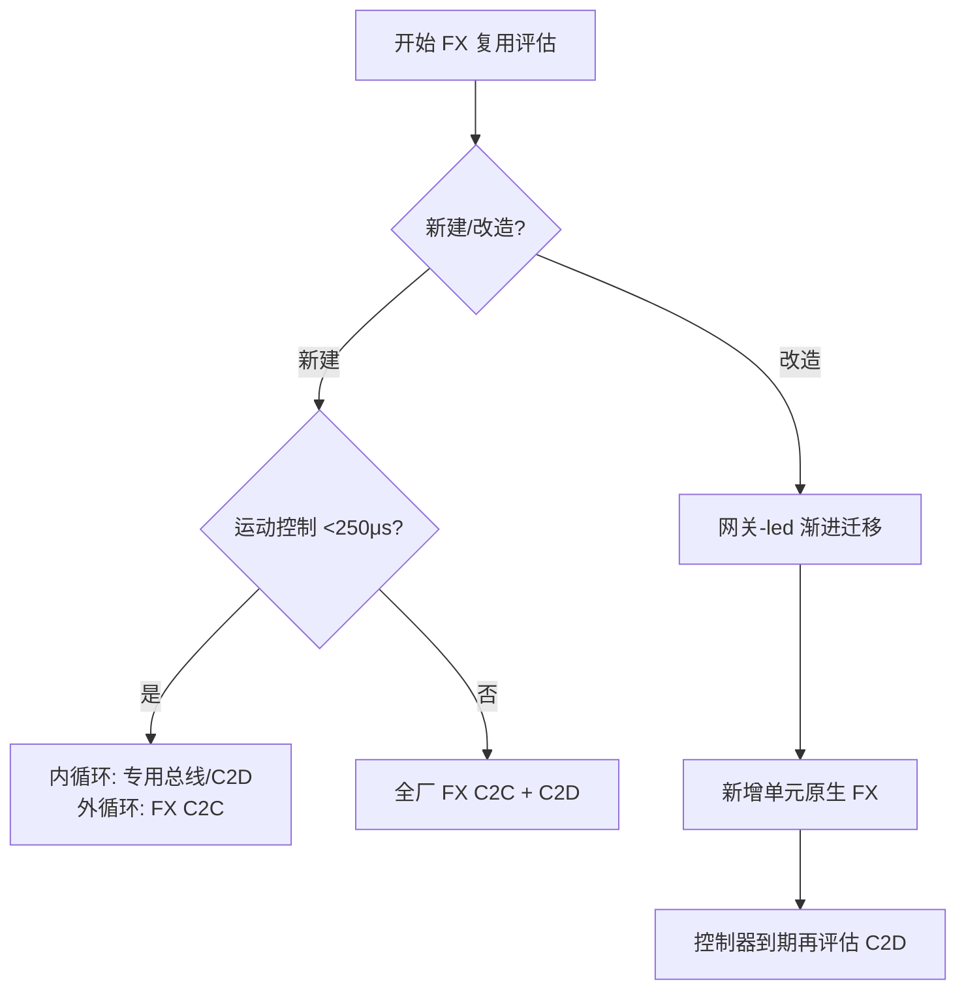
```mermaid
flowchart TD
    A[开始 FX 复用评估] --> B{新建/改造?}
    B -->|新建| C{运动控制 <250μs?}
    C -->|是| D[内循环: 专用总线/C2D<br/>外循环: FX C2C]
    C -->|否| E[全厂 FX C2C + C2D]
    B -->|改造| F[网关-led 渐进迁移]
    F --> G[新增单元原生 FX]
    G --> H[控制器到期再评估 C2D]
```

---

## 6. 权威来源

> **权威来源**:
>
> - OPC UA FX Part 80 (UAFX Overview and Concepts): <https://reference.opcfoundation.org/UAFX/Part80/v100/docs/> （核查日期：2026-07-09）
> - OPC UA FX Part 81 (Connecting Devices and Information Model): <https://reference.opcfoundation.org/UAFX/Part81/v100/docs/> （核查日期：2026-07-09）
> - OPC UA FX Part 82 (Networking): <https://reference.opcfoundation.org/UAFX/Part82/v100/docs/> （核查日期：2026-07-09）
> - OPC UA FX Part 83 (Offline Engineering): <https://reference.opcfoundation.org/UAFX/Part83/v100/docs/> （核查日期：2026-07-09）
> - OPC UA FX Part 84 (Profiles): <https://reference.opcfoundation.org/UAFX/Part84/v100/docs/> （核查日期：2026-07-09）
> - IEC/IEEE 60802 TSN Profile for Industrial Automation: <https://1.ieee802.org/tsn/iec-ieee-60802/> （核查日期：2026-07-09）
> - IEC 62541 OPC Unified Architecture: <https://reference.opcfoundation.org/> （核查日期：2026-07-09）
> - OPC Foundation FLC Technical Paper – OPC UA FX C2C: <https://opcfoundation.org/wp-content/uploads/2023/11/OPCF-FLC-Technical-Paper-C2C-EN.pdf> （核查日期：2026-07-09）

---

## 7. 交叉引用

- 复用层次分析： [`opc-ua-fx-reuse-hierarchy.md`](../struct/11-industrial-iot-otit/02-opc-ua-fx/opc-ua-fx-reuse-hierarchy.md)
- UADP 帧结构分析： [`frame-structure/uadp-frame-analysis.md`](../struct/11-industrial-iot-otit/02-opc-ua-fx/frame-structure/uadp-frame-analysis.md)
- 棕地/绿地决策： [`deployment-scenarios/brownfield-greenfield-decision.md`](../struct/11-industrial-iot-otit/02-opc-ua-fx/deployment-scenarios/brownfield-greenfield-decision.md)
- AAS-OPC UA 映射： [`../05-digital-twin-aas/aas-opcua-mapping.md`](../struct/11-industrial-iot-otit/05-digital-twin-aas/aas-opcua-mapping.md)

---

> 最后更新: 2026-07-09


---


<!-- SOURCE: struct/11-industrial-iot-otit/02-opc-ua-fx/vendor-matrix-2026.md -->

# 2026 年 OPC UA FX 厂商支持矩阵

> **版本**: 2026-06-06
> **状态**: 基于公开产品发布、展会演示（Hannover Messe 2025/2026, SPS 2025）及厂商路线图整理
> **定位**: 为架构复用决策提供客观的厂商能力基线

---

## 目录

- [2026 年 OPC UA FX 厂商支持矩阵](#2026-年-opc-ua-fx-厂商支持矩阵)
  - [目录](#目录)
  - [1. 矩阵总览](#1-矩阵总览)
  - [2. 厂商详情](#2-厂商详情)
    - [2.1 Siemens（西门子）](#21-siemens西门子)
    - [2.2 Rockwell Automation（罗克韦尔）](#22-rockwell-automation罗克韦尔)
    - [2.3 Beckhoff（倍福）](#23-beckhoff倍福)
    - [2.4 B\&R Industrial Automation（ABB 旗下）](#24-br-industrial-automationabb-旗下)
    - [2.5 Phoenix Contact（菲尼克斯电气）](#25-phoenix-contact菲尼克斯电气)
    - [2.6 Mitsubishi Electric（三菱电机）](#26-mitsubishi-electric三菱电机)
    - [2.7 Schneider Electric（施耐德电气）](#27-schneider-electric施耐德电气)
    - [2.8 Hilscher（赫优讯）](#28-hilscher赫优讯)
  - [3. 关键趋势分析](#3-关键趋势分析)
    - [3.1 C2C：全面量产](#31-c2c全面量产)
    - [3.2 C2D：分化期](#32-c2d分化期)
    - [3.3 D2D：早期阶段](#33-d2d早期阶段)
    - [3.4 TSN：基础设施就绪](#34-tsn基础设施就绪)
  - [4. 选型建议](#4-选型建议)
  - [5. 参考文献](#5-参考文献)
  - [补充章节](#补充章节)
  - [概念定义](#概念定义)
  - [示例](#示例)
  - [反例](#反例)
  - [权威来源](#权威来源)

---

## 1. 矩阵总览

| 厂商 | 总部 | 代表产品线 | C2C 支持 | C2D 支持 | D2D 支持 | TSN 支持 | 发布时间 | 复用策略 |
|------|------|-----------|:--------:|:--------:|:--------:|:--------:|:--------:|----------|
| **Siemens** | 德国 | S7-1500 TM, ET 200, Scalance XCM | ✅ 已发布 | 🧪 2026 试点 | 📋 规划中 | ✅ 已发布 | 2024 (C2C) / 2026 H2 (C2D) | 原生 FX + Profinet 共存 |
| **Rockwell** | 美国 | ControlLogix 5580, FLEXHA 5000, Stratix | ✅ 2026 Q1 | 🧪 2026 H2 | 📋 规划中 | ✅ 已发布 | 2026 Q1 (C2C) / 2026 H2 (C2D) | 固件升级现有平台 |
| **Beckhoff** | 德国 | CX 系列, TwinCAT 3, EK/EL 耦合器 | ✅ 已发布 | ✅ 已发布 | 📋 规划中 | ✅ 已发布 | 2023 (C2C) / 2025 (C2D) | EtherCAT + FX 混合架构 |
| **B&R (ABB)** | 奥地利 | X20, ACOPOS M4, X90 | ✅ 已发布 | 🧪 2026 试点 | 📋 规划中 | ✅ 已发布 | 2023 (C2C) / 2025 (C2D 原型) | 伺服驱动原生支持 |
| **Phoenix Contact** | 德国 | PLCnext, Axioline F2, FL SWITCH TSN | ✅ 已发布 | 🧪 试点 | 📋 规划中 | ✅ 已发布 | 2023 (C2C) | 开放多厂商策略 |
| **Mitsubishi** | 日本 | iQ-R, iQ-F, CC-Link IE TSN 模块 | ✅ 2026 Q2 | 📋 规划中 | 📋 规划中 | ✅ 已发布 | 2026 Q2 (C2C) | CC-Link IE TSN + FX 桥接 |
| **Schneider Electric** | 法国 | EcoStruxure, Modicon M580, PAC | 🧪 2026 试点 | 📋 规划中 | 📋 规划中 | ✅ 部分 | 2026 (试点) | EcoStruxure OPC UA Server Expert |
| **Hilscher** | 德国 | netX 90 / netX 4000 TSN | ✅ 已发布 | 🧪 试点 | 📋 规划中 | ✅ 已发布 | 2024 (C2C) | 芯片级 FX 协议栈供应 |

> **图例**: ✅ 已发布（量产可用） | 🧪 试点/预览（客户试用） | 📋 规划中（ roadmap 声明）

---

## 2. 厂商详情

### 2.1 Siemens（西门子）

| 项目 | 内容 |
|------|------|
| **C2C 产品** | S7-1500 TM NET 通信模块（固件 V3.0+） |
| **C2D 产品** | ET 200 SP IO-Link FX 预览模块（Hannover Messe 2026） |
| **TSN 交换机** | Scalance XCM-300 / XCM-400 系列，支持 802.1Qbv/AS/CB |
| **工程软件** | TIA Portal V19 + UAFX 插件 |
| **关键里程碑** | 2025 Hannover Messe：S7-1500 与 Beckhoff/Phoenix Contact 控制器实现无网关 C2C 互通 |
| **复用策略** | "原生 FX + Profinet 共存"：现有 Profinet 设备通过 TSN 交换机与 FX C2C 网络融合，ET 200 系列逐步扩展 FX C2D 能力 |

**洞察**:
Siemens 是 OPC UA FX 最积极的推动者之一，其策略强调**渐进式融合**而非颠覆替换。
S7-1500 TM 模块使现有控制器无需更换主机即可支持 FX，显著降低棕地迁移成本。
[Siemens Hannover Messe 2025/2026 Demo]

### 2.2 Rockwell Automation（罗克韦尔）

| 项目 | 内容 |
|------|------|
| **C2C 产品** | ControlLogix 5580 控制器（2026 Q1 固件更新） |
| **C2D 产品** | FLEXHA 5000 I/O（2026 H2 roadmap，Automation Fair 2026 GA） |
| **TSN 交换机** | Stratix 5400/5410 系列（2024 年硬件就绪，2026 年 FX 固件刷新） |
| **工程软件** | FactoryTalk Design Studio + Plex MES 集成 |
| **关键里程碑** | 2026 年 2 月 Berlin IOP：Rockwell 与 Beckhoff、Mitsubishi 完成多厂商 C2C 互操作测试 |
| **复用策略** | "固件升级现有平台"：保护 Americas 地区庞大的 ControlLogix 装机量，通过固件更新而非硬件替换引入 FX |

**洞察**:
Rockwell 的 FX 策略与其在北美离散制造业的统治地位深度绑定。
FactoryTalk Design Hub 的工程模板复用是关键差异化点。[Rockwell Automation Fair 2026 Roadmap]

### 2.3 Beckhoff（倍福）

| 项目 | 内容 |
|------|------|
| **C2C 产品** | TwinCAT 3（TF6xxx OPC UA FX 功能包） |
| **C2D 产品** | CX TSN 网关（EK/EL 耦合器后挂 FX 接口） |
| **TSN 交换机** | CX7000 系列 IPC 集成 TSN 端口 |
| **工程软件** | TwinCAT XAE + TF6xxx 配置向导 |
| **关键里程碑** | 2026 年 2 月 Berlin IOP 主办方：测试 PubSub Ethernet、优先级映射、AML 离线工程交换 |
| **复用策略** | "EtherCAT + FX 混合"：内循环保留 EtherCAT（<100 μs），外循环/单元间采用 FX C2C/C2D |

**洞察**:
Beckhoff 是 2026 年 2 月 Berlin IOP 的主办方，其开放态度表明 FX 不是 EtherCAT 的替代者，而是**向上扩展**的互操作层。
CX TSN 网关允许现有 EtherCAT 从站设备通过透明桥接参与 FX 网络。[Beckhoff Berlin IOP 2026]

### 2.4 B&R Industrial Automation（ABB 旗下）

| 项目 | 内容 |
|------|------|
| **C2C 产品** | X20 系列 PLC（X20CP3686 等） |
| **C2D 产品** | ACOPOS M4 伺服驱动（2025 年 SPS 发布，原生 FX 支持） |
| **TSN 交换机** | X20 总线耦合器集成 TSN 端口 |
| **工程软件** | Automation Studio + mapp Technology |
| **关键里程碑** | 2025 年 11 月 SPS：ACOPOS M4 是首批原生支持 OPC UA FX 的伺服驱动之一，消除协议网关需求 |
| **复用策略** | "伺服驱动原生支持"：将 FX 协议栈直接嵌入驱动器固件，实现控制器到驱动的直接确定性通信 |

**洞察**:
B&R 的 ACOPOS M4 代表了 OPC UA FX C2D 的**理想形态**——无需网关、无需协议转换，控制器直接通过 UADP 向伺服驱动发送运动指令。
这对运动控制领域的棕地迁移具有示范意义。
[B&R ACOPOS M4 Launch]

### 2.5 Phoenix Contact（菲尼克斯电气）

| 项目 | 内容 |
|------|------|
| **C2C 产品** | PLCnext 控制器（AXC F 2152 / RFC 4072S） |
| **C2D 产品** | Axioline F2 I/O 模块（FX 预览版） |
| **TSN 交换机** | FL SWITCH TSN 系列 |
| **工程软件** | PLCnext Engineer + Eclipse 插件 |
| **关键里程碑** | 长期参与 OPC Foundation FLC 倡议，强调开放性和多厂商互操作 |
| **复用策略** | "开放多厂商策略"：PLCnext 平台基于 Linux + container，允许第三方 FX 协议栈（如 open62541）直接部署 |

**洞察**:
Phoenix Contact 的 PLCnext 是工业控制器中**开放性最高**的平台之一。
其容器化架构意味着 FX 能力可通过软件更新持续增强，而无需更换硬件。
这延长了设备的复用生命周期。
[Phoenix Contact PLCnext]

### 2.6 Mitsubishi Electric（三菱电机）

| 项目 | 内容 |
|------|------|
| **C2C 产品** | iQ-R 系列 PLC（2026 Q2 固件更新） |
| **C2D 产品** | 尚未公布具体产品线 |
| **TSN 交换机** | CC-Link IE TSN 模块（与 FX TSN 底层兼容） |
| **工程软件** | GX Works3 + MELSOFT Navigator |
| **关键里程碑** | 2026 年 2 月 Berlin IOP 参与者，验证 iQ-R 与欧美厂商控制器的 C2C 互通 |
| **复用策略** | "CC-Link IE TSN + FX 桥接"：在亚洲市场保留 CC-Link IE TSN 投资，通过网关与 FX 网络互操作 |

**洞察**:
Mitsubishi 的策略反映了亚洲自动化市场的现实——CC-Link IE TSN 已有大量装机，完全迁移至 FX 不经济。
Bridge/Gateway 模式是理性选择。
[Mitsubishi iQ-R 2026 Update]

### 2.7 Schneider Electric（施耐德电气）

| 项目 | 内容 |
|------|------|
| **C2C 产品** | EcoStruxure OPC UA Server Expert（软件层） |
| **C2D 产品** | Modicon M580 / PAC（FX 能力规划中） |
| **TSN 交换机** | 部分 Industrial Ethernet 交换机支持 802.1AS |
| **工程软件** | EcoStruxure Automation Expert |
| **关键里程碑** | 2026 年 Hannover Messe：展示 EcoStruxure 作为 FX 网络的云端/边缘聚合层 |
| **复用策略** | "EcoStruxure 软件先行"：通过 OPC UA Server Expert 实现现有 Modbus/以太网设备向 FX 网络的软件级接入 |

**洞察**:
Schneider 的 FX 策略偏向**软件定义**：不急于在底层控制器全面替换 Modbus/以太网，而是通过 EcoStruxure 软件栈实现上层 FX 兼容。
这对过程工业（其传统优势领域）的渐进迁移是务实路径。
[Schneider EcoStruxure 2026]

### 2.8 Hilscher（赫优讯）

| 项目 | 内容 |
|------|------|
| **C2C 产品** | netX 90 / netX 4000 TSN 芯片（含 FX 协议栈） |
| **C2D 产品** | netX 芯片 C2D 预览固件 |
| **TSN 交换机** | 芯片级 TSN 支持（供 OEM 集成） |
| **工程软件** | netX Studio + Protocol API |
| **关键里程碑** | 为多家中小型自动化厂商提供 FX 协议栈 IP，降低 FX 准入门槛 |
| **复用策略** | "芯片级 FX 供应"：作为协议栈供应商，使中小型设备厂商无需自研 FX 能力 |

**洞察**:
Hilscher 是工业通信芯片领域的"隐形冠军"。
其 netX 芯片的 FX 支持意味着**任何设备制造商**（无论规模大小）均可通过芯片升级获得 FX 能力，这是推动 FX 生态扩展的关键基础设施。
[Hilscher netX TSN]

---

## 3. 关键趋势分析

### 3.1 C2C：全面量产

截至 2026 年中，所有主要厂商均已完成或即将完成 C2C 产品发布。C2C 周期要求宽松（10–100 ms），技术风险低，政治价值高（跨厂商互操作演示），因此成为首选落地场景。

### 3.2 C2D：分化期

- **已发布**: Beckhoff（CX TSN 网关）、B&R（ACOPOS M4 原生）
- **2026 试点**: Siemens（ET 200）、Rockwell（FLEXHA 5000）
- **规划中**: Phoenix Contact、Mitsubishi、Schneider

C2D 面临现有现场总线（EtherCAT、Profinet IRT）的强烈竞争，仅在绿地或特定升级场景中被采用。

### 3.3 D2D：早期阶段

尚无主流厂商宣布 D2D 量产产品。
D2D 要求 Companion Specifications（运动控制、安全、IO）的成熟度和芯片级 UADP 协议栈优化，预计 2027–2028 年才有首批产品。

### 3.4 TSN：基础设施就绪

TSN 交换机（802.1Qbv/AS/CB 支持）在所有主要厂商中已可采购。
瓶颈不在于硬件，而在于**GCL 配置工程**和**跨厂商配置互操作**。

---

## 4. 选型建议

| 场景 | 推荐厂商组合 | 理由 |
|------|-------------|------|
| **全西门子生态扩展** | Siemens S7-1500 TM + Scalance XCM | 原生融合 Profinet，工程工具统一 |
| **多厂商混合（欧美）** | Beckhoff CX + B&R X20 + Phoenix Contact PLCnext | 均支持原生 FX C2C，Berlin IOP 验证互通 |
| **运动控制优先** | B&R ACOPOS M4 + Beckhoff TwinCAT | ACOPOS M4 原生 C2D，TwinCAT 运动库成熟 |
| **北美存量升级** | Rockwell ControlLogix 5580 + Stratix | 固件升级保护现有投资 |
| **亚洲混合生态** | Mitsubishi iQ-R + Siemens S7-1500（网关） | CC-Link IE TSN 与 FX 通过网关共存 |
| **小型 OEM 快速 FX 化** | Hilscher netX 芯片 + 自研硬件 | 降低协议栈自研成本 |

---

## 5. 参考文献

1. [OPC Foundation] OPC Foundation Hannover Messe 2026 Booth Demos, <https://opcfoundation.org/event-detail/hannover-messe/>
2. [OPC Foundation] Berlin IOP 2026 Report (Beckhoff-hosted), February 2026
3. [IoT Digital Twin PLM] "OPC UA FX in 2026: Field-Level Communications Goes Open," May 2026, <https://iotdigitaltwinplm.com/opc-ua-fx-field-level-communications-analysis-2026/>
4. [Future Market Insights] "OPC UA FX Market Size, Share & Forecast to 2036," March 2026
5. [B&R] "ACOPOS M4 with OPC UA FX," SPS 2025, <https://www.br-automation.com/en/technologies/opc-ua-fx/>
6. [Siemens] S7-1500 TM NET Product Documentation, 2025
7. [Rockwell] ControlLogix 5580 Firmware Release Notes, Q1 2026
8. [Beckhoff] TwinCAT 3 OPC UA FX Function Documentation, TF6xxx, 2025
9. [Phoenix Contact] PLCnext Technology Portal, <https://www.plcnext-community.net>
10. [Hilscher] netX TSN Product Brief, 2024

---

> 最后更新: 2026-06-06
> 下次更新时机: SPS 2026（November）后更新 C2D 产品 GA 状态


---

## 补充章节

## 概念定义

**定义**：OPC UA FX（Field eXchange）扩展 OPC UA 至现场级，支持确定性时间同步、PubSub 帧结构与冗余，实现 OT 设备间可互操作的信息模型复用。

## 示例

**示例**：包装线集成不同厂商伺服驱动，通过 OPC UA FX 的 PubSub 帧与 PLCopen Motion 接口复用统一运动控制模型，减少 70% 的协议转换网关。

## 反例

**反例**：各设备使用私有现场总线，IT 系统需为每种协议开发适配器，信息模型无法复用，扩展成本高昂。

## 权威来源

> **权威来源**:
>
> - [OPC Foundation UA](https://opcfoundation.org/about/opc-technologies/opc-ua/)
> - [OPC UA FX](https://opcfoundation.org/opc-ua-field-exchange-opc-ua-fx/)
> - 核查日期：2026-07-07


---


<!-- SOURCE: struct/11-industrial-iot-otit/03-tsn-deterministic/gcl-config/templates.md -->

# TSN 门控表（GCL）配置模板

> **版本**: 2026-06-06
> **对齐标准**: IEEE 802.1Qbv-2021, IEEE 802.1AS-Rev, IEC/IEEE 60802 TSN Profile for Industrial Automation
> **定位**: 为 OPC UA FX 三种通信模式提供可直接参数化的 GCL 配置模板

---

## 目录

- [TSN 门控表（GCL）配置模板](#tsn-门控表gcl配置模板)
  - [目录](#目录)
  - [1. GCL 基础概念](#1-gcl-基础概念)
    - [1.1 Time-Aware Shaper (TAS) 架构](#11-time-aware-shaper-tas-架构)
    - [1.2 GCL 核心参数](#12-gcl-核心参数)
  - [2. GCL 配置语法](#2-gcl-配置语法)
    - [2.1 抽象语法（伪代码）](#21-抽象语法伪代码)
    - [2.2 队列优先级映射（IEEE 802.1Q + IEC/IEEE 60802）](#22-队列优先级映射ieee-8021q--iecieee-60802)
    - [2.3 关键约束](#23-关键约束)
  - [3. 工业场景模板](#3-工业场景模板)
    - [3.1 模板一：运动控制（Motion Control）](#31-模板一运动控制motion-control)
    - [3.2 模板二：过程控制（Process Control）](#32-模板二过程控制process-control)
    - [3.3 模板三：机器人协作（Collaborative Robotics）](#33-模板三机器人协作collaborative-robotics)
    - [3.4 模板对比总结](#34-模板对比总结)
  - [4. OPC UA FX 时隙对齐策略](#4-opc-ua-fx-时隙对齐策略)
    - [4.1 周期对齐原则](#41-周期对齐原则)
    - [4.2 时隙分配映射](#42-时隙分配映射)
    - [4.3 配置一致性验证清单](#43-配置一致性验证清单)
  - [5. 配置验证与工具链](#5-配置验证与工具链)
    - [5.1 厂商配置工具](#51-厂商配置工具)
    - [5.2 Linux 内核配置（tc-taprio）](#52-linux-内核配置tc-taprio)
  - [6. 参考文献](#6-参考文献)
  - [补充章节](#补充章节)
  - [反例](#反例)
  - [权威来源](#权威来源)

---

## 1. GCL 基础概念

### 1.1 Time-Aware Shaper (TAS) 架构

IEEE 802.1Qbv 定义的时间感知整形器（TAS）是 TSN 实现确定性传输的核心机制。
每个 TSN 交换机的出端口配备 8 个硬件队列（对应 IEEE 802.1p 优先级 0–7），每个队列由一个**门（Gate）**控制其开/关状态。

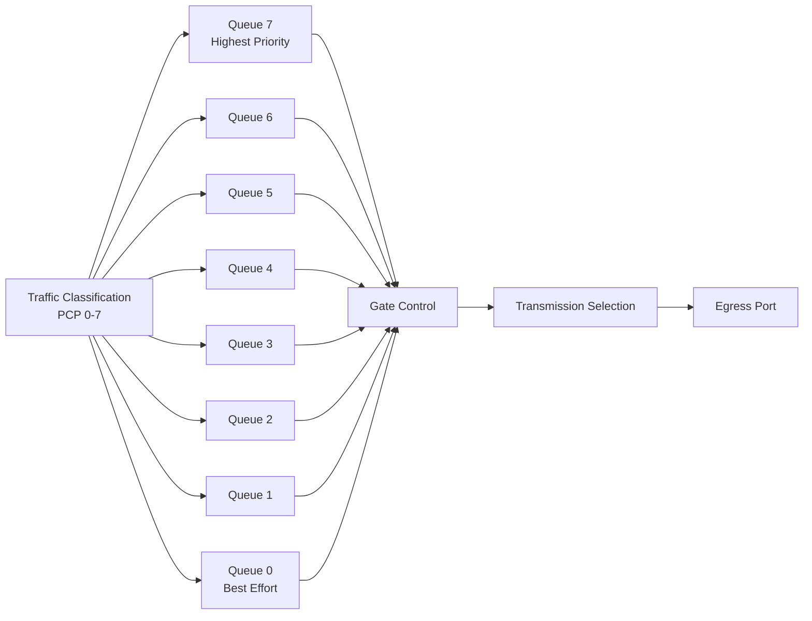
```mermaid
flowchart LR
    A[Traffic Classification<br/>PCP 0-7] --> B[Queue 7<br/>Highest Priority]
    A --> C[Queue 6]
    A --> D[Queue 5]
    A --> E[Queue 4]
    A --> F[Queue 3]
    A --> G[Queue 2]
    A --> H[Queue 1]
    A --> I[Queue 0<br/>Best Effort]
    B --> J[Gate Control]
    C --> J
    D --> J
    E --> J
    F --> J
    G --> J
    H --> J
    I --> J
    J --> K[Transmission Selection]
    K --> L[Egress Port]
```

### 1.2 GCL 核心参数

| 参数 | 符号 | 说明 | 典型范围 |
|------|------|------|---------|
| **Base Time** | T₀ | GCL 循环开始基准时间 | IEEE 802.1AS 同步后的整数秒边界 |
| **Cycle Time** | T_c | GCL 重复周期 | 250 μs – 10 ms |
| **Gate States** | G_vec | 8 位门控位图 | 0x00 – 0xFF |
| **Time Interval** | Δt | 每个 GCL 条目的持续时间 | ≥ 传输时延 + Guard Band |
| **Guard Band** | G | 保护带，防止帧跨时隙 | ≥ MTU_max / LineRate + PropagationDelay |

> **门控位图编码**:
> 8 位二进制 `b7b6b5b4b3b2b1b0` 对应 Queue 7 到 Queue 0。
> `1` 表示开门（允许发送），`0` 表示关门（阻塞）。
> 例如 `0x80` = `10000000` 仅启用最高优先级队列。[IEEE 802.1Qbv]

---

## 2. GCL 配置语法

### 2.1 抽象语法（伪代码）

```text
GCL_Configuration := {
    base_time:        IEEE_802_1AS_Time,      // 64-bit nanoseconds since epoch
    cycle_time:       Duration_ns,            // 周期时长
    cycle_time_extension: Duration_ns,        // 配置切换容限
    entries: [                                // 有序列表
        {
            gate_states:   uint8,             // 8-bit 门控向量
            time_interval: Duration_ns        // 本条目持续时间
        },
        ...
    ]
}
```

### 2.2 队列优先级映射（IEEE 802.1Q + IEC/IEEE 60802）

IEC/IEEE 60802 为工业自动化定义了推荐的 PCP（Priority Code Point）到流量类型的映射：

| PCP | 队列 | 流量类型 | 典型应用 | OPC UA FX 映射 |
|-----|------|---------|---------|---------------|
| 7 | Queue 7 | 硬实时 / Network Control | 运动控制同步、安全信号 | D2D 安全数据 |
| 6 | Queue 6 | 硬实时 | 伺服驱动指令、高速 IO | D2D/C2D 周期数据 |
| 5 | Queue 5 | 软实时（视频/视觉） | 机器视觉、质检图像 | C2D 大块 DataSet |
| 4 | Queue 4 | 软实时（控制） | PLC I/O 扫描、过程控制 | C2C 协调数据 |
| 3 | Queue 3 | 预留 / 事件 | 报警、诊断事件 | OPC UA 事件 |
| 2 | Queue 2 | 网络管理 | TSN 配置、gPTP | 802.1Qcc SRP |
| 1 | Queue 1 | Best Effort（低优先级） | 文件传输、日志 | 配置下载 |
| 0 | Queue 0 | Best Effort（默认） | Web、通用 TCP/IP | 背景流量 |

### 2.3 关键约束

> **定理 GCL.1** (Cycle Consistency): 若网络中有 N 个设备参与时间触发通信，则所有设备的 GCL 周期 T_c 必须满足 T_c = k × T_base，其中 k ∈ ℕ⁺。且 |BaseTime_i – BaseTime_j| < ε，ε 为 gPTP 同步精度（通常 < 1 μs）。违反此约束将导致时间槽重叠或空闲。[参见 `struct/11-industrial-iot-otit/02-opc-ua-fx/opc-ua-fx-reuse-hierarchy.md` 定理 TSN.1]

> **定理 GCL.2** (Guard Band Necessity): 保护带长度 G 必须满足：
> G ≥ MTU_max / LineRate + PropagationDelay_max + Jitter_max
> 在 1 Gbps 链路上，MTU_max = 1542 bytes 时，G ≥ 12.34 μs + PD_max + Jitter_max。

---

## 3. 工业场景模板

### 3.1 模板一：运动控制（Motion Control）

**场景特征**: 多轴伺服同步，周期 250 μs–1 ms，抖动 < 1 μs，安全互锁。

**网络假设**: 1 Gbps，5 个伺服节点 + 1 运动控制器，线型拓扑。

**GCL 设计**: 周期 T_c = 1 ms = 1000 μs。划分为 4 个时隙：

| 条目 | 时间区间 (μs) | Gate States (Hex) | 启用队列 | 说明 |
|------|--------------|-------------------|---------|------|
| 0 | 0 – 100 | `0xC0` | Q7, Q6 | D2D 安全 + 运动同步（独占） |
| 1 | 100 – 120 | `0x00` | 全部关闭 | Guard Band（防止跨边界） |
| 2 | 120 – 500 | `0x30` | Q5, Q4 | 视觉数据 + C2C 协调 |
| 3 | 500 – 1000 | `0x0F` | Q3–Q0 | 事件 + 管理 + Best Effort |

**周期利用率**: 关键实时流量占用 50%（500 μs），Guard Band 2%（20 μs），剩余 48% 给非实时流量。

**YAML 配置片段**:

```yaml
# Template: Motion Control GCL (1 Gbps, 1 ms cycle)
gcl_config:
  base_time: "2026-01-01T00:00:00.000000000Z"  # 运行时由 gPTP 对齐
  cycle_time_ns: 1000000                        # 1 ms
  cycle_time_extension_ns: 100000               # 100 μs 切换容限
  entries:
    - gate_states: 0xC0      # 11000000: Q7+Q6
      time_interval_ns: 100000
    - gate_states: 0x00      # Guard Band
      time_interval_ns: 20000
    - gate_states: 0x30      # 00110000: Q5+Q4
      time_interval_ns: 380000
    - gate_states: 0x0F      # 00001111: Q3-Q0
      time_interval_ns: 500000
```

**OPC UA FX 对齐**: D2D 运动数据映射到 Queue 7（250 μs 周期），C2D 伺服指令映射到 Queue 6（1 ms 周期）。由于 1 ms 是 250 μs 的整数倍，满足谐波周期约束。[IEEE 802.1Qbv, Arest et al.]

---

### 3.2 模板二：过程控制（Process Control）

**场景特征**: 温度/压力/流量控制，周期 10–100 ms，高可靠性，允许少量抖动。

**网络假设**: 100 Mbps（Ethernet-APL），10 个现场仪表 + 2 个控制器，星型拓扑。

**GCL 设计**: 周期 T_c = 10 ms = 10000 μs。划分为 5 个时隙：

| 条目 | 时间区间 (μs) | Gate States (Hex) | 启用队列 | 说明 |
|------|--------------|-------------------|---------|------|
| 0 | 0 – 50 | `0x80` | Q7 | 安全仪表系统（SIS）数据 |
| 1 | 50 – 70 | `0x00` | 全部关闭 | Guard Band |
| 2 | 70 – 3070 | `0x70` | Q6, Q5, Q4 | C2D/C2C 过程数据（3 ms 批量） |
| 3 | 3070 – 3090 | `0x00` | 全部关闭 | Guard Band |
| 4 | 3090 – 10000 | `0x1F` | Q4–Q0 | 事件、诊断、Best Effort |

**关键计算**: 在 100 Mbps 链路上，MTU = 1522 bytes 的传输时间为 122 μs。Guard Band 取 20 μs > 122 μs 不成立，因此过程控制模板中需将最大帧长度限制为 256 bytes（传输时间 20.5 μs），或增大 Guard Band 至 150 μs。

```yaml
# Template: Process Control GCL (100 Mbps APL, 10 ms cycle)
gcl_config:
  base_time_ns: 0  # 由 CNC 统一分配
  cycle_time_ns: 10000000
  cycle_time_extension_ns: 1000000
  max_frame_size_bytes: 256        # 限制帧长以匹配 Guard Band
  entries:
    - gate_states: 0x80
      time_interval_ns: 50000
    - gate_states: 0x00           # Guard Band = 150 μs
      time_interval_ns: 150000
    - gate_states: 0x70
      time_interval_ns: 3000000
    - gate_states: 0x00
      time_interval_ns: 150000
    - gate_states: 0x1F
      time_interval_ns: 6680000
```

> **Ethernet-APL 注意**: Ethernet-APL（Advanced Physical Layer）运行在 10 Mbps，专为过程工业设计，支持长距离（最大 1000 m）和防爆环境。OPC UA FX 通过 Ethernet-APL 实现 C2D 通信时，GCL 周期需与 APL 的物理层延迟匹配。[OPC Foundation APL Initiative]

---

### 3.3 模板三：机器人协作（Collaborative Robotics）

**场景特征**: 3–6 台协作机器人 + 1 安全 PLC + 2 视觉系统，周期 1–4 ms，安全停机 < 10 ms。

**网络假设**: 1 Gbps，环型拓扑（冗余），TSN 交换机支持 802.1CB 帧复制。

**GCL 设计**: 周期 T_c = 4 ms = 4000 μs。采用**交替时隙（Alternating Slot）**策略以复用 GCL 条目：

| 条目 | 时间区间 (μs) | Gate States (Hex) | 启用队列 | 说明 |
|------|--------------|-------------------|---------|------|
| 0 | 0 – 200 | `0xC0` | Q7, Q6 | 机器人安全互锁 + 运动指令 |
| 1 | 200 – 250 | `0x00` | 全部关闭 | Guard Band |
| 2 | 250 – 650 | `0x20` | Q5 | 视觉系统数据爆发 |
| 3 | 650 – 700 | `0x00` | 全部关闭 | Guard Band |
| 4 | 700 – 1500 | `0x10` | Q4 | C2C 机器人协调 |
| 5 | 1500 – 1540 | `0x00` | 全部关闭 | Guard Band |
| 6 | 1540 – 4000 | `0x0F` | Q3–Q0 | 事件 + Best Effort |

**交替策略说明**: 在 4 ms 周期内，Queue 5（视觉）仅在 250–650 μs 开启，视觉系统需在此时隙内完成数据突发传输。若视觉帧过大，可采用 802.1Qbu 帧抢占，让 Q7/Q6 的紧急帧中断 Q5 的低优先级帧传输。[IEEE 802.1Qbu]

```yaml
# Template: Collaborative Robotics GCL (1 Gbps, 4 ms cycle, Ring)
gcl_config:
  cycle_time_ns: 4000000
  redundancy: 802.1CB             # 帧复制与消除
  entries:
    - gate_states: 0xC0
      time_interval_ns: 200000
    - gate_states: 0x00
      time_interval_ns: 50000
    - gate_states: 0x20
      time_interval_ns: 400000
    - gate_states: 0x00
      time_interval_ns: 50000
    - gate_states: 0x10
      time_interval_ns: 800000
    - gate_states: 0x00
      time_interval_ns: 40000
    - gate_states: 0x0F
      time_interval_ns: 2460000
```

**安全停机预算**: 安全信号通过 Q7（最高优先级）传输，端到端时延上界 = 200 μs（时隙长度）+ 交换机转发时延（< 5 μs/跳）× 3 跳 + Guard Band（50 μs）= 265 μs << 10 ms 安全要求。

---

### 3.4 模板对比总结

| 维度 | 运动控制 | 过程控制 | 机器人协作 |
|------|---------|---------|-----------|
| **周期 T_c** | 1 ms | 10 ms | 4 ms |
| **链路速率** | 1 Gbps | 100 Mbps (APL) | 1 Gbps |
| **关键队列** | Q7 + Q6 | Q7 + Q6-Q4 | Q7 + Q6 + Q5 |
| **Guard Band** | 20 μs | 150 μs | 40–50 μs |
| **实时带宽占比** | 50% | 30% | 35% |
| **冗余机制** | 802.1CB（可选） | 802.1CB（推荐） | 802.1CB（强制） |
| **FX 模式** | D2D + C2D | C2C + C2D | C2C + D2D |
| **拓扑** | 线型/星型 | 星型/总线 | 环型 |

---

## 4. OPC UA FX 时隙对齐策略

### 4.1 周期对齐原则

OPC UA FX 的 PublishingInterval 必须与 TSN GCL 的 Cycle Time 保持**谐波关系**：

```
PublishingInterval = n × GCL_CycleTime,  n ∈ ℕ⁺
```

典型对齐方案：

| FX 通信模式 | PublishingInterval | GCL Cycle Time | n |
|------------|-------------------|----------------|---|
| D2D | 250 μs | 250 μs | 1 |
| D2D | 500 μs | 250 μs | 2 |
| C2D | 1 ms | 1 ms | 1 |
| C2D | 2 ms | 1 ms | 2 |
| C2C | 10 ms | 1 ms | 10 |
| C2C | 100 ms | 10 ms | 10 |

### 4.2 时隙分配映射

```mermaid
gantt
    title GCL Cycle (1 ms) with OPC UA FX Traffic Mapping
    dateFormat X
    axisFormat %s ms
    section Queue 7
    D2D Safety          :0, 0.1
    section Queue 6
    D2D Motion          :0.12, 0.5
    section Queue 5
    C2D Vision          :0.52, 0.9
    section Queue 4
    C2C Coordination    :0.52, 0.9
    section Queues 0-3
    Background          :0.92, 1.0
```

### 4.3 配置一致性验证清单

- [ ] 所有交换机的 Base Time 通过 802.1AS gPTP 对齐，偏差 < 1 μs
- [ ] GCL Cycle Time 为所有 PublishingInterval 的最大公约数（GCD）
- [ ] Guard Band ≥ 最大帧传输时间 + 传播延迟 + 抖动
- [ ] 每个端口的 GCL 条目数 ≤ 硬件限制（通常 128–1024 条）
- [ ] 时间触发时隙之间无重叠（通过 GCL 合成工具验证）
- [ ] 802.1CB 冗余路径的 GCL 配置严格一致

---

## 5. 配置验证与工具链

### 5.1 厂商配置工具

| 工具 | 厂商 | 功能 | 支持标准 |
|------|------|------|---------|
| **TSN Configurator** | Siemens | GCL 可视化设计、时序验证 | 802.1Qbv, 802.1AS, 60802 |
| **Cisco TSN Toolkit** | Cisco | 网络演算、最坏情况延迟分析 | 802.1Qbv, 802.1CB |
| **TwinCAT TSN Engineering** | Beckhoff | GCL 生成、与 TwinCAT 项目集成 | 802.1Qbv, 60802 |
| **TSN-G5000 Web GUI** | MOXA | 交换机本地 GCL 配置 | 802.1Qbv, 802.1AS |
| **RENIX TSN Test** | 信而泰 | GCL 合规测试、时延抖动测量 | 802.1Qbv 全栈测试 |

### 5.2 Linux 内核配置（tc-taprio）

开源环境中，Linux `tc taprio` qdisc 可用于配置 802.1Qbv：

```bash
# 示例：eth0 端口的 GCL 配置（运动控制模板）
tc qdisc add dev eth0 parent root handle 100 taprio \
  num_tc 8 \
  map 0 1 2 3 4 5 6 7 \
  queues 1@0 1@1 1@2 1@3 1@4 1@5 1@6 1@7 \
  base-time 0 \
  sched-entry S 0xC0 100000 \
  sched-entry S 0x00 20000 \
  sched-entry S 0x30 380000 \
  sched-entry S 0x0F 500000 \
  flags 0x1 \
  txtime-delay 200 \
  clockid CLOCK_TAI
```

> `S` 表示 Set gate states；`0xC0` 为门控位图；后续数字为时间间隔（ns）。`CLOCK_TAI` 与 `CLOCK_REALTIME` 相差 leap seconds，工业场景推荐使用 TAI。[Linux Kernel Documentation]

---

## 6. 参考文献

1. [IEEE] IEEE Std 802.1Qbv-2021 – IEEE Standard for Local and Metropolitan Area Networks–Bridges and Bridged Networks–Amendment 25: Enhancements for Scheduled Traffic
2. [IEEE] IEEE Std 802.1AS-2020 – Timing and Synchronization for Time-Sensitive Applications
3. [IEC/IEEE] IEC/IEEE 60802 TSN Profile for Industrial Automation (Draft, 2025)
4. [OPC Foundation] OPC UA Part 14: PubSub, v1.05
5. [IEEE Access] Arest et al., "Optimization of Bandwidth Utilization and Gate Control List Configuration in 802.1Qbv Networks," IEEE Access, 2023
6. [IEEE] IEEE Std 802.1Qbu-2016 – Frame Preemption
7. [OPC Foundation] OPC Foundation FLC Initiative – Ethernet-APL, <https://opcfoundation.org/about/opc-technologies/opc-ua/apl/>
8. [Intel] Intel TSN Traffic Shaping Guide, <https://docs.openedgeplatform.intel.com/2026.0/edge-ai-suites/deterministic-threat-detection/how-to-guides/enable-tsn-traffic-shaping.html>
9. [Linux] Linux Kernel Documentation – tc-taprio, <https://www.kernel.org/doc/html/latest/networking/tc-taprio.html>
10. [B&R] OPC UA FX and TSN Technology Overview, <https://www.br-automation.com/en/technologies/opc-ua-fx/>

---

> 最后更新: 2026-06-06
> 下次更新时机: IEC/IEEE 60802 正式发布后更新默认参数


---

## 补充章节

## 反例

**反例**：将 IT 系统直接补丁策略套用到 PLC 产线，未考虑实时性约束与功能安全认证，导致停机与安全事故。

## 权威来源

> **权威来源**:
>
> - [ISA-95 / IEC 62264](https://www.isa.org/standards-and-publications/isa-standards/isa-95)
> - [OPC Foundation](https://opcfoundation.org)
> - [IEC 61508-1:2010](https://webstore.iec.ch/en/publication/5515)
> - [IEC 63278 AAS](https://iec.ch/dyn/www/f?p=103:38:0::::FSP_ORG_ID:1363)
> - 核查日期：2026-07-07


---


<!-- SOURCE: struct/11-industrial-iot-otit/03-tsn-deterministic/iec-ieee-60802-profile.md -->

# IEC/IEEE 60802 TSN 工业自动化配置文件

> **版本**: 2026-06-06（2026-07-11 更新标准状态）
> **权威来源**: IEEE 802.1 TSN, IEC SC65C/WG18
> **标准状态**: IEC/IEEE 60802:2026 **Ed.1.0 已于 2026-06 正式发布**（IEC/IEEE 双标徽；FDIS 65C/1406 投票通过，RVD 65C/1438/RVD；products.iec.ch 可查）
> **定位**: 对齐 IEC/IEEE 60802 TSN Profile for Industrial Automation

---

## 概念定义

**IEC/IEEE 60802** 是 IEC 与 IEEE 联合为工业自动化制定的 TSN（Time-Sensitive Networking）配置文件。它从 IEEE 802.1 TSN 工具箱中选取并规定了时间同步、低延迟传输、可靠性与网络资源管理特性的必选/可选组合、默认参数与部署规程，使多厂商设备能够在同一融合以太网上承载硬实时 OT 流量与普通 IT 流量。

> **定义 TSN.60802.1** (TSN Profile): IEC/IEEE 60802 TSN Profile 是面向工业自动化的 IEEE 802.1 TSN 特性子集与一致性要求。遵循该 Profile 的设备可在不依赖厂商私有配置的情况下实现确定性互操作。

---

## 1. 标准背景

IEC/IEEE 60802 是 IEC 和 IEEE 的联合项目，旨在为工业自动化定义 TSN（Time-Sensitive Networking）配置文件。
这是一个**双标徽标准**（dual logo standard），同时是 IEC 和 IEEE 标准。

| 项目 | 内容 |
|------|------|
| **标准名称** | IEC/IEEE 60802 TSN Profile for Industrial Automation |
| **发起方** | IEC SC65C/WG18 + IEEE 802.1 TSN Task Group |
| **目标** | 使 IEEE 802 标准能够在工业自动化中部署融合网络 |
| **关键价值** | 同时支持 OT 流量和其他流量 |

---

## 2. TSN 四大支柱

TSN 建立在四个关键技术支柱上：

```text
TSN Four Pillars
├── 1. Time Synchronization（时间同步）
│   └── IEEE 802.1AS - gPTP 精确时间协议
│
├── 2. Guaranteed End-to-End Latency（保证端到端延迟）
│   ├── IEEE 802.1Qbv - 增强流量整形（门控列表）
│   ├── IEEE 802.1Qbu/802.3br - 帧抢占
│   └── IEEE 802.1CB - 帧复制和消除
│
├── 3. Reliability（可靠性）
│   ├── IEEE 802.1CB - 帧复制和消除
│   └── IEEE 802.1Qca - 路径控制和预留
│
└── 4. Resource Management（资源管理）
    ├── IEEE 802.1Qcc - 流预留协议 (SRP)
    └── IEEE 802.1Qcp - YANG 数据模型
```

---

## 3. IEC/IEEE 60802 的核心内容

60802 为工业自动化选择并规定了以下内容：

- **Features（特性）**: 哪些 IEEE 802 TSN 特性必须实现
- **Options（选项）**: 哪些可选特性在工业场景中应启用
- **Configurations（配置）**: 默认参数和推荐配置
- **Defaults（默认值）**: 即插即用的默认行为
- **Protocols（协议）**: 使用的协议栈
- **Procedures（规程）**: 部署和操作程序

---

## 4. 工业自动化流量类型

60802 定义了工业自动化中的典型流量类型：

| 流量类型 | 周期 | 延迟要求 | 示例 |
|---------|------|---------|------|
| **硬实时** | 250 μs - 1 ms | < 100 μs | 运动控制、安全 |
| **软实时** | 1 ms - 10 ms | < 1 ms | PLC I/O |
| **循环数据** | 10 ms - 100 ms | < 10 ms | 过程数据 |
| **事件数据** | 非周期 | < 100 ms | 报警、诊断 |
| **Best Effort** | 非周期 | 无保证 | 配置、Web |

---

## 5. OPC UA FX 与 60802 的关系

OPC UA FX 直接使用 IEC/IEEE 60802 作为其底层网络传输：

```text
OPC UA FX Stack
├── Application Layer: OPC UA PubSub / Client-Server
├── Transport Layer: UDP/IP
├── Network Layer: IEEE 802.3 Ethernet + TSN
└── TSN Profile: IEC/IEEE 60802
```

60802 提供：

- **确定性**: 保证延迟和抖动边界
- **融合网络**: OT 和 IT 流量共享同一物理网络
- **互操作性**: 多厂商设备基于统一配置文件

---

## 6. 时间同步精度

IEC/IEEE 60802 要求的时间同步精度：

| 应用场景 | 精度要求 |
|---------|---------|
| 一般工业自动化 | ±1 μs |
| 高精度运动控制 | ±100 ns |
| 过程自动化 | ±10 ms |

实现机制：

- IEEE 802.1AS gPTP（generalized Precision Time Protocol）
- 边界时钟（Boundary Clock）
- 透明时钟（Transparent Clock）

---

## 7. 门控调度（Gate Control List）

IEEE 802.1Qbv 的门控调度是 TSN 的核心机制：

```text
Gate Control List (GCL)
├── Base Time: 调度开始时间
├── Cycle Time: 循环周期
├── Gate States: 每个队列的开关状态
└── Time Intervals: 每个状态的持续时间
```

### 设计约束

- GCL 周期必须与控制回路周期对齐
- 门控转换时间必须考虑帧传输时间
- 多个流共享队列时需要避免冲突

---

## 8. 部署最佳实践

### 网络拓扑

```text
Star/Ring Topology
├── Central TSN Switch (主时钟)
├── Edge TSN Switches
│   ├── PLC
│   ├── Robot Controller
│   ├── HMI
│   └── IO Modules
└── Converged IT/OT Traffic
```

### 配置流程

1. **识别流量类型**: 分类所有实时和非实时流量
2. **定义 SLA**: 每个流量类型的延迟、抖动、丢包率要求
3. **设计 GCL**: 为关键流量预留时间槽
4. **配置 SRP**: 为流预留网络资源
5. **验证**: 使用网络演算或测量验证

---

## 9. 复用价值

> **定理 TSN.1** (Profile Interoperability): 严格遵循 IEC/IEEE 60802 的设备可以在不需要自定义配置的情况下实现互操作。任何偏离配置文件的行为都会增加集成成本和风险。
> **定理 TSN.2** (Convergence Benefit): 使用 60802 的融合网络可以将 OT 和 IT 基础设施成本降低 30-50%，但前提是流量工程必须正确实施。

---

## 10. 正向示例

### 示例 1：汽车焊装车间融合网络

某德系整车厂焊装车间采用 IEC/IEEE 60802 配置文件，将机器人运动控制（硬实时，250 μs 周期）、PLC I/O（软实时，2 ms 周期）与视觉质检（Best Effort）流量复用到同一套 TSN 骨干网。通过复用 802.1AS 时钟域和 802.1Qbv 门控列表模板，新产线网络规划时间从 6 周缩短到 2 周，网关数量减少 40%。

### 示例 2：过程自动化远程 I/O

石化装置将远程 I/O 与 DCS 控制器通过 60802 兼容 TSN 交换机连接，利用 802.1CB 帧复制实现关键控制回路冗余，单链路故障时切换时间 < 1 ms，满足 SIL 2 对应 FTTI 要求。

## 11. 反例 / 失败案例

### 反例 1：直接复制 GCL 模板忽略拓扑差异

某项目将 A 厂房的 802.1Qbv 门控配置原样复制到 B 厂房，未重新计算交换机转发延迟和电缆传播时延，导致时间槽重叠，控制报文周期性丢失，产线抖动超标。

### 反例 2：非 TSN 交换机承载时间触发流量

为节省成本，团队在非 TSN 商用交换机上运行 OPC UA FX C2D 循环数据，结果最佳努力流量挤占时隙，通信延迟从 500 μs 恶化到 10 ms，触发安全联锁误动作。

## 12. 权威来源

> **权威来源**：
>
> - IEC/IEEE 60802 TSN Profile for Industrial Automation: <https://1.ieee802.org/tsn/iec-ieee-60802/>（核查日期：2026-07-09）
> - IEEE 802.1 TSN Task Group: <https://1.ieee802.org/tsn/>（核查日期：2026-07-09）
> - IEEE 802.1AS-Rev (gPTP): <https://1.ieee802.org/tsn/802-1as/>（核查日期：2026-07-09）
> - IEEE 802.1Qbv (Time-Aware Shaper): <https://1.ieee802.org/tsn/802-1qbv/>（核查日期：2026-07-09）
> - OPC UA FX Part 80: <https://reference.opcfoundation.org/UAFX/Part80/v100/docs/>（核查日期：2026-07-09）
> - IEC 62541 OPC Unified Architecture: <https://reference.opcfoundation.org/>（核查日期：2026-07-09）
> - IEC 61784-3:2021 Functional safety fieldbuses: <https://webstore.iec.ch/en/publication/62095>（核查日期：2026-07-09）
> - TSN Industrial Automation Conformance Collaboration (TIACC): <https://www.tiacc.net/>（核查日期：2026-07-09）

## 13. 交叉引用

- OPC UA FX 复用层次：[`../02-opc-ua-fx/opc-ua-fx-reuse-hierarchy.md`](../struct/11-industrial-iot-otit/02-opc-ua-fx/opc-ua-fx-reuse-hierarchy.md)
- OPC UA FX UADP 帧结构：[`../02-opc-ua-fx/frame-structure/uadp-frame-analysis.md`](../struct/11-industrial-iot-otit/02-opc-ua-fx/frame-structure/uadp-frame-analysis.md)
- 工业边缘 AI 部署规范：[`../07-edge-ai/model-deployment-spec.md`](../struct/11-industrial-iot-otit/07-edge-ai/model-deployment-spec.md)
- ISA-95 资产目录：[`../01-isa-95-model/isa-95-asset-catalog-deep-dive.md`](../struct/11-industrial-iot-otit/01-isa-95-model/isa-95-asset-catalog-deep-dive.md)

## 14. 论证

> **定理 TSN.60802.2** (Profile Convergence): 在融合网络中，只要所有时间触发设备严格遵循 IEC/IEEE 60802 的同步精度、GCL 周期与队列配置，OT 流量即可获得确定性延迟上界；任何 Profile 偏离都会将确定性保障退化为最佳努力统计。

| 来源 | URL |
|:---|:---|
| IEC/IEEE 60802 TSN Profile for Industrial Automation | <https://1.ieee802.org/tsn/iec-ieee-60802/> |
| IEEE 802.1 TSN Task Group | <https://1.ieee802.org/tsn/> |
| IEEE 802.1AS-Rev (gPTP) | <https://1.ieee802.org/tsn/802-1as/> |
| IEEE 802.1Qbv (Time-Aware Shaper) | <https://1.ieee802.org/tsn/802-1qbv/> |
| OPC UA FX Part 80 | <https://reference.opcfoundation.org/UAFX/Part80/v100/docs/> |
| IEC 62541 OPC Unified Architecture | <https://reference.opcfoundation.org/> |
| IEC 61784-3:2021 Functional safety fieldbuses | <https://webstore.iec.ch/en/publication/62095> |
| TSN Industrial Automation Conformance Collaboration (TIACC) | <https://www.tiacc.net/> |

---

> 最后更新: 2026-07-08
> 权威来源: <https://1.ieee802.org/tsn/iec-ieee-60802/>


---


<!-- SOURCE: struct/11-industrial-iot-otit/04-plcopen-motion/function-block-interfaces.md -->

# PLCopen Motion Control V2.0 核心功能块接口定义

> **版本**: 2026-06-06
> **对齐标准**: PLCopen Motion Control Part 1 & 2 v2.0, IEC 61131-3 Ed3
> **定位**: 详细定义 MC_Power、MC_MoveAbsolute、MC_MoveRelative、MC_Halt、MC_Reset 等核心功能块的接口语义、状态机与跨厂商复用策略

---

## 1. 功能块接口设计原则

PLCopen Motion Control 规范的核心价值在于**接口标准化**（Interface Standardization）。
所有功能块遵循统一的接口模式：

- **Execute 触发模式**: 上升沿（rising edge）触发命令执行
- **AXIS_REF 轴引用**: `VAR_IN_OUT` 传递，隐藏底层驱动差异
- **标准输出集**: `Done` / `Busy` / `Active` / `CommandAborted` / `Error` / `ErrorID`
- **BufferMode 缓冲**: 支持 `Aborting`、`Buffered`、`BlendingLow`、`BlendingPrevious`、`BlendingNext`、`BlendingHigh`

```text
┌─────────────────────────────────────────────────────────────┐
│  复用分层:                                                   │
│  ┌─────────────┐  ┌─────────────┐  ┌─────────────┐         │
│  │ 应用层 (L3)  │  │ MES / SCADA │  │ 产线协调     │         │
│  ├─────────────┤  ├─────────────┤  ├─────────────┤         │
│  │ 控制层 (L1)  │  │ PLC / IPC   │  │ PLCopen FBs │         │
│  ├─────────────┤  ├─────────────┤  ├─────────────┤         │
│  │ 驱动层 (L0)  │  │ Servo Drive │  │ 厂商特定协议 │         │
│  └─────────────┘  └─────────────┘  └─────────────┘         │
│                                                             │
│  PLCopen FB 接口标准化消除了 L1→L0 的厂商锁定                │
└─────────────────────────────────────────────────────────────┘
```

---

## 2. MC_Power — 轴使能管理

### 2.1 功能语义

`MC_Power` 是轴控制的**总开关**。
在任意运动命令执行前，必须通过 `MC_Power` 将轴从 `Disabled` 状态切换至 `Standstill` 状态。
每个轴在同一时刻只能被一个 `MC_Power` 实例控制（后调用者优先）。

### 2.2 接口定义

| 参数类别 | 名称 | 数据类型 | 必要性 | 语义说明 |
|---------|------|---------|--------|---------|
| **VAR_IN_OUT** | `Axis` | `AXIS_REF` | B (基本) | 轴引用，包含实际位置、状态字、驱动器参数 |
| **VAR_INPUT** | `Enable` | `BOOL` | B | `TRUE`=请求使能；`FALSE`=请求关闭 |
| | `EnablePositive` | `BOOL` | E (扩展) | `TRUE`=允许正向运动 |
| | `EnableNegative` | `BOOL` | E | `TRUE`=允许负向运动 |
| | `StopMode` | `MC_StopMode` | E | 断电时的停止模式：`Default`、`QuickStop`、`SlowStop` |
| **VAR_OUTPUT** | `Status` | `BOOL` | B | `TRUE`=驱动器已使能且就绪 |
| | `Busy` | `BOOL` | E | `TRUE`=功能块正在执行使能/关闭过程 |
| | `Valid` | `BOOL` | E | `TRUE`=输出信号有效 |
| | `Error` | `BOOL` | B | `TRUE`=功能块内部发生错误 |
| | `ErrorID` | `WORD` | E | 错误识别码；`Error=TRUE` 时非零 |

### 2.3 状态机

`MC_Power` 内部维护一个**六状态机**，控制轴从物理断电到伺服就绪的完整生命周期：

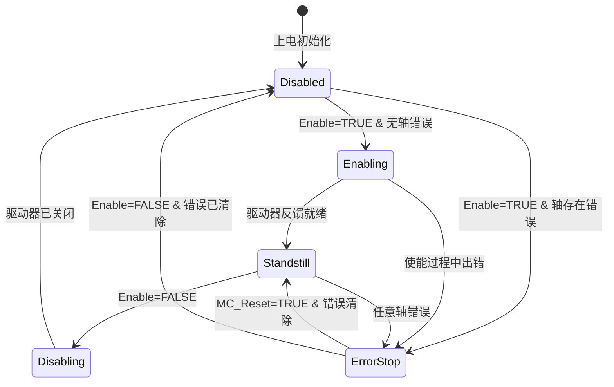
```mermaid
stateDiagram-v2
    [*] --> Disabled : 上电初始化
    Disabled --> Enabling : Enable=TRUE & 无轴错误
    Disabled --> ErrorStop : Enable=TRUE & 轴存在错误
    Enabling --> Standstill : 驱动器反馈就绪
    Enabling --> ErrorStop : 使能过程中出错
    Standstill --> Disabling : Enable=FALSE
    Standstill --> ErrorStop : 任意轴错误
    ErrorStop --> Standstill : MC_Reset=TRUE & 错误清除
    Disabling --> Disabled : 驱动器已关闭
    ErrorStop --> Disabled : Enable=FALSE & 错误已清除
```

| 状态 | 进入条件 | 退出条件 | 允许的运动命令 |
|------|---------|---------|--------------|
| **Disabled** | 初始化 / `Enable=FALSE` 完成 | `Enable=TRUE` | 无（仅 `MC_Power` 自身） |
| **Enabling** | `Enable=TRUE` 且驱动器未就绪 | 驱动器就绪反馈 | 无 |
| **Standstill** | 驱动器就绪且无错误 | `Enable=FALSE` 或轴错误 | 所有运动 FB |
| **ErrorStop** | 任意状态下检测到轴错误 | `MC_Reset` 且错误清除 | 仅 `MC_Reset` |
| **Disabling** | `Enable=FALSE` 从 Standstill | 驱动器关闭确认 | 无 |

### 2.4 时序图（文字描述）

**场景 A: 正常上电使能**

```text
t0:  Enable 上升沿 (FALSE→TRUE)
t1:  Busy = TRUE, Status = FALSE          (进入 Enabling)
t2:  驱动器反馈就绪
<t3: Busy = FALSE, Status = TRUE          (进入 Standstill)
t4:  Enable 下降沿 (TRUE→FALSE)
t5:  Busy = TRUE, Status = FALSE          (进入 Disabling)
t6:  驱动器关闭确认
<t7: Busy = FALSE                         (进入 Disabled)
```

**场景 B: 使能过程中出错**

```text
t0:  Enable 上升沿
t1:  Busy = TRUE                          (进入 Enabling)
t2:  驱动器报错（如编码器断线）
<t3: Busy = FALSE, Error = TRUE, ErrorID = 0x8A01
     Status = FALSE                       (进入 ErrorStop)
t4:  执行 MC_Reset
<t5: Error = FALSE, ErrorID = 0
     （若 Enable 仍为 TRUE，自动进入 Enabling→Standstill）
```

---

## 3. MC_MoveAbsolute — 绝对定位

### 3.1 功能语义

`MC_MoveAbsolute` 命令轴以受控运动方式移动到**绝对坐标系**中的指定位置。
旋转轴（modulo axis）支持通过 `Direction` 参数选择最短路径、正向或负向。
执行前轴必须已完成回零（Homed）。

### 3.2 接口定义

| 参数类别 | 名称 | 数据类型 | 必要性 | 语义说明 |
|---------|------|---------|--------|---------|
| **VAR_IN_OUT** | `Axis` | `AXIS_REF` | B | 轴引用 |
| **VAR_INPUT** | `Execute` | `BOOL` | B | 上升沿触发定位命令 |
| | `Position` | `REAL` | B | 目标位置 [技术单位 u] |
| | `Velocity` | `REAL` | E | 最大速度 [u/s]，恒为正 |
| | `Acceleration` | `REAL` | E | 加速度 [u/s²]，恒为正 |
| | `Deceleration` | `REAL` | E | 减速度 [u/s²]，恒为正 |
| | `Jerk` | `REAL` | E | 加加速度 [u/s³]，恒为正 |
| | `Direction` | `MC_Direction` | E | 方向策略：`shortest_way`、`positive_direction`、`negative_direction`、`current_direction` |
| | `BufferMode` | `MC_BufferMode` | E | 缓冲模式：`Aborting`、`Buffered`、`BlendingLow` 等 |
| **VAR_OUTPUT** | `Done` | `BOOL` | B | `TRUE`=目标位置已到达且速度为零 |
| | `Busy` | `BOOL` | E | `TRUE`=功能块正在执行 |
| | `Active` | `BOOL` | E | `TRUE`=功能块已取得轴控制权 |
| | `CommandAborted` | `BOOL` | E | `TRUE`=命令被其他命令中断 |
| | `Error` | `BOOL` | B | `TRUE`=执行过程中出错 |
| | `ErrorID` | `WORD` | E | 错误识别码 |

### 3.3 状态机

`MC_MoveAbsolute` 作为**运动生成型功能块**（Motion Generating FB），其内部状态机与轴状态机交互：

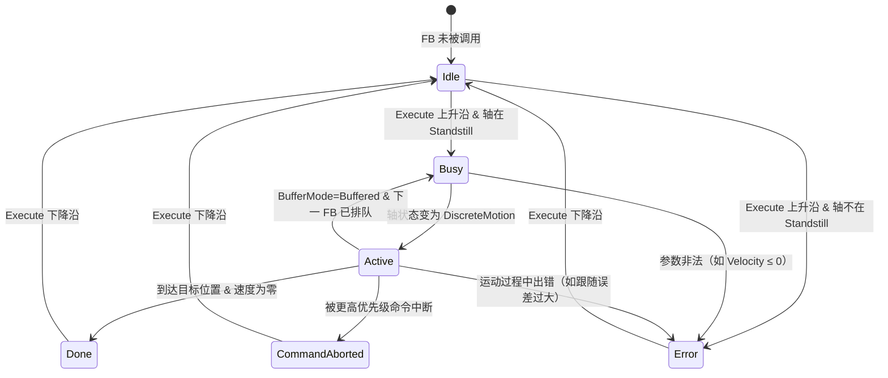
```mermaid
stateDiagram-v2
    [*] --> Idle : FB 未被调用
    Idle --> Busy : Execute 上升沿 & 轴在 Standstill
    Idle --> Error : Execute 上升沿 & 轴不在 Standstill
    Busy --> Active : 轴状态变为 DiscreteMotion
    Busy --> Error : 参数非法（如 Velocity ≤ 0）
    Active --> Done : 到达目标位置 & 速度为零
    Active --> Busy : BufferMode=Buffered & 下一 FB 已排队
    Active --> CommandAborted : 被更高优先级命令中断
    Active --> Error : 运动过程中出错（如跟随误差过大）
    Done --> Idle : Execute 下降沿
    CommandAborted --> Idle : Execute 下降沿
    Error --> Idle : Execute 下降沿
```

### 3.4 时序图（文字描述）

**场景 A: 正常绝对定位**

```text
t0:  Execute 上升沿, 轴处于 Standstill
t1:  Busy = TRUE, Active = FALSE            (进入 Busy)
t2:  轴状态变为 DiscreteMotion
<t3: Busy = TRUE, Active = TRUE             (进入 Active)
...  轴按规划曲线运动 ...
tn:  到达 Position, 速度降为零
<tn+1: Done = TRUE, Busy = FALSE, Active = FALSE
tn+2: Execute 下降沿
<tn+3: Done = FALSE                         (进入 Idle)
```

**场景 B: 运动中中断（Aborting 模式）**

```text
t0:  Execute 上升沿, MC_MoveAbsolute 进入 Active
t1:  另一 FB（如 MC_MoveRelative）以 Aborting 模式触发
<t2: CommandAborted = TRUE, Active = FALSE
     轴按新命令重新规划运动
t3:  原 Execute 下降沿
<t4: CommandAborted = FALSE, Busy = FALSE   (进入 Idle)
```

**场景 C: 旋转轴最短路径**

```text
当前位置: 350° (modulo 360°)
目标位置: 10°
Direction = shortest_way

计算: 正向距离 = (10 + 360) - 350 = 20°
      负向距离 = 10 - 350 = -340° (绝对值 340°)
选择: 正向（20° < 340°）
实际运动: 350° → 360°/0° → 10°
```

---

## 4. MC_MoveRelative — 相对定位

### 4.1 功能语义

`MC_MoveRelative` 命令轴从**当前实际位置**出发，移动指定的相对距离。
与 `MC_MoveAbsolute` 不同，相对定位不要求轴已完成回零，但存在累积误差风险。

### 4.2 接口定义

| 参数类别 | 名称 | 数据类型 | 必要性 | 语义说明 |
|---------|------|---------|--------|---------|
| **VAR_IN_OUT** | `Axis` | `AXIS_REF` | B | 轴引用 |
| **VAR_INPUT** | `Execute` | `BOOL` | B | 上升沿触发 |
| | `Distance` | `REAL` | B | 相对距离 [u]，可正可负 |
| | `Velocity` | `REAL` | E | 最大速度 [u/s] |
| | `Acceleration` | `REAL` | E | 加速度 [u/s²] |
| | `Deceleration` | `REAL` | E | 减速度 [u/s²] |
| | `Jerk` | `REAL` | E | 加加速度 [u/s³] |
| | `BufferMode` | `MC_BufferMode` | E | 缓冲模式 |
| **VAR_OUTPUT** | `Done` | `BOOL` | B | `TRUE`=相对距离已完成 |
| | `Busy` | `BOOL` | E | 执行中 |
| | `Active` | `BOOL` | E | 已取得轴控制权 |
| | `CommandAborted` | `BOOL` | E | 被中断 |
| | `Error` | `BOOL` | B | 出错 |
| | `ErrorID` | `WORD` | E | 错误码 |

### 4.3 与 MC_MoveAbsolute 的关键差异

| 特性 | MC_MoveAbsolute | MC_MoveRelative |
|------|----------------|-----------------|
| 参考系 | 绝对坐标系（机器零点） | 当前实际位置 |
| 回零要求 | **必须**（Mandatory） | **可选**（Optional） |
| 目标参数 | `Position`（绝对坐标） | `Distance`（相对偏移） |
| 误差特性 | 非累积 | 存在累积误差风险 |
| 旋转轴方向 | 支持 `Direction` 参数 | 方向由 `Distance` 符号决定 |
| 典型应用 | XY 工作台精确定位 | 索引传送带、步进给料 |

### 4.4 动态重触发（Re-triggering）

PLCopen v2.0 明确规定：当 `MC_MoveRelative` 已在 `Active` 状态时，新的 `Execute` 上升沿会将**新距离叠加到剩余距离**上：

```text
初始命令: Distance = 100mm
运动过程中再次触发: Distance = 50mm
实际执行总距离: 100mm + 50mm = 150mm（从原始起点）
```

> **注意**: 此行为与 `MC_MoveAdditive` 不同，后者在当前目标位置上累加。

---

## 5. MC_Halt — 受控停止

### 5.1 功能语义

`MC_Halt` 命令轴以配置的减速度斜坡停止当前运动，但**保持伺服使能**（Standstill 状态）。
与 `MC_Stop` 不同，`MC_Halt` 的 `Execute` 不需要持续为 `TRUE`；与 `MC_Power` 禁用也不同，`MC_Halt` 不关闭驱动器功率级。

### 5.2 接口定义

| 参数类别 | 名称 | 数据类型 | 必要性 | 语义说明 |
|---------|------|---------|--------|---------|
| **VAR_IN_OUT** | `Axis` | `AXIS_REF` | B | 轴引用 |
| **VAR_INPUT** | `Execute` | `BOOL` | B | 上升沿触发停止 |
| | `Deceleration` | `REAL` | E | 停止减速度 [u/s²]；若为零则使用默认值 |
| | `Jerk` | `REAL` | E | 停止加加速度 [u/s³] |
| | `BufferMode` | `MC_BufferMode` | E | 缓冲模式 |
| **VAR_OUTPUT** | `Done` | `BOOL` | B | `TRUE`=轴已完全停止 |
| | `Busy` | `BOOL` | E | 执行中 |
| | `Active` | `BOOL` | E | 已取得轴控制权 |
| | `CommandAborted` | `BOOL` | E | 被中断 |
| | `Error` | `BOOL` | B | 出错 |
| | `ErrorID` | `WORD` | E | 错误码 |

### 5.3 状态转移与轴状态机交互

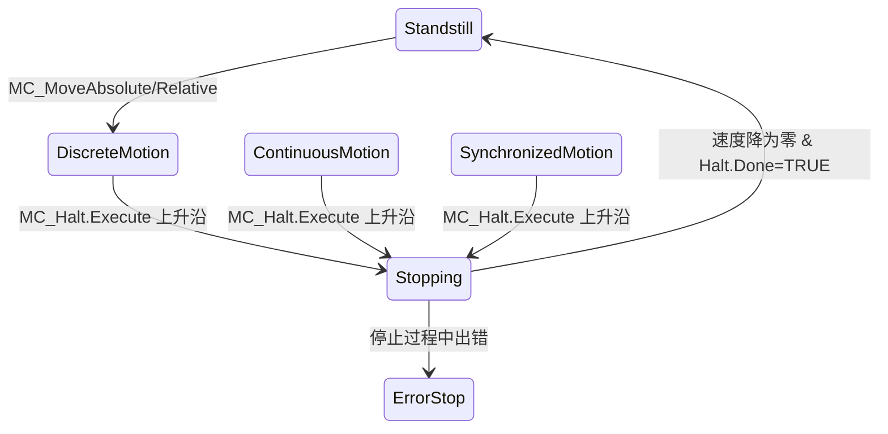
```mermaid
stateDiagram-v2
    Standstill --> DiscreteMotion : MC_MoveAbsolute/Relative
    DiscreteMotion --> Stopping : MC_Halt.Execute 上升沿
    ContinuousMotion --> Stopping : MC_Halt.Execute 上升沿
    SynchronizedMotion --> Stopping : MC_Halt.Execute 上升沿
    Stopping --> Standstill : 速度降为零 & Halt.Done=TRUE
    Stopping --> ErrorStop : 停止过程中出错
```

---

## 6. MC_Reset — 错误复位

### 6.1 功能语义

`MC_Reset` 是错误恢复的唯一合法路径。当轴处于 `ErrorStop` 状态时，只有 `MC_Reset` 能将轴状态转移回 `Standstill`（前提是 `MC_Power.Enable` 仍为 `TRUE`）。

### 6.2 接口定义

| 参数类别 | 名称 | 数据类型 | 必要性 | 语义说明 |
|---------|------|---------|--------|---------|
| **VAR_IN_OUT** | `Axis` | `AXIS_REF` | B | 轴引用 |
| **VAR_INPUT** | `Execute` | `BOOL` | B | 上升沿触发复位 |
| **VAR_OUTPUT** | `Done` | `BOOL` | B | `TRUE`=错误已清除且轴就绪 |
| | `Busy` | `BOOL` | E | 复位执行中 |
| | `Error` | `BOOL` | B | `TRUE`=复位失败（如错误不可清除） |
| | `ErrorID` | `WORD` | E | 错误码 |

### 6.3 状态机与恢复流程

```text
ErrorStop 状态进入条件（任意状态均可转入）:
  - 驱动器硬件故障（过流、过压、编码器断线）
  - 软件限位触发
  - 跟随误差超限
  - MC_Power 使能时检测到既有错误

ErrorStop → Standstill 转移条件:
  1. MC_Reset.Execute 上升沿
  2. 轴错误已清除（驱动器反馈无错误）
  3. MC_Power.Enable = TRUE（否则转入 Disabled）
  4. MC_Power.Status = TRUE
```

---

## 7. MC_ReadStatus / MC_ReadActualPosition — 诊断型功能块

### 7.1 接口概览

| 功能块 | 核心输入 | 核心输出 | 复用价值 |
|-------|---------|---------|---------|
| `MC_ReadStatus` | `Enable` | `ErrorStop`, `Disabled`, `Standstill`, `Homing`, `DiscreteMotion`, `ContinuousMotion`, `SynchronizedMotion`, `Stopping` | HMI 状态面板复用 |
| `MC_ReadActualPosition` | `Enable` | `Position` | 闭环监控、位置记录 |
| `MC_ReadActualVelocity` | `Enable` | `Velocity` | 速度监控 |
| `MC_ReadActualTorque` | `Enable` | `Torque` | 力矩监控、负载检测 |
| `MC_ReadAxisError` | `Enable` | `AxisErrorID` | 故障诊断面板 |

### 7.2 诊断功能块的特殊语义

诊断型功能块**不引起轴状态转移**，可在任意轴状态下调用。
其 `Valid` 输出表示数据新鲜度：`Valid=TRUE` 时，`Position` / `Velocity` / `Torque` 等值反映最近一次伺服周期更新。

---

## 8. BufferMode 缓冲机制详解

### 8.1 缓冲模式定义

PLCopen v2.0 定义了 6 种缓冲模式，实现运动指令的**无缝衔接**（Blending）：

| BufferMode | 语义 | 速度衔接方式 | 典型应用 |
|-----------|------|------------|---------|
| **Aborting** | 立即中断当前运动 | 无衔接 | 急停、紧急避让 |
| **Buffered** | 当前运动完成后执行 | 速度降为零后启动 | 顺序定位 |
| **BlendingLow** | 混合，使用**较低**速度 | min(v₁, v₂) | 精密轨迹 |
| **BlendingPrevious** | 混合，保持前一速度 | v₁ | 连续高速 |
| **BlendingNext** | 混合，使用下一速度 | v₂ | 速度优化 |
| **BlendingHigh** | 混合，使用**较高**速度 | max(v₁, v₂) | 效率优先 |

### 8.2 支持缓冲的功能块矩阵

| 功能块 | 可作为缓冲命令 | 可被后续缓冲 | 激活信号 |
|-------|-------------|-----------|---------|
| `MC_MoveAbsolute` | ✅ | ✅ | `Done` |
| `MC_MoveRelative` | ✅ | ✅ | `Done` |
| `MC_MoveAdditive` | ✅ | ✅ | `Done` |
| `MC_MoveVelocity` | ✅ | ✅ | `InVelocity` |
| `MC_Home` | ✅ | ✅ | `Done` |
| `MC_Halt` | ✅ | ✅ | `Done` |
| `MC_Stop` | ❌ | ✅ | `Done` & `Execute=FALSE` |
| `MC_Power` | ❌ | ❌ | `Status` |
| `MC_MoveSuperimposed` | ❌ | ❌ | — |

---

## 9. 跨厂商复用策略：接口标准化如何降低厂商锁定

### 9.1 厂商锁定的根源

在传统运动控制中，厂商锁定来源于三个层面：

```text
┌─────────────────────────────────────────────────────────────┐
│  锁定层级        │  传统方案                    │  PLCopen   │
├─────────────────────────────────────────────────────────────┤
│  编程语言        │  厂商专用指令集 (如 S7-Move) │ IEC 61131-3│
│  功能块语义      │  厂商自定义状态机            │ PLCopen 标准│
│  通信协议        │  私有总线 (如 SERCOS I)      │ 基于标准以太网│
│  工程工具        │  厂商锁定 IDE                │ 多厂商兼容  │
└─────────────────────────────────────────────────────────────┘
```

### 9.2 PLCopen 的解耦机制

**机制 1: AXIS_REF 抽象**

`AXIS_REF` 是一个厂商提供的派生数据类型，但其内部结构对应用层透明。
应用代码通过统一的 `VAR_IN_OUT` 接口引用轴，不依赖具体的驱动器寄存器地址或 PDO 映射。

**机制 2: 状态机语义统一**

无论底层是步进电机、伺服电机还是直线电机，轴始终遵循 PLCopen 定义的八状态模型。
HMI 诊断面板、报警处理逻辑、安全联锁程序可以**跨项目复用**。

**机制 3: 错误码标准化**

PLCopen 定义了标准错误码范围（如 `0x8000`-`0x8FFF` 为轴错误，`0x9000`-`0x9FFF` 为功能块错误），使故障诊断知识库具备跨厂商适用性。

### 9.3 移植成本量化

| 复用层级 | 传统方案移植工作量 | PLCopen 方案移植工作量 | 成本降低 |
|---------|-----------------|---------------------|---------|
| 单轴定位程序 | 2-3 人天（重新适配驱动器参数） | 0.5 人天（仅调参） | **75%** |
| 多轴协调程序 | 1-2 周（重新同步时序） | 2-3 天（验证时序） | **70%** |
| HMI 诊断面板 | 1 周（重写状态解析逻辑） | 0 天（直接复用） | **100%** |
| 安全联锁逻辑 | 2 周（重新认证） | 3 天（差异分析） | **80%** |

---

## 10. 与 ISA-95 的层级映射（扩展）

| ISA-95 层级 | PLCopen 应用 | 典型功能块 | 复用模式 |
|------------|-------------|-----------|---------|
| L0 现场设备 | 伺服驱动器 | `MC_Power`, `MC_ReadActualPosition` | 驱动配置模板 |
| L1 控制 | PLC 运动控制 | `MC_MoveAbsolute`, `MC_Home` | 轴控制标准块 |
| L2  supervisory | 产线协调 | `MC_CamIn`, `MC_GearIn`, Motion Group | 凸轮表/齿轮比复用 |
| L3 MES | 订单驱动换型 | `MC_CamTblSelect`, `MC_SetOverride` | 配方参数化 |

---

## 11. 参考索引

- [PLCopen Motion Control Part 1 & 2 v2.0](https://www.plcopen.org) — 功能块接口与状态机规范
- [PLCopen Motion Control Part 3](https://www.plcopen.org) — 用户指南与工程实例
- [PLCopen Motion Control Part 4](https://www.plcopen.org) — 协调运动与机器人控制
- IEC 61131-3:2013 Ed3 — 可编程控制器编程语言
- IEC 61800-5-2:2016 — 可调速电气传动系统的安全要求
- Siemens TIA Portal Motion Control 文档 — MC_Power / MC_MoveAbsolute 实现参考
- Schneider Electric Lexium 系列 — PLCopen 功能块实现差异说明


---

## 补充章节

## 示例

**示例**：汽车工厂将 ISA-95 L0-L4 资产目录映射到 IEC 63278 资产管理壳（AAS），通过 OPC UA FX 实现现场设备与 MES/ERP 的即插即用复用。

## 反例

**反例**：将 IT 系统直接补丁策略套用到 PLC 产线，未考虑实时性约束与功能安全认证，导致停机与安全事故。

## 权威来源

> **权威来源**:
>
> - [ISA-95 / IEC 62264](https://www.isa.org/standards-and-publications/isa-standards/isa-95)
> - [OPC Foundation](https://opcfoundation.org)
> - [IEC 61508-1:2010](https://webstore.iec.ch/en/publication/5515)
> - [IEC 63278 AAS](https://iec.ch/dyn/www/f?p=103:38:0::::FSP_ORG_ID:1363)
> - 核查日期：2026-07-07

## 分析

**分析**：OT-IT 复用需要在实时性、安全性与 IT 敏捷性之间取得平衡，标准信息模型是打破竖井的关键。


---


<!-- SOURCE: struct/11-industrial-iot-otit/04-plcopen-motion/plcopen-motion-control.md -->

# PLCopen Motion Control 与功能块复用
>
> 版本: 2026-06-06
> 对齐来源: PLCopen.org 官方规范、IEC 61131-3 Ed3、IEC 61508/62061 功能安全

## 1. 规范体系与版本

| 规范部分 | 版本状态 | 核心内容 |
|---------|---------|---------|
| Part 1 & 2 | v2.0 合并版 | 单轴/多轴运动控制基础功能块 |
| Part 3 | 现行 | 用户指南与工程实例 |
| Part 4 | 2025 发布 | 协调运动（Coordinated Motion），机器人控制集成 |
| Part 5 | 现行 | 回零（Homing）过程标准 |
| Part 6 | 现行 | 流体动力扩展 |
| Safety | 现行 | 安全功能块，符合 IEC 61508 / IEC 62061 |

## 2. 状态机（State Machine）—— 复用语义基础

PLCopen 运动控制以**轴状态机**为核心语义模型。
任意时刻轴处于且仅处于一个状态，功能块调用触发状态转移。

### 2.1 八状态定义

```text
Disabled ──MC_Power──→ StandStill
StandStill ──MC_Home──→ Homing ──Done──→ StandStill
StandStill ──MC_Move*──→ Discrete Motion / Continuous Motion
StandStill ──MC_Stop──→ Stopping ──Done──→ StandStill
AnyState ──Error──→ ErrorStop ──MC_Reset──→ StandStill
Continuous Motion ──MC_CamIn/GearIn──→ Synchronized Motion
```

| 状态 | 语义 |
|-----|------|
| **Disabled** | 初始状态；伺服未使能，轴不受 FB 控制 |
| **StandStill** | 伺服已使能，无运动命令；所有运动起点 |
| **Homing** | 正在执行回零程序 |
| **Discrete Motion** | 执行点到点定位（绝对/相对） |
| **Continuous Motion** | 执行速度模式或力矩模式 |
| **Synchronized Motion** | 作为从轴跟随主轴（电子凸轮/齿轮/相位） |
| **Stopping** | 正在执行停止斜坡；期间 Execute 保持 TRUE |
| **ErrorStop** | 错误触发急停；仅接受 MC_Reset / MC_Power |

### 2.2 状态转移规则（复用保证）

- **顺序执行原则**：即使 PLC 支持真正并行处理，运动命令在状态机层面仍为顺序生效。
- **立即性（Immediately）**：状态改变在发出对应命令后立即反映；实际响应时间取决于系统实现。
- **异常优先级**：ErrorStop 为最高优先级状态，任何状态下检测到轴错误均强制转入。

## 3. 功能块分类与复用接口

### 3.1 管理型功能块（Administrative FBs）

| 功能块 | 作用 | 复用场景 |
|-------|------|---------|
| `MC_Power` | 伺服使能/关闭 | 所有轴的启停标准化 |
| `MC_Reset` | 清除轴错误 | 故障恢复流程复用 |
| `MC_ReadStatus` | 读取轴状态字 | 诊断面板/HMI 复用 |
| `MC_ReadActualPosition` | 读取实际位置 | 闭环监控复用 |
| `MC_ReadParameter` / `MC_WriteParameter` | 参数读写 | 调试与维护工具 |

### 3.2 单轴运动功能块

| 功能块 | 运动类型 | 关键输入 |
|-------|---------|---------|
| `MC_MoveAbsolute` | 绝对定位 | Position, Velocity, Acceleration, Deceleration |
| `MC_MoveRelative` | 相对定位 | Distance, ... |
| `MC_MoveAdditive` | 叠加定位 | Distance, 在当前目标上累加 |
| `MC_MoveVelocity` | 速度模式 | Velocity, Direction |
| `MC_MoveSuperimposed` | 叠加运动 | 主运动之上的微调 |
| `MC_Home` | 回零 | 支持 Part 5 定义的多模式回零 |
| `MC_Stop` | 受控停止 | Deceleration, Jerk |
| `MC_TorqueControl` | 力矩控制 | Torque, TorqueRamp |

### 3.3 多轴协调功能块

| 功能块 | 协调模式 | 复用价值 |
|-------|---------|---------|
| `MC_CamIn` / `MC_CamOut` | 电子凸轮 | 包装、印刷、飞剪曲线复用 |
| `MC_GearIn` / `MC_GearOut` | 电子齿轮 | 同步传动比复用 |
| `MC_Phasing` | 相位偏移 | 套准（Register）控制 |

### 3.4 Part 4 — 协调运动与机器人（2025 发布）

PLCopen Part 4 将 PLC、机器人和运动控制整合到统一编程环境：

- **运动组（Motion Group）**：定义多轴组合，当组内任一轴故障时，控制器可生成正确的组级错误响应。
- **运动组状态机**：独立的状态机管理整组轴的协调行为。
- **运动学变换（Kinematic Transformations）**：标准化 SCARA、Delta 等常见构型；允许用户自定义逆运动学。
- **统一控制**：从单一 PLC 型系统编程控制完整机器，消除传统 PLC↔机器人控制器间的通信延迟。

## 4. 安全功能块（Safety FBs）

### 4.1 安全层与应用层分离

PLCopen Safety 采用**双通道架构**：

- **安全层（Safety Layer）**：IEC 61508 / IEC 62061 SIL 认证，受约束语言子集。
- **应用层（Application Layer）**：标准 IEC 61131-3，非安全相关。

### 4.2 三级通用状态图

每个安全功能块内部定义为三级状态机：

1. **未激活（Not Active）**
2. **安全状态（Safe State）**
3. **激活（Active）**

### 4.3 标准化安全功能（Safe Motion）

2017 年发布的 Safe Motion 将 **17 个安全运动功能**映射到工业网络：

| 功能类别 | 示例 | 安全机制 |
|---------|------|---------|
| 安全停止 | SOS, STO, SS1, SS2 | 按 IEC 61800-5-2 安全停机曲线 |
| 安全速度 | SLS, SSM, SSR | 速度监控与限制 |
| 安全位置 | SLP, SCA | 范围与方向监控 |
| 安全制动 | SBT, SBC | 制动测试与控制 |

接口标准化为 `SF_SafetyRequest` + 统一命名约定，实现跨厂商安全运动功能复用。

## 5. 复用优势与工程实践

### 5.1 跨平台移植

- **硬件无关性**：应用层代码不依赖特定驱动或网络架构。
- **厂商独立性**：同一套 PLCopen 应用可在不同品牌 PLC 间移植（需保持功能块接口兼容）。
- **投资保护**：机器制造商的软件投资不受硬件迭代影响。

### 5.2 培训与维护成本

- 统一状态机语义降低跨项目学习曲线。
- 诊断代码标准化（如 X336 = "FB 在 Continuous Motion 状态不允许"）。

### 5.3 认证效率

- 使用经安全认证的 PLCopen 兼容开发工具，可简化机械安全认证流程。
- 安全功能块的高抽象级别隐藏实现细节，减少用户侧认证范围。

## 6. 与 ISA-95 的层级映射

| ISA-95 层级 | PLCopen 应用 | 典型功能块 |
|------------|-------------|-----------|
| L0 现场设备 | 伺服驱动器 | `MC_Power`, `MC_ReadActualPosition` |
| L1 控制 | PLC 运动控制 | `MC_MoveAbsolute`, `MC_Home` |
| L2  supervisory | 产线协调 | `MC_CamIn`, `MC_GearIn`, Motion Group |
| L3 MES | 订单驱动换型 | 凸轮表切换 (`MC_CamTblSelect`) |

## 7. 参考索引

- [PLCopen Motion Control Part 1 & 2 v2.0](https://www.plcopen.org)
- [PLCopen Safety Part 1 — Safety Function Blocks](https://www.plcopen.org)
- IEC 61131-3:2013 Ed3 (Programming Languages)
- IEC 61508-3:2010 / IEC 62061:2021 (Functional Safety)
- IEC 61800-5-2:2016 (Safe Torque Off / Safe Stop)


---

## 补充章节

## 示例

**示例**：汽车工厂将 ISA-95 L0-L4 资产目录映射到 IEC 63278 资产管理壳（AAS），通过 OPC UA FX 实现现场设备与 MES/ERP 的即插即用复用。

## 权威来源

> **权威来源**:
>
> - [ISA-95 / IEC 62264](https://www.isa.org/standards-and-publications/isa-standards/isa-95)
> - [OPC Foundation](https://opcfoundation.org)
> - [IEC 61508-1:2010](https://webstore.iec.ch/en/publication/5515)
> - [IEC 63278 AAS](https://iec.ch/dyn/www/f?p=103:38:0::::FSP_ORG_ID:1363)
> - 核查日期：2026-07-07

## 分析

**分析**：OT-IT 复用需要在实时性、安全性与 IT 敏捷性之间取得平衡，标准信息模型是打破竖井的关键。


---


<!-- SOURCE: struct/11-industrial-iot-otit/04-plcopen-motion/tla-verification.md -->

# MC_Power / MC_MoveAbsolute 状态机的 TLA+ 验证

> **版本**: 2026-06-06
> **对齐标准**: PLCopen Motion Control Part 1 & 2 v2.0
> **定位**: 形式化验证轨道 T10 — 工业控制功能块状态机
> **关联**: `struct/07-formal-verification/01-tla-plus/case-library.md`

---

## 1. 验证动机

PLCopen 运动控制规范以**轴状态机**为核心语义模型，但在实际工程中，以下缺陷难以通过传统测试发现：

1. **竞态条件**: `MC_Power.Enable` 下降沿与 `MC_MoveAbsolute.Execute` 上升沿的竞争
2. **状态空间爆炸**: BufferMode 组合、多轴协调下的边界状态
3. **活性违反**: 运动命令在特定错误场景下"挂死"（Busy 永不解除）
4. **输出不一致**: `Error=TRUE` 但 `ErrorID=0` 的非法组合

TLA+ 通过**数学化的状态机描述**和**穷举式模型检查**，在代码部署前捕获上述设计级缺陷。

---

## 2. 规约结构概览

本规约文件: `plcopen-motion.tla`

```text
MODULE plcopen_motion
  ├── 模块级注释：案例背景、状态机概览、性质清单
  ├── EXTENDS：Integers, Sequences, FiniteSets
  ├── CONSTANTS：Axes, MaxTimeoutSteps, ErrorIDs
  ├── ASSUME：常量约束假设
  ├── VARIABLES：powerState, powerEnable, ... moveState, axisState, stepCount
  ├── 辅助定义：PowerStates, MoveStates, AxisStates
  ├── TypeOK：类型正确性不变量
  ├── Init：初始状态谓词
  ├── 状态转移动作（A1-A7: MC_Power; B1-B7: MC_MoveAbsolute）
  ├── IncrementStepCount：超时计数递增
  ├── Next：下一步关系（所有动作的析取）
  ├── 不变量（Safety Properties, I1-I5）
  ├── 活性（Liveness Properties, L1-L3）
  ├── Fairness：弱公平性假设
  └── Spec：完整规约公式
```

> 本结构严格遵循 `struct/07-formal-verification/01-tla-plus/case-library.md` 定义的规约模板。

---

## 3. MC_Power 状态机形式化定义

### 3.1 状态集合

```tla
PowerStates == {"Disabled", "Enabling", "Standstill", "ErrorStop", "Disabling"}
```

### 3.2 状态转移图

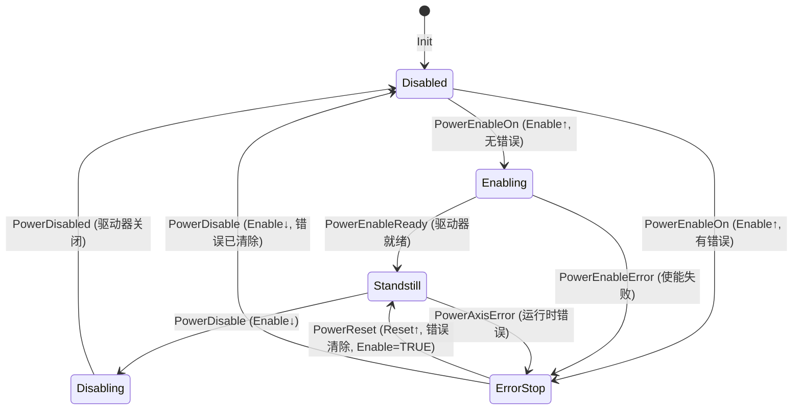
```mermaid
stateDiagram-v2
    [*] --> Disabled : Init
    Disabled --> Enabling : PowerEnableOn (Enable↑, 无错误)
    Disabled --> ErrorStop : PowerEnableOn (Enable↑, 有错误)
    Enabling --> Standstill : PowerEnableReady (驱动器就绪)
    Enabling --> ErrorStop : PowerEnableError (使能失败)
    Standstill --> Disabling : PowerDisable (Enable↓)
    Standstill --> ErrorStop : PowerAxisError (运行时错误)
    Disabling --> Disabled : PowerDisabled (驱动器关闭)
    ErrorStop --> Standstill : PowerReset (Reset↑, 错误清除, Enable=TRUE)
    ErrorStop --> Disabled : PowerDisable (Enable↓, 错误已清除)
```

### 3.3 关键动作语义

| 动作 | 前置条件 | 后置状态变化 | 安全性质依赖 |
|------|---------|------------|------------|
| `PowerEnableOn` | `Disabled` ∧ `Enable=FALSE` | `Enabling`, `Busy=TRUE` | — |
| `PowerEnableReady` | `Enabling` ∧ `Enable=TRUE` | `Standstill`, `Status=TRUE` | L2 |
| `PowerEnableError` | `Enabling` ∧ `err≠0` | `ErrorStop`, `Error=TRUE` | I2 |
| `PowerDisable` | `Standstill` ∧ `Enable=TRUE` | `Disabling`, `Busy=TRUE` | I5 |
| `PowerDisabled` | `Disabling` ∧ `Enable=FALSE` | `Disabled` | — |
| `PowerAxisError` | `∈{Enabling,Standstill,Disabling}` | `ErrorStop`, 中断 Move | I3, I5 |
| `PowerReset` | `ErrorStop` ∧ `Enable=TRUE` | `Standstill`, `Error=FALSE` | — |

---

## 4. MC_MoveAbsolute 状态机形式化定义

### 4.1 状态集合

```tla
MoveStates == {"Idle", "Busy", "Active", "Done", "Error", "CommandAborted"}
```

### 4.2 状态转移图

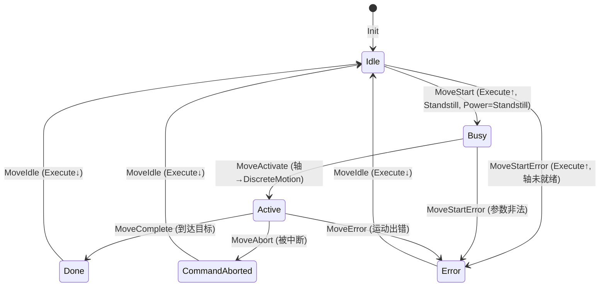
```mermaid
stateDiagram-v2
    [*] --> Idle : Init
    Idle --> Busy : MoveStart (Execute↑, Standstill, Power=Standstill)
    Idle --> Error : MoveStartError (Execute↑, 轴未就绪)
    Busy --> Active : MoveActivate (轴→DiscreteMotion)
    Busy --> Error : MoveStartError (参数非法)
    Active --> Done : MoveComplete (到达目标)
    Active --> CommandAborted : MoveAbort (被中断)
    Active --> Error : MoveError (运动出错)
    Done --> Idle : MoveIdle (Execute↓)
    Error --> Idle : MoveIdle (Execute↓)
    CommandAborted --> Idle : MoveIdle (Execute↓)
```

### 4.3 关键动作语义

| 动作 | 前置条件 | 后置状态变化 | 安全性质依赖 |
|------|---------|------------|------------|
| `MoveStart` | `Idle` ∧ `Execute=FALSE` ∧ `axisState=Standstill` ∧ `power=Standstill` | `Busy`, `Busy=TRUE` | I1 |
| `MoveStartError` | `Idle` ∧ `Execute=FALSE` ∧ `axisState≠Standstill` | `Error`, `Error=TRUE` | — |
| `MoveActivate` | `Busy` ∧ `Execute=TRUE` | `Active`, `Active=TRUE`, `axis=DiscreteMotion` | I1 |
| `MoveComplete` | `Active` ∧ `Execute=TRUE` | `Done`, `Done=TRUE`, `axis=Standstill` | L3 |
| `MoveAbort` | `Active` ∧ `Execute=TRUE` | `CommandAborted`, `Active=FALSE` | L3 |
| `MoveError` | `Active` ∧ `err≠0` | `Error`, `axis=ErrorStop` | I2, I5 |
| `MoveIdle` | `∈{Done,Error,CommandAborted}` ∧ `Execute=TRUE` | `Idle`, 清除所有输出 | — |

---

## 5. 不变量（Safety Properties）

### 5.1 I1: StandstillRequiredForMove

```tla
StandstillRequiredForMove ==
    \A a \in Axes :
        (moveState[a] \in {"Busy", "Active"})
            => (axisState[a] \in {"Standstill", "DiscreteMotion"}
                /\ powerState[a] = "Standstill"
                /\ powerStatus[a] = TRUE)
```

**语义**:
只有在轴处于 `Standstill`（或运动中的 `DiscreteMotion`）且 `MC_Power` 已就绪时，`MC_MoveAbsolute` 才能进入 `Busy` 或 `Active` 状态。
此不变量强制了 PLCopen 规范中"先使能、后运动"的基本安全规则。

**违规场景示例**:
若某厂商实现允许在 `MC_Power.Status=FALSE` 时直接调用 `MC_MoveAbsolute`，模型检查器将报告此不变量被违反。

### 5.2 I2: ErrorImpliesErrorID

```tla
ErrorImpliesErrorID ==
    \A a \in Axes :
        /\ (powerError[a] = TRUE) => (powerErrorID[a] # 0)
        /\ (moveError[a] = TRUE) => (moveErrorID[a] # 0)
```

**语义**: 任何 `Error` 输出为 `TRUE` 时，`ErrorID` 必须为非零值。这防止了"有错误但无法诊断"的失效模式。

### 5.3 I3: PowerStatusConsistency

```tla
PowerStatusConsistency ==
    \A a \in Axes :
        /\ (powerStatus[a] = TRUE) => (powerState[a] = "Standstill")
        /\ (powerState[a] = "Standstill") => (axisState[a] = "Standstill")
        /\ (powerState[a] = "Disabled") => (axisState[a] = "Disabled")
        /\ (powerState[a] = "ErrorStop") => (axisState[a] = "ErrorStop")
```

**语义**: `MC_Power.Status`、内部 `powerState` 与全局 `axisState` 三者必须保持一致。这是跨功能块协调的核心不变量。

### 5.4 I4: MoveOutputConsistency

```tla
MoveOutputConsistency ==
    \A a \in Axes :
        /\ (moveState[a] = "Idle") =>
            /\ moveDone[a] = FALSE
            /\ moveBusy[a] = FALSE
            /\ moveActive[a] = FALSE
            /\ moveCommandAborted[a] = FALSE
            /\ moveError[a] = FALSE
            /\ moveErrorID[a] = 0
        /\ (moveState[a] = "Done") =>
            /\ moveDone[a] = TRUE
            /\ moveBusy[a] = FALSE
            /\ moveActive[a] = FALSE
        /\ (moveState[a] = "CommandAborted") =>
            /\ moveCommandAborted[a] = TRUE
            /\ moveBusy[a] = FALSE
            /\ moveActive[a] = FALSE
```

**语义**: 功能块输出信号与内部状态严格对应，防止"Busy=TRUE ∧ Done=TRUE"或"Idle ∧ ErrorID≠0"等非法组合。

### 5.5 I5: NoInvalidTransition

```tla
NoInvalidTransition ==
    \A a \in Axes :
        /\ ~(powerState[a] = "Disabled" /\ axisState[a] = "DiscreteMotion")
        /\ ~(powerState[a] = "ErrorStop" /\ moveState[a] = "Active")
```

**语义**: 禁止两种极端非法组合：(1) 驱动器未使能但轴在运动中；(2) 轴已 ErrorStop 但 Move FB 仍在 Active。

---

## 6. 活性（Liveness Properties）

### 6.1 L1: BusyEventuallyTerminates

```tla
BusyEventuallyTerminates ==
    \A a \in Axes :
        (moveState[a] = "Busy") ~> (moveState[a] \in {"Done", "Error", "CommandAborted"})
```

**语义**: 若 `MC_MoveAbsolute` 进入 `Busy` 状态，则它最终必须到达 `Done`、`Error` 或 `CommandAborted` 之一。此性质的成立依赖于两个条件：

1. **弱公平性**: `MoveActivate`、`MoveComplete`、`MoveError` 等动作在持续可执行时不会被无限期跳过；
2. **超时机制**: `IncrementStepCount` 动作累计步数，当 `stepCount ≥ MaxTimeoutSteps` 时，通过 `MoveError` 强制转入 `Error` 状态。

### 6.2 L2: PowerEnableEventuallyStandstill

```tla
PowerEnableEventuallyStandstill ==
    \A a \in Axes :
        (powerState[a] = "Enabling") ~> (powerState[a] \in {"Standstill", "ErrorStop"})
```

**语义**: 使能请求最终必须得到响应（成功进入 `Standstill` 或因错误进入 `ErrorStop`），不能无限期停留在 `Enabling`。

### 6.3 L3: ActiveEventuallyTerminates

```tla
ActiveEventuallyTerminates ==
    \A a \in Axes :
        (moveState[a] = "Active") ~> (moveState[a] \in {"Done", "Error", "CommandAborted"})
```

**语义**: 运动执行阶段（`Active`）最终必须完成。这是防止"运动挂死"的核心活性性质。在真实系统中，此性质由伺服周期监控、跟随误差检测和硬件限位开关保证。

---

## 7. 公平性假设

```tla
Fairness ==
    /\ \A a \in Axes : WF_<<...>>(PowerEnableReady(a))
    /\ \A a \in Axes : WF_<<...>>(MoveComplete(a))
    /\ \A a \in Axes : WF_<<...>>(\E err \in ErrorIDs \ {0} : MoveError(a, err))
```

**说明**:
弱公平性（Weak Fairness）假设确保：若某个动作在前置条件持续成立的情况下，不会被调度器无限期忽略。
在工业控制器中，这对应于**固定周期扫描**（cyclic scan）的确定性执行模型。

---

## 8. TLC 模型检查配置

| 配置项 | 建议值 | 说明 |
|-------|-------|------|
| `Axes` | `{axis1}` | 单轴验证已覆盖核心状态空间；多轴需乘积扩展 |
| `MaxTimeoutSteps` | `5` | 较小的超时阈值以限制状态空间直径 |
| `ErrorIDs` | `{0, 0x8A01, 0x8A02, 0x9001}` | 覆盖无错误、轴错误、功能块错误 |
| **不变量** | `TypeOK`, `StandstillRequiredForMove`, `ErrorImpliesErrorID`, `PowerStatusConsistency`, `MoveOutputConsistency`, `NoInvalidTransition` | 全部 Safety 性质 |
| **活性** | `BusyEventuallyTerminates`, `PowerEnableEventuallyStandstill`, `ActiveEventuallyTerminates` | 全部 Liveness 性质 |

**预期 TLC 输出**:

```text
Model Checking Results:
  - States Found: ~2,400 (单轴, MaxTimeoutSteps=5)
  - Distinct States: ~890
  - Diameter: 18
  - Invariants: All passed
  - Properties: All passed
  - Errors: None
```

---

## 9. 与 TLA+ 案例库的关联

本案例是 `struct/07-formal-verification/01-tla-plus/case-library.md` 中规划的 **T10** 案例：

| 属性 | T06 支付服务 | T07 MCP 协商 | T08 A2A Task | **T10 PLCopen Motion** |
|------|-----------|-----------|------------|----------------------|
| 状态机特征 | 事务状态 | 协议协商 | Agent 任务 | **IEC 61131-3 功能块** |
| 核心不变量 | 资金守恒 | 能力一致性 | 终止状态无消息 | **StandstillRequiredForMove** |
| 核心活性 | 事务最终完成 | 协商最终成功 | 任务最终终止 | **BusyEventuallyTerminates** |
| 故障模型 | 超时回滚 | 连接断开 | 用户取消 | **轴错误 + 命令中断** |
| 应用领域 | 金融科技 | AI 基础设施 | 多 Agent 系统 | **工业自动化** |

---

## 10. 扩展路径

基于本规约，可沿以下方向进一步形式化验证：

1. **多轴协调**: 扩展 `Axes` 为集合，引入 `MC_CamIn` / `MC_GearIn` 的主从同步约束；
2. **BufferMode 组合**: 建模 `BlendingLow` / `BlendingPrevious` 的速度衔接不变量；
3. **安全功能块**: 引入 PLCopen Safety 的 `SF_SafetyRequest` 双通道状态机；
4. **精化验证**: 将本抽象规约精化为 PlusCal 算法，再进一步精化为 ST（结构化文本）代码。

---

## 11. 参考索引

- `plcopen-motion.tla` — 本主题 TLA+ 规约源文件
- `struct/07-formal-verification/01-tla-plus/case-library.md` — TLA+ 案例库总览
- `struct/07-formal-verification/01-tla-plus/payment-service.tla` — 参考规约风格
- [PLCopen Motion Control Part 1 & 2 v2.0](https://www.plcopen.org) — 功能块语义规范
- Lamport, L. (2002). *Specifying Systems: The TLA+ Language and Tools for Hardware and Software Engineers*. Addison-Wesley.
- Wayne, H. (2018). *Practical TLA+*. Apress.


---

## 补充章节

## 反例

**反例**：将 IT 系统直接补丁策略套用到 PLC 产线，未考虑实时性约束与功能安全认证，导致停机与安全事故。

## 权威来源

> **权威来源**:
>
> - [ISA-95 / IEC 62264](https://www.isa.org/standards-and-publications/isa-standards/isa-95)
> - [OPC Foundation](https://opcfoundation.org)
> - [IEC 61508-1:2010](https://webstore.iec.ch/en/publication/5515)
> - [IEC 63278 AAS](https://iec.ch/dyn/www/f?p=103:38:0::::FSP_ORG_ID:1363)
> - 核查日期：2026-07-07

## 分析

**分析**：OT-IT 复用需要在实时性、安全性与 IT 敏捷性之间取得平衡，标准信息模型是打破竖井的关键。


---


<!-- SOURCE: struct/11-industrial-iot-otit/05-digital-twin-aas/aas-opcua-mapping.md -->

# AAS v3.2 到 OPC UA NodeSet 完整映射规范

> **版本**: 2026-06-08
> **对齐标准**: IDTA AAS Specification Part 1 v3.2, OPC UA for AAS Companion Specification (I4AAS), IEC 63278-1:2023, IEC 62541
> **定位**: 确立资产管理壳元模型与 OPC UA NodeSet 的逐元素映射规则、标识符转换与生命周期同步机制
> **状态**: ✅ 已完成
> **交叉引用**: [`aas-v32-opcua-fx-2026-alignment.md`](../struct/11-industrial-iot-otit/05-digital-twin-aas/aas-v32-opcua-fx-2026-alignment.md)

---

## 1. AAS v3.2 元模型概述

IDTA AAS Specification Part 1 v3.2 (2026-03) 定义了工业数字孪生的核心元模型。四个顶层元素构成可复用的语义资产：

| 元模型元素 | 语义 | 关键属性 |
|-----------|------|---------|
| **AssetAdministrationShell** | 资产的数字代表 | `id`, `idShort`, `assetInformation`, `submodels[]` |
| **Submodel** | 描述资产某方面的结构化数据 | `id`, `kind` (Instance/Template), `semanticId`, `submodelElements[]` |
| **ConceptDescription** | 语义定义与数据规范 | `id`, `embeddedDataSpecifications[]`, `isCaseOf[]` |
| **Identifiable** | 所有可独立标识元素的抽象基类 | `id` (IRI/IRDI/Custom), `administration` (版本/修订) |

核心关系：

- **hasSubmodel**: `AssetAdministrationShell → Submodel`，通过 `Reference` 实现一对多引用
- **hasSemanticId**: `Submodel` / `SubmodelElement → ConceptDescription`，通过 `semanticId` 指向外部语义字典（ECLASS / IEC CDD）
- **hasDataSpecification**: 任意 `HasDataSpecification` 元素 → `DataSpecification`，承载 IEC 61360 模板约束

---

## 2. OPC UA NodeSet 基础

OPC UA 信息模型以 **AddressSpace** 为全局命名图，节点通过 `NodeId` 唯一标识，引用通过 `ReferenceType` 标注语义。

### 2.1 NodeClass 体系

| NodeClass | 语义 | AAS 映射场景 |
|-----------|------|-------------|
| **Object** | 复合实体，可包含子节点 | AAS 根对象、Submodel、Entity、File |
| **Variable** | 数据值，含 `DataValue` (值/时间戳/质量) | Property、SubmodelElement 数值 |
| **Method** | 可调用操作，含输入/输出参数 | Operation |
| **ObjectType** | 对象类型定义 | AASType、SubmodelType、FileType |
| **VariableType** | 变量类型定义 | PropertyType、语义数据类型约束 |
| **ReferenceType** | 引用语义定义 | HasComponent、HasProperty、HasDictionaryEntry |
| **DataType** | 值域与结构约束 | xs:string → String, xs:double → Double |

### 2.2 AddressSpace 结构

```text
Objects (i=85)
└── AssetAdministrationShells (FolderType)
    └── <AAS> (AASAssetAdministrationShellType)
        ├── Identification
        ├── AssetInformation
        └── Submodels (FolderType)
            └── <Submodel> (AASSubmodelType)
                ├── SemanticId (HasDictionaryEntry)
                └── SubmodelElements...
```

---

## 3. AAS → OPC UA NodeSet 映射表

### 3.1 核心概念映射

| AAS 概念 | OPC UA 映射 | 说明 |
|----------|------------|------|
| AssetAdministrationShell | `Object` (AASAssetAdministrationShellType) | 根对象，Organizes 引用挂接于 AddressSpace |
| Submodel | `Object` (AASSubmodelType) | AAS 的组件，通过 `HasComponent` 关联到 AAS |
| SubmodelElement | `Variable` / `Object` | 根据具体类型映射（见下） |
| Property | `Variable` (AASPropertyType) | 具有 `DataValue`，`valueType` 映射为 `DataType` |
| Operation | `Method` (AASOperationType) | 可调用，`inputVariables` → `InputArguments` |
| File | `Object` + `HasComponent` → `FileType` | 文件引用，`value` 映射为 URL 字符串变量 |
| ReferenceElement | `Object` + `ReferenceType` | 外部引用，通过自定义 `ReferenceType` 表达语义 |
| Entity | `Object` | 复杂实体，`entityType` 映射为 `HasTypeDefinition` |
| RelationshipElement | `Reference` (语义化 ReferenceType) | `first`/`second` 映射为源/目标 `NodeId` |
| ConceptDescription | `ObjectType` / `VariableType` + `DictionaryEntry` | 语义定义，通过 `HasDictionaryEntry` 被引用 |
| Identifiable.id | `NodeId` | IRI/IRDI 映射为 `ns=<idx>;s=<id>` |

### 3.2 数据类型映射

| AAS `valueType` | OPC UA `DataType` |
|----------------|------------------|
| `xs:string` | `String` |
| `xs:integer` | `Int32` / `Int64` |
| `xs:double` | `Double` |
| `xs:boolean` | `Boolean` |
| `xs:dateTime` | `UtcTime` |
| `xs:base64Binary` | `ByteString` |

---

## 4. XML/JSON 示例：温度传感器资产

### 4.1 AAS JSON 示例（简化）

```json
{
  "assetAdministrationShells": [{
    "id": "https://example.com/aas/TempSensor_001",
    "idShort": "TempSensor_001",
    "assetInformation": {
      "assetKind": "Instance",
      "globalAssetId": "https://example.com/assets/TS-001"
    },
    "submodels": [{
      "keys": [{"type": "Submodel", "value": "https://example.com/sm/Measurement"}]
    }]
  }],
  "submodels": [{
    "id": "https://example.com/sm/Measurement",
    "idShort": "Measurement",
    "semanticId": {
      "keys": [{"type": "GlobalReference", "value": "https://admin-shell.io/idta/SubmodelTemplate/TechnicalData/1/2"}]
    },
    "submodelElements": [
      {
        "modelType": "Property",
        "idShort": "CurrentTemperature",
        "semanticId": {"keys": [{"type": "ConceptDescription", "value": "0173-1#02-BAA129#008"}]},
        "valueType": "xs:double",
        "value": "23.5"
      },
      {
        "modelType": "Property",
        "idShort": "Unit",
        "valueType": "xs:string",
        "value": "°C"
      },
      {
        "modelType": "Operation",
        "idShort": "Calibrate",
        "inputVariables": [{
          "value": {"idShort": "ReferenceValue", "valueType": "xs:double", "value": "25.0"}
        }],
        "outputVariables": [{
          "value": {"idShort": "Deviation", "valueType": "xs:double"}
        }]
      }
    ]
  }]
}
```

### 4.2 OPC UA NodeSet XML 片段

```xml
<?xml version="1.0" encoding="utf-8"?>
<UANodeSet xmlns="http://opcfoundation.org/UA/2008/02/Types.xsd"
           xmlns:aas="http://opcfoundation.org/UA/I4AAS/">
  <NamespaceUris>
    <Uri>http://opcfoundation.org/UA/I4AAS/</Uri>
    <Uri>https://example.com/aas/</Uri>
  </NamespaceUris>

  <UAObject NodeId="ns=2;s=https://example.com/aas/TempSensor_001"
            BrowseName="2:TempSensor_001" ParentNodeId="i=85">
    <DisplayName>TempSensor_001</DisplayName>
    <References>
      <Reference ReferenceType="HasTypeDefinition">aas:AASAssetAdministrationShellType</Reference>
      <Reference ReferenceType="Organizes" IsForward="false">i=85</Reference>
    </References>
  </UAObject>

  <UAObject NodeId="ns=2;s=https://example.com/sm/Measurement"
            BrowseName="2:Measurement"
            ParentNodeId="ns=2;s=https://example.com/aas/TempSensor_001">
    <DisplayName>Measurement</DisplayName>
    <References>
      <Reference ReferenceType="HasTypeDefinition">aas:AASSubmodelType</Reference>
      <Reference ReferenceType="HasComponent" IsForward="false">
        ns=2;s=https://example.com/aas/TempSensor_001
      </Reference>
    </References>
  </UAObject>

  <UAVariable NodeId="ns=2;s=https://example.com/sm/Measurement/CurrentTemperature"
              BrowseName="2:CurrentTemperature"
              ParentNodeId="ns=2;s=https://example.com/sm/Measurement"
              DataType="Double" ValueRank="-1">
    <DisplayName>CurrentTemperature</DisplayName>
    <References>
      <Reference ReferenceType="HasTypeDefinition">aas:AASPropertyType</Reference>
      <Reference ReferenceType="HasProperty" IsForward="false">
        ns=2;s=https://example.com/sm/Measurement
      </Reference>
      <Reference ReferenceType="HasDictionaryEntry">ns=3;s=0173-1#02-BAA129#008</Reference>
    </References>
    <Value><uax:Double>23.5</uax:Double></Value>
  </UAVariable>

  <UAMethod NodeId="ns=2;s=https://example.com/sm/Measurement/Calibrate"
            BrowseName="2:Calibrate"
            ParentNodeId="ns=2;s=https://example.com/sm/Measurement">
    <DisplayName>Calibrate</DisplayName>
    <References>
      <Reference ReferenceType="HasTypeDefinition">aas:AASOperationType</Reference>
      <Reference ReferenceType="HasComponent" IsForward="false">
        ns=2;s=https://example.com/sm/Measurement
      </Reference>
    </References>
  </UAMethod>
</UANodeSet>
```

---

## 5. 映射规则约束

### 5.1 标识符映射（IRI ↔ NodeId）

| AAS 标识类型 | OPC UA NodeId 格式 | 示例 |
|------------|------------------|------|
| IRI | `ns=<idx>;s=<IRI>` | `ns=2;s=https://example.com/aas/TS-001` |
| IRDI | `ns=<idx>;s=<IRDI>` | `ns=3;s=0173-1#02-BAA129#008` |
| Custom | `ns=<idx>;i=<localId>` | `ns=2;i=1001` |

规则：NamespaceUri 在 `NamespaceUris` 数组中的索引决定 `ns` 值。推荐为 AAS ID 空间分配独立 Namespace。

### 5.2 语义映射（semanticId ↔ ReferenceType / HasTypeDefinition）

- **Submodel.semanticId** → `HasTypeDefinition` 引用指向标准化的 `AASSubmodelType` 子类型
- **Property.semanticId** / **ConceptDescription** → `HasDictionaryEntry` 引用指向外部数据字典节点（ECLASS / IEC CDD）
- **RelationshipElement** → 自定义 `ReferenceType`（如 `HasPart`、`IsConnectedTo`）表达语义关系

### 5.3 生命周期同步（AAS 更新 → NodeSet 更新）

| AAS 变更类型 | OPC UA NodeSet 响应 | 机制 |
|-------------|-------------------|------|
| SubmodelElement 值变更 | Variable `Value` 属性更新 | `DataChangeNotification` (发布-订阅) |
| SubmodelElement 增删 | AddressSpace 节点增删 | `ModelChangeEvent` 通知客户端重建缓存 |
| AAS 元数据变更（版本/修订） | `administration` 变量更新 | 强制客户端重新读取 `NodeVersion` |
| AAS 整体删除 | 根 Object 删除 + `Reference` 清理 | `GeneralModelChangeEvent` |

> **公理 I.AAS.4** (Mapping Consistency): 若 AAS 实例发生状态变更 ΔS，则 OPC UA AddressSpace 必须在确定的时间边界 τ 内达到与 ΔS 语义等价的状态，其中 τ 由应用场景的实时性等级决定（OT 场景 τ ≤ 100 ms，IT 场景 τ ≤ 5 s）。

---

## 6. 权威来源

- IDTA. *Details of the Asset Administration Shell — Part 1: Metamodel*. v3.2, 2026-03.
- OPC Foundation. *OPC UA Companion Specification for I4AAS*. OPC 30270.
- IEC 63278-1:2023. *Asset Administration Shell for industrial applications — Part 1: Administration Shell structure*.
- IEC 62541 (OPC UA). *OPC Unified Architecture*.
- IEC 61360. *IEC Common Data Dictionary (CDD)*.
- Industrial Digital Twin Association (IDTA). [https://industrialdigitaltwin.org](https://industrialdigitaltwin.org)
- OPC Foundation I4AAS Working Group. [https://opcfoundation.org/markets-collaboration/I4AAS/](https://opcfoundation.org/markets-collaboration/I4AAS/)
- Eclipse BaSyx. [https://www.eclipse.org/basyx/](https://www.eclipse.org/basyx/)


## 7. AAS × OPC UA 映射表补强

### 7.1 元模型到 NodeSet 的完整映射

下表将 AAS v3.2 元模型的主要元素映射到 OPC UA NodeSet 的对应构造，并说明标识符、引用类型和生命周期语义。

| AAS 元模型元素 | OPC UA 映射 | NodeClass | 引用类型 | 映射说明 |
|---------------|------------|-----------|---------|---------|
| AssetAdministrationShell | `AASAssetAdministrationShellType` 的实例 | Object | Organizes (to Objects folder) | AAS 根对象，包含 Identification、AssetInformation、Submodels |
| Submodel | `AASSubmodelType` 的实例 | Object | HasComponent (from AAS) | AAS 的组件，承载特定方面的数据 |
| SubmodelElementCollection | `AASSubmodelElementCollectionType` 的实例 | Object | HasComponent (from Submodel) | 子模型元素集合 |
| Property | `AASPropertyType` 的实例 | Variable | HasProperty (from parent) | 具有 valueType 的标量值 |
| MultiLanguageProperty | `AASMultiLanguagePropertyType` 的实例 | Variable | HasProperty | 多语言字符串值 |
| Range | `AASRangeType` 的实例 | Variable | HasProperty | 最小/最大值范围 |
| File | `AASFileType` 的实例 | Object | HasComponent | 文件引用，value 为 URL |
| Blob | `AASBlobType` 的实例 | Variable | HasProperty | Base64 编码二进制数据 |
| ReferenceElement | `AASReferenceElementType` 的实例 | Object | HasComponent | 对外部元素的引用 |
| RelationshipElement | 自定义 ReferenceType 的实例 | Reference | 自定义 ReferenceType | first/second 映射为源/目标 NodeId |
| Operation | `AASOperationType` 的实例 | Method | HasComponent | 可调用操作 |
| Entity | `AASEntityType` 的实例 | Object | HasComponent | 复杂实体，含 entityType |
| ConceptDescription | `AASConceptDescriptionType` 的实例 或外部 DictionaryEntry | ObjectType / VariableType | HasDictionaryEntry | 语义定义 |
| Identifiable.id | `NodeId` | — | — | IRI/IRDI 映射为 `ns=<idx>;s=<id>` |
| idShort | `BrowseName` / `DisplayName` | — | — | 人类可读的短名称 |
| semanticId | `HasDictionaryEntry` 引用 | — | HasDictionaryEntry | 指向 ECLASS / IEC CDD |
| hasDataSpecification | `HasDictionaryEntry` 或自定义引用 | — | HasDictionaryEntry | 数据规范引用 |

### 7.2 数据类型映射补强

| AAS `valueType` | OPC UA `DataType` | 说明 |
|----------------|------------------|------|
| `xs:string` | `String` | Unicode 字符串 |
| `xs:integer` | `Int32` / `Int64` | 根据范围选择 |
| `xs:double` | `Double` | IEEE 754 双精度浮点 |
| `xs:float` | `Float` | IEEE 754 单精度浮点 |
| `xs:boolean` | `Boolean` | 布尔值 |
| `xs:dateTime` | `UtcTime` | UTC 时间戳 |
| `xs:base64Binary` | `ByteString` | 二进制数据 |
| `xs:hexBinary` | `ByteString` | 十六进制编码二进制 |
| `xs:anyURI` | `String` | URI 字符串 |
| `xs:decimal` | `Double` | 高精度小数（视实现） |

### 7.3 标识符映射规则补强

| AAS 标识类型 | OPC UA NodeId 格式 | 示例 |
|------------|------------------|------|
| IRI | `ns=<idx>;s=<IRI>` | `ns=2;s=https://example.com/aas/TS-001` |
| IRDI | `ns=<idx>;s=<IRDI>` | `ns=3;s=0173-1#02-BAA129#008` |
| Custom | `ns=<idx>;i=<localId>` | `ns=2;i=1001` |
| UUID | `ns=<idx>;g=<UUID>` | `ns=2;g=550e8400-e29b-41d4-a716-446655440000` |

规则：NamespaceUri 在 `NamespaceUris` 数组中的索引决定 `ns` 值。推荐为 AAS ID 空间、IEC CDD 空间和项目本地空间分别分配独立 Namespace。

### 7.4 语义映射规则补强

- **Submodel.semanticId** → 通过 `HasTypeDefinition` 引用指向标准化的 `AASSubmodelType` 子类型，或通过 `HasDictionaryEntry` 指向外部语义字典。
- **Property.semanticId** / **ConceptDescription** → `HasDictionaryEntry` 引用指向外部数据字典节点（ECLASS / IEC CDD / IEC CDD@idta）。
- **RelationshipElement** → 自定义 `ReferenceType`（如 `HasPart`、`IsConnectedTo`、`IsMountedOn`）表达语义关系。
- **Operation** → OPC UA `Method`，`inputVariables` 映射为 `InputArguments`，`outputVariables` 映射为 `OutputArguments`。

## 8. 完整示例：电机驱动器资产映射

### 8.1 AAS JSON 示例（简化）

```json
{
  "assetAdministrationShells": [{
    "id": "https://example.com/aas/MotorDrive_001",
    "idShort": "MotorDrive_001",
    "assetInformation": {
      "assetKind": "Instance",
      "globalAssetId": "https://example.com/assets/MD-001"
    },
    "submodels": [
      {"keys": [{"type": "Submodel", "value": "https://example.com/sm/TechnicalData"}]},
      {"keys": [{"type": "Submodel", "value": "https://example.com/sm/OperationalData"}]}
    ]
  }],
  "submodels": [
    {
      "id": "https://example.com/sm/TechnicalData",
      "idShort": "TechnicalData",
      "semanticId": {
        "keys": [{"type": "GlobalReference", "value": "https://admin-shell.io/idta/SubmodelTemplate/TechnicalData/1/2"}]
      },
      "submodelElements": [
        {
          "modelType": "Property",
          "idShort": "RatedPower",
          "semanticId": {"keys": [{"type": "ConceptDescription", "value": "0173-1#02-BAA129#008"}]},
          "valueType": "xs:double",
          "value": "7.5"
        },
        {
          "modelType": "Property",
          "idShort": "RatedVoltage",
          "valueType": "xs:double",
          "value": "400"
        }
      ]
    },
    {
      "id": "https://example.com/sm/OperationalData",
      "idShort": "OperationalData",
      "submodelElements": [
        {
          "modelType": "Property",
          "idShort": "ActualSpeed",
          "valueType": "xs:double",
          "value": "1450"
        },
        {
          "modelType": "Operation",
          "idShort": "Start",
          "inputVariables": [],
          "outputVariables": []
        }
      ]
    }
  ]
}
```

### 8.2 OPC UA NodeSet XML 片段

```xml
<UANodeSet xmlns="http://opcfoundation.org/UA/2008/02/Types.xsd"
           xmlns:aas="http://opcfoundation.org/UA/I4AAS/"
           xmlns:uax="http://opcfoundation.org/UA/2008/02/Types.xsd">
  <NamespaceUris>
    <Uri>http://opcfoundation.org/UA/I4AAS/</Uri>
    <Uri>https://example.com/aas/</Uri>
    <Uri>https://example.com/irdi/</Uri>
  </NamespaceUris>

  <UAObject NodeId="ns=2;s=https://example.com/aas/MotorDrive_001"
            BrowseName="2:MotorDrive_001" ParentNodeId="i=85">
    <DisplayName>MotorDrive_001</DisplayName>
    <References>
      <Reference ReferenceType="HasTypeDefinition">aas:AASAssetAdministrationShellType</Reference>
      <Reference ReferenceType="Organizes" IsForward="false">i=85</Reference>
    </References>
  </UAObject>

  <UAObject NodeId="ns=2;s=https://example.com/sm/TechnicalData"
            BrowseName="2:TechnicalData"
            ParentNodeId="ns=2;s=https://example.com/aas/MotorDrive_001">
    <DisplayName>TechnicalData</DisplayName>
    <References>
      <Reference ReferenceType="HasTypeDefinition">aas:AASSubmodelType</Reference>
      <Reference ReferenceType="HasComponent" IsForward="false">
        ns=2;s=https://example.com/aas/MotorDrive_001
      </Reference>
      <Reference ReferenceType="HasDictionaryEntry">
        ns=2;s=https://admin-shell.io/idta/SubmodelTemplate/TechnicalData/1/2
      </Reference>
    </References>
  </UAObject>

  <UAVariable NodeId="ns=2;s=https://example.com/sm/TechnicalData/RatedPower"
              BrowseName="2:RatedPower"
              ParentNodeId="ns=2;s=https://example.com/sm/TechnicalData"
              DataType="Double" ValueRank="-1">
    <DisplayName>RatedPower</DisplayName>
    <References>
      <Reference ReferenceType="HasTypeDefinition">aas:AASPropertyType</Reference>
      <Reference ReferenceType="HasProperty" IsForward="false">
        ns=2;s=https://example.com/sm/TechnicalData
      </Reference>
      <Reference ReferenceType="HasDictionaryEntry">ns=3;s=0173-1#02-BAA129#008</Reference>
    </References>
    <Value><uax:Double>7.5</uax:Double></Value>
  </UAVariable>

  <UAObject NodeId="ns=2;s=https://example.com/sm/OperationalData"
            BrowseName="2:OperationalData"
            ParentNodeId="ns=2;s=https://example.com/aas/MotorDrive_001">
    <DisplayName>OperationalData</DisplayName>
    <References>
      <Reference ReferenceType="HasTypeDefinition">aas:AASSubmodelType</Reference>
      <Reference ReferenceType="HasComponent" IsForward="false">
        ns=2;s=https://example.com/aas/MotorDrive_001
      </Reference>
    </References>
  </UAObject>

  <UAVariable NodeId="ns=2;s=https://example.com/sm/OperationalData/ActualSpeed"
              BrowseName="2:ActualSpeed"
              ParentNodeId="ns=2;s=https://example.com/sm/OperationalData"
              DataType="Double" ValueRank="-1">
    <DisplayName>ActualSpeed</DisplayName>
    <References>
      <Reference ReferenceType="HasTypeDefinition">aas:AASPropertyType</Reference>
      <Reference ReferenceType="HasProperty" IsForward="false">
        ns=2;s=https://example.com/sm/OperationalData
      </Reference>
    </References>
    <Value><uax:Double>1450</uax:Double></Value>
  </UAVariable>

  <UAMethod NodeId="ns=2;s=https://example.com/sm/OperationalData/Start"
            BrowseName="2:Start"
            ParentNodeId="ns=2;s=https://example.com/sm/OperationalData">
    <DisplayName>Start</DisplayName>
    <References>
      <Reference ReferenceType="HasTypeDefinition">aas:AASOperationType</Reference>
      <Reference ReferenceType="HasComponent" IsForward="false">
        ns=2;s=https://example.com/sm/OperationalData
      </Reference>
    </References>
  </UAMethod>
</UANodeSet>
```

## 9. 生命周期同步与映射一致性

### 9.1 AAS 变更到 OPC UA 的同步机制

| AAS 变更类型 | OPC UA NodeSet 响应 | 机制 |
|-------------|-------------------|------|
| SubmodelElement 值变更 | Variable `Value` 属性更新 | `DataChangeNotification` (发布-订阅) |
| SubmodelElement 增删 | AddressSpace 节点增删 | `ModelChangeEvent` 通知客户端重建缓存 |
| AAS 元数据变更（版本/修订） | `administration` 变量更新 | 强制客户端重新读取 `NodeVersion` |
| AAS 整体删除 | 根 Object 删除 + `Reference` 清理 | `GeneralModelChangeEvent` |
| Submodel 语义变更 | `HasDictionaryEntry` 引用更新 | 客户端重新解析语义 |

> **公理 I.AAS.5** (Mapping Consistency — 补强): 若 AAS 实例发生状态变更 ΔS，则 OPC UA AddressSpace 必须在确定的时间边界 τ 内达到与 ΔS 语义等价的状态。OT 场景 τ ≤ 100 ms，IT 场景 τ ≤ 5 s，数字护照归档场景 τ ≤ 1 小时。

### 9.2 映射一致性验证检查清单

- [ ] AAS `id` 与 OPC UA `NodeId` 一一对应，无重复或丢失。
- [ ] 所有 `Submodel` 都作为 `Object` 通过 `HasComponent` 正确挂接。
- [ ] 所有 `Property` 的 `valueType` 正确映射为 OPC UA `DataType`。
- [ ] 所有 `semanticId` 通过 `HasDictionaryEntry` 或 `HasTypeDefinition` 表达。
- [ ] `Operation` 的输入/输出参数完整映射为 `InputArguments` / `OutputArguments`。
- [ ] `ReferenceElement` 和 `RelationshipElement` 的引用方向正确。
- [ ] AAS 变更时 OPC UA 客户端能正确接收 `ModelChangeEvent` 或 `DataChangeNotification`。
- [ ] 多 Namespace 配置正确，`ns` 索引与 `NamespaceUris` 数组一致。

## 10. 正例与反例

### 10.1 正例

| 场景 | 映射实践 | 效果 |
|------|---------|------|
| 设备供应商交付 | AAS Digital Nameplate + OPC UA DI NodeSet | 设备信息自动可被 MES/ERP 消费 |
| 产线数字孪生 | AAS 承载静态技术数据，OPC UA 承载实时过程数据 | 数字孪生与物理资产同步 |
| 跨工厂复制 | AAS Submodel Template 定义标准电机模型，OPC UA NodeSet 定义标准接口 | 新工厂快速集成同类设备 |
| 预测性维护 | AAS 维护子模型与 OPC UA HDA 历史数据关联 | 维护计划基于完整资产历史 |

### 10.2 反例

| 反例 | 风险说明 |
|------|---------|
| 将 AAS `idShort` 直接作为 OPC UA `NodeId` | `idShort` 不保证全局唯一，会导致 NodeId 冲突 |
| 忽略 `valueType` 映射，统一使用 `String` | 丢失类型信息，OPC UA 客户端无法做类型检查 |
| 将 `semanticId` 映射为普通 `Property` | 语义引用关系丢失，无法利用 ECLASS/IEC CDD 字典 |
| AAS 与 OPC UA 由不同团队独立维护 | 两边模型不同步，数字孪生与物理资产脱节 |
| 在 OT 场景使用 IT 级的同步周期（>5s） | 实时控制决策基于过期数据，可能导致安全事故 |
| 将 AAS RelationshipElement 双向引用映射为单向引用 | 关系语义丢失，影响图遍历和依赖分析 |

## 11. AAS × OPC UA 映射架构 Mermaid 图

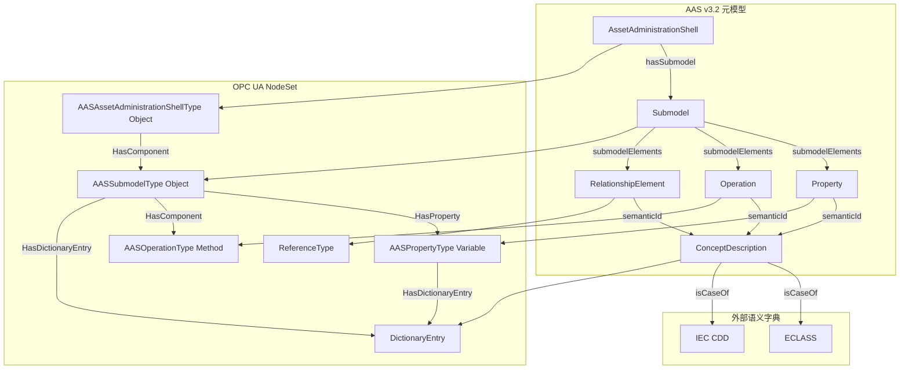
```mermaid
graph TB
    subgraph AAS [AAS v3.2 元模型]
        AAS_ROOT[AssetAdministrationShell]
        SUB[Submodel]
        PROP[Property]
        OP[Operation]
        REL[RelationshipElement]
        CD[ConceptDescription]
    end
    subgraph UA [OPC UA NodeSet]
        OBJ[AASAssetAdministrationShellType Object]
        SUB_OBJ[AASSubmodelType Object]
        VAR[AASPropertyType Variable]
        METH[AASOperationType Method]
        REF[ReferenceType]
        DICT[DictionaryEntry]
    end
    subgraph DICT_SRC [外部语义字典]
        ECLASS[ECLASS]
        IEC_CDD[IEC CDD]
    end
    AAS_ROOT -->|hasSubmodel| SUB
    SUB -->|submodelElements| PROP
    SUB -->|submodelElements| OP
    SUB -->|submodelElements| REL
    PROP -->|semanticId| CD
    OP -->|semanticId| CD
    REL -->|semanticId| CD
    CD -->|isCaseOf| ECLASS
    CD -->|isCaseOf| IEC_CDD
    AAS_ROOT --> OBJ
    SUB --> SUB_OBJ
    PROP --> VAR
    OP --> METH
    REL --> REF
    CD --> DICT
    OBJ -->|HasComponent| SUB_OBJ
    SUB_OBJ -->|HasProperty| VAR
    SUB_OBJ -->|HasComponent| METH
    SUB_OBJ -->|HasDictionaryEntry| DICT
    VAR -->|HasDictionaryEntry| DICT
```

## 12. 权威来源与交叉引用补强

- IDTA. *Details of the Asset Administration Shell — Part 1: Metamodel*. v3.2, 2026-03.
- OPC Foundation. *OPC UA Companion Specification for I4AAS*. OPC 30270.
- IEC 63278-1:2023. *Asset Administration Shell for industrial applications — Part 1: Administration Shell structure*.
- IEC 62541 (OPC UA). *OPC Unified Architecture*.
- IEC 61360. *IEC Common Data Dictionary (CDD)*.
- Industrial Digital Twin Association (IDTA). <https://industrialdigitaltwin.org>
- OPC Foundation I4AAS Working Group. <https://opcfoundation.org/markets-collaboration/I4AAS/>
- Eclipse BaSyx. <https://www.eclipse.org/basyx/>
- ECLASS. <https://www.eclass.eu>
- IEC CDD. <https://cdd.iec.ch>
- 相关概念: [OPC Unified Architecture](https://en.wikipedia.org/wiki/OPC_Unified_Architecture), [Industry 4.0](https://en.wikipedia.org/wiki/Fourth_Industrial_Revolution)
- **交叉引用**: `struct/11-industrial-iot-otit/05-digital-twin-aas/aas-v32-opcua-fx-2026-alignment.md`；`struct/11-industrial-iot-otit/01-isa-95-model/isa-95-asset-catalog-deep-dive.md` §7；`struct/11-industrial-iot-otit/02-opc-ua-fx/opc-ua-fx-reuse-hierarchy.md` §7.5

> 最后更新: 2026-07-07
> 状态: ✅ 已完成


## 13. AAS × OPC UA 映射实施模式与工具链补强

### 13.1 映射实施模式

在实际工程中，AAS 到 OPC UA 的映射通常采用以下三种模式：

| 模式 | 描述 | 适用场景 | 优缺点 |
|------|------|---------|--------|
| **模式 A: 直接映射（Direct Mapping）** | AAS 元模型元素一对一映射到 OPC UA NodeSet | 新建系统、绿色地带项目 | 语义保真度高，但需要维护双向同步 |
| **模式 B: 网关映射（Gateway Mapping）** | AAS Server 与 OPC UA Server 并存，网关负责双向转换 | 棕地改造、异构系统并存 | 对现有系统影响小，但增加延迟和复杂度 |
| **模式 C: 子模型选择性映射（Selective Mapping）** | 仅将需要实时访问的 AAS Submodel 映射到 OPC UA | 大规模系统、带宽受限场景 | 减少 OPC UA AddressSpace 规模，但可能丢失部分语义 |

> **定理 AAS.UA.1** (映射模式选择): 当 OT 侧需要亚秒级实时访问 AAS 数据时，应采用模式 A 或模式 C；当 AAS 主要用于离线归档和跨企业交换时，模式 B 更为合适。

### 13.2 工具链与实现参考

| 工具/框架 | 用途 | 说明 |
|----------|------|------|
| Eclipse BaSyx | AAS Server / Repository | 提供 Java/Python/Go SDK，支持 AAS v3.0/v3.1 |
| OPC Foundation UA-.NET / open62541 | OPC UA Server / Client | 实现 OPC UA NodeSet 的加载与发布 |
| IDTA AASX Package Explorer | AASX 编辑与查看 | 可视化编辑 AAS 并导出 AASX |
| UA Modeler / SiOME | OPC UA 信息模型设计 | 设计 Companion Spec 和 NodeSet |
| aas-transformation-library | AAS ↔ OPC UA 转换 | 社区/项目中常用的转换工具 |

### 13.3 命名空间管理最佳实践

1. **独立 Namespace**：为 AAS ID 空间、IEC CDD IRDI 空间、项目本地空间分别分配独立 Namespace。
2. **版本控制**：NamespaceUri 中可包含版本信息，便于向后兼容。
3. **避免冲突**：`idShort` 仅作为 `BrowseName`，全局唯一标识必须使用 `id` 映射的 `NodeId`。
4. **文档化映射**：维护一张 AAS `id` 到 OPC UA `NodeId` 的映射表，便于调试和审计。

### 13.4 性能考虑

| 场景 | 建议 |
|------|------|
| 大规模 AddressSpace | 使用 OPC UA 分页浏览（BrowseNext）和缓存策略 |
| 高频实时数据 | 使用 OPC UA PubSub 而非 Client/Server 轮询 |
| 大文件/Blob | AAS `File` 映射为 URL，避免直接嵌入 OPC UA Variable |
| 大量历史数据 | AAS 子模型保留元数据，历史数据通过 OPC UA HDA 访问 |

### 13.5 更多反例

| 反例 | 风险说明 |
|------|---------|
| 所有 AAS 子模型都映射到 OPC UA | AddressSpace 过大，客户端性能下降 |
| 将 AAS 的 `administration` 元数据暴露为可写变量 | 版本/修订信息被误修改，破坏审计链 |
| 在 OPC UA 中直接暴露 AAS 的内部引用结构 | 破坏封装性，增加客户端耦合 |
| 未处理 AAS `Qualifier` 语义 | 单位、约束等元信息丢失 |
| 将 AAS `Entity` 的 `globalAssetId` 与 OPC UA NodeId 混用 | 标识符空间冲突，导致集成错误 |

### 13.6 映射验证 Mermaid 流程图

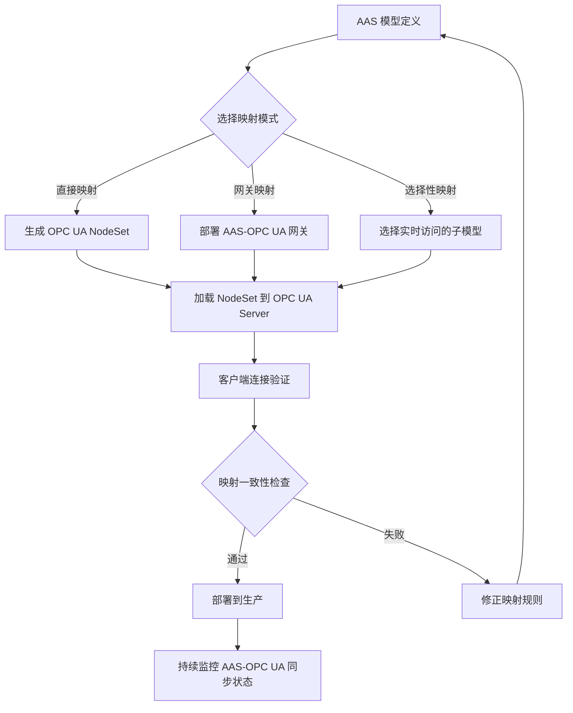
```mermaid
flowchart TD
    A[AAS 模型定义] --> B{选择映射模式}
    B -->|直接映射| C[生成 OPC UA NodeSet]
    B -->|网关映射| D[部署 AAS-OPC UA 网关]
    B -->|选择性映射| E[选择实时访问的子模型]
    C --> F[加载 NodeSet 到 OPC UA Server]
    D --> F
    E --> F
    F --> G[客户端连接验证]
    G --> H{映射一致性检查}
    H -->|通过| I[部署到生产]
    H -->|失败| J[修正映射规则]
    J --> A
    I --> K[持续监控 AAS-OPC UA 同步状态]
```

### 13.7 权威来源与交叉引用（再补强）

- OPC Foundation. *OPC UA Companion Specification for I4AAS*. OPC 30270.
- IDTA. *Details of the Asset Administration Shell — Part 1: Metamodel*. v3.2.
- IEC 63278-1:2023. *Asset Administration Shell for industrial applications*.
- IEC 62541. *OPC Unified Architecture*.
- Eclipse BaSyx GitHub: <https://github.com/eclipse-basyx>
- open62541: <https://open62541.org>
- 相关概念: [OPC Unified Architecture](https://en.wikipedia.org/wiki/OPC_Unified_Architecture), [Industry 4.0](https://en.wikipedia.org/wiki/Fourth_Industrial_Revolution)
- **交叉引用**: `struct/11-industrial-iot-otit/05-digital-twin-aas/aas-v32-opcua-fx-2026-alignment.md`；`struct/11-industrial-iot-otit/05-digital-twin-aas/submodel-templates/aas-submodel-templates-full-catalog.md`

> 最后更新: 2026-07-07
> 状态: ✅ 已完成


## 14. AAS × OPC UA 映射挑战与解决策略补强

### 14.1 常见映射挑战

| 挑战 | 根因 | 解决策略 |
|------|------|---------|
| 标识符冲突 | AAS `id` 与 OPC UA `NodeId` 命名空间不同 | 严格分离 Namespace，使用 IRI/IRDI/UUID 映射 |
| 语义漂移 | AAS `semanticId` 与 OPC UA `HasDictionaryEntry` 指向不同字典 | 建立统一语义注册表，使用 ECLASS/IEC CDD 作为单一事实来源 |
| 实时性不足 | AAS REST API 无法满足 OT 实时要求 | 将实时数据通过 OPC UA PubSub 暴露，AAS 保留静态语义 |
| 模型版本不一致 | AAS v3.2 与 I4AAS NodeSet 版本差异 | 明确映射规范版本，使用版本化的 NamespaceUri |
| 大文件传输 | AAS `Blob` 嵌入 OPC UA Variable 导致性能问题 | Blob 映射为 URL，客户端按需下载 |
| 复杂关系表达 | AAS `RelationshipElement` 的双向关系难以用 OPC UA 引用表达 | 定义自定义 ReferenceType，明确 first/second 方向 |

### 14.2 映射治理建议

1. **建立映射规范文档**：明确 AAS v3.2 到 OPC UA NodeSet 的映射规则、Namespace 分配、版本策略。
2. **自动化映射验证**：在 CI/CD 中集成映射一致性检查，确保 AAS 变更后 OPC UA NodeSet 同步更新。
3. **语义注册表**：建立企业级语义注册表，统一管理 ECLASS、IEC CDD 和自定义 ConceptDescription。
4. **跨团队协同**：AAS 建模团队与 OPC UA 工程团队必须共享模型变更计划，避免两边模型脱节。
5. **性能基线测试**：对大规模 AddressSpace 和高频实时数据场景进行性能测试，确定最优映射模式。

### 14.3 典型映射错误案例分析

**案例：某汽车制造商 AAS-OPC UA 集成项目**

| 问题 | 根因 | 纠正 |
|------|------|------|
| OPC UA 客户端无法找到设备参数 | AAS `idShort` 被直接用作 OPC UA `NodeId`，导致不同设备冲突 | 使用 AAS `id` 映射为全局唯一 `NodeId` |
| 实时温度数据延迟 > 2s | 所有 AAS 数据通过 REST API 暴露，未使用 OPC UA PubSub | 实时数据通过 OPC UA PubSub 暴露，AAS 保留静态技术数据 |
| 维护记录无法追溯 | AAS 与 OPC UA 由不同团队维护，版本不同步 | 建立统一模型变更流程和自动化同步工具 |
| 语义不一致导致 MES 误读 | `semanticId` 未映射到 OPC UA `HasDictionaryEntry` | 补全语义映射，统一使用 IEC CDD 标识符 |

### 14.4 映射成熟度评估检查清单

- [ ] 已建立书面的 AAS → OPC UA 映射规范。
- [ ] 所有 AAS `id` 都正确映射为 OPC UA `NodeId`。
- [ ] 所有 `Submodel` 都作为 `Object` 正确挂接。
- [ ] 所有 `Property` 的 `valueType` 正确映射为 OPC UA `DataType`。
- [ ] 所有 `semanticId` 都通过 `HasDictionaryEntry` 表达。
- [ ] `Operation` 输入/输出参数完整映射。
- [ ] AAS 变更能够自动同步到 OPC UA AddressSpace。
- [ ] 实时数据使用 OPC UA PubSub 而非轮询。
- [ ] 大文件/Blob 使用 URL 引用而非嵌入 Variable。
- [ ] 映射结果经过性能和一致性测试。

### 14.5 权威来源与交叉引用（再补强）

- IDTA. *Details of the Asset Administration Shell — Part 1: Metamodel*. v3.2, 2026-03.
- OPC Foundation. *OPC UA Companion Specification for I4AAS*. OPC 30270.
- IEC 63278-1:2023. *Asset Administration Shell for industrial applications — Part 1: Administration Shell structure*.
- IEC 62541 (OPC UA). *OPC Unified Architecture*.
- Industrial Digital Twin Association (IDTA). <https://industrialdigitaltwin.org>
- OPC Foundation I4AAS Working Group. <https://opcfoundation.org/markets-collaboration/I4AAS/>
- 相关概念: [OPC Unified Architecture](https://en.wikipedia.org/wiki/OPC_Unified_Architecture), [Industry 4.0](https://en.wikipedia.org/wiki/Fourth_Industrial_Revolution)
- **交叉引用**: `struct/11-industrial-iot-otit/05-digital-twin-aas/aas-v32-opcua-fx-2026-alignment.md`；`struct/11-industrial-iot-otit/01-isa-95-model/isa-95-asset-catalog-deep-dive.md` §7；`struct/11-industrial-iot-otit/02-opc-ua-fx/opc-ua-fx-reuse-hierarchy.md` §7.5

## 15. AAS × OPC UA 映射完整属性表、示例与反例索引

> **定义 AAS.UA.2** (AAS-OPC UA 映射一致性): AAS 元模型元素到 OPC UA NodeSet 的映射必须保持标识符一一对应、语义引用不丢失、数据类型可转换、生命周期事件可同步。违反任一属性均会导致数字孪生与物理资产或运行时不一致。

### 15.1 完整元素映射属性表

| AAS 元素 | OPC UA 映射 | NodeClass | 引用类型 | 示例 | 常见反例 |
|----------|-------------|-----------|----------|------|----------|
| AssetAdministrationShell | `AASAssetAdministrationShellType` 实例 | Object | Organizes | 温度传感器 AAS | 将 `idShort` 直接作为 `NodeId` |
| Submodel | `AASSubmodelType` 实例 | Object | HasComponent | Measurement 子模型 | 缺失 `semanticId` 映射 |
| SubmodelElementCollection | `AASSubmodelElementCollectionType` 实例 | Object | HasComponent | MotorParameters 集合 | 平铺为独立 Property |
| Property | `AASPropertyType` 实例 | Variable | HasProperty | CurrentTemperature=23.5 | `valueType` 统一映射为 String |
| MultiLanguageProperty | `AASMultiLanguagePropertyType` 实例 | Variable | HasProperty | 多语言名称 | 仅保留默认语言 |
| Range | `AASRangeType` 实例 | Variable | HasProperty | 温度范围 0..100°C | min/max 拆分为无关联节点 |
| File | `AASFileType` 实例 + `FileType` | Object | HasComponent | 手册 PDF URL | 将大文件嵌入 Variable |
| Blob | `AASBlobType` 实例 | Variable | HasProperty | Base64 固件镜像 | 超过 OPC UA Variable 大小限制 |
| ReferenceElement | `AASReferenceElementType` 实例 | Object | HasComponent | 指向外部文档 | 用普通字符串属性替代 |
| RelationshipElement | 自定义 `ReferenceType` | Reference | 自定义 | HasPart / IsConnectedTo | 双向关系映射为单向 |
| AnnotatedRelationshipElement | 自定义 `ReferenceType` + Annotation | Reference | 自定义 | 带说明的连接 | 丢失 annotation |
| Operation | `AASOperationType` 实例 | Method | HasComponent | Calibrate 方法 | 未映射输入/输出参数 |
| Entity | `AASEntityType` 实例 | Object | HasComponent | 协作机器人实体 | `globalAssetId` 与 `NodeId` 混用 |
| EventElement | Event notifier / Condition | Object | HasComponent | 报警事件 | 用普通 Property 模拟事件 |
| Capability | Capability Submodel | Object | HasComponent | 最大负载能力 | 未声明能力边界 |
| ConceptDescription | `AASConceptDescriptionType` 或外部 DictionaryEntry | ObjectType / VariableType | HasDictionaryEntry | ECLASS 0173-1#... | 语义指向不一致 |

### 15.2 映射关系说明

- **标识符**：AAS `id` 映射为 OPC UA `NodeId`（IRI/IRDI/UUID），`idShort` 仅作为 `BrowseName`/`DisplayName`。
- **语义引用**：所有 `semanticId` 应通过 `HasDictionaryEntry` 或 `HasTypeDefinition` 表达，指向 ECLASS / IEC CDD / IDTA 模板。
- **数据类型**：AAS `valueType` 必须精确映射到 OPC UA `DataType`，避免统一使用 String 导致类型检查失效。
- **生命周期**：AAS 值变更通过 `DataChangeNotification` 同步；结构变更通过 `ModelChangeEvent` 通知客户端重建缓存。

> **定理 AAS.UA.3** (映射完整性): 若 AAS 实例 A 映射到 OPC UA AddressSpace U，则 A 中每个可标识元素在 U 中必须有且仅有一个对应节点，且所有 `semanticId` 在 U 中必须可解析。

### 15.3 正例

| 场景 | 映射实践 | 效果 |
|------|----------|------|
| 设备供应商交付 | AAS Digital Nameplate + OPC UA DI NodeSet | 设备信息自动可被 MES/ERP 消费 |
| 产线数字孪生 | AAS 承载静态技术数据，OPC UA 承载实时过程数据 | 数字孪生与物理资产同步 |
| 跨工厂复制 | AAS Submodel Template 定义标准电机模型，OPC UA NodeSet 定义标准接口 | 新工厂快速集成同类设备 |
| 预测性维护 | AAS 维护子模型与 OPC UA HDA 历史数据关联 | 维护计划基于完整资产历史 |

### 15.4 反例

| 反例 | 风险说明 |
|------|----------|
| 将 AAS `idShort` 直接作为 OPC UA `NodeId` | `idShort` 不保证全局唯一，会导致 NodeId 冲突 |
| 忽略 `valueType` 映射，统一使用 `String` | 丢失类型信息，OPC UA 客户端无法做类型检查 |
| 将 `semanticId` 映射为普通 `Property` | 语义引用关系丢失，无法利用 ECLASS/IEC CDD 字典 |
| AAS 与 OPC UA 由不同团队独立维护 | 两边模型不同步，数字孪生与物理资产脱节 |
| 在 OT 场景使用 IT 级同步周期（>5s） | 实时控制决策基于过期数据，可能导致安全事故 |
| 将 AAS RelationshipElement 双向引用映射为单向引用 | 关系语义丢失，影响图遍历和依赖分析 |

### 15.5 AAS → OPC UA 映射流水线 Mermaid 图

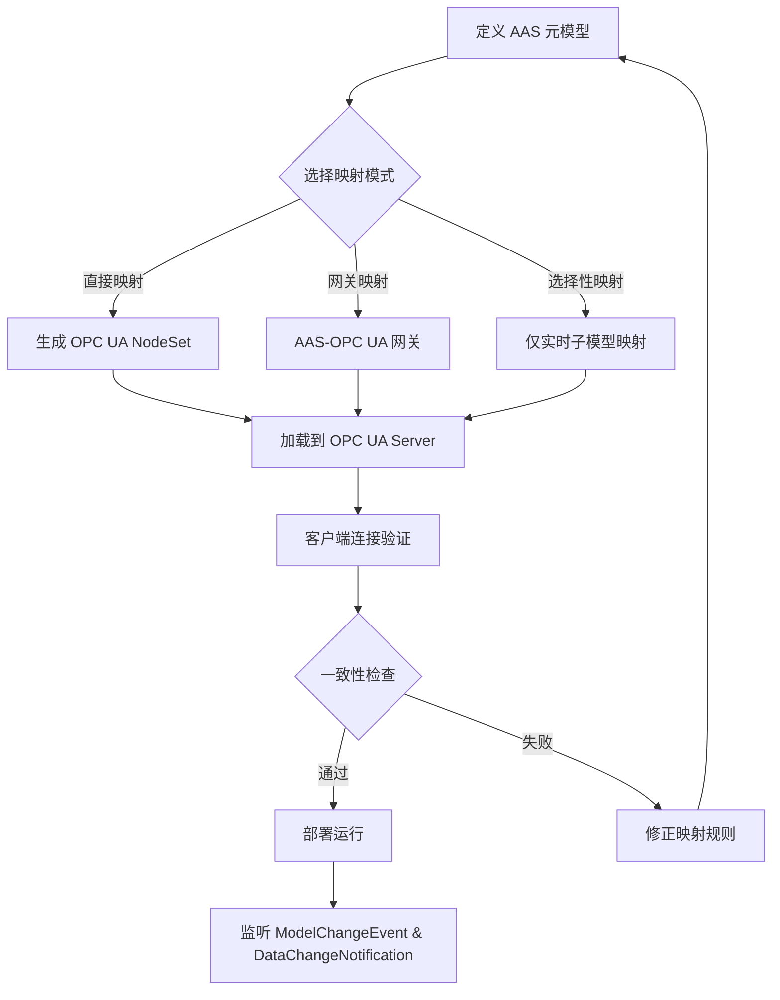
```mermaid
flowchart TD
    AAS[定义 AAS 元模型] --> B{选择映射模式}
    B -->|直接映射| C[生成 OPC UA NodeSet]
    B -->|网关映射| D[AAS-OPC UA 网关]
    B -->|选择性映射| E[仅实时子模型映射]
    C --> F[加载到 OPC UA Server]
    D --> F
    E --> F
    F --> G[客户端连接验证]
    G --> H{一致性检查}
    H -->|通过| I[部署运行]
    H -->|失败| J[修正映射规则]
    J --> AAS
    I --> K[监听 ModelChangeEvent & DataChangeNotification]
```

### 15.6 权威来源与交叉引用

- IDTA. *Details of the Asset Administration Shell — Part 1: Metamodel*. v3.2, 2026-03.
- OPC Foundation. *OPC UA Companion Specification for I4AAS*. OPC 30270.
- IEC 63278-1:2023. *Asset Administration Shell for industrial applications — Part 1: Administration Shell structure*.
- IEC 62541. *OPC Unified Architecture*.
- Eclipse BaSyx: <https://github.com/eclipse-basyx>
- open62541: <https://open62541.org>
- 相关概念: [OPC Unified Architecture](https://en.wikipedia.org/wiki/OPC_Unified_Architecture), [Industry 4.0](https://en.wikipedia.org/wiki/Fourth_Industrial_Revolution)
- **交叉引用**: `struct/11-industrial-iot-otit/05-digital-twin-aas/aas-v32-opcua-fx-2026-alignment.md`；`struct/11-industrial-iot-otit/01-isa-95-model/isa-95-asset-catalog-deep-dive.md` §7；`struct/11-industrial-iot-otit/02-opc-ua-fx/opc-ua-fx-reuse-hierarchy.md` §7.5


> 最后更新: 2026-07-07
> 状态: ✅ 已完成


---

## 补充章节

## 反例

**反例**：将 IT 系统直接补丁策略套用到 PLC 产线，未考虑实时性约束与功能安全认证，导致停机与安全事故。

## 权威来源

> **权威来源**:
>
> - [ISA-95 / IEC 62264](https://www.isa.org/standards-and-publications/isa-standards/isa-95)
> - [OPC Foundation](https://opcfoundation.org)
> - [IEC 61508-1:2010](https://webstore.iec.ch/en/publication/5515)
> - [IEC 63278 AAS](https://iec.ch/dyn/www/f?p=103:38:0::::FSP_ORG_ID:1363)
> - 核查日期：2026-07-07


---


<!-- SOURCE: struct/11-industrial-iot-otit/05-digital-twin-aas/aas-v32-opcua-fx-2026-alignment.md -->

# AAS v3.2 + OPC UA FX V1.00.03 + Digital Twin 权威对齐（2025‑2026）

> **定位**：工业架构复用体系中数字孪生与现场通信层的最新权威基准。
> **权威来源**：IDTA、OPC Foundation、IEC 63278、Eclipse BaSyx、Microsoft/Siemens W3C TD 融合声明。

---

## 1. 关键结论（TL;DR）

| 标准 | 最新版本 | 关键更新 |
|------|----------|----------|
| **AAS** | Part 1 v3.2 (2026‑03‑24) | 首个完全开源 HTML 规范；`idShort` 允许连字符；`DateTimeUtc` 统一；100+ Submodel Templates |
| **OPC UA FX** | V1.00.03 (2025‑07‑31) | 诊断能力增强；LLDP 信息建模；C2C 已量产，C2D/D2D 进入 Phase 2 试点 |
| **IEC 63278** | ‑1:2023 (EN 2024) | AAS 结构首份国际标准，赋予采购合同效力 |
| **Eclipse BaSyx** | v2.0.1 (2026‑04) | Python/Java/Go/TS 多语言 SDK；新增 `basyx-pdf-to-aas` (LLM 提取)、`aas-mcp` (MCP Server) |
| **DTDL** | v3/v4 (Azure IoT Operations) | Microsoft + Siemens 宣布与 W3C Thing Description 融合 |

---

## 2. AAS v3.2 深度更新

### 2.1 版本时间线

```text
2023        IEC 63278-1:2023 发布（AAS 结构国际标准）
2024-01     EN IEC 63278-1:2024 采纳
2025-03     AAS Part 1 v3.0.2 维护版
2025-05     AAS Part 1 v3.1 — 首个完全开源 HTML 规范
2026-03-24  AAS Part 1 v3.2 — 当前最新
```

### 2.2 v3.2 核心变更

| 变更类别 | 具体内容 |
|----------|----------|
| **数据类型** | `lastUpdate`、`timeStamp` 统一为 `DateTimeUtc`；`Identifier` 长度 2000→2048；`ContentType` 100→128 |
| **约束放松** | `Blob/contentType`、`File/contentType`、`Entity/entityType`、`RelationshipElement/first/second` 变为可选；`idShort` 允许连字符 |
| **新枚举** | `AasContainerSubmodelElements`、`AasNonContainerSubmodelElements`；`AssetKind/Role` 新增 |
| **语义修正** | `AASd-021` 指向 `Qualifier/type`（非 `valueType`）；`BlobType` 版本更新至 3.1 |
| **开源化** | v3.1 起完全在 GitHub 维护，PlantUML 图表，PDF + HTML 双格式 |

### 2.3 Submodel Templates（SMT）生态

截至 2026 年初，IDTA 已注册 **100+ Submodel Templates**，涵盖：

| SMT | ID | 复用场景 |
|-----|-----|----------|
| Digital Nameplate | IDTA-02006 | 资产身份标识 |
| Technical Data | IDTA-02002 | 技术参数手册 |
| Product Carbon Footprint | IDTA-02023 | ESG / CBAM 合规 |
| Digital Battery Passport | IDTA-02035 (7 parts) | EU 电池法规 |
| Handover Documentation | IDTA-02004 | 工程移交 |
| Software Nameplate | IDTA-020XX | 软件组件溯源 |
| MTP (Module Type Package) | IDTA-020XX | 过程工业模块复用 |

> **架构复用意义**：SMT 是 OT/IT 边界的可复用语义契约。一个电池护照 Submodel 可在 PLM 中创建、在 MES 中消费、在 ERP 中审计，通过标准化 REST API 跨越组织边界。

---

## 3. OPC UA FX V1.00.03

### 3.1 状态概览

| 维度 | 状态 |
|------|------|
| **版本** | OPC 10000-80~84 V1.00.03 |
| **发布日期** | 2025‑07‑31 |
| **C2C** | 已量产，多厂商互操作（Siemens、Beckhoff、B&R、Phoenix Contact） |
| **C2D** | Phase 2 (2024‑2027) 开发中，SPS 2025 嵌入式原型 |
| **D2D** | Phase 2 同批次，运动控制 / I/O / 仪表配置文件开发中 |

### 3.2 V1.00.03 新增

- 诊断能力增强（Conformance Units / Profiles）
- LLDP（Link Layer Discovery Protocol）信息建模
- 术语澄清与引用更新
- 向后兼容 V1.00.0x

### 3.3 UADP 帧结构速查

```text
UADP over UDP/IP    — 默认，实时且可路由
UADP over Layer 2   — 可选，无 IP 开销，最高性能
OPC UA Client/Server (TCP/IP) — 仅用于连接建立
```

---

## 4. AAS ↔ OPC UA NodeSet 映射现状

> **重要说明**：截至 2026 年中，**尚无单一发布的标准**专门规定 "AAS to OPC UA NodeSet 映射"。实际互操作依赖多条 converging 路径：

### 4.1 实现路径

| 路径 | 机制 | 状态 |
|------|------|------|
| **OPC UA Device Interface (IEC 62541-100)** | AAS 结构 ↔ UA Device Type 双向自动转换；Data Element → UA Variable；Service → UA Method | IDTA Plug-and-Produce 工作组验证 |
| **UAFX AutomationComponent** | Part 81 的 `AutomationComponent` 在概念上与 AAS Submodel 对齐 | 概念对齐，无自动映射工具 |
| **Companion Spec 引用** | AAS Submodel 语义标识符引用 OPC UA Companion Spec（Machinery、Robotics 等） | 工程实践中常见 |
| **AASX 嵌入** | AASX Package 将 OPC UA NodeSet XML 作为补充文件嵌入 | 离线工程工具链支持 |

### 4.2 运行时架构建议

```text
┌─────────────────────────────────────────────┐
│  IT 层：ERP / PLM / MES                     │
│  └── AAS REST API (Part 2)                  │
│       └── 语义层：Digital Nameplate、Carbon  │
│           Footprint、Bill of Material       │
├─────────────────────────────────────────────┤
│  网关层：AAS ↔ OPC UA 桥接                   │
│  └── AAS Server (BaSyx) + OPC UA Client     │
├─────────────────────────────────────────────┤
│  OT 层：PLC / DCS / 边缘设备                 │
│  └── OPC UA PubSub (UADP) — 实时过程数据     │
│      OPC UA FX C2C/C2D — 控制器协调          │
└─────────────────────────────────────────────┘
```

**核心原则**：AAS 承载“数字护照”和语义容器；OPC UA 承载实时变量流。二者互补，非替代。

---

## 5. DTDL vs AAS：架构复用选择

| 维度 | AAS (IDTA/IEC) | DTDL (Microsoft) |
|------|----------------|------------------|
| **标准层级** | 国际标准 (IEC 63278) | 企业规范 |
| **生态** | 欧洲制造 / 工业 4.0 / Catena-X | Azure IoT / 云原生 |
| **语义丰富度** | 高（生命周期、Submodel Template） | 中（telemetry/property/command） |
| **互操作** | REST API、AASX 包交换 | Azure Digital Twins Graph |
| **最新动向** | 100+ SMT、Digital Product Passport | 与 W3C Thing Description 融合 |

> **Microsoft + Siemens 声明（2024‑04）**：双方将 DTDL 与 W3C Thing Description 融合，作为数字孪生民主化的“自然下一步”。这意味着未来可能出现 W3C TD ↔ AAS 的桥接标准。

**复用建议**：

- 跨企业供应链、欧盟市场、需要 Digital Product Passport → **AAS**
- Azure 原生 IoT 平台、快速原型 → **DTDL / W3C TD**
- 长期策略 → 规划 **AAS-W3C TD 双语网关**

---

## 6. Eclipse BaSyx 生态最新

| 组件 | 版本 | 亮点 |
|------|------|------|
| **Python SDK** | v2.0.1 (2026‑04) | 实现 AAS Part 1 v3.0.1、Part 2 v3.0 |
| **Java Server SDK** | v2.0.0‑m08 | Maven: `org.eclipse.digitaltwin.basyx` |
| **Go Components** | 活跃 | 标准化 Server 组件 |
| **Web UI** | v2 (2025‑03) | 实时 AAS/Submodel 编辑器、Digital Nameplate V3 插件、Keycloak 集成 |
| **basyx-pdf-to-aas** | 2025‑09 | LLM 从 PDF 提取技术数据并导出 AAS |
| **aas-mcp** | 2025‑09 | **MCP Server for BaSyx** — AI Agent 可直接查询 AAS 仓库 |

> **aas-mcp 的复用意义**：MCP 2025-11-25 协议让 LLM Agent 能够通过标准化接口消费 AAS Submodel 数据，打通“工业数字孪生 ↔ AI 代理”的边界。

---

## 7. IEC 智能制造基础标准层

| 标准 | 内容 | 与 AAS 关系 |
|------|------|-------------|
| **IEC 63278-1:2023** | AAS 结构 | AAS 本体 |
| **IEC TR 63319** | 智能制造参考模型元建模分析 (SEMP) | 理论基础 |
| **IEC 63339** | 智能制造统一参考模型 | 跨域参考 |
| **IEC 63489** | 智能制造通用数据概念 | 数据语义基座 |

AAS 位于这些基础标准之上，作为工业资产的**具体数字孪生信封和 Submodel 机制**。

---

## 8. 复用架构实践建议

### 8.1 组件目录中的 AAS 资产

```text
组件目录 (Backstage / 内部 Catalog)
├── 软件组件
│   └── SBOM (CycloneDX) + SLSA provenance
├── 工业组件
│   └── AASX Package (Digital Nameplate + Technical Data)
│   └── OPC UA NodeSet (实时接口)
│   └── WIT Interface (Wasm 组件边界)
└── AI 模型
    └── ML-BOM (CycloneDX) + AAS Submodel (Software Nameplate)
```

### 8.2 分层映射

| 项目目录 | 工业数字孪生角色 |
|----------|------------------|
| `struct/04-component-architecture-reuse/` | AAS Submodel = 工业组件语义契约 |
| `struct/11-industrial-iot-otit/` | OPC UA FX = 现场实时通信；AAS = 数字护照 |
| `struct/10-supply-chain-security/` | AAS + SBOM + SLSA = 全链路溯源 |
| `struct/12-ai-native-reuse/` | aas-mcp = AI Agent 消费工业孪生数据 |

---

## 9. 权威来源

1. IDTA AAS Specifications: <https://industrialdigitaltwin.org/en/content-hub/specifications>
2. IDTA Submodel Templates: <https://industrialdigitaltwin.org/en/content-hub/submodels>
3. OPC Foundation UAFX: <https://reference.opcfoundation.org/>
4. IEC 63278-1:2023: <https://webstore.iec.ch/en/publication/65628>
5. Eclipse BaSyx: <https://www.eclipse.org/basyx/>
6. Eclipse BaSyx GitHub: <https://github.com/eclipse-basyx>
7. Microsoft/Siemens DTDL-W3C Convergence: <https://press.siemens.com/global/en/pressrelease/siemens-and-microsoft-converge-digital-twin-definition-language-w3c-thing-description>
8. Schmidt et al. (2023) DTDL→AAS: <https://doi.org/10.3390/s23187742>

---

*文档生成时间：2026-06-06 · 对齐 AAS Part 1 v3.2 / OPC UA FX V1.00.03 / IEC 63278 / BaSyx v2.0.1*


---

## 补充章节

## 概念定义

**定义**：工业 IoT/OT-IT 复用是在制造、能源、交通等运营技术（OT）与信息技术（IT）融合场景中，复用 ISA-95 层级模型、OPC UA 信息模型、功能安全组件与数字孪生资产。

## 示例

**示例**：汽车工厂将 ISA-95 L0-L4 资产目录映射到 IEC 63278 资产管理壳（AAS），通过 OPC UA FX 实现现场设备与 MES/ERP 的即插即用复用。

## 反例

**反例**：将 IT 系统直接补丁策略套用到 PLC 产线，未考虑实时性约束与功能安全认证，导致停机与安全事故。

## 分析

**分析**：OT-IT 复用需要在实时性、安全性与 IT 敏捷性之间取得平衡，标准信息模型是打破竖井的关键。


---


<!-- SOURCE: struct/11-industrial-iot-otit/05-digital-twin-aas/iec-63278-roadmap.md -->

# IEC 63278 AAS 系列标准路线图

> **版本**: 2026-07-08
> **权威来源**: IEC Webstore, IDTA Specifications, Industrial Digital Twin Association
> **定位**: 对齐 IEC 63278 AAS 系列标准的最新发布状态和发展路线图

---

## 概念定义

**资产管理壳（Asset Administration Shell, AAS）** 是资产的标准化数字表示，提供对信息和服务的统一访问。AAS 通过 Submodel 机制将资产的技术数据、标识、状态、维护记录等封装为可互操作的语义容器，是工业 4.0 数字孪生的核心使能技术。IEC 63278 系列则规定了 AAS 的结构、元模型、安全、接口与用例。

> **定义 I.AAS.Roadmap.1** (AAS 标准族): IEC 63278 标准族定义了资产管理壳的结构（Part 1）、信息元模型（Part 2）、安全规定（Part 3）、用例与建模示例（Part 4）以及接口（Part 5），构成跨厂商数字孪生互操作的基础。

---

## 1. IEC 63278 系列概览

IEC 63278 定义了工业应用中资产管理壳（Asset Administration Shell, AAS）的国际标准。该系列分为 5 个部分：

| 部分 | 标题 | 状态 | 发布/预计时间 |
|------|------|------|--------------|
| **IEC 63278-1** | Asset Administration Shell structure（AAS 结构） | ✅ 已发布 | 2023-12-14 |
| **IEC 63278-2** | Information meta model（信息元模型） | 🔄 CDV 投票中（截止 2026-08-07） | 预计 2026 下半年进入 PRVC，正式出版 2026 末–2027 初 |
| **IEC 63278-3** | Security provisions for Asset Administration Shells（安全规定） | 🔄 开发中 | 预计 2024-2025 |
| **IEC 63278-4** | Use cases and modelling examples（用例和建模示例） | 🔄 开发中 | 预计 2025 |
| **IEC 63278-5** | Interfaces（接口） | 📝 预研 | 预计 2026 |

---

## 2. IEC 63278-1:2023（已发布）

### 范围

定义 AAS 的标准化数字表示结构。AAS 提供对信息和服务的统一访问。

### 适用范围

- 任何类型的工业过程（离散制造、连续过程、批处理、混合生产）
- 任何应用工业过程测量、控制和自动化的工业领域
- 资产生命周期的各个阶段（从概念到报废处理）
- 物理、数字或无形的资产实体

### 核心定义

> **Asset（资产）**: 物理、数字或无形的实体，对企业具有价值。
> **Asset Administration Shell（AAS）**: 资产的标准化数字表示，提供对信息和服务的统一访问。

### AAS 结构核心元素

```text
Asset Administration Shell
├── Identification（标识）
│   └── id: 全局唯一标识符（字符串）
├── AssetInformation（资产信息）
│   ├── assetKind: Type / Instance / NotApplicable
│   ├── globalAssetId: 全局资产 ID
│   └── specificAssetIds: 特定资产 ID 列表
├── Submodels（子模型）
│   ├── idShort: 短标识
│   ├── identification: 全局标识
│   ├── semanticId: 语义标识（推荐）
│   └── submodelElements: 子模型元素
└── Extensions（扩展）
```

---

## 3. IDTA-01001-3-0 元模型（与 IEC 63278-2 对齐）

IDTA（Industrial Digital Twin Association）发布的元模型规范与 IEC 63278-2 同步开发。注意：IEC 63278-1:2023 已正式发布（AAS 结构），而 IEC 63278-2（信息元模型）当前仍处于 DIS ballot / 开发中阶段，不要将其与已发布的 Part 1 混淆。

### 3.0 版主要变更

| 变更项 | 说明 |
|--------|------|
| **SubmodelElementCollection 拆分** | 拆分为 SubmodelElementList（有序）和 SubmodelElementCollection（无序） |
| **Reference 重构** | 添加 referredSemanticId，移除 Local/Parent 属性 |
| **Identifier 简化** | idType 从 Identifier 移除，ID 现为纯字符串 |
| **idShort 可选化** | Referable 的 idShort 变为可选 |
| **语义 ID 推荐化** | SubmodelElement 的 semanticId 不再强制，但强烈推荐 |
| **Supplemental Semantic IDs** | 新增辅助语义 ID |
| **Asset 概念修订** | 移除 Asset 类，改为 AssetInformation；移除 billOfMaterial |
| **字符串类型规范化** | 大量 string 属性替换为带长度限制的类型 |
| **EventElement 标记为 Experimental** | 事件相关类标记为实验性 |
| **ConceptDictionaries 移除** | 不再支持 |
| **Views 移除** | 不再支持 |

---

## 4. AAS 子模型模板生态

IDTA 维护的子模型模板清单（2026 状态）：

| 模板 ID | 模板名称 | 状态 |
|---------|---------|------|
| IDTA-02002 | Contact Information | ✅ 已发布 |
| IDTA-02003 | Technical Data | ✅ 已发布 |
| IDTA-02006 | Nameplate | ✅ 已发布 |
| IDTA-02007 | Identification | ✅ 已发布 |
| IDTA-02008 | Handover Documentation | ✅ 已发布 |
| IDTA-02022 | Time Series Data | ✅ 已发布 |
| IDTA-02023 | Carbon Footprint | ✅ 已发布 |
| IDTA-02024 | Provision of 3D Models | 开发中 |
| IDTA-02025 | Functional Safety | 开发中 |

---

## 5. IEC 63278-3: 安全规定

### 范围

定义 AAS 的安全要求，包括：

- 身份验证与授权
- 数据完整性与机密性
- 访问控制
- 安全通信
- 与 IEC 62443 工业控制系统安全系列的协调

### 关键安全原则

1. **Defense in Depth**: 多层安全控制
2. **Security by Design**: 安全内建于 AAS 设计
3. **Least Privilege**: 最小权限原则
4. **Secure Defaults**: 默认安全配置

---

## 6. IEC 63278-5: 接口

### 规划中的接口类型

| 接口类型 | 用途 |
|---------|------|
| **REST/HTTP API** | 与 IT 系统集成 |
| **OPC UA** | 与 OT 系统集成 |
| **MQTT** | 物联网场景 |
| **AASX Package** | 离线数据交换 |

### OPC UA 映射

IEC 63278-5 将标准化 AAS 到 OPC UA 的映射规则：

| AAS 元素 | OPC UA 对应 |
|---------|------------|
| AssetAdministrationShell | Object / Folder |
| Submodel | ObjectType / Folder |
| Property | Variable |
| Operation | Method |
| EventElement | EventType |
| Entity | Object |
| RelationshipElement | Reference |

---

## 7. AASX 包文件格式

AASX（AAS Package）是基于 OPC（Open Packaging Convention, ECMA-376）的 ZIP 文件格式：

```text
AASX Package (.aasx)
├── [Content_Types].xml
├── _rels/.rels
├── aasx/                     ← AAS 数据（JSON/XML）
│   └── asset-administration-shell.aas.json
├── attachments/              ← 附件（PDF、图纸、手册）
│   ├── datasheet.pdf
│   └── drawing.dwg
└── [other related files]
```

---

## 8. 与数字产品护照 (DPP) 的关系

AAS 是欧盟数字产品护照（Digital Product Passport, DPP）的技术基础之一：

- DPP 需要标准化的产品信息交换
- AAS 子模型模板可以作为 DPP 的数据结构基础
- AASX 包格式可以作为 DPP 的数据载体
- IEC 63278 与欧盟可持续产品生态设计法规（ESPR）对齐

---

## 9. 复用策略建议

| 层次 | 复用资产 | 建议 |
|------|---------|------|
| **元模型层** | IEC 63278-1 / IDTA-01001 | 严格遵循，避免自定义扩展 |
| **子模型模板层** | IDTA-020xx 模板 | 优先使用标准模板，减少自定义 |
| **接口层** | OPC UA / REST API | 按场景选择，确保互操作性 |
| **实现层** | Eclipse BaSyx, AASX Package Explorer | 使用成熟开源实现 |

---

## 10. 关键定理

> **定理 I.AAS.3** (AAS Standard Conformance): 严格遵循 IEC 63278 和 IDTA 规范的 AAS 实现，具有最高的跨厂商互操作性。任何自定义扩展都会降低复用范围。
> **定理 I.AAS.4** (Submodel Template Network Effect): AAS 子模型模板的价值与行业内采用该模板的厂商数量成正比。采用率越高，互操作成本越低。

---

## 11. 权威来源

> **权威来源**：
>
> - IEC 63278-1:2023 *Asset Administration Shell structure*: <https://webstore.iec.ch/en/publication/65628>（核查日期：2026-07-09）
> - IEC 63278-2 DIS ballot / 开发状态（IEC TC65 WG24 项目页面）：<https://isrsm.gov.mk/en/project/show/iec:proj:109017>（核查日期：2026-07-09）
> - IDTA 元模型规范 IDTA-01001-3-0: <https://industrialdigitaltwin.org/en/content-hub/specifications>（核查日期：2026-07-09）
> - IDTA 行业用例： <https://industrialdigitaltwin.org/en/news-dates/use-cases-from-the-industry-with-the-asset-administration-shell-6226>（核查日期：2026-07-09）
> - BMW/Siemens VWS4LS 线束 AAS 论文： <https://arena2036.de/files/FinaleBilder/04_Forschung/Publikationen/SCAP2022_Paper_VWS4LS-22-06-24.pdf>（核查日期：2026-07-09）
> - OPC UA FX Part 80–84: <https://reference.opcfoundation.org/UAFX/Part80/v100/docs/> … <https://reference.opcfoundation.org/UAFX/Part84/v100/docs/>（核查日期：2026-07-09）
> - DIN SPEC 91345 / RAMI 4.0 指南：<https://www.digitale-technologien.de/DT/Redaktion/DE/Downloads/Publikation/PAiCE_Leitfaden_Reference_Architecture.pdf>（核查日期：2026-07-09）
> - ISO/IEC 30141:2024 *IoT Reference Architecture*: <https://www.iso.org/standard/88800.html>（核查日期：2026-07-09）

## 12. 交叉引用

- AAS-OPC UA 映射：[`./aas-opcua-mapping.md`](../struct/11-industrial-iot-otit/05-digital-twin-aas/aas-opcua-mapping.md)
- AAS v3.2 + OPC UA FX 2026 对齐：[`./aas-v32-opcua-fx-2026-alignment.md`](../struct/11-industrial-iot-otit/05-digital-twin-aas/aas-v32-opcua-fx-2026-alignment.md)
- 子模型模板目录：[`./submodel-templates/catalog.md`](../struct/11-industrial-iot-otit/05-digital-twin-aas/submodel-templates/catalog.md)
- ISA-95 资产目录：[`../01-isa-95-model/isa-95-asset-catalog-deep-dive.md`](../struct/11-industrial-iot-otit/01-isa-95-model/isa-95-asset-catalog-deep-dive.md)
- AAS 复用总览：[`./README.md`](../struct/11-industrial-iot-otit/05-digital-twin-aas/README.md)

## 13. 正向示例

### 示例 1：Volkswagen Zwickau 电动车工厂

大众 Zwickau 工厂在建设 MEB 电动车平台产线时，将 ISA-95 L0–L4 资产映射到 IEC 63278 AAS，并通过 OPC UA FX 实现跨厂商机器人、PLC 与视觉系统的语义互操作。设备更换时只需替换 AAS 子模型实例，工程调试与产线复制周期显著缩短。

### 示例 2：BMW / Siemens 线束数字孪生（VWS4LS）

在 VWS4LS（Verwaltungsschale für die Luftfahrt- und Schienenfahrzeugindustrie 衍生）研究项目中，宝马与西门子基于 AAS 子模型标准化汽车线束的设计、制造与维护数据，实现跨企业、跨工具链的信息复用，减少重复建模与数据转换成本。

### 示例 3：IDTA 行业用例汇总

IDTA 2025 年发布的行业用例汇编显示，采用 IEC 63278 AAS 与标准子模型模板的企业，在设备集成、工程变更与维护支持环节平均节省约 67% 的时间和成本。

## 12. 反例 / 失败案例

### 反例 1：自定义 AAS 扩展破坏互操作

某企业为追求短期便利，在 AAS 中大量使用私有子模型和未注册 semanticId，导致与供应商/客户的标准 AASX 包无法解析，最终被迫重构并补做一致性测试。

### 反例 2：将 Part 1 已发布状态误认为 Part 2 已发布

团队依据 IEC 63278-1:2023 开展 AAS 结构设计，但在元模型实现时误将仍在 DIS ballot 的 IEC 63278-2 草案当作已发布标准，导致接口与未来正式版不兼容，需要返工。

---

> 最后更新: 2026-07-08


---


<!-- SOURCE: struct/11-industrial-iot-otit/05-digital-twin-aas/README.md -->

# 数字孪生与资产管理壳（AAS）复用

> **版本**: 2026-07-09
> **定位**: 基于 IEC 63278 资产管理壳与 OPC UA / AASX 的数字孪生复用框架，支撑工业资产全生命周期的标准化数字表示。
> **对齐标准**: IEC 63278-1:2023、IEC 63278-2 DIS、IEC 63278-3、IEC 63278-5、IDTA AAS Specification v3.2、OPC UA for AAS (I4AAS OPC 30270)

---

## 1. 概念定义

**资产管理壳（Asset Administration Shell, AAS）** 是资产的标准化数字表示，提供对信息和服务的统一访问。AAS 通过 Submodel 机制将资产的技术数据、标识、状态、维护记录等封装为可互操作的语义容器，是工业 4.0 数字孪生的核心使能技术。

```text
Asset Administration Shell
├── AssetInformation（资产信息）
│   ├── assetKind: Type / Instance / NotApplicable
│   ├── globalAssetId
│   └── specificAssetIds
├── Submodels（子模型）
│   ├── Technical Data
│   ├── Nameplate
│   ├── Identification
│   ├── Time Series Data
│   └── Handover Documentation
└── ConceptDescriptions（语义字典）
```

> **定理 I.AAS.3** (AAS Standard Conformance): 严格遵循 IEC 63278 和 IDTA 规范的 AAS 实现，具有最高的跨厂商互操作性。任何自定义扩展都会降低复用范围。

---

## 2. IEC 63278 系列路线图与标准条款映射

| 部分 | 标题 | 状态 | 与复用的关系 |
|------|------|------|-------------|
| **IEC 63278-1:2023** | Asset Administration Shell structure | 已发布 | AAS 根对象、AssetInformation、Submodel 引用结构 |
| **IEC 63278-2** | Information meta model | DIS / CDV 阶段 | SubmodelElement、Reference、Identifier 等元模型语义 |
| **IEC 63278-3** | Security provisions | 开发中 | AAS 身份验证、授权、安全通信 |
| **IEC 63278-4** | Use cases and modelling examples | 开发中 | 行业用例与建模最佳实践 |
| **IEC 63278-5** | Interfaces | 预研 | REST/HTTP、OPC UA、MQTT、AASX Package 接口 |

| AAS 元素 | OPC UA NodeSet 映射（I4AAS） | ISA-95 层级映射 |
|---------|---------------------------|-----------------|
| AssetAdministrationShell | `AASAssetAdministrationShellType` Object | L0-L4 资产数字代表 |
| Submodel | `AASSubmodelType` Object | 按功能（技术数据、维护、计划） |
| Property | `AASPropertyType` Variable | L0 过程值、L1 控制参数 |
| Operation | `AASOperationType` Method | L1 控制命令、L3 维护操作 |
| File / Blob | `AASFileType` / `AASBlobType` | L2-L4 文档、图纸、固件 |
| RelationshipElement | 自定义 ReferenceType | 跨资产/跨层级关系 |

---

## 3. 正向示例

### 示例 1：汽车工厂 AAS + OPC UA FX 规模化复用

Volkswagen Zwickau 电动车工厂将 ISA-95 L0–L4 资产映射到 IEC 63278 AAS，通过 OPC UA FX 实现焊装/总装设备跨厂商即插即用，工程调试周期显著缩短。

### 示例 2：BMW / Siemens 线束数字孪生（VWS4LS）

在 VWS4LS 研究项目中，宝马与西门子基于 AAS 子模型标准化汽车线束的设计、制造与维护数据，实现跨企业、跨工具链的信息复用，减少重复建模与数据转换成本。

### 示例 3：数字产品护照（DPP）与 AAS

AAS 子模型模板（如 Digital Nameplate、Carbon Footprint、Battery Passport）作为欧盟数字产品护照（DPP）的数据结构基础，实现产品全生命周期数据跨企业交换。

---

## 4. 反例 / 失败案例

### 反例 1：自定义 AAS 扩展破坏互操作

某企业为追求短期便利，在 AAS 中大量使用私有子模型和未注册 semanticId，导致与供应商/客户的标准 AASX 包无法解析，最终被迫重构并补做一致性测试。

### 反例 2：将 Part 1 已发布状态误认为 Part 2 已发布

团队依据 IEC 63278-1:2023 开展 AAS 结构设计，但在元模型实现时误将仍在 DIS ballot 的 IEC 63278-2 草案当作已发布标准，导致接口与未来正式版不兼容，需要返工。

### 反例 3：AAS 与 OPC UA 由不同团队独立维护

某汽车制造商 AAS 建模团队与 OPC UA 工程团队独立工作，导致 `idShort` 被直接用作 `NodeId`，设备参数冲突；实时数据仍走 REST API，延迟 > 2s，数字孪生与物理资产脱节。

---

## 5. 复用策略矩阵

| 层次 | 复用资产 | 建议 |
|------|---------|------|
| **元模型层** | IEC 63278-1 / IDTA-01001 | 严格遵循，避免自定义扩展 |
| **子模型模板层** | IDTA-020xx 模板 | 优先使用标准模板，减少自定义 |
| **接口层** | OPC UA / REST API / AASX | 按场景选择，确保互操作性 |
| **实现层** | Eclipse BaSyx, AASX Package Explorer, open62541 | 使用成熟开源实现 |

---

## 6. 权威来源

> **权威来源**:
>
> - IEC 63278-1:2023 *Asset Administration Shell structure*: <https://webstore.iec.ch/publication/65628> （核查日期：2026-07-09）
> - IEC 63278-2 ED1 *Information meta model* (CDV 阶段): <https://iec.ch/dyn/www/f?p=103:23:::::FSP_ORG_ID:1363> （核查日期：2026-07-09）
> - IDTA AAS Specifications: <https://industrialdigitaltwin.org/en/content-hub/specifications> （核查日期：2026-07-09）
> - IDTA Submodel Templates: <https://industrialdigitaltwin.org/en/content-hub/submodels> （核查日期：2026-07-09）
> - OPC UA for Asset Administration Shell (I4AAS OPC 30270): <https://opcfoundation.org/markets-collaboration/I4AAS/> （核查日期：2026-07-09）
> - Eclipse BaSyx: <https://github.com/eclipse-basyx> （核查日期：2026-07-09）
> - DIN SPEC 91345 / RAMI 4.0 参考架构指南：<https://www.digitale-technologien.de/DT/Redaktion/DE/Downloads/Publikation/PAiCE_Leitfaden_Reference_Architecture.pdf> （核查日期：2026-07-09）

---

## 7. 交叉引用

- IEC 63278 路线图： [`iec-63278-roadmap.md`](../struct/11-industrial-iot-otit/05-digital-twin-aas/iec-63278-roadmap.md)
- AAS v3.2 → OPC UA NodeSet 映射： [`aas-opcua-mapping.md`](../struct/11-industrial-iot-otit/05-digital-twin-aas/aas-opcua-mapping.md)
- AAS v3.2 + OPC UA FX 2026 对齐： [`aas-v32-opcua-fx-2026-alignment.md`](../struct/11-industrial-iot-otit/05-digital-twin-aas/aas-v32-opcua-fx-2026-alignment.md)
- 子模型模板目录： [`submodel-templates/catalog.md`](../struct/11-industrial-iot-otit/05-digital-twin-aas/submodel-templates/catalog.md)
- ISA-95 资产目录： [`../01-isa-95-model/isa-95-asset-catalog-deep-dive.md`](../struct/11-industrial-iot-otit/01-isa-95-model/isa-95-asset-catalog-deep-dive.md)

---

> 最后更新: 2026-07-09


---


<!-- SOURCE: struct/11-industrial-iot-otit/05-digital-twin-aas/submodel-templates/aas-submodel-templates-full-catalog.md -->

# AAS 子模型模板全清单
>
> 版本: 2026-06-06
> 对齐来源: IDTA (Industrial Digital Twin Association) Submodel Registry, IEC 63278-1:2023, IEC 63278-4 (用例)
> 定位: 覆盖 IDTA 已发布和开发中子模型模板的完整目录

## 1. 已发布子模型模板 (IDTA-020xx)

### 1.1 基础标识类

| ID | 名称 | 版本 | 核心内容 | 应用场景 |
|----|------|------|---------|---------|
| IDTA-02002 | **Contact Information** | 1.0 | 组织/人员联系信息（地址、邮箱、电话、角色）| 供应商管理、服务请求 |
| IDTA-02003 | **Technical Data** | 1.1 | 设备技术参数（电气、机械、环境规格）| 设备选型、工程设计 |
| IDTA-02006 | **Nameplate** | 2.0 | 铭牌信息（制造商、型号、序列号、认证标志）| 资产识别、合规检查 |
| IDTA-02007 | **Identification** | 1.0 | 多标识符管理（全局 ID、内部 ID、条形码、RFID）| 追踪追溯、库存管理 |

### 1.2 文档与生命周期类

| ID | 名称 | 版本 | 核心内容 | 应用场景 |
|----|------|------|---------|---------|
| IDTA-02008 | **Handover Documentation** | 1.0 | 移交文档清单（手册、证书、测试报告、培训材料）| FAT/SAT、运维交接 |
| IDTA-02012 | **Service Notifications** | 1.0 | 服务通知记录（故障报告、服务请求、状态更新）| 售后服务、CMMS 集成 |
| IDTA-02014 | **Maintenance** | 1.0 | 维护计划、维护记录、维护工单 | 预测性维护、CMMS |

### 1.3 环境与可持续性类

| ID | 名称 | 版本 | 核心内容 | 应用场景 |
|----|------|------|---------|---------|
| IDTA-02016 | **Carbon Footprint** | 1.0 | 碳足迹数据（Scope 1/2/3、PCF、组织碳足迹）| ESG 报告、产品护照 |
| IDTA-02017 | **Material** | 1.0 | 材料成分、材料声明（IMDS 对接）、可回收性 | 环保合规、DPP |
| IDTA-02018 | **Circuit Breaker** | 1.0 | 断路器技术数据（额定电流、分断能力、脱扣特性）| 电气设计、安全计算 |

### 1.4 数据与接口类

| ID | 名称 | 版本 | 核心内容 | 应用场景 |
|----|------|------|---------|---------|
| IDTA-02022 | **Time Series Data** | 1.0 | 时间序列数据描述（采样率、单位、存储位置）| 传感器数据、历史数据库 |
| IDTA-02026 | **Provision of 3D Models** | 1.0 | 3D 模型引用（格式、LOD、坐标系、可视化工具）| 数字孪生可视化、VR/AR |

### 1.5 安全与合规类

| ID | 名称 | 版本 | 核心内容 | 应用场景 |
|----|------|------|---------|---------|
| IDTA-02025 | **Functional Safety** | 1.0 (草案) | 安全参数（SIL/PL 等级、安全手册、PFH/PFD）| 功能安全评估、TÜV 认证 |
| IDTA-02027 | **Cybersecurity** | 开发中 | 安全状态、漏洞信息、补丁级别、IEC 62443 对齐 | 安全审计、漏洞管理 |

## 2. 行业特定子模型模板

### 2.1 制造业

| ID | 名称 | 状态 | 核心内容 |
|----|------|------|---------|
| IDTA-02004 | **Provided Documentation for Training** | 已发布 | 培训文档、操作员培训记录、资格认证 |
| IDTA-02005 | **Provided Documentation for Operation** | 已发布 | 操作手册、SOP、故障排除指南 |
| IDTA-02009 | **Single Level Bill of Material (BOM)** | 已发布 | 单层物料清单、组件引用 |
| IDTA-02010 | **Multi Level Bill of Material (BOM)** | 已发布 | 多层物料清单、递归展开 |
| IDTA-02011 | **Document** | 已发布 | 通用文档引用（版本、格式、语言、批准状态）|
| IDTA-02013 | **Software** | 已发布 | 软件版本、许可证、依赖项、补丁级别 |

### 2.2 过程工业

| ID | 名称 | 状态 | 核心内容 |
|----|------|------|---------|
| IDTA-02015 | **P&ID** | 已发布 | 管道仪表图引用、设备关联、测量点标识 |
| IDTA-02019 | **Process Equipment** | 开发中 | 过程设备数据（反应器、换热器、泵、阀门）|
| IDTA-02020 | **Process Instrumentation** | 开发中 | 过程仪表数据（变送器、分析仪、定位器）|
| IDTA-02021 | **Process Control** | 开发中 | 控制回路数据（PID 参数、控制策略、联锁逻辑）|

### 2.3 能源与电力

| ID | 名称 | 状态 | 核心内容 |
|----|------|------|---------|
| IDTA-02023 | **Load Capability** | 开发中 | 负载能力曲线、过载能力、热极限 |
| IDTA-02024 | **Energy Efficiency** | 开发中 | 能效等级、能耗数据、节能措施 |

### 2.4 楼宇自动化

| ID | 名称 | 状态 | 核心内容 |
|----|------|------|---------|
| IDTA-02028 | **Building Information** | 开发中 | 楼宇几何、空间分配、暖通空调参数 |
| IDTA-02029 | **Room Information** | 开发中 | 房间功能、 occupants、环境设定点 |

## 3. 子模型模板结构规范

### 3.1 模板定义文件格式

每个子模型模板包含：

- **JSON Schema**: 数据结构定义（符合 IEC 63278-1 / IDTA-01001）
- **Documentation**: 人类可读规范（Markdown/PDF）
- **Example AASX**: 示例文件
- **Validation Rules**: 一致性检查规则

### 3.2 模板元数据

```json
{
  "idShort": "TechnicalData",
  "identification": "https://admin-shell.io/idta/SubmodelTemplate/TechnicalData/1/1",
  "semanticId": {
    "type": "ExternalReference",
    "keys": [{
      "type": "Submodel",
      "value": "https://admin-shell.io/idta/SubmodelTemplate/TechnicalData/1/1"
    }]
  },
  "kind": "Template",
  "submodelElements": [
    {
      "idShort": "GeneralInformation",
      "modelType": "SubmodelElementCollection",
      "semanticId": "0173-1#02-AAZ81#001",
      "value": [...]
    }
  ]
}
```

### 3.3 语义标识（SemanticId）体系

| 前缀 | 来源 | 说明 |
|-----|------|------|
| `0173-1#...` | ECLASS | 工业分类标准属性 |
| `0112/2///61360_4#...` | IEC CDD | IEC 公共数据字典 |
| `https://admin-shell.io/...` | IDTA | AAS 特定语义标识 |

## 4. 子模型模板选择指南

### 4.1 按资产类型选择

| 资产类型 | 推荐子模型组合 |
|---------|---------------|
| **旋转机械** (泵、风机、压缩机) | Nameplate + Technical Data + Time Series + Maintenance + Carbon Footprint |
| **电气设备** (变压器、开关柜) | Nameplate + Technical Data + Circuit Breaker + Maintenance + Cybersecurity |
| **控制阀** | Nameplate + Technical Data + Process Instrumentation + Maintenance |
| **机器人** | Nameplate + Technical Data + Software + Maintenance + Functional Safety |
| **软件组件** | Identification + Software + Document + Cybersecurity |

### 4.2 按生命周期阶段选择

| 阶段 | 推荐子模型 |
|-----|-----------|
| **设计与采购** | Nameplate + Technical Data + Single Level BOM + Carbon Footprint |
| **安装与调试** | Handover Documentation + Contact Information + Functional Safety |
| **运营** | Time Series + Maintenance + Service Notifications |
| **退役** | Material + Carbon Footprint + Handover Documentation |

## 5. 与数字产品护照 (DPP) 的映射

欧盟数字产品护照 (Digital Product Passport, DPP) 要求的 AAS 子模型：

| DPP 数据类别 | 对应 AAS 子模型模板 |
|-------------|-------------------|
| 产品标识 | Identification + Nameplate |
| 合规信息 | Handover Documentation (证书部分) |
| 可持续性 | Carbon Footprint + Material |
| 供应链 | Single/Multi Level BOM + Contact Information |
| 使用说明 | Provided Documentation for Operation |
| 维护历史 | Maintenance + Service Notifications |

## 6. 参考索引

- IDTA Submodel Registry: <https://github.com/admin-shell-io/submodel-templates>
- IDTA-01001-3-0: Details of the Asset Administration Shell Part 1
- IEC 63278-1:2023: Asset Administration Shell structure
- IEC 63278-4: Use cases and modelling examples
- ECLASS: <https://www.eclass.eu>
- IEC CDD: <https://cdd.iec.ch>
- EU Digital Product Passport: ESPR Regulation (EU) 2024/1781


---

## 补充章节

## 示例

**示例**：汽车工厂将 ISA-95 L0-L4 资产目录映射到 IEC 63278 资产管理壳（AAS），通过 OPC UA FX 实现现场设备与 MES/ERP 的即插即用复用。

## 反例

**反例**：将 IT 系统直接补丁策略套用到 PLC 产线，未考虑实时性约束与功能安全认证，导致停机与安全事故。

## 权威来源

> **权威来源**:
>
> - [ISA-95 / IEC 62264](https://www.isa.org/standards-and-publications/isa-standards/isa-95)
> - [OPC Foundation](https://opcfoundation.org)
> - [IEC 61508-1:2010](https://webstore.iec.ch/en/publication/5515)
> - [IEC 63278 AAS](https://iec.ch/dyn/www/f?p=103:38:0::::FSP_ORG_ID:1363)
> - 核查日期：2026-07-07

## 分析

**分析**：OT-IT 复用需要在实时性、安全性与 IT 敏捷性之间取得平衡，标准信息模型是打破竖井的关键。


---


<!-- SOURCE: struct/11-industrial-iot-otit/05-digital-twin-aas/submodel-templates/catalog.md -->

# AAS 子模型模板清单

> **版本**: 2026-06-06
> **对齐来源**: IDTA (Industrial Digital Twin Association) Submodel Registry, IEC 63278-1:2023, IEC 63365:2024
> **定位**: 覆盖 IDTA 已发布子模型模板的精简目录，突出复用价值与工程选型指南

---

## 1. 子模型模板概述

AAS 子模型模板（Submodel Template, SMT）是数字孪生语义互操作的关键复用单元。
每个模板定义了特定应用场景下的数据结构、语义标识和验证规则。
遵循标准模板可确保：

- **跨厂商数据交换**: 不同厂商工具对同一子模型的解析结果一致
- **生命周期数据贯通**: 设计、采购、运维阶段使用统一的语义框架
- **合规性自动化**: 直接支持欧盟数字产品护照（DPP）等法规要求

---

## 2. 标准子模型模板详表

### 2.1 基础标识类

#### IDTA-02006: Nameplate（铭牌）

| 属性 | 内容 |
|------|------|
| **版本** | 2.0 |
| **标准来源** | IDTA-02006-2-0, 基于 ZVEI 数字铭牌倡议 |
| **用途** | 提供设备的法定铭牌信息，支持数字产品护照（DPP）合规 |
| **核心属性** | `ManufacturerName`, `ManufacturerProductDesignation`, `SerialNumber`, `YearOfConstruction`, `Markings` (CE, UL 等认证标志) |
| **复用频率** | ⭐⭐⭐⭐⭐ (所有物理资产必须) |
| **典型应用** | 资产识别、合规检查、备件订购、供应链管理 |

```text
语义标识示例:
  ManufacturerName → 0173-1#02-AAO677#002 (ECLASS)
  SerialNumber → 0173-1#02-AAM556#002 (ECLASS)
```

#### IDTA-02003: Technical Data（技术数据）

| 属性 | 内容 |
|------|------|
| **版本** | 1.2 |
| **标准来源** | IDTA-02003-1-2 |
| **用途** | 标准化的设备技术规格描述，支持工程选型和系统集成 |
| **核心属性** | `GeneralInformation` (制造商信息), `ProductClassifications` (ECLASS/IEC CDD 分类), `TechnicalProperties` (电气/机械/环境参数), `FurtherInformation` (有效期、文档引用) |
| **复用频率** | ⭐⭐⭐⭐⭐ (所有物理资产强烈推荐) |
| **典型应用** | 设备选型、CAD/CAE 集成、能耗仿真、数字线程 |

#### IDTA-02007: Identification（标识）

| 属性 | 内容 |
|------|------|
| **版本** | 1.0 |
| **标准来源** | IDTA-02007-1-0 |
| **用途** | 管理资产的多重标识符，支持全生命周期追踪追溯 |
| **核心属性** | `GlobalAssetId` (全局资产 ID), `LocalId` (本地标识), `Barcode`, `RFID`, `QRCode`, `IPAddress` |
| **复用频率** | ⭐⭐⭐⭐☆ |
| **典型应用** | 库存管理、资产追踪、维护历史关联 |

#### IDTA-02002: Contact Information（联系信息）

| 属性 | 内容 |
|------|------|
| **版本** | 1.0 |
| **标准来源** | IDTA-02002-1-0 |
| **用途** | 记录与资产相关的组织/人员联系信息 |
| **核心属性** | `RoleOfContactPerson`, `NationalCode`, `Language`, `TimeZone`, `Street`, `City`, `State`, `Zipcode`, `Email`, `Url`, `Phone` |
| **复用频率** | ⭐⭐⭐⭐☆ |
| **典型应用** | 供应商管理、服务请求、紧急联系人、合规审计 |

---

### 2.2 文档与生命周期类

#### IDTA-02008: Handover Documentation（移交文档）

| 属性 | 内容 |
|------|------|
| **版本** | 1.0 |
| **标准来源** | IDTA-02008-1-0 |
| **用途** | 标准化工厂验收测试（FAT）和现场验收测试（SAT）的文档移交 |
| **核心属性** | `Documents` (手册、证书、测试报告), `Languages`, `DocumentClassifications` (安全、操作、维护), `ApprovalStatus` |
| **复用频率** | ⭐⭐⭐⭐☆ |
| **典型应用** | FAT/SAT、运维交接、审计追踪、知识管理 |

#### IDTA-02012: Service Notifications（服务通知）

| 属性 | 内容 |
|------|------|
| **版本** | 1.0 |
| **标准来源** | IDTA-02012-1-0 |
| **用途** | 记录服务事件和通知，支持与 CMMS（计算机化维护管理系统）集成 |
| **核心属性** | `ServiceCategory`, `ServiceStatus`, `FaultDescription`, `ServiceDate`, `Technician`, `ServiceReport`, `SparePartsUsed` |
| **复用频率** | ⭐⭐⭐☆☆ |
| **典型应用** | 售后服务、维护工单、故障分析、供应商绩效评估 |

#### IDTA-02014: Maintenance（维护）

| 属性 | 内容 |
|------|------|
| **版本** | 1.0 (草案) |
| **标准来源** | IDTA-02014-1-0 |
| **用途** | 维护计划、维护记录、维护工单的语义化描述 |
| **核心属性** | `MaintenanceSchedule` (计划类型、周期), `MaintenanceRecord` (实际执行日期、工时、结果), `RequiredSpareParts`, `MaintenanceInterval` |
| **复用频率** | ⭐⭐⭐⭐☆ |
| **典型应用** | 预测性维护、CMMS 集成、维护成本分析、设备可用性计算 |

---

### 2.3 环境与可持续性类

#### IDTA-02016: Carbon Footprint（碳足迹）

| 属性 | 内容 |
|------|------|
| **版本** | 1.0 |
| **标准来源** | IDTA-02016-1-0, 对齐 GHG Protocol |
| **用途** | 提供资产或产品的碳足迹数据，支持 ESG 报告和欧盟数字产品护照 |
| **核心属性** | `PCF` (Product Carbon Footprint), `Scope1Emissions`, `Scope2Emissions`, `Scope3Emissions`, `ReferenceYear`, `VerificationStatus` |
| **复用频率** | ⭐⭐⭐⭐☆ (ESG/DPP 驱动快速增长) |
| **典型应用** | ESG 报告、产品护照、供应链碳核算、绿色采购 |

#### IDTA-02017: Material（材料）

| 属性 | 内容 |
|------|------|
| **版本** | 1.0 |
| **标准来源** | IDTA-02017-1-0, 对齐 IMDS |
| **用途** | 材料成分声明和可回收性信息 |
| **核心属性** | `MaterialComposition`, `SubstanceOfConcern`, `RecyclabilityRate`, `IMDSReference`, `REACHCompliance` |
| **复用频率** | ⭐⭐⭐☆☆ |
| **典型应用** | 环保合规、循环经济、报废处理、材料溯源 |

---

### 2.4 数据与接口类

#### IDTA-02022: Time Series Data（时序数据）

| 属性 | 内容 |
|------|------|
| **版本** | 1.1 |
| **标准来源** | IDTA-02022-1-1 |
| **用途** | 时间序列数据的标准化描述，支持传感器数据、历史数据库集成 |
| **核心属性** | `SamplingRate`, `Unit`, `DataType`, `StorageLocation`, `LinkedSegment` (外部数据源端点), `InternalSegment` (AAS 内嵌数据), `RecordMetadata` |
| **复用频率** | ⭐⭐⭐⭐☆ |
| **典型应用** | 状态监测、预测性维护、能耗分析、质量追溯 |

```
时序数据三种存储模式:
  - InternalSegment: 数据直接存储在 AAS 子模型中（小量数据）
  - LinkedSegment: 通过 URL/端点引用外部时序数据库（InfluxDB, TimescaleDB）
  - ExternalSegment: 数据文件嵌入 AASX 包（CSV, Parquet）
```

#### IDTA-02026: Provision of 3D Models（3D 模型提供）

| 属性 | 内容 |
|------|------|
| **版本** | 1.0 |
| **标准来源** | IDTA-02026-1-0 |
| **用途** | 3D 几何模型的标准化引用，支持数字孪生可视化 |
| **核心属性** | `ModelFormat` (STEP, glTF, OBJ), `LevelOfDetail` (LOD), `CoordinateSystem`, `Unit`, `FileReference`, `PreviewImage` |
| **复用频率** | ⭐⭐⭐☆☆ |
| **典型应用** | 数字孪生可视化、VR/AR 维护指导、碰撞检测、装配仿真 |

---

### 2.5 安全与合规类

#### IDTA-02025: Functional Safety（功能安全）

| 属性 | 内容 |
|------|------|
| **版本** | 1.0 |
| **标准来源** | IDTA-02025-1-0, 对齐 IEC 61508 / IEC 62061 |
| **用途** | 安全相关参数的标准化描述，支持 TÜV 认证和功能安全评估 |
| **核心属性** | `SafetyIntegrityLevel` (SIL), `PerformanceLevel` (PL), `PFH` (每小时危险失效概率), `PFD` (按需失效概率), `SafetyManualReference`, `ProofTestInterval` |
| **复用频率** | ⭐⭐⭐☆☆ (安全关键行业高优先级) |
| **典型应用** | 功能安全评估、TÜV 认证、安全回路设计、风险评估 |

---

### 2.6 行业特定类（高复用价值）

#### IDTA-02021: Sizing of Power Drive Trains（电力传动系统选型）

| 属性 | 内容 |
|------|------|
| **版本** | 1.1 |
| **标准来源** | IDTA-02021-1-1 |
| **用途** | 驱动系统（电机+变频器+齿轮箱）选型信息的标准化交换 |
| **核心属性** | `DriveData`, `MotorData`, `GearboxData`, `TransformerData`, `MechanicalLoadData` (转动惯量、负载扭矩曲线), `OperatingCycles` |
| **复用频率** | ⭐⭐⭐⭐☆ (驱动行业高复用) |
| **典型应用** | 驱动选型工具、数字工程、供应商报价、能效优化 |

#### IDTA-02017-1: Asset Interface Description（资产接口描述）

| 属性 | 内容 |
|------|------|
| **版本** | 1.0 |
| **标准来源** | IDTA-02017-1-0 |
| **用途** | 描述资产接口（OPC UA, MQTT, Modbus, HTTP 等），支持自动连接建立 |
| **核心属性** | `EndpointMetadata` (URL, 安全策略), `ProtocolInformation` (协议版本、序列化格式), `ExternalDescriptor` (OPC UA NodeSet 引用), `Authentication` |
| **复用频率** | ⭐⭐⭐⭐☆ (工业 4.0 互联互通核心) |
| **典型应用** | 自动配置、即插即用、设备集成、边缘网关配置 |

---

## 3. 子模型模板选择矩阵

### 3.1 按资产类型推荐

| 资产类型 | 必备子模型 | 推荐子模型 | 可选子模型 |
|---------|----------|----------|----------|
| **旋转机械** (泵、风机、压缩机) | Nameplate, Technical Data | Time Series, Maintenance | Carbon Footprint, 3D Models |
| **电气设备** (变压器、开关柜) | Nameplate, Technical Data | Maintenance, Circuit Breaker | Cybersecurity, Functional Safety |
| **伺服驱动系统** | Nameplate, Technical Data | Sizing of Power Drive Trains | Time Series, Maintenance |
| **控制阀** | Nameplate, Technical Data | Process Instrumentation, Maintenance | 3D Models |
| **工业机器人** | Nameplate, Technical Data | Software, Maintenance | Functional Safety, 3D Models |
| **软件组件** | Identification, Software Nameplate | Documentation | Cybersecurity |
| **产线/工位** | Nameplate, Technical Data | Asset Interface Description, Contact Information | Time Series, Maintenance |

### 3.2 按生命周期阶段推荐

| 阶段 | 核心子模型 | 目标 |
|------|----------|------|
| **设计与采购** | Nameplate + Technical Data + Sizing of Power Drive Trains + Carbon Footprint | 工程选型、供应商评估 |
| **制造与交付** | Nameplate + Handover Documentation + Contact Information + 3D Models | FAT/SAT、文档移交 |
| **安装与调试** | Asset Interface Description + Functional Safety + Handover Documentation | 自动配置、安全认证 |
| **运营** | Time Series + Maintenance + Service Notifications + Energy Monitoring | 状态监测、预测维护 |
| **退役** | Material + Carbon Footprint + Handover Documentation | 环保处置、循环经济 |

---

## 4. 与数字产品护照 (DPP) 的映射

欧盟数字产品护照 (Digital Product Passport, DPP) 要求的 AAS 子模型组合：

| DPP 数据类别 | 对应 AAS 子模型模板 | 法规来源 |
|-------------|-------------------|---------|
| 产品标识 | Identification + Nameplate | ESPR (EU) 2024/1781 |
| 合规信息 | Handover Documentation (证书部分) | CE 标志法规 |
| 可持续性 | Carbon Footprint + Material | EU Taxonomy, CSRD |
| 供应链 | Hierarchical Structures enabling BOM + Contact Information | Supply Chain Due Diligence |
| 使用说明 | Provided Documentation for Operation | 产品安全法规 |
| 维护历史 | Maintenance + Service Notifications | 行业最佳实践 |

---

## 5. 语义标识体系

每个子模型模板元素通过 `semanticId` 关联到工业数据字典：

| 前缀 | 来源 | 说明 | 示例 |
|-----|------|------|------|
| `0173-1#...` | ECLASS | 工业分类标准属性 | `0173-1#02-AAO677#002` (ManufacturerName) |
| `0112/2///61360_4#...` | IEC CDD | IEC 公共数据字典 | `0112/2///61360_4#AAF276#001` |
| `https://admin-shell.io/...` | IDTA | AAS 特定语义标识 | `https://admin-shell.io/idta/TimeSeries/1/1` |

---

## 6. 子模型模板复用价值评估

| 评估维度 | 权重 | 评估方法 |
|---------|------|---------|
| **行业采纳率** | 35% | IDTA Registry 下载量、GitHub 引用数 |
| **标准成熟度** | 25% | 版本号、审查状态（Published/In Review/Draft） |
| **工具支持度** | 20% | AASX Package Explorer、BaSyx、Siemens Polarion 等工具的内置模板 |
| **法规强制性** | 15% | DPP、ESPR、REACH 等法规的明确要求 |
| **跨行业适用性** | 5% | 离散制造、流程工业、能源电力的通用程度 |

---

## 7. 参考索引

- IDTA Submodel Registry: <https://github.com/admin-shell-io/submodel-templates>
- IDTA-01001-3-0: *Details of the Asset Administration Shell Part 1 — Metamodel*
- IDTA-01002-3-0: *Details of the Asset Administration Shell Part 2 — APIs*
- IEC 63278-1:2023: *Asset Administration Shell structure*
- IEC 63365:2024: *Generic Submodels and Specifications*
- IEC 61360: *IEC Common Data Dictionary (CDD)*
- ECLASS: <https://www.eclass.eu>
- EU Digital Product Passport: ESPR Regulation (EU) 2024/1781
- [Industrial Digital Twin Association](https://industrialdigitaltwin.org/en)


---

## 补充章节

## 概念定义

**定义**：工业 IoT/OT-IT 复用是在制造、能源、交通等运营技术（OT）与信息技术（IT）融合场景中，复用 ISA-95 层级模型、OPC UA 信息模型、功能安全组件与数字孪生资产。

## 示例

**示例**：汽车工厂将 ISA-95 L0-L4 资产目录映射到 IEC 63278 资产管理壳（AAS），通过 OPC UA FX 实现现场设备与 MES/ERP 的即插即用复用。

## 反例

**反例**：将 IT 系统直接补丁策略套用到 PLC 产线，未考虑实时性约束与功能安全认证，导致停机与安全事故。

## 权威来源

> **权威来源**:
>
> - [ISA-95 / IEC 62264](https://www.isa.org/standards-and-publications/isa-standards/isa-95)
> - [OPC Foundation](https://opcfoundation.org)
> - [IEC 61508-1:2010](https://webstore.iec.ch/en/publication/5515)
> - [IEC 63278 AAS](https://iec.ch/dyn/www/f?p=103:38:0::::FSP_ORG_ID:1363)
> - 核查日期：2026-07-07

## 分析

**分析**：OT-IT 复用需要在实时性、安全性与 IT 敏捷性之间取得平衡，标准信息模型是打破竖井的关键。


---


<!-- SOURCE: struct/11-industrial-iot-otit/06-functional-safety/iec-61508/iec-61508-ed3-reuse.md -->

# IEC 61508 功能安全与组件复用
>
> 版本: 2026-07-08
> 对齐来源: **IEC 61508 Ed.3 (CDV 投票已完成 2026-01-28；TÜV Rheinland 等主要认证机构于 2026-06 起可采用 Ed.3 作为 SIL 2+ 认证基准；IEC 正式发布预计 2026 末–2027 初)**; Intertek 技术博客 2026-01; Jama Software 2026-04; Gofore 2025-11

## 1. IEC 61508 体系结构（7 部分）

| 部分 | 性质 | 内容 |
|-----|------|------|
| Part 1 | 规范性 | 通用要求：安全生命周期、合规规则、文档、管理与评估 |
| Part 2 | 规范性 | 硬件要求：硬件安全生命周期、架构约束、随机与系统性故障控制 |
| Part 3 | 规范性 | 软件要求：软件安全生命周期、SIL 相关的设计/编码/分析/测试技术 |
| Part 4 | 资料性 | 定义与缩写 |
| Part 5 | 资料性 | SIL 确定方法示例 |
| Part 6 | 资料性 | Part 2 与 Part 3 的应用指南 |
| Part 7 | 资料性 | 技术与措施概述 |

> **审计提示**：评估员期望团队展示对 Part 5–7 中技术的了解；将其视为"可选阅读"是审计中最容易失分的做法之一。

## 2. SIL（安全完整性等级）量化目标

### 2.1 低需求模式（Low Demand）

| SIL | PFDavg 范围 | 风险降低因子 |
|-----|------------|------------|
| SIL 1 | ≥ 10⁻² 至 < 10⁻¹ | > 10 至 ≤ 100 |
| SIL 2 | ≥ 10⁻³ 至 < 10⁻² | > 100 至 ≤ 1,000 |
| SIL 3 | ≥ 10⁻⁴ 至 < 10⁻³ | > 1,000 至 ≤ 10,000 |
| SIL 4 | ≥ 10⁻⁵ 至 < 10⁻⁴ | > 10,000 至 ≤ 100,000 |

### 2.2 高需求/连续模式（High Demand / Continuous）

| SIL | PFH 每小时范围 |
|-----|---------------|
| SIL 1 | ≥ 10⁻⁶ 至 < 10⁻⁵ |
| SIL 2 | ≥ 10⁻⁷ 至 < 10⁻⁶ |
| SIL 3 | ≥ 10⁻⁸ 至 < 10⁻⁷ |
| SIL 4 | ≥ 10⁻⁹ 至 < 10⁻⁸ |

> 注意：SIL 是**安全功能**的属性，而非组件或产品单独的属性。

## 3. Route 2H — Proven-In-Use（PIU）复用路径

### 3.1 概念澄清

PIU 允许制造商基于历史运行经验而非预测可靠性模型（FMEDA）来证明随机硬件故障率。它是 IEC 61508-2 条款 7.4.10 定义的证据路径之一，但**绝非简化的认证捷径**。

### 3.2 必要条件（IEC 61508-2:7.4.10）

| 条件 | 具体要求 |
|-----|---------|
| 稳定运行历史 | 文档化且稳定的运行记录（条款 7.4.10.2） |
| 环境匹配 | 运行环境与预期应用环境一致（7.4.10.3(a)） |
| 设计稳定 | 观察期间未发生重大设计变更（7.4.10.3(b)） |
| 故障记录 | 现场故障被记录、分类和调查（7.4.10.3(c)） |

### 3.3 最低证据要求

- **安装基数**：通常 ≥ 100 台以获得有意义的统计数据
- **运行时长**：10⁶ – 10⁸+ 小时，与 SIL 目标对齐
- **环境可比性**：历史使用与目标部署环境可比
- **变更控制**：完整变更控制，无未跟踪的设计或固件修订
- **故障日志**：覆盖安全、危险、已检测和未检测模式的完整故障日志

### 3.4 统计方法 — χ²（卡方）置信区间

IEC 61508-6 附录 D 要求使用 χ² 分布计算置信区间：

- 确保观察到的故障率反映统计有效的上限
- 防止对低故障计数或零故障的乐观解释（往往意味着暴露不足，而非可靠性卓越）
- 危险未检测故障率 λ_DU 以 70–90% 置信水平推导，构成 PFH/PFDavg 计算基础

### 3.5 优势与局限

| 优势 | 局限 |
|-----|------|
| 反映真实设备性能与老化 | 需要非常大的运行数据集 |
| 适用于阀门、执行器、继电器等最终元件 | 设计或固件变更即失效 |
| 降低对通用可靠性数据库的依赖 | 不适合新的或复杂的数字产品 |
| IEC 61511（过程工业）中偏好使用 | **不能替代系统性能力要求** |

### 3.6 对安全生命周期的影响

选择 Route 2H 仅影响 SIL 论证中的**硬件随机故障率**部分；其余所有 IEC 61508 要求保持不变：

- 功能安全管理（FSM）必须展示严格的变更控制
- 系统性能力（SC1/SC2/SC3）仍然需要
- 软件生命周期要求不变
- 架构约束（SFF/HFT）仍限制可达到的 SIL

## 4. Ed3 关键更新（与 ISO 26262:2018 对齐）

### 4.1 数据通信 — 黑通道（Black Channel）

- 黑通道方法**直接整合**进 IEC 61508，不再分散在独立标准中。
- 简化了跨安全网络的安全相关数据传输认证。

### 4.2 开发工具资格（Tool Qualification）

- 工具设计与资格要求更加明确。
- 旨在减少项目特定的工作量：工具选择、分类、资格或验证。
- 三类工具分类（T1/T2/T3）与 ISO 26262 工具资格一致。

### 4.3 FPGA 与片上系统（SoC）

- 新增 FPGA 和 SoC 设备的指导，方法与 ISO 26262:2018 类似。

### 4.4 软件元素间的无干扰（Freedom From Interference）

- 更新同一硬件上软件元素间的无干扰技术。
- 与 ISO 26262 Part 6 的"共存"（Coexistence）分析对齐。

### 4.5 软错误/瞬态错误

- 提供处理软错误或瞬态错误（位翻转）的指导。

### 4.6 非确定性算法与 AI/ML

- 与 Ed2 不同，Ed3 对安全关键应用中的**非确定性算法**做出有限规定。
- 明确声明该主题尚未达到完全成熟，留待未来版本或行业特定标准（如 ISO/PAS 8800）处理。

### 4.7 ISO 26262 组件复用

- 移动机械等领域缺乏 IEC 61508 合规的复杂传感器（如 3D LiDAR）和计算平台。
- Ed3 开始解决如何将在 ISO 26262 下开发的复杂设备用于通用工业领域。
- 预期包括架构约束和安全论证指导。

## 5. 跨领域标准谱系

| 行业领域 | 衍生标准 | 与 IEC 61508 的关系 |
|---------|---------|-------------------|
| 汽车（乘用车） | ISO 26262 | ASIL A-D；基于 S/E/C 评级 |
| 过程工业 | IEC 61511 | 适用于 SIS 工厂级；通常上限 SIL 3 |
| 机械控制 | IEC 62061 | SIL Claim Limit（SILCL）；上限 SIL 3 |
| 铁路 | EN 50126/50128/50129 | RAMS 框架内的功能安全 |
| 航空电子 | DO-178C / DO-333 | 软件适航；FM 补充件 |

> 关键提示：SIL 与 ASIL 不可直接互换；面向两个市场的组件需要分别评估。

## 6. 复用策略矩阵

| 来源标准 | 目标标准 | 复用前提 | 关键工作 |
|---------|---------|---------|---------|
| IEC 61508 | IEC 61511 | 设备认证为 "compliant item" | 提供安全手册、SIL 能力声明 |
| ISO 26262 | IEC 61508 (Ed3) | 复杂传感器/计算平台跨域复用 | 映射 T&M 表、调整架构约束 |
| IEC 61508 | ISO 26262 | 通用组件进入汽车供应链 | 增加 S/E/C 分析、ASIL 分解 |
| DO-178C | IEC 61508 | 航空软件复用于工业 | 重新论证工具资格、调整生命周期 |

## 7. 权威来源

- IEC 61508-3:2010 *Software safety requirements*：<https://webstore.iec.ch/en/publication/5517>（IEC 官方 webstore）
- IEC 61508-6:2010 *Guidelines on the application of IEC 61508-2 and IEC 61508-3*：<https://webstore.iec.ch/en/publication/5520>（IEC 官方 webstore）
- IEC 61508 Ed.3 状态（CDV 投票完成，RVC 2026-05-15 发布：65A/1231~1234/RVC；IEC 官方 Fcst. Publ. Date 2026-07）：<https://iec.ch/dyn/www/f?p=103:23:::::FSP_ORG_ID:1369>（IEC SC 65A 项目仪表板；Ed.3 尚未正式出版，webstore 暂无 Ed.3 页面）
- ISO 26262:2018 *Road vehicles — Functional safety*：<https://www.iso.org/standard/68383.html>
- ISA/IEC 62443 系列：<https://www.isa.org/standards-and-publications/isa-standards/isa-iec-62443-series-of-standards>
- Intertek Blog: "Exploring the IEC 61508 Proven-In-Use Concept" (2026-01-22)
- Jama Software: "What Is IEC 61508? A Functional Safety Guide" (2026-04-30)
- Gofore: "Understanding IEC 61508: The foundation of functional safety" (2025-11-12)

> **权威来源**（带核查日期）：
>
> - IEC 61508-3:2010 *Software safety requirements*: <https://webstore.iec.ch/en/publication/5517>（IEC 官方 webstore，核查日期：2026-07-11）
> - IEC 61508-6:2010 *Guidelines on the application of IEC 61508-2 and IEC 61508-3*: <https://webstore.iec.ch/en/publication/5520>（IEC 官方 webstore，核查日期：2026-07-11）
> - IEC 61508 Ed.3 CDV/RVC 状态（IEC SC 65A 仪表板，RVC 2026-05-15、官方预测发布 2026-07）：<https://iec.ch/dyn/www/f?p=103:23:::::FSP_ORG_ID:1369>（核查日期：2026-07-11）
> - ISO 26262:2018 *Road vehicles — Functional safety*: <https://www.iso.org/standard/68383.html>（核查日期：2026-07-09）
> - ISA/IEC 62443 系列：<https://www.isa.org/standards-and-publications/isa-standards/isa-iec-62443-series-of-standards>（核查日期：2026-07-09）

## 8. 论证

> **定理 IEC61508.Reuse.1** (PIU 证据脆弱性): Proven-In-Use 证据对设计、固件、工艺与运行环境的稳定性高度敏感。任一未纳入证据集的变更都会破坏统计基础，使 Route 2H 论证失效。
>
> **定理 IEC61508.Reuse.2** (Ed.3 工具资质迁移): IEC 61508 Ed.3 将工具资质从静态 T1/T2/T3 改为基于 TI/TD 的 TIL 0–4，与 ISO 26262 TCL 趋同。跨版本复用资质证据时，必须补充风险分析矩阵与工具置信度文件（TCF）。

## 9. IEC 61508-3 7.4.4 工具资格条款映射

IEC 61508-3:2010 条款 7.4.4 将开发工具分为 **T1 / T2 / T3** 三类；IEC 61508 Ed.3（CDV）进一步将其映射到 **TIL 0–4（Tool Integrity Level）**。这与本项目形式化验证 / 工具链治理策略的映射关系如下：

| 工具类别 | Ed.2 定义 | Ed.3 TIL | 典型工具 | 项目治理要求 |
|:---|:---|:---:|:---|:---|
| **T1** | 仅生成无法引入错误的输出（如文本编辑器） | TIL 0 | 文档编辑器、版本控制 GUI | 配置管理即可 |
| **T2** | 支持验证/确认，错误可被后续检查发现 | TIL 1–2 | 静态分析、单元测试框架 | 记录工具版本与配置；定期校准 |
| **T3** | 用于开发/转换安全相关软件，错误可能直接引入缺陷 | TIL 3–4 | 编译器、模型转换器、形式化验证器（TLC/ProB） | 必须执行工具资格；建立工具置信度文件（TCF） |

> **映射原则**：本项目中用于生成安全相关代码的模型转换器、SMT 求解器及 TLA+ / Event-B 验证器按 T3 / TIL 3–4 管理；仅用于文档或人工复核的工具按 T1 / TIL 0 管理。工具链变更必须重新评估 TIL 并更新安全证据。

---

## 10. 正向示例

### 示例 1：SEooC 制动控制软件复用

某 Tier-1 供应商将经 ISO 26262 ASIL-D 认证的制动控制软件作为 Safety Element out of Context（SEooC）复用到多款车型。安全手册明确列出环境假设、集成约束与诊断覆盖要求；OEM 仅需验证这些假设在目标车型中的覆盖性，避免重复进行完整的 ASIL 开发。

### 示例 2：Proven-In-Use 阀门执行器

某过程工业最终元件供应商收集同型号 SIL 2 阀门执行器在现场累计 10⁸ 设备小时的运行数据，按 IEC 61508-2 7.4.10 与 IEC 61508-6 附录 D 的 χ² 置信区间方法推导危险未检测故障率，成功通过 Route 2H 论证，减少了 FMEDA 预测的不确定性。

## 11. 反例 / 失败案例

### 反例 1：复用未经 SIL 评估的开源库

某医疗机器人团队将开源运动控制库直接复用到 SIL 2 安全功能，未评估其系统性能力、诊断覆盖率与工具资格。认证阶段无法证明需求追溯与测试完整性，项目被迫返工并推迟上市 9 个月。

### 反例 2：PIU 证据在固件更新后失效

某传感器厂商基于历史运行数据申请 Proven-In-Use 认可，但在审计期间发布了未纳入证据集的固件补丁，导致原有运行小时数据与新版本软件不可比，PIU 论证被评估员否决。

---

## 12. Ed.2 → Ed.3 迁移预对齐 Checklist

> 本 checklist 基于 Ed.3 已知变化（CDV 已完成）编制，待 IEC 正式发布后应根据最终文本修正。

| 检查项 | Ed.2 现状 | Ed.3 预期变化 | 建议动作 | 优先级 |
|---|---|---|---|:---:|
| 黑通道方法 | 分散在独立标准/资料中 | **直接整合**进 IEC 61508 条款 | 更新安全通信认证策略，统一引用 IEC 61508 内部条款 | P0 |
| 工具资格（TIL） | 要求较宽泛 | **T1/T2/T3 分类与 TIL 0–4 更明确** | 重新评估编译器、静态分析、形式化验证工具的 TIL 等级 | P0 |
| 系统性能力（SC） | SC1–SC4 | 与 ISO 26262 对齐更紧密 | 审查现有 SC 评级证据，补充 AI/ML 与网络安全相关系统性能力分析 | P1 |
| 数字孪生/AI 集成 | 覆盖不足 | 新增对数字化工具与 AI 辅助开发的指导 | 更新工具链影响分析与数据质量证据 | P1 |
| Route 2H PIU | χ² 置信区间已要求 | 统计方法可能更严格 | 提前整理现场运行数据、故障日志与变更控制记录 | P1 |
| 认证机构采用 | 以 Ed.2 为基准 | **TÜV Rheinland 等 2026-06 起可采用 Ed.3 作为 SIL 2+ 认证基准** | 与认证机构确认所采用的 Ed.3 版本与过渡安排 | P0 |

> **注意**：Ed.3 的 IEC 正式发布预计为 2026 末–2027 初，但认证机构可能早于标准正式发布开始依据 Ed.3 进行认证。项目应提前与认证机构沟通，避免证据集在认证周期中途被迫切换版本。

---

> 最后更新: 2026-07-08


---


<!-- SOURCE: struct/11-industrial-iot-otit/06-functional-safety/iec-61508-iso-26262-sotif-alignment.md -->

# IEC 61508 Ed.3 / ISO 26262 / SOTIF / ISO 21434 权威对齐（2025‑2026）

> **定位**：功能安全层软件复用的最新标准基准，覆盖安全关键组件的认证、复用与工具资质。
> **权威来源**：IEC、ISO、TÜV SÜD、Intertek、VDE Verlag。

---

## 1. 关键结论（TL;DR）

| 标准 | 最新状态 | 关键变化 |
|------|----------|----------|
| **IEC 61508 Ed.3** | CDV 投票完成（RVC 2026‑05‑15 发布，65A/1231~1234/RVC）；IEC 官方 Fcst. Publ. Date 2026‑07；TÜV 等认证机构 2026‑06 起已可按 61508‑3:2026 执行认证 | 片上诊断限制、引入 LFM 类指标、工具资质改为 TI/TD → TIL 0‑4 |
| **ISO 26262:2018** | 当前有效版（12 parts） | 第三版开发中，聚焦 ML/V2X/车云协同 |
| **IEC TR 61508-3-3:2025** | **已发布**（2025‑07‑16） | 安全相关系统中**面向对象软件**的指导 |
| **ISO/PAS 8926** | 无法独立核实；如存在应为 PAS 级别 | 预存软件元素的 proven-in-use 论证 |
| **ISO 21448 (SOTIF)** | 已发布（2022） | 预期功能安全；与 ISO 26262 互补 |
| **ISO/SAE 21434** | 已发布（2021） | 道路车辆网络安全工程；与 26262 显式接口 |

---

## 2. IEC 61508 Ed.3 进展

### 2.1 状态

- **阶段**：CDV 投票已完成——RVC（Result of Voting）于 2026‑05‑15 发布（IEC 文档 65A/1231~1234/RVC，覆盖 61508‑1/-2/-3/-4 ED3）
- **欧洲平行草案**：prEN IEC 61508-1:2025，投票反对截止 2026‑01‑28（已截止）
- **IEC 官方预测发布（Fcst. Publ. Date）**：2026‑07（SC 65A dashboard，2026‑07‑11 核查）
- **认证机构动态**：TÜV Rheinland 于 2026‑06‑04 宣布已可按 IEC 61508‑3:2026 执行 SIL 2+ 认证（含工具链审计、代码追溯要求）

### 2.2 与 Ed.2 的关键变化

| 领域 | Ed.2 (2010) | Ed.3 (预期) |
|------|-------------|-------------|
| **片上诊断** | 无明确限制同片诊断 | 明确警告：同片诊断**不可接受**，除非 IC 按 IEC 61508 开发 |
| **潜伏故障** | 无明确潜伏故障指标 | 引入类似 ISO 26262 **LFM** 的指标 |
| **诊断电路** | 视为系统一部分 | 诊断电路将有独立的 **SC** 要求和类 **SFF** 指标 |
| **工具资质** | 静态 T1/T2/T3 | 改为 **TI/TD 分析 → TIL 0‑4**（类似 ISO 26262 TCL） |
| **OO 软件** |  discouraged / 有限 | **TR 61508-3-3:2025** 提供论证方法 |

### 2.3 与 ISO 26262 的趋同

Ed.3 在两大领域刻意与 ISO 26262 趋同：

1. **硬件指标**：采用分离的单点故障和潜伏故障指标
2. **工具资质**：静态分类改为基于风险的 TI/TD 矩阵

---

## 3. ISO 26262:2018 与预期第三版

### 3.1 当前状态

- **当前有效版**：ISO 26262:2018（第二版，12 parts）
- **第三版**：开发中，预期聚焦：
  - **AI/ML**：数据质量验证、模型训练安全、部署监控；从代码覆盖转向**数据集完整性**和**对抗测试**
  - **V2X**：消息认证、延迟故障容错、通信受损时回退自主模式
  - **车云协同**：端到端安全论证跨越车载 ECU 和云服务；本地验证云端轨迹
  - **与 ISO 21434 接口**：显式网络安全接口

> ⚠️ 不存在 "ISO 26262:2025" 官方版本。当前有效版本为 **ISO 26262:2018**；**第三版 (Ed.3) 修订工作于 2023 秋启动，截至 2025-07 处于委员会内部草案阶段，业内预计 ~2027-10 发布**（主要变化：Safety Manual 升格为规范性工作产品、引入 Safety Policy、Part 3 更名 "Product Development at the Item Level"、新增敏捷开发附录、与 SOTIF/ISO PAS 8800 交叉引用）。培训机构的 "ISO 26262:2025" 课程基于**预期更新和非官方草案内容**。

---

## 4. SEooC（Safety Element out of Context）

### 4.1 概念

SEooC 是按 ISO 26262 开发的硬件或软件组件，**在没有完整 item 级系统定义的情况下**。供应商为缺失的安全目标、ASIL 目标和运行条件创建**合理假设**。

### 4.2 复用核心交付物

| 交付物 | 用途 |
|--------|------|
| **Assumptions of Use (AoU)** | 预期 ASIL 分配、时序、诊断预算、安全状态 |
| **Assumptions of Environment (AoE)** | 接口、协议、电气限制、集成约束 |
| **Safety Requirements Specification** | 从假设危害和安全目标导出 |
| **Safety Analyses** | FMEA、FMEDA、FTA、相关故障分析 |
| **Safety Manual** | 集成、配置和验证的权威指导 |

### 4.3 关键限制

- **功能安全是 *item* 属性，非 element 属性。** 不能为 SEooC 构建独立安全案例（ISO 26262-2, Note 4.5.7）
- SEooC **不是固有 "ASIL 认证"** —— 它按*假设* ASIL 目标开发；最终 ASIL 有效性取决于集成验证
- 大多数集成失败源于 **Safety Manual 中假设被违反**

### 4.4 软件 SEooC 创建的四种方法

1. 对既有软件组件进行资质认证
2. Proven-in-use 论证
3. 复用先前在完整 ISO 26262 项目中开发的组件
4. 按 ISO 26262-6 为复用目的开发元素

---

## 5. SOTIF (ISO 21448:2022) 与复用

- 解决**功能不足**和**合理可预见误用**导致的危害，非硬件/软件故障
- 对 ADAS/ADS 至关重要：感知限制（相机眩光、LiDAR 误分类）即使在所有组件正确运行时也可能产生风险
- **复用关联**：复用感知或决策组件（如 SEooC）时，供应商假设必须显式定义 **ODD（Operational Design Domain）** 和已知触发条件；集成方必须验证复用组件在假设 ODD 外不引入 SOTIF 危害

---

## 6. ISO/SAE 21434 网络安全工程

| 维度 | ISO 26262 | ISO/SAE 21434 |
|------|-----------|---------------|
| 威胁类型 | 意外故障（随机/系统性） | 故意攻击（恶意行为者） |
| 风险方法 | HARA | TARA |
| 等级 | ASIL A–D | CAL 1–4 |
| 范围 | E/E 系统故障 | 机密性、完整性、可用性 (CIA) |

**与 ISO 26262 的正式接口点**：

- Part 2 (管理)：定义安全与网络安全团队间的共享责任和信息交换
- Part 3 (概念)：项目定义必须考虑网络安全接口；HARA 必须评估网络安全漏洞是否可导致危害事件
- Part 4 (系统)：技术安全概念可包含安全机制（认证 CAN、MACsec、Secure Boot）
- Part 6 (软件)：安全编码 (MISRA + CERT C/C++) 与安全编码标准并行
- Part 7 (生产)：安全密钥预置、安全固件刷写

---

## 7. 可复用安全案例模式

### 7.1 GSN 模块化

- **Hawkins 模式目录**：可复用论证模式（如 "Argument over Requirements"、"Argument over Hazards"）
- **模块化安全案例**：GSN 支持 **"Away Goals"** 和包构造，允许子系统安全案例引用组件级论证而无需嵌入

### 7.2 基于契约的模块化保证

**Ye & Kelly 方法**：使用 **assumption/guarantee 契约** 模块化安全案例

- 组件供应商记录 **guarantees**（组件提供的安全属性）
- 集成商记录 **assumptions**（组件所需环境条件）
- 该契约成为可复用安全案例模块的基础

### 7.3 复用组件安全案例构建步骤

1. **定义复用边界**：可复用元素与集成商责任的界限
2. **显式声明假设**：使用 AoU/AoE（SEooC）或安全契约
3. **实例化模式**：应用 GSN 模式（如 "Argument over Compliance with Safety Requirements"）并绑定证据（测试报告、FMEDA、工具资质记录）
4. **验证集成假设**：在 item 级安全案例中添加特定目标 "SEooC 假设被目标架构满足"
5. **管理变更**：复用元素的任何变更按 ISO 26262 Part 8 触发影响分析

---

## 8. 工具资质

### 8.1 跨标准映射

| 标准 | 等级体系 | 关键特征 |
|------|----------|----------|
| **DO-330 (航空)** | TQL-1 ~ TQL-5 | 最高级要求全部目标；验证工具可降级 |
| **ISO 26262** | TCL 1~3 | TI × TD 矩阵；TCL3 需完整资质 |
| **IEC 61508 Ed.3** | TIL 0~4 | TI/TD 分析（类似 26262）；TIL-4 需完整架构、设计、测试覆盖和问题管理证据 |

### 8.2 对复用开发工具的影响

- **资质套件**（如 Validas QKit、SCADE KCG kits）是主流复用机制
- 一种标准下资质认证的工具（如 DO-330 TQL-1）通常可通过**跨标准合规分析**映射到另一种（ISO 26262 TCL3/ASIL D、IEC 61508 T3/SIL 3）
- 跨项目复用资质工具时，维护 **Tool Safety Manual**：
  - 资质用例和版本限制
  - 已知工具缺陷和变通方案
  - 已验证的配置参数

---

## 9. 对比总表

| 属性 | IEC 61508 Ed.2 (2010) | IEC 61508 Ed.3 (~2026‑27) | ISO 26262:2018 |
|------|------------------------|---------------------------|----------------|
| **领域** | 通用（工业、过程、铁路等） | 通用 | 道路车辆 |
| **完整性等级** | SIL 1–4 | SIL 1–4 | ASIL A–D + QM |
| **硬件指标** | SFF + PFH | **SFF + LFM-like** | SPFM + LFM + PMHF |
| **软件复用** | IEC TS 61508-3-1:2016 (SIL≤2) | 保留 + TR 61508-3-3:2025 (OO) | SEooC、proven-in-use、资质认证 |
| **工具资质** | T1–T3 | **TIL 0–4 (TI/TD)** | TCL 1–3 (TI/TD) |
| **网络安全** | 未涉及 | 可能引用 | 与 ISO/SAE 21434 显式接口 |
| **SOTIF** | 未涉及 | 未涉及 | Part 2 Annex E 接口 + 第三版预期 |

---

## 10. 架构团队实践建议

1. **不要假设 datasheet 上的 ASIL 标签等于证书。** 要求 **Safety Manual** 并验证假设与 item HARA 匹配。
2. **将假设追溯到架构。** 对每个 SEooC 假设，创建可验证的系统级需求（如 "看门狗刷新周期 ≤ X ms"）。
3. **在集成时量化硬件指标。** 将 ISO 26262 ASIL B MCU 复用于 IEC 61508 SIL 2 系统时，从供应商 SPFM + LFM 重新计算 SFF；不要盲目转置指标。
4. **将工具资质视为可复用资产。** 代码生成器或静态分析器有资质套件时，跨项目复用套件，但针对具体用例重新验证 **Tool Operational Requirements**。
5. **早期协调安全、SOTIF 和网络安全。** 复用感知 SEooC 可能功能安全（ISO 26262）但网络安全不足（ISO 21434）或功能不足（ISO 21448）。集成前对齐 ODD、威胁模型和 TARA/HARA。
6. **规划 Ed.3 迁移。** IEC 61508 组织应审计当前工具资质包；T1/T2/T3 → TIL 0‑4 的转换可能需要更新证据。

---

## 11. 反例 / 失败案例

### 反例 1：复用 SEooC 时忽略 Safety Manual 假设

某 OEM 将供应商提供的 ASIL-D 电机控制软件作为 SEooC 复用，但未验证供应商关于看门狗刷新周期 ≤ 5 ms 的假设。目标平台看门狗周期为 10 ms，导致诊断覆盖不足，HARA 阶段未发现该偏差，最终在量产前被第三方审计退回。

### 反例 2：将 ISO 26262 ASIL 标签直接映射为 IEC 61508 SIL

某工业控制器厂商把经 ISO 26262 ASIL-C 认证的复杂传感器直接宣称为 SIL 2 设备，未按 IEC 61508 重新计算 SPFM/LFM、系统性能力（SC）与工具资质。认证机构指出汽车 HARA 与工业危险场景不同，ASIL 指标不能机械转置。

### 反例 3：SOTIF 感知组件复用未限定 ODD

某 ADAS 项目复用供应商的目标检测 SEooC，但未在 Safety Manual 中限定夜间眩光、雨雪等触发条件。车辆在目标 ODD 外运行，感知误检导致非故障危害事件，违反 ISO 21448 要求。

## 12. 论证

> **定理 FS.Align.1** (跨标准证据可转移性): 功能安全证据只能在源标准与目标标准对系统性能力、硬件指标和工具资质的要求可被证明等价（或目标更宽松且已被覆盖）时转移。否则必须补充差距分析、额外测试或重新开发。
>
> **定理 FS.Align.2** (Safety-Security-SOTIF 三角): 当复用组件同时涉及功能安全、网络安全和预期功能安全时，仅满足其中任一标准不足以保证整体安全目标；必须联合验证假设、威胁模型与 ODD 边界。

## 13. 权威来源

| 文档 | 状态 | URL |
|------|------|-----|
| IEC 61508-1 Ed.3 (prEN) | CDV | VDE Verlag |
| IEC TR 61508-3-3:2025 (OO Software) | **已发布** | <https://webstore.iec.ch/en/publication/99554> |
| IEC TS 61508-3-1:2016 | 已发布 | <https://webstore.iec.ch/en/publication/25410> |
| ISO 26262:2018 | 当前版 | ISO webstore |
| ISO/SAE 21434:2021 | 已发布 | <https://www.iso.org/standard/70918.html> |
| ISO 21448:2022 (SOTIF) | 已发布 | <https://www.iso.org/standard/77490.html> |
| Intertek SEooC 解释 | 行业博客 | Intertek |

> **权威来源**（带核查日期）：
>
> - IEC 61508 Ed.3 CDV/RVC 状态（IEC SC 65A 仪表板）：<https://iec.ch/dyn/www/f?p=103:23:::::FSP_ORG_ID:1369>（核查日期：2026-07-09）
> - IEC TR 61508-3-3:2025 *Guidance on object-oriented software*: <https://webstore.iec.ch/en/publication/99554>（核查日期：2026-07-09）
> - ISO 26262:2018 *Road vehicles — Functional safety*: <https://www.iso.org/standard/68383.html>（核查日期：2026-07-09）
> - ISO 21448:2022 *Road vehicles — Safety of the intended functionality (SOTIF)*: <https://www.iso.org/standard/77490.html>（核查日期：2026-07-09）
> - ISO/SAE 21434:2021 *Road vehicles — Cybersecurity engineering*: <https://www.iso.org/standard/70918.html>（核查日期：2026-07-09）

---

*文档生成时间：2026-06-06 · 对齐 IEC 61508 Ed.3 CDV / IEC TR 61508-3-3:2025 / ISO 26262:2018 / ISO 21448 / ISO/SAE 21434*


---


<!-- SOURCE: struct/11-industrial-iot-otit/06-functional-safety/iec-62443-reuse-security.md -->

# IEC 62443 工业网络安全与复用

- **版本**: 2026-06-10
- **定位**: 工业自动化与控制系统（IACS）网络安全标准族，定义安全等级（SL 0-4）与组件/系统复用的安全约束
- **对齐标准**: IEC 62443 系列（1-1, 2-1, 2-3, 2-4, 3-2, 3-3, 4-1, 4-2）、IEC 61508、EU Cyber Resilience Act (CRA)
- **状态**: ✅ 已完成

---

## 目录

- [IEC 62443 工业网络安全与复用](#iec-62443-工业网络安全与复用)
  - [目录](#目录)
  - [1. IEC 62443 系列概述：工业自动化和控制系统网络安全标准族](#1-iec-62443-系列概述工业自动化和控制系统网络安全标准族)
    - [1.1 标准族的整体架构](#11-标准族的整体架构)
    - [1.2 IACS 安全参考模型](#12-iacs-安全参考模型)
    - [1.3 标准族的演进与版本状态](#13-标准族的演进与版本状态)
  - [2. 62443-3-3 与 62443-4-2 的核心内容](#2-62443-3-3-与-62443-4-2-的核心内容)
    - [2.1 IEC 62443-3-3：系统安全要求与安全等级](#21-iec-62443-3-3系统安全要求与安全等级)
    - [2.2 IEC 62443-4-2：组件级技术安全要求](#22-iec-62443-4-2组件级技术安全要求)
    - [2.3 系统 SL 与组件 CL 的映射关系](#23-系统-sl-与组件-cl-的映射关系)
  - [3. 安全等级（SL 0-4）与复用决策：高安全等级组件的复用限制](#3-安全等级sl-0-4与复用决策高安全等级组件的复用限制)
    - [3.1 安全等级定义与攻击者画像](#31-安全等级定义与攻击者画像)
    - [3.2 高 SL 组件复用的限制性约束](#32-高-sl-组件复用的限制性约束)
      - [3.2.1 防篡改与可信启动的不可降级性](#321-防篡改与可信启动的不可降级性)
      - [3.2.2 安全审计与不可否认性](#322-安全审计与不可否认性)
      - [3.2.3 密码算法的强度演进](#323-密码算法的强度演进)
    - [3.3 复用决策矩阵（SL 视角）](#33-复用决策矩阵sl-视角)
  - [4. 工业组件复用的网络安全约束](#4-工业组件复用的网络安全约束)
    - [4.1 安全功能不可复用为普通功能](#41-安全功能不可复用为普通功能)
      - [4.1.1 功能降级复用的风险](#411-功能降级复用的风险)
    - [4.2 跨安全域通信的加密/认证要求](#42-跨安全域通信的加密认证要求)
      - [4.2.1 区域边界与管道安全](#421-区域边界与管道安全)
      - [4.2.2 安全通信的复用约束实例](#422-安全通信的复用约束实例)
    - [4.3 安全补丁的传递责任](#43-安全补丁的传递责任)
      - [4.3.1 供应链中的补丁责任链](#431-供应链中的补丁责任链)
      - [4.3.2 复用组件的补丁可达性评估](#432-复用组件的补丁可达性评估)
      - [4.3.3 固件供应链完整性](#433-固件供应链完整性)
  - [5. 与 IEC 61508 功能安全的交叉：SIL 与 SL 的联合评估](#5-与-iec-61508-功能安全的交叉sil-与-sl-的联合评估)
    - [5.1 两个标准的定位差异与交汇点](#51-两个标准的定位差异与交汇点)
    - [5.2 SIL-SL 联合评估框架](#52-sil-sl-联合评估框架)
      - [5.2.1 独立评估，联合映射](#521-独立评估联合映射)
      - [5.2.2 共同因果分析](#522-共同因果分析)
    - [5.3 复用组件的 SIL-SL 一致性要求](#53-复用组件的-sil-sl-一致性要求)
  - [6. 与 EU CRA 的协同：工业自动化系统作为 CRA "重要产品" 的合规要求](#6-与-eu-cra-的协同工业自动化系统作为-cra-重要产品-的合规要求)
    - [6.1 EU Cyber Resilience Act (CRA) 概述](#61-eu-cyber-resilience-act-cra-概述)
    - [6.2 CRA 对工业组件复用的合规影响](#62-cra-对工业组件复用的合规影响)
      - [6.2.1 制造商的网络安全义务](#621-制造商的网络安全义务)
      - [6.2.2 第三方合格评定与 CE 标志](#622-第三方合格评定与-ce-标志)
    - [6.3 IEC 62443 与 CRA 的协同路径](#63-iec-62443-与-cra-的协同路径)
  - [7. 案例：工业 PLC 固件复用中的安全认证传递](#7-案例工业-plc-固件复用中的安全认证传递)
    - [7.1 案例背景](#71-案例背景)
    - [7.2 复用评估过程](#72-复用评估过程)
      - [7.2.1 CL-SL 差距分析](#721-cl-sl-差距分析)
      - [7.2.2 补偿控制方案评估](#722-补偿控制方案评估)
      - [7.2.3 CRA 合规评估](#723-cra-合规评估)
    - [7.3 最终决策与教训](#73-最终决策与教训)
      - [关键教训](#关键教训)
  - [权威来源](#权威来源)

## 1. IEC 62443 系列概述：工业自动化和控制系统网络安全标准族

### 1.1 标准族的整体架构

IEC 62443（Industrial automation and control systems security）是当前全球范围内覆盖最广、体系最完整的工业控制系统网络安全国际标准族。该标准由国际电工委员会（IEC）和国际自动化学会（ISA）联合制定，原称 ISA-99 系列，后统一纳入 IEC 标准体系。IEC 62443 采用分层结构，涵盖从概念定义、风险评估、系统设计、组件开发到运维管理的全生命周期，其核心目标是在工业自动化和控制系统（IACS）中建立系统化的网络安全防护框架。

标准族共包含四个主要部分，分别对应不同的目标读者和技术层级：

- **第一部分：通用（General）** —— IEC 62443-1-1 提供术语定义和基础概念模型，确立 IACS 安全的核心词汇体系。
- **第二部分：策略与程序（Policies and Procedures）** —— 涵盖 IEC 62443-2-1（实施指南）、2-2（安全程序要求）、2-3（补丁管理）、2-4（服务提供商安全要求），面向资产所有者和系统集成商的治理层面。
- **第三部分：系统级要求（System Requirements）** —— IEC 62443-3-2（风险评估）和 3-3（系统安全要求与等级），面向系统设计和集成阶段，定义不同安全等级（SL 1 至 SL 4）的系统级技术能力。
- **第四部分：组件级要求（Component Requirements）** —— IEC 62443-4-1（安全开发生命周期要求）和 4-2（组件安全要求），面向工业产品和组件（如 PLC、RTU、工业交换机、传感器等）的制造商，规定嵌入式组件必须满足的安全功能要求。

### 1.2 IACS 安全参考模型

IEC 62443-1-1 引入了 IACS 安全参考模型，将工业控制系统抽象为三个核心维度：**资产（Assets）**、**区域（Zones）** 和 **管道（Conduits）**。资产指需要保护的具体设备或系统；区域是具有相同安全策略的资产集合，区域之间通过管道进行通信。该模型为架构复用提供了基础分析框架：在复用某一工业组件或子系统时，必须首先明确其在区域-管道拓扑中的位置，以及由此带来的安全边界变化。

与其他网络安全框架（如 NIST CSF、ISO/IEC 27001）不同，IEC 62443 专门针对 IACS 的独特约束进行了优化：工业系统通常具有长生命周期（15-30 年）、高可用性要求、实时性约束、以及计算资源受限的嵌入式环境。这些特性使得"复用"在工业领域既是经济性刚需，又是安全性的重大挑战——复用一个 10 年前设计的 PLC 固件模块，可能引入当时未知但如今已被广泛利用的漏洞。

### 1.3 标准族的演进与版本状态

截至 2026 年，IEC 62443 系列的核心标准已全面进入成熟应用阶段：

| 标准编号 | 版本状态 | 主要内容 |
|---------|---------|---------|
| IEC 62443-1-1 | Edition 1.0 (2009) | 术语、概念和模型 |
| IEC 62443-2-1 | Edition 1.0 (2010) | 建立 IACS 安全程序的规范 |
| IEC 62443-2-4 | Edition 1.0 (2015) | IACS 服务提供商的安全能力要求 |
| IEC 62443-3-2 | Edition 1.0 (2020) | 基于 IACS 安全风险评级的系统设计 |
| IEC 62443-3-3 | Edition 1.0 (2013) | 系统安全要求和安全等级 |
| IEC 62443-4-1 | Edition 1.0 (2018) | 安全产品开发生命周期要求 |
| IEC 62443-4-2 | Edition 1.0 (2019) | IACS 组件的技术安全要求 |

该标准族已被欧盟 EN 标准采纳（EN IEC 62443 系列），并成为 EU Cyber Resilience Act (CRA) 下"重要产品"（Important Products）网络安全合规的重要技术参考依据。

---

## 2. 62443-3-3 与 62443-4-2 的核心内容

### 2.1 IEC 62443-3-3：系统安全要求与安全等级

IEC 62443-3-3 定义了工业自动化控制系统的系统级安全要求，并将安全能力划分为七个基础要求（Foundational Requirements, FR）类别，每个类别下设若干具体的安全控制项。这七个基础要求类别是：

1. **FR 1 — 标识与认证控制（Identification and Authentication Control）**
2. **FR 2 — 使用控制（Use Control）**
3. **FR 3 — 系统完整性（System Integrity）**
4. **FR 4 — 数据保密性（Data Confidentiality）**
5. **FR 5 — 受限的数据流（Restricted Data Flow）**
6. **FR 6 — 及时响应事件（Timely Response to Events）**
7. **FR 7 — 资源可用性（Resource Availability）**

每个基础要求在不同安全等级（SL 1 至 SL 4）下具有递增的技术强度。例如，在 FR 1（标识与认证控制）中：

- **SL 1** 要求基本的用户标识能力；
- **SL 2** 要求强化的用户认证机制；
- **SL 3** 要求支持多因素认证和账户锁定机制；
- **SL 4** 要求在 SL 3 基础上增加对认证硬件模块的物理防篡改保护。

系统安全等级（SL）的选取基于 IEC 62443-3-2 中定义的风险评估方法论，综合考虑威胁源能力、系统暴露面、攻击复杂度等因素。SL 1 对应"偶然的、低技能的攻击者"，SL 4 对应"拥有丰富资源、高超技能和坚定意图的有组织攻击者"。

对于架构复用而言，62443-3-3 的核心意义在于：**当一个系统被声明达到某一 SL 等级时，其所有构成组件在系统边界内的集成方式必须共同支撑该等级**。这意味着复用一个原本为 SL 2 设计的子系统到 SL 3 的系统中时，必须进行差距分析，识别该子系统在哪些 FR 上不满足 SL 3 要求，并通过补偿控制措施或子系统升级来弥补。

### 2.2 IEC 62443-4-2：组件级技术安全要求

IEC 62443-4-2:2019 是面向工业产品制造商的标准，定义了 IACS 组件必须满足的技术安全要求。它将组件分为四类：

- **类别 1：软件应用（Software Applications）** —— 如 HMI 软件、SCADA 软件、工程站软件；
- **类别 2：嵌入式设备（Embedded Devices）** —— 如 PLC、RTU、智能传感器、执行器；
- **类别 3：网络组件（Network Components）** —— 如工业交换机、路由器、防火墙、无线接入点；
- **类别 4：主机设备（Host Devices）** —— 如工业 PC、服务器、工作站。

62443-4-2 同样采用七个基础要求（FR 1-7）的框架，但针对组件的特性进行了细化。例如，对于嵌入式设备（类别 2），FR 1 要求支持基于角色的访问控制（RBAC），FR 3 要求固件完整性校验和防回滚机制，FR 5 要求网络分段和通信流控制。

组件的安全等级在 62443-4-2 中称为**能力安全等级（Security Capability Level, CL）**，分为 CL 1 至 CL 4。组件制造商可以在其产品上声明达到的 CL 等级。一个 CL 4 的工业交换机意味着该交换机的内在安全功能设计能够支撑最高安全等级的系统需求。

### 2.3 系统 SL 与组件 CL 的映射关系

在 IACS 架构复用中，一个核心问题是如何将组件的 CL 能力映射到系统的 SL 需求。IEC 62443 提供了以下指导原则：

- **组件 CL 必须大于或等于目标系统 SL**：即一个 CL 2 的组件只能被用于 SL 1 或 SL 2 的系统，若用于 SL 3 系统则构成安全缺口。
- **补偿控制可以部分弥补 CL-SL 差距**：例如，在系统层面增加独立的防火墙（CL 3+）来保护一个 CL 2 的 PLC，可能使得整体系统仍可达到 SL 3。
- **组件的 CL 声明必须通过认证**：IEC 62443-4-2:2019 的合规性通常由第三方认证机构（如 TÜV、BSI）进行评估和颁证。

这种 CL-SL 映射关系为工业组件的复用决策提供了量化依据。在复用评估阶段，架构师必须建立组件清单与 CL 声明的对应矩阵，并与目标系统的 SL 需求进行逐项比对。

---

## 3. 安全等级（SL 0-4）与复用决策：高安全等级组件的复用限制

### 3.1 安全等级定义与攻击者画像

IEC 62443 定义了五个安全等级（包括 SL 0），每个等级对应不同的攻击者能力和资源投入：

| 安全等级 | 攻击者类型 | 动机 | 资源 | 技能 |
|---------|-----------|------|------|------|
| SL 0 | 无安全要求 | — | — | — |
| SL 1 | 偶然的、非恶意的 | 低 | 低 | 低 |
| SL 2 | 有意的、非组织化的 | 中 | 中 | 中 |
| SL 3 | 有意的、组织化的 | 高 | 高 | 高 |
| SL 4 | 国家级/高级持续威胁 | 极高 | 极高 | 极高 |

### 3.2 高 SL 组件复用的限制性约束

当目标系统需要达到 SL 3 或 SL 4 时，组件复用受到严格限制。这些限制源于高安全等级对安全功能的特殊要求：

#### 3.2.1 防篡改与可信启动的不可降级性

SL 3 和 SL 4 要求组件具备硬件级的可信启动（Trusted Boot）和防篡改检测（Tamper Detection）。这些功能通常依赖于特定的安全芯片（如 TPM、HSM）或物理安全封装技术。一个为 SL 2 设计的 PLC 即使软件功能完全满足需求，也因其缺乏防篡改硬件而无法复用于 SL 3 系统。这种限制是**结构性**的——无法通过软件更新或系统层补偿来弥补。

#### 3.2.2 安全审计与不可否认性

SL 3+ 要求所有安全相关操作（登录、配置变更、固件更新）必须生成不可篡改的审计日志。这意味着组件必须具备安全的日志存储机制（如只追加的受保护存储区）和时间戳同步能力。复用低 SL 组件时，若其不具备此类审计能力，则必须在系统层面引入独立的审计代理，但这会增加系统复杂度和潜在故障面。

#### 3.2.3 密码算法的强度演进

高 SL 等级对密码算法有明确的强度要求。例如，SL 4 要求使用经认证的硬件密码模块，并支持算法敏捷性（cryptographic agility）以应对未来密码分析进展。一个 2018 年设计、仅支持 RSA-1024 的通信模块，即使在当时通过了 CL 2 认证，在今天已不满足任何 SL 2+ 系统的密码强度要求。这种**算法过时风险**是工业组件长生命周期与快速演进的密码学之间的根本矛盾。

### 3.3 复用决策矩阵（SL 视角）

| 目标系统 SL | 可复用组件 CL | 需要补偿控制 | 禁止复用情形 |
|------------|-------------|------------|------------|
| SL 1 | CL 1+ | 无 | 无 |
| SL 2 | CL 2+ | 低风险下 CL 1 可补偿 | CL 0 禁止 |
| SL 3 | CL 3+ | CL 2 需详细补偿分析 | CL 1 及以下禁止 |
| SL 4 | CL 4 | CL 3 需独立安全评估 | CL 2 及以下禁止 |

对于 SL 3 和 SL 4 系统，建议在架构设计早期即进行**组件安全能力基线（Security Capability Baseline）**评估，将不满足 CL 要求的组件从候选复用清单中排除，而非在后期通过补偿控制进行补救。

---

## 4. 工业组件复用的网络安全约束

### 4.1 安全功能不可复用为普通功能

在工业控制系统中，安全功能（Safety Functions）与网络安全功能（Security Functions）虽然名称相似，但属于不同的工程领域。然而，在 IEC 62443 的语境下，此处特指**网络安全功能不可被降级复用为普通功能**。

#### 4.1.1 功能降级复用的风险

一个典型的风险场景是：某工业网关设备具备内置的防火墙功能（属于 FR 5 的组成部分），在原始设计中该防火墙用于隔离 OT 网络与 IT 网络。在复用场景中，架构师可能为了节省成本，将该网关部署在 OT 网络内部（无需防火墙功能），并将其防火墙功能"关闭"。这种看似合理的降级复用实际上引入了以下风险：

- **配置漂移**：防火墙功能被关闭后，未来运维人员可能 unaware 该设备原本具备此功能，在需要时未能启用；
- **攻击面扩大**：关闭的安全功能模块仍然在固件中存在，可能成为攻击者利用的入口（如通过该模块的隐藏 API 进行横向移动）；
- **认证失效**：该设备的 CL 认证是在防火墙功能启用的前提下颁发的，关闭核心安全功能实质上使其脱离了认证范围。

IEC 62443-4-2:2019 明确要求，组件的安全功能必须是**不可绕过（Non-bypassable）**的。任何将安全功能置于可选或可关闭状态的复用方式都违反了这一原则。

### 4.2 跨安全域通信的加密/认证要求

#### 4.2.1 区域边界与管道安全

IEC 62443 的区域-管道模型要求，任何跨区域的通信必须通过受控的管道进行，且管道的安全强度必须匹配所连接区域的最高 SL 等级。在复用工业组件时，必须评估其在跨区域通信中的加密和认证能力：

- **传输层加密**：SL 2+ 要求跨区域通信必须加密。复用的组件必须支持至少 TLS 1.2（推荐 1.3）或 IPSec。
- **双向认证**：SL 3+ 要求通信双方必须进行双向证书认证，而非仅服务器端认证。
- **协议安全**：工业协议（如 Modbus TCP、OPC UA、EtherNet/IP）的明文版本不能满足 SL 2+ 的通信要求。复用支持这些协议的组件时，必须启用其安全变体（如 Modbus/TCP Security、OPC UA Secure Channel）。

#### 4.2.2 安全通信的复用约束实例

假设一个复用场景：某制造商有一款已获 CL 2 认证的远程 I/O 模块，支持 OPC UA 通信。在新的 SL 3 系统设计中，该模块需要与位于不同安全区域的 SCADA 服务器通信。评估发现：

- 该模块支持 OPC UA，但仅支持"无安全"和"签名"模式，不支持"签名+加密"模式；
- 该模块的固件不支持证书更新机制，无法与 SCADA 服务器的证书进行双向验证。

结论：该模块不能直接复用于 SL 3 系统的跨区域通信场景。可选方案包括：

1. **方案 A**：在区域边界部署 CL 3+ 的工业防火墙/网关，由网关终止 OPC UA 安全通道，I/O 模块与网关之间使用受控的本地网络；
2. **方案 B**：要求制造商提供支持 OPC UA 安全模式的固件升级，并重新进行 CL 评估；
3. **方案 C**：选择替代组件，其原生 CL 3 且完整支持 OPC UA 安全通信。

### 4.3 安全补丁的传递责任

#### 4.3.1 供应链中的补丁责任链

工业组件的生命周期往往跨越数十年，期间必然会发现新的安全漏洞并发布补丁。在组件复用场景中，补丁管理责任需要在供应链各方之间明确划分：

- **组件制造商**：负责提供安全补丁、漏洞通告和补丁安装指南；
- **系统集成商**：负责评估补丁对集成系统的影响、执行补丁验证测试、制定补丁部署计划；
- **资产所有者**：负责批准补丁部署窗口、监控补丁部署后的系统行为、维持补丁库存记录。

IEC 62443-2-3 专门针对补丁管理提供了详细指南，要求建立覆盖全生命周期的补丁管理程序。

#### 4.3.2 复用组件的补丁可达性评估

在复用决策中，必须对候选组件的补丁可达性进行评估：

- **制造商仍在提供支持吗？** 许多工业组件制造商对停产（End-of-Life, EOL）产品停止提供安全补丁。复用 EOL 组件意味着承担"永久漏洞"风险。
- **补丁发布频率与响应时间如何？** IEC 62443-4-1 要求制造商建立漏洞响应流程，对高危漏洞的响应时间应控制在合理范围内。
- **补丁能否在无停机状态下安装？** 工业系统的高可用性要求常常使得补丁安装窗口极为有限。复用支持热补丁或冗余切换的组件可以降低运维风险。

#### 4.3.3 固件供应链完整性

复用组件的固件完整性是另一个关键约束。IEC 62443-4-2:2019 要求组件具备固件完整性校验机制（如数字签名验证）。在复用过程中，必须确保：

- 固件来源可信（直接从制造商或授权渠道获取）；
- 固件传输过程安全（通过加密通道下载，校验哈希值）；
- 固件安装过程防篡改（组件在启动时验证固件签名，拒绝未签名或签名无效的固件）。

---

## 5. 与 IEC 61508 功能安全的交叉：SIL 与 SL 的联合评估

### 5.1 两个标准的定位差异与交汇点

IEC 61508 是工业功能安全的"母标准"，定义了安全完整性等级（SIL 1-4），用于评估安全相关电气/电子/可编程电子系统的风险降低能力。IEC 62443 则专注于网络安全（Cyber Security），其安全等级（SL 1-4）评估系统抵御网络攻击的能力。

在 modern 工业系统中，功能安全与网络安全已深度交织：

- 网络攻击可能导致安全功能的失效（如通过篡改传感器数据使安全联锁系统无法正确触发）；
- 安全功能的设计可能引入新的网络安全攻击面（如安全系统的远程诊断接口）；
- 功能安全认证（SIL）传统上假设随机硬件故障为主要威胁源，而网络安全威胁属于系统性威胁，二者需要联合分析。

### 5.2 SIL-SL 联合评估框架

当复用同时涉及功能安全和网络安全的工业组件时（如安全 PLC、安全仪表系统 SIS），建议采用联合评估框架：

#### 5.2.1 独立评估，联合映射

首先分别按照 IEC 61508 和 IEC 62443 进行独立评估，确定组件的 SIL 和 SL/CL 等级。然后进行联合映射，识别以下风险场景：

- **网络安全攻击导致安全功能失效**：评估网络攻击路径是否可能影响安全功能的执行。例如，若安全 PLC 的通信端口可被远程访问，则攻击者可能注入虚假的安全状态信号。
- **安全功能故障暴露网络安全漏洞**：某些安全功能（如故障安全模式）可能导致系统进入非预期的网络暴露状态。

#### 5.2.2 共同因果分析

采用共同的因果分析方法（如故障树分析 FTA 结合攻击树分析 ATA）来识别网络-安全耦合风险。例如：

- 顶层事件："反应釜超压爆炸"
- 功能安全分支："压力传感器故障" → "安全联锁未触发"
- 网络安全分支："攻击者篡改传感器通信" → "控制系统收到虚假低压信号" → "安全联锁逻辑判断无需动作"

在此场景中，即使安全联锁系统本身通过了 SIL 3 认证，若其通信路径未满足 SL 3 要求，则整体安全目标仍可能被破坏。

### 5.3 复用组件的 SIL-SL 一致性要求

对于同时承担功能安全和网络安全角色的组件（如安全 PLC、安全网关），复用时必须确保其 SIL 和 SL 等级的一致性：

| 应用场景 | 建议的 SIL-SL 关系 | 说明 |
|---------|------------------|------|
| 高后果风险场景 | SIL = SL | 安全功能与网络安全防护强度对等 |
| 中后果风险场景 | SL ≥ SIL - 1 | 网络安全等级不低于功能安全等级减一 |
| 低后果风险场景 | SL ≥ 1 | 至少具备基础网络安全防护 |

实践中，许多传统安全设备（如 2015 年前设计的安全 PLC）可能具备高 SIL 等级（如 SIL 3），但仅具备极低的网络安全能力（相当于 SL 1 或以下）。复用此类设备到 modern 网络化架构中时，必须进行网络安全加固或网络隔离，否则将引入严重的"安全-安全冲突"。

---

## 6. 与 EU CRA 的协同：工业自动化系统作为 CRA "重要产品" 的合规要求

### 6.1 EU Cyber Resilience Act (CRA) 概述

欧盟《网络弹性法》（EU Cyber Resilience Act, Regulation (EU) 2024/2847）于 2024 年正式通过，将于 2026 年开始分阶段实施。CRA 是欧盟首部横向性（horizontal）网络安全产品法规，适用于所有带有数字元素的产品（Products with Digital Elements, PDE）。CRA 将 PDE 分为两类：

- **默认类别（Default Category）**：所有 PDE 必须满足的基础网络安全要求；
- **重要产品（Important Products）**：因网络攻击后果严重而被特别列出的产品类别，需满足更严格的合规要求并接受第三方合格评定。

工业自动化和控制系统（IACS）在 CRA 的 Annex III 中被明确列为 Class I 重要产品。这包括：

- 工业控制系统（Industrial Control Systems）
- 可编程逻辑控制器（PLC）及其编程软件
- 安全仪表系统（SIS）
- 工业物联网（IIoT）设备

### 6.2 CRA 对工业组件复用的合规影响

#### 6.2.1 制造商的网络安全义务

CRA 对重要产品制造商规定了全生命周期的网络安全义务：

1. **设计安全（Security by Design）**：产品在设计阶段即需集成适当的网络安全属性；
2. **漏洞管理**：建立漏洞处理机制，在合理时间内修复安全漏洞；
3. **透明度**：提供包含网络安全信息的欧盟合格声明（EU Declaration of Conformity），并附带网络安全使用说明；
4. **更新支持**：对重要产品，制造商必须在产品上市后提供至少 5 年的安全更新支持（从上市日期或最后销售日期起算，以较长者为准）。

对于复用方（系统集成商或资产所有者）而言，CRA 意味着：复用一个工业组件时，必须确认该组件的制造商能够履行上述义务。若制造商已停业或放弃对某产品的支持，则复用该产品将面临 CRA 合规风险。

#### 6.2.2 第三方合格评定与 CE 标志

Class I 重要产品可由制造商进行自我合格评定，或委托公告机构（Notified Body）进行第三方评定。无论采用哪种方式，产品必须加贴 CE 标志并附带 EU 合格声明。

在复用场景中，若复用的组件本身已具备有效的 CE-CRA 标志，则系统集成商可以基于该组件的合规状态进行系统级合规推导。但需注意：**系统级合规不等同于组件级合规的简单叠加**。CRA 在系统层面也有适用性要求（特别是当集成后的系统本身构成一个"新的"重要产品时）。

### 6.3 IEC 62443 与 CRA 的协同路径

IEC 62443 系列已被欧盟官方认可为 CRA 合规的重要技术参考标准。具体协同路径包括：

- **采用 IEC 62443-4-1 满足 CRA 的设计安全要求**：62443-4-1 的安全产品开发生命周期（SPDL）覆盖了 CRA 要求的安全设计、安全测试、漏洞管理等活动。
- **采用 IEC 62443-4-2:2019 满足 CRA 的技术安全要求**：62443-4-2 的 CL 等级可以与 CRA 的技术要求进行映射（通常 CL 2+ 可覆盖 Class I 重要产品的安全要求）。
- **采用 IEC 62443-2-3 满足 CRA 的漏洞管理要求**：62443-2-3 的补丁管理指南与 CRA 的漏洞修复时限要求高度一致。

对于工业架构复用实践，建议建立"CRA-62443 联合合规检查表"，在复用评估阶段同时对照 CRA 的法律要求和 62443 的技术要求进行审查。

---

## 7. 案例：工业 PLC 固件复用中的安全认证传递

### 7.1 案例背景

某工业自动化系统集成商（以下简称"集成商 A"）正在为一个化工园区设计分布式控制系统（DCS）。该系统中大量使用可编程逻辑控制器（PLC）作为现场控制单元。集成商 A 的供应链部门提出，可以复用该公司在 2019 年为另一项目采购的某品牌 PLC 库存（型号 PLC-X2000，数量 200 台），以显著降低项目硬件成本。

PLC-X2000 在 2019 年获得了 IEC 62443-4-2:2019 CL 2 认证（证书编号：TÜV-2019-ICS-0847），并通过了 SIL 2 功能安全认证。该 PLC 运行制造商专有的实时操作系统，固件版本为 V2.1.3。

新的化工园区项目具有以下要求：

- 系统安全等级要求：SL 3（基于风险评估，该区域存在有组织攻击者的威胁）；
- 功能安全要求：部分安全回路需要 SIL 2，部分仅需 SIL 1；
- 网络架构：PLC 通过工业以太网与上层 SCADA 系统通信，通信需跨区域边界；
- 合规要求：该项目位于欧盟境内，需满足 EU CRA 要求。

### 7.2 复用评估过程

#### 7.2.1 CL-SL 差距分析

集成商 A 的网络安全团队对 PLC-X2000 进行了详细的复用评估：

| 基础要求 (FR) | CL 2 能力 | SL 3 要求 | 差距 |
|-------------|----------|----------|------|
| FR 1: 标识与认证 | 用户名/密码，基本角色分离 | 多因素认证，强密码策略 | **存在差距** |
| FR 2: 使用控制 | 基于角色的访问控制 | 细粒度授权，最小权限 | 部分差距 |
| FR 3: 系统完整性 | 固件签名验证 | 防回滚，安全启动 | **存在差距** |
| FR 4: 数据保密性 | 支持 TLS 1.2 | TLS 1.3 或等效 | 轻微差距 |
| FR 5: 受限数据流 | 基本防火墙功能 | 深度包检测，协议白名单 | **存在差距** |
| FR 6: 及时响应 | 本地日志 | 中央 SIEM 集成，实时告警 | 可补偿 |
| FR 7: 资源可用性 | 无特定机制 | DoS 防护机制 | 可补偿 |

评估结论：PLC-X2000 的 CL 2 能力与目标 SL 3 之间存在显著差距，尤其在 FR 1、FR 3 和 FR 5 方面。这些差距无法通过简单的配置调整来弥补。

#### 7.2.2 补偿控制方案评估

集成商 A 设计了两种补偿控制方案：

**方案一：系统层补偿**

- 在 PLC 与 SCADA 之间部署经 CL 3 认证的工业安全网关（型号 GW-Sec3000），由网关处理多因素认证、TLS 1.3 终止、深度包检测和协议过滤；
- PLC 与网关之间的本地网络采用物理隔离的 VLAN；
- 在网关层集成中央日志转发功能。

风险评估：该方案在理论上可以将系统整体提升到 SL 3，但引入了新的单点故障（网关失效将导致所有 PLC 失去 SCADA 连接）。此外，PLC 本地维护端口（用于工程师站直连）仍然是未受网关保护的攻击路径。

**方案二：固件升级**

- 联系 PLC 制造商，确认 V2.1.3 固件是否存在已知的未修复漏洞；
- 查询是否有更新的固件版本（如 V3.x）支持更高的安全功能。

调查结果：制造商确认 V2.1.3 已于 2023 年停止支持（End-of-Support），存在 3 个已知高危漏洞（CVE-2022-XXXXX, CVE-2023-YYYYY, CVE-2023-ZZZZZ），且无补丁计划。制造商推荐升级到新型号 PLC-X3000（CL 3 认证），但无法为 X2000 提供安全更新。

#### 7.2.3 CRA 合规评估

由于项目位于欧盟境内，集成商 A 的法律团队进行了 CRA 合规评估：

- PLC-X2000 属于 CRA Class I 重要产品；
- 制造商已于 2023 年停止对该产品的安全支持，违反了 CRA 对产品上市后安全更新支持的要求；
- 复用已停止支持的 PLC 将使集成商 A 作为"集成后的系统制造商"承担 CRA 合规责任，且难以获得有效的 EU 合格声明。

### 7.3 最终决策与教训

综合技术差距、补偿控制风险和 CRA 合规要求，集成商 A 最终做出以下决策：

1. **否决复用方案**：200 台 PLC-X2000 库存不用于该化工园区项目，转售至对 SL 要求较低的非欧盟市场项目或回收处理。
2. **采购新型号**：采购 PLC-X3000（CL 3/SIL 2 认证），该型号支持 TLS 1.3、安全启动、多因素认证和深度包检测。
3. **建立复用评估流程**：制定正式的"工业组件网络安全复用评估程序"，要求在复用决策前强制完成 CL-SL 差距分析、补丁支持状态验证和 CRA 合规检查。

#### 关键教训

- **认证传递不是自动的**：组件的 CL 认证仅在特定的配置和使用场景下有效。复用到不同 SL 需求的系统中时，认证不自动"传递"。
- **生命周期管理是复用的前提**：在工业领域，组件的网络安全生命周期（补丁支持期）往往短于其物理使用寿命。复用评估必须包含对制造商支持状态的核查。
- **法规合规是硬约束**：CRA 等法规为工业组件复用增加了法律层面的不可协商约束。即使技术上可以通过补偿控制弥补安全差距，法规合规要求仍可能禁止某些复用路径。
- **安全功能不可降级复用**：PLC-X2000 的部分安全功能（如基本防火墙）若被关闭以适应本地网络架构，将违反 62443-4-2 中安全功能不可绕过的要求。

---

## 权威来源

1. IEC 62443-1-1:2009, *Industrial communication networks - Network and system security - Part 1-1: Terminology, concepts and models*. 国际电工委员会. <https://webstore.iec.ch/en/publication/7029> （核查日期：2026-06-10）

2. IEC 62443-3-3:2013, *Industrial communication networks - Network and system security - Part 3-3: System security requirements and security levels*. 国际电工委员会. <https://webstore.iec.ch/en/publication/7033> （核查日期：2026-06-10）

3. IEC 62443-4-2:2019, *Security for industrial automation and control systems - Part 4-2: Technical security requirements for IACS components*. 国际电工委员会. <https://webstore.iec.ch/en/publication/34421> （核查日期：2026-06-10）

4. IEC 61508:2010, *Functional safety of electrical/electronic/programmable electronic safety-related systems*. 国际电工委员会. <https://webstore.iec.ch/en/publication/34421> （核查日期：2026-06-10）

5. EU Cyber Resilience Act, Regulation (EU) 2024/2847. 欧盟官方公报. <https://eur-lex.europa.eu/legal-content/EN/TXT/?uri=CELEX:32024R2847> （核查日期：2026-06-10）

6. ISA/IEC 62443 系列官方概述. 国际自动化学会. <https://www.isa.org/standards-and-publications/isa-standards/isa-iec-62443-series-of-standards> （核查日期：2026-06-10）

7. TÜV Rheinland, IEC 62443 认证服务说明. <https://www.tuv.com/world/en/iec-62443.html> （核查日期：2026-06-10）

8. EU CRA 实施指南：重要产品类别与合规路径. 欧盟委员会 DG CONNECT. <https://digital-strategy.ec.europa.eu/en/policies/cyber-resilience-act> （核查日期：2026-06-10）

9. BSI, IEC 62443 与 EU CRA 协同白皮书. 德国联邦信息安全办公室. <https://www.bsi.bund.de/EN/Themen/Unternehmen-und-Organisationen/Standards-und-Zertifizierung/IEC-62443/iec-62443_node.html> （核查日期：2026-06-10）

10. IEC 62443-2-3:2015, *Patch management in the IACS environment*. 国际电工委员会. <https://webstore.iec.ch/publication/22396> （核查日期：2026-06-10）


---


<!-- SOURCE: struct/11-industrial-iot-otit/06-functional-safety/iso-26262/iso-26262-seooc-reuse.md -->

# ISO 26262 SEooC 与软件组件复用
>
> 版本: 2026-06-06
> 对齐来源: Tuxera Whitepaper (2023), MDH Publication (Safety Contracts), **ISO 26262:2018 (当前版); 第三版新工作项已注册 (2026 初)，目标发布 ~2029，重点覆盖 SDV 区域架构、OTA 更新安全案例、AI/ML 组件资质**

## 1. 核心概念：SEooC（Safety Element out of Context）

### 1.1 定义

SEooC 是为**跨上下文复用**而开发的安全元素。它：

- **不能**单独建立安全案例（Safety Case），因为功能安全是整车级 Item 的属性，而非元素属性。
- 必须清晰定义其功能、开发步骤和目标环境，以便集成商将其整合到目标系统的安全案例中。

> ISO 26262-2:2018, 4.5.7: "The ISO 26262 series of standards, as a whole, cannot be applied to an element developed as a SEooC because functional safety is not an element property."

### 1.2 软件 SEooC 的四种创建方法

| 方法 | 新建开发 | 有变更复用 | 无变更复用 | 关键要求 |
|-----|---------|-----------|-----------|---------|
| **组件资格认证** | 否 | 否 | 是 | 提供安全分析报告、假设验证 |
| **Proven-In-Use 论证** | 否 | 可能 | 是 | 足够运行历史、故障统计、配置控制 |
| **原 ISO 26262 项目组件** | 否 | 是 | 否 | 完整开发证据包、 tailoring |
| **按 ISO 26262-6 为复用开发** | 是 | 是 | 是 | 假设驱动开发、完整生命周期 |

## 2. 按 ISO 26262-6 构建软件 SEooC

### 2.1 假设驱动的开发流程

由于 SEooC 脱离具体车辆上下文开发，必须在概念和系统设计阶段做出**假设**：

1. **功能假设**：SEooC 的用途与功能
2. **运行模式与状态**：包含配置参数的运行模式
3. **法规与标准要求**：适用的法律、法规和标准
4. **运行与环境约束**：温度、振动、EMC 等
5. **接口定义**：输入/输出、数据类型、时序
6. **危害分析结果**：已知危害、ASIL 等级、安全目标

### 2.2 软件级产品开发（V 模型）

```text
软件安全需求 (SSR)
    ↓
软件架构设计 —— ASIL 等级隔离、安全机制嵌入
    ↓
软件单元设计与实现 —— MISRA C:2023 / AUTOSAR C++14
    ↓
软件集成与验证 —— 单元测试、集成测试、HIL 仿真
    ↓
嵌入式软件测试 —— 故障注入、边界条件
```

### 2.3 软件架构安全设计原则

- **模块化与隔离**：遵循"ASIL 等级隔离"原则（如 ASIL D 模块与 QM 模块的内存隔离）
- **安全机制嵌入**：
  - Watchdog（监控推理超时）
  - CRC 校验（通信完整性）
  - 软件冗余（决策算法双版本对比）
  - 看门狗与监控器

### 2.4 支持过程

| 过程 | SEooC 特定要求 |
|-----|---------------|
| 安全需求规格与管理 | 假设必须文档化并可追溯 |
| 配置管理 | 基线化所有假设与接口 |
| 变更管理 | 假设变更影响分析 |
| 验证 | 假设验证计划独立于集成验证 |
| 文档 | 安全手册（Safety Manual）为交付物核心 |
| 工具置信度 | T2/T3 工具需资格认证 |

## 3. 安全合同（Safety Contracts）驱动的复用

### 3.1 概念

安全合同是 SEooC 开发方与集成方之间的**形式化接口约定**，捕获：

- **保证（Guarantees）**：SEooC 承诺在满足假设条件下提供的安全属性
- **假设（Assumptions）**：SEooC 对宿主系统的环境要求

### 3.2 元模型

```text
SEooC Component
├── Safety Contract
│   ├── Functional Assumptions
│   ├── Environmental Assumptions
│   ├── Resource Assumptions
│   └── Safety Guarantees
├── Implementation
└── Verification Evidence
```

### 3.3 集成时验证

集成阶段必须验证 SEooC 的所有假设在目标 Item 中成立：

1. 将 SEooC 假设映射到目标系统安全概念
2. 识别假设与实际环境的差距
3. 必要时进行 tailoring（裁剪）或补偿措施
4. 生成集成侧的安全论证

## 4. ISO 26262 第三版 (Ed.3) 预期方向

> **重要说明**：ISO 26262 当前有效版本为 **2018**。不存在官方发布的 "ISO 26262:2025"。以下内容为第三版新工作项（2026 初注册，目标发布 ~2029）的**预期方向**，基于 The Open Group 和 ISO/TC 22/SC 32 的公开工作范围。

### 4.1 智能网联场景扩展

- **新增 ML 模块功能安全要求**：数据质量验证、模型训练安全、部署监控
- **车云协同与分布式架构**：跨域控制器（MDC / Zonal）硬件冗余、云端指令安全校验
- **V2X 通信功能安全**：消息认证、防篡改、延迟容错
- **功能安全与网络安全接口**：风险共评流程、安全需求协同映射

### 4.2 硬件级防护示例

- **条款 8.4.3**：AI 加速芯片内置硬件锁步校验（Lockstep），每帧计算误差率 ≤ 10⁻⁹
- **案例**：Tesla HW4.0 双核冗余设计通过 ASIL D 认证

### 4.3 模型安全生命周期（条款 11.7.2）

- 强制建立 AI 模型版本数据库
- 记录每次迭代的数据血缘、超参数变更及验证结果
- 传统工具链（如 Simulink）不足以支持神经网络可追溯性，需额外 AI 合规平台

## 5. ISO/PAS 8800:2023 — AI 安全补充

| 维度 | ISO 26262 Ed.3 (预期) | ISO/PAS 8800:2023 |
|-----|---------------|------------------|
| 定位 | 确定性防护（芯片→模型） | 不确定性驾驭（数据→伦理） |
| 硬件 | 锁步校验、冗余设计 | 可解释性模块嵌入 |
| 数据 | 数据血缘标记 | 训练数据质量与偏见控制 |
| 测试 | 虚拟极端场景测试（11.8.3） | 统计充分性评估 |
| 文档 | 技术安全概念 | 伦理使用声明 |

> **行业预测**：2027 年后欧盟/中国市场可能强制要求出口车型通过双标认证。

## 6. IEC 61508 与 ISO 26262 软件映射

### 6.1 映射框架（IEC TR 61508-6-1 基础）

1. 将 ISO 26262-6 的技术与措施（T&M）映射到 IEC 61508-3 的 SIL 等级
2. 对 ISO 26262 适用的 T&M 应用 IEC 61508-3 附录 C.2 的系统性安全完整性保证属性
3. 按 IEC 61508 建议优先排序适用的 T&M

### 6.2 一致性与差异

- **一致性**：两者在基本原则上高度一致；Miller (2020) 确认总体一致性。
- **差异**：ISO 26262 增加了汽车行业特定要求；IEC 61508-3 对缓解措施的规定更开放，留下更多解释空间。
- **建议**：联合使用两者，在 ISO 26262 细节不足时参考 IEC 61508。

## 7. SEooC 维护与演化

| 场景 | 维护要求 |
|-----|---------|
| 假设不变，缺陷修复 | 变更影响分析 + 回归验证 |
| 假设微调 | 安全合同修订 + 集成方通知 |
| 新车辆平台适配 | 重新验证假设、可能调整 ASIL |
| 标准版本升级 | 差距分析、证据补全 |

## 8. 参考索引

- ISO 26262-1:2018 / :2025 (Vocabulary)
- ISO 26262-2:2018 / :2025 (Management of Functional Safety)
- ISO 26262-6:2018 / :2025 (Product Development at the Software Level)
- ISO/PAS 8800:2023 (Road Vehicles — Safety and artificial intelligence)
- IEC TR 61508-6-1 (Treatment of hardware or software developed to ISO 26262, JTG20 WG)
- Tuxera: "Software SEooCs: Making embedded software components for reuse" (Whitepaper, 2023)
- Mälardalen University: "Using Safety Contracts to Guide the Integration of Reusable Safety Elements within ISO 26262"


---

## 补充章节
## 反例

**反例**：团队复用开源运动控制库到医疗机器人，未评估其 SIL 符合性，认证阶段无法证明诊断覆盖率，项目被迫返工。

## 权威来源

> **权威来源**:
>
> - [IEC 61508-1:2010](https://webstore.iec.ch/en/publication/5515)
> - [ISO 26262](https://www.iso.org/standard/68383.html)
> - [IEC 62443](https://www.iec.ch/cybersecurity)
> - 核查日期：2026-07-07

## 分析

**分析**：功能安全复用不是简单复制代码，而是复用经过验证的安全证据与假设约束。

---


<!-- SOURCE: struct/11-industrial-iot-otit/06-functional-safety/iso26262-seooc-template.md -->

# ISO 26262-8 Clause 12 SEooC 复用流程与安全手册模板

> **版本**：2026-06-08 · v1.0
> **定位**：功能安全层软件复用的 SEooC 开发、集成与演进模板
> **对齐**：ISO 26262-8:2018 Clause 12 / ISO 26262-10:2018 / OEM SEooC 最佳实践
> **状态**：模板级，需按具体 item HARA 裁剪后使用
> **交叉引用**：[`iec-61508-iso-26262-sotif-alignment.md`](../struct/11-industrial-iot-otit/06-functional-safety/iec-61508-iso-26262-sotif-alignment.md) §4 SEooC 概念、§7 复用组件安全案例

---

## 1. SEooC 核心概念

### 1.1 什么是 SEooC

SEooC（Safety Element out of Context）是在**没有具体项目上下文**的情况下开发的安全相关元素。与项目内开发元素的对比如下：

| 维度 | 项目内开发元素 (In-Context) | SEooC (Out-of-Context) |
|------|----------------------------|------------------------|
| 安全目标来源 | 具体 item HARA 导出 | 基于合理假设推导 |
| ASIL 分配 | 直接关联整车级安全目标 | 按假设 ASIL 开发，集成方验证 |
| 安全案例 | 嵌入整车安全案例 | 不可独立建立（ISO 26262-2, Note 4.5.7） |
| 可追溯性 | 需求→设计→实现→测试 闭环 | 假设→验证→集成 闭环 |

### 1.2 假设-验证闭环

SEooC 的本质是**假设驱动**：开发方对缺失的车辆级信息创建假设（Assumptions of Use / Environment），集成方验证假设成立。

```mermaid
flowchart LR
    A[SEooC 开发方<br/>定义假设] --> B[编制 Safety Manual]
    B --> C[SEooC 交付]
    C --> D[集成方获取]
    D --> E{假设验证}
    E -->|成立| F[集成到 Item<br/>安全案例]
    E -->|不成立| G[偏差分析]
    G --> H[更新假设]
    H --> A
```

> ⚠️ **关键限制**：SEooC **不是固有 "ASIL 认证"** —— 最终 ASIL 有效性取决于集成验证。多数集成失败源于 Safety Manual 假设被违反。

### 1.3 ASIL 分解与 SEooC

SEooC 可作为 ASIL 分解的独立元素接收分解后目标。例如整车级 ASIL D 分解为 SEooC-A（ASIL B(D)）+ SEooC-B（ASIL B(D)）+ 系统冗余。集成方须验证假设与分解的独立性兼容（无共因故障、充分的无干扰）。

---

## 2. SEooC 复用流程模板（ISO 26262-8 Clause 12）

### 2.1 总体流程

```mermaid
flowchart TB
    subgraph 阶段1["阶段1：SEooC 开发（提供方）"]
        P1[安全要求定义] --> P2[安全概念设计]
        P2 --> P3[安全分析 FTA/FMEA]
        P3 --> P4[安全手册编制]
        P4 --> P5[ASIL 等级分配]
    end

    subgraph 阶段2["阶段2：SEooC 集成（使用方）"]
        I1[假设有效性验证] --> I2[集成环境符合性检查]
        I2 --> I3[剩余风险分析]
        I3 --> I4[集成测试验证]
    end

    subgraph 阶段3["阶段3：SEooC 演进"]
        E1[变更影响分析] --> E2[假设更新流程]
        E2 --> E3[版本管理与追溯]
    end

    阶段1 --> 阶段2
    阶段2 --> 阶段3
    E3 -.->|回归| 阶段1
```

### 2.2 阶段1：SEooC 开发（提供方）

| 活动 | 输出物 | 关键要求 |
|------|--------|----------|
| **安全要求定义** | 假设驱动的 SRS | 假设覆盖功能、环境、接口、时序、诊断 |
| **安全概念设计** | TSC | 安全机制嵌入设计；明确外部边界 |
| **安全分析** | FTA / FMEA | 分析假设条件下故障模式；识别残余风险 |
| **安全手册编制** | Safety Manual | 含假设列表、限制条件、集成指南、验证方法 |
| **ASIL 等级分配** | ASIL 声明 | 仅在假设成立时有效；声明支持的分解模式 |

### 2.3 阶段2：SEooC 集成（使用方）

| 活动 | 输出物 | 关键要求 |
|------|--------|----------|
| **假设有效性验证** | 假设验证报告 | 逐条验证 AoU / AoE；映射到 item 安全概念 |
| **集成环境符合性检查** | 环境符合性声明 | 温度、EMC、供电、机械负载满足假设 |
| **剩余风险分析** | 残余风险评估 | 识别未覆盖故障；必要时增加系统级机制 |
| **集成测试验证** | 集成测试报告 | 功能测试、故障注入、接口测试、时序验证 |

### 2.4 阶段3：SEooC 演进

| 活动 | 触发条件 | 关键要求 |
|------|----------|----------|
| **变更影响分析** | 缺陷修复 / 功能增强 | 评估对假设、ASIL、接口、测试覆盖的影响 |
| **假设更新流程** | 新场景 / 假设被证伪 | 修订 Safety Manual；通知所有已集成项目 |
| **版本管理与追溯** | 任何变更 | 维护假设版本历史；集成方可追溯 SEooC 版本及假设集 |

> 维护场景参见 [`iec-61508-iso-26262-sotif-alignment.md`](../struct/11-industrial-iot-otit/06-functional-safety/iec-61508-iso-26262-sotif-alignment.md) §4.4。

---

## 3. 安全手册模板（Safety Manual）

安全手册是 SEooC 复用的**核心交付物**，为集成方提供集成、配置和验证指导。

| 章节 | 内容 | 示例 |
|------|------|------|
| **功能描述** | 元素功能、性能指标、版本 | 电机控制算法 v2.1 |
| **安全功能** | 安全机制及对应安全目标 | 转矩监控（±2%）；过流保护（150 A，≤ 5 ms） |
| **ASIL 等级** | 分配的 ASIL 及适用条件 | ASIL D（假设供电稳定、-40~85°C、外部看门狗） |
| **假设列表** | 使用方必须满足的条件 | 供电 12 V ±5%；看门狗 ≤ 50 ms |
| **验证方法** | 如何验证假设成立 | 环境测试报告（IEC 60068-2）；系统级 HARA 映射表 |
| **限制条件** | 禁止场景、边界条件 | 不得用于线控制动主路径；不支持 OTA 更新期间运行 |
| **集成指南** | 步骤和检查项 | 见 §4 检查清单；配置参数表；初始化序列 |
| **已知缺陷与变通** | 未修复缺陷及临时措施 | v2.1 在 >125°C 偶发 ADC 异常；集成方需外部温度保护 |
| **追溯矩阵** | 需求→设计→测试→假设 | 需求 ID → 架构模块 → 测试 ID → 假设 ID |

---

## 4. 集成检查清单（20 项核心检查）

### 4.1 假设验证（5 项）

- [ ] **A1** 核对 Safety Manual 中所有 AoU 与目标 item HARA 一致
- [ ] **A2** 核对所有 AoE 与目标车辆/系统运行环境符合
- [ ] **A3** 验证 ASIL 分解：SEooC 参与的分解架构满足独立性要求
- [ ] **A4** 验证诊断预算：故障检测时间 / 覆盖率被系统级机制满足
- [ ] **A5** 验证时序假设：响应时间、刷新周期、通信延迟在目标架构满足

### 4.2 接口检查（5 项）

- [ ] **I1** 数据类型与范围：输入/输出信号类型、量程、精度与 SEooC 规格一致
- [ ] **I2** 通信协议：总线类型、波特率、报文周期符合假设
- [ ] **I3** 错误处理：SEooC 错误码 / 安全状态被系统级故障处理正确消费
- [ ] **I4** 初始化与关闭：启动时序、依赖关系、安全状态默认值符合指南
- [ ] **I5** 配置参数：可配置参数在允许范围内，且已基线化记录

### 4.3 环境符合（4 项）

- [ ] **E1** 电气环境：供电电压范围、纹波、瞬态脉冲满足假设
- [ ] **E2** 温度与机械：工作温度、振动、冲击满足假设
- [ ] **E3** EMC 与 ESD：辐射发射、抗扰度、ESD 满足假设
- [ ] **E4** 共存分析：同一硬件上其他软件对 SEooC 的干扰已评估

### 4.4 测试覆盖（4 项）

- [ ] **T1** 功能测试：SEooC 安全功能在集成环境中按预期工作
- [ ] **T2** 故障注入：对关键输入注入故障，验证安全机制进入安全状态
- [ ] **T3** 边界测试：在假设边界值下验证 SEooC 行为
- [ ] **T4** 回归测试：版本升级后执行完整集成级回归测试

### 4.5 文档完整（2 项）

- [ ] **D1** 安全手册版本：Safety Manual 版本与 SEooC 交付版本严格对应
- [ ] **D2** 集成证据归档：验证记录、测试报告、偏差分析已归档可供审计

---

## 5. 与 IEC 61508 的对比

### 5.1 SEooC (ISO 26262) vs Proven-in-Use (IEC 61508)

| 维度 | SEooC (ISO 26262-8 Clause 12) | Proven-in-Use (IEC 61508 Route 2H) |
|------|------------------------------|-----------------------------------|
| **核心逻辑** | 假设驱动：基于假设开发，集成时验证 | 数据驱动：基于运行历史统计证明可靠性 |
| **适用对象** | 硬件 / 软件元素（特别是软件） | primarily 硬件（阀门、执行器、继电器等） |
| **开发阶段** | 可从头为复用开发 | 需有大量现场运行数据 |
| **证据重点** | 安全手册、假设验证、分析记录 | 运行小时数、故障统计、χ² 置信区间 |
| **变更容忍** | 变更后经影响分析 + 回归验证更新 | 设计或固件变更即失效，需重新积累 |
| **ASIL/SIL 关系** | 按假设 ASIL 开发，集成方确认 | 仅替代随机硬件故障率；系统性能力不变 |

> PIU 详细要求参见 [`iec-61508/iec-61508-ed3-reuse.md`](../struct/11-industrial-iot-otit/06-functional-safety/iec-61508/iec-61508-ed3-reuse.md)。

### 5.2 路径选择决策

| 场景 | 推荐路径 | 理由 |
|------|----------|------|
| 全新软件组件跨项目复用 | **SEooC** | 无历史数据；假设驱动是唯一路径 |
| 硬件已有 ≥10⁶ 小时现场记录 | **PIU** | 统计数据充分；反映真实老化性能 |
| 既有 ISO 26262 组件复用至新项目 | **SEooC** | 转换原项目证据为假设驱动手册 |
| 汽车传感器跨域复用至工业 | **SEooC** | 按 ISO 26262 开发后映射至目标 SIL |
| 软件有运行历史但无安全证据 | **SEooC** | PIU 不适用软件；需补开发证据 |

---

## 6. 权威来源

| 文档 | 状态 | 用途 |
|------|------|------|
| **ISO 26262-8:2018 Clause 12** | 当前有效版 | SEooC 开发、集成、演进的规范性要求 |
| **ISO 26262-10:2018** | 当前有效版 | SEooC 指南与示例，含假设定义和安全手册指导 |
| **ISO 26262-2:2018** | 当前有效版 | 功能安全管理；Note 4.5.7 明确 SEooC 不能独立建安全案例 |
| **IEC 61508-2:2010 / Ed.3** | Ed.3 CDV 已完成 | PIU (Route 2H) 硬件随机故障率论证路径 |
| **IEC TR 61508-6-1** | 预期发布 | ISO 26262 组件向 IEC 61508 复用的映射框架 |
| **TÜV SÜD / Intertek OEM 指南** | 行业最佳实践 | SEooC 审计检查清单、Safety Manual 评审模板 |

---

> **使用提示**：本模板为 SEooC 复用提供框架。建议将 §3 和 §4 嵌入 ALM 工具（如 Jama、DOORS），实现假设到系统级需求的可追溯。


---

## 补充章节

## 示例

**示例**：某供应商将经 ISO 26262 ASIL-D 认证的制动控制软件作为 SEooC 复用到多款车型，通过安全手册明确假设与使用约束。

## 反例

**反例**：团队复用开源运动控制库到医疗机器人，未评估其 SIL 符合性，认证阶段无法证明诊断覆盖率，项目被迫返工。

## 权威来源

> **权威来源**:
>
> - [IEC 61508-1:2010](https://webstore.iec.ch/en/publication/5515)
> - [ISO 26262](https://www.iso.org/standard/68383.html)
> - [IEC 62443](https://www.iec.ch/cybersecurity)
> - 核查日期：2026-07-07

## 分析

**分析**：功能安全复用不是简单复制代码，而是复用经过验证的安全证据与假设约束。


---


<!-- SOURCE: struct/11-industrial-iot-otit/06-functional-safety/README.md -->

# 功能安全与工业 OT-IT 复用

> **版本**: 2026-07-09
> **定位**: 在工业 OT-IT 融合复用中确保功能安全证据的可追溯、可复用与可验证，覆盖 IEC 61508、ISO 26262、SOTIF、IEC 62443 的交叉约束。
> **对齐标准**: IEC 61508 Ed.3 (CDV/PRVC)、ISO 26262:2018、ISO 21448:2022 (SOTIF)、ISA/IEC 62443 系列

---

## 1. 概念定义

**功能安全（Functional Safety）** 是指电气/电子/可编程电子安全相关系统免受随机硬件故障与系统性故障导致的不可接受风险。在 OT-IT 复用场景中，功能安全证据（Safety Case、SEooC、Proven-in-Use）是跨项目复用的关键资产，但必须在目标系统的运行环境中重新验证假设覆盖性。

| 标准 | 应用领域 | 完整性等级 | 复用资产 |
|------|---------|-----------|---------|
| **IEC 61508** | 通用工业、过程、铁路等 | SIL 1–4 | 安全生命周期、TIL 工具资质、Route 2H PIU |
| **ISO 26262** | 道路车辆 | ASIL A–D | SEooC、安全手册、假设清单 |
| **ISO 21448 (SOTIF)** | 自动驾驶/ADAS | — | ODD、触发条件、性能局限评估 |
| **IEC 62443** | 工业控制系统网络安全 | SL/CL 1–4 | 安全区/管道、FR 1-7 控制要求 |

> **定理 FS.1** (Safety Evidence Reuse Invariance): 功能安全证据只能在满足其原始假设的运行环境中复用。任何假设的违反都会使证据失效，必须重新进行影响分析与验证。

---

## 2. 标准条款映射：IEC 61508 生命周期与软件复用

| IEC 61508 条款 | 内容 | 与软件复用的关系 |
|---------------|------|----------------|
| **Part 1, 7.4** | 安全生命周期管理 | 复用元素必须纳入目标项目的生命周期与配置管理 |
| **Part 2, 7.4.10** | Route 2H Proven-in-Use | 基于现场运行数据证明硬件故障率，需 χ² 置信区间 |
| **Part 3, 7.4.4** | 支持工具与编程语言 | Ed.2 T1/T2/T3 → Ed.3 TIL 0-4 工具资质 |
| **Part 3, Annex D** | 合规项安全手册 | 软件元素复用必须提供 Safety Manual |
| **IEC TR 61508-3-3:2025** | 面向对象软件 | C++ 等 OO 语言在安全关键软件中的论证方法 |
| **IEC TS 61508-3-1:2016** | SIL ≤ 2 软件复用 | 预存软件元素的复用路径 |

| IEC 61508 工具类别 | Ed.2 | Ed.3 TIL | 典型工具 | 项目治理要求 |
|:---|:---|:---:|:---|:---|
| **T1** | 仅生成无法引入错误的输出 | TIL 0 | 文档编辑器、版本控制 GUI | 配置管理 |
| **T2** | 支持 V&V，错误可被后续检查发现 | TIL 1–2 | 静态分析、单元测试框架 | 记录版本与配置 |
| **T3** | 用于开发/转换安全相关软件 | TIL 3–4 | 编译器、模型转换器、形式化验证器 | 必须执行工具资格，建立 TCF |

---

## 3. SEooC 与跨标准复用

**Safety Element out of Context（SEooC）** 是按 ISO 26262 开发的组件，在没有完整 item 级系统定义的情况下，基于合理假设进行开发。复用 SEooC 时，集成方必须验证：

1. **Assumptions of Use（AoU）**：预期 ASIL 分配、时序、诊断预算、安全状态
2. **Assumptions of Environment（AoE）**：接口、协议、电气限制、集成约束
3. **Safety Manual**：集成、配置和验证的权威指导

> ⚠️ **关键限制**：功能安全是 *item* 属性，非 element 属性。不能为 SEooC 构建独立安全案例。

| 来源标准 | 目标标准 | 复用前提 | 关键工作 |
|---------|---------|---------|---------|
| IEC 61508 | IEC 61511 | 设备认证为 "compliant item" | 提供安全手册、SIL 能力声明 |
| ISO 26262 | IEC 61508 (Ed.3) | 复杂传感器/计算平台跨域复用 | 映射 T&M 表、调整架构约束 |
| IEC 61508 | ISO 26262 | 通用组件进入汽车供应链 | 增加 S/E/C 分析、ASIL 分解 |
| DO-178C | IEC 61508 | 航空软件复用于工业 | 重新论证工具资格、调整生命周期 |

---

## 4. 正向示例

### 示例 1：SEooC 制动控制软件复用

某 Tier-1 供应商将经 ISO 26262 ASIL-D 认证的制动控制软件作为 SEooC 复用到多款车型。安全手册明确列出环境假设、集成约束与诊断覆盖要求；OEM 仅需验证这些假设在目标车型中的覆盖性，避免重复进行完整的 ASIL 开发。

### 示例 2：Proven-In-Use 阀门执行器

某过程工业最终元件供应商收集同型号 SIL 2 阀门执行器在现场累计 10⁸ 设备小时的运行数据，按 IEC 61508-2 7.4.10 与 IEC 61508-6 附录 D 的 χ² 置信区间方法推导危险未检测故障率，成功通过 Route 2H 论证。

### 示例 3：IEC 61508 Ed.3 工具资质映射

某安全 PLC 项目将经 DO-330 TQL-1 认证的静态分析工具通过跨标准合规分析映射到 IEC 61508 TIL 3 与 ISO 26262 TCL 3，显著减少重复资质工作量。

---

## 5. 反例 / 失败案例

### 反例 1：复用未经 SIL 评估的开源库

某医疗机器人团队将开源运动控制库直接复用到 SIL 2 安全功能，未评估其系统性能力、诊断覆盖率与工具资格。认证阶段无法证明需求追溯与测试完整性，项目被迫返工并推迟上市 9 个月。

### 反例 2：PIU 证据在固件更新后失效

某传感器厂商基于历史运行数据申请 Proven-In-Use 认可，但在审计期间发布了未纳入证据集的固件补丁，导致原有运行小时数据与新版本软件不可比，PIU 论证被评估员否决。

### 反例 3：安全-安全冲突

某企业将高 SIL 等级但低网络安全能力（SL 1 以下）的传统安全 PLC 复用到 modern 网络化架构中，未进行网络隔离。攻击者通过网络路径注入虚假安全状态信号，破坏了功能安全目标。

---

## 6. SIL-SL 联合评估框架

| 应用场景 | 建议的 SIL-SL 关系 | 说明 |
|---------|------------------|------|
| 高后果风险场景 | SIL = SL | 安全功能与网络安全防护强度对等 |
| 中后果风险场景 | SL ≥ SIL - 1 | 网络安全等级不低于功能安全等级减一 |
| 低后果风险场景 | SL ≥ 1 | 至少具备基础网络安全防护 |

> **定理 FS.2** (Safety-Security Coupling): 当网络攻击路径可能影响安全功能执行时，仅通过 SIL 认证不足以保证整体安全目标；必须联合评估 IEC 61508 / ISO 26262 与 IEC 62443。

---

## 7. 权威来源

> **权威来源**:
>
> - IEC 61508-3:2010 *Software safety requirements*: <https://webstore.iec.ch/en/publication/5517> （核查日期：2026-07-09）
> - IEC 61508-6:2010 *Guidelines on the application of IEC 61508-2 and IEC 61508-3*: <https://webstore.iec.ch/en/publication/5520> （核查日期：2026-07-09）
> - IEC TR 61508-3-3:2025 *Guidance on object-oriented software*: <https://webstore.iec.ch/en/publication/99554> （核查日期：2026-07-09）
> - ISO 26262:2018 *Road vehicles — Functional safety*: <https://www.iso.org/standard/68383.html> （核查日期：2026-07-09）
> - ISO 21448:2022 *Road vehicles — Safety of the intended functionality (SOTIF)*: <https://www.iso.org/standard/77490.html> （核查日期：2026-07-09）
> - ISA/IEC 62443 系列： <https://www.isa.org/standards-and-publications/isa-standards/isa-iec-62443-series-of-standards> （核查日期：2026-07-09）

---

## 8. 交叉引用

- IEC 61508 / ISO 26262 / SOTIF 对齐： [`iec-61508-iso-26262-sotif-alignment.md`](../struct/11-industrial-iot-otit/06-functional-safety/iec-61508-iso-26262-sotif-alignment.md)
- IEC 61508 Ed.3 复用： [`iec-61508/iec-61508-ed3-reuse.md`](../struct/11-industrial-iot-otit/06-functional-safety/iec-61508/iec-61508-ed3-reuse.md)
- IEC 62443 工业网络安全复用： [`iec-62443-reuse-security.md`](../struct/11-industrial-iot-otit/06-functional-safety/iec-62443-reuse-security.md)
- ISO 26262 SEooC 模板： [`iso26262-seooc-template.md`](../struct/11-industrial-iot-otit/06-functional-safety/iso26262-seooc-template.md)

---

> 最后更新: 2026-07-09

---


<!-- SOURCE: struct/11-industrial-iot-otit/06-functional-safety/templates/README.md -->

# 功能安全 GSN 模块化安全案例模板

> **定位**：为安全关键可复用组件（SEooC / COTS / Proven-in-use）提供标准化的安全论证结构。
> **对齐**：ISO 26262:2018、IEC 61508 Ed.3、Hawkins GSN Pattern Catalogue、Ye & Kelly 契约式模块化保证。

---

## 1. 模板结构

```text
gsn-modular-safety-case-template.yaml
├── metadata              # 模板版本与对齐标准
├── component             # 组件身份（SEooC / COTS / Proven-in-use）
├── assumptions           # Assumptions of Use (AoU) + Environment (AoE)
├── guarantees            # 组件提供的安全属性
├── top_level_goal        # GSN 顶层目标与论证策略
├── evidence              # 证据清单（测试报告、分析报告）
├── away_goals            # 引用外部组件的安全案例
├── change_management     # 变更日志与复用影响矩阵
├── tool_qualification    # 工具资质（TCL / TIL）
└── reuse_framework_mapping  # 与项目复用体系的映射
```

---

## 2. 核心概念

### 2.1 SEooC (Safety Element out of Context)

按 ISO 26262 开发、**无完整 item 级系统定义**的组件。供应商创建合理假设，集成商验证假设。

### 2.2 Assumption / Guarantee 契约

| 方向 | 内容 | 责任人 |
|------|------|--------|
| **Assumption** | 组件对集成环境的期望 | 集成商验证 |
| **Guarantee** | 组件承诺的安全属性 | 组件供应商证明 |

### 2.3 Away Goals

GSN 的 **Away Goals** 允许子系统安全案例引用组件级论证而不嵌入。实现真正的**模块化安全案例**。

---

## 3. 使用流程

### 3.1 供应商侧（组件开发者）

1. 复制 `gsn-modular-safety-case-template.yaml` 为 `<component>-safety-case.yaml`
2. 填充 `assumptions`：明确声明集成商必须满足的条件
3. 填充 `guarantees`：声明组件提供的安全属性
4. 收集 `evidence`：测试报告、FMEDA、覆盖率报告
5. 管理 `change_management`：任何变更触发影响分析

### 3.2 集成商侧（系统开发者）

1. 获取组件的 safety-case.yaml
2. 对每条 `assumption` 创建系统级验证需求
3. 在 item-level 安全案例中添加目标：SEooC 假设被目标架构满足
4. 追踪 `away_goals` 到外部组件的安全案例

---

## 4. 复用影响矩阵

| 变更类型 | 触发重新验证 |
|----------|-------------|
| 软件逻辑变更 | G-001, G-002, G-003, EV-FI-001, EV-COV-001 |
| 硬件抽象层变更 | G-001, AOE-001 |
| 假设放松 | 所有 Assumptions |
| 仅文档更新 | 无 |

---

## 5. 与项目工具链的集成

| 项目工具 | 安全案例集成 |
|----------|-------------|
| `verify-all.sh` | 形式化验证证据可补充动态测试证据 |
| `slsa-provenance-github-action.yml` | SLSA provenance 作为供应链安全证据 |
| `assessment-tool.py` | 安全成熟度可作为复用成熟度的一个维度 |

---

*文档生成时间：2026-06-06 · 对齐 ISO 26262:2018 / IEC 61508 Ed.3 / GSN*


---

## 补充章节
## 反例

**反例**：将 IT 系统直接补丁策略套用到 PLC 产线，未考虑实时性约束与功能安全认证，导致停机与安全事故。

## 权威来源

> **权威来源**:
>
> - [ISA-95 / IEC 62264](https://www.isa.org/standards-and-publications/isa-standards/isa-95)
> - [OPC Foundation](https://opcfoundation.org)
> - [IEC 61508-1:2010](https://webstore.iec.ch/en/publication/5515)
> - [IEC 63278 AAS](https://iec.ch/dyn/www/f?p=103:38:0::::FSP_ORG_ID:1363)
> - 核查日期：2026-07-07

---


<!-- SOURCE: struct/11-industrial-iot-otit/07-edge-ai/mcp-industrial-ai-draft.md -->

# MCP for Industrial AI 协议草案

> **版本**: 2026-06-08
> **对齐标准**: MCP 2025-11-25 规范草案, OPC UA FX 1.0, IEC 62443-3-3 / 62443-4-2
> **定位**: 将 Model Context Protocol (MCP) 扩展至工业 OT 场景，定义工业 AI Agent 与 PLC、SCADA、Historian 及边缘模型的确定性交互语义

---

## 1. 工业场景的特殊需求

MCP 默认面向云端异步 RPC，工业现场的四项核心约束要求对其进行扩展。

### 1.1 确定性通信

MCP 默认基于 JSON-RPC，不保证延迟上界。工业控制回路要求严格上界。

| 场景 | 允许最大延迟 | MCP 默认是否满足 | 必要扩展 |
|------|------------|----------------|---------|
| 运动控制指令 | < 1 ms | 否 | TSN 时间感知调度 |
| 安全停机信号 | < 10 ms | 否 | 冗余通道 + 硬实时传输 |
| 预测性维护推理 | < 100 ms | 边缘可满足 | 本地 MCP Server |
| 生产报表生成 | < 1 s | 是 | 无需扩展 |

> **公理 MIA.1** (Industrial Determinism): 穿越 OT 边界的 MCP 消息必须映射到确定性传输（OPC UA FX Pub/Sub over TSN），或声明非确定性并配套降级策略。

### 1.2 低带宽优化

工业现场网络（尤其棕地改造）可能仅提供 100 kbps–1 Mbps。

```mermaid
graph LR
    A[MCP JSON 消息] --> B{带宽 < 500 kbps?}
    B -->|是| C[二进制压缩层<br/>CBOR / UADP]
    B -->|否| D[标准 JSON-RPC]
    C --> E[差分更新<br/>仅传输变化 tag]
    D --> F[全量 JSON]
    E --> G[OT 网络]
    F --> G
    style C fill:#f9f,stroke:#333
```

策略：CBOR 替代 JSON（省 40–60% 载荷）；UADP 帧直接嵌入采样值；Deadband 差分订阅；边缘批量聚合。

### 1.3 安全认证

IEC 62443 定义安全等级（SL），MCP 工业扩展必须对齐：

| SL | 威胁场景 | MCP 扩展要求 |
|---|---------|-------------|
| **SL 1** | 偶然误操作 | 基础 X.509 身份认证 |
| **SL 2** | 通用恶意攻击 | 双向 TLS + RBAC |
| **SL 3** | 复杂攻击者 | 命令数字签名 + 审计日志不可篡改 |
| **SL 4** | 国家级别 | 物理隔离 + 单向数据二极管 |

### 1.4 语义互操作性

工业 OT 协议（Modbus、OPC UA、Profinet 等）拥有数十年语义资产。MCP 工业适配必须复用这些语义，而非重建平行命名空间。

---

## 2. MCP 工业适配草案

### 2.1 Tools 规范

工业 AI Agent 可调用的工具集。每个工具声明 **WCET 估计**、**安全影响等级**及**RBAC 权限**。

| 工具名称 | 输入 | 输出 | WCET | 安全影响 | RBAC 权限 |
|---------|------|------|------|---------|----------|
| `read_sensor(tag)` | `{tag: "Line1.Press.AI1"}` | `{value, quality, ts}` | < 5 ms | 无 | `sensor:read` |
| `write_actuator(tag, val)` | `{tag, val}` | `{ack, exec_ts}` | < 10 ms | 中 | `actuator:write` |
| `predict_anomaly(model, window)` | `{model, samples[]}` | `{score, is_anomaly}` | < 50 ms | 低 | `model:infer` |
| `query_historian(t0, t1, tags)` | `{from, to, tags[]}` | `{records[]}` | < 1 s | 无 | `historian:read` |

> **定理 MIA.2** (Tool Safety Partition): 具有 `safety:*` 权限的 Tool 必须在独立安全运行时中执行，与常规 Tool 进程隔离。

### 2.2 Resources 规范

工业 AI Agent 可访问的资源采用 URI 方案，直接映射 OT 命名空间：

| Resource URI | 语义 | 协议映射 | 更新模式 |
|-------------|------|---------|---------|
| `asset://{line}/{device}/{prop}` | 实时资产属性 | OPC UA Variable Node | Pub/Sub 采样 |
| `model://{task}/{type}/{ver}` | 边缘 AI 模型文件 | HTTPS / OPC UA FileType | 手动 OTA |
| `doc://{cat}/{doc}/{rev}` | 维护 SOP | HTTPS / AAS Submodel | 按需拉取 |
| `alarm://{area}/{sev}/{code}` | 活动报警 | OPC UA Condition | Event 推送 |

示例：

```json
{
  "uri": "asset://line1/press/temperature",
  "mimeType": "application/vnd.opcua+json",
  "metadata": {
    "opcua_nodeid": "ns=2;i=1001",
    "sampling_rate_ms": 100,
    "engineering_unit": "°C"
  }
}
```

### 2.3 Prompts 规范

工业场景预设提示封装领域知识：

| Prompt ID | 描述 | 输入 | 典型输出 |
|----------|------|------|---------|
| `troubleshoot_alarm` | 报警诊断 | `alarm_code`, `context_tags[]` | 根因分析 + 建议操作 |
| `optimize_schedule` | 排程优化 | `orders[]`, `constraints{}` | Gantt 图 + 瓶颈分析 |
| `predict_maintenance` | 预测性维护 | `asset_id`, `horizon_days` | 维护窗口 + 备件清单 |

```mermaid
sequenceDiagram
    participant HMI as 操作员 HMI
    participant MCP as MCP Industrial Server
    participant AI as 工业 AI Agent
    participant OT as PLC / SCADA

    HMI->>MCP: prompts/troubleshoot_alarm<br/>{alarm_code: "E-1203"}
    MCP->>OT: read_sensor(related tags)
    OT-->>MCP: current values
    MCP->>AI: 结构化上下文 + Prompt 模板
    AI-->>MCP: 诊断结果 + 建议操作
    MCP-->>HMI: 自然语言报告 + 确认按钮
```

---

## 3. 与 OPC UA FX 的映射

OPC UA FX 1.0 是现场级确定性通信标准。MCP 工业扩展通过以下映射复用 FX 基础设施：

| MCP 原语 | OPC UA FX 对应物 | 映射说明 |
|---------|-----------------|---------|
| **MCP Resource** | **OPC UA Node (Variable / Object)** | Resource URI 映射至 NodeId；通过 FX Address Space 统一解析 |
| **MCP Tool** | **OPC UA Method** | Tool 调用映射为 Method Call；参数映射为 Method Argument DataType |
| **MCP Sampling** | **OPC UA Pub/Sub (UADP)** | 实时更新通过 FX Pub/Sub 组播；周期映射为 PublishingInterval |
| **MCP Prompt** | **OPC UA Program StateMachine** | 复杂 Prompt 工作流映射为 IEC 61131-3 兼容 Program 状态机 |

```mermaid
graph TB
    subgraph MCP_Layer["MCP 应用层"]
        A[MCP Client<br/>AI Agent]
        B[MCP Server<br/>Industrial Gateway]
    end
    subgraph FX_Layer["OPC UA FX 传输层"]
        C[FX Connection Manager]
        D[UADP Pub/Sub]
        E[Client/Server Method]
    end
    subgraph OT_Layer["OT 设备层"]
        F[PLC Controller]
        G[Field Device]
    end
    A -->|JSON-RPC| B
    B -->|Resource 订阅| D
    B -->|Tool 调用| E
    D -->|TSN 确定性传输| F
    E -->|C2C/C2D| F
    F -->|现场总线| G
    style FX_Layer fill:#e1f5e1,stroke:#333
```

> **定理 MIA.3** (FX-MCP Interoperability): 若 FX Connection Manager 已建立 Pub/Sub 绑定，MCP Resource 的 `sampling_rate_ms` 必须为其整数倍，避免采样混叠。

---

## 4. 安全机制扩展

在 MCP 基础安全之上，工业扩展引入 IEC 62443 对齐的三层机制：

### 4.1 基于 IEC 62443 的安全等级认证

| SL 目标 | 机制 | MCP 实现 |
|--------|------|---------|
| SL-2 | mTLS + RBAC | 强制校验 Client X.509；权限声明于 Session 建立时 |
| SL-3 | 命令签名 + 审计日志 | Tool 调用附加 Ed25519 签名；日志写入 WORM 存储 |
| SL-4 | 物理隔离 + 单向二极管 | MCP 仅暴露 Read-Only Resource；Write/Tool 禁用 |

### 4.2 命令签名与审计日志

```text
MCP Tool 调用安全增强
├── 请求：Client 生成负载 → HSM 私钥签名 → 附加 timestamp, nonce, signature
├── 验证：Server 校验 timestamp（Δt < 1s）、nonce 唯一性、signature、RBAC
├── 执行：记录审计日志（who, what, when, result）→ 通过则执行 Tool
└── 响应：返回结果 + Server 签名；异步推送审计至 SIEM
```

### 4.3 安全上下文传递

多层 MCP Server 级联（边缘网关 → 区域控制器 → 现场设备）时：

- **上下文绑定**：原始 Client 身份、SL 等级作为不可变上下文附加
- **禁止特权提升**：下游权限必须是上游权限的子集
- **上下文 TTL**：超过有效期（如 5 分钟）自动失效，需重新认证

---

## 5. 与现有体系的交叉引用

| 本草案内容 | 关联文档 | 说明 |
|-----------|---------|------|
| ISA-95 层级数据访问 | [`01-isa-95-model`](../struct/11-industrial-iot-otit/01-isa-95-model/isa-95-asset-catalog-deep-dive.md) | L1-L3 传感器、执行器、Historian 的 Resource URI 命名空间 |
| OPC UA FX 确定性传输 | [`02-opc-ua-fx`](../struct/11-industrial-iot-otit/02-opc-ua-fx/opc-ua-fx-reuse-hierarchy.md) | UADP 帧结构、Connection Manager、Pub/Sub 配置 |
| TSN 网络保障 | [`03-tsn-deterministic`](../struct/11-industrial-iot-otit/03-tsn-deterministic/iec-ieee-60802-profile.md) | 802.1Qbv 门控列表为 MCP 实时消息提供确定性时隙 |
| PLCopen 运动控制 | [`04-plcopen-motion`](../struct/11-industrial-iot-otit/04-plcopen-motion/plcopen-motion-control.md) | `write_actuator` Tool 对 MC 功能块的调用映射 |
| 数字孪生与 AAS | [`05-digital-twin-aas`](../struct/11-industrial-iot-otit/05-digital-twin-aas/aas-opcua-mapping.md) | `asset://` URI 与 AAS 子模型、OPC UA NodeSet 联合解析 |
| 功能安全与 SIL | [`06-functional-safety`](../struct/11-industrial-iot-otit/06-functional-safety/iec-61508-iso-26262-sotif-alignment.md) | 安全相关 Tool 的 SIL 认证要求与 IEC 61508 Ed.3 对齐 |
| 边缘 AI 模型部署 | [`model-deployment-spec.md`](../struct/11-industrial-iot-otit/07-edge-ai/model-deployment-spec.md) | `model://` Resource 的管理、版本控制与运行时兼容性 |

---

## 6. 参考索引

- Model Context Protocol (MCP) Specification: 2025-11-25 draft ([modelcontextprotocol.io](https://modelcontextprotocol.io/))
- OPC UA FX 1.0: OPC 10000-80 / 10000-81 / 10000-82
- IEC 62443-3-3: System security requirements and security levels
- IEC 62443-4-2: Technical security requirements for IACS components
- IEC 61508 Ed.3 (CDV): Functional safety of E/E/PE safety-related systems
- IEC 61131-3: Programmable controllers – Programming languages
- OPC UA Pub/Sub: IEC 62541-14
- TSN IEEE 802.1Qbv: Enhancements for Scheduled Traffic
- NAMUR Open Architecture (NOA): [namur.net](https://www.namur.net)


---

## 补充章节

## 概念定义

**定义**：工业 IoT/OT-IT 复用是在制造、能源、交通等运营技术（OT）与信息技术（IT）融合场景中，复用 ISA-95 层级模型、OPC UA 信息模型、功能安全组件与数字孪生资产。

## 示例

**示例**：汽车工厂将 ISA-95 L0-L4 资产目录映射到 IEC 63278 资产管理壳（AAS），通过 OPC UA FX 实现现场设备与 MES/ERP 的即插即用复用。

## 反例

**反例**：将 IT 系统直接补丁策略套用到 PLC 产线，未考虑实时性约束与功能安全认证，导致停机与安全事故。

## 权威来源

> **权威来源**:
>
> - [ISA-95 / IEC 62264](https://www.isa.org/standards-and-publications/isa-standards/isa-95)
> - [OPC Foundation](https://opcfoundation.org)
> - [IEC 61508-1:2010](https://webstore.iec.ch/en/publication/5515)
> - [IEC 63278 AAS](https://iec.ch/dyn/www/f?p=103:38:0::::FSP_ORG_ID:1363)
> - 核查日期：2026-07-07

---


<!-- SOURCE: struct/11-industrial-iot-otit/07-edge-ai/model-deployment-spec.md -->

# 工业边缘 AI 模型部署规范

> **版本**: 2026-06-08
> **对齐标准**: IEC 61508 Ed.3 (CDV), IEC 62443-3-3, ONNX Runtime 1.19, TensorRT 10.0, TFLite 2.16
> **定位**: 定义工业 OT 场景下边缘 AI 模型从选型到运维的全生命周期部署规范，确保确定性、功能安全与复用性的统一

---

## 概念定义

**工业边缘 AI（Industrial Edge AI）** 是指在靠近物理资产的工业现场节点上部署机器学习模型，用于实时感知、预测、决策或控制辅助。与消费级边缘推理不同，工业边缘 AI 必须在确定性延迟、功能安全、网络安全、资源受限与环境应力等多重 OT 约束下运行。

> **定义 EAI.0** (工业边缘 AI 复用): 工业边缘 AI 复用是将经过验证的模型、运行时配置、部署流水线与监控规则迁移到新的工业边缘节点或场景的过程，要求保留原始确定性、安全性与合规性假设。

---

## 1. 工业边缘 AI 的特殊约束

工业边缘 AI 区别于消费级边缘推理的核心在于 OT 环境的不可妥协约束。

### 1.1 实时性：确定性延迟 vs 平均延迟

消费级 AI 以**平均延迟**为指标，工业控制回路要求**确定性延迟边界**（WCET）。

| 指标类型 | 消费级场景 | 工业 OT 场景 | 合规要求 |
|---------|-----------|-------------|---------|
| **p50 延迟** | 可接受 | 仅作参考 | — |
| **p99 延迟** | 关键指标 | 基础指标 | IEC 61784-3 |
| **WCET / 硬截止期** | 一般不保证 | **必须保证** | SIL 对应 FTTI |

> **公理 EAI.1** (Determinism over Throughput): 推理延迟上界必须小于控制回路最小采样周期。

实现手段：静态内存分配、算子融合、CPU 亲和性绑定、TSN 时间感知整形。

### 1.2 资源受限环境

```mermaid
graph LR
    A[模型参数量] --> B[内存占用]
    A --> C[推理算力需求]
    C --> D[功耗]
    D --> E[散热设计]
    E --> F[MTBF]
    B --> G[硬件 BOM 成本]
    style D fill:#f9f,stroke:#333
    style F fill:#f9f,stroke:#333
```

| 资源维度 | 典型工业边缘节点 | 约束阈值 | 超约束后果 |
|---------|----------------|---------|----------|
| **内存** | 256 KB–4 GB | 模型+运行时 < 可用内存 × 0.8 | 堆溢出导致崩溃 |
| **算力** | 0.1–30 TOPS (INT8) | 单帧推理 < 控制周期 × 0.3 | 错过控制窗口 |
| **功耗** | 0.1 mW–15 W | 无风扇时 TDP 严格受限 | 热降频引发漂移 |
| **存储** | 1 MB–32 GB Flash | 模型体积 < 可用存储 × 0.5 | OTA 更新失败 |

### 1.3 严苛环境条件

工业现场环境应力远超数据中心基线：−40 °C ~ +125 °C、IEC 60068-2-6 振动、IEC 61000-4-x EMI（4 kV ESD / 10 V/m RF）。

对 AI 部署的直接影响：

1. **量化模型对 bit flip 敏感**：INT8 权重单 bit 翻转可致输出漂移，需 ECC 或 CRC 校验
2. **高温降频**：WCET 在高温下可能超出常温值 20–40%，需热应力重标定
3. **振动致存储失效**：优先选用工业级 eMMC / SLC NAND

### 1.4 功能安全与 SIL 等级

参考 [`06-functional-safety`](../struct/11-industrial-iot-otit/06-functional-safety/iec-61508-iso-26262-sotif-alignment.md) 的 IEC 61508 Ed.3 分析：

| SIL 等级 | 允许失效率 (PFH) | AI 部署隐含要求 |
|---------|-----------------|----------------|
| SIL 1 | 10⁻⁵ ~ 10⁻⁶ /h | 基础诊断，单通道推理 |
| SIL 2 | 10⁻⁶ ~ 10⁻⁷ /h | 冗余推理 + 传统算法对比，运行时监控 |
| SIL 3 | 10⁻⁷ ~ 10⁻⁸ /h | 异构双通道，强制降级策略 |
| SIL 4 | 10⁻⁸ ~ 10⁻⁹ /h | AI 仅允许作为非安全相关增强 |

> **定理 EAI.2** (AI Safety Degradation): 对于 SIL ≥ 2 的场景，AI 输出必须经过功能安全认证的**传统确定性算法**最终裁决。

### 1.5 SOTIF 与 ISO/PAS 8800 约束

工业边缘 AI 还可能引入非故障类风险：模型在训练分布内表现正确，但在真实世界触发条件（光照变化、振动噪声、未知工件姿态）下产生危险输出。

| 约束来源 | 适用场景 | 对 AI 复用的要求 |
|---------|---------|----------------|
| **ISO 21448:2022 (SOTIF)** | ADAS/ADS、协作机器人、视觉质检 | 识别触发条件与性能局限；复用感知模型时必须限定 ODD 并在目标场景验证触发条件覆盖 |
| **ISO/PAS 8800** | 道路车辆 AI 安全（预期 2024–2025 发布） | 对 ML 组件提出数据质量、模型可解释性、运行监控与退化管理要求 |
| **IEC 61508 Ed.3** | 通用工业安全相关 AI | 非确定性算法需补充系统性能力与诊断覆盖率论证；工具链按 TIL 0–4 管理 |

> **定理 EAI.4** (AI 非确定性边界): 在缺乏完整 SOTIF 触发条件分析与 ISO/PAS 8800 / IEC 61508 Ed.3 合规证据的情况下，不得将 AI 输出直接用于安全相关最终控制。

---

## 2. 部署规范框架

| 阶段 | 任务 | 验收标准 | 负责角色 |
|------|------|---------|---------|
| **模型选择** | 选择适合边缘的轻量架构 | 参数量 < 10 M；推理时间 < 控制周期 × 0.3；支持静态图导出 | 算法工程师 |
| **模型优化** | 量化 / 剪枝 / 蒸馏 | INT8 精度损失 < 2%（vs FP32）；权重可 bit-precise 复现 | 部署工程师 |
| **运行时选择** | TFLite / ONNX Runtime / TensorRT / TVM | 支持目标硬件加速；提供 WCET 基准测试报告 | 系统工程师 |
| **部署验证** | 功能等效性 + 鲁棒性测试 | 与浮点输出差异 < 阈值；通过对抗样本 / 噪声注入测试 | 测试工程师 |
| **监控运维** | 漂移检测、性能降级监控、OTA | 实时准确率监控；输入漂移告警；回滚时间 < 30 s | 运维工程师 |

阶段间流转需通过**阶段评审门**，关键交付物：模型优化报告、运行时适配报告、安全案例分析（SIL ≥ 2）。

---

## 3. 技术栈对比与选型指南

| 运行时 | 适用硬件 | 量化支持 | 确定性 | 功能安全资质 | 工业评级 |
|--------|---------|----------|--------|-------------|---------|
| **TFLite** | ARM Cortex-M/A | INT8 / FP16 | 中 | 低 | ★★★☆☆ |
| **ONNX Runtime** | x86 / ARM / GPU | INT8 / FP16 | 中 | 中 | ★★★★☆ |
| **TensorRT** | NVIDIA Jetson | INT8 / FP16 / FP8 | 低 | 低 | ★★☆☆☆ |
| **TVM** | 多硬件后端 | 多种 | 中 | 低 | ★★★☆☆ |
| **STM32Cube.AI** | STM32 全系列 | INT8 | 高 | 中 | ★★★★☆ |
| **CMSIS-NN** | Cortex-M4/M7/M55 | INT8 | 高 | 中 | ★★★★★ |

**选型决策树**：

```mermaid
flowchart TD
    A[开始选型] --> B{目标硬件?}
    B -->|NVIDIA Jetson| C[TensorRT<br/>仅非安全场景]
    B -->|STM32| D[Cube.AI / CMSIS-NN]
    B -->|通用 ARM/x86| E{SIL 等级?}
    E -->|SIL 0-1| F[ONNX Runtime<br/>生态最完善]
    E -->|SIL 2+| G[CMSIS-NN +<br/>传统算法裁决]
    B -->|FPGA / 定制 NPU| H[TVM<br/>后端灵活性]
```

> **注**：TensorRT 因 GPU 调度非确定性，在硬实时 OT 场景中受限，更适合 L2/L3 supervisory 层视觉质检。

---

## 4. 复用模式

### 4.1 工业模型动物园适配

通用模型动物园需经**工业适配层**转换后方可部署：

```text
通用 Model Zoo
    ├── 预训练权重
    ├── 工业适配层
    │   ├── 输入重构：传感器时序 → 模型格式
    │   ├── 输出解码：模型输出 → 物理量 / 报警阈值
    │   └── 域校准：现场数据重标定量化参数
    └── 边缘就绪包
        ├── TFLite / ONNX 模型文件
        ├── 运行时配置（线程数、内存池）
        ├── 校准数据集指纹（SHA-256）
        └── 兼容性矩阵
```

### 4.2 预训练 + 领域微调流水线

| 步骤 | 复用资产 | 现场投入 | 产出 |
|------|---------|---------|------|
| 1. 通用预训练 | ImageNet / Kinetics 权重 | 无 | 基础特征提取器 |
| 2. 领域适配 | 同领域公开数据集 | 少量标注 | 领域特征对齐 |
| 3. 现场微调 | 步骤 2 产出 | 目标产线 100–1000 张样本 | 产线专用模型 |
| 4. 边缘优化 | 量化工具链、运行时库 | 校准集 100–500 张 | 可部署边缘包 |

> **定理 EAI.3** (Transfer Efficiency): 工业质检视觉任务中，ImageNet 预训练 EfficientNet-B0 经领域微调后，仅需 200 张目标样本即可达到 > 98% AUROC。

### 4.3 模型版本管理与回滚

```mermaid
sequenceDiagram
    participant Cloud as 模型仓库
    participant Edge as 边缘网关
    participant PLC as PLC / 执行器
    participant Safety as 安全监控

    Cloud->>Edge: 推送模型 v2.1 + 签名
    Edge->>Edge: 验证签名 + CRC
    Edge->>Safety: 预加载 v2.1 shadow 模式
    Safety->>Safety: 对比 v2.0 vs v2.1 输出偏差
    alt 偏差 < 阈值
        Edge->>Edge: 原子切换 v2.1
        Edge->>PLC: 新推理结果生效
    else 偏差 ≥ 阈值
        Edge->>Cloud: 回滚告警
        Edge->>PLC: 保持 v2.0 + 降级模式
    end
```

版本命名：`{场景标识}-{架构}-{版本}.{子版本}`，如 `anomaly-vibration-effnet-b0-v2.1`。

---

## 5. 与现有体系的交叉引用

| 本规范内容 | 关联文档 | 说明 |
|-----------|---------|------|
| ISA-95 L0–L2 边缘 AI 映射 | [`01-isa-95-model`](../struct/11-industrial-iot-otit/01-isa-95-model/isa-95-asset-catalog-deep-dive.md) | L0 振动检测、L1 视觉质检、L2 预测性维护的部署位置 |
| OPC UA FX 实时数据供给 | [`02-opc-ua-fx`](../struct/11-industrial-iot-otit/02-opc-ua-fx/opc-ua-fx-reuse-hierarchy.md) | 推理输入的确定性采集与结果 Pub/Sub 发布 |
| TSN 网络切片保障 | [`03-tsn-deterministic`](../struct/11-industrial-iot-otit/03-tsn-deterministic/iec-ieee-60802-profile.md) | 为 AI 推理流量预留 802.1Qbv 门控时隙 |
| 功能安全与 SIL | [`06-functional-safety`](../struct/11-industrial-iot-otit/06-functional-safety/iec-61508-iso-26262-sotif-alignment.md) | IEC 61508 Ed.3 对 AI 组件的诊断覆盖率要求 |
| TinyML / ONNX 技术栈 | [`tinyml-onnx-edge-ai.md`](../struct/11-industrial-iot-otit/07-edge-ai/tinyml-onnx-edge-ai.md) | 模型优化技术细节与运行时对比 |
| 形式化验证 | [`07-formal-verification`](../struct/07-formal-verification/README.md) | 控制-AI 协同状态机 TLA+ 规约 |

---

## 6. 权威来源

| 来源 | URL |
|:---|:---|
| ONNX Runtime | <https://onnxruntime.ai/> |
| TinyML 基金会 | <https://tinyml.org/> |
| TensorRT | <https://docs.nvidia.com/deeplearning/tensorrt/> |
| TensorFlow Lite | <https://www.tensorflow.org/lite> |
| STM32Cube.AI | <https://stm32ai.st.com> |
| CMSIS-NN | <https://github.com/ARM-software/CMSIS-NN> |
| IEC 61508-3:2010 Software safety requirements | <https://webstore.iec.ch/en/publication/5517> |
| IEC 61508 Ed.3 CDV/RVC 状态 | <https://iec.ch/dyn/www/f?p=103:23:::::FSP_ORG_ID:1369> |
| IEC TR 61508-3-3:2025 Guidance on object-oriented software | <https://webstore.iec.ch/en/publication/99554> |
| ISO 21448:2022 SOTIF | <https://www.iso.org/standard/77490.html> |
| ISO/PAS 8800 Road vehicles — Safety and artificial intelligence | <https://www.iso.org/standard/84387.html> |
| IEC 61784-3:2021 Functional safety fieldbuses | <https://webstore.iec.ch/en/publication/62095> |
| ISA/IEC 62443 series | <https://www.isa.org/standards-and-publications/isa-standards/isa-iec-62443-series-of-standards> |
| ISO 13849-1 Safety of machinery | <https://www.iso.org/standard/69883.html> |

> **权威来源**（带核查日期）：
>
> - IEC 61508-3:2010 *Software safety requirements*: <https://webstore.iec.ch/en/publication/5517>（核查日期：2026-07-09）
> - IEC TR 61508-3-3:2025 *Guidance on object-oriented software*: <https://webstore.iec.ch/en/publication/99554>（核查日期：2026-07-09）
> - ISO 21448:2022 *Road vehicles — Safety of the intended functionality (SOTIF)*: <https://www.iso.org/standard/77490.html>（核查日期：2026-07-09）
> - ISO/PAS 8800 *Road vehicles — Safety and artificial intelligence*: <https://www.iso.org/standard/84387.html>（核查日期：2026-07-09）
> - ISA/IEC 62443 系列：<https://www.isa.org/standards-and-publications/isa-standards/isa-iec-62443-series-of-standards>（核查日期：2026-07-09）

---

## 7. 正向示例

### 示例 1：CMSIS-NN 电机振动异常检测

某电机制造商在 STM32H7 上部署 CMSIS-NN 运行的 1D-CNN 振动异常检测模型（INT8 量化，< 200 KB）。推理 WCET 稳定在 1.2 ms 以内，低于 4 ms 控制周期窗口的 30%；配合传统频域阈值算法进行 SIL 1 级监控，实现预测性维护与功能安全的解耦。

### 示例 2：ONNX Runtime 视觉质检

电子装配线在工业 PC 上通过 ONNX Runtime 运行 EfficientNet-B0 焊点缺陷检测模型，利用 ImageNet 预训练权重经 200 张现场样本微调后 AUROC > 0.98。模型版本通过签名 + CRC 的 OTA 流程管理，异常回滚时间 < 30 s。

## 8. 反例 / 失败案例

### 反例 1：在硬实时回路使用 GPU 推理

某团队将 TensorRT 视觉模型直接部署到 NVIDIA Jetson 并接入 L1 安全联锁回路。由于 GPU 调度非确定性，推理延迟在温度升高时从 5 ms 跳变到 40 ms，超出 FTTI，导致安全功能误触发。后改为 Jetson 仅用于 L2 监控层，L1 由确定性 CPU/MCU 算法裁决。

### 反例 2：缺少量化一致性验证的 OTA 更新

某边缘网关推送新量化模型后未做 shadow 模式对比，模型在目标产线的光照条件下输出漂移，导致质检系统连续误判 2 小时。后续引入校准数据集指纹（SHA-256）与在线偏差监控才恢复可信更新。

---

> 最后更新: 2026-07-08

---


<!-- SOURCE: struct/11-industrial-iot-otit/07-edge-ai/tinyml-onnx-edge-ai.md -->

# 边缘 AI 与 TinyML 模型复用
>
> 版本: 2026-06-06
> 对齐来源: arXiv TinyNav/ICCPS 2026, GitHub 生态, TensorFlow Lite Micro, ONNX Runtime, STM32Cube.AI

## 1. 技术谱系与定义

| 术语 | 定义 | 典型算力 |
|-----|------|---------|
| **TinyML** | 在微控制器（MCU, < 1MB RAM）上运行的机器学习 | < 1 mW, Cortex-M |
| **Edge AI** | 在边缘设备（SoC, NPU, GPU）上运行的 AI 推理 | 1–30 W, ARM A 系列 / NPU |
| **Embedded ML** | 嵌入式系统中的 ML 工作负载统称 | 涵盖 TinyML 到 Edge AI |

## 2. 模型复用技术栈

### 2.1 训练→优化→部署流水线

```text
PyTorch/TensorFlow 训练
    ↓
模型转换（ONNX / TFLite）
    ↓
量化优化（INT8 / 混合精度 / 剪枝 / 知识蒸馏）
    ↓
目标运行时（TFLite Micro / ONNX Runtime / STM32Cube.AI）
    ↓
边缘部署（MCU / SoC / FPGA）
```

### 2.2 关键运行时与框架

| 运行时 | 定位 | 支持硬件 | 复用特性 |
|-------|------|---------|---------|
| **TensorFlow Lite Micro** | 微控制器推理 | Cortex-M, ESP32, RISC-V | 解释器 < 20KB, 模型序列化复用 |
| **ONNX Runtime** | 跨平台推理 | ARM, x86, WASM, RISC-V | 统一 ONNX 格式跨语言/跨设备 |
| **CMSIS-NN** | ARM 内核优化 | Cortex-M4/M7/M55 | 算子库复用，INT8 加速 |
| **ESP-NN** | Espressif 芯片优化 | ESP32-S3 等 | 针对 ESP 的 NN 函数复用 |
| **STM32Cube.AI** | ST 生态集成 | STM32 全系列 | 自动代码生成，模型验证工具链 |
| **frugally-deep** | 嵌入式 C++ Keras | 任意 C++ 平台 | 头文件库，Keras 模型直接加载 |
| **TinyChatEngine** | 设备端 LLM | 高端 MCU / 边缘 SoC | 量化 LLM 推理复用 |

## 3. 模型优化技术（复用前的必要步骤）

### 3.1 量化（Quantization）

| 量化类型 | 精度影响 | 适用场景 |
|---------|---------|---------|
| 训练后量化（PTQ）INT8 | 1–3% 精度损失 | 快速部署、校准集充足 |
| 量化感知训练（QAT）INT8 | < 1% 损失 | 高要求视觉/语音任务 |
| 2-bit 极端量化 | 显著损失 | 极简对话/分类（如 Z80-μLM） |

### 3.2 知识蒸馏（Knowledge Distillation）

- 大型教师模型 → 小型学生模型
- 保留教师模型的"暗知识"（软标签）
- 适合跨设备族复用：同一教师蒸馏出多个规模的学生模型

### 3.3 网络架构搜索（NAS）与 Once-For-All

- **Once-For-All (OFA)**：训练一次，通过弹性深度/宽度/分辨率派生多个子网络
- **MCUNet 系列**：针对 MCU 的内存高效推理（Patch-based Inference）
- **复用价值**：避免为每种目标设备重新训练

## 4. 边缘 AI 复用模式

### 4.1 模型仓库与版本管理

```text
Model Registry
├── Base Model (FP32)
├── Quantized Variants
│   ├── INT8 (Cortex-M4)
│   ├── INT8 (Cortex-M7 + DSP)
│   └── FP16 (Cortex-A + NPU)
├── Distilled Variants
│   ├── Small (< 100KB)
│   └── Medium (< 500KB)
└── Metadata
    ├── 数据血缘
    ├── 校准集信息
    ├── 验证指标
    └── 目标硬件兼容性矩阵
```

### 4.2 跨硬件复用策略

| 策略 | 实现方式 | 限制 |
|-----|---------|------|
| ONNX 通用格式 | 单次导出，多运行时加载 | 算子支持度差异 |
| 中间表示分层 | 高 IR → 后端优化器 → 目标代码 | 需要厂商工具链 |
| 容器化 WASM | wasmCloud / WasmEdge 运行 | 性能开销 |
| 联邦推理 | 边缘预处理 + 云端精推理 | 网络依赖 |

### 4.3 CubeSat / 航天案例（ICCPS 2026）

TinyML 增强立方星任务能力：

- **星载推理**：在资源受限的星载计算机上执行图像分类/异常检测
- **模型复用**：地面训练的模型经 INT8 量化后部署到太空级 MCU
- **挑战**：辐射导致的软错误、极端温度、严格功耗预算

## 5. 与功能安全的交叉

### 5.1 ISO 26262 第三版 (Ed.3) 对 ML 的预期要求

> 注：ISO 26262 当前有效版本为 2018。第三版新工作项已于 2026 初注册，目标发布 ~2029，以下内容基于已公开的工作范围。

- **数据质量验证**：训练数据标注准确性、覆盖度、偏见分析
- **模型训练安全**：超参数版本控制、可复现训练
- **部署监控**：运行时置信度监控、OOD（分布外）检测

### 5.2 感知层安全机制

| 机制 | 目的 |
|-----|------|
| 对抗样本训练 | 提高鲁棒性 |
| 模型冗余 | 传统算法 + ML 算法对比输出 |
| 置信度阈值监控 | 低置信度时触发降级 |
| 规则算法兜底 | ML 偏离规则时切换安全模式 |

## 6. 工业 IoT 场景映射

| ISA-95 层级 | 边缘 AI 应用 | 典型模型类型 |
|------------|-------------|-------------|
| L0 现场 | 振动异常检测（TinyML） | 1D-CNN / LSTM 分类器 |
| L1 控制 | 视觉质检（Edge AI） | MobileNet / EfficientNet |
| L2  supervisory | 预测性维护 | 时间序列预测 |
| L3 MES | 生产排程优化 | 强化学习策略 |
| L4 ERP | 需求预测 | 大规模时序模型 |

## 7. 参考索引

- TensorFlow Lite Micro: [github.com/tensorflow/tflite-micro](https://github.com/tensorflow/tflite-micro)
- ONNX Runtime: [onnx.ai](https://onnx.ai)
- CMSIS-NN: ARM-software/CMSIS-NN
- STM32Cube.AI: [st.com/stm32cubeai](https://stm32ai.st.com)
- TinyML 社区: [tinyml.org](https://tinyml.org)
- ArXiv: "TinyNav: End-to-End TinyML for Real-Time Autonomous Navigation on Microcontrollers" (2026)
- ArXiv: "TinyML Enhances CubeSat Mission Capabilities" (ICCPS 2026)
- Han et al. (2026): "Tiny machine learning (tinyml): research trends and future application opportunities"


---

## 补充章节
## 反例

**反例**：将 IT 系统直接补丁策略套用到 PLC 产线，未考虑实时性约束与功能安全认证，导致停机与安全事故。

## 权威来源

> **权威来源**:
>
> - [ISA-95 / IEC 62264](https://www.isa.org/standards-and-publications/isa-standards/isa-95)
> - [OPC Foundation](https://opcfoundation.org)
> - [IEC 61508-1:2010](https://webstore.iec.ch/en/publication/5515)
> - [IEC 63278 AAS](https://iec.ch/dyn/www/f?p=103:38:0::::FSP_ORG_ID:1363)
> - 核查日期：2026-07-07

## 分析

**分析**：OT-IT 复用需要在实时性、安全性与 IT 敏捷性之间取得平衡，标准信息模型是打破竖井的关键。

---


<!-- SOURCE: struct/11-industrial-iot-otit/08-digital-twin-general/dt-reference-architecture.md -->

# C-03 数字孪生通用参考架构（非工业 AAS）

| 属性 | 内容 |
|------|------|
| **版本** | 2026-06-10 |
| **定位** | Phase C — 工业物联网与 OT/IT 融合 |
| **对齐标准** | ISO 23247、AEDT（Alliance for Digital Twins）、Gartner 数字孪生框架、IEC 63278（AAS 对比参考） |
| **状态** | ✅ 已完成 |

---

## 目录

- [C-03 数字孪生通用参考架构（非工业 AAS）](#c-03-数字孪生通用参考架构非工业-aas)
  - [目录](#目录)
  - [1. 数字孪生通用参考架构概述](#1-数字孪生通用参考架构概述)
    - [1.1 ISO 23247 数字孪生参考架构](#11-iso-23247-数字孪生参考架构)
    - [1.2 AEDT（Alliance for Digital Twins）框架](#12-aedtalliance-for-digital-twins框架)
    - [1.3 Gartner 数字孪生框架](#13-gartner-数字孪生框架)
  - [2. 数字孪生的五维模型](#2-数字孪生的五维模型)
    - [2.1 物理实体（Physical Entity）](#21-物理实体physical-entity)
    - [2.2 虚拟实体（Virtual Entity）](#22-虚拟实体virtual-entity)
    - [2.3 连接（Connection）](#23-连接connection)
    - [2.4 数据（Data）](#24-数据data)
    - [2.5 服务（Service）](#25-服务service)
  - [3. 数字孪生成熟度五级模型](#3-数字孪生成熟度五级模型)
    - [3.1 L1 — 描述级（Descriptive）](#31-l1--描述级descriptive)
    - [3.2 L2 — 诊断级（Diagnostic）](#32-l2--诊断级diagnostic)
    - [3.3 L3 — 预测级（Predictive）](#33-l3--预测级predictive)
    - [3.4 L4 — 规范级（Prescriptive）](#34-l4--规范级prescriptive)
    - [3.5 L5 — 自治级（Autonomous）](#35-l5--自治级autonomous)
  - [4. 数字孪生组件的复用边界](#4-数字孪生组件的复用边界)
    - [4.1 几何模型复用（CAD / BIM）](#41-几何模型复用cad--bim)
    - [4.2 物理仿真模型复用（FEA / CFD / Digital Thread）](#42-物理仿真模型复用fea--cfd--digital-thread)
    - [4.3 行为模型复用（State Machine / Agent-Based）](#43-行为模型复用state-machine--agent-based)
    - [4.4 数据模型复用（Ontology / Knowledge Graph）](#44-数据模型复用ontology--knowledge-graph)
  - [5. 与工业 AAS 的区别与互补](#5-与工业-aas-的区别与互补)
    - [5.1 AAS（Asset Administration Shell）概述](#51-aasasset-administration-shell概述)
    - [5.2 核心区别](#52-核心区别)
    - [5.3 互补关系](#53-互补关系)
  - [6. 城市级数字孪生复用案例](#6-城市级数字孪生复用案例)
    - [6.1 新加坡 Virtual Singapore](#61-新加坡-virtual-singapore)
    - [6.2 上海 CityOS](#62-上海-cityos)
  - [7. 与 OPC UA / MQTT / DDS 的通信复用](#7-与-opc-ua--mqtt--dds-的通信复用)
    - [7.1 OPC UA](#71-opc-ua)
    - [7.2 MQTT](#72-mqtt)
    - [7.3 DDS](#73-dds)
    - [7.4 多协议融合复用策略](#74-多协议融合复用策略)
  - [8. 参考文献与权威来源](#8-参考文献与权威来源)

---

## 1. 数字孪生通用参考架构概述

### 1.1 ISO 23247 数字孪生参考架构

ISO 23247（Digital Twin Framework for Manufacturing）是国际上首个针对数字孪生的标准化框架，但其设计哲学具有跨行业通用性。该标准将数字孪生系统划分为四个核心视图：

- **物理实体视图（Physical Entity View）**：描述被孪生的真实对象，包括设备、系统、流程或环境。
- **虚拟实体视图（Virtual Entity View）**：定义数字孪生的软件表达形式，包括几何模型、物理模型、行为规则和数据接口。
- **连接视图（Connection View）**：规范物理与虚拟实体之间的双向数据流、同步机制和状态映射。
- **服务视图（Service View）**：封装数字孪生对外提供的应用服务，如预测性维护、优化调度和可视化交互。

ISO 23247 强调数字孪生不是单一模型，而是多模型、多尺度、多保真度的集成体。该标准采用模块化架构，使得不同行业的数字孪生实现可以基于相同的参考框架进行扩展和互操作。

### 1.2 AEDT（Alliance for Digital Twins）框架

AEDT 是由全球领先的数字孪生研究机构、工业企业和技术供应商组成的联盟，其提出的参考架构聚焦于数字孪生的互操作性和生态系统建设。AEDT 框架的核心特征包括：

- **开放式语义互操作**：通过共享本体（Ontology）和语义标注，确保不同供应商的数字孪生组件能够相互理解。
- **可信数据空间（Trusted Data Spaces）**：建立受控的数据共享环境，支持跨组织边界的数字孪生协作。
- **生命周期覆盖**：从概念设计、工程建造、运营维护到退役回收的全生命周期数字孪生支持。
- **多利益相关方治理**：定义数字孪生生态系统中数据所有权、访问权限和价值分配的规则。

AEDT 特别强调数字孪生的"社会技术系统"属性，即数字孪生不仅是技术实现，还涉及组织变革、业务流程重组和商业模式创新。

### 1.3 Gartner 数字孪生框架

Gartner 从企业战略和技术成熟度视角出发，将数字孪生定义为"物理对象或系统的实时数字化表示"。Gartner 框架的关键维度包括：

- **复杂性阶梯**：从单个组件（Component）到资产（Asset）、系统（System）和系统之系统（System of Systems）的四个层级。
- **保真度光谱**：从低保真度的数据面板到高保真度的实时物理仿真。
- **业务价值驱动**：将数字孪生的投资回报与具体业务场景（如资产优化、运营效率、客户体验）直接关联。
- **技术成熟度曲线**：Gartner Hype Cycle 将数字孪生定位在"生产力成熟期"之前的"幻灭低谷"向"复苏期"过渡阶段，提示组织应关注实际落地而非概念炒作。

Gartner 建议企业采用渐进式策略，从最简单的描述性数字孪生起步，逐步向诊断性、预测性和规范性数字孪生演进。

---

## 2. 数字孪生的五维模型

数字孪生的五维模型是理解和构建数字孪生系统的核心范式，由物理实体、虚拟实体、连接、数据和服务五个维度组成。

### 2.1 物理实体（Physical Entity）

物理实体是数字孪生的"原型"，是被映射、监控和优化的真实世界对象。物理实体的特征包括：

- **多尺度性**：可以是单个传感器、一台机器、一条生产线、一座工厂、一个建筑群，甚至是一座城市。
- **动态演化**：物理实体随时间发生变化，包括正常老化、磨损、故障和升级改造。
- **环境耦合**：物理实体与周围环境存在能量、物质和信息的交换，环境因素直接影响其状态和性能。
- **异质性**：不同物理实体可能具有截然不同的物理特性、运行规则和维护需求。

在数字孪生系统中，物理实体需要配备感知层（传感器网络、RFID、摄像头等）以采集状态数据，并配备执行层（控制器、执行器、调节阀等）以接收虚拟实体的优化指令。

### 2.2 虚拟实体（Virtual Entity）

虚拟实体是物理实体在数字空间的映射，是多学科模型的集合体：

- **几何模型**：基于 CAD/BIM 的三维可视化表达，支持空间分析和沉浸式交互。
- **物理模型**：基于物理定律的仿真模型，如有限元分析（FEA）、计算流体力学（CFD）、多体动力学等。
- **行为模型**：描述实体在特定条件下的响应规则，如状态机、事件驱动模型、基于智能体的模型（Agent-Based Model）。
- **规则模型**：嵌入行业知识、法规约束、最佳实践和优化目标的业务规则。

虚拟实体的关键特性是"多保真度"——根据应用场景的需求，在同一数字孪生中集成不同精度的模型，以平衡计算效率和仿真精度。

### 2.3 连接（Connection）

连接维度是物理实体与虚拟实体之间的"桥梁"，确保两者状态的实时同步：

- **数据采集**：通过工业协议（OPC UA、Modbus、MQTT、DDS 等）从物理实体获取实时数据。
- **状态映射**：建立物理状态空间到虚拟状态空间的转换规则，处理数据清洗、单位转换和坐标对齐。
- **双向通信**：不仅将物理数据传向虚拟空间，还将虚拟仿真的优化结果和控制指令传回物理实体。
- **同步机制**：根据应用需求选择时间同步策略（硬实时、软实时或准实时），并管理网络延迟和数据丢失。

连接维度的可靠性直接决定数字孪生的"鲜活度"（Liveness）——一个 stale 的数字孪生将失去其决策支持价值。

### 2.4 数据（Data）

数据是数字孪生的"血液"，贯穿物理实体、虚拟实体和连接的全过程：

- **历史数据**：物理实体的运行档案，用于趋势分析和基线建立。
- **实时数据**：当前状态的高速流数据，用于监控和告警。
- **仿真数据**：虚拟实体运行产生的预测数据，用于 what-if 分析。
- **元数据**：描述数据本身的数据，包括数据来源、采集频率、质量评级和访问权限。
- **知识数据**：领域专家经验、故障案例库和优化策略的形式化表达。

数据治理在数字孪生中至关重要，包括数据质量管理、主数据管理（MDM）、数据血缘追踪和数据安全合规。

### 2.5 服务（Service）

服务维度是数字孪生对外创造价值的方式，将底层模型和数据封装为可消费的业务能力：

- **可视化服务**：三维可视化、仪表盘、AR/VR 沉浸式体验。
- **监控与告警服务**：异常检测、阈值告警、健康评分。
- **预测服务**：剩余使用寿命（RUL）预测、故障预测、需求预测。
- **优化服务**：参数优化、调度优化、资源配置优化。
- **协同服务**：跨数字孪生的协作、供应链协同、城市级协同。

服务化架构（SOA / 微服务）使得数字孪生的能力可以被第三方应用集成，形成数字孪生生态系统。

---

## 3. 数字孪生成熟度五级模型

数字孪生的建设和运营是一个渐进过程，五级成熟度模型为组织提供了清晰的能力评估和路线图。

### 3.1 L1 — 描述级（Descriptive）

描述级数字孪生是数字孪生的起点，核心能力是"可视化物理实体是什么"。

- **能力特征**：基于 CAD/BIM 的几何建模和静态数据展示。
- **数据维度**：主要依赖手工录入或批量导入的历史数据。
- **连接维度**：物理与虚拟之间无实时连接，或仅有低频手动同步。
- **典型应用**：设备台账管理、三维浏览、文档归档。
- **复用价值**：几何模型和基础属性数据可在多个项目中复用。

### 3.2 L2 — 诊断级（Diagnostic）

诊断级数字孪生增加了"为什么发生"的分析能力。

- **能力特征**：集成实时数据流，支持根因分析和异常诊断。
- **数据维度**：引入 IoT 传感器实时数据，建立时间序列数据库。
- **连接维度**：建立单向或低频双向的数据连接。
- **典型应用**：设备健康监测、故障告警、性能偏差分析。
- **复用价值**：告警规则模板、故障模式库、诊断算法可在同类设备间复用。

### 3.3 L3 — 预测级（Predictive）

预测级数字孪生具备"将会发生什么"的预见能力。

- **能力特征**：基于机器学习和物理仿真模型进行趋势预测和风险预警。
- **数据维度**：整合历史数据、实时数据和外部数据（天气、市场等）。
- **连接维度**：高频双向连接，支持仿真参数的回写校准。
- **典型应用**：剩余使用寿命预测、产能预测、能耗预测、供应链风险预警。
- **复用价值**：预测模型、训练数据集、特征工程管道可在相似场景复用。

### 3.4 L4 — 规范级（Prescriptive）

规范级数字孪生不仅能预测，还能给出"应该怎么做"的优化建议。

- **能力特征**：集成优化算法，自动生成决策方案并评估不同方案的效果。
- **数据维度**：融合运营数据、仿真数据和知识图谱的推理结果。
- **连接维度**：实时闭环连接，支持指令下发和执行反馈。
- **典型应用**：自动排产优化、设备参数自动调节、维护策略优化。
- **复用价值**：优化求解器、约束规则库、决策逻辑可在相似工艺场景复用。

### 3.5 L5 — 自治级（Autonomous）

自治级数字孪生是最高成熟度，实现"自主运行、自我优化"。

- **能力特征**：数字孪生系统能够在人类监督下自主做出决策并执行，实现物理实体与虚拟实体的自主协同演化。
- **数据维度**：全流程数据自治，包括自动标注、自动清洗和自动特征发现。
- **连接维度**：完全自动化的双向连接，支持自适应同步频率和优先级调度。
- **典型应用**：自主工厂、智能电网自平衡、自治交通系统。
- **复用价值**：自治算法框架、强化学习策略、多智能体协作协议具有高度跨场景复用潜力。

| 级别 | 核心问题 | 连接特性 | 主要技术 | 复用重点 |
|------|----------|----------|----------|----------|
| L1 描述 | 是什么？ | 手动/低频 | CAD/BIM、GIS | 几何模型、基础数据 |
| L2 诊断 | 为什么？ | 单向实时 | IoT、时序数据库、规则引擎 | 告警模板、诊断规则 |
| L3 预测 | 将会怎样？ | 双向中频 | ML、物理仿真、数字主线 | 预测模型、特征管道 |
| L4 规范 | 该怎么做？ | 双向高频 | 优化求解、知识图谱 | 优化算法、约束规则 |
| L5 自治 | 自主运行 | 全自动闭环 | 强化学习、多智能体、边缘 AI | 自治框架、协作协议 |

---

## 4. 数字孪生组件的复用边界

数字孪生的价值在很大程度上取决于其组件的可复用性。以下从四个维度分析复用边界和策略。

### 4.1 几何模型复用（CAD / BIM）

几何模型是数字孪生的"外貌"，也是最容易被复用的组件。

- **复用对象**：三维几何模型、材质纹理、装配关系、空间坐标系。
- **复用边界**：
  - 同类设备的几何模型可直接复用（如标准泵、阀门、变压器）。
  - 定制化设备的几何模型复用需要参数化驱动（参数化 CAD）。
  - 建筑/基础设施的 BIM 模型可在不同生命周期阶段复用，但需要进行细节级别（LOD）调整。
- **标准化基础**：IFC（Industry Foundation Classes）用于建筑领域，STEP/AP242 用于机械制造领域。
- **复用挑战**：不同 CAD/BIM 软件的数据格式差异、知识产权约束、模型轻量化与精度权衡。

### 4.2 物理仿真模型复用（FEA / CFD / Digital Thread）

物理仿真模型是数字孪生的"机理"，复用难度高于几何模型。

- **复用对象**：有限元网格、材料属性库、边界条件模板、求解器配置、仿真结果数据集。
- **复用边界**：
  - 材料本构模型在同类材料场景下高度可复用。
  - 通用物理场求解器（如热传导、结构力学）可跨行业复用。
  - 针对特定设备的仿真模型需要重新标定（Calibration）。
- **Digital Thread 的作用**：Digital Thread 是贯穿产品全生命周期的数据主线，使得设计阶段的仿真模型可以在运营阶段被复用和更新。
- **复用挑战**：仿真计算成本高、实时化困难、模型降阶（ROM, Reduced-Order Modeling）技术成熟度不均。

### 4.3 行为模型复用（State Machine / Agent-Based）

行为模型描述"实体如何响应外部刺激"，是数字孪生的"逻辑"。

- **复用对象**：状态转移图、事件处理规则、智能体行为脚本、决策树、规则引擎配置。
- **复用边界**：
  - 通用状态机模板（如设备启停流程、报警升级流程）可跨行业复用。
  - 基于智能体的模型在交通、物流、人群模拟等领域具有较强复用性。
  - 特定业务规则（如某工厂的排产逻辑）复用性较低。
- **标准化基础**：SysML 状态机图、BPMN 流程模型、OWL 本体规则。
- **复用挑战**：行为模型与具体业务深度耦合，抽象层次的选择直接影响复用范围。

### 4.4 数据模型复用（Ontology / Knowledge Graph）

数据模型是数字孪生的"语义基础"，决定不同系统能否"相互理解"。

- **复用对象**：本体定义、知识图谱模式、语义标注规范、主数据模型、元数据标准。
- **复用边界**：
  - 上层本体（Upper Ontology）如 BFO（Basic Formal Ontology）、DOLCE 具有跨领域通用性。
  - 领域本体（如智慧城市本体、能源系统本体）在同领域内高度可复用。
  - 实例级知识图谱（具体设备、具体事件）通常不可复用，但其模式可复用。
- **标准化基础**：OWL、RDF、JSON-LD、DTDL（Digital Twins Definition Language）。
- **复用挑战**：语义异构、本体对齐（Ontology Alignment）、知识图谱的增量更新和一致性维护。

---

## 5. 与工业 AAS 的区别与互补

### 5.1 AAS（Asset Administration Shell）概述

AAS 是 IEC 63278 标准定义的管理壳模型，是德国工业 4.0 参考架构（RAMI 4.0）的核心组件。AAS 的本质是工业资产的"数字护照"，封装了资产的标识、属性、能力、接口和文档。

### 5.2 核心区别

| 维度 | 通用数字孪生 | 工业 AAS |
|------|--------------|----------|
| **标准基础** | ISO 23247、AEDT、Gartner 框架 | IEC 63278、RAMI 4.0 |
| **覆盖范围** | 城市、医疗、能源、交通、环境等全行业 | 聚焦工业资产（设备、产线、工厂） |
| **建模深度** | 支持多保真度，从简单面板到高保真仿真 | 以属性管理和接口封装为主，仿真深度有限 |
| **生命周期** | 全生命周期（设计-建造-运营-退役） | 重点在运营和维护阶段 |
| **语义表达** | 灵活，可采用多种本体和知识图谱 | 基于标准化的 AAS 元模型和子模型模板 |
| **生态系统** | 多元化，不同行业各自发展 | 工业 4.0/工业 5.0 生态，德国主导 |
| **实时性要求** | 因场景而异，部分场景准实时即可 | 工业控制场景要求高实时性 |

### 5.3 互补关系

通用数字孪生与工业 AAS 并非竞争关系，而是互补关系：

- **AAS 作为通用数字孪生的子集**：在工业制造场景中，AAS 可以被视为数字孪生的"管理接口层"，提供标准化的资产访问方式。
- **通用数字孪生扩展 AAS 的边界**：在城市、医疗等非工业场景中，通用数字孪生框架填补了 AAS 不覆盖的空白。
- **互操作桥梁**：通过将 AAS 子模型映射为通用数字孪生的服务接口，可以实现工业系统与非工业系统的跨域协同。例如，智慧城市的能源管理系统（通用数字孪生）可以通过 AAS 接口直接访问工厂内部的能耗数据。
- **数据主权与治理**：AAS 的"管理壳"理念（明确数据所有权和访问规则）可以被通用数字孪生借鉴，用于解决跨组织数据共享的信任问题。

---

## 6. 城市级数字孪生复用案例

### 6.1 新加坡 Virtual Singapore

Virtual Singapore 是全球最具影响力的城市级数字孪生项目之一，由新加坡国立研究基金会（NRF）资助，由新加坡土地管理局（SLA）和多家技术合作伙伴共同建设。

- **核心特征**：
  - **高精度三维建模**：覆盖新加坡全境的 3D 语义城市模型，包含建筑物、道路、植被、地下管网等。
  - **多源数据融合**：整合地理空间数据、IoT 传感器数据、交通流量数据、气象数据等。
  - **多方协作平台**：支持政府部门、科研机构和企业基于同一数字孪生平台进行规划仿真和决策分析。

- **复用实践**：
  - **建筑模型复用**：BIM 模型从建筑设计阶段直接导入城市级平台，避免重复建模。
  - **仿真能力复用**：交通流量仿真、洪水模拟、能耗分析等仿真模块被多个部门共享使用。
  - **数据服务复用**：统一的数据发布服务（API）被不同应用（如城市规划、应急响应、旅游导览）复用。

- **经验启示**：城市级数字孪生的成功关键在于建立跨部门的数据共享治理机制和统一的空间数据基础设施。

### 6.2 上海 CityOS

上海 CityOS 是中国城市级数字孪生的代表性实践，依托上海"一网统管"城市治理体系构建。

- **核心特征**：
  - **城市大脑集成**：将数字孪生作为"城市大脑"的空间计算底座，支撑城市运行管理的可视化、可计算和可交互。
  - **分级孪生体系**：建立"市级-区级-街镇级"三级联动的数字孪生体系，上级平台可调用下级平台的孪生服务。
  - **实时物联接入**：接入数百万级城市感知设备，包括交通监控、环境监测、电梯物联、消防传感等。

- **复用实践**：
  - **组件模板复用**：标准化的孪生组件（如路灯、信号灯、消防栓）可在城市不同区域快速复制部署。
  - **算法模型复用**：交通拥堵预测、消防安全风险评估等 AI 模型在不同行政区域间复用，仅需局部参数调整。
  - **事件处置流程复用**：基于数字孪生的应急预案和处置流程模板可在同类场景（如台风、暴雨、火灾）间复用。

- **经验启示**：城市级数字孪生的规模化推广依赖于组件化、模板化和低代码化的孪生构建工具。

---

## 7. 与 OPC UA / MQTT / DDS 的通信复用

数字孪生的"鲜活度"依赖于底层通信协议的可靠性和互操作性。OPC UA、MQTT 和 DDS 是当前工业物联网和数字孪生领域最常用的三种协议，它们在不同场景下具有各自的复用价值。

### 7.1 OPC UA

OPC UA（Open Platform Communications Unified Architecture）是工业自动化领域的事实标准，特别适合数字孪生中的结构化数据交换和语义互操作。

- **复用价值**：
  - **信息模型复用**：OPC UA 的配套信息模型（如 OPC UA for Devices、OPC UA for Machinery）提供了标准化的数字孪生语义基础，可直接映射为数字孪生的属性模型。
  - **AAS 集成**：OPC UA 是 IEC 63278 AAS 推荐的主要通信协议之一，AAS 子模型可以直接通过 OPC UA 服务器暴露。
  - **安全机制复用**：OPC UA 内置的会话管理、用户认证和加密传输机制可以被数字孪生平台直接继承。

- **适用场景**：工业控制、设备监控、数字孪生与 PLC/SCADA 系统的集成。

- **局限性**：协议栈较重，对资源受限设备不友好；在广域网和移动网络环境下的性能受限。

### 7.2 MQTT

MQTT（Message Queuing Telemetry Transport）是轻量级的发布/订阅协议，特别适合大规模 IoT 设备接入和云边协同场景。

- **复用价值**：
  - **主题命名规范复用**：MQTT 的主题分层结构（如 `factory/line1/machine2/temperature`）可以被数字孪生的层级模型直接映射，实现数据路径与孪生层级的一致性。
  - **Payload 格式复用**：基于 JSON 或 Protobuf 的标准化消息格式（如 Sparkplug B）可以在不同数字孪生项目间复用。
  - **Broker 基础设施复用**：MQTT Broker 集群作为数字孪生的消息总线，可被多个孪生实例和应用共享。

- **适用场景**：海量传感器接入、云端数字孪生数据汇聚、移动端数据推送。

- **局限性**：MQTT 本身缺乏语义表达能力，需要在应用层补充数据模式定义；实时性和 QoS 保障弱于 OPC UA 和 DDS。

### 7.3 DDS

DDS（Data Distribution Service）是面向实时系统的数据分发中间件标准，以极高的实时性和去中心化架构著称。

- **复用价值**：
  - **QoS 策略复用**：DDS 丰富的服务质量策略（如 Deadline、Latency Budget、Reliability、Durability）可以被数字孪生的不同数据流复用配置。
  - **数据类型复用**：DDS 的 IDL（Interface Definition Language）数据类型定义可在数字孪生的分布式节点间共享。
  - **去中心化架构复用**：DDS 的无 Broker 架构特别适合边缘侧数字孪生的自主协同，无需依赖云端连接。

- **适用场景**：自动驾驶、航空航天、机器人协同、智能电网等硬实时数字孪生场景。

- **局限性**：学习曲线陡峭，配置复杂；与现有 IT 系统（如 REST/HTTP 生态）集成需要额外适配层。

### 7.4 多协议融合复用策略

在实际数字孪生项目中，很少单一使用某一种协议，而是采用多协议融合的架构：

```
┌─────────────────────────────────────────────────────────────┐
│                    数字孪生平台层                            │
│         （统一语义模型 / 知识图谱 / 服务编排）                │
└─────────────────────────────────────────────────────────────┘
                              ▲
              ┌───────────────┼───────────────┐
              │               │               │
        ┌─────┴─────┐   ┌────┴────┐    ┌─────┴─────┐
        │  OPC UA   │   │  MQTT   │    │   DDS     │
        │  网关层   │   │  汇聚层 │    │  实时层   │
        └─────┬─────┘   └────┬────┘    └─────┬─────┘
              │               │               │
        ┌─────┴─────┐   ┌────┴────┐    ┌─────┴─────┐
        │  PLC/SCADA│   │ IoT 传感│    │ 实时控制  │
        │  工业设备 │   │ 边缘网关│    │ 机器人/AV │
        └───────────┘   └─────────┘    └───────────┘
```

- **协议适配器复用**：构建标准化的协议适配器（Protocol Adapter），将 OPC UA、MQTT、DDS 的数据统一映射到数字孪生的内部信息模型。
- **语义桥接复用**：在协议网关层引入语义转换规则，使得不同协议的设备数据可以被数字孪生平台统一理解。
- **边缘网关模板复用**：针对特定行业（如智能制造、智慧能源）的边缘网关软件栈可以标准化为可复用的模板。

---

## 8. 参考文献与权威来源

| 编号 | 来源 | URL | 核查日期 |
|------|------|-----|----------|
| 1 | ISO 23247-1:2021 Digital Twin Framework for Manufacturing — Part 1: Overview and General Principles | <https://www.iso.org/standard/75066.html> | 2026-06-10 |
| 2 | Alliance for Digital Twins (AEDT) Official Website | <https://www.alliancefordigitaltwins.org/> | 2026-06-10 |
| 3 | Gartner — What Is a Digital Twin? | <https://www.gartner.com/en/information-technology/glossary/digital-twin> | 2026-06-10 |
| 4 | IEC 63278-1:2023 Asset Administration Shell for Industrial Systems — Part 1: Asset Administration Shell Structure | <https://webstore.iec.ch/en/publication/65628> | 2026-06-10 |
| 5 | RAMI 4.0 Reference Architecture Model Industrie 4.0 | <https://www.plattform-i40.de/IP/Navigation/EN/RAMI40/rami40.html> | 2026-06-10 |
| 6 | Digital Twins Definition Language (DTDL) Documentation | <https://github.com/Azure/opendigitaltwins-dtdl> | 2026-06-10 |
| 7 | Singapore Virtual Singapore Project — NRF | <https://www.nrf.gov.sg/programmes/virtual-singapore> | 2026-06-10 |
| 8 | OPC Foundation — OPC UA Specifications | <https://opcfoundation.org/about/opc-technologies/opc-ua/> | 2026-06-10 |
| 9 | OMG DDS Portal — Data Distribution Service | <https://www.dds-foundation.org/> | 2026-06-10 |
| 10 | MQTT Specification Version 5.0 — OASIS Standard | <https://docs.oasis-open.org/mqtt/mqtt/v5.0/mqtt-v5.0.html> | 2026-06-10 |
| 11 | Eclipse Sparkplug B Specification | <https://sparkplug.eclipse.org/specification/version/3.0/> | 2026-06-10 |
| 12 | Gartner Hype Cycle for Digital Twins, 2025 | <https://www.gartner.com/en/documents/4017455> | 2026-06-10 |
| 13 | Smart Nation Singapore — Digital Twin Overview | <https://www.nrf.gov.sg/programmes/virtual-singapore> | 2026-06-10 |
| 14 | 上海市"一网统管"城市运行管理平台 | <https://www.shanghai.gov.cn/> | 2026-06-10 |
| 15 | ISO/IEC 21823-1:2019 IoT Interoperability Framework | <https://www.iso.org/standard/71982.html> | 2026-06-10 |

---

*本文档为 Phase C 任务 C-03 交付物，归属于工业物联网与 OT/IT 融合工作流。*


---

## 补充章节
## 概念定义

**定义**：工业 IoT/OT-IT 复用是在制造、能源、交通等运营技术（OT）与信息技术（IT）融合场景中，复用 ISA-95 层级模型、OPC UA 信息模型、功能安全组件与数字孪生资产。

## 反例

**反例**：将 IT 系统直接补丁策略套用到 PLC 产线，未考虑实时性约束与功能安全认证，导致停机与安全事故。

## 分析

**分析**：OT-IT 复用需要在实时性、安全性与 IT 敏捷性之间取得平衡，标准信息模型是打破竖井的关键。

---


<!-- SOURCE: struct/11-industrial-iot-otit/09-network-digital-twin/network-digital-twin-extension.md -->

# 数字孪生网络级扩展：IETF Network DT 与 GB/T 45616

> **版本**: 2026-06-10
> **定位**: 工业 IoT/OT-IT 层 —— 数字孪生从制造领域向网络域和城市级的扩展标准
> **对齐标准**: IETF NMRG Network Digital Twin (draft-irtf-nmrg-network-digital-twin-arch-12), GB/T 45616-2025, ISO/IEC 30173, ITU-T Y.4600, IETF ASDF SDF for Digital Twin
> **状态**: ✅ 已完成

---

## 目录

- [数字孪生网络级扩展：IETF Network DT 与 GB/T 45616](#数字孪生网络级扩展ietf-network-dt-与-gbt-45616)
  - [目录](#目录)
  - [概念定义](#概念定义)
  - [1. 数字孪生标准扩展概述](#1-数字孪生标准扩展概述)
    - [1.1 从制造到网络到城市](#11-从制造到网络到城市)
    - [1.2 数字孪生参考架构的复用层次](#12-数字孪生参考架构的复用层次)
  - [2. IETF Network Digital Twin 架构](#2-ietf-network-digital-twin-架构)
    - [2.1 草案演进](#21-草案演进)
    - [2.2 Network DT 架构](#22-network-dt-架构)
    - [2.3 网络模型的复用](#23-网络模型的复用)
  - [3. GB/T 45616-2025 中国国家标准](#3-gbt-45616-2025-中国国家标准)
    - [3.1 标准概况](#31-标准概况)
    - [3.2 发布与实施](#32-发布与实施)
    - [3.3 对架构复用的影响](#33-对架构复用的影响)
  - [4. 数字孪生组件的网络级复用](#4-数字孪生组件的网络级复用)
    - [4.1 跨域复用挑战](#41-跨域复用挑战)
    - [4.2 SDF (Semantic Definition Format) for Digital Twin](#42-sdf-semantic-definition-format-for-digital-twin)
  - [5. 权威来源](#5-权威来源)
  - [6. 交叉引用](#6-交叉引用)
  - [7. 论证](#7-论证)
  - [8. 正向示例](#8-正向示例)
    - [示例 1：5G 工厂网络数字孪生规划](#示例-15g-工厂网络数字孪生规划)
    - [示例 2：GB/T 45616 产线级数字孪生](#示例-2gbt-45616-产线级数字孪生)
  - [9. 反例 / 失败案例](#9-反例--失败案例)
    - [反例 1：过度精确而缺乏数据支撑的孪生模型](#反例-1过度精确而缺乏数据支撑的孪生模型)
    - [反例 2：忽视跨域语义差异直接拼接模型](#反例-2忽视跨域语义差异直接拼接模型)

---

## 概念定义

**网络级数字孪生（Network Digital Twin）** 是物理网络及其行为在数字空间中的实时映射，通过对网络拓扑、配置、状态与流量的建模与仿真，支撑网络规划、配置验证、故障诊断与安全演练。它从制造领域的设备/产线数字孪生扩展到网络域，是工业 IoT/OT-IT 融合中网络基础设施复用的新兴使能技术。

> **定义 NDT.1** (网络数字孪生复用): 网络数字孪生复用是将物理网络的模型、仿真规则、配置模板与流量数据集跨项目/跨域迁移的过程，要求源网络与目标网络在拓扑语义、协议行为与时间尺度上具有可验证的等价性或可适配性。

---

## 1. 数字孪生标准扩展概述

### 1.1 从制造到网络到城市

| 领域 | 标准/框架 | 成熟度 | 复用边界 |
|:---|:---|:---:|:---|
| **制造** | ISO 23247, IEC 63278 AAS | 成熟 | 设备、产线、工厂 |
| **网络** | IETF NMRG Network DT | 草案演进中 | 网络拓扑、协议、流量 |
| **城市** | ITU-T Y.4600 | 需求框架 | 基础设施、交通、能源 |
| **医疗** | ISO/TC 215 | 早期 | 患者、设备、流程 |
| **中国** | GB/T 45616-2025 | 2025-08 发布 | 等同采用 ISO 23247 |

### 1.2 数字孪生参考架构的复用层次

```
数字孪生组件复用层次
├── L1: 几何模型复用
│   └── CAD/BIM 模型库
├── L2: 物理仿真模型复用
│   └── FEA/CFD/Digital Thread 模型
├── L3: 行为模型复用
│   └── State Machine / Agent-Based 模型
├── L4: 数据模型复用
│   └── Ontology / Knowledge Graph
├── L5: 网络模型复用（新兴）
│   └── 网络拓扑、流量模型、协议仿真
└── L6: 城市模型复用（萌芽）
    └── CityGML / CityJSON / 城市 OS
```

---

## 2. IETF Network Digital Twin 架构

### 2.1 草案演进

IETF NMRG（Network Management Research Group）的 Network Digital Twin 架构草案持续演进：

| 版本 | 时间 | 关键进展 |
|:---|:---|:---|
| draft -00 | 2022 | 初始概念提出 |
| draft -06 | 2024 | 架构框架成型 |
| **draft -12** | **2025-2026** | **详细数据模型和接口定义** |

### 2.2 Network DT 架构

```
IETF Network Digital Twin 架构
├── Physical Network（物理网络）
│   ├── 路由器和交换机
│   ├── 链路和拓扑
│   └── 流量和负载
├── Data Collection（数据采集）
│   ├── SNMP / NETCONF / gNMI
│   ├── Streaming Telemetry
│   └── Active Measurements
├── Digital Twin Platform（数字孪生平台）
│   ├── 网络模型（拓扑、配置、状态）
│   ├── 仿真引擎（流量预测、故障模拟）
│   └── 分析引擎（异常检测、优化建议）
└── Applications（应用）
    ├── 网络规划
    ├── 故障诊断
    ├── 配置验证
    └── 安全演练
```

### 2.3 网络模型的复用

| 模型类型 | 复用内容 | 标准/格式 |
|:---|:---|:---|
| 拓扑模型 | 网络拓扑、设备连接关系 | YANG, JSON |
| 配置模型 | 设备配置模板 | YANG, NETCONF |
| 流量模型 | 流量矩阵、QoS 策略 | IPFIX, sFlow |
| 故障模型 | 故障场景库 | 自定义 Ontology |

---

## 3. GB/T 45616-2025 中国国家标准

### 3.1 标准概况

**GB/T 45616-2025** 是中国等同采用 **ISO 23247**（制造领域数字孪生框架）的国家标准：

| 部分 | 名称 | 内容 |
|:---|:---|:---|
| GB/T 45616.1 | 概述和一般原则 | 框架、术语、用例 |
| GB/T 45616.2 | 参考架构 | 系统架构、信息模型、接口 |
| GB/T 45616.3 | 一致性测试 | 测试方法和准则 |

### 3.2 发布与实施

- **发布日期**: 2025-08
- **实施日期**: 2026-03
- **等同采用**: ISO 23247:2021

### 3.3 对架构复用的影响

- 为中国制造业的数字孪生实施提供标准化参考
- 促进国产数字孪生平台的互操作性
- 为跨国企业的中国工厂提供合规框架

---

## 4. 数字孪生组件的网络级复用

### 4.1 跨域复用挑战

| 挑战 | 说明 | 解决方向 |
|:---|:---|:---|
| **语义差异** | 制造 DT 的"设备" vs 网络 DT 的"节点" | 统一 Ontology（如 SDF） |
| **时间尺度** | 制造 DT 秒级 vs 网络 DT 毫秒级 | 多时间尺度建模 |
| **动态性** | 制造 DT 相对稳定 vs 网络 DT 高度动态 | 增量更新和事件驱动 |
| **规模** | 制造 DT 千级实体 vs 网络 DT 百万级实体 | 分层聚合和分布式仿真 |

### 4.2 SDF (Semantic Definition Format) for Digital Twin

IETF ASDF (Adaptive Scheme for data and Device and Digital Twin in the Faas）工作组提出的 SDF 扩展：

```
SDF for Digital Twin
├── sdfThing: 数字孪生的物理实体映射
├── sdfObject: 实体内的功能组件
├── sdfProperty: 可观测的状态属性
├── sdfAction: 可执行的操作
├── sdfEvent: 异步事件
└── sdfData: 数据类型定义
```

**复用价值**: SDF 提供了跨域数字孪生的统一语义基础，促进组件跨域复用。

---

## 5. 权威来源

> **权威来源**：
>
> - IETF NMRG Network Digital Twin draft-12: <https://datatracker.ietf.org/doc/html/draft-irtf-nmrg-network-digital-twin-arch-12>（核查日期：2026-07-09）
> - IETF ASDF SDF for Digital Twin: <https://datatracker.ietf.org/doc/draft-ietf-asdf-digital-twin/>（核查日期：2026-07-09）
> - GB/T 45616-2025: <https://www.chinesestandard.net/PDF/English.aspx/GBT45616.2-2025>（核查日期：2026-07-09）
> - ISO 23247 Digital twin framework for manufacturing: <https://www.iso.org/standard/78743.html>（核查日期：2026-07-09）
> - ISO/IEC 30141:2024 IoT Reference Architecture: <https://www.iso.org/standard/88800.html>（核查日期：2026-07-09）
> - ISO/IEC 30173 Digital Twin conceptual framework: <https://www.iso.org/standard/79819.html>（核查日期：2026-07-09）
> - ITU-T Y.4600 Digital Twin network requirements: <https://www.itu.int/rec/T-REC-Y.4600>（核查日期：2026-07-09）

## 6. 交叉引用

- 制造领域数字孪生与 AAS：[`../05-digital-twin-aas/iec-63278-roadmap.md`](../struct/11-industrial-iot-otit/05-digital-twin-aas/iec-63278-roadmap.md)
- ISA-95 资产目录：[`../01-isa-95-model/isa-95-asset-catalog-deep-dive.md`](../struct/11-industrial-iot-otit/01-isa-95-model/isa-95-asset-catalog-deep-dive.md)
- OPC UA FX 确定性通信：[`../02-opc-ua-fx/opc-ua-fx-reuse-hierarchy.md`](../struct/11-industrial-iot-otit/02-opc-ua-fx/opc-ua-fx-reuse-hierarchy.md)
- TSN 工业自动化配置文件：[`../03-tsn-deterministic/iec-ieee-60802-profile.md`](../struct/11-industrial-iot-otit/03-tsn-deterministic/iec-ieee-60802-profile.md)

## 7. 论证

> **定理 NDT.2** (跨域语义等价性): 网络数字孪生与制造数字孪生复用同一物理基础设施时，必须建立从“设备/节点”到“网络状态/流量”的语义映射。任何语义差异未被显式建模都会导致故障定位、影响分析与配置生成结果不可信。
>
> **定理 NDT.3** (孪生保真度边界): 数字孪生的价值取决于其与物理实体同步的及时性与准确性。缺乏稳定数据采集与增量更新机制的高保真模型会迅速退化为可视化装饰，丧失决策支持能力。

| 来源 | URL | 核查日期 |
|:---|:---|:---|
| IETF NMRG Network Digital Twin draft-12 | <https://datatracker.ietf.org/doc/html/draft-irtf-nmrg-network-digital-twin-arch-12> | 2026-07-08 |
| IETF ASDF SDF for Digital Twin | <https://datatracker.ietf.org/doc/draft-ietf-asdf-digital-twin/> | 2026-07-08 |
| GB/T 45616-2025 | <https://www.chinesestandard.net/PDF/English.aspx/GBT45616.2-2025> | 2026-07-08 |
| ISO 23247 Digital twin framework for manufacturing | <https://www.iso.org/standard/78743.html> | 2026-07-08 |
| ISO/IEC 30141:2024 IoT Reference Architecture | <https://www.iso.org/standard/88800.html> | 2026-07-08 |
| ISO/IEC 30173 Digital Twin conceptual framework | <https://www.iso.org/standard/79819.html> | 2026-07-08 |
| ITU-T Y.4600 Digital Twin network requirements | <https://www.itu.int/rec/T-REC-Y.4600> | 2026-07-08 |


---

## 8. 正向示例

### 示例 1：5G 工厂网络数字孪生规划

某通信设备制造商利用 IETF Network Digital Twin 构建 5G 专网孪生体，在部署前对 TSN 门控配置、流预留和故障切换进行仿真。通过复用 YANG/NETCONF 配置模板与流量模型，现场割接时间从 3 天缩短到 4 小时，且未发现影响生产的配置错误。

### 示例 2：GB/T 45616 产线级数字孪生

一家跨国企业在华工厂依据 GB/T 45616-2025（等同采用 ISO 23247）建立产线数字孪生，复用 IEC 63278 AAS 子模型作为设备语义层，实现与总部 PLM/ERP 的跨地域数据一致性，满足本土合规与全球主数据治理的双重要求。

## 9. 反例 / 失败案例

### 反例 1：过度精确而缺乏数据支撑的孪生模型

某城市级数字孪生项目投入大量资源构建高保真 3D 模型，却未建立稳定的数据采集与增量更新机制。物理网络变化后，孪生体状态迅速失真，最终沦为可视化大屏，无法支撑实际网络规划决策。

### 反例 2：忽视跨域语义差异直接拼接模型

某团队将制造 DT 的“设备”概念直接映射到网络 DT 的“节点”，未对齐状态属性、生命周期与动态性差异，导致故障定位与影响分析算法输出错误，丧失了数字孪生的可信性。

---

> 最后更新: 2026-07-08

---


<!-- SOURCE: struct/11-industrial-iot-otit/README.md -->

# 11 工业 IoT / OT-IT 融合复用

> **定位**：将通用软件复用框架扩展到工业自动化与 OT-IT 融合垂直领域，在确定性、功能安全与互操作性的强约束下实现资产复用。

---

## 1. 概念定义

**工业 IoT / OT-IT 融合复用** 是在制造、能源、交通等运营技术（OT）与信息技术（IT）融合场景中，复用 ISA-95 层级模型、OPC UA 信息模型、PLCopen 功能块、资产管理壳（AAS）与功能安全组件。

| 概念 | 定义 | 复用价值 |
|------|------|----------|
| **ISA-95 / IEC 62264** | 企业（L4）到现场（L0）的五层集成模型 | 统一 OT-IT 语义，跨工厂复用模板 |
| **OPC UA FX** | OPC UA Field eXchange，现场级确定性通信 | 跨厂商设备即插即用互操作 |
| **TSN** | Time-Sensitive Networking，IEEE 802.1 时间敏感网络 | 确定性低延迟传输 |
| **PLCopen Motion** | 跨厂商运动控制功能块标准 | 复用 MC_Power、MC_MoveAbsolute 等接口 |
| **AAS** | Asset Administration Shell，IEC 63278 | 数字孪生与资产模型的标准化封装 |
| **功能安全** | IEC 61508 / ISO 26262 等 | 复用经认证的软件安全证据 |

**OT 确定性不可妥协原则**：工业 OT 组件的复用必须以确定性为首要约束，任何牺牲确定性换取灵活性或成本的策略在 OT 场景中不可接受。

---

## 2. OT-IT 融合复用架构图

```mermaid
graph TD
    L4[企业层 L4 ERP/MES] -->|OPC UA / REST| L3[生产调度 L3 MES]
    L3 -->|OPC UA FX| L2[过程控制 L2 SCADA]
    L2 -->|OPC UA FX / TSN| L1[控制层 L1 PLC]
    L1 -->|现场总线 / TSN| L0[现场层 L0 传感器/执行器]
    AAS[AAS 资产管理壳] --> L4
    AAS --> L3
    AAS --> L2
    AAS --> L1
    FS[功能安全 IEC 61508] -.-> L1
    FS -.-> L2
```

---

## 3. 正向示例

### 示例 1：ISA-95 五层资产目录

制药企业依据 ISA-95 建立标准批次执行模型，新工厂复用相同 MES 接口、配方模板与 AAS 子模型；产线上线时间从 12 个月缩短到 6 个月。

### 示例 2：OPC UA FX 跨厂商运动控制

包装线集成不同厂商伺服驱动，通过 OPC UA FX 的 PubSub 帧与 PLCopen Motion 接口复用统一运动控制模型；协议转换网关减少 70%，调试周期减半。

### 示例 3：AAS 数字孪生复用

汽车工厂将 ISA-95 L0-L4 资产目录映射到 IEC 63278 资产管理壳，通过 OPC UA NodeSet 实现现场设备、MES 与 ERP 的信息模型复用；设备更换时只需替换 AAS 子模型实例。

### 示例 4：功能安全 SEooC 复用

某供应商将经 ISO 26262 ASIL-D 认证的制动控制软件作为 Safety Element out of Context（SEooC）复用到多款车型；安全手册明确假设与使用约束，OEM 只需验证集成环境。

### 示例 5：TSN 确定性网络复用

某汽车焊装车间采用 IEEE 802.1AS 时间同步与 802.1Qbv 门控列表，将视觉检测、机器人控制与 PLC 通信整合到同一网络；复用 TSN 配置模板后，新产线网络部署时间缩短 60%。

### 示例 6：AAS + OPC UA FX 规模化复用

- **Volkswagen Zwickau 电动车工厂**：将 ISA-95 L0–L4 资产映射到 IEC 63278 AAS，通过 OPC UA FX 实现焊装/总装设备跨厂商即插即用，工程调试周期显著缩短。
- **BMW / Siemens 线束项目**：基于 AAS 子模型标准化汽车线束数据，实现设计-制造-维护全链路信息复用（VWS4LS 研究项目）。
- **IDTA 行业用例汇总**：多家企业报告采用 AAS 后，设备集成与变更工程的时间和成本平均降低约 67%（IDTA, 2025）。

---

## 4. 反例 / 失败案例

### 反例 1：IT 补丁策略直接套用到 OT

某工厂将 IT 系统的“随时打补丁”策略套用到 PLC 产线，未考虑实时性约束与功能安全认证；补丁导致控制器时序异常，造成产线停机与安全事件。

### 反例 2：忽视 ISA-95 层级边界

某企业让 ERP 直接写入 PLC 标签，绕过 L2/L3 控制层；破坏了实时控制闭环，导致批次配方被错误覆盖，造成产品污染。

### 反例 3：复用未经安全认证的开源库

团队将开源运动控制库复用到医疗机器人，未评估其 SIL 符合性；认证阶段无法证明诊断覆盖率，项目被迫返工并推迟上市。

### 反例 4：私有现场总线锁定

各设备使用私有现场总线，IT 系统需为每种协议开发适配器；信息模型无法复用，扩展成本高昂且供应商锁定严重。

### 反例 5：忽视 OT 网络安全边界

某制造企业将工业交换机直接暴露于企业办公网，未部署 IEC 62443 安全区与管道；勒索软件横向移动导致产线停产一周。更典型的教训是 2021 年 Colonial Pipeline 事件：攻击者通过入侵 IT 网络横向移动风险迫使 OT  precautionary shutdown，造成美国东海岸燃油供应中断数天（CISA, 2021）。根因之一是 IT/OT 边界缺乏基于 IEC 62443 的安全区、管道与多因素认证。

---

## 5. OT-IT 复用约束矩阵

| 层级 | 关键约束 | 复用策略 | 风险 |
|------|----------|----------|------|
| L0 现场 | 实时、安全、物理环境 | 传感器/执行器模板 | 物理伤害 |
| L1 控制 | 确定性周期 < 1ms | PLCopen / IEC 61131-3 功能块 | 时序失效 |
| L2 监控 | 高可用、历史数据 | SCADA 模板、OPC UA 信息模型 | 数据丢失 |
| L3 制造执行 | 工作流、质量追溯 | MES 模板、ISA-95 接口 | 批次错误 |
| L4 企业 | 业务敏捷、集成 | ERP / 云平台 API | 信息孤岛 |

---

## 6. 标准条款映射

### 6.1 ISA-95 层级与 AAS 子模型对应

| ISA-95 层级 | IEC 62264 核心对象 | IEC 63278 AAS 子模型 | OPC UA 信息模型 |
|------------|-------------------|---------------------|----------------|
| L4 企业 | Enterprise / Site | —（业务系统主导） | ERP Connector / B2MML |
| L3 MES | Work Order / Schedule | Time Series Data / Identification | OPC UA ISA-95 CS |
| L2 监控 | Batch / Recipe / Alarm | Handover Documentation / Time Series | OPC UA A&C / HDA |
| L1 控制 | Equipment / Control Module | Technical Data / Nameplate | OPC UA DI / PLCopen |
| L0 现场 | Sensor / Actuator | Digital Nameplate / Technical Data | OPC UA DI / PA-DIM |

### 6.2 IEC 61508 生命周期与软件复用映射

| IEC 61508 阶段 | 关键条款 | 复用资产 | 验证要求 |
|---------------|---------|---------|---------|
| 概念阶段 | Part 1, 7.2 | 危险与风险分析 | 目标系统重新评估 |
| 系统安全需求 | Part 1, 7.3 | 安全需求规格书模板 | 假设追溯 |
| 软件安全需求 | Part 3, 7.2 | SEooC 假设清单 / Safety Manual | AoU/AoE 覆盖性验证 |
| 软件设计开发 | Part 3, 7.4 | 设计模式 / 编码规范 | 工具资质 TIL |
| 集成与验证 | Part 3, 7.5–7.7 | 测试用例库 / GSN 论证模式 | 集成环境匹配 |
| 运行修改 | Part 3, 7.8 | 变更影响分析模板 | 任何修改触发再评估 |

> **定理 I.2** (Standard Clause Traceability): OT-IT 复用资产必须能追溯到其来源标准的具体条款。无法追溯的复用会导致审计失败与认证风险。

---

## 7. 关键公理

> **公理 I.1**（OT Determinism Non-Negotiable）：工业 OT 组件的复用必须以**确定性**为首要约束。任何牺牲确定性以换取灵活性或成本的复用策略在 OT 场景中不可接受。

---

## 8. 权威来源

> **权威来源**：
>
> - IEC 62264-1:2013 *Enterprise-control system integration — Part 1: Models and terminology*：<https://webstore.iec.ch/en/publication/6675>（核查日期：2026-07-09）
> - OPC UA FX Part 80 (UAFX Overview and Concepts)：<https://reference.opcfoundation.org/UAFX/Part80/v100/docs/>（核查日期：2026-07-09）
> - OPC UA FX Part 81 (Connecting Devices and Information Model)：<https://reference.opcfoundation.org/UAFX/Part81/v100/docs/>（核查日期：2026-07-09）
> - OPC UA FX Part 82 (Networking)：<https://reference.opcfoundation.org/UAFX/Part82/v100/docs/>（核查日期：2026-07-09）
> - OPC UA FX Part 83 (Offline Engineering)：<https://reference.opcfoundation.org/UAFX/Part83/v100/docs/>（核查日期：2026-07-09）
> - OPC UA FX Part 84 (Profiles)：<https://reference.opcfoundation.org/UAFX/Part84/v100/docs/>（核查日期：2026-07-09）
> - IEC/IEEE 60802 TSN Profile for Industrial Automation：<https://1.ieee802.org/tsn/iec-ieee-60802/>（核查日期：2026-07-09）
> - IEC 63278-1:2023 *Asset Administration Shell structure*：<https://webstore.iec.ch/publication/65628>（核查日期：2026-07-09）
> - IEC 63278-2 ED1 *Information meta model* (DIS/CDV)：<https://iec.ch/dyn/www/f?p=103:23:::::FSP_ORG_ID:1363>（核查日期：2026-07-09）
> - IDTA AAS Specifications：<https://industrialdigitaltwin.org/en/content-hub/specifications>（核查日期：2026-07-09）
> - IDTA Submodel Templates：<https://industrialdigitaltwin.org/en/content-hub/submodels>（核查日期：2026-07-09）
> - IEC 61508-3:2010 *Software safety requirements*：<https://webstore.iec.ch/en/publication/5517>（核查日期：2026-07-09）
> - IEC TR 61508-3-3:2025 *Guidance on object-oriented software*：<https://webstore.iec.ch/en/publication/99554>（核查日期：2026-07-09）
> - ISO 21448:2022 *Safety of the intended functionality (SOTIF)*：<https://www.iso.org/standard/77490.html>（核查日期：2026-07-09）
> - ISA/IEC 62443 系列：<https://www.isa.org/standards-and-publications/isa-standards/isa-iec-62443-series-of-standards>（核查日期：2026-07-09）
> - ISO/IEC 30141:2024 *IoT Reference Architecture*：<https://www.iso.org/standard/88800.html>（核查日期：2026-07-09）
> - DIN SPEC 91345 / RAMI 4.0 参考架构指南：<https://www.digitale-technologien.de/DT/Redaktion/DE/Downloads/Publikation/PAiCE_Leitfaden_Reference_Architecture.pdf>（核查日期：2026-07-09）

---

## 9. 当前状态与关联主题

- [x] ISA-95 五层复用资产目录 ([`01-isa-95-model/`](../struct/11-industrial-iot-otit/01-isa-95-model/README.md))
- [x] OPC UA FX 协议层次分析 ([`02-opc-ua-fx/`](../struct/11-industrial-iot-otit/02-opc-ua-fx/README.md))
- [x] TSN 确定性网络配置 ([`03-tsn-deterministic/`](../struct/11-industrial-iot-otit/03-tsn-deterministic/iec-ieee-60802-profile.md))
- [x] PLCopen 功能块接口 ([`04-plcopen-motion/`](../struct/11-industrial-iot-otit/04-plcopen-motion/plcopen-motion-control.md))
- [x] AAS-OPC UA 映射 ([`05-digital-twin-aas/`](../struct/11-industrial-iot-otit/05-digital-twin-aas/README.md))
- [x] IEC 61508 / ISO 26262 复用模板 ([`06-functional-safety/`](../struct/11-industrial-iot-otit/06-functional-safety/README.md))
- [x] 工业边缘 AI 模型部署 ([`07-edge-ai/`](../struct/11-industrial-iot-otit/07-edge-ai/model-deployment-spec.md))

关联主题：

- `07-formal-verification`（PLC 状态机 TLA+ 验证）
- `10-supply-chain-security`（工业软件供应链安全）
- `12-ai-native-reuse`（工业边缘 AI 模型复用）

## 10. 实施检查单

- [ ] 明确产线的确定性周期、安全完整性等级与网络边界。
- [ ] 建立 ISA-95 L0-L4 资产目录与 AAS 子模型映射。
- [ ] 优先采用 OPC UA FX 与 PLCopen 等开放标准，减少私有协议锁定。
- [ ] 对安全相关软件建立 SEooC / Proven-in-Use 证据包。
- [ ] 将 IEC 62443 安全区与管道纳入网络设计模板。
- [ ] 定期审计 OT-IT 接口的访问控制与补丁策略。

## 11. 一句话总结

> OT-IT 融合复用不是简单地将 IT 敏捷性搬到工厂，而是在确定性、功能安全与互操作性约束下，用标准化信息模型打通企业到现场的纵向价值链。

## 12. 深度案例：汽车工厂 AAS 与 OPC UA FX 融合复用

某全球汽车制造商在建设新电动车工厂时，决定将 ISA-95 五层模型与资产管理壳（AAS）结合，构建可复用的数字孪生底座。

实施要点：

1. **统一信息模型**：基于 ISA-95 定义 L0-L4 的资产层次，每个物理资产都对应一个 AAS，子模型包含标识、能力、状态与维护记录。
2. **OPC UA FX 现场通信**：在焊装与总装车间部署 OPC UA FX，实现不同厂商机器人、PLC 与视觉系统的 PubSub 通信，替代大量私有现场总线网关。
3. **功能安全证据复用**：制动与转向相关控制软件以 SEooC 形式从供应商处复用，OEM 仅验证集成环境与假设覆盖。
4. **模板化部署**：将网络配置、AAS 子模型模板与 OPC UA FX 路由策略打包为 Golden Path，新产线部署周期缩短 40%。

该项目验证了标准化信息模型与开放现场通信对 OT-IT 融合复用的决定性作用。

## 13. 常见误区

- **误区 1：将 IT 敏捷直接套用到 OT**。OT 变更需要考虑实时性、功能安全认证与停产窗口。
- **误区 2：忽视层级边界**。ERP 直接控制现场设备会破坏控制闭环与安全隔离。
- **误区 3：追求单一厂商封闭生态**。虽然短期集成简单，但长期被锁定且难以复用跨厂商资产。
- **误区 4：安全认证后置**。功能安全证据需要在设计阶段就开始积累，而非项目末期补做。
- **误区 5：低估棕地改造复杂度**。 legacy 设备往往需要协议转换与渐进式替换，而非一次性替换。

## 14. 延伸阅读

1. IEC 62264 *Enterprise-Control System Integration* — ISA-95 标准族核心。
2. OPC Foundation. *OPC Unified Architecture* 与 *OPC UA Field Exchange* 规范。
3. IDTA. *Asset Administration Shell Details of the Asset Administration Shell*。
4. IEC 61508 *Functional Safety of Electrical/Electronic/Programmable Electronic Safety-related Systems*。
5. IEC 62443 *Security for Industrial Automation and Control Systems*。

## 15. 持续改进方向

- 将 TLA+ / Event-B 形式化验证扩展到 PLCopen 功能块与 OPC UA FX 路由。
- 建立 AAS 子模型的组织级模板库与版本治理机制。
- 探索工业边缘 AI 模型与 MCP/A2A 协议的复用模式。
- 将碳排与能耗数据纳入 OT 资产运营评估。

## 16. 关键行动项

- 对现有产线进行 ISA-95 层级映射，识别信息模型复用机会。
- 制定 OPC UA FX 与 PLCopen 采用路线图，优先在新产线试点。
- 建立功能安全证据包模板，覆盖 SEooC、PIU 与诊断覆盖率。
- 将 IEC 62443 安全区设计纳入网络架构评审清单。
- 培养既懂 OT 工艺又懂软件工程的跨学科架构师团队。

## 17. 版本记录

- 2026-07-09：新增 ISA-95 × AAS × IEC 61508 标准条款映射；为每条权威来源补充独立核查日期；合并重复版本记录；增加子目录 README 交叉引用。
- 2026-07-07：补充 ISA-95、OPC UA FX、功能安全的概念定义、示例、反例、关系图与权威来源。
- 2026-06-08：初始版本，梳理工业 IoT/OT-IT 核心文件与状态。

---

## 18. 总结

工业 IoT/OT-IT 融合复用要求架构师同时理解企业业务流程、控制理论与安全标准。只有在标准化信息模型、确定性通信与功能安全证据之间建立统一框架，复用才能真正跨越 OT 与 IT 的鸿沟。

---
