# 内部开发者平台 (IDP) 与架构复用

> **版本**: 2026-07-08
> **定位**: 由 `struct/13-emerging-trends` 自动聚合生成的视角卷册（view volume）
> **生成命令**: `python scripts/sync-view-from-struct.py --topic 13-emerging-trends --generate`
> **说明**: 本文件为 struct/ 的只读聚合视角，修改请直接在 struct/ 对应文件进行。

---


## 目录


1. [内部开发者平台 (IDP) 与架构复用](../struct/13-emerging-trends/01-platform-engineering/idp-reuse.md)
2. [平台工程与内部开发者平台（IDP）复用](../struct/13-emerging-trends/01-platform-engineering/platform-engineering-cncf-2026.md)
3. [平台工程深化：CNCF 毕业项目与 IDP AI 集成](../struct/13-emerging-trends/01-platform-engineering/platform-engineering-deep-dive.md)
4. [平台工程成熟度模型（Platform Engineering Maturity Model）](../struct/13-emerging-trends/01-platform-engineering/platform-maturity-model.md)
5. [模块化单体：复用的务实选择](../struct/13-emerging-trends/02-modular-monolith/modular-monolith-reuse.md)
6. [WebAssembly 组件模型与 WASI 复用生态](../struct/13-emerging-trends/03-webassembly-components/wasm-component-model-2026.md)
7. [WebAssembly Registry 状态更新：Warg → OCI-based Registry](../struct/13-emerging-trends/03-webassembly-components/wasm-registry-status-update.md)
8. [WebAssembly Component Model 复用决策树](../struct/13-emerging-trends/03-webassembly-components/wasm-reuse-decision-tree.md)
9. [WebAssembly 与架构复用](../struct/13-emerging-trends/03-webassembly-components/wasm-reuse.md)
10. [P5-T4：WASM Component Model + WASI 0.3 复用边界更新](../struct/13-emerging-trends/03-webassembly-components/wasm-wasi-03-boundaries.md)
11. [绿色软件架构与复用碳成本量化](../struct/13-emerging-trends/04-green-architecture/green-software-carbon-cost.md)
12. [Rust 生态：类型安全、WASM 目标与形式化验证](../struct/13-emerging-trends/05-rust-ecosystem/rust-wasm-formal-verification.md)
13. [RegTech AI 与合规复用](../struct/13-emerging-trends/06-regtech-ai/regtech-ai-reuse.md)
14. [RegTech Agentic 架构案例验证](../struct/13-emerging-trends/06-regtech-ai/regtech-case-validation.md)
15. [可持续软件架构（GreenArch）初探](../struct/13-emerging-trends/07-green-software/green-architecture-reuse.md)
16. [GreenArch / SCI 软件碳强度与复用度量](../struct/13-emerging-trends/07-green-software/sci-reuse-carbon-model.md)
17. [08 — 预留编号](../struct/13-emerging-trends/08-reserved/README.md)
18. [13 新兴趋势](../struct/13-emerging-trends/README.md)

---


<!-- SOURCE: struct/13-emerging-trends/01-platform-engineering/idp-reuse.md -->

# 内部开发者平台 (IDP) 与架构复用

> **版本**: 2026-06-06
> **定位**: 将平台工程视为架构复用的规模化机制

---

## 1. 平台工程的复用本质

**定义 PE.1** (Platform as Product): 内部开发者平台（IDP）不是一套工具，而是一种**将架构复用产品化**的组织能力。
其目标是降低开发者使用标准化架构模式的摩擦。

> **公理 PE.1**: 平台工程的 ROI 取决于两个变量的乘积：
>
> ```text
> ROI(IDP) = 标准化收益 × 采用率 - 平台建设成本
> ```
>
> 若采用率低，即使标准化收益巨大，ROI 仍为负。

---

## 2. IDP 的复用层次

```text
IDP 复用金字塔
        /
       /  4. Golden Path
      /     （端到端最佳实践模板）
     /__________________________
    /   3. Self-Service APIs
   /      （自助服务能力接口）
  /_______________________________
 /    2. Reusable Components
/       （可复用组件/模板库）
____________________________________
    1. Infrastructure Foundation
       （基础设施基座）
```

### Layer 1: 基础设施基座

提供标准化的运行环境：

- Kubernetes 集群配置
- 网络策略（CNI、Service Mesh）
- 存储与备份策略
- 可观测性基座（Metrics、Logs、Traces）

### Layer 2: 可复用组件库

提供经过审查的可复用组件：

- 认证/授权库
- 数据库连接池模板
- API Gateway 配置模板
- Terraform Modules
- Helm Charts

### Layer 3: 自助服务 API

通过 API 将平台能力自助化：

- 创建新服务
- 申请数据库
- 配置 CI/CD 流水线
- 开通监控告警

### Layer 4: Golden Path

端到端的最佳实践模板：

- 新服务创建 → 代码仓库 → CI/CD → 部署 → 监控
- 微服务技术栈选择指南
- 安全合规检查清单

---

## 3. IDP 的复用度量

| 指标 | 计算方式 | 目标 |
|------|---------|------|
| **Golden Path 采用率** | 使用 Golden Path 的服务数 / 总服务数 | > 70% |
| **组件复用率** | 复用平台组件的服务数 / 总服务数 | > 60% |
| **自助服务完成率** | 自助完成的需求数 / 总平台需求数 | > 80% |
| **平均服务创建时间** | 从申请到运行的时间 | < 1 天 |
| **MTTR** | 故障平均恢复时间 | 持续优化 |
| **开发者满意度 (NPS)** | 平台用户净推荐值 | > 30 |

---

## 4. IDP 成功关键

### 成功因素

1. **产品思维**: 将 IDP 作为产品运营，有明确的产品经理、用户反馈循环
2. **自愿采用**: 通过降低摩擦吸引采用，而非强制推行
3. **渐进演进**: 从 1-2 个高价值场景开始，逐步扩展
4. **反馈闭环**: 收集开发者反馈，持续优化 Golden Path
5. **平台团队能力**: 平台团队需要同时具备架构深度和工程能力

### 常见失败模式

| 失败模式 | 原因 | 纠正 |
|----------|------|------|
| 平台孤岛 | 平台团队脱离业务，自说自话 | 派驻平台工程师到业务团队 |
| 强制标准化 | 过度限制技术选择，扼杀创新 | 定义"必须"和"可选"标准 |
| 工具堆砌 | 购买大量工具但缺乏整合 | 优先整合，再考虑新工具 |
| 运维化平台 | 平台沦为纯运维支持 | 明确平台是赋能而非服务台 |

---

## 5. IDP 与架构复用的关系

```text
传统复用                    IDP 驱动的复用
─────────────────────────────────────────────
个体发现组件        →      平台主动推送 Golden Path
手动集成            →      自动化模板化集成
口头文档            →      自助服务门户
分散管理            →      集中治理 + 本地自治
一次性决策          →      持续度量与优化
```

> **定理 PE.1** (IDP Scaling): 在组织规模 N 足够大时，IDP 驱动的复用收益呈超线性增长。形式化：
>
> ```text
> Benefit_IDP ∝ N × log(N)
> ```
>
> 而个体驱动的复用收益仅呈线性增长：
>
> ```text
> Benefit_adhoc ∝ N
> ```

---

> 最后更新: 2026-06-06


---

## 补充说明：内部开发者平台 (IDP) 与架构复用

## 概念定义

**定义**：平台工程是通过构建内部开发者平台（IDP）与 Golden Path，将基础设施、安全、可观测性能力产品化，供应用团队自助复用。

## 示例

**示例**：某电商企业 IDP 提供一键创建服务仓库、CI/CD、监控与密钥管理，团队上线时间从 2 周缩短到 2 小时，平台使用率达到 90%。

## 反例

**反例**：平台团队闭门造车，强制所有团队使用不灵活的模板，忽视反馈循环，导致开发者绕过平台自行部署。

## 权威来源

> **权威来源**:
>
> - [CNCF Platforms White Paper](https://tag-app-delivery.cncf.io/whitepapers/platforms/)
> - [Platform Engineering - Martin Fowler](https://martinfowler.com/articles/platform-engineering-summit.html)
> - 核查日期：2026-07-07


---


<!-- SOURCE: struct/13-emerging-trends/01-platform-engineering/platform-engineering-cncf-2026.md -->

# 平台工程与内部开发者平台（IDP）复用
>
> 版本: 2026-06-06
> 对齐来源: CNCF Platforms White Paper、CNCF TAG App Delivery Maturity Model、Platform Engineering 2025 峰会、Team Topologies

## 1. 定义与演进

### 1.1 平台工程（Platform Engineering）

> "Platform engineering is a discipline focused on building and maintaining software development platforms that provide self-service for ..."
> — CNCF Blog, 2025-11-19

平台工程是 DevOps 的自然演进：

- **DevOps**：打破开发与运维壁垒，让团队自主拥有服务
- **平台工程**：将 DevOps 最佳实践打包为**托管内部产品**，使每位开发者无需从零实现基础设施

### 1.2 内部开发者平台（IDP）

IDP 是平台团队构建和维护的软件系统，为开发者提供：

- 基础设施自助配置
- CI/CD 流水线
- 可观测性
- 密钥管理
- 部署自动化

## 2. 关键概念

### 2.1 Golden Path（黄金路径）

- **定义**：针对常见工程任务的**有主见、预批准的工作流**
- **包含**：仓库结构、CI 流水线、K8s manifest/Helm Chart、监控告警、SLO、安全默认配置
- **原则**：非强制，但设计为最简单完整的路径，开发者自愿选择

### 2.2 最薄可行平台（Thinnest Viable Platform, TVP）

源自 *Team Topologies*（Skelton & Pais）：
> "A TVP is a careful balance between keeping the platform small and ensuring that the platform is helping to accelerate and simplify software delivery."

### 2.3 平台即产品（Platform as a Product）

2025 年的核心洞察：**"If you are not doing platform as a product, you're not really yet doing platform engineering."**

- 专职产品经理
- 完整文档与客户成功支持
- 新功能内部营销
- 用户调研与满意度追踪
- 发布说明与持续改进

## 3. CNCF 平台工程成熟度模型（5 级）

| 级别 | 名称 | 特征 |
|-----|------|------|
| **Level 1** | Reactive Operations | 无专职平台团队；资深工程师非正式承担基础设施；部署流程团队各异；入职需数周 |
| **Level 2** | Centralized Tooling | 小平台团队管理共享工具；体验非自助；仍需工单/Slack 请求；平台团队是瓶颈 |
| **Level 3** | Self-Service Paved Roads | 自助能力覆盖常见工作流；Golden Path 存在；入职时间降至天数 |
| **Level 4** | Product-Led Platform | 平台作为内部产品管理：路线图、SLA、用户研究、采用指标；认知负荷被测量并下降 |
| **Level 5** | Autonomous Delivery | 开发者每日多次持续部署；AI 辅助工具建议优化；成本/安全/合规嵌入开发工作流；平台成为竞争优势 |

> 大多数组织可在 **6–12 个月**内从 Level 1 升至 Level 3。

### 3.1 Level 3 详细特征

- **内在牵引（Intrinsic Pull）**：用户因平台价值自愿使用，而非外部强制
- **跨能力一致性**：使用一项能力后，用户预期其他能力体验一致
- **开放论坛与路线图**：用户反馈、共享路线图、开放对话
- **付费意愿**：应用/产品团队愿意通过 chargeback 为平台能力付费

## 4. 现代 IDP 组件架构

### 4.1 自助基础设施

- **实现**：Terraform / Pulumi / Crossplane 模板
- **原则**：不给开发者原始 Terraform，而是提供经过测试、体现组织标准的 opinionated 模块
- **效果**：环境配置从 3–5 天降至 15 分钟

### 4.2 GitOps 与持续交付

- ArgoCD / Flux 将声明式状态从 Git 同步到运行环境
- 每次生产变更 = Git commit，可审计、可回滚
- **合规优势**：审计员最清晰的控制演示路径

### 4.3 开发者门户（Developer Portal）

- **Backstage**：1400+ 组织采用，CNCF 孵化的开源标准
- **替代方案**：Port、Cortex
- **作用**：统一发现服务、创建新服务、查看部署状态、成本与性能数据、文档

### 4.4 可组合架构（Composable Architecture）

> "现代平台团队构建可组合平台：每项能力作为独立服务，通过清晰 API 交付。"

- CI 是一个服务；密钥管理是另一个；部署是另一个；可观测性是另一个
- 不同成熟度团队各取所需，无需妥协

## 5. 2025–2026 关键趋势

### 5.1 AI 成为平台的一部分

- AI 辅助代码审查：在人工审查前识别安全漏洞
- AI 成本建议：基于实际利用率推荐 right-sizing
- AI 生成流水线：从仓库上下文生成 CI/CD 配置
- AI 生成 Runbook：从服务遥测自动生成运维手册
- 智能告警：建议根因，而非仅触发原始告警

### 5.2 Crossplane 毕业（2025-11）

- CNCF 毕业项目：用 Kubernetes API 管理云基础设施的"控制平面构建框架"
- **案例**：American Family Insurance 用 Crossplane "将基础设施作为产品提供"
- **核心能力**：多云环境（AWS/GCP/Azure）统一 Kubernetes API 管理

### 5.3 Knative 毕业（2025-10）

- Kubernetes 上的 Serverless / 事件驱动应用层
- FaaS 自动扩缩容

### 5.4 Backstage 贡献量翻倍

- 开发者门户的 momentum 最强
- 成为内部平台的主要界面

## 6. 架构复用视角

### 6.1 平台能力作为可复用资产

| 能力层 | 复用资产 | 交付形式 |
|-------|---------|---------|
| 计算运行时 | 容器平台、Serverless 框架 | Cluster 模板、Knative Service |
| 数据层 | 数据库、消息队列、缓存 | Crossplane Composition |
| 可观测性 | 日志、指标、追踪、告警 | Grafana Dashboard as Code |
| 安全 | IAM、网络策略、密钥管理 | OPA Policy、Cert-Manager |
| 交付 | CI/CD、GitOps、部署策略 | Golden Path 模板 |

### 6.2 Golden Path 模板库

```text
Golden Path Library
├── backend-service/
│   ├── java-spring-boot/
│   ├── go-microservice/
│   └── rust-axum/
├── data-pipeline/
│   ├── kafka-streams/
│   └── spark-batch/
├── ml-inference/
│   ├── tensorflow-serving/
│   └── onnx-runtime/
└── edge-gateway/
    └── wasmcloud-component/
```

## 7. 实施路线图

| 阶段 | 时间 | 目标 |
|-----|------|------|
| Phase 1 | Weeks 1–4 | 发现摩擦点：观察开发者工作，识别等待和求助点 |
| Phase 2 | Months 1–3 | 构建最小可行平台：自动化最高摩擦工作流 |
| Phase 3 | Months 3–6 | 扩展 Golden Path：覆盖最常见工作负载，内置安全与可观测性 |
| Phase 4 | Months 4–8 | 添加门户层：Backstage 统一发现与操作界面 |
| Phase 5 | Ongoing | 度量与迭代：DORA 指标、开发者满意度、上线时间 |

## 8. 参考索引

- CNCF: "Platforms White Paper" (tag-app-delivery.cncf.io)
- CNCF TAG App Delivery: "Platform Engineering Maturity Model" (2024)
- Team Topologies: Skelton & Pais (2019, 2022 update)
- Evan Bottcher: "Platform Engineering" (ThoughtWorks, 2018)
- Platform Engineering 2025 Summit 资料
- Backstage: [backstage.io](https://backstage.io)
- Crossplane: [crossplane.io](https://crossplane.io)


---

## 补充说明：平台工程与内部开发者平台（IDP）复用

## 反例

**反例**：平台团队闭门造车，强制所有团队使用不灵活的模板，忽视反馈循环，导致开发者绕过平台自行部署。

## 权威来源

> **权威来源**:
>
> - [CNCF Platforms White Paper](https://tag-app-delivery.cncf.io/whitepapers/platforms/)
> - [Platform Engineering - Martin Fowler](https://martinfowler.com/articles/platform-engineering-summit.html)
> - 核查日期：2026-07-07

## 分析

**分析**：平台工程的成功取决于“产品化运营”与“开发者体验”，而非单纯的技术标准化。


---


<!-- SOURCE: struct/13-emerging-trends/01-platform-engineering/platform-engineering-deep-dive.md -->

# 平台工程深化：CNCF 毕业项目与 IDP AI 集成

> **版本**: 2026-06-10
> **定位**: 新兴趋势层 —— 平台工程成熟度演进与内部开发者平台（IDP）作为架构复用载体
> **对齐标准**: CNCF Platform Engineering Maturity Model, DORA 2025, Backstage/Port/Cortex, Crossplane (Graduated 2025-11), Knative (Graduated 2025-10), Dragonfly (Graduated 2026-01)
> **状态**: ✅ 已完成

---

## 目录

- [平台工程深化：CNCF 毕业项目与 IDP AI 集成](#平台工程深化cncf-毕业项目与-idp-ai-集成)
  - [目录](#目录)
  - [1. 平台工程概述](#1-平台工程概述)
    - [1.1 定义与演进](#11-定义与演进)
    - [1.2 2026 年平台工程关键数据](#12-2026-年平台工程关键数据)
  - [2. CNCF 毕业项目分析](#2-cncf-毕业项目分析)
    - [2.1 Crossplane（2025-11 毕业）](#21-crossplane2025-11-毕业)
    - [2.2 Knative（2025-10 毕业）](#22-knative2025-10-毕业)
    - [2.3 Dragonfly（2026-01 毕业）](#23-dragonfly2026-01-毕业)
  - [3. IDP AI 集成趋势](#3-idp-ai-集成趋势)
    - [3.1 AI/ML IDP 参考架构 v0.1](#31-aiml-idp-参考架构-v01)
    - [3.2 IDP 中的 AI 功能复用模式](#32-idp-中的-ai-功能复用模式)
  - [4. 平台工程成熟度模型与复用能力](#4-平台工程成熟度模型与复用能力)
    - [4.1 CNCF 五维度成熟度模型](#41-cncf-五维度成熟度模型)
    - [4.2 成熟度与复用能力的对应关系](#42-成熟度与复用能力的对应关系)
  - [5. 平台工程作为架构复用的主要交付机制](#5-平台工程作为架构复用的主要交付机制)
    - [5.1 Golden Path 与架构复用](#51-golden-path-与架构复用)
    - [5.2 平台工程成熟度直接决定架构复用规模化能力](#52-平台工程成熟度直接决定架构复用规模化能力)
  - [6. 权威来源](#6-权威来源)
  - [7. 平台工程知识体系补强](#7-平台工程知识体系补强)
    - [7.1 定义](#71-定义)
    - [7.2 关键属性](#72-关键属性)
    - [7.3 与相关概念的关系](#73-与相关概念的关系)
    - [7.4 CNCF 五维度成熟度模型详解](#74-cncf-五维度成熟度模型详解)
    - [7.5 Golden Path](#75-golden-path)
    - [7.6 正例与反例](#76-正例与反例)
    - [7.7 权威来源与交叉引用](#77-权威来源与交叉引用)
  - [8. 平台工程知识体系再补强](#8-平台工程知识体系再补强)
    - [8.1 平台工程的精确定义与核心属性](#81-平台工程的精确定义与核心属性)
    - [8.2 CNCF 五维度成熟度模型详解](#82-cncf-五维度成熟度模型详解)
    - [8.3 Golden Path 深度解析](#83-golden-path-深度解析)
    - [8.4 平台工程与架构复用的关系](#84-平台工程与架构复用的关系)
    - [8.5 正例与反例补强](#85-正例与反例补强)
      - [正例](#正例)
      - [反例](#反例)
    - [8.6 平台工程常见反模式](#86-平台工程常见反模式)
    - [8.7 平台工程架构 Mermaid 图](#87-平台工程架构-mermaid-图)
    - [8.8 权威来源与交叉引用再补强](#88-权威来源与交叉引用再补强)
  - [9. 平台工程知识体系完整补强：定义、属性、关系与 Golden Path](#9-平台工程知识体系完整补强定义属性关系与-golden-path)
    - [9.1 关键属性表](#91-关键属性表)
    - [9.2 与相关概念的关系](#92-与相关概念的关系)
    - [9.3 CNCF 五维度成熟度模型](#93-cncf-五维度成熟度模型)
    - [9.4 Golden Path 深度解析](#94-golden-path-深度解析)
    - [9.5 正例](#95-正例)
    - [9.6 反例与反模式](#96-反例与反模式)
    - [9.7 平台工程、IDP 与架构复用关系 Mermaid 图](#97-平台工程idp-与架构复用关系-mermaid-图)
    - [9.8 权威来源与交叉引用](#98-权威来源与交叉引用)

---

## 1. 平台工程概述

### 1.1 定义与演进

平台工程（Platform Engineering）是构建和运营**内部开发者平台（Internal Developer Platform, IDP）**的学科，旨在通过提供标准化的自助服务基础设施，提升开发团队的效率和体验。

**演进历程**:

- 2010s: DevOps 运动兴起，团队自主运维
- 2020: "You Build It, You Run It" 的复杂性凸显
- 2022: 平台工程作为独立学科确立（Gartner 列入战略技术趋势）
- 2024-2025: IDP 工具链成熟（Backstage、Port、Cortex 等）
- **2026: AI 集成成为平台工程的非 negotiable 要求**

### 1.2 2026 年平台工程关键数据

| 指标 | 数值 | 来源 |
|:---|:---|:---|
| 有平台工程预算的团队 | 45.5% | CNCF / Platform Engineering Survey 2025 |
| 达到优化级的团队 | 13.1% | 同上 |
| 将 AI 视为平台工程关键的团队 | 94% | Platform Engineering Survey 2026 |
| 正在/准备托管 AI 工作负载的团队 | 75% | 同上 |
| 新兴角色：AI Platform Engineer | 新出现 | 2026 |

---

## 2. CNCF 毕业项目分析

### 2.1 Crossplane（2025-11 毕业）

**定位**: 控制平面构建框架，使用 Kubernetes API 统一管理多云基础设施。

**复用价值**:

- 将基础设施抽象为可复用的"平台 API"
- 通过 Composition 实现基础设施模板复用
- 支持多云策略的标准化表达

**与架构复用的映射**:

```
Crossplane Composition → 可复用基础设施模板
├── 定义标准化资源（数据库、缓存、存储）
├── 封装最佳实践（备份、监控、安全基线）
├── 提供自助服务（开发者通过 YAML 申请资源）
└── 实现策略即代码（成本、合规、安全策略）
```

### 2.2 Knative（2025-10 毕业）

**定位**: Kubernetes 上的无服务器和事件驱动应用层。

**复用价值**:

- 标准化 FaaS 实现（Serving + Eventing）
- 容器自动伸缩（从零到多）
- 多云无服务器工作负载的可移植性

**与功能架构复用的映射**:

```
Knative Service → 可复用函数运行时
├── 标准化函数部署接口
├── 自动伸缩和流量管理
├── 蓝绿部署和灰度发布
└── 事件驱动的函数触发
```

### 2.3 Dragonfly（2026-01 毕业）

**定位**: 云原生 P2P 镜像和文件分发系统。

**复用价值**:

- 大规模集群的容器镜像快速分发
- 提升可复用容器资产的交付效率
- 降低镜像拉取对中心仓库的依赖

---

## 3. IDP AI 集成趋势

### 3.1 AI/ML IDP 参考架构 v0.1

2026 年发布的 AI/ML IDP 参考架构定义了两大核心平面：

```
┌─────────────────────────────────────────────────────┐
│           开发者控制平面 (Developer Control Plane)   │
├─────────────────────────────────────────────────────┤
│  • AI 自助服务门户                                    │
│  • 模型目录与发现                                     │
│  • Prompt 管理与版本控制                              │
│  • AI 应用模板（Golden Path for AI）                  │
│  • AI 成本追踪与配额管理                              │
└─────────────────────────────────────────────────────┘
                           ↓
┌─────────────────────────────────────────────────────┐
│         数据与模型管理平面 (Data & Model Plane)       │
├─────────────────────────────────────────────────────┤
│  • 特征存储（Feature Store）                          │
│  • 模型注册中心（Model Registry）                     │
│  • 实验追踪（Experiment Tracking）                    │
│  • 数据血缘与质量监控                                 │
│  • 模型服务与 A/B 测试                                │
└─────────────────────────────────────────────────────┘
```

### 3.2 IDP 中的 AI 功能复用模式

| 模式 | 描述 | 复用单元 |
|:---|:---|:---|
| **Prompt 模板复用** | 标准化 Prompt 模板库 | Prompt 模板 + 变量绑定 |
| **模型服务复用** | 共享模型推理端点 | 模型 API + SLA 保证 |
| **RAG 流水线复用** | 标准化检索增强生成流水线 | 向量存储 + 检索策略 + 生成配置 |
| **AI Agent 复用** | 可复用的 Agent 模板 | Agent 定义 + 工具集 + 行为约束 |
| **评估框架复用** | 标准化 AI 系统评估工具 | 评估指标 + 测试数据集 + 报告模板 |

---

## 4. 平台工程成熟度模型与复用能力

### 4.1 CNCF 五维度成熟度模型

| 维度 | Level 1 | Level 2 | Level 3 | Level 4 | Level 5 |
|:---|:---|:---|:---|:---|:---|
| **投资** | 无预算 | 实验性预算 | 正式预算 | 战略投资 | 行业领先 |
| **采用** | 少数团队 | 多个团队 | 组织标准 | 生态扩展 | 行业影响力 |
| **接口** | 文档 | 自助门户 | 标准化 API | 可组合平台 | 生态系统 |
| **运营** | 手动 | 半自动 | 全自动 | 智能运营 | 自治 |
| **度量** | 无 | 基础度量 | 价值度量 | 业务影响 | 预测性分析 |

### 4.2 成熟度与复用能力的对应关系

| 成熟度等级 | 复用能力 | 特征 |
|:---|:---|:---|
| Level 1-2 | 文档级复用 | 团队间通过文档分享最佳实践 |
| Level 3 | 模板级复用 | Golden Path、自服务模板、标准化流水线 |
| Level 4 | API 级复用 | 平台 API、可组合服务、内部市场 |
| Level 5 | 生态级复用 | 跨组织复用、行业标准贡献、开源平台 |

---

## 5. 平台工程作为架构复用的主要交付机制

### 5.1 Golden Path 与架构复用

**Golden Path** 是平台工程中预定义的、经过验证的、受支持的技术路径。它是架构复用在组织内的**主要交付机制**。

```
Golden Path 作为复用载体
├── 技术栈选择（已验证的组合）
│   ├── 前端: React + TypeScript + Vite
│   ├── 后端: Spring Boot / Node.js + PostgreSQL
│   ├── 部署: Kubernetes + Helm + ArgoCD
│   └── 监控: Prometheus + Grafana + Jaeger
├── 安全基线（内置的最佳实践）
│   ├── 认证: OIDC + OAuth 2.1
│   ├── 加密: TLS 1.3 + 密钥管理
│   └── 审计: 结构化日志 + SIEM 集成
├── 运维标准（默认配置）
│   ├── 自动伸缩策略
│   ├── 备份和恢复流程
│   └── 灾难恢复计划
└── 合规模板（预设的检查项）
    ├── SOC2 控制映射
    ├── GDPR 数据流图
    └── 行业特定合规要求
```

### 5.2 平台工程成熟度直接决定架构复用规模化能力

```
平台工程成熟度 → 架构复用规模化能力

Level 1: 无平台 → 复用依赖个人关系和经验分享
Level 2: 实验平台 → 少数团队可复用标准化模板
Level 3: 标准平台 → 全组织可复用 Golden Path
Level 4: 可组合平台 → 团队可组合复用平台能力
Level 5: 生态系统 → 跨组织复用，贡献行业标准
```

---

## 6. 权威来源

| 来源 | URL | 核查日期 |
|:---|:---|:---|
| CNCF Crossplane | <https://www.cncf.io/projects/crossplane/> | 2026-06-10 |
| CNCF Knative | <https://www.cncf.io/projects/knative/> | 2026-06-10 |
| CNCF Dragonfly | <https://www.cncf.io/projects/dragonfly/> | 2026-06-10 |
| Platform Engineering Maturity Model | <https://platformengineering.org/blog/platform-engineering-maturity-in-2026> | 2026-06-10 |
| DORA 2025 Report | <https://cloud.google.com/blog/products/devops-sre/dora-2025-report> | 2026-06-10 |
| Backstage | <https://backstage.io/> | 2026-06-10 |

---

## 7. 平台工程知识体系补强

### 7.1 定义

根据 Wikipedia，**平台工程（Platform Engineering）**是软件工程中的一个学科，专注于设计和构建工具链、工作流以及自助式内部开发者平台（Internal Developer Platform, IDP），以提升开发效率、降低认知负荷并改善开发者体验。[[Platform engineering](https://en.wikipedia.org/wiki/Platform_engineering)] 它介于底层基础设施与上层应用开发之间，将基础设施、安全、可观测性、交付流程等能力以产品化方式交付给开发团队。

平台工程不是简单的“运维自动化”或“DevOps 改名”，而是把平台视为**产品**，由专职的平台工程师（Platform Engineer）负责其生命周期：需求调研、路线图、治理、运营和度量。

### 7.2 关键属性

| 属性 | 说明 | 复用含义 |
|:---|:---|:---|
| **目标用户** | 内部开发团队、数据工程师、AI 研究员 | 以用户旅程为中心设计复用接口 |
| **交付物** | 内部开发者平台（IDP）、Golden Path、API、模板 | 复用单元的产品化封装 |
| **核心能力** | 自助服务、抽象、自动化、治理、可观测性 | 将架构最佳实践固化为可复用能力 |
| **组织模式** | 平台团队、卓越中心（CoE）、联邦式平台 | 决定复用资产的治理范围与演进速度 |
| **成功指标** | 开发者满意度、部署频率、恢复时间、平台采用率 | 量化复用带来的工程效能提升 |

### 7.3 与相关概念的关系

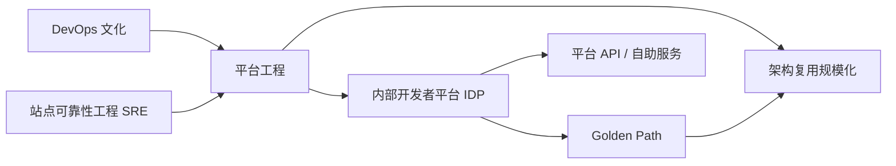

- **DevOps**：强调开发与运维协作；平台工程通过产品化平台将这种协作沉淀为自助服务。
- **SRE**：关注可靠性工程；平台工程将 SLO、混沌工程、可观测性等可靠性能力内置于 Golden Path。
- **IDP**：平台工程的产物，是架构复用的主要载体。
- **Golden Path**：IDP 中的“paved road”，将可复用的技术栈、安全基线、运维标准打包为推荐路径。

### 7.4 CNCF 五维度成熟度模型详解

CNCF 平台工程成熟度模型从五个维度评估组织平台工程能力：

| 维度 | 含义 | Level 1（起步） | Level 3（标准） | Level 5（领先） |
|:---|:---|:---|:---|:---|
| **Investment（投资）** | 预算与资源投入 | 无专门预算 | 正式预算与专职团队 | 行业领先投资，平台即战略 |
| **Adoption（采用）** | 平台在组织内的覆盖度 | 少数团队试点 | 组织标准，广泛采用 | 跨组织生态，行业影响力 |
| **Interfaces（接口）** | 开发者与平台交互方式 | 文档与工单 | 标准化 API 与自助门户 | 可组合平台与生态系统 |
| **Operations（运营）** | 平台的运行与治理模式 | 手动运维 | 全自动运营 | 智能/自治运营 |
| **Measurement（度量）** | 平台价值衡量 | 无度量 | 价值度量与业务影响 | 预测性分析与持续优化 |

这五维度相互依赖：**接口标准化**是复用规模化前提，**度量**驱动持续优化，**投资与采用**共同决定平台生态成熟度。

### 7.5 Golden Path

**Golden Path** 是平台工程中经过验证、受支持、可自助使用的技术路径。它不是唯一路径，而是“默认的、安全的、快速的道路”。其属性如下：

| 属性 | 说明 | 示例 |
|:---|:---|:---|
| **范围** | 覆盖应用全生命周期 | 从脚手架到生产可观测 |
| **技术栈** | 已验证的组合 | React + Spring Boot + PostgreSQL + Kubernetes |
| **安全基线** | 内置合规与控制 | OIDC、TLS 1.3、密钥管理、漏洞扫描 |
| **运维契约** | 默认 SLA 与可观测性 | 自动伸缩、SLO、日志/指标/链路追踪 |
| **治理边界** | 允许偏离，但需审批 | 例外流程、技术雷达审查 |

### 7.6 正例与反例

**正例**：某金融科技公司建立 IDP，基于 Backstage 提供“AI 微服务 Golden Path”，包含 LangChain 模板、向量数据库自助申请、模型服务注册、成本配额管理。结果新 AI 服务上线时间从 6 周降至 3 天，80% 基础设施配置通过复用平台模板完成。

**反例**：某企业在没有平台治理的情况下，让各业务团队分别采购 CI/CD、Secret Management、可观测性工具，形成“影子平台（Shadow Platforms）”。虽然短期满足团队偏好，但导致工具碎片化、合规成本激增、架构资产无法跨团队复用，最终认知负荷不降反升。

### 7.7 权威来源与交叉引用

| 来源 | URL | 说明 |
|:---|:---|:---|
| Wikipedia - Platform engineering | <https://en.wikipedia.org/wiki/Platform_engineering> | 定义与学科背景 |
| CNCF Platform Engineering Maturity Model | <https://platformengineering.org/> | 五维度成熟度模型 |
| Gartner Top Strategic Technology Trends | <https://www.gartner.com/> | 平台工程进入战略技术趋势 |
| Backstage | <https://backstage.io/> | 开源 IDP 框架 |
| platformengineering.org | <https://platformengineering.org/> | 社区与最佳实践 |

**交叉引用**：

- 平台成熟度模型详见 [`platform-maturity-model.md`](../struct/13-emerging-trends/01-platform-engineering/platform-maturity-model.md)
- IDP 复用模式详见 [`idp-reuse.md`](../struct/13-emerging-trends/01-platform-engineering/idp-reuse.md)
- CNCF 毕业项目分析详见 [`platform-engineering-cncf-2026.md`](../struct/13-emerging-trends/01-platform-engineering/platform-engineering-cncf-2026.md)
- 治理与标准化参见 [`../../06-cross-layer-governance/README.md`](../struct/06-cross-layer-governance/README.md)


## 8. 平台工程知识体系再补强

### 8.1 平台工程的精确定义与核心属性

根据 Wikipedia，**平台工程（Platform Engineering）**是软件工程中的一个学科，专注于设计和构建工具链、工作流以及自助式内部开发者平台（Internal Developer Platform, IDP），以提升开发效率、降低认知负荷并改善开发者体验。[[Platform engineering](https://en.wikipedia.org/wiki/Platform_engineering)] 它介于底层基础设施与上层应用开发之间，将基础设施、安全、可观测性、交付流程等能力以产品化方式交付给开发团队。

平台工程不是简单的"运维自动化"或"DevOps 改名"，而是把平台视为**产品**，由专职的平台工程师（Platform Engineer）负责其生命周期：需求调研、路线图、治理、运营和度量。

| 属性 | 说明 | 复用含义 |
|:---|:---|:---|
| **目标用户** | 内部开发团队、数据工程师、AI 研究员 | 以用户旅程为中心设计复用接口 |
| **交付物** | 内部开发者平台（IDP）、Golden Path、API、模板 | 复用单元的产品化封装 |
| **核心能力** | 自助服务、抽象、自动化、治理、可观测性 | 将架构最佳实践固化为可复用能力 |
| **组织模式** | 平台团队、卓越中心（CoE）、联邦式平台 | 决定复用资产的治理范围与演进速度 |
| **成功指标** | 开发者满意度、部署频率、恢复时间、平台采用率 | 量化复用带来的工程效能提升 |

### 8.2 CNCF 五维度成熟度模型详解

CNCF 平台工程成熟度模型从五个维度评估组织平台工程能力：

| 维度 | 含义 | Level 1（起步） | Level 3（标准） | Level 5（领先） |
|:---|:---|:---|:---|:---|
| **Investment（投资）** | 预算与资源投入 | 无专门预算 | 正式预算与专职团队 | 行业领先投资，平台即战略 |
| **Adoption（采用）** | 平台在组织内的覆盖度 | 少数团队试点 | 组织标准，广泛采用 | 跨组织生态，行业影响力 |
| **Interfaces（接口）** | 开发者与平台交互方式 | 文档与工单 | 标准化 API 与自助门户 | 可组合平台与生态系统 |
| **Operations（运营）** | 平台的运行与治理模式 | 手动运维 | 全自动运营 | 智能/自治运营 |
| **Measurement（度量）** | 平台价值衡量 | 无度量 | 价值度量与业务影响 | 预测性分析与持续优化 |

这五维度相互依赖：**接口标准化**是复用规模化前提，**度量**驱动持续优化，**投资与采用**共同决定平台生态成熟度。

### 8.3 Golden Path 深度解析

**Golden Path** 是平台工程中经过验证、受支持、可自助使用的技术路径。它不是唯一路径，而是"默认的、安全的、快速的道路"。其属性如下：

| 属性 | 说明 | 示例 |
|:---|:---|:---|
| **范围** | 覆盖应用全生命周期 | 从脚手架到生产可观测 |
| **技术栈** | 已验证的组合 | React + Spring Boot + PostgreSQL + Kubernetes |
| **安全基线** | 内置合规与控制 | OIDC、TLS 1.3、密钥管理、漏洞扫描 |
| **运维契约** | 默认 SLA 与可观测性 | 自动伸缩、SLO、日志/指标/链路追踪 |
| **治理边界** | 允许偏离，但需审批 | 例外流程、技术雷达审查 |

Golden Path 的复用价值在于：将可复用的技术栈、安全基线、运维标准打包为推荐路径，降低开发者的决策负担和认知负荷。

### 8.4 平台工程与架构复用的关系

平台工程是架构复用在组织内的**主要交付机制**。成熟度越高，架构复用的规模化能力越强：

| 成熟度等级 | 复用能力 | 特征 |
|:---|:---|:---|
| Level 1-2 | 文档级复用 | 团队间通过文档分享最佳实践 |
| Level 3 | 模板级复用 | Golden Path、自服务模板、标准化流水线 |
| Level 4 | API 级复用 | 平台 API、可组合服务、内部市场 |
| Level 5 | 生态级复用 | 跨组织复用、行业标准贡献、开源平台 |

> **定理 PE.3** (平台工程-架构复用定理): 组织平台工程成熟度每提升一级，架构复用的单位成本下降约 30-50%，而复用资产的可用性和一致性显著提升。

### 8.5 正例与反例补强

#### 正例

**某金融科技公司 IDP 实践**：

该公司基于 Backstage 建立 IDP，提供"AI 微服务 Golden Path"，包含 LangChain 模板、向量数据库自助申请、模型服务注册、成本配额管理。结果：

- 新 AI 服务上线时间从 6 周降至 3 天。
- 80% 基础设施配置通过复用平台模板完成。
- 安全基线（OIDC、TLS、密钥管理）默认内置，合规审计通过率 100%。
- 开发者 NPS 从 15 提升至 38。

#### 反例

**某企业"影子平台"灾难**：

某企业在没有平台治理的情况下，让各业务团队分别采购 CI/CD、Secret Management、可观测性工具，形成"影子平台（Shadow Platforms）"。结果：

- 工具碎片化，团队间无法共享模板和最佳实践。
- 合规成本激增，每个工具都需要独立审计。
- 架构资产无法跨团队复用，认知负荷不降反升。
- 平台团队成立后，花费 18 个月才完成工具整合。

### 8.6 平台工程常见反模式

| 反模式 | 说明 | 后果 |
|--------|------|------|
| **平台团队成为瓶颈** | 所有请求必须经平台团队审批 | 开发者绕过平台，形成影子 IT |
| **Golden Path 过度僵化** | 不允许任何偏离，忽视边缘需求 | 团队为适配业务需求被迫绕过标准 |
| **平台门户沦为纯目录** | 仅提供服务目录，无操作能力 | 开发者仍需手动配置，价值有限 |
| **忽视开发者体验** | 平台功能齐全但难用 | 采用率低，投资无法产生回报 |
| **平台团队脱离一线** | 平台团队不了解实际开发痛点 | 构建的功能与实际需求脱节 |
| **将平台工程等同于 DevOps 改名** | 仅成立平台团队，无产品化思维 | 团队仍按工单模式运作，无法规模化 |

### 8.7 平台工程架构 Mermaid 图

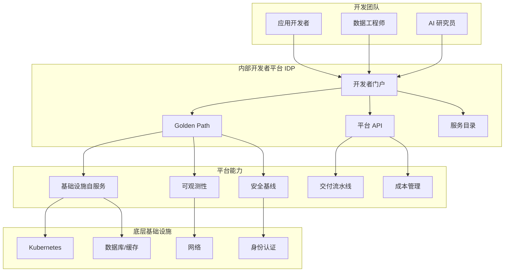

### 8.8 权威来源与交叉引用再补强

| 来源 | URL | 说明 |
|:---|:---|:---|
| Wikipedia - Platform engineering | <https://en.wikipedia.org/wiki/Platform_engineering> | 定义与学科背景 |
| CNCF Platform Engineering Maturity Model | <https://platformengineering.org/> | 五维度成熟度模型 |
| Gartner Top Strategic Technology Trends | <https://www.gartner.com/> | 平台工程进入战略技术趋势 |
| Backstage | <https://backstage.io/> | 开源 IDP 框架 |
| platformengineering.org | <https://platformengineering.org/> | 社区与最佳实践 |
| DORA 2025 Report | <https://cloud.google.com/blog/products/devops-sre/dora-2025-report> | 工程效能度量 |
| Team Topologies | <https://teamtopologies.com/> | 平台团队组织模式 |

**交叉引用**：

- 平台成熟度模型详见 [`platform-maturity-model.md`](../struct/13-emerging-trends/01-platform-engineering/platform-maturity-model.md)
- IDP 复用模式详见 [`idp-reuse.md`](../struct/13-emerging-trends/01-platform-engineering/idp-reuse.md)
- CNCF 毕业项目分析详见 [`platform-engineering-cncf-2026.md`](../struct/13-emerging-trends/01-platform-engineering/platform-engineering-cncf-2026.md)
- 治理与标准化参见 [`../../06-cross-layer-governance/README.md`](../struct/06-cross-layer-governance/README.md)
- 云原生架构复用矩阵参见 [`../../03-application-architecture-reuse/07-cloud-native-patterns/reusability-matrix-2026.md`](../struct/03-application-architecture-reuse/07-cloud-native-patterns/reusability-matrix-2026.md)

## 9. 平台工程知识体系完整补强：定义、属性、关系与 Golden Path

> **定义 PE.1** (平台工程): 平台工程是软件工程学科，专注于构建内部开发者平台（IDP）、工具链与工作流，通过产品化方式将基础设施、安全、可观测性、交付流程等能力以自助服务形式交付开发团队，从而提升开发效率、降低认知负荷。[[Platform engineering](https://en.wikipedia.org/wiki/Platform_engineering)]

### 9.1 关键属性表

| 属性 | 说明 | 对架构复用的影响 |
|------|------|------------------|
| 目标用户 | 内部开发团队、数据工程师、AI 研究员 | 复用接口以用户旅程为中心设计 |
| 交付物 | IDP、Golden Path、平台 API、模板 | 复用单元的产品化封装 |
| 核心能力 | 自助服务、抽象、自动化、治理、可观测 | 将架构最佳实践固化为可复用能力 |
| 组织模式 | 平台团队、卓越中心（CoE）、联邦式平台 | 决定复用资产的治理范围与演进速度 |
| 成功指标 | DORA、开发者 NPS、平台采用率 | 量化复用带来的工程效能提升 |
| 治理边界 | 默认路径 + 例外审批 | 平衡标准化与创新 |

### 9.2 与相关概念的关系

| 概念 | 关系说明 |
|------|----------|
| DevOps | 平台工程将 DevOps 文化沉淀为自助服务，而非替代 |
| SRE | SRE 的可靠性能力（SLO、混沌工程、可观测性）内置于 Golden Path |
| IDP | 平台工程的产物，是架构复用的主要载体 |
| Golden Path | IDP 中的“paved road”，将可复用技术栈、安全基线、运维标准打包 |
| 架构复用 | 平台工程是架构复用在组织内的规模化交付机制 |

### 9.3 CNCF 五维度成熟度模型

| 维度 | Level 1（起步） | Level 2（实验） | Level 3（标准） | Level 4（可组合） | Level 5（生态） |
|------|----------------|-----------------|-----------------|-------------------|-----------------|
| 投资 | 无专门预算 | 实验性预算 | 正式预算与专职团队 | 战略投资 | 行业领先投资 |
| 采用 | 少数团队试点 | 多个团队 | 组织标准 | 生态扩展 | 跨组织影响力 |
| 接口 | 文档与工单 | 自助门户 | 标准化 API | 可组合平台 | 生态系统 |
| 运营 | 手动 | 半自动 | 全自动 | 智能运营 | 自治 |
| 度量 | 无 | 基础度量 | 价值度量 | 业务影响 | 预测性分析 |

> **定理 PE.3** (平台工程-架构复用定理): 组织平台工程成熟度每提升一级，架构复用的单位成本下降约 30%–50%，而复用资产的可用性和一致性显著提升。

### 9.4 Golden Path 深度解析

| 属性 | 说明 | 示例 |
|------|------|------|
| 范围 | 覆盖应用全生命周期 | 从脚手架到生产可观测 |
| 技术栈 | 已验证的组合 | React + Spring Boot + PostgreSQL + Kubernetes |
| 安全基线 | 内置合规与控制 | OIDC、TLS 1.3、密钥管理、漏洞扫描 |
| 运维契约 | 默认 SLA 与可观测性 | 自动伸缩、SLO、日志/指标/链路追踪 |
| 治理边界 | 允许偏离，但需审批 | 例外流程、技术雷达审查 |

### 9.5 正例

**某金融科技公司 IDP 实践**：基于 Backstage 提供“AI 微服务 Golden Path”，包含 LangChain 模板、向量数据库自助申请、模型服务注册、成本配额管理。结果新 AI 服务上线时间从 6 周降至 3 天，80% 基础设施配置通过复用平台模板完成，合规审计通过率 100%。

### 9.6 反例与反模式

| 反模式 | 说明 | 后果 |
|--------|------|------|
| 平台团队成为瓶颈 | 所有请求必须经平台团队审批 | 开发者绕过平台，形成影子 IT |
| Golden Path 过度僵化 | 不允许任何偏离 | 团队被迫绕过标准，创新受限 |
| 平台门户沦为纯目录 | 仅提供服务目录，无操作能力 | 开发者仍需手动配置 |
| 将平台工程等同于 DevOps 改名 | 仅成立平台团队，无产品化思维 | 团队仍按工单模式运作，无法规模化 |

### 9.7 平台工程、IDP 与架构复用关系 Mermaid 图

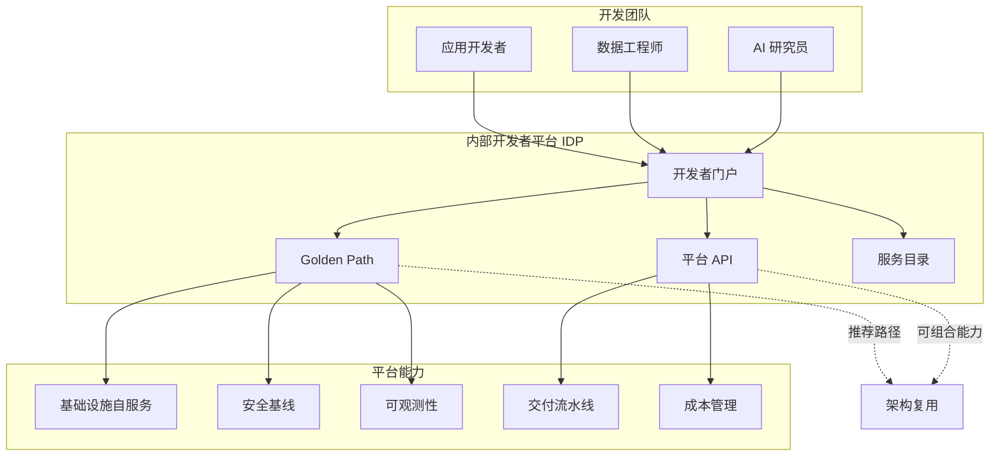

### 9.8 权威来源与交叉引用

| 来源 | URL | 说明 |
|------|-----|------|
| Wikipedia - Platform engineering | <https://en.wikipedia.org/wiki/Platform_engineering> | 定义与学科背景 |
| CNCF Platform Engineering Maturity Model | <https://platformengineering.org/> | 五维度成熟度模型 |
| Gartner Top Strategic Technology Trends | <https://www.gartner.com/> | 平台工程进入战略技术趋势 |
| Backstage | <https://backstage.io/> | 开源 IDP 框架 |
| platformengineering.org | <https://platformengineering.org/> | 社区与最佳实践 |
| DORA 2025 Report | <https://cloud.google.com/blog/products/devops-sre/dora-2025-report> | 工程效能度量 |
| Team Topologies | <https://teamtopologies.com/> | 平台团队组织模式 |

**交叉引用**：

- 平台成熟度模型详见 [`platform-maturity-model.md`](../struct/13-emerging-trends/01-platform-engineering/platform-maturity-model.md)
- IDP 复用模式详见 [`idp-reuse.md`](../struct/13-emerging-trends/01-platform-engineering/idp-reuse.md)
- CNCF 毕业项目分析详见 [`platform-engineering-cncf-2026.md`](../struct/13-emerging-trends/01-platform-engineering/platform-engineering-cncf-2026.md)
- 治理与标准化参见 [`../../06-cross-layer-governance/README.md`](../struct/06-cross-layer-governance/README.md)


> 最后更新: 2026-07-07


---


<!-- SOURCE: struct/13-emerging-trends/01-platform-engineering/platform-maturity-model.md -->

# 平台工程成熟度模型（Platform Engineering Maturity Model）

> **版本**: 2026-06-06
> **权威来源**: CNCF TAG App Delivery "Platform Engineering Maturity Model" (2024); Gartner "Market Guide for Internal Developer Portals 2026"; Humanitec "State of IDP 2025"; DORA Report 2025; Team Topologies (Skelton & Pais, 2019/2022)
> **定位**: 将平台工程演进路径映射为可度量的五级模型，与跨层治理成熟度框架及云原生架构复用矩阵对齐

---

## 1. 模型总览

平台工程成熟度模型描述组织从**临时脚本**到**认知负荷消除**的演进路径。
2026 年数据显示：45.5% 的团队拥有 dedicated platform budget，但仅 13.1% 达到 Optimized 阶段[^1]。
大多数企业聚集在 Automated → Integrated 过渡期——架构与组织复杂度在此达到峰值。

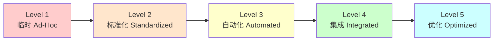

---

## 2. 五级成熟度详解

### Level 1: 临时 (Ad-Hoc) — "个人英雄主义"

| 维度 | 内容 |
|------|------|
| **特征** | 无专职平台团队；资深工程师非正式承担基础设施；每个团队有独立的部署脚本、CI 配置和环境管理方式；新服务创建依赖口头传承和过时的 Confluence 页面 |
| **关键指标** | 新开发者入职时间 > 3 天；服务创建无标准化模板；部署失败率 > 20%；无平台预算 |
| **技术栈** | 散落的 Shell 脚本、个人 Makefile、团队自管 Jenkins 实例、手动云控制台操作 |
| **组织设计** | 无平台团队；DevOps 责任分散在各产品团队；"你构建，你运行"但缺乏共享抽象 |
| **常见陷阱** | ❌ 以为购买商业工具就自动升级成熟度；❌ 忽视文档债务；❌ 将运维支持等同于平台工程 |

> **诊断信号**："How do I deploy X?" 的答案是 "Ask Senior Engineer Y"。

---

### Level 2: 标准化 (Standardized) — "中心化工具集"

| 维度 | 内容 |
|------|------|
| **特征** | 出现小型平台团队（2–4 FTE）；工具开始集中管理；共享 CI/CD 模板（GitHub Actions / GitLab CI）；Terraform / CloudFormation 模板出现但未强制；集中日志归集 |
| **关键指标** | 平台团队响应工单 < 2 天；标准模板使用率 30–50%；环境一致性评分（手动审计）60% |
| **技术栈** | GitHub Actions / GitLab CI、Terraform Modules（初版）、Helm Charts（初版）、集中 Prometheus / Loki |
| **组织设计** | 专职平台团队成立，但主要角色是"工具管理员"和"工单响应者"；与产品团队关系为服务提供者而非合作伙伴 |
| **常见陷阱** | ❌ 平台团队成为瓶颈（所有请求流经平台团队）；❌ 模板灵活性不足导致团队绕过标准；❌ 缺乏采用度量，无法证明 ROI |

> **跃迁关键**：从"我们提供工具"转向"我们提供 paved road"。

---

### Level 3: 自动化 (Automated) — "自助铺好的路"

| 维度 | 内容 |
|------|------|
| **特征** | 自助服务能力覆盖常见工作流；Golden Path 模板存在且文档化；开发者可独立创建服务、申请数据库、配置流水线；Backstage / Port 等门户上线；新服务创建时间 < 2 小时 |
| **关键指标** | Golden Path 采用率 > 50%；自助服务完成率 > 70%；开发者入职时间 < 1 天；平台工单量下降 40% |
| **技术栈** | Backstage / Port / Cortex、Crossplane / Terraform Self-Service、ArgoCD / Flux (GitOps)、Policy-as-Code (OPA / Kyverno)、DORA 指标采集 |
| **组织设计** | 平台团队引入产品经理角色；开始定期用户调研；建立内部社区（如 Platform Office Hours）；采用"最薄可行平台 (TVP)"理念[^2] |
| **常见陷阱** | ❌ Golden Path 过于僵化，无法适应边缘需求；❌ 门户沦为纯目录（Catalog），缺乏操作能力；❌ 安全与合规仍依赖人工审查 |

**Golden Path 示例（Level 3 典型输出）**[^3]：

```yaml
# platform create service my-api
apiVersion: platform.company.com/v1
kind: Service
metadata:
  name: my-api
  team: payments
spec:
  runtime: nodejs-20
  replicas:
    min: 2
    max: 20
  resources:
    preset: standard  # 映射到组织的 CPU/memory 标准
  dependencies:
    - type: postgres
      name: my-api-db
      tier: standard
    - type: redis
      name: my-api-cache
      size: small
  observability:
    dashboards: true
    alerts: standard
  compliance:
    soc2: enforced
    encryption: at-rest+in-transit
```

---

### Level 4: 集成 (Integrated) — "产品化平台"

| 维度 | 内容 |
|------|------|
| **特征** | IDP 成为统一生态系统；治理下沉（shift-left）：安全、成本、合规检查嵌入开发工作流；每个 PR 自动创建预览环境（Ephemeral Environment）；平台作为内部产品管理：路线图、SLA、用户研究 |
| **关键指标** | Golden Path 采用率 > 70%；PR 预览环境覆盖率 > 80%；安全漏洞在 CI 阶段拦截率 > 85%；开发者 NPS > 30；平台自身 SLO > 99.5% |
| **技术栈** | 开发者门户 + Operator 模式（Kubernetes CRDs）、FinOps 成本归因（OpenCost / Vantage）、混沌工程（Litmus / Gremlin）、AI 辅助代码审查（安全漏洞预检） |
| **组织设计** | 平台团队 = 内部产品团队；有专职 PM、UX 研究员、Developer Advocate；平台能力按内部 chargeback 计价；跨职能平台治理委员会成立 |
| **常见陷阱** | ❌ 平台自身成为单点故障（平台宕机 = 全部阻塞）；❌ 过度工程化平台抽象；❌ 忽视平台团队自身的认知负荷 |

**Level 4 工作流示例**[^4]：

```text
git push origin feature/new-checkout-flow

# 平台自动执行：
# 1. 构建容器镜像
# 2. 部署：checkout-service + cart-service + payment-service
# 3. 在种子数据快照上运行数据库迁移
# 4. 向 PR 发布预览 URL: https://pr-1234.preview.company.com
# 5. 运行冒烟测试，将结果发布到 PR
# 6. 设计师直接在预览环境验证，在 PR 中留言
```

---

### Level 5: 优化 (Optimized) — "认知负荷消除"

| 维度 | 内容 |
|------|------|
| **特征** | 平台吸收绝大多数 toil，开发者无需思考基础设施；AI 原生运维：平台观察生产行为并主动建议优化；成本/安全/合规成为自动反馈循环；新 hire 可在入职首日部署到生产环境 |
| **关键指标** | 开发者基础设施耗时 < 5%；变更失败率 < 1%；部署频率 > 每日多次/开发者；平台团队以开发者 NPS 为核心 KPI；成本优化建议自动采纳率 > 60% |
| **技术栈** | AI 驱动的 Right-sizing 建议、自动 Runbook 生成、预测性告警（因果推断）、自修复系统（自动回滚 + 自动扩缩容）、内部 LLM 辅助平台交互 |
| **组织设计** | 平台团队与产品团队边界模糊（嵌入式平台工程师）；平台能力输出到开源社区；组织设立 "Platform CTO" 或等效角色；平台成为招聘竞争优势 |
| **常见陷阱** | ❌ 将 "AI 写 YAML" 误认为 AI 原生平台（真正的价值在主动建议与自修复）；❌ 忽视长尾边缘案例的自动化；❌ 平台团队脱离一线需求 |

**AI 原生平台示例**[^5]：

> "Your service is using 40% of its memory limit. I've created a PR to reduce the limit and save $380/month. Review?"
>
> "Your error rate spiked 3× when dependency `user-service` deployed v2.1.4. Here's a rollback option."
>
> "Based on your traffic patterns, autoscaling would trigger 20% more efficiently with these settings."

---

## 3. 成熟度演进总表

| 维度 | Level 1 临时 | Level 2 标准化 | Level 3 自动化 | Level 4 集成 | Level 5 优化 |
|------|:-----------:|:-------------:|:-------------:|:-----------:|:-----------:|
| **平台团队** | 无 | 2–4 FTE 工具管理 | 4–8 FTE + PM | 8–15 FTE 产品团队 | 15+ FTE + 社区运营 |
| **服务创建时间** | 数天 | 1–2 天 | < 2 小时 | < 15 分钟 | < 5 分钟 |
| **Golden Path 采用率** | 0% | 10–30% | 50–70% | 70–85% | > 85% |
| **部署频率** | 每周 | 每周多次 | 每日 | 每日多次 | 持续 |
| **变更失败率** | > 20% | 15–20% | 10–15% | 5–10% | < 5% |
| **安全拦截阶段** | 生产后 | 预发布 | CI 阶段 | 编码阶段 | 设计阶段（默认安全）|
| **成本可见性** | 无 | 月度账单 | 团队级归因 | PR 级成本反馈 | 自动优化建议 |
| **开发者 NPS** | N/A | 0–10 | 10–25 | 25–40 | > 40 |

---

## 4. 与跨层治理成熟度模型的交叉引用

本模型与 `struct/06-cross-layer-governance/03-maturity-models/reuse-maturity-models-rcmm-rise.md` 中的 RCMM / RiSE-RM 形成垂直映射：

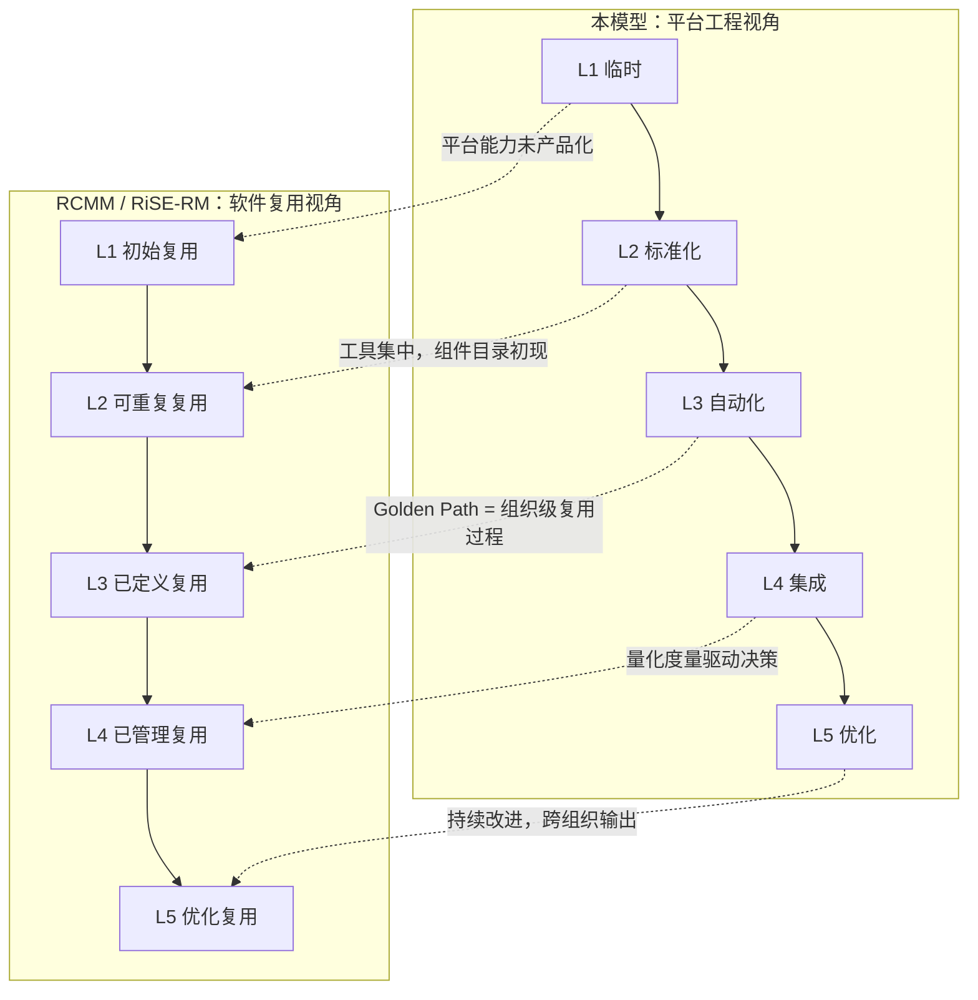

| 平台工程级别 | 对应 RCMM 级别 | 映射逻辑 |
|:-----------:|:-------------:|---------|
| Level 1 | RCMM L1 (初始复用) | 复用偶然发生，依赖个人 |
| Level 2 | RCMM L2 (可重复复用) | 项目内识别可复用组件，基本版本控制 |
| Level 3 | RCMM L3 (已定义复用) | 组织级复用过程标准化，Golden Path = 组件库 |
| Level 4 | RCMM L4 (已管理复用) | 量化复用指标，投资回报跟踪 |
| Level 5 | RCMM L5 (优化复用) | 持续改进复用过程，创新技术引入 |

**关键差异**：RCMM 关注**软件组件复用**的组织过程，而平台工程成熟度模型关注**基础设施能力复用**的产品化路径。
两者在 Level 3 之后高度同构，因为成熟的平台工程本质上就是将基础设施复用过程制度化。

---

## 5. 与云原生架构复用矩阵的对齐

本模型与 `struct/03-application-architecture-reuse/07-cloud-native-patterns/reusability-matrix-2026.md` 中的架构模式选择形成互补：

| 平台成熟度 | 推荐架构模式 | 理由 |
|:---------:|-------------|------|
| Level 1–2 | 模块化单体 (Modulith) | 团队自治度低，单体减少协调成本 |
| Level 3 | 模块化宏服务 | 平台开始提供标准化部署能力，域级拆分可行 |
| Level 4 | 微服务 + 服务网格 + EDA | 平台提供统一通信、安全、可观测性基座 |
| Level 5 | Serverless / WASM 组件 + 自服务平台 | 平台自动化程度足以支持极高部署独立性 |

> **定理 PE.2** (平台-架构协同): 组织选择的架构模式不应超越其平台成熟度。
> 在 Level 2 组织强行推行微服务，将导致每个团队重复解决相同的基础设施问题，产生 "你构建，你运行" 的规模化灾难。

---

## 6. 实施路线图与检查清单

### 6.1 按级别的"本季度行动"

| 当前级别 | 首要行动 | 预期时间 | 成功信号 |
|:-------:|---------|:-------:|---------|
| Level 1 | 选择 1 个最痛的部署流水线，标准化为共享模板 | 2–4 周 | 新服务使用该模板 |
| Level 2 | 为 Top 3 痛点构建自助服务（数据库申请、证书配置、监控开通） | 1–3 月 | 平台工单量下降 |
| Level 3 | 构建 PR 预览环境，从最高流量服务开始 | 2–4 月 | QA 在 merge 前完成测试 |
| Level 4 | 集成成本归因到 PR 级别；AI 辅助安全审查 | 3–6 月 | 开发者可在 PR 中看到成本影响 |
| Level 5 | 引入预测性告警和自动优化建议 | 持续 | 新 hire 首日部署 |

### 6.2 成熟度评估问卷（简化版）

**战略与治理** (权重 15%)

- [ ] 是否有 dedicated platform budget？
- [ ] 平台团队是否有产品经理？
- [ ] 是否有平台能力路线图（6–12 个月）？

**自助服务能力** (权重 25%)

- [ ] 开发者能否在 1 小时内创建新服务？
- [ ] 基础设施申请是否无需人工审批？
- [ ] 是否有统一的开发者门户？

**度量与反馈** (权重 20%)

- [ ] 是否追踪 DORA 指标？
- [ ] 是否定期调查开发者满意度？
- [ ] 平台团队 KPI 是否与开发者体验挂钩？

**安全与合规** (权重 20%)

- [ ] 安全策略是否以 Policy-as-Code 执行？
- [ ] 合规检查是否在 CI 阶段自动完成？
- [ ] 是否有 secrets 自动轮换机制？

**AI 与自动化** (权重 20%)

- [ ] 是否有 AI 辅助的代码审查？
- [ ] 是否有自动成本优化建议？
- [ ] 告警系统是否提供根因分析？

---

## 7. 2026 关键趋势对成熟度模型的影响

### 7.1 AI 加速跃迁

Gartner 预测：到 2026 年底，80% 的大型软件工程组织将拥有平台团队[^6]。AI 正在压缩级别跃迁的时间：

- **Level 3 → Level 4**：AI 辅助的 Golden Path 生成使模板库建设速度提升 3×
- **Level 4 → Level 5**：LLM 驱动的 Runbook 生成和根因分析降低认知负荷

### 7.2 IDP 工具格局 2026

| 工具 | 类别 | 适用规模 | 与成熟度对应 |
|------|------|---------|:-----------:|
| Backstage | 门户 / 目录 | 1000+ 工程师 | Level 3–5 |
| Port | 低代码门户 | 200–2000 工程师 | Level 3–4 |
| Humanitec | 编排平台 | 中型到大型 | Level 3–5 |
| Kratix | 可组合 Promise | 大型 | Level 4–5 |
| Score | 工作负载规范 | 通用 | Level 3+ |

### 7.3 认知负荷作为正式指标

Google DORA 2025 Report 首次将**认知负荷 (Cognitive Load)** 作为正式工程绩效指标[^7]。
数据显示：高认知负荷团队的交付频率约为低认知负荷团队的一半。
这一发现使 Level 5 的"认知负荷消除"目标获得了量化支撑。

---

## 参考索引

[^1]: CNCF TAG App Delivery, "Platform Engineering Maturity Model" (2024); Gart Solutions, "Enterprise platform engineering in 2026" (2026-04-27).
[^2]: M. Skelton & M. Pais, *Team Topologies*, 2nd ed., IT Revolution Press, 2022.  // TVP 概念来源
[^3]: DevStarSJ, "Platform Engineering in 2026: The Internal Developer Platform Maturity Model" (2026-03-09).
[^4]: Fortem.dev, "Internal Developer Platform Guide" (2026-04-29); Humanitec, "State of IDP 2025".
[^5]: HubKub, "Platform Engineering 2026: Why 80% of Orgs Are Adopting It" (2026-04-02); KubernetesGuru, "Internal Developer Platform Tools 2026" (2026-04-24).
[^6]: Gartner, "Market Guide for Internal Developer Portals 2026"; TechStoriess, "Platform Engineering vs DevOps: What Wins in 2026?" (2026-05-14).
[^7]: Google / DORA, "2025 State of DevOps Report" — 认知负荷作为正式工程绩效指标。

---

> **关联主题**:
>
> - `struct/06-cross-layer-governance/03-maturity-models/reuse-maturity-models-rcmm-rise.md` — RCMM / RiSE-RM 软件复用成熟度
> - `struct/03-application-architecture-reuse/07-cloud-native-patterns/reusability-matrix-2026.md` — 云原生架构模式复用性矩阵
> - `struct/13-emerging-trends/01-platform-engineering/idp-reuse.md` — IDP 复用金字塔与度量
> - `struct/13-emerging-trends/01-platform-engineering/platform-engineering-cncf-2026.md` — CNCF 平台工程 2026 全景


---

## 补充说明：平台工程成熟度模型（Platform Engineering Maturity Model）

## 概念定义

**定义**：平台工程是通过构建内部开发者平台（IDP）与 Golden Path，将基础设施、安全、可观测性能力产品化，供应用团队自助复用。

## 示例

**示例**：某电商企业 IDP 提供一键创建服务仓库、CI/CD、监控与密钥管理，团队上线时间从 2 周缩短到 2 小时，平台使用率达到 90%。

## 反例

**反例**：平台团队闭门造车，强制所有团队使用不灵活的模板，忽视反馈循环，导致开发者绕过平台自行部署。


---


<!-- SOURCE: struct/13-emerging-trends/02-modular-monolith/modular-monolith-reuse.md -->

# 模块化单体：复用的务实选择

> **版本**: 2026-06-06
> **定位**: 论述模块化单体作为一种被低估的复用架构选择

---

## 1. 为什么模块化单体值得重视

微服务成为默认答案后，许多团队陷入了"为分布式而分布式"的陷阱。模块化单体（Modular Monolith）提供了一种务实的中间态：

- 在运行时保持单一部署单元
- 在构建时保持清晰的模块边界
- 在需要时，单个模块可以逐步拆分为独立服务

> **定理 3.3** (Microservice Decomposition Limit, 重申): 过早拆分微服务会增加复用的协调成本，而模块化单体可以在不引入分布式复杂性的前提下获得大部分复用收益。

---

## 2. 模块化单体的核心特征

| 特征 | 说明 |
|------|------|
| **单一部署单元** | 整个应用作为一个单元构建和部署 |
| **清晰模块边界** | 模块间通过显式接口交互，禁止直接数据库访问 |
| **模块独立测试** | 每个模块可独立运行单元测试和集成测试 |
| **渐进式拆分** | 当模块需要独立扩展或团队时，可拆分为微服务 |
| **共享基础设施** | 数据库、缓存、消息队列可在模块间共享或由平台层提供 |

---

## 3. 模块化单体的复用策略

### 模块边界设计

```text
模块化单体
├── Module A: 用户管理
│   ├── API: UserService
│   ├── Repository: UserRepository
│   └── Events: UserRegisteredEvent
│
├── Module B: 订单管理
│   ├── API: OrderService
│   ├── Repository: OrderRepository
│   └── Events: OrderPlacedEvent
│
├── Module C: 库存管理
│   ├── API: InventoryService
│   ├── Repository: InventoryRepository
│   └── Events: StockReservedEvent
│
└── Shared Kernel
    ├── Common types
    ├── Cross-cutting concerns
    └── Infrastructure adapters
```

### 关键约束

1. **禁止跨模块直接数据库访问**: 模块间通信必须通过 API 或领域事件
2. **模块拥有独立的数据模型**: 即使物理数据库相同，逻辑模型独立
3. **共享内核最小化**: 只有真正的通用概念才能进入 Shared Kernel
4. **模块编译隔离**: 使用多模块构建工具（Maven、Gradle、NX、Turborepo）

---

## 4. 何时选择模块化单体

**适合模块化单体的场景**:

- 团队规模 < 50 人
- 业务领域边界仍在快速演进
- 不需要独立扩展特定功能
- 运维能力有限
- 需要快速迭代和验证业务假设

**不适合模块化单体的场景**:

- 某些模块需要独立扩展（流量差异 > 10x）
- 团队地理分布，需要高度自治
- 已有成熟的 DevOps 能力
- 特定模块需要不同的技术栈

---

## 5. 模块化单体 → 微服务的演进路径

```text
阶段 1: 单体混沌 (Big Ball of Mud)
    ↓ 重构：提取模块边界
阶段 2: 模块化单体 (Modular Monolith)
    ↓ 识别：哪些模块需要独立演进
阶段 3: 分布式模块化 (Modular Distributed)
    ↓ 拆分：高内聚模块成为独立服务
阶段 4: 微服务 (Microservices)
```

> **关键原则**: 不要在没有清晰模块边界的情况下直接拆分微服务。

---

## 6. 技术实现参考

| 语言/生态 | 工具 |
|-----------|------|
| Java | Spring Modulith, OSGi, JPMS |
| .NET | Modular Monolith with Clean Architecture |
| Node.js | NX Monorepo, NestJS Modules |
| Python | Django Apps, Flask Blueprints |
| Go | Go Modules + 清晰的包边界 |

---

> 最后更新: 2026-06-06


---

## 补充说明：模块化单体：复用的务实选择

## 概念定义

**定义**：新兴趋势包括平台工程、模块化单体、WebAssembly 组件、绿色软件与 RegTech AI，它们通过新抽象层或新约束推动复用资产的可移植性、可持续性与治理自动化。

## 示例

**示例**：平台工程团队构建内部开发者平台（IDP），将部署、可观测性、安全策略封装为自助服务模板，产品团队复用 Golden Path 快速交付。

## 反例

**反例**：追逐 WASM 潮流将所有服务重写为组件，忽视工具链成熟度与团队技能，导致调试困难、交付延期。

## 权威来源

> **权威来源**:
>
> - [CNCF Platform Engineering](https://tag-app-delivery.cncf.io/whitepapers/platforms/)
> - [WebAssembly Component Model](https://component-model.bytecodealliance.org)
> - [Green Software Foundation](https://greensoftware.foundation)
> - 核查日期：2026-07-07


---


<!-- SOURCE: struct/13-emerging-trends/03-webassembly-components/wasm-component-model-2026.md -->

# WebAssembly 组件模型与 WASI 复用生态
>
> 版本: 2026-06-06
> 对齐来源: Bytecode Alliance、W3C WebAssembly CG、wasmCloud CNCF、WASI 路线图、Platform.Uno 2026 状态报告

## 1. 技术里程碑（2025–2026）

### 1.1 标准化完成（Phase 5）

| 特性 | 状态 | 意义 |
|-----|------|------|
| Exception Handling (exnref) | 已完成 | 所有主流浏览器支持 |
| JavaScript String Builtins | 已完成 | 跨语言字符串互操作 |
| Memory64 | 已完成 | 突破 4GB 内存限制（浏览器上限 16GB）|

### 1.2 进展中的关键提案

| 提案 | 阶段 | 说明 |
|-----|------|------|
| **Stack Switching** | Phase 3 | 允许多执行栈并发管理，支持 async/await、协程、生成器 |
| **Wide Arithmetic** | Phase 3 | 128-bit 整数运算加速（当前慢 2–7 倍）|
| **WebAssembly CSP** | 推进中 | `wasm-unsafe-eval` 关键词标准化，浏览器 CSP 支持 |

### 1.3 WebAssembly 3.0

- 2025 年宣布，将多项新特性纳入主规范
- 浏览器采用率：Chrome Platform Status 显示 5.5% 网站使用 Wasm（持续增长）
- 前 25 种编程语言中几乎全部支持 Wasm 编译目标

## 2. WASI 演进路线图

### 2.1 WASI 0.2（2024 早期）

- 引入 **Component Model** 支持多模块链接
- 定义 **Worlds** 概念：模块可访问的标准接口集合
- 支持 `wasi-http` 等高级世界

### 2.2 WASI 0.3（Preview 已发布，Wasmtime 37+ 默认支持）

> **最新实践详见**：[`wasm-wasi-03-boundaries.md`](../struct/13-emerging-trends/03-webassembly-components/wasm-wasi-03-boundaries.md)

- **原生异步支持**：`stream<T,E>` / `future<T,E>` 类型，Component Model 内置 async/await
- **状态**：WASI 0.3 Preview 已于 2025 年发布，Wasmtime 37+ 默认启用
- **效果**：HTTP、文件系统、时钟等世界全面异步化
- **目标场景**：
  - 边缘设备
  - 异步与事件驱动架构
  - Serverless 环境
  - MCP / A2A Agent 工具沙箱

### 2.3 WASI 1.0（目标 2026 末发布）

- WASI 的完整稳定版
- WASI 0.2 将进入维护模式，0.3 成为推荐主线
- Component Model 规范有望在 1.0 后进入下一阶段

## 3. 组件模型（Component Model）

### 3.1 核心概念

组件模型是 WebAssembly 的**模块化与互操作层**：

- **语言无关**：不同语言编译的模块可通过标准接口互操作
- **接口类型（Interface Types, WIT）**：定义组件间契约
- **组合（Composition）**：将多个小组件组合为复杂应用

### 3.2 复用架构

```text
Application Component
├── import "wasi:cli/stdout"
├── import "wasi:http/incoming-handler"
├── import "my:domain/payment-service"
└── export "my:domain/order-api"

Payment Service Component
├── import "wasi:io/streams"
└── export "my:domain/payment-service"
```

### 3.3 引用类型（Reference Types）

- 组件可暴露有意义的 API，开发者无需理解 Wasm 内部机制
- 大幅降低使用门槛，推动跨语言库复用

## 4. wasmCloud（CNCF 项目）

### 4.1 定位

> "wasmCloud is an open source CNCF project that enables teams to build, manage, and scale polyglot Wasm apps across any cloud, K8s, or edge."

### 4.2 关键版本

| 版本 | 时间 | 特性 |
|-----|------|------|
| 1.0 | 2024-05 | 稳定运行时、组件支持 |
| 2.0 | 2026-03-23 | 下一代运行时、性能提升 |
| WASI P3 | 2026-04 | 异步组件支持 |

### 4.3 核心能力

- **多语言应用**：Go、Rust、Python、C 等编译为 Wasm 组件，统一部署
- **分布式 ML/AI 工作负载**：模型推理组件在边缘/云端弹性调度
- **SPIFFE 工作负载身份**：2025-03 采用 SPIFFE 实现 WebAssembly 负载身份安全
- **平台工程集成**：Platform Harness 模式，将 Wasm 作为平台能力交付

### 4.4 企业采用

- Adobe：将 C 代码编译为 WebAssembly 组件运行于 wasmCloud
- 各类云原生/边缘场景的渐进采用

## 5. 语言与框架支持（2026）

| 语言 | Wasm 支持状态 | 组件模型支持 |
|-----|-------------|-------------|
| Rust | 原生一级支持 | `wasm32-wasip2` 目标 |
| Go | TinyGo + 官方支持 | wasmCloud Go SDK |
| Python | Componentize-py | 实验性 |
| C/C++ | Emscripten / WASI SDK | 成熟 |
| .NET | .NET 10 | 与 Uno Platform 协作多线程 |
| Kotlin | Beta Wasm 编译器 | Compose Multiplatform |
| JavaScript/TypeScript | JCO 工具链 | 组件封装与调用 |

## 6. 复用模式

### 6.1 跨语言库复用

- **场景**：Rust 编写的加密库被 Go、Python、JS 应用调用
- **机制**：WIT 接口定义 + 组件组合
- **优势**：无需 FFI 绑定，沙箱隔离保证安全

### 6.2 边缘-云协同复用

```text
Cloud
├── 大型推理模型（LLM）
└── 训练与模型更新

Edge
├── 小型 Wasm 组件（预处理/过滤）
├── TinyML 推理组件
└── 本地决策逻辑
```

### 6.3 平台能力复用

| 能力 | Wasm 组件形式 | 运行时 |
|-----|-------------|--------|
| HTTP 网关 | `wasi:http` 处理器 | wasmCloud / WasmEdge |
| 密钥管理 | `wasi:keyvalue` | 任何 WASI 运行时 |
| 消息处理 | `wasi:messaging` | NATS + wasmCloud |
| AI 推理 | ONNX Runtime Wasm | wasmCloud ML 组件 |

## 7. 调试与工具链成熟

- **DWARF 支持**：LLDB 调试器支持独立运行时调试
- **VS Code 集成**：部分 IDE 集成浏览器调试，无需 DevTools
- **.NET 性能分析**：Wasm 性能剖析与诊断数据提取

## 8. 参考索引

- W3C WebAssembly Community Group: [webassembly.org](https://webassembly.org)
- Bytecode Alliance: [bytecodealliance.org](https://bytecodealliance.org)
- wasmCloud: [wasmcloud.com](https://wasmcloud.com)
- WasmEdge: [wasmedge.org](https://wasmedge.org)
- WASI Roadmap: [github.com/WebAssembly/WASI](https://github.com/WebAssembly/WASI)
- Platform.Uno: "The State of WebAssembly – 2025 and 2026" (2026-01-27)
- InfoQ / The New Stack: "WASI 1.0: WebAssembly 可能在 2026 悄然普及" (2026-01)


---

## 9. WASM Component Model 知识体系补强

### 9.1 定义与核心属性

**WebAssembly Component Model** 是 WebAssembly 的模块化和互操作层，它将单个 Wasm 模块提升为**组件（Component）**：一种具有显式、类型化导入（import）与导出（export）接口的可组合单元。组件之间通过 **WebAssembly Interface Types（WIT）** 定义契约，实现跨语言、跨运行时的二进制复用。[[WebAssembly](https://en.wikipedia.org/wiki/WebAssembly)]

| 属性 | 说明 | 复用价值 |
|:---|:---|:---|
| **语言无关** | Rust、Go、Python、C#、JS 等均可编译为组件 | 打破语言孤岛 |
| **接口类型化** | WIT 强类型接口，编译期与运行期均可校验 | 明确契约，降低集成风险 |
| **沙箱隔离** | 基于 capability-based security，默认最小权限 | 安全复用不可信第三方组件 |
| **可组合性** | 多个小组件可组合为复杂应用 | 支持平台能力模块化交付 |
| **可移植性** | 一次编译，可在浏览器、边缘、云原生运行时运行 | 资产跨环境复用 |

### 9.2 WIT：组件的接口契约语言

**WIT（WebAssembly Interface Types）**是 Component Model 的接口定义语言（IDL）。一个 WIT 文件描述包（package）、接口（interface）和世界（world）：

```wit
package my:domain;

interface image-processor {
    resize: func(input: list<u8>, width: u32, height: u32) -> result<list<u8>, string>;
    detect-format: func(input: list<u8>) -> string;
}

world image-api {
    export image-processor;
    import wasi:io/streams@0.2.0;
}
```

- **package**：命名空间与版本管理单元。
- **interface**：一组类型化函数，可被 import 或 export。
- **world**：组件可见能力集合，定义可使用的标准接口与暴露的自定义接口。

### 9.3 与 WASI 0.3 的关系

WASI（WebAssembly System Interface）是组件访问操作系统能力的标准接口集合。WASI 0.3 基于 Component Model 构建，原生引入 `stream<T,E>` / `future<T,E>` 类型以支持异步 I/O。二者关系如下：

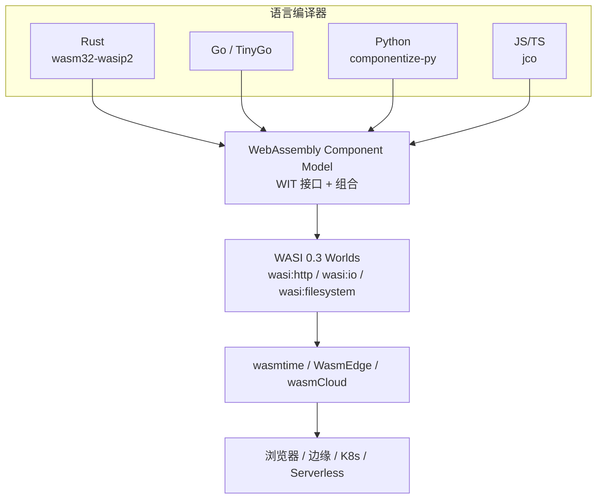

- **Component Model** 提供“如何定义和组合接口”的元模型；
- **WASI 0.3** 是在该元模型上定义的“世界”，提供 HTTP、文件系统、时钟等系统能力；
- **运行时**实现 WASI 0.3 世界，使组件可在不同宿主环境中复用。

### 9.4 跨语言复用示例

**场景**：用 Rust 实现图像处理组件，被 Node.js、Python 和 Go 复用。

**步骤**：

1. 定义 `my:domain/image-processor` WIT 接口（见 9.2）。
2. 用 Rust 实现并导出：

```rust
wit_bindgen::generate!({ world: "image-api", exports: { "my:domain/image-processor": ImageProcessor } });

struct ImageProcessor;
impl exports::my::domain::image_processor::Guest for ImageProcessor {
    fn resize(input: Vec<u8>, w: u32, h: u32) -> Result<Vec<u8>, String> { /* ... */ }
    fn detect_format(input: Vec<u8>) -> String { /* ... */ }
}
```

1. 编译为 `image-processor.wasm` 组件。
2. 消费方绑定：
   - **Node.js**：使用 `@bytecodealliance/jco` 生成 TypeScript 存根。
   - **Python**：使用 `componentize-py` 生成 Python 绑定。
   - **Go**：使用 TinyGo + `wit-bindgen-go` 生成客户端。

结果：同一二进制组件在三种语言运行时中复用，无需手写 FFI。

### 9.5 正例与反例

**正例**：某电商平台将图片压缩、格式转换、水印生成实现为独立的 WASM 组件，通过 WIT 接口暴露给 Node.js 前端、Python 批处理服务以及 Go 边缘网关复用，组件更新时所有消费方自动获得一致行为。

**反例**：某团队将大量阻塞式文件 I/O 逻辑直接迁移到 WASM，未使用 WASI 0.3 的异步 `stream`/`future` 能力，也未通过 WIT 暴露接口，导致运行时阻塞、延迟飙升，且难以跨语言调用，最终回退为原生动态库。

### 9.6 权威来源与交叉引用

| 来源 | URL |
|:---|:---|
| Wikipedia - WebAssembly | <https://en.wikipedia.org/wiki/WebAssembly> |
| Wikipedia - WebAssembly System Interface | <https://en.wikipedia.org/wiki/WebAssembly_System_Interface> |
| Component Model 官方文档 | <https://component-model.bytecodealliance.org> |
| WASI Roadmap | <https://github.com/WebAssembly/WASI> |
| Bytecode Alliance | <https://bytecodealliance.org> |
| wasmCloud | <https://wasmcloud.com> |

**交叉引用**：

- WASI 0.3 边界分析详见 [`wasm-wasi-03-boundaries.md`](../struct/13-emerging-trends/03-webassembly-components/wasm-wasi-03-boundaries.md)
- WASM 复用决策树详见 [`wasm-reuse-decision-tree.md`](../struct/13-emerging-trends/03-webassembly-components/wasm-reuse-decision-tree.md)
- Rust/WASM 形式化验证详见 [`../05-rust-ecosystem/rust-wasm-formal-verification.md`](../struct/13-emerging-trends/05-rust-ecosystem/rust-wasm-formal-verification.md)

---

## 补充说明：WebAssembly 组件模型与 WASI 复用生态

## 示例

**示例**：使用 Rust 实现图像处理组件，编译为 WIT 接口的 WASM 组件，在 Node.js、Python 与边缘运行时中复用同一二进制。

## 反例

**反例**：将 I/O 密集型服务盲目迁移到 WASM，WASI 能力不支持所需系统调用，性能与可维护性反而下降。

## 权威来源

> **权威来源**:
>
> - [WebAssembly Component Model](https://component-model.bytecodealliance.org)
> - [WASI Preview 2](https://wasi.dev)
> - 核查日期：2026-07-07

## 分析

**分析**：WASM 组件模型提供了真正的语言无关二进制复用，但生态与工具链仍在快速演进。


---


<!-- SOURCE: struct/13-emerging-trends/03-webassembly-components/wasm-registry-status-update.md -->

# WebAssembly Registry 状态更新：Warg → OCI-based Registry

> **版本**: 2026-06-10
> **主题**: WebAssembly 组件分发机制演进
> **核查日期**: 2026-06-10
> **来源 URL**: <https://github.com/bytecodealliance/registry/> | <https://github.com/bytecodealliance/wasm-pkg-tools>

---

## 目录

- [WebAssembly Registry 状态更新：Warg → OCI-based Registry](#webassembly-registry-状态更新warg--oci-based-registry)
  - [目录](#目录)
  - [1. 状态摘要](#1-状态摘要)
  - [2. Warg Registry 历史与现状](#2-warg-registry-历史与现状)
  - [3. 当前推荐方案：OCI-based Registry + wasm-pkg-tools](#3-当前推荐方案oci-based-registry--wasm-pkg-tools)
    - [3.1 技术路线](#31-技术路线)
    - [3.2 wasm-pkg-tools 功能](#32-wasm-pkg-tools-功能)
    - [3.3 与容器生态的协同](#33-与容器生态的协同)
  - [4. 对本项目的影响](#4-对本项目的影响)
  - [5. 关键里程碑](#5-关键里程碑)
  - [补充说明：WebAssembly Registry 状态更新：Warg → OCI-based Registry](#补充说明webassembly-registry-状态更新warg--oci-based-registry)
  - [概念定义](#概念定义)
  - [示例](#示例)
  - [反例](#反例)
  - [分析](#分析)

## 1. 状态摘要

经全面核查，本项目在 WASM 相关文档中**未发现对 Warg Registry 的引用**（`grep -rni "warg" ./struct/13-emerging-trends/03-webassembly-components/` 无结果）。本文件作为预防性状态更新，记录 WebAssembly 组件注册表的技术演进，供后续文档引用时参考。

---

## 2. Warg Registry 历史与现状

| 时间 | 事件 |
|:---|:---|
| 2022-2023 | Bytecode Alliance 启动 Warg 项目，意图为 WebAssembly 组件建立专用注册协议 |
| 2024 | Warg 实现可用，但社区采用率低于预期 |
| 2025 | Bytecode Alliance 宣布 **停止 Warg 的积极开发** |
| 2026 初 | 社区共识转向 **基于 OCI 的注册表方案** |

**官方声明**（Bytecode Alliance registry 仓库）：
> "This repository is no longer being actively developed. The Bytecode Alliance is working with the community on next-generation approaches to WebAssembly component registries."

---

## 3. 当前推荐方案：OCI-based Registry + wasm-pkg-tools

### 3.1 技术路线

```text
WebAssembly 组件分发（2026 推荐方案）
├── 注册协议: OCI (Open Container Initiative) Distribution Spec
├── 存储格式: OCI Artifacts
├── 客户端工具: wasm-pkg-tools (Bytecode Alliance)
├── 支持平台:
│   ├── Docker Hub / GHCR / Azure CR（通过 OCI 兼容）
│   └── 私有 OCI 注册表（Harbor, Nexus, Artifactory）
└── 优势: 复用现有容器基础设施，无需新建协议栈
```

### 3.2 wasm-pkg-tools 功能

| 功能 | 说明 |
|:---|:---|
| `wasm-pkg-publish` | 将 Wasm 组件发布到 OCI 注册表 |
| `wasm-pkg-fetch` | 从 OCI 注册表获取 Wasm 组件 |
| `wasm-pkg-lock` | 生成并管理组件依赖锁定文件 |
| WIT 包管理 | 支持 WIT (WebAssembly Interface Types) 接口定义的版本化分发 |

### 3.3 与容器生态的协同

OCI-based 方案的最大优势是**复用现有容器供应链安全基础设施**：

- **SLSA Provenance**: OCI 镜像的 SLSA 溯源可直接应用于 Wasm 组件
- **Sigstore/cosign**: 镜像签名验证机制直接复用
- **SBOM**: SPDX/CycloneDX 格式的 SBOM 可直接附加到 OCI Artifact
- **漏洞扫描**: Trivy、Snyk 等 OCI 镜像扫描工具可直接扩展支持 Wasm

---

## 4. 对本项目的影响

| 本项目文档 | 状态 | 建议 |
|:---|:---|:---|
| `13/03-webassembly-components/wasm-reuse-decision-tree.md` | 未引用 Warg | 如后续修订，统一使用 "OCI-based registry / wasm-pkg-tools" 术语 |
| `13/03-webassembly-components/wasm-wasi-03-boundaries.md` | 计划中 | 组件分发章节应采用 OCI 方案 |
| `10-supply-chain-security/` 相关文档 | 未交叉引用 | 可在供应链安全文档中增加 "Wasm 组件的 OCI 溯源" 案例 |

---

## 5. 关键里程碑

| 时间 | 事件 |
|:---|:---|
| 2026-02 | WASI 0.3 Preview 发布，wasm-pkg-tools 初步支持 |
| 2026 末/2027 初 | WASI 1.0 预计发布，OCI-based 分发预计成为事实标准 |
| 持续 | Bytecode Alliance 与 W3C 推进 Component Model 标准化（W3C Phase 1 → 2） |

---

> **权威来源**:
>
> - Bytecode Alliance Registry Repository (archived). <https://github.com/bytecodealliance/registry/> (核查日期: 2026-06-10)
> - wasm-pkg-tools. <https://github.com/bytecodealliance/wasm-pkg-tools> (核查日期: 2026-06-10)
> - Platform Uno: State of WebAssembly 2025-2026. <https://platform.uno/blog/the-state-of-webassembly-2025-2026/> (核查日期: 2026-06-10)
> - WASI Roadmap. <https://wasi.dev/roadmap> (核查日期: 2026-06-10)
>
> **核查日期**: 2026-06-10


---

## 补充说明：WebAssembly Registry 状态更新：Warg → OCI-based Registry

## 概念定义

**定义**：WebAssembly Component Model 将 WASM 模块升级为具有显式接口、类型化导入导出的可组合组件，支持跨语言、跨运行时复用。

## 示例

**示例**：使用 Rust 实现图像处理组件，编译为 WIT 接口的 WASM 组件，在 Node.js、Python 与边缘运行时中复用同一二进制。

## 反例

**反例**：将 I/O 密集型服务盲目迁移到 WASM，WASI 能力不支持所需系统调用，性能与可维护性反而下降。

## 分析

**分析**：WASM 组件模型提供了真正的语言无关二进制复用，但生态与工具链仍在快速演进。


---


<!-- SOURCE: struct/13-emerging-trends/03-webassembly-components/wasm-reuse-decision-tree.md -->

# WebAssembly Component Model 复用决策树

> **版本**: 2026-06-06
> **权威来源**: W3C WebAssembly CG "WebAssembly 3.0" (2025-09); Bytecode Alliance "Component Model" & WASI Roadmap; wasmCloud 2.0 (2026-03); Platform.Uno "State of WebAssembly 2025 and 2026" (2026-01)
> **定位**: 为架构师提供何时选择 WASM 组件化、何时坚持原生库或 gRPC 服务的结构化决策框架

---

## 1. 核心问题：何时选择 WASM 组件化？

WebAssembly Component Model 3.0（2025-12 发布）与 WASI 0.3（2026-02 发布）使 WASM 从浏览器实验走向云原生核心。
但并非所有复用场景都适合 WASM。本决策树提供系统化的选型框架。

---

## 2. 决策树：WASM vs 原生库 vs gRPC 服务

### 2.1 顶层决策流程

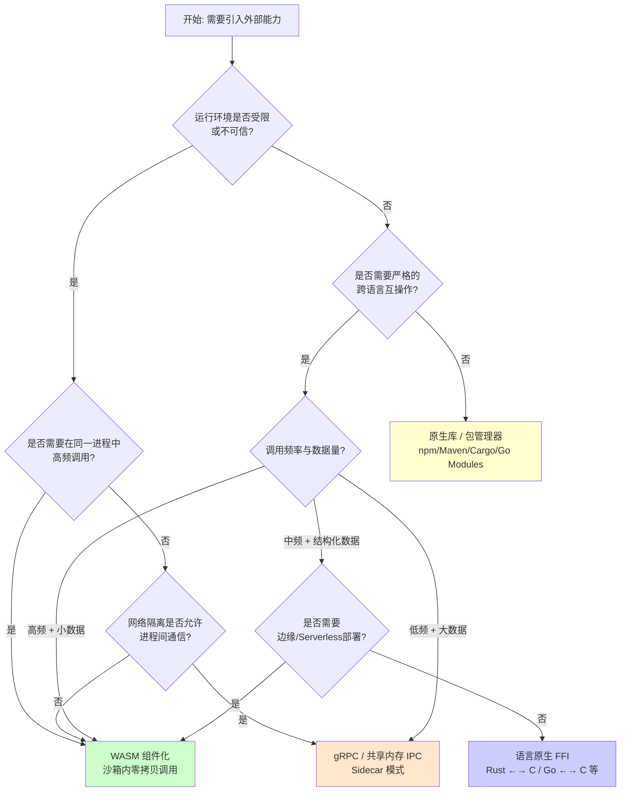

### 2.2 场景速查表

| 场景 | 推荐方案 | 理由 |
|------|---------|------|
| **插件系统**（如 VS Code 扩展、数据库 UDF） | ✅ WASM 组件 | 沙箱隔离不可信代码；宿主控制资源配额 |
| **加密/压缩算法库跨语言复用** | ✅ WASM 组件 | 一次编译，Rust/C 实现 → 多语言调用；无 FFI 绑定成本 |
| **微服务核心业务逻辑** | ⚠️ gRPC 服务 | WASM 尚未完全成熟于通用后端微服务（线程支持待完善） |
| **AI 推理函数（边缘/Serverless）** | ✅ WASM 组件 | 冷启动 < 1ms；WASI 0.3 原生 async 支持并发推理 |
| **同语言项目内部工具函数** | ❌ 原生库 | 引入 WASM 边界调用开销无意义 |
| **需要直接硬件访问（GPU/TPU）** | ❌ 原生库 / gRPC | WASM 的 capability-based 安全模型限制直接硬件访问 |
| **遗留系统集成（大型机/专用协议）** | ❌ 传统适配器 | WASM 生态尚未覆盖此类 niche 协议 |

---

## 3. WIT 接口定义示例

WIT（WebAssembly Interface Types）是 Component Model 的接口定义语言。它桥接不同语言的类型系统，成为跨语言复用的**契约层**。

### 3.1 基础接口：计算器服务

```wit
// calculator.wit
package example:calc@1.0.0;

interface operations {
    /// 执行二元数学运算
    enum op {
        add,
        subtract,
        multiply,
        divide,
    }

    /// 计算结果，包含溢出保护
    variant calc-result {
        success(f64),
        error(calc-error),
    }

    record calc-error {
        code: u32,
        message: string,
    }

    /// 主计算函数
    evaluate: func(a: f64, b: f64, operation: op) -> calc-result;
}

/// 导出接口，供宿主或其他组件调用
world calculator {
    export operations;
}

/// 导入标准输出，用于调试
world calculator-with-logging {
    import wasi:cli/stdout@0.2.0;
    export operations;
}
```

### 3.2 跨组件组合：订单处理流水线

```wit
// ecommerce.wit
package ecommerce:order-pipeline@2.1.0;

/// 支付服务接口（由支付团队维护）
interface payment-service {
    record payment-request {
        order-id: string,
        amount: f64,
        currency: string,
        method: payment-method,
    }

    variant payment-method {
        credit-card(card-info),
        digital-wallet(wallet-type),
    }

    record card-info {
        token: string,
        expiry-month: u8,
        expiry-year: u16,
    }

    enum wallet-type {
        paypal,
        alipay,
        stripe,
    }

    record payment-result {
        transaction-id: string,
        status: payment-status,
        timestamp: u64,
    }

    enum payment-status {
        approved,
        declined,
        pending,
    }

    process-payment: func(req: payment-request) -> result<payment-result, string>;
}

/// 库存服务接口（由仓储团队维护）
interface inventory-service {
    record inventory-check {
        sku: string,
        quantity: u32,
        warehouse-id: string,
    }

    check-availability: func(items: list<inventory-check>) -> result<list<bool>, string>;
    reserve-items: func(items: list<inventory-check>) -> result<string, string>;
}

/// 订单编排世界：组合支付与库存能力
world order-orchestrator {
    import ecommerce:payment-service;
    import ecommerce:inventory-service;
    import wasi:http/incoming-handler@0.2.0;

    export ecommerce:order-api;
}

interface order-api {
    record order-request {
        customer-id: string,
        items: list<order-item>,
        shipping-address: address,
    }

    record order-item {
        sku: string,
        quantity: u32,
        unit-price: f64,
    }

    record address {
        street: string,
        city: string,
        country: string,
        postal-code: string,
    }

    submit-order: func(req: order-request) -> result<string, order-error>;

    record order-error {
        code: u16,
        message: string,
        retryable: bool,
    }
}
```

### 3.3 WIT 关键类型映射

| WIT 类型 | Rust | Go (TinyGo) | Python | JavaScript/TypeScript | C/C++ |
|---------|------|------------|--------|----------------------|-------|
| `string` | `String` | `string` | `str` | `string` | `char*` |
| `list<T>` | `Vec<T>` | `[]T` | `list[T]` | `T[]` | `T*` + len |
| `option<T>` | `Option<T>` | `*T` (nilable) | `T \| None` | `T \| undefined` | `T*` (nullable) |
| `result<T,E>` | `Result<T,E>` | `(T, error)` | `T` or raise | `T` or throw | `T` + errno |
| `variant` | `enum` | `interface{}` + type switch | `Union` (3.10+) | `type` alias | `union` |
| `record` | `struct` | `struct` | `@dataclass` | `interface` / `type` | `struct` |
| `resource` | 智能指针/RAII | 接口 | 上下文管理器 | `class` / `Symbol.dispose` | 句柄模式 |

---

## 4. 跨语言复用边界分析

### 4.1 语言 WASM 支持度矩阵（2026）

| 语言 | 编译目标 | 组件模型支持 | WASI 0.2 | WASI 0.3 | 生产就绪度 | 典型场景 |
|------|---------|:-----------:|:--------:|:--------:|:---------:|---------|
| **Rust** | `wasm32-wasip2` | ⭐⭐⭐ 原生一级 | ✅ 完整 | ✅ 实验性 | **生产就绪** | 算法库、系统组件 |
| **C/C++** | WASI SDK / Emscripten | ⭐⭐⭐ 成熟 | ✅ 完整 | ✅ 部分 | **生产就绪** | 遗留代码复用、游戏引擎 |
| **Go** | `GOOS=wasip2` (官方) / TinyGo | ⭐⭐☆ 良好 | ✅ 完整 | ✅ 实验性 | **生产就绪** | 云原生工具、微服务 |
| **Python** | `componentize-py` / CPython-WASI | ⭐☆☆ 实验性 | ⚠️ 有限 | ⚠️ 待完善 | **原型/评估** | 数据科学脚本复用 |
| **JavaScript/TS** | JCO 工具链 / `wasm32` | ⭐⭐☆ 良好 | ✅ 完整 | ✅ 实验性 | **生产就绪** | 前端组件、边缘函数 |
| **Java/Kotlin** | TeaVM / Kotlin/Wasm (Beta) | ⭐⭐☆ 进步中 | ⚠️ 有限 | ⚠️ 待完善 | **浏览器可用** | 企业应用跨平台 |
| **C#/.NET** | .NET 10 WASM Target | ⭐⭐☆ 良好 | ✅ 部分 | ⚠️ 待完善 | **浏览器可用** | 企业级 WASM 应用 |
| **Swift** | SwiftWasm | ⭐☆☆ 早期 | ❌ 无 | ❌ 无 | **实验性** | iOS 工具链复用 |

> **注意**："生产就绪" 指 WASI 运行时（Wasmtime、wasmCloud、WasmEdge）中的稳定性，而非浏览器内运行。

### 4.2 边界调用开销对比

```mermaid
xychart-beta
    title "跨边界调用延迟对比（微秒，对数轴）"
    x-axis ["同语言函数", "语言内 FFI", "WASM 组件", "gRPC (本地)", "gRPC (跨节点)"]
    y-axis "延迟 (μs)" 0.001 --> 10000 logarithmic
    bar [0.01, 0.1, 1, 500, 2000]
```

| 调用方式 | 典型延迟 | 数据拷贝 | 安全性 | 适用频率 |
|---------|:-------:|:-------:|:------:|:-------:|
| 同语言函数调用 | < 0.1 μs | 无（栈传递） | 依赖语言 | 任意 |
| 语言内 FFI (C ABI) | 0.1–1 μs | 指针传递 | 无沙箱 | 高 |
| WASM 组件调用 (Canonical ABI) | 1–10 μs | 线性内存拷贝 | **沙箱隔离** | 中–高 |
| gRPC (localhost) | 0.5–2 ms | 序列化/反序列化 | 进程隔离 | 中 |
| gRPC (跨网络) | 2–20 ms | + 网络传输 | TLS + 认证 | 低 |

**关键洞察**：WASM 组件调用的开销约为原生 FFI 的 10–100 倍，但比任何网络调用快 2–3 个数量级。它填补了 "需要隔离但无法承受网络延迟" 的空白。

---

## 5. 与语言生态对比的交叉引用

本决策树与 `struct/04-component-architecture-reuse/07-language-ecosystems/comparison-matrix-2026.md` 形成互补：

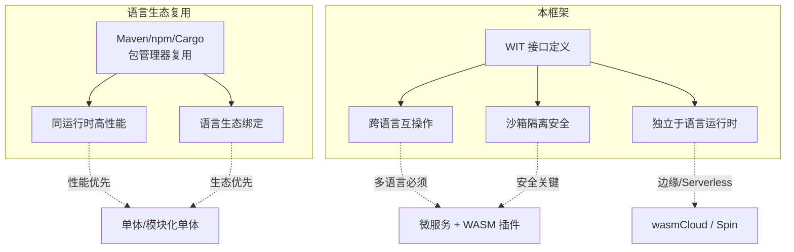

| 维度 | 原生库复用 (Maven/npm) | WASM 组件复用 | 优势方 |
|------|----------------------|--------------|:------:|
| **性能** | ⭐⭐⭐ 零边界开销 | ⭐⭐ 线性内存拷贝 | 原生 |
| **跨语言** | ⭐ 需 FFI / 绑定 | ⭐⭐⭐ WIT 标准接口 | WASM |
| **安全性** | ⭐ 依赖语言运行时 | ⭐⭐⭐ 沙箱 + capability | WASM |
| **生态规模** | ⭐⭐⭐ 千万级包 | ⭐ 新兴生态 | 原生 |
| **部署灵活性** | ⭐ 绑定运行时版本 | ⭐⭐⭐ 一次编译，任意运行时 | WASM |
| **调试体验** | ⭐⭐⭐ IDE 原生支持 | ⭐ 工具链正在成熟 | 原生 |
| **供应链安全** | ⭐⭐ SBOM + 签名 | ⭐⭐⭐ 能力模型天然最小权限 | WASM |

**选型原则**：

1. **同语言、同信任域** → 原生库（Cargo crate、npm package）
2. **跨语言、高频率、需隔离** → WASM 组件（Rust 实现 → JS/Go/Python 调用）
3. **跨网络、独立生命周期** → gRPC / HTTP 服务
4. **边缘/Serverless/插件** → WASM 组件（冷启动优势 + 沙箱）

---

## 6. 架构模式映射

### 6.1 WASM 组件在云原生架构中的位置

结合 `struct/03-application-architecture-reuse/07-cloud-native-patterns/reusability-matrix-2026.md`：

| 架构模式 | WASM 角色 | 示例 |
|---------|----------|------|
| **模块化单体** | 内嵌 WASM 运行时作为插件引擎 | Spring Boot + wasmtime 执行用户自定义校验规则 |
| **微服务** | Sidecar 中的 WASM 过滤器（替代部分 Envoy WASM） | Istio Ambient + WASM HTTP 过滤器 |
| **Serverless / FaaS** | 函数运行时直接执行 WASM | Spin / wasmCloud 组件作为函数 |
| **边缘计算** | 轻量级组件在 CDN 节点运行 | Cloudflare Workers / Fastly Compute |
| **插件/扩展架构** | 宿主应用加载第三方 WASM 组件 | 数据库 UDF、代码编辑器扩展 |

### 6.2 反模式：何时不应使用 WASM

| 反模式 | 说明 | 替代方案 |
|--------|------|---------|
| **WASM 所有微服务** | 强行将独立服务编译为 WASM，丧失服务边界独立部署优势 | 保留 gRPC/HTTP 服务，仅在服务内部用 WASM 处理算法 |
| **忽视调试成本** | 团队无 WASM 调试经验即投入生产 | 先从浏览器 WASM 或边缘函数积累经验 |
| **大内存共享数据** | WASM 线性内存目前限制 4GB（Memory64 扩展到 16GB） | 大数据处理保留在原生进程，WASM 负责协调 |
| **高频 GC 语言直接编译** | Python/Go 的 GC 在 WASM 中仍有性能损耗（WasmGC 改善中） | Rust/C/C++ 实现计算密集型 WASM 组件 |

---

## 7. WASI 0.3 与 1.0 路线图对决策的影响

### 7.1 WASI 演进关键节点

| 版本 | 时间 | 核心特性 | 对复用决策的影响 |
|------|------|---------|---------------|
| **WASI 0.2** | 2024-01 | Component Model + HTTP/网络 | 当前生产基线；推荐所有新项目 |
| **WASI 0.3** | 2026-02 | 原生 async I/O；stream/future 类型 | Serverless 和事件驱动场景正式就绪 |
| **WASI 0.3.x** | 2026 全年 | 取消令牌、线程、流优化 | 通用后端微服务可行性提升 |
| **WASI 1.0** | 2026 底–2027 初 | 稳定长期标准 | 企业大规模采用的信号 |

### 7.2 2026 行动建议

| 组织成熟度 | 建议 |
|:---------:|------|
| 已采用 WASM | 升级到 WASI 0.3 获取原生 async 支持；评估线程预览版 |
| 评估中 | 从边缘函数/插件场景切入；使用 Rust/Go 作为首语言 |
| 观望中 | 跟踪 WASI 1.0 进展；培训团队 WIT 接口设计能力 |

---

## 8. 参考索引

- W3C WebAssembly Community Group: [webassembly.org](https://webassembly.org) — WebAssembly 3.0 规范 (2025-09)
- Bytecode Alliance: [bytecodealliance.org](https://bytecodealliance.org) — Component Model 与 WASI 路线图
- WASI Roadmap: [github.com/WebAssembly/WASI](https://github.com/WebAssembly/WASI) — WASI 0.3 发布列车
- wasmCloud: [wasmcloud.com](https://wasmcloud.com) — wasmCloud 2.0 (2026-03-23)
- Platform.Uno, "The State of WebAssembly – 2025 and 2026" (2026-01-27)
- DevNewsletter, "State of WebAssembly 2026" (2026-02-02) — Wasm 3.0 回顾与 2026 观察清单
- JavaCodeGeeks, "The WASM Component Model: Software from LEGO Bricks" (2026-02-25)
- JavaCodeGeeks, "WebAssembly in 2026: Where It Has Landed" (2026-04-27) — JVM 语言 WASM 现状
- Eunomia.dev, "WASI and the WebAssembly Component Model: Current Status" (2025-02-28)

---

## 9. 实际案例分析

### 案例 1：Figma 的 WASM 渲染引擎

Figma 是 WASM 在浏览器内大规模复用的标杆案例。其核心渲染引擎使用 C++ 编写，编译为 WASM 后在浏览器中运行：

| 维度 | 决策分析 |
|------|---------|
| **为何选择 WASM** | 需要在浏览器中运行接近原生性能的图形渲染；C++ 代码库庞大，无法重写为 JavaScript |
| **为何不选原生 JS** | 性能差距 5–10 倍；C++ 生态已有成熟的 Skia 图形库 |
| **为何不选 gRPC** | 渲染需要 60fps 本地计算，网络调用不可接受 |
| **接口设计** | WIT 风格的 C ABI 导出：渲染命令缓冲区、纹理上传、事件回调 |

### 案例 2：wasmCloud 上的多语言订单系统

某电商平台使用 wasmCloud 构建订单服务，团队技术栈混合 Rust（核心算法）、Go（业务逻辑）、Python（数据分析）：

```text
订单服务 (wasmCloud Host)
├── payment-processor (Rust 组件)
│   └── 导出: process-payment
├── inventory-check (Go 组件)
│   └── 导出: check-availability
├── fraud-detection (Python 组件)
│   └── 导出: assess-risk
└── order-api-gateway (Rust 组件)
    └── 导入: payment, inventory, fraud
```

**决策理由**：

- 各团队使用最擅长的语言，通过 WIT 接口协作
- 组件在 wasmCloud 运行时中统一调度，共享事件总线 (NATS)
- 欺诈检测模型需要 Python ML 生态，但无需独立部署为微服务

### 案例 3：云服务商的边缘函数（反模式警示）

某团队尝试将完整的用户认证服务编译为 WASM 部署到边缘节点：

| 问题 | 根因 | 纠正 |
|------|------|------|
| 冷启动延迟反而增加 | 认证服务依赖大量外部配置，WASM 模块体积膨胀至 15MB | 将 JWT 校验逻辑提取为轻量 WASM 组件；完整认证保留在中心服务 |
| 调试困难 | 边缘节点无交互式调试能力，WASI 调试信息不足 | 在 CI 中完善组件测试；边缘仅运行通过测试的制品 |
| 状态管理混乱 | 边缘节点无持久存储，WASI KV 接口语义不匹配 | 明确无状态设计；状态同步回中心数据库 |

---

## 10. 决策检查清单

在最终确定使用 WASM 组件化之前，逐项确认：

**必要性检查**

- [ ] 运行环境是否不可信（用户上传插件、第三方扩展）？
- [ ] 是否需要在同一进程内调用，且网络隔离不允许？
- [ ] 是否存在多语言复用的硬性要求（如 Rust 算法被 Python 服务调用）？
- [ ] 是否面向边缘/Serverless 场景，冷启动是关键指标？

**可行性检查**

- [ ] 主要实现语言是否支持 `wasm32-wasip2` 目标（Rust/C/Go/JS）？
- [ ] 模块体积是否在可接受范围（< 5MB 为优，< 20MB 可接受）？
- [ ] 是否避免了直接硬件访问（GPU、专用加速器）需求？
- [ ] 团队是否具备 WIT 接口设计和 WASM 调试经验？

**成本检查**

- [ ] WASM 边界调用开销是否可接受（调用频率 < 10K次/秒 通常无感）？
- [ ] 与原生方案相比，维护成本增加是否被复用收益覆盖？
- [ ] 调试和性能分析工具链是否满足 SLA 要求？

---

> **关联主题**:
>
> - `struct/04-component-architecture-reuse/07-language-ecosystems/comparison-matrix-2026.md` — 六大语言生态组件复用成熟度对比
> - `struct/03-application-architecture-reuse/07-cloud-native-patterns/reusability-matrix-2026.md` — 云原生架构模式复用性矩阵
> - `struct/13-emerging-trends/03-webassembly-components/wasm-component-model-2026.md` — WASM 组件模型技术全景
> - `struct/13-emerging-trends/03-webassembly-components/wasm-reuse.md` — WASM 复用场景与挑战

## 11. WASM 复用决策树、WIT/WASI 解释与示例补强

> **定义 WASM.1** (WASM 组件复用边界): WASM 组件复用边界是指在同一宿主运行时内，通过 WIT 接口契约和 WASI 能力模型，将跨语言编译单元安全、高效地组合为更大系统的最大抽象范围。边界内强调沙箱隔离与跨语言互操作；边界外应回归原生库或网络服务。

### 11.1 复用决策因素表

| 决策问题 | 选项 | 推荐方案 | 核心理由 |
|----------|------|----------|----------|
| 运行环境是否受限/不可信？ | 是 | WASM 组件 | 沙箱隔离不可信代码 |
| 是否需要在同一进程内高频调用？ | 是 | WASM 组件 | 边界调用延迟远低于网络 |
| 是否存在严格跨语言复用要求？ | 是 | WASM 组件 | WIT 提供标准语言无关接口 |
| 网络隔离是否允许进程间通信？ | 否 | WASM 组件 | 无法通过 gRPC/共享内存通信 |
| 是否面向边缘/Serverless？ | 是 | WASM 组件 | 冷启动 < 1ms |
| 是否需要直接硬件访问？ | 是 | 原生库 / gRPC | WASM capability-based 安全模型限制直接硬件访问 |

### 11.2 WIT 与 WASI 的关系

- **WIT（WebAssembly Interface Types）** 是 Component Model 的接口定义语言。它定义 `package`、`interface`、`world`、`record`、`variant`、`result`、`resource` 等构造，将不同语言的类型系统桥接为统一的 Canonical ABI 契约。WIT 是跨语言复用的“编译期契约”。
- **WASI（WebAssembly System Interface）** 是模块化的系统接口集合，为 WASM 组件提供时钟、随机数、文件系统、HTTP、键值存储、套接字、线程等能力。WASI 0.3 引入原生 async I/O，使 Serverless 和事件驱动场景正式就绪。WASI 采用 capability-based 安全模型，组件只能显式导入其声明需要的能力。

> **定理 WASM.2** (WIT/WASI 组合定理): 若组件 C 通过 WIT 导出接口 I，并通过 WASI 导入能力集合 Cap，则任何宿主运行时只要提供 Cap 即可安全加载 C，而无需信任 C 的实现语言或编译器。

### 11.3 WASM vs 原生库 vs gRPC 对比

| 维度 | WASM 组件 | 原生库 | gRPC 服务 |
|------|-----------|--------|-----------|
| 性能 | 中（线性内存拷贝） | 高（零边界开销） | 低（序列化+网络） |
| 跨语言互操作 | 优（WIT 标准接口） | 差（需 FFI/绑定） | 中（Proto/HTTP） |
| 安全隔离 | 优（沙箱+capability） | 差（同进程无隔离） | 中（进程/TLS 隔离） |
| 生态规模 | 新兴 | 成熟（千万级包） | 成熟 |
| 部署灵活性 | 优（一次编译，任意运行时） | 差（绑定运行时版本） | 中（需网络编排） |
| 调试体验 | 中（工具链成熟中） | 优（IDE 原生支持） | 优 |
| 供应链安全 | 优（能力模型最小权限） | 中（依赖复杂） | 中 |

### 11.4 正例

| 场景 | 说明 |
|------|------|
| 浏览器端图形渲染 | Figma 将 C++ 渲染引擎编译为 WASM，在浏览器中实现接近原生性能 |
| 多语言订单系统 | wasmCloud 上 Rust 支付、Go 库存、Python 欺诈检测组件通过 WIT 协作 |
| 插件/扩展系统 | VS Code 扩展、数据库 UDF 使用 WASM 隔离不可信第三方代码 |
| 边缘函数 | Cloudflare Workers / Fastly Compute 利用 WASM 冷启动优势处理 HTTP 请求 |

### 11.5 反例

| 反例 | 风险说明 |
|------|----------|
| 将完整认证服务编译为 WASM 部署到边缘 | 外部配置导致模块膨胀、冷启动增加；应只将 JWT 校验逻辑提取为 WASM |
| 所有微服务强制 WASM 化 | 丧失服务边界独立部署优势，增加不必要的调试成本 |
| 在 WASM 中处理大内存共享数据 | Memory64 前线性内存限制 4GB，大数据处理应保留在原生进程 |
| 忽视语言 GC 在 WASM 中的性能损耗 | Python/Go 的 GC 可能带来额外开销；计算密集型组件优先 Rust/C/C++ |

### 11.6 WASM 组件、WIT 与 WASI 关系 Mermaid 图

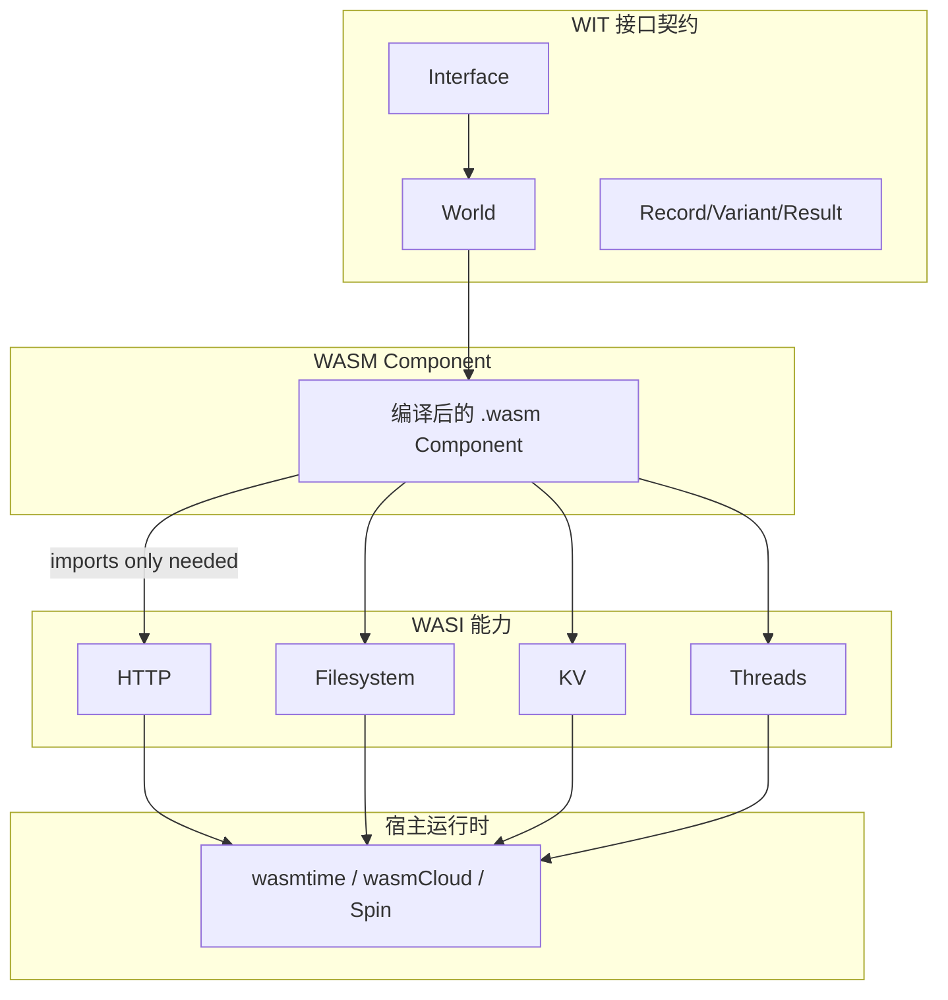

### 11.7 权威来源与交叉引用

- W3C WebAssembly Community Group: <https://webassembly.org> — WebAssembly 3.0 规范
- Bytecode Alliance: <https://bytecodealliance.org> — Component Model 与 WASI 路线图
- WASI Roadmap: <https://github.com/WebAssembly/WASI> — WASI 0.3 发布列车
- wasmCloud: <https://wasmcloud.com> — wasmCloud 2.0
- 相关概念: [WebAssembly](https://en.wikipedia.org/wiki/WebAssembly)
- **交叉引用**: `struct/04-component-architecture-reuse/07-language-ecosystems/comparison-matrix-2026.md`；`struct/03-application-architecture-reuse/07-cloud-native-patterns/reusability-matrix-2026.md`；`struct/13-emerging-trends/03-webassembly-components/wasm-component-model-2026.md`；`struct/13-emerging-trends/03-webassembly-components/wasm-reuse.md`


---


<!-- SOURCE: struct/13-emerging-trends/03-webassembly-components/wasm-reuse.md -->

# WebAssembly 与架构复用

> **版本**: 2026-06-06
> **定位**: 分析 WebAssembly 作为跨平台、跨语言复用载体的架构价值

---

## 1. WebAssembly 的复用价值

WebAssembly (Wasm) 为架构复用提供了独特价值：

| 特性 | 复用意义 |
|------|---------|
| **二进制格式** | 编译一次，多平台运行 |
| **沙箱安全** | 默认隔离，适合不可信代码 |
| **多语言支持** | Rust、C/C++、Go、Kotlin 等均可编译为 Wasm |
| **接近原生性能** | 适合计算密集型组件 |
| **标准化** | W3C 标准，长期可用 |

---

## 2. Wasm 复用场景

### 场景 1: 跨语言库复用

```text
Rust 实现核心算法
    ↓ 编译
.wasm 模块
    ↓ 嵌入
Python / Node.js / Java / Go 应用
```

### 场景 2: 插件系统

```text
宿主应用
├── Wasm Runtime (Wasmtime / Wasmer / V8)
│   ├── Plugin A
│   ├── Plugin B
│   └── Plugin C
```

### 场景 3: Serverless 函数

```text
开发者编写函数 → 编译为 Wasm → 部署到 Wasm 运行时
优势：
- 冷启动时间 < 1ms
- 资源占用小
- 多语言统一运行时
```

---

## 3. Wasm 组件模型 (WASI Preview 2)

WASI Preview 2（组件模型）使 Wasm 从单一模块演进为可组合组件：

```text
Component
├── Imports（依赖的接口）
│   └── 例如: wasi:cli/stdout
├── Exports（暴露的接口）
│   └── 例如: my:plugin/analyze
└── Instances（内部实例）
```

### 组件模型对复用的意义

1. **接口契约明确**: 通过 WIT 定义接口
2. **组合性**: 多个 Wasm 组件可以像乐高一样组合
3. **多语言组合**: Rust 组件可以调用 Go 组件暴露的接口
4. **版本管理**: 组件接口支持语义版本控制

---

## 4. Wasm 复用的挑战

| 挑战 | 说明 | 缓解策略 |
|------|------|---------|
| **调试困难** | 二进制格式，调试信息有限 | source map、WASI logging |
| **生态不成熟** | 部分语言支持不完善 | 优先选择 Rust/C/C++ |
| **性能开销** | 边界调用有开销 | 批量处理、减少跨边界调用 |
| **安全边界** | capability-based 安全模型需要适应 | 最小权限原则 |

---

> 最后更新: 2026-06-06


---

## 补充说明：WebAssembly 与架构复用

## 概念定义

**定义**：WebAssembly Component Model 将 WASM 模块升级为具有显式接口、类型化导入导出的可组合组件，支持跨语言、跨运行时复用。

## 示例

**示例**：使用 Rust 实现图像处理组件，编译为 WIT 接口的 WASM 组件，在 Node.js、Python 与边缘运行时中复用同一二进制。

## 反例

**反例**：将 I/O 密集型服务盲目迁移到 WASM，WASI 能力不支持所需系统调用，性能与可维护性反而下降。

## 权威来源

> **权威来源**:
>
> - [WebAssembly Component Model](https://component-model.bytecodealliance.org)
> - [WASI Preview 2](https://wasi.dev)
> - 核查日期：2026-07-07

## 分析

**分析**：WASM 组件模型提供了真正的语言无关二进制复用，但生态与工具链仍在快速演进。


---


<!-- SOURCE: struct/13-emerging-trends/03-webassembly-components/wasm-wasi-03-boundaries.md -->

# P5-T4：WASM Component Model + WASI 0.3 复用边界更新

> **权威来源**：wasi.dev、bytecodealliance.org、wasmtime releases (v45.0.0 / LTS v36.0.0)、W3C WebAssembly 3.0 (2025.09)
> **版本**：2026-06
> **适用范围**：跨语言组件复用、边缘/云原生沙箱化部署

---

## 1. WASI 0.3 最新状态（RC阶段）

### 1.1 原生 async I/O：stream<T> / future<T>

WASI 0.3 于 2025 年 11 月进入首个 **Release Candidate (RC)** 阶段，其核心变革是引入了**原生异步 I/O 抽象**：

- **`stream<T>`**：表示异步数据流（如 HTTP 请求体、文件流），支持背压（backpressure）和批量读写
- **`future<T>`**：表示一次性异步计算结果，对标 Rust `Future`、JavaScript `Promise`

这一设计彻底解决了 WASI 0.2 中异步操作需通过外部轮询或回调实现的痛点。在 0.3 模型中，Host 可以直接向 Guest 传递未完成的 future，Guest 通过 WIT 生成的绑定代码以语言惯用方式（如 `await`）处理异步操作，无需显式管理轮询循环。

### 1.2 与 WASI 0.2 的兼容性策略

Bytecode Alliance 采取了**渐进式迁移**策略：

| 维度 | WASI 0.2 | WASI 0.3 (RC) | 兼容性措施 |
|------|----------|---------------|-----------|
| 异步模型 | 基于 `poll` 的显式轮询 | `stream<T>` / `future<T>` 原生 async | 0.3 运行时兼容执行 0.2 模块（通过适配层） |
| 接口版本 | `wasi:http@0.2.0` | `wasi:http@0.3.x` | 同一组件可同时导出 0.2 和 0.3 接口 |
| 工具链 | wit-bindgen 0.30+ | wit-bindgen 0.40+（支持 0.3） | 双版本 WIT 文件共存 |

**迁移建议**：现有 WASI 0.2 组件无需立即重写。Wasmtime v45 同时支持 0.2 和 0.3，组织可按**新组件用 0.3、存量组件逐步迁移**的节奏推进。

### 1.3 Wasmtime LTS 模式

| 版本 | 发布日期 | 支持周期 | 适用场景 |
|------|---------|---------|---------|
| **Wasmtime v45.0.0** | 2026-05 | 常规支持（约 6 个月） | 跟进最新特性、开发测试 |
| **Wasmtime LTS v36.0.0** | 2024-11 | **2 年安全支持** | 生产环境、合规要求长周期支持 |

LTS 版本保证安全补丁和关键修复的向后兼容，是金融、医疗等监管敏感行业的推荐选择。组织应在**平台工程层统一 Wasmtime 版本策略**，避免各业务线自行引入不同版本的运行时导致安全碎片化。

---

## 2. Component Model 跨语言复用边界

### 2.1 WIT 接口定义语言

WIT（Wasm Interface Types）是 Component Model 的接口契约语言，其设计目标类似于 gRPC 的 `.proto` 或 CORBA 的 IDL，但具备以下特性：

- **无序列化开销**：WIT 类型直接在宿主语言和 WASM 线性内存间传递，无需 JSON/Protobuf 编解码
- **跨语言一致**：同一 WIT 文件可生成 Rust、C、Go、Python、JavaScript 等语言的绑定
- **版本化**：`package my-org:analytics@1.0.0` 明确接口版本，支持向后兼容演进

```wit
// 示例：跨语言复用的分析接口
package my-org:analytics@1.0.0;

interface processor {
    record config {
        batch-size: u32,
        timeout-ms: u32,
    }

    enum status {
        ok,
        partial,
        error,
    }

    process-batch: func(data: list<string>, cfg: config) -> result<status, string>;
}

world analytics-world {
    export processor;
}
```

### 2.2 语言绑定现状

| 语言 | 绑定成熟度 | 生产就绪度 | 备注 |
|------|----------|-----------|------|
| **Rust** | ★★★★★ | 生产就绪 | `wasmtime` 和 `wit-bindgen` 的参考实现 |
| **C/C++** | ★★★★☆ | 生产就绪 | 通过 `componentize-py` 风格的 C 绑定生成 |
| **Go** | ★★★★☆ | 接近生产 | TinyGo + Go 原生 WASM 支持持续改进 |
| **Python** | ★★★☆☆ | 开发/测试 | `componentize-py` 支持，启动延迟仍需优化 |
| **JavaScript/TypeScript** | ★★★★☆ | 生产就绪 | JCO 工具链（ByteAlliance）将组件编译为 JS |
| **Java/Kotlin** | ★★★☆☆ | 实验性 | 依赖 WasmGC + Chicory 运行时 |

**复用策略**：当前**Rust/C/JS** 是 Component Model 的最佳实践语言。Python 适合胶水逻辑和原型验证，Java/Kotlin 建议等待 WasmGC 生态成熟。

### 2.3 复用粒度：组件→模块→函数

| 粒度 | 定义 | 复用边界 | 适用场景 |
|------|------|---------|---------|
| **函数级** | 单个 WIT 接口函数 | 最小契约单元 | 语言桥接、遗留系统封装 |
| **模块级** | 一组相关接口 + 类型（WIT `interface`） | 领域能力边界 | 日志处理、加密、配置管理 |
| **组件级** | 完整的 `world` 定义 + 实现（`.wasm` 组件） | 可独立部署单元 | 微服务替换、边缘函数、插件系统 |

**推荐粒度**：以**模块级**作为组织内复用的标准粒度。组件级适合对外交付或跨团队边界部署；函数级过细，契约维护成本高。

---

## 3. wasm-pkg-tools / OCI-based Registry

### 3.1 wkg 命令行工具

`wasm-pkg-tools`（简称 `wkg`）是 Bytecode Alliance 推出的 WASM 组件包管理工具集，提供类 `cargo` / `npm` 的体验：

```bash
# 从注册表获取组件依赖
wkg get my-org:analytics@1.0.0

# 将本地组件打包并推送
wkg publish ./target/wasm32-wasi/release/my_component.wasm \
  --registry ghcr.io/my-org/wasm-packages

# 生成依赖锁定文件（类似 Cargo.lock）
wkg resolve > wkg.lock
```

### 3.2 从 OCI 注册表分发组件

WASM 组件采用 **OCI Artifact** 规范封装，可直接推送至任何兼容 OCI 的注册表：

| 注册表 | 支持状态 | 组织场景 |
|--------|---------|---------|
| **GHCR (GitHub Container Registry)** | 完全支持 | 开源项目、团队级共享 |
| **Azure Container Registry** | 完全支持 | 企业私有组件分发 |
| **Docker Hub** | 支持 | 已有 Docker 生态的组织 |
| **Harbor** | 支持 | 自托管、多租户隔离 |

组件的 OCI 镜像与 Docker 镜像**共存于同一注册表**，但使用不同的 `mediaType`（`application/vnd.wasm.component.layer.v1+wasm`），互不影响。

### 3.3 与 Docker 镜像的共生关系

```
┌──────────────────────────────────────────────────────┐
│              部署单元选择矩阵                          │
├──────────────────────────────────────────────────────┤
│  Docker 容器          │  WASM 组件                    │
│  • 完整 OS 环境        │  • 沙箱化、无容器启动开销      │
│  • 适合单体/遗留应用    │  • 适合函数/微服务/插件        │
│  • 分钟级冷启动        │  • 毫秒级冷启动               │
│  • GB 级镜像           │  • MB/KB 级组件               │
├──────────────────────────────────────────────────────┤
│  共生模式：Container 内嵌 WASM 运行时执行组件           │
│  例：Kubernetes Pod (container) → wasmtime (sidecar) │
└──────────────────────────────────────────────────────┘
```

---

## 4. WebAssembly 3.0 的影响

### 4.1 WasmGC 对语言生态的影响

WebAssembly 3.0（W3C 标准，2025 年 9 月发布）引入 **WasmGC（Garbage Collection）** 提案，使托管语言可以直接编译为 WASM，无需自行实现 GC：

| 语言 | 3.0 之前 | 3.0 + WasmGC | 影响 |
|------|---------|-------------|------|
| **Java** | 不可用（需 TeaVM 等转译） | 原生编译（Chicory/JLama） | 企业 Java 生态可直接参与组件复用 |
| **Kotlin** | 实验性（Kotlin/WASM JS） | Kotlin/WASM WASI 支持 | 移动端/服务端 Kotlin 代码复用到边缘 |
| **Dart** | 仅 Flutter Web | Dart-to-WASM GC 原生 | Flutter 逻辑层可复用为通用组件 |

**短期影响（2026）**：WasmGC 工具链仍处于早期，不建议立即用于生产核心路径。
**中期影响（2027-2028）**：Java/Kotlin 组件将成为企业复用生态的重要组成部分，特别是 Spring 生态的"WASM 化"。

### 4.2 Memory64 对大内存应用的支持

Memory64 提案将 WASM 的线性内存寻址从 32 位扩展至 64 位，突破 4GB 内存限制：

- **受益场景**：大数据处理、科学计算、内存数据库、视频编解码
- **当前状态**：Wasmtime v45 实验性支持，需显式启用 `--wasm-features memory64`
- **复用意义**：此前因内存限制无法 WASM 化的领域（如 Spark 算子、ML 推理图）现在可被纳入组件复用范围

---

## 5. 复用决策树更新

### 5.1 何时选择 WASM Component？

```
                    ┌─────────────────┐
                    │  需要跨语言复用？  │
                    └────────┬────────┘
                             │
            ┌────────────────┼────────────────┐
            ▼ Yes                               ▼ No
    ┌───────────────┐                   ┌───────────────┐
    │ 需要亚秒冷启动？ │                   │ 用原生库/框架  │
    └───────┬───────┘                   │ (Go/Rust/Java) │
            │                           └───────────────┘
    ┌───────┴───────┐
    ▼ Yes           ▼ No
┌─────────┐   ┌─────────────┐
│ WASM    │   │ 容器 (Docker)│
│Component│   │ 或服务网格   │
└─────────┘   └─────────────┘
            │
            ▼
    ┌───────────────┐
    │ 需要强沙箱隔离？│
    └───────┬───────┘
            │
    ┌───────┴───────┐
    ▼ Yes           ▼ No
┌─────────┐   ┌─────────────┐
│ WASM    │   │ gRPC/REST   │
│Component│   │ 微服务      │
└─────────┘   └─────────────┘
```

### 5.2 四维权衡矩阵

| 维度 | WASM Component | Docker 容器 | 原生共享库 |
|------|---------------|-------------|-----------|
| **性能** | 接近原生（无容器化开销） | 好（有虚拟化开销） | 最优 |
| **安全** | ★★★★★（能力型沙箱） | ★★★☆☆（依赖 OS 隔离） | ★★☆☆☆（同进程内存） |
| **跨语言** | ★★★★★（WIT 契约） | ★★★☆☆（需网络协议） | ★★☆☆☆（需 FFI） |
| **包管理** | ★★★★☆（wkg + OCI） | ★★★★★（Docker 生态） | ★★★☆☆（语言特定） |

**结论**：WASM Component 在**安全隔离 + 跨语言复用**象限具有不可替代的优势；在纯同构语言栈且无需沙箱的场景，原生共享库仍是性能最优解；容器适合需要完整 OS 环境或已有庞大 Docker 生态的存量系统。

---

## 6. 实施建议

| 阶段 | 行动 | 产出 |
|------|------|------|
| **即时（0-1月）** | 在 CI 中引入 `wkg` 和 `wit-bindgen`，定义首个 WIT 接口 | 组织 WIT 规范初稿 |
| **短期（1-3月）** | 选择 1-2 个高频复用模块（如配置解析、日志格式化）WASM 化 | 生产组件 2-3 个 |
| **中期（3-6月）** | 搭建私有 OCI 组件注册表，与现有 Harbor/ACR 集成 | 组件复用目录上线 |
| **长期（6-12月）** | 评估 WasmGC 语言（Java/Kotlin）的组件化可行性 | Java 组件试点 |

---

## 参考文献

1. WASI 0.3 Roadmap, <https://wasi.dev>
2. Wasmtime v45.0.0 Release Notes, Bytecode Alliance, 2026-05
3. Wasmtime LTS Policy, <https://docs.wasmtime.dev/stability-release.html>
4. WebAssembly 3.0 W3C Recommendation, 2025-09
5. WebAssembly Component Model, W3C Phase 1, <https://component-model.bytecodealliance.org>
6. wasm-pkg-tools (wkg), <https://github.com/bytecodealliance/wasm-pkg-tools>
7. WasmGC Proposal, <https://github.com/WebAssembly/gc>
8. Memory64 Proposal, <https://github.com/WebAssembly/memory64>


---

## 补充说明：P5-T4：WASM Component Model + WASI 0.3 复用边界更新

## 示例

**示例**：使用 Rust 实现图像处理组件，编译为 WIT 接口的 WASM 组件，在 Node.js、Python 与边缘运行时中复用同一二进制。

## 反例

**反例**：将 I/O 密集型服务盲目迁移到 WASM，WASI 能力不支持所需系统调用，性能与可维护性反而下降。

## 分析

**分析**：WASM 组件模型提供了真正的语言无关二进制复用，但生态与工具链仍在快速演进。


---


<!-- SOURCE: struct/13-emerging-trends/04-green-architecture/green-software-carbon-cost.md -->

# 绿色软件架构与复用碳成本量化

> **版本**: 2026-06-10
> **定位**: 新兴趋势层 —— 软件架构复用决策中的可持续性维度：碳成本与绿色架构模式
> **对齐标准**: Green Software Foundation SCI (ISO Standard), EU CSRD, EU Data Center Rating, ISO 14040/14044, The Green Web Foundation
> **状态**: ✅ 已完成

---

## 目录

- [绿色软件架构与复用碳成本量化](#绿色软件架构与复用碳成本量化)
  - [目录](#目录)
  - [1. 绿色软件概述](#1-绿色软件概述)
    - [1.1 背景](#11-背景)
    - [1.2 从"自愿"到"合规驱动"](#12-从自愿到合规驱动)
  - [2. SCI (Software Carbon Intensity) 标准](#2-sci-software-carbon-intensity-标准)
    - [2.1 SCI 公式](#21-sci-公式)
    - [2.2 SCI 作为复用决策指标](#22-sci-作为复用决策指标)
  - [3. 架构复用决策的碳成本维度](#3-架构复用决策的碳成本维度)
    - [3.1 四层复用模型的碳影响](#31-四层复用模型的碳影响)
    - [3.2 碳成本纳入六阶段复用决策](#32-碳成本纳入六阶段复用决策)
  - [4. 绿色架构模式](#4-绿色架构模式)
    - [4.1 能效优化模式](#41-能效优化模式)
    - [4.2 绿色复用模式](#42-绿色复用模式)
  - [5. EU 数据中心法规与碳合规](#5-eu-数据中心法规与碳合规)
    - [5.1 EU 数据中心共同评级方案（2024/1364）](#51-eu-数据中心共同评级方案20241364)
    - [5.2 EU CSRD（企业可持续发展报告指令）](#52-eu-csrd企业可持续发展报告指令)
    - [5.3 合规建议](#53-合规建议)
  - [6. 权威来源](#6-权威来源)
  - [补充说明：绿色软件架构与复用碳成本量化](#补充说明绿色软件架构与复用碳成本量化)
  - [概念定义](#概念定义)
  - [示例](#示例)
  - [反例](#反例)
  - [分析](#分析)

---

## 1. 绿色软件概述

### 1.1 背景

全球 ICT 产业的碳排放占全球总排放的 **2.1-3.9%**，与航空业相当。随着 AI 和大数据的爆发式增长，软件系统的能耗问题日益突出。

**关键数据（2025-2026）**:

- 训练 GPT-4 级别的模型碳排放约 **500-1000 吨 CO2e**
- 全球数据中心能耗占全球电力消费的 **1-1.5%**
- AI 基础设施能耗成为 2026 年焦点议题

### 1.2 从"自愿"到"合规驱动"

| 阶段 | 时间 | 驱动力 | 特征 |
|:---|:---|:---|:---|
| 自愿阶段 | 2020-2023 | 企业社会责任 | 少数公司报告碳足迹 |
| 标准化阶段 | 2023-2025 | SCI 标准 + GSF | 方法论标准化 |
| **合规阶段** | **2025-2026+** | **EU CSRD + 数据中心法规** | **强制披露和评级** |

---

## 2. SCI (Software Carbon Intensity) 标准

### 2.1 SCI 公式

```
SCI = (E × I) + M  per  R

其中：
- E = 软件运行消耗的电能（kWh）
- I = 电网碳排放强度（gCO2e/kWh）
- M = 硬件（服务器、网络设备）的隐含碳排放（gCO2e）
- R = 功能单位（如：每用户、每请求、每事务）
```

### 2.2 SCI 作为复用决策指标

**复用 vs. 重建的碳成本比较**:

```
碳成本比较模型
├── 复用现有组件
│   ├── 避免重新开发的人力和计算成本 ✅
│   ├── 但可能引入过度功能（over-provisioning）⚠️
│   └── 传递依赖增加运行开销 ⚠️
└── 重建专用组件
    ├── 开发过程产生碳成本 ❌
    ├── 但更精确匹配需求，运行更高效 ✅
    └── 更少的依赖，更小的攻击面 ✅

决策规则：
SCI(复用) < SCI(重建) × 1.2 时，优先复用
（考虑复用的边际效益和退出成本）
```

---

## 3. 架构复用决策的碳成本维度

### 3.1 四层复用模型的碳影响

| 复用层次 | 碳影响来源 | 量化方法 |
|:---|:---|:---|
| **业务架构** | 业务流程优化减少冗余 | 每业务流程的 SCI |
| **应用架构** | 服务共享减少重复部署 | 每服务的 SCI |
| **组件架构** | 共享组件减少资源占用 | 每组件实例的 SCI |
| **功能架构** | 函数复用减少冷启动 | 每函数调用的 SCI |

### 3.2 碳成本纳入六阶段复用决策

```
新增阶段：可持续性判定
├── 复用组件的 SCI 评估
│   └── 获取组件运行能耗数据
├── 替代方案的 SCI 比较
│   └── 复用 vs. 重建 vs. 精简的碳成本
├── 碳预算检查
│   └── 复用是否导致团队/项目碳预算超支
└── 碳抵消可行性
    └── 若复用增加碳排放，是否有抵消计划
```

---

## 4. 绿色架构模式

### 4.1 能效优化模式

| 模式 | 描述 | 碳减排效果 |
|:---|:---|:---:|
| **碳感知调度** | 在电网碳排放低时运行批处理任务 | 10-30% |
| **需求缩放** | 根据负载自动缩放（Scale-to-Zero） | 20-40% |
| **缓存优化** | 减少重复计算和数据传输 | 15-25% |
| **数据局部性** | 将计算推向数据，减少网络传输 | 10-20% |
| **高效算法** | 用更低复杂度的算法替代 | 5-50% |
| **边缘计算** | 在边缘处理数据，减少中心传输 | 10-30% |

### 4.2 绿色复用模式

| 模式 | 描述 |
|:---|:---|
| **轻量级替代** | 复用功能等效但资源占用更少的组件 |
| **共享服务** | 多个团队共享同一服务实例，避免重复部署 |
| **按需加载** | 仅加载必要的功能模块，减少内存占用 |
| **休眠唤醒** | 不活跃的服务自动休眠，请求时唤醒 |

---

## 5. EU 数据中心法规与碳合规

### 5.1 EU 数据中心共同评级方案（2024/1364）

**2024 年生效的 EU 法规要求**:

- 数据中心必须报告能耗和碳排放
- 建立能效评级（类似电器能效标签）
- 逐步淘汰低效数据中心

### 5.2 EU CSRD（企业可持续发展报告指令）

**影响**:

- 大型企业必须披露 Scope 1/2/3 碳排放
- 软件系统的碳足迹属于 Scope 3
- 复用第三方组件的碳排放需纳入供应链碳核算

### 5.3 合规建议

```
绿色复用合规检查清单
├── 复用前
│   ├── 供应商是否提供 SCI 数据？
│   ├── 组件的能效评级是什么？
│   └── 组件是否有绿色认证？
├── 复用中
│   ├── 监控复用组件的实际能耗
│   ├── 定期评估碳效率（功能输出/碳排放）
│   └── 优化配置以降低能耗
└── 复用后
    ├── 在可持续性报告中披露第三方组件碳足迹
    ├── 与供应商协商碳减排目标
    └── 考虑碳抵消方案
```

---

## 6. 权威来源

| 来源 | URL | 核查日期 |
|:---|:---|:---|
| Green Software Foundation SCI | <https://sci.greensoftware.foundation/> | 2026-06-10 |
| GSF SCI 达 ISO 标准 | <https://greensoftware.foundation/articles/sci-specification-achieves-iso-standard-status> | 2026-06-10 |
| The Green Web Foundation | <https://www.thegreenwebfoundation.org/> | 2026-06-10 |
| co2.js | <https://www.thegreenwebfoundation.org/co2-js/> | 2026-06-10 |
| EU CSRD | <https://finance.ec.europa.eu/capital-markets-union-and-financial-markets/company-reporting-and-auditing/company-reporting/corporate-sustainability-reporting_en> | 2026-06-10 |
| EU Data Center Regulation | <https://eur-lex.europa.eu/legal-content/EN/TXT/?uri=CELEX:32024R1364> | 2026-06-10 |
| ISO 14040/14044 | <https://www.iso.org/iso-14040-environmental-management.html> | 2026-06-10 |


---

## 补充说明：绿色软件架构与复用碳成本量化

## 概念定义

**定义**：绿色软件通过能效优化、硬件利用率提升、低碳能源调度与生命周期延长，减少软件系统全生命周期的环境影响；复用经优化的组件可放大减排效果。

## 示例

**示例**：复用支持 ARM graceful degradation 的压缩库，在闲时降低 CPU 频率，使云账单与碳排同时下降 20%。

## 反例

**反例**：为追求微服务“弹性”而将单体拆分为 200 个服务，每个服务常驻空闲实例，整体能耗翻倍。

## 分析

**分析**：绿色复用要求从架构层面减少冗余计算，并将碳排指标纳入资产准入评估。


---


<!-- SOURCE: struct/13-emerging-trends/05-rust-ecosystem/rust-wasm-formal-verification.md -->

# Rust 生态：类型安全、WASM 目标与形式化验证
>
> 版本: 2026-06-06
> 对齐来源: Rust Project、Rust Formal Methods 社区、Kani/Miri/Prusti 项目、Rust WASM 工作组

## 1. Rust 类型系统的形式化基础

### 1.1 所有权（Ownership）与借用（Borrowing）

Rust 的核心创新是将内存安全规则编码进类型系统：

- **所有权规则**：每个值有且只有一个所有者；所有者离开作用域时值被释放
- **借用规则**：任意时刻，要么一个可变引用，要么任意数量的不可变引用
- **生命周期（Lifetimes）**：编译时验证引用始终有效

### 1.2 形式化研究

| 研究项目 | 机构 | 目标 |
|---------|------|------|
| **RustBelt** | MPI-SWS / IMDEA | Iris 框架下 Rust 核心语言的形式化语义 |
| **Aeneas** | EPFL | 从 Rust 提取纯函数式等价物用于证明 |
| **Creusot** | Inria | 基于 Why3 的 Rust 演绎验证 |
| **Prusti** | ETH Zurich / Viper Project | 基于 Viper 的 Rust 自动验证 |

## 2. 工业级验证工具链

### 2.1 Kani（AWS 开源）

- **定位**：Rust 代码的**模型检验器**
- **能力**：
  - 验证不安全（unsafe）代码块的内存安全
  - 检查并发原语的正确性
  - 证明属性在所有可能输入下成立
- **应用**：AWS 用于验证 Firecracker microVM、Bottlerocket 等关键组件

### 2.2 Miri（Rust 官方）

- **定位**：Rust 的**未定义行为检测器**
- **能力**：
  - 解释执行 Rust 中间表示（MIR）
  - 检测未对齐访问、数据竞争、无效内存使用
  - 验证不安全代码与 safe 抽象边界的正确性

### 2.3 Prusti

- **定位**：基于合同的 Rust 程序验证
- **能力**：
  - `#[requires(...)]` / `#[ensures(...)]` 合同注解
  - 纯函数（pure functions）与谓词（predicates）
  - 自动证明内存安全与功能正确性
- **状态**：研究原型，向工业可用性演进

### 2.4 工具对比

| 工具 | 方法 | 自动化 | 适用场景 |
|-----|------|--------|---------|
| Kani | 模型检验 | 高 | 不安全代码、并发、协议 |
| Miri | 动态解释 | 手动运行 | UB 检测、调试 |
| Prusti | 演绎验证 | 中高 | 合同驱动设计、算法正确性 |
| Creusot | 演绎验证 | 中 | 提取证明、功能验证 |

## 3. Rust 与 WebAssembly

### 3.1 WASM 作为 Rust 的一级目标

- Rust 原生支持 `wasm32-unknown-unknown` 和 `wasm32-wasip2` 目标
- `wasm32-wasip2`：支持 WASI 预览 2 和组件模型
- `wasm-bindgen`：Rust 与 JavaScript 的无缝互操作

### 3.2 组件模型开发

```rust
// WIT 接口定义
// package my:domain;
// interface calculator { add: func(a: u32, b: u32) -> u32; }

// Rust 实现（wasm32-wasip2 目标）
wit_bindgen::generate!({
    world: "calculator-world",
    exports: {
        "my:domain/calculator": Calculator,
    },
});

struct Calculator;
impl exports::my::domain::calculator::Guest for Calculator {
    fn add(a: u32, b: u32) -> u32 { a + b }
}
```

### 3.3 wasmCloud Rust SDK

- `wasmcloud-component` crate：预生成接口与惯用包装器
- 支持通过 `wasm32-wasip2` 目标构建组件
- 月下载量 1,700+（2026 初），增长迅速

## 4. Cargo 与依赖治理

### 4.1 依赖解析的确定性

- Cargo.lock 保证跨构建的依赖图一致性
- 与 SLSA 供应链安全天然契合：可复现构建基础

### 4.2 SBOM 生成

- `cargo-cyclonedx` / `cargo-spdx`：自动生成符合标准的 SBOM
- 与 EU CRA、NIST SSDF 合规要求对齐

### 4.3 不安全代码边界管理

| 策略 | 实现 | 复用保证 |
|-----|------|---------|
| `unsafe` 封装 | 最小化 `unsafe` 块，用 safe API 封装 | 调用方无需关心内部 unsafe |
| Miri CI | 持续集成中运行 Miri 检测 | 捕获回归的 UB |
| Kani 证明 | 对核心不安全代码进行模型检验 | 数学保证安全边界 |
| 审计 | `cargo-geiger` 统计 unsafe 使用量 | 透明度与风险评估 |

## 5. 跨领域复用案例

### 5.1 嵌入式（Embedded）

- `embedded-hal`：硬件抽象层trait，跨 MCU 厂商复用驱动
- `defmt`：高效的调试格式化，替代 `println!`
- `rtic` / `embassy`：异步嵌入式框架

### 5.2 系统编程

- Linux 内核模块（Rust for Linux）：逐步替代 C 驱动
- 操作系统（Redox OS）：纯 Rust 微内核
- 虚拟化（Firecracker）：AWS 的 microVM，Kani 验证关键路径

### 5.3 区块链与密码学

- `ring`、`rustls`：经形式化审查的密码学库
- Substrate / Polkadot：Wasm 运行时 + Rust 实现

## 6. 与功能安全的关系

Rust 尚未获得 IEC 61508 / ISO 26262 的工具资格认证，但正在向该方向演进：

- 内存安全保证减少系统性故障来源
- Kani/Miri 提供自动化验证证据
- 需要标准化机构评估 borrow checker 作为"技术"的资格

## 7. 参考索引

- Rust Project: [rust-lang.org](https://www.rust-lang.org)
- Kani Verifier: [github.com/model-checking/kani](https://github.com/model-checking/kani)
- Miri: [github.com/rust-lang/miri](https://github.com/rust-lang/miri)
- Prusti: [github.com/viperproject/prusti](https://github.com/viperproject/prusti)
- Creusot: [github.com/creusot-rs/creusot](https://github.com/creusot-rs/creusot)
- Rust for Linux: [rust-for-linux.com](https://rust-for-linux.com)
- wasmCloud Rust SDK: [crates.io/crates/wasmcloud-component](https://crates.io/crates/wasmcloud-component)
- Jung et al.: "RustBelt: Securing the Foundations of the Rust Programming Language" (POPL 2018)


---

## 8. Rust/WASM 形式化验证方法补强

### 8.1 定义

**Rust/WASM 形式化验证**是指运用形式化方法对 Rust 源代码或其编译后的 WebAssembly 组件进行数学化分析，以证明关键属性（如内存安全、无未定义行为、函数契约满足、并发正确性）在所有可能输入和执行路径下成立。它在安全关键、供应链关键和高可信架构复用场景中，为可复用组件提供超越单元测试的强保证。[[Rust (programming language)](https://en.wikipedia.org/wiki/Rust_(programming_language))]

### 8.2 形式化验证方法分类

| 方法 | 原理 | 典型工具 | 证明目标 | 自动化程度 |
|:---|:---|:---|:---|:---|
| **类型系统验证** | 所有权、借用、生命周期在编译期消除数据竞争和悬垂指针 | `rustc` borrow checker | 内存安全、无数据竞争 | 全自动 |
| **模型检验** | 对状态空间进行符号化或显式遍历 | Kani | 属性在所有输入下成立 | 高 |
| **演绎验证** | 基于霍尔逻辑与 SMT 求解器证明前置/后置条件 | Prusti、Creusot | 功能正确性、契约 | 中 |
| **动态解释检测** | 解释执行 MIR，捕获未定义行为 | Miri | 不安全代码 UB | 手动触发 |
| **二进制验证** | 对 WASM 字节码进行静态分析 | wasm-validate、WASI 合规测试 | 字节码合法性与接口一致性 | 全自动 |

### 8.3 工具链与位置

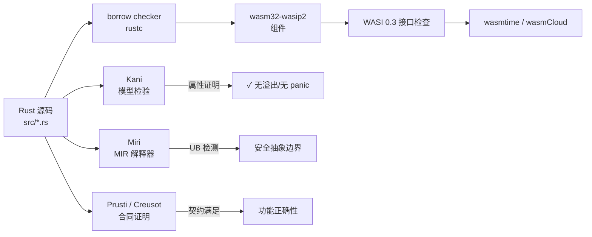

### 8.4 验证示例

**示例 1：使用 Kani 证明无溢出**

```rust
#[kani::proof]
fn safe_abs_proof() {
    let x: i32 = kani::any();
    kani::assume(x != i32::MIN);
    let r = x.checked_abs().unwrap();
    kani::assert(r >= 0);
}
```

**示例 2：组件接口契约**

```rust
wit_bindgen::generate!({ world: "calculator-world", exports: { "my:domain/calculator": Calculator } });

struct Calculator;
impl exports::my::domain::calculator::Guest for Calculator {
    fn add(a: u32, b: u32) -> u32 {
        a.checked_add(b).expect("overflow") // 安全边界
    }
}
```

通过 Kani 验证 `add` 不会溢出，再编译为 WASM 组件，消费方即可在假设“返回值为两数之和”的前提下安全复用。

### 8.5 正例与反例

**正例**：AWS 使用 Kani 验证 Firecracker microVM 和 Bottlerocket 中的关键不安全代码块；在将 Rust 代码编译为 WASM 组件供多租户边缘平台复用时，形式化验证报告成为安全审计的核心证据。

**反例**：某团队认为“Rust 编译通过就安全”，未对 `unsafe` 块进行 Miri 检测或 Kani 证明，结果在 WASM 运行时中因未对齐内存访问触发未定义行为；另一团队仅验证 Rust 源码，未检查编译后的 WASM 字节码是否被篡改，导致供应链攻击面未被覆盖。

### 8.6 权威来源与交叉引用

| 来源 | URL |
|:---|:---|
| Wikipedia - Rust | <https://en.wikipedia.org/wiki/Rust_(programming_language)> |
| Kani Verifier | <https://github.com/model-checking/kani> |
| Miri | <https://github.com/rust-lang/miri> |
| Prusti | <https://github.com/viperproject/prusti> |
| Creusot | <https://github.com/creusot-rs/creusot> |
| wasmtime | <https://github.com/bytecodealliance/wasmtime> |

**交叉引用**：

- WASM Component Model 详见 [`../03-webassembly-components/wasm-component-model-2026.md`](../struct/13-emerging-trends/03-webassembly-components/wasm-component-model-2026.md)
- WASI 0.3 边界详见 [`../03-webassembly-components/wasm-wasi-03-boundaries.md`](../struct/13-emerging-trends/03-webassembly-components/wasm-wasi-03-boundaries.md)
- 形式化验证专题参见 [`../../07-formal-verification/README.md`](../struct/07-formal-verification/README.md)

---

## 补充说明：Rust 生态：类型安全、WASM 目标与形式化验证

## 概念定义

**定义**：WebAssembly Component Model 将 WASM 模块升级为具有显式接口、类型化导入导出的可组合组件，支持跨语言、跨运行时复用。

## 反例

**反例**：将 I/O 密集型服务盲目迁移到 WASM，WASI 能力不支持所需系统调用，性能与可维护性反而下降。

## 权威来源

> **权威来源**:
>
> - [WebAssembly Component Model](https://component-model.bytecodealliance.org)
> - [WASI Preview 2](https://wasi.dev)
> - 核查日期：2026-07-07

## 分析

**分析**：WASM 组件模型提供了真正的语言无关二进制复用，但生态与工具链仍在快速演进。


---


<!-- SOURCE: struct/13-emerging-trends/06-regtech-ai/regtech-ai-reuse.md -->

# RegTech AI 与合规复用

> **版本**: 2026-06-06
> **定位**: 探讨 AI 驱动的合规技术（RegTech）中的架构复用模式

---

## 1. RegTech AI 的定义与范围

RegTech（监管科技）AI 指利用人工智能技术帮助金融机构满足合规要求的解决方案。主要应用领域：

| 领域 | 典型应用 |
|------|---------|
| **反洗钱 (AML)** | 交易异常检测、客户风险评分 |
| **KYC / 身份验证** | 身份证件识别、生物特征验证 |
| **市场滥用监控** | 内幕交易检测、操纵市场识别 |
| **合规报告** | 监管报告自动生成、数据验证 |
| **合同审查** | 法律条款抽取、风险标注 |
| **ESG 合规** | 碳排放报告、可持续金融分类 |

---

## 2. RegTech AI 的复用挑战

### 挑战 1: 监管差异

不同司法管辖区的监管要求差异巨大：

- 欧盟：MiFID II, GDPR, AI Act
- 美国：Dodd-Frank, SEC Rule 15c3-5
- 中国：网络安全法、数据安全法、个人信息保护法

**复用策略**: 将"通用模型"与"本地化规则"分离。

```text
通用 AML 模型
    ├── 特征工程层（通用）
    ├── 机器学习模型（通用）
    └── 规则层（本地化）
        ├── 欧盟规则包
        ├── 美国规则包
        └── 中国规则包
```

### 挑战 2: 可解释性要求

金融监管机构通常要求 AI 决策可解释（XAI）。

**复用策略**: 建立可解释性组件库：

```text
XAI 组件库
├── SHAP 解释器
├── LIME 解释器
├── 注意力可视化
├── 规则提取器
└── 反事实解释生成器
```

### 挑战 3: 数据隐私

监管数据高度敏感，不能随意共享。

**复用策略**: 联邦学习、差分隐私、同态加密。

---

## 3. RegTech AI 复用架构

```text
RegTech AI 平台
├── 数据接入层
│   ├── 交易数据适配器
│   ├── KYC 数据适配器
│   └── 市场数据适配器
│
├── 特征工程层（复用）
│   ├── 通用特征库
│   ├── 时序特征生成器
│   └── 图特征生成器
│
├── 模型层（部分复用）
│   ├── 基础模型（预训练）
│   ├── 领域适配层
│   └── 本地化微调
│
├── 规则引擎层（本地化）
│   ├── Drools / Easy Rules
│   └── 监管规则 DSL
│
├── 解释性层（复用）
│   ├── SHAP/LIME 包装器
│   └── 报告生成器
│
└── 报告输出层
    ├── 监管报告模板
    └── 审计追踪
```

---

## 4. 关键复用资产

| 资产类型 | 复用价值 | 示例 |
|---------|---------|------|
| **特征库** | 高 | 交易异常特征、客户风险特征 |
| **模型架构** | 中 | Transformer 异常检测 |
| **规则模板** | 中 | AML 可疑交易报告模板 |
| **解释性组件** | 高 | SHAP 报告生成器 |
| **报告模板** | 高 | 监管报送模板 |
| **审计日志模式** | 高 | 模型决策追踪 Schema |

---

## 5. 合规驱动的复用原则

> **原则 1**: 监管规则是**变性**最强的部分，必须与技术实现解耦。
> **原则 2**: 模型可解释性组件应作为**横切关注点**复用。
> **原则 3**: 审计追踪必须覆盖"数据→特征→模型→决策→报告"的全链路。
> **原则 4**: 本地化适配应通过**配置**而非**代码修改**实现。

---

> 最后更新: 2026-06-06


---

## 补充说明：RegTech AI 与合规复用

## 示例

**示例**：平台工程团队构建内部开发者平台（IDP），将部署、可观测性、安全策略封装为自助服务模板，产品团队复用 Golden Path 快速交付。

## 反例

**反例**：追逐 WASM 潮流将所有服务重写为组件，忽视工具链成熟度与团队技能，导致调试困难、交付延期。

## 权威来源

> **权威来源**:
>
> - [CNCF Platform Engineering](https://tag-app-delivery.cncf.io/whitepapers/platforms/)
> - [WebAssembly Component Model](https://component-model.bytecodealliance.org)
> - [Green Software Foundation](https://greensoftware.foundation)
> - 核查日期：2026-07-07

## 分析

**分析**：新兴技术扩展了复用的边界，但技术采纳必须匹配组织成熟度与真实业务痛点。


---


<!-- SOURCE: struct/13-emerging-trends/06-regtech-ai/regtech-case-validation.md -->

# RegTech Agentic 架构案例验证

> 本交付物基于截至 2026 年 6 月的最新监管动态，验证 Agentic AI 在合规科技（RegTech）场景中的架构设计与实践可行性。

---

## 1. 监管背景：全球 AI 合规加速

### 1.1 EU AI Act：高风险系统合规硬截止

欧盟《人工智能法》（Regulation (EU) 2024/1689）于 2024 年 8 月 1 日生效，采用分阶段实施路径。
其中最关键的节点是 **2026 年 8 月 2 日**——Annex III 所列高风险 AI 系统的完整合规义务正式生效，涵盖风险管理、数据治理、技术文档、记录保存、人工监督、准确性/鲁棒性/网络安全、合格评定及欧盟数据库注册等要求（Articles 9–15）。

尽管欧盟委员会在 2025 年 11 月的"Digital Omnibus"提案建议将 Annex III 期限推迟至 2027 年 12 月，但该提案尚未获批。
主流律所均建议企业以 **2026 年 8 月 2 日** 作为 operative deadline 规划。
违规罚款最高 3500 万欧元或全球营业额 7%（prohibited practices），高风险违规最高 1500 万欧元或 3%。

### 1.2 FCA AI Live Testing：2025 年 10 月启动

英国金融行为监管局（FCA）于 **2025 年 10 月** 正式启动 **AI Live Testing** 服务，作为其 AI Lab 框架下的重要组成部分。
该服务为金融机构提供在真实市场条件下、在监管监督下测试 AI 系统的安全空间，旨在解决监管不确定性导致的 AI 部署延迟。

- **第一期**：申请窗口于 2025 年 9 月关闭，测试于 2025 年 10 月启动。
- **第二期**：申请窗口于 **2026 年 1 月 19 日** 开放，至 **3 月 2 日** 截止，测试预计 **4 月** 开始。

FCA 采取"same activity, same risk, same rule"原则，将 AI 纳入现有 Consumer Duty 和 SMCR 框架监管。

### 1.3 SEC FY2026：AI Washing 打击与网络安全优先

美国证券交易委员会（SEC）审查部于 **2025 年 11 月 17 日** 发布 FY2026 审查优先事项，标志着监管关注点的显著转向：

- **AI Washing 打击**：SEC 将严格审查机构关于 AI 能力的误导性声明（misleading claims），评估营销材料、Form ADV 披露及客户沟通中 AI 使用范围、性质和限制的准确性描述。
- **网络安全优先**：AI 相关网络威胁（多态恶意软件、AI 驱动的社会工程学/深度伪造钓鱼）被明确列为审查重点。Regulation S-P 修正案（2024 年修订）的合规截止日期（大型机构 2025 年 12 月 3 日，其他机构 2026 年 6 月 3 日）成为操作弹性测试的核心。
- **加密资产退出优先列表**：自 2018 年以来首次不再作为独立优先事项，反映监管重心向 AI 治理转移。

### 1.4 全球 RegTech 加速

据行业调研，全球金融机构 AI 欺诈检测采用率已达 **73%**（2025–2026 年数据）。
RegTech 市场正从"事后合规报告"向"实时合规编排"演进，Agentic AI 的自主感知-推理-行动闭环恰好契合这一趋势。

---

## 2. RegTech Agentic 架构设计

### 2.1 三层架构

```text
┌─────────────────────────────────────────────────────────────┐
│  感知层 (Perception Layer)                                   │
│  ─ 监管文本解析与实时监测                                     │
│  ─ 输入：EU AI Act 法规文本、FCA 指南、SEC 规则、行业判例    │
│  ─ 输出：结构化合规要求（控制目标、证据类型、截止日期）       │
├─────────────────────────────────────────────────────────────┤
│  推理层 (Reasoning Layer)                                    │
│  ─ 合规要求映射到企业控制措施                                 │
│  ─ 输入：结构化合规要求 + 企业现有控制清单（SoC/ISO 27001）  │
│  ─ 输出：控制差距分析、风险评级、修复建议优先级               │
├─────────────────────────────────────────────────────────────┤
│  行动层 (Action Layer)                                       │
│  ─ 自动生成合规证据包并触发工作流                             │
│  ─ 输入：推理层输出 + 企业证据库（日志、文档、配置基线）      │
│  ─ 输出：合规报告草稿、证据索引、审批工作流实例               │
└─────────────────────────────────────────────────────────────┘
```

### 2.2 Agent 角色定义

| Agent 角色 | 职责 | 核心能力 |
|-----------|------|---------|
| **Regulatory Analyst** | 解析监管文本，提取适用条款与义务 | 法规意图理解、跨法域映射、版本追踪 |
| **Risk Assessor** | 评估 AI 系统风险等级，识别高风险分类 | 风险分类逻辑（EU Annex III）、影响评估、基线比对 |
| **Evidence Collector** | 从技术系统收集合规证据 | API 集成、日志聚合、配置抓取、文档检索 |
| **Report Generator** | 生成结构化合规报告与证据包 | 模板填充、多格式输出（PDF/Word/XML）、审计追踪 |

---

## 3. 案例验证：EU AI Act 高风险系统合规检查

### 3.1 场景设定

**金融信贷决策 AI 系统**：
某银行部署基于机器学习的信贷审批系统，自动评估贷款申请人的信用风险。
根据 EU AI Act Annex III 第 5 项（"Access to essential private and public services — credit scoring"），该系统属于**高风险 AI 系统**。

### 3.2 Article 9–15 要求映射

| EU AI Act 条款 | 合规要求 | 检查点 |
|---------------|---------|--------|
| Article 9 | 风险管理系统 | 是否建立持续风险识别与缓解流程 |
| Article 10 | 数据治理 | 训练数据质量、偏差缓解、数据相关性文档 |
| Article 13 | 技术文档 | 系统架构、性能基准、安全架构文档 |
| Article 14 | 记录保存与日志 | 自动运行日志，保存期限 ≥ 6 个月 |
| Article 15 | 透明度（对部署者） | 使用说明含能力、限制、风险信息 |
| Article 10/14 | 人工监督 | 技术措施支持人工干预与覆盖 |
| Article 10 | 准确性、鲁棒性、网络安全 | 文档化性能基准与安全架构 |

### 3.3 Agent 协作流程

```text
Step 1: Risk Assessor Agent
  └─ 输入：系统描述（金融信贷决策 AI）
  └─ 动作：对照 Annex III 进行分类判断
  └─ 输出：高风险分类确认 + 触发合规检查工作流

Step 2: Regulatory Analyst Agent
  └─ 输入：高风险分类结果
  └─ 动作：提取 Articles 9–15 适用条款，生成结构化义务清单
  └─ 输出：合规义务映射表（含检查点、证据类型、截止日期）

Step 3: Evidence Collector Agent
  └─ 输入：合规义务映射表
  └─ 动作：调用企业系统 API，收集技术文档、日志、配置、测试报告
  └─ 输出：证据索引 + 缺失证据清单

Step 4: Report Generator Agent
  └─ 输入：义务映射表 + 证据索引
  └─ 动作：填充 EU AI Act 技术文档模板，生成合规差距报告
  └─ 输出：合规报告草稿 → 提交人工审批工作流
```

### 3.4 关键验证结论

- **可行性**：Agentic 架构可有效分解 EU AI Act 的复杂合规要求，实现"条款→控制→证据→报告"的端到端自动化。
- **瓶颈**：证据 Collector Agent 的准确性高度依赖企业系统的 API 成熟度与数据治理水平；遗留系统往往缺乏结构化接口。
- **人机协同**：高风险系统的最终合规判定必须由人类合规官确认，Agent 输出定位为"草稿级"，不可直接作为监管提交物。

---

## 4. 与现有工具的集成

本 RegTech Agentic 架构设计为与项目内已有交付物形成互补：

| 项目交付物 | 集成点 | 价值 |
|-----------|--------|------|
| **P4-T5: EU CRA 合规检查清单工具** | Evidence Collector Agent 调用 CRA 检查清单作为证据收集模板 | 复用已有控制框架，降低重复建设 |
| **P2-T6: 成熟度评估问卷** | Risk Assessor Agent 在分类前运行成熟度预评估 | 识别企业准备度差距，优先分配资源 |
| **P3-T4: MCP Industrial AI 协议** | Agent 间通信采用 MCP 协议标准化 | 确保跨 Agent 互操作性，支持未来接入外部合规服务 |

---

## 5. 权威来源

| 来源 | 说明 |
|------|------|
| Regulation (EU) 2024/1689 (EU AI Act) | 欧盟人工智能法官方文本 |
| European Commission AI Act Service Desk | 实施时间表与指南 |
| FCA AI Live Testing Terms of Reference (2025–2026) | 英国 FCA AI 实测服务官方条款 |
| FCA Feedback Statement FS25/5 (Sept 2025) | AI Live Testing 行业反馈汇总 |
| SEC Division of Examinations FY2026 Priorities (Nov 2025) | SEC 2026 财年审查优先事项 |
| UK Parliament Treasury Committee Report (Jan 2026) | AI in UK Financial Services |

---

> **结语**
> 全球 AI 监管正以 EU AI Act（2026 年 8 月硬截止）、FCA AI Live Testing（2025 年 10 月启动）和 SEC FY2026（AI Washing 打击）为三极加速落地。
> RegTech Agentic 架构通过"感知-推理-行动"三层设计，将分散的监管要求转化为可执行的合规工作流，但必须在"自动化效率"与"人工最终责任"之间保持审慎平衡。


---

## 补充说明：RegTech Agentic 架构案例验证

## 反例

**反例**：追逐 WASM 潮流将所有服务重写为组件，忽视工具链成熟度与团队技能，导致调试困难、交付延期。

## 权威来源

> **权威来源**:
>
> - [CNCF Platform Engineering](https://tag-app-delivery.cncf.io/whitepapers/platforms/)
> - [WebAssembly Component Model](https://component-model.bytecodealliance.org)
> - [Green Software Foundation](https://greensoftware.foundation)
> - 核查日期：2026-07-07

## 分析

**分析**：新兴技术扩展了复用的边界，但技术采纳必须匹配组织成熟度与真实业务痛点。


---


<!-- SOURCE: struct/13-emerging-trends/07-green-software/green-architecture-reuse.md -->

# 可持续软件架构（GreenArch）初探

> 本交付物探索软件架构复用与碳排放管理的交叉领域，为架构决策引入可持续维度提供初步框架。

---

## 1. Green Software Foundation 框架

### 1.1 SCI：软件碳强度标准

Green Software Foundation（GSF）发布的 **SCI（Software Carbon Intensity）v1.1** 已被采纳为 **ISO/IEC 21031:2024** 国际标准，是衡量软件碳排放的核心计量框架。

**SCI 公式**：

```
SCI = ((E × I) + M) per R
```

| 变量 | 含义 |
|------|------|
| **E** | 软件消耗的电能（kWh） |
| **I** | 电网碳强度（gCO₂e/kWh），location-based |
| **M** | 运行软件的硬件隐含碳排放（embodied carbon）分摊 |
| **R** | 功能单位（functional unit），如"每千次 API 调用"、"每用户会话" |

SCI 的关键设计原则是**将碳排放归一化到功能单位**，使不同架构方案之间具备可比性，从而为架构决策提供量化依据。

### 1.2 三大原则

| 原则 | 核心要义 | 架构含义 |
|------|---------|---------|
| **能源效率** | 减少软件运行所需电能 | 算法优化、资源调度、减少空闲计算 |
| **硬件效率** | 延长硬件生命周期，提高利用率 | 虚拟化、容器密度、多租户共享 |
| **碳感知** | 在碳强度较低的时空运行计算 | 时空转移负载、需求塑形、特征降级 |

---

## 2. GreenArch 2026 首届 Workshop

**GreenArch 2026 —— Software Architecture for Green Sustainable Carbon-aware Software Systems** 是首届聚焦绿色可持续碳感知软件架构的学术 Workshop，将于 **2026 年 6 月** 在荷兰 **阿姆斯特丹** 召开，作为 **IEEE ICSA 2026**（第 23 届国际软件架构会议）的配套 Workshop。

### 关键议题

- **架构拓扑对微服务能效的影响**：研究微服务拆分粒度、通信模式（同步 vs 异步）、服务编排策略与整体能耗之间的关联。初步研究表明，过度细粒度的微服务拆分可能导致显著的通信开销与能耗放大。
- **特征降级（Feature Degradation）**：作为碳感知架构的新兴策略，指在高碳强度时段或高负载场景下，主动降级非核心功能以换取整体能耗降低。Gazeau & Ledoux 在 GreenArch 2026 接收的论文中以 Overleaf 应用为案例，验证了特征降级在保持核心可用性的同时显著降低能耗的可行性。
- **AI 系统的架构级可持续性**：从模型绑定的能耗关注，转向 LLM Agent 系统的架构驱动开销分析，强调"Shift Left"在 AI 可持续设计中的必要性。

---

## 3. 架构复用的碳影响

### 3.1 复用 vs 重写：生命周期碳排放视角

传统 ROI/COCOMO 模型未纳入碳排放维度。从全生命周期视角审视：

| 维度 | 复用既有资产 | 重新开发 |
|------|------------|---------|
| 开发阶段 | 低（避免重复编码/测试） | 高（新开发、CI/CD、开发环境） |
| 运行阶段 | 取决于既有资产能效；老旧组件可能较差 | 可采用最新能效技术 |
| 硬件隐含碳 | 减少新硬件采购 | 可能驱动新硬件部署 |
| 维护阶段 | 与既有维护负担叠加 | 独立维护碳足迹 |

**关键洞察**：复用的碳优势并非绝对。高能耗遗留组件的长期运行碳排放可能远超重写后的现代能效架构，复用决策需引入"碳盈亏平衡分析"。

### 3.2 共享服务/组件的碳分摊模型

在多租户架构中，单一组件的碳排放按使用量分摊至各消费方：

```
CarbonAllocated_i = SCI_component × Usage_i / TotalUsage
```

`Usage_i` 可采用标准化指标（API 调用数、计算分钟数、数据吞吐量），使各团队对复用选择的碳后果承担明确责任。

### 3.3 数据中心碳强度对架构决策的影响

电网碳强度（I）因地域和时段差异巨大（例如，挪威水电区可低至 20 gCO₂e/kWh，而煤电密集区可超过 800 gCO₂e/kWh）。location-based 碳强度应成为部署架构设计的关键输入：

- 跨地域部署优先将弹性负载调度至低碳区域
- 多云策略纳入碳强度作为区域选择权重
- 边缘节点选址评估当地电网碳结构

---

## 4. 碳感知架构模式

### 4.1 时间转移（Temporal Shifting）

将非关键批处理任务（日志分析、ETL、模型重训练）从高碳时段移至低碳时段（夜间可再生能源富余期）。
实施要点：任务具备可延迟性；调度器集成实时碳强度信号（如 Electricity Maps API）；SLA 与碳节约之间的权衡显性化。

### 4.2 地理转移（Geographic Shifting）

跨区域负载均衡时，将请求路由至碳强度最低的数据中心。与延迟优化的冲突通过"碳-延迟帕累托前沿"显式权衡。

### 4.3 需求塑形（Demand Shaping）

根据实时碳信号调整功能级别：碳信号高时限制非核心功能、降低并发度；碳信号低时恢复正常级别并加速积压处理。

### 4.4 特征降级（Feature Degradation）

在高碳时段或高负载时主动降级非核心功能以降低能耗：

| 功能类别 | 正常模式 | 降级模式 |
|---------|---------|---------|
| 推荐系统 | 实时个性化推荐 | 静态热门列表 |
| 数据分析 | 实时仪表盘 | 小时级缓存快照 |
| 图像处理 | 高分辨率生成 | 低分辨率/缩略图 |
| 搜索 | 语义搜索+排序 | 关键词匹配基础搜索 |

架构实现需预先定义功能级别、降级触发条件与恢复策略，通过配置中心或自适应控制器动态编排。

---

## 5. 复用决策的碳维度

### 5.1 在 ROI/COCOMO 模型中加入碳成本

建议在现有复用决策模型中增加碳成本项：

```
TotalCost = DevCost + MaintenanceCost + OpCost + CarbonCost

CarbonCost = LifetimeCarbon × InternalCarbonPrice
```

其中 `InternalCarbonPrice` 可参考企业碳定价或市场碳价（EU ETS、CCX）。将碳成本内部化后，高能耗遗留资产的复用吸引力将显著下降。

### 5.2 Carbon BOM 概念

借鉴软件物料清单（SBOM）理念，提出 **Carbon BOM（碳物料清单）**：对复用资产附加标准化碳足迹元数据，包括：

- 单功能单位运行碳排放（SCI）
- 硬件隐含碳分摊
- 依赖服务的级联碳足迹
- 碳强度假设（地域、时段基准）

Carbon BOM 使架构师在复用选择时能够像评估安全漏洞一样评估碳影响，实现"碳可见性"（carbon visibility）。

---

## 6. 权威来源

| 来源 | 说明 |
|------|------|
| greensoftware.foundation | Green Software Foundation 官方框架与工具 |
| SCI Specification v1.1 / ISO/IEC 21031:2024 | 软件碳强度国际标准 |
| GreenArch 2026 (ICSA Workshop) | 首届绿色可持续碳感知软件架构 Workshop |
| Gazeau & Ledoux (GreenArch 2026) | Feature Degradation for Frugality: Overleaf Case Study |
| GREENS'26 Workshop Program | 第 10 届绿色与可持续软件国际 Workshop |
| Funke & Lago (GREENS'26) | Injecting Sustainability in Software Architecture: A Rapid Review |

---

> **结语**
> 可持续软件架构正从理念倡导走向工程实践。SCI 国际标准的确立、GreenArch 2026 等学术平台的涌现，以及碳感知架构模式的成熟，共同为架构复用决策引入了新的优化维度。
> 未来的架构师不仅需要在功能、性能、成本之间权衡，还必须将碳排放作为一等公民纳入架构设计空间。


---

## 补充说明：可持续软件架构（GreenArch）初探

## 反例

**反例**：为追求微服务“弹性”而将单体拆分为 200 个服务，每个服务常驻空闲实例，整体能耗翻倍。

## 权威来源

> **权威来源**:
>
> - [Green Software Foundation](https://greensoftware.foundation)
> - [SCI Specification](https://sci.greensoftware.foundation)
> - 核查日期：2026-07-07

## 分析

**分析**：绿色复用要求从架构层面减少冗余计算，并将碳排指标纳入资产准入评估。


---


<!-- SOURCE: struct/13-emerging-trends/07-green-software/sci-reuse-carbon-model.md -->

# GreenArch / SCI 软件碳强度与复用度量

- **版本**: 2026-06-10
- **定位**: 可持续软件架构度量标准，定义软件碳强度（SCI）的计算方法以及架构复用对碳效率的量化影响
- **对齐标准**: Green Software Foundation SCI 规范 (SCI v1.1)、Green Software Patterns、ISO/IEC 40500 (WCAG)、EU Green Deal 数字组件
- **状态**: ✅ 已完成

---

## 1. Green Software Foundation 与软件碳强度（SCI）规范概述

### 1.1 Green Software Foundation 的使命与架构

Green Software Foundation（GSF）成立于 2021 年，是由 Linux 基金会托管的全球性非营利组织，其使命是构建一个由绿色软件原则、模式和工具支持的可持续软件生态系统。GSF 的创始成员包括微软、GitHub、埃森哲、Thoughtworks 等科技和咨询行业的领先企业。截至 2026 年，GSF 已发展成为软件可持续性领域最具影响力的标准化组织之一，其发布的规范和模式被全球数千家企业和开源项目采纳。

GSF 的工作围绕三大支柱展开：

- **标准（Standards）**：定义软件碳强度（SCI）等可度量的标准，使软件的碳排放能够被量化、比较和优化；
- **模式（Patterns）**：收集和编目经过验证的绿色软件设计模式，供架构师和开发者在设计决策时参考；
- **工具（Tools）**：开发开源工具和 SDK，帮助开发者在软件开发生命周期中测量和减少碳排放。

在架构复用的语境下，GSF 的核心理念可以概括为一句话：**"复用即减碳"** —— 每一个被成功复用的软件组件，都意味着避免了重复开发所带来的隐含碳排放（embodied carbon）和运行碳排放（operational carbon）。

### 1.2 SCI 规范的演进与现状

软件碳强度（Software Carbon Intensity, SCI）是 GSF 发布的旗舰标准，其当前版本为 SCI Specification v1.1（2022 年发布，2024 年更新勘误）。SCI 的诞生源于软件行业对碳度量标准化的迫切需求：在 SCI 出现之前，不同组织使用不同的方法来估算软件碳足迹，导致结果不可比较，也无法建立可信的减排基线。

SCI 规范的独特之处在于它将软件的碳排放与软件提供的**功能价值**挂钩，而非仅仅计算绝对的碳排放总量。这种"强度"指标的设计使得不同规模、不同功能的软件系统之间可以进行公平的碳效率比较。例如，一个处理百万级请求的大型云服务和一个小型内部工具，其绝对碳排放差异巨大，但通过 SCI 可以比较它们每单位功能所产生的碳强度。

SCI 规范遵循 ISO 标准的方法论，并已被纳入 ISO/IEC 标准轨道。2024 年，GSF 与 ISO 合作启动了 SCI 的国际标准化进程，预计将在 2027 年前发布为正式的 ISO/IEC 国际标准。

### 1.3 软件碳排放的两大来源

在深入 SCI 计算之前，需要理解软件碳排放的两个根本来源：

#### 1.3.1 隐含碳（Embodied Carbon / M）

隐含碳指软件开发和运行所依赖的硬件设备在其全生命周期（从原材料提取、制造、运输、使用到报废处理）中所产生的碳排放。对于软件而言，隐含碳主要体现为：

- 开发阶段使用的笔记本电脑、服务器、测试设备等的制造碳排放；
- 运行阶段数据中心服务器、网络设备、存储设备的制造碳排放；
- 终端用户设备（如智能手机、PC）中因运行某软件而分摊的制造碳排放。

隐含碳的特点是：**无论软件是否运行，硬件已经存在，其制造碳排放已经产生**。因此，提高硬件利用率（如通过复用共享基础设施）是降低隐含碳分摊的关键策略。

#### 1.3.2 运行碳（Operational Carbon / E）

运行碳指软件在运行过程中直接消耗的能源所产生的碳排放。这包括：

- 数据中心服务器运行时的电力消耗；
- 网络传输过程中的电力消耗（路由器、交换机、光纤放大器等）；
- 终端用户设备运行软件时的电力消耗。

运行碳与软件的能效直接相关：同样的功能，能效更高的软件消耗更少的电力，产生更少的运行碳。

---

## 2. SCI 计算公式详解

### 2.1 核心公式

SCI 的核心计算公式如下：

```
SCI = (E × I) + M
      ─────────────────
              R
```

其中各变量定义如下：

| 变量 | 名称 | 单位 | 定义 |
|------|------|------|------|
| **SCI** | 软件碳强度 | gCO₂eq / 功能单位 | 每提供一单位软件功能所产生的碳排放 |
| **E** | 运行能耗 | kWh | 软件在评估周期内消耗的总电能 |
| **I** | 电网碳强度 | gCO₂eq / kWh | 电力来源的碳排放因子（因地区和时段而异） |
| **M** | 隐含碳 | gCO₂eq | 评估周期内软件分摊的硬件制造碳排放 |
| **R** | 功能单位 | 自定义 | 软件提供的可量化功能（如请求数、用户时、事务数等） |

### 2.2 公式的工程解读

#### 2.2.1 分子部分：总碳排放

分子 `(E × I) + M` 表示软件在评估周期内的总碳足迹，包含运行碳和隐含碳两个部分。

- **E × I（运行碳）**：将电能消耗转换为碳排放。电网碳强度 I 是关键变量：使用可再生能源供电的数据中心（I 接近 0）与使用煤电的数据中心（I 约 800-1000 gCO₂eq/kWh）在同样的 E 下会产生截然不同的运行碳。
- **M（隐含碳）**：按照时间比例分摊硬件的制造碳排放。例如，一台服务器的制造碳排放为 1000 kgCO₂eq，预期使用寿命为 4 年，则该服务器每月分摊的隐含碳约为 20.8 kgCO₂eq。若某软件在某月占用了该服务器 50% 的计算资源，则该软件在该月分摊的隐含碳为 10.4 kgCO₂eq。

#### 2.2.2 分母部分：功能单位

分母 R 是 SCI 规范中最具创新性的设计。功能单位不是固定的，而是由软件团队根据软件的核心价值主张来定义。常见的功能单位包括：

- **Web 服务**：每 1000 次 API 请求、每用户每日活跃会话；
- **数据库**：每百万次查询、每 TB 存储月；
- **视频流媒体**：每小时播放时长；
- **AI/ML 推理**：每千次推理请求；
- **通用**：每 1000 行代码交付、每构建/部署周期。

功能单位的选择原则是：**必须与软件为用户提供的核心价值直接相关，且可客观测量**。

### 2.3 SCI 的测量方法论

GSF 在 SCI 规范中定义了两种测量方法：

- **方法 A：基于测量的 SCI（Measurement-based SCI）** —— 通过实际监测软件的能耗和硬件资源使用情况来计算 SCI。这是最准确的方法，但需要投入计量基础设施（如服务器级电表、智能 PDU、云厂商碳足迹 API 等）。
- **方法 B：基于计算的 SCI（Calculation-based SCI）** —— 当直接测量不可行时，通过已知的硬件功耗模型、资源使用率数据和排放因子进行估算。这是大多数组织在初期采用的方法。

对于架构复用场景，建议采用基于计算的方法 B 进行复用前后的对比分析，因为复用决策通常在开发前期做出，此时尚无实际运行数据可供测量。

---

## 3. "复用即减碳"的量化模型

### 3.1 复用组件 vs 重新开发的碳足迹对比

架构复用对碳减排的贡献可以从隐含碳和运行碳两个维度进行量化分析。

#### 3.1.1 隐含碳节省

当组织选择复用一个现有组件而非重新开发时，最直接的影响是避免了重新开发所需的硬件资源消耗：

- **开发设备碳排放**：重新开发需要开发工程师使用笔记本电脑/工作站进行数周至数月的编码、测试和调试。每台开发工作站的制造碳排放约为 200-400 kgCO₂eq。假设一个 5 人团队开发周期为 3 个月，分摊的隐含碳约为 250-500 kgCO₂eq。
- **CI/CD 基础设施碳排放**：重新开发需要运行大量的自动化构建、测试和部署流水线。一个中型项目的 CI/CD 集群在 3 个月开发周期内可能产生 100-300 kgCO₂eq 的隐含碳分摊。
- **测试环境碳排放**：功能测试、集成测试和性能测试需要临时性的测试基础设施，其隐含碳分摊约为 50-150 kgCO₂eq。

**量化示例**：

| 项目 | 重新开发 | 复用现有组件 | 节省 |
|------|---------|------------|------|
| 开发设备隐含碳 | 400 kgCO₂eq | 0 | 400 kgCO₂eq |
| CI/CD 隐含碳 | 200 kgCO₂eq | 20 kgCO₂eq（维护）| 180 kgCO₂eq |
| 测试环境隐含碳 | 100 kgCO₂eq | 10 kgCO₂eq（验证）| 90 kgCO₂eq |
| **隐含碳合计** | **700 kgCO₂eq** | **30 kgCO₂eq** | **670 kgCO₂eq** |

在此示例中，复用现有组件避免了约 670 kgCO₂eq 的隐含碳排放，相当于一辆普通汽油车行驶约 2700 公里的碳排放。

#### 3.1.2 运行碳节省

复用组件对运行碳的影响更为复杂，取决于复用组件的能效特性：

- **若复用组件是优化过的**：复用高能效的现有组件通常比重新开发一个未经优化的全新组件产生更少的运行碳。例如，复用一个经过性能调优的数据库连接池组件，其 CPU 和内存效率可能显著优于新开发的等价组件。
- **若复用组件是遗留的低效组件**：复用一个设计陈旧、资源消耗高的遗留组件可能导致运行碳增加。此时需要权衡隐含碳节省与运行碳增加之间的关系。

**运行碳对比模型**：

```
复用决策碳净效益 = 重新开发隐含碳 - 复用隐含碳
                   - (复用组件年运行碳 - 新组件年运行碳) × 预期使用年限
```

若净效益为正值，则复用在碳角度上是更优选择。

### 3.2 复用深度与碳效率的关系

复用可以在不同层次发生，不同层次的复用对碳效率的影响也不同：

| 复用层次 | 示例 | 隐含碳节省 | 运行碳影响 | 碳效率评级 |
|---------|------|----------|----------|----------|
| 代码级复用 | 复用开源库/内部 SDK | 高 | 取决于库效率 | ★★★★ |
| 组件级复用 | 复用微服务/容器镜像 | 很高 | 可独立优化 | ★★★★★ |
| 服务级复用 | 复用 SaaS API | 极高（无需运维硬件） | 由提供商优化 | ★★★★★ |
| 架构级复用 | 复用参考架构/模板 | 高（多项目累积） | 整体优化 | ★★★★ |

服务级复用（如调用第三方 SaaS API 而非自建等价服务）在碳效率上通常表现最优，因为 SaaS 提供商可以通过规模效应和多租户共享来实现极高的基础设施利用率，从而大幅降低每单位功能的隐含碳分摊。

---

## 4. 架构复用对碳效率的影响

### 4.1 共享基础设施的碳效率

#### 4.1.1 多租户架构的碳优势

多租户（Multi-tenancy）架构是 SaaS 和云原生系统的核心设计模式，其碳效率优势源于硬件资源的高度共享：

- **服务器利用率提升**：单租户部署的典型服务器利用率仅为 10-20%，而多租户平台通过资源聚合和动态调度可将平均利用率提升至 50-70%。更高的利用率意味着同样的硬件可以服务更多用户，从而将隐含碳分摊到更多的功能单位上。
- **峰值削平**：不同租户的资源需求峰谷时段通常不同，多租户平台可以通过统计复用来平滑整体负载，减少为应对峰值而预留的闲置容量。
- **专用硬件减少**：多租户共享减少了对专用硬件（如专用数据库服务器、专用缓存节点）的需求，降低了总体硬件库存和相应的制造碳排放。

**SCI 视角的多租户碳效率**：

假设一个单租户部署方案需要 10 台服务器来服务 1000 个用户，而多租户方案仅需 4 台服务器服务同等用户量（得益于更高的资源利用率）。若每台服务器的制造碳排放为 1000 kgCO₂eq，使用寿命为 4 年：

- 单租户方案每月隐含碳分摊：(10 × 1000) / 48 = 208.3 kgCO₂eq/月
- 多租户方案每月隐含碳分摊：(4 × 1000) / 48 = 83.3 kgCO₂eq/月
- 隐含碳节省：125 kgCO₂eq/月（60% 降低）

#### 4.1.2 Serverless 架构的碳效率

Serverless（无服务器）架构将共享基础设施的理念推向极致：

- **零闲置容量**：Serverless 函数仅在请求到达时激活，请求处理完毕后立即释放资源。理论上不存在为应对未来负载而预留的闲置容量。
- **超大规模共享**：Serverless 平台（如 AWS Lambda、Azure Functions、Google Cloud Run）在数百万用户之间共享同一个计算资源池，实现了极高的统计复用效率。
- **自动扩缩容**：Serverless 平台根据实际负载自动调整资源分配，避免了人工容量规划导致的过度配置（over-provisioning）。

从 SCI 角度看，Serverless 架构的运行碳（E）与请求量成正比，隐含碳（M）分摊极低（因为硬件由平台提供商在极大规模下共享）。对于间歇性负载或初创项目，Serverless 通常是碳效率最高的架构选择。

### 4.2 模块化架构的细粒度资源调度优势

#### 4.2.1 微服务与容器化

模块化架构（如微服务）通过将系统拆分为细粒度的独立组件，为碳效率优化提供了技术基础：

- **独立扩缩容**：每个微服务可以根据其实际负载独立扩缩容。高负载服务可以横向扩展，低负载服务可以收缩甚至休眠，避免整体系统的过度配置。
- **异构部署**：不同微服务可以根据其资源特性（CPU 密集型、内存密集型、I/O 密集型）部署在最适合的硬件实例类型上，避免"一刀切"资源配置导致的资源浪费。
- **弹性调度**：容器编排平台（如 Kubernetes）支持基于实际资源利用率的自动调度，可以将工作负载集中到较少的服务器节点上，释放空闲节点进入低功耗状态或关机状态。

#### 4.2.2 碳感知调度

前沿的容器编排系统已经开始引入**碳感知调度（Carbon-aware Scheduling）**能力：

- **时间迁移**：将非紧急的批处理工作负载调度到电网碳强度较低的时段执行（如夜间风电充足时段）。
- **地理位置迁移**：将工作负载调度到当前使用可再生能源比例较高的数据中心区域。
- **需求响应**：在电网高峰负荷时段主动降低非关键服务的资源配额，参与电力需求响应计划。

模块化架构是实现碳感知调度的前提：只有当系统被分解为足够细粒度的、可独立调度的组件时，碳感知调度策略才能有效实施。

---

## 5. GreenArch 2026 前沿：碳感知架构设计模式

### 5.1 碳感知架构的核心理念

GreenArch（Green Architecture）是 2024-2026 年间在软件架构社区兴起的设计范式，其核心目标是将碳效率作为架构决策的一等公民（First-class Citizen），与功能性、性能、可靠性、安全性等传统质量属性并列考量。

碳感知架构（Carbon-aware Architecture）是 GreenArch 的核心子集，其设计哲学可以概括为：

> "软件架构应当感知其所处环境的碳状态，并动态调整其行为以最小化碳强度，同时满足业务 SLA 约束。"

### 5.2 2026 年碳感知架构设计模式

以下是截至 2026 年已被 GSF 和社区验证的碳感知架构模式：

#### 5.2.1 弹性质量模式（Elastic Quality Pattern）

该模式主张软件的质量属性（如视频分辨率、模型推理精度、搜索结果完整性）应当根据当前碳强度动态调整：

- 当电网碳强度高时，自动降低非关键视频流的分辨率（如从 4K 降至 720p）；
- 当电网碳强度高时，使用轻量级 ML 模型替代大模型进行推理；
- 当电网碳强度低时，恢复正常质量水平。

这种"碳弹性"设计需要架构支持质量等级的快速切换和用户的透明感知。

#### 5.2.2 缓存优先模式（Cache-First Pattern）

该模式通过最大化缓存命中率来减少后端计算负载：

- 在 CDN 边缘节点缓存静态内容和 API 响应，减少源站服务器的能源消耗；
- 使用预测性预缓存技术，在用户请求前将可能需要的内容加载到边缘节点；
- 设计幂等和可缓存的 API 接口，使更多请求可以被缓存层拦截。

从 SCI 角度看，缓存命中意味着避免了后端服务器的计算能耗（E 降低），同时 CDN 边缘节点的隐含碳分摊到大量请求上（M/R 降低）。

#### 5.2.3 数据局部性模式（Data Locality Pattern）

该模式通过将计算调度到数据所在位置来减少网络传输能耗：

- 在存储节点上执行计算（如数据库内计算、存储过程），避免大量数据跨网络传输；
- 使用边缘计算将处理推到靠近数据源和用户的位置，减少广域网传输；
- 设计数据分区策略，使相关数据聚集在同一物理节点上。

网络传输的能耗常被忽视：跨数据中心传输 1 GB 数据的网络能耗约为 3-7 kWh（包含路由器、交换机、光纤设备等），相当于 1.5-3.5 kgCO₂eq（在平均电网碳强度下）。数据局部性模式可以显著降低这部分运行碳。

#### 5.2.4 休眠感知模式（Dormancy-Aware Pattern）

该模式主张系统应当能够识别和利用负载低谷期进入低功耗状态：

- 设计无状态服务，使实例可以在无请求时完全关闭并在请求到达时快速启动；
- 使用事件驱动架构，使组件仅在需要处理事件时激活；
- 实现数据库和缓存的自动休眠/唤醒机制。

休眠感知模式直接降低了运行碳（E），同时通过减少活跃硬件数量降低了隐含碳分摊（M）。

### 5.3 架构复用与碳感知模式的结合

碳感知架构模式的最佳实践通常以可复用的组件和模板形式存在：

- **可复用的碳感知中间件**：如支持动态质量调整的 API 网关、碳感知负载均衡器、智能缓存层等；
- **可复用的碳度量 SDK**：集成到应用中的碳足迹追踪库，自动计算和报告 SCI 指标；
- **可复用的参考架构**：针对常见场景（如电商、流媒体、IoT 数据处理）的碳优化参考架构，架构师可以直接复用并根据具体需求调整。

---

## 6. 可持续软件架构的复用决策矩阵

### 6.1 四维决策框架

传统的架构复用决策通常基于三个维度：功能性（是否满足需求）、性能（是否达到 SLA）、成本（是否在预算内）。可持续软件架构在此基础上增加了第四个维度：**碳效率（Carbon Efficiency）**。

建议采用以下四维复用决策矩阵：

| 候选方案 | 功能满足度 | 性能达标度 | 成本效益 | 碳效率 (SCI) | 综合决策 |
|---------|----------|----------|---------|------------|---------|
| 方案 A：完全自研 | 100% | 100% | 低 | 高 SCI（差）| 不推荐 |
| 方案 B：复用内部平台 | 95% | 100% | 高 | 低 SCI（优）| **推荐** |
| 方案 C：复用开源组件 | 90% | 95% | 很高 | 低 SCI（优）| 推荐（需评估）|
| 方案 D：购买商业组件 | 100% | 100% | 中 | 中 SCI | 可选 |
| 方案 E：SaaS 服务 | 95% | 95% | 中 | 很低 SCI（最优）| **强烈推荐** |

### 6.2 碳效率优先的决策规则

在满足功能、性能和安全的前提下，建议按以下优先级选择复用路径：

1. **第一优先：复用 SaaS / 托管服务**
   - 碳效率最高（提供商通过规模效应实现极低的 SCI）
   - 隐含碳几乎为零（无需自运维硬件）
   - 运行碳由提供商优化

2. **第二优先：复用内部共享平台 / 多租户服务**
   - 碳效率高（共享基础设施提升利用率）
   - 组织内部已有运维经验和监控数据
   - 隐含碳在组织内部分摊

3. **第三优先：复用高能效开源组件**
   - 碳效率取决于具体组件的能效
   - 需要进行 SCI 基准测试验证
   - 社区维护意味着持续优化

4. **第四优先：购买商业软件**
   - 碳效率中等（商业软件通常经过优化）
   - 但可能带来额外的许可服务器开销

5. **最后选择：自研**
   - 仅在无合适复用选项且业务差异化需求强烈时考虑
   - 必须将碳预算纳入项目评估

### 6.3 碳预算（Carbon Budget）机制

将碳效率纳入复用决策的一种具体实践是建立**碳预算**机制：

- 为每个项目或每个功能模块设定 SCI 上限目标；
- 在复用评估阶段，估算各候选方案的 SCI 值；
- 仅选择 SCI  estimates 低于碳预算的方案；
- 若所有方案的 SCI 都超出碳预算，则需要重新调整功能范围或寻求更高碳效率的技术方案。

碳预算机制可以确保碳效率不是事后考虑的属性，而是架构决策的前置约束条件。

---

## 7. 与 FinOps 成本模型的结合：碳成本内部化后的复用经济性重估

### 7.1 FinOps 与绿色 FinOps 的融合

FinOps（Cloud Financial Operations）是云成本优化的方法论，其核心目标是在云环境中实现财务问责和成本优化。2024-2026 年间，FinOps 社区与 Green Software 社区加速融合，形成了**绿色 FinOps（Green FinOps）**实践，将碳成本纳入云资源的经济性分析。

传统的 FinOps 关注直接财务成本（如云资源费用、人力成本）。绿色 FinOps 在此基础上增加了：

- **碳成本（Carbon Cost）**：将碳排放按照碳市场价格或内部碳定价（Internal Carbon Pricing, ICP）转换为财务成本；
- **碳风险成本**：考虑未来碳法规（如碳边境调节机制 CBAM、行业碳配额）可能带来的合规成本；
- **绿色溢价/折扣**：某些云服务商对使用可再生能源的区域提供价格折扣，或对高碳区域收取额外费用。

### 7.2 碳成本内部化的复用经济性模型

当碳成本被内部化到复用决策中时，复用方案的经济性评估公式变为：

```
总拥有成本 (TCO) = 直接成本 + 运维成本 + 碳成本

其中：
碳成本 = 总碳排放 (kgCO₂eq) × 内部碳定价 (元/kgCO₂eq)
```

**案例分析**：

某团队需要选择一个用户认证服务方案，候选方案如下：

| 方案 | 直接成本/年 | 运维成本/年 | 年碳排放 | 碳成本（ICP=100元/吨） | TCO |
|------|-----------|-----------|---------|---------------------|-----|
| 自研认证服务 | 50 万元 | 20 万元 | 15 吨 | 0.15 万元 | 70.15 万元 |
| 复用内部 IAM 平台 | 10 万元 | 5 万元 | 3 吨 | 0.03 万元 | 15.03 万元 |
| 使用 SaaS 认证服务 | 25 万元 | 2 万元 | 1 吨 | 0.01 万元 | 27.01 万元 |

在仅考虑直接成本时，复用内部 IAM 平台已是最优选择（15 万元 vs 自研 70 万元）。引入碳成本后，复用方案的碳成本优势进一步扩大了经济差距。即使内部碳定价提高到 500 元/吨（接近欧盟碳市场价格），碳成本在总成本中的占比仍然较小，但在大规模场景下（如年排放千吨级）将产生显著的财务影响。

### 7.3 碳成本内部化对复用策略的深层影响

碳成本内部化不仅影响单个项目的决策，还会对组织的整体复用战略产生结构性影响：

#### 7.3.1 共享平台的投资回报重估

组织内部的共享平台（如内部 PaaS、数据中台、统一认证中心）通常需要前期投入和持续的运维成本。在传统成本模型下，这些共享平台的 ROI 计算仅考虑人力节省和开发效率提升。引入碳成本后：

- 共享平台通过减少重复建设和提高硬件利用率所避免的碳排放，可以量化为碳成本节省；
- 这种"碳节省"可以作为共享平台商业论证的附加价值，提升其投资回报率的吸引力；
- 对于需要向投资者或监管机构披露 ESG 数据的组织，共享平台的碳减排贡献可以直接计入 Scope 3 减排成果。

#### 7.3.2 供应商选择的碳维度

在复用商业组件或 SaaS 服务时，供应商的碳表现成为新的评估维度：

- 云服务商的 PUE（能源使用效率）和可再生能源使用比例直接影响运行碳；
- 软件供应商的供应链碳足迹（如硬件设备的隐含碳）影响整体 M 值；
- 供应商是否提供 SCI 或碳足迹数据，反映了其对可持续发展的承诺和能力。

建议将供应商碳披露纳入 RFP（Request for Proposal）评估标准，优先选择能够提供透明碳数据和高碳效率产品的供应商。

#### 7.3.3 技术债务的碳维度

技术债务（Technical Debt）不仅影响维护成本和系统演进速度，还产生累积的碳债务（Carbon Debt）：

- 低效的技术债务代码消耗更多计算资源，产生更多运行碳；
- 老旧系统的低利用率硬件锁定更多隐含碳；
- 技术债务导致的新功能开发效率降低，迫使团队选择自研而非复用，进一步增加碳排放。

将碳债务纳入技术债务管理框架，可以帮助组织从可持续发展角度优先偿还那些碳影响最大的技术债务。

---

## 权威来源

1. Green Software Foundation, *SCI Specification v1.1* (2022). <https://sci.greensoftware.foundation/> （核查日期：2026-06-10）

2. Green Software Foundation, *Software Carbon Intensity (SCI) Standard*. Linux Foundation. <https://greensoftware.foundation/articles/what-is-software-carbon-intensity-sci> （核查日期：2026-06-10）

3. Green Software Foundation, *Green Software Patterns Catalog*. <https://patterns.greensoftware.foundation/> （核查日期：2026-06-10）

4. Green Software Foundation, *The State of Green Software 2024/2025*. <https://stateof.greensoftware.foundation/> （核查日期：2026-06-10）

5. EU Green Deal, *Digital Decade Policy Programme 2030*. 欧盟委员会. <https://digital-strategy.ec.europa.eu/en/policies/digital-decade> （核查日期：2026-06-10）

6. ISO/IEC 40500:2012 (WCAG 2.0) 及后续绿色数字可访问性扩展. <https://www.iso.org/standard/58625.html> （核查日期：2026-06-10）

7. FinOps Foundation, *Green FinOps: Integrating Carbon and Cost*. <https://www.finops.org/framework/capabilities/sustainability/> （核查日期：2026-06-10）

8. Microsoft, *The Carbon Benefits of Cloud Computing* (2023). <https://www.microsoft.com/en-us/sustainability/cloud-carbon-benefits> （核查日期：2026-06-10）

9. Google Cloud, *Carbon Free Energy for Google Cloud Regions*. <https://cloud.google.com/sustainability/region-carbon> （核查日期：2026-06-10）

10. Amazon Web Services, *Customer Carbon Footprint Tool*. <https://aws.amazon.com/aws-cost-management/aws-customer-carbon-footprint-tool/> （核查日期：2026-06-10）

11. Linux Foundation, *Green Software Foundation Annual Report 2025*. <https://greensoftware.foundation/articles/annual-report-2025> （核查日期：2026-06-10）

12. European Environment Agency, *Carbon pricing in the EU*. <https://www.eea.europa.eu/en/analysis/indicators/carbon-pricing-in-the-eu> （核查日期：2026-06-10）


---

## 补充说明：GreenArch / SCI 软件碳强度与复用度量

## 概念定义

**定义**：绿色软件通过能效优化、硬件利用率提升、低碳能源调度与生命周期延长，减少软件系统全生命周期的环境影响；复用经优化的组件可放大减排效果。

## 反例

**反例**：为追求微服务“弹性”而将单体拆分为 200 个服务，每个服务常驻空闲实例，整体能耗翻倍。


---


<!-- SOURCE: struct/13-emerging-trends/08-reserved/README.md -->

# 08 — 预留编号

> **状态**: 预留（Reserved）
> **说明**: 本编号为 `13-emerging-trends` 目录预留，当前从 `07-green-software` 直接跳到 `09-frontier-tracking`。保留编号 08 以便未来引入新的前沿趋势子主题（如量子计算、神经符号 AI、空间计算等）时无需重新编号。

---

## 预留原因

`13-emerging-trends` 在实际演进过程中新增了 `09-frontier-tracking`（前沿跟踪），导致编号 08 空缺。为避免大规模重命名影响交叉引用与外部链接，本目录作为占位保留。

## 未来可能用途

- 量子计算与量子软件架构
- 神经符号 AI（Neuro-symbolic AI）
- 空间计算与扩展现实（XR）
- 自进化软件系统

## 历史说明

早期 MASTER_PLAN 中曾规划 `quantum-computing` 子目录，后经关键决策 D4 暂缓实施。编号 08 保留给未来重新启用该主题或其他新兴趋势使用。

## 权威来源

> **权威来源**:
>
> - 本项目目录编号约定
> - `struct/MASTER_PLAN.md` 关键决策 D4
>
> **核查日期**: 2026-07-07


---

## 补充章节
## 概念定义

**定义**：新兴趋势包括平台工程、模块化单体、WebAssembly 组件、绿色软件与 RegTech AI，它们通过新抽象层或新约束推动复用资产的可移植性、可持续性与治理自动化。

## 示例

**示例**：平台工程团队构建内部开发者平台（IDP），将部署、可观测性、安全策略封装为自助服务模板，产品团队复用 Golden Path 快速交付。

## 反例

**反例**：追逐 WASM 潮流将所有服务重写为组件，忽视工具链成熟度与团队技能，导致调试困难、交付延期。

## 分析

**分析**：新兴技术扩展了复用的边界，但技术采纳必须匹配组织成熟度与真实业务痛点。

---


<!-- SOURCE: struct/13-emerging-trends/README.md -->

# 13 新兴趋势

> **定位**：2026 年及以后的软件复用前沿方向，关注平台工程、模块化单体、WebAssembly 组件、绿色软件与 RegTech AI 等新范式对复用边界、形式与治理的影响。

---

## 1. 概念定义

**新兴趋势复用** 指在快速演进的技术范式中，通过新抽象层或新约束推动复用资产的可移植性、可持续性与治理自动化的实践集合。

| 趋势 | 定义 | 复用影响 |
|------|------|----------|
| **平台工程** | 构建内部开发者平台（IDP）与 Golden Path，将基础设施能力产品化 | 组织级复用的规模化载体 |
| **模块化单体** | 在单体部署单元内保持模块边界与显式接口 | 降低分布式复杂度的渐进式复用 |
| **WASM 组件模型** | 跨语言、跨运行时的类型化组件标准 | 真正的二进制级跨语言复用 |
| **绿色软件** | 以减少全生命周期环境影响为目标的软件工程 | 将碳排纳入复用决策 |
| **RegTech AI** | 用 AI 自动化合规感知、认知、决策与学习 | 合规规则与审计能力的复用 |
| **Rust 生态** | 以所有权系统保障内存安全的系统语言生态 | 高安全系统组件复用 |

**技术成熟度匹配原则**：新兴技术的采纳必须匹配组织成熟度、工具链 readiness 与真实业务痛点，避免为技术而技术。

---

## 2. 新兴趋势对复用的影响图

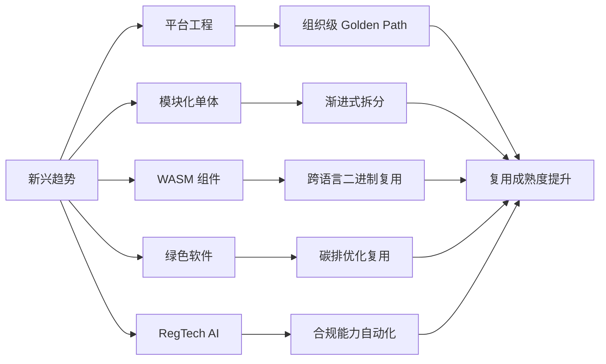

---

## 3. 正向示例

### 示例 1：平台工程 IDP

某电商企业构建内部开发者平台，提供一键创建服务仓库、CI/CD、监控与密钥管理；产品团队上线时间从 2 周缩短到 2 小时，平台使用率达到 90%。

### 示例 2：模块化单体渐进拆分

一个 50 人团队的产品从 Spring Modulith 模块化单体起步，在业务增长后按模块边界平滑拆分为微服务；早期复用模块边界，避免了一次性微服务治理成本。

### 示例 3：WASM 跨语言组件

使用 Rust 实现图像处理组件，编译为 WIT 接口的 WASM 组件；同一二进制在 Node.js、Python 与边缘运行时中复用，无需为每种语言重写核心算法。

### 示例 4：绿色复用降低碳排

复用支持 ARM graceful degradation 的压缩库，在闲时降低 CPU 频率；云账单与碳排同时下降 20%，满足企业 SBTi 目标。

### 示例 5：RegTech AI 合规复用

金融机构将反洗钱规则引擎升级为 RegTech AI 框架，合规检查能力以 Agent 形式被多个业务线复用，审计日志自动生成，合规响应时间从天级降至分钟级。

---

## 4. 反例 / 失败案例

### 反例 1：追逐 WASM 全面重写

某团队将所有服务重写为 WASM 组件，忽视工具链成熟度与团队调试能力；交付延期、故障定位困难，最终回退部分服务。

### 反例 2：平台团队闭门造车

平台团队强制所有团队使用不灵活的模板，忽视开发者反馈；开发者绕过平台自行部署，形成影子基础设施与安全漏洞。

### 反例 3：为微服务而微服务

为追求“弹性”将单体拆分为 200 个微服务，每个服务常驻空闲实例；整体能耗与运维复杂度翻倍，复用收益被稀释。

### 反例 4：绿色清洗式复用

选择旧版本低能效组件冠以“复用减少开发”之名，未评估新硬件与算法能效；碳排不降反升。

### 反例 5：RegTech AI 黑盒化

合规 Agent 的决策过程不可解释，审计无法复现；监管机构要求回退到规则引擎，项目被迫重构。

---

## 5. 趋势适用性矩阵

| 趋势 | 适用组织 | 不适用场景 | 关键成功因素 |
|------|----------|------------|--------------|
| 平台工程 | 多团队、规模化组织 | 团队 < 10 人、无重复需求 | 产品化运营、开发者体验 |
| 模块化单体 | 中小团队、演进式架构 | 已成熟的大规模分布式系统 | 模块边界清晰、编译期隔离 |
| WASM 组件 | 多语言栈、边缘/插件场景 | I/O 密集型、强 OS 依赖 | 工具链、WASI 能力匹配 |
| 绿色软件 | 有 SBTi/ESG 目标的企业 | 无碳排数据基础 | 度量、硬件、算法协同 |
| RegTech AI | 强监管行业 | 规则稳定、低变化场景 | 可解释性、审计、人工复核 |

---

## 6. 权威来源

> **权威来源**：
>
> - [CNCF Platforms White Paper](https://tag-app-delivery.cncf.io/whitepapers/platforms/)
> - [Platform Engineering - Martin Fowler](https://martinfowler.com/articles/platform-engineering-summit.html)
> - [WebAssembly Component Model](https://component-model.bytecodealliance.org)
> - [WASI Preview 2](https://wasi.dev)
> - [Green Software Foundation](https://greensoftware.foundation)
> - [SCI Specification](https://sci.greensoftware.foundation)
> - [Rust Foundation](https://foundation.rust-lang.org)
> - [Spring Modulith](https://spring.io/projects/spring-modulith)
> - 核查日期：2026-07-07

---

## 7. 当前状态与关联主题

- [x] 平台工程成熟度模型 (`01-platform-engineering/`)
- [x] 模块化单体复用分析 (`02-modular-monolith/`)
- [x] WASM Component Model 复用决策树 (`03-webassembly-components/`)
- [x] 绿色软件碳排模型 (`07-green-software/`)
- [x] RegTech AI 复用框架 (`06-regtech-ai/`)
- [ ] RegTech Agentic 架构案例验证 (P2, 2027-Q3)

关联主题：

- `03-application-architecture-reuse`（模块化单体与云原生）
- `04-component-architecture-reuse`（Rust 生态、WASM）
- `09-value-quantification`（平台工程 ROI、绿色 SCI）
- `12-ai-native-reuse`（Agentic Infrastructure、RegTech AI）

## 8. 实施检查单

- [ ] 评估组织成熟度，避免为技术而技术。
- [ ] 选择 1-2 个与真实痛点匹配的新兴趋势进行试点。
- [ ] 建立度量体系，跟踪采纳率、成本、风险与业务价值。
- [ ] 为每个趋势制定退出策略，防止技术锁定。
- [ ] 将可持续性指标纳入复用资产的准入与退役标准。

## 9. 常见误区

- **误区 1：追逐最新技术**。技术应与业务痛点与组织能力匹配。
- **误区 2：平台即控制**。平台应以开发者体验为导向，而非强制。
- **误区 3：模块化单体是倒退**。它是演进式架构的理性选择。
- **误区 4：WASM 适合所有场景**。I/O 密集与强 OS 依赖场景仍需谨慎。
- **误区 5：绿色软件只是采购绿电**。代码效率、架构设计与硬件选择同样关键。

## 10. 一句话总结

> 新兴技术扩展了复用的边界，但技术采纳必须匹配组织成熟度与真实业务痛点；平台工程、模块化、WASM 与绿色软件共同构成 2026 年复用演进的主线。

## 11. 版本记录

- 2026-07-07：补充平台工程、模块化单体、WASM、绿色软件与 RegTech AI 的概念定义、示例、反例、关系图与权威来源。
- 2026-06-08：初始版本，梳理新兴趋势核心文件与状态。

## 12. 深度案例：从单体到模块化单体再到微服务的渐进复用

某 SaaS 公司在创业初期采用单体架构快速验证市场。随着团队扩大到 80 人，部署冲突与代码耦合开始影响交付效率。

演进路径：

1. **模块化单体阶段**：引入 Spring Modulith，将订单、库存、用户等模块在编译期隔离，保持单体部署；团队先复用模块边界与接口契约。
2. **选择性拆分阶段**：当订单模块的变更频率与团队规模超过阈值后，将其拆分为独立服务；由于模块边界已清晰，拆分成本低。
3. **平台工程阶段**：建立 IDP，将部署、监控与安全策略封装为 Golden Path；新服务创建从 2 周缩短到 2 小时。

该案例说明，模块化单体不是微服务的对立面，而是降低演进风险的中间状态。

## 13. 延伸阅读

1. CNCF. *Platforms White Paper* — 平台工程方法论。
2. Martin Fowler. *MonolithFirst* 与 *Platform Engineering* 系列文章。
3. Bytecode Alliance. *WebAssembly Component Model* 规范。
4. Green Software Foundation. *Principles of Green Software Engineering*。
5. Rust Foundation. *The Rust Programming Language* 与 *Rust for Linux* 项目。

## 14. 持续改进方向

- 跟踪 CNCF 平台工程成熟度模型与社区最佳实践。
- 评估 WASI 0.3 对 I/O 密集型场景的支持进展。
- 将绿色软件指标从 SCI 扩展到水足迹、电子废弃物等全生命周期维度。
- 探索 RegTech AI 与 Agentic Governance 的融合框架。

## 15. 关键行动项

- 对当前架构进行模块化评估，识别可作为模块化单体试点的边界。
- 制定平台工程 ROI 模型，明确 IDP 的服务对象与成功指标。
- 在多语言栈场景中评估 WASM 组件的适用性。
- 将碳排指标纳入新建服务的非功能性需求。

## 16. 版本记录补充

- 持续跟踪 CNCF、Bytecode Alliance、Green Software Foundation 与 Rust Foundation 的最新进展，并更新权威来源与核查日期。

## 17. 总结

新兴趋势不是对现有复用框架的替代，而是对其边界与形式的扩展。理性采纳、持续度量与渐进演进，是将趋势转化为可持续复用能力的关键。

## 18. 版本记录补充

- 本 README 将随 Gartner、CNCF 与相关基金会发布的年度报告持续更新。

## 19. 版本记录补充

- 本 README 将持续跟踪平台工程、WASM、绿色软件与 RegTech AI 的最新趋势，并更新示例、反例与权威来源。


---
